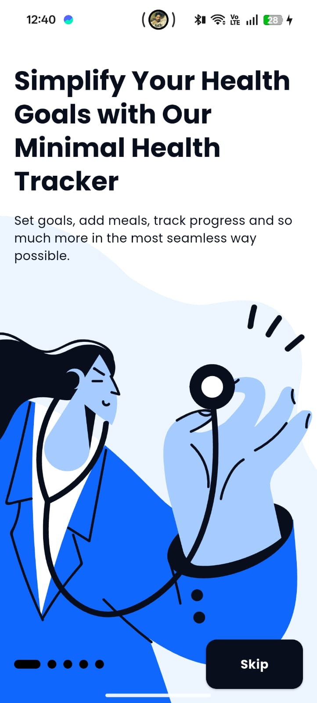
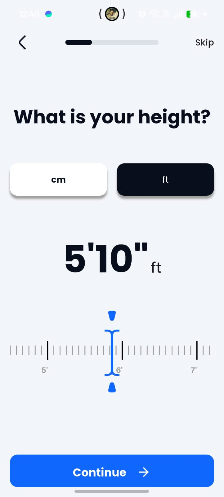
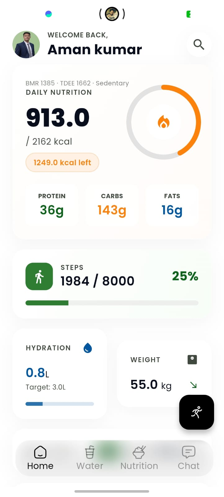
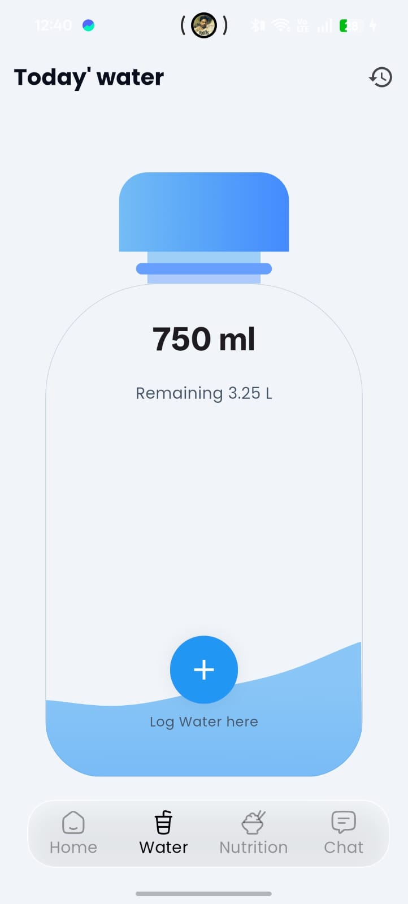
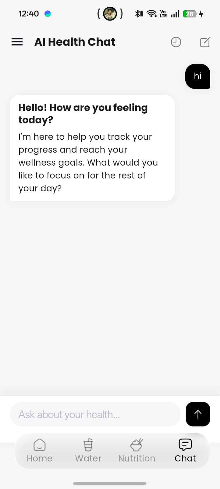
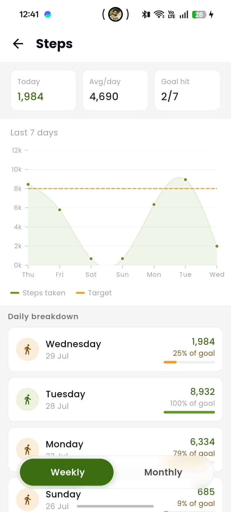
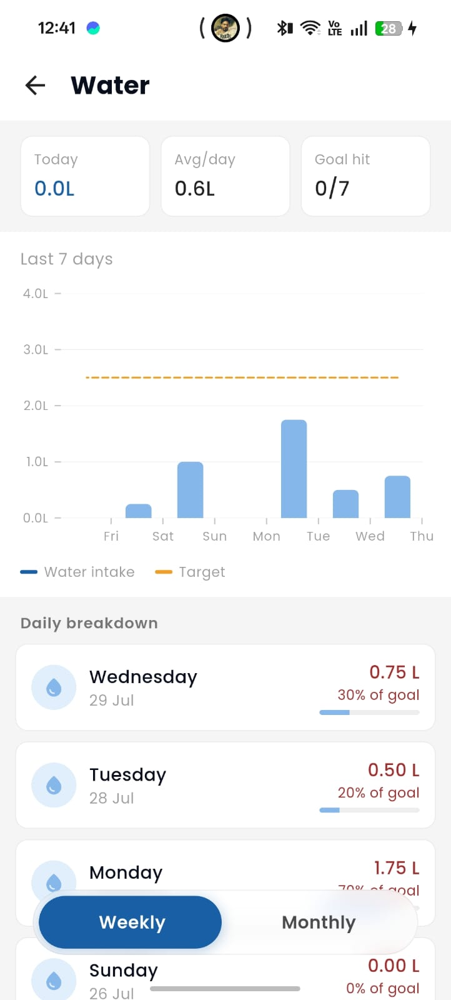
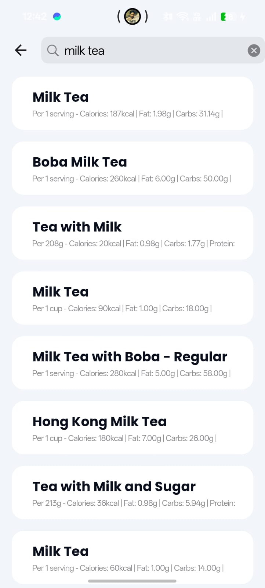
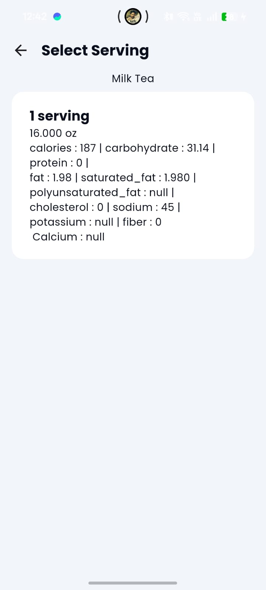

# DOCTO  

### 🩺 Your Comprehensive Health Management App  

aHealth is a Flutter-based application designed to help users take charge of their health. It integrates advanced features like **HealthConnect**, AI-powered nutritional analysis, and seamless syncing with Android and iOS devices. Manage your sleep, steps, water intake, weight, height, and nutrition all in one place, with a user-friendly interface and reliable state management.

---

## 🚀 Features  

- **Health Data Sync:**  
  Sync all your health data with other apps using HealthConnect for Android and iOS.  
- **Sleep Tracking:**  
  Select and manage your sleep sessions with customizable time ranges.  
- **Nutrition Analysis:**  
  Retrieve detailed macronutrient and micronutrient information for foods, with AI-based image recognition to estimate quantity and units.  
- **Activity Monitoring:**  
  Track daily steps, water intake, weight, and height with ease.  
- **Voice Assistant:**(commig soon)  
  Activate the AI assistant by saying, *"Hi Raone"*, and get instant help.  
- **State Management:**  
  Proper state management ensures smooth app performance and data consistency.  

---

## 🛠️ Tech Stack  

- **Frontend:** Flutter   
- **Database:** HIVE, ObjectBox
- **AI Integration:** Google ML Kit  
- **Health Data Integration:** [HealthConnect](https://developer.android.com/guide/health-and-fitness/health-connect)  

---

## 📲 Installation  

1. Clone the repository:  
   git clone https://github.com/your-username/aHealth.git  
   cd aHealth
2. Install dependencies:
    flutter pub get  

3. Add your API keys to the lib/secrets/secrets.dart file.
    const String GEMINI_API_KEY = 'your_api_key_here';  
   Add android/secrets.properties file.
    MAPS_API_KEY=your_google_map_apikey
    
Note: Make sure to exclude this file from Git tracking by adding it to .gitignore.

4. Run the app:
   fvm flutter pub get
   fvm flutter run  

## 🤖 AI Features
  Food Recognition: Use AI to detect nutritional information, including quantities and units like piece, g, or ml.
  Image Processing: Analyze food items from images and calculate micronutrients.

  
## 🔒 Privacy & Permissions
  Access to health data is handled securely, with permissions explicitly requested for each feature.
  The app complies with privacy regulations to ensure your data remains private.
  
## 🛡️ Contributions

We welcome contributions! If you want to improve the app, please:

#Fork the repository.
    Create a new branch:

  git checkout -b feature-name

#Commit changes:

  git commit -m 'Add feature-name'

#Push to the branch:

  git push origin feature-name

#Open a pull request.

## 📸 Screenshots

  
  
  
  
  

  
  
  
  

    
## 📧 Contact

For inquiries, feature requests, or issues, reach out to:

  Name: Aman Kumar
  Email: kumaraman33063@gmail.com

## 🏆 Acknowledgments

  Flutter community for providing an amazing framework.
  HealthConnect for health data integration.
  Google ML Kit for enabling AI features.
  
## Flutter
This project is a starting point for a Flutter application.

A few resources to get you started if this is your first Flutter project:

- [Lab: Write your first Flutter app](https://docs.flutter.dev/get-started/codelab)
- [Cookbook: Useful Flutter samples](https://docs.flutter.dev/cookbook)

For help getting started with Flutter development, view the
[online documentation](https://docs.flutter.dev/), which offers tutorials,
samples, guidance on mobile development, and a full API reference.
