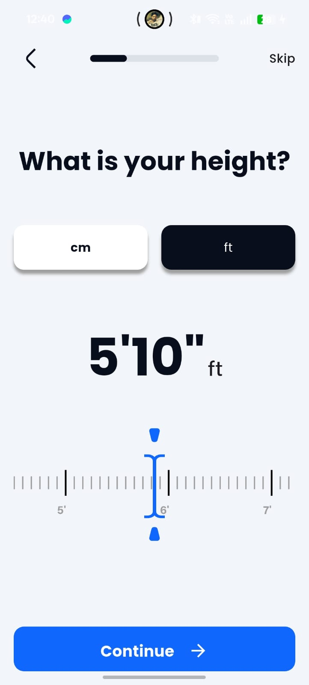
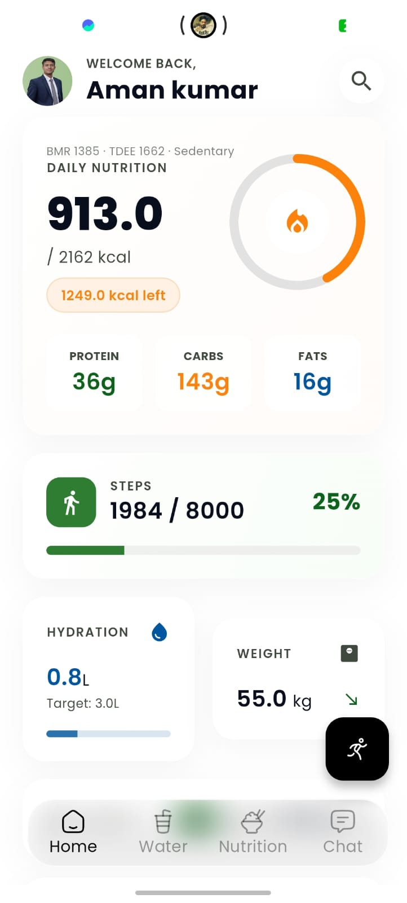
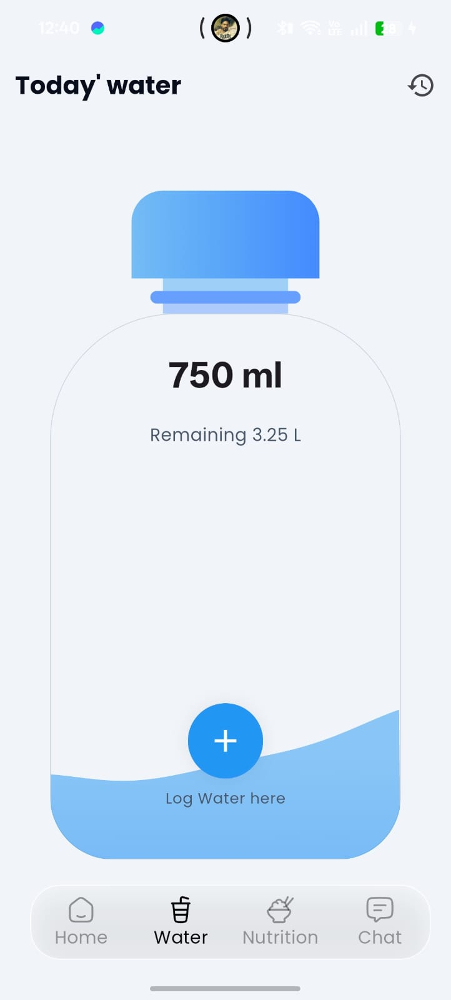
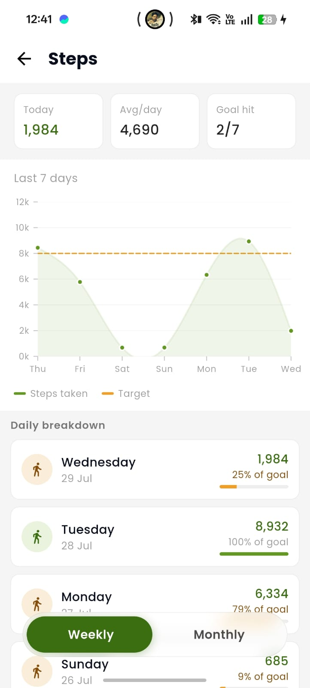
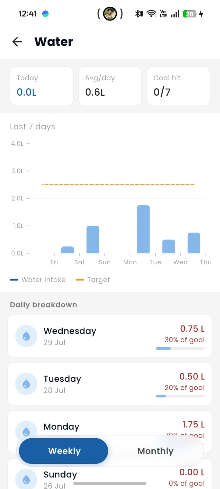
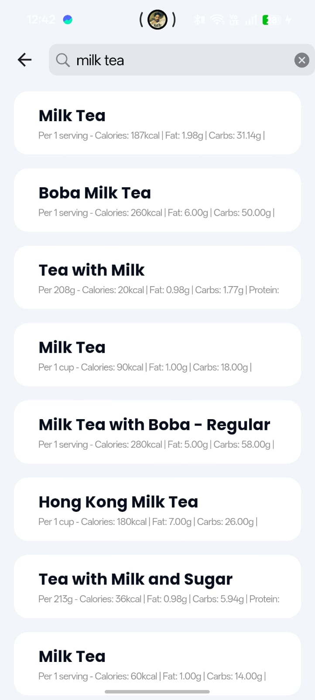
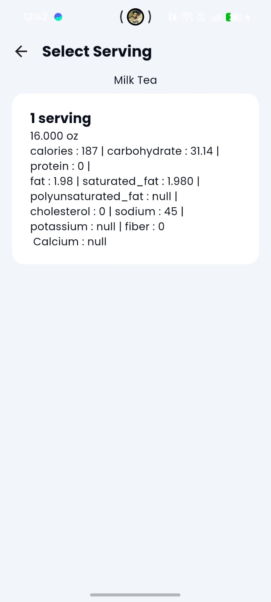

This file is a merged representation of a subset of the codebase, containing files not matching ignore patterns, combined into a single document by Repomix.

# File Summary

## Purpose
This file contains a packed representation of a subset of the repository's contents that is considered the most important context.
It is designed to be easily consumable by AI systems for analysis, code review,
or other automated processes.

## File Format
The content is organized as follows:
1. This summary section
2. Repository information
3. Directory structure
4. Repository files (if enabled)
5. Multiple file entries, each consisting of:
  a. A header with the file path (## File: path/to/file)
  b. The full contents of the file in a code block

## Usage Guidelines
- This file should be treated as read-only. Any changes should be made to the
  original repository files, not this packed version.
- When processing this file, use the file path to distinguish
  between different files in the repository.
- Be aware that this file may contain sensitive information. Handle it with
  the same level of security as you would the original repository.

## Notes
- Some files may have been excluded based on .gitignore rules and Repomix's configuration
- Binary files are not included in this packed representation. Please refer to the Repository Structure section for a complete list of file paths, including binary files
- Files matching these patterns are excluded: assets/**, **/pubspec.lock, ios/Pods/**, ios/Runner.xcodeproj/**, ios/Runner.xcworkspace/**, graphify-out/cache/**, .fvm/**, .agents/**, android/secrets.properties, lib/secrets/secrets.dart
- Files matching patterns in .gitignore are excluded
- Files matching default ignore patterns are excluded
- Files are sorted by Git change count (files with more changes are at the bottom)

# Directory Structure
```
.github/
  workflows/
    main.yml
android/
  app/
    src/
      debug/
        AndroidManifest.xml
      main/
        kotlin/
          dev/
            raone/
              ahealth/
                MainActivity.kt
        res/
          drawable/
            launch_background.xml
          drawable-v21/
            launch_background.xml
          mipmap-anydpi-v26/
            ic_launcher_round.xml
            ic_launcher.xml
          mipmap-hdpi/
            ic_launcher_foreground.webp
            ic_launcher_round.webp
            ic_launcher.webp
          mipmap-mdpi/
            ic_launcher_foreground.webp
            ic_launcher_round.webp
            ic_launcher.webp
          mipmap-xhdpi/
            ic_launcher_foreground.webp
            ic_launcher_round.webp
            ic_launcher.webp
          mipmap-xxhdpi/
            ic_launcher_foreground.webp
            ic_launcher_round.webp
            ic_launcher.webp
          mipmap-xxxhdpi/
            ic_launcher_foreground.webp
            ic_launcher_round.webp
            ic_launcher.webp
          values/
            ic_launcher_background.xml
            styles.xml
          values-night/
            styles.xml
        AndroidManifest.xml
        ic_launcher-playstore.png
      profile/
        AndroidManifest.xml
    build.gradle.kts
  gradle/
    wrapper/
      gradle-wrapper.properties
  .gitignore
  build.gradle.kts
  gradle.properties
  settings.gradle.kts
graphify-out/
  .graphify_labels.json
  .graphify_python
  .graphify_root
  cost.json
  GRAPH_REPORT.md
  graph.html
  graph.json
  manifest.json
ios/
  Flutter/
    AppFrameworkInfo.plist
    Debug.xcconfig
    Release.xcconfig
  Runner/
    Assets.xcassets/
      AppIcon.appiconset/
        aHealth_logo 1.png
        aHealth_logo 2.png
        aHealth_logo.png
        Contents.json
      LaunchImage.imageset/
        Contents.json
        LaunchImage.png
        LaunchImage@2x.png
        LaunchImage@3x.png
        README.md
      Contents.json
    Base.lproj/
      LaunchScreen.storyboard
      Main.storyboard
    AppDelegate.swift
    Info.plist
    Runner-Bridging-Header.h
    Runner.entitlements
    SceneDelegate.swift
  RunnerTests/
    RunnerTests.swift
  .gitignore
  Podfile
  Podfile.lock
lib/
  blocs/
    charts/
      calorie_chart/
        calorie_chart_cubit.dart
        calorie_chart_state.dart
        calorie_point.dart
      height_chart/
        height_chart_cubit.dart
        height_chart_state.dart
      nutrient_chart/
        nutrient_chart_cubit.dart
        nutrient_chart_state.dart
      sleep_chart/
        sleep_chart_cubit.dart
        sleep_chart_state.dart
      step_chart/
        step_chart_cubit.dart
        step_chart_state.dart
      water_chart/
        water_chart_cubit.dart
        water_chart_state.dart
      weight_chart/
        weight_chart_cubit.dart
        weight_chart_state.dart
    chat/
      chat_cubit.dart
      chat_state.dart
    food_scan/
      food_scan_cubit.dart
      food_scan_state.dart
    food_search/
      food_search_cubit.dart
      food_search_state.dart
    fooddetail/
      food_detail_cubit.dart
      food_detail_state.dart
    height/
      height_cubit.dart
      height_state.dart
    initialized/
      init_app_cubit.dart
      init_app_state.dart
    nutrition/
      nutrition_cubit.dart
      nutrition_state.dart
    sleep/
      sleep_cubit.dart
      sleep_state.dart
    step/
      step_cubit.dart
      step_state.dart
    water/
      water_cubit.dart
      water_state.dart
    weight/
      weight_cubit.dart
      weight_state.dart
  common/
    common_method.dart
    spring_button_widget.dart
  config/
    appconstants.dart
    appenums.dart
    common_method.dart
  core/
    database/
      app_database.dart
    di/
      service_locator.dart
  features/
    progress_photos/
      data/
        repositories/
          progress_local_db.dart
          progress_repository.dart
      domain/
        entities/
          progress_entry.dart
      presentation/
        bloc/
          progress_bloc.dart
          progress_event.dart
          progress_state.dart
        screens/
          add_edit_entry_screen.dart
          progress_photos_screen.dart
        widgets/
          monthly_collage.dart
          progress_card.dart
          weight_chart.dart
    step_tracking/
      data/
        datasources/
          tracking_local_datasource.dart
        models/
          activity_model.dart
          location_point_model.dart
        repositories/
          tracking_repository_impl.dart
      domain/
        entities/
          activity.dart
          location_point.dart
        repositories/
          tracking_repository.dart
        usecases/
          calculate_distance.dart
          get_activities.dart
          get_location_stream.dart
          save_activity.dart
      presentation/
        viewmodels/
          tracking_cubit.dart
          tracking_state.dart
        views/
          widgets/
            journey_share_card.dart
            marker.dart
          tracking_history_view.dart
          tracking_view.dart
    streak/
      data/
        datasources/
          streak_local_datasource.dart
        models/
          streak_model.dart
        repositories/
          streak_repository_impl.dart
      domain/
        entities/
          streak_entity.dart
        repositories/
          streak_repository.dart
        usecases/
          get_streak_usecase.dart
          log_activity_usecase.dart
      presentation/
        cubit/
          streak_cubit.dart
          streak_state.dart
        screens/
          streak_screen.dart
  helper/
    helper_func.dart
    model_router.dart
  models/
    chat/
      chat_message_model.dart
      chat_message_model.g.dart
      chat_session_model.dart
      chat_session_model.g.dart
    food_search_model.dart
    food_search_model.g.dart
    food_with_servings_model.dart
    food_with_servings_model.g.dart
    height_model.dart
    nutrition_model.dart
    sleep_model.dart
    step_model.dart
    value_model.dart
    water_model.dart
    weightmodel.dart
  presentation/
    chat/
      chat.dart
    common/
      widgets/
        custom_segment.dart
      camera_view.dart
      nutrition_calc.dart
    home/
      widget/
        height_card.dart
        hydration_card.dart
        nutrition_card.dart
        sleep_card.dart
        step_card.dart
        weight_card.dart
      home_widget.dart
    nutririon/
      nutrition_group/
        models/
          food_scan_group_model.dart
          food_scan_group_model.g.dart
      widgets/
        build_card_content.dart
        calorie_line_chart.dart
        card_shell.dart
        circular_progress.dart
        food_image.dart
        food_scan_nutrition_loading.dart
        food_voice_input_sheet.dart
        macro_card.dart
        macro_chip.dart
        nutrient_line_chart.dart
        nutrient_point.dart
        nutrition_card_summary.dart
        nutrition_group_dialog.dart
      calorie_chart_screen.dart
      food_scan_result_screen.dart
      fooddetailscreen.dart
      nitritiondetailscreen.dart
      nutrient_chart_screen.dart
      nutrition.dart
    onboarding/
      getstartingscreen.dart
      onboardingscreen.dart
      permissionerror.dart
      sdk_error.dart
    profileinfo/
      activity_factor.dart
      health_detail.dart
      rularslider.dart
    sleep/
      sleep_picker.dart
    steps/
      widgets/
        day_list_tile.dart
        legend_dot.dart
        step_line_chart.dart
        step_point.dart
        summary_cards.dart
        week_list_tile.dart
      monthly_tab.dart
      step_chart_screen.dart
      weekly_tab.dart
    water/
      charts/
        widgets/
          water_bar.dart
          water_day_tile.dart
          water_legend_dot.dart
          water_point.dart
          water_week_summary.dart
          water_week_tile.dart
          week_summary.dart
        water_chart_screen.dart
        water_month_tab.dart
        water_week_tab.dart
      widgets/
        water_summary_card.dart
      water.dart
    home.dart
    searchscreen.dart
  services/
    chat_hive_service.dart
    notification_services.dart
    nutrition_service.dart
  app_routes.dart
  appcolors.dart
  apptheme.dart
  constants.dart
  main.dart
  utils.dart
screenshots/
  1.png
  2.png
  3.png
  4.png
  5.png
  6.png
  7.png
  8.png
  9.png
test/
  widget_test.dart
.fvmrc
.gitignore
.metadata
analysis_options.yaml
devtools_options.yaml
pubspec.yaml
README.md
repomix-output.xml
```

# Files

## File: android/app/src/debug/AndroidManifest.xml
```xml
<manifest xmlns:android="http://schemas.android.com/apk/res/android">
    <!-- The INTERNET permission is required for development. Specifically,
         the Flutter tool needs it to communicate with the running application
         to allow setting breakpoints, to provide hot reload, etc.
    -->
    <uses-permission android:name="android.permission.INTERNET"/>
</manifest>
```

## File: android/app/src/main/res/drawable-v21/launch_background.xml
```xml
<?xml version="1.0" encoding="utf-8"?>
<!-- Modify this file to customize your launch splash screen -->
<layer-list xmlns:android="http://schemas.android.com/apk/res/android">
    <item android:drawable="?android:colorBackground" />

    <!-- You can insert your own image assets here -->
    <!-- <item>
        <bitmap
            android:gravity="center"
            android:src="@mipmap/launch_image" />
    </item> -->
</layer-list>
```

## File: android/app/src/main/res/values-night/styles.xml
```xml
<?xml version="1.0" encoding="utf-8"?>
<resources>
    <!-- Theme applied to the Android Window while the process is starting when the OS's Dark Mode setting is on -->
    <style name="LaunchTheme" parent="@android:style/Theme.Black.NoTitleBar">
        <!-- Show a splash screen on the activity. Automatically removed when
             the Flutter engine draws its first frame -->
        <item name="android:windowBackground">@drawable/launch_background</item>
    </style>
    <!-- Theme applied to the Android Window as soon as the process has started.
         This theme determines the color of the Android Window while your
         Flutter UI initializes, as well as behind your Flutter UI while its
         running.

         This Theme is only used starting with V2 of Flutter's Android embedding. -->
    <style name="NormalTheme" parent="@android:style/Theme.Black.NoTitleBar">
        <item name="android:windowBackground">?android:colorBackground</item>
    </style>
</resources>
```

## File: android/app/src/profile/AndroidManifest.xml
```xml
<manifest xmlns:android="http://schemas.android.com/apk/res/android">
    <!-- The INTERNET permission is required for development. Specifically,
         the Flutter tool needs it to communicate with the running application
         to allow setting breakpoints, to provide hot reload, etc.
    -->
    <uses-permission android:name="android.permission.INTERNET"/>
</manifest>
```

## File: ios/Runner/Assets.xcassets/LaunchImage.imageset/Contents.json
```json
{
  "images" : [
    {
      "idiom" : "universal",
      "filename" : "LaunchImage.png",
      "scale" : "1x"
    },
    {
      "idiom" : "universal",
      "filename" : "LaunchImage@2x.png",
      "scale" : "2x"
    },
    {
      "idiom" : "universal",
      "filename" : "LaunchImage@3x.png",
      "scale" : "3x"
    }
  ],
  "info" : {
    "version" : 1,
    "author" : "xcode"
  }
}
```

## File: ios/Runner/Assets.xcassets/LaunchImage.imageset/README.md
```markdown
# Launch Screen Assets

You can customize the launch screen with your own desired assets by replacing the image files in this directory.

You can also do it by opening your Flutter project's Xcode project with `open ios/Runner.xcworkspace`, selecting `Runner/Assets.xcassets` in the Project Navigator and dropping in the desired images.
```

## File: ios/Runner/Base.lproj/LaunchScreen.storyboard
```
<?xml version="1.0" encoding="UTF-8" standalone="no"?>
<document type="com.apple.InterfaceBuilder3.CocoaTouch.Storyboard.XIB" version="3.0" toolsVersion="12121" systemVersion="16G29" targetRuntime="iOS.CocoaTouch" propertyAccessControl="none" useAutolayout="YES" launchScreen="YES" colorMatched="YES" initialViewController="01J-lp-oVM">
    <dependencies>
        <deployment identifier="iOS"/>
        <plugIn identifier="com.apple.InterfaceBuilder.IBCocoaTouchPlugin" version="12089"/>
    </dependencies>
    <scenes>
        <!--View Controller-->
        <scene sceneID="EHf-IW-A2E">
            <objects>
                <viewController id="01J-lp-oVM" sceneMemberID="viewController">
                    <layoutGuides>
                        <viewControllerLayoutGuide type="top" id="Ydg-fD-yQy"/>
                        <viewControllerLayoutGuide type="bottom" id="xbc-2k-c8Z"/>
                    </layoutGuides>
                    <view key="view" contentMode="scaleToFill" id="Ze5-6b-2t3">
                        <autoresizingMask key="autoresizingMask" widthSizable="YES" heightSizable="YES"/>
                        <subviews>
                            <imageView opaque="NO" clipsSubviews="YES" multipleTouchEnabled="YES" contentMode="center" image="LaunchImage" translatesAutoresizingMaskIntoConstraints="NO" id="YRO-k0-Ey4">
                            </imageView>
                        </subviews>
                        <color key="backgroundColor" red="1" green="1" blue="1" alpha="1" colorSpace="custom" customColorSpace="sRGB"/>
                        <constraints>
                            <constraint firstItem="YRO-k0-Ey4" firstAttribute="centerX" secondItem="Ze5-6b-2t3" secondAttribute="centerX" id="1a2-6s-vTC"/>
                            <constraint firstItem="YRO-k0-Ey4" firstAttribute="centerY" secondItem="Ze5-6b-2t3" secondAttribute="centerY" id="4X2-HB-R7a"/>
                        </constraints>
                    </view>
                </viewController>
                <placeholder placeholderIdentifier="IBFirstResponder" id="iYj-Kq-Ea1" userLabel="First Responder" sceneMemberID="firstResponder"/>
            </objects>
            <point key="canvasLocation" x="53" y="375"/>
        </scene>
    </scenes>
    <resources>
        <image name="LaunchImage" width="168" height="185"/>
    </resources>
</document>
```

## File: ios/Runner/Runner-Bridging-Header.h
```c
#import "GeneratedPluginRegistrant.h"
```

## File: ios/RunnerTests/RunnerTests.swift
```swift
import Flutter
import UIKit
import XCTest

class RunnerTests: XCTestCase {

  func testExample() {
    // If you add code to the Runner application, consider adding tests here.
    // See https://developer.apple.com/documentation/xctest for more information about using XCTest.
  }

}
```

## File: ios/.gitignore
```
**/dgph
*.mode1v3
*.mode2v3
*.moved-aside
*.pbxuser
*.perspectivev3
**/*sync/
.sconsign.dblite
.tags*
**/.vagrant/
**/DerivedData/
Icon?
**/Pods/
**/.symlinks/
profile
xcuserdata
**/.generated/
Flutter/App.framework
Flutter/Flutter.framework
Flutter/Flutter.podspec
Flutter/Generated.xcconfig
Flutter/ephemeral/
Flutter/app.flx
Flutter/app.zip
Flutter/flutter_assets/
Flutter/flutter_export_environment.sh
ServiceDefinitions.json
Runner/GeneratedPluginRegistrant.*

# Exceptions to above rules.
!default.mode1v3
!default.mode2v3
!default.pbxuser
!default.perspectivev3
```

## File: lib/blocs/charts/height_chart/height_chart_cubit.dart
```dart
import 'dart:developer';

import 'package:bloc/bloc.dart';
import 'package:equatable/equatable.dart';
import 'package:health/health.dart';

import '../../../config/common_method.dart';

part 'height_chart_state.dart';

class HeightChartCubit extends Cubit<HeightChartState> {
  HeightChartCubit() : super(HeightChartsLoading());

  Future<void> getDataFromNow()async{
    if (state is HeightChartsSuccess) {
      log('Week data is already loaded. Skipping execution.');
      return;
    }

    emit(HeightChartsLoading());
    List<double> dataWeek = [];
    for (var i = 0; i < 7; i++) {
      double total = await getDataForDay(
        date: DateTime.now().subtract(const Duration(days: 7)).add(Duration(days: i)),
        healthType: HealthDataType.HEIGHT,
      );
      dataWeek.add(total);
    }
    emit(HeightChartsSuccess(dataWeek: dataWeek,dataMonth: const []));


    List<double> dataMonth = [];
    for (var i = 0; i < 30; i++) {
      double total = await getDataForDay(
        date: DateTime.now().subtract(const Duration(days: 30)).add(Duration(days: i)),
        healthType: HealthDataType.HEIGHT,
      );
      dataMonth.add(total);
    }
    emit(HeightChartsSuccess(dataWeek: dataWeek,dataMonth: dataMonth));
  }
}
```

## File: lib/blocs/charts/height_chart/height_chart_state.dart
```dart
part of 'height_chart_cubit.dart';

sealed class HeightChartState extends Equatable {
  const HeightChartState();
}


final class HeightChartsLoading extends HeightChartState{
  @override
  List<Object?> get props => [];
}

final class HeightChartsFailed extends HeightChartState{
  final String errorMessage;
  const HeightChartsFailed({required this.errorMessage});
  @override
  List<Object?> get props => [errorMessage];
}

final class HeightChartsSuccess extends HeightChartState{
  final List<double> dataWeek;
  final List<double> dataMonth;

  const HeightChartsSuccess({required this.dataWeek,required this.dataMonth});
  @override
  List<Object?> get props => [dataWeek,dataMonth];
}
```

## File: lib/blocs/charts/sleep_chart/sleep_chart_cubit.dart
```dart
import 'dart:developer';

import 'package:bloc/bloc.dart';
import 'package:equatable/equatable.dart';
import 'package:health/health.dart';

import '../../../config/common_method.dart';

part 'sleep_chart_state.dart';

class SleepChartCubit extends Cubit<SleepChartState> {
  SleepChartCubit() : super(SleepChartsLoading());

  Future<void> getDataFromNow()async{
    if (state is SleepChartsSuccess) {
      log('Week data is already loaded. Skipping execution.');
      return;
    }

    emit(SleepChartsLoading());
    List<double> dataWeek = [];
    for (var i = 0; i < 7; i++) {
      double total = await getDataForDay(
        date: DateTime.now().subtract(const Duration(days: 7)).add(Duration(days: i)),
        healthType: HealthDataType.SLEEP_SESSION,
      );
      dataWeek.add(total);
    }
    emit(SleepChartsSuccess(dataWeek: dataWeek,dataMonth: const []));

    List<double> dataMonth = [];
    for (var i = 0; i < 30; i++) {
      double total = await getDataForDay(
        date: DateTime.now().subtract(const Duration(days: 30)).add(Duration(days: i)),
        healthType: HealthDataType.SLEEP_SESSION,
      );
      dataMonth.add(total);
    }
    emit(SleepChartsSuccess(dataWeek: dataWeek,dataMonth: dataMonth));
  }
}
```

## File: lib/blocs/charts/sleep_chart/sleep_chart_state.dart
```dart
part of 'sleep_chart_cubit.dart';

sealed class SleepChartState extends Equatable {
  const SleepChartState();
}
final class SleepChartsLoading extends SleepChartState{
  @override
  List<Object?> get props => [];
}

final class SleepChartsFailed extends SleepChartState{
  final String errorMessage;
  const SleepChartsFailed({required this.errorMessage});
  @override
  List<Object?> get props => [errorMessage];
}

final class SleepChartsSuccess extends SleepChartState{
  final List<double> dataWeek;
  final List<double> dataMonth;

  const SleepChartsSuccess({required this.dataWeek,required this.dataMonth});
  @override
  List<Object?> get props => [dataWeek,dataMonth];
}
```

## File: lib/blocs/charts/weight_chart/weight_chart_cubit.dart
```dart
import 'dart:developer';

import 'package:bloc/bloc.dart';
import 'package:equatable/equatable.dart';
import 'package:health/health.dart';

import '../../../config/common_method.dart';


part 'weight_chart_state.dart';

class WeightChartCubit extends Cubit<WeightChartState> {
  WeightChartCubit() : super(WeightChartsLoading());

  Future<void> getDataFromNow()async{
    if (state is WeightChartsSuccess) {
      log('Week data is already loaded. Skipping execution.');
      return;
    }

    emit(WeightChartsLoading());
    List<double> dataWeek = [];
    for (var i = 0; i < 7; i++) {
      double total = await getDataForDay(
        date: DateTime.now().subtract(const Duration(days: 7)).add(Duration(days: i)),
        healthType: HealthDataType.WEIGHT,
      );
      dataWeek.add(total);
    }
    emit(WeightChartsSuccess(dataWeek: dataWeek,dataMonth: []));

    List<double> dataMonth = [];
    for (var i = 0; i < 30; i++) {
      double total = await getDataForDay(
        date: DateTime.now().subtract(const Duration(days: 30)).add(Duration(days: i)),
        healthType: HealthDataType.WEIGHT,
      );
      dataMonth.add(total);
    }
    emit(WeightChartsSuccess(dataWeek: dataWeek,dataMonth: dataMonth));
  }
}
```

## File: lib/blocs/charts/weight_chart/weight_chart_state.dart
```dart
part of 'weight_chart_cubit.dart';

sealed class WeightChartState extends Equatable {
  const WeightChartState();
}


final class WeightChartsLoading extends WeightChartState{
  @override
  List<Object?> get props => [];
}

final class WeightChartsFailed extends WeightChartState{
  final String errorMessage;
  const WeightChartsFailed({required this.errorMessage});
  @override
  List<Object?> get props => [errorMessage];
}

final class WeightChartsSuccess extends WeightChartState{
  final List<double> dataWeek;
  final List<double> dataMonth;

  const WeightChartsSuccess({required this.dataWeek,required this.dataMonth});
  @override
  List<Object?> get props => [dataWeek,dataMonth];
}
```

## File: lib/blocs/fooddetail/food_detail_state.dart
```dart
part of 'food_detail_cubit.dart';

sealed class FoodDetailState extends Equatable {
  const FoodDetailState();
}
///initialState
final class FoodDetailInitial extends FoodDetailState {
  @override
  List<Object> get props => [];
}

///loading state
final class FoodDetailLoading extends FoodDetailState {
  @override
  List<Object> get props => [];
}

///failed state
final class FoodDetailFailed extends FoodDetailState {
  final String errorMessage;

  const FoodDetailFailed({required this.errorMessage});
  @override
  List<Object> get props => [];
}


///success state
final class FoodDetailSuccess extends FoodDetailState {
  final FoodWithServingsModel foodWithServingsModel;

  const FoodDetailSuccess({required this.foodWithServingsModel});
  @override
  List<Object> get props => [foodWithServingsModel];
}
```

## File: lib/blocs/height/height_state.dart
```dart
part of 'height_cubit.dart';

sealed class HeightState extends Equatable {
  const HeightState();
}

final class HeightLoading extends HeightState {
  @override
  List<Object> get props => [];
}

final class HeightFailed extends HeightState{
  final String errorMessage;
  const HeightFailed({required this.errorMessage});
  @override
  List<Object?> get props => [];
}

final class HeightSuccess extends HeightState{
  final List<HeightModel> heightModel;
  const HeightSuccess({required this.heightModel});
  @override
  List<Object?> get props => [];
}
```

## File: lib/blocs/initialized/init_app_state.dart
```dart
part of 'init_app_cubit.dart';

sealed class InitAppState extends Equatable {
  const InitAppState();
}

final class InitAppLoading extends InitAppState{
  @override
  List<Object?> get props => [];
}

final class InitAppSuccess extends InitAppState{
  @override
  List<Object?> get props => [];
}

final class InitAppFailed extends InitAppState{
  @override
  List<Object?> get props => [];
}

final class InitAppSdkUnavailable extends InitAppState{
  @override
  List<Object?> get props => [];
}

final class InitAppPermissionNotAvailable extends InitAppState{
  @override
  List<Object?> get props => [];

}
```

## File: lib/blocs/sleep/sleep_state.dart
```dart
part of 'sleep_cubit.dart';

sealed class SleepState extends Equatable {
  const SleepState();
}

//loading State
final class SleepLoadingState extends SleepState{
  @override
  List<Object?> get props => [];
}

//success state
final class SleepSuccessState extends SleepState{
  final List<SleepModel> sleepModel;
  const SleepSuccessState({required this.sleepModel});
  @override
  List<Object?> get props =>[sleepModel];
}

//failed state
final class SleepFailedState extends SleepState{
  final String errorMessage;
  const SleepFailedState({required this.errorMessage});
  @override
  List<Object?> get props => [errorMessage];
}
```

## File: lib/blocs/step/step_state.dart
```dart
part of 'step_cubit.dart';

sealed class StepsState extends Equatable {
  const StepsState();
}

final class StepLoadingState extends StepsState {
  @override
  List<Object> get props => [];
}

final class StepFailed extends StepsState {
  final String errorMessage;

  const StepFailed({required this.errorMessage});
  @override
  List<Object> get props => [errorMessage];
}

final class StepSuccessState extends StepsState {
  final List<StepModel> stepModel;

  const StepSuccessState({required this.stepModel});
  @override
  List<Object> get props => [stepModel];
}
```

## File: lib/blocs/water/water_state.dart
```dart
part of 'water_cubit.dart';

sealed class WaterState extends Equatable {
  const WaterState();
}

//loading State
final class WaterLoadingState extends WaterState{
  @override
  List<Object?> get props => [];
}

//success state
final class WaterSuccessState extends WaterState{
  final List<WaterModel> waterModel;
  const WaterSuccessState({required this.waterModel});
  @override
  List<Object?> get props =>[waterModel];

}

//failed state
final class WaterFailed extends WaterState{
  final String errorMessage;
  const WaterFailed({required this.errorMessage});
  @override
  List<Object?> get props => [errorMessage];
}
```

## File: lib/blocs/weight/weight_state.dart
```dart
part of 'weight_cubit.dart';

sealed class WeightState extends Equatable {
  const WeightState();
}

final class WeightLoading extends WeightState {
  @override
  List<Object> get props => [];
}

final class WeightFailed extends WeightState {
  final String errorMessage;

  const WeightFailed({required this.errorMessage});
  @override
  List<Object> get props => [errorMessage];
}

final class WeightSuccess extends WeightState {
  final List<WeightModel> weightModel;

  const WeightSuccess({required this.weightModel});
  @override
  List<Object> get props => [weightModel];
}
```

## File: lib/config/appconstants.dart
```dart
//hive location
const String searchFoodLocationHive = "searchFoods";
const String foodDetailLocationHive = "foodDetails";
```

## File: lib/config/appenums.dart
```dart
enum HealthType {
  sleep,
  nutrition,
  water,
  weight,
  height,
  step,
  workout,
}
```

## File: lib/models/chat/chat_session_model.dart
```dart
import 'package:hive/hive.dart';

part 'chat_session_model.g.dart';

@HiveType(typeId: 11)
class ChatSession extends HiveObject {
  @HiveField(0)
  final String id;

  @HiveField(1)
  String title;

  @HiveField(2)
  final DateTime createdAt;

  ChatSession({
    required this.id,
    required this.title,
    required this.createdAt,
  });
}
```

## File: lib/models/chat/chat_session_model.g.dart
```dart
// GENERATED CODE - DO NOT MODIFY BY HAND

part of 'chat_session_model.dart';

// **************************************************************************
// TypeAdapterGenerator
// **************************************************************************

class ChatSessionAdapter extends TypeAdapter<ChatSession> {
  @override
  final int typeId = 11;

  @override
  ChatSession read(BinaryReader reader) {
    final numOfFields = reader.readByte();
    final fields = <int, dynamic>{
      for (int i = 0; i < numOfFields; i++) reader.readByte(): reader.read(),
    };
    return ChatSession(
      id: fields[0] as String,
      title: fields[1] as String,
      createdAt: fields[2] as DateTime,
    );
  }

  @override
  void write(BinaryWriter writer, ChatSession obj) {
    writer
      ..writeByte(3)
      ..writeByte(0)
      ..write(obj.id)
      ..writeByte(1)
      ..write(obj.title)
      ..writeByte(2)
      ..write(obj.createdAt);
  }

  @override
  int get hashCode => typeId.hashCode;

  @override
  bool operator ==(Object other) =>
      identical(this, other) ||
      other is ChatSessionAdapter &&
          runtimeType == other.runtimeType &&
          typeId == other.typeId;
}
```

## File: lib/models/food_search_model.g.dart
```dart
// GENERATED CODE - DO NOT MODIFY BY HAND

part of 'food_search_model.dart';

// **************************************************************************
// TypeAdapterGenerator
// **************************************************************************

class FoodsAdapter extends TypeAdapter<Foods> {
  @override
  final int typeId = 1;

  @override
  Foods read(BinaryReader reader) {
    final numOfFields = reader.readByte();
    final fields = <int, dynamic>{
      for (int i = 0; i < numOfFields; i++) reader.readByte(): reader.read(),
    };
    return Foods(
      foodName: fields[0] as String?,
      foodType: fields[1] as String?,
      foodDescription: fields[2] as String?,
      foodId: fields[3] as String?,
      foodUrl: fields[4] as String?,
    );
  }

  @override
  void write(BinaryWriter writer, Foods obj) {
    writer
      ..writeByte(5)
      ..writeByte(0)
      ..write(obj.foodName)
      ..writeByte(1)
      ..write(obj.foodType)
      ..writeByte(2)
      ..write(obj.foodDescription)
      ..writeByte(3)
      ..write(obj.foodId)
      ..writeByte(4)
      ..write(obj.foodUrl);
  }

  @override
  int get hashCode => typeId.hashCode;

  @override
  bool operator ==(Object other) =>
      identical(this, other) ||
      other is FoodsAdapter &&
          runtimeType == other.runtimeType &&
          typeId == other.typeId;
}
```

## File: lib/models/food_with_servings_model.g.dart
```dart
// GENERATED CODE - DO NOT MODIFY BY HAND

part of 'food_with_servings_model.dart';

// **************************************************************************
// TypeAdapterGenerator
// **************************************************************************

class FoodWithServingsModelAdapter extends TypeAdapter<FoodWithServingsModel> {
  @override
  final int typeId = 2;

  @override
  FoodWithServingsModel read(BinaryReader reader) {
    final numOfFields = reader.readByte();
    final fields = <int, dynamic>{
      for (int i = 0; i < numOfFields; i++) reader.readByte(): reader.read(),
    };
    return FoodWithServingsModel(
      food: fields[0] as Food?,
    );
  }

  @override
  void write(BinaryWriter writer, FoodWithServingsModel obj) {
    writer
      ..writeByte(1)
      ..writeByte(0)
      ..write(obj.food);
  }

  @override
  int get hashCode => typeId.hashCode;

  @override
  bool operator ==(Object other) =>
      identical(this, other) ||
      other is FoodWithServingsModelAdapter &&
          runtimeType == other.runtimeType &&
          typeId == other.typeId;
}

class FoodAdapter extends TypeAdapter<Food> {
  @override
  final int typeId = 3;

  @override
  Food read(BinaryReader reader) {
    final numOfFields = reader.readByte();
    final fields = <int, dynamic>{
      for (int i = 0; i < numOfFields; i++) reader.readByte(): reader.read(),
    };
    return Food(
      foodId: fields[0] as String?,
      foodName: fields[1] as String?,
      foodType: fields[2] as String?,
      foodUrl: fields[3] as String?,
      servings: fields[4] as Servings?,
    );
  }

  @override
  void write(BinaryWriter writer, Food obj) {
    writer
      ..writeByte(5)
      ..writeByte(0)
      ..write(obj.foodId)
      ..writeByte(1)
      ..write(obj.foodName)
      ..writeByte(2)
      ..write(obj.foodType)
      ..writeByte(3)
      ..write(obj.foodUrl)
      ..writeByte(4)
      ..write(obj.servings);
  }

  @override
  int get hashCode => typeId.hashCode;

  @override
  bool operator ==(Object other) =>
      identical(this, other) ||
      other is FoodAdapter &&
          runtimeType == other.runtimeType &&
          typeId == other.typeId;
}

class ServingsAdapter extends TypeAdapter<Servings> {
  @override
  final int typeId = 4;

  @override
  Servings read(BinaryReader reader) {
    final numOfFields = reader.readByte();
    final fields = <int, dynamic>{
      for (int i = 0; i < numOfFields; i++) reader.readByte(): reader.read(),
    };
    return Servings(
      serving: (fields[0] as List?)?.cast<Serving>(),
    );
  }

  @override
  void write(BinaryWriter writer, Servings obj) {
    writer
      ..writeByte(1)
      ..writeByte(0)
      ..write(obj.serving);
  }

  @override
  int get hashCode => typeId.hashCode;

  @override
  bool operator ==(Object other) =>
      identical(this, other) ||
      other is ServingsAdapter &&
          runtimeType == other.runtimeType &&
          typeId == other.typeId;
}

class ServingAdapter extends TypeAdapter<Serving> {
  @override
  final int typeId = 5;

  @override
  Serving read(BinaryReader reader) {
    final numOfFields = reader.readByte();
    final fields = <int, dynamic>{
      for (int i = 0; i < numOfFields; i++) reader.readByte(): reader.read(),
    };
    return Serving(
      servingId: fields[0] as String?,
      servingDescription: fields[1] as String?,
      servingUrl: fields[2] as String?,
      metricServingAmount: fields[3] as String?,
      metricServingUnit: fields[4] as String?,
      numberOfUnits: fields[5] as String?,
      measurementDescription: fields[6] as String?,
      calories: fields[7] as String?,
      carbohydrate: fields[8] as String?,
      protein: fields[9] as String?,
      fat: fields[10] as String?,
      saturatedFat: fields[11] as String?,
      polyunsaturatedFat: fields[12] as String?,
      monounsaturatedFat: fields[13] as String?,
      cholesterol: fields[14] as String?,
      sodium: fields[15] as String?,
      potassium: fields[16] as String?,
      fiber: fields[17] as String?,
      sugar: fields[18] as String?,
      vitaminA: fields[19] as String?,
      vitaminC: fields[20] as String?,
      calcium: fields[21] as String?,
      iron: fields[22] as String?,
    );
  }

  @override
  void write(BinaryWriter writer, Serving obj) {
    writer
      ..writeByte(23)
      ..writeByte(0)
      ..write(obj.servingId)
      ..writeByte(1)
      ..write(obj.servingDescription)
      ..writeByte(2)
      ..write(obj.servingUrl)
      ..writeByte(3)
      ..write(obj.metricServingAmount)
      ..writeByte(4)
      ..write(obj.metricServingUnit)
      ..writeByte(5)
      ..write(obj.numberOfUnits)
      ..writeByte(6)
      ..write(obj.measurementDescription)
      ..writeByte(7)
      ..write(obj.calories)
      ..writeByte(8)
      ..write(obj.carbohydrate)
      ..writeByte(9)
      ..write(obj.protein)
      ..writeByte(10)
      ..write(obj.fat)
      ..writeByte(11)
      ..write(obj.saturatedFat)
      ..writeByte(12)
      ..write(obj.polyunsaturatedFat)
      ..writeByte(13)
      ..write(obj.monounsaturatedFat)
      ..writeByte(14)
      ..write(obj.cholesterol)
      ..writeByte(15)
      ..write(obj.sodium)
      ..writeByte(16)
      ..write(obj.potassium)
      ..writeByte(17)
      ..write(obj.fiber)
      ..writeByte(18)
      ..write(obj.sugar)
      ..writeByte(19)
      ..write(obj.vitaminA)
      ..writeByte(20)
      ..write(obj.vitaminC)
      ..writeByte(21)
      ..write(obj.calcium)
      ..writeByte(22)
      ..write(obj.iron);
  }

  @override
  int get hashCode => typeId.hashCode;

  @override
  bool operator ==(Object other) =>
      identical(this, other) ||
      other is ServingAdapter &&
          runtimeType == other.runtimeType &&
          typeId == other.typeId;
}
```

## File: lib/models/height_model.dart
```dart
import 'package:ahealth/models/value_model.dart';

/// uuid : "24d08a2c-e99d-449a-a6e7-dd490520d878"
/// value : {"__type":"NumericHealthValue","numericValue":1.925}
/// type : "HEIGHT"
/// unit : "METER"
/// dateFrom : "2024-10-21T14:40:49.218"
/// dateTo : "2024-10-21T14:40:49.218"
/// sourcePlatform : "googleHealthConnect"
/// sourceDeviceId : "UP1A.231005.007"
/// sourceId : ""
/// sourceName : "com.example.healthapp"
/// recordingMethod : "manual"

class HeightModel {
  HeightModel({
      String? uuid, 
      Value? value, 
      String? type, 
      String? unit, 
      String? dateFrom, 
      String? dateTo, 
      String? sourcePlatform, 
      String? sourceDeviceId, 
      String? sourceId, 
      String? sourceName, 
      String? recordingMethod,}){
    _uuid = uuid;
    _value = value;
    _type = type;
    _unit = unit;
    _dateFrom = dateFrom;
    _dateTo = dateTo;
    _sourcePlatform = sourcePlatform;
    _sourceDeviceId = sourceDeviceId;
    _sourceId = sourceId;
    _sourceName = sourceName;
    _recordingMethod = recordingMethod;
}

  HeightModel.fromJson(dynamic json) {
    _uuid = json['uuid'];
    _value = json['value'] != null ? Value.fromJson(json['value']) : null;
    _type = json['type'];
    _unit = json['unit'];
    _dateFrom = json['dateFrom'];
    _dateTo = json['dateTo'];
    _sourcePlatform = json['sourcePlatform'];
    _sourceDeviceId = json['sourceDeviceId'];
    _sourceId = json['sourceId'];
    _sourceName = json['sourceName'];
    _recordingMethod = json['recordingMethod'];
  }
  String? _uuid;
  Value? _value;
  String? _type;
  String? _unit;
  String? _dateFrom;
  String? _dateTo;
  String? _sourcePlatform;
  String? _sourceDeviceId;
  String? _sourceId;
  String? _sourceName;
  String? _recordingMethod;
HeightModel copyWith({  String? uuid,
  Value? value,
  String? type,
  String? unit,
  String? dateFrom,
  String? dateTo,
  String? sourcePlatform,
  String? sourceDeviceId,
  String? sourceId,
  String? sourceName,
  String? recordingMethod,
}) => HeightModel(  uuid: uuid ?? _uuid,
  value: value ?? _value,
  type: type ?? _type,
  unit: unit ?? _unit,
  dateFrom: dateFrom ?? _dateFrom,
  dateTo: dateTo ?? _dateTo,
  sourcePlatform: sourcePlatform ?? _sourcePlatform,
  sourceDeviceId: sourceDeviceId ?? _sourceDeviceId,
  sourceId: sourceId ?? _sourceId,
  sourceName: sourceName ?? _sourceName,
  recordingMethod: recordingMethod ?? _recordingMethod,
);
  String? get uuid => _uuid;
  Value? get value => _value;
  String? get type => _type;
  String? get unit => _unit;
  String? get dateFrom => _dateFrom;
  String? get dateTo => _dateTo;
  String? get sourcePlatform => _sourcePlatform;
  String? get sourceDeviceId => _sourceDeviceId;
  String? get sourceId => _sourceId;
  String? get sourceName => _sourceName;
  String? get recordingMethod => _recordingMethod;

  Map<String, dynamic> toJson() {
    final map = <String, dynamic>{};
    map['uuid'] = _uuid;
    if (_value != null) {
      map['value'] = _value?.toJson();
    }
    map['type'] = _type;
    map['unit'] = _unit;
    map['dateFrom'] = _dateFrom;
    map['dateTo'] = _dateTo;
    map['sourcePlatform'] = _sourcePlatform;
    map['sourceDeviceId'] = _sourceDeviceId;
    map['sourceId'] = _sourceId;
    map['sourceName'] = _sourceName;
    map['recordingMethod'] = _recordingMethod;
    return map;
  }

}

/// __type : "NumericHealthValue"
/// numericValue : 1.925
```

## File: lib/models/nutrition_model.dart
```dart
/// uuid : "f1a1c6b5-1ee1-4568-aad0-afb79920c21a"
/// value : {"name":"Breakfast","calories":362.0,"protein":5.5,"fat":18.700000762939453,"carbs":43.099998474121094,"calcium":0.06370000076293945,"cholesterol":0.011,"fiber":2.299999952316284,"iron":0.0020999999046325685,"potassium":0.295,"sodium":0.8300000000000001,"sugar":10.399999618530273}
/// type : "NUTRITION"
/// unit : "NO_UNIT"
/// dateFrom : "2024-11-12T13:09:48.262"
/// dateTo : "2024-11-12T13:09:49.262"
/// sourcePlatform : "googleHealthConnect"
/// sourceDeviceId : "UP1A.231005.007"
/// sourceId : ""
/// sourceName : "com.sec.android.app.shealth"
/// recordingMethod : "unknown"
library;

class NutritionModel {
  NutritionModel({
      String? uuid, 
      ValueFood? value, 
      String? type, 
      String? unit, 
      String? dateFrom, 
      String? dateTo, 
      String? sourcePlatform, 
      String? sourceDeviceId, 
      String? sourceId, 
      String? sourceName, 
      String? recordingMethod,}){
    _uuid = uuid;
    _value = value;
    _type = type;
    _unit = unit;
    _dateFrom = dateFrom;
    _dateTo = dateTo;
    _sourcePlatform = sourcePlatform;
    _sourceDeviceId = sourceDeviceId;
    _sourceId = sourceId;
    _sourceName = sourceName;
    _recordingMethod = recordingMethod;
}

  NutritionModel.fromJson(dynamic json) {
    _uuid = json['uuid'];
    _value = json['value'] != null ? ValueFood.fromJson(json['value']) : null;
    _type = json['type'];
    _unit = json['unit'];
    _dateFrom = json['dateFrom'];
    _dateTo = json['dateTo'];
    _sourcePlatform = json['sourcePlatform'];
    _sourceDeviceId = json['sourceDeviceId'];
    _sourceId = json['sourceId'];
    _sourceName = json['sourceName'];
    _recordingMethod = json['recordingMethod'];
  }
  String? _uuid;
  ValueFood? _value;
  String? _type;
  String? _unit;
  String? _dateFrom;
  String? _dateTo;
  String? _sourcePlatform;
  String? _sourceDeviceId;
  String? _sourceId;
  String? _sourceName;
  String? _recordingMethod;
NutritionModel copyWith({  String? uuid,
  ValueFood? value,
  String? type,
  String? unit,
  String? dateFrom,
  String? dateTo,
  String? sourcePlatform,
  String? sourceDeviceId,
  String? sourceId,
  String? sourceName,
  String? recordingMethod,
}) => NutritionModel(  uuid: uuid ?? _uuid,
  value: value ?? _value,
  type: type ?? _type,
  unit: unit ?? _unit,
  dateFrom: dateFrom ?? _dateFrom,
  dateTo: dateTo ?? _dateTo,
  sourcePlatform: sourcePlatform ?? _sourcePlatform,
  sourceDeviceId: sourceDeviceId ?? _sourceDeviceId,
  sourceId: sourceId ?? _sourceId,
  sourceName: sourceName ?? _sourceName,
  recordingMethod: recordingMethod ?? _recordingMethod,
);
  String? get uuid => _uuid;
  ValueFood? get value => _value;
  String? get type => _type;
  String? get unit => _unit;
  String? get dateFrom => _dateFrom;
  String? get dateTo => _dateTo;
  String? get sourcePlatform => _sourcePlatform;
  String? get sourceDeviceId => _sourceDeviceId;
  String? get sourceId => _sourceId;
  String? get sourceName => _sourceName;
  String? get recordingMethod => _recordingMethod;

  Map<String, dynamic> toJson() {
    final map = <String, dynamic>{};
    map['uuid'] = _uuid;
    if (_value != null) {
      map['value'] = _value?.toJson();
    }
    map['type'] = _type;
    map['unit'] = _unit;
    map['dateFrom'] = _dateFrom;
    map['dateTo'] = _dateTo;
    map['sourcePlatform'] = _sourcePlatform;
    map['sourceDeviceId'] = _sourceDeviceId;
    map['sourceId'] = _sourceId;
    map['sourceName'] = _sourceName;
    map['recordingMethod'] = _recordingMethod;
    return map;
  }

}

/// name : "Breakfast"
/// calories : 362.0
/// protein : 5.5
/// fat : 18.700000762939453
/// carbs : 43.099998474121094
/// calcium : 0.06370000076293945
/// cholesterol : 0.011
/// fiber : 2.299999952316284
/// iron : 0.0020999999046325685
/// potassium : 0.295
/// sodium : 0.8300000000000001
/// sugar : 10.399999618530273

class ValueFood {
  ValueFood({
    String? name,
    double? calories,
    double? protein,
    double? fat,
    double? carbs,
    double? calcium,
    double? cholesterol,
    double? fiber,
    double? iron,
    double? potassium,
    double? sodium,
    double? sugar,
    double? quantity,
    String? unit,
    String? servingDescription,
    String? metricServingAmount,
    String? metricServingUnit,
    String? numberOfUnits,
    String? measurementDescription,
    double? saturatedFat,
    double? polyunsaturatedFat,
    double? monounsaturatedFat,
    double? vitaminA,
    double? vitaminC,
  }) {
    _name = name;
    _calories = calories;
    _protein = protein;
    _fat = fat;
    _carbs = carbs;
    _calcium = calcium;
    _cholesterol = cholesterol;
    _fiber = fiber;
    _iron = iron;
    _potassium = potassium;
    _sodium = sodium;
    _sugar = sugar;
    _quantity = quantity;
    _unit = unit;
    _servingDescription = servingDescription;
    _metricServingAmount = metricServingAmount;
    _metricServingUnit = metricServingUnit;
    _numberOfUnits = numberOfUnits;
    _measurementDescription = measurementDescription;
    _saturatedFat = saturatedFat;
    _polyunsaturatedFat = polyunsaturatedFat;
    _monounsaturatedFat = monounsaturatedFat;
    _vitaminA = vitaminA;
    _vitaminC = vitaminC;
  }

  ValueFood.fromJson(dynamic json) {
    _name = json['name'];
    _calories = json['calories'];
    _protein = json['protein'];
    _fat = json['fat'];
    _carbs = json['carbs'];
    _calcium = json['calcium'];
    _cholesterol = json['cholesterol'];
    _fiber = json['fiber'];
    _iron = json['iron'];
    _potassium = json['potassium'];
    _sodium = json['sodium'];
    _sugar = json['sugar'];
    _quantity = json['quantity'];
    _unit = json['unit'];
    _servingDescription = json['servingDescription'];
    _metricServingAmount = json['metricServingAmount'];
    _metricServingUnit = json['metricServingUnit'];
    _numberOfUnits = json['numberOfUnits'];
    _measurementDescription = json['measurementDescription'];
    _saturatedFat = json['saturatedFat'];
    _polyunsaturatedFat = json['polyunsaturatedFat'];
    _monounsaturatedFat = json['monounsaturatedFat'];
    _vitaminA = json['vitaminA'];
    _vitaminC = json['vitaminC'];
  }

  String? _name;
  double? _calories;
  double? _protein;
  double? _fat;
  double? _carbs;
  double? _calcium;
  double? _cholesterol;
  double? _fiber;
  double? _iron;
  double? _potassium;
  double? _sodium;
  double? _sugar;
  double? _quantity;
  String? _unit;
  String? _servingDescription;
  String? _metricServingAmount;
  String? _metricServingUnit;
  String? _numberOfUnits;
  String? _measurementDescription;
  double? _saturatedFat;
  double? _polyunsaturatedFat;
  double? _monounsaturatedFat;
  double? _vitaminA;
  double? _vitaminC;

  ValueFood copyWith({
    String? name,
    double? calories,
    double? protein,
    double? fat,
    double? carbs,
    double? calcium,
    double? cholesterol,
    double? fiber,
    double? iron,
    double? potassium,
    double? sodium,
    double? sugar,
    double? quantity,
    String? unit,
    String? servingDescription,
    String? metricServingAmount,
    String? metricServingUnit,
    String? numberOfUnits,
    String? measurementDescription,
    double? saturatedFat,
    double? polyunsaturatedFat,
    double? monounsaturatedFat,
    double? vitaminA,
    double? vitaminC,
  }) =>
      ValueFood(
        name: name ?? _name,
        calories: calories ?? _calories,
        protein: protein ?? _protein,
        fat: fat ?? _fat,
        carbs: carbs ?? _carbs,
        calcium: calcium ?? _calcium,
        cholesterol: cholesterol ?? _cholesterol,
        fiber: fiber ?? _fiber,
        iron: iron ?? _iron,
        potassium: potassium ?? _potassium,
        sodium: sodium ?? _sodium,
        sugar: sugar ?? _sugar,
        quantity: quantity ?? _quantity,
        unit: unit ?? _unit,
        servingDescription: servingDescription ?? _servingDescription,
        metricServingAmount: metricServingAmount ?? _metricServingAmount,
        metricServingUnit: metricServingUnit ?? _metricServingUnit,
        numberOfUnits: numberOfUnits ?? _numberOfUnits,
        measurementDescription: measurementDescription ?? _measurementDescription,
        saturatedFat: saturatedFat ?? _saturatedFat,
        polyunsaturatedFat: polyunsaturatedFat ?? _polyunsaturatedFat,
        monounsaturatedFat: monounsaturatedFat ?? _monounsaturatedFat,
        vitaminA: vitaminA ?? _vitaminA,
        vitaminC: vitaminC ?? _vitaminC,
      );

  Map<String, dynamic> toJson() {
    final map = <String, dynamic>{};
    map['name'] = _name;
    map['calories'] = _calories;
    map['protein'] = _protein;
    map['fat'] = _fat;
    map['carbs'] = _carbs;
    map['calcium'] = _calcium;
    map['cholesterol'] = _cholesterol;
    map['fiber'] = _fiber;
    map['iron'] = _iron;
    map['potassium'] = _potassium;
    map['sodium'] = _sodium;
    map['sugar'] = _sugar;
    map['quantity'] = _quantity;
    map['unit'] = _unit;
    map['servingDescription'] = _servingDescription;
    map['metricServingAmount'] = _metricServingAmount;
    map['metricServingUnit'] = _metricServingUnit;
    map['numberOfUnits'] = _numberOfUnits;
    map['measurementDescription'] = _measurementDescription;
    map['saturatedFat'] = _saturatedFat;
    map['polyunsaturatedFat'] = _polyunsaturatedFat;
    map['monounsaturatedFat'] = _monounsaturatedFat;
    map['vitaminA'] = _vitaminA;
    map['vitaminC'] = _vitaminC;

    return map;
  }

  // Add getters for all the fields
  String? get name => _name;
  double? get calories => _calories;
  double? get protein => _protein;
  double? get fat => _fat;
  double? get carbs => _carbs;
  double? get calcium => _calcium;
  double? get cholesterol => _cholesterol;
  double? get fiber => _fiber;
  double? get iron => _iron;
  double? get potassium => _potassium;
  double? get sodium => _sodium;
  double? get sugar => _sugar;
  double? get quantity => _quantity;
  String? get unit => _unit;
  String? get servingDescription => _servingDescription;
  String? get metricServingAmount => _metricServingAmount;
  String? get metricServingUnit => _metricServingUnit;
  String? get numberOfUnits => _numberOfUnits;
  String? get measurementDescription => _measurementDescription;
  double? get saturatedFat => _saturatedFat;
  double? get polyunsaturatedFat => _polyunsaturatedFat;
  double? get monounsaturatedFat => _monounsaturatedFat;
  double? get vitaminA => _vitaminA;
  double? get vitaminC => _vitaminC;
}
```

## File: lib/models/sleep_model.dart
```dart
import 'package:ahealth/models/value_model.dart';

/// uuid : "d5b0046e-49f9-49c1-84ff-934300cd04ac"
/// value : {"__type":"NumericHealthValue","numericValue":580}
/// type : "SLEEP_SESSION"
/// unit : "MINUTE"
/// dateFrom : "2024-11-03T22:50:00.000"
/// dateTo : "2024-11-04T08:30:00.000"
/// sourcePlatform : "googleHealthConnect"
/// sourceDeviceId : "UP1A.231005.007"
/// sourceId : ""
/// sourceName : "com.sec.android.app.shealth"
/// recordingMethod : "unknown"

class SleepModel {
  SleepModel({
    String? uuid,
    Value? value,
    String? type,
    String? unit,
    String? dateFrom,
    String? dateTo,
    String? sourcePlatform,
    String? sourceDeviceId,
    String? sourceId,
    String? sourceName,
    String? recordingMethod,
  }) {
    _uuid = uuid;
    _value = value;
    _type = type;
    _unit = unit;
    _dateFrom = dateFrom;
    _dateTo = dateTo;
    _sourcePlatform = sourcePlatform;
    _sourceDeviceId = sourceDeviceId;
    _sourceId = sourceId;
    _sourceName = sourceName;
    _recordingMethod = recordingMethod;
  }

  SleepModel.fromJson(dynamic json) {
    _uuid = json['uuid'];
    _value = json['value'] != null ? Value.fromJson(json['value']) : null;
    _type = json['type'];
    _unit = json['unit'];
    _dateFrom = json['dateFrom'];
    _dateTo = json['dateTo'];
    _sourcePlatform = json['sourcePlatform'];
    _sourceDeviceId = json['sourceDeviceId'];
    _sourceId = json['sourceId'];
    _sourceName = json['sourceName'];
    _recordingMethod = json['recordingMethod'];
  }

  String? _uuid;
  Value? _value;
  String? _type;
  String? _unit;
  String? _dateFrom;
  String? _dateTo;
  String? _sourcePlatform;
  String? _sourceDeviceId;
  String? _sourceId;
  String? _sourceName;
  String? _recordingMethod;

  SleepModel copyWith({
    String? uuid,
    Value? value,
    String? type,
    String? unit,
    String? dateFrom,
    String? dateTo,
    String? sourcePlatform,
    String? sourceDeviceId,
    String? sourceId,
    String? sourceName,
    String? recordingMethod,
  }) =>
      SleepModel(
        uuid: uuid ?? _uuid,
        value: value ?? _value,
        type: type ?? _type,
        unit: unit ?? _unit,
        dateFrom: dateFrom ?? _dateFrom,
        dateTo: dateTo ?? _dateTo,
        sourcePlatform: sourcePlatform ?? _sourcePlatform,
        sourceDeviceId: sourceDeviceId ?? _sourceDeviceId,
        sourceId: sourceId ?? _sourceId,
        sourceName: sourceName ?? _sourceName,
        recordingMethod: recordingMethod ?? _recordingMethod,
      );

  String? get uuid => _uuid;

  Value? get value => _value;

  String? get type => _type;

  String? get unit => _unit;

  String? get dateFrom => _dateFrom;

  String? get dateTo => _dateTo;

  String? get sourcePlatform => _sourcePlatform;

  String? get sourceDeviceId => _sourceDeviceId;

  String? get sourceId => _sourceId;

  String? get sourceName => _sourceName;

  String? get recordingMethod => _recordingMethod;

  Map<String, dynamic> toJson() {
    final map = <String, dynamic>{};
    map['uuid'] = _uuid;
    if (_value != null) {
      map['value'] = _value?.toJson();
    }
    map['type'] = _type;
    map['unit'] = _unit;
    map['dateFrom'] = _dateFrom;
    map['dateTo'] = _dateTo;
    map['sourcePlatform'] = _sourcePlatform;
    map['sourceDeviceId'] = _sourceDeviceId;
    map['sourceId'] = _sourceId;
    map['sourceName'] = _sourceName;
    map['recordingMethod'] = _recordingMethod;
    return map;
  }
}
```

## File: lib/models/step_model.dart
```dart
import 'package:ahealth/models/value_model.dart';

/// uuid : "7666eb4f-fde7-402f-949f-e59506825e49"
/// value : {"__type":"NumericHealthValue","numericValue":273}
/// type : "STEPS"
/// unit : "COUNT"
/// dateFrom : "2024-11-04T00:00:00.000"
/// dateTo : "2024-11-04T23:59:59.999"
/// sourcePlatform : "googleHealthConnect"
/// sourceDeviceId : "UP1A.231005.007"
/// sourceId : ""
/// sourceName : "com.sec.android.app.shealth"
/// recordingMethod : "unknown"

class StepModel {
  StepModel({
    String? uuid,
    Value? value,
    String? type,
    String? unit,
    String? dateFrom,
    String? dateTo,
    String? sourcePlatform,
    String? sourceDeviceId,
    String? sourceId,
    String? sourceName,
    String? recordingMethod,
  }) {
    _uuid = uuid;
    _value = value;
    _type = type;
    _unit = unit;
    _dateFrom = dateFrom;
    _dateTo = dateTo;
    _sourcePlatform = sourcePlatform;
    _sourceDeviceId = sourceDeviceId;
    _sourceId = sourceId;
    _sourceName = sourceName;
    _recordingMethod = recordingMethod;
  }

  StepModel.fromJson(dynamic json) {
    _uuid = json['uuid'];
    _value = json['value'] != null ? Value.fromJson(json['value']) : null;
    _type = json['type'];
    _unit = json['unit'];
    _dateFrom = json['dateFrom'];
    _dateTo = json['dateTo'];
    _sourcePlatform = json['sourcePlatform'];
    _sourceDeviceId = json['sourceDeviceId'];
    _sourceId = json['sourceId'];
    _sourceName = json['sourceName'];
    _recordingMethod = json['recordingMethod'];
  }

  String? _uuid;
  Value? _value;
  String? _type;
  String? _unit;
  String? _dateFrom;
  String? _dateTo;
  String? _sourcePlatform;
  String? _sourceDeviceId;
  String? _sourceId;
  String? _sourceName;
  String? _recordingMethod;

  StepModel copyWith({
    String? uuid,
    Value? value,
    String? type,
    String? unit,
    String? dateFrom,
    String? dateTo,
    String? sourcePlatform,
    String? sourceDeviceId,
    String? sourceId,
    String? sourceName,
    String? recordingMethod,
  }) =>
      StepModel(
        uuid: uuid ?? _uuid,
        value: value ?? _value,
        type: type ?? _type,
        unit: unit ?? _unit,
        dateFrom: dateFrom ?? _dateFrom,
        dateTo: dateTo ?? _dateTo,
        sourcePlatform: sourcePlatform ?? _sourcePlatform,
        sourceDeviceId: sourceDeviceId ?? _sourceDeviceId,
        sourceId: sourceId ?? _sourceId,
        sourceName: sourceName ?? _sourceName,
        recordingMethod: recordingMethod ?? _recordingMethod,
      );

  String? get uuid => _uuid;

  Value? get value => _value;

  String? get type => _type;

  String? get unit => _unit;

  String? get dateFrom => _dateFrom;

  String? get dateTo => _dateTo;

  String? get sourcePlatform => _sourcePlatform;

  String? get sourceDeviceId => _sourceDeviceId;

  String? get sourceId => _sourceId;

  String? get sourceName => _sourceName;

  String? get recordingMethod => _recordingMethod;

  Map<String, dynamic> toJson() {
    final map = <String, dynamic>{};
    map['uuid'] = _uuid;
    if (_value != null) {
      map['value'] = _value?.toJson();
    }
    map['type'] = _type;
    map['unit'] = _unit;
    map['dateFrom'] = _dateFrom;
    map['dateTo'] = _dateTo;
    map['sourcePlatform'] = _sourcePlatform;
    map['sourceDeviceId'] = _sourceDeviceId;
    map['sourceId'] = _sourceId;
    map['sourceName'] = _sourceName;
    map['recordingMethod'] = _recordingMethod;
    return map;
  }
}
```

## File: lib/models/value_model.dart
```dart
/// __type : "NumericHealthValue"
/// numericValue : 273
library;

class Value {
  Value({
    String? type,
    num? numericValue,
  }) {
    _type = type;
    _numericValue = numericValue;
  }

  Value.fromJson(dynamic json) {
    _type = json['__type'];
    _numericValue = json['numericValue'];
  }

  String? _type;
  num? _numericValue;

  Value copyWith({
    String? type,
    num? numericValue,
  }) =>
      Value(
        type: type ?? _type,
        numericValue: numericValue ?? _numericValue,
      );

  String? get type => _type;

  num? get numericValue => _numericValue;

  Map<String, dynamic> toJson() {
    final map = <String, dynamic>{};
    map['__type'] = _type;
    map['numericValue'] = _numericValue;
    return map;
  }
}
```

## File: lib/models/water_model.dart
```dart
import 'package:ahealth/models/value_model.dart';

/// uuid : "7ee4541e-83f2-485c-9679-691b2be2b39f"
/// value : {"__type":"NumericHealthValue","numericValue":0.25}
/// type : "WATER"
/// unit : "LITER"
/// dateFrom : "2024-11-04T08:35:54.837"
/// dateTo : "2024-11-04T08:55:54.837"
/// sourcePlatform : "googleHealthConnect"
/// sourceDeviceId : "UP1A.231005.007"
/// sourceId : ""
/// sourceName : "com.nomatictech.nutribook"
/// recordingMethod : "automatic"

class WaterModel {
  WaterModel({
      String? uuid, 
      Value? value, 
      String? type, 
      String? unit, 
      String? dateFrom, 
      String? dateTo, 
      String? sourcePlatform, 
      String? sourceDeviceId, 
      String? sourceId, 
      String? sourceName, 
      String? recordingMethod,}){
    _uuid = uuid;
    _value = value;
    _type = type;
    _unit = unit;
    _dateFrom = dateFrom;
    _dateTo = dateTo;
    _sourcePlatform = sourcePlatform;
    _sourceDeviceId = sourceDeviceId;
    _sourceId = sourceId;
    _sourceName = sourceName;
    _recordingMethod = recordingMethod;
}

  WaterModel.fromJson(dynamic json) {
    _uuid = json['uuid'];
    _value = json['value'] != null ? Value.fromJson(json['value']) : null;
    _type = json['type'];
    _unit = json['unit'];
    _dateFrom = json['dateFrom'];
    _dateTo = json['dateTo'];
    _sourcePlatform = json['sourcePlatform'];
    _sourceDeviceId = json['sourceDeviceId'];
    _sourceId = json['sourceId'];
    _sourceName = json['sourceName'];
    _recordingMethod = json['recordingMethod'];
  }
  String? _uuid;
  Value? _value;
  String? _type;
  String? _unit;
  String? _dateFrom;
  String? _dateTo;
  String? _sourcePlatform;
  String? _sourceDeviceId;
  String? _sourceId;
  String? _sourceName;
  String? _recordingMethod;
WaterModel copyWith({  String? uuid,
  Value? value,
  String? type,
  String? unit,
  String? dateFrom,
  String? dateTo,
  String? sourcePlatform,
  String? sourceDeviceId,
  String? sourceId,
  String? sourceName,
  String? recordingMethod,
}) => WaterModel(  uuid: uuid ?? _uuid,
  value: value ?? _value,
  type: type ?? _type,
  unit: unit ?? _unit,
  dateFrom: dateFrom ?? _dateFrom,
  dateTo: dateTo ?? _dateTo,
  sourcePlatform: sourcePlatform ?? _sourcePlatform,
  sourceDeviceId: sourceDeviceId ?? _sourceDeviceId,
  sourceId: sourceId ?? _sourceId,
  sourceName: sourceName ?? _sourceName,
  recordingMethod: recordingMethod ?? _recordingMethod,
);
  String? get uuid => _uuid;
  Value? get value => _value;
  String? get type => _type;
  String? get unit => _unit;
  String? get dateFrom => _dateFrom;
  String? get dateTo => _dateTo;
  String? get sourcePlatform => _sourcePlatform;
  String? get sourceDeviceId => _sourceDeviceId;
  String? get sourceId => _sourceId;
  String? get sourceName => _sourceName;
  String? get recordingMethod => _recordingMethod;

  Map<String, dynamic> toJson() {
    final map = <String, dynamic>{};
    map['uuid'] = _uuid;
    if (_value != null) {
      map['value'] = _value?.toJson();
    }
    map['type'] = _type;
    map['unit'] = _unit;
    map['dateFrom'] = _dateFrom;
    map['dateTo'] = _dateTo;
    map['sourcePlatform'] = _sourcePlatform;
    map['sourceDeviceId'] = _sourceDeviceId;
    map['sourceId'] = _sourceId;
    map['sourceName'] = _sourceName;
    map['recordingMethod'] = _recordingMethod;
    return map;
  }

}
```

## File: lib/models/weightmodel.dart
```dart
import 'package:ahealth/models/value_model.dart';

/// uuid : "36706dc3-599e-4024-81b8-a4d1504a2068"
/// value : {"__type":"NumericHealthValue","numericValue":50.0}
/// type : "WEIGHT"
/// unit : "KILOGRAM"
/// dateFrom : "2024-10-27T17:19:16.187"
/// dateTo : "2024-10-27T17:19:16.187"
/// sourcePlatform : "googleHealthConnect"
/// sourceDeviceId : "UP1A.231005.007"
/// sourceId : ""
/// sourceName : "com.sec.android.app.shealth"
/// recordingMethod : "unknown"

class WeightModel {
  WeightModel({
      String? uuid, 
      Value? value, 
      String? type, 
      String? unit, 
      String? dateFrom, 
      String? dateTo, 
      String? sourcePlatform, 
      String? sourceDeviceId, 
      String? sourceId, 
      String? sourceName, 
      String? recordingMethod,}){
    _uuid = uuid;
    _value = value;
    _type = type;
    _unit = unit;
    _dateFrom = dateFrom;
    _dateTo = dateTo;
    _sourcePlatform = sourcePlatform;
    _sourceDeviceId = sourceDeviceId;
    _sourceId = sourceId;
    _sourceName = sourceName;
    _recordingMethod = recordingMethod;
}

  WeightModel.fromJson(dynamic json) {
    _uuid = json['uuid'];
    _value = json['value'] != null ? Value.fromJson(json['value']) : null;
    _type = json['type'];
    _unit = json['unit'];
    _dateFrom = json['dateFrom'];
    _dateTo = json['dateTo'];
    _sourcePlatform = json['sourcePlatform'];
    _sourceDeviceId = json['sourceDeviceId'];
    _sourceId = json['sourceId'];
    _sourceName = json['sourceName'];
    _recordingMethod = json['recordingMethod'];
  }
  String? _uuid;
  Value? _value;
  String? _type;
  String? _unit;
  String? _dateFrom;
  String? _dateTo;
  String? _sourcePlatform;
  String? _sourceDeviceId;
  String? _sourceId;
  String? _sourceName;
  String? _recordingMethod;
WeightModel copyWith({  String? uuid,
  Value? value,
  String? type,
  String? unit,
  String? dateFrom,
  String? dateTo,
  String? sourcePlatform,
  String? sourceDeviceId,
  String? sourceId,
  String? sourceName,
  String? recordingMethod,
}) => WeightModel(  uuid: uuid ?? _uuid,
  value: value ?? _value,
  type: type ?? _type,
  unit: unit ?? _unit,
  dateFrom: dateFrom ?? _dateFrom,
  dateTo: dateTo ?? _dateTo,
  sourcePlatform: sourcePlatform ?? _sourcePlatform,
  sourceDeviceId: sourceDeviceId ?? _sourceDeviceId,
  sourceId: sourceId ?? _sourceId,
  sourceName: sourceName ?? _sourceName,
  recordingMethod: recordingMethod ?? _recordingMethod,
);
  String? get uuid => _uuid;
  Value? get value => _value;
  String? get type => _type;
  String? get unit => _unit;
  String? get dateFrom => _dateFrom;
  String? get dateTo => _dateTo;
  String? get sourcePlatform => _sourcePlatform;
  String? get sourceDeviceId => _sourceDeviceId;
  String? get sourceId => _sourceId;
  String? get sourceName => _sourceName;
  String? get recordingMethod => _recordingMethod;

  Map<String, dynamic> toJson() {
    final map = <String, dynamic>{};
    map['uuid'] = _uuid;
    if (_value != null) {
      map['value'] = _value?.toJson();
    }
    map['type'] = _type;
    map['unit'] = _unit;
    map['dateFrom'] = _dateFrom;
    map['dateTo'] = _dateTo;
    map['sourcePlatform'] = _sourcePlatform;
    map['sourceDeviceId'] = _sourceDeviceId;
    map['sourceId'] = _sourceId;
    map['sourceName'] = _sourceName;
    map['recordingMethod'] = _recordingMethod;
    return map;
  }

}
```

## File: lib/presentation/nutririon/widgets/circular_progress.dart
```dart
import 'package:flutter/material.dart';

class CircularProgress extends StatelessWidget {
  final double value;
  final Color color;
  final double size;
  final IconData icon;
  final Color iconColor;

  const CircularProgress({super.key,
    required this.value,
    required this.color,
    required this.size,
    required this.icon,
    required this.iconColor,
  });

  @override
  Widget build(BuildContext context) {
    return SizedBox(
      width: size,
      height: size,
      child: Stack(
        alignment: Alignment.center,
        children: [
          CircularProgressIndicator(
            value: value,
            strokeWidth: 5,
            // Slightly thinner track looks cleaner on light theme
            backgroundColor: Colors.grey.shade200,
            // Light track color
            valueColor: AlwaysStoppedAnimation(color),
          ),
          Icon(icon, color: iconColor, size: size * 0.35),
        ],
      ),
    );
  }
}
```

## File: lib/presentation/nutririon/widgets/macro_chip.dart
```dart
import 'package:flutter/material.dart';

class MacroChip extends StatelessWidget {
  final IconData icon;
  final Color color;
  final double value;

  const MacroChip(
      {super.key, required this.icon, required this.color, required this.value});

  @override
  Widget build(BuildContext context) {
    return Row(
      children: [
        Icon(icon, color: color, size: 13),
        const SizedBox(width: 2),
        Text('${value.toInt()}g',
            style: const TextStyle(
                color: Color(0xFF757575),
                fontSize: 12,
                fontWeight: FontWeight.w500)),
      ],
    );
  }
}
```

## File: lib/presentation/onboarding/onboardingscreen.dart
```dart
import 'package:ahealth/app_routes.dart';
import 'package:ahealth/appcolors.dart';
import 'package:flutter/material.dart';
import 'package:flutter_svg/flutter_svg.dart';
import 'package:go_router/go_router.dart';

class OnboardingScreen extends StatefulWidget {
  const OnboardingScreen({super.key});
  static const String pathName = "/onBoarding";
  @override
  State<OnboardingScreen> createState() => _OnboardingScreenState();
}

class _OnboardingScreenState extends State<OnboardingScreen> {
  final PageController _pageController = PageController();
  final List<Map<String, dynamic>> onBoardingData = [
    {
      "title": "Simplify Your Health Goals with Our Minimal Health Tracker",
      "subTitle":
      "Set goals, add meals, track progress and so much more in the most seamless way possible.",
      "imagePath": "assets/svgs/onboarding1.svg",
    },
    {
      "title": "Track Your Weight and Body Fat with Ease",
      "subTitle":
      "Monitor changes over time and stay on top of your fitness and health journey effortlessly.",
      "imagePath": "assets/svgs/onboarding2.svg",
    },
    {
      "title": "Optimize Your Workouts with Real-Time Insights",
      "subTitle":
      "Track exercises, measure performance, and achieve fitness goals with data-driven results.",
      "imagePath": "assets/svgs/onboarding3.svg",
    },
    {
      "title": "Keep Your Body Hydrated with Smart Tracking",
      "subTitle":
      "Set daily hydration goals and stay refreshed by tracking your water intake seamlessly.",
      "imagePath": "assets/svgs/onboarding4.svg",
    },
    {
      "title": "Build Stronger Muscles with Detailed Analytics",
      "subTitle":
      "Track your muscle growth and progress with accurate insights to reach your fitness peak.",
      "imagePath": "assets/svgs/onboarding5.svg",
    },
  ];


  int currentIndex = 0;

  @override
  Widget build(BuildContext context) {
    return Scaffold(
      backgroundColor: white,
      body: Stack(
        children: [
          PageView.builder(
            controller: _pageController,
            itemCount: onBoardingData.length,
            onPageChanged: (index) {
              setState(() {
                currentIndex = index;
              });
            },
            itemBuilder: (context, index) {
              // Fade animation logic
              return AnimatedBuilder(
                animation: _pageController,
                builder: (context, child) {
                  double opacity = 1.0;
                  if (_pageController.position.haveDimensions) {
                    final pageOffset = _pageController.page ?? currentIndex;
                    opacity = 1 - (pageOffset - index).abs().clamp(0.0, 1.0) as double;
                  }
                  return Opacity(
                    opacity: opacity,
                    child: child,
                  );
                },
                child: Stack(
                  children: [
                    Positioned(
                      bottom: 0,
                      left: 0,
                      child: SvgPicture.asset(
                        onBoardingData[index]['imagePath'],
                      ),
                    ),
                    Padding(
                      padding: const EdgeInsets.all(16.0),
                      child: Column(
                        children: [
                          const SizedBox(height: kToolbarHeight),
                          Text(
                            onBoardingData[index]['title'],
                            style: Theme.of(context).textTheme.titleLarge,
                          ),
                          const SizedBox(height: 16),
                          Text(
                            onBoardingData[index]['subTitle'],
                            style: Theme.of(context).textTheme.bodyMedium,
                          ),
                        ],
                      ),
                    ),
                  ],
                ),
              );
            },
          ),
          Positioned(
            bottom: 0,
            left: 0,
            right: 0,
            child: Padding(
              padding: const EdgeInsets.all(16.0),
              child: Row(
                children: [
                  ...List.generate(
                    onBoardingData.length,
                        (index) => AnimatedContainer(
                      duration: const Duration(milliseconds: 300),
                      width: currentIndex == index ? 30 : 10,
                      height: 10,
                      margin: const EdgeInsets.only(right: 8),
                      decoration: BoxDecoration(
                        shape: BoxShape.rectangle,
                        borderRadius: BorderRadius.circular(5),
                        color: Colors.black,
                      ),
                    ),
                  ),
                  const Spacer(),
                  ElevatedButton(
                    style: ElevatedButton.styleFrom(
                      backgroundColor: const Color(0xFF090E1D),
                      minimumSize: const Size(110, 56),
                    ),
                    onPressed: () {
                      if (currentIndex == onBoardingData.length - 1) {
                        // Navigate to the next screen or perform any action
                        // Navigator.push(context, MaterialPageRoute(builder: (_)=>const HeathDetailScreen()));
                        context.push(AppRoutes.heathDetail);
                      } else {
                        _pageController.animateToPage(
                          onBoardingData.length - 1,
                          duration: const Duration(milliseconds: 300),
                          curve: Curves.easeInOut,
                        );
                      }
                    },
                    child: Text(
                      currentIndex == onBoardingData.length - 1
                          ? "Done"
                          : "Skip",
                      style: Theme.of(context).textTheme.bodyMedium!.copyWith(
                        color: Colors.white,
                        fontWeight: FontWeight.w700,
                      ),
                    ),
                  ),
                ],
              ),
            ),
          ),
        ],
      ),
    );
  }

  @override
  void dispose() {
    _pageController.dispose();
    super.dispose();
  }
}
```

## File: lib/presentation/onboarding/permissionerror.dart
```dart
import 'package:ahealth/appcolors.dart';
import 'package:ahealth/common/spring_button_widget.dart';
import 'package:flutter/material.dart';
import 'package:flutter_bloc/flutter_bloc.dart';

import '../../blocs/initialized/init_app_cubit.dart';

class PermissionErrorScreem extends StatelessWidget {
  const PermissionErrorScreem({super.key});

  @override
  Widget build(BuildContext context) {
    return Scaffold(
      body: Padding(
        padding: const EdgeInsets.all(16.0),
        child: Column(
          children: [
            const SizedBox(height: kToolbarHeight),
            Text(
              'Permission Error',
              style: Theme.of(context).textTheme.titleLarge,
            ),
            const SizedBox(height: 16),
            Text(
              'Required permissions are not Found',
              style: Theme.of(context).textTheme.bodyMedium,
            ),
            const SizedBox(height: 16),
            Text(
              'Why?\n',
              style: Theme.of(context).textTheme.titleMedium,
            ),
            RichText(
              text: TextSpan(
                style: Theme.of(context).textTheme.bodySmall,
                children:  <TextSpan>[
                  TextSpan(
                    text: 'Your Privacy Matters.\n',
                    style: Theme.of(context).textTheme.bodyMedium!.copyWith(
                      fontWeight: FontWeight.w800,
                    ),
                  ),
                  const TextSpan(
                    text: 'We prioritize your privacy and data security.\n\n',
                  ),
                  TextSpan(
                    text: 'No Data Storage:\n',
                    style: Theme.of(context).textTheme.bodyMedium!.copyWith(
                      fontWeight: FontWeight.w800,
                    ),
                  ),
                  const TextSpan(
                    text:
                        'Your personal data will **not** be stored on our servers.\n\n',
                  ),
                  TextSpan(
                    text: 'Data Usage:\n',
                    style: Theme.of(context).textTheme.bodyMedium!.copyWith(
                      fontWeight: FontWeight.w800,
                    ),
                  ),
                  const TextSpan(
                    text:
                        'Your data is solely used for the purpose of calculating your overall health score.\n',
                  ),
                  const TextSpan(
                    text:
                        'The calculated score is then presented to you in a visually understandable format.\n\n',
                  ),
                  TextSpan(
                    text: 'Transparency:\n',
                    style: Theme.of(context).textTheme.bodyMedium!.copyWith(
                      fontWeight: FontWeight.w800,
                    ),
                  ),
                  const TextSpan(
                    text:
                        'We are transparent about how your data is used and ensure your privacy is protected.',
                  ),
                ],
              ),
            ),
            const Spacer(),
            SpringButton(
              SpringButtonType.onlyScale,
              onTap: () async =>
                  await context.read<InitAppCubit>().checkPermissions(),
              uiChild: Container(
                width: double.infinity,
                height: 52,
                decoration: BoxDecoration(
                  borderRadius: BorderRadius.circular(12),
                  color: primary,
                ),
                alignment: Alignment.center,
                child: Text(
                  "Take Permmision",
                  style: Theme.of(context).textTheme.titleSmall!.copyWith(
                        color: white,
                      ),
                ),
              ),
            ),
          ],
        ),
      ),
    );
  }
}
```

## File: lib/presentation/onboarding/sdk_error.dart
```dart
import 'package:ahealth/appcolors.dart';
import 'package:flutter/material.dart';
import 'package:flutter_bloc/flutter_bloc.dart';

import '../../blocs/initialized/init_app_cubit.dart';
import '../../common/spring_button_widget.dart';

class SdkErrorScreen extends StatelessWidget {
  const SdkErrorScreen({super.key});

  @override
  Widget build(BuildContext context) {
    return Scaffold(
      body: Column(
        children: [
          const SizedBox(height: kToolbarHeight),
          Text(
            'SDK Unavailable',
            style: Theme.of(context).textTheme.titleLarge,
          ),
          const SizedBox(height: 16),
          Text(
            'SDK is unavailable. Please install heath connect app',
            style: Theme.of(context).textTheme.bodyMedium,
          ),
          const Spacer(),
            SpringButton(
              SpringButtonType.onlyScale,
              onTap: () async =>
                  await context.read<InitAppCubit>().installHealthConnect(),
              uiChild: Container(
                width: double.infinity,
                height: 52,
                decoration: BoxDecoration(
                  borderRadius: BorderRadius.circular(12),
                  color: primary,
                ),
                alignment: Alignment.center,
                child: Text(
                  "Download Health SDK",
                  style: Theme.of(context).textTheme.titleSmall!.copyWith(
                        color: white,
                      ),
                ),
              ),
            ),
        ],
      ),
    );
  }
}
```

## File: lib/presentation/water/widgets/water_summary_card.dart
```dart
import 'package:flutter/material.dart';
import 'package:flutter_bloc/flutter_bloc.dart';

import '../../../blocs/water/water_cubit.dart';

class WaterSummaryCard extends StatelessWidget {
  const WaterSummaryCard({super.key});

  @override
  Widget build(BuildContext context) {
    return BlocBuilder<WaterCubit, WaterState>(
      builder: (context, state) {
        final total = state is WaterSuccessState
            ? state.waterModel.fold(0.0, (sum, e) => sum + (e.value?.numericValue ?? 0.0))
            : 0.0;
        const double target = 4.0;
        final progress = (total / target).clamp(0.0, 1.0);

        return Container(
          constraints: const BoxConstraints(minHeight: 200, minWidth: 400),
          padding: const EdgeInsets.all(16),
          decoration: BoxDecoration(
            color: Colors.white,
            borderRadius: BorderRadius.circular(16),
          ),
          child: state is WaterLoadingState
              ? const Center(child: CircularProgressIndicator())
              : Column(
            mainAxisAlignment: MainAxisAlignment.center,
            children: [
              const Align(
                alignment: Alignment.centerLeft,
                child: Text('Water',
                    style: TextStyle(
                        color: Color(0xFF1A1A1A),
                        fontSize: 15,
                        fontWeight: FontWeight.w600)),
              ),
              const SizedBox(height: 10),
              SizedBox(
                width: 64,
                height: 64,
                child: Stack(
                  alignment: Alignment.center,
                  children: [
                    CircularProgressIndicator(
                      value: progress,
                      strokeWidth: 5,
                      backgroundColor: Colors.grey.shade200,
                      valueColor: const AlwaysStoppedAnimation(Colors.blueAccent),
                    ),
                    const Icon(Icons.water_drop, color: Colors.blueAccent, size: 22),
                  ],
                ),
              ),
              const SizedBox(height: 8),
              Text('${(total * 1000).toInt()} ml',
                  style: const TextStyle(
                      color: Color(0xFF1A1A1A),
                      fontWeight: FontWeight.bold,
                      fontSize: 14)),
              const SizedBox(height: 4),
              Text('${(target - total).clamp(0, target).toStringAsFixed(1)} L left',
                  style: const TextStyle(color: Color(0xFF475569), fontSize: 12)),
            ],
          ),
        );
      },
    );
  }
}
```

## File: lib/services/chat_hive_service.dart
```dart
import 'package:hive_flutter/hive_flutter.dart';

import '../models/chat/chat_message_model.dart';
import '../models/chat/chat_session_model.dart';

class ChatHiveService {
  static final instance = ChatHiveService._();
  ChatHiveService._();

  static const _sessionsBox = 'chat_sessions';
  static const _messagesBox = 'chat_messages';

  Future<void> openBoxes() async {
    await Hive.openBox<ChatSession>(_sessionsBox);
    await Hive.openBox<ChatMessage>(_messagesBox);
  }

  Box<ChatSession> get _sessions => Hive.box<ChatSession>(_sessionsBox);
  Box<ChatMessage> get _messages => Hive.box<ChatMessage>(_messagesBox);

  Future<void> saveSession(ChatSession session) async {
    await _sessions.put(session.id, session);
  }

  List<ChatSession> getSessions() {
    return _sessions.values.toList()
      ..sort((a, b) => b.createdAt.compareTo(a.createdAt));
  }

  Future<void> deleteSession(String sessionId) async {
    await _sessions.delete(sessionId);
    final keys = _messages.keys.where((k) => (k as String).startsWith(sessionId));
    await _messages.deleteAll(keys.toList());
  }

  Future<void> saveMessage(ChatMessage msg) async {
    final key = '${msg.sessionId}_${msg.time.millisecondsSinceEpoch}';
    await _messages.put(key, msg);
  }

  List<ChatMessage> getMessages(String sessionId) {
    return _messages.values
        .where((m) => m.sessionId == sessionId)
        .toList()
      ..sort((a, b) => a.time.compareTo(b.time));
  }
}
```

## File: lib/appcolors.dart
```dart
import 'dart:ui';

const Color primary = Color(0xFF0F67FE);
const Color red = Color(0xFFFA4D5E);
const Color appWhite = Color(0xFFF7F7F7);
const Color background = Color(0xFFF2F5F9);
const Color white = Color(0xFFFFFFFF);
const Color textLightGrey = Color(0xFFBEC5D2);
const Color textDarkGrey = Color(0xFF3D4966);
const Color darkGrey = Color(0xFF818BA0);
const Color grey = Color(0xFFDCE1E8);
const Color greyBackground = Color(0xFFF5F5F5);
const Color black = Color(0xFF090E1D);
```

## File: devtools_options.yaml
```yaml
description: This file stores settings for Dart & Flutter DevTools.
documentation: https://docs.flutter.dev/tools/devtools/extensions#configure-extension-enablement-states
extensions:
```

## File: android/app/src/main/res/drawable/launch_background.xml
```xml
<?xml version="1.0" encoding="utf-8"?>
<!-- Modify this file to customize your launch splash screen -->
<layer-list xmlns:android="http://schemas.android.com/apk/res/android">
    <item android:drawable="@android:color/black" />

    <!-- You can insert your own image assets here -->
    <!-- <item>
        <bitmap
            android:gravity="center"
            android:src="@mipmap/launch_image" />
    </item> -->
</layer-list>
```

## File: android/app/src/main/res/mipmap-anydpi-v26/ic_launcher_round.xml
```xml
<?xml version="1.0" encoding="utf-8"?>
<adaptive-icon xmlns:android="http://schemas.android.com/apk/res/android">
    <background android:drawable="@color/ic_launcher_background"/>
    <foreground android:drawable="@mipmap/ic_launcher_foreground"/>
    <monochrome android:drawable="@mipmap/ic_launcher_foreground"/>
</adaptive-icon>
```

## File: android/app/src/main/res/mipmap-anydpi-v26/ic_launcher.xml
```xml
<?xml version="1.0" encoding="utf-8"?>
<adaptive-icon xmlns:android="http://schemas.android.com/apk/res/android">
    <background android:drawable="@color/ic_launcher_background"/>
    <foreground android:drawable="@mipmap/ic_launcher_foreground"/>
    <monochrome android:drawable="@mipmap/ic_launcher_foreground"/>
</adaptive-icon>
```

## File: android/app/src/main/res/values/ic_launcher_background.xml
```xml
<?xml version="1.0" encoding="utf-8"?>
<resources>
    <color name="ic_launcher_background">#000000</color>
</resources>
```

## File: android/app/src/main/res/values/styles.xml
```xml
<?xml version="1.0" encoding="utf-8"?>
<resources>
    <!-- Theme applied to the Android Window while the process is starting when the OS's Dark Mode setting is off -->
    <style name="LaunchTheme" parent="@android:style/Theme.Black.NoTitleBar">
        <!-- Show a splash screen on the activity. Automatically removed when
             the Flutter engine draws its first frame -->
        <item name="android:windowBackground">@drawable/launch_background</item>
    </style>
    <!-- Theme applied to the Android Window as soon as the process has started.
         This theme determines the color of the Android Window while your
         Flutter UI initializes, as well as behind your Flutter UI while its
         running.

         This Theme is only used starting with V2 of Flutter's Android embedding. -->
    <style name="NormalTheme" parent="@android:style/Theme.Black.NoTitleBar">
        <item name="android:windowBackground">?android:colorBackground</item>
    </style>
</resources>
```

## File: android/gradle/wrapper/gradle-wrapper.properties
```
distributionBase=GRADLE_USER_HOME
distributionPath=wrapper/dists
zipStoreBase=GRADLE_USER_HOME
zipStorePath=wrapper/dists
distributionUrl=https\://services.gradle.org/distributions/gradle-8.14-all.zip
```

## File: android/.gitignore
```
gradle-wrapper.jar
/.gradle
/captures/
/gradlew
/gradlew.bat
/local.properties
GeneratedPluginRegistrant.java
.cxx/

# Remember to never publicly share your keystore.
# See https://flutter.dev/to/reference-keystore
key.properties
**/*.keystore
**/*.jks
```

## File: android/build.gradle.kts
```kotlin
allprojects {
    repositories {
        google()
        mavenCentral()
    }
}

val newBuildDir: Directory =
    rootProject.layout.buildDirectory
        .dir("../../build")
        .get()
rootProject.layout.buildDirectory.value(newBuildDir)

subprojects {
    val newSubprojectBuildDir: Directory = newBuildDir.dir(project.name)
    project.layout.buildDirectory.value(newSubprojectBuildDir)
}
subprojects {
    project.evaluationDependsOn(":app")
}

tasks.register<Delete>("clean") {
    delete(rootProject.layout.buildDirectory)
}
```

## File: android/settings.gradle.kts
```kotlin
pluginManagement {
    val flutterSdkPath =
        run {
            val properties = java.util.Properties()
            file("local.properties").inputStream().use { properties.load(it) }
            val flutterSdkPath = properties.getProperty("flutter.sdk")
            require(flutterSdkPath != null) { "flutter.sdk not set in local.properties" }
            flutterSdkPath
        }

    includeBuild("$flutterSdkPath/packages/flutter_tools/gradle")

    repositories {
        google()
        mavenCentral()
        gradlePluginPortal()
    }
}

plugins {
    id("dev.flutter.flutter-plugin-loader") version "1.0.0"
    id("com.android.application") version "8.11.1" apply false
    id("org.jetbrains.kotlin.android") version "2.2.20" apply false
}

include(":app")
```

## File: graphify-out/.graphify_labels.json
```json
{
    "0": "Alignment Module",
    "1": "Animationcontroller Module",
    "2": "Core Database App Database ... Module",
    "3": "Constants Dart Module",
    "4": "Double Module",
    "5": "Config Common Method Dart Module",
    "6": "Custompainter Module",
    "7": "Activity Factor Dart Module",
    "8": "Annotation Pragma Module",
    "9": "Models Food With Servings M... Module",
    "10": "Bitmapdescriptor Module",
    "11": "Helper Model Router Dart Module",
    "12": "Domain Usecases Calculate D... Module",
    "13": "Blocs Charts Calorie Chart ... Module",
    "14": "Blocs Charts Water Chart Wa... Module",
    "15": "Dart Ui Module",
    "16": "Blocs Charts Step Chart Ste... Module",
    "17": "Blocs Charts Height Chart H... Module",
    "18": "Blocs Sleep Sleep Cubit Module",
    "19": "Common Camera View Dart Module",
    "20": "Blocs Nutrition Nutrition C... Module",
    "21": "Presentation Common Widgets... Module",
    "22": "Appcolors Dart Module",
    "23": "Blocs Nutrition Nutrition C... Module",
    "24": "Dart Async Module",
    "25": "Blocs Chat Chat Cubit Dart Module",
    "26": "Color Module",
    "27": "Presentation Nutririon Food... Module",
    "28": "Any Module",
    "29": "Bloc Module",
    "30": "Presentation Water Charts W... Module",
    "31": "Features Step Tracking Data... Module",
    "32": "Blocs Chat Chat Cubit Module",
    "33": "Blocs Charts Nutrient Chart... Module",
    "34": "Duration Module",
    "35": "Cameracontroller Module",
    "36": "Int Get Module",
    "37": "Blocs Initialized Init App ... Module",
    "38": "Presentation Steps Monthly Tab Module",
    "39": "Presentation Nutririon Nitr... Module",
    "40": "Presentation Nutririon Widg... Module",
    "41": "Presentation Steps Widgets ... Module",
    "42": "Services Chat Hive Service Module",
    "43": "Dart Convert Module",
    "44": "Dart Typed Data Module",
    "45": "Datetime Module",
    "46": "Entities Activity Dart Module",
    "47": "Blocs Charts Calorie Chart ... Module",
    "48": "Features Progress Photos Pr... Module",
    "49": "Models Height Model Module",
    "50": "Models Sleep Model Module",
    "51": "Blocs Initialized Init App ... Module",
    "52": "Dart Developer Module",
    "53": "Entities Streak Entity Dart Module",
    "54": "Features Progress Photos Pr... Module",
    "55": "Features Streak Domain Enti... Module",
    "56": "Blocs Charts Nutrient Chart... Module",
    "57": "Common Spring Button Widget... Module",
    "58": "Models Food Search Model Module",
    "59": "Models Step Model Module",
    "60": "Models Water Model Module",
    "61": "Models Weightmodel Module",
    "62": "Presentation Home Widget Sl... Module",
    "63": "Blocs Food Search Food Sear... Module",
    "64": "Blocs Sleep Sleep Cubit Sle... Module",
    "65": "Blocs Step Step Cubit Module",
    "66": "Constants Module",
    "67": "Models Chat Chat Message Model Module",
    "68": "Add Edit Entry Screen Dart Module",
    "69": "Annotation Hivetype Module",
    "70": "Blocs Height Height Cubit Dart Module",
    "71": "Datetime Start Module",
    "72": "Globalkey Module",
    "73": "Blocs Height Height Cubit Module",
    "74": "Models Nutrition Model Valu... Module",
    "75": "Presentation Onboarding Onb... Module",
    "76": "Blocs Sleep Sleep Cubit Dart Module",
    "77": "Entities Location Point Dart Module",
    "78": "Int Module",
    "79": "Appcolors Module",
    "80": "Blocs Fooddetail Food Detai... Module",
    "81": "Models Chat Chat Session Model Module",
    "82": "Presentation Nutririon Widg... Module",
    "83": "Features Progress Photos Pr... Module",
    "84": "Features Step Tracking Doma... Module",
    "85": "Presentation Steps Widgets ... Module",
    "86": "Services Nutrition Service Module",
    "87": "Blocs Charts Calorie Chart ... Module",
    "88": "Blocs Weight Weight Cubit Dart Module",
    "89": "Cubit Streak Cubit Dart Module",
    "90": "Features Progress Photos Do... Module",
    "91": "Features Progress Photos Pr... Module",
    "92": "Features Streak Presentatio... Module",
    "93": "Models Value Model Module",
    "94": "Presentation Home Home Widg... Module",
    "95": "Blocs Step Step Cubit Dart Module",
    "96": "Datasources Tracking Local ... Module",
    "97": "Domain Entities Streak Enti... Module",
    "98": "File Module",
    "99": "Blocs Food Scan Food Scan C... Module",
    "100": "Helper Model Router Module",
    "101": "Presentation Nutririon Widg... Module",
    "102": "Presentation Onboarding Get... Module",
    "103": "Blocs Food Scan Food Scan C... Module",
    "104": "Dart Io Module",
    "105": "Domain Entities Progress En... Module",
    "106": "Domain Usecases Get Streak ... Module",
    "107": "Cubit Module",
    "108": "Equatable Module",
    "109": "Datasources Streak Local Da... Module",
    "110": "Features Progress Photos Pr... Module",
    "111": "Features Progress Photos Pr... Module",
    "112": "Domain Entities Activity Dart Module",
    "113": "Domain Entities Location Po... Module",
    "114": "Double Get Module",
    "115": "Android App Build Gradle Module",
    "116": "Android App Src Main Kotlin... Module",
    "117": "Config Appconstants Module",
    "118": "Features Step Tracking Pres... Module",
    "119": "Ios Runner Runner Bridging ... Module",
    "120": "Config Appenums Module",
    "121": "Presentation Profileinfo He... Module",
    "122": "Android Build Gradle Module",
    "123": "Android Settings Gradle Module",
    "124": "None Bool Module"
}
```

## File: graphify-out/.graphify_python
```
/Users/apple/.local/share/uv/tools/graphifyy/bin/python
```

## File: graphify-out/.graphify_root
```
/Users/apple/Desktop/flutter_proj/aHealth
```

## File: graphify-out/cost.json
```json
{
  "runs": [
    {
      "date": "2026-10-06T08:47:18.117232+00:00",
      "input_tokens": 0,
      "output_tokens": 0,
      "files": 239
    }
  ],
  "total_input_tokens": 0,
  "total_output_tokens": 0
}
```

## File: graphify-out/GRAPH_REPORT.md
```markdown
# Graph Report - aHealth  (2026-10-06)

## Corpus Check
- 239 files · ~107,951 words
- Verdict: corpus is large enough that graph structure adds value.
- Unclassified: 45 file(s) not represented in the graph (top: .xml 11, .ttf 9, (none) 6)

## Summary
- 2075 nodes · 3378 edges · 125 communities (115 shown, 10 thin omitted)
- Extraction: 100% EXTRACTED · 0% INFERRED · 0% AMBIGUOUS
- Token cost: 0 input · 0 output

## Community Hubs (Navigation)
- Alignment Module
- Animationcontroller Module
- Core Database App Database ... Module
- Constants Dart Module
- Double Module
- Config Common Method Dart Module
- Custompainter Module
- Activity Factor Dart Module
- Annotation Pragma Module
- Models Food With Servings M... Module
- Bitmapdescriptor Module
- Helper Model Router Dart Module
- Domain Usecases Calculate D... Module
- Blocs Charts Calorie Chart ... Module
- Blocs Charts Water Chart Wa... Module
- Dart Ui Module
- Blocs Charts Step Chart Ste... Module
- Blocs Charts Height Chart H... Module
- Blocs Sleep Sleep Cubit Module
- Common Camera View Dart Module
- Blocs Nutrition Nutrition C... Module
- Presentation Common Widgets... Module
- Appcolors Dart Module
- Blocs Nutrition Nutrition C... Module
- Dart Async Module
- Blocs Chat Chat Cubit Dart Module
- Color Module
- Presentation Nutririon Food... Module
- Any Module
- Bloc Module
- Presentation Water Charts W... Module
- Features Step Tracking Data... Module
- Blocs Chat Chat Cubit Module
- Blocs Charts Nutrient Chart... Module
- Duration Module
- Cameracontroller Module
- Int Get Module
- Blocs Initialized Init App ... Module
- Presentation Steps Monthly Tab Module
- Presentation Nutririon Nitr... Module
- Presentation Nutririon Widg... Module
- Presentation Steps Widgets ... Module
- Services Chat Hive Service Module
- Dart Convert Module
- Dart Typed Data Module
- Datetime Module
- Entities Activity Dart Module
- Blocs Charts Calorie Chart ... Module
- Features Progress Photos Pr... Module
- Models Height Model Module
- Models Sleep Model Module
- Blocs Initialized Init App ... Module
- Dart Developer Module
- Entities Streak Entity Dart Module
- Features Progress Photos Pr... Module
- Features Streak Domain Enti... Module
- Blocs Charts Nutrient Chart... Module
- Common Spring Button Widget... Module
- Models Food Search Model Module
- Models Step Model Module
- Models Water Model Module
- Models Weightmodel Module
- Presentation Home Widget Sl... Module
- Blocs Food Search Food Sear... Module
- Blocs Sleep Sleep Cubit Sle... Module
- Blocs Step Step Cubit Module
- Constants Module
- Models Chat Chat Message Model Module
- Add Edit Entry Screen Dart Module
- Annotation Hivetype Module
- Blocs Height Height Cubit Dart Module
- Datetime Start Module
- Globalkey Module
- Blocs Height Height Cubit Module
- Models Nutrition Model Valu... Module
- Presentation Onboarding Onb... Module
- Blocs Sleep Sleep Cubit Dart Module
- Entities Location Point Dart Module
- Int Module
- Appcolors Module
- Blocs Fooddetail Food Detai... Module
- Models Chat Chat Session Model Module
- Presentation Nutririon Widg... Module
- Features Progress Photos Pr... Module
- Features Step Tracking Doma... Module
- Presentation Steps Widgets ... Module
- Services Nutrition Service Module
- Blocs Charts Calorie Chart ... Module
- Blocs Weight Weight Cubit Dart Module
- Cubit Streak Cubit Dart Module
- Features Progress Photos Do... Module
- Features Progress Photos Pr... Module
- Features Streak Presentatio... Module
- Models Value Model Module
- Presentation Home Home Widg... Module
- Blocs Step Step Cubit Dart Module
- Datasources Tracking Local ... Module
- Domain Entities Streak Enti... Module
- File Module
- Blocs Food Scan Food Scan C... Module
- Helper Model Router Module
- Presentation Nutririon Widg... Module
- Presentation Onboarding Get... Module
- Blocs Food Scan Food Scan C... Module
- Dart Io Module
- Domain Entities Progress En... Module
- Domain Usecases Get Streak ... Module
- Cubit Module
- Equatable Module
- Datasources Streak Local Da... Module
- Features Progress Photos Pr... Module
- Features Progress Photos Pr... Module
- Domain Entities Activity Dart Module
- Domain Entities Location Po... Module
- Double Get Module
- Android App Src Main Kotlin... Module
- Config Appconstants Module
- Features Step Tracking Pres... Module
- Config Appenums Module
- Presentation Profileinfo He... Module

## God Nodes (most connected - your core abstractions)
1. `NutritionCubit` - 34 edges
2. `FoodScanCubit` - 18 edges
3. `TrackingCubit` - 17 edges
4. `SleepCubit` - 16 edges
5. `WaterCubit` - 16 edges
6. `StreakCubit` - 16 edges
7. `WeightCubit` - 15 edges
8. `ProgressBloc` - 15 edges
9. `InitAppCubit` - 14 edges
10. `StepsCubit` - 13 edges

## Surprising Connections (you probably didn't know these)
- `build` --references--> `FoodSearchCubit`  [EXTRACTED]
  lib/presentation/searchscreen.dart → lib/blocs/food_search/food_search_cubit.dart
- `initState` --references--> `FoodDetailCubit`  [EXTRACTED]
  lib/presentation/nutririon/fooddetailscreen.dart → lib/blocs/fooddetail/food_detail_cubit.dart
- `showHeightDialog` --references--> `HeightCubit`  [EXTRACTED]
  lib/helper/helper_func.dart → lib/blocs/height/height_cubit.dart
- `build` --references--> `NutritionCubit`  [EXTRACTED]
  lib/presentation/home.dart → lib/blocs/nutrition/nutrition_cubit.dart
- `build` --references--> `NutritionCubit`  [EXTRACTED]
  lib/presentation/nutririon/calorie_chart_screen.dart → lib/blocs/nutrition/nutrition_cubit.dart

## Import Cycles
- None detected.

## Communities (125 total, 10 thin omitted)

### Community 0 - "Alignment Module"
Cohesion: 0.02
Nodes (64): alignment, animation, animationController, build, createState, _debugLevel, disable, dispose (+56 more)

### Community 1 - "Animationcontroller Module"
Cohesion: 0.06
Nodes (37): addWater, decreaseLastWaterData, getWaterData, WaterCubit, build, HydrationCard, _kOnSurfaceVariant, _kSurfaceContainerLowest (+29 more)

### Community 2 - "Core Database App Database ... Module"
Cohesion: 0.05
Nodes (32): AppDatabase, _db, _initDb, instance, database, deleteEntry, getAllEntries, insertEntry (+24 more)

### Community 3 - "Constants Dart Module"
Cohesion: 0.05
Nodes (41): activityLabel, bmr, calculate, carbs, fat, NutritionTargets, protein, target (+33 more)

### Community 4 - "Double Module"
Cohesion: 0.05
Nodes (36): _calcium, _calories, _carbs, _cholesterol, copyWith, _dateFrom, _dateTo, _fat (+28 more)

### Community 5 - "Config Common Method Dart Module"
Cohesion: 0.12
Nodes (30): getDataFromNow, HeightChartCubit, getDataFromNow, SleepChartCubit, getDataFromNow, WeightChartCubit, dataMonth, dataWeek (+22 more)

### Community 6 - "Custompainter Module"
Cohesion: 0.06
Nodes (33): _PathPainter, BottomIndicatorPainter, build, createState, didChangeDependencies, didUpdateWidget, dispose, IndicatorPainter (+25 more)

### Community 7 - "Activity Factor Dart Module"
Cohesion: 0.05
Nodes (33): activityLevelCard, activityLevelWidget, age, ageWidget, build, createState, dispose, Gender (+25 more)

### Community 8 - "Annotation Pragma Module"
Cohesion: 0.05
Nodes (26): build, isMoving, RunnerMarker, build, _addHours, cancelAll, cancelMealReminders, cancelWaterReminders (+18 more)

### Community 9 - "Models Food With Servings M... Module"
Cohesion: 0.06
Nodes (35): calcium, calories, carbohydrate, cholesterol, copyWith, fat, fiber, foodId (+27 more)

### Community 10 - "Bitmapdescriptor Module"
Cohesion: 0.06
Nodes (25): _bearingDiff, _calculateHeading, createState, _currentZoom, dispose, _fallbackCenter, _initialCenter, initState (+17 more)

### Community 11 - "Helper Model Router Dart Module"
Cohesion: 0.06
Nodes (11): getStart, heathDetail, home, onBoarding, permissionError, rootNavigatorKey, router, sdkError (+3 more)

### Community 12 - "Domain Usecases Calculate D... Module"
Cohesion: 0.06
Nodes (23): _accuracyThreshold, _activityId, _batchSize, calculateDistance, close, _distance, _elapsed, _emitActive (+15 more)

### Community 13 - "Blocs Charts Calorie Chart ... Module"
Cohesion: 0.07
Nodes (19): dateLabel, build, CalorieLineChart, _consumedColor, _fmt, label, points, _targetColor (+11 more)

### Community 14 - "Blocs Charts Water Chart Wa... Module"
Cohesion: 0.11
Nodes (22): getChartData, getMonthData, _getWaterBatch, getWeekData, WaterChartCubit, build, createState, dispose (+14 more)

### Community 15 - "Dart Ui Module"
Cohesion: 0.08
Nodes (24): CupertinoBackButton, NutritionDetailScreen, build, CardShell, child, _AnimatedCard, child, color (+16 more)

### Community 16 - "Blocs Charts Step Chart Ste... Module"
Cohesion: 0.12
Nodes (20): getDataFromNow, StepChartCubit, build, createState, dispose, initState, kDailyTarget, _selectedTab (+12 more)

### Community 17 - "Blocs Charts Height Chart H... Module"
Cohesion: 0.08
Nodes (11): build, child, _ConfettiOverlay, _ConfettiOverlayState, _controller, createState, dispose, init (+3 more)

### Community 18 - "Blocs Sleep Sleep Cubit Module"
Cohesion: 0.11
Nodes (22): addSleep, asleep, calculateSleepScore, deepPct, deleteToadySleepData, durationScore, efficiencyScore, endTime (+14 more)

### Community 19 - "Common Camera View Dart Module"
Cohesion: 0.09
Nodes (11): _bg, _carbsColor, _card, createState, _fatColor, _groupItems, Nutrition, _NutritionState (+3 more)

### Community 20 - "Blocs Nutrition Nutrition C... Module"
Cohesion: 0.14
Nodes (21): addMultipleNutritionData, addNutritionData, _cache, _dayKey, _getMealType, getNutritionData, invalidateCache, _mgToG (+13 more)

### Community 21 - "Presentation Common Widgets... Module"
Cohesion: 0.09
Nodes (13): build, children, currentSelection, CustomSlidingSegmentedControl, icons, thumbColor, build, loaded (+5 more)

### Community 22 - "Appcolors Dart Module"
Cohesion: 0.09
Nodes (11): build, createState, HomeWidget, _HomeWidgetState, initState, _kOnSurfaceVariant, _kSurfaceContainerLowest, _loadUserImage (+3 more)

### Community 23 - "Blocs Nutrition Nutrition C... Module"
Cohesion: 0.09
Nodes (16): build, BuildCardContent, _carbsColor, count, _fatColor, groupItems, item, _proteinColor (+8 more)

### Community 24 - "Dart Async Module"
Cohesion: 0.11
Nodes (20): _apiKey, _canScanToday, _csvHeaders, _fallbackModels, _maxScansPerDay, _parseCsv, _prompt, _scanCountKey (+12 more)

### Community 25 - "Blocs Chat Chat Cubit Dart Module"
Cohesion: 0.09
Nodes (18): _bg, _buildBubble, _buildEmptyState, _buildInputBar, _buildTypingIndicator, _card, chats, _controller (+10 more)

### Community 26 - "Color Module"
Cohesion: 0.10
Nodes (17): build, CircularProgress, color, icon, iconColor, size, value, build (+9 more)

### Community 27 - "Presentation Nutririon Food... Module"
Cohesion: 0.10
Nodes (21): _bg, build, _buildMacroText, _buildSummaryChip, _carbsColor, _card, createState, _fatColor (+13 more)

### Community 28 - "Any Module"
Cohesion: 0.10
Nodes (7): Flutter, flutter_local_notifications, AppDelegate, SceneDelegate, RunnerTests, UIKit, XCTest

### Community 29 - "Bloc Module"
Cohesion: 0.16
Nodes (15): ProgressRepository, _onAdd, _onDelete, _onEdit, _onLoad, ProgressBloc, repository, AddProgressEntry (+7 more)

### Community 30 - "Presentation Water Charts W... Module"
Cohesion: 0.10
Nodes (15): build, createState, initState, label, points, _trackball, WaterBarChart, _WaterBarChartState (+7 more)

### Community 31 - "Features Step Tracking Data... Module"
Cohesion: 0.10
Nodes (6): localDataSource, repository, setupLocator, sl, streakLocalDataSource, streakRepository

### Community 32 - "Blocs Chat Chat Cubit Module"
Cohesion: 0.15
Nodes (16): _apiKey, clearChat, _currentSessionId, _messages, _fallbackModels, loadSession, sendMessage, startNewSession (+8 more)

### Community 33 - "Blocs Charts Nutrient Chart... Module"
Cohesion: 0.11
Nodes (15): _carbs, color, _confs, createState, currentTab, _fat, label, NutrientChartScreen (+7 more)

### Community 34 - "Duration Module"
Cohesion: 0.16
Nodes (17): TrackingCubit, activity, distanceMeters, elapsed, paceSecPerKm, points, props, TrackingActive (+9 more)

### Community 35 - "Cameracontroller Module"
Cohesion: 0.12
Nodes (14): build, cameras, CameraScreen, _CameraScreenState, _capture, _controller, createState, dispose (+6 more)

### Community 36 - "Int Get Module"
Cohesion: 0.17
Nodes (15): foods, FoodScanGroup, fromValueFood, imagePath, timestamp, toValueFood, uuid, ValueFoodHive (+7 more)

### Community 37 - "Blocs Initialized Init App ... Module"
Cohesion: 0.19
Nodes (12): checkPermissions, initializeHealthSdk, installHealthConnect, prefs, types, InitAppFailed, InitAppLoading, InitAppPermissionNotAvailable (+4 more)

### Community 38 - "Presentation Steps Monthly Tab Module"
Cohesion: 0.13
Nodes (10): build, _fmt, _fmtK, loaded, monthData, MonthlyTab, build, _fmt (+2 more)

### Community 39 - "Presentation Nutririon Nitr... Module"
Cohesion: 0.12
Nodes (15): _bg, build, _buildListTile, _buildSectionHeader, _carbsColor, _fatColor, _iOSListGroup, _microColor (+7 more)

### Community 40 - "Presentation Nutririon Widg... Module"
Cohesion: 0.12
Nodes (12): _controller, createState, dispose, _editing, FoodVoiceInputSheet, _FoodVoiceInputSheetState, initState, _isListening (+4 more)

### Community 41 - "Presentation Steps Widgets ... Module"
Cohesion: 0.12
Nodes (10): build, SummaryCards, build, color, dashed, label, LegendDot, build (+2 more)

### Community 42 - "Services Chat Hive Service Module"
Cohesion: 0.12
Nodes (12): ChatHiveService, deleteSession, getMessages, getSessions, instance, _messages, _messagesBox, openBoxes (+4 more)

### Community 43 - "Dart Convert Module"
Cohesion: 0.26
Nodes (11): _baseUrl, FoodSearchCubit, searchFood, errorMessage, FoodSearchFailed, FoodSearchInitailize, FoodSearchLoading, foodSearchModel (+3 more)

### Community 44 - "Dart Typed Data Module"
Cohesion: 0.12
Nodes (13): boundary, build, byteData, captureCardAsPng, image, JourneyShareCard, km, paint (+5 more)

### Community 45 - "Datetime Module"
Cohesion: 0.12
Nodes (12): CaloriePoint, consumed, date, target, tdee, date, NutrientPoint, value (+4 more)

### Community 46 - "Entities Activity Dart Module"
Cohesion: 0.15
Nodes (11): TrackingRepositoryImpl, TrackingRepository, call, GetActivities, repo, call, GetLocationStream, repo (+3 more)

### Community 47 - "Blocs Charts Calorie Chart ... Module"
Cohesion: 0.27
Nodes (13): CalorieChartCubit, getWeekData, initState, CalorieChartFailed, CalorieChartLoading, CalorieChartState, CalorieChartSuccess, consumed (+5 more)

### Community 48 - "Features Progress Photos Pr... Module"
Cohesion: 0.12
Nodes (15): AddEditEntryScreen, build, createState, _date, dispose, existing, _fieldCard, initState (+7 more)

### Community 49 - "Models Height Model Module"
Cohesion: 0.12
Nodes (14): copyWith, _dateFrom, _dateTo, HeightModel, _recordingMethod, _sourceDeviceId, _sourceId, _sourceName (+6 more)

### Community 50 - "Models Sleep Model Module"
Cohesion: 0.12
Nodes (14): copyWith, _dateFrom, _dateTo, _recordingMethod, SleepModel, _sourceDeviceId, _sourceId, _sourceName (+6 more)

### Community 51 - "Blocs Initialized Init App ... Module"
Cohesion: 0.19
Nodes (7): AppRoutes, appTheme, InitAppCubit, build, PermissionErrorScreem, build, SdkErrorScreen

### Community 52 - "Dart Developer Module"
Cohesion: 0.13
Nodes (10): end, endOfDay, getDataForDay, getDataForDaysBatch, result, start, startOfDay, total (+2 more)

### Community 53 - "Entities Streak Entity Dart Module"
Cohesion: 0.16
Nodes (10): StreakRepositoryImpl, getStreak, logActivity, StreakRepository, call, GetStreakUsecase, repository, call (+2 more)

### Community 54 - "Features Progress Photos Pr... Module"
Cohesion: 0.14
Nodes (10): build, child, createState, dispose, HomeScreen, _HomeScreenState, _locationToIndex, _onAndroidBack (+2 more)

### Community 55 - "Features Streak Domain Enti... Module"
Cohesion: 0.27
Nodes (10): addWeight, getWeightData, WeightCubit, errorMessage, props, WeightFailed, WeightLoading, weightModel (+2 more)

### Community 56 - "Blocs Charts Nutrient Chart... Module"
Cohesion: 0.28
Nodes (12): getWeekData, NutrientChartCubit, NutrientType, initState, errorMessage, NutrientChartFailed, NutrientChartLoading, NutrientChartState (+4 more)

### Community 57 - "Common Spring Button Widget... Module"
Cohesion: 0.20
Nodes (12): SpringButton, SpringButtonState, _ThinkingBlock, _ThinkingBlockState, _TypingDots, _TypingDotsState, CalorieChartScreen, _CalorieChartScreenState (+4 more)

### Community 58 - "Models Food Search Model Module"
Cohesion: 0.18
Nodes (13): copyWith, foodDescription, foodId, foodName, FoodSearchModel, foodType, foodUrl, toJson (+5 more)

### Community 59 - "Models Step Model Module"
Cohesion: 0.13
Nodes (14): copyWith, _dateFrom, _dateTo, _recordingMethod, _sourceDeviceId, _sourceId, _sourceName, _sourcePlatform (+6 more)

### Community 60 - "Models Water Model Module"
Cohesion: 0.13
Nodes (14): copyWith, _dateFrom, _dateTo, _recordingMethod, _sourceDeviceId, _sourceId, _sourceName, _sourcePlatform (+6 more)

### Community 61 - "Models Weightmodel Module"
Cohesion: 0.13
Nodes (14): copyWith, _dateFrom, _dateTo, _recordingMethod, _sourceDeviceId, _sourceId, _sourceName, _sourcePlatform (+6 more)

### Community 62 - "Presentation Home Widget Sl... Module"
Cohesion: 0.13
Nodes (13): _bedTime, build, _formatClock, h, _kOnSurfaceVariant, _kPrimary, _kSurfaceContainerLowest, _kTertiary (+5 more)

### Community 63 - "Blocs Food Search Food Sear... Module"
Cohesion: 0.15
Nodes (8): build, createState, initialized, initState, isTextEmpty, searchFoodBox, SearchFoodScreen, _SearchFoodScreenState

### Community 64 - "Blocs Sleep Sleep Cubit Sle... Module"
Cohesion: 0.18
Nodes (13): SleepCubit, _dialogButton, from, loadData, picked, selectTime, showCustomDialog, showDialog (+5 more)

### Community 65 - "Blocs Step Step Cubit Module"
Cohesion: 0.30
Nodes (11): getStepData, getTodayStep, StepsCubit, MyApp, errorMessage, props, StepFailed, StepLoadingState (+3 more)

### Community 66 - "Constants Module"
Cohesion: 0.14
Nodes (13): activityLevel, age, gender, healthGoal, healthSdkSharedPreferenceKey, height, heightUnit, isOnBoardingSharedPreferenceKey (+5 more)

### Community 67 - "Models Chat Chat Message Model Module"
Cohesion: 0.22
Nodes (12): ChatMessage, isUser, sessionId, text, thinkingText, time, ChatMessageAdapter, hashCode (+4 more)

### Community 68 - "Add Edit Entry Screen Dart Module"
Cohesion: 0.17
Nodes (6): _card, createState, progressPhotos, ProgressPhotosScreen, _ProgressPhotosScreenState, screenshotController

### Community 69 - "Annotation Hivetype Module"
Cohesion: 0.24
Nodes (10): Foods, Food, FoodWithServingsModel, Serving, Servings, FoodsAdapter, FoodAdapter, FoodWithServingsModelAdapter (+2 more)

### Community 70 - "Blocs Height Height Cubit Dart Module"
Cohesion: 0.17
Nodes (10): build, createState, HeightCard, _HeightCardState, _kOnSurfaceVariant, _kPrimary, _kSurfaceContainerHighest, _kSurfaceContainerLowest (+2 more)

### Community 71 - "Datetime Start Module"
Cohesion: 0.15
Nodes (7): avg, end, WaterWeekSummary, weekNum, build, summary, WaterWeekTile

### Community 72 - "Globalkey Module"
Cohesion: 0.17
Nodes (7): createState, _shareCardKey, _shareKm, _shareLatLngs, _shareTime, TrackingHistoryView, _TrackingHistoryViewState

### Community 73 - "Blocs Height Height Cubit Module"
Cohesion: 0.33
Nodes (10): addHeight, getHeight, HeightCubit, errorMessage, HeightFailed, HeightLoading, heightModel, HeightState (+2 more)

### Community 74 - "Models Nutrition Model Valu... Module"
Cohesion: 0.17
Nodes (10): ValueFood, build, createState, FoodDetailScreen, _FoodDetailScreenState, foodId, initState, multiplier (+2 more)

### Community 75 - "Presentation Onboarding Onb... Module"
Cohesion: 0.17
Nodes (9): build, createState, currentIndex, dispose, onBoardingData, OnboardingScreen, _OnboardingScreenState, _pageController (+1 more)

### Community 76 - "Blocs Sleep Sleep Cubit Dart Module"
Cohesion: 0.18
Nodes (9): build, _buildTimeHeader, _calculateTotalSleep, createState, _endTime, _formatTimeText, SleepPickerBottomSheet, _SleepPickerBottomSheetState (+1 more)

### Community 77 - "Entities Location Point Dart Module"
Cohesion: 0.18
Nodes (7): getActivities, getPointsForActivity, positionStream, saveActivity, savePointsBatch, CalculateDistance, call

### Community 78 - "Int Module"
Cohesion: 0.17
Nodes (10): accuracy, activityId, altitude, copyWith, id, lat, lng, props (+2 more)

### Community 79 - "Appcolors Module"
Cohesion: 0.17
Nodes (11): appWhite, background, black, darkGrey, grey, greyBackground, primary, red (+3 more)

### Community 80 - "Blocs Fooddetail Food Detai... Module"
Cohesion: 0.41
Nodes (10): fetchFoodDetails, FoodDetailCubit, errorMessage, FoodDetailFailed, FoodDetailInitial, FoodDetailLoading, FoodDetailState, FoodDetailSuccess (+2 more)

### Community 81 - "Models Chat Chat Session Model Module"
Cohesion: 0.27
Nodes (10): ChatSession, createdAt, id, title, ChatSessionAdapter, hashCode, operator, read (+2 more)

### Community 82 - "Presentation Nutririon Widg... Module"
Cohesion: 0.17
Nodes (11): build, _card, color, icon, label, MacroCard, progress, _textPrimary (+3 more)

### Community 83 - "Features Progress Photos Pr... Module"
Cohesion: 0.18
Nodes (7): build, controller, entries, generateAndSave, month, _monthEntries, MonthlyCollage

### Community 84 - "Features Step Tracking Doma... Module"
Cohesion: 0.18
Nodes (10): ActivityType, avgPaceSecPerKm, calories, distanceMeters, durationSeconds, endTime, id, props (+2 more)

### Community 85 - "Presentation Steps Widgets ... Module"
Cohesion: 0.18
Nodes (10): avg, build, end, _fmt, start, summary, total, WeekListTile (+2 more)

### Community 86 - "Services Nutrition Service Module"
Cohesion: 0.18
Nodes (7): deleteGroup, _foodScanGroupBox, getAllGroups, init, NutritionService, saveScanGroup, _uuid

### Community 87 - "Blocs Charts Calorie Chart ... Module"
Cohesion: 0.20
Nodes (4): build, createState, pageName, _textPrimary

### Community 88 - "Blocs Weight Weight Cubit Dart Module"
Cohesion: 0.20
Nodes (6): build, build, _kOnSurfaceVariant, _kPrimary, _kSurfaceContainerLowest, WeightCard

### Community 89 - "Cubit Streak Cubit Dart Module"
Cohesion: 0.22
Nodes (6): build, createState, initState, pageName, StreakScreen, _StreakScreenState

### Community 90 - "Features Progress Photos Do... Module"
Cohesion: 0.20
Nodes (8): copyWith, date, fromMap, id, photoPath, props, toMap, weight

### Community 91 - "Features Progress Photos Pr... Module"
Cohesion: 0.20
Nodes (8): build, entries, maxY, minY, sorted, spots, WeightChart, weights

### Community 92 - "Features Streak Presentatio... Module"
Cohesion: 0.40
Nodes (9): StreakCubit, message, streak, StreakCelebration, StreakError, StreakInitial, StreakLoaded, StreakLoading (+1 more)

### Community 93 - "Models Value Model Module"
Cohesion: 0.20
Nodes (5): copyWith, _numericValue, toJson, _type, Value

### Community 94 - "Presentation Home Home Widg... Module"
Cohesion: 0.20
Nodes (4): _buildTopBar, build, build, build

### Community 95 - "Blocs Step Step Cubit Dart Module"
Cohesion: 0.22
Nodes (6): build, _kOnSurfaceVariant, _kPrimary, _kPrimaryContainer, _kSurfaceContainerHighest, StepsCard

### Community 96 - "Datasources Tracking Local ... Module"
Cohesion: 0.22
Nodes (6): getActivities, getPointsForActivity, local, positionStream, saveActivity, savePointsBatch

### Community 97 - "Domain Entities Streak Enti... Module"
Cohesion: 0.22
Nodes (6): fromEntity, StreakModel, currentStreak, longestStreak, StreakActivityType, StreakEntity

### Community 98 - "File Module"
Cohesion: 0.22
Nodes (7): date, entry, existing, image, newImage, props, weight

### Community 99 - "Blocs Food Scan Food Scan C... Module"
Cohesion: 0.36
Nodes (9): FoodScanCubit, _submit, FoodScanError, FoodScanInitial, FoodScanLoading, FoodScanNoItems, FoodScanState, FoodScanSuccess (+1 more)

### Community 100 - "Helper Model Router Module"
Cohesion: 0.25
Nodes (5): barrierColor, builder, createRoute, isScrollControlled, ModalSheetPage

### Community 101 - "Presentation Nutririon Widg... Module"
Cohesion: 0.22
Nodes (7): build, color, _fmt, label, NutrientLineChart, points, unit

### Community 102 - "Presentation Onboarding Get... Module"
Cohesion: 0.25
Nodes (4): build, createState, GetStartingScreen, _GetStartingScreenState

### Community 103 - "Blocs Food Scan Food Scan C... Module"
Cohesion: 0.25
Nodes (5): FoodScanLoadingSheet, _sheetBg, _sheetCard, _sheetTextPrimary, _sheetTextSecondary

### Community 104 - "Dart Io Module"
Cohesion: 0.25
Nodes (4): NutritionModel, build, FoodImage, item

### Community 105 - "Domain Entities Progress En... Module"
Cohesion: 0.25
Nodes (6): copyWith, entries, errorMessage, ProgressStatus, props, status

### Community 106 - "Domain Usecases Get Streak ... Module"
Cohesion: 0.25
Nodes (4): getStreakUsecase, loadStreak, logActivityAndRefresh, logActivityUsecase

### Community 107 - "Cubit Module"
Cohesion: 0.29
Nodes (6): ChatCubit, build, _buildDrawer, ChatWidget, _ChatWidgetState, _send

### Community 108 - "Equatable Module"
Cohesion: 0.29
Nodes (6): ProgressEntry, ProgressState, ActivityModel, LocationPointModel, Activity, LocationPoint

### Community 109 - "Datasources Streak Local Da... Module"
Cohesion: 0.33
Nodes (3): getStreak, localDataSource, logActivity

### Community 110 - "Features Progress Photos Pr... Module"
Cohesion: 0.33
Nodes (5): build, build, build, build, searchFoodCard

### Community 111 - "Features Progress Photos Pr... Module"
Cohesion: 0.33
Nodes (3): _kOnSurfaceVariant, _kPrimary, ProgressCard

### Community 112 - "Domain Entities Activity Dart Module"
Cohesion: 0.40
Nodes (3): fromEntity, fromMap, toMap

### Community 113 - "Domain Entities Location Po... Module"
Cohesion: 0.40
Nodes (3): fromEntity, fromMap, toMap

### Community 114 - "Double Get Module"
Cohesion: 0.50
Nodes (3): ActivityLevel, ActivityLevelFactor, factor

## Knowledge Gaps
- **1073 isolated node(s):** `flutter_local_notifications`, `XCTest`, `getStart`, `permissionError`, `sdkError` (+1068 more)
  These have ≤1 connection - possible missing edges. (Counts symbols only; 1294 node(s) total have ≤1 connection when file, concept and rationale nodes are included.)
- **10 thin communities (<3 nodes) omitted from report** — run `graphify query` to explore isolated nodes.

## Suggested Questions
_Questions this graph is uniquely positioned to answer:_

- **Why does `StreakCubit` connect `Features Streak Presentatio... Module` to `Animationcontroller Module`, `Domain Usecases Get Streak ... Module`, `Cubit Module`, `Blocs Charts Height Chart H... Module`, `Blocs Nutrition Nutrition C... Module`, `Appcolors Dart Module`, `Features Streak Domain Enti... Module`, `Cubit Streak Cubit Dart Module`?**
  _High betweenness centrality (0.019) - this node is a cross-community bridge._
- **What connects `flutter_local_notifications`, `XCTest`, `getStart` to the rest of the system?**
  _1073 weakly-connected nodes found - possible documentation gaps or missing edges._
- **Should `Alignment Module` be split into smaller, more focused modules?**
  _Cohesion score 0.02247191011235955 - nodes in this community are weakly interconnected._
- **Why does `NutritionModel` connect `Dart Io Module` to `Dart Ui Module`, `Double Module`, `Blocs Nutrition Nutrition C... Module`, `Presentation Nutririon Nitr... Module`?**
  _High betweenness centrality (0.014) - this node is a cross-community bridge._
- **Should `Animationcontroller Module` be split into smaller, more focused modules?**
  _Cohesion score 0.05959183673469388 - nodes in this community are weakly interconnected._
- **Why does `TrackingRepository` connect `Entities Activity Dart Module` to `Domain Usecases Calculate D... Module`, `Entities Location Point Dart Module`, `Features Step Tracking Data... Module`?**
  _High betweenness centrality (0.014) - this node is a cross-community bridge._
- **Should `Core Database App Database ... Module` be split into smaller, more focused modules?**
  _Cohesion score 0.04846938775510204 - nodes in this community are weakly interconnected._
```

## File: graphify-out/graph.html
```html
<!DOCTYPE html>
<html lang="en">
<head>
<meta charset="UTF-8">
<title>graphify - graphify-out/graph.html</title>
<script src="https://unpkg.com/vis-network@9.1.6/standalone/umd/vis-network.min.js"
        integrity="sha384-Ux6phic9PEHJ38YtrijhkzyJ8yQlH8i/+buBR8s3mAZOJrP1gwyvAcIYl3GWtpX1"
        crossorigin="anonymous"></script>
<style>
  * { box-sizing: border-box; margin: 0; padding: 0; }
  body { background: #0f0f1a; color: #e0e0e0; font-family: -apple-system, BlinkMacSystemFont, "Segoe UI", sans-serif; display: flex; height: 100vh; overflow: hidden; }
  #graph { flex: 1; }
  #sidebar { width: 280px; background: #1a1a2e; border-left: 1px solid #2a2a4e; display: flex; flex-direction: column; overflow: hidden; }
  #search-wrap { padding: 12px; border-bottom: 1px solid #2a2a4e; }
  #search { width: 100%; background: #0f0f1a; border: 1px solid #3a3a5e; color: #e0e0e0; padding: 7px 10px; border-radius: 6px; font-size: 13px; outline: none; }
  #search:focus { border-color: #4E79A7; }
  #search-results { max-height: 140px; overflow-y: auto; padding: 4px 12px; border-bottom: 1px solid #2a2a4e; display: none; }
  .search-item { padding: 4px 6px; cursor: pointer; border-radius: 4px; font-size: 12px; white-space: nowrap; overflow: hidden; text-overflow: ellipsis; }
  .search-item:hover { background: #2a2a4e; }
  #info-panel { padding: 14px; border-bottom: 1px solid #2a2a4e; min-height: 140px; }
  #info-panel h3 { font-size: 13px; color: #aaa; margin-bottom: 8px; text-transform: uppercase; letter-spacing: 0.05em; }
  #info-content { font-size: 13px; color: #ccc; line-height: 1.6; }
  #info-content .field { margin-bottom: 5px; }
  #info-content .field b { color: #e0e0e0; }
  #info-content .empty { color: #555; font-style: italic; }
  .neighbor-link { display: block; padding: 2px 6px; margin: 2px 0; border-radius: 3px; cursor: pointer; font-size: 12px; white-space: nowrap; overflow: hidden; text-overflow: ellipsis; border-left: 3px solid #333; }
  .neighbor-link:hover { background: #2a2a4e; }
  #neighbors-list { max-height: 160px; overflow-y: auto; margin-top: 4px; }
  #legend-wrap { flex: 1; overflow-y: auto; padding: 12px; }
  #legend-wrap h3 { font-size: 13px; color: #aaa; margin-bottom: 10px; text-transform: uppercase; letter-spacing: 0.05em; }
  .legend-item { display: flex; align-items: center; gap: 8px; padding: 4px 0; cursor: pointer; border-radius: 4px; font-size: 12px; }
  .legend-item:hover { background: #2a2a4e; padding-left: 4px; }
  .legend-item.dimmed { opacity: 0.35; }
  .legend-dot { width: 12px; height: 12px; border-radius: 50%; flex-shrink: 0; }
  .legend-label { flex: 1; overflow: hidden; text-overflow: ellipsis; white-space: nowrap; }
  .legend-count { color: #666; font-size: 11px; }
  #stats { padding: 10px 14px; border-top: 1px solid #2a2a4e; font-size: 11px; color: #555; }
  #legend-controls { display: flex; align-items: center; gap: 8px; margin-bottom: 8px; padding: 4px 0; }
  #legend-controls label { display: flex; align-items: center; gap: 6px; cursor: pointer; font-size: 12px; color: #aaa; user-select: none; }
  #legend-controls label:hover { color: #e0e0e0; }
  .legend-cb, #select-all-cb { appearance: none; -webkit-appearance: none; width: 14px; height: 14px; border: 1.5px solid #3a3a5e; border-radius: 3px; background: #0f0f1a; cursor: pointer; position: relative; flex-shrink: 0; }
  .legend-cb:checked, #select-all-cb:checked { background: #4E79A7; border-color: #4E79A7; }
  .legend-cb:checked::after, #select-all-cb:checked::after { content: ''; position: absolute; left: 3.5px; top: 1px; width: 4px; height: 7px; border: solid #fff; border-width: 0 2px 2px 0; transform: rotate(45deg); }
  #select-all-cb:indeterminate { background: #4E79A7; border-color: #4E79A7; }
  #select-all-cb:indeterminate::after { content: ''; position: absolute; left: 2px; top: 5px; width: 8px; height: 2px; background: #fff; border: none; transform: none; }
</style>
</head>
<body>
<div id="graph"></div>
<div id="sidebar">
  <div id="search-wrap">
    <input id="search" type="text" placeholder="Search nodes..." autocomplete="off">
    <div id="search-results"></div>
  </div>
  <div id="info-panel">
    <h3>Node Info</h3>
    <div id="info-content"><span class="empty">Click a node to inspect it</span></div>
  </div>
  <div id="legend-wrap">
    <h3>Communities</h3>
    <div id="legend-controls">
      <label><input type="checkbox" id="select-all-cb" checked onchange="toggleAllCommunities(!this.checked)">Select All</label>
    </div>
    <div id="legend"></div>
  </div>
  <div id="stats">2075 nodes &middot; 3378 edges &middot; 125 communities</div>
</div>
<script>
const RAW_NODES = [{"id": "android_app_src_main_kotlin_dev_raone_ahealth_mainactivity_mainactivity", "label": "MainActivity", "color": {"background": "#B07AA1", "border": "#B07AA1", "highlight": {"background": "#ffffff", "border": "#B07AA1"}}, "size": 10.6, "font": {"size": 0, "color": "#ffffff"}, "title": "MainActivity", "community": 116, "community_name": "Android App Src Main Kotlin... Module", "source_file": "android/app/src/main/kotlin/dev/raone/ahealth/MainActivity.kt", "file_type": "code", "degree": 2}, {"id": "ios_runner_appdelegate_appdelegate", "label": "AppDelegate", "color": {"background": "#9C755F", "border": "#9C755F", "highlight": {"background": "#ffffff", "border": "#9C755F"}}, "size": 11.6, "font": {"size": 0, "color": "#ffffff"}, "title": "AppDelegate", "community": 28, "community_name": "Any Module", "source_file": "ios/Runner/AppDelegate.swift", "file_type": "code", "degree": 5}, {"id": "ios_runner_scenedelegate_scenedelegate", "label": "SceneDelegate", "color": {"background": "#9C755F", "border": "#9C755F", "highlight": {"background": "#ffffff", "border": "#9C755F"}}, "size": 10.6, "font": {"size": 0, "color": "#ffffff"}, "title": "SceneDelegate", "community": 28, "community_name": "Any Module", "source_file": "ios/Runner/SceneDelegate.swift", "file_type": "code", "degree": 2}, {"id": "ios_runnertests_runnertests_runnertests", "label": "RunnerTests", "color": {"background": "#9C755F", "border": "#9C755F", "highlight": {"background": "#ffffff", "border": "#9C755F"}}, "size": 11.0, "font": {"size": 0, "color": "#ffffff"}, "title": "RunnerTests", "community": 28, "community_name": "Any Module", "source_file": "ios/RunnerTests/RunnerTests.swift", "file_type": "code", "degree": 3}, {"id": "ios_runner_appdelegate_appdelegate_application", "label": ".application()", "color": {"background": "#9C755F", "border": "#9C755F", "highlight": {"background": "#ffffff", "border": "#9C755F"}}, "size": 11.3, "font": {"size": 0, "color": "#ffffff"}, "title": ".application()", "community": 28, "community_name": "Any Module", "source_file": "ios/Runner/AppDelegate.swift", "file_type": "code", "degree": 4}, {"id": "ios_runner_appdelegate_appdelegate_didinitializeimplicitflutterengine", "label": ".didInitializeImplicitFlutterEngine()", "color": {"background": "#9C755F", "border": "#9C755F", "highlight": {"background": "#ffffff", "border": "#9C755F"}}, "size": 10.6, "font": {"size": 0, "color": "#ffffff"}, "title": ".didInitializeImplicitFlutterEngine()", "community": 28, "community_name": "Any Module", "source_file": "ios/Runner/AppDelegate.swift", "file_type": "code", "degree": 2}, {"id": "ios_runnertests_runnertests_runnertests_testexample", "label": ".testExample()", "color": {"background": "#9C755F", "border": "#9C755F", "highlight": {"background": "#ffffff", "border": "#9C755F"}}, "size": 10.3, "font": {"size": 0, "color": "#ffffff"}, "title": ".testExample()", "community": 28, "community_name": "Any Module", "source_file": "ios/RunnerTests/RunnerTests.swift", "file_type": "code", "degree": 1}, {"id": "alignment", "label": "Alignment", "color": {"background": "#4E79A7", "border": "#4E79A7", "highlight": {"background": "#ffffff", "border": "#4E79A7"}}, "size": 10.3, "font": {"size": 0, "color": "#ffffff"}, "title": "Alignment", "community": 0, "community_name": "Alignment Module", "source_file": "", "file_type": "code", "degree": 1}, {"id": "animation", "label": "Animation", "color": {"background": "#4E79A7", "border": "#4E79A7", "highlight": {"background": "#ffffff", "border": "#4E79A7"}}, "size": 10.3, "font": {"size": 0, "color": "#ffffff"}, "title": "Animation", "community": 0, "community_name": "Alignment Module", "source_file": "", "file_type": "code", "degree": 1}, {"id": "bool_get", "label": "bool get", "color": {"background": "#4E79A7", "border": "#4E79A7", "highlight": {"background": "#ffffff", "border": "#4E79A7"}}, "size": 10.3, "font": {"size": 0, "color": "#ffffff"}, "title": "bool get", "community": 0, "community_name": "Alignment Module", "source_file": "", "file_type": "code", "degree": 1}, {"id": "gesturedragcancelcallback", "label": "GestureDragCancelCallback?", "color": {"background": "#4E79A7", "border": "#4E79A7", "highlight": {"background": "#ffffff", "border": "#4E79A7"}}, "size": 10.3, "font": {"size": 0, "color": "#ffffff"}, "title": "GestureDragCancelCallback?", "community": 0, "community_name": "Alignment Module", "source_file": "", "file_type": "code", "degree": 1}, {"id": "gesturedragdowncallback", "label": "GestureDragDownCallback?", "color": {"background": "#4E79A7", "border": "#4E79A7", "highlight": {"background": "#ffffff", "border": "#4E79A7"}}, "size": 10.3, "font": {"size": 0, "color": "#ffffff"}, "title": "GestureDragDownCallback?", "community": 0, "community_name": "Alignment Module", "source_file": "", "file_type": "code", "degree": 1}, {"id": "gesturedragendcallback", "label": "GestureDragEndCallback?", "color": {"background": "#4E79A7", "border": "#4E79A7", "highlight": {"background": "#ffffff", "border": "#4E79A7"}}, "size": 10.3, "font": {"size": 0, "color": "#ffffff"}, "title": "GestureDragEndCallback?", "community": 0, "community_name": "Alignment Module", "source_file": "", "file_type": "code", "degree": 1}, {"id": "gesturedragstartcallback", "label": "GestureDragStartCallback?", "color": {"background": "#4E79A7", "border": "#4E79A7", "highlight": {"background": "#ffffff", "border": "#4E79A7"}}, "size": 10.3, "font": {"size": 0, "color": "#ffffff"}, "title": "GestureDragStartCallback?", "community": 0, "community_name": "Alignment Module", "source_file": "", "file_type": "code", "degree": 1}, {"id": "gesturedragupdatecallback", "label": "GestureDragUpdateCallback?", "color": {"background": "#4E79A7", "border": "#4E79A7", "highlight": {"background": "#ffffff", "border": "#4E79A7"}}, "size": 10.3, "font": {"size": 0, "color": "#ffffff"}, "title": "GestureDragUpdateCallback?", "community": 0, "community_name": "Alignment Module", "source_file": "", "file_type": "code", "degree": 1}, {"id": "gestureforcepressendcallback", "label": "GestureForcePressEndCallback?", "color": {"background": "#4E79A7", "border": "#4E79A7", "highlight": {"background": "#ffffff", "border": "#4E79A7"}}, "size": 10.3, "font": {"size": 0, "color": "#ffffff"}, "title": "GestureForcePressEndCallback?", "community": 0, "community_name": "Alignment Module", "source_file": "", "file_type": "code", "degree": 1}, {"id": "gestureforcepresspeakcallback", "label": "GestureForcePressPeakCallback?", "color": {"background": "#4E79A7", "border": "#4E79A7", "highlight": {"background": "#ffffff", "border": "#4E79A7"}}, "size": 10.3, "font": {"size": 0, "color": "#ffffff"}, "title": "GestureForcePressPeakCallback?", "community": 0, "community_name": "Alignment Module", "source_file": "", "file_type": "code", "degree": 1}, {"id": "gestureforcepressstartcallback", "label": "GestureForcePressStartCallback?", "color": {"background": "#4E79A7", "border": "#4E79A7", "highlight": {"background": "#ffffff", "border": "#4E79A7"}}, "size": 10.3, "font": {"size": 0, "color": "#ffffff"}, "title": "GestureForcePressStartCallback?", "community": 0, "community_name": "Alignment Module", "source_file": "", "file_type": "code", "degree": 1}, {"id": "gestureforcepressupdatecallback", "label": "GestureForcePressUpdateCallback?", "color": {"background": "#4E79A7", "border": "#4E79A7", "highlight": {"background": "#ffffff", "border": "#4E79A7"}}, "size": 10.3, "font": {"size": 0, "color": "#ffffff"}, "title": "GestureForcePressUpdateCallback?", "community": 0, "community_name": "Alignment Module", "source_file": "", "file_type": "code", "degree": 1}, {"id": "gesturelongpresscallback", "label": "GestureLongPressCallback?", "color": {"background": "#4E79A7", "border": "#4E79A7", "highlight": {"background": "#ffffff", "border": "#4E79A7"}}, "size": 10.3, "font": {"size": 0, "color": "#ffffff"}, "title": "GestureLongPressCallback?", "community": 0, "community_name": "Alignment Module", "source_file": "", "file_type": "code", "degree": 1}, {"id": "gesturelongpressendcallback", "label": "GestureLongPressEndCallback?", "color": {"background": "#4E79A7", "border": "#4E79A7", "highlight": {"background": "#ffffff", "border": "#4E79A7"}}, "size": 10.3, "font": {"size": 0, "color": "#ffffff"}, "title": "GestureLongPressEndCallback?", "community": 0, "community_name": "Alignment Module", "source_file": "", "file_type": "code", "degree": 1}, {"id": "gesturelongpressmoveupdatecallback", "label": "GestureLongPressMoveUpdateCallback?", "color": {"background": "#4E79A7", "border": "#4E79A7", "highlight": {"background": "#ffffff", "border": "#4E79A7"}}, "size": 10.3, "font": {"size": 0, "color": "#ffffff"}, "title": "GestureLongPressMoveUpdateCallback?", "community": 0, "community_name": "Alignment Module", "source_file": "", "file_type": "code", "degree": 1}, {"id": "gesturelongpressstartcallback", "label": "GestureLongPressStartCallback?", "color": {"background": "#4E79A7", "border": "#4E79A7", "highlight": {"background": "#ffffff", "border": "#4E79A7"}}, "size": 10.3, "font": {"size": 0, "color": "#ffffff"}, "title": "GestureLongPressStartCallback?", "community": 0, "community_name": "Alignment Module", "source_file": "", "file_type": "code", "degree": 1}, {"id": "gesturelongpressupcallback", "label": "GestureLongPressUpCallback?", "color": {"background": "#4E79A7", "border": "#4E79A7", "highlight": {"background": "#ffffff", "border": "#4E79A7"}}, "size": 10.3, "font": {"size": 0, "color": "#ffffff"}, "title": "GestureLongPressUpCallback?", "community": 0, "community_name": "Alignment Module", "source_file": "", "file_type": "code", "degree": 1}, {"id": "gesturescaleendcallback", "label": "GestureScaleEndCallback?", "color": {"background": "#4E79A7", "border": "#4E79A7", "highlight": {"background": "#ffffff", "border": "#4E79A7"}}, "size": 10.3, "font": {"size": 0, "color": "#ffffff"}, "title": "GestureScaleEndCallback?", "community": 0, "community_name": "Alignment Module", "source_file": "", "file_type": "code", "degree": 1}, {"id": "gesturescalestartcallback", "label": "GestureScaleStartCallback?", "color": {"background": "#4E79A7", "border": "#4E79A7", "highlight": {"background": "#ffffff", "border": "#4E79A7"}}, "size": 10.3, "font": {"size": 0, "color": "#ffffff"}, "title": "GestureScaleStartCallback?", "community": 0, "community_name": "Alignment Module", "source_file": "", "file_type": "code", "degree": 1}, {"id": "gesturescaleupdatecallback", "label": "GestureScaleUpdateCallback?", "color": {"background": "#4E79A7", "border": "#4E79A7", "highlight": {"background": "#ffffff", "border": "#4E79A7"}}, "size": 10.3, "font": {"size": 0, "color": "#ffffff"}, "title": "GestureScaleUpdateCallback?", "community": 0, "community_name": "Alignment Module", "source_file": "", "file_type": "code", "degree": 1}, {"id": "gesturetapcallback", "label": "GestureTapCallback?", "color": {"background": "#4E79A7", "border": "#4E79A7", "highlight": {"background": "#ffffff", "border": "#4E79A7"}}, "size": 10.3, "font": {"size": 0, "color": "#ffffff"}, "title": "GestureTapCallback?", "community": 0, "community_name": "Alignment Module", "source_file": "", "file_type": "code", "degree": 1}, {"id": "gesturetapcancelcallback", "label": "GestureTapCancelCallback?", "color": {"background": "#4E79A7", "border": "#4E79A7", "highlight": {"background": "#ffffff", "border": "#4E79A7"}}, "size": 10.3, "font": {"size": 0, "color": "#ffffff"}, "title": "GestureTapCancelCallback?", "community": 0, "community_name": "Alignment Module", "source_file": "", "file_type": "code", "degree": 1}, {"id": "gesturetapdowncallback", "label": "GestureTapDownCallback?", "color": {"background": "#4E79A7", "border": "#4E79A7", "highlight": {"background": "#ffffff", "border": "#4E79A7"}}, "size": 10.3, "font": {"size": 0, "color": "#ffffff"}, "title": "GestureTapDownCallback?", "community": 0, "community_name": "Alignment Module", "source_file": "", "file_type": "code", "degree": 1}, {"id": "gesturetapupcallback", "label": "GestureTapUpCallback?", "color": {"background": "#4E79A7", "border": "#4E79A7", "highlight": {"background": "#ffffff", "border": "#4E79A7"}}, "size": 10.3, "font": {"size": 0, "color": "#ffffff"}, "title": "GestureTapUpCallback?", "community": 0, "community_name": "Alignment Module", "source_file": "", "file_type": "code", "degree": 1}, {"id": "lib_common_spring_button_widget", "label": "spring_button_widget.dart", "color": {"background": "#4E79A7", "border": "#4E79A7", "highlight": {"background": "#ffffff", "border": "#4E79A7"}}, "size": 40.0, "font": {"size": 12, "color": "#ffffff"}, "title": "spring_button_widget.dart", "community": 0, "community_name": "Alignment Module", "source_file": "lib/common/spring_button_widget.dart", "file_type": "code", "degree": 93}, {"id": "lib_common_spring_button_widget_alignment", "label": "alignment", "color": {"background": "#4E79A7", "border": "#4E79A7", "highlight": {"background": "#ffffff", "border": "#4E79A7"}}, "size": 10.3, "font": {"size": 0, "color": "#ffffff"}, "title": "alignment", "community": 0, "community_name": "Alignment Module", "source_file": "lib/common/spring_button_widget.dart", "file_type": "code", "degree": 1}, {"id": "lib_common_spring_button_widget_animation", "label": "animation", "color": {"background": "#4E79A7", "border": "#4E79A7", "highlight": {"background": "#ffffff", "border": "#4E79A7"}}, "size": 10.3, "font": {"size": 0, "color": "#ffffff"}, "title": "animation", "community": 0, "community_name": "Alignment Module", "source_file": "lib/common/spring_button_widget.dart", "file_type": "code", "degree": 1}, {"id": "lib_common_spring_button_widget_animationcontroller", "label": "animationController", "color": {"background": "#4E79A7", "border": "#4E79A7", "highlight": {"background": "#ffffff", "border": "#4E79A7"}}, "size": 10.3, "font": {"size": 0, "color": "#ffffff"}, "title": "animationController", "community": 0, "community_name": "Alignment Module", "source_file": "lib/common/spring_button_widget.dart", "file_type": "code", "degree": 1}, {"id": "lib_common_spring_button_widget_build", "label": "build", "color": {"background": "#4E79A7", "border": "#4E79A7", "highlight": {"background": "#ffffff", "border": "#4E79A7"}}, "size": 10.3, "font": {"size": 0, "color": "#ffffff"}, "title": "build", "community": 0, "community_name": "Alignment Module", "source_file": "lib/common/spring_button_widget.dart", "file_type": "code", "degree": 1}, {"id": "lib_common_spring_button_widget_createstate", "label": "createState", "color": {"background": "#4E79A7", "border": "#4E79A7", "highlight": {"background": "#ffffff", "border": "#4E79A7"}}, "size": 10.3, "font": {"size": 0, "color": "#ffffff"}, "title": "createState", "community": 0, "community_name": "Alignment Module", "source_file": "lib/common/spring_button_widget.dart", "file_type": "code", "degree": 1}, {"id": "lib_common_spring_button_widget_debuglevel", "label": "_debugLevel", "color": {"background": "#4E79A7", "border": "#4E79A7", "highlight": {"background": "#ffffff", "border": "#4E79A7"}}, "size": 10.3, "font": {"size": 0, "color": "#ffffff"}, "title": "_debugLevel", "community": 0, "community_name": "Alignment Module", "source_file": "lib/common/spring_button_widget.dart", "file_type": "code", "degree": 1}, {"id": "lib_common_spring_button_widget_disable", "label": "disable", "color": {"background": "#4E79A7", "border": "#4E79A7", "highlight": {"background": "#ffffff", "border": "#4E79A7"}}, "size": 10.3, "font": {"size": 0, "color": "#ffffff"}, "title": "disable", "community": 0, "community_name": "Alignment Module", "source_file": "lib/common/spring_button_widget.dart", "file_type": "code", "degree": 1}, {"id": "lib_common_spring_button_widget_dispose", "label": "dispose", "color": {"background": "#4E79A7", "border": "#4E79A7", "highlight": {"background": "#ffffff", "border": "#4E79A7"}}, "size": 10.3, "font": {"size": 0, "color": "#ffffff"}, "title": "dispose", "community": 0, "community_name": "Alignment Module", "source_file": "lib/common/spring_button_widget.dart", "file_type": "code", "degree": 1}, {"id": "lib_common_spring_button_widget_duration", "label": "duration", "color": {"background": "#4E79A7", "border": "#4E79A7", "highlight": {"background": "#ffffff", "border": "#4E79A7"}}, "size": 10.3, "font": {"size": 0, "color": "#ffffff"}, "title": "duration", "community": 0, "community_name": "Alignment Module", "source_file": "lib/common/spring_button_widget.dart", "file_type": "code", "degree": 1}, {"id": "lib_common_spring_button_widget_enable", "label": "enable", "color": {"background": "#4E79A7", "border": "#4E79A7", "highlight": {"background": "#ffffff", "border": "#4E79A7"}}, "size": 10.3, "font": {"size": 0, "color": "#ffffff"}, "title": "enable", "community": 0, "community_name": "Alignment Module", "source_file": "lib/common/spring_button_widget.dart", "file_type": "code", "degree": 1}, {"id": "lib_common_spring_button_widget_hasdoubletap", "label": "hasDoubleTap", "color": {"background": "#4E79A7", "border": "#4E79A7", "highlight": {"background": "#ffffff", "border": "#4E79A7"}}, "size": 10.3, "font": {"size": 0, "color": "#ffffff"}, "title": "hasDoubleTap", "community": 0, "community_name": "Alignment Module", "source_file": "lib/common/spring_button_widget.dart", "file_type": "code", "degree": 1}, {"id": "lib_common_spring_button_widget_hasforcepress", "label": "hasForcePress", "color": {"background": "#4E79A7", "border": "#4E79A7", "highlight": {"background": "#ffffff", "border": "#4E79A7"}}, "size": 10.3, "font": {"size": 0, "color": "#ffffff"}, "title": "hasForcePress", "community": 0, "community_name": "Alignment Module", "source_file": "lib/common/spring_button_widget.dart", "file_type": "code", "degree": 1}, {"id": "lib_common_spring_button_widget_hashorizontaldrag", "label": "hasHorizontalDrag", "color": {"background": "#4E79A7", "border": "#4E79A7", "highlight": {"background": "#ffffff", "border": "#4E79A7"}}, "size": 10.3, "font": {"size": 0, "color": "#ffffff"}, "title": "hasHorizontalDrag", "community": 0, "community_name": "Alignment Module", "source_file": "lib/common/spring_button_widget.dart", "file_type": "code", "degree": 1}, {"id": "lib_common_spring_button_widget_haslongpress", "label": "hasLongPress", "color": {"background": "#4E79A7", "border": "#4E79A7", "highlight": {"background": "#ffffff", "border": "#4E79A7"}}, "size": 10.3, "font": {"size": 0, "color": "#ffffff"}, "title": "hasLongPress", "community": 0, "community_name": "Alignment Module", "source_file": "lib/common/spring_button_widget.dart", "file_type": "code", "degree": 1}, {"id": "lib_common_spring_button_widget_haspan", "label": "hasPan", "color": {"background": "#4E79A7", "border": "#4E79A7", "highlight": {"background": "#ffffff", "border": "#4E79A7"}}, "size": 10.3, "font": {"size": 0, "color": "#ffffff"}, "title": "hasPan", "community": 0, "community_name": "Alignment Module", "source_file": "lib/common/spring_button_widget.dart", "file_type": "code", "degree": 1}, {"id": "lib_common_spring_button_widget_hasscale", "label": "hasScale", "color": {"background": "#4E79A7", "border": "#4E79A7", "highlight": {"background": "#ffffff", "border": "#4E79A7"}}, "size": 10.3, "font": {"size": 0, "color": "#ffffff"}, "title": "hasScale", "community": 0, "community_name": "Alignment Module", "source_file": "lib/common/spring_button_widget.dart", "file_type": "code", "degree": 1}, {"id": "lib_common_spring_button_widget_hassecondarytap", "label": "hasSecondaryTap", "color": {"background": "#4E79A7", "border": "#4E79A7", "highlight": {"background": "#ffffff", "border": "#4E79A7"}}, "size": 10.3, "font": {"size": 0, "color": "#ffffff"}, "title": "hasSecondaryTap", "community": 0, "community_name": "Alignment Module", "source_file": "lib/common/spring_button_widget.dart", "file_type": "code", "degree": 1}, {"id": "lib_common_spring_button_widget_hastap", "label": "hasTap", "color": {"background": "#4E79A7", "border": "#4E79A7", "highlight": {"background": "#ffffff", "border": "#4E79A7"}}, "size": 10.3, "font": {"size": 0, "color": "#ffffff"}, "title": "hasTap", "community": 0, "community_name": "Alignment Module", "source_file": "lib/common/spring_button_widget.dart", "file_type": "code", "degree": 1}, {"id": "lib_common_spring_button_widget_hasverticaldrag", "label": "hasVerticalDrag", "color": {"background": "#4E79A7", "border": "#4E79A7", "highlight": {"background": "#ffffff", "border": "#4E79A7"}}, "size": 10.3, "font": {"size": 0, "color": "#ffffff"}, "title": "hasVerticalDrag", "community": 0, "community_name": "Alignment Module", "source_file": "lib/common/spring_button_widget.dart", "file_type": "code", "degree": 1}, {"id": "lib_common_spring_button_widget_initstate", "label": "initState", "color": {"background": "#4E79A7", "border": "#4E79A7", "highlight": {"background": "#ffffff", "border": "#4E79A7"}}, "size": 10.3, "font": {"size": 0, "color": "#ffffff"}, "title": "initState", "community": 0, "community_name": "Alignment Module", "source_file": "lib/common/spring_button_widget.dart", "file_type": "code", "degree": 1}, {"id": "lib_common_spring_button_widget_isenabled", "label": "isEnabled", "color": {"background": "#4E79A7", "border": "#4E79A7", "highlight": {"background": "#ffffff", "border": "#4E79A7"}}, "size": 10.3, "font": {"size": 0, "color": "#ffffff"}, "title": "isEnabled", "community": 0, "community_name": "Alignment Module", "source_file": "lib/common/spring_button_widget.dart", "file_type": "code", "degree": 1}, {"id": "lib_common_spring_button_widget_isspringdown", "label": "isSpringDown", "color": {"background": "#4E79A7", "border": "#4E79A7", "highlight": {"background": "#ffffff", "border": "#4E79A7"}}, "size": 10.3, "font": {"size": 0, "color": "#ffffff"}, "title": "isSpringDown", "community": 0, "community_name": "Alignment Module", "source_file": "lib/common/spring_button_widget.dart", "file_type": "code", "degree": 1}, {"id": "lib_common_spring_button_widget_ondoubletap", "label": "onDoubleTap", "color": {"background": "#4E79A7", "border": "#4E79A7", "highlight": {"background": "#ffffff", "border": "#4E79A7"}}, "size": 10.3, "font": {"size": 0, "color": "#ffffff"}, "title": "onDoubleTap", "community": 0, "community_name": "Alignment Module", "source_file": "lib/common/spring_button_widget.dart", "file_type": "code", "degree": 1}, {"id": "lib_common_spring_button_widget_onforcepressend", "label": "onForcePressEnd", "color": {"background": "#4E79A7", "border": "#4E79A7", "highlight": {"background": "#ffffff", "border": "#4E79A7"}}, "size": 10.3, "font": {"size": 0, "color": "#ffffff"}, "title": "onForcePressEnd", "community": 0, "community_name": "Alignment Module", "source_file": "lib/common/spring_button_widget.dart", "file_type": "code", "degree": 1}, {"id": "lib_common_spring_button_widget_onforcepresspeak", "label": "onForcePressPeak", "color": {"background": "#4E79A7", "border": "#4E79A7", "highlight": {"background": "#ffffff", "border": "#4E79A7"}}, "size": 10.3, "font": {"size": 0, "color": "#ffffff"}, "title": "onForcePressPeak", "community": 0, "community_name": "Alignment Module", "source_file": "lib/common/spring_button_widget.dart", "file_type": "code", "degree": 1}, {"id": "lib_common_spring_button_widget_onforcepressstart", "label": "onForcePressStart", "color": {"background": "#4E79A7", "border": "#4E79A7", "highlight": {"background": "#ffffff", "border": "#4E79A7"}}, "size": 10.3, "font": {"size": 0, "color": "#ffffff"}, "title": "onForcePressStart", "community": 0, "community_name": "Alignment Module", "source_file": "lib/common/spring_button_widget.dart", "file_type": "code", "degree": 1}, {"id": "lib_common_spring_button_widget_onforcepressupdate", "label": "onForcePressUpdate", "color": {"background": "#4E79A7", "border": "#4E79A7", "highlight": {"background": "#ffffff", "border": "#4E79A7"}}, "size": 10.3, "font": {"size": 0, "color": "#ffffff"}, "title": "onForcePressUpdate", "community": 0, "community_name": "Alignment Module", "source_file": "lib/common/spring_button_widget.dart", "file_type": "code", "degree": 1}, {"id": "lib_common_spring_button_widget_onhorizontaldragcancel", "label": "onHorizontalDragCancel", "color": {"background": "#4E79A7", "border": "#4E79A7", "highlight": {"background": "#ffffff", "border": "#4E79A7"}}, "size": 10.3, "font": {"size": 0, "color": "#ffffff"}, "title": "onHorizontalDragCancel", "community": 0, "community_name": "Alignment Module", "source_file": "lib/common/spring_button_widget.dart", "file_type": "code", "degree": 1}, {"id": "lib_common_spring_button_widget_onhorizontaldragdown", "label": "onHorizontalDragDown", "color": {"background": "#4E79A7", "border": "#4E79A7", "highlight": {"background": "#ffffff", "border": "#4E79A7"}}, "size": 10.3, "font": {"size": 0, "color": "#ffffff"}, "title": "onHorizontalDragDown", "community": 0, "community_name": "Alignment Module", "source_file": "lib/common/spring_button_widget.dart", "file_type": "code", "degree": 1}, {"id": "lib_common_spring_button_widget_onhorizontaldragend", "label": "onHorizontalDragEnd", "color": {"background": "#4E79A7", "border": "#4E79A7", "highlight": {"background": "#ffffff", "border": "#4E79A7"}}, "size": 10.3, "font": {"size": 0, "color": "#ffffff"}, "title": "onHorizontalDragEnd", "community": 0, "community_name": "Alignment Module", "source_file": "lib/common/spring_button_widget.dart", "file_type": "code", "degree": 1}, {"id": "lib_common_spring_button_widget_onhorizontaldragstart", "label": "onHorizontalDragStart", "color": {"background": "#4E79A7", "border": "#4E79A7", "highlight": {"background": "#ffffff", "border": "#4E79A7"}}, "size": 10.3, "font": {"size": 0, "color": "#ffffff"}, "title": "onHorizontalDragStart", "community": 0, "community_name": "Alignment Module", "source_file": "lib/common/spring_button_widget.dart", "file_type": "code", "degree": 1}, {"id": "lib_common_spring_button_widget_onhorizontaldragupdate", "label": "onHorizontalDragUpdate", "color": {"background": "#4E79A7", "border": "#4E79A7", "highlight": {"background": "#ffffff", "border": "#4E79A7"}}, "size": 10.3, "font": {"size": 0, "color": "#ffffff"}, "title": "onHorizontalDragUpdate", "community": 0, "community_name": "Alignment Module", "source_file": "lib/common/spring_button_widget.dart", "file_type": "code", "degree": 1}, {"id": "lib_common_spring_button_widget_onlongpress", "label": "onLongPress", "color": {"background": "#4E79A7", "border": "#4E79A7", "highlight": {"background": "#ffffff", "border": "#4E79A7"}}, "size": 10.3, "font": {"size": 0, "color": "#ffffff"}, "title": "onLongPress", "community": 0, "community_name": "Alignment Module", "source_file": "lib/common/spring_button_widget.dart", "file_type": "code", "degree": 1}, {"id": "lib_common_spring_button_widget_onlongpressend", "label": "onLongPressEnd", "color": {"background": "#4E79A7", "border": "#4E79A7", "highlight": {"background": "#ffffff", "border": "#4E79A7"}}, "size": 10.3, "font": {"size": 0, "color": "#ffffff"}, "title": "onLongPressEnd", "community": 0, "community_name": "Alignment Module", "source_file": "lib/common/spring_button_widget.dart", "file_type": "code", "degree": 1}, {"id": "lib_common_spring_button_widget_onlongpressmoveupdate", "label": "onLongPressMoveUpdate", "color": {"background": "#4E79A7", "border": "#4E79A7", "highlight": {"background": "#ffffff", "border": "#4E79A7"}}, "size": 10.3, "font": {"size": 0, "color": "#ffffff"}, "title": "onLongPressMoveUpdate", "community": 0, "community_name": "Alignment Module", "source_file": "lib/common/spring_button_widget.dart", "file_type": "code", "degree": 1}, {"id": "lib_common_spring_button_widget_onlongpressstart", "label": "onLongPressStart", "color": {"background": "#4E79A7", "border": "#4E79A7", "highlight": {"background": "#ffffff", "border": "#4E79A7"}}, "size": 10.3, "font": {"size": 0, "color": "#ffffff"}, "title": "onLongPressStart", "community": 0, "community_name": "Alignment Module", "source_file": "lib/common/spring_button_widget.dart", "file_type": "code", "degree": 1}, {"id": "lib_common_spring_button_widget_onlongpressup", "label": "onLongPressUp", "color": {"background": "#4E79A7", "border": "#4E79A7", "highlight": {"background": "#ffffff", "border": "#4E79A7"}}, "size": 10.3, "font": {"size": 0, "color": "#ffffff"}, "title": "onLongPressUp", "community": 0, "community_name": "Alignment Module", "source_file": "lib/common/spring_button_widget.dart", "file_type": "code", "degree": 1}, {"id": "lib_common_spring_button_widget_onpancancel", "label": "onPanCancel", "color": {"background": "#4E79A7", "border": "#4E79A7", "highlight": {"background": "#ffffff", "border": "#4E79A7"}}, "size": 10.3, "font": {"size": 0, "color": "#ffffff"}, "title": "onPanCancel", "community": 0, "community_name": "Alignment Module", "source_file": "lib/common/spring_button_widget.dart", "file_type": "code", "degree": 1}, {"id": "lib_common_spring_button_widget_onpandown", "label": "onPanDown", "color": {"background": "#4E79A7", "border": "#4E79A7", "highlight": {"background": "#ffffff", "border": "#4E79A7"}}, "size": 10.3, "font": {"size": 0, "color": "#ffffff"}, "title": "onPanDown", "community": 0, "community_name": "Alignment Module", "source_file": "lib/common/spring_button_widget.dart", "file_type": "code", "degree": 1}, {"id": "lib_common_spring_button_widget_onpanend", "label": "onPanEnd", "color": {"background": "#4E79A7", "border": "#4E79A7", "highlight": {"background": "#ffffff", "border": "#4E79A7"}}, "size": 10.3, "font": {"size": 0, "color": "#ffffff"}, "title": "onPanEnd", "community": 0, "community_name": "Alignment Module", "source_file": "lib/common/spring_button_widget.dart", "file_type": "code", "degree": 1}, {"id": "lib_common_spring_button_widget_onpanstart", "label": "onPanStart", "color": {"background": "#4E79A7", "border": "#4E79A7", "highlight": {"background": "#ffffff", "border": "#4E79A7"}}, "size": 10.3, "font": {"size": 0, "color": "#ffffff"}, "title": "onPanStart", "community": 0, "community_name": "Alignment Module", "source_file": "lib/common/spring_button_widget.dart", "file_type": "code", "degree": 1}, {"id": "lib_common_spring_button_widget_onpanupdate", "label": "onPanUpdate", "color": {"background": "#4E79A7", "border": "#4E79A7", "highlight": {"background": "#ffffff", "border": "#4E79A7"}}, "size": 10.3, "font": {"size": 0, "color": "#ffffff"}, "title": "onPanUpdate", "community": 0, "community_name": "Alignment Module", "source_file": "lib/common/spring_button_widget.dart", "file_type": "code", "degree": 1}, {"id": "lib_common_spring_button_widget_onscaleend", "label": "onScaleEnd", "color": {"background": "#4E79A7", "border": "#4E79A7", "highlight": {"background": "#ffffff", "border": "#4E79A7"}}, "size": 10.3, "font": {"size": 0, "color": "#ffffff"}, "title": "onScaleEnd", "community": 0, "community_name": "Alignment Module", "source_file": "lib/common/spring_button_widget.dart", "file_type": "code", "degree": 1}, {"id": "lib_common_spring_button_widget_onscalestart", "label": "onScaleStart", "color": {"background": "#4E79A7", "border": "#4E79A7", "highlight": {"background": "#ffffff", "border": "#4E79A7"}}, "size": 10.3, "font": {"size": 0, "color": "#ffffff"}, "title": "onScaleStart", "community": 0, "community_name": "Alignment Module", "source_file": "lib/common/spring_button_widget.dart", "file_type": "code", "degree": 1}, {"id": "lib_common_spring_button_widget_onscaleupdate", "label": "onScaleUpdate", "color": {"background": "#4E79A7", "border": "#4E79A7", "highlight": {"background": "#ffffff", "border": "#4E79A7"}}, "size": 10.3, "font": {"size": 0, "color": "#ffffff"}, "title": "onScaleUpdate", "community": 0, "community_name": "Alignment Module", "source_file": "lib/common/spring_button_widget.dart", "file_type": "code", "degree": 1}, {"id": "lib_common_spring_button_widget_onsecondarytapcancel", "label": "onSecondaryTapCancel", "color": {"background": "#4E79A7", "border": "#4E79A7", "highlight": {"background": "#ffffff", "border": "#4E79A7"}}, "size": 10.3, "font": {"size": 0, "color": "#ffffff"}, "title": "onSecondaryTapCancel", "community": 0, "community_name": "Alignment Module", "source_file": "lib/common/spring_button_widget.dart", "file_type": "code", "degree": 1}, {"id": "lib_common_spring_button_widget_onsecondarytapdown", "label": "onSecondaryTapDown", "color": {"background": "#4E79A7", "border": "#4E79A7", "highlight": {"background": "#ffffff", "border": "#4E79A7"}}, "size": 10.3, "font": {"size": 0, "color": "#ffffff"}, "title": "onSecondaryTapDown", "community": 0, "community_name": "Alignment Module", "source_file": "lib/common/spring_button_widget.dart", "file_type": "code", "degree": 1}, {"id": "lib_common_spring_button_widget_onsecondarytapup", "label": "onSecondaryTapUp", "color": {"background": "#4E79A7", "border": "#4E79A7", "highlight": {"background": "#ffffff", "border": "#4E79A7"}}, "size": 10.3, "font": {"size": 0, "color": "#ffffff"}, "title": "onSecondaryTapUp", "community": 0, "community_name": "Alignment Module", "source_file": "lib/common/spring_button_widget.dart", "file_type": "code", "degree": 1}, {"id": "lib_common_spring_button_widget_ontap", "label": "onTap", "color": {"background": "#4E79A7", "border": "#4E79A7", "highlight": {"background": "#ffffff", "border": "#4E79A7"}}, "size": 10.3, "font": {"size": 0, "color": "#ffffff"}, "title": "onTap", "community": 0, "community_name": "Alignment Module", "source_file": "lib/common/spring_button_widget.dart", "file_type": "code", "degree": 1}, {"id": "lib_common_spring_button_widget_ontapcancel", "label": "onTapCancel", "color": {"background": "#4E79A7", "border": "#4E79A7", "highlight": {"background": "#ffffff", "border": "#4E79A7"}}, "size": 10.3, "font": {"size": 0, "color": "#ffffff"}, "title": "onTapCancel", "community": 0, "community_name": "Alignment Module", "source_file": "lib/common/spring_button_widget.dart", "file_type": "code", "degree": 1}, {"id": "lib_common_spring_button_widget_ontapdown", "label": "onTapDown", "color": {"background": "#4E79A7", "border": "#4E79A7", "highlight": {"background": "#ffffff", "border": "#4E79A7"}}, "size": 10.3, "font": {"size": 0, "color": "#ffffff"}, "title": "onTapDown", "community": 0, "community_name": "Alignment Module", "source_file": "lib/common/spring_button_widget.dart", "file_type": "code", "degree": 1}, {"id": "lib_common_spring_button_widget_ontapup", "label": "onTapUp", "color": {"background": "#4E79A7", "border": "#4E79A7", "highlight": {"background": "#ffffff", "border": "#4E79A7"}}, "size": 10.3, "font": {"size": 0, "color": "#ffffff"}, "title": "onTapUp", "community": 0, "community_name": "Alignment Module", "source_file": "lib/common/spring_button_widget.dart", "file_type": "code", "degree": 1}, {"id": "lib_common_spring_button_widget_onverticaldragcancel", "label": "onVerticalDragCancel", "color": {"background": "#4E79A7", "border": "#4E79A7", "highlight": {"background": "#ffffff", "border": "#4E79A7"}}, "size": 10.3, "font": {"size": 0, "color": "#ffffff"}, "title": "onVerticalDragCancel", "community": 0, "community_name": "Alignment Module", "source_file": "lib/common/spring_button_widget.dart", "file_type": "code", "degree": 1}, {"id": "lib_common_spring_button_widget_onverticaldragdown", "label": "onVerticalDragDown", "color": {"background": "#4E79A7", "border": "#4E79A7", "highlight": {"background": "#ffffff", "border": "#4E79A7"}}, "size": 10.3, "font": {"size": 0, "color": "#ffffff"}, "title": "onVerticalDragDown", "community": 0, "community_name": "Alignment Module", "source_file": "lib/common/spring_button_widget.dart", "file_type": "code", "degree": 1}, {"id": "lib_common_spring_button_widget_onverticaldragend", "label": "onVerticalDragEnd", "color": {"background": "#4E79A7", "border": "#4E79A7", "highlight": {"background": "#ffffff", "border": "#4E79A7"}}, "size": 10.3, "font": {"size": 0, "color": "#ffffff"}, "title": "onVerticalDragEnd", "community": 0, "community_name": "Alignment Module", "source_file": "lib/common/spring_button_widget.dart", "file_type": "code", "degree": 1}, {"id": "lib_common_spring_button_widget_onverticaldragstart", "label": "onVerticalDragStart", "color": {"background": "#4E79A7", "border": "#4E79A7", "highlight": {"background": "#ffffff", "border": "#4E79A7"}}, "size": 10.3, "font": {"size": 0, "color": "#ffffff"}, "title": "onVerticalDragStart", "community": 0, "community_name": "Alignment Module", "source_file": "lib/common/spring_button_widget.dart", "file_type": "code", "degree": 1}, {"id": "lib_common_spring_button_widget_onverticaldragupdate", "label": "onVerticalDragUpdate", "color": {"background": "#4E79A7", "border": "#4E79A7", "highlight": {"background": "#ffffff", "border": "#4E79A7"}}, "size": 10.3, "font": {"size": 0, "color": "#ffffff"}, "title": "onVerticalDragUpdate", "community": 0, "community_name": "Alignment Module", "source_file": "lib/common/spring_button_widget.dart", "file_type": "code", "degree": 1}, {"id": "lib_common_spring_button_widget_scalecoefficient", "label": "scaleCoefficient", "color": {"background": "#4E79A7", "border": "#4E79A7", "highlight": {"background": "#ffffff", "border": "#4E79A7"}}, "size": 10.3, "font": {"size": 0, "color": "#ffffff"}, "title": "scaleCoefficient", "community": 0, "community_name": "Alignment Module", "source_file": "lib/common/spring_button_widget.dart", "file_type": "code", "degree": 1}, {"id": "lib_common_spring_button_widget_spring", "label": "spring", "color": {"background": "#4E79A7", "border": "#4E79A7", "highlight": {"background": "#ffffff", "border": "#4E79A7"}}, "size": 10.3, "font": {"size": 0, "color": "#ffffff"}, "title": "spring", "community": 0, "community_name": "Alignment Module", "source_file": "lib/common/spring_button_widget.dart", "file_type": "code", "degree": 1}, {"id": "lib_common_spring_button_widget_springbuttontype", "label": "SpringButtonType", "color": {"background": "#4E79A7", "border": "#4E79A7", "highlight": {"background": "#ffffff", "border": "#4E79A7"}}, "size": 10.3, "font": {"size": 0, "color": "#ffffff"}, "title": "SpringButtonType", "community": 0, "community_name": "Alignment Module", "source_file": "lib/common/spring_button_widget.dart", "file_type": "code", "degree": 1}, {"id": "lib_common_spring_button_widget_springdown", "label": "springDown", "color": {"background": "#4E79A7", "border": "#4E79A7", "highlight": {"background": "#ffffff", "border": "#4E79A7"}}, "size": 10.3, "font": {"size": 0, "color": "#ffffff"}, "title": "springDown", "community": 0, "community_name": "Alignment Module", "source_file": "lib/common/spring_button_widget.dart", "file_type": "code", "degree": 1}, {"id": "lib_common_spring_button_widget_springup", "label": "springUp", "color": {"background": "#4E79A7", "border": "#4E79A7", "highlight": {"background": "#ffffff", "border": "#4E79A7"}}, "size": 10.3, "font": {"size": 0, "color": "#ffffff"}, "title": "springUp", "community": 0, "community_name": "Alignment Module", "source_file": "lib/common/spring_button_widget.dart", "file_type": "code", "degree": 1}, {"id": "lib_common_spring_button_widget_uichild", "label": "uiChild", "color": {"background": "#4E79A7", "border": "#4E79A7", "highlight": {"background": "#ffffff", "border": "#4E79A7"}}, "size": 10.3, "font": {"size": 0, "color": "#ffffff"}, "title": "uiChild", "community": 0, "community_name": "Alignment Module", "source_file": "lib/common/spring_button_widget.dart", "file_type": "code", "degree": 1}, {"id": "lib_common_spring_button_widget_usecache", "label": "useCache", "color": {"background": "#4E79A7", "border": "#4E79A7", "highlight": {"background": "#ffffff", "border": "#4E79A7"}}, "size": 10.3, "font": {"size": 0, "color": "#ffffff"}, "title": "useCache", "community": 0, "community_name": "Alignment Module", "source_file": "lib/common/spring_button_widget.dart", "file_type": "code", "degree": 1}, {"id": "animationcontroller", "label": "AnimationController", "color": {"background": "#F28E2B", "border": "#F28E2B", "highlight": {"background": "#ffffff", "border": "#F28E2B"}}, "size": 11.3, "font": {"size": 0, "color": "#ffffff"}, "title": "AnimationController", "community": 1, "community_name": "Animationcontroller Module", "source_file": "", "file_type": "code", "degree": 4}, {"id": "app_routes_dart", "label": "../../app_routes.dart", "color": {"background": "#F28E2B", "border": "#F28E2B", "highlight": {"background": "#ffffff", "border": "#F28E2B"}}, "size": 11.6, "font": {"size": 0, "color": "#ffffff"}, "title": "../../app_routes.dart", "community": 1, "community_name": "Animationcontroller Module", "source_file": "", "file_type": "code", "degree": 5}, {"id": "blocs_water_water_cubit_dart", "label": "../../../blocs/water/water_cubit.dart", "color": {"background": "#F28E2B", "border": "#F28E2B", "highlight": {"background": "#ffffff", "border": "#F28E2B"}}, "size": 11.9, "font": {"size": 0, "color": "#ffffff"}, "title": "../../../blocs/water/water_cubit.dart", "community": 1, "community_name": "Animationcontroller Module", "source_file": "", "file_type": "code", "degree": 6}, {"id": "lib_blocs_water_water_cubit", "label": "water_cubit.dart", "color": {"background": "#F28E2B", "border": "#F28E2B", "highlight": {"background": "#ffffff", "border": "#F28E2B"}}, "size": 17.1, "font": {"size": 12, "color": "#ffffff"}, "title": "water_cubit.dart", "community": 1, "community_name": "Animationcontroller Module", "source_file": "lib/blocs/water/water_cubit.dart", "file_type": "code", "degree": 22}, {"id": "lib_blocs_water_water_cubit_addwater", "label": "addWater", "color": {"background": "#F28E2B", "border": "#F28E2B", "highlight": {"background": "#ffffff", "border": "#F28E2B"}}, "size": 10.3, "font": {"size": 0, "color": "#ffffff"}, "title": "addWater", "community": 1, "community_name": "Animationcontroller Module", "source_file": "lib/blocs/water/water_cubit.dart", "file_type": "code", "degree": 1}, {"id": "lib_blocs_water_water_cubit_decreaselastwaterdata", "label": "decreaseLastWaterData", "color": {"background": "#F28E2B", "border": "#F28E2B", "highlight": {"background": "#ffffff", "border": "#F28E2B"}}, "size": 10.3, "font": {"size": 0, "color": "#ffffff"}, "title": "decreaseLastWaterData", "community": 1, "community_name": "Animationcontroller Module", "source_file": "lib/blocs/water/water_cubit.dart", "file_type": "code", "degree": 1}, {"id": "lib_blocs_water_water_cubit_getwaterdata", "label": "getWaterData", "color": {"background": "#F28E2B", "border": "#F28E2B", "highlight": {"background": "#ffffff", "border": "#F28E2B"}}, "size": 10.3, "font": {"size": 0, "color": "#ffffff"}, "title": "getWaterData", "community": 1, "community_name": "Animationcontroller Module", "source_file": "lib/blocs/water/water_cubit.dart", "file_type": "code", "degree": 1}, {"id": "lib_blocs_water_water_cubit_watercubit", "label": "WaterCubit", "color": {"background": "#F28E2B", "border": "#F28E2B", "highlight": {"background": "#ffffff", "border": "#F28E2B"}}, "size": 15.2, "font": {"size": 12, "color": "#ffffff"}, "title": "WaterCubit", "community": 1, "community_name": "Animationcontroller Module", "source_file": "lib/blocs/water/water_cubit.dart", "file_type": "code", "degree": 16}, {"id": "lib_blocs_water_water_state", "label": "water_state.dart", "color": {"background": "#F28E2B", "border": "#F28E2B", "highlight": {"background": "#ffffff", "border": "#F28E2B"}}, "size": 12.6, "font": {"size": 0, "color": "#ffffff"}, "title": "water_state.dart", "community": 1, "community_name": "Animationcontroller Module", "source_file": "lib/blocs/water/water_state.dart", "file_type": "code", "degree": 8}, {"id": "lib_presentation_home_widget_hydration_card", "label": "hydration_card.dart", "color": {"background": "#F28E2B", "border": "#F28E2B", "highlight": {"background": "#ffffff", "border": "#F28E2B"}}, "size": 14.2, "font": {"size": 0, "color": "#ffffff"}, "title": "hydration_card.dart", "community": 1, "community_name": "Animationcontroller Module", "source_file": "lib/presentation/home/widget/hydration_card.dart", "file_type": "code", "degree": 13}, {"id": "lib_presentation_home_widget_hydration_card_build", "label": "build", "color": {"background": "#F28E2B", "border": "#F28E2B", "highlight": {"background": "#ffffff", "border": "#F28E2B"}}, "size": 10.6, "font": {"size": 0, "color": "#ffffff"}, "title": "build", "community": 1, "community_name": "Animationcontroller Module", "source_file": "lib/presentation/home/widget/hydration_card.dart", "file_type": "code", "degree": 2}, {"id": "lib_presentation_home_widget_hydration_card_hydrationcard", "label": "HydrationCard", "color": {"background": "#F28E2B", "border": "#F28E2B", "highlight": {"background": "#ffffff", "border": "#F28E2B"}}, "size": 11.0, "font": {"size": 0, "color": "#ffffff"}, "title": "HydrationCard", "community": 1, "community_name": "Animationcontroller Module", "source_file": "lib/presentation/home/widget/hydration_card.dart", "file_type": "code", "degree": 3}, {"id": "lib_presentation_home_widget_hydration_card_konsurfacevariant", "label": "_kOnSurfaceVariant", "color": {"background": "#F28E2B", "border": "#F28E2B", "highlight": {"background": "#ffffff", "border": "#F28E2B"}}, "size": 10.3, "font": {"size": 0, "color": "#ffffff"}, "title": "_kOnSurfaceVariant", "community": 1, "community_name": "Animationcontroller Module", "source_file": "lib/presentation/home/widget/hydration_card.dart", "file_type": "code", "degree": 1}, {"id": "lib_presentation_home_widget_hydration_card_ksurfacecontainerlowest", "label": "_kSurfaceContainerLowest", "color": {"background": "#F28E2B", "border": "#F28E2B", "highlight": {"background": "#ffffff", "border": "#F28E2B"}}, "size": 10.3, "font": {"size": 0, "color": "#ffffff"}, "title": "_kSurfaceContainerLowest", "community": 1, "community_name": "Animationcontroller Module", "source_file": "lib/presentation/home/widget/hydration_card.dart", "file_type": "code", "degree": 1}, {"id": "lib_presentation_home_widget_hydration_card_ktertiary", "label": "_kTertiary", "color": {"background": "#F28E2B", "border": "#F28E2B", "highlight": {"background": "#ffffff", "border": "#F28E2B"}}, "size": 10.3, "font": {"size": 0, "color": "#ffffff"}, "title": "_kTertiary", "community": 1, "community_name": "Animationcontroller Module", "source_file": "lib/presentation/home/widget/hydration_card.dart", "file_type": "code", "degree": 1}, {"id": "lib_presentation_water_water", "label": "water.dart", "color": {"background": "#F28E2B", "border": "#F28E2B", "highlight": {"background": "#ffffff", "border": "#F28E2B"}}, "size": 19.7, "font": {"size": 12, "color": "#ffffff"}, "title": "water.dart", "community": 1, "community_name": "Animationcontroller Module", "source_file": "lib/presentation/water/water.dart", "file_type": "code", "degree": 30}, {"id": "lib_presentation_water_water_angle", "label": "angle", "color": {"background": "#F28E2B", "border": "#F28E2B", "highlight": {"background": "#ffffff", "border": "#F28E2B"}}, "size": 10.3, "font": {"size": 0, "color": "#ffffff"}, "title": "angle", "community": 1, "community_name": "Animationcontroller Module", "source_file": "lib/presentation/water/water.dart", "file_type": "code", "degree": 1}, {"id": "lib_presentation_water_water_animvalue", "label": "animValue", "color": {"background": "#F28E2B", "border": "#F28E2B", "highlight": {"background": "#ffffff", "border": "#F28E2B"}}, "size": 10.3, "font": {"size": 0, "color": "#ffffff"}, "title": "animValue", "community": 1, "community_name": "Animationcontroller Module", "source_file": "lib/presentation/water/water.dart", "file_type": "code", "degree": 1}, {"id": "lib_presentation_water_water_background", "label": "background", "color": {"background": "#F28E2B", "border": "#F28E2B", "highlight": {"background": "#ffffff", "border": "#F28E2B"}}, "size": 10.3, "font": {"size": 0, "color": "#ffffff"}, "title": "background", "community": 1, "community_name": "Animationcontroller Module", "source_file": "lib/presentation/water/water.dart", "file_type": "code", "degree": 1}, {"id": "lib_presentation_water_water_build", "label": "build", "color": {"background": "#F28E2B", "border": "#F28E2B", "highlight": {"background": "#ffffff", "border": "#F28E2B"}}, "size": 11.0, "font": {"size": 0, "color": "#ffffff"}, "title": "build", "community": 1, "community_name": "Animationcontroller Module", "source_file": "lib/presentation/water/water.dart", "file_type": "code", "degree": 3}, {"id": "lib_presentation_water_water_createstate", "label": "createState", "color": {"background": "#F28E2B", "border": "#F28E2B", "highlight": {"background": "#ffffff", "border": "#F28E2B"}}, "size": 10.3, "font": {"size": 0, "color": "#ffffff"}, "title": "createState", "community": 1, "community_name": "Animationcontroller Module", "source_file": "lib/presentation/water/water.dart", "file_type": "code", "degree": 1}, {"id": "lib_presentation_water_water_currentangle", "label": "_currentAngle", "color": {"background": "#F28E2B", "border": "#F28E2B", "highlight": {"background": "#ffffff", "border": "#F28E2B"}}, "size": 10.3, "font": {"size": 0, "color": "#ffffff"}, "title": "_currentAngle", "community": 1, "community_name": "Animationcontroller Module", "source_file": "lib/presentation/water/water.dart", "file_type": "code", "degree": 1}, {"id": "lib_presentation_water_water_dispose", "label": "dispose", "color": {"background": "#F28E2B", "border": "#F28E2B", "highlight": {"background": "#ffffff", "border": "#F28E2B"}}, "size": 10.3, "font": {"size": 0, "color": "#ffffff"}, "title": "dispose", "community": 1, "community_name": "Animationcontroller Module", "source_file": "lib/presentation/water/water.dart", "file_type": "code", "degree": 1}, {"id": "lib_presentation_water_water_fillcontroller", "label": "_fillController", "color": {"background": "#F28E2B", "border": "#F28E2B", "highlight": {"background": "#ffffff", "border": "#F28E2B"}}, "size": 10.3, "font": {"size": 0, "color": "#ffffff"}, "title": "_fillController", "community": 1, "community_name": "Animationcontroller Module", "source_file": "lib/presentation/water/water.dart", "file_type": "code", "degree": 1}, {"id": "lib_presentation_water_water_filllevel", "label": "fillLevel", "color": {"background": "#F28E2B", "border": "#F28E2B", "highlight": {"background": "#ffffff", "border": "#F28E2B"}}, "size": 10.3, "font": {"size": 0, "color": "#ffffff"}, "title": "fillLevel", "community": 1, "community_name": "Animationcontroller Module", "source_file": "lib/presentation/water/water.dart", "file_type": "code", "degree": 1}, {"id": "lib_presentation_water_water_grey", "label": "grey", "color": {"background": "#F28E2B", "border": "#F28E2B", "highlight": {"background": "#ffffff", "border": "#F28E2B"}}, "size": 10.3, "font": {"size": 0, "color": "#ffffff"}, "title": "grey", "community": 1, "community_name": "Animationcontroller Module", "source_file": "lib/presentation/water/water.dart", "file_type": "code", "degree": 1}, {"id": "lib_presentation_water_water_initstate", "label": "initState", "color": {"background": "#F28E2B", "border": "#F28E2B", "highlight": {"background": "#ffffff", "border": "#F28E2B"}}, "size": 10.6, "font": {"size": 0, "color": "#ffffff"}, "title": "initState", "community": 1, "community_name": "Animationcontroller Module", "source_file": "lib/presentation/water/water.dart", "file_type": "code", "degree": 2}, {"id": "lib_presentation_water_water_paint", "label": "paint", "color": {"background": "#F28E2B", "border": "#F28E2B", "highlight": {"background": "#ffffff", "border": "#F28E2B"}}, "size": 10.3, "font": {"size": 0, "color": "#ffffff"}, "title": "paint", "community": 1, "community_name": "Animationcontroller Module", "source_file": "lib/presentation/water/water.dart", "file_type": "code", "degree": 1}, {"id": "lib_presentation_water_water_shouldrepaint", "label": "shouldRepaint", "color": {"background": "#F28E2B", "border": "#F28E2B", "highlight": {"background": "#ffffff", "border": "#F28E2B"}}, "size": 10.3, "font": {"size": 0, "color": "#ffffff"}, "title": "shouldRepaint", "community": 1, "community_name": "Animationcontroller Module", "source_file": "lib/presentation/water/water.dart", "file_type": "code", "degree": 1}, {"id": "lib_presentation_water_water_syncfilllevel", "label": "_syncFillLevel", "color": {"background": "#F28E2B", "border": "#F28E2B", "highlight": {"background": "#ffffff", "border": "#F28E2B"}}, "size": 10.3, "font": {"size": 0, "color": "#ffffff"}, "title": "_syncFillLevel", "community": 1, "community_name": "Animationcontroller Module", "source_file": "lib/presentation/water/water.dart", "file_type": "code", "degree": 1}, {"id": "lib_presentation_water_water_targetangle", "label": "_targetAngle", "color": {"background": "#F28E2B", "border": "#F28E2B", "highlight": {"background": "#ffffff", "border": "#F28E2B"}}, "size": 10.3, "font": {"size": 0, "color": "#ffffff"}, "title": "_targetAngle", "community": 1, "community_name": "Animationcontroller Module", "source_file": "lib/presentation/water/water.dart", "file_type": "code", "degree": 1}, {"id": "lib_presentation_water_water_textdarkgrey", "label": "textDarkGrey", "color": {"background": "#F28E2B", "border": "#F28E2B", "highlight": {"background": "#ffffff", "border": "#F28E2B"}}, "size": 10.3, "font": {"size": 0, "color": "#ffffff"}, "title": "textDarkGrey", "community": 1, "community_name": "Animationcontroller Module", "source_file": "lib/presentation/water/water.dart", "file_type": "code", "degree": 1}, {"id": "lib_presentation_water_water_waterwidget", "label": "WaterWidget", "color": {"background": "#F28E2B", "border": "#F28E2B", "highlight": {"background": "#ffffff", "border": "#F28E2B"}}, "size": 11.0, "font": {"size": 0, "color": "#ffffff"}, "title": "WaterWidget", "community": 1, "community_name": "Animationcontroller Module", "source_file": "lib/presentation/water/water.dart", "file_type": "code", "degree": 3}, {"id": "lib_presentation_water_water_waterwidgetstate", "label": "_WaterWidgetState", "color": {"background": "#F28E2B", "border": "#F28E2B", "highlight": {"background": "#ffffff", "border": "#F28E2B"}}, "size": 11.6, "font": {"size": 0, "color": "#ffffff"}, "title": "_WaterWidgetState", "community": 1, "community_name": "Animationcontroller Module", "source_file": "lib/presentation/water/water.dart", "file_type": "code", "degree": 5}, {"id": "lib_presentation_water_water_wavecontroller", "label": "_waveController", "color": {"background": "#F28E2B", "border": "#F28E2B", "highlight": {"background": "#ffffff", "border": "#F28E2B"}}, "size": 10.3, "font": {"size": 0, "color": "#ffffff"}, "title": "_waveController", "community": 1, "community_name": "Animationcontroller Module", "source_file": "lib/presentation/water/water.dart", "file_type": "code", "degree": 1}, {"id": "lib_presentation_water_widgets_water_summary_card", "label": "water_summary_card.dart", "color": {"background": "#F28E2B", "border": "#F28E2B", "highlight": {"background": "#ffffff", "border": "#F28E2B"}}, "size": 11.6, "font": {"size": 0, "color": "#ffffff"}, "title": "water_summary_card.dart", "community": 1, "community_name": "Animationcontroller Module", "source_file": "lib/presentation/water/widgets/water_summary_card.dart", "file_type": "code", "degree": 5}, {"id": "lib_presentation_water_widgets_water_summary_card_build", "label": "build", "color": {"background": "#F28E2B", "border": "#F28E2B", "highlight": {"background": "#ffffff", "border": "#F28E2B"}}, "size": 10.3, "font": {"size": 0, "color": "#ffffff"}, "title": "build", "community": 1, "community_name": "Animationcontroller Module", "source_file": "lib/presentation/water/widgets/water_summary_card.dart", "file_type": "code", "degree": 1}, {"id": "lib_presentation_water_widgets_water_summary_card_watersummarycard", "label": "WaterSummaryCard", "color": {"background": "#F28E2B", "border": "#F28E2B", "highlight": {"background": "#ffffff", "border": "#F28E2B"}}, "size": 11.0, "font": {"size": 0, "color": "#ffffff"}, "title": "WaterSummaryCard", "community": 1, "community_name": "Animationcontroller Module", "source_file": "lib/presentation/water/widgets/water_summary_card.dart", "file_type": "code", "degree": 3}, {"id": "package_ahealth_models_water_model_dart", "label": "package:ahealth/models/water_model.dart", "color": {"background": "#F28E2B", "border": "#F28E2B", "highlight": {"background": "#ffffff", "border": "#F28E2B"}}, "size": 10.3, "font": {"size": 0, "color": "#ffffff"}, "title": "package:ahealth/models/water_model.dart", "community": 1, "community_name": "Animationcontroller Module", "source_file": "", "file_type": "code", "degree": 1}, {"id": "package_flutter_bloc_flutter_bloc_dart", "label": "package:flutter_bloc/flutter_bloc.dart", "color": {"background": "#F28E2B", "border": "#F28E2B", "highlight": {"background": "#ffffff", "border": "#F28E2B"}}, "size": 21.9, "font": {"size": 12, "color": "#ffffff"}, "title": "package:flutter_bloc/flutter_bloc.dart", "community": 1, "community_name": "Animationcontroller Module", "source_file": "", "file_type": "code", "degree": 37}, {"id": "package_sensors_plus_sensors_plus_dart", "label": "package:sensors_plus/sensors_plus.dart", "color": {"background": "#F28E2B", "border": "#F28E2B", "highlight": {"background": "#ffffff", "border": "#F28E2B"}}, "size": 10.3, "font": {"size": 0, "color": "#ffffff"}, "title": "package:sensors_plus/sensors_plus.dart", "community": 1, "community_name": "Animationcontroller Module", "source_file": "", "file_type": "code", "degree": 1}, {"id": "tickerproviderstatemixin", "label": "TickerProviderStateMixin", "color": {"background": "#F28E2B", "border": "#F28E2B", "highlight": {"background": "#ffffff", "border": "#F28E2B"}}, "size": 10.3, "font": {"size": 0, "color": "#ffffff"}, "title": "TickerProviderStateMixin", "community": 1, "community_name": "Animationcontroller Module", "source_file": "", "file_type": "code", "degree": 1}, {"id": "users_apple_desktop_flutter_proj_ahealth_lib_blocs_water_water_cubit_errormessage", "label": "errorMessage", "color": {"background": "#F28E2B", "border": "#F28E2B", "highlight": {"background": "#ffffff", "border": "#F28E2B"}}, "size": 10.6, "font": {"size": 0, "color": "#ffffff"}, "title": "errorMessage", "community": 1, "community_name": "Animationcontroller Module", "source_file": "lib/blocs/water/water_state.dart", "file_type": "code", "degree": 2}, {"id": "users_apple_desktop_flutter_proj_ahealth_lib_blocs_water_water_cubit_props", "label": "props", "color": {"background": "#F28E2B", "border": "#F28E2B", "highlight": {"background": "#ffffff", "border": "#F28E2B"}}, "size": 10.6, "font": {"size": 0, "color": "#ffffff"}, "title": "props", "community": 1, "community_name": "Animationcontroller Module", "source_file": "lib/blocs/water/water_state.dart", "file_type": "code", "degree": 2}, {"id": "users_apple_desktop_flutter_proj_ahealth_lib_blocs_water_water_cubit_waterfailed", "label": "WaterFailed", "color": {"background": "#F28E2B", "border": "#F28E2B", "highlight": {"background": "#ffffff", "border": "#F28E2B"}}, "size": 11.3, "font": {"size": 0, "color": "#ffffff"}, "title": "WaterFailed", "community": 1, "community_name": "Animationcontroller Module", "source_file": "lib/blocs/water/water_state.dart", "file_type": "code", "degree": 4}, {"id": "users_apple_desktop_flutter_proj_ahealth_lib_blocs_water_water_cubit_waterloadingstate", "label": "WaterLoadingState", "color": {"background": "#F28E2B", "border": "#F28E2B", "highlight": {"background": "#ffffff", "border": "#F28E2B"}}, "size": 11.3, "font": {"size": 0, "color": "#ffffff"}, "title": "WaterLoadingState", "community": 1, "community_name": "Animationcontroller Module", "source_file": "lib/blocs/water/water_state.dart", "file_type": "code", "degree": 4}, {"id": "users_apple_desktop_flutter_proj_ahealth_lib_blocs_water_water_cubit_watermodel", "label": "waterModel", "color": {"background": "#F28E2B", "border": "#F28E2B", "highlight": {"background": "#ffffff", "border": "#F28E2B"}}, "size": 10.6, "font": {"size": 0, "color": "#ffffff"}, "title": "waterModel", "community": 1, "community_name": "Animationcontroller Module", "source_file": "lib/blocs/water/water_state.dart", "file_type": "code", "degree": 2}, {"id": "users_apple_desktop_flutter_proj_ahealth_lib_blocs_water_water_cubit_waterstate", "label": "WaterState", "color": {"background": "#F28E2B", "border": "#F28E2B", "highlight": {"background": "#ffffff", "border": "#F28E2B"}}, "size": 12.3, "font": {"size": 0, "color": "#ffffff"}, "title": "WaterState", "community": 1, "community_name": "Animationcontroller Module", "source_file": "lib/blocs/water/water_state.dart", "file_type": "code", "degree": 7}, {"id": "users_apple_desktop_flutter_proj_ahealth_lib_blocs_water_water_cubit_watersuccessstate", "label": "WaterSuccessState", "color": {"background": "#F28E2B", "border": "#F28E2B", "highlight": {"background": "#ffffff", "border": "#F28E2B"}}, "size": 11.3, "font": {"size": 0, "color": "#ffffff"}, "title": "WaterSuccessState", "community": 1, "community_name": "Animationcontroller Module", "source_file": "lib/blocs/water/water_state.dart", "file_type": "code", "degree": 4}, {"id": "route_approutes_waterchartscreen", "label": "AppRoutes.waterChartScreen", "color": {"background": "#F28E2B", "border": "#F28E2B", "highlight": {"background": "#ffffff", "border": "#F28E2B"}}, "size": 10.6, "font": {"size": 0, "color": "#ffffff"}, "title": "AppRoutes.waterChartScreen", "community": 1, "community_name": "Animationcontroller Module", "source_file": "", "file_type": "concept", "degree": 2}, {"id": "bitmapdescriptor", "label": "BitmapDescriptor?", "color": {"background": "#4E79A7", "border": "#4E79A7", "highlight": {"background": "#ffffff", "border": "#4E79A7"}}, "size": 10.3, "font": {"size": 0, "color": "#ffffff"}, "title": "BitmapDescriptor?", "community": 10, "community_name": "Bitmapdescriptor Module", "source_file": "", "file_type": "code", "degree": 1}, {"id": "latlng", "label": "LatLng?", "color": {"background": "#4E79A7", "border": "#4E79A7", "highlight": {"background": "#ffffff", "border": "#4E79A7"}}, "size": 10.3, "font": {"size": 0, "color": "#ffffff"}, "title": "LatLng?", "community": 10, "community_name": "Bitmapdescriptor Module", "source_file": "", "file_type": "code", "degree": 1}, {"id": "lib_features_step_tracking_presentation_views_tracking_view", "label": "tracking_view.dart", "color": {"background": "#4E79A7", "border": "#4E79A7", "highlight": {"background": "#ffffff", "border": "#4E79A7"}}, "size": 29.4, "font": {"size": 12, "color": "#ffffff"}, "title": "tracking_view.dart", "community": 10, "community_name": "Bitmapdescriptor Module", "source_file": "lib/features/step_tracking/presentation/views/tracking_view.dart", "file_type": "code", "degree": 60}, {"id": "lib_features_step_tracking_presentation_views_tracking_view_bearingdiff", "label": "_bearingDiff", "color": {"background": "#4E79A7", "border": "#4E79A7", "highlight": {"background": "#ffffff", "border": "#4E79A7"}}, "size": 10.3, "font": {"size": 0, "color": "#ffffff"}, "title": "_bearingDiff", "community": 10, "community_name": "Bitmapdescriptor Module", "source_file": "lib/features/step_tracking/presentation/views/tracking_view.dart", "file_type": "code", "degree": 1}, {"id": "lib_features_step_tracking_presentation_views_tracking_view_calculateheading", "label": "_calculateHeading", "color": {"background": "#4E79A7", "border": "#4E79A7", "highlight": {"background": "#ffffff", "border": "#4E79A7"}}, "size": 10.3, "font": {"size": 0, "color": "#ffffff"}, "title": "_calculateHeading", "community": 10, "community_name": "Bitmapdescriptor Module", "source_file": "lib/features/step_tracking/presentation/views/tracking_view.dart", "file_type": "code", "degree": 1}, {"id": "lib_features_step_tracking_presentation_views_tracking_view_createstate", "label": "createState", "color": {"background": "#4E79A7", "border": "#4E79A7", "highlight": {"background": "#ffffff", "border": "#4E79A7"}}, "size": 10.3, "font": {"size": 0, "color": "#ffffff"}, "title": "createState", "community": 10, "community_name": "Bitmapdescriptor Module", "source_file": "lib/features/step_tracking/presentation/views/tracking_view.dart", "file_type": "code", "degree": 1}, {"id": "lib_features_step_tracking_presentation_views_tracking_view_currentzoom", "label": "_currentZoom", "color": {"background": "#4E79A7", "border": "#4E79A7", "highlight": {"background": "#ffffff", "border": "#4E79A7"}}, "size": 10.3, "font": {"size": 0, "color": "#ffffff"}, "title": "_currentZoom", "community": 10, "community_name": "Bitmapdescriptor Module", "source_file": "lib/features/step_tracking/presentation/views/tracking_view.dart", "file_type": "code", "degree": 1}, {"id": "lib_features_step_tracking_presentation_views_tracking_view_dispose", "label": "dispose", "color": {"background": "#4E79A7", "border": "#4E79A7", "highlight": {"background": "#ffffff", "border": "#4E79A7"}}, "size": 10.3, "font": {"size": 0, "color": "#ffffff"}, "title": "dispose", "community": 10, "community_name": "Bitmapdescriptor Module", "source_file": "lib/features/step_tracking/presentation/views/tracking_view.dart", "file_type": "code", "degree": 1}, {"id": "lib_features_step_tracking_presentation_views_tracking_view_fallbackcenter", "label": "_fallbackCenter", "color": {"background": "#4E79A7", "border": "#4E79A7", "highlight": {"background": "#ffffff", "border": "#4E79A7"}}, "size": 10.3, "font": {"size": 0, "color": "#ffffff"}, "title": "_fallbackCenter", "community": 10, "community_name": "Bitmapdescriptor Module", "source_file": "lib/features/step_tracking/presentation/views/tracking_view.dart", "file_type": "code", "degree": 1}, {"id": "lib_features_step_tracking_presentation_views_tracking_view_initialcenter", "label": "_initialCenter", "color": {"background": "#4E79A7", "border": "#4E79A7", "highlight": {"background": "#ffffff", "border": "#4E79A7"}}, "size": 10.3, "font": {"size": 0, "color": "#ffffff"}, "title": "_initialCenter", "community": 10, "community_name": "Bitmapdescriptor Module", "source_file": "lib/features/step_tracking/presentation/views/tracking_view.dart", "file_type": "code", "degree": 1}, {"id": "lib_features_step_tracking_presentation_views_tracking_view_initstate", "label": "initState", "color": {"background": "#4E79A7", "border": "#4E79A7", "highlight": {"background": "#ffffff", "border": "#4E79A7"}}, "size": 10.3, "font": {"size": 0, "color": "#ffffff"}, "title": "initState", "community": 10, "community_name": "Bitmapdescriptor Module", "source_file": "lib/features/step_tracking/presentation/views/tracking_view.dart", "file_type": "code", "degree": 1}, {"id": "lib_features_step_tracking_presentation_views_tracking_view_lastcamerabearing", "label": "_lastCameraBearing", "color": {"background": "#4E79A7", "border": "#4E79A7", "highlight": {"background": "#ffffff", "border": "#4E79A7"}}, "size": 10.3, "font": {"size": 0, "color": "#ffffff"}, "title": "_lastCameraBearing", "community": 10, "community_name": "Bitmapdescriptor Module", "source_file": "lib/features/step_tracking/presentation/views/tracking_view.dart", "file_type": "code", "degree": 1}, {"id": "lib_features_step_tracking_presentation_views_tracking_view_lastheading", "label": "_lastHeading", "color": {"background": "#4E79A7", "border": "#4E79A7", "highlight": {"background": "#ffffff", "border": "#4E79A7"}}, "size": 10.3, "font": {"size": 0, "color": "#ffffff"}, "title": "_lastHeading", "community": 10, "community_name": "Bitmapdescriptor Module", "source_file": "lib/features/step_tracking/presentation/views/tracking_view.dart", "file_type": "code", "degree": 1}, {"id": "lib_features_step_tracking_presentation_views_tracking_view_lastismoving", "label": "_lastIsMoving", "color": {"background": "#4E79A7", "border": "#4E79A7", "highlight": {"background": "#ffffff", "border": "#4E79A7"}}, "size": 10.3, "font": {"size": 0, "color": "#ffffff"}, "title": "_lastIsMoving", "community": 10, "community_name": "Bitmapdescriptor Module", "source_file": "lib/features/step_tracking/presentation/views/tracking_view.dart", "file_type": "code", "degree": 1}, {"id": "lib_features_step_tracking_presentation_views_tracking_view_lastkm", "label": "_lastKm", "color": {"background": "#4E79A7", "border": "#4E79A7", "highlight": {"background": "#ffffff", "border": "#4E79A7"}}, "size": 10.3, "font": {"size": 0, "color": "#ffffff"}, "title": "_lastKm", "community": 10, "community_name": "Bitmapdescriptor Module", "source_file": "lib/features/step_tracking/presentation/views/tracking_view.dart", "file_type": "code", "degree": 1}, {"id": "lib_features_step_tracking_presentation_views_tracking_view_lasttime", "label": "_lastTime", "color": {"background": "#4E79A7", "border": "#4E79A7", "highlight": {"background": "#ffffff", "border": "#4E79A7"}}, "size": 10.3, "font": {"size": 0, "color": "#ffffff"}, "title": "_lastTime", "community": 10, "community_name": "Bitmapdescriptor Module", "source_file": "lib/features/step_tracking/presentation/views/tracking_view.dart", "file_type": "code", "degree": 1}, {"id": "lib_features_step_tracking_presentation_views_tracking_view_loadcurrentlocation", "label": "_loadCurrentLocation", "color": {"background": "#4E79A7", "border": "#4E79A7", "highlight": {"background": "#ffffff", "border": "#4E79A7"}}, "size": 10.3, "font": {"size": 0, "color": "#ffffff"}, "title": "_loadCurrentLocation", "community": 10, "community_name": "Bitmapdescriptor Module", "source_file": "lib/features/step_tracking/presentation/views/tracking_view.dart", "file_type": "code", "degree": 1}, {"id": "lib_features_step_tracking_presentation_views_tracking_view_makemarkericon", "label": "_makeMarkerIcon", "color": {"background": "#4E79A7", "border": "#4E79A7", "highlight": {"background": "#ffffff", "border": "#4E79A7"}}, "size": 10.3, "font": {"size": 0, "color": "#ffffff"}, "title": "_makeMarkerIcon", "community": 10, "community_name": "Bitmapdescriptor Module", "source_file": "lib/features/step_tracking/presentation/views/tracking_view.dart", "file_type": "code", "degree": 1}, {"id": "lib_features_step_tracking_presentation_views_tracking_view_mapcontroller", "label": "_mapController", "color": {"background": "#4E79A7", "border": "#4E79A7", "highlight": {"background": "#ffffff", "border": "#4E79A7"}}, "size": 10.3, "font": {"size": 0, "color": "#ffffff"}, "title": "_mapController", "community": 10, "community_name": "Bitmapdescriptor Module", "source_file": "lib/features/step_tracking/presentation/views/tracking_view.dart", "file_type": "code", "degree": 1}, {"id": "lib_features_step_tracking_presentation_views_tracking_view_name", "label": "name", "color": {"background": "#4E79A7", "border": "#4E79A7", "highlight": {"background": "#ffffff", "border": "#4E79A7"}}, "size": 10.3, "font": {"size": 0, "color": "#ffffff"}, "title": "name", "community": 10, "community_name": "Bitmapdescriptor Module", "source_file": "lib/features/step_tracking/presentation/views/tracking_view.dart", "file_type": "code", "degree": 1}, {"id": "lib_features_step_tracking_presentation_views_tracking_view_onshare", "label": "onShare", "color": {"background": "#4E79A7", "border": "#4E79A7", "highlight": {"background": "#ffffff", "border": "#4E79A7"}}, "size": 10.3, "font": {"size": 0, "color": "#ffffff"}, "title": "onShare", "community": 10, "community_name": "Bitmapdescriptor Module", "source_file": "lib/features/step_tracking/presentation/views/tracking_view.dart", "file_type": "code", "degree": 1}, {"id": "lib_features_step_tracking_presentation_views_tracking_view_runnericon", "label": "_runnerIcon", "color": {"background": "#4E79A7", "border": "#4E79A7", "highlight": {"background": "#ffffff", "border": "#4E79A7"}}, "size": 10.3, "font": {"size": 0, "color": "#ffffff"}, "title": "_runnerIcon", "community": 10, "community_name": "Bitmapdescriptor Module", "source_file": "lib/features/step_tracking/presentation/views/tracking_view.dart", "file_type": "code", "degree": 1}, {"id": "lib_features_step_tracking_presentation_views_tracking_view_sharecardkey", "label": "_shareCardKey", "color": {"background": "#4E79A7", "border": "#4E79A7", "highlight": {"background": "#ffffff", "border": "#4E79A7"}}, "size": 10.3, "font": {"size": 0, "color": "#ffffff"}, "title": "_shareCardKey", "community": 10, "community_name": "Bitmapdescriptor Module", "source_file": "lib/features/step_tracking/presentation/views/tracking_view.dart", "file_type": "code", "degree": 1}, {"id": "lib_features_step_tracking_presentation_views_tracking_view_sharelatlngs", "label": "_shareLatLngs", "color": {"background": "#4E79A7", "border": "#4E79A7", "highlight": {"background": "#ffffff", "border": "#4E79A7"}}, "size": 10.3, "font": {"size": 0, "color": "#ffffff"}, "title": "_shareLatLngs", "community": 10, "community_name": "Bitmapdescriptor Module", "source_file": "lib/features/step_tracking/presentation/views/tracking_view.dart", "file_type": "code", "degree": 1}, {"id": "lib_features_step_tracking_presentation_views_tracking_view_sharewithimage", "label": "_shareWithImage", "color": {"background": "#4E79A7", "border": "#4E79A7", "highlight": {"background": "#ffffff", "border": "#4E79A7"}}, "size": 10.3, "font": {"size": 0, "color": "#ffffff"}, "title": "_shareWithImage", "community": 10, "community_name": "Bitmapdescriptor Module", "source_file": "lib/features/step_tracking/presentation/views/tracking_view.dart", "file_type": "code", "degree": 1}, {"id": "lib_features_step_tracking_presentation_views_tracking_view_state", "label": "state", "color": {"background": "#4E79A7", "border": "#4E79A7", "highlight": {"background": "#ffffff", "border": "#4E79A7"}}, "size": 10.3, "font": {"size": 0, "color": "#ffffff"}, "title": "state", "community": 10, "community_name": "Bitmapdescriptor Module", "source_file": "lib/features/step_tracking/presentation/views/tracking_view.dart", "file_type": "code", "degree": 1}, {"id": "lib_features_step_tracking_presentation_views_tracking_view_statsbar", "label": "_StatsBar", "color": {"background": "#4E79A7", "border": "#4E79A7", "highlight": {"background": "#ffffff", "border": "#4E79A7"}}, "size": 10.6, "font": {"size": 0, "color": "#ffffff"}, "title": "_StatsBar", "community": 10, "community_name": "Bitmapdescriptor Module", "source_file": "lib/features/step_tracking/presentation/views/tracking_view.dart", "file_type": "code", "degree": 2}, {"id": "lib_features_step_tracking_presentation_views_tracking_view_widgettobytes", "label": "_widgetToBytes", "color": {"background": "#4E79A7", "border": "#4E79A7", "highlight": {"background": "#ffffff", "border": "#4E79A7"}}, "size": 10.3, "font": {"size": 0, "color": "#ffffff"}, "title": "_widgetToBytes", "community": 10, "community_name": "Bitmapdescriptor Module", "source_file": "lib/features/step_tracking/presentation/views/tracking_view.dart", "file_type": "code", "degree": 1}, {"id": "package_wakelock_plus_wakelock_plus_dart", "label": "package:wakelock_plus/wakelock_plus.dart", "color": {"background": "#4E79A7", "border": "#4E79A7", "highlight": {"background": "#ffffff", "border": "#4E79A7"}}, "size": 10.3, "font": {"size": 0, "color": "#ffffff"}, "title": "package:wakelock_plus/wakelock_plus.dart", "community": 10, "community_name": "Bitmapdescriptor Module", "source_file": "", "file_type": "code", "degree": 1}, {"id": "platformmapcontroller", "label": "PlatformMapController?", "color": {"background": "#4E79A7", "border": "#4E79A7", "highlight": {"background": "#ffffff", "border": "#4E79A7"}}, "size": 10.3, "font": {"size": 0, "color": "#ffffff"}, "title": "PlatformMapController?", "community": 10, "community_name": "Bitmapdescriptor Module", "source_file": "", "file_type": "code", "degree": 1}, {"id": "renderbox", "label": "RenderBox", "color": {"background": "#4E79A7", "border": "#4E79A7", "highlight": {"background": "#ffffff", "border": "#4E79A7"}}, "size": 10.3, "font": {"size": 0, "color": "#ffffff"}, "title": "RenderBox", "community": 10, "community_name": "Bitmapdescriptor Module", "source_file": "", "file_type": "code", "degree": 1}, {"id": "static_const_latlng", "label": "static const LatLng", "color": {"background": "#4E79A7", "border": "#4E79A7", "highlight": {"background": "#ffffff", "border": "#4E79A7"}}, "size": 10.3, "font": {"size": 0, "color": "#ffffff"}, "title": "static const LatLng", "community": 10, "community_name": "Bitmapdescriptor Module", "source_file": "", "file_type": "code", "degree": 1}, {"id": "tracking_history_view_dart", "label": "tracking_history_view.dart", "color": {"background": "#4E79A7", "border": "#4E79A7", "highlight": {"background": "#ffffff", "border": "#4E79A7"}}, "size": 10.3, "font": {"size": 0, "color": "#ffffff"}, "title": "tracking_history_view.dart", "community": 10, "community_name": "Bitmapdescriptor Module", "source_file": "", "file_type": "code", "degree": 1}, {"id": "viewmodels_tracking_state_dart", "label": "../viewmodels/tracking_state.dart", "color": {"background": "#4E79A7", "border": "#4E79A7", "highlight": {"background": "#ffffff", "border": "#4E79A7"}}, "size": 10.3, "font": {"size": 0, "color": "#ffffff"}, "title": "../viewmodels/tracking_state.dart", "community": 10, "community_name": "Bitmapdescriptor Module", "source_file": "", "file_type": "code", "degree": 1}, {"id": "widgets_marker_dart", "label": "widgets/marker.dart", "color": {"background": "#4E79A7", "border": "#4E79A7", "highlight": {"background": "#ffffff", "border": "#4E79A7"}}, "size": 10.3, "font": {"size": 0, "color": "#ffffff"}, "title": "widgets/marker.dart", "community": 10, "community_name": "Bitmapdescriptor Module", "source_file": "", "file_type": "code", "degree": 1}, {"id": "lib_helper_model_router", "label": "model_router.dart", "color": {"background": "#4E79A7", "border": "#4E79A7", "highlight": {"background": "#ffffff", "border": "#4E79A7"}}, "size": 12.9, "font": {"size": 0, "color": "#ffffff"}, "title": "model_router.dart", "community": 100, "community_name": "Helper Model Router Module", "source_file": "lib/helper/model_router.dart", "file_type": "code", "degree": 9}, {"id": "lib_helper_model_router_barriercolor", "label": "barrierColor", "color": {"background": "#4E79A7", "border": "#4E79A7", "highlight": {"background": "#ffffff", "border": "#4E79A7"}}, "size": 10.3, "font": {"size": 0, "color": "#ffffff"}, "title": "barrierColor", "community": 100, "community_name": "Helper Model Router Module", "source_file": "lib/helper/model_router.dart", "file_type": "code", "degree": 1}, {"id": "lib_helper_model_router_builder", "label": "builder", "color": {"background": "#4E79A7", "border": "#4E79A7", "highlight": {"background": "#ffffff", "border": "#4E79A7"}}, "size": 10.3, "font": {"size": 0, "color": "#ffffff"}, "title": "builder", "community": 100, "community_name": "Helper Model Router Module", "source_file": "lib/helper/model_router.dart", "file_type": "code", "degree": 1}, {"id": "lib_helper_model_router_createroute", "label": "createRoute", "color": {"background": "#4E79A7", "border": "#4E79A7", "highlight": {"background": "#ffffff", "border": "#4E79A7"}}, "size": 10.3, "font": {"size": 0, "color": "#ffffff"}, "title": "createRoute", "community": 100, "community_name": "Helper Model Router Module", "source_file": "lib/helper/model_router.dart", "file_type": "code", "degree": 1}, {"id": "lib_helper_model_router_isscrollcontrolled", "label": "isScrollControlled", "color": {"background": "#4E79A7", "border": "#4E79A7", "highlight": {"background": "#ffffff", "border": "#4E79A7"}}, "size": 10.3, "font": {"size": 0, "color": "#ffffff"}, "title": "isScrollControlled", "community": 100, "community_name": "Helper Model Router Module", "source_file": "lib/helper/model_router.dart", "file_type": "code", "degree": 1}, {"id": "lib_helper_model_router_modalsheetpage", "label": "ModalSheetPage", "color": {"background": "#4E79A7", "border": "#4E79A7", "highlight": {"background": "#ffffff", "border": "#4E79A7"}}, "size": 11.0, "font": {"size": 0, "color": "#ffffff"}, "title": "ModalSheetPage", "community": 100, "community_name": "Helper Model Router Module", "source_file": "lib/helper/model_router.dart", "file_type": "code", "degree": 3}, {"id": "page", "label": "Page", "color": {"background": "#4E79A7", "border": "#4E79A7", "highlight": {"background": "#ffffff", "border": "#4E79A7"}}, "size": 10.3, "font": {"size": 0, "color": "#ffffff"}, "title": "Page", "community": 100, "community_name": "Helper Model Router Module", "source_file": "", "file_type": "code", "degree": 1}, {"id": "t", "label": "T", "color": {"background": "#4E79A7", "border": "#4E79A7", "highlight": {"background": "#ffffff", "border": "#4E79A7"}}, "size": 10.6, "font": {"size": 0, "color": "#ffffff"}, "title": "T", "community": 100, "community_name": "Helper Model Router Module", "source_file": "", "file_type": "code", "degree": 2}, {"id": "widgetbuilder", "label": "WidgetBuilder", "color": {"background": "#4E79A7", "border": "#4E79A7", "highlight": {"background": "#ffffff", "border": "#4E79A7"}}, "size": 10.3, "font": {"size": 0, "color": "#ffffff"}, "title": "WidgetBuilder", "community": 100, "community_name": "Helper Model Router Module", "source_file": "", "file_type": "code", "degree": 1}, {"id": "lib_presentation_nutririon_widgets_nutrient_line_chart", "label": "nutrient_line_chart.dart", "color": {"background": "#F28E2B", "border": "#F28E2B", "highlight": {"background": "#ffffff", "border": "#F28E2B"}}, "size": 14.2, "font": {"size": 0, "color": "#ffffff"}, "title": "nutrient_line_chart.dart", "community": 101, "community_name": "Presentation Nutririon Widg... Module", "source_file": "lib/presentation/nutririon/widgets/nutrient_line_chart.dart", "file_type": "code", "degree": 13}, {"id": "lib_presentation_nutririon_widgets_nutrient_line_chart_build", "label": "build", "color": {"background": "#F28E2B", "border": "#F28E2B", "highlight": {"background": "#ffffff", "border": "#F28E2B"}}, "size": 10.3, "font": {"size": 0, "color": "#ffffff"}, "title": "build", "community": 101, "community_name": "Presentation Nutririon Widg... Module", "source_file": "lib/presentation/nutririon/widgets/nutrient_line_chart.dart", "file_type": "code", "degree": 1}, {"id": "lib_presentation_nutririon_widgets_nutrient_line_chart_color", "label": "color", "color": {"background": "#F28E2B", "border": "#F28E2B", "highlight": {"background": "#ffffff", "border": "#F28E2B"}}, "size": 10.3, "font": {"size": 0, "color": "#ffffff"}, "title": "color", "community": 101, "community_name": "Presentation Nutririon Widg... Module", "source_file": "lib/presentation/nutririon/widgets/nutrient_line_chart.dart", "file_type": "code", "degree": 1}, {"id": "lib_presentation_nutririon_widgets_nutrient_line_chart_fmt", "label": "_fmt", "color": {"background": "#F28E2B", "border": "#F28E2B", "highlight": {"background": "#ffffff", "border": "#F28E2B"}}, "size": 10.3, "font": {"size": 0, "color": "#ffffff"}, "title": "_fmt", "community": 101, "community_name": "Presentation Nutririon Widg... Module", "source_file": "lib/presentation/nutririon/widgets/nutrient_line_chart.dart", "file_type": "code", "degree": 1}, {"id": "lib_presentation_nutririon_widgets_nutrient_line_chart_label", "label": "label", "color": {"background": "#F28E2B", "border": "#F28E2B", "highlight": {"background": "#ffffff", "border": "#F28E2B"}}, "size": 10.3, "font": {"size": 0, "color": "#ffffff"}, "title": "label", "community": 101, "community_name": "Presentation Nutririon Widg... Module", "source_file": "lib/presentation/nutririon/widgets/nutrient_line_chart.dart", "file_type": "code", "degree": 1}, {"id": "lib_presentation_nutririon_widgets_nutrient_line_chart_nutrientlinechart", "label": "NutrientLineChart", "color": {"background": "#F28E2B", "border": "#F28E2B", "highlight": {"background": "#ffffff", "border": "#F28E2B"}}, "size": 10.6, "font": {"size": 0, "color": "#ffffff"}, "title": "NutrientLineChart", "community": 101, "community_name": "Presentation Nutririon Widg... Module", "source_file": "lib/presentation/nutririon/widgets/nutrient_line_chart.dart", "file_type": "code", "degree": 2}, {"id": "lib_presentation_nutririon_widgets_nutrient_line_chart_points", "label": "points", "color": {"background": "#F28E2B", "border": "#F28E2B", "highlight": {"background": "#ffffff", "border": "#F28E2B"}}, "size": 10.3, "font": {"size": 0, "color": "#ffffff"}, "title": "points", "community": 101, "community_name": "Presentation Nutririon Widg... Module", "source_file": "lib/presentation/nutririon/widgets/nutrient_line_chart.dart", "file_type": "code", "degree": 1}, {"id": "lib_presentation_nutririon_widgets_nutrient_line_chart_unit", "label": "unit", "color": {"background": "#F28E2B", "border": "#F28E2B", "highlight": {"background": "#ffffff", "border": "#F28E2B"}}, "size": 10.3, "font": {"size": 0, "color": "#ffffff"}, "title": "unit", "community": 101, "community_name": "Presentation Nutririon Widg... Module", "source_file": "lib/presentation/nutririon/widgets/nutrient_line_chart.dart", "file_type": "code", "degree": 1}, {"id": "nutrient_point_dart", "label": "nutrient_point.dart", "color": {"background": "#F28E2B", "border": "#F28E2B", "highlight": {"background": "#ffffff", "border": "#F28E2B"}}, "size": 10.3, "font": {"size": 0, "color": "#ffffff"}, "title": "nutrient_point.dart", "community": 101, "community_name": "Presentation Nutririon Widg... Module", "source_file": "", "file_type": "code", "degree": 1}, {"id": "lib_presentation_onboarding_getstartingscreen", "label": "getstartingscreen.dart", "color": {"background": "#E15759", "border": "#E15759", "highlight": {"background": "#ffffff", "border": "#E15759"}}, "size": 12.9, "font": {"size": 0, "color": "#ffffff"}, "title": "getstartingscreen.dart", "community": 102, "community_name": "Presentation Onboarding Get... Module", "source_file": "lib/presentation/onboarding/getstartingscreen.dart", "file_type": "code", "degree": 9}, {"id": "lib_presentation_onboarding_getstartingscreen_build", "label": "build", "color": {"background": "#E15759", "border": "#E15759", "highlight": {"background": "#ffffff", "border": "#E15759"}}, "size": 10.6, "font": {"size": 0, "color": "#ffffff"}, "title": "build", "community": 102, "community_name": "Presentation Onboarding Get... Module", "source_file": "lib/presentation/onboarding/getstartingscreen.dart", "file_type": "code", "degree": 2}, {"id": "lib_presentation_onboarding_getstartingscreen_createstate", "label": "createState", "color": {"background": "#E15759", "border": "#E15759", "highlight": {"background": "#ffffff", "border": "#E15759"}}, "size": 10.3, "font": {"size": 0, "color": "#ffffff"}, "title": "createState", "community": 102, "community_name": "Presentation Onboarding Get... Module", "source_file": "lib/presentation/onboarding/getstartingscreen.dart", "file_type": "code", "degree": 1}, {"id": "lib_presentation_onboarding_getstartingscreen_getstartingscreen", "label": "GetStartingScreen", "color": {"background": "#E15759", "border": "#E15759", "highlight": {"background": "#ffffff", "border": "#E15759"}}, "size": 11.0, "font": {"size": 0, "color": "#ffffff"}, "title": "GetStartingScreen", "community": 102, "community_name": "Presentation Onboarding Get... Module", "source_file": "lib/presentation/onboarding/getstartingscreen.dart", "file_type": "code", "degree": 3}, {"id": "lib_presentation_onboarding_getstartingscreen_getstartingscreenstate", "label": "_GetStartingScreenState", "color": {"background": "#E15759", "border": "#E15759", "highlight": {"background": "#ffffff", "border": "#E15759"}}, "size": 11.0, "font": {"size": 0, "color": "#ffffff"}, "title": "_GetStartingScreenState", "community": 102, "community_name": "Presentation Onboarding Get... Module", "source_file": "lib/presentation/onboarding/getstartingscreen.dart", "file_type": "code", "degree": 3}, {"id": "package_ahealth_app_routes_dart", "label": "package:ahealth/app_routes.dart", "color": {"background": "#E15759", "border": "#E15759", "highlight": {"background": "#ffffff", "border": "#E15759"}}, "size": 11.3, "font": {"size": 0, "color": "#ffffff"}, "title": "package:ahealth/app_routes.dart", "community": 102, "community_name": "Presentation Onboarding Get... Module", "source_file": "", "file_type": "code", "degree": 4}, {"id": "package_flutter_svg_flutter_svg_dart", "label": "package:flutter_svg/flutter_svg.dart", "color": {"background": "#E15759", "border": "#E15759", "highlight": {"background": "#ffffff", "border": "#E15759"}}, "size": 11.0, "font": {"size": 0, "color": "#ffffff"}, "title": "package:flutter_svg/flutter_svg.dart", "community": 102, "community_name": "Presentation Onboarding Get... Module", "source_file": "", "file_type": "code", "degree": 3}, {"id": "package_go_router_go_router_dart", "label": "package:go_router/go_router.dart", "color": {"background": "#E15759", "border": "#E15759", "highlight": {"background": "#ffffff", "border": "#E15759"}}, "size": 15.2, "font": {"size": 12, "color": "#ffffff"}, "title": "package:go_router/go_router.dart", "community": 102, "community_name": "Presentation Onboarding Get... Module", "source_file": "", "file_type": "code", "degree": 16}, {"id": "route_approutes_onboarding", "label": "AppRoutes.onBoarding", "color": {"background": "#E15759", "border": "#E15759", "highlight": {"background": "#ffffff", "border": "#E15759"}}, "size": 10.3, "font": {"size": 0, "color": "#ffffff"}, "title": "AppRoutes.onBoarding", "community": 102, "community_name": "Presentation Onboarding Get... Module", "source_file": "", "file_type": "concept", "degree": 1}, {"id": "blocs_food_scan_food_scan_cubit_dart", "label": "../../../blocs/food_scan/food_scan_cubit.dart", "color": {"background": "#76B7B2", "border": "#76B7B2", "highlight": {"background": "#ffffff", "border": "#76B7B2"}}, "size": 11.3, "font": {"size": 0, "color": "#ffffff"}, "title": "../../../blocs/food_scan/food_scan_cubit.dart", "community": 103, "community_name": "Blocs Food Scan Food Scan C... Module", "source_file": "", "file_type": "code", "degree": 4}, {"id": "food_scan_result_screen_dart", "label": "../food_scan_result_screen.dart", "color": {"background": "#76B7B2", "border": "#76B7B2", "highlight": {"background": "#ffffff", "border": "#76B7B2"}}, "size": 10.6, "font": {"size": 0, "color": "#ffffff"}, "title": "../food_scan_result_screen.dart", "community": 103, "community_name": "Blocs Food Scan Food Scan C... Module", "source_file": "", "file_type": "code", "degree": 2}, {"id": "lib_presentation_nutririon_widgets_food_scan_nutrition_loading", "label": "food_scan_nutrition_loading.dart", "color": {"background": "#76B7B2", "border": "#76B7B2", "highlight": {"background": "#ffffff", "border": "#76B7B2"}}, "size": 14.2, "font": {"size": 0, "color": "#ffffff"}, "title": "food_scan_nutrition_loading.dart", "community": 103, "community_name": "Blocs Food Scan Food Scan C... Module", "source_file": "lib/presentation/nutririon/widgets/food_scan_nutrition_loading.dart", "file_type": "code", "degree": 13}, {"id": "lib_presentation_nutririon_widgets_food_scan_nutrition_loading_foodscanloadingsheet", "label": "FoodScanLoadingSheet", "color": {"background": "#76B7B2", "border": "#76B7B2", "highlight": {"background": "#ffffff", "border": "#76B7B2"}}, "size": 11.0, "font": {"size": 0, "color": "#ffffff"}, "title": "FoodScanLoadingSheet", "community": 103, "community_name": "Blocs Food Scan Food Scan C... Module", "source_file": "lib/presentation/nutririon/widgets/food_scan_nutrition_loading.dart", "file_type": "code", "degree": 3}, {"id": "lib_presentation_nutririon_widgets_food_scan_nutrition_loading_sheetbg", "label": "_sheetBg", "color": {"background": "#76B7B2", "border": "#76B7B2", "highlight": {"background": "#ffffff", "border": "#76B7B2"}}, "size": 10.3, "font": {"size": 0, "color": "#ffffff"}, "title": "_sheetBg", "community": 103, "community_name": "Blocs Food Scan Food Scan C... Module", "source_file": "lib/presentation/nutririon/widgets/food_scan_nutrition_loading.dart", "file_type": "code", "degree": 1}, {"id": "lib_presentation_nutririon_widgets_food_scan_nutrition_loading_sheetcard", "label": "_sheetCard", "color": {"background": "#76B7B2", "border": "#76B7B2", "highlight": {"background": "#ffffff", "border": "#76B7B2"}}, "size": 10.3, "font": {"size": 0, "color": "#ffffff"}, "title": "_sheetCard", "community": 103, "community_name": "Blocs Food Scan Food Scan C... Module", "source_file": "lib/presentation/nutririon/widgets/food_scan_nutrition_loading.dart", "file_type": "code", "degree": 1}, {"id": "lib_presentation_nutririon_widgets_food_scan_nutrition_loading_sheettextprimary", "label": "_sheetTextPrimary", "color": {"background": "#76B7B2", "border": "#76B7B2", "highlight": {"background": "#ffffff", "border": "#76B7B2"}}, "size": 10.3, "font": {"size": 0, "color": "#ffffff"}, "title": "_sheetTextPrimary", "community": 103, "community_name": "Blocs Food Scan Food Scan C... Module", "source_file": "lib/presentation/nutririon/widgets/food_scan_nutrition_loading.dart", "file_type": "code", "degree": 1}, {"id": "lib_presentation_nutririon_widgets_food_scan_nutrition_loading_sheettextsecondary", "label": "_sheetTextSecondary", "color": {"background": "#76B7B2", "border": "#76B7B2", "highlight": {"background": "#ffffff", "border": "#76B7B2"}}, "size": 10.3, "font": {"size": 0, "color": "#ffffff"}, "title": "_sheetTextSecondary", "community": 103, "community_name": "Blocs Food Scan Food Scan C... Module", "source_file": "lib/presentation/nutririon/widgets/food_scan_nutrition_loading.dart", "file_type": "code", "degree": 1}, {"id": "dart_io", "label": "dart:io", "color": {"background": "#59A14F", "border": "#59A14F", "highlight": {"background": "#ffffff", "border": "#59A14F"}}, "size": 16.1, "font": {"size": 12, "color": "#ffffff"}, "title": "dart:io", "community": 104, "community_name": "Dart Io Module", "source_file": "", "file_type": "code", "degree": 19}, {"id": "lib_models_nutrition_model_nutritionmodel", "label": "NutritionModel", "color": {"background": "#59A14F", "border": "#59A14F", "highlight": {"background": "#ffffff", "border": "#59A14F"}}, "size": 11.6, "font": {"size": 0, "color": "#ffffff"}, "title": "NutritionModel", "community": 104, "community_name": "Dart Io Module", "source_file": "lib/models/nutrition_model.dart", "file_type": "code", "degree": 5}, {"id": "lib_presentation_nutririon_widgets_food_image", "label": "food_image.dart", "color": {"background": "#59A14F", "border": "#59A14F", "highlight": {"background": "#ffffff", "border": "#59A14F"}}, "size": 12.9, "font": {"size": 0, "color": "#ffffff"}, "title": "food_image.dart", "community": 104, "community_name": "Dart Io Module", "source_file": "lib/presentation/nutririon/widgets/food_image.dart", "file_type": "code", "degree": 9}, {"id": "lib_presentation_nutririon_widgets_food_image_build", "label": "build", "color": {"background": "#59A14F", "border": "#59A14F", "highlight": {"background": "#ffffff", "border": "#59A14F"}}, "size": 10.3, "font": {"size": 0, "color": "#ffffff"}, "title": "build", "community": 104, "community_name": "Dart Io Module", "source_file": "lib/presentation/nutririon/widgets/food_image.dart", "file_type": "code", "degree": 1}, {"id": "lib_presentation_nutririon_widgets_food_image_foodimage", "label": "FoodImage", "color": {"background": "#59A14F", "border": "#59A14F", "highlight": {"background": "#ffffff", "border": "#59A14F"}}, "size": 10.6, "font": {"size": 0, "color": "#ffffff"}, "title": "FoodImage", "community": 104, "community_name": "Dart Io Module", "source_file": "lib/presentation/nutririon/widgets/food_image.dart", "file_type": "code", "degree": 2}, {"id": "lib_presentation_nutririon_widgets_food_image_item", "label": "item", "color": {"background": "#59A14F", "border": "#59A14F", "highlight": {"background": "#ffffff", "border": "#59A14F"}}, "size": 10.3, "font": {"size": 0, "color": "#ffffff"}, "title": "item", "community": 104, "community_name": "Dart Io Module", "source_file": "lib/presentation/nutririon/widgets/food_image.dart", "file_type": "code", "degree": 1}, {"id": "nutrition_group_models_food_scan_group_model_dart", "label": "../nutrition_group/models/food_scan_group_model.dart", "color": {"background": "#59A14F", "border": "#59A14F", "highlight": {"background": "#ffffff", "border": "#59A14F"}}, "size": 10.6, "font": {"size": 0, "color": "#ffffff"}, "title": "../nutrition_group/models/food_scan_group_model.dart", "community": 104, "community_name": "Dart Io Module", "source_file": "", "file_type": "code", "degree": 2}, {"id": "services_nutrition_service_dart", "label": "../../../services/nutrition_service.dart", "color": {"background": "#59A14F", "border": "#59A14F", "highlight": {"background": "#ffffff", "border": "#59A14F"}}, "size": 11.0, "font": {"size": 0, "color": "#ffffff"}, "title": "../../../services/nutrition_service.dart", "community": 104, "community_name": "Dart Io Module", "source_file": "", "file_type": "code", "degree": 3}, {"id": "domain_entities_progress_entry_dart", "label": "../../domain/entities/progress_entry.dart", "color": {"background": "#EDC948", "border": "#EDC948", "highlight": {"background": "#ffffff", "border": "#EDC948"}}, "size": 12.3, "font": {"size": 0, "color": "#ffffff"}, "title": "../../domain/entities/progress_entry.dart", "community": 105, "community_name": "Domain Entities Progress En... Module", "source_file": "", "file_type": "code", "degree": 7}, {"id": "lib_features_progress_photos_presentation_bloc_progress_state", "label": "progress_state.dart", "color": {"background": "#EDC948", "border": "#EDC948", "highlight": {"background": "#ffffff", "border": "#EDC948"}}, "size": 13.5, "font": {"size": 0, "color": "#ffffff"}, "title": "progress_state.dart", "community": 105, "community_name": "Domain Entities Progress En... Module", "source_file": "lib/features/progress_photos/presentation/bloc/progress_state.dart", "file_type": "code", "degree": 11}, {"id": "lib_features_progress_photos_presentation_bloc_progress_state_copywith", "label": "copyWith", "color": {"background": "#EDC948", "border": "#EDC948", "highlight": {"background": "#ffffff", "border": "#EDC948"}}, "size": 10.3, "font": {"size": 0, "color": "#ffffff"}, "title": "copyWith", "community": 105, "community_name": "Domain Entities Progress En... Module", "source_file": "lib/features/progress_photos/presentation/bloc/progress_state.dart", "file_type": "code", "degree": 1}, {"id": "lib_features_progress_photos_presentation_bloc_progress_state_entries", "label": "entries", "color": {"background": "#EDC948", "border": "#EDC948", "highlight": {"background": "#ffffff", "border": "#EDC948"}}, "size": 10.3, "font": {"size": 0, "color": "#ffffff"}, "title": "entries", "community": 105, "community_name": "Domain Entities Progress En... Module", "source_file": "lib/features/progress_photos/presentation/bloc/progress_state.dart", "file_type": "code", "degree": 1}, {"id": "lib_features_progress_photos_presentation_bloc_progress_state_errormessage", "label": "errorMessage", "color": {"background": "#EDC948", "border": "#EDC948", "highlight": {"background": "#ffffff", "border": "#EDC948"}}, "size": 10.3, "font": {"size": 0, "color": "#ffffff"}, "title": "errorMessage", "community": 105, "community_name": "Domain Entities Progress En... Module", "source_file": "lib/features/progress_photos/presentation/bloc/progress_state.dart", "file_type": "code", "degree": 1}, {"id": "lib_features_progress_photos_presentation_bloc_progress_state_progressstatus", "label": "ProgressStatus", "color": {"background": "#EDC948", "border": "#EDC948", "highlight": {"background": "#ffffff", "border": "#EDC948"}}, "size": 10.3, "font": {"size": 0, "color": "#ffffff"}, "title": "ProgressStatus", "community": 105, "community_name": "Domain Entities Progress En... Module", "source_file": "lib/features/progress_photos/presentation/bloc/progress_state.dart", "file_type": "code", "degree": 1}, {"id": "lib_features_progress_photos_presentation_bloc_progress_state_props", "label": "props", "color": {"background": "#EDC948", "border": "#EDC948", "highlight": {"background": "#ffffff", "border": "#EDC948"}}, "size": 10.3, "font": {"size": 0, "color": "#ffffff"}, "title": "props", "community": 105, "community_name": "Domain Entities Progress En... Module", "source_file": "lib/features/progress_photos/presentation/bloc/progress_state.dart", "file_type": "code", "degree": 1}, {"id": "lib_features_progress_photos_presentation_bloc_progress_state_status", "label": "status", "color": {"background": "#EDC948", "border": "#EDC948", "highlight": {"background": "#ffffff", "border": "#EDC948"}}, "size": 10.3, "font": {"size": 0, "color": "#ffffff"}, "title": "status", "community": 105, "community_name": "Domain Entities Progress En... Module", "source_file": "lib/features/progress_photos/presentation/bloc/progress_state.dart", "file_type": "code", "degree": 1}, {"id": "domain_usecases_get_streak_usecase_dart", "label": "../../domain/usecases/get_streak_usecase.dart", "color": {"background": "#B07AA1", "border": "#B07AA1", "highlight": {"background": "#ffffff", "border": "#B07AA1"}}, "size": 10.3, "font": {"size": 0, "color": "#ffffff"}, "title": "../../domain/usecases/get_streak_usecase.dart", "community": 106, "community_name": "Domain Usecases Get Streak ... Module", "source_file": "", "file_type": "code", "degree": 1}, {"id": "domain_usecases_log_activity_usecase_dart", "label": "../../domain/usecases/log_activity_usecase.dart", "color": {"background": "#B07AA1", "border": "#B07AA1", "highlight": {"background": "#ffffff", "border": "#B07AA1"}}, "size": 10.3, "font": {"size": 0, "color": "#ffffff"}, "title": "../../domain/usecases/log_activity_usecase.dart", "community": 106, "community_name": "Domain Usecases Get Streak ... Module", "source_file": "", "file_type": "code", "degree": 1}, {"id": "lib_features_streak_presentation_cubit_streak_cubit", "label": "streak_cubit.dart", "color": {"background": "#B07AA1", "border": "#B07AA1", "highlight": {"background": "#ffffff", "border": "#B07AA1"}}, "size": 13.9, "font": {"size": 0, "color": "#ffffff"}, "title": "streak_cubit.dart", "community": 106, "community_name": "Domain Usecases Get Streak ... Module", "source_file": "lib/features/streak/presentation/cubit/streak_cubit.dart", "file_type": "code", "degree": 12}, {"id": "lib_features_streak_presentation_cubit_streak_cubit_getstreakusecase", "label": "getStreakUsecase", "color": {"background": "#B07AA1", "border": "#B07AA1", "highlight": {"background": "#ffffff", "border": "#B07AA1"}}, "size": 10.3, "font": {"size": 0, "color": "#ffffff"}, "title": "getStreakUsecase", "community": 106, "community_name": "Domain Usecases Get Streak ... Module", "source_file": "lib/features/streak/presentation/cubit/streak_cubit.dart", "file_type": "code", "degree": 1}, {"id": "lib_features_streak_presentation_cubit_streak_cubit_loadstreak", "label": "loadStreak", "color": {"background": "#B07AA1", "border": "#B07AA1", "highlight": {"background": "#ffffff", "border": "#B07AA1"}}, "size": 10.3, "font": {"size": 0, "color": "#ffffff"}, "title": "loadStreak", "community": 106, "community_name": "Domain Usecases Get Streak ... Module", "source_file": "lib/features/streak/presentation/cubit/streak_cubit.dart", "file_type": "code", "degree": 1}, {"id": "lib_features_streak_presentation_cubit_streak_cubit_logactivityandrefresh", "label": "logActivityAndRefresh", "color": {"background": "#B07AA1", "border": "#B07AA1", "highlight": {"background": "#ffffff", "border": "#B07AA1"}}, "size": 10.3, "font": {"size": 0, "color": "#ffffff"}, "title": "logActivityAndRefresh", "community": 106, "community_name": "Domain Usecases Get Streak ... Module", "source_file": "lib/features/streak/presentation/cubit/streak_cubit.dart", "file_type": "code", "degree": 1}, {"id": "lib_features_streak_presentation_cubit_streak_cubit_logactivityusecase", "label": "logActivityUsecase", "color": {"background": "#B07AA1", "border": "#B07AA1", "highlight": {"background": "#ffffff", "border": "#B07AA1"}}, "size": 10.3, "font": {"size": 0, "color": "#ffffff"}, "title": "logActivityUsecase", "community": 106, "community_name": "Domain Usecases Get Streak ... Module", "source_file": "lib/features/streak/presentation/cubit/streak_cubit.dart", "file_type": "code", "degree": 1}, {"id": "streak_state_dart", "label": "streak_state.dart", "color": {"background": "#B07AA1", "border": "#B07AA1", "highlight": {"background": "#ffffff", "border": "#B07AA1"}}, "size": 10.3, "font": {"size": 0, "color": "#ffffff"}, "title": "streak_state.dart", "community": 106, "community_name": "Domain Usecases Get Streak ... Module", "source_file": "", "file_type": "code", "degree": 1}, {"id": "cubit", "label": "Cubit", "color": {"background": "#FF9DA7", "border": "#FF9DA7", "highlight": {"background": "#ffffff", "border": "#FF9DA7"}}, "size": 16.5, "font": {"size": 12, "color": "#ffffff"}, "title": "Cubit", "community": 107, "community_name": "Cubit Module", "source_file": "", "file_type": "code", "degree": 20}, {"id": "lib_blocs_chat_chat_cubit_chatcubit", "label": "ChatCubit", "color": {"background": "#FF9DA7", "border": "#FF9DA7", "highlight": {"background": "#ffffff", "border": "#FF9DA7"}}, "size": 13.2, "font": {"size": 0, "color": "#ffffff"}, "title": "ChatCubit", "community": 107, "community_name": "Cubit Module", "source_file": "lib/blocs/chat/chat_cubit.dart", "file_type": "code", "degree": 10}, {"id": "lib_presentation_chat_chat_build", "label": "build", "color": {"background": "#FF9DA7", "border": "#FF9DA7", "highlight": {"background": "#ffffff", "border": "#FF9DA7"}}, "size": 10.6, "font": {"size": 0, "color": "#ffffff"}, "title": "build", "community": 107, "community_name": "Cubit Module", "source_file": "lib/presentation/chat/chat.dart", "file_type": "code", "degree": 2}, {"id": "lib_presentation_chat_chat_builddrawer", "label": "_buildDrawer", "color": {"background": "#FF9DA7", "border": "#FF9DA7", "highlight": {"background": "#ffffff", "border": "#FF9DA7"}}, "size": 10.6, "font": {"size": 0, "color": "#ffffff"}, "title": "_buildDrawer", "community": 107, "community_name": "Cubit Module", "source_file": "lib/presentation/chat/chat.dart", "file_type": "code", "degree": 2}, {"id": "lib_presentation_chat_chat_chatwidget", "label": "ChatWidget", "color": {"background": "#FF9DA7", "border": "#FF9DA7", "highlight": {"background": "#ffffff", "border": "#FF9DA7"}}, "size": 11.0, "font": {"size": 0, "color": "#ffffff"}, "title": "ChatWidget", "community": 107, "community_name": "Cubit Module", "source_file": "lib/presentation/chat/chat.dart", "file_type": "code", "degree": 3}, {"id": "lib_presentation_chat_chat_chatwidgetstate", "label": "_ChatWidgetState", "color": {"background": "#FF9DA7", "border": "#FF9DA7", "highlight": {"background": "#ffffff", "border": "#FF9DA7"}}, "size": 12.9, "font": {"size": 0, "color": "#ffffff"}, "title": "_ChatWidgetState", "community": 107, "community_name": "Cubit Module", "source_file": "lib/presentation/chat/chat.dart", "file_type": "code", "degree": 9}, {"id": "lib_presentation_chat_chat_send", "label": "_send", "color": {"background": "#FF9DA7", "border": "#FF9DA7", "highlight": {"background": "#ffffff", "border": "#FF9DA7"}}, "size": 10.6, "font": {"size": 0, "color": "#ffffff"}, "title": "_send", "community": 107, "community_name": "Cubit Module", "source_file": "lib/presentation/chat/chat.dart", "file_type": "code", "degree": 2}, {"id": "equatable", "label": "Equatable", "color": {"background": "#9C755F", "border": "#9C755F", "highlight": {"background": "#ffffff", "border": "#9C755F"}}, "size": 17.7, "font": {"size": 12, "color": "#ffffff"}, "title": "Equatable", "community": 108, "community_name": "Equatable Module", "source_file": "", "file_type": "code", "degree": 24}, {"id": "lib_features_progress_photos_domain_entities_progress_entry_progressentry", "label": "ProgressEntry", "color": {"background": "#9C755F", "border": "#9C755F", "highlight": {"background": "#ffffff", "border": "#9C755F"}}, "size": 11.3, "font": {"size": 0, "color": "#ffffff"}, "title": "ProgressEntry", "community": 108, "community_name": "Equatable Module", "source_file": "lib/features/progress_photos/domain/entities/progress_entry.dart", "file_type": "code", "degree": 4}, {"id": "lib_features_progress_photos_presentation_bloc_progress_state_progressstate", "label": "ProgressState", "color": {"background": "#9C755F", "border": "#9C755F", "highlight": {"background": "#ffffff", "border": "#9C755F"}}, "size": 11.0, "font": {"size": 0, "color": "#ffffff"}, "title": "ProgressState", "community": 108, "community_name": "Equatable Module", "source_file": "lib/features/progress_photos/presentation/bloc/progress_state.dart", "file_type": "code", "degree": 3}, {"id": "lib_features_step_tracking_data_models_activity_model_activitymodel", "label": "ActivityModel", "color": {"background": "#9C755F", "border": "#9C755F", "highlight": {"background": "#ffffff", "border": "#9C755F"}}, "size": 10.6, "font": {"size": 0, "color": "#ffffff"}, "title": "ActivityModel", "community": 108, "community_name": "Equatable Module", "source_file": "lib/features/step_tracking/data/models/activity_model.dart", "file_type": "code", "degree": 2}, {"id": "lib_features_step_tracking_data_models_location_point_model_locationpointmodel", "label": "LocationPointModel", "color": {"background": "#9C755F", "border": "#9C755F", "highlight": {"background": "#ffffff", "border": "#9C755F"}}, "size": 10.6, "font": {"size": 0, "color": "#ffffff"}, "title": "LocationPointModel", "community": 108, "community_name": "Equatable Module", "source_file": "lib/features/step_tracking/data/models/location_point_model.dart", "file_type": "code", "degree": 2}, {"id": "lib_features_step_tracking_domain_entities_activity_activity", "label": "Activity", "color": {"background": "#9C755F", "border": "#9C755F", "highlight": {"background": "#ffffff", "border": "#9C755F"}}, "size": 11.3, "font": {"size": 0, "color": "#ffffff"}, "title": "Activity", "community": 108, "community_name": "Equatable Module", "source_file": "lib/features/step_tracking/domain/entities/activity.dart", "file_type": "code", "degree": 4}, {"id": "lib_features_step_tracking_domain_entities_location_point_locationpoint", "label": "LocationPoint", "color": {"background": "#9C755F", "border": "#9C755F", "highlight": {"background": "#ffffff", "border": "#9C755F"}}, "size": 11.0, "font": {"size": 0, "color": "#ffffff"}, "title": "LocationPoint", "community": 108, "community_name": "Equatable Module", "source_file": "lib/features/step_tracking/domain/entities/location_point.dart", "file_type": "code", "degree": 3}, {"id": "datasources_streak_local_datasource_dart", "label": "../datasources/streak_local_datasource.dart", "color": {"background": "#BAB0AC", "border": "#BAB0AC", "highlight": {"background": "#ffffff", "border": "#BAB0AC"}}, "size": 10.3, "font": {"size": 0, "color": "#ffffff"}, "title": "../datasources/streak_local_datasource.dart", "community": 109, "community_name": "Datasources Streak Local Da... Module", "source_file": "", "file_type": "code", "degree": 1}, {"id": "domain_repositories_streak_repository_dart", "label": "../../domain/repositories/streak_repository.dart", "color": {"background": "#BAB0AC", "border": "#BAB0AC", "highlight": {"background": "#ffffff", "border": "#BAB0AC"}}, "size": 10.3, "font": {"size": 0, "color": "#ffffff"}, "title": "../../domain/repositories/streak_repository.dart", "community": 109, "community_name": "Datasources Streak Local Da... Module", "source_file": "", "file_type": "code", "degree": 1}, {"id": "lib_features_streak_data_repositories_streak_repository_impl", "label": "streak_repository_impl.dart", "color": {"background": "#BAB0AC", "border": "#BAB0AC", "highlight": {"background": "#ffffff", "border": "#BAB0AC"}}, "size": 12.6, "font": {"size": 0, "color": "#ffffff"}, "title": "streak_repository_impl.dart", "community": 109, "community_name": "Datasources Streak Local Da... Module", "source_file": "lib/features/streak/data/repositories/streak_repository_impl.dart", "file_type": "code", "degree": 8}, {"id": "lib_features_streak_data_repositories_streak_repository_impl_getstreak", "label": "getStreak", "color": {"background": "#BAB0AC", "border": "#BAB0AC", "highlight": {"background": "#ffffff", "border": "#BAB0AC"}}, "size": 10.3, "font": {"size": 0, "color": "#ffffff"}, "title": "getStreak", "community": 109, "community_name": "Datasources Streak Local Da... Module", "source_file": "lib/features/streak/data/repositories/streak_repository_impl.dart", "file_type": "code", "degree": 1}, {"id": "lib_features_streak_data_repositories_streak_repository_impl_localdatasource", "label": "localDataSource", "color": {"background": "#BAB0AC", "border": "#BAB0AC", "highlight": {"background": "#ffffff", "border": "#BAB0AC"}}, "size": 10.3, "font": {"size": 0, "color": "#ffffff"}, "title": "localDataSource", "community": 109, "community_name": "Datasources Streak Local Da... Module", "source_file": "lib/features/streak/data/repositories/streak_repository_impl.dart", "file_type": "code", "degree": 1}, {"id": "lib_features_streak_data_repositories_streak_repository_impl_logactivity", "label": "logActivity", "color": {"background": "#BAB0AC", "border": "#BAB0AC", "highlight": {"background": "#ffffff", "border": "#BAB0AC"}}, "size": 10.3, "font": {"size": 0, "color": "#ffffff"}, "title": "logActivity", "community": 109, "community_name": "Datasources Streak Local Da... Module", "source_file": "lib/features/streak/data/repositories/streak_repository_impl.dart", "file_type": "code", "degree": 1}, {"id": "helper_model_router_dart", "label": "helper/model_router.dart", "color": {"background": "#F28E2B", "border": "#F28E2B", "highlight": {"background": "#ffffff", "border": "#F28E2B"}}, "size": 10.3, "font": {"size": 0, "color": "#ffffff"}, "title": "helper/model_router.dart", "community": 11, "community_name": "Helper Model Router Dart Module", "source_file": "", "file_type": "code", "degree": 1}, {"id": "lib_app_routes", "label": "app_routes.dart", "color": {"background": "#F28E2B", "border": "#F28E2B", "highlight": {"background": "#ffffff", "border": "#F28E2B"}}, "size": 25.8, "font": {"size": 12, "color": "#ffffff"}, "title": "app_routes.dart", "community": 11, "community_name": "Helper Model Router Dart Module", "source_file": "lib/app_routes.dart", "file_type": "code", "degree": 49}, {"id": "lib_app_routes_getstart", "label": "getStart", "color": {"background": "#F28E2B", "border": "#F28E2B", "highlight": {"background": "#ffffff", "border": "#F28E2B"}}, "size": 10.3, "font": {"size": 0, "color": "#ffffff"}, "title": "getStart", "community": 11, "community_name": "Helper Model Router Dart Module", "source_file": "lib/app_routes.dart", "file_type": "code", "degree": 1}, {"id": "lib_app_routes_heathdetail", "label": "heathDetail", "color": {"background": "#F28E2B", "border": "#F28E2B", "highlight": {"background": "#ffffff", "border": "#F28E2B"}}, "size": 10.3, "font": {"size": 0, "color": "#ffffff"}, "title": "heathDetail", "community": 11, "community_name": "Helper Model Router Dart Module", "source_file": "lib/app_routes.dart", "file_type": "code", "degree": 1}, {"id": "lib_app_routes_home", "label": "home", "color": {"background": "#F28E2B", "border": "#F28E2B", "highlight": {"background": "#ffffff", "border": "#F28E2B"}}, "size": 10.3, "font": {"size": 0, "color": "#ffffff"}, "title": "home", "community": 11, "community_name": "Helper Model Router Dart Module", "source_file": "lib/app_routes.dart", "file_type": "code", "degree": 1}, {"id": "lib_app_routes_onboarding", "label": "onBoarding", "color": {"background": "#F28E2B", "border": "#F28E2B", "highlight": {"background": "#ffffff", "border": "#F28E2B"}}, "size": 10.3, "font": {"size": 0, "color": "#ffffff"}, "title": "onBoarding", "community": 11, "community_name": "Helper Model Router Dart Module", "source_file": "lib/app_routes.dart", "file_type": "code", "degree": 1}, {"id": "lib_app_routes_permissionerror", "label": "permissionError", "color": {"background": "#F28E2B", "border": "#F28E2B", "highlight": {"background": "#ffffff", "border": "#F28E2B"}}, "size": 10.3, "font": {"size": 0, "color": "#ffffff"}, "title": "permissionError", "community": 11, "community_name": "Helper Model Router Dart Module", "source_file": "lib/app_routes.dart", "file_type": "code", "degree": 1}, {"id": "lib_app_routes_rootnavigatorkey", "label": "rootNavigatorKey", "color": {"background": "#F28E2B", "border": "#F28E2B", "highlight": {"background": "#ffffff", "border": "#F28E2B"}}, "size": 10.3, "font": {"size": 0, "color": "#ffffff"}, "title": "rootNavigatorKey", "community": 11, "community_name": "Helper Model Router Dart Module", "source_file": "lib/app_routes.dart", "file_type": "code", "degree": 1}, {"id": "lib_app_routes_router", "label": "router", "color": {"background": "#F28E2B", "border": "#F28E2B", "highlight": {"background": "#ffffff", "border": "#F28E2B"}}, "size": 10.3, "font": {"size": 0, "color": "#ffffff"}, "title": "router", "community": 11, "community_name": "Helper Model Router Dart Module", "source_file": "lib/app_routes.dart", "file_type": "code", "degree": 1}, {"id": "lib_app_routes_sdkerror", "label": "sdkError", "color": {"background": "#F28E2B", "border": "#F28E2B", "highlight": {"background": "#ffffff", "border": "#F28E2B"}}, "size": 10.3, "font": {"size": 0, "color": "#ffffff"}, "title": "sdkError", "community": 11, "community_name": "Helper Model Router Dart Module", "source_file": "lib/app_routes.dart", "file_type": "code", "degree": 1}, {"id": "lib_app_routes_searchfoodscreen", "label": "searchFoodScreen", "color": {"background": "#F28E2B", "border": "#F28E2B", "highlight": {"background": "#ffffff", "border": "#F28E2B"}}, "size": 10.3, "font": {"size": 0, "color": "#ffffff"}, "title": "searchFoodScreen", "community": 11, "community_name": "Helper Model Router Dart Module", "source_file": "lib/app_routes.dart", "file_type": "code", "degree": 1}, {"id": "lib_app_routes_stepchartscreen", "label": "stepChartScreen", "color": {"background": "#F28E2B", "border": "#F28E2B", "highlight": {"background": "#ffffff", "border": "#F28E2B"}}, "size": 10.3, "font": {"size": 0, "color": "#ffffff"}, "title": "stepChartScreen", "community": 11, "community_name": "Helper Model Router Dart Module", "source_file": "lib/app_routes.dart", "file_type": "code", "degree": 1}, {"id": "lib_app_routes_waterchartscreen", "label": "waterChartScreen", "color": {"background": "#F28E2B", "border": "#F28E2B", "highlight": {"background": "#ffffff", "border": "#F28E2B"}}, "size": 10.3, "font": {"size": 0, "color": "#ffffff"}, "title": "waterChartScreen", "community": 11, "community_name": "Helper Model Router Dart Module", "source_file": "lib/app_routes.dart", "file_type": "code", "degree": 1}, {"id": "navigatorstate", "label": "NavigatorState", "color": {"background": "#F28E2B", "border": "#F28E2B", "highlight": {"background": "#ffffff", "border": "#F28E2B"}}, "size": 10.3, "font": {"size": 0, "color": "#ffffff"}, "title": "NavigatorState", "community": 11, "community_name": "Helper Model Router Dart Module", "source_file": "", "file_type": "code", "degree": 1}, {"id": "package_ahealth_presentation_home_dart", "label": "package:ahealth/presentation/home.dart", "color": {"background": "#F28E2B", "border": "#F28E2B", "highlight": {"background": "#ffffff", "border": "#F28E2B"}}, "size": 10.3, "font": {"size": 0, "color": "#ffffff"}, "title": "package:ahealth/presentation/home.dart", "community": 11, "community_name": "Helper Model Router Dart Module", "source_file": "", "file_type": "code", "degree": 1}, {"id": "package_ahealth_presentation_home_home_widget_dart", "label": "package:ahealth/presentation/home/home_widget.dart", "color": {"background": "#F28E2B", "border": "#F28E2B", "highlight": {"background": "#ffffff", "border": "#F28E2B"}}, "size": 10.3, "font": {"size": 0, "color": "#ffffff"}, "title": "package:ahealth/presentation/home/home_widget.dart", "community": 11, "community_name": "Helper Model Router Dart Module", "source_file": "", "file_type": "code", "degree": 1}, {"id": "package_ahealth_presentation_nutririon_fooddetailscreen_dart", "label": "package:ahealth/presentation/nutririon/fooddetailscreen.dart", "color": {"background": "#F28E2B", "border": "#F28E2B", "highlight": {"background": "#ffffff", "border": "#F28E2B"}}, "size": 10.3, "font": {"size": 0, "color": "#ffffff"}, "title": "package:ahealth/presentation/nutririon/fooddetailscreen.dart", "community": 11, "community_name": "Helper Model Router Dart Module", "source_file": "", "file_type": "code", "degree": 1}, {"id": "package_ahealth_presentation_nutririon_nutrition_dart", "label": "package:ahealth/presentation/nutririon/nutrition.dart", "color": {"background": "#F28E2B", "border": "#F28E2B", "highlight": {"background": "#ffffff", "border": "#F28E2B"}}, "size": 10.3, "font": {"size": 0, "color": "#ffffff"}, "title": "package:ahealth/presentation/nutririon/nutrition.dart", "community": 11, "community_name": "Helper Model Router Dart Module", "source_file": "", "file_type": "code", "degree": 1}, {"id": "package_ahealth_presentation_onboarding_getstartingscreen_dart", "label": "package:ahealth/presentation/onboarding/getstartingscreen.dart", "color": {"background": "#F28E2B", "border": "#F28E2B", "highlight": {"background": "#ffffff", "border": "#F28E2B"}}, "size": 10.3, "font": {"size": 0, "color": "#ffffff"}, "title": "package:ahealth/presentation/onboarding/getstartingscreen.dart", "community": 11, "community_name": "Helper Model Router Dart Module", "source_file": "", "file_type": "code", "degree": 1}, {"id": "package_ahealth_presentation_onboarding_onboardingscreen_dart", "label": "package:ahealth/presentation/onboarding/onboardingscreen.dart", "color": {"background": "#F28E2B", "border": "#F28E2B", "highlight": {"background": "#ffffff", "border": "#F28E2B"}}, "size": 10.3, "font": {"size": 0, "color": "#ffffff"}, "title": "package:ahealth/presentation/onboarding/onboardingscreen.dart", "community": 11, "community_name": "Helper Model Router Dart Module", "source_file": "", "file_type": "code", "degree": 1}, {"id": "package_ahealth_presentation_onboarding_permissionerror_dart", "label": "package:ahealth/presentation/onboarding/permissionerror.dart", "color": {"background": "#F28E2B", "border": "#F28E2B", "highlight": {"background": "#ffffff", "border": "#F28E2B"}}, "size": 10.3, "font": {"size": 0, "color": "#ffffff"}, "title": "package:ahealth/presentation/onboarding/permissionerror.dart", "community": 11, "community_name": "Helper Model Router Dart Module", "source_file": "", "file_type": "code", "degree": 1}, {"id": "package_ahealth_presentation_onboarding_sdk_error_dart", "label": "package:ahealth/presentation/onboarding/sdk_error.dart", "color": {"background": "#F28E2B", "border": "#F28E2B", "highlight": {"background": "#ffffff", "border": "#F28E2B"}}, "size": 10.3, "font": {"size": 0, "color": "#ffffff"}, "title": "package:ahealth/presentation/onboarding/sdk_error.dart", "community": 11, "community_name": "Helper Model Router Dart Module", "source_file": "", "file_type": "code", "degree": 1}, {"id": "package_ahealth_presentation_profileinfo_health_detail_dart", "label": "package:ahealth/presentation/profileinfo/health_detail.dart", "color": {"background": "#F28E2B", "border": "#F28E2B", "highlight": {"background": "#ffffff", "border": "#F28E2B"}}, "size": 10.3, "font": {"size": 0, "color": "#ffffff"}, "title": "package:ahealth/presentation/profileinfo/health_detail.dart", "community": 11, "community_name": "Helper Model Router Dart Module", "source_file": "", "file_type": "code", "degree": 1}, {"id": "package_ahealth_presentation_searchscreen_dart", "label": "package:ahealth/presentation/searchscreen.dart", "color": {"background": "#F28E2B", "border": "#F28E2B", "highlight": {"background": "#ffffff", "border": "#F28E2B"}}, "size": 10.3, "font": {"size": 0, "color": "#ffffff"}, "title": "package:ahealth/presentation/searchscreen.dart", "community": 11, "community_name": "Helper Model Router Dart Module", "source_file": "", "file_type": "code", "degree": 1}, {"id": "package_ahealth_presentation_water_water_dart", "label": "package:ahealth/presentation/water/water.dart", "color": {"background": "#F28E2B", "border": "#F28E2B", "highlight": {"background": "#ffffff", "border": "#F28E2B"}}, "size": 10.3, "font": {"size": 0, "color": "#ffffff"}, "title": "package:ahealth/presentation/water/water.dart", "community": 11, "community_name": "Helper Model Router Dart Module", "source_file": "", "file_type": "code", "degree": 1}, {"id": "presentation_nutririon_nitritiondetailscreen_dart", "label": "presentation/nutririon/nitritiondetailscreen.dart", "color": {"background": "#F28E2B", "border": "#F28E2B", "highlight": {"background": "#ffffff", "border": "#F28E2B"}}, "size": 10.3, "font": {"size": 0, "color": "#ffffff"}, "title": "presentation/nutririon/nitritiondetailscreen.dart", "community": 11, "community_name": "Helper Model Router Dart Module", "source_file": "", "file_type": "code", "degree": 1}, {"id": "presentation_nutririon_nutrient_chart_screen_dart", "label": "presentation/nutririon/nutrient_chart_screen.dart", "color": {"background": "#F28E2B", "border": "#F28E2B", "highlight": {"background": "#ffffff", "border": "#F28E2B"}}, "size": 10.3, "font": {"size": 0, "color": "#ffffff"}, "title": "presentation/nutririon/nutrient_chart_screen.dart", "community": 11, "community_name": "Helper Model Router Dart Module", "source_file": "", "file_type": "code", "degree": 1}, {"id": "presentation_nutririon_widgets_nutrition_group_dialog_dart", "label": "presentation/nutririon/widgets/nutrition_group_dialog.dart", "color": {"background": "#F28E2B", "border": "#F28E2B", "highlight": {"background": "#ffffff", "border": "#F28E2B"}}, "size": 10.3, "font": {"size": 0, "color": "#ffffff"}, "title": "presentation/nutririon/widgets/nutrition_group_dialog.dart", "community": 11, "community_name": "Helper Model Router Dart Module", "source_file": "", "file_type": "code", "degree": 1}, {"id": "presentation_steps_step_chart_screen_dart", "label": "presentation/steps/step_chart_screen.dart", "color": {"background": "#F28E2B", "border": "#F28E2B", "highlight": {"background": "#ffffff", "border": "#F28E2B"}}, "size": 10.3, "font": {"size": 0, "color": "#ffffff"}, "title": "presentation/steps/step_chart_screen.dart", "community": 11, "community_name": "Helper Model Router Dart Module", "source_file": "", "file_type": "code", "degree": 1}, {"id": "presentation_water_charts_water_chart_screen_dart", "label": "presentation/water/charts/water_chart_screen.dart", "color": {"background": "#F28E2B", "border": "#F28E2B", "highlight": {"background": "#ffffff", "border": "#F28E2B"}}, "size": 10.3, "font": {"size": 0, "color": "#ffffff"}, "title": "presentation/water/charts/water_chart_screen.dart", "community": 11, "community_name": "Helper Model Router Dart Module", "source_file": "", "file_type": "code", "degree": 1}, {"id": "static_final_globalkey", "label": "static final GlobalKey", "color": {"background": "#F28E2B", "border": "#F28E2B", "highlight": {"background": "#ffffff", "border": "#F28E2B"}}, "size": 10.3, "font": {"size": 0, "color": "#ffffff"}, "title": "static final GlobalKey", "community": 11, "community_name": "Helper Model Router Dart Module", "source_file": "", "file_type": "code", "degree": 1}, {"id": "static_final_gorouter", "label": "static final GoRouter", "color": {"background": "#F28E2B", "border": "#F28E2B", "highlight": {"background": "#ffffff", "border": "#F28E2B"}}, "size": 10.3, "font": {"size": 0, "color": "#ffffff"}, "title": "static final GoRouter", "community": 11, "community_name": "Helper Model Router Dart Module", "source_file": "", "file_type": "code", "degree": 1}, {"id": "lib_features_progress_photos_presentation_screens_progress_photos_screen_build", "label": "build", "color": {"background": "#4E79A7", "border": "#4E79A7", "highlight": {"background": "#ffffff", "border": "#4E79A7"}}, "size": 11.0, "font": {"size": 0, "color": "#ffffff"}, "title": "build", "community": 110, "community_name": "Features Progress Photos Pr... Module", "source_file": "lib/features/progress_photos/presentation/screens/progress_photos_screen.dart", "file_type": "code", "degree": 3}, {"id": "lib_features_step_tracking_presentation_views_tracking_view_build", "label": "build", "color": {"background": "#4E79A7", "border": "#4E79A7", "highlight": {"background": "#ffffff", "border": "#4E79A7"}}, "size": 11.0, "font": {"size": 0, "color": "#ffffff"}, "title": "build", "community": 110, "community_name": "Features Progress Photos Pr... Module", "source_file": "lib/features/step_tracking/presentation/views/tracking_view.dart", "file_type": "code", "degree": 3}, {"id": "lib_presentation_nutririon_widgets_food_scan_nutrition_loading_build", "label": "build", "color": {"background": "#4E79A7", "border": "#4E79A7", "highlight": {"background": "#ffffff", "border": "#4E79A7"}}, "size": 11.0, "font": {"size": 0, "color": "#ffffff"}, "title": "build", "community": 110, "community_name": "Features Progress Photos Pr... Module", "source_file": "lib/presentation/nutririon/widgets/food_scan_nutrition_loading.dart", "file_type": "code", "degree": 3}, {"id": "lib_presentation_nutririon_widgets_food_voice_input_sheet_build", "label": "build", "color": {"background": "#4E79A7", "border": "#4E79A7", "highlight": {"background": "#ffffff", "border": "#4E79A7"}}, "size": 11.0, "font": {"size": 0, "color": "#ffffff"}, "title": "build", "community": 110, "community_name": "Features Progress Photos Pr... Module", "source_file": "lib/presentation/nutririon/widgets/food_voice_input_sheet.dart", "file_type": "code", "degree": 3}, {"id": "lib_presentation_searchscreen_searchfoodcard", "label": "searchFoodCard", "color": {"background": "#4E79A7", "border": "#4E79A7", "highlight": {"background": "#ffffff", "border": "#4E79A7"}}, "size": 11.0, "font": {"size": 0, "color": "#ffffff"}, "title": "searchFoodCard", "community": 110, "community_name": "Features Progress Photos Pr... Module", "source_file": "lib/presentation/searchscreen.dart", "file_type": "code", "degree": 3}, {"id": "materialpageroute", "label": "MaterialPageRoute", "color": {"background": "#4E79A7", "border": "#4E79A7", "highlight": {"background": "#ffffff", "border": "#4E79A7"}}, "size": 11.6, "font": {"size": 0, "color": "#ffffff"}, "title": "MaterialPageRoute", "community": 110, "community_name": "Features Progress Photos Pr... Module", "source_file": "", "file_type": "code", "degree": 5}, {"id": "lib_features_progress_photos_presentation_widgets_progress_card", "label": "progress_card.dart", "color": {"background": "#F28E2B", "border": "#F28E2B", "highlight": {"background": "#ffffff", "border": "#F28E2B"}}, "size": 12.6, "font": {"size": 0, "color": "#ffffff"}, "title": "progress_card.dart", "community": 111, "community_name": "Features Progress Photos Pr... Module", "source_file": "lib/features/progress_photos/presentation/widgets/progress_card.dart", "file_type": "code", "degree": 8}, {"id": "lib_features_progress_photos_presentation_widgets_progress_card_konsurfacevariant", "label": "_kOnSurfaceVariant", "color": {"background": "#F28E2B", "border": "#F28E2B", "highlight": {"background": "#ffffff", "border": "#F28E2B"}}, "size": 10.3, "font": {"size": 0, "color": "#ffffff"}, "title": "_kOnSurfaceVariant", "community": 111, "community_name": "Features Progress Photos Pr... Module", "source_file": "lib/features/progress_photos/presentation/widgets/progress_card.dart", "file_type": "code", "degree": 1}, {"id": "lib_features_progress_photos_presentation_widgets_progress_card_kprimary", "label": "_kPrimary", "color": {"background": "#F28E2B", "border": "#F28E2B", "highlight": {"background": "#ffffff", "border": "#F28E2B"}}, "size": 10.3, "font": {"size": 0, "color": "#ffffff"}, "title": "_kPrimary", "community": 111, "community_name": "Features Progress Photos Pr... Module", "source_file": "lib/features/progress_photos/presentation/widgets/progress_card.dart", "file_type": "code", "degree": 1}, {"id": "lib_features_progress_photos_presentation_widgets_progress_card_progresscard", "label": "ProgressCard", "color": {"background": "#F28E2B", "border": "#F28E2B", "highlight": {"background": "#ffffff", "border": "#F28E2B"}}, "size": 10.6, "font": {"size": 0, "color": "#ffffff"}, "title": "ProgressCard", "community": 111, "community_name": "Features Progress Photos Pr... Module", "source_file": "lib/features/progress_photos/presentation/widgets/progress_card.dart", "file_type": "code", "degree": 2}, {"id": "package_flutter_services_dart", "label": "package:flutter/services.dart", "color": {"background": "#F28E2B", "border": "#F28E2B", "highlight": {"background": "#ffffff", "border": "#F28E2B"}}, "size": 13.5, "font": {"size": 0, "color": "#ffffff"}, "title": "package:flutter/services.dart", "community": 111, "community_name": "Features Progress Photos Pr... Module", "source_file": "", "file_type": "code", "degree": 11}, {"id": "package_hugeicons_hugeicons_dart", "label": "package:hugeicons/hugeicons.dart", "color": {"background": "#F28E2B", "border": "#F28E2B", "highlight": {"background": "#ffffff", "border": "#F28E2B"}}, "size": 12.9, "font": {"size": 0, "color": "#ffffff"}, "title": "package:hugeicons/hugeicons.dart", "community": 111, "community_name": "Features Progress Photos Pr... Module", "source_file": "", "file_type": "code", "degree": 9}, {"id": "domain_entities_activity_dart", "label": "../../domain/entities/activity.dart", "color": {"background": "#E15759", "border": "#E15759", "highlight": {"background": "#ffffff", "border": "#E15759"}}, "size": 11.9, "font": {"size": 0, "color": "#ffffff"}, "title": "../../domain/entities/activity.dart", "community": 112, "community_name": "Domain Entities Activity Dart Module", "source_file": "", "file_type": "code", "degree": 6}, {"id": "lib_features_step_tracking_data_models_activity_model", "label": "activity_model.dart", "color": {"background": "#E15759", "border": "#E15759", "highlight": {"background": "#ffffff", "border": "#E15759"}}, "size": 11.6, "font": {"size": 0, "color": "#ffffff"}, "title": "activity_model.dart", "community": 112, "community_name": "Domain Entities Activity Dart Module", "source_file": "lib/features/step_tracking/data/models/activity_model.dart", "file_type": "code", "degree": 5}, {"id": "lib_features_step_tracking_data_models_activity_model_fromentity", "label": "fromEntity", "color": {"background": "#E15759", "border": "#E15759", "highlight": {"background": "#ffffff", "border": "#E15759"}}, "size": 10.3, "font": {"size": 0, "color": "#ffffff"}, "title": "fromEntity", "community": 112, "community_name": "Domain Entities Activity Dart Module", "source_file": "lib/features/step_tracking/data/models/activity_model.dart", "file_type": "code", "degree": 1}, {"id": "lib_features_step_tracking_data_models_activity_model_frommap", "label": "fromMap", "color": {"background": "#E15759", "border": "#E15759", "highlight": {"background": "#ffffff", "border": "#E15759"}}, "size": 10.3, "font": {"size": 0, "color": "#ffffff"}, "title": "fromMap", "community": 112, "community_name": "Domain Entities Activity Dart Module", "source_file": "lib/features/step_tracking/data/models/activity_model.dart", "file_type": "code", "degree": 1}, {"id": "lib_features_step_tracking_data_models_activity_model_tomap", "label": "toMap", "color": {"background": "#E15759", "border": "#E15759", "highlight": {"background": "#ffffff", "border": "#E15759"}}, "size": 10.3, "font": {"size": 0, "color": "#ffffff"}, "title": "toMap", "community": 112, "community_name": "Domain Entities Activity Dart Module", "source_file": "lib/features/step_tracking/data/models/activity_model.dart", "file_type": "code", "degree": 1}, {"id": "domain_entities_location_point_dart", "label": "../../domain/entities/location_point.dart", "color": {"background": "#76B7B2", "border": "#76B7B2", "highlight": {"background": "#ffffff", "border": "#76B7B2"}}, "size": 11.6, "font": {"size": 0, "color": "#ffffff"}, "title": "../../domain/entities/location_point.dart", "community": 113, "community_name": "Domain Entities Location Po... Module", "source_file": "", "file_type": "code", "degree": 5}, {"id": "lib_features_step_tracking_data_models_location_point_model", "label": "location_point_model.dart", "color": {"background": "#76B7B2", "border": "#76B7B2", "highlight": {"background": "#ffffff", "border": "#76B7B2"}}, "size": 11.6, "font": {"size": 0, "color": "#ffffff"}, "title": "location_point_model.dart", "community": 113, "community_name": "Domain Entities Location Po... Module", "source_file": "lib/features/step_tracking/data/models/location_point_model.dart", "file_type": "code", "degree": 5}, {"id": "lib_features_step_tracking_data_models_location_point_model_fromentity", "label": "fromEntity", "color": {"background": "#76B7B2", "border": "#76B7B2", "highlight": {"background": "#ffffff", "border": "#76B7B2"}}, "size": 10.3, "font": {"size": 0, "color": "#ffffff"}, "title": "fromEntity", "community": 113, "community_name": "Domain Entities Location Po... Module", "source_file": "lib/features/step_tracking/data/models/location_point_model.dart", "file_type": "code", "degree": 1}, {"id": "lib_features_step_tracking_data_models_location_point_model_frommap", "label": "fromMap", "color": {"background": "#76B7B2", "border": "#76B7B2", "highlight": {"background": "#ffffff", "border": "#76B7B2"}}, "size": 10.3, "font": {"size": 0, "color": "#ffffff"}, "title": "fromMap", "community": 113, "community_name": "Domain Entities Location Po... Module", "source_file": "lib/features/step_tracking/data/models/location_point_model.dart", "file_type": "code", "degree": 1}, {"id": "lib_features_step_tracking_data_models_location_point_model_tomap", "label": "toMap", "color": {"background": "#76B7B2", "border": "#76B7B2", "highlight": {"background": "#ffffff", "border": "#76B7B2"}}, "size": 10.3, "font": {"size": 0, "color": "#ffffff"}, "title": "toMap", "community": 113, "community_name": "Domain Entities Location Po... Module", "source_file": "lib/features/step_tracking/data/models/location_point_model.dart", "file_type": "code", "degree": 1}, {"id": "double_get", "label": "double get", "color": {"background": "#59A14F", "border": "#59A14F", "highlight": {"background": "#ffffff", "border": "#59A14F"}}, "size": 11.0, "font": {"size": 0, "color": "#ffffff"}, "title": "double get", "community": 114, "community_name": "Double Get Module", "source_file": "", "file_type": "code", "degree": 3}, {"id": "lib_presentation_profileinfo_activity_factor", "label": "activity_factor.dart", "color": {"background": "#59A14F", "border": "#59A14F", "highlight": {"background": "#ffffff", "border": "#59A14F"}}, "size": 11.3, "font": {"size": 0, "color": "#ffffff"}, "title": "activity_factor.dart", "community": 114, "community_name": "Double Get Module", "source_file": "lib/presentation/profileinfo/activity_factor.dart", "file_type": "code", "degree": 4}, {"id": "lib_presentation_profileinfo_activity_factor_activitylevel", "label": "ActivityLevel", "color": {"background": "#59A14F", "border": "#59A14F", "highlight": {"background": "#ffffff", "border": "#59A14F"}}, "size": 11.0, "font": {"size": 0, "color": "#ffffff"}, "title": "ActivityLevel", "community": 114, "community_name": "Double Get Module", "source_file": "lib/presentation/profileinfo/activity_factor.dart", "file_type": "code", "degree": 3}, {"id": "lib_presentation_profileinfo_activity_factor_activitylevelfactor", "label": "ActivityLevelFactor", "color": {"background": "#59A14F", "border": "#59A14F", "highlight": {"background": "#ffffff", "border": "#59A14F"}}, "size": 10.6, "font": {"size": 0, "color": "#ffffff"}, "title": "ActivityLevelFactor", "community": 114, "community_name": "Double Get Module", "source_file": "lib/presentation/profileinfo/activity_factor.dart", "file_type": "code", "degree": 2}, {"id": "lib_presentation_profileinfo_activity_factor_factor", "label": "factor", "color": {"background": "#59A14F", "border": "#59A14F", "highlight": {"background": "#ffffff", "border": "#59A14F"}}, "size": 10.3, "font": {"size": 0, "color": "#ffffff"}, "title": "factor", "community": 114, "community_name": "Double Get Module", "source_file": "lib/presentation/profileinfo/activity_factor.dart", "file_type": "code", "degree": 1}, {"id": "android_app_build_gradle", "label": "app/build.gradle.kts", "color": {"background": "#EDC948", "border": "#EDC948", "highlight": {"background": "#ffffff", "border": "#EDC948"}}, "size": 10.6, "font": {"size": 0, "color": "#ffffff"}, "title": "app/build.gradle.kts", "community": 115, "community_name": "Android App Build Gradle Module", "source_file": "android/app/build.gradle.kts", "file_type": "code", "degree": 2}, {"id": "android_app_src_main_kotlin_dev_raone_ahealth_mainactivity", "label": "MainActivity.kt", "color": {"background": "#B07AA1", "border": "#B07AA1", "highlight": {"background": "#ffffff", "border": "#B07AA1"}}, "size": 10.6, "font": {"size": 0, "color": "#ffffff"}, "title": "MainActivity.kt", "community": 116, "community_name": "Android App Src Main Kotlin... Module", "source_file": "android/app/src/main/kotlin/dev/raone/ahealth/MainActivity.kt", "file_type": "code", "degree": 2}, {"id": "flutterfragmentactivity", "label": "FlutterFragmentActivity", "color": {"background": "#B07AA1", "border": "#B07AA1", "highlight": {"background": "#ffffff", "border": "#B07AA1"}}, "size": 10.6, "font": {"size": 0, "color": "#ffffff"}, "title": "FlutterFragmentActivity", "community": 116, "community_name": "Android App Src Main Kotlin... Module", "source_file": "", "file_type": "code", "degree": 2}, {"id": "lib_config_appconstants", "label": "appconstants.dart", "color": {"background": "#FF9DA7", "border": "#FF9DA7", "highlight": {"background": "#ffffff", "border": "#FF9DA7"}}, "size": 10.6, "font": {"size": 0, "color": "#ffffff"}, "title": "appconstants.dart", "community": 117, "community_name": "Config Appconstants Module", "source_file": "lib/config/appconstants.dart", "file_type": "code", "degree": 2}, {"id": "lib_config_appconstants_fooddetaillocationhive", "label": "foodDetailLocationHive", "color": {"background": "#FF9DA7", "border": "#FF9DA7", "highlight": {"background": "#ffffff", "border": "#FF9DA7"}}, "size": 10.3, "font": {"size": 0, "color": "#ffffff"}, "title": "foodDetailLocationHive", "community": 117, "community_name": "Config Appconstants Module", "source_file": "lib/config/appconstants.dart", "file_type": "code", "degree": 1}, {"id": "lib_config_appconstants_searchfoodlocationhive", "label": "searchFoodLocationHive", "color": {"background": "#FF9DA7", "border": "#FF9DA7", "highlight": {"background": "#ffffff", "border": "#FF9DA7"}}, "size": 10.3, "font": {"size": 0, "color": "#ffffff"}, "title": "searchFoodLocationHive", "community": 117, "community_name": "Config Appconstants Module", "source_file": "lib/config/appconstants.dart", "file_type": "code", "degree": 1}, {"id": "lib_features_step_tracking_presentation_views_tracking_view_stepstrackingview", "label": "StepsTrackingView", "color": {"background": "#9C755F", "border": "#9C755F", "highlight": {"background": "#ffffff", "border": "#9C755F"}}, "size": 11.0, "font": {"size": 0, "color": "#ffffff"}, "title": "StepsTrackingView", "community": 118, "community_name": "Features Step Tracking Pres... Module", "source_file": "lib/features/step_tracking/presentation/views/tracking_view.dart", "file_type": "code", "degree": 3}, {"id": "lib_features_step_tracking_presentation_views_tracking_view_stepstrackingviewstate", "label": "_StepsTrackingViewState", "color": {"background": "#9C755F", "border": "#9C755F", "highlight": {"background": "#ffffff", "border": "#9C755F"}}, "size": 11.6, "font": {"size": 0, "color": "#ffffff"}, "title": "_StepsTrackingViewState", "community": 118, "community_name": "Features Step Tracking Pres... Module", "source_file": "lib/features/step_tracking/presentation/views/tracking_view.dart", "file_type": "code", "degree": 5}, {"id": "widgetsbindingobserver", "label": "WidgetsBindingObserver", "color": {"background": "#9C755F", "border": "#9C755F", "highlight": {"background": "#ffffff", "border": "#9C755F"}}, "size": 10.3, "font": {"size": 0, "color": "#ffffff"}, "title": "WidgetsBindingObserver", "community": 118, "community_name": "Features Step Tracking Pres... Module", "source_file": "", "file_type": "code", "degree": 1}, {"id": "ios_runner_runner_bridging_header", "label": "Runner-Bridging-Header.h", "color": {"background": "#BAB0AC", "border": "#BAB0AC", "highlight": {"background": "#ffffff", "border": "#BAB0AC"}}, "size": 10.3, "font": {"size": 0, "color": "#ffffff"}, "title": "Runner-Bridging-Header.h", "community": 119, "community_name": "Ios Runner Runner Bridging ... Module", "source_file": "ios/Runner/Runner-Bridging-Header.h", "file_type": "code", "degree": 1}, {"id": "domain_usecases_calculate_distance_dart", "label": "../../domain/usecases/calculate_distance.dart", "color": {"background": "#E15759", "border": "#E15759", "highlight": {"background": "#ffffff", "border": "#E15759"}}, "size": 10.3, "font": {"size": 0, "color": "#ffffff"}, "title": "../../domain/usecases/calculate_distance.dart", "community": 12, "community_name": "Domain Usecases Calculate D... Module", "source_file": "", "file_type": "code", "degree": 1}, {"id": "domain_usecases_get_location_stream_dart", "label": "../../domain/usecases/get_location_stream.dart", "color": {"background": "#E15759", "border": "#E15759", "highlight": {"background": "#ffffff", "border": "#E15759"}}, "size": 10.3, "font": {"size": 0, "color": "#ffffff"}, "title": "../../domain/usecases/get_location_stream.dart", "community": 12, "community_name": "Domain Usecases Calculate D... Module", "source_file": "", "file_type": "code", "degree": 1}, {"id": "domain_usecases_save_activity_dart", "label": "../../domain/usecases/save_activity.dart", "color": {"background": "#E15759", "border": "#E15759", "highlight": {"background": "#ffffff", "border": "#E15759"}}, "size": 10.3, "font": {"size": 0, "color": "#ffffff"}, "title": "../../domain/usecases/save_activity.dart", "community": 12, "community_name": "Domain Usecases Calculate D... Module", "source_file": "", "file_type": "code", "degree": 1}, {"id": "lib_features_step_tracking_presentation_viewmodels_tracking_cubit", "label": "tracking_cubit.dart", "color": {"background": "#E15759", "border": "#E15759", "highlight": {"background": "#ffffff", "border": "#E15759"}}, "size": 26.1, "font": {"size": 12, "color": "#ffffff"}, "title": "tracking_cubit.dart", "community": 12, "community_name": "Domain Usecases Calculate D... Module", "source_file": "lib/features/step_tracking/presentation/viewmodels/tracking_cubit.dart", "file_type": "code", "degree": 50}, {"id": "lib_features_step_tracking_presentation_viewmodels_tracking_cubit_accuracythreshold", "label": "_accuracyThreshold", "color": {"background": "#E15759", "border": "#E15759", "highlight": {"background": "#ffffff", "border": "#E15759"}}, "size": 10.3, "font": {"size": 0, "color": "#ffffff"}, "title": "_accuracyThreshold", "community": 12, "community_name": "Domain Usecases Calculate D... Module", "source_file": "lib/features/step_tracking/presentation/viewmodels/tracking_cubit.dart", "file_type": "code", "degree": 1}, {"id": "lib_features_step_tracking_presentation_viewmodels_tracking_cubit_activityid", "label": "_activityId", "color": {"background": "#E15759", "border": "#E15759", "highlight": {"background": "#ffffff", "border": "#E15759"}}, "size": 10.3, "font": {"size": 0, "color": "#ffffff"}, "title": "_activityId", "community": 12, "community_name": "Domain Usecases Calculate D... Module", "source_file": "lib/features/step_tracking/presentation/viewmodels/tracking_cubit.dart", "file_type": "code", "degree": 1}, {"id": "lib_features_step_tracking_presentation_viewmodels_tracking_cubit_batchsize", "label": "_batchSize", "color": {"background": "#E15759", "border": "#E15759", "highlight": {"background": "#ffffff", "border": "#E15759"}}, "size": 10.3, "font": {"size": 0, "color": "#ffffff"}, "title": "_batchSize", "community": 12, "community_name": "Domain Usecases Calculate D... Module", "source_file": "lib/features/step_tracking/presentation/viewmodels/tracking_cubit.dart", "file_type": "code", "degree": 1}, {"id": "lib_features_step_tracking_presentation_viewmodels_tracking_cubit_calculatedistance", "label": "calculateDistance", "color": {"background": "#E15759", "border": "#E15759", "highlight": {"background": "#ffffff", "border": "#E15759"}}, "size": 10.3, "font": {"size": 0, "color": "#ffffff"}, "title": "calculateDistance", "community": 12, "community_name": "Domain Usecases Calculate D... Module", "source_file": "lib/features/step_tracking/presentation/viewmodels/tracking_cubit.dart", "file_type": "code", "degree": 1}, {"id": "lib_features_step_tracking_presentation_viewmodels_tracking_cubit_close", "label": "close", "color": {"background": "#E15759", "border": "#E15759", "highlight": {"background": "#ffffff", "border": "#E15759"}}, "size": 10.3, "font": {"size": 0, "color": "#ffffff"}, "title": "close", "community": 12, "community_name": "Domain Usecases Calculate D... Module", "source_file": "lib/features/step_tracking/presentation/viewmodels/tracking_cubit.dart", "file_type": "code", "degree": 1}, {"id": "lib_features_step_tracking_presentation_viewmodels_tracking_cubit_distance", "label": "_distance", "color": {"background": "#E15759", "border": "#E15759", "highlight": {"background": "#ffffff", "border": "#E15759"}}, "size": 10.3, "font": {"size": 0, "color": "#ffffff"}, "title": "_distance", "community": 12, "community_name": "Domain Usecases Calculate D... Module", "source_file": "lib/features/step_tracking/presentation/viewmodels/tracking_cubit.dart", "file_type": "code", "degree": 1}, {"id": "lib_features_step_tracking_presentation_viewmodels_tracking_cubit_elapsed", "label": "_elapsed", "color": {"background": "#E15759", "border": "#E15759", "highlight": {"background": "#ffffff", "border": "#E15759"}}, "size": 10.3, "font": {"size": 0, "color": "#ffffff"}, "title": "_elapsed", "community": 12, "community_name": "Domain Usecases Calculate D... Module", "source_file": "lib/features/step_tracking/presentation/viewmodels/tracking_cubit.dart", "file_type": "code", "degree": 1}, {"id": "lib_features_step_tracking_presentation_viewmodels_tracking_cubit_emitactive", "label": "_emitActive", "color": {"background": "#E15759", "border": "#E15759", "highlight": {"background": "#ffffff", "border": "#E15759"}}, "size": 10.3, "font": {"size": 0, "color": "#ffffff"}, "title": "_emitActive", "community": 12, "community_name": "Domain Usecases Calculate D... Module", "source_file": "lib/features/step_tracking/presentation/viewmodels/tracking_cubit.dart", "file_type": "code", "degree": 1}, {"id": "lib_features_step_tracking_presentation_viewmodels_tracking_cubit_ensurelocationpermission", "label": "_ensureLocationPermission", "color": {"background": "#E15759", "border": "#E15759", "highlight": {"background": "#ffffff", "border": "#E15759"}}, "size": 10.3, "font": {"size": 0, "color": "#ffffff"}, "title": "_ensureLocationPermission", "community": 12, "community_name": "Domain Usecases Calculate D... Module", "source_file": "lib/features/step_tracking/presentation/viewmodels/tracking_cubit.dart", "file_type": "code", "degree": 1}, {"id": "lib_features_step_tracking_presentation_viewmodels_tracking_cubit_gethistory", "label": "getHistory", "color": {"background": "#E15759", "border": "#E15759", "highlight": {"background": "#ffffff", "border": "#E15759"}}, "size": 10.3, "font": {"size": 0, "color": "#ffffff"}, "title": "getHistory", "community": 12, "community_name": "Domain Usecases Calculate D... Module", "source_file": "lib/features/step_tracking/presentation/viewmodels/tracking_cubit.dart", "file_type": "code", "degree": 1}, {"id": "lib_features_step_tracking_presentation_viewmodels_tracking_cubit_getlocationstream", "label": "getLocationStream", "color": {"background": "#E15759", "border": "#E15759", "highlight": {"background": "#ffffff", "border": "#E15759"}}, "size": 10.3, "font": {"size": 0, "color": "#ffffff"}, "title": "getLocationStream", "community": 12, "community_name": "Domain Usecases Calculate D... Module", "source_file": "lib/features/step_tracking/presentation/viewmodels/tracking_cubit.dart", "file_type": "code", "degree": 1}, {"id": "lib_features_step_tracking_presentation_viewmodels_tracking_cubit_onposition", "label": "_onPosition", "color": {"background": "#E15759", "border": "#E15759", "highlight": {"background": "#ffffff", "border": "#E15759"}}, "size": 10.3, "font": {"size": 0, "color": "#ffffff"}, "title": "_onPosition", "community": 12, "community_name": "Domain Usecases Calculate D... Module", "source_file": "lib/features/step_tracking/presentation/viewmodels/tracking_cubit.dart", "file_type": "code", "degree": 1}, {"id": "lib_features_step_tracking_presentation_viewmodels_tracking_cubit_pause", "label": "pause", "color": {"background": "#E15759", "border": "#E15759", "highlight": {"background": "#ffffff", "border": "#E15759"}}, "size": 10.3, "font": {"size": 0, "color": "#ffffff"}, "title": "pause", "community": 12, "community_name": "Domain Usecases Calculate D... Module", "source_file": "lib/features/step_tracking/presentation/viewmodels/tracking_cubit.dart", "file_type": "code", "degree": 1}, {"id": "lib_features_step_tracking_presentation_viewmodels_tracking_cubit_permission", "label": "permission", "color": {"background": "#E15759", "border": "#E15759", "highlight": {"background": "#ffffff", "border": "#E15759"}}, "size": 10.3, "font": {"size": 0, "color": "#ffffff"}, "title": "permission", "community": 12, "community_name": "Domain Usecases Calculate D... Module", "source_file": "lib/features/step_tracking/presentation/viewmodels/tracking_cubit.dart", "file_type": "code", "degree": 1}, {"id": "lib_features_step_tracking_presentation_viewmodels_tracking_cubit_points", "label": "_points", "color": {"background": "#E15759", "border": "#E15759", "highlight": {"background": "#ffffff", "border": "#E15759"}}, "size": 10.3, "font": {"size": 0, "color": "#ffffff"}, "title": "_points", "community": 12, "community_name": "Domain Usecases Calculate D... Module", "source_file": "lib/features/step_tracking/presentation/viewmodels/tracking_cubit.dart", "file_type": "code", "degree": 1}, {"id": "lib_features_step_tracking_presentation_viewmodels_tracking_cubit_repository", "label": "repository", "color": {"background": "#E15759", "border": "#E15759", "highlight": {"background": "#ffffff", "border": "#E15759"}}, "size": 10.3, "font": {"size": 0, "color": "#ffffff"}, "title": "repository", "community": 12, "community_name": "Domain Usecases Calculate D... Module", "source_file": "lib/features/step_tracking/presentation/viewmodels/tracking_cubit.dart", "file_type": "code", "degree": 1}, {"id": "lib_features_step_tracking_presentation_viewmodels_tracking_cubit_resume", "label": "resume", "color": {"background": "#E15759", "border": "#E15759", "highlight": {"background": "#ffffff", "border": "#E15759"}}, "size": 10.3, "font": {"size": 0, "color": "#ffffff"}, "title": "resume", "community": 12, "community_name": "Domain Usecases Calculate D... Module", "source_file": "lib/features/step_tracking/presentation/viewmodels/tracking_cubit.dart", "file_type": "code", "degree": 1}, {"id": "lib_features_step_tracking_presentation_viewmodels_tracking_cubit_saveactivity", "label": "saveActivity", "color": {"background": "#E15759", "border": "#E15759", "highlight": {"background": "#ffffff", "border": "#E15759"}}, "size": 10.3, "font": {"size": 0, "color": "#ffffff"}, "title": "saveActivity", "community": 12, "community_name": "Domain Usecases Calculate D... Module", "source_file": "lib/features/step_tracking/presentation/viewmodels/tracking_cubit.dart", "file_type": "code", "degree": 1}, {"id": "lib_features_step_tracking_presentation_viewmodels_tracking_cubit_start", "label": "start", "color": {"background": "#E15759", "border": "#E15759", "highlight": {"background": "#ffffff", "border": "#E15759"}}, "size": 10.3, "font": {"size": 0, "color": "#ffffff"}, "title": "start", "community": 12, "community_name": "Domain Usecases Calculate D... Module", "source_file": "lib/features/step_tracking/presentation/viewmodels/tracking_cubit.dart", "file_type": "code", "degree": 1}, {"id": "lib_features_step_tracking_presentation_viewmodels_tracking_cubit_starttime", "label": "_startTime", "color": {"background": "#E15759", "border": "#E15759", "highlight": {"background": "#ffffff", "border": "#E15759"}}, "size": 10.3, "font": {"size": 0, "color": "#ffffff"}, "title": "_startTime", "community": 12, "community_name": "Domain Usecases Calculate D... Module", "source_file": "lib/features/step_tracking/presentation/viewmodels/tracking_cubit.dart", "file_type": "code", "degree": 1}, {"id": "lib_features_step_tracking_presentation_viewmodels_tracking_cubit_stop", "label": "stop", "color": {"background": "#E15759", "border": "#E15759", "highlight": {"background": "#ffffff", "border": "#E15759"}}, "size": 10.3, "font": {"size": 0, "color": "#ffffff"}, "title": "stop", "community": 12, "community_name": "Domain Usecases Calculate D... Module", "source_file": "lib/features/step_tracking/presentation/viewmodels/tracking_cubit.dart", "file_type": "code", "degree": 1}, {"id": "lib_features_step_tracking_presentation_viewmodels_tracking_cubit_sub", "label": "_sub", "color": {"background": "#E15759", "border": "#E15759", "highlight": {"background": "#ffffff", "border": "#E15759"}}, "size": 10.3, "font": {"size": 0, "color": "#ffffff"}, "title": "_sub", "community": 12, "community_name": "Domain Usecases Calculate D... Module", "source_file": "lib/features/step_tracking/presentation/viewmodels/tracking_cubit.dart", "file_type": "code", "degree": 1}, {"id": "lib_features_step_tracking_presentation_viewmodels_tracking_cubit_timer", "label": "_timer", "color": {"background": "#E15759", "border": "#E15759", "highlight": {"background": "#ffffff", "border": "#E15759"}}, "size": 10.3, "font": {"size": 0, "color": "#ffffff"}, "title": "_timer", "community": 12, "community_name": "Domain Usecases Calculate D... Module", "source_file": "lib/features/step_tracking/presentation/viewmodels/tracking_cubit.dart", "file_type": "code", "degree": 1}, {"id": "static_const_int", "label": "static const int", "color": {"background": "#E15759", "border": "#E15759", "highlight": {"background": "#ffffff", "border": "#E15759"}}, "size": 10.3, "font": {"size": 0, "color": "#ffffff"}, "title": "static const int", "community": 12, "community_name": "Domain Usecases Calculate D... Module", "source_file": "", "file_type": "code", "degree": 1}, {"id": "streamsubscription", "label": "StreamSubscription", "color": {"background": "#E15759", "border": "#E15759", "highlight": {"background": "#ffffff", "border": "#E15759"}}, "size": 10.3, "font": {"size": 0, "color": "#ffffff"}, "title": "StreamSubscription", "community": 12, "community_name": "Domain Usecases Calculate D... Module", "source_file": "", "file_type": "code", "degree": 1}, {"id": "timer", "label": "Timer?", "color": {"background": "#E15759", "border": "#E15759", "highlight": {"background": "#ffffff", "border": "#E15759"}}, "size": 10.3, "font": {"size": 0, "color": "#ffffff"}, "title": "Timer?", "community": 12, "community_name": "Domain Usecases Calculate D... Module", "source_file": "", "file_type": "code", "degree": 1}, {"id": "tracking_state_dart", "label": "tracking_state.dart", "color": {"background": "#E15759", "border": "#E15759", "highlight": {"background": "#ffffff", "border": "#E15759"}}, "size": 10.3, "font": {"size": 0, "color": "#ffffff"}, "title": "tracking_state.dart", "community": 12, "community_name": "Domain Usecases Calculate D... Module", "source_file": "", "file_type": "code", "degree": 1}, {"id": "lib_config_appenums", "label": "appenums.dart", "color": {"background": "#4E79A7", "border": "#4E79A7", "highlight": {"background": "#ffffff", "border": "#4E79A7"}}, "size": 10.3, "font": {"size": 0, "color": "#ffffff"}, "title": "appenums.dart", "community": 120, "community_name": "Config Appenums Module", "source_file": "lib/config/appenums.dart", "file_type": "code", "degree": 1}, {"id": "lib_config_appenums_healthtype", "label": "HealthType", "color": {"background": "#4E79A7", "border": "#4E79A7", "highlight": {"background": "#ffffff", "border": "#4E79A7"}}, "size": 10.3, "font": {"size": 0, "color": "#ffffff"}, "title": "HealthType", "community": 120, "community_name": "Config Appenums Module", "source_file": "lib/config/appenums.dart", "file_type": "code", "degree": 1}, {"id": "lib_presentation_profileinfo_health_detail_namewidget", "label": "nameWidget", "color": {"background": "#F28E2B", "border": "#F28E2B", "highlight": {"background": "#ffffff", "border": "#F28E2B"}}, "size": 10.6, "font": {"size": 0, "color": "#ffffff"}, "title": "nameWidget", "community": 121, "community_name": "Presentation Profileinfo He... Module", "source_file": "lib/presentation/profileinfo/health_detail.dart", "file_type": "code", "degree": 2}, {"id": "route_shell_home", "label": "Route /shell/home", "color": {"background": "#F28E2B", "border": "#F28E2B", "highlight": {"background": "#ffffff", "border": "#F28E2B"}}, "size": 10.3, "font": {"size": 0, "color": "#ffffff"}, "title": "Route /shell/home", "community": 121, "community_name": "Presentation Profileinfo He... Module", "source_file": "", "file_type": "concept", "degree": 1}, {"id": "android_build_gradle", "label": "android/build.gradle.kts", "color": {"background": "#E15759", "border": "#E15759", "highlight": {"background": "#ffffff", "border": "#E15759"}}, "size": 10.0, "font": {"size": 0, "color": "#ffffff"}, "title": "android/build.gradle.kts", "community": 122, "community_name": "Android Build Gradle Module", "source_file": "android/build.gradle.kts", "file_type": "code", "degree": 0}, {"id": "android_settings_gradle", "label": "settings.gradle.kts", "color": {"background": "#76B7B2", "border": "#76B7B2", "highlight": {"background": "#ffffff", "border": "#76B7B2"}}, "size": 10.0, "font": {"size": 0, "color": "#ffffff"}, "title": "settings.gradle.kts", "community": 123, "community_name": "Android Settings Gradle Module", "source_file": "android/settings.gradle.kts", "file_type": "code", "degree": 0}, {"id": "none_bool", "label": "bool?", "color": {"background": "#59A14F", "border": "#59A14F", "highlight": {"background": "#ffffff", "border": "#59A14F"}}, "size": 10.0, "font": {"size": 0, "color": "#ffffff"}, "title": "bool?", "community": 124, "community_name": "None Bool Module", "source_file": "", "file_type": "code", "degree": 0}, {"id": "blocs_charts_calorie_chart_calorie_point_dart", "label": "../../../blocs/charts/calorie_chart/calorie_point.dart", "color": {"background": "#76B7B2", "border": "#76B7B2", "highlight": {"background": "#ffffff", "border": "#76B7B2"}}, "size": 10.6, "font": {"size": 0, "color": "#ffffff"}, "title": "../../../blocs/charts/calorie_chart/calorie_point.dart", "community": 13, "community_name": "Blocs Charts Calorie Chart ... Module", "source_file": "", "file_type": "code", "degree": 2}, {"id": "legend_dot_dart", "label": "legend_dot.dart", "color": {"background": "#76B7B2", "border": "#76B7B2", "highlight": {"background": "#ffffff", "border": "#76B7B2"}}, "size": 10.3, "font": {"size": 0, "color": "#ffffff"}, "title": "legend_dot.dart", "community": 13, "community_name": "Blocs Charts Calorie Chart ... Module", "source_file": "", "file_type": "code", "degree": 1}, {"id": "lib_common_common_method", "label": "common/common_method.dart", "color": {"background": "#76B7B2", "border": "#76B7B2", "highlight": {"background": "#ffffff", "border": "#76B7B2"}}, "size": 10.6, "font": {"size": 0, "color": "#ffffff"}, "title": "common/common_method.dart", "community": 13, "community_name": "Blocs Charts Calorie Chart ... Module", "source_file": "lib/common/common_method.dart", "file_type": "code", "degree": 2}, {"id": "lib_common_common_method_datelabel", "label": "dateLabel", "color": {"background": "#76B7B2", "border": "#76B7B2", "highlight": {"background": "#ffffff", "border": "#76B7B2"}}, "size": 10.3, "font": {"size": 0, "color": "#ffffff"}, "title": "dateLabel", "community": 13, "community_name": "Blocs Charts Calorie Chart ... Module", "source_file": "lib/common/common_method.dart", "file_type": "code", "degree": 1}, {"id": "lib_presentation_nutririon_widgets_calorie_line_chart", "label": "calorie_line_chart.dart", "color": {"background": "#76B7B2", "border": "#76B7B2", "highlight": {"background": "#ffffff", "border": "#76B7B2"}}, "size": 15.2, "font": {"size": 12, "color": "#ffffff"}, "title": "calorie_line_chart.dart", "community": 13, "community_name": "Blocs Charts Calorie Chart ... Module", "source_file": "lib/presentation/nutririon/widgets/calorie_line_chart.dart", "file_type": "code", "degree": 16}, {"id": "lib_presentation_nutririon_widgets_calorie_line_chart_build", "label": "build", "color": {"background": "#76B7B2", "border": "#76B7B2", "highlight": {"background": "#ffffff", "border": "#76B7B2"}}, "size": 10.3, "font": {"size": 0, "color": "#ffffff"}, "title": "build", "community": 13, "community_name": "Blocs Charts Calorie Chart ... Module", "source_file": "lib/presentation/nutririon/widgets/calorie_line_chart.dart", "file_type": "code", "degree": 1}, {"id": "lib_presentation_nutririon_widgets_calorie_line_chart_calorielinechart", "label": "CalorieLineChart", "color": {"background": "#76B7B2", "border": "#76B7B2", "highlight": {"background": "#ffffff", "border": "#76B7B2"}}, "size": 10.6, "font": {"size": 0, "color": "#ffffff"}, "title": "CalorieLineChart", "community": 13, "community_name": "Blocs Charts Calorie Chart ... Module", "source_file": "lib/presentation/nutririon/widgets/calorie_line_chart.dart", "file_type": "code", "degree": 2}, {"id": "lib_presentation_nutririon_widgets_calorie_line_chart_consumedcolor", "label": "_consumedColor", "color": {"background": "#76B7B2", "border": "#76B7B2", "highlight": {"background": "#ffffff", "border": "#76B7B2"}}, "size": 10.3, "font": {"size": 0, "color": "#ffffff"}, "title": "_consumedColor", "community": 13, "community_name": "Blocs Charts Calorie Chart ... Module", "source_file": "lib/presentation/nutririon/widgets/calorie_line_chart.dart", "file_type": "code", "degree": 1}, {"id": "lib_presentation_nutririon_widgets_calorie_line_chart_fmt", "label": "_fmt", "color": {"background": "#76B7B2", "border": "#76B7B2", "highlight": {"background": "#ffffff", "border": "#76B7B2"}}, "size": 10.3, "font": {"size": 0, "color": "#ffffff"}, "title": "_fmt", "community": 13, "community_name": "Blocs Charts Calorie Chart ... Module", "source_file": "lib/presentation/nutririon/widgets/calorie_line_chart.dart", "file_type": "code", "degree": 1}, {"id": "lib_presentation_nutririon_widgets_calorie_line_chart_label", "label": "label", "color": {"background": "#76B7B2", "border": "#76B7B2", "highlight": {"background": "#ffffff", "border": "#76B7B2"}}, "size": 10.3, "font": {"size": 0, "color": "#ffffff"}, "title": "label", "community": 13, "community_name": "Blocs Charts Calorie Chart ... Module", "source_file": "lib/presentation/nutririon/widgets/calorie_line_chart.dart", "file_type": "code", "degree": 1}, {"id": "lib_presentation_nutririon_widgets_calorie_line_chart_points", "label": "points", "color": {"background": "#76B7B2", "border": "#76B7B2", "highlight": {"background": "#ffffff", "border": "#76B7B2"}}, "size": 10.3, "font": {"size": 0, "color": "#ffffff"}, "title": "points", "community": 13, "community_name": "Blocs Charts Calorie Chart ... Module", "source_file": "lib/presentation/nutririon/widgets/calorie_line_chart.dart", "file_type": "code", "degree": 1}, {"id": "lib_presentation_nutririon_widgets_calorie_line_chart_targetcolor", "label": "_targetColor", "color": {"background": "#76B7B2", "border": "#76B7B2", "highlight": {"background": "#ffffff", "border": "#76B7B2"}}, "size": 10.3, "font": {"size": 0, "color": "#ffffff"}, "title": "_targetColor", "community": 13, "community_name": "Blocs Charts Calorie Chart ... Module", "source_file": "lib/presentation/nutririon/widgets/calorie_line_chart.dart", "file_type": "code", "degree": 1}, {"id": "lib_presentation_nutririon_widgets_calorie_line_chart_tdeecolor", "label": "_tdeeColor", "color": {"background": "#76B7B2", "border": "#76B7B2", "highlight": {"background": "#ffffff", "border": "#76B7B2"}}, "size": 10.3, "font": {"size": 0, "color": "#ffffff"}, "title": "_tdeeColor", "community": 13, "community_name": "Blocs Charts Calorie Chart ... Module", "source_file": "lib/presentation/nutririon/widgets/calorie_line_chart.dart", "file_type": "code", "degree": 1}, {"id": "lib_presentation_nutririon_widgets_calorie_line_chart_tip", "label": "_tip", "color": {"background": "#76B7B2", "border": "#76B7B2", "highlight": {"background": "#ffffff", "border": "#76B7B2"}}, "size": 10.3, "font": {"size": 0, "color": "#ffffff"}, "title": "_tip", "community": 13, "community_name": "Blocs Charts Calorie Chart ... Module", "source_file": "lib/presentation/nutririon/widgets/calorie_line_chart.dart", "file_type": "code", "degree": 1}, {"id": "lib_presentation_steps_widgets_day_list_tile", "label": "day_list_tile.dart", "color": {"background": "#76B7B2", "border": "#76B7B2", "highlight": {"background": "#ffffff", "border": "#76B7B2"}}, "size": 12.6, "font": {"size": 0, "color": "#ffffff"}, "title": "day_list_tile.dart", "community": 13, "community_name": "Blocs Charts Calorie Chart ... Module", "source_file": "lib/presentation/steps/widgets/day_list_tile.dart", "file_type": "code", "degree": 8}, {"id": "lib_presentation_steps_widgets_day_list_tile_build", "label": "build", "color": {"background": "#76B7B2", "border": "#76B7B2", "highlight": {"background": "#ffffff", "border": "#76B7B2"}}, "size": 10.3, "font": {"size": 0, "color": "#ffffff"}, "title": "build", "community": 13, "community_name": "Blocs Charts Calorie Chart ... Module", "source_file": "lib/presentation/steps/widgets/day_list_tile.dart", "file_type": "code", "degree": 1}, {"id": "lib_presentation_steps_widgets_day_list_tile_daylisttile", "label": "DayListTile", "color": {"background": "#76B7B2", "border": "#76B7B2", "highlight": {"background": "#ffffff", "border": "#76B7B2"}}, "size": 10.6, "font": {"size": 0, "color": "#ffffff"}, "title": "DayListTile", "community": 13, "community_name": "Blocs Charts Calorie Chart ... Module", "source_file": "lib/presentation/steps/widgets/day_list_tile.dart", "file_type": "code", "degree": 2}, {"id": "lib_presentation_steps_widgets_day_list_tile_fmt", "label": "_fmt", "color": {"background": "#76B7B2", "border": "#76B7B2", "highlight": {"background": "#ffffff", "border": "#76B7B2"}}, "size": 10.3, "font": {"size": 0, "color": "#ffffff"}, "title": "_fmt", "community": 13, "community_name": "Blocs Charts Calorie Chart ... Module", "source_file": "lib/presentation/steps/widgets/day_list_tile.dart", "file_type": "code", "degree": 1}, {"id": "lib_presentation_steps_widgets_day_list_tile_point", "label": "point", "color": {"background": "#76B7B2", "border": "#76B7B2", "highlight": {"background": "#ffffff", "border": "#76B7B2"}}, "size": 10.3, "font": {"size": 0, "color": "#ffffff"}, "title": "point", "community": 13, "community_name": "Blocs Charts Calorie Chart ... Module", "source_file": "lib/presentation/steps/widgets/day_list_tile.dart", "file_type": "code", "degree": 1}, {"id": "lib_presentation_steps_widgets_step_line_chart", "label": "step_line_chart.dart", "color": {"background": "#76B7B2", "border": "#76B7B2", "highlight": {"background": "#ffffff", "border": "#76B7B2"}}, "size": 13.5, "font": {"size": 0, "color": "#ffffff"}, "title": "step_line_chart.dart", "community": 13, "community_name": "Blocs Charts Calorie Chart ... Module", "source_file": "lib/presentation/steps/widgets/step_line_chart.dart", "file_type": "code", "degree": 11}, {"id": "lib_presentation_steps_widgets_step_line_chart_build", "label": "build", "color": {"background": "#76B7B2", "border": "#76B7B2", "highlight": {"background": "#ffffff", "border": "#76B7B2"}}, "size": 10.3, "font": {"size": 0, "color": "#ffffff"}, "title": "build", "community": 13, "community_name": "Blocs Charts Calorie Chart ... Module", "source_file": "lib/presentation/steps/widgets/step_line_chart.dart", "file_type": "code", "degree": 1}, {"id": "lib_presentation_steps_widgets_step_line_chart_fmt", "label": "_fmt", "color": {"background": "#76B7B2", "border": "#76B7B2", "highlight": {"background": "#ffffff", "border": "#76B7B2"}}, "size": 10.3, "font": {"size": 0, "color": "#ffffff"}, "title": "_fmt", "community": 13, "community_name": "Blocs Charts Calorie Chart ... Module", "source_file": "lib/presentation/steps/widgets/step_line_chart.dart", "file_type": "code", "degree": 1}, {"id": "lib_presentation_steps_widgets_step_line_chart_label", "label": "label", "color": {"background": "#76B7B2", "border": "#76B7B2", "highlight": {"background": "#ffffff", "border": "#76B7B2"}}, "size": 10.3, "font": {"size": 0, "color": "#ffffff"}, "title": "label", "community": 13, "community_name": "Blocs Charts Calorie Chart ... Module", "source_file": "lib/presentation/steps/widgets/step_line_chart.dart", "file_type": "code", "degree": 1}, {"id": "lib_presentation_steps_widgets_step_line_chart_points", "label": "points", "color": {"background": "#76B7B2", "border": "#76B7B2", "highlight": {"background": "#ffffff", "border": "#76B7B2"}}, "size": 10.3, "font": {"size": 0, "color": "#ffffff"}, "title": "points", "community": 13, "community_name": "Blocs Charts Calorie Chart ... Module", "source_file": "lib/presentation/steps/widgets/step_line_chart.dart", "file_type": "code", "degree": 1}, {"id": "lib_presentation_steps_widgets_step_line_chart_steplinechart", "label": "StepLineChart", "color": {"background": "#76B7B2", "border": "#76B7B2", "highlight": {"background": "#ffffff", "border": "#76B7B2"}}, "size": 10.6, "font": {"size": 0, "color": "#ffffff"}, "title": "StepLineChart", "community": 13, "community_name": "Blocs Charts Calorie Chart ... Module", "source_file": "lib/presentation/steps/widgets/step_line_chart.dart", "file_type": "code", "degree": 2}, {"id": "package_intl_intl_dart", "label": "package:intl/intl.dart", "color": {"background": "#76B7B2", "border": "#76B7B2", "highlight": {"background": "#ffffff", "border": "#76B7B2"}}, "size": 14.2, "font": {"size": 0, "color": "#ffffff"}, "title": "package:intl/intl.dart", "community": 13, "community_name": "Blocs Charts Calorie Chart ... Module", "source_file": "", "file_type": "code", "degree": 13}, {"id": "package_syncfusion_flutter_charts_charts_dart", "label": "package:syncfusion_flutter_charts/charts.dart", "color": {"background": "#76B7B2", "border": "#76B7B2", "highlight": {"background": "#ffffff", "border": "#76B7B2"}}, "size": 11.3, "font": {"size": 0, "color": "#ffffff"}, "title": "package:syncfusion_flutter_charts/charts.dart", "community": 13, "community_name": "Blocs Charts Calorie Chart ... Module", "source_file": "", "file_type": "code", "degree": 4}, {"id": "static_const", "label": "static const", "color": {"background": "#76B7B2", "border": "#76B7B2", "highlight": {"background": "#ffffff", "border": "#76B7B2"}}, "size": 11.6, "font": {"size": 0, "color": "#ffffff"}, "title": "static const", "community": 13, "community_name": "Blocs Charts Calorie Chart ... Module", "source_file": "", "file_type": "code", "degree": 5}, {"id": "step_point_dart", "label": "step_point.dart", "color": {"background": "#76B7B2", "border": "#76B7B2", "highlight": {"background": "#ffffff", "border": "#76B7B2"}}, "size": 10.6, "font": {"size": 0, "color": "#ffffff"}, "title": "step_point.dart", "community": 13, "community_name": "Blocs Charts Calorie Chart ... Module", "source_file": "", "file_type": "code", "degree": 2}, {"id": "blocs_charts_water_chart_water_chart_cubit_dart", "label": "../../../blocs/charts/water_chart/water_chart_cubit.dart", "color": {"background": "#59A14F", "border": "#59A14F", "highlight": {"background": "#ffffff", "border": "#59A14F"}}, "size": 10.6, "font": {"size": 0, "color": "#ffffff"}, "title": "../../../blocs/charts/water_chart/water_chart_cubit.dart", "community": 14, "community_name": "Blocs Charts Water Chart Wa... Module", "source_file": "", "file_type": "code", "degree": 2}, {"id": "common_widgets_custom_segment_dart", "label": "../../common/widgets/custom_segment.dart", "color": {"background": "#59A14F", "border": "#59A14F", "highlight": {"background": "#ffffff", "border": "#59A14F"}}, "size": 11.0, "font": {"size": 0, "color": "#ffffff"}, "title": "../../common/widgets/custom_segment.dart", "community": 14, "community_name": "Blocs Charts Water Chart Wa... Module", "source_file": "", "file_type": "code", "degree": 3}, {"id": "lib_blocs_charts_water_chart_water_chart_cubit", "label": "water_chart_cubit.dart", "color": {"background": "#59A14F", "border": "#59A14F", "highlight": {"background": "#ffffff", "border": "#59A14F"}}, "size": 16.5, "font": {"size": 12, "color": "#ffffff"}, "title": "water_chart_cubit.dart", "community": 14, "community_name": "Blocs Charts Water Chart Wa... Module", "source_file": "lib/blocs/charts/water_chart/water_chart_cubit.dart", "file_type": "code", "degree": 20}, {"id": "lib_blocs_charts_water_chart_water_chart_cubit_getchartdata", "label": "getChartData", "color": {"background": "#59A14F", "border": "#59A14F", "highlight": {"background": "#ffffff", "border": "#59A14F"}}, "size": 10.3, "font": {"size": 0, "color": "#ffffff"}, "title": "getChartData", "community": 14, "community_name": "Blocs Charts Water Chart Wa... Module", "source_file": "lib/blocs/charts/water_chart/water_chart_cubit.dart", "file_type": "code", "degree": 1}, {"id": "lib_blocs_charts_water_chart_water_chart_cubit_getmonthdata", "label": "getMonthData", "color": {"background": "#59A14F", "border": "#59A14F", "highlight": {"background": "#ffffff", "border": "#59A14F"}}, "size": 10.3, "font": {"size": 0, "color": "#ffffff"}, "title": "getMonthData", "community": 14, "community_name": "Blocs Charts Water Chart Wa... Module", "source_file": "lib/blocs/charts/water_chart/water_chart_cubit.dart", "file_type": "code", "degree": 1}, {"id": "lib_blocs_charts_water_chart_water_chart_cubit_getwaterbatch", "label": "_getWaterBatch", "color": {"background": "#59A14F", "border": "#59A14F", "highlight": {"background": "#ffffff", "border": "#59A14F"}}, "size": 10.3, "font": {"size": 0, "color": "#ffffff"}, "title": "_getWaterBatch", "community": 14, "community_name": "Blocs Charts Water Chart Wa... Module", "source_file": "lib/blocs/charts/water_chart/water_chart_cubit.dart", "file_type": "code", "degree": 1}, {"id": "lib_blocs_charts_water_chart_water_chart_cubit_getweekdata", "label": "getWeekData", "color": {"background": "#59A14F", "border": "#59A14F", "highlight": {"background": "#ffffff", "border": "#59A14F"}}, "size": 10.3, "font": {"size": 0, "color": "#ffffff"}, "title": "getWeekData", "community": 14, "community_name": "Blocs Charts Water Chart Wa... Module", "source_file": "lib/blocs/charts/water_chart/water_chart_cubit.dart", "file_type": "code", "degree": 1}, {"id": "lib_blocs_charts_water_chart_water_chart_cubit_waterchartcubit", "label": "WaterChartCubit", "color": {"background": "#59A14F", "border": "#59A14F", "highlight": {"background": "#ffffff", "border": "#59A14F"}}, "size": 12.6, "font": {"size": 0, "color": "#ffffff"}, "title": "WaterChartCubit", "community": 14, "community_name": "Blocs Charts Water Chart Wa... Module", "source_file": "lib/blocs/charts/water_chart/water_chart_cubit.dart", "file_type": "code", "degree": 8}, {"id": "lib_blocs_charts_water_chart_water_chart_state", "label": "water_chart_state.dart", "color": {"background": "#59A14F", "border": "#59A14F", "highlight": {"background": "#ffffff", "border": "#59A14F"}}, "size": 13.2, "font": {"size": 0, "color": "#ffffff"}, "title": "water_chart_state.dart", "community": 14, "community_name": "Blocs Charts Water Chart Wa... Module", "source_file": "lib/blocs/charts/water_chart/water_chart_state.dart", "file_type": "code", "degree": 10}, {"id": "lib_presentation_water_charts_water_chart_screen", "label": "water_chart_screen.dart", "color": {"background": "#59A14F", "border": "#59A14F", "highlight": {"background": "#ffffff", "border": "#59A14F"}}, "size": 14.8, "font": {"size": 12, "color": "#ffffff"}, "title": "water_chart_screen.dart", "community": 14, "community_name": "Blocs Charts Water Chart Wa... Module", "source_file": "lib/presentation/water/charts/water_chart_screen.dart", "file_type": "code", "degree": 15}, {"id": "lib_presentation_water_charts_water_chart_screen_build", "label": "build", "color": {"background": "#59A14F", "border": "#59A14F", "highlight": {"background": "#ffffff", "border": "#59A14F"}}, "size": 10.3, "font": {"size": 0, "color": "#ffffff"}, "title": "build", "community": 14, "community_name": "Blocs Charts Water Chart Wa... Module", "source_file": "lib/presentation/water/charts/water_chart_screen.dart", "file_type": "code", "degree": 1}, {"id": "lib_presentation_water_charts_water_chart_screen_createstate", "label": "createState", "color": {"background": "#59A14F", "border": "#59A14F", "highlight": {"background": "#ffffff", "border": "#59A14F"}}, "size": 10.3, "font": {"size": 0, "color": "#ffffff"}, "title": "createState", "community": 14, "community_name": "Blocs Charts Water Chart Wa... Module", "source_file": "lib/presentation/water/charts/water_chart_screen.dart", "file_type": "code", "degree": 1}, {"id": "lib_presentation_water_charts_water_chart_screen_dispose", "label": "dispose", "color": {"background": "#59A14F", "border": "#59A14F", "highlight": {"background": "#ffffff", "border": "#59A14F"}}, "size": 10.3, "font": {"size": 0, "color": "#ffffff"}, "title": "dispose", "community": 14, "community_name": "Blocs Charts Water Chart Wa... Module", "source_file": "lib/presentation/water/charts/water_chart_screen.dart", "file_type": "code", "degree": 1}, {"id": "lib_presentation_water_charts_water_chart_screen_initstate", "label": "initState", "color": {"background": "#59A14F", "border": "#59A14F", "highlight": {"background": "#ffffff", "border": "#59A14F"}}, "size": 10.6, "font": {"size": 0, "color": "#ffffff"}, "title": "initState", "community": 14, "community_name": "Blocs Charts Water Chart Wa... Module", "source_file": "lib/presentation/water/charts/water_chart_screen.dart", "file_type": "code", "degree": 2}, {"id": "lib_presentation_water_charts_water_chart_screen_kwatertarget", "label": "kWaterTarget", "color": {"background": "#59A14F", "border": "#59A14F", "highlight": {"background": "#ffffff", "border": "#59A14F"}}, "size": 10.3, "font": {"size": 0, "color": "#ffffff"}, "title": "kWaterTarget", "community": 14, "community_name": "Blocs Charts Water Chart Wa... Module", "source_file": "lib/presentation/water/charts/water_chart_screen.dart", "file_type": "code", "degree": 1}, {"id": "lib_presentation_water_charts_water_chart_screen_selectedtab", "label": "_selectedTab", "color": {"background": "#59A14F", "border": "#59A14F", "highlight": {"background": "#ffffff", "border": "#59A14F"}}, "size": 10.3, "font": {"size": 0, "color": "#ffffff"}, "title": "_selectedTab", "community": 14, "community_name": "Blocs Charts Water Chart Wa... Module", "source_file": "lib/presentation/water/charts/water_chart_screen.dart", "file_type": "code", "degree": 1}, {"id": "lib_presentation_water_charts_water_chart_screen_waterchartscreen", "label": "WaterChartScreen", "color": {"background": "#59A14F", "border": "#59A14F", "highlight": {"background": "#ffffff", "border": "#59A14F"}}, "size": 11.0, "font": {"size": 0, "color": "#ffffff"}, "title": "WaterChartScreen", "community": 14, "community_name": "Blocs Charts Water Chart Wa... Module", "source_file": "lib/presentation/water/charts/water_chart_screen.dart", "file_type": "code", "degree": 3}, {"id": "lib_presentation_water_charts_water_chart_screen_waterchartscreenstate", "label": "_WaterChartScreenState", "color": {"background": "#59A14F", "border": "#59A14F", "highlight": {"background": "#ffffff", "border": "#59A14F"}}, "size": 11.3, "font": {"size": 0, "color": "#ffffff"}, "title": "_WaterChartScreenState", "community": 14, "community_name": "Blocs Charts Water Chart Wa... Module", "source_file": "lib/presentation/water/charts/water_chart_screen.dart", "file_type": "code", "degree": 4}, {"id": "users_apple_desktop_flutter_proj_ahealth_lib_blocs_charts_water_chart_water_chart_cubit_errormessage", "label": "errorMessage", "color": {"background": "#59A14F", "border": "#59A14F", "highlight": {"background": "#ffffff", "border": "#59A14F"}}, "size": 10.6, "font": {"size": 0, "color": "#ffffff"}, "title": "errorMessage", "community": 14, "community_name": "Blocs Charts Water Chart Wa... Module", "source_file": "lib/blocs/charts/water_chart/water_chart_state.dart", "file_type": "code", "degree": 2}, {"id": "users_apple_desktop_flutter_proj_ahealth_lib_blocs_charts_water_chart_water_chart_cubit_monthdata", "label": "monthData", "color": {"background": "#59A14F", "border": "#59A14F", "highlight": {"background": "#ffffff", "border": "#59A14F"}}, "size": 10.6, "font": {"size": 0, "color": "#ffffff"}, "title": "monthData", "community": 14, "community_name": "Blocs Charts Water Chart Wa... Module", "source_file": "lib/blocs/charts/water_chart/water_chart_state.dart", "file_type": "code", "degree": 2}, {"id": "users_apple_desktop_flutter_proj_ahealth_lib_blocs_charts_water_chart_water_chart_cubit_monthloaded", "label": "monthLoaded", "color": {"background": "#59A14F", "border": "#59A14F", "highlight": {"background": "#ffffff", "border": "#59A14F"}}, "size": 10.6, "font": {"size": 0, "color": "#ffffff"}, "title": "monthLoaded", "community": 14, "community_name": "Blocs Charts Water Chart Wa... Module", "source_file": "lib/blocs/charts/water_chart/water_chart_state.dart", "file_type": "code", "degree": 2}, {"id": "users_apple_desktop_flutter_proj_ahealth_lib_blocs_charts_water_chart_water_chart_cubit_waterchartfailed", "label": "WaterChartFailed", "color": {"background": "#59A14F", "border": "#59A14F", "highlight": {"background": "#ffffff", "border": "#59A14F"}}, "size": 11.0, "font": {"size": 0, "color": "#ffffff"}, "title": "WaterChartFailed", "community": 14, "community_name": "Blocs Charts Water Chart Wa... Module", "source_file": "lib/blocs/charts/water_chart/water_chart_state.dart", "file_type": "code", "degree": 3}, {"id": "users_apple_desktop_flutter_proj_ahealth_lib_blocs_charts_water_chart_water_chart_cubit_waterchartloading", "label": "WaterChartLoading", "color": {"background": "#59A14F", "border": "#59A14F", "highlight": {"background": "#ffffff", "border": "#59A14F"}}, "size": 11.3, "font": {"size": 0, "color": "#ffffff"}, "title": "WaterChartLoading", "community": 14, "community_name": "Blocs Charts Water Chart Wa... Module", "source_file": "lib/blocs/charts/water_chart/water_chart_state.dart", "file_type": "code", "degree": 4}, {"id": "users_apple_desktop_flutter_proj_ahealth_lib_blocs_charts_water_chart_water_chart_cubit_waterchartstate", "label": "WaterChartState", "color": {"background": "#59A14F", "border": "#59A14F", "highlight": {"background": "#ffffff", "border": "#59A14F"}}, "size": 12.3, "font": {"size": 0, "color": "#ffffff"}, "title": "WaterChartState", "community": 14, "community_name": "Blocs Charts Water Chart Wa... Module", "source_file": "lib/blocs/charts/water_chart/water_chart_state.dart", "file_type": "code", "degree": 7}, {"id": "users_apple_desktop_flutter_proj_ahealth_lib_blocs_charts_water_chart_water_chart_cubit_waterchartsuccess", "label": "WaterChartSuccess", "color": {"background": "#59A14F", "border": "#59A14F", "highlight": {"background": "#ffffff", "border": "#59A14F"}}, "size": 11.3, "font": {"size": 0, "color": "#ffffff"}, "title": "WaterChartSuccess", "community": 14, "community_name": "Blocs Charts Water Chart Wa... Module", "source_file": "lib/blocs/charts/water_chart/water_chart_state.dart", "file_type": "code", "degree": 4}, {"id": "users_apple_desktop_flutter_proj_ahealth_lib_blocs_charts_water_chart_water_chart_cubit_weekdata", "label": "weekData", "color": {"background": "#59A14F", "border": "#59A14F", "highlight": {"background": "#ffffff", "border": "#59A14F"}}, "size": 10.6, "font": {"size": 0, "color": "#ffffff"}, "title": "weekData", "community": 14, "community_name": "Blocs Charts Water Chart Wa... Module", "source_file": "lib/blocs/charts/water_chart/water_chart_state.dart", "file_type": "code", "degree": 2}, {"id": "users_apple_desktop_flutter_proj_ahealth_lib_blocs_charts_water_chart_water_chart_cubit_weekstartdate", "label": "weekStartDate", "color": {"background": "#59A14F", "border": "#59A14F", "highlight": {"background": "#ffffff", "border": "#59A14F"}}, "size": 10.6, "font": {"size": 0, "color": "#ffffff"}, "title": "weekStartDate", "community": 14, "community_name": "Blocs Charts Water Chart Wa... Module", "source_file": "lib/blocs/charts/water_chart/water_chart_state.dart", "file_type": "code", "degree": 2}, {"id": "water_month_tab_dart", "label": "water_month_tab.dart", "color": {"background": "#59A14F", "border": "#59A14F", "highlight": {"background": "#ffffff", "border": "#59A14F"}}, "size": 10.3, "font": {"size": 0, "color": "#ffffff"}, "title": "water_month_tab.dart", "community": 14, "community_name": "Blocs Charts Water Chart Wa... Module", "source_file": "", "file_type": "code", "degree": 1}, {"id": "water_week_tab_dart", "label": "water_week_tab.dart", "color": {"background": "#59A14F", "border": "#59A14F", "highlight": {"background": "#ffffff", "border": "#59A14F"}}, "size": 10.3, "font": {"size": 0, "color": "#ffffff"}, "title": "water_week_tab.dart", "community": 14, "community_name": "Blocs Charts Water Chart Wa... Module", "source_file": "", "file_type": "code", "degree": 1}, {"id": "dart_ui", "label": "dart:ui", "color": {"background": "#EDC948", "border": "#EDC948", "highlight": {"background": "#ffffff", "border": "#EDC948"}}, "size": 12.6, "font": {"size": 0, "color": "#ffffff"}, "title": "dart:ui", "community": 15, "community_name": "Dart Ui Module", "source_file": "", "file_type": "code", "degree": 8}, {"id": "lib_presentation_nutririon_nitritiondetailscreen_cupertinobackbutton", "label": "CupertinoBackButton", "color": {"background": "#EDC948", "border": "#EDC948", "highlight": {"background": "#ffffff", "border": "#EDC948"}}, "size": 10.6, "font": {"size": 0, "color": "#ffffff"}, "title": "CupertinoBackButton", "community": 15, "community_name": "Dart Ui Module", "source_file": "lib/presentation/nutririon/nitritiondetailscreen.dart", "file_type": "code", "degree": 2}, {"id": "lib_presentation_nutririon_nitritiondetailscreen_nutritiondetailscreen", "label": "NutritionDetailScreen", "color": {"background": "#EDC948", "border": "#EDC948", "highlight": {"background": "#ffffff", "border": "#EDC948"}}, "size": 10.6, "font": {"size": 0, "color": "#ffffff"}, "title": "NutritionDetailScreen", "community": 15, "community_name": "Dart Ui Module", "source_file": "lib/presentation/nutririon/nitritiondetailscreen.dart", "file_type": "code", "degree": 2}, {"id": "lib_presentation_nutririon_widgets_card_shell", "label": "card_shell.dart", "color": {"background": "#EDC948", "border": "#EDC948", "highlight": {"background": "#ffffff", "border": "#EDC948"}}, "size": 11.9, "font": {"size": 0, "color": "#ffffff"}, "title": "card_shell.dart", "community": 15, "community_name": "Dart Ui Module", "source_file": "lib/presentation/nutririon/widgets/card_shell.dart", "file_type": "code", "degree": 6}, {"id": "lib_presentation_nutririon_widgets_card_shell_build", "label": "build", "color": {"background": "#EDC948", "border": "#EDC948", "highlight": {"background": "#ffffff", "border": "#EDC948"}}, "size": 10.3, "font": {"size": 0, "color": "#ffffff"}, "title": "build", "community": 15, "community_name": "Dart Ui Module", "source_file": "lib/presentation/nutririon/widgets/card_shell.dart", "file_type": "code", "degree": 1}, {"id": "lib_presentation_nutririon_widgets_card_shell_cardshell", "label": "CardShell", "color": {"background": "#EDC948", "border": "#EDC948", "highlight": {"background": "#ffffff", "border": "#EDC948"}}, "size": 10.6, "font": {"size": 0, "color": "#ffffff"}, "title": "CardShell", "community": 15, "community_name": "Dart Ui Module", "source_file": "lib/presentation/nutririon/widgets/card_shell.dart", "file_type": "code", "degree": 2}, {"id": "lib_presentation_nutririon_widgets_card_shell_child", "label": "child", "color": {"background": "#EDC948", "border": "#EDC948", "highlight": {"background": "#ffffff", "border": "#EDC948"}}, "size": 10.3, "font": {"size": 0, "color": "#ffffff"}, "title": "child", "community": 15, "community_name": "Dart Ui Module", "source_file": "lib/presentation/nutririon/widgets/card_shell.dart", "file_type": "code", "degree": 1}, {"id": "lib_presentation_nutririon_widgets_nutrition_group_dialog", "label": "nutrition_group_dialog.dart", "color": {"background": "#EDC948", "border": "#EDC948", "highlight": {"background": "#ffffff", "border": "#EDC948"}}, "size": 21.3, "font": {"size": 12, "color": "#ffffff"}, "title": "nutrition_group_dialog.dart", "community": 15, "community_name": "Dart Ui Module", "source_file": "lib/presentation/nutririon/widgets/nutrition_group_dialog.dart", "file_type": "code", "degree": 35}, {"id": "lib_presentation_nutririon_widgets_nutrition_group_dialog_animatedcard", "label": "_AnimatedCard", "color": {"background": "#EDC948", "border": "#EDC948", "highlight": {"background": "#ffffff", "border": "#EDC948"}}, "size": 10.6, "font": {"size": 0, "color": "#ffffff"}, "title": "_AnimatedCard", "community": 15, "community_name": "Dart Ui Module", "source_file": "lib/presentation/nutririon/widgets/nutrition_group_dialog.dart", "file_type": "code", "degree": 2}, {"id": "lib_presentation_nutririon_widgets_nutrition_group_dialog_child", "label": "child", "color": {"background": "#EDC948", "border": "#EDC948", "highlight": {"background": "#ffffff", "border": "#EDC948"}}, "size": 10.3, "font": {"size": 0, "color": "#ffffff"}, "title": "child", "community": 15, "community_name": "Dart Ui Module", "source_file": "lib/presentation/nutririon/widgets/nutrition_group_dialog.dart", "file_type": "code", "degree": 1}, {"id": "lib_presentation_nutririon_widgets_nutrition_group_dialog_color", "label": "color", "color": {"background": "#EDC948", "border": "#EDC948", "highlight": {"background": "#ffffff", "border": "#EDC948"}}, "size": 10.3, "font": {"size": 0, "color": "#ffffff"}, "title": "color", "community": 15, "community_name": "Dart Ui Module", "source_file": "lib/presentation/nutririon/widgets/nutrition_group_dialog.dart", "file_type": "code", "degree": 1}, {"id": "lib_presentation_nutririon_widgets_nutrition_group_dialog_controller", "label": "_controller", "color": {"background": "#EDC948", "border": "#EDC948", "highlight": {"background": "#ffffff", "border": "#EDC948"}}, "size": 10.3, "font": {"size": 0, "color": "#ffffff"}, "title": "_controller", "community": 15, "community_name": "Dart Ui Module", "source_file": "lib/presentation/nutririon/widgets/nutrition_group_dialog.dart", "file_type": "code", "degree": 1}, {"id": "lib_presentation_nutririon_widgets_nutrition_group_dialog_createstate", "label": "createState", "color": {"background": "#EDC948", "border": "#EDC948", "highlight": {"background": "#ffffff", "border": "#EDC948"}}, "size": 10.3, "font": {"size": 0, "color": "#ffffff"}, "title": "createState", "community": 15, "community_name": "Dart Ui Module", "source_file": "lib/presentation/nutririon/widgets/nutrition_group_dialog.dart", "file_type": "code", "degree": 1}, {"id": "lib_presentation_nutririon_widgets_nutrition_group_dialog_dispose", "label": "dispose", "color": {"background": "#EDC948", "border": "#EDC948", "highlight": {"background": "#ffffff", "border": "#EDC948"}}, "size": 10.3, "font": {"size": 0, "color": "#ffffff"}, "title": "dispose", "community": 15, "community_name": "Dart Ui Module", "source_file": "lib/presentation/nutririon/widgets/nutrition_group_dialog.dart", "file_type": "code", "degree": 1}, {"id": "lib_presentation_nutririon_widgets_nutrition_group_dialog_groupfoodcard", "label": "GroupFoodCard", "color": {"background": "#EDC948", "border": "#EDC948", "highlight": {"background": "#ffffff", "border": "#EDC948"}}, "size": 10.6, "font": {"size": 0, "color": "#ffffff"}, "title": "GroupFoodCard", "community": 15, "community_name": "Dart Ui Module", "source_file": "lib/presentation/nutririon/widgets/nutrition_group_dialog.dart", "file_type": "code", "degree": 2}, {"id": "lib_presentation_nutririon_widgets_nutrition_group_dialog_groupitems", "label": "groupItems", "color": {"background": "#EDC948", "border": "#EDC948", "highlight": {"background": "#ffffff", "border": "#EDC948"}}, "size": 10.3, "font": {"size": 0, "color": "#ffffff"}, "title": "groupItems", "community": 15, "community_name": "Dart Ui Module", "source_file": "lib/presentation/nutririon/widgets/nutrition_group_dialog.dart", "file_type": "code", "degree": 1}, {"id": "lib_presentation_nutririon_widgets_nutrition_group_dialog_icon", "label": "icon", "color": {"background": "#EDC948", "border": "#EDC948", "highlight": {"background": "#ffffff", "border": "#EDC948"}}, "size": 10.3, "font": {"size": 0, "color": "#ffffff"}, "title": "icon", "community": 15, "community_name": "Dart Ui Module", "source_file": "lib/presentation/nutririon/widgets/nutrition_group_dialog.dart", "file_type": "code", "degree": 1}, {"id": "lib_presentation_nutririon_widgets_nutrition_group_dialog_index", "label": "index", "color": {"background": "#EDC948", "border": "#EDC948", "highlight": {"background": "#ffffff", "border": "#EDC948"}}, "size": 10.3, "font": {"size": 0, "color": "#ffffff"}, "title": "index", "community": 15, "community_name": "Dart Ui Module", "source_file": "lib/presentation/nutririon/widgets/nutrition_group_dialog.dart", "file_type": "code", "degree": 1}, {"id": "lib_presentation_nutririon_widgets_nutrition_group_dialog_initstate", "label": "initState", "color": {"background": "#EDC948", "border": "#EDC948", "highlight": {"background": "#ffffff", "border": "#EDC948"}}, "size": 10.3, "font": {"size": 0, "color": "#ffffff"}, "title": "initState", "community": 15, "community_name": "Dart Ui Module", "source_file": "lib/presentation/nutririon/widgets/nutrition_group_dialog.dart", "file_type": "code", "degree": 1}, {"id": "lib_presentation_nutririon_widgets_nutrition_group_dialog_item", "label": "item", "color": {"background": "#EDC948", "border": "#EDC948", "highlight": {"background": "#ffffff", "border": "#EDC948"}}, "size": 10.3, "font": {"size": 0, "color": "#ffffff"}, "title": "item", "community": 15, "community_name": "Dart Ui Module", "source_file": "lib/presentation/nutririon/widgets/nutrition_group_dialog.dart", "file_type": "code", "degree": 1}, {"id": "lib_presentation_nutririon_widgets_nutrition_group_dialog_label", "label": "label", "color": {"background": "#EDC948", "border": "#EDC948", "highlight": {"background": "#ffffff", "border": "#EDC948"}}, "size": 10.3, "font": {"size": 0, "color": "#ffffff"}, "title": "label", "community": 15, "community_name": "Dart Ui Module", "source_file": "lib/presentation/nutririon/widgets/nutrition_group_dialog.dart", "file_type": "code", "degree": 1}, {"id": "lib_presentation_nutririon_widgets_nutrition_group_dialog_macrotag", "label": "_MacroTag", "color": {"background": "#EDC948", "border": "#EDC948", "highlight": {"background": "#ffffff", "border": "#EDC948"}}, "size": 10.6, "font": {"size": 0, "color": "#ffffff"}, "title": "_MacroTag", "community": 15, "community_name": "Dart Ui Module", "source_file": "lib/presentation/nutririon/widgets/nutrition_group_dialog.dart", "file_type": "code", "degree": 2}, {"id": "lib_presentation_nutririon_widgets_nutrition_group_dialog_name", "label": "name", "color": {"background": "#EDC948", "border": "#EDC948", "highlight": {"background": "#ffffff", "border": "#EDC948"}}, "size": 10.3, "font": {"size": 0, "color": "#ffffff"}, "title": "name", "community": 15, "community_name": "Dart Ui Module", "source_file": "lib/presentation/nutririon/widgets/nutrition_group_dialog.dart", "file_type": "code", "degree": 1}, {"id": "lib_presentation_nutririon_widgets_nutrition_group_dialog_ontap", "label": "onTap", "color": {"background": "#EDC948", "border": "#EDC948", "highlight": {"background": "#ffffff", "border": "#EDC948"}}, "size": 10.3, "font": {"size": 0, "color": "#ffffff"}, "title": "onTap", "community": 15, "community_name": "Dart Ui Module", "source_file": "lib/presentation/nutririon/widgets/nutrition_group_dialog.dart", "file_type": "code", "degree": 1}, {"id": "lib_presentation_nutririon_widgets_nutrition_group_dialog_surface", "label": "_surface", "color": {"background": "#EDC948", "border": "#EDC948", "highlight": {"background": "#ffffff", "border": "#EDC948"}}, "size": 10.3, "font": {"size": 0, "color": "#ffffff"}, "title": "_surface", "community": 15, "community_name": "Dart Ui Module", "source_file": "lib/presentation/nutririon/widgets/nutrition_group_dialog.dart", "file_type": "code", "degree": 1}, {"id": "lib_presentation_nutririon_widgets_nutrition_group_dialog_textprimary", "label": "_textPrimary", "color": {"background": "#EDC948", "border": "#EDC948", "highlight": {"background": "#ffffff", "border": "#EDC948"}}, "size": 10.3, "font": {"size": 0, "color": "#ffffff"}, "title": "_textPrimary", "community": 15, "community_name": "Dart Ui Module", "source_file": "lib/presentation/nutririon/widgets/nutrition_group_dialog.dart", "file_type": "code", "degree": 1}, {"id": "lib_presentation_nutririon_widgets_nutrition_group_dialog_textsecondary", "label": "_textSecondary", "color": {"background": "#EDC948", "border": "#EDC948", "highlight": {"background": "#ffffff", "border": "#EDC948"}}, "size": 10.3, "font": {"size": 0, "color": "#ffffff"}, "title": "_textSecondary", "community": 15, "community_name": "Dart Ui Module", "source_file": "lib/presentation/nutririon/widgets/nutrition_group_dialog.dart", "file_type": "code", "degree": 1}, {"id": "statelesswidget", "label": "StatelessWidget", "color": {"background": "#EDC948", "border": "#EDC948", "highlight": {"background": "#ffffff", "border": "#EDC948"}}, "size": 24.8, "font": {"size": 12, "color": "#ffffff"}, "title": "StatelessWidget", "community": 15, "community_name": "Dart Ui Module", "source_file": "", "file_type": "code", "degree": 46}, {"id": "widget", "label": "Widget", "color": {"background": "#EDC948", "border": "#EDC948", "highlight": {"background": "#ffffff", "border": "#EDC948"}}, "size": 11.6, "font": {"size": 0, "color": "#ffffff"}, "title": "Widget", "community": 15, "community_name": "Dart Ui Module", "source_file": "", "file_type": "code", "degree": 5}, {"id": "blocs_charts_step_chart_step_chart_cubit_dart", "label": "../../blocs/charts/step_chart/step_chart_cubit.dart", "color": {"background": "#B07AA1", "border": "#B07AA1", "highlight": {"background": "#ffffff", "border": "#B07AA1"}}, "size": 10.6, "font": {"size": 0, "color": "#ffffff"}, "title": "../../blocs/charts/step_chart/step_chart_cubit.dart", "community": 16, "community_name": "Blocs Charts Step Chart Ste... Module", "source_file": "", "file_type": "code", "degree": 2}, {"id": "features_step_tracking_presentation_views_tracking_view_dart", "label": "../../features/step_tracking/presentation/views/tracking_view.dart", "color": {"background": "#B07AA1", "border": "#B07AA1", "highlight": {"background": "#ffffff", "border": "#B07AA1"}}, "size": 10.6, "font": {"size": 0, "color": "#ffffff"}, "title": "../../features/step_tracking/presentation/views/tracking_view.dart", "community": 16, "community_name": "Blocs Charts Step Chart Ste... Module", "source_file": "", "file_type": "code", "degree": 2}, {"id": "lib_blocs_charts_step_chart_step_chart_cubit", "label": "step_chart_cubit.dart", "color": {"background": "#B07AA1", "border": "#B07AA1", "highlight": {"background": "#ffffff", "border": "#B07AA1"}}, "size": 16.5, "font": {"size": 12, "color": "#ffffff"}, "title": "step_chart_cubit.dart", "community": 16, "community_name": "Blocs Charts Step Chart Ste... Module", "source_file": "lib/blocs/charts/step_chart/step_chart_cubit.dart", "file_type": "code", "degree": 20}, {"id": "lib_blocs_charts_step_chart_step_chart_cubit_getdatafromnow", "label": "getDataFromNow", "color": {"background": "#B07AA1", "border": "#B07AA1", "highlight": {"background": "#ffffff", "border": "#B07AA1"}}, "size": 10.3, "font": {"size": 0, "color": "#ffffff"}, "title": "getDataFromNow", "community": 16, "community_name": "Blocs Charts Step Chart Ste... Module", "source_file": "lib/blocs/charts/step_chart/step_chart_cubit.dart", "file_type": "code", "degree": 1}, {"id": "lib_blocs_charts_step_chart_step_chart_cubit_stepchartcubit", "label": "StepChartCubit", "color": {"background": "#B07AA1", "border": "#B07AA1", "highlight": {"background": "#ffffff", "border": "#B07AA1"}}, "size": 12.9, "font": {"size": 0, "color": "#ffffff"}, "title": "StepChartCubit", "community": 16, "community_name": "Blocs Charts Step Chart Ste... Module", "source_file": "lib/blocs/charts/step_chart/step_chart_cubit.dart", "file_type": "code", "degree": 9}, {"id": "lib_blocs_charts_step_chart_step_chart_state", "label": "step_chart_state.dart", "color": {"background": "#B07AA1", "border": "#B07AA1", "highlight": {"background": "#ffffff", "border": "#B07AA1"}}, "size": 13.5, "font": {"size": 0, "color": "#ffffff"}, "title": "step_chart_state.dart", "community": 16, "community_name": "Blocs Charts Step Chart Ste... Module", "source_file": "lib/blocs/charts/step_chart/step_chart_state.dart", "file_type": "code", "degree": 11}, {"id": "lib_presentation_steps_step_chart_screen", "label": "step_chart_screen.dart", "color": {"background": "#B07AA1", "border": "#B07AA1", "highlight": {"background": "#ffffff", "border": "#B07AA1"}}, "size": 15.8, "font": {"size": 12, "color": "#ffffff"}, "title": "step_chart_screen.dart", "community": 16, "community_name": "Blocs Charts Step Chart Ste... Module", "source_file": "lib/presentation/steps/step_chart_screen.dart", "file_type": "code", "degree": 18}, {"id": "lib_presentation_steps_step_chart_screen_build", "label": "build", "color": {"background": "#B07AA1", "border": "#B07AA1", "highlight": {"background": "#ffffff", "border": "#B07AA1"}}, "size": 10.6, "font": {"size": 0, "color": "#ffffff"}, "title": "build", "community": 16, "community_name": "Blocs Charts Step Chart Ste... Module", "source_file": "lib/presentation/steps/step_chart_screen.dart", "file_type": "code", "degree": 2}, {"id": "lib_presentation_steps_step_chart_screen_createstate", "label": "createState", "color": {"background": "#B07AA1", "border": "#B07AA1", "highlight": {"background": "#ffffff", "border": "#B07AA1"}}, "size": 10.3, "font": {"size": 0, "color": "#ffffff"}, "title": "createState", "community": 16, "community_name": "Blocs Charts Step Chart Ste... Module", "source_file": "lib/presentation/steps/step_chart_screen.dart", "file_type": "code", "degree": 1}, {"id": "lib_presentation_steps_step_chart_screen_dispose", "label": "dispose", "color": {"background": "#B07AA1", "border": "#B07AA1", "highlight": {"background": "#ffffff", "border": "#B07AA1"}}, "size": 10.3, "font": {"size": 0, "color": "#ffffff"}, "title": "dispose", "community": 16, "community_name": "Blocs Charts Step Chart Ste... Module", "source_file": "lib/presentation/steps/step_chart_screen.dart", "file_type": "code", "degree": 1}, {"id": "lib_presentation_steps_step_chart_screen_initstate", "label": "initState", "color": {"background": "#B07AA1", "border": "#B07AA1", "highlight": {"background": "#ffffff", "border": "#B07AA1"}}, "size": 10.6, "font": {"size": 0, "color": "#ffffff"}, "title": "initState", "community": 16, "community_name": "Blocs Charts Step Chart Ste... Module", "source_file": "lib/presentation/steps/step_chart_screen.dart", "file_type": "code", "degree": 2}, {"id": "lib_presentation_steps_step_chart_screen_kdailytarget", "label": "kDailyTarget", "color": {"background": "#B07AA1", "border": "#B07AA1", "highlight": {"background": "#ffffff", "border": "#B07AA1"}}, "size": 10.3, "font": {"size": 0, "color": "#ffffff"}, "title": "kDailyTarget", "community": 16, "community_name": "Blocs Charts Step Chart Ste... Module", "source_file": "lib/presentation/steps/step_chart_screen.dart", "file_type": "code", "degree": 1}, {"id": "lib_presentation_steps_step_chart_screen_selectedtab", "label": "_selectedTab", "color": {"background": "#B07AA1", "border": "#B07AA1", "highlight": {"background": "#ffffff", "border": "#B07AA1"}}, "size": 10.3, "font": {"size": 0, "color": "#ffffff"}, "title": "_selectedTab", "community": 16, "community_name": "Blocs Charts Step Chart Ste... Module", "source_file": "lib/presentation/steps/step_chart_screen.dart", "file_type": "code", "degree": 1}, {"id": "lib_presentation_steps_step_chart_screen_stepchartscreen", "label": "StepChartScreen", "color": {"background": "#B07AA1", "border": "#B07AA1", "highlight": {"background": "#ffffff", "border": "#B07AA1"}}, "size": 11.0, "font": {"size": 0, "color": "#ffffff"}, "title": "StepChartScreen", "community": 16, "community_name": "Blocs Charts Step Chart Ste... Module", "source_file": "lib/presentation/steps/step_chart_screen.dart", "file_type": "code", "degree": 3}, {"id": "lib_presentation_steps_step_chart_screen_stepchartscreenstate", "label": "_StepChartScreenState", "color": {"background": "#B07AA1", "border": "#B07AA1", "highlight": {"background": "#ffffff", "border": "#B07AA1"}}, "size": 11.3, "font": {"size": 0, "color": "#ffffff"}, "title": "_StepChartScreenState", "community": 16, "community_name": "Blocs Charts Step Chart Ste... Module", "source_file": "lib/presentation/steps/step_chart_screen.dart", "file_type": "code", "degree": 4}, {"id": "monthly_tab_dart", "label": "monthly_tab.dart", "color": {"background": "#B07AA1", "border": "#B07AA1", "highlight": {"background": "#ffffff", "border": "#B07AA1"}}, "size": 10.3, "font": {"size": 0, "color": "#ffffff"}, "title": "monthly_tab.dart", "community": 16, "community_name": "Blocs Charts Step Chart Ste... Module", "source_file": "", "file_type": "code", "degree": 1}, {"id": "users_apple_desktop_flutter_proj_ahealth_lib_blocs_charts_step_chart_step_chart_cubit_errormessage", "label": "errorMessage", "color": {"background": "#B07AA1", "border": "#B07AA1", "highlight": {"background": "#ffffff", "border": "#B07AA1"}}, "size": 10.6, "font": {"size": 0, "color": "#ffffff"}, "title": "errorMessage", "community": 16, "community_name": "Blocs Charts Step Chart Ste... Module", "source_file": "lib/blocs/charts/step_chart/step_chart_state.dart", "file_type": "code", "degree": 2}, {"id": "users_apple_desktop_flutter_proj_ahealth_lib_blocs_charts_step_chart_step_chart_cubit_monthdata", "label": "monthData", "color": {"background": "#B07AA1", "border": "#B07AA1", "highlight": {"background": "#ffffff", "border": "#B07AA1"}}, "size": 10.6, "font": {"size": 0, "color": "#ffffff"}, "title": "monthData", "community": 16, "community_name": "Blocs Charts Step Chart Ste... Module", "source_file": "lib/blocs/charts/step_chart/step_chart_state.dart", "file_type": "code", "degree": 2}, {"id": "users_apple_desktop_flutter_proj_ahealth_lib_blocs_charts_step_chart_step_chart_cubit_monthloaded", "label": "monthLoaded", "color": {"background": "#B07AA1", "border": "#B07AA1", "highlight": {"background": "#ffffff", "border": "#B07AA1"}}, "size": 10.6, "font": {"size": 0, "color": "#ffffff"}, "title": "monthLoaded", "community": 16, "community_name": "Blocs Charts Step Chart Ste... Module", "source_file": "lib/blocs/charts/step_chart/step_chart_state.dart", "file_type": "code", "degree": 2}, {"id": "users_apple_desktop_flutter_proj_ahealth_lib_blocs_charts_step_chart_step_chart_cubit_props", "label": "props", "color": {"background": "#B07AA1", "border": "#B07AA1", "highlight": {"background": "#ffffff", "border": "#B07AA1"}}, "size": 10.6, "font": {"size": 0, "color": "#ffffff"}, "title": "props", "community": 16, "community_name": "Blocs Charts Step Chart Ste... Module", "source_file": "lib/blocs/charts/step_chart/step_chart_state.dart", "file_type": "code", "degree": 2}, {"id": "users_apple_desktop_flutter_proj_ahealth_lib_blocs_charts_step_chart_step_chart_cubit_stepchartsfailed", "label": "StepChartsFailed", "color": {"background": "#B07AA1", "border": "#B07AA1", "highlight": {"background": "#ffffff", "border": "#B07AA1"}}, "size": 11.3, "font": {"size": 0, "color": "#ffffff"}, "title": "StepChartsFailed", "community": 16, "community_name": "Blocs Charts Step Chart Ste... Module", "source_file": "lib/blocs/charts/step_chart/step_chart_state.dart", "file_type": "code", "degree": 4}, {"id": "users_apple_desktop_flutter_proj_ahealth_lib_blocs_charts_step_chart_step_chart_cubit_stepchartsloading", "label": "StepChartsLoading", "color": {"background": "#B07AA1", "border": "#B07AA1", "highlight": {"background": "#ffffff", "border": "#B07AA1"}}, "size": 11.3, "font": {"size": 0, "color": "#ffffff"}, "title": "StepChartsLoading", "community": 16, "community_name": "Blocs Charts Step Chart Ste... Module", "source_file": "lib/blocs/charts/step_chart/step_chart_state.dart", "file_type": "code", "degree": 4}, {"id": "users_apple_desktop_flutter_proj_ahealth_lib_blocs_charts_step_chart_step_chart_cubit_stepchartssuccess", "label": "StepChartsSuccess", "color": {"background": "#B07AA1", "border": "#B07AA1", "highlight": {"background": "#ffffff", "border": "#B07AA1"}}, "size": 11.3, "font": {"size": 0, "color": "#ffffff"}, "title": "StepChartsSuccess", "community": 16, "community_name": "Blocs Charts Step Chart Ste... Module", "source_file": "lib/blocs/charts/step_chart/step_chart_state.dart", "file_type": "code", "degree": 4}, {"id": "users_apple_desktop_flutter_proj_ahealth_lib_blocs_charts_step_chart_step_chart_cubit_stepchartstate", "label": "StepChartState", "color": {"background": "#B07AA1", "border": "#B07AA1", "highlight": {"background": "#ffffff", "border": "#B07AA1"}}, "size": 12.3, "font": {"size": 0, "color": "#ffffff"}, "title": "StepChartState", "community": 16, "community_name": "Blocs Charts Step Chart Ste... Module", "source_file": "lib/blocs/charts/step_chart/step_chart_state.dart", "file_type": "code", "degree": 7}, {"id": "users_apple_desktop_flutter_proj_ahealth_lib_blocs_charts_step_chart_step_chart_cubit_weekdata", "label": "weekData", "color": {"background": "#B07AA1", "border": "#B07AA1", "highlight": {"background": "#ffffff", "border": "#B07AA1"}}, "size": 10.6, "font": {"size": 0, "color": "#ffffff"}, "title": "weekData", "community": 16, "community_name": "Blocs Charts Step Chart Ste... Module", "source_file": "lib/blocs/charts/step_chart/step_chart_state.dart", "file_type": "code", "degree": 2}, {"id": "users_apple_desktop_flutter_proj_ahealth_lib_blocs_charts_step_chart_step_chart_cubit_weekstartdate", "label": "weekStartDate", "color": {"background": "#B07AA1", "border": "#B07AA1", "highlight": {"background": "#ffffff", "border": "#B07AA1"}}, "size": 10.6, "font": {"size": 0, "color": "#ffffff"}, "title": "weekStartDate", "community": 16, "community_name": "Blocs Charts Step Chart Ste... Module", "source_file": "lib/blocs/charts/step_chart/step_chart_state.dart", "file_type": "code", "degree": 2}, {"id": "weekly_tab_dart", "label": "weekly_tab.dart", "color": {"background": "#B07AA1", "border": "#B07AA1", "highlight": {"background": "#ffffff", "border": "#B07AA1"}}, "size": 10.3, "font": {"size": 0, "color": "#ffffff"}, "title": "weekly_tab.dart", "community": 16, "community_name": "Blocs Charts Step Chart Ste... Module", "source_file": "", "file_type": "code", "degree": 1}, {"id": "route_stepstrackingview_name", "label": "StepsTrackingView.name", "color": {"background": "#B07AA1", "border": "#B07AA1", "highlight": {"background": "#ffffff", "border": "#B07AA1"}}, "size": 10.3, "font": {"size": 0, "color": "#ffffff"}, "title": "StepsTrackingView.name", "community": 16, "community_name": "Blocs Charts Step Chart Ste... Module", "source_file": "", "file_type": "concept", "degree": 1}, {"id": "blocs_charts_height_chart_height_chart_cubit_dart", "label": "blocs/charts/height_chart/height_chart_cubit.dart", "color": {"background": "#FF9DA7", "border": "#FF9DA7", "highlight": {"background": "#ffffff", "border": "#FF9DA7"}}, "size": 10.3, "font": {"size": 0, "color": "#ffffff"}, "title": "blocs/charts/height_chart/height_chart_cubit.dart", "community": 17, "community_name": "Blocs Charts Height Chart H... Module", "source_file": "", "file_type": "code", "degree": 1}, {"id": "blocs_charts_sleep_chart_sleep_chart_cubit_dart", "label": "blocs/charts/sleep_chart/sleep_chart_cubit.dart", "color": {"background": "#FF9DA7", "border": "#FF9DA7", "highlight": {"background": "#ffffff", "border": "#FF9DA7"}}, "size": 10.3, "font": {"size": 0, "color": "#ffffff"}, "title": "blocs/charts/sleep_chart/sleep_chart_cubit.dart", "community": 17, "community_name": "Blocs Charts Height Chart H... Module", "source_file": "", "file_type": "code", "degree": 1}, {"id": "blocs_charts_weight_chart_weight_chart_cubit_dart", "label": "blocs/charts/weight_chart/weight_chart_cubit.dart", "color": {"background": "#FF9DA7", "border": "#FF9DA7", "highlight": {"background": "#ffffff", "border": "#FF9DA7"}}, "size": 10.3, "font": {"size": 0, "color": "#ffffff"}, "title": "blocs/charts/weight_chart/weight_chart_cubit.dart", "community": 17, "community_name": "Blocs Charts Height Chart H... Module", "source_file": "", "file_type": "code", "degree": 1}, {"id": "confetticontroller", "label": "ConfettiController", "color": {"background": "#FF9DA7", "border": "#FF9DA7", "highlight": {"background": "#ffffff", "border": "#FF9DA7"}}, "size": 10.3, "font": {"size": 0, "color": "#ffffff"}, "title": "ConfettiController", "community": 17, "community_name": "Blocs Charts Height Chart H... Module", "source_file": "", "file_type": "code", "degree": 1}, {"id": "features_progress_photos_data_repositories_progress_repository_dart", "label": "features/progress_photos/data/repositories/progress_repository.dart", "color": {"background": "#FF9DA7", "border": "#FF9DA7", "highlight": {"background": "#ffffff", "border": "#FF9DA7"}}, "size": 10.3, "font": {"size": 0, "color": "#ffffff"}, "title": "features/progress_photos/data/repositories/progress_repository.dart", "community": 17, "community_name": "Blocs Charts Height Chart H... Module", "source_file": "", "file_type": "code", "degree": 1}, {"id": "features_progress_photos_presentation_bloc_progress_bloc_dart", "label": "features/progress_photos/presentation/bloc/progress_bloc.dart", "color": {"background": "#FF9DA7", "border": "#FF9DA7", "highlight": {"background": "#ffffff", "border": "#FF9DA7"}}, "size": 10.3, "font": {"size": 0, "color": "#ffffff"}, "title": "features/progress_photos/presentation/bloc/progress_bloc.dart", "community": 17, "community_name": "Blocs Charts Height Chart H... Module", "source_file": "", "file_type": "code", "degree": 1}, {"id": "lib_main", "label": "main.dart", "color": {"background": "#FF9DA7", "border": "#FF9DA7", "highlight": {"background": "#ffffff", "border": "#FF9DA7"}}, "size": 28.4, "font": {"size": 12, "color": "#ffffff"}, "title": "main.dart", "community": 17, "community_name": "Blocs Charts Height Chart H... Module", "source_file": "lib/main.dart", "file_type": "code", "degree": 57}, {"id": "lib_main_build", "label": "build", "color": {"background": "#FF9DA7", "border": "#FF9DA7", "highlight": {"background": "#ffffff", "border": "#FF9DA7"}}, "size": 10.3, "font": {"size": 0, "color": "#ffffff"}, "title": "build", "community": 17, "community_name": "Blocs Charts Height Chart H... Module", "source_file": "lib/main.dart", "file_type": "code", "degree": 1}, {"id": "lib_main_child", "label": "child", "color": {"background": "#FF9DA7", "border": "#FF9DA7", "highlight": {"background": "#ffffff", "border": "#FF9DA7"}}, "size": 10.3, "font": {"size": 0, "color": "#ffffff"}, "title": "child", "community": 17, "community_name": "Blocs Charts Height Chart H... Module", "source_file": "lib/main.dart", "file_type": "code", "degree": 1}, {"id": "lib_main_confettioverlay", "label": "_ConfettiOverlay", "color": {"background": "#FF9DA7", "border": "#FF9DA7", "highlight": {"background": "#ffffff", "border": "#FF9DA7"}}, "size": 11.0, "font": {"size": 0, "color": "#ffffff"}, "title": "_ConfettiOverlay", "community": 17, "community_name": "Blocs Charts Height Chart H... Module", "source_file": "lib/main.dart", "file_type": "code", "degree": 3}, {"id": "lib_main_confettioverlaystate", "label": "_ConfettiOverlayState", "color": {"background": "#FF9DA7", "border": "#FF9DA7", "highlight": {"background": "#ffffff", "border": "#FF9DA7"}}, "size": 11.3, "font": {"size": 0, "color": "#ffffff"}, "title": "_ConfettiOverlayState", "community": 17, "community_name": "Blocs Charts Height Chart H... Module", "source_file": "lib/main.dart", "file_type": "code", "degree": 4}, {"id": "lib_main_controller", "label": "_controller", "color": {"background": "#FF9DA7", "border": "#FF9DA7", "highlight": {"background": "#ffffff", "border": "#FF9DA7"}}, "size": 10.3, "font": {"size": 0, "color": "#ffffff"}, "title": "_controller", "community": 17, "community_name": "Blocs Charts Height Chart H... Module", "source_file": "lib/main.dart", "file_type": "code", "degree": 1}, {"id": "lib_main_createstate", "label": "createState", "color": {"background": "#FF9DA7", "border": "#FF9DA7", "highlight": {"background": "#ffffff", "border": "#FF9DA7"}}, "size": 10.3, "font": {"size": 0, "color": "#ffffff"}, "title": "createState", "community": 17, "community_name": "Blocs Charts Height Chart H... Module", "source_file": "lib/main.dart", "file_type": "code", "degree": 1}, {"id": "lib_main_dispose", "label": "dispose", "color": {"background": "#FF9DA7", "border": "#FF9DA7", "highlight": {"background": "#ffffff", "border": "#FF9DA7"}}, "size": 10.3, "font": {"size": 0, "color": "#ffffff"}, "title": "dispose", "community": 17, "community_name": "Blocs Charts Height Chart H... Module", "source_file": "lib/main.dart", "file_type": "code", "degree": 1}, {"id": "lib_main_init", "label": "init", "color": {"background": "#FF9DA7", "border": "#FF9DA7", "highlight": {"background": "#ffffff", "border": "#FF9DA7"}}, "size": 10.3, "font": {"size": 0, "color": "#ffffff"}, "title": "init", "community": 17, "community_name": "Blocs Charts Height Chart H... Module", "source_file": "lib/main.dart", "file_type": "code", "degree": 1}, {"id": "lib_main_initflutter", "label": "initFlutter", "color": {"background": "#FF9DA7", "border": "#FF9DA7", "highlight": {"background": "#ffffff", "border": "#FF9DA7"}}, "size": 10.3, "font": {"size": 0, "color": "#ffffff"}, "title": "initFlutter", "community": 17, "community_name": "Blocs Charts Height Chart H... Module", "source_file": "lib/main.dart", "file_type": "code", "degree": 1}, {"id": "lib_main_main", "label": "main", "color": {"background": "#FF9DA7", "border": "#FF9DA7", "highlight": {"background": "#ffffff", "border": "#FF9DA7"}}, "size": 10.3, "font": {"size": 0, "color": "#ffffff"}, "title": "main", "community": 17, "community_name": "Blocs Charts Height Chart H... Module", "source_file": "lib/main.dart", "file_type": "code", "degree": 1}, {"id": "lib_main_setuplocator", "label": "setupLocator", "color": {"background": "#FF9DA7", "border": "#FF9DA7", "highlight": {"background": "#ffffff", "border": "#FF9DA7"}}, "size": 10.3, "font": {"size": 0, "color": "#ffffff"}, "title": "setupLocator", "community": 17, "community_name": "Blocs Charts Height Chart H... Module", "source_file": "lib/main.dart", "file_type": "code", "degree": 1}, {"id": "models_food_search_model_dart", "label": "models/food_search_model.dart", "color": {"background": "#FF9DA7", "border": "#FF9DA7", "highlight": {"background": "#ffffff", "border": "#FF9DA7"}}, "size": 10.3, "font": {"size": 0, "color": "#ffffff"}, "title": "models/food_search_model.dart", "community": 17, "community_name": "Blocs Charts Height Chart H... Module", "source_file": "", "file_type": "code", "degree": 1}, {"id": "models_food_with_servings_model_dart", "label": "models/food_with_servings_model.dart", "color": {"background": "#FF9DA7", "border": "#FF9DA7", "highlight": {"background": "#ffffff", "border": "#FF9DA7"}}, "size": 10.6, "font": {"size": 0, "color": "#ffffff"}, "title": "models/food_with_servings_model.dart", "community": 17, "community_name": "Blocs Charts Height Chart H... Module", "source_file": "", "file_type": "code", "degree": 2}, {"id": "package_ahealth_apptheme_dart", "label": "package:ahealth/apptheme.dart", "color": {"background": "#FF9DA7", "border": "#FF9DA7", "highlight": {"background": "#ffffff", "border": "#FF9DA7"}}, "size": 10.3, "font": {"size": 0, "color": "#ffffff"}, "title": "package:ahealth/apptheme.dart", "community": 17, "community_name": "Blocs Charts Height Chart H... Module", "source_file": "", "file_type": "code", "degree": 1}, {"id": "package_ahealth_blocs_charts_calorie_chart_calorie_chart_cubit_dart", "label": "package:ahealth/blocs/charts/calorie_chart/calorie_chart_cubit.dart", "color": {"background": "#FF9DA7", "border": "#FF9DA7", "highlight": {"background": "#ffffff", "border": "#FF9DA7"}}, "size": 10.3, "font": {"size": 0, "color": "#ffffff"}, "title": "package:ahealth/blocs/charts/calorie_chart/calorie_chart_cubit.dart", "community": 17, "community_name": "Blocs Charts Height Chart H... Module", "source_file": "", "file_type": "code", "degree": 1}, {"id": "package_ahealth_features_streak_presentation_cubit_streak_cubit_dart", "label": "package:ahealth/features/streak/presentation/cubit/streak_cubit.dart", "color": {"background": "#FF9DA7", "border": "#FF9DA7", "highlight": {"background": "#ffffff", "border": "#FF9DA7"}}, "size": 10.3, "font": {"size": 0, "color": "#ffffff"}, "title": "package:ahealth/features/streak/presentation/cubit/streak_cubit.dart", "community": 17, "community_name": "Blocs Charts Height Chart H... Module", "source_file": "", "file_type": "code", "degree": 1}, {"id": "package_ahealth_services_chat_hive_service_dart", "label": "package:ahealth/services/chat_hive_service.dart", "color": {"background": "#FF9DA7", "border": "#FF9DA7", "highlight": {"background": "#ffffff", "border": "#FF9DA7"}}, "size": 10.3, "font": {"size": 0, "color": "#ffffff"}, "title": "package:ahealth/services/chat_hive_service.dart", "community": 17, "community_name": "Blocs Charts Height Chart H... Module", "source_file": "", "file_type": "code", "degree": 1}, {"id": "package_ahealth_services_notification_services_dart", "label": "package:ahealth/services/notification_services.dart", "color": {"background": "#FF9DA7", "border": "#FF9DA7", "highlight": {"background": "#ffffff", "border": "#FF9DA7"}}, "size": 10.3, "font": {"size": 0, "color": "#ffffff"}, "title": "package:ahealth/services/notification_services.dart", "community": 17, "community_name": "Blocs Charts Height Chart H... Module", "source_file": "", "file_type": "code", "degree": 1}, {"id": "package_ahealth_services_nutrition_service_dart", "label": "package:ahealth/services/nutrition_service.dart", "color": {"background": "#FF9DA7", "border": "#FF9DA7", "highlight": {"background": "#ffffff", "border": "#FF9DA7"}}, "size": 10.3, "font": {"size": 0, "color": "#ffffff"}, "title": "package:ahealth/services/nutrition_service.dart", "community": 17, "community_name": "Blocs Charts Height Chart H... Module", "source_file": "", "file_type": "code", "degree": 1}, {"id": "package_confetti_confetti_dart", "label": "package:confetti/confetti.dart", "color": {"background": "#FF9DA7", "border": "#FF9DA7", "highlight": {"background": "#ffffff", "border": "#FF9DA7"}}, "size": 10.3, "font": {"size": 0, "color": "#ffffff"}, "title": "package:confetti/confetti.dart", "community": 17, "community_name": "Blocs Charts Height Chart H... Module", "source_file": "", "file_type": "code", "degree": 1}, {"id": "lib_blocs_sleep_sleep_cubit", "label": "sleep_cubit.dart", "color": {"background": "#9C755F", "border": "#9C755F", "highlight": {"background": "#ffffff", "border": "#9C755F"}}, "size": 20.0, "font": {"size": 12, "color": "#ffffff"}, "title": "sleep_cubit.dart", "community": 18, "community_name": "Blocs Sleep Sleep Cubit Module", "source_file": "lib/blocs/sleep/sleep_cubit.dart", "file_type": "code", "degree": 31}, {"id": "lib_blocs_sleep_sleep_cubit_addsleep", "label": "addSleep", "color": {"background": "#9C755F", "border": "#9C755F", "highlight": {"background": "#ffffff", "border": "#9C755F"}}, "size": 10.3, "font": {"size": 0, "color": "#ffffff"}, "title": "addSleep", "community": 18, "community_name": "Blocs Sleep Sleep Cubit Module", "source_file": "lib/blocs/sleep/sleep_cubit.dart", "file_type": "code", "degree": 1}, {"id": "lib_blocs_sleep_sleep_cubit_asleep", "label": "asleep", "color": {"background": "#9C755F", "border": "#9C755F", "highlight": {"background": "#ffffff", "border": "#9C755F"}}, "size": 10.3, "font": {"size": 0, "color": "#ffffff"}, "title": "asleep", "community": 18, "community_name": "Blocs Sleep Sleep Cubit Module", "source_file": "lib/blocs/sleep/sleep_cubit.dart", "file_type": "code", "degree": 1}, {"id": "lib_blocs_sleep_sleep_cubit_calculatesleepscore", "label": "calculateSleepScore", "color": {"background": "#9C755F", "border": "#9C755F", "highlight": {"background": "#ffffff", "border": "#9C755F"}}, "size": 10.3, "font": {"size": 0, "color": "#ffffff"}, "title": "calculateSleepScore", "community": 18, "community_name": "Blocs Sleep Sleep Cubit Module", "source_file": "lib/blocs/sleep/sleep_cubit.dart", "file_type": "code", "degree": 1}, {"id": "lib_blocs_sleep_sleep_cubit_deeppct", "label": "deepPct", "color": {"background": "#9C755F", "border": "#9C755F", "highlight": {"background": "#ffffff", "border": "#9C755F"}}, "size": 10.3, "font": {"size": 0, "color": "#ffffff"}, "title": "deepPct", "community": 18, "community_name": "Blocs Sleep Sleep Cubit Module", "source_file": "lib/blocs/sleep/sleep_cubit.dart", "file_type": "code", "degree": 1}, {"id": "lib_blocs_sleep_sleep_cubit_deletetoadysleepdata", "label": "deleteToadySleepData", "color": {"background": "#9C755F", "border": "#9C755F", "highlight": {"background": "#ffffff", "border": "#9C755F"}}, "size": 10.3, "font": {"size": 0, "color": "#ffffff"}, "title": "deleteToadySleepData", "community": 18, "community_name": "Blocs Sleep Sleep Cubit Module", "source_file": "lib/blocs/sleep/sleep_cubit.dart", "file_type": "code", "degree": 1}, {"id": "lib_blocs_sleep_sleep_cubit_durationscore", "label": "durationScore", "color": {"background": "#9C755F", "border": "#9C755F", "highlight": {"background": "#ffffff", "border": "#9C755F"}}, "size": 10.3, "font": {"size": 0, "color": "#ffffff"}, "title": "durationScore", "community": 18, "community_name": "Blocs Sleep Sleep Cubit Module", "source_file": "lib/blocs/sleep/sleep_cubit.dart", "file_type": "code", "degree": 1}, {"id": "lib_blocs_sleep_sleep_cubit_efficiencyscore", "label": "efficiencyScore", "color": {"background": "#9C755F", "border": "#9C755F", "highlight": {"background": "#ffffff", "border": "#9C755F"}}, "size": 10.3, "font": {"size": 0, "color": "#ffffff"}, "title": "efficiencyScore", "community": 18, "community_name": "Blocs Sleep Sleep Cubit Module", "source_file": "lib/blocs/sleep/sleep_cubit.dart", "file_type": "code", "degree": 1}, {"id": "lib_blocs_sleep_sleep_cubit_endtime", "label": "endTime", "color": {"background": "#9C755F", "border": "#9C755F", "highlight": {"background": "#ffffff", "border": "#9C755F"}}, "size": 10.3, "font": {"size": 0, "color": "#ffffff"}, "title": "endTime", "community": 18, "community_name": "Blocs Sleep Sleep Cubit Module", "source_file": "lib/blocs/sleep/sleep_cubit.dart", "file_type": "code", "degree": 1}, {"id": "lib_blocs_sleep_sleep_cubit_fromtime", "label": "fromTime", "color": {"background": "#9C755F", "border": "#9C755F", "highlight": {"background": "#ffffff", "border": "#9C755F"}}, "size": 10.3, "font": {"size": 0, "color": "#ffffff"}, "title": "fromTime", "community": 18, "community_name": "Blocs Sleep Sleep Cubit Module", "source_file": "lib/blocs/sleep/sleep_cubit.dart", "file_type": "code", "degree": 1}, {"id": "lib_blocs_sleep_sleep_cubit_getsleepdata", "label": "getSleepData", "color": {"background": "#9C755F", "border": "#9C755F", "highlight": {"background": "#ffffff", "border": "#9C755F"}}, "size": 10.3, "font": {"size": 0, "color": "#ffffff"}, "title": "getSleepData", "community": 18, "community_name": "Blocs Sleep Sleep Cubit Module", "source_file": "lib/blocs/sleep/sleep_cubit.dart", "file_type": "code", "degree": 1}, {"id": "lib_blocs_sleep_sleep_cubit_rempct", "label": "remPct", "color": {"background": "#9C755F", "border": "#9C755F", "highlight": {"background": "#ffffff", "border": "#9C755F"}}, "size": 10.3, "font": {"size": 0, "color": "#ffffff"}, "title": "remPct", "community": 18, "community_name": "Blocs Sleep Sleep Cubit Module", "source_file": "lib/blocs/sleep/sleep_cubit.dart", "file_type": "code", "degree": 1}, {"id": "lib_blocs_sleep_sleep_cubit_sleeppermission", "label": "sleepPermission", "color": {"background": "#9C755F", "border": "#9C755F", "highlight": {"background": "#ffffff", "border": "#9C755F"}}, "size": 10.3, "font": {"size": 0, "color": "#ffffff"}, "title": "sleepPermission", "community": 18, "community_name": "Blocs Sleep Sleep Cubit Module", "source_file": "lib/blocs/sleep/sleep_cubit.dart", "file_type": "code", "degree": 1}, {"id": "lib_blocs_sleep_sleep_cubit_sleeptypes", "label": "sleepTypes", "color": {"background": "#9C755F", "border": "#9C755F", "highlight": {"background": "#ffffff", "border": "#9C755F"}}, "size": 10.3, "font": {"size": 0, "color": "#ffffff"}, "title": "sleepTypes", "community": 18, "community_name": "Blocs Sleep Sleep Cubit Module", "source_file": "lib/blocs/sleep/sleep_cubit.dart", "file_type": "code", "degree": 1}, {"id": "lib_blocs_sleep_sleep_cubit_stagescore", "label": "stageScore", "color": {"background": "#9C755F", "border": "#9C755F", "highlight": {"background": "#ffffff", "border": "#9C755F"}}, "size": 10.3, "font": {"size": 0, "color": "#ffffff"}, "title": "stageScore", "community": 18, "community_name": "Blocs Sleep Sleep Cubit Module", "source_file": "lib/blocs/sleep/sleep_cubit.dart", "file_type": "code", "degree": 1}, {"id": "lib_blocs_sleep_sleep_cubit_success", "label": "success", "color": {"background": "#9C755F", "border": "#9C755F", "highlight": {"background": "#ffffff", "border": "#9C755F"}}, "size": 10.3, "font": {"size": 0, "color": "#ffffff"}, "title": "success", "community": 18, "community_name": "Blocs Sleep Sleep Cubit Module", "source_file": "lib/blocs/sleep/sleep_cubit.dart", "file_type": "code", "degree": 1}, {"id": "lib_blocs_sleep_sleep_state", "label": "sleep_state.dart", "color": {"background": "#9C755F", "border": "#9C755F", "highlight": {"background": "#ffffff", "border": "#9C755F"}}, "size": 12.6, "font": {"size": 0, "color": "#ffffff"}, "title": "sleep_state.dart", "community": 18, "community_name": "Blocs Sleep Sleep Cubit Module", "source_file": "lib/blocs/sleep/sleep_state.dart", "file_type": "code", "degree": 8}, {"id": "package_ahealth_models_sleep_model_dart", "label": "package:ahealth/models/sleep_model.dart", "color": {"background": "#9C755F", "border": "#9C755F", "highlight": {"background": "#ffffff", "border": "#9C755F"}}, "size": 10.3, "font": {"size": 0, "color": "#ffffff"}, "title": "package:ahealth/models/sleep_model.dart", "community": 18, "community_name": "Blocs Sleep Sleep Cubit Module", "source_file": "", "file_type": "code", "degree": 1}, {"id": "users_apple_desktop_flutter_proj_ahealth_lib_blocs_sleep_sleep_cubit_errormessage", "label": "errorMessage", "color": {"background": "#9C755F", "border": "#9C755F", "highlight": {"background": "#ffffff", "border": "#9C755F"}}, "size": 10.6, "font": {"size": 0, "color": "#ffffff"}, "title": "errorMessage", "community": 18, "community_name": "Blocs Sleep Sleep Cubit Module", "source_file": "lib/blocs/sleep/sleep_state.dart", "file_type": "code", "degree": 2}, {"id": "users_apple_desktop_flutter_proj_ahealth_lib_blocs_sleep_sleep_cubit_props", "label": "props", "color": {"background": "#9C755F", "border": "#9C755F", "highlight": {"background": "#ffffff", "border": "#9C755F"}}, "size": 10.6, "font": {"size": 0, "color": "#ffffff"}, "title": "props", "community": 18, "community_name": "Blocs Sleep Sleep Cubit Module", "source_file": "lib/blocs/sleep/sleep_state.dart", "file_type": "code", "degree": 2}, {"id": "users_apple_desktop_flutter_proj_ahealth_lib_blocs_sleep_sleep_cubit_sleepfailedstate", "label": "SleepFailedState", "color": {"background": "#9C755F", "border": "#9C755F", "highlight": {"background": "#ffffff", "border": "#9C755F"}}, "size": 11.3, "font": {"size": 0, "color": "#ffffff"}, "title": "SleepFailedState", "community": 18, "community_name": "Blocs Sleep Sleep Cubit Module", "source_file": "lib/blocs/sleep/sleep_state.dart", "file_type": "code", "degree": 4}, {"id": "users_apple_desktop_flutter_proj_ahealth_lib_blocs_sleep_sleep_cubit_sleeploadingstate", "label": "SleepLoadingState", "color": {"background": "#9C755F", "border": "#9C755F", "highlight": {"background": "#ffffff", "border": "#9C755F"}}, "size": 11.3, "font": {"size": 0, "color": "#ffffff"}, "title": "SleepLoadingState", "community": 18, "community_name": "Blocs Sleep Sleep Cubit Module", "source_file": "lib/blocs/sleep/sleep_state.dart", "file_type": "code", "degree": 4}, {"id": "users_apple_desktop_flutter_proj_ahealth_lib_blocs_sleep_sleep_cubit_sleepmodel", "label": "sleepModel", "color": {"background": "#9C755F", "border": "#9C755F", "highlight": {"background": "#ffffff", "border": "#9C755F"}}, "size": 10.6, "font": {"size": 0, "color": "#ffffff"}, "title": "sleepModel", "community": 18, "community_name": "Blocs Sleep Sleep Cubit Module", "source_file": "lib/blocs/sleep/sleep_state.dart", "file_type": "code", "degree": 2}, {"id": "users_apple_desktop_flutter_proj_ahealth_lib_blocs_sleep_sleep_cubit_sleepstate", "label": "SleepState", "color": {"background": "#9C755F", "border": "#9C755F", "highlight": {"background": "#ffffff", "border": "#9C755F"}}, "size": 12.3, "font": {"size": 0, "color": "#ffffff"}, "title": "SleepState", "community": 18, "community_name": "Blocs Sleep Sleep Cubit Module", "source_file": "lib/blocs/sleep/sleep_state.dart", "file_type": "code", "degree": 7}, {"id": "users_apple_desktop_flutter_proj_ahealth_lib_blocs_sleep_sleep_cubit_sleepsuccessstate", "label": "SleepSuccessState", "color": {"background": "#9C755F", "border": "#9C755F", "highlight": {"background": "#ffffff", "border": "#9C755F"}}, "size": 11.3, "font": {"size": 0, "color": "#ffffff"}, "title": "SleepSuccessState", "community": 18, "community_name": "Blocs Sleep Sleep Cubit Module", "source_file": "lib/blocs/sleep/sleep_state.dart", "file_type": "code", "degree": 4}, {"id": "common_camera_view_dart", "label": "../common/camera_view.dart", "color": {"background": "#BAB0AC", "border": "#BAB0AC", "highlight": {"background": "#ffffff", "border": "#BAB0AC"}}, "size": 10.3, "font": {"size": 0, "color": "#ffffff"}, "title": "../common/camera_view.dart", "community": 19, "community_name": "Common Camera View Dart Module", "source_file": "", "file_type": "code", "degree": 1}, {"id": "common_nutrition_calc_dart", "label": "../common/nutrition_calc.dart", "color": {"background": "#BAB0AC", "border": "#BAB0AC", "highlight": {"background": "#ffffff", "border": "#BAB0AC"}}, "size": 10.6, "font": {"size": 0, "color": "#ffffff"}, "title": "../common/nutrition_calc.dart", "community": 19, "community_name": "Common Camera View Dart Module", "source_file": "", "file_type": "code", "degree": 2}, {"id": "lib_presentation_nutririon_nutrition", "label": "nutrition.dart", "color": {"background": "#BAB0AC", "border": "#BAB0AC", "highlight": {"background": "#ffffff", "border": "#BAB0AC"}}, "size": 24.8, "font": {"size": 12, "color": "#ffffff"}, "title": "nutrition.dart", "community": 19, "community_name": "Common Camera View Dart Module", "source_file": "lib/presentation/nutririon/nutrition.dart", "file_type": "code", "degree": 46}, {"id": "lib_presentation_nutririon_nutrition_bg", "label": "_bg", "color": {"background": "#BAB0AC", "border": "#BAB0AC", "highlight": {"background": "#ffffff", "border": "#BAB0AC"}}, "size": 10.3, "font": {"size": 0, "color": "#ffffff"}, "title": "_bg", "community": 19, "community_name": "Common Camera View Dart Module", "source_file": "lib/presentation/nutririon/nutrition.dart", "file_type": "code", "degree": 1}, {"id": "lib_presentation_nutririon_nutrition_carbscolor", "label": "_carbsColor", "color": {"background": "#BAB0AC", "border": "#BAB0AC", "highlight": {"background": "#ffffff", "border": "#BAB0AC"}}, "size": 10.3, "font": {"size": 0, "color": "#ffffff"}, "title": "_carbsColor", "community": 19, "community_name": "Common Camera View Dart Module", "source_file": "lib/presentation/nutririon/nutrition.dart", "file_type": "code", "degree": 1}, {"id": "lib_presentation_nutririon_nutrition_card", "label": "_card", "color": {"background": "#BAB0AC", "border": "#BAB0AC", "highlight": {"background": "#ffffff", "border": "#BAB0AC"}}, "size": 10.3, "font": {"size": 0, "color": "#ffffff"}, "title": "_card", "community": 19, "community_name": "Common Camera View Dart Module", "source_file": "lib/presentation/nutririon/nutrition.dart", "file_type": "code", "degree": 1}, {"id": "lib_presentation_nutririon_nutrition_createstate", "label": "createState", "color": {"background": "#BAB0AC", "border": "#BAB0AC", "highlight": {"background": "#ffffff", "border": "#BAB0AC"}}, "size": 10.3, "font": {"size": 0, "color": "#ffffff"}, "title": "createState", "community": 19, "community_name": "Common Camera View Dart Module", "source_file": "lib/presentation/nutririon/nutrition.dart", "file_type": "code", "degree": 1}, {"id": "lib_presentation_nutririon_nutrition_fatcolor", "label": "_fatColor", "color": {"background": "#BAB0AC", "border": "#BAB0AC", "highlight": {"background": "#ffffff", "border": "#BAB0AC"}}, "size": 10.3, "font": {"size": 0, "color": "#ffffff"}, "title": "_fatColor", "community": 19, "community_name": "Common Camera View Dart Module", "source_file": "lib/presentation/nutririon/nutrition.dart", "file_type": "code", "degree": 1}, {"id": "lib_presentation_nutririon_nutrition_groupitems", "label": "_groupItems", "color": {"background": "#BAB0AC", "border": "#BAB0AC", "highlight": {"background": "#ffffff", "border": "#BAB0AC"}}, "size": 10.3, "font": {"size": 0, "color": "#ffffff"}, "title": "_groupItems", "community": 19, "community_name": "Common Camera View Dart Module", "source_file": "lib/presentation/nutririon/nutrition.dart", "file_type": "code", "degree": 1}, {"id": "lib_presentation_nutririon_nutrition_nutrition", "label": "Nutrition", "color": {"background": "#BAB0AC", "border": "#BAB0AC", "highlight": {"background": "#ffffff", "border": "#BAB0AC"}}, "size": 11.0, "font": {"size": 0, "color": "#ffffff"}, "title": "Nutrition", "community": 19, "community_name": "Common Camera View Dart Module", "source_file": "lib/presentation/nutririon/nutrition.dart", "file_type": "code", "degree": 3}, {"id": "lib_presentation_nutririon_nutrition_nutritionstate", "label": "_NutritionState", "color": {"background": "#BAB0AC", "border": "#BAB0AC", "highlight": {"background": "#ffffff", "border": "#BAB0AC"}}, "size": 11.6, "font": {"size": 0, "color": "#ffffff"}, "title": "_NutritionState", "community": 19, "community_name": "Common Camera View Dart Module", "source_file": "lib/presentation/nutririon/nutrition.dart", "file_type": "code", "degree": 5}, {"id": "lib_presentation_nutririon_nutrition_proteincolor", "label": "_proteinColor", "color": {"background": "#BAB0AC", "border": "#BAB0AC", "highlight": {"background": "#ffffff", "border": "#BAB0AC"}}, "size": 10.3, "font": {"size": 0, "color": "#ffffff"}, "title": "_proteinColor", "community": 19, "community_name": "Common Camera View Dart Module", "source_file": "lib/presentation/nutririon/nutrition.dart", "file_type": "code", "degree": 1}, {"id": "lib_presentation_nutririon_nutrition_textprimary", "label": "_textPrimary", "color": {"background": "#BAB0AC", "border": "#BAB0AC", "highlight": {"background": "#ffffff", "border": "#BAB0AC"}}, "size": 10.3, "font": {"size": 0, "color": "#ffffff"}, "title": "_textPrimary", "community": 19, "community_name": "Common Camera View Dart Module", "source_file": "lib/presentation/nutririon/nutrition.dart", "file_type": "code", "degree": 1}, {"id": "lib_presentation_nutririon_nutrition_textsecondary", "label": "_textSecondary", "color": {"background": "#BAB0AC", "border": "#BAB0AC", "highlight": {"background": "#ffffff", "border": "#BAB0AC"}}, "size": 10.3, "font": {"size": 0, "color": "#ffffff"}, "title": "_textSecondary", "community": 19, "community_name": "Common Camera View Dart Module", "source_file": "lib/presentation/nutririon/nutrition.dart", "file_type": "code", "degree": 1}, {"id": "package_ahealth_models_nutrition_model_dart", "label": "package:ahealth/models/nutrition_model.dart", "color": {"background": "#BAB0AC", "border": "#BAB0AC", "highlight": {"background": "#ffffff", "border": "#BAB0AC"}}, "size": 10.3, "font": {"size": 0, "color": "#ffffff"}, "title": "package:ahealth/models/nutrition_model.dart", "community": 19, "community_name": "Common Camera View Dart Module", "source_file": "", "file_type": "code", "degree": 1}, {"id": "package_ahealth_presentation_nutririon_calorie_chart_screen_dart", "label": "package:ahealth/presentation/nutririon/calorie_chart_screen.dart", "color": {"background": "#BAB0AC", "border": "#BAB0AC", "highlight": {"background": "#ffffff", "border": "#BAB0AC"}}, "size": 10.6, "font": {"size": 0, "color": "#ffffff"}, "title": "package:ahealth/presentation/nutririon/calorie_chart_screen.dart", "community": 19, "community_name": "Common Camera View Dart Module", "source_file": "", "file_type": "code", "degree": 2}, {"id": "package_ahealth_presentation_nutririon_nutrient_chart_screen_dart", "label": "package:ahealth/presentation/nutririon/nutrient_chart_screen.dart", "color": {"background": "#BAB0AC", "border": "#BAB0AC", "highlight": {"background": "#ffffff", "border": "#BAB0AC"}}, "size": 10.3, "font": {"size": 0, "color": "#ffffff"}, "title": "package:ahealth/presentation/nutririon/nutrient_chart_screen.dart", "community": 19, "community_name": "Common Camera View Dart Module", "source_file": "", "file_type": "code", "degree": 1}, {"id": "package_ahealth_presentation_nutririon_widgets_build_card_content_dart", "label": "package:ahealth/presentation/nutririon/widgets/build_card_content.dart", "color": {"background": "#BAB0AC", "border": "#BAB0AC", "highlight": {"background": "#ffffff", "border": "#BAB0AC"}}, "size": 10.3, "font": {"size": 0, "color": "#ffffff"}, "title": "package:ahealth/presentation/nutririon/widgets/build_card_content.dart", "community": 19, "community_name": "Common Camera View Dart Module", "source_file": "", "file_type": "code", "degree": 1}, {"id": "package_ahealth_presentation_nutririon_widgets_card_shell_dart", "label": "package:ahealth/presentation/nutririon/widgets/card_shell.dart", "color": {"background": "#BAB0AC", "border": "#BAB0AC", "highlight": {"background": "#ffffff", "border": "#BAB0AC"}}, "size": 10.3, "font": {"size": 0, "color": "#ffffff"}, "title": "package:ahealth/presentation/nutririon/widgets/card_shell.dart", "community": 19, "community_name": "Common Camera View Dart Module", "source_file": "", "file_type": "code", "degree": 1}, {"id": "widgets_circular_progress_dart", "label": "widgets/circular_progress.dart", "color": {"background": "#BAB0AC", "border": "#BAB0AC", "highlight": {"background": "#ffffff", "border": "#BAB0AC"}}, "size": 10.3, "font": {"size": 0, "color": "#ffffff"}, "title": "widgets/circular_progress.dart", "community": 19, "community_name": "Common Camera View Dart Module", "source_file": "", "file_type": "code", "degree": 1}, {"id": "widgets_food_scan_nutrition_loading_dart", "label": "widgets/food_scan_nutrition_loading.dart", "color": {"background": "#BAB0AC", "border": "#BAB0AC", "highlight": {"background": "#ffffff", "border": "#BAB0AC"}}, "size": 10.3, "font": {"size": 0, "color": "#ffffff"}, "title": "widgets/food_scan_nutrition_loading.dart", "community": 19, "community_name": "Common Camera View Dart Module", "source_file": "", "file_type": "code", "degree": 1}, {"id": "widgets_food_voice_input_sheet_dart", "label": "widgets/food_voice_input_sheet.dart", "color": {"background": "#BAB0AC", "border": "#BAB0AC", "highlight": {"background": "#ffffff", "border": "#BAB0AC"}}, "size": 10.3, "font": {"size": 0, "color": "#ffffff"}, "title": "widgets/food_voice_input_sheet.dart", "community": 19, "community_name": "Common Camera View Dart Module", "source_file": "", "file_type": "code", "degree": 1}, {"id": "widgets_macro_card_dart", "label": "widgets/macro_card.dart", "color": {"background": "#BAB0AC", "border": "#BAB0AC", "highlight": {"background": "#ffffff", "border": "#BAB0AC"}}, "size": 10.3, "font": {"size": 0, "color": "#ffffff"}, "title": "widgets/macro_card.dart", "community": 19, "community_name": "Common Camera View Dart Module", "source_file": "", "file_type": "code", "degree": 1}, {"id": "widgets_nutrition_group_dialog_dart", "label": "widgets/nutrition_group_dialog.dart", "color": {"background": "#BAB0AC", "border": "#BAB0AC", "highlight": {"background": "#ffffff", "border": "#BAB0AC"}}, "size": 10.3, "font": {"size": 0, "color": "#ffffff"}, "title": "widgets/nutrition_group_dialog.dart", "community": 19, "community_name": "Common Camera View Dart Module", "source_file": "", "file_type": "code", "degree": 1}, {"id": "core_database_app_database_dart", "label": "../../../../core/database/app_database.dart", "color": {"background": "#E15759", "border": "#E15759", "highlight": {"background": "#ffffff", "border": "#E15759"}}, "size": 11.0, "font": {"size": 0, "color": "#ffffff"}, "title": "../../../../core/database/app_database.dart", "community": 2, "community_name": "Core Database App Database ... Module", "source_file": "", "file_type": "code", "degree": 3}, {"id": "database", "label": "Database?", "color": {"background": "#E15759", "border": "#E15759", "highlight": {"background": "#ffffff", "border": "#E15759"}}, "size": 10.3, "font": {"size": 0, "color": "#ffffff"}, "title": "Database?", "community": 2, "community_name": "Core Database App Database ... Module", "source_file": "", "file_type": "code", "degree": 1}, {"id": "future", "label": "Future", "color": {"background": "#E15759", "border": "#E15759", "highlight": {"background": "#ffffff", "border": "#E15759"}}, "size": 11.6, "font": {"size": 0, "color": "#ffffff"}, "title": "Future", "community": 2, "community_name": "Core Database App Database ... Module", "source_file": "", "file_type": "code", "degree": 5}, {"id": "lib_core_database_app_database", "label": "app_database.dart", "color": {"background": "#E15759", "border": "#E15759", "highlight": {"background": "#ffffff", "border": "#E15759"}}, "size": 12.6, "font": {"size": 0, "color": "#ffffff"}, "title": "app_database.dart", "community": 2, "community_name": "Core Database App Database ... Module", "source_file": "lib/core/database/app_database.dart", "file_type": "code", "degree": 8}, {"id": "lib_core_database_app_database_appdatabase", "label": "AppDatabase", "color": {"background": "#E15759", "border": "#E15759", "highlight": {"background": "#ffffff", "border": "#E15759"}}, "size": 10.3, "font": {"size": 0, "color": "#ffffff"}, "title": "AppDatabase", "community": 2, "community_name": "Core Database App Database ... Module", "source_file": "lib/core/database/app_database.dart", "file_type": "code", "degree": 1}, {"id": "lib_core_database_app_database_db", "label": "_db", "color": {"background": "#E15759", "border": "#E15759", "highlight": {"background": "#ffffff", "border": "#E15759"}}, "size": 10.3, "font": {"size": 0, "color": "#ffffff"}, "title": "_db", "community": 2, "community_name": "Core Database App Database ... Module", "source_file": "lib/core/database/app_database.dart", "file_type": "code", "degree": 1}, {"id": "lib_core_database_app_database_initdb", "label": "_initDb", "color": {"background": "#E15759", "border": "#E15759", "highlight": {"background": "#ffffff", "border": "#E15759"}}, "size": 10.3, "font": {"size": 0, "color": "#ffffff"}, "title": "_initDb", "community": 2, "community_name": "Core Database App Database ... Module", "source_file": "lib/core/database/app_database.dart", "file_type": "code", "degree": 1}, {"id": "lib_core_database_app_database_instance", "label": "instance", "color": {"background": "#E15759", "border": "#E15759", "highlight": {"background": "#ffffff", "border": "#E15759"}}, "size": 10.3, "font": {"size": 0, "color": "#ffffff"}, "title": "instance", "community": 2, "community_name": "Core Database App Database ... Module", "source_file": "lib/core/database/app_database.dart", "file_type": "code", "degree": 1}, {"id": "lib_features_progress_photos_data_repositories_progress_local_db", "label": "progress_local_db.dart", "color": {"background": "#E15759", "border": "#E15759", "highlight": {"background": "#ffffff", "border": "#E15759"}}, "size": 14.2, "font": {"size": 0, "color": "#ffffff"}, "title": "progress_local_db.dart", "community": 2, "community_name": "Core Database App Database ... Module", "source_file": "lib/features/progress_photos/data/repositories/progress_local_db.dart", "file_type": "code", "degree": 13}, {"id": "lib_features_progress_photos_data_repositories_progress_local_db_database", "label": "database", "color": {"background": "#E15759", "border": "#E15759", "highlight": {"background": "#ffffff", "border": "#E15759"}}, "size": 10.3, "font": {"size": 0, "color": "#ffffff"}, "title": "database", "community": 2, "community_name": "Core Database App Database ... Module", "source_file": "lib/features/progress_photos/data/repositories/progress_local_db.dart", "file_type": "code", "degree": 1}, {"id": "lib_features_progress_photos_data_repositories_progress_local_db_deleteentry", "label": "deleteEntry", "color": {"background": "#E15759", "border": "#E15759", "highlight": {"background": "#ffffff", "border": "#E15759"}}, "size": 10.3, "font": {"size": 0, "color": "#ffffff"}, "title": "deleteEntry", "community": 2, "community_name": "Core Database App Database ... Module", "source_file": "lib/features/progress_photos/data/repositories/progress_local_db.dart", "file_type": "code", "degree": 1}, {"id": "lib_features_progress_photos_data_repositories_progress_local_db_getallentries", "label": "getAllEntries", "color": {"background": "#E15759", "border": "#E15759", "highlight": {"background": "#ffffff", "border": "#E15759"}}, "size": 10.3, "font": {"size": 0, "color": "#ffffff"}, "title": "getAllEntries", "community": 2, "community_name": "Core Database App Database ... Module", "source_file": "lib/features/progress_photos/data/repositories/progress_local_db.dart", "file_type": "code", "degree": 1}, {"id": "lib_features_progress_photos_data_repositories_progress_local_db_insertentry", "label": "insertEntry", "color": {"background": "#E15759", "border": "#E15759", "highlight": {"background": "#ffffff", "border": "#E15759"}}, "size": 10.3, "font": {"size": 0, "color": "#ffffff"}, "title": "insertEntry", "community": 2, "community_name": "Core Database App Database ... Module", "source_file": "lib/features/progress_photos/data/repositories/progress_local_db.dart", "file_type": "code", "degree": 1}, {"id": "lib_features_progress_photos_data_repositories_progress_local_db_instance", "label": "instance", "color": {"background": "#E15759", "border": "#E15759", "highlight": {"background": "#ffffff", "border": "#E15759"}}, "size": 10.3, "font": {"size": 0, "color": "#ffffff"}, "title": "instance", "community": 2, "community_name": "Core Database App Database ... Module", "source_file": "lib/features/progress_photos/data/repositories/progress_local_db.dart", "file_type": "code", "degree": 1}, {"id": "lib_features_progress_photos_data_repositories_progress_local_db_progresslocaldb", "label": "ProgressLocalDb", "color": {"background": "#E15759", "border": "#E15759", "highlight": {"background": "#ffffff", "border": "#E15759"}}, "size": 10.6, "font": {"size": 0, "color": "#ffffff"}, "title": "ProgressLocalDb", "community": 2, "community_name": "Core Database App Database ... Module", "source_file": "lib/features/progress_photos/data/repositories/progress_local_db.dart", "file_type": "code", "degree": 2}, {"id": "lib_features_progress_photos_data_repositories_progress_local_db_updateentry", "label": "updateEntry", "color": {"background": "#E15759", "border": "#E15759", "highlight": {"background": "#ffffff", "border": "#E15759"}}, "size": 10.3, "font": {"size": 0, "color": "#ffffff"}, "title": "updateEntry", "community": 2, "community_name": "Core Database App Database ... Module", "source_file": "lib/features/progress_photos/data/repositories/progress_local_db.dart", "file_type": "code", "degree": 1}, {"id": "lib_features_progress_photos_data_repositories_progress_repository", "label": "progress_repository.dart", "color": {"background": "#E15759", "border": "#E15759", "highlight": {"background": "#ffffff", "border": "#E15759"}}, "size": 15.2, "font": {"size": 12, "color": "#ffffff"}, "title": "progress_repository.dart", "community": 2, "community_name": "Core Database App Database ... Module", "source_file": "lib/features/progress_photos/data/repositories/progress_repository.dart", "file_type": "code", "degree": 16}, {"id": "lib_features_progress_photos_data_repositories_progress_repository_addentry", "label": "addEntry", "color": {"background": "#E15759", "border": "#E15759", "highlight": {"background": "#ffffff", "border": "#E15759"}}, "size": 10.3, "font": {"size": 0, "color": "#ffffff"}, "title": "addEntry", "community": 2, "community_name": "Core Database App Database ... Module", "source_file": "lib/features/progress_photos/data/repositories/progress_repository.dart", "file_type": "code", "degree": 1}, {"id": "lib_features_progress_photos_data_repositories_progress_repository_deleteentry", "label": "deleteEntry", "color": {"background": "#E15759", "border": "#E15759", "highlight": {"background": "#ffffff", "border": "#E15759"}}, "size": 10.3, "font": {"size": 0, "color": "#ffffff"}, "title": "deleteEntry", "community": 2, "community_name": "Core Database App Database ... Module", "source_file": "lib/features/progress_photos/data/repositories/progress_repository.dart", "file_type": "code", "degree": 1}, {"id": "lib_features_progress_photos_data_repositories_progress_repository_deletefileifexists", "label": "_deleteFileIfExists", "color": {"background": "#E15759", "border": "#E15759", "highlight": {"background": "#ffffff", "border": "#E15759"}}, "size": 10.3, "font": {"size": 0, "color": "#ffffff"}, "title": "_deleteFileIfExists", "community": 2, "community_name": "Core Database App Database ... Module", "source_file": "lib/features/progress_photos/data/repositories/progress_repository.dart", "file_type": "code", "degree": 1}, {"id": "lib_features_progress_photos_data_repositories_progress_repository_getentries", "label": "getEntries", "color": {"background": "#E15759", "border": "#E15759", "highlight": {"background": "#ffffff", "border": "#E15759"}}, "size": 10.3, "font": {"size": 0, "color": "#ffffff"}, "title": "getEntries", "community": 2, "community_name": "Core Database App Database ... Module", "source_file": "lib/features/progress_photos/data/repositories/progress_repository.dart", "file_type": "code", "degree": 1}, {"id": "lib_features_progress_photos_data_repositories_progress_repository_localdb", "label": "_localDb", "color": {"background": "#E15759", "border": "#E15759", "highlight": {"background": "#ffffff", "border": "#E15759"}}, "size": 10.3, "font": {"size": 0, "color": "#ffffff"}, "title": "_localDb", "community": 2, "community_name": "Core Database App Database ... Module", "source_file": "lib/features/progress_photos/data/repositories/progress_repository.dart", "file_type": "code", "degree": 1}, {"id": "lib_features_progress_photos_data_repositories_progress_repository_saveimagelocally", "label": "_saveImageLocally", "color": {"background": "#E15759", "border": "#E15759", "highlight": {"background": "#ffffff", "border": "#E15759"}}, "size": 10.3, "font": {"size": 0, "color": "#ffffff"}, "title": "_saveImageLocally", "community": 2, "community_name": "Core Database App Database ... Module", "source_file": "lib/features/progress_photos/data/repositories/progress_repository.dart", "file_type": "code", "degree": 1}, {"id": "lib_features_progress_photos_data_repositories_progress_repository_updateentry", "label": "updateEntry", "color": {"background": "#E15759", "border": "#E15759", "highlight": {"background": "#ffffff", "border": "#E15759"}}, "size": 10.3, "font": {"size": 0, "color": "#ffffff"}, "title": "updateEntry", "community": 2, "community_name": "Core Database App Database ... Module", "source_file": "lib/features/progress_photos/data/repositories/progress_repository.dart", "file_type": "code", "degree": 1}, {"id": "lib_features_progress_photos_data_repositories_progress_repository_uuid", "label": "_uuid", "color": {"background": "#E15759", "border": "#E15759", "highlight": {"background": "#ffffff", "border": "#E15759"}}, "size": 10.3, "font": {"size": 0, "color": "#ffffff"}, "title": "_uuid", "community": 2, "community_name": "Core Database App Database ... Module", "source_file": "lib/features/progress_photos/data/repositories/progress_repository.dart", "file_type": "code", "degree": 1}, {"id": "lib_features_step_tracking_data_datasources_tracking_local_datasource", "label": "tracking_local_datasource.dart", "color": {"background": "#E15759", "border": "#E15759", "highlight": {"background": "#ffffff", "border": "#E15759"}}, "size": 14.2, "font": {"size": 0, "color": "#ffffff"}, "title": "tracking_local_datasource.dart", "community": 2, "community_name": "Core Database App Database ... Module", "source_file": "lib/features/step_tracking/data/datasources/tracking_local_datasource.dart", "file_type": "code", "degree": 13}, {"id": "lib_features_step_tracking_data_datasources_tracking_local_datasource_db", "label": "db", "color": {"background": "#E15759", "border": "#E15759", "highlight": {"background": "#ffffff", "border": "#E15759"}}, "size": 10.3, "font": {"size": 0, "color": "#ffffff"}, "title": "db", "community": 2, "community_name": "Core Database App Database ... Module", "source_file": "lib/features/step_tracking/data/datasources/tracking_local_datasource.dart", "file_type": "code", "degree": 1}, {"id": "lib_features_step_tracking_data_datasources_tracking_local_datasource_getactivities", "label": "getActivities", "color": {"background": "#E15759", "border": "#E15759", "highlight": {"background": "#ffffff", "border": "#E15759"}}, "size": 10.3, "font": {"size": 0, "color": "#ffffff"}, "title": "getActivities", "community": 2, "community_name": "Core Database App Database ... Module", "source_file": "lib/features/step_tracking/data/datasources/tracking_local_datasource.dart", "file_type": "code", "degree": 1}, {"id": "lib_features_step_tracking_data_datasources_tracking_local_datasource_getpointsforactivity", "label": "getPointsForActivity", "color": {"background": "#E15759", "border": "#E15759", "highlight": {"background": "#ffffff", "border": "#E15759"}}, "size": 10.3, "font": {"size": 0, "color": "#ffffff"}, "title": "getPointsForActivity", "community": 2, "community_name": "Core Database App Database ... Module", "source_file": "lib/features/step_tracking/data/datasources/tracking_local_datasource.dart", "file_type": "code", "degree": 1}, {"id": "lib_features_step_tracking_data_datasources_tracking_local_datasource_insertactivity", "label": "insertActivity", "color": {"background": "#E15759", "border": "#E15759", "highlight": {"background": "#ffffff", "border": "#E15759"}}, "size": 10.3, "font": {"size": 0, "color": "#ffffff"}, "title": "insertActivity", "community": 2, "community_name": "Core Database App Database ... Module", "source_file": "lib/features/step_tracking/data/datasources/tracking_local_datasource.dart", "file_type": "code", "degree": 1}, {"id": "lib_features_step_tracking_data_datasources_tracking_local_datasource_insertpointsbatch", "label": "insertPointsBatch", "color": {"background": "#E15759", "border": "#E15759", "highlight": {"background": "#ffffff", "border": "#E15759"}}, "size": 10.3, "font": {"size": 0, "color": "#ffffff"}, "title": "insertPointsBatch", "community": 2, "community_name": "Core Database App Database ... Module", "source_file": "lib/features/step_tracking/data/datasources/tracking_local_datasource.dart", "file_type": "code", "degree": 1}, {"id": "lib_features_step_tracking_data_datasources_tracking_local_datasource_trackinglocaldatasource", "label": "TrackingLocalDataSource", "color": {"background": "#E15759", "border": "#E15759", "highlight": {"background": "#ffffff", "border": "#E15759"}}, "size": 11.0, "font": {"size": 0, "color": "#ffffff"}, "title": "TrackingLocalDataSource", "community": 2, "community_name": "Core Database App Database ... Module", "source_file": "lib/features/step_tracking/data/datasources/tracking_local_datasource.dart", "file_type": "code", "degree": 3}, {"id": "lib_features_step_tracking_data_datasources_tracking_local_datasource_trackinglocaldatasourceimpl", "label": "TrackingLocalDataSourceImpl", "color": {"background": "#E15759", "border": "#E15759", "highlight": {"background": "#ffffff", "border": "#E15759"}}, "size": 10.6, "font": {"size": 0, "color": "#ffffff"}, "title": "TrackingLocalDataSourceImpl", "community": 2, "community_name": "Core Database App Database ... Module", "source_file": "lib/features/step_tracking/data/datasources/tracking_local_datasource.dart", "file_type": "code", "degree": 2}, {"id": "lib_features_streak_data_datasources_streak_local_datasource", "label": "streak_local_datasource.dart", "color": {"background": "#E15759", "border": "#E15759", "highlight": {"background": "#ffffff", "border": "#E15759"}}, "size": 13.5, "font": {"size": 0, "color": "#ffffff"}, "title": "streak_local_datasource.dart", "community": 2, "community_name": "Core Database App Database ... Module", "source_file": "lib/features/streak/data/datasources/streak_local_datasource.dart", "file_type": "code", "degree": 11}, {"id": "lib_features_streak_data_datasources_streak_local_datasource_calculatecurrentstreak", "label": "calculateCurrentStreak", "color": {"background": "#E15759", "border": "#E15759", "highlight": {"background": "#ffffff", "border": "#E15759"}}, "size": 10.3, "font": {"size": 0, "color": "#ffffff"}, "title": "calculateCurrentStreak", "community": 2, "community_name": "Core Database App Database ... Module", "source_file": "lib/features/streak/data/datasources/streak_local_datasource.dart", "file_type": "code", "degree": 1}, {"id": "lib_features_streak_data_datasources_streak_local_datasource_calculatelongeststreak", "label": "calculateLongestStreak", "color": {"background": "#E15759", "border": "#E15759", "highlight": {"background": "#ffffff", "border": "#E15759"}}, "size": 10.3, "font": {"size": 0, "color": "#ffffff"}, "title": "calculateLongestStreak", "community": 2, "community_name": "Core Database App Database ... Module", "source_file": "lib/features/streak/data/datasources/streak_local_datasource.dart", "file_type": "code", "degree": 1}, {"id": "lib_features_streak_data_datasources_streak_local_datasource_db", "label": "db", "color": {"background": "#E15759", "border": "#E15759", "highlight": {"background": "#ffffff", "border": "#E15759"}}, "size": 10.3, "font": {"size": 0, "color": "#ffffff"}, "title": "db", "community": 2, "community_name": "Core Database App Database ... Module", "source_file": "lib/features/streak/data/datasources/streak_local_datasource.dart", "file_type": "code", "degree": 1}, {"id": "lib_features_streak_data_datasources_streak_local_datasource_markactivity", "label": "markActivity", "color": {"background": "#E15759", "border": "#E15759", "highlight": {"background": "#ffffff", "border": "#E15759"}}, "size": 10.3, "font": {"size": 0, "color": "#ffffff"}, "title": "markActivity", "community": 2, "community_name": "Core Database App Database ... Module", "source_file": "lib/features/streak/data/datasources/streak_local_datasource.dart", "file_type": "code", "degree": 1}, {"id": "lib_features_streak_data_datasources_streak_local_datasource_streaklocaldatasource", "label": "StreakLocalDataSource", "color": {"background": "#E15759", "border": "#E15759", "highlight": {"background": "#ffffff", "border": "#E15759"}}, "size": 11.0, "font": {"size": 0, "color": "#ffffff"}, "title": "StreakLocalDataSource", "community": 2, "community_name": "Core Database App Database ... Module", "source_file": "lib/features/streak/data/datasources/streak_local_datasource.dart", "file_type": "code", "degree": 3}, {"id": "lib_features_streak_data_datasources_streak_local_datasource_streaklocaldatasourceimpl", "label": "StreakLocalDataSourceImpl", "color": {"background": "#E15759", "border": "#E15759", "highlight": {"background": "#ffffff", "border": "#E15759"}}, "size": 10.6, "font": {"size": 0, "color": "#ffffff"}, "title": "StreakLocalDataSourceImpl", "community": 2, "community_name": "Core Database App Database ... Module", "source_file": "lib/features/streak/data/datasources/streak_local_datasource.dart", "file_type": "code", "degree": 2}, {"id": "models_activity_model_dart", "label": "../models/activity_model.dart", "color": {"background": "#E15759", "border": "#E15759", "highlight": {"background": "#ffffff", "border": "#E15759"}}, "size": 10.6, "font": {"size": 0, "color": "#ffffff"}, "title": "../models/activity_model.dart", "community": 2, "community_name": "Core Database App Database ... Module", "source_file": "", "file_type": "code", "degree": 2}, {"id": "models_location_point_model_dart", "label": "../models/location_point_model.dart", "color": {"background": "#E15759", "border": "#E15759", "highlight": {"background": "#ffffff", "border": "#E15759"}}, "size": 10.6, "font": {"size": 0, "color": "#ffffff"}, "title": "../models/location_point_model.dart", "community": 2, "community_name": "Core Database App Database ... Module", "source_file": "", "file_type": "code", "degree": 2}, {"id": "package_path_path_dart", "label": "package:path/path.dart", "color": {"background": "#E15759", "border": "#E15759", "highlight": {"background": "#ffffff", "border": "#E15759"}}, "size": 11.3, "font": {"size": 0, "color": "#ffffff"}, "title": "package:path/path.dart", "community": 2, "community_name": "Core Database App Database ... Module", "source_file": "", "file_type": "code", "degree": 4}, {"id": "package_path_provider_path_provider_dart", "label": "package:path_provider/path_provider.dart", "color": {"background": "#E15759", "border": "#E15759", "highlight": {"background": "#ffffff", "border": "#E15759"}}, "size": 11.6, "font": {"size": 0, "color": "#ffffff"}, "title": "package:path_provider/path_provider.dart", "community": 2, "community_name": "Core Database App Database ... Module", "source_file": "", "file_type": "code", "degree": 5}, {"id": "package_sqflite_sqflite_dart", "label": "package:sqflite/sqflite.dart", "color": {"background": "#E15759", "border": "#E15759", "highlight": {"background": "#ffffff", "border": "#E15759"}}, "size": 11.3, "font": {"size": 0, "color": "#ffffff"}, "title": "package:sqflite/sqflite.dart", "community": 2, "community_name": "Core Database App Database ... Module", "source_file": "", "file_type": "code", "degree": 4}, {"id": "package_uuid_uuid_dart", "label": "package:uuid/uuid.dart", "color": {"background": "#E15759", "border": "#E15759", "highlight": {"background": "#ffffff", "border": "#E15759"}}, "size": 11.3, "font": {"size": 0, "color": "#ffffff"}, "title": "package:uuid/uuid.dart", "community": 2, "community_name": "Core Database App Database ... Module", "source_file": "", "file_type": "code", "degree": 4}, {"id": "progress_local_db_dart", "label": "progress_local_db.dart", "color": {"background": "#E15759", "border": "#E15759", "highlight": {"background": "#ffffff", "border": "#E15759"}}, "size": 10.3, "font": {"size": 0, "color": "#ffffff"}, "title": "progress_local_db.dart", "community": 2, "community_name": "Core Database App Database ... Module", "source_file": "", "file_type": "code", "degree": 1}, {"id": "static_final_appdatabase", "label": "static final AppDatabase", "color": {"background": "#E15759", "border": "#E15759", "highlight": {"background": "#ffffff", "border": "#E15759"}}, "size": 10.3, "font": {"size": 0, "color": "#ffffff"}, "title": "static final AppDatabase", "community": 2, "community_name": "Core Database App Database ... Module", "source_file": "", "file_type": "code", "degree": 1}, {"id": "static_final_progresslocaldb", "label": "static final ProgressLocalDb", "color": {"background": "#E15759", "border": "#E15759", "highlight": {"background": "#ffffff", "border": "#E15759"}}, "size": 10.3, "font": {"size": 0, "color": "#ffffff"}, "title": "static final ProgressLocalDb", "community": 2, "community_name": "Core Database App Database ... Module", "source_file": "", "file_type": "code", "degree": 1}, {"id": "lib_blocs_nutrition_nutrition_cubit", "label": "nutrition_cubit.dart", "color": {"background": "#4E79A7", "border": "#4E79A7", "highlight": {"background": "#ffffff", "border": "#4E79A7"}}, "size": 21.0, "font": {"size": 12, "color": "#ffffff"}, "title": "nutrition_cubit.dart", "community": 20, "community_name": "Blocs Nutrition Nutrition C... Module", "source_file": "lib/blocs/nutrition/nutrition_cubit.dart", "file_type": "code", "degree": 34}, {"id": "lib_blocs_nutrition_nutrition_cubit_addmultiplenutritiondata", "label": "addMultipleNutritionData", "color": {"background": "#4E79A7", "border": "#4E79A7", "highlight": {"background": "#ffffff", "border": "#4E79A7"}}, "size": 10.3, "font": {"size": 0, "color": "#ffffff"}, "title": "addMultipleNutritionData", "community": 20, "community_name": "Blocs Nutrition Nutrition C... Module", "source_file": "lib/blocs/nutrition/nutrition_cubit.dart", "file_type": "code", "degree": 1}, {"id": "lib_blocs_nutrition_nutrition_cubit_addnutritiondata", "label": "addNutritionData", "color": {"background": "#4E79A7", "border": "#4E79A7", "highlight": {"background": "#ffffff", "border": "#4E79A7"}}, "size": 10.3, "font": {"size": 0, "color": "#ffffff"}, "title": "addNutritionData", "community": 20, "community_name": "Blocs Nutrition Nutrition C... Module", "source_file": "lib/blocs/nutrition/nutrition_cubit.dart", "file_type": "code", "degree": 1}, {"id": "lib_blocs_nutrition_nutrition_cubit_cache", "label": "_cache", "color": {"background": "#4E79A7", "border": "#4E79A7", "highlight": {"background": "#ffffff", "border": "#4E79A7"}}, "size": 10.3, "font": {"size": 0, "color": "#ffffff"}, "title": "_cache", "community": 20, "community_name": "Blocs Nutrition Nutrition C... Module", "source_file": "lib/blocs/nutrition/nutrition_cubit.dart", "file_type": "code", "degree": 1}, {"id": "lib_blocs_nutrition_nutrition_cubit_daykey", "label": "_dayKey", "color": {"background": "#4E79A7", "border": "#4E79A7", "highlight": {"background": "#ffffff", "border": "#4E79A7"}}, "size": 10.3, "font": {"size": 0, "color": "#ffffff"}, "title": "_dayKey", "community": 20, "community_name": "Blocs Nutrition Nutrition C... Module", "source_file": "lib/blocs/nutrition/nutrition_cubit.dart", "file_type": "code", "degree": 1}, {"id": "lib_blocs_nutrition_nutrition_cubit_getmealtype", "label": "_getMealType", "color": {"background": "#4E79A7", "border": "#4E79A7", "highlight": {"background": "#ffffff", "border": "#4E79A7"}}, "size": 10.3, "font": {"size": 0, "color": "#ffffff"}, "title": "_getMealType", "community": 20, "community_name": "Blocs Nutrition Nutrition C... Module", "source_file": "lib/blocs/nutrition/nutrition_cubit.dart", "file_type": "code", "degree": 1}, {"id": "lib_blocs_nutrition_nutrition_cubit_getnutritiondata", "label": "getNutritionData", "color": {"background": "#4E79A7", "border": "#4E79A7", "highlight": {"background": "#ffffff", "border": "#4E79A7"}}, "size": 10.3, "font": {"size": 0, "color": "#ffffff"}, "title": "getNutritionData", "community": 20, "community_name": "Blocs Nutrition Nutrition C... Module", "source_file": "lib/blocs/nutrition/nutrition_cubit.dart", "file_type": "code", "degree": 1}, {"id": "lib_blocs_nutrition_nutrition_cubit_invalidatecache", "label": "invalidateCache", "color": {"background": "#4E79A7", "border": "#4E79A7", "highlight": {"background": "#ffffff", "border": "#4E79A7"}}, "size": 10.3, "font": {"size": 0, "color": "#ffffff"}, "title": "invalidateCache", "community": 20, "community_name": "Blocs Nutrition Nutrition C... Module", "source_file": "lib/blocs/nutrition/nutrition_cubit.dart", "file_type": "code", "degree": 1}, {"id": "lib_blocs_nutrition_nutrition_cubit_mgtog", "label": "_mgToG", "color": {"background": "#4E79A7", "border": "#4E79A7", "highlight": {"background": "#ffffff", "border": "#4E79A7"}}, "size": 10.3, "font": {"size": 0, "color": "#ffffff"}, "title": "_mgToG", "community": 20, "community_name": "Blocs Nutrition Nutrition C... Module", "source_file": "lib/blocs/nutrition/nutrition_cubit.dart", "file_type": "code", "degree": 1}, {"id": "lib_blocs_nutrition_nutrition_cubit_nutritioncubit", "label": "NutritionCubit", "color": {"background": "#4E79A7", "border": "#4E79A7", "highlight": {"background": "#ffffff", "border": "#4E79A7"}}, "size": 21.0, "font": {"size": 12, "color": "#ffffff"}, "title": "NutritionCubit", "community": 20, "community_name": "Blocs Nutrition Nutrition C... Module", "source_file": "lib/blocs/nutrition/nutrition_cubit.dart", "file_type": "code", "degree": 34}, {"id": "lib_blocs_nutrition_nutrition_cubit_selecteddate", "label": "selectedDate", "color": {"background": "#4E79A7", "border": "#4E79A7", "highlight": {"background": "#ffffff", "border": "#4E79A7"}}, "size": 10.3, "font": {"size": 0, "color": "#ffffff"}, "title": "selectedDate", "community": 20, "community_name": "Blocs Nutrition Nutrition C... Module", "source_file": "lib/blocs/nutrition/nutrition_cubit.dart", "file_type": "code", "degree": 1}, {"id": "lib_blocs_nutrition_nutrition_cubit_timeforselecteddate", "label": "_timeForSelectedDate", "color": {"background": "#4E79A7", "border": "#4E79A7", "highlight": {"background": "#ffffff", "border": "#4E79A7"}}, "size": 10.3, "font": {"size": 0, "color": "#ffffff"}, "title": "_timeForSelectedDate", "community": 20, "community_name": "Blocs Nutrition Nutrition C... Module", "source_file": "lib/blocs/nutrition/nutrition_cubit.dart", "file_type": "code", "degree": 1}, {"id": "lib_blocs_nutrition_nutrition_state", "label": "nutrition_state.dart", "color": {"background": "#4E79A7", "border": "#4E79A7", "highlight": {"background": "#ffffff", "border": "#4E79A7"}}, "size": 13.2, "font": {"size": 0, "color": "#ffffff"}, "title": "nutrition_state.dart", "community": 20, "community_name": "Blocs Nutrition Nutrition C... Module", "source_file": "lib/blocs/nutrition/nutrition_state.dart", "file_type": "code", "degree": 10}, {"id": "lib_presentation_nutririon_nutrition_initstate", "label": "initState", "color": {"background": "#4E79A7", "border": "#4E79A7", "highlight": {"background": "#ffffff", "border": "#4E79A7"}}, "size": 10.6, "font": {"size": 0, "color": "#ffffff"}, "title": "initState", "community": 20, "community_name": "Blocs Nutrition Nutrition C... Module", "source_file": "lib/presentation/nutririon/nutrition.dart", "file_type": "code", "degree": 2}, {"id": "nutritionstate", "label": "NutritionState", "color": {"background": "#4E79A7", "border": "#4E79A7", "highlight": {"background": "#ffffff", "border": "#4E79A7"}}, "size": 11.6, "font": {"size": 0, "color": "#ffffff"}, "title": "NutritionState", "community": 20, "community_name": "Blocs Nutrition Nutrition C... Module", "source_file": "", "file_type": "code", "degree": 5}, {"id": "users_apple_desktop_flutter_proj_ahealth_lib_blocs_nutrition_nutrition_cubit_date", "label": "date", "color": {"background": "#4E79A7", "border": "#4E79A7", "highlight": {"background": "#ffffff", "border": "#4E79A7"}}, "size": 10.6, "font": {"size": 0, "color": "#ffffff"}, "title": "date", "community": 20, "community_name": "Blocs Nutrition Nutrition C... Module", "source_file": "lib/blocs/nutrition/nutrition_state.dart", "file_type": "code", "degree": 2}, {"id": "users_apple_desktop_flutter_proj_ahealth_lib_blocs_nutrition_nutrition_cubit_errormessage", "label": "errorMessage", "color": {"background": "#4E79A7", "border": "#4E79A7", "highlight": {"background": "#ffffff", "border": "#4E79A7"}}, "size": 10.6, "font": {"size": 0, "color": "#ffffff"}, "title": "errorMessage", "community": 20, "community_name": "Blocs Nutrition Nutrition C... Module", "source_file": "lib/blocs/nutrition/nutrition_state.dart", "file_type": "code", "degree": 2}, {"id": "users_apple_desktop_flutter_proj_ahealth_lib_blocs_nutrition_nutrition_cubit_nutritionempty", "label": "NutritionEmpty", "color": {"background": "#4E79A7", "border": "#4E79A7", "highlight": {"background": "#ffffff", "border": "#4E79A7"}}, "size": 11.3, "font": {"size": 0, "color": "#ffffff"}, "title": "NutritionEmpty", "community": 20, "community_name": "Blocs Nutrition Nutrition C... Module", "source_file": "lib/blocs/nutrition/nutrition_state.dart", "file_type": "code", "degree": 4}, {"id": "users_apple_desktop_flutter_proj_ahealth_lib_blocs_nutrition_nutrition_cubit_nutritionfailed", "label": "NutritionFailed", "color": {"background": "#4E79A7", "border": "#4E79A7", "highlight": {"background": "#ffffff", "border": "#4E79A7"}}, "size": 11.3, "font": {"size": 0, "color": "#ffffff"}, "title": "NutritionFailed", "community": 20, "community_name": "Blocs Nutrition Nutrition C... Module", "source_file": "lib/blocs/nutrition/nutrition_state.dart", "file_type": "code", "degree": 4}, {"id": "users_apple_desktop_flutter_proj_ahealth_lib_blocs_nutrition_nutrition_cubit_nutritionloading", "label": "NutritionLoading", "color": {"background": "#4E79A7", "border": "#4E79A7", "highlight": {"background": "#ffffff", "border": "#4E79A7"}}, "size": 11.3, "font": {"size": 0, "color": "#ffffff"}, "title": "NutritionLoading", "community": 20, "community_name": "Blocs Nutrition Nutrition C... Module", "source_file": "lib/blocs/nutrition/nutrition_state.dart", "file_type": "code", "degree": 4}, {"id": "users_apple_desktop_flutter_proj_ahealth_lib_blocs_nutrition_nutrition_cubit_nutritionmodel", "label": "nutritionModel", "color": {"background": "#4E79A7", "border": "#4E79A7", "highlight": {"background": "#ffffff", "border": "#4E79A7"}}, "size": 10.6, "font": {"size": 0, "color": "#ffffff"}, "title": "nutritionModel", "community": 20, "community_name": "Blocs Nutrition Nutrition C... Module", "source_file": "lib/blocs/nutrition/nutrition_state.dart", "file_type": "code", "degree": 2}, {"id": "users_apple_desktop_flutter_proj_ahealth_lib_blocs_nutrition_nutrition_cubit_nutritionstate", "label": "NutritionState", "color": {"background": "#4E79A7", "border": "#4E79A7", "highlight": {"background": "#ffffff", "border": "#4E79A7"}}, "size": 11.0, "font": {"size": 0, "color": "#ffffff"}, "title": "NutritionState", "community": 20, "community_name": "Blocs Nutrition Nutrition C... Module", "source_file": "lib/blocs/nutrition/nutrition_state.dart", "file_type": "code", "degree": 3}, {"id": "users_apple_desktop_flutter_proj_ahealth_lib_blocs_nutrition_nutrition_cubit_nutritionsuccess", "label": "NutritionSuccess", "color": {"background": "#4E79A7", "border": "#4E79A7", "highlight": {"background": "#ffffff", "border": "#4E79A7"}}, "size": 11.3, "font": {"size": 0, "color": "#ffffff"}, "title": "NutritionSuccess", "community": 20, "community_name": "Blocs Nutrition Nutrition C... Module", "source_file": "lib/blocs/nutrition/nutrition_state.dart", "file_type": "code", "degree": 4}, {"id": "users_apple_desktop_flutter_proj_ahealth_lib_blocs_nutrition_nutrition_cubit_props", "label": "props", "color": {"background": "#4E79A7", "border": "#4E79A7", "highlight": {"background": "#ffffff", "border": "#4E79A7"}}, "size": 10.6, "font": {"size": 0, "color": "#ffffff"}, "title": "props", "community": 20, "community_name": "Blocs Nutrition Nutrition C... Module", "source_file": "lib/blocs/nutrition/nutrition_state.dart", "file_type": "code", "degree": 2}, {"id": "lib_presentation_common_widgets_custom_segment", "label": "custom_segment.dart", "color": {"background": "#F28E2B", "border": "#F28E2B", "highlight": {"background": "#ffffff", "border": "#F28E2B"}}, "size": 13.9, "font": {"size": 0, "color": "#ffffff"}, "title": "custom_segment.dart", "community": 21, "community_name": "Presentation Common Widgets... Module", "source_file": "lib/presentation/common/widgets/custom_segment.dart", "file_type": "code", "degree": 12}, {"id": "lib_presentation_common_widgets_custom_segment_build", "label": "build", "color": {"background": "#F28E2B", "border": "#F28E2B", "highlight": {"background": "#ffffff", "border": "#F28E2B"}}, "size": 10.3, "font": {"size": 0, "color": "#ffffff"}, "title": "build", "community": 21, "community_name": "Presentation Common Widgets... Module", "source_file": "lib/presentation/common/widgets/custom_segment.dart", "file_type": "code", "degree": 1}, {"id": "lib_presentation_common_widgets_custom_segment_children", "label": "children", "color": {"background": "#F28E2B", "border": "#F28E2B", "highlight": {"background": "#ffffff", "border": "#F28E2B"}}, "size": 10.3, "font": {"size": 0, "color": "#ffffff"}, "title": "children", "community": 21, "community_name": "Presentation Common Widgets... Module", "source_file": "lib/presentation/common/widgets/custom_segment.dart", "file_type": "code", "degree": 1}, {"id": "lib_presentation_common_widgets_custom_segment_currentselection", "label": "currentSelection", "color": {"background": "#F28E2B", "border": "#F28E2B", "highlight": {"background": "#ffffff", "border": "#F28E2B"}}, "size": 10.3, "font": {"size": 0, "color": "#ffffff"}, "title": "currentSelection", "community": 21, "community_name": "Presentation Common Widgets... Module", "source_file": "lib/presentation/common/widgets/custom_segment.dart", "file_type": "code", "degree": 1}, {"id": "lib_presentation_common_widgets_custom_segment_customslidingsegmentedcontrol", "label": "CustomSlidingSegmentedControl", "color": {"background": "#F28E2B", "border": "#F28E2B", "highlight": {"background": "#ffffff", "border": "#F28E2B"}}, "size": 10.6, "font": {"size": 0, "color": "#ffffff"}, "title": "CustomSlidingSegmentedControl", "community": 21, "community_name": "Presentation Common Widgets... Module", "source_file": "lib/presentation/common/widgets/custom_segment.dart", "file_type": "code", "degree": 2}, {"id": "lib_presentation_common_widgets_custom_segment_icons", "label": "icons", "color": {"background": "#F28E2B", "border": "#F28E2B", "highlight": {"background": "#ffffff", "border": "#F28E2B"}}, "size": 10.3, "font": {"size": 0, "color": "#ffffff"}, "title": "icons", "community": 21, "community_name": "Presentation Common Widgets... Module", "source_file": "lib/presentation/common/widgets/custom_segment.dart", "file_type": "code", "degree": 1}, {"id": "lib_presentation_common_widgets_custom_segment_thumbcolor", "label": "thumbColor", "color": {"background": "#F28E2B", "border": "#F28E2B", "highlight": {"background": "#ffffff", "border": "#F28E2B"}}, "size": 10.3, "font": {"size": 0, "color": "#ffffff"}, "title": "thumbColor", "community": 21, "community_name": "Presentation Common Widgets... Module", "source_file": "lib/presentation/common/widgets/custom_segment.dart", "file_type": "code", "degree": 1}, {"id": "lib_presentation_water_charts_water_month_tab", "label": "water_month_tab.dart", "color": {"background": "#F28E2B", "border": "#F28E2B", "highlight": {"background": "#ffffff", "border": "#F28E2B"}}, "size": 13.9, "font": {"size": 0, "color": "#ffffff"}, "title": "water_month_tab.dart", "community": 21, "community_name": "Presentation Common Widgets... Module", "source_file": "lib/presentation/water/charts/water_month_tab.dart", "file_type": "code", "degree": 12}, {"id": "lib_presentation_water_charts_water_month_tab_build", "label": "build", "color": {"background": "#F28E2B", "border": "#F28E2B", "highlight": {"background": "#ffffff", "border": "#F28E2B"}}, "size": 10.3, "font": {"size": 0, "color": "#ffffff"}, "title": "build", "community": 21, "community_name": "Presentation Common Widgets... Module", "source_file": "lib/presentation/water/charts/water_month_tab.dart", "file_type": "code", "degree": 1}, {"id": "lib_presentation_water_charts_water_month_tab_loaded", "label": "loaded", "color": {"background": "#F28E2B", "border": "#F28E2B", "highlight": {"background": "#ffffff", "border": "#F28E2B"}}, "size": 10.3, "font": {"size": 0, "color": "#ffffff"}, "title": "loaded", "community": 21, "community_name": "Presentation Common Widgets... Module", "source_file": "lib/presentation/water/charts/water_month_tab.dart", "file_type": "code", "degree": 1}, {"id": "lib_presentation_water_charts_water_month_tab_monthdata", "label": "monthData", "color": {"background": "#F28E2B", "border": "#F28E2B", "highlight": {"background": "#ffffff", "border": "#F28E2B"}}, "size": 10.3, "font": {"size": 0, "color": "#ffffff"}, "title": "monthData", "community": 21, "community_name": "Presentation Common Widgets... Module", "source_file": "lib/presentation/water/charts/water_month_tab.dart", "file_type": "code", "degree": 1}, {"id": "lib_presentation_water_charts_water_month_tab_watermonthlytab", "label": "WaterMonthlyTab", "color": {"background": "#F28E2B", "border": "#F28E2B", "highlight": {"background": "#ffffff", "border": "#F28E2B"}}, "size": 10.6, "font": {"size": 0, "color": "#ffffff"}, "title": "WaterMonthlyTab", "community": 21, "community_name": "Presentation Common Widgets... Module", "source_file": "lib/presentation/water/charts/water_month_tab.dart", "file_type": "code", "degree": 2}, {"id": "lib_presentation_water_charts_water_week_tab", "label": "water_week_tab.dart", "color": {"background": "#F28E2B", "border": "#F28E2B", "highlight": {"background": "#ffffff", "border": "#F28E2B"}}, "size": 13.2, "font": {"size": 0, "color": "#ffffff"}, "title": "water_week_tab.dart", "community": 21, "community_name": "Presentation Common Widgets... Module", "source_file": "lib/presentation/water/charts/water_week_tab.dart", "file_type": "code", "degree": 10}, {"id": "lib_presentation_water_charts_water_week_tab_build", "label": "build", "color": {"background": "#F28E2B", "border": "#F28E2B", "highlight": {"background": "#ffffff", "border": "#F28E2B"}}, "size": 10.3, "font": {"size": 0, "color": "#ffffff"}, "title": "build", "community": 21, "community_name": "Presentation Common Widgets... Module", "source_file": "lib/presentation/water/charts/water_week_tab.dart", "file_type": "code", "degree": 1}, {"id": "lib_presentation_water_charts_water_week_tab_waterweeklytab", "label": "WaterWeeklyTab", "color": {"background": "#F28E2B", "border": "#F28E2B", "highlight": {"background": "#ffffff", "border": "#F28E2B"}}, "size": 10.6, "font": {"size": 0, "color": "#ffffff"}, "title": "WaterWeeklyTab", "community": 21, "community_name": "Presentation Common Widgets... Module", "source_file": "lib/presentation/water/charts/water_week_tab.dart", "file_type": "code", "degree": 2}, {"id": "lib_presentation_water_charts_water_week_tab_weekdata", "label": "weekData", "color": {"background": "#F28E2B", "border": "#F28E2B", "highlight": {"background": "#ffffff", "border": "#F28E2B"}}, "size": 10.3, "font": {"size": 0, "color": "#ffffff"}, "title": "weekData", "community": 21, "community_name": "Presentation Common Widgets... Module", "source_file": "lib/presentation/water/charts/water_week_tab.dart", "file_type": "code", "degree": 1}, {"id": "list", "label": "List", "color": {"background": "#F28E2B", "border": "#F28E2B", "highlight": {"background": "#ffffff", "border": "#F28E2B"}}, "size": 25.8, "font": {"size": 12, "color": "#ffffff"}, "title": "List", "community": 21, "community_name": "Presentation Common Widgets... Module", "source_file": "", "file_type": "code", "degree": 49}, {"id": "package_ahealth_presentation_water_charts_water_chart_screen_dart", "label": "package:ahealth/presentation/water/charts/water_chart_screen.dart", "color": {"background": "#F28E2B", "border": "#F28E2B", "highlight": {"background": "#ffffff", "border": "#F28E2B"}}, "size": 10.3, "font": {"size": 0, "color": "#ffffff"}, "title": "package:ahealth/presentation/water/charts/water_chart_screen.dart", "community": 21, "community_name": "Presentation Common Widgets... Module", "source_file": "", "file_type": "code", "degree": 1}, {"id": "widgets_water_bar_dart", "label": "widgets/water_bar.dart", "color": {"background": "#F28E2B", "border": "#F28E2B", "highlight": {"background": "#ffffff", "border": "#F28E2B"}}, "size": 10.6, "font": {"size": 0, "color": "#ffffff"}, "title": "widgets/water_bar.dart", "community": 21, "community_name": "Presentation Common Widgets... Module", "source_file": "", "file_type": "code", "degree": 2}, {"id": "widgets_water_day_tile_dart", "label": "widgets/water_day_tile.dart", "color": {"background": "#F28E2B", "border": "#F28E2B", "highlight": {"background": "#ffffff", "border": "#F28E2B"}}, "size": 10.3, "font": {"size": 0, "color": "#ffffff"}, "title": "widgets/water_day_tile.dart", "community": 21, "community_name": "Presentation Common Widgets... Module", "source_file": "", "file_type": "code", "degree": 1}, {"id": "widgets_water_point_dart", "label": "widgets/water_point.dart", "color": {"background": "#F28E2B", "border": "#F28E2B", "highlight": {"background": "#ffffff", "border": "#F28E2B"}}, "size": 10.6, "font": {"size": 0, "color": "#ffffff"}, "title": "widgets/water_point.dart", "community": 21, "community_name": "Presentation Common Widgets... Module", "source_file": "", "file_type": "code", "degree": 2}, {"id": "widgets_water_week_summary_dart", "label": "widgets/water_week_summary.dart", "color": {"background": "#F28E2B", "border": "#F28E2B", "highlight": {"background": "#ffffff", "border": "#F28E2B"}}, "size": 10.3, "font": {"size": 0, "color": "#ffffff"}, "title": "widgets/water_week_summary.dart", "community": 21, "community_name": "Presentation Common Widgets... Module", "source_file": "", "file_type": "code", "degree": 1}, {"id": "widgets_water_week_tile_dart", "label": "widgets/water_week_tile.dart", "color": {"background": "#F28E2B", "border": "#F28E2B", "highlight": {"background": "#ffffff", "border": "#F28E2B"}}, "size": 10.3, "font": {"size": 0, "color": "#ffffff"}, "title": "widgets/water_week_tile.dart", "community": 21, "community_name": "Presentation Common Widgets... Module", "source_file": "", "file_type": "code", "degree": 1}, {"id": "widgets_week_summary_dart", "label": "widgets/week_summary.dart", "color": {"background": "#F28E2B", "border": "#F28E2B", "highlight": {"background": "#ffffff", "border": "#F28E2B"}}, "size": 10.6, "font": {"size": 0, "color": "#ffffff"}, "title": "widgets/week_summary.dart", "community": 21, "community_name": "Presentation Common Widgets... Module", "source_file": "", "file_type": "code", "degree": 2}, {"id": "appcolors_dart", "label": "../../appcolors.dart", "color": {"background": "#E15759", "border": "#E15759", "highlight": {"background": "#ffffff", "border": "#E15759"}}, "size": 10.3, "font": {"size": 0, "color": "#ffffff"}, "title": "../../appcolors.dart", "community": 22, "community_name": "Appcolors Dart Module", "source_file": "", "file_type": "code", "degree": 1}, {"id": "features_streak_presentation_cubit_streak_state_dart", "label": "../../features/streak/presentation/cubit/streak_state.dart", "color": {"background": "#E15759", "border": "#E15759", "highlight": {"background": "#ffffff", "border": "#E15759"}}, "size": 10.6, "font": {"size": 0, "color": "#ffffff"}, "title": "../../features/streak/presentation/cubit/streak_state.dart", "community": 22, "community_name": "Appcolors Dart Module", "source_file": "", "file_type": "code", "degree": 2}, {"id": "features_streak_presentation_screens_streak_screen_dart", "label": "../../features/streak/presentation/screens/streak_screen.dart", "color": {"background": "#E15759", "border": "#E15759", "highlight": {"background": "#ffffff", "border": "#E15759"}}, "size": 10.6, "font": {"size": 0, "color": "#ffffff"}, "title": "../../features/streak/presentation/screens/streak_screen.dart", "community": 22, "community_name": "Appcolors Dart Module", "source_file": "", "file_type": "code", "degree": 2}, {"id": "lib_presentation_home_home_widget", "label": "home_widget.dart", "color": {"background": "#E15759", "border": "#E15759", "highlight": {"background": "#ffffff", "border": "#E15759"}}, "size": 20.3, "font": {"size": 12, "color": "#ffffff"}, "title": "home_widget.dart", "community": 22, "community_name": "Appcolors Dart Module", "source_file": "lib/presentation/home/home_widget.dart", "file_type": "code", "degree": 32}, {"id": "lib_presentation_home_home_widget_build", "label": "build", "color": {"background": "#E15759", "border": "#E15759", "highlight": {"background": "#ffffff", "border": "#E15759"}}, "size": 10.6, "font": {"size": 0, "color": "#ffffff"}, "title": "build", "community": 22, "community_name": "Appcolors Dart Module", "source_file": "lib/presentation/home/home_widget.dart", "file_type": "code", "degree": 2}, {"id": "lib_presentation_home_home_widget_createstate", "label": "createState", "color": {"background": "#E15759", "border": "#E15759", "highlight": {"background": "#ffffff", "border": "#E15759"}}, "size": 10.3, "font": {"size": 0, "color": "#ffffff"}, "title": "createState", "community": 22, "community_name": "Appcolors Dart Module", "source_file": "lib/presentation/home/home_widget.dart", "file_type": "code", "degree": 1}, {"id": "lib_presentation_home_home_widget_homewidget", "label": "HomeWidget", "color": {"background": "#E15759", "border": "#E15759", "highlight": {"background": "#ffffff", "border": "#E15759"}}, "size": 11.0, "font": {"size": 0, "color": "#ffffff"}, "title": "HomeWidget", "community": 22, "community_name": "Appcolors Dart Module", "source_file": "lib/presentation/home/home_widget.dart", "file_type": "code", "degree": 3}, {"id": "lib_presentation_home_home_widget_homewidgetstate", "label": "_HomeWidgetState", "color": {"background": "#E15759", "border": "#E15759", "highlight": {"background": "#ffffff", "border": "#E15759"}}, "size": 11.3, "font": {"size": 0, "color": "#ffffff"}, "title": "_HomeWidgetState", "community": 22, "community_name": "Appcolors Dart Module", "source_file": "lib/presentation/home/home_widget.dart", "file_type": "code", "degree": 4}, {"id": "lib_presentation_home_home_widget_initstate", "label": "initState", "color": {"background": "#E15759", "border": "#E15759", "highlight": {"background": "#ffffff", "border": "#E15759"}}, "size": 10.3, "font": {"size": 0, "color": "#ffffff"}, "title": "initState", "community": 22, "community_name": "Appcolors Dart Module", "source_file": "lib/presentation/home/home_widget.dart", "file_type": "code", "degree": 1}, {"id": "lib_presentation_home_home_widget_konsurfacevariant", "label": "_kOnSurfaceVariant", "color": {"background": "#E15759", "border": "#E15759", "highlight": {"background": "#ffffff", "border": "#E15759"}}, "size": 10.3, "font": {"size": 0, "color": "#ffffff"}, "title": "_kOnSurfaceVariant", "community": 22, "community_name": "Appcolors Dart Module", "source_file": "lib/presentation/home/home_widget.dart", "file_type": "code", "degree": 1}, {"id": "lib_presentation_home_home_widget_ksurfacecontainerlowest", "label": "_kSurfaceContainerLowest", "color": {"background": "#E15759", "border": "#E15759", "highlight": {"background": "#ffffff", "border": "#E15759"}}, "size": 10.3, "font": {"size": 0, "color": "#ffffff"}, "title": "_kSurfaceContainerLowest", "community": 22, "community_name": "Appcolors Dart Module", "source_file": "lib/presentation/home/home_widget.dart", "file_type": "code", "degree": 1}, {"id": "lib_presentation_home_home_widget_loaduserimage", "label": "_loadUserImage", "color": {"background": "#E15759", "border": "#E15759", "highlight": {"background": "#ffffff", "border": "#E15759"}}, "size": 10.3, "font": {"size": 0, "color": "#ffffff"}, "title": "_loadUserImage", "community": 22, "community_name": "Appcolors Dart Module", "source_file": "lib/presentation/home/home_widget.dart", "file_type": "code", "degree": 1}, {"id": "lib_presentation_home_home_widget_loadusername", "label": "_loadUserName", "color": {"background": "#E15759", "border": "#E15759", "highlight": {"background": "#ffffff", "border": "#E15759"}}, "size": 10.3, "font": {"size": 0, "color": "#ffffff"}, "title": "_loadUserName", "community": 22, "community_name": "Appcolors Dart Module", "source_file": "lib/presentation/home/home_widget.dart", "file_type": "code", "degree": 1}, {"id": "lib_presentation_home_home_widget_userimagefile", "label": "_userImageFile", "color": {"background": "#E15759", "border": "#E15759", "highlight": {"background": "#ffffff", "border": "#E15759"}}, "size": 10.3, "font": {"size": 0, "color": "#ffffff"}, "title": "_userImageFile", "community": 22, "community_name": "Appcolors Dart Module", "source_file": "lib/presentation/home/home_widget.dart", "file_type": "code", "degree": 1}, {"id": "lib_presentation_home_home_widget_username", "label": "_userName", "color": {"background": "#E15759", "border": "#E15759", "highlight": {"background": "#ffffff", "border": "#E15759"}}, "size": 10.3, "font": {"size": 0, "color": "#ffffff"}, "title": "_userName", "community": 22, "community_name": "Appcolors Dart Module", "source_file": "lib/presentation/home/home_widget.dart", "file_type": "code", "degree": 1}, {"id": "package_ahealth_presentation_chat_chat_dart", "label": "package:ahealth/presentation/chat/chat.dart", "color": {"background": "#E15759", "border": "#E15759", "highlight": {"background": "#ffffff", "border": "#E15759"}}, "size": 10.6, "font": {"size": 0, "color": "#ffffff"}, "title": "package:ahealth/presentation/chat/chat.dart", "community": 22, "community_name": "Appcolors Dart Module", "source_file": "", "file_type": "code", "degree": 2}, {"id": "package_ahealth_presentation_home_widget_height_card_dart", "label": "package:ahealth/presentation/home/widget/height_card.dart", "color": {"background": "#E15759", "border": "#E15759", "highlight": {"background": "#ffffff", "border": "#E15759"}}, "size": 10.3, "font": {"size": 0, "color": "#ffffff"}, "title": "package:ahealth/presentation/home/widget/height_card.dart", "community": 22, "community_name": "Appcolors Dart Module", "source_file": "", "file_type": "code", "degree": 1}, {"id": "package_ahealth_presentation_home_widget_hydration_card_dart", "label": "package:ahealth/presentation/home/widget/hydration_card.dart", "color": {"background": "#E15759", "border": "#E15759", "highlight": {"background": "#ffffff", "border": "#E15759"}}, "size": 10.3, "font": {"size": 0, "color": "#ffffff"}, "title": "package:ahealth/presentation/home/widget/hydration_card.dart", "community": 22, "community_name": "Appcolors Dart Module", "source_file": "", "file_type": "code", "degree": 1}, {"id": "package_ahealth_presentation_home_widget_sleep_card_dart", "label": "package:ahealth/presentation/home/widget/sleep_card.dart", "color": {"background": "#E15759", "border": "#E15759", "highlight": {"background": "#ffffff", "border": "#E15759"}}, "size": 10.3, "font": {"size": 0, "color": "#ffffff"}, "title": "package:ahealth/presentation/home/widget/sleep_card.dart", "community": 22, "community_name": "Appcolors Dart Module", "source_file": "", "file_type": "code", "degree": 1}, {"id": "package_ahealth_presentation_home_widget_weight_card_dart", "label": "package:ahealth/presentation/home/widget/weight_card.dart", "color": {"background": "#E15759", "border": "#E15759", "highlight": {"background": "#ffffff", "border": "#E15759"}}, "size": 10.3, "font": {"size": 0, "color": "#ffffff"}, "title": "package:ahealth/presentation/home/widget/weight_card.dart", "community": 22, "community_name": "Appcolors Dart Module", "source_file": "", "file_type": "code", "degree": 1}, {"id": "widget_nutrition_card_dart", "label": "widget/nutrition_card.dart", "color": {"background": "#E15759", "border": "#E15759", "highlight": {"background": "#ffffff", "border": "#E15759"}}, "size": 10.3, "font": {"size": 0, "color": "#ffffff"}, "title": "widget/nutrition_card.dart", "community": 22, "community_name": "Appcolors Dart Module", "source_file": "", "file_type": "code", "degree": 1}, {"id": "widget_step_card_dart", "label": "widget/step_card.dart", "color": {"background": "#E15759", "border": "#E15759", "highlight": {"background": "#ffffff", "border": "#E15759"}}, "size": 10.3, "font": {"size": 0, "color": "#ffffff"}, "title": "widget/step_card.dart", "community": 22, "community_name": "Appcolors Dart Module", "source_file": "", "file_type": "code", "degree": 1}, {"id": "route_chatwidget_chats", "label": "ChatWidget.chats", "color": {"background": "#E15759", "border": "#E15759", "highlight": {"background": "#ffffff", "border": "#E15759"}}, "size": 10.3, "font": {"size": 0, "color": "#ffffff"}, "title": "ChatWidget.chats", "community": 22, "community_name": "Appcolors Dart Module", "source_file": "", "file_type": "concept", "degree": 1}, {"id": "blocs_nutrition_nutrition_cubit_dart", "label": "../../../blocs/nutrition/nutrition_cubit.dart", "color": {"background": "#76B7B2", "border": "#76B7B2", "highlight": {"background": "#ffffff", "border": "#76B7B2"}}, "size": 12.9, "font": {"size": 0, "color": "#ffffff"}, "title": "../../../blocs/nutrition/nutrition_cubit.dart", "community": 23, "community_name": "Blocs Nutrition Nutrition C... Module", "source_file": "", "file_type": "code", "degree": 9}, {"id": "circular_progress_dart", "label": "circular_progress.dart", "color": {"background": "#76B7B2", "border": "#76B7B2", "highlight": {"background": "#ffffff", "border": "#76B7B2"}}, "size": 10.6, "font": {"size": 0, "color": "#ffffff"}, "title": "circular_progress.dart", "community": 23, "community_name": "Blocs Nutrition Nutrition C... Module", "source_file": "", "file_type": "code", "degree": 2}, {"id": "lib_presentation_nutririon_widgets_build_card_content", "label": "build_card_content.dart", "color": {"background": "#76B7B2", "border": "#76B7B2", "highlight": {"background": "#ffffff", "border": "#76B7B2"}}, "size": 15.5, "font": {"size": 12, "color": "#ffffff"}, "title": "build_card_content.dart", "community": 23, "community_name": "Blocs Nutrition Nutrition C... Module", "source_file": "lib/presentation/nutririon/widgets/build_card_content.dart", "file_type": "code", "degree": 17}, {"id": "lib_presentation_nutririon_widgets_build_card_content_build", "label": "build", "color": {"background": "#76B7B2", "border": "#76B7B2", "highlight": {"background": "#ffffff", "border": "#76B7B2"}}, "size": 10.3, "font": {"size": 0, "color": "#ffffff"}, "title": "build", "community": 23, "community_name": "Blocs Nutrition Nutrition C... Module", "source_file": "lib/presentation/nutririon/widgets/build_card_content.dart", "file_type": "code", "degree": 1}, {"id": "lib_presentation_nutririon_widgets_build_card_content_buildcardcontent", "label": "BuildCardContent", "color": {"background": "#76B7B2", "border": "#76B7B2", "highlight": {"background": "#ffffff", "border": "#76B7B2"}}, "size": 10.6, "font": {"size": 0, "color": "#ffffff"}, "title": "BuildCardContent", "community": 23, "community_name": "Blocs Nutrition Nutrition C... Module", "source_file": "lib/presentation/nutririon/widgets/build_card_content.dart", "file_type": "code", "degree": 2}, {"id": "lib_presentation_nutririon_widgets_build_card_content_carbscolor", "label": "_carbsColor", "color": {"background": "#76B7B2", "border": "#76B7B2", "highlight": {"background": "#ffffff", "border": "#76B7B2"}}, "size": 10.3, "font": {"size": 0, "color": "#ffffff"}, "title": "_carbsColor", "community": 23, "community_name": "Blocs Nutrition Nutrition C... Module", "source_file": "lib/presentation/nutririon/widgets/build_card_content.dart", "file_type": "code", "degree": 1}, {"id": "lib_presentation_nutririon_widgets_build_card_content_count", "label": "count", "color": {"background": "#76B7B2", "border": "#76B7B2", "highlight": {"background": "#ffffff", "border": "#76B7B2"}}, "size": 10.3, "font": {"size": 0, "color": "#ffffff"}, "title": "count", "community": 23, "community_name": "Blocs Nutrition Nutrition C... Module", "source_file": "lib/presentation/nutririon/widgets/build_card_content.dart", "file_type": "code", "degree": 1}, {"id": "lib_presentation_nutririon_widgets_build_card_content_fatcolor", "label": "_fatColor", "color": {"background": "#76B7B2", "border": "#76B7B2", "highlight": {"background": "#ffffff", "border": "#76B7B2"}}, "size": 10.3, "font": {"size": 0, "color": "#ffffff"}, "title": "_fatColor", "community": 23, "community_name": "Blocs Nutrition Nutrition C... Module", "source_file": "lib/presentation/nutririon/widgets/build_card_content.dart", "file_type": "code", "degree": 1}, {"id": "lib_presentation_nutririon_widgets_build_card_content_groupitems", "label": "groupItems", "color": {"background": "#76B7B2", "border": "#76B7B2", "highlight": {"background": "#ffffff", "border": "#76B7B2"}}, "size": 10.3, "font": {"size": 0, "color": "#ffffff"}, "title": "groupItems", "community": 23, "community_name": "Blocs Nutrition Nutrition C... Module", "source_file": "lib/presentation/nutririon/widgets/build_card_content.dart", "file_type": "code", "degree": 1}, {"id": "lib_presentation_nutririon_widgets_build_card_content_item", "label": "item", "color": {"background": "#76B7B2", "border": "#76B7B2", "highlight": {"background": "#ffffff", "border": "#76B7B2"}}, "size": 10.3, "font": {"size": 0, "color": "#ffffff"}, "title": "item", "community": 23, "community_name": "Blocs Nutrition Nutrition C... Module", "source_file": "lib/presentation/nutririon/widgets/build_card_content.dart", "file_type": "code", "degree": 1}, {"id": "lib_presentation_nutririon_widgets_build_card_content_proteincolor", "label": "_proteinColor", "color": {"background": "#76B7B2", "border": "#76B7B2", "highlight": {"background": "#ffffff", "border": "#76B7B2"}}, "size": 10.3, "font": {"size": 0, "color": "#ffffff"}, "title": "_proteinColor", "community": 23, "community_name": "Blocs Nutrition Nutrition C... Module", "source_file": "lib/presentation/nutririon/widgets/build_card_content.dart", "file_type": "code", "degree": 1}, {"id": "lib_presentation_nutririon_widgets_build_card_content_textprimary", "label": "_textPrimary", "color": {"background": "#76B7B2", "border": "#76B7B2", "highlight": {"background": "#ffffff", "border": "#76B7B2"}}, "size": 10.3, "font": {"size": 0, "color": "#ffffff"}, "title": "_textPrimary", "community": 23, "community_name": "Blocs Nutrition Nutrition C... Module", "source_file": "lib/presentation/nutririon/widgets/build_card_content.dart", "file_type": "code", "degree": 1}, {"id": "lib_presentation_nutririon_widgets_build_card_content_textsecondary", "label": "_textSecondary", "color": {"background": "#76B7B2", "border": "#76B7B2", "highlight": {"background": "#ffffff", "border": "#76B7B2"}}, "size": 10.3, "font": {"size": 0, "color": "#ffffff"}, "title": "_textSecondary", "community": 23, "community_name": "Blocs Nutrition Nutrition C... Module", "source_file": "lib/presentation/nutririon/widgets/build_card_content.dart", "file_type": "code", "degree": 1}, {"id": "lib_presentation_nutririon_widgets_nutrition_card_summary", "label": "nutrition_card_summary.dart", "color": {"background": "#76B7B2", "border": "#76B7B2", "highlight": {"background": "#ffffff", "border": "#76B7B2"}}, "size": 14.5, "font": {"size": 12, "color": "#ffffff"}, "title": "nutrition_card_summary.dart", "community": 23, "community_name": "Blocs Nutrition Nutrition C... Module", "source_file": "lib/presentation/nutririon/widgets/nutrition_card_summary.dart", "file_type": "code", "degree": 14}, {"id": "lib_presentation_nutririon_widgets_nutrition_card_summary_build", "label": "build", "color": {"background": "#76B7B2", "border": "#76B7B2", "highlight": {"background": "#ffffff", "border": "#76B7B2"}}, "size": 10.3, "font": {"size": 0, "color": "#ffffff"}, "title": "build", "community": 23, "community_name": "Blocs Nutrition Nutrition C... Module", "source_file": "lib/presentation/nutririon/widgets/nutrition_card_summary.dart", "file_type": "code", "degree": 1}, {"id": "lib_presentation_nutririon_widgets_nutrition_card_summary_carbscolor", "label": "_carbsColor", "color": {"background": "#76B7B2", "border": "#76B7B2", "highlight": {"background": "#ffffff", "border": "#76B7B2"}}, "size": 10.3, "font": {"size": 0, "color": "#ffffff"}, "title": "_carbsColor", "community": 23, "community_name": "Blocs Nutrition Nutrition C... Module", "source_file": "lib/presentation/nutririon/widgets/nutrition_card_summary.dart", "file_type": "code", "degree": 1}, {"id": "lib_presentation_nutririon_widgets_nutrition_card_summary_fatcolor", "label": "_fatColor", "color": {"background": "#76B7B2", "border": "#76B7B2", "highlight": {"background": "#ffffff", "border": "#76B7B2"}}, "size": 10.3, "font": {"size": 0, "color": "#ffffff"}, "title": "_fatColor", "community": 23, "community_name": "Blocs Nutrition Nutrition C... Module", "source_file": "lib/presentation/nutririon/widgets/nutrition_card_summary.dart", "file_type": "code", "degree": 1}, {"id": "lib_presentation_nutririon_widgets_nutrition_card_summary_nutritionsummarycard", "label": "NutritionSummaryCard", "color": {"background": "#76B7B2", "border": "#76B7B2", "highlight": {"background": "#ffffff", "border": "#76B7B2"}}, "size": 11.0, "font": {"size": 0, "color": "#ffffff"}, "title": "NutritionSummaryCard", "community": 23, "community_name": "Blocs Nutrition Nutrition C... Module", "source_file": "lib/presentation/nutririon/widgets/nutrition_card_summary.dart", "file_type": "code", "degree": 3}, {"id": "lib_presentation_nutririon_widgets_nutrition_card_summary_proteincolor", "label": "_proteinColor", "color": {"background": "#76B7B2", "border": "#76B7B2", "highlight": {"background": "#ffffff", "border": "#76B7B2"}}, "size": 10.3, "font": {"size": 0, "color": "#ffffff"}, "title": "_proteinColor", "community": 23, "community_name": "Blocs Nutrition Nutrition C... Module", "source_file": "lib/presentation/nutririon/widgets/nutrition_card_summary.dart", "file_type": "code", "degree": 1}, {"id": "lib_presentation_nutririon_widgets_nutrition_card_summary_textprimary", "label": "_textPrimary", "color": {"background": "#76B7B2", "border": "#76B7B2", "highlight": {"background": "#ffffff", "border": "#76B7B2"}}, "size": 10.3, "font": {"size": 0, "color": "#ffffff"}, "title": "_textPrimary", "community": 23, "community_name": "Blocs Nutrition Nutrition C... Module", "source_file": "lib/presentation/nutririon/widgets/nutrition_card_summary.dart", "file_type": "code", "degree": 1}, {"id": "macro_chip_dart", "label": "macro_chip.dart", "color": {"background": "#76B7B2", "border": "#76B7B2", "highlight": {"background": "#ffffff", "border": "#76B7B2"}}, "size": 10.6, "font": {"size": 0, "color": "#ffffff"}, "title": "macro_chip.dart", "community": 23, "community_name": "Blocs Nutrition Nutrition C... Module", "source_file": "", "file_type": "code", "degree": 2}, {"id": "models_nutrition_model_dart", "label": "../models/nutrition_model.dart", "color": {"background": "#76B7B2", "border": "#76B7B2", "highlight": {"background": "#ffffff", "border": "#76B7B2"}}, "size": 14.2, "font": {"size": 0, "color": "#ffffff"}, "title": "../models/nutrition_model.dart", "community": 23, "community_name": "Blocs Nutrition Nutrition C... Module", "source_file": "", "file_type": "code", "degree": 13}, {"id": "package_ahealth_presentation_nutririon_widgets_food_image_dart", "label": "package:ahealth/presentation/nutririon/widgets/food_image.dart", "color": {"background": "#76B7B2", "border": "#76B7B2", "highlight": {"background": "#ffffff", "border": "#76B7B2"}}, "size": 10.6, "font": {"size": 0, "color": "#ffffff"}, "title": "package:ahealth/presentation/nutririon/widgets/food_image.dart", "community": 23, "community_name": "Blocs Nutrition Nutrition C... Module", "source_file": "", "file_type": "code", "degree": 2}, {"id": "dart_async", "label": "dart:async", "color": {"background": "#59A14F", "border": "#59A14F", "highlight": {"background": "#ffffff", "border": "#59A14F"}}, "size": 10.6, "font": {"size": 0, "color": "#ffffff"}, "title": "dart:async", "community": 24, "community_name": "Dart Async Module", "source_file": "", "file_type": "code", "degree": 2}, {"id": "lib_blocs_food_scan_food_scan_cubit", "label": "food_scan_cubit.dart", "color": {"background": "#59A14F", "border": "#59A14F", "highlight": {"background": "#ffffff", "border": "#59A14F"}}, "size": 22.9, "font": {"size": 12, "color": "#ffffff"}, "title": "food_scan_cubit.dart", "community": 24, "community_name": "Dart Async Module", "source_file": "lib/blocs/food_scan/food_scan_cubit.dart", "file_type": "code", "degree": 40}, {"id": "lib_blocs_food_scan_food_scan_cubit_apikey", "label": "_apiKey", "color": {"background": "#59A14F", "border": "#59A14F", "highlight": {"background": "#ffffff", "border": "#59A14F"}}, "size": 10.3, "font": {"size": 0, "color": "#ffffff"}, "title": "_apiKey", "community": 24, "community_name": "Dart Async Module", "source_file": "lib/blocs/food_scan/food_scan_cubit.dart", "file_type": "code", "degree": 1}, {"id": "lib_blocs_food_scan_food_scan_cubit_canscantoday", "label": "_canScanToday", "color": {"background": "#59A14F", "border": "#59A14F", "highlight": {"background": "#ffffff", "border": "#59A14F"}}, "size": 10.3, "font": {"size": 0, "color": "#ffffff"}, "title": "_canScanToday", "community": 24, "community_name": "Dart Async Module", "source_file": "lib/blocs/food_scan/food_scan_cubit.dart", "file_type": "code", "degree": 1}, {"id": "lib_blocs_food_scan_food_scan_cubit_csvheaders", "label": "_csvHeaders", "color": {"background": "#59A14F", "border": "#59A14F", "highlight": {"background": "#ffffff", "border": "#59A14F"}}, "size": 10.3, "font": {"size": 0, "color": "#ffffff"}, "title": "_csvHeaders", "community": 24, "community_name": "Dart Async Module", "source_file": "lib/blocs/food_scan/food_scan_cubit.dart", "file_type": "code", "degree": 1}, {"id": "lib_blocs_food_scan_food_scan_cubit_fallbackmodels", "label": "_fallbackModels", "color": {"background": "#59A14F", "border": "#59A14F", "highlight": {"background": "#ffffff", "border": "#59A14F"}}, "size": 10.3, "font": {"size": 0, "color": "#ffffff"}, "title": "_fallbackModels", "community": 24, "community_name": "Dart Async Module", "source_file": "lib/blocs/food_scan/food_scan_cubit.dart", "file_type": "code", "degree": 1}, {"id": "lib_blocs_food_scan_food_scan_cubit_maxscansperday", "label": "_maxScansPerDay", "color": {"background": "#59A14F", "border": "#59A14F", "highlight": {"background": "#ffffff", "border": "#59A14F"}}, "size": 10.3, "font": {"size": 0, "color": "#ffffff"}, "title": "_maxScansPerDay", "community": 24, "community_name": "Dart Async Module", "source_file": "lib/blocs/food_scan/food_scan_cubit.dart", "file_type": "code", "degree": 1}, {"id": "lib_blocs_food_scan_food_scan_cubit_parsecsv", "label": "_parseCsv", "color": {"background": "#59A14F", "border": "#59A14F", "highlight": {"background": "#ffffff", "border": "#59A14F"}}, "size": 10.3, "font": {"size": 0, "color": "#ffffff"}, "title": "_parseCsv", "community": 24, "community_name": "Dart Async Module", "source_file": "lib/blocs/food_scan/food_scan_cubit.dart", "file_type": "code", "degree": 1}, {"id": "lib_blocs_food_scan_food_scan_cubit_prompt", "label": "_prompt", "color": {"background": "#59A14F", "border": "#59A14F", "highlight": {"background": "#ffffff", "border": "#59A14F"}}, "size": 10.3, "font": {"size": 0, "color": "#ffffff"}, "title": "_prompt", "community": 24, "community_name": "Dart Async Module", "source_file": "lib/blocs/food_scan/food_scan_cubit.dart", "file_type": "code", "degree": 1}, {"id": "lib_blocs_food_scan_food_scan_cubit_scancountkey", "label": "_scanCountKey", "color": {"background": "#59A14F", "border": "#59A14F", "highlight": {"background": "#ffffff", "border": "#59A14F"}}, "size": 10.3, "font": {"size": 0, "color": "#ffffff"}, "title": "_scanCountKey", "community": 24, "community_name": "Dart Async Module", "source_file": "lib/blocs/food_scan/food_scan_cubit.dart", "file_type": "code", "degree": 1}, {"id": "lib_blocs_food_scan_food_scan_cubit_scandatekey", "label": "_scanDateKey", "color": {"background": "#59A14F", "border": "#59A14F", "highlight": {"background": "#ffffff", "border": "#59A14F"}}, "size": 10.3, "font": {"size": 0, "color": "#ffffff"}, "title": "_scanDateKey", "community": 24, "community_name": "Dart Async Module", "source_file": "lib/blocs/food_scan/food_scan_cubit.dart", "file_type": "code", "degree": 1}, {"id": "lib_blocs_food_scan_food_scan_cubit_scanfoodimage", "label": "scanFoodImage", "color": {"background": "#59A14F", "border": "#59A14F", "highlight": {"background": "#ffffff", "border": "#59A14F"}}, "size": 10.3, "font": {"size": 0, "color": "#ffffff"}, "title": "scanFoodImage", "community": 24, "community_name": "Dart Async Module", "source_file": "lib/blocs/food_scan/food_scan_cubit.dart", "file_type": "code", "degree": 1}, {"id": "lib_blocs_food_scan_food_scan_cubit_scanfoodtext", "label": "scanFoodText", "color": {"background": "#59A14F", "border": "#59A14F", "highlight": {"background": "#ffffff", "border": "#59A14F"}}, "size": 10.3, "font": {"size": 0, "color": "#ffffff"}, "title": "scanFoodText", "community": 24, "community_name": "Dart Async Module", "source_file": "lib/blocs/food_scan/food_scan_cubit.dart", "file_type": "code", "degree": 1}, {"id": "lib_blocs_food_scan_food_scan_cubit_splitcsvline", "label": "_splitCsvLine", "color": {"background": "#59A14F", "border": "#59A14F", "highlight": {"background": "#ffffff", "border": "#59A14F"}}, "size": 10.3, "font": {"size": 0, "color": "#ffffff"}, "title": "_splitCsvLine", "community": 24, "community_name": "Dart Async Module", "source_file": "lib/blocs/food_scan/food_scan_cubit.dart", "file_type": "code", "degree": 1}, {"id": "lib_blocs_food_scan_food_scan_cubit_textprompt", "label": "_textPrompt", "color": {"background": "#59A14F", "border": "#59A14F", "highlight": {"background": "#ffffff", "border": "#59A14F"}}, "size": 10.3, "font": {"size": 0, "color": "#ffffff"}, "title": "_textPrompt", "community": 24, "community_name": "Dart Async Module", "source_file": "lib/blocs/food_scan/food_scan_cubit.dart", "file_type": "code", "degree": 1}, {"id": "lib_blocs_food_scan_food_scan_cubit_urlfor", "label": "_urlFor", "color": {"background": "#59A14F", "border": "#59A14F", "highlight": {"background": "#ffffff", "border": "#59A14F"}}, "size": 10.3, "font": {"size": 0, "color": "#ffffff"}, "title": "_urlFor", "community": 24, "community_name": "Dart Async Module", "source_file": "lib/blocs/food_scan/food_scan_cubit.dart", "file_type": "code", "degree": 1}, {"id": "lib_blocs_food_scan_food_scan_state", "label": "food_scan_state.dart", "color": {"background": "#59A14F", "border": "#59A14F", "highlight": {"background": "#ffffff", "border": "#59A14F"}}, "size": 14.5, "font": {"size": 12, "color": "#ffffff"}, "title": "food_scan_state.dart", "community": 24, "community_name": "Dart Async Module", "source_file": "lib/blocs/food_scan/food_scan_state.dart", "file_type": "code", "degree": 14}, {"id": "users_apple_desktop_flutter_proj_ahealth_lib_blocs_food_scan_food_scan_cubit_foods", "label": "foods", "color": {"background": "#59A14F", "border": "#59A14F", "highlight": {"background": "#ffffff", "border": "#59A14F"}}, "size": 10.6, "font": {"size": 0, "color": "#ffffff"}, "title": "foods", "community": 24, "community_name": "Dart Async Module", "source_file": "lib/blocs/food_scan/food_scan_state.dart", "file_type": "code", "degree": 2}, {"id": "users_apple_desktop_flutter_proj_ahealth_lib_blocs_food_scan_food_scan_cubit_groupuuid", "label": "groupUuid", "color": {"background": "#59A14F", "border": "#59A14F", "highlight": {"background": "#ffffff", "border": "#59A14F"}}, "size": 10.6, "font": {"size": 0, "color": "#ffffff"}, "title": "groupUuid", "community": 24, "community_name": "Dart Async Module", "source_file": "lib/blocs/food_scan/food_scan_state.dart", "file_type": "code", "degree": 2}, {"id": "users_apple_desktop_flutter_proj_ahealth_lib_blocs_food_scan_food_scan_cubit_imagepath", "label": "imagePath", "color": {"background": "#59A14F", "border": "#59A14F", "highlight": {"background": "#ffffff", "border": "#59A14F"}}, "size": 10.6, "font": {"size": 0, "color": "#ffffff"}, "title": "imagePath", "community": 24, "community_name": "Dart Async Module", "source_file": "lib/blocs/food_scan/food_scan_state.dart", "file_type": "code", "degree": 2}, {"id": "users_apple_desktop_flutter_proj_ahealth_lib_blocs_food_scan_food_scan_cubit_message", "label": "message", "color": {"background": "#59A14F", "border": "#59A14F", "highlight": {"background": "#ffffff", "border": "#59A14F"}}, "size": 10.6, "font": {"size": 0, "color": "#ffffff"}, "title": "message", "community": 24, "community_name": "Dart Async Module", "source_file": "lib/blocs/food_scan/food_scan_state.dart", "file_type": "code", "degree": 2}, {"id": "users_apple_desktop_flutter_proj_ahealth_lib_blocs_food_scan_food_scan_cubit_props", "label": "props", "color": {"background": "#59A14F", "border": "#59A14F", "highlight": {"background": "#ffffff", "border": "#59A14F"}}, "size": 10.6, "font": {"size": 0, "color": "#ffffff"}, "title": "props", "community": 24, "community_name": "Dart Async Module", "source_file": "lib/blocs/food_scan/food_scan_state.dart", "file_type": "code", "degree": 2}, {"id": "users_apple_desktop_flutter_proj_ahealth_lib_blocs_food_scan_food_scan_cubit_thinkingtext", "label": "thinkingText", "color": {"background": "#59A14F", "border": "#59A14F", "highlight": {"background": "#ffffff", "border": "#59A14F"}}, "size": 10.6, "font": {"size": 0, "color": "#ffffff"}, "title": "thinkingText", "community": 24, "community_name": "Dart Async Module", "source_file": "lib/blocs/food_scan/food_scan_state.dart", "file_type": "code", "degree": 2}, {"id": "blocs_chat_chat_cubit_dart", "label": "../../blocs/chat/chat_cubit.dart", "color": {"background": "#EDC948", "border": "#EDC948", "highlight": {"background": "#ffffff", "border": "#EDC948"}}, "size": 10.6, "font": {"size": 0, "color": "#ffffff"}, "title": "../../blocs/chat/chat_cubit.dart", "community": 25, "community_name": "Blocs Chat Chat Cubit Dart Module", "source_file": "", "file_type": "code", "degree": 2}, {"id": "lib_presentation_chat_chat", "label": "chat.dart", "color": {"background": "#EDC948", "border": "#EDC948", "highlight": {"background": "#ffffff", "border": "#EDC948"}}, "size": 25.8, "font": {"size": 12, "color": "#ffffff"}, "title": "chat.dart", "community": 25, "community_name": "Blocs Chat Chat Cubit Dart Module", "source_file": "lib/presentation/chat/chat.dart", "file_type": "code", "degree": 49}, {"id": "lib_presentation_chat_chat_bg", "label": "_bg", "color": {"background": "#EDC948", "border": "#EDC948", "highlight": {"background": "#ffffff", "border": "#EDC948"}}, "size": 10.3, "font": {"size": 0, "color": "#ffffff"}, "title": "_bg", "community": 25, "community_name": "Blocs Chat Chat Cubit Dart Module", "source_file": "lib/presentation/chat/chat.dart", "file_type": "code", "degree": 1}, {"id": "lib_presentation_chat_chat_buildbubble", "label": "_buildBubble", "color": {"background": "#EDC948", "border": "#EDC948", "highlight": {"background": "#ffffff", "border": "#EDC948"}}, "size": 10.3, "font": {"size": 0, "color": "#ffffff"}, "title": "_buildBubble", "community": 25, "community_name": "Blocs Chat Chat Cubit Dart Module", "source_file": "lib/presentation/chat/chat.dart", "file_type": "code", "degree": 1}, {"id": "lib_presentation_chat_chat_buildemptystate", "label": "_buildEmptyState", "color": {"background": "#EDC948", "border": "#EDC948", "highlight": {"background": "#ffffff", "border": "#EDC948"}}, "size": 10.3, "font": {"size": 0, "color": "#ffffff"}, "title": "_buildEmptyState", "community": 25, "community_name": "Blocs Chat Chat Cubit Dart Module", "source_file": "lib/presentation/chat/chat.dart", "file_type": "code", "degree": 1}, {"id": "lib_presentation_chat_chat_buildinputbar", "label": "_buildInputBar", "color": {"background": "#EDC948", "border": "#EDC948", "highlight": {"background": "#ffffff", "border": "#EDC948"}}, "size": 10.3, "font": {"size": 0, "color": "#ffffff"}, "title": "_buildInputBar", "community": 25, "community_name": "Blocs Chat Chat Cubit Dart Module", "source_file": "lib/presentation/chat/chat.dart", "file_type": "code", "degree": 1}, {"id": "lib_presentation_chat_chat_buildtypingindicator", "label": "_buildTypingIndicator", "color": {"background": "#EDC948", "border": "#EDC948", "highlight": {"background": "#ffffff", "border": "#EDC948"}}, "size": 10.3, "font": {"size": 0, "color": "#ffffff"}, "title": "_buildTypingIndicator", "community": 25, "community_name": "Blocs Chat Chat Cubit Dart Module", "source_file": "lib/presentation/chat/chat.dart", "file_type": "code", "degree": 1}, {"id": "lib_presentation_chat_chat_card", "label": "_card", "color": {"background": "#EDC948", "border": "#EDC948", "highlight": {"background": "#ffffff", "border": "#EDC948"}}, "size": 10.3, "font": {"size": 0, "color": "#ffffff"}, "title": "_card", "community": 25, "community_name": "Blocs Chat Chat Cubit Dart Module", "source_file": "lib/presentation/chat/chat.dart", "file_type": "code", "degree": 1}, {"id": "lib_presentation_chat_chat_chats", "label": "chats", "color": {"background": "#EDC948", "border": "#EDC948", "highlight": {"background": "#ffffff", "border": "#EDC948"}}, "size": 10.3, "font": {"size": 0, "color": "#ffffff"}, "title": "chats", "community": 25, "community_name": "Blocs Chat Chat Cubit Dart Module", "source_file": "lib/presentation/chat/chat.dart", "file_type": "code", "degree": 1}, {"id": "lib_presentation_chat_chat_controller", "label": "_controller", "color": {"background": "#EDC948", "border": "#EDC948", "highlight": {"background": "#ffffff", "border": "#EDC948"}}, "size": 10.3, "font": {"size": 0, "color": "#ffffff"}, "title": "_controller", "community": 25, "community_name": "Blocs Chat Chat Cubit Dart Module", "source_file": "lib/presentation/chat/chat.dart", "file_type": "code", "degree": 1}, {"id": "lib_presentation_chat_chat_createstate", "label": "createState", "color": {"background": "#EDC948", "border": "#EDC948", "highlight": {"background": "#ffffff", "border": "#EDC948"}}, "size": 10.3, "font": {"size": 0, "color": "#ffffff"}, "title": "createState", "community": 25, "community_name": "Blocs Chat Chat Cubit Dart Module", "source_file": "lib/presentation/chat/chat.dart", "file_type": "code", "degree": 1}, {"id": "lib_presentation_chat_chat_ctrl", "label": "_ctrl", "color": {"background": "#EDC948", "border": "#EDC948", "highlight": {"background": "#ffffff", "border": "#EDC948"}}, "size": 10.3, "font": {"size": 0, "color": "#ffffff"}, "title": "_ctrl", "community": 25, "community_name": "Blocs Chat Chat Cubit Dart Module", "source_file": "lib/presentation/chat/chat.dart", "file_type": "code", "degree": 1}, {"id": "lib_presentation_chat_chat_dispose", "label": "dispose", "color": {"background": "#EDC948", "border": "#EDC948", "highlight": {"background": "#ffffff", "border": "#EDC948"}}, "size": 10.3, "font": {"size": 0, "color": "#ffffff"}, "title": "dispose", "community": 25, "community_name": "Blocs Chat Chat Cubit Dart Module", "source_file": "lib/presentation/chat/chat.dart", "file_type": "code", "degree": 1}, {"id": "lib_presentation_chat_chat_initstate", "label": "initState", "color": {"background": "#EDC948", "border": "#EDC948", "highlight": {"background": "#ffffff", "border": "#EDC948"}}, "size": 10.3, "font": {"size": 0, "color": "#ffffff"}, "title": "initState", "community": 25, "community_name": "Blocs Chat Chat Cubit Dart Module", "source_file": "lib/presentation/chat/chat.dart", "file_type": "code", "degree": 1}, {"id": "lib_presentation_chat_chat_scaffoldkey", "label": "_scaffoldKey", "color": {"background": "#EDC948", "border": "#EDC948", "highlight": {"background": "#ffffff", "border": "#EDC948"}}, "size": 10.3, "font": {"size": 0, "color": "#ffffff"}, "title": "_scaffoldKey", "community": 25, "community_name": "Blocs Chat Chat Cubit Dart Module", "source_file": "lib/presentation/chat/chat.dart", "file_type": "code", "degree": 1}, {"id": "lib_presentation_chat_chat_scrollcontroller", "label": "_scrollController", "color": {"background": "#EDC948", "border": "#EDC948", "highlight": {"background": "#ffffff", "border": "#EDC948"}}, "size": 10.3, "font": {"size": 0, "color": "#ffffff"}, "title": "_scrollController", "community": 25, "community_name": "Blocs Chat Chat Cubit Dart Module", "source_file": "lib/presentation/chat/chat.dart", "file_type": "code", "degree": 1}, {"id": "lib_presentation_chat_chat_scrolltobottom", "label": "_scrollToBottom", "color": {"background": "#EDC948", "border": "#EDC948", "highlight": {"background": "#ffffff", "border": "#EDC948"}}, "size": 10.3, "font": {"size": 0, "color": "#ffffff"}, "title": "_scrollToBottom", "community": 25, "community_name": "Blocs Chat Chat Cubit Dart Module", "source_file": "lib/presentation/chat/chat.dart", "file_type": "code", "degree": 1}, {"id": "lib_presentation_chat_chat_textprimary", "label": "_textPrimary", "color": {"background": "#EDC948", "border": "#EDC948", "highlight": {"background": "#ffffff", "border": "#EDC948"}}, "size": 10.3, "font": {"size": 0, "color": "#ffffff"}, "title": "_textPrimary", "community": 25, "community_name": "Blocs Chat Chat Cubit Dart Module", "source_file": "lib/presentation/chat/chat.dart", "file_type": "code", "degree": 1}, {"id": "lib_presentation_chat_chat_textsecondary", "label": "_textSecondary", "color": {"background": "#EDC948", "border": "#EDC948", "highlight": {"background": "#ffffff", "border": "#EDC948"}}, "size": 10.3, "font": {"size": 0, "color": "#ffffff"}, "title": "_textSecondary", "community": 25, "community_name": "Blocs Chat Chat Cubit Dart Module", "source_file": "lib/presentation/chat/chat.dart", "file_type": "code", "degree": 1}, {"id": "lib_presentation_chat_chat_thinkingtext", "label": "thinkingText", "color": {"background": "#EDC948", "border": "#EDC948", "highlight": {"background": "#ffffff", "border": "#EDC948"}}, "size": 10.3, "font": {"size": 0, "color": "#ffffff"}, "title": "thinkingText", "community": 25, "community_name": "Blocs Chat Chat Cubit Dart Module", "source_file": "lib/presentation/chat/chat.dart", "file_type": "code", "degree": 1}, {"id": "package_flutter_markdown_flutter_markdown_dart", "label": "package:flutter_markdown/flutter_markdown.dart", "color": {"background": "#EDC948", "border": "#EDC948", "highlight": {"background": "#ffffff", "border": "#EDC948"}}, "size": 10.3, "font": {"size": 0, "color": "#ffffff"}, "title": "package:flutter_markdown/flutter_markdown.dart", "community": 25, "community_name": "Blocs Chat Chat Cubit Dart Module", "source_file": "", "file_type": "code", "degree": 1}, {"id": "scaffoldstate", "label": "ScaffoldState", "color": {"background": "#EDC948", "border": "#EDC948", "highlight": {"background": "#ffffff", "border": "#EDC948"}}, "size": 10.3, "font": {"size": 0, "color": "#ffffff"}, "title": "ScaffoldState", "community": 25, "community_name": "Blocs Chat Chat Cubit Dart Module", "source_file": "", "file_type": "code", "degree": 1}, {"id": "color", "label": "Color", "color": {"background": "#B07AA1", "border": "#B07AA1", "highlight": {"background": "#ffffff", "border": "#B07AA1"}}, "size": 17.1, "font": {"size": 12, "color": "#ffffff"}, "title": "Color", "community": 26, "community_name": "Color Module", "source_file": "", "file_type": "code", "degree": 22}, {"id": "icondata", "label": "IconData", "color": {"background": "#B07AA1", "border": "#B07AA1", "highlight": {"background": "#ffffff", "border": "#B07AA1"}}, "size": 11.6, "font": {"size": 0, "color": "#ffffff"}, "title": "IconData", "community": 26, "community_name": "Color Module", "source_file": "", "file_type": "code", "degree": 5}, {"id": "lib_presentation_nutririon_widgets_circular_progress", "label": "circular_progress.dart", "color": {"background": "#B07AA1", "border": "#B07AA1", "highlight": {"background": "#ffffff", "border": "#B07AA1"}}, "size": 13.2, "font": {"size": 0, "color": "#ffffff"}, "title": "circular_progress.dart", "community": 26, "community_name": "Color Module", "source_file": "lib/presentation/nutririon/widgets/circular_progress.dart", "file_type": "code", "degree": 10}, {"id": "lib_presentation_nutririon_widgets_circular_progress_build", "label": "build", "color": {"background": "#B07AA1", "border": "#B07AA1", "highlight": {"background": "#ffffff", "border": "#B07AA1"}}, "size": 10.3, "font": {"size": 0, "color": "#ffffff"}, "title": "build", "community": 26, "community_name": "Color Module", "source_file": "lib/presentation/nutririon/widgets/circular_progress.dart", "file_type": "code", "degree": 1}, {"id": "lib_presentation_nutririon_widgets_circular_progress_circularprogress", "label": "CircularProgress", "color": {"background": "#B07AA1", "border": "#B07AA1", "highlight": {"background": "#ffffff", "border": "#B07AA1"}}, "size": 10.6, "font": {"size": 0, "color": "#ffffff"}, "title": "CircularProgress", "community": 26, "community_name": "Color Module", "source_file": "lib/presentation/nutririon/widgets/circular_progress.dart", "file_type": "code", "degree": 2}, {"id": "lib_presentation_nutririon_widgets_circular_progress_color", "label": "color", "color": {"background": "#B07AA1", "border": "#B07AA1", "highlight": {"background": "#ffffff", "border": "#B07AA1"}}, "size": 10.3, "font": {"size": 0, "color": "#ffffff"}, "title": "color", "community": 26, "community_name": "Color Module", "source_file": "lib/presentation/nutririon/widgets/circular_progress.dart", "file_type": "code", "degree": 1}, {"id": "lib_presentation_nutririon_widgets_circular_progress_icon", "label": "icon", "color": {"background": "#B07AA1", "border": "#B07AA1", "highlight": {"background": "#ffffff", "border": "#B07AA1"}}, "size": 10.3, "font": {"size": 0, "color": "#ffffff"}, "title": "icon", "community": 26, "community_name": "Color Module", "source_file": "lib/presentation/nutririon/widgets/circular_progress.dart", "file_type": "code", "degree": 1}, {"id": "lib_presentation_nutririon_widgets_circular_progress_iconcolor", "label": "iconColor", "color": {"background": "#B07AA1", "border": "#B07AA1", "highlight": {"background": "#ffffff", "border": "#B07AA1"}}, "size": 10.3, "font": {"size": 0, "color": "#ffffff"}, "title": "iconColor", "community": 26, "community_name": "Color Module", "source_file": "lib/presentation/nutririon/widgets/circular_progress.dart", "file_type": "code", "degree": 1}, {"id": "lib_presentation_nutririon_widgets_circular_progress_size", "label": "size", "color": {"background": "#B07AA1", "border": "#B07AA1", "highlight": {"background": "#ffffff", "border": "#B07AA1"}}, "size": 10.3, "font": {"size": 0, "color": "#ffffff"}, "title": "size", "community": 26, "community_name": "Color Module", "source_file": "lib/presentation/nutririon/widgets/circular_progress.dart", "file_type": "code", "degree": 1}, {"id": "lib_presentation_nutririon_widgets_circular_progress_value", "label": "value", "color": {"background": "#B07AA1", "border": "#B07AA1", "highlight": {"background": "#ffffff", "border": "#B07AA1"}}, "size": 10.3, "font": {"size": 0, "color": "#ffffff"}, "title": "value", "community": 26, "community_name": "Color Module", "source_file": "lib/presentation/nutririon/widgets/circular_progress.dart", "file_type": "code", "degree": 1}, {"id": "lib_presentation_nutririon_widgets_macro_chip", "label": "macro_chip.dart", "color": {"background": "#B07AA1", "border": "#B07AA1", "highlight": {"background": "#ffffff", "border": "#B07AA1"}}, "size": 12.6, "font": {"size": 0, "color": "#ffffff"}, "title": "macro_chip.dart", "community": 26, "community_name": "Color Module", "source_file": "lib/presentation/nutririon/widgets/macro_chip.dart", "file_type": "code", "degree": 8}, {"id": "lib_presentation_nutririon_widgets_macro_chip_build", "label": "build", "color": {"background": "#B07AA1", "border": "#B07AA1", "highlight": {"background": "#ffffff", "border": "#B07AA1"}}, "size": 10.3, "font": {"size": 0, "color": "#ffffff"}, "title": "build", "community": 26, "community_name": "Color Module", "source_file": "lib/presentation/nutririon/widgets/macro_chip.dart", "file_type": "code", "degree": 1}, {"id": "lib_presentation_nutririon_widgets_macro_chip_color", "label": "color", "color": {"background": "#B07AA1", "border": "#B07AA1", "highlight": {"background": "#ffffff", "border": "#B07AA1"}}, "size": 10.3, "font": {"size": 0, "color": "#ffffff"}, "title": "color", "community": 26, "community_name": "Color Module", "source_file": "lib/presentation/nutririon/widgets/macro_chip.dart", "file_type": "code", "degree": 1}, {"id": "lib_presentation_nutririon_widgets_macro_chip_icon", "label": "icon", "color": {"background": "#B07AA1", "border": "#B07AA1", "highlight": {"background": "#ffffff", "border": "#B07AA1"}}, "size": 10.3, "font": {"size": 0, "color": "#ffffff"}, "title": "icon", "community": 26, "community_name": "Color Module", "source_file": "lib/presentation/nutririon/widgets/macro_chip.dart", "file_type": "code", "degree": 1}, {"id": "lib_presentation_nutririon_widgets_macro_chip_macrochip", "label": "MacroChip", "color": {"background": "#B07AA1", "border": "#B07AA1", "highlight": {"background": "#ffffff", "border": "#B07AA1"}}, "size": 10.6, "font": {"size": 0, "color": "#ffffff"}, "title": "MacroChip", "community": 26, "community_name": "Color Module", "source_file": "lib/presentation/nutririon/widgets/macro_chip.dart", "file_type": "code", "degree": 2}, {"id": "lib_presentation_nutririon_widgets_macro_chip_value", "label": "value", "color": {"background": "#B07AA1", "border": "#B07AA1", "highlight": {"background": "#ffffff", "border": "#B07AA1"}}, "size": 10.3, "font": {"size": 0, "color": "#ffffff"}, "title": "value", "community": 26, "community_name": "Color Module", "source_file": "lib/presentation/nutririon/widgets/macro_chip.dart", "file_type": "code", "degree": 1}, {"id": "lib_presentation_steps_widgets_legend_dot", "label": "legend_dot.dart", "color": {"background": "#B07AA1", "border": "#B07AA1", "highlight": {"background": "#ffffff", "border": "#B07AA1"}}, "size": 12.3, "font": {"size": 0, "color": "#ffffff"}, "title": "legend_dot.dart", "community": 26, "community_name": "Color Module", "source_file": "lib/presentation/steps/widgets/legend_dot.dart", "file_type": "code", "degree": 7}, {"id": "lib_presentation_steps_widgets_legend_dot_build", "label": "build", "color": {"background": "#B07AA1", "border": "#B07AA1", "highlight": {"background": "#ffffff", "border": "#B07AA1"}}, "size": 10.3, "font": {"size": 0, "color": "#ffffff"}, "title": "build", "community": 26, "community_name": "Color Module", "source_file": "lib/presentation/steps/widgets/legend_dot.dart", "file_type": "code", "degree": 1}, {"id": "lib_presentation_steps_widgets_legend_dot_color", "label": "color", "color": {"background": "#B07AA1", "border": "#B07AA1", "highlight": {"background": "#ffffff", "border": "#B07AA1"}}, "size": 10.3, "font": {"size": 0, "color": "#ffffff"}, "title": "color", "community": 26, "community_name": "Color Module", "source_file": "lib/presentation/steps/widgets/legend_dot.dart", "file_type": "code", "degree": 1}, {"id": "lib_presentation_steps_widgets_legend_dot_dashed", "label": "dashed", "color": {"background": "#B07AA1", "border": "#B07AA1", "highlight": {"background": "#ffffff", "border": "#B07AA1"}}, "size": 10.3, "font": {"size": 0, "color": "#ffffff"}, "title": "dashed", "community": 26, "community_name": "Color Module", "source_file": "lib/presentation/steps/widgets/legend_dot.dart", "file_type": "code", "degree": 1}, {"id": "lib_presentation_steps_widgets_legend_dot_label", "label": "label", "color": {"background": "#B07AA1", "border": "#B07AA1", "highlight": {"background": "#ffffff", "border": "#B07AA1"}}, "size": 10.3, "font": {"size": 0, "color": "#ffffff"}, "title": "label", "community": 26, "community_name": "Color Module", "source_file": "lib/presentation/steps/widgets/legend_dot.dart", "file_type": "code", "degree": 1}, {"id": "lib_presentation_steps_widgets_legend_dot_legenddot", "label": "LegendDot", "color": {"background": "#B07AA1", "border": "#B07AA1", "highlight": {"background": "#ffffff", "border": "#B07AA1"}}, "size": 10.6, "font": {"size": 0, "color": "#ffffff"}, "title": "LegendDot", "community": 26, "community_name": "Color Module", "source_file": "lib/presentation/steps/widgets/legend_dot.dart", "file_type": "code", "degree": 2}, {"id": "lib_presentation_nutririon_food_scan_result_screen", "label": "food_scan_result_screen.dart", "color": {"background": "#FF9DA7", "border": "#FF9DA7", "highlight": {"background": "#ffffff", "border": "#FF9DA7"}}, "size": 20.6, "font": {"size": 12, "color": "#ffffff"}, "title": "food_scan_result_screen.dart", "community": 27, "community_name": "Presentation Nutririon Food... Module", "source_file": "lib/presentation/nutririon/food_scan_result_screen.dart", "file_type": "code", "degree": 33}, {"id": "lib_presentation_nutririon_food_scan_result_screen_bg", "label": "_bg", "color": {"background": "#FF9DA7", "border": "#FF9DA7", "highlight": {"background": "#ffffff", "border": "#FF9DA7"}}, "size": 10.3, "font": {"size": 0, "color": "#ffffff"}, "title": "_bg", "community": 27, "community_name": "Presentation Nutririon Food... Module", "source_file": "lib/presentation/nutririon/food_scan_result_screen.dart", "file_type": "code", "degree": 1}, {"id": "lib_presentation_nutririon_food_scan_result_screen_build", "label": "build", "color": {"background": "#FF9DA7", "border": "#FF9DA7", "highlight": {"background": "#ffffff", "border": "#FF9DA7"}}, "size": 10.6, "font": {"size": 0, "color": "#ffffff"}, "title": "build", "community": 27, "community_name": "Presentation Nutririon Food... Module", "source_file": "lib/presentation/nutririon/food_scan_result_screen.dart", "file_type": "code", "degree": 2}, {"id": "lib_presentation_nutririon_food_scan_result_screen_buildmacrotext", "label": "_buildMacroText", "color": {"background": "#FF9DA7", "border": "#FF9DA7", "highlight": {"background": "#ffffff", "border": "#FF9DA7"}}, "size": 10.3, "font": {"size": 0, "color": "#ffffff"}, "title": "_buildMacroText", "community": 27, "community_name": "Presentation Nutririon Food... Module", "source_file": "lib/presentation/nutririon/food_scan_result_screen.dart", "file_type": "code", "degree": 1}, {"id": "lib_presentation_nutririon_food_scan_result_screen_buildsummarychip", "label": "_buildSummaryChip", "color": {"background": "#FF9DA7", "border": "#FF9DA7", "highlight": {"background": "#ffffff", "border": "#FF9DA7"}}, "size": 10.3, "font": {"size": 0, "color": "#ffffff"}, "title": "_buildSummaryChip", "community": 27, "community_name": "Presentation Nutririon Food... Module", "source_file": "lib/presentation/nutririon/food_scan_result_screen.dart", "file_type": "code", "degree": 1}, {"id": "lib_presentation_nutririon_food_scan_result_screen_carbscolor", "label": "_carbsColor", "color": {"background": "#FF9DA7", "border": "#FF9DA7", "highlight": {"background": "#ffffff", "border": "#FF9DA7"}}, "size": 10.3, "font": {"size": 0, "color": "#ffffff"}, "title": "_carbsColor", "community": 27, "community_name": "Presentation Nutririon Food... Module", "source_file": "lib/presentation/nutririon/food_scan_result_screen.dart", "file_type": "code", "degree": 1}, {"id": "lib_presentation_nutririon_food_scan_result_screen_card", "label": "_card", "color": {"background": "#FF9DA7", "border": "#FF9DA7", "highlight": {"background": "#ffffff", "border": "#FF9DA7"}}, "size": 10.3, "font": {"size": 0, "color": "#ffffff"}, "title": "_card", "community": 27, "community_name": "Presentation Nutririon Food... Module", "source_file": "lib/presentation/nutririon/food_scan_result_screen.dart", "file_type": "code", "degree": 1}, {"id": "lib_presentation_nutririon_food_scan_result_screen_createstate", "label": "createState", "color": {"background": "#FF9DA7", "border": "#FF9DA7", "highlight": {"background": "#ffffff", "border": "#FF9DA7"}}, "size": 10.3, "font": {"size": 0, "color": "#ffffff"}, "title": "createState", "community": 27, "community_name": "Presentation Nutririon Food... Module", "source_file": "lib/presentation/nutririon/food_scan_result_screen.dart", "file_type": "code", "degree": 1}, {"id": "lib_presentation_nutririon_food_scan_result_screen_fatcolor", "label": "_fatColor", "color": {"background": "#FF9DA7", "border": "#FF9DA7", "highlight": {"background": "#ffffff", "border": "#FF9DA7"}}, "size": 10.3, "font": {"size": 0, "color": "#ffffff"}, "title": "_fatColor", "community": 27, "community_name": "Presentation Nutririon Food... Module", "source_file": "lib/presentation/nutririon/food_scan_result_screen.dart", "file_type": "code", "degree": 1}, {"id": "lib_presentation_nutririon_food_scan_result_screen_foods", "label": "foods", "color": {"background": "#FF9DA7", "border": "#FF9DA7", "highlight": {"background": "#ffffff", "border": "#FF9DA7"}}, "size": 10.3, "font": {"size": 0, "color": "#ffffff"}, "title": "foods", "community": 27, "community_name": "Presentation Nutririon Food... Module", "source_file": "lib/presentation/nutririon/food_scan_result_screen.dart", "file_type": "code", "degree": 1}, {"id": "lib_presentation_nutririon_food_scan_result_screen_foodscanresultscreen", "label": "FoodScanResultScreen", "color": {"background": "#FF9DA7", "border": "#FF9DA7", "highlight": {"background": "#ffffff", "border": "#FF9DA7"}}, "size": 11.0, "font": {"size": 0, "color": "#ffffff"}, "title": "FoodScanResultScreen", "community": 27, "community_name": "Presentation Nutririon Food... Module", "source_file": "lib/presentation/nutririon/food_scan_result_screen.dart", "file_type": "code", "degree": 3}, {"id": "lib_presentation_nutririon_food_scan_result_screen_foodscanresultscreenstate", "label": "_FoodScanResultScreenState", "color": {"background": "#FF9DA7", "border": "#FF9DA7", "highlight": {"background": "#ffffff", "border": "#FF9DA7"}}, "size": 11.3, "font": {"size": 0, "color": "#ffffff"}, "title": "_FoodScanResultScreenState", "community": 27, "community_name": "Presentation Nutririon Food... Module", "source_file": "lib/presentation/nutririon/food_scan_result_screen.dart", "file_type": "code", "degree": 4}, {"id": "lib_presentation_nutririon_food_scan_result_screen_groupuuid", "label": "groupUuid", "color": {"background": "#FF9DA7", "border": "#FF9DA7", "highlight": {"background": "#ffffff", "border": "#FF9DA7"}}, "size": 10.3, "font": {"size": 0, "color": "#ffffff"}, "title": "groupUuid", "community": 27, "community_name": "Presentation Nutririon Food... Module", "source_file": "lib/presentation/nutririon/food_scan_result_screen.dart", "file_type": "code", "degree": 1}, {"id": "lib_presentation_nutririon_food_scan_result_screen_imagepath", "label": "imagePath", "color": {"background": "#FF9DA7", "border": "#FF9DA7", "highlight": {"background": "#ffffff", "border": "#FF9DA7"}}, "size": 10.3, "font": {"size": 0, "color": "#ffffff"}, "title": "imagePath", "community": 27, "community_name": "Presentation Nutririon Food... Module", "source_file": "lib/presentation/nutririon/food_scan_result_screen.dart", "file_type": "code", "degree": 1}, {"id": "lib_presentation_nutririon_food_scan_result_screen_initstate", "label": "initState", "color": {"background": "#FF9DA7", "border": "#FF9DA7", "highlight": {"background": "#ffffff", "border": "#FF9DA7"}}, "size": 10.3, "font": {"size": 0, "color": "#ffffff"}, "title": "initState", "community": 27, "community_name": "Presentation Nutririon Food... Module", "source_file": "lib/presentation/nutririon/food_scan_result_screen.dart", "file_type": "code", "degree": 1}, {"id": "lib_presentation_nutririon_food_scan_result_screen_logging", "label": "_logging", "color": {"background": "#FF9DA7", "border": "#FF9DA7", "highlight": {"background": "#ffffff", "border": "#FF9DA7"}}, "size": 10.3, "font": {"size": 0, "color": "#ffffff"}, "title": "_logging", "community": 27, "community_name": "Presentation Nutririon Food... Module", "source_file": "lib/presentation/nutririon/food_scan_result_screen.dart", "file_type": "code", "degree": 1}, {"id": "lib_presentation_nutririon_food_scan_result_screen_proteincolor", "label": "_proteinColor", "color": {"background": "#FF9DA7", "border": "#FF9DA7", "highlight": {"background": "#ffffff", "border": "#FF9DA7"}}, "size": 10.3, "font": {"size": 0, "color": "#ffffff"}, "title": "_proteinColor", "community": 27, "community_name": "Presentation Nutririon Food... Module", "source_file": "lib/presentation/nutririon/food_scan_result_screen.dart", "file_type": "code", "degree": 1}, {"id": "lib_presentation_nutririon_food_scan_result_screen_qtybutton", "label": "_qtyButton", "color": {"background": "#FF9DA7", "border": "#FF9DA7", "highlight": {"background": "#ffffff", "border": "#FF9DA7"}}, "size": 10.3, "font": {"size": 0, "color": "#ffffff"}, "title": "_qtyButton", "community": 27, "community_name": "Presentation Nutririon Food... Module", "source_file": "lib/presentation/nutririon/food_scan_result_screen.dart", "file_type": "code", "degree": 1}, {"id": "lib_presentation_nutririon_food_scan_result_screen_quantities", "label": "_quantities", "color": {"background": "#FF9DA7", "border": "#FF9DA7", "highlight": {"background": "#ffffff", "border": "#FF9DA7"}}, "size": 10.3, "font": {"size": 0, "color": "#ffffff"}, "title": "_quantities", "community": 27, "community_name": "Presentation Nutririon Food... Module", "source_file": "lib/presentation/nutririon/food_scan_result_screen.dart", "file_type": "code", "degree": 1}, {"id": "lib_presentation_nutririon_food_scan_result_screen_selected", "label": "_selected", "color": {"background": "#FF9DA7", "border": "#FF9DA7", "highlight": {"background": "#ffffff", "border": "#FF9DA7"}}, "size": 10.3, "font": {"size": 0, "color": "#ffffff"}, "title": "_selected", "community": 27, "community_name": "Presentation Nutririon Food... Module", "source_file": "lib/presentation/nutririon/food_scan_result_screen.dart", "file_type": "code", "degree": 1}, {"id": "lib_presentation_nutririon_food_scan_result_screen_textprimary", "label": "_textPrimary", "color": {"background": "#FF9DA7", "border": "#FF9DA7", "highlight": {"background": "#ffffff", "border": "#FF9DA7"}}, "size": 10.3, "font": {"size": 0, "color": "#ffffff"}, "title": "_textPrimary", "community": 27, "community_name": "Presentation Nutririon Food... Module", "source_file": "lib/presentation/nutririon/food_scan_result_screen.dart", "file_type": "code", "degree": 1}, {"id": "lib_presentation_nutririon_food_scan_result_screen_textsecondary", "label": "_textSecondary", "color": {"background": "#FF9DA7", "border": "#FF9DA7", "highlight": {"background": "#ffffff", "border": "#FF9DA7"}}, "size": 10.3, "font": {"size": 0, "color": "#ffffff"}, "title": "_textSecondary", "community": 27, "community_name": "Presentation Nutririon Food... Module", "source_file": "lib/presentation/nutririon/food_scan_result_screen.dart", "file_type": "code", "degree": 1}, {"id": "any", "label": "Any", "color": {"background": "#9C755F", "border": "#9C755F", "highlight": {"background": "#ffffff", "border": "#9C755F"}}, "size": 10.3, "font": {"size": 0, "color": "#ffffff"}, "title": "Any", "community": 28, "community_name": "Any Module", "source_file": "", "file_type": "code", "degree": 1}, {"id": "flutter", "label": "Flutter", "color": {"background": "#9C755F", "border": "#9C755F", "highlight": {"background": "#ffffff", "border": "#9C755F"}}, "size": 11.0, "font": {"size": 0, "color": "#ffffff"}, "title": "Flutter", "community": 28, "community_name": "Any Module", "source_file": "ios/RunnerTests/RunnerTests.swift", "file_type": "code", "degree": 3}, {"id": "flutter_local_notifications", "label": "flutter_local_notifications", "color": {"background": "#9C755F", "border": "#9C755F", "highlight": {"background": "#ffffff", "border": "#9C755F"}}, "size": 10.3, "font": {"size": 0, "color": "#ffffff"}, "title": "flutter_local_notifications", "community": 28, "community_name": "Any Module", "source_file": "ios/Runner/AppDelegate.swift", "file_type": "code", "degree": 1}, {"id": "flutterappdelegate", "label": "FlutterAppDelegate", "color": {"background": "#9C755F", "border": "#9C755F", "highlight": {"background": "#ffffff", "border": "#9C755F"}}, "size": 10.3, "font": {"size": 0, "color": "#ffffff"}, "title": "FlutterAppDelegate", "community": 28, "community_name": "Any Module", "source_file": "", "file_type": "code", "degree": 1}, {"id": "flutterimplicitenginebridge", "label": "FlutterImplicitEngineBridge", "color": {"background": "#9C755F", "border": "#9C755F", "highlight": {"background": "#ffffff", "border": "#9C755F"}}, "size": 10.3, "font": {"size": 0, "color": "#ffffff"}, "title": "FlutterImplicitEngineBridge", "community": 28, "community_name": "Any Module", "source_file": "", "file_type": "code", "degree": 1}, {"id": "flutterimplicitenginedelegate", "label": "FlutterImplicitEngineDelegate", "color": {"background": "#9C755F", "border": "#9C755F", "highlight": {"background": "#ffffff", "border": "#9C755F"}}, "size": 10.3, "font": {"size": 0, "color": "#ffffff"}, "title": "FlutterImplicitEngineDelegate", "community": 28, "community_name": "Any Module", "source_file": "", "file_type": "code", "degree": 1}, {"id": "flutterscenedelegate", "label": "FlutterSceneDelegate", "color": {"background": "#9C755F", "border": "#9C755F", "highlight": {"background": "#ffffff", "border": "#9C755F"}}, "size": 10.3, "font": {"size": 0, "color": "#ffffff"}, "title": "FlutterSceneDelegate", "community": 28, "community_name": "Any Module", "source_file": "", "file_type": "code", "degree": 1}, {"id": "ios_runner_appdelegate", "label": "AppDelegate.swift", "color": {"background": "#9C755F", "border": "#9C755F", "highlight": {"background": "#ffffff", "border": "#9C755F"}}, "size": 11.3, "font": {"size": 0, "color": "#ffffff"}, "title": "AppDelegate.swift", "community": 28, "community_name": "Any Module", "source_file": "ios/Runner/AppDelegate.swift", "file_type": "code", "degree": 4}, {"id": "ios_runner_appdelegate_swift_bool", "label": "Bool", "color": {"background": "#9C755F", "border": "#9C755F", "highlight": {"background": "#ffffff", "border": "#9C755F"}}, "size": 10.3, "font": {"size": 0, "color": "#ffffff"}, "title": "Bool", "community": 28, "community_name": "Any Module", "source_file": "", "file_type": "code", "degree": 1}, {"id": "ios_runner_scenedelegate", "label": "SceneDelegate.swift", "color": {"background": "#9C755F", "border": "#9C755F", "highlight": {"background": "#ffffff", "border": "#9C755F"}}, "size": 11.0, "font": {"size": 0, "color": "#ffffff"}, "title": "SceneDelegate.swift", "community": 28, "community_name": "Any Module", "source_file": "ios/Runner/SceneDelegate.swift", "file_type": "code", "degree": 3}, {"id": "ios_runnertests_runnertests", "label": "RunnerTests.swift", "color": {"background": "#9C755F", "border": "#9C755F", "highlight": {"background": "#ffffff", "border": "#9C755F"}}, "size": 11.3, "font": {"size": 0, "color": "#ffffff"}, "title": "RunnerTests.swift", "community": 28, "community_name": "Any Module", "source_file": "ios/RunnerTests/RunnerTests.swift", "file_type": "code", "degree": 4}, {"id": "uiapplication", "label": "UIApplication", "color": {"background": "#9C755F", "border": "#9C755F", "highlight": {"background": "#ffffff", "border": "#9C755F"}}, "size": 10.3, "font": {"size": 0, "color": "#ffffff"}, "title": "UIApplication", "community": 28, "community_name": "Any Module", "source_file": "", "file_type": "code", "degree": 1}, {"id": "uikit", "label": "UIKit", "color": {"background": "#9C755F", "border": "#9C755F", "highlight": {"background": "#ffffff", "border": "#9C755F"}}, "size": 11.0, "font": {"size": 0, "color": "#ffffff"}, "title": "UIKit", "community": 28, "community_name": "Any Module", "source_file": "ios/RunnerTests/RunnerTests.swift", "file_type": "code", "degree": 3}, {"id": "xctest", "label": "XCTest", "color": {"background": "#9C755F", "border": "#9C755F", "highlight": {"background": "#ffffff", "border": "#9C755F"}}, "size": 10.3, "font": {"size": 0, "color": "#ffffff"}, "title": "XCTest", "community": 28, "community_name": "Any Module", "source_file": "ios/RunnerTests/RunnerTests.swift", "file_type": "code", "degree": 1}, {"id": "xctestcase", "label": "XCTestCase", "color": {"background": "#9C755F", "border": "#9C755F", "highlight": {"background": "#ffffff", "border": "#9C755F"}}, "size": 10.3, "font": {"size": 0, "color": "#ffffff"}, "title": "XCTestCase", "community": 28, "community_name": "Any Module", "source_file": "", "file_type": "code", "degree": 1}, {"id": "bloc", "label": "Bloc", "color": {"background": "#BAB0AC", "border": "#BAB0AC", "highlight": {"background": "#ffffff", "border": "#BAB0AC"}}, "size": 10.3, "font": {"size": 0, "color": "#ffffff"}, "title": "Bloc", "community": 29, "community_name": "Bloc Module", "source_file": "", "file_type": "code", "degree": 1}, {"id": "core_di_service_locator_dart", "label": "core/di/service_locator.dart", "color": {"background": "#BAB0AC", "border": "#BAB0AC", "highlight": {"background": "#ffffff", "border": "#BAB0AC"}}, "size": 11.6, "font": {"size": 0, "color": "#ffffff"}, "title": "core/di/service_locator.dart", "community": 29, "community_name": "Bloc Module", "source_file": "", "file_type": "code", "degree": 5}, {"id": "data_repositories_progress_repository_dart", "label": "../../data/repositories/progress_repository.dart", "color": {"background": "#BAB0AC", "border": "#BAB0AC", "highlight": {"background": "#ffffff", "border": "#BAB0AC"}}, "size": 10.3, "font": {"size": 0, "color": "#ffffff"}, "title": "../../data/repositories/progress_repository.dart", "community": 29, "community_name": "Bloc Module", "source_file": "", "file_type": "code", "degree": 1}, {"id": "lib_features_progress_photos_data_repositories_progress_repository_progressrepository", "label": "ProgressRepository", "color": {"background": "#BAB0AC", "border": "#BAB0AC", "highlight": {"background": "#ffffff", "border": "#BAB0AC"}}, "size": 10.6, "font": {"size": 0, "color": "#ffffff"}, "title": "ProgressRepository", "community": 29, "community_name": "Bloc Module", "source_file": "lib/features/progress_photos/data/repositories/progress_repository.dart", "file_type": "code", "degree": 2}, {"id": "lib_features_progress_photos_presentation_bloc_progress_bloc", "label": "progress_bloc.dart", "color": {"background": "#BAB0AC", "border": "#BAB0AC", "highlight": {"background": "#ffffff", "border": "#BAB0AC"}}, "size": 15.8, "font": {"size": 12, "color": "#ffffff"}, "title": "progress_bloc.dart", "community": 29, "community_name": "Bloc Module", "source_file": "lib/features/progress_photos/presentation/bloc/progress_bloc.dart", "file_type": "code", "degree": 18}, {"id": "lib_features_progress_photos_presentation_bloc_progress_bloc_onadd", "label": "_onAdd", "color": {"background": "#BAB0AC", "border": "#BAB0AC", "highlight": {"background": "#ffffff", "border": "#BAB0AC"}}, "size": 10.3, "font": {"size": 0, "color": "#ffffff"}, "title": "_onAdd", "community": 29, "community_name": "Bloc Module", "source_file": "lib/features/progress_photos/presentation/bloc/progress_bloc.dart", "file_type": "code", "degree": 1}, {"id": "lib_features_progress_photos_presentation_bloc_progress_bloc_ondelete", "label": "_onDelete", "color": {"background": "#BAB0AC", "border": "#BAB0AC", "highlight": {"background": "#ffffff", "border": "#BAB0AC"}}, "size": 10.3, "font": {"size": 0, "color": "#ffffff"}, "title": "_onDelete", "community": 29, "community_name": "Bloc Module", "source_file": "lib/features/progress_photos/presentation/bloc/progress_bloc.dart", "file_type": "code", "degree": 1}, {"id": "lib_features_progress_photos_presentation_bloc_progress_bloc_onedit", "label": "_onEdit", "color": {"background": "#BAB0AC", "border": "#BAB0AC", "highlight": {"background": "#ffffff", "border": "#BAB0AC"}}, "size": 10.3, "font": {"size": 0, "color": "#ffffff"}, "title": "_onEdit", "community": 29, "community_name": "Bloc Module", "source_file": "lib/features/progress_photos/presentation/bloc/progress_bloc.dart", "file_type": "code", "degree": 1}, {"id": "lib_features_progress_photos_presentation_bloc_progress_bloc_onload", "label": "_onLoad", "color": {"background": "#BAB0AC", "border": "#BAB0AC", "highlight": {"background": "#ffffff", "border": "#BAB0AC"}}, "size": 10.3, "font": {"size": 0, "color": "#ffffff"}, "title": "_onLoad", "community": 29, "community_name": "Bloc Module", "source_file": "lib/features/progress_photos/presentation/bloc/progress_bloc.dart", "file_type": "code", "degree": 1}, {"id": "lib_features_progress_photos_presentation_bloc_progress_bloc_progressbloc", "label": "ProgressBloc", "color": {"background": "#BAB0AC", "border": "#BAB0AC", "highlight": {"background": "#ffffff", "border": "#BAB0AC"}}, "size": 14.8, "font": {"size": 12, "color": "#ffffff"}, "title": "ProgressBloc", "community": 29, "community_name": "Bloc Module", "source_file": "lib/features/progress_photos/presentation/bloc/progress_bloc.dart", "file_type": "code", "degree": 15}, {"id": "lib_features_progress_photos_presentation_bloc_progress_bloc_repository", "label": "repository", "color": {"background": "#BAB0AC", "border": "#BAB0AC", "highlight": {"background": "#ffffff", "border": "#BAB0AC"}}, "size": 10.3, "font": {"size": 0, "color": "#ffffff"}, "title": "repository", "community": 29, "community_name": "Bloc Module", "source_file": "lib/features/progress_photos/presentation/bloc/progress_bloc.dart", "file_type": "code", "degree": 1}, {"id": "lib_features_progress_photos_presentation_bloc_progress_event_addprogressentry", "label": "AddProgressEntry", "color": {"background": "#BAB0AC", "border": "#BAB0AC", "highlight": {"background": "#ffffff", "border": "#BAB0AC"}}, "size": 11.9, "font": {"size": 0, "color": "#ffffff"}, "title": "AddProgressEntry", "community": 29, "community_name": "Bloc Module", "source_file": "lib/features/progress_photos/presentation/bloc/progress_event.dart", "file_type": "code", "degree": 6}, {"id": "lib_features_progress_photos_presentation_bloc_progress_event_deleteprogressentry", "label": "DeleteProgressEntry", "color": {"background": "#BAB0AC", "border": "#BAB0AC", "highlight": {"background": "#ffffff", "border": "#BAB0AC"}}, "size": 11.3, "font": {"size": 0, "color": "#ffffff"}, "title": "DeleteProgressEntry", "community": 29, "community_name": "Bloc Module", "source_file": "lib/features/progress_photos/presentation/bloc/progress_event.dart", "file_type": "code", "degree": 4}, {"id": "lib_features_progress_photos_presentation_bloc_progress_event_editprogressentry", "label": "EditProgressEntry", "color": {"background": "#BAB0AC", "border": "#BAB0AC", "highlight": {"background": "#ffffff", "border": "#BAB0AC"}}, "size": 11.9, "font": {"size": 0, "color": "#ffffff"}, "title": "EditProgressEntry", "community": 29, "community_name": "Bloc Module", "source_file": "lib/features/progress_photos/presentation/bloc/progress_event.dart", "file_type": "code", "degree": 6}, {"id": "lib_features_progress_photos_presentation_bloc_progress_event_loadprogressentries", "label": "LoadProgressEntries", "color": {"background": "#BAB0AC", "border": "#BAB0AC", "highlight": {"background": "#ffffff", "border": "#BAB0AC"}}, "size": 11.9, "font": {"size": 0, "color": "#ffffff"}, "title": "LoadProgressEntries", "community": 29, "community_name": "Bloc Module", "source_file": "lib/features/progress_photos/presentation/bloc/progress_event.dart", "file_type": "code", "degree": 6}, {"id": "lib_features_progress_photos_presentation_bloc_progress_event_progressevent", "label": "ProgressEvent", "color": {"background": "#BAB0AC", "border": "#BAB0AC", "highlight": {"background": "#ffffff", "border": "#BAB0AC"}}, "size": 12.3, "font": {"size": 0, "color": "#ffffff"}, "title": "ProgressEvent", "community": 29, "community_name": "Bloc Module", "source_file": "lib/features/progress_photos/presentation/bloc/progress_event.dart", "file_type": "code", "degree": 7}, {"id": "lib_features_progress_photos_presentation_screens_add_edit_entry_screen_addeditentryscreenstate", "label": "_AddEditEntryScreenState", "color": {"background": "#BAB0AC", "border": "#BAB0AC", "highlight": {"background": "#ffffff", "border": "#BAB0AC"}}, "size": 11.9, "font": {"size": 0, "color": "#ffffff"}, "title": "_AddEditEntryScreenState", "community": 29, "community_name": "Bloc Module", "source_file": "lib/features/progress_photos/presentation/screens/add_edit_entry_screen.dart", "file_type": "code", "degree": 6}, {"id": "lib_features_progress_photos_presentation_screens_add_edit_entry_screen_save", "label": "_save", "color": {"background": "#BAB0AC", "border": "#BAB0AC", "highlight": {"background": "#ffffff", "border": "#BAB0AC"}}, "size": 11.3, "font": {"size": 0, "color": "#ffffff"}, "title": "_save", "community": 29, "community_name": "Bloc Module", "source_file": "lib/features/progress_photos/presentation/screens/add_edit_entry_screen.dart", "file_type": "code", "degree": 4}, {"id": "lib_features_progress_photos_presentation_screens_progress_photos_screen_initstate", "label": "initState", "color": {"background": "#BAB0AC", "border": "#BAB0AC", "highlight": {"background": "#ffffff", "border": "#BAB0AC"}}, "size": 11.0, "font": {"size": 0, "color": "#ffffff"}, "title": "initState", "community": 29, "community_name": "Bloc Module", "source_file": "lib/features/progress_photos/presentation/screens/progress_photos_screen.dart", "file_type": "code", "degree": 3}, {"id": "progress_event_dart", "label": "progress_event.dart", "color": {"background": "#BAB0AC", "border": "#BAB0AC", "highlight": {"background": "#ffffff", "border": "#BAB0AC"}}, "size": 10.3, "font": {"size": 0, "color": "#ffffff"}, "title": "progress_event.dart", "community": 29, "community_name": "Bloc Module", "source_file": "", "file_type": "code", "degree": 1}, {"id": "progress_state_dart", "label": "progress_state.dart", "color": {"background": "#BAB0AC", "border": "#BAB0AC", "highlight": {"background": "#ffffff", "border": "#BAB0AC"}}, "size": 10.3, "font": {"size": 0, "color": "#ffffff"}, "title": "progress_state.dart", "community": 29, "community_name": "Bloc Module", "source_file": "", "file_type": "code", "degree": 1}, {"id": "constants_dart", "label": "../../../constants.dart", "color": {"background": "#76B7B2", "border": "#76B7B2", "highlight": {"background": "#ffffff", "border": "#76B7B2"}}, "size": 10.6, "font": {"size": 0, "color": "#ffffff"}, "title": "../../../constants.dart", "community": 3, "community_name": "Constants Dart Module", "source_file": "", "file_type": "code", "degree": 2}, {"id": "lib_presentation_common_nutrition_calc", "label": "nutrition_calc.dart", "color": {"background": "#76B7B2", "border": "#76B7B2", "highlight": {"background": "#ffffff", "border": "#76B7B2"}}, "size": 14.2, "font": {"size": 0, "color": "#ffffff"}, "title": "nutrition_calc.dart", "community": 3, "community_name": "Constants Dart Module", "source_file": "lib/presentation/common/nutrition_calc.dart", "file_type": "code", "degree": 13}, {"id": "lib_presentation_common_nutrition_calc_activitylabel", "label": "activityLabel", "color": {"background": "#76B7B2", "border": "#76B7B2", "highlight": {"background": "#ffffff", "border": "#76B7B2"}}, "size": 10.3, "font": {"size": 0, "color": "#ffffff"}, "title": "activityLabel", "community": 3, "community_name": "Constants Dart Module", "source_file": "lib/presentation/common/nutrition_calc.dart", "file_type": "code", "degree": 1}, {"id": "lib_presentation_common_nutrition_calc_bmr", "label": "bmr", "color": {"background": "#76B7B2", "border": "#76B7B2", "highlight": {"background": "#ffffff", "border": "#76B7B2"}}, "size": 10.3, "font": {"size": 0, "color": "#ffffff"}, "title": "bmr", "community": 3, "community_name": "Constants Dart Module", "source_file": "lib/presentation/common/nutrition_calc.dart", "file_type": "code", "degree": 1}, {"id": "lib_presentation_common_nutrition_calc_calculate", "label": "calculate", "color": {"background": "#76B7B2", "border": "#76B7B2", "highlight": {"background": "#ffffff", "border": "#76B7B2"}}, "size": 10.3, "font": {"size": 0, "color": "#ffffff"}, "title": "calculate", "community": 3, "community_name": "Constants Dart Module", "source_file": "lib/presentation/common/nutrition_calc.dart", "file_type": "code", "degree": 1}, {"id": "lib_presentation_common_nutrition_calc_carbs", "label": "carbs", "color": {"background": "#76B7B2", "border": "#76B7B2", "highlight": {"background": "#ffffff", "border": "#76B7B2"}}, "size": 10.3, "font": {"size": 0, "color": "#ffffff"}, "title": "carbs", "community": 3, "community_name": "Constants Dart Module", "source_file": "lib/presentation/common/nutrition_calc.dart", "file_type": "code", "degree": 1}, {"id": "lib_presentation_common_nutrition_calc_fat", "label": "fat", "color": {"background": "#76B7B2", "border": "#76B7B2", "highlight": {"background": "#ffffff", "border": "#76B7B2"}}, "size": 10.3, "font": {"size": 0, "color": "#ffffff"}, "title": "fat", "community": 3, "community_name": "Constants Dart Module", "source_file": "lib/presentation/common/nutrition_calc.dart", "file_type": "code", "degree": 1}, {"id": "lib_presentation_common_nutrition_calc_nutritiontargets", "label": "NutritionTargets", "color": {"background": "#76B7B2", "border": "#76B7B2", "highlight": {"background": "#ffffff", "border": "#76B7B2"}}, "size": 11.0, "font": {"size": 0, "color": "#ffffff"}, "title": "NutritionTargets", "community": 3, "community_name": "Constants Dart Module", "source_file": "lib/presentation/common/nutrition_calc.dart", "file_type": "code", "degree": 3}, {"id": "lib_presentation_common_nutrition_calc_protein", "label": "protein", "color": {"background": "#76B7B2", "border": "#76B7B2", "highlight": {"background": "#ffffff", "border": "#76B7B2"}}, "size": 10.3, "font": {"size": 0, "color": "#ffffff"}, "title": "protein", "community": 3, "community_name": "Constants Dart Module", "source_file": "lib/presentation/common/nutrition_calc.dart", "file_type": "code", "degree": 1}, {"id": "lib_presentation_common_nutrition_calc_target", "label": "target", "color": {"background": "#76B7B2", "border": "#76B7B2", "highlight": {"background": "#ffffff", "border": "#76B7B2"}}, "size": 10.3, "font": {"size": 0, "color": "#ffffff"}, "title": "target", "community": 3, "community_name": "Constants Dart Module", "source_file": "lib/presentation/common/nutrition_calc.dart", "file_type": "code", "degree": 1}, {"id": "lib_presentation_common_nutrition_calc_targetcaloriecalculator", "label": "TargetCalorieCalculator", "color": {"background": "#76B7B2", "border": "#76B7B2", "highlight": {"background": "#ffffff", "border": "#76B7B2"}}, "size": 10.3, "font": {"size": 0, "color": "#ffffff"}, "title": "TargetCalorieCalculator", "community": 3, "community_name": "Constants Dart Module", "source_file": "lib/presentation/common/nutrition_calc.dart", "file_type": "code", "degree": 1}, {"id": "lib_presentation_common_nutrition_calc_tdee", "label": "tdee", "color": {"background": "#76B7B2", "border": "#76B7B2", "highlight": {"background": "#ffffff", "border": "#76B7B2"}}, "size": 10.3, "font": {"size": 0, "color": "#ffffff"}, "title": "tdee", "community": 3, "community_name": "Constants Dart Module", "source_file": "lib/presentation/common/nutrition_calc.dart", "file_type": "code", "degree": 1}, {"id": "lib_presentation_home_widget_nutrition_card", "label": "nutrition_card.dart", "color": {"background": "#76B7B2", "border": "#76B7B2", "highlight": {"background": "#ffffff", "border": "#76B7B2"}}, "size": 25.5, "font": {"size": 12, "color": "#ffffff"}, "title": "nutrition_card.dart", "community": 3, "community_name": "Constants Dart Module", "source_file": "lib/presentation/home/widget/nutrition_card.dart", "file_type": "code", "degree": 48}, {"id": "lib_presentation_home_widget_nutrition_card_activitylevels", "label": "activityLevels", "color": {"background": "#76B7B2", "border": "#76B7B2", "highlight": {"background": "#ffffff", "border": "#76B7B2"}}, "size": 10.3, "font": {"size": 0, "color": "#ffffff"}, "title": "activityLevels", "community": 3, "community_name": "Constants Dart Module", "source_file": "lib/presentation/home/widget/nutrition_card.dart", "file_type": "code", "degree": 1}, {"id": "lib_presentation_home_widget_nutrition_card_color", "label": "color", "color": {"background": "#76B7B2", "border": "#76B7B2", "highlight": {"background": "#ffffff", "border": "#76B7B2"}}, "size": 10.3, "font": {"size": 0, "color": "#ffffff"}, "title": "color", "community": 3, "community_name": "Constants Dart Module", "source_file": "lib/presentation/home/widget/nutrition_card.dart", "file_type": "code", "degree": 1}, {"id": "lib_presentation_home_widget_nutrition_card_createstate", "label": "createState", "color": {"background": "#76B7B2", "border": "#76B7B2", "highlight": {"background": "#ffffff", "border": "#76B7B2"}}, "size": 10.3, "font": {"size": 0, "color": "#ffffff"}, "title": "createState", "community": 3, "community_name": "Constants Dart Module", "source_file": "lib/presentation/home/widget/nutrition_card.dart", "file_type": "code", "degree": 1}, {"id": "lib_presentation_home_widget_nutrition_card_goals", "label": "goals", "color": {"background": "#76B7B2", "border": "#76B7B2", "highlight": {"background": "#ffffff", "border": "#76B7B2"}}, "size": 10.3, "font": {"size": 0, "color": "#ffffff"}, "title": "goals", "community": 3, "community_name": "Constants Dart Module", "source_file": "lib/presentation/home/widget/nutrition_card.dart", "file_type": "code", "degree": 1}, {"id": "lib_presentation_home_widget_nutrition_card_icon", "label": "icon", "color": {"background": "#76B7B2", "border": "#76B7B2", "highlight": {"background": "#ffffff", "border": "#76B7B2"}}, "size": 10.3, "font": {"size": 0, "color": "#ffffff"}, "title": "icon", "community": 3, "community_name": "Constants Dart Module", "source_file": "lib/presentation/home/widget/nutrition_card.dart", "file_type": "code", "degree": 1}, {"id": "lib_presentation_home_widget_nutrition_card_initstate", "label": "initState", "color": {"background": "#76B7B2", "border": "#76B7B2", "highlight": {"background": "#ffffff", "border": "#76B7B2"}}, "size": 10.3, "font": {"size": 0, "color": "#ffffff"}, "title": "initState", "community": 3, "community_name": "Constants Dart Module", "source_file": "lib/presentation/home/widget/nutrition_card.dart", "file_type": "code", "degree": 1}, {"id": "lib_presentation_home_widget_nutrition_card_key", "label": "key", "color": {"background": "#76B7B2", "border": "#76B7B2", "highlight": {"background": "#ffffff", "border": "#76B7B2"}}, "size": 10.3, "font": {"size": 0, "color": "#ffffff"}, "title": "key", "community": 3, "community_name": "Constants Dart Module", "source_file": "lib/presentation/home/widget/nutrition_card.dart", "file_type": "code", "degree": 1}, {"id": "lib_presentation_home_widget_nutrition_card_konsurfacevariant", "label": "_kOnSurfaceVariant", "color": {"background": "#76B7B2", "border": "#76B7B2", "highlight": {"background": "#ffffff", "border": "#76B7B2"}}, "size": 10.3, "font": {"size": 0, "color": "#ffffff"}, "title": "_kOnSurfaceVariant", "community": 3, "community_name": "Constants Dart Module", "source_file": "lib/presentation/home/widget/nutrition_card.dart", "file_type": "code", "degree": 1}, {"id": "lib_presentation_home_widget_nutrition_card_kprimary", "label": "_kPrimary", "color": {"background": "#76B7B2", "border": "#76B7B2", "highlight": {"background": "#ffffff", "border": "#76B7B2"}}, "size": 10.3, "font": {"size": 0, "color": "#ffffff"}, "title": "_kPrimary", "community": 3, "community_name": "Constants Dart Module", "source_file": "lib/presentation/home/widget/nutrition_card.dart", "file_type": "code", "degree": 1}, {"id": "lib_presentation_home_widget_nutrition_card_ksecondarycontainer", "label": "_kSecondaryContainer", "color": {"background": "#76B7B2", "border": "#76B7B2", "highlight": {"background": "#ffffff", "border": "#76B7B2"}}, "size": 10.3, "font": {"size": 0, "color": "#ffffff"}, "title": "_kSecondaryContainer", "community": 3, "community_name": "Constants Dart Module", "source_file": "lib/presentation/home/widget/nutrition_card.dart", "file_type": "code", "degree": 1}, {"id": "lib_presentation_home_widget_nutrition_card_ksurfacecontainerhighest", "label": "_kSurfaceContainerHighest", "color": {"background": "#76B7B2", "border": "#76B7B2", "highlight": {"background": "#ffffff", "border": "#76B7B2"}}, "size": 10.3, "font": {"size": 0, "color": "#ffffff"}, "title": "_kSurfaceContainerHighest", "community": 3, "community_name": "Constants Dart Module", "source_file": "lib/presentation/home/widget/nutrition_card.dart", "file_type": "code", "degree": 1}, {"id": "lib_presentation_home_widget_nutrition_card_ktertiary", "label": "_kTertiary", "color": {"background": "#76B7B2", "border": "#76B7B2", "highlight": {"background": "#ffffff", "border": "#76B7B2"}}, "size": 10.3, "font": {"size": 0, "color": "#ffffff"}, "title": "_kTertiary", "community": 3, "community_name": "Constants Dart Module", "source_file": "lib/presentation/home/widget/nutrition_card.dart", "file_type": "code", "degree": 1}, {"id": "lib_presentation_home_widget_nutrition_card_label", "label": "label", "color": {"background": "#76B7B2", "border": "#76B7B2", "highlight": {"background": "#ffffff", "border": "#76B7B2"}}, "size": 10.3, "font": {"size": 0, "color": "#ffffff"}, "title": "label", "community": 3, "community_name": "Constants Dart Module", "source_file": "lib/presentation/home/widget/nutrition_card.dart", "file_type": "code", "degree": 1}, {"id": "lib_presentation_home_widget_nutrition_card_macrochip", "label": "_MacroChip", "color": {"background": "#76B7B2", "border": "#76B7B2", "highlight": {"background": "#ffffff", "border": "#76B7B2"}}, "size": 10.6, "font": {"size": 0, "color": "#ffffff"}, "title": "_MacroChip", "community": 3, "community_name": "Constants Dart Module", "source_file": "lib/presentation/home/widget/nutrition_card.dart", "file_type": "code", "degree": 2}, {"id": "lib_presentation_home_widget_nutrition_card_nutritioncard", "label": "NutritionCard", "color": {"background": "#76B7B2", "border": "#76B7B2", "highlight": {"background": "#ffffff", "border": "#76B7B2"}}, "size": 11.0, "font": {"size": 0, "color": "#ffffff"}, "title": "NutritionCard", "community": 3, "community_name": "Constants Dart Module", "source_file": "lib/presentation/home/widget/nutrition_card.dart", "file_type": "code", "degree": 3}, {"id": "lib_presentation_home_widget_nutrition_card_nutritioncardstate", "label": "_NutritionCardState", "color": {"background": "#76B7B2", "border": "#76B7B2", "highlight": {"background": "#ffffff", "border": "#76B7B2"}}, "size": 11.3, "font": {"size": 0, "color": "#ffffff"}, "title": "_NutritionCardState", "community": 3, "community_name": "Constants Dart Module", "source_file": "lib/presentation/home/widget/nutrition_card.dart", "file_type": "code", "degree": 4}, {"id": "lib_presentation_home_widget_nutrition_card_onselect", "label": "onSelect", "color": {"background": "#76B7B2", "border": "#76B7B2", "highlight": {"background": "#ffffff", "border": "#76B7B2"}}, "size": 10.3, "font": {"size": 0, "color": "#ffffff"}, "title": "onSelect", "community": 3, "community_name": "Constants Dart Module", "source_file": "lib/presentation/home/widget/nutrition_card.dart", "file_type": "code", "degree": 1}, {"id": "lib_presentation_home_widget_nutrition_card_options", "label": "options", "color": {"background": "#76B7B2", "border": "#76B7B2", "highlight": {"background": "#ffffff", "border": "#76B7B2"}}, "size": 10.3, "font": {"size": 0, "color": "#ffffff"}, "title": "options", "community": 3, "community_name": "Constants Dart Module", "source_file": "lib/presentation/home/widget/nutrition_card.dart", "file_type": "code", "degree": 1}, {"id": "lib_presentation_home_widget_nutrition_card_prefs", "label": "prefs", "color": {"background": "#76B7B2", "border": "#76B7B2", "highlight": {"background": "#ffffff", "border": "#76B7B2"}}, "size": 10.3, "font": {"size": 0, "color": "#ffffff"}, "title": "prefs", "community": 3, "community_name": "Constants Dart Module", "source_file": "lib/presentation/home/widget/nutrition_card.dart", "file_type": "code", "degree": 1}, {"id": "lib_presentation_home_widget_nutrition_card_refreshtargets", "label": "_refreshTargets", "color": {"background": "#76B7B2", "border": "#76B7B2", "highlight": {"background": "#ffffff", "border": "#76B7B2"}}, "size": 10.3, "font": {"size": 0, "color": "#ffffff"}, "title": "_refreshTargets", "community": 3, "community_name": "Constants Dart Module", "source_file": "lib/presentation/home/widget/nutrition_card.dart", "file_type": "code", "degree": 1}, {"id": "lib_presentation_home_widget_nutrition_card_selectedactivity", "label": "selectedActivity", "color": {"background": "#76B7B2", "border": "#76B7B2", "highlight": {"background": "#ffffff", "border": "#76B7B2"}}, "size": 10.3, "font": {"size": 0, "color": "#ffffff"}, "title": "selectedActivity", "community": 3, "community_name": "Constants Dart Module", "source_file": "lib/presentation/home/widget/nutrition_card.dart", "file_type": "code", "degree": 1}, {"id": "lib_presentation_home_widget_nutrition_card_selectedgoal", "label": "selectedGoal", "color": {"background": "#76B7B2", "border": "#76B7B2", "highlight": {"background": "#ffffff", "border": "#76B7B2"}}, "size": 10.3, "font": {"size": 0, "color": "#ffffff"}, "title": "selectedGoal", "community": 3, "community_name": "Constants Dart Module", "source_file": "lib/presentation/home/widget/nutrition_card.dart", "file_type": "code", "degree": 1}, {"id": "lib_presentation_home_widget_nutrition_card_selectedvalue", "label": "selectedValue", "color": {"background": "#76B7B2", "border": "#76B7B2", "highlight": {"background": "#ffffff", "border": "#76B7B2"}}, "size": 10.3, "font": {"size": 0, "color": "#ffffff"}, "title": "selectedValue", "community": 3, "community_name": "Constants Dart Module", "source_file": "lib/presentation/home/widget/nutrition_card.dart", "file_type": "code", "degree": 1}, {"id": "lib_presentation_home_widget_nutrition_card_selectionlistview", "label": "_SelectionListView", "color": {"background": "#76B7B2", "border": "#76B7B2", "highlight": {"background": "#ffffff", "border": "#76B7B2"}}, "size": 10.6, "font": {"size": 0, "color": "#ffffff"}, "title": "_SelectionListView", "community": 3, "community_name": "Constants Dart Module", "source_file": "lib/presentation/home/widget/nutrition_card.dart", "file_type": "code", "degree": 2}, {"id": "lib_presentation_home_widget_nutrition_card_selectionoption", "label": "SelectionOption", "color": {"background": "#76B7B2", "border": "#76B7B2", "highlight": {"background": "#ffffff", "border": "#76B7B2"}}, "size": 10.3, "font": {"size": 0, "color": "#ffffff"}, "title": "SelectionOption", "community": 3, "community_name": "Constants Dart Module", "source_file": "lib/presentation/home/widget/nutrition_card.dart", "file_type": "code", "degree": 1}, {"id": "lib_presentation_home_widget_nutrition_card_showeditgoaldialog", "label": "_showEditGoalDialog", "color": {"background": "#76B7B2", "border": "#76B7B2", "highlight": {"background": "#ffffff", "border": "#76B7B2"}}, "size": 10.3, "font": {"size": 0, "color": "#ffffff"}, "title": "_showEditGoalDialog", "community": 3, "community_name": "Constants Dart Module", "source_file": "lib/presentation/home/widget/nutrition_card.dart", "file_type": "code", "degree": 1}, {"id": "lib_presentation_home_widget_nutrition_card_showmodalbottomsheet", "label": "showModalBottomSheet", "color": {"background": "#76B7B2", "border": "#76B7B2", "highlight": {"background": "#ffffff", "border": "#76B7B2"}}, "size": 10.3, "font": {"size": 0, "color": "#ffffff"}, "title": "showModalBottomSheet", "community": 3, "community_name": "Constants Dart Module", "source_file": "lib/presentation/home/widget/nutrition_card.dart", "file_type": "code", "degree": 1}, {"id": "lib_presentation_home_widget_nutrition_card_subtitle", "label": "subtitle", "color": {"background": "#76B7B2", "border": "#76B7B2", "highlight": {"background": "#ffffff", "border": "#76B7B2"}}, "size": 10.3, "font": {"size": 0, "color": "#ffffff"}, "title": "subtitle", "community": 3, "community_name": "Constants Dart Module", "source_file": "lib/presentation/home/widget/nutrition_card.dart", "file_type": "code", "degree": 1}, {"id": "lib_presentation_home_widget_nutrition_card_targetsfuture", "label": "_targetsFuture", "color": {"background": "#76B7B2", "border": "#76B7B2", "highlight": {"background": "#ffffff", "border": "#76B7B2"}}, "size": 10.3, "font": {"size": 0, "color": "#ffffff"}, "title": "_targetsFuture", "community": 3, "community_name": "Constants Dart Module", "source_file": "lib/presentation/home/widget/nutrition_card.dart", "file_type": "code", "degree": 1}, {"id": "lib_presentation_home_widget_nutrition_card_title", "label": "title", "color": {"background": "#76B7B2", "border": "#76B7B2", "highlight": {"background": "#ffffff", "border": "#76B7B2"}}, "size": 10.3, "font": {"size": 0, "color": "#ffffff"}, "title": "title", "community": 3, "community_name": "Constants Dart Module", "source_file": "lib/presentation/home/widget/nutrition_card.dart", "file_type": "code", "degree": 1}, {"id": "lib_presentation_home_widget_nutrition_card_value", "label": "value", "color": {"background": "#76B7B2", "border": "#76B7B2", "highlight": {"background": "#ffffff", "border": "#76B7B2"}}, "size": 10.3, "font": {"size": 0, "color": "#ffffff"}, "title": "value", "community": 3, "community_name": "Constants Dart Module", "source_file": "lib/presentation/home/widget/nutrition_card.dart", "file_type": "code", "degree": 1}, {"id": "package_shared_preferences_shared_preferences_dart", "label": "package:shared_preferences/shared_preferences.dart", "color": {"background": "#76B7B2", "border": "#76B7B2", "highlight": {"background": "#ffffff", "border": "#76B7B2"}}, "size": 12.3, "font": {"size": 0, "color": "#ffffff"}, "title": "package:shared_preferences/shared_preferences.dart", "community": 3, "community_name": "Constants Dart Module", "source_file": "", "file_type": "code", "degree": 7}, {"id": "profileinfo_activity_factor_dart", "label": "../profileinfo/activity_factor.dart", "color": {"background": "#76B7B2", "border": "#76B7B2", "highlight": {"background": "#ffffff", "border": "#76B7B2"}}, "size": 10.3, "font": {"size": 0, "color": "#ffffff"}, "title": "../profileinfo/activity_factor.dart", "community": 3, "community_name": "Constants Dart Module", "source_file": "", "file_type": "code", "degree": 1}, {"id": "lib_presentation_water_charts_widgets_water_bar", "label": "water_bar.dart", "color": {"background": "#4E79A7", "border": "#4E79A7", "highlight": {"background": "#ffffff", "border": "#4E79A7"}}, "size": 15.2, "font": {"size": 12, "color": "#ffffff"}, "title": "water_bar.dart", "community": 30, "community_name": "Presentation Water Charts W... Module", "source_file": "lib/presentation/water/charts/widgets/water_bar.dart", "file_type": "code", "degree": 16}, {"id": "lib_presentation_water_charts_widgets_water_bar_build", "label": "build", "color": {"background": "#4E79A7", "border": "#4E79A7", "highlight": {"background": "#ffffff", "border": "#4E79A7"}}, "size": 10.3, "font": {"size": 0, "color": "#ffffff"}, "title": "build", "community": 30, "community_name": "Presentation Water Charts W... Module", "source_file": "lib/presentation/water/charts/widgets/water_bar.dart", "file_type": "code", "degree": 1}, {"id": "lib_presentation_water_charts_widgets_water_bar_createstate", "label": "createState", "color": {"background": "#4E79A7", "border": "#4E79A7", "highlight": {"background": "#ffffff", "border": "#4E79A7"}}, "size": 10.3, "font": {"size": 0, "color": "#ffffff"}, "title": "createState", "community": 30, "community_name": "Presentation Water Charts W... Module", "source_file": "lib/presentation/water/charts/widgets/water_bar.dart", "file_type": "code", "degree": 1}, {"id": "lib_presentation_water_charts_widgets_water_bar_initstate", "label": "initState", "color": {"background": "#4E79A7", "border": "#4E79A7", "highlight": {"background": "#ffffff", "border": "#4E79A7"}}, "size": 10.3, "font": {"size": 0, "color": "#ffffff"}, "title": "initState", "community": 30, "community_name": "Presentation Water Charts W... Module", "source_file": "lib/presentation/water/charts/widgets/water_bar.dart", "file_type": "code", "degree": 1}, {"id": "lib_presentation_water_charts_widgets_water_bar_label", "label": "label", "color": {"background": "#4E79A7", "border": "#4E79A7", "highlight": {"background": "#ffffff", "border": "#4E79A7"}}, "size": 10.3, "font": {"size": 0, "color": "#ffffff"}, "title": "label", "community": 30, "community_name": "Presentation Water Charts W... Module", "source_file": "lib/presentation/water/charts/widgets/water_bar.dart", "file_type": "code", "degree": 1}, {"id": "lib_presentation_water_charts_widgets_water_bar_points", "label": "points", "color": {"background": "#4E79A7", "border": "#4E79A7", "highlight": {"background": "#ffffff", "border": "#4E79A7"}}, "size": 10.3, "font": {"size": 0, "color": "#ffffff"}, "title": "points", "community": 30, "community_name": "Presentation Water Charts W... Module", "source_file": "lib/presentation/water/charts/widgets/water_bar.dart", "file_type": "code", "degree": 1}, {"id": "lib_presentation_water_charts_widgets_water_bar_trackball", "label": "_trackball", "color": {"background": "#4E79A7", "border": "#4E79A7", "highlight": {"background": "#ffffff", "border": "#4E79A7"}}, "size": 10.3, "font": {"size": 0, "color": "#ffffff"}, "title": "_trackball", "community": 30, "community_name": "Presentation Water Charts W... Module", "source_file": "lib/presentation/water/charts/widgets/water_bar.dart", "file_type": "code", "degree": 1}, {"id": "lib_presentation_water_charts_widgets_water_bar_waterbarchart", "label": "WaterBarChart", "color": {"background": "#4E79A7", "border": "#4E79A7", "highlight": {"background": "#ffffff", "border": "#4E79A7"}}, "size": 11.0, "font": {"size": 0, "color": "#ffffff"}, "title": "WaterBarChart", "community": 30, "community_name": "Presentation Water Charts W... Module", "source_file": "lib/presentation/water/charts/widgets/water_bar.dart", "file_type": "code", "degree": 3}, {"id": "lib_presentation_water_charts_widgets_water_bar_waterbarchartstate", "label": "_WaterBarChartState", "color": {"background": "#4E79A7", "border": "#4E79A7", "highlight": {"background": "#ffffff", "border": "#4E79A7"}}, "size": 11.0, "font": {"size": 0, "color": "#ffffff"}, "title": "_WaterBarChartState", "community": 30, "community_name": "Presentation Water Charts W... Module", "source_file": "lib/presentation/water/charts/widgets/water_bar.dart", "file_type": "code", "degree": 3}, {"id": "lib_presentation_water_charts_widgets_water_day_tile", "label": "water_day_tile.dart", "color": {"background": "#4E79A7", "border": "#4E79A7", "highlight": {"background": "#ffffff", "border": "#4E79A7"}}, "size": 12.3, "font": {"size": 0, "color": "#ffffff"}, "title": "water_day_tile.dart", "community": 30, "community_name": "Presentation Water Charts W... Module", "source_file": "lib/presentation/water/charts/widgets/water_day_tile.dart", "file_type": "code", "degree": 7}, {"id": "lib_presentation_water_charts_widgets_water_day_tile_build", "label": "build", "color": {"background": "#4E79A7", "border": "#4E79A7", "highlight": {"background": "#ffffff", "border": "#4E79A7"}}, "size": 10.3, "font": {"size": 0, "color": "#ffffff"}, "title": "build", "community": 30, "community_name": "Presentation Water Charts W... Module", "source_file": "lib/presentation/water/charts/widgets/water_day_tile.dart", "file_type": "code", "degree": 1}, {"id": "lib_presentation_water_charts_widgets_water_day_tile_point", "label": "point", "color": {"background": "#4E79A7", "border": "#4E79A7", "highlight": {"background": "#ffffff", "border": "#4E79A7"}}, "size": 10.3, "font": {"size": 0, "color": "#ffffff"}, "title": "point", "community": 30, "community_name": "Presentation Water Charts W... Module", "source_file": "lib/presentation/water/charts/widgets/water_day_tile.dart", "file_type": "code", "degree": 1}, {"id": "lib_presentation_water_charts_widgets_water_day_tile_waterdaytile", "label": "WaterDayTile", "color": {"background": "#4E79A7", "border": "#4E79A7", "highlight": {"background": "#ffffff", "border": "#4E79A7"}}, "size": 10.6, "font": {"size": 0, "color": "#ffffff"}, "title": "WaterDayTile", "community": 30, "community_name": "Presentation Water Charts W... Module", "source_file": "lib/presentation/water/charts/widgets/water_day_tile.dart", "file_type": "code", "degree": 2}, {"id": "lib_presentation_water_charts_widgets_water_point", "label": "water_point.dart", "color": {"background": "#4E79A7", "border": "#4E79A7", "highlight": {"background": "#ffffff", "border": "#4E79A7"}}, "size": 11.6, "font": {"size": 0, "color": "#ffffff"}, "title": "water_point.dart", "community": 30, "community_name": "Presentation Water Charts W... Module", "source_file": "lib/presentation/water/charts/widgets/water_point.dart", "file_type": "code", "degree": 5}, {"id": "lib_presentation_water_charts_widgets_water_point_date", "label": "date", "color": {"background": "#4E79A7", "border": "#4E79A7", "highlight": {"background": "#ffffff", "border": "#4E79A7"}}, "size": 10.3, "font": {"size": 0, "color": "#ffffff"}, "title": "date", "community": 30, "community_name": "Presentation Water Charts W... Module", "source_file": "lib/presentation/water/charts/widgets/water_point.dart", "file_type": "code", "degree": 1}, {"id": "lib_presentation_water_charts_widgets_water_point_liters", "label": "liters", "color": {"background": "#4E79A7", "border": "#4E79A7", "highlight": {"background": "#ffffff", "border": "#4E79A7"}}, "size": 10.3, "font": {"size": 0, "color": "#ffffff"}, "title": "liters", "community": 30, "community_name": "Presentation Water Charts W... Module", "source_file": "lib/presentation/water/charts/widgets/water_point.dart", "file_type": "code", "degree": 1}, {"id": "lib_presentation_water_charts_widgets_water_point_target", "label": "target", "color": {"background": "#4E79A7", "border": "#4E79A7", "highlight": {"background": "#ffffff", "border": "#4E79A7"}}, "size": 10.3, "font": {"size": 0, "color": "#ffffff"}, "title": "target", "community": 30, "community_name": "Presentation Water Charts W... Module", "source_file": "lib/presentation/water/charts/widgets/water_point.dart", "file_type": "code", "degree": 1}, {"id": "lib_presentation_water_charts_widgets_water_point_waterpoint", "label": "WaterPoint", "color": {"background": "#4E79A7", "border": "#4E79A7", "highlight": {"background": "#ffffff", "border": "#4E79A7"}}, "size": 10.6, "font": {"size": 0, "color": "#ffffff"}, "title": "WaterPoint", "community": 30, "community_name": "Presentation Water Charts W... Module", "source_file": "lib/presentation/water/charts/widgets/water_point.dart", "file_type": "code", "degree": 2}, {"id": "steps_widgets_legend_dot_dart", "label": "../../../steps/widgets/legend_dot.dart", "color": {"background": "#4E79A7", "border": "#4E79A7", "highlight": {"background": "#ffffff", "border": "#4E79A7"}}, "size": 10.6, "font": {"size": 0, "color": "#ffffff"}, "title": "../../../steps/widgets/legend_dot.dart", "community": 30, "community_name": "Presentation Water Charts W... Module", "source_file": "", "file_type": "code", "degree": 2}, {"id": "trackballbehavior", "label": "TrackballBehavior", "color": {"background": "#4E79A7", "border": "#4E79A7", "highlight": {"background": "#ffffff", "border": "#4E79A7"}}, "size": 10.3, "font": {"size": 0, "color": "#ffffff"}, "title": "TrackballBehavior", "community": 30, "community_name": "Presentation Water Charts W... Module", "source_file": "", "file_type": "code", "degree": 1}, {"id": "water_point_dart", "label": "water_point.dart", "color": {"background": "#4E79A7", "border": "#4E79A7", "highlight": {"background": "#ffffff", "border": "#4E79A7"}}, "size": 10.6, "font": {"size": 0, "color": "#ffffff"}, "title": "water_point.dart", "community": 30, "community_name": "Presentation Water Charts W... Module", "source_file": "", "file_type": "code", "degree": 2}, {"id": "features_step_tracking_data_datasources_tracking_local_datasource_dart", "label": "../../features/step_tracking/data/datasources/tracking_local_datasource.dart", "color": {"background": "#F28E2B", "border": "#F28E2B", "highlight": {"background": "#ffffff", "border": "#F28E2B"}}, "size": 10.3, "font": {"size": 0, "color": "#ffffff"}, "title": "../../features/step_tracking/data/datasources/tracking_local_datasource.dart", "community": 31, "community_name": "Features Step Tracking Data... Module", "source_file": "", "file_type": "code", "degree": 1}, {"id": "features_step_tracking_data_repositories_tracking_repository_impl_dart", "label": "../../features/step_tracking/data/repositories/tracking_repository_impl.dart", "color": {"background": "#F28E2B", "border": "#F28E2B", "highlight": {"background": "#ffffff", "border": "#F28E2B"}}, "size": 10.3, "font": {"size": 0, "color": "#ffffff"}, "title": "../../features/step_tracking/data/repositories/tracking_repository_impl.dart", "community": 31, "community_name": "Features Step Tracking Data... Module", "source_file": "", "file_type": "code", "degree": 1}, {"id": "features_step_tracking_domain_repositories_tracking_repository_dart", "label": "../../features/step_tracking/domain/repositories/tracking_repository.dart", "color": {"background": "#F28E2B", "border": "#F28E2B", "highlight": {"background": "#ffffff", "border": "#F28E2B"}}, "size": 10.3, "font": {"size": 0, "color": "#ffffff"}, "title": "../../features/step_tracking/domain/repositories/tracking_repository.dart", "community": 31, "community_name": "Features Step Tracking Data... Module", "source_file": "", "file_type": "code", "degree": 1}, {"id": "features_step_tracking_domain_usecases_calculate_distance_dart", "label": "../../features/step_tracking/domain/usecases/calculate_distance.dart", "color": {"background": "#F28E2B", "border": "#F28E2B", "highlight": {"background": "#ffffff", "border": "#F28E2B"}}, "size": 10.3, "font": {"size": 0, "color": "#ffffff"}, "title": "../../features/step_tracking/domain/usecases/calculate_distance.dart", "community": 31, "community_name": "Features Step Tracking Data... Module", "source_file": "", "file_type": "code", "degree": 1}, {"id": "features_step_tracking_domain_usecases_get_location_stream_dart", "label": "../../features/step_tracking/domain/usecases/get_location_stream.dart", "color": {"background": "#F28E2B", "border": "#F28E2B", "highlight": {"background": "#ffffff", "border": "#F28E2B"}}, "size": 10.3, "font": {"size": 0, "color": "#ffffff"}, "title": "../../features/step_tracking/domain/usecases/get_location_stream.dart", "community": 31, "community_name": "Features Step Tracking Data... Module", "source_file": "", "file_type": "code", "degree": 1}, {"id": "features_step_tracking_domain_usecases_save_activity_dart", "label": "../../features/step_tracking/domain/usecases/save_activity.dart", "color": {"background": "#F28E2B", "border": "#F28E2B", "highlight": {"background": "#ffffff", "border": "#F28E2B"}}, "size": 10.3, "font": {"size": 0, "color": "#ffffff"}, "title": "../../features/step_tracking/domain/usecases/save_activity.dart", "community": 31, "community_name": "Features Step Tracking Data... Module", "source_file": "", "file_type": "code", "degree": 1}, {"id": "features_step_tracking_presentation_viewmodels_tracking_cubit_dart", "label": "features/step_tracking/presentation/viewmodels/tracking_cubit.dart", "color": {"background": "#F28E2B", "border": "#F28E2B", "highlight": {"background": "#ffffff", "border": "#F28E2B"}}, "size": 10.6, "font": {"size": 0, "color": "#ffffff"}, "title": "features/step_tracking/presentation/viewmodels/tracking_cubit.dart", "community": 31, "community_name": "Features Step Tracking Data... Module", "source_file": "", "file_type": "code", "degree": 2}, {"id": "features_streak_data_datasources_streak_local_datasource_dart", "label": "../../features/streak/data/datasources/streak_local_datasource.dart", "color": {"background": "#F28E2B", "border": "#F28E2B", "highlight": {"background": "#ffffff", "border": "#F28E2B"}}, "size": 10.3, "font": {"size": 0, "color": "#ffffff"}, "title": "../../features/streak/data/datasources/streak_local_datasource.dart", "community": 31, "community_name": "Features Step Tracking Data... Module", "source_file": "", "file_type": "code", "degree": 1}, {"id": "features_streak_data_repositories_streak_repository_impl_dart", "label": "../../features/streak/data/repositories/streak_repository_impl.dart", "color": {"background": "#F28E2B", "border": "#F28E2B", "highlight": {"background": "#ffffff", "border": "#F28E2B"}}, "size": 10.3, "font": {"size": 0, "color": "#ffffff"}, "title": "../../features/streak/data/repositories/streak_repository_impl.dart", "community": 31, "community_name": "Features Step Tracking Data... Module", "source_file": "", "file_type": "code", "degree": 1}, {"id": "features_streak_domain_repositories_streak_repository_dart", "label": "../../features/streak/domain/repositories/streak_repository.dart", "color": {"background": "#F28E2B", "border": "#F28E2B", "highlight": {"background": "#ffffff", "border": "#F28E2B"}}, "size": 10.3, "font": {"size": 0, "color": "#ffffff"}, "title": "../../features/streak/domain/repositories/streak_repository.dart", "community": 31, "community_name": "Features Step Tracking Data... Module", "source_file": "", "file_type": "code", "degree": 1}, {"id": "features_streak_domain_usecases_get_streak_usecase_dart", "label": "../../features/streak/domain/usecases/get_streak_usecase.dart", "color": {"background": "#F28E2B", "border": "#F28E2B", "highlight": {"background": "#ffffff", "border": "#F28E2B"}}, "size": 10.3, "font": {"size": 0, "color": "#ffffff"}, "title": "../../features/streak/domain/usecases/get_streak_usecase.dart", "community": 31, "community_name": "Features Step Tracking Data... Module", "source_file": "", "file_type": "code", "degree": 1}, {"id": "features_streak_domain_usecases_log_activity_usecase_dart", "label": "../../features/streak/domain/usecases/log_activity_usecase.dart", "color": {"background": "#F28E2B", "border": "#F28E2B", "highlight": {"background": "#ffffff", "border": "#F28E2B"}}, "size": 10.3, "font": {"size": 0, "color": "#ffffff"}, "title": "../../features/streak/domain/usecases/log_activity_usecase.dart", "community": 31, "community_name": "Features Step Tracking Data... Module", "source_file": "", "file_type": "code", "degree": 1}, {"id": "lib_core_di_service_locator", "label": "service_locator.dart", "color": {"background": "#F28E2B", "border": "#F28E2B", "highlight": {"background": "#ffffff", "border": "#F28E2B"}}, "size": 17.4, "font": {"size": 12, "color": "#ffffff"}, "title": "service_locator.dart", "community": 31, "community_name": "Features Step Tracking Data... Module", "source_file": "lib/core/di/service_locator.dart", "file_type": "code", "degree": 23}, {"id": "lib_core_di_service_locator_localdatasource", "label": "localDataSource", "color": {"background": "#F28E2B", "border": "#F28E2B", "highlight": {"background": "#ffffff", "border": "#F28E2B"}}, "size": 10.3, "font": {"size": 0, "color": "#ffffff"}, "title": "localDataSource", "community": 31, "community_name": "Features Step Tracking Data... Module", "source_file": "lib/core/di/service_locator.dart", "file_type": "code", "degree": 1}, {"id": "lib_core_di_service_locator_repository", "label": "repository", "color": {"background": "#F28E2B", "border": "#F28E2B", "highlight": {"background": "#ffffff", "border": "#F28E2B"}}, "size": 10.3, "font": {"size": 0, "color": "#ffffff"}, "title": "repository", "community": 31, "community_name": "Features Step Tracking Data... Module", "source_file": "lib/core/di/service_locator.dart", "file_type": "code", "degree": 1}, {"id": "lib_core_di_service_locator_setuplocator", "label": "setupLocator", "color": {"background": "#F28E2B", "border": "#F28E2B", "highlight": {"background": "#ffffff", "border": "#F28E2B"}}, "size": 10.3, "font": {"size": 0, "color": "#ffffff"}, "title": "setupLocator", "community": 31, "community_name": "Features Step Tracking Data... Module", "source_file": "lib/core/di/service_locator.dart", "file_type": "code", "degree": 1}, {"id": "lib_core_di_service_locator_sl", "label": "sl", "color": {"background": "#F28E2B", "border": "#F28E2B", "highlight": {"background": "#ffffff", "border": "#F28E2B"}}, "size": 10.3, "font": {"size": 0, "color": "#ffffff"}, "title": "sl", "community": 31, "community_name": "Features Step Tracking Data... Module", "source_file": "lib/core/di/service_locator.dart", "file_type": "code", "degree": 1}, {"id": "lib_core_di_service_locator_streaklocaldatasource", "label": "streakLocalDataSource", "color": {"background": "#F28E2B", "border": "#F28E2B", "highlight": {"background": "#ffffff", "border": "#F28E2B"}}, "size": 10.3, "font": {"size": 0, "color": "#ffffff"}, "title": "streakLocalDataSource", "community": 31, "community_name": "Features Step Tracking Data... Module", "source_file": "lib/core/di/service_locator.dart", "file_type": "code", "degree": 1}, {"id": "lib_core_di_service_locator_streakrepository", "label": "streakRepository", "color": {"background": "#F28E2B", "border": "#F28E2B", "highlight": {"background": "#ffffff", "border": "#F28E2B"}}, "size": 10.3, "font": {"size": 0, "color": "#ffffff"}, "title": "streakRepository", "community": 31, "community_name": "Features Step Tracking Data... Module", "source_file": "lib/core/di/service_locator.dart", "file_type": "code", "degree": 1}, {"id": "package_get_it_get_it_dart", "label": "package:get_it/get_it.dart", "color": {"background": "#F28E2B", "border": "#F28E2B", "highlight": {"background": "#ffffff", "border": "#F28E2B"}}, "size": 10.3, "font": {"size": 0, "color": "#ffffff"}, "title": "package:get_it/get_it.dart", "community": 31, "community_name": "Features Step Tracking Data... Module", "source_file": "", "file_type": "code", "degree": 1}, {"id": "lib_blocs_chat_chat_cubit", "label": "chat_cubit.dart", "color": {"background": "#E15759", "border": "#E15759", "highlight": {"background": "#ffffff", "border": "#E15759"}}, "size": 20.0, "font": {"size": 12, "color": "#ffffff"}, "title": "chat_cubit.dart", "community": 32, "community_name": "Blocs Chat Chat Cubit Module", "source_file": "lib/blocs/chat/chat_cubit.dart", "file_type": "code", "degree": 31}, {"id": "lib_blocs_chat_chat_cubit_apikey", "label": "_apiKey", "color": {"background": "#E15759", "border": "#E15759", "highlight": {"background": "#ffffff", "border": "#E15759"}}, "size": 10.3, "font": {"size": 0, "color": "#ffffff"}, "title": "_apiKey", "community": 32, "community_name": "Blocs Chat Chat Cubit Module", "source_file": "lib/blocs/chat/chat_cubit.dart", "file_type": "code", "degree": 1}, {"id": "lib_blocs_chat_chat_cubit_clearchat", "label": "clearChat", "color": {"background": "#E15759", "border": "#E15759", "highlight": {"background": "#ffffff", "border": "#E15759"}}, "size": 10.3, "font": {"size": 0, "color": "#ffffff"}, "title": "clearChat", "community": 32, "community_name": "Blocs Chat Chat Cubit Module", "source_file": "lib/blocs/chat/chat_cubit.dart", "file_type": "code", "degree": 1}, {"id": "lib_blocs_chat_chat_cubit_currentsessionid", "label": "_currentSessionId", "color": {"background": "#E15759", "border": "#E15759", "highlight": {"background": "#ffffff", "border": "#E15759"}}, "size": 10.3, "font": {"size": 0, "color": "#ffffff"}, "title": "_currentSessionId", "community": 32, "community_name": "Blocs Chat Chat Cubit Module", "source_file": "lib/blocs/chat/chat_cubit.dart", "file_type": "code", "degree": 1}, {"id": "lib_blocs_chat_chat_cubit_dart_lib_blocs_chat_chat_cubit_messages", "label": "_messages", "color": {"background": "#E15759", "border": "#E15759", "highlight": {"background": "#ffffff", "border": "#E15759"}}, "size": 10.3, "font": {"size": 0, "color": "#ffffff"}, "title": "_messages", "community": 32, "community_name": "Blocs Chat Chat Cubit Module", "source_file": "lib/blocs/chat/chat_cubit.dart", "file_type": "code", "degree": 1}, {"id": "lib_blocs_chat_chat_cubit_fallbackmodels", "label": "_fallbackModels", "color": {"background": "#E15759", "border": "#E15759", "highlight": {"background": "#ffffff", "border": "#E15759"}}, "size": 10.3, "font": {"size": 0, "color": "#ffffff"}, "title": "_fallbackModels", "community": 32, "community_name": "Blocs Chat Chat Cubit Module", "source_file": "lib/blocs/chat/chat_cubit.dart", "file_type": "code", "degree": 1}, {"id": "lib_blocs_chat_chat_cubit_loadsession", "label": "loadSession", "color": {"background": "#E15759", "border": "#E15759", "highlight": {"background": "#ffffff", "border": "#E15759"}}, "size": 10.3, "font": {"size": 0, "color": "#ffffff"}, "title": "loadSession", "community": 32, "community_name": "Blocs Chat Chat Cubit Module", "source_file": "lib/blocs/chat/chat_cubit.dart", "file_type": "code", "degree": 1}, {"id": "lib_blocs_chat_chat_cubit_sendmessage", "label": "sendMessage", "color": {"background": "#E15759", "border": "#E15759", "highlight": {"background": "#ffffff", "border": "#E15759"}}, "size": 10.3, "font": {"size": 0, "color": "#ffffff"}, "title": "sendMessage", "community": 32, "community_name": "Blocs Chat Chat Cubit Module", "source_file": "lib/blocs/chat/chat_cubit.dart", "file_type": "code", "degree": 1}, {"id": "lib_blocs_chat_chat_cubit_startnewsession", "label": "startNewSession", "color": {"background": "#E15759", "border": "#E15759", "highlight": {"background": "#ffffff", "border": "#E15759"}}, "size": 10.3, "font": {"size": 0, "color": "#ffffff"}, "title": "startNewSession", "community": 32, "community_name": "Blocs Chat Chat Cubit Module", "source_file": "lib/blocs/chat/chat_cubit.dart", "file_type": "code", "degree": 1}, {"id": "lib_blocs_chat_chat_cubit_urlfor", "label": "_urlFor", "color": {"background": "#E15759", "border": "#E15759", "highlight": {"background": "#ffffff", "border": "#E15759"}}, "size": 10.3, "font": {"size": 0, "color": "#ffffff"}, "title": "_urlFor", "community": 32, "community_name": "Blocs Chat Chat Cubit Module", "source_file": "lib/blocs/chat/chat_cubit.dart", "file_type": "code", "degree": 1}, {"id": "lib_blocs_chat_chat_state", "label": "chat_state.dart", "color": {"background": "#E15759", "border": "#E15759", "highlight": {"background": "#ffffff", "border": "#E15759"}}, "size": 12.6, "font": {"size": 0, "color": "#ffffff"}, "title": "chat_state.dart", "community": 32, "community_name": "Blocs Chat Chat Cubit Module", "source_file": "lib/blocs/chat/chat_state.dart", "file_type": "code", "degree": 8}, {"id": "lib_blocs_chat_chat_state_dart_lib_blocs_chat_chat_cubit_messages", "label": "messages", "color": {"background": "#E15759", "border": "#E15759", "highlight": {"background": "#ffffff", "border": "#E15759"}}, "size": 10.6, "font": {"size": 0, "color": "#ffffff"}, "title": "messages", "community": 32, "community_name": "Blocs Chat Chat Cubit Module", "source_file": "lib/blocs/chat/chat_state.dart", "file_type": "code", "degree": 2}, {"id": "secrets_secrets_dart", "label": "../../secrets/secrets.dart", "color": {"background": "#E15759", "border": "#E15759", "highlight": {"background": "#ffffff", "border": "#E15759"}}, "size": 10.6, "font": {"size": 0, "color": "#ffffff"}, "title": "../../secrets/secrets.dart", "community": 32, "community_name": "Blocs Chat Chat Cubit Module", "source_file": "", "file_type": "code", "degree": 2}, {"id": "services_chat_hive_service_dart", "label": "../../services/chat_hive_service.dart", "color": {"background": "#E15759", "border": "#E15759", "highlight": {"background": "#ffffff", "border": "#E15759"}}, "size": 10.6, "font": {"size": 0, "color": "#ffffff"}, "title": "../../services/chat_hive_service.dart", "community": 32, "community_name": "Blocs Chat Chat Cubit Module", "source_file": "", "file_type": "code", "degree": 2}, {"id": "users_apple_desktop_flutter_proj_ahealth_lib_blocs_chat_chat_cubit_chatinitial", "label": "ChatInitial", "color": {"background": "#E15759", "border": "#E15759", "highlight": {"background": "#ffffff", "border": "#E15759"}}, "size": 11.3, "font": {"size": 0, "color": "#ffffff"}, "title": "ChatInitial", "community": 32, "community_name": "Blocs Chat Chat Cubit Module", "source_file": "lib/blocs/chat/chat_state.dart", "file_type": "code", "degree": 4}, {"id": "users_apple_desktop_flutter_proj_ahealth_lib_blocs_chat_chat_cubit_chatstate", "label": "ChatState", "color": {"background": "#E15759", "border": "#E15759", "highlight": {"background": "#ffffff", "border": "#E15759"}}, "size": 11.9, "font": {"size": 0, "color": "#ffffff"}, "title": "ChatState", "community": 32, "community_name": "Blocs Chat Chat Cubit Module", "source_file": "lib/blocs/chat/chat_state.dart", "file_type": "code", "degree": 6}, {"id": "users_apple_desktop_flutter_proj_ahealth_lib_blocs_chat_chat_cubit_chatupdated", "label": "ChatUpdated", "color": {"background": "#E15759", "border": "#E15759", "highlight": {"background": "#ffffff", "border": "#E15759"}}, "size": 11.3, "font": {"size": 0, "color": "#ffffff"}, "title": "ChatUpdated", "community": 32, "community_name": "Blocs Chat Chat Cubit Module", "source_file": "lib/blocs/chat/chat_state.dart", "file_type": "code", "degree": 4}, {"id": "users_apple_desktop_flutter_proj_ahealth_lib_blocs_chat_chat_cubit_isloading", "label": "isLoading", "color": {"background": "#E15759", "border": "#E15759", "highlight": {"background": "#ffffff", "border": "#E15759"}}, "size": 10.6, "font": {"size": 0, "color": "#ffffff"}, "title": "isLoading", "community": 32, "community_name": "Blocs Chat Chat Cubit Module", "source_file": "lib/blocs/chat/chat_state.dart", "file_type": "code", "degree": 2}, {"id": "users_apple_desktop_flutter_proj_ahealth_lib_blocs_chat_chat_cubit_isthinking", "label": "isThinking", "color": {"background": "#E15759", "border": "#E15759", "highlight": {"background": "#ffffff", "border": "#E15759"}}, "size": 10.6, "font": {"size": 0, "color": "#ffffff"}, "title": "isThinking", "community": 32, "community_name": "Blocs Chat Chat Cubit Module", "source_file": "lib/blocs/chat/chat_state.dart", "file_type": "code", "degree": 2}, {"id": "users_apple_desktop_flutter_proj_ahealth_lib_blocs_chat_chat_cubit_props", "label": "props", "color": {"background": "#E15759", "border": "#E15759", "highlight": {"background": "#ffffff", "border": "#E15759"}}, "size": 10.6, "font": {"size": 0, "color": "#ffffff"}, "title": "props", "community": 32, "community_name": "Blocs Chat Chat Cubit Module", "source_file": "lib/blocs/chat/chat_state.dart", "file_type": "code", "degree": 2}, {"id": "blocs_charts_nutrient_chart_nutrient_chart_cubit_dart", "label": "../../blocs/charts/nutrient_chart/nutrient_chart_cubit.dart", "color": {"background": "#76B7B2", "border": "#76B7B2", "highlight": {"background": "#ffffff", "border": "#76B7B2"}}, "size": 10.6, "font": {"size": 0, "color": "#ffffff"}, "title": "../../blocs/charts/nutrient_chart/nutrient_chart_cubit.dart", "community": 33, "community_name": "Blocs Charts Nutrient Chart... Module", "source_file": "", "file_type": "code", "degree": 2}, {"id": "lib_presentation_nutririon_nutrient_chart_screen", "label": "nutrient_chart_screen.dart", "color": {"background": "#76B7B2", "border": "#76B7B2", "highlight": {"background": "#ffffff", "border": "#76B7B2"}}, "size": 21.6, "font": {"size": 12, "color": "#ffffff"}, "title": "nutrient_chart_screen.dart", "community": 33, "community_name": "Blocs Charts Nutrient Chart... Module", "source_file": "lib/presentation/nutririon/nutrient_chart_screen.dart", "file_type": "code", "degree": 36}, {"id": "lib_presentation_nutririon_nutrient_chart_screen_carbs", "label": "_carbs", "color": {"background": "#76B7B2", "border": "#76B7B2", "highlight": {"background": "#ffffff", "border": "#76B7B2"}}, "size": 10.3, "font": {"size": 0, "color": "#ffffff"}, "title": "_carbs", "community": 33, "community_name": "Blocs Charts Nutrient Chart... Module", "source_file": "lib/presentation/nutririon/nutrient_chart_screen.dart", "file_type": "code", "degree": 1}, {"id": "lib_presentation_nutririon_nutrient_chart_screen_color", "label": "color", "color": {"background": "#76B7B2", "border": "#76B7B2", "highlight": {"background": "#ffffff", "border": "#76B7B2"}}, "size": 10.3, "font": {"size": 0, "color": "#ffffff"}, "title": "color", "community": 33, "community_name": "Blocs Charts Nutrient Chart... Module", "source_file": "lib/presentation/nutririon/nutrient_chart_screen.dart", "file_type": "code", "degree": 1}, {"id": "lib_presentation_nutririon_nutrient_chart_screen_confs", "label": "_confs", "color": {"background": "#76B7B2", "border": "#76B7B2", "highlight": {"background": "#ffffff", "border": "#76B7B2"}}, "size": 10.3, "font": {"size": 0, "color": "#ffffff"}, "title": "_confs", "community": 33, "community_name": "Blocs Charts Nutrient Chart... Module", "source_file": "lib/presentation/nutririon/nutrient_chart_screen.dart", "file_type": "code", "degree": 1}, {"id": "lib_presentation_nutririon_nutrient_chart_screen_createstate", "label": "createState", "color": {"background": "#76B7B2", "border": "#76B7B2", "highlight": {"background": "#ffffff", "border": "#76B7B2"}}, "size": 10.3, "font": {"size": 0, "color": "#ffffff"}, "title": "createState", "community": 33, "community_name": "Blocs Charts Nutrient Chart... Module", "source_file": "lib/presentation/nutririon/nutrient_chart_screen.dart", "file_type": "code", "degree": 1}, {"id": "lib_presentation_nutririon_nutrient_chart_screen_currenttab", "label": "currentTab", "color": {"background": "#76B7B2", "border": "#76B7B2", "highlight": {"background": "#ffffff", "border": "#76B7B2"}}, "size": 10.3, "font": {"size": 0, "color": "#ffffff"}, "title": "currentTab", "community": 33, "community_name": "Blocs Charts Nutrient Chart... Module", "source_file": "lib/presentation/nutririon/nutrient_chart_screen.dart", "file_type": "code", "degree": 1}, {"id": "lib_presentation_nutririon_nutrient_chart_screen_fat", "label": "_fat", "color": {"background": "#76B7B2", "border": "#76B7B2", "highlight": {"background": "#ffffff", "border": "#76B7B2"}}, "size": 10.3, "font": {"size": 0, "color": "#ffffff"}, "title": "_fat", "community": 33, "community_name": "Blocs Charts Nutrient Chart... Module", "source_file": "lib/presentation/nutririon/nutrient_chart_screen.dart", "file_type": "code", "degree": 1}, {"id": "lib_presentation_nutririon_nutrient_chart_screen_label", "label": "label", "color": {"background": "#76B7B2", "border": "#76B7B2", "highlight": {"background": "#ffffff", "border": "#76B7B2"}}, "size": 10.3, "font": {"size": 0, "color": "#ffffff"}, "title": "label", "community": 33, "community_name": "Blocs Charts Nutrient Chart... Module", "source_file": "lib/presentation/nutririon/nutrient_chart_screen.dart", "file_type": "code", "degree": 1}, {"id": "lib_presentation_nutririon_nutrient_chart_screen_nutrientchartscreen", "label": "NutrientChartScreen", "color": {"background": "#76B7B2", "border": "#76B7B2", "highlight": {"background": "#ffffff", "border": "#76B7B2"}}, "size": 11.3, "font": {"size": 0, "color": "#ffffff"}, "title": "NutrientChartScreen", "community": 33, "community_name": "Blocs Charts Nutrient Chart... Module", "source_file": "lib/presentation/nutririon/nutrient_chart_screen.dart", "file_type": "code", "degree": 4}, {"id": "lib_presentation_nutririon_nutrient_chart_screen_nutrientchartscreenstate", "label": "_NutrientChartScreenState", "color": {"background": "#76B7B2", "border": "#76B7B2", "highlight": {"background": "#ffffff", "border": "#76B7B2"}}, "size": 11.6, "font": {"size": 0, "color": "#ffffff"}, "title": "_NutrientChartScreenState", "community": 33, "community_name": "Blocs Charts Nutrient Chart... Module", "source_file": "lib/presentation/nutririon/nutrient_chart_screen.dart", "file_type": "code", "degree": 5}, {"id": "lib_presentation_nutririon_nutrient_chart_screen_nutrientconf", "label": "_NutrientConf", "color": {"background": "#76B7B2", "border": "#76B7B2", "highlight": {"background": "#ffffff", "border": "#76B7B2"}}, "size": 10.3, "font": {"size": 0, "color": "#ffffff"}, "title": "_NutrientConf", "community": 33, "community_name": "Blocs Charts Nutrient Chart... Module", "source_file": "lib/presentation/nutririon/nutrient_chart_screen.dart", "file_type": "code", "degree": 1}, {"id": "lib_presentation_nutririon_nutrient_chart_screen_pagename", "label": "pageName", "color": {"background": "#76B7B2", "border": "#76B7B2", "highlight": {"background": "#ffffff", "border": "#76B7B2"}}, "size": 10.3, "font": {"size": 0, "color": "#ffffff"}, "title": "pageName", "community": 33, "community_name": "Blocs Charts Nutrient Chart... Module", "source_file": "lib/presentation/nutririon/nutrient_chart_screen.dart", "file_type": "code", "degree": 1}, {"id": "lib_presentation_nutririon_nutrient_chart_screen_points", "label": "_points", "color": {"background": "#76B7B2", "border": "#76B7B2", "highlight": {"background": "#ffffff", "border": "#76B7B2"}}, "size": 10.3, "font": {"size": 0, "color": "#ffffff"}, "title": "_points", "community": 33, "community_name": "Blocs Charts Nutrient Chart... Module", "source_file": "lib/presentation/nutririon/nutrient_chart_screen.dart", "file_type": "code", "degree": 1}, {"id": "lib_presentation_nutririon_nutrient_chart_screen_protein", "label": "_protein", "color": {"background": "#76B7B2", "border": "#76B7B2", "highlight": {"background": "#ffffff", "border": "#76B7B2"}}, "size": 10.3, "font": {"size": 0, "color": "#ffffff"}, "title": "_protein", "community": 33, "community_name": "Blocs Charts Nutrient Chart... Module", "source_file": "lib/presentation/nutririon/nutrient_chart_screen.dart", "file_type": "code", "degree": 1}, {"id": "lib_presentation_nutririon_nutrient_chart_screen_tab", "label": "_tab", "color": {"background": "#76B7B2", "border": "#76B7B2", "highlight": {"background": "#ffffff", "border": "#76B7B2"}}, "size": 10.3, "font": {"size": 0, "color": "#ffffff"}, "title": "_tab", "community": 33, "community_name": "Blocs Charts Nutrient Chart... Module", "source_file": "lib/presentation/nutririon/nutrient_chart_screen.dart", "file_type": "code", "degree": 1}, {"id": "lib_presentation_nutririon_nutrient_chart_screen_textprimary", "label": "_textPrimary", "color": {"background": "#76B7B2", "border": "#76B7B2", "highlight": {"background": "#ffffff", "border": "#76B7B2"}}, "size": 10.3, "font": {"size": 0, "color": "#ffffff"}, "title": "_textPrimary", "community": 33, "community_name": "Blocs Charts Nutrient Chart... Module", "source_file": "lib/presentation/nutririon/nutrient_chart_screen.dart", "file_type": "code", "degree": 1}, {"id": "widgets_nutrient_line_chart_dart", "label": "widgets/nutrient_line_chart.dart", "color": {"background": "#76B7B2", "border": "#76B7B2", "highlight": {"background": "#ffffff", "border": "#76B7B2"}}, "size": 10.3, "font": {"size": 0, "color": "#ffffff"}, "title": "widgets/nutrient_line_chart.dart", "community": 33, "community_name": "Blocs Charts Nutrient Chart... Module", "source_file": "", "file_type": "code", "degree": 1}, {"id": "widgets_nutrient_point_dart", "label": "widgets/nutrient_point.dart", "color": {"background": "#76B7B2", "border": "#76B7B2", "highlight": {"background": "#ffffff", "border": "#76B7B2"}}, "size": 10.3, "font": {"size": 0, "color": "#ffffff"}, "title": "widgets/nutrient_point.dart", "community": 33, "community_name": "Blocs Charts Nutrient Chart... Module", "source_file": "", "file_type": "code", "degree": 1}, {"id": "duration", "label": "Duration", "color": {"background": "#59A14F", "border": "#59A14F", "highlight": {"background": "#ffffff", "border": "#59A14F"}}, "size": 10.6, "font": {"size": 0, "color": "#ffffff"}, "title": "Duration", "community": 34, "community_name": "Duration Module", "source_file": "", "file_type": "code", "degree": 2}, {"id": "lib_features_step_tracking_presentation_viewmodels_tracking_cubit_trackingcubit", "label": "TrackingCubit", "color": {"background": "#59A14F", "border": "#59A14F", "highlight": {"background": "#ffffff", "border": "#59A14F"}}, "size": 15.5, "font": {"size": 12, "color": "#ffffff"}, "title": "TrackingCubit", "community": 34, "community_name": "Duration Module", "source_file": "lib/features/step_tracking/presentation/viewmodels/tracking_cubit.dart", "file_type": "code", "degree": 17}, {"id": "lib_features_step_tracking_presentation_viewmodels_tracking_state", "label": "tracking_state.dart", "color": {"background": "#59A14F", "border": "#59A14F", "highlight": {"background": "#ffffff", "border": "#59A14F"}}, "size": 16.1, "font": {"size": 12, "color": "#ffffff"}, "title": "tracking_state.dart", "community": 34, "community_name": "Duration Module", "source_file": "lib/features/step_tracking/presentation/viewmodels/tracking_state.dart", "file_type": "code", "degree": 19}, {"id": "lib_features_step_tracking_presentation_viewmodels_tracking_state_activity", "label": "activity", "color": {"background": "#59A14F", "border": "#59A14F", "highlight": {"background": "#ffffff", "border": "#59A14F"}}, "size": 10.3, "font": {"size": 0, "color": "#ffffff"}, "title": "activity", "community": 34, "community_name": "Duration Module", "source_file": "lib/features/step_tracking/presentation/viewmodels/tracking_state.dart", "file_type": "code", "degree": 1}, {"id": "lib_features_step_tracking_presentation_viewmodels_tracking_state_distancemeters", "label": "distanceMeters", "color": {"background": "#59A14F", "border": "#59A14F", "highlight": {"background": "#ffffff", "border": "#59A14F"}}, "size": 10.3, "font": {"size": 0, "color": "#ffffff"}, "title": "distanceMeters", "community": 34, "community_name": "Duration Module", "source_file": "lib/features/step_tracking/presentation/viewmodels/tracking_state.dart", "file_type": "code", "degree": 1}, {"id": "lib_features_step_tracking_presentation_viewmodels_tracking_state_elapsed", "label": "elapsed", "color": {"background": "#59A14F", "border": "#59A14F", "highlight": {"background": "#ffffff", "border": "#59A14F"}}, "size": 10.3, "font": {"size": 0, "color": "#ffffff"}, "title": "elapsed", "community": 34, "community_name": "Duration Module", "source_file": "lib/features/step_tracking/presentation/viewmodels/tracking_state.dart", "file_type": "code", "degree": 1}, {"id": "lib_features_step_tracking_presentation_viewmodels_tracking_state_pacesecperkm", "label": "paceSecPerKm", "color": {"background": "#59A14F", "border": "#59A14F", "highlight": {"background": "#ffffff", "border": "#59A14F"}}, "size": 10.3, "font": {"size": 0, "color": "#ffffff"}, "title": "paceSecPerKm", "community": 34, "community_name": "Duration Module", "source_file": "lib/features/step_tracking/presentation/viewmodels/tracking_state.dart", "file_type": "code", "degree": 1}, {"id": "lib_features_step_tracking_presentation_viewmodels_tracking_state_points", "label": "points", "color": {"background": "#59A14F", "border": "#59A14F", "highlight": {"background": "#ffffff", "border": "#59A14F"}}, "size": 10.3, "font": {"size": 0, "color": "#ffffff"}, "title": "points", "community": 34, "community_name": "Duration Module", "source_file": "lib/features/step_tracking/presentation/viewmodels/tracking_state.dart", "file_type": "code", "degree": 1}, {"id": "lib_features_step_tracking_presentation_viewmodels_tracking_state_props", "label": "props", "color": {"background": "#59A14F", "border": "#59A14F", "highlight": {"background": "#ffffff", "border": "#59A14F"}}, "size": 10.3, "font": {"size": 0, "color": "#ffffff"}, "title": "props", "community": 34, "community_name": "Duration Module", "source_file": "lib/features/step_tracking/presentation/viewmodels/tracking_state.dart", "file_type": "code", "degree": 1}, {"id": "lib_features_step_tracking_presentation_viewmodels_tracking_state_trackingactive", "label": "TrackingActive", "color": {"background": "#59A14F", "border": "#59A14F", "highlight": {"background": "#ffffff", "border": "#59A14F"}}, "size": 11.3, "font": {"size": 0, "color": "#ffffff"}, "title": "TrackingActive", "community": 34, "community_name": "Duration Module", "source_file": "lib/features/step_tracking/presentation/viewmodels/tracking_state.dart", "file_type": "code", "degree": 4}, {"id": "lib_features_step_tracking_presentation_viewmodels_tracking_state_trackingcompleted", "label": "TrackingCompleted", "color": {"background": "#59A14F", "border": "#59A14F", "highlight": {"background": "#ffffff", "border": "#59A14F"}}, "size": 11.0, "font": {"size": 0, "color": "#ffffff"}, "title": "TrackingCompleted", "community": 34, "community_name": "Duration Module", "source_file": "lib/features/step_tracking/presentation/viewmodels/tracking_state.dart", "file_type": "code", "degree": 3}, {"id": "lib_features_step_tracking_presentation_viewmodels_tracking_state_trackingidle", "label": "TrackingIdle", "color": {"background": "#59A14F", "border": "#59A14F", "highlight": {"background": "#ffffff", "border": "#59A14F"}}, "size": 10.6, "font": {"size": 0, "color": "#ffffff"}, "title": "TrackingIdle", "community": 34, "community_name": "Duration Module", "source_file": "lib/features/step_tracking/presentation/viewmodels/tracking_state.dart", "file_type": "code", "degree": 2}, {"id": "lib_features_step_tracking_presentation_viewmodels_tracking_state_trackingpaused", "label": "TrackingPaused", "color": {"background": "#59A14F", "border": "#59A14F", "highlight": {"background": "#ffffff", "border": "#59A14F"}}, "size": 11.0, "font": {"size": 0, "color": "#ffffff"}, "title": "TrackingPaused", "community": 34, "community_name": "Duration Module", "source_file": "lib/features/step_tracking/presentation/viewmodels/tracking_state.dart", "file_type": "code", "degree": 3}, {"id": "lib_features_step_tracking_presentation_viewmodels_tracking_state_trackingpermissiondenied", "label": "TrackingPermissionDenied", "color": {"background": "#59A14F", "border": "#59A14F", "highlight": {"background": "#ffffff", "border": "#59A14F"}}, "size": 11.0, "font": {"size": 0, "color": "#ffffff"}, "title": "TrackingPermissionDenied", "community": 34, "community_name": "Duration Module", "source_file": "lib/features/step_tracking/presentation/viewmodels/tracking_state.dart", "file_type": "code", "degree": 3}, {"id": "lib_features_step_tracking_presentation_viewmodels_tracking_state_trackingstate", "label": "TrackingState", "color": {"background": "#59A14F", "border": "#59A14F", "highlight": {"background": "#ffffff", "border": "#59A14F"}}, "size": 12.6, "font": {"size": 0, "color": "#ffffff"}, "title": "TrackingState", "community": 34, "community_name": "Duration Module", "source_file": "lib/features/step_tracking/presentation/viewmodels/tracking_state.dart", "file_type": "code", "degree": 8}, {"id": "lib_features_step_tracking_presentation_views_tracking_history_view_build", "label": "build", "color": {"background": "#59A14F", "border": "#59A14F", "highlight": {"background": "#ffffff", "border": "#59A14F"}}, "size": 10.6, "font": {"size": 0, "color": "#ffffff"}, "title": "build", "community": 34, "community_name": "Duration Module", "source_file": "lib/features/step_tracking/presentation/views/tracking_history_view.dart", "file_type": "code", "degree": 2}, {"id": "lib_features_step_tracking_presentation_views_tracking_history_view_shareitem", "label": "_shareItem", "color": {"background": "#59A14F", "border": "#59A14F", "highlight": {"background": "#ffffff", "border": "#59A14F"}}, "size": 10.6, "font": {"size": 0, "color": "#ffffff"}, "title": "_shareItem", "community": 34, "community_name": "Duration Module", "source_file": "lib/features/step_tracking/presentation/views/tracking_history_view.dart", "file_type": "code", "degree": 2}, {"id": "lib_features_step_tracking_presentation_views_tracking_view_controls", "label": "_Controls", "color": {"background": "#59A14F", "border": "#59A14F", "highlight": {"background": "#ffffff", "border": "#59A14F"}}, "size": 11.0, "font": {"size": 0, "color": "#ffffff"}, "title": "_Controls", "community": 34, "community_name": "Duration Module", "source_file": "lib/features/step_tracking/presentation/views/tracking_view.dart", "file_type": "code", "degree": 3}, {"id": "lib_features_step_tracking_presentation_views_tracking_view_didchangeapplifecyclestate", "label": "didChangeAppLifecycleState", "color": {"background": "#59A14F", "border": "#59A14F", "highlight": {"background": "#ffffff", "border": "#59A14F"}}, "size": 10.6, "font": {"size": 0, "color": "#ffffff"}, "title": "didChangeAppLifecycleState", "community": 34, "community_name": "Duration Module", "source_file": "lib/features/step_tracking/presentation/views/tracking_view.dart", "file_type": "code", "degree": 2}, {"id": "cameracontroller", "label": "CameraController?", "color": {"background": "#EDC948", "border": "#EDC948", "highlight": {"background": "#ffffff", "border": "#EDC948"}}, "size": 10.3, "font": {"size": 0, "color": "#ffffff"}, "title": "CameraController?", "community": 35, "community_name": "Cameracontroller Module", "source_file": "", "file_type": "code", "degree": 1}, {"id": "lib_presentation_common_camera_view", "label": "camera_view.dart", "color": {"background": "#EDC948", "border": "#EDC948", "highlight": {"background": "#ffffff", "border": "#EDC948"}}, "size": 17.4, "font": {"size": 12, "color": "#ffffff"}, "title": "camera_view.dart", "community": 35, "community_name": "Cameracontroller Module", "source_file": "lib/presentation/common/camera_view.dart", "file_type": "code", "degree": 23}, {"id": "lib_presentation_common_camera_view_build", "label": "build", "color": {"background": "#EDC948", "border": "#EDC948", "highlight": {"background": "#ffffff", "border": "#EDC948"}}, "size": 10.3, "font": {"size": 0, "color": "#ffffff"}, "title": "build", "community": 35, "community_name": "Cameracontroller Module", "source_file": "lib/presentation/common/camera_view.dart", "file_type": "code", "degree": 1}, {"id": "lib_presentation_common_camera_view_cameras", "label": "cameras", "color": {"background": "#EDC948", "border": "#EDC948", "highlight": {"background": "#ffffff", "border": "#EDC948"}}, "size": 10.3, "font": {"size": 0, "color": "#ffffff"}, "title": "cameras", "community": 35, "community_name": "Cameracontroller Module", "source_file": "lib/presentation/common/camera_view.dart", "file_type": "code", "degree": 1}, {"id": "lib_presentation_common_camera_view_camerascreen", "label": "CameraScreen", "color": {"background": "#EDC948", "border": "#EDC948", "highlight": {"background": "#ffffff", "border": "#EDC948"}}, "size": 11.0, "font": {"size": 0, "color": "#ffffff"}, "title": "CameraScreen", "community": 35, "community_name": "Cameracontroller Module", "source_file": "lib/presentation/common/camera_view.dart", "file_type": "code", "degree": 3}, {"id": "lib_presentation_common_camera_view_camerascreenstate", "label": "_CameraScreenState", "color": {"background": "#EDC948", "border": "#EDC948", "highlight": {"background": "#ffffff", "border": "#EDC948"}}, "size": 11.0, "font": {"size": 0, "color": "#ffffff"}, "title": "_CameraScreenState", "community": 35, "community_name": "Cameracontroller Module", "source_file": "lib/presentation/common/camera_view.dart", "file_type": "code", "degree": 3}, {"id": "lib_presentation_common_camera_view_capture", "label": "_capture", "color": {"background": "#EDC948", "border": "#EDC948", "highlight": {"background": "#ffffff", "border": "#EDC948"}}, "size": 10.3, "font": {"size": 0, "color": "#ffffff"}, "title": "_capture", "community": 35, "community_name": "Cameracontroller Module", "source_file": "lib/presentation/common/camera_view.dart", "file_type": "code", "degree": 1}, {"id": "lib_presentation_common_camera_view_controller", "label": "_controller", "color": {"background": "#EDC948", "border": "#EDC948", "highlight": {"background": "#ffffff", "border": "#EDC948"}}, "size": 10.3, "font": {"size": 0, "color": "#ffffff"}, "title": "_controller", "community": 35, "community_name": "Cameracontroller Module", "source_file": "lib/presentation/common/camera_view.dart", "file_type": "code", "degree": 1}, {"id": "lib_presentation_common_camera_view_createstate", "label": "createState", "color": {"background": "#EDC948", "border": "#EDC948", "highlight": {"background": "#ffffff", "border": "#EDC948"}}, "size": 10.3, "font": {"size": 0, "color": "#ffffff"}, "title": "createState", "community": 35, "community_name": "Cameracontroller Module", "source_file": "lib/presentation/common/camera_view.dart", "file_type": "code", "degree": 1}, {"id": "lib_presentation_common_camera_view_dispose", "label": "dispose", "color": {"background": "#EDC948", "border": "#EDC948", "highlight": {"background": "#ffffff", "border": "#EDC948"}}, "size": 10.3, "font": {"size": 0, "color": "#ffffff"}, "title": "dispose", "community": 35, "community_name": "Cameracontroller Module", "source_file": "lib/presentation/common/camera_view.dart", "file_type": "code", "degree": 1}, {"id": "lib_presentation_common_camera_view_init", "label": "_init", "color": {"background": "#EDC948", "border": "#EDC948", "highlight": {"background": "#ffffff", "border": "#EDC948"}}, "size": 10.3, "font": {"size": 0, "color": "#ffffff"}, "title": "_init", "community": 35, "community_name": "Cameracontroller Module", "source_file": "lib/presentation/common/camera_view.dart", "file_type": "code", "degree": 1}, {"id": "lib_presentation_common_camera_view_initfuture", "label": "_initFuture", "color": {"background": "#EDC948", "border": "#EDC948", "highlight": {"background": "#ffffff", "border": "#EDC948"}}, "size": 10.3, "font": {"size": 0, "color": "#ffffff"}, "title": "_initFuture", "community": 35, "community_name": "Cameracontroller Module", "source_file": "lib/presentation/common/camera_view.dart", "file_type": "code", "degree": 1}, {"id": "lib_presentation_common_camera_view_initstate", "label": "initState", "color": {"background": "#EDC948", "border": "#EDC948", "highlight": {"background": "#ffffff", "border": "#EDC948"}}, "size": 10.3, "font": {"size": 0, "color": "#ffffff"}, "title": "initState", "community": 35, "community_name": "Cameracontroller Module", "source_file": "lib/presentation/common/camera_view.dart", "file_type": "code", "degree": 1}, {"id": "lib_presentation_common_camera_view_pickfromgallery", "label": "_pickFromGallery", "color": {"background": "#EDC948", "border": "#EDC948", "highlight": {"background": "#ffffff", "border": "#EDC948"}}, "size": 10.3, "font": {"size": 0, "color": "#ffffff"}, "title": "_pickFromGallery", "community": 35, "community_name": "Cameracontroller Module", "source_file": "lib/presentation/common/camera_view.dart", "file_type": "code", "degree": 1}, {"id": "lib_presentation_common_camera_view_result", "label": "result", "color": {"background": "#EDC948", "border": "#EDC948", "highlight": {"background": "#ffffff", "border": "#EDC948"}}, "size": 10.3, "font": {"size": 0, "color": "#ffffff"}, "title": "result", "community": 35, "community_name": "Cameracontroller Module", "source_file": "lib/presentation/common/camera_view.dart", "file_type": "code", "degree": 1}, {"id": "lib_presentation_common_camera_view_status", "label": "status", "color": {"background": "#EDC948", "border": "#EDC948", "highlight": {"background": "#ffffff", "border": "#EDC948"}}, "size": 10.3, "font": {"size": 0, "color": "#ffffff"}, "title": "status", "community": 35, "community_name": "Cameracontroller Module", "source_file": "lib/presentation/common/camera_view.dart", "file_type": "code", "degree": 1}, {"id": "package_camera_camera_dart", "label": "package:camera/camera.dart", "color": {"background": "#EDC948", "border": "#EDC948", "highlight": {"background": "#ffffff", "border": "#EDC948"}}, "size": 10.3, "font": {"size": 0, "color": "#ffffff"}, "title": "package:camera/camera.dart", "community": 35, "community_name": "Cameracontroller Module", "source_file": "", "file_type": "code", "degree": 1}, {"id": "package_image_picker_image_picker_dart", "label": "package:image_picker/image_picker.dart", "color": {"background": "#EDC948", "border": "#EDC948", "highlight": {"background": "#ffffff", "border": "#EDC948"}}, "size": 11.0, "font": {"size": 0, "color": "#ffffff"}, "title": "package:image_picker/image_picker.dart", "community": 35, "community_name": "Cameracontroller Module", "source_file": "", "file_type": "code", "degree": 3}, {"id": "int_get", "label": "int get", "color": {"background": "#B07AA1", "border": "#B07AA1", "highlight": {"background": "#ffffff", "border": "#B07AA1"}}, "size": 11.6, "font": {"size": 0, "color": "#ffffff"}, "title": "int get", "community": 36, "community_name": "Int Get Module", "source_file": "", "file_type": "code", "degree": 5}, {"id": "lib_presentation_nutririon_nutrition_group_models_food_scan_group_model", "label": "food_scan_group_model.dart", "color": {"background": "#B07AA1", "border": "#B07AA1", "highlight": {"background": "#ffffff", "border": "#B07AA1"}}, "size": 16.8, "font": {"size": 12, "color": "#ffffff"}, "title": "food_scan_group_model.dart", "community": 36, "community_name": "Int Get Module", "source_file": "lib/presentation/nutririon/nutrition_group/models/food_scan_group_model.dart", "file_type": "code", "degree": 21}, {"id": "lib_presentation_nutririon_nutrition_group_models_food_scan_group_model_foods", "label": "foods", "color": {"background": "#B07AA1", "border": "#B07AA1", "highlight": {"background": "#ffffff", "border": "#B07AA1"}}, "size": 10.3, "font": {"size": 0, "color": "#ffffff"}, "title": "foods", "community": 36, "community_name": "Int Get Module", "source_file": "lib/presentation/nutririon/nutrition_group/models/food_scan_group_model.dart", "file_type": "code", "degree": 1}, {"id": "lib_presentation_nutririon_nutrition_group_models_food_scan_group_model_foodscangroup", "label": "FoodScanGroup", "color": {"background": "#B07AA1", "border": "#B07AA1", "highlight": {"background": "#ffffff", "border": "#B07AA1"}}, "size": 11.6, "font": {"size": 0, "color": "#ffffff"}, "title": "FoodScanGroup", "community": 36, "community_name": "Int Get Module", "source_file": "lib/presentation/nutririon/nutrition_group/models/food_scan_group_model.dart", "file_type": "code", "degree": 5}, {"id": "lib_presentation_nutririon_nutrition_group_models_food_scan_group_model_fromvaluefood", "label": "fromValueFood", "color": {"background": "#B07AA1", "border": "#B07AA1", "highlight": {"background": "#ffffff", "border": "#B07AA1"}}, "size": 10.3, "font": {"size": 0, "color": "#ffffff"}, "title": "fromValueFood", "community": 36, "community_name": "Int Get Module", "source_file": "lib/presentation/nutririon/nutrition_group/models/food_scan_group_model.dart", "file_type": "code", "degree": 1}, {"id": "lib_presentation_nutririon_nutrition_group_models_food_scan_group_model_g", "label": "food_scan_group_model.g.dart", "color": {"background": "#B07AA1", "border": "#B07AA1", "highlight": {"background": "#ffffff", "border": "#B07AA1"}}, "size": 12.6, "font": {"size": 0, "color": "#ffffff"}, "title": "food_scan_group_model.g.dart", "community": 36, "community_name": "Int Get Module", "source_file": "lib/presentation/nutririon/nutrition_group/models/food_scan_group_model.g.dart", "file_type": "code", "degree": 8}, {"id": "lib_presentation_nutririon_nutrition_group_models_food_scan_group_model_imagepath", "label": "imagePath", "color": {"background": "#B07AA1", "border": "#B07AA1", "highlight": {"background": "#ffffff", "border": "#B07AA1"}}, "size": 10.3, "font": {"size": 0, "color": "#ffffff"}, "title": "imagePath", "community": 36, "community_name": "Int Get Module", "source_file": "lib/presentation/nutririon/nutrition_group/models/food_scan_group_model.dart", "file_type": "code", "degree": 1}, {"id": "lib_presentation_nutririon_nutrition_group_models_food_scan_group_model_timestamp", "label": "timestamp", "color": {"background": "#B07AA1", "border": "#B07AA1", "highlight": {"background": "#ffffff", "border": "#B07AA1"}}, "size": 10.3, "font": {"size": 0, "color": "#ffffff"}, "title": "timestamp", "community": 36, "community_name": "Int Get Module", "source_file": "lib/presentation/nutririon/nutrition_group/models/food_scan_group_model.dart", "file_type": "code", "degree": 1}, {"id": "lib_presentation_nutririon_nutrition_group_models_food_scan_group_model_tovaluefood", "label": "toValueFood", "color": {"background": "#B07AA1", "border": "#B07AA1", "highlight": {"background": "#ffffff", "border": "#B07AA1"}}, "size": 10.3, "font": {"size": 0, "color": "#ffffff"}, "title": "toValueFood", "community": 36, "community_name": "Int Get Module", "source_file": "lib/presentation/nutririon/nutrition_group/models/food_scan_group_model.dart", "file_type": "code", "degree": 1}, {"id": "lib_presentation_nutririon_nutrition_group_models_food_scan_group_model_uuid", "label": "uuid", "color": {"background": "#B07AA1", "border": "#B07AA1", "highlight": {"background": "#ffffff", "border": "#B07AA1"}}, "size": 10.3, "font": {"size": 0, "color": "#ffffff"}, "title": "uuid", "community": 36, "community_name": "Int Get Module", "source_file": "lib/presentation/nutririon/nutrition_group/models/food_scan_group_model.dart", "file_type": "code", "degree": 1}, {"id": "lib_presentation_nutririon_nutrition_group_models_food_scan_group_model_valuefoodhive", "label": "ValueFoodHive", "color": {"background": "#B07AA1", "border": "#B07AA1", "highlight": {"background": "#ffffff", "border": "#B07AA1"}}, "size": 11.3, "font": {"size": 0, "color": "#ffffff"}, "title": "ValueFoodHive", "community": 36, "community_name": "Int Get Module", "source_file": "lib/presentation/nutririon/nutrition_group/models/food_scan_group_model.dart", "file_type": "code", "degree": 4}, {"id": "users_apple_desktop_flutter_proj_ahealth_lib_presentation_nutririon_nutrition_group_models_food_scan_group_model_foodscangroupadapter", "label": "FoodScanGroupAdapter", "color": {"background": "#B07AA1", "border": "#B07AA1", "highlight": {"background": "#ffffff", "border": "#B07AA1"}}, "size": 11.3, "font": {"size": 0, "color": "#ffffff"}, "title": "FoodScanGroupAdapter", "community": 36, "community_name": "Int Get Module", "source_file": "lib/presentation/nutririon/nutrition_group/models/food_scan_group_model.g.dart", "file_type": "code", "degree": 4}, {"id": "users_apple_desktop_flutter_proj_ahealth_lib_presentation_nutririon_nutrition_group_models_food_scan_group_model_hashcode", "label": "hashCode", "color": {"background": "#B07AA1", "border": "#B07AA1", "highlight": {"background": "#ffffff", "border": "#B07AA1"}}, "size": 10.6, "font": {"size": 0, "color": "#ffffff"}, "title": "hashCode", "community": 36, "community_name": "Int Get Module", "source_file": "lib/presentation/nutririon/nutrition_group/models/food_scan_group_model.g.dart", "file_type": "code", "degree": 2}, {"id": "users_apple_desktop_flutter_proj_ahealth_lib_presentation_nutririon_nutrition_group_models_food_scan_group_model_operator", "label": "operator", "color": {"background": "#B07AA1", "border": "#B07AA1", "highlight": {"background": "#ffffff", "border": "#B07AA1"}}, "size": 10.6, "font": {"size": 0, "color": "#ffffff"}, "title": "operator", "community": 36, "community_name": "Int Get Module", "source_file": "lib/presentation/nutririon/nutrition_group/models/food_scan_group_model.g.dart", "file_type": "code", "degree": 2}, {"id": "users_apple_desktop_flutter_proj_ahealth_lib_presentation_nutririon_nutrition_group_models_food_scan_group_model_read", "label": "read", "color": {"background": "#B07AA1", "border": "#B07AA1", "highlight": {"background": "#ffffff", "border": "#B07AA1"}}, "size": 10.6, "font": {"size": 0, "color": "#ffffff"}, "title": "read", "community": 36, "community_name": "Int Get Module", "source_file": "lib/presentation/nutririon/nutrition_group/models/food_scan_group_model.g.dart", "file_type": "code", "degree": 2}, {"id": "users_apple_desktop_flutter_proj_ahealth_lib_presentation_nutririon_nutrition_group_models_food_scan_group_model_typeid", "label": "typeId", "color": {"background": "#B07AA1", "border": "#B07AA1", "highlight": {"background": "#ffffff", "border": "#B07AA1"}}, "size": 10.6, "font": {"size": 0, "color": "#ffffff"}, "title": "typeId", "community": 36, "community_name": "Int Get Module", "source_file": "lib/presentation/nutririon/nutrition_group/models/food_scan_group_model.g.dart", "file_type": "code", "degree": 2}, {"id": "users_apple_desktop_flutter_proj_ahealth_lib_presentation_nutririon_nutrition_group_models_food_scan_group_model_valuefoodhiveadapter", "label": "ValueFoodHiveAdapter", "color": {"background": "#B07AA1", "border": "#B07AA1", "highlight": {"background": "#ffffff", "border": "#B07AA1"}}, "size": 11.3, "font": {"size": 0, "color": "#ffffff"}, "title": "ValueFoodHiveAdapter", "community": 36, "community_name": "Int Get Module", "source_file": "lib/presentation/nutririon/nutrition_group/models/food_scan_group_model.g.dart", "file_type": "code", "degree": 4}, {"id": "users_apple_desktop_flutter_proj_ahealth_lib_presentation_nutririon_nutrition_group_models_food_scan_group_model_write", "label": "write", "color": {"background": "#B07AA1", "border": "#B07AA1", "highlight": {"background": "#ffffff", "border": "#B07AA1"}}, "size": 10.6, "font": {"size": 0, "color": "#ffffff"}, "title": "write", "community": 36, "community_name": "Int Get Module", "source_file": "lib/presentation/nutririon/nutrition_group/models/food_scan_group_model.g.dart", "file_type": "code", "degree": 2}, {"id": "lib_blocs_initialized_init_app_cubit", "label": "init_app_cubit.dart", "color": {"background": "#FF9DA7", "border": "#FF9DA7", "highlight": {"background": "#ffffff", "border": "#FF9DA7"}}, "size": 18.1, "font": {"size": 12, "color": "#ffffff"}, "title": "init_app_cubit.dart", "community": 37, "community_name": "Blocs Initialized Init App ... Module", "source_file": "lib/blocs/initialized/init_app_cubit.dart", "file_type": "code", "degree": 25}, {"id": "lib_blocs_initialized_init_app_cubit_checkpermissions", "label": "checkPermissions", "color": {"background": "#FF9DA7", "border": "#FF9DA7", "highlight": {"background": "#ffffff", "border": "#FF9DA7"}}, "size": 10.3, "font": {"size": 0, "color": "#ffffff"}, "title": "checkPermissions", "community": 37, "community_name": "Blocs Initialized Init App ... Module", "source_file": "lib/blocs/initialized/init_app_cubit.dart", "file_type": "code", "degree": 1}, {"id": "lib_blocs_initialized_init_app_cubit_initializehealthsdk", "label": "initializeHealthSdk", "color": {"background": "#FF9DA7", "border": "#FF9DA7", "highlight": {"background": "#ffffff", "border": "#FF9DA7"}}, "size": 10.3, "font": {"size": 0, "color": "#ffffff"}, "title": "initializeHealthSdk", "community": 37, "community_name": "Blocs Initialized Init App ... Module", "source_file": "lib/blocs/initialized/init_app_cubit.dart", "file_type": "code", "degree": 1}, {"id": "lib_blocs_initialized_init_app_cubit_installhealthconnect", "label": "installHealthConnect", "color": {"background": "#FF9DA7", "border": "#FF9DA7", "highlight": {"background": "#ffffff", "border": "#FF9DA7"}}, "size": 10.3, "font": {"size": 0, "color": "#ffffff"}, "title": "installHealthConnect", "community": 37, "community_name": "Blocs Initialized Init App ... Module", "source_file": "lib/blocs/initialized/init_app_cubit.dart", "file_type": "code", "degree": 1}, {"id": "lib_blocs_initialized_init_app_cubit_prefs", "label": "prefs", "color": {"background": "#FF9DA7", "border": "#FF9DA7", "highlight": {"background": "#ffffff", "border": "#FF9DA7"}}, "size": 10.3, "font": {"size": 0, "color": "#ffffff"}, "title": "prefs", "community": 37, "community_name": "Blocs Initialized Init App ... Module", "source_file": "lib/blocs/initialized/init_app_cubit.dart", "file_type": "code", "degree": 1}, {"id": "lib_blocs_initialized_init_app_cubit_types", "label": "types", "color": {"background": "#FF9DA7", "border": "#FF9DA7", "highlight": {"background": "#ffffff", "border": "#FF9DA7"}}, "size": 10.3, "font": {"size": 0, "color": "#ffffff"}, "title": "types", "community": 37, "community_name": "Blocs Initialized Init App ... Module", "source_file": "lib/blocs/initialized/init_app_cubit.dart", "file_type": "code", "degree": 1}, {"id": "lib_blocs_initialized_init_app_state", "label": "init_app_state.dart", "color": {"background": "#FF9DA7", "border": "#FF9DA7", "highlight": {"background": "#ffffff", "border": "#FF9DA7"}}, "size": 12.6, "font": {"size": 0, "color": "#ffffff"}, "title": "init_app_state.dart", "community": 37, "community_name": "Blocs Initialized Init App ... Module", "source_file": "lib/blocs/initialized/init_app_state.dart", "file_type": "code", "degree": 8}, {"id": "package_ahealth_constants_dart", "label": "package:ahealth/constants.dart", "color": {"background": "#FF9DA7", "border": "#FF9DA7", "highlight": {"background": "#ffffff", "border": "#FF9DA7"}}, "size": 11.0, "font": {"size": 0, "color": "#ffffff"}, "title": "package:ahealth/constants.dart", "community": 37, "community_name": "Blocs Initialized Init App ... Module", "source_file": "", "file_type": "code", "degree": 3}, {"id": "package_ahealth_utils_dart", "label": "package:ahealth/utils.dart", "color": {"background": "#FF9DA7", "border": "#FF9DA7", "highlight": {"background": "#ffffff", "border": "#FF9DA7"}}, "size": 10.3, "font": {"size": 0, "color": "#ffffff"}, "title": "package:ahealth/utils.dart", "community": 37, "community_name": "Blocs Initialized Init App ... Module", "source_file": "", "file_type": "code", "degree": 1}, {"id": "package_permission_handler_permission_handler_dart", "label": "package:permission_handler/permission_handler.dart", "color": {"background": "#FF9DA7", "border": "#FF9DA7", "highlight": {"background": "#ffffff", "border": "#FF9DA7"}}, "size": 11.0, "font": {"size": 0, "color": "#ffffff"}, "title": "package:permission_handler/permission_handler.dart", "community": 37, "community_name": "Blocs Initialized Init App ... Module", "source_file": "", "file_type": "code", "degree": 3}, {"id": "sharedpreferences", "label": "SharedPreferences", "color": {"background": "#FF9DA7", "border": "#FF9DA7", "highlight": {"background": "#ffffff", "border": "#FF9DA7"}}, "size": 10.3, "font": {"size": 0, "color": "#ffffff"}, "title": "SharedPreferences", "community": 37, "community_name": "Blocs Initialized Init App ... Module", "source_file": "", "file_type": "code", "degree": 1}, {"id": "users_apple_desktop_flutter_proj_ahealth_lib_blocs_initialized_init_app_cubit_initappfailed", "label": "InitAppFailed", "color": {"background": "#FF9DA7", "border": "#FF9DA7", "highlight": {"background": "#ffffff", "border": "#FF9DA7"}}, "size": 11.3, "font": {"size": 0, "color": "#ffffff"}, "title": "InitAppFailed", "community": 37, "community_name": "Blocs Initialized Init App ... Module", "source_file": "lib/blocs/initialized/init_app_state.dart", "file_type": "code", "degree": 4}, {"id": "users_apple_desktop_flutter_proj_ahealth_lib_blocs_initialized_init_app_cubit_initapploading", "label": "InitAppLoading", "color": {"background": "#FF9DA7", "border": "#FF9DA7", "highlight": {"background": "#ffffff", "border": "#FF9DA7"}}, "size": 11.0, "font": {"size": 0, "color": "#ffffff"}, "title": "InitAppLoading", "community": 37, "community_name": "Blocs Initialized Init App ... Module", "source_file": "lib/blocs/initialized/init_app_state.dart", "file_type": "code", "degree": 3}, {"id": "users_apple_desktop_flutter_proj_ahealth_lib_blocs_initialized_init_app_cubit_initapppermissionnotavailable", "label": "InitAppPermissionNotAvailable", "color": {"background": "#FF9DA7", "border": "#FF9DA7", "highlight": {"background": "#ffffff", "border": "#FF9DA7"}}, "size": 11.3, "font": {"size": 0, "color": "#ffffff"}, "title": "InitAppPermissionNotAvailable", "community": 37, "community_name": "Blocs Initialized Init App ... Module", "source_file": "lib/blocs/initialized/init_app_state.dart", "file_type": "code", "degree": 4}, {"id": "users_apple_desktop_flutter_proj_ahealth_lib_blocs_initialized_init_app_cubit_initappsdkunavailable", "label": "InitAppSdkUnavailable", "color": {"background": "#FF9DA7", "border": "#FF9DA7", "highlight": {"background": "#ffffff", "border": "#FF9DA7"}}, "size": 11.3, "font": {"size": 0, "color": "#ffffff"}, "title": "InitAppSdkUnavailable", "community": 37, "community_name": "Blocs Initialized Init App ... Module", "source_file": "lib/blocs/initialized/init_app_state.dart", "file_type": "code", "degree": 4}, {"id": "users_apple_desktop_flutter_proj_ahealth_lib_blocs_initialized_init_app_cubit_initappstate", "label": "InitAppState", "color": {"background": "#FF9DA7", "border": "#FF9DA7", "highlight": {"background": "#ffffff", "border": "#FF9DA7"}}, "size": 12.9, "font": {"size": 0, "color": "#ffffff"}, "title": "InitAppState", "community": 37, "community_name": "Blocs Initialized Init App ... Module", "source_file": "lib/blocs/initialized/init_app_state.dart", "file_type": "code", "degree": 9}, {"id": "users_apple_desktop_flutter_proj_ahealth_lib_blocs_initialized_init_app_cubit_initappsuccess", "label": "InitAppSuccess", "color": {"background": "#FF9DA7", "border": "#FF9DA7", "highlight": {"background": "#ffffff", "border": "#FF9DA7"}}, "size": 11.3, "font": {"size": 0, "color": "#ffffff"}, "title": "InitAppSuccess", "community": 37, "community_name": "Blocs Initialized Init App ... Module", "source_file": "lib/blocs/initialized/init_app_state.dart", "file_type": "code", "degree": 4}, {"id": "users_apple_desktop_flutter_proj_ahealth_lib_blocs_initialized_init_app_cubit_props", "label": "props", "color": {"background": "#FF9DA7", "border": "#FF9DA7", "highlight": {"background": "#ffffff", "border": "#FF9DA7"}}, "size": 10.6, "font": {"size": 0, "color": "#ffffff"}, "title": "props", "community": 37, "community_name": "Blocs Initialized Init App ... Module", "source_file": "lib/blocs/initialized/init_app_state.dart", "file_type": "code", "degree": 2}, {"id": "lib_presentation_steps_monthly_tab", "label": "monthly_tab.dart", "color": {"background": "#9C755F", "border": "#9C755F", "highlight": {"background": "#ffffff", "border": "#9C755F"}}, "size": 14.5, "font": {"size": 12, "color": "#ffffff"}, "title": "monthly_tab.dart", "community": 38, "community_name": "Presentation Steps Monthly Tab Module", "source_file": "lib/presentation/steps/monthly_tab.dart", "file_type": "code", "degree": 14}, {"id": "lib_presentation_steps_monthly_tab_build", "label": "build", "color": {"background": "#9C755F", "border": "#9C755F", "highlight": {"background": "#ffffff", "border": "#9C755F"}}, "size": 10.3, "font": {"size": 0, "color": "#ffffff"}, "title": "build", "community": 38, "community_name": "Presentation Steps Monthly Tab Module", "source_file": "lib/presentation/steps/monthly_tab.dart", "file_type": "code", "degree": 1}, {"id": "lib_presentation_steps_monthly_tab_fmt", "label": "_fmt", "color": {"background": "#9C755F", "border": "#9C755F", "highlight": {"background": "#ffffff", "border": "#9C755F"}}, "size": 10.3, "font": {"size": 0, "color": "#ffffff"}, "title": "_fmt", "community": 38, "community_name": "Presentation Steps Monthly Tab Module", "source_file": "lib/presentation/steps/monthly_tab.dart", "file_type": "code", "degree": 1}, {"id": "lib_presentation_steps_monthly_tab_fmtk", "label": "_fmtK", "color": {"background": "#9C755F", "border": "#9C755F", "highlight": {"background": "#ffffff", "border": "#9C755F"}}, "size": 10.3, "font": {"size": 0, "color": "#ffffff"}, "title": "_fmtK", "community": 38, "community_name": "Presentation Steps Monthly Tab Module", "source_file": "lib/presentation/steps/monthly_tab.dart", "file_type": "code", "degree": 1}, {"id": "lib_presentation_steps_monthly_tab_loaded", "label": "loaded", "color": {"background": "#9C755F", "border": "#9C755F", "highlight": {"background": "#ffffff", "border": "#9C755F"}}, "size": 10.3, "font": {"size": 0, "color": "#ffffff"}, "title": "loaded", "community": 38, "community_name": "Presentation Steps Monthly Tab Module", "source_file": "lib/presentation/steps/monthly_tab.dart", "file_type": "code", "degree": 1}, {"id": "lib_presentation_steps_monthly_tab_monthdata", "label": "monthData", "color": {"background": "#9C755F", "border": "#9C755F", "highlight": {"background": "#ffffff", "border": "#9C755F"}}, "size": 10.3, "font": {"size": 0, "color": "#ffffff"}, "title": "monthData", "community": 38, "community_name": "Presentation Steps Monthly Tab Module", "source_file": "lib/presentation/steps/monthly_tab.dart", "file_type": "code", "degree": 1}, {"id": "lib_presentation_steps_monthly_tab_monthlytab", "label": "MonthlyTab", "color": {"background": "#9C755F", "border": "#9C755F", "highlight": {"background": "#ffffff", "border": "#9C755F"}}, "size": 10.6, "font": {"size": 0, "color": "#ffffff"}, "title": "MonthlyTab", "community": 38, "community_name": "Presentation Steps Monthly Tab Module", "source_file": "lib/presentation/steps/monthly_tab.dart", "file_type": "code", "degree": 2}, {"id": "lib_presentation_steps_weekly_tab", "label": "weekly_tab.dart", "color": {"background": "#9C755F", "border": "#9C755F", "highlight": {"background": "#ffffff", "border": "#9C755F"}}, "size": 13.9, "font": {"size": 0, "color": "#ffffff"}, "title": "weekly_tab.dart", "community": 38, "community_name": "Presentation Steps Monthly Tab Module", "source_file": "lib/presentation/steps/weekly_tab.dart", "file_type": "code", "degree": 12}, {"id": "lib_presentation_steps_weekly_tab_build", "label": "build", "color": {"background": "#9C755F", "border": "#9C755F", "highlight": {"background": "#ffffff", "border": "#9C755F"}}, "size": 10.3, "font": {"size": 0, "color": "#ffffff"}, "title": "build", "community": 38, "community_name": "Presentation Steps Monthly Tab Module", "source_file": "lib/presentation/steps/weekly_tab.dart", "file_type": "code", "degree": 1}, {"id": "lib_presentation_steps_weekly_tab_fmt", "label": "_fmt", "color": {"background": "#9C755F", "border": "#9C755F", "highlight": {"background": "#ffffff", "border": "#9C755F"}}, "size": 10.3, "font": {"size": 0, "color": "#ffffff"}, "title": "_fmt", "community": 38, "community_name": "Presentation Steps Monthly Tab Module", "source_file": "lib/presentation/steps/weekly_tab.dart", "file_type": "code", "degree": 1}, {"id": "lib_presentation_steps_weekly_tab_weekdata", "label": "weekData", "color": {"background": "#9C755F", "border": "#9C755F", "highlight": {"background": "#ffffff", "border": "#9C755F"}}, "size": 10.3, "font": {"size": 0, "color": "#ffffff"}, "title": "weekData", "community": 38, "community_name": "Presentation Steps Monthly Tab Module", "source_file": "lib/presentation/steps/weekly_tab.dart", "file_type": "code", "degree": 1}, {"id": "lib_presentation_steps_weekly_tab_weeklytab", "label": "WeeklyTab", "color": {"background": "#9C755F", "border": "#9C755F", "highlight": {"background": "#ffffff", "border": "#9C755F"}}, "size": 10.6, "font": {"size": 0, "color": "#ffffff"}, "title": "WeeklyTab", "community": 38, "community_name": "Presentation Steps Monthly Tab Module", "source_file": "lib/presentation/steps/weekly_tab.dart", "file_type": "code", "degree": 2}, {"id": "step_chart_screen_dart", "label": "../step_chart_screen.dart", "color": {"background": "#9C755F", "border": "#9C755F", "highlight": {"background": "#ffffff", "border": "#9C755F"}}, "size": 11.0, "font": {"size": 0, "color": "#ffffff"}, "title": "../step_chart_screen.dart", "community": 38, "community_name": "Presentation Steps Monthly Tab Module", "source_file": "", "file_type": "code", "degree": 3}, {"id": "widgets_day_list_tile_dart", "label": "widgets/day_list_tile.dart", "color": {"background": "#9C755F", "border": "#9C755F", "highlight": {"background": "#ffffff", "border": "#9C755F"}}, "size": 10.3, "font": {"size": 0, "color": "#ffffff"}, "title": "widgets/day_list_tile.dart", "community": 38, "community_name": "Presentation Steps Monthly Tab Module", "source_file": "", "file_type": "code", "degree": 1}, {"id": "widgets_step_line_chart_dart", "label": "widgets/step_line_chart.dart", "color": {"background": "#9C755F", "border": "#9C755F", "highlight": {"background": "#ffffff", "border": "#9C755F"}}, "size": 10.6, "font": {"size": 0, "color": "#ffffff"}, "title": "widgets/step_line_chart.dart", "community": 38, "community_name": "Presentation Steps Monthly Tab Module", "source_file": "", "file_type": "code", "degree": 2}, {"id": "widgets_step_point_dart", "label": "widgets/step_point.dart", "color": {"background": "#9C755F", "border": "#9C755F", "highlight": {"background": "#ffffff", "border": "#9C755F"}}, "size": 10.6, "font": {"size": 0, "color": "#ffffff"}, "title": "widgets/step_point.dart", "community": 38, "community_name": "Presentation Steps Monthly Tab Module", "source_file": "", "file_type": "code", "degree": 2}, {"id": "widgets_summary_cards_dart", "label": "widgets/summary_cards.dart", "color": {"background": "#9C755F", "border": "#9C755F", "highlight": {"background": "#ffffff", "border": "#9C755F"}}, "size": 10.6, "font": {"size": 0, "color": "#ffffff"}, "title": "widgets/summary_cards.dart", "community": 38, "community_name": "Presentation Steps Monthly Tab Module", "source_file": "", "file_type": "code", "degree": 2}, {"id": "widgets_week_list_tile_dart", "label": "widgets/week_list_tile.dart", "color": {"background": "#9C755F", "border": "#9C755F", "highlight": {"background": "#ffffff", "border": "#9C755F"}}, "size": 10.3, "font": {"size": 0, "color": "#ffffff"}, "title": "widgets/week_list_tile.dart", "community": 38, "community_name": "Presentation Steps Monthly Tab Module", "source_file": "", "file_type": "code", "degree": 1}, {"id": "lib_presentation_nutririon_nitritiondetailscreen", "label": "nitritiondetailscreen.dart", "color": {"background": "#BAB0AC", "border": "#BAB0AC", "highlight": {"background": "#ffffff", "border": "#BAB0AC"}}, "size": 17.7, "font": {"size": 12, "color": "#ffffff"}, "title": "nitritiondetailscreen.dart", "community": 39, "community_name": "Presentation Nutririon Nitr... Module", "source_file": "lib/presentation/nutririon/nitritiondetailscreen.dart", "file_type": "code", "degree": 24}, {"id": "lib_presentation_nutririon_nitritiondetailscreen_bg", "label": "_bg", "color": {"background": "#BAB0AC", "border": "#BAB0AC", "highlight": {"background": "#ffffff", "border": "#BAB0AC"}}, "size": 10.3, "font": {"size": 0, "color": "#ffffff"}, "title": "_bg", "community": 39, "community_name": "Presentation Nutririon Nitr... Module", "source_file": "lib/presentation/nutririon/nitritiondetailscreen.dart", "file_type": "code", "degree": 1}, {"id": "lib_presentation_nutririon_nitritiondetailscreen_build", "label": "build", "color": {"background": "#BAB0AC", "border": "#BAB0AC", "highlight": {"background": "#ffffff", "border": "#BAB0AC"}}, "size": 10.3, "font": {"size": 0, "color": "#ffffff"}, "title": "build", "community": 39, "community_name": "Presentation Nutririon Nitr... Module", "source_file": "lib/presentation/nutririon/nitritiondetailscreen.dart", "file_type": "code", "degree": 1}, {"id": "lib_presentation_nutririon_nitritiondetailscreen_buildlisttile", "label": "_buildListTile", "color": {"background": "#BAB0AC", "border": "#BAB0AC", "highlight": {"background": "#ffffff", "border": "#BAB0AC"}}, "size": 10.3, "font": {"size": 0, "color": "#ffffff"}, "title": "_buildListTile", "community": 39, "community_name": "Presentation Nutririon Nitr... Module", "source_file": "lib/presentation/nutririon/nitritiondetailscreen.dart", "file_type": "code", "degree": 1}, {"id": "lib_presentation_nutririon_nitritiondetailscreen_buildsectionheader", "label": "_buildSectionHeader", "color": {"background": "#BAB0AC", "border": "#BAB0AC", "highlight": {"background": "#ffffff", "border": "#BAB0AC"}}, "size": 10.3, "font": {"size": 0, "color": "#ffffff"}, "title": "_buildSectionHeader", "community": 39, "community_name": "Presentation Nutririon Nitr... Module", "source_file": "lib/presentation/nutririon/nitritiondetailscreen.dart", "file_type": "code", "degree": 1}, {"id": "lib_presentation_nutririon_nitritiondetailscreen_carbscolor", "label": "_carbsColor", "color": {"background": "#BAB0AC", "border": "#BAB0AC", "highlight": {"background": "#ffffff", "border": "#BAB0AC"}}, "size": 10.3, "font": {"size": 0, "color": "#ffffff"}, "title": "_carbsColor", "community": 39, "community_name": "Presentation Nutririon Nitr... Module", "source_file": "lib/presentation/nutririon/nitritiondetailscreen.dart", "file_type": "code", "degree": 1}, {"id": "lib_presentation_nutririon_nitritiondetailscreen_fatcolor", "label": "_fatColor", "color": {"background": "#BAB0AC", "border": "#BAB0AC", "highlight": {"background": "#ffffff", "border": "#BAB0AC"}}, "size": 10.3, "font": {"size": 0, "color": "#ffffff"}, "title": "_fatColor", "community": 39, "community_name": "Presentation Nutririon Nitr... Module", "source_file": "lib/presentation/nutririon/nitritiondetailscreen.dart", "file_type": "code", "degree": 1}, {"id": "lib_presentation_nutririon_nitritiondetailscreen_ioslistgroup", "label": "_iOSListGroup", "color": {"background": "#BAB0AC", "border": "#BAB0AC", "highlight": {"background": "#ffffff", "border": "#BAB0AC"}}, "size": 10.3, "font": {"size": 0, "color": "#ffffff"}, "title": "_iOSListGroup", "community": 39, "community_name": "Presentation Nutririon Nitr... Module", "source_file": "lib/presentation/nutririon/nitritiondetailscreen.dart", "file_type": "code", "degree": 1}, {"id": "lib_presentation_nutririon_nitritiondetailscreen_microcolor", "label": "_microColor", "color": {"background": "#BAB0AC", "border": "#BAB0AC", "highlight": {"background": "#ffffff", "border": "#BAB0AC"}}, "size": 10.3, "font": {"size": 0, "color": "#ffffff"}, "title": "_microColor", "community": 39, "community_name": "Presentation Nutririon Nitr... Module", "source_file": "lib/presentation/nutririon/nitritiondetailscreen.dart", "file_type": "code", "degree": 1}, {"id": "lib_presentation_nutririon_nitritiondetailscreen_nutritionmodel", "label": "nutritionModel", "color": {"background": "#BAB0AC", "border": "#BAB0AC", "highlight": {"background": "#ffffff", "border": "#BAB0AC"}}, "size": 10.3, "font": {"size": 0, "color": "#ffffff"}, "title": "nutritionModel", "community": 39, "community_name": "Presentation Nutririon Nitr... Module", "source_file": "lib/presentation/nutririon/nitritiondetailscreen.dart", "file_type": "code", "degree": 1}, {"id": "lib_presentation_nutririon_nitritiondetailscreen_onpressed", "label": "onPressed", "color": {"background": "#BAB0AC", "border": "#BAB0AC", "highlight": {"background": "#ffffff", "border": "#BAB0AC"}}, "size": 10.3, "font": {"size": 0, "color": "#ffffff"}, "title": "onPressed", "community": 39, "community_name": "Presentation Nutririon Nitr... Module", "source_file": "lib/presentation/nutririon/nitritiondetailscreen.dart", "file_type": "code", "degree": 1}, {"id": "lib_presentation_nutririon_nitritiondetailscreen_proteincolor", "label": "_proteinColor", "color": {"background": "#BAB0AC", "border": "#BAB0AC", "highlight": {"background": "#ffffff", "border": "#BAB0AC"}}, "size": 10.3, "font": {"size": 0, "color": "#ffffff"}, "title": "_proteinColor", "community": 39, "community_name": "Presentation Nutririon Nitr... Module", "source_file": "lib/presentation/nutririon/nitritiondetailscreen.dart", "file_type": "code", "degree": 1}, {"id": "lib_presentation_nutririon_nitritiondetailscreen_separator", "label": "_separator", "color": {"background": "#BAB0AC", "border": "#BAB0AC", "highlight": {"background": "#ffffff", "border": "#BAB0AC"}}, "size": 10.3, "font": {"size": 0, "color": "#ffffff"}, "title": "_separator", "community": 39, "community_name": "Presentation Nutririon Nitr... Module", "source_file": "lib/presentation/nutririon/nitritiondetailscreen.dart", "file_type": "code", "degree": 1}, {"id": "lib_presentation_nutririon_nitritiondetailscreen_surface", "label": "_surface", "color": {"background": "#BAB0AC", "border": "#BAB0AC", "highlight": {"background": "#ffffff", "border": "#BAB0AC"}}, "size": 10.3, "font": {"size": 0, "color": "#ffffff"}, "title": "_surface", "community": 39, "community_name": "Presentation Nutririon Nitr... Module", "source_file": "lib/presentation/nutririon/nitritiondetailscreen.dart", "file_type": "code", "degree": 1}, {"id": "lib_presentation_nutririon_nitritiondetailscreen_textprimary", "label": "_textPrimary", "color": {"background": "#BAB0AC", "border": "#BAB0AC", "highlight": {"background": "#ffffff", "border": "#BAB0AC"}}, "size": 10.3, "font": {"size": 0, "color": "#ffffff"}, "title": "_textPrimary", "community": 39, "community_name": "Presentation Nutririon Nitr... Module", "source_file": "lib/presentation/nutririon/nitritiondetailscreen.dart", "file_type": "code", "degree": 1}, {"id": "lib_presentation_nutririon_nitritiondetailscreen_textsecondary", "label": "_textSecondary", "color": {"background": "#BAB0AC", "border": "#BAB0AC", "highlight": {"background": "#ffffff", "border": "#BAB0AC"}}, "size": 10.3, "font": {"size": 0, "color": "#ffffff"}, "title": "_textSecondary", "community": 39, "community_name": "Presentation Nutririon Nitr... Module", "source_file": "lib/presentation/nutririon/nitritiondetailscreen.dart", "file_type": "code", "degree": 1}, {"id": "voidcallback", "label": "VoidCallback", "color": {"background": "#BAB0AC", "border": "#BAB0AC", "highlight": {"background": "#ffffff", "border": "#BAB0AC"}}, "size": 11.0, "font": {"size": 0, "color": "#ffffff"}, "title": "VoidCallback", "community": 39, "community_name": "Presentation Nutririon Nitr... Module", "source_file": "", "file_type": "code", "degree": 3}, {"id": "double", "label": "double?", "color": {"background": "#59A14F", "border": "#59A14F", "highlight": {"background": "#ffffff", "border": "#59A14F"}}, "size": 10.3, "font": {"size": 0, "color": "#ffffff"}, "title": "double?", "community": 4, "community_name": "Double Module", "source_file": "", "file_type": "code", "degree": 1}, {"id": "lib_models_nutrition_model", "label": "nutrition_model.dart", "color": {"background": "#59A14F", "border": "#59A14F", "highlight": {"background": "#ffffff", "border": "#59A14F"}}, "size": 23.9, "font": {"size": 12, "color": "#ffffff"}, "title": "nutrition_model.dart", "community": 4, "community_name": "Double Module", "source_file": "lib/models/nutrition_model.dart", "file_type": "code", "degree": 43}, {"id": "lib_models_nutrition_model_calcium", "label": "_calcium", "color": {"background": "#59A14F", "border": "#59A14F", "highlight": {"background": "#ffffff", "border": "#59A14F"}}, "size": 10.3, "font": {"size": 0, "color": "#ffffff"}, "title": "_calcium", "community": 4, "community_name": "Double Module", "source_file": "lib/models/nutrition_model.dart", "file_type": "code", "degree": 1}, {"id": "lib_models_nutrition_model_calories", "label": "_calories", "color": {"background": "#59A14F", "border": "#59A14F", "highlight": {"background": "#ffffff", "border": "#59A14F"}}, "size": 10.3, "font": {"size": 0, "color": "#ffffff"}, "title": "_calories", "community": 4, "community_name": "Double Module", "source_file": "lib/models/nutrition_model.dart", "file_type": "code", "degree": 1}, {"id": "lib_models_nutrition_model_carbs", "label": "_carbs", "color": {"background": "#59A14F", "border": "#59A14F", "highlight": {"background": "#ffffff", "border": "#59A14F"}}, "size": 10.3, "font": {"size": 0, "color": "#ffffff"}, "title": "_carbs", "community": 4, "community_name": "Double Module", "source_file": "lib/models/nutrition_model.dart", "file_type": "code", "degree": 1}, {"id": "lib_models_nutrition_model_cholesterol", "label": "_cholesterol", "color": {"background": "#59A14F", "border": "#59A14F", "highlight": {"background": "#ffffff", "border": "#59A14F"}}, "size": 10.3, "font": {"size": 0, "color": "#ffffff"}, "title": "_cholesterol", "community": 4, "community_name": "Double Module", "source_file": "lib/models/nutrition_model.dart", "file_type": "code", "degree": 1}, {"id": "lib_models_nutrition_model_copywith", "label": "copyWith", "color": {"background": "#59A14F", "border": "#59A14F", "highlight": {"background": "#ffffff", "border": "#59A14F"}}, "size": 10.3, "font": {"size": 0, "color": "#ffffff"}, "title": "copyWith", "community": 4, "community_name": "Double Module", "source_file": "lib/models/nutrition_model.dart", "file_type": "code", "degree": 1}, {"id": "lib_models_nutrition_model_datefrom", "label": "_dateFrom", "color": {"background": "#59A14F", "border": "#59A14F", "highlight": {"background": "#ffffff", "border": "#59A14F"}}, "size": 10.3, "font": {"size": 0, "color": "#ffffff"}, "title": "_dateFrom", "community": 4, "community_name": "Double Module", "source_file": "lib/models/nutrition_model.dart", "file_type": "code", "degree": 1}, {"id": "lib_models_nutrition_model_dateto", "label": "_dateTo", "color": {"background": "#59A14F", "border": "#59A14F", "highlight": {"background": "#ffffff", "border": "#59A14F"}}, "size": 10.3, "font": {"size": 0, "color": "#ffffff"}, "title": "_dateTo", "community": 4, "community_name": "Double Module", "source_file": "lib/models/nutrition_model.dart", "file_type": "code", "degree": 1}, {"id": "lib_models_nutrition_model_fat", "label": "_fat", "color": {"background": "#59A14F", "border": "#59A14F", "highlight": {"background": "#ffffff", "border": "#59A14F"}}, "size": 10.3, "font": {"size": 0, "color": "#ffffff"}, "title": "_fat", "community": 4, "community_name": "Double Module", "source_file": "lib/models/nutrition_model.dart", "file_type": "code", "degree": 1}, {"id": "lib_models_nutrition_model_fiber", "label": "_fiber", "color": {"background": "#59A14F", "border": "#59A14F", "highlight": {"background": "#ffffff", "border": "#59A14F"}}, "size": 10.3, "font": {"size": 0, "color": "#ffffff"}, "title": "_fiber", "community": 4, "community_name": "Double Module", "source_file": "lib/models/nutrition_model.dart", "file_type": "code", "degree": 1}, {"id": "lib_models_nutrition_model_iron", "label": "_iron", "color": {"background": "#59A14F", "border": "#59A14F", "highlight": {"background": "#ffffff", "border": "#59A14F"}}, "size": 10.3, "font": {"size": 0, "color": "#ffffff"}, "title": "_iron", "community": 4, "community_name": "Double Module", "source_file": "lib/models/nutrition_model.dart", "file_type": "code", "degree": 1}, {"id": "lib_models_nutrition_model_measurementdescription", "label": "_measurementDescription", "color": {"background": "#59A14F", "border": "#59A14F", "highlight": {"background": "#ffffff", "border": "#59A14F"}}, "size": 10.3, "font": {"size": 0, "color": "#ffffff"}, "title": "_measurementDescription", "community": 4, "community_name": "Double Module", "source_file": "lib/models/nutrition_model.dart", "file_type": "code", "degree": 1}, {"id": "lib_models_nutrition_model_metricservingamount", "label": "_metricServingAmount", "color": {"background": "#59A14F", "border": "#59A14F", "highlight": {"background": "#ffffff", "border": "#59A14F"}}, "size": 10.3, "font": {"size": 0, "color": "#ffffff"}, "title": "_metricServingAmount", "community": 4, "community_name": "Double Module", "source_file": "lib/models/nutrition_model.dart", "file_type": "code", "degree": 1}, {"id": "lib_models_nutrition_model_metricservingunit", "label": "_metricServingUnit", "color": {"background": "#59A14F", "border": "#59A14F", "highlight": {"background": "#ffffff", "border": "#59A14F"}}, "size": 10.3, "font": {"size": 0, "color": "#ffffff"}, "title": "_metricServingUnit", "community": 4, "community_name": "Double Module", "source_file": "lib/models/nutrition_model.dart", "file_type": "code", "degree": 1}, {"id": "lib_models_nutrition_model_monounsaturatedfat", "label": "_monounsaturatedFat", "color": {"background": "#59A14F", "border": "#59A14F", "highlight": {"background": "#ffffff", "border": "#59A14F"}}, "size": 10.3, "font": {"size": 0, "color": "#ffffff"}, "title": "_monounsaturatedFat", "community": 4, "community_name": "Double Module", "source_file": "lib/models/nutrition_model.dart", "file_type": "code", "degree": 1}, {"id": "lib_models_nutrition_model_name", "label": "_name", "color": {"background": "#59A14F", "border": "#59A14F", "highlight": {"background": "#ffffff", "border": "#59A14F"}}, "size": 10.3, "font": {"size": 0, "color": "#ffffff"}, "title": "_name", "community": 4, "community_name": "Double Module", "source_file": "lib/models/nutrition_model.dart", "file_type": "code", "degree": 1}, {"id": "lib_models_nutrition_model_numberofunits", "label": "_numberOfUnits", "color": {"background": "#59A14F", "border": "#59A14F", "highlight": {"background": "#ffffff", "border": "#59A14F"}}, "size": 10.3, "font": {"size": 0, "color": "#ffffff"}, "title": "_numberOfUnits", "community": 4, "community_name": "Double Module", "source_file": "lib/models/nutrition_model.dart", "file_type": "code", "degree": 1}, {"id": "lib_models_nutrition_model_polyunsaturatedfat", "label": "_polyunsaturatedFat", "color": {"background": "#59A14F", "border": "#59A14F", "highlight": {"background": "#ffffff", "border": "#59A14F"}}, "size": 10.3, "font": {"size": 0, "color": "#ffffff"}, "title": "_polyunsaturatedFat", "community": 4, "community_name": "Double Module", "source_file": "lib/models/nutrition_model.dart", "file_type": "code", "degree": 1}, {"id": "lib_models_nutrition_model_potassium", "label": "_potassium", "color": {"background": "#59A14F", "border": "#59A14F", "highlight": {"background": "#ffffff", "border": "#59A14F"}}, "size": 10.3, "font": {"size": 0, "color": "#ffffff"}, "title": "_potassium", "community": 4, "community_name": "Double Module", "source_file": "lib/models/nutrition_model.dart", "file_type": "code", "degree": 1}, {"id": "lib_models_nutrition_model_protein", "label": "_protein", "color": {"background": "#59A14F", "border": "#59A14F", "highlight": {"background": "#ffffff", "border": "#59A14F"}}, "size": 10.3, "font": {"size": 0, "color": "#ffffff"}, "title": "_protein", "community": 4, "community_name": "Double Module", "source_file": "lib/models/nutrition_model.dart", "file_type": "code", "degree": 1}, {"id": "lib_models_nutrition_model_quantity", "label": "_quantity", "color": {"background": "#59A14F", "border": "#59A14F", "highlight": {"background": "#ffffff", "border": "#59A14F"}}, "size": 10.3, "font": {"size": 0, "color": "#ffffff"}, "title": "_quantity", "community": 4, "community_name": "Double Module", "source_file": "lib/models/nutrition_model.dart", "file_type": "code", "degree": 1}, {"id": "lib_models_nutrition_model_recordingmethod", "label": "_recordingMethod", "color": {"background": "#59A14F", "border": "#59A14F", "highlight": {"background": "#ffffff", "border": "#59A14F"}}, "size": 10.3, "font": {"size": 0, "color": "#ffffff"}, "title": "_recordingMethod", "community": 4, "community_name": "Double Module", "source_file": "lib/models/nutrition_model.dart", "file_type": "code", "degree": 1}, {"id": "lib_models_nutrition_model_saturatedfat", "label": "_saturatedFat", "color": {"background": "#59A14F", "border": "#59A14F", "highlight": {"background": "#ffffff", "border": "#59A14F"}}, "size": 10.3, "font": {"size": 0, "color": "#ffffff"}, "title": "_saturatedFat", "community": 4, "community_name": "Double Module", "source_file": "lib/models/nutrition_model.dart", "file_type": "code", "degree": 1}, {"id": "lib_models_nutrition_model_servingdescription", "label": "_servingDescription", "color": {"background": "#59A14F", "border": "#59A14F", "highlight": {"background": "#ffffff", "border": "#59A14F"}}, "size": 10.3, "font": {"size": 0, "color": "#ffffff"}, "title": "_servingDescription", "community": 4, "community_name": "Double Module", "source_file": "lib/models/nutrition_model.dart", "file_type": "code", "degree": 1}, {"id": "lib_models_nutrition_model_sodium", "label": "_sodium", "color": {"background": "#59A14F", "border": "#59A14F", "highlight": {"background": "#ffffff", "border": "#59A14F"}}, "size": 10.3, "font": {"size": 0, "color": "#ffffff"}, "title": "_sodium", "community": 4, "community_name": "Double Module", "source_file": "lib/models/nutrition_model.dart", "file_type": "code", "degree": 1}, {"id": "lib_models_nutrition_model_sourcedeviceid", "label": "_sourceDeviceId", "color": {"background": "#59A14F", "border": "#59A14F", "highlight": {"background": "#ffffff", "border": "#59A14F"}}, "size": 10.3, "font": {"size": 0, "color": "#ffffff"}, "title": "_sourceDeviceId", "community": 4, "community_name": "Double Module", "source_file": "lib/models/nutrition_model.dart", "file_type": "code", "degree": 1}, {"id": "lib_models_nutrition_model_sourceid", "label": "_sourceId", "color": {"background": "#59A14F", "border": "#59A14F", "highlight": {"background": "#ffffff", "border": "#59A14F"}}, "size": 10.3, "font": {"size": 0, "color": "#ffffff"}, "title": "_sourceId", "community": 4, "community_name": "Double Module", "source_file": "lib/models/nutrition_model.dart", "file_type": "code", "degree": 1}, {"id": "lib_models_nutrition_model_sourcename", "label": "_sourceName", "color": {"background": "#59A14F", "border": "#59A14F", "highlight": {"background": "#ffffff", "border": "#59A14F"}}, "size": 10.3, "font": {"size": 0, "color": "#ffffff"}, "title": "_sourceName", "community": 4, "community_name": "Double Module", "source_file": "lib/models/nutrition_model.dart", "file_type": "code", "degree": 1}, {"id": "lib_models_nutrition_model_sourceplatform", "label": "_sourcePlatform", "color": {"background": "#59A14F", "border": "#59A14F", "highlight": {"background": "#ffffff", "border": "#59A14F"}}, "size": 10.3, "font": {"size": 0, "color": "#ffffff"}, "title": "_sourcePlatform", "community": 4, "community_name": "Double Module", "source_file": "lib/models/nutrition_model.dart", "file_type": "code", "degree": 1}, {"id": "lib_models_nutrition_model_sugar", "label": "_sugar", "color": {"background": "#59A14F", "border": "#59A14F", "highlight": {"background": "#ffffff", "border": "#59A14F"}}, "size": 10.3, "font": {"size": 0, "color": "#ffffff"}, "title": "_sugar", "community": 4, "community_name": "Double Module", "source_file": "lib/models/nutrition_model.dart", "file_type": "code", "degree": 1}, {"id": "lib_models_nutrition_model_tojson", "label": "toJson", "color": {"background": "#59A14F", "border": "#59A14F", "highlight": {"background": "#ffffff", "border": "#59A14F"}}, "size": 10.3, "font": {"size": 0, "color": "#ffffff"}, "title": "toJson", "community": 4, "community_name": "Double Module", "source_file": "lib/models/nutrition_model.dart", "file_type": "code", "degree": 1}, {"id": "lib_models_nutrition_model_type", "label": "_type", "color": {"background": "#59A14F", "border": "#59A14F", "highlight": {"background": "#ffffff", "border": "#59A14F"}}, "size": 10.3, "font": {"size": 0, "color": "#ffffff"}, "title": "_type", "community": 4, "community_name": "Double Module", "source_file": "lib/models/nutrition_model.dart", "file_type": "code", "degree": 1}, {"id": "lib_models_nutrition_model_unit", "label": "_unit", "color": {"background": "#59A14F", "border": "#59A14F", "highlight": {"background": "#ffffff", "border": "#59A14F"}}, "size": 10.3, "font": {"size": 0, "color": "#ffffff"}, "title": "_unit", "community": 4, "community_name": "Double Module", "source_file": "lib/models/nutrition_model.dart", "file_type": "code", "degree": 1}, {"id": "lib_models_nutrition_model_uuid", "label": "_uuid", "color": {"background": "#59A14F", "border": "#59A14F", "highlight": {"background": "#ffffff", "border": "#59A14F"}}, "size": 10.3, "font": {"size": 0, "color": "#ffffff"}, "title": "_uuid", "community": 4, "community_name": "Double Module", "source_file": "lib/models/nutrition_model.dart", "file_type": "code", "degree": 1}, {"id": "lib_models_nutrition_model_value", "label": "_value", "color": {"background": "#59A14F", "border": "#59A14F", "highlight": {"background": "#ffffff", "border": "#59A14F"}}, "size": 10.3, "font": {"size": 0, "color": "#ffffff"}, "title": "_value", "community": 4, "community_name": "Double Module", "source_file": "lib/models/nutrition_model.dart", "file_type": "code", "degree": 1}, {"id": "lib_models_nutrition_model_vitamina", "label": "_vitaminA", "color": {"background": "#59A14F", "border": "#59A14F", "highlight": {"background": "#ffffff", "border": "#59A14F"}}, "size": 10.3, "font": {"size": 0, "color": "#ffffff"}, "title": "_vitaminA", "community": 4, "community_name": "Double Module", "source_file": "lib/models/nutrition_model.dart", "file_type": "code", "degree": 1}, {"id": "lib_models_nutrition_model_vitaminc", "label": "_vitaminC", "color": {"background": "#59A14F", "border": "#59A14F", "highlight": {"background": "#ffffff", "border": "#59A14F"}}, "size": 10.3, "font": {"size": 0, "color": "#ffffff"}, "title": "_vitaminC", "community": 4, "community_name": "Double Module", "source_file": "lib/models/nutrition_model.dart", "file_type": "code", "degree": 1}, {"id": "valuefood_get", "label": "ValueFood? get", "color": {"background": "#59A14F", "border": "#59A14F", "highlight": {"background": "#ffffff", "border": "#59A14F"}}, "size": 10.3, "font": {"size": 0, "color": "#ffffff"}, "title": "ValueFood? get", "community": 4, "community_name": "Double Module", "source_file": "", "file_type": "code", "degree": 1}, {"id": "lib_presentation_nutririon_widgets_food_voice_input_sheet", "label": "food_voice_input_sheet.dart", "color": {"background": "#4E79A7", "border": "#4E79A7", "highlight": {"background": "#ffffff", "border": "#4E79A7"}}, "size": 17.4, "font": {"size": 12, "color": "#ffffff"}, "title": "food_voice_input_sheet.dart", "community": 40, "community_name": "Presentation Nutririon Widg... Module", "source_file": "lib/presentation/nutririon/widgets/food_voice_input_sheet.dart", "file_type": "code", "degree": 23}, {"id": "lib_presentation_nutririon_widgets_food_voice_input_sheet_controller", "label": "_controller", "color": {"background": "#4E79A7", "border": "#4E79A7", "highlight": {"background": "#ffffff", "border": "#4E79A7"}}, "size": 10.3, "font": {"size": 0, "color": "#ffffff"}, "title": "_controller", "community": 40, "community_name": "Presentation Nutririon Widg... Module", "source_file": "lib/presentation/nutririon/widgets/food_voice_input_sheet.dart", "file_type": "code", "degree": 1}, {"id": "lib_presentation_nutririon_widgets_food_voice_input_sheet_createstate", "label": "createState", "color": {"background": "#4E79A7", "border": "#4E79A7", "highlight": {"background": "#ffffff", "border": "#4E79A7"}}, "size": 10.3, "font": {"size": 0, "color": "#ffffff"}, "title": "createState", "community": 40, "community_name": "Presentation Nutririon Widg... Module", "source_file": "lib/presentation/nutririon/widgets/food_voice_input_sheet.dart", "file_type": "code", "degree": 1}, {"id": "lib_presentation_nutririon_widgets_food_voice_input_sheet_dispose", "label": "dispose", "color": {"background": "#4E79A7", "border": "#4E79A7", "highlight": {"background": "#ffffff", "border": "#4E79A7"}}, "size": 10.3, "font": {"size": 0, "color": "#ffffff"}, "title": "dispose", "community": 40, "community_name": "Presentation Nutririon Widg... Module", "source_file": "lib/presentation/nutririon/widgets/food_voice_input_sheet.dart", "file_type": "code", "degree": 1}, {"id": "lib_presentation_nutririon_widgets_food_voice_input_sheet_editing", "label": "_editing", "color": {"background": "#4E79A7", "border": "#4E79A7", "highlight": {"background": "#ffffff", "border": "#4E79A7"}}, "size": 10.3, "font": {"size": 0, "color": "#ffffff"}, "title": "_editing", "community": 40, "community_name": "Presentation Nutririon Widg... Module", "source_file": "lib/presentation/nutririon/widgets/food_voice_input_sheet.dart", "file_type": "code", "degree": 1}, {"id": "lib_presentation_nutririon_widgets_food_voice_input_sheet_foodvoiceinputsheet", "label": "FoodVoiceInputSheet", "color": {"background": "#4E79A7", "border": "#4E79A7", "highlight": {"background": "#ffffff", "border": "#4E79A7"}}, "size": 11.0, "font": {"size": 0, "color": "#ffffff"}, "title": "FoodVoiceInputSheet", "community": 40, "community_name": "Presentation Nutririon Widg... Module", "source_file": "lib/presentation/nutririon/widgets/food_voice_input_sheet.dart", "file_type": "code", "degree": 3}, {"id": "lib_presentation_nutririon_widgets_food_voice_input_sheet_foodvoiceinputsheetstate", "label": "_FoodVoiceInputSheetState", "color": {"background": "#4E79A7", "border": "#4E79A7", "highlight": {"background": "#ffffff", "border": "#4E79A7"}}, "size": 11.3, "font": {"size": 0, "color": "#ffffff"}, "title": "_FoodVoiceInputSheetState", "community": 40, "community_name": "Presentation Nutririon Widg... Module", "source_file": "lib/presentation/nutririon/widgets/food_voice_input_sheet.dart", "file_type": "code", "degree": 4}, {"id": "lib_presentation_nutririon_widgets_food_voice_input_sheet_initstate", "label": "initState", "color": {"background": "#4E79A7", "border": "#4E79A7", "highlight": {"background": "#ffffff", "border": "#4E79A7"}}, "size": 10.3, "font": {"size": 0, "color": "#ffffff"}, "title": "initState", "community": 40, "community_name": "Presentation Nutririon Widg... Module", "source_file": "lib/presentation/nutririon/widgets/food_voice_input_sheet.dart", "file_type": "code", "degree": 1}, {"id": "lib_presentation_nutririon_widgets_food_voice_input_sheet_islistening", "label": "_isListening", "color": {"background": "#4E79A7", "border": "#4E79A7", "highlight": {"background": "#ffffff", "border": "#4E79A7"}}, "size": 10.3, "font": {"size": 0, "color": "#ffffff"}, "title": "_isListening", "community": 40, "community_name": "Presentation Nutririon Widg... Module", "source_file": "lib/presentation/nutririon/widgets/food_voice_input_sheet.dart", "file_type": "code", "degree": 1}, {"id": "lib_presentation_nutririon_widgets_food_voice_input_sheet_speech", "label": "_speech", "color": {"background": "#4E79A7", "border": "#4E79A7", "highlight": {"background": "#ffffff", "border": "#4E79A7"}}, "size": 10.3, "font": {"size": 0, "color": "#ffffff"}, "title": "_speech", "community": 40, "community_name": "Presentation Nutririon Widg... Module", "source_file": "lib/presentation/nutririon/widgets/food_voice_input_sheet.dart", "file_type": "code", "degree": 1}, {"id": "lib_presentation_nutririon_widgets_food_voice_input_sheet_startlistening", "label": "_startListening", "color": {"background": "#4E79A7", "border": "#4E79A7", "highlight": {"background": "#ffffff", "border": "#4E79A7"}}, "size": 10.3, "font": {"size": 0, "color": "#ffffff"}, "title": "_startListening", "community": 40, "community_name": "Presentation Nutririon Widg... Module", "source_file": "lib/presentation/nutririon/widgets/food_voice_input_sheet.dart", "file_type": "code", "degree": 1}, {"id": "lib_presentation_nutririon_widgets_food_voice_input_sheet_stoplistening", "label": "_stopListening", "color": {"background": "#4E79A7", "border": "#4E79A7", "highlight": {"background": "#ffffff", "border": "#4E79A7"}}, "size": 10.3, "font": {"size": 0, "color": "#ffffff"}, "title": "_stopListening", "community": 40, "community_name": "Presentation Nutririon Widg... Module", "source_file": "lib/presentation/nutririon/widgets/food_voice_input_sheet.dart", "file_type": "code", "degree": 1}, {"id": "lib_presentation_nutririon_widgets_food_voice_input_sheet_text", "label": "_text", "color": {"background": "#4E79A7", "border": "#4E79A7", "highlight": {"background": "#ffffff", "border": "#4E79A7"}}, "size": 10.3, "font": {"size": 0, "color": "#ffffff"}, "title": "_text", "community": 40, "community_name": "Presentation Nutririon Widg... Module", "source_file": "lib/presentation/nutririon/widgets/food_voice_input_sheet.dart", "file_type": "code", "degree": 1}, {"id": "package_lottie_lottie_dart", "label": "package:lottie/lottie.dart", "color": {"background": "#4E79A7", "border": "#4E79A7", "highlight": {"background": "#ffffff", "border": "#4E79A7"}}, "size": 10.3, "font": {"size": 0, "color": "#ffffff"}, "title": "package:lottie/lottie.dart", "community": 40, "community_name": "Presentation Nutririon Widg... Module", "source_file": "", "file_type": "code", "degree": 1}, {"id": "package_speech_to_text_speech_to_text_dart", "label": "package:speech_to_text/speech_to_text.dart", "color": {"background": "#4E79A7", "border": "#4E79A7", "highlight": {"background": "#ffffff", "border": "#4E79A7"}}, "size": 10.3, "font": {"size": 0, "color": "#ffffff"}, "title": "package:speech_to_text/speech_to_text.dart", "community": 40, "community_name": "Presentation Nutririon Widg... Module", "source_file": "", "file_type": "code", "degree": 1}, {"id": "speechtotext", "label": "SpeechToText", "color": {"background": "#4E79A7", "border": "#4E79A7", "highlight": {"background": "#ffffff", "border": "#4E79A7"}}, "size": 10.3, "font": {"size": 0, "color": "#ffffff"}, "title": "SpeechToText", "community": 40, "community_name": "Presentation Nutririon Widg... Module", "source_file": "", "file_type": "code", "degree": 1}, {"id": "texteditingcontroller", "label": "TextEditingController", "color": {"background": "#4E79A7", "border": "#4E79A7", "highlight": {"background": "#ffffff", "border": "#4E79A7"}}, "size": 10.6, "font": {"size": 0, "color": "#ffffff"}, "title": "TextEditingController", "community": 40, "community_name": "Presentation Nutririon Widg... Module", "source_file": "", "file_type": "code", "degree": 2}, {"id": "lib_presentation_steps_widgets_summary_cards", "label": "summary_cards.dart", "color": {"background": "#F28E2B", "border": "#F28E2B", "highlight": {"background": "#ffffff", "border": "#F28E2B"}}, "size": 11.0, "font": {"size": 0, "color": "#ffffff"}, "title": "summary_cards.dart", "community": 41, "community_name": "Presentation Steps Widgets ... Module", "source_file": "lib/presentation/steps/widgets/summary_cards.dart", "file_type": "code", "degree": 3}, {"id": "lib_presentation_steps_widgets_summary_cards_build", "label": "build", "color": {"background": "#F28E2B", "border": "#F28E2B", "highlight": {"background": "#ffffff", "border": "#F28E2B"}}, "size": 10.3, "font": {"size": 0, "color": "#ffffff"}, "title": "build", "community": 41, "community_name": "Presentation Steps Widgets ... Module", "source_file": "lib/presentation/steps/widgets/summary_cards.dart", "file_type": "code", "degree": 1}, {"id": "lib_presentation_steps_widgets_summary_cards_summarycards", "label": "SummaryCards", "color": {"background": "#F28E2B", "border": "#F28E2B", "highlight": {"background": "#ffffff", "border": "#F28E2B"}}, "size": 10.6, "font": {"size": 0, "color": "#ffffff"}, "title": "SummaryCards", "community": 41, "community_name": "Presentation Steps Widgets ... Module", "source_file": "lib/presentation/steps/widgets/summary_cards.dart", "file_type": "code", "degree": 2}, {"id": "lib_presentation_water_charts_widgets_water_legend_dot", "label": "water_legend_dot.dart", "color": {"background": "#F28E2B", "border": "#F28E2B", "highlight": {"background": "#ffffff", "border": "#F28E2B"}}, "size": 12.3, "font": {"size": 0, "color": "#ffffff"}, "title": "water_legend_dot.dart", "community": 41, "community_name": "Presentation Steps Widgets ... Module", "source_file": "lib/presentation/water/charts/widgets/water_legend_dot.dart", "file_type": "code", "degree": 7}, {"id": "lib_presentation_water_charts_widgets_water_legend_dot_build", "label": "build", "color": {"background": "#F28E2B", "border": "#F28E2B", "highlight": {"background": "#ffffff", "border": "#F28E2B"}}, "size": 10.3, "font": {"size": 0, "color": "#ffffff"}, "title": "build", "community": 41, "community_name": "Presentation Steps Widgets ... Module", "source_file": "lib/presentation/water/charts/widgets/water_legend_dot.dart", "file_type": "code", "degree": 1}, {"id": "lib_presentation_water_charts_widgets_water_legend_dot_color", "label": "color", "color": {"background": "#F28E2B", "border": "#F28E2B", "highlight": {"background": "#ffffff", "border": "#F28E2B"}}, "size": 10.3, "font": {"size": 0, "color": "#ffffff"}, "title": "color", "community": 41, "community_name": "Presentation Steps Widgets ... Module", "source_file": "lib/presentation/water/charts/widgets/water_legend_dot.dart", "file_type": "code", "degree": 1}, {"id": "lib_presentation_water_charts_widgets_water_legend_dot_dashed", "label": "dashed", "color": {"background": "#F28E2B", "border": "#F28E2B", "highlight": {"background": "#ffffff", "border": "#F28E2B"}}, "size": 10.3, "font": {"size": 0, "color": "#ffffff"}, "title": "dashed", "community": 41, "community_name": "Presentation Steps Widgets ... Module", "source_file": "lib/presentation/water/charts/widgets/water_legend_dot.dart", "file_type": "code", "degree": 1}, {"id": "lib_presentation_water_charts_widgets_water_legend_dot_label", "label": "label", "color": {"background": "#F28E2B", "border": "#F28E2B", "highlight": {"background": "#ffffff", "border": "#F28E2B"}}, "size": 10.3, "font": {"size": 0, "color": "#ffffff"}, "title": "label", "community": 41, "community_name": "Presentation Steps Widgets ... Module", "source_file": "lib/presentation/water/charts/widgets/water_legend_dot.dart", "file_type": "code", "degree": 1}, {"id": "lib_presentation_water_charts_widgets_water_legend_dot_legenddot", "label": "LegendDot", "color": {"background": "#F28E2B", "border": "#F28E2B", "highlight": {"background": "#ffffff", "border": "#F28E2B"}}, "size": 10.6, "font": {"size": 0, "color": "#ffffff"}, "title": "LegendDot", "community": 41, "community_name": "Presentation Steps Widgets ... Module", "source_file": "lib/presentation/water/charts/widgets/water_legend_dot.dart", "file_type": "code", "degree": 2}, {"id": "lib_presentation_water_charts_widgets_week_summary", "label": "week_summary.dart", "color": {"background": "#F28E2B", "border": "#F28E2B", "highlight": {"background": "#ffffff", "border": "#F28E2B"}}, "size": 11.0, "font": {"size": 0, "color": "#ffffff"}, "title": "week_summary.dart", "community": 41, "community_name": "Presentation Steps Widgets ... Module", "source_file": "lib/presentation/water/charts/widgets/week_summary.dart", "file_type": "code", "degree": 3}, {"id": "lib_presentation_water_charts_widgets_week_summary_build", "label": "build", "color": {"background": "#F28E2B", "border": "#F28E2B", "highlight": {"background": "#ffffff", "border": "#F28E2B"}}, "size": 10.3, "font": {"size": 0, "color": "#ffffff"}, "title": "build", "community": 41, "community_name": "Presentation Steps Widgets ... Module", "source_file": "lib/presentation/water/charts/widgets/week_summary.dart", "file_type": "code", "degree": 1}, {"id": "lib_presentation_water_charts_widgets_week_summary_watersummarycards", "label": "WaterSummaryCards", "color": {"background": "#F28E2B", "border": "#F28E2B", "highlight": {"background": "#ffffff", "border": "#F28E2B"}}, "size": 10.6, "font": {"size": 0, "color": "#ffffff"}, "title": "WaterSummaryCards", "community": 41, "community_name": "Presentation Steps Widgets ... Module", "source_file": "lib/presentation/water/charts/widgets/week_summary.dart", "file_type": "code", "degree": 2}, {"id": "package_ahealth_main_dart", "label": "package:ahealth/main.dart", "color": {"background": "#F28E2B", "border": "#F28E2B", "highlight": {"background": "#ffffff", "border": "#F28E2B"}}, "size": 10.3, "font": {"size": 0, "color": "#ffffff"}, "title": "package:ahealth/main.dart", "community": 41, "community_name": "Presentation Steps Widgets ... Module", "source_file": "", "file_type": "code", "degree": 1}, {"id": "package_flutter_material_dart", "label": "package:flutter/material.dart", "color": {"background": "#F28E2B", "border": "#F28E2B", "highlight": {"background": "#ffffff", "border": "#F28E2B"}}, "size": 33.9, "font": {"size": 12, "color": "#ffffff"}, "title": "package:flutter/material.dart", "community": 41, "community_name": "Presentation Steps Widgets ... Module", "source_file": "", "file_type": "code", "degree": 74}, {"id": "package_flutter_test_flutter_test_dart", "label": "package:flutter_test/flutter_test.dart", "color": {"background": "#F28E2B", "border": "#F28E2B", "highlight": {"background": "#ffffff", "border": "#F28E2B"}}, "size": 10.3, "font": {"size": 0, "color": "#ffffff"}, "title": "package:flutter_test/flutter_test.dart", "community": 41, "community_name": "Presentation Steps Widgets ... Module", "source_file": "", "file_type": "code", "degree": 1}, {"id": "test_widget_test", "label": "widget_test.dart", "color": {"background": "#F28E2B", "border": "#F28E2B", "highlight": {"background": "#ffffff", "border": "#F28E2B"}}, "size": 11.3, "font": {"size": 0, "color": "#ffffff"}, "title": "widget_test.dart", "community": 41, "community_name": "Presentation Steps Widgets ... Module", "source_file": "test/widget_test.dart", "file_type": "code", "degree": 4}, {"id": "test_widget_test_main", "label": "main", "color": {"background": "#F28E2B", "border": "#F28E2B", "highlight": {"background": "#ffffff", "border": "#F28E2B"}}, "size": 10.3, "font": {"size": 0, "color": "#ffffff"}, "title": "main", "community": 41, "community_name": "Presentation Steps Widgets ... Module", "source_file": "test/widget_test.dart", "file_type": "code", "degree": 1}, {"id": "lib_services_chat_hive_service", "label": "chat_hive_service.dart", "color": {"background": "#E15759", "border": "#E15759", "highlight": {"background": "#ffffff", "border": "#E15759"}}, "size": 16.5, "font": {"size": 12, "color": "#ffffff"}, "title": "chat_hive_service.dart", "community": 42, "community_name": "Services Chat Hive Service Module", "source_file": "lib/services/chat_hive_service.dart", "file_type": "code", "degree": 20}, {"id": "lib_services_chat_hive_service_chathiveservice", "label": "ChatHiveService", "color": {"background": "#E15759", "border": "#E15759", "highlight": {"background": "#ffffff", "border": "#E15759"}}, "size": 10.3, "font": {"size": 0, "color": "#ffffff"}, "title": "ChatHiveService", "community": 42, "community_name": "Services Chat Hive Service Module", "source_file": "lib/services/chat_hive_service.dart", "file_type": "code", "degree": 1}, {"id": "lib_services_chat_hive_service_deletesession", "label": "deleteSession", "color": {"background": "#E15759", "border": "#E15759", "highlight": {"background": "#ffffff", "border": "#E15759"}}, "size": 10.3, "font": {"size": 0, "color": "#ffffff"}, "title": "deleteSession", "community": 42, "community_name": "Services Chat Hive Service Module", "source_file": "lib/services/chat_hive_service.dart", "file_type": "code", "degree": 1}, {"id": "lib_services_chat_hive_service_getmessages", "label": "getMessages", "color": {"background": "#E15759", "border": "#E15759", "highlight": {"background": "#ffffff", "border": "#E15759"}}, "size": 10.3, "font": {"size": 0, "color": "#ffffff"}, "title": "getMessages", "community": 42, "community_name": "Services Chat Hive Service Module", "source_file": "lib/services/chat_hive_service.dart", "file_type": "code", "degree": 1}, {"id": "lib_services_chat_hive_service_getsessions", "label": "getSessions", "color": {"background": "#E15759", "border": "#E15759", "highlight": {"background": "#ffffff", "border": "#E15759"}}, "size": 10.3, "font": {"size": 0, "color": "#ffffff"}, "title": "getSessions", "community": 42, "community_name": "Services Chat Hive Service Module", "source_file": "lib/services/chat_hive_service.dart", "file_type": "code", "degree": 1}, {"id": "lib_services_chat_hive_service_instance", "label": "instance", "color": {"background": "#E15759", "border": "#E15759", "highlight": {"background": "#ffffff", "border": "#E15759"}}, "size": 10.3, "font": {"size": 0, "color": "#ffffff"}, "title": "instance", "community": 42, "community_name": "Services Chat Hive Service Module", "source_file": "lib/services/chat_hive_service.dart", "file_type": "code", "degree": 1}, {"id": "lib_services_chat_hive_service_messages", "label": "_messages", "color": {"background": "#E15759", "border": "#E15759", "highlight": {"background": "#ffffff", "border": "#E15759"}}, "size": 10.3, "font": {"size": 0, "color": "#ffffff"}, "title": "_messages", "community": 42, "community_name": "Services Chat Hive Service Module", "source_file": "lib/services/chat_hive_service.dart", "file_type": "code", "degree": 1}, {"id": "lib_services_chat_hive_service_messagesbox", "label": "_messagesBox", "color": {"background": "#E15759", "border": "#E15759", "highlight": {"background": "#ffffff", "border": "#E15759"}}, "size": 10.3, "font": {"size": 0, "color": "#ffffff"}, "title": "_messagesBox", "community": 42, "community_name": "Services Chat Hive Service Module", "source_file": "lib/services/chat_hive_service.dart", "file_type": "code", "degree": 1}, {"id": "lib_services_chat_hive_service_openboxes", "label": "openBoxes", "color": {"background": "#E15759", "border": "#E15759", "highlight": {"background": "#ffffff", "border": "#E15759"}}, "size": 10.3, "font": {"size": 0, "color": "#ffffff"}, "title": "openBoxes", "community": 42, "community_name": "Services Chat Hive Service Module", "source_file": "lib/services/chat_hive_service.dart", "file_type": "code", "degree": 1}, {"id": "lib_services_chat_hive_service_savemessage", "label": "saveMessage", "color": {"background": "#E15759", "border": "#E15759", "highlight": {"background": "#ffffff", "border": "#E15759"}}, "size": 10.3, "font": {"size": 0, "color": "#ffffff"}, "title": "saveMessage", "community": 42, "community_name": "Services Chat Hive Service Module", "source_file": "lib/services/chat_hive_service.dart", "file_type": "code", "degree": 1}, {"id": "lib_services_chat_hive_service_savesession", "label": "saveSession", "color": {"background": "#E15759", "border": "#E15759", "highlight": {"background": "#ffffff", "border": "#E15759"}}, "size": 10.3, "font": {"size": 0, "color": "#ffffff"}, "title": "saveSession", "community": 42, "community_name": "Services Chat Hive Service Module", "source_file": "lib/services/chat_hive_service.dart", "file_type": "code", "degree": 1}, {"id": "lib_services_chat_hive_service_sessions", "label": "_sessions", "color": {"background": "#E15759", "border": "#E15759", "highlight": {"background": "#ffffff", "border": "#E15759"}}, "size": 10.3, "font": {"size": 0, "color": "#ffffff"}, "title": "_sessions", "community": 42, "community_name": "Services Chat Hive Service Module", "source_file": "lib/services/chat_hive_service.dart", "file_type": "code", "degree": 1}, {"id": "lib_services_chat_hive_service_sessionsbox", "label": "_sessionsBox", "color": {"background": "#E15759", "border": "#E15759", "highlight": {"background": "#ffffff", "border": "#E15759"}}, "size": 10.3, "font": {"size": 0, "color": "#ffffff"}, "title": "_sessionsBox", "community": 42, "community_name": "Services Chat Hive Service Module", "source_file": "lib/services/chat_hive_service.dart", "file_type": "code", "degree": 1}, {"id": "models_chat_chat_message_model_dart", "label": "../models/chat/chat_message_model.dart", "color": {"background": "#E15759", "border": "#E15759", "highlight": {"background": "#ffffff", "border": "#E15759"}}, "size": 11.3, "font": {"size": 0, "color": "#ffffff"}, "title": "../models/chat/chat_message_model.dart", "community": 42, "community_name": "Services Chat Hive Service Module", "source_file": "", "file_type": "code", "degree": 4}, {"id": "models_chat_chat_session_model_dart", "label": "../models/chat/chat_session_model.dart", "color": {"background": "#E15759", "border": "#E15759", "highlight": {"background": "#ffffff", "border": "#E15759"}}, "size": 11.0, "font": {"size": 0, "color": "#ffffff"}, "title": "../models/chat/chat_session_model.dart", "community": 42, "community_name": "Services Chat Hive Service Module", "source_file": "", "file_type": "code", "degree": 3}, {"id": "package_hive_flutter_hive_flutter_dart", "label": "package:hive_flutter/hive_flutter.dart", "color": {"background": "#E15759", "border": "#E15759", "highlight": {"background": "#ffffff", "border": "#E15759"}}, "size": 11.0, "font": {"size": 0, "color": "#ffffff"}, "title": "package:hive_flutter/hive_flutter.dart", "community": 42, "community_name": "Services Chat Hive Service Module", "source_file": "", "file_type": "code", "degree": 3}, {"id": "static_final", "label": "static final", "color": {"background": "#E15759", "border": "#E15759", "highlight": {"background": "#ffffff", "border": "#E15759"}}, "size": 10.3, "font": {"size": 0, "color": "#ffffff"}, "title": "static final", "community": 42, "community_name": "Services Chat Hive Service Module", "source_file": "", "file_type": "code", "degree": 1}, {"id": "dart_convert", "label": "dart:convert", "color": {"background": "#76B7B2", "border": "#76B7B2", "highlight": {"background": "#ffffff", "border": "#76B7B2"}}, "size": 11.6, "font": {"size": 0, "color": "#ffffff"}, "title": "dart:convert", "community": 43, "community_name": "Dart Convert Module", "source_file": "", "file_type": "code", "degree": 5}, {"id": "lib_blocs_food_search_food_search_cubit", "label": "food_search_cubit.dart", "color": {"background": "#76B7B2", "border": "#76B7B2", "highlight": {"background": "#ffffff", "border": "#76B7B2"}}, "size": 16.5, "font": {"size": 12, "color": "#ffffff"}, "title": "food_search_cubit.dart", "community": 43, "community_name": "Dart Convert Module", "source_file": "lib/blocs/food_search/food_search_cubit.dart", "file_type": "code", "degree": 20}, {"id": "lib_blocs_food_search_food_search_cubit_baseurl", "label": "_baseUrl", "color": {"background": "#76B7B2", "border": "#76B7B2", "highlight": {"background": "#ffffff", "border": "#76B7B2"}}, "size": 10.3, "font": {"size": 0, "color": "#ffffff"}, "title": "_baseUrl", "community": 43, "community_name": "Dart Convert Module", "source_file": "lib/blocs/food_search/food_search_cubit.dart", "file_type": "code", "degree": 1}, {"id": "lib_blocs_food_search_food_search_cubit_foodsearchcubit", "label": "FoodSearchCubit", "color": {"background": "#76B7B2", "border": "#76B7B2", "highlight": {"background": "#ffffff", "border": "#76B7B2"}}, "size": 12.9, "font": {"size": 0, "color": "#ffffff"}, "title": "FoodSearchCubit", "community": 43, "community_name": "Dart Convert Module", "source_file": "lib/blocs/food_search/food_search_cubit.dart", "file_type": "code", "degree": 9}, {"id": "lib_blocs_food_search_food_search_cubit_searchfood", "label": "searchFood", "color": {"background": "#76B7B2", "border": "#76B7B2", "highlight": {"background": "#ffffff", "border": "#76B7B2"}}, "size": 10.3, "font": {"size": 0, "color": "#ffffff"}, "title": "searchFood", "community": 43, "community_name": "Dart Convert Module", "source_file": "lib/blocs/food_search/food_search_cubit.dart", "file_type": "code", "degree": 1}, {"id": "lib_blocs_food_search_food_search_state", "label": "food_search_state.dart", "color": {"background": "#76B7B2", "border": "#76B7B2", "highlight": {"background": "#ffffff", "border": "#76B7B2"}}, "size": 12.9, "font": {"size": 0, "color": "#ffffff"}, "title": "food_search_state.dart", "community": 43, "community_name": "Dart Convert Module", "source_file": "lib/blocs/food_search/food_search_state.dart", "file_type": "code", "degree": 9}, {"id": "package_ahealth_models_food_search_model_dart", "label": "package:ahealth/models/food_search_model.dart", "color": {"background": "#76B7B2", "border": "#76B7B2", "highlight": {"background": "#ffffff", "border": "#76B7B2"}}, "size": 10.6, "font": {"size": 0, "color": "#ffffff"}, "title": "package:ahealth/models/food_search_model.dart", "community": 43, "community_name": "Dart Convert Module", "source_file": "", "file_type": "code", "degree": 2}, {"id": "package_http_http_dart", "label": "package:http/http.dart", "color": {"background": "#76B7B2", "border": "#76B7B2", "highlight": {"background": "#ffffff", "border": "#76B7B2"}}, "size": 11.3, "font": {"size": 0, "color": "#ffffff"}, "title": "package:http/http.dart", "community": 43, "community_name": "Dart Convert Module", "source_file": "", "file_type": "code", "degree": 4}, {"id": "users_apple_desktop_flutter_proj_ahealth_lib_blocs_food_search_food_search_cubit_errormessage", "label": "errorMessage", "color": {"background": "#76B7B2", "border": "#76B7B2", "highlight": {"background": "#ffffff", "border": "#76B7B2"}}, "size": 10.6, "font": {"size": 0, "color": "#ffffff"}, "title": "errorMessage", "community": 43, "community_name": "Dart Convert Module", "source_file": "lib/blocs/food_search/food_search_state.dart", "file_type": "code", "degree": 2}, {"id": "users_apple_desktop_flutter_proj_ahealth_lib_blocs_food_search_food_search_cubit_foodsearchfailed", "label": "FoodSearchFailed", "color": {"background": "#76B7B2", "border": "#76B7B2", "highlight": {"background": "#ffffff", "border": "#76B7B2"}}, "size": 11.3, "font": {"size": 0, "color": "#ffffff"}, "title": "FoodSearchFailed", "community": 43, "community_name": "Dart Convert Module", "source_file": "lib/blocs/food_search/food_search_state.dart", "file_type": "code", "degree": 4}, {"id": "users_apple_desktop_flutter_proj_ahealth_lib_blocs_food_search_food_search_cubit_foodsearchinitailize", "label": "FoodSearchInitailize", "color": {"background": "#76B7B2", "border": "#76B7B2", "highlight": {"background": "#ffffff", "border": "#76B7B2"}}, "size": 11.0, "font": {"size": 0, "color": "#ffffff"}, "title": "FoodSearchInitailize", "community": 43, "community_name": "Dart Convert Module", "source_file": "lib/blocs/food_search/food_search_state.dart", "file_type": "code", "degree": 3}, {"id": "users_apple_desktop_flutter_proj_ahealth_lib_blocs_food_search_food_search_cubit_foodsearchloading", "label": "FoodSearchLoading", "color": {"background": "#76B7B2", "border": "#76B7B2", "highlight": {"background": "#ffffff", "border": "#76B7B2"}}, "size": 11.3, "font": {"size": 0, "color": "#ffffff"}, "title": "FoodSearchLoading", "community": 43, "community_name": "Dart Convert Module", "source_file": "lib/blocs/food_search/food_search_state.dart", "file_type": "code", "degree": 4}, {"id": "users_apple_desktop_flutter_proj_ahealth_lib_blocs_food_search_food_search_cubit_foodsearchmodel", "label": "foodSearchModel", "color": {"background": "#76B7B2", "border": "#76B7B2", "highlight": {"background": "#ffffff", "border": "#76B7B2"}}, "size": 10.6, "font": {"size": 0, "color": "#ffffff"}, "title": "foodSearchModel", "community": 43, "community_name": "Dart Convert Module", "source_file": "lib/blocs/food_search/food_search_state.dart", "file_type": "code", "degree": 2}, {"id": "users_apple_desktop_flutter_proj_ahealth_lib_blocs_food_search_food_search_cubit_foodsearchstate", "label": "FoodSearchState", "color": {"background": "#76B7B2", "border": "#76B7B2", "highlight": {"background": "#ffffff", "border": "#76B7B2"}}, "size": 12.6, "font": {"size": 0, "color": "#ffffff"}, "title": "FoodSearchState", "community": 43, "community_name": "Dart Convert Module", "source_file": "lib/blocs/food_search/food_search_state.dart", "file_type": "code", "degree": 8}, {"id": "users_apple_desktop_flutter_proj_ahealth_lib_blocs_food_search_food_search_cubit_foodsearchsuccess", "label": "FoodSearchSuccess", "color": {"background": "#76B7B2", "border": "#76B7B2", "highlight": {"background": "#ffffff", "border": "#76B7B2"}}, "size": 11.3, "font": {"size": 0, "color": "#ffffff"}, "title": "FoodSearchSuccess", "community": 43, "community_name": "Dart Convert Module", "source_file": "lib/blocs/food_search/food_search_state.dart", "file_type": "code", "degree": 4}, {"id": "users_apple_desktop_flutter_proj_ahealth_lib_blocs_food_search_food_search_cubit_props", "label": "props", "color": {"background": "#76B7B2", "border": "#76B7B2", "highlight": {"background": "#ffffff", "border": "#76B7B2"}}, "size": 10.6, "font": {"size": 0, "color": "#ffffff"}, "title": "props", "community": 43, "community_name": "Dart Convert Module", "source_file": "lib/blocs/food_search/food_search_state.dart", "file_type": "code", "degree": 2}, {"id": "dart_typed_data", "label": "dart:typed_data", "color": {"background": "#59A14F", "border": "#59A14F", "highlight": {"background": "#ffffff", "border": "#59A14F"}}, "size": 10.6, "font": {"size": 0, "color": "#ffffff"}, "title": "dart:typed_data", "community": 44, "community_name": "Dart Typed Data Module", "source_file": "", "file_type": "code", "degree": 2}, {"id": "lib_features_step_tracking_presentation_views_widgets_journey_share_card", "label": "journey_share_card.dart", "color": {"background": "#59A14F", "border": "#59A14F", "highlight": {"background": "#ffffff", "border": "#59A14F"}}, "size": 16.8, "font": {"size": 12, "color": "#ffffff"}, "title": "journey_share_card.dart", "community": 44, "community_name": "Dart Typed Data Module", "source_file": "lib/features/step_tracking/presentation/views/widgets/journey_share_card.dart", "file_type": "code", "degree": 21}, {"id": "lib_features_step_tracking_presentation_views_widgets_journey_share_card_boundary", "label": "boundary", "color": {"background": "#59A14F", "border": "#59A14F", "highlight": {"background": "#ffffff", "border": "#59A14F"}}, "size": 10.3, "font": {"size": 0, "color": "#ffffff"}, "title": "boundary", "community": 44, "community_name": "Dart Typed Data Module", "source_file": "lib/features/step_tracking/presentation/views/widgets/journey_share_card.dart", "file_type": "code", "degree": 1}, {"id": "lib_features_step_tracking_presentation_views_widgets_journey_share_card_build", "label": "build", "color": {"background": "#59A14F", "border": "#59A14F", "highlight": {"background": "#ffffff", "border": "#59A14F"}}, "size": 10.3, "font": {"size": 0, "color": "#ffffff"}, "title": "build", "community": 44, "community_name": "Dart Typed Data Module", "source_file": "lib/features/step_tracking/presentation/views/widgets/journey_share_card.dart", "file_type": "code", "degree": 1}, {"id": "lib_features_step_tracking_presentation_views_widgets_journey_share_card_bytedata", "label": "byteData", "color": {"background": "#59A14F", "border": "#59A14F", "highlight": {"background": "#ffffff", "border": "#59A14F"}}, "size": 10.3, "font": {"size": 0, "color": "#ffffff"}, "title": "byteData", "community": 44, "community_name": "Dart Typed Data Module", "source_file": "lib/features/step_tracking/presentation/views/widgets/journey_share_card.dart", "file_type": "code", "degree": 1}, {"id": "lib_features_step_tracking_presentation_views_widgets_journey_share_card_capturecardaspng", "label": "captureCardAsPng", "color": {"background": "#59A14F", "border": "#59A14F", "highlight": {"background": "#ffffff", "border": "#59A14F"}}, "size": 10.3, "font": {"size": 0, "color": "#ffffff"}, "title": "captureCardAsPng", "community": 44, "community_name": "Dart Typed Data Module", "source_file": "lib/features/step_tracking/presentation/views/widgets/journey_share_card.dart", "file_type": "code", "degree": 1}, {"id": "lib_features_step_tracking_presentation_views_widgets_journey_share_card_image", "label": "image", "color": {"background": "#59A14F", "border": "#59A14F", "highlight": {"background": "#ffffff", "border": "#59A14F"}}, "size": 10.3, "font": {"size": 0, "color": "#ffffff"}, "title": "image", "community": 44, "community_name": "Dart Typed Data Module", "source_file": "lib/features/step_tracking/presentation/views/widgets/journey_share_card.dart", "file_type": "code", "degree": 1}, {"id": "lib_features_step_tracking_presentation_views_widgets_journey_share_card_journeysharecard", "label": "JourneyShareCard", "color": {"background": "#59A14F", "border": "#59A14F", "highlight": {"background": "#ffffff", "border": "#59A14F"}}, "size": 10.6, "font": {"size": 0, "color": "#ffffff"}, "title": "JourneyShareCard", "community": 44, "community_name": "Dart Typed Data Module", "source_file": "lib/features/step_tracking/presentation/views/widgets/journey_share_card.dart", "file_type": "code", "degree": 2}, {"id": "lib_features_step_tracking_presentation_views_widgets_journey_share_card_km", "label": "km", "color": {"background": "#59A14F", "border": "#59A14F", "highlight": {"background": "#ffffff", "border": "#59A14F"}}, "size": 10.3, "font": {"size": 0, "color": "#ffffff"}, "title": "km", "community": 44, "community_name": "Dart Typed Data Module", "source_file": "lib/features/step_tracking/presentation/views/widgets/journey_share_card.dart", "file_type": "code", "degree": 1}, {"id": "lib_features_step_tracking_presentation_views_widgets_journey_share_card_paint", "label": "paint", "color": {"background": "#59A14F", "border": "#59A14F", "highlight": {"background": "#ffffff", "border": "#59A14F"}}, "size": 10.3, "font": {"size": 0, "color": "#ffffff"}, "title": "paint", "community": 44, "community_name": "Dart Typed Data Module", "source_file": "lib/features/step_tracking/presentation/views/widgets/journey_share_card.dart", "file_type": "code", "degree": 1}, {"id": "lib_features_step_tracking_presentation_views_widgets_journey_share_card_points", "label": "points", "color": {"background": "#59A14F", "border": "#59A14F", "highlight": {"background": "#ffffff", "border": "#59A14F"}}, "size": 10.3, "font": {"size": 0, "color": "#ffffff"}, "title": "points", "community": 44, "community_name": "Dart Typed Data Module", "source_file": "lib/features/step_tracking/presentation/views/widgets/journey_share_card.dart", "file_type": "code", "degree": 1}, {"id": "lib_features_step_tracking_presentation_views_widgets_journey_share_card_repaintkey", "label": "repaintKey", "color": {"background": "#59A14F", "border": "#59A14F", "highlight": {"background": "#ffffff", "border": "#59A14F"}}, "size": 10.3, "font": {"size": 0, "color": "#ffffff"}, "title": "repaintKey", "community": 44, "community_name": "Dart Typed Data Module", "source_file": "lib/features/step_tracking/presentation/views/widgets/journey_share_card.dart", "file_type": "code", "degree": 1}, {"id": "lib_features_step_tracking_presentation_views_widgets_journey_share_card_shouldrepaint", "label": "shouldRepaint", "color": {"background": "#59A14F", "border": "#59A14F", "highlight": {"background": "#ffffff", "border": "#59A14F"}}, "size": 10.3, "font": {"size": 0, "color": "#ffffff"}, "title": "shouldRepaint", "community": 44, "community_name": "Dart Typed Data Module", "source_file": "lib/features/step_tracking/presentation/views/widgets/journey_share_card.dart", "file_type": "code", "degree": 1}, {"id": "lib_features_step_tracking_presentation_views_widgets_journey_share_card_stat", "label": "_stat", "color": {"background": "#59A14F", "border": "#59A14F", "highlight": {"background": "#ffffff", "border": "#59A14F"}}, "size": 10.3, "font": {"size": 0, "color": "#ffffff"}, "title": "_stat", "community": 44, "community_name": "Dart Typed Data Module", "source_file": "lib/features/step_tracking/presentation/views/widgets/journey_share_card.dart", "file_type": "code", "degree": 1}, {"id": "lib_features_step_tracking_presentation_views_widgets_journey_share_card_time", "label": "time", "color": {"background": "#59A14F", "border": "#59A14F", "highlight": {"background": "#ffffff", "border": "#59A14F"}}, "size": 10.3, "font": {"size": 0, "color": "#ffffff"}, "title": "time", "community": 44, "community_name": "Dart Typed Data Module", "source_file": "lib/features/step_tracking/presentation/views/widgets/journey_share_card.dart", "file_type": "code", "degree": 1}, {"id": "package_flutter_rendering_dart", "label": "package:flutter/rendering.dart", "color": {"background": "#59A14F", "border": "#59A14F", "highlight": {"background": "#ffffff", "border": "#59A14F"}}, "size": 10.6, "font": {"size": 0, "color": "#ffffff"}, "title": "package:flutter/rendering.dart", "community": 44, "community_name": "Dart Typed Data Module", "source_file": "", "file_type": "code", "degree": 2}, {"id": "datetime", "label": "DateTime", "color": {"background": "#EDC948", "border": "#EDC948", "highlight": {"background": "#ffffff", "border": "#EDC948"}}, "size": 17.1, "font": {"size": 12, "color": "#ffffff"}, "title": "DateTime", "community": 45, "community_name": "Datetime Module", "source_file": "", "file_type": "code", "degree": 22}, {"id": "lib_blocs_charts_calorie_chart_calorie_point", "label": "calorie_point.dart", "color": {"background": "#EDC948", "border": "#EDC948", "highlight": {"background": "#ffffff", "border": "#EDC948"}}, "size": 11.9, "font": {"size": 0, "color": "#ffffff"}, "title": "calorie_point.dart", "community": 45, "community_name": "Datetime Module", "source_file": "lib/blocs/charts/calorie_chart/calorie_point.dart", "file_type": "code", "degree": 6}, {"id": "lib_blocs_charts_calorie_chart_calorie_point_caloriepoint", "label": "CaloriePoint", "color": {"background": "#EDC948", "border": "#EDC948", "highlight": {"background": "#ffffff", "border": "#EDC948"}}, "size": 10.3, "font": {"size": 0, "color": "#ffffff"}, "title": "CaloriePoint", "community": 45, "community_name": "Datetime Module", "source_file": "lib/blocs/charts/calorie_chart/calorie_point.dart", "file_type": "code", "degree": 1}, {"id": "lib_blocs_charts_calorie_chart_calorie_point_consumed", "label": "consumed", "color": {"background": "#EDC948", "border": "#EDC948", "highlight": {"background": "#ffffff", "border": "#EDC948"}}, "size": 10.3, "font": {"size": 0, "color": "#ffffff"}, "title": "consumed", "community": 45, "community_name": "Datetime Module", "source_file": "lib/blocs/charts/calorie_chart/calorie_point.dart", "file_type": "code", "degree": 1}, {"id": "lib_blocs_charts_calorie_chart_calorie_point_date", "label": "date", "color": {"background": "#EDC948", "border": "#EDC948", "highlight": {"background": "#ffffff", "border": "#EDC948"}}, "size": 10.3, "font": {"size": 0, "color": "#ffffff"}, "title": "date", "community": 45, "community_name": "Datetime Module", "source_file": "lib/blocs/charts/calorie_chart/calorie_point.dart", "file_type": "code", "degree": 1}, {"id": "lib_blocs_charts_calorie_chart_calorie_point_target", "label": "target", "color": {"background": "#EDC948", "border": "#EDC948", "highlight": {"background": "#ffffff", "border": "#EDC948"}}, "size": 10.3, "font": {"size": 0, "color": "#ffffff"}, "title": "target", "community": 45, "community_name": "Datetime Module", "source_file": "lib/blocs/charts/calorie_chart/calorie_point.dart", "file_type": "code", "degree": 1}, {"id": "lib_blocs_charts_calorie_chart_calorie_point_tdee", "label": "tdee", "color": {"background": "#EDC948", "border": "#EDC948", "highlight": {"background": "#ffffff", "border": "#EDC948"}}, "size": 10.3, "font": {"size": 0, "color": "#ffffff"}, "title": "tdee", "community": 45, "community_name": "Datetime Module", "source_file": "lib/blocs/charts/calorie_chart/calorie_point.dart", "file_type": "code", "degree": 1}, {"id": "lib_presentation_nutririon_widgets_nutrient_point", "label": "nutrient_point.dart", "color": {"background": "#EDC948", "border": "#EDC948", "highlight": {"background": "#ffffff", "border": "#EDC948"}}, "size": 11.3, "font": {"size": 0, "color": "#ffffff"}, "title": "nutrient_point.dart", "community": 45, "community_name": "Datetime Module", "source_file": "lib/presentation/nutririon/widgets/nutrient_point.dart", "file_type": "code", "degree": 4}, {"id": "lib_presentation_nutririon_widgets_nutrient_point_date", "label": "date", "color": {"background": "#EDC948", "border": "#EDC948", "highlight": {"background": "#ffffff", "border": "#EDC948"}}, "size": 10.3, "font": {"size": 0, "color": "#ffffff"}, "title": "date", "community": 45, "community_name": "Datetime Module", "source_file": "lib/presentation/nutririon/widgets/nutrient_point.dart", "file_type": "code", "degree": 1}, {"id": "lib_presentation_nutririon_widgets_nutrient_point_nutrientpoint", "label": "NutrientPoint", "color": {"background": "#EDC948", "border": "#EDC948", "highlight": {"background": "#ffffff", "border": "#EDC948"}}, "size": 10.3, "font": {"size": 0, "color": "#ffffff"}, "title": "NutrientPoint", "community": 45, "community_name": "Datetime Module", "source_file": "lib/presentation/nutririon/widgets/nutrient_point.dart", "file_type": "code", "degree": 1}, {"id": "lib_presentation_nutririon_widgets_nutrient_point_value", "label": "value", "color": {"background": "#EDC948", "border": "#EDC948", "highlight": {"background": "#ffffff", "border": "#EDC948"}}, "size": 10.3, "font": {"size": 0, "color": "#ffffff"}, "title": "value", "community": 45, "community_name": "Datetime Module", "source_file": "lib/presentation/nutririon/widgets/nutrient_point.dart", "file_type": "code", "degree": 1}, {"id": "lib_presentation_steps_widgets_step_point", "label": "step_point.dart", "color": {"background": "#EDC948", "border": "#EDC948", "highlight": {"background": "#ffffff", "border": "#EDC948"}}, "size": 11.6, "font": {"size": 0, "color": "#ffffff"}, "title": "step_point.dart", "community": 45, "community_name": "Datetime Module", "source_file": "lib/presentation/steps/widgets/step_point.dart", "file_type": "code", "degree": 5}, {"id": "lib_presentation_steps_widgets_step_point_date", "label": "date", "color": {"background": "#EDC948", "border": "#EDC948", "highlight": {"background": "#ffffff", "border": "#EDC948"}}, "size": 10.3, "font": {"size": 0, "color": "#ffffff"}, "title": "date", "community": 45, "community_name": "Datetime Module", "source_file": "lib/presentation/steps/widgets/step_point.dart", "file_type": "code", "degree": 1}, {"id": "lib_presentation_steps_widgets_step_point_steppoint", "label": "StepPoint", "color": {"background": "#EDC948", "border": "#EDC948", "highlight": {"background": "#ffffff", "border": "#EDC948"}}, "size": 10.6, "font": {"size": 0, "color": "#ffffff"}, "title": "StepPoint", "community": 45, "community_name": "Datetime Module", "source_file": "lib/presentation/steps/widgets/step_point.dart", "file_type": "code", "degree": 2}, {"id": "lib_presentation_steps_widgets_step_point_steps", "label": "steps", "color": {"background": "#EDC948", "border": "#EDC948", "highlight": {"background": "#ffffff", "border": "#EDC948"}}, "size": 10.3, "font": {"size": 0, "color": "#ffffff"}, "title": "steps", "community": 45, "community_name": "Datetime Module", "source_file": "lib/presentation/steps/widgets/step_point.dart", "file_type": "code", "degree": 1}, {"id": "lib_presentation_steps_widgets_step_point_target", "label": "target", "color": {"background": "#EDC948", "border": "#EDC948", "highlight": {"background": "#ffffff", "border": "#EDC948"}}, "size": 10.3, "font": {"size": 0, "color": "#ffffff"}, "title": "target", "community": 45, "community_name": "Datetime Module", "source_file": "lib/presentation/steps/widgets/step_point.dart", "file_type": "code", "degree": 1}, {"id": "entities_activity_dart", "label": "../entities/activity.dart", "color": {"background": "#B07AA1", "border": "#B07AA1", "highlight": {"background": "#ffffff", "border": "#B07AA1"}}, "size": 11.0, "font": {"size": 0, "color": "#ffffff"}, "title": "../entities/activity.dart", "community": 46, "community_name": "Entities Activity Dart Module", "source_file": "", "file_type": "code", "degree": 3}, {"id": "lib_features_step_tracking_data_repositories_tracking_repository_impl_trackingrepositoryimpl", "label": "TrackingRepositoryImpl", "color": {"background": "#B07AA1", "border": "#B07AA1", "highlight": {"background": "#ffffff", "border": "#B07AA1"}}, "size": 10.6, "font": {"size": 0, "color": "#ffffff"}, "title": "TrackingRepositoryImpl", "community": 46, "community_name": "Entities Activity Dart Module", "source_file": "lib/features/step_tracking/data/repositories/tracking_repository_impl.dart", "file_type": "code", "degree": 2}, {"id": "lib_features_step_tracking_domain_repositories_tracking_repository_trackingrepository", "label": "TrackingRepository", "color": {"background": "#B07AA1", "border": "#B07AA1", "highlight": {"background": "#ffffff", "border": "#B07AA1"}}, "size": 12.3, "font": {"size": 0, "color": "#ffffff"}, "title": "TrackingRepository", "community": 46, "community_name": "Entities Activity Dart Module", "source_file": "lib/features/step_tracking/domain/repositories/tracking_repository.dart", "file_type": "code", "degree": 7}, {"id": "lib_features_step_tracking_domain_usecases_get_activities", "label": "get_activities.dart", "color": {"background": "#B07AA1", "border": "#B07AA1", "highlight": {"background": "#ffffff", "border": "#B07AA1"}}, "size": 11.9, "font": {"size": 0, "color": "#ffffff"}, "title": "get_activities.dart", "community": 46, "community_name": "Entities Activity Dart Module", "source_file": "lib/features/step_tracking/domain/usecases/get_activities.dart", "file_type": "code", "degree": 6}, {"id": "lib_features_step_tracking_domain_usecases_get_activities_call", "label": "call", "color": {"background": "#B07AA1", "border": "#B07AA1", "highlight": {"background": "#ffffff", "border": "#B07AA1"}}, "size": 10.3, "font": {"size": 0, "color": "#ffffff"}, "title": "call", "community": 46, "community_name": "Entities Activity Dart Module", "source_file": "lib/features/step_tracking/domain/usecases/get_activities.dart", "file_type": "code", "degree": 1}, {"id": "lib_features_step_tracking_domain_usecases_get_activities_getactivities", "label": "GetActivities", "color": {"background": "#B07AA1", "border": "#B07AA1", "highlight": {"background": "#ffffff", "border": "#B07AA1"}}, "size": 10.3, "font": {"size": 0, "color": "#ffffff"}, "title": "GetActivities", "community": 46, "community_name": "Entities Activity Dart Module", "source_file": "lib/features/step_tracking/domain/usecases/get_activities.dart", "file_type": "code", "degree": 1}, {"id": "lib_features_step_tracking_domain_usecases_get_activities_repo", "label": "repo", "color": {"background": "#B07AA1", "border": "#B07AA1", "highlight": {"background": "#ffffff", "border": "#B07AA1"}}, "size": 10.3, "font": {"size": 0, "color": "#ffffff"}, "title": "repo", "community": 46, "community_name": "Entities Activity Dart Module", "source_file": "lib/features/step_tracking/domain/usecases/get_activities.dart", "file_type": "code", "degree": 1}, {"id": "lib_features_step_tracking_domain_usecases_get_location_stream", "label": "get_location_stream.dart", "color": {"background": "#B07AA1", "border": "#B07AA1", "highlight": {"background": "#ffffff", "border": "#B07AA1"}}, "size": 11.9, "font": {"size": 0, "color": "#ffffff"}, "title": "get_location_stream.dart", "community": 46, "community_name": "Entities Activity Dart Module", "source_file": "lib/features/step_tracking/domain/usecases/get_location_stream.dart", "file_type": "code", "degree": 6}, {"id": "lib_features_step_tracking_domain_usecases_get_location_stream_call", "label": "call", "color": {"background": "#B07AA1", "border": "#B07AA1", "highlight": {"background": "#ffffff", "border": "#B07AA1"}}, "size": 10.3, "font": {"size": 0, "color": "#ffffff"}, "title": "call", "community": 46, "community_name": "Entities Activity Dart Module", "source_file": "lib/features/step_tracking/domain/usecases/get_location_stream.dart", "file_type": "code", "degree": 1}, {"id": "lib_features_step_tracking_domain_usecases_get_location_stream_getlocationstream", "label": "GetLocationStream", "color": {"background": "#B07AA1", "border": "#B07AA1", "highlight": {"background": "#ffffff", "border": "#B07AA1"}}, "size": 10.6, "font": {"size": 0, "color": "#ffffff"}, "title": "GetLocationStream", "community": 46, "community_name": "Entities Activity Dart Module", "source_file": "lib/features/step_tracking/domain/usecases/get_location_stream.dart", "file_type": "code", "degree": 2}, {"id": "lib_features_step_tracking_domain_usecases_get_location_stream_repo", "label": "repo", "color": {"background": "#B07AA1", "border": "#B07AA1", "highlight": {"background": "#ffffff", "border": "#B07AA1"}}, "size": 10.3, "font": {"size": 0, "color": "#ffffff"}, "title": "repo", "community": 46, "community_name": "Entities Activity Dart Module", "source_file": "lib/features/step_tracking/domain/usecases/get_location_stream.dart", "file_type": "code", "degree": 1}, {"id": "lib_features_step_tracking_domain_usecases_save_activity", "label": "save_activity.dart", "color": {"background": "#B07AA1", "border": "#B07AA1", "highlight": {"background": "#ffffff", "border": "#B07AA1"}}, "size": 11.9, "font": {"size": 0, "color": "#ffffff"}, "title": "save_activity.dart", "community": 46, "community_name": "Entities Activity Dart Module", "source_file": "lib/features/step_tracking/domain/usecases/save_activity.dart", "file_type": "code", "degree": 6}, {"id": "lib_features_step_tracking_domain_usecases_save_activity_call", "label": "call", "color": {"background": "#B07AA1", "border": "#B07AA1", "highlight": {"background": "#ffffff", "border": "#B07AA1"}}, "size": 10.3, "font": {"size": 0, "color": "#ffffff"}, "title": "call", "community": 46, "community_name": "Entities Activity Dart Module", "source_file": "lib/features/step_tracking/domain/usecases/save_activity.dart", "file_type": "code", "degree": 1}, {"id": "lib_features_step_tracking_domain_usecases_save_activity_repo", "label": "repo", "color": {"background": "#B07AA1", "border": "#B07AA1", "highlight": {"background": "#ffffff", "border": "#B07AA1"}}, "size": 10.3, "font": {"size": 0, "color": "#ffffff"}, "title": "repo", "community": 46, "community_name": "Entities Activity Dart Module", "source_file": "lib/features/step_tracking/domain/usecases/save_activity.dart", "file_type": "code", "degree": 1}, {"id": "lib_features_step_tracking_domain_usecases_save_activity_saveactivity", "label": "SaveActivity", "color": {"background": "#B07AA1", "border": "#B07AA1", "highlight": {"background": "#ffffff", "border": "#B07AA1"}}, "size": 10.6, "font": {"size": 0, "color": "#ffffff"}, "title": "SaveActivity", "community": 46, "community_name": "Entities Activity Dart Module", "source_file": "lib/features/step_tracking/domain/usecases/save_activity.dart", "file_type": "code", "degree": 2}, {"id": "repositories_tracking_repository_dart", "label": "../repositories/tracking_repository.dart", "color": {"background": "#B07AA1", "border": "#B07AA1", "highlight": {"background": "#ffffff", "border": "#B07AA1"}}, "size": 11.0, "font": {"size": 0, "color": "#ffffff"}, "title": "../repositories/tracking_repository.dart", "community": 46, "community_name": "Entities Activity Dart Module", "source_file": "", "file_type": "code", "degree": 3}, {"id": "lib_blocs_charts_calorie_chart_calorie_chart_cubit", "label": "calorie_chart_cubit.dart", "color": {"background": "#FF9DA7", "border": "#FF9DA7", "highlight": {"background": "#ffffff", "border": "#FF9DA7"}}, "size": 16.1, "font": {"size": 12, "color": "#ffffff"}, "title": "calorie_chart_cubit.dart", "community": 47, "community_name": "Blocs Charts Calorie Chart ... Module", "source_file": "lib/blocs/charts/calorie_chart/calorie_chart_cubit.dart", "file_type": "code", "degree": 19}, {"id": "lib_blocs_charts_calorie_chart_calorie_chart_cubit_caloriechartcubit", "label": "CalorieChartCubit", "color": {"background": "#FF9DA7", "border": "#FF9DA7", "highlight": {"background": "#ffffff", "border": "#FF9DA7"}}, "size": 12.9, "font": {"size": 0, "color": "#ffffff"}, "title": "CalorieChartCubit", "community": 47, "community_name": "Blocs Charts Calorie Chart ... Module", "source_file": "lib/blocs/charts/calorie_chart/calorie_chart_cubit.dart", "file_type": "code", "degree": 9}, {"id": "lib_blocs_charts_calorie_chart_calorie_chart_cubit_getweekdata", "label": "getWeekData", "color": {"background": "#FF9DA7", "border": "#FF9DA7", "highlight": {"background": "#ffffff", "border": "#FF9DA7"}}, "size": 10.3, "font": {"size": 0, "color": "#ffffff"}, "title": "getWeekData", "community": 47, "community_name": "Blocs Charts Calorie Chart ... Module", "source_file": "lib/blocs/charts/calorie_chart/calorie_chart_cubit.dart", "file_type": "code", "degree": 1}, {"id": "lib_blocs_charts_calorie_chart_calorie_chart_state", "label": "calorie_chart_state.dart", "color": {"background": "#FF9DA7", "border": "#FF9DA7", "highlight": {"background": "#ffffff", "border": "#FF9DA7"}}, "size": 13.5, "font": {"size": 0, "color": "#ffffff"}, "title": "calorie_chart_state.dart", "community": 47, "community_name": "Blocs Charts Calorie Chart ... Module", "source_file": "lib/blocs/charts/calorie_chart/calorie_chart_state.dart", "file_type": "code", "degree": 11}, {"id": "lib_presentation_nutririon_calorie_chart_screen_initstate", "label": "initState", "color": {"background": "#FF9DA7", "border": "#FF9DA7", "highlight": {"background": "#ffffff", "border": "#FF9DA7"}}, "size": 11.0, "font": {"size": 0, "color": "#ffffff"}, "title": "initState", "community": 47, "community_name": "Blocs Charts Calorie Chart ... Module", "source_file": "lib/presentation/nutririon/calorie_chart_screen.dart", "file_type": "code", "degree": 3}, {"id": "presentation_common_nutrition_calc_dart", "label": "../../../presentation/common/nutrition_calc.dart", "color": {"background": "#FF9DA7", "border": "#FF9DA7", "highlight": {"background": "#ffffff", "border": "#FF9DA7"}}, "size": 10.3, "font": {"size": 0, "color": "#ffffff"}, "title": "../../../presentation/common/nutrition_calc.dart", "community": 47, "community_name": "Blocs Charts Calorie Chart ... Module", "source_file": "", "file_type": "code", "degree": 1}, {"id": "users_apple_desktop_flutter_proj_ahealth_lib_blocs_charts_calorie_chart_calorie_chart_cubit_caloriechartfailed", "label": "CalorieChartFailed", "color": {"background": "#FF9DA7", "border": "#FF9DA7", "highlight": {"background": "#ffffff", "border": "#FF9DA7"}}, "size": 11.3, "font": {"size": 0, "color": "#ffffff"}, "title": "CalorieChartFailed", "community": 47, "community_name": "Blocs Charts Calorie Chart ... Module", "source_file": "lib/blocs/charts/calorie_chart/calorie_chart_state.dart", "file_type": "code", "degree": 4}, {"id": "users_apple_desktop_flutter_proj_ahealth_lib_blocs_charts_calorie_chart_calorie_chart_cubit_caloriechartloading", "label": "CalorieChartLoading", "color": {"background": "#FF9DA7", "border": "#FF9DA7", "highlight": {"background": "#ffffff", "border": "#FF9DA7"}}, "size": 11.3, "font": {"size": 0, "color": "#ffffff"}, "title": "CalorieChartLoading", "community": 47, "community_name": "Blocs Charts Calorie Chart ... Module", "source_file": "lib/blocs/charts/calorie_chart/calorie_chart_state.dart", "file_type": "code", "degree": 4}, {"id": "users_apple_desktop_flutter_proj_ahealth_lib_blocs_charts_calorie_chart_calorie_chart_cubit_caloriechartstate", "label": "CalorieChartState", "color": {"background": "#FF9DA7", "border": "#FF9DA7", "highlight": {"background": "#ffffff", "border": "#FF9DA7"}}, "size": 12.3, "font": {"size": 0, "color": "#ffffff"}, "title": "CalorieChartState", "community": 47, "community_name": "Blocs Charts Calorie Chart ... Module", "source_file": "lib/blocs/charts/calorie_chart/calorie_chart_state.dart", "file_type": "code", "degree": 7}, {"id": "users_apple_desktop_flutter_proj_ahealth_lib_blocs_charts_calorie_chart_calorie_chart_cubit_caloriechartsuccess", "label": "CalorieChartSuccess", "color": {"background": "#FF9DA7", "border": "#FF9DA7", "highlight": {"background": "#ffffff", "border": "#FF9DA7"}}, "size": 11.3, "font": {"size": 0, "color": "#ffffff"}, "title": "CalorieChartSuccess", "community": 47, "community_name": "Blocs Charts Calorie Chart ... Module", "source_file": "lib/blocs/charts/calorie_chart/calorie_chart_state.dart", "file_type": "code", "degree": 4}, {"id": "users_apple_desktop_flutter_proj_ahealth_lib_blocs_charts_calorie_chart_calorie_chart_cubit_consumed", "label": "consumed", "color": {"background": "#FF9DA7", "border": "#FF9DA7", "highlight": {"background": "#ffffff", "border": "#FF9DA7"}}, "size": 10.6, "font": {"size": 0, "color": "#ffffff"}, "title": "consumed", "community": 47, "community_name": "Blocs Charts Calorie Chart ... Module", "source_file": "lib/blocs/charts/calorie_chart/calorie_chart_state.dart", "file_type": "code", "degree": 2}, {"id": "users_apple_desktop_flutter_proj_ahealth_lib_blocs_charts_calorie_chart_calorie_chart_cubit_errormessage", "label": "errorMessage", "color": {"background": "#FF9DA7", "border": "#FF9DA7", "highlight": {"background": "#ffffff", "border": "#FF9DA7"}}, "size": 10.6, "font": {"size": 0, "color": "#ffffff"}, "title": "errorMessage", "community": 47, "community_name": "Blocs Charts Calorie Chart ... Module", "source_file": "lib/blocs/charts/calorie_chart/calorie_chart_state.dart", "file_type": "code", "degree": 2}, {"id": "users_apple_desktop_flutter_proj_ahealth_lib_blocs_charts_calorie_chart_calorie_chart_cubit_props", "label": "props", "color": {"background": "#FF9DA7", "border": "#FF9DA7", "highlight": {"background": "#ffffff", "border": "#FF9DA7"}}, "size": 10.6, "font": {"size": 0, "color": "#ffffff"}, "title": "props", "community": 47, "community_name": "Blocs Charts Calorie Chart ... Module", "source_file": "lib/blocs/charts/calorie_chart/calorie_chart_state.dart", "file_type": "code", "degree": 2}, {"id": "users_apple_desktop_flutter_proj_ahealth_lib_blocs_charts_calorie_chart_calorie_chart_cubit_target", "label": "target", "color": {"background": "#FF9DA7", "border": "#FF9DA7", "highlight": {"background": "#ffffff", "border": "#FF9DA7"}}, "size": 10.6, "font": {"size": 0, "color": "#ffffff"}, "title": "target", "community": 47, "community_name": "Blocs Charts Calorie Chart ... Module", "source_file": "lib/blocs/charts/calorie_chart/calorie_chart_state.dart", "file_type": "code", "degree": 2}, {"id": "users_apple_desktop_flutter_proj_ahealth_lib_blocs_charts_calorie_chart_calorie_chart_cubit_tdee", "label": "tdee", "color": {"background": "#FF9DA7", "border": "#FF9DA7", "highlight": {"background": "#ffffff", "border": "#FF9DA7"}}, "size": 10.6, "font": {"size": 0, "color": "#ffffff"}, "title": "tdee", "community": 47, "community_name": "Blocs Charts Calorie Chart ... Module", "source_file": "lib/blocs/charts/calorie_chart/calorie_chart_state.dart", "file_type": "code", "degree": 2}, {"id": "users_apple_desktop_flutter_proj_ahealth_lib_blocs_charts_calorie_chart_calorie_chart_cubit_weekstartdate", "label": "weekStartDate", "color": {"background": "#FF9DA7", "border": "#FF9DA7", "highlight": {"background": "#ffffff", "border": "#FF9DA7"}}, "size": 10.6, "font": {"size": 0, "color": "#ffffff"}, "title": "weekStartDate", "community": 47, "community_name": "Blocs Charts Calorie Chart ... Module", "source_file": "lib/blocs/charts/calorie_chart/calorie_chart_state.dart", "file_type": "code", "degree": 2}, {"id": "lib_features_progress_photos_presentation_screens_add_edit_entry_screen", "label": "add_edit_entry_screen.dart", "color": {"background": "#9C755F", "border": "#9C755F", "highlight": {"background": "#ffffff", "border": "#9C755F"}}, "size": 19.4, "font": {"size": 12, "color": "#ffffff"}, "title": "add_edit_entry_screen.dart", "community": 48, "community_name": "Features Progress Photos Pr... Module", "source_file": "lib/features/progress_photos/presentation/screens/add_edit_entry_screen.dart", "file_type": "code", "degree": 29}, {"id": "lib_features_progress_photos_presentation_screens_add_edit_entry_screen_addeditentryscreen", "label": "AddEditEntryScreen", "color": {"background": "#9C755F", "border": "#9C755F", "highlight": {"background": "#ffffff", "border": "#9C755F"}}, "size": 11.0, "font": {"size": 0, "color": "#ffffff"}, "title": "AddEditEntryScreen", "community": 48, "community_name": "Features Progress Photos Pr... Module", "source_file": "lib/features/progress_photos/presentation/screens/add_edit_entry_screen.dart", "file_type": "code", "degree": 3}, {"id": "lib_features_progress_photos_presentation_screens_add_edit_entry_screen_build", "label": "build", "color": {"background": "#9C755F", "border": "#9C755F", "highlight": {"background": "#ffffff", "border": "#9C755F"}}, "size": 10.3, "font": {"size": 0, "color": "#ffffff"}, "title": "build", "community": 48, "community_name": "Features Progress Photos Pr... Module", "source_file": "lib/features/progress_photos/presentation/screens/add_edit_entry_screen.dart", "file_type": "code", "degree": 1}, {"id": "lib_features_progress_photos_presentation_screens_add_edit_entry_screen_createstate", "label": "createState", "color": {"background": "#9C755F", "border": "#9C755F", "highlight": {"background": "#ffffff", "border": "#9C755F"}}, "size": 10.3, "font": {"size": 0, "color": "#ffffff"}, "title": "createState", "community": 48, "community_name": "Features Progress Photos Pr... Module", "source_file": "lib/features/progress_photos/presentation/screens/add_edit_entry_screen.dart", "file_type": "code", "degree": 1}, {"id": "lib_features_progress_photos_presentation_screens_add_edit_entry_screen_date", "label": "_date", "color": {"background": "#9C755F", "border": "#9C755F", "highlight": {"background": "#ffffff", "border": "#9C755F"}}, "size": 10.3, "font": {"size": 0, "color": "#ffffff"}, "title": "_date", "community": 48, "community_name": "Features Progress Photos Pr... Module", "source_file": "lib/features/progress_photos/presentation/screens/add_edit_entry_screen.dart", "file_type": "code", "degree": 1}, {"id": "lib_features_progress_photos_presentation_screens_add_edit_entry_screen_dispose", "label": "dispose", "color": {"background": "#9C755F", "border": "#9C755F", "highlight": {"background": "#ffffff", "border": "#9C755F"}}, "size": 10.3, "font": {"size": 0, "color": "#ffffff"}, "title": "dispose", "community": 48, "community_name": "Features Progress Photos Pr... Module", "source_file": "lib/features/progress_photos/presentation/screens/add_edit_entry_screen.dart", "file_type": "code", "degree": 1}, {"id": "lib_features_progress_photos_presentation_screens_add_edit_entry_screen_existing", "label": "existing", "color": {"background": "#9C755F", "border": "#9C755F", "highlight": {"background": "#ffffff", "border": "#9C755F"}}, "size": 10.3, "font": {"size": 0, "color": "#ffffff"}, "title": "existing", "community": 48, "community_name": "Features Progress Photos Pr... Module", "source_file": "lib/features/progress_photos/presentation/screens/add_edit_entry_screen.dart", "file_type": "code", "degree": 1}, {"id": "lib_features_progress_photos_presentation_screens_add_edit_entry_screen_fieldcard", "label": "_fieldCard", "color": {"background": "#9C755F", "border": "#9C755F", "highlight": {"background": "#ffffff", "border": "#9C755F"}}, "size": 10.3, "font": {"size": 0, "color": "#ffffff"}, "title": "_fieldCard", "community": 48, "community_name": "Features Progress Photos Pr... Module", "source_file": "lib/features/progress_photos/presentation/screens/add_edit_entry_screen.dart", "file_type": "code", "degree": 1}, {"id": "lib_features_progress_photos_presentation_screens_add_edit_entry_screen_initstate", "label": "initState", "color": {"background": "#9C755F", "border": "#9C755F", "highlight": {"background": "#ffffff", "border": "#9C755F"}}, "size": 10.3, "font": {"size": 0, "color": "#ffffff"}, "title": "initState", "community": 48, "community_name": "Features Progress Photos Pr... Module", "source_file": "lib/features/progress_photos/presentation/screens/add_edit_entry_screen.dart", "file_type": "code", "degree": 1}, {"id": "lib_features_progress_photos_presentation_screens_add_edit_entry_screen_konsurfacevariant", "label": "_kOnSurfaceVariant", "color": {"background": "#9C755F", "border": "#9C755F", "highlight": {"background": "#ffffff", "border": "#9C755F"}}, "size": 10.3, "font": {"size": 0, "color": "#ffffff"}, "title": "_kOnSurfaceVariant", "community": 48, "community_name": "Features Progress Photos Pr... Module", "source_file": "lib/features/progress_photos/presentation/screens/add_edit_entry_screen.dart", "file_type": "code", "degree": 1}, {"id": "lib_features_progress_photos_presentation_screens_add_edit_entry_screen_kprimary", "label": "_kPrimary", "color": {"background": "#9C755F", "border": "#9C755F", "highlight": {"background": "#ffffff", "border": "#9C755F"}}, "size": 10.3, "font": {"size": 0, "color": "#ffffff"}, "title": "_kPrimary", "community": 48, "community_name": "Features Progress Photos Pr... Module", "source_file": "lib/features/progress_photos/presentation/screens/add_edit_entry_screen.dart", "file_type": "code", "degree": 1}, {"id": "lib_features_progress_photos_presentation_screens_add_edit_entry_screen_ksurfacecontainerhighest", "label": "_kSurfaceContainerHighest", "color": {"background": "#9C755F", "border": "#9C755F", "highlight": {"background": "#ffffff", "border": "#9C755F"}}, "size": 10.3, "font": {"size": 0, "color": "#ffffff"}, "title": "_kSurfaceContainerHighest", "community": 48, "community_name": "Features Progress Photos Pr... Module", "source_file": "lib/features/progress_photos/presentation/screens/add_edit_entry_screen.dart", "file_type": "code", "degree": 1}, {"id": "lib_features_progress_photos_presentation_screens_add_edit_entry_screen_pickdate", "label": "_pickDate", "color": {"background": "#9C755F", "border": "#9C755F", "highlight": {"background": "#ffffff", "border": "#9C755F"}}, "size": 10.3, "font": {"size": 0, "color": "#ffffff"}, "title": "_pickDate", "community": 48, "community_name": "Features Progress Photos Pr... Module", "source_file": "lib/features/progress_photos/presentation/screens/add_edit_entry_screen.dart", "file_type": "code", "degree": 1}, {"id": "lib_features_progress_photos_presentation_screens_add_edit_entry_screen_pickedimage", "label": "_pickedImage", "color": {"background": "#9C755F", "border": "#9C755F", "highlight": {"background": "#ffffff", "border": "#9C755F"}}, "size": 10.3, "font": {"size": 0, "color": "#ffffff"}, "title": "_pickedImage", "community": 48, "community_name": "Features Progress Photos Pr... Module", "source_file": "lib/features/progress_photos/presentation/screens/add_edit_entry_screen.dart", "file_type": "code", "degree": 1}, {"id": "lib_features_progress_photos_presentation_screens_add_edit_entry_screen_pickimage", "label": "_pickImage", "color": {"background": "#9C755F", "border": "#9C755F", "highlight": {"background": "#ffffff", "border": "#9C755F"}}, "size": 10.3, "font": {"size": 0, "color": "#ffffff"}, "title": "_pickImage", "community": 48, "community_name": "Features Progress Photos Pr... Module", "source_file": "lib/features/progress_photos/presentation/screens/add_edit_entry_screen.dart", "file_type": "code", "degree": 1}, {"id": "lib_features_progress_photos_presentation_screens_add_edit_entry_screen_weightcontroller", "label": "_weightController", "color": {"background": "#9C755F", "border": "#9C755F", "highlight": {"background": "#ffffff", "border": "#9C755F"}}, "size": 10.3, "font": {"size": 0, "color": "#ffffff"}, "title": "_weightController", "community": 48, "community_name": "Features Progress Photos Pr... Module", "source_file": "lib/features/progress_photos/presentation/screens/add_edit_entry_screen.dart", "file_type": "code", "degree": 1}, {"id": "lib_models_height_model", "label": "height_model.dart", "color": {"background": "#BAB0AC", "border": "#BAB0AC", "highlight": {"background": "#ffffff", "border": "#BAB0AC"}}, "size": 16.1, "font": {"size": 12, "color": "#ffffff"}, "title": "height_model.dart", "community": 49, "community_name": "Models Height Model Module", "source_file": "lib/models/height_model.dart", "file_type": "code", "degree": 19}, {"id": "lib_models_height_model_copywith", "label": "copyWith", "color": {"background": "#BAB0AC", "border": "#BAB0AC", "highlight": {"background": "#ffffff", "border": "#BAB0AC"}}, "size": 10.3, "font": {"size": 0, "color": "#ffffff"}, "title": "copyWith", "community": 49, "community_name": "Models Height Model Module", "source_file": "lib/models/height_model.dart", "file_type": "code", "degree": 1}, {"id": "lib_models_height_model_datefrom", "label": "_dateFrom", "color": {"background": "#BAB0AC", "border": "#BAB0AC", "highlight": {"background": "#ffffff", "border": "#BAB0AC"}}, "size": 10.3, "font": {"size": 0, "color": "#ffffff"}, "title": "_dateFrom", "community": 49, "community_name": "Models Height Model Module", "source_file": "lib/models/height_model.dart", "file_type": "code", "degree": 1}, {"id": "lib_models_height_model_dateto", "label": "_dateTo", "color": {"background": "#BAB0AC", "border": "#BAB0AC", "highlight": {"background": "#ffffff", "border": "#BAB0AC"}}, "size": 10.3, "font": {"size": 0, "color": "#ffffff"}, "title": "_dateTo", "community": 49, "community_name": "Models Height Model Module", "source_file": "lib/models/height_model.dart", "file_type": "code", "degree": 1}, {"id": "lib_models_height_model_heightmodel", "label": "HeightModel", "color": {"background": "#BAB0AC", "border": "#BAB0AC", "highlight": {"background": "#ffffff", "border": "#BAB0AC"}}, "size": 10.3, "font": {"size": 0, "color": "#ffffff"}, "title": "HeightModel", "community": 49, "community_name": "Models Height Model Module", "source_file": "lib/models/height_model.dart", "file_type": "code", "degree": 1}, {"id": "lib_models_height_model_recordingmethod", "label": "_recordingMethod", "color": {"background": "#BAB0AC", "border": "#BAB0AC", "highlight": {"background": "#ffffff", "border": "#BAB0AC"}}, "size": 10.3, "font": {"size": 0, "color": "#ffffff"}, "title": "_recordingMethod", "community": 49, "community_name": "Models Height Model Module", "source_file": "lib/models/height_model.dart", "file_type": "code", "degree": 1}, {"id": "lib_models_height_model_sourcedeviceid", "label": "_sourceDeviceId", "color": {"background": "#BAB0AC", "border": "#BAB0AC", "highlight": {"background": "#ffffff", "border": "#BAB0AC"}}, "size": 10.3, "font": {"size": 0, "color": "#ffffff"}, "title": "_sourceDeviceId", "community": 49, "community_name": "Models Height Model Module", "source_file": "lib/models/height_model.dart", "file_type": "code", "degree": 1}, {"id": "lib_models_height_model_sourceid", "label": "_sourceId", "color": {"background": "#BAB0AC", "border": "#BAB0AC", "highlight": {"background": "#ffffff", "border": "#BAB0AC"}}, "size": 10.3, "font": {"size": 0, "color": "#ffffff"}, "title": "_sourceId", "community": 49, "community_name": "Models Height Model Module", "source_file": "lib/models/height_model.dart", "file_type": "code", "degree": 1}, {"id": "lib_models_height_model_sourcename", "label": "_sourceName", "color": {"background": "#BAB0AC", "border": "#BAB0AC", "highlight": {"background": "#ffffff", "border": "#BAB0AC"}}, "size": 10.3, "font": {"size": 0, "color": "#ffffff"}, "title": "_sourceName", "community": 49, "community_name": "Models Height Model Module", "source_file": "lib/models/height_model.dart", "file_type": "code", "degree": 1}, {"id": "lib_models_height_model_sourceplatform", "label": "_sourcePlatform", "color": {"background": "#BAB0AC", "border": "#BAB0AC", "highlight": {"background": "#ffffff", "border": "#BAB0AC"}}, "size": 10.3, "font": {"size": 0, "color": "#ffffff"}, "title": "_sourcePlatform", "community": 49, "community_name": "Models Height Model Module", "source_file": "lib/models/height_model.dart", "file_type": "code", "degree": 1}, {"id": "lib_models_height_model_tojson", "label": "toJson", "color": {"background": "#BAB0AC", "border": "#BAB0AC", "highlight": {"background": "#ffffff", "border": "#BAB0AC"}}, "size": 10.3, "font": {"size": 0, "color": "#ffffff"}, "title": "toJson", "community": 49, "community_name": "Models Height Model Module", "source_file": "lib/models/height_model.dart", "file_type": "code", "degree": 1}, {"id": "lib_models_height_model_type", "label": "_type", "color": {"background": "#BAB0AC", "border": "#BAB0AC", "highlight": {"background": "#ffffff", "border": "#BAB0AC"}}, "size": 10.3, "font": {"size": 0, "color": "#ffffff"}, "title": "_type", "community": 49, "community_name": "Models Height Model Module", "source_file": "lib/models/height_model.dart", "file_type": "code", "degree": 1}, {"id": "lib_models_height_model_unit", "label": "_unit", "color": {"background": "#BAB0AC", "border": "#BAB0AC", "highlight": {"background": "#ffffff", "border": "#BAB0AC"}}, "size": 10.3, "font": {"size": 0, "color": "#ffffff"}, "title": "_unit", "community": 49, "community_name": "Models Height Model Module", "source_file": "lib/models/height_model.dart", "file_type": "code", "degree": 1}, {"id": "lib_models_height_model_uuid", "label": "_uuid", "color": {"background": "#BAB0AC", "border": "#BAB0AC", "highlight": {"background": "#ffffff", "border": "#BAB0AC"}}, "size": 10.3, "font": {"size": 0, "color": "#ffffff"}, "title": "_uuid", "community": 49, "community_name": "Models Height Model Module", "source_file": "lib/models/height_model.dart", "file_type": "code", "degree": 1}, {"id": "lib_models_height_model_value", "label": "_value", "color": {"background": "#BAB0AC", "border": "#BAB0AC", "highlight": {"background": "#ffffff", "border": "#BAB0AC"}}, "size": 10.3, "font": {"size": 0, "color": "#ffffff"}, "title": "_value", "community": 49, "community_name": "Models Height Model Module", "source_file": "lib/models/height_model.dart", "file_type": "code", "degree": 1}, {"id": "package_ahealth_models_value_model_dart", "label": "package:ahealth/models/value_model.dart", "color": {"background": "#BAB0AC", "border": "#BAB0AC", "highlight": {"background": "#ffffff", "border": "#BAB0AC"}}, "size": 11.6, "font": {"size": 0, "color": "#ffffff"}, "title": "package:ahealth/models/value_model.dart", "community": 49, "community_name": "Models Height Model Module", "source_file": "", "file_type": "code", "degree": 5}, {"id": "config_common_method_dart", "label": "../../../config/common_method.dart", "color": {"background": "#EDC948", "border": "#EDC948", "highlight": {"background": "#ffffff", "border": "#EDC948"}}, "size": 11.3, "font": {"size": 0, "color": "#ffffff"}, "title": "../../../config/common_method.dart", "community": 5, "community_name": "Config Common Method Dart Module", "source_file": "", "file_type": "code", "degree": 4}, {"id": "lib_blocs_charts_height_chart_height_chart_cubit", "label": "height_chart_cubit.dart", "color": {"background": "#EDC948", "border": "#EDC948", "highlight": {"background": "#ffffff", "border": "#EDC948"}}, "size": 15.5, "font": {"size": 12, "color": "#ffffff"}, "title": "height_chart_cubit.dart", "community": 5, "community_name": "Config Common Method Dart Module", "source_file": "lib/blocs/charts/height_chart/height_chart_cubit.dart", "file_type": "code", "degree": 17}, {"id": "lib_blocs_charts_height_chart_height_chart_cubit_getdatafromnow", "label": "getDataFromNow", "color": {"background": "#EDC948", "border": "#EDC948", "highlight": {"background": "#ffffff", "border": "#EDC948"}}, "size": 10.3, "font": {"size": 0, "color": "#ffffff"}, "title": "getDataFromNow", "community": 5, "community_name": "Config Common Method Dart Module", "source_file": "lib/blocs/charts/height_chart/height_chart_cubit.dart", "file_type": "code", "degree": 1}, {"id": "lib_blocs_charts_height_chart_height_chart_cubit_heightchartcubit", "label": "HeightChartCubit", "color": {"background": "#EDC948", "border": "#EDC948", "highlight": {"background": "#ffffff", "border": "#EDC948"}}, "size": 11.6, "font": {"size": 0, "color": "#ffffff"}, "title": "HeightChartCubit", "community": 5, "community_name": "Config Common Method Dart Module", "source_file": "lib/blocs/charts/height_chart/height_chart_cubit.dart", "file_type": "code", "degree": 5}, {"id": "lib_blocs_charts_height_chart_height_chart_state", "label": "height_chart_state.dart", "color": {"background": "#EDC948", "border": "#EDC948", "highlight": {"background": "#ffffff", "border": "#EDC948"}}, "size": 12.9, "font": {"size": 0, "color": "#ffffff"}, "title": "height_chart_state.dart", "community": 5, "community_name": "Config Common Method Dart Module", "source_file": "lib/blocs/charts/height_chart/height_chart_state.dart", "file_type": "code", "degree": 9}, {"id": "lib_blocs_charts_sleep_chart_sleep_chart_cubit", "label": "sleep_chart_cubit.dart", "color": {"background": "#EDC948", "border": "#EDC948", "highlight": {"background": "#ffffff", "border": "#EDC948"}}, "size": 15.5, "font": {"size": 12, "color": "#ffffff"}, "title": "sleep_chart_cubit.dart", "community": 5, "community_name": "Config Common Method Dart Module", "source_file": "lib/blocs/charts/sleep_chart/sleep_chart_cubit.dart", "file_type": "code", "degree": 17}, {"id": "lib_blocs_charts_sleep_chart_sleep_chart_cubit_getdatafromnow", "label": "getDataFromNow", "color": {"background": "#EDC948", "border": "#EDC948", "highlight": {"background": "#ffffff", "border": "#EDC948"}}, "size": 10.3, "font": {"size": 0, "color": "#ffffff"}, "title": "getDataFromNow", "community": 5, "community_name": "Config Common Method Dart Module", "source_file": "lib/blocs/charts/sleep_chart/sleep_chart_cubit.dart", "file_type": "code", "degree": 1}, {"id": "lib_blocs_charts_sleep_chart_sleep_chart_cubit_sleepchartcubit", "label": "SleepChartCubit", "color": {"background": "#EDC948", "border": "#EDC948", "highlight": {"background": "#ffffff", "border": "#EDC948"}}, "size": 11.6, "font": {"size": 0, "color": "#ffffff"}, "title": "SleepChartCubit", "community": 5, "community_name": "Config Common Method Dart Module", "source_file": "lib/blocs/charts/sleep_chart/sleep_chart_cubit.dart", "file_type": "code", "degree": 5}, {"id": "lib_blocs_charts_sleep_chart_sleep_chart_state", "label": "sleep_chart_state.dart", "color": {"background": "#EDC948", "border": "#EDC948", "highlight": {"background": "#ffffff", "border": "#EDC948"}}, "size": 12.9, "font": {"size": 0, "color": "#ffffff"}, "title": "sleep_chart_state.dart", "community": 5, "community_name": "Config Common Method Dart Module", "source_file": "lib/blocs/charts/sleep_chart/sleep_chart_state.dart", "file_type": "code", "degree": 9}, {"id": "lib_blocs_charts_weight_chart_weight_chart_cubit", "label": "weight_chart_cubit.dart", "color": {"background": "#EDC948", "border": "#EDC948", "highlight": {"background": "#ffffff", "border": "#EDC948"}}, "size": 15.5, "font": {"size": 12, "color": "#ffffff"}, "title": "weight_chart_cubit.dart", "community": 5, "community_name": "Config Common Method Dart Module", "source_file": "lib/blocs/charts/weight_chart/weight_chart_cubit.dart", "file_type": "code", "degree": 17}, {"id": "lib_blocs_charts_weight_chart_weight_chart_cubit_getdatafromnow", "label": "getDataFromNow", "color": {"background": "#EDC948", "border": "#EDC948", "highlight": {"background": "#ffffff", "border": "#EDC948"}}, "size": 10.3, "font": {"size": 0, "color": "#ffffff"}, "title": "getDataFromNow", "community": 5, "community_name": "Config Common Method Dart Module", "source_file": "lib/blocs/charts/weight_chart/weight_chart_cubit.dart", "file_type": "code", "degree": 1}, {"id": "lib_blocs_charts_weight_chart_weight_chart_cubit_weightchartcubit", "label": "WeightChartCubit", "color": {"background": "#EDC948", "border": "#EDC948", "highlight": {"background": "#ffffff", "border": "#EDC948"}}, "size": 11.6, "font": {"size": 0, "color": "#ffffff"}, "title": "WeightChartCubit", "community": 5, "community_name": "Config Common Method Dart Module", "source_file": "lib/blocs/charts/weight_chart/weight_chart_cubit.dart", "file_type": "code", "degree": 5}, {"id": "lib_blocs_charts_weight_chart_weight_chart_state", "label": "weight_chart_state.dart", "color": {"background": "#EDC948", "border": "#EDC948", "highlight": {"background": "#ffffff", "border": "#EDC948"}}, "size": 12.9, "font": {"size": 0, "color": "#ffffff"}, "title": "weight_chart_state.dart", "community": 5, "community_name": "Config Common Method Dart Module", "source_file": "lib/blocs/charts/weight_chart/weight_chart_state.dart", "file_type": "code", "degree": 9}, {"id": "package_bloc_bloc_dart", "label": "package:bloc/bloc.dart", "color": {"background": "#EDC948", "border": "#EDC948", "highlight": {"background": "#ffffff", "border": "#EDC948"}}, "size": 15.5, "font": {"size": 12, "color": "#ffffff"}, "title": "package:bloc/bloc.dart", "community": 5, "community_name": "Config Common Method Dart Module", "source_file": "", "file_type": "code", "degree": 17}, {"id": "users_apple_desktop_flutter_proj_ahealth_lib_blocs_charts_height_chart_height_chart_cubit_datamonth", "label": "dataMonth", "color": {"background": "#EDC948", "border": "#EDC948", "highlight": {"background": "#ffffff", "border": "#EDC948"}}, "size": 10.6, "font": {"size": 0, "color": "#ffffff"}, "title": "dataMonth", "community": 5, "community_name": "Config Common Method Dart Module", "source_file": "lib/blocs/charts/height_chart/height_chart_state.dart", "file_type": "code", "degree": 2}, {"id": "users_apple_desktop_flutter_proj_ahealth_lib_blocs_charts_height_chart_height_chart_cubit_dataweek", "label": "dataWeek", "color": {"background": "#EDC948", "border": "#EDC948", "highlight": {"background": "#ffffff", "border": "#EDC948"}}, "size": 10.6, "font": {"size": 0, "color": "#ffffff"}, "title": "dataWeek", "community": 5, "community_name": "Config Common Method Dart Module", "source_file": "lib/blocs/charts/height_chart/height_chart_state.dart", "file_type": "code", "degree": 2}, {"id": "users_apple_desktop_flutter_proj_ahealth_lib_blocs_charts_height_chart_height_chart_cubit_errormessage", "label": "errorMessage", "color": {"background": "#EDC948", "border": "#EDC948", "highlight": {"background": "#ffffff", "border": "#EDC948"}}, "size": 10.6, "font": {"size": 0, "color": "#ffffff"}, "title": "errorMessage", "community": 5, "community_name": "Config Common Method Dart Module", "source_file": "lib/blocs/charts/height_chart/height_chart_state.dart", "file_type": "code", "degree": 2}, {"id": "users_apple_desktop_flutter_proj_ahealth_lib_blocs_charts_height_chart_height_chart_cubit_heightchartsfailed", "label": "HeightChartsFailed", "color": {"background": "#EDC948", "border": "#EDC948", "highlight": {"background": "#ffffff", "border": "#EDC948"}}, "size": 11.0, "font": {"size": 0, "color": "#ffffff"}, "title": "HeightChartsFailed", "community": 5, "community_name": "Config Common Method Dart Module", "source_file": "lib/blocs/charts/height_chart/height_chart_state.dart", "file_type": "code", "degree": 3}, {"id": "users_apple_desktop_flutter_proj_ahealth_lib_blocs_charts_height_chart_height_chart_cubit_heightchartsloading", "label": "HeightChartsLoading", "color": {"background": "#EDC948", "border": "#EDC948", "highlight": {"background": "#ffffff", "border": "#EDC948"}}, "size": 11.3, "font": {"size": 0, "color": "#ffffff"}, "title": "HeightChartsLoading", "community": 5, "community_name": "Config Common Method Dart Module", "source_file": "lib/blocs/charts/height_chart/height_chart_state.dart", "file_type": "code", "degree": 4}, {"id": "users_apple_desktop_flutter_proj_ahealth_lib_blocs_charts_height_chart_height_chart_cubit_heightchartssuccess", "label": "HeightChartsSuccess", "color": {"background": "#EDC948", "border": "#EDC948", "highlight": {"background": "#ffffff", "border": "#EDC948"}}, "size": 11.3, "font": {"size": 0, "color": "#ffffff"}, "title": "HeightChartsSuccess", "community": 5, "community_name": "Config Common Method Dart Module", "source_file": "lib/blocs/charts/height_chart/height_chart_state.dart", "file_type": "code", "degree": 4}, {"id": "users_apple_desktop_flutter_proj_ahealth_lib_blocs_charts_height_chart_height_chart_cubit_heightchartstate", "label": "HeightChartState", "color": {"background": "#EDC948", "border": "#EDC948", "highlight": {"background": "#ffffff", "border": "#EDC948"}}, "size": 12.3, "font": {"size": 0, "color": "#ffffff"}, "title": "HeightChartState", "community": 5, "community_name": "Config Common Method Dart Module", "source_file": "lib/blocs/charts/height_chart/height_chart_state.dart", "file_type": "code", "degree": 7}, {"id": "users_apple_desktop_flutter_proj_ahealth_lib_blocs_charts_height_chart_height_chart_cubit_props", "label": "props", "color": {"background": "#EDC948", "border": "#EDC948", "highlight": {"background": "#ffffff", "border": "#EDC948"}}, "size": 10.6, "font": {"size": 0, "color": "#ffffff"}, "title": "props", "community": 5, "community_name": "Config Common Method Dart Module", "source_file": "lib/blocs/charts/height_chart/height_chart_state.dart", "file_type": "code", "degree": 2}, {"id": "users_apple_desktop_flutter_proj_ahealth_lib_blocs_charts_sleep_chart_sleep_chart_cubit_datamonth", "label": "dataMonth", "color": {"background": "#EDC948", "border": "#EDC948", "highlight": {"background": "#ffffff", "border": "#EDC948"}}, "size": 10.6, "font": {"size": 0, "color": "#ffffff"}, "title": "dataMonth", "community": 5, "community_name": "Config Common Method Dart Module", "source_file": "lib/blocs/charts/sleep_chart/sleep_chart_state.dart", "file_type": "code", "degree": 2}, {"id": "users_apple_desktop_flutter_proj_ahealth_lib_blocs_charts_sleep_chart_sleep_chart_cubit_dataweek", "label": "dataWeek", "color": {"background": "#EDC948", "border": "#EDC948", "highlight": {"background": "#ffffff", "border": "#EDC948"}}, "size": 10.6, "font": {"size": 0, "color": "#ffffff"}, "title": "dataWeek", "community": 5, "community_name": "Config Common Method Dart Module", "source_file": "lib/blocs/charts/sleep_chart/sleep_chart_state.dart", "file_type": "code", "degree": 2}, {"id": "users_apple_desktop_flutter_proj_ahealth_lib_blocs_charts_sleep_chart_sleep_chart_cubit_errormessage", "label": "errorMessage", "color": {"background": "#EDC948", "border": "#EDC948", "highlight": {"background": "#ffffff", "border": "#EDC948"}}, "size": 10.6, "font": {"size": 0, "color": "#ffffff"}, "title": "errorMessage", "community": 5, "community_name": "Config Common Method Dart Module", "source_file": "lib/blocs/charts/sleep_chart/sleep_chart_state.dart", "file_type": "code", "degree": 2}, {"id": "users_apple_desktop_flutter_proj_ahealth_lib_blocs_charts_sleep_chart_sleep_chart_cubit_props", "label": "props", "color": {"background": "#EDC948", "border": "#EDC948", "highlight": {"background": "#ffffff", "border": "#EDC948"}}, "size": 10.6, "font": {"size": 0, "color": "#ffffff"}, "title": "props", "community": 5, "community_name": "Config Common Method Dart Module", "source_file": "lib/blocs/charts/sleep_chart/sleep_chart_state.dart", "file_type": "code", "degree": 2}, {"id": "users_apple_desktop_flutter_proj_ahealth_lib_blocs_charts_sleep_chart_sleep_chart_cubit_sleepchartsfailed", "label": "SleepChartsFailed", "color": {"background": "#EDC948", "border": "#EDC948", "highlight": {"background": "#ffffff", "border": "#EDC948"}}, "size": 11.0, "font": {"size": 0, "color": "#ffffff"}, "title": "SleepChartsFailed", "community": 5, "community_name": "Config Common Method Dart Module", "source_file": "lib/blocs/charts/sleep_chart/sleep_chart_state.dart", "file_type": "code", "degree": 3}, {"id": "users_apple_desktop_flutter_proj_ahealth_lib_blocs_charts_sleep_chart_sleep_chart_cubit_sleepchartsloading", "label": "SleepChartsLoading", "color": {"background": "#EDC948", "border": "#EDC948", "highlight": {"background": "#ffffff", "border": "#EDC948"}}, "size": 11.3, "font": {"size": 0, "color": "#ffffff"}, "title": "SleepChartsLoading", "community": 5, "community_name": "Config Common Method Dart Module", "source_file": "lib/blocs/charts/sleep_chart/sleep_chart_state.dart", "file_type": "code", "degree": 4}, {"id": "users_apple_desktop_flutter_proj_ahealth_lib_blocs_charts_sleep_chart_sleep_chart_cubit_sleepchartssuccess", "label": "SleepChartsSuccess", "color": {"background": "#EDC948", "border": "#EDC948", "highlight": {"background": "#ffffff", "border": "#EDC948"}}, "size": 11.3, "font": {"size": 0, "color": "#ffffff"}, "title": "SleepChartsSuccess", "community": 5, "community_name": "Config Common Method Dart Module", "source_file": "lib/blocs/charts/sleep_chart/sleep_chart_state.dart", "file_type": "code", "degree": 4}, {"id": "users_apple_desktop_flutter_proj_ahealth_lib_blocs_charts_sleep_chart_sleep_chart_cubit_sleepchartstate", "label": "SleepChartState", "color": {"background": "#EDC948", "border": "#EDC948", "highlight": {"background": "#ffffff", "border": "#EDC948"}}, "size": 12.3, "font": {"size": 0, "color": "#ffffff"}, "title": "SleepChartState", "community": 5, "community_name": "Config Common Method Dart Module", "source_file": "lib/blocs/charts/sleep_chart/sleep_chart_state.dart", "file_type": "code", "degree": 7}, {"id": "users_apple_desktop_flutter_proj_ahealth_lib_blocs_charts_weight_chart_weight_chart_cubit_datamonth", "label": "dataMonth", "color": {"background": "#EDC948", "border": "#EDC948", "highlight": {"background": "#ffffff", "border": "#EDC948"}}, "size": 10.6, "font": {"size": 0, "color": "#ffffff"}, "title": "dataMonth", "community": 5, "community_name": "Config Common Method Dart Module", "source_file": "lib/blocs/charts/weight_chart/weight_chart_state.dart", "file_type": "code", "degree": 2}, {"id": "users_apple_desktop_flutter_proj_ahealth_lib_blocs_charts_weight_chart_weight_chart_cubit_dataweek", "label": "dataWeek", "color": {"background": "#EDC948", "border": "#EDC948", "highlight": {"background": "#ffffff", "border": "#EDC948"}}, "size": 10.6, "font": {"size": 0, "color": "#ffffff"}, "title": "dataWeek", "community": 5, "community_name": "Config Common Method Dart Module", "source_file": "lib/blocs/charts/weight_chart/weight_chart_state.dart", "file_type": "code", "degree": 2}, {"id": "users_apple_desktop_flutter_proj_ahealth_lib_blocs_charts_weight_chart_weight_chart_cubit_errormessage", "label": "errorMessage", "color": {"background": "#EDC948", "border": "#EDC948", "highlight": {"background": "#ffffff", "border": "#EDC948"}}, "size": 10.6, "font": {"size": 0, "color": "#ffffff"}, "title": "errorMessage", "community": 5, "community_name": "Config Common Method Dart Module", "source_file": "lib/blocs/charts/weight_chart/weight_chart_state.dart", "file_type": "code", "degree": 2}, {"id": "users_apple_desktop_flutter_proj_ahealth_lib_blocs_charts_weight_chart_weight_chart_cubit_props", "label": "props", "color": {"background": "#EDC948", "border": "#EDC948", "highlight": {"background": "#ffffff", "border": "#EDC948"}}, "size": 10.6, "font": {"size": 0, "color": "#ffffff"}, "title": "props", "community": 5, "community_name": "Config Common Method Dart Module", "source_file": "lib/blocs/charts/weight_chart/weight_chart_state.dart", "file_type": "code", "degree": 2}, {"id": "users_apple_desktop_flutter_proj_ahealth_lib_blocs_charts_weight_chart_weight_chart_cubit_weightchartsfailed", "label": "WeightChartsFailed", "color": {"background": "#EDC948", "border": "#EDC948", "highlight": {"background": "#ffffff", "border": "#EDC948"}}, "size": 11.0, "font": {"size": 0, "color": "#ffffff"}, "title": "WeightChartsFailed", "community": 5, "community_name": "Config Common Method Dart Module", "source_file": "lib/blocs/charts/weight_chart/weight_chart_state.dart", "file_type": "code", "degree": 3}, {"id": "users_apple_desktop_flutter_proj_ahealth_lib_blocs_charts_weight_chart_weight_chart_cubit_weightchartsloading", "label": "WeightChartsLoading", "color": {"background": "#EDC948", "border": "#EDC948", "highlight": {"background": "#ffffff", "border": "#EDC948"}}, "size": 11.3, "font": {"size": 0, "color": "#ffffff"}, "title": "WeightChartsLoading", "community": 5, "community_name": "Config Common Method Dart Module", "source_file": "lib/blocs/charts/weight_chart/weight_chart_state.dart", "file_type": "code", "degree": 4}, {"id": "users_apple_desktop_flutter_proj_ahealth_lib_blocs_charts_weight_chart_weight_chart_cubit_weightchartssuccess", "label": "WeightChartsSuccess", "color": {"background": "#EDC948", "border": "#EDC948", "highlight": {"background": "#ffffff", "border": "#EDC948"}}, "size": 11.3, "font": {"size": 0, "color": "#ffffff"}, "title": "WeightChartsSuccess", "community": 5, "community_name": "Config Common Method Dart Module", "source_file": "lib/blocs/charts/weight_chart/weight_chart_state.dart", "file_type": "code", "degree": 4}, {"id": "users_apple_desktop_flutter_proj_ahealth_lib_blocs_charts_weight_chart_weight_chart_cubit_weightchartstate", "label": "WeightChartState", "color": {"background": "#EDC948", "border": "#EDC948", "highlight": {"background": "#ffffff", "border": "#EDC948"}}, "size": 12.3, "font": {"size": 0, "color": "#ffffff"}, "title": "WeightChartState", "community": 5, "community_name": "Config Common Method Dart Module", "source_file": "lib/blocs/charts/weight_chart/weight_chart_state.dart", "file_type": "code", "degree": 7}, {"id": "lib_models_sleep_model", "label": "sleep_model.dart", "color": {"background": "#4E79A7", "border": "#4E79A7", "highlight": {"background": "#ffffff", "border": "#4E79A7"}}, "size": 16.1, "font": {"size": 12, "color": "#ffffff"}, "title": "sleep_model.dart", "community": 50, "community_name": "Models Sleep Model Module", "source_file": "lib/models/sleep_model.dart", "file_type": "code", "degree": 19}, {"id": "lib_models_sleep_model_copywith", "label": "copyWith", "color": {"background": "#4E79A7", "border": "#4E79A7", "highlight": {"background": "#ffffff", "border": "#4E79A7"}}, "size": 10.3, "font": {"size": 0, "color": "#ffffff"}, "title": "copyWith", "community": 50, "community_name": "Models Sleep Model Module", "source_file": "lib/models/sleep_model.dart", "file_type": "code", "degree": 1}, {"id": "lib_models_sleep_model_datefrom", "label": "_dateFrom", "color": {"background": "#4E79A7", "border": "#4E79A7", "highlight": {"background": "#ffffff", "border": "#4E79A7"}}, "size": 10.3, "font": {"size": 0, "color": "#ffffff"}, "title": "_dateFrom", "community": 50, "community_name": "Models Sleep Model Module", "source_file": "lib/models/sleep_model.dart", "file_type": "code", "degree": 1}, {"id": "lib_models_sleep_model_dateto", "label": "_dateTo", "color": {"background": "#4E79A7", "border": "#4E79A7", "highlight": {"background": "#ffffff", "border": "#4E79A7"}}, "size": 10.3, "font": {"size": 0, "color": "#ffffff"}, "title": "_dateTo", "community": 50, "community_name": "Models Sleep Model Module", "source_file": "lib/models/sleep_model.dart", "file_type": "code", "degree": 1}, {"id": "lib_models_sleep_model_recordingmethod", "label": "_recordingMethod", "color": {"background": "#4E79A7", "border": "#4E79A7", "highlight": {"background": "#ffffff", "border": "#4E79A7"}}, "size": 10.3, "font": {"size": 0, "color": "#ffffff"}, "title": "_recordingMethod", "community": 50, "community_name": "Models Sleep Model Module", "source_file": "lib/models/sleep_model.dart", "file_type": "code", "degree": 1}, {"id": "lib_models_sleep_model_sleepmodel", "label": "SleepModel", "color": {"background": "#4E79A7", "border": "#4E79A7", "highlight": {"background": "#ffffff", "border": "#4E79A7"}}, "size": 10.3, "font": {"size": 0, "color": "#ffffff"}, "title": "SleepModel", "community": 50, "community_name": "Models Sleep Model Module", "source_file": "lib/models/sleep_model.dart", "file_type": "code", "degree": 1}, {"id": "lib_models_sleep_model_sourcedeviceid", "label": "_sourceDeviceId", "color": {"background": "#4E79A7", "border": "#4E79A7", "highlight": {"background": "#ffffff", "border": "#4E79A7"}}, "size": 10.3, "font": {"size": 0, "color": "#ffffff"}, "title": "_sourceDeviceId", "community": 50, "community_name": "Models Sleep Model Module", "source_file": "lib/models/sleep_model.dart", "file_type": "code", "degree": 1}, {"id": "lib_models_sleep_model_sourceid", "label": "_sourceId", "color": {"background": "#4E79A7", "border": "#4E79A7", "highlight": {"background": "#ffffff", "border": "#4E79A7"}}, "size": 10.3, "font": {"size": 0, "color": "#ffffff"}, "title": "_sourceId", "community": 50, "community_name": "Models Sleep Model Module", "source_file": "lib/models/sleep_model.dart", "file_type": "code", "degree": 1}, {"id": "lib_models_sleep_model_sourcename", "label": "_sourceName", "color": {"background": "#4E79A7", "border": "#4E79A7", "highlight": {"background": "#ffffff", "border": "#4E79A7"}}, "size": 10.3, "font": {"size": 0, "color": "#ffffff"}, "title": "_sourceName", "community": 50, "community_name": "Models Sleep Model Module", "source_file": "lib/models/sleep_model.dart", "file_type": "code", "degree": 1}, {"id": "lib_models_sleep_model_sourceplatform", "label": "_sourcePlatform", "color": {"background": "#4E79A7", "border": "#4E79A7", "highlight": {"background": "#ffffff", "border": "#4E79A7"}}, "size": 10.3, "font": {"size": 0, "color": "#ffffff"}, "title": "_sourcePlatform", "community": 50, "community_name": "Models Sleep Model Module", "source_file": "lib/models/sleep_model.dart", "file_type": "code", "degree": 1}, {"id": "lib_models_sleep_model_tojson", "label": "toJson", "color": {"background": "#4E79A7", "border": "#4E79A7", "highlight": {"background": "#ffffff", "border": "#4E79A7"}}, "size": 10.3, "font": {"size": 0, "color": "#ffffff"}, "title": "toJson", "community": 50, "community_name": "Models Sleep Model Module", "source_file": "lib/models/sleep_model.dart", "file_type": "code", "degree": 1}, {"id": "lib_models_sleep_model_type", "label": "_type", "color": {"background": "#4E79A7", "border": "#4E79A7", "highlight": {"background": "#ffffff", "border": "#4E79A7"}}, "size": 10.3, "font": {"size": 0, "color": "#ffffff"}, "title": "_type", "community": 50, "community_name": "Models Sleep Model Module", "source_file": "lib/models/sleep_model.dart", "file_type": "code", "degree": 1}, {"id": "lib_models_sleep_model_unit", "label": "_unit", "color": {"background": "#4E79A7", "border": "#4E79A7", "highlight": {"background": "#ffffff", "border": "#4E79A7"}}, "size": 10.3, "font": {"size": 0, "color": "#ffffff"}, "title": "_unit", "community": 50, "community_name": "Models Sleep Model Module", "source_file": "lib/models/sleep_model.dart", "file_type": "code", "degree": 1}, {"id": "lib_models_sleep_model_uuid", "label": "_uuid", "color": {"background": "#4E79A7", "border": "#4E79A7", "highlight": {"background": "#ffffff", "border": "#4E79A7"}}, "size": 10.3, "font": {"size": 0, "color": "#ffffff"}, "title": "_uuid", "community": 50, "community_name": "Models Sleep Model Module", "source_file": "lib/models/sleep_model.dart", "file_type": "code", "degree": 1}, {"id": "lib_models_sleep_model_value", "label": "_value", "color": {"background": "#4E79A7", "border": "#4E79A7", "highlight": {"background": "#ffffff", "border": "#4E79A7"}}, "size": 10.3, "font": {"size": 0, "color": "#ffffff"}, "title": "_value", "community": 50, "community_name": "Models Sleep Model Module", "source_file": "lib/models/sleep_model.dart", "file_type": "code", "degree": 1}, {"id": "value_get", "label": "Value? get", "color": {"background": "#4E79A7", "border": "#4E79A7", "highlight": {"background": "#ffffff", "border": "#4E79A7"}}, "size": 11.6, "font": {"size": 0, "color": "#ffffff"}, "title": "Value? get", "community": 50, "community_name": "Models Sleep Model Module", "source_file": "", "file_type": "code", "degree": 5}, {"id": "blocs_initialized_init_app_cubit_dart", "label": "../../blocs/initialized/init_app_cubit.dart", "color": {"background": "#F28E2B", "border": "#F28E2B", "highlight": {"background": "#ffffff", "border": "#F28E2B"}}, "size": 11.3, "font": {"size": 0, "color": "#ffffff"}, "title": "../../blocs/initialized/init_app_cubit.dart", "community": 51, "community_name": "Blocs Initialized Init App ... Module", "source_file": "", "file_type": "code", "degree": 4}, {"id": "common_spring_button_widget_dart", "label": "../../common/spring_button_widget.dart", "color": {"background": "#F28E2B", "border": "#F28E2B", "highlight": {"background": "#ffffff", "border": "#F28E2B"}}, "size": 12.3, "font": {"size": 0, "color": "#ffffff"}, "title": "../../common/spring_button_widget.dart", "community": 51, "community_name": "Blocs Initialized Init App ... Module", "source_file": "", "file_type": "code", "degree": 7}, {"id": "lib_app_routes_approutes", "label": "AppRoutes", "color": {"background": "#F28E2B", "border": "#F28E2B", "highlight": {"background": "#ffffff", "border": "#F28E2B"}}, "size": 10.6, "font": {"size": 0, "color": "#ffffff"}, "title": "AppRoutes", "community": 51, "community_name": "Blocs Initialized Init App ... Module", "source_file": "lib/app_routes.dart", "file_type": "code", "degree": 2}, {"id": "lib_apptheme", "label": "apptheme.dart", "color": {"background": "#F28E2B", "border": "#F28E2B", "highlight": {"background": "#ffffff", "border": "#F28E2B"}}, "size": 11.3, "font": {"size": 0, "color": "#ffffff"}, "title": "apptheme.dart", "community": 51, "community_name": "Blocs Initialized Init App ... Module", "source_file": "lib/apptheme.dart", "file_type": "code", "degree": 4}, {"id": "lib_apptheme_apptheme", "label": "appTheme", "color": {"background": "#F28E2B", "border": "#F28E2B", "highlight": {"background": "#ffffff", "border": "#F28E2B"}}, "size": 10.3, "font": {"size": 0, "color": "#ffffff"}, "title": "appTheme", "community": 51, "community_name": "Blocs Initialized Init App ... Module", "source_file": "lib/apptheme.dart", "file_type": "code", "degree": 1}, {"id": "lib_blocs_initialized_init_app_cubit_initappcubit", "label": "InitAppCubit", "color": {"background": "#F28E2B", "border": "#F28E2B", "highlight": {"background": "#ffffff", "border": "#F28E2B"}}, "size": 14.5, "font": {"size": 12, "color": "#ffffff"}, "title": "InitAppCubit", "community": 51, "community_name": "Blocs Initialized Init App ... Module", "source_file": "lib/blocs/initialized/init_app_cubit.dart", "file_type": "code", "degree": 14}, {"id": "lib_presentation_onboarding_permissionerror", "label": "permissionerror.dart", "color": {"background": "#F28E2B", "border": "#F28E2B", "highlight": {"background": "#ffffff", "border": "#F28E2B"}}, "size": 12.6, "font": {"size": 0, "color": "#ffffff"}, "title": "permissionerror.dart", "community": 51, "community_name": "Blocs Initialized Init App ... Module", "source_file": "lib/presentation/onboarding/permissionerror.dart", "file_type": "code", "degree": 8}, {"id": "lib_presentation_onboarding_permissionerror_build", "label": "build", "color": {"background": "#F28E2B", "border": "#F28E2B", "highlight": {"background": "#ffffff", "border": "#F28E2B"}}, "size": 10.6, "font": {"size": 0, "color": "#ffffff"}, "title": "build", "community": 51, "community_name": "Blocs Initialized Init App ... Module", "source_file": "lib/presentation/onboarding/permissionerror.dart", "file_type": "code", "degree": 2}, {"id": "lib_presentation_onboarding_permissionerror_permissionerrorscreem", "label": "PermissionErrorScreem", "color": {"background": "#F28E2B", "border": "#F28E2B", "highlight": {"background": "#ffffff", "border": "#F28E2B"}}, "size": 11.0, "font": {"size": 0, "color": "#ffffff"}, "title": "PermissionErrorScreem", "community": 51, "community_name": "Blocs Initialized Init App ... Module", "source_file": "lib/presentation/onboarding/permissionerror.dart", "file_type": "code", "degree": 3}, {"id": "lib_presentation_onboarding_sdk_error", "label": "sdk_error.dart", "color": {"background": "#F28E2B", "border": "#F28E2B", "highlight": {"background": "#ffffff", "border": "#F28E2B"}}, "size": 12.6, "font": {"size": 0, "color": "#ffffff"}, "title": "sdk_error.dart", "community": 51, "community_name": "Blocs Initialized Init App ... Module", "source_file": "lib/presentation/onboarding/sdk_error.dart", "file_type": "code", "degree": 8}, {"id": "lib_presentation_onboarding_sdk_error_build", "label": "build", "color": {"background": "#F28E2B", "border": "#F28E2B", "highlight": {"background": "#ffffff", "border": "#F28E2B"}}, "size": 10.6, "font": {"size": 0, "color": "#ffffff"}, "title": "build", "community": 51, "community_name": "Blocs Initialized Init App ... Module", "source_file": "lib/presentation/onboarding/sdk_error.dart", "file_type": "code", "degree": 2}, {"id": "lib_presentation_onboarding_sdk_error_sdkerrorscreen", "label": "SdkErrorScreen", "color": {"background": "#F28E2B", "border": "#F28E2B", "highlight": {"background": "#ffffff", "border": "#F28E2B"}}, "size": 11.0, "font": {"size": 0, "color": "#ffffff"}, "title": "SdkErrorScreen", "community": 51, "community_name": "Blocs Initialized Init App ... Module", "source_file": "lib/presentation/onboarding/sdk_error.dart", "file_type": "code", "degree": 3}, {"id": "package_ahealth_appcolors_dart", "label": "package:ahealth/appcolors.dart", "color": {"background": "#F28E2B", "border": "#F28E2B", "highlight": {"background": "#ffffff", "border": "#F28E2B"}}, "size": 13.2, "font": {"size": 0, "color": "#ffffff"}, "title": "package:ahealth/appcolors.dart", "community": 51, "community_name": "Blocs Initialized Init App ... Module", "source_file": "", "file_type": "code", "degree": 10}, {"id": "package_ahealth_common_spring_button_widget_dart", "label": "package:ahealth/common/spring_button_widget.dart", "color": {"background": "#F28E2B", "border": "#F28E2B", "highlight": {"background": "#ffffff", "border": "#F28E2B"}}, "size": 12.9, "font": {"size": 0, "color": "#ffffff"}, "title": "package:ahealth/common/spring_button_widget.dart", "community": 51, "community_name": "Blocs Initialized Init App ... Module", "source_file": "", "file_type": "code", "degree": 9}, {"id": "themedata", "label": "ThemeData", "color": {"background": "#F28E2B", "border": "#F28E2B", "highlight": {"background": "#ffffff", "border": "#F28E2B"}}, "size": 10.3, "font": {"size": 0, "color": "#ffffff"}, "title": "ThemeData", "community": 51, "community_name": "Blocs Initialized Init App ... Module", "source_file": "", "file_type": "code", "degree": 1}, {"id": "dart_developer", "label": "dart:developer", "color": {"background": "#E15759", "border": "#E15759", "highlight": {"background": "#ffffff", "border": "#E15759"}}, "size": 18.4, "font": {"size": 12, "color": "#ffffff"}, "title": "dart:developer", "community": 52, "community_name": "Dart Developer Module", "source_file": "", "file_type": "code", "degree": 26}, {"id": "lib_config_common_method", "label": "config/common_method.dart", "color": {"background": "#E15759", "border": "#E15759", "highlight": {"background": "#ffffff", "border": "#E15759"}}, "size": 14.2, "font": {"size": 0, "color": "#ffffff"}, "title": "config/common_method.dart", "community": 52, "community_name": "Dart Developer Module", "source_file": "lib/config/common_method.dart", "file_type": "code", "degree": 13}, {"id": "lib_config_common_method_end", "label": "end", "color": {"background": "#E15759", "border": "#E15759", "highlight": {"background": "#ffffff", "border": "#E15759"}}, "size": 10.3, "font": {"size": 0, "color": "#ffffff"}, "title": "end", "community": 52, "community_name": "Dart Developer Module", "source_file": "lib/config/common_method.dart", "file_type": "code", "degree": 1}, {"id": "lib_config_common_method_endofday", "label": "endOfDay", "color": {"background": "#E15759", "border": "#E15759", "highlight": {"background": "#ffffff", "border": "#E15759"}}, "size": 10.3, "font": {"size": 0, "color": "#ffffff"}, "title": "endOfDay", "community": 52, "community_name": "Dart Developer Module", "source_file": "lib/config/common_method.dart", "file_type": "code", "degree": 1}, {"id": "lib_config_common_method_getdataforday", "label": "getDataForDay", "color": {"background": "#E15759", "border": "#E15759", "highlight": {"background": "#ffffff", "border": "#E15759"}}, "size": 10.3, "font": {"size": 0, "color": "#ffffff"}, "title": "getDataForDay", "community": 52, "community_name": "Dart Developer Module", "source_file": "lib/config/common_method.dart", "file_type": "code", "degree": 1}, {"id": "lib_config_common_method_getdatafordaysbatch", "label": "getDataForDaysBatch", "color": {"background": "#E15759", "border": "#E15759", "highlight": {"background": "#ffffff", "border": "#E15759"}}, "size": 10.3, "font": {"size": 0, "color": "#ffffff"}, "title": "getDataForDaysBatch", "community": 52, "community_name": "Dart Developer Module", "source_file": "lib/config/common_method.dart", "file_type": "code", "degree": 1}, {"id": "lib_config_common_method_result", "label": "result", "color": {"background": "#E15759", "border": "#E15759", "highlight": {"background": "#ffffff", "border": "#E15759"}}, "size": 10.3, "font": {"size": 0, "color": "#ffffff"}, "title": "result", "community": 52, "community_name": "Dart Developer Module", "source_file": "lib/config/common_method.dart", "file_type": "code", "degree": 1}, {"id": "lib_config_common_method_start", "label": "start", "color": {"background": "#E15759", "border": "#E15759", "highlight": {"background": "#ffffff", "border": "#E15759"}}, "size": 10.3, "font": {"size": 0, "color": "#ffffff"}, "title": "start", "community": 52, "community_name": "Dart Developer Module", "source_file": "lib/config/common_method.dart", "file_type": "code", "degree": 1}, {"id": "lib_config_common_method_startofday", "label": "startOfDay", "color": {"background": "#E15759", "border": "#E15759", "highlight": {"background": "#ffffff", "border": "#E15759"}}, "size": 10.3, "font": {"size": 0, "color": "#ffffff"}, "title": "startOfDay", "community": 52, "community_name": "Dart Developer Module", "source_file": "lib/config/common_method.dart", "file_type": "code", "degree": 1}, {"id": "lib_config_common_method_total", "label": "total", "color": {"background": "#E15759", "border": "#E15759", "highlight": {"background": "#ffffff", "border": "#E15759"}}, "size": 10.3, "font": {"size": 0, "color": "#ffffff"}, "title": "total", "community": 52, "community_name": "Dart Developer Module", "source_file": "lib/config/common_method.dart", "file_type": "code", "degree": 1}, {"id": "lib_utils", "label": "utils.dart", "color": {"background": "#E15759", "border": "#E15759", "highlight": {"background": "#ffffff", "border": "#E15759"}}, "size": 11.3, "font": {"size": 0, "color": "#ffffff"}, "title": "utils.dart", "community": 52, "community_name": "Dart Developer Module", "source_file": "lib/utils.dart", "file_type": "code", "degree": 4}, {"id": "lib_utils_datatypesandroid", "label": "dataTypesAndroid", "color": {"background": "#E15759", "border": "#E15759", "highlight": {"background": "#ffffff", "border": "#E15759"}}, "size": 10.3, "font": {"size": 0, "color": "#ffffff"}, "title": "dataTypesAndroid", "community": 52, "community_name": "Dart Developer Module", "source_file": "lib/utils.dart", "file_type": "code", "degree": 1}, {"id": "lib_utils_datatypesios", "label": "dataTypesIOS", "color": {"background": "#E15759", "border": "#E15759", "highlight": {"background": "#ffffff", "border": "#E15759"}}, "size": 10.3, "font": {"size": 0, "color": "#ffffff"}, "title": "dataTypesIOS", "community": 52, "community_name": "Dart Developer Module", "source_file": "lib/utils.dart", "file_type": "code", "degree": 1}, {"id": "package_health_health_dart", "label": "package:health/health.dart", "color": {"background": "#E15759", "border": "#E15759", "highlight": {"background": "#ffffff", "border": "#E15759"}}, "size": 15.5, "font": {"size": 12, "color": "#ffffff"}, "title": "package:health/health.dart", "community": 52, "community_name": "Dart Developer Module", "source_file": "", "file_type": "code", "degree": 17}, {"id": "return", "label": "return", "color": {"background": "#E15759", "border": "#E15759", "highlight": {"background": "#ffffff", "border": "#E15759"}}, "size": 11.0, "font": {"size": 0, "color": "#ffffff"}, "title": "return", "community": 52, "community_name": "Dart Developer Module", "source_file": "", "file_type": "code", "degree": 3}, {"id": "entities_streak_entity_dart", "label": "../entities/streak_entity.dart", "color": {"background": "#76B7B2", "border": "#76B7B2", "highlight": {"background": "#ffffff", "border": "#76B7B2"}}, "size": 11.0, "font": {"size": 0, "color": "#ffffff"}, "title": "../entities/streak_entity.dart", "community": 53, "community_name": "Entities Streak Entity Dart Module", "source_file": "", "file_type": "code", "degree": 3}, {"id": "lib_features_streak_data_repositories_streak_repository_impl_streakrepositoryimpl", "label": "StreakRepositoryImpl", "color": {"background": "#76B7B2", "border": "#76B7B2", "highlight": {"background": "#ffffff", "border": "#76B7B2"}}, "size": 10.6, "font": {"size": 0, "color": "#ffffff"}, "title": "StreakRepositoryImpl", "community": 53, "community_name": "Entities Streak Entity Dart Module", "source_file": "lib/features/streak/data/repositories/streak_repository_impl.dart", "file_type": "code", "degree": 2}, {"id": "lib_features_streak_domain_repositories_streak_repository", "label": "streak_repository.dart", "color": {"background": "#76B7B2", "border": "#76B7B2", "highlight": {"background": "#ffffff", "border": "#76B7B2"}}, "size": 11.3, "font": {"size": 0, "color": "#ffffff"}, "title": "streak_repository.dart", "community": 53, "community_name": "Entities Streak Entity Dart Module", "source_file": "lib/features/streak/domain/repositories/streak_repository.dart", "file_type": "code", "degree": 4}, {"id": "lib_features_streak_domain_repositories_streak_repository_getstreak", "label": "getStreak", "color": {"background": "#76B7B2", "border": "#76B7B2", "highlight": {"background": "#ffffff", "border": "#76B7B2"}}, "size": 10.3, "font": {"size": 0, "color": "#ffffff"}, "title": "getStreak", "community": 53, "community_name": "Entities Streak Entity Dart Module", "source_file": "lib/features/streak/domain/repositories/streak_repository.dart", "file_type": "code", "degree": 1}, {"id": "lib_features_streak_domain_repositories_streak_repository_logactivity", "label": "logActivity", "color": {"background": "#76B7B2", "border": "#76B7B2", "highlight": {"background": "#ffffff", "border": "#76B7B2"}}, "size": 10.3, "font": {"size": 0, "color": "#ffffff"}, "title": "logActivity", "community": 53, "community_name": "Entities Streak Entity Dart Module", "source_file": "lib/features/streak/domain/repositories/streak_repository.dart", "file_type": "code", "degree": 1}, {"id": "lib_features_streak_domain_repositories_streak_repository_streakrepository", "label": "StreakRepository", "color": {"background": "#76B7B2", "border": "#76B7B2", "highlight": {"background": "#ffffff", "border": "#76B7B2"}}, "size": 11.6, "font": {"size": 0, "color": "#ffffff"}, "title": "StreakRepository", "community": 53, "community_name": "Entities Streak Entity Dart Module", "source_file": "lib/features/streak/domain/repositories/streak_repository.dart", "file_type": "code", "degree": 5}, {"id": "lib_features_streak_domain_usecases_get_streak_usecase", "label": "get_streak_usecase.dart", "color": {"background": "#76B7B2", "border": "#76B7B2", "highlight": {"background": "#ffffff", "border": "#76B7B2"}}, "size": 11.9, "font": {"size": 0, "color": "#ffffff"}, "title": "get_streak_usecase.dart", "community": 53, "community_name": "Entities Streak Entity Dart Module", "source_file": "lib/features/streak/domain/usecases/get_streak_usecase.dart", "file_type": "code", "degree": 6}, {"id": "lib_features_streak_domain_usecases_get_streak_usecase_call", "label": "call", "color": {"background": "#76B7B2", "border": "#76B7B2", "highlight": {"background": "#ffffff", "border": "#76B7B2"}}, "size": 10.3, "font": {"size": 0, "color": "#ffffff"}, "title": "call", "community": 53, "community_name": "Entities Streak Entity Dart Module", "source_file": "lib/features/streak/domain/usecases/get_streak_usecase.dart", "file_type": "code", "degree": 1}, {"id": "lib_features_streak_domain_usecases_get_streak_usecase_getstreakusecase", "label": "GetStreakUsecase", "color": {"background": "#76B7B2", "border": "#76B7B2", "highlight": {"background": "#ffffff", "border": "#76B7B2"}}, "size": 10.6, "font": {"size": 0, "color": "#ffffff"}, "title": "GetStreakUsecase", "community": 53, "community_name": "Entities Streak Entity Dart Module", "source_file": "lib/features/streak/domain/usecases/get_streak_usecase.dart", "file_type": "code", "degree": 2}, {"id": "lib_features_streak_domain_usecases_get_streak_usecase_repository", "label": "repository", "color": {"background": "#76B7B2", "border": "#76B7B2", "highlight": {"background": "#ffffff", "border": "#76B7B2"}}, "size": 10.3, "font": {"size": 0, "color": "#ffffff"}, "title": "repository", "community": 53, "community_name": "Entities Streak Entity Dart Module", "source_file": "lib/features/streak/domain/usecases/get_streak_usecase.dart", "file_type": "code", "degree": 1}, {"id": "lib_features_streak_domain_usecases_log_activity_usecase", "label": "log_activity_usecase.dart", "color": {"background": "#76B7B2", "border": "#76B7B2", "highlight": {"background": "#ffffff", "border": "#76B7B2"}}, "size": 11.9, "font": {"size": 0, "color": "#ffffff"}, "title": "log_activity_usecase.dart", "community": 53, "community_name": "Entities Streak Entity Dart Module", "source_file": "lib/features/streak/domain/usecases/log_activity_usecase.dart", "file_type": "code", "degree": 6}, {"id": "lib_features_streak_domain_usecases_log_activity_usecase_call", "label": "call", "color": {"background": "#76B7B2", "border": "#76B7B2", "highlight": {"background": "#ffffff", "border": "#76B7B2"}}, "size": 10.3, "font": {"size": 0, "color": "#ffffff"}, "title": "call", "community": 53, "community_name": "Entities Streak Entity Dart Module", "source_file": "lib/features/streak/domain/usecases/log_activity_usecase.dart", "file_type": "code", "degree": 1}, {"id": "lib_features_streak_domain_usecases_log_activity_usecase_logactivityusecase", "label": "LogActivityUsecase", "color": {"background": "#76B7B2", "border": "#76B7B2", "highlight": {"background": "#ffffff", "border": "#76B7B2"}}, "size": 10.6, "font": {"size": 0, "color": "#ffffff"}, "title": "LogActivityUsecase", "community": 53, "community_name": "Entities Streak Entity Dart Module", "source_file": "lib/features/streak/domain/usecases/log_activity_usecase.dart", "file_type": "code", "degree": 2}, {"id": "lib_features_streak_domain_usecases_log_activity_usecase_repository", "label": "repository", "color": {"background": "#76B7B2", "border": "#76B7B2", "highlight": {"background": "#ffffff", "border": "#76B7B2"}}, "size": 10.3, "font": {"size": 0, "color": "#ffffff"}, "title": "repository", "community": 53, "community_name": "Entities Streak Entity Dart Module", "source_file": "lib/features/streak/domain/usecases/log_activity_usecase.dart", "file_type": "code", "degree": 1}, {"id": "repositories_streak_repository_dart", "label": "../repositories/streak_repository.dart", "color": {"background": "#76B7B2", "border": "#76B7B2", "highlight": {"background": "#ffffff", "border": "#76B7B2"}}, "size": 10.6, "font": {"size": 0, "color": "#ffffff"}, "title": "../repositories/streak_repository.dart", "community": 53, "community_name": "Entities Streak Entity Dart Module", "source_file": "", "file_type": "code", "degree": 2}, {"id": "features_progress_photos_presentation_screens_progress_photos_screen_dart", "label": "../features/progress_photos/presentation/screens/progress_photos_screen.dart", "color": {"background": "#59A14F", "border": "#59A14F", "highlight": {"background": "#ffffff", "border": "#59A14F"}}, "size": 10.6, "font": {"size": 0, "color": "#ffffff"}, "title": "../features/progress_photos/presentation/screens/progress_photos_screen.dart", "community": 54, "community_name": "Features Progress Photos Pr... Module", "source_file": "", "file_type": "code", "degree": 2}, {"id": "home_home_widget_dart", "label": "home/home_widget.dart", "color": {"background": "#59A14F", "border": "#59A14F", "highlight": {"background": "#ffffff", "border": "#59A14F"}}, "size": 10.3, "font": {"size": 0, "color": "#ffffff"}, "title": "home/home_widget.dart", "community": 54, "community_name": "Features Progress Photos Pr... Module", "source_file": "", "file_type": "code", "degree": 1}, {"id": "lib_presentation_home", "label": "home.dart", "color": {"background": "#59A14F", "border": "#59A14F", "highlight": {"background": "#ffffff", "border": "#59A14F"}}, "size": 18.1, "font": {"size": 12, "color": "#ffffff"}, "title": "home.dart", "community": 54, "community_name": "Features Progress Photos Pr... Module", "source_file": "lib/presentation/home.dart", "file_type": "code", "degree": 25}, {"id": "lib_presentation_home_build", "label": "build", "color": {"background": "#59A14F", "border": "#59A14F", "highlight": {"background": "#ffffff", "border": "#59A14F"}}, "size": 10.6, "font": {"size": 0, "color": "#ffffff"}, "title": "build", "community": 54, "community_name": "Features Progress Photos Pr... Module", "source_file": "lib/presentation/home.dart", "file_type": "code", "degree": 2}, {"id": "lib_presentation_home_child", "label": "child", "color": {"background": "#59A14F", "border": "#59A14F", "highlight": {"background": "#ffffff", "border": "#59A14F"}}, "size": 10.3, "font": {"size": 0, "color": "#ffffff"}, "title": "child", "community": 54, "community_name": "Features Progress Photos Pr... Module", "source_file": "lib/presentation/home.dart", "file_type": "code", "degree": 1}, {"id": "lib_presentation_home_createstate", "label": "createState", "color": {"background": "#59A14F", "border": "#59A14F", "highlight": {"background": "#ffffff", "border": "#59A14F"}}, "size": 10.3, "font": {"size": 0, "color": "#ffffff"}, "title": "createState", "community": 54, "community_name": "Features Progress Photos Pr... Module", "source_file": "lib/presentation/home.dart", "file_type": "code", "degree": 1}, {"id": "lib_presentation_home_dispose", "label": "dispose", "color": {"background": "#59A14F", "border": "#59A14F", "highlight": {"background": "#ffffff", "border": "#59A14F"}}, "size": 10.3, "font": {"size": 0, "color": "#ffffff"}, "title": "dispose", "community": 54, "community_name": "Features Progress Photos Pr... Module", "source_file": "lib/presentation/home.dart", "file_type": "code", "degree": 1}, {"id": "lib_presentation_home_homescreen", "label": "HomeScreen", "color": {"background": "#59A14F", "border": "#59A14F", "highlight": {"background": "#ffffff", "border": "#59A14F"}}, "size": 11.0, "font": {"size": 0, "color": "#ffffff"}, "title": "HomeScreen", "community": 54, "community_name": "Features Progress Photos Pr... Module", "source_file": "lib/presentation/home.dart", "file_type": "code", "degree": 3}, {"id": "lib_presentation_home_homescreenstate", "label": "_HomeScreenState", "color": {"background": "#59A14F", "border": "#59A14F", "highlight": {"background": "#ffffff", "border": "#59A14F"}}, "size": 11.3, "font": {"size": 0, "color": "#ffffff"}, "title": "_HomeScreenState", "community": 54, "community_name": "Features Progress Photos Pr... Module", "source_file": "lib/presentation/home.dart", "file_type": "code", "degree": 4}, {"id": "lib_presentation_home_locationtoindex", "label": "_locationToIndex", "color": {"background": "#59A14F", "border": "#59A14F", "highlight": {"background": "#ffffff", "border": "#59A14F"}}, "size": 10.3, "font": {"size": 0, "color": "#ffffff"}, "title": "_locationToIndex", "community": 54, "community_name": "Features Progress Photos Pr... Module", "source_file": "lib/presentation/home.dart", "file_type": "code", "degree": 1}, {"id": "lib_presentation_home_onandroidback", "label": "_onAndroidBack", "color": {"background": "#59A14F", "border": "#59A14F", "highlight": {"background": "#ffffff", "border": "#59A14F"}}, "size": 10.3, "font": {"size": 0, "color": "#ffffff"}, "title": "_onAndroidBack", "community": 54, "community_name": "Features Progress Photos Pr... Module", "source_file": "lib/presentation/home.dart", "file_type": "code", "degree": 1}, {"id": "lib_presentation_home_pagecontroller", "label": "_pageController", "color": {"background": "#59A14F", "border": "#59A14F", "highlight": {"background": "#ffffff", "border": "#59A14F"}}, "size": 10.3, "font": {"size": 0, "color": "#ffffff"}, "title": "_pageController", "community": 54, "community_name": "Features Progress Photos Pr... Module", "source_file": "lib/presentation/home.dart", "file_type": "code", "degree": 1}, {"id": "lib_presentation_home_tabs", "label": "_tabs", "color": {"background": "#59A14F", "border": "#59A14F", "highlight": {"background": "#ffffff", "border": "#59A14F"}}, "size": 10.3, "font": {"size": 0, "color": "#ffffff"}, "title": "_tabs", "community": 54, "community_name": "Features Progress Photos Pr... Module", "source_file": "lib/presentation/home.dart", "file_type": "code", "degree": 1}, {"id": "nutririon_nutrition_dart", "label": "nutririon/nutrition.dart", "color": {"background": "#59A14F", "border": "#59A14F", "highlight": {"background": "#ffffff", "border": "#59A14F"}}, "size": 10.3, "font": {"size": 0, "color": "#ffffff"}, "title": "nutririon/nutrition.dart", "community": 54, "community_name": "Features Progress Photos Pr... Module", "source_file": "", "file_type": "code", "degree": 1}, {"id": "water_water_dart", "label": "water/water.dart", "color": {"background": "#59A14F", "border": "#59A14F", "highlight": {"background": "#ffffff", "border": "#59A14F"}}, "size": 10.3, "font": {"size": 0, "color": "#ffffff"}, "title": "water/water.dart", "community": 54, "community_name": "Features Progress Photos Pr... Module", "source_file": "", "file_type": "code", "degree": 1}, {"id": "features_streak_domain_entities_streak_entity_dart", "label": "../../features/streak/domain/entities/streak_entity.dart", "color": {"background": "#EDC948", "border": "#EDC948", "highlight": {"background": "#ffffff", "border": "#EDC948"}}, "size": 11.0, "font": {"size": 0, "color": "#ffffff"}, "title": "../../features/streak/domain/entities/streak_entity.dart", "community": 55, "community_name": "Features Streak Domain Enti... Module", "source_file": "", "file_type": "code", "degree": 3}, {"id": "features_streak_presentation_cubit_streak_cubit_dart", "label": "../../features/streak/presentation/cubit/streak_cubit.dart", "color": {"background": "#EDC948", "border": "#EDC948", "highlight": {"background": "#ffffff", "border": "#EDC948"}}, "size": 11.6, "font": {"size": 0, "color": "#ffffff"}, "title": "../../features/streak/presentation/cubit/streak_cubit.dart", "community": 55, "community_name": "Features Streak Domain Enti... Module", "source_file": "", "file_type": "code", "degree": 5}, {"id": "lib_blocs_weight_weight_cubit", "label": "weight_cubit.dart", "color": {"background": "#EDC948", "border": "#EDC948", "highlight": {"background": "#ffffff", "border": "#EDC948"}}, "size": 16.8, "font": {"size": 12, "color": "#ffffff"}, "title": "weight_cubit.dart", "community": 55, "community_name": "Features Streak Domain Enti... Module", "source_file": "lib/blocs/weight/weight_cubit.dart", "file_type": "code", "degree": 21}, {"id": "lib_blocs_weight_weight_cubit_addweight", "label": "addWeight", "color": {"background": "#EDC948", "border": "#EDC948", "highlight": {"background": "#ffffff", "border": "#EDC948"}}, "size": 10.3, "font": {"size": 0, "color": "#ffffff"}, "title": "addWeight", "community": 55, "community_name": "Features Streak Domain Enti... Module", "source_file": "lib/blocs/weight/weight_cubit.dart", "file_type": "code", "degree": 1}, {"id": "lib_blocs_weight_weight_cubit_getweightdata", "label": "getWeightData", "color": {"background": "#EDC948", "border": "#EDC948", "highlight": {"background": "#ffffff", "border": "#EDC948"}}, "size": 10.3, "font": {"size": 0, "color": "#ffffff"}, "title": "getWeightData", "community": 55, "community_name": "Features Streak Domain Enti... Module", "source_file": "lib/blocs/weight/weight_cubit.dart", "file_type": "code", "degree": 1}, {"id": "lib_blocs_weight_weight_cubit_weightcubit", "label": "WeightCubit", "color": {"background": "#EDC948", "border": "#EDC948", "highlight": {"background": "#ffffff", "border": "#EDC948"}}, "size": 14.8, "font": {"size": 12, "color": "#ffffff"}, "title": "WeightCubit", "community": 55, "community_name": "Features Streak Domain Enti... Module", "source_file": "lib/blocs/weight/weight_cubit.dart", "file_type": "code", "degree": 15}, {"id": "lib_blocs_weight_weight_state", "label": "weight_state.dart", "color": {"background": "#EDC948", "border": "#EDC948", "highlight": {"background": "#ffffff", "border": "#EDC948"}}, "size": 12.6, "font": {"size": 0, "color": "#ffffff"}, "title": "weight_state.dart", "community": 55, "community_name": "Features Streak Domain Enti... Module", "source_file": "lib/blocs/weight/weight_state.dart", "file_type": "code", "degree": 8}, {"id": "models_weightmodel_dart", "label": "../../models/weightmodel.dart", "color": {"background": "#EDC948", "border": "#EDC948", "highlight": {"background": "#ffffff", "border": "#EDC948"}}, "size": 10.3, "font": {"size": 0, "color": "#ffffff"}, "title": "../../models/weightmodel.dart", "community": 55, "community_name": "Features Streak Domain Enti... Module", "source_file": "", "file_type": "code", "degree": 1}, {"id": "users_apple_desktop_flutter_proj_ahealth_lib_blocs_weight_weight_cubit_errormessage", "label": "errorMessage", "color": {"background": "#EDC948", "border": "#EDC948", "highlight": {"background": "#ffffff", "border": "#EDC948"}}, "size": 10.6, "font": {"size": 0, "color": "#ffffff"}, "title": "errorMessage", "community": 55, "community_name": "Features Streak Domain Enti... Module", "source_file": "lib/blocs/weight/weight_state.dart", "file_type": "code", "degree": 2}, {"id": "users_apple_desktop_flutter_proj_ahealth_lib_blocs_weight_weight_cubit_props", "label": "props", "color": {"background": "#EDC948", "border": "#EDC948", "highlight": {"background": "#ffffff", "border": "#EDC948"}}, "size": 10.6, "font": {"size": 0, "color": "#ffffff"}, "title": "props", "community": 55, "community_name": "Features Streak Domain Enti... Module", "source_file": "lib/blocs/weight/weight_state.dart", "file_type": "code", "degree": 2}, {"id": "users_apple_desktop_flutter_proj_ahealth_lib_blocs_weight_weight_cubit_weightfailed", "label": "WeightFailed", "color": {"background": "#EDC948", "border": "#EDC948", "highlight": {"background": "#ffffff", "border": "#EDC948"}}, "size": 11.3, "font": {"size": 0, "color": "#ffffff"}, "title": "WeightFailed", "community": 55, "community_name": "Features Streak Domain Enti... Module", "source_file": "lib/blocs/weight/weight_state.dart", "file_type": "code", "degree": 4}, {"id": "users_apple_desktop_flutter_proj_ahealth_lib_blocs_weight_weight_cubit_weightloading", "label": "WeightLoading", "color": {"background": "#EDC948", "border": "#EDC948", "highlight": {"background": "#ffffff", "border": "#EDC948"}}, "size": 11.3, "font": {"size": 0, "color": "#ffffff"}, "title": "WeightLoading", "community": 55, "community_name": "Features Streak Domain Enti... Module", "source_file": "lib/blocs/weight/weight_state.dart", "file_type": "code", "degree": 4}, {"id": "users_apple_desktop_flutter_proj_ahealth_lib_blocs_weight_weight_cubit_weightmodel", "label": "weightModel", "color": {"background": "#EDC948", "border": "#EDC948", "highlight": {"background": "#ffffff", "border": "#EDC948"}}, "size": 10.6, "font": {"size": 0, "color": "#ffffff"}, "title": "weightModel", "community": 55, "community_name": "Features Streak Domain Enti... Module", "source_file": "lib/blocs/weight/weight_state.dart", "file_type": "code", "degree": 2}, {"id": "users_apple_desktop_flutter_proj_ahealth_lib_blocs_weight_weight_cubit_weightstate", "label": "WeightState", "color": {"background": "#EDC948", "border": "#EDC948", "highlight": {"background": "#ffffff", "border": "#EDC948"}}, "size": 12.3, "font": {"size": 0, "color": "#ffffff"}, "title": "WeightState", "community": 55, "community_name": "Features Streak Domain Enti... Module", "source_file": "lib/blocs/weight/weight_state.dart", "file_type": "code", "degree": 7}, {"id": "users_apple_desktop_flutter_proj_ahealth_lib_blocs_weight_weight_cubit_weightsuccess", "label": "WeightSuccess", "color": {"background": "#EDC948", "border": "#EDC948", "highlight": {"background": "#ffffff", "border": "#EDC948"}}, "size": 11.3, "font": {"size": 0, "color": "#ffffff"}, "title": "WeightSuccess", "community": 55, "community_name": "Features Streak Domain Enti... Module", "source_file": "lib/blocs/weight/weight_state.dart", "file_type": "code", "degree": 4}, {"id": "lib_blocs_charts_nutrient_chart_nutrient_chart_cubit", "label": "nutrient_chart_cubit.dart", "color": {"background": "#B07AA1", "border": "#B07AA1", "highlight": {"background": "#ffffff", "border": "#B07AA1"}}, "size": 15.8, "font": {"size": 12, "color": "#ffffff"}, "title": "nutrient_chart_cubit.dart", "community": 56, "community_name": "Blocs Charts Nutrient Chart... Module", "source_file": "lib/blocs/charts/nutrient_chart/nutrient_chart_cubit.dart", "file_type": "code", "degree": 18}, {"id": "lib_blocs_charts_nutrient_chart_nutrient_chart_cubit_getweekdata", "label": "getWeekData", "color": {"background": "#B07AA1", "border": "#B07AA1", "highlight": {"background": "#ffffff", "border": "#B07AA1"}}, "size": 10.3, "font": {"size": 0, "color": "#ffffff"}, "title": "getWeekData", "community": 56, "community_name": "Blocs Charts Nutrient Chart... Module", "source_file": "lib/blocs/charts/nutrient_chart/nutrient_chart_cubit.dart", "file_type": "code", "degree": 1}, {"id": "lib_blocs_charts_nutrient_chart_nutrient_chart_cubit_nutrientchartcubit", "label": "NutrientChartCubit", "color": {"background": "#B07AA1", "border": "#B07AA1", "highlight": {"background": "#ffffff", "border": "#B07AA1"}}, "size": 12.9, "font": {"size": 0, "color": "#ffffff"}, "title": "NutrientChartCubit", "community": 56, "community_name": "Blocs Charts Nutrient Chart... Module", "source_file": "lib/blocs/charts/nutrient_chart/nutrient_chart_cubit.dart", "file_type": "code", "degree": 9}, {"id": "lib_blocs_charts_nutrient_chart_nutrient_chart_cubit_nutrienttype", "label": "NutrientType", "color": {"background": "#B07AA1", "border": "#B07AA1", "highlight": {"background": "#ffffff", "border": "#B07AA1"}}, "size": 10.3, "font": {"size": 0, "color": "#ffffff"}, "title": "NutrientType", "community": 56, "community_name": "Blocs Charts Nutrient Chart... Module", "source_file": "lib/blocs/charts/nutrient_chart/nutrient_chart_cubit.dart", "file_type": "code", "degree": 1}, {"id": "lib_blocs_charts_nutrient_chart_nutrient_chart_state", "label": "nutrient_chart_state.dart", "color": {"background": "#B07AA1", "border": "#B07AA1", "highlight": {"background": "#ffffff", "border": "#B07AA1"}}, "size": 12.9, "font": {"size": 0, "color": "#ffffff"}, "title": "nutrient_chart_state.dart", "community": 56, "community_name": "Blocs Charts Nutrient Chart... Module", "source_file": "lib/blocs/charts/nutrient_chart/nutrient_chart_state.dart", "file_type": "code", "degree": 9}, {"id": "lib_presentation_nutririon_nutrient_chart_screen_initstate", "label": "initState", "color": {"background": "#B07AA1", "border": "#B07AA1", "highlight": {"background": "#ffffff", "border": "#B07AA1"}}, "size": 11.0, "font": {"size": 0, "color": "#ffffff"}, "title": "initState", "community": 56, "community_name": "Blocs Charts Nutrient Chart... Module", "source_file": "lib/presentation/nutririon/nutrient_chart_screen.dart", "file_type": "code", "degree": 3}, {"id": "map", "label": "Map", "color": {"background": "#B07AA1", "border": "#B07AA1", "highlight": {"background": "#ffffff", "border": "#B07AA1"}}, "size": 11.0, "font": {"size": 0, "color": "#ffffff"}, "title": "Map", "community": 56, "community_name": "Blocs Charts Nutrient Chart... Module", "source_file": "", "file_type": "code", "degree": 3}, {"id": "users_apple_desktop_flutter_proj_ahealth_lib_blocs_charts_nutrient_chart_nutrient_chart_cubit_errormessage", "label": "errorMessage", "color": {"background": "#B07AA1", "border": "#B07AA1", "highlight": {"background": "#ffffff", "border": "#B07AA1"}}, "size": 10.6, "font": {"size": 0, "color": "#ffffff"}, "title": "errorMessage", "community": 56, "community_name": "Blocs Charts Nutrient Chart... Module", "source_file": "lib/blocs/charts/nutrient_chart/nutrient_chart_state.dart", "file_type": "code", "degree": 2}, {"id": "users_apple_desktop_flutter_proj_ahealth_lib_blocs_charts_nutrient_chart_nutrient_chart_cubit_nutrientchartfailed", "label": "NutrientChartFailed", "color": {"background": "#B07AA1", "border": "#B07AA1", "highlight": {"background": "#ffffff", "border": "#B07AA1"}}, "size": 11.3, "font": {"size": 0, "color": "#ffffff"}, "title": "NutrientChartFailed", "community": 56, "community_name": "Blocs Charts Nutrient Chart... Module", "source_file": "lib/blocs/charts/nutrient_chart/nutrient_chart_state.dart", "file_type": "code", "degree": 4}, {"id": "users_apple_desktop_flutter_proj_ahealth_lib_blocs_charts_nutrient_chart_nutrient_chart_cubit_nutrientchartloading", "label": "NutrientChartLoading", "color": {"background": "#B07AA1", "border": "#B07AA1", "highlight": {"background": "#ffffff", "border": "#B07AA1"}}, "size": 11.3, "font": {"size": 0, "color": "#ffffff"}, "title": "NutrientChartLoading", "community": 56, "community_name": "Blocs Charts Nutrient Chart... Module", "source_file": "lib/blocs/charts/nutrient_chart/nutrient_chart_state.dart", "file_type": "code", "degree": 4}, {"id": "users_apple_desktop_flutter_proj_ahealth_lib_blocs_charts_nutrient_chart_nutrient_chart_cubit_nutrientchartstate", "label": "NutrientChartState", "color": {"background": "#B07AA1", "border": "#B07AA1", "highlight": {"background": "#ffffff", "border": "#B07AA1"}}, "size": 12.3, "font": {"size": 0, "color": "#ffffff"}, "title": "NutrientChartState", "community": 56, "community_name": "Blocs Charts Nutrient Chart... Module", "source_file": "lib/blocs/charts/nutrient_chart/nutrient_chart_state.dart", "file_type": "code", "degree": 7}, {"id": "users_apple_desktop_flutter_proj_ahealth_lib_blocs_charts_nutrient_chart_nutrient_chart_cubit_nutrientchartsuccess", "label": "NutrientChartSuccess", "color": {"background": "#B07AA1", "border": "#B07AA1", "highlight": {"background": "#ffffff", "border": "#B07AA1"}}, "size": 11.3, "font": {"size": 0, "color": "#ffffff"}, "title": "NutrientChartSuccess", "community": 56, "community_name": "Blocs Charts Nutrient Chart... Module", "source_file": "lib/blocs/charts/nutrient_chart/nutrient_chart_state.dart", "file_type": "code", "degree": 4}, {"id": "users_apple_desktop_flutter_proj_ahealth_lib_blocs_charts_nutrient_chart_nutrient_chart_cubit_props", "label": "props", "color": {"background": "#B07AA1", "border": "#B07AA1", "highlight": {"background": "#ffffff", "border": "#B07AA1"}}, "size": 10.6, "font": {"size": 0, "color": "#ffffff"}, "title": "props", "community": 56, "community_name": "Blocs Charts Nutrient Chart... Module", "source_file": "lib/blocs/charts/nutrient_chart/nutrient_chart_state.dart", "file_type": "code", "degree": 2}, {"id": "users_apple_desktop_flutter_proj_ahealth_lib_blocs_charts_nutrient_chart_nutrient_chart_cubit_weekdata", "label": "weekData", "color": {"background": "#B07AA1", "border": "#B07AA1", "highlight": {"background": "#ffffff", "border": "#B07AA1"}}, "size": 10.6, "font": {"size": 0, "color": "#ffffff"}, "title": "weekData", "community": 56, "community_name": "Blocs Charts Nutrient Chart... Module", "source_file": "lib/blocs/charts/nutrient_chart/nutrient_chart_state.dart", "file_type": "code", "degree": 2}, {"id": "users_apple_desktop_flutter_proj_ahealth_lib_blocs_charts_nutrient_chart_nutrient_chart_cubit_weekstartdate", "label": "weekStartDate", "color": {"background": "#B07AA1", "border": "#B07AA1", "highlight": {"background": "#ffffff", "border": "#B07AA1"}}, "size": 10.6, "font": {"size": 0, "color": "#ffffff"}, "title": "weekStartDate", "community": 56, "community_name": "Blocs Charts Nutrient Chart... Module", "source_file": "lib/blocs/charts/nutrient_chart/nutrient_chart_state.dart", "file_type": "code", "degree": 2}, {"id": "lib_common_spring_button_widget_springbutton", "label": "SpringButton", "color": {"background": "#FF9DA7", "border": "#FF9DA7", "highlight": {"background": "#ffffff", "border": "#FF9DA7"}}, "size": 11.0, "font": {"size": 0, "color": "#ffffff"}, "title": "SpringButton", "community": 57, "community_name": "Common Spring Button Widget... Module", "source_file": "lib/common/spring_button_widget.dart", "file_type": "code", "degree": 3}, {"id": "lib_common_spring_button_widget_springbuttonstate", "label": "SpringButtonState", "color": {"background": "#FF9DA7", "border": "#FF9DA7", "highlight": {"background": "#ffffff", "border": "#FF9DA7"}}, "size": 11.3, "font": {"size": 0, "color": "#ffffff"}, "title": "SpringButtonState", "community": 57, "community_name": "Common Spring Button Widget... Module", "source_file": "lib/common/spring_button_widget.dart", "file_type": "code", "degree": 4}, {"id": "lib_presentation_chat_chat_thinkingblock", "label": "_ThinkingBlock", "color": {"background": "#FF9DA7", "border": "#FF9DA7", "highlight": {"background": "#ffffff", "border": "#FF9DA7"}}, "size": 11.0, "font": {"size": 0, "color": "#ffffff"}, "title": "_ThinkingBlock", "community": 57, "community_name": "Common Spring Button Widget... Module", "source_file": "lib/presentation/chat/chat.dart", "file_type": "code", "degree": 3}, {"id": "lib_presentation_chat_chat_thinkingblockstate", "label": "_ThinkingBlockState", "color": {"background": "#FF9DA7", "border": "#FF9DA7", "highlight": {"background": "#ffffff", "border": "#FF9DA7"}}, "size": 11.0, "font": {"size": 0, "color": "#ffffff"}, "title": "_ThinkingBlockState", "community": 57, "community_name": "Common Spring Button Widget... Module", "source_file": "lib/presentation/chat/chat.dart", "file_type": "code", "degree": 3}, {"id": "lib_presentation_chat_chat_typingdots", "label": "_TypingDots", "color": {"background": "#FF9DA7", "border": "#FF9DA7", "highlight": {"background": "#ffffff", "border": "#FF9DA7"}}, "size": 11.0, "font": {"size": 0, "color": "#ffffff"}, "title": "_TypingDots", "community": 57, "community_name": "Common Spring Button Widget... Module", "source_file": "lib/presentation/chat/chat.dart", "file_type": "code", "degree": 3}, {"id": "lib_presentation_chat_chat_typingdotsstate", "label": "_TypingDotsState", "color": {"background": "#FF9DA7", "border": "#FF9DA7", "highlight": {"background": "#ffffff", "border": "#FF9DA7"}}, "size": 11.3, "font": {"size": 0, "color": "#ffffff"}, "title": "_TypingDotsState", "community": 57, "community_name": "Common Spring Button Widget... Module", "source_file": "lib/presentation/chat/chat.dart", "file_type": "code", "degree": 4}, {"id": "lib_presentation_nutririon_calorie_chart_screen_caloriechartscreen", "label": "CalorieChartScreen", "color": {"background": "#FF9DA7", "border": "#FF9DA7", "highlight": {"background": "#ffffff", "border": "#FF9DA7"}}, "size": 11.3, "font": {"size": 0, "color": "#ffffff"}, "title": "CalorieChartScreen", "community": 57, "community_name": "Common Spring Button Widget... Module", "source_file": "lib/presentation/nutririon/calorie_chart_screen.dart", "file_type": "code", "degree": 4}, {"id": "lib_presentation_nutririon_calorie_chart_screen_caloriechartscreenstate", "label": "_CalorieChartScreenState", "color": {"background": "#FF9DA7", "border": "#FF9DA7", "highlight": {"background": "#ffffff", "border": "#FF9DA7"}}, "size": 11.6, "font": {"size": 0, "color": "#ffffff"}, "title": "_CalorieChartScreenState", "community": 57, "community_name": "Common Spring Button Widget... Module", "source_file": "lib/presentation/nutririon/calorie_chart_screen.dart", "file_type": "code", "degree": 5}, {"id": "lib_presentation_nutririon_widgets_nutrition_group_dialog_groupfooddialog", "label": "GroupFoodDialog", "color": {"background": "#FF9DA7", "border": "#FF9DA7", "highlight": {"background": "#ffffff", "border": "#FF9DA7"}}, "size": 11.0, "font": {"size": 0, "color": "#ffffff"}, "title": "GroupFoodDialog", "community": 57, "community_name": "Common Spring Button Widget... Module", "source_file": "lib/presentation/nutririon/widgets/nutrition_group_dialog.dart", "file_type": "code", "degree": 3}, {"id": "lib_presentation_nutririon_widgets_nutrition_group_dialog_groupfooddialogstate", "label": "_GroupFoodDialogState", "color": {"background": "#FF9DA7", "border": "#FF9DA7", "highlight": {"background": "#ffffff", "border": "#FF9DA7"}}, "size": 11.3, "font": {"size": 0, "color": "#ffffff"}, "title": "_GroupFoodDialogState", "community": 57, "community_name": "Common Spring Button Widget... Module", "source_file": "lib/presentation/nutririon/widgets/nutrition_group_dialog.dart", "file_type": "code", "degree": 4}, {"id": "lib_presentation_profileinfo_health_detail_heathdetailscreen", "label": "HeathDetailScreen", "color": {"background": "#FF9DA7", "border": "#FF9DA7", "highlight": {"background": "#ffffff", "border": "#FF9DA7"}}, "size": 11.0, "font": {"size": 0, "color": "#ffffff"}, "title": "HeathDetailScreen", "community": 57, "community_name": "Common Spring Button Widget... Module", "source_file": "lib/presentation/profileinfo/health_detail.dart", "file_type": "code", "degree": 3}, {"id": "lib_presentation_profileinfo_health_detail_heathdetailscreenstate", "label": "_HeathDetailScreenState", "color": {"background": "#FF9DA7", "border": "#FF9DA7", "highlight": {"background": "#ffffff", "border": "#FF9DA7"}}, "size": 11.0, "font": {"size": 0, "color": "#ffffff"}, "title": "_HeathDetailScreenState", "community": 57, "community_name": "Common Spring Button Widget... Module", "source_file": "lib/presentation/profileinfo/health_detail.dart", "file_type": "code", "degree": 3}, {"id": "singletickerproviderstatemixin", "label": "SingleTickerProviderStateMixin", "color": {"background": "#FF9DA7", "border": "#FF9DA7", "highlight": {"background": "#ffffff", "border": "#FF9DA7"}}, "size": 11.0, "font": {"size": 0, "color": "#ffffff"}, "title": "SingleTickerProviderStateMixin", "community": 57, "community_name": "Common Spring Button Widget... Module", "source_file": "", "file_type": "code", "degree": 3}, {"id": "state", "label": "State", "color": {"background": "#FF9DA7", "border": "#FF9DA7", "highlight": {"background": "#ffffff", "border": "#FF9DA7"}}, "size": 20.3, "font": {"size": 12, "color": "#ffffff"}, "title": "State", "community": 57, "community_name": "Common Spring Button Widget... Module", "source_file": "", "file_type": "code", "degree": 32}, {"id": "statefulwidget", "label": "StatefulWidget", "color": {"background": "#FF9DA7", "border": "#FF9DA7", "highlight": {"background": "#ffffff", "border": "#FF9DA7"}}, "size": 20.3, "font": {"size": 12, "color": "#ffffff"}, "title": "StatefulWidget", "community": 57, "community_name": "Common Spring Button Widget... Module", "source_file": "", "file_type": "code", "degree": 32}, {"id": "lib_models_food_search_model", "label": "food_search_model.dart", "color": {"background": "#9C755F", "border": "#9C755F", "highlight": {"background": "#ffffff", "border": "#9C755F"}}, "size": 16.5, "font": {"size": 12, "color": "#ffffff"}, "title": "food_search_model.dart", "community": 58, "community_name": "Models Food Search Model Module", "source_file": "lib/models/food_search_model.dart", "file_type": "code", "degree": 20}, {"id": "lib_models_food_search_model_copywith", "label": "copyWith", "color": {"background": "#9C755F", "border": "#9C755F", "highlight": {"background": "#ffffff", "border": "#9C755F"}}, "size": 10.3, "font": {"size": 0, "color": "#ffffff"}, "title": "copyWith", "community": 58, "community_name": "Models Food Search Model Module", "source_file": "lib/models/food_search_model.dart", "file_type": "code", "degree": 1}, {"id": "lib_models_food_search_model_fooddescription", "label": "foodDescription", "color": {"background": "#9C755F", "border": "#9C755F", "highlight": {"background": "#ffffff", "border": "#9C755F"}}, "size": 10.3, "font": {"size": 0, "color": "#ffffff"}, "title": "foodDescription", "community": 58, "community_name": "Models Food Search Model Module", "source_file": "lib/models/food_search_model.dart", "file_type": "code", "degree": 1}, {"id": "lib_models_food_search_model_foodid", "label": "foodId", "color": {"background": "#9C755F", "border": "#9C755F", "highlight": {"background": "#ffffff", "border": "#9C755F"}}, "size": 10.3, "font": {"size": 0, "color": "#ffffff"}, "title": "foodId", "community": 58, "community_name": "Models Food Search Model Module", "source_file": "lib/models/food_search_model.dart", "file_type": "code", "degree": 1}, {"id": "lib_models_food_search_model_foodname", "label": "foodName", "color": {"background": "#9C755F", "border": "#9C755F", "highlight": {"background": "#ffffff", "border": "#9C755F"}}, "size": 10.3, "font": {"size": 0, "color": "#ffffff"}, "title": "foodName", "community": 58, "community_name": "Models Food Search Model Module", "source_file": "lib/models/food_search_model.dart", "file_type": "code", "degree": 1}, {"id": "lib_models_food_search_model_foodsearchmodel", "label": "FoodSearchModel", "color": {"background": "#9C755F", "border": "#9C755F", "highlight": {"background": "#ffffff", "border": "#9C755F"}}, "size": 10.6, "font": {"size": 0, "color": "#ffffff"}, "title": "FoodSearchModel", "community": 58, "community_name": "Models Food Search Model Module", "source_file": "lib/models/food_search_model.dart", "file_type": "code", "degree": 2}, {"id": "lib_models_food_search_model_foodtype", "label": "foodType", "color": {"background": "#9C755F", "border": "#9C755F", "highlight": {"background": "#ffffff", "border": "#9C755F"}}, "size": 10.3, "font": {"size": 0, "color": "#ffffff"}, "title": "foodType", "community": 58, "community_name": "Models Food Search Model Module", "source_file": "lib/models/food_search_model.dart", "file_type": "code", "degree": 1}, {"id": "lib_models_food_search_model_foodurl", "label": "foodUrl", "color": {"background": "#9C755F", "border": "#9C755F", "highlight": {"background": "#ffffff", "border": "#9C755F"}}, "size": 10.3, "font": {"size": 0, "color": "#ffffff"}, "title": "foodUrl", "community": 58, "community_name": "Models Food Search Model Module", "source_file": "lib/models/food_search_model.dart", "file_type": "code", "degree": 1}, {"id": "lib_models_food_search_model_g", "label": "food_search_model.g.dart", "color": {"background": "#9C755F", "border": "#9C755F", "highlight": {"background": "#ffffff", "border": "#9C755F"}}, "size": 12.3, "font": {"size": 0, "color": "#ffffff"}, "title": "food_search_model.g.dart", "community": 58, "community_name": "Models Food Search Model Module", "source_file": "lib/models/food_search_model.g.dart", "file_type": "code", "degree": 7}, {"id": "lib_models_food_search_model_tojson", "label": "toJson", "color": {"background": "#9C755F", "border": "#9C755F", "highlight": {"background": "#ffffff", "border": "#9C755F"}}, "size": 10.3, "font": {"size": 0, "color": "#ffffff"}, "title": "toJson", "community": 58, "community_name": "Models Food Search Model Module", "source_file": "lib/models/food_search_model.dart", "file_type": "code", "degree": 1}, {"id": "users_apple_desktop_flutter_proj_ahealth_lib_models_food_search_model_hashcode", "label": "hashCode", "color": {"background": "#9C755F", "border": "#9C755F", "highlight": {"background": "#ffffff", "border": "#9C755F"}}, "size": 10.6, "font": {"size": 0, "color": "#ffffff"}, "title": "hashCode", "community": 58, "community_name": "Models Food Search Model Module", "source_file": "lib/models/food_search_model.g.dart", "file_type": "code", "degree": 2}, {"id": "users_apple_desktop_flutter_proj_ahealth_lib_models_food_search_model_operator", "label": "operator", "color": {"background": "#9C755F", "border": "#9C755F", "highlight": {"background": "#ffffff", "border": "#9C755F"}}, "size": 10.6, "font": {"size": 0, "color": "#ffffff"}, "title": "operator", "community": 58, "community_name": "Models Food Search Model Module", "source_file": "lib/models/food_search_model.g.dart", "file_type": "code", "degree": 2}, {"id": "users_apple_desktop_flutter_proj_ahealth_lib_models_food_search_model_read", "label": "read", "color": {"background": "#9C755F", "border": "#9C755F", "highlight": {"background": "#ffffff", "border": "#9C755F"}}, "size": 10.6, "font": {"size": 0, "color": "#ffffff"}, "title": "read", "community": 58, "community_name": "Models Food Search Model Module", "source_file": "lib/models/food_search_model.g.dart", "file_type": "code", "degree": 2}, {"id": "users_apple_desktop_flutter_proj_ahealth_lib_models_food_search_model_typeid", "label": "typeId", "color": {"background": "#9C755F", "border": "#9C755F", "highlight": {"background": "#ffffff", "border": "#9C755F"}}, "size": 10.6, "font": {"size": 0, "color": "#ffffff"}, "title": "typeId", "community": 58, "community_name": "Models Food Search Model Module", "source_file": "lib/models/food_search_model.g.dart", "file_type": "code", "degree": 2}, {"id": "users_apple_desktop_flutter_proj_ahealth_lib_models_food_search_model_write", "label": "write", "color": {"background": "#9C755F", "border": "#9C755F", "highlight": {"background": "#ffffff", "border": "#9C755F"}}, "size": 10.6, "font": {"size": 0, "color": "#ffffff"}, "title": "write", "community": 58, "community_name": "Models Food Search Model Module", "source_file": "lib/models/food_search_model.g.dart", "file_type": "code", "degree": 2}, {"id": "lib_models_step_model", "label": "step_model.dart", "color": {"background": "#BAB0AC", "border": "#BAB0AC", "highlight": {"background": "#ffffff", "border": "#BAB0AC"}}, "size": 16.1, "font": {"size": 12, "color": "#ffffff"}, "title": "step_model.dart", "community": 59, "community_name": "Models Step Model Module", "source_file": "lib/models/step_model.dart", "file_type": "code", "degree": 19}, {"id": "lib_models_step_model_copywith", "label": "copyWith", "color": {"background": "#BAB0AC", "border": "#BAB0AC", "highlight": {"background": "#ffffff", "border": "#BAB0AC"}}, "size": 10.3, "font": {"size": 0, "color": "#ffffff"}, "title": "copyWith", "community": 59, "community_name": "Models Step Model Module", "source_file": "lib/models/step_model.dart", "file_type": "code", "degree": 1}, {"id": "lib_models_step_model_datefrom", "label": "_dateFrom", "color": {"background": "#BAB0AC", "border": "#BAB0AC", "highlight": {"background": "#ffffff", "border": "#BAB0AC"}}, "size": 10.3, "font": {"size": 0, "color": "#ffffff"}, "title": "_dateFrom", "community": 59, "community_name": "Models Step Model Module", "source_file": "lib/models/step_model.dart", "file_type": "code", "degree": 1}, {"id": "lib_models_step_model_dateto", "label": "_dateTo", "color": {"background": "#BAB0AC", "border": "#BAB0AC", "highlight": {"background": "#ffffff", "border": "#BAB0AC"}}, "size": 10.3, "font": {"size": 0, "color": "#ffffff"}, "title": "_dateTo", "community": 59, "community_name": "Models Step Model Module", "source_file": "lib/models/step_model.dart", "file_type": "code", "degree": 1}, {"id": "lib_models_step_model_recordingmethod", "label": "_recordingMethod", "color": {"background": "#BAB0AC", "border": "#BAB0AC", "highlight": {"background": "#ffffff", "border": "#BAB0AC"}}, "size": 10.3, "font": {"size": 0, "color": "#ffffff"}, "title": "_recordingMethod", "community": 59, "community_name": "Models Step Model Module", "source_file": "lib/models/step_model.dart", "file_type": "code", "degree": 1}, {"id": "lib_models_step_model_sourcedeviceid", "label": "_sourceDeviceId", "color": {"background": "#BAB0AC", "border": "#BAB0AC", "highlight": {"background": "#ffffff", "border": "#BAB0AC"}}, "size": 10.3, "font": {"size": 0, "color": "#ffffff"}, "title": "_sourceDeviceId", "community": 59, "community_name": "Models Step Model Module", "source_file": "lib/models/step_model.dart", "file_type": "code", "degree": 1}, {"id": "lib_models_step_model_sourceid", "label": "_sourceId", "color": {"background": "#BAB0AC", "border": "#BAB0AC", "highlight": {"background": "#ffffff", "border": "#BAB0AC"}}, "size": 10.3, "font": {"size": 0, "color": "#ffffff"}, "title": "_sourceId", "community": 59, "community_name": "Models Step Model Module", "source_file": "lib/models/step_model.dart", "file_type": "code", "degree": 1}, {"id": "lib_models_step_model_sourcename", "label": "_sourceName", "color": {"background": "#BAB0AC", "border": "#BAB0AC", "highlight": {"background": "#ffffff", "border": "#BAB0AC"}}, "size": 10.3, "font": {"size": 0, "color": "#ffffff"}, "title": "_sourceName", "community": 59, "community_name": "Models Step Model Module", "source_file": "lib/models/step_model.dart", "file_type": "code", "degree": 1}, {"id": "lib_models_step_model_sourceplatform", "label": "_sourcePlatform", "color": {"background": "#BAB0AC", "border": "#BAB0AC", "highlight": {"background": "#ffffff", "border": "#BAB0AC"}}, "size": 10.3, "font": {"size": 0, "color": "#ffffff"}, "title": "_sourcePlatform", "community": 59, "community_name": "Models Step Model Module", "source_file": "lib/models/step_model.dart", "file_type": "code", "degree": 1}, {"id": "lib_models_step_model_stepmodel", "label": "StepModel", "color": {"background": "#BAB0AC", "border": "#BAB0AC", "highlight": {"background": "#ffffff", "border": "#BAB0AC"}}, "size": 10.3, "font": {"size": 0, "color": "#ffffff"}, "title": "StepModel", "community": 59, "community_name": "Models Step Model Module", "source_file": "lib/models/step_model.dart", "file_type": "code", "degree": 1}, {"id": "lib_models_step_model_tojson", "label": "toJson", "color": {"background": "#BAB0AC", "border": "#BAB0AC", "highlight": {"background": "#ffffff", "border": "#BAB0AC"}}, "size": 10.3, "font": {"size": 0, "color": "#ffffff"}, "title": "toJson", "community": 59, "community_name": "Models Step Model Module", "source_file": "lib/models/step_model.dart", "file_type": "code", "degree": 1}, {"id": "lib_models_step_model_type", "label": "_type", "color": {"background": "#BAB0AC", "border": "#BAB0AC", "highlight": {"background": "#ffffff", "border": "#BAB0AC"}}, "size": 10.3, "font": {"size": 0, "color": "#ffffff"}, "title": "_type", "community": 59, "community_name": "Models Step Model Module", "source_file": "lib/models/step_model.dart", "file_type": "code", "degree": 1}, {"id": "lib_models_step_model_unit", "label": "_unit", "color": {"background": "#BAB0AC", "border": "#BAB0AC", "highlight": {"background": "#ffffff", "border": "#BAB0AC"}}, "size": 10.3, "font": {"size": 0, "color": "#ffffff"}, "title": "_unit", "community": 59, "community_name": "Models Step Model Module", "source_file": "lib/models/step_model.dart", "file_type": "code", "degree": 1}, {"id": "lib_models_step_model_uuid", "label": "_uuid", "color": {"background": "#BAB0AC", "border": "#BAB0AC", "highlight": {"background": "#ffffff", "border": "#BAB0AC"}}, "size": 10.3, "font": {"size": 0, "color": "#ffffff"}, "title": "_uuid", "community": 59, "community_name": "Models Step Model Module", "source_file": "lib/models/step_model.dart", "file_type": "code", "degree": 1}, {"id": "lib_models_step_model_value", "label": "_value", "color": {"background": "#BAB0AC", "border": "#BAB0AC", "highlight": {"background": "#ffffff", "border": "#BAB0AC"}}, "size": 10.3, "font": {"size": 0, "color": "#ffffff"}, "title": "_value", "community": 59, "community_name": "Models Step Model Module", "source_file": "lib/models/step_model.dart", "file_type": "code", "degree": 1}, {"id": "custompainter", "label": "CustomPainter", "color": {"background": "#B07AA1", "border": "#B07AA1", "highlight": {"background": "#ffffff", "border": "#B07AA1"}}, "size": 11.9, "font": {"size": 0, "color": "#ffffff"}, "title": "CustomPainter", "community": 6, "community_name": "Custompainter Module", "source_file": "", "file_type": "code", "degree": 6}, {"id": "lib_features_step_tracking_presentation_views_widgets_journey_share_card_pathpainter", "label": "_PathPainter", "color": {"background": "#B07AA1", "border": "#B07AA1", "highlight": {"background": "#ffffff", "border": "#B07AA1"}}, "size": 10.6, "font": {"size": 0, "color": "#ffffff"}, "title": "_PathPainter", "community": 6, "community_name": "Custompainter Module", "source_file": "lib/features/step_tracking/presentation/views/widgets/journey_share_card.dart", "file_type": "code", "degree": 2}, {"id": "lib_presentation_profileinfo_rularslider", "label": "rularslider.dart", "color": {"background": "#B07AA1", "border": "#B07AA1", "highlight": {"background": "#ffffff", "border": "#B07AA1"}}, "size": 21.6, "font": {"size": 12, "color": "#ffffff"}, "title": "rularslider.dart", "community": 6, "community_name": "Custompainter Module", "source_file": "lib/presentation/profileinfo/rularslider.dart", "file_type": "code", "degree": 36}, {"id": "lib_presentation_profileinfo_rularslider_bottomindicatorpainter", "label": "BottomIndicatorPainter", "color": {"background": "#B07AA1", "border": "#B07AA1", "highlight": {"background": "#ffffff", "border": "#B07AA1"}}, "size": 10.6, "font": {"size": 0, "color": "#ffffff"}, "title": "BottomIndicatorPainter", "community": 6, "community_name": "Custompainter Module", "source_file": "lib/presentation/profileinfo/rularslider.dart", "file_type": "code", "degree": 2}, {"id": "lib_presentation_profileinfo_rularslider_build", "label": "build", "color": {"background": "#B07AA1", "border": "#B07AA1", "highlight": {"background": "#ffffff", "border": "#B07AA1"}}, "size": 10.3, "font": {"size": 0, "color": "#ffffff"}, "title": "build", "community": 6, "community_name": "Custompainter Module", "source_file": "lib/presentation/profileinfo/rularslider.dart", "file_type": "code", "degree": 1}, {"id": "lib_presentation_profileinfo_rularslider_createstate", "label": "createState", "color": {"background": "#B07AA1", "border": "#B07AA1", "highlight": {"background": "#ffffff", "border": "#B07AA1"}}, "size": 10.3, "font": {"size": 0, "color": "#ffffff"}, "title": "createState", "community": 6, "community_name": "Custompainter Module", "source_file": "lib/presentation/profileinfo/rularslider.dart", "file_type": "code", "degree": 1}, {"id": "lib_presentation_profileinfo_rularslider_didchangedependencies", "label": "didChangeDependencies", "color": {"background": "#B07AA1", "border": "#B07AA1", "highlight": {"background": "#ffffff", "border": "#B07AA1"}}, "size": 10.3, "font": {"size": 0, "color": "#ffffff"}, "title": "didChangeDependencies", "community": 6, "community_name": "Custompainter Module", "source_file": "lib/presentation/profileinfo/rularslider.dart", "file_type": "code", "degree": 1}, {"id": "lib_presentation_profileinfo_rularslider_didupdatewidget", "label": "didUpdateWidget", "color": {"background": "#B07AA1", "border": "#B07AA1", "highlight": {"background": "#ffffff", "border": "#B07AA1"}}, "size": 10.3, "font": {"size": 0, "color": "#ffffff"}, "title": "didUpdateWidget", "community": 6, "community_name": "Custompainter Module", "source_file": "lib/presentation/profileinfo/rularslider.dart", "file_type": "code", "degree": 1}, {"id": "lib_presentation_profileinfo_rularslider_dispose", "label": "dispose", "color": {"background": "#B07AA1", "border": "#B07AA1", "highlight": {"background": "#ffffff", "border": "#B07AA1"}}, "size": 10.3, "font": {"size": 0, "color": "#ffffff"}, "title": "dispose", "community": 6, "community_name": "Custompainter Module", "source_file": "lib/presentation/profileinfo/rularslider.dart", "file_type": "code", "degree": 1}, {"id": "lib_presentation_profileinfo_rularslider_indicatorpainter", "label": "IndicatorPainter", "color": {"background": "#B07AA1", "border": "#B07AA1", "highlight": {"background": "#ffffff", "border": "#B07AA1"}}, "size": 10.6, "font": {"size": 0, "color": "#ffffff"}, "title": "IndicatorPainter", "community": 6, "community_name": "Custompainter Module", "source_file": "lib/presentation/profileinfo/rularslider.dart", "file_type": "code", "degree": 2}, {"id": "lib_presentation_profileinfo_rularslider_initialvalue", "label": "initialValue", "color": {"background": "#B07AA1", "border": "#B07AA1", "highlight": {"background": "#ffffff", "border": "#B07AA1"}}, "size": 10.3, "font": {"size": 0, "color": "#ffffff"}, "title": "initialValue", "community": 6, "community_name": "Custompainter Module", "source_file": "lib/presentation/profileinfo/rularslider.dart", "file_type": "code", "degree": 1}, {"id": "lib_presentation_profileinfo_rularslider_initstate", "label": "initState", "color": {"background": "#B07AA1", "border": "#B07AA1", "highlight": {"background": "#ffffff", "border": "#B07AA1"}}, "size": 10.3, "font": {"size": 0, "color": "#ffffff"}, "title": "initState", "community": 6, "community_name": "Custompainter Module", "source_file": "lib/presentation/profileinfo/rularslider.dart", "file_type": "code", "degree": 1}, {"id": "lib_presentation_profileinfo_rularslider_majortickcolor", "label": "majorTickColor", "color": {"background": "#B07AA1", "border": "#B07AA1", "highlight": {"background": "#ffffff", "border": "#B07AA1"}}, "size": 10.3, "font": {"size": 0, "color": "#ffffff"}, "title": "majorTickColor", "community": 6, "community_name": "Custompainter Module", "source_file": "lib/presentation/profileinfo/rularslider.dart", "file_type": "code", "degree": 1}, {"id": "lib_presentation_profileinfo_rularslider_majortickinterval", "label": "majorTickInterval", "color": {"background": "#B07AA1", "border": "#B07AA1", "highlight": {"background": "#ffffff", "border": "#B07AA1"}}, "size": 10.3, "font": {"size": 0, "color": "#ffffff"}, "title": "majorTickInterval", "community": 6, "community_name": "Custompainter Module", "source_file": "lib/presentation/profileinfo/rularslider.dart", "file_type": "code", "degree": 1}, {"id": "lib_presentation_profileinfo_rularslider_majortickwidth", "label": "majorTickWidth", "color": {"background": "#B07AA1", "border": "#B07AA1", "highlight": {"background": "#ffffff", "border": "#B07AA1"}}, "size": 10.3, "font": {"size": 0, "color": "#ffffff"}, "title": "majorTickWidth", "community": 6, "community_name": "Custompainter Module", "source_file": "lib/presentation/profileinfo/rularslider.dart", "file_type": "code", "degree": 1}, {"id": "lib_presentation_profileinfo_rularslider_maxvalue", "label": "maxValue", "color": {"background": "#B07AA1", "border": "#B07AA1", "highlight": {"background": "#ffffff", "border": "#B07AA1"}}, "size": 10.3, "font": {"size": 0, "color": "#ffffff"}, "title": "maxValue", "community": 6, "community_name": "Custompainter Module", "source_file": "lib/presentation/profileinfo/rularslider.dart", "file_type": "code", "degree": 1}, {"id": "lib_presentation_profileinfo_rularslider_minortickcolor", "label": "minorTickColor", "color": {"background": "#B07AA1", "border": "#B07AA1", "highlight": {"background": "#ffffff", "border": "#B07AA1"}}, "size": 10.3, "font": {"size": 0, "color": "#ffffff"}, "title": "minorTickColor", "community": 6, "community_name": "Custompainter Module", "source_file": "lib/presentation/profileinfo/rularslider.dart", "file_type": "code", "degree": 1}, {"id": "lib_presentation_profileinfo_rularslider_minortickwidth", "label": "minorTickWidth", "color": {"background": "#B07AA1", "border": "#B07AA1", "highlight": {"background": "#ffffff", "border": "#B07AA1"}}, "size": 10.3, "font": {"size": 0, "color": "#ffffff"}, "title": "minorTickWidth", "community": 6, "community_name": "Custompainter Module", "source_file": "lib/presentation/profileinfo/rularslider.dart", "file_type": "code", "degree": 1}, {"id": "lib_presentation_profileinfo_rularslider_minvalue", "label": "minValue", "color": {"background": "#B07AA1", "border": "#B07AA1", "highlight": {"background": "#ffffff", "border": "#B07AA1"}}, "size": 10.3, "font": {"size": 0, "color": "#ffffff"}, "title": "minValue", "community": 6, "community_name": "Custompainter Module", "source_file": "lib/presentation/profileinfo/rularslider.dart", "file_type": "code", "degree": 1}, {"id": "lib_presentation_profileinfo_rularslider_numberofminorbetweenmajor", "label": "numberOfminorBetweenMajor", "color": {"background": "#B07AA1", "border": "#B07AA1", "highlight": {"background": "#ffffff", "border": "#B07AA1"}}, "size": 10.3, "font": {"size": 0, "color": "#ffffff"}, "title": "numberOfminorBetweenMajor", "community": 6, "community_name": "Custompainter Module", "source_file": "lib/presentation/profileinfo/rularslider.dart", "file_type": "code", "degree": 1}, {"id": "lib_presentation_profileinfo_rularslider_onscroll", "label": "_onScroll", "color": {"background": "#B07AA1", "border": "#B07AA1", "highlight": {"background": "#ffffff", "border": "#B07AA1"}}, "size": 10.3, "font": {"size": 0, "color": "#ffffff"}, "title": "_onScroll", "community": 6, "community_name": "Custompainter Module", "source_file": "lib/presentation/profileinfo/rularslider.dart", "file_type": "code", "degree": 1}, {"id": "lib_presentation_profileinfo_rularslider_onvaluechanged", "label": "onValueChanged", "color": {"background": "#B07AA1", "border": "#B07AA1", "highlight": {"background": "#ffffff", "border": "#B07AA1"}}, "size": 10.3, "font": {"size": 0, "color": "#ffffff"}, "title": "onValueChanged", "community": 6, "community_name": "Custompainter Module", "source_file": "lib/presentation/profileinfo/rularslider.dart", "file_type": "code", "degree": 1}, {"id": "lib_presentation_profileinfo_rularslider_paint", "label": "paint", "color": {"background": "#B07AA1", "border": "#B07AA1", "highlight": {"background": "#ffffff", "border": "#B07AA1"}}, "size": 10.3, "font": {"size": 0, "color": "#ffffff"}, "title": "paint", "community": 6, "community_name": "Custompainter Module", "source_file": "lib/presentation/profileinfo/rularslider.dart", "file_type": "code", "degree": 1}, {"id": "lib_presentation_profileinfo_rularslider_rulerpainter", "label": "RulerPainter", "color": {"background": "#B07AA1", "border": "#B07AA1", "highlight": {"background": "#ffffff", "border": "#B07AA1"}}, "size": 10.6, "font": {"size": 0, "color": "#ffffff"}, "title": "RulerPainter", "community": 6, "community_name": "Custompainter Module", "source_file": "lib/presentation/profileinfo/rularslider.dart", "file_type": "code", "degree": 2}, {"id": "lib_presentation_profileinfo_rularslider_rulerslider", "label": "RulerSlider", "color": {"background": "#B07AA1", "border": "#B07AA1", "highlight": {"background": "#ffffff", "border": "#B07AA1"}}, "size": 11.0, "font": {"size": 0, "color": "#ffffff"}, "title": "RulerSlider", "community": 6, "community_name": "Custompainter Module", "source_file": "lib/presentation/profileinfo/rularslider.dart", "file_type": "code", "degree": 3}, {"id": "lib_presentation_profileinfo_rularslider_rulersliderstate", "label": "_RulerSliderState", "color": {"background": "#B07AA1", "border": "#B07AA1", "highlight": {"background": "#ffffff", "border": "#B07AA1"}}, "size": 11.0, "font": {"size": 0, "color": "#ffffff"}, "title": "_RulerSliderState", "community": 6, "community_name": "Custompainter Module", "source_file": "lib/presentation/profileinfo/rularslider.dart", "file_type": "code", "degree": 3}, {"id": "lib_presentation_profileinfo_rularslider_screenwidth", "label": "_screenWidth", "color": {"background": "#B07AA1", "border": "#B07AA1", "highlight": {"background": "#ffffff", "border": "#B07AA1"}}, "size": 10.3, "font": {"size": 0, "color": "#ffffff"}, "title": "_screenWidth", "community": 6, "community_name": "Custompainter Module", "source_file": "lib/presentation/profileinfo/rularslider.dart", "file_type": "code", "degree": 1}, {"id": "lib_presentation_profileinfo_rularslider_scrollcontroller", "label": "_scrollController", "color": {"background": "#B07AA1", "border": "#B07AA1", "highlight": {"background": "#ffffff", "border": "#B07AA1"}}, "size": 10.3, "font": {"size": 0, "color": "#ffffff"}, "title": "_scrollController", "community": 6, "community_name": "Custompainter Module", "source_file": "lib/presentation/profileinfo/rularslider.dart", "file_type": "code", "degree": 1}, {"id": "lib_presentation_profileinfo_rularslider_scrolloffsettovalue", "label": "_scrollOffsetToValue", "color": {"background": "#B07AA1", "border": "#B07AA1", "highlight": {"background": "#ffffff", "border": "#B07AA1"}}, "size": 10.3, "font": {"size": 0, "color": "#ffffff"}, "title": "_scrollOffsetToValue", "community": 6, "community_name": "Custompainter Module", "source_file": "lib/presentation/profileinfo/rularslider.dart", "file_type": "code", "degree": 1}, {"id": "lib_presentation_profileinfo_rularslider_shouldrepaint", "label": "shouldRepaint", "color": {"background": "#B07AA1", "border": "#B07AA1", "highlight": {"background": "#ffffff", "border": "#B07AA1"}}, "size": 10.3, "font": {"size": 0, "color": "#ffffff"}, "title": "shouldRepaint", "community": 6, "community_name": "Custompainter Module", "source_file": "lib/presentation/profileinfo/rularslider.dart", "file_type": "code", "degree": 1}, {"id": "lib_presentation_profileinfo_rularslider_textstyle", "label": "textStyle", "color": {"background": "#B07AA1", "border": "#B07AA1", "highlight": {"background": "#ffffff", "border": "#B07AA1"}}, "size": 10.3, "font": {"size": 0, "color": "#ffffff"}, "title": "textStyle", "community": 6, "community_name": "Custompainter Module", "source_file": "lib/presentation/profileinfo/rularslider.dart", "file_type": "code", "degree": 1}, {"id": "lib_presentation_profileinfo_rularslider_tickspacing", "label": "_tickSpacing", "color": {"background": "#B07AA1", "border": "#B07AA1", "highlight": {"background": "#ffffff", "border": "#B07AA1"}}, "size": 10.3, "font": {"size": 0, "color": "#ffffff"}, "title": "_tickSpacing", "community": 6, "community_name": "Custompainter Module", "source_file": "lib/presentation/profileinfo/rularslider.dart", "file_type": "code", "degree": 1}, {"id": "lib_presentation_profileinfo_rularslider_topindicatorpainter", "label": "TopIndicatorPainter", "color": {"background": "#B07AA1", "border": "#B07AA1", "highlight": {"background": "#ffffff", "border": "#B07AA1"}}, "size": 10.6, "font": {"size": 0, "color": "#ffffff"}, "title": "TopIndicatorPainter", "community": 6, "community_name": "Custompainter Module", "source_file": "lib/presentation/profileinfo/rularslider.dart", "file_type": "code", "degree": 2}, {"id": "lib_presentation_profileinfo_rularslider_valuetoscrolloffset", "label": "_valueToScrollOffset", "color": {"background": "#B07AA1", "border": "#B07AA1", "highlight": {"background": "#ffffff", "border": "#B07AA1"}}, "size": 10.3, "font": {"size": 0, "color": "#ffffff"}, "title": "_valueToScrollOffset", "community": 6, "community_name": "Custompainter Module", "source_file": "lib/presentation/profileinfo/rularslider.dart", "file_type": "code", "degree": 1}, {"id": "lib_presentation_water_water_waterpainter", "label": "_WaterPainter", "color": {"background": "#B07AA1", "border": "#B07AA1", "highlight": {"background": "#ffffff", "border": "#B07AA1"}}, "size": 10.6, "font": {"size": 0, "color": "#ffffff"}, "title": "_WaterPainter", "community": 6, "community_name": "Custompainter Module", "source_file": "lib/presentation/water/water.dart", "file_type": "code", "degree": 2}, {"id": "scrollcontroller", "label": "ScrollController", "color": {"background": "#B07AA1", "border": "#B07AA1", "highlight": {"background": "#ffffff", "border": "#B07AA1"}}, "size": 10.3, "font": {"size": 0, "color": "#ffffff"}, "title": "ScrollController", "community": 6, "community_name": "Custompainter Module", "source_file": "", "file_type": "code", "degree": 1}, {"id": "textstyle", "label": "TextStyle", "color": {"background": "#B07AA1", "border": "#B07AA1", "highlight": {"background": "#ffffff", "border": "#B07AA1"}}, "size": 10.3, "font": {"size": 0, "color": "#ffffff"}, "title": "TextStyle", "community": 6, "community_name": "Custompainter Module", "source_file": "", "file_type": "code", "degree": 1}, {"id": "valuechanged", "label": "ValueChanged", "color": {"background": "#B07AA1", "border": "#B07AA1", "highlight": {"background": "#ffffff", "border": "#B07AA1"}}, "size": 10.6, "font": {"size": 0, "color": "#ffffff"}, "title": "ValueChanged", "community": 6, "community_name": "Custompainter Module", "source_file": "", "file_type": "code", "degree": 2}, {"id": "lib_models_water_model", "label": "water_model.dart", "color": {"background": "#4E79A7", "border": "#4E79A7", "highlight": {"background": "#ffffff", "border": "#4E79A7"}}, "size": 16.1, "font": {"size": 12, "color": "#ffffff"}, "title": "water_model.dart", "community": 60, "community_name": "Models Water Model Module", "source_file": "lib/models/water_model.dart", "file_type": "code", "degree": 19}, {"id": "lib_models_water_model_copywith", "label": "copyWith", "color": {"background": "#4E79A7", "border": "#4E79A7", "highlight": {"background": "#ffffff", "border": "#4E79A7"}}, "size": 10.3, "font": {"size": 0, "color": "#ffffff"}, "title": "copyWith", "community": 60, "community_name": "Models Water Model Module", "source_file": "lib/models/water_model.dart", "file_type": "code", "degree": 1}, {"id": "lib_models_water_model_datefrom", "label": "_dateFrom", "color": {"background": "#4E79A7", "border": "#4E79A7", "highlight": {"background": "#ffffff", "border": "#4E79A7"}}, "size": 10.3, "font": {"size": 0, "color": "#ffffff"}, "title": "_dateFrom", "community": 60, "community_name": "Models Water Model Module", "source_file": "lib/models/water_model.dart", "file_type": "code", "degree": 1}, {"id": "lib_models_water_model_dateto", "label": "_dateTo", "color": {"background": "#4E79A7", "border": "#4E79A7", "highlight": {"background": "#ffffff", "border": "#4E79A7"}}, "size": 10.3, "font": {"size": 0, "color": "#ffffff"}, "title": "_dateTo", "community": 60, "community_name": "Models Water Model Module", "source_file": "lib/models/water_model.dart", "file_type": "code", "degree": 1}, {"id": "lib_models_water_model_recordingmethod", "label": "_recordingMethod", "color": {"background": "#4E79A7", "border": "#4E79A7", "highlight": {"background": "#ffffff", "border": "#4E79A7"}}, "size": 10.3, "font": {"size": 0, "color": "#ffffff"}, "title": "_recordingMethod", "community": 60, "community_name": "Models Water Model Module", "source_file": "lib/models/water_model.dart", "file_type": "code", "degree": 1}, {"id": "lib_models_water_model_sourcedeviceid", "label": "_sourceDeviceId", "color": {"background": "#4E79A7", "border": "#4E79A7", "highlight": {"background": "#ffffff", "border": "#4E79A7"}}, "size": 10.3, "font": {"size": 0, "color": "#ffffff"}, "title": "_sourceDeviceId", "community": 60, "community_name": "Models Water Model Module", "source_file": "lib/models/water_model.dart", "file_type": "code", "degree": 1}, {"id": "lib_models_water_model_sourceid", "label": "_sourceId", "color": {"background": "#4E79A7", "border": "#4E79A7", "highlight": {"background": "#ffffff", "border": "#4E79A7"}}, "size": 10.3, "font": {"size": 0, "color": "#ffffff"}, "title": "_sourceId", "community": 60, "community_name": "Models Water Model Module", "source_file": "lib/models/water_model.dart", "file_type": "code", "degree": 1}, {"id": "lib_models_water_model_sourcename", "label": "_sourceName", "color": {"background": "#4E79A7", "border": "#4E79A7", "highlight": {"background": "#ffffff", "border": "#4E79A7"}}, "size": 10.3, "font": {"size": 0, "color": "#ffffff"}, "title": "_sourceName", "community": 60, "community_name": "Models Water Model Module", "source_file": "lib/models/water_model.dart", "file_type": "code", "degree": 1}, {"id": "lib_models_water_model_sourceplatform", "label": "_sourcePlatform", "color": {"background": "#4E79A7", "border": "#4E79A7", "highlight": {"background": "#ffffff", "border": "#4E79A7"}}, "size": 10.3, "font": {"size": 0, "color": "#ffffff"}, "title": "_sourcePlatform", "community": 60, "community_name": "Models Water Model Module", "source_file": "lib/models/water_model.dart", "file_type": "code", "degree": 1}, {"id": "lib_models_water_model_tojson", "label": "toJson", "color": {"background": "#4E79A7", "border": "#4E79A7", "highlight": {"background": "#ffffff", "border": "#4E79A7"}}, "size": 10.3, "font": {"size": 0, "color": "#ffffff"}, "title": "toJson", "community": 60, "community_name": "Models Water Model Module", "source_file": "lib/models/water_model.dart", "file_type": "code", "degree": 1}, {"id": "lib_models_water_model_type", "label": "_type", "color": {"background": "#4E79A7", "border": "#4E79A7", "highlight": {"background": "#ffffff", "border": "#4E79A7"}}, "size": 10.3, "font": {"size": 0, "color": "#ffffff"}, "title": "_type", "community": 60, "community_name": "Models Water Model Module", "source_file": "lib/models/water_model.dart", "file_type": "code", "degree": 1}, {"id": "lib_models_water_model_unit", "label": "_unit", "color": {"background": "#4E79A7", "border": "#4E79A7", "highlight": {"background": "#ffffff", "border": "#4E79A7"}}, "size": 10.3, "font": {"size": 0, "color": "#ffffff"}, "title": "_unit", "community": 60, "community_name": "Models Water Model Module", "source_file": "lib/models/water_model.dart", "file_type": "code", "degree": 1}, {"id": "lib_models_water_model_uuid", "label": "_uuid", "color": {"background": "#4E79A7", "border": "#4E79A7", "highlight": {"background": "#ffffff", "border": "#4E79A7"}}, "size": 10.3, "font": {"size": 0, "color": "#ffffff"}, "title": "_uuid", "community": 60, "community_name": "Models Water Model Module", "source_file": "lib/models/water_model.dart", "file_type": "code", "degree": 1}, {"id": "lib_models_water_model_value", "label": "_value", "color": {"background": "#4E79A7", "border": "#4E79A7", "highlight": {"background": "#ffffff", "border": "#4E79A7"}}, "size": 10.3, "font": {"size": 0, "color": "#ffffff"}, "title": "_value", "community": 60, "community_name": "Models Water Model Module", "source_file": "lib/models/water_model.dart", "file_type": "code", "degree": 1}, {"id": "lib_models_water_model_watermodel", "label": "WaterModel", "color": {"background": "#4E79A7", "border": "#4E79A7", "highlight": {"background": "#ffffff", "border": "#4E79A7"}}, "size": 10.3, "font": {"size": 0, "color": "#ffffff"}, "title": "WaterModel", "community": 60, "community_name": "Models Water Model Module", "source_file": "lib/models/water_model.dart", "file_type": "code", "degree": 1}, {"id": "lib_models_weightmodel", "label": "weightmodel.dart", "color": {"background": "#F28E2B", "border": "#F28E2B", "highlight": {"background": "#ffffff", "border": "#F28E2B"}}, "size": 16.1, "font": {"size": 12, "color": "#ffffff"}, "title": "weightmodel.dart", "community": 61, "community_name": "Models Weightmodel Module", "source_file": "lib/models/weightmodel.dart", "file_type": "code", "degree": 19}, {"id": "lib_models_weightmodel_copywith", "label": "copyWith", "color": {"background": "#F28E2B", "border": "#F28E2B", "highlight": {"background": "#ffffff", "border": "#F28E2B"}}, "size": 10.3, "font": {"size": 0, "color": "#ffffff"}, "title": "copyWith", "community": 61, "community_name": "Models Weightmodel Module", "source_file": "lib/models/weightmodel.dart", "file_type": "code", "degree": 1}, {"id": "lib_models_weightmodel_datefrom", "label": "_dateFrom", "color": {"background": "#F28E2B", "border": "#F28E2B", "highlight": {"background": "#ffffff", "border": "#F28E2B"}}, "size": 10.3, "font": {"size": 0, "color": "#ffffff"}, "title": "_dateFrom", "community": 61, "community_name": "Models Weightmodel Module", "source_file": "lib/models/weightmodel.dart", "file_type": "code", "degree": 1}, {"id": "lib_models_weightmodel_dateto", "label": "_dateTo", "color": {"background": "#F28E2B", "border": "#F28E2B", "highlight": {"background": "#ffffff", "border": "#F28E2B"}}, "size": 10.3, "font": {"size": 0, "color": "#ffffff"}, "title": "_dateTo", "community": 61, "community_name": "Models Weightmodel Module", "source_file": "lib/models/weightmodel.dart", "file_type": "code", "degree": 1}, {"id": "lib_models_weightmodel_recordingmethod", "label": "_recordingMethod", "color": {"background": "#F28E2B", "border": "#F28E2B", "highlight": {"background": "#ffffff", "border": "#F28E2B"}}, "size": 10.3, "font": {"size": 0, "color": "#ffffff"}, "title": "_recordingMethod", "community": 61, "community_name": "Models Weightmodel Module", "source_file": "lib/models/weightmodel.dart", "file_type": "code", "degree": 1}, {"id": "lib_models_weightmodel_sourcedeviceid", "label": "_sourceDeviceId", "color": {"background": "#F28E2B", "border": "#F28E2B", "highlight": {"background": "#ffffff", "border": "#F28E2B"}}, "size": 10.3, "font": {"size": 0, "color": "#ffffff"}, "title": "_sourceDeviceId", "community": 61, "community_name": "Models Weightmodel Module", "source_file": "lib/models/weightmodel.dart", "file_type": "code", "degree": 1}, {"id": "lib_models_weightmodel_sourceid", "label": "_sourceId", "color": {"background": "#F28E2B", "border": "#F28E2B", "highlight": {"background": "#ffffff", "border": "#F28E2B"}}, "size": 10.3, "font": {"size": 0, "color": "#ffffff"}, "title": "_sourceId", "community": 61, "community_name": "Models Weightmodel Module", "source_file": "lib/models/weightmodel.dart", "file_type": "code", "degree": 1}, {"id": "lib_models_weightmodel_sourcename", "label": "_sourceName", "color": {"background": "#F28E2B", "border": "#F28E2B", "highlight": {"background": "#ffffff", "border": "#F28E2B"}}, "size": 10.3, "font": {"size": 0, "color": "#ffffff"}, "title": "_sourceName", "community": 61, "community_name": "Models Weightmodel Module", "source_file": "lib/models/weightmodel.dart", "file_type": "code", "degree": 1}, {"id": "lib_models_weightmodel_sourceplatform", "label": "_sourcePlatform", "color": {"background": "#F28E2B", "border": "#F28E2B", "highlight": {"background": "#ffffff", "border": "#F28E2B"}}, "size": 10.3, "font": {"size": 0, "color": "#ffffff"}, "title": "_sourcePlatform", "community": 61, "community_name": "Models Weightmodel Module", "source_file": "lib/models/weightmodel.dart", "file_type": "code", "degree": 1}, {"id": "lib_models_weightmodel_tojson", "label": "toJson", "color": {"background": "#F28E2B", "border": "#F28E2B", "highlight": {"background": "#ffffff", "border": "#F28E2B"}}, "size": 10.3, "font": {"size": 0, "color": "#ffffff"}, "title": "toJson", "community": 61, "community_name": "Models Weightmodel Module", "source_file": "lib/models/weightmodel.dart", "file_type": "code", "degree": 1}, {"id": "lib_models_weightmodel_type", "label": "_type", "color": {"background": "#F28E2B", "border": "#F28E2B", "highlight": {"background": "#ffffff", "border": "#F28E2B"}}, "size": 10.3, "font": {"size": 0, "color": "#ffffff"}, "title": "_type", "community": 61, "community_name": "Models Weightmodel Module", "source_file": "lib/models/weightmodel.dart", "file_type": "code", "degree": 1}, {"id": "lib_models_weightmodel_unit", "label": "_unit", "color": {"background": "#F28E2B", "border": "#F28E2B", "highlight": {"background": "#ffffff", "border": "#F28E2B"}}, "size": 10.3, "font": {"size": 0, "color": "#ffffff"}, "title": "_unit", "community": 61, "community_name": "Models Weightmodel Module", "source_file": "lib/models/weightmodel.dart", "file_type": "code", "degree": 1}, {"id": "lib_models_weightmodel_uuid", "label": "_uuid", "color": {"background": "#F28E2B", "border": "#F28E2B", "highlight": {"background": "#ffffff", "border": "#F28E2B"}}, "size": 10.3, "font": {"size": 0, "color": "#ffffff"}, "title": "_uuid", "community": 61, "community_name": "Models Weightmodel Module", "source_file": "lib/models/weightmodel.dart", "file_type": "code", "degree": 1}, {"id": "lib_models_weightmodel_value", "label": "_value", "color": {"background": "#F28E2B", "border": "#F28E2B", "highlight": {"background": "#ffffff", "border": "#F28E2B"}}, "size": 10.3, "font": {"size": 0, "color": "#ffffff"}, "title": "_value", "community": 61, "community_name": "Models Weightmodel Module", "source_file": "lib/models/weightmodel.dart", "file_type": "code", "degree": 1}, {"id": "lib_models_weightmodel_weightmodel", "label": "WeightModel", "color": {"background": "#F28E2B", "border": "#F28E2B", "highlight": {"background": "#ffffff", "border": "#F28E2B"}}, "size": 10.3, "font": {"size": 0, "color": "#ffffff"}, "title": "WeightModel", "community": 61, "community_name": "Models Weightmodel Module", "source_file": "lib/models/weightmodel.dart", "file_type": "code", "degree": 1}, {"id": "lib_presentation_home_widget_sleep_card", "label": "sleep_card.dart", "color": {"background": "#E15759", "border": "#E15759", "highlight": {"background": "#ffffff", "border": "#E15759"}}, "size": 16.8, "font": {"size": 12, "color": "#ffffff"}, "title": "sleep_card.dart", "community": 62, "community_name": "Presentation Home Widget Sl... Module", "source_file": "lib/presentation/home/widget/sleep_card.dart", "file_type": "code", "degree": 21}, {"id": "lib_presentation_home_widget_sleep_card_bedtime", "label": "_bedTime", "color": {"background": "#E15759", "border": "#E15759", "highlight": {"background": "#ffffff", "border": "#E15759"}}, "size": 10.3, "font": {"size": 0, "color": "#ffffff"}, "title": "_bedTime", "community": 62, "community_name": "Presentation Home Widget Sl... Module", "source_file": "lib/presentation/home/widget/sleep_card.dart", "file_type": "code", "degree": 1}, {"id": "lib_presentation_home_widget_sleep_card_build", "label": "build", "color": {"background": "#E15759", "border": "#E15759", "highlight": {"background": "#ffffff", "border": "#E15759"}}, "size": 10.3, "font": {"size": 0, "color": "#ffffff"}, "title": "build", "community": 62, "community_name": "Presentation Home Widget Sl... Module", "source_file": "lib/presentation/home/widget/sleep_card.dart", "file_type": "code", "degree": 1}, {"id": "lib_presentation_home_widget_sleep_card_formatclock", "label": "_formatClock", "color": {"background": "#E15759", "border": "#E15759", "highlight": {"background": "#ffffff", "border": "#E15759"}}, "size": 10.3, "font": {"size": 0, "color": "#ffffff"}, "title": "_formatClock", "community": 62, "community_name": "Presentation Home Widget Sl... Module", "source_file": "lib/presentation/home/widget/sleep_card.dart", "file_type": "code", "degree": 1}, {"id": "lib_presentation_home_widget_sleep_card_h", "label": "h", "color": {"background": "#E15759", "border": "#E15759", "highlight": {"background": "#ffffff", "border": "#E15759"}}, "size": 10.3, "font": {"size": 0, "color": "#ffffff"}, "title": "h", "community": 62, "community_name": "Presentation Home Widget Sl... Module", "source_file": "lib/presentation/home/widget/sleep_card.dart", "file_type": "code", "degree": 1}, {"id": "lib_presentation_home_widget_sleep_card_konsurfacevariant", "label": "_kOnSurfaceVariant", "color": {"background": "#E15759", "border": "#E15759", "highlight": {"background": "#ffffff", "border": "#E15759"}}, "size": 10.3, "font": {"size": 0, "color": "#ffffff"}, "title": "_kOnSurfaceVariant", "community": 62, "community_name": "Presentation Home Widget Sl... Module", "source_file": "lib/presentation/home/widget/sleep_card.dart", "file_type": "code", "degree": 1}, {"id": "lib_presentation_home_widget_sleep_card_kprimary", "label": "_kPrimary", "color": {"background": "#E15759", "border": "#E15759", "highlight": {"background": "#ffffff", "border": "#E15759"}}, "size": 10.3, "font": {"size": 0, "color": "#ffffff"}, "title": "_kPrimary", "community": 62, "community_name": "Presentation Home Widget Sl... Module", "source_file": "lib/presentation/home/widget/sleep_card.dart", "file_type": "code", "degree": 1}, {"id": "lib_presentation_home_widget_sleep_card_ksurfacecontainerlowest", "label": "_kSurfaceContainerLowest", "color": {"background": "#E15759", "border": "#E15759", "highlight": {"background": "#ffffff", "border": "#E15759"}}, "size": 10.3, "font": {"size": 0, "color": "#ffffff"}, "title": "_kSurfaceContainerLowest", "community": 62, "community_name": "Presentation Home Widget Sl... Module", "source_file": "lib/presentation/home/widget/sleep_card.dart", "file_type": "code", "degree": 1}, {"id": "lib_presentation_home_widget_sleep_card_ktertiary", "label": "_kTertiary", "color": {"background": "#E15759", "border": "#E15759", "highlight": {"background": "#ffffff", "border": "#E15759"}}, "size": 10.3, "font": {"size": 0, "color": "#ffffff"}, "title": "_kTertiary", "community": 62, "community_name": "Presentation Home Widget Sl... Module", "source_file": "lib/presentation/home/widget/sleep_card.dart", "file_type": "code", "degree": 1}, {"id": "lib_presentation_home_widget_sleep_card_m", "label": "m", "color": {"background": "#E15759", "border": "#E15759", "highlight": {"background": "#ffffff", "border": "#E15759"}}, "size": 10.3, "font": {"size": 0, "color": "#ffffff"}, "title": "m", "community": 62, "community_name": "Presentation Home Widget Sl... Module", "source_file": "lib/presentation/home/widget/sleep_card.dart", "file_type": "code", "degree": 1}, {"id": "lib_presentation_home_widget_sleep_card_mins", "label": "mins", "color": {"background": "#E15759", "border": "#E15759", "highlight": {"background": "#ffffff", "border": "#E15759"}}, "size": 10.3, "font": {"size": 0, "color": "#ffffff"}, "title": "mins", "community": 62, "community_name": "Presentation Home Widget Sl... Module", "source_file": "lib/presentation/home/widget/sleep_card.dart", "file_type": "code", "degree": 1}, {"id": "lib_presentation_home_widget_sleep_card_rementry", "label": "remEntry", "color": {"background": "#E15759", "border": "#E15759", "highlight": {"background": "#ffffff", "border": "#E15759"}}, "size": 10.3, "font": {"size": 0, "color": "#ffffff"}, "title": "remEntry", "community": 62, "community_name": "Presentation Home Widget Sl... Module", "source_file": "lib/presentation/home/widget/sleep_card.dart", "file_type": "code", "degree": 1}, {"id": "lib_presentation_home_widget_sleep_card_remlabel", "label": "_remLabel", "color": {"background": "#E15759", "border": "#E15759", "highlight": {"background": "#ffffff", "border": "#E15759"}}, "size": 10.3, "font": {"size": 0, "color": "#ffffff"}, "title": "_remLabel", "community": 62, "community_name": "Presentation Home Widget Sl... Module", "source_file": "lib/presentation/home/widget/sleep_card.dart", "file_type": "code", "degree": 1}, {"id": "lib_presentation_home_widget_sleep_card_waketime", "label": "_wakeTime", "color": {"background": "#E15759", "border": "#E15759", "highlight": {"background": "#ffffff", "border": "#E15759"}}, "size": 10.3, "font": {"size": 0, "color": "#ffffff"}, "title": "_wakeTime", "community": 62, "community_name": "Presentation Home Widget Sl... Module", "source_file": "lib/presentation/home/widget/sleep_card.dart", "file_type": "code", "degree": 1}, {"id": "sleep_sleep_picker_dart", "label": "../../sleep/sleep_picker.dart", "color": {"background": "#E15759", "border": "#E15759", "highlight": {"background": "#ffffff", "border": "#E15759"}}, "size": 10.3, "font": {"size": 0, "color": "#ffffff"}, "title": "../../sleep/sleep_picker.dart", "community": 62, "community_name": "Presentation Home Widget Sl... Module", "source_file": "", "file_type": "code", "degree": 1}, {"id": "blocs_food_search_food_search_cubit_dart", "label": "../blocs/food_search/food_search_cubit.dart", "color": {"background": "#76B7B2", "border": "#76B7B2", "highlight": {"background": "#ffffff", "border": "#76B7B2"}}, "size": 10.6, "font": {"size": 0, "color": "#ffffff"}, "title": "../blocs/food_search/food_search_cubit.dart", "community": 63, "community_name": "Blocs Food Search Food Sear... Module", "source_file": "", "file_type": "code", "degree": 2}, {"id": "blocs_fooddetail_food_detail_cubit_dart", "label": "../blocs/fooddetail/food_detail_cubit.dart", "color": {"background": "#76B7B2", "border": "#76B7B2", "highlight": {"background": "#ffffff", "border": "#76B7B2"}}, "size": 10.6, "font": {"size": 0, "color": "#ffffff"}, "title": "../blocs/fooddetail/food_detail_cubit.dart", "community": 63, "community_name": "Blocs Food Search Food Sear... Module", "source_file": "", "file_type": "code", "degree": 2}, {"id": "box", "label": "Box", "color": {"background": "#76B7B2", "border": "#76B7B2", "highlight": {"background": "#ffffff", "border": "#76B7B2"}}, "size": 10.6, "font": {"size": 0, "color": "#ffffff"}, "title": "Box", "community": 63, "community_name": "Blocs Food Search Food Sear... Module", "source_file": "", "file_type": "code", "degree": 2}, {"id": "config_appconstants_dart", "label": "../config/appconstants.dart", "color": {"background": "#76B7B2", "border": "#76B7B2", "highlight": {"background": "#ffffff", "border": "#76B7B2"}}, "size": 10.6, "font": {"size": 0, "color": "#ffffff"}, "title": "../config/appconstants.dart", "community": 63, "community_name": "Blocs Food Search Food Sear... Module", "source_file": "", "file_type": "code", "degree": 2}, {"id": "lib_presentation_searchscreen", "label": "searchscreen.dart", "color": {"background": "#76B7B2", "border": "#76B7B2", "highlight": {"background": "#ffffff", "border": "#76B7B2"}}, "size": 17.4, "font": {"size": 12, "color": "#ffffff"}, "title": "searchscreen.dart", "community": 63, "community_name": "Blocs Food Search Food Sear... Module", "source_file": "lib/presentation/searchscreen.dart", "file_type": "code", "degree": 23}, {"id": "lib_presentation_searchscreen_build", "label": "build", "color": {"background": "#76B7B2", "border": "#76B7B2", "highlight": {"background": "#ffffff", "border": "#76B7B2"}}, "size": 10.6, "font": {"size": 0, "color": "#ffffff"}, "title": "build", "community": 63, "community_name": "Blocs Food Search Food Sear... Module", "source_file": "lib/presentation/searchscreen.dart", "file_type": "code", "degree": 2}, {"id": "lib_presentation_searchscreen_createstate", "label": "createState", "color": {"background": "#76B7B2", "border": "#76B7B2", "highlight": {"background": "#ffffff", "border": "#76B7B2"}}, "size": 10.3, "font": {"size": 0, "color": "#ffffff"}, "title": "createState", "community": 63, "community_name": "Blocs Food Search Food Sear... Module", "source_file": "lib/presentation/searchscreen.dart", "file_type": "code", "degree": 1}, {"id": "lib_presentation_searchscreen_initialized", "label": "initialized", "color": {"background": "#76B7B2", "border": "#76B7B2", "highlight": {"background": "#ffffff", "border": "#76B7B2"}}, "size": 10.3, "font": {"size": 0, "color": "#ffffff"}, "title": "initialized", "community": 63, "community_name": "Blocs Food Search Food Sear... Module", "source_file": "lib/presentation/searchscreen.dart", "file_type": "code", "degree": 1}, {"id": "lib_presentation_searchscreen_initstate", "label": "initState", "color": {"background": "#76B7B2", "border": "#76B7B2", "highlight": {"background": "#ffffff", "border": "#76B7B2"}}, "size": 10.3, "font": {"size": 0, "color": "#ffffff"}, "title": "initState", "community": 63, "community_name": "Blocs Food Search Food Sear... Module", "source_file": "lib/presentation/searchscreen.dart", "file_type": "code", "degree": 1}, {"id": "lib_presentation_searchscreen_istextempty", "label": "isTextEmpty", "color": {"background": "#76B7B2", "border": "#76B7B2", "highlight": {"background": "#ffffff", "border": "#76B7B2"}}, "size": 10.3, "font": {"size": 0, "color": "#ffffff"}, "title": "isTextEmpty", "community": 63, "community_name": "Blocs Food Search Food Sear... Module", "source_file": "lib/presentation/searchscreen.dart", "file_type": "code", "degree": 1}, {"id": "lib_presentation_searchscreen_searchfoodbox", "label": "searchFoodBox", "color": {"background": "#76B7B2", "border": "#76B7B2", "highlight": {"background": "#ffffff", "border": "#76B7B2"}}, "size": 10.3, "font": {"size": 0, "color": "#ffffff"}, "title": "searchFoodBox", "community": 63, "community_name": "Blocs Food Search Food Sear... Module", "source_file": "lib/presentation/searchscreen.dart", "file_type": "code", "degree": 1}, {"id": "lib_presentation_searchscreen_searchfoodscreen", "label": "SearchFoodScreen", "color": {"background": "#76B7B2", "border": "#76B7B2", "highlight": {"background": "#ffffff", "border": "#76B7B2"}}, "size": 11.0, "font": {"size": 0, "color": "#ffffff"}, "title": "SearchFoodScreen", "community": 63, "community_name": "Blocs Food Search Food Sear... Module", "source_file": "lib/presentation/searchscreen.dart", "file_type": "code", "degree": 3}, {"id": "lib_presentation_searchscreen_searchfoodscreenstate", "label": "_SearchFoodScreenState", "color": {"background": "#76B7B2", "border": "#76B7B2", "highlight": {"background": "#ffffff", "border": "#76B7B2"}}, "size": 11.6, "font": {"size": 0, "color": "#ffffff"}, "title": "_SearchFoodScreenState", "community": 63, "community_name": "Blocs Food Search Food Sear... Module", "source_file": "lib/presentation/searchscreen.dart", "file_type": "code", "degree": 5}, {"id": "nutririon_fooddetailscreen_dart", "label": "nutririon/fooddetailscreen.dart", "color": {"background": "#76B7B2", "border": "#76B7B2", "highlight": {"background": "#ffffff", "border": "#76B7B2"}}, "size": 10.3, "font": {"size": 0, "color": "#ffffff"}, "title": "nutririon/fooddetailscreen.dart", "community": 63, "community_name": "Blocs Food Search Food Sear... Module", "source_file": "", "file_type": "code", "degree": 1}, {"id": "lib_blocs_sleep_sleep_cubit_sleepcubit", "label": "SleepCubit", "color": {"background": "#59A14F", "border": "#59A14F", "highlight": {"background": "#ffffff", "border": "#59A14F"}}, "size": 15.2, "font": {"size": 12, "color": "#ffffff"}, "title": "SleepCubit", "community": 64, "community_name": "Blocs Sleep Sleep Cubit Sle... Module", "source_file": "lib/blocs/sleep/sleep_cubit.dart", "file_type": "code", "degree": 16}, {"id": "lib_helper_helper_func", "label": "helper_func.dart", "color": {"background": "#59A14F", "border": "#59A14F", "highlight": {"background": "#ffffff", "border": "#59A14F"}}, "size": 19.4, "font": {"size": 12, "color": "#ffffff"}, "title": "helper_func.dart", "community": 64, "community_name": "Blocs Sleep Sleep Cubit Sle... Module", "source_file": "lib/helper/helper_func.dart", "file_type": "code", "degree": 29}, {"id": "lib_helper_helper_func_dialogbutton", "label": "_dialogButton", "color": {"background": "#59A14F", "border": "#59A14F", "highlight": {"background": "#ffffff", "border": "#59A14F"}}, "size": 10.3, "font": {"size": 0, "color": "#ffffff"}, "title": "_dialogButton", "community": 64, "community_name": "Blocs Sleep Sleep Cubit Sle... Module", "source_file": "lib/helper/helper_func.dart", "file_type": "code", "degree": 1}, {"id": "lib_helper_helper_func_from", "label": "from", "color": {"background": "#59A14F", "border": "#59A14F", "highlight": {"background": "#ffffff", "border": "#59A14F"}}, "size": 10.3, "font": {"size": 0, "color": "#ffffff"}, "title": "from", "community": 64, "community_name": "Blocs Sleep Sleep Cubit Sle... Module", "source_file": "lib/helper/helper_func.dart", "file_type": "code", "degree": 1}, {"id": "lib_helper_helper_func_loaddata", "label": "loadData", "color": {"background": "#59A14F", "border": "#59A14F", "highlight": {"background": "#ffffff", "border": "#59A14F"}}, "size": 12.3, "font": {"size": 0, "color": "#ffffff"}, "title": "loadData", "community": 64, "community_name": "Blocs Sleep Sleep Cubit Sle... Module", "source_file": "lib/helper/helper_func.dart", "file_type": "code", "degree": 7}, {"id": "lib_helper_helper_func_picked", "label": "picked", "color": {"background": "#59A14F", "border": "#59A14F", "highlight": {"background": "#ffffff", "border": "#59A14F"}}, "size": 10.3, "font": {"size": 0, "color": "#ffffff"}, "title": "picked", "community": 64, "community_name": "Blocs Sleep Sleep Cubit Sle... Module", "source_file": "lib/helper/helper_func.dart", "file_type": "code", "degree": 1}, {"id": "lib_helper_helper_func_selecttime", "label": "selectTime", "color": {"background": "#59A14F", "border": "#59A14F", "highlight": {"background": "#ffffff", "border": "#59A14F"}}, "size": 10.3, "font": {"size": 0, "color": "#ffffff"}, "title": "selectTime", "community": 64, "community_name": "Blocs Sleep Sleep Cubit Sle... Module", "source_file": "lib/helper/helper_func.dart", "file_type": "code", "degree": 1}, {"id": "lib_helper_helper_func_showcustomdialog", "label": "showCustomDialog", "color": {"background": "#59A14F", "border": "#59A14F", "highlight": {"background": "#ffffff", "border": "#59A14F"}}, "size": 10.3, "font": {"size": 0, "color": "#ffffff"}, "title": "showCustomDialog", "community": 64, "community_name": "Blocs Sleep Sleep Cubit Sle... Module", "source_file": "lib/helper/helper_func.dart", "file_type": "code", "degree": 1}, {"id": "lib_helper_helper_func_showdialog", "label": "showDialog", "color": {"background": "#59A14F", "border": "#59A14F", "highlight": {"background": "#ffffff", "border": "#59A14F"}}, "size": 11.3, "font": {"size": 0, "color": "#ffffff"}, "title": "showDialog", "community": 64, "community_name": "Blocs Sleep Sleep Cubit Sle... Module", "source_file": "lib/helper/helper_func.dart", "file_type": "code", "degree": 4}, {"id": "lib_helper_helper_func_showheightdialog", "label": "showHeightDialog", "color": {"background": "#59A14F", "border": "#59A14F", "highlight": {"background": "#ffffff", "border": "#59A14F"}}, "size": 10.6, "font": {"size": 0, "color": "#ffffff"}, "title": "showHeightDialog", "community": 64, "community_name": "Blocs Sleep Sleep Cubit Sle... Module", "source_file": "lib/helper/helper_func.dart", "file_type": "code", "degree": 2}, {"id": "lib_helper_helper_func_showsleepdialog", "label": "showSleepDialog", "color": {"background": "#59A14F", "border": "#59A14F", "highlight": {"background": "#ffffff", "border": "#59A14F"}}, "size": 10.6, "font": {"size": 0, "color": "#ffffff"}, "title": "showSleepDialog", "community": 64, "community_name": "Blocs Sleep Sleep Cubit Sle... Module", "source_file": "lib/helper/helper_func.dart", "file_type": "code", "degree": 2}, {"id": "lib_helper_helper_func_showweightdialog", "label": "showWeightDialog", "color": {"background": "#59A14F", "border": "#59A14F", "highlight": {"background": "#ffffff", "border": "#59A14F"}}, "size": 10.6, "font": {"size": 0, "color": "#ffffff"}, "title": "showWeightDialog", "community": 64, "community_name": "Blocs Sleep Sleep Cubit Sle... Module", "source_file": "lib/helper/helper_func.dart", "file_type": "code", "degree": 2}, {"id": "lib_helper_helper_func_to", "label": "to", "color": {"background": "#59A14F", "border": "#59A14F", "highlight": {"background": "#ffffff", "border": "#59A14F"}}, "size": 10.3, "font": {"size": 0, "color": "#ffffff"}, "title": "to", "community": 64, "community_name": "Blocs Sleep Sleep Cubit Sle... Module", "source_file": "lib/helper/helper_func.dart", "file_type": "code", "degree": 1}, {"id": "lib_presentation_home_widget_sleep_card_sleepcard", "label": "SleepCard", "color": {"background": "#59A14F", "border": "#59A14F", "highlight": {"background": "#ffffff", "border": "#59A14F"}}, "size": 11.0, "font": {"size": 0, "color": "#ffffff"}, "title": "SleepCard", "community": 64, "community_name": "Blocs Sleep Sleep Cubit Sle... Module", "source_file": "lib/presentation/home/widget/sleep_card.dart", "file_type": "code", "degree": 3}, {"id": "lib_blocs_step_step_cubit", "label": "step_cubit.dart", "color": {"background": "#EDC948", "border": "#EDC948", "highlight": {"background": "#ffffff", "border": "#EDC948"}}, "size": 15.5, "font": {"size": 12, "color": "#ffffff"}, "title": "step_cubit.dart", "community": 65, "community_name": "Blocs Step Step Cubit Module", "source_file": "lib/blocs/step/step_cubit.dart", "file_type": "code", "degree": 17}, {"id": "lib_blocs_step_step_cubit_getstepdata", "label": "getStepData", "color": {"background": "#EDC948", "border": "#EDC948", "highlight": {"background": "#ffffff", "border": "#EDC948"}}, "size": 10.3, "font": {"size": 0, "color": "#ffffff"}, "title": "getStepData", "community": 65, "community_name": "Blocs Step Step Cubit Module", "source_file": "lib/blocs/step/step_cubit.dart", "file_type": "code", "degree": 1}, {"id": "lib_blocs_step_step_cubit_gettodaystep", "label": "getTodayStep", "color": {"background": "#EDC948", "border": "#EDC948", "highlight": {"background": "#ffffff", "border": "#EDC948"}}, "size": 10.3, "font": {"size": 0, "color": "#ffffff"}, "title": "getTodayStep", "community": 65, "community_name": "Blocs Step Step Cubit Module", "source_file": "lib/blocs/step/step_cubit.dart", "file_type": "code", "degree": 1}, {"id": "lib_blocs_step_step_cubit_stepscubit", "label": "StepsCubit", "color": {"background": "#EDC948", "border": "#EDC948", "highlight": {"background": "#ffffff", "border": "#EDC948"}}, "size": 14.2, "font": {"size": 0, "color": "#ffffff"}, "title": "StepsCubit", "community": 65, "community_name": "Blocs Step Step Cubit Module", "source_file": "lib/blocs/step/step_cubit.dart", "file_type": "code", "degree": 13}, {"id": "lib_blocs_step_step_state", "label": "step_state.dart", "color": {"background": "#EDC948", "border": "#EDC948", "highlight": {"background": "#ffffff", "border": "#EDC948"}}, "size": 12.6, "font": {"size": 0, "color": "#ffffff"}, "title": "step_state.dart", "community": 65, "community_name": "Blocs Step Step Cubit Module", "source_file": "lib/blocs/step/step_state.dart", "file_type": "code", "degree": 8}, {"id": "lib_main_myapp", "label": "MyApp", "color": {"background": "#EDC948", "border": "#EDC948", "highlight": {"background": "#ffffff", "border": "#EDC948"}}, "size": 11.0, "font": {"size": 0, "color": "#ffffff"}, "title": "MyApp", "community": 65, "community_name": "Blocs Step Step Cubit Module", "source_file": "lib/main.dart", "file_type": "code", "degree": 3}, {"id": "models_step_model_dart", "label": "../../models/step_model.dart", "color": {"background": "#EDC948", "border": "#EDC948", "highlight": {"background": "#ffffff", "border": "#EDC948"}}, "size": 10.3, "font": {"size": 0, "color": "#ffffff"}, "title": "../../models/step_model.dart", "community": 65, "community_name": "Blocs Step Step Cubit Module", "source_file": "", "file_type": "code", "degree": 1}, {"id": "users_apple_desktop_flutter_proj_ahealth_lib_blocs_step_step_cubit_errormessage", "label": "errorMessage", "color": {"background": "#EDC948", "border": "#EDC948", "highlight": {"background": "#ffffff", "border": "#EDC948"}}, "size": 10.6, "font": {"size": 0, "color": "#ffffff"}, "title": "errorMessage", "community": 65, "community_name": "Blocs Step Step Cubit Module", "source_file": "lib/blocs/step/step_state.dart", "file_type": "code", "degree": 2}, {"id": "users_apple_desktop_flutter_proj_ahealth_lib_blocs_step_step_cubit_props", "label": "props", "color": {"background": "#EDC948", "border": "#EDC948", "highlight": {"background": "#ffffff", "border": "#EDC948"}}, "size": 10.6, "font": {"size": 0, "color": "#ffffff"}, "title": "props", "community": 65, "community_name": "Blocs Step Step Cubit Module", "source_file": "lib/blocs/step/step_state.dart", "file_type": "code", "degree": 2}, {"id": "users_apple_desktop_flutter_proj_ahealth_lib_blocs_step_step_cubit_stepfailed", "label": "StepFailed", "color": {"background": "#EDC948", "border": "#EDC948", "highlight": {"background": "#ffffff", "border": "#EDC948"}}, "size": 11.3, "font": {"size": 0, "color": "#ffffff"}, "title": "StepFailed", "community": 65, "community_name": "Blocs Step Step Cubit Module", "source_file": "lib/blocs/step/step_state.dart", "file_type": "code", "degree": 4}, {"id": "users_apple_desktop_flutter_proj_ahealth_lib_blocs_step_step_cubit_steploadingstate", "label": "StepLoadingState", "color": {"background": "#EDC948", "border": "#EDC948", "highlight": {"background": "#ffffff", "border": "#EDC948"}}, "size": 11.3, "font": {"size": 0, "color": "#ffffff"}, "title": "StepLoadingState", "community": 65, "community_name": "Blocs Step Step Cubit Module", "source_file": "lib/blocs/step/step_state.dart", "file_type": "code", "degree": 4}, {"id": "users_apple_desktop_flutter_proj_ahealth_lib_blocs_step_step_cubit_stepmodel", "label": "stepModel", "color": {"background": "#EDC948", "border": "#EDC948", "highlight": {"background": "#ffffff", "border": "#EDC948"}}, "size": 10.6, "font": {"size": 0, "color": "#ffffff"}, "title": "stepModel", "community": 65, "community_name": "Blocs Step Step Cubit Module", "source_file": "lib/blocs/step/step_state.dart", "file_type": "code", "degree": 2}, {"id": "users_apple_desktop_flutter_proj_ahealth_lib_blocs_step_step_cubit_stepsstate", "label": "StepsState", "color": {"background": "#EDC948", "border": "#EDC948", "highlight": {"background": "#ffffff", "border": "#EDC948"}}, "size": 12.3, "font": {"size": 0, "color": "#ffffff"}, "title": "StepsState", "community": 65, "community_name": "Blocs Step Step Cubit Module", "source_file": "lib/blocs/step/step_state.dart", "file_type": "code", "degree": 7}, {"id": "users_apple_desktop_flutter_proj_ahealth_lib_blocs_step_step_cubit_stepsuccessstate", "label": "StepSuccessState", "color": {"background": "#EDC948", "border": "#EDC948", "highlight": {"background": "#ffffff", "border": "#EDC948"}}, "size": 11.3, "font": {"size": 0, "color": "#ffffff"}, "title": "StepSuccessState", "community": 65, "community_name": "Blocs Step Step Cubit Module", "source_file": "lib/blocs/step/step_state.dart", "file_type": "code", "degree": 4}, {"id": "lib_constants", "label": "constants.dart", "color": {"background": "#B07AA1", "border": "#B07AA1", "highlight": {"background": "#ffffff", "border": "#B07AA1"}}, "size": 14.5, "font": {"size": 12, "color": "#ffffff"}, "title": "constants.dart", "community": 66, "community_name": "Constants Module", "source_file": "lib/constants.dart", "file_type": "code", "degree": 14}, {"id": "lib_constants_activitylevel", "label": "activityLevel", "color": {"background": "#B07AA1", "border": "#B07AA1", "highlight": {"background": "#ffffff", "border": "#B07AA1"}}, "size": 10.3, "font": {"size": 0, "color": "#ffffff"}, "title": "activityLevel", "community": 66, "community_name": "Constants Module", "source_file": "lib/constants.dart", "file_type": "code", "degree": 1}, {"id": "lib_constants_age", "label": "age", "color": {"background": "#B07AA1", "border": "#B07AA1", "highlight": {"background": "#ffffff", "border": "#B07AA1"}}, "size": 10.3, "font": {"size": 0, "color": "#ffffff"}, "title": "age", "community": 66, "community_name": "Constants Module", "source_file": "lib/constants.dart", "file_type": "code", "degree": 1}, {"id": "lib_constants_gender", "label": "gender", "color": {"background": "#B07AA1", "border": "#B07AA1", "highlight": {"background": "#ffffff", "border": "#B07AA1"}}, "size": 10.3, "font": {"size": 0, "color": "#ffffff"}, "title": "gender", "community": 66, "community_name": "Constants Module", "source_file": "lib/constants.dart", "file_type": "code", "degree": 1}, {"id": "lib_constants_healthgoal", "label": "healthGoal", "color": {"background": "#B07AA1", "border": "#B07AA1", "highlight": {"background": "#ffffff", "border": "#B07AA1"}}, "size": 10.3, "font": {"size": 0, "color": "#ffffff"}, "title": "healthGoal", "community": 66, "community_name": "Constants Module", "source_file": "lib/constants.dart", "file_type": "code", "degree": 1}, {"id": "lib_constants_healthsdksharedpreferencekey", "label": "healthSdkSharedPreferenceKey", "color": {"background": "#B07AA1", "border": "#B07AA1", "highlight": {"background": "#ffffff", "border": "#B07AA1"}}, "size": 10.3, "font": {"size": 0, "color": "#ffffff"}, "title": "healthSdkSharedPreferenceKey", "community": 66, "community_name": "Constants Module", "source_file": "lib/constants.dart", "file_type": "code", "degree": 1}, {"id": "lib_constants_height", "label": "height", "color": {"background": "#B07AA1", "border": "#B07AA1", "highlight": {"background": "#ffffff", "border": "#B07AA1"}}, "size": 10.3, "font": {"size": 0, "color": "#ffffff"}, "title": "height", "community": 66, "community_name": "Constants Module", "source_file": "lib/constants.dart", "file_type": "code", "degree": 1}, {"id": "lib_constants_heightunit", "label": "heightUnit", "color": {"background": "#B07AA1", "border": "#B07AA1", "highlight": {"background": "#ffffff", "border": "#B07AA1"}}, "size": 10.3, "font": {"size": 0, "color": "#ffffff"}, "title": "heightUnit", "community": 66, "community_name": "Constants Module", "source_file": "lib/constants.dart", "file_type": "code", "degree": 1}, {"id": "lib_constants_isonboardingsharedpreferencekey", "label": "isOnBoardingSharedPreferenceKey", "color": {"background": "#B07AA1", "border": "#B07AA1", "highlight": {"background": "#ffffff", "border": "#B07AA1"}}, "size": 10.3, "font": {"size": 0, "color": "#ffffff"}, "title": "isOnBoardingSharedPreferenceKey", "community": 66, "community_name": "Constants Module", "source_file": "lib/constants.dart", "file_type": "code", "degree": 1}, {"id": "lib_constants_prefkeys", "label": "PrefKeys", "color": {"background": "#B07AA1", "border": "#B07AA1", "highlight": {"background": "#ffffff", "border": "#B07AA1"}}, "size": 10.3, "font": {"size": 0, "color": "#ffffff"}, "title": "PrefKeys", "community": 66, "community_name": "Constants Module", "source_file": "lib/constants.dart", "file_type": "code", "degree": 1}, {"id": "lib_constants_profileimagepath", "label": "profileImagePath", "color": {"background": "#B07AA1", "border": "#B07AA1", "highlight": {"background": "#ffffff", "border": "#B07AA1"}}, "size": 10.3, "font": {"size": 0, "color": "#ffffff"}, "title": "profileImagePath", "community": 66, "community_name": "Constants Module", "source_file": "lib/constants.dart", "file_type": "code", "degree": 1}, {"id": "lib_constants_username", "label": "userName", "color": {"background": "#B07AA1", "border": "#B07AA1", "highlight": {"background": "#ffffff", "border": "#B07AA1"}}, "size": 10.3, "font": {"size": 0, "color": "#ffffff"}, "title": "userName", "community": 66, "community_name": "Constants Module", "source_file": "lib/constants.dart", "file_type": "code", "degree": 1}, {"id": "lib_constants_weight", "label": "weight", "color": {"background": "#B07AA1", "border": "#B07AA1", "highlight": {"background": "#ffffff", "border": "#B07AA1"}}, "size": 10.3, "font": {"size": 0, "color": "#ffffff"}, "title": "weight", "community": 66, "community_name": "Constants Module", "source_file": "lib/constants.dart", "file_type": "code", "degree": 1}, {"id": "lib_constants_weightunit", "label": "weightUnit", "color": {"background": "#B07AA1", "border": "#B07AA1", "highlight": {"background": "#ffffff", "border": "#B07AA1"}}, "size": 10.3, "font": {"size": 0, "color": "#ffffff"}, "title": "weightUnit", "community": 66, "community_name": "Constants Module", "source_file": "lib/constants.dart", "file_type": "code", "degree": 1}, {"id": "lib_models_chat_chat_message_model", "label": "chat_message_model.dart", "color": {"background": "#FF9DA7", "border": "#FF9DA7", "highlight": {"background": "#ffffff", "border": "#FF9DA7"}}, "size": 15.5, "font": {"size": 12, "color": "#ffffff"}, "title": "chat_message_model.dart", "community": 67, "community_name": "Models Chat Chat Message Model Module", "source_file": "lib/models/chat/chat_message_model.dart", "file_type": "code", "degree": 17}, {"id": "lib_models_chat_chat_message_model_chatmessage", "label": "ChatMessage", "color": {"background": "#FF9DA7", "border": "#FF9DA7", "highlight": {"background": "#ffffff", "border": "#FF9DA7"}}, "size": 11.6, "font": {"size": 0, "color": "#ffffff"}, "title": "ChatMessage", "community": 67, "community_name": "Models Chat Chat Message Model Module", "source_file": "lib/models/chat/chat_message_model.dart", "file_type": "code", "degree": 5}, {"id": "lib_models_chat_chat_message_model_g", "label": "chat_message_model.g.dart", "color": {"background": "#FF9DA7", "border": "#FF9DA7", "highlight": {"background": "#ffffff", "border": "#FF9DA7"}}, "size": 12.3, "font": {"size": 0, "color": "#ffffff"}, "title": "chat_message_model.g.dart", "community": 67, "community_name": "Models Chat Chat Message Model Module", "source_file": "lib/models/chat/chat_message_model.g.dart", "file_type": "code", "degree": 7}, {"id": "lib_models_chat_chat_message_model_isuser", "label": "isUser", "color": {"background": "#FF9DA7", "border": "#FF9DA7", "highlight": {"background": "#ffffff", "border": "#FF9DA7"}}, "size": 10.3, "font": {"size": 0, "color": "#ffffff"}, "title": "isUser", "community": 67, "community_name": "Models Chat Chat Message Model Module", "source_file": "lib/models/chat/chat_message_model.dart", "file_type": "code", "degree": 1}, {"id": "lib_models_chat_chat_message_model_sessionid", "label": "sessionId", "color": {"background": "#FF9DA7", "border": "#FF9DA7", "highlight": {"background": "#ffffff", "border": "#FF9DA7"}}, "size": 10.3, "font": {"size": 0, "color": "#ffffff"}, "title": "sessionId", "community": 67, "community_name": "Models Chat Chat Message Model Module", "source_file": "lib/models/chat/chat_message_model.dart", "file_type": "code", "degree": 1}, {"id": "lib_models_chat_chat_message_model_text", "label": "text", "color": {"background": "#FF9DA7", "border": "#FF9DA7", "highlight": {"background": "#ffffff", "border": "#FF9DA7"}}, "size": 10.3, "font": {"size": 0, "color": "#ffffff"}, "title": "text", "community": 67, "community_name": "Models Chat Chat Message Model Module", "source_file": "lib/models/chat/chat_message_model.dart", "file_type": "code", "degree": 1}, {"id": "lib_models_chat_chat_message_model_thinkingtext", "label": "thinkingText", "color": {"background": "#FF9DA7", "border": "#FF9DA7", "highlight": {"background": "#ffffff", "border": "#FF9DA7"}}, "size": 10.3, "font": {"size": 0, "color": "#ffffff"}, "title": "thinkingText", "community": 67, "community_name": "Models Chat Chat Message Model Module", "source_file": "lib/models/chat/chat_message_model.dart", "file_type": "code", "degree": 1}, {"id": "lib_models_chat_chat_message_model_time", "label": "time", "color": {"background": "#FF9DA7", "border": "#FF9DA7", "highlight": {"background": "#ffffff", "border": "#FF9DA7"}}, "size": 10.3, "font": {"size": 0, "color": "#ffffff"}, "title": "time", "community": 67, "community_name": "Models Chat Chat Message Model Module", "source_file": "lib/models/chat/chat_message_model.dart", "file_type": "code", "degree": 1}, {"id": "users_apple_desktop_flutter_proj_ahealth_lib_models_chat_chat_message_model_chatmessageadapter", "label": "ChatMessageAdapter", "color": {"background": "#FF9DA7", "border": "#FF9DA7", "highlight": {"background": "#ffffff", "border": "#FF9DA7"}}, "size": 11.3, "font": {"size": 0, "color": "#ffffff"}, "title": "ChatMessageAdapter", "community": 67, "community_name": "Models Chat Chat Message Model Module", "source_file": "lib/models/chat/chat_message_model.g.dart", "file_type": "code", "degree": 4}, {"id": "users_apple_desktop_flutter_proj_ahealth_lib_models_chat_chat_message_model_hashcode", "label": "hashCode", "color": {"background": "#FF9DA7", "border": "#FF9DA7", "highlight": {"background": "#ffffff", "border": "#FF9DA7"}}, "size": 10.6, "font": {"size": 0, "color": "#ffffff"}, "title": "hashCode", "community": 67, "community_name": "Models Chat Chat Message Model Module", "source_file": "lib/models/chat/chat_message_model.g.dart", "file_type": "code", "degree": 2}, {"id": "users_apple_desktop_flutter_proj_ahealth_lib_models_chat_chat_message_model_operator", "label": "operator", "color": {"background": "#FF9DA7", "border": "#FF9DA7", "highlight": {"background": "#ffffff", "border": "#FF9DA7"}}, "size": 10.6, "font": {"size": 0, "color": "#ffffff"}, "title": "operator", "community": 67, "community_name": "Models Chat Chat Message Model Module", "source_file": "lib/models/chat/chat_message_model.g.dart", "file_type": "code", "degree": 2}, {"id": "users_apple_desktop_flutter_proj_ahealth_lib_models_chat_chat_message_model_read", "label": "read", "color": {"background": "#FF9DA7", "border": "#FF9DA7", "highlight": {"background": "#ffffff", "border": "#FF9DA7"}}, "size": 10.6, "font": {"size": 0, "color": "#ffffff"}, "title": "read", "community": 67, "community_name": "Models Chat Chat Message Model Module", "source_file": "lib/models/chat/chat_message_model.g.dart", "file_type": "code", "degree": 2}, {"id": "users_apple_desktop_flutter_proj_ahealth_lib_models_chat_chat_message_model_typeid", "label": "typeId", "color": {"background": "#FF9DA7", "border": "#FF9DA7", "highlight": {"background": "#ffffff", "border": "#FF9DA7"}}, "size": 10.6, "font": {"size": 0, "color": "#ffffff"}, "title": "typeId", "community": 67, "community_name": "Models Chat Chat Message Model Module", "source_file": "lib/models/chat/chat_message_model.g.dart", "file_type": "code", "degree": 2}, {"id": "users_apple_desktop_flutter_proj_ahealth_lib_models_chat_chat_message_model_write", "label": "write", "color": {"background": "#FF9DA7", "border": "#FF9DA7", "highlight": {"background": "#ffffff", "border": "#FF9DA7"}}, "size": 10.6, "font": {"size": 0, "color": "#ffffff"}, "title": "write", "community": 67, "community_name": "Models Chat Chat Message Model Module", "source_file": "lib/models/chat/chat_message_model.g.dart", "file_type": "code", "degree": 2}, {"id": "add_edit_entry_screen_dart", "label": "add_edit_entry_screen.dart", "color": {"background": "#9C755F", "border": "#9C755F", "highlight": {"background": "#ffffff", "border": "#9C755F"}}, "size": 10.3, "font": {"size": 0, "color": "#ffffff"}, "title": "add_edit_entry_screen.dart", "community": 68, "community_name": "Add Edit Entry Screen Dart Module", "source_file": "", "file_type": "code", "degree": 1}, {"id": "bloc_progress_bloc_dart", "label": "../bloc/progress_bloc.dart", "color": {"background": "#9C755F", "border": "#9C755F", "highlight": {"background": "#ffffff", "border": "#9C755F"}}, "size": 10.6, "font": {"size": 0, "color": "#ffffff"}, "title": "../bloc/progress_bloc.dart", "community": 68, "community_name": "Add Edit Entry Screen Dart Module", "source_file": "", "file_type": "code", "degree": 2}, {"id": "bloc_progress_event_dart", "label": "../bloc/progress_event.dart", "color": {"background": "#9C755F", "border": "#9C755F", "highlight": {"background": "#ffffff", "border": "#9C755F"}}, "size": 10.6, "font": {"size": 0, "color": "#ffffff"}, "title": "../bloc/progress_event.dart", "community": 68, "community_name": "Add Edit Entry Screen Dart Module", "source_file": "", "file_type": "code", "degree": 2}, {"id": "bloc_progress_state_dart", "label": "../bloc/progress_state.dart", "color": {"background": "#9C755F", "border": "#9C755F", "highlight": {"background": "#ffffff", "border": "#9C755F"}}, "size": 10.3, "font": {"size": 0, "color": "#ffffff"}, "title": "../bloc/progress_state.dart", "community": 68, "community_name": "Add Edit Entry Screen Dart Module", "source_file": "", "file_type": "code", "degree": 1}, {"id": "lib_features_progress_photos_presentation_screens_progress_photos_screen", "label": "progress_photos_screen.dart", "color": {"background": "#9C755F", "border": "#9C755F", "highlight": {"background": "#ffffff", "border": "#9C755F"}}, "size": 16.8, "font": {"size": 12, "color": "#ffffff"}, "title": "progress_photos_screen.dart", "community": 68, "community_name": "Add Edit Entry Screen Dart Module", "source_file": "lib/features/progress_photos/presentation/screens/progress_photos_screen.dart", "file_type": "code", "degree": 21}, {"id": "lib_features_progress_photos_presentation_screens_progress_photos_screen_card", "label": "_card", "color": {"background": "#9C755F", "border": "#9C755F", "highlight": {"background": "#ffffff", "border": "#9C755F"}}, "size": 10.3, "font": {"size": 0, "color": "#ffffff"}, "title": "_card", "community": 68, "community_name": "Add Edit Entry Screen Dart Module", "source_file": "lib/features/progress_photos/presentation/screens/progress_photos_screen.dart", "file_type": "code", "degree": 1}, {"id": "lib_features_progress_photos_presentation_screens_progress_photos_screen_createstate", "label": "createState", "color": {"background": "#9C755F", "border": "#9C755F", "highlight": {"background": "#ffffff", "border": "#9C755F"}}, "size": 10.3, "font": {"size": 0, "color": "#ffffff"}, "title": "createState", "community": 68, "community_name": "Add Edit Entry Screen Dart Module", "source_file": "lib/features/progress_photos/presentation/screens/progress_photos_screen.dart", "file_type": "code", "degree": 1}, {"id": "lib_features_progress_photos_presentation_screens_progress_photos_screen_progressphotos", "label": "progressPhotos", "color": {"background": "#9C755F", "border": "#9C755F", "highlight": {"background": "#ffffff", "border": "#9C755F"}}, "size": 10.3, "font": {"size": 0, "color": "#ffffff"}, "title": "progressPhotos", "community": 68, "community_name": "Add Edit Entry Screen Dart Module", "source_file": "lib/features/progress_photos/presentation/screens/progress_photos_screen.dart", "file_type": "code", "degree": 1}, {"id": "lib_features_progress_photos_presentation_screens_progress_photos_screen_progressphotosscreen", "label": "ProgressPhotosScreen", "color": {"background": "#9C755F", "border": "#9C755F", "highlight": {"background": "#ffffff", "border": "#9C755F"}}, "size": 11.0, "font": {"size": 0, "color": "#ffffff"}, "title": "ProgressPhotosScreen", "community": 68, "community_name": "Add Edit Entry Screen Dart Module", "source_file": "lib/features/progress_photos/presentation/screens/progress_photos_screen.dart", "file_type": "code", "degree": 3}, {"id": "lib_features_progress_photos_presentation_screens_progress_photos_screen_progressphotosscreenstate", "label": "_ProgressPhotosScreenState", "color": {"background": "#9C755F", "border": "#9C755F", "highlight": {"background": "#ffffff", "border": "#9C755F"}}, "size": 11.6, "font": {"size": 0, "color": "#ffffff"}, "title": "_ProgressPhotosScreenState", "community": 68, "community_name": "Add Edit Entry Screen Dart Module", "source_file": "lib/features/progress_photos/presentation/screens/progress_photos_screen.dart", "file_type": "code", "degree": 5}, {"id": "lib_features_progress_photos_presentation_screens_progress_photos_screen_screenshotcontroller", "label": "screenshotController", "color": {"background": "#9C755F", "border": "#9C755F", "highlight": {"background": "#ffffff", "border": "#9C755F"}}, "size": 10.3, "font": {"size": 0, "color": "#ffffff"}, "title": "screenshotController", "community": 68, "community_name": "Add Edit Entry Screen Dart Module", "source_file": "lib/features/progress_photos/presentation/screens/progress_photos_screen.dart", "file_type": "code", "degree": 1}, {"id": "widgets_monthly_collage_dart", "label": "../widgets/monthly_collage.dart", "color": {"background": "#9C755F", "border": "#9C755F", "highlight": {"background": "#ffffff", "border": "#9C755F"}}, "size": 10.3, "font": {"size": 0, "color": "#ffffff"}, "title": "../widgets/monthly_collage.dart", "community": 68, "community_name": "Add Edit Entry Screen Dart Module", "source_file": "", "file_type": "code", "degree": 1}, {"id": "widgets_weight_chart_dart", "label": "../widgets/weight_chart.dart", "color": {"background": "#9C755F", "border": "#9C755F", "highlight": {"background": "#ffffff", "border": "#9C755F"}}, "size": 10.3, "font": {"size": 0, "color": "#ffffff"}, "title": "../widgets/weight_chart.dart", "community": 68, "community_name": "Add Edit Entry Screen Dart Module", "source_file": "", "file_type": "code", "degree": 1}, {"id": "hiveobject", "label": "HiveObject", "color": {"background": "#BAB0AC", "border": "#BAB0AC", "highlight": {"background": "#ffffff", "border": "#BAB0AC"}}, "size": 12.6, "font": {"size": 0, "color": "#ffffff"}, "title": "HiveObject", "community": 69, "community_name": "Annotation Hivetype Module", "source_file": "", "file_type": "code", "degree": 8}, {"id": "lib_models_food_search_model_foods", "label": "Foods", "color": {"background": "#BAB0AC", "border": "#BAB0AC", "highlight": {"background": "#ffffff", "border": "#BAB0AC"}}, "size": 11.3, "font": {"size": 0, "color": "#ffffff"}, "title": "Foods", "community": 69, "community_name": "Annotation Hivetype Module", "source_file": "lib/models/food_search_model.dart", "file_type": "code", "degree": 4}, {"id": "lib_models_food_with_servings_model_food", "label": "Food", "color": {"background": "#BAB0AC", "border": "#BAB0AC", "highlight": {"background": "#ffffff", "border": "#BAB0AC"}}, "size": 11.3, "font": {"size": 0, "color": "#ffffff"}, "title": "Food", "community": 69, "community_name": "Annotation Hivetype Module", "source_file": "lib/models/food_with_servings_model.dart", "file_type": "code", "degree": 4}, {"id": "lib_models_food_with_servings_model_foodwithservingsmodel", "label": "FoodWithServingsModel", "color": {"background": "#BAB0AC", "border": "#BAB0AC", "highlight": {"background": "#ffffff", "border": "#BAB0AC"}}, "size": 11.6, "font": {"size": 0, "color": "#ffffff"}, "title": "FoodWithServingsModel", "community": 69, "community_name": "Annotation Hivetype Module", "source_file": "lib/models/food_with_servings_model.dart", "file_type": "code", "degree": 5}, {"id": "lib_models_food_with_servings_model_serving", "label": "Serving", "color": {"background": "#BAB0AC", "border": "#BAB0AC", "highlight": {"background": "#ffffff", "border": "#BAB0AC"}}, "size": 11.0, "font": {"size": 0, "color": "#ffffff"}, "title": "Serving", "community": 69, "community_name": "Annotation Hivetype Module", "source_file": "lib/models/food_with_servings_model.dart", "file_type": "code", "degree": 3}, {"id": "lib_models_food_with_servings_model_servings", "label": "Servings", "color": {"background": "#BAB0AC", "border": "#BAB0AC", "highlight": {"background": "#ffffff", "border": "#BAB0AC"}}, "size": 11.3, "font": {"size": 0, "color": "#ffffff"}, "title": "Servings", "community": 69, "community_name": "Annotation Hivetype Module", "source_file": "lib/models/food_with_servings_model.dart", "file_type": "code", "degree": 4}, {"id": "typeadapter", "label": "TypeAdapter", "color": {"background": "#BAB0AC", "border": "#BAB0AC", "highlight": {"background": "#ffffff", "border": "#BAB0AC"}}, "size": 12.9, "font": {"size": 0, "color": "#ffffff"}, "title": "TypeAdapter", "community": 69, "community_name": "Annotation Hivetype Module", "source_file": "", "file_type": "code", "degree": 9}, {"id": "users_apple_desktop_flutter_proj_ahealth_lib_models_food_search_model_foodsadapter", "label": "FoodsAdapter", "color": {"background": "#BAB0AC", "border": "#BAB0AC", "highlight": {"background": "#ffffff", "border": "#BAB0AC"}}, "size": 11.3, "font": {"size": 0, "color": "#ffffff"}, "title": "FoodsAdapter", "community": 69, "community_name": "Annotation Hivetype Module", "source_file": "lib/models/food_search_model.g.dart", "file_type": "code", "degree": 4}, {"id": "users_apple_desktop_flutter_proj_ahealth_lib_models_food_with_servings_model_foodadapter", "label": "FoodAdapter", "color": {"background": "#BAB0AC", "border": "#BAB0AC", "highlight": {"background": "#ffffff", "border": "#BAB0AC"}}, "size": 11.3, "font": {"size": 0, "color": "#ffffff"}, "title": "FoodAdapter", "community": 69, "community_name": "Annotation Hivetype Module", "source_file": "lib/models/food_with_servings_model.g.dart", "file_type": "code", "degree": 4}, {"id": "users_apple_desktop_flutter_proj_ahealth_lib_models_food_with_servings_model_foodwithservingsmodeladapter", "label": "FoodWithServingsModelAdapter", "color": {"background": "#BAB0AC", "border": "#BAB0AC", "highlight": {"background": "#ffffff", "border": "#BAB0AC"}}, "size": 11.3, "font": {"size": 0, "color": "#ffffff"}, "title": "FoodWithServingsModelAdapter", "community": 69, "community_name": "Annotation Hivetype Module", "source_file": "lib/models/food_with_servings_model.g.dart", "file_type": "code", "degree": 4}, {"id": "users_apple_desktop_flutter_proj_ahealth_lib_models_food_with_servings_model_servingadapter", "label": "ServingAdapter", "color": {"background": "#BAB0AC", "border": "#BAB0AC", "highlight": {"background": "#ffffff", "border": "#BAB0AC"}}, "size": 11.3, "font": {"size": 0, "color": "#ffffff"}, "title": "ServingAdapter", "community": 69, "community_name": "Annotation Hivetype Module", "source_file": "lib/models/food_with_servings_model.g.dart", "file_type": "code", "degree": 4}, {"id": "users_apple_desktop_flutter_proj_ahealth_lib_models_food_with_servings_model_servingsadapter", "label": "ServingsAdapter", "color": {"background": "#BAB0AC", "border": "#BAB0AC", "highlight": {"background": "#ffffff", "border": "#BAB0AC"}}, "size": 11.3, "font": {"size": 0, "color": "#ffffff"}, "title": "ServingsAdapter", "community": 69, "community_name": "Annotation Hivetype Module", "source_file": "lib/models/food_with_servings_model.g.dart", "file_type": "code", "degree": 4}, {"id": "annotation_hivetype", "label": "@HiveType", "color": {"background": "#BAB0AC", "border": "#BAB0AC", "highlight": {"background": "#ffffff", "border": "#BAB0AC"}}, "size": 12.9, "font": {"size": 0, "color": "#ffffff"}, "title": "@HiveType", "community": 69, "community_name": "Annotation Hivetype Module", "source_file": "", "file_type": "concept", "degree": 9}, {"id": "activity_factor_dart", "label": "activity_factor.dart", "color": {"background": "#FF9DA7", "border": "#FF9DA7", "highlight": {"background": "#ffffff", "border": "#FF9DA7"}}, "size": 10.3, "font": {"size": 0, "color": "#ffffff"}, "title": "activity_factor.dart", "community": 7, "community_name": "Activity Factor Dart Module", "source_file": "", "file_type": "code", "degree": 1}, {"id": "lib_presentation_profileinfo_health_detail", "label": "health_detail.dart", "color": {"background": "#FF9DA7", "border": "#FF9DA7", "highlight": {"background": "#ffffff", "border": "#FF9DA7"}}, "size": 27.1, "font": {"size": 12, "color": "#ffffff"}, "title": "health_detail.dart", "community": 7, "community_name": "Activity Factor Dart Module", "source_file": "lib/presentation/profileinfo/health_detail.dart", "file_type": "code", "degree": 53}, {"id": "lib_presentation_profileinfo_health_detail_activitylevelcard", "label": "activityLevelCard", "color": {"background": "#FF9DA7", "border": "#FF9DA7", "highlight": {"background": "#ffffff", "border": "#FF9DA7"}}, "size": 10.3, "font": {"size": 0, "color": "#ffffff"}, "title": "activityLevelCard", "community": 7, "community_name": "Activity Factor Dart Module", "source_file": "lib/presentation/profileinfo/health_detail.dart", "file_type": "code", "degree": 1}, {"id": "lib_presentation_profileinfo_health_detail_activitylevelwidget", "label": "activityLevelWidget", "color": {"background": "#FF9DA7", "border": "#FF9DA7", "highlight": {"background": "#ffffff", "border": "#FF9DA7"}}, "size": 10.3, "font": {"size": 0, "color": "#ffffff"}, "title": "activityLevelWidget", "community": 7, "community_name": "Activity Factor Dart Module", "source_file": "lib/presentation/profileinfo/health_detail.dart", "file_type": "code", "degree": 1}, {"id": "lib_presentation_profileinfo_health_detail_age", "label": "age", "color": {"background": "#FF9DA7", "border": "#FF9DA7", "highlight": {"background": "#ffffff", "border": "#FF9DA7"}}, "size": 10.3, "font": {"size": 0, "color": "#ffffff"}, "title": "age", "community": 7, "community_name": "Activity Factor Dart Module", "source_file": "lib/presentation/profileinfo/health_detail.dart", "file_type": "code", "degree": 1}, {"id": "lib_presentation_profileinfo_health_detail_agewidget", "label": "ageWidget", "color": {"background": "#FF9DA7", "border": "#FF9DA7", "highlight": {"background": "#ffffff", "border": "#FF9DA7"}}, "size": 10.3, "font": {"size": 0, "color": "#ffffff"}, "title": "ageWidget", "community": 7, "community_name": "Activity Factor Dart Module", "source_file": "lib/presentation/profileinfo/health_detail.dart", "file_type": "code", "degree": 1}, {"id": "lib_presentation_profileinfo_health_detail_build", "label": "build", "color": {"background": "#FF9DA7", "border": "#FF9DA7", "highlight": {"background": "#ffffff", "border": "#FF9DA7"}}, "size": 10.3, "font": {"size": 0, "color": "#ffffff"}, "title": "build", "community": 7, "community_name": "Activity Factor Dart Module", "source_file": "lib/presentation/profileinfo/health_detail.dart", "file_type": "code", "degree": 1}, {"id": "lib_presentation_profileinfo_health_detail_createstate", "label": "createState", "color": {"background": "#FF9DA7", "border": "#FF9DA7", "highlight": {"background": "#ffffff", "border": "#FF9DA7"}}, "size": 10.3, "font": {"size": 0, "color": "#ffffff"}, "title": "createState", "community": 7, "community_name": "Activity Factor Dart Module", "source_file": "lib/presentation/profileinfo/health_detail.dart", "file_type": "code", "degree": 1}, {"id": "lib_presentation_profileinfo_health_detail_dispose", "label": "dispose", "color": {"background": "#FF9DA7", "border": "#FF9DA7", "highlight": {"background": "#ffffff", "border": "#FF9DA7"}}, "size": 10.3, "font": {"size": 0, "color": "#ffffff"}, "title": "dispose", "community": 7, "community_name": "Activity Factor Dart Module", "source_file": "lib/presentation/profileinfo/health_detail.dart", "file_type": "code", "degree": 1}, {"id": "lib_presentation_profileinfo_health_detail_gender", "label": "Gender", "color": {"background": "#FF9DA7", "border": "#FF9DA7", "highlight": {"background": "#ffffff", "border": "#FF9DA7"}}, "size": 10.3, "font": {"size": 0, "color": "#ffffff"}, "title": "Gender", "community": 7, "community_name": "Activity Factor Dart Module", "source_file": "lib/presentation/profileinfo/health_detail.dart", "file_type": "code", "degree": 1}, {"id": "lib_presentation_profileinfo_health_detail_gendercard", "label": "genderCard", "color": {"background": "#FF9DA7", "border": "#FF9DA7", "highlight": {"background": "#ffffff", "border": "#FF9DA7"}}, "size": 10.3, "font": {"size": 0, "color": "#ffffff"}, "title": "genderCard", "community": 7, "community_name": "Activity Factor Dart Module", "source_file": "lib/presentation/profileinfo/health_detail.dart", "file_type": "code", "degree": 1}, {"id": "lib_presentation_profileinfo_health_detail_genderwidget", "label": "genderWidget", "color": {"background": "#FF9DA7", "border": "#FF9DA7", "highlight": {"background": "#ffffff", "border": "#FF9DA7"}}, "size": 10.3, "font": {"size": 0, "color": "#ffffff"}, "title": "genderWidget", "community": 7, "community_name": "Activity Factor Dart Module", "source_file": "lib/presentation/profileinfo/health_detail.dart", "file_type": "code", "degree": 1}, {"id": "lib_presentation_profileinfo_health_detail_healthgoal", "label": "HealthGoal", "color": {"background": "#FF9DA7", "border": "#FF9DA7", "highlight": {"background": "#ffffff", "border": "#FF9DA7"}}, "size": 10.3, "font": {"size": 0, "color": "#ffffff"}, "title": "HealthGoal", "community": 7, "community_name": "Activity Factor Dart Module", "source_file": "lib/presentation/profileinfo/health_detail.dart", "file_type": "code", "degree": 1}, {"id": "lib_presentation_profileinfo_health_detail_healthgoalcard", "label": "healthGoalCard", "color": {"background": "#FF9DA7", "border": "#FF9DA7", "highlight": {"background": "#ffffff", "border": "#FF9DA7"}}, "size": 10.3, "font": {"size": 0, "color": "#ffffff"}, "title": "healthGoalCard", "community": 7, "community_name": "Activity Factor Dart Module", "source_file": "lib/presentation/profileinfo/health_detail.dart", "file_type": "code", "degree": 1}, {"id": "lib_presentation_profileinfo_health_detail_healthgoalwidget", "label": "healthGoalWidget", "color": {"background": "#FF9DA7", "border": "#FF9DA7", "highlight": {"background": "#ffffff", "border": "#FF9DA7"}}, "size": 10.3, "font": {"size": 0, "color": "#ffffff"}, "title": "healthGoalWidget", "community": 7, "community_name": "Activity Factor Dart Module", "source_file": "lib/presentation/profileinfo/health_detail.dart", "file_type": "code", "degree": 1}, {"id": "lib_presentation_profileinfo_health_detail_height", "label": "height", "color": {"background": "#FF9DA7", "border": "#FF9DA7", "highlight": {"background": "#ffffff", "border": "#FF9DA7"}}, "size": 10.3, "font": {"size": 0, "color": "#ffffff"}, "title": "height", "community": 7, "community_name": "Activity Factor Dart Module", "source_file": "lib/presentation/profileinfo/health_detail.dart", "file_type": "code", "degree": 1}, {"id": "lib_presentation_profileinfo_health_detail_heighttexteditingcontroller", "label": "heightTextEditingController", "color": {"background": "#FF9DA7", "border": "#FF9DA7", "highlight": {"background": "#ffffff", "border": "#FF9DA7"}}, "size": 10.3, "font": {"size": 0, "color": "#ffffff"}, "title": "heightTextEditingController", "community": 7, "community_name": "Activity Factor Dart Module", "source_file": "lib/presentation/profileinfo/health_detail.dart", "file_type": "code", "degree": 1}, {"id": "lib_presentation_profileinfo_health_detail_heightunit", "label": "HeightUnit", "color": {"background": "#FF9DA7", "border": "#FF9DA7", "highlight": {"background": "#ffffff", "border": "#FF9DA7"}}, "size": 10.3, "font": {"size": 0, "color": "#ffffff"}, "title": "HeightUnit", "community": 7, "community_name": "Activity Factor Dart Module", "source_file": "lib/presentation/profileinfo/health_detail.dart", "file_type": "code", "degree": 1}, {"id": "lib_presentation_profileinfo_health_detail_initialheightvalue", "label": "initialHeightValue", "color": {"background": "#FF9DA7", "border": "#FF9DA7", "highlight": {"background": "#ffffff", "border": "#FF9DA7"}}, "size": 10.3, "font": {"size": 0, "color": "#ffffff"}, "title": "initialHeightValue", "community": 7, "community_name": "Activity Factor Dart Module", "source_file": "lib/presentation/profileinfo/health_detail.dart", "file_type": "code", "degree": 1}, {"id": "lib_presentation_profileinfo_health_detail_initialweightvalue", "label": "initialWeightValue", "color": {"background": "#FF9DA7", "border": "#FF9DA7", "highlight": {"background": "#ffffff", "border": "#FF9DA7"}}, "size": 10.3, "font": {"size": 0, "color": "#ffffff"}, "title": "initialWeightValue", "community": 7, "community_name": "Activity Factor Dart Module", "source_file": "lib/presentation/profileinfo/health_detail.dart", "file_type": "code", "degree": 1}, {"id": "lib_presentation_profileinfo_health_detail_initstate", "label": "initState", "color": {"background": "#FF9DA7", "border": "#FF9DA7", "highlight": {"background": "#ffffff", "border": "#FF9DA7"}}, "size": 10.3, "font": {"size": 0, "color": "#ffffff"}, "title": "initState", "community": 7, "community_name": "Activity Factor Dart Module", "source_file": "lib/presentation/profileinfo/health_detail.dart", "file_type": "code", "degree": 1}, {"id": "lib_presentation_profileinfo_health_detail_labels", "label": "labels", "color": {"background": "#FF9DA7", "border": "#FF9DA7", "highlight": {"background": "#ffffff", "border": "#FF9DA7"}}, "size": 10.3, "font": {"size": 0, "color": "#ffffff"}, "title": "labels", "community": 7, "community_name": "Activity Factor Dart Module", "source_file": "lib/presentation/profileinfo/health_detail.dart", "file_type": "code", "degree": 1}, {"id": "lib_presentation_profileinfo_health_detail_lifestyleimprove", "label": "lifeStyleImprove", "color": {"background": "#FF9DA7", "border": "#FF9DA7", "highlight": {"background": "#ffffff", "border": "#FF9DA7"}}, "size": 10.3, "font": {"size": 0, "color": "#ffffff"}, "title": "lifeStyleImprove", "community": 7, "community_name": "Activity Factor Dart Module", "source_file": "lib/presentation/profileinfo/health_detail.dart", "file_type": "code", "degree": 1}, {"id": "lib_presentation_profileinfo_health_detail_nametexteditingcontroller", "label": "nameTextEditingController", "color": {"background": "#FF9DA7", "border": "#FF9DA7", "highlight": {"background": "#ffffff", "border": "#FF9DA7"}}, "size": 10.3, "font": {"size": 0, "color": "#ffffff"}, "title": "nameTextEditingController", "community": 7, "community_name": "Activity Factor Dart Module", "source_file": "lib/presentation/profileinfo/health_detail.dart", "file_type": "code", "degree": 1}, {"id": "lib_presentation_profileinfo_health_detail_pickandsaveprofileimage", "label": "pickAndSaveProfileImage", "color": {"background": "#FF9DA7", "border": "#FF9DA7", "highlight": {"background": "#ffffff", "border": "#FF9DA7"}}, "size": 10.3, "font": {"size": 0, "color": "#ffffff"}, "title": "pickAndSaveProfileImage", "community": 7, "community_name": "Activity Factor Dart Module", "source_file": "lib/presentation/profileinfo/health_detail.dart", "file_type": "code", "degree": 1}, {"id": "lib_presentation_profileinfo_health_detail_selectedactivitylevel", "label": "selectedActivityLevel", "color": {"background": "#FF9DA7", "border": "#FF9DA7", "highlight": {"background": "#ffffff", "border": "#FF9DA7"}}, "size": 10.3, "font": {"size": 0, "color": "#ffffff"}, "title": "selectedActivityLevel", "community": 7, "community_name": "Activity Factor Dart Module", "source_file": "lib/presentation/profileinfo/health_detail.dart", "file_type": "code", "degree": 1}, {"id": "lib_presentation_profileinfo_health_detail_selectedgender", "label": "selectedGender", "color": {"background": "#FF9DA7", "border": "#FF9DA7", "highlight": {"background": "#ffffff", "border": "#FF9DA7"}}, "size": 10.3, "font": {"size": 0, "color": "#ffffff"}, "title": "selectedGender", "community": 7, "community_name": "Activity Factor Dart Module", "source_file": "lib/presentation/profileinfo/health_detail.dart", "file_type": "code", "degree": 1}, {"id": "lib_presentation_profileinfo_health_detail_selectedhealthgoal", "label": "selectedHealthGoal", "color": {"background": "#FF9DA7", "border": "#FF9DA7", "highlight": {"background": "#ffffff", "border": "#FF9DA7"}}, "size": 10.3, "font": {"size": 0, "color": "#ffffff"}, "title": "selectedHealthGoal", "community": 7, "community_name": "Activity Factor Dart Module", "source_file": "lib/presentation/profileinfo/health_detail.dart", "file_type": "code", "degree": 1}, {"id": "lib_presentation_profileinfo_health_detail_selectedimagefile", "label": "selectedImageFile", "color": {"background": "#FF9DA7", "border": "#FF9DA7", "highlight": {"background": "#ffffff", "border": "#FF9DA7"}}, "size": 10.3, "font": {"size": 0, "color": "#ffffff"}, "title": "selectedImageFile", "community": 7, "community_name": "Activity Factor Dart Module", "source_file": "lib/presentation/profileinfo/health_detail.dart", "file_type": "code", "degree": 1}, {"id": "lib_presentation_profileinfo_health_detail_step", "label": "step", "color": {"background": "#FF9DA7", "border": "#FF9DA7", "highlight": {"background": "#ffffff", "border": "#FF9DA7"}}, "size": 10.3, "font": {"size": 0, "color": "#ffffff"}, "title": "step", "community": 7, "community_name": "Activity Factor Dart Module", "source_file": "lib/presentation/profileinfo/health_detail.dart", "file_type": "code", "degree": 1}, {"id": "lib_presentation_profileinfo_health_detail_subtitle", "label": "subtitle", "color": {"background": "#FF9DA7", "border": "#FF9DA7", "highlight": {"background": "#ffffff", "border": "#FF9DA7"}}, "size": 10.3, "font": {"size": 0, "color": "#ffffff"}, "title": "subtitle", "community": 7, "community_name": "Activity Factor Dart Module", "source_file": "lib/presentation/profileinfo/health_detail.dart", "file_type": "code", "degree": 1}, {"id": "lib_presentation_profileinfo_health_detail_title", "label": "title", "color": {"background": "#FF9DA7", "border": "#FF9DA7", "highlight": {"background": "#ffffff", "border": "#FF9DA7"}}, "size": 10.3, "font": {"size": 0, "color": "#ffffff"}, "title": "title", "community": 7, "community_name": "Activity Factor Dart Module", "source_file": "lib/presentation/profileinfo/health_detail.dart", "file_type": "code", "degree": 1}, {"id": "lib_presentation_profileinfo_health_detail_weight", "label": "weight", "color": {"background": "#FF9DA7", "border": "#FF9DA7", "highlight": {"background": "#ffffff", "border": "#FF9DA7"}}, "size": 10.3, "font": {"size": 0, "color": "#ffffff"}, "title": "weight", "community": 7, "community_name": "Activity Factor Dart Module", "source_file": "lib/presentation/profileinfo/health_detail.dart", "file_type": "code", "degree": 1}, {"id": "lib_presentation_profileinfo_health_detail_weightunit", "label": "WeightUnit", "color": {"background": "#FF9DA7", "border": "#FF9DA7", "highlight": {"background": "#ffffff", "border": "#FF9DA7"}}, "size": 10.3, "font": {"size": 0, "color": "#ffffff"}, "title": "WeightUnit", "community": 7, "community_name": "Activity Factor Dart Module", "source_file": "lib/presentation/profileinfo/health_detail.dart", "file_type": "code", "degree": 1}, {"id": "lib_presentation_profileinfo_health_detail_wighttexteditingcontroller", "label": "wightTextEditingController", "color": {"background": "#FF9DA7", "border": "#FF9DA7", "highlight": {"background": "#ffffff", "border": "#FF9DA7"}}, "size": 10.3, "font": {"size": 0, "color": "#ffffff"}, "title": "wightTextEditingController", "community": 7, "community_name": "Activity Factor Dart Module", "source_file": "lib/presentation/profileinfo/health_detail.dart", "file_type": "code", "degree": 1}, {"id": "lossweight_gainweight_maintainweight_gainmuscle", "label": "lossWeight,  gainWeight,  maintainWeight,  gainMuscle,", "color": {"background": "#FF9DA7", "border": "#FF9DA7", "highlight": {"background": "#ffffff", "border": "#FF9DA7"}}, "size": 10.3, "font": {"size": 0, "color": "#ffffff"}, "title": "lossWeight,  gainWeight,  maintainWeight,  gainMuscle,", "community": 7, "community_name": "Activity Factor Dart Module", "source_file": "", "file_type": "code", "degree": 1}, {"id": "package_ahealth_presentation_profileinfo_rularslider_dart", "label": "package:ahealth/presentation/profileinfo/rularslider.dart", "color": {"background": "#FF9DA7", "border": "#FF9DA7", "highlight": {"background": "#ffffff", "border": "#FF9DA7"}}, "size": 10.3, "font": {"size": 0, "color": "#ffffff"}, "title": "package:ahealth/presentation/profileinfo/rularslider.dart", "community": 7, "community_name": "Activity Factor Dart Module", "source_file": "", "file_type": "code", "degree": 1}, {"id": "blocs_height_height_cubit_dart", "label": "../../../blocs/height/height_cubit.dart", "color": {"background": "#4E79A7", "border": "#4E79A7", "highlight": {"background": "#ffffff", "border": "#4E79A7"}}, "size": 11.0, "font": {"size": 0, "color": "#ffffff"}, "title": "../../../blocs/height/height_cubit.dart", "community": 70, "community_name": "Blocs Height Height Cubit Dart Module", "source_file": "", "file_type": "code", "degree": 3}, {"id": "helper_helper_func_dart", "label": "../../../helper/helper_func.dart", "color": {"background": "#4E79A7", "border": "#4E79A7", "highlight": {"background": "#ffffff", "border": "#4E79A7"}}, "size": 10.6, "font": {"size": 0, "color": "#ffffff"}, "title": "../../../helper/helper_func.dart", "community": 70, "community_name": "Blocs Height Height Cubit Dart Module", "source_file": "", "file_type": "code", "degree": 2}, {"id": "lib_presentation_home_widget_height_card", "label": "height_card.dart", "color": {"background": "#4E79A7", "border": "#4E79A7", "highlight": {"background": "#ffffff", "border": "#4E79A7"}}, "size": 15.2, "font": {"size": 12, "color": "#ffffff"}, "title": "height_card.dart", "community": 70, "community_name": "Blocs Height Height Cubit Dart Module", "source_file": "lib/presentation/home/widget/height_card.dart", "file_type": "code", "degree": 16}, {"id": "lib_presentation_home_widget_height_card_build", "label": "build", "color": {"background": "#4E79A7", "border": "#4E79A7", "highlight": {"background": "#ffffff", "border": "#4E79A7"}}, "size": 10.3, "font": {"size": 0, "color": "#ffffff"}, "title": "build", "community": 70, "community_name": "Blocs Height Height Cubit Dart Module", "source_file": "lib/presentation/home/widget/height_card.dart", "file_type": "code", "degree": 1}, {"id": "lib_presentation_home_widget_height_card_createstate", "label": "createState", "color": {"background": "#4E79A7", "border": "#4E79A7", "highlight": {"background": "#ffffff", "border": "#4E79A7"}}, "size": 10.3, "font": {"size": 0, "color": "#ffffff"}, "title": "createState", "community": 70, "community_name": "Blocs Height Height Cubit Dart Module", "source_file": "lib/presentation/home/widget/height_card.dart", "file_type": "code", "degree": 1}, {"id": "lib_presentation_home_widget_height_card_heightcard", "label": "HeightCard", "color": {"background": "#4E79A7", "border": "#4E79A7", "highlight": {"background": "#ffffff", "border": "#4E79A7"}}, "size": 11.0, "font": {"size": 0, "color": "#ffffff"}, "title": "HeightCard", "community": 70, "community_name": "Blocs Height Height Cubit Dart Module", "source_file": "lib/presentation/home/widget/height_card.dart", "file_type": "code", "degree": 3}, {"id": "lib_presentation_home_widget_height_card_heightcardstate", "label": "_HeightCardState", "color": {"background": "#4E79A7", "border": "#4E79A7", "highlight": {"background": "#ffffff", "border": "#4E79A7"}}, "size": 11.3, "font": {"size": 0, "color": "#ffffff"}, "title": "_HeightCardState", "community": 70, "community_name": "Blocs Height Height Cubit Dart Module", "source_file": "lib/presentation/home/widget/height_card.dart", "file_type": "code", "degree": 4}, {"id": "lib_presentation_home_widget_height_card_konsurfacevariant", "label": "_kOnSurfaceVariant", "color": {"background": "#4E79A7", "border": "#4E79A7", "highlight": {"background": "#ffffff", "border": "#4E79A7"}}, "size": 10.3, "font": {"size": 0, "color": "#ffffff"}, "title": "_kOnSurfaceVariant", "community": 70, "community_name": "Blocs Height Height Cubit Dart Module", "source_file": "lib/presentation/home/widget/height_card.dart", "file_type": "code", "degree": 1}, {"id": "lib_presentation_home_widget_height_card_kprimary", "label": "_kPrimary", "color": {"background": "#4E79A7", "border": "#4E79A7", "highlight": {"background": "#ffffff", "border": "#4E79A7"}}, "size": 10.3, "font": {"size": 0, "color": "#ffffff"}, "title": "_kPrimary", "community": 70, "community_name": "Blocs Height Height Cubit Dart Module", "source_file": "lib/presentation/home/widget/height_card.dart", "file_type": "code", "degree": 1}, {"id": "lib_presentation_home_widget_height_card_ksurfacecontainerhighest", "label": "_kSurfaceContainerHighest", "color": {"background": "#4E79A7", "border": "#4E79A7", "highlight": {"background": "#ffffff", "border": "#4E79A7"}}, "size": 10.3, "font": {"size": 0, "color": "#ffffff"}, "title": "_kSurfaceContainerHighest", "community": 70, "community_name": "Blocs Height Height Cubit Dart Module", "source_file": "lib/presentation/home/widget/height_card.dart", "file_type": "code", "degree": 1}, {"id": "lib_presentation_home_widget_height_card_ksurfacecontainerlowest", "label": "_kSurfaceContainerLowest", "color": {"background": "#4E79A7", "border": "#4E79A7", "highlight": {"background": "#ffffff", "border": "#4E79A7"}}, "size": 10.3, "font": {"size": 0, "color": "#ffffff"}, "title": "_kSurfaceContainerLowest", "community": 70, "community_name": "Blocs Height Height Cubit Dart Module", "source_file": "lib/presentation/home/widget/height_card.dart", "file_type": "code", "degree": 1}, {"id": "lib_presentation_home_widget_height_card_unittoggle", "label": "_unitToggle", "color": {"background": "#4E79A7", "border": "#4E79A7", "highlight": {"background": "#ffffff", "border": "#4E79A7"}}, "size": 10.3, "font": {"size": 0, "color": "#ffffff"}, "title": "_unitToggle", "community": 70, "community_name": "Blocs Height Height Cubit Dart Module", "source_file": "lib/presentation/home/widget/height_card.dart", "file_type": "code", "degree": 1}, {"id": "lib_presentation_home_widget_height_card_usefeet", "label": "_useFeet", "color": {"background": "#4E79A7", "border": "#4E79A7", "highlight": {"background": "#ffffff", "border": "#4E79A7"}}, "size": 10.3, "font": {"size": 0, "color": "#ffffff"}, "title": "_useFeet", "community": 70, "community_name": "Blocs Height Height Cubit Dart Module", "source_file": "lib/presentation/home/widget/height_card.dart", "file_type": "code", "degree": 1}, {"id": "datetime_start", "label": "DateTime start,", "color": {"background": "#F28E2B", "border": "#F28E2B", "highlight": {"background": "#ffffff", "border": "#F28E2B"}}, "size": 10.3, "font": {"size": 0, "color": "#ffffff"}, "title": "DateTime start,", "community": 71, "community_name": "Datetime Start Module", "source_file": "", "file_type": "code", "degree": 1}, {"id": "double_total", "label": "double total,", "color": {"background": "#F28E2B", "border": "#F28E2B", "highlight": {"background": "#ffffff", "border": "#F28E2B"}}, "size": 10.3, "font": {"size": 0, "color": "#ffffff"}, "title": "double total,", "community": 71, "community_name": "Datetime Start Module", "source_file": "", "file_type": "code", "degree": 1}, {"id": "lib_presentation_water_charts_widgets_water_week_summary", "label": "water_week_summary.dart", "color": {"background": "#F28E2B", "border": "#F28E2B", "highlight": {"background": "#ffffff", "border": "#F28E2B"}}, "size": 11.9, "font": {"size": 0, "color": "#ffffff"}, "title": "water_week_summary.dart", "community": 71, "community_name": "Datetime Start Module", "source_file": "lib/presentation/water/charts/widgets/water_week_summary.dart", "file_type": "code", "degree": 6}, {"id": "lib_presentation_water_charts_widgets_water_week_summary_avg", "label": "avg", "color": {"background": "#F28E2B", "border": "#F28E2B", "highlight": {"background": "#ffffff", "border": "#F28E2B"}}, "size": 10.3, "font": {"size": 0, "color": "#ffffff"}, "title": "avg", "community": 71, "community_name": "Datetime Start Module", "source_file": "lib/presentation/water/charts/widgets/water_week_summary.dart", "file_type": "code", "degree": 1}, {"id": "lib_presentation_water_charts_widgets_water_week_summary_end", "label": "end", "color": {"background": "#F28E2B", "border": "#F28E2B", "highlight": {"background": "#ffffff", "border": "#F28E2B"}}, "size": 10.3, "font": {"size": 0, "color": "#ffffff"}, "title": "end", "community": 71, "community_name": "Datetime Start Module", "source_file": "lib/presentation/water/charts/widgets/water_week_summary.dart", "file_type": "code", "degree": 1}, {"id": "lib_presentation_water_charts_widgets_water_week_summary_waterweeksummary", "label": "WaterWeekSummary", "color": {"background": "#F28E2B", "border": "#F28E2B", "highlight": {"background": "#ffffff", "border": "#F28E2B"}}, "size": 10.6, "font": {"size": 0, "color": "#ffffff"}, "title": "WaterWeekSummary", "community": 71, "community_name": "Datetime Start Module", "source_file": "lib/presentation/water/charts/widgets/water_week_summary.dart", "file_type": "code", "degree": 2}, {"id": "lib_presentation_water_charts_widgets_water_week_summary_weeknum", "label": "weekNum", "color": {"background": "#F28E2B", "border": "#F28E2B", "highlight": {"background": "#ffffff", "border": "#F28E2B"}}, "size": 10.3, "font": {"size": 0, "color": "#ffffff"}, "title": "weekNum", "community": 71, "community_name": "Datetime Start Module", "source_file": "lib/presentation/water/charts/widgets/water_week_summary.dart", "file_type": "code", "degree": 1}, {"id": "lib_presentation_water_charts_widgets_water_week_tile", "label": "water_week_tile.dart", "color": {"background": "#F28E2B", "border": "#F28E2B", "highlight": {"background": "#ffffff", "border": "#F28E2B"}}, "size": 12.6, "font": {"size": 0, "color": "#ffffff"}, "title": "water_week_tile.dart", "community": 71, "community_name": "Datetime Start Module", "source_file": "lib/presentation/water/charts/widgets/water_week_tile.dart", "file_type": "code", "degree": 8}, {"id": "lib_presentation_water_charts_widgets_water_week_tile_build", "label": "build", "color": {"background": "#F28E2B", "border": "#F28E2B", "highlight": {"background": "#ffffff", "border": "#F28E2B"}}, "size": 10.3, "font": {"size": 0, "color": "#ffffff"}, "title": "build", "community": 71, "community_name": "Datetime Start Module", "source_file": "lib/presentation/water/charts/widgets/water_week_tile.dart", "file_type": "code", "degree": 1}, {"id": "lib_presentation_water_charts_widgets_water_week_tile_summary", "label": "summary", "color": {"background": "#F28E2B", "border": "#F28E2B", "highlight": {"background": "#ffffff", "border": "#F28E2B"}}, "size": 10.3, "font": {"size": 0, "color": "#ffffff"}, "title": "summary", "community": 71, "community_name": "Datetime Start Module", "source_file": "lib/presentation/water/charts/widgets/water_week_tile.dart", "file_type": "code", "degree": 1}, {"id": "lib_presentation_water_charts_widgets_water_week_tile_waterweektile", "label": "WaterWeekTile", "color": {"background": "#F28E2B", "border": "#F28E2B", "highlight": {"background": "#ffffff", "border": "#F28E2B"}}, "size": 10.6, "font": {"size": 0, "color": "#ffffff"}, "title": "WaterWeekTile", "community": 71, "community_name": "Datetime Start Module", "source_file": "lib/presentation/water/charts/widgets/water_week_tile.dart", "file_type": "code", "degree": 2}, {"id": "water_chart_screen_dart", "label": "../water_chart_screen.dart", "color": {"background": "#F28E2B", "border": "#F28E2B", "highlight": {"background": "#ffffff", "border": "#F28E2B"}}, "size": 11.0, "font": {"size": 0, "color": "#ffffff"}, "title": "../water_chart_screen.dart", "community": 71, "community_name": "Datetime Start Module", "source_file": "", "file_type": "code", "degree": 3}, {"id": "water_week_summary_dart", "label": "water_week_summary.dart", "color": {"background": "#F28E2B", "border": "#F28E2B", "highlight": {"background": "#ffffff", "border": "#F28E2B"}}, "size": 10.3, "font": {"size": 0, "color": "#ffffff"}, "title": "water_week_summary.dart", "community": 71, "community_name": "Datetime Start Module", "source_file": "", "file_type": "code", "degree": 1}, {"id": "globalkey", "label": "GlobalKey", "color": {"background": "#E15759", "border": "#E15759", "highlight": {"background": "#ffffff", "border": "#E15759"}}, "size": 11.0, "font": {"size": 0, "color": "#ffffff"}, "title": "GlobalKey", "community": 72, "community_name": "Globalkey Module", "source_file": "", "file_type": "code", "degree": 3}, {"id": "lib_features_step_tracking_presentation_views_tracking_history_view", "label": "tracking_history_view.dart", "color": {"background": "#E15759", "border": "#E15759", "highlight": {"background": "#ffffff", "border": "#E15759"}}, "size": 16.8, "font": {"size": 12, "color": "#ffffff"}, "title": "tracking_history_view.dart", "community": 72, "community_name": "Globalkey Module", "source_file": "lib/features/step_tracking/presentation/views/tracking_history_view.dart", "file_type": "code", "degree": 21}, {"id": "lib_features_step_tracking_presentation_views_tracking_history_view_createstate", "label": "createState", "color": {"background": "#E15759", "border": "#E15759", "highlight": {"background": "#ffffff", "border": "#E15759"}}, "size": 10.3, "font": {"size": 0, "color": "#ffffff"}, "title": "createState", "community": 72, "community_name": "Globalkey Module", "source_file": "lib/features/step_tracking/presentation/views/tracking_history_view.dart", "file_type": "code", "degree": 1}, {"id": "lib_features_step_tracking_presentation_views_tracking_history_view_sharecardkey", "label": "_shareCardKey", "color": {"background": "#E15759", "border": "#E15759", "highlight": {"background": "#ffffff", "border": "#E15759"}}, "size": 10.3, "font": {"size": 0, "color": "#ffffff"}, "title": "_shareCardKey", "community": 72, "community_name": "Globalkey Module", "source_file": "lib/features/step_tracking/presentation/views/tracking_history_view.dart", "file_type": "code", "degree": 1}, {"id": "lib_features_step_tracking_presentation_views_tracking_history_view_sharekm", "label": "_shareKm", "color": {"background": "#E15759", "border": "#E15759", "highlight": {"background": "#ffffff", "border": "#E15759"}}, "size": 10.3, "font": {"size": 0, "color": "#ffffff"}, "title": "_shareKm", "community": 72, "community_name": "Globalkey Module", "source_file": "lib/features/step_tracking/presentation/views/tracking_history_view.dart", "file_type": "code", "degree": 1}, {"id": "lib_features_step_tracking_presentation_views_tracking_history_view_sharelatlngs", "label": "_shareLatLngs", "color": {"background": "#E15759", "border": "#E15759", "highlight": {"background": "#ffffff", "border": "#E15759"}}, "size": 10.3, "font": {"size": 0, "color": "#ffffff"}, "title": "_shareLatLngs", "community": 72, "community_name": "Globalkey Module", "source_file": "lib/features/step_tracking/presentation/views/tracking_history_view.dart", "file_type": "code", "degree": 1}, {"id": "lib_features_step_tracking_presentation_views_tracking_history_view_sharetime", "label": "_shareTime", "color": {"background": "#E15759", "border": "#E15759", "highlight": {"background": "#ffffff", "border": "#E15759"}}, "size": 10.3, "font": {"size": 0, "color": "#ffffff"}, "title": "_shareTime", "community": 72, "community_name": "Globalkey Module", "source_file": "lib/features/step_tracking/presentation/views/tracking_history_view.dart", "file_type": "code", "degree": 1}, {"id": "lib_features_step_tracking_presentation_views_tracking_history_view_trackinghistoryview", "label": "TrackingHistoryView", "color": {"background": "#E15759", "border": "#E15759", "highlight": {"background": "#ffffff", "border": "#E15759"}}, "size": 11.0, "font": {"size": 0, "color": "#ffffff"}, "title": "TrackingHistoryView", "community": 72, "community_name": "Globalkey Module", "source_file": "lib/features/step_tracking/presentation/views/tracking_history_view.dart", "file_type": "code", "degree": 3}, {"id": "lib_features_step_tracking_presentation_views_tracking_history_view_trackinghistoryviewstate", "label": "_TrackingHistoryViewState", "color": {"background": "#E15759", "border": "#E15759", "highlight": {"background": "#ffffff", "border": "#E15759"}}, "size": 11.3, "font": {"size": 0, "color": "#ffffff"}, "title": "_TrackingHistoryViewState", "community": 72, "community_name": "Globalkey Module", "source_file": "lib/features/step_tracking/presentation/views/tracking_history_view.dart", "file_type": "code", "degree": 4}, {"id": "package_platform_maps_flutter_platform_maps_flutter_dart", "label": "package:platform_maps_flutter/platform_maps_flutter.dart", "color": {"background": "#E15759", "border": "#E15759", "highlight": {"background": "#ffffff", "border": "#E15759"}}, "size": 11.0, "font": {"size": 0, "color": "#ffffff"}, "title": "package:platform_maps_flutter/platform_maps_flutter.dart", "community": 72, "community_name": "Globalkey Module", "source_file": "", "file_type": "code", "degree": 3}, {"id": "package_share_plus_share_plus_dart", "label": "package:share_plus/share_plus.dart", "color": {"background": "#E15759", "border": "#E15759", "highlight": {"background": "#ffffff", "border": "#E15759"}}, "size": 10.6, "font": {"size": 0, "color": "#ffffff"}, "title": "package:share_plus/share_plus.dart", "community": 72, "community_name": "Globalkey Module", "source_file": "", "file_type": "code", "degree": 2}, {"id": "viewmodels_tracking_cubit_dart", "label": "../viewmodels/tracking_cubit.dart", "color": {"background": "#E15759", "border": "#E15759", "highlight": {"background": "#ffffff", "border": "#E15759"}}, "size": 10.6, "font": {"size": 0, "color": "#ffffff"}, "title": "../viewmodels/tracking_cubit.dart", "community": 72, "community_name": "Globalkey Module", "source_file": "", "file_type": "code", "degree": 2}, {"id": "widgets_journey_share_card_dart", "label": "widgets/journey_share_card.dart", "color": {"background": "#E15759", "border": "#E15759", "highlight": {"background": "#ffffff", "border": "#E15759"}}, "size": 10.6, "font": {"size": 0, "color": "#ffffff"}, "title": "widgets/journey_share_card.dart", "community": 72, "community_name": "Globalkey Module", "source_file": "", "file_type": "code", "degree": 2}, {"id": "lib_blocs_height_height_cubit", "label": "height_cubit.dart", "color": {"background": "#76B7B2", "border": "#76B7B2", "highlight": {"background": "#ffffff", "border": "#76B7B2"}}, "size": 15.5, "font": {"size": 12, "color": "#ffffff"}, "title": "height_cubit.dart", "community": 73, "community_name": "Blocs Height Height Cubit Module", "source_file": "lib/blocs/height/height_cubit.dart", "file_type": "code", "degree": 17}, {"id": "lib_blocs_height_height_cubit_addheight", "label": "addHeight", "color": {"background": "#76B7B2", "border": "#76B7B2", "highlight": {"background": "#ffffff", "border": "#76B7B2"}}, "size": 10.3, "font": {"size": 0, "color": "#ffffff"}, "title": "addHeight", "community": 73, "community_name": "Blocs Height Height Cubit Module", "source_file": "lib/blocs/height/height_cubit.dart", "file_type": "code", "degree": 1}, {"id": "lib_blocs_height_height_cubit_getheight", "label": "getHeight", "color": {"background": "#76B7B2", "border": "#76B7B2", "highlight": {"background": "#ffffff", "border": "#76B7B2"}}, "size": 10.3, "font": {"size": 0, "color": "#ffffff"}, "title": "getHeight", "community": 73, "community_name": "Blocs Height Height Cubit Module", "source_file": "lib/blocs/height/height_cubit.dart", "file_type": "code", "degree": 1}, {"id": "lib_blocs_height_height_cubit_heightcubit", "label": "HeightCubit", "color": {"background": "#76B7B2", "border": "#76B7B2", "highlight": {"background": "#ffffff", "border": "#76B7B2"}}, "size": 13.5, "font": {"size": 0, "color": "#ffffff"}, "title": "HeightCubit", "community": 73, "community_name": "Blocs Height Height Cubit Module", "source_file": "lib/blocs/height/height_cubit.dart", "file_type": "code", "degree": 11}, {"id": "lib_blocs_height_height_state", "label": "height_state.dart", "color": {"background": "#76B7B2", "border": "#76B7B2", "highlight": {"background": "#ffffff", "border": "#76B7B2"}}, "size": 12.6, "font": {"size": 0, "color": "#ffffff"}, "title": "height_state.dart", "community": 73, "community_name": "Blocs Height Height Cubit Module", "source_file": "lib/blocs/height/height_state.dart", "file_type": "code", "degree": 8}, {"id": "models_height_model_dart", "label": "../../models/height_model.dart", "color": {"background": "#76B7B2", "border": "#76B7B2", "highlight": {"background": "#ffffff", "border": "#76B7B2"}}, "size": 10.3, "font": {"size": 0, "color": "#ffffff"}, "title": "../../models/height_model.dart", "community": 73, "community_name": "Blocs Height Height Cubit Module", "source_file": "", "file_type": "code", "degree": 1}, {"id": "users_apple_desktop_flutter_proj_ahealth_lib_blocs_height_height_cubit_errormessage", "label": "errorMessage", "color": {"background": "#76B7B2", "border": "#76B7B2", "highlight": {"background": "#ffffff", "border": "#76B7B2"}}, "size": 10.6, "font": {"size": 0, "color": "#ffffff"}, "title": "errorMessage", "community": 73, "community_name": "Blocs Height Height Cubit Module", "source_file": "lib/blocs/height/height_state.dart", "file_type": "code", "degree": 2}, {"id": "users_apple_desktop_flutter_proj_ahealth_lib_blocs_height_height_cubit_heightfailed", "label": "HeightFailed", "color": {"background": "#76B7B2", "border": "#76B7B2", "highlight": {"background": "#ffffff", "border": "#76B7B2"}}, "size": 11.3, "font": {"size": 0, "color": "#ffffff"}, "title": "HeightFailed", "community": 73, "community_name": "Blocs Height Height Cubit Module", "source_file": "lib/blocs/height/height_state.dart", "file_type": "code", "degree": 4}, {"id": "users_apple_desktop_flutter_proj_ahealth_lib_blocs_height_height_cubit_heightloading", "label": "HeightLoading", "color": {"background": "#76B7B2", "border": "#76B7B2", "highlight": {"background": "#ffffff", "border": "#76B7B2"}}, "size": 11.3, "font": {"size": 0, "color": "#ffffff"}, "title": "HeightLoading", "community": 73, "community_name": "Blocs Height Height Cubit Module", "source_file": "lib/blocs/height/height_state.dart", "file_type": "code", "degree": 4}, {"id": "users_apple_desktop_flutter_proj_ahealth_lib_blocs_height_height_cubit_heightmodel", "label": "heightModel", "color": {"background": "#76B7B2", "border": "#76B7B2", "highlight": {"background": "#ffffff", "border": "#76B7B2"}}, "size": 10.6, "font": {"size": 0, "color": "#ffffff"}, "title": "heightModel", "community": 73, "community_name": "Blocs Height Height Cubit Module", "source_file": "lib/blocs/height/height_state.dart", "file_type": "code", "degree": 2}, {"id": "users_apple_desktop_flutter_proj_ahealth_lib_blocs_height_height_cubit_heightstate", "label": "HeightState", "color": {"background": "#76B7B2", "border": "#76B7B2", "highlight": {"background": "#ffffff", "border": "#76B7B2"}}, "size": 12.3, "font": {"size": 0, "color": "#ffffff"}, "title": "HeightState", "community": 73, "community_name": "Blocs Height Height Cubit Module", "source_file": "lib/blocs/height/height_state.dart", "file_type": "code", "degree": 7}, {"id": "users_apple_desktop_flutter_proj_ahealth_lib_blocs_height_height_cubit_heightsuccess", "label": "HeightSuccess", "color": {"background": "#76B7B2", "border": "#76B7B2", "highlight": {"background": "#ffffff", "border": "#76B7B2"}}, "size": 11.3, "font": {"size": 0, "color": "#ffffff"}, "title": "HeightSuccess", "community": 73, "community_name": "Blocs Height Height Cubit Module", "source_file": "lib/blocs/height/height_state.dart", "file_type": "code", "degree": 4}, {"id": "users_apple_desktop_flutter_proj_ahealth_lib_blocs_height_height_cubit_props", "label": "props", "color": {"background": "#76B7B2", "border": "#76B7B2", "highlight": {"background": "#ffffff", "border": "#76B7B2"}}, "size": 10.6, "font": {"size": 0, "color": "#ffffff"}, "title": "props", "community": 73, "community_name": "Blocs Height Height Cubit Module", "source_file": "lib/blocs/height/height_state.dart", "file_type": "code", "degree": 2}, {"id": "lib_models_nutrition_model_valuefood", "label": "ValueFood", "color": {"background": "#59A14F", "border": "#59A14F", "highlight": {"background": "#ffffff", "border": "#59A14F"}}, "size": 10.6, "font": {"size": 0, "color": "#ffffff"}, "title": "ValueFood", "community": 74, "community_name": "Models Nutrition Model Valu... Module", "source_file": "lib/models/nutrition_model.dart", "file_type": "code", "degree": 2}, {"id": "lib_presentation_nutririon_fooddetailscreen", "label": "fooddetailscreen.dart", "color": {"background": "#59A14F", "border": "#59A14F", "highlight": {"background": "#ffffff", "border": "#59A14F"}}, "size": 16.8, "font": {"size": 12, "color": "#ffffff"}, "title": "fooddetailscreen.dart", "community": 74, "community_name": "Models Nutrition Model Valu... Module", "source_file": "lib/presentation/nutririon/fooddetailscreen.dart", "file_type": "code", "degree": 21}, {"id": "lib_presentation_nutririon_fooddetailscreen_build", "label": "build", "color": {"background": "#59A14F", "border": "#59A14F", "highlight": {"background": "#ffffff", "border": "#59A14F"}}, "size": 10.6, "font": {"size": 0, "color": "#ffffff"}, "title": "build", "community": 74, "community_name": "Models Nutrition Model Valu... Module", "source_file": "lib/presentation/nutririon/fooddetailscreen.dart", "file_type": "code", "degree": 2}, {"id": "lib_presentation_nutririon_fooddetailscreen_createstate", "label": "createState", "color": {"background": "#59A14F", "border": "#59A14F", "highlight": {"background": "#ffffff", "border": "#59A14F"}}, "size": 10.3, "font": {"size": 0, "color": "#ffffff"}, "title": "createState", "community": 74, "community_name": "Models Nutrition Model Valu... Module", "source_file": "lib/presentation/nutririon/fooddetailscreen.dart", "file_type": "code", "degree": 1}, {"id": "lib_presentation_nutririon_fooddetailscreen_fooddetailscreen", "label": "FoodDetailScreen", "color": {"background": "#59A14F", "border": "#59A14F", "highlight": {"background": "#ffffff", "border": "#59A14F"}}, "size": 11.0, "font": {"size": 0, "color": "#ffffff"}, "title": "FoodDetailScreen", "community": 74, "community_name": "Models Nutrition Model Valu... Module", "source_file": "lib/presentation/nutririon/fooddetailscreen.dart", "file_type": "code", "degree": 3}, {"id": "lib_presentation_nutririon_fooddetailscreen_fooddetailscreenstate", "label": "_FoodDetailScreenState", "color": {"background": "#59A14F", "border": "#59A14F", "highlight": {"background": "#ffffff", "border": "#59A14F"}}, "size": 11.6, "font": {"size": 0, "color": "#ffffff"}, "title": "_FoodDetailScreenState", "community": 74, "community_name": "Models Nutrition Model Valu... Module", "source_file": "lib/presentation/nutririon/fooddetailscreen.dart", "file_type": "code", "degree": 5}, {"id": "lib_presentation_nutririon_fooddetailscreen_foodid", "label": "foodId", "color": {"background": "#59A14F", "border": "#59A14F", "highlight": {"background": "#ffffff", "border": "#59A14F"}}, "size": 10.3, "font": {"size": 0, "color": "#ffffff"}, "title": "foodId", "community": 74, "community_name": "Models Nutrition Model Valu... Module", "source_file": "lib/presentation/nutririon/fooddetailscreen.dart", "file_type": "code", "degree": 1}, {"id": "lib_presentation_nutririon_fooddetailscreen_initstate", "label": "initState", "color": {"background": "#59A14F", "border": "#59A14F", "highlight": {"background": "#ffffff", "border": "#59A14F"}}, "size": 10.6, "font": {"size": 0, "color": "#ffffff"}, "title": "initState", "community": 74, "community_name": "Models Nutrition Model Valu... Module", "source_file": "lib/presentation/nutririon/fooddetailscreen.dart", "file_type": "code", "degree": 2}, {"id": "lib_presentation_nutririon_fooddetailscreen_multiplier", "label": "multiplier", "color": {"background": "#59A14F", "border": "#59A14F", "highlight": {"background": "#ffffff", "border": "#59A14F"}}, "size": 10.3, "font": {"size": 0, "color": "#ffffff"}, "title": "multiplier", "community": 74, "community_name": "Models Nutrition Model Valu... Module", "source_file": "lib/presentation/nutririon/fooddetailscreen.dart", "file_type": "code", "degree": 1}, {"id": "lib_presentation_nutririon_fooddetailscreen_selectindex", "label": "selectIndex", "color": {"background": "#59A14F", "border": "#59A14F", "highlight": {"background": "#ffffff", "border": "#59A14F"}}, "size": 10.3, "font": {"size": 0, "color": "#ffffff"}, "title": "selectIndex", "community": 74, "community_name": "Models Nutrition Model Valu... Module", "source_file": "lib/presentation/nutririon/fooddetailscreen.dart", "file_type": "code", "degree": 1}, {"id": "lib_presentation_nutririon_fooddetailscreen_valuefood", "label": "valueFood", "color": {"background": "#59A14F", "border": "#59A14F", "highlight": {"background": "#ffffff", "border": "#59A14F"}}, "size": 10.3, "font": {"size": 0, "color": "#ffffff"}, "title": "valueFood", "community": 74, "community_name": "Models Nutrition Model Valu... Module", "source_file": "lib/presentation/nutririon/fooddetailscreen.dart", "file_type": "code", "degree": 1}, {"id": "package_ahealth_blocs_fooddetail_food_detail_cubit_dart", "label": "package:ahealth/blocs/fooddetail/food_detail_cubit.dart", "color": {"background": "#59A14F", "border": "#59A14F", "highlight": {"background": "#ffffff", "border": "#59A14F"}}, "size": 10.3, "font": {"size": 0, "color": "#ffffff"}, "title": "package:ahealth/blocs/fooddetail/food_detail_cubit.dart", "community": 74, "community_name": "Models Nutrition Model Valu... Module", "source_file": "", "file_type": "code", "degree": 1}, {"id": "package_ahealth_blocs_nutrition_nutrition_cubit_dart", "label": "package:ahealth/blocs/nutrition/nutrition_cubit.dart", "color": {"background": "#59A14F", "border": "#59A14F", "highlight": {"background": "#ffffff", "border": "#59A14F"}}, "size": 10.6, "font": {"size": 0, "color": "#ffffff"}, "title": "package:ahealth/blocs/nutrition/nutrition_cubit.dart", "community": 74, "community_name": "Models Nutrition Model Valu... Module", "source_file": "", "file_type": "code", "degree": 2}, {"id": "lib_presentation_onboarding_onboardingscreen", "label": "onboardingscreen.dart", "color": {"background": "#EDC948", "border": "#EDC948", "highlight": {"background": "#ffffff", "border": "#EDC948"}}, "size": 15.5, "font": {"size": 12, "color": "#ffffff"}, "title": "onboardingscreen.dart", "community": 75, "community_name": "Presentation Onboarding Onb... Module", "source_file": "lib/presentation/onboarding/onboardingscreen.dart", "file_type": "code", "degree": 17}, {"id": "lib_presentation_onboarding_onboardingscreen_build", "label": "build", "color": {"background": "#EDC948", "border": "#EDC948", "highlight": {"background": "#ffffff", "border": "#EDC948"}}, "size": 10.6, "font": {"size": 0, "color": "#ffffff"}, "title": "build", "community": 75, "community_name": "Presentation Onboarding Onb... Module", "source_file": "lib/presentation/onboarding/onboardingscreen.dart", "file_type": "code", "degree": 2}, {"id": "lib_presentation_onboarding_onboardingscreen_createstate", "label": "createState", "color": {"background": "#EDC948", "border": "#EDC948", "highlight": {"background": "#ffffff", "border": "#EDC948"}}, "size": 10.3, "font": {"size": 0, "color": "#ffffff"}, "title": "createState", "community": 75, "community_name": "Presentation Onboarding Onb... Module", "source_file": "lib/presentation/onboarding/onboardingscreen.dart", "file_type": "code", "degree": 1}, {"id": "lib_presentation_onboarding_onboardingscreen_currentindex", "label": "currentIndex", "color": {"background": "#EDC948", "border": "#EDC948", "highlight": {"background": "#ffffff", "border": "#EDC948"}}, "size": 10.3, "font": {"size": 0, "color": "#ffffff"}, "title": "currentIndex", "community": 75, "community_name": "Presentation Onboarding Onb... Module", "source_file": "lib/presentation/onboarding/onboardingscreen.dart", "file_type": "code", "degree": 1}, {"id": "lib_presentation_onboarding_onboardingscreen_dispose", "label": "dispose", "color": {"background": "#EDC948", "border": "#EDC948", "highlight": {"background": "#ffffff", "border": "#EDC948"}}, "size": 10.3, "font": {"size": 0, "color": "#ffffff"}, "title": "dispose", "community": 75, "community_name": "Presentation Onboarding Onb... Module", "source_file": "lib/presentation/onboarding/onboardingscreen.dart", "file_type": "code", "degree": 1}, {"id": "lib_presentation_onboarding_onboardingscreen_onboardingdata", "label": "onBoardingData", "color": {"background": "#EDC948", "border": "#EDC948", "highlight": {"background": "#ffffff", "border": "#EDC948"}}, "size": 10.3, "font": {"size": 0, "color": "#ffffff"}, "title": "onBoardingData", "community": 75, "community_name": "Presentation Onboarding Onb... Module", "source_file": "lib/presentation/onboarding/onboardingscreen.dart", "file_type": "code", "degree": 1}, {"id": "lib_presentation_onboarding_onboardingscreen_onboardingscreen", "label": "OnboardingScreen", "color": {"background": "#EDC948", "border": "#EDC948", "highlight": {"background": "#ffffff", "border": "#EDC948"}}, "size": 11.0, "font": {"size": 0, "color": "#ffffff"}, "title": "OnboardingScreen", "community": 75, "community_name": "Presentation Onboarding Onb... Module", "source_file": "lib/presentation/onboarding/onboardingscreen.dart", "file_type": "code", "degree": 3}, {"id": "lib_presentation_onboarding_onboardingscreen_onboardingscreenstate", "label": "_OnboardingScreenState", "color": {"background": "#EDC948", "border": "#EDC948", "highlight": {"background": "#ffffff", "border": "#EDC948"}}, "size": 11.0, "font": {"size": 0, "color": "#ffffff"}, "title": "_OnboardingScreenState", "community": 75, "community_name": "Presentation Onboarding Onb... Module", "source_file": "lib/presentation/onboarding/onboardingscreen.dart", "file_type": "code", "degree": 3}, {"id": "lib_presentation_onboarding_onboardingscreen_pagecontroller", "label": "_pageController", "color": {"background": "#EDC948", "border": "#EDC948", "highlight": {"background": "#ffffff", "border": "#EDC948"}}, "size": 10.3, "font": {"size": 0, "color": "#ffffff"}, "title": "_pageController", "community": 75, "community_name": "Presentation Onboarding Onb... Module", "source_file": "lib/presentation/onboarding/onboardingscreen.dart", "file_type": "code", "degree": 1}, {"id": "lib_presentation_onboarding_onboardingscreen_pathname", "label": "pathName", "color": {"background": "#EDC948", "border": "#EDC948", "highlight": {"background": "#ffffff", "border": "#EDC948"}}, "size": 10.3, "font": {"size": 0, "color": "#ffffff"}, "title": "pathName", "community": 75, "community_name": "Presentation Onboarding Onb... Module", "source_file": "lib/presentation/onboarding/onboardingscreen.dart", "file_type": "code", "degree": 1}, {"id": "pagecontroller", "label": "PageController", "color": {"background": "#EDC948", "border": "#EDC948", "highlight": {"background": "#ffffff", "border": "#EDC948"}}, "size": 10.6, "font": {"size": 0, "color": "#ffffff"}, "title": "PageController", "community": 75, "community_name": "Presentation Onboarding Onb... Module", "source_file": "", "file_type": "code", "degree": 2}, {"id": "static_const_string", "label": "static const String", "color": {"background": "#EDC948", "border": "#EDC948", "highlight": {"background": "#ffffff", "border": "#EDC948"}}, "size": 12.6, "font": {"size": 0, "color": "#ffffff"}, "title": "static const String", "community": 75, "community_name": "Presentation Onboarding Onb... Module", "source_file": "", "file_type": "code", "degree": 8}, {"id": "route_approutes_heathdetail", "label": "AppRoutes.heathDetail", "color": {"background": "#EDC948", "border": "#EDC948", "highlight": {"background": "#ffffff", "border": "#EDC948"}}, "size": 10.3, "font": {"size": 0, "color": "#ffffff"}, "title": "AppRoutes.heathDetail", "community": 75, "community_name": "Presentation Onboarding Onb... Module", "source_file": "", "file_type": "concept", "degree": 1}, {"id": "blocs_sleep_sleep_cubit_dart", "label": "../../blocs/sleep/sleep_cubit.dart", "color": {"background": "#B07AA1", "border": "#B07AA1", "highlight": {"background": "#ffffff", "border": "#B07AA1"}}, "size": 11.6, "font": {"size": 0, "color": "#ffffff"}, "title": "../../blocs/sleep/sleep_cubit.dart", "community": 76, "community_name": "Blocs Sleep Sleep Cubit Dart Module", "source_file": "", "file_type": "code", "degree": 5}, {"id": "lib_presentation_sleep_sleep_picker", "label": "sleep_picker.dart", "color": {"background": "#B07AA1", "border": "#B07AA1", "highlight": {"background": "#ffffff", "border": "#B07AA1"}}, "size": 14.8, "font": {"size": 12, "color": "#ffffff"}, "title": "sleep_picker.dart", "community": 76, "community_name": "Blocs Sleep Sleep Cubit Dart Module", "source_file": "lib/presentation/sleep/sleep_picker.dart", "file_type": "code", "degree": 15}, {"id": "lib_presentation_sleep_sleep_picker_build", "label": "build", "color": {"background": "#B07AA1", "border": "#B07AA1", "highlight": {"background": "#ffffff", "border": "#B07AA1"}}, "size": 10.6, "font": {"size": 0, "color": "#ffffff"}, "title": "build", "community": 76, "community_name": "Blocs Sleep Sleep Cubit Dart Module", "source_file": "lib/presentation/sleep/sleep_picker.dart", "file_type": "code", "degree": 2}, {"id": "lib_presentation_sleep_sleep_picker_buildtimeheader", "label": "_buildTimeHeader", "color": {"background": "#B07AA1", "border": "#B07AA1", "highlight": {"background": "#ffffff", "border": "#B07AA1"}}, "size": 10.3, "font": {"size": 0, "color": "#ffffff"}, "title": "_buildTimeHeader", "community": 76, "community_name": "Blocs Sleep Sleep Cubit Dart Module", "source_file": "lib/presentation/sleep/sleep_picker.dart", "file_type": "code", "degree": 1}, {"id": "lib_presentation_sleep_sleep_picker_calculatetotalsleep", "label": "_calculateTotalSleep", "color": {"background": "#B07AA1", "border": "#B07AA1", "highlight": {"background": "#ffffff", "border": "#B07AA1"}}, "size": 10.3, "font": {"size": 0, "color": "#ffffff"}, "title": "_calculateTotalSleep", "community": 76, "community_name": "Blocs Sleep Sleep Cubit Dart Module", "source_file": "lib/presentation/sleep/sleep_picker.dart", "file_type": "code", "degree": 1}, {"id": "lib_presentation_sleep_sleep_picker_createstate", "label": "createState", "color": {"background": "#B07AA1", "border": "#B07AA1", "highlight": {"background": "#ffffff", "border": "#B07AA1"}}, "size": 10.3, "font": {"size": 0, "color": "#ffffff"}, "title": "createState", "community": 76, "community_name": "Blocs Sleep Sleep Cubit Dart Module", "source_file": "lib/presentation/sleep/sleep_picker.dart", "file_type": "code", "degree": 1}, {"id": "lib_presentation_sleep_sleep_picker_endtime", "label": "_endTime", "color": {"background": "#B07AA1", "border": "#B07AA1", "highlight": {"background": "#ffffff", "border": "#B07AA1"}}, "size": 10.3, "font": {"size": 0, "color": "#ffffff"}, "title": "_endTime", "community": 76, "community_name": "Blocs Sleep Sleep Cubit Dart Module", "source_file": "lib/presentation/sleep/sleep_picker.dart", "file_type": "code", "degree": 1}, {"id": "lib_presentation_sleep_sleep_picker_formattimetext", "label": "_formatTimeText", "color": {"background": "#B07AA1", "border": "#B07AA1", "highlight": {"background": "#ffffff", "border": "#B07AA1"}}, "size": 10.3, "font": {"size": 0, "color": "#ffffff"}, "title": "_formatTimeText", "community": 76, "community_name": "Blocs Sleep Sleep Cubit Dart Module", "source_file": "lib/presentation/sleep/sleep_picker.dart", "file_type": "code", "degree": 1}, {"id": "lib_presentation_sleep_sleep_picker_sleeppickerbottomsheet", "label": "SleepPickerBottomSheet", "color": {"background": "#B07AA1", "border": "#B07AA1", "highlight": {"background": "#ffffff", "border": "#B07AA1"}}, "size": 11.0, "font": {"size": 0, "color": "#ffffff"}, "title": "SleepPickerBottomSheet", "community": 76, "community_name": "Blocs Sleep Sleep Cubit Dart Module", "source_file": "lib/presentation/sleep/sleep_picker.dart", "file_type": "code", "degree": 3}, {"id": "lib_presentation_sleep_sleep_picker_sleeppickerbottomsheetstate", "label": "_SleepPickerBottomSheetState", "color": {"background": "#B07AA1", "border": "#B07AA1", "highlight": {"background": "#ffffff", "border": "#B07AA1"}}, "size": 11.3, "font": {"size": 0, "color": "#ffffff"}, "title": "_SleepPickerBottomSheetState", "community": 76, "community_name": "Blocs Sleep Sleep Cubit Dart Module", "source_file": "lib/presentation/sleep/sleep_picker.dart", "file_type": "code", "degree": 4}, {"id": "lib_presentation_sleep_sleep_picker_starttime", "label": "_startTime", "color": {"background": "#B07AA1", "border": "#B07AA1", "highlight": {"background": "#ffffff", "border": "#B07AA1"}}, "size": 10.3, "font": {"size": 0, "color": "#ffffff"}, "title": "_startTime", "community": 76, "community_name": "Blocs Sleep Sleep Cubit Dart Module", "source_file": "lib/presentation/sleep/sleep_picker.dart", "file_type": "code", "degree": 1}, {"id": "package_syncfusion_flutter_gauges_gauges_dart", "label": "package:syncfusion_flutter_gauges/gauges.dart", "color": {"background": "#B07AA1", "border": "#B07AA1", "highlight": {"background": "#ffffff", "border": "#B07AA1"}}, "size": 10.3, "font": {"size": 0, "color": "#ffffff"}, "title": "package:syncfusion_flutter_gauges/gauges.dart", "community": 76, "community_name": "Blocs Sleep Sleep Cubit Dart Module", "source_file": "", "file_type": "code", "degree": 1}, {"id": "entities_location_point_dart", "label": "../entities/location_point.dart", "color": {"background": "#FF9DA7", "border": "#FF9DA7", "highlight": {"background": "#ffffff", "border": "#FF9DA7"}}, "size": 10.6, "font": {"size": 0, "color": "#ffffff"}, "title": "../entities/location_point.dart", "community": 77, "community_name": "Entities Location Point Dart Module", "source_file": "", "file_type": "code", "degree": 2}, {"id": "lib_features_step_tracking_domain_repositories_tracking_repository", "label": "tracking_repository.dart", "color": {"background": "#FF9DA7", "border": "#FF9DA7", "highlight": {"background": "#ffffff", "border": "#FF9DA7"}}, "size": 13.2, "font": {"size": 0, "color": "#ffffff"}, "title": "tracking_repository.dart", "community": 77, "community_name": "Entities Location Point Dart Module", "source_file": "lib/features/step_tracking/domain/repositories/tracking_repository.dart", "file_type": "code", "degree": 10}, {"id": "lib_features_step_tracking_domain_repositories_tracking_repository_getactivities", "label": "getActivities", "color": {"background": "#FF9DA7", "border": "#FF9DA7", "highlight": {"background": "#ffffff", "border": "#FF9DA7"}}, "size": 10.3, "font": {"size": 0, "color": "#ffffff"}, "title": "getActivities", "community": 77, "community_name": "Entities Location Point Dart Module", "source_file": "lib/features/step_tracking/domain/repositories/tracking_repository.dart", "file_type": "code", "degree": 1}, {"id": "lib_features_step_tracking_domain_repositories_tracking_repository_getpointsforactivity", "label": "getPointsForActivity", "color": {"background": "#FF9DA7", "border": "#FF9DA7", "highlight": {"background": "#ffffff", "border": "#FF9DA7"}}, "size": 10.3, "font": {"size": 0, "color": "#ffffff"}, "title": "getPointsForActivity", "community": 77, "community_name": "Entities Location Point Dart Module", "source_file": "lib/features/step_tracking/domain/repositories/tracking_repository.dart", "file_type": "code", "degree": 1}, {"id": "lib_features_step_tracking_domain_repositories_tracking_repository_positionstream", "label": "positionStream", "color": {"background": "#FF9DA7", "border": "#FF9DA7", "highlight": {"background": "#ffffff", "border": "#FF9DA7"}}, "size": 10.3, "font": {"size": 0, "color": "#ffffff"}, "title": "positionStream", "community": 77, "community_name": "Entities Location Point Dart Module", "source_file": "lib/features/step_tracking/domain/repositories/tracking_repository.dart", "file_type": "code", "degree": 1}, {"id": "lib_features_step_tracking_domain_repositories_tracking_repository_saveactivity", "label": "saveActivity", "color": {"background": "#FF9DA7", "border": "#FF9DA7", "highlight": {"background": "#ffffff", "border": "#FF9DA7"}}, "size": 10.3, "font": {"size": 0, "color": "#ffffff"}, "title": "saveActivity", "community": 77, "community_name": "Entities Location Point Dart Module", "source_file": "lib/features/step_tracking/domain/repositories/tracking_repository.dart", "file_type": "code", "degree": 1}, {"id": "lib_features_step_tracking_domain_repositories_tracking_repository_savepointsbatch", "label": "savePointsBatch", "color": {"background": "#FF9DA7", "border": "#FF9DA7", "highlight": {"background": "#ffffff", "border": "#FF9DA7"}}, "size": 10.3, "font": {"size": 0, "color": "#ffffff"}, "title": "savePointsBatch", "community": 77, "community_name": "Entities Location Point Dart Module", "source_file": "lib/features/step_tracking/domain/repositories/tracking_repository.dart", "file_type": "code", "degree": 1}, {"id": "lib_features_step_tracking_domain_usecases_calculate_distance", "label": "calculate_distance.dart", "color": {"background": "#FF9DA7", "border": "#FF9DA7", "highlight": {"background": "#ffffff", "border": "#FF9DA7"}}, "size": 11.3, "font": {"size": 0, "color": "#ffffff"}, "title": "calculate_distance.dart", "community": 77, "community_name": "Entities Location Point Dart Module", "source_file": "lib/features/step_tracking/domain/usecases/calculate_distance.dart", "file_type": "code", "degree": 4}, {"id": "lib_features_step_tracking_domain_usecases_calculate_distance_calculatedistance", "label": "CalculateDistance", "color": {"background": "#FF9DA7", "border": "#FF9DA7", "highlight": {"background": "#ffffff", "border": "#FF9DA7"}}, "size": 10.6, "font": {"size": 0, "color": "#ffffff"}, "title": "CalculateDistance", "community": 77, "community_name": "Entities Location Point Dart Module", "source_file": "lib/features/step_tracking/domain/usecases/calculate_distance.dart", "file_type": "code", "degree": 2}, {"id": "lib_features_step_tracking_domain_usecases_calculate_distance_call", "label": "call", "color": {"background": "#FF9DA7", "border": "#FF9DA7", "highlight": {"background": "#ffffff", "border": "#FF9DA7"}}, "size": 10.3, "font": {"size": 0, "color": "#ffffff"}, "title": "call", "community": 77, "community_name": "Entities Location Point Dart Module", "source_file": "lib/features/step_tracking/domain/usecases/calculate_distance.dart", "file_type": "code", "degree": 1}, {"id": "package_geolocator_geolocator_dart", "label": "package:geolocator/geolocator.dart", "color": {"background": "#FF9DA7", "border": "#FF9DA7", "highlight": {"background": "#ffffff", "border": "#FF9DA7"}}, "size": 11.9, "font": {"size": 0, "color": "#ffffff"}, "title": "package:geolocator/geolocator.dart", "community": 77, "community_name": "Entities Location Point Dart Module", "source_file": "", "file_type": "code", "degree": 6}, {"id": "stream", "label": "Stream", "color": {"background": "#FF9DA7", "border": "#FF9DA7", "highlight": {"background": "#ffffff", "border": "#FF9DA7"}}, "size": 10.6, "font": {"size": 0, "color": "#ffffff"}, "title": "Stream", "community": 77, "community_name": "Entities Location Point Dart Module", "source_file": "", "file_type": "code", "degree": 2}, {"id": "int", "label": "int?", "color": {"background": "#9C755F", "border": "#9C755F", "highlight": {"background": "#ffffff", "border": "#9C755F"}}, "size": 10.6, "font": {"size": 0, "color": "#ffffff"}, "title": "int?", "community": 78, "community_name": "Int Module", "source_file": "", "file_type": "code", "degree": 2}, {"id": "lib_features_step_tracking_domain_entities_location_point", "label": "location_point.dart", "color": {"background": "#9C755F", "border": "#9C755F", "highlight": {"background": "#ffffff", "border": "#9C755F"}}, "size": 14.8, "font": {"size": 12, "color": "#ffffff"}, "title": "location_point.dart", "community": 78, "community_name": "Int Module", "source_file": "lib/features/step_tracking/domain/entities/location_point.dart", "file_type": "code", "degree": 15}, {"id": "lib_features_step_tracking_domain_entities_location_point_accuracy", "label": "accuracy", "color": {"background": "#9C755F", "border": "#9C755F", "highlight": {"background": "#ffffff", "border": "#9C755F"}}, "size": 10.3, "font": {"size": 0, "color": "#ffffff"}, "title": "accuracy", "community": 78, "community_name": "Int Module", "source_file": "lib/features/step_tracking/domain/entities/location_point.dart", "file_type": "code", "degree": 1}, {"id": "lib_features_step_tracking_domain_entities_location_point_activityid", "label": "activityId", "color": {"background": "#9C755F", "border": "#9C755F", "highlight": {"background": "#ffffff", "border": "#9C755F"}}, "size": 10.3, "font": {"size": 0, "color": "#ffffff"}, "title": "activityId", "community": 78, "community_name": "Int Module", "source_file": "lib/features/step_tracking/domain/entities/location_point.dart", "file_type": "code", "degree": 1}, {"id": "lib_features_step_tracking_domain_entities_location_point_altitude", "label": "altitude", "color": {"background": "#9C755F", "border": "#9C755F", "highlight": {"background": "#ffffff", "border": "#9C755F"}}, "size": 10.3, "font": {"size": 0, "color": "#ffffff"}, "title": "altitude", "community": 78, "community_name": "Int Module", "source_file": "lib/features/step_tracking/domain/entities/location_point.dart", "file_type": "code", "degree": 1}, {"id": "lib_features_step_tracking_domain_entities_location_point_copywith", "label": "copyWith", "color": {"background": "#9C755F", "border": "#9C755F", "highlight": {"background": "#ffffff", "border": "#9C755F"}}, "size": 10.3, "font": {"size": 0, "color": "#ffffff"}, "title": "copyWith", "community": 78, "community_name": "Int Module", "source_file": "lib/features/step_tracking/domain/entities/location_point.dart", "file_type": "code", "degree": 1}, {"id": "lib_features_step_tracking_domain_entities_location_point_id", "label": "id", "color": {"background": "#9C755F", "border": "#9C755F", "highlight": {"background": "#ffffff", "border": "#9C755F"}}, "size": 10.3, "font": {"size": 0, "color": "#ffffff"}, "title": "id", "community": 78, "community_name": "Int Module", "source_file": "lib/features/step_tracking/domain/entities/location_point.dart", "file_type": "code", "degree": 1}, {"id": "lib_features_step_tracking_domain_entities_location_point_lat", "label": "lat", "color": {"background": "#9C755F", "border": "#9C755F", "highlight": {"background": "#ffffff", "border": "#9C755F"}}, "size": 10.3, "font": {"size": 0, "color": "#ffffff"}, "title": "lat", "community": 78, "community_name": "Int Module", "source_file": "lib/features/step_tracking/domain/entities/location_point.dart", "file_type": "code", "degree": 1}, {"id": "lib_features_step_tracking_domain_entities_location_point_lng", "label": "lng", "color": {"background": "#9C755F", "border": "#9C755F", "highlight": {"background": "#ffffff", "border": "#9C755F"}}, "size": 10.3, "font": {"size": 0, "color": "#ffffff"}, "title": "lng", "community": 78, "community_name": "Int Module", "source_file": "lib/features/step_tracking/domain/entities/location_point.dart", "file_type": "code", "degree": 1}, {"id": "lib_features_step_tracking_domain_entities_location_point_props", "label": "props", "color": {"background": "#9C755F", "border": "#9C755F", "highlight": {"background": "#ffffff", "border": "#9C755F"}}, "size": 10.3, "font": {"size": 0, "color": "#ffffff"}, "title": "props", "community": 78, "community_name": "Int Module", "source_file": "lib/features/step_tracking/domain/entities/location_point.dart", "file_type": "code", "degree": 1}, {"id": "lib_features_step_tracking_domain_entities_location_point_speed", "label": "speed", "color": {"background": "#9C755F", "border": "#9C755F", "highlight": {"background": "#ffffff", "border": "#9C755F"}}, "size": 10.3, "font": {"size": 0, "color": "#ffffff"}, "title": "speed", "community": 78, "community_name": "Int Module", "source_file": "lib/features/step_tracking/domain/entities/location_point.dart", "file_type": "code", "degree": 1}, {"id": "lib_features_step_tracking_domain_entities_location_point_timestamp", "label": "timestamp", "color": {"background": "#9C755F", "border": "#9C755F", "highlight": {"background": "#ffffff", "border": "#9C755F"}}, "size": 10.3, "font": {"size": 0, "color": "#ffffff"}, "title": "timestamp", "community": 78, "community_name": "Int Module", "source_file": "lib/features/step_tracking/domain/entities/location_point.dart", "file_type": "code", "degree": 1}, {"id": "lib_appcolors", "label": "appcolors.dart", "color": {"background": "#BAB0AC", "border": "#BAB0AC", "highlight": {"background": "#ffffff", "border": "#BAB0AC"}}, "size": 14.2, "font": {"size": 0, "color": "#ffffff"}, "title": "appcolors.dart", "community": 79, "community_name": "Appcolors Module", "source_file": "lib/appcolors.dart", "file_type": "code", "degree": 13}, {"id": "lib_appcolors_appwhite", "label": "appWhite", "color": {"background": "#BAB0AC", "border": "#BAB0AC", "highlight": {"background": "#ffffff", "border": "#BAB0AC"}}, "size": 10.3, "font": {"size": 0, "color": "#ffffff"}, "title": "appWhite", "community": 79, "community_name": "Appcolors Module", "source_file": "lib/appcolors.dart", "file_type": "code", "degree": 1}, {"id": "lib_appcolors_background", "label": "background", "color": {"background": "#BAB0AC", "border": "#BAB0AC", "highlight": {"background": "#ffffff", "border": "#BAB0AC"}}, "size": 10.3, "font": {"size": 0, "color": "#ffffff"}, "title": "background", "community": 79, "community_name": "Appcolors Module", "source_file": "lib/appcolors.dart", "file_type": "code", "degree": 1}, {"id": "lib_appcolors_black", "label": "black", "color": {"background": "#BAB0AC", "border": "#BAB0AC", "highlight": {"background": "#ffffff", "border": "#BAB0AC"}}, "size": 10.3, "font": {"size": 0, "color": "#ffffff"}, "title": "black", "community": 79, "community_name": "Appcolors Module", "source_file": "lib/appcolors.dart", "file_type": "code", "degree": 1}, {"id": "lib_appcolors_darkgrey", "label": "darkGrey", "color": {"background": "#BAB0AC", "border": "#BAB0AC", "highlight": {"background": "#ffffff", "border": "#BAB0AC"}}, "size": 10.3, "font": {"size": 0, "color": "#ffffff"}, "title": "darkGrey", "community": 79, "community_name": "Appcolors Module", "source_file": "lib/appcolors.dart", "file_type": "code", "degree": 1}, {"id": "lib_appcolors_grey", "label": "grey", "color": {"background": "#BAB0AC", "border": "#BAB0AC", "highlight": {"background": "#ffffff", "border": "#BAB0AC"}}, "size": 10.3, "font": {"size": 0, "color": "#ffffff"}, "title": "grey", "community": 79, "community_name": "Appcolors Module", "source_file": "lib/appcolors.dart", "file_type": "code", "degree": 1}, {"id": "lib_appcolors_greybackground", "label": "greyBackground", "color": {"background": "#BAB0AC", "border": "#BAB0AC", "highlight": {"background": "#ffffff", "border": "#BAB0AC"}}, "size": 10.3, "font": {"size": 0, "color": "#ffffff"}, "title": "greyBackground", "community": 79, "community_name": "Appcolors Module", "source_file": "lib/appcolors.dart", "file_type": "code", "degree": 1}, {"id": "lib_appcolors_primary", "label": "primary", "color": {"background": "#BAB0AC", "border": "#BAB0AC", "highlight": {"background": "#ffffff", "border": "#BAB0AC"}}, "size": 10.3, "font": {"size": 0, "color": "#ffffff"}, "title": "primary", "community": 79, "community_name": "Appcolors Module", "source_file": "lib/appcolors.dart", "file_type": "code", "degree": 1}, {"id": "lib_appcolors_red", "label": "red", "color": {"background": "#BAB0AC", "border": "#BAB0AC", "highlight": {"background": "#ffffff", "border": "#BAB0AC"}}, "size": 10.3, "font": {"size": 0, "color": "#ffffff"}, "title": "red", "community": 79, "community_name": "Appcolors Module", "source_file": "lib/appcolors.dart", "file_type": "code", "degree": 1}, {"id": "lib_appcolors_textdarkgrey", "label": "textDarkGrey", "color": {"background": "#BAB0AC", "border": "#BAB0AC", "highlight": {"background": "#ffffff", "border": "#BAB0AC"}}, "size": 10.3, "font": {"size": 0, "color": "#ffffff"}, "title": "textDarkGrey", "community": 79, "community_name": "Appcolors Module", "source_file": "lib/appcolors.dart", "file_type": "code", "degree": 1}, {"id": "lib_appcolors_textlightgrey", "label": "textLightGrey", "color": {"background": "#BAB0AC", "border": "#BAB0AC", "highlight": {"background": "#ffffff", "border": "#BAB0AC"}}, "size": 10.3, "font": {"size": 0, "color": "#ffffff"}, "title": "textLightGrey", "community": 79, "community_name": "Appcolors Module", "source_file": "lib/appcolors.dart", "file_type": "code", "degree": 1}, {"id": "lib_appcolors_white", "label": "white", "color": {"background": "#BAB0AC", "border": "#BAB0AC", "highlight": {"background": "#ffffff", "border": "#BAB0AC"}}, "size": 10.3, "font": {"size": 0, "color": "#ffffff"}, "title": "white", "community": 79, "community_name": "Appcolors Module", "source_file": "lib/appcolors.dart", "file_type": "code", "degree": 1}, {"id": "dart_math", "label": "dart:math", "color": {"background": "#9C755F", "border": "#9C755F", "highlight": {"background": "#ffffff", "border": "#9C755F"}}, "size": 11.3, "font": {"size": 0, "color": "#ffffff"}, "title": "dart:math", "community": 8, "community_name": "Annotation Pragma Module", "source_file": "", "file_type": "code", "degree": 4}, {"id": "flutterlocalnotificationsplugin", "label": "FlutterLocalNotificationsPlugin", "color": {"background": "#9C755F", "border": "#9C755F", "highlight": {"background": "#ffffff", "border": "#9C755F"}}, "size": 10.3, "font": {"size": 0, "color": "#ffffff"}, "title": "FlutterLocalNotificationsPlugin", "community": 8, "community_name": "Annotation Pragma Module", "source_file": "", "file_type": "code", "degree": 1}, {"id": "lib_features_step_tracking_presentation_views_widgets_marker", "label": "marker.dart", "color": {"background": "#9C755F", "border": "#9C755F", "highlight": {"background": "#ffffff", "border": "#9C755F"}}, "size": 11.6, "font": {"size": 0, "color": "#ffffff"}, "title": "marker.dart", "community": 8, "community_name": "Annotation Pragma Module", "source_file": "lib/features/step_tracking/presentation/views/widgets/marker.dart", "file_type": "code", "degree": 5}, {"id": "lib_features_step_tracking_presentation_views_widgets_marker_build", "label": "build", "color": {"background": "#9C755F", "border": "#9C755F", "highlight": {"background": "#ffffff", "border": "#9C755F"}}, "size": 10.3, "font": {"size": 0, "color": "#ffffff"}, "title": "build", "community": 8, "community_name": "Annotation Pragma Module", "source_file": "lib/features/step_tracking/presentation/views/widgets/marker.dart", "file_type": "code", "degree": 1}, {"id": "lib_features_step_tracking_presentation_views_widgets_marker_ismoving", "label": "isMoving", "color": {"background": "#9C755F", "border": "#9C755F", "highlight": {"background": "#ffffff", "border": "#9C755F"}}, "size": 10.3, "font": {"size": 0, "color": "#ffffff"}, "title": "isMoving", "community": 8, "community_name": "Annotation Pragma Module", "source_file": "lib/features/step_tracking/presentation/views/widgets/marker.dart", "file_type": "code", "degree": 1}, {"id": "lib_features_step_tracking_presentation_views_widgets_marker_runnermarker", "label": "RunnerMarker", "color": {"background": "#9C755F", "border": "#9C755F", "highlight": {"background": "#ffffff", "border": "#9C755F"}}, "size": 10.6, "font": {"size": 0, "color": "#ffffff"}, "title": "RunnerMarker", "community": 8, "community_name": "Annotation Pragma Module", "source_file": "lib/features/step_tracking/presentation/views/widgets/marker.dart", "file_type": "code", "degree": 2}, {"id": "lib_presentation_home_widget_nutrition_card_build", "label": "build", "color": {"background": "#9C755F", "border": "#9C755F", "highlight": {"background": "#ffffff", "border": "#9C755F"}}, "size": 10.6, "font": {"size": 0, "color": "#ffffff"}, "title": "build", "community": 8, "community_name": "Annotation Pragma Module", "source_file": "lib/presentation/home/widget/nutrition_card.dart", "file_type": "code", "degree": 2}, {"id": "lib_services_notification_services", "label": "notification_services.dart", "color": {"background": "#9C755F", "border": "#9C755F", "highlight": {"background": "#ffffff", "border": "#9C755F"}}, "size": 20.6, "font": {"size": 12, "color": "#ffffff"}, "title": "notification_services.dart", "community": 8, "community_name": "Annotation Pragma Module", "source_file": "lib/services/notification_services.dart", "file_type": "code", "degree": 33}, {"id": "lib_services_notification_services_addhours", "label": "_addHours", "color": {"background": "#9C755F", "border": "#9C755F", "highlight": {"background": "#ffffff", "border": "#9C755F"}}, "size": 10.3, "font": {"size": 0, "color": "#ffffff"}, "title": "_addHours", "community": 8, "community_name": "Annotation Pragma Module", "source_file": "lib/services/notification_services.dart", "file_type": "code", "degree": 1}, {"id": "lib_services_notification_services_cancelall", "label": "cancelAll", "color": {"background": "#9C755F", "border": "#9C755F", "highlight": {"background": "#ffffff", "border": "#9C755F"}}, "size": 10.3, "font": {"size": 0, "color": "#ffffff"}, "title": "cancelAll", "community": 8, "community_name": "Annotation Pragma Module", "source_file": "lib/services/notification_services.dart", "file_type": "code", "degree": 1}, {"id": "lib_services_notification_services_cancelmealreminders", "label": "cancelMealReminders", "color": {"background": "#9C755F", "border": "#9C755F", "highlight": {"background": "#ffffff", "border": "#9C755F"}}, "size": 10.3, "font": {"size": 0, "color": "#ffffff"}, "title": "cancelMealReminders", "community": 8, "community_name": "Annotation Pragma Module", "source_file": "lib/services/notification_services.dart", "file_type": "code", "degree": 1}, {"id": "lib_services_notification_services_cancelwaterreminders", "label": "cancelWaterReminders", "color": {"background": "#9C755F", "border": "#9C755F", "highlight": {"background": "#ffffff", "border": "#9C755F"}}, "size": 10.3, "font": {"size": 0, "color": "#ffffff"}, "title": "cancelWaterReminders", "community": 8, "community_name": "Annotation Pragma Module", "source_file": "lib/services/notification_services.dart", "file_type": "code", "degree": 1}, {"id": "lib_services_notification_services_getpending", "label": "getPending", "color": {"background": "#9C755F", "border": "#9C755F", "highlight": {"background": "#ffffff", "border": "#9C755F"}}, "size": 10.3, "font": {"size": 0, "color": "#ffffff"}, "title": "getPending", "community": 8, "community_name": "Annotation Pragma Module", "source_file": "lib/services/notification_services.dart", "file_type": "code", "degree": 1}, {"id": "lib_services_notification_services_glasssizeliters", "label": "_glassSizeLiters", "color": {"background": "#9C755F", "border": "#9C755F", "highlight": {"background": "#ffffff", "border": "#9C755F"}}, "size": 10.3, "font": {"size": 0, "color": "#ffffff"}, "title": "_glassSizeLiters", "community": 8, "community_name": "Annotation Pragma Module", "source_file": "lib/services/notification_services.dart", "file_type": "code", "degree": 1}, {"id": "lib_services_notification_services_healthnotificationservice", "label": "HealthNotificationService", "color": {"background": "#9C755F", "border": "#9C755F", "highlight": {"background": "#ffffff", "border": "#9C755F"}}, "size": 10.3, "font": {"size": 0, "color": "#ffffff"}, "title": "HealthNotificationService", "community": 8, "community_name": "Annotation Pragma Module", "source_file": "lib/services/notification_services.dart", "file_type": "code", "degree": 1}, {"id": "lib_services_notification_services_init", "label": "init", "color": {"background": "#9C755F", "border": "#9C755F", "highlight": {"background": "#ffffff", "border": "#9C755F"}}, "size": 10.3, "font": {"size": 0, "color": "#ffffff"}, "title": "init", "community": 8, "community_name": "Annotation Pragma Module", "source_file": "lib/services/notification_services.dart", "file_type": "code", "degree": 1}, {"id": "lib_services_notification_services_instance", "label": "_instance", "color": {"background": "#9C755F", "border": "#9C755F", "highlight": {"background": "#ffffff", "border": "#9C755F"}}, "size": 10.3, "font": {"size": 0, "color": "#ffffff"}, "title": "_instance", "community": 8, "community_name": "Annotation Pragma Module", "source_file": "lib/services/notification_services.dart", "file_type": "code", "degree": 1}, {"id": "lib_services_notification_services_logglasstohealth", "label": "_logGlassToHealth", "color": {"background": "#9C755F", "border": "#9C755F", "highlight": {"background": "#ffffff", "border": "#9C755F"}}, "size": 10.3, "font": {"size": 0, "color": "#ffffff"}, "title": "_logGlassToHealth", "community": 8, "community_name": "Annotation Pragma Module", "source_file": "lib/services/notification_services.dart", "file_type": "code", "degree": 1}, {"id": "lib_services_notification_services_logmealactionid", "label": "_logMealActionId", "color": {"background": "#9C755F", "border": "#9C755F", "highlight": {"background": "#ffffff", "border": "#9C755F"}}, "size": 10.3, "font": {"size": 0, "color": "#ffffff"}, "title": "_logMealActionId", "community": 8, "community_name": "Annotation Pragma Module", "source_file": "lib/services/notification_services.dart", "file_type": "code", "degree": 1}, {"id": "lib_services_notification_services_logwateractionid", "label": "_logWaterActionId", "color": {"background": "#9C755F", "border": "#9C755F", "highlight": {"background": "#ffffff", "border": "#9C755F"}}, "size": 10.3, "font": {"size": 0, "color": "#ffffff"}, "title": "_logWaterActionId", "community": 8, "community_name": "Annotation Pragma Module", "source_file": "lib/services/notification_services.dart", "file_type": "code", "degree": 1}, {"id": "lib_services_notification_services_mealdetails", "label": "_mealDetails", "color": {"background": "#9C755F", "border": "#9C755F", "highlight": {"background": "#ffffff", "border": "#9C755F"}}, "size": 10.3, "font": {"size": 0, "color": "#ffffff"}, "title": "_mealDetails", "community": 8, "community_name": "Annotation Pragma Module", "source_file": "lib/services/notification_services.dart", "file_type": "code", "degree": 1}, {"id": "lib_services_notification_services_notificationbackgroundhandler", "label": "notificationBackgroundHandler", "color": {"background": "#9C755F", "border": "#9C755F", "highlight": {"background": "#ffffff", "border": "#9C755F"}}, "size": 10.6, "font": {"size": 0, "color": "#ffffff"}, "title": "notificationBackgroundHandler", "community": 8, "community_name": "Annotation Pragma Module", "source_file": "lib/services/notification_services.dart", "file_type": "code", "degree": 2}, {"id": "lib_services_notification_services_ontapped", "label": "_onTapped", "color": {"background": "#9C755F", "border": "#9C755F", "highlight": {"background": "#ffffff", "border": "#9C755F"}}, "size": 10.6, "font": {"size": 0, "color": "#ffffff"}, "title": "_onTapped", "community": 8, "community_name": "Annotation Pragma Module", "source_file": "lib/services/notification_services.dart", "file_type": "code", "degree": 2}, {"id": "lib_services_notification_services_plugin", "label": "_plugin", "color": {"background": "#9C755F", "border": "#9C755F", "highlight": {"background": "#ffffff", "border": "#9C755F"}}, "size": 10.3, "font": {"size": 0, "color": "#ffffff"}, "title": "_plugin", "community": 8, "community_name": "Annotation Pragma Module", "source_file": "lib/services/notification_services.dart", "file_type": "code", "degree": 1}, {"id": "lib_services_notification_services_requestpermissions", "label": "_requestPermissions", "color": {"background": "#9C755F", "border": "#9C755F", "highlight": {"background": "#ffffff", "border": "#9C755F"}}, "size": 10.3, "font": {"size": 0, "color": "#ffffff"}, "title": "_requestPermissions", "community": 8, "community_name": "Annotation Pragma Module", "source_file": "lib/services/notification_services.dart", "file_type": "code", "degree": 1}, {"id": "lib_services_notification_services_schedulemealreminders", "label": "scheduleMealReminders", "color": {"background": "#9C755F", "border": "#9C755F", "highlight": {"background": "#ffffff", "border": "#9C755F"}}, "size": 10.3, "font": {"size": 0, "color": "#ffffff"}, "title": "scheduleMealReminders", "community": 8, "community_name": "Annotation Pragma Module", "source_file": "lib/services/notification_services.dart", "file_type": "code", "degree": 1}, {"id": "lib_services_notification_services_scheduleonetimenotification", "label": "scheduleOneTimeNotification", "color": {"background": "#9C755F", "border": "#9C755F", "highlight": {"background": "#ffffff", "border": "#9C755F"}}, "size": 10.3, "font": {"size": 0, "color": "#ffffff"}, "title": "scheduleOneTimeNotification", "community": 8, "community_name": "Annotation Pragma Module", "source_file": "lib/services/notification_services.dart", "file_type": "code", "degree": 1}, {"id": "lib_services_notification_services_schedulewaterreminders", "label": "scheduleWaterReminders", "color": {"background": "#9C755F", "border": "#9C755F", "highlight": {"background": "#ffffff", "border": "#9C755F"}}, "size": 10.3, "font": {"size": 0, "color": "#ffffff"}, "title": "scheduleWaterReminders", "community": 8, "community_name": "Annotation Pragma Module", "source_file": "lib/services/notification_services.dart", "file_type": "code", "degree": 1}, {"id": "lib_services_notification_services_tominutes", "label": "_toMinutes", "color": {"background": "#9C755F", "border": "#9C755F", "highlight": {"background": "#ffffff", "border": "#9C755F"}}, "size": 10.3, "font": {"size": 0, "color": "#ffffff"}, "title": "_toMinutes", "community": 8, "community_name": "Annotation Pragma Module", "source_file": "lib/services/notification_services.dart", "file_type": "code", "degree": 1}, {"id": "lib_services_notification_services_waterdetails", "label": "_waterDetails", "color": {"background": "#9C755F", "border": "#9C755F", "highlight": {"background": "#ffffff", "border": "#9C755F"}}, "size": 10.3, "font": {"size": 0, "color": "#ffffff"}, "title": "_waterDetails", "community": 8, "community_name": "Annotation Pragma Module", "source_file": "lib/services/notification_services.dart", "file_type": "code", "degree": 1}, {"id": "package_flutter_local_notifications_flutter_local_notifications_dart", "label": "package:flutter_local_notifications/flutter_local_notifications.dart", "color": {"background": "#9C755F", "border": "#9C755F", "highlight": {"background": "#ffffff", "border": "#9C755F"}}, "size": 10.3, "font": {"size": 0, "color": "#ffffff"}, "title": "package:flutter_local_notifications/flutter_local_notifications.dart", "community": 8, "community_name": "Annotation Pragma Module", "source_file": "", "file_type": "code", "degree": 1}, {"id": "package_timezone_data_latest_dart", "label": "package:timezone/data/latest.dart", "color": {"background": "#9C755F", "border": "#9C755F", "highlight": {"background": "#ffffff", "border": "#9C755F"}}, "size": 10.3, "font": {"size": 0, "color": "#ffffff"}, "title": "package:timezone/data/latest.dart", "community": 8, "community_name": "Annotation Pragma Module", "source_file": "", "file_type": "code", "degree": 1}, {"id": "package_timezone_timezone_dart", "label": "package:timezone/timezone.dart", "color": {"background": "#9C755F", "border": "#9C755F", "highlight": {"background": "#ffffff", "border": "#9C755F"}}, "size": 10.3, "font": {"size": 0, "color": "#ffffff"}, "title": "package:timezone/timezone.dart", "community": 8, "community_name": "Annotation Pragma Module", "source_file": "", "file_type": "code", "degree": 1}, {"id": "static_const_double", "label": "static const double", "color": {"background": "#9C755F", "border": "#9C755F", "highlight": {"background": "#ffffff", "border": "#9C755F"}}, "size": 10.6, "font": {"size": 0, "color": "#ffffff"}, "title": "static const double", "community": 8, "community_name": "Annotation Pragma Module", "source_file": "", "file_type": "code", "degree": 2}, {"id": "static_final_healthnotificationservice", "label": "static final HealthNotificationService", "color": {"background": "#9C755F", "border": "#9C755F", "highlight": {"background": "#ffffff", "border": "#9C755F"}}, "size": 10.3, "font": {"size": 0, "color": "#ffffff"}, "title": "static final HealthNotificationService", "community": 8, "community_name": "Annotation Pragma Module", "source_file": "", "file_type": "code", "degree": 1}, {"id": "annotation_pragma", "label": "@pragma", "color": {"background": "#9C755F", "border": "#9C755F", "highlight": {"background": "#ffffff", "border": "#9C755F"}}, "size": 10.3, "font": {"size": 0, "color": "#ffffff"}, "title": "@pragma", "community": 8, "community_name": "Annotation Pragma Module", "source_file": "", "file_type": "concept", "degree": 1}, {"id": "route_shell_nutrition", "label": "Route /shell/nutrition", "color": {"background": "#9C755F", "border": "#9C755F", "highlight": {"background": "#ffffff", "border": "#9C755F"}}, "size": 10.6, "font": {"size": 0, "color": "#ffffff"}, "title": "Route /shell/nutrition", "community": 8, "community_name": "Annotation Pragma Module", "source_file": "", "file_type": "concept", "degree": 2}, {"id": "lib_blocs_fooddetail_food_detail_cubit", "label": "food_detail_cubit.dart", "color": {"background": "#4E79A7", "border": "#4E79A7", "highlight": {"background": "#ffffff", "border": "#4E79A7"}}, "size": 16.8, "font": {"size": 12, "color": "#ffffff"}, "title": "food_detail_cubit.dart", "community": 80, "community_name": "Blocs Fooddetail Food Detai... Module", "source_file": "lib/blocs/fooddetail/food_detail_cubit.dart", "file_type": "code", "degree": 21}, {"id": "lib_blocs_fooddetail_food_detail_cubit_fetchfooddetails", "label": "fetchFoodDetails", "color": {"background": "#4E79A7", "border": "#4E79A7", "highlight": {"background": "#ffffff", "border": "#4E79A7"}}, "size": 10.3, "font": {"size": 0, "color": "#ffffff"}, "title": "fetchFoodDetails", "community": 80, "community_name": "Blocs Fooddetail Food Detai... Module", "source_file": "lib/blocs/fooddetail/food_detail_cubit.dart", "file_type": "code", "degree": 1}, {"id": "lib_blocs_fooddetail_food_detail_cubit_fooddetailcubit", "label": "FoodDetailCubit", "color": {"background": "#4E79A7", "border": "#4E79A7", "highlight": {"background": "#ffffff", "border": "#4E79A7"}}, "size": 13.9, "font": {"size": 0, "color": "#ffffff"}, "title": "FoodDetailCubit", "community": 80, "community_name": "Blocs Fooddetail Food Detai... Module", "source_file": "lib/blocs/fooddetail/food_detail_cubit.dart", "file_type": "code", "degree": 12}, {"id": "lib_blocs_fooddetail_food_detail_state", "label": "food_detail_state.dart", "color": {"background": "#4E79A7", "border": "#4E79A7", "highlight": {"background": "#ffffff", "border": "#4E79A7"}}, "size": 12.9, "font": {"size": 0, "color": "#ffffff"}, "title": "food_detail_state.dart", "community": 80, "community_name": "Blocs Fooddetail Food Detai... Module", "source_file": "lib/blocs/fooddetail/food_detail_state.dart", "file_type": "code", "degree": 9}, {"id": "users_apple_desktop_flutter_proj_ahealth_lib_blocs_fooddetail_food_detail_cubit_errormessage", "label": "errorMessage", "color": {"background": "#4E79A7", "border": "#4E79A7", "highlight": {"background": "#ffffff", "border": "#4E79A7"}}, "size": 10.6, "font": {"size": 0, "color": "#ffffff"}, "title": "errorMessage", "community": 80, "community_name": "Blocs Fooddetail Food Detai... Module", "source_file": "lib/blocs/fooddetail/food_detail_state.dart", "file_type": "code", "degree": 2}, {"id": "users_apple_desktop_flutter_proj_ahealth_lib_blocs_fooddetail_food_detail_cubit_fooddetailfailed", "label": "FoodDetailFailed", "color": {"background": "#4E79A7", "border": "#4E79A7", "highlight": {"background": "#ffffff", "border": "#4E79A7"}}, "size": 11.3, "font": {"size": 0, "color": "#ffffff"}, "title": "FoodDetailFailed", "community": 80, "community_name": "Blocs Fooddetail Food Detai... Module", "source_file": "lib/blocs/fooddetail/food_detail_state.dart", "file_type": "code", "degree": 4}, {"id": "users_apple_desktop_flutter_proj_ahealth_lib_blocs_fooddetail_food_detail_cubit_fooddetailinitial", "label": "FoodDetailInitial", "color": {"background": "#4E79A7", "border": "#4E79A7", "highlight": {"background": "#ffffff", "border": "#4E79A7"}}, "size": 11.0, "font": {"size": 0, "color": "#ffffff"}, "title": "FoodDetailInitial", "community": 80, "community_name": "Blocs Fooddetail Food Detai... Module", "source_file": "lib/blocs/fooddetail/food_detail_state.dart", "file_type": "code", "degree": 3}, {"id": "users_apple_desktop_flutter_proj_ahealth_lib_blocs_fooddetail_food_detail_cubit_fooddetailloading", "label": "FoodDetailLoading", "color": {"background": "#4E79A7", "border": "#4E79A7", "highlight": {"background": "#ffffff", "border": "#4E79A7"}}, "size": 11.3, "font": {"size": 0, "color": "#ffffff"}, "title": "FoodDetailLoading", "community": 80, "community_name": "Blocs Fooddetail Food Detai... Module", "source_file": "lib/blocs/fooddetail/food_detail_state.dart", "file_type": "code", "degree": 4}, {"id": "users_apple_desktop_flutter_proj_ahealth_lib_blocs_fooddetail_food_detail_cubit_fooddetailstate", "label": "FoodDetailState", "color": {"background": "#4E79A7", "border": "#4E79A7", "highlight": {"background": "#ffffff", "border": "#4E79A7"}}, "size": 12.6, "font": {"size": 0, "color": "#ffffff"}, "title": "FoodDetailState", "community": 80, "community_name": "Blocs Fooddetail Food Detai... Module", "source_file": "lib/blocs/fooddetail/food_detail_state.dart", "file_type": "code", "degree": 8}, {"id": "users_apple_desktop_flutter_proj_ahealth_lib_blocs_fooddetail_food_detail_cubit_fooddetailsuccess", "label": "FoodDetailSuccess", "color": {"background": "#4E79A7", "border": "#4E79A7", "highlight": {"background": "#ffffff", "border": "#4E79A7"}}, "size": 11.3, "font": {"size": 0, "color": "#ffffff"}, "title": "FoodDetailSuccess", "community": 80, "community_name": "Blocs Fooddetail Food Detai... Module", "source_file": "lib/blocs/fooddetail/food_detail_state.dart", "file_type": "code", "degree": 4}, {"id": "users_apple_desktop_flutter_proj_ahealth_lib_blocs_fooddetail_food_detail_cubit_foodwithservingsmodel", "label": "foodWithServingsModel", "color": {"background": "#4E79A7", "border": "#4E79A7", "highlight": {"background": "#ffffff", "border": "#4E79A7"}}, "size": 10.6, "font": {"size": 0, "color": "#ffffff"}, "title": "foodWithServingsModel", "community": 80, "community_name": "Blocs Fooddetail Food Detai... Module", "source_file": "lib/blocs/fooddetail/food_detail_state.dart", "file_type": "code", "degree": 2}, {"id": "users_apple_desktop_flutter_proj_ahealth_lib_blocs_fooddetail_food_detail_cubit_props", "label": "props", "color": {"background": "#4E79A7", "border": "#4E79A7", "highlight": {"background": "#ffffff", "border": "#4E79A7"}}, "size": 10.6, "font": {"size": 0, "color": "#ffffff"}, "title": "props", "community": 80, "community_name": "Blocs Fooddetail Food Detai... Module", "source_file": "lib/blocs/fooddetail/food_detail_state.dart", "file_type": "code", "degree": 2}, {"id": "lib_models_chat_chat_session_model", "label": "chat_session_model.dart", "color": {"background": "#F28E2B", "border": "#F28E2B", "highlight": {"background": "#ffffff", "border": "#F28E2B"}}, "size": 14.5, "font": {"size": 12, "color": "#ffffff"}, "title": "chat_session_model.dart", "community": 81, "community_name": "Models Chat Chat Session Model Module", "source_file": "lib/models/chat/chat_session_model.dart", "file_type": "code", "degree": 14}, {"id": "lib_models_chat_chat_session_model_chatsession", "label": "ChatSession", "color": {"background": "#F28E2B", "border": "#F28E2B", "highlight": {"background": "#ffffff", "border": "#F28E2B"}}, "size": 11.6, "font": {"size": 0, "color": "#ffffff"}, "title": "ChatSession", "community": 81, "community_name": "Models Chat Chat Session Model Module", "source_file": "lib/models/chat/chat_session_model.dart", "file_type": "code", "degree": 5}, {"id": "lib_models_chat_chat_session_model_createdat", "label": "createdAt", "color": {"background": "#F28E2B", "border": "#F28E2B", "highlight": {"background": "#ffffff", "border": "#F28E2B"}}, "size": 10.3, "font": {"size": 0, "color": "#ffffff"}, "title": "createdAt", "community": 81, "community_name": "Models Chat Chat Session Model Module", "source_file": "lib/models/chat/chat_session_model.dart", "file_type": "code", "degree": 1}, {"id": "lib_models_chat_chat_session_model_g", "label": "chat_session_model.g.dart", "color": {"background": "#F28E2B", "border": "#F28E2B", "highlight": {"background": "#ffffff", "border": "#F28E2B"}}, "size": 12.3, "font": {"size": 0, "color": "#ffffff"}, "title": "chat_session_model.g.dart", "community": 81, "community_name": "Models Chat Chat Session Model Module", "source_file": "lib/models/chat/chat_session_model.g.dart", "file_type": "code", "degree": 7}, {"id": "lib_models_chat_chat_session_model_id", "label": "id", "color": {"background": "#F28E2B", "border": "#F28E2B", "highlight": {"background": "#ffffff", "border": "#F28E2B"}}, "size": 10.3, "font": {"size": 0, "color": "#ffffff"}, "title": "id", "community": 81, "community_name": "Models Chat Chat Session Model Module", "source_file": "lib/models/chat/chat_session_model.dart", "file_type": "code", "degree": 1}, {"id": "lib_models_chat_chat_session_model_title", "label": "title", "color": {"background": "#F28E2B", "border": "#F28E2B", "highlight": {"background": "#ffffff", "border": "#F28E2B"}}, "size": 10.3, "font": {"size": 0, "color": "#ffffff"}, "title": "title", "community": 81, "community_name": "Models Chat Chat Session Model Module", "source_file": "lib/models/chat/chat_session_model.dart", "file_type": "code", "degree": 1}, {"id": "users_apple_desktop_flutter_proj_ahealth_lib_models_chat_chat_session_model_chatsessionadapter", "label": "ChatSessionAdapter", "color": {"background": "#F28E2B", "border": "#F28E2B", "highlight": {"background": "#ffffff", "border": "#F28E2B"}}, "size": 11.3, "font": {"size": 0, "color": "#ffffff"}, "title": "ChatSessionAdapter", "community": 81, "community_name": "Models Chat Chat Session Model Module", "source_file": "lib/models/chat/chat_session_model.g.dart", "file_type": "code", "degree": 4}, {"id": "users_apple_desktop_flutter_proj_ahealth_lib_models_chat_chat_session_model_hashcode", "label": "hashCode", "color": {"background": "#F28E2B", "border": "#F28E2B", "highlight": {"background": "#ffffff", "border": "#F28E2B"}}, "size": 10.6, "font": {"size": 0, "color": "#ffffff"}, "title": "hashCode", "community": 81, "community_name": "Models Chat Chat Session Model Module", "source_file": "lib/models/chat/chat_session_model.g.dart", "file_type": "code", "degree": 2}, {"id": "users_apple_desktop_flutter_proj_ahealth_lib_models_chat_chat_session_model_operator", "label": "operator", "color": {"background": "#F28E2B", "border": "#F28E2B", "highlight": {"background": "#ffffff", "border": "#F28E2B"}}, "size": 10.6, "font": {"size": 0, "color": "#ffffff"}, "title": "operator", "community": 81, "community_name": "Models Chat Chat Session Model Module", "source_file": "lib/models/chat/chat_session_model.g.dart", "file_type": "code", "degree": 2}, {"id": "users_apple_desktop_flutter_proj_ahealth_lib_models_chat_chat_session_model_read", "label": "read", "color": {"background": "#F28E2B", "border": "#F28E2B", "highlight": {"background": "#ffffff", "border": "#F28E2B"}}, "size": 10.6, "font": {"size": 0, "color": "#ffffff"}, "title": "read", "community": 81, "community_name": "Models Chat Chat Session Model Module", "source_file": "lib/models/chat/chat_session_model.g.dart", "file_type": "code", "degree": 2}, {"id": "users_apple_desktop_flutter_proj_ahealth_lib_models_chat_chat_session_model_typeid", "label": "typeId", "color": {"background": "#F28E2B", "border": "#F28E2B", "highlight": {"background": "#ffffff", "border": "#F28E2B"}}, "size": 10.6, "font": {"size": 0, "color": "#ffffff"}, "title": "typeId", "community": 81, "community_name": "Models Chat Chat Session Model Module", "source_file": "lib/models/chat/chat_session_model.g.dart", "file_type": "code", "degree": 2}, {"id": "users_apple_desktop_flutter_proj_ahealth_lib_models_chat_chat_session_model_write", "label": "write", "color": {"background": "#F28E2B", "border": "#F28E2B", "highlight": {"background": "#ffffff", "border": "#F28E2B"}}, "size": 10.6, "font": {"size": 0, "color": "#ffffff"}, "title": "write", "community": 81, "community_name": "Models Chat Chat Session Model Module", "source_file": "lib/models/chat/chat_session_model.g.dart", "file_type": "code", "degree": 2}, {"id": "lib_presentation_nutririon_widgets_macro_card", "label": "macro_card.dart", "color": {"background": "#E15759", "border": "#E15759", "highlight": {"background": "#ffffff", "border": "#E15759"}}, "size": 15.2, "font": {"size": 12, "color": "#ffffff"}, "title": "macro_card.dart", "community": 82, "community_name": "Presentation Nutririon Widg... Module", "source_file": "lib/presentation/nutririon/widgets/macro_card.dart", "file_type": "code", "degree": 16}, {"id": "lib_presentation_nutririon_widgets_macro_card_build", "label": "build", "color": {"background": "#E15759", "border": "#E15759", "highlight": {"background": "#ffffff", "border": "#E15759"}}, "size": 10.3, "font": {"size": 0, "color": "#ffffff"}, "title": "build", "community": 82, "community_name": "Presentation Nutririon Widg... Module", "source_file": "lib/presentation/nutririon/widgets/macro_card.dart", "file_type": "code", "degree": 1}, {"id": "lib_presentation_nutririon_widgets_macro_card_card", "label": "_card", "color": {"background": "#E15759", "border": "#E15759", "highlight": {"background": "#ffffff", "border": "#E15759"}}, "size": 10.3, "font": {"size": 0, "color": "#ffffff"}, "title": "_card", "community": 82, "community_name": "Presentation Nutririon Widg... Module", "source_file": "lib/presentation/nutririon/widgets/macro_card.dart", "file_type": "code", "degree": 1}, {"id": "lib_presentation_nutririon_widgets_macro_card_color", "label": "color", "color": {"background": "#E15759", "border": "#E15759", "highlight": {"background": "#ffffff", "border": "#E15759"}}, "size": 10.3, "font": {"size": 0, "color": "#ffffff"}, "title": "color", "community": 82, "community_name": "Presentation Nutririon Widg... Module", "source_file": "lib/presentation/nutririon/widgets/macro_card.dart", "file_type": "code", "degree": 1}, {"id": "lib_presentation_nutririon_widgets_macro_card_icon", "label": "icon", "color": {"background": "#E15759", "border": "#E15759", "highlight": {"background": "#ffffff", "border": "#E15759"}}, "size": 10.3, "font": {"size": 0, "color": "#ffffff"}, "title": "icon", "community": 82, "community_name": "Presentation Nutririon Widg... Module", "source_file": "lib/presentation/nutririon/widgets/macro_card.dart", "file_type": "code", "degree": 1}, {"id": "lib_presentation_nutririon_widgets_macro_card_label", "label": "label", "color": {"background": "#E15759", "border": "#E15759", "highlight": {"background": "#ffffff", "border": "#E15759"}}, "size": 10.3, "font": {"size": 0, "color": "#ffffff"}, "title": "label", "community": 82, "community_name": "Presentation Nutririon Widg... Module", "source_file": "lib/presentation/nutririon/widgets/macro_card.dart", "file_type": "code", "degree": 1}, {"id": "lib_presentation_nutririon_widgets_macro_card_macrocard", "label": "MacroCard", "color": {"background": "#E15759", "border": "#E15759", "highlight": {"background": "#ffffff", "border": "#E15759"}}, "size": 10.6, "font": {"size": 0, "color": "#ffffff"}, "title": "MacroCard", "community": 82, "community_name": "Presentation Nutririon Widg... Module", "source_file": "lib/presentation/nutririon/widgets/macro_card.dart", "file_type": "code", "degree": 2}, {"id": "lib_presentation_nutririon_widgets_macro_card_progress", "label": "progress", "color": {"background": "#E15759", "border": "#E15759", "highlight": {"background": "#ffffff", "border": "#E15759"}}, "size": 10.3, "font": {"size": 0, "color": "#ffffff"}, "title": "progress", "community": 82, "community_name": "Presentation Nutririon Widg... Module", "source_file": "lib/presentation/nutririon/widgets/macro_card.dart", "file_type": "code", "degree": 1}, {"id": "lib_presentation_nutririon_widgets_macro_card_textprimary", "label": "_textPrimary", "color": {"background": "#E15759", "border": "#E15759", "highlight": {"background": "#ffffff", "border": "#E15759"}}, "size": 10.3, "font": {"size": 0, "color": "#ffffff"}, "title": "_textPrimary", "community": 82, "community_name": "Presentation Nutririon Widg... Module", "source_file": "lib/presentation/nutririon/widgets/macro_card.dart", "file_type": "code", "degree": 1}, {"id": "lib_presentation_nutririon_widgets_macro_card_textsecondary", "label": "_textSecondary", "color": {"background": "#E15759", "border": "#E15759", "highlight": {"background": "#ffffff", "border": "#E15759"}}, "size": 10.3, "font": {"size": 0, "color": "#ffffff"}, "title": "_textSecondary", "community": 82, "community_name": "Presentation Nutririon Widg... Module", "source_file": "lib/presentation/nutririon/widgets/macro_card.dart", "file_type": "code", "degree": 1}, {"id": "lib_presentation_nutririon_widgets_macro_card_unit", "label": "unit", "color": {"background": "#E15759", "border": "#E15759", "highlight": {"background": "#ffffff", "border": "#E15759"}}, "size": 10.3, "font": {"size": 0, "color": "#ffffff"}, "title": "unit", "community": 82, "community_name": "Presentation Nutririon Widg... Module", "source_file": "lib/presentation/nutririon/widgets/macro_card.dart", "file_type": "code", "degree": 1}, {"id": "lib_presentation_nutririon_widgets_macro_card_value", "label": "value", "color": {"background": "#E15759", "border": "#E15759", "highlight": {"background": "#ffffff", "border": "#E15759"}}, "size": 10.3, "font": {"size": 0, "color": "#ffffff"}, "title": "value", "community": 82, "community_name": "Presentation Nutririon Widg... Module", "source_file": "lib/presentation/nutririon/widgets/macro_card.dart", "file_type": "code", "degree": 1}, {"id": "lib_features_progress_photos_presentation_widgets_monthly_collage", "label": "monthly_collage.dart", "color": {"background": "#76B7B2", "border": "#76B7B2", "highlight": {"background": "#ffffff", "border": "#76B7B2"}}, "size": 15.2, "font": {"size": 12, "color": "#ffffff"}, "title": "monthly_collage.dart", "community": 83, "community_name": "Features Progress Photos Pr... Module", "source_file": "lib/features/progress_photos/presentation/widgets/monthly_collage.dart", "file_type": "code", "degree": 16}, {"id": "lib_features_progress_photos_presentation_widgets_monthly_collage_build", "label": "build", "color": {"background": "#76B7B2", "border": "#76B7B2", "highlight": {"background": "#ffffff", "border": "#76B7B2"}}, "size": 10.3, "font": {"size": 0, "color": "#ffffff"}, "title": "build", "community": 83, "community_name": "Features Progress Photos Pr... Module", "source_file": "lib/features/progress_photos/presentation/widgets/monthly_collage.dart", "file_type": "code", "degree": 1}, {"id": "lib_features_progress_photos_presentation_widgets_monthly_collage_controller", "label": "controller", "color": {"background": "#76B7B2", "border": "#76B7B2", "highlight": {"background": "#ffffff", "border": "#76B7B2"}}, "size": 10.3, "font": {"size": 0, "color": "#ffffff"}, "title": "controller", "community": 83, "community_name": "Features Progress Photos Pr... Module", "source_file": "lib/features/progress_photos/presentation/widgets/monthly_collage.dart", "file_type": "code", "degree": 1}, {"id": "lib_features_progress_photos_presentation_widgets_monthly_collage_entries", "label": "entries", "color": {"background": "#76B7B2", "border": "#76B7B2", "highlight": {"background": "#ffffff", "border": "#76B7B2"}}, "size": 10.3, "font": {"size": 0, "color": "#ffffff"}, "title": "entries", "community": 83, "community_name": "Features Progress Photos Pr... Module", "source_file": "lib/features/progress_photos/presentation/widgets/monthly_collage.dart", "file_type": "code", "degree": 1}, {"id": "lib_features_progress_photos_presentation_widgets_monthly_collage_generateandsave", "label": "generateAndSave", "color": {"background": "#76B7B2", "border": "#76B7B2", "highlight": {"background": "#ffffff", "border": "#76B7B2"}}, "size": 10.3, "font": {"size": 0, "color": "#ffffff"}, "title": "generateAndSave", "community": 83, "community_name": "Features Progress Photos Pr... Module", "source_file": "lib/features/progress_photos/presentation/widgets/monthly_collage.dart", "file_type": "code", "degree": 1}, {"id": "lib_features_progress_photos_presentation_widgets_monthly_collage_month", "label": "month", "color": {"background": "#76B7B2", "border": "#76B7B2", "highlight": {"background": "#ffffff", "border": "#76B7B2"}}, "size": 10.3, "font": {"size": 0, "color": "#ffffff"}, "title": "month", "community": 83, "community_name": "Features Progress Photos Pr... Module", "source_file": "lib/features/progress_photos/presentation/widgets/monthly_collage.dart", "file_type": "code", "degree": 1}, {"id": "lib_features_progress_photos_presentation_widgets_monthly_collage_monthentries", "label": "_monthEntries", "color": {"background": "#76B7B2", "border": "#76B7B2", "highlight": {"background": "#ffffff", "border": "#76B7B2"}}, "size": 10.3, "font": {"size": 0, "color": "#ffffff"}, "title": "_monthEntries", "community": 83, "community_name": "Features Progress Photos Pr... Module", "source_file": "lib/features/progress_photos/presentation/widgets/monthly_collage.dart", "file_type": "code", "degree": 1}, {"id": "lib_features_progress_photos_presentation_widgets_monthly_collage_monthlycollage", "label": "MonthlyCollage", "color": {"background": "#76B7B2", "border": "#76B7B2", "highlight": {"background": "#ffffff", "border": "#76B7B2"}}, "size": 10.6, "font": {"size": 0, "color": "#ffffff"}, "title": "MonthlyCollage", "community": 83, "community_name": "Features Progress Photos Pr... Module", "source_file": "lib/features/progress_photos/presentation/widgets/monthly_collage.dart", "file_type": "code", "degree": 2}, {"id": "package_gal_gal_dart", "label": "package:gal/gal.dart", "color": {"background": "#76B7B2", "border": "#76B7B2", "highlight": {"background": "#ffffff", "border": "#76B7B2"}}, "size": 10.3, "font": {"size": 0, "color": "#ffffff"}, "title": "package:gal/gal.dart", "community": 83, "community_name": "Features Progress Photos Pr... Module", "source_file": "", "file_type": "code", "degree": 1}, {"id": "package_screenshot_screenshot_dart", "label": "package:screenshot/screenshot.dart", "color": {"background": "#76B7B2", "border": "#76B7B2", "highlight": {"background": "#ffffff", "border": "#76B7B2"}}, "size": 10.6, "font": {"size": 0, "color": "#ffffff"}, "title": "package:screenshot/screenshot.dart", "community": 83, "community_name": "Features Progress Photos Pr... Module", "source_file": "", "file_type": "code", "degree": 2}, {"id": "screenshotcontroller", "label": "ScreenshotController", "color": {"background": "#76B7B2", "border": "#76B7B2", "highlight": {"background": "#ffffff", "border": "#76B7B2"}}, "size": 10.3, "font": {"size": 0, "color": "#ffffff"}, "title": "ScreenshotController", "community": 83, "community_name": "Features Progress Photos Pr... Module", "source_file": "", "file_type": "code", "degree": 1}, {"id": "lib_features_step_tracking_domain_entities_activity", "label": "activity.dart", "color": {"background": "#59A14F", "border": "#59A14F", "highlight": {"background": "#ffffff", "border": "#59A14F"}}, "size": 14.5, "font": {"size": 12, "color": "#ffffff"}, "title": "activity.dart", "community": 84, "community_name": "Features Step Tracking Doma... Module", "source_file": "lib/features/step_tracking/domain/entities/activity.dart", "file_type": "code", "degree": 14}, {"id": "lib_features_step_tracking_domain_entities_activity_activitytype", "label": "ActivityType", "color": {"background": "#59A14F", "border": "#59A14F", "highlight": {"background": "#ffffff", "border": "#59A14F"}}, "size": 10.3, "font": {"size": 0, "color": "#ffffff"}, "title": "ActivityType", "community": 84, "community_name": "Features Step Tracking Doma... Module", "source_file": "lib/features/step_tracking/domain/entities/activity.dart", "file_type": "code", "degree": 1}, {"id": "lib_features_step_tracking_domain_entities_activity_avgpacesecperkm", "label": "avgPaceSecPerKm", "color": {"background": "#59A14F", "border": "#59A14F", "highlight": {"background": "#ffffff", "border": "#59A14F"}}, "size": 10.3, "font": {"size": 0, "color": "#ffffff"}, "title": "avgPaceSecPerKm", "community": 84, "community_name": "Features Step Tracking Doma... Module", "source_file": "lib/features/step_tracking/domain/entities/activity.dart", "file_type": "code", "degree": 1}, {"id": "lib_features_step_tracking_domain_entities_activity_calories", "label": "calories", "color": {"background": "#59A14F", "border": "#59A14F", "highlight": {"background": "#ffffff", "border": "#59A14F"}}, "size": 10.3, "font": {"size": 0, "color": "#ffffff"}, "title": "calories", "community": 84, "community_name": "Features Step Tracking Doma... Module", "source_file": "lib/features/step_tracking/domain/entities/activity.dart", "file_type": "code", "degree": 1}, {"id": "lib_features_step_tracking_domain_entities_activity_distancemeters", "label": "distanceMeters", "color": {"background": "#59A14F", "border": "#59A14F", "highlight": {"background": "#ffffff", "border": "#59A14F"}}, "size": 10.3, "font": {"size": 0, "color": "#ffffff"}, "title": "distanceMeters", "community": 84, "community_name": "Features Step Tracking Doma... Module", "source_file": "lib/features/step_tracking/domain/entities/activity.dart", "file_type": "code", "degree": 1}, {"id": "lib_features_step_tracking_domain_entities_activity_durationseconds", "label": "durationSeconds", "color": {"background": "#59A14F", "border": "#59A14F", "highlight": {"background": "#ffffff", "border": "#59A14F"}}, "size": 10.3, "font": {"size": 0, "color": "#ffffff"}, "title": "durationSeconds", "community": 84, "community_name": "Features Step Tracking Doma... Module", "source_file": "lib/features/step_tracking/domain/entities/activity.dart", "file_type": "code", "degree": 1}, {"id": "lib_features_step_tracking_domain_entities_activity_endtime", "label": "endTime", "color": {"background": "#59A14F", "border": "#59A14F", "highlight": {"background": "#ffffff", "border": "#59A14F"}}, "size": 10.3, "font": {"size": 0, "color": "#ffffff"}, "title": "endTime", "community": 84, "community_name": "Features Step Tracking Doma... Module", "source_file": "lib/features/step_tracking/domain/entities/activity.dart", "file_type": "code", "degree": 1}, {"id": "lib_features_step_tracking_domain_entities_activity_id", "label": "id", "color": {"background": "#59A14F", "border": "#59A14F", "highlight": {"background": "#ffffff", "border": "#59A14F"}}, "size": 10.3, "font": {"size": 0, "color": "#ffffff"}, "title": "id", "community": 84, "community_name": "Features Step Tracking Doma... Module", "source_file": "lib/features/step_tracking/domain/entities/activity.dart", "file_type": "code", "degree": 1}, {"id": "lib_features_step_tracking_domain_entities_activity_props", "label": "props", "color": {"background": "#59A14F", "border": "#59A14F", "highlight": {"background": "#ffffff", "border": "#59A14F"}}, "size": 10.3, "font": {"size": 0, "color": "#ffffff"}, "title": "props", "community": 84, "community_name": "Features Step Tracking Doma... Module", "source_file": "lib/features/step_tracking/domain/entities/activity.dart", "file_type": "code", "degree": 1}, {"id": "lib_features_step_tracking_domain_entities_activity_starttime", "label": "startTime", "color": {"background": "#59A14F", "border": "#59A14F", "highlight": {"background": "#ffffff", "border": "#59A14F"}}, "size": 10.3, "font": {"size": 0, "color": "#ffffff"}, "title": "startTime", "community": 84, "community_name": "Features Step Tracking Doma... Module", "source_file": "lib/features/step_tracking/domain/entities/activity.dart", "file_type": "code", "degree": 1}, {"id": "lib_features_step_tracking_domain_entities_activity_type", "label": "type", "color": {"background": "#59A14F", "border": "#59A14F", "highlight": {"background": "#ffffff", "border": "#59A14F"}}, "size": 10.3, "font": {"size": 0, "color": "#ffffff"}, "title": "type", "community": 84, "community_name": "Features Step Tracking Doma... Module", "source_file": "lib/features/step_tracking/domain/entities/activity.dart", "file_type": "code", "degree": 1}, {"id": "lib_presentation_steps_widgets_week_list_tile", "label": "week_list_tile.dart", "color": {"background": "#EDC948", "border": "#EDC948", "highlight": {"background": "#ffffff", "border": "#EDC948"}}, "size": 14.5, "font": {"size": 12, "color": "#ffffff"}, "title": "week_list_tile.dart", "community": 85, "community_name": "Presentation Steps Widgets ... Module", "source_file": "lib/presentation/steps/widgets/week_list_tile.dart", "file_type": "code", "degree": 14}, {"id": "lib_presentation_steps_widgets_week_list_tile_avg", "label": "avg", "color": {"background": "#EDC948", "border": "#EDC948", "highlight": {"background": "#ffffff", "border": "#EDC948"}}, "size": 10.3, "font": {"size": 0, "color": "#ffffff"}, "title": "avg", "community": 85, "community_name": "Presentation Steps Widgets ... Module", "source_file": "lib/presentation/steps/widgets/week_list_tile.dart", "file_type": "code", "degree": 1}, {"id": "lib_presentation_steps_widgets_week_list_tile_build", "label": "build", "color": {"background": "#EDC948", "border": "#EDC948", "highlight": {"background": "#ffffff", "border": "#EDC948"}}, "size": 10.3, "font": {"size": 0, "color": "#ffffff"}, "title": "build", "community": 85, "community_name": "Presentation Steps Widgets ... Module", "source_file": "lib/presentation/steps/widgets/week_list_tile.dart", "file_type": "code", "degree": 1}, {"id": "lib_presentation_steps_widgets_week_list_tile_end", "label": "end", "color": {"background": "#EDC948", "border": "#EDC948", "highlight": {"background": "#ffffff", "border": "#EDC948"}}, "size": 10.3, "font": {"size": 0, "color": "#ffffff"}, "title": "end", "community": 85, "community_name": "Presentation Steps Widgets ... Module", "source_file": "lib/presentation/steps/widgets/week_list_tile.dart", "file_type": "code", "degree": 1}, {"id": "lib_presentation_steps_widgets_week_list_tile_fmt", "label": "_fmt", "color": {"background": "#EDC948", "border": "#EDC948", "highlight": {"background": "#ffffff", "border": "#EDC948"}}, "size": 10.3, "font": {"size": 0, "color": "#ffffff"}, "title": "_fmt", "community": 85, "community_name": "Presentation Steps Widgets ... Module", "source_file": "lib/presentation/steps/widgets/week_list_tile.dart", "file_type": "code", "degree": 1}, {"id": "lib_presentation_steps_widgets_week_list_tile_start", "label": "start", "color": {"background": "#EDC948", "border": "#EDC948", "highlight": {"background": "#ffffff", "border": "#EDC948"}}, "size": 10.3, "font": {"size": 0, "color": "#ffffff"}, "title": "start", "community": 85, "community_name": "Presentation Steps Widgets ... Module", "source_file": "lib/presentation/steps/widgets/week_list_tile.dart", "file_type": "code", "degree": 1}, {"id": "lib_presentation_steps_widgets_week_list_tile_summary", "label": "summary", "color": {"background": "#EDC948", "border": "#EDC948", "highlight": {"background": "#ffffff", "border": "#EDC948"}}, "size": 10.3, "font": {"size": 0, "color": "#ffffff"}, "title": "summary", "community": 85, "community_name": "Presentation Steps Widgets ... Module", "source_file": "lib/presentation/steps/widgets/week_list_tile.dart", "file_type": "code", "degree": 1}, {"id": "lib_presentation_steps_widgets_week_list_tile_total", "label": "total", "color": {"background": "#EDC948", "border": "#EDC948", "highlight": {"background": "#ffffff", "border": "#EDC948"}}, "size": 10.3, "font": {"size": 0, "color": "#ffffff"}, "title": "total", "community": 85, "community_name": "Presentation Steps Widgets ... Module", "source_file": "lib/presentation/steps/widgets/week_list_tile.dart", "file_type": "code", "degree": 1}, {"id": "lib_presentation_steps_widgets_week_list_tile_weeklisttile", "label": "WeekListTile", "color": {"background": "#EDC948", "border": "#EDC948", "highlight": {"background": "#ffffff", "border": "#EDC948"}}, "size": 10.6, "font": {"size": 0, "color": "#ffffff"}, "title": "WeekListTile", "community": 85, "community_name": "Presentation Steps Widgets ... Module", "source_file": "lib/presentation/steps/widgets/week_list_tile.dart", "file_type": "code", "degree": 2}, {"id": "lib_presentation_steps_widgets_week_list_tile_weeknum", "label": "weekNum", "color": {"background": "#EDC948", "border": "#EDC948", "highlight": {"background": "#ffffff", "border": "#EDC948"}}, "size": 10.3, "font": {"size": 0, "color": "#ffffff"}, "title": "weekNum", "community": 85, "community_name": "Presentation Steps Widgets ... Module", "source_file": "lib/presentation/steps/widgets/week_list_tile.dart", "file_type": "code", "degree": 1}, {"id": "lib_presentation_steps_widgets_week_list_tile_weeksummary", "label": "WeekSummary", "color": {"background": "#EDC948", "border": "#EDC948", "highlight": {"background": "#ffffff", "border": "#EDC948"}}, "size": 10.3, "font": {"size": 0, "color": "#ffffff"}, "title": "WeekSummary", "community": 85, "community_name": "Presentation Steps Widgets ... Module", "source_file": "lib/presentation/steps/widgets/week_list_tile.dart", "file_type": "code", "degree": 1}, {"id": "lib_services_nutrition_service", "label": "nutrition_service.dart", "color": {"background": "#B07AA1", "border": "#B07AA1", "highlight": {"background": "#ffffff", "border": "#B07AA1"}}, "size": 15.8, "font": {"size": 12, "color": "#ffffff"}, "title": "nutrition_service.dart", "community": 86, "community_name": "Services Nutrition Service Module", "source_file": "lib/services/nutrition_service.dart", "file_type": "code", "degree": 18}, {"id": "lib_services_nutrition_service_deletegroup", "label": "deleteGroup", "color": {"background": "#B07AA1", "border": "#B07AA1", "highlight": {"background": "#ffffff", "border": "#B07AA1"}}, "size": 10.3, "font": {"size": 0, "color": "#ffffff"}, "title": "deleteGroup", "community": 86, "community_name": "Services Nutrition Service Module", "source_file": "lib/services/nutrition_service.dart", "file_type": "code", "degree": 1}, {"id": "lib_services_nutrition_service_foodscangroupbox", "label": "_foodScanGroupBox", "color": {"background": "#B07AA1", "border": "#B07AA1", "highlight": {"background": "#ffffff", "border": "#B07AA1"}}, "size": 10.3, "font": {"size": 0, "color": "#ffffff"}, "title": "_foodScanGroupBox", "community": 86, "community_name": "Services Nutrition Service Module", "source_file": "lib/services/nutrition_service.dart", "file_type": "code", "degree": 1}, {"id": "lib_services_nutrition_service_getallgroups", "label": "getAllGroups", "color": {"background": "#B07AA1", "border": "#B07AA1", "highlight": {"background": "#ffffff", "border": "#B07AA1"}}, "size": 10.3, "font": {"size": 0, "color": "#ffffff"}, "title": "getAllGroups", "community": 86, "community_name": "Services Nutrition Service Module", "source_file": "lib/services/nutrition_service.dart", "file_type": "code", "degree": 1}, {"id": "lib_services_nutrition_service_init", "label": "init", "color": {"background": "#B07AA1", "border": "#B07AA1", "highlight": {"background": "#ffffff", "border": "#B07AA1"}}, "size": 10.3, "font": {"size": 0, "color": "#ffffff"}, "title": "init", "community": 86, "community_name": "Services Nutrition Service Module", "source_file": "lib/services/nutrition_service.dart", "file_type": "code", "degree": 1}, {"id": "lib_services_nutrition_service_nutritionservice", "label": "NutritionService", "color": {"background": "#B07AA1", "border": "#B07AA1", "highlight": {"background": "#ffffff", "border": "#B07AA1"}}, "size": 10.3, "font": {"size": 0, "color": "#ffffff"}, "title": "NutritionService", "community": 86, "community_name": "Services Nutrition Service Module", "source_file": "lib/services/nutrition_service.dart", "file_type": "code", "degree": 1}, {"id": "lib_services_nutrition_service_savescangroup", "label": "saveScanGroup", "color": {"background": "#B07AA1", "border": "#B07AA1", "highlight": {"background": "#ffffff", "border": "#B07AA1"}}, "size": 10.3, "font": {"size": 0, "color": "#ffffff"}, "title": "saveScanGroup", "community": 86, "community_name": "Services Nutrition Service Module", "source_file": "lib/services/nutrition_service.dart", "file_type": "code", "degree": 1}, {"id": "lib_services_nutrition_service_uuid", "label": "_uuid", "color": {"background": "#B07AA1", "border": "#B07AA1", "highlight": {"background": "#ffffff", "border": "#B07AA1"}}, "size": 10.3, "font": {"size": 0, "color": "#ffffff"}, "title": "_uuid", "community": 86, "community_name": "Services Nutrition Service Module", "source_file": "lib/services/nutrition_service.dart", "file_type": "code", "degree": 1}, {"id": "package_flutter_image_compress_flutter_image_compress_dart", "label": "package:flutter_image_compress/flutter_image_compress.dart", "color": {"background": "#B07AA1", "border": "#B07AA1", "highlight": {"background": "#ffffff", "border": "#B07AA1"}}, "size": 10.3, "font": {"size": 0, "color": "#ffffff"}, "title": "package:flutter_image_compress/flutter_image_compress.dart", "community": 86, "community_name": "Services Nutrition Service Module", "source_file": "", "file_type": "code", "degree": 1}, {"id": "package_hive_hive_dart", "label": "package:hive/hive.dart", "color": {"background": "#B07AA1", "border": "#B07AA1", "highlight": {"background": "#ffffff", "border": "#B07AA1"}}, "size": 12.3, "font": {"size": 0, "color": "#ffffff"}, "title": "package:hive/hive.dart", "community": 86, "community_name": "Services Nutrition Service Module", "source_file": "", "file_type": "code", "degree": 7}, {"id": "presentation_nutririon_nutrition_group_models_food_scan_group_model_dart", "label": "../presentation/nutririon/nutrition_group/models/food_scan_group_model.dart", "color": {"background": "#B07AA1", "border": "#B07AA1", "highlight": {"background": "#ffffff", "border": "#B07AA1"}}, "size": 10.6, "font": {"size": 0, "color": "#ffffff"}, "title": "../presentation/nutririon/nutrition_group/models/food_scan_group_model.dart", "community": 86, "community_name": "Services Nutrition Service Module", "source_file": "", "file_type": "code", "degree": 2}, {"id": "blocs_charts_calorie_chart_calorie_chart_cubit_dart", "label": "../../blocs/charts/calorie_chart/calorie_chart_cubit.dart", "color": {"background": "#FF9DA7", "border": "#FF9DA7", "highlight": {"background": "#ffffff", "border": "#FF9DA7"}}, "size": 10.3, "font": {"size": 0, "color": "#ffffff"}, "title": "../../blocs/charts/calorie_chart/calorie_chart_cubit.dart", "community": 87, "community_name": "Blocs Charts Calorie Chart ... Module", "source_file": "", "file_type": "code", "degree": 1}, {"id": "common_common_method_dart", "label": "../../common/common_method.dart", "color": {"background": "#FF9DA7", "border": "#FF9DA7", "highlight": {"background": "#ffffff", "border": "#FF9DA7"}}, "size": 11.0, "font": {"size": 0, "color": "#ffffff"}, "title": "../../common/common_method.dart", "community": 87, "community_name": "Blocs Charts Calorie Chart ... Module", "source_file": "", "file_type": "code", "degree": 3}, {"id": "lib_presentation_nutririon_calorie_chart_screen", "label": "calorie_chart_screen.dart", "color": {"background": "#FF9DA7", "border": "#FF9DA7", "highlight": {"background": "#ffffff", "border": "#FF9DA7"}}, "size": 16.8, "font": {"size": 12, "color": "#ffffff"}, "title": "calorie_chart_screen.dart", "community": 87, "community_name": "Blocs Charts Calorie Chart ... Module", "source_file": "lib/presentation/nutririon/calorie_chart_screen.dart", "file_type": "code", "degree": 21}, {"id": "lib_presentation_nutririon_calorie_chart_screen_build", "label": "build", "color": {"background": "#FF9DA7", "border": "#FF9DA7", "highlight": {"background": "#ffffff", "border": "#FF9DA7"}}, "size": 10.6, "font": {"size": 0, "color": "#ffffff"}, "title": "build", "community": 87, "community_name": "Blocs Charts Calorie Chart ... Module", "source_file": "lib/presentation/nutririon/calorie_chart_screen.dart", "file_type": "code", "degree": 2}, {"id": "lib_presentation_nutririon_calorie_chart_screen_createstate", "label": "createState", "color": {"background": "#FF9DA7", "border": "#FF9DA7", "highlight": {"background": "#ffffff", "border": "#FF9DA7"}}, "size": 10.3, "font": {"size": 0, "color": "#ffffff"}, "title": "createState", "community": 87, "community_name": "Blocs Charts Calorie Chart ... Module", "source_file": "lib/presentation/nutririon/calorie_chart_screen.dart", "file_type": "code", "degree": 1}, {"id": "lib_presentation_nutririon_calorie_chart_screen_pagename", "label": "pageName", "color": {"background": "#FF9DA7", "border": "#FF9DA7", "highlight": {"background": "#ffffff", "border": "#FF9DA7"}}, "size": 10.3, "font": {"size": 0, "color": "#ffffff"}, "title": "pageName", "community": 87, "community_name": "Blocs Charts Calorie Chart ... Module", "source_file": "lib/presentation/nutririon/calorie_chart_screen.dart", "file_type": "code", "degree": 1}, {"id": "lib_presentation_nutririon_calorie_chart_screen_textprimary", "label": "_textPrimary", "color": {"background": "#FF9DA7", "border": "#FF9DA7", "highlight": {"background": "#ffffff", "border": "#FF9DA7"}}, "size": 10.3, "font": {"size": 0, "color": "#ffffff"}, "title": "_textPrimary", "community": 87, "community_name": "Blocs Charts Calorie Chart ... Module", "source_file": "lib/presentation/nutririon/calorie_chart_screen.dart", "file_type": "code", "degree": 1}, {"id": "widgets_build_card_content_dart", "label": "widgets/build_card_content.dart", "color": {"background": "#FF9DA7", "border": "#FF9DA7", "highlight": {"background": "#ffffff", "border": "#FF9DA7"}}, "size": 10.6, "font": {"size": 0, "color": "#ffffff"}, "title": "widgets/build_card_content.dart", "community": 87, "community_name": "Blocs Charts Calorie Chart ... Module", "source_file": "", "file_type": "code", "degree": 2}, {"id": "widgets_calorie_line_chart_dart", "label": "widgets/calorie_line_chart.dart", "color": {"background": "#FF9DA7", "border": "#FF9DA7", "highlight": {"background": "#ffffff", "border": "#FF9DA7"}}, "size": 10.3, "font": {"size": 0, "color": "#ffffff"}, "title": "widgets/calorie_line_chart.dart", "community": 87, "community_name": "Blocs Charts Calorie Chart ... Module", "source_file": "", "file_type": "code", "degree": 1}, {"id": "widgets_card_shell_dart", "label": "widgets/card_shell.dart", "color": {"background": "#FF9DA7", "border": "#FF9DA7", "highlight": {"background": "#ffffff", "border": "#FF9DA7"}}, "size": 10.6, "font": {"size": 0, "color": "#ffffff"}, "title": "widgets/card_shell.dart", "community": 87, "community_name": "Blocs Charts Calorie Chart ... Module", "source_file": "", "file_type": "code", "degree": 2}, {"id": "blocs_weight_weight_cubit_dart", "label": "../../../blocs/weight/weight_cubit.dart", "color": {"background": "#9C755F", "border": "#9C755F", "highlight": {"background": "#ffffff", "border": "#9C755F"}}, "size": 11.9, "font": {"size": 0, "color": "#ffffff"}, "title": "../../../blocs/weight/weight_cubit.dart", "community": 88, "community_name": "Blocs Weight Weight Cubit Dart Module", "source_file": "", "file_type": "code", "degree": 6}, {"id": "lib_features_progress_photos_presentation_widgets_progress_card_build", "label": "build", "color": {"background": "#9C755F", "border": "#9C755F", "highlight": {"background": "#ffffff", "border": "#9C755F"}}, "size": 10.6, "font": {"size": 0, "color": "#ffffff"}, "title": "build", "community": 88, "community_name": "Blocs Weight Weight Cubit Dart Module", "source_file": "lib/features/progress_photos/presentation/widgets/progress_card.dart", "file_type": "code", "degree": 2}, {"id": "lib_presentation_home_widget_weight_card", "label": "weight_card.dart", "color": {"background": "#9C755F", "border": "#9C755F", "highlight": {"background": "#ffffff", "border": "#9C755F"}}, "size": 13.5, "font": {"size": 0, "color": "#ffffff"}, "title": "weight_card.dart", "community": 88, "community_name": "Blocs Weight Weight Cubit Dart Module", "source_file": "lib/presentation/home/widget/weight_card.dart", "file_type": "code", "degree": 11}, {"id": "lib_presentation_home_widget_weight_card_build", "label": "build", "color": {"background": "#9C755F", "border": "#9C755F", "highlight": {"background": "#ffffff", "border": "#9C755F"}}, "size": 10.6, "font": {"size": 0, "color": "#ffffff"}, "title": "build", "community": 88, "community_name": "Blocs Weight Weight Cubit Dart Module", "source_file": "lib/presentation/home/widget/weight_card.dart", "file_type": "code", "degree": 2}, {"id": "lib_presentation_home_widget_weight_card_konsurfacevariant", "label": "_kOnSurfaceVariant", "color": {"background": "#9C755F", "border": "#9C755F", "highlight": {"background": "#ffffff", "border": "#9C755F"}}, "size": 10.3, "font": {"size": 0, "color": "#ffffff"}, "title": "_kOnSurfaceVariant", "community": 88, "community_name": "Blocs Weight Weight Cubit Dart Module", "source_file": "lib/presentation/home/widget/weight_card.dart", "file_type": "code", "degree": 1}, {"id": "lib_presentation_home_widget_weight_card_kprimary", "label": "_kPrimary", "color": {"background": "#9C755F", "border": "#9C755F", "highlight": {"background": "#ffffff", "border": "#9C755F"}}, "size": 10.3, "font": {"size": 0, "color": "#ffffff"}, "title": "_kPrimary", "community": 88, "community_name": "Blocs Weight Weight Cubit Dart Module", "source_file": "lib/presentation/home/widget/weight_card.dart", "file_type": "code", "degree": 1}, {"id": "lib_presentation_home_widget_weight_card_ksurfacecontainerlowest", "label": "_kSurfaceContainerLowest", "color": {"background": "#9C755F", "border": "#9C755F", "highlight": {"background": "#ffffff", "border": "#9C755F"}}, "size": 10.3, "font": {"size": 0, "color": "#ffffff"}, "title": "_kSurfaceContainerLowest", "community": 88, "community_name": "Blocs Weight Weight Cubit Dart Module", "source_file": "lib/presentation/home/widget/weight_card.dart", "file_type": "code", "degree": 1}, {"id": "lib_presentation_home_widget_weight_card_weightcard", "label": "WeightCard", "color": {"background": "#9C755F", "border": "#9C755F", "highlight": {"background": "#ffffff", "border": "#9C755F"}}, "size": 11.0, "font": {"size": 0, "color": "#ffffff"}, "title": "WeightCard", "community": 88, "community_name": "Blocs Weight Weight Cubit Dart Module", "source_file": "lib/presentation/home/widget/weight_card.dart", "file_type": "code", "degree": 3}, {"id": "package_flutter_cupertino_dart", "label": "package:flutter/cupertino.dart", "color": {"background": "#9C755F", "border": "#9C755F", "highlight": {"background": "#ffffff", "border": "#9C755F"}}, "size": 14.8, "font": {"size": 12, "color": "#ffffff"}, "title": "package:flutter/cupertino.dart", "community": 88, "community_name": "Blocs Weight Weight Cubit Dart Module", "source_file": "", "file_type": "code", "degree": 15}, {"id": "route_shell_progress", "label": "Route /shell/progress", "color": {"background": "#9C755F", "border": "#9C755F", "highlight": {"background": "#ffffff", "border": "#9C755F"}}, "size": 10.6, "font": {"size": 0, "color": "#ffffff"}, "title": "Route /shell/progress", "community": 88, "community_name": "Blocs Weight Weight Cubit Dart Module", "source_file": "", "file_type": "concept", "degree": 2}, {"id": "cubit_streak_cubit_dart", "label": "../cubit/streak_cubit.dart", "color": {"background": "#BAB0AC", "border": "#BAB0AC", "highlight": {"background": "#ffffff", "border": "#BAB0AC"}}, "size": 10.3, "font": {"size": 0, "color": "#ffffff"}, "title": "../cubit/streak_cubit.dart", "community": 89, "community_name": "Cubit Streak Cubit Dart Module", "source_file": "", "file_type": "code", "degree": 1}, {"id": "cubit_streak_state_dart", "label": "../cubit/streak_state.dart", "color": {"background": "#BAB0AC", "border": "#BAB0AC", "highlight": {"background": "#ffffff", "border": "#BAB0AC"}}, "size": 10.3, "font": {"size": 0, "color": "#ffffff"}, "title": "../cubit/streak_state.dart", "community": 89, "community_name": "Cubit Streak Cubit Dart Module", "source_file": "", "file_type": "code", "degree": 1}, {"id": "lib_features_streak_presentation_screens_streak_screen", "label": "streak_screen.dart", "color": {"background": "#BAB0AC", "border": "#BAB0AC", "highlight": {"background": "#ffffff", "border": "#BAB0AC"}}, "size": 13.9, "font": {"size": 0, "color": "#ffffff"}, "title": "streak_screen.dart", "community": 89, "community_name": "Cubit Streak Cubit Dart Module", "source_file": "lib/features/streak/presentation/screens/streak_screen.dart", "file_type": "code", "degree": 12}, {"id": "lib_features_streak_presentation_screens_streak_screen_build", "label": "build", "color": {"background": "#BAB0AC", "border": "#BAB0AC", "highlight": {"background": "#ffffff", "border": "#BAB0AC"}}, "size": 10.3, "font": {"size": 0, "color": "#ffffff"}, "title": "build", "community": 89, "community_name": "Cubit Streak Cubit Dart Module", "source_file": "lib/features/streak/presentation/screens/streak_screen.dart", "file_type": "code", "degree": 1}, {"id": "lib_features_streak_presentation_screens_streak_screen_createstate", "label": "createState", "color": {"background": "#BAB0AC", "border": "#BAB0AC", "highlight": {"background": "#ffffff", "border": "#BAB0AC"}}, "size": 10.3, "font": {"size": 0, "color": "#ffffff"}, "title": "createState", "community": 89, "community_name": "Cubit Streak Cubit Dart Module", "source_file": "lib/features/streak/presentation/screens/streak_screen.dart", "file_type": "code", "degree": 1}, {"id": "lib_features_streak_presentation_screens_streak_screen_initstate", "label": "initState", "color": {"background": "#BAB0AC", "border": "#BAB0AC", "highlight": {"background": "#ffffff", "border": "#BAB0AC"}}, "size": 10.6, "font": {"size": 0, "color": "#ffffff"}, "title": "initState", "community": 89, "community_name": "Cubit Streak Cubit Dart Module", "source_file": "lib/features/streak/presentation/screens/streak_screen.dart", "file_type": "code", "degree": 2}, {"id": "lib_features_streak_presentation_screens_streak_screen_pagename", "label": "pageName", "color": {"background": "#BAB0AC", "border": "#BAB0AC", "highlight": {"background": "#ffffff", "border": "#BAB0AC"}}, "size": 10.3, "font": {"size": 0, "color": "#ffffff"}, "title": "pageName", "community": 89, "community_name": "Cubit Streak Cubit Dart Module", "source_file": "lib/features/streak/presentation/screens/streak_screen.dart", "file_type": "code", "degree": 1}, {"id": "lib_features_streak_presentation_screens_streak_screen_streakscreen", "label": "StreakScreen", "color": {"background": "#BAB0AC", "border": "#BAB0AC", "highlight": {"background": "#ffffff", "border": "#BAB0AC"}}, "size": 11.3, "font": {"size": 0, "color": "#ffffff"}, "title": "StreakScreen", "community": 89, "community_name": "Cubit Streak Cubit Dart Module", "source_file": "lib/features/streak/presentation/screens/streak_screen.dart", "file_type": "code", "degree": 4}, {"id": "lib_features_streak_presentation_screens_streak_screen_streakscreenstate", "label": "_StreakScreenState", "color": {"background": "#BAB0AC", "border": "#BAB0AC", "highlight": {"background": "#ffffff", "border": "#BAB0AC"}}, "size": 11.3, "font": {"size": 0, "color": "#ffffff"}, "title": "_StreakScreenState", "community": 89, "community_name": "Cubit Streak Cubit Dart Module", "source_file": "lib/features/streak/presentation/screens/streak_screen.dart", "file_type": "code", "degree": 4}, {"id": "static_string", "label": "static String", "color": {"background": "#BAB0AC", "border": "#BAB0AC", "highlight": {"background": "#ffffff", "border": "#BAB0AC"}}, "size": 11.0, "font": {"size": 0, "color": "#ffffff"}, "title": "static String", "community": 89, "community_name": "Cubit Streak Cubit Dart Module", "source_file": "", "file_type": "code", "degree": 3}, {"id": "lib_models_food_with_servings_model", "label": "food_with_servings_model.dart", "color": {"background": "#BAB0AC", "border": "#BAB0AC", "highlight": {"background": "#ffffff", "border": "#BAB0AC"}}, "size": 25.5, "font": {"size": 12, "color": "#ffffff"}, "title": "food_with_servings_model.dart", "community": 9, "community_name": "Models Food With Servings M... Module", "source_file": "lib/models/food_with_servings_model.dart", "file_type": "code", "degree": 48}, {"id": "lib_models_food_with_servings_model_calcium", "label": "calcium", "color": {"background": "#BAB0AC", "border": "#BAB0AC", "highlight": {"background": "#ffffff", "border": "#BAB0AC"}}, "size": 10.3, "font": {"size": 0, "color": "#ffffff"}, "title": "calcium", "community": 9, "community_name": "Models Food With Servings M... Module", "source_file": "lib/models/food_with_servings_model.dart", "file_type": "code", "degree": 1}, {"id": "lib_models_food_with_servings_model_calories", "label": "calories", "color": {"background": "#BAB0AC", "border": "#BAB0AC", "highlight": {"background": "#ffffff", "border": "#BAB0AC"}}, "size": 10.3, "font": {"size": 0, "color": "#ffffff"}, "title": "calories", "community": 9, "community_name": "Models Food With Servings M... Module", "source_file": "lib/models/food_with_servings_model.dart", "file_type": "code", "degree": 1}, {"id": "lib_models_food_with_servings_model_carbohydrate", "label": "carbohydrate", "color": {"background": "#BAB0AC", "border": "#BAB0AC", "highlight": {"background": "#ffffff", "border": "#BAB0AC"}}, "size": 10.3, "font": {"size": 0, "color": "#ffffff"}, "title": "carbohydrate", "community": 9, "community_name": "Models Food With Servings M... Module", "source_file": "lib/models/food_with_servings_model.dart", "file_type": "code", "degree": 1}, {"id": "lib_models_food_with_servings_model_cholesterol", "label": "cholesterol", "color": {"background": "#BAB0AC", "border": "#BAB0AC", "highlight": {"background": "#ffffff", "border": "#BAB0AC"}}, "size": 10.3, "font": {"size": 0, "color": "#ffffff"}, "title": "cholesterol", "community": 9, "community_name": "Models Food With Servings M... Module", "source_file": "lib/models/food_with_servings_model.dart", "file_type": "code", "degree": 1}, {"id": "lib_models_food_with_servings_model_copywith", "label": "copyWith", "color": {"background": "#BAB0AC", "border": "#BAB0AC", "highlight": {"background": "#ffffff", "border": "#BAB0AC"}}, "size": 10.3, "font": {"size": 0, "color": "#ffffff"}, "title": "copyWith", "community": 9, "community_name": "Models Food With Servings M... Module", "source_file": "lib/models/food_with_servings_model.dart", "file_type": "code", "degree": 1}, {"id": "lib_models_food_with_servings_model_fat", "label": "fat", "color": {"background": "#BAB0AC", "border": "#BAB0AC", "highlight": {"background": "#ffffff", "border": "#BAB0AC"}}, "size": 10.3, "font": {"size": 0, "color": "#ffffff"}, "title": "fat", "community": 9, "community_name": "Models Food With Servings M... Module", "source_file": "lib/models/food_with_servings_model.dart", "file_type": "code", "degree": 1}, {"id": "lib_models_food_with_servings_model_fiber", "label": "fiber", "color": {"background": "#BAB0AC", "border": "#BAB0AC", "highlight": {"background": "#ffffff", "border": "#BAB0AC"}}, "size": 10.3, "font": {"size": 0, "color": "#ffffff"}, "title": "fiber", "community": 9, "community_name": "Models Food With Servings M... Module", "source_file": "lib/models/food_with_servings_model.dart", "file_type": "code", "degree": 1}, {"id": "lib_models_food_with_servings_model_foodid", "label": "foodId", "color": {"background": "#BAB0AC", "border": "#BAB0AC", "highlight": {"background": "#ffffff", "border": "#BAB0AC"}}, "size": 10.3, "font": {"size": 0, "color": "#ffffff"}, "title": "foodId", "community": 9, "community_name": "Models Food With Servings M... Module", "source_file": "lib/models/food_with_servings_model.dart", "file_type": "code", "degree": 1}, {"id": "lib_models_food_with_servings_model_foodname", "label": "foodName", "color": {"background": "#BAB0AC", "border": "#BAB0AC", "highlight": {"background": "#ffffff", "border": "#BAB0AC"}}, "size": 10.3, "font": {"size": 0, "color": "#ffffff"}, "title": "foodName", "community": 9, "community_name": "Models Food With Servings M... Module", "source_file": "lib/models/food_with_servings_model.dart", "file_type": "code", "degree": 1}, {"id": "lib_models_food_with_servings_model_foodtype", "label": "foodType", "color": {"background": "#BAB0AC", "border": "#BAB0AC", "highlight": {"background": "#ffffff", "border": "#BAB0AC"}}, "size": 10.3, "font": {"size": 0, "color": "#ffffff"}, "title": "foodType", "community": 9, "community_name": "Models Food With Servings M... Module", "source_file": "lib/models/food_with_servings_model.dart", "file_type": "code", "degree": 1}, {"id": "lib_models_food_with_servings_model_foodurl", "label": "foodUrl", "color": {"background": "#BAB0AC", "border": "#BAB0AC", "highlight": {"background": "#ffffff", "border": "#BAB0AC"}}, "size": 10.3, "font": {"size": 0, "color": "#ffffff"}, "title": "foodUrl", "community": 9, "community_name": "Models Food With Servings M... Module", "source_file": "lib/models/food_with_servings_model.dart", "file_type": "code", "degree": 1}, {"id": "lib_models_food_with_servings_model_fromjson", "label": "fromJson", "color": {"background": "#BAB0AC", "border": "#BAB0AC", "highlight": {"background": "#ffffff", "border": "#BAB0AC"}}, "size": 10.3, "font": {"size": 0, "color": "#ffffff"}, "title": "fromJson", "community": 9, "community_name": "Models Food With Servings M... Module", "source_file": "lib/models/food_with_servings_model.dart", "file_type": "code", "degree": 1}, {"id": "lib_models_food_with_servings_model_g", "label": "food_with_servings_model.g.dart", "color": {"background": "#BAB0AC", "border": "#BAB0AC", "highlight": {"background": "#ffffff", "border": "#BAB0AC"}}, "size": 13.2, "font": {"size": 0, "color": "#ffffff"}, "title": "food_with_servings_model.g.dart", "community": 9, "community_name": "Models Food With Servings M... Module", "source_file": "lib/models/food_with_servings_model.g.dart", "file_type": "code", "degree": 10}, {"id": "lib_models_food_with_servings_model_iron", "label": "iron", "color": {"background": "#BAB0AC", "border": "#BAB0AC", "highlight": {"background": "#ffffff", "border": "#BAB0AC"}}, "size": 10.3, "font": {"size": 0, "color": "#ffffff"}, "title": "iron", "community": 9, "community_name": "Models Food With Servings M... Module", "source_file": "lib/models/food_with_servings_model.dart", "file_type": "code", "degree": 1}, {"id": "lib_models_food_with_servings_model_measurementdescription", "label": "measurementDescription", "color": {"background": "#BAB0AC", "border": "#BAB0AC", "highlight": {"background": "#ffffff", "border": "#BAB0AC"}}, "size": 10.3, "font": {"size": 0, "color": "#ffffff"}, "title": "measurementDescription", "community": 9, "community_name": "Models Food With Servings M... Module", "source_file": "lib/models/food_with_servings_model.dart", "file_type": "code", "degree": 1}, {"id": "lib_models_food_with_servings_model_metricservingamount", "label": "metricServingAmount", "color": {"background": "#BAB0AC", "border": "#BAB0AC", "highlight": {"background": "#ffffff", "border": "#BAB0AC"}}, "size": 10.3, "font": {"size": 0, "color": "#ffffff"}, "title": "metricServingAmount", "community": 9, "community_name": "Models Food With Servings M... Module", "source_file": "lib/models/food_with_servings_model.dart", "file_type": "code", "degree": 1}, {"id": "lib_models_food_with_servings_model_metricservingunit", "label": "metricServingUnit", "color": {"background": "#BAB0AC", "border": "#BAB0AC", "highlight": {"background": "#ffffff", "border": "#BAB0AC"}}, "size": 10.3, "font": {"size": 0, "color": "#ffffff"}, "title": "metricServingUnit", "community": 9, "community_name": "Models Food With Servings M... Module", "source_file": "lib/models/food_with_servings_model.dart", "file_type": "code", "degree": 1}, {"id": "lib_models_food_with_servings_model_monounsaturatedfat", "label": "monounsaturatedFat", "color": {"background": "#BAB0AC", "border": "#BAB0AC", "highlight": {"background": "#ffffff", "border": "#BAB0AC"}}, "size": 10.3, "font": {"size": 0, "color": "#ffffff"}, "title": "monounsaturatedFat", "community": 9, "community_name": "Models Food With Servings M... Module", "source_file": "lib/models/food_with_servings_model.dart", "file_type": "code", "degree": 1}, {"id": "lib_models_food_with_servings_model_numberofunits", "label": "numberOfUnits", "color": {"background": "#BAB0AC", "border": "#BAB0AC", "highlight": {"background": "#ffffff", "border": "#BAB0AC"}}, "size": 10.3, "font": {"size": 0, "color": "#ffffff"}, "title": "numberOfUnits", "community": 9, "community_name": "Models Food With Servings M... Module", "source_file": "lib/models/food_with_servings_model.dart", "file_type": "code", "degree": 1}, {"id": "lib_models_food_with_servings_model_polyunsaturatedfat", "label": "polyunsaturatedFat", "color": {"background": "#BAB0AC", "border": "#BAB0AC", "highlight": {"background": "#ffffff", "border": "#BAB0AC"}}, "size": 10.3, "font": {"size": 0, "color": "#ffffff"}, "title": "polyunsaturatedFat", "community": 9, "community_name": "Models Food With Servings M... Module", "source_file": "lib/models/food_with_servings_model.dart", "file_type": "code", "degree": 1}, {"id": "lib_models_food_with_servings_model_potassium", "label": "potassium", "color": {"background": "#BAB0AC", "border": "#BAB0AC", "highlight": {"background": "#ffffff", "border": "#BAB0AC"}}, "size": 10.3, "font": {"size": 0, "color": "#ffffff"}, "title": "potassium", "community": 9, "community_name": "Models Food With Servings M... Module", "source_file": "lib/models/food_with_servings_model.dart", "file_type": "code", "degree": 1}, {"id": "lib_models_food_with_servings_model_protein", "label": "protein", "color": {"background": "#BAB0AC", "border": "#BAB0AC", "highlight": {"background": "#ffffff", "border": "#BAB0AC"}}, "size": 10.3, "font": {"size": 0, "color": "#ffffff"}, "title": "protein", "community": 9, "community_name": "Models Food With Servings M... Module", "source_file": "lib/models/food_with_servings_model.dart", "file_type": "code", "degree": 1}, {"id": "lib_models_food_with_servings_model_saturatedfat", "label": "saturatedFat", "color": {"background": "#BAB0AC", "border": "#BAB0AC", "highlight": {"background": "#ffffff", "border": "#BAB0AC"}}, "size": 10.3, "font": {"size": 0, "color": "#ffffff"}, "title": "saturatedFat", "community": 9, "community_name": "Models Food With Servings M... Module", "source_file": "lib/models/food_with_servings_model.dart", "file_type": "code", "degree": 1}, {"id": "lib_models_food_with_servings_model_servingdescription", "label": "servingDescription", "color": {"background": "#BAB0AC", "border": "#BAB0AC", "highlight": {"background": "#ffffff", "border": "#BAB0AC"}}, "size": 10.3, "font": {"size": 0, "color": "#ffffff"}, "title": "servingDescription", "community": 9, "community_name": "Models Food With Servings M... Module", "source_file": "lib/models/food_with_servings_model.dart", "file_type": "code", "degree": 1}, {"id": "lib_models_food_with_servings_model_servingid", "label": "servingId", "color": {"background": "#BAB0AC", "border": "#BAB0AC", "highlight": {"background": "#ffffff", "border": "#BAB0AC"}}, "size": 10.3, "font": {"size": 0, "color": "#ffffff"}, "title": "servingId", "community": 9, "community_name": "Models Food With Servings M... Module", "source_file": "lib/models/food_with_servings_model.dart", "file_type": "code", "degree": 1}, {"id": "lib_models_food_with_servings_model_servingurl", "label": "servingUrl", "color": {"background": "#BAB0AC", "border": "#BAB0AC", "highlight": {"background": "#ffffff", "border": "#BAB0AC"}}, "size": 10.3, "font": {"size": 0, "color": "#ffffff"}, "title": "servingUrl", "community": 9, "community_name": "Models Food With Servings M... Module", "source_file": "lib/models/food_with_servings_model.dart", "file_type": "code", "degree": 1}, {"id": "lib_models_food_with_servings_model_sodium", "label": "sodium", "color": {"background": "#BAB0AC", "border": "#BAB0AC", "highlight": {"background": "#ffffff", "border": "#BAB0AC"}}, "size": 10.3, "font": {"size": 0, "color": "#ffffff"}, "title": "sodium", "community": 9, "community_name": "Models Food With Servings M... Module", "source_file": "lib/models/food_with_servings_model.dart", "file_type": "code", "degree": 1}, {"id": "lib_models_food_with_servings_model_sugar", "label": "sugar", "color": {"background": "#BAB0AC", "border": "#BAB0AC", "highlight": {"background": "#ffffff", "border": "#BAB0AC"}}, "size": 10.3, "font": {"size": 0, "color": "#ffffff"}, "title": "sugar", "community": 9, "community_name": "Models Food With Servings M... Module", "source_file": "lib/models/food_with_servings_model.dart", "file_type": "code", "degree": 1}, {"id": "lib_models_food_with_servings_model_tojson", "label": "toJson", "color": {"background": "#BAB0AC", "border": "#BAB0AC", "highlight": {"background": "#ffffff", "border": "#BAB0AC"}}, "size": 10.3, "font": {"size": 0, "color": "#ffffff"}, "title": "toJson", "community": 9, "community_name": "Models Food With Servings M... Module", "source_file": "lib/models/food_with_servings_model.dart", "file_type": "code", "degree": 1}, {"id": "lib_models_food_with_servings_model_vitamina", "label": "vitaminA", "color": {"background": "#BAB0AC", "border": "#BAB0AC", "highlight": {"background": "#ffffff", "border": "#BAB0AC"}}, "size": 10.3, "font": {"size": 0, "color": "#ffffff"}, "title": "vitaminA", "community": 9, "community_name": "Models Food With Servings M... Module", "source_file": "lib/models/food_with_servings_model.dart", "file_type": "code", "degree": 1}, {"id": "lib_models_food_with_servings_model_vitaminc", "label": "vitaminC", "color": {"background": "#BAB0AC", "border": "#BAB0AC", "highlight": {"background": "#ffffff", "border": "#BAB0AC"}}, "size": 10.3, "font": {"size": 0, "color": "#ffffff"}, "title": "vitaminC", "community": 9, "community_name": "Models Food With Servings M... Module", "source_file": "lib/models/food_with_servings_model.dart", "file_type": "code", "degree": 1}, {"id": "users_apple_desktop_flutter_proj_ahealth_lib_models_food_with_servings_model_hashcode", "label": "hashCode", "color": {"background": "#BAB0AC", "border": "#BAB0AC", "highlight": {"background": "#ffffff", "border": "#BAB0AC"}}, "size": 10.6, "font": {"size": 0, "color": "#ffffff"}, "title": "hashCode", "community": 9, "community_name": "Models Food With Servings M... Module", "source_file": "lib/models/food_with_servings_model.g.dart", "file_type": "code", "degree": 2}, {"id": "users_apple_desktop_flutter_proj_ahealth_lib_models_food_with_servings_model_operator", "label": "operator", "color": {"background": "#BAB0AC", "border": "#BAB0AC", "highlight": {"background": "#ffffff", "border": "#BAB0AC"}}, "size": 10.6, "font": {"size": 0, "color": "#ffffff"}, "title": "operator", "community": 9, "community_name": "Models Food With Servings M... Module", "source_file": "lib/models/food_with_servings_model.g.dart", "file_type": "code", "degree": 2}, {"id": "users_apple_desktop_flutter_proj_ahealth_lib_models_food_with_servings_model_read", "label": "read", "color": {"background": "#BAB0AC", "border": "#BAB0AC", "highlight": {"background": "#ffffff", "border": "#BAB0AC"}}, "size": 10.6, "font": {"size": 0, "color": "#ffffff"}, "title": "read", "community": 9, "community_name": "Models Food With Servings M... Module", "source_file": "lib/models/food_with_servings_model.g.dart", "file_type": "code", "degree": 2}, {"id": "users_apple_desktop_flutter_proj_ahealth_lib_models_food_with_servings_model_typeid", "label": "typeId", "color": {"background": "#BAB0AC", "border": "#BAB0AC", "highlight": {"background": "#ffffff", "border": "#BAB0AC"}}, "size": 10.6, "font": {"size": 0, "color": "#ffffff"}, "title": "typeId", "community": 9, "community_name": "Models Food With Servings M... Module", "source_file": "lib/models/food_with_servings_model.g.dart", "file_type": "code", "degree": 2}, {"id": "users_apple_desktop_flutter_proj_ahealth_lib_models_food_with_servings_model_write", "label": "write", "color": {"background": "#BAB0AC", "border": "#BAB0AC", "highlight": {"background": "#ffffff", "border": "#BAB0AC"}}, "size": 10.6, "font": {"size": 0, "color": "#ffffff"}, "title": "write", "community": 9, "community_name": "Models Food With Servings M... Module", "source_file": "lib/models/food_with_servings_model.g.dart", "file_type": "code", "degree": 2}, {"id": "lib_features_progress_photos_domain_entities_progress_entry", "label": "progress_entry.dart", "color": {"background": "#4E79A7", "border": "#4E79A7", "highlight": {"background": "#ffffff", "border": "#4E79A7"}}, "size": 13.9, "font": {"size": 0, "color": "#ffffff"}, "title": "progress_entry.dart", "community": 90, "community_name": "Features Progress Photos Do... Module", "source_file": "lib/features/progress_photos/domain/entities/progress_entry.dart", "file_type": "code", "degree": 12}, {"id": "lib_features_progress_photos_domain_entities_progress_entry_copywith", "label": "copyWith", "color": {"background": "#4E79A7", "border": "#4E79A7", "highlight": {"background": "#ffffff", "border": "#4E79A7"}}, "size": 10.3, "font": {"size": 0, "color": "#ffffff"}, "title": "copyWith", "community": 90, "community_name": "Features Progress Photos Do... Module", "source_file": "lib/features/progress_photos/domain/entities/progress_entry.dart", "file_type": "code", "degree": 1}, {"id": "lib_features_progress_photos_domain_entities_progress_entry_date", "label": "date", "color": {"background": "#4E79A7", "border": "#4E79A7", "highlight": {"background": "#ffffff", "border": "#4E79A7"}}, "size": 10.3, "font": {"size": 0, "color": "#ffffff"}, "title": "date", "community": 90, "community_name": "Features Progress Photos Do... Module", "source_file": "lib/features/progress_photos/domain/entities/progress_entry.dart", "file_type": "code", "degree": 1}, {"id": "lib_features_progress_photos_domain_entities_progress_entry_frommap", "label": "fromMap", "color": {"background": "#4E79A7", "border": "#4E79A7", "highlight": {"background": "#ffffff", "border": "#4E79A7"}}, "size": 10.3, "font": {"size": 0, "color": "#ffffff"}, "title": "fromMap", "community": 90, "community_name": "Features Progress Photos Do... Module", "source_file": "lib/features/progress_photos/domain/entities/progress_entry.dart", "file_type": "code", "degree": 1}, {"id": "lib_features_progress_photos_domain_entities_progress_entry_id", "label": "id", "color": {"background": "#4E79A7", "border": "#4E79A7", "highlight": {"background": "#ffffff", "border": "#4E79A7"}}, "size": 10.3, "font": {"size": 0, "color": "#ffffff"}, "title": "id", "community": 90, "community_name": "Features Progress Photos Do... Module", "source_file": "lib/features/progress_photos/domain/entities/progress_entry.dart", "file_type": "code", "degree": 1}, {"id": "lib_features_progress_photos_domain_entities_progress_entry_photopath", "label": "photoPath", "color": {"background": "#4E79A7", "border": "#4E79A7", "highlight": {"background": "#ffffff", "border": "#4E79A7"}}, "size": 10.3, "font": {"size": 0, "color": "#ffffff"}, "title": "photoPath", "community": 90, "community_name": "Features Progress Photos Do... Module", "source_file": "lib/features/progress_photos/domain/entities/progress_entry.dart", "file_type": "code", "degree": 1}, {"id": "lib_features_progress_photos_domain_entities_progress_entry_props", "label": "props", "color": {"background": "#4E79A7", "border": "#4E79A7", "highlight": {"background": "#ffffff", "border": "#4E79A7"}}, "size": 10.3, "font": {"size": 0, "color": "#ffffff"}, "title": "props", "community": 90, "community_name": "Features Progress Photos Do... Module", "source_file": "lib/features/progress_photos/domain/entities/progress_entry.dart", "file_type": "code", "degree": 1}, {"id": "lib_features_progress_photos_domain_entities_progress_entry_tomap", "label": "toMap", "color": {"background": "#4E79A7", "border": "#4E79A7", "highlight": {"background": "#ffffff", "border": "#4E79A7"}}, "size": 10.3, "font": {"size": 0, "color": "#ffffff"}, "title": "toMap", "community": 90, "community_name": "Features Progress Photos Do... Module", "source_file": "lib/features/progress_photos/domain/entities/progress_entry.dart", "file_type": "code", "degree": 1}, {"id": "lib_features_progress_photos_domain_entities_progress_entry_weight", "label": "weight", "color": {"background": "#4E79A7", "border": "#4E79A7", "highlight": {"background": "#ffffff", "border": "#4E79A7"}}, "size": 10.3, "font": {"size": 0, "color": "#ffffff"}, "title": "weight", "community": 90, "community_name": "Features Progress Photos Do... Module", "source_file": "lib/features/progress_photos/domain/entities/progress_entry.dart", "file_type": "code", "degree": 1}, {"id": "package_equatable_equatable_dart", "label": "package:equatable/equatable.dart", "color": {"background": "#4E79A7", "border": "#4E79A7", "highlight": {"background": "#ffffff", "border": "#4E79A7"}}, "size": 17.7, "font": {"size": 12, "color": "#ffffff"}, "title": "package:equatable/equatable.dart", "community": 90, "community_name": "Features Progress Photos Do... Module", "source_file": "", "file_type": "code", "degree": 24}, {"id": "lib_features_progress_photos_presentation_widgets_weight_chart", "label": "weight_chart.dart", "color": {"background": "#F28E2B", "border": "#F28E2B", "highlight": {"background": "#ffffff", "border": "#F28E2B"}}, "size": 13.9, "font": {"size": 0, "color": "#ffffff"}, "title": "weight_chart.dart", "community": 91, "community_name": "Features Progress Photos Pr... Module", "source_file": "lib/features/progress_photos/presentation/widgets/weight_chart.dart", "file_type": "code", "degree": 12}, {"id": "lib_features_progress_photos_presentation_widgets_weight_chart_build", "label": "build", "color": {"background": "#F28E2B", "border": "#F28E2B", "highlight": {"background": "#ffffff", "border": "#F28E2B"}}, "size": 10.3, "font": {"size": 0, "color": "#ffffff"}, "title": "build", "community": 91, "community_name": "Features Progress Photos Pr... Module", "source_file": "lib/features/progress_photos/presentation/widgets/weight_chart.dart", "file_type": "code", "degree": 1}, {"id": "lib_features_progress_photos_presentation_widgets_weight_chart_entries", "label": "entries", "color": {"background": "#F28E2B", "border": "#F28E2B", "highlight": {"background": "#ffffff", "border": "#F28E2B"}}, "size": 10.3, "font": {"size": 0, "color": "#ffffff"}, "title": "entries", "community": 91, "community_name": "Features Progress Photos Pr... Module", "source_file": "lib/features/progress_photos/presentation/widgets/weight_chart.dart", "file_type": "code", "degree": 1}, {"id": "lib_features_progress_photos_presentation_widgets_weight_chart_maxy", "label": "maxY", "color": {"background": "#F28E2B", "border": "#F28E2B", "highlight": {"background": "#ffffff", "border": "#F28E2B"}}, "size": 10.3, "font": {"size": 0, "color": "#ffffff"}, "title": "maxY", "community": 91, "community_name": "Features Progress Photos Pr... Module", "source_file": "lib/features/progress_photos/presentation/widgets/weight_chart.dart", "file_type": "code", "degree": 1}, {"id": "lib_features_progress_photos_presentation_widgets_weight_chart_miny", "label": "minY", "color": {"background": "#F28E2B", "border": "#F28E2B", "highlight": {"background": "#ffffff", "border": "#F28E2B"}}, "size": 10.3, "font": {"size": 0, "color": "#ffffff"}, "title": "minY", "community": 91, "community_name": "Features Progress Photos Pr... Module", "source_file": "lib/features/progress_photos/presentation/widgets/weight_chart.dart", "file_type": "code", "degree": 1}, {"id": "lib_features_progress_photos_presentation_widgets_weight_chart_sorted", "label": "sorted", "color": {"background": "#F28E2B", "border": "#F28E2B", "highlight": {"background": "#ffffff", "border": "#F28E2B"}}, "size": 10.3, "font": {"size": 0, "color": "#ffffff"}, "title": "sorted", "community": 91, "community_name": "Features Progress Photos Pr... Module", "source_file": "lib/features/progress_photos/presentation/widgets/weight_chart.dart", "file_type": "code", "degree": 1}, {"id": "lib_features_progress_photos_presentation_widgets_weight_chart_spots", "label": "spots", "color": {"background": "#F28E2B", "border": "#F28E2B", "highlight": {"background": "#ffffff", "border": "#F28E2B"}}, "size": 10.3, "font": {"size": 0, "color": "#ffffff"}, "title": "spots", "community": 91, "community_name": "Features Progress Photos Pr... Module", "source_file": "lib/features/progress_photos/presentation/widgets/weight_chart.dart", "file_type": "code", "degree": 1}, {"id": "lib_features_progress_photos_presentation_widgets_weight_chart_weightchart", "label": "WeightChart", "color": {"background": "#F28E2B", "border": "#F28E2B", "highlight": {"background": "#ffffff", "border": "#F28E2B"}}, "size": 10.6, "font": {"size": 0, "color": "#ffffff"}, "title": "WeightChart", "community": 91, "community_name": "Features Progress Photos Pr... Module", "source_file": "lib/features/progress_photos/presentation/widgets/weight_chart.dart", "file_type": "code", "degree": 2}, {"id": "lib_features_progress_photos_presentation_widgets_weight_chart_weights", "label": "weights", "color": {"background": "#F28E2B", "border": "#F28E2B", "highlight": {"background": "#ffffff", "border": "#F28E2B"}}, "size": 10.3, "font": {"size": 0, "color": "#ffffff"}, "title": "weights", "community": 91, "community_name": "Features Progress Photos Pr... Module", "source_file": "lib/features/progress_photos/presentation/widgets/weight_chart.dart", "file_type": "code", "degree": 1}, {"id": "package_fl_chart_fl_chart_dart", "label": "package:fl_chart/fl_chart.dart", "color": {"background": "#F28E2B", "border": "#F28E2B", "highlight": {"background": "#ffffff", "border": "#F28E2B"}}, "size": 10.3, "font": {"size": 0, "color": "#ffffff"}, "title": "package:fl_chart/fl_chart.dart", "community": 91, "community_name": "Features Progress Photos Pr... Module", "source_file": "", "file_type": "code", "degree": 1}, {"id": "lib_features_streak_presentation_cubit_streak_cubit_streakcubit", "label": "StreakCubit", "color": {"background": "#E15759", "border": "#E15759", "highlight": {"background": "#ffffff", "border": "#E15759"}}, "size": 15.2, "font": {"size": 12, "color": "#ffffff"}, "title": "StreakCubit", "community": 92, "community_name": "Features Streak Presentatio... Module", "source_file": "lib/features/streak/presentation/cubit/streak_cubit.dart", "file_type": "code", "degree": 16}, {"id": "lib_features_streak_presentation_cubit_streak_state", "label": "streak_state.dart", "color": {"background": "#E15759", "border": "#E15759", "highlight": {"background": "#ffffff", "border": "#E15759"}}, "size": 13.2, "font": {"size": 0, "color": "#ffffff"}, "title": "streak_state.dart", "community": 92, "community_name": "Features Streak Presentatio... Module", "source_file": "lib/features/streak/presentation/cubit/streak_state.dart", "file_type": "code", "degree": 10}, {"id": "lib_features_streak_presentation_cubit_streak_state_message", "label": "message", "color": {"background": "#E15759", "border": "#E15759", "highlight": {"background": "#ffffff", "border": "#E15759"}}, "size": 10.3, "font": {"size": 0, "color": "#ffffff"}, "title": "message", "community": 92, "community_name": "Features Streak Presentatio... Module", "source_file": "lib/features/streak/presentation/cubit/streak_state.dart", "file_type": "code", "degree": 1}, {"id": "lib_features_streak_presentation_cubit_streak_state_streak", "label": "streak", "color": {"background": "#E15759", "border": "#E15759", "highlight": {"background": "#ffffff", "border": "#E15759"}}, "size": 10.3, "font": {"size": 0, "color": "#ffffff"}, "title": "streak", "community": 92, "community_name": "Features Streak Presentatio... Module", "source_file": "lib/features/streak/presentation/cubit/streak_state.dart", "file_type": "code", "degree": 1}, {"id": "lib_features_streak_presentation_cubit_streak_state_streakcelebration", "label": "StreakCelebration", "color": {"background": "#E15759", "border": "#E15759", "highlight": {"background": "#ffffff", "border": "#E15759"}}, "size": 11.0, "font": {"size": 0, "color": "#ffffff"}, "title": "StreakCelebration", "community": 92, "community_name": "Features Streak Presentatio... Module", "source_file": "lib/features/streak/presentation/cubit/streak_state.dart", "file_type": "code", "degree": 3}, {"id": "lib_features_streak_presentation_cubit_streak_state_streakerror", "label": "StreakError", "color": {"background": "#E15759", "border": "#E15759", "highlight": {"background": "#ffffff", "border": "#E15759"}}, "size": 11.0, "font": {"size": 0, "color": "#ffffff"}, "title": "StreakError", "community": 92, "community_name": "Features Streak Presentatio... Module", "source_file": "lib/features/streak/presentation/cubit/streak_state.dart", "file_type": "code", "degree": 3}, {"id": "lib_features_streak_presentation_cubit_streak_state_streakinitial", "label": "StreakInitial", "color": {"background": "#E15759", "border": "#E15759", "highlight": {"background": "#ffffff", "border": "#E15759"}}, "size": 10.6, "font": {"size": 0, "color": "#ffffff"}, "title": "StreakInitial", "community": 92, "community_name": "Features Streak Presentatio... Module", "source_file": "lib/features/streak/presentation/cubit/streak_state.dart", "file_type": "code", "degree": 2}, {"id": "lib_features_streak_presentation_cubit_streak_state_streakloaded", "label": "StreakLoaded", "color": {"background": "#E15759", "border": "#E15759", "highlight": {"background": "#ffffff", "border": "#E15759"}}, "size": 11.3, "font": {"size": 0, "color": "#ffffff"}, "title": "StreakLoaded", "community": 92, "community_name": "Features Streak Presentatio... Module", "source_file": "lib/features/streak/presentation/cubit/streak_state.dart", "file_type": "code", "degree": 4}, {"id": "lib_features_streak_presentation_cubit_streak_state_streakloading", "label": "StreakLoading", "color": {"background": "#E15759", "border": "#E15759", "highlight": {"background": "#ffffff", "border": "#E15759"}}, "size": 11.0, "font": {"size": 0, "color": "#ffffff"}, "title": "StreakLoading", "community": 92, "community_name": "Features Streak Presentatio... Module", "source_file": "lib/features/streak/presentation/cubit/streak_state.dart", "file_type": "code", "degree": 3}, {"id": "lib_features_streak_presentation_cubit_streak_state_streakstate", "label": "StreakState", "color": {"background": "#E15759", "border": "#E15759", "highlight": {"background": "#ffffff", "border": "#E15759"}}, "size": 11.9, "font": {"size": 0, "color": "#ffffff"}, "title": "StreakState", "community": 92, "community_name": "Features Streak Presentatio... Module", "source_file": "lib/features/streak/presentation/cubit/streak_state.dart", "file_type": "code", "degree": 6}, {"id": "lib_models_value_model", "label": "value_model.dart", "color": {"background": "#76B7B2", "border": "#76B7B2", "highlight": {"background": "#ffffff", "border": "#76B7B2"}}, "size": 12.9, "font": {"size": 0, "color": "#ffffff"}, "title": "value_model.dart", "community": 93, "community_name": "Models Value Model Module", "source_file": "lib/models/value_model.dart", "file_type": "code", "degree": 9}, {"id": "lib_models_value_model_copywith", "label": "copyWith", "color": {"background": "#76B7B2", "border": "#76B7B2", "highlight": {"background": "#ffffff", "border": "#76B7B2"}}, "size": 10.3, "font": {"size": 0, "color": "#ffffff"}, "title": "copyWith", "community": 93, "community_name": "Models Value Model Module", "source_file": "lib/models/value_model.dart", "file_type": "code", "degree": 1}, {"id": "lib_models_value_model_numericvalue", "label": "_numericValue", "color": {"background": "#76B7B2", "border": "#76B7B2", "highlight": {"background": "#ffffff", "border": "#76B7B2"}}, "size": 10.3, "font": {"size": 0, "color": "#ffffff"}, "title": "_numericValue", "community": 93, "community_name": "Models Value Model Module", "source_file": "lib/models/value_model.dart", "file_type": "code", "degree": 1}, {"id": "lib_models_value_model_tojson", "label": "toJson", "color": {"background": "#76B7B2", "border": "#76B7B2", "highlight": {"background": "#ffffff", "border": "#76B7B2"}}, "size": 10.3, "font": {"size": 0, "color": "#ffffff"}, "title": "toJson", "community": 93, "community_name": "Models Value Model Module", "source_file": "lib/models/value_model.dart", "file_type": "code", "degree": 1}, {"id": "lib_models_value_model_type", "label": "_type", "color": {"background": "#76B7B2", "border": "#76B7B2", "highlight": {"background": "#ffffff", "border": "#76B7B2"}}, "size": 10.3, "font": {"size": 0, "color": "#ffffff"}, "title": "_type", "community": 93, "community_name": "Models Value Model Module", "source_file": "lib/models/value_model.dart", "file_type": "code", "degree": 1}, {"id": "lib_models_value_model_value", "label": "Value", "color": {"background": "#76B7B2", "border": "#76B7B2", "highlight": {"background": "#ffffff", "border": "#76B7B2"}}, "size": 11.9, "font": {"size": 0, "color": "#ffffff"}, "title": "Value", "community": 93, "community_name": "Models Value Model Module", "source_file": "lib/models/value_model.dart", "file_type": "code", "degree": 6}, {"id": "num", "label": "num?", "color": {"background": "#76B7B2", "border": "#76B7B2", "highlight": {"background": "#ffffff", "border": "#76B7B2"}}, "size": 10.3, "font": {"size": 0, "color": "#ffffff"}, "title": "num?", "community": 93, "community_name": "Models Value Model Module", "source_file": "", "file_type": "code", "degree": 1}, {"id": "num_get", "label": "num? get", "color": {"background": "#76B7B2", "border": "#76B7B2", "highlight": {"background": "#ffffff", "border": "#76B7B2"}}, "size": 10.3, "font": {"size": 0, "color": "#ffffff"}, "title": "num? get", "community": 93, "community_name": "Models Value Model Module", "source_file": "", "file_type": "code", "degree": 1}, {"id": "string", "label": "String?", "color": {"background": "#76B7B2", "border": "#76B7B2", "highlight": {"background": "#ffffff", "border": "#76B7B2"}}, "size": 13.9, "font": {"size": 0, "color": "#ffffff"}, "title": "String?", "community": 93, "community_name": "Models Value Model Module", "source_file": "", "file_type": "code", "degree": 12}, {"id": "string_get", "label": "String? get", "color": {"background": "#76B7B2", "border": "#76B7B2", "highlight": {"background": "#ffffff", "border": "#76B7B2"}}, "size": 12.3, "font": {"size": 0, "color": "#ffffff"}, "title": "String? get", "community": 93, "community_name": "Models Value Model Module", "source_file": "", "file_type": "code", "degree": 7}, {"id": "lib_presentation_home_home_widget_buildtopbar", "label": "_buildTopBar", "color": {"background": "#59A14F", "border": "#59A14F", "highlight": {"background": "#ffffff", "border": "#59A14F"}}, "size": 11.3, "font": {"size": 0, "color": "#ffffff"}, "title": "_buildTopBar", "community": 94, "community_name": "Presentation Home Home Widg... Module", "source_file": "lib/presentation/home/home_widget.dart", "file_type": "code", "degree": 4}, {"id": "lib_presentation_nutririon_nutrient_chart_screen_build", "label": "build", "color": {"background": "#59A14F", "border": "#59A14F", "highlight": {"background": "#ffffff", "border": "#59A14F"}}, "size": 11.0, "font": {"size": 0, "color": "#ffffff"}, "title": "build", "community": 94, "community_name": "Presentation Home Home Widg... Module", "source_file": "lib/presentation/nutririon/nutrient_chart_screen.dart", "file_type": "code", "degree": 3}, {"id": "lib_presentation_nutririon_nutrition_build", "label": "build", "color": {"background": "#59A14F", "border": "#59A14F", "highlight": {"background": "#ffffff", "border": "#59A14F"}}, "size": 13.2, "font": {"size": 0, "color": "#ffffff"}, "title": "build", "community": 94, "community_name": "Presentation Home Home Widg... Module", "source_file": "lib/presentation/nutririon/nutrition.dart", "file_type": "code", "degree": 10}, {"id": "lib_presentation_nutririon_widgets_nutrition_group_dialog_build", "label": "build", "color": {"background": "#59A14F", "border": "#59A14F", "highlight": {"background": "#ffffff", "border": "#59A14F"}}, "size": 10.6, "font": {"size": 0, "color": "#ffffff"}, "title": "build", "community": 94, "community_name": "Presentation Home Home Widg... Module", "source_file": "lib/presentation/nutririon/widgets/nutrition_group_dialog.dart", "file_type": "code", "degree": 2}, {"id": "route_approutes_searchfoodscreen", "label": "AppRoutes.searchFoodScreen", "color": {"background": "#59A14F", "border": "#59A14F", "highlight": {"background": "#ffffff", "border": "#59A14F"}}, "size": 10.6, "font": {"size": 0, "color": "#ffffff"}, "title": "AppRoutes.searchFoodScreen", "community": 94, "community_name": "Presentation Home Home Widg... Module", "source_file": "", "file_type": "concept", "degree": 2}, {"id": "route_caloriechartscreen_pagename", "label": "CalorieChartScreen.pageName", "color": {"background": "#59A14F", "border": "#59A14F", "highlight": {"background": "#ffffff", "border": "#59A14F"}}, "size": 10.3, "font": {"size": 0, "color": "#ffffff"}, "title": "CalorieChartScreen.pageName", "community": 94, "community_name": "Presentation Home Home Widg... Module", "source_file": "", "file_type": "concept", "degree": 1}, {"id": "route_groupfooddialog_name", "label": "GroupFoodDialog.name", "color": {"background": "#59A14F", "border": "#59A14F", "highlight": {"background": "#ffffff", "border": "#59A14F"}}, "size": 10.3, "font": {"size": 0, "color": "#ffffff"}, "title": "GroupFoodDialog.name", "community": 94, "community_name": "Presentation Home Home Widg... Module", "source_file": "", "file_type": "concept", "degree": 1}, {"id": "route_nutrientchartscreen_pagename", "label": "NutrientChartScreen.pageName", "color": {"background": "#59A14F", "border": "#59A14F", "highlight": {"background": "#ffffff", "border": "#59A14F"}}, "size": 10.3, "font": {"size": 0, "color": "#ffffff"}, "title": "NutrientChartScreen.pageName", "community": 94, "community_name": "Presentation Home Home Widg... Module", "source_file": "", "file_type": "concept", "degree": 1}, {"id": "route_nutrition_detail", "label": "Route /nutrition/detail", "color": {"background": "#59A14F", "border": "#59A14F", "highlight": {"background": "#ffffff", "border": "#59A14F"}}, "size": 11.0, "font": {"size": 0, "color": "#ffffff"}, "title": "Route /nutrition/detail", "community": 94, "community_name": "Presentation Home Home Widg... Module", "source_file": "", "file_type": "concept", "degree": 3}, {"id": "route_streakscreen_pagename", "label": "StreakScreen.pageName", "color": {"background": "#59A14F", "border": "#59A14F", "highlight": {"background": "#ffffff", "border": "#59A14F"}}, "size": 10.3, "font": {"size": 0, "color": "#ffffff"}, "title": "StreakScreen.pageName", "community": 94, "community_name": "Presentation Home Home Widg... Module", "source_file": "", "file_type": "concept", "degree": 1}, {"id": "blocs_step_step_cubit_dart", "label": "../../../blocs/step/step_cubit.dart", "color": {"background": "#EDC948", "border": "#EDC948", "highlight": {"background": "#ffffff", "border": "#EDC948"}}, "size": 11.3, "font": {"size": 0, "color": "#ffffff"}, "title": "../../../blocs/step/step_cubit.dart", "community": 95, "community_name": "Blocs Step Step Cubit Dart Module", "source_file": "", "file_type": "code", "degree": 4}, {"id": "lib_presentation_home_widget_step_card", "label": "step_card.dart", "color": {"background": "#EDC948", "border": "#EDC948", "highlight": {"background": "#ffffff", "border": "#EDC948"}}, "size": 14.5, "font": {"size": 12, "color": "#ffffff"}, "title": "step_card.dart", "community": 95, "community_name": "Blocs Step Step Cubit Dart Module", "source_file": "lib/presentation/home/widget/step_card.dart", "file_type": "code", "degree": 14}, {"id": "lib_presentation_home_widget_step_card_build", "label": "build", "color": {"background": "#EDC948", "border": "#EDC948", "highlight": {"background": "#ffffff", "border": "#EDC948"}}, "size": 10.6, "font": {"size": 0, "color": "#ffffff"}, "title": "build", "community": 95, "community_name": "Blocs Step Step Cubit Dart Module", "source_file": "lib/presentation/home/widget/step_card.dart", "file_type": "code", "degree": 2}, {"id": "lib_presentation_home_widget_step_card_konsurfacevariant", "label": "_kOnSurfaceVariant", "color": {"background": "#EDC948", "border": "#EDC948", "highlight": {"background": "#ffffff", "border": "#EDC948"}}, "size": 10.3, "font": {"size": 0, "color": "#ffffff"}, "title": "_kOnSurfaceVariant", "community": 95, "community_name": "Blocs Step Step Cubit Dart Module", "source_file": "lib/presentation/home/widget/step_card.dart", "file_type": "code", "degree": 1}, {"id": "lib_presentation_home_widget_step_card_kprimary", "label": "_kPrimary", "color": {"background": "#EDC948", "border": "#EDC948", "highlight": {"background": "#ffffff", "border": "#EDC948"}}, "size": 10.3, "font": {"size": 0, "color": "#ffffff"}, "title": "_kPrimary", "community": 95, "community_name": "Blocs Step Step Cubit Dart Module", "source_file": "lib/presentation/home/widget/step_card.dart", "file_type": "code", "degree": 1}, {"id": "lib_presentation_home_widget_step_card_kprimarycontainer", "label": "_kPrimaryContainer", "color": {"background": "#EDC948", "border": "#EDC948", "highlight": {"background": "#ffffff", "border": "#EDC948"}}, "size": 10.3, "font": {"size": 0, "color": "#ffffff"}, "title": "_kPrimaryContainer", "community": 95, "community_name": "Blocs Step Step Cubit Dart Module", "source_file": "lib/presentation/home/widget/step_card.dart", "file_type": "code", "degree": 1}, {"id": "lib_presentation_home_widget_step_card_ksurfacecontainerhighest", "label": "_kSurfaceContainerHighest", "color": {"background": "#EDC948", "border": "#EDC948", "highlight": {"background": "#ffffff", "border": "#EDC948"}}, "size": 10.3, "font": {"size": 0, "color": "#ffffff"}, "title": "_kSurfaceContainerHighest", "community": 95, "community_name": "Blocs Step Step Cubit Dart Module", "source_file": "lib/presentation/home/widget/step_card.dart", "file_type": "code", "degree": 1}, {"id": "lib_presentation_home_widget_step_card_stepscard", "label": "StepsCard", "color": {"background": "#EDC948", "border": "#EDC948", "highlight": {"background": "#ffffff", "border": "#EDC948"}}, "size": 11.0, "font": {"size": 0, "color": "#ffffff"}, "title": "StepsCard", "community": 95, "community_name": "Blocs Step Step Cubit Dart Module", "source_file": "lib/presentation/home/widget/step_card.dart", "file_type": "code", "degree": 3}, {"id": "route_approutes_stepchartscreen", "label": "AppRoutes.stepChartScreen", "color": {"background": "#EDC948", "border": "#EDC948", "highlight": {"background": "#ffffff", "border": "#EDC948"}}, "size": 10.3, "font": {"size": 0, "color": "#ffffff"}, "title": "AppRoutes.stepChartScreen", "community": 95, "community_name": "Blocs Step Step Cubit Dart Module", "source_file": "", "file_type": "concept", "degree": 1}, {"id": "datasources_tracking_local_datasource_dart", "label": "../datasources/tracking_local_datasource.dart", "color": {"background": "#B07AA1", "border": "#B07AA1", "highlight": {"background": "#ffffff", "border": "#B07AA1"}}, "size": 10.3, "font": {"size": 0, "color": "#ffffff"}, "title": "../datasources/tracking_local_datasource.dart", "community": 96, "community_name": "Datasources Tracking Local ... Module", "source_file": "", "file_type": "code", "degree": 1}, {"id": "domain_repositories_tracking_repository_dart", "label": "../../domain/repositories/tracking_repository.dart", "color": {"background": "#B07AA1", "border": "#B07AA1", "highlight": {"background": "#ffffff", "border": "#B07AA1"}}, "size": 10.6, "font": {"size": 0, "color": "#ffffff"}, "title": "../../domain/repositories/tracking_repository.dart", "community": 96, "community_name": "Datasources Tracking Local ... Module", "source_file": "", "file_type": "code", "degree": 2}, {"id": "lib_features_step_tracking_data_repositories_tracking_repository_impl", "label": "tracking_repository_impl.dart", "color": {"background": "#B07AA1", "border": "#B07AA1", "highlight": {"background": "#ffffff", "border": "#B07AA1"}}, "size": 15.5, "font": {"size": 12, "color": "#ffffff"}, "title": "tracking_repository_impl.dart", "community": 96, "community_name": "Datasources Tracking Local ... Module", "source_file": "lib/features/step_tracking/data/repositories/tracking_repository_impl.dart", "file_type": "code", "degree": 17}, {"id": "lib_features_step_tracking_data_repositories_tracking_repository_impl_getactivities", "label": "getActivities", "color": {"background": "#B07AA1", "border": "#B07AA1", "highlight": {"background": "#ffffff", "border": "#B07AA1"}}, "size": 10.3, "font": {"size": 0, "color": "#ffffff"}, "title": "getActivities", "community": 96, "community_name": "Datasources Tracking Local ... Module", "source_file": "lib/features/step_tracking/data/repositories/tracking_repository_impl.dart", "file_type": "code", "degree": 1}, {"id": "lib_features_step_tracking_data_repositories_tracking_repository_impl_getpointsforactivity", "label": "getPointsForActivity", "color": {"background": "#B07AA1", "border": "#B07AA1", "highlight": {"background": "#ffffff", "border": "#B07AA1"}}, "size": 10.3, "font": {"size": 0, "color": "#ffffff"}, "title": "getPointsForActivity", "community": 96, "community_name": "Datasources Tracking Local ... Module", "source_file": "lib/features/step_tracking/data/repositories/tracking_repository_impl.dart", "file_type": "code", "degree": 1}, {"id": "lib_features_step_tracking_data_repositories_tracking_repository_impl_local", "label": "local", "color": {"background": "#B07AA1", "border": "#B07AA1", "highlight": {"background": "#ffffff", "border": "#B07AA1"}}, "size": 10.3, "font": {"size": 0, "color": "#ffffff"}, "title": "local", "community": 96, "community_name": "Datasources Tracking Local ... Module", "source_file": "lib/features/step_tracking/data/repositories/tracking_repository_impl.dart", "file_type": "code", "degree": 1}, {"id": "lib_features_step_tracking_data_repositories_tracking_repository_impl_positionstream", "label": "positionStream", "color": {"background": "#B07AA1", "border": "#B07AA1", "highlight": {"background": "#ffffff", "border": "#B07AA1"}}, "size": 10.3, "font": {"size": 0, "color": "#ffffff"}, "title": "positionStream", "community": 96, "community_name": "Datasources Tracking Local ... Module", "source_file": "lib/features/step_tracking/data/repositories/tracking_repository_impl.dart", "file_type": "code", "degree": 1}, {"id": "lib_features_step_tracking_data_repositories_tracking_repository_impl_saveactivity", "label": "saveActivity", "color": {"background": "#B07AA1", "border": "#B07AA1", "highlight": {"background": "#ffffff", "border": "#B07AA1"}}, "size": 10.3, "font": {"size": 0, "color": "#ffffff"}, "title": "saveActivity", "community": 96, "community_name": "Datasources Tracking Local ... Module", "source_file": "lib/features/step_tracking/data/repositories/tracking_repository_impl.dart", "file_type": "code", "degree": 1}, {"id": "lib_features_step_tracking_data_repositories_tracking_repository_impl_savepointsbatch", "label": "savePointsBatch", "color": {"background": "#B07AA1", "border": "#B07AA1", "highlight": {"background": "#ffffff", "border": "#B07AA1"}}, "size": 10.3, "font": {"size": 0, "color": "#ffffff"}, "title": "savePointsBatch", "community": 96, "community_name": "Datasources Tracking Local ... Module", "source_file": "lib/features/step_tracking/data/repositories/tracking_repository_impl.dart", "file_type": "code", "degree": 1}, {"id": "domain_entities_streak_entity_dart", "label": "../../domain/entities/streak_entity.dart", "color": {"background": "#FF9DA7", "border": "#FF9DA7", "highlight": {"background": "#ffffff", "border": "#FF9DA7"}}, "size": 11.6, "font": {"size": 0, "color": "#ffffff"}, "title": "../../domain/entities/streak_entity.dart", "community": 97, "community_name": "Domain Entities Streak Enti... Module", "source_file": "", "file_type": "code", "degree": 5}, {"id": "lib_features_streak_data_models_streak_model", "label": "streak_model.dart", "color": {"background": "#FF9DA7", "border": "#FF9DA7", "highlight": {"background": "#ffffff", "border": "#FF9DA7"}}, "size": 11.0, "font": {"size": 0, "color": "#ffffff"}, "title": "streak_model.dart", "community": 97, "community_name": "Domain Entities Streak Enti... Module", "source_file": "lib/features/streak/data/models/streak_model.dart", "file_type": "code", "degree": 3}, {"id": "lib_features_streak_data_models_streak_model_fromentity", "label": "fromEntity", "color": {"background": "#FF9DA7", "border": "#FF9DA7", "highlight": {"background": "#ffffff", "border": "#FF9DA7"}}, "size": 10.3, "font": {"size": 0, "color": "#ffffff"}, "title": "fromEntity", "community": 97, "community_name": "Domain Entities Streak Enti... Module", "source_file": "lib/features/streak/data/models/streak_model.dart", "file_type": "code", "degree": 1}, {"id": "lib_features_streak_data_models_streak_model_streakmodel", "label": "StreakModel", "color": {"background": "#FF9DA7", "border": "#FF9DA7", "highlight": {"background": "#ffffff", "border": "#FF9DA7"}}, "size": 10.6, "font": {"size": 0, "color": "#ffffff"}, "title": "StreakModel", "community": 97, "community_name": "Domain Entities Streak Enti... Module", "source_file": "lib/features/streak/data/models/streak_model.dart", "file_type": "code", "degree": 2}, {"id": "lib_features_streak_domain_entities_streak_entity", "label": "streak_entity.dart", "color": {"background": "#FF9DA7", "border": "#FF9DA7", "highlight": {"background": "#ffffff", "border": "#FF9DA7"}}, "size": 11.3, "font": {"size": 0, "color": "#ffffff"}, "title": "streak_entity.dart", "community": 97, "community_name": "Domain Entities Streak Enti... Module", "source_file": "lib/features/streak/domain/entities/streak_entity.dart", "file_type": "code", "degree": 4}, {"id": "lib_features_streak_domain_entities_streak_entity_currentstreak", "label": "currentStreak", "color": {"background": "#FF9DA7", "border": "#FF9DA7", "highlight": {"background": "#ffffff", "border": "#FF9DA7"}}, "size": 10.3, "font": {"size": 0, "color": "#ffffff"}, "title": "currentStreak", "community": 97, "community_name": "Domain Entities Streak Enti... Module", "source_file": "lib/features/streak/domain/entities/streak_entity.dart", "file_type": "code", "degree": 1}, {"id": "lib_features_streak_domain_entities_streak_entity_longeststreak", "label": "longestStreak", "color": {"background": "#FF9DA7", "border": "#FF9DA7", "highlight": {"background": "#ffffff", "border": "#FF9DA7"}}, "size": 10.3, "font": {"size": 0, "color": "#ffffff"}, "title": "longestStreak", "community": 97, "community_name": "Domain Entities Streak Enti... Module", "source_file": "lib/features/streak/domain/entities/streak_entity.dart", "file_type": "code", "degree": 1}, {"id": "lib_features_streak_domain_entities_streak_entity_streakactivitytype", "label": "StreakActivityType", "color": {"background": "#FF9DA7", "border": "#FF9DA7", "highlight": {"background": "#ffffff", "border": "#FF9DA7"}}, "size": 10.3, "font": {"size": 0, "color": "#ffffff"}, "title": "StreakActivityType", "community": 97, "community_name": "Domain Entities Streak Enti... Module", "source_file": "lib/features/streak/domain/entities/streak_entity.dart", "file_type": "code", "degree": 1}, {"id": "lib_features_streak_domain_entities_streak_entity_streakentity", "label": "StreakEntity", "color": {"background": "#FF9DA7", "border": "#FF9DA7", "highlight": {"background": "#ffffff", "border": "#FF9DA7"}}, "size": 11.0, "font": {"size": 0, "color": "#ffffff"}, "title": "StreakEntity", "community": 97, "community_name": "Domain Entities Streak Enti... Module", "source_file": "lib/features/streak/domain/entities/streak_entity.dart", "file_type": "code", "degree": 3}, {"id": "file", "label": "File?", "color": {"background": "#9C755F", "border": "#9C755F", "highlight": {"background": "#ffffff", "border": "#9C755F"}}, "size": 11.6, "font": {"size": 0, "color": "#ffffff"}, "title": "File?", "community": 98, "community_name": "File Module", "source_file": "", "file_type": "code", "degree": 5}, {"id": "lib_features_progress_photos_presentation_bloc_progress_event", "label": "progress_event.dart", "color": {"background": "#9C755F", "border": "#9C755F", "highlight": {"background": "#ffffff", "border": "#9C755F"}}, "size": 16.1, "font": {"size": 12, "color": "#ffffff"}, "title": "progress_event.dart", "community": 98, "community_name": "File Module", "source_file": "lib/features/progress_photos/presentation/bloc/progress_event.dart", "file_type": "code", "degree": 19}, {"id": "lib_features_progress_photos_presentation_bloc_progress_event_date", "label": "date", "color": {"background": "#9C755F", "border": "#9C755F", "highlight": {"background": "#ffffff", "border": "#9C755F"}}, "size": 10.3, "font": {"size": 0, "color": "#ffffff"}, "title": "date", "community": 98, "community_name": "File Module", "source_file": "lib/features/progress_photos/presentation/bloc/progress_event.dart", "file_type": "code", "degree": 1}, {"id": "lib_features_progress_photos_presentation_bloc_progress_event_entry", "label": "entry", "color": {"background": "#9C755F", "border": "#9C755F", "highlight": {"background": "#ffffff", "border": "#9C755F"}}, "size": 10.3, "font": {"size": 0, "color": "#ffffff"}, "title": "entry", "community": 98, "community_name": "File Module", "source_file": "lib/features/progress_photos/presentation/bloc/progress_event.dart", "file_type": "code", "degree": 1}, {"id": "lib_features_progress_photos_presentation_bloc_progress_event_existing", "label": "existing", "color": {"background": "#9C755F", "border": "#9C755F", "highlight": {"background": "#ffffff", "border": "#9C755F"}}, "size": 10.3, "font": {"size": 0, "color": "#ffffff"}, "title": "existing", "community": 98, "community_name": "File Module", "source_file": "lib/features/progress_photos/presentation/bloc/progress_event.dart", "file_type": "code", "degree": 1}, {"id": "lib_features_progress_photos_presentation_bloc_progress_event_image", "label": "image", "color": {"background": "#9C755F", "border": "#9C755F", "highlight": {"background": "#ffffff", "border": "#9C755F"}}, "size": 10.3, "font": {"size": 0, "color": "#ffffff"}, "title": "image", "community": 98, "community_name": "File Module", "source_file": "lib/features/progress_photos/presentation/bloc/progress_event.dart", "file_type": "code", "degree": 1}, {"id": "lib_features_progress_photos_presentation_bloc_progress_event_newimage", "label": "newImage", "color": {"background": "#9C755F", "border": "#9C755F", "highlight": {"background": "#ffffff", "border": "#9C755F"}}, "size": 10.3, "font": {"size": 0, "color": "#ffffff"}, "title": "newImage", "community": 98, "community_name": "File Module", "source_file": "lib/features/progress_photos/presentation/bloc/progress_event.dart", "file_type": "code", "degree": 1}, {"id": "lib_features_progress_photos_presentation_bloc_progress_event_props", "label": "props", "color": {"background": "#9C755F", "border": "#9C755F", "highlight": {"background": "#ffffff", "border": "#9C755F"}}, "size": 10.3, "font": {"size": 0, "color": "#ffffff"}, "title": "props", "community": 98, "community_name": "File Module", "source_file": "lib/features/progress_photos/presentation/bloc/progress_event.dart", "file_type": "code", "degree": 1}, {"id": "lib_features_progress_photos_presentation_bloc_progress_event_weight", "label": "weight", "color": {"background": "#9C755F", "border": "#9C755F", "highlight": {"background": "#ffffff", "border": "#9C755F"}}, "size": 10.3, "font": {"size": 0, "color": "#ffffff"}, "title": "weight", "community": 98, "community_name": "File Module", "source_file": "lib/features/progress_photos/presentation/bloc/progress_event.dart", "file_type": "code", "degree": 1}, {"id": "lib_blocs_food_scan_food_scan_cubit_foodscancubit", "label": "FoodScanCubit", "color": {"background": "#BAB0AC", "border": "#BAB0AC", "highlight": {"background": "#ffffff", "border": "#BAB0AC"}}, "size": 15.8, "font": {"size": 12, "color": "#ffffff"}, "title": "FoodScanCubit", "community": 99, "community_name": "Blocs Food Scan Food Scan C... Module", "source_file": "lib/blocs/food_scan/food_scan_cubit.dart", "file_type": "code", "degree": 18}, {"id": "lib_presentation_nutririon_widgets_food_voice_input_sheet_submit", "label": "_submit", "color": {"background": "#BAB0AC", "border": "#BAB0AC", "highlight": {"background": "#ffffff", "border": "#BAB0AC"}}, "size": 10.6, "font": {"size": 0, "color": "#ffffff"}, "title": "_submit", "community": 99, "community_name": "Blocs Food Scan Food Scan C... Module", "source_file": "lib/presentation/nutririon/widgets/food_voice_input_sheet.dart", "file_type": "code", "degree": 2}, {"id": "users_apple_desktop_flutter_proj_ahealth_lib_blocs_food_scan_food_scan_cubit_foodscanerror", "label": "FoodScanError", "color": {"background": "#BAB0AC", "border": "#BAB0AC", "highlight": {"background": "#ffffff", "border": "#BAB0AC"}}, "size": 11.3, "font": {"size": 0, "color": "#ffffff"}, "title": "FoodScanError", "community": 99, "community_name": "Blocs Food Scan Food Scan C... Module", "source_file": "lib/blocs/food_scan/food_scan_state.dart", "file_type": "code", "degree": 4}, {"id": "users_apple_desktop_flutter_proj_ahealth_lib_blocs_food_scan_food_scan_cubit_foodscaninitial", "label": "FoodScanInitial", "color": {"background": "#BAB0AC", "border": "#BAB0AC", "highlight": {"background": "#ffffff", "border": "#BAB0AC"}}, "size": 11.0, "font": {"size": 0, "color": "#ffffff"}, "title": "FoodScanInitial", "community": 99, "community_name": "Blocs Food Scan Food Scan C... Module", "source_file": "lib/blocs/food_scan/food_scan_state.dart", "file_type": "code", "degree": 3}, {"id": "users_apple_desktop_flutter_proj_ahealth_lib_blocs_food_scan_food_scan_cubit_foodscanloading", "label": "FoodScanLoading", "color": {"background": "#BAB0AC", "border": "#BAB0AC", "highlight": {"background": "#ffffff", "border": "#BAB0AC"}}, "size": 11.3, "font": {"size": 0, "color": "#ffffff"}, "title": "FoodScanLoading", "community": 99, "community_name": "Blocs Food Scan Food Scan C... Module", "source_file": "lib/blocs/food_scan/food_scan_state.dart", "file_type": "code", "degree": 4}, {"id": "users_apple_desktop_flutter_proj_ahealth_lib_blocs_food_scan_food_scan_cubit_foodscannoitems", "label": "FoodScanNoItems", "color": {"background": "#BAB0AC", "border": "#BAB0AC", "highlight": {"background": "#ffffff", "border": "#BAB0AC"}}, "size": 11.3, "font": {"size": 0, "color": "#ffffff"}, "title": "FoodScanNoItems", "community": 99, "community_name": "Blocs Food Scan Food Scan C... Module", "source_file": "lib/blocs/food_scan/food_scan_state.dart", "file_type": "code", "degree": 4}, {"id": "users_apple_desktop_flutter_proj_ahealth_lib_blocs_food_scan_food_scan_cubit_foodscanstate", "label": "FoodScanState", "color": {"background": "#BAB0AC", "border": "#BAB0AC", "highlight": {"background": "#ffffff", "border": "#BAB0AC"}}, "size": 13.2, "font": {"size": 0, "color": "#ffffff"}, "title": "FoodScanState", "community": 99, "community_name": "Blocs Food Scan Food Scan C... Module", "source_file": "lib/blocs/food_scan/food_scan_state.dart", "file_type": "code", "degree": 10}, {"id": "users_apple_desktop_flutter_proj_ahealth_lib_blocs_food_scan_food_scan_cubit_foodscansuccess", "label": "FoodScanSuccess", "color": {"background": "#BAB0AC", "border": "#BAB0AC", "highlight": {"background": "#ffffff", "border": "#BAB0AC"}}, "size": 11.3, "font": {"size": 0, "color": "#ffffff"}, "title": "FoodScanSuccess", "community": 99, "community_name": "Blocs Food Scan Food Scan C... Module", "source_file": "lib/blocs/food_scan/food_scan_state.dart", "file_type": "code", "degree": 4}, {"id": "users_apple_desktop_flutter_proj_ahealth_lib_blocs_food_scan_food_scan_cubit_foodscanthinking", "label": "FoodScanThinking", "color": {"background": "#BAB0AC", "border": "#BAB0AC", "highlight": {"background": "#ffffff", "border": "#BAB0AC"}}, "size": 11.3, "font": {"size": 0, "color": "#ffffff"}, "title": "FoodScanThinking", "community": 99, "community_name": "Blocs Food Scan Food Scan C... Module", "source_file": "lib/blocs/food_scan/food_scan_state.dart", "file_type": "code", "degree": 4}, {"id": "fileinputstream", "label": "fileinputstream", "color": {"background": "#EDC948", "border": "#EDC948", "highlight": {"background": "#ffffff", "border": "#EDC948"}}, "size": 10.3, "font": {"size": 0, "color": "#ffffff"}, "title": "fileinputstream", "community": 115, "community_name": "Android App Build Gradle Module", "source_file": "", "file_type": "concept", "degree": 1}, {"id": "properties", "label": "properties", "color": {"background": "#EDC948", "border": "#EDC948", "highlight": {"background": "#ffffff", "border": "#EDC948"}}, "size": 10.3, "font": {"size": 0, "color": "#ffffff"}, "title": "properties", "community": 115, "community_name": "Android App Build Gradle Module", "source_file": "", "file_type": "concept", "degree": 1}, {"id": "users_apple_desktop_flutter_proj_ahealth_ios_runner_generatedpluginregistrant_h", "label": "users_apple_desktop_flutter_proj_ahealth_ios_runner_generatedpluginregistrant_h", "color": {"background": "#BAB0AC", "border": "#BAB0AC", "highlight": {"background": "#ffffff", "border": "#BAB0AC"}}, "size": 10.3, "font": {"size": 0, "color": "#ffffff"}, "title": "users_apple_desktop_flutter_proj_ahealth_ios_runner_generatedpluginregistrant_h", "community": 119, "community_name": "Ios Runner Runner Bridging ... Module", "source_file": "", "file_type": "concept", "degree": 1}];
const RAW_EDGES = [{"from": "android_app_src_main_kotlin_dev_raone_ahealth_mainactivity", "to": "android_app_src_main_kotlin_dev_raone_ahealth_mainactivity_mainactivity", "label": "contains", "title": "contains [EXTRACTED]", "dashes": false, "width": 2, "color": {"opacity": 0.7}, "confidence": "EXTRACTED"}, {"from": "android_app_src_main_kotlin_dev_raone_ahealth_mainactivity_mainactivity", "to": "flutterfragmentactivity", "label": "inherits", "title": "inherits [EXTRACTED]", "dashes": false, "width": 2, "color": {"opacity": 0.7}, "confidence": "EXTRACTED"}, {"from": "ios_runner_appdelegate", "to": "ios_runner_appdelegate_appdelegate", "label": "contains", "title": "contains [EXTRACTED]", "dashes": false, "width": 2, "color": {"opacity": 0.7}, "confidence": "EXTRACTED"}, {"from": "ios_runner_appdelegate_appdelegate", "to": "flutterimplicitenginedelegate", "label": "implements", "title": "implements [EXTRACTED]", "dashes": false, "width": 2, "color": {"opacity": 0.7}, "confidence": "EXTRACTED"}, {"from": "ios_runner_appdelegate_appdelegate", "to": "flutterappdelegate", "label": "inherits", "title": "inherits [EXTRACTED]", "dashes": false, "width": 2, "color": {"opacity": 0.7}, "confidence": "EXTRACTED"}, {"from": "ios_runner_appdelegate_appdelegate", "to": "ios_runner_appdelegate_appdelegate_didinitializeimplicitflutterengine", "label": "method", "title": "method [EXTRACTED]", "dashes": false, "width": 2, "color": {"opacity": 0.7}, "confidence": "EXTRACTED"}, {"from": "ios_runner_appdelegate_appdelegate", "to": "ios_runner_appdelegate_appdelegate_application", "label": "method", "title": "method [EXTRACTED]", "dashes": false, "width": 2, "color": {"opacity": 0.7}, "confidence": "EXTRACTED"}, {"from": "ios_runner_scenedelegate", "to": "ios_runner_scenedelegate_scenedelegate", "label": "contains", "title": "contains [EXTRACTED]", "dashes": false, "width": 2, "color": {"opacity": 0.7}, "confidence": "EXTRACTED"}, {"from": "ios_runner_scenedelegate_scenedelegate", "to": "flutterscenedelegate", "label": "inherits", "title": "inherits [EXTRACTED]", "dashes": false, "width": 2, "color": {"opacity": 0.7}, "confidence": "EXTRACTED"}, {"from": "ios_runnertests_runnertests", "to": "ios_runnertests_runnertests_runnertests", "label": "contains", "title": "contains [EXTRACTED]", "dashes": false, "width": 2, "color": {"opacity": 0.7}, "confidence": "EXTRACTED"}, {"from": "ios_runnertests_runnertests_runnertests", "to": "xctestcase", "label": "inherits", "title": "inherits [EXTRACTED]", "dashes": false, "width": 2, "color": {"opacity": 0.7}, "confidence": "EXTRACTED"}, {"from": "ios_runnertests_runnertests_runnertests", "to": "ios_runnertests_runnertests_runnertests_testexample", "label": "method", "title": "method [EXTRACTED]", "dashes": false, "width": 2, "color": {"opacity": 0.7}, "confidence": "EXTRACTED"}, {"from": "ios_runner_appdelegate_appdelegate_application", "to": "any", "label": "references", "title": "references [EXTRACTED]", "dashes": false, "width": 2, "color": {"opacity": 0.7}, "confidence": "EXTRACTED"}, {"from": "ios_runner_appdelegate_appdelegate_application", "to": "uiapplication", "label": "references", "title": "references [EXTRACTED]", "dashes": false, "width": 2, "color": {"opacity": 0.7}, "confidence": "EXTRACTED"}, {"from": "ios_runner_appdelegate_appdelegate_application", "to": "ios_runner_appdelegate_swift_bool", "label": "references", "title": "references [EXTRACTED]", "dashes": false, "width": 2, "color": {"opacity": 0.7}, "confidence": "EXTRACTED"}, {"from": "ios_runner_appdelegate_appdelegate_didinitializeimplicitflutterengine", "to": "flutterimplicitenginebridge", "label": "references", "title": "references [EXTRACTED]", "dashes": false, "width": 2, "color": {"opacity": 0.7}, "confidence": "EXTRACTED"}, {"from": "lib_common_spring_button_widget", "to": "alignment", "label": "references", "title": "references [EXTRACTED]", "dashes": false, "width": 2, "color": {"opacity": 0.7}, "confidence": "EXTRACTED"}, {"from": "lib_common_spring_button_widget", "to": "animation", "label": "references", "title": "references [EXTRACTED]", "dashes": false, "width": 2, "color": {"opacity": 0.7}, "confidence": "EXTRACTED"}, {"from": "lib_common_spring_button_widget", "to": "bool_get", "label": "references", "title": "references [EXTRACTED]", "dashes": false, "width": 2, "color": {"opacity": 0.7}, "confidence": "EXTRACTED"}, {"from": "lib_common_spring_button_widget", "to": "gesturedragcancelcallback", "label": "references", "title": "references [EXTRACTED]", "dashes": false, "width": 2, "color": {"opacity": 0.7}, "confidence": "EXTRACTED"}, {"from": "lib_common_spring_button_widget", "to": "gesturedragdowncallback", "label": "references", "title": "references [EXTRACTED]", "dashes": false, "width": 2, "color": {"opacity": 0.7}, "confidence": "EXTRACTED"}, {"from": "lib_common_spring_button_widget", "to": "gesturedragendcallback", "label": "references", "title": "references [EXTRACTED]", "dashes": false, "width": 2, "color": {"opacity": 0.7}, "confidence": "EXTRACTED"}, {"from": "lib_common_spring_button_widget", "to": "gesturedragstartcallback", "label": "references", "title": "references [EXTRACTED]", "dashes": false, "width": 2, "color": {"opacity": 0.7}, "confidence": "EXTRACTED"}, {"from": "lib_common_spring_button_widget", "to": "gesturedragupdatecallback", "label": "references", "title": "references [EXTRACTED]", "dashes": false, "width": 2, "color": {"opacity": 0.7}, "confidence": "EXTRACTED"}, {"from": "lib_common_spring_button_widget", "to": "gestureforcepressendcallback", "label": "references", "title": "references [EXTRACTED]", "dashes": false, "width": 2, "color": {"opacity": 0.7}, "confidence": "EXTRACTED"}, {"from": "lib_common_spring_button_widget", "to": "gestureforcepresspeakcallback", "label": "references", "title": "references [EXTRACTED]", "dashes": false, "width": 2, "color": {"opacity": 0.7}, "confidence": "EXTRACTED"}, {"from": "lib_common_spring_button_widget", "to": "gestureforcepressstartcallback", "label": "references", "title": "references [EXTRACTED]", "dashes": false, "width": 2, "color": {"opacity": 0.7}, "confidence": "EXTRACTED"}, {"from": "lib_common_spring_button_widget", "to": "gestureforcepressupdatecallback", "label": "references", "title": "references [EXTRACTED]", "dashes": false, "width": 2, "color": {"opacity": 0.7}, "confidence": "EXTRACTED"}, {"from": "lib_common_spring_button_widget", "to": "gesturelongpresscallback", "label": "references", "title": "references [EXTRACTED]", "dashes": false, "width": 2, "color": {"opacity": 0.7}, "confidence": "EXTRACTED"}, {"from": "lib_common_spring_button_widget", "to": "gesturelongpressendcallback", "label": "references", "title": "references [EXTRACTED]", "dashes": false, "width": 2, "color": {"opacity": 0.7}, "confidence": "EXTRACTED"}, {"from": "lib_common_spring_button_widget", "to": "gesturelongpressmoveupdatecallback", "label": "references", "title": "references [EXTRACTED]", "dashes": false, "width": 2, "color": {"opacity": 0.7}, "confidence": "EXTRACTED"}, {"from": "lib_common_spring_button_widget", "to": "gesturelongpressstartcallback", "label": "references", "title": "references [EXTRACTED]", "dashes": false, "width": 2, "color": {"opacity": 0.7}, "confidence": "EXTRACTED"}, {"from": "lib_common_spring_button_widget", "to": "gesturelongpressupcallback", "label": "references", "title": "references [EXTRACTED]", "dashes": false, "width": 2, "color": {"opacity": 0.7}, "confidence": "EXTRACTED"}, {"from": "lib_common_spring_button_widget", "to": "gesturescaleendcallback", "label": "references", "title": "references [EXTRACTED]", "dashes": false, "width": 2, "color": {"opacity": 0.7}, "confidence": "EXTRACTED"}, {"from": "lib_common_spring_button_widget", "to": "gesturescalestartcallback", "label": "references", "title": "references [EXTRACTED]", "dashes": false, "width": 2, "color": {"opacity": 0.7}, "confidence": "EXTRACTED"}, {"from": "lib_common_spring_button_widget", "to": "gesturescaleupdatecallback", "label": "references", "title": "references [EXTRACTED]", "dashes": false, "width": 2, "color": {"opacity": 0.7}, "confidence": "EXTRACTED"}, {"from": "lib_common_spring_button_widget", "to": "gesturetapcallback", "label": "references", "title": "references [EXTRACTED]", "dashes": false, "width": 2, "color": {"opacity": 0.7}, "confidence": "EXTRACTED"}, {"from": "lib_common_spring_button_widget", "to": "gesturetapcancelcallback", "label": "references", "title": "references [EXTRACTED]", "dashes": false, "width": 2, "color": {"opacity": 0.7}, "confidence": "EXTRACTED"}, {"from": "lib_common_spring_button_widget", "to": "gesturetapdowncallback", "label": "references", "title": "references [EXTRACTED]", "dashes": false, "width": 2, "color": {"opacity": 0.7}, "confidence": "EXTRACTED"}, {"from": "lib_common_spring_button_widget", "to": "gesturetapupcallback", "label": "references", "title": "references [EXTRACTED]", "dashes": false, "width": 2, "color": {"opacity": 0.7}, "confidence": "EXTRACTED"}, {"from": "lib_common_spring_button_widget", "to": "widget", "label": "references", "title": "references [EXTRACTED]", "dashes": false, "width": 2, "color": {"opacity": 0.7}, "confidence": "EXTRACTED"}, {"from": "lib_common_spring_button_widget", "to": "animationcontroller", "label": "references", "title": "references [EXTRACTED]", "dashes": false, "width": 2, "color": {"opacity": 0.7}, "confidence": "EXTRACTED"}, {"from": "lib_common_spring_button_widget", "to": "lib_common_spring_button_widget_springbutton", "label": "defines", "title": "defines [EXTRACTED]", "dashes": false, "width": 2, "color": {"opacity": 0.7}, "confidence": "EXTRACTED"}, {"from": "lib_common_spring_button_widget", "to": "lib_common_spring_button_widget_onpanstart", "label": "defines", "title": "defines [EXTRACTED]", "dashes": false, "width": 2, "color": {"opacity": 0.7}, "confidence": "EXTRACTED"}, {"from": "lib_common_spring_button_widget", "to": "lib_common_spring_button_widget_onpanupdate", "label": "defines", "title": "defines [EXTRACTED]", "dashes": false, "width": 2, "color": {"opacity": 0.7}, "confidence": "EXTRACTED"}, {"from": "lib_common_spring_button_widget", "to": "lib_common_spring_button_widget_onpanend", "label": "defines", "title": "defines [EXTRACTED]", "dashes": false, "width": 2, "color": {"opacity": 0.7}, "confidence": "EXTRACTED"}, {"from": "lib_common_spring_button_widget", "to": "lib_common_spring_button_widget_onpancancel", "label": "defines", "title": "defines [EXTRACTED]", "dashes": false, "width": 2, "color": {"opacity": 0.7}, "confidence": "EXTRACTED"}, {"from": "lib_common_spring_button_widget", "to": "lib_common_spring_button_widget_onscalestart", "label": "defines", "title": "defines [EXTRACTED]", "dashes": false, "width": 2, "color": {"opacity": 0.7}, "confidence": "EXTRACTED"}, {"from": "lib_common_spring_button_widget", "to": "lib_common_spring_button_widget_onscaleupdate", "label": "defines", "title": "defines [EXTRACTED]", "dashes": false, "width": 2, "color": {"opacity": 0.7}, "confidence": "EXTRACTED"}, {"from": "lib_common_spring_button_widget", "to": "lib_common_spring_button_widget_onscaleend", "label": "defines", "title": "defines [EXTRACTED]", "dashes": false, "width": 2, "color": {"opacity": 0.7}, "confidence": "EXTRACTED"}, {"from": "lib_common_spring_button_widget", "to": "lib_common_spring_button_widget_onforcepressstart", "label": "defines", "title": "defines [EXTRACTED]", "dashes": false, "width": 2, "color": {"opacity": 0.7}, "confidence": "EXTRACTED"}, {"from": "lib_common_spring_button_widget", "to": "lib_common_spring_button_widget_onforcepresspeak", "label": "defines", "title": "defines [EXTRACTED]", "dashes": false, "width": 2, "color": {"opacity": 0.7}, "confidence": "EXTRACTED"}, {"from": "lib_common_spring_button_widget", "to": "lib_common_spring_button_widget_onforcepressupdate", "label": "defines", "title": "defines [EXTRACTED]", "dashes": false, "width": 2, "color": {"opacity": 0.7}, "confidence": "EXTRACTED"}, {"from": "lib_common_spring_button_widget", "to": "lib_common_spring_button_widget_onforcepressend", "label": "defines", "title": "defines [EXTRACTED]", "dashes": false, "width": 2, "color": {"opacity": 0.7}, "confidence": "EXTRACTED"}, {"from": "lib_common_spring_button_widget", "to": "lib_common_spring_button_widget_uichild", "label": "defines", "title": "defines [EXTRACTED]", "dashes": false, "width": 2, "color": {"opacity": 0.7}, "confidence": "EXTRACTED"}, {"from": "lib_common_spring_button_widget", "to": "lib_common_spring_button_widget_usecache", "label": "defines", "title": "defines [EXTRACTED]", "dashes": false, "width": 2, "color": {"opacity": 0.7}, "confidence": "EXTRACTED"}, {"from": "lib_common_spring_button_widget", "to": "lib_common_spring_button_widget_createstate", "label": "defines", "title": "defines [EXTRACTED]", "dashes": false, "width": 2, "color": {"opacity": 0.7}, "confidence": "EXTRACTED"}, {"from": "lib_common_spring_button_widget", "to": "lib_common_spring_button_widget_springbuttonstate", "label": "defines", "title": "defines [EXTRACTED]", "dashes": false, "width": 2, "color": {"opacity": 0.7}, "confidence": "EXTRACTED"}, {"from": "lib_common_spring_button_widget", "to": "lib_common_spring_button_widget_springbuttontype", "label": "defines", "title": "defines [EXTRACTED]", "dashes": false, "width": 2, "color": {"opacity": 0.7}, "confidence": "EXTRACTED"}, {"from": "lib_common_spring_button_widget", "to": "lib_common_spring_button_widget_alignment", "label": "defines", "title": "defines [EXTRACTED]", "dashes": false, "width": 2, "color": {"opacity": 0.7}, "confidence": "EXTRACTED"}, {"from": "lib_common_spring_button_widget", "to": "lib_common_spring_button_widget_scalecoefficient", "label": "defines", "title": "defines [EXTRACTED]", "dashes": false, "width": 2, "color": {"opacity": 0.7}, "confidence": "EXTRACTED"}, {"from": "lib_common_spring_button_widget", "to": "lib_common_spring_button_widget_animationcontroller", "label": "defines", "title": "defines [EXTRACTED]", "dashes": false, "width": 2, "color": {"opacity": 0.7}, "confidence": "EXTRACTED"}, {"from": "lib_common_spring_button_widget", "to": "lib_common_spring_button_widget_animation", "label": "defines", "title": "defines [EXTRACTED]", "dashes": false, "width": 2, "color": {"opacity": 0.7}, "confidence": "EXTRACTED"}, {"from": "lib_common_spring_button_widget", "to": "lib_common_spring_button_widget_isspringdown", "label": "defines", "title": "defines [EXTRACTED]", "dashes": false, "width": 2, "color": {"opacity": 0.7}, "confidence": "EXTRACTED"}, {"from": "lib_common_spring_button_widget", "to": "lib_common_spring_button_widget_isenabled", "label": "defines", "title": "defines [EXTRACTED]", "dashes": false, "width": 2, "color": {"opacity": 0.7}, "confidence": "EXTRACTED"}, {"from": "lib_common_spring_button_widget", "to": "lib_common_spring_button_widget_debuglevel", "label": "defines", "title": "defines [EXTRACTED]", "dashes": false, "width": 2, "color": {"opacity": 0.7}, "confidence": "EXTRACTED"}, {"from": "lib_common_spring_button_widget", "to": "lib_common_spring_button_widget_initstate", "label": "defines", "title": "defines [EXTRACTED]", "dashes": false, "width": 2, "color": {"opacity": 0.7}, "confidence": "EXTRACTED"}, {"from": "lib_common_spring_button_widget", "to": "lib_common_spring_button_widget_dispose", "label": "defines", "title": "defines [EXTRACTED]", "dashes": false, "width": 2, "color": {"opacity": 0.7}, "confidence": "EXTRACTED"}, {"from": "lib_common_spring_button_widget", "to": "lib_common_spring_button_widget_hastap", "label": "defines", "title": "defines [EXTRACTED]", "dashes": false, "width": 2, "color": {"opacity": 0.7}, "confidence": "EXTRACTED"}, {"from": "lib_common_spring_button_widget", "to": "lib_common_spring_button_widget_hassecondarytap", "label": "defines", "title": "defines [EXTRACTED]", "dashes": false, "width": 2, "color": {"opacity": 0.7}, "confidence": "EXTRACTED"}, {"from": "lib_common_spring_button_widget", "to": "lib_common_spring_button_widget_hasdoubletap", "label": "defines", "title": "defines [EXTRACTED]", "dashes": false, "width": 2, "color": {"opacity": 0.7}, "confidence": "EXTRACTED"}, {"from": "lib_common_spring_button_widget", "to": "lib_common_spring_button_widget_haslongpress", "label": "defines", "title": "defines [EXTRACTED]", "dashes": false, "width": 2, "color": {"opacity": 0.7}, "confidence": "EXTRACTED"}, {"from": "lib_common_spring_button_widget", "to": "lib_common_spring_button_widget_duration", "label": "defines", "title": "defines [EXTRACTED]", "dashes": false, "width": 2, "color": {"opacity": 0.7}, "confidence": "EXTRACTED"}, {"from": "lib_common_spring_button_widget", "to": "lib_common_spring_button_widget_hasverticaldrag", "label": "defines", "title": "defines [EXTRACTED]", "dashes": false, "width": 2, "color": {"opacity": 0.7}, "confidence": "EXTRACTED"}, {"from": "lib_common_spring_button_widget", "to": "lib_common_spring_button_widget_hashorizontaldrag", "label": "defines", "title": "defines [EXTRACTED]", "dashes": false, "width": 2, "color": {"opacity": 0.7}, "confidence": "EXTRACTED"}, {"from": "lib_common_spring_button_widget", "to": "lib_common_spring_button_widget_hasforcepress", "label": "defines", "title": "defines [EXTRACTED]", "dashes": false, "width": 2, "color": {"opacity": 0.7}, "confidence": "EXTRACTED"}, {"from": "lib_common_spring_button_widget", "to": "lib_common_spring_button_widget_haspan", "label": "defines", "title": "defines [EXTRACTED]", "dashes": false, "width": 2, "color": {"opacity": 0.7}, "confidence": "EXTRACTED"}, {"from": "lib_common_spring_button_widget", "to": "lib_common_spring_button_widget_hasscale", "label": "defines", "title": "defines [EXTRACTED]", "dashes": false, "width": 2, "color": {"opacity": 0.7}, "confidence": "EXTRACTED"}, {"from": "lib_common_spring_button_widget", "to": "lib_common_spring_button_widget_enable", "label": "defines", "title": "defines [EXTRACTED]", "dashes": false, "width": 2, "color": {"opacity": 0.7}, "confidence": "EXTRACTED"}, {"from": "lib_common_spring_button_widget", "to": "lib_common_spring_button_widget_ontapdown", "label": "defines", "title": "defines [EXTRACTED]", "dashes": false, "width": 2, "color": {"opacity": 0.7}, "confidence": "EXTRACTED"}, {"from": "lib_common_spring_button_widget", "to": "lib_common_spring_button_widget_disable", "label": "defines", "title": "defines [EXTRACTED]", "dashes": false, "width": 2, "color": {"opacity": 0.7}, "confidence": "EXTRACTED"}, {"from": "lib_common_spring_button_widget", "to": "lib_common_spring_button_widget_springdown", "label": "defines", "title": "defines [EXTRACTED]", "dashes": false, "width": 2, "color": {"opacity": 0.7}, "confidence": "EXTRACTED"}, {"from": "lib_common_spring_button_widget", "to": "lib_common_spring_button_widget_spring", "label": "defines", "title": "defines [EXTRACTED]", "dashes": false, "width": 2, "color": {"opacity": 0.7}, "confidence": "EXTRACTED"}, {"from": "lib_common_spring_button_widget", "to": "lib_common_spring_button_widget_ontapup", "label": "defines", "title": "defines [EXTRACTED]", "dashes": false, "width": 2, "color": {"opacity": 0.7}, "confidence": "EXTRACTED"}, {"from": "lib_common_spring_button_widget", "to": "lib_common_spring_button_widget_springup", "label": "defines", "title": "defines [EXTRACTED]", "dashes": false, "width": 2, "color": {"opacity": 0.7}, "confidence": "EXTRACTED"}, {"from": "lib_common_spring_button_widget", "to": "lib_common_spring_button_widget_build", "label": "defines", "title": "defines [EXTRACTED]", "dashes": false, "width": 2, "color": {"opacity": 0.7}, "confidence": "EXTRACTED"}, {"from": "lib_common_spring_button_widget", "to": "lib_common_spring_button_widget_ontap", "label": "defines", "title": "defines [EXTRACTED]", "dashes": false, "width": 2, "color": {"opacity": 0.7}, "confidence": "EXTRACTED"}, {"from": "lib_common_spring_button_widget", "to": "lib_common_spring_button_widget_ontapcancel", "label": "defines", "title": "defines [EXTRACTED]", "dashes": false, "width": 2, "color": {"opacity": 0.7}, "confidence": "EXTRACTED"}, {"from": "lib_common_spring_button_widget", "to": "lib_common_spring_button_widget_onsecondarytapdown", "label": "defines", "title": "defines [EXTRACTED]", "dashes": false, "width": 2, "color": {"opacity": 0.7}, "confidence": "EXTRACTED"}, {"from": "lib_common_spring_button_widget", "to": "lib_common_spring_button_widget_onsecondarytapup", "label": "defines", "title": "defines [EXTRACTED]", "dashes": false, "width": 2, "color": {"opacity": 0.7}, "confidence": "EXTRACTED"}, {"from": "lib_common_spring_button_widget", "to": "lib_common_spring_button_widget_onsecondarytapcancel", "label": "defines", "title": "defines [EXTRACTED]", "dashes": false, "width": 2, "color": {"opacity": 0.7}, "confidence": "EXTRACTED"}, {"from": "lib_common_spring_button_widget", "to": "lib_common_spring_button_widget_ondoubletap", "label": "defines", "title": "defines [EXTRACTED]", "dashes": false, "width": 2, "color": {"opacity": 0.7}, "confidence": "EXTRACTED"}, {"from": "lib_common_spring_button_widget", "to": "lib_common_spring_button_widget_onlongpress", "label": "defines", "title": "defines [EXTRACTED]", "dashes": false, "width": 2, "color": {"opacity": 0.7}, "confidence": "EXTRACTED"}, {"from": "lib_common_spring_button_widget", "to": "lib_common_spring_button_widget_onlongpressstart", "label": "defines", "title": "defines [EXTRACTED]", "dashes": false, "width": 2, "color": {"opacity": 0.7}, "confidence": "EXTRACTED"}, {"from": "lib_common_spring_button_widget", "to": "lib_common_spring_button_widget_onlongpressmoveupdate", "label": "defines", "title": "defines [EXTRACTED]", "dashes": false, "width": 2, "color": {"opacity": 0.7}, "confidence": "EXTRACTED"}, {"from": "lib_common_spring_button_widget", "to": "lib_common_spring_button_widget_onlongpressup", "label": "defines", "title": "defines [EXTRACTED]", "dashes": false, "width": 2, "color": {"opacity": 0.7}, "confidence": "EXTRACTED"}, {"from": "lib_common_spring_button_widget", "to": "lib_common_spring_button_widget_onlongpressend", "label": "defines", "title": "defines [EXTRACTED]", "dashes": false, "width": 2, "color": {"opacity": 0.7}, "confidence": "EXTRACTED"}, {"from": "lib_common_spring_button_widget", "to": "lib_common_spring_button_widget_onverticaldragdown", "label": "defines", "title": "defines [EXTRACTED]", "dashes": false, "width": 2, "color": {"opacity": 0.7}, "confidence": "EXTRACTED"}, {"from": "lib_common_spring_button_widget", "to": "lib_common_spring_button_widget_onverticaldragstart", "label": "defines", "title": "defines [EXTRACTED]", "dashes": false, "width": 2, "color": {"opacity": 0.7}, "confidence": "EXTRACTED"}, {"from": "lib_common_spring_button_widget", "to": "lib_common_spring_button_widget_onverticaldragupdate", "label": "defines", "title": "defines [EXTRACTED]", "dashes": false, "width": 2, "color": {"opacity": 0.7}, "confidence": "EXTRACTED"}, {"from": "lib_common_spring_button_widget", "to": "lib_common_spring_button_widget_onverticaldragend", "label": "defines", "title": "defines [EXTRACTED]", "dashes": false, "width": 2, "color": {"opacity": 0.7}, "confidence": "EXTRACTED"}, {"from": "lib_common_spring_button_widget", "to": "lib_common_spring_button_widget_onverticaldragcancel", "label": "defines", "title": "defines [EXTRACTED]", "dashes": false, "width": 2, "color": {"opacity": 0.7}, "confidence": "EXTRACTED"}, {"from": "lib_common_spring_button_widget", "to": "lib_common_spring_button_widget_onhorizontaldragdown", "label": "defines", "title": "defines [EXTRACTED]", "dashes": false, "width": 2, "color": {"opacity": 0.7}, "confidence": "EXTRACTED"}, {"from": "lib_common_spring_button_widget", "to": "lib_common_spring_button_widget_onhorizontaldragstart", "label": "defines", "title": "defines [EXTRACTED]", "dashes": false, "width": 2, "color": {"opacity": 0.7}, "confidence": "EXTRACTED"}, {"from": "lib_common_spring_button_widget", "to": "lib_common_spring_button_widget_onhorizontaldragupdate", "label": "defines", "title": "defines [EXTRACTED]", "dashes": false, "width": 2, "color": {"opacity": 0.7}, "confidence": "EXTRACTED"}, {"from": "lib_common_spring_button_widget", "to": "lib_common_spring_button_widget_onhorizontaldragend", "label": "defines", "title": "defines [EXTRACTED]", "dashes": false, "width": 2, "color": {"opacity": 0.7}, "confidence": "EXTRACTED"}, {"from": "lib_common_spring_button_widget", "to": "lib_common_spring_button_widget_onhorizontaldragcancel", "label": "defines", "title": "defines [EXTRACTED]", "dashes": false, "width": 2, "color": {"opacity": 0.7}, "confidence": "EXTRACTED"}, {"from": "lib_common_spring_button_widget", "to": "lib_common_spring_button_widget_onpandown", "label": "defines", "title": "defines [EXTRACTED]", "dashes": false, "width": 2, "color": {"opacity": 0.7}, "confidence": "EXTRACTED"}, {"from": "lib_common_spring_button_widget", "to": "package_flutter_material_dart", "label": "imports", "title": "imports [EXTRACTED]", "dashes": false, "width": 2, "color": {"opacity": 0.7}, "confidence": "EXTRACTED"}, {"from": "lib_presentation_chat_chat", "to": "animationcontroller", "label": "references", "title": "references [EXTRACTED]", "dashes": false, "width": 2, "color": {"opacity": 0.7}, "confidence": "EXTRACTED"}, {"from": "lib_presentation_nutririon_widgets_nutrition_group_dialog", "to": "animationcontroller", "label": "references", "title": "references [EXTRACTED]", "dashes": false, "width": 2, "color": {"opacity": 0.7}, "confidence": "EXTRACTED"}, {"from": "lib_presentation_water_water", "to": "animationcontroller", "label": "references", "title": "references [EXTRACTED]", "dashes": false, "width": 2, "color": {"opacity": 0.7}, "confidence": "EXTRACTED"}, {"from": "lib_presentation_home_home_widget", "to": "app_routes_dart", "label": "imports", "title": "imports [EXTRACTED]", "dashes": false, "width": 2, "color": {"opacity": 0.7}, "confidence": "EXTRACTED"}, {"from": "lib_presentation_home_widget_hydration_card", "to": "app_routes_dart", "label": "imports", "title": "imports [EXTRACTED]", "dashes": false, "width": 2, "color": {"opacity": 0.7}, "confidence": "EXTRACTED"}, {"from": "lib_presentation_home_widget_step_card", "to": "app_routes_dart", "label": "imports", "title": "imports [EXTRACTED]", "dashes": false, "width": 2, "color": {"opacity": 0.7}, "confidence": "EXTRACTED"}, {"from": "lib_presentation_nutririon_nutrition", "to": "app_routes_dart", "label": "imports", "title": "imports [EXTRACTED]", "dashes": false, "width": 2, "color": {"opacity": 0.7}, "confidence": "EXTRACTED"}, {"from": "lib_presentation_water_water", "to": "app_routes_dart", "label": "imports", "title": "imports [EXTRACTED]", "dashes": false, "width": 2, "color": {"opacity": 0.7}, "confidence": "EXTRACTED"}, {"from": "lib_helper_helper_func", "to": "blocs_water_water_cubit_dart", "label": "imports", "title": "imports [EXTRACTED]", "dashes": false, "width": 2, "color": {"opacity": 0.7}, "confidence": "EXTRACTED"}, {"from": "lib_main", "to": "blocs_water_water_cubit_dart", "label": "imports", "title": "imports [EXTRACTED]", "dashes": false, "width": 2, "color": {"opacity": 0.7}, "confidence": "EXTRACTED"}, {"from": "lib_presentation_chat_chat", "to": "blocs_water_water_cubit_dart", "label": "imports", "title": "imports [EXTRACTED]", "dashes": false, "width": 2, "color": {"opacity": 0.7}, "confidence": "EXTRACTED"}, {"from": "lib_presentation_home_widget_hydration_card", "to": "blocs_water_water_cubit_dart", "label": "imports", "title": "imports [EXTRACTED]", "dashes": false, "width": 2, "color": {"opacity": 0.7}, "confidence": "EXTRACTED"}, {"from": "lib_presentation_water_water", "to": "blocs_water_water_cubit_dart", "label": "imports", "title": "imports [EXTRACTED]", "dashes": false, "width": 2, "color": {"opacity": 0.7}, "confidence": "EXTRACTED"}, {"from": "lib_presentation_water_widgets_water_summary_card", "to": "blocs_water_water_cubit_dart", "label": "imports", "title": "imports [EXTRACTED]", "dashes": false, "width": 2, "color": {"opacity": 0.7}, "confidence": "EXTRACTED"}, {"from": "lib_blocs_water_water_cubit", "to": "lib_features_streak_presentation_cubit_streak_cubit_streakcubit", "label": "references", "title": "references [EXTRACTED]", "dashes": false, "width": 2, "color": {"opacity": 0.7}, "confidence": "EXTRACTED"}, {"from": "lib_blocs_water_water_cubit", "to": "list", "label": "references", "title": "references [EXTRACTED]", "dashes": false, "width": 2, "color": {"opacity": 0.7}, "confidence": "EXTRACTED"}, {"from": "lib_blocs_water_water_cubit", "to": "lib_blocs_water_water_cubit_watercubit", "label": "defines", "title": "defines [EXTRACTED]", "dashes": false, "width": 2, "color": {"opacity": 0.7}, "confidence": "EXTRACTED"}, {"from": "lib_blocs_water_water_cubit", "to": "lib_blocs_water_water_cubit_getwaterdata", "label": "defines", "title": "defines [EXTRACTED]", "dashes": false, "width": 2, "color": {"opacity": 0.7}, "confidence": "EXTRACTED"}, {"from": "lib_blocs_water_water_cubit", "to": "lib_blocs_water_water_cubit_addwater", "label": "defines", "title": "defines [EXTRACTED]", "dashes": false, "width": 2, "color": {"opacity": 0.7}, "confidence": "EXTRACTED"}, {"from": "lib_blocs_water_water_cubit", "to": "lib_blocs_water_water_cubit_decreaselastwaterdata", "label": "defines", "title": "defines [EXTRACTED]", "dashes": false, "width": 2, "color": {"opacity": 0.7}, "confidence": "EXTRACTED"}, {"from": "lib_blocs_water_water_cubit", "to": "users_apple_desktop_flutter_proj_ahealth_lib_blocs_water_water_cubit_watersuccessstate", "label": "defines", "title": "defines [EXTRACTED]", "dashes": false, "width": 2, "color": {"opacity": 0.7}, "confidence": "EXTRACTED"}, {"from": "lib_blocs_water_water_cubit", "to": "users_apple_desktop_flutter_proj_ahealth_lib_blocs_water_water_cubit_watermodel", "label": "defines", "title": "defines [EXTRACTED]", "dashes": false, "width": 2, "color": {"opacity": 0.7}, "confidence": "EXTRACTED"}, {"from": "lib_blocs_water_water_cubit", "to": "users_apple_desktop_flutter_proj_ahealth_lib_blocs_water_water_cubit_waterfailed", "label": "defines", "title": "defines [EXTRACTED]", "dashes": false, "width": 2, "color": {"opacity": 0.7}, "confidence": "EXTRACTED"}, {"from": "lib_blocs_water_water_cubit", "to": "users_apple_desktop_flutter_proj_ahealth_lib_blocs_water_water_cubit_errormessage", "label": "defines", "title": "defines [EXTRACTED]", "dashes": false, "width": 2, "color": {"opacity": 0.7}, "confidence": "EXTRACTED"}, {"from": "lib_blocs_water_water_cubit", "to": "users_apple_desktop_flutter_proj_ahealth_lib_blocs_water_water_cubit_props", "label": "defines", "title": "defines [EXTRACTED]", "dashes": false, "width": 2, "color": {"opacity": 0.7}, "confidence": "EXTRACTED"}, {"from": "lib_blocs_water_water_cubit", "to": "users_apple_desktop_flutter_proj_ahealth_lib_blocs_water_water_cubit_waterstate", "label": "defines", "title": "defines [EXTRACTED]", "dashes": false, "width": 2, "color": {"opacity": 0.7}, "confidence": "EXTRACTED"}, {"from": "lib_blocs_water_water_cubit", "to": "users_apple_desktop_flutter_proj_ahealth_lib_blocs_water_water_cubit_waterloadingstate", "label": "defines", "title": "defines [EXTRACTED]", "dashes": false, "width": 2, "color": {"opacity": 0.7}, "confidence": "EXTRACTED"}, {"from": "lib_blocs_water_water_cubit", "to": "features_streak_domain_entities_streak_entity_dart", "label": "imports", "title": "imports [EXTRACTED]", "dashes": false, "width": 2, "color": {"opacity": 0.7}, "confidence": "EXTRACTED"}, {"from": "lib_blocs_water_water_cubit", "to": "features_streak_presentation_cubit_streak_cubit_dart", "label": "imports", "title": "imports [EXTRACTED]", "dashes": false, "width": 2, "color": {"opacity": 0.7}, "confidence": "EXTRACTED"}, {"from": "lib_blocs_water_water_cubit", "to": "dart_developer", "label": "imports", "title": "imports [EXTRACTED]", "dashes": false, "width": 2, "color": {"opacity": 0.7}, "confidence": "EXTRACTED"}, {"from": "lib_blocs_water_water_cubit", "to": "package_ahealth_models_water_model_dart", "label": "imports", "title": "imports [EXTRACTED]", "dashes": false, "width": 2, "color": {"opacity": 0.7}, "confidence": "EXTRACTED"}, {"from": "lib_blocs_water_water_cubit", "to": "package_bloc_bloc_dart", "label": "imports", "title": "imports [EXTRACTED]", "dashes": false, "width": 2, "color": {"opacity": 0.7}, "confidence": "EXTRACTED"}, {"from": "lib_blocs_water_water_cubit", "to": "package_equatable_equatable_dart", "label": "imports", "title": "imports [EXTRACTED]", "dashes": false, "width": 2, "color": {"opacity": 0.7}, "confidence": "EXTRACTED"}, {"from": "lib_blocs_water_water_cubit", "to": "package_health_health_dart", "label": "imports", "title": "imports [EXTRACTED]", "dashes": false, "width": 2, "color": {"opacity": 0.7}, "confidence": "EXTRACTED"}, {"from": "lib_blocs_water_water_cubit", "to": "core_di_service_locator_dart", "label": "imports", "title": "imports [EXTRACTED]", "dashes": false, "width": 2, "color": {"opacity": 0.7}, "confidence": "EXTRACTED"}, {"from": "lib_blocs_water_water_cubit", "to": "lib_blocs_water_water_state", "label": "includes", "title": "includes [EXTRACTED]", "dashes": false, "width": 2, "color": {"opacity": 0.7}, "confidence": "EXTRACTED"}, {"from": "lib_helper_helper_func_loaddata", "to": "lib_blocs_water_water_cubit_watercubit", "label": "references", "title": "references [EXTRACTED]", "dashes": false, "width": 2, "color": {"opacity": 0.7}, "confidence": "EXTRACTED"}, {"from": "lib_presentation_chat_chat_chatwidgetstate", "to": "lib_blocs_water_water_cubit_watercubit", "label": "references", "title": "references [EXTRACTED]", "dashes": false, "width": 2, "color": {"opacity": 0.7}, "confidence": "EXTRACTED"}, {"from": "lib_presentation_water_water_build", "to": "lib_blocs_water_water_cubit_watercubit", "label": "references", "title": "references [EXTRACTED]", "dashes": false, "width": 2, "color": {"opacity": 0.7}, "confidence": "EXTRACTED"}, {"from": "lib_presentation_water_water_initstate", "to": "lib_blocs_water_water_cubit_watercubit", "label": "references", "title": "references [EXTRACTED]", "dashes": false, "width": 2, "color": {"opacity": 0.7}, "confidence": "EXTRACTED"}, {"from": "lib_presentation_water_water_waterwidgetstate", "to": "lib_blocs_water_water_cubit_watercubit", "label": "references", "title": "references [EXTRACTED]", "dashes": false, "width": 2, "color": {"opacity": 0.7}, "confidence": "EXTRACTED"}, {"from": "lib_presentation_home_widget_hydration_card_hydrationcard", "to": "lib_blocs_water_water_cubit_watercubit", "label": "references", "title": "references [EXTRACTED]", "dashes": false, "width": 2, "color": {"opacity": 0.7}, "confidence": "EXTRACTED"}, {"from": "lib_presentation_water_widgets_water_summary_card_watersummarycard", "to": "lib_blocs_water_water_cubit_watercubit", "label": "references", "title": "references [EXTRACTED]", "dashes": false, "width": 2, "color": {"opacity": 0.7}, "confidence": "EXTRACTED"}, {"from": "lib_blocs_water_water_cubit_watercubit", "to": "users_apple_desktop_flutter_proj_ahealth_lib_blocs_water_water_cubit_waterfailed", "label": "calls", "title": "calls [EXTRACTED]", "dashes": false, "width": 2, "color": {"opacity": 0.7}, "confidence": "EXTRACTED"}, {"from": "lib_blocs_water_water_cubit_watercubit", "to": "users_apple_desktop_flutter_proj_ahealth_lib_blocs_water_water_cubit_watersuccessstate", "label": "calls", "title": "calls [EXTRACTED]", "dashes": false, "width": 2, "color": {"opacity": 0.7}, "confidence": "EXTRACTED"}, {"from": "lib_blocs_water_water_cubit_watercubit", "to": "users_apple_desktop_flutter_proj_ahealth_lib_blocs_water_water_cubit_waterloadingstate", "label": "calls", "title": "calls [EXTRACTED]", "dashes": false, "width": 2, "color": {"opacity": 0.7}, "confidence": "EXTRACTED"}, {"from": "lib_helper_helper_func", "to": "lib_blocs_water_water_cubit_watercubit", "label": "references", "title": "references [EXTRACTED]", "dashes": false, "width": 2, "color": {"opacity": 0.7}, "confidence": "EXTRACTED"}, {"from": "lib_presentation_chat_chat", "to": "lib_blocs_water_water_cubit_watercubit", "label": "references", "title": "references [EXTRACTED]", "dashes": false, "width": 2, "color": {"opacity": 0.7}, "confidence": "EXTRACTED"}, {"from": "lib_presentation_water_water", "to": "lib_blocs_water_water_cubit_watercubit", "label": "references", "title": "references [EXTRACTED]", "dashes": false, "width": 2, "color": {"opacity": 0.7}, "confidence": "EXTRACTED"}, {"from": "lib_blocs_water_water_cubit_watercubit", "to": "cubit", "label": "inherits", "title": "inherits [EXTRACTED]", "dashes": false, "width": 2, "color": {"opacity": 0.7}, "confidence": "EXTRACTED"}, {"from": "lib_blocs_water_water_cubit_watercubit", "to": "users_apple_desktop_flutter_proj_ahealth_lib_blocs_water_water_cubit_waterstate", "label": "references", "title": "references [EXTRACTED]", "dashes": false, "width": 2, "color": {"opacity": 0.7}, "confidence": "EXTRACTED"}, {"from": "lib_blocs_water_water_state", "to": "users_apple_desktop_flutter_proj_ahealth_lib_blocs_water_water_cubit_watersuccessstate", "label": "contains", "title": "contains [EXTRACTED]", "dashes": false, "width": 2, "color": {"opacity": 0.7}, "confidence": "EXTRACTED"}, {"from": "lib_blocs_water_water_state", "to": "users_apple_desktop_flutter_proj_ahealth_lib_blocs_water_water_cubit_watermodel", "label": "contains", "title": "contains [EXTRACTED]", "dashes": false, "width": 2, "color": {"opacity": 0.7}, "confidence": "EXTRACTED"}, {"from": "lib_blocs_water_water_state", "to": "users_apple_desktop_flutter_proj_ahealth_lib_blocs_water_water_cubit_waterfailed", "label": "contains", "title": "contains [EXTRACTED]", "dashes": false, "width": 2, "color": {"opacity": 0.7}, "confidence": "EXTRACTED"}, {"from": "lib_blocs_water_water_state", "to": "users_apple_desktop_flutter_proj_ahealth_lib_blocs_water_water_cubit_errormessage", "label": "contains", "title": "contains [EXTRACTED]", "dashes": false, "width": 2, "color": {"opacity": 0.7}, "confidence": "EXTRACTED"}, {"from": "lib_blocs_water_water_state", "to": "users_apple_desktop_flutter_proj_ahealth_lib_blocs_water_water_cubit_props", "label": "contains", "title": "contains [EXTRACTED]", "dashes": false, "width": 2, "color": {"opacity": 0.7}, "confidence": "EXTRACTED"}, {"from": "lib_blocs_water_water_state", "to": "users_apple_desktop_flutter_proj_ahealth_lib_blocs_water_water_cubit_waterstate", "label": "contains", "title": "contains [EXTRACTED]", "dashes": false, "width": 2, "color": {"opacity": 0.7}, "confidence": "EXTRACTED"}, {"from": "lib_blocs_water_water_state", "to": "users_apple_desktop_flutter_proj_ahealth_lib_blocs_water_water_cubit_waterloadingstate", "label": "contains", "title": "contains [EXTRACTED]", "dashes": false, "width": 2, "color": {"opacity": 0.7}, "confidence": "EXTRACTED"}, {"from": "lib_presentation_home_widget_hydration_card", "to": "lib_presentation_home_widget_hydration_card_ksurfacecontainerlowest", "label": "defines", "title": "defines [EXTRACTED]", "dashes": false, "width": 2, "color": {"opacity": 0.7}, "confidence": "EXTRACTED"}, {"from": "lib_presentation_home_widget_hydration_card", "to": "lib_presentation_home_widget_hydration_card_ktertiary", "label": "defines", "title": "defines [EXTRACTED]", "dashes": false, "width": 2, "color": {"opacity": 0.7}, "confidence": "EXTRACTED"}, {"from": "lib_presentation_home_widget_hydration_card", "to": "lib_presentation_home_widget_hydration_card_konsurfacevariant", "label": "defines", "title": "defines [EXTRACTED]", "dashes": false, "width": 2, "color": {"opacity": 0.7}, "confidence": "EXTRACTED"}, {"from": "lib_presentation_home_widget_hydration_card", "to": "lib_presentation_home_widget_hydration_card_hydrationcard", "label": "defines", "title": "defines [EXTRACTED]", "dashes": false, "width": 2, "color": {"opacity": 0.7}, "confidence": "EXTRACTED"}, {"from": "lib_presentation_home_widget_hydration_card", "to": "lib_presentation_home_widget_hydration_card_build", "label": "defines", "title": "defines [EXTRACTED]", "dashes": false, "width": 2, "color": {"opacity": 0.7}, "confidence": "EXTRACTED"}, {"from": "lib_presentation_home_widget_hydration_card", "to": "package_flutter_cupertino_dart", "label": "imports", "title": "imports [EXTRACTED]", "dashes": false, "width": 2, "color": {"opacity": 0.7}, "confidence": "EXTRACTED"}, {"from": "lib_presentation_home_widget_hydration_card", "to": "package_flutter_material_dart", "label": "imports", "title": "imports [EXTRACTED]", "dashes": false, "width": 2, "color": {"opacity": 0.7}, "confidence": "EXTRACTED"}, {"from": "lib_presentation_home_widget_hydration_card", "to": "package_flutter_services_dart", "label": "imports", "title": "imports [EXTRACTED]", "dashes": false, "width": 2, "color": {"opacity": 0.7}, "confidence": "EXTRACTED"}, {"from": "lib_presentation_home_widget_hydration_card", "to": "package_flutter_bloc_flutter_bloc_dart", "label": "imports", "title": "imports [EXTRACTED]", "dashes": false, "width": 2, "color": {"opacity": 0.7}, "confidence": "EXTRACTED"}, {"from": "lib_presentation_home_widget_hydration_card", "to": "package_go_router_go_router_dart", "label": "imports", "title": "imports [EXTRACTED]", "dashes": false, "width": 2, "color": {"opacity": 0.7}, "confidence": "EXTRACTED"}, {"from": "lib_presentation_home_widget_hydration_card", "to": "common_spring_button_widget_dart", "label": "imports", "title": "imports [EXTRACTED]", "dashes": false, "width": 2, "color": {"opacity": 0.7}, "confidence": "EXTRACTED"}, {"from": "lib_presentation_home_widget_hydration_card_build", "to": "route_approutes_waterchartscreen", "label": "navigates", "title": "navigates [EXTRACTED]", "dashes": false, "width": 2, "color": {"opacity": 0.7}, "confidence": "EXTRACTED"}, {"from": "lib_presentation_home_widget_hydration_card_hydrationcard", "to": "statelesswidget", "label": "inherits", "title": "inherits [EXTRACTED]", "dashes": false, "width": 2, "color": {"opacity": 0.7}, "confidence": "EXTRACTED"}, {"from": "lib_presentation_water_water", "to": "color", "label": "references", "title": "references [EXTRACTED]", "dashes": false, "width": 2, "color": {"opacity": 0.7}, "confidence": "EXTRACTED"}, {"from": "lib_presentation_water_water", "to": "lib_presentation_water_water_background", "label": "defines", "title": "defines [EXTRACTED]", "dashes": false, "width": 2, "color": {"opacity": 0.7}, "confidence": "EXTRACTED"}, {"from": "lib_presentation_water_water", "to": "lib_presentation_water_water_grey", "label": "defines", "title": "defines [EXTRACTED]", "dashes": false, "width": 2, "color": {"opacity": 0.7}, "confidence": "EXTRACTED"}, {"from": "lib_presentation_water_water", "to": "lib_presentation_water_water_textdarkgrey", "label": "defines", "title": "defines [EXTRACTED]", "dashes": false, "width": 2, "color": {"opacity": 0.7}, "confidence": "EXTRACTED"}, {"from": "lib_presentation_water_water", "to": "lib_presentation_water_water_waterwidget", "label": "defines", "title": "defines [EXTRACTED]", "dashes": false, "width": 2, "color": {"opacity": 0.7}, "confidence": "EXTRACTED"}, {"from": "lib_presentation_water_water", "to": "lib_presentation_water_water_createstate", "label": "defines", "title": "defines [EXTRACTED]", "dashes": false, "width": 2, "color": {"opacity": 0.7}, "confidence": "EXTRACTED"}, {"from": "lib_presentation_water_water", "to": "lib_presentation_water_water_waterwidgetstate", "label": "defines", "title": "defines [EXTRACTED]", "dashes": false, "width": 2, "color": {"opacity": 0.7}, "confidence": "EXTRACTED"}, {"from": "lib_presentation_water_water", "to": "lib_presentation_water_water_wavecontroller", "label": "defines", "title": "defines [EXTRACTED]", "dashes": false, "width": 2, "color": {"opacity": 0.7}, "confidence": "EXTRACTED"}, {"from": "lib_presentation_water_water", "to": "lib_presentation_water_water_waterpainter", "label": "defines", "title": "defines [EXTRACTED]", "dashes": false, "width": 2, "color": {"opacity": 0.7}, "confidence": "EXTRACTED"}, {"from": "lib_presentation_water_water", "to": "lib_presentation_water_water_fillcontroller", "label": "defines", "title": "defines [EXTRACTED]", "dashes": false, "width": 2, "color": {"opacity": 0.7}, "confidence": "EXTRACTED"}, {"from": "lib_presentation_water_water", "to": "lib_presentation_water_water_filllevel", "label": "defines", "title": "defines [EXTRACTED]", "dashes": false, "width": 2, "color": {"opacity": 0.7}, "confidence": "EXTRACTED"}, {"from": "lib_presentation_water_water", "to": "lib_presentation_water_water_animvalue", "label": "defines", "title": "defines [EXTRACTED]", "dashes": false, "width": 2, "color": {"opacity": 0.7}, "confidence": "EXTRACTED"}, {"from": "lib_presentation_water_water", "to": "lib_presentation_water_water_angle", "label": "defines", "title": "defines [EXTRACTED]", "dashes": false, "width": 2, "color": {"opacity": 0.7}, "confidence": "EXTRACTED"}, {"from": "lib_presentation_water_water", "to": "lib_presentation_water_water_paint", "label": "defines", "title": "defines [EXTRACTED]", "dashes": false, "width": 2, "color": {"opacity": 0.7}, "confidence": "EXTRACTED"}, {"from": "lib_presentation_water_water", "to": "lib_presentation_water_water_currentangle", "label": "defines", "title": "defines [EXTRACTED]", "dashes": false, "width": 2, "color": {"opacity": 0.7}, "confidence": "EXTRACTED"}, {"from": "lib_presentation_water_water", "to": "lib_presentation_water_water_targetangle", "label": "defines", "title": "defines [EXTRACTED]", "dashes": false, "width": 2, "color": {"opacity": 0.7}, "confidence": "EXTRACTED"}, {"from": "lib_presentation_water_water", "to": "lib_presentation_water_water_shouldrepaint", "label": "defines", "title": "defines [EXTRACTED]", "dashes": false, "width": 2, "color": {"opacity": 0.7}, "confidence": "EXTRACTED"}, {"from": "lib_presentation_water_water", "to": "lib_presentation_water_water_initstate", "label": "defines", "title": "defines [EXTRACTED]", "dashes": false, "width": 2, "color": {"opacity": 0.7}, "confidence": "EXTRACTED"}, {"from": "lib_presentation_water_water", "to": "lib_presentation_water_water_dispose", "label": "defines", "title": "defines [EXTRACTED]", "dashes": false, "width": 2, "color": {"opacity": 0.7}, "confidence": "EXTRACTED"}, {"from": "lib_presentation_water_water", "to": "lib_presentation_water_water_syncfilllevel", "label": "defines", "title": "defines [EXTRACTED]", "dashes": false, "width": 2, "color": {"opacity": 0.7}, "confidence": "EXTRACTED"}, {"from": "lib_presentation_water_water", "to": "lib_presentation_water_water_build", "label": "defines", "title": "defines [EXTRACTED]", "dashes": false, "width": 2, "color": {"opacity": 0.7}, "confidence": "EXTRACTED"}, {"from": "lib_presentation_water_water", "to": "dart_math", "label": "imports", "title": "imports [EXTRACTED]", "dashes": false, "width": 2, "color": {"opacity": 0.7}, "confidence": "EXTRACTED"}, {"from": "lib_presentation_water_water", "to": "package_flutter_material_dart", "label": "imports", "title": "imports [EXTRACTED]", "dashes": false, "width": 2, "color": {"opacity": 0.7}, "confidence": "EXTRACTED"}, {"from": "lib_presentation_water_water", "to": "package_flutter_bloc_flutter_bloc_dart", "label": "imports", "title": "imports [EXTRACTED]", "dashes": false, "width": 2, "color": {"opacity": 0.7}, "confidence": "EXTRACTED"}, {"from": "lib_presentation_water_water", "to": "package_go_router_go_router_dart", "label": "imports", "title": "imports [EXTRACTED]", "dashes": false, "width": 2, "color": {"opacity": 0.7}, "confidence": "EXTRACTED"}, {"from": "lib_presentation_water_water", "to": "package_sensors_plus_sensors_plus_dart", "label": "imports", "title": "imports [EXTRACTED]", "dashes": false, "width": 2, "color": {"opacity": 0.7}, "confidence": "EXTRACTED"}, {"from": "lib_presentation_water_water_build", "to": "route_approutes_waterchartscreen", "label": "navigates", "title": "navigates [EXTRACTED]", "dashes": false, "width": 2, "color": {"opacity": 0.7}, "confidence": "EXTRACTED"}, {"from": "lib_presentation_water_water_waterwidget", "to": "statefulwidget", "label": "inherits", "title": "inherits [EXTRACTED]", "dashes": false, "width": 2, "color": {"opacity": 0.7}, "confidence": "EXTRACTED"}, {"from": "lib_presentation_water_water_waterwidgetstate", "to": "lib_presentation_water_water_waterwidget", "label": "references", "title": "references [EXTRACTED]", "dashes": false, "width": 2, "color": {"opacity": 0.7}, "confidence": "EXTRACTED"}, {"from": "lib_presentation_water_water_waterwidgetstate", "to": "state", "label": "inherits", "title": "inherits [EXTRACTED]", "dashes": false, "width": 2, "color": {"opacity": 0.7}, "confidence": "EXTRACTED"}, {"from": "lib_presentation_water_water_waterwidgetstate", "to": "tickerproviderstatemixin", "label": "mixes_in", "title": "mixes_in [EXTRACTED]", "dashes": false, "width": 2, "color": {"opacity": 0.7}, "confidence": "EXTRACTED"}, {"from": "lib_presentation_water_widgets_water_summary_card", "to": "lib_presentation_water_widgets_water_summary_card_build", "label": "defines", "title": "defines [EXTRACTED]", "dashes": false, "width": 2, "color": {"opacity": 0.7}, "confidence": "EXTRACTED"}, {"from": "lib_presentation_water_widgets_water_summary_card", "to": "lib_presentation_water_widgets_water_summary_card_watersummarycard", "label": "defines", "title": "defines [EXTRACTED]", "dashes": false, "width": 2, "color": {"opacity": 0.7}, "confidence": "EXTRACTED"}, {"from": "lib_presentation_water_widgets_water_summary_card", "to": "package_flutter_material_dart", "label": "imports", "title": "imports [EXTRACTED]", "dashes": false, "width": 2, "color": {"opacity": 0.7}, "confidence": "EXTRACTED"}, {"from": "lib_presentation_water_widgets_water_summary_card", "to": "package_flutter_bloc_flutter_bloc_dart", "label": "imports", "title": "imports [EXTRACTED]", "dashes": false, "width": 2, "color": {"opacity": 0.7}, "confidence": "EXTRACTED"}, {"from": "lib_presentation_water_widgets_water_summary_card_watersummarycard", "to": "statelesswidget", "label": "inherits", "title": "inherits [EXTRACTED]", "dashes": false, "width": 2, "color": {"opacity": 0.7}, "confidence": "EXTRACTED"}, {"from": "lib_app_routes", "to": "package_flutter_bloc_flutter_bloc_dart", "label": "imports", "title": "imports [EXTRACTED]", "dashes": false, "width": 2, "color": {"opacity": 0.7}, "confidence": "EXTRACTED"}, {"from": "lib_blocs_food_search_food_search_cubit", "to": "package_flutter_bloc_flutter_bloc_dart", "label": "imports", "title": "imports [EXTRACTED]", "dashes": false, "width": 2, "color": {"opacity": 0.7}, "confidence": "EXTRACTED"}, {"from": "lib_features_progress_photos_presentation_bloc_progress_bloc", "to": "package_flutter_bloc_flutter_bloc_dart", "label": "imports", "title": "imports [EXTRACTED]", "dashes": false, "width": 2, "color": {"opacity": 0.7}, "confidence": "EXTRACTED"}, {"from": "lib_features_progress_photos_presentation_screens_add_edit_entry_screen", "to": "package_flutter_bloc_flutter_bloc_dart", "label": "imports", "title": "imports [EXTRACTED]", "dashes": false, "width": 2, "color": {"opacity": 0.7}, "confidence": "EXTRACTED"}, {"from": "lib_features_progress_photos_presentation_screens_progress_photos_screen", "to": "package_flutter_bloc_flutter_bloc_dart", "label": "imports", "title": "imports [EXTRACTED]", "dashes": false, "width": 2, "color": {"opacity": 0.7}, "confidence": "EXTRACTED"}, {"from": "lib_features_step_tracking_presentation_viewmodels_tracking_cubit", "to": "package_flutter_bloc_flutter_bloc_dart", "label": "imports", "title": "imports [EXTRACTED]", "dashes": false, "width": 2, "color": {"opacity": 0.7}, "confidence": "EXTRACTED"}, {"from": "lib_features_step_tracking_presentation_views_tracking_history_view", "to": "package_flutter_bloc_flutter_bloc_dart", "label": "imports", "title": "imports [EXTRACTED]", "dashes": false, "width": 2, "color": {"opacity": 0.7}, "confidence": "EXTRACTED"}, {"from": "lib_features_step_tracking_presentation_views_tracking_view", "to": "package_flutter_bloc_flutter_bloc_dart", "label": "imports", "title": "imports [EXTRACTED]", "dashes": false, "width": 2, "color": {"opacity": 0.7}, "confidence": "EXTRACTED"}, {"from": "lib_features_streak_presentation_cubit_streak_cubit", "to": "package_flutter_bloc_flutter_bloc_dart", "label": "imports", "title": "imports [EXTRACTED]", "dashes": false, "width": 2, "color": {"opacity": 0.7}, "confidence": "EXTRACTED"}, {"from": "lib_features_streak_presentation_screens_streak_screen", "to": "package_flutter_bloc_flutter_bloc_dart", "label": "imports", "title": "imports [EXTRACTED]", "dashes": false, "width": 2, "color": {"opacity": 0.7}, "confidence": "EXTRACTED"}, {"from": "lib_helper_helper_func", "to": "package_flutter_bloc_flutter_bloc_dart", "label": "imports", "title": "imports [EXTRACTED]", "dashes": false, "width": 2, "color": {"opacity": 0.7}, "confidence": "EXTRACTED"}, {"from": "lib_main", "to": "package_flutter_bloc_flutter_bloc_dart", "label": "imports", "title": "imports [EXTRACTED]", "dashes": false, "width": 2, "color": {"opacity": 0.7}, "confidence": "EXTRACTED"}, {"from": "lib_presentation_chat_chat", "to": "package_flutter_bloc_flutter_bloc_dart", "label": "imports", "title": "imports [EXTRACTED]", "dashes": false, "width": 2, "color": {"opacity": 0.7}, "confidence": "EXTRACTED"}, {"from": "lib_presentation_home", "to": "package_flutter_bloc_flutter_bloc_dart", "label": "imports", "title": "imports [EXTRACTED]", "dashes": false, "width": 2, "color": {"opacity": 0.7}, "confidence": "EXTRACTED"}, {"from": "lib_presentation_home_home_widget", "to": "package_flutter_bloc_flutter_bloc_dart", "label": "imports", "title": "imports [EXTRACTED]", "dashes": false, "width": 2, "color": {"opacity": 0.7}, "confidence": "EXTRACTED"}, {"from": "lib_presentation_home_widget_height_card", "to": "package_flutter_bloc_flutter_bloc_dart", "label": "imports", "title": "imports [EXTRACTED]", "dashes": false, "width": 2, "color": {"opacity": 0.7}, "confidence": "EXTRACTED"}, {"from": "lib_presentation_home_widget_nutrition_card", "to": "package_flutter_bloc_flutter_bloc_dart", "label": "imports", "title": "imports [EXTRACTED]", "dashes": false, "width": 2, "color": {"opacity": 0.7}, "confidence": "EXTRACTED"}, {"from": "lib_presentation_home_widget_sleep_card", "to": "package_flutter_bloc_flutter_bloc_dart", "label": "imports", "title": "imports [EXTRACTED]", "dashes": false, "width": 2, "color": {"opacity": 0.7}, "confidence": "EXTRACTED"}, {"from": "lib_presentation_home_widget_step_card", "to": "package_flutter_bloc_flutter_bloc_dart", "label": "imports", "title": "imports [EXTRACTED]", "dashes": false, "width": 2, "color": {"opacity": 0.7}, "confidence": "EXTRACTED"}, {"from": "lib_presentation_home_widget_weight_card", "to": "package_flutter_bloc_flutter_bloc_dart", "label": "imports", "title": "imports [EXTRACTED]", "dashes": false, "width": 2, "color": {"opacity": 0.7}, "confidence": "EXTRACTED"}, {"from": "lib_presentation_nutririon_calorie_chart_screen", "to": "package_flutter_bloc_flutter_bloc_dart", "label": "imports", "title": "imports [EXTRACTED]", "dashes": false, "width": 2, "color": {"opacity": 0.7}, "confidence": "EXTRACTED"}, {"from": "lib_presentation_nutririon_food_scan_result_screen", "to": "package_flutter_bloc_flutter_bloc_dart", "label": "imports", "title": "imports [EXTRACTED]", "dashes": false, "width": 2, "color": {"opacity": 0.7}, "confidence": "EXTRACTED"}, {"from": "lib_presentation_nutririon_fooddetailscreen", "to": "package_flutter_bloc_flutter_bloc_dart", "label": "imports", "title": "imports [EXTRACTED]", "dashes": false, "width": 2, "color": {"opacity": 0.7}, "confidence": "EXTRACTED"}, {"from": "lib_presentation_nutririon_nutrient_chart_screen", "to": "package_flutter_bloc_flutter_bloc_dart", "label": "imports", "title": "imports [EXTRACTED]", "dashes": false, "width": 2, "color": {"opacity": 0.7}, "confidence": "EXTRACTED"}, {"from": "lib_presentation_nutririon_nutrition", "to": "package_flutter_bloc_flutter_bloc_dart", "label": "imports", "title": "imports [EXTRACTED]", "dashes": false, "width": 2, "color": {"opacity": 0.7}, "confidence": "EXTRACTED"}, {"from": "lib_presentation_nutririon_widgets_food_scan_nutrition_loading", "to": "package_flutter_bloc_flutter_bloc_dart", "label": "imports", "title": "imports [EXTRACTED]", "dashes": false, "width": 2, "color": {"opacity": 0.7}, "confidence": "EXTRACTED"}, {"from": "lib_presentation_nutririon_widgets_food_voice_input_sheet", "to": "package_flutter_bloc_flutter_bloc_dart", "label": "imports", "title": "imports [EXTRACTED]", "dashes": false, "width": 2, "color": {"opacity": 0.7}, "confidence": "EXTRACTED"}, {"from": "lib_presentation_nutririon_widgets_nutrition_card_summary", "to": "package_flutter_bloc_flutter_bloc_dart", "label": "imports", "title": "imports [EXTRACTED]", "dashes": false, "width": 2, "color": {"opacity": 0.7}, "confidence": "EXTRACTED"}, {"from": "lib_presentation_onboarding_permissionerror", "to": "package_flutter_bloc_flutter_bloc_dart", "label": "imports", "title": "imports [EXTRACTED]", "dashes": false, "width": 2, "color": {"opacity": 0.7}, "confidence": "EXTRACTED"}, {"from": "lib_presentation_onboarding_sdk_error", "to": "package_flutter_bloc_flutter_bloc_dart", "label": "imports", "title": "imports [EXTRACTED]", "dashes": false, "width": 2, "color": {"opacity": 0.7}, "confidence": "EXTRACTED"}, {"from": "lib_presentation_searchscreen", "to": "package_flutter_bloc_flutter_bloc_dart", "label": "imports", "title": "imports [EXTRACTED]", "dashes": false, "width": 2, "color": {"opacity": 0.7}, "confidence": "EXTRACTED"}, {"from": "lib_presentation_sleep_sleep_picker", "to": "package_flutter_bloc_flutter_bloc_dart", "label": "imports", "title": "imports [EXTRACTED]", "dashes": false, "width": 2, "color": {"opacity": 0.7}, "confidence": "EXTRACTED"}, {"from": "lib_presentation_steps_step_chart_screen", "to": "package_flutter_bloc_flutter_bloc_dart", "label": "imports", "title": "imports [EXTRACTED]", "dashes": false, "width": 2, "color": {"opacity": 0.7}, "confidence": "EXTRACTED"}, {"from": "lib_presentation_water_charts_water_chart_screen", "to": "package_flutter_bloc_flutter_bloc_dart", "label": "imports", "title": "imports [EXTRACTED]", "dashes": false, "width": 2, "color": {"opacity": 0.7}, "confidence": "EXTRACTED"}, {"from": "users_apple_desktop_flutter_proj_ahealth_lib_blocs_water_water_cubit_waterfailed", "to": "users_apple_desktop_flutter_proj_ahealth_lib_blocs_water_water_cubit_waterstate", "label": "inherits", "title": "inherits [EXTRACTED]", "dashes": false, "width": 2, "color": {"opacity": 0.7}, "confidence": "EXTRACTED"}, {"from": "users_apple_desktop_flutter_proj_ahealth_lib_blocs_water_water_cubit_waterloadingstate", "to": "users_apple_desktop_flutter_proj_ahealth_lib_blocs_water_water_cubit_waterstate", "label": "inherits", "title": "inherits [EXTRACTED]", "dashes": false, "width": 2, "color": {"opacity": 0.7}, "confidence": "EXTRACTED"}, {"from": "users_apple_desktop_flutter_proj_ahealth_lib_blocs_water_water_cubit_waterstate", "to": "equatable", "label": "inherits", "title": "inherits [EXTRACTED]", "dashes": false, "width": 2, "color": {"opacity": 0.7}, "confidence": "EXTRACTED"}, {"from": "users_apple_desktop_flutter_proj_ahealth_lib_blocs_water_water_cubit_watersuccessstate", "to": "users_apple_desktop_flutter_proj_ahealth_lib_blocs_water_water_cubit_waterstate", "label": "inherits", "title": "inherits [EXTRACTED]", "dashes": false, "width": 2, "color": {"opacity": 0.7}, "confidence": "EXTRACTED"}, {"from": "lib_features_step_tracking_presentation_views_tracking_view", "to": "bitmapdescriptor", "label": "references", "title": "references [EXTRACTED]", "dashes": false, "width": 2, "color": {"opacity": 0.7}, "confidence": "EXTRACTED"}, {"from": "lib_features_step_tracking_presentation_views_tracking_view", "to": "latlng", "label": "references", "title": "references [EXTRACTED]", "dashes": false, "width": 2, "color": {"opacity": 0.7}, "confidence": "EXTRACTED"}, {"from": "lib_features_step_tracking_presentation_views_tracking_view", "to": "renderbox", "label": "references", "title": "references [EXTRACTED]", "dashes": false, "width": 2, "color": {"opacity": 0.7}, "confidence": "EXTRACTED"}, {"from": "lib_features_step_tracking_presentation_views_tracking_view", "to": "lib_features_step_tracking_presentation_viewmodels_tracking_cubit_trackingcubit", "label": "references", "title": "references [EXTRACTED]", "dashes": false, "width": 2, "color": {"opacity": 0.7}, "confidence": "EXTRACTED"}, {"from": "lib_features_step_tracking_presentation_views_tracking_view", "to": "static_const_string", "label": "references", "title": "references [EXTRACTED]", "dashes": false, "width": 2, "color": {"opacity": 0.7}, "confidence": "EXTRACTED"}, {"from": "lib_features_step_tracking_presentation_views_tracking_view", "to": "platformmapcontroller", "label": "references", "title": "references [EXTRACTED]", "dashes": false, "width": 2, "color": {"opacity": 0.7}, "confidence": "EXTRACTED"}, {"from": "lib_features_step_tracking_presentation_views_tracking_view", "to": "static_const_latlng", "label": "references", "title": "references [EXTRACTED]", "dashes": false, "width": 2, "color": {"opacity": 0.7}, "confidence": "EXTRACTED"}, {"from": "lib_features_step_tracking_presentation_views_tracking_view", "to": "globalkey", "label": "references", "title": "references [EXTRACTED]", "dashes": false, "width": 2, "color": {"opacity": 0.7}, "confidence": "EXTRACTED"}, {"from": "lib_features_step_tracking_presentation_views_tracking_view", "to": "voidcallback", "label": "references", "title": "references [EXTRACTED]", "dashes": false, "width": 2, "color": {"opacity": 0.7}, "confidence": "EXTRACTED"}, {"from": "lib_features_step_tracking_presentation_views_tracking_view", "to": "list", "label": "references", "title": "references [EXTRACTED]", "dashes": false, "width": 2, "color": {"opacity": 0.7}, "confidence": "EXTRACTED"}, {"from": "lib_features_step_tracking_presentation_views_tracking_view", "to": "lib_features_step_tracking_presentation_viewmodels_tracking_state_trackingstate", "label": "references", "title": "references [EXTRACTED]", "dashes": false, "width": 2, "color": {"opacity": 0.7}, "confidence": "EXTRACTED"}, {"from": "lib_features_step_tracking_presentation_views_tracking_view", "to": "lib_features_step_tracking_presentation_views_tracking_view_widgettobytes", "label": "defines", "title": "defines [EXTRACTED]", "dashes": false, "width": 2, "color": {"opacity": 0.7}, "confidence": "EXTRACTED"}, {"from": "lib_features_step_tracking_presentation_views_tracking_view", "to": "lib_features_step_tracking_presentation_views_tracking_view_makemarkericon", "label": "defines", "title": "defines [EXTRACTED]", "dashes": false, "width": 2, "color": {"opacity": 0.7}, "confidence": "EXTRACTED"}, {"from": "lib_features_step_tracking_presentation_views_tracking_view", "to": "lib_features_step_tracking_presentation_views_tracking_view_calculateheading", "label": "defines", "title": "defines [EXTRACTED]", "dashes": false, "width": 2, "color": {"opacity": 0.7}, "confidence": "EXTRACTED"}, {"from": "lib_features_step_tracking_presentation_views_tracking_view", "to": "lib_features_step_tracking_presentation_views_tracking_view_didchangeapplifecyclestate", "label": "defines", "title": "defines [EXTRACTED]", "dashes": false, "width": 2, "color": {"opacity": 0.7}, "confidence": "EXTRACTED"}, {"from": "lib_features_step_tracking_presentation_views_tracking_view", "to": "lib_features_step_tracking_presentation_views_tracking_view_bearingdiff", "label": "defines", "title": "defines [EXTRACTED]", "dashes": false, "width": 2, "color": {"opacity": 0.7}, "confidence": "EXTRACTED"}, {"from": "lib_features_step_tracking_presentation_views_tracking_view", "to": "lib_features_step_tracking_presentation_views_tracking_view_dispose", "label": "defines", "title": "defines [EXTRACTED]", "dashes": false, "width": 2, "color": {"opacity": 0.7}, "confidence": "EXTRACTED"}, {"from": "lib_features_step_tracking_presentation_views_tracking_view", "to": "lib_features_step_tracking_presentation_views_tracking_view_stepstrackingview", "label": "defines", "title": "defines [EXTRACTED]", "dashes": false, "width": 2, "color": {"opacity": 0.7}, "confidence": "EXTRACTED"}, {"from": "lib_features_step_tracking_presentation_views_tracking_view", "to": "lib_features_step_tracking_presentation_views_tracking_view_name", "label": "defines", "title": "defines [EXTRACTED]", "dashes": false, "width": 2, "color": {"opacity": 0.7}, "confidence": "EXTRACTED"}, {"from": "lib_features_step_tracking_presentation_views_tracking_view", "to": "lib_features_step_tracking_presentation_views_tracking_view_createstate", "label": "defines", "title": "defines [EXTRACTED]", "dashes": false, "width": 2, "color": {"opacity": 0.7}, "confidence": "EXTRACTED"}, {"from": "lib_features_step_tracking_presentation_views_tracking_view", "to": "lib_features_step_tracking_presentation_views_tracking_view_stepstrackingviewstate", "label": "defines", "title": "defines [EXTRACTED]", "dashes": false, "width": 2, "color": {"opacity": 0.7}, "confidence": "EXTRACTED"}, {"from": "lib_features_step_tracking_presentation_views_tracking_view", "to": "lib_features_step_tracking_presentation_views_tracking_view_mapcontroller", "label": "defines", "title": "defines [EXTRACTED]", "dashes": false, "width": 2, "color": {"opacity": 0.7}, "confidence": "EXTRACTED"}, {"from": "lib_features_step_tracking_presentation_views_tracking_view", "to": "lib_features_step_tracking_presentation_views_tracking_view_fallbackcenter", "label": "defines", "title": "defines [EXTRACTED]", "dashes": false, "width": 2, "color": {"opacity": 0.7}, "confidence": "EXTRACTED"}, {"from": "lib_features_step_tracking_presentation_views_tracking_view", "to": "lib_features_step_tracking_presentation_views_tracking_view_initialcenter", "label": "defines", "title": "defines [EXTRACTED]", "dashes": false, "width": 2, "color": {"opacity": 0.7}, "confidence": "EXTRACTED"}, {"from": "lib_features_step_tracking_presentation_views_tracking_view", "to": "lib_features_step_tracking_presentation_views_tracking_view_runnericon", "label": "defines", "title": "defines [EXTRACTED]", "dashes": false, "width": 2, "color": {"opacity": 0.7}, "confidence": "EXTRACTED"}, {"from": "lib_features_step_tracking_presentation_views_tracking_view", "to": "lib_features_step_tracking_presentation_views_tracking_view_lastismoving", "label": "defines", "title": "defines [EXTRACTED]", "dashes": false, "width": 2, "color": {"opacity": 0.7}, "confidence": "EXTRACTED"}, {"from": "lib_features_step_tracking_presentation_views_tracking_view", "to": "lib_features_step_tracking_presentation_views_tracking_view_lastcamerabearing", "label": "defines", "title": "defines [EXTRACTED]", "dashes": false, "width": 2, "color": {"opacity": 0.7}, "confidence": "EXTRACTED"}, {"from": "lib_features_step_tracking_presentation_views_tracking_view", "to": "lib_features_step_tracking_presentation_views_tracking_view_lastheading", "label": "defines", "title": "defines [EXTRACTED]", "dashes": false, "width": 2, "color": {"opacity": 0.7}, "confidence": "EXTRACTED"}, {"from": "lib_features_step_tracking_presentation_views_tracking_view", "to": "lib_features_step_tracking_presentation_views_tracking_view_sharecardkey", "label": "defines", "title": "defines [EXTRACTED]", "dashes": false, "width": 2, "color": {"opacity": 0.7}, "confidence": "EXTRACTED"}, {"from": "lib_features_step_tracking_presentation_views_tracking_view", "to": "lib_features_step_tracking_presentation_views_tracking_view_onshare", "label": "defines", "title": "defines [EXTRACTED]", "dashes": false, "width": 2, "color": {"opacity": 0.7}, "confidence": "EXTRACTED"}, {"from": "lib_features_step_tracking_presentation_views_tracking_view", "to": "lib_features_step_tracking_presentation_views_tracking_view_statsbar", "label": "defines", "title": "defines [EXTRACTED]", "dashes": false, "width": 2, "color": {"opacity": 0.7}, "confidence": "EXTRACTED"}, {"from": "lib_features_step_tracking_presentation_views_tracking_view", "to": "lib_features_step_tracking_presentation_views_tracking_view_lastkm", "label": "defines", "title": "defines [EXTRACTED]", "dashes": false, "width": 2, "color": {"opacity": 0.7}, "confidence": "EXTRACTED"}, {"from": "lib_features_step_tracking_presentation_views_tracking_view", "to": "lib_features_step_tracking_presentation_views_tracking_view_lasttime", "label": "defines", "title": "defines [EXTRACTED]", "dashes": false, "width": 2, "color": {"opacity": 0.7}, "confidence": "EXTRACTED"}, {"from": "lib_features_step_tracking_presentation_views_tracking_view", "to": "lib_features_step_tracking_presentation_views_tracking_view_currentzoom", "label": "defines", "title": "defines [EXTRACTED]", "dashes": false, "width": 2, "color": {"opacity": 0.7}, "confidence": "EXTRACTED"}, {"from": "lib_features_step_tracking_presentation_views_tracking_view", "to": "lib_features_step_tracking_presentation_views_tracking_view_sharelatlngs", "label": "defines", "title": "defines [EXTRACTED]", "dashes": false, "width": 2, "color": {"opacity": 0.7}, "confidence": "EXTRACTED"}, {"from": "lib_features_step_tracking_presentation_views_tracking_view", "to": "lib_features_step_tracking_presentation_views_tracking_view_sharewithimage", "label": "defines", "title": "defines [EXTRACTED]", "dashes": false, "width": 2, "color": {"opacity": 0.7}, "confidence": "EXTRACTED"}, {"from": "lib_features_step_tracking_presentation_views_tracking_view", "to": "lib_features_step_tracking_presentation_views_tracking_view_state", "label": "defines", "title": "defines [EXTRACTED]", "dashes": false, "width": 2, "color": {"opacity": 0.7}, "confidence": "EXTRACTED"}, {"from": "lib_features_step_tracking_presentation_views_tracking_view", "to": "lib_features_step_tracking_presentation_views_tracking_view_controls", "label": "defines", "title": "defines [EXTRACTED]", "dashes": false, "width": 2, "color": {"opacity": 0.7}, "confidence": "EXTRACTED"}, {"from": "lib_features_step_tracking_presentation_views_tracking_view", "to": "lib_features_step_tracking_presentation_views_tracking_view_build", "label": "defines", "title": "defines [EXTRACTED]", "dashes": false, "width": 2, "color": {"opacity": 0.7}, "confidence": "EXTRACTED"}, {"from": "lib_features_step_tracking_presentation_views_tracking_view", "to": "lib_features_step_tracking_presentation_views_tracking_view_initstate", "label": "defines", "title": "defines [EXTRACTED]", "dashes": false, "width": 2, "color": {"opacity": 0.7}, "confidence": "EXTRACTED"}, {"from": "lib_features_step_tracking_presentation_views_tracking_view", "to": "lib_features_step_tracking_presentation_views_tracking_view_loadcurrentlocation", "label": "defines", "title": "defines [EXTRACTED]", "dashes": false, "width": 2, "color": {"opacity": 0.7}, "confidence": "EXTRACTED"}, {"from": "lib_features_step_tracking_presentation_views_tracking_view", "to": "dart_io", "label": "imports", "title": "imports [EXTRACTED]", "dashes": false, "width": 2, "color": {"opacity": 0.7}, "confidence": "EXTRACTED"}, {"from": "lib_features_step_tracking_presentation_views_tracking_view", "to": "package_platform_maps_flutter_platform_maps_flutter_dart", "label": "imports", "title": "imports [EXTRACTED]", "dashes": false, "width": 2, "color": {"opacity": 0.7}, "confidence": "EXTRACTED"}, {"from": "lib_features_step_tracking_presentation_views_tracking_view", "to": "package_geolocator_geolocator_dart", "label": "imports", "title": "imports [EXTRACTED]", "dashes": false, "width": 2, "color": {"opacity": 0.7}, "confidence": "EXTRACTED"}, {"from": "lib_features_step_tracking_presentation_views_tracking_view", "to": "package_share_plus_share_plus_dart", "label": "imports", "title": "imports [EXTRACTED]", "dashes": false, "width": 2, "color": {"opacity": 0.7}, "confidence": "EXTRACTED"}, {"from": "lib_features_step_tracking_presentation_views_tracking_view", "to": "package_wakelock_plus_wakelock_plus_dart", "label": "imports", "title": "imports [EXTRACTED]", "dashes": false, "width": 2, "color": {"opacity": 0.7}, "confidence": "EXTRACTED"}, {"from": "lib_features_step_tracking_presentation_views_tracking_view", "to": "domain_entities_activity_dart", "label": "imports", "title": "imports [EXTRACTED]", "dashes": false, "width": 2, "color": {"opacity": 0.7}, "confidence": "EXTRACTED"}, {"from": "lib_features_step_tracking_presentation_views_tracking_view", "to": "domain_entities_location_point_dart", "label": "imports", "title": "imports [EXTRACTED]", "dashes": false, "width": 2, "color": {"opacity": 0.7}, "confidence": "EXTRACTED"}, {"from": "lib_features_step_tracking_presentation_views_tracking_view", "to": "viewmodels_tracking_cubit_dart", "label": "imports", "title": "imports [EXTRACTED]", "dashes": false, "width": 2, "color": {"opacity": 0.7}, "confidence": "EXTRACTED"}, {"from": "lib_features_step_tracking_presentation_views_tracking_view", "to": "viewmodels_tracking_state_dart", "label": "imports", "title": "imports [EXTRACTED]", "dashes": false, "width": 2, "color": {"opacity": 0.7}, "confidence": "EXTRACTED"}, {"from": "lib_features_step_tracking_presentation_views_tracking_view", "to": "tracking_history_view_dart", "label": "imports", "title": "imports [EXTRACTED]", "dashes": false, "width": 2, "color": {"opacity": 0.7}, "confidence": "EXTRACTED"}, {"from": "lib_features_step_tracking_presentation_views_tracking_view", "to": "widgets_journey_share_card_dart", "label": "imports", "title": "imports [EXTRACTED]", "dashes": false, "width": 2, "color": {"opacity": 0.7}, "confidence": "EXTRACTED"}, {"from": "lib_features_step_tracking_presentation_views_tracking_view", "to": "dart_math", "label": "imports", "title": "imports [EXTRACTED]", "dashes": false, "width": 2, "color": {"opacity": 0.7}, "confidence": "EXTRACTED"}, {"from": "lib_features_step_tracking_presentation_views_tracking_view", "to": "widgets_marker_dart", "label": "imports", "title": "imports [EXTRACTED]", "dashes": false, "width": 2, "color": {"opacity": 0.7}, "confidence": "EXTRACTED"}, {"from": "lib_features_step_tracking_presentation_views_tracking_view", "to": "dart_typed_data", "label": "imports", "title": "imports [EXTRACTED]", "dashes": false, "width": 2, "color": {"opacity": 0.7}, "confidence": "EXTRACTED"}, {"from": "lib_features_step_tracking_presentation_views_tracking_view", "to": "dart_ui", "label": "imports", "title": "imports [EXTRACTED]", "dashes": false, "width": 2, "color": {"opacity": 0.7}, "confidence": "EXTRACTED"}, {"from": "lib_features_step_tracking_presentation_views_tracking_view", "to": "package_flutter_material_dart", "label": "imports", "title": "imports [EXTRACTED]", "dashes": false, "width": 2, "color": {"opacity": 0.7}, "confidence": "EXTRACTED"}, {"from": "lib_features_step_tracking_presentation_views_tracking_view", "to": "package_flutter_rendering_dart", "label": "imports", "title": "imports [EXTRACTED]", "dashes": false, "width": 2, "color": {"opacity": 0.7}, "confidence": "EXTRACTED"}, {"from": "lib_features_step_tracking_presentation_views_tracking_view", "to": "package_path_provider_path_provider_dart", "label": "imports", "title": "imports [EXTRACTED]", "dashes": false, "width": 2, "color": {"opacity": 0.7}, "confidence": "EXTRACTED"}, {"from": "lib_features_step_tracking_presentation_views_tracking_view_statsbar", "to": "statelesswidget", "label": "inherits", "title": "inherits [EXTRACTED]", "dashes": false, "width": 2, "color": {"opacity": 0.7}, "confidence": "EXTRACTED"}, {"from": "lib_helper_model_router", "to": "t", "label": "references", "title": "references [EXTRACTED]", "dashes": false, "width": 2, "color": {"opacity": 0.7}, "confidence": "EXTRACTED"}, {"from": "lib_helper_model_router", "to": "widgetbuilder", "label": "references", "title": "references [EXTRACTED]", "dashes": false, "width": 2, "color": {"opacity": 0.7}, "confidence": "EXTRACTED"}, {"from": "lib_helper_model_router", "to": "color", "label": "references", "title": "references [EXTRACTED]", "dashes": false, "width": 2, "color": {"opacity": 0.7}, "confidence": "EXTRACTED"}, {"from": "lib_helper_model_router", "to": "lib_helper_model_router_createroute", "label": "defines", "title": "defines [EXTRACTED]", "dashes": false, "width": 2, "color": {"opacity": 0.7}, "confidence": "EXTRACTED"}, {"from": "lib_helper_model_router", "to": "lib_helper_model_router_modalsheetpage", "label": "defines", "title": "defines [EXTRACTED]", "dashes": false, "width": 2, "color": {"opacity": 0.7}, "confidence": "EXTRACTED"}, {"from": "lib_helper_model_router", "to": "lib_helper_model_router_builder", "label": "defines", "title": "defines [EXTRACTED]", "dashes": false, "width": 2, "color": {"opacity": 0.7}, "confidence": "EXTRACTED"}, {"from": "lib_helper_model_router", "to": "lib_helper_model_router_barriercolor", "label": "defines", "title": "defines [EXTRACTED]", "dashes": false, "width": 2, "color": {"opacity": 0.7}, "confidence": "EXTRACTED"}, {"from": "lib_helper_model_router", "to": "lib_helper_model_router_isscrollcontrolled", "label": "defines", "title": "defines [EXTRACTED]", "dashes": false, "width": 2, "color": {"opacity": 0.7}, "confidence": "EXTRACTED"}, {"from": "lib_helper_model_router", "to": "package_flutter_material_dart", "label": "imports", "title": "imports [EXTRACTED]", "dashes": false, "width": 2, "color": {"opacity": 0.7}, "confidence": "EXTRACTED"}, {"from": "lib_helper_model_router_modalsheetpage", "to": "page", "label": "inherits", "title": "inherits [EXTRACTED]", "dashes": false, "width": 2, "color": {"opacity": 0.7}, "confidence": "EXTRACTED"}, {"from": "lib_helper_model_router_modalsheetpage", "to": "t", "label": "references", "title": "references [EXTRACTED]", "dashes": false, "width": 2, "color": {"opacity": 0.7}, "confidence": "EXTRACTED"}, {"from": "lib_presentation_nutririon_widgets_nutrient_line_chart", "to": "color", "label": "references", "title": "references [EXTRACTED]", "dashes": false, "width": 2, "color": {"opacity": 0.7}, "confidence": "EXTRACTED"}, {"from": "lib_presentation_nutririon_widgets_nutrient_line_chart", "to": "list", "label": "references", "title": "references [EXTRACTED]", "dashes": false, "width": 2, "color": {"opacity": 0.7}, "confidence": "EXTRACTED"}, {"from": "lib_presentation_nutririon_widgets_nutrient_line_chart", "to": "lib_presentation_nutririon_widgets_nutrient_line_chart_color", "label": "defines", "title": "defines [EXTRACTED]", "dashes": false, "width": 2, "color": {"opacity": 0.7}, "confidence": "EXTRACTED"}, {"from": "lib_presentation_nutririon_widgets_nutrient_line_chart", "to": "lib_presentation_nutririon_widgets_nutrient_line_chart_unit", "label": "defines", "title": "defines [EXTRACTED]", "dashes": false, "width": 2, "color": {"opacity": 0.7}, "confidence": "EXTRACTED"}, {"from": "lib_presentation_nutririon_widgets_nutrient_line_chart", "to": "lib_presentation_nutririon_widgets_nutrient_line_chart_fmt", "label": "defines", "title": "defines [EXTRACTED]", "dashes": false, "width": 2, "color": {"opacity": 0.7}, "confidence": "EXTRACTED"}, {"from": "lib_presentation_nutririon_widgets_nutrient_line_chart", "to": "lib_presentation_nutririon_widgets_nutrient_line_chart_build", "label": "defines", "title": "defines [EXTRACTED]", "dashes": false, "width": 2, "color": {"opacity": 0.7}, "confidence": "EXTRACTED"}, {"from": "lib_presentation_nutririon_widgets_nutrient_line_chart", "to": "lib_presentation_nutririon_widgets_nutrient_line_chart_nutrientlinechart", "label": "defines", "title": "defines [EXTRACTED]", "dashes": false, "width": 2, "color": {"opacity": 0.7}, "confidence": "EXTRACTED"}, {"from": "lib_presentation_nutririon_widgets_nutrient_line_chart", "to": "lib_presentation_nutririon_widgets_nutrient_line_chart_points", "label": "defines", "title": "defines [EXTRACTED]", "dashes": false, "width": 2, "color": {"opacity": 0.7}, "confidence": "EXTRACTED"}, {"from": "lib_presentation_nutririon_widgets_nutrient_line_chart", "to": "lib_presentation_nutririon_widgets_nutrient_line_chart_label", "label": "defines", "title": "defines [EXTRACTED]", "dashes": false, "width": 2, "color": {"opacity": 0.7}, "confidence": "EXTRACTED"}, {"from": "lib_presentation_nutririon_widgets_nutrient_line_chart", "to": "package_flutter_material_dart", "label": "imports", "title": "imports [EXTRACTED]", "dashes": false, "width": 2, "color": {"opacity": 0.7}, "confidence": "EXTRACTED"}, {"from": "lib_presentation_nutririon_widgets_nutrient_line_chart", "to": "package_intl_intl_dart", "label": "imports", "title": "imports [EXTRACTED]", "dashes": false, "width": 2, "color": {"opacity": 0.7}, "confidence": "EXTRACTED"}, {"from": "lib_presentation_nutririon_widgets_nutrient_line_chart", "to": "package_syncfusion_flutter_charts_charts_dart", "label": "imports", "title": "imports [EXTRACTED]", "dashes": false, "width": 2, "color": {"opacity": 0.7}, "confidence": "EXTRACTED"}, {"from": "lib_presentation_nutririon_widgets_nutrient_line_chart", "to": "nutrient_point_dart", "label": "imports", "title": "imports [EXTRACTED]", "dashes": false, "width": 2, "color": {"opacity": 0.7}, "confidence": "EXTRACTED"}, {"from": "lib_presentation_nutririon_widgets_nutrient_line_chart_nutrientlinechart", "to": "statelesswidget", "label": "inherits", "title": "inherits [EXTRACTED]", "dashes": false, "width": 2, "color": {"opacity": 0.7}, "confidence": "EXTRACTED"}, {"from": "lib_presentation_onboarding_getstartingscreen", "to": "lib_presentation_onboarding_getstartingscreen_createstate", "label": "defines", "title": "defines [EXTRACTED]", "dashes": false, "width": 2, "color": {"opacity": 0.7}, "confidence": "EXTRACTED"}, {"from": "lib_presentation_onboarding_getstartingscreen", "to": "lib_presentation_onboarding_getstartingscreen_getstartingscreenstate", "label": "defines", "title": "defines [EXTRACTED]", "dashes": false, "width": 2, "color": {"opacity": 0.7}, "confidence": "EXTRACTED"}, {"from": "lib_presentation_onboarding_getstartingscreen", "to": "lib_presentation_onboarding_getstartingscreen_build", "label": "defines", "title": "defines [EXTRACTED]", "dashes": false, "width": 2, "color": {"opacity": 0.7}, "confidence": "EXTRACTED"}, {"from": "lib_presentation_onboarding_getstartingscreen", "to": "lib_presentation_onboarding_getstartingscreen_getstartingscreen", "label": "defines", "title": "defines [EXTRACTED]", "dashes": false, "width": 2, "color": {"opacity": 0.7}, "confidence": "EXTRACTED"}, {"from": "lib_presentation_onboarding_getstartingscreen", "to": "package_ahealth_app_routes_dart", "label": "imports", "title": "imports [EXTRACTED]", "dashes": false, "width": 2, "color": {"opacity": 0.7}, "confidence": "EXTRACTED"}, {"from": "lib_presentation_onboarding_getstartingscreen", "to": "package_ahealth_appcolors_dart", "label": "imports", "title": "imports [EXTRACTED]", "dashes": false, "width": 2, "color": {"opacity": 0.7}, "confidence": "EXTRACTED"}, {"from": "lib_presentation_onboarding_getstartingscreen", "to": "package_flutter_material_dart", "label": "imports", "title": "imports [EXTRACTED]", "dashes": false, "width": 2, "color": {"opacity": 0.7}, "confidence": "EXTRACTED"}, {"from": "lib_presentation_onboarding_getstartingscreen", "to": "package_flutter_svg_flutter_svg_dart", "label": "imports", "title": "imports [EXTRACTED]", "dashes": false, "width": 2, "color": {"opacity": 0.7}, "confidence": "EXTRACTED"}, {"from": "lib_presentation_onboarding_getstartingscreen", "to": "package_go_router_go_router_dart", "label": "imports", "title": "imports [EXTRACTED]", "dashes": false, "width": 2, "color": {"opacity": 0.7}, "confidence": "EXTRACTED"}, {"from": "lib_presentation_onboarding_getstartingscreen_build", "to": "route_approutes_onboarding", "label": "navigates", "title": "navigates [EXTRACTED]", "dashes": false, "width": 2, "color": {"opacity": 0.7}, "confidence": "EXTRACTED"}, {"from": "lib_presentation_onboarding_getstartingscreen_getstartingscreen", "to": "statefulwidget", "label": "inherits", "title": "inherits [EXTRACTED]", "dashes": false, "width": 2, "color": {"opacity": 0.7}, "confidence": "EXTRACTED"}, {"from": "lib_presentation_onboarding_getstartingscreen_getstartingscreenstate", "to": "lib_presentation_onboarding_getstartingscreen_getstartingscreen", "label": "references", "title": "references [EXTRACTED]", "dashes": false, "width": 2, "color": {"opacity": 0.7}, "confidence": "EXTRACTED"}, {"from": "lib_presentation_onboarding_getstartingscreen_getstartingscreenstate", "to": "state", "label": "inherits", "title": "inherits [EXTRACTED]", "dashes": false, "width": 2, "color": {"opacity": 0.7}, "confidence": "EXTRACTED"}, {"from": "lib_main", "to": "package_ahealth_app_routes_dart", "label": "imports", "title": "imports [EXTRACTED]", "dashes": false, "width": 2, "color": {"opacity": 0.7}, "confidence": "EXTRACTED"}, {"from": "lib_presentation_onboarding_onboardingscreen", "to": "package_ahealth_app_routes_dart", "label": "imports", "title": "imports [EXTRACTED]", "dashes": false, "width": 2, "color": {"opacity": 0.7}, "confidence": "EXTRACTED"}, {"from": "lib_services_notification_services", "to": "package_ahealth_app_routes_dart", "label": "imports", "title": "imports [EXTRACTED]", "dashes": false, "width": 2, "color": {"opacity": 0.7}, "confidence": "EXTRACTED"}, {"from": "lib_presentation_onboarding_onboardingscreen", "to": "package_flutter_svg_flutter_svg_dart", "label": "imports", "title": "imports [EXTRACTED]", "dashes": false, "width": 2, "color": {"opacity": 0.7}, "confidence": "EXTRACTED"}, {"from": "lib_presentation_profileinfo_health_detail", "to": "package_flutter_svg_flutter_svg_dart", "label": "imports", "title": "imports [EXTRACTED]", "dashes": false, "width": 2, "color": {"opacity": 0.7}, "confidence": "EXTRACTED"}, {"from": "lib_app_routes", "to": "package_go_router_go_router_dart", "label": "imports", "title": "imports [EXTRACTED]", "dashes": false, "width": 2, "color": {"opacity": 0.7}, "confidence": "EXTRACTED"}, {"from": "lib_features_progress_photos_presentation_widgets_progress_card", "to": "package_go_router_go_router_dart", "label": "imports", "title": "imports [EXTRACTED]", "dashes": false, "width": 2, "color": {"opacity": 0.7}, "confidence": "EXTRACTED"}, {"from": "lib_presentation_home", "to": "package_go_router_go_router_dart", "label": "imports", "title": "imports [EXTRACTED]", "dashes": false, "width": 2, "color": {"opacity": 0.7}, "confidence": "EXTRACTED"}, {"from": "lib_presentation_home_home_widget", "to": "package_go_router_go_router_dart", "label": "imports", "title": "imports [EXTRACTED]", "dashes": false, "width": 2, "color": {"opacity": 0.7}, "confidence": "EXTRACTED"}, {"from": "lib_presentation_home_widget_nutrition_card", "to": "package_go_router_go_router_dart", "label": "imports", "title": "imports [EXTRACTED]", "dashes": false, "width": 2, "color": {"opacity": 0.7}, "confidence": "EXTRACTED"}, {"from": "lib_presentation_home_widget_step_card", "to": "package_go_router_go_router_dart", "label": "imports", "title": "imports [EXTRACTED]", "dashes": false, "width": 2, "color": {"opacity": 0.7}, "confidence": "EXTRACTED"}, {"from": "lib_presentation_home_widget_weight_card", "to": "package_go_router_go_router_dart", "label": "imports", "title": "imports [EXTRACTED]", "dashes": false, "width": 2, "color": {"opacity": 0.7}, "confidence": "EXTRACTED"}, {"from": "lib_presentation_nutririon_nutrient_chart_screen", "to": "package_go_router_go_router_dart", "label": "imports", "title": "imports [EXTRACTED]", "dashes": false, "width": 2, "color": {"opacity": 0.7}, "confidence": "EXTRACTED"}, {"from": "lib_presentation_nutririon_nutrition", "to": "package_go_router_go_router_dart", "label": "imports", "title": "imports [EXTRACTED]", "dashes": false, "width": 2, "color": {"opacity": 0.7}, "confidence": "EXTRACTED"}, {"from": "lib_presentation_nutririon_widgets_nutrition_group_dialog", "to": "package_go_router_go_router_dart", "label": "imports", "title": "imports [EXTRACTED]", "dashes": false, "width": 2, "color": {"opacity": 0.7}, "confidence": "EXTRACTED"}, {"from": "lib_presentation_onboarding_onboardingscreen", "to": "package_go_router_go_router_dart", "label": "imports", "title": "imports [EXTRACTED]", "dashes": false, "width": 2, "color": {"opacity": 0.7}, "confidence": "EXTRACTED"}, {"from": "lib_presentation_profileinfo_health_detail", "to": "package_go_router_go_router_dart", "label": "imports", "title": "imports [EXTRACTED]", "dashes": false, "width": 2, "color": {"opacity": 0.7}, "confidence": "EXTRACTED"}, {"from": "lib_presentation_steps_step_chart_screen", "to": "package_go_router_go_router_dart", "label": "imports", "title": "imports [EXTRACTED]", "dashes": false, "width": 2, "color": {"opacity": 0.7}, "confidence": "EXTRACTED"}, {"from": "lib_main", "to": "blocs_food_scan_food_scan_cubit_dart", "label": "imports", "title": "imports [EXTRACTED]", "dashes": false, "width": 2, "color": {"opacity": 0.7}, "confidence": "EXTRACTED"}, {"from": "lib_presentation_nutririon_nutrition", "to": "blocs_food_scan_food_scan_cubit_dart", "label": "imports", "title": "imports [EXTRACTED]", "dashes": false, "width": 2, "color": {"opacity": 0.7}, "confidence": "EXTRACTED"}, {"from": "lib_presentation_nutririon_widgets_food_scan_nutrition_loading", "to": "blocs_food_scan_food_scan_cubit_dart", "label": "imports", "title": "imports [EXTRACTED]", "dashes": false, "width": 2, "color": {"opacity": 0.7}, "confidence": "EXTRACTED"}, {"from": "lib_presentation_nutririon_widgets_food_voice_input_sheet", "to": "blocs_food_scan_food_scan_cubit_dart", "label": "imports", "title": "imports [EXTRACTED]", "dashes": false, "width": 2, "color": {"opacity": 0.7}, "confidence": "EXTRACTED"}, {"from": "lib_presentation_nutririon_widgets_food_scan_nutrition_loading", "to": "food_scan_result_screen_dart", "label": "imports", "title": "imports [EXTRACTED]", "dashes": false, "width": 2, "color": {"opacity": 0.7}, "confidence": "EXTRACTED"}, {"from": "lib_presentation_nutririon_widgets_food_voice_input_sheet", "to": "food_scan_result_screen_dart", "label": "imports", "title": "imports [EXTRACTED]", "dashes": false, "width": 2, "color": {"opacity": 0.7}, "confidence": "EXTRACTED"}, {"from": "lib_presentation_nutririon_widgets_food_scan_nutrition_loading", "to": "lib_blocs_food_scan_food_scan_cubit_foodscancubit", "label": "references", "title": "references [EXTRACTED]", "dashes": false, "width": 2, "color": {"opacity": 0.7}, "confidence": "EXTRACTED"}, {"from": "lib_presentation_nutririon_widgets_food_scan_nutrition_loading", "to": "color", "label": "references", "title": "references [EXTRACTED]", "dashes": false, "width": 2, "color": {"opacity": 0.7}, "confidence": "EXTRACTED"}, {"from": "lib_presentation_nutririon_widgets_food_scan_nutrition_loading", "to": "lib_presentation_nutririon_widgets_food_scan_nutrition_loading_sheetcard", "label": "defines", "title": "defines [EXTRACTED]", "dashes": false, "width": 2, "color": {"opacity": 0.7}, "confidence": "EXTRACTED"}, {"from": "lib_presentation_nutririon_widgets_food_scan_nutrition_loading", "to": "lib_presentation_nutririon_widgets_food_scan_nutrition_loading_sheettextprimary", "label": "defines", "title": "defines [EXTRACTED]", "dashes": false, "width": 2, "color": {"opacity": 0.7}, "confidence": "EXTRACTED"}, {"from": "lib_presentation_nutririon_widgets_food_scan_nutrition_loading", "to": "lib_presentation_nutririon_widgets_food_scan_nutrition_loading_sheettextsecondary", "label": "defines", "title": "defines [EXTRACTED]", "dashes": false, "width": 2, "color": {"opacity": 0.7}, "confidence": "EXTRACTED"}, {"from": "lib_presentation_nutririon_widgets_food_scan_nutrition_loading", "to": "lib_presentation_nutririon_widgets_food_scan_nutrition_loading_foodscanloadingsheet", "label": "defines", "title": "defines [EXTRACTED]", "dashes": false, "width": 2, "color": {"opacity": 0.7}, "confidence": "EXTRACTED"}, {"from": "lib_presentation_nutririon_widgets_food_scan_nutrition_loading", "to": "lib_presentation_nutririon_widgets_food_scan_nutrition_loading_build", "label": "defines", "title": "defines [EXTRACTED]", "dashes": false, "width": 2, "color": {"opacity": 0.7}, "confidence": "EXTRACTED"}, {"from": "lib_presentation_nutririon_widgets_food_scan_nutrition_loading", "to": "lib_presentation_nutririon_widgets_food_scan_nutrition_loading_sheetbg", "label": "defines", "title": "defines [EXTRACTED]", "dashes": false, "width": 2, "color": {"opacity": 0.7}, "confidence": "EXTRACTED"}, {"from": "lib_presentation_nutririon_widgets_food_scan_nutrition_loading", "to": "package_flutter_cupertino_dart", "label": "imports", "title": "imports [EXTRACTED]", "dashes": false, "width": 2, "color": {"opacity": 0.7}, "confidence": "EXTRACTED"}, {"from": "lib_presentation_nutririon_widgets_food_scan_nutrition_loading", "to": "package_flutter_material_dart", "label": "imports", "title": "imports [EXTRACTED]", "dashes": false, "width": 2, "color": {"opacity": 0.7}, "confidence": "EXTRACTED"}, {"from": "lib_presentation_nutririon_widgets_food_scan_nutrition_loading_foodscanloadingsheet", "to": "lib_blocs_food_scan_food_scan_cubit_foodscancubit", "label": "references", "title": "references [EXTRACTED]", "dashes": false, "width": 2, "color": {"opacity": 0.7}, "confidence": "EXTRACTED"}, {"from": "lib_presentation_nutririon_widgets_food_scan_nutrition_loading_foodscanloadingsheet", "to": "statelesswidget", "label": "inherits", "title": "inherits [EXTRACTED]", "dashes": false, "width": 2, "color": {"opacity": 0.7}, "confidence": "EXTRACTED"}, {"from": "lib_blocs_initialized_init_app_cubit", "to": "dart_io", "label": "imports", "title": "imports [EXTRACTED]", "dashes": false, "width": 2, "color": {"opacity": 0.7}, "confidence": "EXTRACTED"}, {"from": "lib_blocs_sleep_sleep_cubit", "to": "dart_io", "label": "imports", "title": "imports [EXTRACTED]", "dashes": false, "width": 2, "color": {"opacity": 0.7}, "confidence": "EXTRACTED"}, {"from": "lib_features_progress_photos_data_repositories_progress_repository", "to": "dart_io", "label": "imports", "title": "imports [EXTRACTED]", "dashes": false, "width": 2, "color": {"opacity": 0.7}, "confidence": "EXTRACTED"}, {"from": "lib_features_progress_photos_presentation_bloc_progress_event", "to": "dart_io", "label": "imports", "title": "imports [EXTRACTED]", "dashes": false, "width": 2, "color": {"opacity": 0.7}, "confidence": "EXTRACTED"}, {"from": "lib_features_progress_photos_presentation_screens_add_edit_entry_screen", "to": "dart_io", "label": "imports", "title": "imports [EXTRACTED]", "dashes": false, "width": 2, "color": {"opacity": 0.7}, "confidence": "EXTRACTED"}, {"from": "lib_features_progress_photos_presentation_screens_progress_photos_screen", "to": "dart_io", "label": "imports", "title": "imports [EXTRACTED]", "dashes": false, "width": 2, "color": {"opacity": 0.7}, "confidence": "EXTRACTED"}, {"from": "lib_features_progress_photos_presentation_widgets_monthly_collage", "to": "dart_io", "label": "imports", "title": "imports [EXTRACTED]", "dashes": false, "width": 2, "color": {"opacity": 0.7}, "confidence": "EXTRACTED"}, {"from": "lib_features_step_tracking_data_repositories_tracking_repository_impl", "to": "dart_io", "label": "imports", "title": "imports [EXTRACTED]", "dashes": false, "width": 2, "color": {"opacity": 0.7}, "confidence": "EXTRACTED"}, {"from": "lib_features_step_tracking_presentation_viewmodels_tracking_cubit", "to": "dart_io", "label": "imports", "title": "imports [EXTRACTED]", "dashes": false, "width": 2, "color": {"opacity": 0.7}, "confidence": "EXTRACTED"}, {"from": "lib_features_step_tracking_presentation_views_tracking_history_view", "to": "dart_io", "label": "imports", "title": "imports [EXTRACTED]", "dashes": false, "width": 2, "color": {"opacity": 0.7}, "confidence": "EXTRACTED"}, {"from": "lib_presentation_common_camera_view", "to": "dart_io", "label": "imports", "title": "imports [EXTRACTED]", "dashes": false, "width": 2, "color": {"opacity": 0.7}, "confidence": "EXTRACTED"}, {"from": "lib_presentation_home_home_widget", "to": "dart_io", "label": "imports", "title": "imports [EXTRACTED]", "dashes": false, "width": 2, "color": {"opacity": 0.7}, "confidence": "EXTRACTED"}, {"from": "lib_presentation_home_widget_sleep_card", "to": "dart_io", "label": "imports", "title": "imports [EXTRACTED]", "dashes": false, "width": 2, "color": {"opacity": 0.7}, "confidence": "EXTRACTED"}, {"from": "lib_presentation_nutririon_food_scan_result_screen", "to": "dart_io", "label": "imports", "title": "imports [EXTRACTED]", "dashes": false, "width": 2, "color": {"opacity": 0.7}, "confidence": "EXTRACTED"}, {"from": "lib_presentation_nutririon_nutrition", "to": "dart_io", "label": "imports", "title": "imports [EXTRACTED]", "dashes": false, "width": 2, "color": {"opacity": 0.7}, "confidence": "EXTRACTED"}, {"from": "lib_presentation_nutririon_widgets_food_image", "to": "dart_io", "label": "imports", "title": "imports [EXTRACTED]", "dashes": false, "width": 2, "color": {"opacity": 0.7}, "confidence": "EXTRACTED"}, {"from": "lib_presentation_profileinfo_health_detail", "to": "dart_io", "label": "imports", "title": "imports [EXTRACTED]", "dashes": false, "width": 2, "color": {"opacity": 0.7}, "confidence": "EXTRACTED"}, {"from": "lib_services_nutrition_service", "to": "dart_io", "label": "imports", "title": "imports [EXTRACTED]", "dashes": false, "width": 2, "color": {"opacity": 0.7}, "confidence": "EXTRACTED"}, {"from": "lib_presentation_nutririon_nitritiondetailscreen", "to": "lib_models_nutrition_model_nutritionmodel", "label": "references", "title": "references [EXTRACTED]", "dashes": false, "width": 2, "color": {"opacity": 0.7}, "confidence": "EXTRACTED"}, {"from": "lib_presentation_nutririon_widgets_build_card_content", "to": "lib_models_nutrition_model_nutritionmodel", "label": "references", "title": "references [EXTRACTED]", "dashes": false, "width": 2, "color": {"opacity": 0.7}, "confidence": "EXTRACTED"}, {"from": "lib_presentation_nutririon_widgets_food_image", "to": "lib_models_nutrition_model_nutritionmodel", "label": "references", "title": "references [EXTRACTED]", "dashes": false, "width": 2, "color": {"opacity": 0.7}, "confidence": "EXTRACTED"}, {"from": "lib_presentation_nutririon_widgets_nutrition_group_dialog", "to": "lib_models_nutrition_model_nutritionmodel", "label": "references", "title": "references [EXTRACTED]", "dashes": false, "width": 2, "color": {"opacity": 0.7}, "confidence": "EXTRACTED"}, {"from": "lib_models_nutrition_model", "to": "lib_models_nutrition_model_nutritionmodel", "label": "defines", "title": "defines [EXTRACTED]", "dashes": false, "width": 2, "color": {"opacity": 0.7}, "confidence": "EXTRACTED"}, {"from": "lib_presentation_nutririon_widgets_food_image", "to": "lib_presentation_nutririon_widgets_food_image_item", "label": "defines", "title": "defines [EXTRACTED]", "dashes": false, "width": 2, "color": {"opacity": 0.7}, "confidence": "EXTRACTED"}, {"from": "lib_presentation_nutririon_widgets_food_image", "to": "lib_presentation_nutririon_widgets_food_image_build", "label": "defines", "title": "defines [EXTRACTED]", "dashes": false, "width": 2, "color": {"opacity": 0.7}, "confidence": "EXTRACTED"}, {"from": "lib_presentation_nutririon_widgets_food_image", "to": "lib_presentation_nutririon_widgets_food_image_foodimage", "label": "defines", "title": "defines [EXTRACTED]", "dashes": false, "width": 2, "color": {"opacity": 0.7}, "confidence": "EXTRACTED"}, {"from": "lib_presentation_nutririon_widgets_food_image", "to": "package_flutter_material_dart", "label": "imports", "title": "imports [EXTRACTED]", "dashes": false, "width": 2, "color": {"opacity": 0.7}, "confidence": "EXTRACTED"}, {"from": "lib_presentation_nutririon_widgets_food_image", "to": "models_nutrition_model_dart", "label": "imports", "title": "imports [EXTRACTED]", "dashes": false, "width": 2, "color": {"opacity": 0.7}, "confidence": "EXTRACTED"}, {"from": "lib_presentation_nutririon_widgets_food_image", "to": "services_nutrition_service_dart", "label": "imports", "title": "imports [EXTRACTED]", "dashes": false, "width": 2, "color": {"opacity": 0.7}, "confidence": "EXTRACTED"}, {"from": "lib_presentation_nutririon_widgets_food_image", "to": "nutrition_group_models_food_scan_group_model_dart", "label": "imports", "title": "imports [EXTRACTED]", "dashes": false, "width": 2, "color": {"opacity": 0.7}, "confidence": "EXTRACTED"}, {"from": "lib_presentation_nutririon_widgets_food_image_foodimage", "to": "statelesswidget", "label": "inherits", "title": "inherits [EXTRACTED]", "dashes": false, "width": 2, "color": {"opacity": 0.7}, "confidence": "EXTRACTED"}, {"from": "lib_presentation_nutririon_nutrition", "to": "nutrition_group_models_food_scan_group_model_dart", "label": "imports", "title": "imports [EXTRACTED]", "dashes": false, "width": 2, "color": {"opacity": 0.7}, "confidence": "EXTRACTED"}, {"from": "lib_presentation_nutririon_food_scan_result_screen", "to": "services_nutrition_service_dart", "label": "imports", "title": "imports [EXTRACTED]", "dashes": false, "width": 2, "color": {"opacity": 0.7}, "confidence": "EXTRACTED"}, {"from": "lib_presentation_nutririon_nutrition", "to": "services_nutrition_service_dart", "label": "imports", "title": "imports [EXTRACTED]", "dashes": false, "width": 2, "color": {"opacity": 0.7}, "confidence": "EXTRACTED"}, {"from": "lib_features_progress_photos_data_repositories_progress_local_db", "to": "domain_entities_progress_entry_dart", "label": "imports", "title": "imports [EXTRACTED]", "dashes": false, "width": 2, "color": {"opacity": 0.7}, "confidence": "EXTRACTED"}, {"from": "lib_features_progress_photos_data_repositories_progress_repository", "to": "domain_entities_progress_entry_dart", "label": "imports", "title": "imports [EXTRACTED]", "dashes": false, "width": 2, "color": {"opacity": 0.7}, "confidence": "EXTRACTED"}, {"from": "lib_features_progress_photos_presentation_bloc_progress_event", "to": "domain_entities_progress_entry_dart", "label": "imports", "title": "imports [EXTRACTED]", "dashes": false, "width": 2, "color": {"opacity": 0.7}, "confidence": "EXTRACTED"}, {"from": "lib_features_progress_photos_presentation_bloc_progress_state", "to": "domain_entities_progress_entry_dart", "label": "imports", "title": "imports [EXTRACTED]", "dashes": false, "width": 2, "color": {"opacity": 0.7}, "confidence": "EXTRACTED"}, {"from": "lib_features_progress_photos_presentation_screens_add_edit_entry_screen", "to": "domain_entities_progress_entry_dart", "label": "imports", "title": "imports [EXTRACTED]", "dashes": false, "width": 2, "color": {"opacity": 0.7}, "confidence": "EXTRACTED"}, {"from": "lib_features_progress_photos_presentation_widgets_monthly_collage", "to": "domain_entities_progress_entry_dart", "label": "imports", "title": "imports [EXTRACTED]", "dashes": false, "width": 2, "color": {"opacity": 0.7}, "confidence": "EXTRACTED"}, {"from": "lib_features_progress_photos_presentation_widgets_weight_chart", "to": "domain_entities_progress_entry_dart", "label": "imports", "title": "imports [EXTRACTED]", "dashes": false, "width": 2, "color": {"opacity": 0.7}, "confidence": "EXTRACTED"}, {"from": "lib_features_progress_photos_presentation_bloc_progress_state", "to": "list", "label": "references", "title": "references [EXTRACTED]", "dashes": false, "width": 2, "color": {"opacity": 0.7}, "confidence": "EXTRACTED"}, {"from": "lib_features_progress_photos_presentation_bloc_progress_state", "to": "string", "label": "references", "title": "references [EXTRACTED]", "dashes": false, "width": 2, "color": {"opacity": 0.7}, "confidence": "EXTRACTED"}, {"from": "lib_features_progress_photos_presentation_bloc_progress_state", "to": "lib_features_progress_photos_presentation_bloc_progress_state_copywith", "label": "defines", "title": "defines [EXTRACTED]", "dashes": false, "width": 2, "color": {"opacity": 0.7}, "confidence": "EXTRACTED"}, {"from": "lib_features_progress_photos_presentation_bloc_progress_state", "to": "lib_features_progress_photos_presentation_bloc_progress_state_props", "label": "defines", "title": "defines [EXTRACTED]", "dashes": false, "width": 2, "color": {"opacity": 0.7}, "confidence": "EXTRACTED"}, {"from": "lib_features_progress_photos_presentation_bloc_progress_state", "to": "lib_features_progress_photos_presentation_bloc_progress_state_progressstatus", "label": "defines", "title": "defines [EXTRACTED]", "dashes": false, "width": 2, "color": {"opacity": 0.7}, "confidence": "EXTRACTED"}, {"from": "lib_features_progress_photos_presentation_bloc_progress_state", "to": "lib_features_progress_photos_presentation_bloc_progress_state_progressstate", "label": "defines", "title": "defines [EXTRACTED]", "dashes": false, "width": 2, "color": {"opacity": 0.7}, "confidence": "EXTRACTED"}, {"from": "lib_features_progress_photos_presentation_bloc_progress_state", "to": "lib_features_progress_photos_presentation_bloc_progress_state_status", "label": "defines", "title": "defines [EXTRACTED]", "dashes": false, "width": 2, "color": {"opacity": 0.7}, "confidence": "EXTRACTED"}, {"from": "lib_features_progress_photos_presentation_bloc_progress_state", "to": "lib_features_progress_photos_presentation_bloc_progress_state_entries", "label": "defines", "title": "defines [EXTRACTED]", "dashes": false, "width": 2, "color": {"opacity": 0.7}, "confidence": "EXTRACTED"}, {"from": "lib_features_progress_photos_presentation_bloc_progress_state", "to": "lib_features_progress_photos_presentation_bloc_progress_state_errormessage", "label": "defines", "title": "defines [EXTRACTED]", "dashes": false, "width": 2, "color": {"opacity": 0.7}, "confidence": "EXTRACTED"}, {"from": "lib_features_progress_photos_presentation_bloc_progress_state", "to": "package_equatable_equatable_dart", "label": "imports", "title": "imports [EXTRACTED]", "dashes": false, "width": 2, "color": {"opacity": 0.7}, "confidence": "EXTRACTED"}, {"from": "lib_features_streak_presentation_cubit_streak_cubit", "to": "domain_usecases_get_streak_usecase_dart", "label": "imports", "title": "imports [EXTRACTED]", "dashes": false, "width": 2, "color": {"opacity": 0.7}, "confidence": "EXTRACTED"}, {"from": "lib_features_streak_presentation_cubit_streak_cubit", "to": "domain_usecases_log_activity_usecase_dart", "label": "imports", "title": "imports [EXTRACTED]", "dashes": false, "width": 2, "color": {"opacity": 0.7}, "confidence": "EXTRACTED"}, {"from": "lib_features_streak_presentation_cubit_streak_cubit", "to": "lib_features_streak_domain_usecases_get_streak_usecase_getstreakusecase", "label": "references", "title": "references [EXTRACTED]", "dashes": false, "width": 2, "color": {"opacity": 0.7}, "confidence": "EXTRACTED"}, {"from": "lib_features_streak_presentation_cubit_streak_cubit", "to": "lib_features_streak_domain_usecases_log_activity_usecase_logactivityusecase", "label": "references", "title": "references [EXTRACTED]", "dashes": false, "width": 2, "color": {"opacity": 0.7}, "confidence": "EXTRACTED"}, {"from": "lib_features_streak_presentation_cubit_streak_cubit", "to": "lib_features_streak_presentation_cubit_streak_cubit_loadstreak", "label": "defines", "title": "defines [EXTRACTED]", "dashes": false, "width": 2, "color": {"opacity": 0.7}, "confidence": "EXTRACTED"}, {"from": "lib_features_streak_presentation_cubit_streak_cubit", "to": "lib_features_streak_presentation_cubit_streak_cubit_logactivityandrefresh", "label": "defines", "title": "defines [EXTRACTED]", "dashes": false, "width": 2, "color": {"opacity": 0.7}, "confidence": "EXTRACTED"}, {"from": "lib_features_streak_presentation_cubit_streak_cubit", "to": "lib_features_streak_presentation_cubit_streak_cubit_streakcubit", "label": "defines", "title": "defines [EXTRACTED]", "dashes": false, "width": 2, "color": {"opacity": 0.7}, "confidence": "EXTRACTED"}, {"from": "lib_features_streak_presentation_cubit_streak_cubit", "to": "lib_features_streak_presentation_cubit_streak_cubit_getstreakusecase", "label": "defines", "title": "defines [EXTRACTED]", "dashes": false, "width": 2, "color": {"opacity": 0.7}, "confidence": "EXTRACTED"}, {"from": "lib_features_streak_presentation_cubit_streak_cubit", "to": "lib_features_streak_presentation_cubit_streak_cubit_logactivityusecase", "label": "defines", "title": "defines [EXTRACTED]", "dashes": false, "width": 2, "color": {"opacity": 0.7}, "confidence": "EXTRACTED"}, {"from": "lib_features_streak_presentation_cubit_streak_cubit", "to": "domain_entities_streak_entity_dart", "label": "imports", "title": "imports [EXTRACTED]", "dashes": false, "width": 2, "color": {"opacity": 0.7}, "confidence": "EXTRACTED"}, {"from": "lib_features_streak_presentation_cubit_streak_cubit", "to": "streak_state_dart", "label": "imports", "title": "imports [EXTRACTED]", "dashes": false, "width": 2, "color": {"opacity": 0.7}, "confidence": "EXTRACTED"}, {"from": "lib_blocs_charts_calorie_chart_calorie_chart_cubit_caloriechartcubit", "to": "cubit", "label": "inherits", "title": "inherits [EXTRACTED]", "dashes": false, "width": 2, "color": {"opacity": 0.7}, "confidence": "EXTRACTED"}, {"from": "lib_blocs_charts_height_chart_height_chart_cubit_heightchartcubit", "to": "cubit", "label": "inherits", "title": "inherits [EXTRACTED]", "dashes": false, "width": 2, "color": {"opacity": 0.7}, "confidence": "EXTRACTED"}, {"from": "lib_blocs_charts_nutrient_chart_nutrient_chart_cubit_nutrientchartcubit", "to": "cubit", "label": "inherits", "title": "inherits [EXTRACTED]", "dashes": false, "width": 2, "color": {"opacity": 0.7}, "confidence": "EXTRACTED"}, {"from": "lib_blocs_charts_sleep_chart_sleep_chart_cubit_sleepchartcubit", "to": "cubit", "label": "inherits", "title": "inherits [EXTRACTED]", "dashes": false, "width": 2, "color": {"opacity": 0.7}, "confidence": "EXTRACTED"}, {"from": "lib_blocs_charts_step_chart_step_chart_cubit_stepchartcubit", "to": "cubit", "label": "inherits", "title": "inherits [EXTRACTED]", "dashes": false, "width": 2, "color": {"opacity": 0.7}, "confidence": "EXTRACTED"}, {"from": "lib_blocs_charts_water_chart_water_chart_cubit_waterchartcubit", "to": "cubit", "label": "inherits", "title": "inherits [EXTRACTED]", "dashes": false, "width": 2, "color": {"opacity": 0.7}, "confidence": "EXTRACTED"}, {"from": "lib_blocs_charts_weight_chart_weight_chart_cubit_weightchartcubit", "to": "cubit", "label": "inherits", "title": "inherits [EXTRACTED]", "dashes": false, "width": 2, "color": {"opacity": 0.7}, "confidence": "EXTRACTED"}, {"from": "lib_blocs_chat_chat_cubit_chatcubit", "to": "cubit", "label": "inherits", "title": "inherits [EXTRACTED]", "dashes": false, "width": 2, "color": {"opacity": 0.7}, "confidence": "EXTRACTED"}, {"from": "lib_blocs_food_scan_food_scan_cubit_foodscancubit", "to": "cubit", "label": "inherits", "title": "inherits [EXTRACTED]", "dashes": false, "width": 2, "color": {"opacity": 0.7}, "confidence": "EXTRACTED"}, {"from": "lib_blocs_food_search_food_search_cubit_foodsearchcubit", "to": "cubit", "label": "inherits", "title": "inherits [EXTRACTED]", "dashes": false, "width": 2, "color": {"opacity": 0.7}, "confidence": "EXTRACTED"}, {"from": "lib_blocs_fooddetail_food_detail_cubit_fooddetailcubit", "to": "cubit", "label": "inherits", "title": "inherits [EXTRACTED]", "dashes": false, "width": 2, "color": {"opacity": 0.7}, "confidence": "EXTRACTED"}, {"from": "lib_blocs_height_height_cubit_heightcubit", "to": "cubit", "label": "inherits", "title": "inherits [EXTRACTED]", "dashes": false, "width": 2, "color": {"opacity": 0.7}, "confidence": "EXTRACTED"}, {"from": "lib_blocs_initialized_init_app_cubit_initappcubit", "to": "cubit", "label": "inherits", "title": "inherits [EXTRACTED]", "dashes": false, "width": 2, "color": {"opacity": 0.7}, "confidence": "EXTRACTED"}, {"from": "lib_blocs_nutrition_nutrition_cubit_nutritioncubit", "to": "cubit", "label": "inherits", "title": "inherits [EXTRACTED]", "dashes": false, "width": 2, "color": {"opacity": 0.7}, "confidence": "EXTRACTED"}, {"from": "lib_blocs_sleep_sleep_cubit_sleepcubit", "to": "cubit", "label": "inherits", "title": "inherits [EXTRACTED]", "dashes": false, "width": 2, "color": {"opacity": 0.7}, "confidence": "EXTRACTED"}, {"from": "lib_blocs_step_step_cubit_stepscubit", "to": "cubit", "label": "inherits", "title": "inherits [EXTRACTED]", "dashes": false, "width": 2, "color": {"opacity": 0.7}, "confidence": "EXTRACTED"}, {"from": "lib_blocs_weight_weight_cubit_weightcubit", "to": "cubit", "label": "inherits", "title": "inherits [EXTRACTED]", "dashes": false, "width": 2, "color": {"opacity": 0.7}, "confidence": "EXTRACTED"}, {"from": "lib_features_step_tracking_presentation_viewmodels_tracking_cubit_trackingcubit", "to": "cubit", "label": "inherits", "title": "inherits [EXTRACTED]", "dashes": false, "width": 2, "color": {"opacity": 0.7}, "confidence": "EXTRACTED"}, {"from": "lib_features_streak_presentation_cubit_streak_cubit_streakcubit", "to": "cubit", "label": "inherits", "title": "inherits [EXTRACTED]", "dashes": false, "width": 2, "color": {"opacity": 0.7}, "confidence": "EXTRACTED"}, {"from": "lib_presentation_chat_chat_build", "to": "lib_blocs_chat_chat_cubit_chatcubit", "label": "references", "title": "references [EXTRACTED]", "dashes": false, "width": 2, "color": {"opacity": 0.7}, "confidence": "EXTRACTED"}, {"from": "lib_presentation_chat_chat_builddrawer", "to": "lib_blocs_chat_chat_cubit_chatcubit", "label": "references", "title": "references [EXTRACTED]", "dashes": false, "width": 2, "color": {"opacity": 0.7}, "confidence": "EXTRACTED"}, {"from": "lib_presentation_chat_chat_chatwidgetstate", "to": "lib_blocs_chat_chat_cubit_chatcubit", "label": "references", "title": "references [EXTRACTED]", "dashes": false, "width": 2, "color": {"opacity": 0.7}, "confidence": "EXTRACTED"}, {"from": "lib_presentation_chat_chat_send", "to": "lib_blocs_chat_chat_cubit_chatcubit", "label": "references", "title": "references [EXTRACTED]", "dashes": false, "width": 2, "color": {"opacity": 0.7}, "confidence": "EXTRACTED"}, {"from": "lib_blocs_chat_chat_cubit_chatcubit", "to": "users_apple_desktop_flutter_proj_ahealth_lib_blocs_chat_chat_cubit_chatupdated", "label": "calls", "title": "calls [EXTRACTED]", "dashes": false, "width": 2, "color": {"opacity": 0.7}, "confidence": "EXTRACTED"}, {"from": "lib_blocs_chat_chat_cubit_chatcubit", "to": "users_apple_desktop_flutter_proj_ahealth_lib_blocs_chat_chat_cubit_chatinitial", "label": "calls", "title": "calls [EXTRACTED]", "dashes": false, "width": 2, "color": {"opacity": 0.7}, "confidence": "EXTRACTED"}, {"from": "lib_presentation_chat_chat", "to": "lib_blocs_chat_chat_cubit_chatcubit", "label": "references", "title": "references [EXTRACTED]", "dashes": false, "width": 2, "color": {"opacity": 0.7}, "confidence": "EXTRACTED"}, {"from": "lib_blocs_chat_chat_cubit", "to": "lib_blocs_chat_chat_cubit_chatcubit", "label": "defines", "title": "defines [EXTRACTED]", "dashes": false, "width": 2, "color": {"opacity": 0.7}, "confidence": "EXTRACTED"}, {"from": "lib_blocs_chat_chat_cubit_chatcubit", "to": "users_apple_desktop_flutter_proj_ahealth_lib_blocs_chat_chat_cubit_chatstate", "label": "references", "title": "references [EXTRACTED]", "dashes": false, "width": 2, "color": {"opacity": 0.7}, "confidence": "EXTRACTED"}, {"from": "lib_presentation_chat_chat", "to": "lib_presentation_chat_chat_build", "label": "defines", "title": "defines [EXTRACTED]", "dashes": false, "width": 2, "color": {"opacity": 0.7}, "confidence": "EXTRACTED"}, {"from": "lib_presentation_chat_chat", "to": "lib_presentation_chat_chat_builddrawer", "label": "defines", "title": "defines [EXTRACTED]", "dashes": false, "width": 2, "color": {"opacity": 0.7}, "confidence": "EXTRACTED"}, {"from": "lib_presentation_chat_chat", "to": "lib_presentation_chat_chat_chatwidget", "label": "defines", "title": "defines [EXTRACTED]", "dashes": false, "width": 2, "color": {"opacity": 0.7}, "confidence": "EXTRACTED"}, {"from": "lib_presentation_chat_chat_chatwidget", "to": "statefulwidget", "label": "inherits", "title": "inherits [EXTRACTED]", "dashes": false, "width": 2, "color": {"opacity": 0.7}, "confidence": "EXTRACTED"}, {"from": "lib_presentation_chat_chat_chatwidgetstate", "to": "lib_presentation_chat_chat_chatwidget", "label": "references", "title": "references [EXTRACTED]", "dashes": false, "width": 2, "color": {"opacity": 0.7}, "confidence": "EXTRACTED"}, {"from": "lib_presentation_chat_chat_chatwidgetstate", "to": "lib_blocs_step_step_cubit_stepscubit", "label": "references", "title": "references [EXTRACTED]", "dashes": false, "width": 2, "color": {"opacity": 0.7}, "confidence": "EXTRACTED"}, {"from": "lib_presentation_chat_chat_chatwidgetstate", "to": "lib_blocs_nutrition_nutrition_cubit_nutritioncubit", "label": "references", "title": "references [EXTRACTED]", "dashes": false, "width": 2, "color": {"opacity": 0.7}, "confidence": "EXTRACTED"}, {"from": "lib_presentation_chat_chat_chatwidgetstate", "to": "lib_blocs_sleep_sleep_cubit_sleepcubit", "label": "references", "title": "references [EXTRACTED]", "dashes": false, "width": 2, "color": {"opacity": 0.7}, "confidence": "EXTRACTED"}, {"from": "lib_presentation_chat_chat_chatwidgetstate", "to": "lib_blocs_weight_weight_cubit_weightcubit", "label": "references", "title": "references [EXTRACTED]", "dashes": false, "width": 2, "color": {"opacity": 0.7}, "confidence": "EXTRACTED"}, {"from": "lib_presentation_chat_chat", "to": "lib_presentation_chat_chat_chatwidgetstate", "label": "defines", "title": "defines [EXTRACTED]", "dashes": false, "width": 2, "color": {"opacity": 0.7}, "confidence": "EXTRACTED"}, {"from": "lib_presentation_chat_chat_chatwidgetstate", "to": "state", "label": "inherits", "title": "inherits [EXTRACTED]", "dashes": false, "width": 2, "color": {"opacity": 0.7}, "confidence": "EXTRACTED"}, {"from": "lib_presentation_chat_chat", "to": "lib_presentation_chat_chat_send", "label": "defines", "title": "defines [EXTRACTED]", "dashes": false, "width": 2, "color": {"opacity": 0.7}, "confidence": "EXTRACTED"}, {"from": "lib_features_progress_photos_domain_entities_progress_entry_progressentry", "to": "equatable", "label": "inherits", "title": "inherits [EXTRACTED]", "dashes": false, "width": 2, "color": {"opacity": 0.7}, "confidence": "EXTRACTED"}, {"from": "lib_features_progress_photos_presentation_bloc_progress_event_progressevent", "to": "equatable", "label": "inherits", "title": "inherits [EXTRACTED]", "dashes": false, "width": 2, "color": {"opacity": 0.7}, "confidence": "EXTRACTED"}, {"from": "lib_features_progress_photos_presentation_bloc_progress_state_progressstate", "to": "equatable", "label": "inherits", "title": "inherits [EXTRACTED]", "dashes": false, "width": 2, "color": {"opacity": 0.7}, "confidence": "EXTRACTED"}, {"from": "lib_features_step_tracking_domain_entities_activity_activity", "to": "equatable", "label": "inherits", "title": "inherits [EXTRACTED]", "dashes": false, "width": 2, "color": {"opacity": 0.7}, "confidence": "EXTRACTED"}, {"from": "lib_features_step_tracking_domain_entities_location_point_locationpoint", "to": "equatable", "label": "inherits", "title": "inherits [EXTRACTED]", "dashes": false, "width": 2, "color": {"opacity": 0.7}, "confidence": "EXTRACTED"}, {"from": "lib_features_step_tracking_presentation_viewmodels_tracking_state_trackingstate", "to": "equatable", "label": "inherits", "title": "inherits [EXTRACTED]", "dashes": false, "width": 2, "color": {"opacity": 0.7}, "confidence": "EXTRACTED"}, {"from": "users_apple_desktop_flutter_proj_ahealth_lib_blocs_charts_calorie_chart_calorie_chart_cubit_caloriechartstate", "to": "equatable", "label": "inherits", "title": "inherits [EXTRACTED]", "dashes": false, "width": 2, "color": {"opacity": 0.7}, "confidence": "EXTRACTED"}, {"from": "users_apple_desktop_flutter_proj_ahealth_lib_blocs_charts_height_chart_height_chart_cubit_heightchartstate", "to": "equatable", "label": "inherits", "title": "inherits [EXTRACTED]", "dashes": false, "width": 2, "color": {"opacity": 0.7}, "confidence": "EXTRACTED"}, {"from": "users_apple_desktop_flutter_proj_ahealth_lib_blocs_charts_nutrient_chart_nutrient_chart_cubit_nutrientchartstate", "to": "equatable", "label": "inherits", "title": "inherits [EXTRACTED]", "dashes": false, "width": 2, "color": {"opacity": 0.7}, "confidence": "EXTRACTED"}, {"from": "users_apple_desktop_flutter_proj_ahealth_lib_blocs_charts_sleep_chart_sleep_chart_cubit_sleepchartstate", "to": "equatable", "label": "inherits", "title": "inherits [EXTRACTED]", "dashes": false, "width": 2, "color": {"opacity": 0.7}, "confidence": "EXTRACTED"}, {"from": "users_apple_desktop_flutter_proj_ahealth_lib_blocs_charts_step_chart_step_chart_cubit_stepchartstate", "to": "equatable", "label": "inherits", "title": "inherits [EXTRACTED]", "dashes": false, "width": 2, "color": {"opacity": 0.7}, "confidence": "EXTRACTED"}, {"from": "users_apple_desktop_flutter_proj_ahealth_lib_blocs_charts_water_chart_water_chart_cubit_waterchartstate", "to": "equatable", "label": "inherits", "title": "inherits [EXTRACTED]", "dashes": false, "width": 2, "color": {"opacity": 0.7}, "confidence": "EXTRACTED"}, {"from": "users_apple_desktop_flutter_proj_ahealth_lib_blocs_charts_weight_chart_weight_chart_cubit_weightchartstate", "to": "equatable", "label": "inherits", "title": "inherits [EXTRACTED]", "dashes": false, "width": 2, "color": {"opacity": 0.7}, "confidence": "EXTRACTED"}, {"from": "users_apple_desktop_flutter_proj_ahealth_lib_blocs_chat_chat_cubit_chatstate", "to": "equatable", "label": "inherits", "title": "inherits [EXTRACTED]", "dashes": false, "width": 2, "color": {"opacity": 0.7}, "confidence": "EXTRACTED"}, {"from": "users_apple_desktop_flutter_proj_ahealth_lib_blocs_food_scan_food_scan_cubit_foodscanstate", "to": "equatable", "label": "inherits", "title": "inherits [EXTRACTED]", "dashes": false, "width": 2, "color": {"opacity": 0.7}, "confidence": "EXTRACTED"}, {"from": "users_apple_desktop_flutter_proj_ahealth_lib_blocs_food_search_food_search_cubit_foodsearchstate", "to": "equatable", "label": "inherits", "title": "inherits [EXTRACTED]", "dashes": false, "width": 2, "color": {"opacity": 0.7}, "confidence": "EXTRACTED"}, {"from": "users_apple_desktop_flutter_proj_ahealth_lib_blocs_fooddetail_food_detail_cubit_fooddetailstate", "to": "equatable", "label": "inherits", "title": "inherits [EXTRACTED]", "dashes": false, "width": 2, "color": {"opacity": 0.7}, "confidence": "EXTRACTED"}, {"from": "users_apple_desktop_flutter_proj_ahealth_lib_blocs_height_height_cubit_heightstate", "to": "equatable", "label": "inherits", "title": "inherits [EXTRACTED]", "dashes": false, "width": 2, "color": {"opacity": 0.7}, "confidence": "EXTRACTED"}, {"from": "users_apple_desktop_flutter_proj_ahealth_lib_blocs_initialized_init_app_cubit_initappstate", "to": "equatable", "label": "inherits", "title": "inherits [EXTRACTED]", "dashes": false, "width": 2, "color": {"opacity": 0.7}, "confidence": "EXTRACTED"}, {"from": "users_apple_desktop_flutter_proj_ahealth_lib_blocs_nutrition_nutrition_cubit_nutritionstate", "to": "equatable", "label": "inherits", "title": "inherits [EXTRACTED]", "dashes": false, "width": 2, "color": {"opacity": 0.7}, "confidence": "EXTRACTED"}, {"from": "users_apple_desktop_flutter_proj_ahealth_lib_blocs_sleep_sleep_cubit_sleepstate", "to": "equatable", "label": "inherits", "title": "inherits [EXTRACTED]", "dashes": false, "width": 2, "color": {"opacity": 0.7}, "confidence": "EXTRACTED"}, {"from": "users_apple_desktop_flutter_proj_ahealth_lib_blocs_step_step_cubit_stepsstate", "to": "equatable", "label": "inherits", "title": "inherits [EXTRACTED]", "dashes": false, "width": 2, "color": {"opacity": 0.7}, "confidence": "EXTRACTED"}, {"from": "users_apple_desktop_flutter_proj_ahealth_lib_blocs_weight_weight_cubit_weightstate", "to": "equatable", "label": "inherits", "title": "inherits [EXTRACTED]", "dashes": false, "width": 2, "color": {"opacity": 0.7}, "confidence": "EXTRACTED"}, {"from": "lib_features_progress_photos_presentation_bloc_progress_event", "to": "lib_features_progress_photos_domain_entities_progress_entry_progressentry", "label": "references", "title": "references [EXTRACTED]", "dashes": false, "width": 2, "color": {"opacity": 0.7}, "confidence": "EXTRACTED"}, {"from": "lib_features_progress_photos_presentation_screens_add_edit_entry_screen", "to": "lib_features_progress_photos_domain_entities_progress_entry_progressentry", "label": "references", "title": "references [EXTRACTED]", "dashes": false, "width": 2, "color": {"opacity": 0.7}, "confidence": "EXTRACTED"}, {"from": "lib_features_progress_photos_domain_entities_progress_entry", "to": "lib_features_progress_photos_domain_entities_progress_entry_progressentry", "label": "defines", "title": "defines [EXTRACTED]", "dashes": false, "width": 2, "color": {"opacity": 0.7}, "confidence": "EXTRACTED"}, {"from": "lib_features_progress_photos_presentation_bloc_progress_bloc_progressbloc", "to": "lib_features_progress_photos_presentation_bloc_progress_state_progressstate", "label": "references", "title": "references [EXTRACTED]", "dashes": false, "width": 2, "color": {"opacity": 0.7}, "confidence": "EXTRACTED"}, {"from": "lib_features_step_tracking_data_models_activity_model", "to": "lib_features_step_tracking_data_models_activity_model_activitymodel", "label": "defines", "title": "defines [EXTRACTED]", "dashes": false, "width": 2, "color": {"opacity": 0.7}, "confidence": "EXTRACTED"}, {"from": "lib_features_step_tracking_data_models_activity_model_activitymodel", "to": "lib_features_step_tracking_domain_entities_activity_activity", "label": "inherits", "title": "inherits [EXTRACTED]", "dashes": false, "width": 2, "color": {"opacity": 0.7}, "confidence": "EXTRACTED"}, {"from": "lib_features_step_tracking_data_models_location_point_model", "to": "lib_features_step_tracking_data_models_location_point_model_locationpointmodel", "label": "defines", "title": "defines [EXTRACTED]", "dashes": false, "width": 2, "color": {"opacity": 0.7}, "confidence": "EXTRACTED"}, {"from": "lib_features_step_tracking_data_models_location_point_model_locationpointmodel", "to": "lib_features_step_tracking_domain_entities_location_point_locationpoint", "label": "inherits", "title": "inherits [EXTRACTED]", "dashes": false, "width": 2, "color": {"opacity": 0.7}, "confidence": "EXTRACTED"}, {"from": "lib_features_step_tracking_presentation_viewmodels_tracking_state", "to": "lib_features_step_tracking_domain_entities_activity_activity", "label": "references", "title": "references [EXTRACTED]", "dashes": false, "width": 2, "color": {"opacity": 0.7}, "confidence": "EXTRACTED"}, {"from": "lib_features_step_tracking_domain_entities_activity", "to": "lib_features_step_tracking_domain_entities_activity_activity", "label": "defines", "title": "defines [EXTRACTED]", "dashes": false, "width": 2, "color": {"opacity": 0.7}, "confidence": "EXTRACTED"}, {"from": "lib_features_step_tracking_domain_entities_location_point", "to": "lib_features_step_tracking_domain_entities_location_point_locationpoint", "label": "defines", "title": "defines [EXTRACTED]", "dashes": false, "width": 2, "color": {"opacity": 0.7}, "confidence": "EXTRACTED"}, {"from": "lib_features_streak_data_repositories_streak_repository_impl", "to": "datasources_streak_local_datasource_dart", "label": "imports", "title": "imports [EXTRACTED]", "dashes": false, "width": 2, "color": {"opacity": 0.7}, "confidence": "EXTRACTED"}, {"from": "lib_features_streak_data_repositories_streak_repository_impl", "to": "domain_repositories_streak_repository_dart", "label": "imports", "title": "imports [EXTRACTED]", "dashes": false, "width": 2, "color": {"opacity": 0.7}, "confidence": "EXTRACTED"}, {"from": "lib_features_streak_data_repositories_streak_repository_impl", "to": "lib_features_streak_data_datasources_streak_local_datasource_streaklocaldatasource", "label": "references", "title": "references [EXTRACTED]", "dashes": false, "width": 2, "color": {"opacity": 0.7}, "confidence": "EXTRACTED"}, {"from": "lib_features_streak_data_repositories_streak_repository_impl", "to": "lib_features_streak_data_repositories_streak_repository_impl_logactivity", "label": "defines", "title": "defines [EXTRACTED]", "dashes": false, "width": 2, "color": {"opacity": 0.7}, "confidence": "EXTRACTED"}, {"from": "lib_features_streak_data_repositories_streak_repository_impl", "to": "lib_features_streak_data_repositories_streak_repository_impl_getstreak", "label": "defines", "title": "defines [EXTRACTED]", "dashes": false, "width": 2, "color": {"opacity": 0.7}, "confidence": "EXTRACTED"}, {"from": "lib_features_streak_data_repositories_streak_repository_impl", "to": "lib_features_streak_data_repositories_streak_repository_impl_streakrepositoryimpl", "label": "defines", "title": "defines [EXTRACTED]", "dashes": false, "width": 2, "color": {"opacity": 0.7}, "confidence": "EXTRACTED"}, {"from": "lib_features_streak_data_repositories_streak_repository_impl", "to": "lib_features_streak_data_repositories_streak_repository_impl_localdatasource", "label": "defines", "title": "defines [EXTRACTED]", "dashes": false, "width": 2, "color": {"opacity": 0.7}, "confidence": "EXTRACTED"}, {"from": "lib_features_streak_data_repositories_streak_repository_impl", "to": "domain_entities_streak_entity_dart", "label": "imports", "title": "imports [EXTRACTED]", "dashes": false, "width": 2, "color": {"opacity": 0.7}, "confidence": "EXTRACTED"}, {"from": "lib_app_routes", "to": "helper_model_router_dart", "label": "imports", "title": "imports [EXTRACTED]", "dashes": false, "width": 2, "color": {"opacity": 0.7}, "confidence": "EXTRACTED"}, {"from": "lib_app_routes", "to": "navigatorstate", "label": "references", "title": "references [EXTRACTED]", "dashes": false, "width": 2, "color": {"opacity": 0.7}, "confidence": "EXTRACTED"}, {"from": "lib_app_routes", "to": "static_const_string", "label": "references", "title": "references [EXTRACTED]", "dashes": false, "width": 2, "color": {"opacity": 0.7}, "confidence": "EXTRACTED"}, {"from": "lib_app_routes", "to": "static_final_globalkey", "label": "references", "title": "references [EXTRACTED]", "dashes": false, "width": 2, "color": {"opacity": 0.7}, "confidence": "EXTRACTED"}, {"from": "lib_app_routes", "to": "static_final_gorouter", "label": "references", "title": "references [EXTRACTED]", "dashes": false, "width": 2, "color": {"opacity": 0.7}, "confidence": "EXTRACTED"}, {"from": "lib_app_routes", "to": "lib_app_routes_approutes", "label": "defines", "title": "defines [EXTRACTED]", "dashes": false, "width": 2, "color": {"opacity": 0.7}, "confidence": "EXTRACTED"}, {"from": "lib_app_routes", "to": "lib_app_routes_getstart", "label": "defines", "title": "defines [EXTRACTED]", "dashes": false, "width": 2, "color": {"opacity": 0.7}, "confidence": "EXTRACTED"}, {"from": "lib_app_routes", "to": "lib_app_routes_permissionerror", "label": "defines", "title": "defines [EXTRACTED]", "dashes": false, "width": 2, "color": {"opacity": 0.7}, "confidence": "EXTRACTED"}, {"from": "lib_app_routes", "to": "lib_app_routes_sdkerror", "label": "defines", "title": "defines [EXTRACTED]", "dashes": false, "width": 2, "color": {"opacity": 0.7}, "confidence": "EXTRACTED"}, {"from": "lib_app_routes", "to": "lib_app_routes_onboarding", "label": "defines", "title": "defines [EXTRACTED]", "dashes": false, "width": 2, "color": {"opacity": 0.7}, "confidence": "EXTRACTED"}, {"from": "lib_app_routes", "to": "lib_app_routes_heathdetail", "label": "defines", "title": "defines [EXTRACTED]", "dashes": false, "width": 2, "color": {"opacity": 0.7}, "confidence": "EXTRACTED"}, {"from": "lib_app_routes", "to": "lib_app_routes_home", "label": "defines", "title": "defines [EXTRACTED]", "dashes": false, "width": 2, "color": {"opacity": 0.7}, "confidence": "EXTRACTED"}, {"from": "lib_app_routes", "to": "lib_app_routes_searchfoodscreen", "label": "defines", "title": "defines [EXTRACTED]", "dashes": false, "width": 2, "color": {"opacity": 0.7}, "confidence": "EXTRACTED"}, {"from": "lib_app_routes", "to": "lib_app_routes_stepchartscreen", "label": "defines", "title": "defines [EXTRACTED]", "dashes": false, "width": 2, "color": {"opacity": 0.7}, "confidence": "EXTRACTED"}, {"from": "lib_app_routes", "to": "lib_app_routes_waterchartscreen", "label": "defines", "title": "defines [EXTRACTED]", "dashes": false, "width": 2, "color": {"opacity": 0.7}, "confidence": "EXTRACTED"}, {"from": "lib_app_routes", "to": "lib_app_routes_rootnavigatorkey", "label": "defines", "title": "defines [EXTRACTED]", "dashes": false, "width": 2, "color": {"opacity": 0.7}, "confidence": "EXTRACTED"}, {"from": "lib_app_routes", "to": "lib_app_routes_router", "label": "defines", "title": "defines [EXTRACTED]", "dashes": false, "width": 2, "color": {"opacity": 0.7}, "confidence": "EXTRACTED"}, {"from": "lib_app_routes", "to": "dart_developer", "label": "imports", "title": "imports [EXTRACTED]", "dashes": false, "width": 2, "color": {"opacity": 0.7}, "confidence": "EXTRACTED"}, {"from": "lib_app_routes", "to": "package_ahealth_presentation_home_home_widget_dart", "label": "imports", "title": "imports [EXTRACTED]", "dashes": false, "width": 2, "color": {"opacity": 0.7}, "confidence": "EXTRACTED"}, {"from": "lib_app_routes", "to": "package_ahealth_presentation_nutririon_nutrition_dart", "label": "imports", "title": "imports [EXTRACTED]", "dashes": false, "width": 2, "color": {"opacity": 0.7}, "confidence": "EXTRACTED"}, {"from": "lib_app_routes", "to": "package_ahealth_presentation_onboarding_getstartingscreen_dart", "label": "imports", "title": "imports [EXTRACTED]", "dashes": false, "width": 2, "color": {"opacity": 0.7}, "confidence": "EXTRACTED"}, {"from": "lib_app_routes", "to": "package_ahealth_presentation_onboarding_onboardingscreen_dart", "label": "imports", "title": "imports [EXTRACTED]", "dashes": false, "width": 2, "color": {"opacity": 0.7}, "confidence": "EXTRACTED"}, {"from": "lib_app_routes", "to": "package_ahealth_presentation_onboarding_permissionerror_dart", "label": "imports", "title": "imports [EXTRACTED]", "dashes": false, "width": 2, "color": {"opacity": 0.7}, "confidence": "EXTRACTED"}, {"from": "lib_app_routes", "to": "package_ahealth_presentation_onboarding_sdk_error_dart", "label": "imports", "title": "imports [EXTRACTED]", "dashes": false, "width": 2, "color": {"opacity": 0.7}, "confidence": "EXTRACTED"}, {"from": "lib_app_routes", "to": "package_ahealth_presentation_profileinfo_health_detail_dart", "label": "imports", "title": "imports [EXTRACTED]", "dashes": false, "width": 2, "color": {"opacity": 0.7}, "confidence": "EXTRACTED"}, {"from": "lib_app_routes", "to": "package_ahealth_presentation_searchscreen_dart", "label": "imports", "title": "imports [EXTRACTED]", "dashes": false, "width": 2, "color": {"opacity": 0.7}, "confidence": "EXTRACTED"}, {"from": "lib_app_routes", "to": "package_ahealth_presentation_water_water_dart", "label": "imports", "title": "imports [EXTRACTED]", "dashes": false, "width": 2, "color": {"opacity": 0.7}, "confidence": "EXTRACTED"}, {"from": "lib_app_routes", "to": "package_flutter_material_dart", "label": "imports", "title": "imports [EXTRACTED]", "dashes": false, "width": 2, "color": {"opacity": 0.7}, "confidence": "EXTRACTED"}, {"from": "lib_app_routes", "to": "dart_ui", "label": "imports", "title": "imports [EXTRACTED]", "dashes": false, "width": 2, "color": {"opacity": 0.7}, "confidence": "EXTRACTED"}, {"from": "lib_app_routes", "to": "package_shared_preferences_shared_preferences_dart", "label": "imports", "title": "imports [EXTRACTED]", "dashes": false, "width": 2, "color": {"opacity": 0.7}, "confidence": "EXTRACTED"}, {"from": "lib_app_routes", "to": "blocs_initialized_init_app_cubit_dart", "label": "imports", "title": "imports [EXTRACTED]", "dashes": false, "width": 2, "color": {"opacity": 0.7}, "confidence": "EXTRACTED"}, {"from": "lib_app_routes", "to": "features_progress_photos_presentation_screens_progress_photos_screen_dart", "label": "imports", "title": "imports [EXTRACTED]", "dashes": false, "width": 2, "color": {"opacity": 0.7}, "confidence": "EXTRACTED"}, {"from": "lib_app_routes", "to": "features_step_tracking_presentation_views_tracking_view_dart", "label": "imports", "title": "imports [EXTRACTED]", "dashes": false, "width": 2, "color": {"opacity": 0.7}, "confidence": "EXTRACTED"}, {"from": "lib_app_routes", "to": "features_streak_presentation_screens_streak_screen_dart", "label": "imports", "title": "imports [EXTRACTED]", "dashes": false, "width": 2, "color": {"opacity": 0.7}, "confidence": "EXTRACTED"}, {"from": "lib_app_routes", "to": "helper_helper_func_dart", "label": "imports", "title": "imports [EXTRACTED]", "dashes": false, "width": 2, "color": {"opacity": 0.7}, "confidence": "EXTRACTED"}, {"from": "lib_app_routes", "to": "models_nutrition_model_dart", "label": "imports", "title": "imports [EXTRACTED]", "dashes": false, "width": 2, "color": {"opacity": 0.7}, "confidence": "EXTRACTED"}, {"from": "lib_app_routes", "to": "presentation_nutririon_nitritiondetailscreen_dart", "label": "imports", "title": "imports [EXTRACTED]", "dashes": false, "width": 2, "color": {"opacity": 0.7}, "confidence": "EXTRACTED"}, {"from": "lib_app_routes", "to": "presentation_nutririon_nutrient_chart_screen_dart", "label": "imports", "title": "imports [EXTRACTED]", "dashes": false, "width": 2, "color": {"opacity": 0.7}, "confidence": "EXTRACTED"}, {"from": "lib_app_routes", "to": "presentation_nutririon_widgets_nutrition_group_dialog_dart", "label": "imports", "title": "imports [EXTRACTED]", "dashes": false, "width": 2, "color": {"opacity": 0.7}, "confidence": "EXTRACTED"}, {"from": "lib_app_routes", "to": "presentation_steps_step_chart_screen_dart", "label": "imports", "title": "imports [EXTRACTED]", "dashes": false, "width": 2, "color": {"opacity": 0.7}, "confidence": "EXTRACTED"}, {"from": "lib_app_routes", "to": "presentation_water_charts_water_chart_screen_dart", "label": "imports", "title": "imports [EXTRACTED]", "dashes": false, "width": 2, "color": {"opacity": 0.7}, "confidence": "EXTRACTED"}, {"from": "lib_app_routes", "to": "package_ahealth_appcolors_dart", "label": "imports", "title": "imports [EXTRACTED]", "dashes": false, "width": 2, "color": {"opacity": 0.7}, "confidence": "EXTRACTED"}, {"from": "lib_app_routes", "to": "package_ahealth_constants_dart", "label": "imports", "title": "imports [EXTRACTED]", "dashes": false, "width": 2, "color": {"opacity": 0.7}, "confidence": "EXTRACTED"}, {"from": "lib_app_routes", "to": "package_ahealth_presentation_chat_chat_dart", "label": "imports", "title": "imports [EXTRACTED]", "dashes": false, "width": 2, "color": {"opacity": 0.7}, "confidence": "EXTRACTED"}, {"from": "lib_app_routes", "to": "package_ahealth_presentation_nutririon_calorie_chart_screen_dart", "label": "imports", "title": "imports [EXTRACTED]", "dashes": false, "width": 2, "color": {"opacity": 0.7}, "confidence": "EXTRACTED"}, {"from": "lib_app_routes", "to": "package_ahealth_presentation_nutririon_fooddetailscreen_dart", "label": "imports", "title": "imports [EXTRACTED]", "dashes": false, "width": 2, "color": {"opacity": 0.7}, "confidence": "EXTRACTED"}, {"from": "lib_app_routes", "to": "package_ahealth_presentation_home_dart", "label": "imports", "title": "imports [EXTRACTED]", "dashes": false, "width": 2, "color": {"opacity": 0.7}, "confidence": "EXTRACTED"}, {"from": "lib_features_progress_photos_presentation_screens_progress_photos_screen_build", "to": "lib_features_progress_photos_presentation_bloc_progress_bloc_progressbloc", "label": "references", "title": "references [EXTRACTED]", "dashes": false, "width": 2, "color": {"opacity": 0.7}, "confidence": "EXTRACTED"}, {"from": "lib_features_progress_photos_presentation_screens_progress_photos_screen_build", "to": "materialpageroute", "label": "navigates", "title": "navigates [EXTRACTED]", "dashes": false, "width": 2, "color": {"opacity": 0.7}, "confidence": "EXTRACTED"}, {"from": "lib_features_progress_photos_presentation_screens_progress_photos_screen", "to": "lib_features_progress_photos_presentation_screens_progress_photos_screen_build", "label": "defines", "title": "defines [EXTRACTED]", "dashes": false, "width": 2, "color": {"opacity": 0.7}, "confidence": "EXTRACTED"}, {"from": "lib_features_step_tracking_presentation_views_tracking_view_build", "to": "lib_features_step_tracking_presentation_viewmodels_tracking_cubit_trackingcubit", "label": "references", "title": "references [EXTRACTED]", "dashes": false, "width": 2, "color": {"opacity": 0.7}, "confidence": "EXTRACTED"}, {"from": "lib_features_step_tracking_presentation_views_tracking_view_build", "to": "materialpageroute", "label": "navigates", "title": "navigates [EXTRACTED]", "dashes": false, "width": 2, "color": {"opacity": 0.7}, "confidence": "EXTRACTED"}, {"from": "lib_presentation_nutririon_widgets_food_scan_nutrition_loading_build", "to": "lib_blocs_food_scan_food_scan_cubit_foodscancubit", "label": "references", "title": "references [EXTRACTED]", "dashes": false, "width": 2, "color": {"opacity": 0.7}, "confidence": "EXTRACTED"}, {"from": "lib_presentation_nutririon_widgets_food_scan_nutrition_loading_build", "to": "materialpageroute", "label": "navigates", "title": "navigates [EXTRACTED]", "dashes": false, "width": 2, "color": {"opacity": 0.7}, "confidence": "EXTRACTED"}, {"from": "lib_presentation_nutririon_widgets_food_voice_input_sheet_build", "to": "lib_blocs_food_scan_food_scan_cubit_foodscancubit", "label": "references", "title": "references [EXTRACTED]", "dashes": false, "width": 2, "color": {"opacity": 0.7}, "confidence": "EXTRACTED"}, {"from": "lib_presentation_nutririon_widgets_food_voice_input_sheet_build", "to": "materialpageroute", "label": "navigates", "title": "navigates [EXTRACTED]", "dashes": false, "width": 2, "color": {"opacity": 0.7}, "confidence": "EXTRACTED"}, {"from": "lib_presentation_nutririon_widgets_food_voice_input_sheet", "to": "lib_presentation_nutririon_widgets_food_voice_input_sheet_build", "label": "defines", "title": "defines [EXTRACTED]", "dashes": false, "width": 2, "color": {"opacity": 0.7}, "confidence": "EXTRACTED"}, {"from": "lib_presentation_searchscreen_searchfoodcard", "to": "lib_blocs_fooddetail_food_detail_cubit_fooddetailcubit", "label": "references", "title": "references [EXTRACTED]", "dashes": false, "width": 2, "color": {"opacity": 0.7}, "confidence": "EXTRACTED"}, {"from": "lib_presentation_searchscreen_searchfoodcard", "to": "materialpageroute", "label": "navigates", "title": "navigates [EXTRACTED]", "dashes": false, "width": 2, "color": {"opacity": 0.7}, "confidence": "EXTRACTED"}, {"from": "lib_presentation_searchscreen", "to": "lib_presentation_searchscreen_searchfoodcard", "label": "defines", "title": "defines [EXTRACTED]", "dashes": false, "width": 2, "color": {"opacity": 0.7}, "confidence": "EXTRACTED"}, {"from": "lib_features_progress_photos_presentation_widgets_progress_card", "to": "lib_features_progress_photos_presentation_widgets_progress_card_build", "label": "defines", "title": "defines [EXTRACTED]", "dashes": false, "width": 2, "color": {"opacity": 0.7}, "confidence": "EXTRACTED"}, {"from": "lib_features_progress_photos_presentation_widgets_progress_card", "to": "lib_features_progress_photos_presentation_widgets_progress_card_konsurfacevariant", "label": "defines", "title": "defines [EXTRACTED]", "dashes": false, "width": 2, "color": {"opacity": 0.7}, "confidence": "EXTRACTED"}, {"from": "lib_features_progress_photos_presentation_widgets_progress_card", "to": "lib_features_progress_photos_presentation_widgets_progress_card_kprimary", "label": "defines", "title": "defines [EXTRACTED]", "dashes": false, "width": 2, "color": {"opacity": 0.7}, "confidence": "EXTRACTED"}, {"from": "lib_features_progress_photos_presentation_widgets_progress_card", "to": "lib_features_progress_photos_presentation_widgets_progress_card_progresscard", "label": "defines", "title": "defines [EXTRACTED]", "dashes": false, "width": 2, "color": {"opacity": 0.7}, "confidence": "EXTRACTED"}, {"from": "lib_features_progress_photos_presentation_widgets_progress_card", "to": "package_flutter_material_dart", "label": "imports", "title": "imports [EXTRACTED]", "dashes": false, "width": 2, "color": {"opacity": 0.7}, "confidence": "EXTRACTED"}, {"from": "lib_features_progress_photos_presentation_widgets_progress_card", "to": "package_flutter_services_dart", "label": "imports", "title": "imports [EXTRACTED]", "dashes": false, "width": 2, "color": {"opacity": 0.7}, "confidence": "EXTRACTED"}, {"from": "lib_features_progress_photos_presentation_widgets_progress_card", "to": "package_hugeicons_hugeicons_dart", "label": "imports", "title": "imports [EXTRACTED]", "dashes": false, "width": 2, "color": {"opacity": 0.7}, "confidence": "EXTRACTED"}, {"from": "lib_features_progress_photos_presentation_widgets_progress_card_progresscard", "to": "statelesswidget", "label": "inherits", "title": "inherits [EXTRACTED]", "dashes": false, "width": 2, "color": {"opacity": 0.7}, "confidence": "EXTRACTED"}, {"from": "lib_main", "to": "package_flutter_services_dart", "label": "imports", "title": "imports [EXTRACTED]", "dashes": false, "width": 2, "color": {"opacity": 0.7}, "confidence": "EXTRACTED"}, {"from": "lib_presentation_home", "to": "package_flutter_services_dart", "label": "imports", "title": "imports [EXTRACTED]", "dashes": false, "width": 2, "color": {"opacity": 0.7}, "confidence": "EXTRACTED"}, {"from": "lib_presentation_home_widget_nutrition_card", "to": "package_flutter_services_dart", "label": "imports", "title": "imports [EXTRACTED]", "dashes": false, "width": 2, "color": {"opacity": 0.7}, "confidence": "EXTRACTED"}, {"from": "lib_presentation_home_widget_step_card", "to": "package_flutter_services_dart", "label": "imports", "title": "imports [EXTRACTED]", "dashes": false, "width": 2, "color": {"opacity": 0.7}, "confidence": "EXTRACTED"}, {"from": "lib_presentation_home_widget_weight_card", "to": "package_flutter_services_dart", "label": "imports", "title": "imports [EXTRACTED]", "dashes": false, "width": 2, "color": {"opacity": 0.7}, "confidence": "EXTRACTED"}, {"from": "lib_presentation_nutririon_nitritiondetailscreen", "to": "package_flutter_services_dart", "label": "imports", "title": "imports [EXTRACTED]", "dashes": false, "width": 2, "color": {"opacity": 0.7}, "confidence": "EXTRACTED"}, {"from": "lib_presentation_nutririon_nutrient_chart_screen", "to": "package_flutter_services_dart", "label": "imports", "title": "imports [EXTRACTED]", "dashes": false, "width": 2, "color": {"opacity": 0.7}, "confidence": "EXTRACTED"}, {"from": "lib_presentation_nutririon_nutrition", "to": "package_flutter_services_dart", "label": "imports", "title": "imports [EXTRACTED]", "dashes": false, "width": 2, "color": {"opacity": 0.7}, "confidence": "EXTRACTED"}, {"from": "lib_presentation_sleep_sleep_picker", "to": "package_flutter_services_dart", "label": "imports", "title": "imports [EXTRACTED]", "dashes": false, "width": 2, "color": {"opacity": 0.7}, "confidence": "EXTRACTED"}, {"from": "lib_features_progress_photos_presentation_screens_add_edit_entry_screen", "to": "package_hugeicons_hugeicons_dart", "label": "imports", "title": "imports [EXTRACTED]", "dashes": false, "width": 2, "color": {"opacity": 0.7}, "confidence": "EXTRACTED"}, {"from": "lib_features_progress_photos_presentation_screens_progress_photos_screen", "to": "package_hugeicons_hugeicons_dart", "label": "imports", "title": "imports [EXTRACTED]", "dashes": false, "width": 2, "color": {"opacity": 0.7}, "confidence": "EXTRACTED"}, {"from": "lib_presentation_home", "to": "package_hugeicons_hugeicons_dart", "label": "imports", "title": "imports [EXTRACTED]", "dashes": false, "width": 2, "color": {"opacity": 0.7}, "confidence": "EXTRACTED"}, {"from": "lib_presentation_home_home_widget", "to": "package_hugeicons_hugeicons_dart", "label": "imports", "title": "imports [EXTRACTED]", "dashes": false, "width": 2, "color": {"opacity": 0.7}, "confidence": "EXTRACTED"}, {"from": "lib_presentation_nutririon_calorie_chart_screen", "to": "package_hugeicons_hugeicons_dart", "label": "imports", "title": "imports [EXTRACTED]", "dashes": false, "width": 2, "color": {"opacity": 0.7}, "confidence": "EXTRACTED"}, {"from": "lib_presentation_nutririon_nutrient_chart_screen", "to": "package_hugeicons_hugeicons_dart", "label": "imports", "title": "imports [EXTRACTED]", "dashes": false, "width": 2, "color": {"opacity": 0.7}, "confidence": "EXTRACTED"}, {"from": "lib_presentation_nutririon_nutrition", "to": "package_hugeicons_hugeicons_dart", "label": "imports", "title": "imports [EXTRACTED]", "dashes": false, "width": 2, "color": {"opacity": 0.7}, "confidence": "EXTRACTED"}, {"from": "lib_presentation_steps_step_chart_screen", "to": "package_hugeicons_hugeicons_dart", "label": "imports", "title": "imports [EXTRACTED]", "dashes": false, "width": 2, "color": {"opacity": 0.7}, "confidence": "EXTRACTED"}, {"from": "lib_features_step_tracking_data_models_activity_model", "to": "domain_entities_activity_dart", "label": "imports", "title": "imports [EXTRACTED]", "dashes": false, "width": 2, "color": {"opacity": 0.7}, "confidence": "EXTRACTED"}, {"from": "lib_features_step_tracking_data_repositories_tracking_repository_impl", "to": "domain_entities_activity_dart", "label": "imports", "title": "imports [EXTRACTED]", "dashes": false, "width": 2, "color": {"opacity": 0.7}, "confidence": "EXTRACTED"}, {"from": "lib_features_step_tracking_presentation_viewmodels_tracking_cubit", "to": "domain_entities_activity_dart", "label": "imports", "title": "imports [EXTRACTED]", "dashes": false, "width": 2, "color": {"opacity": 0.7}, "confidence": "EXTRACTED"}, {"from": "lib_features_step_tracking_presentation_viewmodels_tracking_state", "to": "domain_entities_activity_dart", "label": "imports", "title": "imports [EXTRACTED]", "dashes": false, "width": 2, "color": {"opacity": 0.7}, "confidence": "EXTRACTED"}, {"from": "lib_features_step_tracking_presentation_views_tracking_history_view", "to": "domain_entities_activity_dart", "label": "imports", "title": "imports [EXTRACTED]", "dashes": false, "width": 2, "color": {"opacity": 0.7}, "confidence": "EXTRACTED"}, {"from": "lib_features_step_tracking_data_models_activity_model", "to": "lib_features_step_tracking_data_models_activity_model_fromentity", "label": "defines", "title": "defines [EXTRACTED]", "dashes": false, "width": 2, "color": {"opacity": 0.7}, "confidence": "EXTRACTED"}, {"from": "lib_features_step_tracking_data_models_activity_model", "to": "lib_features_step_tracking_data_models_activity_model_frommap", "label": "defines", "title": "defines [EXTRACTED]", "dashes": false, "width": 2, "color": {"opacity": 0.7}, "confidence": "EXTRACTED"}, {"from": "lib_features_step_tracking_data_models_activity_model", "to": "lib_features_step_tracking_data_models_activity_model_tomap", "label": "defines", "title": "defines [EXTRACTED]", "dashes": false, "width": 2, "color": {"opacity": 0.7}, "confidence": "EXTRACTED"}, {"from": "lib_features_step_tracking_data_models_location_point_model", "to": "domain_entities_location_point_dart", "label": "imports", "title": "imports [EXTRACTED]", "dashes": false, "width": 2, "color": {"opacity": 0.7}, "confidence": "EXTRACTED"}, {"from": "lib_features_step_tracking_data_repositories_tracking_repository_impl", "to": "domain_entities_location_point_dart", "label": "imports", "title": "imports [EXTRACTED]", "dashes": false, "width": 2, "color": {"opacity": 0.7}, "confidence": "EXTRACTED"}, {"from": "lib_features_step_tracking_presentation_viewmodels_tracking_cubit", "to": "domain_entities_location_point_dart", "label": "imports", "title": "imports [EXTRACTED]", "dashes": false, "width": 2, "color": {"opacity": 0.7}, "confidence": "EXTRACTED"}, {"from": "lib_features_step_tracking_presentation_viewmodels_tracking_state", "to": "domain_entities_location_point_dart", "label": "imports", "title": "imports [EXTRACTED]", "dashes": false, "width": 2, "color": {"opacity": 0.7}, "confidence": "EXTRACTED"}, {"from": "lib_features_step_tracking_data_models_location_point_model", "to": "lib_features_step_tracking_data_models_location_point_model_fromentity", "label": "defines", "title": "defines [EXTRACTED]", "dashes": false, "width": 2, "color": {"opacity": 0.7}, "confidence": "EXTRACTED"}, {"from": "lib_features_step_tracking_data_models_location_point_model", "to": "lib_features_step_tracking_data_models_location_point_model_frommap", "label": "defines", "title": "defines [EXTRACTED]", "dashes": false, "width": 2, "color": {"opacity": 0.7}, "confidence": "EXTRACTED"}, {"from": "lib_features_step_tracking_data_models_location_point_model", "to": "lib_features_step_tracking_data_models_location_point_model_tomap", "label": "defines", "title": "defines [EXTRACTED]", "dashes": false, "width": 2, "color": {"opacity": 0.7}, "confidence": "EXTRACTED"}, {"from": "lib_features_step_tracking_presentation_viewmodels_tracking_state", "to": "double_get", "label": "references", "title": "references [EXTRACTED]", "dashes": false, "width": 2, "color": {"opacity": 0.7}, "confidence": "EXTRACTED"}, {"from": "lib_models_nutrition_model", "to": "double_get", "label": "references", "title": "references [EXTRACTED]", "dashes": false, "width": 2, "color": {"opacity": 0.7}, "confidence": "EXTRACTED"}, {"from": "lib_presentation_profileinfo_activity_factor", "to": "double_get", "label": "references", "title": "references [EXTRACTED]", "dashes": false, "width": 2, "color": {"opacity": 0.7}, "confidence": "EXTRACTED"}, {"from": "lib_presentation_profileinfo_activity_factor", "to": "lib_presentation_profileinfo_activity_factor_activitylevel", "label": "defines", "title": "defines [EXTRACTED]", "dashes": false, "width": 2, "color": {"opacity": 0.7}, "confidence": "EXTRACTED"}, {"from": "lib_presentation_profileinfo_activity_factor", "to": "lib_presentation_profileinfo_activity_factor_activitylevelfactor", "label": "defines", "title": "defines [EXTRACTED]", "dashes": false, "width": 2, "color": {"opacity": 0.7}, "confidence": "EXTRACTED"}, {"from": "lib_presentation_profileinfo_activity_factor", "to": "lib_presentation_profileinfo_activity_factor_factor", "label": "defines", "title": "defines [EXTRACTED]", "dashes": false, "width": 2, "color": {"opacity": 0.7}, "confidence": "EXTRACTED"}, {"from": "lib_presentation_profileinfo_health_detail", "to": "lib_presentation_profileinfo_activity_factor_activitylevel", "label": "references", "title": "references [EXTRACTED]", "dashes": false, "width": 2, "color": {"opacity": 0.7}, "confidence": "EXTRACTED"}, {"from": "lib_presentation_profileinfo_activity_factor_activitylevelfactor", "to": "lib_presentation_profileinfo_activity_factor_activitylevel", "label": "extends", "title": "extends [EXTRACTED]", "dashes": false, "width": 2, "color": {"opacity": 0.7}, "confidence": "EXTRACTED"}, {"from": "android_app_build_gradle", "to": "fileinputstream", "label": "imports", "title": "imports [EXTRACTED]", "dashes": false, "width": 2, "color": {"opacity": 0.7}, "confidence": "EXTRACTED"}, {"from": "android_app_build_gradle", "to": "properties", "label": "imports", "title": "imports [EXTRACTED]", "dashes": false, "width": 2, "color": {"opacity": 0.7}, "confidence": "EXTRACTED"}, {"from": "android_app_src_main_kotlin_dev_raone_ahealth_mainactivity", "to": "flutterfragmentactivity", "label": "imports", "title": "imports [EXTRACTED]", "dashes": false, "width": 2, "color": {"opacity": 0.7}, "confidence": "EXTRACTED"}, {"from": "lib_config_appconstants", "to": "lib_config_appconstants_searchfoodlocationhive", "label": "defines", "title": "defines [EXTRACTED]", "dashes": false, "width": 2, "color": {"opacity": 0.7}, "confidence": "EXTRACTED"}, {"from": "lib_config_appconstants", "to": "lib_config_appconstants_fooddetaillocationhive", "label": "defines", "title": "defines [EXTRACTED]", "dashes": false, "width": 2, "color": {"opacity": 0.7}, "confidence": "EXTRACTED"}, {"from": "lib_features_step_tracking_presentation_views_tracking_view_stepstrackingview", "to": "statefulwidget", "label": "inherits", "title": "inherits [EXTRACTED]", "dashes": false, "width": 2, "color": {"opacity": 0.7}, "confidence": "EXTRACTED"}, {"from": "lib_features_step_tracking_presentation_views_tracking_view_stepstrackingviewstate", "to": "lib_features_step_tracking_presentation_views_tracking_view_stepstrackingview", "label": "references", "title": "references [EXTRACTED]", "dashes": false, "width": 2, "color": {"opacity": 0.7}, "confidence": "EXTRACTED"}, {"from": "lib_features_step_tracking_presentation_views_tracking_view_stepstrackingviewstate", "to": "lib_features_step_tracking_presentation_viewmodels_tracking_cubit_trackingcubit", "label": "references", "title": "references [EXTRACTED]", "dashes": false, "width": 2, "color": {"opacity": 0.7}, "confidence": "EXTRACTED"}, {"from": "lib_features_step_tracking_presentation_views_tracking_view_stepstrackingviewstate", "to": "state", "label": "inherits", "title": "inherits [EXTRACTED]", "dashes": false, "width": 2, "color": {"opacity": 0.7}, "confidence": "EXTRACTED"}, {"from": "lib_features_step_tracking_presentation_views_tracking_view_stepstrackingviewstate", "to": "widgetsbindingobserver", "label": "mixes_in", "title": "mixes_in [EXTRACTED]", "dashes": false, "width": 2, "color": {"opacity": 0.7}, "confidence": "EXTRACTED"}, {"from": "ios_runner_runner_bridging_header", "to": "users_apple_desktop_flutter_proj_ahealth_ios_runner_generatedpluginregistrant_h", "label": "imports", "title": "imports [EXTRACTED]", "dashes": false, "width": 2, "color": {"opacity": 0.7}, "confidence": "EXTRACTED"}, {"from": "lib_features_step_tracking_presentation_viewmodels_tracking_cubit", "to": "domain_usecases_calculate_distance_dart", "label": "imports", "title": "imports [EXTRACTED]", "dashes": false, "width": 2, "color": {"opacity": 0.7}, "confidence": "EXTRACTED"}, {"from": "lib_features_step_tracking_presentation_viewmodels_tracking_cubit", "to": "domain_usecases_get_location_stream_dart", "label": "imports", "title": "imports [EXTRACTED]", "dashes": false, "width": 2, "color": {"opacity": 0.7}, "confidence": "EXTRACTED"}, {"from": "lib_features_step_tracking_presentation_viewmodels_tracking_cubit", "to": "domain_usecases_save_activity_dart", "label": "imports", "title": "imports [EXTRACTED]", "dashes": false, "width": 2, "color": {"opacity": 0.7}, "confidence": "EXTRACTED"}, {"from": "lib_features_step_tracking_presentation_viewmodels_tracking_cubit", "to": "lib_features_step_tracking_domain_usecases_get_location_stream_getlocationstream", "label": "references", "title": "references [EXTRACTED]", "dashes": false, "width": 2, "color": {"opacity": 0.7}, "confidence": "EXTRACTED"}, {"from": "lib_features_step_tracking_presentation_viewmodels_tracking_cubit", "to": "lib_features_step_tracking_domain_usecases_calculate_distance_calculatedistance", "label": "references", "title": "references [EXTRACTED]", "dashes": false, "width": 2, "color": {"opacity": 0.7}, "confidence": "EXTRACTED"}, {"from": "lib_features_step_tracking_presentation_viewmodels_tracking_cubit", "to": "lib_features_step_tracking_domain_usecases_save_activity_saveactivity", "label": "references", "title": "references [EXTRACTED]", "dashes": false, "width": 2, "color": {"opacity": 0.7}, "confidence": "EXTRACTED"}, {"from": "lib_features_step_tracking_presentation_viewmodels_tracking_cubit", "to": "lib_features_step_tracking_domain_repositories_tracking_repository_trackingrepository", "label": "references", "title": "references [EXTRACTED]", "dashes": false, "width": 2, "color": {"opacity": 0.7}, "confidence": "EXTRACTED"}, {"from": "lib_features_step_tracking_presentation_viewmodels_tracking_cubit", "to": "streamsubscription", "label": "references", "title": "references [EXTRACTED]", "dashes": false, "width": 2, "color": {"opacity": 0.7}, "confidence": "EXTRACTED"}, {"from": "lib_features_step_tracking_presentation_viewmodels_tracking_cubit", "to": "timer", "label": "references", "title": "references [EXTRACTED]", "dashes": false, "width": 2, "color": {"opacity": 0.7}, "confidence": "EXTRACTED"}, {"from": "lib_features_step_tracking_presentation_viewmodels_tracking_cubit", "to": "list", "label": "references", "title": "references [EXTRACTED]", "dashes": false, "width": 2, "color": {"opacity": 0.7}, "confidence": "EXTRACTED"}, {"from": "lib_features_step_tracking_presentation_viewmodels_tracking_cubit", "to": "duration", "label": "references", "title": "references [EXTRACTED]", "dashes": false, "width": 2, "color": {"opacity": 0.7}, "confidence": "EXTRACTED"}, {"from": "lib_features_step_tracking_presentation_viewmodels_tracking_cubit", "to": "datetime", "label": "references", "title": "references [EXTRACTED]", "dashes": false, "width": 2, "color": {"opacity": 0.7}, "confidence": "EXTRACTED"}, {"from": "lib_features_step_tracking_presentation_viewmodels_tracking_cubit", "to": "static_const_int", "label": "references", "title": "references [EXTRACTED]", "dashes": false, "width": 2, "color": {"opacity": 0.7}, "confidence": "EXTRACTED"}, {"from": "lib_features_step_tracking_presentation_viewmodels_tracking_cubit", "to": "static_const_double", "label": "references", "title": "references [EXTRACTED]", "dashes": false, "width": 2, "color": {"opacity": 0.7}, "confidence": "EXTRACTED"}, {"from": "lib_features_step_tracking_presentation_viewmodels_tracking_cubit", "to": "return", "label": "references", "title": "references [EXTRACTED]", "dashes": false, "width": 2, "color": {"opacity": 0.7}, "confidence": "EXTRACTED"}, {"from": "lib_features_step_tracking_presentation_viewmodels_tracking_cubit", "to": "lib_features_step_tracking_presentation_viewmodels_tracking_cubit_emitactive", "label": "defines", "title": "defines [EXTRACTED]", "dashes": false, "width": 2, "color": {"opacity": 0.7}, "confidence": "EXTRACTED"}, {"from": "lib_features_step_tracking_presentation_viewmodels_tracking_cubit", "to": "lib_features_step_tracking_presentation_viewmodels_tracking_cubit_pause", "label": "defines", "title": "defines [EXTRACTED]", "dashes": false, "width": 2, "color": {"opacity": 0.7}, "confidence": "EXTRACTED"}, {"from": "lib_features_step_tracking_presentation_viewmodels_tracking_cubit", "to": "lib_features_step_tracking_presentation_viewmodels_tracking_cubit_resume", "label": "defines", "title": "defines [EXTRACTED]", "dashes": false, "width": 2, "color": {"opacity": 0.7}, "confidence": "EXTRACTED"}, {"from": "lib_features_step_tracking_presentation_viewmodels_tracking_cubit", "to": "lib_features_step_tracking_presentation_viewmodels_tracking_cubit_stop", "label": "defines", "title": "defines [EXTRACTED]", "dashes": false, "width": 2, "color": {"opacity": 0.7}, "confidence": "EXTRACTED"}, {"from": "lib_features_step_tracking_presentation_viewmodels_tracking_cubit", "to": "lib_features_step_tracking_presentation_viewmodels_tracking_cubit_close", "label": "defines", "title": "defines [EXTRACTED]", "dashes": false, "width": 2, "color": {"opacity": 0.7}, "confidence": "EXTRACTED"}, {"from": "lib_features_step_tracking_presentation_viewmodels_tracking_cubit", "to": "lib_features_step_tracking_presentation_viewmodels_tracking_cubit_trackingcubit", "label": "defines", "title": "defines [EXTRACTED]", "dashes": false, "width": 2, "color": {"opacity": 0.7}, "confidence": "EXTRACTED"}, {"from": "lib_features_step_tracking_presentation_viewmodels_tracking_cubit", "to": "lib_features_step_tracking_presentation_viewmodels_tracking_cubit_getlocationstream", "label": "defines", "title": "defines [EXTRACTED]", "dashes": false, "width": 2, "color": {"opacity": 0.7}, "confidence": "EXTRACTED"}, {"from": "lib_features_step_tracking_presentation_viewmodels_tracking_cubit", "to": "lib_features_step_tracking_presentation_viewmodels_tracking_cubit_calculatedistance", "label": "defines", "title": "defines [EXTRACTED]", "dashes": false, "width": 2, "color": {"opacity": 0.7}, "confidence": "EXTRACTED"}, {"from": "lib_features_step_tracking_presentation_viewmodels_tracking_cubit", "to": "lib_features_step_tracking_presentation_viewmodels_tracking_cubit_saveactivity", "label": "defines", "title": "defines [EXTRACTED]", "dashes": false, "width": 2, "color": {"opacity": 0.7}, "confidence": "EXTRACTED"}, {"from": "lib_features_step_tracking_presentation_viewmodels_tracking_cubit", "to": "lib_features_step_tracking_presentation_viewmodels_tracking_cubit_repository", "label": "defines", "title": "defines [EXTRACTED]", "dashes": false, "width": 2, "color": {"opacity": 0.7}, "confidence": "EXTRACTED"}, {"from": "lib_features_step_tracking_presentation_viewmodels_tracking_cubit", "to": "lib_features_step_tracking_presentation_viewmodels_tracking_cubit_sub", "label": "defines", "title": "defines [EXTRACTED]", "dashes": false, "width": 2, "color": {"opacity": 0.7}, "confidence": "EXTRACTED"}, {"from": "lib_features_step_tracking_presentation_viewmodels_tracking_cubit", "to": "lib_features_step_tracking_presentation_viewmodels_tracking_cubit_timer", "label": "defines", "title": "defines [EXTRACTED]", "dashes": false, "width": 2, "color": {"opacity": 0.7}, "confidence": "EXTRACTED"}, {"from": "lib_features_step_tracking_presentation_viewmodels_tracking_cubit", "to": "lib_features_step_tracking_presentation_viewmodels_tracking_cubit_points", "label": "defines", "title": "defines [EXTRACTED]", "dashes": false, "width": 2, "color": {"opacity": 0.7}, "confidence": "EXTRACTED"}, {"from": "lib_features_step_tracking_presentation_viewmodels_tracking_cubit", "to": "lib_features_step_tracking_presentation_viewmodels_tracking_cubit_distance", "label": "defines", "title": "defines [EXTRACTED]", "dashes": false, "width": 2, "color": {"opacity": 0.7}, "confidence": "EXTRACTED"}, {"from": "lib_features_step_tracking_presentation_viewmodels_tracking_cubit", "to": "lib_features_step_tracking_presentation_viewmodels_tracking_cubit_elapsed", "label": "defines", "title": "defines [EXTRACTED]", "dashes": false, "width": 2, "color": {"opacity": 0.7}, "confidence": "EXTRACTED"}, {"from": "lib_features_step_tracking_presentation_viewmodels_tracking_cubit", "to": "lib_features_step_tracking_presentation_viewmodels_tracking_cubit_starttime", "label": "defines", "title": "defines [EXTRACTED]", "dashes": false, "width": 2, "color": {"opacity": 0.7}, "confidence": "EXTRACTED"}, {"from": "lib_features_step_tracking_presentation_viewmodels_tracking_cubit", "to": "lib_features_step_tracking_presentation_viewmodels_tracking_cubit_activityid", "label": "defines", "title": "defines [EXTRACTED]", "dashes": false, "width": 2, "color": {"opacity": 0.7}, "confidence": "EXTRACTED"}, {"from": "lib_features_step_tracking_presentation_viewmodels_tracking_cubit", "to": "lib_features_step_tracking_presentation_viewmodels_tracking_cubit_batchsize", "label": "defines", "title": "defines [EXTRACTED]", "dashes": false, "width": 2, "color": {"opacity": 0.7}, "confidence": "EXTRACTED"}, {"from": "lib_features_step_tracking_presentation_viewmodels_tracking_cubit", "to": "lib_features_step_tracking_presentation_viewmodels_tracking_cubit_accuracythreshold", "label": "defines", "title": "defines [EXTRACTED]", "dashes": false, "width": 2, "color": {"opacity": 0.7}, "confidence": "EXTRACTED"}, {"from": "lib_features_step_tracking_presentation_viewmodels_tracking_cubit", "to": "lib_features_step_tracking_presentation_viewmodels_tracking_cubit_start", "label": "defines", "title": "defines [EXTRACTED]", "dashes": false, "width": 2, "color": {"opacity": 0.7}, "confidence": "EXTRACTED"}, {"from": "lib_features_step_tracking_presentation_viewmodels_tracking_cubit", "to": "lib_features_step_tracking_presentation_viewmodels_tracking_cubit_ensurelocationpermission", "label": "defines", "title": "defines [EXTRACTED]", "dashes": false, "width": 2, "color": {"opacity": 0.7}, "confidence": "EXTRACTED"}, {"from": "lib_features_step_tracking_presentation_viewmodels_tracking_cubit", "to": "lib_features_step_tracking_presentation_viewmodels_tracking_cubit_permission", "label": "defines", "title": "defines [EXTRACTED]", "dashes": false, "width": 2, "color": {"opacity": 0.7}, "confidence": "EXTRACTED"}, {"from": "lib_features_step_tracking_presentation_viewmodels_tracking_cubit", "to": "lib_features_step_tracking_presentation_viewmodels_tracking_cubit_gethistory", "label": "defines", "title": "defines [EXTRACTED]", "dashes": false, "width": 2, "color": {"opacity": 0.7}, "confidence": "EXTRACTED"}, {"from": "lib_features_step_tracking_presentation_viewmodels_tracking_cubit", "to": "lib_features_step_tracking_presentation_viewmodels_tracking_cubit_onposition", "label": "defines", "title": "defines [EXTRACTED]", "dashes": false, "width": 2, "color": {"opacity": 0.7}, "confidence": "EXTRACTED"}, {"from": "lib_features_step_tracking_presentation_viewmodels_tracking_cubit", "to": "dart_async", "label": "imports", "title": "imports [EXTRACTED]", "dashes": false, "width": 2, "color": {"opacity": 0.7}, "confidence": "EXTRACTED"}, {"from": "lib_features_step_tracking_presentation_viewmodels_tracking_cubit", "to": "domain_repositories_tracking_repository_dart", "label": "imports", "title": "imports [EXTRACTED]", "dashes": false, "width": 2, "color": {"opacity": 0.7}, "confidence": "EXTRACTED"}, {"from": "lib_features_step_tracking_presentation_viewmodels_tracking_cubit", "to": "tracking_state_dart", "label": "imports", "title": "imports [EXTRACTED]", "dashes": false, "width": 2, "color": {"opacity": 0.7}, "confidence": "EXTRACTED"}, {"from": "lib_features_step_tracking_presentation_viewmodels_tracking_cubit", "to": "dart_developer", "label": "imports", "title": "imports [EXTRACTED]", "dashes": false, "width": 2, "color": {"opacity": 0.7}, "confidence": "EXTRACTED"}, {"from": "lib_features_step_tracking_presentation_viewmodels_tracking_cubit", "to": "package_geolocator_geolocator_dart", "label": "imports", "title": "imports [EXTRACTED]", "dashes": false, "width": 2, "color": {"opacity": 0.7}, "confidence": "EXTRACTED"}, {"from": "lib_features_step_tracking_presentation_viewmodels_tracking_cubit", "to": "package_permission_handler_permission_handler_dart", "label": "imports", "title": "imports [EXTRACTED]", "dashes": false, "width": 2, "color": {"opacity": 0.7}, "confidence": "EXTRACTED"}, {"from": "lib_features_step_tracking_presentation_viewmodels_tracking_cubit", "to": "package_uuid_uuid_dart", "label": "imports", "title": "imports [EXTRACTED]", "dashes": false, "width": 2, "color": {"opacity": 0.7}, "confidence": "EXTRACTED"}, {"from": "lib_config_appenums", "to": "lib_config_appenums_healthtype", "label": "defines", "title": "defines [EXTRACTED]", "dashes": false, "width": 2, "color": {"opacity": 0.7}, "confidence": "EXTRACTED"}, {"from": "lib_presentation_profileinfo_health_detail_namewidget", "to": "route_shell_home", "label": "navigates", "title": "navigates [EXTRACTED]", "dashes": false, "width": 2, "color": {"opacity": 0.7}, "confidence": "EXTRACTED"}, {"from": "lib_presentation_profileinfo_health_detail", "to": "lib_presentation_profileinfo_health_detail_namewidget", "label": "defines", "title": "defines [EXTRACTED]", "dashes": false, "width": 2, "color": {"opacity": 0.7}, "confidence": "EXTRACTED"}, {"from": "lib_presentation_nutririon_calorie_chart_screen", "to": "blocs_charts_calorie_chart_calorie_point_dart", "label": "imports", "title": "imports [EXTRACTED]", "dashes": false, "width": 2, "color": {"opacity": 0.7}, "confidence": "EXTRACTED"}, {"from": "lib_presentation_nutririon_widgets_calorie_line_chart", "to": "blocs_charts_calorie_chart_calorie_point_dart", "label": "imports", "title": "imports [EXTRACTED]", "dashes": false, "width": 2, "color": {"opacity": 0.7}, "confidence": "EXTRACTED"}, {"from": "lib_presentation_steps_widgets_step_line_chart", "to": "legend_dot_dart", "label": "imports", "title": "imports [EXTRACTED]", "dashes": false, "width": 2, "color": {"opacity": 0.7}, "confidence": "EXTRACTED"}, {"from": "lib_common_common_method", "to": "lib_common_common_method_datelabel", "label": "defines", "title": "defines [EXTRACTED]", "dashes": false, "width": 2, "color": {"opacity": 0.7}, "confidence": "EXTRACTED"}, {"from": "lib_common_common_method", "to": "package_intl_intl_dart", "label": "imports", "title": "imports [EXTRACTED]", "dashes": false, "width": 2, "color": {"opacity": 0.7}, "confidence": "EXTRACTED"}, {"from": "lib_presentation_nutririon_widgets_calorie_line_chart", "to": "static_const", "label": "references", "title": "references [EXTRACTED]", "dashes": false, "width": 2, "color": {"opacity": 0.7}, "confidence": "EXTRACTED"}, {"from": "lib_presentation_nutririon_widgets_calorie_line_chart", "to": "list", "label": "references", "title": "references [EXTRACTED]", "dashes": false, "width": 2, "color": {"opacity": 0.7}, "confidence": "EXTRACTED"}, {"from": "lib_presentation_nutririon_widgets_calorie_line_chart", "to": "lib_presentation_nutririon_widgets_calorie_line_chart_label", "label": "defines", "title": "defines [EXTRACTED]", "dashes": false, "width": 2, "color": {"opacity": 0.7}, "confidence": "EXTRACTED"}, {"from": "lib_presentation_nutririon_widgets_calorie_line_chart", "to": "lib_presentation_nutririon_widgets_calorie_line_chart_consumedcolor", "label": "defines", "title": "defines [EXTRACTED]", "dashes": false, "width": 2, "color": {"opacity": 0.7}, "confidence": "EXTRACTED"}, {"from": "lib_presentation_nutririon_widgets_calorie_line_chart", "to": "lib_presentation_nutririon_widgets_calorie_line_chart_targetcolor", "label": "defines", "title": "defines [EXTRACTED]", "dashes": false, "width": 2, "color": {"opacity": 0.7}, "confidence": "EXTRACTED"}, {"from": "lib_presentation_nutririon_widgets_calorie_line_chart", "to": "lib_presentation_nutririon_widgets_calorie_line_chart_tip", "label": "defines", "title": "defines [EXTRACTED]", "dashes": false, "width": 2, "color": {"opacity": 0.7}, "confidence": "EXTRACTED"}, {"from": "lib_presentation_nutririon_widgets_calorie_line_chart", "to": "lib_presentation_nutririon_widgets_calorie_line_chart_tdeecolor", "label": "defines", "title": "defines [EXTRACTED]", "dashes": false, "width": 2, "color": {"opacity": 0.7}, "confidence": "EXTRACTED"}, {"from": "lib_presentation_nutririon_widgets_calorie_line_chart", "to": "lib_presentation_nutririon_widgets_calorie_line_chart_fmt", "label": "defines", "title": "defines [EXTRACTED]", "dashes": false, "width": 2, "color": {"opacity": 0.7}, "confidence": "EXTRACTED"}, {"from": "lib_presentation_nutririon_widgets_calorie_line_chart", "to": "lib_presentation_nutririon_widgets_calorie_line_chart_build", "label": "defines", "title": "defines [EXTRACTED]", "dashes": false, "width": 2, "color": {"opacity": 0.7}, "confidence": "EXTRACTED"}, {"from": "lib_presentation_nutririon_widgets_calorie_line_chart", "to": "lib_presentation_nutririon_widgets_calorie_line_chart_calorielinechart", "label": "defines", "title": "defines [EXTRACTED]", "dashes": false, "width": 2, "color": {"opacity": 0.7}, "confidence": "EXTRACTED"}, {"from": "lib_presentation_nutririon_widgets_calorie_line_chart", "to": "lib_presentation_nutririon_widgets_calorie_line_chart_points", "label": "defines", "title": "defines [EXTRACTED]", "dashes": false, "width": 2, "color": {"opacity": 0.7}, "confidence": "EXTRACTED"}, {"from": "lib_presentation_nutririon_widgets_calorie_line_chart", "to": "package_flutter_material_dart", "label": "imports", "title": "imports [EXTRACTED]", "dashes": false, "width": 2, "color": {"opacity": 0.7}, "confidence": "EXTRACTED"}, {"from": "lib_presentation_nutririon_widgets_calorie_line_chart", "to": "package_intl_intl_dart", "label": "imports", "title": "imports [EXTRACTED]", "dashes": false, "width": 2, "color": {"opacity": 0.7}, "confidence": "EXTRACTED"}, {"from": "lib_presentation_nutririon_widgets_calorie_line_chart", "to": "package_syncfusion_flutter_charts_charts_dart", "label": "imports", "title": "imports [EXTRACTED]", "dashes": false, "width": 2, "color": {"opacity": 0.7}, "confidence": "EXTRACTED"}, {"from": "lib_presentation_nutririon_widgets_calorie_line_chart", "to": "steps_widgets_legend_dot_dart", "label": "imports", "title": "imports [EXTRACTED]", "dashes": false, "width": 2, "color": {"opacity": 0.7}, "confidence": "EXTRACTED"}, {"from": "lib_presentation_nutririon_widgets_calorie_line_chart_calorielinechart", "to": "statelesswidget", "label": "inherits", "title": "inherits [EXTRACTED]", "dashes": false, "width": 2, "color": {"opacity": 0.7}, "confidence": "EXTRACTED"}, {"from": "lib_presentation_steps_widgets_day_list_tile", "to": "lib_presentation_steps_widgets_step_point_steppoint", "label": "references", "title": "references [EXTRACTED]", "dashes": false, "width": 2, "color": {"opacity": 0.7}, "confidence": "EXTRACTED"}, {"from": "lib_presentation_steps_widgets_day_list_tile", "to": "lib_presentation_steps_widgets_day_list_tile_build", "label": "defines", "title": "defines [EXTRACTED]", "dashes": false, "width": 2, "color": {"opacity": 0.7}, "confidence": "EXTRACTED"}, {"from": "lib_presentation_steps_widgets_day_list_tile", "to": "lib_presentation_steps_widgets_day_list_tile_daylisttile", "label": "defines", "title": "defines [EXTRACTED]", "dashes": false, "width": 2, "color": {"opacity": 0.7}, "confidence": "EXTRACTED"}, {"from": "lib_presentation_steps_widgets_day_list_tile", "to": "lib_presentation_steps_widgets_day_list_tile_point", "label": "defines", "title": "defines [EXTRACTED]", "dashes": false, "width": 2, "color": {"opacity": 0.7}, "confidence": "EXTRACTED"}, {"from": "lib_presentation_steps_widgets_day_list_tile", "to": "lib_presentation_steps_widgets_day_list_tile_fmt", "label": "defines", "title": "defines [EXTRACTED]", "dashes": false, "width": 2, "color": {"opacity": 0.7}, "confidence": "EXTRACTED"}, {"from": "lib_presentation_steps_widgets_day_list_tile", "to": "package_flutter_material_dart", "label": "imports", "title": "imports [EXTRACTED]", "dashes": false, "width": 2, "color": {"opacity": 0.7}, "confidence": "EXTRACTED"}, {"from": "lib_presentation_steps_widgets_day_list_tile", "to": "package_intl_intl_dart", "label": "imports", "title": "imports [EXTRACTED]", "dashes": false, "width": 2, "color": {"opacity": 0.7}, "confidence": "EXTRACTED"}, {"from": "lib_presentation_steps_widgets_day_list_tile", "to": "step_point_dart", "label": "imports", "title": "imports [EXTRACTED]", "dashes": false, "width": 2, "color": {"opacity": 0.7}, "confidence": "EXTRACTED"}, {"from": "lib_presentation_steps_widgets_day_list_tile_daylisttile", "to": "statelesswidget", "label": "inherits", "title": "inherits [EXTRACTED]", "dashes": false, "width": 2, "color": {"opacity": 0.7}, "confidence": "EXTRACTED"}, {"from": "lib_presentation_steps_widgets_step_line_chart", "to": "list", "label": "references", "title": "references [EXTRACTED]", "dashes": false, "width": 2, "color": {"opacity": 0.7}, "confidence": "EXTRACTED"}, {"from": "lib_presentation_steps_widgets_step_line_chart", "to": "lib_presentation_steps_widgets_step_line_chart_label", "label": "defines", "title": "defines [EXTRACTED]", "dashes": false, "width": 2, "color": {"opacity": 0.7}, "confidence": "EXTRACTED"}, {"from": "lib_presentation_steps_widgets_step_line_chart", "to": "lib_presentation_steps_widgets_step_line_chart_fmt", "label": "defines", "title": "defines [EXTRACTED]", "dashes": false, "width": 2, "color": {"opacity": 0.7}, "confidence": "EXTRACTED"}, {"from": "lib_presentation_steps_widgets_step_line_chart", "to": "lib_presentation_steps_widgets_step_line_chart_build", "label": "defines", "title": "defines [EXTRACTED]", "dashes": false, "width": 2, "color": {"opacity": 0.7}, "confidence": "EXTRACTED"}, {"from": "lib_presentation_steps_widgets_step_line_chart", "to": "lib_presentation_steps_widgets_step_line_chart_steplinechart", "label": "defines", "title": "defines [EXTRACTED]", "dashes": false, "width": 2, "color": {"opacity": 0.7}, "confidence": "EXTRACTED"}, {"from": "lib_presentation_steps_widgets_step_line_chart", "to": "lib_presentation_steps_widgets_step_line_chart_points", "label": "defines", "title": "defines [EXTRACTED]", "dashes": false, "width": 2, "color": {"opacity": 0.7}, "confidence": "EXTRACTED"}, {"from": "lib_presentation_steps_widgets_step_line_chart", "to": "package_flutter_material_dart", "label": "imports", "title": "imports [EXTRACTED]", "dashes": false, "width": 2, "color": {"opacity": 0.7}, "confidence": "EXTRACTED"}, {"from": "lib_presentation_steps_widgets_step_line_chart", "to": "package_intl_intl_dart", "label": "imports", "title": "imports [EXTRACTED]", "dashes": false, "width": 2, "color": {"opacity": 0.7}, "confidence": "EXTRACTED"}, {"from": "lib_presentation_steps_widgets_step_line_chart", "to": "package_syncfusion_flutter_charts_charts_dart", "label": "imports", "title": "imports [EXTRACTED]", "dashes": false, "width": 2, "color": {"opacity": 0.7}, "confidence": "EXTRACTED"}, {"from": "lib_presentation_steps_widgets_step_line_chart", "to": "step_point_dart", "label": "imports", "title": "imports [EXTRACTED]", "dashes": false, "width": 2, "color": {"opacity": 0.7}, "confidence": "EXTRACTED"}, {"from": "lib_presentation_steps_widgets_step_line_chart_steplinechart", "to": "statelesswidget", "label": "inherits", "title": "inherits [EXTRACTED]", "dashes": false, "width": 2, "color": {"opacity": 0.7}, "confidence": "EXTRACTED"}, {"from": "lib_features_streak_data_datasources_streak_local_datasource", "to": "package_intl_intl_dart", "label": "imports", "title": "imports [EXTRACTED]", "dashes": false, "width": 2, "color": {"opacity": 0.7}, "confidence": "EXTRACTED"}, {"from": "lib_presentation_nutririon_nutrition", "to": "package_intl_intl_dart", "label": "imports", "title": "imports [EXTRACTED]", "dashes": false, "width": 2, "color": {"opacity": 0.7}, "confidence": "EXTRACTED"}, {"from": "lib_presentation_steps_monthly_tab", "to": "package_intl_intl_dart", "label": "imports", "title": "imports [EXTRACTED]", "dashes": false, "width": 2, "color": {"opacity": 0.7}, "confidence": "EXTRACTED"}, {"from": "lib_presentation_steps_weekly_tab", "to": "package_intl_intl_dart", "label": "imports", "title": "imports [EXTRACTED]", "dashes": false, "width": 2, "color": {"opacity": 0.7}, "confidence": "EXTRACTED"}, {"from": "lib_presentation_steps_widgets_week_list_tile", "to": "package_intl_intl_dart", "label": "imports", "title": "imports [EXTRACTED]", "dashes": false, "width": 2, "color": {"opacity": 0.7}, "confidence": "EXTRACTED"}, {"from": "lib_presentation_water_charts_widgets_water_bar", "to": "package_intl_intl_dart", "label": "imports", "title": "imports [EXTRACTED]", "dashes": false, "width": 2, "color": {"opacity": 0.7}, "confidence": "EXTRACTED"}, {"from": "lib_presentation_water_charts_widgets_water_day_tile", "to": "package_intl_intl_dart", "label": "imports", "title": "imports [EXTRACTED]", "dashes": false, "width": 2, "color": {"opacity": 0.7}, "confidence": "EXTRACTED"}, {"from": "lib_presentation_water_charts_widgets_water_week_tile", "to": "package_intl_intl_dart", "label": "imports", "title": "imports [EXTRACTED]", "dashes": false, "width": 2, "color": {"opacity": 0.7}, "confidence": "EXTRACTED"}, {"from": "lib_presentation_water_charts_widgets_water_bar", "to": "package_syncfusion_flutter_charts_charts_dart", "label": "imports", "title": "imports [EXTRACTED]", "dashes": false, "width": 2, "color": {"opacity": 0.7}, "confidence": "EXTRACTED"}, {"from": "lib_blocs_chat_chat_cubit", "to": "static_const", "label": "references", "title": "references [EXTRACTED]", "dashes": false, "width": 2, "color": {"opacity": 0.7}, "confidence": "EXTRACTED"}, {"from": "lib_blocs_food_scan_food_scan_cubit", "to": "static_const", "label": "references", "title": "references [EXTRACTED]", "dashes": false, "width": 2, "color": {"opacity": 0.7}, "confidence": "EXTRACTED"}, {"from": "lib_services_chat_hive_service", "to": "static_const", "label": "references", "title": "references [EXTRACTED]", "dashes": false, "width": 2, "color": {"opacity": 0.7}, "confidence": "EXTRACTED"}, {"from": "lib_services_nutrition_service", "to": "static_const", "label": "references", "title": "references [EXTRACTED]", "dashes": false, "width": 2, "color": {"opacity": 0.7}, "confidence": "EXTRACTED"}, {"from": "lib_main", "to": "blocs_charts_water_chart_water_chart_cubit_dart", "label": "imports", "title": "imports [EXTRACTED]", "dashes": false, "width": 2, "color": {"opacity": 0.7}, "confidence": "EXTRACTED"}, {"from": "lib_presentation_water_charts_water_chart_screen", "to": "blocs_charts_water_chart_water_chart_cubit_dart", "label": "imports", "title": "imports [EXTRACTED]", "dashes": false, "width": 2, "color": {"opacity": 0.7}, "confidence": "EXTRACTED"}, {"from": "lib_presentation_nutririon_nutrient_chart_screen", "to": "common_widgets_custom_segment_dart", "label": "imports", "title": "imports [EXTRACTED]", "dashes": false, "width": 2, "color": {"opacity": 0.7}, "confidence": "EXTRACTED"}, {"from": "lib_presentation_steps_step_chart_screen", "to": "common_widgets_custom_segment_dart", "label": "imports", "title": "imports [EXTRACTED]", "dashes": false, "width": 2, "color": {"opacity": 0.7}, "confidence": "EXTRACTED"}, {"from": "lib_presentation_water_charts_water_chart_screen", "to": "common_widgets_custom_segment_dart", "label": "imports", "title": "imports [EXTRACTED]", "dashes": false, "width": 2, "color": {"opacity": 0.7}, "confidence": "EXTRACTED"}, {"from": "lib_blocs_charts_water_chart_water_chart_cubit", "to": "list", "label": "references", "title": "references [EXTRACTED]", "dashes": false, "width": 2, "color": {"opacity": 0.7}, "confidence": "EXTRACTED"}, {"from": "lib_blocs_charts_water_chart_water_chart_cubit", "to": "datetime", "label": "references", "title": "references [EXTRACTED]", "dashes": false, "width": 2, "color": {"opacity": 0.7}, "confidence": "EXTRACTED"}, {"from": "lib_blocs_charts_water_chart_water_chart_cubit", "to": "lib_blocs_charts_water_chart_water_chart_cubit_getwaterbatch", "label": "defines", "title": "defines [EXTRACTED]", "dashes": false, "width": 2, "color": {"opacity": 0.7}, "confidence": "EXTRACTED"}, {"from": "lib_blocs_charts_water_chart_water_chart_cubit", "to": "lib_blocs_charts_water_chart_water_chart_cubit_getchartdata", "label": "defines", "title": "defines [EXTRACTED]", "dashes": false, "width": 2, "color": {"opacity": 0.7}, "confidence": "EXTRACTED"}, {"from": "lib_blocs_charts_water_chart_water_chart_cubit", "to": "lib_blocs_charts_water_chart_water_chart_cubit_waterchartcubit", "label": "defines", "title": "defines [EXTRACTED]", "dashes": false, "width": 2, "color": {"opacity": 0.7}, "confidence": "EXTRACTED"}, {"from": "lib_blocs_charts_water_chart_water_chart_cubit", "to": "lib_blocs_charts_water_chart_water_chart_cubit_getweekdata", "label": "defines", "title": "defines [EXTRACTED]", "dashes": false, "width": 2, "color": {"opacity": 0.7}, "confidence": "EXTRACTED"}, {"from": "lib_blocs_charts_water_chart_water_chart_cubit", "to": "lib_blocs_charts_water_chart_water_chart_cubit_getmonthdata", "label": "defines", "title": "defines [EXTRACTED]", "dashes": false, "width": 2, "color": {"opacity": 0.7}, "confidence": "EXTRACTED"}, {"from": "lib_blocs_charts_water_chart_water_chart_cubit", "to": "users_apple_desktop_flutter_proj_ahealth_lib_blocs_charts_water_chart_water_chart_cubit_waterchartfailed", "label": "defines", "title": "defines [EXTRACTED]", "dashes": false, "width": 2, "color": {"opacity": 0.7}, "confidence": "EXTRACTED"}, {"from": "lib_blocs_charts_water_chart_water_chart_cubit", "to": "users_apple_desktop_flutter_proj_ahealth_lib_blocs_charts_water_chart_water_chart_cubit_errormessage", "label": "defines", "title": "defines [EXTRACTED]", "dashes": false, "width": 2, "color": {"opacity": 0.7}, "confidence": "EXTRACTED"}, {"from": "lib_blocs_charts_water_chart_water_chart_cubit", "to": "users_apple_desktop_flutter_proj_ahealth_lib_blocs_charts_water_chart_water_chart_cubit_waterchartsuccess", "label": "defines", "title": "defines [EXTRACTED]", "dashes": false, "width": 2, "color": {"opacity": 0.7}, "confidence": "EXTRACTED"}, {"from": "lib_blocs_charts_water_chart_water_chart_cubit", "to": "users_apple_desktop_flutter_proj_ahealth_lib_blocs_charts_water_chart_water_chart_cubit_weekdata", "label": "defines", "title": "defines [EXTRACTED]", "dashes": false, "width": 2, "color": {"opacity": 0.7}, "confidence": "EXTRACTED"}, {"from": "lib_blocs_charts_water_chart_water_chart_cubit", "to": "users_apple_desktop_flutter_proj_ahealth_lib_blocs_charts_water_chart_water_chart_cubit_monthdata", "label": "defines", "title": "defines [EXTRACTED]", "dashes": false, "width": 2, "color": {"opacity": 0.7}, "confidence": "EXTRACTED"}, {"from": "lib_blocs_charts_water_chart_water_chart_cubit", "to": "users_apple_desktop_flutter_proj_ahealth_lib_blocs_charts_water_chart_water_chart_cubit_monthloaded", "label": "defines", "title": "defines [EXTRACTED]", "dashes": false, "width": 2, "color": {"opacity": 0.7}, "confidence": "EXTRACTED"}, {"from": "lib_blocs_charts_water_chart_water_chart_cubit", "to": "users_apple_desktop_flutter_proj_ahealth_lib_blocs_charts_water_chart_water_chart_cubit_weekstartdate", "label": "defines", "title": "defines [EXTRACTED]", "dashes": false, "width": 2, "color": {"opacity": 0.7}, "confidence": "EXTRACTED"}, {"from": "lib_blocs_charts_water_chart_water_chart_cubit", "to": "users_apple_desktop_flutter_proj_ahealth_lib_blocs_charts_water_chart_water_chart_cubit_waterchartstate", "label": "defines", "title": "defines [EXTRACTED]", "dashes": false, "width": 2, "color": {"opacity": 0.7}, "confidence": "EXTRACTED"}, {"from": "lib_blocs_charts_water_chart_water_chart_cubit", "to": "users_apple_desktop_flutter_proj_ahealth_lib_blocs_charts_water_chart_water_chart_cubit_waterchartloading", "label": "defines", "title": "defines [EXTRACTED]", "dashes": false, "width": 2, "color": {"opacity": 0.7}, "confidence": "EXTRACTED"}, {"from": "lib_blocs_charts_water_chart_water_chart_cubit", "to": "package_bloc_bloc_dart", "label": "imports", "title": "imports [EXTRACTED]", "dashes": false, "width": 2, "color": {"opacity": 0.7}, "confidence": "EXTRACTED"}, {"from": "lib_blocs_charts_water_chart_water_chart_cubit", "to": "package_equatable_equatable_dart", "label": "imports", "title": "imports [EXTRACTED]", "dashes": false, "width": 2, "color": {"opacity": 0.7}, "confidence": "EXTRACTED"}, {"from": "lib_blocs_charts_water_chart_water_chart_cubit", "to": "package_health_health_dart", "label": "imports", "title": "imports [EXTRACTED]", "dashes": false, "width": 2, "color": {"opacity": 0.7}, "confidence": "EXTRACTED"}, {"from": "lib_blocs_charts_water_chart_water_chart_cubit", "to": "lib_blocs_charts_water_chart_water_chart_state", "label": "includes", "title": "includes [EXTRACTED]", "dashes": false, "width": 2, "color": {"opacity": 0.7}, "confidence": "EXTRACTED"}, {"from": "lib_presentation_water_charts_water_chart_screen_initstate", "to": "lib_blocs_charts_water_chart_water_chart_cubit_waterchartcubit", "label": "references", "title": "references [EXTRACTED]", "dashes": false, "width": 2, "color": {"opacity": 0.7}, "confidence": "EXTRACTED"}, {"from": "lib_presentation_water_charts_water_chart_screen_waterchartscreenstate", "to": "lib_blocs_charts_water_chart_water_chart_cubit_waterchartcubit", "label": "references", "title": "references [EXTRACTED]", "dashes": false, "width": 2, "color": {"opacity": 0.7}, "confidence": "EXTRACTED"}, {"from": "lib_blocs_charts_water_chart_water_chart_cubit_waterchartcubit", "to": "users_apple_desktop_flutter_proj_ahealth_lib_blocs_charts_water_chart_water_chart_cubit_waterchartsuccess", "label": "calls", "title": "calls [EXTRACTED]", "dashes": false, "width": 2, "color": {"opacity": 0.7}, "confidence": "EXTRACTED"}, {"from": "lib_blocs_charts_water_chart_water_chart_cubit_waterchartcubit", "to": "users_apple_desktop_flutter_proj_ahealth_lib_blocs_charts_water_chart_water_chart_cubit_waterchartloading", "label": "calls", "title": "calls [EXTRACTED]", "dashes": false, "width": 2, "color": {"opacity": 0.7}, "confidence": "EXTRACTED"}, {"from": "lib_presentation_water_charts_water_chart_screen", "to": "lib_blocs_charts_water_chart_water_chart_cubit_waterchartcubit", "label": "references", "title": "references [EXTRACTED]", "dashes": false, "width": 2, "color": {"opacity": 0.7}, "confidence": "EXTRACTED"}, {"from": "lib_blocs_charts_water_chart_water_chart_cubit_waterchartcubit", "to": "users_apple_desktop_flutter_proj_ahealth_lib_blocs_charts_water_chart_water_chart_cubit_waterchartstate", "label": "references", "title": "references [EXTRACTED]", "dashes": false, "width": 2, "color": {"opacity": 0.7}, "confidence": "EXTRACTED"}, {"from": "lib_blocs_charts_water_chart_water_chart_state", "to": "users_apple_desktop_flutter_proj_ahealth_lib_blocs_charts_water_chart_water_chart_cubit_waterchartfailed", "label": "contains", "title": "contains [EXTRACTED]", "dashes": false, "width": 2, "color": {"opacity": 0.7}, "confidence": "EXTRACTED"}, {"from": "lib_blocs_charts_water_chart_water_chart_state", "to": "users_apple_desktop_flutter_proj_ahealth_lib_blocs_charts_water_chart_water_chart_cubit_errormessage", "label": "contains", "title": "contains [EXTRACTED]", "dashes": false, "width": 2, "color": {"opacity": 0.7}, "confidence": "EXTRACTED"}, {"from": "lib_blocs_charts_water_chart_water_chart_state", "to": "users_apple_desktop_flutter_proj_ahealth_lib_blocs_charts_water_chart_water_chart_cubit_waterchartsuccess", "label": "contains", "title": "contains [EXTRACTED]", "dashes": false, "width": 2, "color": {"opacity": 0.7}, "confidence": "EXTRACTED"}, {"from": "lib_blocs_charts_water_chart_water_chart_state", "to": "users_apple_desktop_flutter_proj_ahealth_lib_blocs_charts_water_chart_water_chart_cubit_weekdata", "label": "contains", "title": "contains [EXTRACTED]", "dashes": false, "width": 2, "color": {"opacity": 0.7}, "confidence": "EXTRACTED"}, {"from": "lib_blocs_charts_water_chart_water_chart_state", "to": "users_apple_desktop_flutter_proj_ahealth_lib_blocs_charts_water_chart_water_chart_cubit_monthdata", "label": "contains", "title": "contains [EXTRACTED]", "dashes": false, "width": 2, "color": {"opacity": 0.7}, "confidence": "EXTRACTED"}, {"from": "lib_blocs_charts_water_chart_water_chart_state", "to": "users_apple_desktop_flutter_proj_ahealth_lib_blocs_charts_water_chart_water_chart_cubit_monthloaded", "label": "contains", "title": "contains [EXTRACTED]", "dashes": false, "width": 2, "color": {"opacity": 0.7}, "confidence": "EXTRACTED"}, {"from": "lib_blocs_charts_water_chart_water_chart_state", "to": "users_apple_desktop_flutter_proj_ahealth_lib_blocs_charts_water_chart_water_chart_cubit_weekstartdate", "label": "contains", "title": "contains [EXTRACTED]", "dashes": false, "width": 2, "color": {"opacity": 0.7}, "confidence": "EXTRACTED"}, {"from": "lib_blocs_charts_water_chart_water_chart_state", "to": "users_apple_desktop_flutter_proj_ahealth_lib_blocs_charts_water_chart_water_chart_cubit_waterchartstate", "label": "contains", "title": "contains [EXTRACTED]", "dashes": false, "width": 2, "color": {"opacity": 0.7}, "confidence": "EXTRACTED"}, {"from": "lib_blocs_charts_water_chart_water_chart_state", "to": "users_apple_desktop_flutter_proj_ahealth_lib_blocs_charts_water_chart_water_chart_cubit_waterchartloading", "label": "contains", "title": "contains [EXTRACTED]", "dashes": false, "width": 2, "color": {"opacity": 0.7}, "confidence": "EXTRACTED"}, {"from": "lib_presentation_water_charts_water_chart_screen", "to": "lib_presentation_water_charts_water_chart_screen_waterchartscreen", "label": "defines", "title": "defines [EXTRACTED]", "dashes": false, "width": 2, "color": {"opacity": 0.7}, "confidence": "EXTRACTED"}, {"from": "lib_presentation_water_charts_water_chart_screen", "to": "lib_presentation_water_charts_water_chart_screen_createstate", "label": "defines", "title": "defines [EXTRACTED]", "dashes": false, "width": 2, "color": {"opacity": 0.7}, "confidence": "EXTRACTED"}, {"from": "lib_presentation_water_charts_water_chart_screen", "to": "lib_presentation_water_charts_water_chart_screen_waterchartscreenstate", "label": "defines", "title": "defines [EXTRACTED]", "dashes": false, "width": 2, "color": {"opacity": 0.7}, "confidence": "EXTRACTED"}, {"from": "lib_presentation_water_charts_water_chart_screen", "to": "lib_presentation_water_charts_water_chart_screen_selectedtab", "label": "defines", "title": "defines [EXTRACTED]", "dashes": false, "width": 2, "color": {"opacity": 0.7}, "confidence": "EXTRACTED"}, {"from": "lib_presentation_water_charts_water_chart_screen", "to": "lib_presentation_water_charts_water_chart_screen_initstate", "label": "defines", "title": "defines [EXTRACTED]", "dashes": false, "width": 2, "color": {"opacity": 0.7}, "confidence": "EXTRACTED"}, {"from": "lib_presentation_water_charts_water_chart_screen", "to": "lib_presentation_water_charts_water_chart_screen_dispose", "label": "defines", "title": "defines [EXTRACTED]", "dashes": false, "width": 2, "color": {"opacity": 0.7}, "confidence": "EXTRACTED"}, {"from": "lib_presentation_water_charts_water_chart_screen", "to": "lib_presentation_water_charts_water_chart_screen_build", "label": "defines", "title": "defines [EXTRACTED]", "dashes": false, "width": 2, "color": {"opacity": 0.7}, "confidence": "EXTRACTED"}, {"from": "lib_presentation_water_charts_water_chart_screen", "to": "lib_presentation_water_charts_water_chart_screen_kwatertarget", "label": "defines", "title": "defines [EXTRACTED]", "dashes": false, "width": 2, "color": {"opacity": 0.7}, "confidence": "EXTRACTED"}, {"from": "lib_presentation_water_charts_water_chart_screen", "to": "package_flutter_material_dart", "label": "imports", "title": "imports [EXTRACTED]", "dashes": false, "width": 2, "color": {"opacity": 0.7}, "confidence": "EXTRACTED"}, {"from": "lib_presentation_water_charts_water_chart_screen", "to": "water_month_tab_dart", "label": "imports", "title": "imports [EXTRACTED]", "dashes": false, "width": 2, "color": {"opacity": 0.7}, "confidence": "EXTRACTED"}, {"from": "lib_presentation_water_charts_water_chart_screen", "to": "water_week_tab_dart", "label": "imports", "title": "imports [EXTRACTED]", "dashes": false, "width": 2, "color": {"opacity": 0.7}, "confidence": "EXTRACTED"}, {"from": "lib_presentation_water_charts_water_chart_screen_waterchartscreen", "to": "statefulwidget", "label": "inherits", "title": "inherits [EXTRACTED]", "dashes": false, "width": 2, "color": {"opacity": 0.7}, "confidence": "EXTRACTED"}, {"from": "lib_presentation_water_charts_water_chart_screen_waterchartscreenstate", "to": "lib_presentation_water_charts_water_chart_screen_waterchartscreen", "label": "references", "title": "references [EXTRACTED]", "dashes": false, "width": 2, "color": {"opacity": 0.7}, "confidence": "EXTRACTED"}, {"from": "lib_presentation_water_charts_water_chart_screen_waterchartscreenstate", "to": "state", "label": "inherits", "title": "inherits [EXTRACTED]", "dashes": false, "width": 2, "color": {"opacity": 0.7}, "confidence": "EXTRACTED"}, {"from": "users_apple_desktop_flutter_proj_ahealth_lib_blocs_charts_water_chart_water_chart_cubit_waterchartfailed", "to": "users_apple_desktop_flutter_proj_ahealth_lib_blocs_charts_water_chart_water_chart_cubit_waterchartstate", "label": "inherits", "title": "inherits [EXTRACTED]", "dashes": false, "width": 2, "color": {"opacity": 0.7}, "confidence": "EXTRACTED"}, {"from": "users_apple_desktop_flutter_proj_ahealth_lib_blocs_charts_water_chart_water_chart_cubit_waterchartloading", "to": "users_apple_desktop_flutter_proj_ahealth_lib_blocs_charts_water_chart_water_chart_cubit_waterchartstate", "label": "inherits", "title": "inherits [EXTRACTED]", "dashes": false, "width": 2, "color": {"opacity": 0.7}, "confidence": "EXTRACTED"}, {"from": "users_apple_desktop_flutter_proj_ahealth_lib_blocs_charts_water_chart_water_chart_cubit_waterchartsuccess", "to": "users_apple_desktop_flutter_proj_ahealth_lib_blocs_charts_water_chart_water_chart_cubit_waterchartstate", "label": "inherits", "title": "inherits [EXTRACTED]", "dashes": false, "width": 2, "color": {"opacity": 0.7}, "confidence": "EXTRACTED"}, {"from": "lib_appcolors", "to": "dart_ui", "label": "imports", "title": "imports [EXTRACTED]", "dashes": false, "width": 2, "color": {"opacity": 0.7}, "confidence": "EXTRACTED"}, {"from": "lib_features_step_tracking_presentation_views_widgets_journey_share_card", "to": "dart_ui", "label": "imports", "title": "imports [EXTRACTED]", "dashes": false, "width": 2, "color": {"opacity": 0.7}, "confidence": "EXTRACTED"}, {"from": "lib_presentation_common_widgets_custom_segment", "to": "dart_ui", "label": "imports", "title": "imports [EXTRACTED]", "dashes": false, "width": 2, "color": {"opacity": 0.7}, "confidence": "EXTRACTED"}, {"from": "lib_presentation_home", "to": "dart_ui", "label": "imports", "title": "imports [EXTRACTED]", "dashes": false, "width": 2, "color": {"opacity": 0.7}, "confidence": "EXTRACTED"}, {"from": "lib_presentation_nutririon_widgets_card_shell", "to": "dart_ui", "label": "imports", "title": "imports [EXTRACTED]", "dashes": false, "width": 2, "color": {"opacity": 0.7}, "confidence": "EXTRACTED"}, {"from": "lib_presentation_nutririon_widgets_nutrition_group_dialog", "to": "dart_ui", "label": "imports", "title": "imports [EXTRACTED]", "dashes": false, "width": 2, "color": {"opacity": 0.7}, "confidence": "EXTRACTED"}, {"from": "lib_presentation_nutririon_nitritiondetailscreen", "to": "lib_presentation_nutririon_nitritiondetailscreen_cupertinobackbutton", "label": "defines", "title": "defines [EXTRACTED]", "dashes": false, "width": 2, "color": {"opacity": 0.7}, "confidence": "EXTRACTED"}, {"from": "lib_presentation_nutririon_nitritiondetailscreen_cupertinobackbutton", "to": "statelesswidget", "label": "inherits", "title": "inherits [EXTRACTED]", "dashes": false, "width": 2, "color": {"opacity": 0.7}, "confidence": "EXTRACTED"}, {"from": "lib_presentation_nutririon_nitritiondetailscreen", "to": "lib_presentation_nutririon_nitritiondetailscreen_nutritiondetailscreen", "label": "defines", "title": "defines [EXTRACTED]", "dashes": false, "width": 2, "color": {"opacity": 0.7}, "confidence": "EXTRACTED"}, {"from": "lib_presentation_nutririon_nitritiondetailscreen_nutritiondetailscreen", "to": "statelesswidget", "label": "inherits", "title": "inherits [EXTRACTED]", "dashes": false, "width": 2, "color": {"opacity": 0.7}, "confidence": "EXTRACTED"}, {"from": "lib_presentation_nutririon_widgets_card_shell", "to": "widget", "label": "references", "title": "references [EXTRACTED]", "dashes": false, "width": 2, "color": {"opacity": 0.7}, "confidence": "EXTRACTED"}, {"from": "lib_presentation_nutririon_widgets_card_shell", "to": "lib_presentation_nutririon_widgets_card_shell_cardshell", "label": "defines", "title": "defines [EXTRACTED]", "dashes": false, "width": 2, "color": {"opacity": 0.7}, "confidence": "EXTRACTED"}, {"from": "lib_presentation_nutririon_widgets_card_shell", "to": "lib_presentation_nutririon_widgets_card_shell_child", "label": "defines", "title": "defines [EXTRACTED]", "dashes": false, "width": 2, "color": {"opacity": 0.7}, "confidence": "EXTRACTED"}, {"from": "lib_presentation_nutririon_widgets_card_shell", "to": "lib_presentation_nutririon_widgets_card_shell_build", "label": "defines", "title": "defines [EXTRACTED]", "dashes": false, "width": 2, "color": {"opacity": 0.7}, "confidence": "EXTRACTED"}, {"from": "lib_presentation_nutririon_widgets_card_shell", "to": "package_flutter_material_dart", "label": "imports", "title": "imports [EXTRACTED]", "dashes": false, "width": 2, "color": {"opacity": 0.7}, "confidence": "EXTRACTED"}, {"from": "lib_presentation_nutririon_widgets_card_shell_cardshell", "to": "statelesswidget", "label": "inherits", "title": "inherits [EXTRACTED]", "dashes": false, "width": 2, "color": {"opacity": 0.7}, "confidence": "EXTRACTED"}, {"from": "lib_presentation_nutririon_widgets_nutrition_group_dialog", "to": "icondata", "label": "references", "title": "references [EXTRACTED]", "dashes": false, "width": 2, "color": {"opacity": 0.7}, "confidence": "EXTRACTED"}, {"from": "lib_presentation_nutririon_widgets_nutrition_group_dialog", "to": "color", "label": "references", "title": "references [EXTRACTED]", "dashes": false, "width": 2, "color": {"opacity": 0.7}, "confidence": "EXTRACTED"}, {"from": "lib_presentation_nutririon_widgets_nutrition_group_dialog", "to": "list", "label": "references", "title": "references [EXTRACTED]", "dashes": false, "width": 2, "color": {"opacity": 0.7}, "confidence": "EXTRACTED"}, {"from": "lib_presentation_nutririon_widgets_nutrition_group_dialog", "to": "static_const_string", "label": "references", "title": "references [EXTRACTED]", "dashes": false, "width": 2, "color": {"opacity": 0.7}, "confidence": "EXTRACTED"}, {"from": "lib_presentation_nutririon_widgets_nutrition_group_dialog", "to": "voidcallback", "label": "references", "title": "references [EXTRACTED]", "dashes": false, "width": 2, "color": {"opacity": 0.7}, "confidence": "EXTRACTED"}, {"from": "lib_presentation_nutririon_widgets_nutrition_group_dialog", "to": "widget", "label": "references", "title": "references [EXTRACTED]", "dashes": false, "width": 2, "color": {"opacity": 0.7}, "confidence": "EXTRACTED"}, {"from": "lib_presentation_nutririon_widgets_nutrition_group_dialog", "to": "lib_presentation_nutririon_widgets_nutrition_group_dialog_textprimary", "label": "defines", "title": "defines [EXTRACTED]", "dashes": false, "width": 2, "color": {"opacity": 0.7}, "confidence": "EXTRACTED"}, {"from": "lib_presentation_nutririon_widgets_nutrition_group_dialog", "to": "lib_presentation_nutririon_widgets_nutrition_group_dialog_textsecondary", "label": "defines", "title": "defines [EXTRACTED]", "dashes": false, "width": 2, "color": {"opacity": 0.7}, "confidence": "EXTRACTED"}, {"from": "lib_presentation_nutririon_widgets_nutrition_group_dialog", "to": "lib_presentation_nutririon_widgets_nutrition_group_dialog_icon", "label": "defines", "title": "defines [EXTRACTED]", "dashes": false, "width": 2, "color": {"opacity": 0.7}, "confidence": "EXTRACTED"}, {"from": "lib_presentation_nutririon_widgets_nutrition_group_dialog", "to": "lib_presentation_nutririon_widgets_nutrition_group_dialog_color", "label": "defines", "title": "defines [EXTRACTED]", "dashes": false, "width": 2, "color": {"opacity": 0.7}, "confidence": "EXTRACTED"}, {"from": "lib_presentation_nutririon_widgets_nutrition_group_dialog", "to": "lib_presentation_nutririon_widgets_nutrition_group_dialog_label", "label": "defines", "title": "defines [EXTRACTED]", "dashes": false, "width": 2, "color": {"opacity": 0.7}, "confidence": "EXTRACTED"}, {"from": "lib_presentation_nutririon_widgets_nutrition_group_dialog", "to": "lib_presentation_nutririon_widgets_nutrition_group_dialog_macrotag", "label": "defines", "title": "defines [EXTRACTED]", "dashes": false, "width": 2, "color": {"opacity": 0.7}, "confidence": "EXTRACTED"}, {"from": "lib_presentation_nutririon_widgets_nutrition_group_dialog", "to": "lib_presentation_nutririon_widgets_nutrition_group_dialog_groupfooddialog", "label": "defines", "title": "defines [EXTRACTED]", "dashes": false, "width": 2, "color": {"opacity": 0.7}, "confidence": "EXTRACTED"}, {"from": "lib_presentation_nutririon_widgets_nutrition_group_dialog", "to": "lib_presentation_nutririon_widgets_nutrition_group_dialog_groupitems", "label": "defines", "title": "defines [EXTRACTED]", "dashes": false, "width": 2, "color": {"opacity": 0.7}, "confidence": "EXTRACTED"}, {"from": "lib_presentation_nutririon_widgets_nutrition_group_dialog", "to": "lib_presentation_nutririon_widgets_nutrition_group_dialog_name", "label": "defines", "title": "defines [EXTRACTED]", "dashes": false, "width": 2, "color": {"opacity": 0.7}, "confidence": "EXTRACTED"}, {"from": "lib_presentation_nutririon_widgets_nutrition_group_dialog", "to": "lib_presentation_nutririon_widgets_nutrition_group_dialog_createstate", "label": "defines", "title": "defines [EXTRACTED]", "dashes": false, "width": 2, "color": {"opacity": 0.7}, "confidence": "EXTRACTED"}, {"from": "lib_presentation_nutririon_widgets_nutrition_group_dialog", "to": "lib_presentation_nutririon_widgets_nutrition_group_dialog_groupfooddialogstate", "label": "defines", "title": "defines [EXTRACTED]", "dashes": false, "width": 2, "color": {"opacity": 0.7}, "confidence": "EXTRACTED"}, {"from": "lib_presentation_nutririon_widgets_nutrition_group_dialog", "to": "lib_presentation_nutririon_widgets_nutrition_group_dialog_groupfoodcard", "label": "defines", "title": "defines [EXTRACTED]", "dashes": false, "width": 2, "color": {"opacity": 0.7}, "confidence": "EXTRACTED"}, {"from": "lib_presentation_nutririon_widgets_nutrition_group_dialog", "to": "lib_presentation_nutririon_widgets_nutrition_group_dialog_initstate", "label": "defines", "title": "defines [EXTRACTED]", "dashes": false, "width": 2, "color": {"opacity": 0.7}, "confidence": "EXTRACTED"}, {"from": "lib_presentation_nutririon_widgets_nutrition_group_dialog", "to": "lib_presentation_nutririon_widgets_nutrition_group_dialog_item", "label": "defines", "title": "defines [EXTRACTED]", "dashes": false, "width": 2, "color": {"opacity": 0.7}, "confidence": "EXTRACTED"}, {"from": "lib_presentation_nutririon_widgets_nutrition_group_dialog", "to": "lib_presentation_nutririon_widgets_nutrition_group_dialog_dispose", "label": "defines", "title": "defines [EXTRACTED]", "dashes": false, "width": 2, "color": {"opacity": 0.7}, "confidence": "EXTRACTED"}, {"from": "lib_presentation_nutririon_widgets_nutrition_group_dialog", "to": "lib_presentation_nutririon_widgets_nutrition_group_dialog_ontap", "label": "defines", "title": "defines [EXTRACTED]", "dashes": false, "width": 2, "color": {"opacity": 0.7}, "confidence": "EXTRACTED"}, {"from": "lib_presentation_nutririon_widgets_nutrition_group_dialog", "to": "lib_presentation_nutririon_widgets_nutrition_group_dialog_index", "label": "defines", "title": "defines [EXTRACTED]", "dashes": false, "width": 2, "color": {"opacity": 0.7}, "confidence": "EXTRACTED"}, {"from": "lib_presentation_nutririon_widgets_nutrition_group_dialog", "to": "lib_presentation_nutririon_widgets_nutrition_group_dialog_controller", "label": "defines", "title": "defines [EXTRACTED]", "dashes": false, "width": 2, "color": {"opacity": 0.7}, "confidence": "EXTRACTED"}, {"from": "lib_presentation_nutririon_widgets_nutrition_group_dialog", "to": "lib_presentation_nutririon_widgets_nutrition_group_dialog_child", "label": "defines", "title": "defines [EXTRACTED]", "dashes": false, "width": 2, "color": {"opacity": 0.7}, "confidence": "EXTRACTED"}, {"from": "lib_presentation_nutririon_widgets_nutrition_group_dialog", "to": "lib_presentation_nutririon_widgets_nutrition_group_dialog_animatedcard", "label": "defines", "title": "defines [EXTRACTED]", "dashes": false, "width": 2, "color": {"opacity": 0.7}, "confidence": "EXTRACTED"}, {"from": "lib_presentation_nutririon_widgets_nutrition_group_dialog", "to": "lib_presentation_nutririon_widgets_nutrition_group_dialog_build", "label": "defines", "title": "defines [EXTRACTED]", "dashes": false, "width": 2, "color": {"opacity": 0.7}, "confidence": "EXTRACTED"}, {"from": "lib_presentation_nutririon_widgets_nutrition_group_dialog", "to": "lib_presentation_nutririon_widgets_nutrition_group_dialog_surface", "label": "defines", "title": "defines [EXTRACTED]", "dashes": false, "width": 2, "color": {"opacity": 0.7}, "confidence": "EXTRACTED"}, {"from": "lib_presentation_nutririon_widgets_nutrition_group_dialog", "to": "package_ahealth_presentation_nutririon_widgets_food_image_dart", "label": "imports", "title": "imports [EXTRACTED]", "dashes": false, "width": 2, "color": {"opacity": 0.7}, "confidence": "EXTRACTED"}, {"from": "lib_presentation_nutririon_widgets_nutrition_group_dialog", "to": "package_flutter_material_dart", "label": "imports", "title": "imports [EXTRACTED]", "dashes": false, "width": 2, "color": {"opacity": 0.7}, "confidence": "EXTRACTED"}, {"from": "lib_presentation_nutririon_widgets_nutrition_group_dialog", "to": "models_nutrition_model_dart", "label": "imports", "title": "imports [EXTRACTED]", "dashes": false, "width": 2, "color": {"opacity": 0.7}, "confidence": "EXTRACTED"}, {"from": "lib_presentation_nutririon_widgets_nutrition_group_dialog_animatedcard", "to": "statelesswidget", "label": "inherits", "title": "inherits [EXTRACTED]", "dashes": false, "width": 2, "color": {"opacity": 0.7}, "confidence": "EXTRACTED"}, {"from": "lib_presentation_nutririon_widgets_nutrition_group_dialog_groupfoodcard", "to": "statelesswidget", "label": "inherits", "title": "inherits [EXTRACTED]", "dashes": false, "width": 2, "color": {"opacity": 0.7}, "confidence": "EXTRACTED"}, {"from": "lib_presentation_nutririon_widgets_nutrition_group_dialog_macrotag", "to": "statelesswidget", "label": "inherits", "title": "inherits [EXTRACTED]", "dashes": false, "width": 2, "color": {"opacity": 0.7}, "confidence": "EXTRACTED"}, {"from": "lib_features_progress_photos_presentation_widgets_monthly_collage_monthlycollage", "to": "statelesswidget", "label": "inherits", "title": "inherits [EXTRACTED]", "dashes": false, "width": 2, "color": {"opacity": 0.7}, "confidence": "EXTRACTED"}, {"from": "lib_features_progress_photos_presentation_widgets_weight_chart_weightchart", "to": "statelesswidget", "label": "inherits", "title": "inherits [EXTRACTED]", "dashes": false, "width": 2, "color": {"opacity": 0.7}, "confidence": "EXTRACTED"}, {"from": "lib_features_step_tracking_presentation_views_tracking_view_controls", "to": "statelesswidget", "label": "inherits", "title": "inherits [EXTRACTED]", "dashes": false, "width": 2, "color": {"opacity": 0.7}, "confidence": "EXTRACTED"}, {"from": "lib_features_step_tracking_presentation_views_widgets_journey_share_card_journeysharecard", "to": "statelesswidget", "label": "inherits", "title": "inherits [EXTRACTED]", "dashes": false, "width": 2, "color": {"opacity": 0.7}, "confidence": "EXTRACTED"}, {"from": "lib_features_step_tracking_presentation_views_widgets_marker_runnermarker", "to": "statelesswidget", "label": "inherits", "title": "inherits [EXTRACTED]", "dashes": false, "width": 2, "color": {"opacity": 0.7}, "confidence": "EXTRACTED"}, {"from": "lib_main_myapp", "to": "statelesswidget", "label": "inherits", "title": "inherits [EXTRACTED]", "dashes": false, "width": 2, "color": {"opacity": 0.7}, "confidence": "EXTRACTED"}, {"from": "lib_presentation_common_widgets_custom_segment_customslidingsegmentedcontrol", "to": "statelesswidget", "label": "inherits", "title": "inherits [EXTRACTED]", "dashes": false, "width": 2, "color": {"opacity": 0.7}, "confidence": "EXTRACTED"}, {"from": "lib_presentation_home_widget_nutrition_card_macrochip", "to": "statelesswidget", "label": "inherits", "title": "inherits [EXTRACTED]", "dashes": false, "width": 2, "color": {"opacity": 0.7}, "confidence": "EXTRACTED"}, {"from": "lib_presentation_home_widget_nutrition_card_selectionlistview", "to": "statelesswidget", "label": "inherits", "title": "inherits [EXTRACTED]", "dashes": false, "width": 2, "color": {"opacity": 0.7}, "confidence": "EXTRACTED"}, {"from": "lib_presentation_home_widget_sleep_card_sleepcard", "to": "statelesswidget", "label": "inherits", "title": "inherits [EXTRACTED]", "dashes": false, "width": 2, "color": {"opacity": 0.7}, "confidence": "EXTRACTED"}, {"from": "lib_presentation_home_widget_step_card_stepscard", "to": "statelesswidget", "label": "inherits", "title": "inherits [EXTRACTED]", "dashes": false, "width": 2, "color": {"opacity": 0.7}, "confidence": "EXTRACTED"}, {"from": "lib_presentation_home_widget_weight_card_weightcard", "to": "statelesswidget", "label": "inherits", "title": "inherits [EXTRACTED]", "dashes": false, "width": 2, "color": {"opacity": 0.7}, "confidence": "EXTRACTED"}, {"from": "lib_presentation_nutririon_widgets_build_card_content_buildcardcontent", "to": "statelesswidget", "label": "inherits", "title": "inherits [EXTRACTED]", "dashes": false, "width": 2, "color": {"opacity": 0.7}, "confidence": "EXTRACTED"}, {"from": "lib_presentation_nutririon_widgets_circular_progress_circularprogress", "to": "statelesswidget", "label": "inherits", "title": "inherits [EXTRACTED]", "dashes": false, "width": 2, "color": {"opacity": 0.7}, "confidence": "EXTRACTED"}, {"from": "lib_presentation_nutririon_widgets_macro_card_macrocard", "to": "statelesswidget", "label": "inherits", "title": "inherits [EXTRACTED]", "dashes": false, "width": 2, "color": {"opacity": 0.7}, "confidence": "EXTRACTED"}, {"from": "lib_presentation_nutririon_widgets_macro_chip_macrochip", "to": "statelesswidget", "label": "inherits", "title": "inherits [EXTRACTED]", "dashes": false, "width": 2, "color": {"opacity": 0.7}, "confidence": "EXTRACTED"}, {"from": "lib_presentation_nutririon_widgets_nutrition_card_summary_nutritionsummarycard", "to": "statelesswidget", "label": "inherits", "title": "inherits [EXTRACTED]", "dashes": false, "width": 2, "color": {"opacity": 0.7}, "confidence": "EXTRACTED"}, {"from": "lib_presentation_onboarding_permissionerror_permissionerrorscreem", "to": "statelesswidget", "label": "inherits", "title": "inherits [EXTRACTED]", "dashes": false, "width": 2, "color": {"opacity": 0.7}, "confidence": "EXTRACTED"}, {"from": "lib_presentation_onboarding_sdk_error_sdkerrorscreen", "to": "statelesswidget", "label": "inherits", "title": "inherits [EXTRACTED]", "dashes": false, "width": 2, "color": {"opacity": 0.7}, "confidence": "EXTRACTED"}, {"from": "lib_presentation_steps_monthly_tab_monthlytab", "to": "statelesswidget", "label": "inherits", "title": "inherits [EXTRACTED]", "dashes": false, "width": 2, "color": {"opacity": 0.7}, "confidence": "EXTRACTED"}, {"from": "lib_presentation_steps_weekly_tab_weeklytab", "to": "statelesswidget", "label": "inherits", "title": "inherits [EXTRACTED]", "dashes": false, "width": 2, "color": {"opacity": 0.7}, "confidence": "EXTRACTED"}, {"from": "lib_presentation_steps_widgets_legend_dot_legenddot", "to": "statelesswidget", "label": "inherits", "title": "inherits [EXTRACTED]", "dashes": false, "width": 2, "color": {"opacity": 0.7}, "confidence": "EXTRACTED"}, {"from": "lib_presentation_steps_widgets_summary_cards_summarycards", "to": "statelesswidget", "label": "inherits", "title": "inherits [EXTRACTED]", "dashes": false, "width": 2, "color": {"opacity": 0.7}, "confidence": "EXTRACTED"}, {"from": "lib_presentation_steps_widgets_week_list_tile_weeklisttile", "to": "statelesswidget", "label": "inherits", "title": "inherits [EXTRACTED]", "dashes": false, "width": 2, "color": {"opacity": 0.7}, "confidence": "EXTRACTED"}, {"from": "lib_presentation_water_charts_water_month_tab_watermonthlytab", "to": "statelesswidget", "label": "inherits", "title": "inherits [EXTRACTED]", "dashes": false, "width": 2, "color": {"opacity": 0.7}, "confidence": "EXTRACTED"}, {"from": "lib_presentation_water_charts_water_week_tab_waterweeklytab", "to": "statelesswidget", "label": "inherits", "title": "inherits [EXTRACTED]", "dashes": false, "width": 2, "color": {"opacity": 0.7}, "confidence": "EXTRACTED"}, {"from": "lib_presentation_water_charts_widgets_water_day_tile_waterdaytile", "to": "statelesswidget", "label": "inherits", "title": "inherits [EXTRACTED]", "dashes": false, "width": 2, "color": {"opacity": 0.7}, "confidence": "EXTRACTED"}, {"from": "lib_presentation_water_charts_widgets_water_legend_dot_legenddot", "to": "statelesswidget", "label": "inherits", "title": "inherits [EXTRACTED]", "dashes": false, "width": 2, "color": {"opacity": 0.7}, "confidence": "EXTRACTED"}, {"from": "lib_presentation_water_charts_widgets_water_week_tile_waterweektile", "to": "statelesswidget", "label": "inherits", "title": "inherits [EXTRACTED]", "dashes": false, "width": 2, "color": {"opacity": 0.7}, "confidence": "EXTRACTED"}, {"from": "lib_presentation_water_charts_widgets_week_summary_watersummarycards", "to": "statelesswidget", "label": "inherits", "title": "inherits [EXTRACTED]", "dashes": false, "width": 2, "color": {"opacity": 0.7}, "confidence": "EXTRACTED"}, {"from": "lib_main", "to": "widget", "label": "references", "title": "references [EXTRACTED]", "dashes": false, "width": 2, "color": {"opacity": 0.7}, "confidence": "EXTRACTED"}, {"from": "lib_presentation_home", "to": "widget", "label": "references", "title": "references [EXTRACTED]", "dashes": false, "width": 2, "color": {"opacity": 0.7}, "confidence": "EXTRACTED"}, {"from": "lib_main", "to": "blocs_charts_step_chart_step_chart_cubit_dart", "label": "imports", "title": "imports [EXTRACTED]", "dashes": false, "width": 2, "color": {"opacity": 0.7}, "confidence": "EXTRACTED"}, {"from": "lib_presentation_steps_step_chart_screen", "to": "blocs_charts_step_chart_step_chart_cubit_dart", "label": "imports", "title": "imports [EXTRACTED]", "dashes": false, "width": 2, "color": {"opacity": 0.7}, "confidence": "EXTRACTED"}, {"from": "lib_presentation_steps_step_chart_screen", "to": "features_step_tracking_presentation_views_tracking_view_dart", "label": "imports", "title": "imports [EXTRACTED]", "dashes": false, "width": 2, "color": {"opacity": 0.7}, "confidence": "EXTRACTED"}, {"from": "lib_blocs_charts_step_chart_step_chart_cubit", "to": "datetime", "label": "references", "title": "references [EXTRACTED]", "dashes": false, "width": 2, "color": {"opacity": 0.7}, "confidence": "EXTRACTED"}, {"from": "lib_blocs_charts_step_chart_step_chart_cubit", "to": "list", "label": "references", "title": "references [EXTRACTED]", "dashes": false, "width": 2, "color": {"opacity": 0.7}, "confidence": "EXTRACTED"}, {"from": "lib_blocs_charts_step_chart_step_chart_cubit", "to": "lib_blocs_charts_step_chart_step_chart_cubit_stepchartcubit", "label": "defines", "title": "defines [EXTRACTED]", "dashes": false, "width": 2, "color": {"opacity": 0.7}, "confidence": "EXTRACTED"}, {"from": "lib_blocs_charts_step_chart_step_chart_cubit", "to": "lib_blocs_charts_step_chart_step_chart_cubit_getdatafromnow", "label": "defines", "title": "defines [EXTRACTED]", "dashes": false, "width": 2, "color": {"opacity": 0.7}, "confidence": "EXTRACTED"}, {"from": "lib_blocs_charts_step_chart_step_chart_cubit", "to": "users_apple_desktop_flutter_proj_ahealth_lib_blocs_charts_step_chart_step_chart_cubit_stepchartsfailed", "label": "defines", "title": "defines [EXTRACTED]", "dashes": false, "width": 2, "color": {"opacity": 0.7}, "confidence": "EXTRACTED"}, {"from": "lib_blocs_charts_step_chart_step_chart_cubit", "to": "users_apple_desktop_flutter_proj_ahealth_lib_blocs_charts_step_chart_step_chart_cubit_errormessage", "label": "defines", "title": "defines [EXTRACTED]", "dashes": false, "width": 2, "color": {"opacity": 0.7}, "confidence": "EXTRACTED"}, {"from": "lib_blocs_charts_step_chart_step_chart_cubit", "to": "users_apple_desktop_flutter_proj_ahealth_lib_blocs_charts_step_chart_step_chart_cubit_stepchartssuccess", "label": "defines", "title": "defines [EXTRACTED]", "dashes": false, "width": 2, "color": {"opacity": 0.7}, "confidence": "EXTRACTED"}, {"from": "lib_blocs_charts_step_chart_step_chart_cubit", "to": "users_apple_desktop_flutter_proj_ahealth_lib_blocs_charts_step_chart_step_chart_cubit_weekdata", "label": "defines", "title": "defines [EXTRACTED]", "dashes": false, "width": 2, "color": {"opacity": 0.7}, "confidence": "EXTRACTED"}, {"from": "lib_blocs_charts_step_chart_step_chart_cubit", "to": "users_apple_desktop_flutter_proj_ahealth_lib_blocs_charts_step_chart_step_chart_cubit_monthdata", "label": "defines", "title": "defines [EXTRACTED]", "dashes": false, "width": 2, "color": {"opacity": 0.7}, "confidence": "EXTRACTED"}, {"from": "lib_blocs_charts_step_chart_step_chart_cubit", "to": "users_apple_desktop_flutter_proj_ahealth_lib_blocs_charts_step_chart_step_chart_cubit_monthloaded", "label": "defines", "title": "defines [EXTRACTED]", "dashes": false, "width": 2, "color": {"opacity": 0.7}, "confidence": "EXTRACTED"}, {"from": "lib_blocs_charts_step_chart_step_chart_cubit", "to": "users_apple_desktop_flutter_proj_ahealth_lib_blocs_charts_step_chart_step_chart_cubit_weekstartdate", "label": "defines", "title": "defines [EXTRACTED]", "dashes": false, "width": 2, "color": {"opacity": 0.7}, "confidence": "EXTRACTED"}, {"from": "lib_blocs_charts_step_chart_step_chart_cubit", "to": "users_apple_desktop_flutter_proj_ahealth_lib_blocs_charts_step_chart_step_chart_cubit_stepchartstate", "label": "defines", "title": "defines [EXTRACTED]", "dashes": false, "width": 2, "color": {"opacity": 0.7}, "confidence": "EXTRACTED"}, {"from": "lib_blocs_charts_step_chart_step_chart_cubit", "to": "users_apple_desktop_flutter_proj_ahealth_lib_blocs_charts_step_chart_step_chart_cubit_props", "label": "defines", "title": "defines [EXTRACTED]", "dashes": false, "width": 2, "color": {"opacity": 0.7}, "confidence": "EXTRACTED"}, {"from": "lib_blocs_charts_step_chart_step_chart_cubit", "to": "users_apple_desktop_flutter_proj_ahealth_lib_blocs_charts_step_chart_step_chart_cubit_stepchartsloading", "label": "defines", "title": "defines [EXTRACTED]", "dashes": false, "width": 2, "color": {"opacity": 0.7}, "confidence": "EXTRACTED"}, {"from": "lib_blocs_charts_step_chart_step_chart_cubit", "to": "dart_developer", "label": "imports", "title": "imports [EXTRACTED]", "dashes": false, "width": 2, "color": {"opacity": 0.7}, "confidence": "EXTRACTED"}, {"from": "lib_blocs_charts_step_chart_step_chart_cubit", "to": "package_bloc_bloc_dart", "label": "imports", "title": "imports [EXTRACTED]", "dashes": false, "width": 2, "color": {"opacity": 0.7}, "confidence": "EXTRACTED"}, {"from": "lib_blocs_charts_step_chart_step_chart_cubit", "to": "package_equatable_equatable_dart", "label": "imports", "title": "imports [EXTRACTED]", "dashes": false, "width": 2, "color": {"opacity": 0.7}, "confidence": "EXTRACTED"}, {"from": "lib_blocs_charts_step_chart_step_chart_cubit", "to": "package_health_health_dart", "label": "imports", "title": "imports [EXTRACTED]", "dashes": false, "width": 2, "color": {"opacity": 0.7}, "confidence": "EXTRACTED"}, {"from": "lib_blocs_charts_step_chart_step_chart_cubit", "to": "config_common_method_dart", "label": "imports", "title": "imports [EXTRACTED]", "dashes": false, "width": 2, "color": {"opacity": 0.7}, "confidence": "EXTRACTED"}, {"from": "lib_blocs_charts_step_chart_step_chart_cubit", "to": "lib_blocs_charts_step_chart_step_chart_state", "label": "includes", "title": "includes [EXTRACTED]", "dashes": false, "width": 2, "color": {"opacity": 0.7}, "confidence": "EXTRACTED"}, {"from": "lib_presentation_steps_step_chart_screen_initstate", "to": "lib_blocs_charts_step_chart_step_chart_cubit_stepchartcubit", "label": "references", "title": "references [EXTRACTED]", "dashes": false, "width": 2, "color": {"opacity": 0.7}, "confidence": "EXTRACTED"}, {"from": "lib_presentation_steps_step_chart_screen_stepchartscreenstate", "to": "lib_blocs_charts_step_chart_step_chart_cubit_stepchartcubit", "label": "references", "title": "references [EXTRACTED]", "dashes": false, "width": 2, "color": {"opacity": 0.7}, "confidence": "EXTRACTED"}, {"from": "lib_blocs_charts_step_chart_step_chart_cubit_stepchartcubit", "to": "users_apple_desktop_flutter_proj_ahealth_lib_blocs_charts_step_chart_step_chart_cubit_stepchartsloading", "label": "calls", "title": "calls [EXTRACTED]", "dashes": false, "width": 2, "color": {"opacity": 0.7}, "confidence": "EXTRACTED"}, {"from": "lib_blocs_charts_step_chart_step_chart_cubit_stepchartcubit", "to": "users_apple_desktop_flutter_proj_ahealth_lib_blocs_charts_step_chart_step_chart_cubit_stepchartsfailed", "label": "calls", "title": "calls [EXTRACTED]", "dashes": false, "width": 2, "color": {"opacity": 0.7}, "confidence": "EXTRACTED"}, {"from": "lib_blocs_charts_step_chart_step_chart_cubit_stepchartcubit", "to": "users_apple_desktop_flutter_proj_ahealth_lib_blocs_charts_step_chart_step_chart_cubit_stepchartssuccess", "label": "calls", "title": "calls [EXTRACTED]", "dashes": false, "width": 2, "color": {"opacity": 0.7}, "confidence": "EXTRACTED"}, {"from": "lib_presentation_steps_step_chart_screen", "to": "lib_blocs_charts_step_chart_step_chart_cubit_stepchartcubit", "label": "references", "title": "references [EXTRACTED]", "dashes": false, "width": 2, "color": {"opacity": 0.7}, "confidence": "EXTRACTED"}, {"from": "lib_blocs_charts_step_chart_step_chart_cubit_stepchartcubit", "to": "users_apple_desktop_flutter_proj_ahealth_lib_blocs_charts_step_chart_step_chart_cubit_stepchartstate", "label": "references", "title": "references [EXTRACTED]", "dashes": false, "width": 2, "color": {"opacity": 0.7}, "confidence": "EXTRACTED"}, {"from": "lib_blocs_charts_step_chart_step_chart_state", "to": "users_apple_desktop_flutter_proj_ahealth_lib_blocs_charts_step_chart_step_chart_cubit_stepchartsfailed", "label": "contains", "title": "contains [EXTRACTED]", "dashes": false, "width": 2, "color": {"opacity": 0.7}, "confidence": "EXTRACTED"}, {"from": "lib_blocs_charts_step_chart_step_chart_state", "to": "users_apple_desktop_flutter_proj_ahealth_lib_blocs_charts_step_chart_step_chart_cubit_errormessage", "label": "contains", "title": "contains [EXTRACTED]", "dashes": false, "width": 2, "color": {"opacity": 0.7}, "confidence": "EXTRACTED"}, {"from": "lib_blocs_charts_step_chart_step_chart_state", "to": "users_apple_desktop_flutter_proj_ahealth_lib_blocs_charts_step_chart_step_chart_cubit_stepchartssuccess", "label": "contains", "title": "contains [EXTRACTED]", "dashes": false, "width": 2, "color": {"opacity": 0.7}, "confidence": "EXTRACTED"}, {"from": "lib_blocs_charts_step_chart_step_chart_state", "to": "users_apple_desktop_flutter_proj_ahealth_lib_blocs_charts_step_chart_step_chart_cubit_weekdata", "label": "contains", "title": "contains [EXTRACTED]", "dashes": false, "width": 2, "color": {"opacity": 0.7}, "confidence": "EXTRACTED"}, {"from": "lib_blocs_charts_step_chart_step_chart_state", "to": "users_apple_desktop_flutter_proj_ahealth_lib_blocs_charts_step_chart_step_chart_cubit_monthdata", "label": "contains", "title": "contains [EXTRACTED]", "dashes": false, "width": 2, "color": {"opacity": 0.7}, "confidence": "EXTRACTED"}, {"from": "lib_blocs_charts_step_chart_step_chart_state", "to": "users_apple_desktop_flutter_proj_ahealth_lib_blocs_charts_step_chart_step_chart_cubit_monthloaded", "label": "contains", "title": "contains [EXTRACTED]", "dashes": false, "width": 2, "color": {"opacity": 0.7}, "confidence": "EXTRACTED"}, {"from": "lib_blocs_charts_step_chart_step_chart_state", "to": "users_apple_desktop_flutter_proj_ahealth_lib_blocs_charts_step_chart_step_chart_cubit_weekstartdate", "label": "contains", "title": "contains [EXTRACTED]", "dashes": false, "width": 2, "color": {"opacity": 0.7}, "confidence": "EXTRACTED"}, {"from": "lib_blocs_charts_step_chart_step_chart_state", "to": "users_apple_desktop_flutter_proj_ahealth_lib_blocs_charts_step_chart_step_chart_cubit_stepchartstate", "label": "contains", "title": "contains [EXTRACTED]", "dashes": false, "width": 2, "color": {"opacity": 0.7}, "confidence": "EXTRACTED"}, {"from": "lib_blocs_charts_step_chart_step_chart_state", "to": "users_apple_desktop_flutter_proj_ahealth_lib_blocs_charts_step_chart_step_chart_cubit_props", "label": "contains", "title": "contains [EXTRACTED]", "dashes": false, "width": 2, "color": {"opacity": 0.7}, "confidence": "EXTRACTED"}, {"from": "lib_blocs_charts_step_chart_step_chart_state", "to": "users_apple_desktop_flutter_proj_ahealth_lib_blocs_charts_step_chart_step_chart_cubit_stepchartsloading", "label": "contains", "title": "contains [EXTRACTED]", "dashes": false, "width": 2, "color": {"opacity": 0.7}, "confidence": "EXTRACTED"}, {"from": "lib_presentation_steps_step_chart_screen", "to": "lib_presentation_steps_step_chart_screen_kdailytarget", "label": "defines", "title": "defines [EXTRACTED]", "dashes": false, "width": 2, "color": {"opacity": 0.7}, "confidence": "EXTRACTED"}, {"from": "lib_presentation_steps_step_chart_screen", "to": "lib_presentation_steps_step_chart_screen_stepchartscreen", "label": "defines", "title": "defines [EXTRACTED]", "dashes": false, "width": 2, "color": {"opacity": 0.7}, "confidence": "EXTRACTED"}, {"from": "lib_presentation_steps_step_chart_screen", "to": "lib_presentation_steps_step_chart_screen_createstate", "label": "defines", "title": "defines [EXTRACTED]", "dashes": false, "width": 2, "color": {"opacity": 0.7}, "confidence": "EXTRACTED"}, {"from": "lib_presentation_steps_step_chart_screen", "to": "lib_presentation_steps_step_chart_screen_stepchartscreenstate", "label": "defines", "title": "defines [EXTRACTED]", "dashes": false, "width": 2, "color": {"opacity": 0.7}, "confidence": "EXTRACTED"}, {"from": "lib_presentation_steps_step_chart_screen", "to": "lib_presentation_steps_step_chart_screen_selectedtab", "label": "defines", "title": "defines [EXTRACTED]", "dashes": false, "width": 2, "color": {"opacity": 0.7}, "confidence": "EXTRACTED"}, {"from": "lib_presentation_steps_step_chart_screen", "to": "lib_presentation_steps_step_chart_screen_initstate", "label": "defines", "title": "defines [EXTRACTED]", "dashes": false, "width": 2, "color": {"opacity": 0.7}, "confidence": "EXTRACTED"}, {"from": "lib_presentation_steps_step_chart_screen", "to": "lib_presentation_steps_step_chart_screen_dispose", "label": "defines", "title": "defines [EXTRACTED]", "dashes": false, "width": 2, "color": {"opacity": 0.7}, "confidence": "EXTRACTED"}, {"from": "lib_presentation_steps_step_chart_screen", "to": "lib_presentation_steps_step_chart_screen_build", "label": "defines", "title": "defines [EXTRACTED]", "dashes": false, "width": 2, "color": {"opacity": 0.7}, "confidence": "EXTRACTED"}, {"from": "lib_presentation_steps_step_chart_screen", "to": "package_flutter_material_dart", "label": "imports", "title": "imports [EXTRACTED]", "dashes": false, "width": 2, "color": {"opacity": 0.7}, "confidence": "EXTRACTED"}, {"from": "lib_presentation_steps_step_chart_screen", "to": "weekly_tab_dart", "label": "imports", "title": "imports [EXTRACTED]", "dashes": false, "width": 2, "color": {"opacity": 0.7}, "confidence": "EXTRACTED"}, {"from": "lib_presentation_steps_step_chart_screen", "to": "monthly_tab_dart", "label": "imports", "title": "imports [EXTRACTED]", "dashes": false, "width": 2, "color": {"opacity": 0.7}, "confidence": "EXTRACTED"}, {"from": "lib_presentation_steps_step_chart_screen_build", "to": "route_stepstrackingview_name", "label": "navigates", "title": "navigates [EXTRACTED]", "dashes": false, "width": 2, "color": {"opacity": 0.7}, "confidence": "EXTRACTED"}, {"from": "lib_presentation_steps_step_chart_screen_stepchartscreen", "to": "statefulwidget", "label": "inherits", "title": "inherits [EXTRACTED]", "dashes": false, "width": 2, "color": {"opacity": 0.7}, "confidence": "EXTRACTED"}, {"from": "lib_presentation_steps_step_chart_screen_stepchartscreenstate", "to": "lib_presentation_steps_step_chart_screen_stepchartscreen", "label": "references", "title": "references [EXTRACTED]", "dashes": false, "width": 2, "color": {"opacity": 0.7}, "confidence": "EXTRACTED"}, {"from": "lib_presentation_steps_step_chart_screen_stepchartscreenstate", "to": "state", "label": "inherits", "title": "inherits [EXTRACTED]", "dashes": false, "width": 2, "color": {"opacity": 0.7}, "confidence": "EXTRACTED"}, {"from": "users_apple_desktop_flutter_proj_ahealth_lib_blocs_charts_step_chart_step_chart_cubit_stepchartsfailed", "to": "users_apple_desktop_flutter_proj_ahealth_lib_blocs_charts_step_chart_step_chart_cubit_stepchartstate", "label": "inherits", "title": "inherits [EXTRACTED]", "dashes": false, "width": 2, "color": {"opacity": 0.7}, "confidence": "EXTRACTED"}, {"from": "users_apple_desktop_flutter_proj_ahealth_lib_blocs_charts_step_chart_step_chart_cubit_stepchartsloading", "to": "users_apple_desktop_flutter_proj_ahealth_lib_blocs_charts_step_chart_step_chart_cubit_stepchartstate", "label": "inherits", "title": "inherits [EXTRACTED]", "dashes": false, "width": 2, "color": {"opacity": 0.7}, "confidence": "EXTRACTED"}, {"from": "users_apple_desktop_flutter_proj_ahealth_lib_blocs_charts_step_chart_step_chart_cubit_stepchartssuccess", "to": "users_apple_desktop_flutter_proj_ahealth_lib_blocs_charts_step_chart_step_chart_cubit_stepchartstate", "label": "inherits", "title": "inherits [EXTRACTED]", "dashes": false, "width": 2, "color": {"opacity": 0.7}, "confidence": "EXTRACTED"}, {"from": "lib_main", "to": "blocs_charts_height_chart_height_chart_cubit_dart", "label": "imports", "title": "imports [EXTRACTED]", "dashes": false, "width": 2, "color": {"opacity": 0.7}, "confidence": "EXTRACTED"}, {"from": "lib_main", "to": "blocs_charts_sleep_chart_sleep_chart_cubit_dart", "label": "imports", "title": "imports [EXTRACTED]", "dashes": false, "width": 2, "color": {"opacity": 0.7}, "confidence": "EXTRACTED"}, {"from": "lib_main", "to": "blocs_charts_weight_chart_weight_chart_cubit_dart", "label": "imports", "title": "imports [EXTRACTED]", "dashes": false, "width": 2, "color": {"opacity": 0.7}, "confidence": "EXTRACTED"}, {"from": "lib_main", "to": "confetticontroller", "label": "references", "title": "references [EXTRACTED]", "dashes": false, "width": 2, "color": {"opacity": 0.7}, "confidence": "EXTRACTED"}, {"from": "lib_main", "to": "features_progress_photos_data_repositories_progress_repository_dart", "label": "imports", "title": "imports [EXTRACTED]", "dashes": false, "width": 2, "color": {"opacity": 0.7}, "confidence": "EXTRACTED"}, {"from": "lib_main", "to": "features_progress_photos_presentation_bloc_progress_bloc_dart", "label": "imports", "title": "imports [EXTRACTED]", "dashes": false, "width": 2, "color": {"opacity": 0.7}, "confidence": "EXTRACTED"}, {"from": "lib_main", "to": "lib_blocs_step_step_cubit_stepscubit", "label": "references", "title": "references [EXTRACTED]", "dashes": false, "width": 2, "color": {"opacity": 0.7}, "confidence": "EXTRACTED"}, {"from": "lib_main", "to": "lib_blocs_weight_weight_cubit_weightcubit", "label": "references", "title": "references [EXTRACTED]", "dashes": false, "width": 2, "color": {"opacity": 0.7}, "confidence": "EXTRACTED"}, {"from": "lib_main", "to": "lib_features_step_tracking_presentation_viewmodels_tracking_cubit_trackingcubit", "label": "references", "title": "references [EXTRACTED]", "dashes": false, "width": 2, "color": {"opacity": 0.7}, "confidence": "EXTRACTED"}, {"from": "lib_main", "to": "lib_features_streak_presentation_cubit_streak_cubit_streakcubit", "label": "references", "title": "references [EXTRACTED]", "dashes": false, "width": 2, "color": {"opacity": 0.7}, "confidence": "EXTRACTED"}, {"from": "lib_main", "to": "lib_main_child", "label": "defines", "title": "defines [EXTRACTED]", "dashes": false, "width": 2, "color": {"opacity": 0.7}, "confidence": "EXTRACTED"}, {"from": "lib_main", "to": "lib_main_confettioverlay", "label": "defines", "title": "defines [EXTRACTED]", "dashes": false, "width": 2, "color": {"opacity": 0.7}, "confidence": "EXTRACTED"}, {"from": "lib_main", "to": "lib_main_createstate", "label": "defines", "title": "defines [EXTRACTED]", "dashes": false, "width": 2, "color": {"opacity": 0.7}, "confidence": "EXTRACTED"}, {"from": "lib_main", "to": "lib_main_confettioverlaystate", "label": "defines", "title": "defines [EXTRACTED]", "dashes": false, "width": 2, "color": {"opacity": 0.7}, "confidence": "EXTRACTED"}, {"from": "lib_main", "to": "lib_main_controller", "label": "defines", "title": "defines [EXTRACTED]", "dashes": false, "width": 2, "color": {"opacity": 0.7}, "confidence": "EXTRACTED"}, {"from": "lib_main", "to": "lib_main_dispose", "label": "defines", "title": "defines [EXTRACTED]", "dashes": false, "width": 2, "color": {"opacity": 0.7}, "confidence": "EXTRACTED"}, {"from": "lib_main", "to": "lib_main_build", "label": "defines", "title": "defines [EXTRACTED]", "dashes": false, "width": 2, "color": {"opacity": 0.7}, "confidence": "EXTRACTED"}, {"from": "lib_main", "to": "lib_main_main", "label": "defines", "title": "defines [EXTRACTED]", "dashes": false, "width": 2, "color": {"opacity": 0.7}, "confidence": "EXTRACTED"}, {"from": "lib_main", "to": "lib_main_initflutter", "label": "defines", "title": "defines [EXTRACTED]", "dashes": false, "width": 2, "color": {"opacity": 0.7}, "confidence": "EXTRACTED"}, {"from": "lib_main", "to": "lib_main_setuplocator", "label": "defines", "title": "defines [EXTRACTED]", "dashes": false, "width": 2, "color": {"opacity": 0.7}, "confidence": "EXTRACTED"}, {"from": "lib_main", "to": "lib_main_init", "label": "defines", "title": "defines [EXTRACTED]", "dashes": false, "width": 2, "color": {"opacity": 0.7}, "confidence": "EXTRACTED"}, {"from": "lib_main", "to": "lib_main_myapp", "label": "defines", "title": "defines [EXTRACTED]", "dashes": false, "width": 2, "color": {"opacity": 0.7}, "confidence": "EXTRACTED"}, {"from": "lib_main", "to": "blocs_chat_chat_cubit_dart", "label": "imports", "title": "imports [EXTRACTED]", "dashes": false, "width": 2, "color": {"opacity": 0.7}, "confidence": "EXTRACTED"}, {"from": "lib_main", "to": "blocs_food_search_food_search_cubit_dart", "label": "imports", "title": "imports [EXTRACTED]", "dashes": false, "width": 2, "color": {"opacity": 0.7}, "confidence": "EXTRACTED"}, {"from": "lib_main", "to": "blocs_fooddetail_food_detail_cubit_dart", "label": "imports", "title": "imports [EXTRACTED]", "dashes": false, "width": 2, "color": {"opacity": 0.7}, "confidence": "EXTRACTED"}, {"from": "lib_main", "to": "package_ahealth_apptheme_dart", "label": "imports", "title": "imports [EXTRACTED]", "dashes": false, "width": 2, "color": {"opacity": 0.7}, "confidence": "EXTRACTED"}, {"from": "lib_main", "to": "blocs_nutrition_nutrition_cubit_dart", "label": "imports", "title": "imports [EXTRACTED]", "dashes": false, "width": 2, "color": {"opacity": 0.7}, "confidence": "EXTRACTED"}, {"from": "lib_main", "to": "core_di_service_locator_dart", "label": "imports", "title": "imports [EXTRACTED]", "dashes": false, "width": 2, "color": {"opacity": 0.7}, "confidence": "EXTRACTED"}, {"from": "lib_main", "to": "features_step_tracking_presentation_viewmodels_tracking_cubit_dart", "label": "imports", "title": "imports [EXTRACTED]", "dashes": false, "width": 2, "color": {"opacity": 0.7}, "confidence": "EXTRACTED"}, {"from": "lib_main", "to": "features_streak_presentation_cubit_streak_state_dart", "label": "imports", "title": "imports [EXTRACTED]", "dashes": false, "width": 2, "color": {"opacity": 0.7}, "confidence": "EXTRACTED"}, {"from": "lib_main", "to": "models_chat_chat_message_model_dart", "label": "imports", "title": "imports [EXTRACTED]", "dashes": false, "width": 2, "color": {"opacity": 0.7}, "confidence": "EXTRACTED"}, {"from": "lib_main", "to": "models_chat_chat_session_model_dart", "label": "imports", "title": "imports [EXTRACTED]", "dashes": false, "width": 2, "color": {"opacity": 0.7}, "confidence": "EXTRACTED"}, {"from": "lib_main", "to": "models_food_search_model_dart", "label": "imports", "title": "imports [EXTRACTED]", "dashes": false, "width": 2, "color": {"opacity": 0.7}, "confidence": "EXTRACTED"}, {"from": "lib_main", "to": "package_hive_flutter_hive_flutter_dart", "label": "imports", "title": "imports [EXTRACTED]", "dashes": false, "width": 2, "color": {"opacity": 0.7}, "confidence": "EXTRACTED"}, {"from": "lib_main", "to": "package_ahealth_blocs_charts_calorie_chart_calorie_chart_cubit_dart", "label": "imports", "title": "imports [EXTRACTED]", "dashes": false, "width": 2, "color": {"opacity": 0.7}, "confidence": "EXTRACTED"}, {"from": "lib_main", "to": "blocs_height_height_cubit_dart", "label": "imports", "title": "imports [EXTRACTED]", "dashes": false, "width": 2, "color": {"opacity": 0.7}, "confidence": "EXTRACTED"}, {"from": "lib_main", "to": "blocs_initialized_init_app_cubit_dart", "label": "imports", "title": "imports [EXTRACTED]", "dashes": false, "width": 2, "color": {"opacity": 0.7}, "confidence": "EXTRACTED"}, {"from": "lib_main", "to": "blocs_sleep_sleep_cubit_dart", "label": "imports", "title": "imports [EXTRACTED]", "dashes": false, "width": 2, "color": {"opacity": 0.7}, "confidence": "EXTRACTED"}, {"from": "lib_main", "to": "blocs_step_step_cubit_dart", "label": "imports", "title": "imports [EXTRACTED]", "dashes": false, "width": 2, "color": {"opacity": 0.7}, "confidence": "EXTRACTED"}, {"from": "lib_main", "to": "blocs_weight_weight_cubit_dart", "label": "imports", "title": "imports [EXTRACTED]", "dashes": false, "width": 2, "color": {"opacity": 0.7}, "confidence": "EXTRACTED"}, {"from": "lib_main", "to": "models_food_with_servings_model_dart", "label": "imports", "title": "imports [EXTRACTED]", "dashes": false, "width": 2, "color": {"opacity": 0.7}, "confidence": "EXTRACTED"}, {"from": "lib_main", "to": "package_flutter_material_dart", "label": "imports", "title": "imports [EXTRACTED]", "dashes": false, "width": 2, "color": {"opacity": 0.7}, "confidence": "EXTRACTED"}, {"from": "lib_main", "to": "package_ahealth_features_streak_presentation_cubit_streak_cubit_dart", "label": "imports", "title": "imports [EXTRACTED]", "dashes": false, "width": 2, "color": {"opacity": 0.7}, "confidence": "EXTRACTED"}, {"from": "lib_main", "to": "presentation_nutririon_nutrition_group_models_food_scan_group_model_dart", "label": "imports", "title": "imports [EXTRACTED]", "dashes": false, "width": 2, "color": {"opacity": 0.7}, "confidence": "EXTRACTED"}, {"from": "lib_main", "to": "package_ahealth_services_chat_hive_service_dart", "label": "imports", "title": "imports [EXTRACTED]", "dashes": false, "width": 2, "color": {"opacity": 0.7}, "confidence": "EXTRACTED"}, {"from": "lib_main", "to": "package_ahealth_services_notification_services_dart", "label": "imports", "title": "imports [EXTRACTED]", "dashes": false, "width": 2, "color": {"opacity": 0.7}, "confidence": "EXTRACTED"}, {"from": "lib_main", "to": "package_ahealth_services_nutrition_service_dart", "label": "imports", "title": "imports [EXTRACTED]", "dashes": false, "width": 2, "color": {"opacity": 0.7}, "confidence": "EXTRACTED"}, {"from": "lib_main", "to": "package_confetti_confetti_dart", "label": "imports", "title": "imports [EXTRACTED]", "dashes": false, "width": 2, "color": {"opacity": 0.7}, "confidence": "EXTRACTED"}, {"from": "lib_main", "to": "blocs_charts_nutrient_chart_nutrient_chart_cubit_dart", "label": "imports", "title": "imports [EXTRACTED]", "dashes": false, "width": 2, "color": {"opacity": 0.7}, "confidence": "EXTRACTED"}, {"from": "lib_main_confettioverlay", "to": "statefulwidget", "label": "inherits", "title": "inherits [EXTRACTED]", "dashes": false, "width": 2, "color": {"opacity": 0.7}, "confidence": "EXTRACTED"}, {"from": "lib_main_confettioverlaystate", "to": "lib_main_confettioverlay", "label": "references", "title": "references [EXTRACTED]", "dashes": false, "width": 2, "color": {"opacity": 0.7}, "confidence": "EXTRACTED"}, {"from": "lib_main_confettioverlaystate", "to": "lib_features_streak_presentation_cubit_streak_cubit_streakcubit", "label": "references", "title": "references [EXTRACTED]", "dashes": false, "width": 2, "color": {"opacity": 0.7}, "confidence": "EXTRACTED"}, {"from": "lib_main_confettioverlaystate", "to": "state", "label": "inherits", "title": "inherits [EXTRACTED]", "dashes": false, "width": 2, "color": {"opacity": 0.7}, "confidence": "EXTRACTED"}, {"from": "lib_blocs_fooddetail_food_detail_cubit", "to": "models_food_with_servings_model_dart", "label": "imports", "title": "imports [EXTRACTED]", "dashes": false, "width": 2, "color": {"opacity": 0.7}, "confidence": "EXTRACTED"}, {"from": "lib_blocs_sleep_sleep_cubit", "to": "list", "label": "references", "title": "references [EXTRACTED]", "dashes": false, "width": 2, "color": {"opacity": 0.7}, "confidence": "EXTRACTED"}, {"from": "lib_blocs_sleep_sleep_cubit", "to": "lib_blocs_sleep_sleep_cubit_calculatesleepscore", "label": "defines", "title": "defines [EXTRACTED]", "dashes": false, "width": 2, "color": {"opacity": 0.7}, "confidence": "EXTRACTED"}, {"from": "lib_blocs_sleep_sleep_cubit", "to": "lib_blocs_sleep_sleep_cubit_sleepcubit", "label": "defines", "title": "defines [EXTRACTED]", "dashes": false, "width": 2, "color": {"opacity": 0.7}, "confidence": "EXTRACTED"}, {"from": "lib_blocs_sleep_sleep_cubit", "to": "lib_blocs_sleep_sleep_cubit_asleep", "label": "defines", "title": "defines [EXTRACTED]", "dashes": false, "width": 2, "color": {"opacity": 0.7}, "confidence": "EXTRACTED"}, {"from": "lib_blocs_sleep_sleep_cubit", "to": "lib_blocs_sleep_sleep_cubit_getsleepdata", "label": "defines", "title": "defines [EXTRACTED]", "dashes": false, "width": 2, "color": {"opacity": 0.7}, "confidence": "EXTRACTED"}, {"from": "lib_blocs_sleep_sleep_cubit", "to": "lib_blocs_sleep_sleep_cubit_efficiencyscore", "label": "defines", "title": "defines [EXTRACTED]", "dashes": false, "width": 2, "color": {"opacity": 0.7}, "confidence": "EXTRACTED"}, {"from": "lib_blocs_sleep_sleep_cubit", "to": "lib_blocs_sleep_sleep_cubit_deeppct", "label": "defines", "title": "defines [EXTRACTED]", "dashes": false, "width": 2, "color": {"opacity": 0.7}, "confidence": "EXTRACTED"}, {"from": "lib_blocs_sleep_sleep_cubit", "to": "lib_blocs_sleep_sleep_cubit_rempct", "label": "defines", "title": "defines [EXTRACTED]", "dashes": false, "width": 2, "color": {"opacity": 0.7}, "confidence": "EXTRACTED"}, {"from": "lib_blocs_sleep_sleep_cubit", "to": "lib_blocs_sleep_sleep_cubit_stagescore", "label": "defines", "title": "defines [EXTRACTED]", "dashes": false, "width": 2, "color": {"opacity": 0.7}, "confidence": "EXTRACTED"}, {"from": "lib_blocs_sleep_sleep_cubit", "to": "lib_blocs_sleep_sleep_cubit_durationscore", "label": "defines", "title": "defines [EXTRACTED]", "dashes": false, "width": 2, "color": {"opacity": 0.7}, "confidence": "EXTRACTED"}, {"from": "lib_blocs_sleep_sleep_cubit", "to": "lib_blocs_sleep_sleep_cubit_addsleep", "label": "defines", "title": "defines [EXTRACTED]", "dashes": false, "width": 2, "color": {"opacity": 0.7}, "confidence": "EXTRACTED"}, {"from": "lib_blocs_sleep_sleep_cubit", "to": "lib_blocs_sleep_sleep_cubit_success", "label": "defines", "title": "defines [EXTRACTED]", "dashes": false, "width": 2, "color": {"opacity": 0.7}, "confidence": "EXTRACTED"}, {"from": "lib_blocs_sleep_sleep_cubit", "to": "lib_blocs_sleep_sleep_cubit_deletetoadysleepdata", "label": "defines", "title": "defines [EXTRACTED]", "dashes": false, "width": 2, "color": {"opacity": 0.7}, "confidence": "EXTRACTED"}, {"from": "lib_blocs_sleep_sleep_cubit", "to": "lib_blocs_sleep_sleep_cubit_endtime", "label": "defines", "title": "defines [EXTRACTED]", "dashes": false, "width": 2, "color": {"opacity": 0.7}, "confidence": "EXTRACTED"}, {"from": "lib_blocs_sleep_sleep_cubit", "to": "lib_blocs_sleep_sleep_cubit_fromtime", "label": "defines", "title": "defines [EXTRACTED]", "dashes": false, "width": 2, "color": {"opacity": 0.7}, "confidence": "EXTRACTED"}, {"from": "lib_blocs_sleep_sleep_cubit", "to": "lib_blocs_sleep_sleep_cubit_sleeptypes", "label": "defines", "title": "defines [EXTRACTED]", "dashes": false, "width": 2, "color": {"opacity": 0.7}, "confidence": "EXTRACTED"}, {"from": "lib_blocs_sleep_sleep_cubit", "to": "lib_blocs_sleep_sleep_cubit_sleeppermission", "label": "defines", "title": "defines [EXTRACTED]", "dashes": false, "width": 2, "color": {"opacity": 0.7}, "confidence": "EXTRACTED"}, {"from": "lib_blocs_sleep_sleep_cubit", "to": "users_apple_desktop_flutter_proj_ahealth_lib_blocs_sleep_sleep_cubit_sleepsuccessstate", "label": "defines", "title": "defines [EXTRACTED]", "dashes": false, "width": 2, "color": {"opacity": 0.7}, "confidence": "EXTRACTED"}, {"from": "lib_blocs_sleep_sleep_cubit", "to": "users_apple_desktop_flutter_proj_ahealth_lib_blocs_sleep_sleep_cubit_sleepmodel", "label": "defines", "title": "defines [EXTRACTED]", "dashes": false, "width": 2, "color": {"opacity": 0.7}, "confidence": "EXTRACTED"}, {"from": "lib_blocs_sleep_sleep_cubit", "to": "users_apple_desktop_flutter_proj_ahealth_lib_blocs_sleep_sleep_cubit_sleepfailedstate", "label": "defines", "title": "defines [EXTRACTED]", "dashes": false, "width": 2, "color": {"opacity": 0.7}, "confidence": "EXTRACTED"}, {"from": "lib_blocs_sleep_sleep_cubit", "to": "users_apple_desktop_flutter_proj_ahealth_lib_blocs_sleep_sleep_cubit_errormessage", "label": "defines", "title": "defines [EXTRACTED]", "dashes": false, "width": 2, "color": {"opacity": 0.7}, "confidence": "EXTRACTED"}, {"from": "lib_blocs_sleep_sleep_cubit", "to": "users_apple_desktop_flutter_proj_ahealth_lib_blocs_sleep_sleep_cubit_props", "label": "defines", "title": "defines [EXTRACTED]", "dashes": false, "width": 2, "color": {"opacity": 0.7}, "confidence": "EXTRACTED"}, {"from": "lib_blocs_sleep_sleep_cubit", "to": "users_apple_desktop_flutter_proj_ahealth_lib_blocs_sleep_sleep_cubit_sleepstate", "label": "defines", "title": "defines [EXTRACTED]", "dashes": false, "width": 2, "color": {"opacity": 0.7}, "confidence": "EXTRACTED"}, {"from": "lib_blocs_sleep_sleep_cubit", "to": "users_apple_desktop_flutter_proj_ahealth_lib_blocs_sleep_sleep_cubit_sleeploadingstate", "label": "defines", "title": "defines [EXTRACTED]", "dashes": false, "width": 2, "color": {"opacity": 0.7}, "confidence": "EXTRACTED"}, {"from": "lib_blocs_sleep_sleep_cubit", "to": "dart_developer", "label": "imports", "title": "imports [EXTRACTED]", "dashes": false, "width": 2, "color": {"opacity": 0.7}, "confidence": "EXTRACTED"}, {"from": "lib_blocs_sleep_sleep_cubit", "to": "package_ahealth_models_sleep_model_dart", "label": "imports", "title": "imports [EXTRACTED]", "dashes": false, "width": 2, "color": {"opacity": 0.7}, "confidence": "EXTRACTED"}, {"from": "lib_blocs_sleep_sleep_cubit", "to": "package_bloc_bloc_dart", "label": "imports", "title": "imports [EXTRACTED]", "dashes": false, "width": 2, "color": {"opacity": 0.7}, "confidence": "EXTRACTED"}, {"from": "lib_blocs_sleep_sleep_cubit", "to": "package_equatable_equatable_dart", "label": "imports", "title": "imports [EXTRACTED]", "dashes": false, "width": 2, "color": {"opacity": 0.7}, "confidence": "EXTRACTED"}, {"from": "lib_blocs_sleep_sleep_cubit", "to": "package_health_health_dart", "label": "imports", "title": "imports [EXTRACTED]", "dashes": false, "width": 2, "color": {"opacity": 0.7}, "confidence": "EXTRACTED"}, {"from": "lib_blocs_sleep_sleep_cubit", "to": "lib_blocs_sleep_sleep_state", "label": "includes", "title": "includes [EXTRACTED]", "dashes": false, "width": 2, "color": {"opacity": 0.7}, "confidence": "EXTRACTED"}, {"from": "lib_blocs_sleep_sleep_state", "to": "users_apple_desktop_flutter_proj_ahealth_lib_blocs_sleep_sleep_cubit_sleepsuccessstate", "label": "contains", "title": "contains [EXTRACTED]", "dashes": false, "width": 2, "color": {"opacity": 0.7}, "confidence": "EXTRACTED"}, {"from": "lib_blocs_sleep_sleep_state", "to": "users_apple_desktop_flutter_proj_ahealth_lib_blocs_sleep_sleep_cubit_sleepmodel", "label": "contains", "title": "contains [EXTRACTED]", "dashes": false, "width": 2, "color": {"opacity": 0.7}, "confidence": "EXTRACTED"}, {"from": "lib_blocs_sleep_sleep_state", "to": "users_apple_desktop_flutter_proj_ahealth_lib_blocs_sleep_sleep_cubit_sleepfailedstate", "label": "contains", "title": "contains [EXTRACTED]", "dashes": false, "width": 2, "color": {"opacity": 0.7}, "confidence": "EXTRACTED"}, {"from": "lib_blocs_sleep_sleep_state", "to": "users_apple_desktop_flutter_proj_ahealth_lib_blocs_sleep_sleep_cubit_errormessage", "label": "contains", "title": "contains [EXTRACTED]", "dashes": false, "width": 2, "color": {"opacity": 0.7}, "confidence": "EXTRACTED"}, {"from": "lib_blocs_sleep_sleep_state", "to": "users_apple_desktop_flutter_proj_ahealth_lib_blocs_sleep_sleep_cubit_props", "label": "contains", "title": "contains [EXTRACTED]", "dashes": false, "width": 2, "color": {"opacity": 0.7}, "confidence": "EXTRACTED"}, {"from": "lib_blocs_sleep_sleep_state", "to": "users_apple_desktop_flutter_proj_ahealth_lib_blocs_sleep_sleep_cubit_sleepstate", "label": "contains", "title": "contains [EXTRACTED]", "dashes": false, "width": 2, "color": {"opacity": 0.7}, "confidence": "EXTRACTED"}, {"from": "lib_blocs_sleep_sleep_state", "to": "users_apple_desktop_flutter_proj_ahealth_lib_blocs_sleep_sleep_cubit_sleeploadingstate", "label": "contains", "title": "contains [EXTRACTED]", "dashes": false, "width": 2, "color": {"opacity": 0.7}, "confidence": "EXTRACTED"}, {"from": "lib_blocs_sleep_sleep_cubit_sleepcubit", "to": "users_apple_desktop_flutter_proj_ahealth_lib_blocs_sleep_sleep_cubit_sleepfailedstate", "label": "calls", "title": "calls [EXTRACTED]", "dashes": false, "width": 2, "color": {"opacity": 0.7}, "confidence": "EXTRACTED"}, {"from": "users_apple_desktop_flutter_proj_ahealth_lib_blocs_sleep_sleep_cubit_sleepfailedstate", "to": "users_apple_desktop_flutter_proj_ahealth_lib_blocs_sleep_sleep_cubit_sleepstate", "label": "inherits", "title": "inherits [EXTRACTED]", "dashes": false, "width": 2, "color": {"opacity": 0.7}, "confidence": "EXTRACTED"}, {"from": "lib_blocs_sleep_sleep_cubit_sleepcubit", "to": "users_apple_desktop_flutter_proj_ahealth_lib_blocs_sleep_sleep_cubit_sleeploadingstate", "label": "calls", "title": "calls [EXTRACTED]", "dashes": false, "width": 2, "color": {"opacity": 0.7}, "confidence": "EXTRACTED"}, {"from": "users_apple_desktop_flutter_proj_ahealth_lib_blocs_sleep_sleep_cubit_sleeploadingstate", "to": "users_apple_desktop_flutter_proj_ahealth_lib_blocs_sleep_sleep_cubit_sleepstate", "label": "inherits", "title": "inherits [EXTRACTED]", "dashes": false, "width": 2, "color": {"opacity": 0.7}, "confidence": "EXTRACTED"}, {"from": "users_apple_desktop_flutter_proj_ahealth_lib_blocs_sleep_sleep_cubit_sleepsuccessstate", "to": "users_apple_desktop_flutter_proj_ahealth_lib_blocs_sleep_sleep_cubit_sleepstate", "label": "inherits", "title": "inherits [EXTRACTED]", "dashes": false, "width": 2, "color": {"opacity": 0.7}, "confidence": "EXTRACTED"}, {"from": "lib_blocs_sleep_sleep_cubit_sleepcubit", "to": "users_apple_desktop_flutter_proj_ahealth_lib_blocs_sleep_sleep_cubit_sleepstate", "label": "references", "title": "references [EXTRACTED]", "dashes": false, "width": 2, "color": {"opacity": 0.7}, "confidence": "EXTRACTED"}, {"from": "lib_blocs_sleep_sleep_cubit_sleepcubit", "to": "users_apple_desktop_flutter_proj_ahealth_lib_blocs_sleep_sleep_cubit_sleepsuccessstate", "label": "calls", "title": "calls [EXTRACTED]", "dashes": false, "width": 2, "color": {"opacity": 0.7}, "confidence": "EXTRACTED"}, {"from": "lib_presentation_nutririon_nutrition", "to": "common_camera_view_dart", "label": "imports", "title": "imports [EXTRACTED]", "dashes": false, "width": 2, "color": {"opacity": 0.7}, "confidence": "EXTRACTED"}, {"from": "lib_presentation_home_widget_nutrition_card", "to": "common_nutrition_calc_dart", "label": "imports", "title": "imports [EXTRACTED]", "dashes": false, "width": 2, "color": {"opacity": 0.7}, "confidence": "EXTRACTED"}, {"from": "lib_presentation_nutririon_nutrition", "to": "common_nutrition_calc_dart", "label": "imports", "title": "imports [EXTRACTED]", "dashes": false, "width": 2, "color": {"opacity": 0.7}, "confidence": "EXTRACTED"}, {"from": "lib_presentation_nutririon_nutrition", "to": "file", "label": "references", "title": "references [EXTRACTED]", "dashes": false, "width": 2, "color": {"opacity": 0.7}, "confidence": "EXTRACTED"}, {"from": "lib_presentation_nutririon_nutrition", "to": "lib_blocs_food_scan_food_scan_cubit_foodscancubit", "label": "references", "title": "references [EXTRACTED]", "dashes": false, "width": 2, "color": {"opacity": 0.7}, "confidence": "EXTRACTED"}, {"from": "lib_presentation_nutririon_nutrition", "to": "lib_presentation_common_nutrition_calc_nutritiontargets", "label": "references", "title": "references [EXTRACTED]", "dashes": false, "width": 2, "color": {"opacity": 0.7}, "confidence": "EXTRACTED"}, {"from": "lib_presentation_nutririon_nutrition", "to": "lib_blocs_nutrition_nutrition_cubit_nutritioncubit", "label": "references", "title": "references [EXTRACTED]", "dashes": false, "width": 2, "color": {"opacity": 0.7}, "confidence": "EXTRACTED"}, {"from": "lib_presentation_nutririon_nutrition", "to": "color", "label": "references", "title": "references [EXTRACTED]", "dashes": false, "width": 2, "color": {"opacity": 0.7}, "confidence": "EXTRACTED"}, {"from": "lib_presentation_nutririon_nutrition", "to": "lib_presentation_nutririon_nutrition_bg", "label": "defines", "title": "defines [EXTRACTED]", "dashes": false, "width": 2, "color": {"opacity": 0.7}, "confidence": "EXTRACTED"}, {"from": "lib_presentation_nutririon_nutrition", "to": "lib_presentation_nutririon_nutrition_card", "label": "defines", "title": "defines [EXTRACTED]", "dashes": false, "width": 2, "color": {"opacity": 0.7}, "confidence": "EXTRACTED"}, {"from": "lib_presentation_nutririon_nutrition", "to": "lib_presentation_nutririon_nutrition_textprimary", "label": "defines", "title": "defines [EXTRACTED]", "dashes": false, "width": 2, "color": {"opacity": 0.7}, "confidence": "EXTRACTED"}, {"from": "lib_presentation_nutririon_nutrition", "to": "lib_presentation_nutririon_nutrition_textsecondary", "label": "defines", "title": "defines [EXTRACTED]", "dashes": false, "width": 2, "color": {"opacity": 0.7}, "confidence": "EXTRACTED"}, {"from": "lib_presentation_nutririon_nutrition", "to": "lib_presentation_nutririon_nutrition_proteincolor", "label": "defines", "title": "defines [EXTRACTED]", "dashes": false, "width": 2, "color": {"opacity": 0.7}, "confidence": "EXTRACTED"}, {"from": "lib_presentation_nutririon_nutrition", "to": "lib_presentation_nutririon_nutrition_carbscolor", "label": "defines", "title": "defines [EXTRACTED]", "dashes": false, "width": 2, "color": {"opacity": 0.7}, "confidence": "EXTRACTED"}, {"from": "lib_presentation_nutririon_nutrition", "to": "lib_presentation_nutririon_nutrition_fatcolor", "label": "defines", "title": "defines [EXTRACTED]", "dashes": false, "width": 2, "color": {"opacity": 0.7}, "confidence": "EXTRACTED"}, {"from": "lib_presentation_nutririon_nutrition", "to": "lib_presentation_nutririon_nutrition_nutrition", "label": "defines", "title": "defines [EXTRACTED]", "dashes": false, "width": 2, "color": {"opacity": 0.7}, "confidence": "EXTRACTED"}, {"from": "lib_presentation_nutririon_nutrition", "to": "lib_presentation_nutririon_nutrition_createstate", "label": "defines", "title": "defines [EXTRACTED]", "dashes": false, "width": 2, "color": {"opacity": 0.7}, "confidence": "EXTRACTED"}, {"from": "lib_presentation_nutririon_nutrition", "to": "lib_presentation_nutririon_nutrition_nutritionstate", "label": "defines", "title": "defines [EXTRACTED]", "dashes": false, "width": 2, "color": {"opacity": 0.7}, "confidence": "EXTRACTED"}, {"from": "lib_presentation_nutririon_nutrition", "to": "lib_presentation_nutririon_nutrition_initstate", "label": "defines", "title": "defines [EXTRACTED]", "dashes": false, "width": 2, "color": {"opacity": 0.7}, "confidence": "EXTRACTED"}, {"from": "lib_presentation_nutririon_nutrition", "to": "lib_presentation_nutririon_nutrition_groupitems", "label": "defines", "title": "defines [EXTRACTED]", "dashes": false, "width": 2, "color": {"opacity": 0.7}, "confidence": "EXTRACTED"}, {"from": "lib_presentation_nutririon_nutrition", "to": "lib_presentation_nutririon_nutrition_build", "label": "defines", "title": "defines [EXTRACTED]", "dashes": false, "width": 2, "color": {"opacity": 0.7}, "confidence": "EXTRACTED"}, {"from": "lib_presentation_nutririon_nutrition", "to": "dart_developer", "label": "imports", "title": "imports [EXTRACTED]", "dashes": false, "width": 2, "color": {"opacity": 0.7}, "confidence": "EXTRACTED"}, {"from": "lib_presentation_nutririon_nutrition", "to": "package_flutter_material_dart", "label": "imports", "title": "imports [EXTRACTED]", "dashes": false, "width": 2, "color": {"opacity": 0.7}, "confidence": "EXTRACTED"}, {"from": "lib_presentation_nutririon_nutrition", "to": "package_ahealth_models_nutrition_model_dart", "label": "imports", "title": "imports [EXTRACTED]", "dashes": false, "width": 2, "color": {"opacity": 0.7}, "confidence": "EXTRACTED"}, {"from": "lib_presentation_nutririon_nutrition", "to": "blocs_nutrition_nutrition_cubit_dart", "label": "imports", "title": "imports [EXTRACTED]", "dashes": false, "width": 2, "color": {"opacity": 0.7}, "confidence": "EXTRACTED"}, {"from": "lib_presentation_nutririon_nutrition", "to": "common_common_method_dart", "label": "imports", "title": "imports [EXTRACTED]", "dashes": false, "width": 2, "color": {"opacity": 0.7}, "confidence": "EXTRACTED"}, {"from": "lib_presentation_nutririon_nutrition", "to": "widgets_circular_progress_dart", "label": "imports", "title": "imports [EXTRACTED]", "dashes": false, "width": 2, "color": {"opacity": 0.7}, "confidence": "EXTRACTED"}, {"from": "lib_presentation_nutririon_nutrition", "to": "widgets_food_scan_nutrition_loading_dart", "label": "imports", "title": "imports [EXTRACTED]", "dashes": false, "width": 2, "color": {"opacity": 0.7}, "confidence": "EXTRACTED"}, {"from": "lib_presentation_nutririon_nutrition", "to": "widgets_food_voice_input_sheet_dart", "label": "imports", "title": "imports [EXTRACTED]", "dashes": false, "width": 2, "color": {"opacity": 0.7}, "confidence": "EXTRACTED"}, {"from": "lib_presentation_nutririon_nutrition", "to": "widgets_macro_card_dart", "label": "imports", "title": "imports [EXTRACTED]", "dashes": false, "width": 2, "color": {"opacity": 0.7}, "confidence": "EXTRACTED"}, {"from": "lib_presentation_nutririon_nutrition", "to": "widgets_nutrition_group_dialog_dart", "label": "imports", "title": "imports [EXTRACTED]", "dashes": false, "width": 2, "color": {"opacity": 0.7}, "confidence": "EXTRACTED"}, {"from": "lib_presentation_nutririon_nutrition", "to": "package_ahealth_common_spring_button_widget_dart", "label": "imports", "title": "imports [EXTRACTED]", "dashes": false, "width": 2, "color": {"opacity": 0.7}, "confidence": "EXTRACTED"}, {"from": "lib_presentation_nutririon_nutrition", "to": "package_ahealth_presentation_nutririon_calorie_chart_screen_dart", "label": "imports", "title": "imports [EXTRACTED]", "dashes": false, "width": 2, "color": {"opacity": 0.7}, "confidence": "EXTRACTED"}, {"from": "lib_presentation_nutririon_nutrition", "to": "package_ahealth_presentation_nutririon_nutrient_chart_screen_dart", "label": "imports", "title": "imports [EXTRACTED]", "dashes": false, "width": 2, "color": {"opacity": 0.7}, "confidence": "EXTRACTED"}, {"from": "lib_presentation_nutririon_nutrition", "to": "package_ahealth_presentation_nutririon_widgets_build_card_content_dart", "label": "imports", "title": "imports [EXTRACTED]", "dashes": false, "width": 2, "color": {"opacity": 0.7}, "confidence": "EXTRACTED"}, {"from": "lib_presentation_nutririon_nutrition", "to": "package_ahealth_presentation_nutririon_widgets_card_shell_dart", "label": "imports", "title": "imports [EXTRACTED]", "dashes": false, "width": 2, "color": {"opacity": 0.7}, "confidence": "EXTRACTED"}, {"from": "lib_presentation_nutririon_nutrition", "to": "package_flutter_cupertino_dart", "label": "imports", "title": "imports [EXTRACTED]", "dashes": false, "width": 2, "color": {"opacity": 0.7}, "confidence": "EXTRACTED"}, {"from": "lib_presentation_nutririon_nutrition_nutrition", "to": "statefulwidget", "label": "inherits", "title": "inherits [EXTRACTED]", "dashes": false, "width": 2, "color": {"opacity": 0.7}, "confidence": "EXTRACTED"}, {"from": "lib_presentation_nutririon_nutrition_nutritionstate", "to": "lib_presentation_nutririon_nutrition_nutrition", "label": "references", "title": "references [EXTRACTED]", "dashes": false, "width": 2, "color": {"opacity": 0.7}, "confidence": "EXTRACTED"}, {"from": "lib_presentation_nutririon_nutrition_nutritionstate", "to": "lib_blocs_food_scan_food_scan_cubit_foodscancubit", "label": "references", "title": "references [EXTRACTED]", "dashes": false, "width": 2, "color": {"opacity": 0.7}, "confidence": "EXTRACTED"}, {"from": "lib_presentation_nutririon_nutrition_nutritionstate", "to": "lib_blocs_nutrition_nutrition_cubit_nutritioncubit", "label": "references", "title": "references [EXTRACTED]", "dashes": false, "width": 2, "color": {"opacity": 0.7}, "confidence": "EXTRACTED"}, {"from": "lib_presentation_nutririon_nutrition_nutritionstate", "to": "state", "label": "inherits", "title": "inherits [EXTRACTED]", "dashes": false, "width": 2, "color": {"opacity": 0.7}, "confidence": "EXTRACTED"}, {"from": "lib_features_progress_photos_data_repositories_progress_local_db", "to": "core_database_app_database_dart", "label": "imports", "title": "imports [EXTRACTED]", "dashes": false, "width": 2, "color": {"opacity": 0.7}, "confidence": "EXTRACTED"}, {"from": "lib_features_step_tracking_data_datasources_tracking_local_datasource", "to": "core_database_app_database_dart", "label": "imports", "title": "imports [EXTRACTED]", "dashes": false, "width": 2, "color": {"opacity": 0.7}, "confidence": "EXTRACTED"}, {"from": "lib_features_streak_data_datasources_streak_local_datasource", "to": "core_database_app_database_dart", "label": "imports", "title": "imports [EXTRACTED]", "dashes": false, "width": 2, "color": {"opacity": 0.7}, "confidence": "EXTRACTED"}, {"from": "lib_core_database_app_database", "to": "database", "label": "references", "title": "references [EXTRACTED]", "dashes": false, "width": 2, "color": {"opacity": 0.7}, "confidence": "EXTRACTED"}, {"from": "lib_features_progress_photos_data_repositories_progress_local_db", "to": "future", "label": "references", "title": "references [EXTRACTED]", "dashes": false, "width": 2, "color": {"opacity": 0.7}, "confidence": "EXTRACTED"}, {"from": "lib_features_step_tracking_data_datasources_tracking_local_datasource", "to": "future", "label": "references", "title": "references [EXTRACTED]", "dashes": false, "width": 2, "color": {"opacity": 0.7}, "confidence": "EXTRACTED"}, {"from": "lib_features_streak_data_datasources_streak_local_datasource", "to": "future", "label": "references", "title": "references [EXTRACTED]", "dashes": false, "width": 2, "color": {"opacity": 0.7}, "confidence": "EXTRACTED"}, {"from": "lib_presentation_common_camera_view", "to": "future", "label": "references", "title": "references [EXTRACTED]", "dashes": false, "width": 2, "color": {"opacity": 0.7}, "confidence": "EXTRACTED"}, {"from": "lib_presentation_home_widget_nutrition_card", "to": "future", "label": "references", "title": "references [EXTRACTED]", "dashes": false, "width": 2, "color": {"opacity": 0.7}, "confidence": "EXTRACTED"}, {"from": "lib_core_database_app_database", "to": "static_final_appdatabase", "label": "references", "title": "references [EXTRACTED]", "dashes": false, "width": 2, "color": {"opacity": 0.7}, "confidence": "EXTRACTED"}, {"from": "lib_core_database_app_database", "to": "lib_core_database_app_database_initdb", "label": "defines", "title": "defines [EXTRACTED]", "dashes": false, "width": 2, "color": {"opacity": 0.7}, "confidence": "EXTRACTED"}, {"from": "lib_core_database_app_database", "to": "lib_core_database_app_database_appdatabase", "label": "defines", "title": "defines [EXTRACTED]", "dashes": false, "width": 2, "color": {"opacity": 0.7}, "confidence": "EXTRACTED"}, {"from": "lib_core_database_app_database", "to": "lib_core_database_app_database_instance", "label": "defines", "title": "defines [EXTRACTED]", "dashes": false, "width": 2, "color": {"opacity": 0.7}, "confidence": "EXTRACTED"}, {"from": "lib_core_database_app_database", "to": "lib_core_database_app_database_db", "label": "defines", "title": "defines [EXTRACTED]", "dashes": false, "width": 2, "color": {"opacity": 0.7}, "confidence": "EXTRACTED"}, {"from": "lib_core_database_app_database", "to": "package_path_path_dart", "label": "imports", "title": "imports [EXTRACTED]", "dashes": false, "width": 2, "color": {"opacity": 0.7}, "confidence": "EXTRACTED"}, {"from": "lib_core_database_app_database", "to": "package_sqflite_sqflite_dart", "label": "imports", "title": "imports [EXTRACTED]", "dashes": false, "width": 2, "color": {"opacity": 0.7}, "confidence": "EXTRACTED"}, {"from": "lib_features_progress_photos_data_repositories_progress_local_db", "to": "static_final_progresslocaldb", "label": "references", "title": "references [EXTRACTED]", "dashes": false, "width": 2, "color": {"opacity": 0.7}, "confidence": "EXTRACTED"}, {"from": "lib_features_progress_photos_data_repositories_progress_local_db", "to": "lib_features_progress_photos_data_repositories_progress_local_db_database", "label": "defines", "title": "defines [EXTRACTED]", "dashes": false, "width": 2, "color": {"opacity": 0.7}, "confidence": "EXTRACTED"}, {"from": "lib_features_progress_photos_data_repositories_progress_local_db", "to": "lib_features_progress_photos_data_repositories_progress_local_db_insertentry", "label": "defines", "title": "defines [EXTRACTED]", "dashes": false, "width": 2, "color": {"opacity": 0.7}, "confidence": "EXTRACTED"}, {"from": "lib_features_progress_photos_data_repositories_progress_local_db", "to": "lib_features_progress_photos_data_repositories_progress_local_db_updateentry", "label": "defines", "title": "defines [EXTRACTED]", "dashes": false, "width": 2, "color": {"opacity": 0.7}, "confidence": "EXTRACTED"}, {"from": "lib_features_progress_photos_data_repositories_progress_local_db", "to": "lib_features_progress_photos_data_repositories_progress_local_db_deleteentry", "label": "defines", "title": "defines [EXTRACTED]", "dashes": false, "width": 2, "color": {"opacity": 0.7}, "confidence": "EXTRACTED"}, {"from": "lib_features_progress_photos_data_repositories_progress_local_db", "to": "lib_features_progress_photos_data_repositories_progress_local_db_getallentries", "label": "defines", "title": "defines [EXTRACTED]", "dashes": false, "width": 2, "color": {"opacity": 0.7}, "confidence": "EXTRACTED"}, {"from": "lib_features_progress_photos_data_repositories_progress_local_db", "to": "lib_features_progress_photos_data_repositories_progress_local_db_progresslocaldb", "label": "defines", "title": "defines [EXTRACTED]", "dashes": false, "width": 2, "color": {"opacity": 0.7}, "confidence": "EXTRACTED"}, {"from": "lib_features_progress_photos_data_repositories_progress_local_db", "to": "lib_features_progress_photos_data_repositories_progress_local_db_instance", "label": "defines", "title": "defines [EXTRACTED]", "dashes": false, "width": 2, "color": {"opacity": 0.7}, "confidence": "EXTRACTED"}, {"from": "lib_features_progress_photos_data_repositories_progress_local_db", "to": "package_path_path_dart", "label": "imports", "title": "imports [EXTRACTED]", "dashes": false, "width": 2, "color": {"opacity": 0.7}, "confidence": "EXTRACTED"}, {"from": "lib_features_progress_photos_data_repositories_progress_local_db", "to": "package_sqflite_sqflite_dart", "label": "imports", "title": "imports [EXTRACTED]", "dashes": false, "width": 2, "color": {"opacity": 0.7}, "confidence": "EXTRACTED"}, {"from": "lib_features_progress_photos_data_repositories_progress_repository", "to": "lib_features_progress_photos_data_repositories_progress_local_db_progresslocaldb", "label": "references", "title": "references [EXTRACTED]", "dashes": false, "width": 2, "color": {"opacity": 0.7}, "confidence": "EXTRACTED"}, {"from": "lib_features_progress_photos_data_repositories_progress_repository", "to": "lib_features_progress_photos_data_repositories_progress_repository_uuid", "label": "defines", "title": "defines [EXTRACTED]", "dashes": false, "width": 2, "color": {"opacity": 0.7}, "confidence": "EXTRACTED"}, {"from": "lib_features_progress_photos_data_repositories_progress_repository", "to": "lib_features_progress_photos_data_repositories_progress_repository_getentries", "label": "defines", "title": "defines [EXTRACTED]", "dashes": false, "width": 2, "color": {"opacity": 0.7}, "confidence": "EXTRACTED"}, {"from": "lib_features_progress_photos_data_repositories_progress_repository", "to": "lib_features_progress_photos_data_repositories_progress_repository_addentry", "label": "defines", "title": "defines [EXTRACTED]", "dashes": false, "width": 2, "color": {"opacity": 0.7}, "confidence": "EXTRACTED"}, {"from": "lib_features_progress_photos_data_repositories_progress_repository", "to": "lib_features_progress_photos_data_repositories_progress_repository_updateentry", "label": "defines", "title": "defines [EXTRACTED]", "dashes": false, "width": 2, "color": {"opacity": 0.7}, "confidence": "EXTRACTED"}, {"from": "lib_features_progress_photos_data_repositories_progress_repository", "to": "lib_features_progress_photos_data_repositories_progress_repository_deleteentry", "label": "defines", "title": "defines [EXTRACTED]", "dashes": false, "width": 2, "color": {"opacity": 0.7}, "confidence": "EXTRACTED"}, {"from": "lib_features_progress_photos_data_repositories_progress_repository", "to": "lib_features_progress_photos_data_repositories_progress_repository_saveimagelocally", "label": "defines", "title": "defines [EXTRACTED]", "dashes": false, "width": 2, "color": {"opacity": 0.7}, "confidence": "EXTRACTED"}, {"from": "lib_features_progress_photos_data_repositories_progress_repository", "to": "lib_features_progress_photos_data_repositories_progress_repository_deletefileifexists", "label": "defines", "title": "defines [EXTRACTED]", "dashes": false, "width": 2, "color": {"opacity": 0.7}, "confidence": "EXTRACTED"}, {"from": "lib_features_progress_photos_data_repositories_progress_repository", "to": "lib_features_progress_photos_data_repositories_progress_repository_progressrepository", "label": "defines", "title": "defines [EXTRACTED]", "dashes": false, "width": 2, "color": {"opacity": 0.7}, "confidence": "EXTRACTED"}, {"from": "lib_features_progress_photos_data_repositories_progress_repository", "to": "lib_features_progress_photos_data_repositories_progress_repository_localdb", "label": "defines", "title": "defines [EXTRACTED]", "dashes": false, "width": 2, "color": {"opacity": 0.7}, "confidence": "EXTRACTED"}, {"from": "lib_features_progress_photos_data_repositories_progress_repository", "to": "package_path_provider_path_provider_dart", "label": "imports", "title": "imports [EXTRACTED]", "dashes": false, "width": 2, "color": {"opacity": 0.7}, "confidence": "EXTRACTED"}, {"from": "lib_features_progress_photos_data_repositories_progress_repository", "to": "package_path_path_dart", "label": "imports", "title": "imports [EXTRACTED]", "dashes": false, "width": 2, "color": {"opacity": 0.7}, "confidence": "EXTRACTED"}, {"from": "lib_features_progress_photos_data_repositories_progress_repository", "to": "package_uuid_uuid_dart", "label": "imports", "title": "imports [EXTRACTED]", "dashes": false, "width": 2, "color": {"opacity": 0.7}, "confidence": "EXTRACTED"}, {"from": "lib_features_progress_photos_data_repositories_progress_repository", "to": "progress_local_db_dart", "label": "imports", "title": "imports [EXTRACTED]", "dashes": false, "width": 2, "color": {"opacity": 0.7}, "confidence": "EXTRACTED"}, {"from": "lib_features_step_tracking_data_datasources_tracking_local_datasource", "to": "lib_features_step_tracking_data_datasources_tracking_local_datasource_trackinglocaldatasourceimpl", "label": "defines", "title": "defines [EXTRACTED]", "dashes": false, "width": 2, "color": {"opacity": 0.7}, "confidence": "EXTRACTED"}, {"from": "lib_features_step_tracking_data_datasources_tracking_local_datasource", "to": "lib_features_step_tracking_data_datasources_tracking_local_datasource_db", "label": "defines", "title": "defines [EXTRACTED]", "dashes": false, "width": 2, "color": {"opacity": 0.7}, "confidence": "EXTRACTED"}, {"from": "lib_features_step_tracking_data_datasources_tracking_local_datasource", "to": "lib_features_step_tracking_data_datasources_tracking_local_datasource_insertpointsbatch", "label": "defines", "title": "defines [EXTRACTED]", "dashes": false, "width": 2, "color": {"opacity": 0.7}, "confidence": "EXTRACTED"}, {"from": "lib_features_step_tracking_data_datasources_tracking_local_datasource", "to": "lib_features_step_tracking_data_datasources_tracking_local_datasource_insertactivity", "label": "defines", "title": "defines [EXTRACTED]", "dashes": false, "width": 2, "color": {"opacity": 0.7}, "confidence": "EXTRACTED"}, {"from": "lib_features_step_tracking_data_datasources_tracking_local_datasource", "to": "lib_features_step_tracking_data_datasources_tracking_local_datasource_getactivities", "label": "defines", "title": "defines [EXTRACTED]", "dashes": false, "width": 2, "color": {"opacity": 0.7}, "confidence": "EXTRACTED"}, {"from": "lib_features_step_tracking_data_datasources_tracking_local_datasource", "to": "lib_features_step_tracking_data_datasources_tracking_local_datasource_getpointsforactivity", "label": "defines", "title": "defines [EXTRACTED]", "dashes": false, "width": 2, "color": {"opacity": 0.7}, "confidence": "EXTRACTED"}, {"from": "lib_features_step_tracking_data_datasources_tracking_local_datasource", "to": "lib_features_step_tracking_data_datasources_tracking_local_datasource_trackinglocaldatasource", "label": "defines", "title": "defines [EXTRACTED]", "dashes": false, "width": 2, "color": {"opacity": 0.7}, "confidence": "EXTRACTED"}, {"from": "lib_features_step_tracking_data_datasources_tracking_local_datasource", "to": "package_sqflite_sqflite_dart", "label": "imports", "title": "imports [EXTRACTED]", "dashes": false, "width": 2, "color": {"opacity": 0.7}, "confidence": "EXTRACTED"}, {"from": "lib_features_step_tracking_data_datasources_tracking_local_datasource", "to": "package_path_path_dart", "label": "imports", "title": "imports [EXTRACTED]", "dashes": false, "width": 2, "color": {"opacity": 0.7}, "confidence": "EXTRACTED"}, {"from": "lib_features_step_tracking_data_datasources_tracking_local_datasource", "to": "models_location_point_model_dart", "label": "imports", "title": "imports [EXTRACTED]", "dashes": false, "width": 2, "color": {"opacity": 0.7}, "confidence": "EXTRACTED"}, {"from": "lib_features_step_tracking_data_datasources_tracking_local_datasource", "to": "models_activity_model_dart", "label": "imports", "title": "imports [EXTRACTED]", "dashes": false, "width": 2, "color": {"opacity": 0.7}, "confidence": "EXTRACTED"}, {"from": "lib_features_step_tracking_data_repositories_tracking_repository_impl", "to": "lib_features_step_tracking_data_datasources_tracking_local_datasource_trackinglocaldatasource", "label": "references", "title": "references [EXTRACTED]", "dashes": false, "width": 2, "color": {"opacity": 0.7}, "confidence": "EXTRACTED"}, {"from": "lib_features_step_tracking_data_datasources_tracking_local_datasource_trackinglocaldatasourceimpl", "to": "lib_features_step_tracking_data_datasources_tracking_local_datasource_trackinglocaldatasource", "label": "implements", "title": "implements [EXTRACTED]", "dashes": false, "width": 2, "color": {"opacity": 0.7}, "confidence": "EXTRACTED"}, {"from": "lib_features_streak_data_datasources_streak_local_datasource", "to": "lib_features_streak_data_datasources_streak_local_datasource_streaklocaldatasourceimpl", "label": "defines", "title": "defines [EXTRACTED]", "dashes": false, "width": 2, "color": {"opacity": 0.7}, "confidence": "EXTRACTED"}, {"from": "lib_features_streak_data_datasources_streak_local_datasource", "to": "lib_features_streak_data_datasources_streak_local_datasource_db", "label": "defines", "title": "defines [EXTRACTED]", "dashes": false, "width": 2, "color": {"opacity": 0.7}, "confidence": "EXTRACTED"}, {"from": "lib_features_streak_data_datasources_streak_local_datasource", "to": "lib_features_streak_data_datasources_streak_local_datasource_markactivity", "label": "defines", "title": "defines [EXTRACTED]", "dashes": false, "width": 2, "color": {"opacity": 0.7}, "confidence": "EXTRACTED"}, {"from": "lib_features_streak_data_datasources_streak_local_datasource", "to": "lib_features_streak_data_datasources_streak_local_datasource_calculatecurrentstreak", "label": "defines", "title": "defines [EXTRACTED]", "dashes": false, "width": 2, "color": {"opacity": 0.7}, "confidence": "EXTRACTED"}, {"from": "lib_features_streak_data_datasources_streak_local_datasource", "to": "lib_features_streak_data_datasources_streak_local_datasource_calculatelongeststreak", "label": "defines", "title": "defines [EXTRACTED]", "dashes": false, "width": 2, "color": {"opacity": 0.7}, "confidence": "EXTRACTED"}, {"from": "lib_features_streak_data_datasources_streak_local_datasource", "to": "lib_features_streak_data_datasources_streak_local_datasource_streaklocaldatasource", "label": "defines", "title": "defines [EXTRACTED]", "dashes": false, "width": 2, "color": {"opacity": 0.7}, "confidence": "EXTRACTED"}, {"from": "lib_features_streak_data_datasources_streak_local_datasource", "to": "package_sqflite_sqflite_dart", "label": "imports", "title": "imports [EXTRACTED]", "dashes": false, "width": 2, "color": {"opacity": 0.7}, "confidence": "EXTRACTED"}, {"from": "lib_features_streak_data_datasources_streak_local_datasource", "to": "domain_entities_streak_entity_dart", "label": "imports", "title": "imports [EXTRACTED]", "dashes": false, "width": 2, "color": {"opacity": 0.7}, "confidence": "EXTRACTED"}, {"from": "lib_features_streak_data_datasources_streak_local_datasource_streaklocaldatasourceimpl", "to": "lib_features_streak_data_datasources_streak_local_datasource_streaklocaldatasource", "label": "implements", "title": "implements [EXTRACTED]", "dashes": false, "width": 2, "color": {"opacity": 0.7}, "confidence": "EXTRACTED"}, {"from": "lib_features_step_tracking_data_repositories_tracking_repository_impl", "to": "models_activity_model_dart", "label": "imports", "title": "imports [EXTRACTED]", "dashes": false, "width": 2, "color": {"opacity": 0.7}, "confidence": "EXTRACTED"}, {"from": "lib_features_step_tracking_data_repositories_tracking_repository_impl", "to": "models_location_point_model_dart", "label": "imports", "title": "imports [EXTRACTED]", "dashes": false, "width": 2, "color": {"opacity": 0.7}, "confidence": "EXTRACTED"}, {"from": "lib_features_step_tracking_presentation_views_tracking_history_view", "to": "package_path_provider_path_provider_dart", "label": "imports", "title": "imports [EXTRACTED]", "dashes": false, "width": 2, "color": {"opacity": 0.7}, "confidence": "EXTRACTED"}, {"from": "lib_presentation_profileinfo_health_detail", "to": "package_path_provider_path_provider_dart", "label": "imports", "title": "imports [EXTRACTED]", "dashes": false, "width": 2, "color": {"opacity": 0.7}, "confidence": "EXTRACTED"}, {"from": "lib_services_nutrition_service", "to": "package_path_provider_path_provider_dart", "label": "imports", "title": "imports [EXTRACTED]", "dashes": false, "width": 2, "color": {"opacity": 0.7}, "confidence": "EXTRACTED"}, {"from": "lib_blocs_chat_chat_cubit", "to": "package_uuid_uuid_dart", "label": "imports", "title": "imports [EXTRACTED]", "dashes": false, "width": 2, "color": {"opacity": 0.7}, "confidence": "EXTRACTED"}, {"from": "lib_services_nutrition_service", "to": "package_uuid_uuid_dart", "label": "imports", "title": "imports [EXTRACTED]", "dashes": false, "width": 2, "color": {"opacity": 0.7}, "confidence": "EXTRACTED"}, {"from": "lib_blocs_nutrition_nutrition_cubit", "to": "lib_features_streak_presentation_cubit_streak_cubit_streakcubit", "label": "references", "title": "references [EXTRACTED]", "dashes": false, "width": 2, "color": {"opacity": 0.7}, "confidence": "EXTRACTED"}, {"from": "lib_blocs_nutrition_nutrition_cubit", "to": "map", "label": "references", "title": "references [EXTRACTED]", "dashes": false, "width": 2, "color": {"opacity": 0.7}, "confidence": "EXTRACTED"}, {"from": "lib_blocs_nutrition_nutrition_cubit", "to": "datetime", "label": "references", "title": "references [EXTRACTED]", "dashes": false, "width": 2, "color": {"opacity": 0.7}, "confidence": "EXTRACTED"}, {"from": "lib_blocs_nutrition_nutrition_cubit", "to": "list", "label": "references", "title": "references [EXTRACTED]", "dashes": false, "width": 2, "color": {"opacity": 0.7}, "confidence": "EXTRACTED"}, {"from": "lib_blocs_nutrition_nutrition_cubit", "to": "lib_blocs_nutrition_nutrition_cubit_addnutritiondata", "label": "defines", "title": "defines [EXTRACTED]", "dashes": false, "width": 2, "color": {"opacity": 0.7}, "confidence": "EXTRACTED"}, {"from": "lib_blocs_nutrition_nutrition_cubit", "to": "lib_blocs_nutrition_nutrition_cubit_mgtog", "label": "defines", "title": "defines [EXTRACTED]", "dashes": false, "width": 2, "color": {"opacity": 0.7}, "confidence": "EXTRACTED"}, {"from": "lib_blocs_nutrition_nutrition_cubit", "to": "lib_blocs_nutrition_nutrition_cubit_addmultiplenutritiondata", "label": "defines", "title": "defines [EXTRACTED]", "dashes": false, "width": 2, "color": {"opacity": 0.7}, "confidence": "EXTRACTED"}, {"from": "lib_blocs_nutrition_nutrition_cubit", "to": "lib_blocs_nutrition_nutrition_cubit_nutritioncubit", "label": "defines", "title": "defines [EXTRACTED]", "dashes": false, "width": 2, "color": {"opacity": 0.7}, "confidence": "EXTRACTED"}, {"from": "lib_blocs_nutrition_nutrition_cubit", "to": "lib_blocs_nutrition_nutrition_cubit_cache", "label": "defines", "title": "defines [EXTRACTED]", "dashes": false, "width": 2, "color": {"opacity": 0.7}, "confidence": "EXTRACTED"}, {"from": "lib_blocs_nutrition_nutrition_cubit", "to": "lib_blocs_nutrition_nutrition_cubit_selecteddate", "label": "defines", "title": "defines [EXTRACTED]", "dashes": false, "width": 2, "color": {"opacity": 0.7}, "confidence": "EXTRACTED"}, {"from": "lib_blocs_nutrition_nutrition_cubit", "to": "lib_blocs_nutrition_nutrition_cubit_daykey", "label": "defines", "title": "defines [EXTRACTED]", "dashes": false, "width": 2, "color": {"opacity": 0.7}, "confidence": "EXTRACTED"}, {"from": "lib_blocs_nutrition_nutrition_cubit", "to": "lib_blocs_nutrition_nutrition_cubit_getnutritiondata", "label": "defines", "title": "defines [EXTRACTED]", "dashes": false, "width": 2, "color": {"opacity": 0.7}, "confidence": "EXTRACTED"}, {"from": "lib_blocs_nutrition_nutrition_cubit", "to": "lib_blocs_nutrition_nutrition_cubit_invalidatecache", "label": "defines", "title": "defines [EXTRACTED]", "dashes": false, "width": 2, "color": {"opacity": 0.7}, "confidence": "EXTRACTED"}, {"from": "lib_blocs_nutrition_nutrition_cubit", "to": "lib_blocs_nutrition_nutrition_cubit_getmealtype", "label": "defines", "title": "defines [EXTRACTED]", "dashes": false, "width": 2, "color": {"opacity": 0.7}, "confidence": "EXTRACTED"}, {"from": "lib_blocs_nutrition_nutrition_cubit", "to": "lib_blocs_nutrition_nutrition_cubit_timeforselecteddate", "label": "defines", "title": "defines [EXTRACTED]", "dashes": false, "width": 2, "color": {"opacity": 0.7}, "confidence": "EXTRACTED"}, {"from": "lib_blocs_nutrition_nutrition_cubit", "to": "users_apple_desktop_flutter_proj_ahealth_lib_blocs_nutrition_nutrition_cubit_nutritionloading", "label": "defines", "title": "defines [EXTRACTED]", "dashes": false, "width": 2, "color": {"opacity": 0.7}, "confidence": "EXTRACTED"}, {"from": "lib_blocs_nutrition_nutrition_cubit", "to": "users_apple_desktop_flutter_proj_ahealth_lib_blocs_nutrition_nutrition_cubit_nutritionfailed", "label": "defines", "title": "defines [EXTRACTED]", "dashes": false, "width": 2, "color": {"opacity": 0.7}, "confidence": "EXTRACTED"}, {"from": "lib_blocs_nutrition_nutrition_cubit", "to": "users_apple_desktop_flutter_proj_ahealth_lib_blocs_nutrition_nutrition_cubit_errormessage", "label": "defines", "title": "defines [EXTRACTED]", "dashes": false, "width": 2, "color": {"opacity": 0.7}, "confidence": "EXTRACTED"}, {"from": "lib_blocs_nutrition_nutrition_cubit", "to": "users_apple_desktop_flutter_proj_ahealth_lib_blocs_nutrition_nutrition_cubit_nutritionsuccess", "label": "defines", "title": "defines [EXTRACTED]", "dashes": false, "width": 2, "color": {"opacity": 0.7}, "confidence": "EXTRACTED"}, {"from": "lib_blocs_nutrition_nutrition_cubit", "to": "users_apple_desktop_flutter_proj_ahealth_lib_blocs_nutrition_nutrition_cubit_nutritionmodel", "label": "defines", "title": "defines [EXTRACTED]", "dashes": false, "width": 2, "color": {"opacity": 0.7}, "confidence": "EXTRACTED"}, {"from": "lib_blocs_nutrition_nutrition_cubit", "to": "users_apple_desktop_flutter_proj_ahealth_lib_blocs_nutrition_nutrition_cubit_date", "label": "defines", "title": "defines [EXTRACTED]", "dashes": false, "width": 2, "color": {"opacity": 0.7}, "confidence": "EXTRACTED"}, {"from": "lib_blocs_nutrition_nutrition_cubit", "to": "users_apple_desktop_flutter_proj_ahealth_lib_blocs_nutrition_nutrition_cubit_nutritionstate", "label": "defines", "title": "defines [EXTRACTED]", "dashes": false, "width": 2, "color": {"opacity": 0.7}, "confidence": "EXTRACTED"}, {"from": "lib_blocs_nutrition_nutrition_cubit", "to": "users_apple_desktop_flutter_proj_ahealth_lib_blocs_nutrition_nutrition_cubit_props", "label": "defines", "title": "defines [EXTRACTED]", "dashes": false, "width": 2, "color": {"opacity": 0.7}, "confidence": "EXTRACTED"}, {"from": "lib_blocs_nutrition_nutrition_cubit", "to": "users_apple_desktop_flutter_proj_ahealth_lib_blocs_nutrition_nutrition_cubit_nutritionempty", "label": "defines", "title": "defines [EXTRACTED]", "dashes": false, "width": 2, "color": {"opacity": 0.7}, "confidence": "EXTRACTED"}, {"from": "lib_blocs_nutrition_nutrition_cubit", "to": "package_bloc_bloc_dart", "label": "imports", "title": "imports [EXTRACTED]", "dashes": false, "width": 2, "color": {"opacity": 0.7}, "confidence": "EXTRACTED"}, {"from": "lib_blocs_nutrition_nutrition_cubit", "to": "package_equatable_equatable_dart", "label": "imports", "title": "imports [EXTRACTED]", "dashes": false, "width": 2, "color": {"opacity": 0.7}, "confidence": "EXTRACTED"}, {"from": "lib_blocs_nutrition_nutrition_cubit", "to": "package_health_health_dart", "label": "imports", "title": "imports [EXTRACTED]", "dashes": false, "width": 2, "color": {"opacity": 0.7}, "confidence": "EXTRACTED"}, {"from": "lib_blocs_nutrition_nutrition_cubit", "to": "dart_developer", "label": "imports", "title": "imports [EXTRACTED]", "dashes": false, "width": 2, "color": {"opacity": 0.7}, "confidence": "EXTRACTED"}, {"from": "lib_blocs_nutrition_nutrition_cubit", "to": "package_flutter_material_dart", "label": "imports", "title": "imports [EXTRACTED]", "dashes": false, "width": 2, "color": {"opacity": 0.7}, "confidence": "EXTRACTED"}, {"from": "lib_blocs_nutrition_nutrition_cubit", "to": "core_di_service_locator_dart", "label": "imports", "title": "imports [EXTRACTED]", "dashes": false, "width": 2, "color": {"opacity": 0.7}, "confidence": "EXTRACTED"}, {"from": "lib_blocs_nutrition_nutrition_cubit", "to": "features_streak_domain_entities_streak_entity_dart", "label": "imports", "title": "imports [EXTRACTED]", "dashes": false, "width": 2, "color": {"opacity": 0.7}, "confidence": "EXTRACTED"}, {"from": "lib_blocs_nutrition_nutrition_cubit", "to": "features_streak_presentation_cubit_streak_cubit_dart", "label": "imports", "title": "imports [EXTRACTED]", "dashes": false, "width": 2, "color": {"opacity": 0.7}, "confidence": "EXTRACTED"}, {"from": "lib_blocs_nutrition_nutrition_cubit", "to": "models_nutrition_model_dart", "label": "imports", "title": "imports [EXTRACTED]", "dashes": false, "width": 2, "color": {"opacity": 0.7}, "confidence": "EXTRACTED"}, {"from": "lib_blocs_nutrition_nutrition_cubit", "to": "lib_blocs_nutrition_nutrition_state", "label": "includes", "title": "includes [EXTRACTED]", "dashes": false, "width": 2, "color": {"opacity": 0.7}, "confidence": "EXTRACTED"}, {"from": "lib_helper_helper_func_loaddata", "to": "lib_blocs_nutrition_nutrition_cubit_nutritioncubit", "label": "references", "title": "references [EXTRACTED]", "dashes": false, "width": 2, "color": {"opacity": 0.7}, "confidence": "EXTRACTED"}, {"from": "lib_presentation_home_build", "to": "lib_blocs_nutrition_nutrition_cubit_nutritioncubit", "label": "references", "title": "references [EXTRACTED]", "dashes": false, "width": 2, "color": {"opacity": 0.7}, "confidence": "EXTRACTED"}, {"from": "lib_presentation_home_homescreenstate", "to": "lib_blocs_nutrition_nutrition_cubit_nutritioncubit", "label": "references", "title": "references [EXTRACTED]", "dashes": false, "width": 2, "color": {"opacity": 0.7}, "confidence": "EXTRACTED"}, {"from": "lib_presentation_nutririon_calorie_chart_screen_build", "to": "lib_blocs_nutrition_nutrition_cubit_nutritioncubit", "label": "references", "title": "references [EXTRACTED]", "dashes": false, "width": 2, "color": {"opacity": 0.7}, "confidence": "EXTRACTED"}, {"from": "lib_presentation_nutririon_calorie_chart_screen_caloriechartscreenstate", "to": "lib_blocs_nutrition_nutrition_cubit_nutritioncubit", "label": "references", "title": "references [EXTRACTED]", "dashes": false, "width": 2, "color": {"opacity": 0.7}, "confidence": "EXTRACTED"}, {"from": "lib_presentation_nutririon_calorie_chart_screen_initstate", "to": "lib_blocs_nutrition_nutrition_cubit_nutritioncubit", "label": "references", "title": "references [EXTRACTED]", "dashes": false, "width": 2, "color": {"opacity": 0.7}, "confidence": "EXTRACTED"}, {"from": "lib_presentation_nutririon_food_scan_result_screen_build", "to": "lib_blocs_nutrition_nutrition_cubit_nutritioncubit", "label": "references", "title": "references [EXTRACTED]", "dashes": false, "width": 2, "color": {"opacity": 0.7}, "confidence": "EXTRACTED"}, {"from": "lib_presentation_nutririon_food_scan_result_screen_foodscanresultscreenstate", "to": "lib_blocs_nutrition_nutrition_cubit_nutritioncubit", "label": "references", "title": "references [EXTRACTED]", "dashes": false, "width": 2, "color": {"opacity": 0.7}, "confidence": "EXTRACTED"}, {"from": "lib_presentation_nutririon_fooddetailscreen_build", "to": "lib_blocs_nutrition_nutrition_cubit_nutritioncubit", "label": "references", "title": "references [EXTRACTED]", "dashes": false, "width": 2, "color": {"opacity": 0.7}, "confidence": "EXTRACTED"}, {"from": "lib_presentation_nutririon_fooddetailscreen_fooddetailscreenstate", "to": "lib_blocs_nutrition_nutrition_cubit_nutritioncubit", "label": "references", "title": "references [EXTRACTED]", "dashes": false, "width": 2, "color": {"opacity": 0.7}, "confidence": "EXTRACTED"}, {"from": "lib_presentation_nutririon_nutrient_chart_screen_build", "to": "lib_blocs_nutrition_nutrition_cubit_nutritioncubit", "label": "references", "title": "references [EXTRACTED]", "dashes": false, "width": 2, "color": {"opacity": 0.7}, "confidence": "EXTRACTED"}, {"from": "lib_presentation_nutririon_nutrient_chart_screen_initstate", "to": "lib_blocs_nutrition_nutrition_cubit_nutritioncubit", "label": "references", "title": "references [EXTRACTED]", "dashes": false, "width": 2, "color": {"opacity": 0.7}, "confidence": "EXTRACTED"}, {"from": "lib_presentation_nutririon_nutrient_chart_screen_nutrientchartscreenstate", "to": "lib_blocs_nutrition_nutrition_cubit_nutritioncubit", "label": "references", "title": "references [EXTRACTED]", "dashes": false, "width": 2, "color": {"opacity": 0.7}, "confidence": "EXTRACTED"}, {"from": "lib_presentation_nutririon_nutrition_build", "to": "lib_blocs_nutrition_nutrition_cubit_nutritioncubit", "label": "references", "title": "references [EXTRACTED]", "dashes": false, "width": 2, "color": {"opacity": 0.7}, "confidence": "EXTRACTED"}, {"from": "lib_presentation_nutririon_nutrition_initstate", "to": "lib_blocs_nutrition_nutrition_cubit_nutritioncubit", "label": "references", "title": "references [EXTRACTED]", "dashes": false, "width": 2, "color": {"opacity": 0.7}, "confidence": "EXTRACTED"}, {"from": "lib_presentation_home_widget_nutrition_card_nutritioncardstate", "to": "lib_blocs_nutrition_nutrition_cubit_nutritioncubit", "label": "references", "title": "references [EXTRACTED]", "dashes": false, "width": 2, "color": {"opacity": 0.7}, "confidence": "EXTRACTED"}, {"from": "lib_presentation_nutririon_widgets_nutrition_card_summary_nutritionsummarycard", "to": "lib_blocs_nutrition_nutrition_cubit_nutritioncubit", "label": "references", "title": "references [EXTRACTED]", "dashes": false, "width": 2, "color": {"opacity": 0.7}, "confidence": "EXTRACTED"}, {"from": "lib_blocs_nutrition_nutrition_cubit_nutritioncubit", "to": "users_apple_desktop_flutter_proj_ahealth_lib_blocs_nutrition_nutrition_cubit_nutritionloading", "label": "calls", "title": "calls [EXTRACTED]", "dashes": false, "width": 2, "color": {"opacity": 0.7}, "confidence": "EXTRACTED"}, {"from": "lib_blocs_nutrition_nutrition_cubit_nutritioncubit", "to": "users_apple_desktop_flutter_proj_ahealth_lib_blocs_nutrition_nutrition_cubit_nutritionfailed", "label": "calls", "title": "calls [EXTRACTED]", "dashes": false, "width": 2, "color": {"opacity": 0.7}, "confidence": "EXTRACTED"}, {"from": "lib_blocs_nutrition_nutrition_cubit_nutritioncubit", "to": "users_apple_desktop_flutter_proj_ahealth_lib_blocs_nutrition_nutrition_cubit_nutritionempty", "label": "calls", "title": "calls [EXTRACTED]", "dashes": false, "width": 2, "color": {"opacity": 0.7}, "confidence": "EXTRACTED"}, {"from": "lib_blocs_nutrition_nutrition_cubit_nutritioncubit", "to": "users_apple_desktop_flutter_proj_ahealth_lib_blocs_nutrition_nutrition_cubit_nutritionsuccess", "label": "calls", "title": "calls [EXTRACTED]", "dashes": false, "width": 2, "color": {"opacity": 0.7}, "confidence": "EXTRACTED"}, {"from": "lib_helper_helper_func", "to": "lib_blocs_nutrition_nutrition_cubit_nutritioncubit", "label": "references", "title": "references [EXTRACTED]", "dashes": false, "width": 2, "color": {"opacity": 0.7}, "confidence": "EXTRACTED"}, {"from": "lib_presentation_chat_chat", "to": "lib_blocs_nutrition_nutrition_cubit_nutritioncubit", "label": "references", "title": "references [EXTRACTED]", "dashes": false, "width": 2, "color": {"opacity": 0.7}, "confidence": "EXTRACTED"}, {"from": "lib_presentation_home", "to": "lib_blocs_nutrition_nutrition_cubit_nutritioncubit", "label": "references", "title": "references [EXTRACTED]", "dashes": false, "width": 2, "color": {"opacity": 0.7}, "confidence": "EXTRACTED"}, {"from": "lib_presentation_nutririon_calorie_chart_screen", "to": "lib_blocs_nutrition_nutrition_cubit_nutritioncubit", "label": "references", "title": "references [EXTRACTED]", "dashes": false, "width": 2, "color": {"opacity": 0.7}, "confidence": "EXTRACTED"}, {"from": "lib_presentation_nutririon_food_scan_result_screen", "to": "lib_blocs_nutrition_nutrition_cubit_nutritioncubit", "label": "references", "title": "references [EXTRACTED]", "dashes": false, "width": 2, "color": {"opacity": 0.7}, "confidence": "EXTRACTED"}, {"from": "lib_presentation_nutririon_fooddetailscreen", "to": "lib_blocs_nutrition_nutrition_cubit_nutritioncubit", "label": "references", "title": "references [EXTRACTED]", "dashes": false, "width": 2, "color": {"opacity": 0.7}, "confidence": "EXTRACTED"}, {"from": "lib_presentation_nutririon_nutrient_chart_screen", "to": "lib_blocs_nutrition_nutrition_cubit_nutritioncubit", "label": "references", "title": "references [EXTRACTED]", "dashes": false, "width": 2, "color": {"opacity": 0.7}, "confidence": "EXTRACTED"}, {"from": "lib_blocs_nutrition_nutrition_cubit_nutritioncubit", "to": "nutritionstate", "label": "references", "title": "references [EXTRACTED]", "dashes": false, "width": 2, "color": {"opacity": 0.7}, "confidence": "EXTRACTED"}, {"from": "lib_blocs_nutrition_nutrition_state", "to": "users_apple_desktop_flutter_proj_ahealth_lib_blocs_nutrition_nutrition_cubit_nutritionloading", "label": "contains", "title": "contains [EXTRACTED]", "dashes": false, "width": 2, "color": {"opacity": 0.7}, "confidence": "EXTRACTED"}, {"from": "lib_blocs_nutrition_nutrition_state", "to": "users_apple_desktop_flutter_proj_ahealth_lib_blocs_nutrition_nutrition_cubit_nutritionfailed", "label": "contains", "title": "contains [EXTRACTED]", "dashes": false, "width": 2, "color": {"opacity": 0.7}, "confidence": "EXTRACTED"}, {"from": "lib_blocs_nutrition_nutrition_state", "to": "users_apple_desktop_flutter_proj_ahealth_lib_blocs_nutrition_nutrition_cubit_errormessage", "label": "contains", "title": "contains [EXTRACTED]", "dashes": false, "width": 2, "color": {"opacity": 0.7}, "confidence": "EXTRACTED"}, {"from": "lib_blocs_nutrition_nutrition_state", "to": "users_apple_desktop_flutter_proj_ahealth_lib_blocs_nutrition_nutrition_cubit_nutritionsuccess", "label": "contains", "title": "contains [EXTRACTED]", "dashes": false, "width": 2, "color": {"opacity": 0.7}, "confidence": "EXTRACTED"}, {"from": "lib_blocs_nutrition_nutrition_state", "to": "users_apple_desktop_flutter_proj_ahealth_lib_blocs_nutrition_nutrition_cubit_nutritionmodel", "label": "contains", "title": "contains [EXTRACTED]", "dashes": false, "width": 2, "color": {"opacity": 0.7}, "confidence": "EXTRACTED"}, {"from": "lib_blocs_nutrition_nutrition_state", "to": "users_apple_desktop_flutter_proj_ahealth_lib_blocs_nutrition_nutrition_cubit_date", "label": "contains", "title": "contains [EXTRACTED]", "dashes": false, "width": 2, "color": {"opacity": 0.7}, "confidence": "EXTRACTED"}, {"from": "lib_blocs_nutrition_nutrition_state", "to": "users_apple_desktop_flutter_proj_ahealth_lib_blocs_nutrition_nutrition_cubit_nutritionstate", "label": "contains", "title": "contains [EXTRACTED]", "dashes": false, "width": 2, "color": {"opacity": 0.7}, "confidence": "EXTRACTED"}, {"from": "lib_blocs_nutrition_nutrition_state", "to": "users_apple_desktop_flutter_proj_ahealth_lib_blocs_nutrition_nutrition_cubit_props", "label": "contains", "title": "contains [EXTRACTED]", "dashes": false, "width": 2, "color": {"opacity": 0.7}, "confidence": "EXTRACTED"}, {"from": "lib_blocs_nutrition_nutrition_state", "to": "users_apple_desktop_flutter_proj_ahealth_lib_blocs_nutrition_nutrition_cubit_nutritionempty", "label": "contains", "title": "contains [EXTRACTED]", "dashes": false, "width": 2, "color": {"opacity": 0.7}, "confidence": "EXTRACTED"}, {"from": "users_apple_desktop_flutter_proj_ahealth_lib_blocs_nutrition_nutrition_cubit_nutritionempty", "to": "nutritionstate", "label": "inherits", "title": "inherits [EXTRACTED]", "dashes": false, "width": 2, "color": {"opacity": 0.7}, "confidence": "EXTRACTED"}, {"from": "users_apple_desktop_flutter_proj_ahealth_lib_blocs_nutrition_nutrition_cubit_nutritionfailed", "to": "nutritionstate", "label": "inherits", "title": "inherits [EXTRACTED]", "dashes": false, "width": 2, "color": {"opacity": 0.7}, "confidence": "EXTRACTED"}, {"from": "users_apple_desktop_flutter_proj_ahealth_lib_blocs_nutrition_nutrition_cubit_nutritionloading", "to": "nutritionstate", "label": "inherits", "title": "inherits [EXTRACTED]", "dashes": false, "width": 2, "color": {"opacity": 0.7}, "confidence": "EXTRACTED"}, {"from": "users_apple_desktop_flutter_proj_ahealth_lib_blocs_nutrition_nutrition_cubit_nutritionsuccess", "to": "nutritionstate", "label": "inherits", "title": "inherits [EXTRACTED]", "dashes": false, "width": 2, "color": {"opacity": 0.7}, "confidence": "EXTRACTED"}, {"from": "lib_presentation_common_widgets_custom_segment", "to": "color", "label": "references", "title": "references [EXTRACTED]", "dashes": false, "width": 2, "color": {"opacity": 0.7}, "confidence": "EXTRACTED"}, {"from": "lib_presentation_common_widgets_custom_segment", "to": "list", "label": "references", "title": "references [EXTRACTED]", "dashes": false, "width": 2, "color": {"opacity": 0.7}, "confidence": "EXTRACTED"}, {"from": "lib_presentation_common_widgets_custom_segment", "to": "lib_presentation_common_widgets_custom_segment_children", "label": "defines", "title": "defines [EXTRACTED]", "dashes": false, "width": 2, "color": {"opacity": 0.7}, "confidence": "EXTRACTED"}, {"from": "lib_presentation_common_widgets_custom_segment", "to": "lib_presentation_common_widgets_custom_segment_thumbcolor", "label": "defines", "title": "defines [EXTRACTED]", "dashes": false, "width": 2, "color": {"opacity": 0.7}, "confidence": "EXTRACTED"}, {"from": "lib_presentation_common_widgets_custom_segment", "to": "lib_presentation_common_widgets_custom_segment_icons", "label": "defines", "title": "defines [EXTRACTED]", "dashes": false, "width": 2, "color": {"opacity": 0.7}, "confidence": "EXTRACTED"}, {"from": "lib_presentation_common_widgets_custom_segment", "to": "lib_presentation_common_widgets_custom_segment_build", "label": "defines", "title": "defines [EXTRACTED]", "dashes": false, "width": 2, "color": {"opacity": 0.7}, "confidence": "EXTRACTED"}, {"from": "lib_presentation_common_widgets_custom_segment", "to": "lib_presentation_common_widgets_custom_segment_customslidingsegmentedcontrol", "label": "defines", "title": "defines [EXTRACTED]", "dashes": false, "width": 2, "color": {"opacity": 0.7}, "confidence": "EXTRACTED"}, {"from": "lib_presentation_common_widgets_custom_segment", "to": "lib_presentation_common_widgets_custom_segment_currentselection", "label": "defines", "title": "defines [EXTRACTED]", "dashes": false, "width": 2, "color": {"opacity": 0.7}, "confidence": "EXTRACTED"}, {"from": "lib_presentation_common_widgets_custom_segment", "to": "package_ahealth_appcolors_dart", "label": "imports", "title": "imports [EXTRACTED]", "dashes": false, "width": 2, "color": {"opacity": 0.7}, "confidence": "EXTRACTED"}, {"from": "lib_presentation_common_widgets_custom_segment", "to": "package_flutter_material_dart", "label": "imports", "title": "imports [EXTRACTED]", "dashes": false, "width": 2, "color": {"opacity": 0.7}, "confidence": "EXTRACTED"}, {"from": "lib_presentation_common_widgets_custom_segment", "to": "common_spring_button_widget_dart", "label": "imports", "title": "imports [EXTRACTED]", "dashes": false, "width": 2, "color": {"opacity": 0.7}, "confidence": "EXTRACTED"}, {"from": "lib_presentation_water_charts_water_month_tab", "to": "list", "label": "references", "title": "references [EXTRACTED]", "dashes": false, "width": 2, "color": {"opacity": 0.7}, "confidence": "EXTRACTED"}, {"from": "lib_presentation_water_charts_water_month_tab", "to": "lib_presentation_water_charts_water_month_tab_watermonthlytab", "label": "defines", "title": "defines [EXTRACTED]", "dashes": false, "width": 2, "color": {"opacity": 0.7}, "confidence": "EXTRACTED"}, {"from": "lib_presentation_water_charts_water_month_tab", "to": "lib_presentation_water_charts_water_month_tab_monthdata", "label": "defines", "title": "defines [EXTRACTED]", "dashes": false, "width": 2, "color": {"opacity": 0.7}, "confidence": "EXTRACTED"}, {"from": "lib_presentation_water_charts_water_month_tab", "to": "lib_presentation_water_charts_water_month_tab_loaded", "label": "defines", "title": "defines [EXTRACTED]", "dashes": false, "width": 2, "color": {"opacity": 0.7}, "confidence": "EXTRACTED"}, {"from": "lib_presentation_water_charts_water_month_tab", "to": "lib_presentation_water_charts_water_month_tab_build", "label": "defines", "title": "defines [EXTRACTED]", "dashes": false, "width": 2, "color": {"opacity": 0.7}, "confidence": "EXTRACTED"}, {"from": "lib_presentation_water_charts_water_month_tab", "to": "package_flutter_material_dart", "label": "imports", "title": "imports [EXTRACTED]", "dashes": false, "width": 2, "color": {"opacity": 0.7}, "confidence": "EXTRACTED"}, {"from": "lib_presentation_water_charts_water_month_tab", "to": "water_chart_screen_dart", "label": "imports", "title": "imports [EXTRACTED]", "dashes": false, "width": 2, "color": {"opacity": 0.7}, "confidence": "EXTRACTED"}, {"from": "lib_presentation_water_charts_water_month_tab", "to": "widgets_water_bar_dart", "label": "imports", "title": "imports [EXTRACTED]", "dashes": false, "width": 2, "color": {"opacity": 0.7}, "confidence": "EXTRACTED"}, {"from": "lib_presentation_water_charts_water_month_tab", "to": "widgets_water_point_dart", "label": "imports", "title": "imports [EXTRACTED]", "dashes": false, "width": 2, "color": {"opacity": 0.7}, "confidence": "EXTRACTED"}, {"from": "lib_presentation_water_charts_water_month_tab", "to": "widgets_water_week_summary_dart", "label": "imports", "title": "imports [EXTRACTED]", "dashes": false, "width": 2, "color": {"opacity": 0.7}, "confidence": "EXTRACTED"}, {"from": "lib_presentation_water_charts_water_month_tab", "to": "widgets_water_week_tile_dart", "label": "imports", "title": "imports [EXTRACTED]", "dashes": false, "width": 2, "color": {"opacity": 0.7}, "confidence": "EXTRACTED"}, {"from": "lib_presentation_water_charts_water_month_tab", "to": "widgets_week_summary_dart", "label": "imports", "title": "imports [EXTRACTED]", "dashes": false, "width": 2, "color": {"opacity": 0.7}, "confidence": "EXTRACTED"}, {"from": "lib_presentation_water_charts_water_week_tab", "to": "list", "label": "references", "title": "references [EXTRACTED]", "dashes": false, "width": 2, "color": {"opacity": 0.7}, "confidence": "EXTRACTED"}, {"from": "lib_presentation_water_charts_water_week_tab", "to": "lib_presentation_water_charts_water_week_tab_weekdata", "label": "defines", "title": "defines [EXTRACTED]", "dashes": false, "width": 2, "color": {"opacity": 0.7}, "confidence": "EXTRACTED"}, {"from": "lib_presentation_water_charts_water_week_tab", "to": "lib_presentation_water_charts_water_week_tab_build", "label": "defines", "title": "defines [EXTRACTED]", "dashes": false, "width": 2, "color": {"opacity": 0.7}, "confidence": "EXTRACTED"}, {"from": "lib_presentation_water_charts_water_week_tab", "to": "lib_presentation_water_charts_water_week_tab_waterweeklytab", "label": "defines", "title": "defines [EXTRACTED]", "dashes": false, "width": 2, "color": {"opacity": 0.7}, "confidence": "EXTRACTED"}, {"from": "lib_presentation_water_charts_water_week_tab", "to": "package_ahealth_presentation_water_charts_water_chart_screen_dart", "label": "imports", "title": "imports [EXTRACTED]", "dashes": false, "width": 2, "color": {"opacity": 0.7}, "confidence": "EXTRACTED"}, {"from": "lib_presentation_water_charts_water_week_tab", "to": "package_flutter_material_dart", "label": "imports", "title": "imports [EXTRACTED]", "dashes": false, "width": 2, "color": {"opacity": 0.7}, "confidence": "EXTRACTED"}, {"from": "lib_presentation_water_charts_water_week_tab", "to": "widgets_water_bar_dart", "label": "imports", "title": "imports [EXTRACTED]", "dashes": false, "width": 2, "color": {"opacity": 0.7}, "confidence": "EXTRACTED"}, {"from": "lib_presentation_water_charts_water_week_tab", "to": "widgets_water_day_tile_dart", "label": "imports", "title": "imports [EXTRACTED]", "dashes": false, "width": 2, "color": {"opacity": 0.7}, "confidence": "EXTRACTED"}, {"from": "lib_presentation_water_charts_water_week_tab", "to": "widgets_water_point_dart", "label": "imports", "title": "imports [EXTRACTED]", "dashes": false, "width": 2, "color": {"opacity": 0.7}, "confidence": "EXTRACTED"}, {"from": "lib_presentation_water_charts_water_week_tab", "to": "widgets_week_summary_dart", "label": "imports", "title": "imports [EXTRACTED]", "dashes": false, "width": 2, "color": {"opacity": 0.7}, "confidence": "EXTRACTED"}, {"from": "lib_blocs_charts_calorie_chart_calorie_chart_cubit", "to": "list", "label": "references", "title": "references [EXTRACTED]", "dashes": false, "width": 2, "color": {"opacity": 0.7}, "confidence": "EXTRACTED"}, {"from": "lib_blocs_charts_height_chart_height_chart_cubit", "to": "list", "label": "references", "title": "references [EXTRACTED]", "dashes": false, "width": 2, "color": {"opacity": 0.7}, "confidence": "EXTRACTED"}, {"from": "lib_blocs_charts_nutrient_chart_nutrient_chart_cubit", "to": "list", "label": "references", "title": "references [EXTRACTED]", "dashes": false, "width": 2, "color": {"opacity": 0.7}, "confidence": "EXTRACTED"}, {"from": "lib_blocs_charts_sleep_chart_sleep_chart_cubit", "to": "list", "label": "references", "title": "references [EXTRACTED]", "dashes": false, "width": 2, "color": {"opacity": 0.7}, "confidence": "EXTRACTED"}, {"from": "lib_blocs_charts_weight_chart_weight_chart_cubit", "to": "list", "label": "references", "title": "references [EXTRACTED]", "dashes": false, "width": 2, "color": {"opacity": 0.7}, "confidence": "EXTRACTED"}, {"from": "lib_blocs_chat_chat_cubit", "to": "list", "label": "references", "title": "references [EXTRACTED]", "dashes": false, "width": 2, "color": {"opacity": 0.7}, "confidence": "EXTRACTED"}, {"from": "lib_blocs_food_scan_food_scan_cubit", "to": "list", "label": "references", "title": "references [EXTRACTED]", "dashes": false, "width": 2, "color": {"opacity": 0.7}, "confidence": "EXTRACTED"}, {"from": "lib_blocs_food_search_food_search_cubit", "to": "list", "label": "references", "title": "references [EXTRACTED]", "dashes": false, "width": 2, "color": {"opacity": 0.7}, "confidence": "EXTRACTED"}, {"from": "lib_blocs_fooddetail_food_detail_cubit", "to": "list", "label": "references", "title": "references [EXTRACTED]", "dashes": false, "width": 2, "color": {"opacity": 0.7}, "confidence": "EXTRACTED"}, {"from": "lib_blocs_height_height_cubit", "to": "list", "label": "references", "title": "references [EXTRACTED]", "dashes": false, "width": 2, "color": {"opacity": 0.7}, "confidence": "EXTRACTED"}, {"from": "lib_blocs_initialized_init_app_cubit", "to": "list", "label": "references", "title": "references [EXTRACTED]", "dashes": false, "width": 2, "color": {"opacity": 0.7}, "confidence": "EXTRACTED"}, {"from": "lib_blocs_step_step_cubit", "to": "list", "label": "references", "title": "references [EXTRACTED]", "dashes": false, "width": 2, "color": {"opacity": 0.7}, "confidence": "EXTRACTED"}, {"from": "lib_blocs_weight_weight_cubit", "to": "list", "label": "references", "title": "references [EXTRACTED]", "dashes": false, "width": 2, "color": {"opacity": 0.7}, "confidence": "EXTRACTED"}, {"from": "lib_features_progress_photos_domain_entities_progress_entry", "to": "list", "label": "references", "title": "references [EXTRACTED]", "dashes": false, "width": 2, "color": {"opacity": 0.7}, "confidence": "EXTRACTED"}, {"from": "lib_features_progress_photos_presentation_bloc_progress_event", "to": "list", "label": "references", "title": "references [EXTRACTED]", "dashes": false, "width": 2, "color": {"opacity": 0.7}, "confidence": "EXTRACTED"}, {"from": "lib_features_progress_photos_presentation_widgets_monthly_collage", "to": "list", "label": "references", "title": "references [EXTRACTED]", "dashes": false, "width": 2, "color": {"opacity": 0.7}, "confidence": "EXTRACTED"}, {"from": "lib_features_progress_photos_presentation_widgets_weight_chart", "to": "list", "label": "references", "title": "references [EXTRACTED]", "dashes": false, "width": 2, "color": {"opacity": 0.7}, "confidence": "EXTRACTED"}, {"from": "lib_features_step_tracking_domain_entities_activity", "to": "list", "label": "references", "title": "references [EXTRACTED]", "dashes": false, "width": 2, "color": {"opacity": 0.7}, "confidence": "EXTRACTED"}, {"from": "lib_features_step_tracking_domain_entities_location_point", "to": "list", "label": "references", "title": "references [EXTRACTED]", "dashes": false, "width": 2, "color": {"opacity": 0.7}, "confidence": "EXTRACTED"}, {"from": "lib_features_step_tracking_presentation_viewmodels_tracking_state", "to": "list", "label": "references", "title": "references [EXTRACTED]", "dashes": false, "width": 2, "color": {"opacity": 0.7}, "confidence": "EXTRACTED"}, {"from": "lib_features_step_tracking_presentation_views_tracking_history_view", "to": "list", "label": "references", "title": "references [EXTRACTED]", "dashes": false, "width": 2, "color": {"opacity": 0.7}, "confidence": "EXTRACTED"}, {"from": "lib_features_step_tracking_presentation_views_widgets_journey_share_card", "to": "list", "label": "references", "title": "references [EXTRACTED]", "dashes": false, "width": 2, "color": {"opacity": 0.7}, "confidence": "EXTRACTED"}, {"from": "lib_models_food_search_model", "to": "list", "label": "references", "title": "references [EXTRACTED]", "dashes": false, "width": 2, "color": {"opacity": 0.7}, "confidence": "EXTRACTED"}, {"from": "lib_models_food_with_servings_model", "to": "list", "label": "references", "title": "references [EXTRACTED]", "dashes": false, "width": 2, "color": {"opacity": 0.7}, "confidence": "EXTRACTED"}, {"from": "lib_presentation_home", "to": "list", "label": "references", "title": "references [EXTRACTED]", "dashes": false, "width": 2, "color": {"opacity": 0.7}, "confidence": "EXTRACTED"}, {"from": "lib_presentation_home_widget_nutrition_card", "to": "list", "label": "references", "title": "references [EXTRACTED]", "dashes": false, "width": 2, "color": {"opacity": 0.7}, "confidence": "EXTRACTED"}, {"from": "lib_presentation_nutririon_food_scan_result_screen", "to": "list", "label": "references", "title": "references [EXTRACTED]", "dashes": false, "width": 2, "color": {"opacity": 0.7}, "confidence": "EXTRACTED"}, {"from": "lib_presentation_nutririon_nutrition_group_models_food_scan_group_model", "to": "list", "label": "references", "title": "references [EXTRACTED]", "dashes": false, "width": 2, "color": {"opacity": 0.7}, "confidence": "EXTRACTED"}, {"from": "lib_presentation_nutririon_widgets_build_card_content", "to": "list", "label": "references", "title": "references [EXTRACTED]", "dashes": false, "width": 2, "color": {"opacity": 0.7}, "confidence": "EXTRACTED"}, {"from": "lib_presentation_onboarding_onboardingscreen", "to": "list", "label": "references", "title": "references [EXTRACTED]", "dashes": false, "width": 2, "color": {"opacity": 0.7}, "confidence": "EXTRACTED"}, {"from": "lib_presentation_steps_monthly_tab", "to": "list", "label": "references", "title": "references [EXTRACTED]", "dashes": false, "width": 2, "color": {"opacity": 0.7}, "confidence": "EXTRACTED"}, {"from": "lib_presentation_steps_weekly_tab", "to": "list", "label": "references", "title": "references [EXTRACTED]", "dashes": false, "width": 2, "color": {"opacity": 0.7}, "confidence": "EXTRACTED"}, {"from": "lib_presentation_water_charts_widgets_water_bar", "to": "list", "label": "references", "title": "references [EXTRACTED]", "dashes": false, "width": 2, "color": {"opacity": 0.7}, "confidence": "EXTRACTED"}, {"from": "lib_utils", "to": "list", "label": "references", "title": "references [EXTRACTED]", "dashes": false, "width": 2, "color": {"opacity": 0.7}, "confidence": "EXTRACTED"}, {"from": "lib_presentation_home_home_widget", "to": "appcolors_dart", "label": "imports", "title": "imports [EXTRACTED]", "dashes": false, "width": 2, "color": {"opacity": 0.7}, "confidence": "EXTRACTED"}, {"from": "lib_presentation_home_home_widget", "to": "features_streak_presentation_cubit_streak_state_dart", "label": "imports", "title": "imports [EXTRACTED]", "dashes": false, "width": 2, "color": {"opacity": 0.7}, "confidence": "EXTRACTED"}, {"from": "lib_presentation_home_home_widget", "to": "features_streak_presentation_screens_streak_screen_dart", "label": "imports", "title": "imports [EXTRACTED]", "dashes": false, "width": 2, "color": {"opacity": 0.7}, "confidence": "EXTRACTED"}, {"from": "lib_presentation_home_home_widget", "to": "file", "label": "references", "title": "references [EXTRACTED]", "dashes": false, "width": 2, "color": {"opacity": 0.7}, "confidence": "EXTRACTED"}, {"from": "lib_presentation_home_home_widget", "to": "lib_presentation_home_home_widget_buildtopbar", "label": "defines", "title": "defines [EXTRACTED]", "dashes": false, "width": 2, "color": {"opacity": 0.7}, "confidence": "EXTRACTED"}, {"from": "lib_presentation_home_home_widget", "to": "lib_presentation_home_home_widget_konsurfacevariant", "label": "defines", "title": "defines [EXTRACTED]", "dashes": false, "width": 2, "color": {"opacity": 0.7}, "confidence": "EXTRACTED"}, {"from": "lib_presentation_home_home_widget", "to": "lib_presentation_home_home_widget_ksurfacecontainerlowest", "label": "defines", "title": "defines [EXTRACTED]", "dashes": false, "width": 2, "color": {"opacity": 0.7}, "confidence": "EXTRACTED"}, {"from": "lib_presentation_home_home_widget", "to": "lib_presentation_home_home_widget_homewidget", "label": "defines", "title": "defines [EXTRACTED]", "dashes": false, "width": 2, "color": {"opacity": 0.7}, "confidence": "EXTRACTED"}, {"from": "lib_presentation_home_home_widget", "to": "lib_presentation_home_home_widget_createstate", "label": "defines", "title": "defines [EXTRACTED]", "dashes": false, "width": 2, "color": {"opacity": 0.7}, "confidence": "EXTRACTED"}, {"from": "lib_presentation_home_home_widget", "to": "lib_presentation_home_home_widget_homewidgetstate", "label": "defines", "title": "defines [EXTRACTED]", "dashes": false, "width": 2, "color": {"opacity": 0.7}, "confidence": "EXTRACTED"}, {"from": "lib_presentation_home_home_widget", "to": "lib_presentation_home_home_widget_username", "label": "defines", "title": "defines [EXTRACTED]", "dashes": false, "width": 2, "color": {"opacity": 0.7}, "confidence": "EXTRACTED"}, {"from": "lib_presentation_home_home_widget", "to": "lib_presentation_home_home_widget_userimagefile", "label": "defines", "title": "defines [EXTRACTED]", "dashes": false, "width": 2, "color": {"opacity": 0.7}, "confidence": "EXTRACTED"}, {"from": "lib_presentation_home_home_widget", "to": "lib_presentation_home_home_widget_initstate", "label": "defines", "title": "defines [EXTRACTED]", "dashes": false, "width": 2, "color": {"opacity": 0.7}, "confidence": "EXTRACTED"}, {"from": "lib_presentation_home_home_widget", "to": "lib_presentation_home_home_widget_loadusername", "label": "defines", "title": "defines [EXTRACTED]", "dashes": false, "width": 2, "color": {"opacity": 0.7}, "confidence": "EXTRACTED"}, {"from": "lib_presentation_home_home_widget", "to": "lib_presentation_home_home_widget_loaduserimage", "label": "defines", "title": "defines [EXTRACTED]", "dashes": false, "width": 2, "color": {"opacity": 0.7}, "confidence": "EXTRACTED"}, {"from": "lib_presentation_home_home_widget", "to": "lib_presentation_home_home_widget_build", "label": "defines", "title": "defines [EXTRACTED]", "dashes": false, "width": 2, "color": {"opacity": 0.7}, "confidence": "EXTRACTED"}, {"from": "lib_presentation_home_home_widget", "to": "package_ahealth_presentation_home_widget_weight_card_dart", "label": "imports", "title": "imports [EXTRACTED]", "dashes": false, "width": 2, "color": {"opacity": 0.7}, "confidence": "EXTRACTED"}, {"from": "lib_presentation_home_home_widget", "to": "package_flutter_material_dart", "label": "imports", "title": "imports [EXTRACTED]", "dashes": false, "width": 2, "color": {"opacity": 0.7}, "confidence": "EXTRACTED"}, {"from": "lib_presentation_home_home_widget", "to": "package_shared_preferences_shared_preferences_dart", "label": "imports", "title": "imports [EXTRACTED]", "dashes": false, "width": 2, "color": {"opacity": 0.7}, "confidence": "EXTRACTED"}, {"from": "lib_presentation_home_home_widget", "to": "features_streak_presentation_cubit_streak_cubit_dart", "label": "imports", "title": "imports [EXTRACTED]", "dashes": false, "width": 2, "color": {"opacity": 0.7}, "confidence": "EXTRACTED"}, {"from": "lib_presentation_home_home_widget", "to": "widget_nutrition_card_dart", "label": "imports", "title": "imports [EXTRACTED]", "dashes": false, "width": 2, "color": {"opacity": 0.7}, "confidence": "EXTRACTED"}, {"from": "lib_presentation_home_home_widget", "to": "widget_step_card_dart", "label": "imports", "title": "imports [EXTRACTED]", "dashes": false, "width": 2, "color": {"opacity": 0.7}, "confidence": "EXTRACTED"}, {"from": "lib_presentation_home_home_widget", "to": "package_ahealth_common_spring_button_widget_dart", "label": "imports", "title": "imports [EXTRACTED]", "dashes": false, "width": 2, "color": {"opacity": 0.7}, "confidence": "EXTRACTED"}, {"from": "lib_presentation_home_home_widget", "to": "package_ahealth_presentation_chat_chat_dart", "label": "imports", "title": "imports [EXTRACTED]", "dashes": false, "width": 2, "color": {"opacity": 0.7}, "confidence": "EXTRACTED"}, {"from": "lib_presentation_home_home_widget", "to": "package_ahealth_presentation_home_widget_height_card_dart", "label": "imports", "title": "imports [EXTRACTED]", "dashes": false, "width": 2, "color": {"opacity": 0.7}, "confidence": "EXTRACTED"}, {"from": "lib_presentation_home_home_widget", "to": "package_ahealth_presentation_home_widget_hydration_card_dart", "label": "imports", "title": "imports [EXTRACTED]", "dashes": false, "width": 2, "color": {"opacity": 0.7}, "confidence": "EXTRACTED"}, {"from": "lib_presentation_home_home_widget", "to": "package_ahealth_presentation_home_widget_sleep_card_dart", "label": "imports", "title": "imports [EXTRACTED]", "dashes": false, "width": 2, "color": {"opacity": 0.7}, "confidence": "EXTRACTED"}, {"from": "lib_presentation_home_home_widget_build", "to": "route_chatwidget_chats", "label": "navigates", "title": "navigates [EXTRACTED]", "dashes": false, "width": 2, "color": {"opacity": 0.7}, "confidence": "EXTRACTED"}, {"from": "lib_presentation_home_home_widget_homewidget", "to": "statefulwidget", "label": "inherits", "title": "inherits [EXTRACTED]", "dashes": false, "width": 2, "color": {"opacity": 0.7}, "confidence": "EXTRACTED"}, {"from": "lib_presentation_home_home_widget_homewidgetstate", "to": "lib_presentation_home_home_widget_homewidget", "label": "references", "title": "references [EXTRACTED]", "dashes": false, "width": 2, "color": {"opacity": 0.7}, "confidence": "EXTRACTED"}, {"from": "lib_presentation_home_home_widget_homewidgetstate", "to": "lib_features_streak_presentation_cubit_streak_cubit_streakcubit", "label": "references", "title": "references [EXTRACTED]", "dashes": false, "width": 2, "color": {"opacity": 0.7}, "confidence": "EXTRACTED"}, {"from": "lib_presentation_home_home_widget_homewidgetstate", "to": "state", "label": "inherits", "title": "inherits [EXTRACTED]", "dashes": false, "width": 2, "color": {"opacity": 0.7}, "confidence": "EXTRACTED"}, {"from": "lib_helper_helper_func", "to": "blocs_nutrition_nutrition_cubit_dart", "label": "imports", "title": "imports [EXTRACTED]", "dashes": false, "width": 2, "color": {"opacity": 0.7}, "confidence": "EXTRACTED"}, {"from": "lib_presentation_chat_chat", "to": "blocs_nutrition_nutrition_cubit_dart", "label": "imports", "title": "imports [EXTRACTED]", "dashes": false, "width": 2, "color": {"opacity": 0.7}, "confidence": "EXTRACTED"}, {"from": "lib_presentation_home", "to": "blocs_nutrition_nutrition_cubit_dart", "label": "imports", "title": "imports [EXTRACTED]", "dashes": false, "width": 2, "color": {"opacity": 0.7}, "confidence": "EXTRACTED"}, {"from": "lib_presentation_nutririon_calorie_chart_screen", "to": "blocs_nutrition_nutrition_cubit_dart", "label": "imports", "title": "imports [EXTRACTED]", "dashes": false, "width": 2, "color": {"opacity": 0.7}, "confidence": "EXTRACTED"}, {"from": "lib_presentation_nutririon_food_scan_result_screen", "to": "blocs_nutrition_nutrition_cubit_dart", "label": "imports", "title": "imports [EXTRACTED]", "dashes": false, "width": 2, "color": {"opacity": 0.7}, "confidence": "EXTRACTED"}, {"from": "lib_presentation_nutririon_nutrient_chart_screen", "to": "blocs_nutrition_nutrition_cubit_dart", "label": "imports", "title": "imports [EXTRACTED]", "dashes": false, "width": 2, "color": {"opacity": 0.7}, "confidence": "EXTRACTED"}, {"from": "lib_presentation_nutririon_widgets_nutrition_card_summary", "to": "blocs_nutrition_nutrition_cubit_dart", "label": "imports", "title": "imports [EXTRACTED]", "dashes": false, "width": 2, "color": {"opacity": 0.7}, "confidence": "EXTRACTED"}, {"from": "lib_presentation_nutririon_widgets_macro_card", "to": "circular_progress_dart", "label": "imports", "title": "imports [EXTRACTED]", "dashes": false, "width": 2, "color": {"opacity": 0.7}, "confidence": "EXTRACTED"}, {"from": "lib_presentation_nutririon_widgets_nutrition_card_summary", "to": "circular_progress_dart", "label": "imports", "title": "imports [EXTRACTED]", "dashes": false, "width": 2, "color": {"opacity": 0.7}, "confidence": "EXTRACTED"}, {"from": "lib_presentation_nutririon_widgets_build_card_content", "to": "color", "label": "references", "title": "references [EXTRACTED]", "dashes": false, "width": 2, "color": {"opacity": 0.7}, "confidence": "EXTRACTED"}, {"from": "lib_presentation_nutririon_widgets_build_card_content", "to": "lib_presentation_nutririon_widgets_build_card_content_proteincolor", "label": "defines", "title": "defines [EXTRACTED]", "dashes": false, "width": 2, "color": {"opacity": 0.7}, "confidence": "EXTRACTED"}, {"from": "lib_presentation_nutririon_widgets_build_card_content", "to": "lib_presentation_nutririon_widgets_build_card_content_carbscolor", "label": "defines", "title": "defines [EXTRACTED]", "dashes": false, "width": 2, "color": {"opacity": 0.7}, "confidence": "EXTRACTED"}, {"from": "lib_presentation_nutririon_widgets_build_card_content", "to": "lib_presentation_nutririon_widgets_build_card_content_fatcolor", "label": "defines", "title": "defines [EXTRACTED]", "dashes": false, "width": 2, "color": {"opacity": 0.7}, "confidence": "EXTRACTED"}, {"from": "lib_presentation_nutririon_widgets_build_card_content", "to": "lib_presentation_nutririon_widgets_build_card_content_buildcardcontent", "label": "defines", "title": "defines [EXTRACTED]", "dashes": false, "width": 2, "color": {"opacity": 0.7}, "confidence": "EXTRACTED"}, {"from": "lib_presentation_nutririon_widgets_build_card_content", "to": "lib_presentation_nutririon_widgets_build_card_content_item", "label": "defines", "title": "defines [EXTRACTED]", "dashes": false, "width": 2, "color": {"opacity": 0.7}, "confidence": "EXTRACTED"}, {"from": "lib_presentation_nutririon_widgets_build_card_content", "to": "lib_presentation_nutririon_widgets_build_card_content_count", "label": "defines", "title": "defines [EXTRACTED]", "dashes": false, "width": 2, "color": {"opacity": 0.7}, "confidence": "EXTRACTED"}, {"from": "lib_presentation_nutririon_widgets_build_card_content", "to": "lib_presentation_nutririon_widgets_build_card_content_groupitems", "label": "defines", "title": "defines [EXTRACTED]", "dashes": false, "width": 2, "color": {"opacity": 0.7}, "confidence": "EXTRACTED"}, {"from": "lib_presentation_nutririon_widgets_build_card_content", "to": "lib_presentation_nutririon_widgets_build_card_content_build", "label": "defines", "title": "defines [EXTRACTED]", "dashes": false, "width": 2, "color": {"opacity": 0.7}, "confidence": "EXTRACTED"}, {"from": "lib_presentation_nutririon_widgets_build_card_content", "to": "lib_presentation_nutririon_widgets_build_card_content_textprimary", "label": "defines", "title": "defines [EXTRACTED]", "dashes": false, "width": 2, "color": {"opacity": 0.7}, "confidence": "EXTRACTED"}, {"from": "lib_presentation_nutririon_widgets_build_card_content", "to": "lib_presentation_nutririon_widgets_build_card_content_textsecondary", "label": "defines", "title": "defines [EXTRACTED]", "dashes": false, "width": 2, "color": {"opacity": 0.7}, "confidence": "EXTRACTED"}, {"from": "lib_presentation_nutririon_widgets_build_card_content", "to": "package_flutter_material_dart", "label": "imports", "title": "imports [EXTRACTED]", "dashes": false, "width": 2, "color": {"opacity": 0.7}, "confidence": "EXTRACTED"}, {"from": "lib_presentation_nutririon_widgets_build_card_content", "to": "models_nutrition_model_dart", "label": "imports", "title": "imports [EXTRACTED]", "dashes": false, "width": 2, "color": {"opacity": 0.7}, "confidence": "EXTRACTED"}, {"from": "lib_presentation_nutririon_widgets_build_card_content", "to": "package_ahealth_presentation_nutririon_widgets_food_image_dart", "label": "imports", "title": "imports [EXTRACTED]", "dashes": false, "width": 2, "color": {"opacity": 0.7}, "confidence": "EXTRACTED"}, {"from": "lib_presentation_nutririon_widgets_build_card_content", "to": "macro_chip_dart", "label": "imports", "title": "imports [EXTRACTED]", "dashes": false, "width": 2, "color": {"opacity": 0.7}, "confidence": "EXTRACTED"}, {"from": "lib_presentation_nutririon_widgets_nutrition_card_summary", "to": "color", "label": "references", "title": "references [EXTRACTED]", "dashes": false, "width": 2, "color": {"opacity": 0.7}, "confidence": "EXTRACTED"}, {"from": "lib_presentation_nutririon_widgets_nutrition_card_summary", "to": "lib_presentation_nutririon_widgets_nutrition_card_summary_textprimary", "label": "defines", "title": "defines [EXTRACTED]", "dashes": false, "width": 2, "color": {"opacity": 0.7}, "confidence": "EXTRACTED"}, {"from": "lib_presentation_nutririon_widgets_nutrition_card_summary", "to": "lib_presentation_nutririon_widgets_nutrition_card_summary_proteincolor", "label": "defines", "title": "defines [EXTRACTED]", "dashes": false, "width": 2, "color": {"opacity": 0.7}, "confidence": "EXTRACTED"}, {"from": "lib_presentation_nutririon_widgets_nutrition_card_summary", "to": "lib_presentation_nutririon_widgets_nutrition_card_summary_carbscolor", "label": "defines", "title": "defines [EXTRACTED]", "dashes": false, "width": 2, "color": {"opacity": 0.7}, "confidence": "EXTRACTED"}, {"from": "lib_presentation_nutririon_widgets_nutrition_card_summary", "to": "lib_presentation_nutririon_widgets_nutrition_card_summary_fatcolor", "label": "defines", "title": "defines [EXTRACTED]", "dashes": false, "width": 2, "color": {"opacity": 0.7}, "confidence": "EXTRACTED"}, {"from": "lib_presentation_nutririon_widgets_nutrition_card_summary", "to": "lib_presentation_nutririon_widgets_nutrition_card_summary_nutritionsummarycard", "label": "defines", "title": "defines [EXTRACTED]", "dashes": false, "width": 2, "color": {"opacity": 0.7}, "confidence": "EXTRACTED"}, {"from": "lib_presentation_nutririon_widgets_nutrition_card_summary", "to": "lib_presentation_nutririon_widgets_nutrition_card_summary_build", "label": "defines", "title": "defines [EXTRACTED]", "dashes": false, "width": 2, "color": {"opacity": 0.7}, "confidence": "EXTRACTED"}, {"from": "lib_presentation_nutririon_widgets_nutrition_card_summary", "to": "package_flutter_cupertino_dart", "label": "imports", "title": "imports [EXTRACTED]", "dashes": false, "width": 2, "color": {"opacity": 0.7}, "confidence": "EXTRACTED"}, {"from": "lib_presentation_nutririon_widgets_nutrition_card_summary", "to": "package_flutter_material_dart", "label": "imports", "title": "imports [EXTRACTED]", "dashes": false, "width": 2, "color": {"opacity": 0.7}, "confidence": "EXTRACTED"}, {"from": "lib_presentation_nutririon_widgets_nutrition_card_summary", "to": "models_nutrition_model_dart", "label": "imports", "title": "imports [EXTRACTED]", "dashes": false, "width": 2, "color": {"opacity": 0.7}, "confidence": "EXTRACTED"}, {"from": "lib_presentation_nutririon_widgets_nutrition_card_summary", "to": "macro_chip_dart", "label": "imports", "title": "imports [EXTRACTED]", "dashes": false, "width": 2, "color": {"opacity": 0.7}, "confidence": "EXTRACTED"}, {"from": "lib_blocs_food_scan_food_scan_cubit", "to": "models_nutrition_model_dart", "label": "imports", "title": "imports [EXTRACTED]", "dashes": false, "width": 2, "color": {"opacity": 0.7}, "confidence": "EXTRACTED"}, {"from": "lib_presentation_nutririon_food_scan_result_screen", "to": "models_nutrition_model_dart", "label": "imports", "title": "imports [EXTRACTED]", "dashes": false, "width": 2, "color": {"opacity": 0.7}, "confidence": "EXTRACTED"}, {"from": "lib_presentation_nutririon_fooddetailscreen", "to": "models_nutrition_model_dart", "label": "imports", "title": "imports [EXTRACTED]", "dashes": false, "width": 2, "color": {"opacity": 0.7}, "confidence": "EXTRACTED"}, {"from": "lib_presentation_nutririon_nitritiondetailscreen", "to": "models_nutrition_model_dart", "label": "imports", "title": "imports [EXTRACTED]", "dashes": false, "width": 2, "color": {"opacity": 0.7}, "confidence": "EXTRACTED"}, {"from": "lib_presentation_nutririon_nutrient_chart_screen", "to": "models_nutrition_model_dart", "label": "imports", "title": "imports [EXTRACTED]", "dashes": false, "width": 2, "color": {"opacity": 0.7}, "confidence": "EXTRACTED"}, {"from": "lib_presentation_nutririon_nutrition_group_models_food_scan_group_model", "to": "models_nutrition_model_dart", "label": "imports", "title": "imports [EXTRACTED]", "dashes": false, "width": 2, "color": {"opacity": 0.7}, "confidence": "EXTRACTED"}, {"from": "lib_services_nutrition_service", "to": "models_nutrition_model_dart", "label": "imports", "title": "imports [EXTRACTED]", "dashes": false, "width": 2, "color": {"opacity": 0.7}, "confidence": "EXTRACTED"}, {"from": "lib_blocs_food_scan_food_scan_cubit", "to": "dart_async", "label": "imports", "title": "imports [EXTRACTED]", "dashes": false, "width": 2, "color": {"opacity": 0.7}, "confidence": "EXTRACTED"}, {"from": "lib_blocs_food_scan_food_scan_cubit", "to": "lib_blocs_food_scan_food_scan_cubit_foodscancubit", "label": "defines", "title": "defines [EXTRACTED]", "dashes": false, "width": 2, "color": {"opacity": 0.7}, "confidence": "EXTRACTED"}, {"from": "lib_blocs_food_scan_food_scan_cubit", "to": "lib_blocs_food_scan_food_scan_cubit_scancountkey", "label": "defines", "title": "defines [EXTRACTED]", "dashes": false, "width": 2, "color": {"opacity": 0.7}, "confidence": "EXTRACTED"}, {"from": "lib_blocs_food_scan_food_scan_cubit", "to": "lib_blocs_food_scan_food_scan_cubit_textprompt", "label": "defines", "title": "defines [EXTRACTED]", "dashes": false, "width": 2, "color": {"opacity": 0.7}, "confidence": "EXTRACTED"}, {"from": "lib_blocs_food_scan_food_scan_cubit", "to": "lib_blocs_food_scan_food_scan_cubit_scandatekey", "label": "defines", "title": "defines [EXTRACTED]", "dashes": false, "width": 2, "color": {"opacity": 0.7}, "confidence": "EXTRACTED"}, {"from": "lib_blocs_food_scan_food_scan_cubit", "to": "lib_blocs_food_scan_food_scan_cubit_maxscansperday", "label": "defines", "title": "defines [EXTRACTED]", "dashes": false, "width": 2, "color": {"opacity": 0.7}, "confidence": "EXTRACTED"}, {"from": "lib_blocs_food_scan_food_scan_cubit", "to": "lib_blocs_food_scan_food_scan_cubit_scanfoodtext", "label": "defines", "title": "defines [EXTRACTED]", "dashes": false, "width": 2, "color": {"opacity": 0.7}, "confidence": "EXTRACTED"}, {"from": "lib_blocs_food_scan_food_scan_cubit", "to": "lib_blocs_food_scan_food_scan_cubit_apikey", "label": "defines", "title": "defines [EXTRACTED]", "dashes": false, "width": 2, "color": {"opacity": 0.7}, "confidence": "EXTRACTED"}, {"from": "lib_blocs_food_scan_food_scan_cubit", "to": "lib_blocs_food_scan_food_scan_cubit_fallbackmodels", "label": "defines", "title": "defines [EXTRACTED]", "dashes": false, "width": 2, "color": {"opacity": 0.7}, "confidence": "EXTRACTED"}, {"from": "lib_blocs_food_scan_food_scan_cubit", "to": "lib_blocs_food_scan_food_scan_cubit_parsecsv", "label": "defines", "title": "defines [EXTRACTED]", "dashes": false, "width": 2, "color": {"opacity": 0.7}, "confidence": "EXTRACTED"}, {"from": "lib_blocs_food_scan_food_scan_cubit", "to": "lib_blocs_food_scan_food_scan_cubit_urlfor", "label": "defines", "title": "defines [EXTRACTED]", "dashes": false, "width": 2, "color": {"opacity": 0.7}, "confidence": "EXTRACTED"}, {"from": "lib_blocs_food_scan_food_scan_cubit", "to": "lib_blocs_food_scan_food_scan_cubit_splitcsvline", "label": "defines", "title": "defines [EXTRACTED]", "dashes": false, "width": 2, "color": {"opacity": 0.7}, "confidence": "EXTRACTED"}, {"from": "lib_blocs_food_scan_food_scan_cubit", "to": "lib_blocs_food_scan_food_scan_cubit_csvheaders", "label": "defines", "title": "defines [EXTRACTED]", "dashes": false, "width": 2, "color": {"opacity": 0.7}, "confidence": "EXTRACTED"}, {"from": "lib_blocs_food_scan_food_scan_cubit", "to": "lib_blocs_food_scan_food_scan_cubit_prompt", "label": "defines", "title": "defines [EXTRACTED]", "dashes": false, "width": 2, "color": {"opacity": 0.7}, "confidence": "EXTRACTED"}, {"from": "lib_blocs_food_scan_food_scan_cubit", "to": "lib_blocs_food_scan_food_scan_cubit_canscantoday", "label": "defines", "title": "defines [EXTRACTED]", "dashes": false, "width": 2, "color": {"opacity": 0.7}, "confidence": "EXTRACTED"}, {"from": "lib_blocs_food_scan_food_scan_cubit", "to": "lib_blocs_food_scan_food_scan_cubit_scanfoodimage", "label": "defines", "title": "defines [EXTRACTED]", "dashes": false, "width": 2, "color": {"opacity": 0.7}, "confidence": "EXTRACTED"}, {"from": "lib_blocs_food_scan_food_scan_cubit", "to": "users_apple_desktop_flutter_proj_ahealth_lib_blocs_food_scan_food_scan_cubit_foodscaninitial", "label": "defines", "title": "defines [EXTRACTED]", "dashes": false, "width": 2, "color": {"opacity": 0.7}, "confidence": "EXTRACTED"}, {"from": "lib_blocs_food_scan_food_scan_cubit", "to": "users_apple_desktop_flutter_proj_ahealth_lib_blocs_food_scan_food_scan_cubit_foodscanloading", "label": "defines", "title": "defines [EXTRACTED]", "dashes": false, "width": 2, "color": {"opacity": 0.7}, "confidence": "EXTRACTED"}, {"from": "lib_blocs_food_scan_food_scan_cubit", "to": "users_apple_desktop_flutter_proj_ahealth_lib_blocs_food_scan_food_scan_cubit_foodscannoitems", "label": "defines", "title": "defines [EXTRACTED]", "dashes": false, "width": 2, "color": {"opacity": 0.7}, "confidence": "EXTRACTED"}, {"from": "lib_blocs_food_scan_food_scan_cubit", "to": "users_apple_desktop_flutter_proj_ahealth_lib_blocs_food_scan_food_scan_cubit_foodscansuccess", "label": "defines", "title": "defines [EXTRACTED]", "dashes": false, "width": 2, "color": {"opacity": 0.7}, "confidence": "EXTRACTED"}, {"from": "lib_blocs_food_scan_food_scan_cubit", "to": "users_apple_desktop_flutter_proj_ahealth_lib_blocs_food_scan_food_scan_cubit_foods", "label": "defines", "title": "defines [EXTRACTED]", "dashes": false, "width": 2, "color": {"opacity": 0.7}, "confidence": "EXTRACTED"}, {"from": "lib_blocs_food_scan_food_scan_cubit", "to": "users_apple_desktop_flutter_proj_ahealth_lib_blocs_food_scan_food_scan_cubit_groupuuid", "label": "defines", "title": "defines [EXTRACTED]", "dashes": false, "width": 2, "color": {"opacity": 0.7}, "confidence": "EXTRACTED"}, {"from": "lib_blocs_food_scan_food_scan_cubit", "to": "users_apple_desktop_flutter_proj_ahealth_lib_blocs_food_scan_food_scan_cubit_imagepath", "label": "defines", "title": "defines [EXTRACTED]", "dashes": false, "width": 2, "color": {"opacity": 0.7}, "confidence": "EXTRACTED"}, {"from": "lib_blocs_food_scan_food_scan_cubit", "to": "users_apple_desktop_flutter_proj_ahealth_lib_blocs_food_scan_food_scan_cubit_foodscanstate", "label": "defines", "title": "defines [EXTRACTED]", "dashes": false, "width": 2, "color": {"opacity": 0.7}, "confidence": "EXTRACTED"}, {"from": "lib_blocs_food_scan_food_scan_cubit", "to": "users_apple_desktop_flutter_proj_ahealth_lib_blocs_food_scan_food_scan_cubit_foodscanthinking", "label": "defines", "title": "defines [EXTRACTED]", "dashes": false, "width": 2, "color": {"opacity": 0.7}, "confidence": "EXTRACTED"}, {"from": "lib_blocs_food_scan_food_scan_cubit", "to": "users_apple_desktop_flutter_proj_ahealth_lib_blocs_food_scan_food_scan_cubit_thinkingtext", "label": "defines", "title": "defines [EXTRACTED]", "dashes": false, "width": 2, "color": {"opacity": 0.7}, "confidence": "EXTRACTED"}, {"from": "lib_blocs_food_scan_food_scan_cubit", "to": "users_apple_desktop_flutter_proj_ahealth_lib_blocs_food_scan_food_scan_cubit_foodscanerror", "label": "defines", "title": "defines [EXTRACTED]", "dashes": false, "width": 2, "color": {"opacity": 0.7}, "confidence": "EXTRACTED"}, {"from": "lib_blocs_food_scan_food_scan_cubit", "to": "users_apple_desktop_flutter_proj_ahealth_lib_blocs_food_scan_food_scan_cubit_message", "label": "defines", "title": "defines [EXTRACTED]", "dashes": false, "width": 2, "color": {"opacity": 0.7}, "confidence": "EXTRACTED"}, {"from": "lib_blocs_food_scan_food_scan_cubit", "to": "users_apple_desktop_flutter_proj_ahealth_lib_blocs_food_scan_food_scan_cubit_props", "label": "defines", "title": "defines [EXTRACTED]", "dashes": false, "width": 2, "color": {"opacity": 0.7}, "confidence": "EXTRACTED"}, {"from": "lib_blocs_food_scan_food_scan_cubit", "to": "secrets_secrets_dart", "label": "imports", "title": "imports [EXTRACTED]", "dashes": false, "width": 2, "color": {"opacity": 0.7}, "confidence": "EXTRACTED"}, {"from": "lib_blocs_food_scan_food_scan_cubit", "to": "dart_convert", "label": "imports", "title": "imports [EXTRACTED]", "dashes": false, "width": 2, "color": {"opacity": 0.7}, "confidence": "EXTRACTED"}, {"from": "lib_blocs_food_scan_food_scan_cubit", "to": "dart_developer", "label": "imports", "title": "imports [EXTRACTED]", "dashes": false, "width": 2, "color": {"opacity": 0.7}, "confidence": "EXTRACTED"}, {"from": "lib_blocs_food_scan_food_scan_cubit", "to": "package_bloc_bloc_dart", "label": "imports", "title": "imports [EXTRACTED]", "dashes": false, "width": 2, "color": {"opacity": 0.7}, "confidence": "EXTRACTED"}, {"from": "lib_blocs_food_scan_food_scan_cubit", "to": "package_equatable_equatable_dart", "label": "imports", "title": "imports [EXTRACTED]", "dashes": false, "width": 2, "color": {"opacity": 0.7}, "confidence": "EXTRACTED"}, {"from": "lib_blocs_food_scan_food_scan_cubit", "to": "package_http_http_dart", "label": "imports", "title": "imports [EXTRACTED]", "dashes": false, "width": 2, "color": {"opacity": 0.7}, "confidence": "EXTRACTED"}, {"from": "lib_blocs_food_scan_food_scan_cubit", "to": "package_shared_preferences_shared_preferences_dart", "label": "imports", "title": "imports [EXTRACTED]", "dashes": false, "width": 2, "color": {"opacity": 0.7}, "confidence": "EXTRACTED"}, {"from": "lib_blocs_food_scan_food_scan_cubit", "to": "lib_blocs_food_scan_food_scan_state", "label": "includes", "title": "includes [EXTRACTED]", "dashes": false, "width": 2, "color": {"opacity": 0.7}, "confidence": "EXTRACTED"}, {"from": "lib_blocs_food_scan_food_scan_state", "to": "users_apple_desktop_flutter_proj_ahealth_lib_blocs_food_scan_food_scan_cubit_foodscaninitial", "label": "contains", "title": "contains [EXTRACTED]", "dashes": false, "width": 2, "color": {"opacity": 0.7}, "confidence": "EXTRACTED"}, {"from": "lib_blocs_food_scan_food_scan_state", "to": "users_apple_desktop_flutter_proj_ahealth_lib_blocs_food_scan_food_scan_cubit_foodscanloading", "label": "contains", "title": "contains [EXTRACTED]", "dashes": false, "width": 2, "color": {"opacity": 0.7}, "confidence": "EXTRACTED"}, {"from": "lib_blocs_food_scan_food_scan_state", "to": "users_apple_desktop_flutter_proj_ahealth_lib_blocs_food_scan_food_scan_cubit_foodscannoitems", "label": "contains", "title": "contains [EXTRACTED]", "dashes": false, "width": 2, "color": {"opacity": 0.7}, "confidence": "EXTRACTED"}, {"from": "lib_blocs_food_scan_food_scan_state", "to": "users_apple_desktop_flutter_proj_ahealth_lib_blocs_food_scan_food_scan_cubit_foodscansuccess", "label": "contains", "title": "contains [EXTRACTED]", "dashes": false, "width": 2, "color": {"opacity": 0.7}, "confidence": "EXTRACTED"}, {"from": "lib_blocs_food_scan_food_scan_state", "to": "users_apple_desktop_flutter_proj_ahealth_lib_blocs_food_scan_food_scan_cubit_foods", "label": "contains", "title": "contains [EXTRACTED]", "dashes": false, "width": 2, "color": {"opacity": 0.7}, "confidence": "EXTRACTED"}, {"from": "lib_blocs_food_scan_food_scan_state", "to": "users_apple_desktop_flutter_proj_ahealth_lib_blocs_food_scan_food_scan_cubit_groupuuid", "label": "contains", "title": "contains [EXTRACTED]", "dashes": false, "width": 2, "color": {"opacity": 0.7}, "confidence": "EXTRACTED"}, {"from": "lib_blocs_food_scan_food_scan_state", "to": "users_apple_desktop_flutter_proj_ahealth_lib_blocs_food_scan_food_scan_cubit_imagepath", "label": "contains", "title": "contains [EXTRACTED]", "dashes": false, "width": 2, "color": {"opacity": 0.7}, "confidence": "EXTRACTED"}, {"from": "lib_blocs_food_scan_food_scan_state", "to": "users_apple_desktop_flutter_proj_ahealth_lib_blocs_food_scan_food_scan_cubit_foodscanstate", "label": "contains", "title": "contains [EXTRACTED]", "dashes": false, "width": 2, "color": {"opacity": 0.7}, "confidence": "EXTRACTED"}, {"from": "lib_blocs_food_scan_food_scan_state", "to": "users_apple_desktop_flutter_proj_ahealth_lib_blocs_food_scan_food_scan_cubit_foodscanthinking", "label": "contains", "title": "contains [EXTRACTED]", "dashes": false, "width": 2, "color": {"opacity": 0.7}, "confidence": "EXTRACTED"}, {"from": "lib_blocs_food_scan_food_scan_state", "to": "users_apple_desktop_flutter_proj_ahealth_lib_blocs_food_scan_food_scan_cubit_thinkingtext", "label": "contains", "title": "contains [EXTRACTED]", "dashes": false, "width": 2, "color": {"opacity": 0.7}, "confidence": "EXTRACTED"}, {"from": "lib_blocs_food_scan_food_scan_state", "to": "users_apple_desktop_flutter_proj_ahealth_lib_blocs_food_scan_food_scan_cubit_foodscanerror", "label": "contains", "title": "contains [EXTRACTED]", "dashes": false, "width": 2, "color": {"opacity": 0.7}, "confidence": "EXTRACTED"}, {"from": "lib_blocs_food_scan_food_scan_state", "to": "users_apple_desktop_flutter_proj_ahealth_lib_blocs_food_scan_food_scan_cubit_message", "label": "contains", "title": "contains [EXTRACTED]", "dashes": false, "width": 2, "color": {"opacity": 0.7}, "confidence": "EXTRACTED"}, {"from": "lib_blocs_food_scan_food_scan_state", "to": "users_apple_desktop_flutter_proj_ahealth_lib_blocs_food_scan_food_scan_cubit_props", "label": "contains", "title": "contains [EXTRACTED]", "dashes": false, "width": 2, "color": {"opacity": 0.7}, "confidence": "EXTRACTED"}, {"from": "lib_presentation_chat_chat", "to": "blocs_chat_chat_cubit_dart", "label": "imports", "title": "imports [EXTRACTED]", "dashes": false, "width": 2, "color": {"opacity": 0.7}, "confidence": "EXTRACTED"}, {"from": "lib_presentation_chat_chat", "to": "scaffoldstate", "label": "references", "title": "references [EXTRACTED]", "dashes": false, "width": 2, "color": {"opacity": 0.7}, "confidence": "EXTRACTED"}, {"from": "lib_presentation_chat_chat", "to": "lib_blocs_step_step_cubit_stepscubit", "label": "references", "title": "references [EXTRACTED]", "dashes": false, "width": 2, "color": {"opacity": 0.7}, "confidence": "EXTRACTED"}, {"from": "lib_presentation_chat_chat", "to": "lib_blocs_sleep_sleep_cubit_sleepcubit", "label": "references", "title": "references [EXTRACTED]", "dashes": false, "width": 2, "color": {"opacity": 0.7}, "confidence": "EXTRACTED"}, {"from": "lib_presentation_chat_chat", "to": "lib_blocs_weight_weight_cubit_weightcubit", "label": "references", "title": "references [EXTRACTED]", "dashes": false, "width": 2, "color": {"opacity": 0.7}, "confidence": "EXTRACTED"}, {"from": "lib_presentation_chat_chat", "to": "color", "label": "references", "title": "references [EXTRACTED]", "dashes": false, "width": 2, "color": {"opacity": 0.7}, "confidence": "EXTRACTED"}, {"from": "lib_presentation_chat_chat", "to": "static_const_string", "label": "references", "title": "references [EXTRACTED]", "dashes": false, "width": 2, "color": {"opacity": 0.7}, "confidence": "EXTRACTED"}, {"from": "lib_presentation_chat_chat", "to": "lib_presentation_chat_chat_scrolltobottom", "label": "defines", "title": "defines [EXTRACTED]", "dashes": false, "width": 2, "color": {"opacity": 0.7}, "confidence": "EXTRACTED"}, {"from": "lib_presentation_chat_chat", "to": "lib_presentation_chat_chat_bg", "label": "defines", "title": "defines [EXTRACTED]", "dashes": false, "width": 2, "color": {"opacity": 0.7}, "confidence": "EXTRACTED"}, {"from": "lib_presentation_chat_chat", "to": "lib_presentation_chat_chat_card", "label": "defines", "title": "defines [EXTRACTED]", "dashes": false, "width": 2, "color": {"opacity": 0.7}, "confidence": "EXTRACTED"}, {"from": "lib_presentation_chat_chat", "to": "lib_presentation_chat_chat_textprimary", "label": "defines", "title": "defines [EXTRACTED]", "dashes": false, "width": 2, "color": {"opacity": 0.7}, "confidence": "EXTRACTED"}, {"from": "lib_presentation_chat_chat", "to": "lib_presentation_chat_chat_textsecondary", "label": "defines", "title": "defines [EXTRACTED]", "dashes": false, "width": 2, "color": {"opacity": 0.7}, "confidence": "EXTRACTED"}, {"from": "lib_presentation_chat_chat", "to": "lib_presentation_chat_chat_buildemptystate", "label": "defines", "title": "defines [EXTRACTED]", "dashes": false, "width": 2, "color": {"opacity": 0.7}, "confidence": "EXTRACTED"}, {"from": "lib_presentation_chat_chat", "to": "lib_presentation_chat_chat_buildbubble", "label": "defines", "title": "defines [EXTRACTED]", "dashes": false, "width": 2, "color": {"opacity": 0.7}, "confidence": "EXTRACTED"}, {"from": "lib_presentation_chat_chat", "to": "lib_presentation_chat_chat_chats", "label": "defines", "title": "defines [EXTRACTED]", "dashes": false, "width": 2, "color": {"opacity": 0.7}, "confidence": "EXTRACTED"}, {"from": "lib_presentation_chat_chat", "to": "lib_presentation_chat_chat_buildtypingindicator", "label": "defines", "title": "defines [EXTRACTED]", "dashes": false, "width": 2, "color": {"opacity": 0.7}, "confidence": "EXTRACTED"}, {"from": "lib_presentation_chat_chat", "to": "lib_presentation_chat_chat_controller", "label": "defines", "title": "defines [EXTRACTED]", "dashes": false, "width": 2, "color": {"opacity": 0.7}, "confidence": "EXTRACTED"}, {"from": "lib_presentation_chat_chat", "to": "lib_presentation_chat_chat_buildinputbar", "label": "defines", "title": "defines [EXTRACTED]", "dashes": false, "width": 2, "color": {"opacity": 0.7}, "confidence": "EXTRACTED"}, {"from": "lib_presentation_chat_chat", "to": "lib_presentation_chat_chat_scrollcontroller", "label": "defines", "title": "defines [EXTRACTED]", "dashes": false, "width": 2, "color": {"opacity": 0.7}, "confidence": "EXTRACTED"}, {"from": "lib_presentation_chat_chat", "to": "lib_presentation_chat_chat_scaffoldkey", "label": "defines", "title": "defines [EXTRACTED]", "dashes": false, "width": 2, "color": {"opacity": 0.7}, "confidence": "EXTRACTED"}, {"from": "lib_presentation_chat_chat", "to": "lib_presentation_chat_chat_typingdots", "label": "defines", "title": "defines [EXTRACTED]", "dashes": false, "width": 2, "color": {"opacity": 0.7}, "confidence": "EXTRACTED"}, {"from": "lib_presentation_chat_chat", "to": "lib_presentation_chat_chat_typingdotsstate", "label": "defines", "title": "defines [EXTRACTED]", "dashes": false, "width": 2, "color": {"opacity": 0.7}, "confidence": "EXTRACTED"}, {"from": "lib_presentation_chat_chat", "to": "lib_presentation_chat_chat_ctrl", "label": "defines", "title": "defines [EXTRACTED]", "dashes": false, "width": 2, "color": {"opacity": 0.7}, "confidence": "EXTRACTED"}, {"from": "lib_presentation_chat_chat", "to": "lib_presentation_chat_chat_initstate", "label": "defines", "title": "defines [EXTRACTED]", "dashes": false, "width": 2, "color": {"opacity": 0.7}, "confidence": "EXTRACTED"}, {"from": "lib_presentation_chat_chat", "to": "lib_presentation_chat_chat_dispose", "label": "defines", "title": "defines [EXTRACTED]", "dashes": false, "width": 2, "color": {"opacity": 0.7}, "confidence": "EXTRACTED"}, {"from": "lib_presentation_chat_chat", "to": "lib_presentation_chat_chat_thinkingtext", "label": "defines", "title": "defines [EXTRACTED]", "dashes": false, "width": 2, "color": {"opacity": 0.7}, "confidence": "EXTRACTED"}, {"from": "lib_presentation_chat_chat", "to": "lib_presentation_chat_chat_thinkingblock", "label": "defines", "title": "defines [EXTRACTED]", "dashes": false, "width": 2, "color": {"opacity": 0.7}, "confidence": "EXTRACTED"}, {"from": "lib_presentation_chat_chat", "to": "lib_presentation_chat_chat_createstate", "label": "defines", "title": "defines [EXTRACTED]", "dashes": false, "width": 2, "color": {"opacity": 0.7}, "confidence": "EXTRACTED"}, {"from": "lib_presentation_chat_chat", "to": "lib_presentation_chat_chat_thinkingblockstate", "label": "defines", "title": "defines [EXTRACTED]", "dashes": false, "width": 2, "color": {"opacity": 0.7}, "confidence": "EXTRACTED"}, {"from": "lib_presentation_chat_chat", "to": "package_flutter_cupertino_dart", "label": "imports", "title": "imports [EXTRACTED]", "dashes": false, "width": 2, "color": {"opacity": 0.7}, "confidence": "EXTRACTED"}, {"from": "lib_presentation_chat_chat", "to": "blocs_weight_weight_cubit_dart", "label": "imports", "title": "imports [EXTRACTED]", "dashes": false, "width": 2, "color": {"opacity": 0.7}, "confidence": "EXTRACTED"}, {"from": "lib_presentation_chat_chat", "to": "models_chat_chat_message_model_dart", "label": "imports", "title": "imports [EXTRACTED]", "dashes": false, "width": 2, "color": {"opacity": 0.7}, "confidence": "EXTRACTED"}, {"from": "lib_presentation_chat_chat", "to": "services_chat_hive_service_dart", "label": "imports", "title": "imports [EXTRACTED]", "dashes": false, "width": 2, "color": {"opacity": 0.7}, "confidence": "EXTRACTED"}, {"from": "lib_presentation_chat_chat", "to": "package_flutter_material_dart", "label": "imports", "title": "imports [EXTRACTED]", "dashes": false, "width": 2, "color": {"opacity": 0.7}, "confidence": "EXTRACTED"}, {"from": "lib_presentation_chat_chat", "to": "package_flutter_markdown_flutter_markdown_dart", "label": "imports", "title": "imports [EXTRACTED]", "dashes": false, "width": 2, "color": {"opacity": 0.7}, "confidence": "EXTRACTED"}, {"from": "lib_presentation_chat_chat", "to": "blocs_sleep_sleep_cubit_dart", "label": "imports", "title": "imports [EXTRACTED]", "dashes": false, "width": 2, "color": {"opacity": 0.7}, "confidence": "EXTRACTED"}, {"from": "lib_presentation_chat_chat", "to": "blocs_step_step_cubit_dart", "label": "imports", "title": "imports [EXTRACTED]", "dashes": false, "width": 2, "color": {"opacity": 0.7}, "confidence": "EXTRACTED"}, {"from": "lib_appcolors", "to": "color", "label": "references", "title": "references [EXTRACTED]", "dashes": false, "width": 2, "color": {"opacity": 0.7}, "confidence": "EXTRACTED"}, {"from": "lib_presentation_home_widget_nutrition_card", "to": "color", "label": "references", "title": "references [EXTRACTED]", "dashes": false, "width": 2, "color": {"opacity": 0.7}, "confidence": "EXTRACTED"}, {"from": "lib_presentation_nutririon_calorie_chart_screen", "to": "color", "label": "references", "title": "references [EXTRACTED]", "dashes": false, "width": 2, "color": {"opacity": 0.7}, "confidence": "EXTRACTED"}, {"from": "lib_presentation_nutririon_food_scan_result_screen", "to": "color", "label": "references", "title": "references [EXTRACTED]", "dashes": false, "width": 2, "color": {"opacity": 0.7}, "confidence": "EXTRACTED"}, {"from": "lib_presentation_nutririon_nitritiondetailscreen", "to": "color", "label": "references", "title": "references [EXTRACTED]", "dashes": false, "width": 2, "color": {"opacity": 0.7}, "confidence": "EXTRACTED"}, {"from": "lib_presentation_nutririon_nutrient_chart_screen", "to": "color", "label": "references", "title": "references [EXTRACTED]", "dashes": false, "width": 2, "color": {"opacity": 0.7}, "confidence": "EXTRACTED"}, {"from": "lib_presentation_nutririon_widgets_circular_progress", "to": "color", "label": "references", "title": "references [EXTRACTED]", "dashes": false, "width": 2, "color": {"opacity": 0.7}, "confidence": "EXTRACTED"}, {"from": "lib_presentation_nutririon_widgets_macro_card", "to": "color", "label": "references", "title": "references [EXTRACTED]", "dashes": false, "width": 2, "color": {"opacity": 0.7}, "confidence": "EXTRACTED"}, {"from": "lib_presentation_nutririon_widgets_macro_chip", "to": "color", "label": "references", "title": "references [EXTRACTED]", "dashes": false, "width": 2, "color": {"opacity": 0.7}, "confidence": "EXTRACTED"}, {"from": "lib_presentation_profileinfo_rularslider", "to": "color", "label": "references", "title": "references [EXTRACTED]", "dashes": false, "width": 2, "color": {"opacity": 0.7}, "confidence": "EXTRACTED"}, {"from": "lib_presentation_steps_widgets_legend_dot", "to": "color", "label": "references", "title": "references [EXTRACTED]", "dashes": false, "width": 2, "color": {"opacity": 0.7}, "confidence": "EXTRACTED"}, {"from": "lib_presentation_water_charts_widgets_water_legend_dot", "to": "color", "label": "references", "title": "references [EXTRACTED]", "dashes": false, "width": 2, "color": {"opacity": 0.7}, "confidence": "EXTRACTED"}, {"from": "lib_presentation_home_widget_nutrition_card", "to": "icondata", "label": "references", "title": "references [EXTRACTED]", "dashes": false, "width": 2, "color": {"opacity": 0.7}, "confidence": "EXTRACTED"}, {"from": "lib_presentation_nutririon_widgets_circular_progress", "to": "icondata", "label": "references", "title": "references [EXTRACTED]", "dashes": false, "width": 2, "color": {"opacity": 0.7}, "confidence": "EXTRACTED"}, {"from": "lib_presentation_nutririon_widgets_macro_card", "to": "icondata", "label": "references", "title": "references [EXTRACTED]", "dashes": false, "width": 2, "color": {"opacity": 0.7}, "confidence": "EXTRACTED"}, {"from": "lib_presentation_nutririon_widgets_macro_chip", "to": "icondata", "label": "references", "title": "references [EXTRACTED]", "dashes": false, "width": 2, "color": {"opacity": 0.7}, "confidence": "EXTRACTED"}, {"from": "lib_presentation_nutririon_widgets_circular_progress", "to": "lib_presentation_nutririon_widgets_circular_progress_build", "label": "defines", "title": "defines [EXTRACTED]", "dashes": false, "width": 2, "color": {"opacity": 0.7}, "confidence": "EXTRACTED"}, {"from": "lib_presentation_nutririon_widgets_circular_progress", "to": "lib_presentation_nutririon_widgets_circular_progress_circularprogress", "label": "defines", "title": "defines [EXTRACTED]", "dashes": false, "width": 2, "color": {"opacity": 0.7}, "confidence": "EXTRACTED"}, {"from": "lib_presentation_nutririon_widgets_circular_progress", "to": "lib_presentation_nutririon_widgets_circular_progress_value", "label": "defines", "title": "defines [EXTRACTED]", "dashes": false, "width": 2, "color": {"opacity": 0.7}, "confidence": "EXTRACTED"}, {"from": "lib_presentation_nutririon_widgets_circular_progress", "to": "lib_presentation_nutririon_widgets_circular_progress_color", "label": "defines", "title": "defines [EXTRACTED]", "dashes": false, "width": 2, "color": {"opacity": 0.7}, "confidence": "EXTRACTED"}, {"from": "lib_presentation_nutririon_widgets_circular_progress", "to": "lib_presentation_nutririon_widgets_circular_progress_size", "label": "defines", "title": "defines [EXTRACTED]", "dashes": false, "width": 2, "color": {"opacity": 0.7}, "confidence": "EXTRACTED"}, {"from": "lib_presentation_nutririon_widgets_circular_progress", "to": "lib_presentation_nutririon_widgets_circular_progress_icon", "label": "defines", "title": "defines [EXTRACTED]", "dashes": false, "width": 2, "color": {"opacity": 0.7}, "confidence": "EXTRACTED"}, {"from": "lib_presentation_nutririon_widgets_circular_progress", "to": "lib_presentation_nutririon_widgets_circular_progress_iconcolor", "label": "defines", "title": "defines [EXTRACTED]", "dashes": false, "width": 2, "color": {"opacity": 0.7}, "confidence": "EXTRACTED"}, {"from": "lib_presentation_nutririon_widgets_circular_progress", "to": "package_flutter_material_dart", "label": "imports", "title": "imports [EXTRACTED]", "dashes": false, "width": 2, "color": {"opacity": 0.7}, "confidence": "EXTRACTED"}, {"from": "lib_presentation_nutririon_widgets_macro_chip", "to": "lib_presentation_nutririon_widgets_macro_chip_build", "label": "defines", "title": "defines [EXTRACTED]", "dashes": false, "width": 2, "color": {"opacity": 0.7}, "confidence": "EXTRACTED"}, {"from": "lib_presentation_nutririon_widgets_macro_chip", "to": "lib_presentation_nutririon_widgets_macro_chip_macrochip", "label": "defines", "title": "defines [EXTRACTED]", "dashes": false, "width": 2, "color": {"opacity": 0.7}, "confidence": "EXTRACTED"}, {"from": "lib_presentation_nutririon_widgets_macro_chip", "to": "lib_presentation_nutririon_widgets_macro_chip_icon", "label": "defines", "title": "defines [EXTRACTED]", "dashes": false, "width": 2, "color": {"opacity": 0.7}, "confidence": "EXTRACTED"}, {"from": "lib_presentation_nutririon_widgets_macro_chip", "to": "lib_presentation_nutririon_widgets_macro_chip_color", "label": "defines", "title": "defines [EXTRACTED]", "dashes": false, "width": 2, "color": {"opacity": 0.7}, "confidence": "EXTRACTED"}, {"from": "lib_presentation_nutririon_widgets_macro_chip", "to": "lib_presentation_nutririon_widgets_macro_chip_value", "label": "defines", "title": "defines [EXTRACTED]", "dashes": false, "width": 2, "color": {"opacity": 0.7}, "confidence": "EXTRACTED"}, {"from": "lib_presentation_nutririon_widgets_macro_chip", "to": "package_flutter_material_dart", "label": "imports", "title": "imports [EXTRACTED]", "dashes": false, "width": 2, "color": {"opacity": 0.7}, "confidence": "EXTRACTED"}, {"from": "lib_presentation_steps_widgets_legend_dot", "to": "lib_presentation_steps_widgets_legend_dot_build", "label": "defines", "title": "defines [EXTRACTED]", "dashes": false, "width": 2, "color": {"opacity": 0.7}, "confidence": "EXTRACTED"}, {"from": "lib_presentation_steps_widgets_legend_dot", "to": "lib_presentation_steps_widgets_legend_dot_legenddot", "label": "defines", "title": "defines [EXTRACTED]", "dashes": false, "width": 2, "color": {"opacity": 0.7}, "confidence": "EXTRACTED"}, {"from": "lib_presentation_steps_widgets_legend_dot", "to": "lib_presentation_steps_widgets_legend_dot_color", "label": "defines", "title": "defines [EXTRACTED]", "dashes": false, "width": 2, "color": {"opacity": 0.7}, "confidence": "EXTRACTED"}, {"from": "lib_presentation_steps_widgets_legend_dot", "to": "lib_presentation_steps_widgets_legend_dot_label", "label": "defines", "title": "defines [EXTRACTED]", "dashes": false, "width": 2, "color": {"opacity": 0.7}, "confidence": "EXTRACTED"}, {"from": "lib_presentation_steps_widgets_legend_dot", "to": "lib_presentation_steps_widgets_legend_dot_dashed", "label": "defines", "title": "defines [EXTRACTED]", "dashes": false, "width": 2, "color": {"opacity": 0.7}, "confidence": "EXTRACTED"}, {"from": "lib_presentation_steps_widgets_legend_dot", "to": "package_flutter_material_dart", "label": "imports", "title": "imports [EXTRACTED]", "dashes": false, "width": 2, "color": {"opacity": 0.7}, "confidence": "EXTRACTED"}, {"from": "lib_presentation_nutririon_food_scan_result_screen", "to": "lib_presentation_nutririon_food_scan_result_screen_bg", "label": "defines", "title": "defines [EXTRACTED]", "dashes": false, "width": 2, "color": {"opacity": 0.7}, "confidence": "EXTRACTED"}, {"from": "lib_presentation_nutririon_food_scan_result_screen", "to": "lib_presentation_nutririon_food_scan_result_screen_card", "label": "defines", "title": "defines [EXTRACTED]", "dashes": false, "width": 2, "color": {"opacity": 0.7}, "confidence": "EXTRACTED"}, {"from": "lib_presentation_nutririon_food_scan_result_screen", "to": "lib_presentation_nutririon_food_scan_result_screen_textprimary", "label": "defines", "title": "defines [EXTRACTED]", "dashes": false, "width": 2, "color": {"opacity": 0.7}, "confidence": "EXTRACTED"}, {"from": "lib_presentation_nutririon_food_scan_result_screen", "to": "lib_presentation_nutririon_food_scan_result_screen_textsecondary", "label": "defines", "title": "defines [EXTRACTED]", "dashes": false, "width": 2, "color": {"opacity": 0.7}, "confidence": "EXTRACTED"}, {"from": "lib_presentation_nutririon_food_scan_result_screen", "to": "lib_presentation_nutririon_food_scan_result_screen_proteincolor", "label": "defines", "title": "defines [EXTRACTED]", "dashes": false, "width": 2, "color": {"opacity": 0.7}, "confidence": "EXTRACTED"}, {"from": "lib_presentation_nutririon_food_scan_result_screen", "to": "lib_presentation_nutririon_food_scan_result_screen_carbscolor", "label": "defines", "title": "defines [EXTRACTED]", "dashes": false, "width": 2, "color": {"opacity": 0.7}, "confidence": "EXTRACTED"}, {"from": "lib_presentation_nutririon_food_scan_result_screen", "to": "lib_presentation_nutririon_food_scan_result_screen_fatcolor", "label": "defines", "title": "defines [EXTRACTED]", "dashes": false, "width": 2, "color": {"opacity": 0.7}, "confidence": "EXTRACTED"}, {"from": "lib_presentation_nutririon_food_scan_result_screen", "to": "lib_presentation_nutririon_food_scan_result_screen_foodscanresultscreen", "label": "defines", "title": "defines [EXTRACTED]", "dashes": false, "width": 2, "color": {"opacity": 0.7}, "confidence": "EXTRACTED"}, {"from": "lib_presentation_nutririon_food_scan_result_screen", "to": "lib_presentation_nutririon_food_scan_result_screen_foods", "label": "defines", "title": "defines [EXTRACTED]", "dashes": false, "width": 2, "color": {"opacity": 0.7}, "confidence": "EXTRACTED"}, {"from": "lib_presentation_nutririon_food_scan_result_screen", "to": "lib_presentation_nutririon_food_scan_result_screen_imagepath", "label": "defines", "title": "defines [EXTRACTED]", "dashes": false, "width": 2, "color": {"opacity": 0.7}, "confidence": "EXTRACTED"}, {"from": "lib_presentation_nutririon_food_scan_result_screen", "to": "lib_presentation_nutririon_food_scan_result_screen_groupuuid", "label": "defines", "title": "defines [EXTRACTED]", "dashes": false, "width": 2, "color": {"opacity": 0.7}, "confidence": "EXTRACTED"}, {"from": "lib_presentation_nutririon_food_scan_result_screen", "to": "lib_presentation_nutririon_food_scan_result_screen_createstate", "label": "defines", "title": "defines [EXTRACTED]", "dashes": false, "width": 2, "color": {"opacity": 0.7}, "confidence": "EXTRACTED"}, {"from": "lib_presentation_nutririon_food_scan_result_screen", "to": "lib_presentation_nutririon_food_scan_result_screen_foodscanresultscreenstate", "label": "defines", "title": "defines [EXTRACTED]", "dashes": false, "width": 2, "color": {"opacity": 0.7}, "confidence": "EXTRACTED"}, {"from": "lib_presentation_nutririon_food_scan_result_screen", "to": "lib_presentation_nutririon_food_scan_result_screen_qtybutton", "label": "defines", "title": "defines [EXTRACTED]", "dashes": false, "width": 2, "color": {"opacity": 0.7}, "confidence": "EXTRACTED"}, {"from": "lib_presentation_nutririon_food_scan_result_screen", "to": "lib_presentation_nutririon_food_scan_result_screen_selected", "label": "defines", "title": "defines [EXTRACTED]", "dashes": false, "width": 2, "color": {"opacity": 0.7}, "confidence": "EXTRACTED"}, {"from": "lib_presentation_nutririon_food_scan_result_screen", "to": "lib_presentation_nutririon_food_scan_result_screen_logging", "label": "defines", "title": "defines [EXTRACTED]", "dashes": false, "width": 2, "color": {"opacity": 0.7}, "confidence": "EXTRACTED"}, {"from": "lib_presentation_nutririon_food_scan_result_screen", "to": "lib_presentation_nutririon_food_scan_result_screen_buildmacrotext", "label": "defines", "title": "defines [EXTRACTED]", "dashes": false, "width": 2, "color": {"opacity": 0.7}, "confidence": "EXTRACTED"}, {"from": "lib_presentation_nutririon_food_scan_result_screen", "to": "lib_presentation_nutririon_food_scan_result_screen_quantities", "label": "defines", "title": "defines [EXTRACTED]", "dashes": false, "width": 2, "color": {"opacity": 0.7}, "confidence": "EXTRACTED"}, {"from": "lib_presentation_nutririon_food_scan_result_screen", "to": "lib_presentation_nutririon_food_scan_result_screen_buildsummarychip", "label": "defines", "title": "defines [EXTRACTED]", "dashes": false, "width": 2, "color": {"opacity": 0.7}, "confidence": "EXTRACTED"}, {"from": "lib_presentation_nutririon_food_scan_result_screen", "to": "lib_presentation_nutririon_food_scan_result_screen_initstate", "label": "defines", "title": "defines [EXTRACTED]", "dashes": false, "width": 2, "color": {"opacity": 0.7}, "confidence": "EXTRACTED"}, {"from": "lib_presentation_nutririon_food_scan_result_screen", "to": "lib_presentation_nutririon_food_scan_result_screen_build", "label": "defines", "title": "defines [EXTRACTED]", "dashes": false, "width": 2, "color": {"opacity": 0.7}, "confidence": "EXTRACTED"}, {"from": "lib_presentation_nutririon_food_scan_result_screen", "to": "dart_developer", "label": "imports", "title": "imports [EXTRACTED]", "dashes": false, "width": 2, "color": {"opacity": 0.7}, "confidence": "EXTRACTED"}, {"from": "lib_presentation_nutririon_food_scan_result_screen", "to": "package_flutter_cupertino_dart", "label": "imports", "title": "imports [EXTRACTED]", "dashes": false, "width": 2, "color": {"opacity": 0.7}, "confidence": "EXTRACTED"}, {"from": "lib_presentation_nutririon_food_scan_result_screen", "to": "package_flutter_material_dart", "label": "imports", "title": "imports [EXTRACTED]", "dashes": false, "width": 2, "color": {"opacity": 0.7}, "confidence": "EXTRACTED"}, {"from": "lib_presentation_nutririon_food_scan_result_screen", "to": "common_spring_button_widget_dart", "label": "imports", "title": "imports [EXTRACTED]", "dashes": false, "width": 2, "color": {"opacity": 0.7}, "confidence": "EXTRACTED"}, {"from": "lib_presentation_nutririon_food_scan_result_screen_foodscanresultscreen", "to": "statefulwidget", "label": "inherits", "title": "inherits [EXTRACTED]", "dashes": false, "width": 2, "color": {"opacity": 0.7}, "confidence": "EXTRACTED"}, {"from": "lib_presentation_nutririon_food_scan_result_screen_foodscanresultscreenstate", "to": "lib_presentation_nutririon_food_scan_result_screen_foodscanresultscreen", "label": "references", "title": "references [EXTRACTED]", "dashes": false, "width": 2, "color": {"opacity": 0.7}, "confidence": "EXTRACTED"}, {"from": "lib_presentation_nutririon_food_scan_result_screen_foodscanresultscreenstate", "to": "state", "label": "inherits", "title": "inherits [EXTRACTED]", "dashes": false, "width": 2, "color": {"opacity": 0.7}, "confidence": "EXTRACTED"}, {"from": "ios_runner_appdelegate", "to": "flutter", "label": "imports", "title": "imports [EXTRACTED]", "dashes": false, "width": 2, "color": {"opacity": 0.7}, "confidence": "EXTRACTED"}, {"from": "ios_runner_scenedelegate", "to": "flutter", "label": "imports", "title": "imports [EXTRACTED]", "dashes": false, "width": 2, "color": {"opacity": 0.7}, "confidence": "EXTRACTED"}, {"from": "ios_runnertests_runnertests", "to": "flutter", "label": "imports", "title": "imports [EXTRACTED]", "dashes": false, "width": 2, "color": {"opacity": 0.7}, "confidence": "EXTRACTED"}, {"from": "ios_runner_appdelegate", "to": "flutter_local_notifications", "label": "imports", "title": "imports [EXTRACTED]", "dashes": false, "width": 2, "color": {"opacity": 0.7}, "confidence": "EXTRACTED"}, {"from": "ios_runner_appdelegate", "to": "uikit", "label": "imports", "title": "imports [EXTRACTED]", "dashes": false, "width": 2, "color": {"opacity": 0.7}, "confidence": "EXTRACTED"}, {"from": "ios_runner_scenedelegate", "to": "uikit", "label": "imports", "title": "imports [EXTRACTED]", "dashes": false, "width": 2, "color": {"opacity": 0.7}, "confidence": "EXTRACTED"}, {"from": "ios_runnertests_runnertests", "to": "uikit", "label": "imports", "title": "imports [EXTRACTED]", "dashes": false, "width": 2, "color": {"opacity": 0.7}, "confidence": "EXTRACTED"}, {"from": "ios_runnertests_runnertests", "to": "xctest", "label": "imports", "title": "imports [EXTRACTED]", "dashes": false, "width": 2, "color": {"opacity": 0.7}, "confidence": "EXTRACTED"}, {"from": "lib_features_progress_photos_presentation_bloc_progress_bloc_progressbloc", "to": "bloc", "label": "inherits", "title": "inherits [EXTRACTED]", "dashes": false, "width": 2, "color": {"opacity": 0.7}, "confidence": "EXTRACTED"}, {"from": "lib_blocs_weight_weight_cubit", "to": "core_di_service_locator_dart", "label": "imports", "title": "imports [EXTRACTED]", "dashes": false, "width": 2, "color": {"opacity": 0.7}, "confidence": "EXTRACTED"}, {"from": "lib_features_progress_photos_presentation_bloc_progress_bloc", "to": "core_di_service_locator_dart", "label": "imports", "title": "imports [EXTRACTED]", "dashes": false, "width": 2, "color": {"opacity": 0.7}, "confidence": "EXTRACTED"}, {"from": "lib_features_progress_photos_presentation_bloc_progress_bloc", "to": "data_repositories_progress_repository_dart", "label": "imports", "title": "imports [EXTRACTED]", "dashes": false, "width": 2, "color": {"opacity": 0.7}, "confidence": "EXTRACTED"}, {"from": "lib_features_progress_photos_presentation_bloc_progress_bloc", "to": "lib_features_progress_photos_data_repositories_progress_repository_progressrepository", "label": "references", "title": "references [EXTRACTED]", "dashes": false, "width": 2, "color": {"opacity": 0.7}, "confidence": "EXTRACTED"}, {"from": "lib_features_progress_photos_presentation_bloc_progress_bloc", "to": "lib_features_progress_photos_presentation_bloc_progress_event_loadprogressentries", "label": "references", "title": "references [EXTRACTED]", "dashes": false, "width": 2, "color": {"opacity": 0.7}, "confidence": "EXTRACTED"}, {"from": "lib_features_progress_photos_presentation_bloc_progress_bloc", "to": "lib_features_progress_photos_presentation_bloc_progress_event_addprogressentry", "label": "references", "title": "references [EXTRACTED]", "dashes": false, "width": 2, "color": {"opacity": 0.7}, "confidence": "EXTRACTED"}, {"from": "lib_features_progress_photos_presentation_bloc_progress_bloc", "to": "lib_features_progress_photos_presentation_bloc_progress_event_editprogressentry", "label": "references", "title": "references [EXTRACTED]", "dashes": false, "width": 2, "color": {"opacity": 0.7}, "confidence": "EXTRACTED"}, {"from": "lib_features_progress_photos_presentation_bloc_progress_bloc", "to": "lib_features_progress_photos_presentation_bloc_progress_event_deleteprogressentry", "label": "references", "title": "references [EXTRACTED]", "dashes": false, "width": 2, "color": {"opacity": 0.7}, "confidence": "EXTRACTED"}, {"from": "lib_features_progress_photos_presentation_bloc_progress_bloc", "to": "lib_blocs_weight_weight_cubit_weightcubit", "label": "references", "title": "references [EXTRACTED]", "dashes": false, "width": 2, "color": {"opacity": 0.7}, "confidence": "EXTRACTED"}, {"from": "lib_features_progress_photos_presentation_bloc_progress_bloc", "to": "lib_features_progress_photos_presentation_bloc_progress_bloc_onload", "label": "defines", "title": "defines [EXTRACTED]", "dashes": false, "width": 2, "color": {"opacity": 0.7}, "confidence": "EXTRACTED"}, {"from": "lib_features_progress_photos_presentation_bloc_progress_bloc", "to": "lib_features_progress_photos_presentation_bloc_progress_bloc_onadd", "label": "defines", "title": "defines [EXTRACTED]", "dashes": false, "width": 2, "color": {"opacity": 0.7}, "confidence": "EXTRACTED"}, {"from": "lib_features_progress_photos_presentation_bloc_progress_bloc", "to": "lib_features_progress_photos_presentation_bloc_progress_bloc_onedit", "label": "defines", "title": "defines [EXTRACTED]", "dashes": false, "width": 2, "color": {"opacity": 0.7}, "confidence": "EXTRACTED"}, {"from": "lib_features_progress_photos_presentation_bloc_progress_bloc", "to": "lib_features_progress_photos_presentation_bloc_progress_bloc_ondelete", "label": "defines", "title": "defines [EXTRACTED]", "dashes": false, "width": 2, "color": {"opacity": 0.7}, "confidence": "EXTRACTED"}, {"from": "lib_features_progress_photos_presentation_bloc_progress_bloc", "to": "lib_features_progress_photos_presentation_bloc_progress_bloc_progressbloc", "label": "defines", "title": "defines [EXTRACTED]", "dashes": false, "width": 2, "color": {"opacity": 0.7}, "confidence": "EXTRACTED"}, {"from": "lib_features_progress_photos_presentation_bloc_progress_bloc", "to": "lib_features_progress_photos_presentation_bloc_progress_bloc_repository", "label": "defines", "title": "defines [EXTRACTED]", "dashes": false, "width": 2, "color": {"opacity": 0.7}, "confidence": "EXTRACTED"}, {"from": "lib_features_progress_photos_presentation_bloc_progress_bloc", "to": "blocs_weight_weight_cubit_dart", "label": "imports", "title": "imports [EXTRACTED]", "dashes": false, "width": 2, "color": {"opacity": 0.7}, "confidence": "EXTRACTED"}, {"from": "lib_features_progress_photos_presentation_bloc_progress_bloc", "to": "progress_event_dart", "label": "imports", "title": "imports [EXTRACTED]", "dashes": false, "width": 2, "color": {"opacity": 0.7}, "confidence": "EXTRACTED"}, {"from": "lib_features_progress_photos_presentation_bloc_progress_bloc", "to": "progress_state_dart", "label": "imports", "title": "imports [EXTRACTED]", "dashes": false, "width": 2, "color": {"opacity": 0.7}, "confidence": "EXTRACTED"}, {"from": "lib_features_progress_photos_presentation_bloc_progress_bloc_progressbloc", "to": "lib_features_progress_photos_presentation_bloc_progress_event_loadprogressentries", "label": "calls", "title": "calls [EXTRACTED]", "dashes": false, "width": 2, "color": {"opacity": 0.7}, "confidence": "EXTRACTED"}, {"from": "lib_features_progress_photos_presentation_bloc_progress_bloc_progressbloc", "to": "lib_features_progress_photos_presentation_bloc_progress_event_addprogressentry", "label": "calls", "title": "calls [EXTRACTED]", "dashes": false, "width": 2, "color": {"opacity": 0.7}, "confidence": "EXTRACTED"}, {"from": "lib_features_progress_photos_presentation_bloc_progress_bloc_progressbloc", "to": "lib_features_progress_photos_presentation_bloc_progress_event_editprogressentry", "label": "calls", "title": "calls [EXTRACTED]", "dashes": false, "width": 2, "color": {"opacity": 0.7}, "confidence": "EXTRACTED"}, {"from": "lib_features_progress_photos_presentation_bloc_progress_bloc_progressbloc", "to": "lib_features_progress_photos_presentation_bloc_progress_event_deleteprogressentry", "label": "calls", "title": "calls [EXTRACTED]", "dashes": false, "width": 2, "color": {"opacity": 0.7}, "confidence": "EXTRACTED"}, {"from": "lib_features_progress_photos_presentation_screens_add_edit_entry_screen_addeditentryscreenstate", "to": "lib_features_progress_photos_presentation_bloc_progress_bloc_progressbloc", "label": "references", "title": "references [EXTRACTED]", "dashes": false, "width": 2, "color": {"opacity": 0.7}, "confidence": "EXTRACTED"}, {"from": "lib_features_progress_photos_presentation_screens_add_edit_entry_screen_save", "to": "lib_features_progress_photos_presentation_bloc_progress_bloc_progressbloc", "label": "references", "title": "references [EXTRACTED]", "dashes": false, "width": 2, "color": {"opacity": 0.7}, "confidence": "EXTRACTED"}, {"from": "lib_features_progress_photos_presentation_screens_progress_photos_screen_initstate", "to": "lib_features_progress_photos_presentation_bloc_progress_bloc_progressbloc", "label": "references", "title": "references [EXTRACTED]", "dashes": false, "width": 2, "color": {"opacity": 0.7}, "confidence": "EXTRACTED"}, {"from": "lib_features_progress_photos_presentation_screens_progress_photos_screen_progressphotosscreenstate", "to": "lib_features_progress_photos_presentation_bloc_progress_bloc_progressbloc", "label": "references", "title": "references [EXTRACTED]", "dashes": false, "width": 2, "color": {"opacity": 0.7}, "confidence": "EXTRACTED"}, {"from": "lib_features_progress_photos_presentation_screens_add_edit_entry_screen", "to": "lib_features_progress_photos_presentation_bloc_progress_bloc_progressbloc", "label": "references", "title": "references [EXTRACTED]", "dashes": false, "width": 2, "color": {"opacity": 0.7}, "confidence": "EXTRACTED"}, {"from": "lib_features_progress_photos_presentation_screens_progress_photos_screen", "to": "lib_features_progress_photos_presentation_bloc_progress_bloc_progressbloc", "label": "references", "title": "references [EXTRACTED]", "dashes": false, "width": 2, "color": {"opacity": 0.7}, "confidence": "EXTRACTED"}, {"from": "lib_features_progress_photos_presentation_bloc_progress_bloc_progressbloc", "to": "lib_features_progress_photos_presentation_bloc_progress_event_progressevent", "label": "references", "title": "references [EXTRACTED]", "dashes": false, "width": 2, "color": {"opacity": 0.7}, "confidence": "EXTRACTED"}, {"from": "lib_features_progress_photos_presentation_screens_add_edit_entry_screen_addeditentryscreenstate", "to": "lib_features_progress_photos_presentation_bloc_progress_event_addprogressentry", "label": "calls", "title": "calls [EXTRACTED]", "dashes": false, "width": 2, "color": {"opacity": 0.7}, "confidence": "EXTRACTED"}, {"from": "lib_features_progress_photos_presentation_screens_add_edit_entry_screen_save", "to": "lib_features_progress_photos_presentation_bloc_progress_event_addprogressentry", "label": "calls", "title": "calls [EXTRACTED]", "dashes": false, "width": 2, "color": {"opacity": 0.7}, "confidence": "EXTRACTED"}, {"from": "lib_features_progress_photos_presentation_bloc_progress_event", "to": "lib_features_progress_photos_presentation_bloc_progress_event_addprogressentry", "label": "defines", "title": "defines [EXTRACTED]", "dashes": false, "width": 2, "color": {"opacity": 0.7}, "confidence": "EXTRACTED"}, {"from": "lib_features_progress_photos_presentation_bloc_progress_event_addprogressentry", "to": "lib_features_progress_photos_presentation_bloc_progress_event_progressevent", "label": "inherits", "title": "inherits [EXTRACTED]", "dashes": false, "width": 2, "color": {"opacity": 0.7}, "confidence": "EXTRACTED"}, {"from": "lib_features_progress_photos_presentation_bloc_progress_event", "to": "lib_features_progress_photos_presentation_bloc_progress_event_deleteprogressentry", "label": "defines", "title": "defines [EXTRACTED]", "dashes": false, "width": 2, "color": {"opacity": 0.7}, "confidence": "EXTRACTED"}, {"from": "lib_features_progress_photos_presentation_bloc_progress_event_deleteprogressentry", "to": "lib_features_progress_photos_presentation_bloc_progress_event_progressevent", "label": "inherits", "title": "inherits [EXTRACTED]", "dashes": false, "width": 2, "color": {"opacity": 0.7}, "confidence": "EXTRACTED"}, {"from": "lib_features_progress_photos_presentation_screens_add_edit_entry_screen_addeditentryscreenstate", "to": "lib_features_progress_photos_presentation_bloc_progress_event_editprogressentry", "label": "calls", "title": "calls [EXTRACTED]", "dashes": false, "width": 2, "color": {"opacity": 0.7}, "confidence": "EXTRACTED"}, {"from": "lib_features_progress_photos_presentation_screens_add_edit_entry_screen_save", "to": "lib_features_progress_photos_presentation_bloc_progress_event_editprogressentry", "label": "calls", "title": "calls [EXTRACTED]", "dashes": false, "width": 2, "color": {"opacity": 0.7}, "confidence": "EXTRACTED"}, {"from": "lib_features_progress_photos_presentation_bloc_progress_event", "to": "lib_features_progress_photos_presentation_bloc_progress_event_editprogressentry", "label": "defines", "title": "defines [EXTRACTED]", "dashes": false, "width": 2, "color": {"opacity": 0.7}, "confidence": "EXTRACTED"}, {"from": "lib_features_progress_photos_presentation_bloc_progress_event_editprogressentry", "to": "lib_features_progress_photos_presentation_bloc_progress_event_progressevent", "label": "inherits", "title": "inherits [EXTRACTED]", "dashes": false, "width": 2, "color": {"opacity": 0.7}, "confidence": "EXTRACTED"}, {"from": "lib_features_progress_photos_presentation_screens_progress_photos_screen_initstate", "to": "lib_features_progress_photos_presentation_bloc_progress_event_loadprogressentries", "label": "calls", "title": "calls [EXTRACTED]", "dashes": false, "width": 2, "color": {"opacity": 0.7}, "confidence": "EXTRACTED"}, {"from": "lib_features_progress_photos_presentation_screens_progress_photos_screen_progressphotosscreenstate", "to": "lib_features_progress_photos_presentation_bloc_progress_event_loadprogressentries", "label": "calls", "title": "calls [EXTRACTED]", "dashes": false, "width": 2, "color": {"opacity": 0.7}, "confidence": "EXTRACTED"}, {"from": "lib_features_progress_photos_presentation_bloc_progress_event", "to": "lib_features_progress_photos_presentation_bloc_progress_event_loadprogressentries", "label": "defines", "title": "defines [EXTRACTED]", "dashes": false, "width": 2, "color": {"opacity": 0.7}, "confidence": "EXTRACTED"}, {"from": "lib_features_progress_photos_presentation_bloc_progress_event_loadprogressentries", "to": "lib_features_progress_photos_presentation_bloc_progress_event_progressevent", "label": "inherits", "title": "inherits [EXTRACTED]", "dashes": false, "width": 2, "color": {"opacity": 0.7}, "confidence": "EXTRACTED"}, {"from": "lib_features_progress_photos_presentation_bloc_progress_event", "to": "lib_features_progress_photos_presentation_bloc_progress_event_progressevent", "label": "defines", "title": "defines [EXTRACTED]", "dashes": false, "width": 2, "color": {"opacity": 0.7}, "confidence": "EXTRACTED"}, {"from": "lib_features_progress_photos_presentation_screens_add_edit_entry_screen", "to": "lib_features_progress_photos_presentation_screens_add_edit_entry_screen_addeditentryscreenstate", "label": "defines", "title": "defines [EXTRACTED]", "dashes": false, "width": 2, "color": {"opacity": 0.7}, "confidence": "EXTRACTED"}, {"from": "lib_features_progress_photos_presentation_screens_add_edit_entry_screen_addeditentryscreenstate", "to": "state", "label": "inherits", "title": "inherits [EXTRACTED]", "dashes": false, "width": 2, "color": {"opacity": 0.7}, "confidence": "EXTRACTED"}, {"from": "lib_features_progress_photos_presentation_screens_add_edit_entry_screen_addeditentryscreenstate", "to": "lib_features_progress_photos_presentation_screens_add_edit_entry_screen_addeditentryscreen", "label": "references", "title": "references [EXTRACTED]", "dashes": false, "width": 2, "color": {"opacity": 0.7}, "confidence": "EXTRACTED"}, {"from": "lib_features_progress_photos_presentation_screens_add_edit_entry_screen", "to": "lib_features_progress_photos_presentation_screens_add_edit_entry_screen_save", "label": "defines", "title": "defines [EXTRACTED]", "dashes": false, "width": 2, "color": {"opacity": 0.7}, "confidence": "EXTRACTED"}, {"from": "lib_features_progress_photos_presentation_screens_progress_photos_screen", "to": "lib_features_progress_photos_presentation_screens_progress_photos_screen_initstate", "label": "defines", "title": "defines [EXTRACTED]", "dashes": false, "width": 2, "color": {"opacity": 0.7}, "confidence": "EXTRACTED"}, {"from": "lib_presentation_common_nutrition_calc", "to": "constants_dart", "label": "imports", "title": "imports [EXTRACTED]", "dashes": false, "width": 2, "color": {"opacity": 0.7}, "confidence": "EXTRACTED"}, {"from": "lib_presentation_home_widget_nutrition_card", "to": "constants_dart", "label": "imports", "title": "imports [EXTRACTED]", "dashes": false, "width": 2, "color": {"opacity": 0.7}, "confidence": "EXTRACTED"}, {"from": "lib_presentation_common_nutrition_calc", "to": "lib_presentation_common_nutrition_calc_protein", "label": "defines", "title": "defines [EXTRACTED]", "dashes": false, "width": 2, "color": {"opacity": 0.7}, "confidence": "EXTRACTED"}, {"from": "lib_presentation_common_nutrition_calc", "to": "lib_presentation_common_nutrition_calc_carbs", "label": "defines", "title": "defines [EXTRACTED]", "dashes": false, "width": 2, "color": {"opacity": 0.7}, "confidence": "EXTRACTED"}, {"from": "lib_presentation_common_nutrition_calc", "to": "lib_presentation_common_nutrition_calc_fat", "label": "defines", "title": "defines [EXTRACTED]", "dashes": false, "width": 2, "color": {"opacity": 0.7}, "confidence": "EXTRACTED"}, {"from": "lib_presentation_common_nutrition_calc", "to": "lib_presentation_common_nutrition_calc_activitylabel", "label": "defines", "title": "defines [EXTRACTED]", "dashes": false, "width": 2, "color": {"opacity": 0.7}, "confidence": "EXTRACTED"}, {"from": "lib_presentation_common_nutrition_calc", "to": "lib_presentation_common_nutrition_calc_targetcaloriecalculator", "label": "defines", "title": "defines [EXTRACTED]", "dashes": false, "width": 2, "color": {"opacity": 0.7}, "confidence": "EXTRACTED"}, {"from": "lib_presentation_common_nutrition_calc", "to": "lib_presentation_common_nutrition_calc_calculate", "label": "defines", "title": "defines [EXTRACTED]", "dashes": false, "width": 2, "color": {"opacity": 0.7}, "confidence": "EXTRACTED"}, {"from": "lib_presentation_common_nutrition_calc", "to": "lib_presentation_common_nutrition_calc_nutritiontargets", "label": "defines", "title": "defines [EXTRACTED]", "dashes": false, "width": 2, "color": {"opacity": 0.7}, "confidence": "EXTRACTED"}, {"from": "lib_presentation_common_nutrition_calc", "to": "lib_presentation_common_nutrition_calc_bmr", "label": "defines", "title": "defines [EXTRACTED]", "dashes": false, "width": 2, "color": {"opacity": 0.7}, "confidence": "EXTRACTED"}, {"from": "lib_presentation_common_nutrition_calc", "to": "lib_presentation_common_nutrition_calc_tdee", "label": "defines", "title": "defines [EXTRACTED]", "dashes": false, "width": 2, "color": {"opacity": 0.7}, "confidence": "EXTRACTED"}, {"from": "lib_presentation_common_nutrition_calc", "to": "lib_presentation_common_nutrition_calc_target", "label": "defines", "title": "defines [EXTRACTED]", "dashes": false, "width": 2, "color": {"opacity": 0.7}, "confidence": "EXTRACTED"}, {"from": "lib_presentation_common_nutrition_calc", "to": "package_shared_preferences_shared_preferences_dart", "label": "imports", "title": "imports [EXTRACTED]", "dashes": false, "width": 2, "color": {"opacity": 0.7}, "confidence": "EXTRACTED"}, {"from": "lib_presentation_common_nutrition_calc", "to": "profileinfo_activity_factor_dart", "label": "imports", "title": "imports [EXTRACTED]", "dashes": false, "width": 2, "color": {"opacity": 0.7}, "confidence": "EXTRACTED"}, {"from": "lib_presentation_home_widget_nutrition_card", "to": "lib_presentation_common_nutrition_calc_nutritiontargets", "label": "references", "title": "references [EXTRACTED]", "dashes": false, "width": 2, "color": {"opacity": 0.7}, "confidence": "EXTRACTED"}, {"from": "lib_presentation_home_widget_nutrition_card", "to": "valuechanged", "label": "references", "title": "references [EXTRACTED]", "dashes": false, "width": 2, "color": {"opacity": 0.7}, "confidence": "EXTRACTED"}, {"from": "lib_presentation_home_widget_nutrition_card", "to": "lib_presentation_home_widget_nutrition_card_konsurfacevariant", "label": "defines", "title": "defines [EXTRACTED]", "dashes": false, "width": 2, "color": {"opacity": 0.7}, "confidence": "EXTRACTED"}, {"from": "lib_presentation_home_widget_nutrition_card", "to": "lib_presentation_home_widget_nutrition_card_showmodalbottomsheet", "label": "defines", "title": "defines [EXTRACTED]", "dashes": false, "width": 2, "color": {"opacity": 0.7}, "confidence": "EXTRACTED"}, {"from": "lib_presentation_home_widget_nutrition_card", "to": "lib_presentation_home_widget_nutrition_card_ksecondarycontainer", "label": "defines", "title": "defines [EXTRACTED]", "dashes": false, "width": 2, "color": {"opacity": 0.7}, "confidence": "EXTRACTED"}, {"from": "lib_presentation_home_widget_nutrition_card", "to": "lib_presentation_home_widget_nutrition_card_kprimary", "label": "defines", "title": "defines [EXTRACTED]", "dashes": false, "width": 2, "color": {"opacity": 0.7}, "confidence": "EXTRACTED"}, {"from": "lib_presentation_home_widget_nutrition_card", "to": "lib_presentation_home_widget_nutrition_card_ktertiary", "label": "defines", "title": "defines [EXTRACTED]", "dashes": false, "width": 2, "color": {"opacity": 0.7}, "confidence": "EXTRACTED"}, {"from": "lib_presentation_home_widget_nutrition_card", "to": "lib_presentation_home_widget_nutrition_card_ksurfacecontainerhighest", "label": "defines", "title": "defines [EXTRACTED]", "dashes": false, "width": 2, "color": {"opacity": 0.7}, "confidence": "EXTRACTED"}, {"from": "lib_presentation_home_widget_nutrition_card", "to": "lib_presentation_home_widget_nutrition_card_selectionoption", "label": "defines", "title": "defines [EXTRACTED]", "dashes": false, "width": 2, "color": {"opacity": 0.7}, "confidence": "EXTRACTED"}, {"from": "lib_presentation_home_widget_nutrition_card", "to": "lib_presentation_home_widget_nutrition_card_key", "label": "defines", "title": "defines [EXTRACTED]", "dashes": false, "width": 2, "color": {"opacity": 0.7}, "confidence": "EXTRACTED"}, {"from": "lib_presentation_home_widget_nutrition_card", "to": "lib_presentation_home_widget_nutrition_card_title", "label": "defines", "title": "defines [EXTRACTED]", "dashes": false, "width": 2, "color": {"opacity": 0.7}, "confidence": "EXTRACTED"}, {"from": "lib_presentation_home_widget_nutrition_card", "to": "lib_presentation_home_widget_nutrition_card_subtitle", "label": "defines", "title": "defines [EXTRACTED]", "dashes": false, "width": 2, "color": {"opacity": 0.7}, "confidence": "EXTRACTED"}, {"from": "lib_presentation_home_widget_nutrition_card", "to": "lib_presentation_home_widget_nutrition_card_icon", "label": "defines", "title": "defines [EXTRACTED]", "dashes": false, "width": 2, "color": {"opacity": 0.7}, "confidence": "EXTRACTED"}, {"from": "lib_presentation_home_widget_nutrition_card", "to": "lib_presentation_home_widget_nutrition_card_nutritioncard", "label": "defines", "title": "defines [EXTRACTED]", "dashes": false, "width": 2, "color": {"opacity": 0.7}, "confidence": "EXTRACTED"}, {"from": "lib_presentation_home_widget_nutrition_card", "to": "lib_presentation_home_widget_nutrition_card_createstate", "label": "defines", "title": "defines [EXTRACTED]", "dashes": false, "width": 2, "color": {"opacity": 0.7}, "confidence": "EXTRACTED"}, {"from": "lib_presentation_home_widget_nutrition_card", "to": "lib_presentation_home_widget_nutrition_card_nutritioncardstate", "label": "defines", "title": "defines [EXTRACTED]", "dashes": false, "width": 2, "color": {"opacity": 0.7}, "confidence": "EXTRACTED"}, {"from": "lib_presentation_home_widget_nutrition_card", "to": "lib_presentation_home_widget_nutrition_card_targetsfuture", "label": "defines", "title": "defines [EXTRACTED]", "dashes": false, "width": 2, "color": {"opacity": 0.7}, "confidence": "EXTRACTED"}, {"from": "lib_presentation_home_widget_nutrition_card", "to": "lib_presentation_home_widget_nutrition_card_initstate", "label": "defines", "title": "defines [EXTRACTED]", "dashes": false, "width": 2, "color": {"opacity": 0.7}, "confidence": "EXTRACTED"}, {"from": "lib_presentation_home_widget_nutrition_card", "to": "lib_presentation_home_widget_nutrition_card_macrochip", "label": "defines", "title": "defines [EXTRACTED]", "dashes": false, "width": 2, "color": {"opacity": 0.7}, "confidence": "EXTRACTED"}, {"from": "lib_presentation_home_widget_nutrition_card", "to": "lib_presentation_home_widget_nutrition_card_label", "label": "defines", "title": "defines [EXTRACTED]", "dashes": false, "width": 2, "color": {"opacity": 0.7}, "confidence": "EXTRACTED"}, {"from": "lib_presentation_home_widget_nutrition_card", "to": "lib_presentation_home_widget_nutrition_card_value", "label": "defines", "title": "defines [EXTRACTED]", "dashes": false, "width": 2, "color": {"opacity": 0.7}, "confidence": "EXTRACTED"}, {"from": "lib_presentation_home_widget_nutrition_card", "to": "lib_presentation_home_widget_nutrition_card_refreshtargets", "label": "defines", "title": "defines [EXTRACTED]", "dashes": false, "width": 2, "color": {"opacity": 0.7}, "confidence": "EXTRACTED"}, {"from": "lib_presentation_home_widget_nutrition_card", "to": "lib_presentation_home_widget_nutrition_card_color", "label": "defines", "title": "defines [EXTRACTED]", "dashes": false, "width": 2, "color": {"opacity": 0.7}, "confidence": "EXTRACTED"}, {"from": "lib_presentation_home_widget_nutrition_card", "to": "lib_presentation_home_widget_nutrition_card_options", "label": "defines", "title": "defines [EXTRACTED]", "dashes": false, "width": 2, "color": {"opacity": 0.7}, "confidence": "EXTRACTED"}, {"from": "lib_presentation_home_widget_nutrition_card", "to": "lib_presentation_home_widget_nutrition_card_selectedvalue", "label": "defines", "title": "defines [EXTRACTED]", "dashes": false, "width": 2, "color": {"opacity": 0.7}, "confidence": "EXTRACTED"}, {"from": "lib_presentation_home_widget_nutrition_card", "to": "lib_presentation_home_widget_nutrition_card_onselect", "label": "defines", "title": "defines [EXTRACTED]", "dashes": false, "width": 2, "color": {"opacity": 0.7}, "confidence": "EXTRACTED"}, {"from": "lib_presentation_home_widget_nutrition_card", "to": "lib_presentation_home_widget_nutrition_card_selectionlistview", "label": "defines", "title": "defines [EXTRACTED]", "dashes": false, "width": 2, "color": {"opacity": 0.7}, "confidence": "EXTRACTED"}, {"from": "lib_presentation_home_widget_nutrition_card", "to": "lib_presentation_home_widget_nutrition_card_build", "label": "defines", "title": "defines [EXTRACTED]", "dashes": false, "width": 2, "color": {"opacity": 0.7}, "confidence": "EXTRACTED"}, {"from": "lib_presentation_home_widget_nutrition_card", "to": "lib_presentation_home_widget_nutrition_card_showeditgoaldialog", "label": "defines", "title": "defines [EXTRACTED]", "dashes": false, "width": 2, "color": {"opacity": 0.7}, "confidence": "EXTRACTED"}, {"from": "lib_presentation_home_widget_nutrition_card", "to": "lib_presentation_home_widget_nutrition_card_prefs", "label": "defines", "title": "defines [EXTRACTED]", "dashes": false, "width": 2, "color": {"opacity": 0.7}, "confidence": "EXTRACTED"}, {"from": "lib_presentation_home_widget_nutrition_card", "to": "lib_presentation_home_widget_nutrition_card_selectedgoal", "label": "defines", "title": "defines [EXTRACTED]", "dashes": false, "width": 2, "color": {"opacity": 0.7}, "confidence": "EXTRACTED"}, {"from": "lib_presentation_home_widget_nutrition_card", "to": "lib_presentation_home_widget_nutrition_card_selectedactivity", "label": "defines", "title": "defines [EXTRACTED]", "dashes": false, "width": 2, "color": {"opacity": 0.7}, "confidence": "EXTRACTED"}, {"from": "lib_presentation_home_widget_nutrition_card", "to": "lib_presentation_home_widget_nutrition_card_goals", "label": "defines", "title": "defines [EXTRACTED]", "dashes": false, "width": 2, "color": {"opacity": 0.7}, "confidence": "EXTRACTED"}, {"from": "lib_presentation_home_widget_nutrition_card", "to": "lib_presentation_home_widget_nutrition_card_activitylevels", "label": "defines", "title": "defines [EXTRACTED]", "dashes": false, "width": 2, "color": {"opacity": 0.7}, "confidence": "EXTRACTED"}, {"from": "lib_presentation_home_widget_nutrition_card", "to": "package_ahealth_blocs_nutrition_nutrition_cubit_dart", "label": "imports", "title": "imports [EXTRACTED]", "dashes": false, "width": 2, "color": {"opacity": 0.7}, "confidence": "EXTRACTED"}, {"from": "lib_presentation_home_widget_nutrition_card", "to": "package_flutter_cupertino_dart", "label": "imports", "title": "imports [EXTRACTED]", "dashes": false, "width": 2, "color": {"opacity": 0.7}, "confidence": "EXTRACTED"}, {"from": "lib_presentation_home_widget_nutrition_card", "to": "package_flutter_material_dart", "label": "imports", "title": "imports [EXTRACTED]", "dashes": false, "width": 2, "color": {"opacity": 0.7}, "confidence": "EXTRACTED"}, {"from": "lib_presentation_home_widget_nutrition_card", "to": "package_shared_preferences_shared_preferences_dart", "label": "imports", "title": "imports [EXTRACTED]", "dashes": false, "width": 2, "color": {"opacity": 0.7}, "confidence": "EXTRACTED"}, {"from": "lib_presentation_home_widget_nutrition_card", "to": "common_spring_button_widget_dart", "label": "imports", "title": "imports [EXTRACTED]", "dashes": false, "width": 2, "color": {"opacity": 0.7}, "confidence": "EXTRACTED"}, {"from": "lib_presentation_home_widget_nutrition_card_nutritioncard", "to": "statefulwidget", "label": "inherits", "title": "inherits [EXTRACTED]", "dashes": false, "width": 2, "color": {"opacity": 0.7}, "confidence": "EXTRACTED"}, {"from": "lib_presentation_home_widget_nutrition_card_nutritioncardstate", "to": "lib_presentation_home_widget_nutrition_card_nutritioncard", "label": "references", "title": "references [EXTRACTED]", "dashes": false, "width": 2, "color": {"opacity": 0.7}, "confidence": "EXTRACTED"}, {"from": "lib_presentation_home_widget_nutrition_card_nutritioncardstate", "to": "state", "label": "inherits", "title": "inherits [EXTRACTED]", "dashes": false, "width": 2, "color": {"opacity": 0.7}, "confidence": "EXTRACTED"}, {"from": "lib_blocs_initialized_init_app_cubit", "to": "package_shared_preferences_shared_preferences_dart", "label": "imports", "title": "imports [EXTRACTED]", "dashes": false, "width": 2, "color": {"opacity": 0.7}, "confidence": "EXTRACTED"}, {"from": "lib_presentation_profileinfo_health_detail", "to": "package_shared_preferences_shared_preferences_dart", "label": "imports", "title": "imports [EXTRACTED]", "dashes": false, "width": 2, "color": {"opacity": 0.7}, "confidence": "EXTRACTED"}, {"from": "lib_presentation_water_charts_widgets_water_bar", "to": "trackballbehavior", "label": "references", "title": "references [EXTRACTED]", "dashes": false, "width": 2, "color": {"opacity": 0.7}, "confidence": "EXTRACTED"}, {"from": "lib_presentation_water_charts_widgets_water_bar", "to": "lib_presentation_water_charts_widgets_water_bar_points", "label": "defines", "title": "defines [EXTRACTED]", "dashes": false, "width": 2, "color": {"opacity": 0.7}, "confidence": "EXTRACTED"}, {"from": "lib_presentation_water_charts_widgets_water_bar", "to": "lib_presentation_water_charts_widgets_water_bar_build", "label": "defines", "title": "defines [EXTRACTED]", "dashes": false, "width": 2, "color": {"opacity": 0.7}, "confidence": "EXTRACTED"}, {"from": "lib_presentation_water_charts_widgets_water_bar", "to": "lib_presentation_water_charts_widgets_water_bar_label", "label": "defines", "title": "defines [EXTRACTED]", "dashes": false, "width": 2, "color": {"opacity": 0.7}, "confidence": "EXTRACTED"}, {"from": "lib_presentation_water_charts_widgets_water_bar", "to": "lib_presentation_water_charts_widgets_water_bar_createstate", "label": "defines", "title": "defines [EXTRACTED]", "dashes": false, "width": 2, "color": {"opacity": 0.7}, "confidence": "EXTRACTED"}, {"from": "lib_presentation_water_charts_widgets_water_bar", "to": "lib_presentation_water_charts_widgets_water_bar_waterbarchartstate", "label": "defines", "title": "defines [EXTRACTED]", "dashes": false, "width": 2, "color": {"opacity": 0.7}, "confidence": "EXTRACTED"}, {"from": "lib_presentation_water_charts_widgets_water_bar", "to": "lib_presentation_water_charts_widgets_water_bar_trackball", "label": "defines", "title": "defines [EXTRACTED]", "dashes": false, "width": 2, "color": {"opacity": 0.7}, "confidence": "EXTRACTED"}, {"from": "lib_presentation_water_charts_widgets_water_bar", "to": "lib_presentation_water_charts_widgets_water_bar_initstate", "label": "defines", "title": "defines [EXTRACTED]", "dashes": false, "width": 2, "color": {"opacity": 0.7}, "confidence": "EXTRACTED"}, {"from": "lib_presentation_water_charts_widgets_water_bar", "to": "lib_presentation_water_charts_widgets_water_bar_waterbarchart", "label": "defines", "title": "defines [EXTRACTED]", "dashes": false, "width": 2, "color": {"opacity": 0.7}, "confidence": "EXTRACTED"}, {"from": "lib_presentation_water_charts_widgets_water_bar", "to": "package_flutter_material_dart", "label": "imports", "title": "imports [EXTRACTED]", "dashes": false, "width": 2, "color": {"opacity": 0.7}, "confidence": "EXTRACTED"}, {"from": "lib_presentation_water_charts_widgets_water_bar", "to": "steps_widgets_legend_dot_dart", "label": "imports", "title": "imports [EXTRACTED]", "dashes": false, "width": 2, "color": {"opacity": 0.7}, "confidence": "EXTRACTED"}, {"from": "lib_presentation_water_charts_widgets_water_bar", "to": "water_chart_screen_dart", "label": "imports", "title": "imports [EXTRACTED]", "dashes": false, "width": 2, "color": {"opacity": 0.7}, "confidence": "EXTRACTED"}, {"from": "lib_presentation_water_charts_widgets_water_bar", "to": "water_point_dart", "label": "imports", "title": "imports [EXTRACTED]", "dashes": false, "width": 2, "color": {"opacity": 0.7}, "confidence": "EXTRACTED"}, {"from": "lib_presentation_water_charts_widgets_water_bar_waterbarchart", "to": "statefulwidget", "label": "inherits", "title": "inherits [EXTRACTED]", "dashes": false, "width": 2, "color": {"opacity": 0.7}, "confidence": "EXTRACTED"}, {"from": "lib_presentation_water_charts_widgets_water_bar_waterbarchartstate", "to": "lib_presentation_water_charts_widgets_water_bar_waterbarchart", "label": "references", "title": "references [EXTRACTED]", "dashes": false, "width": 2, "color": {"opacity": 0.7}, "confidence": "EXTRACTED"}, {"from": "lib_presentation_water_charts_widgets_water_bar_waterbarchartstate", "to": "state", "label": "inherits", "title": "inherits [EXTRACTED]", "dashes": false, "width": 2, "color": {"opacity": 0.7}, "confidence": "EXTRACTED"}, {"from": "lib_presentation_water_charts_widgets_water_day_tile", "to": "lib_presentation_water_charts_widgets_water_point_waterpoint", "label": "references", "title": "references [EXTRACTED]", "dashes": false, "width": 2, "color": {"opacity": 0.7}, "confidence": "EXTRACTED"}, {"from": "lib_presentation_water_charts_widgets_water_day_tile", "to": "lib_presentation_water_charts_widgets_water_day_tile_build", "label": "defines", "title": "defines [EXTRACTED]", "dashes": false, "width": 2, "color": {"opacity": 0.7}, "confidence": "EXTRACTED"}, {"from": "lib_presentation_water_charts_widgets_water_day_tile", "to": "lib_presentation_water_charts_widgets_water_day_tile_waterdaytile", "label": "defines", "title": "defines [EXTRACTED]", "dashes": false, "width": 2, "color": {"opacity": 0.7}, "confidence": "EXTRACTED"}, {"from": "lib_presentation_water_charts_widgets_water_day_tile", "to": "lib_presentation_water_charts_widgets_water_day_tile_point", "label": "defines", "title": "defines [EXTRACTED]", "dashes": false, "width": 2, "color": {"opacity": 0.7}, "confidence": "EXTRACTED"}, {"from": "lib_presentation_water_charts_widgets_water_day_tile", "to": "package_flutter_material_dart", "label": "imports", "title": "imports [EXTRACTED]", "dashes": false, "width": 2, "color": {"opacity": 0.7}, "confidence": "EXTRACTED"}, {"from": "lib_presentation_water_charts_widgets_water_day_tile", "to": "water_point_dart", "label": "imports", "title": "imports [EXTRACTED]", "dashes": false, "width": 2, "color": {"opacity": 0.7}, "confidence": "EXTRACTED"}, {"from": "lib_presentation_water_charts_widgets_water_point", "to": "datetime", "label": "references", "title": "references [EXTRACTED]", "dashes": false, "width": 2, "color": {"opacity": 0.7}, "confidence": "EXTRACTED"}, {"from": "lib_presentation_water_charts_widgets_water_point", "to": "lib_presentation_water_charts_widgets_water_point_waterpoint", "label": "defines", "title": "defines [EXTRACTED]", "dashes": false, "width": 2, "color": {"opacity": 0.7}, "confidence": "EXTRACTED"}, {"from": "lib_presentation_water_charts_widgets_water_point", "to": "lib_presentation_water_charts_widgets_water_point_date", "label": "defines", "title": "defines [EXTRACTED]", "dashes": false, "width": 2, "color": {"opacity": 0.7}, "confidence": "EXTRACTED"}, {"from": "lib_presentation_water_charts_widgets_water_point", "to": "lib_presentation_water_charts_widgets_water_point_liters", "label": "defines", "title": "defines [EXTRACTED]", "dashes": false, "width": 2, "color": {"opacity": 0.7}, "confidence": "EXTRACTED"}, {"from": "lib_presentation_water_charts_widgets_water_point", "to": "lib_presentation_water_charts_widgets_water_point_target", "label": "defines", "title": "defines [EXTRACTED]", "dashes": false, "width": 2, "color": {"opacity": 0.7}, "confidence": "EXTRACTED"}, {"from": "lib_core_di_service_locator", "to": "features_step_tracking_data_datasources_tracking_local_datasource_dart", "label": "imports", "title": "imports [EXTRACTED]", "dashes": false, "width": 2, "color": {"opacity": 0.7}, "confidence": "EXTRACTED"}, {"from": "lib_core_di_service_locator", "to": "features_step_tracking_data_repositories_tracking_repository_impl_dart", "label": "imports", "title": "imports [EXTRACTED]", "dashes": false, "width": 2, "color": {"opacity": 0.7}, "confidence": "EXTRACTED"}, {"from": "lib_core_di_service_locator", "to": "features_step_tracking_domain_repositories_tracking_repository_dart", "label": "imports", "title": "imports [EXTRACTED]", "dashes": false, "width": 2, "color": {"opacity": 0.7}, "confidence": "EXTRACTED"}, {"from": "lib_core_di_service_locator", "to": "features_step_tracking_domain_usecases_calculate_distance_dart", "label": "imports", "title": "imports [EXTRACTED]", "dashes": false, "width": 2, "color": {"opacity": 0.7}, "confidence": "EXTRACTED"}, {"from": "lib_core_di_service_locator", "to": "features_step_tracking_domain_usecases_get_location_stream_dart", "label": "imports", "title": "imports [EXTRACTED]", "dashes": false, "width": 2, "color": {"opacity": 0.7}, "confidence": "EXTRACTED"}, {"from": "lib_core_di_service_locator", "to": "features_step_tracking_domain_usecases_save_activity_dart", "label": "imports", "title": "imports [EXTRACTED]", "dashes": false, "width": 2, "color": {"opacity": 0.7}, "confidence": "EXTRACTED"}, {"from": "lib_core_di_service_locator", "to": "features_step_tracking_presentation_viewmodels_tracking_cubit_dart", "label": "imports", "title": "imports [EXTRACTED]", "dashes": false, "width": 2, "color": {"opacity": 0.7}, "confidence": "EXTRACTED"}, {"from": "lib_core_di_service_locator", "to": "features_streak_data_datasources_streak_local_datasource_dart", "label": "imports", "title": "imports [EXTRACTED]", "dashes": false, "width": 2, "color": {"opacity": 0.7}, "confidence": "EXTRACTED"}, {"from": "lib_core_di_service_locator", "to": "features_streak_data_repositories_streak_repository_impl_dart", "label": "imports", "title": "imports [EXTRACTED]", "dashes": false, "width": 2, "color": {"opacity": 0.7}, "confidence": "EXTRACTED"}, {"from": "lib_core_di_service_locator", "to": "features_streak_domain_repositories_streak_repository_dart", "label": "imports", "title": "imports [EXTRACTED]", "dashes": false, "width": 2, "color": {"opacity": 0.7}, "confidence": "EXTRACTED"}, {"from": "lib_core_di_service_locator", "to": "features_streak_domain_usecases_get_streak_usecase_dart", "label": "imports", "title": "imports [EXTRACTED]", "dashes": false, "width": 2, "color": {"opacity": 0.7}, "confidence": "EXTRACTED"}, {"from": "lib_core_di_service_locator", "to": "features_streak_domain_usecases_log_activity_usecase_dart", "label": "imports", "title": "imports [EXTRACTED]", "dashes": false, "width": 2, "color": {"opacity": 0.7}, "confidence": "EXTRACTED"}, {"from": "lib_core_di_service_locator", "to": "lib_features_step_tracking_domain_repositories_tracking_repository_trackingrepository", "label": "references", "title": "references [EXTRACTED]", "dashes": false, "width": 2, "color": {"opacity": 0.7}, "confidence": "EXTRACTED"}, {"from": "lib_core_di_service_locator", "to": "lib_features_streak_domain_repositories_streak_repository_streakrepository", "label": "references", "title": "references [EXTRACTED]", "dashes": false, "width": 2, "color": {"opacity": 0.7}, "confidence": "EXTRACTED"}, {"from": "lib_core_di_service_locator", "to": "lib_core_di_service_locator_sl", "label": "defines", "title": "defines [EXTRACTED]", "dashes": false, "width": 2, "color": {"opacity": 0.7}, "confidence": "EXTRACTED"}, {"from": "lib_core_di_service_locator", "to": "lib_core_di_service_locator_setuplocator", "label": "defines", "title": "defines [EXTRACTED]", "dashes": false, "width": 2, "color": {"opacity": 0.7}, "confidence": "EXTRACTED"}, {"from": "lib_core_di_service_locator", "to": "lib_core_di_service_locator_localdatasource", "label": "defines", "title": "defines [EXTRACTED]", "dashes": false, "width": 2, "color": {"opacity": 0.7}, "confidence": "EXTRACTED"}, {"from": "lib_core_di_service_locator", "to": "lib_core_di_service_locator_repository", "label": "defines", "title": "defines [EXTRACTED]", "dashes": false, "width": 2, "color": {"opacity": 0.7}, "confidence": "EXTRACTED"}, {"from": "lib_core_di_service_locator", "to": "lib_core_di_service_locator_streaklocaldatasource", "label": "defines", "title": "defines [EXTRACTED]", "dashes": false, "width": 2, "color": {"opacity": 0.7}, "confidence": "EXTRACTED"}, {"from": "lib_core_di_service_locator", "to": "lib_core_di_service_locator_streakrepository", "label": "defines", "title": "defines [EXTRACTED]", "dashes": false, "width": 2, "color": {"opacity": 0.7}, "confidence": "EXTRACTED"}, {"from": "lib_core_di_service_locator", "to": "package_get_it_get_it_dart", "label": "imports", "title": "imports [EXTRACTED]", "dashes": false, "width": 2, "color": {"opacity": 0.7}, "confidence": "EXTRACTED"}, {"from": "lib_core_di_service_locator", "to": "features_streak_presentation_cubit_streak_cubit_dart", "label": "imports", "title": "imports [EXTRACTED]", "dashes": false, "width": 2, "color": {"opacity": 0.7}, "confidence": "EXTRACTED"}, {"from": "lib_core_di_service_locator", "to": "blocs_weight_weight_cubit_dart", "label": "imports", "title": "imports [EXTRACTED]", "dashes": false, "width": 2, "color": {"opacity": 0.7}, "confidence": "EXTRACTED"}, {"from": "lib_blocs_chat_chat_cubit", "to": "string", "label": "references", "title": "references [EXTRACTED]", "dashes": false, "width": 2, "color": {"opacity": 0.7}, "confidence": "EXTRACTED"}, {"from": "lib_blocs_chat_chat_cubit", "to": "lib_blocs_chat_chat_cubit_sendmessage", "label": "defines", "title": "defines [EXTRACTED]", "dashes": false, "width": 2, "color": {"opacity": 0.7}, "confidence": "EXTRACTED"}, {"from": "lib_blocs_chat_chat_cubit", "to": "lib_blocs_chat_chat_cubit_dart_lib_blocs_chat_chat_cubit_messages", "label": "defines", "title": "defines [EXTRACTED]", "dashes": false, "width": 2, "color": {"opacity": 0.7}, "confidence": "EXTRACTED"}, {"from": "lib_blocs_chat_chat_cubit", "to": "lib_blocs_chat_chat_cubit_currentsessionid", "label": "defines", "title": "defines [EXTRACTED]", "dashes": false, "width": 2, "color": {"opacity": 0.7}, "confidence": "EXTRACTED"}, {"from": "lib_blocs_chat_chat_cubit", "to": "lib_blocs_chat_chat_cubit_apikey", "label": "defines", "title": "defines [EXTRACTED]", "dashes": false, "width": 2, "color": {"opacity": 0.7}, "confidence": "EXTRACTED"}, {"from": "lib_blocs_chat_chat_cubit", "to": "lib_blocs_chat_chat_cubit_fallbackmodels", "label": "defines", "title": "defines [EXTRACTED]", "dashes": false, "width": 2, "color": {"opacity": 0.7}, "confidence": "EXTRACTED"}, {"from": "lib_blocs_chat_chat_cubit", "to": "lib_blocs_chat_chat_cubit_urlfor", "label": "defines", "title": "defines [EXTRACTED]", "dashes": false, "width": 2, "color": {"opacity": 0.7}, "confidence": "EXTRACTED"}, {"from": "lib_blocs_chat_chat_cubit", "to": "lib_blocs_chat_chat_cubit_clearchat", "label": "defines", "title": "defines [EXTRACTED]", "dashes": false, "width": 2, "color": {"opacity": 0.7}, "confidence": "EXTRACTED"}, {"from": "lib_blocs_chat_chat_cubit", "to": "lib_blocs_chat_chat_cubit_startnewsession", "label": "defines", "title": "defines [EXTRACTED]", "dashes": false, "width": 2, "color": {"opacity": 0.7}, "confidence": "EXTRACTED"}, {"from": "lib_blocs_chat_chat_cubit", "to": "lib_blocs_chat_chat_cubit_loadsession", "label": "defines", "title": "defines [EXTRACTED]", "dashes": false, "width": 2, "color": {"opacity": 0.7}, "confidence": "EXTRACTED"}, {"from": "lib_blocs_chat_chat_cubit", "to": "users_apple_desktop_flutter_proj_ahealth_lib_blocs_chat_chat_cubit_chatupdated", "label": "defines", "title": "defines [EXTRACTED]", "dashes": false, "width": 2, "color": {"opacity": 0.7}, "confidence": "EXTRACTED"}, {"from": "lib_blocs_chat_chat_cubit", "to": "lib_blocs_chat_chat_state_dart_lib_blocs_chat_chat_cubit_messages", "label": "defines", "title": "defines [EXTRACTED]", "dashes": false, "width": 2, "color": {"opacity": 0.7}, "confidence": "EXTRACTED"}, {"from": "lib_blocs_chat_chat_cubit", "to": "users_apple_desktop_flutter_proj_ahealth_lib_blocs_chat_chat_cubit_isloading", "label": "defines", "title": "defines [EXTRACTED]", "dashes": false, "width": 2, "color": {"opacity": 0.7}, "confidence": "EXTRACTED"}, {"from": "lib_blocs_chat_chat_cubit", "to": "users_apple_desktop_flutter_proj_ahealth_lib_blocs_chat_chat_cubit_isthinking", "label": "defines", "title": "defines [EXTRACTED]", "dashes": false, "width": 2, "color": {"opacity": 0.7}, "confidence": "EXTRACTED"}, {"from": "lib_blocs_chat_chat_cubit", "to": "users_apple_desktop_flutter_proj_ahealth_lib_blocs_chat_chat_cubit_props", "label": "defines", "title": "defines [EXTRACTED]", "dashes": false, "width": 2, "color": {"opacity": 0.7}, "confidence": "EXTRACTED"}, {"from": "lib_blocs_chat_chat_cubit", "to": "users_apple_desktop_flutter_proj_ahealth_lib_blocs_chat_chat_cubit_chatstate", "label": "defines", "title": "defines [EXTRACTED]", "dashes": false, "width": 2, "color": {"opacity": 0.7}, "confidence": "EXTRACTED"}, {"from": "lib_blocs_chat_chat_cubit", "to": "users_apple_desktop_flutter_proj_ahealth_lib_blocs_chat_chat_cubit_chatinitial", "label": "defines", "title": "defines [EXTRACTED]", "dashes": false, "width": 2, "color": {"opacity": 0.7}, "confidence": "EXTRACTED"}, {"from": "lib_blocs_chat_chat_cubit", "to": "dart_convert", "label": "imports", "title": "imports [EXTRACTED]", "dashes": false, "width": 2, "color": {"opacity": 0.7}, "confidence": "EXTRACTED"}, {"from": "lib_blocs_chat_chat_cubit", "to": "models_chat_chat_session_model_dart", "label": "imports", "title": "imports [EXTRACTED]", "dashes": false, "width": 2, "color": {"opacity": 0.7}, "confidence": "EXTRACTED"}, {"from": "lib_blocs_chat_chat_cubit", "to": "secrets_secrets_dart", "label": "imports", "title": "imports [EXTRACTED]", "dashes": false, "width": 2, "color": {"opacity": 0.7}, "confidence": "EXTRACTED"}, {"from": "lib_blocs_chat_chat_cubit", "to": "services_chat_hive_service_dart", "label": "imports", "title": "imports [EXTRACTED]", "dashes": false, "width": 2, "color": {"opacity": 0.7}, "confidence": "EXTRACTED"}, {"from": "lib_blocs_chat_chat_cubit", "to": "dart_developer", "label": "imports", "title": "imports [EXTRACTED]", "dashes": false, "width": 2, "color": {"opacity": 0.7}, "confidence": "EXTRACTED"}, {"from": "lib_blocs_chat_chat_cubit", "to": "package_bloc_bloc_dart", "label": "imports", "title": "imports [EXTRACTED]", "dashes": false, "width": 2, "color": {"opacity": 0.7}, "confidence": "EXTRACTED"}, {"from": "lib_blocs_chat_chat_cubit", "to": "package_equatable_equatable_dart", "label": "imports", "title": "imports [EXTRACTED]", "dashes": false, "width": 2, "color": {"opacity": 0.7}, "confidence": "EXTRACTED"}, {"from": "lib_blocs_chat_chat_cubit", "to": "package_http_http_dart", "label": "imports", "title": "imports [EXTRACTED]", "dashes": false, "width": 2, "color": {"opacity": 0.7}, "confidence": "EXTRACTED"}, {"from": "lib_blocs_chat_chat_cubit", "to": "models_chat_chat_message_model_dart", "label": "imports", "title": "imports [EXTRACTED]", "dashes": false, "width": 2, "color": {"opacity": 0.7}, "confidence": "EXTRACTED"}, {"from": "lib_blocs_chat_chat_cubit", "to": "lib_blocs_chat_chat_state", "label": "includes", "title": "includes [EXTRACTED]", "dashes": false, "width": 2, "color": {"opacity": 0.7}, "confidence": "EXTRACTED"}, {"from": "lib_blocs_chat_chat_state", "to": "users_apple_desktop_flutter_proj_ahealth_lib_blocs_chat_chat_cubit_chatupdated", "label": "contains", "title": "contains [EXTRACTED]", "dashes": false, "width": 2, "color": {"opacity": 0.7}, "confidence": "EXTRACTED"}, {"from": "lib_blocs_chat_chat_state", "to": "lib_blocs_chat_chat_state_dart_lib_blocs_chat_chat_cubit_messages", "label": "contains", "title": "contains [EXTRACTED]", "dashes": false, "width": 2, "color": {"opacity": 0.7}, "confidence": "EXTRACTED"}, {"from": "lib_blocs_chat_chat_state", "to": "users_apple_desktop_flutter_proj_ahealth_lib_blocs_chat_chat_cubit_isloading", "label": "contains", "title": "contains [EXTRACTED]", "dashes": false, "width": 2, "color": {"opacity": 0.7}, "confidence": "EXTRACTED"}, {"from": "lib_blocs_chat_chat_state", "to": "users_apple_desktop_flutter_proj_ahealth_lib_blocs_chat_chat_cubit_isthinking", "label": "contains", "title": "contains [EXTRACTED]", "dashes": false, "width": 2, "color": {"opacity": 0.7}, "confidence": "EXTRACTED"}, {"from": "lib_blocs_chat_chat_state", "to": "users_apple_desktop_flutter_proj_ahealth_lib_blocs_chat_chat_cubit_props", "label": "contains", "title": "contains [EXTRACTED]", "dashes": false, "width": 2, "color": {"opacity": 0.7}, "confidence": "EXTRACTED"}, {"from": "lib_blocs_chat_chat_state", "to": "users_apple_desktop_flutter_proj_ahealth_lib_blocs_chat_chat_cubit_chatstate", "label": "contains", "title": "contains [EXTRACTED]", "dashes": false, "width": 2, "color": {"opacity": 0.7}, "confidence": "EXTRACTED"}, {"from": "lib_blocs_chat_chat_state", "to": "users_apple_desktop_flutter_proj_ahealth_lib_blocs_chat_chat_cubit_chatinitial", "label": "contains", "title": "contains [EXTRACTED]", "dashes": false, "width": 2, "color": {"opacity": 0.7}, "confidence": "EXTRACTED"}, {"from": "users_apple_desktop_flutter_proj_ahealth_lib_blocs_chat_chat_cubit_chatinitial", "to": "users_apple_desktop_flutter_proj_ahealth_lib_blocs_chat_chat_cubit_chatstate", "label": "inherits", "title": "inherits [EXTRACTED]", "dashes": false, "width": 2, "color": {"opacity": 0.7}, "confidence": "EXTRACTED"}, {"from": "users_apple_desktop_flutter_proj_ahealth_lib_blocs_chat_chat_cubit_chatupdated", "to": "users_apple_desktop_flutter_proj_ahealth_lib_blocs_chat_chat_cubit_chatstate", "label": "inherits", "title": "inherits [EXTRACTED]", "dashes": false, "width": 2, "color": {"opacity": 0.7}, "confidence": "EXTRACTED"}, {"from": "lib_presentation_nutririon_nutrient_chart_screen", "to": "blocs_charts_nutrient_chart_nutrient_chart_cubit_dart", "label": "imports", "title": "imports [EXTRACTED]", "dashes": false, "width": 2, "color": {"opacity": 0.7}, "confidence": "EXTRACTED"}, {"from": "lib_presentation_nutririon_nutrient_chart_screen", "to": "lib_blocs_charts_nutrient_chart_nutrient_chart_cubit_nutrientchartcubit", "label": "references", "title": "references [EXTRACTED]", "dashes": false, "width": 2, "color": {"opacity": 0.7}, "confidence": "EXTRACTED"}, {"from": "lib_presentation_nutririon_nutrient_chart_screen", "to": "static_string", "label": "references", "title": "references [EXTRACTED]", "dashes": false, "width": 2, "color": {"opacity": 0.7}, "confidence": "EXTRACTED"}, {"from": "lib_presentation_nutririon_nutrient_chart_screen", "to": "lib_presentation_nutririon_nutrient_chart_screen_label", "label": "defines", "title": "defines [EXTRACTED]", "dashes": false, "width": 2, "color": {"opacity": 0.7}, "confidence": "EXTRACTED"}, {"from": "lib_presentation_nutririon_nutrient_chart_screen", "to": "lib_presentation_nutririon_nutrient_chart_screen_color", "label": "defines", "title": "defines [EXTRACTED]", "dashes": false, "width": 2, "color": {"opacity": 0.7}, "confidence": "EXTRACTED"}, {"from": "lib_presentation_nutririon_nutrient_chart_screen", "to": "lib_presentation_nutririon_nutrient_chart_screen_nutrientconf", "label": "defines", "title": "defines [EXTRACTED]", "dashes": false, "width": 2, "color": {"opacity": 0.7}, "confidence": "EXTRACTED"}, {"from": "lib_presentation_nutririon_nutrient_chart_screen", "to": "lib_presentation_nutririon_nutrient_chart_screen_confs", "label": "defines", "title": "defines [EXTRACTED]", "dashes": false, "width": 2, "color": {"opacity": 0.7}, "confidence": "EXTRACTED"}, {"from": "lib_presentation_nutririon_nutrient_chart_screen", "to": "lib_presentation_nutririon_nutrient_chart_screen_protein", "label": "defines", "title": "defines [EXTRACTED]", "dashes": false, "width": 2, "color": {"opacity": 0.7}, "confidence": "EXTRACTED"}, {"from": "lib_presentation_nutririon_nutrient_chart_screen", "to": "lib_presentation_nutririon_nutrient_chart_screen_carbs", "label": "defines", "title": "defines [EXTRACTED]", "dashes": false, "width": 2, "color": {"opacity": 0.7}, "confidence": "EXTRACTED"}, {"from": "lib_presentation_nutririon_nutrient_chart_screen", "to": "lib_presentation_nutririon_nutrient_chart_screen_fat", "label": "defines", "title": "defines [EXTRACTED]", "dashes": false, "width": 2, "color": {"opacity": 0.7}, "confidence": "EXTRACTED"}, {"from": "lib_presentation_nutririon_nutrient_chart_screen", "to": "lib_presentation_nutririon_nutrient_chart_screen_textprimary", "label": "defines", "title": "defines [EXTRACTED]", "dashes": false, "width": 2, "color": {"opacity": 0.7}, "confidence": "EXTRACTED"}, {"from": "lib_presentation_nutririon_nutrient_chart_screen", "to": "lib_presentation_nutririon_nutrient_chart_screen_nutrientchartscreen", "label": "defines", "title": "defines [EXTRACTED]", "dashes": false, "width": 2, "color": {"opacity": 0.7}, "confidence": "EXTRACTED"}, {"from": "lib_presentation_nutririon_nutrient_chart_screen", "to": "lib_presentation_nutririon_nutrient_chart_screen_pagename", "label": "defines", "title": "defines [EXTRACTED]", "dashes": false, "width": 2, "color": {"opacity": 0.7}, "confidence": "EXTRACTED"}, {"from": "lib_presentation_nutririon_nutrient_chart_screen", "to": "lib_presentation_nutririon_nutrient_chart_screen_currenttab", "label": "defines", "title": "defines [EXTRACTED]", "dashes": false, "width": 2, "color": {"opacity": 0.7}, "confidence": "EXTRACTED"}, {"from": "lib_presentation_nutririon_nutrient_chart_screen", "to": "lib_presentation_nutririon_nutrient_chart_screen_createstate", "label": "defines", "title": "defines [EXTRACTED]", "dashes": false, "width": 2, "color": {"opacity": 0.7}, "confidence": "EXTRACTED"}, {"from": "lib_presentation_nutririon_nutrient_chart_screen", "to": "lib_presentation_nutririon_nutrient_chart_screen_nutrientchartscreenstate", "label": "defines", "title": "defines [EXTRACTED]", "dashes": false, "width": 2, "color": {"opacity": 0.7}, "confidence": "EXTRACTED"}, {"from": "lib_presentation_nutririon_nutrient_chart_screen", "to": "lib_presentation_nutririon_nutrient_chart_screen_tab", "label": "defines", "title": "defines [EXTRACTED]", "dashes": false, "width": 2, "color": {"opacity": 0.7}, "confidence": "EXTRACTED"}, {"from": "lib_presentation_nutririon_nutrient_chart_screen", "to": "lib_presentation_nutririon_nutrient_chart_screen_initstate", "label": "defines", "title": "defines [EXTRACTED]", "dashes": false, "width": 2, "color": {"opacity": 0.7}, "confidence": "EXTRACTED"}, {"from": "lib_presentation_nutririon_nutrient_chart_screen", "to": "lib_presentation_nutririon_nutrient_chart_screen_points", "label": "defines", "title": "defines [EXTRACTED]", "dashes": false, "width": 2, "color": {"opacity": 0.7}, "confidence": "EXTRACTED"}, {"from": "lib_presentation_nutririon_nutrient_chart_screen", "to": "lib_presentation_nutririon_nutrient_chart_screen_build", "label": "defines", "title": "defines [EXTRACTED]", "dashes": false, "width": 2, "color": {"opacity": 0.7}, "confidence": "EXTRACTED"}, {"from": "lib_presentation_nutririon_nutrient_chart_screen", "to": "package_ahealth_common_spring_button_widget_dart", "label": "imports", "title": "imports [EXTRACTED]", "dashes": false, "width": 2, "color": {"opacity": 0.7}, "confidence": "EXTRACTED"}, {"from": "lib_presentation_nutririon_nutrient_chart_screen", "to": "widgets_build_card_content_dart", "label": "imports", "title": "imports [EXTRACTED]", "dashes": false, "width": 2, "color": {"opacity": 0.7}, "confidence": "EXTRACTED"}, {"from": "lib_presentation_nutririon_nutrient_chart_screen", "to": "widgets_card_shell_dart", "label": "imports", "title": "imports [EXTRACTED]", "dashes": false, "width": 2, "color": {"opacity": 0.7}, "confidence": "EXTRACTED"}, {"from": "lib_presentation_nutririon_nutrient_chart_screen", "to": "widgets_nutrient_line_chart_dart", "label": "imports", "title": "imports [EXTRACTED]", "dashes": false, "width": 2, "color": {"opacity": 0.7}, "confidence": "EXTRACTED"}, {"from": "lib_presentation_nutririon_nutrient_chart_screen", "to": "widgets_nutrient_point_dart", "label": "imports", "title": "imports [EXTRACTED]", "dashes": false, "width": 2, "color": {"opacity": 0.7}, "confidence": "EXTRACTED"}, {"from": "lib_presentation_nutririon_nutrient_chart_screen", "to": "package_flutter_material_dart", "label": "imports", "title": "imports [EXTRACTED]", "dashes": false, "width": 2, "color": {"opacity": 0.7}, "confidence": "EXTRACTED"}, {"from": "lib_presentation_nutririon_nutrient_chart_screen", "to": "common_common_method_dart", "label": "imports", "title": "imports [EXTRACTED]", "dashes": false, "width": 2, "color": {"opacity": 0.7}, "confidence": "EXTRACTED"}, {"from": "lib_presentation_nutririon_nutrition_build", "to": "lib_presentation_nutririon_nutrient_chart_screen_nutrientchartscreen", "label": "navigates", "title": "navigates [EXTRACTED]", "dashes": false, "width": 2, "color": {"opacity": 0.7}, "confidence": "EXTRACTED"}, {"from": "lib_presentation_nutririon_nutrient_chart_screen_nutrientchartscreen", "to": "statefulwidget", "label": "inherits", "title": "inherits [EXTRACTED]", "dashes": false, "width": 2, "color": {"opacity": 0.7}, "confidence": "EXTRACTED"}, {"from": "lib_presentation_nutririon_nutrient_chart_screen_nutrientchartscreenstate", "to": "lib_presentation_nutririon_nutrient_chart_screen_nutrientchartscreen", "label": "references", "title": "references [EXTRACTED]", "dashes": false, "width": 2, "color": {"opacity": 0.7}, "confidence": "EXTRACTED"}, {"from": "lib_presentation_nutririon_nutrient_chart_screen_nutrientchartscreenstate", "to": "lib_blocs_charts_nutrient_chart_nutrient_chart_cubit_nutrientchartcubit", "label": "references", "title": "references [EXTRACTED]", "dashes": false, "width": 2, "color": {"opacity": 0.7}, "confidence": "EXTRACTED"}, {"from": "lib_presentation_nutririon_nutrient_chart_screen_nutrientchartscreenstate", "to": "state", "label": "inherits", "title": "inherits [EXTRACTED]", "dashes": false, "width": 2, "color": {"opacity": 0.7}, "confidence": "EXTRACTED"}, {"from": "lib_features_step_tracking_presentation_viewmodels_tracking_state", "to": "duration", "label": "references", "title": "references [EXTRACTED]", "dashes": false, "width": 2, "color": {"opacity": 0.7}, "confidence": "EXTRACTED"}, {"from": "lib_features_step_tracking_presentation_views_tracking_history_view_build", "to": "lib_features_step_tracking_presentation_viewmodels_tracking_cubit_trackingcubit", "label": "references", "title": "references [EXTRACTED]", "dashes": false, "width": 2, "color": {"opacity": 0.7}, "confidence": "EXTRACTED"}, {"from": "lib_features_step_tracking_presentation_views_tracking_history_view_shareitem", "to": "lib_features_step_tracking_presentation_viewmodels_tracking_cubit_trackingcubit", "label": "references", "title": "references [EXTRACTED]", "dashes": false, "width": 2, "color": {"opacity": 0.7}, "confidence": "EXTRACTED"}, {"from": "lib_features_step_tracking_presentation_views_tracking_history_view_trackinghistoryviewstate", "to": "lib_features_step_tracking_presentation_viewmodels_tracking_cubit_trackingcubit", "label": "references", "title": "references [EXTRACTED]", "dashes": false, "width": 2, "color": {"opacity": 0.7}, "confidence": "EXTRACTED"}, {"from": "lib_features_step_tracking_presentation_views_tracking_view_controls", "to": "lib_features_step_tracking_presentation_viewmodels_tracking_cubit_trackingcubit", "label": "references", "title": "references [EXTRACTED]", "dashes": false, "width": 2, "color": {"opacity": 0.7}, "confidence": "EXTRACTED"}, {"from": "lib_features_step_tracking_presentation_views_tracking_view_didchangeapplifecyclestate", "to": "lib_features_step_tracking_presentation_viewmodels_tracking_cubit_trackingcubit", "label": "references", "title": "references [EXTRACTED]", "dashes": false, "width": 2, "color": {"opacity": 0.7}, "confidence": "EXTRACTED"}, {"from": "lib_features_step_tracking_presentation_viewmodels_tracking_cubit_trackingcubit", "to": "lib_features_step_tracking_presentation_viewmodels_tracking_state_trackingpaused", "label": "calls", "title": "calls [EXTRACTED]", "dashes": false, "width": 2, "color": {"opacity": 0.7}, "confidence": "EXTRACTED"}, {"from": "lib_features_step_tracking_presentation_viewmodels_tracking_cubit_trackingcubit", "to": "lib_features_step_tracking_presentation_viewmodels_tracking_state_trackingactive", "label": "calls", "title": "calls [EXTRACTED]", "dashes": false, "width": 2, "color": {"opacity": 0.7}, "confidence": "EXTRACTED"}, {"from": "lib_features_step_tracking_presentation_viewmodels_tracking_cubit_trackingcubit", "to": "lib_features_step_tracking_presentation_viewmodels_tracking_state_trackingcompleted", "label": "calls", "title": "calls [EXTRACTED]", "dashes": false, "width": 2, "color": {"opacity": 0.7}, "confidence": "EXTRACTED"}, {"from": "lib_features_step_tracking_presentation_viewmodels_tracking_cubit_trackingcubit", "to": "lib_features_step_tracking_presentation_viewmodels_tracking_state_trackingpermissiondenied", "label": "calls", "title": "calls [EXTRACTED]", "dashes": false, "width": 2, "color": {"opacity": 0.7}, "confidence": "EXTRACTED"}, {"from": "lib_features_step_tracking_presentation_views_tracking_history_view", "to": "lib_features_step_tracking_presentation_viewmodels_tracking_cubit_trackingcubit", "label": "references", "title": "references [EXTRACTED]", "dashes": false, "width": 2, "color": {"opacity": 0.7}, "confidence": "EXTRACTED"}, {"from": "lib_features_step_tracking_presentation_viewmodels_tracking_cubit_trackingcubit", "to": "lib_features_step_tracking_presentation_viewmodels_tracking_state_trackingstate", "label": "references", "title": "references [EXTRACTED]", "dashes": false, "width": 2, "color": {"opacity": 0.7}, "confidence": "EXTRACTED"}, {"from": "lib_features_step_tracking_presentation_viewmodels_tracking_state", "to": "lib_features_step_tracking_presentation_viewmodels_tracking_state_trackingidle", "label": "defines", "title": "defines [EXTRACTED]", "dashes": false, "width": 2, "color": {"opacity": 0.7}, "confidence": "EXTRACTED"}, {"from": "lib_features_step_tracking_presentation_viewmodels_tracking_state", "to": "lib_features_step_tracking_presentation_viewmodels_tracking_state_trackingactive", "label": "defines", "title": "defines [EXTRACTED]", "dashes": false, "width": 2, "color": {"opacity": 0.7}, "confidence": "EXTRACTED"}, {"from": "lib_features_step_tracking_presentation_viewmodels_tracking_state", "to": "lib_features_step_tracking_presentation_viewmodels_tracking_state_distancemeters", "label": "defines", "title": "defines [EXTRACTED]", "dashes": false, "width": 2, "color": {"opacity": 0.7}, "confidence": "EXTRACTED"}, {"from": "lib_features_step_tracking_presentation_viewmodels_tracking_state", "to": "lib_features_step_tracking_presentation_viewmodels_tracking_state_elapsed", "label": "defines", "title": "defines [EXTRACTED]", "dashes": false, "width": 2, "color": {"opacity": 0.7}, "confidence": "EXTRACTED"}, {"from": "lib_features_step_tracking_presentation_viewmodels_tracking_state", "to": "lib_features_step_tracking_presentation_viewmodels_tracking_state_pacesecperkm", "label": "defines", "title": "defines [EXTRACTED]", "dashes": false, "width": 2, "color": {"opacity": 0.7}, "confidence": "EXTRACTED"}, {"from": "lib_features_step_tracking_presentation_viewmodels_tracking_state", "to": "lib_features_step_tracking_presentation_viewmodels_tracking_state_trackingpaused", "label": "defines", "title": "defines [EXTRACTED]", "dashes": false, "width": 2, "color": {"opacity": 0.7}, "confidence": "EXTRACTED"}, {"from": "lib_features_step_tracking_presentation_viewmodels_tracking_state", "to": "lib_features_step_tracking_presentation_viewmodels_tracking_state_trackingcompleted", "label": "defines", "title": "defines [EXTRACTED]", "dashes": false, "width": 2, "color": {"opacity": 0.7}, "confidence": "EXTRACTED"}, {"from": "lib_features_step_tracking_presentation_viewmodels_tracking_state", "to": "lib_features_step_tracking_presentation_viewmodels_tracking_state_activity", "label": "defines", "title": "defines [EXTRACTED]", "dashes": false, "width": 2, "color": {"opacity": 0.7}, "confidence": "EXTRACTED"}, {"from": "lib_features_step_tracking_presentation_viewmodels_tracking_state", "to": "lib_features_step_tracking_presentation_viewmodels_tracking_state_points", "label": "defines", "title": "defines [EXTRACTED]", "dashes": false, "width": 2, "color": {"opacity": 0.7}, "confidence": "EXTRACTED"}, {"from": "lib_features_step_tracking_presentation_viewmodels_tracking_state", "to": "lib_features_step_tracking_presentation_viewmodels_tracking_state_trackingpermissiondenied", "label": "defines", "title": "defines [EXTRACTED]", "dashes": false, "width": 2, "color": {"opacity": 0.7}, "confidence": "EXTRACTED"}, {"from": "lib_features_step_tracking_presentation_viewmodels_tracking_state", "to": "lib_features_step_tracking_presentation_viewmodels_tracking_state_trackingstate", "label": "defines", "title": "defines [EXTRACTED]", "dashes": false, "width": 2, "color": {"opacity": 0.7}, "confidence": "EXTRACTED"}, {"from": "lib_features_step_tracking_presentation_viewmodels_tracking_state", "to": "lib_features_step_tracking_presentation_viewmodels_tracking_state_props", "label": "defines", "title": "defines [EXTRACTED]", "dashes": false, "width": 2, "color": {"opacity": 0.7}, "confidence": "EXTRACTED"}, {"from": "lib_features_step_tracking_presentation_viewmodels_tracking_state", "to": "package_equatable_equatable_dart", "label": "imports", "title": "imports [EXTRACTED]", "dashes": false, "width": 2, "color": {"opacity": 0.7}, "confidence": "EXTRACTED"}, {"from": "lib_features_step_tracking_presentation_viewmodels_tracking_state_trackingactive", "to": "lib_features_step_tracking_presentation_viewmodels_tracking_state_trackingstate", "label": "inherits", "title": "inherits [EXTRACTED]", "dashes": false, "width": 2, "color": {"opacity": 0.7}, "confidence": "EXTRACTED"}, {"from": "lib_features_step_tracking_presentation_viewmodels_tracking_state_trackingpaused", "to": "lib_features_step_tracking_presentation_viewmodels_tracking_state_trackingactive", "label": "inherits", "title": "inherits [EXTRACTED]", "dashes": false, "width": 2, "color": {"opacity": 0.7}, "confidence": "EXTRACTED"}, {"from": "lib_features_step_tracking_presentation_viewmodels_tracking_state_trackingcompleted", "to": "lib_features_step_tracking_presentation_viewmodels_tracking_state_trackingstate", "label": "inherits", "title": "inherits [EXTRACTED]", "dashes": false, "width": 2, "color": {"opacity": 0.7}, "confidence": "EXTRACTED"}, {"from": "lib_features_step_tracking_presentation_viewmodels_tracking_state_trackingidle", "to": "lib_features_step_tracking_presentation_viewmodels_tracking_state_trackingstate", "label": "inherits", "title": "inherits [EXTRACTED]", "dashes": false, "width": 2, "color": {"opacity": 0.7}, "confidence": "EXTRACTED"}, {"from": "lib_features_step_tracking_presentation_viewmodels_tracking_state_trackingpermissiondenied", "to": "lib_features_step_tracking_presentation_viewmodels_tracking_state_trackingstate", "label": "inherits", "title": "inherits [EXTRACTED]", "dashes": false, "width": 2, "color": {"opacity": 0.7}, "confidence": "EXTRACTED"}, {"from": "lib_features_step_tracking_presentation_views_tracking_history_view", "to": "lib_features_step_tracking_presentation_views_tracking_history_view_build", "label": "defines", "title": "defines [EXTRACTED]", "dashes": false, "width": 2, "color": {"opacity": 0.7}, "confidence": "EXTRACTED"}, {"from": "lib_features_step_tracking_presentation_views_tracking_history_view", "to": "lib_features_step_tracking_presentation_views_tracking_history_view_shareitem", "label": "defines", "title": "defines [EXTRACTED]", "dashes": false, "width": 2, "color": {"opacity": 0.7}, "confidence": "EXTRACTED"}, {"from": "lib_presentation_common_camera_view", "to": "cameracontroller", "label": "references", "title": "references [EXTRACTED]", "dashes": false, "width": 2, "color": {"opacity": 0.7}, "confidence": "EXTRACTED"}, {"from": "lib_presentation_common_camera_view", "to": "lib_presentation_common_camera_view_camerascreen", "label": "defines", "title": "defines [EXTRACTED]", "dashes": false, "width": 2, "color": {"opacity": 0.7}, "confidence": "EXTRACTED"}, {"from": "lib_presentation_common_camera_view", "to": "lib_presentation_common_camera_view_createstate", "label": "defines", "title": "defines [EXTRACTED]", "dashes": false, "width": 2, "color": {"opacity": 0.7}, "confidence": "EXTRACTED"}, {"from": "lib_presentation_common_camera_view", "to": "lib_presentation_common_camera_view_camerascreenstate", "label": "defines", "title": "defines [EXTRACTED]", "dashes": false, "width": 2, "color": {"opacity": 0.7}, "confidence": "EXTRACTED"}, {"from": "lib_presentation_common_camera_view", "to": "lib_presentation_common_camera_view_controller", "label": "defines", "title": "defines [EXTRACTED]", "dashes": false, "width": 2, "color": {"opacity": 0.7}, "confidence": "EXTRACTED"}, {"from": "lib_presentation_common_camera_view", "to": "lib_presentation_common_camera_view_initfuture", "label": "defines", "title": "defines [EXTRACTED]", "dashes": false, "width": 2, "color": {"opacity": 0.7}, "confidence": "EXTRACTED"}, {"from": "lib_presentation_common_camera_view", "to": "lib_presentation_common_camera_view_initstate", "label": "defines", "title": "defines [EXTRACTED]", "dashes": false, "width": 2, "color": {"opacity": 0.7}, "confidence": "EXTRACTED"}, {"from": "lib_presentation_common_camera_view", "to": "lib_presentation_common_camera_view_init", "label": "defines", "title": "defines [EXTRACTED]", "dashes": false, "width": 2, "color": {"opacity": 0.7}, "confidence": "EXTRACTED"}, {"from": "lib_presentation_common_camera_view", "to": "lib_presentation_common_camera_view_status", "label": "defines", "title": "defines [EXTRACTED]", "dashes": false, "width": 2, "color": {"opacity": 0.7}, "confidence": "EXTRACTED"}, {"from": "lib_presentation_common_camera_view", "to": "lib_presentation_common_camera_view_result", "label": "defines", "title": "defines [EXTRACTED]", "dashes": false, "width": 2, "color": {"opacity": 0.7}, "confidence": "EXTRACTED"}, {"from": "lib_presentation_common_camera_view", "to": "lib_presentation_common_camera_view_cameras", "label": "defines", "title": "defines [EXTRACTED]", "dashes": false, "width": 2, "color": {"opacity": 0.7}, "confidence": "EXTRACTED"}, {"from": "lib_presentation_common_camera_view", "to": "lib_presentation_common_camera_view_capture", "label": "defines", "title": "defines [EXTRACTED]", "dashes": false, "width": 2, "color": {"opacity": 0.7}, "confidence": "EXTRACTED"}, {"from": "lib_presentation_common_camera_view", "to": "lib_presentation_common_camera_view_pickfromgallery", "label": "defines", "title": "defines [EXTRACTED]", "dashes": false, "width": 2, "color": {"opacity": 0.7}, "confidence": "EXTRACTED"}, {"from": "lib_presentation_common_camera_view", "to": "lib_presentation_common_camera_view_dispose", "label": "defines", "title": "defines [EXTRACTED]", "dashes": false, "width": 2, "color": {"opacity": 0.7}, "confidence": "EXTRACTED"}, {"from": "lib_presentation_common_camera_view", "to": "lib_presentation_common_camera_view_build", "label": "defines", "title": "defines [EXTRACTED]", "dashes": false, "width": 2, "color": {"opacity": 0.7}, "confidence": "EXTRACTED"}, {"from": "lib_presentation_common_camera_view", "to": "dart_developer", "label": "imports", "title": "imports [EXTRACTED]", "dashes": false, "width": 2, "color": {"opacity": 0.7}, "confidence": "EXTRACTED"}, {"from": "lib_presentation_common_camera_view", "to": "package_ahealth_common_spring_button_widget_dart", "label": "imports", "title": "imports [EXTRACTED]", "dashes": false, "width": 2, "color": {"opacity": 0.7}, "confidence": "EXTRACTED"}, {"from": "lib_presentation_common_camera_view", "to": "package_camera_camera_dart", "label": "imports", "title": "imports [EXTRACTED]", "dashes": false, "width": 2, "color": {"opacity": 0.7}, "confidence": "EXTRACTED"}, {"from": "lib_presentation_common_camera_view", "to": "package_flutter_material_dart", "label": "imports", "title": "imports [EXTRACTED]", "dashes": false, "width": 2, "color": {"opacity": 0.7}, "confidence": "EXTRACTED"}, {"from": "lib_presentation_common_camera_view", "to": "package_image_picker_image_picker_dart", "label": "imports", "title": "imports [EXTRACTED]", "dashes": false, "width": 2, "color": {"opacity": 0.7}, "confidence": "EXTRACTED"}, {"from": "lib_presentation_common_camera_view", "to": "package_permission_handler_permission_handler_dart", "label": "imports", "title": "imports [EXTRACTED]", "dashes": false, "width": 2, "color": {"opacity": 0.7}, "confidence": "EXTRACTED"}, {"from": "lib_presentation_common_camera_view_camerascreen", "to": "statefulwidget", "label": "inherits", "title": "inherits [EXTRACTED]", "dashes": false, "width": 2, "color": {"opacity": 0.7}, "confidence": "EXTRACTED"}, {"from": "lib_presentation_common_camera_view_camerascreenstate", "to": "lib_presentation_common_camera_view_camerascreen", "label": "references", "title": "references [EXTRACTED]", "dashes": false, "width": 2, "color": {"opacity": 0.7}, "confidence": "EXTRACTED"}, {"from": "lib_presentation_common_camera_view_camerascreenstate", "to": "state", "label": "inherits", "title": "inherits [EXTRACTED]", "dashes": false, "width": 2, "color": {"opacity": 0.7}, "confidence": "EXTRACTED"}, {"from": "lib_features_progress_photos_presentation_screens_add_edit_entry_screen", "to": "package_image_picker_image_picker_dart", "label": "imports", "title": "imports [EXTRACTED]", "dashes": false, "width": 2, "color": {"opacity": 0.7}, "confidence": "EXTRACTED"}, {"from": "lib_presentation_profileinfo_health_detail", "to": "package_image_picker_image_picker_dart", "label": "imports", "title": "imports [EXTRACTED]", "dashes": false, "width": 2, "color": {"opacity": 0.7}, "confidence": "EXTRACTED"}, {"from": "lib_models_chat_chat_message_model", "to": "int_get", "label": "references", "title": "references [EXTRACTED]", "dashes": false, "width": 2, "color": {"opacity": 0.7}, "confidence": "EXTRACTED"}, {"from": "lib_models_chat_chat_session_model", "to": "int_get", "label": "references", "title": "references [EXTRACTED]", "dashes": false, "width": 2, "color": {"opacity": 0.7}, "confidence": "EXTRACTED"}, {"from": "lib_models_food_search_model", "to": "int_get", "label": "references", "title": "references [EXTRACTED]", "dashes": false, "width": 2, "color": {"opacity": 0.7}, "confidence": "EXTRACTED"}, {"from": "lib_models_food_with_servings_model", "to": "int_get", "label": "references", "title": "references [EXTRACTED]", "dashes": false, "width": 2, "color": {"opacity": 0.7}, "confidence": "EXTRACTED"}, {"from": "lib_presentation_nutririon_nutrition_group_models_food_scan_group_model", "to": "int_get", "label": "references", "title": "references [EXTRACTED]", "dashes": false, "width": 2, "color": {"opacity": 0.7}, "confidence": "EXTRACTED"}, {"from": "lib_presentation_nutririon_nutrition_group_models_food_scan_group_model", "to": "datetime", "label": "references", "title": "references [EXTRACTED]", "dashes": false, "width": 2, "color": {"opacity": 0.7}, "confidence": "EXTRACTED"}, {"from": "lib_presentation_nutririon_nutrition_group_models_food_scan_group_model", "to": "lib_presentation_nutririon_nutrition_group_models_food_scan_group_model_imagepath", "label": "defines", "title": "defines [EXTRACTED]", "dashes": false, "width": 2, "color": {"opacity": 0.7}, "confidence": "EXTRACTED"}, {"from": "lib_presentation_nutririon_nutrition_group_models_food_scan_group_model", "to": "lib_presentation_nutririon_nutrition_group_models_food_scan_group_model_timestamp", "label": "defines", "title": "defines [EXTRACTED]", "dashes": false, "width": 2, "color": {"opacity": 0.7}, "confidence": "EXTRACTED"}, {"from": "lib_presentation_nutririon_nutrition_group_models_food_scan_group_model", "to": "lib_presentation_nutririon_nutrition_group_models_food_scan_group_model_foods", "label": "defines", "title": "defines [EXTRACTED]", "dashes": false, "width": 2, "color": {"opacity": 0.7}, "confidence": "EXTRACTED"}, {"from": "lib_presentation_nutririon_nutrition_group_models_food_scan_group_model", "to": "lib_presentation_nutririon_nutrition_group_models_food_scan_group_model_valuefoodhive", "label": "defines", "title": "defines [EXTRACTED]", "dashes": false, "width": 2, "color": {"opacity": 0.7}, "confidence": "EXTRACTED"}, {"from": "lib_presentation_nutririon_nutrition_group_models_food_scan_group_model", "to": "lib_presentation_nutririon_nutrition_group_models_food_scan_group_model_fromvaluefood", "label": "defines", "title": "defines [EXTRACTED]", "dashes": false, "width": 2, "color": {"opacity": 0.7}, "confidence": "EXTRACTED"}, {"from": "lib_presentation_nutririon_nutrition_group_models_food_scan_group_model", "to": "lib_presentation_nutririon_nutrition_group_models_food_scan_group_model_foodscangroup", "label": "defines", "title": "defines [EXTRACTED]", "dashes": false, "width": 2, "color": {"opacity": 0.7}, "confidence": "EXTRACTED"}, {"from": "lib_presentation_nutririon_nutrition_group_models_food_scan_group_model", "to": "lib_presentation_nutririon_nutrition_group_models_food_scan_group_model_tovaluefood", "label": "defines", "title": "defines [EXTRACTED]", "dashes": false, "width": 2, "color": {"opacity": 0.7}, "confidence": "EXTRACTED"}, {"from": "lib_presentation_nutririon_nutrition_group_models_food_scan_group_model", "to": "lib_presentation_nutririon_nutrition_group_models_food_scan_group_model_uuid", "label": "defines", "title": "defines [EXTRACTED]", "dashes": false, "width": 2, "color": {"opacity": 0.7}, "confidence": "EXTRACTED"}, {"from": "lib_presentation_nutririon_nutrition_group_models_food_scan_group_model", "to": "users_apple_desktop_flutter_proj_ahealth_lib_presentation_nutririon_nutrition_group_models_food_scan_group_model_hashcode", "label": "defines", "title": "defines [EXTRACTED]", "dashes": false, "width": 2, "color": {"opacity": 0.7}, "confidence": "EXTRACTED"}, {"from": "lib_presentation_nutririon_nutrition_group_models_food_scan_group_model", "to": "users_apple_desktop_flutter_proj_ahealth_lib_presentation_nutririon_nutrition_group_models_food_scan_group_model_operator", "label": "defines", "title": "defines [EXTRACTED]", "dashes": false, "width": 2, "color": {"opacity": 0.7}, "confidence": "EXTRACTED"}, {"from": "lib_presentation_nutririon_nutrition_group_models_food_scan_group_model", "to": "users_apple_desktop_flutter_proj_ahealth_lib_presentation_nutririon_nutrition_group_models_food_scan_group_model_valuefoodhiveadapter", "label": "defines", "title": "defines [EXTRACTED]", "dashes": false, "width": 2, "color": {"opacity": 0.7}, "confidence": "EXTRACTED"}, {"from": "lib_presentation_nutririon_nutrition_group_models_food_scan_group_model", "to": "users_apple_desktop_flutter_proj_ahealth_lib_presentation_nutririon_nutrition_group_models_food_scan_group_model_typeid", "label": "defines", "title": "defines [EXTRACTED]", "dashes": false, "width": 2, "color": {"opacity": 0.7}, "confidence": "EXTRACTED"}, {"from": "lib_presentation_nutririon_nutrition_group_models_food_scan_group_model", "to": "users_apple_desktop_flutter_proj_ahealth_lib_presentation_nutririon_nutrition_group_models_food_scan_group_model_read", "label": "defines", "title": "defines [EXTRACTED]", "dashes": false, "width": 2, "color": {"opacity": 0.7}, "confidence": "EXTRACTED"}, {"from": "lib_presentation_nutririon_nutrition_group_models_food_scan_group_model", "to": "users_apple_desktop_flutter_proj_ahealth_lib_presentation_nutririon_nutrition_group_models_food_scan_group_model_foodscangroupadapter", "label": "defines", "title": "defines [EXTRACTED]", "dashes": false, "width": 2, "color": {"opacity": 0.7}, "confidence": "EXTRACTED"}, {"from": "lib_presentation_nutririon_nutrition_group_models_food_scan_group_model", "to": "users_apple_desktop_flutter_proj_ahealth_lib_presentation_nutririon_nutrition_group_models_food_scan_group_model_write", "label": "defines", "title": "defines [EXTRACTED]", "dashes": false, "width": 2, "color": {"opacity": 0.7}, "confidence": "EXTRACTED"}, {"from": "lib_presentation_nutririon_nutrition_group_models_food_scan_group_model", "to": "package_hive_hive_dart", "label": "imports", "title": "imports [EXTRACTED]", "dashes": false, "width": 2, "color": {"opacity": 0.7}, "confidence": "EXTRACTED"}, {"from": "lib_presentation_nutririon_nutrition_group_models_food_scan_group_model", "to": "lib_presentation_nutririon_nutrition_group_models_food_scan_group_model_g", "label": "includes", "title": "includes [EXTRACTED]", "dashes": false, "width": 2, "color": {"opacity": 0.7}, "confidence": "EXTRACTED"}, {"from": "lib_services_nutrition_service", "to": "lib_presentation_nutririon_nutrition_group_models_food_scan_group_model_foodscangroup", "label": "references", "title": "references [EXTRACTED]", "dashes": false, "width": 2, "color": {"opacity": 0.7}, "confidence": "EXTRACTED"}, {"from": "lib_presentation_nutririon_nutrition_group_models_food_scan_group_model_foodscangroup", "to": "annotation_hivetype", "label": "configures", "title": "configures [EXTRACTED]", "dashes": false, "width": 2, "color": {"opacity": 0.7}, "confidence": "EXTRACTED"}, {"from": "lib_presentation_nutririon_nutrition_group_models_food_scan_group_model_foodscangroup", "to": "hiveobject", "label": "inherits", "title": "inherits [EXTRACTED]", "dashes": false, "width": 2, "color": {"opacity": 0.7}, "confidence": "EXTRACTED"}, {"from": "users_apple_desktop_flutter_proj_ahealth_lib_presentation_nutririon_nutrition_group_models_food_scan_group_model_foodscangroupadapter", "to": "lib_presentation_nutririon_nutrition_group_models_food_scan_group_model_foodscangroup", "label": "references", "title": "references [EXTRACTED]", "dashes": false, "width": 2, "color": {"opacity": 0.7}, "confidence": "EXTRACTED"}, {"from": "lib_presentation_nutririon_nutrition_group_models_food_scan_group_model_g", "to": "users_apple_desktop_flutter_proj_ahealth_lib_presentation_nutririon_nutrition_group_models_food_scan_group_model_hashcode", "label": "contains", "title": "contains [EXTRACTED]", "dashes": false, "width": 2, "color": {"opacity": 0.7}, "confidence": "EXTRACTED"}, {"from": "lib_presentation_nutririon_nutrition_group_models_food_scan_group_model_g", "to": "users_apple_desktop_flutter_proj_ahealth_lib_presentation_nutririon_nutrition_group_models_food_scan_group_model_operator", "label": "contains", "title": "contains [EXTRACTED]", "dashes": false, "width": 2, "color": {"opacity": 0.7}, "confidence": "EXTRACTED"}, {"from": "lib_presentation_nutririon_nutrition_group_models_food_scan_group_model_g", "to": "users_apple_desktop_flutter_proj_ahealth_lib_presentation_nutririon_nutrition_group_models_food_scan_group_model_valuefoodhiveadapter", "label": "contains", "title": "contains [EXTRACTED]", "dashes": false, "width": 2, "color": {"opacity": 0.7}, "confidence": "EXTRACTED"}, {"from": "lib_presentation_nutririon_nutrition_group_models_food_scan_group_model_g", "to": "users_apple_desktop_flutter_proj_ahealth_lib_presentation_nutririon_nutrition_group_models_food_scan_group_model_typeid", "label": "contains", "title": "contains [EXTRACTED]", "dashes": false, "width": 2, "color": {"opacity": 0.7}, "confidence": "EXTRACTED"}, {"from": "lib_presentation_nutririon_nutrition_group_models_food_scan_group_model_g", "to": "users_apple_desktop_flutter_proj_ahealth_lib_presentation_nutririon_nutrition_group_models_food_scan_group_model_read", "label": "contains", "title": "contains [EXTRACTED]", "dashes": false, "width": 2, "color": {"opacity": 0.7}, "confidence": "EXTRACTED"}, {"from": "lib_presentation_nutririon_nutrition_group_models_food_scan_group_model_g", "to": "users_apple_desktop_flutter_proj_ahealth_lib_presentation_nutririon_nutrition_group_models_food_scan_group_model_foodscangroupadapter", "label": "contains", "title": "contains [EXTRACTED]", "dashes": false, "width": 2, "color": {"opacity": 0.7}, "confidence": "EXTRACTED"}, {"from": "lib_presentation_nutririon_nutrition_group_models_food_scan_group_model_g", "to": "users_apple_desktop_flutter_proj_ahealth_lib_presentation_nutririon_nutrition_group_models_food_scan_group_model_write", "label": "contains", "title": "contains [EXTRACTED]", "dashes": false, "width": 2, "color": {"opacity": 0.7}, "confidence": "EXTRACTED"}, {"from": "lib_presentation_nutririon_nutrition_group_models_food_scan_group_model_valuefoodhive", "to": "annotation_hivetype", "label": "configures", "title": "configures [EXTRACTED]", "dashes": false, "width": 2, "color": {"opacity": 0.7}, "confidence": "EXTRACTED"}, {"from": "lib_presentation_nutririon_nutrition_group_models_food_scan_group_model_valuefoodhive", "to": "hiveobject", "label": "inherits", "title": "inherits [EXTRACTED]", "dashes": false, "width": 2, "color": {"opacity": 0.7}, "confidence": "EXTRACTED"}, {"from": "users_apple_desktop_flutter_proj_ahealth_lib_presentation_nutririon_nutrition_group_models_food_scan_group_model_valuefoodhiveadapter", "to": "lib_presentation_nutririon_nutrition_group_models_food_scan_group_model_valuefoodhive", "label": "references", "title": "references [EXTRACTED]", "dashes": false, "width": 2, "color": {"opacity": 0.7}, "confidence": "EXTRACTED"}, {"from": "users_apple_desktop_flutter_proj_ahealth_lib_presentation_nutririon_nutrition_group_models_food_scan_group_model_foodscangroupadapter", "to": "typeadapter", "label": "inherits", "title": "inherits [EXTRACTED]", "dashes": false, "width": 2, "color": {"opacity": 0.7}, "confidence": "EXTRACTED"}, {"from": "users_apple_desktop_flutter_proj_ahealth_lib_presentation_nutririon_nutrition_group_models_food_scan_group_model_valuefoodhiveadapter", "to": "typeadapter", "label": "inherits", "title": "inherits [EXTRACTED]", "dashes": false, "width": 2, "color": {"opacity": 0.7}, "confidence": "EXTRACTED"}, {"from": "lib_blocs_initialized_init_app_cubit", "to": "sharedpreferences", "label": "references", "title": "references [EXTRACTED]", "dashes": false, "width": 2, "color": {"opacity": 0.7}, "confidence": "EXTRACTED"}, {"from": "lib_blocs_initialized_init_app_cubit", "to": "lib_blocs_initialized_init_app_cubit_initappcubit", "label": "defines", "title": "defines [EXTRACTED]", "dashes": false, "width": 2, "color": {"opacity": 0.7}, "confidence": "EXTRACTED"}, {"from": "lib_blocs_initialized_init_app_cubit", "to": "lib_blocs_initialized_init_app_cubit_prefs", "label": "defines", "title": "defines [EXTRACTED]", "dashes": false, "width": 2, "color": {"opacity": 0.7}, "confidence": "EXTRACTED"}, {"from": "lib_blocs_initialized_init_app_cubit", "to": "lib_blocs_initialized_init_app_cubit_types", "label": "defines", "title": "defines [EXTRACTED]", "dashes": false, "width": 2, "color": {"opacity": 0.7}, "confidence": "EXTRACTED"}, {"from": "lib_blocs_initialized_init_app_cubit", "to": "lib_blocs_initialized_init_app_cubit_initializehealthsdk", "label": "defines", "title": "defines [EXTRACTED]", "dashes": false, "width": 2, "color": {"opacity": 0.7}, "confidence": "EXTRACTED"}, {"from": "lib_blocs_initialized_init_app_cubit", "to": "lib_blocs_initialized_init_app_cubit_installhealthconnect", "label": "defines", "title": "defines [EXTRACTED]", "dashes": false, "width": 2, "color": {"opacity": 0.7}, "confidence": "EXTRACTED"}, {"from": "lib_blocs_initialized_init_app_cubit", "to": "lib_blocs_initialized_init_app_cubit_checkpermissions", "label": "defines", "title": "defines [EXTRACTED]", "dashes": false, "width": 2, "color": {"opacity": 0.7}, "confidence": "EXTRACTED"}, {"from": "lib_blocs_initialized_init_app_cubit", "to": "users_apple_desktop_flutter_proj_ahealth_lib_blocs_initialized_init_app_cubit_initappsuccess", "label": "defines", "title": "defines [EXTRACTED]", "dashes": false, "width": 2, "color": {"opacity": 0.7}, "confidence": "EXTRACTED"}, {"from": "lib_blocs_initialized_init_app_cubit", "to": "users_apple_desktop_flutter_proj_ahealth_lib_blocs_initialized_init_app_cubit_initappfailed", "label": "defines", "title": "defines [EXTRACTED]", "dashes": false, "width": 2, "color": {"opacity": 0.7}, "confidence": "EXTRACTED"}, {"from": "lib_blocs_initialized_init_app_cubit", "to": "users_apple_desktop_flutter_proj_ahealth_lib_blocs_initialized_init_app_cubit_initappsdkunavailable", "label": "defines", "title": "defines [EXTRACTED]", "dashes": false, "width": 2, "color": {"opacity": 0.7}, "confidence": "EXTRACTED"}, {"from": "lib_blocs_initialized_init_app_cubit", "to": "users_apple_desktop_flutter_proj_ahealth_lib_blocs_initialized_init_app_cubit_initapppermissionnotavailable", "label": "defines", "title": "defines [EXTRACTED]", "dashes": false, "width": 2, "color": {"opacity": 0.7}, "confidence": "EXTRACTED"}, {"from": "lib_blocs_initialized_init_app_cubit", "to": "users_apple_desktop_flutter_proj_ahealth_lib_blocs_initialized_init_app_cubit_props", "label": "defines", "title": "defines [EXTRACTED]", "dashes": false, "width": 2, "color": {"opacity": 0.7}, "confidence": "EXTRACTED"}, {"from": "lib_blocs_initialized_init_app_cubit", "to": "users_apple_desktop_flutter_proj_ahealth_lib_blocs_initialized_init_app_cubit_initappstate", "label": "defines", "title": "defines [EXTRACTED]", "dashes": false, "width": 2, "color": {"opacity": 0.7}, "confidence": "EXTRACTED"}, {"from": "lib_blocs_initialized_init_app_cubit", "to": "users_apple_desktop_flutter_proj_ahealth_lib_blocs_initialized_init_app_cubit_initapploading", "label": "defines", "title": "defines [EXTRACTED]", "dashes": false, "width": 2, "color": {"opacity": 0.7}, "confidence": "EXTRACTED"}, {"from": "lib_blocs_initialized_init_app_cubit", "to": "dart_developer", "label": "imports", "title": "imports [EXTRACTED]", "dashes": false, "width": 2, "color": {"opacity": 0.7}, "confidence": "EXTRACTED"}, {"from": "lib_blocs_initialized_init_app_cubit", "to": "package_ahealth_constants_dart", "label": "imports", "title": "imports [EXTRACTED]", "dashes": false, "width": 2, "color": {"opacity": 0.7}, "confidence": "EXTRACTED"}, {"from": "lib_blocs_initialized_init_app_cubit", "to": "package_ahealth_utils_dart", "label": "imports", "title": "imports [EXTRACTED]", "dashes": false, "width": 2, "color": {"opacity": 0.7}, "confidence": "EXTRACTED"}, {"from": "lib_blocs_initialized_init_app_cubit", "to": "package_bloc_bloc_dart", "label": "imports", "title": "imports [EXTRACTED]", "dashes": false, "width": 2, "color": {"opacity": 0.7}, "confidence": "EXTRACTED"}, {"from": "lib_blocs_initialized_init_app_cubit", "to": "package_equatable_equatable_dart", "label": "imports", "title": "imports [EXTRACTED]", "dashes": false, "width": 2, "color": {"opacity": 0.7}, "confidence": "EXTRACTED"}, {"from": "lib_blocs_initialized_init_app_cubit", "to": "package_health_health_dart", "label": "imports", "title": "imports [EXTRACTED]", "dashes": false, "width": 2, "color": {"opacity": 0.7}, "confidence": "EXTRACTED"}, {"from": "lib_blocs_initialized_init_app_cubit", "to": "package_permission_handler_permission_handler_dart", "label": "imports", "title": "imports [EXTRACTED]", "dashes": false, "width": 2, "color": {"opacity": 0.7}, "confidence": "EXTRACTED"}, {"from": "lib_blocs_initialized_init_app_cubit", "to": "lib_blocs_initialized_init_app_state", "label": "includes", "title": "includes [EXTRACTED]", "dashes": false, "width": 2, "color": {"opacity": 0.7}, "confidence": "EXTRACTED"}, {"from": "lib_blocs_initialized_init_app_state", "to": "users_apple_desktop_flutter_proj_ahealth_lib_blocs_initialized_init_app_cubit_initappsuccess", "label": "contains", "title": "contains [EXTRACTED]", "dashes": false, "width": 2, "color": {"opacity": 0.7}, "confidence": "EXTRACTED"}, {"from": "lib_blocs_initialized_init_app_state", "to": "users_apple_desktop_flutter_proj_ahealth_lib_blocs_initialized_init_app_cubit_initappfailed", "label": "contains", "title": "contains [EXTRACTED]", "dashes": false, "width": 2, "color": {"opacity": 0.7}, "confidence": "EXTRACTED"}, {"from": "lib_blocs_initialized_init_app_state", "to": "users_apple_desktop_flutter_proj_ahealth_lib_blocs_initialized_init_app_cubit_initappsdkunavailable", "label": "contains", "title": "contains [EXTRACTED]", "dashes": false, "width": 2, "color": {"opacity": 0.7}, "confidence": "EXTRACTED"}, {"from": "lib_blocs_initialized_init_app_state", "to": "users_apple_desktop_flutter_proj_ahealth_lib_blocs_initialized_init_app_cubit_initapppermissionnotavailable", "label": "contains", "title": "contains [EXTRACTED]", "dashes": false, "width": 2, "color": {"opacity": 0.7}, "confidence": "EXTRACTED"}, {"from": "lib_blocs_initialized_init_app_state", "to": "users_apple_desktop_flutter_proj_ahealth_lib_blocs_initialized_init_app_cubit_props", "label": "contains", "title": "contains [EXTRACTED]", "dashes": false, "width": 2, "color": {"opacity": 0.7}, "confidence": "EXTRACTED"}, {"from": "lib_blocs_initialized_init_app_state", "to": "users_apple_desktop_flutter_proj_ahealth_lib_blocs_initialized_init_app_cubit_initappstate", "label": "contains", "title": "contains [EXTRACTED]", "dashes": false, "width": 2, "color": {"opacity": 0.7}, "confidence": "EXTRACTED"}, {"from": "lib_blocs_initialized_init_app_state", "to": "users_apple_desktop_flutter_proj_ahealth_lib_blocs_initialized_init_app_cubit_initapploading", "label": "contains", "title": "contains [EXTRACTED]", "dashes": false, "width": 2, "color": {"opacity": 0.7}, "confidence": "EXTRACTED"}, {"from": "lib_presentation_profileinfo_health_detail", "to": "package_ahealth_constants_dart", "label": "imports", "title": "imports [EXTRACTED]", "dashes": false, "width": 2, "color": {"opacity": 0.7}, "confidence": "EXTRACTED"}, {"from": "lib_blocs_initialized_init_app_cubit_initappcubit", "to": "users_apple_desktop_flutter_proj_ahealth_lib_blocs_initialized_init_app_cubit_initappfailed", "label": "calls", "title": "calls [EXTRACTED]", "dashes": false, "width": 2, "color": {"opacity": 0.7}, "confidence": "EXTRACTED"}, {"from": "users_apple_desktop_flutter_proj_ahealth_lib_blocs_initialized_init_app_cubit_initappfailed", "to": "users_apple_desktop_flutter_proj_ahealth_lib_blocs_initialized_init_app_cubit_initappstate", "label": "inherits", "title": "inherits [EXTRACTED]", "dashes": false, "width": 2, "color": {"opacity": 0.7}, "confidence": "EXTRACTED"}, {"from": "users_apple_desktop_flutter_proj_ahealth_lib_blocs_initialized_init_app_cubit_initapploading", "to": "users_apple_desktop_flutter_proj_ahealth_lib_blocs_initialized_init_app_cubit_initappstate", "label": "inherits", "title": "inherits [EXTRACTED]", "dashes": false, "width": 2, "color": {"opacity": 0.7}, "confidence": "EXTRACTED"}, {"from": "lib_blocs_initialized_init_app_cubit_initappcubit", "to": "users_apple_desktop_flutter_proj_ahealth_lib_blocs_initialized_init_app_cubit_initapppermissionnotavailable", "label": "calls", "title": "calls [EXTRACTED]", "dashes": false, "width": 2, "color": {"opacity": 0.7}, "confidence": "EXTRACTED"}, {"from": "users_apple_desktop_flutter_proj_ahealth_lib_blocs_initialized_init_app_cubit_initapppermissionnotavailable", "to": "users_apple_desktop_flutter_proj_ahealth_lib_blocs_initialized_init_app_cubit_initappstate", "label": "inherits", "title": "inherits [EXTRACTED]", "dashes": false, "width": 2, "color": {"opacity": 0.7}, "confidence": "EXTRACTED"}, {"from": "lib_blocs_initialized_init_app_cubit_initappcubit", "to": "users_apple_desktop_flutter_proj_ahealth_lib_blocs_initialized_init_app_cubit_initappsdkunavailable", "label": "calls", "title": "calls [EXTRACTED]", "dashes": false, "width": 2, "color": {"opacity": 0.7}, "confidence": "EXTRACTED"}, {"from": "users_apple_desktop_flutter_proj_ahealth_lib_blocs_initialized_init_app_cubit_initappsdkunavailable", "to": "users_apple_desktop_flutter_proj_ahealth_lib_blocs_initialized_init_app_cubit_initappstate", "label": "inherits", "title": "inherits [EXTRACTED]", "dashes": false, "width": 2, "color": {"opacity": 0.7}, "confidence": "EXTRACTED"}, {"from": "users_apple_desktop_flutter_proj_ahealth_lib_blocs_initialized_init_app_cubit_initappsuccess", "to": "users_apple_desktop_flutter_proj_ahealth_lib_blocs_initialized_init_app_cubit_initappstate", "label": "inherits", "title": "inherits [EXTRACTED]", "dashes": false, "width": 2, "color": {"opacity": 0.7}, "confidence": "EXTRACTED"}, {"from": "lib_blocs_initialized_init_app_cubit_initappcubit", "to": "users_apple_desktop_flutter_proj_ahealth_lib_blocs_initialized_init_app_cubit_initappstate", "label": "references", "title": "references [EXTRACTED]", "dashes": false, "width": 2, "color": {"opacity": 0.7}, "confidence": "EXTRACTED"}, {"from": "lib_blocs_initialized_init_app_cubit_initappcubit", "to": "users_apple_desktop_flutter_proj_ahealth_lib_blocs_initialized_init_app_cubit_initappsuccess", "label": "calls", "title": "calls [EXTRACTED]", "dashes": false, "width": 2, "color": {"opacity": 0.7}, "confidence": "EXTRACTED"}, {"from": "lib_presentation_steps_monthly_tab", "to": "lib_presentation_steps_monthly_tab_monthlytab", "label": "defines", "title": "defines [EXTRACTED]", "dashes": false, "width": 2, "color": {"opacity": 0.7}, "confidence": "EXTRACTED"}, {"from": "lib_presentation_steps_monthly_tab", "to": "lib_presentation_steps_monthly_tab_monthdata", "label": "defines", "title": "defines [EXTRACTED]", "dashes": false, "width": 2, "color": {"opacity": 0.7}, "confidence": "EXTRACTED"}, {"from": "lib_presentation_steps_monthly_tab", "to": "lib_presentation_steps_monthly_tab_loaded", "label": "defines", "title": "defines [EXTRACTED]", "dashes": false, "width": 2, "color": {"opacity": 0.7}, "confidence": "EXTRACTED"}, {"from": "lib_presentation_steps_monthly_tab", "to": "lib_presentation_steps_monthly_tab_fmt", "label": "defines", "title": "defines [EXTRACTED]", "dashes": false, "width": 2, "color": {"opacity": 0.7}, "confidence": "EXTRACTED"}, {"from": "lib_presentation_steps_monthly_tab", "to": "lib_presentation_steps_monthly_tab_fmtk", "label": "defines", "title": "defines [EXTRACTED]", "dashes": false, "width": 2, "color": {"opacity": 0.7}, "confidence": "EXTRACTED"}, {"from": "lib_presentation_steps_monthly_tab", "to": "lib_presentation_steps_monthly_tab_build", "label": "defines", "title": "defines [EXTRACTED]", "dashes": false, "width": 2, "color": {"opacity": 0.7}, "confidence": "EXTRACTED"}, {"from": "lib_presentation_steps_monthly_tab", "to": "package_flutter_material_dart", "label": "imports", "title": "imports [EXTRACTED]", "dashes": false, "width": 2, "color": {"opacity": 0.7}, "confidence": "EXTRACTED"}, {"from": "lib_presentation_steps_monthly_tab", "to": "step_chart_screen_dart", "label": "imports", "title": "imports [EXTRACTED]", "dashes": false, "width": 2, "color": {"opacity": 0.7}, "confidence": "EXTRACTED"}, {"from": "lib_presentation_steps_monthly_tab", "to": "widgets_step_line_chart_dart", "label": "imports", "title": "imports [EXTRACTED]", "dashes": false, "width": 2, "color": {"opacity": 0.7}, "confidence": "EXTRACTED"}, {"from": "lib_presentation_steps_monthly_tab", "to": "widgets_step_point_dart", "label": "imports", "title": "imports [EXTRACTED]", "dashes": false, "width": 2, "color": {"opacity": 0.7}, "confidence": "EXTRACTED"}, {"from": "lib_presentation_steps_monthly_tab", "to": "widgets_summary_cards_dart", "label": "imports", "title": "imports [EXTRACTED]", "dashes": false, "width": 2, "color": {"opacity": 0.7}, "confidence": "EXTRACTED"}, {"from": "lib_presentation_steps_monthly_tab", "to": "widgets_week_list_tile_dart", "label": "imports", "title": "imports [EXTRACTED]", "dashes": false, "width": 2, "color": {"opacity": 0.7}, "confidence": "EXTRACTED"}, {"from": "lib_presentation_steps_weekly_tab", "to": "lib_presentation_steps_weekly_tab_weeklytab", "label": "defines", "title": "defines [EXTRACTED]", "dashes": false, "width": 2, "color": {"opacity": 0.7}, "confidence": "EXTRACTED"}, {"from": "lib_presentation_steps_weekly_tab", "to": "lib_presentation_steps_weekly_tab_weekdata", "label": "defines", "title": "defines [EXTRACTED]", "dashes": false, "width": 2, "color": {"opacity": 0.7}, "confidence": "EXTRACTED"}, {"from": "lib_presentation_steps_weekly_tab", "to": "lib_presentation_steps_weekly_tab_fmt", "label": "defines", "title": "defines [EXTRACTED]", "dashes": false, "width": 2, "color": {"opacity": 0.7}, "confidence": "EXTRACTED"}, {"from": "lib_presentation_steps_weekly_tab", "to": "lib_presentation_steps_weekly_tab_build", "label": "defines", "title": "defines [EXTRACTED]", "dashes": false, "width": 2, "color": {"opacity": 0.7}, "confidence": "EXTRACTED"}, {"from": "lib_presentation_steps_weekly_tab", "to": "package_flutter_material_dart", "label": "imports", "title": "imports [EXTRACTED]", "dashes": false, "width": 2, "color": {"opacity": 0.7}, "confidence": "EXTRACTED"}, {"from": "lib_presentation_steps_weekly_tab", "to": "step_chart_screen_dart", "label": "imports", "title": "imports [EXTRACTED]", "dashes": false, "width": 2, "color": {"opacity": 0.7}, "confidence": "EXTRACTED"}, {"from": "lib_presentation_steps_weekly_tab", "to": "widgets_day_list_tile_dart", "label": "imports", "title": "imports [EXTRACTED]", "dashes": false, "width": 2, "color": {"opacity": 0.7}, "confidence": "EXTRACTED"}, {"from": "lib_presentation_steps_weekly_tab", "to": "widgets_step_line_chart_dart", "label": "imports", "title": "imports [EXTRACTED]", "dashes": false, "width": 2, "color": {"opacity": 0.7}, "confidence": "EXTRACTED"}, {"from": "lib_presentation_steps_weekly_tab", "to": "widgets_step_point_dart", "label": "imports", "title": "imports [EXTRACTED]", "dashes": false, "width": 2, "color": {"opacity": 0.7}, "confidence": "EXTRACTED"}, {"from": "lib_presentation_steps_weekly_tab", "to": "widgets_summary_cards_dart", "label": "imports", "title": "imports [EXTRACTED]", "dashes": false, "width": 2, "color": {"opacity": 0.7}, "confidence": "EXTRACTED"}, {"from": "lib_presentation_steps_widgets_week_list_tile", "to": "step_chart_screen_dart", "label": "imports", "title": "imports [EXTRACTED]", "dashes": false, "width": 2, "color": {"opacity": 0.7}, "confidence": "EXTRACTED"}, {"from": "lib_presentation_nutririon_nitritiondetailscreen", "to": "voidcallback", "label": "references", "title": "references [EXTRACTED]", "dashes": false, "width": 2, "color": {"opacity": 0.7}, "confidence": "EXTRACTED"}, {"from": "lib_presentation_nutririon_nitritiondetailscreen", "to": "lib_presentation_nutririon_nitritiondetailscreen_textsecondary", "label": "defines", "title": "defines [EXTRACTED]", "dashes": false, "width": 2, "color": {"opacity": 0.7}, "confidence": "EXTRACTED"}, {"from": "lib_presentation_nutririon_nitritiondetailscreen", "to": "lib_presentation_nutririon_nitritiondetailscreen_separator", "label": "defines", "title": "defines [EXTRACTED]", "dashes": false, "width": 2, "color": {"opacity": 0.7}, "confidence": "EXTRACTED"}, {"from": "lib_presentation_nutririon_nitritiondetailscreen", "to": "lib_presentation_nutririon_nitritiondetailscreen_proteincolor", "label": "defines", "title": "defines [EXTRACTED]", "dashes": false, "width": 2, "color": {"opacity": 0.7}, "confidence": "EXTRACTED"}, {"from": "lib_presentation_nutririon_nitritiondetailscreen", "to": "lib_presentation_nutririon_nitritiondetailscreen_carbscolor", "label": "defines", "title": "defines [EXTRACTED]", "dashes": false, "width": 2, "color": {"opacity": 0.7}, "confidence": "EXTRACTED"}, {"from": "lib_presentation_nutririon_nitritiondetailscreen", "to": "lib_presentation_nutririon_nitritiondetailscreen_fatcolor", "label": "defines", "title": "defines [EXTRACTED]", "dashes": false, "width": 2, "color": {"opacity": 0.7}, "confidence": "EXTRACTED"}, {"from": "lib_presentation_nutririon_nitritiondetailscreen", "to": "lib_presentation_nutririon_nitritiondetailscreen_buildsectionheader", "label": "defines", "title": "defines [EXTRACTED]", "dashes": false, "width": 2, "color": {"opacity": 0.7}, "confidence": "EXTRACTED"}, {"from": "lib_presentation_nutririon_nitritiondetailscreen", "to": "lib_presentation_nutririon_nitritiondetailscreen_microcolor", "label": "defines", "title": "defines [EXTRACTED]", "dashes": false, "width": 2, "color": {"opacity": 0.7}, "confidence": "EXTRACTED"}, {"from": "lib_presentation_nutririon_nitritiondetailscreen", "to": "lib_presentation_nutririon_nitritiondetailscreen_ioslistgroup", "label": "defines", "title": "defines [EXTRACTED]", "dashes": false, "width": 2, "color": {"opacity": 0.7}, "confidence": "EXTRACTED"}, {"from": "lib_presentation_nutririon_nitritiondetailscreen", "to": "lib_presentation_nutririon_nitritiondetailscreen_buildlisttile", "label": "defines", "title": "defines [EXTRACTED]", "dashes": false, "width": 2, "color": {"opacity": 0.7}, "confidence": "EXTRACTED"}, {"from": "lib_presentation_nutririon_nitritiondetailscreen", "to": "lib_presentation_nutririon_nitritiondetailscreen_nutritionmodel", "label": "defines", "title": "defines [EXTRACTED]", "dashes": false, "width": 2, "color": {"opacity": 0.7}, "confidence": "EXTRACTED"}, {"from": "lib_presentation_nutririon_nitritiondetailscreen", "to": "lib_presentation_nutririon_nitritiondetailscreen_onpressed", "label": "defines", "title": "defines [EXTRACTED]", "dashes": false, "width": 2, "color": {"opacity": 0.7}, "confidence": "EXTRACTED"}, {"from": "lib_presentation_nutririon_nitritiondetailscreen", "to": "lib_presentation_nutririon_nitritiondetailscreen_build", "label": "defines", "title": "defines [EXTRACTED]", "dashes": false, "width": 2, "color": {"opacity": 0.7}, "confidence": "EXTRACTED"}, {"from": "lib_presentation_nutririon_nitritiondetailscreen", "to": "lib_presentation_nutririon_nitritiondetailscreen_bg", "label": "defines", "title": "defines [EXTRACTED]", "dashes": false, "width": 2, "color": {"opacity": 0.7}, "confidence": "EXTRACTED"}, {"from": "lib_presentation_nutririon_nitritiondetailscreen", "to": "lib_presentation_nutririon_nitritiondetailscreen_surface", "label": "defines", "title": "defines [EXTRACTED]", "dashes": false, "width": 2, "color": {"opacity": 0.7}, "confidence": "EXTRACTED"}, {"from": "lib_presentation_nutririon_nitritiondetailscreen", "to": "lib_presentation_nutririon_nitritiondetailscreen_textprimary", "label": "defines", "title": "defines [EXTRACTED]", "dashes": false, "width": 2, "color": {"opacity": 0.7}, "confidence": "EXTRACTED"}, {"from": "lib_presentation_nutririon_nitritiondetailscreen", "to": "package_ahealth_common_spring_button_widget_dart", "label": "imports", "title": "imports [EXTRACTED]", "dashes": false, "width": 2, "color": {"opacity": 0.7}, "confidence": "EXTRACTED"}, {"from": "lib_presentation_nutririon_nitritiondetailscreen", "to": "package_flutter_material_dart", "label": "imports", "title": "imports [EXTRACTED]", "dashes": false, "width": 2, "color": {"opacity": 0.7}, "confidence": "EXTRACTED"}, {"from": "lib_models_nutrition_model", "to": "double", "label": "references", "title": "references [EXTRACTED]", "dashes": false, "width": 2, "color": {"opacity": 0.7}, "confidence": "EXTRACTED"}, {"from": "lib_models_nutrition_model", "to": "string", "label": "references", "title": "references [EXTRACTED]", "dashes": false, "width": 2, "color": {"opacity": 0.7}, "confidence": "EXTRACTED"}, {"from": "lib_models_nutrition_model", "to": "string_get", "label": "references", "title": "references [EXTRACTED]", "dashes": false, "width": 2, "color": {"opacity": 0.7}, "confidence": "EXTRACTED"}, {"from": "lib_models_nutrition_model", "to": "valuefood_get", "label": "references", "title": "references [EXTRACTED]", "dashes": false, "width": 2, "color": {"opacity": 0.7}, "confidence": "EXTRACTED"}, {"from": "lib_models_nutrition_model", "to": "lib_models_nutrition_model_valuefood", "label": "defines", "title": "defines [EXTRACTED]", "dashes": false, "width": 2, "color": {"opacity": 0.7}, "confidence": "EXTRACTED"}, {"from": "lib_models_nutrition_model", "to": "lib_models_nutrition_model_copywith", "label": "defines", "title": "defines [EXTRACTED]", "dashes": false, "width": 2, "color": {"opacity": 0.7}, "confidence": "EXTRACTED"}, {"from": "lib_models_nutrition_model", "to": "lib_models_nutrition_model_tojson", "label": "defines", "title": "defines [EXTRACTED]", "dashes": false, "width": 2, "color": {"opacity": 0.7}, "confidence": "EXTRACTED"}, {"from": "lib_models_nutrition_model", "to": "lib_models_nutrition_model_name", "label": "defines", "title": "defines [EXTRACTED]", "dashes": false, "width": 2, "color": {"opacity": 0.7}, "confidence": "EXTRACTED"}, {"from": "lib_models_nutrition_model", "to": "lib_models_nutrition_model_calories", "label": "defines", "title": "defines [EXTRACTED]", "dashes": false, "width": 2, "color": {"opacity": 0.7}, "confidence": "EXTRACTED"}, {"from": "lib_models_nutrition_model", "to": "lib_models_nutrition_model_protein", "label": "defines", "title": "defines [EXTRACTED]", "dashes": false, "width": 2, "color": {"opacity": 0.7}, "confidence": "EXTRACTED"}, {"from": "lib_models_nutrition_model", "to": "lib_models_nutrition_model_fat", "label": "defines", "title": "defines [EXTRACTED]", "dashes": false, "width": 2, "color": {"opacity": 0.7}, "confidence": "EXTRACTED"}, {"from": "lib_models_nutrition_model", "to": "lib_models_nutrition_model_carbs", "label": "defines", "title": "defines [EXTRACTED]", "dashes": false, "width": 2, "color": {"opacity": 0.7}, "confidence": "EXTRACTED"}, {"from": "lib_models_nutrition_model", "to": "lib_models_nutrition_model_calcium", "label": "defines", "title": "defines [EXTRACTED]", "dashes": false, "width": 2, "color": {"opacity": 0.7}, "confidence": "EXTRACTED"}, {"from": "lib_models_nutrition_model", "to": "lib_models_nutrition_model_cholesterol", "label": "defines", "title": "defines [EXTRACTED]", "dashes": false, "width": 2, "color": {"opacity": 0.7}, "confidence": "EXTRACTED"}, {"from": "lib_models_nutrition_model", "to": "lib_models_nutrition_model_fiber", "label": "defines", "title": "defines [EXTRACTED]", "dashes": false, "width": 2, "color": {"opacity": 0.7}, "confidence": "EXTRACTED"}, {"from": "lib_models_nutrition_model", "to": "lib_models_nutrition_model_iron", "label": "defines", "title": "defines [EXTRACTED]", "dashes": false, "width": 2, "color": {"opacity": 0.7}, "confidence": "EXTRACTED"}, {"from": "lib_models_nutrition_model", "to": "lib_models_nutrition_model_potassium", "label": "defines", "title": "defines [EXTRACTED]", "dashes": false, "width": 2, "color": {"opacity": 0.7}, "confidence": "EXTRACTED"}, {"from": "lib_models_nutrition_model", "to": "lib_models_nutrition_model_sodium", "label": "defines", "title": "defines [EXTRACTED]", "dashes": false, "width": 2, "color": {"opacity": 0.7}, "confidence": "EXTRACTED"}, {"from": "lib_models_nutrition_model", "to": "lib_models_nutrition_model_sugar", "label": "defines", "title": "defines [EXTRACTED]", "dashes": false, "width": 2, "color": {"opacity": 0.7}, "confidence": "EXTRACTED"}, {"from": "lib_models_nutrition_model", "to": "lib_models_nutrition_model_quantity", "label": "defines", "title": "defines [EXTRACTED]", "dashes": false, "width": 2, "color": {"opacity": 0.7}, "confidence": "EXTRACTED"}, {"from": "lib_models_nutrition_model", "to": "lib_models_nutrition_model_unit", "label": "defines", "title": "defines [EXTRACTED]", "dashes": false, "width": 2, "color": {"opacity": 0.7}, "confidence": "EXTRACTED"}, {"from": "lib_models_nutrition_model", "to": "lib_models_nutrition_model_servingdescription", "label": "defines", "title": "defines [EXTRACTED]", "dashes": false, "width": 2, "color": {"opacity": 0.7}, "confidence": "EXTRACTED"}, {"from": "lib_models_nutrition_model", "to": "lib_models_nutrition_model_metricservingamount", "label": "defines", "title": "defines [EXTRACTED]", "dashes": false, "width": 2, "color": {"opacity": 0.7}, "confidence": "EXTRACTED"}, {"from": "lib_models_nutrition_model", "to": "lib_models_nutrition_model_metricservingunit", "label": "defines", "title": "defines [EXTRACTED]", "dashes": false, "width": 2, "color": {"opacity": 0.7}, "confidence": "EXTRACTED"}, {"from": "lib_models_nutrition_model", "to": "lib_models_nutrition_model_numberofunits", "label": "defines", "title": "defines [EXTRACTED]", "dashes": false, "width": 2, "color": {"opacity": 0.7}, "confidence": "EXTRACTED"}, {"from": "lib_models_nutrition_model", "to": "lib_models_nutrition_model_measurementdescription", "label": "defines", "title": "defines [EXTRACTED]", "dashes": false, "width": 2, "color": {"opacity": 0.7}, "confidence": "EXTRACTED"}, {"from": "lib_models_nutrition_model", "to": "lib_models_nutrition_model_saturatedfat", "label": "defines", "title": "defines [EXTRACTED]", "dashes": false, "width": 2, "color": {"opacity": 0.7}, "confidence": "EXTRACTED"}, {"from": "lib_models_nutrition_model", "to": "lib_models_nutrition_model_polyunsaturatedfat", "label": "defines", "title": "defines [EXTRACTED]", "dashes": false, "width": 2, "color": {"opacity": 0.7}, "confidence": "EXTRACTED"}, {"from": "lib_models_nutrition_model", "to": "lib_models_nutrition_model_monounsaturatedfat", "label": "defines", "title": "defines [EXTRACTED]", "dashes": false, "width": 2, "color": {"opacity": 0.7}, "confidence": "EXTRACTED"}, {"from": "lib_models_nutrition_model", "to": "lib_models_nutrition_model_vitamina", "label": "defines", "title": "defines [EXTRACTED]", "dashes": false, "width": 2, "color": {"opacity": 0.7}, "confidence": "EXTRACTED"}, {"from": "lib_models_nutrition_model", "to": "lib_models_nutrition_model_vitaminc", "label": "defines", "title": "defines [EXTRACTED]", "dashes": false, "width": 2, "color": {"opacity": 0.7}, "confidence": "EXTRACTED"}, {"from": "lib_models_nutrition_model", "to": "lib_models_nutrition_model_uuid", "label": "defines", "title": "defines [EXTRACTED]", "dashes": false, "width": 2, "color": {"opacity": 0.7}, "confidence": "EXTRACTED"}, {"from": "lib_models_nutrition_model", "to": "lib_models_nutrition_model_value", "label": "defines", "title": "defines [EXTRACTED]", "dashes": false, "width": 2, "color": {"opacity": 0.7}, "confidence": "EXTRACTED"}, {"from": "lib_models_nutrition_model", "to": "lib_models_nutrition_model_type", "label": "defines", "title": "defines [EXTRACTED]", "dashes": false, "width": 2, "color": {"opacity": 0.7}, "confidence": "EXTRACTED"}, {"from": "lib_models_nutrition_model", "to": "lib_models_nutrition_model_datefrom", "label": "defines", "title": "defines [EXTRACTED]", "dashes": false, "width": 2, "color": {"opacity": 0.7}, "confidence": "EXTRACTED"}, {"from": "lib_models_nutrition_model", "to": "lib_models_nutrition_model_dateto", "label": "defines", "title": "defines [EXTRACTED]", "dashes": false, "width": 2, "color": {"opacity": 0.7}, "confidence": "EXTRACTED"}, {"from": "lib_models_nutrition_model", "to": "lib_models_nutrition_model_sourceplatform", "label": "defines", "title": "defines [EXTRACTED]", "dashes": false, "width": 2, "color": {"opacity": 0.7}, "confidence": "EXTRACTED"}, {"from": "lib_models_nutrition_model", "to": "lib_models_nutrition_model_sourcedeviceid", "label": "defines", "title": "defines [EXTRACTED]", "dashes": false, "width": 2, "color": {"opacity": 0.7}, "confidence": "EXTRACTED"}, {"from": "lib_models_nutrition_model", "to": "lib_models_nutrition_model_sourceid", "label": "defines", "title": "defines [EXTRACTED]", "dashes": false, "width": 2, "color": {"opacity": 0.7}, "confidence": "EXTRACTED"}, {"from": "lib_models_nutrition_model", "to": "lib_models_nutrition_model_sourcename", "label": "defines", "title": "defines [EXTRACTED]", "dashes": false, "width": 2, "color": {"opacity": 0.7}, "confidence": "EXTRACTED"}, {"from": "lib_models_nutrition_model", "to": "lib_models_nutrition_model_recordingmethod", "label": "defines", "title": "defines [EXTRACTED]", "dashes": false, "width": 2, "color": {"opacity": 0.7}, "confidence": "EXTRACTED"}, {"from": "lib_presentation_nutririon_widgets_food_voice_input_sheet", "to": "lib_blocs_food_scan_food_scan_cubit_foodscancubit", "label": "references", "title": "references [EXTRACTED]", "dashes": false, "width": 2, "color": {"opacity": 0.7}, "confidence": "EXTRACTED"}, {"from": "lib_presentation_nutririon_widgets_food_voice_input_sheet", "to": "speechtotext", "label": "references", "title": "references [EXTRACTED]", "dashes": false, "width": 2, "color": {"opacity": 0.7}, "confidence": "EXTRACTED"}, {"from": "lib_presentation_nutririon_widgets_food_voice_input_sheet", "to": "texteditingcontroller", "label": "references", "title": "references [EXTRACTED]", "dashes": false, "width": 2, "color": {"opacity": 0.7}, "confidence": "EXTRACTED"}, {"from": "lib_presentation_nutririon_widgets_food_voice_input_sheet", "to": "lib_presentation_nutririon_widgets_food_voice_input_sheet_createstate", "label": "defines", "title": "defines [EXTRACTED]", "dashes": false, "width": 2, "color": {"opacity": 0.7}, "confidence": "EXTRACTED"}, {"from": "lib_presentation_nutririon_widgets_food_voice_input_sheet", "to": "lib_presentation_nutririon_widgets_food_voice_input_sheet_foodvoiceinputsheetstate", "label": "defines", "title": "defines [EXTRACTED]", "dashes": false, "width": 2, "color": {"opacity": 0.7}, "confidence": "EXTRACTED"}, {"from": "lib_presentation_nutririon_widgets_food_voice_input_sheet", "to": "lib_presentation_nutririon_widgets_food_voice_input_sheet_speech", "label": "defines", "title": "defines [EXTRACTED]", "dashes": false, "width": 2, "color": {"opacity": 0.7}, "confidence": "EXTRACTED"}, {"from": "lib_presentation_nutririon_widgets_food_voice_input_sheet", "to": "lib_presentation_nutririon_widgets_food_voice_input_sheet_islistening", "label": "defines", "title": "defines [EXTRACTED]", "dashes": false, "width": 2, "color": {"opacity": 0.7}, "confidence": "EXTRACTED"}, {"from": "lib_presentation_nutririon_widgets_food_voice_input_sheet", "to": "lib_presentation_nutririon_widgets_food_voice_input_sheet_text", "label": "defines", "title": "defines [EXTRACTED]", "dashes": false, "width": 2, "color": {"opacity": 0.7}, "confidence": "EXTRACTED"}, {"from": "lib_presentation_nutririon_widgets_food_voice_input_sheet", "to": "lib_presentation_nutririon_widgets_food_voice_input_sheet_editing", "label": "defines", "title": "defines [EXTRACTED]", "dashes": false, "width": 2, "color": {"opacity": 0.7}, "confidence": "EXTRACTED"}, {"from": "lib_presentation_nutririon_widgets_food_voice_input_sheet", "to": "lib_presentation_nutririon_widgets_food_voice_input_sheet_controller", "label": "defines", "title": "defines [EXTRACTED]", "dashes": false, "width": 2, "color": {"opacity": 0.7}, "confidence": "EXTRACTED"}, {"from": "lib_presentation_nutririon_widgets_food_voice_input_sheet", "to": "lib_presentation_nutririon_widgets_food_voice_input_sheet_initstate", "label": "defines", "title": "defines [EXTRACTED]", "dashes": false, "width": 2, "color": {"opacity": 0.7}, "confidence": "EXTRACTED"}, {"from": "lib_presentation_nutririon_widgets_food_voice_input_sheet", "to": "lib_presentation_nutririon_widgets_food_voice_input_sheet_startlistening", "label": "defines", "title": "defines [EXTRACTED]", "dashes": false, "width": 2, "color": {"opacity": 0.7}, "confidence": "EXTRACTED"}, {"from": "lib_presentation_nutririon_widgets_food_voice_input_sheet", "to": "lib_presentation_nutririon_widgets_food_voice_input_sheet_stoplistening", "label": "defines", "title": "defines [EXTRACTED]", "dashes": false, "width": 2, "color": {"opacity": 0.7}, "confidence": "EXTRACTED"}, {"from": "lib_presentation_nutririon_widgets_food_voice_input_sheet", "to": "lib_presentation_nutririon_widgets_food_voice_input_sheet_submit", "label": "defines", "title": "defines [EXTRACTED]", "dashes": false, "width": 2, "color": {"opacity": 0.7}, "confidence": "EXTRACTED"}, {"from": "lib_presentation_nutririon_widgets_food_voice_input_sheet", "to": "lib_presentation_nutririon_widgets_food_voice_input_sheet_dispose", "label": "defines", "title": "defines [EXTRACTED]", "dashes": false, "width": 2, "color": {"opacity": 0.7}, "confidence": "EXTRACTED"}, {"from": "lib_presentation_nutririon_widgets_food_voice_input_sheet", "to": "lib_presentation_nutririon_widgets_food_voice_input_sheet_foodvoiceinputsheet", "label": "defines", "title": "defines [EXTRACTED]", "dashes": false, "width": 2, "color": {"opacity": 0.7}, "confidence": "EXTRACTED"}, {"from": "lib_presentation_nutririon_widgets_food_voice_input_sheet", "to": "package_flutter_material_dart", "label": "imports", "title": "imports [EXTRACTED]", "dashes": false, "width": 2, "color": {"opacity": 0.7}, "confidence": "EXTRACTED"}, {"from": "lib_presentation_nutririon_widgets_food_voice_input_sheet", "to": "package_lottie_lottie_dart", "label": "imports", "title": "imports [EXTRACTED]", "dashes": false, "width": 2, "color": {"opacity": 0.7}, "confidence": "EXTRACTED"}, {"from": "lib_presentation_nutririon_widgets_food_voice_input_sheet", "to": "package_speech_to_text_speech_to_text_dart", "label": "imports", "title": "imports [EXTRACTED]", "dashes": false, "width": 2, "color": {"opacity": 0.7}, "confidence": "EXTRACTED"}, {"from": "lib_presentation_nutririon_widgets_food_voice_input_sheet_foodvoiceinputsheet", "to": "statefulwidget", "label": "inherits", "title": "inherits [EXTRACTED]", "dashes": false, "width": 2, "color": {"opacity": 0.7}, "confidence": "EXTRACTED"}, {"from": "lib_presentation_nutririon_widgets_food_voice_input_sheet_foodvoiceinputsheetstate", "to": "lib_presentation_nutririon_widgets_food_voice_input_sheet_foodvoiceinputsheet", "label": "references", "title": "references [EXTRACTED]", "dashes": false, "width": 2, "color": {"opacity": 0.7}, "confidence": "EXTRACTED"}, {"from": "lib_presentation_nutririon_widgets_food_voice_input_sheet_foodvoiceinputsheetstate", "to": "lib_blocs_food_scan_food_scan_cubit_foodscancubit", "label": "references", "title": "references [EXTRACTED]", "dashes": false, "width": 2, "color": {"opacity": 0.7}, "confidence": "EXTRACTED"}, {"from": "lib_presentation_nutririon_widgets_food_voice_input_sheet_foodvoiceinputsheetstate", "to": "state", "label": "inherits", "title": "inherits [EXTRACTED]", "dashes": false, "width": 2, "color": {"opacity": 0.7}, "confidence": "EXTRACTED"}, {"from": "lib_presentation_profileinfo_health_detail", "to": "texteditingcontroller", "label": "references", "title": "references [EXTRACTED]", "dashes": false, "width": 2, "color": {"opacity": 0.7}, "confidence": "EXTRACTED"}, {"from": "lib_presentation_steps_widgets_summary_cards", "to": "lib_presentation_steps_widgets_summary_cards_summarycards", "label": "defines", "title": "defines [EXTRACTED]", "dashes": false, "width": 2, "color": {"opacity": 0.7}, "confidence": "EXTRACTED"}, {"from": "lib_presentation_steps_widgets_summary_cards", "to": "lib_presentation_steps_widgets_summary_cards_build", "label": "defines", "title": "defines [EXTRACTED]", "dashes": false, "width": 2, "color": {"opacity": 0.7}, "confidence": "EXTRACTED"}, {"from": "lib_presentation_steps_widgets_summary_cards", "to": "package_flutter_material_dart", "label": "imports", "title": "imports [EXTRACTED]", "dashes": false, "width": 2, "color": {"opacity": 0.7}, "confidence": "EXTRACTED"}, {"from": "lib_presentation_water_charts_widgets_water_legend_dot", "to": "lib_presentation_water_charts_widgets_water_legend_dot_build", "label": "defines", "title": "defines [EXTRACTED]", "dashes": false, "width": 2, "color": {"opacity": 0.7}, "confidence": "EXTRACTED"}, {"from": "lib_presentation_water_charts_widgets_water_legend_dot", "to": "lib_presentation_water_charts_widgets_water_legend_dot_legenddot", "label": "defines", "title": "defines [EXTRACTED]", "dashes": false, "width": 2, "color": {"opacity": 0.7}, "confidence": "EXTRACTED"}, {"from": "lib_presentation_water_charts_widgets_water_legend_dot", "to": "lib_presentation_water_charts_widgets_water_legend_dot_color", "label": "defines", "title": "defines [EXTRACTED]", "dashes": false, "width": 2, "color": {"opacity": 0.7}, "confidence": "EXTRACTED"}, {"from": "lib_presentation_water_charts_widgets_water_legend_dot", "to": "lib_presentation_water_charts_widgets_water_legend_dot_label", "label": "defines", "title": "defines [EXTRACTED]", "dashes": false, "width": 2, "color": {"opacity": 0.7}, "confidence": "EXTRACTED"}, {"from": "lib_presentation_water_charts_widgets_water_legend_dot", "to": "lib_presentation_water_charts_widgets_water_legend_dot_dashed", "label": "defines", "title": "defines [EXTRACTED]", "dashes": false, "width": 2, "color": {"opacity": 0.7}, "confidence": "EXTRACTED"}, {"from": "lib_presentation_water_charts_widgets_water_legend_dot", "to": "package_flutter_material_dart", "label": "imports", "title": "imports [EXTRACTED]", "dashes": false, "width": 2, "color": {"opacity": 0.7}, "confidence": "EXTRACTED"}, {"from": "lib_presentation_water_charts_widgets_week_summary", "to": "lib_presentation_water_charts_widgets_week_summary_watersummarycards", "label": "defines", "title": "defines [EXTRACTED]", "dashes": false, "width": 2, "color": {"opacity": 0.7}, "confidence": "EXTRACTED"}, {"from": "lib_presentation_water_charts_widgets_week_summary", "to": "lib_presentation_water_charts_widgets_week_summary_build", "label": "defines", "title": "defines [EXTRACTED]", "dashes": false, "width": 2, "color": {"opacity": 0.7}, "confidence": "EXTRACTED"}, {"from": "lib_presentation_water_charts_widgets_week_summary", "to": "package_flutter_material_dart", "label": "imports", "title": "imports [EXTRACTED]", "dashes": false, "width": 2, "color": {"opacity": 0.7}, "confidence": "EXTRACTED"}, {"from": "test_widget_test", "to": "package_ahealth_main_dart", "label": "imports", "title": "imports [EXTRACTED]", "dashes": false, "width": 2, "color": {"opacity": 0.7}, "confidence": "EXTRACTED"}, {"from": "lib_apptheme", "to": "package_flutter_material_dart", "label": "imports", "title": "imports [EXTRACTED]", "dashes": false, "width": 2, "color": {"opacity": 0.7}, "confidence": "EXTRACTED"}, {"from": "lib_features_progress_photos_presentation_screens_add_edit_entry_screen", "to": "package_flutter_material_dart", "label": "imports", "title": "imports [EXTRACTED]", "dashes": false, "width": 2, "color": {"opacity": 0.7}, "confidence": "EXTRACTED"}, {"from": "lib_features_progress_photos_presentation_screens_progress_photos_screen", "to": "package_flutter_material_dart", "label": "imports", "title": "imports [EXTRACTED]", "dashes": false, "width": 2, "color": {"opacity": 0.7}, "confidence": "EXTRACTED"}, {"from": "lib_features_progress_photos_presentation_widgets_monthly_collage", "to": "package_flutter_material_dart", "label": "imports", "title": "imports [EXTRACTED]", "dashes": false, "width": 2, "color": {"opacity": 0.7}, "confidence": "EXTRACTED"}, {"from": "lib_features_progress_photos_presentation_widgets_weight_chart", "to": "package_flutter_material_dart", "label": "imports", "title": "imports [EXTRACTED]", "dashes": false, "width": 2, "color": {"opacity": 0.7}, "confidence": "EXTRACTED"}, {"from": "lib_features_step_tracking_presentation_views_tracking_history_view", "to": "package_flutter_material_dart", "label": "imports", "title": "imports [EXTRACTED]", "dashes": false, "width": 2, "color": {"opacity": 0.7}, "confidence": "EXTRACTED"}, {"from": "lib_features_step_tracking_presentation_views_widgets_journey_share_card", "to": "package_flutter_material_dart", "label": "imports", "title": "imports [EXTRACTED]", "dashes": false, "width": 2, "color": {"opacity": 0.7}, "confidence": "EXTRACTED"}, {"from": "lib_features_step_tracking_presentation_views_widgets_marker", "to": "package_flutter_material_dart", "label": "imports", "title": "imports [EXTRACTED]", "dashes": false, "width": 2, "color": {"opacity": 0.7}, "confidence": "EXTRACTED"}, {"from": "lib_features_streak_presentation_screens_streak_screen", "to": "package_flutter_material_dart", "label": "imports", "title": "imports [EXTRACTED]", "dashes": false, "width": 2, "color": {"opacity": 0.7}, "confidence": "EXTRACTED"}, {"from": "lib_helper_helper_func", "to": "package_flutter_material_dart", "label": "imports", "title": "imports [EXTRACTED]", "dashes": false, "width": 2, "color": {"opacity": 0.7}, "confidence": "EXTRACTED"}, {"from": "lib_presentation_home", "to": "package_flutter_material_dart", "label": "imports", "title": "imports [EXTRACTED]", "dashes": false, "width": 2, "color": {"opacity": 0.7}, "confidence": "EXTRACTED"}, {"from": "lib_presentation_home_widget_height_card", "to": "package_flutter_material_dart", "label": "imports", "title": "imports [EXTRACTED]", "dashes": false, "width": 2, "color": {"opacity": 0.7}, "confidence": "EXTRACTED"}, {"from": "lib_presentation_home_widget_sleep_card", "to": "package_flutter_material_dart", "label": "imports", "title": "imports [EXTRACTED]", "dashes": false, "width": 2, "color": {"opacity": 0.7}, "confidence": "EXTRACTED"}, {"from": "lib_presentation_home_widget_step_card", "to": "package_flutter_material_dart", "label": "imports", "title": "imports [EXTRACTED]", "dashes": false, "width": 2, "color": {"opacity": 0.7}, "confidence": "EXTRACTED"}, {"from": "lib_presentation_home_widget_weight_card", "to": "package_flutter_material_dart", "label": "imports", "title": "imports [EXTRACTED]", "dashes": false, "width": 2, "color": {"opacity": 0.7}, "confidence": "EXTRACTED"}, {"from": "lib_presentation_nutririon_calorie_chart_screen", "to": "package_flutter_material_dart", "label": "imports", "title": "imports [EXTRACTED]", "dashes": false, "width": 2, "color": {"opacity": 0.7}, "confidence": "EXTRACTED"}, {"from": "lib_presentation_nutririon_fooddetailscreen", "to": "package_flutter_material_dart", "label": "imports", "title": "imports [EXTRACTED]", "dashes": false, "width": 2, "color": {"opacity": 0.7}, "confidence": "EXTRACTED"}, {"from": "lib_presentation_nutririon_widgets_macro_card", "to": "package_flutter_material_dart", "label": "imports", "title": "imports [EXTRACTED]", "dashes": false, "width": 2, "color": {"opacity": 0.7}, "confidence": "EXTRACTED"}, {"from": "lib_presentation_onboarding_onboardingscreen", "to": "package_flutter_material_dart", "label": "imports", "title": "imports [EXTRACTED]", "dashes": false, "width": 2, "color": {"opacity": 0.7}, "confidence": "EXTRACTED"}, {"from": "lib_presentation_onboarding_permissionerror", "to": "package_flutter_material_dart", "label": "imports", "title": "imports [EXTRACTED]", "dashes": false, "width": 2, "color": {"opacity": 0.7}, "confidence": "EXTRACTED"}, {"from": "lib_presentation_onboarding_sdk_error", "to": "package_flutter_material_dart", "label": "imports", "title": "imports [EXTRACTED]", "dashes": false, "width": 2, "color": {"opacity": 0.7}, "confidence": "EXTRACTED"}, {"from": "lib_presentation_profileinfo_health_detail", "to": "package_flutter_material_dart", "label": "imports", "title": "imports [EXTRACTED]", "dashes": false, "width": 2, "color": {"opacity": 0.7}, "confidence": "EXTRACTED"}, {"from": "lib_presentation_profileinfo_rularslider", "to": "package_flutter_material_dart", "label": "imports", "title": "imports [EXTRACTED]", "dashes": false, "width": 2, "color": {"opacity": 0.7}, "confidence": "EXTRACTED"}, {"from": "lib_presentation_searchscreen", "to": "package_flutter_material_dart", "label": "imports", "title": "imports [EXTRACTED]", "dashes": false, "width": 2, "color": {"opacity": 0.7}, "confidence": "EXTRACTED"}, {"from": "lib_presentation_sleep_sleep_picker", "to": "package_flutter_material_dart", "label": "imports", "title": "imports [EXTRACTED]", "dashes": false, "width": 2, "color": {"opacity": 0.7}, "confidence": "EXTRACTED"}, {"from": "lib_presentation_steps_widgets_week_list_tile", "to": "package_flutter_material_dart", "label": "imports", "title": "imports [EXTRACTED]", "dashes": false, "width": 2, "color": {"opacity": 0.7}, "confidence": "EXTRACTED"}, {"from": "lib_presentation_water_charts_widgets_water_week_tile", "to": "package_flutter_material_dart", "label": "imports", "title": "imports [EXTRACTED]", "dashes": false, "width": 2, "color": {"opacity": 0.7}, "confidence": "EXTRACTED"}, {"from": "lib_services_notification_services", "to": "package_flutter_material_dart", "label": "imports", "title": "imports [EXTRACTED]", "dashes": false, "width": 2, "color": {"opacity": 0.7}, "confidence": "EXTRACTED"}, {"from": "test_widget_test", "to": "package_flutter_material_dart", "label": "imports", "title": "imports [EXTRACTED]", "dashes": false, "width": 2, "color": {"opacity": 0.7}, "confidence": "EXTRACTED"}, {"from": "test_widget_test", "to": "package_flutter_test_flutter_test_dart", "label": "imports", "title": "imports [EXTRACTED]", "dashes": false, "width": 2, "color": {"opacity": 0.7}, "confidence": "EXTRACTED"}, {"from": "test_widget_test", "to": "test_widget_test_main", "label": "defines", "title": "defines [EXTRACTED]", "dashes": false, "width": 2, "color": {"opacity": 0.7}, "confidence": "EXTRACTED"}, {"from": "lib_services_chat_hive_service", "to": "lib_models_chat_chat_session_model_chatsession", "label": "references", "title": "references [EXTRACTED]", "dashes": false, "width": 2, "color": {"opacity": 0.7}, "confidence": "EXTRACTED"}, {"from": "lib_services_chat_hive_service", "to": "lib_models_chat_chat_message_model_chatmessage", "label": "references", "title": "references [EXTRACTED]", "dashes": false, "width": 2, "color": {"opacity": 0.7}, "confidence": "EXTRACTED"}, {"from": "lib_services_chat_hive_service", "to": "box", "label": "references", "title": "references [EXTRACTED]", "dashes": false, "width": 2, "color": {"opacity": 0.7}, "confidence": "EXTRACTED"}, {"from": "lib_services_chat_hive_service", "to": "static_final", "label": "references", "title": "references [EXTRACTED]", "dashes": false, "width": 2, "color": {"opacity": 0.7}, "confidence": "EXTRACTED"}, {"from": "lib_services_chat_hive_service", "to": "lib_services_chat_hive_service_sessionsbox", "label": "defines", "title": "defines [EXTRACTED]", "dashes": false, "width": 2, "color": {"opacity": 0.7}, "confidence": "EXTRACTED"}, {"from": "lib_services_chat_hive_service", "to": "lib_services_chat_hive_service_messagesbox", "label": "defines", "title": "defines [EXTRACTED]", "dashes": false, "width": 2, "color": {"opacity": 0.7}, "confidence": "EXTRACTED"}, {"from": "lib_services_chat_hive_service", "to": "lib_services_chat_hive_service_openboxes", "label": "defines", "title": "defines [EXTRACTED]", "dashes": false, "width": 2, "color": {"opacity": 0.7}, "confidence": "EXTRACTED"}, {"from": "lib_services_chat_hive_service", "to": "lib_services_chat_hive_service_sessions", "label": "defines", "title": "defines [EXTRACTED]", "dashes": false, "width": 2, "color": {"opacity": 0.7}, "confidence": "EXTRACTED"}, {"from": "lib_services_chat_hive_service", "to": "lib_services_chat_hive_service_messages", "label": "defines", "title": "defines [EXTRACTED]", "dashes": false, "width": 2, "color": {"opacity": 0.7}, "confidence": "EXTRACTED"}, {"from": "lib_services_chat_hive_service", "to": "lib_services_chat_hive_service_savesession", "label": "defines", "title": "defines [EXTRACTED]", "dashes": false, "width": 2, "color": {"opacity": 0.7}, "confidence": "EXTRACTED"}, {"from": "lib_services_chat_hive_service", "to": "lib_services_chat_hive_service_getsessions", "label": "defines", "title": "defines [EXTRACTED]", "dashes": false, "width": 2, "color": {"opacity": 0.7}, "confidence": "EXTRACTED"}, {"from": "lib_services_chat_hive_service", "to": "lib_services_chat_hive_service_deletesession", "label": "defines", "title": "defines [EXTRACTED]", "dashes": false, "width": 2, "color": {"opacity": 0.7}, "confidence": "EXTRACTED"}, {"from": "lib_services_chat_hive_service", "to": "lib_services_chat_hive_service_savemessage", "label": "defines", "title": "defines [EXTRACTED]", "dashes": false, "width": 2, "color": {"opacity": 0.7}, "confidence": "EXTRACTED"}, {"from": "lib_services_chat_hive_service", "to": "lib_services_chat_hive_service_getmessages", "label": "defines", "title": "defines [EXTRACTED]", "dashes": false, "width": 2, "color": {"opacity": 0.7}, "confidence": "EXTRACTED"}, {"from": "lib_services_chat_hive_service", "to": "lib_services_chat_hive_service_chathiveservice", "label": "defines", "title": "defines [EXTRACTED]", "dashes": false, "width": 2, "color": {"opacity": 0.7}, "confidence": "EXTRACTED"}, {"from": "lib_services_chat_hive_service", "to": "lib_services_chat_hive_service_instance", "label": "defines", "title": "defines [EXTRACTED]", "dashes": false, "width": 2, "color": {"opacity": 0.7}, "confidence": "EXTRACTED"}, {"from": "lib_services_chat_hive_service", "to": "package_hive_flutter_hive_flutter_dart", "label": "imports", "title": "imports [EXTRACTED]", "dashes": false, "width": 2, "color": {"opacity": 0.7}, "confidence": "EXTRACTED"}, {"from": "lib_services_chat_hive_service", "to": "models_chat_chat_message_model_dart", "label": "imports", "title": "imports [EXTRACTED]", "dashes": false, "width": 2, "color": {"opacity": 0.7}, "confidence": "EXTRACTED"}, {"from": "lib_services_chat_hive_service", "to": "models_chat_chat_session_model_dart", "label": "imports", "title": "imports [EXTRACTED]", "dashes": false, "width": 2, "color": {"opacity": 0.7}, "confidence": "EXTRACTED"}, {"from": "lib_blocs_fooddetail_food_detail_cubit", "to": "package_hive_flutter_hive_flutter_dart", "label": "imports", "title": "imports [EXTRACTED]", "dashes": false, "width": 2, "color": {"opacity": 0.7}, "confidence": "EXTRACTED"}, {"from": "lib_blocs_food_search_food_search_cubit", "to": "dart_convert", "label": "imports", "title": "imports [EXTRACTED]", "dashes": false, "width": 2, "color": {"opacity": 0.7}, "confidence": "EXTRACTED"}, {"from": "lib_blocs_fooddetail_food_detail_cubit", "to": "dart_convert", "label": "imports", "title": "imports [EXTRACTED]", "dashes": false, "width": 2, "color": {"opacity": 0.7}, "confidence": "EXTRACTED"}, {"from": "lib_services_nutrition_service", "to": "dart_convert", "label": "imports", "title": "imports [EXTRACTED]", "dashes": false, "width": 2, "color": {"opacity": 0.7}, "confidence": "EXTRACTED"}, {"from": "lib_blocs_food_search_food_search_cubit", "to": "lib_models_food_search_model_foodsearchmodel", "label": "references", "title": "references [EXTRACTED]", "dashes": false, "width": 2, "color": {"opacity": 0.7}, "confidence": "EXTRACTED"}, {"from": "lib_blocs_food_search_food_search_cubit", "to": "lib_blocs_food_search_food_search_cubit_baseurl", "label": "defines", "title": "defines [EXTRACTED]", "dashes": false, "width": 2, "color": {"opacity": 0.7}, "confidence": "EXTRACTED"}, {"from": "lib_blocs_food_search_food_search_cubit", "to": "lib_blocs_food_search_food_search_cubit_foodsearchcubit", "label": "defines", "title": "defines [EXTRACTED]", "dashes": false, "width": 2, "color": {"opacity": 0.7}, "confidence": "EXTRACTED"}, {"from": "lib_blocs_food_search_food_search_cubit", "to": "lib_blocs_food_search_food_search_cubit_searchfood", "label": "defines", "title": "defines [EXTRACTED]", "dashes": false, "width": 2, "color": {"opacity": 0.7}, "confidence": "EXTRACTED"}, {"from": "lib_blocs_food_search_food_search_cubit", "to": "users_apple_desktop_flutter_proj_ahealth_lib_blocs_food_search_food_search_cubit_foodsearchloading", "label": "defines", "title": "defines [EXTRACTED]", "dashes": false, "width": 2, "color": {"opacity": 0.7}, "confidence": "EXTRACTED"}, {"from": "lib_blocs_food_search_food_search_cubit", "to": "users_apple_desktop_flutter_proj_ahealth_lib_blocs_food_search_food_search_cubit_foodsearchfailed", "label": "defines", "title": "defines [EXTRACTED]", "dashes": false, "width": 2, "color": {"opacity": 0.7}, "confidence": "EXTRACTED"}, {"from": "lib_blocs_food_search_food_search_cubit", "to": "users_apple_desktop_flutter_proj_ahealth_lib_blocs_food_search_food_search_cubit_errormessage", "label": "defines", "title": "defines [EXTRACTED]", "dashes": false, "width": 2, "color": {"opacity": 0.7}, "confidence": "EXTRACTED"}, {"from": "lib_blocs_food_search_food_search_cubit", "to": "users_apple_desktop_flutter_proj_ahealth_lib_blocs_food_search_food_search_cubit_foodsearchsuccess", "label": "defines", "title": "defines [EXTRACTED]", "dashes": false, "width": 2, "color": {"opacity": 0.7}, "confidence": "EXTRACTED"}, {"from": "lib_blocs_food_search_food_search_cubit", "to": "users_apple_desktop_flutter_proj_ahealth_lib_blocs_food_search_food_search_cubit_foodsearchmodel", "label": "defines", "title": "defines [EXTRACTED]", "dashes": false, "width": 2, "color": {"opacity": 0.7}, "confidence": "EXTRACTED"}, {"from": "lib_blocs_food_search_food_search_cubit", "to": "users_apple_desktop_flutter_proj_ahealth_lib_blocs_food_search_food_search_cubit_foodsearchstate", "label": "defines", "title": "defines [EXTRACTED]", "dashes": false, "width": 2, "color": {"opacity": 0.7}, "confidence": "EXTRACTED"}, {"from": "lib_blocs_food_search_food_search_cubit", "to": "users_apple_desktop_flutter_proj_ahealth_lib_blocs_food_search_food_search_cubit_props", "label": "defines", "title": "defines [EXTRACTED]", "dashes": false, "width": 2, "color": {"opacity": 0.7}, "confidence": "EXTRACTED"}, {"from": "lib_blocs_food_search_food_search_cubit", "to": "users_apple_desktop_flutter_proj_ahealth_lib_blocs_food_search_food_search_cubit_foodsearchinitailize", "label": "defines", "title": "defines [EXTRACTED]", "dashes": false, "width": 2, "color": {"opacity": 0.7}, "confidence": "EXTRACTED"}, {"from": "lib_blocs_food_search_food_search_cubit", "to": "dart_developer", "label": "imports", "title": "imports [EXTRACTED]", "dashes": false, "width": 2, "color": {"opacity": 0.7}, "confidence": "EXTRACTED"}, {"from": "lib_blocs_food_search_food_search_cubit", "to": "package_equatable_equatable_dart", "label": "imports", "title": "imports [EXTRACTED]", "dashes": false, "width": 2, "color": {"opacity": 0.7}, "confidence": "EXTRACTED"}, {"from": "lib_blocs_food_search_food_search_cubit", "to": "package_http_http_dart", "label": "imports", "title": "imports [EXTRACTED]", "dashes": false, "width": 2, "color": {"opacity": 0.7}, "confidence": "EXTRACTED"}, {"from": "lib_blocs_food_search_food_search_cubit", "to": "package_ahealth_models_food_search_model_dart", "label": "imports", "title": "imports [EXTRACTED]", "dashes": false, "width": 2, "color": {"opacity": 0.7}, "confidence": "EXTRACTED"}, {"from": "lib_blocs_food_search_food_search_cubit", "to": "lib_blocs_food_search_food_search_state", "label": "includes", "title": "includes [EXTRACTED]", "dashes": false, "width": 2, "color": {"opacity": 0.7}, "confidence": "EXTRACTED"}, {"from": "lib_presentation_searchscreen_build", "to": "lib_blocs_food_search_food_search_cubit_foodsearchcubit", "label": "references", "title": "references [EXTRACTED]", "dashes": false, "width": 2, "color": {"opacity": 0.7}, "confidence": "EXTRACTED"}, {"from": "lib_presentation_searchscreen_searchfoodscreenstate", "to": "lib_blocs_food_search_food_search_cubit_foodsearchcubit", "label": "references", "title": "references [EXTRACTED]", "dashes": false, "width": 2, "color": {"opacity": 0.7}, "confidence": "EXTRACTED"}, {"from": "lib_blocs_food_search_food_search_cubit_foodsearchcubit", "to": "users_apple_desktop_flutter_proj_ahealth_lib_blocs_food_search_food_search_cubit_foodsearchloading", "label": "calls", "title": "calls [EXTRACTED]", "dashes": false, "width": 2, "color": {"opacity": 0.7}, "confidence": "EXTRACTED"}, {"from": "lib_blocs_food_search_food_search_cubit_foodsearchcubit", "to": "users_apple_desktop_flutter_proj_ahealth_lib_blocs_food_search_food_search_cubit_foodsearchsuccess", "label": "calls", "title": "calls [EXTRACTED]", "dashes": false, "width": 2, "color": {"opacity": 0.7}, "confidence": "EXTRACTED"}, {"from": "lib_blocs_food_search_food_search_cubit_foodsearchcubit", "to": "users_apple_desktop_flutter_proj_ahealth_lib_blocs_food_search_food_search_cubit_foodsearchfailed", "label": "calls", "title": "calls [EXTRACTED]", "dashes": false, "width": 2, "color": {"opacity": 0.7}, "confidence": "EXTRACTED"}, {"from": "lib_presentation_searchscreen", "to": "lib_blocs_food_search_food_search_cubit_foodsearchcubit", "label": "references", "title": "references [EXTRACTED]", "dashes": false, "width": 2, "color": {"opacity": 0.7}, "confidence": "EXTRACTED"}, {"from": "lib_blocs_food_search_food_search_cubit_foodsearchcubit", "to": "users_apple_desktop_flutter_proj_ahealth_lib_blocs_food_search_food_search_cubit_foodsearchstate", "label": "references", "title": "references [EXTRACTED]", "dashes": false, "width": 2, "color": {"opacity": 0.7}, "confidence": "EXTRACTED"}, {"from": "lib_blocs_food_search_food_search_state", "to": "users_apple_desktop_flutter_proj_ahealth_lib_blocs_food_search_food_search_cubit_foodsearchloading", "label": "contains", "title": "contains [EXTRACTED]", "dashes": false, "width": 2, "color": {"opacity": 0.7}, "confidence": "EXTRACTED"}, {"from": "lib_blocs_food_search_food_search_state", "to": "users_apple_desktop_flutter_proj_ahealth_lib_blocs_food_search_food_search_cubit_foodsearchfailed", "label": "contains", "title": "contains [EXTRACTED]", "dashes": false, "width": 2, "color": {"opacity": 0.7}, "confidence": "EXTRACTED"}, {"from": "lib_blocs_food_search_food_search_state", "to": "users_apple_desktop_flutter_proj_ahealth_lib_blocs_food_search_food_search_cubit_errormessage", "label": "contains", "title": "contains [EXTRACTED]", "dashes": false, "width": 2, "color": {"opacity": 0.7}, "confidence": "EXTRACTED"}, {"from": "lib_blocs_food_search_food_search_state", "to": "users_apple_desktop_flutter_proj_ahealth_lib_blocs_food_search_food_search_cubit_foodsearchsuccess", "label": "contains", "title": "contains [EXTRACTED]", "dashes": false, "width": 2, "color": {"opacity": 0.7}, "confidence": "EXTRACTED"}, {"from": "lib_blocs_food_search_food_search_state", "to": "users_apple_desktop_flutter_proj_ahealth_lib_blocs_food_search_food_search_cubit_foodsearchmodel", "label": "contains", "title": "contains [EXTRACTED]", "dashes": false, "width": 2, "color": {"opacity": 0.7}, "confidence": "EXTRACTED"}, {"from": "lib_blocs_food_search_food_search_state", "to": "users_apple_desktop_flutter_proj_ahealth_lib_blocs_food_search_food_search_cubit_foodsearchstate", "label": "contains", "title": "contains [EXTRACTED]", "dashes": false, "width": 2, "color": {"opacity": 0.7}, "confidence": "EXTRACTED"}, {"from": "lib_blocs_food_search_food_search_state", "to": "users_apple_desktop_flutter_proj_ahealth_lib_blocs_food_search_food_search_cubit_props", "label": "contains", "title": "contains [EXTRACTED]", "dashes": false, "width": 2, "color": {"opacity": 0.7}, "confidence": "EXTRACTED"}, {"from": "lib_blocs_food_search_food_search_state", "to": "users_apple_desktop_flutter_proj_ahealth_lib_blocs_food_search_food_search_cubit_foodsearchinitailize", "label": "contains", "title": "contains [EXTRACTED]", "dashes": false, "width": 2, "color": {"opacity": 0.7}, "confidence": "EXTRACTED"}, {"from": "lib_presentation_searchscreen", "to": "package_ahealth_models_food_search_model_dart", "label": "imports", "title": "imports [EXTRACTED]", "dashes": false, "width": 2, "color": {"opacity": 0.7}, "confidence": "EXTRACTED"}, {"from": "lib_blocs_fooddetail_food_detail_cubit", "to": "package_http_http_dart", "label": "imports", "title": "imports [EXTRACTED]", "dashes": false, "width": 2, "color": {"opacity": 0.7}, "confidence": "EXTRACTED"}, {"from": "users_apple_desktop_flutter_proj_ahealth_lib_blocs_food_search_food_search_cubit_foodsearchfailed", "to": "users_apple_desktop_flutter_proj_ahealth_lib_blocs_food_search_food_search_cubit_foodsearchstate", "label": "inherits", "title": "inherits [EXTRACTED]", "dashes": false, "width": 2, "color": {"opacity": 0.7}, "confidence": "EXTRACTED"}, {"from": "users_apple_desktop_flutter_proj_ahealth_lib_blocs_food_search_food_search_cubit_foodsearchinitailize", "to": "users_apple_desktop_flutter_proj_ahealth_lib_blocs_food_search_food_search_cubit_foodsearchstate", "label": "inherits", "title": "inherits [EXTRACTED]", "dashes": false, "width": 2, "color": {"opacity": 0.7}, "confidence": "EXTRACTED"}, {"from": "users_apple_desktop_flutter_proj_ahealth_lib_blocs_food_search_food_search_cubit_foodsearchloading", "to": "users_apple_desktop_flutter_proj_ahealth_lib_blocs_food_search_food_search_cubit_foodsearchstate", "label": "inherits", "title": "inherits [EXTRACTED]", "dashes": false, "width": 2, "color": {"opacity": 0.7}, "confidence": "EXTRACTED"}, {"from": "users_apple_desktop_flutter_proj_ahealth_lib_blocs_food_search_food_search_cubit_foodsearchsuccess", "to": "users_apple_desktop_flutter_proj_ahealth_lib_blocs_food_search_food_search_cubit_foodsearchstate", "label": "inherits", "title": "inherits [EXTRACTED]", "dashes": false, "width": 2, "color": {"opacity": 0.7}, "confidence": "EXTRACTED"}, {"from": "lib_features_step_tracking_presentation_views_widgets_journey_share_card", "to": "dart_typed_data", "label": "imports", "title": "imports [EXTRACTED]", "dashes": false, "width": 2, "color": {"opacity": 0.7}, "confidence": "EXTRACTED"}, {"from": "lib_features_step_tracking_presentation_views_widgets_journey_share_card", "to": "globalkey", "label": "references", "title": "references [EXTRACTED]", "dashes": false, "width": 2, "color": {"opacity": 0.7}, "confidence": "EXTRACTED"}, {"from": "lib_features_step_tracking_presentation_views_widgets_journey_share_card", "to": "lib_features_step_tracking_presentation_views_widgets_journey_share_card_km", "label": "defines", "title": "defines [EXTRACTED]", "dashes": false, "width": 2, "color": {"opacity": 0.7}, "confidence": "EXTRACTED"}, {"from": "lib_features_step_tracking_presentation_views_widgets_journey_share_card", "to": "lib_features_step_tracking_presentation_views_widgets_journey_share_card_time", "label": "defines", "title": "defines [EXTRACTED]", "dashes": false, "width": 2, "color": {"opacity": 0.7}, "confidence": "EXTRACTED"}, {"from": "lib_features_step_tracking_presentation_views_widgets_journey_share_card", "to": "lib_features_step_tracking_presentation_views_widgets_journey_share_card_shouldrepaint", "label": "defines", "title": "defines [EXTRACTED]", "dashes": false, "width": 2, "color": {"opacity": 0.7}, "confidence": "EXTRACTED"}, {"from": "lib_features_step_tracking_presentation_views_widgets_journey_share_card", "to": "lib_features_step_tracking_presentation_views_widgets_journey_share_card_capturecardaspng", "label": "defines", "title": "defines [EXTRACTED]", "dashes": false, "width": 2, "color": {"opacity": 0.7}, "confidence": "EXTRACTED"}, {"from": "lib_features_step_tracking_presentation_views_widgets_journey_share_card", "to": "lib_features_step_tracking_presentation_views_widgets_journey_share_card_boundary", "label": "defines", "title": "defines [EXTRACTED]", "dashes": false, "width": 2, "color": {"opacity": 0.7}, "confidence": "EXTRACTED"}, {"from": "lib_features_step_tracking_presentation_views_widgets_journey_share_card", "to": "lib_features_step_tracking_presentation_views_widgets_journey_share_card_image", "label": "defines", "title": "defines [EXTRACTED]", "dashes": false, "width": 2, "color": {"opacity": 0.7}, "confidence": "EXTRACTED"}, {"from": "lib_features_step_tracking_presentation_views_widgets_journey_share_card", "to": "lib_features_step_tracking_presentation_views_widgets_journey_share_card_bytedata", "label": "defines", "title": "defines [EXTRACTED]", "dashes": false, "width": 2, "color": {"opacity": 0.7}, "confidence": "EXTRACTED"}, {"from": "lib_features_step_tracking_presentation_views_widgets_journey_share_card", "to": "lib_features_step_tracking_presentation_views_widgets_journey_share_card_build", "label": "defines", "title": "defines [EXTRACTED]", "dashes": false, "width": 2, "color": {"opacity": 0.7}, "confidence": "EXTRACTED"}, {"from": "lib_features_step_tracking_presentation_views_widgets_journey_share_card", "to": "lib_features_step_tracking_presentation_views_widgets_journey_share_card_stat", "label": "defines", "title": "defines [EXTRACTED]", "dashes": false, "width": 2, "color": {"opacity": 0.7}, "confidence": "EXTRACTED"}, {"from": "lib_features_step_tracking_presentation_views_widgets_journey_share_card", "to": "lib_features_step_tracking_presentation_views_widgets_journey_share_card_pathpainter", "label": "defines", "title": "defines [EXTRACTED]", "dashes": false, "width": 2, "color": {"opacity": 0.7}, "confidence": "EXTRACTED"}, {"from": "lib_features_step_tracking_presentation_views_widgets_journey_share_card", "to": "lib_features_step_tracking_presentation_views_widgets_journey_share_card_points", "label": "defines", "title": "defines [EXTRACTED]", "dashes": false, "width": 2, "color": {"opacity": 0.7}, "confidence": "EXTRACTED"}, {"from": "lib_features_step_tracking_presentation_views_widgets_journey_share_card", "to": "lib_features_step_tracking_presentation_views_widgets_journey_share_card_journeysharecard", "label": "defines", "title": "defines [EXTRACTED]", "dashes": false, "width": 2, "color": {"opacity": 0.7}, "confidence": "EXTRACTED"}, {"from": "lib_features_step_tracking_presentation_views_widgets_journey_share_card", "to": "lib_features_step_tracking_presentation_views_widgets_journey_share_card_paint", "label": "defines", "title": "defines [EXTRACTED]", "dashes": false, "width": 2, "color": {"opacity": 0.7}, "confidence": "EXTRACTED"}, {"from": "lib_features_step_tracking_presentation_views_widgets_journey_share_card", "to": "lib_features_step_tracking_presentation_views_widgets_journey_share_card_repaintkey", "label": "defines", "title": "defines [EXTRACTED]", "dashes": false, "width": 2, "color": {"opacity": 0.7}, "confidence": "EXTRACTED"}, {"from": "lib_features_step_tracking_presentation_views_widgets_journey_share_card", "to": "package_flutter_rendering_dart", "label": "imports", "title": "imports [EXTRACTED]", "dashes": false, "width": 2, "color": {"opacity": 0.7}, "confidence": "EXTRACTED"}, {"from": "lib_features_step_tracking_presentation_views_widgets_journey_share_card", "to": "package_platform_maps_flutter_platform_maps_flutter_dart", "label": "imports", "title": "imports [EXTRACTED]", "dashes": false, "width": 2, "color": {"opacity": 0.7}, "confidence": "EXTRACTED"}, {"from": "lib_helper_helper_func", "to": "datetime", "label": "references", "title": "references [EXTRACTED]", "dashes": false, "width": 2, "color": {"opacity": 0.7}, "confidence": "EXTRACTED"}, {"from": "lib_blocs_charts_calorie_chart_calorie_chart_cubit", "to": "datetime", "label": "references", "title": "references [EXTRACTED]", "dashes": false, "width": 2, "color": {"opacity": 0.7}, "confidence": "EXTRACTED"}, {"from": "lib_blocs_charts_calorie_chart_calorie_point", "to": "datetime", "label": "references", "title": "references [EXTRACTED]", "dashes": false, "width": 2, "color": {"opacity": 0.7}, "confidence": "EXTRACTED"}, {"from": "lib_blocs_charts_nutrient_chart_nutrient_chart_cubit", "to": "datetime", "label": "references", "title": "references [EXTRACTED]", "dashes": false, "width": 2, "color": {"opacity": 0.7}, "confidence": "EXTRACTED"}, {"from": "lib_config_common_method", "to": "datetime", "label": "references", "title": "references [EXTRACTED]", "dashes": false, "width": 2, "color": {"opacity": 0.7}, "confidence": "EXTRACTED"}, {"from": "lib_features_progress_photos_domain_entities_progress_entry", "to": "datetime", "label": "references", "title": "references [EXTRACTED]", "dashes": false, "width": 2, "color": {"opacity": 0.7}, "confidence": "EXTRACTED"}, {"from": "lib_features_progress_photos_presentation_bloc_progress_event", "to": "datetime", "label": "references", "title": "references [EXTRACTED]", "dashes": false, "width": 2, "color": {"opacity": 0.7}, "confidence": "EXTRACTED"}, {"from": "lib_features_progress_photos_presentation_screens_add_edit_entry_screen", "to": "datetime", "label": "references", "title": "references [EXTRACTED]", "dashes": false, "width": 2, "color": {"opacity": 0.7}, "confidence": "EXTRACTED"}, {"from": "lib_features_progress_photos_presentation_widgets_monthly_collage", "to": "datetime", "label": "references", "title": "references [EXTRACTED]", "dashes": false, "width": 2, "color": {"opacity": 0.7}, "confidence": "EXTRACTED"}, {"from": "lib_features_step_tracking_domain_entities_activity", "to": "datetime", "label": "references", "title": "references [EXTRACTED]", "dashes": false, "width": 2, "color": {"opacity": 0.7}, "confidence": "EXTRACTED"}, {"from": "lib_features_step_tracking_domain_entities_location_point", "to": "datetime", "label": "references", "title": "references [EXTRACTED]", "dashes": false, "width": 2, "color": {"opacity": 0.7}, "confidence": "EXTRACTED"}, {"from": "lib_models_chat_chat_message_model", "to": "datetime", "label": "references", "title": "references [EXTRACTED]", "dashes": false, "width": 2, "color": {"opacity": 0.7}, "confidence": "EXTRACTED"}, {"from": "lib_models_chat_chat_session_model", "to": "datetime", "label": "references", "title": "references [EXTRACTED]", "dashes": false, "width": 2, "color": {"opacity": 0.7}, "confidence": "EXTRACTED"}, {"from": "lib_presentation_nutririon_widgets_nutrient_point", "to": "datetime", "label": "references", "title": "references [EXTRACTED]", "dashes": false, "width": 2, "color": {"opacity": 0.7}, "confidence": "EXTRACTED"}, {"from": "lib_presentation_steps_widgets_step_point", "to": "datetime", "label": "references", "title": "references [EXTRACTED]", "dashes": false, "width": 2, "color": {"opacity": 0.7}, "confidence": "EXTRACTED"}, {"from": "lib_presentation_steps_widgets_week_list_tile", "to": "datetime", "label": "references", "title": "references [EXTRACTED]", "dashes": false, "width": 2, "color": {"opacity": 0.7}, "confidence": "EXTRACTED"}, {"from": "lib_blocs_charts_calorie_chart_calorie_point", "to": "lib_blocs_charts_calorie_chart_calorie_point_caloriepoint", "label": "defines", "title": "defines [EXTRACTED]", "dashes": false, "width": 2, "color": {"opacity": 0.7}, "confidence": "EXTRACTED"}, {"from": "lib_blocs_charts_calorie_chart_calorie_point", "to": "lib_blocs_charts_calorie_chart_calorie_point_date", "label": "defines", "title": "defines [EXTRACTED]", "dashes": false, "width": 2, "color": {"opacity": 0.7}, "confidence": "EXTRACTED"}, {"from": "lib_blocs_charts_calorie_chart_calorie_point", "to": "lib_blocs_charts_calorie_chart_calorie_point_consumed", "label": "defines", "title": "defines [EXTRACTED]", "dashes": false, "width": 2, "color": {"opacity": 0.7}, "confidence": "EXTRACTED"}, {"from": "lib_blocs_charts_calorie_chart_calorie_point", "to": "lib_blocs_charts_calorie_chart_calorie_point_target", "label": "defines", "title": "defines [EXTRACTED]", "dashes": false, "width": 2, "color": {"opacity": 0.7}, "confidence": "EXTRACTED"}, {"from": "lib_blocs_charts_calorie_chart_calorie_point", "to": "lib_blocs_charts_calorie_chart_calorie_point_tdee", "label": "defines", "title": "defines [EXTRACTED]", "dashes": false, "width": 2, "color": {"opacity": 0.7}, "confidence": "EXTRACTED"}, {"from": "lib_presentation_nutririon_widgets_nutrient_point", "to": "lib_presentation_nutririon_widgets_nutrient_point_nutrientpoint", "label": "defines", "title": "defines [EXTRACTED]", "dashes": false, "width": 2, "color": {"opacity": 0.7}, "confidence": "EXTRACTED"}, {"from": "lib_presentation_nutririon_widgets_nutrient_point", "to": "lib_presentation_nutririon_widgets_nutrient_point_date", "label": "defines", "title": "defines [EXTRACTED]", "dashes": false, "width": 2, "color": {"opacity": 0.7}, "confidence": "EXTRACTED"}, {"from": "lib_presentation_nutririon_widgets_nutrient_point", "to": "lib_presentation_nutririon_widgets_nutrient_point_value", "label": "defines", "title": "defines [EXTRACTED]", "dashes": false, "width": 2, "color": {"opacity": 0.7}, "confidence": "EXTRACTED"}, {"from": "lib_presentation_steps_widgets_step_point", "to": "lib_presentation_steps_widgets_step_point_steppoint", "label": "defines", "title": "defines [EXTRACTED]", "dashes": false, "width": 2, "color": {"opacity": 0.7}, "confidence": "EXTRACTED"}, {"from": "lib_presentation_steps_widgets_step_point", "to": "lib_presentation_steps_widgets_step_point_date", "label": "defines", "title": "defines [EXTRACTED]", "dashes": false, "width": 2, "color": {"opacity": 0.7}, "confidence": "EXTRACTED"}, {"from": "lib_presentation_steps_widgets_step_point", "to": "lib_presentation_steps_widgets_step_point_steps", "label": "defines", "title": "defines [EXTRACTED]", "dashes": false, "width": 2, "color": {"opacity": 0.7}, "confidence": "EXTRACTED"}, {"from": "lib_presentation_steps_widgets_step_point", "to": "lib_presentation_steps_widgets_step_point_target", "label": "defines", "title": "defines [EXTRACTED]", "dashes": false, "width": 2, "color": {"opacity": 0.7}, "confidence": "EXTRACTED"}, {"from": "lib_features_step_tracking_domain_repositories_tracking_repository", "to": "entities_activity_dart", "label": "imports", "title": "imports [EXTRACTED]", "dashes": false, "width": 2, "color": {"opacity": 0.7}, "confidence": "EXTRACTED"}, {"from": "lib_features_step_tracking_domain_usecases_get_activities", "to": "entities_activity_dart", "label": "imports", "title": "imports [EXTRACTED]", "dashes": false, "width": 2, "color": {"opacity": 0.7}, "confidence": "EXTRACTED"}, {"from": "lib_features_step_tracking_domain_usecases_save_activity", "to": "entities_activity_dart", "label": "imports", "title": "imports [EXTRACTED]", "dashes": false, "width": 2, "color": {"opacity": 0.7}, "confidence": "EXTRACTED"}, {"from": "lib_features_step_tracking_data_repositories_tracking_repository_impl", "to": "lib_features_step_tracking_data_repositories_tracking_repository_impl_trackingrepositoryimpl", "label": "defines", "title": "defines [EXTRACTED]", "dashes": false, "width": 2, "color": {"opacity": 0.7}, "confidence": "EXTRACTED"}, {"from": "lib_features_step_tracking_data_repositories_tracking_repository_impl_trackingrepositoryimpl", "to": "lib_features_step_tracking_domain_repositories_tracking_repository_trackingrepository", "label": "implements", "title": "implements [EXTRACTED]", "dashes": false, "width": 2, "color": {"opacity": 0.7}, "confidence": "EXTRACTED"}, {"from": "lib_features_step_tracking_domain_usecases_get_activities", "to": "lib_features_step_tracking_domain_repositories_tracking_repository_trackingrepository", "label": "references", "title": "references [EXTRACTED]", "dashes": false, "width": 2, "color": {"opacity": 0.7}, "confidence": "EXTRACTED"}, {"from": "lib_features_step_tracking_domain_usecases_get_location_stream", "to": "lib_features_step_tracking_domain_repositories_tracking_repository_trackingrepository", "label": "references", "title": "references [EXTRACTED]", "dashes": false, "width": 2, "color": {"opacity": 0.7}, "confidence": "EXTRACTED"}, {"from": "lib_features_step_tracking_domain_usecases_save_activity", "to": "lib_features_step_tracking_domain_repositories_tracking_repository_trackingrepository", "label": "references", "title": "references [EXTRACTED]", "dashes": false, "width": 2, "color": {"opacity": 0.7}, "confidence": "EXTRACTED"}, {"from": "lib_features_step_tracking_domain_repositories_tracking_repository", "to": "lib_features_step_tracking_domain_repositories_tracking_repository_trackingrepository", "label": "defines", "title": "defines [EXTRACTED]", "dashes": false, "width": 2, "color": {"opacity": 0.7}, "confidence": "EXTRACTED"}, {"from": "lib_features_step_tracking_domain_usecases_get_activities", "to": "lib_features_step_tracking_domain_usecases_get_activities_getactivities", "label": "defines", "title": "defines [EXTRACTED]", "dashes": false, "width": 2, "color": {"opacity": 0.7}, "confidence": "EXTRACTED"}, {"from": "lib_features_step_tracking_domain_usecases_get_activities", "to": "lib_features_step_tracking_domain_usecases_get_activities_repo", "label": "defines", "title": "defines [EXTRACTED]", "dashes": false, "width": 2, "color": {"opacity": 0.7}, "confidence": "EXTRACTED"}, {"from": "lib_features_step_tracking_domain_usecases_get_activities", "to": "lib_features_step_tracking_domain_usecases_get_activities_call", "label": "defines", "title": "defines [EXTRACTED]", "dashes": false, "width": 2, "color": {"opacity": 0.7}, "confidence": "EXTRACTED"}, {"from": "lib_features_step_tracking_domain_usecases_get_activities", "to": "repositories_tracking_repository_dart", "label": "imports", "title": "imports [EXTRACTED]", "dashes": false, "width": 2, "color": {"opacity": 0.7}, "confidence": "EXTRACTED"}, {"from": "lib_features_step_tracking_domain_usecases_get_location_stream", "to": "lib_features_step_tracking_domain_usecases_get_location_stream_getlocationstream", "label": "defines", "title": "defines [EXTRACTED]", "dashes": false, "width": 2, "color": {"opacity": 0.7}, "confidence": "EXTRACTED"}, {"from": "lib_features_step_tracking_domain_usecases_get_location_stream", "to": "lib_features_step_tracking_domain_usecases_get_location_stream_repo", "label": "defines", "title": "defines [EXTRACTED]", "dashes": false, "width": 2, "color": {"opacity": 0.7}, "confidence": "EXTRACTED"}, {"from": "lib_features_step_tracking_domain_usecases_get_location_stream", "to": "lib_features_step_tracking_domain_usecases_get_location_stream_call", "label": "defines", "title": "defines [EXTRACTED]", "dashes": false, "width": 2, "color": {"opacity": 0.7}, "confidence": "EXTRACTED"}, {"from": "lib_features_step_tracking_domain_usecases_get_location_stream", "to": "package_geolocator_geolocator_dart", "label": "imports", "title": "imports [EXTRACTED]", "dashes": false, "width": 2, "color": {"opacity": 0.7}, "confidence": "EXTRACTED"}, {"from": "lib_features_step_tracking_domain_usecases_get_location_stream", "to": "repositories_tracking_repository_dart", "label": "imports", "title": "imports [EXTRACTED]", "dashes": false, "width": 2, "color": {"opacity": 0.7}, "confidence": "EXTRACTED"}, {"from": "lib_features_step_tracking_domain_usecases_save_activity", "to": "lib_features_step_tracking_domain_usecases_save_activity_saveactivity", "label": "defines", "title": "defines [EXTRACTED]", "dashes": false, "width": 2, "color": {"opacity": 0.7}, "confidence": "EXTRACTED"}, {"from": "lib_features_step_tracking_domain_usecases_save_activity", "to": "lib_features_step_tracking_domain_usecases_save_activity_repo", "label": "defines", "title": "defines [EXTRACTED]", "dashes": false, "width": 2, "color": {"opacity": 0.7}, "confidence": "EXTRACTED"}, {"from": "lib_features_step_tracking_domain_usecases_save_activity", "to": "lib_features_step_tracking_domain_usecases_save_activity_call", "label": "defines", "title": "defines [EXTRACTED]", "dashes": false, "width": 2, "color": {"opacity": 0.7}, "confidence": "EXTRACTED"}, {"from": "lib_features_step_tracking_domain_usecases_save_activity", "to": "repositories_tracking_repository_dart", "label": "imports", "title": "imports [EXTRACTED]", "dashes": false, "width": 2, "color": {"opacity": 0.7}, "confidence": "EXTRACTED"}, {"from": "lib_blocs_charts_calorie_chart_calorie_chart_cubit", "to": "lib_blocs_charts_calorie_chart_calorie_chart_cubit_getweekdata", "label": "defines", "title": "defines [EXTRACTED]", "dashes": false, "width": 2, "color": {"opacity": 0.7}, "confidence": "EXTRACTED"}, {"from": "lib_blocs_charts_calorie_chart_calorie_chart_cubit", "to": "lib_blocs_charts_calorie_chart_calorie_chart_cubit_caloriechartcubit", "label": "defines", "title": "defines [EXTRACTED]", "dashes": false, "width": 2, "color": {"opacity": 0.7}, "confidence": "EXTRACTED"}, {"from": "lib_blocs_charts_calorie_chart_calorie_chart_cubit", "to": "users_apple_desktop_flutter_proj_ahealth_lib_blocs_charts_calorie_chart_calorie_chart_cubit_caloriechartfailed", "label": "defines", "title": "defines [EXTRACTED]", "dashes": false, "width": 2, "color": {"opacity": 0.7}, "confidence": "EXTRACTED"}, {"from": "lib_blocs_charts_calorie_chart_calorie_chart_cubit", "to": "users_apple_desktop_flutter_proj_ahealth_lib_blocs_charts_calorie_chart_calorie_chart_cubit_errormessage", "label": "defines", "title": "defines [EXTRACTED]", "dashes": false, "width": 2, "color": {"opacity": 0.7}, "confidence": "EXTRACTED"}, {"from": "lib_blocs_charts_calorie_chart_calorie_chart_cubit", "to": "users_apple_desktop_flutter_proj_ahealth_lib_blocs_charts_calorie_chart_calorie_chart_cubit_caloriechartsuccess", "label": "defines", "title": "defines [EXTRACTED]", "dashes": false, "width": 2, "color": {"opacity": 0.7}, "confidence": "EXTRACTED"}, {"from": "lib_blocs_charts_calorie_chart_calorie_chart_cubit", "to": "users_apple_desktop_flutter_proj_ahealth_lib_blocs_charts_calorie_chart_calorie_chart_cubit_weekstartdate", "label": "defines", "title": "defines [EXTRACTED]", "dashes": false, "width": 2, "color": {"opacity": 0.7}, "confidence": "EXTRACTED"}, {"from": "lib_blocs_charts_calorie_chart_calorie_chart_cubit", "to": "users_apple_desktop_flutter_proj_ahealth_lib_blocs_charts_calorie_chart_calorie_chart_cubit_consumed", "label": "defines", "title": "defines [EXTRACTED]", "dashes": false, "width": 2, "color": {"opacity": 0.7}, "confidence": "EXTRACTED"}, {"from": "lib_blocs_charts_calorie_chart_calorie_chart_cubit", "to": "users_apple_desktop_flutter_proj_ahealth_lib_blocs_charts_calorie_chart_calorie_chart_cubit_target", "label": "defines", "title": "defines [EXTRACTED]", "dashes": false, "width": 2, "color": {"opacity": 0.7}, "confidence": "EXTRACTED"}, {"from": "lib_blocs_charts_calorie_chart_calorie_chart_cubit", "to": "users_apple_desktop_flutter_proj_ahealth_lib_blocs_charts_calorie_chart_calorie_chart_cubit_tdee", "label": "defines", "title": "defines [EXTRACTED]", "dashes": false, "width": 2, "color": {"opacity": 0.7}, "confidence": "EXTRACTED"}, {"from": "lib_blocs_charts_calorie_chart_calorie_chart_cubit", "to": "users_apple_desktop_flutter_proj_ahealth_lib_blocs_charts_calorie_chart_calorie_chart_cubit_props", "label": "defines", "title": "defines [EXTRACTED]", "dashes": false, "width": 2, "color": {"opacity": 0.7}, "confidence": "EXTRACTED"}, {"from": "lib_blocs_charts_calorie_chart_calorie_chart_cubit", "to": "users_apple_desktop_flutter_proj_ahealth_lib_blocs_charts_calorie_chart_calorie_chart_cubit_caloriechartstate", "label": "defines", "title": "defines [EXTRACTED]", "dashes": false, "width": 2, "color": {"opacity": 0.7}, "confidence": "EXTRACTED"}, {"from": "lib_blocs_charts_calorie_chart_calorie_chart_cubit", "to": "users_apple_desktop_flutter_proj_ahealth_lib_blocs_charts_calorie_chart_calorie_chart_cubit_caloriechartloading", "label": "defines", "title": "defines [EXTRACTED]", "dashes": false, "width": 2, "color": {"opacity": 0.7}, "confidence": "EXTRACTED"}, {"from": "lib_blocs_charts_calorie_chart_calorie_chart_cubit", "to": "package_bloc_bloc_dart", "label": "imports", "title": "imports [EXTRACTED]", "dashes": false, "width": 2, "color": {"opacity": 0.7}, "confidence": "EXTRACTED"}, {"from": "lib_blocs_charts_calorie_chart_calorie_chart_cubit", "to": "package_equatable_equatable_dart", "label": "imports", "title": "imports [EXTRACTED]", "dashes": false, "width": 2, "color": {"opacity": 0.7}, "confidence": "EXTRACTED"}, {"from": "lib_blocs_charts_calorie_chart_calorie_chart_cubit", "to": "package_health_health_dart", "label": "imports", "title": "imports [EXTRACTED]", "dashes": false, "width": 2, "color": {"opacity": 0.7}, "confidence": "EXTRACTED"}, {"from": "lib_blocs_charts_calorie_chart_calorie_chart_cubit", "to": "presentation_common_nutrition_calc_dart", "label": "imports", "title": "imports [EXTRACTED]", "dashes": false, "width": 2, "color": {"opacity": 0.7}, "confidence": "EXTRACTED"}, {"from": "lib_blocs_charts_calorie_chart_calorie_chart_cubit", "to": "lib_blocs_charts_calorie_chart_calorie_chart_state", "label": "includes", "title": "includes [EXTRACTED]", "dashes": false, "width": 2, "color": {"opacity": 0.7}, "confidence": "EXTRACTED"}, {"from": "lib_presentation_nutririon_calorie_chart_screen_caloriechartscreenstate", "to": "lib_blocs_charts_calorie_chart_calorie_chart_cubit_caloriechartcubit", "label": "references", "title": "references [EXTRACTED]", "dashes": false, "width": 2, "color": {"opacity": 0.7}, "confidence": "EXTRACTED"}, {"from": "lib_presentation_nutririon_calorie_chart_screen_initstate", "to": "lib_blocs_charts_calorie_chart_calorie_chart_cubit_caloriechartcubit", "label": "references", "title": "references [EXTRACTED]", "dashes": false, "width": 2, "color": {"opacity": 0.7}, "confidence": "EXTRACTED"}, {"from": "lib_blocs_charts_calorie_chart_calorie_chart_cubit_caloriechartcubit", "to": "users_apple_desktop_flutter_proj_ahealth_lib_blocs_charts_calorie_chart_calorie_chart_cubit_caloriechartloading", "label": "calls", "title": "calls [EXTRACTED]", "dashes": false, "width": 2, "color": {"opacity": 0.7}, "confidence": "EXTRACTED"}, {"from": "lib_blocs_charts_calorie_chart_calorie_chart_cubit_caloriechartcubit", "to": "users_apple_desktop_flutter_proj_ahealth_lib_blocs_charts_calorie_chart_calorie_chart_cubit_caloriechartsuccess", "label": "calls", "title": "calls [EXTRACTED]", "dashes": false, "width": 2, "color": {"opacity": 0.7}, "confidence": "EXTRACTED"}, {"from": "lib_blocs_charts_calorie_chart_calorie_chart_cubit_caloriechartcubit", "to": "users_apple_desktop_flutter_proj_ahealth_lib_blocs_charts_calorie_chart_calorie_chart_cubit_caloriechartfailed", "label": "calls", "title": "calls [EXTRACTED]", "dashes": false, "width": 2, "color": {"opacity": 0.7}, "confidence": "EXTRACTED"}, {"from": "lib_presentation_nutririon_calorie_chart_screen", "to": "lib_blocs_charts_calorie_chart_calorie_chart_cubit_caloriechartcubit", "label": "references", "title": "references [EXTRACTED]", "dashes": false, "width": 2, "color": {"opacity": 0.7}, "confidence": "EXTRACTED"}, {"from": "lib_blocs_charts_calorie_chart_calorie_chart_cubit_caloriechartcubit", "to": "users_apple_desktop_flutter_proj_ahealth_lib_blocs_charts_calorie_chart_calorie_chart_cubit_caloriechartstate", "label": "references", "title": "references [EXTRACTED]", "dashes": false, "width": 2, "color": {"opacity": 0.7}, "confidence": "EXTRACTED"}, {"from": "lib_blocs_charts_calorie_chart_calorie_chart_state", "to": "users_apple_desktop_flutter_proj_ahealth_lib_blocs_charts_calorie_chart_calorie_chart_cubit_caloriechartfailed", "label": "contains", "title": "contains [EXTRACTED]", "dashes": false, "width": 2, "color": {"opacity": 0.7}, "confidence": "EXTRACTED"}, {"from": "lib_blocs_charts_calorie_chart_calorie_chart_state", "to": "users_apple_desktop_flutter_proj_ahealth_lib_blocs_charts_calorie_chart_calorie_chart_cubit_errormessage", "label": "contains", "title": "contains [EXTRACTED]", "dashes": false, "width": 2, "color": {"opacity": 0.7}, "confidence": "EXTRACTED"}, {"from": "lib_blocs_charts_calorie_chart_calorie_chart_state", "to": "users_apple_desktop_flutter_proj_ahealth_lib_blocs_charts_calorie_chart_calorie_chart_cubit_caloriechartsuccess", "label": "contains", "title": "contains [EXTRACTED]", "dashes": false, "width": 2, "color": {"opacity": 0.7}, "confidence": "EXTRACTED"}, {"from": "lib_blocs_charts_calorie_chart_calorie_chart_state", "to": "users_apple_desktop_flutter_proj_ahealth_lib_blocs_charts_calorie_chart_calorie_chart_cubit_weekstartdate", "label": "contains", "title": "contains [EXTRACTED]", "dashes": false, "width": 2, "color": {"opacity": 0.7}, "confidence": "EXTRACTED"}, {"from": "lib_blocs_charts_calorie_chart_calorie_chart_state", "to": "users_apple_desktop_flutter_proj_ahealth_lib_blocs_charts_calorie_chart_calorie_chart_cubit_consumed", "label": "contains", "title": "contains [EXTRACTED]", "dashes": false, "width": 2, "color": {"opacity": 0.7}, "confidence": "EXTRACTED"}, {"from": "lib_blocs_charts_calorie_chart_calorie_chart_state", "to": "users_apple_desktop_flutter_proj_ahealth_lib_blocs_charts_calorie_chart_calorie_chart_cubit_target", "label": "contains", "title": "contains [EXTRACTED]", "dashes": false, "width": 2, "color": {"opacity": 0.7}, "confidence": "EXTRACTED"}, {"from": "lib_blocs_charts_calorie_chart_calorie_chart_state", "to": "users_apple_desktop_flutter_proj_ahealth_lib_blocs_charts_calorie_chart_calorie_chart_cubit_tdee", "label": "contains", "title": "contains [EXTRACTED]", "dashes": false, "width": 2, "color": {"opacity": 0.7}, "confidence": "EXTRACTED"}, {"from": "lib_blocs_charts_calorie_chart_calorie_chart_state", "to": "users_apple_desktop_flutter_proj_ahealth_lib_blocs_charts_calorie_chart_calorie_chart_cubit_props", "label": "contains", "title": "contains [EXTRACTED]", "dashes": false, "width": 2, "color": {"opacity": 0.7}, "confidence": "EXTRACTED"}, {"from": "lib_blocs_charts_calorie_chart_calorie_chart_state", "to": "users_apple_desktop_flutter_proj_ahealth_lib_blocs_charts_calorie_chart_calorie_chart_cubit_caloriechartstate", "label": "contains", "title": "contains [EXTRACTED]", "dashes": false, "width": 2, "color": {"opacity": 0.7}, "confidence": "EXTRACTED"}, {"from": "lib_blocs_charts_calorie_chart_calorie_chart_state", "to": "users_apple_desktop_flutter_proj_ahealth_lib_blocs_charts_calorie_chart_calorie_chart_cubit_caloriechartloading", "label": "contains", "title": "contains [EXTRACTED]", "dashes": false, "width": 2, "color": {"opacity": 0.7}, "confidence": "EXTRACTED"}, {"from": "lib_presentation_nutririon_calorie_chart_screen", "to": "lib_presentation_nutririon_calorie_chart_screen_initstate", "label": "defines", "title": "defines [EXTRACTED]", "dashes": false, "width": 2, "color": {"opacity": 0.7}, "confidence": "EXTRACTED"}, {"from": "users_apple_desktop_flutter_proj_ahealth_lib_blocs_charts_calorie_chart_calorie_chart_cubit_caloriechartfailed", "to": "users_apple_desktop_flutter_proj_ahealth_lib_blocs_charts_calorie_chart_calorie_chart_cubit_caloriechartstate", "label": "inherits", "title": "inherits [EXTRACTED]", "dashes": false, "width": 2, "color": {"opacity": 0.7}, "confidence": "EXTRACTED"}, {"from": "users_apple_desktop_flutter_proj_ahealth_lib_blocs_charts_calorie_chart_calorie_chart_cubit_caloriechartloading", "to": "users_apple_desktop_flutter_proj_ahealth_lib_blocs_charts_calorie_chart_calorie_chart_cubit_caloriechartstate", "label": "inherits", "title": "inherits [EXTRACTED]", "dashes": false, "width": 2, "color": {"opacity": 0.7}, "confidence": "EXTRACTED"}, {"from": "users_apple_desktop_flutter_proj_ahealth_lib_blocs_charts_calorie_chart_calorie_chart_cubit_caloriechartsuccess", "to": "users_apple_desktop_flutter_proj_ahealth_lib_blocs_charts_calorie_chart_calorie_chart_cubit_caloriechartstate", "label": "inherits", "title": "inherits [EXTRACTED]", "dashes": false, "width": 2, "color": {"opacity": 0.7}, "confidence": "EXTRACTED"}, {"from": "lib_features_progress_photos_presentation_screens_add_edit_entry_screen", "to": "file", "label": "references", "title": "references [EXTRACTED]", "dashes": false, "width": 2, "color": {"opacity": 0.7}, "confidence": "EXTRACTED"}, {"from": "lib_features_progress_photos_presentation_screens_add_edit_entry_screen", "to": "lib_features_progress_photos_presentation_screens_add_edit_entry_screen_konsurfacevariant", "label": "defines", "title": "defines [EXTRACTED]", "dashes": false, "width": 2, "color": {"opacity": 0.7}, "confidence": "EXTRACTED"}, {"from": "lib_features_progress_photos_presentation_screens_add_edit_entry_screen", "to": "lib_features_progress_photos_presentation_screens_add_edit_entry_screen_kprimary", "label": "defines", "title": "defines [EXTRACTED]", "dashes": false, "width": 2, "color": {"opacity": 0.7}, "confidence": "EXTRACTED"}, {"from": "lib_features_progress_photos_presentation_screens_add_edit_entry_screen", "to": "lib_features_progress_photos_presentation_screens_add_edit_entry_screen_ksurfacecontainerhighest", "label": "defines", "title": "defines [EXTRACTED]", "dashes": false, "width": 2, "color": {"opacity": 0.7}, "confidence": "EXTRACTED"}, {"from": "lib_features_progress_photos_presentation_screens_add_edit_entry_screen", "to": "lib_features_progress_photos_presentation_screens_add_edit_entry_screen_addeditentryscreen", "label": "defines", "title": "defines [EXTRACTED]", "dashes": false, "width": 2, "color": {"opacity": 0.7}, "confidence": "EXTRACTED"}, {"from": "lib_features_progress_photos_presentation_screens_add_edit_entry_screen", "to": "lib_features_progress_photos_presentation_screens_add_edit_entry_screen_existing", "label": "defines", "title": "defines [EXTRACTED]", "dashes": false, "width": 2, "color": {"opacity": 0.7}, "confidence": "EXTRACTED"}, {"from": "lib_features_progress_photos_presentation_screens_add_edit_entry_screen", "to": "lib_features_progress_photos_presentation_screens_add_edit_entry_screen_fieldcard", "label": "defines", "title": "defines [EXTRACTED]", "dashes": false, "width": 2, "color": {"opacity": 0.7}, "confidence": "EXTRACTED"}, {"from": "lib_features_progress_photos_presentation_screens_add_edit_entry_screen", "to": "lib_features_progress_photos_presentation_screens_add_edit_entry_screen_createstate", "label": "defines", "title": "defines [EXTRACTED]", "dashes": false, "width": 2, "color": {"opacity": 0.7}, "confidence": "EXTRACTED"}, {"from": "lib_features_progress_photos_presentation_screens_add_edit_entry_screen", "to": "lib_features_progress_photos_presentation_screens_add_edit_entry_screen_date", "label": "defines", "title": "defines [EXTRACTED]", "dashes": false, "width": 2, "color": {"opacity": 0.7}, "confidence": "EXTRACTED"}, {"from": "lib_features_progress_photos_presentation_screens_add_edit_entry_screen", "to": "lib_features_progress_photos_presentation_screens_add_edit_entry_screen_weightcontroller", "label": "defines", "title": "defines [EXTRACTED]", "dashes": false, "width": 2, "color": {"opacity": 0.7}, "confidence": "EXTRACTED"}, {"from": "lib_features_progress_photos_presentation_screens_add_edit_entry_screen", "to": "lib_features_progress_photos_presentation_screens_add_edit_entry_screen_pickedimage", "label": "defines", "title": "defines [EXTRACTED]", "dashes": false, "width": 2, "color": {"opacity": 0.7}, "confidence": "EXTRACTED"}, {"from": "lib_features_progress_photos_presentation_screens_add_edit_entry_screen", "to": "lib_features_progress_photos_presentation_screens_add_edit_entry_screen_initstate", "label": "defines", "title": "defines [EXTRACTED]", "dashes": false, "width": 2, "color": {"opacity": 0.7}, "confidence": "EXTRACTED"}, {"from": "lib_features_progress_photos_presentation_screens_add_edit_entry_screen", "to": "lib_features_progress_photos_presentation_screens_add_edit_entry_screen_dispose", "label": "defines", "title": "defines [EXTRACTED]", "dashes": false, "width": 2, "color": {"opacity": 0.7}, "confidence": "EXTRACTED"}, {"from": "lib_features_progress_photos_presentation_screens_add_edit_entry_screen", "to": "lib_features_progress_photos_presentation_screens_add_edit_entry_screen_pickimage", "label": "defines", "title": "defines [EXTRACTED]", "dashes": false, "width": 2, "color": {"opacity": 0.7}, "confidence": "EXTRACTED"}, {"from": "lib_features_progress_photos_presentation_screens_add_edit_entry_screen", "to": "lib_features_progress_photos_presentation_screens_add_edit_entry_screen_pickdate", "label": "defines", "title": "defines [EXTRACTED]", "dashes": false, "width": 2, "color": {"opacity": 0.7}, "confidence": "EXTRACTED"}, {"from": "lib_features_progress_photos_presentation_screens_add_edit_entry_screen", "to": "lib_features_progress_photos_presentation_screens_add_edit_entry_screen_build", "label": "defines", "title": "defines [EXTRACTED]", "dashes": false, "width": 2, "color": {"opacity": 0.7}, "confidence": "EXTRACTED"}, {"from": "lib_features_progress_photos_presentation_screens_add_edit_entry_screen", "to": "bloc_progress_bloc_dart", "label": "imports", "title": "imports [EXTRACTED]", "dashes": false, "width": 2, "color": {"opacity": 0.7}, "confidence": "EXTRACTED"}, {"from": "lib_features_progress_photos_presentation_screens_add_edit_entry_screen", "to": "bloc_progress_event_dart", "label": "imports", "title": "imports [EXTRACTED]", "dashes": false, "width": 2, "color": {"opacity": 0.7}, "confidence": "EXTRACTED"}, {"from": "lib_features_progress_photos_presentation_screens_add_edit_entry_screen_addeditentryscreen", "to": "statefulwidget", "label": "inherits", "title": "inherits [EXTRACTED]", "dashes": false, "width": 2, "color": {"opacity": 0.7}, "confidence": "EXTRACTED"}, {"from": "lib_models_height_model", "to": "lib_models_value_model_value", "label": "references", "title": "references [EXTRACTED]", "dashes": false, "width": 2, "color": {"opacity": 0.7}, "confidence": "EXTRACTED"}, {"from": "lib_models_height_model", "to": "string", "label": "references", "title": "references [EXTRACTED]", "dashes": false, "width": 2, "color": {"opacity": 0.7}, "confidence": "EXTRACTED"}, {"from": "lib_models_height_model", "to": "value_get", "label": "references", "title": "references [EXTRACTED]", "dashes": false, "width": 2, "color": {"opacity": 0.7}, "confidence": "EXTRACTED"}, {"from": "lib_models_height_model", "to": "string_get", "label": "references", "title": "references [EXTRACTED]", "dashes": false, "width": 2, "color": {"opacity": 0.7}, "confidence": "EXTRACTED"}, {"from": "lib_models_height_model", "to": "lib_models_height_model_tojson", "label": "defines", "title": "defines [EXTRACTED]", "dashes": false, "width": 2, "color": {"opacity": 0.7}, "confidence": "EXTRACTED"}, {"from": "lib_models_height_model", "to": "lib_models_height_model_heightmodel", "label": "defines", "title": "defines [EXTRACTED]", "dashes": false, "width": 2, "color": {"opacity": 0.7}, "confidence": "EXTRACTED"}, {"from": "lib_models_height_model", "to": "lib_models_height_model_copywith", "label": "defines", "title": "defines [EXTRACTED]", "dashes": false, "width": 2, "color": {"opacity": 0.7}, "confidence": "EXTRACTED"}, {"from": "lib_models_height_model", "to": "lib_models_height_model_uuid", "label": "defines", "title": "defines [EXTRACTED]", "dashes": false, "width": 2, "color": {"opacity": 0.7}, "confidence": "EXTRACTED"}, {"from": "lib_models_height_model", "to": "lib_models_height_model_value", "label": "defines", "title": "defines [EXTRACTED]", "dashes": false, "width": 2, "color": {"opacity": 0.7}, "confidence": "EXTRACTED"}, {"from": "lib_models_height_model", "to": "lib_models_height_model_type", "label": "defines", "title": "defines [EXTRACTED]", "dashes": false, "width": 2, "color": {"opacity": 0.7}, "confidence": "EXTRACTED"}, {"from": "lib_models_height_model", "to": "lib_models_height_model_unit", "label": "defines", "title": "defines [EXTRACTED]", "dashes": false, "width": 2, "color": {"opacity": 0.7}, "confidence": "EXTRACTED"}, {"from": "lib_models_height_model", "to": "lib_models_height_model_datefrom", "label": "defines", "title": "defines [EXTRACTED]", "dashes": false, "width": 2, "color": {"opacity": 0.7}, "confidence": "EXTRACTED"}, {"from": "lib_models_height_model", "to": "lib_models_height_model_dateto", "label": "defines", "title": "defines [EXTRACTED]", "dashes": false, "width": 2, "color": {"opacity": 0.7}, "confidence": "EXTRACTED"}, {"from": "lib_models_height_model", "to": "lib_models_height_model_sourceplatform", "label": "defines", "title": "defines [EXTRACTED]", "dashes": false, "width": 2, "color": {"opacity": 0.7}, "confidence": "EXTRACTED"}, {"from": "lib_models_height_model", "to": "lib_models_height_model_sourcedeviceid", "label": "defines", "title": "defines [EXTRACTED]", "dashes": false, "width": 2, "color": {"opacity": 0.7}, "confidence": "EXTRACTED"}, {"from": "lib_models_height_model", "to": "lib_models_height_model_sourceid", "label": "defines", "title": "defines [EXTRACTED]", "dashes": false, "width": 2, "color": {"opacity": 0.7}, "confidence": "EXTRACTED"}, {"from": "lib_models_height_model", "to": "lib_models_height_model_sourcename", "label": "defines", "title": "defines [EXTRACTED]", "dashes": false, "width": 2, "color": {"opacity": 0.7}, "confidence": "EXTRACTED"}, {"from": "lib_models_height_model", "to": "lib_models_height_model_recordingmethod", "label": "defines", "title": "defines [EXTRACTED]", "dashes": false, "width": 2, "color": {"opacity": 0.7}, "confidence": "EXTRACTED"}, {"from": "lib_models_height_model", "to": "package_ahealth_models_value_model_dart", "label": "imports", "title": "imports [EXTRACTED]", "dashes": false, "width": 2, "color": {"opacity": 0.7}, "confidence": "EXTRACTED"}, {"from": "lib_models_sleep_model", "to": "package_ahealth_models_value_model_dart", "label": "imports", "title": "imports [EXTRACTED]", "dashes": false, "width": 2, "color": {"opacity": 0.7}, "confidence": "EXTRACTED"}, {"from": "lib_models_step_model", "to": "package_ahealth_models_value_model_dart", "label": "imports", "title": "imports [EXTRACTED]", "dashes": false, "width": 2, "color": {"opacity": 0.7}, "confidence": "EXTRACTED"}, {"from": "lib_models_water_model", "to": "package_ahealth_models_value_model_dart", "label": "imports", "title": "imports [EXTRACTED]", "dashes": false, "width": 2, "color": {"opacity": 0.7}, "confidence": "EXTRACTED"}, {"from": "lib_models_weightmodel", "to": "package_ahealth_models_value_model_dart", "label": "imports", "title": "imports [EXTRACTED]", "dashes": false, "width": 2, "color": {"opacity": 0.7}, "confidence": "EXTRACTED"}, {"from": "lib_blocs_charts_height_chart_height_chart_cubit", "to": "config_common_method_dart", "label": "imports", "title": "imports [EXTRACTED]", "dashes": false, "width": 2, "color": {"opacity": 0.7}, "confidence": "EXTRACTED"}, {"from": "lib_blocs_charts_sleep_chart_sleep_chart_cubit", "to": "config_common_method_dart", "label": "imports", "title": "imports [EXTRACTED]", "dashes": false, "width": 2, "color": {"opacity": 0.7}, "confidence": "EXTRACTED"}, {"from": "lib_blocs_charts_weight_chart_weight_chart_cubit", "to": "config_common_method_dart", "label": "imports", "title": "imports [EXTRACTED]", "dashes": false, "width": 2, "color": {"opacity": 0.7}, "confidence": "EXTRACTED"}, {"from": "lib_blocs_charts_height_chart_height_chart_cubit", "to": "lib_blocs_charts_height_chart_height_chart_cubit_heightchartcubit", "label": "defines", "title": "defines [EXTRACTED]", "dashes": false, "width": 2, "color": {"opacity": 0.7}, "confidence": "EXTRACTED"}, {"from": "lib_blocs_charts_height_chart_height_chart_cubit", "to": "lib_blocs_charts_height_chart_height_chart_cubit_getdatafromnow", "label": "defines", "title": "defines [EXTRACTED]", "dashes": false, "width": 2, "color": {"opacity": 0.7}, "confidence": "EXTRACTED"}, {"from": "lib_blocs_charts_height_chart_height_chart_cubit", "to": "users_apple_desktop_flutter_proj_ahealth_lib_blocs_charts_height_chart_height_chart_cubit_heightchartsfailed", "label": "defines", "title": "defines [EXTRACTED]", "dashes": false, "width": 2, "color": {"opacity": 0.7}, "confidence": "EXTRACTED"}, {"from": "lib_blocs_charts_height_chart_height_chart_cubit", "to": "users_apple_desktop_flutter_proj_ahealth_lib_blocs_charts_height_chart_height_chart_cubit_errormessage", "label": "defines", "title": "defines [EXTRACTED]", "dashes": false, "width": 2, "color": {"opacity": 0.7}, "confidence": "EXTRACTED"}, {"from": "lib_blocs_charts_height_chart_height_chart_cubit", "to": "users_apple_desktop_flutter_proj_ahealth_lib_blocs_charts_height_chart_height_chart_cubit_heightchartssuccess", "label": "defines", "title": "defines [EXTRACTED]", "dashes": false, "width": 2, "color": {"opacity": 0.7}, "confidence": "EXTRACTED"}, {"from": "lib_blocs_charts_height_chart_height_chart_cubit", "to": "users_apple_desktop_flutter_proj_ahealth_lib_blocs_charts_height_chart_height_chart_cubit_dataweek", "label": "defines", "title": "defines [EXTRACTED]", "dashes": false, "width": 2, "color": {"opacity": 0.7}, "confidence": "EXTRACTED"}, {"from": "lib_blocs_charts_height_chart_height_chart_cubit", "to": "users_apple_desktop_flutter_proj_ahealth_lib_blocs_charts_height_chart_height_chart_cubit_datamonth", "label": "defines", "title": "defines [EXTRACTED]", "dashes": false, "width": 2, "color": {"opacity": 0.7}, "confidence": "EXTRACTED"}, {"from": "lib_blocs_charts_height_chart_height_chart_cubit", "to": "users_apple_desktop_flutter_proj_ahealth_lib_blocs_charts_height_chart_height_chart_cubit_props", "label": "defines", "title": "defines [EXTRACTED]", "dashes": false, "width": 2, "color": {"opacity": 0.7}, "confidence": "EXTRACTED"}, {"from": "lib_blocs_charts_height_chart_height_chart_cubit", "to": "users_apple_desktop_flutter_proj_ahealth_lib_blocs_charts_height_chart_height_chart_cubit_heightchartstate", "label": "defines", "title": "defines [EXTRACTED]", "dashes": false, "width": 2, "color": {"opacity": 0.7}, "confidence": "EXTRACTED"}, {"from": "lib_blocs_charts_height_chart_height_chart_cubit", "to": "users_apple_desktop_flutter_proj_ahealth_lib_blocs_charts_height_chart_height_chart_cubit_heightchartsloading", "label": "defines", "title": "defines [EXTRACTED]", "dashes": false, "width": 2, "color": {"opacity": 0.7}, "confidence": "EXTRACTED"}, {"from": "lib_blocs_charts_height_chart_height_chart_cubit", "to": "dart_developer", "label": "imports", "title": "imports [EXTRACTED]", "dashes": false, "width": 2, "color": {"opacity": 0.7}, "confidence": "EXTRACTED"}, {"from": "lib_blocs_charts_height_chart_height_chart_cubit", "to": "package_bloc_bloc_dart", "label": "imports", "title": "imports [EXTRACTED]", "dashes": false, "width": 2, "color": {"opacity": 0.7}, "confidence": "EXTRACTED"}, {"from": "lib_blocs_charts_height_chart_height_chart_cubit", "to": "package_equatable_equatable_dart", "label": "imports", "title": "imports [EXTRACTED]", "dashes": false, "width": 2, "color": {"opacity": 0.7}, "confidence": "EXTRACTED"}, {"from": "lib_blocs_charts_height_chart_height_chart_cubit", "to": "package_health_health_dart", "label": "imports", "title": "imports [EXTRACTED]", "dashes": false, "width": 2, "color": {"opacity": 0.7}, "confidence": "EXTRACTED"}, {"from": "lib_blocs_charts_height_chart_height_chart_cubit", "to": "lib_blocs_charts_height_chart_height_chart_state", "label": "includes", "title": "includes [EXTRACTED]", "dashes": false, "width": 2, "color": {"opacity": 0.7}, "confidence": "EXTRACTED"}, {"from": "lib_blocs_charts_height_chart_height_chart_cubit_heightchartcubit", "to": "users_apple_desktop_flutter_proj_ahealth_lib_blocs_charts_height_chart_height_chart_cubit_heightchartsloading", "label": "calls", "title": "calls [EXTRACTED]", "dashes": false, "width": 2, "color": {"opacity": 0.7}, "confidence": "EXTRACTED"}, {"from": "lib_blocs_charts_height_chart_height_chart_cubit_heightchartcubit", "to": "users_apple_desktop_flutter_proj_ahealth_lib_blocs_charts_height_chart_height_chart_cubit_heightchartssuccess", "label": "calls", "title": "calls [EXTRACTED]", "dashes": false, "width": 2, "color": {"opacity": 0.7}, "confidence": "EXTRACTED"}, {"from": "lib_blocs_charts_height_chart_height_chart_cubit_heightchartcubit", "to": "users_apple_desktop_flutter_proj_ahealth_lib_blocs_charts_height_chart_height_chart_cubit_heightchartstate", "label": "references", "title": "references [EXTRACTED]", "dashes": false, "width": 2, "color": {"opacity": 0.7}, "confidence": "EXTRACTED"}, {"from": "lib_blocs_charts_height_chart_height_chart_state", "to": "users_apple_desktop_flutter_proj_ahealth_lib_blocs_charts_height_chart_height_chart_cubit_heightchartsfailed", "label": "contains", "title": "contains [EXTRACTED]", "dashes": false, "width": 2, "color": {"opacity": 0.7}, "confidence": "EXTRACTED"}, {"from": "lib_blocs_charts_height_chart_height_chart_state", "to": "users_apple_desktop_flutter_proj_ahealth_lib_blocs_charts_height_chart_height_chart_cubit_errormessage", "label": "contains", "title": "contains [EXTRACTED]", "dashes": false, "width": 2, "color": {"opacity": 0.7}, "confidence": "EXTRACTED"}, {"from": "lib_blocs_charts_height_chart_height_chart_state", "to": "users_apple_desktop_flutter_proj_ahealth_lib_blocs_charts_height_chart_height_chart_cubit_heightchartssuccess", "label": "contains", "title": "contains [EXTRACTED]", "dashes": false, "width": 2, "color": {"opacity": 0.7}, "confidence": "EXTRACTED"}, {"from": "lib_blocs_charts_height_chart_height_chart_state", "to": "users_apple_desktop_flutter_proj_ahealth_lib_blocs_charts_height_chart_height_chart_cubit_dataweek", "label": "contains", "title": "contains [EXTRACTED]", "dashes": false, "width": 2, "color": {"opacity": 0.7}, "confidence": "EXTRACTED"}, {"from": "lib_blocs_charts_height_chart_height_chart_state", "to": "users_apple_desktop_flutter_proj_ahealth_lib_blocs_charts_height_chart_height_chart_cubit_datamonth", "label": "contains", "title": "contains [EXTRACTED]", "dashes": false, "width": 2, "color": {"opacity": 0.7}, "confidence": "EXTRACTED"}, {"from": "lib_blocs_charts_height_chart_height_chart_state", "to": "users_apple_desktop_flutter_proj_ahealth_lib_blocs_charts_height_chart_height_chart_cubit_props", "label": "contains", "title": "contains [EXTRACTED]", "dashes": false, "width": 2, "color": {"opacity": 0.7}, "confidence": "EXTRACTED"}, {"from": "lib_blocs_charts_height_chart_height_chart_state", "to": "users_apple_desktop_flutter_proj_ahealth_lib_blocs_charts_height_chart_height_chart_cubit_heightchartstate", "label": "contains", "title": "contains [EXTRACTED]", "dashes": false, "width": 2, "color": {"opacity": 0.7}, "confidence": "EXTRACTED"}, {"from": "lib_blocs_charts_height_chart_height_chart_state", "to": "users_apple_desktop_flutter_proj_ahealth_lib_blocs_charts_height_chart_height_chart_cubit_heightchartsloading", "label": "contains", "title": "contains [EXTRACTED]", "dashes": false, "width": 2, "color": {"opacity": 0.7}, "confidence": "EXTRACTED"}, {"from": "lib_blocs_charts_sleep_chart_sleep_chart_cubit", "to": "lib_blocs_charts_sleep_chart_sleep_chart_cubit_sleepchartcubit", "label": "defines", "title": "defines [EXTRACTED]", "dashes": false, "width": 2, "color": {"opacity": 0.7}, "confidence": "EXTRACTED"}, {"from": "lib_blocs_charts_sleep_chart_sleep_chart_cubit", "to": "lib_blocs_charts_sleep_chart_sleep_chart_cubit_getdatafromnow", "label": "defines", "title": "defines [EXTRACTED]", "dashes": false, "width": 2, "color": {"opacity": 0.7}, "confidence": "EXTRACTED"}, {"from": "lib_blocs_charts_sleep_chart_sleep_chart_cubit", "to": "users_apple_desktop_flutter_proj_ahealth_lib_blocs_charts_sleep_chart_sleep_chart_cubit_sleepchartsfailed", "label": "defines", "title": "defines [EXTRACTED]", "dashes": false, "width": 2, "color": {"opacity": 0.7}, "confidence": "EXTRACTED"}, {"from": "lib_blocs_charts_sleep_chart_sleep_chart_cubit", "to": "users_apple_desktop_flutter_proj_ahealth_lib_blocs_charts_sleep_chart_sleep_chart_cubit_errormessage", "label": "defines", "title": "defines [EXTRACTED]", "dashes": false, "width": 2, "color": {"opacity": 0.7}, "confidence": "EXTRACTED"}, {"from": "lib_blocs_charts_sleep_chart_sleep_chart_cubit", "to": "users_apple_desktop_flutter_proj_ahealth_lib_blocs_charts_sleep_chart_sleep_chart_cubit_sleepchartssuccess", "label": "defines", "title": "defines [EXTRACTED]", "dashes": false, "width": 2, "color": {"opacity": 0.7}, "confidence": "EXTRACTED"}, {"from": "lib_blocs_charts_sleep_chart_sleep_chart_cubit", "to": "users_apple_desktop_flutter_proj_ahealth_lib_blocs_charts_sleep_chart_sleep_chart_cubit_dataweek", "label": "defines", "title": "defines [EXTRACTED]", "dashes": false, "width": 2, "color": {"opacity": 0.7}, "confidence": "EXTRACTED"}, {"from": "lib_blocs_charts_sleep_chart_sleep_chart_cubit", "to": "users_apple_desktop_flutter_proj_ahealth_lib_blocs_charts_sleep_chart_sleep_chart_cubit_datamonth", "label": "defines", "title": "defines [EXTRACTED]", "dashes": false, "width": 2, "color": {"opacity": 0.7}, "confidence": "EXTRACTED"}, {"from": "lib_blocs_charts_sleep_chart_sleep_chart_cubit", "to": "users_apple_desktop_flutter_proj_ahealth_lib_blocs_charts_sleep_chart_sleep_chart_cubit_props", "label": "defines", "title": "defines [EXTRACTED]", "dashes": false, "width": 2, "color": {"opacity": 0.7}, "confidence": "EXTRACTED"}, {"from": "lib_blocs_charts_sleep_chart_sleep_chart_cubit", "to": "users_apple_desktop_flutter_proj_ahealth_lib_blocs_charts_sleep_chart_sleep_chart_cubit_sleepchartstate", "label": "defines", "title": "defines [EXTRACTED]", "dashes": false, "width": 2, "color": {"opacity": 0.7}, "confidence": "EXTRACTED"}, {"from": "lib_blocs_charts_sleep_chart_sleep_chart_cubit", "to": "users_apple_desktop_flutter_proj_ahealth_lib_blocs_charts_sleep_chart_sleep_chart_cubit_sleepchartsloading", "label": "defines", "title": "defines [EXTRACTED]", "dashes": false, "width": 2, "color": {"opacity": 0.7}, "confidence": "EXTRACTED"}, {"from": "lib_blocs_charts_sleep_chart_sleep_chart_cubit", "to": "dart_developer", "label": "imports", "title": "imports [EXTRACTED]", "dashes": false, "width": 2, "color": {"opacity": 0.7}, "confidence": "EXTRACTED"}, {"from": "lib_blocs_charts_sleep_chart_sleep_chart_cubit", "to": "package_bloc_bloc_dart", "label": "imports", "title": "imports [EXTRACTED]", "dashes": false, "width": 2, "color": {"opacity": 0.7}, "confidence": "EXTRACTED"}, {"from": "lib_blocs_charts_sleep_chart_sleep_chart_cubit", "to": "package_equatable_equatable_dart", "label": "imports", "title": "imports [EXTRACTED]", "dashes": false, "width": 2, "color": {"opacity": 0.7}, "confidence": "EXTRACTED"}, {"from": "lib_blocs_charts_sleep_chart_sleep_chart_cubit", "to": "package_health_health_dart", "label": "imports", "title": "imports [EXTRACTED]", "dashes": false, "width": 2, "color": {"opacity": 0.7}, "confidence": "EXTRACTED"}, {"from": "lib_blocs_charts_sleep_chart_sleep_chart_cubit", "to": "lib_blocs_charts_sleep_chart_sleep_chart_state", "label": "includes", "title": "includes [EXTRACTED]", "dashes": false, "width": 2, "color": {"opacity": 0.7}, "confidence": "EXTRACTED"}, {"from": "lib_blocs_charts_sleep_chart_sleep_chart_cubit_sleepchartcubit", "to": "users_apple_desktop_flutter_proj_ahealth_lib_blocs_charts_sleep_chart_sleep_chart_cubit_sleepchartsloading", "label": "calls", "title": "calls [EXTRACTED]", "dashes": false, "width": 2, "color": {"opacity": 0.7}, "confidence": "EXTRACTED"}, {"from": "lib_blocs_charts_sleep_chart_sleep_chart_cubit_sleepchartcubit", "to": "users_apple_desktop_flutter_proj_ahealth_lib_blocs_charts_sleep_chart_sleep_chart_cubit_sleepchartssuccess", "label": "calls", "title": "calls [EXTRACTED]", "dashes": false, "width": 2, "color": {"opacity": 0.7}, "confidence": "EXTRACTED"}, {"from": "lib_blocs_charts_sleep_chart_sleep_chart_cubit_sleepchartcubit", "to": "users_apple_desktop_flutter_proj_ahealth_lib_blocs_charts_sleep_chart_sleep_chart_cubit_sleepchartstate", "label": "references", "title": "references [EXTRACTED]", "dashes": false, "width": 2, "color": {"opacity": 0.7}, "confidence": "EXTRACTED"}, {"from": "lib_blocs_charts_sleep_chart_sleep_chart_state", "to": "users_apple_desktop_flutter_proj_ahealth_lib_blocs_charts_sleep_chart_sleep_chart_cubit_sleepchartsfailed", "label": "contains", "title": "contains [EXTRACTED]", "dashes": false, "width": 2, "color": {"opacity": 0.7}, "confidence": "EXTRACTED"}, {"from": "lib_blocs_charts_sleep_chart_sleep_chart_state", "to": "users_apple_desktop_flutter_proj_ahealth_lib_blocs_charts_sleep_chart_sleep_chart_cubit_errormessage", "label": "contains", "title": "contains [EXTRACTED]", "dashes": false, "width": 2, "color": {"opacity": 0.7}, "confidence": "EXTRACTED"}, {"from": "lib_blocs_charts_sleep_chart_sleep_chart_state", "to": "users_apple_desktop_flutter_proj_ahealth_lib_blocs_charts_sleep_chart_sleep_chart_cubit_sleepchartssuccess", "label": "contains", "title": "contains [EXTRACTED]", "dashes": false, "width": 2, "color": {"opacity": 0.7}, "confidence": "EXTRACTED"}, {"from": "lib_blocs_charts_sleep_chart_sleep_chart_state", "to": "users_apple_desktop_flutter_proj_ahealth_lib_blocs_charts_sleep_chart_sleep_chart_cubit_dataweek", "label": "contains", "title": "contains [EXTRACTED]", "dashes": false, "width": 2, "color": {"opacity": 0.7}, "confidence": "EXTRACTED"}, {"from": "lib_blocs_charts_sleep_chart_sleep_chart_state", "to": "users_apple_desktop_flutter_proj_ahealth_lib_blocs_charts_sleep_chart_sleep_chart_cubit_datamonth", "label": "contains", "title": "contains [EXTRACTED]", "dashes": false, "width": 2, "color": {"opacity": 0.7}, "confidence": "EXTRACTED"}, {"from": "lib_blocs_charts_sleep_chart_sleep_chart_state", "to": "users_apple_desktop_flutter_proj_ahealth_lib_blocs_charts_sleep_chart_sleep_chart_cubit_props", "label": "contains", "title": "contains [EXTRACTED]", "dashes": false, "width": 2, "color": {"opacity": 0.7}, "confidence": "EXTRACTED"}, {"from": "lib_blocs_charts_sleep_chart_sleep_chart_state", "to": "users_apple_desktop_flutter_proj_ahealth_lib_blocs_charts_sleep_chart_sleep_chart_cubit_sleepchartstate", "label": "contains", "title": "contains [EXTRACTED]", "dashes": false, "width": 2, "color": {"opacity": 0.7}, "confidence": "EXTRACTED"}, {"from": "lib_blocs_charts_sleep_chart_sleep_chart_state", "to": "users_apple_desktop_flutter_proj_ahealth_lib_blocs_charts_sleep_chart_sleep_chart_cubit_sleepchartsloading", "label": "contains", "title": "contains [EXTRACTED]", "dashes": false, "width": 2, "color": {"opacity": 0.7}, "confidence": "EXTRACTED"}, {"from": "lib_blocs_charts_weight_chart_weight_chart_cubit", "to": "lib_blocs_charts_weight_chart_weight_chart_cubit_weightchartcubit", "label": "defines", "title": "defines [EXTRACTED]", "dashes": false, "width": 2, "color": {"opacity": 0.7}, "confidence": "EXTRACTED"}, {"from": "lib_blocs_charts_weight_chart_weight_chart_cubit", "to": "lib_blocs_charts_weight_chart_weight_chart_cubit_getdatafromnow", "label": "defines", "title": "defines [EXTRACTED]", "dashes": false, "width": 2, "color": {"opacity": 0.7}, "confidence": "EXTRACTED"}, {"from": "lib_blocs_charts_weight_chart_weight_chart_cubit", "to": "users_apple_desktop_flutter_proj_ahealth_lib_blocs_charts_weight_chart_weight_chart_cubit_weightchartsfailed", "label": "defines", "title": "defines [EXTRACTED]", "dashes": false, "width": 2, "color": {"opacity": 0.7}, "confidence": "EXTRACTED"}, {"from": "lib_blocs_charts_weight_chart_weight_chart_cubit", "to": "users_apple_desktop_flutter_proj_ahealth_lib_blocs_charts_weight_chart_weight_chart_cubit_errormessage", "label": "defines", "title": "defines [EXTRACTED]", "dashes": false, "width": 2, "color": {"opacity": 0.7}, "confidence": "EXTRACTED"}, {"from": "lib_blocs_charts_weight_chart_weight_chart_cubit", "to": "users_apple_desktop_flutter_proj_ahealth_lib_blocs_charts_weight_chart_weight_chart_cubit_weightchartssuccess", "label": "defines", "title": "defines [EXTRACTED]", "dashes": false, "width": 2, "color": {"opacity": 0.7}, "confidence": "EXTRACTED"}, {"from": "lib_blocs_charts_weight_chart_weight_chart_cubit", "to": "users_apple_desktop_flutter_proj_ahealth_lib_blocs_charts_weight_chart_weight_chart_cubit_dataweek", "label": "defines", "title": "defines [EXTRACTED]", "dashes": false, "width": 2, "color": {"opacity": 0.7}, "confidence": "EXTRACTED"}, {"from": "lib_blocs_charts_weight_chart_weight_chart_cubit", "to": "users_apple_desktop_flutter_proj_ahealth_lib_blocs_charts_weight_chart_weight_chart_cubit_datamonth", "label": "defines", "title": "defines [EXTRACTED]", "dashes": false, "width": 2, "color": {"opacity": 0.7}, "confidence": "EXTRACTED"}, {"from": "lib_blocs_charts_weight_chart_weight_chart_cubit", "to": "users_apple_desktop_flutter_proj_ahealth_lib_blocs_charts_weight_chart_weight_chart_cubit_props", "label": "defines", "title": "defines [EXTRACTED]", "dashes": false, "width": 2, "color": {"opacity": 0.7}, "confidence": "EXTRACTED"}, {"from": "lib_blocs_charts_weight_chart_weight_chart_cubit", "to": "users_apple_desktop_flutter_proj_ahealth_lib_blocs_charts_weight_chart_weight_chart_cubit_weightchartstate", "label": "defines", "title": "defines [EXTRACTED]", "dashes": false, "width": 2, "color": {"opacity": 0.7}, "confidence": "EXTRACTED"}, {"from": "lib_blocs_charts_weight_chart_weight_chart_cubit", "to": "users_apple_desktop_flutter_proj_ahealth_lib_blocs_charts_weight_chart_weight_chart_cubit_weightchartsloading", "label": "defines", "title": "defines [EXTRACTED]", "dashes": false, "width": 2, "color": {"opacity": 0.7}, "confidence": "EXTRACTED"}, {"from": "lib_blocs_charts_weight_chart_weight_chart_cubit", "to": "dart_developer", "label": "imports", "title": "imports [EXTRACTED]", "dashes": false, "width": 2, "color": {"opacity": 0.7}, "confidence": "EXTRACTED"}, {"from": "lib_blocs_charts_weight_chart_weight_chart_cubit", "to": "package_bloc_bloc_dart", "label": "imports", "title": "imports [EXTRACTED]", "dashes": false, "width": 2, "color": {"opacity": 0.7}, "confidence": "EXTRACTED"}, {"from": "lib_blocs_charts_weight_chart_weight_chart_cubit", "to": "package_equatable_equatable_dart", "label": "imports", "title": "imports [EXTRACTED]", "dashes": false, "width": 2, "color": {"opacity": 0.7}, "confidence": "EXTRACTED"}, {"from": "lib_blocs_charts_weight_chart_weight_chart_cubit", "to": "package_health_health_dart", "label": "imports", "title": "imports [EXTRACTED]", "dashes": false, "width": 2, "color": {"opacity": 0.7}, "confidence": "EXTRACTED"}, {"from": "lib_blocs_charts_weight_chart_weight_chart_cubit", "to": "lib_blocs_charts_weight_chart_weight_chart_state", "label": "includes", "title": "includes [EXTRACTED]", "dashes": false, "width": 2, "color": {"opacity": 0.7}, "confidence": "EXTRACTED"}, {"from": "lib_blocs_charts_weight_chart_weight_chart_cubit_weightchartcubit", "to": "users_apple_desktop_flutter_proj_ahealth_lib_blocs_charts_weight_chart_weight_chart_cubit_weightchartsloading", "label": "calls", "title": "calls [EXTRACTED]", "dashes": false, "width": 2, "color": {"opacity": 0.7}, "confidence": "EXTRACTED"}, {"from": "lib_blocs_charts_weight_chart_weight_chart_cubit_weightchartcubit", "to": "users_apple_desktop_flutter_proj_ahealth_lib_blocs_charts_weight_chart_weight_chart_cubit_weightchartssuccess", "label": "calls", "title": "calls [EXTRACTED]", "dashes": false, "width": 2, "color": {"opacity": 0.7}, "confidence": "EXTRACTED"}, {"from": "lib_blocs_charts_weight_chart_weight_chart_cubit_weightchartcubit", "to": "users_apple_desktop_flutter_proj_ahealth_lib_blocs_charts_weight_chart_weight_chart_cubit_weightchartstate", "label": "references", "title": "references [EXTRACTED]", "dashes": false, "width": 2, "color": {"opacity": 0.7}, "confidence": "EXTRACTED"}, {"from": "lib_blocs_charts_weight_chart_weight_chart_state", "to": "users_apple_desktop_flutter_proj_ahealth_lib_blocs_charts_weight_chart_weight_chart_cubit_weightchartsfailed", "label": "contains", "title": "contains [EXTRACTED]", "dashes": false, "width": 2, "color": {"opacity": 0.7}, "confidence": "EXTRACTED"}, {"from": "lib_blocs_charts_weight_chart_weight_chart_state", "to": "users_apple_desktop_flutter_proj_ahealth_lib_blocs_charts_weight_chart_weight_chart_cubit_errormessage", "label": "contains", "title": "contains [EXTRACTED]", "dashes": false, "width": 2, "color": {"opacity": 0.7}, "confidence": "EXTRACTED"}, {"from": "lib_blocs_charts_weight_chart_weight_chart_state", "to": "users_apple_desktop_flutter_proj_ahealth_lib_blocs_charts_weight_chart_weight_chart_cubit_weightchartssuccess", "label": "contains", "title": "contains [EXTRACTED]", "dashes": false, "width": 2, "color": {"opacity": 0.7}, "confidence": "EXTRACTED"}, {"from": "lib_blocs_charts_weight_chart_weight_chart_state", "to": "users_apple_desktop_flutter_proj_ahealth_lib_blocs_charts_weight_chart_weight_chart_cubit_dataweek", "label": "contains", "title": "contains [EXTRACTED]", "dashes": false, "width": 2, "color": {"opacity": 0.7}, "confidence": "EXTRACTED"}, {"from": "lib_blocs_charts_weight_chart_weight_chart_state", "to": "users_apple_desktop_flutter_proj_ahealth_lib_blocs_charts_weight_chart_weight_chart_cubit_datamonth", "label": "contains", "title": "contains [EXTRACTED]", "dashes": false, "width": 2, "color": {"opacity": 0.7}, "confidence": "EXTRACTED"}, {"from": "lib_blocs_charts_weight_chart_weight_chart_state", "to": "users_apple_desktop_flutter_proj_ahealth_lib_blocs_charts_weight_chart_weight_chart_cubit_props", "label": "contains", "title": "contains [EXTRACTED]", "dashes": false, "width": 2, "color": {"opacity": 0.7}, "confidence": "EXTRACTED"}, {"from": "lib_blocs_charts_weight_chart_weight_chart_state", "to": "users_apple_desktop_flutter_proj_ahealth_lib_blocs_charts_weight_chart_weight_chart_cubit_weightchartstate", "label": "contains", "title": "contains [EXTRACTED]", "dashes": false, "width": 2, "color": {"opacity": 0.7}, "confidence": "EXTRACTED"}, {"from": "lib_blocs_charts_weight_chart_weight_chart_state", "to": "users_apple_desktop_flutter_proj_ahealth_lib_blocs_charts_weight_chart_weight_chart_cubit_weightchartsloading", "label": "contains", "title": "contains [EXTRACTED]", "dashes": false, "width": 2, "color": {"opacity": 0.7}, "confidence": "EXTRACTED"}, {"from": "lib_blocs_charts_nutrient_chart_nutrient_chart_cubit", "to": "package_bloc_bloc_dart", "label": "imports", "title": "imports [EXTRACTED]", "dashes": false, "width": 2, "color": {"opacity": 0.7}, "confidence": "EXTRACTED"}, {"from": "lib_blocs_fooddetail_food_detail_cubit", "to": "package_bloc_bloc_dart", "label": "imports", "title": "imports [EXTRACTED]", "dashes": false, "width": 2, "color": {"opacity": 0.7}, "confidence": "EXTRACTED"}, {"from": "lib_blocs_height_height_cubit", "to": "package_bloc_bloc_dart", "label": "imports", "title": "imports [EXTRACTED]", "dashes": false, "width": 2, "color": {"opacity": 0.7}, "confidence": "EXTRACTED"}, {"from": "lib_blocs_step_step_cubit", "to": "package_bloc_bloc_dart", "label": "imports", "title": "imports [EXTRACTED]", "dashes": false, "width": 2, "color": {"opacity": 0.7}, "confidence": "EXTRACTED"}, {"from": "lib_blocs_weight_weight_cubit", "to": "package_bloc_bloc_dart", "label": "imports", "title": "imports [EXTRACTED]", "dashes": false, "width": 2, "color": {"opacity": 0.7}, "confidence": "EXTRACTED"}, {"from": "users_apple_desktop_flutter_proj_ahealth_lib_blocs_charts_height_chart_height_chart_cubit_heightchartsfailed", "to": "users_apple_desktop_flutter_proj_ahealth_lib_blocs_charts_height_chart_height_chart_cubit_heightchartstate", "label": "inherits", "title": "inherits [EXTRACTED]", "dashes": false, "width": 2, "color": {"opacity": 0.7}, "confidence": "EXTRACTED"}, {"from": "users_apple_desktop_flutter_proj_ahealth_lib_blocs_charts_height_chart_height_chart_cubit_heightchartsloading", "to": "users_apple_desktop_flutter_proj_ahealth_lib_blocs_charts_height_chart_height_chart_cubit_heightchartstate", "label": "inherits", "title": "inherits [EXTRACTED]", "dashes": false, "width": 2, "color": {"opacity": 0.7}, "confidence": "EXTRACTED"}, {"from": "users_apple_desktop_flutter_proj_ahealth_lib_blocs_charts_height_chart_height_chart_cubit_heightchartssuccess", "to": "users_apple_desktop_flutter_proj_ahealth_lib_blocs_charts_height_chart_height_chart_cubit_heightchartstate", "label": "inherits", "title": "inherits [EXTRACTED]", "dashes": false, "width": 2, "color": {"opacity": 0.7}, "confidence": "EXTRACTED"}, {"from": "users_apple_desktop_flutter_proj_ahealth_lib_blocs_charts_sleep_chart_sleep_chart_cubit_sleepchartsfailed", "to": "users_apple_desktop_flutter_proj_ahealth_lib_blocs_charts_sleep_chart_sleep_chart_cubit_sleepchartstate", "label": "inherits", "title": "inherits [EXTRACTED]", "dashes": false, "width": 2, "color": {"opacity": 0.7}, "confidence": "EXTRACTED"}, {"from": "users_apple_desktop_flutter_proj_ahealth_lib_blocs_charts_sleep_chart_sleep_chart_cubit_sleepchartsloading", "to": "users_apple_desktop_flutter_proj_ahealth_lib_blocs_charts_sleep_chart_sleep_chart_cubit_sleepchartstate", "label": "inherits", "title": "inherits [EXTRACTED]", "dashes": false, "width": 2, "color": {"opacity": 0.7}, "confidence": "EXTRACTED"}, {"from": "users_apple_desktop_flutter_proj_ahealth_lib_blocs_charts_sleep_chart_sleep_chart_cubit_sleepchartssuccess", "to": "users_apple_desktop_flutter_proj_ahealth_lib_blocs_charts_sleep_chart_sleep_chart_cubit_sleepchartstate", "label": "inherits", "title": "inherits [EXTRACTED]", "dashes": false, "width": 2, "color": {"opacity": 0.7}, "confidence": "EXTRACTED"}, {"from": "users_apple_desktop_flutter_proj_ahealth_lib_blocs_charts_weight_chart_weight_chart_cubit_weightchartsfailed", "to": "users_apple_desktop_flutter_proj_ahealth_lib_blocs_charts_weight_chart_weight_chart_cubit_weightchartstate", "label": "inherits", "title": "inherits [EXTRACTED]", "dashes": false, "width": 2, "color": {"opacity": 0.7}, "confidence": "EXTRACTED"}, {"from": "users_apple_desktop_flutter_proj_ahealth_lib_blocs_charts_weight_chart_weight_chart_cubit_weightchartsloading", "to": "users_apple_desktop_flutter_proj_ahealth_lib_blocs_charts_weight_chart_weight_chart_cubit_weightchartstate", "label": "inherits", "title": "inherits [EXTRACTED]", "dashes": false, "width": 2, "color": {"opacity": 0.7}, "confidence": "EXTRACTED"}, {"from": "users_apple_desktop_flutter_proj_ahealth_lib_blocs_charts_weight_chart_weight_chart_cubit_weightchartssuccess", "to": "users_apple_desktop_flutter_proj_ahealth_lib_blocs_charts_weight_chart_weight_chart_cubit_weightchartstate", "label": "inherits", "title": "inherits [EXTRACTED]", "dashes": false, "width": 2, "color": {"opacity": 0.7}, "confidence": "EXTRACTED"}, {"from": "lib_models_sleep_model", "to": "string_get", "label": "references", "title": "references [EXTRACTED]", "dashes": false, "width": 2, "color": {"opacity": 0.7}, "confidence": "EXTRACTED"}, {"from": "lib_models_sleep_model", "to": "lib_models_value_model_value", "label": "references", "title": "references [EXTRACTED]", "dashes": false, "width": 2, "color": {"opacity": 0.7}, "confidence": "EXTRACTED"}, {"from": "lib_models_sleep_model", "to": "string", "label": "references", "title": "references [EXTRACTED]", "dashes": false, "width": 2, "color": {"opacity": 0.7}, "confidence": "EXTRACTED"}, {"from": "lib_models_sleep_model", "to": "value_get", "label": "references", "title": "references [EXTRACTED]", "dashes": false, "width": 2, "color": {"opacity": 0.7}, "confidence": "EXTRACTED"}, {"from": "lib_models_sleep_model", "to": "lib_models_sleep_model_unit", "label": "defines", "title": "defines [EXTRACTED]", "dashes": false, "width": 2, "color": {"opacity": 0.7}, "confidence": "EXTRACTED"}, {"from": "lib_models_sleep_model", "to": "lib_models_sleep_model_datefrom", "label": "defines", "title": "defines [EXTRACTED]", "dashes": false, "width": 2, "color": {"opacity": 0.7}, "confidence": "EXTRACTED"}, {"from": "lib_models_sleep_model", "to": "lib_models_sleep_model_dateto", "label": "defines", "title": "defines [EXTRACTED]", "dashes": false, "width": 2, "color": {"opacity": 0.7}, "confidence": "EXTRACTED"}, {"from": "lib_models_sleep_model", "to": "lib_models_sleep_model_sourceplatform", "label": "defines", "title": "defines [EXTRACTED]", "dashes": false, "width": 2, "color": {"opacity": 0.7}, "confidence": "EXTRACTED"}, {"from": "lib_models_sleep_model", "to": "lib_models_sleep_model_sourcedeviceid", "label": "defines", "title": "defines [EXTRACTED]", "dashes": false, "width": 2, "color": {"opacity": 0.7}, "confidence": "EXTRACTED"}, {"from": "lib_models_sleep_model", "to": "lib_models_sleep_model_sourceid", "label": "defines", "title": "defines [EXTRACTED]", "dashes": false, "width": 2, "color": {"opacity": 0.7}, "confidence": "EXTRACTED"}, {"from": "lib_models_sleep_model", "to": "lib_models_sleep_model_sourcename", "label": "defines", "title": "defines [EXTRACTED]", "dashes": false, "width": 2, "color": {"opacity": 0.7}, "confidence": "EXTRACTED"}, {"from": "lib_models_sleep_model", "to": "lib_models_sleep_model_recordingmethod", "label": "defines", "title": "defines [EXTRACTED]", "dashes": false, "width": 2, "color": {"opacity": 0.7}, "confidence": "EXTRACTED"}, {"from": "lib_models_sleep_model", "to": "lib_models_sleep_model_tojson", "label": "defines", "title": "defines [EXTRACTED]", "dashes": false, "width": 2, "color": {"opacity": 0.7}, "confidence": "EXTRACTED"}, {"from": "lib_models_sleep_model", "to": "lib_models_sleep_model_sleepmodel", "label": "defines", "title": "defines [EXTRACTED]", "dashes": false, "width": 2, "color": {"opacity": 0.7}, "confidence": "EXTRACTED"}, {"from": "lib_models_sleep_model", "to": "lib_models_sleep_model_copywith", "label": "defines", "title": "defines [EXTRACTED]", "dashes": false, "width": 2, "color": {"opacity": 0.7}, "confidence": "EXTRACTED"}, {"from": "lib_models_sleep_model", "to": "lib_models_sleep_model_uuid", "label": "defines", "title": "defines [EXTRACTED]", "dashes": false, "width": 2, "color": {"opacity": 0.7}, "confidence": "EXTRACTED"}, {"from": "lib_models_sleep_model", "to": "lib_models_sleep_model_value", "label": "defines", "title": "defines [EXTRACTED]", "dashes": false, "width": 2, "color": {"opacity": 0.7}, "confidence": "EXTRACTED"}, {"from": "lib_models_sleep_model", "to": "lib_models_sleep_model_type", "label": "defines", "title": "defines [EXTRACTED]", "dashes": false, "width": 2, "color": {"opacity": 0.7}, "confidence": "EXTRACTED"}, {"from": "lib_models_step_model", "to": "value_get", "label": "references", "title": "references [EXTRACTED]", "dashes": false, "width": 2, "color": {"opacity": 0.7}, "confidence": "EXTRACTED"}, {"from": "lib_models_water_model", "to": "value_get", "label": "references", "title": "references [EXTRACTED]", "dashes": false, "width": 2, "color": {"opacity": 0.7}, "confidence": "EXTRACTED"}, {"from": "lib_models_weightmodel", "to": "value_get", "label": "references", "title": "references [EXTRACTED]", "dashes": false, "width": 2, "color": {"opacity": 0.7}, "confidence": "EXTRACTED"}, {"from": "lib_presentation_onboarding_permissionerror", "to": "blocs_initialized_init_app_cubit_dart", "label": "imports", "title": "imports [EXTRACTED]", "dashes": false, "width": 2, "color": {"opacity": 0.7}, "confidence": "EXTRACTED"}, {"from": "lib_presentation_onboarding_sdk_error", "to": "blocs_initialized_init_app_cubit_dart", "label": "imports", "title": "imports [EXTRACTED]", "dashes": false, "width": 2, "color": {"opacity": 0.7}, "confidence": "EXTRACTED"}, {"from": "lib_presentation_home_widget_height_card", "to": "common_spring_button_widget_dart", "label": "imports", "title": "imports [EXTRACTED]", "dashes": false, "width": 2, "color": {"opacity": 0.7}, "confidence": "EXTRACTED"}, {"from": "lib_presentation_home_widget_step_card", "to": "common_spring_button_widget_dart", "label": "imports", "title": "imports [EXTRACTED]", "dashes": false, "width": 2, "color": {"opacity": 0.7}, "confidence": "EXTRACTED"}, {"from": "lib_presentation_onboarding_sdk_error", "to": "common_spring_button_widget_dart", "label": "imports", "title": "imports [EXTRACTED]", "dashes": false, "width": 2, "color": {"opacity": 0.7}, "confidence": "EXTRACTED"}, {"from": "lib_app_routes_approutes", "to": "lib_blocs_initialized_init_app_cubit_initappcubit", "label": "references", "title": "references [EXTRACTED]", "dashes": false, "width": 2, "color": {"opacity": 0.7}, "confidence": "EXTRACTED"}, {"from": "lib_apptheme", "to": "themedata", "label": "references", "title": "references [EXTRACTED]", "dashes": false, "width": 2, "color": {"opacity": 0.7}, "confidence": "EXTRACTED"}, {"from": "lib_apptheme", "to": "lib_apptheme_apptheme", "label": "defines", "title": "defines [EXTRACTED]", "dashes": false, "width": 2, "color": {"opacity": 0.7}, "confidence": "EXTRACTED"}, {"from": "lib_apptheme", "to": "package_ahealth_appcolors_dart", "label": "imports", "title": "imports [EXTRACTED]", "dashes": false, "width": 2, "color": {"opacity": 0.7}, "confidence": "EXTRACTED"}, {"from": "lib_presentation_onboarding_permissionerror_build", "to": "lib_blocs_initialized_init_app_cubit_initappcubit", "label": "references", "title": "references [EXTRACTED]", "dashes": false, "width": 2, "color": {"opacity": 0.7}, "confidence": "EXTRACTED"}, {"from": "lib_presentation_onboarding_permissionerror_permissionerrorscreem", "to": "lib_blocs_initialized_init_app_cubit_initappcubit", "label": "references", "title": "references [EXTRACTED]", "dashes": false, "width": 2, "color": {"opacity": 0.7}, "confidence": "EXTRACTED"}, {"from": "lib_presentation_onboarding_sdk_error_build", "to": "lib_blocs_initialized_init_app_cubit_initappcubit", "label": "references", "title": "references [EXTRACTED]", "dashes": false, "width": 2, "color": {"opacity": 0.7}, "confidence": "EXTRACTED"}, {"from": "lib_presentation_onboarding_sdk_error_sdkerrorscreen", "to": "lib_blocs_initialized_init_app_cubit_initappcubit", "label": "references", "title": "references [EXTRACTED]", "dashes": false, "width": 2, "color": {"opacity": 0.7}, "confidence": "EXTRACTED"}, {"from": "lib_presentation_onboarding_permissionerror", "to": "lib_blocs_initialized_init_app_cubit_initappcubit", "label": "references", "title": "references [EXTRACTED]", "dashes": false, "width": 2, "color": {"opacity": 0.7}, "confidence": "EXTRACTED"}, {"from": "lib_presentation_onboarding_sdk_error", "to": "lib_blocs_initialized_init_app_cubit_initappcubit", "label": "references", "title": "references [EXTRACTED]", "dashes": false, "width": 2, "color": {"opacity": 0.7}, "confidence": "EXTRACTED"}, {"from": "lib_presentation_onboarding_permissionerror", "to": "lib_presentation_onboarding_permissionerror_build", "label": "defines", "title": "defines [EXTRACTED]", "dashes": false, "width": 2, "color": {"opacity": 0.7}, "confidence": "EXTRACTED"}, {"from": "lib_presentation_onboarding_permissionerror", "to": "lib_presentation_onboarding_permissionerror_permissionerrorscreem", "label": "defines", "title": "defines [EXTRACTED]", "dashes": false, "width": 2, "color": {"opacity": 0.7}, "confidence": "EXTRACTED"}, {"from": "lib_presentation_onboarding_permissionerror", "to": "package_ahealth_appcolors_dart", "label": "imports", "title": "imports [EXTRACTED]", "dashes": false, "width": 2, "color": {"opacity": 0.7}, "confidence": "EXTRACTED"}, {"from": "lib_presentation_onboarding_permissionerror", "to": "package_ahealth_common_spring_button_widget_dart", "label": "imports", "title": "imports [EXTRACTED]", "dashes": false, "width": 2, "color": {"opacity": 0.7}, "confidence": "EXTRACTED"}, {"from": "lib_presentation_onboarding_sdk_error", "to": "lib_presentation_onboarding_sdk_error_build", "label": "defines", "title": "defines [EXTRACTED]", "dashes": false, "width": 2, "color": {"opacity": 0.7}, "confidence": "EXTRACTED"}, {"from": "lib_presentation_onboarding_sdk_error", "to": "lib_presentation_onboarding_sdk_error_sdkerrorscreen", "label": "defines", "title": "defines [EXTRACTED]", "dashes": false, "width": 2, "color": {"opacity": 0.7}, "confidence": "EXTRACTED"}, {"from": "lib_presentation_onboarding_sdk_error", "to": "package_ahealth_appcolors_dart", "label": "imports", "title": "imports [EXTRACTED]", "dashes": false, "width": 2, "color": {"opacity": 0.7}, "confidence": "EXTRACTED"}, {"from": "lib_presentation_nutririon_fooddetailscreen", "to": "package_ahealth_appcolors_dart", "label": "imports", "title": "imports [EXTRACTED]", "dashes": false, "width": 2, "color": {"opacity": 0.7}, "confidence": "EXTRACTED"}, {"from": "lib_presentation_onboarding_onboardingscreen", "to": "package_ahealth_appcolors_dart", "label": "imports", "title": "imports [EXTRACTED]", "dashes": false, "width": 2, "color": {"opacity": 0.7}, "confidence": "EXTRACTED"}, {"from": "lib_presentation_profileinfo_health_detail", "to": "package_ahealth_appcolors_dart", "label": "imports", "title": "imports [EXTRACTED]", "dashes": false, "width": 2, "color": {"opacity": 0.7}, "confidence": "EXTRACTED"}, {"from": "lib_presentation_searchscreen", "to": "package_ahealth_appcolors_dart", "label": "imports", "title": "imports [EXTRACTED]", "dashes": false, "width": 2, "color": {"opacity": 0.7}, "confidence": "EXTRACTED"}, {"from": "lib_presentation_nutririon_fooddetailscreen", "to": "package_ahealth_common_spring_button_widget_dart", "label": "imports", "title": "imports [EXTRACTED]", "dashes": false, "width": 2, "color": {"opacity": 0.7}, "confidence": "EXTRACTED"}, {"from": "lib_presentation_nutririon_widgets_macro_card", "to": "package_ahealth_common_spring_button_widget_dart", "label": "imports", "title": "imports [EXTRACTED]", "dashes": false, "width": 2, "color": {"opacity": 0.7}, "confidence": "EXTRACTED"}, {"from": "lib_presentation_profileinfo_health_detail", "to": "package_ahealth_common_spring_button_widget_dart", "label": "imports", "title": "imports [EXTRACTED]", "dashes": false, "width": 2, "color": {"opacity": 0.7}, "confidence": "EXTRACTED"}, {"from": "lib_blocs_fooddetail_food_detail_cubit", "to": "dart_developer", "label": "imports", "title": "imports [EXTRACTED]", "dashes": false, "width": 2, "color": {"opacity": 0.7}, "confidence": "EXTRACTED"}, {"from": "lib_blocs_height_height_cubit", "to": "dart_developer", "label": "imports", "title": "imports [EXTRACTED]", "dashes": false, "width": 2, "color": {"opacity": 0.7}, "confidence": "EXTRACTED"}, {"from": "lib_blocs_step_step_cubit", "to": "dart_developer", "label": "imports", "title": "imports [EXTRACTED]", "dashes": false, "width": 2, "color": {"opacity": 0.7}, "confidence": "EXTRACTED"}, {"from": "lib_blocs_weight_weight_cubit", "to": "dart_developer", "label": "imports", "title": "imports [EXTRACTED]", "dashes": false, "width": 2, "color": {"opacity": 0.7}, "confidence": "EXTRACTED"}, {"from": "lib_config_common_method", "to": "dart_developer", "label": "imports", "title": "imports [EXTRACTED]", "dashes": false, "width": 2, "color": {"opacity": 0.7}, "confidence": "EXTRACTED"}, {"from": "lib_features_progress_photos_presentation_widgets_monthly_collage", "to": "dart_developer", "label": "imports", "title": "imports [EXTRACTED]", "dashes": false, "width": 2, "color": {"opacity": 0.7}, "confidence": "EXTRACTED"}, {"from": "lib_helper_helper_func", "to": "dart_developer", "label": "imports", "title": "imports [EXTRACTED]", "dashes": false, "width": 2, "color": {"opacity": 0.7}, "confidence": "EXTRACTED"}, {"from": "lib_presentation_home_widget_sleep_card", "to": "dart_developer", "label": "imports", "title": "imports [EXTRACTED]", "dashes": false, "width": 2, "color": {"opacity": 0.7}, "confidence": "EXTRACTED"}, {"from": "lib_presentation_searchscreen", "to": "dart_developer", "label": "imports", "title": "imports [EXTRACTED]", "dashes": false, "width": 2, "color": {"opacity": 0.7}, "confidence": "EXTRACTED"}, {"from": "lib_services_nutrition_service", "to": "dart_developer", "label": "imports", "title": "imports [EXTRACTED]", "dashes": false, "width": 2, "color": {"opacity": 0.7}, "confidence": "EXTRACTED"}, {"from": "lib_config_common_method", "to": "map", "label": "references", "title": "references [EXTRACTED]", "dashes": false, "width": 2, "color": {"opacity": 0.7}, "confidence": "EXTRACTED"}, {"from": "lib_config_common_method", "to": "return", "label": "references", "title": "references [EXTRACTED]", "dashes": false, "width": 2, "color": {"opacity": 0.7}, "confidence": "EXTRACTED"}, {"from": "lib_config_common_method", "to": "lib_config_common_method_endofday", "label": "defines", "title": "defines [EXTRACTED]", "dashes": false, "width": 2, "color": {"opacity": 0.7}, "confidence": "EXTRACTED"}, {"from": "lib_config_common_method", "to": "lib_config_common_method_getdatafordaysbatch", "label": "defines", "title": "defines [EXTRACTED]", "dashes": false, "width": 2, "color": {"opacity": 0.7}, "confidence": "EXTRACTED"}, {"from": "lib_config_common_method", "to": "lib_config_common_method_start", "label": "defines", "title": "defines [EXTRACTED]", "dashes": false, "width": 2, "color": {"opacity": 0.7}, "confidence": "EXTRACTED"}, {"from": "lib_config_common_method", "to": "lib_config_common_method_end", "label": "defines", "title": "defines [EXTRACTED]", "dashes": false, "width": 2, "color": {"opacity": 0.7}, "confidence": "EXTRACTED"}, {"from": "lib_config_common_method", "to": "lib_config_common_method_getdataforday", "label": "defines", "title": "defines [EXTRACTED]", "dashes": false, "width": 2, "color": {"opacity": 0.7}, "confidence": "EXTRACTED"}, {"from": "lib_config_common_method", "to": "lib_config_common_method_result", "label": "defines", "title": "defines [EXTRACTED]", "dashes": false, "width": 2, "color": {"opacity": 0.7}, "confidence": "EXTRACTED"}, {"from": "lib_config_common_method", "to": "lib_config_common_method_total", "label": "defines", "title": "defines [EXTRACTED]", "dashes": false, "width": 2, "color": {"opacity": 0.7}, "confidence": "EXTRACTED"}, {"from": "lib_config_common_method", "to": "lib_config_common_method_startofday", "label": "defines", "title": "defines [EXTRACTED]", "dashes": false, "width": 2, "color": {"opacity": 0.7}, "confidence": "EXTRACTED"}, {"from": "lib_config_common_method", "to": "package_health_health_dart", "label": "imports", "title": "imports [EXTRACTED]", "dashes": false, "width": 2, "color": {"opacity": 0.7}, "confidence": "EXTRACTED"}, {"from": "lib_utils", "to": "lib_utils_datatypesios", "label": "defines", "title": "defines [EXTRACTED]", "dashes": false, "width": 2, "color": {"opacity": 0.7}, "confidence": "EXTRACTED"}, {"from": "lib_utils", "to": "lib_utils_datatypesandroid", "label": "defines", "title": "defines [EXTRACTED]", "dashes": false, "width": 2, "color": {"opacity": 0.7}, "confidence": "EXTRACTED"}, {"from": "lib_utils", "to": "package_health_health_dart", "label": "imports", "title": "imports [EXTRACTED]", "dashes": false, "width": 2, "color": {"opacity": 0.7}, "confidence": "EXTRACTED"}, {"from": "lib_blocs_charts_nutrient_chart_nutrient_chart_cubit", "to": "package_health_health_dart", "label": "imports", "title": "imports [EXTRACTED]", "dashes": false, "width": 2, "color": {"opacity": 0.7}, "confidence": "EXTRACTED"}, {"from": "lib_blocs_height_height_cubit", "to": "package_health_health_dart", "label": "imports", "title": "imports [EXTRACTED]", "dashes": false, "width": 2, "color": {"opacity": 0.7}, "confidence": "EXTRACTED"}, {"from": "lib_blocs_step_step_cubit", "to": "package_health_health_dart", "label": "imports", "title": "imports [EXTRACTED]", "dashes": false, "width": 2, "color": {"opacity": 0.7}, "confidence": "EXTRACTED"}, {"from": "lib_blocs_weight_weight_cubit", "to": "package_health_health_dart", "label": "imports", "title": "imports [EXTRACTED]", "dashes": false, "width": 2, "color": {"opacity": 0.7}, "confidence": "EXTRACTED"}, {"from": "lib_services_notification_services", "to": "package_health_health_dart", "label": "imports", "title": "imports [EXTRACTED]", "dashes": false, "width": 2, "color": {"opacity": 0.7}, "confidence": "EXTRACTED"}, {"from": "lib_helper_helper_func", "to": "return", "label": "references", "title": "references [EXTRACTED]", "dashes": false, "width": 2, "color": {"opacity": 0.7}, "confidence": "EXTRACTED"}, {"from": "lib_features_streak_domain_repositories_streak_repository", "to": "entities_streak_entity_dart", "label": "imports", "title": "imports [EXTRACTED]", "dashes": false, "width": 2, "color": {"opacity": 0.7}, "confidence": "EXTRACTED"}, {"from": "lib_features_streak_domain_usecases_get_streak_usecase", "to": "entities_streak_entity_dart", "label": "imports", "title": "imports [EXTRACTED]", "dashes": false, "width": 2, "color": {"opacity": 0.7}, "confidence": "EXTRACTED"}, {"from": "lib_features_streak_domain_usecases_log_activity_usecase", "to": "entities_streak_entity_dart", "label": "imports", "title": "imports [EXTRACTED]", "dashes": false, "width": 2, "color": {"opacity": 0.7}, "confidence": "EXTRACTED"}, {"from": "lib_features_streak_data_repositories_streak_repository_impl_streakrepositoryimpl", "to": "lib_features_streak_domain_repositories_streak_repository_streakrepository", "label": "implements", "title": "implements [EXTRACTED]", "dashes": false, "width": 2, "color": {"opacity": 0.7}, "confidence": "EXTRACTED"}, {"from": "lib_features_streak_domain_repositories_streak_repository", "to": "lib_features_streak_domain_repositories_streak_repository_streakrepository", "label": "defines", "title": "defines [EXTRACTED]", "dashes": false, "width": 2, "color": {"opacity": 0.7}, "confidence": "EXTRACTED"}, {"from": "lib_features_streak_domain_repositories_streak_repository", "to": "lib_features_streak_domain_repositories_streak_repository_logactivity", "label": "defines", "title": "defines [EXTRACTED]", "dashes": false, "width": 2, "color": {"opacity": 0.7}, "confidence": "EXTRACTED"}, {"from": "lib_features_streak_domain_repositories_streak_repository", "to": "lib_features_streak_domain_repositories_streak_repository_getstreak", "label": "defines", "title": "defines [EXTRACTED]", "dashes": false, "width": 2, "color": {"opacity": 0.7}, "confidence": "EXTRACTED"}, {"from": "lib_features_streak_domain_usecases_get_streak_usecase", "to": "lib_features_streak_domain_repositories_streak_repository_streakrepository", "label": "references", "title": "references [EXTRACTED]", "dashes": false, "width": 2, "color": {"opacity": 0.7}, "confidence": "EXTRACTED"}, {"from": "lib_features_streak_domain_usecases_log_activity_usecase", "to": "lib_features_streak_domain_repositories_streak_repository_streakrepository", "label": "references", "title": "references [EXTRACTED]", "dashes": false, "width": 2, "color": {"opacity": 0.7}, "confidence": "EXTRACTED"}, {"from": "lib_features_streak_domain_usecases_get_streak_usecase", "to": "lib_features_streak_domain_usecases_get_streak_usecase_getstreakusecase", "label": "defines", "title": "defines [EXTRACTED]", "dashes": false, "width": 2, "color": {"opacity": 0.7}, "confidence": "EXTRACTED"}, {"from": "lib_features_streak_domain_usecases_get_streak_usecase", "to": "lib_features_streak_domain_usecases_get_streak_usecase_repository", "label": "defines", "title": "defines [EXTRACTED]", "dashes": false, "width": 2, "color": {"opacity": 0.7}, "confidence": "EXTRACTED"}, {"from": "lib_features_streak_domain_usecases_get_streak_usecase", "to": "lib_features_streak_domain_usecases_get_streak_usecase_call", "label": "defines", "title": "defines [EXTRACTED]", "dashes": false, "width": 2, "color": {"opacity": 0.7}, "confidence": "EXTRACTED"}, {"from": "lib_features_streak_domain_usecases_get_streak_usecase", "to": "repositories_streak_repository_dart", "label": "imports", "title": "imports [EXTRACTED]", "dashes": false, "width": 2, "color": {"opacity": 0.7}, "confidence": "EXTRACTED"}, {"from": "lib_features_streak_domain_usecases_log_activity_usecase", "to": "lib_features_streak_domain_usecases_log_activity_usecase_logactivityusecase", "label": "defines", "title": "defines [EXTRACTED]", "dashes": false, "width": 2, "color": {"opacity": 0.7}, "confidence": "EXTRACTED"}, {"from": "lib_features_streak_domain_usecases_log_activity_usecase", "to": "lib_features_streak_domain_usecases_log_activity_usecase_repository", "label": "defines", "title": "defines [EXTRACTED]", "dashes": false, "width": 2, "color": {"opacity": 0.7}, "confidence": "EXTRACTED"}, {"from": "lib_features_streak_domain_usecases_log_activity_usecase", "to": "lib_features_streak_domain_usecases_log_activity_usecase_call", "label": "defines", "title": "defines [EXTRACTED]", "dashes": false, "width": 2, "color": {"opacity": 0.7}, "confidence": "EXTRACTED"}, {"from": "lib_features_streak_domain_usecases_log_activity_usecase", "to": "repositories_streak_repository_dart", "label": "imports", "title": "imports [EXTRACTED]", "dashes": false, "width": 2, "color": {"opacity": 0.7}, "confidence": "EXTRACTED"}, {"from": "lib_presentation_home", "to": "features_progress_photos_presentation_screens_progress_photos_screen_dart", "label": "imports", "title": "imports [EXTRACTED]", "dashes": false, "width": 2, "color": {"opacity": 0.7}, "confidence": "EXTRACTED"}, {"from": "lib_presentation_home", "to": "home_home_widget_dart", "label": "imports", "title": "imports [EXTRACTED]", "dashes": false, "width": 2, "color": {"opacity": 0.7}, "confidence": "EXTRACTED"}, {"from": "lib_presentation_home", "to": "pagecontroller", "label": "references", "title": "references [EXTRACTED]", "dashes": false, "width": 2, "color": {"opacity": 0.7}, "confidence": "EXTRACTED"}, {"from": "lib_presentation_home", "to": "lib_presentation_home_homescreen", "label": "defines", "title": "defines [EXTRACTED]", "dashes": false, "width": 2, "color": {"opacity": 0.7}, "confidence": "EXTRACTED"}, {"from": "lib_presentation_home", "to": "lib_presentation_home_child", "label": "defines", "title": "defines [EXTRACTED]", "dashes": false, "width": 2, "color": {"opacity": 0.7}, "confidence": "EXTRACTED"}, {"from": "lib_presentation_home", "to": "lib_presentation_home_createstate", "label": "defines", "title": "defines [EXTRACTED]", "dashes": false, "width": 2, "color": {"opacity": 0.7}, "confidence": "EXTRACTED"}, {"from": "lib_presentation_home", "to": "lib_presentation_home_homescreenstate", "label": "defines", "title": "defines [EXTRACTED]", "dashes": false, "width": 2, "color": {"opacity": 0.7}, "confidence": "EXTRACTED"}, {"from": "lib_presentation_home", "to": "lib_presentation_home_tabs", "label": "defines", "title": "defines [EXTRACTED]", "dashes": false, "width": 2, "color": {"opacity": 0.7}, "confidence": "EXTRACTED"}, {"from": "lib_presentation_home", "to": "lib_presentation_home_locationtoindex", "label": "defines", "title": "defines [EXTRACTED]", "dashes": false, "width": 2, "color": {"opacity": 0.7}, "confidence": "EXTRACTED"}, {"from": "lib_presentation_home", "to": "lib_presentation_home_pagecontroller", "label": "defines", "title": "defines [EXTRACTED]", "dashes": false, "width": 2, "color": {"opacity": 0.7}, "confidence": "EXTRACTED"}, {"from": "lib_presentation_home", "to": "lib_presentation_home_dispose", "label": "defines", "title": "defines [EXTRACTED]", "dashes": false, "width": 2, "color": {"opacity": 0.7}, "confidence": "EXTRACTED"}, {"from": "lib_presentation_home", "to": "lib_presentation_home_onandroidback", "label": "defines", "title": "defines [EXTRACTED]", "dashes": false, "width": 2, "color": {"opacity": 0.7}, "confidence": "EXTRACTED"}, {"from": "lib_presentation_home", "to": "lib_presentation_home_build", "label": "defines", "title": "defines [EXTRACTED]", "dashes": false, "width": 2, "color": {"opacity": 0.7}, "confidence": "EXTRACTED"}, {"from": "lib_presentation_home", "to": "nutririon_nutrition_dart", "label": "imports", "title": "imports [EXTRACTED]", "dashes": false, "width": 2, "color": {"opacity": 0.7}, "confidence": "EXTRACTED"}, {"from": "lib_presentation_home", "to": "water_water_dart", "label": "imports", "title": "imports [EXTRACTED]", "dashes": false, "width": 2, "color": {"opacity": 0.7}, "confidence": "EXTRACTED"}, {"from": "lib_presentation_home_homescreen", "to": "statefulwidget", "label": "inherits", "title": "inherits [EXTRACTED]", "dashes": false, "width": 2, "color": {"opacity": 0.7}, "confidence": "EXTRACTED"}, {"from": "lib_presentation_home_homescreenstate", "to": "lib_presentation_home_homescreen", "label": "references", "title": "references [EXTRACTED]", "dashes": false, "width": 2, "color": {"opacity": 0.7}, "confidence": "EXTRACTED"}, {"from": "lib_presentation_home_homescreenstate", "to": "state", "label": "inherits", "title": "inherits [EXTRACTED]", "dashes": false, "width": 2, "color": {"opacity": 0.7}, "confidence": "EXTRACTED"}, {"from": "lib_blocs_weight_weight_cubit", "to": "features_streak_domain_entities_streak_entity_dart", "label": "imports", "title": "imports [EXTRACTED]", "dashes": false, "width": 2, "color": {"opacity": 0.7}, "confidence": "EXTRACTED"}, {"from": "lib_blocs_weight_weight_cubit", "to": "features_streak_presentation_cubit_streak_cubit_dart", "label": "imports", "title": "imports [EXTRACTED]", "dashes": false, "width": 2, "color": {"opacity": 0.7}, "confidence": "EXTRACTED"}, {"from": "lib_blocs_weight_weight_cubit", "to": "lib_features_streak_presentation_cubit_streak_cubit_streakcubit", "label": "references", "title": "references [EXTRACTED]", "dashes": false, "width": 2, "color": {"opacity": 0.7}, "confidence": "EXTRACTED"}, {"from": "lib_blocs_weight_weight_cubit", "to": "lib_blocs_weight_weight_cubit_weightcubit", "label": "defines", "title": "defines [EXTRACTED]", "dashes": false, "width": 2, "color": {"opacity": 0.7}, "confidence": "EXTRACTED"}, {"from": "lib_blocs_weight_weight_cubit", "to": "lib_blocs_weight_weight_cubit_getweightdata", "label": "defines", "title": "defines [EXTRACTED]", "dashes": false, "width": 2, "color": {"opacity": 0.7}, "confidence": "EXTRACTED"}, {"from": "lib_blocs_weight_weight_cubit", "to": "lib_blocs_weight_weight_cubit_addweight", "label": "defines", "title": "defines [EXTRACTED]", "dashes": false, "width": 2, "color": {"opacity": 0.7}, "confidence": "EXTRACTED"}, {"from": "lib_blocs_weight_weight_cubit", "to": "users_apple_desktop_flutter_proj_ahealth_lib_blocs_weight_weight_cubit_weightfailed", "label": "defines", "title": "defines [EXTRACTED]", "dashes": false, "width": 2, "color": {"opacity": 0.7}, "confidence": "EXTRACTED"}, {"from": "lib_blocs_weight_weight_cubit", "to": "users_apple_desktop_flutter_proj_ahealth_lib_blocs_weight_weight_cubit_errormessage", "label": "defines", "title": "defines [EXTRACTED]", "dashes": false, "width": 2, "color": {"opacity": 0.7}, "confidence": "EXTRACTED"}, {"from": "lib_blocs_weight_weight_cubit", "to": "users_apple_desktop_flutter_proj_ahealth_lib_blocs_weight_weight_cubit_weightsuccess", "label": "defines", "title": "defines [EXTRACTED]", "dashes": false, "width": 2, "color": {"opacity": 0.7}, "confidence": "EXTRACTED"}, {"from": "lib_blocs_weight_weight_cubit", "to": "users_apple_desktop_flutter_proj_ahealth_lib_blocs_weight_weight_cubit_weightmodel", "label": "defines", "title": "defines [EXTRACTED]", "dashes": false, "width": 2, "color": {"opacity": 0.7}, "confidence": "EXTRACTED"}, {"from": "lib_blocs_weight_weight_cubit", "to": "users_apple_desktop_flutter_proj_ahealth_lib_blocs_weight_weight_cubit_props", "label": "defines", "title": "defines [EXTRACTED]", "dashes": false, "width": 2, "color": {"opacity": 0.7}, "confidence": "EXTRACTED"}, {"from": "lib_blocs_weight_weight_cubit", "to": "users_apple_desktop_flutter_proj_ahealth_lib_blocs_weight_weight_cubit_weightstate", "label": "defines", "title": "defines [EXTRACTED]", "dashes": false, "width": 2, "color": {"opacity": 0.7}, "confidence": "EXTRACTED"}, {"from": "lib_blocs_weight_weight_cubit", "to": "users_apple_desktop_flutter_proj_ahealth_lib_blocs_weight_weight_cubit_weightloading", "label": "defines", "title": "defines [EXTRACTED]", "dashes": false, "width": 2, "color": {"opacity": 0.7}, "confidence": "EXTRACTED"}, {"from": "lib_blocs_weight_weight_cubit", "to": "models_weightmodel_dart", "label": "imports", "title": "imports [EXTRACTED]", "dashes": false, "width": 2, "color": {"opacity": 0.7}, "confidence": "EXTRACTED"}, {"from": "lib_blocs_weight_weight_cubit", "to": "package_equatable_equatable_dart", "label": "imports", "title": "imports [EXTRACTED]", "dashes": false, "width": 2, "color": {"opacity": 0.7}, "confidence": "EXTRACTED"}, {"from": "lib_blocs_weight_weight_cubit", "to": "lib_blocs_weight_weight_state", "label": "includes", "title": "includes [EXTRACTED]", "dashes": false, "width": 2, "color": {"opacity": 0.7}, "confidence": "EXTRACTED"}, {"from": "lib_helper_helper_func_loaddata", "to": "lib_blocs_weight_weight_cubit_weightcubit", "label": "references", "title": "references [EXTRACTED]", "dashes": false, "width": 2, "color": {"opacity": 0.7}, "confidence": "EXTRACTED"}, {"from": "lib_helper_helper_func_showdialog", "to": "lib_blocs_weight_weight_cubit_weightcubit", "label": "references", "title": "references [EXTRACTED]", "dashes": false, "width": 2, "color": {"opacity": 0.7}, "confidence": "EXTRACTED"}, {"from": "lib_helper_helper_func_showweightdialog", "to": "lib_blocs_weight_weight_cubit_weightcubit", "label": "references", "title": "references [EXTRACTED]", "dashes": false, "width": 2, "color": {"opacity": 0.7}, "confidence": "EXTRACTED"}, {"from": "lib_presentation_home_widget_weight_card_weightcard", "to": "lib_blocs_weight_weight_cubit_weightcubit", "label": "references", "title": "references [EXTRACTED]", "dashes": false, "width": 2, "color": {"opacity": 0.7}, "confidence": "EXTRACTED"}, {"from": "lib_blocs_weight_weight_cubit_weightcubit", "to": "users_apple_desktop_flutter_proj_ahealth_lib_blocs_weight_weight_cubit_weightloading", "label": "calls", "title": "calls [EXTRACTED]", "dashes": false, "width": 2, "color": {"opacity": 0.7}, "confidence": "EXTRACTED"}, {"from": "lib_blocs_weight_weight_cubit_weightcubit", "to": "users_apple_desktop_flutter_proj_ahealth_lib_blocs_weight_weight_cubit_weightsuccess", "label": "calls", "title": "calls [EXTRACTED]", "dashes": false, "width": 2, "color": {"opacity": 0.7}, "confidence": "EXTRACTED"}, {"from": "lib_blocs_weight_weight_cubit_weightcubit", "to": "users_apple_desktop_flutter_proj_ahealth_lib_blocs_weight_weight_cubit_weightfailed", "label": "calls", "title": "calls [EXTRACTED]", "dashes": false, "width": 2, "color": {"opacity": 0.7}, "confidence": "EXTRACTED"}, {"from": "lib_helper_helper_func", "to": "lib_blocs_weight_weight_cubit_weightcubit", "label": "references", "title": "references [EXTRACTED]", "dashes": false, "width": 2, "color": {"opacity": 0.7}, "confidence": "EXTRACTED"}, {"from": "lib_blocs_weight_weight_cubit_weightcubit", "to": "users_apple_desktop_flutter_proj_ahealth_lib_blocs_weight_weight_cubit_weightstate", "label": "references", "title": "references [EXTRACTED]", "dashes": false, "width": 2, "color": {"opacity": 0.7}, "confidence": "EXTRACTED"}, {"from": "lib_blocs_weight_weight_state", "to": "users_apple_desktop_flutter_proj_ahealth_lib_blocs_weight_weight_cubit_weightfailed", "label": "contains", "title": "contains [EXTRACTED]", "dashes": false, "width": 2, "color": {"opacity": 0.7}, "confidence": "EXTRACTED"}, {"from": "lib_blocs_weight_weight_state", "to": "users_apple_desktop_flutter_proj_ahealth_lib_blocs_weight_weight_cubit_errormessage", "label": "contains", "title": "contains [EXTRACTED]", "dashes": false, "width": 2, "color": {"opacity": 0.7}, "confidence": "EXTRACTED"}, {"from": "lib_blocs_weight_weight_state", "to": "users_apple_desktop_flutter_proj_ahealth_lib_blocs_weight_weight_cubit_weightsuccess", "label": "contains", "title": "contains [EXTRACTED]", "dashes": false, "width": 2, "color": {"opacity": 0.7}, "confidence": "EXTRACTED"}, {"from": "lib_blocs_weight_weight_state", "to": "users_apple_desktop_flutter_proj_ahealth_lib_blocs_weight_weight_cubit_weightmodel", "label": "contains", "title": "contains [EXTRACTED]", "dashes": false, "width": 2, "color": {"opacity": 0.7}, "confidence": "EXTRACTED"}, {"from": "lib_blocs_weight_weight_state", "to": "users_apple_desktop_flutter_proj_ahealth_lib_blocs_weight_weight_cubit_props", "label": "contains", "title": "contains [EXTRACTED]", "dashes": false, "width": 2, "color": {"opacity": 0.7}, "confidence": "EXTRACTED"}, {"from": "lib_blocs_weight_weight_state", "to": "users_apple_desktop_flutter_proj_ahealth_lib_blocs_weight_weight_cubit_weightstate", "label": "contains", "title": "contains [EXTRACTED]", "dashes": false, "width": 2, "color": {"opacity": 0.7}, "confidence": "EXTRACTED"}, {"from": "lib_blocs_weight_weight_state", "to": "users_apple_desktop_flutter_proj_ahealth_lib_blocs_weight_weight_cubit_weightloading", "label": "contains", "title": "contains [EXTRACTED]", "dashes": false, "width": 2, "color": {"opacity": 0.7}, "confidence": "EXTRACTED"}, {"from": "users_apple_desktop_flutter_proj_ahealth_lib_blocs_weight_weight_cubit_weightfailed", "to": "users_apple_desktop_flutter_proj_ahealth_lib_blocs_weight_weight_cubit_weightstate", "label": "inherits", "title": "inherits [EXTRACTED]", "dashes": false, "width": 2, "color": {"opacity": 0.7}, "confidence": "EXTRACTED"}, {"from": "users_apple_desktop_flutter_proj_ahealth_lib_blocs_weight_weight_cubit_weightloading", "to": "users_apple_desktop_flutter_proj_ahealth_lib_blocs_weight_weight_cubit_weightstate", "label": "inherits", "title": "inherits [EXTRACTED]", "dashes": false, "width": 2, "color": {"opacity": 0.7}, "confidence": "EXTRACTED"}, {"from": "users_apple_desktop_flutter_proj_ahealth_lib_blocs_weight_weight_cubit_weightsuccess", "to": "users_apple_desktop_flutter_proj_ahealth_lib_blocs_weight_weight_cubit_weightstate", "label": "inherits", "title": "inherits [EXTRACTED]", "dashes": false, "width": 2, "color": {"opacity": 0.7}, "confidence": "EXTRACTED"}, {"from": "lib_blocs_charts_nutrient_chart_nutrient_chart_cubit", "to": "map", "label": "references", "title": "references [EXTRACTED]", "dashes": false, "width": 2, "color": {"opacity": 0.7}, "confidence": "EXTRACTED"}, {"from": "lib_blocs_charts_nutrient_chart_nutrient_chart_cubit", "to": "lib_blocs_charts_nutrient_chart_nutrient_chart_cubit_getweekdata", "label": "defines", "title": "defines [EXTRACTED]", "dashes": false, "width": 2, "color": {"opacity": 0.7}, "confidence": "EXTRACTED"}, {"from": "lib_blocs_charts_nutrient_chart_nutrient_chart_cubit", "to": "lib_blocs_charts_nutrient_chart_nutrient_chart_cubit_nutrienttype", "label": "defines", "title": "defines [EXTRACTED]", "dashes": false, "width": 2, "color": {"opacity": 0.7}, "confidence": "EXTRACTED"}, {"from": "lib_blocs_charts_nutrient_chart_nutrient_chart_cubit", "to": "lib_blocs_charts_nutrient_chart_nutrient_chart_cubit_nutrientchartcubit", "label": "defines", "title": "defines [EXTRACTED]", "dashes": false, "width": 2, "color": {"opacity": 0.7}, "confidence": "EXTRACTED"}, {"from": "lib_blocs_charts_nutrient_chart_nutrient_chart_cubit", "to": "users_apple_desktop_flutter_proj_ahealth_lib_blocs_charts_nutrient_chart_nutrient_chart_cubit_nutrientchartfailed", "label": "defines", "title": "defines [EXTRACTED]", "dashes": false, "width": 2, "color": {"opacity": 0.7}, "confidence": "EXTRACTED"}, {"from": "lib_blocs_charts_nutrient_chart_nutrient_chart_cubit", "to": "users_apple_desktop_flutter_proj_ahealth_lib_blocs_charts_nutrient_chart_nutrient_chart_cubit_errormessage", "label": "defines", "title": "defines [EXTRACTED]", "dashes": false, "width": 2, "color": {"opacity": 0.7}, "confidence": "EXTRACTED"}, {"from": "lib_blocs_charts_nutrient_chart_nutrient_chart_cubit", "to": "users_apple_desktop_flutter_proj_ahealth_lib_blocs_charts_nutrient_chart_nutrient_chart_cubit_nutrientchartsuccess", "label": "defines", "title": "defines [EXTRACTED]", "dashes": false, "width": 2, "color": {"opacity": 0.7}, "confidence": "EXTRACTED"}, {"from": "lib_blocs_charts_nutrient_chart_nutrient_chart_cubit", "to": "users_apple_desktop_flutter_proj_ahealth_lib_blocs_charts_nutrient_chart_nutrient_chart_cubit_weekstartdate", "label": "defines", "title": "defines [EXTRACTED]", "dashes": false, "width": 2, "color": {"opacity": 0.7}, "confidence": "EXTRACTED"}, {"from": "lib_blocs_charts_nutrient_chart_nutrient_chart_cubit", "to": "users_apple_desktop_flutter_proj_ahealth_lib_blocs_charts_nutrient_chart_nutrient_chart_cubit_weekdata", "label": "defines", "title": "defines [EXTRACTED]", "dashes": false, "width": 2, "color": {"opacity": 0.7}, "confidence": "EXTRACTED"}, {"from": "lib_blocs_charts_nutrient_chart_nutrient_chart_cubit", "to": "users_apple_desktop_flutter_proj_ahealth_lib_blocs_charts_nutrient_chart_nutrient_chart_cubit_props", "label": "defines", "title": "defines [EXTRACTED]", "dashes": false, "width": 2, "color": {"opacity": 0.7}, "confidence": "EXTRACTED"}, {"from": "lib_blocs_charts_nutrient_chart_nutrient_chart_cubit", "to": "users_apple_desktop_flutter_proj_ahealth_lib_blocs_charts_nutrient_chart_nutrient_chart_cubit_nutrientchartstate", "label": "defines", "title": "defines [EXTRACTED]", "dashes": false, "width": 2, "color": {"opacity": 0.7}, "confidence": "EXTRACTED"}, {"from": "lib_blocs_charts_nutrient_chart_nutrient_chart_cubit", "to": "users_apple_desktop_flutter_proj_ahealth_lib_blocs_charts_nutrient_chart_nutrient_chart_cubit_nutrientchartloading", "label": "defines", "title": "defines [EXTRACTED]", "dashes": false, "width": 2, "color": {"opacity": 0.7}, "confidence": "EXTRACTED"}, {"from": "lib_blocs_charts_nutrient_chart_nutrient_chart_cubit", "to": "package_equatable_equatable_dart", "label": "imports", "title": "imports [EXTRACTED]", "dashes": false, "width": 2, "color": {"opacity": 0.7}, "confidence": "EXTRACTED"}, {"from": "lib_blocs_charts_nutrient_chart_nutrient_chart_cubit", "to": "lib_blocs_charts_nutrient_chart_nutrient_chart_state", "label": "includes", "title": "includes [EXTRACTED]", "dashes": false, "width": 2, "color": {"opacity": 0.7}, "confidence": "EXTRACTED"}, {"from": "lib_presentation_nutririon_nutrient_chart_screen_initstate", "to": "lib_blocs_charts_nutrient_chart_nutrient_chart_cubit_nutrientchartcubit", "label": "references", "title": "references [EXTRACTED]", "dashes": false, "width": 2, "color": {"opacity": 0.7}, "confidence": "EXTRACTED"}, {"from": "lib_blocs_charts_nutrient_chart_nutrient_chart_cubit_nutrientchartcubit", "to": "users_apple_desktop_flutter_proj_ahealth_lib_blocs_charts_nutrient_chart_nutrient_chart_cubit_nutrientchartloading", "label": "calls", "title": "calls [EXTRACTED]", "dashes": false, "width": 2, "color": {"opacity": 0.7}, "confidence": "EXTRACTED"}, {"from": "lib_blocs_charts_nutrient_chart_nutrient_chart_cubit_nutrientchartcubit", "to": "users_apple_desktop_flutter_proj_ahealth_lib_blocs_charts_nutrient_chart_nutrient_chart_cubit_nutrientchartsuccess", "label": "calls", "title": "calls [EXTRACTED]", "dashes": false, "width": 2, "color": {"opacity": 0.7}, "confidence": "EXTRACTED"}, {"from": "lib_blocs_charts_nutrient_chart_nutrient_chart_cubit_nutrientchartcubit", "to": "users_apple_desktop_flutter_proj_ahealth_lib_blocs_charts_nutrient_chart_nutrient_chart_cubit_nutrientchartfailed", "label": "calls", "title": "calls [EXTRACTED]", "dashes": false, "width": 2, "color": {"opacity": 0.7}, "confidence": "EXTRACTED"}, {"from": "lib_blocs_charts_nutrient_chart_nutrient_chart_cubit_nutrientchartcubit", "to": "users_apple_desktop_flutter_proj_ahealth_lib_blocs_charts_nutrient_chart_nutrient_chart_cubit_nutrientchartstate", "label": "references", "title": "references [EXTRACTED]", "dashes": false, "width": 2, "color": {"opacity": 0.7}, "confidence": "EXTRACTED"}, {"from": "lib_blocs_charts_nutrient_chart_nutrient_chart_state", "to": "users_apple_desktop_flutter_proj_ahealth_lib_blocs_charts_nutrient_chart_nutrient_chart_cubit_nutrientchartfailed", "label": "contains", "title": "contains [EXTRACTED]", "dashes": false, "width": 2, "color": {"opacity": 0.7}, "confidence": "EXTRACTED"}, {"from": "lib_blocs_charts_nutrient_chart_nutrient_chart_state", "to": "users_apple_desktop_flutter_proj_ahealth_lib_blocs_charts_nutrient_chart_nutrient_chart_cubit_errormessage", "label": "contains", "title": "contains [EXTRACTED]", "dashes": false, "width": 2, "color": {"opacity": 0.7}, "confidence": "EXTRACTED"}, {"from": "lib_blocs_charts_nutrient_chart_nutrient_chart_state", "to": "users_apple_desktop_flutter_proj_ahealth_lib_blocs_charts_nutrient_chart_nutrient_chart_cubit_nutrientchartsuccess", "label": "contains", "title": "contains [EXTRACTED]", "dashes": false, "width": 2, "color": {"opacity": 0.7}, "confidence": "EXTRACTED"}, {"from": "lib_blocs_charts_nutrient_chart_nutrient_chart_state", "to": "users_apple_desktop_flutter_proj_ahealth_lib_blocs_charts_nutrient_chart_nutrient_chart_cubit_weekstartdate", "label": "contains", "title": "contains [EXTRACTED]", "dashes": false, "width": 2, "color": {"opacity": 0.7}, "confidence": "EXTRACTED"}, {"from": "lib_blocs_charts_nutrient_chart_nutrient_chart_state", "to": "users_apple_desktop_flutter_proj_ahealth_lib_blocs_charts_nutrient_chart_nutrient_chart_cubit_weekdata", "label": "contains", "title": "contains [EXTRACTED]", "dashes": false, "width": 2, "color": {"opacity": 0.7}, "confidence": "EXTRACTED"}, {"from": "lib_blocs_charts_nutrient_chart_nutrient_chart_state", "to": "users_apple_desktop_flutter_proj_ahealth_lib_blocs_charts_nutrient_chart_nutrient_chart_cubit_props", "label": "contains", "title": "contains [EXTRACTED]", "dashes": false, "width": 2, "color": {"opacity": 0.7}, "confidence": "EXTRACTED"}, {"from": "lib_blocs_charts_nutrient_chart_nutrient_chart_state", "to": "users_apple_desktop_flutter_proj_ahealth_lib_blocs_charts_nutrient_chart_nutrient_chart_cubit_nutrientchartstate", "label": "contains", "title": "contains [EXTRACTED]", "dashes": false, "width": 2, "color": {"opacity": 0.7}, "confidence": "EXTRACTED"}, {"from": "lib_blocs_charts_nutrient_chart_nutrient_chart_state", "to": "users_apple_desktop_flutter_proj_ahealth_lib_blocs_charts_nutrient_chart_nutrient_chart_cubit_nutrientchartloading", "label": "contains", "title": "contains [EXTRACTED]", "dashes": false, "width": 2, "color": {"opacity": 0.7}, "confidence": "EXTRACTED"}, {"from": "users_apple_desktop_flutter_proj_ahealth_lib_blocs_charts_nutrient_chart_nutrient_chart_cubit_nutrientchartfailed", "to": "users_apple_desktop_flutter_proj_ahealth_lib_blocs_charts_nutrient_chart_nutrient_chart_cubit_nutrientchartstate", "label": "inherits", "title": "inherits [EXTRACTED]", "dashes": false, "width": 2, "color": {"opacity": 0.7}, "confidence": "EXTRACTED"}, {"from": "users_apple_desktop_flutter_proj_ahealth_lib_blocs_charts_nutrient_chart_nutrient_chart_cubit_nutrientchartloading", "to": "users_apple_desktop_flutter_proj_ahealth_lib_blocs_charts_nutrient_chart_nutrient_chart_cubit_nutrientchartstate", "label": "inherits", "title": "inherits [EXTRACTED]", "dashes": false, "width": 2, "color": {"opacity": 0.7}, "confidence": "EXTRACTED"}, {"from": "users_apple_desktop_flutter_proj_ahealth_lib_blocs_charts_nutrient_chart_nutrient_chart_cubit_nutrientchartsuccess", "to": "users_apple_desktop_flutter_proj_ahealth_lib_blocs_charts_nutrient_chart_nutrient_chart_cubit_nutrientchartstate", "label": "inherits", "title": "inherits [EXTRACTED]", "dashes": false, "width": 2, "color": {"opacity": 0.7}, "confidence": "EXTRACTED"}, {"from": "lib_common_spring_button_widget_springbutton", "to": "statefulwidget", "label": "inherits", "title": "inherits [EXTRACTED]", "dashes": false, "width": 2, "color": {"opacity": 0.7}, "confidence": "EXTRACTED"}, {"from": "lib_common_spring_button_widget_springbuttonstate", "to": "lib_common_spring_button_widget_springbutton", "label": "references", "title": "references [EXTRACTED]", "dashes": false, "width": 2, "color": {"opacity": 0.7}, "confidence": "EXTRACTED"}, {"from": "lib_common_spring_button_widget_springbuttonstate", "to": "state", "label": "inherits", "title": "inherits [EXTRACTED]", "dashes": false, "width": 2, "color": {"opacity": 0.7}, "confidence": "EXTRACTED"}, {"from": "lib_common_spring_button_widget_springbuttonstate", "to": "singletickerproviderstatemixin", "label": "mixes_in", "title": "mixes_in [EXTRACTED]", "dashes": false, "width": 2, "color": {"opacity": 0.7}, "confidence": "EXTRACTED"}, {"from": "lib_presentation_chat_chat_thinkingblock", "to": "statefulwidget", "label": "inherits", "title": "inherits [EXTRACTED]", "dashes": false, "width": 2, "color": {"opacity": 0.7}, "confidence": "EXTRACTED"}, {"from": "lib_presentation_chat_chat_thinkingblockstate", "to": "lib_presentation_chat_chat_thinkingblock", "label": "references", "title": "references [EXTRACTED]", "dashes": false, "width": 2, "color": {"opacity": 0.7}, "confidence": "EXTRACTED"}, {"from": "lib_presentation_chat_chat_thinkingblockstate", "to": "state", "label": "inherits", "title": "inherits [EXTRACTED]", "dashes": false, "width": 2, "color": {"opacity": 0.7}, "confidence": "EXTRACTED"}, {"from": "lib_presentation_chat_chat_typingdots", "to": "statefulwidget", "label": "inherits", "title": "inherits [EXTRACTED]", "dashes": false, "width": 2, "color": {"opacity": 0.7}, "confidence": "EXTRACTED"}, {"from": "lib_presentation_chat_chat_typingdotsstate", "to": "lib_presentation_chat_chat_typingdots", "label": "references", "title": "references [EXTRACTED]", "dashes": false, "width": 2, "color": {"opacity": 0.7}, "confidence": "EXTRACTED"}, {"from": "lib_presentation_chat_chat_typingdotsstate", "to": "state", "label": "inherits", "title": "inherits [EXTRACTED]", "dashes": false, "width": 2, "color": {"opacity": 0.7}, "confidence": "EXTRACTED"}, {"from": "lib_presentation_chat_chat_typingdotsstate", "to": "singletickerproviderstatemixin", "label": "mixes_in", "title": "mixes_in [EXTRACTED]", "dashes": false, "width": 2, "color": {"opacity": 0.7}, "confidence": "EXTRACTED"}, {"from": "lib_presentation_nutririon_nutrition_build", "to": "lib_presentation_nutririon_calorie_chart_screen_caloriechartscreen", "label": "navigates", "title": "navigates [EXTRACTED]", "dashes": false, "width": 2, "color": {"opacity": 0.7}, "confidence": "EXTRACTED"}, {"from": "lib_presentation_nutririon_calorie_chart_screen", "to": "lib_presentation_nutririon_calorie_chart_screen_caloriechartscreen", "label": "defines", "title": "defines [EXTRACTED]", "dashes": false, "width": 2, "color": {"opacity": 0.7}, "confidence": "EXTRACTED"}, {"from": "lib_presentation_nutririon_calorie_chart_screen_caloriechartscreen", "to": "statefulwidget", "label": "inherits", "title": "inherits [EXTRACTED]", "dashes": false, "width": 2, "color": {"opacity": 0.7}, "confidence": "EXTRACTED"}, {"from": "lib_presentation_nutririon_calorie_chart_screen_caloriechartscreenstate", "to": "lib_presentation_nutririon_calorie_chart_screen_caloriechartscreen", "label": "references", "title": "references [EXTRACTED]", "dashes": false, "width": 2, "color": {"opacity": 0.7}, "confidence": "EXTRACTED"}, {"from": "lib_presentation_nutririon_calorie_chart_screen", "to": "lib_presentation_nutririon_calorie_chart_screen_caloriechartscreenstate", "label": "defines", "title": "defines [EXTRACTED]", "dashes": false, "width": 2, "color": {"opacity": 0.7}, "confidence": "EXTRACTED"}, {"from": "lib_presentation_nutririon_calorie_chart_screen_caloriechartscreenstate", "to": "state", "label": "inherits", "title": "inherits [EXTRACTED]", "dashes": false, "width": 2, "color": {"opacity": 0.7}, "confidence": "EXTRACTED"}, {"from": "lib_presentation_nutririon_widgets_nutrition_group_dialog_groupfooddialog", "to": "statefulwidget", "label": "inherits", "title": "inherits [EXTRACTED]", "dashes": false, "width": 2, "color": {"opacity": 0.7}, "confidence": "EXTRACTED"}, {"from": "lib_presentation_nutririon_widgets_nutrition_group_dialog_groupfooddialogstate", "to": "lib_presentation_nutririon_widgets_nutrition_group_dialog_groupfooddialog", "label": "references", "title": "references [EXTRACTED]", "dashes": false, "width": 2, "color": {"opacity": 0.7}, "confidence": "EXTRACTED"}, {"from": "lib_presentation_nutririon_widgets_nutrition_group_dialog_groupfooddialogstate", "to": "state", "label": "inherits", "title": "inherits [EXTRACTED]", "dashes": false, "width": 2, "color": {"opacity": 0.7}, "confidence": "EXTRACTED"}, {"from": "lib_presentation_nutririon_widgets_nutrition_group_dialog_groupfooddialogstate", "to": "singletickerproviderstatemixin", "label": "mixes_in", "title": "mixes_in [EXTRACTED]", "dashes": false, "width": 2, "color": {"opacity": 0.7}, "confidence": "EXTRACTED"}, {"from": "lib_presentation_profileinfo_health_detail", "to": "lib_presentation_profileinfo_health_detail_heathdetailscreen", "label": "defines", "title": "defines [EXTRACTED]", "dashes": false, "width": 2, "color": {"opacity": 0.7}, "confidence": "EXTRACTED"}, {"from": "lib_presentation_profileinfo_health_detail_heathdetailscreen", "to": "statefulwidget", "label": "inherits", "title": "inherits [EXTRACTED]", "dashes": false, "width": 2, "color": {"opacity": 0.7}, "confidence": "EXTRACTED"}, {"from": "lib_presentation_profileinfo_health_detail_heathdetailscreenstate", "to": "lib_presentation_profileinfo_health_detail_heathdetailscreen", "label": "references", "title": "references [EXTRACTED]", "dashes": false, "width": 2, "color": {"opacity": 0.7}, "confidence": "EXTRACTED"}, {"from": "lib_presentation_profileinfo_health_detail", "to": "lib_presentation_profileinfo_health_detail_heathdetailscreenstate", "label": "defines", "title": "defines [EXTRACTED]", "dashes": false, "width": 2, "color": {"opacity": 0.7}, "confidence": "EXTRACTED"}, {"from": "lib_presentation_profileinfo_health_detail_heathdetailscreenstate", "to": "state", "label": "inherits", "title": "inherits [EXTRACTED]", "dashes": false, "width": 2, "color": {"opacity": 0.7}, "confidence": "EXTRACTED"}, {"from": "lib_features_progress_photos_presentation_screens_progress_photos_screen_progressphotosscreenstate", "to": "state", "label": "inherits", "title": "inherits [EXTRACTED]", "dashes": false, "width": 2, "color": {"opacity": 0.7}, "confidence": "EXTRACTED"}, {"from": "lib_features_step_tracking_presentation_views_tracking_history_view_trackinghistoryviewstate", "to": "state", "label": "inherits", "title": "inherits [EXTRACTED]", "dashes": false, "width": 2, "color": {"opacity": 0.7}, "confidence": "EXTRACTED"}, {"from": "lib_features_streak_presentation_screens_streak_screen_streakscreenstate", "to": "state", "label": "inherits", "title": "inherits [EXTRACTED]", "dashes": false, "width": 2, "color": {"opacity": 0.7}, "confidence": "EXTRACTED"}, {"from": "lib_presentation_home_widget_height_card_heightcardstate", "to": "state", "label": "inherits", "title": "inherits [EXTRACTED]", "dashes": false, "width": 2, "color": {"opacity": 0.7}, "confidence": "EXTRACTED"}, {"from": "lib_presentation_nutririon_fooddetailscreen_fooddetailscreenstate", "to": "state", "label": "inherits", "title": "inherits [EXTRACTED]", "dashes": false, "width": 2, "color": {"opacity": 0.7}, "confidence": "EXTRACTED"}, {"from": "lib_presentation_onboarding_onboardingscreen_onboardingscreenstate", "to": "state", "label": "inherits", "title": "inherits [EXTRACTED]", "dashes": false, "width": 2, "color": {"opacity": 0.7}, "confidence": "EXTRACTED"}, {"from": "lib_presentation_profileinfo_rularslider_rulersliderstate", "to": "state", "label": "inherits", "title": "inherits [EXTRACTED]", "dashes": false, "width": 2, "color": {"opacity": 0.7}, "confidence": "EXTRACTED"}, {"from": "lib_presentation_searchscreen_searchfoodscreenstate", "to": "state", "label": "inherits", "title": "inherits [EXTRACTED]", "dashes": false, "width": 2, "color": {"opacity": 0.7}, "confidence": "EXTRACTED"}, {"from": "lib_presentation_sleep_sleep_picker_sleeppickerbottomsheetstate", "to": "state", "label": "inherits", "title": "inherits [EXTRACTED]", "dashes": false, "width": 2, "color": {"opacity": 0.7}, "confidence": "EXTRACTED"}, {"from": "lib_features_progress_photos_presentation_screens_progress_photos_screen_progressphotosscreen", "to": "statefulwidget", "label": "inherits", "title": "inherits [EXTRACTED]", "dashes": false, "width": 2, "color": {"opacity": 0.7}, "confidence": "EXTRACTED"}, {"from": "lib_features_step_tracking_presentation_views_tracking_history_view_trackinghistoryview", "to": "statefulwidget", "label": "inherits", "title": "inherits [EXTRACTED]", "dashes": false, "width": 2, "color": {"opacity": 0.7}, "confidence": "EXTRACTED"}, {"from": "lib_features_streak_presentation_screens_streak_screen_streakscreen", "to": "statefulwidget", "label": "inherits", "title": "inherits [EXTRACTED]", "dashes": false, "width": 2, "color": {"opacity": 0.7}, "confidence": "EXTRACTED"}, {"from": "lib_presentation_home_widget_height_card_heightcard", "to": "statefulwidget", "label": "inherits", "title": "inherits [EXTRACTED]", "dashes": false, "width": 2, "color": {"opacity": 0.7}, "confidence": "EXTRACTED"}, {"from": "lib_presentation_nutririon_fooddetailscreen_fooddetailscreen", "to": "statefulwidget", "label": "inherits", "title": "inherits [EXTRACTED]", "dashes": false, "width": 2, "color": {"opacity": 0.7}, "confidence": "EXTRACTED"}, {"from": "lib_presentation_onboarding_onboardingscreen_onboardingscreen", "to": "statefulwidget", "label": "inherits", "title": "inherits [EXTRACTED]", "dashes": false, "width": 2, "color": {"opacity": 0.7}, "confidence": "EXTRACTED"}, {"from": "lib_presentation_profileinfo_rularslider_rulerslider", "to": "statefulwidget", "label": "inherits", "title": "inherits [EXTRACTED]", "dashes": false, "width": 2, "color": {"opacity": 0.7}, "confidence": "EXTRACTED"}, {"from": "lib_presentation_searchscreen_searchfoodscreen", "to": "statefulwidget", "label": "inherits", "title": "inherits [EXTRACTED]", "dashes": false, "width": 2, "color": {"opacity": 0.7}, "confidence": "EXTRACTED"}, {"from": "lib_presentation_sleep_sleep_picker_sleeppickerbottomsheet", "to": "statefulwidget", "label": "inherits", "title": "inherits [EXTRACTED]", "dashes": false, "width": 2, "color": {"opacity": 0.7}, "confidence": "EXTRACTED"}, {"from": "lib_models_food_search_model", "to": "string", "label": "references", "title": "references [EXTRACTED]", "dashes": false, "width": 2, "color": {"opacity": 0.7}, "confidence": "EXTRACTED"}, {"from": "lib_models_food_search_model", "to": "lib_models_food_search_model_foods", "label": "defines", "title": "defines [EXTRACTED]", "dashes": false, "width": 2, "color": {"opacity": 0.7}, "confidence": "EXTRACTED"}, {"from": "lib_models_food_search_model", "to": "lib_models_food_search_model_foodname", "label": "defines", "title": "defines [EXTRACTED]", "dashes": false, "width": 2, "color": {"opacity": 0.7}, "confidence": "EXTRACTED"}, {"from": "lib_models_food_search_model", "to": "lib_models_food_search_model_foodtype", "label": "defines", "title": "defines [EXTRACTED]", "dashes": false, "width": 2, "color": {"opacity": 0.7}, "confidence": "EXTRACTED"}, {"from": "lib_models_food_search_model", "to": "lib_models_food_search_model_fooddescription", "label": "defines", "title": "defines [EXTRACTED]", "dashes": false, "width": 2, "color": {"opacity": 0.7}, "confidence": "EXTRACTED"}, {"from": "lib_models_food_search_model", "to": "lib_models_food_search_model_foodid", "label": "defines", "title": "defines [EXTRACTED]", "dashes": false, "width": 2, "color": {"opacity": 0.7}, "confidence": "EXTRACTED"}, {"from": "lib_models_food_search_model", "to": "lib_models_food_search_model_foodurl", "label": "defines", "title": "defines [EXTRACTED]", "dashes": false, "width": 2, "color": {"opacity": 0.7}, "confidence": "EXTRACTED"}, {"from": "lib_models_food_search_model", "to": "lib_models_food_search_model_foodsearchmodel", "label": "defines", "title": "defines [EXTRACTED]", "dashes": false, "width": 2, "color": {"opacity": 0.7}, "confidence": "EXTRACTED"}, {"from": "lib_models_food_search_model", "to": "lib_models_food_search_model_copywith", "label": "defines", "title": "defines [EXTRACTED]", "dashes": false, "width": 2, "color": {"opacity": 0.7}, "confidence": "EXTRACTED"}, {"from": "lib_models_food_search_model", "to": "lib_models_food_search_model_tojson", "label": "defines", "title": "defines [EXTRACTED]", "dashes": false, "width": 2, "color": {"opacity": 0.7}, "confidence": "EXTRACTED"}, {"from": "lib_models_food_search_model", "to": "users_apple_desktop_flutter_proj_ahealth_lib_models_food_search_model_typeid", "label": "defines", "title": "defines [EXTRACTED]", "dashes": false, "width": 2, "color": {"opacity": 0.7}, "confidence": "EXTRACTED"}, {"from": "lib_models_food_search_model", "to": "users_apple_desktop_flutter_proj_ahealth_lib_models_food_search_model_read", "label": "defines", "title": "defines [EXTRACTED]", "dashes": false, "width": 2, "color": {"opacity": 0.7}, "confidence": "EXTRACTED"}, {"from": "lib_models_food_search_model", "to": "users_apple_desktop_flutter_proj_ahealth_lib_models_food_search_model_write", "label": "defines", "title": "defines [EXTRACTED]", "dashes": false, "width": 2, "color": {"opacity": 0.7}, "confidence": "EXTRACTED"}, {"from": "lib_models_food_search_model", "to": "users_apple_desktop_flutter_proj_ahealth_lib_models_food_search_model_hashcode", "label": "defines", "title": "defines [EXTRACTED]", "dashes": false, "width": 2, "color": {"opacity": 0.7}, "confidence": "EXTRACTED"}, {"from": "lib_models_food_search_model", "to": "users_apple_desktop_flutter_proj_ahealth_lib_models_food_search_model_operator", "label": "defines", "title": "defines [EXTRACTED]", "dashes": false, "width": 2, "color": {"opacity": 0.7}, "confidence": "EXTRACTED"}, {"from": "lib_models_food_search_model", "to": "users_apple_desktop_flutter_proj_ahealth_lib_models_food_search_model_foodsadapter", "label": "defines", "title": "defines [EXTRACTED]", "dashes": false, "width": 2, "color": {"opacity": 0.7}, "confidence": "EXTRACTED"}, {"from": "lib_models_food_search_model", "to": "package_hive_hive_dart", "label": "imports", "title": "imports [EXTRACTED]", "dashes": false, "width": 2, "color": {"opacity": 0.7}, "confidence": "EXTRACTED"}, {"from": "lib_models_food_search_model", "to": "lib_models_food_search_model_g", "label": "includes", "title": "includes [EXTRACTED]", "dashes": false, "width": 2, "color": {"opacity": 0.7}, "confidence": "EXTRACTED"}, {"from": "lib_models_food_search_model_g", "to": "users_apple_desktop_flutter_proj_ahealth_lib_models_food_search_model_typeid", "label": "contains", "title": "contains [EXTRACTED]", "dashes": false, "width": 2, "color": {"opacity": 0.7}, "confidence": "EXTRACTED"}, {"from": "lib_models_food_search_model_g", "to": "users_apple_desktop_flutter_proj_ahealth_lib_models_food_search_model_read", "label": "contains", "title": "contains [EXTRACTED]", "dashes": false, "width": 2, "color": {"opacity": 0.7}, "confidence": "EXTRACTED"}, {"from": "lib_models_food_search_model_g", "to": "users_apple_desktop_flutter_proj_ahealth_lib_models_food_search_model_write", "label": "contains", "title": "contains [EXTRACTED]", "dashes": false, "width": 2, "color": {"opacity": 0.7}, "confidence": "EXTRACTED"}, {"from": "lib_models_food_search_model_g", "to": "users_apple_desktop_flutter_proj_ahealth_lib_models_food_search_model_hashcode", "label": "contains", "title": "contains [EXTRACTED]", "dashes": false, "width": 2, "color": {"opacity": 0.7}, "confidence": "EXTRACTED"}, {"from": "lib_models_food_search_model_g", "to": "users_apple_desktop_flutter_proj_ahealth_lib_models_food_search_model_operator", "label": "contains", "title": "contains [EXTRACTED]", "dashes": false, "width": 2, "color": {"opacity": 0.7}, "confidence": "EXTRACTED"}, {"from": "lib_models_food_search_model_g", "to": "users_apple_desktop_flutter_proj_ahealth_lib_models_food_search_model_foodsadapter", "label": "contains", "title": "contains [EXTRACTED]", "dashes": false, "width": 2, "color": {"opacity": 0.7}, "confidence": "EXTRACTED"}, {"from": "lib_models_step_model", "to": "string_get", "label": "references", "title": "references [EXTRACTED]", "dashes": false, "width": 2, "color": {"opacity": 0.7}, "confidence": "EXTRACTED"}, {"from": "lib_models_step_model", "to": "lib_models_value_model_value", "label": "references", "title": "references [EXTRACTED]", "dashes": false, "width": 2, "color": {"opacity": 0.7}, "confidence": "EXTRACTED"}, {"from": "lib_models_step_model", "to": "string", "label": "references", "title": "references [EXTRACTED]", "dashes": false, "width": 2, "color": {"opacity": 0.7}, "confidence": "EXTRACTED"}, {"from": "lib_models_step_model", "to": "lib_models_step_model_unit", "label": "defines", "title": "defines [EXTRACTED]", "dashes": false, "width": 2, "color": {"opacity": 0.7}, "confidence": "EXTRACTED"}, {"from": "lib_models_step_model", "to": "lib_models_step_model_datefrom", "label": "defines", "title": "defines [EXTRACTED]", "dashes": false, "width": 2, "color": {"opacity": 0.7}, "confidence": "EXTRACTED"}, {"from": "lib_models_step_model", "to": "lib_models_step_model_dateto", "label": "defines", "title": "defines [EXTRACTED]", "dashes": false, "width": 2, "color": {"opacity": 0.7}, "confidence": "EXTRACTED"}, {"from": "lib_models_step_model", "to": "lib_models_step_model_sourceplatform", "label": "defines", "title": "defines [EXTRACTED]", "dashes": false, "width": 2, "color": {"opacity": 0.7}, "confidence": "EXTRACTED"}, {"from": "lib_models_step_model", "to": "lib_models_step_model_sourcedeviceid", "label": "defines", "title": "defines [EXTRACTED]", "dashes": false, "width": 2, "color": {"opacity": 0.7}, "confidence": "EXTRACTED"}, {"from": "lib_models_step_model", "to": "lib_models_step_model_sourceid", "label": "defines", "title": "defines [EXTRACTED]", "dashes": false, "width": 2, "color": {"opacity": 0.7}, "confidence": "EXTRACTED"}, {"from": "lib_models_step_model", "to": "lib_models_step_model_sourcename", "label": "defines", "title": "defines [EXTRACTED]", "dashes": false, "width": 2, "color": {"opacity": 0.7}, "confidence": "EXTRACTED"}, {"from": "lib_models_step_model", "to": "lib_models_step_model_recordingmethod", "label": "defines", "title": "defines [EXTRACTED]", "dashes": false, "width": 2, "color": {"opacity": 0.7}, "confidence": "EXTRACTED"}, {"from": "lib_models_step_model", "to": "lib_models_step_model_tojson", "label": "defines", "title": "defines [EXTRACTED]", "dashes": false, "width": 2, "color": {"opacity": 0.7}, "confidence": "EXTRACTED"}, {"from": "lib_models_step_model", "to": "lib_models_step_model_stepmodel", "label": "defines", "title": "defines [EXTRACTED]", "dashes": false, "width": 2, "color": {"opacity": 0.7}, "confidence": "EXTRACTED"}, {"from": "lib_models_step_model", "to": "lib_models_step_model_copywith", "label": "defines", "title": "defines [EXTRACTED]", "dashes": false, "width": 2, "color": {"opacity": 0.7}, "confidence": "EXTRACTED"}, {"from": "lib_models_step_model", "to": "lib_models_step_model_uuid", "label": "defines", "title": "defines [EXTRACTED]", "dashes": false, "width": 2, "color": {"opacity": 0.7}, "confidence": "EXTRACTED"}, {"from": "lib_models_step_model", "to": "lib_models_step_model_value", "label": "defines", "title": "defines [EXTRACTED]", "dashes": false, "width": 2, "color": {"opacity": 0.7}, "confidence": "EXTRACTED"}, {"from": "lib_models_step_model", "to": "lib_models_step_model_type", "label": "defines", "title": "defines [EXTRACTED]", "dashes": false, "width": 2, "color": {"opacity": 0.7}, "confidence": "EXTRACTED"}, {"from": "lib_features_step_tracking_presentation_views_widgets_journey_share_card_pathpainter", "to": "custompainter", "label": "inherits", "title": "inherits [EXTRACTED]", "dashes": false, "width": 2, "color": {"opacity": 0.7}, "confidence": "EXTRACTED"}, {"from": "lib_presentation_profileinfo_rularslider_bottomindicatorpainter", "to": "custompainter", "label": "inherits", "title": "inherits [EXTRACTED]", "dashes": false, "width": 2, "color": {"opacity": 0.7}, "confidence": "EXTRACTED"}, {"from": "lib_presentation_profileinfo_rularslider_indicatorpainter", "to": "custompainter", "label": "inherits", "title": "inherits [EXTRACTED]", "dashes": false, "width": 2, "color": {"opacity": 0.7}, "confidence": "EXTRACTED"}, {"from": "lib_presentation_profileinfo_rularslider_rulerpainter", "to": "custompainter", "label": "inherits", "title": "inherits [EXTRACTED]", "dashes": false, "width": 2, "color": {"opacity": 0.7}, "confidence": "EXTRACTED"}, {"from": "lib_presentation_profileinfo_rularslider_topindicatorpainter", "to": "custompainter", "label": "inherits", "title": "inherits [EXTRACTED]", "dashes": false, "width": 2, "color": {"opacity": 0.7}, "confidence": "EXTRACTED"}, {"from": "lib_presentation_water_water_waterpainter", "to": "custompainter", "label": "inherits", "title": "inherits [EXTRACTED]", "dashes": false, "width": 2, "color": {"opacity": 0.7}, "confidence": "EXTRACTED"}, {"from": "lib_presentation_profileinfo_rularslider", "to": "textstyle", "label": "references", "title": "references [EXTRACTED]", "dashes": false, "width": 2, "color": {"opacity": 0.7}, "confidence": "EXTRACTED"}, {"from": "lib_presentation_profileinfo_rularslider", "to": "scrollcontroller", "label": "references", "title": "references [EXTRACTED]", "dashes": false, "width": 2, "color": {"opacity": 0.7}, "confidence": "EXTRACTED"}, {"from": "lib_presentation_profileinfo_rularslider", "to": "valuechanged", "label": "references", "title": "references [EXTRACTED]", "dashes": false, "width": 2, "color": {"opacity": 0.7}, "confidence": "EXTRACTED"}, {"from": "lib_presentation_profileinfo_rularslider", "to": "lib_presentation_profileinfo_rularslider_majortickinterval", "label": "defines", "title": "defines [EXTRACTED]", "dashes": false, "width": 2, "color": {"opacity": 0.7}, "confidence": "EXTRACTED"}, {"from": "lib_presentation_profileinfo_rularslider", "to": "lib_presentation_profileinfo_rularslider_rulerpainter", "label": "defines", "title": "defines [EXTRACTED]", "dashes": false, "width": 2, "color": {"opacity": 0.7}, "confidence": "EXTRACTED"}, {"from": "lib_presentation_profileinfo_rularslider", "to": "lib_presentation_profileinfo_rularslider_minvalue", "label": "defines", "title": "defines [EXTRACTED]", "dashes": false, "width": 2, "color": {"opacity": 0.7}, "confidence": "EXTRACTED"}, {"from": "lib_presentation_profileinfo_rularslider", "to": "lib_presentation_profileinfo_rularslider_maxvalue", "label": "defines", "title": "defines [EXTRACTED]", "dashes": false, "width": 2, "color": {"opacity": 0.7}, "confidence": "EXTRACTED"}, {"from": "lib_presentation_profileinfo_rularslider", "to": "lib_presentation_profileinfo_rularslider_tickspacing", "label": "defines", "title": "defines [EXTRACTED]", "dashes": false, "width": 2, "color": {"opacity": 0.7}, "confidence": "EXTRACTED"}, {"from": "lib_presentation_profileinfo_rularslider", "to": "lib_presentation_profileinfo_rularslider_majortickcolor", "label": "defines", "title": "defines [EXTRACTED]", "dashes": false, "width": 2, "color": {"opacity": 0.7}, "confidence": "EXTRACTED"}, {"from": "lib_presentation_profileinfo_rularslider", "to": "lib_presentation_profileinfo_rularslider_majortickwidth", "label": "defines", "title": "defines [EXTRACTED]", "dashes": false, "width": 2, "color": {"opacity": 0.7}, "confidence": "EXTRACTED"}, {"from": "lib_presentation_profileinfo_rularslider", "to": "lib_presentation_profileinfo_rularslider_numberofminorbetweenmajor", "label": "defines", "title": "defines [EXTRACTED]", "dashes": false, "width": 2, "color": {"opacity": 0.7}, "confidence": "EXTRACTED"}, {"from": "lib_presentation_profileinfo_rularslider", "to": "lib_presentation_profileinfo_rularslider_textstyle", "label": "defines", "title": "defines [EXTRACTED]", "dashes": false, "width": 2, "color": {"opacity": 0.7}, "confidence": "EXTRACTED"}, {"from": "lib_presentation_profileinfo_rularslider", "to": "lib_presentation_profileinfo_rularslider_minortickcolor", "label": "defines", "title": "defines [EXTRACTED]", "dashes": false, "width": 2, "color": {"opacity": 0.7}, "confidence": "EXTRACTED"}, {"from": "lib_presentation_profileinfo_rularslider", "to": "lib_presentation_profileinfo_rularslider_minortickwidth", "label": "defines", "title": "defines [EXTRACTED]", "dashes": false, "width": 2, "color": {"opacity": 0.7}, "confidence": "EXTRACTED"}, {"from": "lib_presentation_profileinfo_rularslider", "to": "lib_presentation_profileinfo_rularslider_indicatorpainter", "label": "defines", "title": "defines [EXTRACTED]", "dashes": false, "width": 2, "color": {"opacity": 0.7}, "confidence": "EXTRACTED"}, {"from": "lib_presentation_profileinfo_rularslider", "to": "lib_presentation_profileinfo_rularslider_createstate", "label": "defines", "title": "defines [EXTRACTED]", "dashes": false, "width": 2, "color": {"opacity": 0.7}, "confidence": "EXTRACTED"}, {"from": "lib_presentation_profileinfo_rularslider", "to": "lib_presentation_profileinfo_rularslider_topindicatorpainter", "label": "defines", "title": "defines [EXTRACTED]", "dashes": false, "width": 2, "color": {"opacity": 0.7}, "confidence": "EXTRACTED"}, {"from": "lib_presentation_profileinfo_rularslider", "to": "lib_presentation_profileinfo_rularslider_rulersliderstate", "label": "defines", "title": "defines [EXTRACTED]", "dashes": false, "width": 2, "color": {"opacity": 0.7}, "confidence": "EXTRACTED"}, {"from": "lib_presentation_profileinfo_rularslider", "to": "lib_presentation_profileinfo_rularslider_scrollcontroller", "label": "defines", "title": "defines [EXTRACTED]", "dashes": false, "width": 2, "color": {"opacity": 0.7}, "confidence": "EXTRACTED"}, {"from": "lib_presentation_profileinfo_rularslider", "to": "lib_presentation_profileinfo_rularslider_screenwidth", "label": "defines", "title": "defines [EXTRACTED]", "dashes": false, "width": 2, "color": {"opacity": 0.7}, "confidence": "EXTRACTED"}, {"from": "lib_presentation_profileinfo_rularslider", "to": "lib_presentation_profileinfo_rularslider_bottomindicatorpainter", "label": "defines", "title": "defines [EXTRACTED]", "dashes": false, "width": 2, "color": {"opacity": 0.7}, "confidence": "EXTRACTED"}, {"from": "lib_presentation_profileinfo_rularslider", "to": "lib_presentation_profileinfo_rularslider_paint", "label": "defines", "title": "defines [EXTRACTED]", "dashes": false, "width": 2, "color": {"opacity": 0.7}, "confidence": "EXTRACTED"}, {"from": "lib_presentation_profileinfo_rularslider", "to": "lib_presentation_profileinfo_rularslider_initstate", "label": "defines", "title": "defines [EXTRACTED]", "dashes": false, "width": 2, "color": {"opacity": 0.7}, "confidence": "EXTRACTED"}, {"from": "lib_presentation_profileinfo_rularslider", "to": "lib_presentation_profileinfo_rularslider_shouldrepaint", "label": "defines", "title": "defines [EXTRACTED]", "dashes": false, "width": 2, "color": {"opacity": 0.7}, "confidence": "EXTRACTED"}, {"from": "lib_presentation_profileinfo_rularslider", "to": "lib_presentation_profileinfo_rularslider_didchangedependencies", "label": "defines", "title": "defines [EXTRACTED]", "dashes": false, "width": 2, "color": {"opacity": 0.7}, "confidence": "EXTRACTED"}, {"from": "lib_presentation_profileinfo_rularslider", "to": "lib_presentation_profileinfo_rularslider_rulerslider", "label": "defines", "title": "defines [EXTRACTED]", "dashes": false, "width": 2, "color": {"opacity": 0.7}, "confidence": "EXTRACTED"}, {"from": "lib_presentation_profileinfo_rularslider", "to": "lib_presentation_profileinfo_rularslider_didupdatewidget", "label": "defines", "title": "defines [EXTRACTED]", "dashes": false, "width": 2, "color": {"opacity": 0.7}, "confidence": "EXTRACTED"}, {"from": "lib_presentation_profileinfo_rularslider", "to": "lib_presentation_profileinfo_rularslider_dispose", "label": "defines", "title": "defines [EXTRACTED]", "dashes": false, "width": 2, "color": {"opacity": 0.7}, "confidence": "EXTRACTED"}, {"from": "lib_presentation_profileinfo_rularslider", "to": "lib_presentation_profileinfo_rularslider_onscroll", "label": "defines", "title": "defines [EXTRACTED]", "dashes": false, "width": 2, "color": {"opacity": 0.7}, "confidence": "EXTRACTED"}, {"from": "lib_presentation_profileinfo_rularslider", "to": "lib_presentation_profileinfo_rularslider_valuetoscrolloffset", "label": "defines", "title": "defines [EXTRACTED]", "dashes": false, "width": 2, "color": {"opacity": 0.7}, "confidence": "EXTRACTED"}, {"from": "lib_presentation_profileinfo_rularslider", "to": "lib_presentation_profileinfo_rularslider_scrolloffsettovalue", "label": "defines", "title": "defines [EXTRACTED]", "dashes": false, "width": 2, "color": {"opacity": 0.7}, "confidence": "EXTRACTED"}, {"from": "lib_presentation_profileinfo_rularslider", "to": "lib_presentation_profileinfo_rularslider_initialvalue", "label": "defines", "title": "defines [EXTRACTED]", "dashes": false, "width": 2, "color": {"opacity": 0.7}, "confidence": "EXTRACTED"}, {"from": "lib_presentation_profileinfo_rularslider", "to": "lib_presentation_profileinfo_rularslider_build", "label": "defines", "title": "defines [EXTRACTED]", "dashes": false, "width": 2, "color": {"opacity": 0.7}, "confidence": "EXTRACTED"}, {"from": "lib_presentation_profileinfo_rularslider", "to": "lib_presentation_profileinfo_rularslider_onvaluechanged", "label": "defines", "title": "defines [EXTRACTED]", "dashes": false, "width": 2, "color": {"opacity": 0.7}, "confidence": "EXTRACTED"}, {"from": "lib_presentation_profileinfo_rularslider_rulersliderstate", "to": "lib_presentation_profileinfo_rularslider_rulerslider", "label": "references", "title": "references [EXTRACTED]", "dashes": false, "width": 2, "color": {"opacity": 0.7}, "confidence": "EXTRACTED"}, {"from": "lib_models_water_model", "to": "lib_models_value_model_value", "label": "references", "title": "references [EXTRACTED]", "dashes": false, "width": 2, "color": {"opacity": 0.7}, "confidence": "EXTRACTED"}, {"from": "lib_models_water_model", "to": "string", "label": "references", "title": "references [EXTRACTED]", "dashes": false, "width": 2, "color": {"opacity": 0.7}, "confidence": "EXTRACTED"}, {"from": "lib_models_water_model", "to": "string_get", "label": "references", "title": "references [EXTRACTED]", "dashes": false, "width": 2, "color": {"opacity": 0.7}, "confidence": "EXTRACTED"}, {"from": "lib_models_water_model", "to": "lib_models_water_model_tojson", "label": "defines", "title": "defines [EXTRACTED]", "dashes": false, "width": 2, "color": {"opacity": 0.7}, "confidence": "EXTRACTED"}, {"from": "lib_models_water_model", "to": "lib_models_water_model_watermodel", "label": "defines", "title": "defines [EXTRACTED]", "dashes": false, "width": 2, "color": {"opacity": 0.7}, "confidence": "EXTRACTED"}, {"from": "lib_models_water_model", "to": "lib_models_water_model_copywith", "label": "defines", "title": "defines [EXTRACTED]", "dashes": false, "width": 2, "color": {"opacity": 0.7}, "confidence": "EXTRACTED"}, {"from": "lib_models_water_model", "to": "lib_models_water_model_uuid", "label": "defines", "title": "defines [EXTRACTED]", "dashes": false, "width": 2, "color": {"opacity": 0.7}, "confidence": "EXTRACTED"}, {"from": "lib_models_water_model", "to": "lib_models_water_model_value", "label": "defines", "title": "defines [EXTRACTED]", "dashes": false, "width": 2, "color": {"opacity": 0.7}, "confidence": "EXTRACTED"}, {"from": "lib_models_water_model", "to": "lib_models_water_model_type", "label": "defines", "title": "defines [EXTRACTED]", "dashes": false, "width": 2, "color": {"opacity": 0.7}, "confidence": "EXTRACTED"}, {"from": "lib_models_water_model", "to": "lib_models_water_model_unit", "label": "defines", "title": "defines [EXTRACTED]", "dashes": false, "width": 2, "color": {"opacity": 0.7}, "confidence": "EXTRACTED"}, {"from": "lib_models_water_model", "to": "lib_models_water_model_datefrom", "label": "defines", "title": "defines [EXTRACTED]", "dashes": false, "width": 2, "color": {"opacity": 0.7}, "confidence": "EXTRACTED"}, {"from": "lib_models_water_model", "to": "lib_models_water_model_dateto", "label": "defines", "title": "defines [EXTRACTED]", "dashes": false, "width": 2, "color": {"opacity": 0.7}, "confidence": "EXTRACTED"}, {"from": "lib_models_water_model", "to": "lib_models_water_model_sourceplatform", "label": "defines", "title": "defines [EXTRACTED]", "dashes": false, "width": 2, "color": {"opacity": 0.7}, "confidence": "EXTRACTED"}, {"from": "lib_models_water_model", "to": "lib_models_water_model_sourcedeviceid", "label": "defines", "title": "defines [EXTRACTED]", "dashes": false, "width": 2, "color": {"opacity": 0.7}, "confidence": "EXTRACTED"}, {"from": "lib_models_water_model", "to": "lib_models_water_model_sourceid", "label": "defines", "title": "defines [EXTRACTED]", "dashes": false, "width": 2, "color": {"opacity": 0.7}, "confidence": "EXTRACTED"}, {"from": "lib_models_water_model", "to": "lib_models_water_model_sourcename", "label": "defines", "title": "defines [EXTRACTED]", "dashes": false, "width": 2, "color": {"opacity": 0.7}, "confidence": "EXTRACTED"}, {"from": "lib_models_water_model", "to": "lib_models_water_model_recordingmethod", "label": "defines", "title": "defines [EXTRACTED]", "dashes": false, "width": 2, "color": {"opacity": 0.7}, "confidence": "EXTRACTED"}, {"from": "lib_models_weightmodel", "to": "lib_models_value_model_value", "label": "references", "title": "references [EXTRACTED]", "dashes": false, "width": 2, "color": {"opacity": 0.7}, "confidence": "EXTRACTED"}, {"from": "lib_models_weightmodel", "to": "string", "label": "references", "title": "references [EXTRACTED]", "dashes": false, "width": 2, "color": {"opacity": 0.7}, "confidence": "EXTRACTED"}, {"from": "lib_models_weightmodel", "to": "string_get", "label": "references", "title": "references [EXTRACTED]", "dashes": false, "width": 2, "color": {"opacity": 0.7}, "confidence": "EXTRACTED"}, {"from": "lib_models_weightmodel", "to": "lib_models_weightmodel_tojson", "label": "defines", "title": "defines [EXTRACTED]", "dashes": false, "width": 2, "color": {"opacity": 0.7}, "confidence": "EXTRACTED"}, {"from": "lib_models_weightmodel", "to": "lib_models_weightmodel_weightmodel", "label": "defines", "title": "defines [EXTRACTED]", "dashes": false, "width": 2, "color": {"opacity": 0.7}, "confidence": "EXTRACTED"}, {"from": "lib_models_weightmodel", "to": "lib_models_weightmodel_copywith", "label": "defines", "title": "defines [EXTRACTED]", "dashes": false, "width": 2, "color": {"opacity": 0.7}, "confidence": "EXTRACTED"}, {"from": "lib_models_weightmodel", "to": "lib_models_weightmodel_uuid", "label": "defines", "title": "defines [EXTRACTED]", "dashes": false, "width": 2, "color": {"opacity": 0.7}, "confidence": "EXTRACTED"}, {"from": "lib_models_weightmodel", "to": "lib_models_weightmodel_value", "label": "defines", "title": "defines [EXTRACTED]", "dashes": false, "width": 2, "color": {"opacity": 0.7}, "confidence": "EXTRACTED"}, {"from": "lib_models_weightmodel", "to": "lib_models_weightmodel_type", "label": "defines", "title": "defines [EXTRACTED]", "dashes": false, "width": 2, "color": {"opacity": 0.7}, "confidence": "EXTRACTED"}, {"from": "lib_models_weightmodel", "to": "lib_models_weightmodel_unit", "label": "defines", "title": "defines [EXTRACTED]", "dashes": false, "width": 2, "color": {"opacity": 0.7}, "confidence": "EXTRACTED"}, {"from": "lib_models_weightmodel", "to": "lib_models_weightmodel_datefrom", "label": "defines", "title": "defines [EXTRACTED]", "dashes": false, "width": 2, "color": {"opacity": 0.7}, "confidence": "EXTRACTED"}, {"from": "lib_models_weightmodel", "to": "lib_models_weightmodel_dateto", "label": "defines", "title": "defines [EXTRACTED]", "dashes": false, "width": 2, "color": {"opacity": 0.7}, "confidence": "EXTRACTED"}, {"from": "lib_models_weightmodel", "to": "lib_models_weightmodel_sourceplatform", "label": "defines", "title": "defines [EXTRACTED]", "dashes": false, "width": 2, "color": {"opacity": 0.7}, "confidence": "EXTRACTED"}, {"from": "lib_models_weightmodel", "to": "lib_models_weightmodel_sourcedeviceid", "label": "defines", "title": "defines [EXTRACTED]", "dashes": false, "width": 2, "color": {"opacity": 0.7}, "confidence": "EXTRACTED"}, {"from": "lib_models_weightmodel", "to": "lib_models_weightmodel_sourceid", "label": "defines", "title": "defines [EXTRACTED]", "dashes": false, "width": 2, "color": {"opacity": 0.7}, "confidence": "EXTRACTED"}, {"from": "lib_models_weightmodel", "to": "lib_models_weightmodel_sourcename", "label": "defines", "title": "defines [EXTRACTED]", "dashes": false, "width": 2, "color": {"opacity": 0.7}, "confidence": "EXTRACTED"}, {"from": "lib_models_weightmodel", "to": "lib_models_weightmodel_recordingmethod", "label": "defines", "title": "defines [EXTRACTED]", "dashes": false, "width": 2, "color": {"opacity": 0.7}, "confidence": "EXTRACTED"}, {"from": "lib_presentation_home_widget_sleep_card", "to": "lib_presentation_home_widget_sleep_card_kprimary", "label": "defines", "title": "defines [EXTRACTED]", "dashes": false, "width": 2, "color": {"opacity": 0.7}, "confidence": "EXTRACTED"}, {"from": "lib_presentation_home_widget_sleep_card", "to": "lib_presentation_home_widget_sleep_card_ktertiary", "label": "defines", "title": "defines [EXTRACTED]", "dashes": false, "width": 2, "color": {"opacity": 0.7}, "confidence": "EXTRACTED"}, {"from": "lib_presentation_home_widget_sleep_card", "to": "lib_presentation_home_widget_sleep_card_konsurfacevariant", "label": "defines", "title": "defines [EXTRACTED]", "dashes": false, "width": 2, "color": {"opacity": 0.7}, "confidence": "EXTRACTED"}, {"from": "lib_presentation_home_widget_sleep_card", "to": "lib_presentation_home_widget_sleep_card_ksurfacecontainerlowest", "label": "defines", "title": "defines [EXTRACTED]", "dashes": false, "width": 2, "color": {"opacity": 0.7}, "confidence": "EXTRACTED"}, {"from": "lib_presentation_home_widget_sleep_card", "to": "lib_presentation_home_widget_sleep_card_sleepcard", "label": "defines", "title": "defines [EXTRACTED]", "dashes": false, "width": 2, "color": {"opacity": 0.7}, "confidence": "EXTRACTED"}, {"from": "lib_presentation_home_widget_sleep_card", "to": "lib_presentation_home_widget_sleep_card_bedtime", "label": "defines", "title": "defines [EXTRACTED]", "dashes": false, "width": 2, "color": {"opacity": 0.7}, "confidence": "EXTRACTED"}, {"from": "lib_presentation_home_widget_sleep_card", "to": "lib_presentation_home_widget_sleep_card_waketime", "label": "defines", "title": "defines [EXTRACTED]", "dashes": false, "width": 2, "color": {"opacity": 0.7}, "confidence": "EXTRACTED"}, {"from": "lib_presentation_home_widget_sleep_card", "to": "lib_presentation_home_widget_sleep_card_formatclock", "label": "defines", "title": "defines [EXTRACTED]", "dashes": false, "width": 2, "color": {"opacity": 0.7}, "confidence": "EXTRACTED"}, {"from": "lib_presentation_home_widget_sleep_card", "to": "lib_presentation_home_widget_sleep_card_remlabel", "label": "defines", "title": "defines [EXTRACTED]", "dashes": false, "width": 2, "color": {"opacity": 0.7}, "confidence": "EXTRACTED"}, {"from": "lib_presentation_home_widget_sleep_card", "to": "lib_presentation_home_widget_sleep_card_rementry", "label": "defines", "title": "defines [EXTRACTED]", "dashes": false, "width": 2, "color": {"opacity": 0.7}, "confidence": "EXTRACTED"}, {"from": "lib_presentation_home_widget_sleep_card", "to": "lib_presentation_home_widget_sleep_card_mins", "label": "defines", "title": "defines [EXTRACTED]", "dashes": false, "width": 2, "color": {"opacity": 0.7}, "confidence": "EXTRACTED"}, {"from": "lib_presentation_home_widget_sleep_card", "to": "lib_presentation_home_widget_sleep_card_h", "label": "defines", "title": "defines [EXTRACTED]", "dashes": false, "width": 2, "color": {"opacity": 0.7}, "confidence": "EXTRACTED"}, {"from": "lib_presentation_home_widget_sleep_card", "to": "lib_presentation_home_widget_sleep_card_m", "label": "defines", "title": "defines [EXTRACTED]", "dashes": false, "width": 2, "color": {"opacity": 0.7}, "confidence": "EXTRACTED"}, {"from": "lib_presentation_home_widget_sleep_card", "to": "lib_presentation_home_widget_sleep_card_build", "label": "defines", "title": "defines [EXTRACTED]", "dashes": false, "width": 2, "color": {"opacity": 0.7}, "confidence": "EXTRACTED"}, {"from": "lib_presentation_home_widget_sleep_card", "to": "package_flutter_cupertino_dart", "label": "imports", "title": "imports [EXTRACTED]", "dashes": false, "width": 2, "color": {"opacity": 0.7}, "confidence": "EXTRACTED"}, {"from": "lib_presentation_home_widget_sleep_card", "to": "blocs_sleep_sleep_cubit_dart", "label": "imports", "title": "imports [EXTRACTED]", "dashes": false, "width": 2, "color": {"opacity": 0.7}, "confidence": "EXTRACTED"}, {"from": "lib_presentation_home_widget_sleep_card", "to": "sleep_sleep_picker_dart", "label": "imports", "title": "imports [EXTRACTED]", "dashes": false, "width": 2, "color": {"opacity": 0.7}, "confidence": "EXTRACTED"}, {"from": "lib_presentation_searchscreen", "to": "blocs_food_search_food_search_cubit_dart", "label": "imports", "title": "imports [EXTRACTED]", "dashes": false, "width": 2, "color": {"opacity": 0.7}, "confidence": "EXTRACTED"}, {"from": "lib_presentation_searchscreen", "to": "blocs_fooddetail_food_detail_cubit_dart", "label": "imports", "title": "imports [EXTRACTED]", "dashes": false, "width": 2, "color": {"opacity": 0.7}, "confidence": "EXTRACTED"}, {"from": "lib_presentation_searchscreen", "to": "box", "label": "references", "title": "references [EXTRACTED]", "dashes": false, "width": 2, "color": {"opacity": 0.7}, "confidence": "EXTRACTED"}, {"from": "lib_blocs_fooddetail_food_detail_cubit", "to": "config_appconstants_dart", "label": "imports", "title": "imports [EXTRACTED]", "dashes": false, "width": 2, "color": {"opacity": 0.7}, "confidence": "EXTRACTED"}, {"from": "lib_presentation_searchscreen", "to": "config_appconstants_dart", "label": "imports", "title": "imports [EXTRACTED]", "dashes": false, "width": 2, "color": {"opacity": 0.7}, "confidence": "EXTRACTED"}, {"from": "lib_presentation_searchscreen", "to": "lib_blocs_fooddetail_food_detail_cubit_fooddetailcubit", "label": "references", "title": "references [EXTRACTED]", "dashes": false, "width": 2, "color": {"opacity": 0.7}, "confidence": "EXTRACTED"}, {"from": "lib_presentation_searchscreen", "to": "lib_presentation_searchscreen_searchfoodscreen", "label": "defines", "title": "defines [EXTRACTED]", "dashes": false, "width": 2, "color": {"opacity": 0.7}, "confidence": "EXTRACTED"}, {"from": "lib_presentation_searchscreen", "to": "lib_presentation_searchscreen_createstate", "label": "defines", "title": "defines [EXTRACTED]", "dashes": false, "width": 2, "color": {"opacity": 0.7}, "confidence": "EXTRACTED"}, {"from": "lib_presentation_searchscreen", "to": "lib_presentation_searchscreen_searchfoodscreenstate", "label": "defines", "title": "defines [EXTRACTED]", "dashes": false, "width": 2, "color": {"opacity": 0.7}, "confidence": "EXTRACTED"}, {"from": "lib_presentation_searchscreen", "to": "lib_presentation_searchscreen_searchfoodbox", "label": "defines", "title": "defines [EXTRACTED]", "dashes": false, "width": 2, "color": {"opacity": 0.7}, "confidence": "EXTRACTED"}, {"from": "lib_presentation_searchscreen", "to": "lib_presentation_searchscreen_initstate", "label": "defines", "title": "defines [EXTRACTED]", "dashes": false, "width": 2, "color": {"opacity": 0.7}, "confidence": "EXTRACTED"}, {"from": "lib_presentation_searchscreen", "to": "lib_presentation_searchscreen_initialized", "label": "defines", "title": "defines [EXTRACTED]", "dashes": false, "width": 2, "color": {"opacity": 0.7}, "confidence": "EXTRACTED"}, {"from": "lib_presentation_searchscreen", "to": "lib_presentation_searchscreen_istextempty", "label": "defines", "title": "defines [EXTRACTED]", "dashes": false, "width": 2, "color": {"opacity": 0.7}, "confidence": "EXTRACTED"}, {"from": "lib_presentation_searchscreen", "to": "lib_presentation_searchscreen_build", "label": "defines", "title": "defines [EXTRACTED]", "dashes": false, "width": 2, "color": {"opacity": 0.7}, "confidence": "EXTRACTED"}, {"from": "lib_presentation_searchscreen", "to": "package_hive_hive_dart", "label": "imports", "title": "imports [EXTRACTED]", "dashes": false, "width": 2, "color": {"opacity": 0.7}, "confidence": "EXTRACTED"}, {"from": "lib_presentation_searchscreen", "to": "nutririon_fooddetailscreen_dart", "label": "imports", "title": "imports [EXTRACTED]", "dashes": false, "width": 2, "color": {"opacity": 0.7}, "confidence": "EXTRACTED"}, {"from": "lib_presentation_searchscreen", "to": "package_flutter_cupertino_dart", "label": "imports", "title": "imports [EXTRACTED]", "dashes": false, "width": 2, "color": {"opacity": 0.7}, "confidence": "EXTRACTED"}, {"from": "lib_presentation_searchscreen_searchfoodscreenstate", "to": "lib_presentation_searchscreen_searchfoodscreen", "label": "references", "title": "references [EXTRACTED]", "dashes": false, "width": 2, "color": {"opacity": 0.7}, "confidence": "EXTRACTED"}, {"from": "lib_presentation_searchscreen_searchfoodscreenstate", "to": "lib_blocs_fooddetail_food_detail_cubit_fooddetailcubit", "label": "references", "title": "references [EXTRACTED]", "dashes": false, "width": 2, "color": {"opacity": 0.7}, "confidence": "EXTRACTED"}, {"from": "lib_helper_helper_func_loaddata", "to": "lib_blocs_sleep_sleep_cubit_sleepcubit", "label": "references", "title": "references [EXTRACTED]", "dashes": false, "width": 2, "color": {"opacity": 0.7}, "confidence": "EXTRACTED"}, {"from": "lib_helper_helper_func_showdialog", "to": "lib_blocs_sleep_sleep_cubit_sleepcubit", "label": "references", "title": "references [EXTRACTED]", "dashes": false, "width": 2, "color": {"opacity": 0.7}, "confidence": "EXTRACTED"}, {"from": "lib_helper_helper_func_showsleepdialog", "to": "lib_blocs_sleep_sleep_cubit_sleepcubit", "label": "references", "title": "references [EXTRACTED]", "dashes": false, "width": 2, "color": {"opacity": 0.7}, "confidence": "EXTRACTED"}, {"from": "lib_presentation_sleep_sleep_picker_build", "to": "lib_blocs_sleep_sleep_cubit_sleepcubit", "label": "references", "title": "references [EXTRACTED]", "dashes": false, "width": 2, "color": {"opacity": 0.7}, "confidence": "EXTRACTED"}, {"from": "lib_presentation_sleep_sleep_picker_sleeppickerbottomsheetstate", "to": "lib_blocs_sleep_sleep_cubit_sleepcubit", "label": "references", "title": "references [EXTRACTED]", "dashes": false, "width": 2, "color": {"opacity": 0.7}, "confidence": "EXTRACTED"}, {"from": "lib_presentation_home_widget_sleep_card_sleepcard", "to": "lib_blocs_sleep_sleep_cubit_sleepcubit", "label": "references", "title": "references [EXTRACTED]", "dashes": false, "width": 2, "color": {"opacity": 0.7}, "confidence": "EXTRACTED"}, {"from": "lib_helper_helper_func", "to": "lib_blocs_sleep_sleep_cubit_sleepcubit", "label": "references", "title": "references [EXTRACTED]", "dashes": false, "width": 2, "color": {"opacity": 0.7}, "confidence": "EXTRACTED"}, {"from": "lib_presentation_sleep_sleep_picker", "to": "lib_blocs_sleep_sleep_cubit_sleepcubit", "label": "references", "title": "references [EXTRACTED]", "dashes": false, "width": 2, "color": {"opacity": 0.7}, "confidence": "EXTRACTED"}, {"from": "lib_helper_helper_func", "to": "lib_blocs_step_step_cubit_stepscubit", "label": "references", "title": "references [EXTRACTED]", "dashes": false, "width": 2, "color": {"opacity": 0.7}, "confidence": "EXTRACTED"}, {"from": "lib_helper_helper_func", "to": "lib_blocs_height_height_cubit_heightcubit", "label": "references", "title": "references [EXTRACTED]", "dashes": false, "width": 2, "color": {"opacity": 0.7}, "confidence": "EXTRACTED"}, {"from": "lib_helper_helper_func", "to": "lib_helper_helper_func_picked", "label": "defines", "title": "defines [EXTRACTED]", "dashes": false, "width": 2, "color": {"opacity": 0.7}, "confidence": "EXTRACTED"}, {"from": "lib_helper_helper_func", "to": "lib_helper_helper_func_showsleepdialog", "label": "defines", "title": "defines [EXTRACTED]", "dashes": false, "width": 2, "color": {"opacity": 0.7}, "confidence": "EXTRACTED"}, {"from": "lib_helper_helper_func", "to": "lib_helper_helper_func_from", "label": "defines", "title": "defines [EXTRACTED]", "dashes": false, "width": 2, "color": {"opacity": 0.7}, "confidence": "EXTRACTED"}, {"from": "lib_helper_helper_func", "to": "lib_helper_helper_func_to", "label": "defines", "title": "defines [EXTRACTED]", "dashes": false, "width": 2, "color": {"opacity": 0.7}, "confidence": "EXTRACTED"}, {"from": "lib_helper_helper_func", "to": "lib_helper_helper_func_loaddata", "label": "defines", "title": "defines [EXTRACTED]", "dashes": false, "width": 2, "color": {"opacity": 0.7}, "confidence": "EXTRACTED"}, {"from": "lib_helper_helper_func", "to": "lib_helper_helper_func_showheightdialog", "label": "defines", "title": "defines [EXTRACTED]", "dashes": false, "width": 2, "color": {"opacity": 0.7}, "confidence": "EXTRACTED"}, {"from": "lib_helper_helper_func", "to": "lib_helper_helper_func_showdialog", "label": "defines", "title": "defines [EXTRACTED]", "dashes": false, "width": 2, "color": {"opacity": 0.7}, "confidence": "EXTRACTED"}, {"from": "lib_helper_helper_func", "to": "lib_helper_helper_func_showcustomdialog", "label": "defines", "title": "defines [EXTRACTED]", "dashes": false, "width": 2, "color": {"opacity": 0.7}, "confidence": "EXTRACTED"}, {"from": "lib_helper_helper_func", "to": "lib_helper_helper_func_dialogbutton", "label": "defines", "title": "defines [EXTRACTED]", "dashes": false, "width": 2, "color": {"opacity": 0.7}, "confidence": "EXTRACTED"}, {"from": "lib_helper_helper_func", "to": "lib_helper_helper_func_showweightdialog", "label": "defines", "title": "defines [EXTRACTED]", "dashes": false, "width": 2, "color": {"opacity": 0.7}, "confidence": "EXTRACTED"}, {"from": "lib_helper_helper_func", "to": "lib_helper_helper_func_selecttime", "label": "defines", "title": "defines [EXTRACTED]", "dashes": false, "width": 2, "color": {"opacity": 0.7}, "confidence": "EXTRACTED"}, {"from": "lib_helper_helper_func", "to": "blocs_step_step_cubit_dart", "label": "imports", "title": "imports [EXTRACTED]", "dashes": false, "width": 2, "color": {"opacity": 0.7}, "confidence": "EXTRACTED"}, {"from": "lib_helper_helper_func", "to": "blocs_weight_weight_cubit_dart", "label": "imports", "title": "imports [EXTRACTED]", "dashes": false, "width": 2, "color": {"opacity": 0.7}, "confidence": "EXTRACTED"}, {"from": "lib_helper_helper_func", "to": "package_flutter_cupertino_dart", "label": "imports", "title": "imports [EXTRACTED]", "dashes": false, "width": 2, "color": {"opacity": 0.7}, "confidence": "EXTRACTED"}, {"from": "lib_helper_helper_func", "to": "blocs_height_height_cubit_dart", "label": "imports", "title": "imports [EXTRACTED]", "dashes": false, "width": 2, "color": {"opacity": 0.7}, "confidence": "EXTRACTED"}, {"from": "lib_helper_helper_func", "to": "blocs_sleep_sleep_cubit_dart", "label": "imports", "title": "imports [EXTRACTED]", "dashes": false, "width": 2, "color": {"opacity": 0.7}, "confidence": "EXTRACTED"}, {"from": "lib_helper_helper_func_loaddata", "to": "lib_blocs_step_step_cubit_stepscubit", "label": "references", "title": "references [EXTRACTED]", "dashes": false, "width": 2, "color": {"opacity": 0.7}, "confidence": "EXTRACTED"}, {"from": "lib_helper_helper_func_loaddata", "to": "lib_blocs_height_height_cubit_heightcubit", "label": "references", "title": "references [EXTRACTED]", "dashes": false, "width": 2, "color": {"opacity": 0.7}, "confidence": "EXTRACTED"}, {"from": "lib_helper_helper_func_showdialog", "to": "lib_blocs_height_height_cubit_heightcubit", "label": "references", "title": "references [EXTRACTED]", "dashes": false, "width": 2, "color": {"opacity": 0.7}, "confidence": "EXTRACTED"}, {"from": "lib_helper_helper_func_showheightdialog", "to": "lib_blocs_height_height_cubit_heightcubit", "label": "references", "title": "references [EXTRACTED]", "dashes": false, "width": 2, "color": {"opacity": 0.7}, "confidence": "EXTRACTED"}, {"from": "lib_blocs_step_step_cubit", "to": "lib_blocs_step_step_cubit_stepscubit", "label": "defines", "title": "defines [EXTRACTED]", "dashes": false, "width": 2, "color": {"opacity": 0.7}, "confidence": "EXTRACTED"}, {"from": "lib_blocs_step_step_cubit", "to": "lib_blocs_step_step_cubit_getstepdata", "label": "defines", "title": "defines [EXTRACTED]", "dashes": false, "width": 2, "color": {"opacity": 0.7}, "confidence": "EXTRACTED"}, {"from": "lib_blocs_step_step_cubit", "to": "lib_blocs_step_step_cubit_gettodaystep", "label": "defines", "title": "defines [EXTRACTED]", "dashes": false, "width": 2, "color": {"opacity": 0.7}, "confidence": "EXTRACTED"}, {"from": "lib_blocs_step_step_cubit", "to": "users_apple_desktop_flutter_proj_ahealth_lib_blocs_step_step_cubit_stepfailed", "label": "defines", "title": "defines [EXTRACTED]", "dashes": false, "width": 2, "color": {"opacity": 0.7}, "confidence": "EXTRACTED"}, {"from": "lib_blocs_step_step_cubit", "to": "users_apple_desktop_flutter_proj_ahealth_lib_blocs_step_step_cubit_errormessage", "label": "defines", "title": "defines [EXTRACTED]", "dashes": false, "width": 2, "color": {"opacity": 0.7}, "confidence": "EXTRACTED"}, {"from": "lib_blocs_step_step_cubit", "to": "users_apple_desktop_flutter_proj_ahealth_lib_blocs_step_step_cubit_stepsuccessstate", "label": "defines", "title": "defines [EXTRACTED]", "dashes": false, "width": 2, "color": {"opacity": 0.7}, "confidence": "EXTRACTED"}, {"from": "lib_blocs_step_step_cubit", "to": "users_apple_desktop_flutter_proj_ahealth_lib_blocs_step_step_cubit_stepmodel", "label": "defines", "title": "defines [EXTRACTED]", "dashes": false, "width": 2, "color": {"opacity": 0.7}, "confidence": "EXTRACTED"}, {"from": "lib_blocs_step_step_cubit", "to": "users_apple_desktop_flutter_proj_ahealth_lib_blocs_step_step_cubit_props", "label": "defines", "title": "defines [EXTRACTED]", "dashes": false, "width": 2, "color": {"opacity": 0.7}, "confidence": "EXTRACTED"}, {"from": "lib_blocs_step_step_cubit", "to": "users_apple_desktop_flutter_proj_ahealth_lib_blocs_step_step_cubit_stepsstate", "label": "defines", "title": "defines [EXTRACTED]", "dashes": false, "width": 2, "color": {"opacity": 0.7}, "confidence": "EXTRACTED"}, {"from": "lib_blocs_step_step_cubit", "to": "users_apple_desktop_flutter_proj_ahealth_lib_blocs_step_step_cubit_steploadingstate", "label": "defines", "title": "defines [EXTRACTED]", "dashes": false, "width": 2, "color": {"opacity": 0.7}, "confidence": "EXTRACTED"}, {"from": "lib_blocs_step_step_cubit", "to": "models_step_model_dart", "label": "imports", "title": "imports [EXTRACTED]", "dashes": false, "width": 2, "color": {"opacity": 0.7}, "confidence": "EXTRACTED"}, {"from": "lib_blocs_step_step_cubit", "to": "package_equatable_equatable_dart", "label": "imports", "title": "imports [EXTRACTED]", "dashes": false, "width": 2, "color": {"opacity": 0.7}, "confidence": "EXTRACTED"}, {"from": "lib_blocs_step_step_cubit", "to": "lib_blocs_step_step_state", "label": "includes", "title": "includes [EXTRACTED]", "dashes": false, "width": 2, "color": {"opacity": 0.7}, "confidence": "EXTRACTED"}, {"from": "lib_main_myapp", "to": "lib_blocs_step_step_cubit_stepscubit", "label": "references", "title": "references [EXTRACTED]", "dashes": false, "width": 2, "color": {"opacity": 0.7}, "confidence": "EXTRACTED"}, {"from": "lib_presentation_home_widget_step_card_stepscard", "to": "lib_blocs_step_step_cubit_stepscubit", "label": "references", "title": "references [EXTRACTED]", "dashes": false, "width": 2, "color": {"opacity": 0.7}, "confidence": "EXTRACTED"}, {"from": "lib_blocs_step_step_cubit_stepscubit", "to": "users_apple_desktop_flutter_proj_ahealth_lib_blocs_step_step_cubit_steploadingstate", "label": "calls", "title": "calls [EXTRACTED]", "dashes": false, "width": 2, "color": {"opacity": 0.7}, "confidence": "EXTRACTED"}, {"from": "lib_blocs_step_step_cubit_stepscubit", "to": "users_apple_desktop_flutter_proj_ahealth_lib_blocs_step_step_cubit_stepsuccessstate", "label": "calls", "title": "calls [EXTRACTED]", "dashes": false, "width": 2, "color": {"opacity": 0.7}, "confidence": "EXTRACTED"}, {"from": "lib_blocs_step_step_cubit_stepscubit", "to": "users_apple_desktop_flutter_proj_ahealth_lib_blocs_step_step_cubit_stepfailed", "label": "calls", "title": "calls [EXTRACTED]", "dashes": false, "width": 2, "color": {"opacity": 0.7}, "confidence": "EXTRACTED"}, {"from": "lib_blocs_step_step_cubit_stepscubit", "to": "users_apple_desktop_flutter_proj_ahealth_lib_blocs_step_step_cubit_stepsstate", "label": "references", "title": "references [EXTRACTED]", "dashes": false, "width": 2, "color": {"opacity": 0.7}, "confidence": "EXTRACTED"}, {"from": "lib_blocs_step_step_state", "to": "users_apple_desktop_flutter_proj_ahealth_lib_blocs_step_step_cubit_stepfailed", "label": "contains", "title": "contains [EXTRACTED]", "dashes": false, "width": 2, "color": {"opacity": 0.7}, "confidence": "EXTRACTED"}, {"from": "lib_blocs_step_step_state", "to": "users_apple_desktop_flutter_proj_ahealth_lib_blocs_step_step_cubit_errormessage", "label": "contains", "title": "contains [EXTRACTED]", "dashes": false, "width": 2, "color": {"opacity": 0.7}, "confidence": "EXTRACTED"}, {"from": "lib_blocs_step_step_state", "to": "users_apple_desktop_flutter_proj_ahealth_lib_blocs_step_step_cubit_stepsuccessstate", "label": "contains", "title": "contains [EXTRACTED]", "dashes": false, "width": 2, "color": {"opacity": 0.7}, "confidence": "EXTRACTED"}, {"from": "lib_blocs_step_step_state", "to": "users_apple_desktop_flutter_proj_ahealth_lib_blocs_step_step_cubit_stepmodel", "label": "contains", "title": "contains [EXTRACTED]", "dashes": false, "width": 2, "color": {"opacity": 0.7}, "confidence": "EXTRACTED"}, {"from": "lib_blocs_step_step_state", "to": "users_apple_desktop_flutter_proj_ahealth_lib_blocs_step_step_cubit_props", "label": "contains", "title": "contains [EXTRACTED]", "dashes": false, "width": 2, "color": {"opacity": 0.7}, "confidence": "EXTRACTED"}, {"from": "lib_blocs_step_step_state", "to": "users_apple_desktop_flutter_proj_ahealth_lib_blocs_step_step_cubit_stepsstate", "label": "contains", "title": "contains [EXTRACTED]", "dashes": false, "width": 2, "color": {"opacity": 0.7}, "confidence": "EXTRACTED"}, {"from": "lib_blocs_step_step_state", "to": "users_apple_desktop_flutter_proj_ahealth_lib_blocs_step_step_cubit_steploadingstate", "label": "contains", "title": "contains [EXTRACTED]", "dashes": false, "width": 2, "color": {"opacity": 0.7}, "confidence": "EXTRACTED"}, {"from": "users_apple_desktop_flutter_proj_ahealth_lib_blocs_step_step_cubit_stepfailed", "to": "users_apple_desktop_flutter_proj_ahealth_lib_blocs_step_step_cubit_stepsstate", "label": "inherits", "title": "inherits [EXTRACTED]", "dashes": false, "width": 2, "color": {"opacity": 0.7}, "confidence": "EXTRACTED"}, {"from": "users_apple_desktop_flutter_proj_ahealth_lib_blocs_step_step_cubit_steploadingstate", "to": "users_apple_desktop_flutter_proj_ahealth_lib_blocs_step_step_cubit_stepsstate", "label": "inherits", "title": "inherits [EXTRACTED]", "dashes": false, "width": 2, "color": {"opacity": 0.7}, "confidence": "EXTRACTED"}, {"from": "users_apple_desktop_flutter_proj_ahealth_lib_blocs_step_step_cubit_stepsuccessstate", "to": "users_apple_desktop_flutter_proj_ahealth_lib_blocs_step_step_cubit_stepsstate", "label": "inherits", "title": "inherits [EXTRACTED]", "dashes": false, "width": 2, "color": {"opacity": 0.7}, "confidence": "EXTRACTED"}, {"from": "lib_constants", "to": "static_const_string", "label": "references", "title": "references [EXTRACTED]", "dashes": false, "width": 2, "color": {"opacity": 0.7}, "confidence": "EXTRACTED"}, {"from": "lib_constants", "to": "lib_constants_healthsdksharedpreferencekey", "label": "defines", "title": "defines [EXTRACTED]", "dashes": false, "width": 2, "color": {"opacity": 0.7}, "confidence": "EXTRACTED"}, {"from": "lib_constants", "to": "lib_constants_heightunit", "label": "defines", "title": "defines [EXTRACTED]", "dashes": false, "width": 2, "color": {"opacity": 0.7}, "confidence": "EXTRACTED"}, {"from": "lib_constants", "to": "lib_constants_gender", "label": "defines", "title": "defines [EXTRACTED]", "dashes": false, "width": 2, "color": {"opacity": 0.7}, "confidence": "EXTRACTED"}, {"from": "lib_constants", "to": "lib_constants_healthgoal", "label": "defines", "title": "defines [EXTRACTED]", "dashes": false, "width": 2, "color": {"opacity": 0.7}, "confidence": "EXTRACTED"}, {"from": "lib_constants", "to": "lib_constants_age", "label": "defines", "title": "defines [EXTRACTED]", "dashes": false, "width": 2, "color": {"opacity": 0.7}, "confidence": "EXTRACTED"}, {"from": "lib_constants", "to": "lib_constants_activitylevel", "label": "defines", "title": "defines [EXTRACTED]", "dashes": false, "width": 2, "color": {"opacity": 0.7}, "confidence": "EXTRACTED"}, {"from": "lib_constants", "to": "lib_constants_isonboardingsharedpreferencekey", "label": "defines", "title": "defines [EXTRACTED]", "dashes": false, "width": 2, "color": {"opacity": 0.7}, "confidence": "EXTRACTED"}, {"from": "lib_constants", "to": "lib_constants_prefkeys", "label": "defines", "title": "defines [EXTRACTED]", "dashes": false, "width": 2, "color": {"opacity": 0.7}, "confidence": "EXTRACTED"}, {"from": "lib_constants", "to": "lib_constants_username", "label": "defines", "title": "defines [EXTRACTED]", "dashes": false, "width": 2, "color": {"opacity": 0.7}, "confidence": "EXTRACTED"}, {"from": "lib_constants", "to": "lib_constants_profileimagepath", "label": "defines", "title": "defines [EXTRACTED]", "dashes": false, "width": 2, "color": {"opacity": 0.7}, "confidence": "EXTRACTED"}, {"from": "lib_constants", "to": "lib_constants_weight", "label": "defines", "title": "defines [EXTRACTED]", "dashes": false, "width": 2, "color": {"opacity": 0.7}, "confidence": "EXTRACTED"}, {"from": "lib_constants", "to": "lib_constants_weightunit", "label": "defines", "title": "defines [EXTRACTED]", "dashes": false, "width": 2, "color": {"opacity": 0.7}, "confidence": "EXTRACTED"}, {"from": "lib_constants", "to": "lib_constants_height", "label": "defines", "title": "defines [EXTRACTED]", "dashes": false, "width": 2, "color": {"opacity": 0.7}, "confidence": "EXTRACTED"}, {"from": "lib_models_chat_chat_message_model", "to": "string", "label": "references", "title": "references [EXTRACTED]", "dashes": false, "width": 2, "color": {"opacity": 0.7}, "confidence": "EXTRACTED"}, {"from": "lib_models_chat_chat_message_model", "to": "lib_models_chat_chat_message_model_isuser", "label": "defines", "title": "defines [EXTRACTED]", "dashes": false, "width": 2, "color": {"opacity": 0.7}, "confidence": "EXTRACTED"}, {"from": "lib_models_chat_chat_message_model", "to": "lib_models_chat_chat_message_model_time", "label": "defines", "title": "defines [EXTRACTED]", "dashes": false, "width": 2, "color": {"opacity": 0.7}, "confidence": "EXTRACTED"}, {"from": "lib_models_chat_chat_message_model", "to": "lib_models_chat_chat_message_model_sessionid", "label": "defines", "title": "defines [EXTRACTED]", "dashes": false, "width": 2, "color": {"opacity": 0.7}, "confidence": "EXTRACTED"}, {"from": "lib_models_chat_chat_message_model", "to": "lib_models_chat_chat_message_model_thinkingtext", "label": "defines", "title": "defines [EXTRACTED]", "dashes": false, "width": 2, "color": {"opacity": 0.7}, "confidence": "EXTRACTED"}, {"from": "lib_models_chat_chat_message_model", "to": "lib_models_chat_chat_message_model_chatmessage", "label": "defines", "title": "defines [EXTRACTED]", "dashes": false, "width": 2, "color": {"opacity": 0.7}, "confidence": "EXTRACTED"}, {"from": "lib_models_chat_chat_message_model", "to": "lib_models_chat_chat_message_model_text", "label": "defines", "title": "defines [EXTRACTED]", "dashes": false, "width": 2, "color": {"opacity": 0.7}, "confidence": "EXTRACTED"}, {"from": "lib_models_chat_chat_message_model", "to": "users_apple_desktop_flutter_proj_ahealth_lib_models_chat_chat_message_model_typeid", "label": "defines", "title": "defines [EXTRACTED]", "dashes": false, "width": 2, "color": {"opacity": 0.7}, "confidence": "EXTRACTED"}, {"from": "lib_models_chat_chat_message_model", "to": "users_apple_desktop_flutter_proj_ahealth_lib_models_chat_chat_message_model_read", "label": "defines", "title": "defines [EXTRACTED]", "dashes": false, "width": 2, "color": {"opacity": 0.7}, "confidence": "EXTRACTED"}, {"from": "lib_models_chat_chat_message_model", "to": "users_apple_desktop_flutter_proj_ahealth_lib_models_chat_chat_message_model_write", "label": "defines", "title": "defines [EXTRACTED]", "dashes": false, "width": 2, "color": {"opacity": 0.7}, "confidence": "EXTRACTED"}, {"from": "lib_models_chat_chat_message_model", "to": "users_apple_desktop_flutter_proj_ahealth_lib_models_chat_chat_message_model_hashcode", "label": "defines", "title": "defines [EXTRACTED]", "dashes": false, "width": 2, "color": {"opacity": 0.7}, "confidence": "EXTRACTED"}, {"from": "lib_models_chat_chat_message_model", "to": "users_apple_desktop_flutter_proj_ahealth_lib_models_chat_chat_message_model_operator", "label": "defines", "title": "defines [EXTRACTED]", "dashes": false, "width": 2, "color": {"opacity": 0.7}, "confidence": "EXTRACTED"}, {"from": "lib_models_chat_chat_message_model", "to": "users_apple_desktop_flutter_proj_ahealth_lib_models_chat_chat_message_model_chatmessageadapter", "label": "defines", "title": "defines [EXTRACTED]", "dashes": false, "width": 2, "color": {"opacity": 0.7}, "confidence": "EXTRACTED"}, {"from": "lib_models_chat_chat_message_model", "to": "package_hive_hive_dart", "label": "imports", "title": "imports [EXTRACTED]", "dashes": false, "width": 2, "color": {"opacity": 0.7}, "confidence": "EXTRACTED"}, {"from": "lib_models_chat_chat_message_model", "to": "lib_models_chat_chat_message_model_g", "label": "includes", "title": "includes [EXTRACTED]", "dashes": false, "width": 2, "color": {"opacity": 0.7}, "confidence": "EXTRACTED"}, {"from": "lib_models_chat_chat_message_model_chatmessage", "to": "annotation_hivetype", "label": "configures", "title": "configures [EXTRACTED]", "dashes": false, "width": 2, "color": {"opacity": 0.7}, "confidence": "EXTRACTED"}, {"from": "lib_models_chat_chat_message_model_chatmessage", "to": "hiveobject", "label": "inherits", "title": "inherits [EXTRACTED]", "dashes": false, "width": 2, "color": {"opacity": 0.7}, "confidence": "EXTRACTED"}, {"from": "users_apple_desktop_flutter_proj_ahealth_lib_models_chat_chat_message_model_chatmessageadapter", "to": "lib_models_chat_chat_message_model_chatmessage", "label": "references", "title": "references [EXTRACTED]", "dashes": false, "width": 2, "color": {"opacity": 0.7}, "confidence": "EXTRACTED"}, {"from": "lib_models_chat_chat_message_model_g", "to": "users_apple_desktop_flutter_proj_ahealth_lib_models_chat_chat_message_model_typeid", "label": "contains", "title": "contains [EXTRACTED]", "dashes": false, "width": 2, "color": {"opacity": 0.7}, "confidence": "EXTRACTED"}, {"from": "lib_models_chat_chat_message_model_g", "to": "users_apple_desktop_flutter_proj_ahealth_lib_models_chat_chat_message_model_read", "label": "contains", "title": "contains [EXTRACTED]", "dashes": false, "width": 2, "color": {"opacity": 0.7}, "confidence": "EXTRACTED"}, {"from": "lib_models_chat_chat_message_model_g", "to": "users_apple_desktop_flutter_proj_ahealth_lib_models_chat_chat_message_model_write", "label": "contains", "title": "contains [EXTRACTED]", "dashes": false, "width": 2, "color": {"opacity": 0.7}, "confidence": "EXTRACTED"}, {"from": "lib_models_chat_chat_message_model_g", "to": "users_apple_desktop_flutter_proj_ahealth_lib_models_chat_chat_message_model_hashcode", "label": "contains", "title": "contains [EXTRACTED]", "dashes": false, "width": 2, "color": {"opacity": 0.7}, "confidence": "EXTRACTED"}, {"from": "lib_models_chat_chat_message_model_g", "to": "users_apple_desktop_flutter_proj_ahealth_lib_models_chat_chat_message_model_operator", "label": "contains", "title": "contains [EXTRACTED]", "dashes": false, "width": 2, "color": {"opacity": 0.7}, "confidence": "EXTRACTED"}, {"from": "lib_models_chat_chat_message_model_g", "to": "users_apple_desktop_flutter_proj_ahealth_lib_models_chat_chat_message_model_chatmessageadapter", "label": "contains", "title": "contains [EXTRACTED]", "dashes": false, "width": 2, "color": {"opacity": 0.7}, "confidence": "EXTRACTED"}, {"from": "users_apple_desktop_flutter_proj_ahealth_lib_models_chat_chat_message_model_chatmessageadapter", "to": "typeadapter", "label": "inherits", "title": "inherits [EXTRACTED]", "dashes": false, "width": 2, "color": {"opacity": 0.7}, "confidence": "EXTRACTED"}, {"from": "lib_features_progress_photos_presentation_screens_progress_photos_screen", "to": "add_edit_entry_screen_dart", "label": "imports", "title": "imports [EXTRACTED]", "dashes": false, "width": 2, "color": {"opacity": 0.7}, "confidence": "EXTRACTED"}, {"from": "lib_features_progress_photos_presentation_screens_progress_photos_screen", "to": "bloc_progress_bloc_dart", "label": "imports", "title": "imports [EXTRACTED]", "dashes": false, "width": 2, "color": {"opacity": 0.7}, "confidence": "EXTRACTED"}, {"from": "lib_features_progress_photos_presentation_screens_progress_photos_screen", "to": "bloc_progress_event_dart", "label": "imports", "title": "imports [EXTRACTED]", "dashes": false, "width": 2, "color": {"opacity": 0.7}, "confidence": "EXTRACTED"}, {"from": "lib_features_progress_photos_presentation_screens_progress_photos_screen", "to": "bloc_progress_state_dart", "label": "imports", "title": "imports [EXTRACTED]", "dashes": false, "width": 2, "color": {"opacity": 0.7}, "confidence": "EXTRACTED"}, {"from": "lib_features_progress_photos_presentation_screens_progress_photos_screen", "to": "static_const_string", "label": "references", "title": "references [EXTRACTED]", "dashes": false, "width": 2, "color": {"opacity": 0.7}, "confidence": "EXTRACTED"}, {"from": "lib_features_progress_photos_presentation_screens_progress_photos_screen", "to": "lib_features_progress_photos_presentation_screens_progress_photos_screen_progressphotosscreen", "label": "defines", "title": "defines [EXTRACTED]", "dashes": false, "width": 2, "color": {"opacity": 0.7}, "confidence": "EXTRACTED"}, {"from": "lib_features_progress_photos_presentation_screens_progress_photos_screen", "to": "lib_features_progress_photos_presentation_screens_progress_photos_screen_card", "label": "defines", "title": "defines [EXTRACTED]", "dashes": false, "width": 2, "color": {"opacity": 0.7}, "confidence": "EXTRACTED"}, {"from": "lib_features_progress_photos_presentation_screens_progress_photos_screen", "to": "lib_features_progress_photos_presentation_screens_progress_photos_screen_progressphotos", "label": "defines", "title": "defines [EXTRACTED]", "dashes": false, "width": 2, "color": {"opacity": 0.7}, "confidence": "EXTRACTED"}, {"from": "lib_features_progress_photos_presentation_screens_progress_photos_screen", "to": "lib_features_progress_photos_presentation_screens_progress_photos_screen_createstate", "label": "defines", "title": "defines [EXTRACTED]", "dashes": false, "width": 2, "color": {"opacity": 0.7}, "confidence": "EXTRACTED"}, {"from": "lib_features_progress_photos_presentation_screens_progress_photos_screen", "to": "lib_features_progress_photos_presentation_screens_progress_photos_screen_progressphotosscreenstate", "label": "defines", "title": "defines [EXTRACTED]", "dashes": false, "width": 2, "color": {"opacity": 0.7}, "confidence": "EXTRACTED"}, {"from": "lib_features_progress_photos_presentation_screens_progress_photos_screen", "to": "lib_features_progress_photos_presentation_screens_progress_photos_screen_screenshotcontroller", "label": "defines", "title": "defines [EXTRACTED]", "dashes": false, "width": 2, "color": {"opacity": 0.7}, "confidence": "EXTRACTED"}, {"from": "lib_features_progress_photos_presentation_screens_progress_photos_screen", "to": "widgets_monthly_collage_dart", "label": "imports", "title": "imports [EXTRACTED]", "dashes": false, "width": 2, "color": {"opacity": 0.7}, "confidence": "EXTRACTED"}, {"from": "lib_features_progress_photos_presentation_screens_progress_photos_screen", "to": "package_screenshot_screenshot_dart", "label": "imports", "title": "imports [EXTRACTED]", "dashes": false, "width": 2, "color": {"opacity": 0.7}, "confidence": "EXTRACTED"}, {"from": "lib_features_progress_photos_presentation_screens_progress_photos_screen", "to": "widgets_weight_chart_dart", "label": "imports", "title": "imports [EXTRACTED]", "dashes": false, "width": 2, "color": {"opacity": 0.7}, "confidence": "EXTRACTED"}, {"from": "lib_features_progress_photos_presentation_screens_progress_photos_screen_progressphotosscreenstate", "to": "lib_features_progress_photos_presentation_screens_progress_photos_screen_progressphotosscreen", "label": "references", "title": "references [EXTRACTED]", "dashes": false, "width": 2, "color": {"opacity": 0.7}, "confidence": "EXTRACTED"}, {"from": "lib_models_chat_chat_session_model_chatsession", "to": "hiveobject", "label": "inherits", "title": "inherits [EXTRACTED]", "dashes": false, "width": 2, "color": {"opacity": 0.7}, "confidence": "EXTRACTED"}, {"from": "lib_models_food_search_model_foods", "to": "hiveobject", "label": "inherits", "title": "inherits [EXTRACTED]", "dashes": false, "width": 2, "color": {"opacity": 0.7}, "confidence": "EXTRACTED"}, {"from": "lib_models_food_with_servings_model_food", "to": "hiveobject", "label": "inherits", "title": "inherits [EXTRACTED]", "dashes": false, "width": 2, "color": {"opacity": 0.7}, "confidence": "EXTRACTED"}, {"from": "lib_models_food_with_servings_model_foodwithservingsmodel", "to": "hiveobject", "label": "inherits", "title": "inherits [EXTRACTED]", "dashes": false, "width": 2, "color": {"opacity": 0.7}, "confidence": "EXTRACTED"}, {"from": "lib_models_food_with_servings_model_servings", "to": "hiveobject", "label": "inherits", "title": "inherits [EXTRACTED]", "dashes": false, "width": 2, "color": {"opacity": 0.7}, "confidence": "EXTRACTED"}, {"from": "lib_models_food_search_model_foods", "to": "annotation_hivetype", "label": "configures", "title": "configures [EXTRACTED]", "dashes": false, "width": 2, "color": {"opacity": 0.7}, "confidence": "EXTRACTED"}, {"from": "users_apple_desktop_flutter_proj_ahealth_lib_models_food_search_model_foodsadapter", "to": "lib_models_food_search_model_foods", "label": "references", "title": "references [EXTRACTED]", "dashes": false, "width": 2, "color": {"opacity": 0.7}, "confidence": "EXTRACTED"}, {"from": "lib_models_food_with_servings_model_food", "to": "annotation_hivetype", "label": "configures", "title": "configures [EXTRACTED]", "dashes": false, "width": 2, "color": {"opacity": 0.7}, "confidence": "EXTRACTED"}, {"from": "lib_models_food_with_servings_model", "to": "lib_models_food_with_servings_model_food", "label": "defines", "title": "defines [EXTRACTED]", "dashes": false, "width": 2, "color": {"opacity": 0.7}, "confidence": "EXTRACTED"}, {"from": "users_apple_desktop_flutter_proj_ahealth_lib_models_food_with_servings_model_foodadapter", "to": "lib_models_food_with_servings_model_food", "label": "references", "title": "references [EXTRACTED]", "dashes": false, "width": 2, "color": {"opacity": 0.7}, "confidence": "EXTRACTED"}, {"from": "lib_blocs_fooddetail_food_detail_cubit", "to": "lib_models_food_with_servings_model_foodwithservingsmodel", "label": "references", "title": "references [EXTRACTED]", "dashes": false, "width": 2, "color": {"opacity": 0.7}, "confidence": "EXTRACTED"}, {"from": "lib_models_food_with_servings_model_foodwithservingsmodel", "to": "annotation_hivetype", "label": "configures", "title": "configures [EXTRACTED]", "dashes": false, "width": 2, "color": {"opacity": 0.7}, "confidence": "EXTRACTED"}, {"from": "lib_models_food_with_servings_model", "to": "lib_models_food_with_servings_model_foodwithservingsmodel", "label": "defines", "title": "defines [EXTRACTED]", "dashes": false, "width": 2, "color": {"opacity": 0.7}, "confidence": "EXTRACTED"}, {"from": "users_apple_desktop_flutter_proj_ahealth_lib_models_food_with_servings_model_foodwithservingsmodeladapter", "to": "lib_models_food_with_servings_model_foodwithservingsmodel", "label": "references", "title": "references [EXTRACTED]", "dashes": false, "width": 2, "color": {"opacity": 0.7}, "confidence": "EXTRACTED"}, {"from": "lib_models_food_with_servings_model_serving", "to": "annotation_hivetype", "label": "configures", "title": "configures [EXTRACTED]", "dashes": false, "width": 2, "color": {"opacity": 0.7}, "confidence": "EXTRACTED"}, {"from": "lib_models_food_with_servings_model", "to": "lib_models_food_with_servings_model_serving", "label": "defines", "title": "defines [EXTRACTED]", "dashes": false, "width": 2, "color": {"opacity": 0.7}, "confidence": "EXTRACTED"}, {"from": "users_apple_desktop_flutter_proj_ahealth_lib_models_food_with_servings_model_servingadapter", "to": "lib_models_food_with_servings_model_serving", "label": "references", "title": "references [EXTRACTED]", "dashes": false, "width": 2, "color": {"opacity": 0.7}, "confidence": "EXTRACTED"}, {"from": "lib_models_food_with_servings_model_servings", "to": "annotation_hivetype", "label": "configures", "title": "configures [EXTRACTED]", "dashes": false, "width": 2, "color": {"opacity": 0.7}, "confidence": "EXTRACTED"}, {"from": "lib_models_food_with_servings_model", "to": "lib_models_food_with_servings_model_servings", "label": "defines", "title": "defines [EXTRACTED]", "dashes": false, "width": 2, "color": {"opacity": 0.7}, "confidence": "EXTRACTED"}, {"from": "users_apple_desktop_flutter_proj_ahealth_lib_models_food_with_servings_model_servingsadapter", "to": "lib_models_food_with_servings_model_servings", "label": "references", "title": "references [EXTRACTED]", "dashes": false, "width": 2, "color": {"opacity": 0.7}, "confidence": "EXTRACTED"}, {"from": "users_apple_desktop_flutter_proj_ahealth_lib_models_chat_chat_session_model_chatsessionadapter", "to": "typeadapter", "label": "inherits", "title": "inherits [EXTRACTED]", "dashes": false, "width": 2, "color": {"opacity": 0.7}, "confidence": "EXTRACTED"}, {"from": "users_apple_desktop_flutter_proj_ahealth_lib_models_food_search_model_foodsadapter", "to": "typeadapter", "label": "inherits", "title": "inherits [EXTRACTED]", "dashes": false, "width": 2, "color": {"opacity": 0.7}, "confidence": "EXTRACTED"}, {"from": "users_apple_desktop_flutter_proj_ahealth_lib_models_food_with_servings_model_foodadapter", "to": "typeadapter", "label": "inherits", "title": "inherits [EXTRACTED]", "dashes": false, "width": 2, "color": {"opacity": 0.7}, "confidence": "EXTRACTED"}, {"from": "users_apple_desktop_flutter_proj_ahealth_lib_models_food_with_servings_model_foodwithservingsmodeladapter", "to": "typeadapter", "label": "inherits", "title": "inherits [EXTRACTED]", "dashes": false, "width": 2, "color": {"opacity": 0.7}, "confidence": "EXTRACTED"}, {"from": "users_apple_desktop_flutter_proj_ahealth_lib_models_food_with_servings_model_servingadapter", "to": "typeadapter", "label": "inherits", "title": "inherits [EXTRACTED]", "dashes": false, "width": 2, "color": {"opacity": 0.7}, "confidence": "EXTRACTED"}, {"from": "users_apple_desktop_flutter_proj_ahealth_lib_models_food_with_servings_model_servingsadapter", "to": "typeadapter", "label": "inherits", "title": "inherits [EXTRACTED]", "dashes": false, "width": 2, "color": {"opacity": 0.7}, "confidence": "EXTRACTED"}, {"from": "lib_models_food_with_servings_model_g", "to": "users_apple_desktop_flutter_proj_ahealth_lib_models_food_with_servings_model_foodadapter", "label": "contains", "title": "contains [EXTRACTED]", "dashes": false, "width": 2, "color": {"opacity": 0.7}, "confidence": "EXTRACTED"}, {"from": "lib_models_food_with_servings_model", "to": "users_apple_desktop_flutter_proj_ahealth_lib_models_food_with_servings_model_foodadapter", "label": "defines", "title": "defines [EXTRACTED]", "dashes": false, "width": 2, "color": {"opacity": 0.7}, "confidence": "EXTRACTED"}, {"from": "lib_models_food_with_servings_model_g", "to": "users_apple_desktop_flutter_proj_ahealth_lib_models_food_with_servings_model_foodwithservingsmodeladapter", "label": "contains", "title": "contains [EXTRACTED]", "dashes": false, "width": 2, "color": {"opacity": 0.7}, "confidence": "EXTRACTED"}, {"from": "lib_models_food_with_servings_model", "to": "users_apple_desktop_flutter_proj_ahealth_lib_models_food_with_servings_model_foodwithservingsmodeladapter", "label": "defines", "title": "defines [EXTRACTED]", "dashes": false, "width": 2, "color": {"opacity": 0.7}, "confidence": "EXTRACTED"}, {"from": "lib_models_food_with_servings_model_g", "to": "users_apple_desktop_flutter_proj_ahealth_lib_models_food_with_servings_model_servingadapter", "label": "contains", "title": "contains [EXTRACTED]", "dashes": false, "width": 2, "color": {"opacity": 0.7}, "confidence": "EXTRACTED"}, {"from": "lib_models_food_with_servings_model", "to": "users_apple_desktop_flutter_proj_ahealth_lib_models_food_with_servings_model_servingadapter", "label": "defines", "title": "defines [EXTRACTED]", "dashes": false, "width": 2, "color": {"opacity": 0.7}, "confidence": "EXTRACTED"}, {"from": "lib_models_food_with_servings_model_g", "to": "users_apple_desktop_flutter_proj_ahealth_lib_models_food_with_servings_model_servingsadapter", "label": "contains", "title": "contains [EXTRACTED]", "dashes": false, "width": 2, "color": {"opacity": 0.7}, "confidence": "EXTRACTED"}, {"from": "lib_models_food_with_servings_model", "to": "users_apple_desktop_flutter_proj_ahealth_lib_models_food_with_servings_model_servingsadapter", "label": "defines", "title": "defines [EXTRACTED]", "dashes": false, "width": 2, "color": {"opacity": 0.7}, "confidence": "EXTRACTED"}, {"from": "lib_models_chat_chat_session_model_chatsession", "to": "annotation_hivetype", "label": "configures", "title": "configures [EXTRACTED]", "dashes": false, "width": 2, "color": {"opacity": 0.7}, "confidence": "EXTRACTED"}, {"from": "lib_presentation_profileinfo_health_detail", "to": "activity_factor_dart", "label": "imports", "title": "imports [EXTRACTED]", "dashes": false, "width": 2, "color": {"opacity": 0.7}, "confidence": "EXTRACTED"}, {"from": "lib_presentation_profileinfo_health_detail", "to": "lossweight_gainweight_maintainweight_gainmuscle", "label": "references", "title": "references [EXTRACTED]", "dashes": false, "width": 2, "color": {"opacity": 0.7}, "confidence": "EXTRACTED"}, {"from": "lib_presentation_profileinfo_health_detail", "to": "file", "label": "references", "title": "references [EXTRACTED]", "dashes": false, "width": 2, "color": {"opacity": 0.7}, "confidence": "EXTRACTED"}, {"from": "lib_presentation_profileinfo_health_detail", "to": "lib_presentation_profileinfo_health_detail_weight", "label": "defines", "title": "defines [EXTRACTED]", "dashes": false, "width": 2, "color": {"opacity": 0.7}, "confidence": "EXTRACTED"}, {"from": "lib_presentation_profileinfo_health_detail", "to": "lib_presentation_profileinfo_health_detail_gender", "label": "defines", "title": "defines [EXTRACTED]", "dashes": false, "width": 2, "color": {"opacity": 0.7}, "confidence": "EXTRACTED"}, {"from": "lib_presentation_profileinfo_health_detail", "to": "lib_presentation_profileinfo_health_detail_healthgoal", "label": "defines", "title": "defines [EXTRACTED]", "dashes": false, "width": 2, "color": {"opacity": 0.7}, "confidence": "EXTRACTED"}, {"from": "lib_presentation_profileinfo_health_detail", "to": "lib_presentation_profileinfo_health_detail_lifestyleimprove", "label": "defines", "title": "defines [EXTRACTED]", "dashes": false, "width": 2, "color": {"opacity": 0.7}, "confidence": "EXTRACTED"}, {"from": "lib_presentation_profileinfo_health_detail", "to": "lib_presentation_profileinfo_health_detail_height", "label": "defines", "title": "defines [EXTRACTED]", "dashes": false, "width": 2, "color": {"opacity": 0.7}, "confidence": "EXTRACTED"}, {"from": "lib_presentation_profileinfo_health_detail", "to": "lib_presentation_profileinfo_health_detail_createstate", "label": "defines", "title": "defines [EXTRACTED]", "dashes": false, "width": 2, "color": {"opacity": 0.7}, "confidence": "EXTRACTED"}, {"from": "lib_presentation_profileinfo_health_detail", "to": "lib_presentation_profileinfo_health_detail_step", "label": "defines", "title": "defines [EXTRACTED]", "dashes": false, "width": 2, "color": {"opacity": 0.7}, "confidence": "EXTRACTED"}, {"from": "lib_presentation_profileinfo_health_detail", "to": "lib_presentation_profileinfo_health_detail_selectedgender", "label": "defines", "title": "defines [EXTRACTED]", "dashes": false, "width": 2, "color": {"opacity": 0.7}, "confidence": "EXTRACTED"}, {"from": "lib_presentation_profileinfo_health_detail", "to": "lib_presentation_profileinfo_health_detail_selectedhealthgoal", "label": "defines", "title": "defines [EXTRACTED]", "dashes": false, "width": 2, "color": {"opacity": 0.7}, "confidence": "EXTRACTED"}, {"from": "lib_presentation_profileinfo_health_detail", "to": "lib_presentation_profileinfo_health_detail_wighttexteditingcontroller", "label": "defines", "title": "defines [EXTRACTED]", "dashes": false, "width": 2, "color": {"opacity": 0.7}, "confidence": "EXTRACTED"}, {"from": "lib_presentation_profileinfo_health_detail", "to": "lib_presentation_profileinfo_health_detail_initialweightvalue", "label": "defines", "title": "defines [EXTRACTED]", "dashes": false, "width": 2, "color": {"opacity": 0.7}, "confidence": "EXTRACTED"}, {"from": "lib_presentation_profileinfo_health_detail", "to": "lib_presentation_profileinfo_health_detail_weightunit", "label": "defines", "title": "defines [EXTRACTED]", "dashes": false, "width": 2, "color": {"opacity": 0.7}, "confidence": "EXTRACTED"}, {"from": "lib_presentation_profileinfo_health_detail", "to": "lib_presentation_profileinfo_health_detail_heighttexteditingcontroller", "label": "defines", "title": "defines [EXTRACTED]", "dashes": false, "width": 2, "color": {"opacity": 0.7}, "confidence": "EXTRACTED"}, {"from": "lib_presentation_profileinfo_health_detail", "to": "lib_presentation_profileinfo_health_detail_genderwidget", "label": "defines", "title": "defines [EXTRACTED]", "dashes": false, "width": 2, "color": {"opacity": 0.7}, "confidence": "EXTRACTED"}, {"from": "lib_presentation_profileinfo_health_detail", "to": "lib_presentation_profileinfo_health_detail_nametexteditingcontroller", "label": "defines", "title": "defines [EXTRACTED]", "dashes": false, "width": 2, "color": {"opacity": 0.7}, "confidence": "EXTRACTED"}, {"from": "lib_presentation_profileinfo_health_detail", "to": "lib_presentation_profileinfo_health_detail_initialheightvalue", "label": "defines", "title": "defines [EXTRACTED]", "dashes": false, "width": 2, "color": {"opacity": 0.7}, "confidence": "EXTRACTED"}, {"from": "lib_presentation_profileinfo_health_detail", "to": "lib_presentation_profileinfo_health_detail_heightunit", "label": "defines", "title": "defines [EXTRACTED]", "dashes": false, "width": 2, "color": {"opacity": 0.7}, "confidence": "EXTRACTED"}, {"from": "lib_presentation_profileinfo_health_detail", "to": "lib_presentation_profileinfo_health_detail_age", "label": "defines", "title": "defines [EXTRACTED]", "dashes": false, "width": 2, "color": {"opacity": 0.7}, "confidence": "EXTRACTED"}, {"from": "lib_presentation_profileinfo_health_detail", "to": "lib_presentation_profileinfo_health_detail_gendercard", "label": "defines", "title": "defines [EXTRACTED]", "dashes": false, "width": 2, "color": {"opacity": 0.7}, "confidence": "EXTRACTED"}, {"from": "lib_presentation_profileinfo_health_detail", "to": "lib_presentation_profileinfo_health_detail_selectedimagefile", "label": "defines", "title": "defines [EXTRACTED]", "dashes": false, "width": 2, "color": {"opacity": 0.7}, "confidence": "EXTRACTED"}, {"from": "lib_presentation_profileinfo_health_detail", "to": "lib_presentation_profileinfo_health_detail_selectedactivitylevel", "label": "defines", "title": "defines [EXTRACTED]", "dashes": false, "width": 2, "color": {"opacity": 0.7}, "confidence": "EXTRACTED"}, {"from": "lib_presentation_profileinfo_health_detail", "to": "lib_presentation_profileinfo_health_detail_healthgoalwidget", "label": "defines", "title": "defines [EXTRACTED]", "dashes": false, "width": 2, "color": {"opacity": 0.7}, "confidence": "EXTRACTED"}, {"from": "lib_presentation_profileinfo_health_detail", "to": "lib_presentation_profileinfo_health_detail_initstate", "label": "defines", "title": "defines [EXTRACTED]", "dashes": false, "width": 2, "color": {"opacity": 0.7}, "confidence": "EXTRACTED"}, {"from": "lib_presentation_profileinfo_health_detail", "to": "lib_presentation_profileinfo_health_detail_healthgoalcard", "label": "defines", "title": "defines [EXTRACTED]", "dashes": false, "width": 2, "color": {"opacity": 0.7}, "confidence": "EXTRACTED"}, {"from": "lib_presentation_profileinfo_health_detail", "to": "lib_presentation_profileinfo_health_detail_dispose", "label": "defines", "title": "defines [EXTRACTED]", "dashes": false, "width": 2, "color": {"opacity": 0.7}, "confidence": "EXTRACTED"}, {"from": "lib_presentation_profileinfo_health_detail", "to": "lib_presentation_profileinfo_health_detail_agewidget", "label": "defines", "title": "defines [EXTRACTED]", "dashes": false, "width": 2, "color": {"opacity": 0.7}, "confidence": "EXTRACTED"}, {"from": "lib_presentation_profileinfo_health_detail", "to": "lib_presentation_profileinfo_health_detail_pickandsaveprofileimage", "label": "defines", "title": "defines [EXTRACTED]", "dashes": false, "width": 2, "color": {"opacity": 0.7}, "confidence": "EXTRACTED"}, {"from": "lib_presentation_profileinfo_health_detail", "to": "lib_presentation_profileinfo_health_detail_activitylevelwidget", "label": "defines", "title": "defines [EXTRACTED]", "dashes": false, "width": 2, "color": {"opacity": 0.7}, "confidence": "EXTRACTED"}, {"from": "lib_presentation_profileinfo_health_detail", "to": "lib_presentation_profileinfo_health_detail_activitylevelcard", "label": "defines", "title": "defines [EXTRACTED]", "dashes": false, "width": 2, "color": {"opacity": 0.7}, "confidence": "EXTRACTED"}, {"from": "lib_presentation_profileinfo_health_detail", "to": "lib_presentation_profileinfo_health_detail_labels", "label": "defines", "title": "defines [EXTRACTED]", "dashes": false, "width": 2, "color": {"opacity": 0.7}, "confidence": "EXTRACTED"}, {"from": "lib_presentation_profileinfo_health_detail", "to": "lib_presentation_profileinfo_health_detail_subtitle", "label": "defines", "title": "defines [EXTRACTED]", "dashes": false, "width": 2, "color": {"opacity": 0.7}, "confidence": "EXTRACTED"}, {"from": "lib_presentation_profileinfo_health_detail", "to": "lib_presentation_profileinfo_health_detail_title", "label": "defines", "title": "defines [EXTRACTED]", "dashes": false, "width": 2, "color": {"opacity": 0.7}, "confidence": "EXTRACTED"}, {"from": "lib_presentation_profileinfo_health_detail", "to": "lib_presentation_profileinfo_health_detail_build", "label": "defines", "title": "defines [EXTRACTED]", "dashes": false, "width": 2, "color": {"opacity": 0.7}, "confidence": "EXTRACTED"}, {"from": "lib_presentation_profileinfo_health_detail", "to": "package_ahealth_presentation_profileinfo_rularslider_dart", "label": "imports", "title": "imports [EXTRACTED]", "dashes": false, "width": 2, "color": {"opacity": 0.7}, "confidence": "EXTRACTED"}, {"from": "lib_presentation_profileinfo_health_detail", "to": "package_flutter_cupertino_dart", "label": "imports", "title": "imports [EXTRACTED]", "dashes": false, "width": 2, "color": {"opacity": 0.7}, "confidence": "EXTRACTED"}, {"from": "lib_presentation_home_widget_height_card", "to": "blocs_height_height_cubit_dart", "label": "imports", "title": "imports [EXTRACTED]", "dashes": false, "width": 2, "color": {"opacity": 0.7}, "confidence": "EXTRACTED"}, {"from": "lib_presentation_home_widget_height_card", "to": "helper_helper_func_dart", "label": "imports", "title": "imports [EXTRACTED]", "dashes": false, "width": 2, "color": {"opacity": 0.7}, "confidence": "EXTRACTED"}, {"from": "lib_presentation_home_widget_height_card", "to": "lib_presentation_home_widget_height_card_unittoggle", "label": "defines", "title": "defines [EXTRACTED]", "dashes": false, "width": 2, "color": {"opacity": 0.7}, "confidence": "EXTRACTED"}, {"from": "lib_presentation_home_widget_height_card", "to": "lib_presentation_home_widget_height_card_createstate", "label": "defines", "title": "defines [EXTRACTED]", "dashes": false, "width": 2, "color": {"opacity": 0.7}, "confidence": "EXTRACTED"}, {"from": "lib_presentation_home_widget_height_card", "to": "lib_presentation_home_widget_height_card_heightcardstate", "label": "defines", "title": "defines [EXTRACTED]", "dashes": false, "width": 2, "color": {"opacity": 0.7}, "confidence": "EXTRACTED"}, {"from": "lib_presentation_home_widget_height_card", "to": "lib_presentation_home_widget_height_card_usefeet", "label": "defines", "title": "defines [EXTRACTED]", "dashes": false, "width": 2, "color": {"opacity": 0.7}, "confidence": "EXTRACTED"}, {"from": "lib_presentation_home_widget_height_card", "to": "lib_presentation_home_widget_height_card_kprimary", "label": "defines", "title": "defines [EXTRACTED]", "dashes": false, "width": 2, "color": {"opacity": 0.7}, "confidence": "EXTRACTED"}, {"from": "lib_presentation_home_widget_height_card", "to": "lib_presentation_home_widget_height_card_konsurfacevariant", "label": "defines", "title": "defines [EXTRACTED]", "dashes": false, "width": 2, "color": {"opacity": 0.7}, "confidence": "EXTRACTED"}, {"from": "lib_presentation_home_widget_height_card", "to": "lib_presentation_home_widget_height_card_ksurfacecontainerlowest", "label": "defines", "title": "defines [EXTRACTED]", "dashes": false, "width": 2, "color": {"opacity": 0.7}, "confidence": "EXTRACTED"}, {"from": "lib_presentation_home_widget_height_card", "to": "lib_presentation_home_widget_height_card_ksurfacecontainerhighest", "label": "defines", "title": "defines [EXTRACTED]", "dashes": false, "width": 2, "color": {"opacity": 0.7}, "confidence": "EXTRACTED"}, {"from": "lib_presentation_home_widget_height_card", "to": "lib_presentation_home_widget_height_card_build", "label": "defines", "title": "defines [EXTRACTED]", "dashes": false, "width": 2, "color": {"opacity": 0.7}, "confidence": "EXTRACTED"}, {"from": "lib_presentation_home_widget_height_card", "to": "lib_presentation_home_widget_height_card_heightcard", "label": "defines", "title": "defines [EXTRACTED]", "dashes": false, "width": 2, "color": {"opacity": 0.7}, "confidence": "EXTRACTED"}, {"from": "lib_presentation_home_widget_height_card", "to": "package_flutter_cupertino_dart", "label": "imports", "title": "imports [EXTRACTED]", "dashes": false, "width": 2, "color": {"opacity": 0.7}, "confidence": "EXTRACTED"}, {"from": "lib_presentation_home_widget_height_card_heightcardstate", "to": "lib_presentation_home_widget_height_card_heightcard", "label": "references", "title": "references [EXTRACTED]", "dashes": false, "width": 2, "color": {"opacity": 0.7}, "confidence": "EXTRACTED"}, {"from": "lib_presentation_home_widget_height_card_heightcardstate", "to": "lib_blocs_height_height_cubit_heightcubit", "label": "references", "title": "references [EXTRACTED]", "dashes": false, "width": 2, "color": {"opacity": 0.7}, "confidence": "EXTRACTED"}, {"from": "lib_presentation_water_charts_widgets_water_week_summary", "to": "datetime_start", "label": "references", "title": "references [EXTRACTED]", "dashes": false, "width": 2, "color": {"opacity": 0.7}, "confidence": "EXTRACTED"}, {"from": "lib_presentation_water_charts_widgets_water_week_summary", "to": "double_total", "label": "references", "title": "references [EXTRACTED]", "dashes": false, "width": 2, "color": {"opacity": 0.7}, "confidence": "EXTRACTED"}, {"from": "lib_presentation_water_charts_widgets_water_week_summary", "to": "lib_presentation_water_charts_widgets_water_week_summary_waterweeksummary", "label": "defines", "title": "defines [EXTRACTED]", "dashes": false, "width": 2, "color": {"opacity": 0.7}, "confidence": "EXTRACTED"}, {"from": "lib_presentation_water_charts_widgets_water_week_summary", "to": "lib_presentation_water_charts_widgets_water_week_summary_weeknum", "label": "defines", "title": "defines [EXTRACTED]", "dashes": false, "width": 2, "color": {"opacity": 0.7}, "confidence": "EXTRACTED"}, {"from": "lib_presentation_water_charts_widgets_water_week_summary", "to": "lib_presentation_water_charts_widgets_water_week_summary_end", "label": "defines", "title": "defines [EXTRACTED]", "dashes": false, "width": 2, "color": {"opacity": 0.7}, "confidence": "EXTRACTED"}, {"from": "lib_presentation_water_charts_widgets_water_week_summary", "to": "lib_presentation_water_charts_widgets_water_week_summary_avg", "label": "defines", "title": "defines [EXTRACTED]", "dashes": false, "width": 2, "color": {"opacity": 0.7}, "confidence": "EXTRACTED"}, {"from": "lib_presentation_water_charts_widgets_water_week_tile", "to": "lib_presentation_water_charts_widgets_water_week_summary_waterweeksummary", "label": "references", "title": "references [EXTRACTED]", "dashes": false, "width": 2, "color": {"opacity": 0.7}, "confidence": "EXTRACTED"}, {"from": "lib_presentation_water_charts_widgets_water_week_tile", "to": "lib_presentation_water_charts_widgets_water_week_tile_build", "label": "defines", "title": "defines [EXTRACTED]", "dashes": false, "width": 2, "color": {"opacity": 0.7}, "confidence": "EXTRACTED"}, {"from": "lib_presentation_water_charts_widgets_water_week_tile", "to": "lib_presentation_water_charts_widgets_water_week_tile_waterweektile", "label": "defines", "title": "defines [EXTRACTED]", "dashes": false, "width": 2, "color": {"opacity": 0.7}, "confidence": "EXTRACTED"}, {"from": "lib_presentation_water_charts_widgets_water_week_tile", "to": "lib_presentation_water_charts_widgets_water_week_tile_summary", "label": "defines", "title": "defines [EXTRACTED]", "dashes": false, "width": 2, "color": {"opacity": 0.7}, "confidence": "EXTRACTED"}, {"from": "lib_presentation_water_charts_widgets_water_week_tile", "to": "water_chart_screen_dart", "label": "imports", "title": "imports [EXTRACTED]", "dashes": false, "width": 2, "color": {"opacity": 0.7}, "confidence": "EXTRACTED"}, {"from": "lib_presentation_water_charts_widgets_water_week_tile", "to": "water_week_summary_dart", "label": "imports", "title": "imports [EXTRACTED]", "dashes": false, "width": 2, "color": {"opacity": 0.7}, "confidence": "EXTRACTED"}, {"from": "lib_features_step_tracking_presentation_views_tracking_history_view", "to": "globalkey", "label": "references", "title": "references [EXTRACTED]", "dashes": false, "width": 2, "color": {"opacity": 0.7}, "confidence": "EXTRACTED"}, {"from": "lib_features_step_tracking_presentation_views_tracking_history_view", "to": "lib_features_step_tracking_presentation_views_tracking_history_view_trackinghistoryview", "label": "defines", "title": "defines [EXTRACTED]", "dashes": false, "width": 2, "color": {"opacity": 0.7}, "confidence": "EXTRACTED"}, {"from": "lib_features_step_tracking_presentation_views_tracking_history_view", "to": "lib_features_step_tracking_presentation_views_tracking_history_view_createstate", "label": "defines", "title": "defines [EXTRACTED]", "dashes": false, "width": 2, "color": {"opacity": 0.7}, "confidence": "EXTRACTED"}, {"from": "lib_features_step_tracking_presentation_views_tracking_history_view", "to": "lib_features_step_tracking_presentation_views_tracking_history_view_trackinghistoryviewstate", "label": "defines", "title": "defines [EXTRACTED]", "dashes": false, "width": 2, "color": {"opacity": 0.7}, "confidence": "EXTRACTED"}, {"from": "lib_features_step_tracking_presentation_views_tracking_history_view", "to": "lib_features_step_tracking_presentation_views_tracking_history_view_sharecardkey", "label": "defines", "title": "defines [EXTRACTED]", "dashes": false, "width": 2, "color": {"opacity": 0.7}, "confidence": "EXTRACTED"}, {"from": "lib_features_step_tracking_presentation_views_tracking_history_view", "to": "lib_features_step_tracking_presentation_views_tracking_history_view_sharelatlngs", "label": "defines", "title": "defines [EXTRACTED]", "dashes": false, "width": 2, "color": {"opacity": 0.7}, "confidence": "EXTRACTED"}, {"from": "lib_features_step_tracking_presentation_views_tracking_history_view", "to": "lib_features_step_tracking_presentation_views_tracking_history_view_sharekm", "label": "defines", "title": "defines [EXTRACTED]", "dashes": false, "width": 2, "color": {"opacity": 0.7}, "confidence": "EXTRACTED"}, {"from": "lib_features_step_tracking_presentation_views_tracking_history_view", "to": "lib_features_step_tracking_presentation_views_tracking_history_view_sharetime", "label": "defines", "title": "defines [EXTRACTED]", "dashes": false, "width": 2, "color": {"opacity": 0.7}, "confidence": "EXTRACTED"}, {"from": "lib_features_step_tracking_presentation_views_tracking_history_view", "to": "package_share_plus_share_plus_dart", "label": "imports", "title": "imports [EXTRACTED]", "dashes": false, "width": 2, "color": {"opacity": 0.7}, "confidence": "EXTRACTED"}, {"from": "lib_features_step_tracking_presentation_views_tracking_history_view", "to": "package_platform_maps_flutter_platform_maps_flutter_dart", "label": "imports", "title": "imports [EXTRACTED]", "dashes": false, "width": 2, "color": {"opacity": 0.7}, "confidence": "EXTRACTED"}, {"from": "lib_features_step_tracking_presentation_views_tracking_history_view", "to": "viewmodels_tracking_cubit_dart", "label": "imports", "title": "imports [EXTRACTED]", "dashes": false, "width": 2, "color": {"opacity": 0.7}, "confidence": "EXTRACTED"}, {"from": "lib_features_step_tracking_presentation_views_tracking_history_view", "to": "widgets_journey_share_card_dart", "label": "imports", "title": "imports [EXTRACTED]", "dashes": false, "width": 2, "color": {"opacity": 0.7}, "confidence": "EXTRACTED"}, {"from": "lib_features_step_tracking_presentation_views_tracking_history_view_trackinghistoryviewstate", "to": "lib_features_step_tracking_presentation_views_tracking_history_view_trackinghistoryview", "label": "references", "title": "references [EXTRACTED]", "dashes": false, "width": 2, "color": {"opacity": 0.7}, "confidence": "EXTRACTED"}, {"from": "lib_blocs_height_height_cubit", "to": "lib_blocs_height_height_cubit_heightcubit", "label": "defines", "title": "defines [EXTRACTED]", "dashes": false, "width": 2, "color": {"opacity": 0.7}, "confidence": "EXTRACTED"}, {"from": "lib_blocs_height_height_cubit", "to": "lib_blocs_height_height_cubit_getheight", "label": "defines", "title": "defines [EXTRACTED]", "dashes": false, "width": 2, "color": {"opacity": 0.7}, "confidence": "EXTRACTED"}, {"from": "lib_blocs_height_height_cubit", "to": "lib_blocs_height_height_cubit_addheight", "label": "defines", "title": "defines [EXTRACTED]", "dashes": false, "width": 2, "color": {"opacity": 0.7}, "confidence": "EXTRACTED"}, {"from": "lib_blocs_height_height_cubit", "to": "users_apple_desktop_flutter_proj_ahealth_lib_blocs_height_height_cubit_heightfailed", "label": "defines", "title": "defines [EXTRACTED]", "dashes": false, "width": 2, "color": {"opacity": 0.7}, "confidence": "EXTRACTED"}, {"from": "lib_blocs_height_height_cubit", "to": "users_apple_desktop_flutter_proj_ahealth_lib_blocs_height_height_cubit_errormessage", "label": "defines", "title": "defines [EXTRACTED]", "dashes": false, "width": 2, "color": {"opacity": 0.7}, "confidence": "EXTRACTED"}, {"from": "lib_blocs_height_height_cubit", "to": "users_apple_desktop_flutter_proj_ahealth_lib_blocs_height_height_cubit_heightsuccess", "label": "defines", "title": "defines [EXTRACTED]", "dashes": false, "width": 2, "color": {"opacity": 0.7}, "confidence": "EXTRACTED"}, {"from": "lib_blocs_height_height_cubit", "to": "users_apple_desktop_flutter_proj_ahealth_lib_blocs_height_height_cubit_heightmodel", "label": "defines", "title": "defines [EXTRACTED]", "dashes": false, "width": 2, "color": {"opacity": 0.7}, "confidence": "EXTRACTED"}, {"from": "lib_blocs_height_height_cubit", "to": "users_apple_desktop_flutter_proj_ahealth_lib_blocs_height_height_cubit_props", "label": "defines", "title": "defines [EXTRACTED]", "dashes": false, "width": 2, "color": {"opacity": 0.7}, "confidence": "EXTRACTED"}, {"from": "lib_blocs_height_height_cubit", "to": "users_apple_desktop_flutter_proj_ahealth_lib_blocs_height_height_cubit_heightstate", "label": "defines", "title": "defines [EXTRACTED]", "dashes": false, "width": 2, "color": {"opacity": 0.7}, "confidence": "EXTRACTED"}, {"from": "lib_blocs_height_height_cubit", "to": "users_apple_desktop_flutter_proj_ahealth_lib_blocs_height_height_cubit_heightloading", "label": "defines", "title": "defines [EXTRACTED]", "dashes": false, "width": 2, "color": {"opacity": 0.7}, "confidence": "EXTRACTED"}, {"from": "lib_blocs_height_height_cubit", "to": "models_height_model_dart", "label": "imports", "title": "imports [EXTRACTED]", "dashes": false, "width": 2, "color": {"opacity": 0.7}, "confidence": "EXTRACTED"}, {"from": "lib_blocs_height_height_cubit", "to": "package_equatable_equatable_dart", "label": "imports", "title": "imports [EXTRACTED]", "dashes": false, "width": 2, "color": {"opacity": 0.7}, "confidence": "EXTRACTED"}, {"from": "lib_blocs_height_height_cubit", "to": "lib_blocs_height_height_state", "label": "includes", "title": "includes [EXTRACTED]", "dashes": false, "width": 2, "color": {"opacity": 0.7}, "confidence": "EXTRACTED"}, {"from": "lib_blocs_height_height_cubit_heightcubit", "to": "users_apple_desktop_flutter_proj_ahealth_lib_blocs_height_height_cubit_heightloading", "label": "calls", "title": "calls [EXTRACTED]", "dashes": false, "width": 2, "color": {"opacity": 0.7}, "confidence": "EXTRACTED"}, {"from": "lib_blocs_height_height_cubit_heightcubit", "to": "users_apple_desktop_flutter_proj_ahealth_lib_blocs_height_height_cubit_heightsuccess", "label": "calls", "title": "calls [EXTRACTED]", "dashes": false, "width": 2, "color": {"opacity": 0.7}, "confidence": "EXTRACTED"}, {"from": "lib_blocs_height_height_cubit_heightcubit", "to": "users_apple_desktop_flutter_proj_ahealth_lib_blocs_height_height_cubit_heightfailed", "label": "calls", "title": "calls [EXTRACTED]", "dashes": false, "width": 2, "color": {"opacity": 0.7}, "confidence": "EXTRACTED"}, {"from": "lib_blocs_height_height_cubit_heightcubit", "to": "users_apple_desktop_flutter_proj_ahealth_lib_blocs_height_height_cubit_heightstate", "label": "references", "title": "references [EXTRACTED]", "dashes": false, "width": 2, "color": {"opacity": 0.7}, "confidence": "EXTRACTED"}, {"from": "lib_blocs_height_height_state", "to": "users_apple_desktop_flutter_proj_ahealth_lib_blocs_height_height_cubit_heightfailed", "label": "contains", "title": "contains [EXTRACTED]", "dashes": false, "width": 2, "color": {"opacity": 0.7}, "confidence": "EXTRACTED"}, {"from": "lib_blocs_height_height_state", "to": "users_apple_desktop_flutter_proj_ahealth_lib_blocs_height_height_cubit_errormessage", "label": "contains", "title": "contains [EXTRACTED]", "dashes": false, "width": 2, "color": {"opacity": 0.7}, "confidence": "EXTRACTED"}, {"from": "lib_blocs_height_height_state", "to": "users_apple_desktop_flutter_proj_ahealth_lib_blocs_height_height_cubit_heightsuccess", "label": "contains", "title": "contains [EXTRACTED]", "dashes": false, "width": 2, "color": {"opacity": 0.7}, "confidence": "EXTRACTED"}, {"from": "lib_blocs_height_height_state", "to": "users_apple_desktop_flutter_proj_ahealth_lib_blocs_height_height_cubit_heightmodel", "label": "contains", "title": "contains [EXTRACTED]", "dashes": false, "width": 2, "color": {"opacity": 0.7}, "confidence": "EXTRACTED"}, {"from": "lib_blocs_height_height_state", "to": "users_apple_desktop_flutter_proj_ahealth_lib_blocs_height_height_cubit_props", "label": "contains", "title": "contains [EXTRACTED]", "dashes": false, "width": 2, "color": {"opacity": 0.7}, "confidence": "EXTRACTED"}, {"from": "lib_blocs_height_height_state", "to": "users_apple_desktop_flutter_proj_ahealth_lib_blocs_height_height_cubit_heightstate", "label": "contains", "title": "contains [EXTRACTED]", "dashes": false, "width": 2, "color": {"opacity": 0.7}, "confidence": "EXTRACTED"}, {"from": "lib_blocs_height_height_state", "to": "users_apple_desktop_flutter_proj_ahealth_lib_blocs_height_height_cubit_heightloading", "label": "contains", "title": "contains [EXTRACTED]", "dashes": false, "width": 2, "color": {"opacity": 0.7}, "confidence": "EXTRACTED"}, {"from": "users_apple_desktop_flutter_proj_ahealth_lib_blocs_height_height_cubit_heightfailed", "to": "users_apple_desktop_flutter_proj_ahealth_lib_blocs_height_height_cubit_heightstate", "label": "inherits", "title": "inherits [EXTRACTED]", "dashes": false, "width": 2, "color": {"opacity": 0.7}, "confidence": "EXTRACTED"}, {"from": "users_apple_desktop_flutter_proj_ahealth_lib_blocs_height_height_cubit_heightloading", "to": "users_apple_desktop_flutter_proj_ahealth_lib_blocs_height_height_cubit_heightstate", "label": "inherits", "title": "inherits [EXTRACTED]", "dashes": false, "width": 2, "color": {"opacity": 0.7}, "confidence": "EXTRACTED"}, {"from": "users_apple_desktop_flutter_proj_ahealth_lib_blocs_height_height_cubit_heightsuccess", "to": "users_apple_desktop_flutter_proj_ahealth_lib_blocs_height_height_cubit_heightstate", "label": "inherits", "title": "inherits [EXTRACTED]", "dashes": false, "width": 2, "color": {"opacity": 0.7}, "confidence": "EXTRACTED"}, {"from": "lib_presentation_nutririon_fooddetailscreen", "to": "lib_models_nutrition_model_valuefood", "label": "references", "title": "references [EXTRACTED]", "dashes": false, "width": 2, "color": {"opacity": 0.7}, "confidence": "EXTRACTED"}, {"from": "lib_presentation_nutririon_fooddetailscreen", "to": "lib_blocs_fooddetail_food_detail_cubit_fooddetailcubit", "label": "references", "title": "references [EXTRACTED]", "dashes": false, "width": 2, "color": {"opacity": 0.7}, "confidence": "EXTRACTED"}, {"from": "lib_presentation_nutririon_fooddetailscreen", "to": "int", "label": "references", "title": "references [EXTRACTED]", "dashes": false, "width": 2, "color": {"opacity": 0.7}, "confidence": "EXTRACTED"}, {"from": "lib_presentation_nutririon_fooddetailscreen", "to": "lib_presentation_nutririon_fooddetailscreen_fooddetailscreen", "label": "defines", "title": "defines [EXTRACTED]", "dashes": false, "width": 2, "color": {"opacity": 0.7}, "confidence": "EXTRACTED"}, {"from": "lib_presentation_nutririon_fooddetailscreen", "to": "lib_presentation_nutririon_fooddetailscreen_foodid", "label": "defines", "title": "defines [EXTRACTED]", "dashes": false, "width": 2, "color": {"opacity": 0.7}, "confidence": "EXTRACTED"}, {"from": "lib_presentation_nutririon_fooddetailscreen", "to": "lib_presentation_nutririon_fooddetailscreen_createstate", "label": "defines", "title": "defines [EXTRACTED]", "dashes": false, "width": 2, "color": {"opacity": 0.7}, "confidence": "EXTRACTED"}, {"from": "lib_presentation_nutririon_fooddetailscreen", "to": "lib_presentation_nutririon_fooddetailscreen_fooddetailscreenstate", "label": "defines", "title": "defines [EXTRACTED]", "dashes": false, "width": 2, "color": {"opacity": 0.7}, "confidence": "EXTRACTED"}, {"from": "lib_presentation_nutririon_fooddetailscreen", "to": "lib_presentation_nutririon_fooddetailscreen_initstate", "label": "defines", "title": "defines [EXTRACTED]", "dashes": false, "width": 2, "color": {"opacity": 0.7}, "confidence": "EXTRACTED"}, {"from": "lib_presentation_nutririon_fooddetailscreen", "to": "lib_presentation_nutririon_fooddetailscreen_selectindex", "label": "defines", "title": "defines [EXTRACTED]", "dashes": false, "width": 2, "color": {"opacity": 0.7}, "confidence": "EXTRACTED"}, {"from": "lib_presentation_nutririon_fooddetailscreen", "to": "lib_presentation_nutririon_fooddetailscreen_valuefood", "label": "defines", "title": "defines [EXTRACTED]", "dashes": false, "width": 2, "color": {"opacity": 0.7}, "confidence": "EXTRACTED"}, {"from": "lib_presentation_nutririon_fooddetailscreen", "to": "lib_presentation_nutririon_fooddetailscreen_multiplier", "label": "defines", "title": "defines [EXTRACTED]", "dashes": false, "width": 2, "color": {"opacity": 0.7}, "confidence": "EXTRACTED"}, {"from": "lib_presentation_nutririon_fooddetailscreen", "to": "lib_presentation_nutririon_fooddetailscreen_build", "label": "defines", "title": "defines [EXTRACTED]", "dashes": false, "width": 2, "color": {"opacity": 0.7}, "confidence": "EXTRACTED"}, {"from": "lib_presentation_nutririon_fooddetailscreen", "to": "package_ahealth_blocs_fooddetail_food_detail_cubit_dart", "label": "imports", "title": "imports [EXTRACTED]", "dashes": false, "width": 2, "color": {"opacity": 0.7}, "confidence": "EXTRACTED"}, {"from": "lib_presentation_nutririon_fooddetailscreen", "to": "package_ahealth_blocs_nutrition_nutrition_cubit_dart", "label": "imports", "title": "imports [EXTRACTED]", "dashes": false, "width": 2, "color": {"opacity": 0.7}, "confidence": "EXTRACTED"}, {"from": "lib_presentation_nutririon_fooddetailscreen", "to": "package_flutter_cupertino_dart", "label": "imports", "title": "imports [EXTRACTED]", "dashes": false, "width": 2, "color": {"opacity": 0.7}, "confidence": "EXTRACTED"}, {"from": "lib_presentation_nutririon_fooddetailscreen_fooddetailscreenstate", "to": "lib_presentation_nutririon_fooddetailscreen_fooddetailscreen", "label": "references", "title": "references [EXTRACTED]", "dashes": false, "width": 2, "color": {"opacity": 0.7}, "confidence": "EXTRACTED"}, {"from": "lib_presentation_nutririon_fooddetailscreen_fooddetailscreenstate", "to": "lib_blocs_fooddetail_food_detail_cubit_fooddetailcubit", "label": "references", "title": "references [EXTRACTED]", "dashes": false, "width": 2, "color": {"opacity": 0.7}, "confidence": "EXTRACTED"}, {"from": "lib_presentation_nutririon_fooddetailscreen_initstate", "to": "lib_blocs_fooddetail_food_detail_cubit_fooddetailcubit", "label": "references", "title": "references [EXTRACTED]", "dashes": false, "width": 2, "color": {"opacity": 0.7}, "confidence": "EXTRACTED"}, {"from": "lib_presentation_onboarding_onboardingscreen", "to": "pagecontroller", "label": "references", "title": "references [EXTRACTED]", "dashes": false, "width": 2, "color": {"opacity": 0.7}, "confidence": "EXTRACTED"}, {"from": "lib_presentation_onboarding_onboardingscreen", "to": "static_const_string", "label": "references", "title": "references [EXTRACTED]", "dashes": false, "width": 2, "color": {"opacity": 0.7}, "confidence": "EXTRACTED"}, {"from": "lib_presentation_onboarding_onboardingscreen", "to": "lib_presentation_onboarding_onboardingscreen_createstate", "label": "defines", "title": "defines [EXTRACTED]", "dashes": false, "width": 2, "color": {"opacity": 0.7}, "confidence": "EXTRACTED"}, {"from": "lib_presentation_onboarding_onboardingscreen", "to": "lib_presentation_onboarding_onboardingscreen_onboardingscreenstate", "label": "defines", "title": "defines [EXTRACTED]", "dashes": false, "width": 2, "color": {"opacity": 0.7}, "confidence": "EXTRACTED"}, {"from": "lib_presentation_onboarding_onboardingscreen", "to": "lib_presentation_onboarding_onboardingscreen_pagecontroller", "label": "defines", "title": "defines [EXTRACTED]", "dashes": false, "width": 2, "color": {"opacity": 0.7}, "confidence": "EXTRACTED"}, {"from": "lib_presentation_onboarding_onboardingscreen", "to": "lib_presentation_onboarding_onboardingscreen_onboardingdata", "label": "defines", "title": "defines [EXTRACTED]", "dashes": false, "width": 2, "color": {"opacity": 0.7}, "confidence": "EXTRACTED"}, {"from": "lib_presentation_onboarding_onboardingscreen", "to": "lib_presentation_onboarding_onboardingscreen_dispose", "label": "defines", "title": "defines [EXTRACTED]", "dashes": false, "width": 2, "color": {"opacity": 0.7}, "confidence": "EXTRACTED"}, {"from": "lib_presentation_onboarding_onboardingscreen", "to": "lib_presentation_onboarding_onboardingscreen_currentindex", "label": "defines", "title": "defines [EXTRACTED]", "dashes": false, "width": 2, "color": {"opacity": 0.7}, "confidence": "EXTRACTED"}, {"from": "lib_presentation_onboarding_onboardingscreen", "to": "lib_presentation_onboarding_onboardingscreen_build", "label": "defines", "title": "defines [EXTRACTED]", "dashes": false, "width": 2, "color": {"opacity": 0.7}, "confidence": "EXTRACTED"}, {"from": "lib_presentation_onboarding_onboardingscreen", "to": "lib_presentation_onboarding_onboardingscreen_onboardingscreen", "label": "defines", "title": "defines [EXTRACTED]", "dashes": false, "width": 2, "color": {"opacity": 0.7}, "confidence": "EXTRACTED"}, {"from": "lib_presentation_onboarding_onboardingscreen", "to": "lib_presentation_onboarding_onboardingscreen_pathname", "label": "defines", "title": "defines [EXTRACTED]", "dashes": false, "width": 2, "color": {"opacity": 0.7}, "confidence": "EXTRACTED"}, {"from": "lib_presentation_onboarding_onboardingscreen_build", "to": "route_approutes_heathdetail", "label": "navigates", "title": "navigates [EXTRACTED]", "dashes": false, "width": 2, "color": {"opacity": 0.7}, "confidence": "EXTRACTED"}, {"from": "lib_presentation_onboarding_onboardingscreen_onboardingscreenstate", "to": "lib_presentation_onboarding_onboardingscreen_onboardingscreen", "label": "references", "title": "references [EXTRACTED]", "dashes": false, "width": 2, "color": {"opacity": 0.7}, "confidence": "EXTRACTED"}, {"from": "lib_services_notification_services", "to": "static_const_string", "label": "references", "title": "references [EXTRACTED]", "dashes": false, "width": 2, "color": {"opacity": 0.7}, "confidence": "EXTRACTED"}, {"from": "lib_presentation_sleep_sleep_picker", "to": "blocs_sleep_sleep_cubit_dart", "label": "imports", "title": "imports [EXTRACTED]", "dashes": false, "width": 2, "color": {"opacity": 0.7}, "confidence": "EXTRACTED"}, {"from": "lib_presentation_sleep_sleep_picker", "to": "lib_presentation_sleep_sleep_picker_createstate", "label": "defines", "title": "defines [EXTRACTED]", "dashes": false, "width": 2, "color": {"opacity": 0.7}, "confidence": "EXTRACTED"}, {"from": "lib_presentation_sleep_sleep_picker", "to": "lib_presentation_sleep_sleep_picker_sleeppickerbottomsheetstate", "label": "defines", "title": "defines [EXTRACTED]", "dashes": false, "width": 2, "color": {"opacity": 0.7}, "confidence": "EXTRACTED"}, {"from": "lib_presentation_sleep_sleep_picker", "to": "lib_presentation_sleep_sleep_picker_starttime", "label": "defines", "title": "defines [EXTRACTED]", "dashes": false, "width": 2, "color": {"opacity": 0.7}, "confidence": "EXTRACTED"}, {"from": "lib_presentation_sleep_sleep_picker", "to": "lib_presentation_sleep_sleep_picker_endtime", "label": "defines", "title": "defines [EXTRACTED]", "dashes": false, "width": 2, "color": {"opacity": 0.7}, "confidence": "EXTRACTED"}, {"from": "lib_presentation_sleep_sleep_picker", "to": "lib_presentation_sleep_sleep_picker_formattimetext", "label": "defines", "title": "defines [EXTRACTED]", "dashes": false, "width": 2, "color": {"opacity": 0.7}, "confidence": "EXTRACTED"}, {"from": "lib_presentation_sleep_sleep_picker", "to": "lib_presentation_sleep_sleep_picker_calculatetotalsleep", "label": "defines", "title": "defines [EXTRACTED]", "dashes": false, "width": 2, "color": {"opacity": 0.7}, "confidence": "EXTRACTED"}, {"from": "lib_presentation_sleep_sleep_picker", "to": "lib_presentation_sleep_sleep_picker_buildtimeheader", "label": "defines", "title": "defines [EXTRACTED]", "dashes": false, "width": 2, "color": {"opacity": 0.7}, "confidence": "EXTRACTED"}, {"from": "lib_presentation_sleep_sleep_picker", "to": "lib_presentation_sleep_sleep_picker_build", "label": "defines", "title": "defines [EXTRACTED]", "dashes": false, "width": 2, "color": {"opacity": 0.7}, "confidence": "EXTRACTED"}, {"from": "lib_presentation_sleep_sleep_picker", "to": "lib_presentation_sleep_sleep_picker_sleeppickerbottomsheet", "label": "defines", "title": "defines [EXTRACTED]", "dashes": false, "width": 2, "color": {"opacity": 0.7}, "confidence": "EXTRACTED"}, {"from": "lib_presentation_sleep_sleep_picker", "to": "package_syncfusion_flutter_gauges_gauges_dart", "label": "imports", "title": "imports [EXTRACTED]", "dashes": false, "width": 2, "color": {"opacity": 0.7}, "confidence": "EXTRACTED"}, {"from": "lib_presentation_sleep_sleep_picker_sleeppickerbottomsheetstate", "to": "lib_presentation_sleep_sleep_picker_sleeppickerbottomsheet", "label": "references", "title": "references [EXTRACTED]", "dashes": false, "width": 2, "color": {"opacity": 0.7}, "confidence": "EXTRACTED"}, {"from": "lib_features_step_tracking_domain_repositories_tracking_repository", "to": "entities_location_point_dart", "label": "imports", "title": "imports [EXTRACTED]", "dashes": false, "width": 2, "color": {"opacity": 0.7}, "confidence": "EXTRACTED"}, {"from": "lib_features_step_tracking_domain_usecases_calculate_distance", "to": "entities_location_point_dart", "label": "imports", "title": "imports [EXTRACTED]", "dashes": false, "width": 2, "color": {"opacity": 0.7}, "confidence": "EXTRACTED"}, {"from": "lib_features_step_tracking_domain_repositories_tracking_repository", "to": "stream", "label": "references", "title": "references [EXTRACTED]", "dashes": false, "width": 2, "color": {"opacity": 0.7}, "confidence": "EXTRACTED"}, {"from": "lib_features_step_tracking_domain_repositories_tracking_repository", "to": "lib_features_step_tracking_domain_repositories_tracking_repository_getpointsforactivity", "label": "defines", "title": "defines [EXTRACTED]", "dashes": false, "width": 2, "color": {"opacity": 0.7}, "confidence": "EXTRACTED"}, {"from": "lib_features_step_tracking_domain_repositories_tracking_repository", "to": "lib_features_step_tracking_domain_repositories_tracking_repository_positionstream", "label": "defines", "title": "defines [EXTRACTED]", "dashes": false, "width": 2, "color": {"opacity": 0.7}, "confidence": "EXTRACTED"}, {"from": "lib_features_step_tracking_domain_repositories_tracking_repository", "to": "lib_features_step_tracking_domain_repositories_tracking_repository_savepointsbatch", "label": "defines", "title": "defines [EXTRACTED]", "dashes": false, "width": 2, "color": {"opacity": 0.7}, "confidence": "EXTRACTED"}, {"from": "lib_features_step_tracking_domain_repositories_tracking_repository", "to": "lib_features_step_tracking_domain_repositories_tracking_repository_saveactivity", "label": "defines", "title": "defines [EXTRACTED]", "dashes": false, "width": 2, "color": {"opacity": 0.7}, "confidence": "EXTRACTED"}, {"from": "lib_features_step_tracking_domain_repositories_tracking_repository", "to": "lib_features_step_tracking_domain_repositories_tracking_repository_getactivities", "label": "defines", "title": "defines [EXTRACTED]", "dashes": false, "width": 2, "color": {"opacity": 0.7}, "confidence": "EXTRACTED"}, {"from": "lib_features_step_tracking_domain_repositories_tracking_repository", "to": "package_geolocator_geolocator_dart", "label": "imports", "title": "imports [EXTRACTED]", "dashes": false, "width": 2, "color": {"opacity": 0.7}, "confidence": "EXTRACTED"}, {"from": "lib_features_step_tracking_domain_usecases_calculate_distance", "to": "lib_features_step_tracking_domain_usecases_calculate_distance_calculatedistance", "label": "defines", "title": "defines [EXTRACTED]", "dashes": false, "width": 2, "color": {"opacity": 0.7}, "confidence": "EXTRACTED"}, {"from": "lib_features_step_tracking_domain_usecases_calculate_distance", "to": "lib_features_step_tracking_domain_usecases_calculate_distance_call", "label": "defines", "title": "defines [EXTRACTED]", "dashes": false, "width": 2, "color": {"opacity": 0.7}, "confidence": "EXTRACTED"}, {"from": "lib_features_step_tracking_domain_usecases_calculate_distance", "to": "package_geolocator_geolocator_dart", "label": "imports", "title": "imports [EXTRACTED]", "dashes": false, "width": 2, "color": {"opacity": 0.7}, "confidence": "EXTRACTED"}, {"from": "lib_features_step_tracking_data_repositories_tracking_repository_impl", "to": "package_geolocator_geolocator_dart", "label": "imports", "title": "imports [EXTRACTED]", "dashes": false, "width": 2, "color": {"opacity": 0.7}, "confidence": "EXTRACTED"}, {"from": "lib_features_step_tracking_data_repositories_tracking_repository_impl", "to": "stream", "label": "references", "title": "references [EXTRACTED]", "dashes": false, "width": 2, "color": {"opacity": 0.7}, "confidence": "EXTRACTED"}, {"from": "lib_features_step_tracking_domain_entities_location_point", "to": "int", "label": "references", "title": "references [EXTRACTED]", "dashes": false, "width": 2, "color": {"opacity": 0.7}, "confidence": "EXTRACTED"}, {"from": "lib_features_step_tracking_domain_entities_location_point", "to": "lib_features_step_tracking_domain_entities_location_point_accuracy", "label": "defines", "title": "defines [EXTRACTED]", "dashes": false, "width": 2, "color": {"opacity": 0.7}, "confidence": "EXTRACTED"}, {"from": "lib_features_step_tracking_domain_entities_location_point", "to": "lib_features_step_tracking_domain_entities_location_point_timestamp", "label": "defines", "title": "defines [EXTRACTED]", "dashes": false, "width": 2, "color": {"opacity": 0.7}, "confidence": "EXTRACTED"}, {"from": "lib_features_step_tracking_domain_entities_location_point", "to": "lib_features_step_tracking_domain_entities_location_point_copywith", "label": "defines", "title": "defines [EXTRACTED]", "dashes": false, "width": 2, "color": {"opacity": 0.7}, "confidence": "EXTRACTED"}, {"from": "lib_features_step_tracking_domain_entities_location_point", "to": "lib_features_step_tracking_domain_entities_location_point_props", "label": "defines", "title": "defines [EXTRACTED]", "dashes": false, "width": 2, "color": {"opacity": 0.7}, "confidence": "EXTRACTED"}, {"from": "lib_features_step_tracking_domain_entities_location_point", "to": "lib_features_step_tracking_domain_entities_location_point_id", "label": "defines", "title": "defines [EXTRACTED]", "dashes": false, "width": 2, "color": {"opacity": 0.7}, "confidence": "EXTRACTED"}, {"from": "lib_features_step_tracking_domain_entities_location_point", "to": "lib_features_step_tracking_domain_entities_location_point_activityid", "label": "defines", "title": "defines [EXTRACTED]", "dashes": false, "width": 2, "color": {"opacity": 0.7}, "confidence": "EXTRACTED"}, {"from": "lib_features_step_tracking_domain_entities_location_point", "to": "lib_features_step_tracking_domain_entities_location_point_lat", "label": "defines", "title": "defines [EXTRACTED]", "dashes": false, "width": 2, "color": {"opacity": 0.7}, "confidence": "EXTRACTED"}, {"from": "lib_features_step_tracking_domain_entities_location_point", "to": "lib_features_step_tracking_domain_entities_location_point_lng", "label": "defines", "title": "defines [EXTRACTED]", "dashes": false, "width": 2, "color": {"opacity": 0.7}, "confidence": "EXTRACTED"}, {"from": "lib_features_step_tracking_domain_entities_location_point", "to": "lib_features_step_tracking_domain_entities_location_point_altitude", "label": "defines", "title": "defines [EXTRACTED]", "dashes": false, "width": 2, "color": {"opacity": 0.7}, "confidence": "EXTRACTED"}, {"from": "lib_features_step_tracking_domain_entities_location_point", "to": "lib_features_step_tracking_domain_entities_location_point_speed", "label": "defines", "title": "defines [EXTRACTED]", "dashes": false, "width": 2, "color": {"opacity": 0.7}, "confidence": "EXTRACTED"}, {"from": "lib_features_step_tracking_domain_entities_location_point", "to": "package_equatable_equatable_dart", "label": "imports", "title": "imports [EXTRACTED]", "dashes": false, "width": 2, "color": {"opacity": 0.7}, "confidence": "EXTRACTED"}, {"from": "lib_appcolors", "to": "lib_appcolors_darkgrey", "label": "defines", "title": "defines [EXTRACTED]", "dashes": false, "width": 2, "color": {"opacity": 0.7}, "confidence": "EXTRACTED"}, {"from": "lib_appcolors", "to": "lib_appcolors_grey", "label": "defines", "title": "defines [EXTRACTED]", "dashes": false, "width": 2, "color": {"opacity": 0.7}, "confidence": "EXTRACTED"}, {"from": "lib_appcolors", "to": "lib_appcolors_greybackground", "label": "defines", "title": "defines [EXTRACTED]", "dashes": false, "width": 2, "color": {"opacity": 0.7}, "confidence": "EXTRACTED"}, {"from": "lib_appcolors", "to": "lib_appcolors_black", "label": "defines", "title": "defines [EXTRACTED]", "dashes": false, "width": 2, "color": {"opacity": 0.7}, "confidence": "EXTRACTED"}, {"from": "lib_appcolors", "to": "lib_appcolors_primary", "label": "defines", "title": "defines [EXTRACTED]", "dashes": false, "width": 2, "color": {"opacity": 0.7}, "confidence": "EXTRACTED"}, {"from": "lib_appcolors", "to": "lib_appcolors_red", "label": "defines", "title": "defines [EXTRACTED]", "dashes": false, "width": 2, "color": {"opacity": 0.7}, "confidence": "EXTRACTED"}, {"from": "lib_appcolors", "to": "lib_appcolors_appwhite", "label": "defines", "title": "defines [EXTRACTED]", "dashes": false, "width": 2, "color": {"opacity": 0.7}, "confidence": "EXTRACTED"}, {"from": "lib_appcolors", "to": "lib_appcolors_background", "label": "defines", "title": "defines [EXTRACTED]", "dashes": false, "width": 2, "color": {"opacity": 0.7}, "confidence": "EXTRACTED"}, {"from": "lib_appcolors", "to": "lib_appcolors_white", "label": "defines", "title": "defines [EXTRACTED]", "dashes": false, "width": 2, "color": {"opacity": 0.7}, "confidence": "EXTRACTED"}, {"from": "lib_appcolors", "to": "lib_appcolors_textlightgrey", "label": "defines", "title": "defines [EXTRACTED]", "dashes": false, "width": 2, "color": {"opacity": 0.7}, "confidence": "EXTRACTED"}, {"from": "lib_appcolors", "to": "lib_appcolors_textdarkgrey", "label": "defines", "title": "defines [EXTRACTED]", "dashes": false, "width": 2, "color": {"opacity": 0.7}, "confidence": "EXTRACTED"}, {"from": "lib_features_step_tracking_presentation_views_widgets_marker", "to": "dart_math", "label": "imports", "title": "imports [EXTRACTED]", "dashes": false, "width": 2, "color": {"opacity": 0.7}, "confidence": "EXTRACTED"}, {"from": "lib_services_notification_services", "to": "dart_math", "label": "imports", "title": "imports [EXTRACTED]", "dashes": false, "width": 2, "color": {"opacity": 0.7}, "confidence": "EXTRACTED"}, {"from": "lib_services_notification_services", "to": "flutterlocalnotificationsplugin", "label": "references", "title": "references [EXTRACTED]", "dashes": false, "width": 2, "color": {"opacity": 0.7}, "confidence": "EXTRACTED"}, {"from": "lib_features_step_tracking_presentation_views_widgets_marker", "to": "lib_features_step_tracking_presentation_views_widgets_marker_build", "label": "defines", "title": "defines [EXTRACTED]", "dashes": false, "width": 2, "color": {"opacity": 0.7}, "confidence": "EXTRACTED"}, {"from": "lib_features_step_tracking_presentation_views_widgets_marker", "to": "lib_features_step_tracking_presentation_views_widgets_marker_runnermarker", "label": "defines", "title": "defines [EXTRACTED]", "dashes": false, "width": 2, "color": {"opacity": 0.7}, "confidence": "EXTRACTED"}, {"from": "lib_features_step_tracking_presentation_views_widgets_marker", "to": "lib_features_step_tracking_presentation_views_widgets_marker_ismoving", "label": "defines", "title": "defines [EXTRACTED]", "dashes": false, "width": 2, "color": {"opacity": 0.7}, "confidence": "EXTRACTED"}, {"from": "lib_presentation_home_widget_nutrition_card_build", "to": "route_shell_nutrition", "label": "navigates", "title": "navigates [EXTRACTED]", "dashes": false, "width": 2, "color": {"opacity": 0.7}, "confidence": "EXTRACTED"}, {"from": "lib_services_notification_services", "to": "static_final_healthnotificationservice", "label": "references", "title": "references [EXTRACTED]", "dashes": false, "width": 2, "color": {"opacity": 0.7}, "confidence": "EXTRACTED"}, {"from": "lib_services_notification_services", "to": "static_const_double", "label": "references", "title": "references [EXTRACTED]", "dashes": false, "width": 2, "color": {"opacity": 0.7}, "confidence": "EXTRACTED"}, {"from": "lib_services_notification_services", "to": "lib_services_notification_services_init", "label": "defines", "title": "defines [EXTRACTED]", "dashes": false, "width": 2, "color": {"opacity": 0.7}, "confidence": "EXTRACTED"}, {"from": "lib_services_notification_services", "to": "lib_services_notification_services_notificationbackgroundhandler", "label": "defines", "title": "defines [EXTRACTED]", "dashes": false, "width": 2, "color": {"opacity": 0.7}, "confidence": "EXTRACTED"}, {"from": "lib_services_notification_services", "to": "lib_services_notification_services_requestpermissions", "label": "defines", "title": "defines [EXTRACTED]", "dashes": false, "width": 2, "color": {"opacity": 0.7}, "confidence": "EXTRACTED"}, {"from": "lib_services_notification_services", "to": "lib_services_notification_services_ontapped", "label": "defines", "title": "defines [EXTRACTED]", "dashes": false, "width": 2, "color": {"opacity": 0.7}, "confidence": "EXTRACTED"}, {"from": "lib_services_notification_services", "to": "lib_services_notification_services_logglasstohealth", "label": "defines", "title": "defines [EXTRACTED]", "dashes": false, "width": 2, "color": {"opacity": 0.7}, "confidence": "EXTRACTED"}, {"from": "lib_services_notification_services", "to": "lib_services_notification_services_schedulewaterreminders", "label": "defines", "title": "defines [EXTRACTED]", "dashes": false, "width": 2, "color": {"opacity": 0.7}, "confidence": "EXTRACTED"}, {"from": "lib_services_notification_services", "to": "lib_services_notification_services_cancelwaterreminders", "label": "defines", "title": "defines [EXTRACTED]", "dashes": false, "width": 2, "color": {"opacity": 0.7}, "confidence": "EXTRACTED"}, {"from": "lib_services_notification_services", "to": "lib_services_notification_services_schedulemealreminders", "label": "defines", "title": "defines [EXTRACTED]", "dashes": false, "width": 2, "color": {"opacity": 0.7}, "confidence": "EXTRACTED"}, {"from": "lib_services_notification_services", "to": "lib_services_notification_services_cancelmealreminders", "label": "defines", "title": "defines [EXTRACTED]", "dashes": false, "width": 2, "color": {"opacity": 0.7}, "confidence": "EXTRACTED"}, {"from": "lib_services_notification_services", "to": "lib_services_notification_services_cancelall", "label": "defines", "title": "defines [EXTRACTED]", "dashes": false, "width": 2, "color": {"opacity": 0.7}, "confidence": "EXTRACTED"}, {"from": "lib_services_notification_services", "to": "lib_services_notification_services_getpending", "label": "defines", "title": "defines [EXTRACTED]", "dashes": false, "width": 2, "color": {"opacity": 0.7}, "confidence": "EXTRACTED"}, {"from": "lib_services_notification_services", "to": "lib_services_notification_services_waterdetails", "label": "defines", "title": "defines [EXTRACTED]", "dashes": false, "width": 2, "color": {"opacity": 0.7}, "confidence": "EXTRACTED"}, {"from": "lib_services_notification_services", "to": "lib_services_notification_services_mealdetails", "label": "defines", "title": "defines [EXTRACTED]", "dashes": false, "width": 2, "color": {"opacity": 0.7}, "confidence": "EXTRACTED"}, {"from": "lib_services_notification_services", "to": "lib_services_notification_services_tominutes", "label": "defines", "title": "defines [EXTRACTED]", "dashes": false, "width": 2, "color": {"opacity": 0.7}, "confidence": "EXTRACTED"}, {"from": "lib_services_notification_services", "to": "lib_services_notification_services_addhours", "label": "defines", "title": "defines [EXTRACTED]", "dashes": false, "width": 2, "color": {"opacity": 0.7}, "confidence": "EXTRACTED"}, {"from": "lib_services_notification_services", "to": "lib_services_notification_services_scheduleonetimenotification", "label": "defines", "title": "defines [EXTRACTED]", "dashes": false, "width": 2, "color": {"opacity": 0.7}, "confidence": "EXTRACTED"}, {"from": "lib_services_notification_services", "to": "lib_services_notification_services_healthnotificationservice", "label": "defines", "title": "defines [EXTRACTED]", "dashes": false, "width": 2, "color": {"opacity": 0.7}, "confidence": "EXTRACTED"}, {"from": "lib_services_notification_services", "to": "lib_services_notification_services_instance", "label": "defines", "title": "defines [EXTRACTED]", "dashes": false, "width": 2, "color": {"opacity": 0.7}, "confidence": "EXTRACTED"}, {"from": "lib_services_notification_services", "to": "lib_services_notification_services_plugin", "label": "defines", "title": "defines [EXTRACTED]", "dashes": false, "width": 2, "color": {"opacity": 0.7}, "confidence": "EXTRACTED"}, {"from": "lib_services_notification_services", "to": "lib_services_notification_services_logwateractionid", "label": "defines", "title": "defines [EXTRACTED]", "dashes": false, "width": 2, "color": {"opacity": 0.7}, "confidence": "EXTRACTED"}, {"from": "lib_services_notification_services", "to": "lib_services_notification_services_logmealactionid", "label": "defines", "title": "defines [EXTRACTED]", "dashes": false, "width": 2, "color": {"opacity": 0.7}, "confidence": "EXTRACTED"}, {"from": "lib_services_notification_services", "to": "lib_services_notification_services_glasssizeliters", "label": "defines", "title": "defines [EXTRACTED]", "dashes": false, "width": 2, "color": {"opacity": 0.7}, "confidence": "EXTRACTED"}, {"from": "lib_services_notification_services", "to": "package_flutter_local_notifications_flutter_local_notifications_dart", "label": "imports", "title": "imports [EXTRACTED]", "dashes": false, "width": 2, "color": {"opacity": 0.7}, "confidence": "EXTRACTED"}, {"from": "lib_services_notification_services", "to": "package_timezone_data_latest_dart", "label": "imports", "title": "imports [EXTRACTED]", "dashes": false, "width": 2, "color": {"opacity": 0.7}, "confidence": "EXTRACTED"}, {"from": "lib_services_notification_services", "to": "package_timezone_timezone_dart", "label": "imports", "title": "imports [EXTRACTED]", "dashes": false, "width": 2, "color": {"opacity": 0.7}, "confidence": "EXTRACTED"}, {"from": "lib_services_notification_services_notificationbackgroundhandler", "to": "annotation_pragma", "label": "configures", "title": "configures [EXTRACTED]", "dashes": false, "width": 2, "color": {"opacity": 0.7}, "confidence": "EXTRACTED"}, {"from": "lib_services_notification_services_ontapped", "to": "route_shell_nutrition", "label": "navigates", "title": "navigates [EXTRACTED]", "dashes": false, "width": 2, "color": {"opacity": 0.7}, "confidence": "EXTRACTED"}, {"from": "lib_blocs_fooddetail_food_detail_cubit", "to": "lib_blocs_fooddetail_food_detail_cubit_fooddetailcubit", "label": "defines", "title": "defines [EXTRACTED]", "dashes": false, "width": 2, "color": {"opacity": 0.7}, "confidence": "EXTRACTED"}, {"from": "lib_blocs_fooddetail_food_detail_cubit", "to": "lib_blocs_fooddetail_food_detail_cubit_fetchfooddetails", "label": "defines", "title": "defines [EXTRACTED]", "dashes": false, "width": 2, "color": {"opacity": 0.7}, "confidence": "EXTRACTED"}, {"from": "lib_blocs_fooddetail_food_detail_cubit", "to": "users_apple_desktop_flutter_proj_ahealth_lib_blocs_fooddetail_food_detail_cubit_fooddetailloading", "label": "defines", "title": "defines [EXTRACTED]", "dashes": false, "width": 2, "color": {"opacity": 0.7}, "confidence": "EXTRACTED"}, {"from": "lib_blocs_fooddetail_food_detail_cubit", "to": "users_apple_desktop_flutter_proj_ahealth_lib_blocs_fooddetail_food_detail_cubit_fooddetailfailed", "label": "defines", "title": "defines [EXTRACTED]", "dashes": false, "width": 2, "color": {"opacity": 0.7}, "confidence": "EXTRACTED"}, {"from": "lib_blocs_fooddetail_food_detail_cubit", "to": "users_apple_desktop_flutter_proj_ahealth_lib_blocs_fooddetail_food_detail_cubit_errormessage", "label": "defines", "title": "defines [EXTRACTED]", "dashes": false, "width": 2, "color": {"opacity": 0.7}, "confidence": "EXTRACTED"}, {"from": "lib_blocs_fooddetail_food_detail_cubit", "to": "users_apple_desktop_flutter_proj_ahealth_lib_blocs_fooddetail_food_detail_cubit_fooddetailsuccess", "label": "defines", "title": "defines [EXTRACTED]", "dashes": false, "width": 2, "color": {"opacity": 0.7}, "confidence": "EXTRACTED"}, {"from": "lib_blocs_fooddetail_food_detail_cubit", "to": "users_apple_desktop_flutter_proj_ahealth_lib_blocs_fooddetail_food_detail_cubit_fooddetailstate", "label": "defines", "title": "defines [EXTRACTED]", "dashes": false, "width": 2, "color": {"opacity": 0.7}, "confidence": "EXTRACTED"}, {"from": "lib_blocs_fooddetail_food_detail_cubit", "to": "users_apple_desktop_flutter_proj_ahealth_lib_blocs_fooddetail_food_detail_cubit_foodwithservingsmodel", "label": "defines", "title": "defines [EXTRACTED]", "dashes": false, "width": 2, "color": {"opacity": 0.7}, "confidence": "EXTRACTED"}, {"from": "lib_blocs_fooddetail_food_detail_cubit", "to": "users_apple_desktop_flutter_proj_ahealth_lib_blocs_fooddetail_food_detail_cubit_props", "label": "defines", "title": "defines [EXTRACTED]", "dashes": false, "width": 2, "color": {"opacity": 0.7}, "confidence": "EXTRACTED"}, {"from": "lib_blocs_fooddetail_food_detail_cubit", "to": "users_apple_desktop_flutter_proj_ahealth_lib_blocs_fooddetail_food_detail_cubit_fooddetailinitial", "label": "defines", "title": "defines [EXTRACTED]", "dashes": false, "width": 2, "color": {"opacity": 0.7}, "confidence": "EXTRACTED"}, {"from": "lib_blocs_fooddetail_food_detail_cubit", "to": "package_equatable_equatable_dart", "label": "imports", "title": "imports [EXTRACTED]", "dashes": false, "width": 2, "color": {"opacity": 0.7}, "confidence": "EXTRACTED"}, {"from": "lib_blocs_fooddetail_food_detail_cubit", "to": "lib_blocs_fooddetail_food_detail_state", "label": "includes", "title": "includes [EXTRACTED]", "dashes": false, "width": 2, "color": {"opacity": 0.7}, "confidence": "EXTRACTED"}, {"from": "lib_blocs_fooddetail_food_detail_cubit_fooddetailcubit", "to": "users_apple_desktop_flutter_proj_ahealth_lib_blocs_fooddetail_food_detail_cubit_fooddetailloading", "label": "calls", "title": "calls [EXTRACTED]", "dashes": false, "width": 2, "color": {"opacity": 0.7}, "confidence": "EXTRACTED"}, {"from": "lib_blocs_fooddetail_food_detail_cubit_fooddetailcubit", "to": "users_apple_desktop_flutter_proj_ahealth_lib_blocs_fooddetail_food_detail_cubit_fooddetailsuccess", "label": "calls", "title": "calls [EXTRACTED]", "dashes": false, "width": 2, "color": {"opacity": 0.7}, "confidence": "EXTRACTED"}, {"from": "lib_blocs_fooddetail_food_detail_cubit_fooddetailcubit", "to": "users_apple_desktop_flutter_proj_ahealth_lib_blocs_fooddetail_food_detail_cubit_fooddetailfailed", "label": "calls", "title": "calls [EXTRACTED]", "dashes": false, "width": 2, "color": {"opacity": 0.7}, "confidence": "EXTRACTED"}, {"from": "lib_blocs_fooddetail_food_detail_cubit_fooddetailcubit", "to": "users_apple_desktop_flutter_proj_ahealth_lib_blocs_fooddetail_food_detail_cubit_fooddetailstate", "label": "references", "title": "references [EXTRACTED]", "dashes": false, "width": 2, "color": {"opacity": 0.7}, "confidence": "EXTRACTED"}, {"from": "lib_blocs_fooddetail_food_detail_state", "to": "users_apple_desktop_flutter_proj_ahealth_lib_blocs_fooddetail_food_detail_cubit_fooddetailloading", "label": "contains", "title": "contains [EXTRACTED]", "dashes": false, "width": 2, "color": {"opacity": 0.7}, "confidence": "EXTRACTED"}, {"from": "lib_blocs_fooddetail_food_detail_state", "to": "users_apple_desktop_flutter_proj_ahealth_lib_blocs_fooddetail_food_detail_cubit_fooddetailfailed", "label": "contains", "title": "contains [EXTRACTED]", "dashes": false, "width": 2, "color": {"opacity": 0.7}, "confidence": "EXTRACTED"}, {"from": "lib_blocs_fooddetail_food_detail_state", "to": "users_apple_desktop_flutter_proj_ahealth_lib_blocs_fooddetail_food_detail_cubit_errormessage", "label": "contains", "title": "contains [EXTRACTED]", "dashes": false, "width": 2, "color": {"opacity": 0.7}, "confidence": "EXTRACTED"}, {"from": "lib_blocs_fooddetail_food_detail_state", "to": "users_apple_desktop_flutter_proj_ahealth_lib_blocs_fooddetail_food_detail_cubit_fooddetailsuccess", "label": "contains", "title": "contains [EXTRACTED]", "dashes": false, "width": 2, "color": {"opacity": 0.7}, "confidence": "EXTRACTED"}, {"from": "lib_blocs_fooddetail_food_detail_state", "to": "users_apple_desktop_flutter_proj_ahealth_lib_blocs_fooddetail_food_detail_cubit_fooddetailstate", "label": "contains", "title": "contains [EXTRACTED]", "dashes": false, "width": 2, "color": {"opacity": 0.7}, "confidence": "EXTRACTED"}, {"from": "lib_blocs_fooddetail_food_detail_state", "to": "users_apple_desktop_flutter_proj_ahealth_lib_blocs_fooddetail_food_detail_cubit_foodwithservingsmodel", "label": "contains", "title": "contains [EXTRACTED]", "dashes": false, "width": 2, "color": {"opacity": 0.7}, "confidence": "EXTRACTED"}, {"from": "lib_blocs_fooddetail_food_detail_state", "to": "users_apple_desktop_flutter_proj_ahealth_lib_blocs_fooddetail_food_detail_cubit_props", "label": "contains", "title": "contains [EXTRACTED]", "dashes": false, "width": 2, "color": {"opacity": 0.7}, "confidence": "EXTRACTED"}, {"from": "lib_blocs_fooddetail_food_detail_state", "to": "users_apple_desktop_flutter_proj_ahealth_lib_blocs_fooddetail_food_detail_cubit_fooddetailinitial", "label": "contains", "title": "contains [EXTRACTED]", "dashes": false, "width": 2, "color": {"opacity": 0.7}, "confidence": "EXTRACTED"}, {"from": "users_apple_desktop_flutter_proj_ahealth_lib_blocs_fooddetail_food_detail_cubit_fooddetailfailed", "to": "users_apple_desktop_flutter_proj_ahealth_lib_blocs_fooddetail_food_detail_cubit_fooddetailstate", "label": "inherits", "title": "inherits [EXTRACTED]", "dashes": false, "width": 2, "color": {"opacity": 0.7}, "confidence": "EXTRACTED"}, {"from": "users_apple_desktop_flutter_proj_ahealth_lib_blocs_fooddetail_food_detail_cubit_fooddetailinitial", "to": "users_apple_desktop_flutter_proj_ahealth_lib_blocs_fooddetail_food_detail_cubit_fooddetailstate", "label": "inherits", "title": "inherits [EXTRACTED]", "dashes": false, "width": 2, "color": {"opacity": 0.7}, "confidence": "EXTRACTED"}, {"from": "users_apple_desktop_flutter_proj_ahealth_lib_blocs_fooddetail_food_detail_cubit_fooddetailloading", "to": "users_apple_desktop_flutter_proj_ahealth_lib_blocs_fooddetail_food_detail_cubit_fooddetailstate", "label": "inherits", "title": "inherits [EXTRACTED]", "dashes": false, "width": 2, "color": {"opacity": 0.7}, "confidence": "EXTRACTED"}, {"from": "users_apple_desktop_flutter_proj_ahealth_lib_blocs_fooddetail_food_detail_cubit_fooddetailsuccess", "to": "users_apple_desktop_flutter_proj_ahealth_lib_blocs_fooddetail_food_detail_cubit_fooddetailstate", "label": "inherits", "title": "inherits [EXTRACTED]", "dashes": false, "width": 2, "color": {"opacity": 0.7}, "confidence": "EXTRACTED"}, {"from": "lib_models_chat_chat_session_model", "to": "lib_models_chat_chat_session_model_title", "label": "defines", "title": "defines [EXTRACTED]", "dashes": false, "width": 2, "color": {"opacity": 0.7}, "confidence": "EXTRACTED"}, {"from": "lib_models_chat_chat_session_model", "to": "lib_models_chat_chat_session_model_createdat", "label": "defines", "title": "defines [EXTRACTED]", "dashes": false, "width": 2, "color": {"opacity": 0.7}, "confidence": "EXTRACTED"}, {"from": "lib_models_chat_chat_session_model", "to": "lib_models_chat_chat_session_model_chatsession", "label": "defines", "title": "defines [EXTRACTED]", "dashes": false, "width": 2, "color": {"opacity": 0.7}, "confidence": "EXTRACTED"}, {"from": "lib_models_chat_chat_session_model", "to": "lib_models_chat_chat_session_model_id", "label": "defines", "title": "defines [EXTRACTED]", "dashes": false, "width": 2, "color": {"opacity": 0.7}, "confidence": "EXTRACTED"}, {"from": "lib_models_chat_chat_session_model", "to": "users_apple_desktop_flutter_proj_ahealth_lib_models_chat_chat_session_model_typeid", "label": "defines", "title": "defines [EXTRACTED]", "dashes": false, "width": 2, "color": {"opacity": 0.7}, "confidence": "EXTRACTED"}, {"from": "lib_models_chat_chat_session_model", "to": "users_apple_desktop_flutter_proj_ahealth_lib_models_chat_chat_session_model_read", "label": "defines", "title": "defines [EXTRACTED]", "dashes": false, "width": 2, "color": {"opacity": 0.7}, "confidence": "EXTRACTED"}, {"from": "lib_models_chat_chat_session_model", "to": "users_apple_desktop_flutter_proj_ahealth_lib_models_chat_chat_session_model_write", "label": "defines", "title": "defines [EXTRACTED]", "dashes": false, "width": 2, "color": {"opacity": 0.7}, "confidence": "EXTRACTED"}, {"from": "lib_models_chat_chat_session_model", "to": "users_apple_desktop_flutter_proj_ahealth_lib_models_chat_chat_session_model_hashcode", "label": "defines", "title": "defines [EXTRACTED]", "dashes": false, "width": 2, "color": {"opacity": 0.7}, "confidence": "EXTRACTED"}, {"from": "lib_models_chat_chat_session_model", "to": "users_apple_desktop_flutter_proj_ahealth_lib_models_chat_chat_session_model_operator", "label": "defines", "title": "defines [EXTRACTED]", "dashes": false, "width": 2, "color": {"opacity": 0.7}, "confidence": "EXTRACTED"}, {"from": "lib_models_chat_chat_session_model", "to": "users_apple_desktop_flutter_proj_ahealth_lib_models_chat_chat_session_model_chatsessionadapter", "label": "defines", "title": "defines [EXTRACTED]", "dashes": false, "width": 2, "color": {"opacity": 0.7}, "confidence": "EXTRACTED"}, {"from": "lib_models_chat_chat_session_model", "to": "package_hive_hive_dart", "label": "imports", "title": "imports [EXTRACTED]", "dashes": false, "width": 2, "color": {"opacity": 0.7}, "confidence": "EXTRACTED"}, {"from": "lib_models_chat_chat_session_model", "to": "lib_models_chat_chat_session_model_g", "label": "includes", "title": "includes [EXTRACTED]", "dashes": false, "width": 2, "color": {"opacity": 0.7}, "confidence": "EXTRACTED"}, {"from": "users_apple_desktop_flutter_proj_ahealth_lib_models_chat_chat_session_model_chatsessionadapter", "to": "lib_models_chat_chat_session_model_chatsession", "label": "references", "title": "references [EXTRACTED]", "dashes": false, "width": 2, "color": {"opacity": 0.7}, "confidence": "EXTRACTED"}, {"from": "lib_models_chat_chat_session_model_g", "to": "users_apple_desktop_flutter_proj_ahealth_lib_models_chat_chat_session_model_typeid", "label": "contains", "title": "contains [EXTRACTED]", "dashes": false, "width": 2, "color": {"opacity": 0.7}, "confidence": "EXTRACTED"}, {"from": "lib_models_chat_chat_session_model_g", "to": "users_apple_desktop_flutter_proj_ahealth_lib_models_chat_chat_session_model_read", "label": "contains", "title": "contains [EXTRACTED]", "dashes": false, "width": 2, "color": {"opacity": 0.7}, "confidence": "EXTRACTED"}, {"from": "lib_models_chat_chat_session_model_g", "to": "users_apple_desktop_flutter_proj_ahealth_lib_models_chat_chat_session_model_write", "label": "contains", "title": "contains [EXTRACTED]", "dashes": false, "width": 2, "color": {"opacity": 0.7}, "confidence": "EXTRACTED"}, {"from": "lib_models_chat_chat_session_model_g", "to": "users_apple_desktop_flutter_proj_ahealth_lib_models_chat_chat_session_model_hashcode", "label": "contains", "title": "contains [EXTRACTED]", "dashes": false, "width": 2, "color": {"opacity": 0.7}, "confidence": "EXTRACTED"}, {"from": "lib_models_chat_chat_session_model_g", "to": "users_apple_desktop_flutter_proj_ahealth_lib_models_chat_chat_session_model_operator", "label": "contains", "title": "contains [EXTRACTED]", "dashes": false, "width": 2, "color": {"opacity": 0.7}, "confidence": "EXTRACTED"}, {"from": "lib_models_chat_chat_session_model_g", "to": "users_apple_desktop_flutter_proj_ahealth_lib_models_chat_chat_session_model_chatsessionadapter", "label": "contains", "title": "contains [EXTRACTED]", "dashes": false, "width": 2, "color": {"opacity": 0.7}, "confidence": "EXTRACTED"}, {"from": "lib_presentation_nutririon_widgets_macro_card", "to": "lib_presentation_nutririon_widgets_macro_card_macrocard", "label": "defines", "title": "defines [EXTRACTED]", "dashes": false, "width": 2, "color": {"opacity": 0.7}, "confidence": "EXTRACTED"}, {"from": "lib_presentation_nutririon_widgets_macro_card", "to": "lib_presentation_nutririon_widgets_macro_card_label", "label": "defines", "title": "defines [EXTRACTED]", "dashes": false, "width": 2, "color": {"opacity": 0.7}, "confidence": "EXTRACTED"}, {"from": "lib_presentation_nutririon_widgets_macro_card", "to": "lib_presentation_nutririon_widgets_macro_card_value", "label": "defines", "title": "defines [EXTRACTED]", "dashes": false, "width": 2, "color": {"opacity": 0.7}, "confidence": "EXTRACTED"}, {"from": "lib_presentation_nutririon_widgets_macro_card", "to": "lib_presentation_nutririon_widgets_macro_card_unit", "label": "defines", "title": "defines [EXTRACTED]", "dashes": false, "width": 2, "color": {"opacity": 0.7}, "confidence": "EXTRACTED"}, {"from": "lib_presentation_nutririon_widgets_macro_card", "to": "lib_presentation_nutririon_widgets_macro_card_color", "label": "defines", "title": "defines [EXTRACTED]", "dashes": false, "width": 2, "color": {"opacity": 0.7}, "confidence": "EXTRACTED"}, {"from": "lib_presentation_nutririon_widgets_macro_card", "to": "lib_presentation_nutririon_widgets_macro_card_icon", "label": "defines", "title": "defines [EXTRACTED]", "dashes": false, "width": 2, "color": {"opacity": 0.7}, "confidence": "EXTRACTED"}, {"from": "lib_presentation_nutririon_widgets_macro_card", "to": "lib_presentation_nutririon_widgets_macro_card_progress", "label": "defines", "title": "defines [EXTRACTED]", "dashes": false, "width": 2, "color": {"opacity": 0.7}, "confidence": "EXTRACTED"}, {"from": "lib_presentation_nutririon_widgets_macro_card", "to": "lib_presentation_nutririon_widgets_macro_card_build", "label": "defines", "title": "defines [EXTRACTED]", "dashes": false, "width": 2, "color": {"opacity": 0.7}, "confidence": "EXTRACTED"}, {"from": "lib_presentation_nutririon_widgets_macro_card", "to": "lib_presentation_nutririon_widgets_macro_card_card", "label": "defines", "title": "defines [EXTRACTED]", "dashes": false, "width": 2, "color": {"opacity": 0.7}, "confidence": "EXTRACTED"}, {"from": "lib_presentation_nutririon_widgets_macro_card", "to": "lib_presentation_nutririon_widgets_macro_card_textprimary", "label": "defines", "title": "defines [EXTRACTED]", "dashes": false, "width": 2, "color": {"opacity": 0.7}, "confidence": "EXTRACTED"}, {"from": "lib_presentation_nutririon_widgets_macro_card", "to": "lib_presentation_nutririon_widgets_macro_card_textsecondary", "label": "defines", "title": "defines [EXTRACTED]", "dashes": false, "width": 2, "color": {"opacity": 0.7}, "confidence": "EXTRACTED"}, {"from": "lib_features_progress_photos_presentation_widgets_monthly_collage", "to": "screenshotcontroller", "label": "references", "title": "references [EXTRACTED]", "dashes": false, "width": 2, "color": {"opacity": 0.7}, "confidence": "EXTRACTED"}, {"from": "lib_features_progress_photos_presentation_widgets_monthly_collage", "to": "lib_features_progress_photos_presentation_widgets_monthly_collage_entries", "label": "defines", "title": "defines [EXTRACTED]", "dashes": false, "width": 2, "color": {"opacity": 0.7}, "confidence": "EXTRACTED"}, {"from": "lib_features_progress_photos_presentation_widgets_monthly_collage", "to": "lib_features_progress_photos_presentation_widgets_monthly_collage_controller", "label": "defines", "title": "defines [EXTRACTED]", "dashes": false, "width": 2, "color": {"opacity": 0.7}, "confidence": "EXTRACTED"}, {"from": "lib_features_progress_photos_presentation_widgets_monthly_collage", "to": "lib_features_progress_photos_presentation_widgets_monthly_collage_monthentries", "label": "defines", "title": "defines [EXTRACTED]", "dashes": false, "width": 2, "color": {"opacity": 0.7}, "confidence": "EXTRACTED"}, {"from": "lib_features_progress_photos_presentation_widgets_monthly_collage", "to": "lib_features_progress_photos_presentation_widgets_monthly_collage_generateandsave", "label": "defines", "title": "defines [EXTRACTED]", "dashes": false, "width": 2, "color": {"opacity": 0.7}, "confidence": "EXTRACTED"}, {"from": "lib_features_progress_photos_presentation_widgets_monthly_collage", "to": "lib_features_progress_photos_presentation_widgets_monthly_collage_build", "label": "defines", "title": "defines [EXTRACTED]", "dashes": false, "width": 2, "color": {"opacity": 0.7}, "confidence": "EXTRACTED"}, {"from": "lib_features_progress_photos_presentation_widgets_monthly_collage", "to": "lib_features_progress_photos_presentation_widgets_monthly_collage_monthlycollage", "label": "defines", "title": "defines [EXTRACTED]", "dashes": false, "width": 2, "color": {"opacity": 0.7}, "confidence": "EXTRACTED"}, {"from": "lib_features_progress_photos_presentation_widgets_monthly_collage", "to": "lib_features_progress_photos_presentation_widgets_monthly_collage_month", "label": "defines", "title": "defines [EXTRACTED]", "dashes": false, "width": 2, "color": {"opacity": 0.7}, "confidence": "EXTRACTED"}, {"from": "lib_features_progress_photos_presentation_widgets_monthly_collage", "to": "package_gal_gal_dart", "label": "imports", "title": "imports [EXTRACTED]", "dashes": false, "width": 2, "color": {"opacity": 0.7}, "confidence": "EXTRACTED"}, {"from": "lib_features_progress_photos_presentation_widgets_monthly_collage", "to": "package_screenshot_screenshot_dart", "label": "imports", "title": "imports [EXTRACTED]", "dashes": false, "width": 2, "color": {"opacity": 0.7}, "confidence": "EXTRACTED"}, {"from": "lib_features_step_tracking_domain_entities_activity", "to": "lib_features_step_tracking_domain_entities_activity_distancemeters", "label": "defines", "title": "defines [EXTRACTED]", "dashes": false, "width": 2, "color": {"opacity": 0.7}, "confidence": "EXTRACTED"}, {"from": "lib_features_step_tracking_domain_entities_activity", "to": "lib_features_step_tracking_domain_entities_activity_durationseconds", "label": "defines", "title": "defines [EXTRACTED]", "dashes": false, "width": 2, "color": {"opacity": 0.7}, "confidence": "EXTRACTED"}, {"from": "lib_features_step_tracking_domain_entities_activity", "to": "lib_features_step_tracking_domain_entities_activity_avgpacesecperkm", "label": "defines", "title": "defines [EXTRACTED]", "dashes": false, "width": 2, "color": {"opacity": 0.7}, "confidence": "EXTRACTED"}, {"from": "lib_features_step_tracking_domain_entities_activity", "to": "lib_features_step_tracking_domain_entities_activity_calories", "label": "defines", "title": "defines [EXTRACTED]", "dashes": false, "width": 2, "color": {"opacity": 0.7}, "confidence": "EXTRACTED"}, {"from": "lib_features_step_tracking_domain_entities_activity", "to": "lib_features_step_tracking_domain_entities_activity_props", "label": "defines", "title": "defines [EXTRACTED]", "dashes": false, "width": 2, "color": {"opacity": 0.7}, "confidence": "EXTRACTED"}, {"from": "lib_features_step_tracking_domain_entities_activity", "to": "lib_features_step_tracking_domain_entities_activity_activitytype", "label": "defines", "title": "defines [EXTRACTED]", "dashes": false, "width": 2, "color": {"opacity": 0.7}, "confidence": "EXTRACTED"}, {"from": "lib_features_step_tracking_domain_entities_activity", "to": "lib_features_step_tracking_domain_entities_activity_id", "label": "defines", "title": "defines [EXTRACTED]", "dashes": false, "width": 2, "color": {"opacity": 0.7}, "confidence": "EXTRACTED"}, {"from": "lib_features_step_tracking_domain_entities_activity", "to": "lib_features_step_tracking_domain_entities_activity_type", "label": "defines", "title": "defines [EXTRACTED]", "dashes": false, "width": 2, "color": {"opacity": 0.7}, "confidence": "EXTRACTED"}, {"from": "lib_features_step_tracking_domain_entities_activity", "to": "lib_features_step_tracking_domain_entities_activity_starttime", "label": "defines", "title": "defines [EXTRACTED]", "dashes": false, "width": 2, "color": {"opacity": 0.7}, "confidence": "EXTRACTED"}, {"from": "lib_features_step_tracking_domain_entities_activity", "to": "lib_features_step_tracking_domain_entities_activity_endtime", "label": "defines", "title": "defines [EXTRACTED]", "dashes": false, "width": 2, "color": {"opacity": 0.7}, "confidence": "EXTRACTED"}, {"from": "lib_features_step_tracking_domain_entities_activity", "to": "package_equatable_equatable_dart", "label": "imports", "title": "imports [EXTRACTED]", "dashes": false, "width": 2, "color": {"opacity": 0.7}, "confidence": "EXTRACTED"}, {"from": "lib_presentation_steps_widgets_week_list_tile", "to": "lib_presentation_steps_widgets_week_list_tile_total", "label": "defines", "title": "defines [EXTRACTED]", "dashes": false, "width": 2, "color": {"opacity": 0.7}, "confidence": "EXTRACTED"}, {"from": "lib_presentation_steps_widgets_week_list_tile", "to": "lib_presentation_steps_widgets_week_list_tile_avg", "label": "defines", "title": "defines [EXTRACTED]", "dashes": false, "width": 2, "color": {"opacity": 0.7}, "confidence": "EXTRACTED"}, {"from": "lib_presentation_steps_widgets_week_list_tile", "to": "lib_presentation_steps_widgets_week_list_tile_weeklisttile", "label": "defines", "title": "defines [EXTRACTED]", "dashes": false, "width": 2, "color": {"opacity": 0.7}, "confidence": "EXTRACTED"}, {"from": "lib_presentation_steps_widgets_week_list_tile", "to": "lib_presentation_steps_widgets_week_list_tile_summary", "label": "defines", "title": "defines [EXTRACTED]", "dashes": false, "width": 2, "color": {"opacity": 0.7}, "confidence": "EXTRACTED"}, {"from": "lib_presentation_steps_widgets_week_list_tile", "to": "lib_presentation_steps_widgets_week_list_tile_fmt", "label": "defines", "title": "defines [EXTRACTED]", "dashes": false, "width": 2, "color": {"opacity": 0.7}, "confidence": "EXTRACTED"}, {"from": "lib_presentation_steps_widgets_week_list_tile", "to": "lib_presentation_steps_widgets_week_list_tile_build", "label": "defines", "title": "defines [EXTRACTED]", "dashes": false, "width": 2, "color": {"opacity": 0.7}, "confidence": "EXTRACTED"}, {"from": "lib_presentation_steps_widgets_week_list_tile", "to": "lib_presentation_steps_widgets_week_list_tile_weeksummary", "label": "defines", "title": "defines [EXTRACTED]", "dashes": false, "width": 2, "color": {"opacity": 0.7}, "confidence": "EXTRACTED"}, {"from": "lib_presentation_steps_widgets_week_list_tile", "to": "lib_presentation_steps_widgets_week_list_tile_weeknum", "label": "defines", "title": "defines [EXTRACTED]", "dashes": false, "width": 2, "color": {"opacity": 0.7}, "confidence": "EXTRACTED"}, {"from": "lib_presentation_steps_widgets_week_list_tile", "to": "lib_presentation_steps_widgets_week_list_tile_start", "label": "defines", "title": "defines [EXTRACTED]", "dashes": false, "width": 2, "color": {"opacity": 0.7}, "confidence": "EXTRACTED"}, {"from": "lib_presentation_steps_widgets_week_list_tile", "to": "lib_presentation_steps_widgets_week_list_tile_end", "label": "defines", "title": "defines [EXTRACTED]", "dashes": false, "width": 2, "color": {"opacity": 0.7}, "confidence": "EXTRACTED"}, {"from": "lib_services_nutrition_service", "to": "lib_services_nutrition_service_foodscangroupbox", "label": "defines", "title": "defines [EXTRACTED]", "dashes": false, "width": 2, "color": {"opacity": 0.7}, "confidence": "EXTRACTED"}, {"from": "lib_services_nutrition_service", "to": "lib_services_nutrition_service_nutritionservice", "label": "defines", "title": "defines [EXTRACTED]", "dashes": false, "width": 2, "color": {"opacity": 0.7}, "confidence": "EXTRACTED"}, {"from": "lib_services_nutrition_service", "to": "lib_services_nutrition_service_uuid", "label": "defines", "title": "defines [EXTRACTED]", "dashes": false, "width": 2, "color": {"opacity": 0.7}, "confidence": "EXTRACTED"}, {"from": "lib_services_nutrition_service", "to": "lib_services_nutrition_service_init", "label": "defines", "title": "defines [EXTRACTED]", "dashes": false, "width": 2, "color": {"opacity": 0.7}, "confidence": "EXTRACTED"}, {"from": "lib_services_nutrition_service", "to": "lib_services_nutrition_service_savescangroup", "label": "defines", "title": "defines [EXTRACTED]", "dashes": false, "width": 2, "color": {"opacity": 0.7}, "confidence": "EXTRACTED"}, {"from": "lib_services_nutrition_service", "to": "lib_services_nutrition_service_getallgroups", "label": "defines", "title": "defines [EXTRACTED]", "dashes": false, "width": 2, "color": {"opacity": 0.7}, "confidence": "EXTRACTED"}, {"from": "lib_services_nutrition_service", "to": "lib_services_nutrition_service_deletegroup", "label": "defines", "title": "defines [EXTRACTED]", "dashes": false, "width": 2, "color": {"opacity": 0.7}, "confidence": "EXTRACTED"}, {"from": "lib_services_nutrition_service", "to": "package_flutter_image_compress_flutter_image_compress_dart", "label": "imports", "title": "imports [EXTRACTED]", "dashes": false, "width": 2, "color": {"opacity": 0.7}, "confidence": "EXTRACTED"}, {"from": "lib_services_nutrition_service", "to": "package_hive_hive_dart", "label": "imports", "title": "imports [EXTRACTED]", "dashes": false, "width": 2, "color": {"opacity": 0.7}, "confidence": "EXTRACTED"}, {"from": "lib_services_nutrition_service", "to": "presentation_nutririon_nutrition_group_models_food_scan_group_model_dart", "label": "imports", "title": "imports [EXTRACTED]", "dashes": false, "width": 2, "color": {"opacity": 0.7}, "confidence": "EXTRACTED"}, {"from": "lib_models_food_with_servings_model", "to": "package_hive_hive_dart", "label": "imports", "title": "imports [EXTRACTED]", "dashes": false, "width": 2, "color": {"opacity": 0.7}, "confidence": "EXTRACTED"}, {"from": "lib_presentation_nutririon_calorie_chart_screen", "to": "blocs_charts_calorie_chart_calorie_chart_cubit_dart", "label": "imports", "title": "imports [EXTRACTED]", "dashes": false, "width": 2, "color": {"opacity": 0.7}, "confidence": "EXTRACTED"}, {"from": "lib_presentation_nutririon_calorie_chart_screen", "to": "common_common_method_dart", "label": "imports", "title": "imports [EXTRACTED]", "dashes": false, "width": 2, "color": {"opacity": 0.7}, "confidence": "EXTRACTED"}, {"from": "lib_presentation_nutririon_calorie_chart_screen", "to": "static_string", "label": "references", "title": "references [EXTRACTED]", "dashes": false, "width": 2, "color": {"opacity": 0.7}, "confidence": "EXTRACTED"}, {"from": "lib_presentation_nutririon_calorie_chart_screen", "to": "lib_presentation_nutririon_calorie_chart_screen_textprimary", "label": "defines", "title": "defines [EXTRACTED]", "dashes": false, "width": 2, "color": {"opacity": 0.7}, "confidence": "EXTRACTED"}, {"from": "lib_presentation_nutririon_calorie_chart_screen", "to": "lib_presentation_nutririon_calorie_chart_screen_pagename", "label": "defines", "title": "defines [EXTRACTED]", "dashes": false, "width": 2, "color": {"opacity": 0.7}, "confidence": "EXTRACTED"}, {"from": "lib_presentation_nutririon_calorie_chart_screen", "to": "lib_presentation_nutririon_calorie_chart_screen_createstate", "label": "defines", "title": "defines [EXTRACTED]", "dashes": false, "width": 2, "color": {"opacity": 0.7}, "confidence": "EXTRACTED"}, {"from": "lib_presentation_nutririon_calorie_chart_screen", "to": "lib_presentation_nutririon_calorie_chart_screen_build", "label": "defines", "title": "defines [EXTRACTED]", "dashes": false, "width": 2, "color": {"opacity": 0.7}, "confidence": "EXTRACTED"}, {"from": "lib_presentation_nutririon_calorie_chart_screen", "to": "widgets_calorie_line_chart_dart", "label": "imports", "title": "imports [EXTRACTED]", "dashes": false, "width": 2, "color": {"opacity": 0.7}, "confidence": "EXTRACTED"}, {"from": "lib_presentation_nutririon_calorie_chart_screen", "to": "widgets_card_shell_dart", "label": "imports", "title": "imports [EXTRACTED]", "dashes": false, "width": 2, "color": {"opacity": 0.7}, "confidence": "EXTRACTED"}, {"from": "lib_presentation_nutririon_calorie_chart_screen", "to": "widgets_build_card_content_dart", "label": "imports", "title": "imports [EXTRACTED]", "dashes": false, "width": 2, "color": {"opacity": 0.7}, "confidence": "EXTRACTED"}, {"from": "lib_presentation_home_widget_weight_card", "to": "blocs_weight_weight_cubit_dart", "label": "imports", "title": "imports [EXTRACTED]", "dashes": false, "width": 2, "color": {"opacity": 0.7}, "confidence": "EXTRACTED"}, {"from": "lib_features_progress_photos_presentation_widgets_progress_card_build", "to": "route_shell_progress", "label": "navigates", "title": "navigates [EXTRACTED]", "dashes": false, "width": 2, "color": {"opacity": 0.7}, "confidence": "EXTRACTED"}, {"from": "lib_presentation_home_widget_weight_card", "to": "lib_presentation_home_widget_weight_card_konsurfacevariant", "label": "defines", "title": "defines [EXTRACTED]", "dashes": false, "width": 2, "color": {"opacity": 0.7}, "confidence": "EXTRACTED"}, {"from": "lib_presentation_home_widget_weight_card", "to": "lib_presentation_home_widget_weight_card_ksurfacecontainerlowest", "label": "defines", "title": "defines [EXTRACTED]", "dashes": false, "width": 2, "color": {"opacity": 0.7}, "confidence": "EXTRACTED"}, {"from": "lib_presentation_home_widget_weight_card", "to": "lib_presentation_home_widget_weight_card_weightcard", "label": "defines", "title": "defines [EXTRACTED]", "dashes": false, "width": 2, "color": {"opacity": 0.7}, "confidence": "EXTRACTED"}, {"from": "lib_presentation_home_widget_weight_card", "to": "lib_presentation_home_widget_weight_card_build", "label": "defines", "title": "defines [EXTRACTED]", "dashes": false, "width": 2, "color": {"opacity": 0.7}, "confidence": "EXTRACTED"}, {"from": "lib_presentation_home_widget_weight_card", "to": "lib_presentation_home_widget_weight_card_kprimary", "label": "defines", "title": "defines [EXTRACTED]", "dashes": false, "width": 2, "color": {"opacity": 0.7}, "confidence": "EXTRACTED"}, {"from": "lib_presentation_home_widget_weight_card", "to": "package_flutter_cupertino_dart", "label": "imports", "title": "imports [EXTRACTED]", "dashes": false, "width": 2, "color": {"opacity": 0.7}, "confidence": "EXTRACTED"}, {"from": "lib_presentation_home_widget_weight_card_build", "to": "route_shell_progress", "label": "navigates", "title": "navigates [EXTRACTED]", "dashes": false, "width": 2, "color": {"opacity": 0.7}, "confidence": "EXTRACTED"}, {"from": "lib_presentation_home_widget_step_card", "to": "package_flutter_cupertino_dart", "label": "imports", "title": "imports [EXTRACTED]", "dashes": false, "width": 2, "color": {"opacity": 0.7}, "confidence": "EXTRACTED"}, {"from": "lib_features_streak_presentation_screens_streak_screen", "to": "cubit_streak_cubit_dart", "label": "imports", "title": "imports [EXTRACTED]", "dashes": false, "width": 2, "color": {"opacity": 0.7}, "confidence": "EXTRACTED"}, {"from": "lib_features_streak_presentation_screens_streak_screen", "to": "cubit_streak_state_dart", "label": "imports", "title": "imports [EXTRACTED]", "dashes": false, "width": 2, "color": {"opacity": 0.7}, "confidence": "EXTRACTED"}, {"from": "lib_features_streak_presentation_screens_streak_screen", "to": "lib_features_streak_presentation_cubit_streak_cubit_streakcubit", "label": "references", "title": "references [EXTRACTED]", "dashes": false, "width": 2, "color": {"opacity": 0.7}, "confidence": "EXTRACTED"}, {"from": "lib_features_streak_presentation_screens_streak_screen", "to": "static_string", "label": "references", "title": "references [EXTRACTED]", "dashes": false, "width": 2, "color": {"opacity": 0.7}, "confidence": "EXTRACTED"}, {"from": "lib_features_streak_presentation_screens_streak_screen", "to": "lib_features_streak_presentation_screens_streak_screen_createstate", "label": "defines", "title": "defines [EXTRACTED]", "dashes": false, "width": 2, "color": {"opacity": 0.7}, "confidence": "EXTRACTED"}, {"from": "lib_features_streak_presentation_screens_streak_screen", "to": "lib_features_streak_presentation_screens_streak_screen_streakscreenstate", "label": "defines", "title": "defines [EXTRACTED]", "dashes": false, "width": 2, "color": {"opacity": 0.7}, "confidence": "EXTRACTED"}, {"from": "lib_features_streak_presentation_screens_streak_screen", "to": "lib_features_streak_presentation_screens_streak_screen_initstate", "label": "defines", "title": "defines [EXTRACTED]", "dashes": false, "width": 2, "color": {"opacity": 0.7}, "confidence": "EXTRACTED"}, {"from": "lib_features_streak_presentation_screens_streak_screen", "to": "lib_features_streak_presentation_screens_streak_screen_build", "label": "defines", "title": "defines [EXTRACTED]", "dashes": false, "width": 2, "color": {"opacity": 0.7}, "confidence": "EXTRACTED"}, {"from": "lib_features_streak_presentation_screens_streak_screen", "to": "lib_features_streak_presentation_screens_streak_screen_streakscreen", "label": "defines", "title": "defines [EXTRACTED]", "dashes": false, "width": 2, "color": {"opacity": 0.7}, "confidence": "EXTRACTED"}, {"from": "lib_features_streak_presentation_screens_streak_screen", "to": "lib_features_streak_presentation_screens_streak_screen_pagename", "label": "defines", "title": "defines [EXTRACTED]", "dashes": false, "width": 2, "color": {"opacity": 0.7}, "confidence": "EXTRACTED"}, {"from": "lib_features_streak_presentation_screens_streak_screen_initstate", "to": "lib_features_streak_presentation_cubit_streak_cubit_streakcubit", "label": "references", "title": "references [EXTRACTED]", "dashes": false, "width": 2, "color": {"opacity": 0.7}, "confidence": "EXTRACTED"}, {"from": "lib_presentation_home_home_widget_buildtopbar", "to": "lib_features_streak_presentation_screens_streak_screen_streakscreen", "label": "navigates", "title": "navigates [EXTRACTED]", "dashes": false, "width": 2, "color": {"opacity": 0.7}, "confidence": "EXTRACTED"}, {"from": "lib_features_streak_presentation_screens_streak_screen_streakscreenstate", "to": "lib_features_streak_presentation_screens_streak_screen_streakscreen", "label": "references", "title": "references [EXTRACTED]", "dashes": false, "width": 2, "color": {"opacity": 0.7}, "confidence": "EXTRACTED"}, {"from": "lib_features_streak_presentation_screens_streak_screen_streakscreenstate", "to": "lib_features_streak_presentation_cubit_streak_cubit_streakcubit", "label": "references", "title": "references [EXTRACTED]", "dashes": false, "width": 2, "color": {"opacity": 0.7}, "confidence": "EXTRACTED"}, {"from": "lib_models_food_with_servings_model", "to": "string", "label": "references", "title": "references [EXTRACTED]", "dashes": false, "width": 2, "color": {"opacity": 0.7}, "confidence": "EXTRACTED"}, {"from": "lib_models_food_with_servings_model", "to": "lib_models_food_with_servings_model_servingid", "label": "defines", "title": "defines [EXTRACTED]", "dashes": false, "width": 2, "color": {"opacity": 0.7}, "confidence": "EXTRACTED"}, {"from": "lib_models_food_with_servings_model", "to": "lib_models_food_with_servings_model_servingdescription", "label": "defines", "title": "defines [EXTRACTED]", "dashes": false, "width": 2, "color": {"opacity": 0.7}, "confidence": "EXTRACTED"}, {"from": "lib_models_food_with_servings_model", "to": "lib_models_food_with_servings_model_servingurl", "label": "defines", "title": "defines [EXTRACTED]", "dashes": false, "width": 2, "color": {"opacity": 0.7}, "confidence": "EXTRACTED"}, {"from": "lib_models_food_with_servings_model", "to": "lib_models_food_with_servings_model_metricservingamount", "label": "defines", "title": "defines [EXTRACTED]", "dashes": false, "width": 2, "color": {"opacity": 0.7}, "confidence": "EXTRACTED"}, {"from": "lib_models_food_with_servings_model", "to": "lib_models_food_with_servings_model_metricservingunit", "label": "defines", "title": "defines [EXTRACTED]", "dashes": false, "width": 2, "color": {"opacity": 0.7}, "confidence": "EXTRACTED"}, {"from": "lib_models_food_with_servings_model", "to": "lib_models_food_with_servings_model_numberofunits", "label": "defines", "title": "defines [EXTRACTED]", "dashes": false, "width": 2, "color": {"opacity": 0.7}, "confidence": "EXTRACTED"}, {"from": "lib_models_food_with_servings_model", "to": "lib_models_food_with_servings_model_measurementdescription", "label": "defines", "title": "defines [EXTRACTED]", "dashes": false, "width": 2, "color": {"opacity": 0.7}, "confidence": "EXTRACTED"}, {"from": "lib_models_food_with_servings_model", "to": "lib_models_food_with_servings_model_calories", "label": "defines", "title": "defines [EXTRACTED]", "dashes": false, "width": 2, "color": {"opacity": 0.7}, "confidence": "EXTRACTED"}, {"from": "lib_models_food_with_servings_model", "to": "lib_models_food_with_servings_model_carbohydrate", "label": "defines", "title": "defines [EXTRACTED]", "dashes": false, "width": 2, "color": {"opacity": 0.7}, "confidence": "EXTRACTED"}, {"from": "lib_models_food_with_servings_model", "to": "lib_models_food_with_servings_model_protein", "label": "defines", "title": "defines [EXTRACTED]", "dashes": false, "width": 2, "color": {"opacity": 0.7}, "confidence": "EXTRACTED"}, {"from": "lib_models_food_with_servings_model", "to": "lib_models_food_with_servings_model_fat", "label": "defines", "title": "defines [EXTRACTED]", "dashes": false, "width": 2, "color": {"opacity": 0.7}, "confidence": "EXTRACTED"}, {"from": "lib_models_food_with_servings_model", "to": "lib_models_food_with_servings_model_saturatedfat", "label": "defines", "title": "defines [EXTRACTED]", "dashes": false, "width": 2, "color": {"opacity": 0.7}, "confidence": "EXTRACTED"}, {"from": "lib_models_food_with_servings_model", "to": "lib_models_food_with_servings_model_polyunsaturatedfat", "label": "defines", "title": "defines [EXTRACTED]", "dashes": false, "width": 2, "color": {"opacity": 0.7}, "confidence": "EXTRACTED"}, {"from": "lib_models_food_with_servings_model", "to": "lib_models_food_with_servings_model_monounsaturatedfat", "label": "defines", "title": "defines [EXTRACTED]", "dashes": false, "width": 2, "color": {"opacity": 0.7}, "confidence": "EXTRACTED"}, {"from": "lib_models_food_with_servings_model", "to": "lib_models_food_with_servings_model_cholesterol", "label": "defines", "title": "defines [EXTRACTED]", "dashes": false, "width": 2, "color": {"opacity": 0.7}, "confidence": "EXTRACTED"}, {"from": "lib_models_food_with_servings_model", "to": "lib_models_food_with_servings_model_sodium", "label": "defines", "title": "defines [EXTRACTED]", "dashes": false, "width": 2, "color": {"opacity": 0.7}, "confidence": "EXTRACTED"}, {"from": "lib_models_food_with_servings_model", "to": "lib_models_food_with_servings_model_potassium", "label": "defines", "title": "defines [EXTRACTED]", "dashes": false, "width": 2, "color": {"opacity": 0.7}, "confidence": "EXTRACTED"}, {"from": "lib_models_food_with_servings_model", "to": "lib_models_food_with_servings_model_fiber", "label": "defines", "title": "defines [EXTRACTED]", "dashes": false, "width": 2, "color": {"opacity": 0.7}, "confidence": "EXTRACTED"}, {"from": "lib_models_food_with_servings_model", "to": "lib_models_food_with_servings_model_sugar", "label": "defines", "title": "defines [EXTRACTED]", "dashes": false, "width": 2, "color": {"opacity": 0.7}, "confidence": "EXTRACTED"}, {"from": "lib_models_food_with_servings_model", "to": "lib_models_food_with_servings_model_vitamina", "label": "defines", "title": "defines [EXTRACTED]", "dashes": false, "width": 2, "color": {"opacity": 0.7}, "confidence": "EXTRACTED"}, {"from": "lib_models_food_with_servings_model", "to": "lib_models_food_with_servings_model_vitaminc", "label": "defines", "title": "defines [EXTRACTED]", "dashes": false, "width": 2, "color": {"opacity": 0.7}, "confidence": "EXTRACTED"}, {"from": "lib_models_food_with_servings_model", "to": "lib_models_food_with_servings_model_calcium", "label": "defines", "title": "defines [EXTRACTED]", "dashes": false, "width": 2, "color": {"opacity": 0.7}, "confidence": "EXTRACTED"}, {"from": "lib_models_food_with_servings_model", "to": "lib_models_food_with_servings_model_iron", "label": "defines", "title": "defines [EXTRACTED]", "dashes": false, "width": 2, "color": {"opacity": 0.7}, "confidence": "EXTRACTED"}, {"from": "lib_models_food_with_servings_model", "to": "lib_models_food_with_servings_model_fromjson", "label": "defines", "title": "defines [EXTRACTED]", "dashes": false, "width": 2, "color": {"opacity": 0.7}, "confidence": "EXTRACTED"}, {"from": "lib_models_food_with_servings_model", "to": "lib_models_food_with_servings_model_copywith", "label": "defines", "title": "defines [EXTRACTED]", "dashes": false, "width": 2, "color": {"opacity": 0.7}, "confidence": "EXTRACTED"}, {"from": "lib_models_food_with_servings_model", "to": "lib_models_food_with_servings_model_tojson", "label": "defines", "title": "defines [EXTRACTED]", "dashes": false, "width": 2, "color": {"opacity": 0.7}, "confidence": "EXTRACTED"}, {"from": "lib_models_food_with_servings_model", "to": "lib_models_food_with_servings_model_foodid", "label": "defines", "title": "defines [EXTRACTED]", "dashes": false, "width": 2, "color": {"opacity": 0.7}, "confidence": "EXTRACTED"}, {"from": "lib_models_food_with_servings_model", "to": "lib_models_food_with_servings_model_foodname", "label": "defines", "title": "defines [EXTRACTED]", "dashes": false, "width": 2, "color": {"opacity": 0.7}, "confidence": "EXTRACTED"}, {"from": "lib_models_food_with_servings_model", "to": "lib_models_food_with_servings_model_foodtype", "label": "defines", "title": "defines [EXTRACTED]", "dashes": false, "width": 2, "color": {"opacity": 0.7}, "confidence": "EXTRACTED"}, {"from": "lib_models_food_with_servings_model", "to": "lib_models_food_with_servings_model_foodurl", "label": "defines", "title": "defines [EXTRACTED]", "dashes": false, "width": 2, "color": {"opacity": 0.7}, "confidence": "EXTRACTED"}, {"from": "lib_models_food_with_servings_model", "to": "users_apple_desktop_flutter_proj_ahealth_lib_models_food_with_servings_model_typeid", "label": "defines", "title": "defines [EXTRACTED]", "dashes": false, "width": 2, "color": {"opacity": 0.7}, "confidence": "EXTRACTED"}, {"from": "lib_models_food_with_servings_model", "to": "users_apple_desktop_flutter_proj_ahealth_lib_models_food_with_servings_model_read", "label": "defines", "title": "defines [EXTRACTED]", "dashes": false, "width": 2, "color": {"opacity": 0.7}, "confidence": "EXTRACTED"}, {"from": "lib_models_food_with_servings_model", "to": "users_apple_desktop_flutter_proj_ahealth_lib_models_food_with_servings_model_write", "label": "defines", "title": "defines [EXTRACTED]", "dashes": false, "width": 2, "color": {"opacity": 0.7}, "confidence": "EXTRACTED"}, {"from": "lib_models_food_with_servings_model", "to": "users_apple_desktop_flutter_proj_ahealth_lib_models_food_with_servings_model_hashcode", "label": "defines", "title": "defines [EXTRACTED]", "dashes": false, "width": 2, "color": {"opacity": 0.7}, "confidence": "EXTRACTED"}, {"from": "lib_models_food_with_servings_model", "to": "users_apple_desktop_flutter_proj_ahealth_lib_models_food_with_servings_model_operator", "label": "defines", "title": "defines [EXTRACTED]", "dashes": false, "width": 2, "color": {"opacity": 0.7}, "confidence": "EXTRACTED"}, {"from": "lib_models_food_with_servings_model", "to": "lib_models_food_with_servings_model_g", "label": "includes", "title": "includes [EXTRACTED]", "dashes": false, "width": 2, "color": {"opacity": 0.7}, "confidence": "EXTRACTED"}, {"from": "lib_models_food_with_servings_model_g", "to": "users_apple_desktop_flutter_proj_ahealth_lib_models_food_with_servings_model_typeid", "label": "contains", "title": "contains [EXTRACTED]", "dashes": false, "width": 2, "color": {"opacity": 0.7}, "confidence": "EXTRACTED"}, {"from": "lib_models_food_with_servings_model_g", "to": "users_apple_desktop_flutter_proj_ahealth_lib_models_food_with_servings_model_read", "label": "contains", "title": "contains [EXTRACTED]", "dashes": false, "width": 2, "color": {"opacity": 0.7}, "confidence": "EXTRACTED"}, {"from": "lib_models_food_with_servings_model_g", "to": "users_apple_desktop_flutter_proj_ahealth_lib_models_food_with_servings_model_write", "label": "contains", "title": "contains [EXTRACTED]", "dashes": false, "width": 2, "color": {"opacity": 0.7}, "confidence": "EXTRACTED"}, {"from": "lib_models_food_with_servings_model_g", "to": "users_apple_desktop_flutter_proj_ahealth_lib_models_food_with_servings_model_hashcode", "label": "contains", "title": "contains [EXTRACTED]", "dashes": false, "width": 2, "color": {"opacity": 0.7}, "confidence": "EXTRACTED"}, {"from": "lib_models_food_with_servings_model_g", "to": "users_apple_desktop_flutter_proj_ahealth_lib_models_food_with_servings_model_operator", "label": "contains", "title": "contains [EXTRACTED]", "dashes": false, "width": 2, "color": {"opacity": 0.7}, "confidence": "EXTRACTED"}, {"from": "lib_features_progress_photos_domain_entities_progress_entry", "to": "lib_features_progress_photos_domain_entities_progress_entry_copywith", "label": "defines", "title": "defines [EXTRACTED]", "dashes": false, "width": 2, "color": {"opacity": 0.7}, "confidence": "EXTRACTED"}, {"from": "lib_features_progress_photos_domain_entities_progress_entry", "to": "lib_features_progress_photos_domain_entities_progress_entry_tomap", "label": "defines", "title": "defines [EXTRACTED]", "dashes": false, "width": 2, "color": {"opacity": 0.7}, "confidence": "EXTRACTED"}, {"from": "lib_features_progress_photos_domain_entities_progress_entry", "to": "lib_features_progress_photos_domain_entities_progress_entry_frommap", "label": "defines", "title": "defines [EXTRACTED]", "dashes": false, "width": 2, "color": {"opacity": 0.7}, "confidence": "EXTRACTED"}, {"from": "lib_features_progress_photos_domain_entities_progress_entry", "to": "lib_features_progress_photos_domain_entities_progress_entry_id", "label": "defines", "title": "defines [EXTRACTED]", "dashes": false, "width": 2, "color": {"opacity": 0.7}, "confidence": "EXTRACTED"}, {"from": "lib_features_progress_photos_domain_entities_progress_entry", "to": "lib_features_progress_photos_domain_entities_progress_entry_props", "label": "defines", "title": "defines [EXTRACTED]", "dashes": false, "width": 2, "color": {"opacity": 0.7}, "confidence": "EXTRACTED"}, {"from": "lib_features_progress_photos_domain_entities_progress_entry", "to": "lib_features_progress_photos_domain_entities_progress_entry_date", "label": "defines", "title": "defines [EXTRACTED]", "dashes": false, "width": 2, "color": {"opacity": 0.7}, "confidence": "EXTRACTED"}, {"from": "lib_features_progress_photos_domain_entities_progress_entry", "to": "lib_features_progress_photos_domain_entities_progress_entry_weight", "label": "defines", "title": "defines [EXTRACTED]", "dashes": false, "width": 2, "color": {"opacity": 0.7}, "confidence": "EXTRACTED"}, {"from": "lib_features_progress_photos_domain_entities_progress_entry", "to": "lib_features_progress_photos_domain_entities_progress_entry_photopath", "label": "defines", "title": "defines [EXTRACTED]", "dashes": false, "width": 2, "color": {"opacity": 0.7}, "confidence": "EXTRACTED"}, {"from": "lib_features_progress_photos_domain_entities_progress_entry", "to": "package_equatable_equatable_dart", "label": "imports", "title": "imports [EXTRACTED]", "dashes": false, "width": 2, "color": {"opacity": 0.7}, "confidence": "EXTRACTED"}, {"from": "lib_features_progress_photos_presentation_bloc_progress_event", "to": "package_equatable_equatable_dart", "label": "imports", "title": "imports [EXTRACTED]", "dashes": false, "width": 2, "color": {"opacity": 0.7}, "confidence": "EXTRACTED"}, {"from": "lib_features_progress_photos_presentation_widgets_weight_chart", "to": "lib_features_progress_photos_presentation_widgets_weight_chart_build", "label": "defines", "title": "defines [EXTRACTED]", "dashes": false, "width": 2, "color": {"opacity": 0.7}, "confidence": "EXTRACTED"}, {"from": "lib_features_progress_photos_presentation_widgets_weight_chart", "to": "lib_features_progress_photos_presentation_widgets_weight_chart_sorted", "label": "defines", "title": "defines [EXTRACTED]", "dashes": false, "width": 2, "color": {"opacity": 0.7}, "confidence": "EXTRACTED"}, {"from": "lib_features_progress_photos_presentation_widgets_weight_chart", "to": "lib_features_progress_photos_presentation_widgets_weight_chart_spots", "label": "defines", "title": "defines [EXTRACTED]", "dashes": false, "width": 2, "color": {"opacity": 0.7}, "confidence": "EXTRACTED"}, {"from": "lib_features_progress_photos_presentation_widgets_weight_chart", "to": "lib_features_progress_photos_presentation_widgets_weight_chart_weights", "label": "defines", "title": "defines [EXTRACTED]", "dashes": false, "width": 2, "color": {"opacity": 0.7}, "confidence": "EXTRACTED"}, {"from": "lib_features_progress_photos_presentation_widgets_weight_chart", "to": "lib_features_progress_photos_presentation_widgets_weight_chart_miny", "label": "defines", "title": "defines [EXTRACTED]", "dashes": false, "width": 2, "color": {"opacity": 0.7}, "confidence": "EXTRACTED"}, {"from": "lib_features_progress_photos_presentation_widgets_weight_chart", "to": "lib_features_progress_photos_presentation_widgets_weight_chart_maxy", "label": "defines", "title": "defines [EXTRACTED]", "dashes": false, "width": 2, "color": {"opacity": 0.7}, "confidence": "EXTRACTED"}, {"from": "lib_features_progress_photos_presentation_widgets_weight_chart", "to": "lib_features_progress_photos_presentation_widgets_weight_chart_weightchart", "label": "defines", "title": "defines [EXTRACTED]", "dashes": false, "width": 2, "color": {"opacity": 0.7}, "confidence": "EXTRACTED"}, {"from": "lib_features_progress_photos_presentation_widgets_weight_chart", "to": "lib_features_progress_photos_presentation_widgets_weight_chart_entries", "label": "defines", "title": "defines [EXTRACTED]", "dashes": false, "width": 2, "color": {"opacity": 0.7}, "confidence": "EXTRACTED"}, {"from": "lib_features_progress_photos_presentation_widgets_weight_chart", "to": "package_fl_chart_fl_chart_dart", "label": "imports", "title": "imports [EXTRACTED]", "dashes": false, "width": 2, "color": {"opacity": 0.7}, "confidence": "EXTRACTED"}, {"from": "lib_features_streak_presentation_cubit_streak_cubit_streakcubit", "to": "lib_features_streak_presentation_cubit_streak_state_streakloading", "label": "calls", "title": "calls [EXTRACTED]", "dashes": false, "width": 2, "color": {"opacity": 0.7}, "confidence": "EXTRACTED"}, {"from": "lib_features_streak_presentation_cubit_streak_cubit_streakcubit", "to": "lib_features_streak_presentation_cubit_streak_state_streakloaded", "label": "calls", "title": "calls [EXTRACTED]", "dashes": false, "width": 2, "color": {"opacity": 0.7}, "confidence": "EXTRACTED"}, {"from": "lib_features_streak_presentation_cubit_streak_cubit_streakcubit", "to": "lib_features_streak_presentation_cubit_streak_state_streakcelebration", "label": "calls", "title": "calls [EXTRACTED]", "dashes": false, "width": 2, "color": {"opacity": 0.7}, "confidence": "EXTRACTED"}, {"from": "lib_features_streak_presentation_cubit_streak_cubit_streakcubit", "to": "lib_features_streak_presentation_cubit_streak_state_streakerror", "label": "calls", "title": "calls [EXTRACTED]", "dashes": false, "width": 2, "color": {"opacity": 0.7}, "confidence": "EXTRACTED"}, {"from": "lib_features_streak_presentation_cubit_streak_cubit_streakcubit", "to": "lib_features_streak_presentation_cubit_streak_state_streakstate", "label": "references", "title": "references [EXTRACTED]", "dashes": false, "width": 2, "color": {"opacity": 0.7}, "confidence": "EXTRACTED"}, {"from": "lib_features_streak_presentation_cubit_streak_state", "to": "lib_features_streak_domain_entities_streak_entity_streakentity", "label": "references", "title": "references [EXTRACTED]", "dashes": false, "width": 2, "color": {"opacity": 0.7}, "confidence": "EXTRACTED"}, {"from": "lib_features_streak_presentation_cubit_streak_state", "to": "lib_features_streak_presentation_cubit_streak_state_streak", "label": "defines", "title": "defines [EXTRACTED]", "dashes": false, "width": 2, "color": {"opacity": 0.7}, "confidence": "EXTRACTED"}, {"from": "lib_features_streak_presentation_cubit_streak_state", "to": "lib_features_streak_presentation_cubit_streak_state_streakcelebration", "label": "defines", "title": "defines [EXTRACTED]", "dashes": false, "width": 2, "color": {"opacity": 0.7}, "confidence": "EXTRACTED"}, {"from": "lib_features_streak_presentation_cubit_streak_state", "to": "lib_features_streak_presentation_cubit_streak_state_streakerror", "label": "defines", "title": "defines [EXTRACTED]", "dashes": false, "width": 2, "color": {"opacity": 0.7}, "confidence": "EXTRACTED"}, {"from": "lib_features_streak_presentation_cubit_streak_state", "to": "lib_features_streak_presentation_cubit_streak_state_message", "label": "defines", "title": "defines [EXTRACTED]", "dashes": false, "width": 2, "color": {"opacity": 0.7}, "confidence": "EXTRACTED"}, {"from": "lib_features_streak_presentation_cubit_streak_state", "to": "lib_features_streak_presentation_cubit_streak_state_streakstate", "label": "defines", "title": "defines [EXTRACTED]", "dashes": false, "width": 2, "color": {"opacity": 0.7}, "confidence": "EXTRACTED"}, {"from": "lib_features_streak_presentation_cubit_streak_state", "to": "lib_features_streak_presentation_cubit_streak_state_streakinitial", "label": "defines", "title": "defines [EXTRACTED]", "dashes": false, "width": 2, "color": {"opacity": 0.7}, "confidence": "EXTRACTED"}, {"from": "lib_features_streak_presentation_cubit_streak_state", "to": "lib_features_streak_presentation_cubit_streak_state_streakloading", "label": "defines", "title": "defines [EXTRACTED]", "dashes": false, "width": 2, "color": {"opacity": 0.7}, "confidence": "EXTRACTED"}, {"from": "lib_features_streak_presentation_cubit_streak_state", "to": "lib_features_streak_presentation_cubit_streak_state_streakloaded", "label": "defines", "title": "defines [EXTRACTED]", "dashes": false, "width": 2, "color": {"opacity": 0.7}, "confidence": "EXTRACTED"}, {"from": "lib_features_streak_presentation_cubit_streak_state", "to": "domain_entities_streak_entity_dart", "label": "imports", "title": "imports [EXTRACTED]", "dashes": false, "width": 2, "color": {"opacity": 0.7}, "confidence": "EXTRACTED"}, {"from": "lib_features_streak_presentation_cubit_streak_state_streakcelebration", "to": "lib_features_streak_presentation_cubit_streak_state_streakloaded", "label": "inherits", "title": "inherits [EXTRACTED]", "dashes": false, "width": 2, "color": {"opacity": 0.7}, "confidence": "EXTRACTED"}, {"from": "lib_features_streak_presentation_cubit_streak_state_streakerror", "to": "lib_features_streak_presentation_cubit_streak_state_streakstate", "label": "inherits", "title": "inherits [EXTRACTED]", "dashes": false, "width": 2, "color": {"opacity": 0.7}, "confidence": "EXTRACTED"}, {"from": "lib_features_streak_presentation_cubit_streak_state_streakinitial", "to": "lib_features_streak_presentation_cubit_streak_state_streakstate", "label": "inherits", "title": "inherits [EXTRACTED]", "dashes": false, "width": 2, "color": {"opacity": 0.7}, "confidence": "EXTRACTED"}, {"from": "lib_features_streak_presentation_cubit_streak_state_streakloaded", "to": "lib_features_streak_presentation_cubit_streak_state_streakstate", "label": "inherits", "title": "inherits [EXTRACTED]", "dashes": false, "width": 2, "color": {"opacity": 0.7}, "confidence": "EXTRACTED"}, {"from": "lib_features_streak_presentation_cubit_streak_state_streakloading", "to": "lib_features_streak_presentation_cubit_streak_state_streakstate", "label": "inherits", "title": "inherits [EXTRACTED]", "dashes": false, "width": 2, "color": {"opacity": 0.7}, "confidence": "EXTRACTED"}, {"from": "lib_models_value_model", "to": "string", "label": "references", "title": "references [EXTRACTED]", "dashes": false, "width": 2, "color": {"opacity": 0.7}, "confidence": "EXTRACTED"}, {"from": "lib_models_value_model", "to": "num", "label": "references", "title": "references [EXTRACTED]", "dashes": false, "width": 2, "color": {"opacity": 0.7}, "confidence": "EXTRACTED"}, {"from": "lib_models_value_model", "to": "string_get", "label": "references", "title": "references [EXTRACTED]", "dashes": false, "width": 2, "color": {"opacity": 0.7}, "confidence": "EXTRACTED"}, {"from": "lib_models_value_model", "to": "num_get", "label": "references", "title": "references [EXTRACTED]", "dashes": false, "width": 2, "color": {"opacity": 0.7}, "confidence": "EXTRACTED"}, {"from": "lib_models_value_model", "to": "lib_models_value_model_copywith", "label": "defines", "title": "defines [EXTRACTED]", "dashes": false, "width": 2, "color": {"opacity": 0.7}, "confidence": "EXTRACTED"}, {"from": "lib_models_value_model", "to": "lib_models_value_model_type", "label": "defines", "title": "defines [EXTRACTED]", "dashes": false, "width": 2, "color": {"opacity": 0.7}, "confidence": "EXTRACTED"}, {"from": "lib_models_value_model", "to": "lib_models_value_model_numericvalue", "label": "defines", "title": "defines [EXTRACTED]", "dashes": false, "width": 2, "color": {"opacity": 0.7}, "confidence": "EXTRACTED"}, {"from": "lib_models_value_model", "to": "lib_models_value_model_tojson", "label": "defines", "title": "defines [EXTRACTED]", "dashes": false, "width": 2, "color": {"opacity": 0.7}, "confidence": "EXTRACTED"}, {"from": "lib_models_value_model", "to": "lib_models_value_model_value", "label": "defines", "title": "defines [EXTRACTED]", "dashes": false, "width": 2, "color": {"opacity": 0.7}, "confidence": "EXTRACTED"}, {"from": "lib_presentation_home_home_widget_buildtopbar", "to": "route_streakscreen_pagename", "label": "navigates", "title": "navigates [EXTRACTED]", "dashes": false, "width": 2, "color": {"opacity": 0.7}, "confidence": "EXTRACTED"}, {"from": "lib_presentation_home_home_widget_buildtopbar", "to": "route_approutes_searchfoodscreen", "label": "navigates", "title": "navigates [EXTRACTED]", "dashes": false, "width": 2, "color": {"opacity": 0.7}, "confidence": "EXTRACTED"}, {"from": "lib_presentation_nutririon_nutrient_chart_screen_build", "to": "route_nutrition_detail", "label": "navigates", "title": "navigates [EXTRACTED]", "dashes": false, "width": 2, "color": {"opacity": 0.7}, "confidence": "EXTRACTED"}, {"from": "lib_presentation_nutririon_nutrition_build", "to": "lib_blocs_food_scan_food_scan_cubit_foodscancubit", "label": "references", "title": "references [EXTRACTED]", "dashes": false, "width": 2, "color": {"opacity": 0.7}, "confidence": "EXTRACTED"}, {"from": "lib_presentation_nutririon_nutrition_build", "to": "route_approutes_searchfoodscreen", "label": "navigates", "title": "navigates [EXTRACTED]", "dashes": false, "width": 2, "color": {"opacity": 0.7}, "confidence": "EXTRACTED"}, {"from": "lib_presentation_nutririon_nutrition_build", "to": "route_caloriechartscreen_pagename", "label": "navigates", "title": "navigates [EXTRACTED]", "dashes": false, "width": 2, "color": {"opacity": 0.7}, "confidence": "EXTRACTED"}, {"from": "lib_presentation_nutririon_nutrition_build", "to": "route_nutrientchartscreen_pagename", "label": "navigates", "title": "navigates [EXTRACTED]", "dashes": false, "width": 2, "color": {"opacity": 0.7}, "confidence": "EXTRACTED"}, {"from": "lib_presentation_nutririon_nutrition_build", "to": "route_groupfooddialog_name", "label": "navigates", "title": "navigates [EXTRACTED]", "dashes": false, "width": 2, "color": {"opacity": 0.7}, "confidence": "EXTRACTED"}, {"from": "lib_presentation_nutririon_nutrition_build", "to": "route_nutrition_detail", "label": "navigates", "title": "navigates [EXTRACTED]", "dashes": false, "width": 2, "color": {"opacity": 0.7}, "confidence": "EXTRACTED"}, {"from": "lib_presentation_nutririon_widgets_nutrition_group_dialog_build", "to": "route_nutrition_detail", "label": "navigates", "title": "navigates [EXTRACTED]", "dashes": false, "width": 2, "color": {"opacity": 0.7}, "confidence": "EXTRACTED"}, {"from": "lib_presentation_home_widget_step_card", "to": "blocs_step_step_cubit_dart", "label": "imports", "title": "imports [EXTRACTED]", "dashes": false, "width": 2, "color": {"opacity": 0.7}, "confidence": "EXTRACTED"}, {"from": "lib_presentation_home_widget_step_card", "to": "lib_presentation_home_widget_step_card_kprimarycontainer", "label": "defines", "title": "defines [EXTRACTED]", "dashes": false, "width": 2, "color": {"opacity": 0.7}, "confidence": "EXTRACTED"}, {"from": "lib_presentation_home_widget_step_card", "to": "lib_presentation_home_widget_step_card_kprimary", "label": "defines", "title": "defines [EXTRACTED]", "dashes": false, "width": 2, "color": {"opacity": 0.7}, "confidence": "EXTRACTED"}, {"from": "lib_presentation_home_widget_step_card", "to": "lib_presentation_home_widget_step_card_konsurfacevariant", "label": "defines", "title": "defines [EXTRACTED]", "dashes": false, "width": 2, "color": {"opacity": 0.7}, "confidence": "EXTRACTED"}, {"from": "lib_presentation_home_widget_step_card", "to": "lib_presentation_home_widget_step_card_ksurfacecontainerhighest", "label": "defines", "title": "defines [EXTRACTED]", "dashes": false, "width": 2, "color": {"opacity": 0.7}, "confidence": "EXTRACTED"}, {"from": "lib_presentation_home_widget_step_card", "to": "lib_presentation_home_widget_step_card_stepscard", "label": "defines", "title": "defines [EXTRACTED]", "dashes": false, "width": 2, "color": {"opacity": 0.7}, "confidence": "EXTRACTED"}, {"from": "lib_presentation_home_widget_step_card", "to": "lib_presentation_home_widget_step_card_build", "label": "defines", "title": "defines [EXTRACTED]", "dashes": false, "width": 2, "color": {"opacity": 0.7}, "confidence": "EXTRACTED"}, {"from": "lib_presentation_home_widget_step_card_build", "to": "route_approutes_stepchartscreen", "label": "navigates", "title": "navigates [EXTRACTED]", "dashes": false, "width": 2, "color": {"opacity": 0.7}, "confidence": "EXTRACTED"}, {"from": "lib_features_step_tracking_data_repositories_tracking_repository_impl", "to": "datasources_tracking_local_datasource_dart", "label": "imports", "title": "imports [EXTRACTED]", "dashes": false, "width": 2, "color": {"opacity": 0.7}, "confidence": "EXTRACTED"}, {"from": "lib_features_step_tracking_data_repositories_tracking_repository_impl", "to": "domain_repositories_tracking_repository_dart", "label": "imports", "title": "imports [EXTRACTED]", "dashes": false, "width": 2, "color": {"opacity": 0.7}, "confidence": "EXTRACTED"}, {"from": "lib_features_step_tracking_data_repositories_tracking_repository_impl", "to": "lib_features_step_tracking_data_repositories_tracking_repository_impl_local", "label": "defines", "title": "defines [EXTRACTED]", "dashes": false, "width": 2, "color": {"opacity": 0.7}, "confidence": "EXTRACTED"}, {"from": "lib_features_step_tracking_data_repositories_tracking_repository_impl", "to": "lib_features_step_tracking_data_repositories_tracking_repository_impl_positionstream", "label": "defines", "title": "defines [EXTRACTED]", "dashes": false, "width": 2, "color": {"opacity": 0.7}, "confidence": "EXTRACTED"}, {"from": "lib_features_step_tracking_data_repositories_tracking_repository_impl", "to": "lib_features_step_tracking_data_repositories_tracking_repository_impl_savepointsbatch", "label": "defines", "title": "defines [EXTRACTED]", "dashes": false, "width": 2, "color": {"opacity": 0.7}, "confidence": "EXTRACTED"}, {"from": "lib_features_step_tracking_data_repositories_tracking_repository_impl", "to": "lib_features_step_tracking_data_repositories_tracking_repository_impl_saveactivity", "label": "defines", "title": "defines [EXTRACTED]", "dashes": false, "width": 2, "color": {"opacity": 0.7}, "confidence": "EXTRACTED"}, {"from": "lib_features_step_tracking_data_repositories_tracking_repository_impl", "to": "lib_features_step_tracking_data_repositories_tracking_repository_impl_getactivities", "label": "defines", "title": "defines [EXTRACTED]", "dashes": false, "width": 2, "color": {"opacity": 0.7}, "confidence": "EXTRACTED"}, {"from": "lib_features_step_tracking_data_repositories_tracking_repository_impl", "to": "lib_features_step_tracking_data_repositories_tracking_repository_impl_getpointsforactivity", "label": "defines", "title": "defines [EXTRACTED]", "dashes": false, "width": 2, "color": {"opacity": 0.7}, "confidence": "EXTRACTED"}, {"from": "lib_features_streak_data_models_streak_model", "to": "domain_entities_streak_entity_dart", "label": "imports", "title": "imports [EXTRACTED]", "dashes": false, "width": 2, "color": {"opacity": 0.7}, "confidence": "EXTRACTED"}, {"from": "lib_features_streak_data_models_streak_model", "to": "lib_features_streak_data_models_streak_model_streakmodel", "label": "defines", "title": "defines [EXTRACTED]", "dashes": false, "width": 2, "color": {"opacity": 0.7}, "confidence": "EXTRACTED"}, {"from": "lib_features_streak_data_models_streak_model", "to": "lib_features_streak_data_models_streak_model_fromentity", "label": "defines", "title": "defines [EXTRACTED]", "dashes": false, "width": 2, "color": {"opacity": 0.7}, "confidence": "EXTRACTED"}, {"from": "lib_features_streak_data_models_streak_model_streakmodel", "to": "lib_features_streak_domain_entities_streak_entity_streakentity", "label": "inherits", "title": "inherits [EXTRACTED]", "dashes": false, "width": 2, "color": {"opacity": 0.7}, "confidence": "EXTRACTED"}, {"from": "lib_features_streak_domain_entities_streak_entity", "to": "lib_features_streak_domain_entities_streak_entity_streakentity", "label": "defines", "title": "defines [EXTRACTED]", "dashes": false, "width": 2, "color": {"opacity": 0.7}, "confidence": "EXTRACTED"}, {"from": "lib_features_streak_domain_entities_streak_entity", "to": "lib_features_streak_domain_entities_streak_entity_currentstreak", "label": "defines", "title": "defines [EXTRACTED]", "dashes": false, "width": 2, "color": {"opacity": 0.7}, "confidence": "EXTRACTED"}, {"from": "lib_features_streak_domain_entities_streak_entity", "to": "lib_features_streak_domain_entities_streak_entity_longeststreak", "label": "defines", "title": "defines [EXTRACTED]", "dashes": false, "width": 2, "color": {"opacity": 0.7}, "confidence": "EXTRACTED"}, {"from": "lib_features_streak_domain_entities_streak_entity", "to": "lib_features_streak_domain_entities_streak_entity_streakactivitytype", "label": "defines", "title": "defines [EXTRACTED]", "dashes": false, "width": 2, "color": {"opacity": 0.7}, "confidence": "EXTRACTED"}, {"from": "lib_features_progress_photos_presentation_bloc_progress_event", "to": "file", "label": "references", "title": "references [EXTRACTED]", "dashes": false, "width": 2, "color": {"opacity": 0.7}, "confidence": "EXTRACTED"}, {"from": "lib_features_progress_photos_presentation_bloc_progress_event", "to": "lib_features_progress_photos_presentation_bloc_progress_event_image", "label": "defines", "title": "defines [EXTRACTED]", "dashes": false, "width": 2, "color": {"opacity": 0.7}, "confidence": "EXTRACTED"}, {"from": "lib_features_progress_photos_presentation_bloc_progress_event", "to": "lib_features_progress_photos_presentation_bloc_progress_event_existing", "label": "defines", "title": "defines [EXTRACTED]", "dashes": false, "width": 2, "color": {"opacity": 0.7}, "confidence": "EXTRACTED"}, {"from": "lib_features_progress_photos_presentation_bloc_progress_event", "to": "lib_features_progress_photos_presentation_bloc_progress_event_date", "label": "defines", "title": "defines [EXTRACTED]", "dashes": false, "width": 2, "color": {"opacity": 0.7}, "confidence": "EXTRACTED"}, {"from": "lib_features_progress_photos_presentation_bloc_progress_event", "to": "lib_features_progress_photos_presentation_bloc_progress_event_weight", "label": "defines", "title": "defines [EXTRACTED]", "dashes": false, "width": 2, "color": {"opacity": 0.7}, "confidence": "EXTRACTED"}, {"from": "lib_features_progress_photos_presentation_bloc_progress_event", "to": "lib_features_progress_photos_presentation_bloc_progress_event_newimage", "label": "defines", "title": "defines [EXTRACTED]", "dashes": false, "width": 2, "color": {"opacity": 0.7}, "confidence": "EXTRACTED"}, {"from": "lib_features_progress_photos_presentation_bloc_progress_event", "to": "lib_features_progress_photos_presentation_bloc_progress_event_entry", "label": "defines", "title": "defines [EXTRACTED]", "dashes": false, "width": 2, "color": {"opacity": 0.7}, "confidence": "EXTRACTED"}, {"from": "lib_features_progress_photos_presentation_bloc_progress_event", "to": "lib_features_progress_photos_presentation_bloc_progress_event_props", "label": "defines", "title": "defines [EXTRACTED]", "dashes": false, "width": 2, "color": {"opacity": 0.7}, "confidence": "EXTRACTED"}, {"from": "lib_presentation_nutririon_widgets_food_voice_input_sheet_submit", "to": "lib_blocs_food_scan_food_scan_cubit_foodscancubit", "label": "references", "title": "references [EXTRACTED]", "dashes": false, "width": 2, "color": {"opacity": 0.7}, "confidence": "EXTRACTED"}, {"from": "lib_blocs_food_scan_food_scan_cubit_foodscancubit", "to": "users_apple_desktop_flutter_proj_ahealth_lib_blocs_food_scan_food_scan_cubit_foodscanloading", "label": "calls", "title": "calls [EXTRACTED]", "dashes": false, "width": 2, "color": {"opacity": 0.7}, "confidence": "EXTRACTED"}, {"from": "lib_blocs_food_scan_food_scan_cubit_foodscancubit", "to": "users_apple_desktop_flutter_proj_ahealth_lib_blocs_food_scan_food_scan_cubit_foodscanthinking", "label": "calls", "title": "calls [EXTRACTED]", "dashes": false, "width": 2, "color": {"opacity": 0.7}, "confidence": "EXTRACTED"}, {"from": "lib_blocs_food_scan_food_scan_cubit_foodscancubit", "to": "users_apple_desktop_flutter_proj_ahealth_lib_blocs_food_scan_food_scan_cubit_foodscannoitems", "label": "calls", "title": "calls [EXTRACTED]", "dashes": false, "width": 2, "color": {"opacity": 0.7}, "confidence": "EXTRACTED"}, {"from": "lib_blocs_food_scan_food_scan_cubit_foodscancubit", "to": "users_apple_desktop_flutter_proj_ahealth_lib_blocs_food_scan_food_scan_cubit_foodscansuccess", "label": "calls", "title": "calls [EXTRACTED]", "dashes": false, "width": 2, "color": {"opacity": 0.7}, "confidence": "EXTRACTED"}, {"from": "lib_blocs_food_scan_food_scan_cubit_foodscancubit", "to": "users_apple_desktop_flutter_proj_ahealth_lib_blocs_food_scan_food_scan_cubit_foodscanerror", "label": "calls", "title": "calls [EXTRACTED]", "dashes": false, "width": 2, "color": {"opacity": 0.7}, "confidence": "EXTRACTED"}, {"from": "lib_blocs_food_scan_food_scan_cubit_foodscancubit", "to": "users_apple_desktop_flutter_proj_ahealth_lib_blocs_food_scan_food_scan_cubit_foodscanstate", "label": "references", "title": "references [EXTRACTED]", "dashes": false, "width": 2, "color": {"opacity": 0.7}, "confidence": "EXTRACTED"}, {"from": "users_apple_desktop_flutter_proj_ahealth_lib_blocs_food_scan_food_scan_cubit_foodscanerror", "to": "users_apple_desktop_flutter_proj_ahealth_lib_blocs_food_scan_food_scan_cubit_foodscanstate", "label": "inherits", "title": "inherits [EXTRACTED]", "dashes": false, "width": 2, "color": {"opacity": 0.7}, "confidence": "EXTRACTED"}, {"from": "users_apple_desktop_flutter_proj_ahealth_lib_blocs_food_scan_food_scan_cubit_foodscaninitial", "to": "users_apple_desktop_flutter_proj_ahealth_lib_blocs_food_scan_food_scan_cubit_foodscanstate", "label": "inherits", "title": "inherits [EXTRACTED]", "dashes": false, "width": 2, "color": {"opacity": 0.7}, "confidence": "EXTRACTED"}, {"from": "users_apple_desktop_flutter_proj_ahealth_lib_blocs_food_scan_food_scan_cubit_foodscanloading", "to": "users_apple_desktop_flutter_proj_ahealth_lib_blocs_food_scan_food_scan_cubit_foodscanstate", "label": "inherits", "title": "inherits [EXTRACTED]", "dashes": false, "width": 2, "color": {"opacity": 0.7}, "confidence": "EXTRACTED"}, {"from": "users_apple_desktop_flutter_proj_ahealth_lib_blocs_food_scan_food_scan_cubit_foodscannoitems", "to": "users_apple_desktop_flutter_proj_ahealth_lib_blocs_food_scan_food_scan_cubit_foodscanstate", "label": "inherits", "title": "inherits [EXTRACTED]", "dashes": false, "width": 2, "color": {"opacity": 0.7}, "confidence": "EXTRACTED"}, {"from": "users_apple_desktop_flutter_proj_ahealth_lib_blocs_food_scan_food_scan_cubit_foodscansuccess", "to": "users_apple_desktop_flutter_proj_ahealth_lib_blocs_food_scan_food_scan_cubit_foodscanstate", "label": "inherits", "title": "inherits [EXTRACTED]", "dashes": false, "width": 2, "color": {"opacity": 0.7}, "confidence": "EXTRACTED"}, {"from": "users_apple_desktop_flutter_proj_ahealth_lib_blocs_food_scan_food_scan_cubit_foodscanthinking", "to": "users_apple_desktop_flutter_proj_ahealth_lib_blocs_food_scan_food_scan_cubit_foodscanstate", "label": "inherits", "title": "inherits [EXTRACTED]", "dashes": false, "width": 2, "color": {"opacity": 0.7}, "confidence": "EXTRACTED"}];
const LEGEND = [{"cid": 0, "color": "#4E79A7", "label": "Alignment Module", "count": 89}, {"cid": 1, "color": "#F28E2B", "label": "Animationcontroller Module", "count": 50}, {"cid": 2, "color": "#E15759", "label": "Core Database App Database ... Module", "count": 49}, {"cid": 3, "color": "#76B7B2", "label": "Constants Dart Module", "count": 46}, {"cid": 4, "color": "#59A14F", "label": "Double Module", "count": 39}, {"cid": 5, "color": "#EDC948", "label": "Config Common Method Dart Module", "count": 38}, {"cid": 6, "color": "#B07AA1", "label": "Custompainter Module", "count": 38}, {"cid": 7, "color": "#FF9DA7", "label": "Activity Factor Dart Module", "count": 37}, {"cid": 8, "color": "#9C755F", "label": "Annotation Pragma Module", "count": 37}, {"cid": 9, "color": "#BAB0AC", "label": "Models Food With Servings M... Module", "count": 37}, {"cid": 10, "color": "#4E79A7", "label": "Bitmapdescriptor Module", "count": 35}, {"cid": 11, "color": "#F28E2B", "label": "Helper Model Router Dart Module", "count": 32}, {"cid": 12, "color": "#E15759", "label": "Domain Usecases Calculate D... Module", "count": 31}, {"cid": 13, "color": "#76B7B2", "label": "Blocs Charts Calorie Chart ... Module", "count": 29}, {"cid": 14, "color": "#59A14F", "label": "Blocs Charts Water Chart Wa... Module", "count": 29}, {"cid": 15, "color": "#EDC948", "label": "Dart Ui Module", "count": 29}, {"cid": 16, "color": "#B07AA1", "label": "Blocs Charts Step Chart Ste... Module", "count": 28}, {"cid": 17, "color": "#FF9DA7", "label": "Blocs Charts Height Chart H... Module", "count": 27}, {"cid": 18, "color": "#9C755F", "label": "Blocs Sleep Sleep Cubit Module", "count": 25}, {"cid": 19, "color": "#BAB0AC", "label": "Common Camera View Dart Module", "count": 24}, {"cid": 20, "color": "#4E79A7", "label": "Blocs Nutrition Nutrition C... Module", "count": 24}, {"cid": 21, "color": "#F28E2B", "label": "Presentation Common Widgets... Module", "count": 24}, {"cid": 22, "color": "#E15759", "label": "Appcolors Dart Module", "count": 23}, {"cid": 23, "color": "#76B7B2", "label": "Blocs Nutrition Nutrition C... Module", "count": 23}, {"cid": 24, "color": "#59A14F", "label": "Dart Async Module", "count": 23}, {"cid": 25, "color": "#EDC948", "label": "Blocs Chat Chat Cubit Dart Module", "count": 22}, {"cid": 26, "color": "#B07AA1", "label": "Color Module", "count": 22}, {"cid": 27, "color": "#FF9DA7", "label": "Presentation Nutririon Food... Module", "count": 22}, {"cid": 28, "color": "#9C755F", "label": "Any Module", "count": 21}, {"cid": 29, "color": "#BAB0AC", "label": "Bloc Module", "count": 21}, {"cid": 30, "color": "#4E79A7", "label": "Presentation Water Charts W... Module", "count": 21}, {"cid": 31, "color": "#F28E2B", "label": "Features Step Tracking Data... Module", "count": 20}, {"cid": 32, "color": "#E15759", "label": "Blocs Chat Chat Cubit Module", "count": 20}, {"cid": 33, "color": "#76B7B2", "label": "Blocs Charts Nutrient Chart... Module", "count": 19}, {"cid": 34, "color": "#59A14F", "label": "Duration Module", "count": 19}, {"cid": 35, "color": "#EDC948", "label": "Cameracontroller Module", "count": 18}, {"cid": 36, "color": "#B07AA1", "label": "Int Get Module", "count": 18}, {"cid": 37, "color": "#FF9DA7", "label": "Blocs Initialized Init App ... Module", "count": 18}, {"cid": 38, "color": "#9C755F", "label": "Presentation Steps Monthly Tab Module", "count": 18}, {"cid": 39, "color": "#BAB0AC", "label": "Presentation Nutririon Nitr... Module", "count": 17}, {"cid": 40, "color": "#4E79A7", "label": "Presentation Nutririon Widg... Module", "count": 17}, {"cid": 41, "color": "#F28E2B", "label": "Presentation Steps Widgets ... Module", "count": 17}, {"cid": 42, "color": "#E15759", "label": "Services Chat Hive Service Module", "count": 17}, {"cid": 43, "color": "#76B7B2", "label": "Dart Convert Module", "count": 16}, {"cid": 44, "color": "#59A14F", "label": "Dart Typed Data Module", "count": 16}, {"cid": 45, "color": "#EDC948", "label": "Datetime Module", "count": 16}, {"cid": 46, "color": "#B07AA1", "label": "Entities Activity Dart Module", "count": 16}, {"cid": 47, "color": "#FF9DA7", "label": "Blocs Charts Calorie Chart ... Module", "count": 16}, {"cid": 48, "color": "#9C755F", "label": "Features Progress Photos Pr... Module", "count": 16}, {"cid": 49, "color": "#BAB0AC", "label": "Models Height Model Module", "count": 16}, {"cid": 50, "color": "#4E79A7", "label": "Models Sleep Model Module", "count": 16}, {"cid": 51, "color": "#F28E2B", "label": "Blocs Initialized Init App ... Module", "count": 15}, {"cid": 52, "color": "#E15759", "label": "Dart Developer Module", "count": 15}, {"cid": 53, "color": "#76B7B2", "label": "Entities Streak Entity Dart Module", "count": 15}, {"cid": 54, "color": "#59A14F", "label": "Features Progress Photos Pr... Module", "count": 15}, {"cid": 55, "color": "#EDC948", "label": "Features Streak Domain Enti... Module", "count": 15}, {"cid": 56, "color": "#B07AA1", "label": "Blocs Charts Nutrient Chart... Module", "count": 15}, {"cid": 57, "color": "#FF9DA7", "label": "Common Spring Button Widget... Module", "count": 15}, {"cid": 58, "color": "#9C755F", "label": "Models Food Search Model Module", "count": 15}, {"cid": 59, "color": "#BAB0AC", "label": "Models Step Model Module", "count": 15}, {"cid": 60, "color": "#4E79A7", "label": "Models Water Model Module", "count": 15}, {"cid": 61, "color": "#F28E2B", "label": "Models Weightmodel Module", "count": 15}, {"cid": 62, "color": "#E15759", "label": "Presentation Home Widget Sl... Module", "count": 15}, {"cid": 63, "color": "#76B7B2", "label": "Blocs Food Search Food Sear... Module", "count": 14}, {"cid": 64, "color": "#59A14F", "label": "Blocs Sleep Sleep Cubit Sle... Module", "count": 14}, {"cid": 65, "color": "#EDC948", "label": "Blocs Step Step Cubit Module", "count": 14}, {"cid": 66, "color": "#B07AA1", "label": "Constants Module", "count": 14}, {"cid": 67, "color": "#FF9DA7", "label": "Models Chat Chat Message Model Module", "count": 14}, {"cid": 68, "color": "#9C755F", "label": "Add Edit Entry Screen Dart Module", "count": 13}, {"cid": 69, "color": "#BAB0AC", "label": "Annotation Hivetype Module", "count": 13}, {"cid": 70, "color": "#4E79A7", "label": "Blocs Height Height Cubit Dart Module", "count": 13}, {"cid": 71, "color": "#F28E2B", "label": "Datetime Start Module", "count": 13}, {"cid": 72, "color": "#E15759", "label": "Globalkey Module", "count": 13}, {"cid": 73, "color": "#76B7B2", "label": "Blocs Height Height Cubit Module", "count": 13}, {"cid": 74, "color": "#59A14F", "label": "Models Nutrition Model Valu... Module", "count": 13}, {"cid": 75, "color": "#EDC948", "label": "Presentation Onboarding Onb... Module", "count": 13}, {"cid": 76, "color": "#B07AA1", "label": "Blocs Sleep Sleep Cubit Dart Module", "count": 12}, {"cid": 77, "color": "#FF9DA7", "label": "Entities Location Point Dart Module", "count": 12}, {"cid": 78, "color": "#9C755F", "label": "Int Module", "count": 12}, {"cid": 79, "color": "#BAB0AC", "label": "Appcolors Module", "count": 12}, {"cid": 80, "color": "#4E79A7", "label": "Blocs Fooddetail Food Detai... Module", "count": 12}, {"cid": 81, "color": "#F28E2B", "label": "Models Chat Chat Session Model Module", "count": 12}, {"cid": 82, "color": "#E15759", "label": "Presentation Nutririon Widg... Module", "count": 12}, {"cid": 83, "color": "#76B7B2", "label": "Features Progress Photos Pr... Module", "count": 11}, {"cid": 84, "color": "#59A14F", "label": "Features Step Tracking Doma... Module", "count": 11}, {"cid": 85, "color": "#EDC948", "label": "Presentation Steps Widgets ... Module", "count": 11}, {"cid": 86, "color": "#B07AA1", "label": "Services Nutrition Service Module", "count": 11}, {"cid": 87, "color": "#FF9DA7", "label": "Blocs Charts Calorie Chart ... Module", "count": 10}, {"cid": 88, "color": "#9C755F", "label": "Blocs Weight Weight Cubit Dart Module", "count": 10}, {"cid": 89, "color": "#BAB0AC", "label": "Cubit Streak Cubit Dart Module", "count": 10}, {"cid": 90, "color": "#4E79A7", "label": "Features Progress Photos Do... Module", "count": 10}, {"cid": 91, "color": "#F28E2B", "label": "Features Progress Photos Pr... Module", "count": 10}, {"cid": 92, "color": "#E15759", "label": "Features Streak Presentatio... Module", "count": 10}, {"cid": 93, "color": "#76B7B2", "label": "Models Value Model Module", "count": 10}, {"cid": 94, "color": "#59A14F", "label": "Presentation Home Home Widg... Module", "count": 10}, {"cid": 95, "color": "#EDC948", "label": "Blocs Step Step Cubit Dart Module", "count": 9}, {"cid": 96, "color": "#B07AA1", "label": "Datasources Tracking Local ... Module", "count": 9}, {"cid": 97, "color": "#FF9DA7", "label": "Domain Entities Streak Enti... Module", "count": 9}, {"cid": 98, "color": "#9C755F", "label": "File Module", "count": 9}, {"cid": 99, "color": "#BAB0AC", "label": "Blocs Food Scan Food Scan C... Module", "count": 9}, {"cid": 100, "color": "#4E79A7", "label": "Helper Model Router Module", "count": 9}, {"cid": 101, "color": "#F28E2B", "label": "Presentation Nutririon Widg... Module", "count": 9}, {"cid": 102, "color": "#E15759", "label": "Presentation Onboarding Get... Module", "count": 9}, {"cid": 103, "color": "#76B7B2", "label": "Blocs Food Scan Food Scan C... Module", "count": 8}, {"cid": 104, "color": "#59A14F", "label": "Dart Io Module", "count": 8}, {"cid": 105, "color": "#EDC948", "label": "Domain Entities Progress En... Module", "count": 8}, {"cid": 106, "color": "#B07AA1", "label": "Domain Usecases Get Streak ... Module", "count": 8}, {"cid": 107, "color": "#FF9DA7", "label": "Cubit Module", "count": 7}, {"cid": 108, "color": "#9C755F", "label": "Equatable Module", "count": 7}, {"cid": 109, "color": "#BAB0AC", "label": "Datasources Streak Local Da... Module", "count": 6}, {"cid": 110, "color": "#4E79A7", "label": "Features Progress Photos Pr... Module", "count": 6}, {"cid": 111, "color": "#F28E2B", "label": "Features Progress Photos Pr... Module", "count": 6}, {"cid": 112, "color": "#E15759", "label": "Domain Entities Activity Dart Module", "count": 5}, {"cid": 113, "color": "#76B7B2", "label": "Domain Entities Location Po... Module", "count": 5}, {"cid": 114, "color": "#59A14F", "label": "Double Get Module", "count": 5}, {"cid": 115, "color": "#EDC948", "label": "Android App Build Gradle Module", "count": 3}, {"cid": 116, "color": "#B07AA1", "label": "Android App Src Main Kotlin... Module", "count": 3}, {"cid": 117, "color": "#FF9DA7", "label": "Config Appconstants Module", "count": 3}, {"cid": 118, "color": "#9C755F", "label": "Features Step Tracking Pres... Module", "count": 3}, {"cid": 119, "color": "#BAB0AC", "label": "Ios Runner Runner Bridging ... Module", "count": 2}, {"cid": 120, "color": "#4E79A7", "label": "Config Appenums Module", "count": 2}, {"cid": 121, "color": "#F28E2B", "label": "Presentation Profileinfo He... Module", "count": 2}, {"cid": 122, "color": "#E15759", "label": "Android Build Gradle Module", "count": 1}, {"cid": 123, "color": "#76B7B2", "label": "Android Settings Gradle Module", "count": 1}, {"cid": 124, "color": "#59A14F", "label": "None Bool Module", "count": 1}];

// HTML-escape helper — prevents XSS when injecting graph data into innerHTML
function esc(s) {
  return String(s).replace(/&/g,'&amp;').replace(/</g,'&lt;').replace(/>/g,'&gt;').replace(/"/g,'&quot;').replace(/'/g,'&#39;');
}

// Build vis datasets
const nodesDS = new vis.DataSet(RAW_NODES.map((n, i) => ({
  id: n.id, label: n.label, color: n.color, size: n.size,
  font: n.font, title: n.title,
  // Fermat/golden-angle spiral seed positions (#3699): spreading nodes out
  // before physics runs keeps avoidOverlap from computing near-zero-distance
  // repulsion that blows the BarnesHut recursion into a stack overflow on large
  // graphs. `i` is the map index — physics still settles small graphs identically.
  x: 30 * Math.sqrt(i) * Math.cos(i * 2.4),
  y: 30 * Math.sqrt(i) * Math.sin(i * 2.4),
  community: n.community, community_name: n.community_name,
  source_file: n.source_file, file_type: n.file_type, degree: n.degree,
  member_count: n.member_count,
})));

const edgesDS = new vis.DataSet(RAW_EDGES.map((e, i) => ({
  id: i, from: e.from, to: e.to,
  label: '',
  title: e.title,
  dashes: e.dashes,
  width: e.width,
  color: e.color,
  arrows: { to: { enabled: true, scaleFactor: 0.5 } },
})));

const container = document.getElementById('graph');
const network = new vis.Network(container, { nodes: nodesDS, edges: edgesDS }, {
  physics: {
    enabled: true,
    solver: 'forceAtlas2Based',
    forceAtlas2Based: {
      gravitationalConstant: -60,
      centralGravity: 0.005,
      springLength: 120,
      springConstant: 0.08,
      damping: 0.4,
      avoidOverlap: 0.8,
    },
    stabilization: { iterations: 200, fit: true },
  },
  interaction: {
    hover: true,
    tooltipDelay: 100,
    hideEdgesOnDrag: true,
    navigationButtons: false,
    keyboard: false,
  },
  nodes: { shape: 'dot', borderWidth: 1.5 },
  edges: { smooth: { type: 'continuous', roundness: 0.2 }, selectionWidth: 3 },
});

network.once('stabilizationIterationsDone', () => {
  network.setOptions({ physics: { enabled: false } });
});

function showInfo(nodeId) {
  const n = nodesDS.get(nodeId);
  if (!n) return;
  const neighborIds = network.getConnectedNodes(nodeId);
  const neighborItems = neighborIds.map(nid => {
    const nb = nodesDS.get(nid);
    const color = nb ? nb.color.background : '#555';
    return `<span class="neighbor-link" style="border-left-color:${esc(color)}" data-nid="${esc(nid)}">${esc(nb ? nb.label : nid)}</span>`;
  }).join('');
  const isMetaNode = !n.file_type && !n.source_file;
  let html = `<div class="field"><b>${esc(n.label)}</b></div>`;
  if (!isMetaNode) {
    html += `<div class="field">Type: ${esc(n.file_type || 'unknown')}</div>`;
  }
  html += `<div class="field">Community: ${esc(n.community_name || '')}</div>`;
  if (!isMetaNode) {
    html += `<div class="field">Source: ${esc(n.source_file || '-')}</div>`;
  } else if (n.member_count !== undefined && n.member_count !== null) {
    html += `<div class="field">Members: ${esc(n.member_count)}</div>`;
  }
  html += `<div class="field">Degree: ${n.degree}</div>`;
  if (neighborIds.length) {
    html += `<div class="field" style="margin-top:8px;color:#aaa;font-size:11px">Neighbors (${neighborIds.length})</div><div id="neighbors-list">${neighborItems}</div>`;
  }
  document.getElementById('info-content').innerHTML = html;
}

function focusNode(nodeId) {
  network.focus(nodeId, { scale: 1.4, animation: true });
  network.selectNodes([nodeId]);
  showInfo(nodeId);
}

// Neighbor links use a data attribute + one delegated listener rather than an
// inline onclick. A node id/label sourced from a document or a scraped URL
// (graphify add) can contain a double-quote; dropping the stringified id
// unescaped into a quoted onclick both broke every link and allowed a hostile
// source to inject an event handler into the local report (stored XSS, #1838).
// esc() on data-nid keeps the value inside the attribute; the listener reads it
// back verbatim. Bound to document so it survives the innerHTML rebuild that
// recreates #neighbors-list on each showInfo().
document.addEventListener('click', e => {
  const el = e.target.closest('.neighbor-link');
  if (el && el.dataset.nid !== undefined) focusNode(el.dataset.nid);
});

// Track hovered node — hover detection is more reliable than click params
let hoveredNodeId = null;
network.on('hoverNode', params => {
  hoveredNodeId = params.node;
  container.style.cursor = 'pointer';
});
network.on('blurNode', () => {
  hoveredNodeId = null;
  container.style.cursor = 'default';
});
container.addEventListener('click', () => {
  if (hoveredNodeId !== null) {
    showInfo(hoveredNodeId);
    network.selectNodes([hoveredNodeId]);
  }
});
network.on('click', params => {
  if (params.nodes.length > 0) {
    showInfo(params.nodes[0]);
  } else if (hoveredNodeId === null) {
    document.getElementById('info-content').innerHTML = '<span class="empty">Click a node to inspect it</span>';
  }
});

const searchInput = document.getElementById('search');
const searchResults = document.getElementById('search-results');
searchInput.addEventListener('input', () => {
  const q = searchInput.value.toLowerCase().trim();
  searchResults.innerHTML = '';
  if (!q) { searchResults.style.display = 'none'; return; }
  const matches = RAW_NODES.filter(n => n.label.toLowerCase().includes(q)).slice(0, 20);
  if (!matches.length) { searchResults.style.display = 'none'; return; }
  searchResults.style.display = 'block';
  matches.forEach(n => {
    const el = document.createElement('div');
    el.className = 'search-item';
    el.textContent = n.label;
    el.style.borderLeft = `3px solid ${n.color.background}`;
    el.style.paddingLeft = '8px';
    el.onclick = () => {
      network.focus(n.id, { scale: 1.5, animation: true });
      network.selectNodes([n.id]);
      showInfo(n.id);
      searchResults.style.display = 'none';
      searchInput.value = '';
    };
    searchResults.appendChild(el);
  });
});
document.addEventListener('click', e => {
  if (!searchResults.contains(e.target) && e.target !== searchInput)
    searchResults.style.display = 'none';
});

const hiddenCommunities = new Set();

const selectAllCb = document.getElementById('select-all-cb');

function updateSelectAllState() {
  const total = LEGEND.length;
  const hidden = hiddenCommunities.size;
  selectAllCb.checked = hidden === 0;
  selectAllCb.indeterminate = hidden > 0 && hidden < total;
}

function toggleAllCommunities(hide) {
  document.querySelectorAll('.legend-item').forEach(item => {
    hide ? item.classList.add('dimmed') : item.classList.remove('dimmed');
  });
  document.querySelectorAll('.legend-cb').forEach(cb => {
    cb.checked = !hide;
  });
  LEGEND.forEach(c => {
    if (hide) hiddenCommunities.add(c.cid); else hiddenCommunities.delete(c.cid);
  });
  const updates = RAW_NODES.map(n => ({ id: n.id, hidden: hide }));
  nodesDS.update(updates);
  updateSelectAllState();
}

const legendEl = document.getElementById('legend');
LEGEND.forEach(c => {
  const item = document.createElement('div');
  item.className = 'legend-item';
  const cb = document.createElement('input');
  cb.type = 'checkbox';
  cb.className = 'legend-cb';
  cb.checked = true;
  cb.addEventListener('change', (e) => {
    e.stopPropagation();
    if (cb.checked) {
      hiddenCommunities.delete(c.cid);
      item.classList.remove('dimmed');
    } else {
      hiddenCommunities.add(c.cid);
      item.classList.add('dimmed');
    }
    const updates = RAW_NODES
      .filter(n => n.community === c.cid)
      .map(n => ({ id: n.id, hidden: !cb.checked }));
    nodesDS.update(updates);
    updateSelectAllState();
  });
  item.innerHTML = `<div class="legend-dot" style="background:${c.color}"></div>
    <span class="legend-label">${c.label}</span>
    <span class="legend-count">${c.count}</span>`;
  item.prepend(cb);
  item.onclick = (e) => {
    if (e.target === cb) return;
    cb.checked = !cb.checked;
    cb.dispatchEvent(new Event('change'));
  };
  legendEl.appendChild(item);
});
</script>
<script>
// Render hyperedges as shaded regions
const hyperedges = [];
// afterDrawing passes ctx already transformed to network coordinate space.
// Draw node positions raw — no manual pan/zoom/DPR math needed.

// Andrew's monotone chain. Returns the hull in counter-clockwise order, which
// is what the perimeter must be traced in. Collinear and duplicate points
// collapse to the extremes, so degenerate member sets render as a segment
// rather than a zero-area crossed path.
function convexHull(pts) {
    const p = pts.slice().sort((a, b) => (a.x - b.x) || (a.y - b.y));
    if (p.length < 3) return p;
    const cross = (o, a, b) => (a.x - o.x) * (b.y - o.y) - (a.y - o.y) * (b.x - o.x);
    const build = seq => {
        const out = [];
        for (const q of seq) {
            while (out.length >= 2 && cross(out[out.length - 2], out[out.length - 1], q) <= 0) out.pop();
            out.push(q);
        }
        out.pop();
        return out;
    };
    const hull = build(p).concat(build(p.slice().reverse()));
    return hull.length >= 3 ? hull : p;
}
network.on('afterDrawing', function(ctx) {
    hyperedges.forEach(h => {
        const positions = h.nodes
            .map(nid => network.getPositions([nid])[nid])
            .filter(p => p !== undefined);
        if (positions.length < 2) return;
        ctx.save();
        ctx.globalAlpha = 0.12;
        ctx.fillStyle = '#6366f1';
        ctx.strokeStyle = '#6366f1';
        ctx.lineWidth = 2;
        ctx.beginPath();
        // Centroid and expanded hull in network coordinates.
        // The perimeter must follow hull order, not h.nodes order: tracing the
        // raw member order self-intersects whenever the layout does not happen
        // to place members in angular order, filling as crossed wedges.
        const cx = positions.reduce((s, p) => s + p.x, 0) / positions.length;
        const cy = positions.reduce((s, p) => s + p.y, 0) / positions.length;
        const hull = convexHull(positions);
        const expanded = hull.map(p => ({
            x: cx + (p.x - cx) * 1.15,
            y: cy + (p.y - cy) * 1.15
        }));
        ctx.moveTo(expanded[0].x, expanded[0].y);
        expanded.slice(1).forEach(p => ctx.lineTo(p.x, p.y));
        ctx.closePath();
        ctx.fill();
        ctx.globalAlpha = 0.4;
        ctx.stroke();
        // Label
        ctx.globalAlpha = 0.8;
        ctx.fillStyle = '#4f46e5';
        ctx.font = 'bold 11px sans-serif';
        ctx.textAlign = 'center';
        ctx.fillText(h.label, cx, cy - 5);
        ctx.restore();
    });
});
</script>
</body>
</html>
```

## File: graphify-out/graph.json
```json
{
  "directed": false,
  "multigraph": false,
  "graph": {},
  "nodes": [
    {
      "id": "android_app_src_main_kotlin_dev_raone_ahealth_mainactivity_mainactivity",
      "label": "MainActivity",
      "_callable": true,
      "_callable_class": true,
      "_origin": "ast",
      "community": 116,
      "community_name": "Android App Src Main Kotlin... Module",
      "file_type": "code",
      "norm_label": "mainactivity",
      "source_file": "android/app/src/main/kotlin/dev/raone/ahealth/MainActivity.kt",
      "source_location": "L4"
    },
    {
      "id": "ios_runner_appdelegate_appdelegate",
      "label": "AppDelegate",
      "_callable": true,
      "_callable_class": true,
      "_origin": "ast",
      "community": 28,
      "community_name": "Any Module",
      "file_type": "code",
      "norm_label": "appdelegate",
      "source_file": "ios/Runner/AppDelegate.swift",
      "source_location": "L5"
    },
    {
      "id": "ios_runner_scenedelegate_scenedelegate",
      "label": "SceneDelegate",
      "_callable": true,
      "_callable_class": true,
      "_origin": "ast",
      "community": 28,
      "community_name": "Any Module",
      "file_type": "code",
      "norm_label": "scenedelegate",
      "source_file": "ios/Runner/SceneDelegate.swift",
      "source_location": "L4"
    },
    {
      "id": "ios_runnertests_runnertests_runnertests",
      "label": "RunnerTests",
      "_callable": true,
      "_callable_class": true,
      "_origin": "ast",
      "community": 28,
      "community_name": "Any Module",
      "file_type": "code",
      "norm_label": "runnertests",
      "source_file": "ios/RunnerTests/RunnerTests.swift",
      "source_location": "L5"
    },
    {
      "id": "ios_runner_appdelegate_appdelegate_application",
      "label": ".application()",
      "_callable": true,
      "_origin": "ast",
      "community": 28,
      "community_name": "Any Module",
      "file_type": "code",
      "metadata": {
        "unresolved_calls": [
          {
            "callee": "current",
            "receiver_type": "UNUserNotificationCenter",
            "lang": "swift",
            "line": "L12"
          },
          {
            "callee": "setPluginRegistrantCallback",
            "receiver_type": "FlutterLocalNotificationsPlugin",
            "lang": "swift",
            "line": "L14"
          },
          {
            "callee": "register",
            "receiver_type": "GeneratedPluginRegistrant",
            "lang": "swift",
            "line": "L15"
          }
        ]
      },
      "norm_label": ".application()",
      "source_file": "ios/Runner/AppDelegate.swift",
      "source_location": "L7"
    },
    {
      "id": "ios_runner_appdelegate_appdelegate_didinitializeimplicitflutterengine",
      "label": ".didInitializeImplicitFlutterEngine()",
      "_callable": true,
      "_origin": "ast",
      "community": 28,
      "community_name": "Any Module",
      "file_type": "code",
      "metadata": {
        "unresolved_calls": [
          {
            "callee": "register",
            "receiver_type": "GeneratedPluginRegistrant",
            "lang": "swift",
            "line": "L21"
          }
        ]
      },
      "norm_label": ".didinitializeimplicitflutterengine()",
      "source_file": "ios/Runner/AppDelegate.swift",
      "source_location": "L20"
    },
    {
      "id": "ios_runnertests_runnertests_runnertests_testexample",
      "label": ".testExample()",
      "_callable": true,
      "_origin": "ast",
      "community": 28,
      "community_name": "Any Module",
      "file_type": "code",
      "norm_label": ".testexample()",
      "source_file": "ios/RunnerTests/RunnerTests.swift",
      "source_location": "L7"
    },
    {
      "id": "alignment",
      "label": "Alignment",
      "_origin": "ast",
      "community": 0,
      "community_name": "Alignment Module",
      "file_type": "code",
      "norm_label": "alignment",
      "source_file": null,
      "source_location": null
    },
    {
      "id": "animation",
      "label": "Animation",
      "_origin": "ast",
      "community": 0,
      "community_name": "Alignment Module",
      "file_type": "code",
      "norm_label": "animation",
      "source_file": null,
      "source_location": null
    },
    {
      "id": "bool_get",
      "label": "bool get",
      "_origin": "ast",
      "community": 0,
      "community_name": "Alignment Module",
      "file_type": "code",
      "norm_label": "bool get",
      "source_file": null,
      "source_location": null
    },
    {
      "id": "gesturedragcancelcallback",
      "label": "GestureDragCancelCallback?",
      "_origin": "ast",
      "community": 0,
      "community_name": "Alignment Module",
      "file_type": "code",
      "norm_label": "gesturedragcancelcallback?",
      "source_file": null,
      "source_location": null
    },
    {
      "id": "gesturedragdowncallback",
      "label": "GestureDragDownCallback?",
      "_origin": "ast",
      "community": 0,
      "community_name": "Alignment Module",
      "file_type": "code",
      "norm_label": "gesturedragdowncallback?",
      "source_file": null,
      "source_location": null
    },
    {
      "id": "gesturedragendcallback",
      "label": "GestureDragEndCallback?",
      "_origin": "ast",
      "community": 0,
      "community_name": "Alignment Module",
      "file_type": "code",
      "norm_label": "gesturedragendcallback?",
      "source_file": null,
      "source_location": null
    },
    {
      "id": "gesturedragstartcallback",
      "label": "GestureDragStartCallback?",
      "_origin": "ast",
      "community": 0,
      "community_name": "Alignment Module",
      "file_type": "code",
      "norm_label": "gesturedragstartcallback?",
      "source_file": null,
      "source_location": null
    },
    {
      "id": "gesturedragupdatecallback",
      "label": "GestureDragUpdateCallback?",
      "_origin": "ast",
      "community": 0,
      "community_name": "Alignment Module",
      "file_type": "code",
      "norm_label": "gesturedragupdatecallback?",
      "source_file": null,
      "source_location": null
    },
    {
      "id": "gestureforcepressendcallback",
      "label": "GestureForcePressEndCallback?",
      "_origin": "ast",
      "community": 0,
      "community_name": "Alignment Module",
      "file_type": "code",
      "norm_label": "gestureforcepressendcallback?",
      "source_file": null,
      "source_location": null
    },
    {
      "id": "gestureforcepresspeakcallback",
      "label": "GestureForcePressPeakCallback?",
      "_origin": "ast",
      "community": 0,
      "community_name": "Alignment Module",
      "file_type": "code",
      "norm_label": "gestureforcepresspeakcallback?",
      "source_file": null,
      "source_location": null
    },
    {
      "id": "gestureforcepressstartcallback",
      "label": "GestureForcePressStartCallback?",
      "_origin": "ast",
      "community": 0,
      "community_name": "Alignment Module",
      "file_type": "code",
      "norm_label": "gestureforcepressstartcallback?",
      "source_file": null,
      "source_location": null
    },
    {
      "id": "gestureforcepressupdatecallback",
      "label": "GestureForcePressUpdateCallback?",
      "_origin": "ast",
      "community": 0,
      "community_name": "Alignment Module",
      "file_type": "code",
      "norm_label": "gestureforcepressupdatecallback?",
      "source_file": null,
      "source_location": null
    },
    {
      "id": "gesturelongpresscallback",
      "label": "GestureLongPressCallback?",
      "_origin": "ast",
      "community": 0,
      "community_name": "Alignment Module",
      "file_type": "code",
      "norm_label": "gesturelongpresscallback?",
      "source_file": null,
      "source_location": null
    },
    {
      "id": "gesturelongpressendcallback",
      "label": "GestureLongPressEndCallback?",
      "_origin": "ast",
      "community": 0,
      "community_name": "Alignment Module",
      "file_type": "code",
      "norm_label": "gesturelongpressendcallback?",
      "source_file": null,
      "source_location": null
    },
    {
      "id": "gesturelongpressmoveupdatecallback",
      "label": "GestureLongPressMoveUpdateCallback?",
      "_origin": "ast",
      "community": 0,
      "community_name": "Alignment Module",
      "file_type": "code",
      "norm_label": "gesturelongpressmoveupdatecallback?",
      "source_file": null,
      "source_location": null
    },
    {
      "id": "gesturelongpressstartcallback",
      "label": "GestureLongPressStartCallback?",
      "_origin": "ast",
      "community": 0,
      "community_name": "Alignment Module",
      "file_type": "code",
      "norm_label": "gesturelongpressstartcallback?",
      "source_file": null,
      "source_location": null
    },
    {
      "id": "gesturelongpressupcallback",
      "label": "GestureLongPressUpCallback?",
      "_origin": "ast",
      "community": 0,
      "community_name": "Alignment Module",
      "file_type": "code",
      "norm_label": "gesturelongpressupcallback?",
      "source_file": null,
      "source_location": null
    },
    {
      "id": "gesturescaleendcallback",
      "label": "GestureScaleEndCallback?",
      "_origin": "ast",
      "community": 0,
      "community_name": "Alignment Module",
      "file_type": "code",
      "norm_label": "gesturescaleendcallback?",
      "source_file": null,
      "source_location": null
    },
    {
      "id": "gesturescalestartcallback",
      "label": "GestureScaleStartCallback?",
      "_origin": "ast",
      "community": 0,
      "community_name": "Alignment Module",
      "file_type": "code",
      "norm_label": "gesturescalestartcallback?",
      "source_file": null,
      "source_location": null
    },
    {
      "id": "gesturescaleupdatecallback",
      "label": "GestureScaleUpdateCallback?",
      "_origin": "ast",
      "community": 0,
      "community_name": "Alignment Module",
      "file_type": "code",
      "norm_label": "gesturescaleupdatecallback?",
      "source_file": null,
      "source_location": null
    },
    {
      "id": "gesturetapcallback",
      "label": "GestureTapCallback?",
      "_origin": "ast",
      "community": 0,
      "community_name": "Alignment Module",
      "file_type": "code",
      "norm_label": "gesturetapcallback?",
      "source_file": null,
      "source_location": null
    },
    {
      "id": "gesturetapcancelcallback",
      "label": "GestureTapCancelCallback?",
      "_origin": "ast",
      "community": 0,
      "community_name": "Alignment Module",
      "file_type": "code",
      "norm_label": "gesturetapcancelcallback?",
      "source_file": null,
      "source_location": null
    },
    {
      "id": "gesturetapdowncallback",
      "label": "GestureTapDownCallback?",
      "_origin": "ast",
      "community": 0,
      "community_name": "Alignment Module",
      "file_type": "code",
      "norm_label": "gesturetapdowncallback?",
      "source_file": null,
      "source_location": null
    },
    {
      "id": "gesturetapupcallback",
      "label": "GestureTapUpCallback?",
      "_origin": "ast",
      "community": 0,
      "community_name": "Alignment Module",
      "file_type": "code",
      "norm_label": "gesturetapupcallback?",
      "source_file": null,
      "source_location": null
    },
    {
      "id": "lib_common_spring_button_widget",
      "label": "spring_button_widget.dart",
      "_origin": "ast",
      "community": 0,
      "community_name": "Alignment Module",
      "file_type": "code",
      "norm_label": "spring_button_widget.dart",
      "source_file": "lib/common/spring_button_widget.dart",
      "source_location": null
    },
    {
      "id": "lib_common_spring_button_widget_alignment",
      "label": "alignment",
      "_origin": "ast",
      "community": 0,
      "community_name": "Alignment Module",
      "file_type": "code",
      "norm_label": "alignment",
      "source_file": "lib/common/spring_button_widget.dart",
      "source_location": "L21"
    },
    {
      "id": "lib_common_spring_button_widget_animation",
      "label": "animation",
      "_origin": "ast",
      "community": 0,
      "community_name": "Alignment Module",
      "file_type": "code",
      "norm_label": "animation",
      "source_file": "lib/common/spring_button_widget.dart",
      "source_location": "L195"
    },
    {
      "id": "lib_common_spring_button_widget_animationcontroller",
      "label": "animationController",
      "_origin": "ast",
      "community": 0,
      "community_name": "Alignment Module",
      "file_type": "code",
      "norm_label": "animationcontroller",
      "source_file": "lib/common/spring_button_widget.dart",
      "source_location": "L194"
    },
    {
      "id": "lib_common_spring_button_widget_build",
      "label": "build",
      "_origin": "ast",
      "community": 0,
      "community_name": "Alignment Module",
      "file_type": "code",
      "norm_label": "build",
      "source_file": "lib/common/spring_button_widget.dart",
      "source_location": "L351"
    },
    {
      "id": "lib_common_spring_button_widget_createstate",
      "label": "createState",
      "_origin": "ast",
      "community": 0,
      "community_name": "Alignment Module",
      "file_type": "code",
      "norm_label": "createstate",
      "source_file": "lib/common/spring_button_widget.dart",
      "source_location": "L180"
    },
    {
      "id": "lib_common_spring_button_widget_debuglevel",
      "label": "_debugLevel",
      "_origin": "ast",
      "community": 0,
      "community_name": "Alignment Module",
      "file_type": "code",
      "norm_label": "_debuglevel",
      "source_file": "lib/common/spring_button_widget.dart",
      "source_location": "L202"
    },
    {
      "id": "lib_common_spring_button_widget_disable",
      "label": "disable",
      "_origin": "ast",
      "community": 0,
      "community_name": "Alignment Module",
      "file_type": "code",
      "norm_label": "disable",
      "source_file": "lib/common/spring_button_widget.dart",
      "source_location": "L305"
    },
    {
      "id": "lib_common_spring_button_widget_dispose",
      "label": "dispose",
      "_origin": "ast",
      "community": 0,
      "community_name": "Alignment Module",
      "file_type": "code",
      "norm_label": "dispose",
      "source_file": "lib/common/spring_button_widget.dart",
      "source_location": "L233"
    },
    {
      "id": "lib_common_spring_button_widget_duration",
      "label": "duration",
      "_origin": "ast",
      "community": 0,
      "community_name": "Alignment Module",
      "file_type": "code",
      "norm_label": "duration",
      "source_file": "lib/common/spring_button_widget.dart",
      "source_location": "L27"
    },
    {
      "id": "lib_common_spring_button_widget_enable",
      "label": "enable",
      "_origin": "ast",
      "community": 0,
      "community_name": "Alignment Module",
      "file_type": "code",
      "norm_label": "enable",
      "source_file": "lib/common/spring_button_widget.dart",
      "source_location": "L297"
    },
    {
      "id": "lib_common_spring_button_widget_hasdoubletap",
      "label": "hasDoubleTap",
      "_origin": "ast",
      "community": 0,
      "community_name": "Alignment Module",
      "file_type": "code",
      "norm_label": "hasdoubletap",
      "source_file": "lib/common/spring_button_widget.dart",
      "source_location": "L263"
    },
    {
      "id": "lib_common_spring_button_widget_hasforcepress",
      "label": "hasForcePress",
      "_origin": "ast",
      "community": 0,
      "community_name": "Alignment Module",
      "file_type": "code",
      "norm_label": "hasforcepress",
      "source_file": "lib/common/spring_button_widget.dart",
      "source_location": "L282"
    },
    {
      "id": "lib_common_spring_button_widget_hashorizontaldrag",
      "label": "hasHorizontalDrag",
      "_origin": "ast",
      "community": 0,
      "community_name": "Alignment Module",
      "file_type": "code",
      "norm_label": "hashorizontaldrag",
      "source_file": "lib/common/spring_button_widget.dart",
      "source_location": "L276"
    },
    {
      "id": "lib_common_spring_button_widget_haslongpress",
      "label": "hasLongPress",
      "_origin": "ast",
      "community": 0,
      "community_name": "Alignment Module",
      "file_type": "code",
      "norm_label": "haslongpress",
      "source_file": "lib/common/spring_button_widget.dart",
      "source_location": "L264"
    },
    {
      "id": "lib_common_spring_button_widget_haspan",
      "label": "hasPan",
      "_origin": "ast",
      "community": 0,
      "community_name": "Alignment Module",
      "file_type": "code",
      "norm_label": "haspan",
      "source_file": "lib/common/spring_button_widget.dart",
      "source_location": "L287"
    },
    {
      "id": "lib_common_spring_button_widget_hasscale",
      "label": "hasScale",
      "_origin": "ast",
      "community": 0,
      "community_name": "Alignment Module",
      "file_type": "code",
      "norm_label": "hasscale",
      "source_file": "lib/common/spring_button_widget.dart",
      "source_location": "L292"
    },
    {
      "id": "lib_common_spring_button_widget_hassecondarytap",
      "label": "hasSecondaryTap",
      "_origin": "ast",
      "community": 0,
      "community_name": "Alignment Module",
      "file_type": "code",
      "norm_label": "hassecondarytap",
      "source_file": "lib/common/spring_button_widget.dart",
      "source_location": "L259"
    },
    {
      "id": "lib_common_spring_button_widget_hastap",
      "label": "hasTap",
      "_origin": "ast",
      "community": 0,
      "community_name": "Alignment Module",
      "file_type": "code",
      "norm_label": "hastap",
      "source_file": "lib/common/spring_button_widget.dart",
      "source_location": "L254"
    },
    {
      "id": "lib_common_spring_button_widget_hasverticaldrag",
      "label": "hasVerticalDrag",
      "_origin": "ast",
      "community": 0,
      "community_name": "Alignment Module",
      "file_type": "code",
      "norm_label": "hasverticaldrag",
      "source_file": "lib/common/spring_button_widget.dart",
      "source_location": "L270"
    },
    {
      "id": "lib_common_spring_button_widget_initstate",
      "label": "initState",
      "_origin": "ast",
      "community": 0,
      "community_name": "Alignment Module",
      "file_type": "code",
      "norm_label": "initstate",
      "source_file": "lib/common/spring_button_widget.dart",
      "source_location": "L211"
    },
    {
      "id": "lib_common_spring_button_widget_isenabled",
      "label": "isEnabled",
      "_origin": "ast",
      "community": 0,
      "community_name": "Alignment Module",
      "file_type": "code",
      "norm_label": "isenabled",
      "source_file": "lib/common/spring_button_widget.dart",
      "source_location": "L199"
    },
    {
      "id": "lib_common_spring_button_widget_isspringdown",
      "label": "isSpringDown",
      "_origin": "ast",
      "community": 0,
      "community_name": "Alignment Module",
      "file_type": "code",
      "norm_label": "isspringdown",
      "source_file": "lib/common/spring_button_widget.dart",
      "source_location": "L197"
    },
    {
      "id": "lib_common_spring_button_widget_ondoubletap",
      "label": "onDoubleTap",
      "_origin": "ast",
      "community": 0,
      "community_name": "Alignment Module",
      "file_type": "code",
      "norm_label": "ondoubletap",
      "source_file": "lib/common/spring_button_widget.dart",
      "source_location": "L51"
    },
    {
      "id": "lib_common_spring_button_widget_onforcepressend",
      "label": "onForcePressEnd",
      "_origin": "ast",
      "community": 0,
      "community_name": "Alignment Module",
      "file_type": "code",
      "norm_label": "onforcepressend",
      "source_file": "lib/common/spring_button_widget.dart",
      "source_location": "L132"
    },
    {
      "id": "lib_common_spring_button_widget_onforcepresspeak",
      "label": "onForcePressPeak",
      "_origin": "ast",
      "community": 0,
      "community_name": "Alignment Module",
      "file_type": "code",
      "norm_label": "onforcepresspeak",
      "source_file": "lib/common/spring_button_widget.dart",
      "source_location": "L126"
    },
    {
      "id": "lib_common_spring_button_widget_onforcepressstart",
      "label": "onForcePressStart",
      "_origin": "ast",
      "community": 0,
      "community_name": "Alignment Module",
      "file_type": "code",
      "norm_label": "onforcepressstart",
      "source_file": "lib/common/spring_button_widget.dart",
      "source_location": "L123"
    },
    {
      "id": "lib_common_spring_button_widget_onforcepressupdate",
      "label": "onForcePressUpdate",
      "_origin": "ast",
      "community": 0,
      "community_name": "Alignment Module",
      "file_type": "code",
      "norm_label": "onforcepressupdate",
      "source_file": "lib/common/spring_button_widget.dart",
      "source_location": "L129"
    },
    {
      "id": "lib_common_spring_button_widget_onhorizontaldragcancel",
      "label": "onHorizontalDragCancel",
      "_origin": "ast",
      "community": 0,
      "community_name": "Alignment Module",
      "file_type": "code",
      "norm_label": "onhorizontaldragcancel",
      "source_file": "lib/common/spring_button_widget.dart",
      "source_location": "L96"
    },
    {
      "id": "lib_common_spring_button_widget_onhorizontaldragdown",
      "label": "onHorizontalDragDown",
      "_origin": "ast",
      "community": 0,
      "community_name": "Alignment Module",
      "file_type": "code",
      "norm_label": "onhorizontaldragdown",
      "source_file": "lib/common/spring_button_widget.dart",
      "source_location": "L84"
    },
    {
      "id": "lib_common_spring_button_widget_onhorizontaldragend",
      "label": "onHorizontalDragEnd",
      "_origin": "ast",
      "community": 0,
      "community_name": "Alignment Module",
      "file_type": "code",
      "norm_label": "onhorizontaldragend",
      "source_file": "lib/common/spring_button_widget.dart",
      "source_location": "L93"
    },
    {
      "id": "lib_common_spring_button_widget_onhorizontaldragstart",
      "label": "onHorizontalDragStart",
      "_origin": "ast",
      "community": 0,
      "community_name": "Alignment Module",
      "file_type": "code",
      "norm_label": "onhorizontaldragstart",
      "source_file": "lib/common/spring_button_widget.dart",
      "source_location": "L87"
    },
    {
      "id": "lib_common_spring_button_widget_onhorizontaldragupdate",
      "label": "onHorizontalDragUpdate",
      "_origin": "ast",
      "community": 0,
      "community_name": "Alignment Module",
      "file_type": "code",
      "norm_label": "onhorizontaldragupdate",
      "source_file": "lib/common/spring_button_widget.dart",
      "source_location": "L90"
    },
    {
      "id": "lib_common_spring_button_widget_onlongpress",
      "label": "onLongPress",
      "_origin": "ast",
      "community": 0,
      "community_name": "Alignment Module",
      "file_type": "code",
      "norm_label": "onlongpress",
      "source_file": "lib/common/spring_button_widget.dart",
      "source_location": "L54"
    },
    {
      "id": "lib_common_spring_button_widget_onlongpressend",
      "label": "onLongPressEnd",
      "_origin": "ast",
      "community": 0,
      "community_name": "Alignment Module",
      "file_type": "code",
      "norm_label": "onlongpressend",
      "source_file": "lib/common/spring_button_widget.dart",
      "source_location": "L66"
    },
    {
      "id": "lib_common_spring_button_widget_onlongpressmoveupdate",
      "label": "onLongPressMoveUpdate",
      "_origin": "ast",
      "community": 0,
      "community_name": "Alignment Module",
      "file_type": "code",
      "norm_label": "onlongpressmoveupdate",
      "source_file": "lib/common/spring_button_widget.dart",
      "source_location": "L60"
    },
    {
      "id": "lib_common_spring_button_widget_onlongpressstart",
      "label": "onLongPressStart",
      "_origin": "ast",
      "community": 0,
      "community_name": "Alignment Module",
      "file_type": "code",
      "norm_label": "onlongpressstart",
      "source_file": "lib/common/spring_button_widget.dart",
      "source_location": "L57"
    },
    {
      "id": "lib_common_spring_button_widget_onlongpressup",
      "label": "onLongPressUp",
      "_origin": "ast",
      "community": 0,
      "community_name": "Alignment Module",
      "file_type": "code",
      "norm_label": "onlongpressup",
      "source_file": "lib/common/spring_button_widget.dart",
      "source_location": "L63"
    },
    {
      "id": "lib_common_spring_button_widget_onpancancel",
      "label": "onPanCancel",
      "_origin": "ast",
      "community": 0,
      "community_name": "Alignment Module",
      "file_type": "code",
      "norm_label": "onpancancel",
      "source_file": "lib/common/spring_button_widget.dart",
      "source_location": "L111"
    },
    {
      "id": "lib_common_spring_button_widget_onpandown",
      "label": "onPanDown",
      "_origin": "ast",
      "community": 0,
      "community_name": "Alignment Module",
      "file_type": "code",
      "norm_label": "onpandown",
      "source_file": "lib/common/spring_button_widget.dart",
      "source_location": "L99"
    },
    {
      "id": "lib_common_spring_button_widget_onpanend",
      "label": "onPanEnd",
      "_origin": "ast",
      "community": 0,
      "community_name": "Alignment Module",
      "file_type": "code",
      "norm_label": "onpanend",
      "source_file": "lib/common/spring_button_widget.dart",
      "source_location": "L108"
    },
    {
      "id": "lib_common_spring_button_widget_onpanstart",
      "label": "onPanStart",
      "_origin": "ast",
      "community": 0,
      "community_name": "Alignment Module",
      "file_type": "code",
      "norm_label": "onpanstart",
      "source_file": "lib/common/spring_button_widget.dart",
      "source_location": "L102"
    },
    {
      "id": "lib_common_spring_button_widget_onpanupdate",
      "label": "onPanUpdate",
      "_origin": "ast",
      "community": 0,
      "community_name": "Alignment Module",
      "file_type": "code",
      "norm_label": "onpanupdate",
      "source_file": "lib/common/spring_button_widget.dart",
      "source_location": "L105"
    },
    {
      "id": "lib_common_spring_button_widget_onscaleend",
      "label": "onScaleEnd",
      "_origin": "ast",
      "community": 0,
      "community_name": "Alignment Module",
      "file_type": "code",
      "norm_label": "onscaleend",
      "source_file": "lib/common/spring_button_widget.dart",
      "source_location": "L120"
    },
    {
      "id": "lib_common_spring_button_widget_onscalestart",
      "label": "onScaleStart",
      "_origin": "ast",
      "community": 0,
      "community_name": "Alignment Module",
      "file_type": "code",
      "norm_label": "onscalestart",
      "source_file": "lib/common/spring_button_widget.dart",
      "source_location": "L114"
    },
    {
      "id": "lib_common_spring_button_widget_onscaleupdate",
      "label": "onScaleUpdate",
      "_origin": "ast",
      "community": 0,
      "community_name": "Alignment Module",
      "file_type": "code",
      "norm_label": "onscaleupdate",
      "source_file": "lib/common/spring_button_widget.dart",
      "source_location": "L117"
    },
    {
      "id": "lib_common_spring_button_widget_onsecondarytapcancel",
      "label": "onSecondaryTapCancel",
      "_origin": "ast",
      "community": 0,
      "community_name": "Alignment Module",
      "file_type": "code",
      "norm_label": "onsecondarytapcancel",
      "source_file": "lib/common/spring_button_widget.dart",
      "source_location": "L48"
    },
    {
      "id": "lib_common_spring_button_widget_onsecondarytapdown",
      "label": "onSecondaryTapDown",
      "_origin": "ast",
      "community": 0,
      "community_name": "Alignment Module",
      "file_type": "code",
      "norm_label": "onsecondarytapdown",
      "source_file": "lib/common/spring_button_widget.dart",
      "source_location": "L42"
    },
    {
      "id": "lib_common_spring_button_widget_onsecondarytapup",
      "label": "onSecondaryTapUp",
      "_origin": "ast",
      "community": 0,
      "community_name": "Alignment Module",
      "file_type": "code",
      "norm_label": "onsecondarytapup",
      "source_file": "lib/common/spring_button_widget.dart",
      "source_location": "L45"
    },
    {
      "id": "lib_common_spring_button_widget_ontap",
      "label": "onTap",
      "_origin": "ast",
      "community": 0,
      "community_name": "Alignment Module",
      "file_type": "code",
      "norm_label": "ontap",
      "source_file": "lib/common/spring_button_widget.dart",
      "source_location": "L36"
    },
    {
      "id": "lib_common_spring_button_widget_ontapcancel",
      "label": "onTapCancel",
      "_origin": "ast",
      "community": 0,
      "community_name": "Alignment Module",
      "file_type": "code",
      "norm_label": "ontapcancel",
      "source_file": "lib/common/spring_button_widget.dart",
      "source_location": "L39"
    },
    {
      "id": "lib_common_spring_button_widget_ontapdown",
      "label": "onTapDown",
      "_origin": "ast",
      "community": 0,
      "community_name": "Alignment Module",
      "file_type": "code",
      "norm_label": "ontapdown",
      "source_file": "lib/common/spring_button_widget.dart",
      "source_location": "L30"
    },
    {
      "id": "lib_common_spring_button_widget_ontapup",
      "label": "onTapUp",
      "_origin": "ast",
      "community": 0,
      "community_name": "Alignment Module",
      "file_type": "code",
      "norm_label": "ontapup",
      "source_file": "lib/common/spring_button_widget.dart",
      "source_location": "L33"
    },
    {
      "id": "lib_common_spring_button_widget_onverticaldragcancel",
      "label": "onVerticalDragCancel",
      "_origin": "ast",
      "community": 0,
      "community_name": "Alignment Module",
      "file_type": "code",
      "norm_label": "onverticaldragcancel",
      "source_file": "lib/common/spring_button_widget.dart",
      "source_location": "L81"
    },
    {
      "id": "lib_common_spring_button_widget_onverticaldragdown",
      "label": "onVerticalDragDown",
      "_origin": "ast",
      "community": 0,
      "community_name": "Alignment Module",
      "file_type": "code",
      "norm_label": "onverticaldragdown",
      "source_file": "lib/common/spring_button_widget.dart",
      "source_location": "L69"
    },
    {
      "id": "lib_common_spring_button_widget_onverticaldragend",
      "label": "onVerticalDragEnd",
      "_origin": "ast",
      "community": 0,
      "community_name": "Alignment Module",
      "file_type": "code",
      "norm_label": "onverticaldragend",
      "source_file": "lib/common/spring_button_widget.dart",
      "source_location": "L78"
    },
    {
      "id": "lib_common_spring_button_widget_onverticaldragstart",
      "label": "onVerticalDragStart",
      "_origin": "ast",
      "community": 0,
      "community_name": "Alignment Module",
      "file_type": "code",
      "norm_label": "onverticaldragstart",
      "source_file": "lib/common/spring_button_widget.dart",
      "source_location": "L72"
    },
    {
      "id": "lib_common_spring_button_widget_onverticaldragupdate",
      "label": "onVerticalDragUpdate",
      "_origin": "ast",
      "community": 0,
      "community_name": "Alignment Module",
      "file_type": "code",
      "norm_label": "onverticaldragupdate",
      "source_file": "lib/common/spring_button_widget.dart",
      "source_location": "L75"
    },
    {
      "id": "lib_common_spring_button_widget_scalecoefficient",
      "label": "scaleCoefficient",
      "_origin": "ast",
      "community": 0,
      "community_name": "Alignment Module",
      "file_type": "code",
      "norm_label": "scalecoefficient",
      "source_file": "lib/common/spring_button_widget.dart",
      "source_location": "L24"
    },
    {
      "id": "lib_common_spring_button_widget_spring",
      "label": "spring",
      "_origin": "ast",
      "community": 0,
      "community_name": "Alignment Module",
      "file_type": "code",
      "norm_label": "spring",
      "source_file": "lib/common/spring_button_widget.dart",
      "source_location": "L322"
    },
    {
      "id": "lib_common_spring_button_widget_springbuttontype",
      "label": "SpringButtonType",
      "_origin": "ast",
      "community": 0,
      "community_name": "Alignment Module",
      "file_type": "code",
      "norm_label": "springbuttontype",
      "source_file": "lib/common/spring_button_widget.dart",
      "source_location": "L5"
    },
    {
      "id": "lib_common_spring_button_widget_springdown",
      "label": "springDown",
      "_origin": "ast",
      "community": 0,
      "community_name": "Alignment Module",
      "file_type": "code",
      "norm_label": "springdown",
      "source_file": "lib/common/spring_button_widget.dart",
      "source_location": "L313"
    },
    {
      "id": "lib_common_spring_button_widget_springup",
      "label": "springUp",
      "_origin": "ast",
      "community": 0,
      "community_name": "Alignment Module",
      "file_type": "code",
      "norm_label": "springup",
      "source_file": "lib/common/spring_button_widget.dart",
      "source_location": "L336"
    },
    {
      "id": "lib_common_spring_button_widget_uichild",
      "label": "uiChild",
      "_origin": "ast",
      "community": 0,
      "community_name": "Alignment Module",
      "file_type": "code",
      "norm_label": "uichild",
      "source_file": "lib/common/spring_button_widget.dart",
      "source_location": "L15"
    },
    {
      "id": "lib_common_spring_button_widget_usecache",
      "label": "useCache",
      "_origin": "ast",
      "community": 0,
      "community_name": "Alignment Module",
      "file_type": "code",
      "norm_label": "usecache",
      "source_file": "lib/common/spring_button_widget.dart",
      "source_location": "L18"
    },
    {
      "id": "animationcontroller",
      "label": "AnimationController",
      "_origin": "ast",
      "community": 1,
      "community_name": "Animationcontroller Module",
      "file_type": "code",
      "norm_label": "animationcontroller",
      "source_file": null,
      "source_location": null
    },
    {
      "id": "app_routes_dart",
      "label": "../../app_routes.dart",
      "_origin": "ast",
      "community": 1,
      "community_name": "Animationcontroller Module",
      "file_type": "code",
      "norm_label": "../../app_routes.dart",
      "source_file": null,
      "source_location": null
    },
    {
      "id": "blocs_water_water_cubit_dart",
      "label": "../../../blocs/water/water_cubit.dart",
      "_origin": "ast",
      "community": 1,
      "community_name": "Animationcontroller Module",
      "file_type": "code",
      "norm_label": "../../../blocs/water/water_cubit.dart",
      "source_file": null,
      "source_location": null
    },
    {
      "id": "lib_blocs_water_water_cubit",
      "label": "water_cubit.dart",
      "_origin": "ast",
      "community": 1,
      "community_name": "Animationcontroller Module",
      "file_type": "code",
      "norm_label": "water_cubit.dart",
      "source_file": "lib/blocs/water/water_cubit.dart",
      "source_location": null
    },
    {
      "id": "lib_blocs_water_water_cubit_addwater",
      "label": "addWater",
      "_origin": "ast",
      "community": 1,
      "community_name": "Animationcontroller Module",
      "file_type": "code",
      "norm_label": "addwater",
      "source_file": "lib/blocs/water/water_cubit.dart",
      "source_location": "L60"
    },
    {
      "id": "lib_blocs_water_water_cubit_decreaselastwaterdata",
      "label": "decreaseLastWaterData",
      "_origin": "ast",
      "community": 1,
      "community_name": "Animationcontroller Module",
      "file_type": "code",
      "norm_label": "decreaselastwaterdata",
      "source_file": "lib/blocs/water/water_cubit.dart",
      "source_location": "L79"
    },
    {
      "id": "lib_blocs_water_water_cubit_getwaterdata",
      "label": "getWaterData",
      "_origin": "ast",
      "community": 1,
      "community_name": "Animationcontroller Module",
      "file_type": "code",
      "norm_label": "getwaterdata",
      "source_file": "lib/blocs/water/water_cubit.dart",
      "source_location": "L18"
    },
    {
      "id": "lib_blocs_water_water_cubit_watercubit",
      "label": "WaterCubit",
      "_origin": "ast",
      "community": 1,
      "community_name": "Animationcontroller Module",
      "file_type": "code",
      "norm_label": "watercubit",
      "source_file": "lib/blocs/water/water_cubit.dart",
      "source_location": "L15"
    },
    {
      "id": "lib_blocs_water_water_state",
      "label": "water_state.dart",
      "_origin": "ast",
      "community": 1,
      "community_name": "Animationcontroller Module",
      "file_type": "code",
      "norm_label": "water_state.dart",
      "source_file": "lib/blocs/water/water_state.dart",
      "source_location": null
    },
    {
      "id": "lib_presentation_home_widget_hydration_card",
      "label": "hydration_card.dart",
      "_origin": "ast",
      "community": 1,
      "community_name": "Animationcontroller Module",
      "file_type": "code",
      "norm_label": "hydration_card.dart",
      "source_file": "lib/presentation/home/widget/hydration_card.dart",
      "source_location": null
    },
    {
      "id": "lib_presentation_home_widget_hydration_card_build",
      "label": "build",
      "_origin": "ast",
      "community": 1,
      "community_name": "Animationcontroller Module",
      "file_type": "code",
      "norm_label": "build",
      "source_file": "lib/presentation/home/widget/hydration_card.dart",
      "source_location": "L20"
    },
    {
      "id": "lib_presentation_home_widget_hydration_card_hydrationcard",
      "label": "HydrationCard",
      "_origin": "ast",
      "community": 1,
      "community_name": "Animationcontroller Module",
      "file_type": "code",
      "norm_label": "hydrationcard",
      "source_file": "lib/presentation/home/widget/hydration_card.dart",
      "source_location": "L16"
    },
    {
      "id": "lib_presentation_home_widget_hydration_card_konsurfacevariant",
      "label": "_kOnSurfaceVariant",
      "_origin": "ast",
      "community": 1,
      "community_name": "Animationcontroller Module",
      "file_type": "code",
      "norm_label": "_konsurfacevariant",
      "source_file": "lib/presentation/home/widget/hydration_card.dart",
      "source_location": "L14"
    },
    {
      "id": "lib_presentation_home_widget_hydration_card_ksurfacecontainerlowest",
      "label": "_kSurfaceContainerLowest",
      "_origin": "ast",
      "community": 1,
      "community_name": "Animationcontroller Module",
      "file_type": "code",
      "norm_label": "_ksurfacecontainerlowest",
      "source_file": "lib/presentation/home/widget/hydration_card.dart",
      "source_location": "L11"
    },
    {
      "id": "lib_presentation_home_widget_hydration_card_ktertiary",
      "label": "_kTertiary",
      "_origin": "ast",
      "community": 1,
      "community_name": "Animationcontroller Module",
      "file_type": "code",
      "norm_label": "_ktertiary",
      "source_file": "lib/presentation/home/widget/hydration_card.dart",
      "source_location": "L13"
    },
    {
      "id": "lib_presentation_water_water",
      "label": "water.dart",
      "_origin": "ast",
      "community": 1,
      "community_name": "Animationcontroller Module",
      "file_type": "code",
      "norm_label": "water.dart",
      "source_file": "lib/presentation/water/water.dart",
      "source_location": null
    },
    {
      "id": "lib_presentation_water_water_angle",
      "label": "angle",
      "_origin": "ast",
      "community": 1,
      "community_name": "Animationcontroller Module",
      "file_type": "code",
      "norm_label": "angle",
      "source_file": "lib/presentation/water/water.dart",
      "source_location": "L232"
    },
    {
      "id": "lib_presentation_water_water_animvalue",
      "label": "animValue",
      "_origin": "ast",
      "community": 1,
      "community_name": "Animationcontroller Module",
      "file_type": "code",
      "norm_label": "animvalue",
      "source_file": "lib/presentation/water/water.dart",
      "source_location": "L231"
    },
    {
      "id": "lib_presentation_water_water_background",
      "label": "background",
      "_origin": "ast",
      "community": 1,
      "community_name": "Animationcontroller Module",
      "file_type": "code",
      "norm_label": "background",
      "source_file": "lib/presentation/water/water.dart",
      "source_location": "L10"
    },
    {
      "id": "lib_presentation_water_water_build",
      "label": "build",
      "_origin": "ast",
      "community": 1,
      "community_name": "Animationcontroller Module",
      "file_type": "code",
      "norm_label": "build",
      "source_file": "lib/presentation/water/water.dart",
      "source_location": "L69"
    },
    {
      "id": "lib_presentation_water_water_createstate",
      "label": "createState",
      "_origin": "ast",
      "community": 1,
      "community_name": "Animationcontroller Module",
      "file_type": "code",
      "norm_label": "createstate",
      "source_file": "lib/presentation/water/water.dart",
      "source_location": "L18"
    },
    {
      "id": "lib_presentation_water_water_currentangle",
      "label": "_currentAngle",
      "_origin": "ast",
      "community": 1,
      "community_name": "Animationcontroller Module",
      "file_type": "code",
      "norm_label": "_currentangle",
      "source_file": "lib/presentation/water/water.dart",
      "source_location": "L25"
    },
    {
      "id": "lib_presentation_water_water_dispose",
      "label": "dispose",
      "_origin": "ast",
      "community": 1,
      "community_name": "Animationcontroller Module",
      "file_type": "code",
      "norm_label": "dispose",
      "source_file": "lib/presentation/water/water.dart",
      "source_location": "L57"
    },
    {
      "id": "lib_presentation_water_water_fillcontroller",
      "label": "_fillController",
      "_origin": "ast",
      "community": 1,
      "community_name": "Animationcontroller Module",
      "file_type": "code",
      "norm_label": "_fillcontroller",
      "source_file": "lib/presentation/water/water.dart",
      "source_location": "L23"
    },
    {
      "id": "lib_presentation_water_water_filllevel",
      "label": "fillLevel",
      "_origin": "ast",
      "community": 1,
      "community_name": "Animationcontroller Module",
      "file_type": "code",
      "norm_label": "filllevel",
      "source_file": "lib/presentation/water/water.dart",
      "source_location": "L230"
    },
    {
      "id": "lib_presentation_water_water_grey",
      "label": "grey",
      "_origin": "ast",
      "community": 1,
      "community_name": "Animationcontroller Module",
      "file_type": "code",
      "norm_label": "grey",
      "source_file": "lib/presentation/water/water.dart",
      "source_location": "L11"
    },
    {
      "id": "lib_presentation_water_water_initstate",
      "label": "initState",
      "_origin": "ast",
      "community": 1,
      "community_name": "Animationcontroller Module",
      "file_type": "code",
      "norm_label": "initstate",
      "source_file": "lib/presentation/water/water.dart",
      "source_location": "L29"
    },
    {
      "id": "lib_presentation_water_water_paint",
      "label": "paint",
      "_origin": "ast",
      "community": 1,
      "community_name": "Animationcontroller Module",
      "file_type": "code",
      "norm_label": "paint",
      "source_file": "lib/presentation/water/water.dart",
      "source_location": "L241"
    },
    {
      "id": "lib_presentation_water_water_shouldrepaint",
      "label": "shouldRepaint",
      "_origin": "ast",
      "community": 1,
      "community_name": "Animationcontroller Module",
      "file_type": "code",
      "norm_label": "shouldrepaint",
      "source_file": "lib/presentation/water/water.dart",
      "source_location": "L281"
    },
    {
      "id": "lib_presentation_water_water_syncfilllevel",
      "label": "_syncFillLevel",
      "_origin": "ast",
      "community": 1,
      "community_name": "Animationcontroller Module",
      "file_type": "code",
      "norm_label": "_syncfilllevel",
      "source_file": "lib/presentation/water/water.dart",
      "source_location": "L63"
    },
    {
      "id": "lib_presentation_water_water_targetangle",
      "label": "_targetAngle",
      "_origin": "ast",
      "community": 1,
      "community_name": "Animationcontroller Module",
      "file_type": "code",
      "norm_label": "_targetangle",
      "source_file": "lib/presentation/water/water.dart",
      "source_location": "L26"
    },
    {
      "id": "lib_presentation_water_water_textdarkgrey",
      "label": "textDarkGrey",
      "_origin": "ast",
      "community": 1,
      "community_name": "Animationcontroller Module",
      "file_type": "code",
      "norm_label": "textdarkgrey",
      "source_file": "lib/presentation/water/water.dart",
      "source_location": "L12"
    },
    {
      "id": "lib_presentation_water_water_waterwidget",
      "label": "WaterWidget",
      "_origin": "ast",
      "community": 1,
      "community_name": "Animationcontroller Module",
      "file_type": "code",
      "norm_label": "waterwidget",
      "source_file": "lib/presentation/water/water.dart",
      "source_location": "L14"
    },
    {
      "id": "lib_presentation_water_water_waterwidgetstate",
      "label": "_WaterWidgetState",
      "_origin": "ast",
      "community": 1,
      "community_name": "Animationcontroller Module",
      "file_type": "code",
      "norm_label": "_waterwidgetstate",
      "source_file": "lib/presentation/water/water.dart",
      "source_location": "L21"
    },
    {
      "id": "lib_presentation_water_water_wavecontroller",
      "label": "_waveController",
      "_origin": "ast",
      "community": 1,
      "community_name": "Animationcontroller Module",
      "file_type": "code",
      "norm_label": "_wavecontroller",
      "source_file": "lib/presentation/water/water.dart",
      "source_location": "L22"
    },
    {
      "id": "lib_presentation_water_widgets_water_summary_card",
      "label": "water_summary_card.dart",
      "_origin": "ast",
      "community": 1,
      "community_name": "Animationcontroller Module",
      "file_type": "code",
      "norm_label": "water_summary_card.dart",
      "source_file": "lib/presentation/water/widgets/water_summary_card.dart",
      "source_location": null
    },
    {
      "id": "lib_presentation_water_widgets_water_summary_card_build",
      "label": "build",
      "_origin": "ast",
      "community": 1,
      "community_name": "Animationcontroller Module",
      "file_type": "code",
      "norm_label": "build",
      "source_file": "lib/presentation/water/widgets/water_summary_card.dart",
      "source_location": "L10"
    },
    {
      "id": "lib_presentation_water_widgets_water_summary_card_watersummarycard",
      "label": "WaterSummaryCard",
      "_origin": "ast",
      "community": 1,
      "community_name": "Animationcontroller Module",
      "file_type": "code",
      "norm_label": "watersummarycard",
      "source_file": "lib/presentation/water/widgets/water_summary_card.dart",
      "source_location": "L6"
    },
    {
      "id": "package_ahealth_models_water_model_dart",
      "label": "package:ahealth/models/water_model.dart",
      "_origin": "ast",
      "community": 1,
      "community_name": "Animationcontroller Module",
      "file_type": "code",
      "norm_label": "package:ahealth/models/water_model.dart",
      "source_file": null,
      "source_location": null
    },
    {
      "id": "package_flutter_bloc_flutter_bloc_dart",
      "label": "package:flutter_bloc/flutter_bloc.dart",
      "_origin": "ast",
      "community": 1,
      "community_name": "Animationcontroller Module",
      "file_type": "code",
      "norm_label": "package:flutter_bloc/flutter_bloc.dart",
      "source_file": null,
      "source_location": null
    },
    {
      "id": "package_sensors_plus_sensors_plus_dart",
      "label": "package:sensors_plus/sensors_plus.dart",
      "_origin": "ast",
      "community": 1,
      "community_name": "Animationcontroller Module",
      "file_type": "code",
      "norm_label": "package:sensors_plus/sensors_plus.dart",
      "source_file": null,
      "source_location": null
    },
    {
      "id": "tickerproviderstatemixin",
      "label": "TickerProviderStateMixin",
      "_origin": "ast",
      "community": 1,
      "community_name": "Animationcontroller Module",
      "file_type": "code",
      "norm_label": "tickerproviderstatemixin",
      "source_file": null,
      "source_location": null
    },
    {
      "id": "users_apple_desktop_flutter_proj_ahealth_lib_blocs_water_water_cubit_errormessage",
      "label": "errorMessage",
      "_origin": "ast",
      "community": 1,
      "community_name": "Animationcontroller Module",
      "file_type": "code",
      "norm_label": "errormessage",
      "source_file": "lib/blocs/water/water_state.dart",
      "source_location": "L24"
    },
    {
      "id": "users_apple_desktop_flutter_proj_ahealth_lib_blocs_water_water_cubit_props",
      "label": "props",
      "_origin": "ast",
      "community": 1,
      "community_name": "Animationcontroller Module",
      "file_type": "code",
      "norm_label": "props",
      "source_file": "lib/blocs/water/water_state.dart",
      "source_location": "L10"
    },
    {
      "id": "users_apple_desktop_flutter_proj_ahealth_lib_blocs_water_water_cubit_waterfailed",
      "label": "WaterFailed",
      "_origin": "ast",
      "community": 1,
      "community_name": "Animationcontroller Module",
      "file_type": "code",
      "norm_label": "waterfailed",
      "source_file": "lib/blocs/water/water_state.dart",
      "source_location": "L23"
    },
    {
      "id": "users_apple_desktop_flutter_proj_ahealth_lib_blocs_water_water_cubit_waterloadingstate",
      "label": "WaterLoadingState",
      "_origin": "ast",
      "community": 1,
      "community_name": "Animationcontroller Module",
      "file_type": "code",
      "norm_label": "waterloadingstate",
      "source_file": "lib/blocs/water/water_state.dart",
      "source_location": "L8"
    },
    {
      "id": "users_apple_desktop_flutter_proj_ahealth_lib_blocs_water_water_cubit_watermodel",
      "label": "waterModel",
      "_origin": "ast",
      "community": 1,
      "community_name": "Animationcontroller Module",
      "file_type": "code",
      "norm_label": "watermodel",
      "source_file": "lib/blocs/water/water_state.dart",
      "source_location": "L15"
    },
    {
      "id": "users_apple_desktop_flutter_proj_ahealth_lib_blocs_water_water_cubit_waterstate",
      "label": "WaterState",
      "_origin": "ast",
      "community": 1,
      "community_name": "Animationcontroller Module",
      "file_type": "code",
      "norm_label": "waterstate",
      "source_file": "lib/blocs/water/water_state.dart",
      "source_location": "L3"
    },
    {
      "id": "users_apple_desktop_flutter_proj_ahealth_lib_blocs_water_water_cubit_watersuccessstate",
      "label": "WaterSuccessState",
      "_origin": "ast",
      "community": 1,
      "community_name": "Animationcontroller Module",
      "file_type": "code",
      "norm_label": "watersuccessstate",
      "source_file": "lib/blocs/water/water_state.dart",
      "source_location": "L14"
    },
    {
      "id": "route_approutes_waterchartscreen",
      "label": "AppRoutes.waterChartScreen",
      "_origin": "ast",
      "community": 1,
      "community_name": "Animationcontroller Module",
      "file_type": "concept",
      "norm_label": "approutes.waterchartscreen",
      "source_file": null,
      "source_location": null
    },
    {
      "id": "bitmapdescriptor",
      "label": "BitmapDescriptor?",
      "_origin": "ast",
      "community": 10,
      "community_name": "Bitmapdescriptor Module",
      "file_type": "code",
      "norm_label": "bitmapdescriptor?",
      "source_file": null,
      "source_location": null
    },
    {
      "id": "latlng",
      "label": "LatLng?",
      "_origin": "ast",
      "community": 10,
      "community_name": "Bitmapdescriptor Module",
      "file_type": "code",
      "norm_label": "latlng?",
      "source_file": null,
      "source_location": null
    },
    {
      "id": "lib_features_step_tracking_presentation_views_tracking_view",
      "label": "tracking_view.dart",
      "_origin": "ast",
      "community": 10,
      "community_name": "Bitmapdescriptor Module",
      "file_type": "code",
      "norm_label": "tracking_view.dart",
      "source_file": "lib/features/step_tracking/presentation/views/tracking_view.dart",
      "source_location": null
    },
    {
      "id": "lib_features_step_tracking_presentation_views_tracking_view_bearingdiff",
      "label": "_bearingDiff",
      "_origin": "ast",
      "community": 10,
      "community_name": "Bitmapdescriptor Module",
      "file_type": "code",
      "norm_label": "_bearingdiff",
      "source_file": "lib/features/step_tracking/presentation/views/tracking_view.dart",
      "source_location": "L202"
    },
    {
      "id": "lib_features_step_tracking_presentation_views_tracking_view_calculateheading",
      "label": "_calculateHeading",
      "_origin": "ast",
      "community": 10,
      "community_name": "Bitmapdescriptor Module",
      "file_type": "code",
      "norm_label": "_calculateheading",
      "source_file": "lib/features/step_tracking/presentation/views/tracking_view.dart",
      "source_location": "L179"
    },
    {
      "id": "lib_features_step_tracking_presentation_views_tracking_view_createstate",
      "label": "createState",
      "_origin": "ast",
      "community": 10,
      "community_name": "Bitmapdescriptor Module",
      "file_type": "code",
      "norm_label": "createstate",
      "source_file": "lib/features/step_tracking/presentation/views/tracking_view.dart",
      "source_location": "L26"
    },
    {
      "id": "lib_features_step_tracking_presentation_views_tracking_view_currentzoom",
      "label": "_currentZoom",
      "_origin": "ast",
      "community": 10,
      "community_name": "Bitmapdescriptor Module",
      "file_type": "code",
      "norm_label": "_currentzoom",
      "source_file": "lib/features/step_tracking/presentation/views/tracking_view.dart",
      "source_location": "L42"
    },
    {
      "id": "lib_features_step_tracking_presentation_views_tracking_view_dispose",
      "label": "dispose",
      "_origin": "ast",
      "community": 10,
      "community_name": "Bitmapdescriptor Module",
      "file_type": "code",
      "norm_label": "dispose",
      "source_file": "lib/features/step_tracking/presentation/views/tracking_view.dart",
      "source_location": "L207"
    },
    {
      "id": "lib_features_step_tracking_presentation_views_tracking_view_fallbackcenter",
      "label": "_fallbackCenter",
      "_origin": "ast",
      "community": 10,
      "community_name": "Bitmapdescriptor Module",
      "file_type": "code",
      "norm_label": "_fallbackcenter",
      "source_file": "lib/features/step_tracking/presentation/views/tracking_view.dart",
      "source_location": "L32"
    },
    {
      "id": "lib_features_step_tracking_presentation_views_tracking_view_initialcenter",
      "label": "_initialCenter",
      "_origin": "ast",
      "community": 10,
      "community_name": "Bitmapdescriptor Module",
      "file_type": "code",
      "norm_label": "_initialcenter",
      "source_file": "lib/features/step_tracking/presentation/views/tracking_view.dart",
      "source_location": "L33"
    },
    {
      "id": "lib_features_step_tracking_presentation_views_tracking_view_initstate",
      "label": "initState",
      "_origin": "ast",
      "community": 10,
      "community_name": "Bitmapdescriptor Module",
      "file_type": "code",
      "norm_label": "initstate",
      "source_file": "lib/features/step_tracking/presentation/views/tracking_view.dart",
      "source_location": "L83"
    },
    {
      "id": "lib_features_step_tracking_presentation_views_tracking_view_lastcamerabearing",
      "label": "_lastCameraBearing",
      "_origin": "ast",
      "community": 10,
      "community_name": "Bitmapdescriptor Module",
      "file_type": "code",
      "norm_label": "_lastcamerabearing",
      "source_file": "lib/features/step_tracking/presentation/views/tracking_view.dart",
      "source_location": "L36"
    },
    {
      "id": "lib_features_step_tracking_presentation_views_tracking_view_lastheading",
      "label": "_lastHeading",
      "_origin": "ast",
      "community": 10,
      "community_name": "Bitmapdescriptor Module",
      "file_type": "code",
      "norm_label": "_lastheading",
      "source_file": "lib/features/step_tracking/presentation/views/tracking_view.dart",
      "source_location": "L37"
    },
    {
      "id": "lib_features_step_tracking_presentation_views_tracking_view_lastismoving",
      "label": "_lastIsMoving",
      "_origin": "ast",
      "community": 10,
      "community_name": "Bitmapdescriptor Module",
      "file_type": "code",
      "norm_label": "_lastismoving",
      "source_file": "lib/features/step_tracking/presentation/views/tracking_view.dart",
      "source_location": "L35"
    },
    {
      "id": "lib_features_step_tracking_presentation_views_tracking_view_lastkm",
      "label": "_lastKm",
      "_origin": "ast",
      "community": 10,
      "community_name": "Bitmapdescriptor Module",
      "file_type": "code",
      "norm_label": "_lastkm",
      "source_file": "lib/features/step_tracking/presentation/views/tracking_view.dart",
      "source_location": "L40"
    },
    {
      "id": "lib_features_step_tracking_presentation_views_tracking_view_lasttime",
      "label": "_lastTime",
      "_origin": "ast",
      "community": 10,
      "community_name": "Bitmapdescriptor Module",
      "file_type": "code",
      "norm_label": "_lasttime",
      "source_file": "lib/features/step_tracking/presentation/views/tracking_view.dart",
      "source_location": "L41"
    },
    {
      "id": "lib_features_step_tracking_presentation_views_tracking_view_loadcurrentlocation",
      "label": "_loadCurrentLocation",
      "_origin": "ast",
      "community": 10,
      "community_name": "Bitmapdescriptor Module",
      "file_type": "code",
      "norm_label": "_loadcurrentlocation",
      "source_file": "lib/features/step_tracking/presentation/views/tracking_view.dart",
      "source_location": "L89"
    },
    {
      "id": "lib_features_step_tracking_presentation_views_tracking_view_makemarkericon",
      "label": "_makeMarkerIcon",
      "_origin": "ast",
      "community": 10,
      "community_name": "Bitmapdescriptor Module",
      "file_type": "code",
      "norm_label": "_makemarkericon",
      "source_file": "lib/features/step_tracking/presentation/views/tracking_view.dart",
      "source_location": "L174"
    },
    {
      "id": "lib_features_step_tracking_presentation_views_tracking_view_mapcontroller",
      "label": "_mapController",
      "_origin": "ast",
      "community": 10,
      "community_name": "Bitmapdescriptor Module",
      "file_type": "code",
      "norm_label": "_mapcontroller",
      "source_file": "lib/features/step_tracking/presentation/views/tracking_view.dart",
      "source_location": "L31"
    },
    {
      "id": "lib_features_step_tracking_presentation_views_tracking_view_name",
      "label": "name",
      "_origin": "ast",
      "community": 10,
      "community_name": "Bitmapdescriptor Module",
      "file_type": "code",
      "norm_label": "name",
      "source_file": "lib/features/step_tracking/presentation/views/tracking_view.dart",
      "source_location": "L24"
    },
    {
      "id": "lib_features_step_tracking_presentation_views_tracking_view_onshare",
      "label": "onShare",
      "_origin": "ast",
      "community": 10,
      "community_name": "Bitmapdescriptor Module",
      "file_type": "code",
      "norm_label": "onshare",
      "source_file": "lib/features/step_tracking/presentation/views/tracking_view.dart",
      "source_location": "L394"
    },
    {
      "id": "lib_features_step_tracking_presentation_views_tracking_view_runnericon",
      "label": "_runnerIcon",
      "_origin": "ast",
      "community": 10,
      "community_name": "Bitmapdescriptor Module",
      "file_type": "code",
      "norm_label": "_runnericon",
      "source_file": "lib/features/step_tracking/presentation/views/tracking_view.dart",
      "source_location": "L34"
    },
    {
      "id": "lib_features_step_tracking_presentation_views_tracking_view_sharecardkey",
      "label": "_shareCardKey",
      "_origin": "ast",
      "community": 10,
      "community_name": "Bitmapdescriptor Module",
      "file_type": "code",
      "norm_label": "_sharecardkey",
      "source_file": "lib/features/step_tracking/presentation/views/tracking_view.dart",
      "source_location": "L39"
    },
    {
      "id": "lib_features_step_tracking_presentation_views_tracking_view_sharelatlngs",
      "label": "_shareLatLngs",
      "_origin": "ast",
      "community": 10,
      "community_name": "Bitmapdescriptor Module",
      "file_type": "code",
      "norm_label": "_sharelatlngs",
      "source_file": "lib/features/step_tracking/presentation/views/tracking_view.dart",
      "source_location": "L43"
    },
    {
      "id": "lib_features_step_tracking_presentation_views_tracking_view_sharewithimage",
      "label": "_shareWithImage",
      "_origin": "ast",
      "community": 10,
      "community_name": "Bitmapdescriptor Module",
      "file_type": "code",
      "norm_label": "_sharewithimage",
      "source_file": "lib/features/step_tracking/presentation/views/tracking_view.dart",
      "source_location": "L45"
    },
    {
      "id": "lib_features_step_tracking_presentation_views_tracking_view_state",
      "label": "state",
      "_origin": "ast",
      "community": 10,
      "community_name": "Bitmapdescriptor Module",
      "file_type": "code",
      "norm_label": "state",
      "source_file": "lib/features/step_tracking/presentation/views/tracking_view.dart",
      "source_location": "L393"
    },
    {
      "id": "lib_features_step_tracking_presentation_views_tracking_view_statsbar",
      "label": "_StatsBar",
      "_origin": "ast",
      "community": 10,
      "community_name": "Bitmapdescriptor Module",
      "file_type": "code",
      "norm_label": "_statsbar",
      "source_file": "lib/features/step_tracking/presentation/views/tracking_view.dart",
      "source_location": "L392"
    },
    {
      "id": "lib_features_step_tracking_presentation_views_tracking_view_widgettobytes",
      "label": "_widgetToBytes",
      "_origin": "ast",
      "community": 10,
      "community_name": "Bitmapdescriptor Module",
      "file_type": "code",
      "norm_label": "_widgettobytes",
      "source_file": "lib/features/step_tracking/presentation/views/tracking_view.dart",
      "source_location": "L142"
    },
    {
      "id": "package_wakelock_plus_wakelock_plus_dart",
      "label": "package:wakelock_plus/wakelock_plus.dart",
      "_origin": "ast",
      "community": 10,
      "community_name": "Bitmapdescriptor Module",
      "file_type": "code",
      "norm_label": "package:wakelock_plus/wakelock_plus.dart",
      "source_file": null,
      "source_location": null
    },
    {
      "id": "platformmapcontroller",
      "label": "PlatformMapController?",
      "_origin": "ast",
      "community": 10,
      "community_name": "Bitmapdescriptor Module",
      "file_type": "code",
      "norm_label": "platformmapcontroller?",
      "source_file": null,
      "source_location": null
    },
    {
      "id": "renderbox",
      "label": "RenderBox",
      "_origin": "ast",
      "community": 10,
      "community_name": "Bitmapdescriptor Module",
      "file_type": "code",
      "norm_label": "renderbox",
      "source_file": null,
      "source_location": null
    },
    {
      "id": "static_const_latlng",
      "label": "static const LatLng",
      "_origin": "ast",
      "community": 10,
      "community_name": "Bitmapdescriptor Module",
      "file_type": "code",
      "norm_label": "static const latlng",
      "source_file": null,
      "source_location": null
    },
    {
      "id": "tracking_history_view_dart",
      "label": "tracking_history_view.dart",
      "_origin": "ast",
      "community": 10,
      "community_name": "Bitmapdescriptor Module",
      "file_type": "code",
      "norm_label": "tracking_history_view.dart",
      "source_file": null,
      "source_location": null
    },
    {
      "id": "viewmodels_tracking_state_dart",
      "label": "../viewmodels/tracking_state.dart",
      "_origin": "ast",
      "community": 10,
      "community_name": "Bitmapdescriptor Module",
      "file_type": "code",
      "norm_label": "../viewmodels/tracking_state.dart",
      "source_file": null,
      "source_location": null
    },
    {
      "id": "widgets_marker_dart",
      "label": "widgets/marker.dart",
      "_origin": "ast",
      "community": 10,
      "community_name": "Bitmapdescriptor Module",
      "file_type": "code",
      "norm_label": "widgets/marker.dart",
      "source_file": null,
      "source_location": null
    },
    {
      "id": "lib_helper_model_router",
      "label": "model_router.dart",
      "_origin": "ast",
      "community": 100,
      "community_name": "Helper Model Router Module",
      "file_type": "code",
      "norm_label": "model_router.dart",
      "source_file": "lib/helper/model_router.dart",
      "source_location": null
    },
    {
      "id": "lib_helper_model_router_barriercolor",
      "label": "barrierColor",
      "_origin": "ast",
      "community": 100,
      "community_name": "Helper Model Router Module",
      "file_type": "code",
      "norm_label": "barriercolor",
      "source_file": "lib/helper/model_router.dart",
      "source_location": "L6"
    },
    {
      "id": "lib_helper_model_router_builder",
      "label": "builder",
      "_origin": "ast",
      "community": 100,
      "community_name": "Helper Model Router Module",
      "file_type": "code",
      "norm_label": "builder",
      "source_file": "lib/helper/model_router.dart",
      "source_location": "L5"
    },
    {
      "id": "lib_helper_model_router_createroute",
      "label": "createRoute",
      "_origin": "ast",
      "community": 100,
      "community_name": "Helper Model Router Module",
      "file_type": "code",
      "norm_label": "createroute",
      "source_file": "lib/helper/model_router.dart",
      "source_location": "L17"
    },
    {
      "id": "lib_helper_model_router_isscrollcontrolled",
      "label": "isScrollControlled",
      "_origin": "ast",
      "community": 100,
      "community_name": "Helper Model Router Module",
      "file_type": "code",
      "norm_label": "isscrollcontrolled",
      "source_file": "lib/helper/model_router.dart",
      "source_location": "L7"
    },
    {
      "id": "lib_helper_model_router_modalsheetpage",
      "label": "ModalSheetPage",
      "_origin": "ast",
      "community": 100,
      "community_name": "Helper Model Router Module",
      "file_type": "code",
      "norm_label": "modalsheetpage",
      "source_file": "lib/helper/model_router.dart",
      "source_location": "L4"
    },
    {
      "id": "page",
      "label": "Page",
      "_origin": "ast",
      "community": 100,
      "community_name": "Helper Model Router Module",
      "file_type": "code",
      "norm_label": "page",
      "source_file": null,
      "source_location": null
    },
    {
      "id": "t",
      "label": "T",
      "_origin": "ast",
      "community": 100,
      "community_name": "Helper Model Router Module",
      "file_type": "code",
      "norm_label": "t",
      "source_file": null,
      "source_location": null
    },
    {
      "id": "widgetbuilder",
      "label": "WidgetBuilder",
      "_origin": "ast",
      "community": 100,
      "community_name": "Helper Model Router Module",
      "file_type": "code",
      "norm_label": "widgetbuilder",
      "source_file": null,
      "source_location": null
    },
    {
      "id": "lib_presentation_nutririon_widgets_nutrient_line_chart",
      "label": "nutrient_line_chart.dart",
      "_origin": "ast",
      "community": 101,
      "community_name": "Presentation Nutririon Widg... Module",
      "file_type": "code",
      "norm_label": "nutrient_line_chart.dart",
      "source_file": "lib/presentation/nutririon/widgets/nutrient_line_chart.dart",
      "source_location": null
    },
    {
      "id": "lib_presentation_nutririon_widgets_nutrient_line_chart_build",
      "label": "build",
      "_origin": "ast",
      "community": 101,
      "community_name": "Presentation Nutririon Widg... Module",
      "file_type": "code",
      "norm_label": "build",
      "source_file": "lib/presentation/nutririon/widgets/nutrient_line_chart.dart",
      "source_location": "L23"
    },
    {
      "id": "lib_presentation_nutririon_widgets_nutrient_line_chart_color",
      "label": "color",
      "_origin": "ast",
      "community": 101,
      "community_name": "Presentation Nutririon Widg... Module",
      "file_type": "code",
      "norm_label": "color",
      "source_file": "lib/presentation/nutririon/widgets/nutrient_line_chart.dart",
      "source_location": "L10"
    },
    {
      "id": "lib_presentation_nutririon_widgets_nutrient_line_chart_fmt",
      "label": "_fmt",
      "_origin": "ast",
      "community": 101,
      "community_name": "Presentation Nutririon Widg... Module",
      "file_type": "code",
      "norm_label": "_fmt",
      "source_file": "lib/presentation/nutririon/widgets/nutrient_line_chart.dart",
      "source_location": "L20"
    },
    {
      "id": "lib_presentation_nutririon_widgets_nutrient_line_chart_label",
      "label": "label",
      "_origin": "ast",
      "community": 101,
      "community_name": "Presentation Nutririon Widg... Module",
      "file_type": "code",
      "norm_label": "label",
      "source_file": "lib/presentation/nutririon/widgets/nutrient_line_chart.dart",
      "source_location": "L9"
    },
    {
      "id": "lib_presentation_nutririon_widgets_nutrient_line_chart_nutrientlinechart",
      "label": "NutrientLineChart",
      "_origin": "ast",
      "community": 101,
      "community_name": "Presentation Nutririon Widg... Module",
      "file_type": "code",
      "norm_label": "nutrientlinechart",
      "source_file": "lib/presentation/nutririon/widgets/nutrient_line_chart.dart",
      "source_location": "L7"
    },
    {
      "id": "lib_presentation_nutririon_widgets_nutrient_line_chart_points",
      "label": "points",
      "_origin": "ast",
      "community": 101,
      "community_name": "Presentation Nutririon Widg... Module",
      "file_type": "code",
      "norm_label": "points",
      "source_file": "lib/presentation/nutririon/widgets/nutrient_line_chart.dart",
      "source_location": "L8"
    },
    {
      "id": "lib_presentation_nutririon_widgets_nutrient_line_chart_unit",
      "label": "unit",
      "_origin": "ast",
      "community": 101,
      "community_name": "Presentation Nutririon Widg... Module",
      "file_type": "code",
      "norm_label": "unit",
      "source_file": "lib/presentation/nutririon/widgets/nutrient_line_chart.dart",
      "source_location": "L11"
    },
    {
      "id": "nutrient_point_dart",
      "label": "nutrient_point.dart",
      "_origin": "ast",
      "community": 101,
      "community_name": "Presentation Nutririon Widg... Module",
      "file_type": "code",
      "norm_label": "nutrient_point.dart",
      "source_file": null,
      "source_location": null
    },
    {
      "id": "lib_presentation_onboarding_getstartingscreen",
      "label": "getstartingscreen.dart",
      "_origin": "ast",
      "community": 102,
      "community_name": "Presentation Onboarding Get... Module",
      "file_type": "code",
      "norm_label": "getstartingscreen.dart",
      "source_file": "lib/presentation/onboarding/getstartingscreen.dart",
      "source_location": null
    },
    {
      "id": "lib_presentation_onboarding_getstartingscreen_build",
      "label": "build",
      "_origin": "ast",
      "community": 102,
      "community_name": "Presentation Onboarding Get... Module",
      "file_type": "code",
      "norm_label": "build",
      "source_file": "lib/presentation/onboarding/getstartingscreen.dart",
      "source_location": "L15"
    },
    {
      "id": "lib_presentation_onboarding_getstartingscreen_createstate",
      "label": "createState",
      "_origin": "ast",
      "community": 102,
      "community_name": "Presentation Onboarding Get... Module",
      "file_type": "code",
      "norm_label": "createstate",
      "source_file": "lib/presentation/onboarding/getstartingscreen.dart",
      "source_location": "L10"
    },
    {
      "id": "lib_presentation_onboarding_getstartingscreen_getstartingscreen",
      "label": "GetStartingScreen",
      "_origin": "ast",
      "community": 102,
      "community_name": "Presentation Onboarding Get... Module",
      "file_type": "code",
      "norm_label": "getstartingscreen",
      "source_file": "lib/presentation/onboarding/getstartingscreen.dart",
      "source_location": "L7"
    },
    {
      "id": "lib_presentation_onboarding_getstartingscreen_getstartingscreenstate",
      "label": "_GetStartingScreenState",
      "_origin": "ast",
      "community": 102,
      "community_name": "Presentation Onboarding Get... Module",
      "file_type": "code",
      "norm_label": "_getstartingscreenstate",
      "source_file": "lib/presentation/onboarding/getstartingscreen.dart",
      "source_location": "L13"
    },
    {
      "id": "package_ahealth_app_routes_dart",
      "label": "package:ahealth/app_routes.dart",
      "_origin": "ast",
      "community": 102,
      "community_name": "Presentation Onboarding Get... Module",
      "file_type": "code",
      "norm_label": "package:ahealth/app_routes.dart",
      "source_file": null,
      "source_location": null
    },
    {
      "id": "package_flutter_svg_flutter_svg_dart",
      "label": "package:flutter_svg/flutter_svg.dart",
      "_origin": "ast",
      "community": 102,
      "community_name": "Presentation Onboarding Get... Module",
      "file_type": "code",
      "norm_label": "package:flutter_svg/flutter_svg.dart",
      "source_file": null,
      "source_location": null
    },
    {
      "id": "package_go_router_go_router_dart",
      "label": "package:go_router/go_router.dart",
      "_origin": "ast",
      "community": 102,
      "community_name": "Presentation Onboarding Get... Module",
      "file_type": "code",
      "norm_label": "package:go_router/go_router.dart",
      "source_file": null,
      "source_location": null
    },
    {
      "id": "route_approutes_onboarding",
      "label": "AppRoutes.onBoarding",
      "_origin": "ast",
      "community": 102,
      "community_name": "Presentation Onboarding Get... Module",
      "file_type": "concept",
      "norm_label": "approutes.onboarding",
      "source_file": null,
      "source_location": null
    },
    {
      "id": "blocs_food_scan_food_scan_cubit_dart",
      "label": "../../../blocs/food_scan/food_scan_cubit.dart",
      "_origin": "ast",
      "community": 103,
      "community_name": "Blocs Food Scan Food Scan C... Module",
      "file_type": "code",
      "norm_label": "../../../blocs/food_scan/food_scan_cubit.dart",
      "source_file": null,
      "source_location": null
    },
    {
      "id": "food_scan_result_screen_dart",
      "label": "../food_scan_result_screen.dart",
      "_origin": "ast",
      "community": 103,
      "community_name": "Blocs Food Scan Food Scan C... Module",
      "file_type": "code",
      "norm_label": "../food_scan_result_screen.dart",
      "source_file": null,
      "source_location": null
    },
    {
      "id": "lib_presentation_nutririon_widgets_food_scan_nutrition_loading",
      "label": "food_scan_nutrition_loading.dart",
      "_origin": "ast",
      "community": 103,
      "community_name": "Blocs Food Scan Food Scan C... Module",
      "file_type": "code",
      "norm_label": "food_scan_nutrition_loading.dart",
      "source_file": "lib/presentation/nutririon/widgets/food_scan_nutrition_loading.dart",
      "source_location": null
    },
    {
      "id": "lib_presentation_nutririon_widgets_food_scan_nutrition_loading_foodscanloadingsheet",
      "label": "FoodScanLoadingSheet",
      "_origin": "ast",
      "community": 103,
      "community_name": "Blocs Food Scan Food Scan C... Module",
      "file_type": "code",
      "norm_label": "foodscanloadingsheet",
      "source_file": "lib/presentation/nutririon/widgets/food_scan_nutrition_loading.dart",
      "source_location": "L14"
    },
    {
      "id": "lib_presentation_nutririon_widgets_food_scan_nutrition_loading_sheetbg",
      "label": "_sheetBg",
      "_origin": "ast",
      "community": 103,
      "community_name": "Blocs Food Scan Food Scan C... Module",
      "file_type": "code",
      "norm_label": "_sheetbg",
      "source_file": "lib/presentation/nutririon/widgets/food_scan_nutrition_loading.dart",
      "source_location": "L9"
    },
    {
      "id": "lib_presentation_nutririon_widgets_food_scan_nutrition_loading_sheetcard",
      "label": "_sheetCard",
      "_origin": "ast",
      "community": 103,
      "community_name": "Blocs Food Scan Food Scan C... Module",
      "file_type": "code",
      "norm_label": "_sheetcard",
      "source_file": "lib/presentation/nutririon/widgets/food_scan_nutrition_loading.dart",
      "source_location": "L10"
    },
    {
      "id": "lib_presentation_nutririon_widgets_food_scan_nutrition_loading_sheettextprimary",
      "label": "_sheetTextPrimary",
      "_origin": "ast",
      "community": 103,
      "community_name": "Blocs Food Scan Food Scan C... Module",
      "file_type": "code",
      "norm_label": "_sheettextprimary",
      "source_file": "lib/presentation/nutririon/widgets/food_scan_nutrition_loading.dart",
      "source_location": "L11"
    },
    {
      "id": "lib_presentation_nutririon_widgets_food_scan_nutrition_loading_sheettextsecondary",
      "label": "_sheetTextSecondary",
      "_origin": "ast",
      "community": 103,
      "community_name": "Blocs Food Scan Food Scan C... Module",
      "file_type": "code",
      "norm_label": "_sheettextsecondary",
      "source_file": "lib/presentation/nutririon/widgets/food_scan_nutrition_loading.dart",
      "source_location": "L12"
    },
    {
      "id": "dart_io",
      "label": "dart:io",
      "_origin": "ast",
      "community": 104,
      "community_name": "Dart Io Module",
      "file_type": "code",
      "norm_label": "dart:io",
      "source_file": null,
      "source_location": null
    },
    {
      "id": "lib_models_nutrition_model_nutritionmodel",
      "label": "NutritionModel",
      "_origin": "ast",
      "community": 104,
      "community_name": "Dart Io Module",
      "file_type": "code",
      "norm_label": "nutritionmodel",
      "source_file": "lib/models/nutrition_model.dart",
      "source_location": "L14"
    },
    {
      "id": "lib_presentation_nutririon_widgets_food_image",
      "label": "food_image.dart",
      "_origin": "ast",
      "community": 104,
      "community_name": "Dart Io Module",
      "file_type": "code",
      "norm_label": "food_image.dart",
      "source_file": "lib/presentation/nutririon/widgets/food_image.dart",
      "source_location": null
    },
    {
      "id": "lib_presentation_nutririon_widgets_food_image_build",
      "label": "build",
      "_origin": "ast",
      "community": 104,
      "community_name": "Dart Io Module",
      "file_type": "code",
      "norm_label": "build",
      "source_file": "lib/presentation/nutririon/widgets/food_image.dart",
      "source_location": "L14"
    },
    {
      "id": "lib_presentation_nutririon_widgets_food_image_foodimage",
      "label": "FoodImage",
      "_origin": "ast",
      "community": 104,
      "community_name": "Dart Io Module",
      "file_type": "code",
      "norm_label": "foodimage",
      "source_file": "lib/presentation/nutririon/widgets/food_image.dart",
      "source_location": "L9"
    },
    {
      "id": "lib_presentation_nutririon_widgets_food_image_item",
      "label": "item",
      "_origin": "ast",
      "community": 104,
      "community_name": "Dart Io Module",
      "file_type": "code",
      "norm_label": "item",
      "source_file": "lib/presentation/nutririon/widgets/food_image.dart",
      "source_location": "L11"
    },
    {
      "id": "nutrition_group_models_food_scan_group_model_dart",
      "label": "../nutrition_group/models/food_scan_group_model.dart",
      "_origin": "ast",
      "community": 104,
      "community_name": "Dart Io Module",
      "file_type": "code",
      "norm_label": "../nutrition_group/models/food_scan_group_model.dart",
      "source_file": null,
      "source_location": null
    },
    {
      "id": "services_nutrition_service_dart",
      "label": "../../../services/nutrition_service.dart",
      "_origin": "ast",
      "community": 104,
      "community_name": "Dart Io Module",
      "file_type": "code",
      "norm_label": "../../../services/nutrition_service.dart",
      "source_file": null,
      "source_location": null
    },
    {
      "id": "domain_entities_progress_entry_dart",
      "label": "../../domain/entities/progress_entry.dart",
      "_origin": "ast",
      "community": 105,
      "community_name": "Domain Entities Progress En... Module",
      "file_type": "code",
      "norm_label": "../../domain/entities/progress_entry.dart",
      "source_file": null,
      "source_location": null
    },
    {
      "id": "lib_features_progress_photos_presentation_bloc_progress_state",
      "label": "progress_state.dart",
      "_origin": "ast",
      "community": 105,
      "community_name": "Domain Entities Progress En... Module",
      "file_type": "code",
      "norm_label": "progress_state.dart",
      "source_file": "lib/features/progress_photos/presentation/bloc/progress_state.dart",
      "source_location": null
    },
    {
      "id": "lib_features_progress_photos_presentation_bloc_progress_state_copywith",
      "label": "copyWith",
      "_origin": "ast",
      "community": 105,
      "community_name": "Domain Entities Progress En... Module",
      "file_type": "code",
      "norm_label": "copywith",
      "source_file": "lib/features/progress_photos/presentation/bloc/progress_state.dart",
      "source_location": "L17"
    },
    {
      "id": "lib_features_progress_photos_presentation_bloc_progress_state_entries",
      "label": "entries",
      "_origin": "ast",
      "community": 105,
      "community_name": "Domain Entities Progress En... Module",
      "file_type": "code",
      "norm_label": "entries",
      "source_file": "lib/features/progress_photos/presentation/bloc/progress_state.dart",
      "source_location": "L8"
    },
    {
      "id": "lib_features_progress_photos_presentation_bloc_progress_state_errormessage",
      "label": "errorMessage",
      "_origin": "ast",
      "community": 105,
      "community_name": "Domain Entities Progress En... Module",
      "file_type": "code",
      "norm_label": "errormessage",
      "source_file": "lib/features/progress_photos/presentation/bloc/progress_state.dart",
      "source_location": "L9"
    },
    {
      "id": "lib_features_progress_photos_presentation_bloc_progress_state_progressstatus",
      "label": "ProgressStatus",
      "_origin": "ast",
      "community": 105,
      "community_name": "Domain Entities Progress En... Module",
      "file_type": "code",
      "norm_label": "progressstatus",
      "source_file": "lib/features/progress_photos/presentation/bloc/progress_state.dart",
      "source_location": "L4"
    },
    {
      "id": "lib_features_progress_photos_presentation_bloc_progress_state_props",
      "label": "props",
      "_origin": "ast",
      "community": 105,
      "community_name": "Domain Entities Progress En... Module",
      "file_type": "code",
      "norm_label": "props",
      "source_file": "lib/features/progress_photos/presentation/bloc/progress_state.dart",
      "source_location": "L30"
    },
    {
      "id": "lib_features_progress_photos_presentation_bloc_progress_state_status",
      "label": "status",
      "_origin": "ast",
      "community": 105,
      "community_name": "Domain Entities Progress En... Module",
      "file_type": "code",
      "norm_label": "status",
      "source_file": "lib/features/progress_photos/presentation/bloc/progress_state.dart",
      "source_location": "L7"
    },
    {
      "id": "domain_usecases_get_streak_usecase_dart",
      "label": "../../domain/usecases/get_streak_usecase.dart",
      "_origin": "ast",
      "community": 106,
      "community_name": "Domain Usecases Get Streak ... Module",
      "file_type": "code",
      "norm_label": "../../domain/usecases/get_streak_usecase.dart",
      "source_file": null,
      "source_location": null
    },
    {
      "id": "domain_usecases_log_activity_usecase_dart",
      "label": "../../domain/usecases/log_activity_usecase.dart",
      "_origin": "ast",
      "community": 106,
      "community_name": "Domain Usecases Get Streak ... Module",
      "file_type": "code",
      "norm_label": "../../domain/usecases/log_activity_usecase.dart",
      "source_file": null,
      "source_location": null
    },
    {
      "id": "lib_features_streak_presentation_cubit_streak_cubit",
      "label": "streak_cubit.dart",
      "_origin": "ast",
      "community": 106,
      "community_name": "Domain Usecases Get Streak ... Module",
      "file_type": "code",
      "norm_label": "streak_cubit.dart",
      "source_file": "lib/features/streak/presentation/cubit/streak_cubit.dart",
      "source_location": null
    },
    {
      "id": "lib_features_streak_presentation_cubit_streak_cubit_getstreakusecase",
      "label": "getStreakUsecase",
      "_origin": "ast",
      "community": 106,
      "community_name": "Domain Usecases Get Streak ... Module",
      "file_type": "code",
      "norm_label": "getstreakusecase",
      "source_file": "lib/features/streak/presentation/cubit/streak_cubit.dart",
      "source_location": "L8"
    },
    {
      "id": "lib_features_streak_presentation_cubit_streak_cubit_loadstreak",
      "label": "loadStreak",
      "_origin": "ast",
      "community": 106,
      "community_name": "Domain Usecases Get Streak ... Module",
      "file_type": "code",
      "norm_label": "loadstreak",
      "source_file": "lib/features/streak/presentation/cubit/streak_cubit.dart",
      "source_location": "L15"
    },
    {
      "id": "lib_features_streak_presentation_cubit_streak_cubit_logactivityandrefresh",
      "label": "logActivityAndRefresh",
      "_origin": "ast",
      "community": 106,
      "community_name": "Domain Usecases Get Streak ... Module",
      "file_type": "code",
      "norm_label": "logactivityandrefresh",
      "source_file": "lib/features/streak/presentation/cubit/streak_cubit.dart",
      "source_location": "L25"
    },
    {
      "id": "lib_features_streak_presentation_cubit_streak_cubit_logactivityusecase",
      "label": "logActivityUsecase",
      "_origin": "ast",
      "community": 106,
      "community_name": "Domain Usecases Get Streak ... Module",
      "file_type": "code",
      "norm_label": "logactivityusecase",
      "source_file": "lib/features/streak/presentation/cubit/streak_cubit.dart",
      "source_location": "L9"
    },
    {
      "id": "streak_state_dart",
      "label": "streak_state.dart",
      "_origin": "ast",
      "community": 106,
      "community_name": "Domain Usecases Get Streak ... Module",
      "file_type": "code",
      "norm_label": "streak_state.dart",
      "source_file": null,
      "source_location": null
    },
    {
      "id": "cubit",
      "label": "Cubit",
      "_origin": "ast",
      "community": 107,
      "community_name": "Cubit Module",
      "file_type": "code",
      "norm_label": "cubit",
      "source_file": null,
      "source_location": null
    },
    {
      "id": "lib_blocs_chat_chat_cubit_chatcubit",
      "label": "ChatCubit",
      "_origin": "ast",
      "community": 107,
      "community_name": "Cubit Module",
      "file_type": "code",
      "norm_label": "chatcubit",
      "source_file": "lib/blocs/chat/chat_cubit.dart",
      "source_location": "L16"
    },
    {
      "id": "lib_presentation_chat_chat_build",
      "label": "build",
      "_origin": "ast",
      "community": 107,
      "community_name": "Cubit Module",
      "file_type": "code",
      "norm_label": "build",
      "source_file": "lib/presentation/chat/chat.dart",
      "source_location": "L128"
    },
    {
      "id": "lib_presentation_chat_chat_builddrawer",
      "label": "_buildDrawer",
      "_origin": "ast",
      "community": 107,
      "community_name": "Cubit Module",
      "file_type": "code",
      "norm_label": "_builddrawer",
      "source_file": "lib/presentation/chat/chat.dart",
      "source_location": "L351"
    },
    {
      "id": "lib_presentation_chat_chat_chatwidget",
      "label": "ChatWidget",
      "_origin": "ast",
      "community": 107,
      "community_name": "Cubit Module",
      "file_type": "code",
      "norm_label": "chatwidget",
      "source_file": "lib/presentation/chat/chat.dart",
      "source_location": "L20"
    },
    {
      "id": "lib_presentation_chat_chat_chatwidgetstate",
      "label": "_ChatWidgetState",
      "_origin": "ast",
      "community": 107,
      "community_name": "Cubit Module",
      "file_type": "code",
      "norm_label": "_chatwidgetstate",
      "source_file": "lib/presentation/chat/chat.dart",
      "source_location": "L29"
    },
    {
      "id": "lib_presentation_chat_chat_send",
      "label": "_send",
      "_origin": "ast",
      "community": 107,
      "community_name": "Cubit Module",
      "file_type": "code",
      "norm_label": "_send",
      "source_file": "lib/presentation/chat/chat.dart",
      "source_location": "L99"
    },
    {
      "id": "equatable",
      "label": "Equatable",
      "_origin": "ast",
      "community": 108,
      "community_name": "Equatable Module",
      "file_type": "code",
      "norm_label": "equatable",
      "source_file": null,
      "source_location": null
    },
    {
      "id": "lib_features_progress_photos_domain_entities_progress_entry_progressentry",
      "label": "ProgressEntry",
      "_origin": "ast",
      "community": 108,
      "community_name": "Equatable Module",
      "file_type": "code",
      "norm_label": "progressentry",
      "source_file": "lib/features/progress_photos/domain/entities/progress_entry.dart",
      "source_location": "L3"
    },
    {
      "id": "lib_features_progress_photos_presentation_bloc_progress_state_progressstate",
      "label": "ProgressState",
      "_origin": "ast",
      "community": 108,
      "community_name": "Equatable Module",
      "file_type": "code",
      "norm_label": "progressstate",
      "source_file": "lib/features/progress_photos/presentation/bloc/progress_state.dart",
      "source_location": "L6"
    },
    {
      "id": "lib_features_step_tracking_data_models_activity_model_activitymodel",
      "label": "ActivityModel",
      "_origin": "ast",
      "community": 108,
      "community_name": "Equatable Module",
      "file_type": "code",
      "norm_label": "activitymodel",
      "source_file": "lib/features/step_tracking/data/models/activity_model.dart",
      "source_location": "L3"
    },
    {
      "id": "lib_features_step_tracking_data_models_location_point_model_locationpointmodel",
      "label": "LocationPointModel",
      "_origin": "ast",
      "community": 108,
      "community_name": "Equatable Module",
      "file_type": "code",
      "norm_label": "locationpointmodel",
      "source_file": "lib/features/step_tracking/data/models/location_point_model.dart",
      "source_location": "L3"
    },
    {
      "id": "lib_features_step_tracking_domain_entities_activity_activity",
      "label": "Activity",
      "_origin": "ast",
      "community": 108,
      "community_name": "Equatable Module",
      "file_type": "code",
      "norm_label": "activity",
      "source_file": "lib/features/step_tracking/domain/entities/activity.dart",
      "source_location": "L5"
    },
    {
      "id": "lib_features_step_tracking_domain_entities_location_point_locationpoint",
      "label": "LocationPoint",
      "_origin": "ast",
      "community": 108,
      "community_name": "Equatable Module",
      "file_type": "code",
      "norm_label": "locationpoint",
      "source_file": "lib/features/step_tracking/domain/entities/location_point.dart",
      "source_location": "L3"
    },
    {
      "id": "datasources_streak_local_datasource_dart",
      "label": "../datasources/streak_local_datasource.dart",
      "_origin": "ast",
      "community": 109,
      "community_name": "Datasources Streak Local Da... Module",
      "file_type": "code",
      "norm_label": "../datasources/streak_local_datasource.dart",
      "source_file": null,
      "source_location": null
    },
    {
      "id": "domain_repositories_streak_repository_dart",
      "label": "../../domain/repositories/streak_repository.dart",
      "_origin": "ast",
      "community": 109,
      "community_name": "Datasources Streak Local Da... Module",
      "file_type": "code",
      "norm_label": "../../domain/repositories/streak_repository.dart",
      "source_file": null,
      "source_location": null
    },
    {
      "id": "lib_features_streak_data_repositories_streak_repository_impl",
      "label": "streak_repository_impl.dart",
      "_origin": "ast",
      "community": 109,
      "community_name": "Datasources Streak Local Da... Module",
      "file_type": "code",
      "norm_label": "streak_repository_impl.dart",
      "source_file": "lib/features/streak/data/repositories/streak_repository_impl.dart",
      "source_location": null
    },
    {
      "id": "lib_features_streak_data_repositories_streak_repository_impl_getstreak",
      "label": "getStreak",
      "_origin": "ast",
      "community": 109,
      "community_name": "Datasources Streak Local Da... Module",
      "file_type": "code",
      "norm_label": "getstreak",
      "source_file": "lib/features/streak/data/repositories/streak_repository_impl.dart",
      "source_location": "L14"
    },
    {
      "id": "lib_features_streak_data_repositories_streak_repository_impl_localdatasource",
      "label": "localDataSource",
      "_origin": "ast",
      "community": 109,
      "community_name": "Datasources Streak Local Da... Module",
      "file_type": "code",
      "norm_label": "localdatasource",
      "source_file": "lib/features/streak/data/repositories/streak_repository_impl.dart",
      "source_location": "L6"
    },
    {
      "id": "lib_features_streak_data_repositories_streak_repository_impl_logactivity",
      "label": "logActivity",
      "_origin": "ast",
      "community": 109,
      "community_name": "Datasources Streak Local Da... Module",
      "file_type": "code",
      "norm_label": "logactivity",
      "source_file": "lib/features/streak/data/repositories/streak_repository_impl.dart",
      "source_location": "L10"
    },
    {
      "id": "helper_model_router_dart",
      "label": "helper/model_router.dart",
      "_origin": "ast",
      "community": 11,
      "community_name": "Helper Model Router Dart Module",
      "file_type": "code",
      "norm_label": "helper/model_router.dart",
      "source_file": null,
      "source_location": null
    },
    {
      "id": "lib_app_routes",
      "label": "app_routes.dart",
      "_origin": "ast",
      "community": 11,
      "community_name": "Helper Model Router Dart Module",
      "file_type": "code",
      "norm_label": "app_routes.dart",
      "source_file": "lib/app_routes.dart",
      "source_location": null
    },
    {
      "id": "lib_app_routes_getstart",
      "label": "getStart",
      "_origin": "ast",
      "community": 11,
      "community_name": "Helper Model Router Dart Module",
      "file_type": "code",
      "norm_label": "getstart",
      "source_file": "lib/app_routes.dart",
      "source_location": "L38"
    },
    {
      "id": "lib_app_routes_heathdetail",
      "label": "heathDetail",
      "_origin": "ast",
      "community": 11,
      "community_name": "Helper Model Router Dart Module",
      "file_type": "code",
      "norm_label": "heathdetail",
      "source_file": "lib/app_routes.dart",
      "source_location": "L42"
    },
    {
      "id": "lib_app_routes_home",
      "label": "home",
      "_origin": "ast",
      "community": 11,
      "community_name": "Helper Model Router Dart Module",
      "file_type": "code",
      "norm_label": "home",
      "source_file": "lib/app_routes.dart",
      "source_location": "L43"
    },
    {
      "id": "lib_app_routes_onboarding",
      "label": "onBoarding",
      "_origin": "ast",
      "community": 11,
      "community_name": "Helper Model Router Dart Module",
      "file_type": "code",
      "norm_label": "onboarding",
      "source_file": "lib/app_routes.dart",
      "source_location": "L41"
    },
    {
      "id": "lib_app_routes_permissionerror",
      "label": "permissionError",
      "_origin": "ast",
      "community": 11,
      "community_name": "Helper Model Router Dart Module",
      "file_type": "code",
      "norm_label": "permissionerror",
      "source_file": "lib/app_routes.dart",
      "source_location": "L39"
    },
    {
      "id": "lib_app_routes_rootnavigatorkey",
      "label": "rootNavigatorKey",
      "_origin": "ast",
      "community": 11,
      "community_name": "Helper Model Router Dart Module",
      "file_type": "code",
      "norm_label": "rootnavigatorkey",
      "source_file": "lib/app_routes.dart",
      "source_location": "L48"
    },
    {
      "id": "lib_app_routes_router",
      "label": "router",
      "_origin": "ast",
      "community": 11,
      "community_name": "Helper Model Router Dart Module",
      "file_type": "code",
      "norm_label": "router",
      "source_file": "lib/app_routes.dart",
      "source_location": "L53"
    },
    {
      "id": "lib_app_routes_sdkerror",
      "label": "sdkError",
      "_origin": "ast",
      "community": 11,
      "community_name": "Helper Model Router Dart Module",
      "file_type": "code",
      "norm_label": "sdkerror",
      "source_file": "lib/app_routes.dart",
      "source_location": "L40"
    },
    {
      "id": "lib_app_routes_searchfoodscreen",
      "label": "searchFoodScreen",
      "_origin": "ast",
      "community": 11,
      "community_name": "Helper Model Router Dart Module",
      "file_type": "code",
      "norm_label": "searchfoodscreen",
      "source_file": "lib/app_routes.dart",
      "source_location": "L44"
    },
    {
      "id": "lib_app_routes_stepchartscreen",
      "label": "stepChartScreen",
      "_origin": "ast",
      "community": 11,
      "community_name": "Helper Model Router Dart Module",
      "file_type": "code",
      "norm_label": "stepchartscreen",
      "source_file": "lib/app_routes.dart",
      "source_location": "L45"
    },
    {
      "id": "lib_app_routes_waterchartscreen",
      "label": "waterChartScreen",
      "_origin": "ast",
      "community": 11,
      "community_name": "Helper Model Router Dart Module",
      "file_type": "code",
      "norm_label": "waterchartscreen",
      "source_file": "lib/app_routes.dart",
      "source_location": "L46"
    },
    {
      "id": "navigatorstate",
      "label": "NavigatorState",
      "_origin": "ast",
      "community": 11,
      "community_name": "Helper Model Router Dart Module",
      "file_type": "code",
      "norm_label": "navigatorstate",
      "source_file": null,
      "source_location": null
    },
    {
      "id": "package_ahealth_presentation_home_dart",
      "label": "package:ahealth/presentation/home.dart",
      "_origin": "ast",
      "community": 11,
      "community_name": "Helper Model Router Dart Module",
      "file_type": "code",
      "norm_label": "package:ahealth/presentation/home.dart",
      "source_file": null,
      "source_location": null
    },
    {
      "id": "package_ahealth_presentation_home_home_widget_dart",
      "label": "package:ahealth/presentation/home/home_widget.dart",
      "_origin": "ast",
      "community": 11,
      "community_name": "Helper Model Router Dart Module",
      "file_type": "code",
      "norm_label": "package:ahealth/presentation/home/home_widget.dart",
      "source_file": null,
      "source_location": null
    },
    {
      "id": "package_ahealth_presentation_nutririon_fooddetailscreen_dart",
      "label": "package:ahealth/presentation/nutririon/fooddetailscreen.dart",
      "_origin": "ast",
      "community": 11,
      "community_name": "Helper Model Router Dart Module",
      "file_type": "code",
      "norm_label": "package:ahealth/presentation/nutririon/fooddetailscreen.dart",
      "source_file": null,
      "source_location": null
    },
    {
      "id": "package_ahealth_presentation_nutririon_nutrition_dart",
      "label": "package:ahealth/presentation/nutririon/nutrition.dart",
      "_origin": "ast",
      "community": 11,
      "community_name": "Helper Model Router Dart Module",
      "file_type": "code",
      "norm_label": "package:ahealth/presentation/nutririon/nutrition.dart",
      "source_file": null,
      "source_location": null
    },
    {
      "id": "package_ahealth_presentation_onboarding_getstartingscreen_dart",
      "label": "package:ahealth/presentation/onboarding/getstartingscreen.dart",
      "_origin": "ast",
      "community": 11,
      "community_name": "Helper Model Router Dart Module",
      "file_type": "code",
      "norm_label": "package:ahealth/presentation/onboarding/getstartingscreen.dart",
      "source_file": null,
      "source_location": null
    },
    {
      "id": "package_ahealth_presentation_onboarding_onboardingscreen_dart",
      "label": "package:ahealth/presentation/onboarding/onboardingscreen.dart",
      "_origin": "ast",
      "community": 11,
      "community_name": "Helper Model Router Dart Module",
      "file_type": "code",
      "norm_label": "package:ahealth/presentation/onboarding/onboardingscreen.dart",
      "source_file": null,
      "source_location": null
    },
    {
      "id": "package_ahealth_presentation_onboarding_permissionerror_dart",
      "label": "package:ahealth/presentation/onboarding/permissionerror.dart",
      "_origin": "ast",
      "community": 11,
      "community_name": "Helper Model Router Dart Module",
      "file_type": "code",
      "norm_label": "package:ahealth/presentation/onboarding/permissionerror.dart",
      "source_file": null,
      "source_location": null
    },
    {
      "id": "package_ahealth_presentation_onboarding_sdk_error_dart",
      "label": "package:ahealth/presentation/onboarding/sdk_error.dart",
      "_origin": "ast",
      "community": 11,
      "community_name": "Helper Model Router Dart Module",
      "file_type": "code",
      "norm_label": "package:ahealth/presentation/onboarding/sdk_error.dart",
      "source_file": null,
      "source_location": null
    },
    {
      "id": "package_ahealth_presentation_profileinfo_health_detail_dart",
      "label": "package:ahealth/presentation/profileinfo/health_detail.dart",
      "_origin": "ast",
      "community": 11,
      "community_name": "Helper Model Router Dart Module",
      "file_type": "code",
      "norm_label": "package:ahealth/presentation/profileinfo/health_detail.dart",
      "source_file": null,
      "source_location": null
    },
    {
      "id": "package_ahealth_presentation_searchscreen_dart",
      "label": "package:ahealth/presentation/searchscreen.dart",
      "_origin": "ast",
      "community": 11,
      "community_name": "Helper Model Router Dart Module",
      "file_type": "code",
      "norm_label": "package:ahealth/presentation/searchscreen.dart",
      "source_file": null,
      "source_location": null
    },
    {
      "id": "package_ahealth_presentation_water_water_dart",
      "label": "package:ahealth/presentation/water/water.dart",
      "_origin": "ast",
      "community": 11,
      "community_name": "Helper Model Router Dart Module",
      "file_type": "code",
      "norm_label": "package:ahealth/presentation/water/water.dart",
      "source_file": null,
      "source_location": null
    },
    {
      "id": "presentation_nutririon_nitritiondetailscreen_dart",
      "label": "presentation/nutririon/nitritiondetailscreen.dart",
      "_origin": "ast",
      "community": 11,
      "community_name": "Helper Model Router Dart Module",
      "file_type": "code",
      "norm_label": "presentation/nutririon/nitritiondetailscreen.dart",
      "source_file": null,
      "source_location": null
    },
    {
      "id": "presentation_nutririon_nutrient_chart_screen_dart",
      "label": "presentation/nutririon/nutrient_chart_screen.dart",
      "_origin": "ast",
      "community": 11,
      "community_name": "Helper Model Router Dart Module",
      "file_type": "code",
      "norm_label": "presentation/nutririon/nutrient_chart_screen.dart",
      "source_file": null,
      "source_location": null
    },
    {
      "id": "presentation_nutririon_widgets_nutrition_group_dialog_dart",
      "label": "presentation/nutririon/widgets/nutrition_group_dialog.dart",
      "_origin": "ast",
      "community": 11,
      "community_name": "Helper Model Router Dart Module",
      "file_type": "code",
      "norm_label": "presentation/nutririon/widgets/nutrition_group_dialog.dart",
      "source_file": null,
      "source_location": null
    },
    {
      "id": "presentation_steps_step_chart_screen_dart",
      "label": "presentation/steps/step_chart_screen.dart",
      "_origin": "ast",
      "community": 11,
      "community_name": "Helper Model Router Dart Module",
      "file_type": "code",
      "norm_label": "presentation/steps/step_chart_screen.dart",
      "source_file": null,
      "source_location": null
    },
    {
      "id": "presentation_water_charts_water_chart_screen_dart",
      "label": "presentation/water/charts/water_chart_screen.dart",
      "_origin": "ast",
      "community": 11,
      "community_name": "Helper Model Router Dart Module",
      "file_type": "code",
      "norm_label": "presentation/water/charts/water_chart_screen.dart",
      "source_file": null,
      "source_location": null
    },
    {
      "id": "static_final_globalkey",
      "label": "static final GlobalKey",
      "_origin": "ast",
      "community": 11,
      "community_name": "Helper Model Router Dart Module",
      "file_type": "code",
      "norm_label": "static final globalkey",
      "source_file": null,
      "source_location": null
    },
    {
      "id": "static_final_gorouter",
      "label": "static final GoRouter",
      "_origin": "ast",
      "community": 11,
      "community_name": "Helper Model Router Dart Module",
      "file_type": "code",
      "norm_label": "static final gorouter",
      "source_file": null,
      "source_location": null
    },
    {
      "id": "lib_features_progress_photos_presentation_screens_progress_photos_screen_build",
      "label": "build",
      "_origin": "ast",
      "community": 110,
      "community_name": "Features Progress Photos Pr... Module",
      "file_type": "code",
      "norm_label": "build",
      "source_file": "lib/features/progress_photos/presentation/screens/progress_photos_screen.dart",
      "source_location": "L30"
    },
    {
      "id": "lib_features_step_tracking_presentation_views_tracking_view_build",
      "label": "build",
      "_origin": "ast",
      "community": 110,
      "community_name": "Features Progress Photos Pr... Module",
      "file_type": "code",
      "norm_label": "build",
      "source_file": "lib/features/step_tracking/presentation/views/tracking_view.dart",
      "source_location": "L214"
    },
    {
      "id": "lib_presentation_nutririon_widgets_food_scan_nutrition_loading_build",
      "label": "build",
      "_origin": "ast",
      "community": 110,
      "community_name": "Features Progress Photos Pr... Module",
      "file_type": "code",
      "norm_label": "build",
      "source_file": "lib/presentation/nutririon/widgets/food_scan_nutrition_loading.dart",
      "source_location": "L18"
    },
    {
      "id": "lib_presentation_nutririon_widgets_food_voice_input_sheet_build",
      "label": "build",
      "_origin": "ast",
      "community": 110,
      "community_name": "Features Progress Photos Pr... Module",
      "file_type": "code",
      "norm_label": "build",
      "source_file": "lib/presentation/nutririon/widgets/food_voice_input_sheet.dart",
      "source_location": "L70"
    },
    {
      "id": "lib_presentation_searchscreen_searchfoodcard",
      "label": "searchFoodCard",
      "_origin": "ast",
      "community": 110,
      "community_name": "Features Progress Photos Pr... Module",
      "file_type": "code",
      "norm_label": "searchfoodcard",
      "source_file": "lib/presentation/searchscreen.dart",
      "source_location": "L113"
    },
    {
      "id": "materialpageroute",
      "label": "MaterialPageRoute",
      "_origin": "ast",
      "community": 110,
      "community_name": "Features Progress Photos Pr... Module",
      "file_type": "code",
      "norm_label": "materialpageroute",
      "source_file": null,
      "source_location": null
    },
    {
      "id": "lib_features_progress_photos_presentation_widgets_progress_card",
      "label": "progress_card.dart",
      "_origin": "ast",
      "community": 111,
      "community_name": "Features Progress Photos Pr... Module",
      "file_type": "code",
      "norm_label": "progress_card.dart",
      "source_file": "lib/features/progress_photos/presentation/widgets/progress_card.dart",
      "source_location": null
    },
    {
      "id": "lib_features_progress_photos_presentation_widgets_progress_card_konsurfacevariant",
      "label": "_kOnSurfaceVariant",
      "_origin": "ast",
      "community": 111,
      "community_name": "Features Progress Photos Pr... Module",
      "file_type": "code",
      "norm_label": "_konsurfacevariant",
      "source_file": "lib/features/progress_photos/presentation/widgets/progress_card.dart",
      "source_location": "L6"
    },
    {
      "id": "lib_features_progress_photos_presentation_widgets_progress_card_kprimary",
      "label": "_kPrimary",
      "_origin": "ast",
      "community": 111,
      "community_name": "Features Progress Photos Pr... Module",
      "file_type": "code",
      "norm_label": "_kprimary",
      "source_file": "lib/features/progress_photos/presentation/widgets/progress_card.dart",
      "source_location": "L7"
    },
    {
      "id": "lib_features_progress_photos_presentation_widgets_progress_card_progresscard",
      "label": "ProgressCard",
      "_origin": "ast",
      "community": 111,
      "community_name": "Features Progress Photos Pr... Module",
      "file_type": "code",
      "norm_label": "progresscard",
      "source_file": "lib/features/progress_photos/presentation/widgets/progress_card.dart",
      "source_location": "L9"
    },
    {
      "id": "package_flutter_services_dart",
      "label": "package:flutter/services.dart",
      "_origin": "ast",
      "community": 111,
      "community_name": "Features Progress Photos Pr... Module",
      "file_type": "code",
      "norm_label": "package:flutter/services.dart",
      "source_file": null,
      "source_location": null
    },
    {
      "id": "package_hugeicons_hugeicons_dart",
      "label": "package:hugeicons/hugeicons.dart",
      "_origin": "ast",
      "community": 111,
      "community_name": "Features Progress Photos Pr... Module",
      "file_type": "code",
      "norm_label": "package:hugeicons/hugeicons.dart",
      "source_file": null,
      "source_location": null
    },
    {
      "id": "domain_entities_activity_dart",
      "label": "../../domain/entities/activity.dart",
      "_origin": "ast",
      "community": 112,
      "community_name": "Domain Entities Activity Dart Module",
      "file_type": "code",
      "norm_label": "../../domain/entities/activity.dart",
      "source_file": null,
      "source_location": null
    },
    {
      "id": "lib_features_step_tracking_data_models_activity_model",
      "label": "activity_model.dart",
      "_origin": "ast",
      "community": 112,
      "community_name": "Domain Entities Activity Dart Module",
      "file_type": "code",
      "norm_label": "activity_model.dart",
      "source_file": "lib/features/step_tracking/data/models/activity_model.dart",
      "source_location": null
    },
    {
      "id": "lib_features_step_tracking_data_models_activity_model_fromentity",
      "label": "fromEntity",
      "_origin": "ast",
      "community": 112,
      "community_name": "Domain Entities Activity Dart Module",
      "file_type": "code",
      "norm_label": "fromentity",
      "source_file": "lib/features/step_tracking/data/models/activity_model.dart",
      "source_location": "L15"
    },
    {
      "id": "lib_features_step_tracking_data_models_activity_model_frommap",
      "label": "fromMap",
      "_origin": "ast",
      "community": 112,
      "community_name": "Domain Entities Activity Dart Module",
      "file_type": "code",
      "norm_label": "frommap",
      "source_file": "lib/features/step_tracking/data/models/activity_model.dart",
      "source_location": "L26"
    },
    {
      "id": "lib_features_step_tracking_data_models_activity_model_tomap",
      "label": "toMap",
      "_origin": "ast",
      "community": 112,
      "community_name": "Domain Entities Activity Dart Module",
      "file_type": "code",
      "norm_label": "tomap",
      "source_file": "lib/features/step_tracking/data/models/activity_model.dart",
      "source_location": "L39"
    },
    {
      "id": "domain_entities_location_point_dart",
      "label": "../../domain/entities/location_point.dart",
      "_origin": "ast",
      "community": 113,
      "community_name": "Domain Entities Location Po... Module",
      "file_type": "code",
      "norm_label": "../../domain/entities/location_point.dart",
      "source_file": null,
      "source_location": null
    },
    {
      "id": "lib_features_step_tracking_data_models_location_point_model",
      "label": "location_point_model.dart",
      "_origin": "ast",
      "community": 113,
      "community_name": "Domain Entities Location Po... Module",
      "file_type": "code",
      "norm_label": "location_point_model.dart",
      "source_file": "lib/features/step_tracking/data/models/location_point_model.dart",
      "source_location": null
    },
    {
      "id": "lib_features_step_tracking_data_models_location_point_model_fromentity",
      "label": "fromEntity",
      "_origin": "ast",
      "community": 113,
      "community_name": "Domain Entities Location Po... Module",
      "file_type": "code",
      "norm_label": "fromentity",
      "source_file": "lib/features/step_tracking/data/models/location_point_model.dart",
      "source_location": "L15"
    },
    {
      "id": "lib_features_step_tracking_data_models_location_point_model_frommap",
      "label": "fromMap",
      "_origin": "ast",
      "community": 113,
      "community_name": "Domain Entities Location Po... Module",
      "file_type": "code",
      "norm_label": "frommap",
      "source_file": "lib/features/step_tracking/data/models/location_point_model.dart",
      "source_location": "L26"
    },
    {
      "id": "lib_features_step_tracking_data_models_location_point_model_tomap",
      "label": "toMap",
      "_origin": "ast",
      "community": 113,
      "community_name": "Domain Entities Location Po... Module",
      "file_type": "code",
      "norm_label": "tomap",
      "source_file": "lib/features/step_tracking/data/models/location_point_model.dart",
      "source_location": "L37"
    },
    {
      "id": "double_get",
      "label": "double get",
      "_origin": "ast",
      "community": 114,
      "community_name": "Double Get Module",
      "file_type": "code",
      "norm_label": "double get",
      "source_file": null,
      "source_location": null
    },
    {
      "id": "lib_presentation_profileinfo_activity_factor",
      "label": "activity_factor.dart",
      "_origin": "ast",
      "community": 114,
      "community_name": "Double Get Module",
      "file_type": "code",
      "norm_label": "activity_factor.dart",
      "source_file": "lib/presentation/profileinfo/activity_factor.dart",
      "source_location": null
    },
    {
      "id": "lib_presentation_profileinfo_activity_factor_activitylevel",
      "label": "ActivityLevel",
      "_origin": "ast",
      "community": 114,
      "community_name": "Double Get Module",
      "file_type": "code",
      "norm_label": "activitylevel",
      "source_file": "lib/presentation/profileinfo/activity_factor.dart",
      "source_location": "L1"
    },
    {
      "id": "lib_presentation_profileinfo_activity_factor_activitylevelfactor",
      "label": "ActivityLevelFactor",
      "_origin": "ast",
      "community": 114,
      "community_name": "Double Get Module",
      "file_type": "code",
      "norm_label": "activitylevelfactor",
      "source_file": "lib/presentation/profileinfo/activity_factor.dart",
      "source_location": "L3"
    },
    {
      "id": "lib_presentation_profileinfo_activity_factor_factor",
      "label": "factor",
      "_origin": "ast",
      "community": 114,
      "community_name": "Double Get Module",
      "file_type": "code",
      "norm_label": "factor",
      "source_file": "lib/presentation/profileinfo/activity_factor.dart",
      "source_location": "L4"
    },
    {
      "id": "android_app_build_gradle",
      "label": "app/build.gradle.kts",
      "_origin": "ast",
      "community": 115,
      "community_name": "Android App Build Gradle Module",
      "file_type": "code",
      "norm_label": "app/build.gradle.kts",
      "source_file": "android/app/build.gradle.kts",
      "source_location": "L1"
    },
    {
      "id": "android_app_src_main_kotlin_dev_raone_ahealth_mainactivity",
      "label": "MainActivity.kt",
      "_origin": "ast",
      "community": 116,
      "community_name": "Android App Src Main Kotlin... Module",
      "file_type": "code",
      "norm_label": "mainactivity.kt",
      "source_file": "android/app/src/main/kotlin/dev/raone/ahealth/MainActivity.kt",
      "source_location": "L1"
    },
    {
      "id": "flutterfragmentactivity",
      "label": "FlutterFragmentActivity",
      "_origin": "ast",
      "community": 116,
      "community_name": "Android App Src Main Kotlin... Module",
      "file_type": "code",
      "norm_label": "flutterfragmentactivity",
      "source_file": "",
      "source_location": ""
    },
    {
      "id": "lib_config_appconstants",
      "label": "appconstants.dart",
      "_origin": "ast",
      "community": 117,
      "community_name": "Config Appconstants Module",
      "file_type": "code",
      "norm_label": "appconstants.dart",
      "source_file": "lib/config/appconstants.dart",
      "source_location": null
    },
    {
      "id": "lib_config_appconstants_fooddetaillocationhive",
      "label": "foodDetailLocationHive",
      "_origin": "ast",
      "community": 117,
      "community_name": "Config Appconstants Module",
      "file_type": "code",
      "norm_label": "fooddetaillocationhive",
      "source_file": "lib/config/appconstants.dart",
      "source_location": "L3"
    },
    {
      "id": "lib_config_appconstants_searchfoodlocationhive",
      "label": "searchFoodLocationHive",
      "_origin": "ast",
      "community": 117,
      "community_name": "Config Appconstants Module",
      "file_type": "code",
      "norm_label": "searchfoodlocationhive",
      "source_file": "lib/config/appconstants.dart",
      "source_location": "L2"
    },
    {
      "id": "lib_features_step_tracking_presentation_views_tracking_view_stepstrackingview",
      "label": "StepsTrackingView",
      "_origin": "ast",
      "community": 118,
      "community_name": "Features Step Tracking Pres... Module",
      "file_type": "code",
      "norm_label": "stepstrackingview",
      "source_file": "lib/features/step_tracking/presentation/views/tracking_view.dart",
      "source_location": "L22"
    },
    {
      "id": "lib_features_step_tracking_presentation_views_tracking_view_stepstrackingviewstate",
      "label": "_StepsTrackingViewState",
      "_origin": "ast",
      "community": 118,
      "community_name": "Features Step Tracking Pres... Module",
      "file_type": "code",
      "norm_label": "_stepstrackingviewstate",
      "source_file": "lib/features/step_tracking/presentation/views/tracking_view.dart",
      "source_location": "L29"
    },
    {
      "id": "widgetsbindingobserver",
      "label": "WidgetsBindingObserver",
      "_origin": "ast",
      "community": 118,
      "community_name": "Features Step Tracking Pres... Module",
      "file_type": "code",
      "norm_label": "widgetsbindingobserver",
      "source_file": null,
      "source_location": null
    },
    {
      "id": "ios_runner_runner_bridging_header",
      "label": "Runner-Bridging-Header.h",
      "_origin": "ast",
      "community": 119,
      "community_name": "Ios Runner Runner Bridging ... Module",
      "file_type": "code",
      "norm_label": "runner-bridging-header.h",
      "source_file": "ios/Runner/Runner-Bridging-Header.h",
      "source_location": "L1"
    },
    {
      "id": "domain_usecases_calculate_distance_dart",
      "label": "../../domain/usecases/calculate_distance.dart",
      "_origin": "ast",
      "community": 12,
      "community_name": "Domain Usecases Calculate D... Module",
      "file_type": "code",
      "norm_label": "../../domain/usecases/calculate_distance.dart",
      "source_file": null,
      "source_location": null
    },
    {
      "id": "domain_usecases_get_location_stream_dart",
      "label": "../../domain/usecases/get_location_stream.dart",
      "_origin": "ast",
      "community": 12,
      "community_name": "Domain Usecases Calculate D... Module",
      "file_type": "code",
      "norm_label": "../../domain/usecases/get_location_stream.dart",
      "source_file": null,
      "source_location": null
    },
    {
      "id": "domain_usecases_save_activity_dart",
      "label": "../../domain/usecases/save_activity.dart",
      "_origin": "ast",
      "community": 12,
      "community_name": "Domain Usecases Calculate D... Module",
      "file_type": "code",
      "norm_label": "../../domain/usecases/save_activity.dart",
      "source_file": null,
      "source_location": null
    },
    {
      "id": "lib_features_step_tracking_presentation_viewmodels_tracking_cubit",
      "label": "tracking_cubit.dart",
      "_origin": "ast",
      "community": 12,
      "community_name": "Domain Usecases Calculate D... Module",
      "file_type": "code",
      "norm_label": "tracking_cubit.dart",
      "source_file": "lib/features/step_tracking/presentation/viewmodels/tracking_cubit.dart",
      "source_location": null
    },
    {
      "id": "lib_features_step_tracking_presentation_viewmodels_tracking_cubit_accuracythreshold",
      "label": "_accuracyThreshold",
      "_origin": "ast",
      "community": 12,
      "community_name": "Domain Usecases Calculate D... Module",
      "file_type": "code",
      "norm_label": "_accuracythreshold",
      "source_file": "lib/features/step_tracking/presentation/viewmodels/tracking_cubit.dart",
      "source_location": "L31"
    },
    {
      "id": "lib_features_step_tracking_presentation_viewmodels_tracking_cubit_activityid",
      "label": "_activityId",
      "_origin": "ast",
      "community": 12,
      "community_name": "Domain Usecases Calculate D... Module",
      "file_type": "code",
      "norm_label": "_activityid",
      "source_file": "lib/features/step_tracking/presentation/viewmodels/tracking_cubit.dart",
      "source_location": "L29"
    },
    {
      "id": "lib_features_step_tracking_presentation_viewmodels_tracking_cubit_batchsize",
      "label": "_batchSize",
      "_origin": "ast",
      "community": 12,
      "community_name": "Domain Usecases Calculate D... Module",
      "file_type": "code",
      "norm_label": "_batchsize",
      "source_file": "lib/features/step_tracking/presentation/viewmodels/tracking_cubit.dart",
      "source_location": "L30"
    },
    {
      "id": "lib_features_step_tracking_presentation_viewmodels_tracking_cubit_calculatedistance",
      "label": "calculateDistance",
      "_origin": "ast",
      "community": 12,
      "community_name": "Domain Usecases Calculate D... Module",
      "file_type": "code",
      "norm_label": "calculatedistance",
      "source_file": "lib/features/step_tracking/presentation/viewmodels/tracking_cubit.dart",
      "source_location": "L19"
    },
    {
      "id": "lib_features_step_tracking_presentation_viewmodels_tracking_cubit_close",
      "label": "close",
      "_origin": "ast",
      "community": 12,
      "community_name": "Domain Usecases Calculate D... Module",
      "file_type": "code",
      "norm_label": "close",
      "source_file": "lib/features/step_tracking/presentation/viewmodels/tracking_cubit.dart",
      "source_location": "L162"
    },
    {
      "id": "lib_features_step_tracking_presentation_viewmodels_tracking_cubit_distance",
      "label": "_distance",
      "_origin": "ast",
      "community": 12,
      "community_name": "Domain Usecases Calculate D... Module",
      "file_type": "code",
      "norm_label": "_distance",
      "source_file": "lib/features/step_tracking/presentation/viewmodels/tracking_cubit.dart",
      "source_location": "L26"
    },
    {
      "id": "lib_features_step_tracking_presentation_viewmodels_tracking_cubit_elapsed",
      "label": "_elapsed",
      "_origin": "ast",
      "community": 12,
      "community_name": "Domain Usecases Calculate D... Module",
      "file_type": "code",
      "norm_label": "_elapsed",
      "source_file": "lib/features/step_tracking/presentation/viewmodels/tracking_cubit.dart",
      "source_location": "L27"
    },
    {
      "id": "lib_features_step_tracking_presentation_viewmodels_tracking_cubit_emitactive",
      "label": "_emitActive",
      "_origin": "ast",
      "community": 12,
      "community_name": "Domain Usecases Calculate D... Module",
      "file_type": "code",
      "norm_label": "_emitactive",
      "source_file": "lib/features/step_tracking/presentation/viewmodels/tracking_cubit.dart",
      "source_location": "L115"
    },
    {
      "id": "lib_features_step_tracking_presentation_viewmodels_tracking_cubit_ensurelocationpermission",
      "label": "_ensureLocationPermission",
      "_origin": "ast",
      "community": 12,
      "community_name": "Domain Usecases Calculate D... Module",
      "file_type": "code",
      "norm_label": "_ensurelocationpermission",
      "source_file": "lib/features/step_tracking/presentation/viewmodels/tracking_cubit.dart",
      "source_location": "L67"
    },
    {
      "id": "lib_features_step_tracking_presentation_viewmodels_tracking_cubit_gethistory",
      "label": "getHistory",
      "_origin": "ast",
      "community": 12,
      "community_name": "Domain Usecases Calculate D... Module",
      "file_type": "code",
      "norm_label": "gethistory",
      "source_file": "lib/features/step_tracking/presentation/viewmodels/tracking_cubit.dart",
      "source_location": "L85"
    },
    {
      "id": "lib_features_step_tracking_presentation_viewmodels_tracking_cubit_getlocationstream",
      "label": "getLocationStream",
      "_origin": "ast",
      "community": 12,
      "community_name": "Domain Usecases Calculate D... Module",
      "file_type": "code",
      "norm_label": "getlocationstream",
      "source_file": "lib/features/step_tracking/presentation/viewmodels/tracking_cubit.dart",
      "source_location": "L18"
    },
    {
      "id": "lib_features_step_tracking_presentation_viewmodels_tracking_cubit_onposition",
      "label": "_onPosition",
      "_origin": "ast",
      "community": 12,
      "community_name": "Domain Usecases Calculate D... Module",
      "file_type": "code",
      "norm_label": "_onposition",
      "source_file": "lib/features/step_tracking/presentation/viewmodels/tracking_cubit.dart",
      "source_location": "L87"
    },
    {
      "id": "lib_features_step_tracking_presentation_viewmodels_tracking_cubit_pause",
      "label": "pause",
      "_origin": "ast",
      "community": 12,
      "community_name": "Domain Usecases Calculate D... Module",
      "file_type": "code",
      "norm_label": "pause",
      "source_file": "lib/features/step_tracking/presentation/viewmodels/tracking_cubit.dart",
      "source_location": "L120"
    },
    {
      "id": "lib_features_step_tracking_presentation_viewmodels_tracking_cubit_permission",
      "label": "permission",
      "_origin": "ast",
      "community": 12,
      "community_name": "Domain Usecases Calculate D... Module",
      "file_type": "code",
      "norm_label": "permission",
      "source_file": "lib/features/step_tracking/presentation/viewmodels/tracking_cubit.dart",
      "source_location": "L69"
    },
    {
      "id": "lib_features_step_tracking_presentation_viewmodels_tracking_cubit_points",
      "label": "_points",
      "_origin": "ast",
      "community": 12,
      "community_name": "Domain Usecases Calculate D... Module",
      "file_type": "code",
      "norm_label": "_points",
      "source_file": "lib/features/step_tracking/presentation/viewmodels/tracking_cubit.dart",
      "source_location": "L25"
    },
    {
      "id": "lib_features_step_tracking_presentation_viewmodels_tracking_cubit_repository",
      "label": "repository",
      "_origin": "ast",
      "community": 12,
      "community_name": "Domain Usecases Calculate D... Module",
      "file_type": "code",
      "norm_label": "repository",
      "source_file": "lib/features/step_tracking/presentation/viewmodels/tracking_cubit.dart",
      "source_location": "L21"
    },
    {
      "id": "lib_features_step_tracking_presentation_viewmodels_tracking_cubit_resume",
      "label": "resume",
      "_origin": "ast",
      "community": 12,
      "community_name": "Domain Usecases Calculate D... Module",
      "file_type": "code",
      "norm_label": "resume",
      "source_file": "lib/features/step_tracking/presentation/viewmodels/tracking_cubit.dart",
      "source_location": "L126"
    },
    {
      "id": "lib_features_step_tracking_presentation_viewmodels_tracking_cubit_saveactivity",
      "label": "saveActivity",
      "_origin": "ast",
      "community": 12,
      "community_name": "Domain Usecases Calculate D... Module",
      "file_type": "code",
      "norm_label": "saveactivity",
      "source_file": "lib/features/step_tracking/presentation/viewmodels/tracking_cubit.dart",
      "source_location": "L20"
    },
    {
      "id": "lib_features_step_tracking_presentation_viewmodels_tracking_cubit_start",
      "label": "start",
      "_origin": "ast",
      "community": 12,
      "community_name": "Domain Usecases Calculate D... Module",
      "file_type": "code",
      "norm_label": "start",
      "source_file": "lib/features/step_tracking/presentation/viewmodels/tracking_cubit.dart",
      "source_location": "L40"
    },
    {
      "id": "lib_features_step_tracking_presentation_viewmodels_tracking_cubit_starttime",
      "label": "_startTime",
      "_origin": "ast",
      "community": 12,
      "community_name": "Domain Usecases Calculate D... Module",
      "file_type": "code",
      "norm_label": "_starttime",
      "source_file": "lib/features/step_tracking/presentation/viewmodels/tracking_cubit.dart",
      "source_location": "L28"
    },
    {
      "id": "lib_features_step_tracking_presentation_viewmodels_tracking_cubit_stop",
      "label": "stop",
      "_origin": "ast",
      "community": 12,
      "community_name": "Domain Usecases Calculate D... Module",
      "file_type": "code",
      "norm_label": "stop",
      "source_file": "lib/features/step_tracking/presentation/viewmodels/tracking_cubit.dart",
      "source_location": "L137"
    },
    {
      "id": "lib_features_step_tracking_presentation_viewmodels_tracking_cubit_sub",
      "label": "_sub",
      "_origin": "ast",
      "community": 12,
      "community_name": "Domain Usecases Calculate D... Module",
      "file_type": "code",
      "norm_label": "_sub",
      "source_file": "lib/features/step_tracking/presentation/viewmodels/tracking_cubit.dart",
      "source_location": "L23"
    },
    {
      "id": "lib_features_step_tracking_presentation_viewmodels_tracking_cubit_timer",
      "label": "_timer",
      "_origin": "ast",
      "community": 12,
      "community_name": "Domain Usecases Calculate D... Module",
      "file_type": "code",
      "norm_label": "_timer",
      "source_file": "lib/features/step_tracking/presentation/viewmodels/tracking_cubit.dart",
      "source_location": "L24"
    },
    {
      "id": "static_const_int",
      "label": "static const int",
      "_origin": "ast",
      "community": 12,
      "community_name": "Domain Usecases Calculate D... Module",
      "file_type": "code",
      "norm_label": "static const int",
      "source_file": null,
      "source_location": null
    },
    {
      "id": "streamsubscription",
      "label": "StreamSubscription",
      "_origin": "ast",
      "community": 12,
      "community_name": "Domain Usecases Calculate D... Module",
      "file_type": "code",
      "norm_label": "streamsubscription",
      "source_file": null,
      "source_location": null
    },
    {
      "id": "timer",
      "label": "Timer?",
      "_origin": "ast",
      "community": 12,
      "community_name": "Domain Usecases Calculate D... Module",
      "file_type": "code",
      "norm_label": "timer?",
      "source_file": null,
      "source_location": null
    },
    {
      "id": "tracking_state_dart",
      "label": "tracking_state.dart",
      "_origin": "ast",
      "community": 12,
      "community_name": "Domain Usecases Calculate D... Module",
      "file_type": "code",
      "norm_label": "tracking_state.dart",
      "source_file": null,
      "source_location": null
    },
    {
      "id": "lib_config_appenums",
      "label": "appenums.dart",
      "_origin": "ast",
      "community": 120,
      "community_name": "Config Appenums Module",
      "file_type": "code",
      "norm_label": "appenums.dart",
      "source_file": "lib/config/appenums.dart",
      "source_location": null
    },
    {
      "id": "lib_config_appenums_healthtype",
      "label": "HealthType",
      "_origin": "ast",
      "community": 120,
      "community_name": "Config Appenums Module",
      "file_type": "code",
      "norm_label": "healthtype",
      "source_file": "lib/config/appenums.dart",
      "source_location": "L1"
    },
    {
      "id": "lib_presentation_profileinfo_health_detail_namewidget",
      "label": "nameWidget",
      "_origin": "ast",
      "community": 121,
      "community_name": "Presentation Profileinfo He... Module",
      "file_type": "code",
      "norm_label": "namewidget",
      "source_file": "lib/presentation/profileinfo/health_detail.dart",
      "source_location": "L907"
    },
    {
      "id": "route_shell_home",
      "label": "Route /shell/home",
      "_origin": "ast",
      "community": 121,
      "community_name": "Presentation Profileinfo He... Module",
      "file_type": "concept",
      "norm_label": "route /shell/home",
      "source_file": null,
      "source_location": null
    },
    {
      "id": "android_build_gradle",
      "label": "android/build.gradle.kts",
      "_origin": "ast",
      "community": 122,
      "community_name": "Android Build Gradle Module",
      "file_type": "code",
      "norm_label": "android/build.gradle.kts",
      "source_file": "android/build.gradle.kts",
      "source_location": "L1"
    },
    {
      "id": "android_settings_gradle",
      "label": "settings.gradle.kts",
      "_origin": "ast",
      "community": 123,
      "community_name": "Android Settings Gradle Module",
      "file_type": "code",
      "norm_label": "settings.gradle.kts",
      "source_file": "android/settings.gradle.kts",
      "source_location": "L1"
    },
    {
      "id": "none_bool",
      "label": "bool?",
      "_origin": "ast",
      "community": 124,
      "community_name": "None Bool Module",
      "file_type": "code",
      "norm_label": "bool?",
      "source_file": null,
      "source_location": null
    },
    {
      "id": "blocs_charts_calorie_chart_calorie_point_dart",
      "label": "../../../blocs/charts/calorie_chart/calorie_point.dart",
      "_origin": "ast",
      "community": 13,
      "community_name": "Blocs Charts Calorie Chart ... Module",
      "file_type": "code",
      "norm_label": "../../../blocs/charts/calorie_chart/calorie_point.dart",
      "source_file": null,
      "source_location": null
    },
    {
      "id": "legend_dot_dart",
      "label": "legend_dot.dart",
      "_origin": "ast",
      "community": 13,
      "community_name": "Blocs Charts Calorie Chart ... Module",
      "file_type": "code",
      "norm_label": "legend_dot.dart",
      "source_file": null,
      "source_location": null
    },
    {
      "id": "lib_common_common_method",
      "label": "common/common_method.dart",
      "_origin": "ast",
      "community": 13,
      "community_name": "Blocs Charts Calorie Chart ... Module",
      "file_type": "code",
      "norm_label": "common/common_method.dart",
      "source_file": "lib/common/common_method.dart",
      "source_location": null
    },
    {
      "id": "lib_common_common_method_datelabel",
      "label": "dateLabel",
      "_origin": "ast",
      "community": 13,
      "community_name": "Blocs Charts Calorie Chart ... Module",
      "file_type": "code",
      "norm_label": "datelabel",
      "source_file": "lib/common/common_method.dart",
      "source_location": "L3"
    },
    {
      "id": "lib_presentation_nutririon_widgets_calorie_line_chart",
      "label": "calorie_line_chart.dart",
      "_origin": "ast",
      "community": 13,
      "community_name": "Blocs Charts Calorie Chart ... Module",
      "file_type": "code",
      "norm_label": "calorie_line_chart.dart",
      "source_file": "lib/presentation/nutririon/widgets/calorie_line_chart.dart",
      "source_location": null
    },
    {
      "id": "lib_presentation_nutririon_widgets_calorie_line_chart_build",
      "label": "build",
      "_origin": "ast",
      "community": 13,
      "community_name": "Blocs Charts Calorie Chart ... Module",
      "file_type": "code",
      "norm_label": "build",
      "source_file": "lib/presentation/nutririon/widgets/calorie_line_chart.dart",
      "source_location": "L21"
    },
    {
      "id": "lib_presentation_nutririon_widgets_calorie_line_chart_calorielinechart",
      "label": "CalorieLineChart",
      "_origin": "ast",
      "community": 13,
      "community_name": "Blocs Charts Calorie Chart ... Module",
      "file_type": "code",
      "norm_label": "calorielinechart",
      "source_file": "lib/presentation/nutririon/widgets/calorie_line_chart.dart",
      "source_location": "L8"
    },
    {
      "id": "lib_presentation_nutririon_widgets_calorie_line_chart_consumedcolor",
      "label": "_consumedColor",
      "_origin": "ast",
      "community": 13,
      "community_name": "Blocs Charts Calorie Chart ... Module",
      "file_type": "code",
      "norm_label": "_consumedcolor",
      "source_file": "lib/presentation/nutririon/widgets/calorie_line_chart.dart",
      "source_location": "L14"
    },
    {
      "id": "lib_presentation_nutririon_widgets_calorie_line_chart_fmt",
      "label": "_fmt",
      "_origin": "ast",
      "community": 13,
      "community_name": "Blocs Charts Calorie Chart ... Module",
      "file_type": "code",
      "norm_label": "_fmt",
      "source_file": "lib/presentation/nutririon/widgets/calorie_line_chart.dart",
      "source_location": "L18"
    },
    {
      "id": "lib_presentation_nutririon_widgets_calorie_line_chart_label",
      "label": "label",
      "_origin": "ast",
      "community": 13,
      "community_name": "Blocs Charts Calorie Chart ... Module",
      "file_type": "code",
      "norm_label": "label",
      "source_file": "lib/presentation/nutririon/widgets/calorie_line_chart.dart",
      "source_location": "L10"
    },
    {
      "id": "lib_presentation_nutririon_widgets_calorie_line_chart_points",
      "label": "points",
      "_origin": "ast",
      "community": 13,
      "community_name": "Blocs Charts Calorie Chart ... Module",
      "file_type": "code",
      "norm_label": "points",
      "source_file": "lib/presentation/nutririon/widgets/calorie_line_chart.dart",
      "source_location": "L9"
    },
    {
      "id": "lib_presentation_nutririon_widgets_calorie_line_chart_targetcolor",
      "label": "_targetColor",
      "_origin": "ast",
      "community": 13,
      "community_name": "Blocs Charts Calorie Chart ... Module",
      "file_type": "code",
      "norm_label": "_targetcolor",
      "source_file": "lib/presentation/nutririon/widgets/calorie_line_chart.dart",
      "source_location": "L15"
    },
    {
      "id": "lib_presentation_nutririon_widgets_calorie_line_chart_tdeecolor",
      "label": "_tdeeColor",
      "_origin": "ast",
      "community": 13,
      "community_name": "Blocs Charts Calorie Chart ... Module",
      "file_type": "code",
      "norm_label": "_tdeecolor",
      "source_file": "lib/presentation/nutririon/widgets/calorie_line_chart.dart",
      "source_location": "L16"
    },
    {
      "id": "lib_presentation_nutririon_widgets_calorie_line_chart_tip",
      "label": "_tip",
      "_origin": "ast",
      "community": 13,
      "community_name": "Blocs Charts Calorie Chart ... Module",
      "file_type": "code",
      "norm_label": "_tip",
      "source_file": "lib/presentation/nutririon/widgets/calorie_line_chart.dart",
      "source_location": "L153"
    },
    {
      "id": "lib_presentation_steps_widgets_day_list_tile",
      "label": "day_list_tile.dart",
      "_origin": "ast",
      "community": 13,
      "community_name": "Blocs Charts Calorie Chart ... Module",
      "file_type": "code",
      "norm_label": "day_list_tile.dart",
      "source_file": "lib/presentation/steps/widgets/day_list_tile.dart",
      "source_location": null
    },
    {
      "id": "lib_presentation_steps_widgets_day_list_tile_build",
      "label": "build",
      "_origin": "ast",
      "community": 13,
      "community_name": "Blocs Charts Calorie Chart ... Module",
      "file_type": "code",
      "norm_label": "build",
      "source_file": "lib/presentation/steps/widgets/day_list_tile.dart",
      "source_location": "L11"
    },
    {
      "id": "lib_presentation_steps_widgets_day_list_tile_daylisttile",
      "label": "DayListTile",
      "_origin": "ast",
      "community": 13,
      "community_name": "Blocs Charts Calorie Chart ... Module",
      "file_type": "code",
      "norm_label": "daylisttile",
      "source_file": "lib/presentation/steps/widgets/day_list_tile.dart",
      "source_location": "L6"
    },
    {
      "id": "lib_presentation_steps_widgets_day_list_tile_fmt",
      "label": "_fmt",
      "_origin": "ast",
      "community": 13,
      "community_name": "Blocs Charts Calorie Chart ... Module",
      "file_type": "code",
      "norm_label": "_fmt",
      "source_file": "lib/presentation/steps/widgets/day_list_tile.dart",
      "source_location": "L9"
    },
    {
      "id": "lib_presentation_steps_widgets_day_list_tile_point",
      "label": "point",
      "_origin": "ast",
      "community": 13,
      "community_name": "Blocs Charts Calorie Chart ... Module",
      "file_type": "code",
      "norm_label": "point",
      "source_file": "lib/presentation/steps/widgets/day_list_tile.dart",
      "source_location": "L7"
    },
    {
      "id": "lib_presentation_steps_widgets_step_line_chart",
      "label": "step_line_chart.dart",
      "_origin": "ast",
      "community": 13,
      "community_name": "Blocs Charts Calorie Chart ... Module",
      "file_type": "code",
      "norm_label": "step_line_chart.dart",
      "source_file": "lib/presentation/steps/widgets/step_line_chart.dart",
      "source_location": null
    },
    {
      "id": "lib_presentation_steps_widgets_step_line_chart_build",
      "label": "build",
      "_origin": "ast",
      "community": 13,
      "community_name": "Blocs Charts Calorie Chart ... Module",
      "file_type": "code",
      "norm_label": "build",
      "source_file": "lib/presentation/steps/widgets/step_line_chart.dart",
      "source_location": "L16"
    },
    {
      "id": "lib_presentation_steps_widgets_step_line_chart_fmt",
      "label": "_fmt",
      "_origin": "ast",
      "community": 13,
      "community_name": "Blocs Charts Calorie Chart ... Module",
      "file_type": "code",
      "norm_label": "_fmt",
      "source_file": "lib/presentation/steps/widgets/step_line_chart.dart",
      "source_location": "L13"
    },
    {
      "id": "lib_presentation_steps_widgets_step_line_chart_label",
      "label": "label",
      "_origin": "ast",
      "community": 13,
      "community_name": "Blocs Charts Calorie Chart ... Module",
      "file_type": "code",
      "norm_label": "label",
      "source_file": "lib/presentation/steps/widgets/step_line_chart.dart",
      "source_location": "L10"
    },
    {
      "id": "lib_presentation_steps_widgets_step_line_chart_points",
      "label": "points",
      "_origin": "ast",
      "community": 13,
      "community_name": "Blocs Charts Calorie Chart ... Module",
      "file_type": "code",
      "norm_label": "points",
      "source_file": "lib/presentation/steps/widgets/step_line_chart.dart",
      "source_location": "L9"
    },
    {
      "id": "lib_presentation_steps_widgets_step_line_chart_steplinechart",
      "label": "StepLineChart",
      "_origin": "ast",
      "community": 13,
      "community_name": "Blocs Charts Calorie Chart ... Module",
      "file_type": "code",
      "norm_label": "steplinechart",
      "source_file": "lib/presentation/steps/widgets/step_line_chart.dart",
      "source_location": "L8"
    },
    {
      "id": "package_intl_intl_dart",
      "label": "package:intl/intl.dart",
      "_origin": "ast",
      "community": 13,
      "community_name": "Blocs Charts Calorie Chart ... Module",
      "file_type": "code",
      "norm_label": "package:intl/intl.dart",
      "source_file": null,
      "source_location": null
    },
    {
      "id": "package_syncfusion_flutter_charts_charts_dart",
      "label": "package:syncfusion_flutter_charts/charts.dart",
      "_origin": "ast",
      "community": 13,
      "community_name": "Blocs Charts Calorie Chart ... Module",
      "file_type": "code",
      "norm_label": "package:syncfusion_flutter_charts/charts.dart",
      "source_file": null,
      "source_location": null
    },
    {
      "id": "static_const",
      "label": "static const",
      "_origin": "ast",
      "community": 13,
      "community_name": "Blocs Charts Calorie Chart ... Module",
      "file_type": "code",
      "norm_label": "static const",
      "source_file": null,
      "source_location": null
    },
    {
      "id": "step_point_dart",
      "label": "step_point.dart",
      "_origin": "ast",
      "community": 13,
      "community_name": "Blocs Charts Calorie Chart ... Module",
      "file_type": "code",
      "norm_label": "step_point.dart",
      "source_file": null,
      "source_location": null
    },
    {
      "id": "blocs_charts_water_chart_water_chart_cubit_dart",
      "label": "../../../blocs/charts/water_chart/water_chart_cubit.dart",
      "_origin": "ast",
      "community": 14,
      "community_name": "Blocs Charts Water Chart Wa... Module",
      "file_type": "code",
      "norm_label": "../../../blocs/charts/water_chart/water_chart_cubit.dart",
      "source_file": null,
      "source_location": null
    },
    {
      "id": "common_widgets_custom_segment_dart",
      "label": "../../common/widgets/custom_segment.dart",
      "_origin": "ast",
      "community": 14,
      "community_name": "Blocs Charts Water Chart Wa... Module",
      "file_type": "code",
      "norm_label": "../../common/widgets/custom_segment.dart",
      "source_file": null,
      "source_location": null
    },
    {
      "id": "lib_blocs_charts_water_chart_water_chart_cubit",
      "label": "water_chart_cubit.dart",
      "_origin": "ast",
      "community": 14,
      "community_name": "Blocs Charts Water Chart Wa... Module",
      "file_type": "code",
      "norm_label": "water_chart_cubit.dart",
      "source_file": "lib/blocs/charts/water_chart/water_chart_cubit.dart",
      "source_location": null
    },
    {
      "id": "lib_blocs_charts_water_chart_water_chart_cubit_getchartdata",
      "label": "getChartData",
      "_origin": "ast",
      "community": 14,
      "community_name": "Blocs Charts Water Chart Wa... Module",
      "file_type": "code",
      "norm_label": "getchartdata",
      "source_file": "lib/blocs/charts/water_chart/water_chart_cubit.dart",
      "source_location": "L39"
    },
    {
      "id": "lib_blocs_charts_water_chart_water_chart_cubit_getmonthdata",
      "label": "getMonthData",
      "_origin": "ast",
      "community": 14,
      "community_name": "Blocs Charts Water Chart Wa... Module",
      "file_type": "code",
      "norm_label": "getmonthdata",
      "source_file": "lib/blocs/charts/water_chart/water_chart_cubit.dart",
      "source_location": "L92"
    },
    {
      "id": "lib_blocs_charts_water_chart_water_chart_cubit_getwaterbatch",
      "label": "_getWaterBatch",
      "_origin": "ast",
      "community": 14,
      "community_name": "Blocs Charts Water Chart Wa... Module",
      "file_type": "code",
      "norm_label": "_getwaterbatch",
      "source_file": "lib/blocs/charts/water_chart/water_chart_cubit.dart",
      "source_location": "L10"
    },
    {
      "id": "lib_blocs_charts_water_chart_water_chart_cubit_getweekdata",
      "label": "getWeekData",
      "_origin": "ast",
      "community": 14,
      "community_name": "Blocs Charts Water Chart Wa... Module",
      "file_type": "code",
      "norm_label": "getweekdata",
      "source_file": "lib/blocs/charts/water_chart/water_chart_cubit.dart",
      "source_location": "L72"
    },
    {
      "id": "lib_blocs_charts_water_chart_water_chart_cubit_waterchartcubit",
      "label": "WaterChartCubit",
      "_origin": "ast",
      "community": 14,
      "community_name": "Blocs Charts Water Chart Wa... Module",
      "file_type": "code",
      "norm_label": "waterchartcubit",
      "source_file": "lib/blocs/charts/water_chart/water_chart_cubit.dart",
      "source_location": "L7"
    },
    {
      "id": "lib_blocs_charts_water_chart_water_chart_state",
      "label": "water_chart_state.dart",
      "_origin": "ast",
      "community": 14,
      "community_name": "Blocs Charts Water Chart Wa... Module",
      "file_type": "code",
      "norm_label": "water_chart_state.dart",
      "source_file": "lib/blocs/charts/water_chart/water_chart_state.dart",
      "source_location": null
    },
    {
      "id": "lib_presentation_water_charts_water_chart_screen",
      "label": "water_chart_screen.dart",
      "_origin": "ast",
      "community": 14,
      "community_name": "Blocs Charts Water Chart Wa... Module",
      "file_type": "code",
      "norm_label": "water_chart_screen.dart",
      "source_file": "lib/presentation/water/charts/water_chart_screen.dart",
      "source_location": null
    },
    {
      "id": "lib_presentation_water_charts_water_chart_screen_build",
      "label": "build",
      "_origin": "ast",
      "community": 14,
      "community_name": "Blocs Charts Water Chart Wa... Module",
      "file_type": "code",
      "norm_label": "build",
      "source_file": "lib/presentation/water/charts/water_chart_screen.dart",
      "source_location": "L30"
    },
    {
      "id": "lib_presentation_water_charts_water_chart_screen_createstate",
      "label": "createState",
      "_origin": "ast",
      "community": 14,
      "community_name": "Blocs Charts Water Chart Wa... Module",
      "file_type": "code",
      "norm_label": "createstate",
      "source_file": "lib/presentation/water/charts/water_chart_screen.dart",
      "source_location": "L14"
    },
    {
      "id": "lib_presentation_water_charts_water_chart_screen_dispose",
      "label": "dispose",
      "_origin": "ast",
      "community": 14,
      "community_name": "Blocs Charts Water Chart Wa... Module",
      "file_type": "code",
      "norm_label": "dispose",
      "source_file": "lib/presentation/water/charts/water_chart_screen.dart",
      "source_location": "L27"
    },
    {
      "id": "lib_presentation_water_charts_water_chart_screen_initstate",
      "label": "initState",
      "_origin": "ast",
      "community": 14,
      "community_name": "Blocs Charts Water Chart Wa... Module",
      "file_type": "code",
      "norm_label": "initstate",
      "source_file": "lib/presentation/water/charts/water_chart_screen.dart",
      "source_location": "L21"
    },
    {
      "id": "lib_presentation_water_charts_water_chart_screen_kwatertarget",
      "label": "kWaterTarget",
      "_origin": "ast",
      "community": 14,
      "community_name": "Blocs Charts Water Chart Wa... Module",
      "file_type": "code",
      "norm_label": "kwatertarget",
      "source_file": "lib/presentation/water/charts/water_chart_screen.dart",
      "source_location": "L9"
    },
    {
      "id": "lib_presentation_water_charts_water_chart_screen_selectedtab",
      "label": "_selectedTab",
      "_origin": "ast",
      "community": 14,
      "community_name": "Blocs Charts Water Chart Wa... Module",
      "file_type": "code",
      "norm_label": "_selectedtab",
      "source_file": "lib/presentation/water/charts/water_chart_screen.dart",
      "source_location": "L18"
    },
    {
      "id": "lib_presentation_water_charts_water_chart_screen_waterchartscreen",
      "label": "WaterChartScreen",
      "_origin": "ast",
      "community": 14,
      "community_name": "Blocs Charts Water Chart Wa... Module",
      "file_type": "code",
      "norm_label": "waterchartscreen",
      "source_file": "lib/presentation/water/charts/water_chart_screen.dart",
      "source_location": "L11"
    },
    {
      "id": "lib_presentation_water_charts_water_chart_screen_waterchartscreenstate",
      "label": "_WaterChartScreenState",
      "_origin": "ast",
      "community": 14,
      "community_name": "Blocs Charts Water Chart Wa... Module",
      "file_type": "code",
      "norm_label": "_waterchartscreenstate",
      "source_file": "lib/presentation/water/charts/water_chart_screen.dart",
      "source_location": "L17"
    },
    {
      "id": "users_apple_desktop_flutter_proj_ahealth_lib_blocs_charts_water_chart_water_chart_cubit_errormessage",
      "label": "errorMessage",
      "_origin": "ast",
      "community": 14,
      "community_name": "Blocs Charts Water Chart Wa... Module",
      "file_type": "code",
      "norm_label": "errormessage",
      "source_file": "lib/blocs/charts/water_chart/water_chart_state.dart",
      "source_location": "L12"
    },
    {
      "id": "users_apple_desktop_flutter_proj_ahealth_lib_blocs_charts_water_chart_water_chart_cubit_monthdata",
      "label": "monthData",
      "_origin": "ast",
      "community": 14,
      "community_name": "Blocs Charts Water Chart Wa... Module",
      "file_type": "code",
      "norm_label": "monthdata",
      "source_file": "lib/blocs/charts/water_chart/water_chart_state.dart",
      "source_location": "L19"
    },
    {
      "id": "users_apple_desktop_flutter_proj_ahealth_lib_blocs_charts_water_chart_water_chart_cubit_monthloaded",
      "label": "monthLoaded",
      "_origin": "ast",
      "community": 14,
      "community_name": "Blocs Charts Water Chart Wa... Module",
      "file_type": "code",
      "norm_label": "monthloaded",
      "source_file": "lib/blocs/charts/water_chart/water_chart_state.dart",
      "source_location": "L20"
    },
    {
      "id": "users_apple_desktop_flutter_proj_ahealth_lib_blocs_charts_water_chart_water_chart_cubit_waterchartfailed",
      "label": "WaterChartFailed",
      "_origin": "ast",
      "community": 14,
      "community_name": "Blocs Charts Water Chart Wa... Module",
      "file_type": "code",
      "norm_label": "waterchartfailed",
      "source_file": "lib/blocs/charts/water_chart/water_chart_state.dart",
      "source_location": "L11"
    },
    {
      "id": "users_apple_desktop_flutter_proj_ahealth_lib_blocs_charts_water_chart_water_chart_cubit_waterchartloading",
      "label": "WaterChartLoading",
      "_origin": "ast",
      "community": 14,
      "community_name": "Blocs Charts Water Chart Wa... Module",
      "file_type": "code",
      "norm_label": "waterchartloading",
      "source_file": "lib/blocs/charts/water_chart/water_chart_state.dart",
      "source_location": "L7"
    },
    {
      "id": "users_apple_desktop_flutter_proj_ahealth_lib_blocs_charts_water_chart_water_chart_cubit_waterchartstate",
      "label": "WaterChartState",
      "_origin": "ast",
      "community": 14,
      "community_name": "Blocs Charts Water Chart Wa... Module",
      "file_type": "code",
      "norm_label": "waterchartstate",
      "source_file": "lib/blocs/charts/water_chart/water_chart_state.dart",
      "source_location": "L3"
    },
    {
      "id": "users_apple_desktop_flutter_proj_ahealth_lib_blocs_charts_water_chart_water_chart_cubit_waterchartsuccess",
      "label": "WaterChartSuccess",
      "_origin": "ast",
      "community": 14,
      "community_name": "Blocs Charts Water Chart Wa... Module",
      "file_type": "code",
      "norm_label": "waterchartsuccess",
      "source_file": "lib/blocs/charts/water_chart/water_chart_state.dart",
      "source_location": "L17"
    },
    {
      "id": "users_apple_desktop_flutter_proj_ahealth_lib_blocs_charts_water_chart_water_chart_cubit_weekdata",
      "label": "weekData",
      "_origin": "ast",
      "community": 14,
      "community_name": "Blocs Charts Water Chart Wa... Module",
      "file_type": "code",
      "norm_label": "weekdata",
      "source_file": "lib/blocs/charts/water_chart/water_chart_state.dart",
      "source_location": "L18"
    },
    {
      "id": "users_apple_desktop_flutter_proj_ahealth_lib_blocs_charts_water_chart_water_chart_cubit_weekstartdate",
      "label": "weekStartDate",
      "_origin": "ast",
      "community": 14,
      "community_name": "Blocs Charts Water Chart Wa... Module",
      "file_type": "code",
      "norm_label": "weekstartdate",
      "source_file": "lib/blocs/charts/water_chart/water_chart_state.dart",
      "source_location": "L22"
    },
    {
      "id": "water_month_tab_dart",
      "label": "water_month_tab.dart",
      "_origin": "ast",
      "community": 14,
      "community_name": "Blocs Charts Water Chart Wa... Module",
      "file_type": "code",
      "norm_label": "water_month_tab.dart",
      "source_file": null,
      "source_location": null
    },
    {
      "id": "water_week_tab_dart",
      "label": "water_week_tab.dart",
      "_origin": "ast",
      "community": 14,
      "community_name": "Blocs Charts Water Chart Wa... Module",
      "file_type": "code",
      "norm_label": "water_week_tab.dart",
      "source_file": null,
      "source_location": null
    },
    {
      "id": "dart_ui",
      "label": "dart:ui",
      "_origin": "ast",
      "community": 15,
      "community_name": "Dart Ui Module",
      "file_type": "code",
      "norm_label": "dart:ui",
      "source_file": null,
      "source_location": null
    },
    {
      "id": "lib_presentation_nutririon_nitritiondetailscreen_cupertinobackbutton",
      "label": "CupertinoBackButton",
      "_origin": "ast",
      "community": 15,
      "community_name": "Dart Ui Module",
      "file_type": "code",
      "norm_label": "cupertinobackbutton",
      "source_file": "lib/presentation/nutririon/nitritiondetailscreen.dart",
      "source_location": "L240"
    },
    {
      "id": "lib_presentation_nutririon_nitritiondetailscreen_nutritiondetailscreen",
      "label": "NutritionDetailScreen",
      "_origin": "ast",
      "community": 15,
      "community_name": "Dart Ui Module",
      "file_type": "code",
      "norm_label": "nutritiondetailscreen",
      "source_file": "lib/presentation/nutririon/nitritiondetailscreen.dart",
      "source_location": "L19"
    },
    {
      "id": "lib_presentation_nutririon_widgets_card_shell",
      "label": "card_shell.dart",
      "_origin": "ast",
      "community": 15,
      "community_name": "Dart Ui Module",
      "file_type": "code",
      "norm_label": "card_shell.dart",
      "source_file": "lib/presentation/nutririon/widgets/card_shell.dart",
      "source_location": null
    },
    {
      "id": "lib_presentation_nutririon_widgets_card_shell_build",
      "label": "build",
      "_origin": "ast",
      "community": 15,
      "community_name": "Dart Ui Module",
      "file_type": "code",
      "norm_label": "build",
      "source_file": "lib/presentation/nutririon/widgets/card_shell.dart",
      "source_location": "L9"
    },
    {
      "id": "lib_presentation_nutririon_widgets_card_shell_cardshell",
      "label": "CardShell",
      "_origin": "ast",
      "community": 15,
      "community_name": "Dart Ui Module",
      "file_type": "code",
      "norm_label": "cardshell",
      "source_file": "lib/presentation/nutririon/widgets/card_shell.dart",
      "source_location": "L4"
    },
    {
      "id": "lib_presentation_nutririon_widgets_card_shell_child",
      "label": "child",
      "_origin": "ast",
      "community": 15,
      "community_name": "Dart Ui Module",
      "file_type": "code",
      "norm_label": "child",
      "source_file": "lib/presentation/nutririon/widgets/card_shell.dart",
      "source_location": "L6"
    },
    {
      "id": "lib_presentation_nutririon_widgets_nutrition_group_dialog",
      "label": "nutrition_group_dialog.dart",
      "_origin": "ast",
      "community": 15,
      "community_name": "Dart Ui Module",
      "file_type": "code",
      "norm_label": "nutrition_group_dialog.dart",
      "source_file": "lib/presentation/nutririon/widgets/nutrition_group_dialog.dart",
      "source_location": null
    },
    {
      "id": "lib_presentation_nutririon_widgets_nutrition_group_dialog_animatedcard",
      "label": "_AnimatedCard",
      "_origin": "ast",
      "community": 15,
      "community_name": "Dart Ui Module",
      "file_type": "code",
      "norm_label": "_animatedcard",
      "source_file": "lib/presentation/nutririon/widgets/nutrition_group_dialog.dart",
      "source_location": "L307"
    },
    {
      "id": "lib_presentation_nutririon_widgets_nutrition_group_dialog_child",
      "label": "child",
      "_origin": "ast",
      "community": 15,
      "community_name": "Dart Ui Module",
      "file_type": "code",
      "norm_label": "child",
      "source_file": "lib/presentation/nutririon/widgets/nutrition_group_dialog.dart",
      "source_location": "L310"
    },
    {
      "id": "lib_presentation_nutririon_widgets_nutrition_group_dialog_color",
      "label": "color",
      "_origin": "ast",
      "community": 15,
      "community_name": "Dart Ui Module",
      "file_type": "code",
      "norm_label": "color",
      "source_file": "lib/presentation/nutririon/widgets/nutrition_group_dialog.dart",
      "source_location": "L112"
    },
    {
      "id": "lib_presentation_nutririon_widgets_nutrition_group_dialog_controller",
      "label": "_controller",
      "_origin": "ast",
      "community": 15,
      "community_name": "Dart Ui Module",
      "file_type": "code",
      "norm_label": "_controller",
      "source_file": "lib/presentation/nutririon/widgets/nutrition_group_dialog.dart",
      "source_location": "L148"
    },
    {
      "id": "lib_presentation_nutririon_widgets_nutrition_group_dialog_createstate",
      "label": "createState",
      "_origin": "ast",
      "community": 15,
      "community_name": "Dart Ui Module",
      "file_type": "code",
      "norm_label": "createstate",
      "source_file": "lib/presentation/nutririon/widgets/nutrition_group_dialog.dart",
      "source_location": "L143"
    },
    {
      "id": "lib_presentation_nutririon_widgets_nutrition_group_dialog_dispose",
      "label": "dispose",
      "_origin": "ast",
      "community": 15,
      "community_name": "Dart Ui Module",
      "file_type": "code",
      "norm_label": "dispose",
      "source_file": "lib/presentation/nutririon/widgets/nutrition_group_dialog.dart",
      "source_location": "L161"
    },
    {
      "id": "lib_presentation_nutririon_widgets_nutrition_group_dialog_groupfoodcard",
      "label": "GroupFoodCard",
      "_origin": "ast",
      "community": 15,
      "community_name": "Dart Ui Module",
      "file_type": "code",
      "norm_label": "groupfoodcard",
      "source_file": "lib/presentation/nutririon/widgets/nutrition_group_dialog.dart",
      "source_location": "L15"
    },
    {
      "id": "lib_presentation_nutririon_widgets_nutrition_group_dialog_groupitems",
      "label": "groupItems",
      "_origin": "ast",
      "community": 15,
      "community_name": "Dart Ui Module",
      "file_type": "code",
      "norm_label": "groupitems",
      "source_file": "lib/presentation/nutririon/widgets/nutrition_group_dialog.dart",
      "source_location": "L137"
    },
    {
      "id": "lib_presentation_nutririon_widgets_nutrition_group_dialog_icon",
      "label": "icon",
      "_origin": "ast",
      "community": 15,
      "community_name": "Dart Ui Module",
      "file_type": "code",
      "norm_label": "icon",
      "source_file": "lib/presentation/nutririon/widgets/nutrition_group_dialog.dart",
      "source_location": "L111"
    },
    {
      "id": "lib_presentation_nutririon_widgets_nutrition_group_dialog_index",
      "label": "index",
      "_origin": "ast",
      "community": 15,
      "community_name": "Dart Ui Module",
      "file_type": "code",
      "norm_label": "index",
      "source_file": "lib/presentation/nutririon/widgets/nutrition_group_dialog.dart",
      "source_location": "L308"
    },
    {
      "id": "lib_presentation_nutririon_widgets_nutrition_group_dialog_initstate",
      "label": "initState",
      "_origin": "ast",
      "community": 15,
      "community_name": "Dart Ui Module",
      "file_type": "code",
      "norm_label": "initstate",
      "source_file": "lib/presentation/nutririon/widgets/nutrition_group_dialog.dart",
      "source_location": "L151"
    },
    {
      "id": "lib_presentation_nutririon_widgets_nutrition_group_dialog_item",
      "label": "item",
      "_origin": "ast",
      "community": 15,
      "community_name": "Dart Ui Module",
      "file_type": "code",
      "norm_label": "item",
      "source_file": "lib/presentation/nutririon/widgets/nutrition_group_dialog.dart",
      "source_location": "L16"
    },
    {
      "id": "lib_presentation_nutririon_widgets_nutrition_group_dialog_label",
      "label": "label",
      "_origin": "ast",
      "community": 15,
      "community_name": "Dart Ui Module",
      "file_type": "code",
      "norm_label": "label",
      "source_file": "lib/presentation/nutririon/widgets/nutrition_group_dialog.dart",
      "source_location": "L113"
    },
    {
      "id": "lib_presentation_nutririon_widgets_nutrition_group_dialog_macrotag",
      "label": "_MacroTag",
      "_origin": "ast",
      "community": 15,
      "community_name": "Dart Ui Module",
      "file_type": "code",
      "norm_label": "_macrotag",
      "source_file": "lib/presentation/nutririon/widgets/nutrition_group_dialog.dart",
      "source_location": "L110"
    },
    {
      "id": "lib_presentation_nutririon_widgets_nutrition_group_dialog_name",
      "label": "name",
      "_origin": "ast",
      "community": 15,
      "community_name": "Dart Ui Module",
      "file_type": "code",
      "norm_label": "name",
      "source_file": "lib/presentation/nutririon/widgets/nutrition_group_dialog.dart",
      "source_location": "L140"
    },
    {
      "id": "lib_presentation_nutririon_widgets_nutrition_group_dialog_ontap",
      "label": "onTap",
      "_origin": "ast",
      "community": 15,
      "community_name": "Dart Ui Module",
      "file_type": "code",
      "norm_label": "ontap",
      "source_file": "lib/presentation/nutririon/widgets/nutrition_group_dialog.dart",
      "source_location": "L17"
    },
    {
      "id": "lib_presentation_nutririon_widgets_nutrition_group_dialog_surface",
      "label": "_surface",
      "_origin": "ast",
      "community": 15,
      "community_name": "Dart Ui Module",
      "file_type": "code",
      "norm_label": "_surface",
      "source_file": "lib/presentation/nutririon/widgets/nutrition_group_dialog.dart",
      "source_location": "L9"
    },
    {
      "id": "lib_presentation_nutririon_widgets_nutrition_group_dialog_textprimary",
      "label": "_textPrimary",
      "_origin": "ast",
      "community": 15,
      "community_name": "Dart Ui Module",
      "file_type": "code",
      "norm_label": "_textprimary",
      "source_file": "lib/presentation/nutririon/widgets/nutrition_group_dialog.dart",
      "source_location": "L10"
    },
    {
      "id": "lib_presentation_nutririon_widgets_nutrition_group_dialog_textsecondary",
      "label": "_textSecondary",
      "_origin": "ast",
      "community": 15,
      "community_name": "Dart Ui Module",
      "file_type": "code",
      "norm_label": "_textsecondary",
      "source_file": "lib/presentation/nutririon/widgets/nutrition_group_dialog.dart",
      "source_location": "L11"
    },
    {
      "id": "statelesswidget",
      "label": "StatelessWidget",
      "_origin": "ast",
      "community": 15,
      "community_name": "Dart Ui Module",
      "file_type": "code",
      "norm_label": "statelesswidget",
      "source_file": null,
      "source_location": null
    },
    {
      "id": "widget",
      "label": "Widget",
      "_origin": "ast",
      "community": 15,
      "community_name": "Dart Ui Module",
      "file_type": "code",
      "norm_label": "widget",
      "source_file": null,
      "source_location": null
    },
    {
      "id": "blocs_charts_step_chart_step_chart_cubit_dart",
      "label": "../../blocs/charts/step_chart/step_chart_cubit.dart",
      "_origin": "ast",
      "community": 16,
      "community_name": "Blocs Charts Step Chart Ste... Module",
      "file_type": "code",
      "norm_label": "../../blocs/charts/step_chart/step_chart_cubit.dart",
      "source_file": null,
      "source_location": null
    },
    {
      "id": "features_step_tracking_presentation_views_tracking_view_dart",
      "label": "../../features/step_tracking/presentation/views/tracking_view.dart",
      "_origin": "ast",
      "community": 16,
      "community_name": "Blocs Charts Step Chart Ste... Module",
      "file_type": "code",
      "norm_label": "../../features/step_tracking/presentation/views/tracking_view.dart",
      "source_file": null,
      "source_location": null
    },
    {
      "id": "lib_blocs_charts_step_chart_step_chart_cubit",
      "label": "step_chart_cubit.dart",
      "_origin": "ast",
      "community": 16,
      "community_name": "Blocs Charts Step Chart Ste... Module",
      "file_type": "code",
      "norm_label": "step_chart_cubit.dart",
      "source_file": "lib/blocs/charts/step_chart/step_chart_cubit.dart",
      "source_location": null
    },
    {
      "id": "lib_blocs_charts_step_chart_step_chart_cubit_getdatafromnow",
      "label": "getDataFromNow",
      "_origin": "ast",
      "community": 16,
      "community_name": "Blocs Charts Step Chart Ste... Module",
      "file_type": "code",
      "norm_label": "getdatafromnow",
      "source_file": "lib/blocs/charts/step_chart/step_chart_cubit.dart",
      "source_location": "L14"
    },
    {
      "id": "lib_blocs_charts_step_chart_step_chart_cubit_stepchartcubit",
      "label": "StepChartCubit",
      "_origin": "ast",
      "community": 16,
      "community_name": "Blocs Charts Step Chart Ste... Module",
      "file_type": "code",
      "norm_label": "stepchartcubit",
      "source_file": "lib/blocs/charts/step_chart/step_chart_cubit.dart",
      "source_location": "L11"
    },
    {
      "id": "lib_blocs_charts_step_chart_step_chart_state",
      "label": "step_chart_state.dart",
      "_origin": "ast",
      "community": 16,
      "community_name": "Blocs Charts Step Chart Ste... Module",
      "file_type": "code",
      "norm_label": "step_chart_state.dart",
      "source_file": "lib/blocs/charts/step_chart/step_chart_state.dart",
      "source_location": null
    },
    {
      "id": "lib_presentation_steps_step_chart_screen",
      "label": "step_chart_screen.dart",
      "_origin": "ast",
      "community": 16,
      "community_name": "Blocs Charts Step Chart Ste... Module",
      "file_type": "code",
      "norm_label": "step_chart_screen.dart",
      "source_file": "lib/presentation/steps/step_chart_screen.dart",
      "source_location": null
    },
    {
      "id": "lib_presentation_steps_step_chart_screen_build",
      "label": "build",
      "_origin": "ast",
      "community": 16,
      "community_name": "Blocs Charts Step Chart Ste... Module",
      "file_type": "code",
      "norm_label": "build",
      "source_file": "lib/presentation/steps/step_chart_screen.dart",
      "source_location": "L36"
    },
    {
      "id": "lib_presentation_steps_step_chart_screen_createstate",
      "label": "createState",
      "_origin": "ast",
      "community": 16,
      "community_name": "Blocs Charts Step Chart Ste... Module",
      "file_type": "code",
      "norm_label": "createstate",
      "source_file": "lib/presentation/steps/step_chart_screen.dart",
      "source_location": "L18"
    },
    {
      "id": "lib_presentation_steps_step_chart_screen_dispose",
      "label": "dispose",
      "_origin": "ast",
      "community": 16,
      "community_name": "Blocs Charts Step Chart Ste... Module",
      "file_type": "code",
      "norm_label": "dispose",
      "source_file": "lib/presentation/steps/step_chart_screen.dart",
      "source_location": "L31"
    },
    {
      "id": "lib_presentation_steps_step_chart_screen_initstate",
      "label": "initState",
      "_origin": "ast",
      "community": 16,
      "community_name": "Blocs Charts Step Chart Ste... Module",
      "file_type": "code",
      "norm_label": "initstate",
      "source_file": "lib/presentation/steps/step_chart_screen.dart",
      "source_location": "L25"
    },
    {
      "id": "lib_presentation_steps_step_chart_screen_kdailytarget",
      "label": "kDailyTarget",
      "_origin": "ast",
      "community": 16,
      "community_name": "Blocs Charts Step Chart Ste... Module",
      "file_type": "code",
      "norm_label": "kdailytarget",
      "source_file": "lib/presentation/steps/step_chart_screen.dart",
      "source_location": "L12"
    },
    {
      "id": "lib_presentation_steps_step_chart_screen_selectedtab",
      "label": "_selectedTab",
      "_origin": "ast",
      "community": 16,
      "community_name": "Blocs Charts Step Chart Ste... Module",
      "file_type": "code",
      "norm_label": "_selectedtab",
      "source_file": "lib/presentation/steps/step_chart_screen.dart",
      "source_location": "L22"
    },
    {
      "id": "lib_presentation_steps_step_chart_screen_stepchartscreen",
      "label": "StepChartScreen",
      "_origin": "ast",
      "community": 16,
      "community_name": "Blocs Charts Step Chart Ste... Module",
      "file_type": "code",
      "norm_label": "stepchartscreen",
      "source_file": "lib/presentation/steps/step_chart_screen.dart",
      "source_location": "L14"
    },
    {
      "id": "lib_presentation_steps_step_chart_screen_stepchartscreenstate",
      "label": "_StepChartScreenState",
      "_origin": "ast",
      "community": 16,
      "community_name": "Blocs Charts Step Chart Ste... Module",
      "file_type": "code",
      "norm_label": "_stepchartscreenstate",
      "source_file": "lib/presentation/steps/step_chart_screen.dart",
      "source_location": "L21"
    },
    {
      "id": "monthly_tab_dart",
      "label": "monthly_tab.dart",
      "_origin": "ast",
      "community": 16,
      "community_name": "Blocs Charts Step Chart Ste... Module",
      "file_type": "code",
      "norm_label": "monthly_tab.dart",
      "source_file": null,
      "source_location": null
    },
    {
      "id": "users_apple_desktop_flutter_proj_ahealth_lib_blocs_charts_step_chart_step_chart_cubit_errormessage",
      "label": "errorMessage",
      "_origin": "ast",
      "community": 16,
      "community_name": "Blocs Charts Step Chart Ste... Module",
      "file_type": "code",
      "norm_label": "errormessage",
      "source_file": "lib/blocs/charts/step_chart/step_chart_state.dart",
      "source_location": "L14"
    },
    {
      "id": "users_apple_desktop_flutter_proj_ahealth_lib_blocs_charts_step_chart_step_chart_cubit_monthdata",
      "label": "monthData",
      "_origin": "ast",
      "community": 16,
      "community_name": "Blocs Charts Step Chart Ste... Module",
      "file_type": "code",
      "norm_label": "monthdata",
      "source_file": "lib/blocs/charts/step_chart/step_chart_state.dart",
      "source_location": "L22"
    },
    {
      "id": "users_apple_desktop_flutter_proj_ahealth_lib_blocs_charts_step_chart_step_chart_cubit_monthloaded",
      "label": "monthLoaded",
      "_origin": "ast",
      "community": 16,
      "community_name": "Blocs Charts Step Chart Ste... Module",
      "file_type": "code",
      "norm_label": "monthloaded",
      "source_file": "lib/blocs/charts/step_chart/step_chart_state.dart",
      "source_location": "L23"
    },
    {
      "id": "users_apple_desktop_flutter_proj_ahealth_lib_blocs_charts_step_chart_step_chart_cubit_props",
      "label": "props",
      "_origin": "ast",
      "community": 16,
      "community_name": "Blocs Charts Step Chart Ste... Module",
      "file_type": "code",
      "norm_label": "props",
      "source_file": "lib/blocs/charts/step_chart/step_chart_state.dart",
      "source_location": "L10"
    },
    {
      "id": "users_apple_desktop_flutter_proj_ahealth_lib_blocs_charts_step_chart_step_chart_cubit_stepchartsfailed",
      "label": "StepChartsFailed",
      "_origin": "ast",
      "community": 16,
      "community_name": "Blocs Charts Step Chart Ste... Module",
      "file_type": "code",
      "norm_label": "stepchartsfailed",
      "source_file": "lib/blocs/charts/step_chart/step_chart_state.dart",
      "source_location": "L13"
    },
    {
      "id": "users_apple_desktop_flutter_proj_ahealth_lib_blocs_charts_step_chart_step_chart_cubit_stepchartsloading",
      "label": "StepChartsLoading",
      "_origin": "ast",
      "community": 16,
      "community_name": "Blocs Charts Step Chart Ste... Module",
      "file_type": "code",
      "norm_label": "stepchartsloading",
      "source_file": "lib/blocs/charts/step_chart/step_chart_state.dart",
      "source_location": "L8"
    },
    {
      "id": "users_apple_desktop_flutter_proj_ahealth_lib_blocs_charts_step_chart_step_chart_cubit_stepchartssuccess",
      "label": "StepChartsSuccess",
      "_origin": "ast",
      "community": 16,
      "community_name": "Blocs Charts Step Chart Ste... Module",
      "file_type": "code",
      "norm_label": "stepchartssuccess",
      "source_file": "lib/blocs/charts/step_chart/step_chart_state.dart",
      "source_location": "L20"
    },
    {
      "id": "users_apple_desktop_flutter_proj_ahealth_lib_blocs_charts_step_chart_step_chart_cubit_stepchartstate",
      "label": "StepChartState",
      "_origin": "ast",
      "community": 16,
      "community_name": "Blocs Charts Step Chart Ste... Module",
      "file_type": "code",
      "norm_label": "stepchartstate",
      "source_file": "lib/blocs/charts/step_chart/step_chart_state.dart",
      "source_location": "L3"
    },
    {
      "id": "users_apple_desktop_flutter_proj_ahealth_lib_blocs_charts_step_chart_step_chart_cubit_weekdata",
      "label": "weekData",
      "_origin": "ast",
      "community": 16,
      "community_name": "Blocs Charts Step Chart Ste... Module",
      "file_type": "code",
      "norm_label": "weekdata",
      "source_file": "lib/blocs/charts/step_chart/step_chart_state.dart",
      "source_location": "L21"
    },
    {
      "id": "users_apple_desktop_flutter_proj_ahealth_lib_blocs_charts_step_chart_step_chart_cubit_weekstartdate",
      "label": "weekStartDate",
      "_origin": "ast",
      "community": 16,
      "community_name": "Blocs Charts Step Chart Ste... Module",
      "file_type": "code",
      "norm_label": "weekstartdate",
      "source_file": "lib/blocs/charts/step_chart/step_chart_state.dart",
      "source_location": "L24"
    },
    {
      "id": "weekly_tab_dart",
      "label": "weekly_tab.dart",
      "_origin": "ast",
      "community": 16,
      "community_name": "Blocs Charts Step Chart Ste... Module",
      "file_type": "code",
      "norm_label": "weekly_tab.dart",
      "source_file": null,
      "source_location": null
    },
    {
      "id": "route_stepstrackingview_name",
      "label": "StepsTrackingView.name",
      "_origin": "ast",
      "community": 16,
      "community_name": "Blocs Charts Step Chart Ste... Module",
      "file_type": "concept",
      "norm_label": "stepstrackingview.name",
      "source_file": null,
      "source_location": null
    },
    {
      "id": "blocs_charts_height_chart_height_chart_cubit_dart",
      "label": "blocs/charts/height_chart/height_chart_cubit.dart",
      "_origin": "ast",
      "community": 17,
      "community_name": "Blocs Charts Height Chart H... Module",
      "file_type": "code",
      "norm_label": "blocs/charts/height_chart/height_chart_cubit.dart",
      "source_file": null,
      "source_location": null
    },
    {
      "id": "blocs_charts_sleep_chart_sleep_chart_cubit_dart",
      "label": "blocs/charts/sleep_chart/sleep_chart_cubit.dart",
      "_origin": "ast",
      "community": 17,
      "community_name": "Blocs Charts Height Chart H... Module",
      "file_type": "code",
      "norm_label": "blocs/charts/sleep_chart/sleep_chart_cubit.dart",
      "source_file": null,
      "source_location": null
    },
    {
      "id": "blocs_charts_weight_chart_weight_chart_cubit_dart",
      "label": "blocs/charts/weight_chart/weight_chart_cubit.dart",
      "_origin": "ast",
      "community": 17,
      "community_name": "Blocs Charts Height Chart H... Module",
      "file_type": "code",
      "norm_label": "blocs/charts/weight_chart/weight_chart_cubit.dart",
      "source_file": null,
      "source_location": null
    },
    {
      "id": "confetticontroller",
      "label": "ConfettiController",
      "_origin": "ast",
      "community": 17,
      "community_name": "Blocs Charts Height Chart H... Module",
      "file_type": "code",
      "norm_label": "confetticontroller",
      "source_file": null,
      "source_location": null
    },
    {
      "id": "features_progress_photos_data_repositories_progress_repository_dart",
      "label": "features/progress_photos/data/repositories/progress_repository.dart",
      "_origin": "ast",
      "community": 17,
      "community_name": "Blocs Charts Height Chart H... Module",
      "file_type": "code",
      "norm_label": "features/progress_photos/data/repositories/progress_repository.dart",
      "source_file": null,
      "source_location": null
    },
    {
      "id": "features_progress_photos_presentation_bloc_progress_bloc_dart",
      "label": "features/progress_photos/presentation/bloc/progress_bloc.dart",
      "_origin": "ast",
      "community": 17,
      "community_name": "Blocs Charts Height Chart H... Module",
      "file_type": "code",
      "norm_label": "features/progress_photos/presentation/bloc/progress_bloc.dart",
      "source_file": null,
      "source_location": null
    },
    {
      "id": "lib_main",
      "label": "main.dart",
      "_origin": "ast",
      "community": 17,
      "community_name": "Blocs Charts Height Chart H... Module",
      "file_type": "code",
      "norm_label": "main.dart",
      "source_file": "lib/main.dart",
      "source_location": null
    },
    {
      "id": "lib_main_build",
      "label": "build",
      "_origin": "ast",
      "community": 17,
      "community_name": "Blocs Charts Height Chart H... Module",
      "file_type": "code",
      "norm_label": "build",
      "source_file": "lib/main.dart",
      "source_location": "L100"
    },
    {
      "id": "lib_main_child",
      "label": "child",
      "_origin": "ast",
      "community": 17,
      "community_name": "Blocs Charts Height Chart H... Module",
      "file_type": "code",
      "norm_label": "child",
      "source_file": "lib/main.dart",
      "source_location": "L169"
    },
    {
      "id": "lib_main_confettioverlay",
      "label": "_ConfettiOverlay",
      "_origin": "ast",
      "community": 17,
      "community_name": "Blocs Charts Height Chart H... Module",
      "file_type": "code",
      "norm_label": "_confettioverlay",
      "source_file": "lib/main.dart",
      "source_location": "L168"
    },
    {
      "id": "lib_main_confettioverlaystate",
      "label": "_ConfettiOverlayState",
      "_origin": "ast",
      "community": 17,
      "community_name": "Blocs Charts Height Chart H... Module",
      "file_type": "code",
      "norm_label": "_confettioverlaystate",
      "source_file": "lib/main.dart",
      "source_location": "L176"
    },
    {
      "id": "lib_main_controller",
      "label": "_controller",
      "_origin": "ast",
      "community": 17,
      "community_name": "Blocs Charts Height Chart H... Module",
      "file_type": "code",
      "norm_label": "_controller",
      "source_file": "lib/main.dart",
      "source_location": "L177"
    },
    {
      "id": "lib_main_createstate",
      "label": "createState",
      "_origin": "ast",
      "community": 17,
      "community_name": "Blocs Charts Height Chart H... Module",
      "file_type": "code",
      "norm_label": "createstate",
      "source_file": "lib/main.dart",
      "source_location": "L173"
    },
    {
      "id": "lib_main_dispose",
      "label": "dispose",
      "_origin": "ast",
      "community": 17,
      "community_name": "Blocs Charts Height Chart H... Module",
      "file_type": "code",
      "norm_label": "dispose",
      "source_file": "lib/main.dart",
      "source_location": "L181"
    },
    {
      "id": "lib_main_init",
      "label": "init",
      "_origin": "ast",
      "community": 17,
      "community_name": "Blocs Charts Height Chart H... Module",
      "file_type": "code",
      "norm_label": "init",
      "source_file": "lib/main.dart",
      "source_location": "L83"
    },
    {
      "id": "lib_main_initflutter",
      "label": "initFlutter",
      "_origin": "ast",
      "community": 17,
      "community_name": "Blocs Charts Height Chart H... Module",
      "file_type": "code",
      "norm_label": "initflutter",
      "source_file": "lib/main.dart",
      "source_location": "L54"
    },
    {
      "id": "lib_main_main",
      "label": "main",
      "_origin": "ast",
      "community": 17,
      "community_name": "Blocs Charts Height Chart H... Module",
      "file_type": "code",
      "norm_label": "main",
      "source_file": "lib/main.dart",
      "source_location": "L48"
    },
    {
      "id": "lib_main_setuplocator",
      "label": "setupLocator",
      "_origin": "ast",
      "community": 17,
      "community_name": "Blocs Charts Height Chart H... Module",
      "file_type": "code",
      "norm_label": "setuplocator",
      "source_file": "lib/main.dart",
      "source_location": "L62"
    },
    {
      "id": "models_food_search_model_dart",
      "label": "models/food_search_model.dart",
      "_origin": "ast",
      "community": 17,
      "community_name": "Blocs Charts Height Chart H... Module",
      "file_type": "code",
      "norm_label": "models/food_search_model.dart",
      "source_file": null,
      "source_location": null
    },
    {
      "id": "models_food_with_servings_model_dart",
      "label": "models/food_with_servings_model.dart",
      "_origin": "ast",
      "community": 17,
      "community_name": "Blocs Charts Height Chart H... Module",
      "file_type": "code",
      "norm_label": "models/food_with_servings_model.dart",
      "source_file": null,
      "source_location": null
    },
    {
      "id": "package_ahealth_apptheme_dart",
      "label": "package:ahealth/apptheme.dart",
      "_origin": "ast",
      "community": 17,
      "community_name": "Blocs Charts Height Chart H... Module",
      "file_type": "code",
      "norm_label": "package:ahealth/apptheme.dart",
      "source_file": null,
      "source_location": null
    },
    {
      "id": "package_ahealth_blocs_charts_calorie_chart_calorie_chart_cubit_dart",
      "label": "package:ahealth/blocs/charts/calorie_chart/calorie_chart_cubit.dart",
      "_origin": "ast",
      "community": 17,
      "community_name": "Blocs Charts Height Chart H... Module",
      "file_type": "code",
      "norm_label": "package:ahealth/blocs/charts/calorie_chart/calorie_chart_cubit.dart",
      "source_file": null,
      "source_location": null
    },
    {
      "id": "package_ahealth_features_streak_presentation_cubit_streak_cubit_dart",
      "label": "package:ahealth/features/streak/presentation/cubit/streak_cubit.dart",
      "_origin": "ast",
      "community": 17,
      "community_name": "Blocs Charts Height Chart H... Module",
      "file_type": "code",
      "norm_label": "package:ahealth/features/streak/presentation/cubit/streak_cubit.dart",
      "source_file": null,
      "source_location": null
    },
    {
      "id": "package_ahealth_services_chat_hive_service_dart",
      "label": "package:ahealth/services/chat_hive_service.dart",
      "_origin": "ast",
      "community": 17,
      "community_name": "Blocs Charts Height Chart H... Module",
      "file_type": "code",
      "norm_label": "package:ahealth/services/chat_hive_service.dart",
      "source_file": null,
      "source_location": null
    },
    {
      "id": "package_ahealth_services_notification_services_dart",
      "label": "package:ahealth/services/notification_services.dart",
      "_origin": "ast",
      "community": 17,
      "community_name": "Blocs Charts Height Chart H... Module",
      "file_type": "code",
      "norm_label": "package:ahealth/services/notification_services.dart",
      "source_file": null,
      "source_location": null
    },
    {
      "id": "package_ahealth_services_nutrition_service_dart",
      "label": "package:ahealth/services/nutrition_service.dart",
      "_origin": "ast",
      "community": 17,
      "community_name": "Blocs Charts Height Chart H... Module",
      "file_type": "code",
      "norm_label": "package:ahealth/services/nutrition_service.dart",
      "source_file": null,
      "source_location": null
    },
    {
      "id": "package_confetti_confetti_dart",
      "label": "package:confetti/confetti.dart",
      "_origin": "ast",
      "community": 17,
      "community_name": "Blocs Charts Height Chart H... Module",
      "file_type": "code",
      "norm_label": "package:confetti/confetti.dart",
      "source_file": null,
      "source_location": null
    },
    {
      "id": "lib_blocs_sleep_sleep_cubit",
      "label": "sleep_cubit.dart",
      "_origin": "ast",
      "community": 18,
      "community_name": "Blocs Sleep Sleep Cubit Module",
      "file_type": "code",
      "norm_label": "sleep_cubit.dart",
      "source_file": "lib/blocs/sleep/sleep_cubit.dart",
      "source_location": null
    },
    {
      "id": "lib_blocs_sleep_sleep_cubit_addsleep",
      "label": "addSleep",
      "_origin": "ast",
      "community": 18,
      "community_name": "Blocs Sleep Sleep Cubit Module",
      "file_type": "code",
      "norm_label": "addsleep",
      "source_file": "lib/blocs/sleep/sleep_cubit.dart",
      "source_location": "L65"
    },
    {
      "id": "lib_blocs_sleep_sleep_cubit_asleep",
      "label": "asleep",
      "_origin": "ast",
      "community": 18,
      "community_name": "Blocs Sleep Sleep Cubit Module",
      "file_type": "code",
      "norm_label": "asleep",
      "source_file": "lib/blocs/sleep/sleep_cubit.dart",
      "source_location": "L136"
    },
    {
      "id": "lib_blocs_sleep_sleep_cubit_calculatesleepscore",
      "label": "calculateSleepScore",
      "_origin": "ast",
      "community": 18,
      "community_name": "Blocs Sleep Sleep Cubit Module",
      "file_type": "code",
      "norm_label": "calculatesleepscore",
      "source_file": "lib/blocs/sleep/sleep_cubit.dart",
      "source_location": "L128"
    },
    {
      "id": "lib_blocs_sleep_sleep_cubit_deeppct",
      "label": "deepPct",
      "_origin": "ast",
      "community": 18,
      "community_name": "Blocs Sleep Sleep Cubit Module",
      "file_type": "code",
      "norm_label": "deeppct",
      "source_file": "lib/blocs/sleep/sleep_cubit.dart",
      "source_location": "L162"
    },
    {
      "id": "lib_blocs_sleep_sleep_cubit_deletetoadysleepdata",
      "label": "deleteToadySleepData",
      "_origin": "ast",
      "community": 18,
      "community_name": "Blocs Sleep Sleep Cubit Module",
      "file_type": "code",
      "norm_label": "deletetoadysleepdata",
      "source_file": "lib/blocs/sleep/sleep_cubit.dart",
      "source_location": "L81"
    },
    {
      "id": "lib_blocs_sleep_sleep_cubit_durationscore",
      "label": "durationScore",
      "_origin": "ast",
      "community": 18,
      "community_name": "Blocs Sleep Sleep Cubit Module",
      "file_type": "code",
      "norm_label": "durationscore",
      "source_file": "lib/blocs/sleep/sleep_cubit.dart",
      "source_location": "L160"
    },
    {
      "id": "lib_blocs_sleep_sleep_cubit_efficiencyscore",
      "label": "efficiencyScore",
      "_origin": "ast",
      "community": 18,
      "community_name": "Blocs Sleep Sleep Cubit Module",
      "file_type": "code",
      "norm_label": "efficiencyscore",
      "source_file": "lib/blocs/sleep/sleep_cubit.dart",
      "source_location": "L161"
    },
    {
      "id": "lib_blocs_sleep_sleep_cubit_endtime",
      "label": "endTime",
      "_origin": "ast",
      "community": 18,
      "community_name": "Blocs Sleep Sleep Cubit Module",
      "file_type": "code",
      "norm_label": "endtime",
      "source_file": "lib/blocs/sleep/sleep_cubit.dart",
      "source_location": "L84"
    },
    {
      "id": "lib_blocs_sleep_sleep_cubit_fromtime",
      "label": "fromTime",
      "_origin": "ast",
      "community": 18,
      "community_name": "Blocs Sleep Sleep Cubit Module",
      "file_type": "code",
      "norm_label": "fromtime",
      "source_file": "lib/blocs/sleep/sleep_cubit.dart",
      "source_location": "L85"
    },
    {
      "id": "lib_blocs_sleep_sleep_cubit_getsleepdata",
      "label": "getSleepData",
      "_origin": "ast",
      "community": 18,
      "community_name": "Blocs Sleep Sleep Cubit Module",
      "file_type": "code",
      "norm_label": "getsleepdata",
      "source_file": "lib/blocs/sleep/sleep_cubit.dart",
      "source_location": "L16"
    },
    {
      "id": "lib_blocs_sleep_sleep_cubit_rempct",
      "label": "remPct",
      "_origin": "ast",
      "community": 18,
      "community_name": "Blocs Sleep Sleep Cubit Module",
      "file_type": "code",
      "norm_label": "rempct",
      "source_file": "lib/blocs/sleep/sleep_cubit.dart",
      "source_location": "L163"
    },
    {
      "id": "lib_blocs_sleep_sleep_cubit_sleeppermission",
      "label": "sleepPermission",
      "_origin": "ast",
      "community": 18,
      "community_name": "Blocs Sleep Sleep Cubit Module",
      "file_type": "code",
      "norm_label": "sleeppermission",
      "source_file": "lib/blocs/sleep/sleep_cubit.dart",
      "source_location": "L98"
    },
    {
      "id": "lib_blocs_sleep_sleep_cubit_sleeptypes",
      "label": "sleepTypes",
      "_origin": "ast",
      "community": 18,
      "community_name": "Blocs Sleep Sleep Cubit Module",
      "file_type": "code",
      "norm_label": "sleeptypes",
      "source_file": "lib/blocs/sleep/sleep_cubit.dart",
      "source_location": "L87"
    },
    {
      "id": "lib_blocs_sleep_sleep_cubit_stagescore",
      "label": "stageScore",
      "_origin": "ast",
      "community": 18,
      "community_name": "Blocs Sleep Sleep Cubit Module",
      "file_type": "code",
      "norm_label": "stagescore",
      "source_file": "lib/blocs/sleep/sleep_cubit.dart",
      "source_location": "L164"
    },
    {
      "id": "lib_blocs_sleep_sleep_cubit_success",
      "label": "success",
      "_origin": "ast",
      "community": 18,
      "community_name": "Blocs Sleep Sleep Cubit Module",
      "file_type": "code",
      "norm_label": "success",
      "source_file": "lib/blocs/sleep/sleep_cubit.dart",
      "source_location": "L67"
    },
    {
      "id": "lib_blocs_sleep_sleep_state",
      "label": "sleep_state.dart",
      "_origin": "ast",
      "community": 18,
      "community_name": "Blocs Sleep Sleep Cubit Module",
      "file_type": "code",
      "norm_label": "sleep_state.dart",
      "source_file": "lib/blocs/sleep/sleep_state.dart",
      "source_location": null
    },
    {
      "id": "package_ahealth_models_sleep_model_dart",
      "label": "package:ahealth/models/sleep_model.dart",
      "_origin": "ast",
      "community": 18,
      "community_name": "Blocs Sleep Sleep Cubit Module",
      "file_type": "code",
      "norm_label": "package:ahealth/models/sleep_model.dart",
      "source_file": null,
      "source_location": null
    },
    {
      "id": "users_apple_desktop_flutter_proj_ahealth_lib_blocs_sleep_sleep_cubit_errormessage",
      "label": "errorMessage",
      "_origin": "ast",
      "community": 18,
      "community_name": "Blocs Sleep Sleep Cubit Module",
      "file_type": "code",
      "norm_label": "errormessage",
      "source_file": "lib/blocs/sleep/sleep_state.dart",
      "source_location": "L23"
    },
    {
      "id": "users_apple_desktop_flutter_proj_ahealth_lib_blocs_sleep_sleep_cubit_props",
      "label": "props",
      "_origin": "ast",
      "community": 18,
      "community_name": "Blocs Sleep Sleep Cubit Module",
      "file_type": "code",
      "norm_label": "props",
      "source_file": "lib/blocs/sleep/sleep_state.dart",
      "source_location": "L10"
    },
    {
      "id": "users_apple_desktop_flutter_proj_ahealth_lib_blocs_sleep_sleep_cubit_sleepfailedstate",
      "label": "SleepFailedState",
      "_origin": "ast",
      "community": 18,
      "community_name": "Blocs Sleep Sleep Cubit Module",
      "file_type": "code",
      "norm_label": "sleepfailedstate",
      "source_file": "lib/blocs/sleep/sleep_state.dart",
      "source_location": "L22"
    },
    {
      "id": "users_apple_desktop_flutter_proj_ahealth_lib_blocs_sleep_sleep_cubit_sleeploadingstate",
      "label": "SleepLoadingState",
      "_origin": "ast",
      "community": 18,
      "community_name": "Blocs Sleep Sleep Cubit Module",
      "file_type": "code",
      "norm_label": "sleeploadingstate",
      "source_file": "lib/blocs/sleep/sleep_state.dart",
      "source_location": "L8"
    },
    {
      "id": "users_apple_desktop_flutter_proj_ahealth_lib_blocs_sleep_sleep_cubit_sleepmodel",
      "label": "sleepModel",
      "_origin": "ast",
      "community": 18,
      "community_name": "Blocs Sleep Sleep Cubit Module",
      "file_type": "code",
      "norm_label": "sleepmodel",
      "source_file": "lib/blocs/sleep/sleep_state.dart",
      "source_location": "L15"
    },
    {
      "id": "users_apple_desktop_flutter_proj_ahealth_lib_blocs_sleep_sleep_cubit_sleepstate",
      "label": "SleepState",
      "_origin": "ast",
      "community": 18,
      "community_name": "Blocs Sleep Sleep Cubit Module",
      "file_type": "code",
      "norm_label": "sleepstate",
      "source_file": "lib/blocs/sleep/sleep_state.dart",
      "source_location": "L3"
    },
    {
      "id": "users_apple_desktop_flutter_proj_ahealth_lib_blocs_sleep_sleep_cubit_sleepsuccessstate",
      "label": "SleepSuccessState",
      "_origin": "ast",
      "community": 18,
      "community_name": "Blocs Sleep Sleep Cubit Module",
      "file_type": "code",
      "norm_label": "sleepsuccessstate",
      "source_file": "lib/blocs/sleep/sleep_state.dart",
      "source_location": "L14"
    },
    {
      "id": "common_camera_view_dart",
      "label": "../common/camera_view.dart",
      "_origin": "ast",
      "community": 19,
      "community_name": "Common Camera View Dart Module",
      "file_type": "code",
      "norm_label": "../common/camera_view.dart",
      "source_file": null,
      "source_location": null
    },
    {
      "id": "common_nutrition_calc_dart",
      "label": "../common/nutrition_calc.dart",
      "_origin": "ast",
      "community": 19,
      "community_name": "Common Camera View Dart Module",
      "file_type": "code",
      "norm_label": "../common/nutrition_calc.dart",
      "source_file": null,
      "source_location": null
    },
    {
      "id": "lib_presentation_nutririon_nutrition",
      "label": "nutrition.dart",
      "_origin": "ast",
      "community": 19,
      "community_name": "Common Camera View Dart Module",
      "file_type": "code",
      "norm_label": "nutrition.dart",
      "source_file": "lib/presentation/nutririon/nutrition.dart",
      "source_location": null
    },
    {
      "id": "lib_presentation_nutririon_nutrition_bg",
      "label": "_bg",
      "_origin": "ast",
      "community": 19,
      "community_name": "Common Camera View Dart Module",
      "file_type": "code",
      "norm_label": "_bg",
      "source_file": "lib/presentation/nutririon/nutrition.dart",
      "source_location": "L34"
    },
    {
      "id": "lib_presentation_nutririon_nutrition_carbscolor",
      "label": "_carbsColor",
      "_origin": "ast",
      "community": 19,
      "community_name": "Common Camera View Dart Module",
      "file_type": "code",
      "norm_label": "_carbscolor",
      "source_file": "lib/presentation/nutririon/nutrition.dart",
      "source_location": "L40"
    },
    {
      "id": "lib_presentation_nutririon_nutrition_card",
      "label": "_card",
      "_origin": "ast",
      "community": 19,
      "community_name": "Common Camera View Dart Module",
      "file_type": "code",
      "norm_label": "_card",
      "source_file": "lib/presentation/nutririon/nutrition.dart",
      "source_location": "L35"
    },
    {
      "id": "lib_presentation_nutririon_nutrition_createstate",
      "label": "createState",
      "_origin": "ast",
      "community": 19,
      "community_name": "Common Camera View Dart Module",
      "file_type": "code",
      "norm_label": "createstate",
      "source_file": "lib/presentation/nutririon/nutrition.dart",
      "source_location": "L47"
    },
    {
      "id": "lib_presentation_nutririon_nutrition_fatcolor",
      "label": "_fatColor",
      "_origin": "ast",
      "community": 19,
      "community_name": "Common Camera View Dart Module",
      "file_type": "code",
      "norm_label": "_fatcolor",
      "source_file": "lib/presentation/nutririon/nutrition.dart",
      "source_location": "L41"
    },
    {
      "id": "lib_presentation_nutririon_nutrition_groupitems",
      "label": "_groupItems",
      "_origin": "ast",
      "community": 19,
      "community_name": "Common Camera View Dart Module",
      "file_type": "code",
      "norm_label": "_groupitems",
      "source_file": "lib/presentation/nutririon/nutrition.dart",
      "source_location": "L59"
    },
    {
      "id": "lib_presentation_nutririon_nutrition_nutrition",
      "label": "Nutrition",
      "_origin": "ast",
      "community": 19,
      "community_name": "Common Camera View Dart Module",
      "file_type": "code",
      "norm_label": "nutrition",
      "source_file": "lib/presentation/nutririon/nutrition.dart",
      "source_location": "L43"
    },
    {
      "id": "lib_presentation_nutririon_nutrition_nutritionstate",
      "label": "_NutritionState",
      "_origin": "ast",
      "community": 19,
      "community_name": "Common Camera View Dart Module",
      "file_type": "code",
      "norm_label": "_nutritionstate",
      "source_file": "lib/presentation/nutririon/nutrition.dart",
      "source_location": "L50"
    },
    {
      "id": "lib_presentation_nutririon_nutrition_proteincolor",
      "label": "_proteinColor",
      "_origin": "ast",
      "community": 19,
      "community_name": "Common Camera View Dart Module",
      "file_type": "code",
      "norm_label": "_proteincolor",
      "source_file": "lib/presentation/nutririon/nutrition.dart",
      "source_location": "L39"
    },
    {
      "id": "lib_presentation_nutririon_nutrition_textprimary",
      "label": "_textPrimary",
      "_origin": "ast",
      "community": 19,
      "community_name": "Common Camera View Dart Module",
      "file_type": "code",
      "norm_label": "_textprimary",
      "source_file": "lib/presentation/nutririon/nutrition.dart",
      "source_location": "L36"
    },
    {
      "id": "lib_presentation_nutririon_nutrition_textsecondary",
      "label": "_textSecondary",
      "_origin": "ast",
      "community": 19,
      "community_name": "Common Camera View Dart Module",
      "file_type": "code",
      "norm_label": "_textsecondary",
      "source_file": "lib/presentation/nutririon/nutrition.dart",
      "source_location": "L37"
    },
    {
      "id": "package_ahealth_models_nutrition_model_dart",
      "label": "package:ahealth/models/nutrition_model.dart",
      "_origin": "ast",
      "community": 19,
      "community_name": "Common Camera View Dart Module",
      "file_type": "code",
      "norm_label": "package:ahealth/models/nutrition_model.dart",
      "source_file": null,
      "source_location": null
    },
    {
      "id": "package_ahealth_presentation_nutririon_calorie_chart_screen_dart",
      "label": "package:ahealth/presentation/nutririon/calorie_chart_screen.dart",
      "_origin": "ast",
      "community": 19,
      "community_name": "Common Camera View Dart Module",
      "file_type": "code",
      "norm_label": "package:ahealth/presentation/nutririon/calorie_chart_screen.dart",
      "source_file": null,
      "source_location": null
    },
    {
      "id": "package_ahealth_presentation_nutririon_nutrient_chart_screen_dart",
      "label": "package:ahealth/presentation/nutririon/nutrient_chart_screen.dart",
      "_origin": "ast",
      "community": 19,
      "community_name": "Common Camera View Dart Module",
      "file_type": "code",
      "norm_label": "package:ahealth/presentation/nutririon/nutrient_chart_screen.dart",
      "source_file": null,
      "source_location": null
    },
    {
      "id": "package_ahealth_presentation_nutririon_widgets_build_card_content_dart",
      "label": "package:ahealth/presentation/nutririon/widgets/build_card_content.dart",
      "_origin": "ast",
      "community": 19,
      "community_name": "Common Camera View Dart Module",
      "file_type": "code",
      "norm_label": "package:ahealth/presentation/nutririon/widgets/build_card_content.dart",
      "source_file": null,
      "source_location": null
    },
    {
      "id": "package_ahealth_presentation_nutririon_widgets_card_shell_dart",
      "label": "package:ahealth/presentation/nutririon/widgets/card_shell.dart",
      "_origin": "ast",
      "community": 19,
      "community_name": "Common Camera View Dart Module",
      "file_type": "code",
      "norm_label": "package:ahealth/presentation/nutririon/widgets/card_shell.dart",
      "source_file": null,
      "source_location": null
    },
    {
      "id": "widgets_circular_progress_dart",
      "label": "widgets/circular_progress.dart",
      "_origin": "ast",
      "community": 19,
      "community_name": "Common Camera View Dart Module",
      "file_type": "code",
      "norm_label": "widgets/circular_progress.dart",
      "source_file": null,
      "source_location": null
    },
    {
      "id": "widgets_food_scan_nutrition_loading_dart",
      "label": "widgets/food_scan_nutrition_loading.dart",
      "_origin": "ast",
      "community": 19,
      "community_name": "Common Camera View Dart Module",
      "file_type": "code",
      "norm_label": "widgets/food_scan_nutrition_loading.dart",
      "source_file": null,
      "source_location": null
    },
    {
      "id": "widgets_food_voice_input_sheet_dart",
      "label": "widgets/food_voice_input_sheet.dart",
      "_origin": "ast",
      "community": 19,
      "community_name": "Common Camera View Dart Module",
      "file_type": "code",
      "norm_label": "widgets/food_voice_input_sheet.dart",
      "source_file": null,
      "source_location": null
    },
    {
      "id": "widgets_macro_card_dart",
      "label": "widgets/macro_card.dart",
      "_origin": "ast",
      "community": 19,
      "community_name": "Common Camera View Dart Module",
      "file_type": "code",
      "norm_label": "widgets/macro_card.dart",
      "source_file": null,
      "source_location": null
    },
    {
      "id": "widgets_nutrition_group_dialog_dart",
      "label": "widgets/nutrition_group_dialog.dart",
      "_origin": "ast",
      "community": 19,
      "community_name": "Common Camera View Dart Module",
      "file_type": "code",
      "norm_label": "widgets/nutrition_group_dialog.dart",
      "source_file": null,
      "source_location": null
    },
    {
      "id": "core_database_app_database_dart",
      "label": "../../../../core/database/app_database.dart",
      "_origin": "ast",
      "community": 2,
      "community_name": "Core Database App Database ... Module",
      "file_type": "code",
      "norm_label": "../../../../core/database/app_database.dart",
      "source_file": null,
      "source_location": null
    },
    {
      "id": "database",
      "label": "Database?",
      "_origin": "ast",
      "community": 2,
      "community_name": "Core Database App Database ... Module",
      "file_type": "code",
      "norm_label": "database?",
      "source_file": null,
      "source_location": null
    },
    {
      "id": "future",
      "label": "Future",
      "_origin": "ast",
      "community": 2,
      "community_name": "Core Database App Database ... Module",
      "file_type": "code",
      "norm_label": "future",
      "source_file": null,
      "source_location": null
    },
    {
      "id": "lib_core_database_app_database",
      "label": "app_database.dart",
      "_origin": "ast",
      "community": 2,
      "community_name": "Core Database App Database ... Module",
      "file_type": "code",
      "norm_label": "app_database.dart",
      "source_file": "lib/core/database/app_database.dart",
      "source_location": null
    },
    {
      "id": "lib_core_database_app_database_appdatabase",
      "label": "AppDatabase",
      "_origin": "ast",
      "community": 2,
      "community_name": "Core Database App Database ... Module",
      "file_type": "code",
      "norm_label": "appdatabase",
      "source_file": "lib/core/database/app_database.dart",
      "source_location": "L4"
    },
    {
      "id": "lib_core_database_app_database_db",
      "label": "_db",
      "_origin": "ast",
      "community": 2,
      "community_name": "Core Database App Database ... Module",
      "file_type": "code",
      "norm_label": "_db",
      "source_file": "lib/core/database/app_database.dart",
      "source_location": "L8"
    },
    {
      "id": "lib_core_database_app_database_initdb",
      "label": "_initDb",
      "_origin": "ast",
      "community": 2,
      "community_name": "Core Database App Database ... Module",
      "file_type": "code",
      "norm_label": "_initdb",
      "source_file": "lib/core/database/app_database.dart",
      "source_location": "L15"
    },
    {
      "id": "lib_core_database_app_database_instance",
      "label": "instance",
      "_origin": "ast",
      "community": 2,
      "community_name": "Core Database App Database ... Module",
      "file_type": "code",
      "norm_label": "instance",
      "source_file": "lib/core/database/app_database.dart",
      "source_location": "L6"
    },
    {
      "id": "lib_features_progress_photos_data_repositories_progress_local_db",
      "label": "progress_local_db.dart",
      "_origin": "ast",
      "community": 2,
      "community_name": "Core Database App Database ... Module",
      "file_type": "code",
      "norm_label": "progress_local_db.dart",
      "source_file": "lib/features/progress_photos/data/repositories/progress_local_db.dart",
      "source_location": null
    },
    {
      "id": "lib_features_progress_photos_data_repositories_progress_local_db_database",
      "label": "database",
      "_origin": "ast",
      "community": 2,
      "community_name": "Core Database App Database ... Module",
      "file_type": "code",
      "norm_label": "database",
      "source_file": "lib/features/progress_photos/data/repositories/progress_local_db.dart",
      "source_location": "L11"
    },
    {
      "id": "lib_features_progress_photos_data_repositories_progress_local_db_deleteentry",
      "label": "deleteEntry",
      "_origin": "ast",
      "community": 2,
      "community_name": "Core Database App Database ... Module",
      "file_type": "code",
      "norm_label": "deleteentry",
      "source_file": "lib/features/progress_photos/data/repositories/progress_local_db.dart",
      "source_location": "L26"
    },
    {
      "id": "lib_features_progress_photos_data_repositories_progress_local_db_getallentries",
      "label": "getAllEntries",
      "_origin": "ast",
      "community": 2,
      "community_name": "Core Database App Database ... Module",
      "file_type": "code",
      "norm_label": "getallentries",
      "source_file": "lib/features/progress_photos/data/repositories/progress_local_db.dart",
      "source_location": "L31"
    },
    {
      "id": "lib_features_progress_photos_data_repositories_progress_local_db_insertentry",
      "label": "insertEntry",
      "_origin": "ast",
      "community": 2,
      "community_name": "Core Database App Database ... Module",
      "file_type": "code",
      "norm_label": "insertentry",
      "source_file": "lib/features/progress_photos/data/repositories/progress_local_db.dart",
      "source_location": "L14"
    },
    {
      "id": "lib_features_progress_photos_data_repositories_progress_local_db_instance",
      "label": "instance",
      "_origin": "ast",
      "community": 2,
      "community_name": "Core Database App Database ... Module",
      "file_type": "code",
      "norm_label": "instance",
      "source_file": "lib/features/progress_photos/data/repositories/progress_local_db.dart",
      "source_location": "L7"
    },
    {
      "id": "lib_features_progress_photos_data_repositories_progress_local_db_progresslocaldb",
      "label": "ProgressLocalDb",
      "_origin": "ast",
      "community": 2,
      "community_name": "Core Database App Database ... Module",
      "file_type": "code",
      "norm_label": "progresslocaldb",
      "source_file": "lib/features/progress_photos/data/repositories/progress_local_db.dart",
      "source_location": "L6"
    },
    {
      "id": "lib_features_progress_photos_data_repositories_progress_local_db_updateentry",
      "label": "updateEntry",
      "_origin": "ast",
      "community": 2,
      "community_name": "Core Database App Database ... Module",
      "file_type": "code",
      "norm_label": "updateentry",
      "source_file": "lib/features/progress_photos/data/repositories/progress_local_db.dart",
      "source_location": "L20"
    },
    {
      "id": "lib_features_progress_photos_data_repositories_progress_repository",
      "label": "progress_repository.dart",
      "_origin": "ast",
      "community": 2,
      "community_name": "Core Database App Database ... Module",
      "file_type": "code",
      "norm_label": "progress_repository.dart",
      "source_file": "lib/features/progress_photos/data/repositories/progress_repository.dart",
      "source_location": null
    },
    {
      "id": "lib_features_progress_photos_data_repositories_progress_repository_addentry",
      "label": "addEntry",
      "_origin": "ast",
      "community": 2,
      "community_name": "Core Database App Database ... Module",
      "file_type": "code",
      "norm_label": "addentry",
      "source_file": "lib/features/progress_photos/data/repositories/progress_repository.dart",
      "source_location": "L15"
    },
    {
      "id": "lib_features_progress_photos_data_repositories_progress_repository_deleteentry",
      "label": "deleteEntry",
      "_origin": "ast",
      "community": 2,
      "community_name": "Core Database App Database ... Module",
      "file_type": "code",
      "norm_label": "deleteentry",
      "source_file": "lib/features/progress_photos/data/repositories/progress_repository.dart",
      "source_location": "L47"
    },
    {
      "id": "lib_features_progress_photos_data_repositories_progress_repository_deletefileifexists",
      "label": "_deleteFileIfExists",
      "_origin": "ast",
      "community": 2,
      "community_name": "Core Database App Database ... Module",
      "file_type": "code",
      "norm_label": "_deletefileifexists",
      "source_file": "lib/features/progress_photos/data/repositories/progress_repository.dart",
      "source_location": "L63"
    },
    {
      "id": "lib_features_progress_photos_data_repositories_progress_repository_getentries",
      "label": "getEntries",
      "_origin": "ast",
      "community": 2,
      "community_name": "Core Database App Database ... Module",
      "file_type": "code",
      "norm_label": "getentries",
      "source_file": "lib/features/progress_photos/data/repositories/progress_repository.dart",
      "source_location": "L12"
    },
    {
      "id": "lib_features_progress_photos_data_repositories_progress_repository_localdb",
      "label": "_localDb",
      "_origin": "ast",
      "community": 2,
      "community_name": "Core Database App Database ... Module",
      "file_type": "code",
      "norm_label": "_localdb",
      "source_file": "lib/features/progress_photos/data/repositories/progress_repository.dart",
      "source_location": "L9"
    },
    {
      "id": "lib_features_progress_photos_data_repositories_progress_repository_saveimagelocally",
      "label": "_saveImageLocally",
      "_origin": "ast",
      "community": 2,
      "community_name": "Core Database App Database ... Module",
      "file_type": "code",
      "norm_label": "_saveimagelocally",
      "source_file": "lib/features/progress_photos/data/repositories/progress_repository.dart",
      "source_location": "L52"
    },
    {
      "id": "lib_features_progress_photos_data_repositories_progress_repository_updateentry",
      "label": "updateEntry",
      "_origin": "ast",
      "community": 2,
      "community_name": "Core Database App Database ... Module",
      "file_type": "code",
      "norm_label": "updateentry",
      "source_file": "lib/features/progress_photos/data/repositories/progress_repository.dart",
      "source_location": "L31"
    },
    {
      "id": "lib_features_progress_photos_data_repositories_progress_repository_uuid",
      "label": "_uuid",
      "_origin": "ast",
      "community": 2,
      "community_name": "Core Database App Database ... Module",
      "file_type": "code",
      "norm_label": "_uuid",
      "source_file": "lib/features/progress_photos/data/repositories/progress_repository.dart",
      "source_location": "L10"
    },
    {
      "id": "lib_features_step_tracking_data_datasources_tracking_local_datasource",
      "label": "tracking_local_datasource.dart",
      "_origin": "ast",
      "community": 2,
      "community_name": "Core Database App Database ... Module",
      "file_type": "code",
      "norm_label": "tracking_local_datasource.dart",
      "source_file": "lib/features/step_tracking/data/datasources/tracking_local_datasource.dart",
      "source_location": null
    },
    {
      "id": "lib_features_step_tracking_data_datasources_tracking_local_datasource_db",
      "label": "db",
      "_origin": "ast",
      "community": 2,
      "community_name": "Core Database App Database ... Module",
      "file_type": "code",
      "norm_label": "db",
      "source_file": "lib/features/step_tracking/data/datasources/tracking_local_datasource.dart",
      "source_location": "L15"
    },
    {
      "id": "lib_features_step_tracking_data_datasources_tracking_local_datasource_getactivities",
      "label": "getActivities",
      "_origin": "ast",
      "community": 2,
      "community_name": "Core Database App Database ... Module",
      "file_type": "code",
      "norm_label": "getactivities",
      "source_file": "lib/features/step_tracking/data/datasources/tracking_local_datasource.dart",
      "source_location": "L10"
    },
    {
      "id": "lib_features_step_tracking_data_datasources_tracking_local_datasource_getpointsforactivity",
      "label": "getPointsForActivity",
      "_origin": "ast",
      "community": 2,
      "community_name": "Core Database App Database ... Module",
      "file_type": "code",
      "norm_label": "getpointsforactivity",
      "source_file": "lib/features/step_tracking/data/datasources/tracking_local_datasource.dart",
      "source_location": "L11"
    },
    {
      "id": "lib_features_step_tracking_data_datasources_tracking_local_datasource_insertactivity",
      "label": "insertActivity",
      "_origin": "ast",
      "community": 2,
      "community_name": "Core Database App Database ... Module",
      "file_type": "code",
      "norm_label": "insertactivity",
      "source_file": "lib/features/step_tracking/data/datasources/tracking_local_datasource.dart",
      "source_location": "L9"
    },
    {
      "id": "lib_features_step_tracking_data_datasources_tracking_local_datasource_insertpointsbatch",
      "label": "insertPointsBatch",
      "_origin": "ast",
      "community": 2,
      "community_name": "Core Database App Database ... Module",
      "file_type": "code",
      "norm_label": "insertpointsbatch",
      "source_file": "lib/features/step_tracking/data/datasources/tracking_local_datasource.dart",
      "source_location": "L8"
    },
    {
      "id": "lib_features_step_tracking_data_datasources_tracking_local_datasource_trackinglocaldatasource",
      "label": "TrackingLocalDataSource",
      "_origin": "ast",
      "community": 2,
      "community_name": "Core Database App Database ... Module",
      "file_type": "code",
      "norm_label": "trackinglocaldatasource",
      "source_file": "lib/features/step_tracking/data/datasources/tracking_local_datasource.dart",
      "source_location": "L7"
    },
    {
      "id": "lib_features_step_tracking_data_datasources_tracking_local_datasource_trackinglocaldatasourceimpl",
      "label": "TrackingLocalDataSourceImpl",
      "_origin": "ast",
      "community": 2,
      "community_name": "Core Database App Database ... Module",
      "file_type": "code",
      "norm_label": "trackinglocaldatasourceimpl",
      "source_file": "lib/features/step_tracking/data/datasources/tracking_local_datasource.dart",
      "source_location": "L14"
    },
    {
      "id": "lib_features_streak_data_datasources_streak_local_datasource",
      "label": "streak_local_datasource.dart",
      "_origin": "ast",
      "community": 2,
      "community_name": "Core Database App Database ... Module",
      "file_type": "code",
      "norm_label": "streak_local_datasource.dart",
      "source_file": "lib/features/streak/data/datasources/streak_local_datasource.dart",
      "source_location": null
    },
    {
      "id": "lib_features_streak_data_datasources_streak_local_datasource_calculatecurrentstreak",
      "label": "calculateCurrentStreak",
      "_origin": "ast",
      "community": 2,
      "community_name": "Core Database App Database ... Module",
      "file_type": "code",
      "norm_label": "calculatecurrentstreak",
      "source_file": "lib/features/streak/data/datasources/streak_local_datasource.dart",
      "source_location": "L8"
    },
    {
      "id": "lib_features_streak_data_datasources_streak_local_datasource_calculatelongeststreak",
      "label": "calculateLongestStreak",
      "_origin": "ast",
      "community": 2,
      "community_name": "Core Database App Database ... Module",
      "file_type": "code",
      "norm_label": "calculatelongeststreak",
      "source_file": "lib/features/streak/data/datasources/streak_local_datasource.dart",
      "source_location": "L9"
    },
    {
      "id": "lib_features_streak_data_datasources_streak_local_datasource_db",
      "label": "db",
      "_origin": "ast",
      "community": 2,
      "community_name": "Core Database App Database ... Module",
      "file_type": "code",
      "norm_label": "db",
      "source_file": "lib/features/streak/data/datasources/streak_local_datasource.dart",
      "source_location": "L13"
    },
    {
      "id": "lib_features_streak_data_datasources_streak_local_datasource_markactivity",
      "label": "markActivity",
      "_origin": "ast",
      "community": 2,
      "community_name": "Core Database App Database ... Module",
      "file_type": "code",
      "norm_label": "markactivity",
      "source_file": "lib/features/streak/data/datasources/streak_local_datasource.dart",
      "source_location": "L7"
    },
    {
      "id": "lib_features_streak_data_datasources_streak_local_datasource_streaklocaldatasource",
      "label": "StreakLocalDataSource",
      "_origin": "ast",
      "community": 2,
      "community_name": "Core Database App Database ... Module",
      "file_type": "code",
      "norm_label": "streaklocaldatasource",
      "source_file": "lib/features/streak/data/datasources/streak_local_datasource.dart",
      "source_location": "L6"
    },
    {
      "id": "lib_features_streak_data_datasources_streak_local_datasource_streaklocaldatasourceimpl",
      "label": "StreakLocalDataSourceImpl",
      "_origin": "ast",
      "community": 2,
      "community_name": "Core Database App Database ... Module",
      "file_type": "code",
      "norm_label": "streaklocaldatasourceimpl",
      "source_file": "lib/features/streak/data/datasources/streak_local_datasource.dart",
      "source_location": "L12"
    },
    {
      "id": "models_activity_model_dart",
      "label": "../models/activity_model.dart",
      "_origin": "ast",
      "community": 2,
      "community_name": "Core Database App Database ... Module",
      "file_type": "code",
      "norm_label": "../models/activity_model.dart",
      "source_file": null,
      "source_location": null
    },
    {
      "id": "models_location_point_model_dart",
      "label": "../models/location_point_model.dart",
      "_origin": "ast",
      "community": 2,
      "community_name": "Core Database App Database ... Module",
      "file_type": "code",
      "norm_label": "../models/location_point_model.dart",
      "source_file": null,
      "source_location": null
    },
    {
      "id": "package_path_path_dart",
      "label": "package:path/path.dart",
      "_origin": "ast",
      "community": 2,
      "community_name": "Core Database App Database ... Module",
      "file_type": "code",
      "norm_label": "package:path/path.dart",
      "source_file": null,
      "source_location": null
    },
    {
      "id": "package_path_provider_path_provider_dart",
      "label": "package:path_provider/path_provider.dart",
      "_origin": "ast",
      "community": 2,
      "community_name": "Core Database App Database ... Module",
      "file_type": "code",
      "norm_label": "package:path_provider/path_provider.dart",
      "source_file": null,
      "source_location": null
    },
    {
      "id": "package_sqflite_sqflite_dart",
      "label": "package:sqflite/sqflite.dart",
      "_origin": "ast",
      "community": 2,
      "community_name": "Core Database App Database ... Module",
      "file_type": "code",
      "norm_label": "package:sqflite/sqflite.dart",
      "source_file": null,
      "source_location": null
    },
    {
      "id": "package_uuid_uuid_dart",
      "label": "package:uuid/uuid.dart",
      "_origin": "ast",
      "community": 2,
      "community_name": "Core Database App Database ... Module",
      "file_type": "code",
      "norm_label": "package:uuid/uuid.dart",
      "source_file": null,
      "source_location": null
    },
    {
      "id": "progress_local_db_dart",
      "label": "progress_local_db.dart",
      "_origin": "ast",
      "community": 2,
      "community_name": "Core Database App Database ... Module",
      "file_type": "code",
      "norm_label": "progress_local_db.dart",
      "source_file": null,
      "source_location": null
    },
    {
      "id": "static_final_appdatabase",
      "label": "static final AppDatabase",
      "_origin": "ast",
      "community": 2,
      "community_name": "Core Database App Database ... Module",
      "file_type": "code",
      "norm_label": "static final appdatabase",
      "source_file": null,
      "source_location": null
    },
    {
      "id": "static_final_progresslocaldb",
      "label": "static final ProgressLocalDb",
      "_origin": "ast",
      "community": 2,
      "community_name": "Core Database App Database ... Module",
      "file_type": "code",
      "norm_label": "static final progresslocaldb",
      "source_file": null,
      "source_location": null
    },
    {
      "id": "lib_blocs_nutrition_nutrition_cubit",
      "label": "nutrition_cubit.dart",
      "_origin": "ast",
      "community": 20,
      "community_name": "Blocs Nutrition Nutrition C... Module",
      "file_type": "code",
      "norm_label": "nutrition_cubit.dart",
      "source_file": "lib/blocs/nutrition/nutrition_cubit.dart",
      "source_location": null
    },
    {
      "id": "lib_blocs_nutrition_nutrition_cubit_addmultiplenutritiondata",
      "label": "addMultipleNutritionData",
      "_origin": "ast",
      "community": 20,
      "community_name": "Blocs Nutrition Nutrition C... Module",
      "file_type": "code",
      "norm_label": "addmultiplenutritiondata",
      "source_file": "lib/blocs/nutrition/nutrition_cubit.dart",
      "source_location": "L143"
    },
    {
      "id": "lib_blocs_nutrition_nutrition_cubit_addnutritiondata",
      "label": "addNutritionData",
      "_origin": "ast",
      "community": 20,
      "community_name": "Blocs Nutrition Nutrition C... Module",
      "file_type": "code",
      "norm_label": "addnutritiondata",
      "source_file": "lib/blocs/nutrition/nutrition_cubit.dart",
      "source_location": "L104"
    },
    {
      "id": "lib_blocs_nutrition_nutrition_cubit_cache",
      "label": "_cache",
      "_origin": "ast",
      "community": 20,
      "community_name": "Blocs Nutrition Nutrition C... Module",
      "file_type": "code",
      "norm_label": "_cache",
      "source_file": "lib/blocs/nutrition/nutrition_cubit.dart",
      "source_location": "L19"
    },
    {
      "id": "lib_blocs_nutrition_nutrition_cubit_daykey",
      "label": "_dayKey",
      "_origin": "ast",
      "community": 20,
      "community_name": "Blocs Nutrition Nutrition C... Module",
      "file_type": "code",
      "norm_label": "_daykey",
      "source_file": "lib/blocs/nutrition/nutrition_cubit.dart",
      "source_location": "L22"
    },
    {
      "id": "lib_blocs_nutrition_nutrition_cubit_getmealtype",
      "label": "_getMealType",
      "_origin": "ast",
      "community": 20,
      "community_name": "Blocs Nutrition Nutrition C... Module",
      "file_type": "code",
      "norm_label": "_getmealtype",
      "source_file": "lib/blocs/nutrition/nutrition_cubit.dart",
      "source_location": "L82"
    },
    {
      "id": "lib_blocs_nutrition_nutrition_cubit_getnutritiondata",
      "label": "getNutritionData",
      "_origin": "ast",
      "community": 20,
      "community_name": "Blocs Nutrition Nutrition C... Module",
      "file_type": "code",
      "norm_label": "getnutritiondata",
      "source_file": "lib/blocs/nutrition/nutrition_cubit.dart",
      "source_location": "L24"
    },
    {
      "id": "lib_blocs_nutrition_nutrition_cubit_invalidatecache",
      "label": "invalidateCache",
      "_origin": "ast",
      "community": 20,
      "community_name": "Blocs Nutrition Nutrition C... Module",
      "file_type": "code",
      "norm_label": "invalidatecache",
      "source_file": "lib/blocs/nutrition/nutrition_cubit.dart",
      "source_location": "L80"
    },
    {
      "id": "lib_blocs_nutrition_nutrition_cubit_mgtog",
      "label": "_mgToG",
      "_origin": "ast",
      "community": 20,
      "community_name": "Blocs Nutrition Nutrition C... Module",
      "file_type": "code",
      "norm_label": "_mgtog",
      "source_file": "lib/blocs/nutrition/nutrition_cubit.dart",
      "source_location": "L141"
    },
    {
      "id": "lib_blocs_nutrition_nutrition_cubit_nutritioncubit",
      "label": "NutritionCubit",
      "_origin": "ast",
      "community": 20,
      "community_name": "Blocs Nutrition Nutrition C... Module",
      "file_type": "code",
      "norm_label": "nutritioncubit",
      "source_file": "lib/blocs/nutrition/nutrition_cubit.dart",
      "source_location": "L16"
    },
    {
      "id": "lib_blocs_nutrition_nutrition_cubit_selecteddate",
      "label": "selectedDate",
      "_origin": "ast",
      "community": 20,
      "community_name": "Blocs Nutrition Nutrition C... Module",
      "file_type": "code",
      "norm_label": "selecteddate",
      "source_file": "lib/blocs/nutrition/nutrition_cubit.dart",
      "source_location": "L20"
    },
    {
      "id": "lib_blocs_nutrition_nutrition_cubit_timeforselecteddate",
      "label": "_timeForSelectedDate",
      "_origin": "ast",
      "community": 20,
      "community_name": "Blocs Nutrition Nutrition C... Module",
      "file_type": "code",
      "norm_label": "_timeforselecteddate",
      "source_file": "lib/blocs/nutrition/nutrition_cubit.dart",
      "source_location": "L98"
    },
    {
      "id": "lib_blocs_nutrition_nutrition_state",
      "label": "nutrition_state.dart",
      "_origin": "ast",
      "community": 20,
      "community_name": "Blocs Nutrition Nutrition C... Module",
      "file_type": "code",
      "norm_label": "nutrition_state.dart",
      "source_file": "lib/blocs/nutrition/nutrition_state.dart",
      "source_location": null
    },
    {
      "id": "lib_presentation_nutririon_nutrition_initstate",
      "label": "initState",
      "_origin": "ast",
      "community": 20,
      "community_name": "Blocs Nutrition Nutrition C... Module",
      "file_type": "code",
      "norm_label": "initstate",
      "source_file": "lib/presentation/nutririon/nutrition.dart",
      "source_location": "L52"
    },
    {
      "id": "nutritionstate",
      "label": "NutritionState",
      "_origin": "ast",
      "community": 20,
      "community_name": "Blocs Nutrition Nutrition C... Module",
      "file_type": "code",
      "norm_label": "nutritionstate",
      "source_file": null,
      "source_location": null
    },
    {
      "id": "users_apple_desktop_flutter_proj_ahealth_lib_blocs_nutrition_nutrition_cubit_date",
      "label": "date",
      "_origin": "ast",
      "community": 20,
      "community_name": "Blocs Nutrition Nutrition C... Module",
      "file_type": "code",
      "norm_label": "date",
      "source_file": "lib/blocs/nutrition/nutrition_state.dart",
      "source_location": "L8"
    },
    {
      "id": "users_apple_desktop_flutter_proj_ahealth_lib_blocs_nutrition_nutrition_cubit_errormessage",
      "label": "errorMessage",
      "_origin": "ast",
      "community": 20,
      "community_name": "Blocs Nutrition Nutrition C... Module",
      "file_type": "code",
      "norm_label": "errormessage",
      "source_file": "lib/blocs/nutrition/nutrition_state.dart",
      "source_location": "L20"
    },
    {
      "id": "users_apple_desktop_flutter_proj_ahealth_lib_blocs_nutrition_nutrition_cubit_nutritionempty",
      "label": "NutritionEmpty",
      "_origin": "ast",
      "community": 20,
      "community_name": "Blocs Nutrition Nutrition C... Module",
      "file_type": "code",
      "norm_label": "nutritionempty",
      "source_file": "lib/blocs/nutrition/nutrition_state.dart",
      "source_location": "L7"
    },
    {
      "id": "users_apple_desktop_flutter_proj_ahealth_lib_blocs_nutrition_nutrition_cubit_nutritionfailed",
      "label": "NutritionFailed",
      "_origin": "ast",
      "community": 20,
      "community_name": "Blocs Nutrition Nutrition C... Module",
      "file_type": "code",
      "norm_label": "nutritionfailed",
      "source_file": "lib/blocs/nutrition/nutrition_state.dart",
      "source_location": "L19"
    },
    {
      "id": "users_apple_desktop_flutter_proj_ahealth_lib_blocs_nutrition_nutrition_cubit_nutritionloading",
      "label": "NutritionLoading",
      "_origin": "ast",
      "community": 20,
      "community_name": "Blocs Nutrition Nutrition C... Module",
      "file_type": "code",
      "norm_label": "nutritionloading",
      "source_file": "lib/blocs/nutrition/nutrition_state.dart",
      "source_location": "L14"
    },
    {
      "id": "users_apple_desktop_flutter_proj_ahealth_lib_blocs_nutrition_nutrition_cubit_nutritionmodel",
      "label": "nutritionModel",
      "_origin": "ast",
      "community": 20,
      "community_name": "Blocs Nutrition Nutrition C... Module",
      "file_type": "code",
      "norm_label": "nutritionmodel",
      "source_file": "lib/blocs/nutrition/nutrition_state.dart",
      "source_location": "L27"
    },
    {
      "id": "users_apple_desktop_flutter_proj_ahealth_lib_blocs_nutrition_nutrition_cubit_nutritionstate",
      "label": "NutritionState",
      "_origin": "ast",
      "community": 20,
      "community_name": "Blocs Nutrition Nutrition C... Module",
      "file_type": "code",
      "norm_label": "nutritionstate",
      "source_file": "lib/blocs/nutrition/nutrition_state.dart",
      "source_location": "L3"
    },
    {
      "id": "users_apple_desktop_flutter_proj_ahealth_lib_blocs_nutrition_nutrition_cubit_nutritionsuccess",
      "label": "NutritionSuccess",
      "_origin": "ast",
      "community": 20,
      "community_name": "Blocs Nutrition Nutrition C... Module",
      "file_type": "code",
      "norm_label": "nutritionsuccess",
      "source_file": "lib/blocs/nutrition/nutrition_state.dart",
      "source_location": "L26"
    },
    {
      "id": "users_apple_desktop_flutter_proj_ahealth_lib_blocs_nutrition_nutrition_cubit_props",
      "label": "props",
      "_origin": "ast",
      "community": 20,
      "community_name": "Blocs Nutrition Nutrition C... Module",
      "file_type": "code",
      "norm_label": "props",
      "source_file": "lib/blocs/nutrition/nutrition_state.dart",
      "source_location": "L11"
    },
    {
      "id": "lib_presentation_common_widgets_custom_segment",
      "label": "custom_segment.dart",
      "_origin": "ast",
      "community": 21,
      "community_name": "Presentation Common Widgets... Module",
      "file_type": "code",
      "norm_label": "custom_segment.dart",
      "source_file": "lib/presentation/common/widgets/custom_segment.dart",
      "source_location": null
    },
    {
      "id": "lib_presentation_common_widgets_custom_segment_build",
      "label": "build",
      "_origin": "ast",
      "community": 21,
      "community_name": "Presentation Common Widgets... Module",
      "file_type": "code",
      "norm_label": "build",
      "source_file": "lib/presentation/common/widgets/custom_segment.dart",
      "source_location": "L25"
    },
    {
      "id": "lib_presentation_common_widgets_custom_segment_children",
      "label": "children",
      "_origin": "ast",
      "community": 21,
      "community_name": "Presentation Common Widgets... Module",
      "file_type": "code",
      "norm_label": "children",
      "source_file": "lib/presentation/common/widgets/custom_segment.dart",
      "source_location": "L10"
    },
    {
      "id": "lib_presentation_common_widgets_custom_segment_currentselection",
      "label": "currentSelection",
      "_origin": "ast",
      "community": 21,
      "community_name": "Presentation Common Widgets... Module",
      "file_type": "code",
      "norm_label": "currentselection",
      "source_file": "lib/presentation/common/widgets/custom_segment.dart",
      "source_location": "L9"
    },
    {
      "id": "lib_presentation_common_widgets_custom_segment_customslidingsegmentedcontrol",
      "label": "CustomSlidingSegmentedControl",
      "_origin": "ast",
      "community": 21,
      "community_name": "Presentation Common Widgets... Module",
      "file_type": "code",
      "norm_label": "customslidingsegmentedcontrol",
      "source_file": "lib/presentation/common/widgets/custom_segment.dart",
      "source_location": "L8"
    },
    {
      "id": "lib_presentation_common_widgets_custom_segment_icons",
      "label": "icons",
      "_origin": "ast",
      "community": 21,
      "community_name": "Presentation Common Widgets... Module",
      "file_type": "code",
      "norm_label": "icons",
      "source_file": "lib/presentation/common/widgets/custom_segment.dart",
      "source_location": "L13"
    },
    {
      "id": "lib_presentation_common_widgets_custom_segment_thumbcolor",
      "label": "thumbColor",
      "_origin": "ast",
      "community": 21,
      "community_name": "Presentation Common Widgets... Module",
      "file_type": "code",
      "norm_label": "thumbcolor",
      "source_file": "lib/presentation/common/widgets/custom_segment.dart",
      "source_location": "L12"
    },
    {
      "id": "lib_presentation_water_charts_water_month_tab",
      "label": "water_month_tab.dart",
      "_origin": "ast",
      "community": 21,
      "community_name": "Presentation Common Widgets... Module",
      "file_type": "code",
      "norm_label": "water_month_tab.dart",
      "source_file": "lib/presentation/water/charts/water_month_tab.dart",
      "source_location": null
    },
    {
      "id": "lib_presentation_water_charts_water_month_tab_build",
      "label": "build",
      "_origin": "ast",
      "community": 21,
      "community_name": "Presentation Common Widgets... Module",
      "file_type": "code",
      "norm_label": "build",
      "source_file": "lib/presentation/water/charts/water_month_tab.dart",
      "source_location": "L39"
    },
    {
      "id": "lib_presentation_water_charts_water_month_tab_loaded",
      "label": "loaded",
      "_origin": "ast",
      "community": 21,
      "community_name": "Presentation Common Widgets... Module",
      "file_type": "code",
      "norm_label": "loaded",
      "source_file": "lib/presentation/water/charts/water_month_tab.dart",
      "source_location": "L12"
    },
    {
      "id": "lib_presentation_water_charts_water_month_tab_monthdata",
      "label": "monthData",
      "_origin": "ast",
      "community": 21,
      "community_name": "Presentation Common Widgets... Module",
      "file_type": "code",
      "norm_label": "monthdata",
      "source_file": "lib/presentation/water/charts/water_month_tab.dart",
      "source_location": "L11"
    },
    {
      "id": "lib_presentation_water_charts_water_month_tab_watermonthlytab",
      "label": "WaterMonthlyTab",
      "_origin": "ast",
      "community": 21,
      "community_name": "Presentation Common Widgets... Module",
      "file_type": "code",
      "norm_label": "watermonthlytab",
      "source_file": "lib/presentation/water/charts/water_month_tab.dart",
      "source_location": "L10"
    },
    {
      "id": "lib_presentation_water_charts_water_week_tab",
      "label": "water_week_tab.dart",
      "_origin": "ast",
      "community": 21,
      "community_name": "Presentation Common Widgets... Module",
      "file_type": "code",
      "norm_label": "water_week_tab.dart",
      "source_file": "lib/presentation/water/charts/water_week_tab.dart",
      "source_location": null
    },
    {
      "id": "lib_presentation_water_charts_water_week_tab_build",
      "label": "build",
      "_origin": "ast",
      "community": 21,
      "community_name": "Presentation Common Widgets... Module",
      "file_type": "code",
      "norm_label": "build",
      "source_file": "lib/presentation/water/charts/water_week_tab.dart",
      "source_location": "L20"
    },
    {
      "id": "lib_presentation_water_charts_water_week_tab_waterweeklytab",
      "label": "WaterWeeklyTab",
      "_origin": "ast",
      "community": 21,
      "community_name": "Presentation Common Widgets... Module",
      "file_type": "code",
      "norm_label": "waterweeklytab",
      "source_file": "lib/presentation/water/charts/water_week_tab.dart",
      "source_location": "L9"
    },
    {
      "id": "lib_presentation_water_charts_water_week_tab_weekdata",
      "label": "weekData",
      "_origin": "ast",
      "community": 21,
      "community_name": "Presentation Common Widgets... Module",
      "file_type": "code",
      "norm_label": "weekdata",
      "source_file": "lib/presentation/water/charts/water_week_tab.dart",
      "source_location": "L10"
    },
    {
      "id": "list",
      "label": "List",
      "_origin": "ast",
      "community": 21,
      "community_name": "Presentation Common Widgets... Module",
      "file_type": "code",
      "norm_label": "list",
      "source_file": null,
      "source_location": null
    },
    {
      "id": "package_ahealth_presentation_water_charts_water_chart_screen_dart",
      "label": "package:ahealth/presentation/water/charts/water_chart_screen.dart",
      "_origin": "ast",
      "community": 21,
      "community_name": "Presentation Common Widgets... Module",
      "file_type": "code",
      "norm_label": "package:ahealth/presentation/water/charts/water_chart_screen.dart",
      "source_file": null,
      "source_location": null
    },
    {
      "id": "widgets_water_bar_dart",
      "label": "widgets/water_bar.dart",
      "_origin": "ast",
      "community": 21,
      "community_name": "Presentation Common Widgets... Module",
      "file_type": "code",
      "norm_label": "widgets/water_bar.dart",
      "source_file": null,
      "source_location": null
    },
    {
      "id": "widgets_water_day_tile_dart",
      "label": "widgets/water_day_tile.dart",
      "_origin": "ast",
      "community": 21,
      "community_name": "Presentation Common Widgets... Module",
      "file_type": "code",
      "norm_label": "widgets/water_day_tile.dart",
      "source_file": null,
      "source_location": null
    },
    {
      "id": "widgets_water_point_dart",
      "label": "widgets/water_point.dart",
      "_origin": "ast",
      "community": 21,
      "community_name": "Presentation Common Widgets... Module",
      "file_type": "code",
      "norm_label": "widgets/water_point.dart",
      "source_file": null,
      "source_location": null
    },
    {
      "id": "widgets_water_week_summary_dart",
      "label": "widgets/water_week_summary.dart",
      "_origin": "ast",
      "community": 21,
      "community_name": "Presentation Common Widgets... Module",
      "file_type": "code",
      "norm_label": "widgets/water_week_summary.dart",
      "source_file": null,
      "source_location": null
    },
    {
      "id": "widgets_water_week_tile_dart",
      "label": "widgets/water_week_tile.dart",
      "_origin": "ast",
      "community": 21,
      "community_name": "Presentation Common Widgets... Module",
      "file_type": "code",
      "norm_label": "widgets/water_week_tile.dart",
      "source_file": null,
      "source_location": null
    },
    {
      "id": "widgets_week_summary_dart",
      "label": "widgets/week_summary.dart",
      "_origin": "ast",
      "community": 21,
      "community_name": "Presentation Common Widgets... Module",
      "file_type": "code",
      "norm_label": "widgets/week_summary.dart",
      "source_file": null,
      "source_location": null
    },
    {
      "id": "appcolors_dart",
      "label": "../../appcolors.dart",
      "_origin": "ast",
      "community": 22,
      "community_name": "Appcolors Dart Module",
      "file_type": "code",
      "norm_label": "../../appcolors.dart",
      "source_file": null,
      "source_location": null
    },
    {
      "id": "features_streak_presentation_cubit_streak_state_dart",
      "label": "../../features/streak/presentation/cubit/streak_state.dart",
      "_origin": "ast",
      "community": 22,
      "community_name": "Appcolors Dart Module",
      "file_type": "code",
      "norm_label": "../../features/streak/presentation/cubit/streak_state.dart",
      "source_file": null,
      "source_location": null
    },
    {
      "id": "features_streak_presentation_screens_streak_screen_dart",
      "label": "../../features/streak/presentation/screens/streak_screen.dart",
      "_origin": "ast",
      "community": 22,
      "community_name": "Appcolors Dart Module",
      "file_type": "code",
      "norm_label": "../../features/streak/presentation/screens/streak_screen.dart",
      "source_file": null,
      "source_location": null
    },
    {
      "id": "lib_presentation_home_home_widget",
      "label": "home_widget.dart",
      "_origin": "ast",
      "community": 22,
      "community_name": "Appcolors Dart Module",
      "file_type": "code",
      "norm_label": "home_widget.dart",
      "source_file": "lib/presentation/home/home_widget.dart",
      "source_location": null
    },
    {
      "id": "lib_presentation_home_home_widget_build",
      "label": "build",
      "_origin": "ast",
      "community": 22,
      "community_name": "Appcolors Dart Module",
      "file_type": "code",
      "norm_label": "build",
      "source_file": "lib/presentation/home/home_widget.dart",
      "source_location": "L68"
    },
    {
      "id": "lib_presentation_home_home_widget_createstate",
      "label": "createState",
      "_origin": "ast",
      "community": 22,
      "community_name": "Appcolors Dart Module",
      "file_type": "code",
      "norm_label": "createstate",
      "source_file": "lib/presentation/home/home_widget.dart",
      "source_location": "L32"
    },
    {
      "id": "lib_presentation_home_home_widget_homewidget",
      "label": "HomeWidget",
      "_origin": "ast",
      "community": 22,
      "community_name": "Appcolors Dart Module",
      "file_type": "code",
      "norm_label": "homewidget",
      "source_file": "lib/presentation/home/home_widget.dart",
      "source_location": "L28"
    },
    {
      "id": "lib_presentation_home_home_widget_homewidgetstate",
      "label": "_HomeWidgetState",
      "_origin": "ast",
      "community": 22,
      "community_name": "Appcolors Dart Module",
      "file_type": "code",
      "norm_label": "_homewidgetstate",
      "source_file": "lib/presentation/home/home_widget.dart",
      "source_location": "L35"
    },
    {
      "id": "lib_presentation_home_home_widget_initstate",
      "label": "initState",
      "_origin": "ast",
      "community": 22,
      "community_name": "Appcolors Dart Module",
      "file_type": "code",
      "norm_label": "initstate",
      "source_file": "lib/presentation/home/home_widget.dart",
      "source_location": "L39"
    },
    {
      "id": "lib_presentation_home_home_widget_konsurfacevariant",
      "label": "_kOnSurfaceVariant",
      "_origin": "ast",
      "community": 22,
      "community_name": "Appcolors Dart Module",
      "file_type": "code",
      "norm_label": "_konsurfacevariant",
      "source_file": "lib/presentation/home/home_widget.dart",
      "source_location": "L25"
    },
    {
      "id": "lib_presentation_home_home_widget_ksurfacecontainerlowest",
      "label": "_kSurfaceContainerLowest",
      "_origin": "ast",
      "community": 22,
      "community_name": "Appcolors Dart Module",
      "file_type": "code",
      "norm_label": "_ksurfacecontainerlowest",
      "source_file": "lib/presentation/home/home_widget.dart",
      "source_location": "L26"
    },
    {
      "id": "lib_presentation_home_home_widget_loaduserimage",
      "label": "_loadUserImage",
      "_origin": "ast",
      "community": 22,
      "community_name": "Appcolors Dart Module",
      "file_type": "code",
      "norm_label": "_loaduserimage",
      "source_file": "lib/presentation/home/home_widget.dart",
      "source_location": "L55"
    },
    {
      "id": "lib_presentation_home_home_widget_loadusername",
      "label": "_loadUserName",
      "_origin": "ast",
      "community": 22,
      "community_name": "Appcolors Dart Module",
      "file_type": "code",
      "norm_label": "_loadusername",
      "source_file": "lib/presentation/home/home_widget.dart",
      "source_location": "L45"
    },
    {
      "id": "lib_presentation_home_home_widget_userimagefile",
      "label": "_userImageFile",
      "_origin": "ast",
      "community": 22,
      "community_name": "Appcolors Dart Module",
      "file_type": "code",
      "norm_label": "_userimagefile",
      "source_file": "lib/presentation/home/home_widget.dart",
      "source_location": "L37"
    },
    {
      "id": "lib_presentation_home_home_widget_username",
      "label": "_userName",
      "_origin": "ast",
      "community": 22,
      "community_name": "Appcolors Dart Module",
      "file_type": "code",
      "norm_label": "_username",
      "source_file": "lib/presentation/home/home_widget.dart",
      "source_location": "L36"
    },
    {
      "id": "package_ahealth_presentation_chat_chat_dart",
      "label": "package:ahealth/presentation/chat/chat.dart",
      "_origin": "ast",
      "community": 22,
      "community_name": "Appcolors Dart Module",
      "file_type": "code",
      "norm_label": "package:ahealth/presentation/chat/chat.dart",
      "source_file": null,
      "source_location": null
    },
    {
      "id": "package_ahealth_presentation_home_widget_height_card_dart",
      "label": "package:ahealth/presentation/home/widget/height_card.dart",
      "_origin": "ast",
      "community": 22,
      "community_name": "Appcolors Dart Module",
      "file_type": "code",
      "norm_label": "package:ahealth/presentation/home/widget/height_card.dart",
      "source_file": null,
      "source_location": null
    },
    {
      "id": "package_ahealth_presentation_home_widget_hydration_card_dart",
      "label": "package:ahealth/presentation/home/widget/hydration_card.dart",
      "_origin": "ast",
      "community": 22,
      "community_name": "Appcolors Dart Module",
      "file_type": "code",
      "norm_label": "package:ahealth/presentation/home/widget/hydration_card.dart",
      "source_file": null,
      "source_location": null
    },
    {
      "id": "package_ahealth_presentation_home_widget_sleep_card_dart",
      "label": "package:ahealth/presentation/home/widget/sleep_card.dart",
      "_origin": "ast",
      "community": 22,
      "community_name": "Appcolors Dart Module",
      "file_type": "code",
      "norm_label": "package:ahealth/presentation/home/widget/sleep_card.dart",
      "source_file": null,
      "source_location": null
    },
    {
      "id": "package_ahealth_presentation_home_widget_weight_card_dart",
      "label": "package:ahealth/presentation/home/widget/weight_card.dart",
      "_origin": "ast",
      "community": 22,
      "community_name": "Appcolors Dart Module",
      "file_type": "code",
      "norm_label": "package:ahealth/presentation/home/widget/weight_card.dart",
      "source_file": null,
      "source_location": null
    },
    {
      "id": "widget_nutrition_card_dart",
      "label": "widget/nutrition_card.dart",
      "_origin": "ast",
      "community": 22,
      "community_name": "Appcolors Dart Module",
      "file_type": "code",
      "norm_label": "widget/nutrition_card.dart",
      "source_file": null,
      "source_location": null
    },
    {
      "id": "widget_step_card_dart",
      "label": "widget/step_card.dart",
      "_origin": "ast",
      "community": 22,
      "community_name": "Appcolors Dart Module",
      "file_type": "code",
      "norm_label": "widget/step_card.dart",
      "source_file": null,
      "source_location": null
    },
    {
      "id": "route_chatwidget_chats",
      "label": "ChatWidget.chats",
      "_origin": "ast",
      "community": 22,
      "community_name": "Appcolors Dart Module",
      "file_type": "concept",
      "norm_label": "chatwidget.chats",
      "source_file": null,
      "source_location": null
    },
    {
      "id": "blocs_nutrition_nutrition_cubit_dart",
      "label": "../../../blocs/nutrition/nutrition_cubit.dart",
      "_origin": "ast",
      "community": 23,
      "community_name": "Blocs Nutrition Nutrition C... Module",
      "file_type": "code",
      "norm_label": "../../../blocs/nutrition/nutrition_cubit.dart",
      "source_file": null,
      "source_location": null
    },
    {
      "id": "circular_progress_dart",
      "label": "circular_progress.dart",
      "_origin": "ast",
      "community": 23,
      "community_name": "Blocs Nutrition Nutrition C... Module",
      "file_type": "code",
      "norm_label": "circular_progress.dart",
      "source_file": null,
      "source_location": null
    },
    {
      "id": "lib_presentation_nutririon_widgets_build_card_content",
      "label": "build_card_content.dart",
      "_origin": "ast",
      "community": 23,
      "community_name": "Blocs Nutrition Nutrition C... Module",
      "file_type": "code",
      "norm_label": "build_card_content.dart",
      "source_file": "lib/presentation/nutririon/widgets/build_card_content.dart",
      "source_location": null
    },
    {
      "id": "lib_presentation_nutririon_widgets_build_card_content_build",
      "label": "build",
      "_origin": "ast",
      "community": 23,
      "community_name": "Blocs Nutrition Nutrition C... Module",
      "file_type": "code",
      "norm_label": "build",
      "source_file": "lib/presentation/nutririon/widgets/build_card_content.dart",
      "source_location": "L27"
    },
    {
      "id": "lib_presentation_nutririon_widgets_build_card_content_buildcardcontent",
      "label": "BuildCardContent",
      "_origin": "ast",
      "community": 23,
      "community_name": "Blocs Nutrition Nutrition C... Module",
      "file_type": "code",
      "norm_label": "buildcardcontent",
      "source_file": "lib/presentation/nutririon/widgets/build_card_content.dart",
      "source_location": "L14"
    },
    {
      "id": "lib_presentation_nutririon_widgets_build_card_content_carbscolor",
      "label": "_carbsColor",
      "_origin": "ast",
      "community": 23,
      "community_name": "Blocs Nutrition Nutrition C... Module",
      "file_type": "code",
      "norm_label": "_carbscolor",
      "source_file": "lib/presentation/nutririon/widgets/build_card_content.dart",
      "source_location": "L11"
    },
    {
      "id": "lib_presentation_nutririon_widgets_build_card_content_count",
      "label": "count",
      "_origin": "ast",
      "community": 23,
      "community_name": "Blocs Nutrition Nutrition C... Module",
      "file_type": "code",
      "norm_label": "count",
      "source_file": "lib/presentation/nutririon/widgets/build_card_content.dart",
      "source_location": "L23"
    },
    {
      "id": "lib_presentation_nutririon_widgets_build_card_content_fatcolor",
      "label": "_fatColor",
      "_origin": "ast",
      "community": 23,
      "community_name": "Blocs Nutrition Nutrition C... Module",
      "file_type": "code",
      "norm_label": "_fatcolor",
      "source_file": "lib/presentation/nutririon/widgets/build_card_content.dart",
      "source_location": "L12"
    },
    {
      "id": "lib_presentation_nutririon_widgets_build_card_content_groupitems",
      "label": "groupItems",
      "_origin": "ast",
      "community": 23,
      "community_name": "Blocs Nutrition Nutrition C... Module",
      "file_type": "code",
      "norm_label": "groupitems",
      "source_file": "lib/presentation/nutririon/widgets/build_card_content.dart",
      "source_location": "L24"
    },
    {
      "id": "lib_presentation_nutririon_widgets_build_card_content_item",
      "label": "item",
      "_origin": "ast",
      "community": 23,
      "community_name": "Blocs Nutrition Nutrition C... Module",
      "file_type": "code",
      "norm_label": "item",
      "source_file": "lib/presentation/nutririon/widgets/build_card_content.dart",
      "source_location": "L22"
    },
    {
      "id": "lib_presentation_nutririon_widgets_build_card_content_proteincolor",
      "label": "_proteinColor",
      "_origin": "ast",
      "community": 23,
      "community_name": "Blocs Nutrition Nutrition C... Module",
      "file_type": "code",
      "norm_label": "_proteincolor",
      "source_file": "lib/presentation/nutririon/widgets/build_card_content.dart",
      "source_location": "L10"
    },
    {
      "id": "lib_presentation_nutririon_widgets_build_card_content_textprimary",
      "label": "_textPrimary",
      "_origin": "ast",
      "community": 23,
      "community_name": "Blocs Nutrition Nutrition C... Module",
      "file_type": "code",
      "norm_label": "_textprimary",
      "source_file": "lib/presentation/nutririon/widgets/build_card_content.dart",
      "source_location": "L7"
    },
    {
      "id": "lib_presentation_nutririon_widgets_build_card_content_textsecondary",
      "label": "_textSecondary",
      "_origin": "ast",
      "community": 23,
      "community_name": "Blocs Nutrition Nutrition C... Module",
      "file_type": "code",
      "norm_label": "_textsecondary",
      "source_file": "lib/presentation/nutririon/widgets/build_card_content.dart",
      "source_location": "L8"
    },
    {
      "id": "lib_presentation_nutririon_widgets_nutrition_card_summary",
      "label": "nutrition_card_summary.dart",
      "_origin": "ast",
      "community": 23,
      "community_name": "Blocs Nutrition Nutrition C... Module",
      "file_type": "code",
      "norm_label": "nutrition_card_summary.dart",
      "source_file": "lib/presentation/nutririon/widgets/nutrition_card_summary.dart",
      "source_location": null
    },
    {
      "id": "lib_presentation_nutririon_widgets_nutrition_card_summary_build",
      "label": "build",
      "_origin": "ast",
      "community": 23,
      "community_name": "Blocs Nutrition Nutrition C... Module",
      "file_type": "code",
      "norm_label": "build",
      "source_file": "lib/presentation/nutririon/widgets/nutrition_card_summary.dart",
      "source_location": "L21"
    },
    {
      "id": "lib_presentation_nutririon_widgets_nutrition_card_summary_carbscolor",
      "label": "_carbsColor",
      "_origin": "ast",
      "community": 23,
      "community_name": "Blocs Nutrition Nutrition C... Module",
      "file_type": "code",
      "norm_label": "_carbscolor",
      "source_file": "lib/presentation/nutririon/widgets/nutrition_card_summary.dart",
      "source_location": "L14"
    },
    {
      "id": "lib_presentation_nutririon_widgets_nutrition_card_summary_fatcolor",
      "label": "_fatColor",
      "_origin": "ast",
      "community": 23,
      "community_name": "Blocs Nutrition Nutrition C... Module",
      "file_type": "code",
      "norm_label": "_fatcolor",
      "source_file": "lib/presentation/nutririon/widgets/nutrition_card_summary.dart",
      "source_location": "L15"
    },
    {
      "id": "lib_presentation_nutririon_widgets_nutrition_card_summary_nutritionsummarycard",
      "label": "NutritionSummaryCard",
      "_origin": "ast",
      "community": 23,
      "community_name": "Blocs Nutrition Nutrition C... Module",
      "file_type": "code",
      "norm_label": "nutritionsummarycard",
      "source_file": "lib/presentation/nutririon/widgets/nutrition_card_summary.dart",
      "source_location": "L17"
    },
    {
      "id": "lib_presentation_nutririon_widgets_nutrition_card_summary_proteincolor",
      "label": "_proteinColor",
      "_origin": "ast",
      "community": 23,
      "community_name": "Blocs Nutrition Nutrition C... Module",
      "file_type": "code",
      "norm_label": "_proteincolor",
      "source_file": "lib/presentation/nutririon/widgets/nutrition_card_summary.dart",
      "source_location": "L13"
    },
    {
      "id": "lib_presentation_nutririon_widgets_nutrition_card_summary_textprimary",
      "label": "_textPrimary",
      "_origin": "ast",
      "community": 23,
      "community_name": "Blocs Nutrition Nutrition C... Module",
      "file_type": "code",
      "norm_label": "_textprimary",
      "source_file": "lib/presentation/nutririon/widgets/nutrition_card_summary.dart",
      "source_location": "L11"
    },
    {
      "id": "macro_chip_dart",
      "label": "macro_chip.dart",
      "_origin": "ast",
      "community": 23,
      "community_name": "Blocs Nutrition Nutrition C... Module",
      "file_type": "code",
      "norm_label": "macro_chip.dart",
      "source_file": null,
      "source_location": null
    },
    {
      "id": "models_nutrition_model_dart",
      "label": "../models/nutrition_model.dart",
      "_origin": "ast",
      "community": 23,
      "community_name": "Blocs Nutrition Nutrition C... Module",
      "file_type": "code",
      "norm_label": "../models/nutrition_model.dart",
      "source_file": null,
      "source_location": null
    },
    {
      "id": "package_ahealth_presentation_nutririon_widgets_food_image_dart",
      "label": "package:ahealth/presentation/nutririon/widgets/food_image.dart",
      "_origin": "ast",
      "community": 23,
      "community_name": "Blocs Nutrition Nutrition C... Module",
      "file_type": "code",
      "norm_label": "package:ahealth/presentation/nutririon/widgets/food_image.dart",
      "source_file": null,
      "source_location": null
    },
    {
      "id": "dart_async",
      "label": "dart:async",
      "_origin": "ast",
      "community": 24,
      "community_name": "Dart Async Module",
      "file_type": "code",
      "norm_label": "dart:async",
      "source_file": null,
      "source_location": null
    },
    {
      "id": "lib_blocs_food_scan_food_scan_cubit",
      "label": "food_scan_cubit.dart",
      "_origin": "ast",
      "community": 24,
      "community_name": "Dart Async Module",
      "file_type": "code",
      "norm_label": "food_scan_cubit.dart",
      "source_file": "lib/blocs/food_scan/food_scan_cubit.dart",
      "source_location": null
    },
    {
      "id": "lib_blocs_food_scan_food_scan_cubit_apikey",
      "label": "_apiKey",
      "_origin": "ast",
      "community": 24,
      "community_name": "Dart Async Module",
      "file_type": "code",
      "norm_label": "_apikey",
      "source_file": "lib/blocs/food_scan/food_scan_cubit.dart",
      "source_location": "L22"
    },
    {
      "id": "lib_blocs_food_scan_food_scan_cubit_canscantoday",
      "label": "_canScanToday",
      "_origin": "ast",
      "community": 24,
      "community_name": "Dart Async Module",
      "file_type": "code",
      "norm_label": "_canscantoday",
      "source_file": "lib/blocs/food_scan/food_scan_cubit.dart",
      "source_location": "L59"
    },
    {
      "id": "lib_blocs_food_scan_food_scan_cubit_csvheaders",
      "label": "_csvHeaders",
      "_origin": "ast",
      "community": 24,
      "community_name": "Dart Async Module",
      "file_type": "code",
      "norm_label": "_csvheaders",
      "source_file": "lib/blocs/food_scan/food_scan_cubit.dart",
      "source_location": "L37"
    },
    {
      "id": "lib_blocs_food_scan_food_scan_cubit_fallbackmodels",
      "label": "_fallbackModels",
      "_origin": "ast",
      "community": 24,
      "community_name": "Dart Async Module",
      "file_type": "code",
      "norm_label": "_fallbackmodels",
      "source_file": "lib/blocs/food_scan/food_scan_cubit.dart",
      "source_location": "L26"
    },
    {
      "id": "lib_blocs_food_scan_food_scan_cubit_maxscansperday",
      "label": "_maxScansPerDay",
      "_origin": "ast",
      "community": 24,
      "community_name": "Dart Async Module",
      "file_type": "code",
      "norm_label": "_maxscansperday",
      "source_file": "lib/blocs/food_scan/food_scan_cubit.dart",
      "source_location": "L20"
    },
    {
      "id": "lib_blocs_food_scan_food_scan_cubit_parsecsv",
      "label": "_parseCsv",
      "_origin": "ast",
      "community": 24,
      "community_name": "Dart Async Module",
      "file_type": "code",
      "norm_label": "_parsecsv",
      "source_file": "lib/blocs/food_scan/food_scan_cubit.dart",
      "source_location": "L305"
    },
    {
      "id": "lib_blocs_food_scan_food_scan_cubit_prompt",
      "label": "_prompt",
      "_origin": "ast",
      "community": 24,
      "community_name": "Dart Async Module",
      "file_type": "code",
      "norm_label": "_prompt",
      "source_file": "lib/blocs/food_scan/food_scan_cubit.dart",
      "source_location": "L40"
    },
    {
      "id": "lib_blocs_food_scan_food_scan_cubit_scancountkey",
      "label": "_scanCountKey",
      "_origin": "ast",
      "community": 24,
      "community_name": "Dart Async Module",
      "file_type": "code",
      "norm_label": "_scancountkey",
      "source_file": "lib/blocs/food_scan/food_scan_cubit.dart",
      "source_location": "L18"
    },
    {
      "id": "lib_blocs_food_scan_food_scan_cubit_scandatekey",
      "label": "_scanDateKey",
      "_origin": "ast",
      "community": 24,
      "community_name": "Dart Async Module",
      "file_type": "code",
      "norm_label": "_scandatekey",
      "source_file": "lib/blocs/food_scan/food_scan_cubit.dart",
      "source_location": "L19"
    },
    {
      "id": "lib_blocs_food_scan_food_scan_cubit_scanfoodimage",
      "label": "scanFoodImage",
      "_origin": "ast",
      "community": 24,
      "community_name": "Dart Async Module",
      "file_type": "code",
      "norm_label": "scanfoodimage",
      "source_file": "lib/blocs/food_scan/food_scan_cubit.dart",
      "source_location": "L77"
    },
    {
      "id": "lib_blocs_food_scan_food_scan_cubit_scanfoodtext",
      "label": "scanFoodText",
      "_origin": "ast",
      "community": 24,
      "community_name": "Dart Async Module",
      "file_type": "code",
      "norm_label": "scanfoodtext",
      "source_file": "lib/blocs/food_scan/food_scan_cubit.dart",
      "source_location": "L204"
    },
    {
      "id": "lib_blocs_food_scan_food_scan_cubit_splitcsvline",
      "label": "_splitCsvLine",
      "_origin": "ast",
      "community": 24,
      "community_name": "Dart Async Module",
      "file_type": "code",
      "norm_label": "_splitcsvline",
      "source_file": "lib/blocs/food_scan/food_scan_cubit.dart",
      "source_location": "L361"
    },
    {
      "id": "lib_blocs_food_scan_food_scan_cubit_textprompt",
      "label": "_textPrompt",
      "_origin": "ast",
      "community": 24,
      "community_name": "Dart Async Module",
      "file_type": "code",
      "norm_label": "_textprompt",
      "source_file": "lib/blocs/food_scan/food_scan_cubit.dart",
      "source_location": "L185"
    },
    {
      "id": "lib_blocs_food_scan_food_scan_cubit_urlfor",
      "label": "_urlFor",
      "_origin": "ast",
      "community": 24,
      "community_name": "Dart Async Module",
      "file_type": "code",
      "norm_label": "_urlfor",
      "source_file": "lib/blocs/food_scan/food_scan_cubit.dart",
      "source_location": "L34"
    },
    {
      "id": "lib_blocs_food_scan_food_scan_state",
      "label": "food_scan_state.dart",
      "_origin": "ast",
      "community": 24,
      "community_name": "Dart Async Module",
      "file_type": "code",
      "norm_label": "food_scan_state.dart",
      "source_file": "lib/blocs/food_scan/food_scan_state.dart",
      "source_location": null
    },
    {
      "id": "users_apple_desktop_flutter_proj_ahealth_lib_blocs_food_scan_food_scan_cubit_foods",
      "label": "foods",
      "_origin": "ast",
      "community": 24,
      "community_name": "Dart Async Module",
      "file_type": "code",
      "norm_label": "foods",
      "source_file": "lib/blocs/food_scan/food_scan_state.dart",
      "source_location": "L17"
    },
    {
      "id": "users_apple_desktop_flutter_proj_ahealth_lib_blocs_food_scan_food_scan_cubit_groupuuid",
      "label": "groupUuid",
      "_origin": "ast",
      "community": 24,
      "community_name": "Dart Async Module",
      "file_type": "code",
      "norm_label": "groupuuid",
      "source_file": "lib/blocs/food_scan/food_scan_state.dart",
      "source_location": "L19"
    },
    {
      "id": "users_apple_desktop_flutter_proj_ahealth_lib_blocs_food_scan_food_scan_cubit_imagepath",
      "label": "imagePath",
      "_origin": "ast",
      "community": 24,
      "community_name": "Dart Async Module",
      "file_type": "code",
      "norm_label": "imagepath",
      "source_file": "lib/blocs/food_scan/food_scan_state.dart",
      "source_location": "L20"
    },
    {
      "id": "users_apple_desktop_flutter_proj_ahealth_lib_blocs_food_scan_food_scan_cubit_message",
      "label": "message",
      "_origin": "ast",
      "community": 24,
      "community_name": "Dart Async Module",
      "file_type": "code",
      "norm_label": "message",
      "source_file": "lib/blocs/food_scan/food_scan_state.dart",
      "source_location": "L39"
    },
    {
      "id": "users_apple_desktop_flutter_proj_ahealth_lib_blocs_food_scan_food_scan_cubit_props",
      "label": "props",
      "_origin": "ast",
      "community": 24,
      "community_name": "Dart Async Module",
      "file_type": "code",
      "norm_label": "props",
      "source_file": "lib/blocs/food_scan/food_scan_state.dart",
      "source_location": "L7"
    },
    {
      "id": "users_apple_desktop_flutter_proj_ahealth_lib_blocs_food_scan_food_scan_cubit_thinkingtext",
      "label": "thinkingText",
      "_origin": "ast",
      "community": 24,
      "community_name": "Dart Async Module",
      "file_type": "code",
      "norm_label": "thinkingtext",
      "source_file": "lib/blocs/food_scan/food_scan_state.dart",
      "source_location": "L18"
    },
    {
      "id": "blocs_chat_chat_cubit_dart",
      "label": "../../blocs/chat/chat_cubit.dart",
      "_origin": "ast",
      "community": 25,
      "community_name": "Blocs Chat Chat Cubit Dart Module",
      "file_type": "code",
      "norm_label": "../../blocs/chat/chat_cubit.dart",
      "source_file": null,
      "source_location": null
    },
    {
      "id": "lib_presentation_chat_chat",
      "label": "chat.dart",
      "_origin": "ast",
      "community": 25,
      "community_name": "Blocs Chat Chat Cubit Dart Module",
      "file_type": "code",
      "norm_label": "chat.dart",
      "source_file": "lib/presentation/chat/chat.dart",
      "source_location": null
    },
    {
      "id": "lib_presentation_chat_chat_bg",
      "label": "_bg",
      "_origin": "ast",
      "community": 25,
      "community_name": "Blocs Chat Chat Cubit Dart Module",
      "file_type": "code",
      "norm_label": "_bg",
      "source_file": "lib/presentation/chat/chat.dart",
      "source_location": "L15"
    },
    {
      "id": "lib_presentation_chat_chat_buildbubble",
      "label": "_buildBubble",
      "_origin": "ast",
      "community": 25,
      "community_name": "Blocs Chat Chat Cubit Dart Module",
      "file_type": "code",
      "norm_label": "_buildbubble",
      "source_file": "lib/presentation/chat/chat.dart",
      "source_location": "L213"
    },
    {
      "id": "lib_presentation_chat_chat_buildemptystate",
      "label": "_buildEmptyState",
      "_origin": "ast",
      "community": 25,
      "community_name": "Blocs Chat Chat Cubit Dart Module",
      "file_type": "code",
      "norm_label": "_buildemptystate",
      "source_file": "lib/presentation/chat/chat.dart",
      "source_location": "L193"
    },
    {
      "id": "lib_presentation_chat_chat_buildinputbar",
      "label": "_buildInputBar",
      "_origin": "ast",
      "community": 25,
      "community_name": "Blocs Chat Chat Cubit Dart Module",
      "file_type": "code",
      "norm_label": "_buildinputbar",
      "source_file": "lib/presentation/chat/chat.dart",
      "source_location": "L300"
    },
    {
      "id": "lib_presentation_chat_chat_buildtypingindicator",
      "label": "_buildTypingIndicator",
      "_origin": "ast",
      "community": 25,
      "community_name": "Blocs Chat Chat Cubit Dart Module",
      "file_type": "code",
      "norm_label": "_buildtypingindicator",
      "source_file": "lib/presentation/chat/chat.dart",
      "source_location": "L280"
    },
    {
      "id": "lib_presentation_chat_chat_card",
      "label": "_card",
      "_origin": "ast",
      "community": 25,
      "community_name": "Blocs Chat Chat Cubit Dart Module",
      "file_type": "code",
      "norm_label": "_card",
      "source_file": "lib/presentation/chat/chat.dart",
      "source_location": "L16"
    },
    {
      "id": "lib_presentation_chat_chat_chats",
      "label": "chats",
      "_origin": "ast",
      "community": 25,
      "community_name": "Blocs Chat Chat Cubit Dart Module",
      "file_type": "code",
      "norm_label": "chats",
      "source_file": "lib/presentation/chat/chat.dart",
      "source_location": "L23"
    },
    {
      "id": "lib_presentation_chat_chat_controller",
      "label": "_controller",
      "_origin": "ast",
      "community": 25,
      "community_name": "Blocs Chat Chat Cubit Dart Module",
      "file_type": "code",
      "norm_label": "_controller",
      "source_file": "lib/presentation/chat/chat.dart",
      "source_location": "L30"
    },
    {
      "id": "lib_presentation_chat_chat_createstate",
      "label": "createState",
      "_origin": "ast",
      "community": 25,
      "community_name": "Blocs Chat Chat Cubit Dart Module",
      "file_type": "code",
      "norm_label": "createstate",
      "source_file": "lib/presentation/chat/chat.dart",
      "source_location": "L26"
    },
    {
      "id": "lib_presentation_chat_chat_ctrl",
      "label": "_ctrl",
      "_origin": "ast",
      "community": 25,
      "community_name": "Blocs Chat Chat Cubit Dart Module",
      "file_type": "code",
      "norm_label": "_ctrl",
      "source_file": "lib/presentation/chat/chat.dart",
      "source_location": "L469"
    },
    {
      "id": "lib_presentation_chat_chat_dispose",
      "label": "dispose",
      "_origin": "ast",
      "community": 25,
      "community_name": "Blocs Chat Chat Cubit Dart Module",
      "file_type": "code",
      "norm_label": "dispose",
      "source_file": "lib/presentation/chat/chat.dart",
      "source_location": "L121"
    },
    {
      "id": "lib_presentation_chat_chat_initstate",
      "label": "initState",
      "_origin": "ast",
      "community": 25,
      "community_name": "Blocs Chat Chat Cubit Dart Module",
      "file_type": "code",
      "norm_label": "initstate",
      "source_file": "lib/presentation/chat/chat.dart",
      "source_location": "L472"
    },
    {
      "id": "lib_presentation_chat_chat_scaffoldkey",
      "label": "_scaffoldKey",
      "_origin": "ast",
      "community": 25,
      "community_name": "Blocs Chat Chat Cubit Dart Module",
      "file_type": "code",
      "norm_label": "_scaffoldkey",
      "source_file": "lib/presentation/chat/chat.dart",
      "source_location": "L32"
    },
    {
      "id": "lib_presentation_chat_chat_scrollcontroller",
      "label": "_scrollController",
      "_origin": "ast",
      "community": 25,
      "community_name": "Blocs Chat Chat Cubit Dart Module",
      "file_type": "code",
      "norm_label": "_scrollcontroller",
      "source_file": "lib/presentation/chat/chat.dart",
      "source_location": "L31"
    },
    {
      "id": "lib_presentation_chat_chat_scrolltobottom",
      "label": "_scrollToBottom",
      "_origin": "ast",
      "community": 25,
      "community_name": "Blocs Chat Chat Cubit Dart Module",
      "file_type": "code",
      "norm_label": "_scrolltobottom",
      "source_file": "lib/presentation/chat/chat.dart",
      "source_location": "L110"
    },
    {
      "id": "lib_presentation_chat_chat_textprimary",
      "label": "_textPrimary",
      "_origin": "ast",
      "community": 25,
      "community_name": "Blocs Chat Chat Cubit Dart Module",
      "file_type": "code",
      "norm_label": "_textprimary",
      "source_file": "lib/presentation/chat/chat.dart",
      "source_location": "L17"
    },
    {
      "id": "lib_presentation_chat_chat_textsecondary",
      "label": "_textSecondary",
      "_origin": "ast",
      "community": 25,
      "community_name": "Blocs Chat Chat Cubit Dart Module",
      "file_type": "code",
      "norm_label": "_textsecondary",
      "source_file": "lib/presentation/chat/chat.dart",
      "source_location": "L18"
    },
    {
      "id": "lib_presentation_chat_chat_thinkingtext",
      "label": "thinkingText",
      "_origin": "ast",
      "community": 25,
      "community_name": "Blocs Chat Chat Cubit Dart Module",
      "file_type": "code",
      "norm_label": "thinkingtext",
      "source_file": "lib/presentation/chat/chat.dart",
      "source_location": "L511"
    },
    {
      "id": "package_flutter_markdown_flutter_markdown_dart",
      "label": "package:flutter_markdown/flutter_markdown.dart",
      "_origin": "ast",
      "community": 25,
      "community_name": "Blocs Chat Chat Cubit Dart Module",
      "file_type": "code",
      "norm_label": "package:flutter_markdown/flutter_markdown.dart",
      "source_file": null,
      "source_location": null
    },
    {
      "id": "scaffoldstate",
      "label": "ScaffoldState",
      "_origin": "ast",
      "community": 25,
      "community_name": "Blocs Chat Chat Cubit Dart Module",
      "file_type": "code",
      "norm_label": "scaffoldstate",
      "source_file": null,
      "source_location": null
    },
    {
      "id": "color",
      "label": "Color",
      "_origin": "ast",
      "community": 26,
      "community_name": "Color Module",
      "file_type": "code",
      "norm_label": "color",
      "source_file": null,
      "source_location": null
    },
    {
      "id": "icondata",
      "label": "IconData",
      "_origin": "ast",
      "community": 26,
      "community_name": "Color Module",
      "file_type": "code",
      "norm_label": "icondata",
      "source_file": null,
      "source_location": null
    },
    {
      "id": "lib_presentation_nutririon_widgets_circular_progress",
      "label": "circular_progress.dart",
      "_origin": "ast",
      "community": 26,
      "community_name": "Color Module",
      "file_type": "code",
      "norm_label": "circular_progress.dart",
      "source_file": "lib/presentation/nutririon/widgets/circular_progress.dart",
      "source_location": null
    },
    {
      "id": "lib_presentation_nutririon_widgets_circular_progress_build",
      "label": "build",
      "_origin": "ast",
      "community": 26,
      "community_name": "Color Module",
      "file_type": "code",
      "norm_label": "build",
      "source_file": "lib/presentation/nutririon/widgets/circular_progress.dart",
      "source_location": "L19"
    },
    {
      "id": "lib_presentation_nutririon_widgets_circular_progress_circularprogress",
      "label": "CircularProgress",
      "_origin": "ast",
      "community": 26,
      "community_name": "Color Module",
      "file_type": "code",
      "norm_label": "circularprogress",
      "source_file": "lib/presentation/nutririon/widgets/circular_progress.dart",
      "source_location": "L3"
    },
    {
      "id": "lib_presentation_nutririon_widgets_circular_progress_color",
      "label": "color",
      "_origin": "ast",
      "community": 26,
      "community_name": "Color Module",
      "file_type": "code",
      "norm_label": "color",
      "source_file": "lib/presentation/nutririon/widgets/circular_progress.dart",
      "source_location": "L5"
    },
    {
      "id": "lib_presentation_nutririon_widgets_circular_progress_icon",
      "label": "icon",
      "_origin": "ast",
      "community": 26,
      "community_name": "Color Module",
      "file_type": "code",
      "norm_label": "icon",
      "source_file": "lib/presentation/nutririon/widgets/circular_progress.dart",
      "source_location": "L7"
    },
    {
      "id": "lib_presentation_nutririon_widgets_circular_progress_iconcolor",
      "label": "iconColor",
      "_origin": "ast",
      "community": 26,
      "community_name": "Color Module",
      "file_type": "code",
      "norm_label": "iconcolor",
      "source_file": "lib/presentation/nutririon/widgets/circular_progress.dart",
      "source_location": "L8"
    },
    {
      "id": "lib_presentation_nutririon_widgets_circular_progress_size",
      "label": "size",
      "_origin": "ast",
      "community": 26,
      "community_name": "Color Module",
      "file_type": "code",
      "norm_label": "size",
      "source_file": "lib/presentation/nutririon/widgets/circular_progress.dart",
      "source_location": "L6"
    },
    {
      "id": "lib_presentation_nutririon_widgets_circular_progress_value",
      "label": "value",
      "_origin": "ast",
      "community": 26,
      "community_name": "Color Module",
      "file_type": "code",
      "norm_label": "value",
      "source_file": "lib/presentation/nutririon/widgets/circular_progress.dart",
      "source_location": "L4"
    },
    {
      "id": "lib_presentation_nutririon_widgets_macro_chip",
      "label": "macro_chip.dart",
      "_origin": "ast",
      "community": 26,
      "community_name": "Color Module",
      "file_type": "code",
      "norm_label": "macro_chip.dart",
      "source_file": "lib/presentation/nutririon/widgets/macro_chip.dart",
      "source_location": null
    },
    {
      "id": "lib_presentation_nutririon_widgets_macro_chip_build",
      "label": "build",
      "_origin": "ast",
      "community": 26,
      "community_name": "Color Module",
      "file_type": "code",
      "norm_label": "build",
      "source_file": "lib/presentation/nutririon/widgets/macro_chip.dart",
      "source_location": "L13"
    },
    {
      "id": "lib_presentation_nutririon_widgets_macro_chip_color",
      "label": "color",
      "_origin": "ast",
      "community": 26,
      "community_name": "Color Module",
      "file_type": "code",
      "norm_label": "color",
      "source_file": "lib/presentation/nutririon/widgets/macro_chip.dart",
      "source_location": "L6"
    },
    {
      "id": "lib_presentation_nutririon_widgets_macro_chip_icon",
      "label": "icon",
      "_origin": "ast",
      "community": 26,
      "community_name": "Color Module",
      "file_type": "code",
      "norm_label": "icon",
      "source_file": "lib/presentation/nutririon/widgets/macro_chip.dart",
      "source_location": "L5"
    },
    {
      "id": "lib_presentation_nutririon_widgets_macro_chip_macrochip",
      "label": "MacroChip",
      "_origin": "ast",
      "community": 26,
      "community_name": "Color Module",
      "file_type": "code",
      "norm_label": "macrochip",
      "source_file": "lib/presentation/nutririon/widgets/macro_chip.dart",
      "source_location": "L4"
    },
    {
      "id": "lib_presentation_nutririon_widgets_macro_chip_value",
      "label": "value",
      "_origin": "ast",
      "community": 26,
      "community_name": "Color Module",
      "file_type": "code",
      "norm_label": "value",
      "source_file": "lib/presentation/nutririon/widgets/macro_chip.dart",
      "source_location": "L7"
    },
    {
      "id": "lib_presentation_steps_widgets_legend_dot",
      "label": "legend_dot.dart",
      "_origin": "ast",
      "community": 26,
      "community_name": "Color Module",
      "file_type": "code",
      "norm_label": "legend_dot.dart",
      "source_file": "lib/presentation/steps/widgets/legend_dot.dart",
      "source_location": null
    },
    {
      "id": "lib_presentation_steps_widgets_legend_dot_build",
      "label": "build",
      "_origin": "ast",
      "community": 26,
      "community_name": "Color Module",
      "file_type": "code",
      "norm_label": "build",
      "source_file": "lib/presentation/steps/widgets/legend_dot.dart",
      "source_location": "L10"
    },
    {
      "id": "lib_presentation_steps_widgets_legend_dot_color",
      "label": "color",
      "_origin": "ast",
      "community": 26,
      "community_name": "Color Module",
      "file_type": "code",
      "norm_label": "color",
      "source_file": "lib/presentation/steps/widgets/legend_dot.dart",
      "source_location": "L5"
    },
    {
      "id": "lib_presentation_steps_widgets_legend_dot_dashed",
      "label": "dashed",
      "_origin": "ast",
      "community": 26,
      "community_name": "Color Module",
      "file_type": "code",
      "norm_label": "dashed",
      "source_file": "lib/presentation/steps/widgets/legend_dot.dart",
      "source_location": "L7"
    },
    {
      "id": "lib_presentation_steps_widgets_legend_dot_label",
      "label": "label",
      "_origin": "ast",
      "community": 26,
      "community_name": "Color Module",
      "file_type": "code",
      "norm_label": "label",
      "source_file": "lib/presentation/steps/widgets/legend_dot.dart",
      "source_location": "L6"
    },
    {
      "id": "lib_presentation_steps_widgets_legend_dot_legenddot",
      "label": "LegendDot",
      "_origin": "ast",
      "community": 26,
      "community_name": "Color Module",
      "file_type": "code",
      "norm_label": "legenddot",
      "source_file": "lib/presentation/steps/widgets/legend_dot.dart",
      "source_location": "L4"
    },
    {
      "id": "lib_presentation_nutririon_food_scan_result_screen",
      "label": "food_scan_result_screen.dart",
      "_origin": "ast",
      "community": 27,
      "community_name": "Presentation Nutririon Food... Module",
      "file_type": "code",
      "norm_label": "food_scan_result_screen.dart",
      "source_file": "lib/presentation/nutririon/food_scan_result_screen.dart",
      "source_location": null
    },
    {
      "id": "lib_presentation_nutririon_food_scan_result_screen_bg",
      "label": "_bg",
      "_origin": "ast",
      "community": 27,
      "community_name": "Presentation Nutririon Food... Module",
      "file_type": "code",
      "norm_label": "_bg",
      "source_file": "lib/presentation/nutririon/food_scan_result_screen.dart",
      "source_location": "L13"
    },
    {
      "id": "lib_presentation_nutririon_food_scan_result_screen_build",
      "label": "build",
      "_origin": "ast",
      "community": 27,
      "community_name": "Presentation Nutririon Food... Module",
      "file_type": "code",
      "norm_label": "build",
      "source_file": "lib/presentation/nutririon/food_scan_result_screen.dart",
      "source_location": "L51"
    },
    {
      "id": "lib_presentation_nutririon_food_scan_result_screen_buildmacrotext",
      "label": "_buildMacroText",
      "_origin": "ast",
      "community": 27,
      "community_name": "Presentation Nutririon Food... Module",
      "file_type": "code",
      "norm_label": "_buildmacrotext",
      "source_file": "lib/presentation/nutririon/food_scan_result_screen.dart",
      "source_location": "L405"
    },
    {
      "id": "lib_presentation_nutririon_food_scan_result_screen_buildsummarychip",
      "label": "_buildSummaryChip",
      "_origin": "ast",
      "community": 27,
      "community_name": "Presentation Nutririon Food... Module",
      "file_type": "code",
      "norm_label": "_buildsummarychip",
      "source_file": "lib/presentation/nutririon/food_scan_result_screen.dart",
      "source_location": "L422"
    },
    {
      "id": "lib_presentation_nutririon_food_scan_result_screen_carbscolor",
      "label": "_carbsColor",
      "_origin": "ast",
      "community": 27,
      "community_name": "Presentation Nutririon Food... Module",
      "file_type": "code",
      "norm_label": "_carbscolor",
      "source_file": "lib/presentation/nutririon/food_scan_result_screen.dart",
      "source_location": "L19"
    },
    {
      "id": "lib_presentation_nutririon_food_scan_result_screen_card",
      "label": "_card",
      "_origin": "ast",
      "community": 27,
      "community_name": "Presentation Nutririon Food... Module",
      "file_type": "code",
      "norm_label": "_card",
      "source_file": "lib/presentation/nutririon/food_scan_result_screen.dart",
      "source_location": "L14"
    },
    {
      "id": "lib_presentation_nutririon_food_scan_result_screen_createstate",
      "label": "createState",
      "_origin": "ast",
      "community": 27,
      "community_name": "Presentation Nutririon Food... Module",
      "file_type": "code",
      "norm_label": "createstate",
      "source_file": "lib/presentation/nutririon/food_scan_result_screen.dart",
      "source_location": "L35"
    },
    {
      "id": "lib_presentation_nutririon_food_scan_result_screen_fatcolor",
      "label": "_fatColor",
      "_origin": "ast",
      "community": 27,
      "community_name": "Presentation Nutririon Food... Module",
      "file_type": "code",
      "norm_label": "_fatcolor",
      "source_file": "lib/presentation/nutririon/food_scan_result_screen.dart",
      "source_location": "L20"
    },
    {
      "id": "lib_presentation_nutririon_food_scan_result_screen_foods",
      "label": "foods",
      "_origin": "ast",
      "community": 27,
      "community_name": "Presentation Nutririon Food... Module",
      "file_type": "code",
      "norm_label": "foods",
      "source_file": "lib/presentation/nutririon/food_scan_result_screen.dart",
      "source_location": "L23"
    },
    {
      "id": "lib_presentation_nutririon_food_scan_result_screen_foodscanresultscreen",
      "label": "FoodScanResultScreen",
      "_origin": "ast",
      "community": 27,
      "community_name": "Presentation Nutririon Food... Module",
      "file_type": "code",
      "norm_label": "foodscanresultscreen",
      "source_file": "lib/presentation/nutririon/food_scan_result_screen.dart",
      "source_location": "L22"
    },
    {
      "id": "lib_presentation_nutririon_food_scan_result_screen_foodscanresultscreenstate",
      "label": "_FoodScanResultScreenState",
      "_origin": "ast",
      "community": 27,
      "community_name": "Presentation Nutririon Food... Module",
      "file_type": "code",
      "norm_label": "_foodscanresultscreenstate",
      "source_file": "lib/presentation/nutririon/food_scan_result_screen.dart",
      "source_location": "L38"
    },
    {
      "id": "lib_presentation_nutririon_food_scan_result_screen_groupuuid",
      "label": "groupUuid",
      "_origin": "ast",
      "community": 27,
      "community_name": "Presentation Nutririon Food... Module",
      "file_type": "code",
      "norm_label": "groupuuid",
      "source_file": "lib/presentation/nutririon/food_scan_result_screen.dart",
      "source_location": "L25"
    },
    {
      "id": "lib_presentation_nutririon_food_scan_result_screen_imagepath",
      "label": "imagePath",
      "_origin": "ast",
      "community": 27,
      "community_name": "Presentation Nutririon Food... Module",
      "file_type": "code",
      "norm_label": "imagepath",
      "source_file": "lib/presentation/nutririon/food_scan_result_screen.dart",
      "source_location": "L24"
    },
    {
      "id": "lib_presentation_nutririon_food_scan_result_screen_initstate",
      "label": "initState",
      "_origin": "ast",
      "community": 27,
      "community_name": "Presentation Nutririon Food... Module",
      "file_type": "code",
      "norm_label": "initstate",
      "source_file": "lib/presentation/nutririon/food_scan_result_screen.dart",
      "source_location": "L44"
    },
    {
      "id": "lib_presentation_nutririon_food_scan_result_screen_logging",
      "label": "_logging",
      "_origin": "ast",
      "community": 27,
      "community_name": "Presentation Nutririon Food... Module",
      "file_type": "code",
      "norm_label": "_logging",
      "source_file": "lib/presentation/nutririon/food_scan_result_screen.dart",
      "source_location": "L40"
    },
    {
      "id": "lib_presentation_nutririon_food_scan_result_screen_proteincolor",
      "label": "_proteinColor",
      "_origin": "ast",
      "community": 27,
      "community_name": "Presentation Nutririon Food... Module",
      "file_type": "code",
      "norm_label": "_proteincolor",
      "source_file": "lib/presentation/nutririon/food_scan_result_screen.dart",
      "source_location": "L18"
    },
    {
      "id": "lib_presentation_nutririon_food_scan_result_screen_qtybutton",
      "label": "_qtyButton",
      "_origin": "ast",
      "community": 27,
      "community_name": "Presentation Nutririon Food... Module",
      "file_type": "code",
      "norm_label": "_qtybutton",
      "source_file": "lib/presentation/nutririon/food_scan_result_screen.dart",
      "source_location": "L389"
    },
    {
      "id": "lib_presentation_nutririon_food_scan_result_screen_quantities",
      "label": "_quantities",
      "_origin": "ast",
      "community": 27,
      "community_name": "Presentation Nutririon Food... Module",
      "file_type": "code",
      "norm_label": "_quantities",
      "source_file": "lib/presentation/nutririon/food_scan_result_screen.dart",
      "source_location": "L41"
    },
    {
      "id": "lib_presentation_nutririon_food_scan_result_screen_selected",
      "label": "_selected",
      "_origin": "ast",
      "community": 27,
      "community_name": "Presentation Nutririon Food... Module",
      "file_type": "code",
      "norm_label": "_selected",
      "source_file": "lib/presentation/nutririon/food_scan_result_screen.dart",
      "source_location": "L39"
    },
    {
      "id": "lib_presentation_nutririon_food_scan_result_screen_textprimary",
      "label": "_textPrimary",
      "_origin": "ast",
      "community": 27,
      "community_name": "Presentation Nutririon Food... Module",
      "file_type": "code",
      "norm_label": "_textprimary",
      "source_file": "lib/presentation/nutririon/food_scan_result_screen.dart",
      "source_location": "L15"
    },
    {
      "id": "lib_presentation_nutririon_food_scan_result_screen_textsecondary",
      "label": "_textSecondary",
      "_origin": "ast",
      "community": 27,
      "community_name": "Presentation Nutririon Food... Module",
      "file_type": "code",
      "norm_label": "_textsecondary",
      "source_file": "lib/presentation/nutririon/food_scan_result_screen.dart",
      "source_location": "L16"
    },
    {
      "id": "any",
      "label": "Any",
      "_origin": "ast",
      "community": 28,
      "community_name": "Any Module",
      "file_type": "code",
      "norm_label": "any",
      "source_file": "",
      "source_location": ""
    },
    {
      "id": "flutter",
      "label": "Flutter",
      "_origin": "ast",
      "community": 28,
      "community_name": "Any Module",
      "file_type": "code",
      "norm_label": "flutter",
      "source_file": "ios/RunnerTests/RunnerTests.swift",
      "source_location": "L1",
      "type": "module"
    },
    {
      "id": "flutter_local_notifications",
      "label": "flutter_local_notifications",
      "_origin": "ast",
      "community": 28,
      "community_name": "Any Module",
      "file_type": "code",
      "norm_label": "flutter_local_notifications",
      "source_file": "ios/Runner/AppDelegate.swift",
      "source_location": "L3",
      "type": "module"
    },
    {
      "id": "flutterappdelegate",
      "label": "FlutterAppDelegate",
      "_origin": "ast",
      "community": 28,
      "community_name": "Any Module",
      "file_type": "code",
      "norm_label": "flutterappdelegate",
      "source_file": "",
      "source_location": ""
    },
    {
      "id": "flutterimplicitenginebridge",
      "label": "FlutterImplicitEngineBridge",
      "_origin": "ast",
      "community": 28,
      "community_name": "Any Module",
      "file_type": "code",
      "norm_label": "flutterimplicitenginebridge",
      "source_file": "",
      "source_location": ""
    },
    {
      "id": "flutterimplicitenginedelegate",
      "label": "FlutterImplicitEngineDelegate",
      "_origin": "ast",
      "community": 28,
      "community_name": "Any Module",
      "file_type": "code",
      "norm_label": "flutterimplicitenginedelegate",
      "source_file": "",
      "source_location": ""
    },
    {
      "id": "flutterscenedelegate",
      "label": "FlutterSceneDelegate",
      "_origin": "ast",
      "community": 28,
      "community_name": "Any Module",
      "file_type": "code",
      "norm_label": "flutterscenedelegate",
      "source_file": "",
      "source_location": ""
    },
    {
      "id": "ios_runner_appdelegate",
      "label": "AppDelegate.swift",
      "_origin": "ast",
      "community": 28,
      "community_name": "Any Module",
      "file_type": "code",
      "norm_label": "appdelegate.swift",
      "source_file": "ios/Runner/AppDelegate.swift",
      "source_location": "L1"
    },
    {
      "id": "ios_runner_appdelegate_swift_bool",
      "label": "Bool",
      "_origin": "ast",
      "community": 28,
      "community_name": "Any Module",
      "file_type": "code",
      "norm_label": "bool",
      "source_file": "",
      "source_location": ""
    },
    {
      "id": "ios_runner_scenedelegate",
      "label": "SceneDelegate.swift",
      "_origin": "ast",
      "community": 28,
      "community_name": "Any Module",
      "file_type": "code",
      "norm_label": "scenedelegate.swift",
      "source_file": "ios/Runner/SceneDelegate.swift",
      "source_location": "L1"
    },
    {
      "id": "ios_runnertests_runnertests",
      "label": "RunnerTests.swift",
      "_origin": "ast",
      "community": 28,
      "community_name": "Any Module",
      "file_type": "code",
      "norm_label": "runnertests.swift",
      "source_file": "ios/RunnerTests/RunnerTests.swift",
      "source_location": "L1"
    },
    {
      "id": "uiapplication",
      "label": "UIApplication",
      "_origin": "ast",
      "community": 28,
      "community_name": "Any Module",
      "file_type": "code",
      "norm_label": "uiapplication",
      "source_file": "",
      "source_location": ""
    },
    {
      "id": "uikit",
      "label": "UIKit",
      "_origin": "ast",
      "community": 28,
      "community_name": "Any Module",
      "file_type": "code",
      "norm_label": "uikit",
      "source_file": "ios/RunnerTests/RunnerTests.swift",
      "source_location": "L2",
      "type": "module"
    },
    {
      "id": "xctest",
      "label": "XCTest",
      "_origin": "ast",
      "community": 28,
      "community_name": "Any Module",
      "file_type": "code",
      "norm_label": "xctest",
      "source_file": "ios/RunnerTests/RunnerTests.swift",
      "source_location": "L3",
      "type": "module"
    },
    {
      "id": "xctestcase",
      "label": "XCTestCase",
      "_origin": "ast",
      "community": 28,
      "community_name": "Any Module",
      "file_type": "code",
      "norm_label": "xctestcase",
      "source_file": "",
      "source_location": ""
    },
    {
      "id": "bloc",
      "label": "Bloc",
      "_origin": "ast",
      "community": 29,
      "community_name": "Bloc Module",
      "file_type": "code",
      "norm_label": "bloc",
      "source_file": null,
      "source_location": null
    },
    {
      "id": "core_di_service_locator_dart",
      "label": "core/di/service_locator.dart",
      "_origin": "ast",
      "community": 29,
      "community_name": "Bloc Module",
      "file_type": "code",
      "norm_label": "core/di/service_locator.dart",
      "source_file": null,
      "source_location": null
    },
    {
      "id": "data_repositories_progress_repository_dart",
      "label": "../../data/repositories/progress_repository.dart",
      "_origin": "ast",
      "community": 29,
      "community_name": "Bloc Module",
      "file_type": "code",
      "norm_label": "../../data/repositories/progress_repository.dart",
      "source_file": null,
      "source_location": null
    },
    {
      "id": "lib_features_progress_photos_data_repositories_progress_repository_progressrepository",
      "label": "ProgressRepository",
      "_origin": "ast",
      "community": 29,
      "community_name": "Bloc Module",
      "file_type": "code",
      "norm_label": "progressrepository",
      "source_file": "lib/features/progress_photos/data/repositories/progress_repository.dart",
      "source_location": "L8"
    },
    {
      "id": "lib_features_progress_photos_presentation_bloc_progress_bloc",
      "label": "progress_bloc.dart",
      "_origin": "ast",
      "community": 29,
      "community_name": "Bloc Module",
      "file_type": "code",
      "norm_label": "progress_bloc.dart",
      "source_file": "lib/features/progress_photos/presentation/bloc/progress_bloc.dart",
      "source_location": null
    },
    {
      "id": "lib_features_progress_photos_presentation_bloc_progress_bloc_onadd",
      "label": "_onAdd",
      "_origin": "ast",
      "community": 29,
      "community_name": "Bloc Module",
      "file_type": "code",
      "norm_label": "_onadd",
      "source_file": "lib/features/progress_photos/presentation/bloc/progress_bloc.dart",
      "source_location": "L30"
    },
    {
      "id": "lib_features_progress_photos_presentation_bloc_progress_bloc_ondelete",
      "label": "_onDelete",
      "_origin": "ast",
      "community": 29,
      "community_name": "Bloc Module",
      "file_type": "code",
      "norm_label": "_ondelete",
      "source_file": "lib/features/progress_photos/presentation/bloc/progress_bloc.dart",
      "source_location": "L63"
    },
    {
      "id": "lib_features_progress_photos_presentation_bloc_progress_bloc_onedit",
      "label": "_onEdit",
      "_origin": "ast",
      "community": 29,
      "community_name": "Bloc Module",
      "file_type": "code",
      "norm_label": "_onedit",
      "source_file": "lib/features/progress_photos/presentation/bloc/progress_bloc.dart",
      "source_location": "L44"
    },
    {
      "id": "lib_features_progress_photos_presentation_bloc_progress_bloc_onload",
      "label": "_onLoad",
      "_origin": "ast",
      "community": 29,
      "community_name": "Bloc Module",
      "file_type": "code",
      "norm_label": "_onload",
      "source_file": "lib/features/progress_photos/presentation/bloc/progress_bloc.dart",
      "source_location": "L18"
    },
    {
      "id": "lib_features_progress_photos_presentation_bloc_progress_bloc_progressbloc",
      "label": "ProgressBloc",
      "_origin": "ast",
      "community": 29,
      "community_name": "Bloc Module",
      "file_type": "code",
      "norm_label": "progressbloc",
      "source_file": "lib/features/progress_photos/presentation/bloc/progress_bloc.dart",
      "source_location": "L8"
    },
    {
      "id": "lib_features_progress_photos_presentation_bloc_progress_bloc_repository",
      "label": "repository",
      "_origin": "ast",
      "community": 29,
      "community_name": "Bloc Module",
      "file_type": "code",
      "norm_label": "repository",
      "source_file": "lib/features/progress_photos/presentation/bloc/progress_bloc.dart",
      "source_location": "L9"
    },
    {
      "id": "lib_features_progress_photos_presentation_bloc_progress_event_addprogressentry",
      "label": "AddProgressEntry",
      "_origin": "ast",
      "community": 29,
      "community_name": "Bloc Module",
      "file_type": "code",
      "norm_label": "addprogressentry",
      "source_file": "lib/features/progress_photos/presentation/bloc/progress_event.dart",
      "source_location": "L13"
    },
    {
      "id": "lib_features_progress_photos_presentation_bloc_progress_event_deleteprogressentry",
      "label": "DeleteProgressEntry",
      "_origin": "ast",
      "community": 29,
      "community_name": "Bloc Module",
      "file_type": "code",
      "norm_label": "deleteprogressentry",
      "source_file": "lib/features/progress_photos/presentation/bloc/progress_event.dart",
      "source_location": "L37"
    },
    {
      "id": "lib_features_progress_photos_presentation_bloc_progress_event_editprogressentry",
      "label": "EditProgressEntry",
      "_origin": "ast",
      "community": 29,
      "community_name": "Bloc Module",
      "file_type": "code",
      "norm_label": "editprogressentry",
      "source_file": "lib/features/progress_photos/presentation/bloc/progress_event.dart",
      "source_location": "L22"
    },
    {
      "id": "lib_features_progress_photos_presentation_bloc_progress_event_loadprogressentries",
      "label": "LoadProgressEntries",
      "_origin": "ast",
      "community": 29,
      "community_name": "Bloc Module",
      "file_type": "code",
      "norm_label": "loadprogressentries",
      "source_file": "lib/features/progress_photos/presentation/bloc/progress_event.dart",
      "source_location": "L11"
    },
    {
      "id": "lib_features_progress_photos_presentation_bloc_progress_event_progressevent",
      "label": "ProgressEvent",
      "_origin": "ast",
      "community": 29,
      "community_name": "Bloc Module",
      "file_type": "code",
      "norm_label": "progressevent",
      "source_file": "lib/features/progress_photos/presentation/bloc/progress_event.dart",
      "source_location": "L5"
    },
    {
      "id": "lib_features_progress_photos_presentation_screens_add_edit_entry_screen_addeditentryscreenstate",
      "label": "_AddEditEntryScreenState",
      "_origin": "ast",
      "community": 29,
      "community_name": "Bloc Module",
      "file_type": "code",
      "norm_label": "_addeditentryscreenstate",
      "source_file": "lib/features/progress_photos/presentation/screens/add_edit_entry_screen.dart",
      "source_location": "L22"
    },
    {
      "id": "lib_features_progress_photos_presentation_screens_add_edit_entry_screen_save",
      "label": "_save",
      "_origin": "ast",
      "community": 29,
      "community_name": "Bloc Module",
      "file_type": "code",
      "norm_label": "_save",
      "source_file": "lib/features/progress_photos/presentation/screens/add_edit_entry_screen.dart",
      "source_location": "L66"
    },
    {
      "id": "lib_features_progress_photos_presentation_screens_progress_photos_screen_initstate",
      "label": "initState",
      "_origin": "ast",
      "community": 29,
      "community_name": "Bloc Module",
      "file_type": "code",
      "norm_label": "initstate",
      "source_file": "lib/features/progress_photos/presentation/screens/progress_photos_screen.dart",
      "source_location": "L25"
    },
    {
      "id": "progress_event_dart",
      "label": "progress_event.dart",
      "_origin": "ast",
      "community": 29,
      "community_name": "Bloc Module",
      "file_type": "code",
      "norm_label": "progress_event.dart",
      "source_file": null,
      "source_location": null
    },
    {
      "id": "progress_state_dart",
      "label": "progress_state.dart",
      "_origin": "ast",
      "community": 29,
      "community_name": "Bloc Module",
      "file_type": "code",
      "norm_label": "progress_state.dart",
      "source_file": null,
      "source_location": null
    },
    {
      "id": "constants_dart",
      "label": "../../../constants.dart",
      "_origin": "ast",
      "community": 3,
      "community_name": "Constants Dart Module",
      "file_type": "code",
      "norm_label": "../../../constants.dart",
      "source_file": null,
      "source_location": null
    },
    {
      "id": "lib_presentation_common_nutrition_calc",
      "label": "nutrition_calc.dart",
      "_origin": "ast",
      "community": 3,
      "community_name": "Constants Dart Module",
      "file_type": "code",
      "norm_label": "nutrition_calc.dart",
      "source_file": "lib/presentation/common/nutrition_calc.dart",
      "source_location": null
    },
    {
      "id": "lib_presentation_common_nutrition_calc_activitylabel",
      "label": "activityLabel",
      "_origin": "ast",
      "community": 3,
      "community_name": "Constants Dart Module",
      "file_type": "code",
      "norm_label": "activitylabel",
      "source_file": "lib/presentation/common/nutrition_calc.dart",
      "source_location": "L13"
    },
    {
      "id": "lib_presentation_common_nutrition_calc_bmr",
      "label": "bmr",
      "_origin": "ast",
      "community": 3,
      "community_name": "Constants Dart Module",
      "file_type": "code",
      "norm_label": "bmr",
      "source_file": "lib/presentation/common/nutrition_calc.dart",
      "source_location": "L7"
    },
    {
      "id": "lib_presentation_common_nutrition_calc_calculate",
      "label": "calculate",
      "_origin": "ast",
      "community": 3,
      "community_name": "Constants Dart Module",
      "file_type": "code",
      "norm_label": "calculate",
      "source_file": "lib/presentation/common/nutrition_calc.dart",
      "source_location": "L27"
    },
    {
      "id": "lib_presentation_common_nutrition_calc_carbs",
      "label": "carbs",
      "_origin": "ast",
      "community": 3,
      "community_name": "Constants Dart Module",
      "file_type": "code",
      "norm_label": "carbs",
      "source_file": "lib/presentation/common/nutrition_calc.dart",
      "source_location": "L11"
    },
    {
      "id": "lib_presentation_common_nutrition_calc_fat",
      "label": "fat",
      "_origin": "ast",
      "community": 3,
      "community_name": "Constants Dart Module",
      "file_type": "code",
      "norm_label": "fat",
      "source_file": "lib/presentation/common/nutrition_calc.dart",
      "source_location": "L12"
    },
    {
      "id": "lib_presentation_common_nutrition_calc_nutritiontargets",
      "label": "NutritionTargets",
      "_origin": "ast",
      "community": 3,
      "community_name": "Constants Dart Module",
      "file_type": "code",
      "norm_label": "nutritiontargets",
      "source_file": "lib/presentation/common/nutrition_calc.dart",
      "source_location": "L6"
    },
    {
      "id": "lib_presentation_common_nutrition_calc_protein",
      "label": "protein",
      "_origin": "ast",
      "community": 3,
      "community_name": "Constants Dart Module",
      "file_type": "code",
      "norm_label": "protein",
      "source_file": "lib/presentation/common/nutrition_calc.dart",
      "source_location": "L10"
    },
    {
      "id": "lib_presentation_common_nutrition_calc_target",
      "label": "target",
      "_origin": "ast",
      "community": 3,
      "community_name": "Constants Dart Module",
      "file_type": "code",
      "norm_label": "target",
      "source_file": "lib/presentation/common/nutrition_calc.dart",
      "source_location": "L9"
    },
    {
      "id": "lib_presentation_common_nutrition_calc_targetcaloriecalculator",
      "label": "TargetCalorieCalculator",
      "_origin": "ast",
      "community": 3,
      "community_name": "Constants Dart Module",
      "file_type": "code",
      "norm_label": "targetcaloriecalculator",
      "source_file": "lib/presentation/common/nutrition_calc.dart",
      "source_location": "L26"
    },
    {
      "id": "lib_presentation_common_nutrition_calc_tdee",
      "label": "tdee",
      "_origin": "ast",
      "community": 3,
      "community_name": "Constants Dart Module",
      "file_type": "code",
      "norm_label": "tdee",
      "source_file": "lib/presentation/common/nutrition_calc.dart",
      "source_location": "L8"
    },
    {
      "id": "lib_presentation_home_widget_nutrition_card",
      "label": "nutrition_card.dart",
      "_origin": "ast",
      "community": 3,
      "community_name": "Constants Dart Module",
      "file_type": "code",
      "norm_label": "nutrition_card.dart",
      "source_file": "lib/presentation/home/widget/nutrition_card.dart",
      "source_location": null
    },
    {
      "id": "lib_presentation_home_widget_nutrition_card_activitylevels",
      "label": "activityLevels",
      "_origin": "ast",
      "community": 3,
      "community_name": "Constants Dart Module",
      "file_type": "code",
      "norm_label": "activitylevels",
      "source_file": "lib/presentation/home/widget/nutrition_card.dart",
      "source_location": "L96"
    },
    {
      "id": "lib_presentation_home_widget_nutrition_card_color",
      "label": "color",
      "_origin": "ast",
      "community": 3,
      "community_name": "Constants Dart Module",
      "file_type": "code",
      "norm_label": "color",
      "source_file": "lib/presentation/home/widget/nutrition_card.dart",
      "source_location": "L500"
    },
    {
      "id": "lib_presentation_home_widget_nutrition_card_createstate",
      "label": "createState",
      "_origin": "ast",
      "community": 3,
      "community_name": "Constants Dart Module",
      "file_type": "code",
      "norm_label": "createstate",
      "source_file": "lib/presentation/home/widget/nutrition_card.dart",
      "source_location": "L38"
    },
    {
      "id": "lib_presentation_home_widget_nutrition_card_goals",
      "label": "goals",
      "_origin": "ast",
      "community": 3,
      "community_name": "Constants Dart Module",
      "file_type": "code",
      "norm_label": "goals",
      "source_file": "lib/presentation/home/widget/nutrition_card.dart",
      "source_location": "L63"
    },
    {
      "id": "lib_presentation_home_widget_nutrition_card_icon",
      "label": "icon",
      "_origin": "ast",
      "community": 3,
      "community_name": "Constants Dart Module",
      "file_type": "code",
      "norm_label": "icon",
      "source_file": "lib/presentation/home/widget/nutrition_card.dart",
      "source_location": "L24"
    },
    {
      "id": "lib_presentation_home_widget_nutrition_card_initstate",
      "label": "initState",
      "_origin": "ast",
      "community": 3,
      "community_name": "Constants Dart Module",
      "file_type": "code",
      "norm_label": "initstate",
      "source_file": "lib/presentation/home/widget/nutrition_card.dart",
      "source_location": "L45"
    },
    {
      "id": "lib_presentation_home_widget_nutrition_card_key",
      "label": "key",
      "_origin": "ast",
      "community": 3,
      "community_name": "Constants Dart Module",
      "file_type": "code",
      "norm_label": "key",
      "source_file": "lib/presentation/home/widget/nutrition_card.dart",
      "source_location": "L21"
    },
    {
      "id": "lib_presentation_home_widget_nutrition_card_konsurfacevariant",
      "label": "_kOnSurfaceVariant",
      "_origin": "ast",
      "community": 3,
      "community_name": "Constants Dart Module",
      "file_type": "code",
      "norm_label": "_konsurfacevariant",
      "source_file": "lib/presentation/home/widget/nutrition_card.dart",
      "source_location": "L13"
    },
    {
      "id": "lib_presentation_home_widget_nutrition_card_kprimary",
      "label": "_kPrimary",
      "_origin": "ast",
      "community": 3,
      "community_name": "Constants Dart Module",
      "file_type": "code",
      "norm_label": "_kprimary",
      "source_file": "lib/presentation/home/widget/nutrition_card.dart",
      "source_location": "L15"
    },
    {
      "id": "lib_presentation_home_widget_nutrition_card_ksecondarycontainer",
      "label": "_kSecondaryContainer",
      "_origin": "ast",
      "community": 3,
      "community_name": "Constants Dart Module",
      "file_type": "code",
      "norm_label": "_ksecondarycontainer",
      "source_file": "lib/presentation/home/widget/nutrition_card.dart",
      "source_location": "L14"
    },
    {
      "id": "lib_presentation_home_widget_nutrition_card_ksurfacecontainerhighest",
      "label": "_kSurfaceContainerHighest",
      "_origin": "ast",
      "community": 3,
      "community_name": "Constants Dart Module",
      "file_type": "code",
      "norm_label": "_ksurfacecontainerhighest",
      "source_file": "lib/presentation/home/widget/nutrition_card.dart",
      "source_location": "L17"
    },
    {
      "id": "lib_presentation_home_widget_nutrition_card_ktertiary",
      "label": "_kTertiary",
      "_origin": "ast",
      "community": 3,
      "community_name": "Constants Dart Module",
      "file_type": "code",
      "norm_label": "_ktertiary",
      "source_file": "lib/presentation/home/widget/nutrition_card.dart",
      "source_location": "L16"
    },
    {
      "id": "lib_presentation_home_widget_nutrition_card_label",
      "label": "label",
      "_origin": "ast",
      "community": 3,
      "community_name": "Constants Dart Module",
      "file_type": "code",
      "norm_label": "label",
      "source_file": "lib/presentation/home/widget/nutrition_card.dart",
      "source_location": "L498"
    },
    {
      "id": "lib_presentation_home_widget_nutrition_card_macrochip",
      "label": "_MacroChip",
      "_origin": "ast",
      "community": 3,
      "community_name": "Constants Dart Module",
      "file_type": "code",
      "norm_label": "_macrochip",
      "source_file": "lib/presentation/home/widget/nutrition_card.dart",
      "source_location": "L491"
    },
    {
      "id": "lib_presentation_home_widget_nutrition_card_nutritioncard",
      "label": "NutritionCard",
      "_origin": "ast",
      "community": 3,
      "community_name": "Constants Dart Module",
      "file_type": "code",
      "norm_label": "nutritioncard",
      "source_file": "lib/presentation/home/widget/nutrition_card.dart",
      "source_location": "L34"
    },
    {
      "id": "lib_presentation_home_widget_nutrition_card_nutritioncardstate",
      "label": "_NutritionCardState",
      "_origin": "ast",
      "community": 3,
      "community_name": "Constants Dart Module",
      "file_type": "code",
      "norm_label": "_nutritioncardstate",
      "source_file": "lib/presentation/home/widget/nutrition_card.dart",
      "source_location": "L41"
    },
    {
      "id": "lib_presentation_home_widget_nutrition_card_onselect",
      "label": "onSelect",
      "_origin": "ast",
      "community": 3,
      "community_name": "Constants Dart Module",
      "file_type": "code",
      "norm_label": "onselect",
      "source_file": "lib/presentation/home/widget/nutrition_card.dart",
      "source_location": "L543"
    },
    {
      "id": "lib_presentation_home_widget_nutrition_card_options",
      "label": "options",
      "_origin": "ast",
      "community": 3,
      "community_name": "Constants Dart Module",
      "file_type": "code",
      "norm_label": "options",
      "source_file": "lib/presentation/home/widget/nutrition_card.dart",
      "source_location": "L541"
    },
    {
      "id": "lib_presentation_home_widget_nutrition_card_prefs",
      "label": "prefs",
      "_origin": "ast",
      "community": 3,
      "community_name": "Constants Dart Module",
      "file_type": "code",
      "norm_label": "prefs",
      "source_file": "lib/presentation/home/widget/nutrition_card.dart",
      "source_location": "L57"
    },
    {
      "id": "lib_presentation_home_widget_nutrition_card_refreshtargets",
      "label": "_refreshTargets",
      "_origin": "ast",
      "community": 3,
      "community_name": "Constants Dart Module",
      "file_type": "code",
      "norm_label": "_refreshtargets",
      "source_file": "lib/presentation/home/widget/nutrition_card.dart",
      "source_location": "L50"
    },
    {
      "id": "lib_presentation_home_widget_nutrition_card_selectedactivity",
      "label": "selectedActivity",
      "_origin": "ast",
      "community": 3,
      "community_name": "Constants Dart Module",
      "file_type": "code",
      "norm_label": "selectedactivity",
      "source_file": "lib/presentation/home/widget/nutrition_card.dart",
      "source_location": "L60"
    },
    {
      "id": "lib_presentation_home_widget_nutrition_card_selectedgoal",
      "label": "selectedGoal",
      "_origin": "ast",
      "community": 3,
      "community_name": "Constants Dart Module",
      "file_type": "code",
      "norm_label": "selectedgoal",
      "source_file": "lib/presentation/home/widget/nutrition_card.dart",
      "source_location": "L58"
    },
    {
      "id": "lib_presentation_home_widget_nutrition_card_selectedvalue",
      "label": "selectedValue",
      "_origin": "ast",
      "community": 3,
      "community_name": "Constants Dart Module",
      "file_type": "code",
      "norm_label": "selectedvalue",
      "source_file": "lib/presentation/home/widget/nutrition_card.dart",
      "source_location": "L542"
    },
    {
      "id": "lib_presentation_home_widget_nutrition_card_selectionlistview",
      "label": "_SelectionListView",
      "_origin": "ast",
      "community": 3,
      "community_name": "Constants Dart Module",
      "file_type": "code",
      "norm_label": "_selectionlistview",
      "source_file": "lib/presentation/home/widget/nutrition_card.dart",
      "source_location": "L540"
    },
    {
      "id": "lib_presentation_home_widget_nutrition_card_selectionoption",
      "label": "SelectionOption",
      "_origin": "ast",
      "community": 3,
      "community_name": "Constants Dart Module",
      "file_type": "code",
      "norm_label": "selectionoption",
      "source_file": "lib/presentation/home/widget/nutrition_card.dart",
      "source_location": "L20"
    },
    {
      "id": "lib_presentation_home_widget_nutrition_card_showeditgoaldialog",
      "label": "_showEditGoalDialog",
      "_origin": "ast",
      "community": 3,
      "community_name": "Constants Dart Module",
      "file_type": "code",
      "norm_label": "_showeditgoaldialog",
      "source_file": "lib/presentation/home/widget/nutrition_card.dart",
      "source_location": "L56"
    },
    {
      "id": "lib_presentation_home_widget_nutrition_card_showmodalbottomsheet",
      "label": "showModalBottomSheet",
      "_origin": "ast",
      "community": 3,
      "community_name": "Constants Dart Module",
      "file_type": "code",
      "norm_label": "showmodalbottomsheet",
      "source_file": "lib/presentation/home/widget/nutrition_card.dart",
      "source_location": "L131"
    },
    {
      "id": "lib_presentation_home_widget_nutrition_card_subtitle",
      "label": "subtitle",
      "_origin": "ast",
      "community": 3,
      "community_name": "Constants Dart Module",
      "file_type": "code",
      "norm_label": "subtitle",
      "source_file": "lib/presentation/home/widget/nutrition_card.dart",
      "source_location": "L23"
    },
    {
      "id": "lib_presentation_home_widget_nutrition_card_targetsfuture",
      "label": "_targetsFuture",
      "_origin": "ast",
      "community": 3,
      "community_name": "Constants Dart Module",
      "file_type": "code",
      "norm_label": "_targetsfuture",
      "source_file": "lib/presentation/home/widget/nutrition_card.dart",
      "source_location": "L42"
    },
    {
      "id": "lib_presentation_home_widget_nutrition_card_title",
      "label": "title",
      "_origin": "ast",
      "community": 3,
      "community_name": "Constants Dart Module",
      "file_type": "code",
      "norm_label": "title",
      "source_file": "lib/presentation/home/widget/nutrition_card.dart",
      "source_location": "L22"
    },
    {
      "id": "lib_presentation_home_widget_nutrition_card_value",
      "label": "value",
      "_origin": "ast",
      "community": 3,
      "community_name": "Constants Dart Module",
      "file_type": "code",
      "norm_label": "value",
      "source_file": "lib/presentation/home/widget/nutrition_card.dart",
      "source_location": "L499"
    },
    {
      "id": "package_shared_preferences_shared_preferences_dart",
      "label": "package:shared_preferences/shared_preferences.dart",
      "_origin": "ast",
      "community": 3,
      "community_name": "Constants Dart Module",
      "file_type": "code",
      "norm_label": "package:shared_preferences/shared_preferences.dart",
      "source_file": null,
      "source_location": null
    },
    {
      "id": "profileinfo_activity_factor_dart",
      "label": "../profileinfo/activity_factor.dart",
      "_origin": "ast",
      "community": 3,
      "community_name": "Constants Dart Module",
      "file_type": "code",
      "norm_label": "../profileinfo/activity_factor.dart",
      "source_file": null,
      "source_location": null
    },
    {
      "id": "lib_presentation_water_charts_widgets_water_bar",
      "label": "water_bar.dart",
      "_origin": "ast",
      "community": 30,
      "community_name": "Presentation Water Charts W... Module",
      "file_type": "code",
      "norm_label": "water_bar.dart",
      "source_file": "lib/presentation/water/charts/widgets/water_bar.dart",
      "source_location": null
    },
    {
      "id": "lib_presentation_water_charts_widgets_water_bar_build",
      "label": "build",
      "_origin": "ast",
      "community": 30,
      "community_name": "Presentation Water Charts W... Module",
      "file_type": "code",
      "norm_label": "build",
      "source_file": "lib/presentation/water/charts/widgets/water_bar.dart",
      "source_location": "L109"
    },
    {
      "id": "lib_presentation_water_charts_widgets_water_bar_createstate",
      "label": "createState",
      "_origin": "ast",
      "community": 30,
      "community_name": "Presentation Water Charts W... Module",
      "file_type": "code",
      "norm_label": "createstate",
      "source_file": "lib/presentation/water/charts/widgets/water_bar.dart",
      "source_location": "L14"
    },
    {
      "id": "lib_presentation_water_charts_widgets_water_bar_initstate",
      "label": "initState",
      "_origin": "ast",
      "community": 30,
      "community_name": "Presentation Water Charts W... Module",
      "file_type": "code",
      "norm_label": "initstate",
      "source_file": "lib/presentation/water/charts/widgets/water_bar.dart",
      "source_location": "L21"
    },
    {
      "id": "lib_presentation_water_charts_widgets_water_bar_label",
      "label": "label",
      "_origin": "ast",
      "community": 30,
      "community_name": "Presentation Water Charts W... Module",
      "file_type": "code",
      "norm_label": "label",
      "source_file": "lib/presentation/water/charts/widgets/water_bar.dart",
      "source_location": "L11"
    },
    {
      "id": "lib_presentation_water_charts_widgets_water_bar_points",
      "label": "points",
      "_origin": "ast",
      "community": 30,
      "community_name": "Presentation Water Charts W... Module",
      "file_type": "code",
      "norm_label": "points",
      "source_file": "lib/presentation/water/charts/widgets/water_bar.dart",
      "source_location": "L10"
    },
    {
      "id": "lib_presentation_water_charts_widgets_water_bar_trackball",
      "label": "_trackball",
      "_origin": "ast",
      "community": 30,
      "community_name": "Presentation Water Charts W... Module",
      "file_type": "code",
      "norm_label": "_trackball",
      "source_file": "lib/presentation/water/charts/widgets/water_bar.dart",
      "source_location": "L18"
    },
    {
      "id": "lib_presentation_water_charts_widgets_water_bar_waterbarchart",
      "label": "WaterBarChart",
      "_origin": "ast",
      "community": 30,
      "community_name": "Presentation Water Charts W... Module",
      "file_type": "code",
      "norm_label": "waterbarchart",
      "source_file": "lib/presentation/water/charts/widgets/water_bar.dart",
      "source_location": "L9"
    },
    {
      "id": "lib_presentation_water_charts_widgets_water_bar_waterbarchartstate",
      "label": "_WaterBarChartState",
      "_origin": "ast",
      "community": 30,
      "community_name": "Presentation Water Charts W... Module",
      "file_type": "code",
      "norm_label": "_waterbarchartstate",
      "source_file": "lib/presentation/water/charts/widgets/water_bar.dart",
      "source_location": "L17"
    },
    {
      "id": "lib_presentation_water_charts_widgets_water_day_tile",
      "label": "water_day_tile.dart",
      "_origin": "ast",
      "community": 30,
      "community_name": "Presentation Water Charts W... Module",
      "file_type": "code",
      "norm_label": "water_day_tile.dart",
      "source_file": "lib/presentation/water/charts/widgets/water_day_tile.dart",
      "source_location": null
    },
    {
      "id": "lib_presentation_water_charts_widgets_water_day_tile_build",
      "label": "build",
      "_origin": "ast",
      "community": 30,
      "community_name": "Presentation Water Charts W... Module",
      "file_type": "code",
      "norm_label": "build",
      "source_file": "lib/presentation/water/charts/widgets/water_day_tile.dart",
      "source_location": "L11"
    },
    {
      "id": "lib_presentation_water_charts_widgets_water_day_tile_point",
      "label": "point",
      "_origin": "ast",
      "community": 30,
      "community_name": "Presentation Water Charts W... Module",
      "file_type": "code",
      "norm_label": "point",
      "source_file": "lib/presentation/water/charts/widgets/water_day_tile.dart",
      "source_location": "L7"
    },
    {
      "id": "lib_presentation_water_charts_widgets_water_day_tile_waterdaytile",
      "label": "WaterDayTile",
      "_origin": "ast",
      "community": 30,
      "community_name": "Presentation Water Charts W... Module",
      "file_type": "code",
      "norm_label": "waterdaytile",
      "source_file": "lib/presentation/water/charts/widgets/water_day_tile.dart",
      "source_location": "L6"
    },
    {
      "id": "lib_presentation_water_charts_widgets_water_point",
      "label": "water_point.dart",
      "_origin": "ast",
      "community": 30,
      "community_name": "Presentation Water Charts W... Module",
      "file_type": "code",
      "norm_label": "water_point.dart",
      "source_file": "lib/presentation/water/charts/widgets/water_point.dart",
      "source_location": null
    },
    {
      "id": "lib_presentation_water_charts_widgets_water_point_date",
      "label": "date",
      "_origin": "ast",
      "community": 30,
      "community_name": "Presentation Water Charts W... Module",
      "file_type": "code",
      "norm_label": "date",
      "source_file": "lib/presentation/water/charts/widgets/water_point.dart",
      "source_location": "L2"
    },
    {
      "id": "lib_presentation_water_charts_widgets_water_point_liters",
      "label": "liters",
      "_origin": "ast",
      "community": 30,
      "community_name": "Presentation Water Charts W... Module",
      "file_type": "code",
      "norm_label": "liters",
      "source_file": "lib/presentation/water/charts/widgets/water_point.dart",
      "source_location": "L3"
    },
    {
      "id": "lib_presentation_water_charts_widgets_water_point_target",
      "label": "target",
      "_origin": "ast",
      "community": 30,
      "community_name": "Presentation Water Charts W... Module",
      "file_type": "code",
      "norm_label": "target",
      "source_file": "lib/presentation/water/charts/widgets/water_point.dart",
      "source_location": "L4"
    },
    {
      "id": "lib_presentation_water_charts_widgets_water_point_waterpoint",
      "label": "WaterPoint",
      "_origin": "ast",
      "community": 30,
      "community_name": "Presentation Water Charts W... Module",
      "file_type": "code",
      "norm_label": "waterpoint",
      "source_file": "lib/presentation/water/charts/widgets/water_point.dart",
      "source_location": "L1"
    },
    {
      "id": "steps_widgets_legend_dot_dart",
      "label": "../../../steps/widgets/legend_dot.dart",
      "_origin": "ast",
      "community": 30,
      "community_name": "Presentation Water Charts W... Module",
      "file_type": "code",
      "norm_label": "../../../steps/widgets/legend_dot.dart",
      "source_file": null,
      "source_location": null
    },
    {
      "id": "trackballbehavior",
      "label": "TrackballBehavior",
      "_origin": "ast",
      "community": 30,
      "community_name": "Presentation Water Charts W... Module",
      "file_type": "code",
      "norm_label": "trackballbehavior",
      "source_file": null,
      "source_location": null
    },
    {
      "id": "water_point_dart",
      "label": "water_point.dart",
      "_origin": "ast",
      "community": 30,
      "community_name": "Presentation Water Charts W... Module",
      "file_type": "code",
      "norm_label": "water_point.dart",
      "source_file": null,
      "source_location": null
    },
    {
      "id": "features_step_tracking_data_datasources_tracking_local_datasource_dart",
      "label": "../../features/step_tracking/data/datasources/tracking_local_datasource.dart",
      "_origin": "ast",
      "community": 31,
      "community_name": "Features Step Tracking Data... Module",
      "file_type": "code",
      "norm_label": "../../features/step_tracking/data/datasources/tracking_local_datasource.dart",
      "source_file": null,
      "source_location": null
    },
    {
      "id": "features_step_tracking_data_repositories_tracking_repository_impl_dart",
      "label": "../../features/step_tracking/data/repositories/tracking_repository_impl.dart",
      "_origin": "ast",
      "community": 31,
      "community_name": "Features Step Tracking Data... Module",
      "file_type": "code",
      "norm_label": "../../features/step_tracking/data/repositories/tracking_repository_impl.dart",
      "source_file": null,
      "source_location": null
    },
    {
      "id": "features_step_tracking_domain_repositories_tracking_repository_dart",
      "label": "../../features/step_tracking/domain/repositories/tracking_repository.dart",
      "_origin": "ast",
      "community": 31,
      "community_name": "Features Step Tracking Data... Module",
      "file_type": "code",
      "norm_label": "../../features/step_tracking/domain/repositories/tracking_repository.dart",
      "source_file": null,
      "source_location": null
    },
    {
      "id": "features_step_tracking_domain_usecases_calculate_distance_dart",
      "label": "../../features/step_tracking/domain/usecases/calculate_distance.dart",
      "_origin": "ast",
      "community": 31,
      "community_name": "Features Step Tracking Data... Module",
      "file_type": "code",
      "norm_label": "../../features/step_tracking/domain/usecases/calculate_distance.dart",
      "source_file": null,
      "source_location": null
    },
    {
      "id": "features_step_tracking_domain_usecases_get_location_stream_dart",
      "label": "../../features/step_tracking/domain/usecases/get_location_stream.dart",
      "_origin": "ast",
      "community": 31,
      "community_name": "Features Step Tracking Data... Module",
      "file_type": "code",
      "norm_label": "../../features/step_tracking/domain/usecases/get_location_stream.dart",
      "source_file": null,
      "source_location": null
    },
    {
      "id": "features_step_tracking_domain_usecases_save_activity_dart",
      "label": "../../features/step_tracking/domain/usecases/save_activity.dart",
      "_origin": "ast",
      "community": 31,
      "community_name": "Features Step Tracking Data... Module",
      "file_type": "code",
      "norm_label": "../../features/step_tracking/domain/usecases/save_activity.dart",
      "source_file": null,
      "source_location": null
    },
    {
      "id": "features_step_tracking_presentation_viewmodels_tracking_cubit_dart",
      "label": "features/step_tracking/presentation/viewmodels/tracking_cubit.dart",
      "_origin": "ast",
      "community": 31,
      "community_name": "Features Step Tracking Data... Module",
      "file_type": "code",
      "norm_label": "features/step_tracking/presentation/viewmodels/tracking_cubit.dart",
      "source_file": null,
      "source_location": null
    },
    {
      "id": "features_streak_data_datasources_streak_local_datasource_dart",
      "label": "../../features/streak/data/datasources/streak_local_datasource.dart",
      "_origin": "ast",
      "community": 31,
      "community_name": "Features Step Tracking Data... Module",
      "file_type": "code",
      "norm_label": "../../features/streak/data/datasources/streak_local_datasource.dart",
      "source_file": null,
      "source_location": null
    },
    {
      "id": "features_streak_data_repositories_streak_repository_impl_dart",
      "label": "../../features/streak/data/repositories/streak_repository_impl.dart",
      "_origin": "ast",
      "community": 31,
      "community_name": "Features Step Tracking Data... Module",
      "file_type": "code",
      "norm_label": "../../features/streak/data/repositories/streak_repository_impl.dart",
      "source_file": null,
      "source_location": null
    },
    {
      "id": "features_streak_domain_repositories_streak_repository_dart",
      "label": "../../features/streak/domain/repositories/streak_repository.dart",
      "_origin": "ast",
      "community": 31,
      "community_name": "Features Step Tracking Data... Module",
      "file_type": "code",
      "norm_label": "../../features/streak/domain/repositories/streak_repository.dart",
      "source_file": null,
      "source_location": null
    },
    {
      "id": "features_streak_domain_usecases_get_streak_usecase_dart",
      "label": "../../features/streak/domain/usecases/get_streak_usecase.dart",
      "_origin": "ast",
      "community": 31,
      "community_name": "Features Step Tracking Data... Module",
      "file_type": "code",
      "norm_label": "../../features/streak/domain/usecases/get_streak_usecase.dart",
      "source_file": null,
      "source_location": null
    },
    {
      "id": "features_streak_domain_usecases_log_activity_usecase_dart",
      "label": "../../features/streak/domain/usecases/log_activity_usecase.dart",
      "_origin": "ast",
      "community": 31,
      "community_name": "Features Step Tracking Data... Module",
      "file_type": "code",
      "norm_label": "../../features/streak/domain/usecases/log_activity_usecase.dart",
      "source_file": null,
      "source_location": null
    },
    {
      "id": "lib_core_di_service_locator",
      "label": "service_locator.dart",
      "_origin": "ast",
      "community": 31,
      "community_name": "Features Step Tracking Data... Module",
      "file_type": "code",
      "norm_label": "service_locator.dart",
      "source_file": "lib/core/di/service_locator.dart",
      "source_location": null
    },
    {
      "id": "lib_core_di_service_locator_localdatasource",
      "label": "localDataSource",
      "_origin": "ast",
      "community": 31,
      "community_name": "Features Step Tracking Data... Module",
      "file_type": "code",
      "norm_label": "localdatasource",
      "source_file": "lib/core/di/service_locator.dart",
      "source_location": "L23"
    },
    {
      "id": "lib_core_di_service_locator_repository",
      "label": "repository",
      "_origin": "ast",
      "community": 31,
      "community_name": "Features Step Tracking Data... Module",
      "file_type": "code",
      "norm_label": "repository",
      "source_file": "lib/core/di/service_locator.dart",
      "source_location": "L24"
    },
    {
      "id": "lib_core_di_service_locator_setuplocator",
      "label": "setupLocator",
      "_origin": "ast",
      "community": 31,
      "community_name": "Features Step Tracking Data... Module",
      "file_type": "code",
      "norm_label": "setuplocator",
      "source_file": "lib/core/di/service_locator.dart",
      "source_location": "L20"
    },
    {
      "id": "lib_core_di_service_locator_sl",
      "label": "sl",
      "_origin": "ast",
      "community": 31,
      "community_name": "Features Step Tracking Data... Module",
      "file_type": "code",
      "norm_label": "sl",
      "source_file": "lib/core/di/service_locator.dart",
      "source_location": "L18"
    },
    {
      "id": "lib_core_di_service_locator_streaklocaldatasource",
      "label": "streakLocalDataSource",
      "_origin": "ast",
      "community": 31,
      "community_name": "Features Step Tracking Data... Module",
      "file_type": "code",
      "norm_label": "streaklocaldatasource",
      "source_file": "lib/core/di/service_locator.dart",
      "source_location": "L35"
    },
    {
      "id": "lib_core_di_service_locator_streakrepository",
      "label": "streakRepository",
      "_origin": "ast",
      "community": 31,
      "community_name": "Features Step Tracking Data... Module",
      "file_type": "code",
      "norm_label": "streakrepository",
      "source_file": "lib/core/di/service_locator.dart",
      "source_location": "L36"
    },
    {
      "id": "package_get_it_get_it_dart",
      "label": "package:get_it/get_it.dart",
      "_origin": "ast",
      "community": 31,
      "community_name": "Features Step Tracking Data... Module",
      "file_type": "code",
      "norm_label": "package:get_it/get_it.dart",
      "source_file": null,
      "source_location": null
    },
    {
      "id": "lib_blocs_chat_chat_cubit",
      "label": "chat_cubit.dart",
      "_origin": "ast",
      "community": 32,
      "community_name": "Blocs Chat Chat Cubit Module",
      "file_type": "code",
      "norm_label": "chat_cubit.dart",
      "source_file": "lib/blocs/chat/chat_cubit.dart",
      "source_location": null
    },
    {
      "id": "lib_blocs_chat_chat_cubit_apikey",
      "label": "_apiKey",
      "_origin": "ast",
      "community": 32,
      "community_name": "Blocs Chat Chat Cubit Module",
      "file_type": "code",
      "norm_label": "_apikey",
      "source_file": "lib/blocs/chat/chat_cubit.dart",
      "source_location": "L22"
    },
    {
      "id": "lib_blocs_chat_chat_cubit_clearchat",
      "label": "clearChat",
      "_origin": "ast",
      "community": 32,
      "community_name": "Blocs Chat Chat Cubit Module",
      "file_type": "code",
      "norm_label": "clearchat",
      "source_file": "lib/blocs/chat/chat_cubit.dart",
      "source_location": "L352"
    },
    {
      "id": "lib_blocs_chat_chat_cubit_currentsessionid",
      "label": "_currentSessionId",
      "_origin": "ast",
      "community": 32,
      "community_name": "Blocs Chat Chat Cubit Module",
      "file_type": "code",
      "norm_label": "_currentsessionid",
      "source_file": "lib/blocs/chat/chat_cubit.dart",
      "source_location": "L20"
    },
    {
      "id": "lib_blocs_chat_chat_cubit_dart_lib_blocs_chat_chat_cubit_messages",
      "label": "_messages",
      "_origin": "ast",
      "community": 32,
      "community_name": "Blocs Chat Chat Cubit Module",
      "file_type": "code",
      "norm_label": "_messages",
      "source_file": "lib/blocs/chat/chat_cubit.dart",
      "source_location": "L19"
    },
    {
      "id": "lib_blocs_chat_chat_cubit_fallbackmodels",
      "label": "_fallbackModels",
      "_origin": "ast",
      "community": 32,
      "community_name": "Blocs Chat Chat Cubit Module",
      "file_type": "code",
      "norm_label": "_fallbackmodels",
      "source_file": "lib/blocs/chat/chat_cubit.dart",
      "source_location": "L23"
    },
    {
      "id": "lib_blocs_chat_chat_cubit_loadsession",
      "label": "loadSession",
      "_origin": "ast",
      "community": 32,
      "community_name": "Blocs Chat Chat Cubit Module",
      "file_type": "code",
      "norm_label": "loadsession",
      "source_file": "lib/blocs/chat/chat_cubit.dart",
      "source_location": "L51"
    },
    {
      "id": "lib_blocs_chat_chat_cubit_sendmessage",
      "label": "sendMessage",
      "_origin": "ast",
      "community": 32,
      "community_name": "Blocs Chat Chat Cubit Module",
      "file_type": "code",
      "norm_label": "sendmessage",
      "source_file": "lib/blocs/chat/chat_cubit.dart",
      "source_location": "L188"
    },
    {
      "id": "lib_blocs_chat_chat_cubit_startnewsession",
      "label": "startNewSession",
      "_origin": "ast",
      "community": 32,
      "community_name": "Blocs Chat Chat Cubit Module",
      "file_type": "code",
      "norm_label": "startnewsession",
      "source_file": "lib/blocs/chat/chat_cubit.dart",
      "source_location": "L38"
    },
    {
      "id": "lib_blocs_chat_chat_cubit_urlfor",
      "label": "_urlFor",
      "_origin": "ast",
      "community": 32,
      "community_name": "Blocs Chat Chat Cubit Module",
      "file_type": "code",
      "norm_label": "_urlfor",
      "source_file": "lib/blocs/chat/chat_cubit.dart",
      "source_location": "L32"
    },
    {
      "id": "lib_blocs_chat_chat_state",
      "label": "chat_state.dart",
      "_origin": "ast",
      "community": 32,
      "community_name": "Blocs Chat Chat Cubit Module",
      "file_type": "code",
      "norm_label": "chat_state.dart",
      "source_file": "lib/blocs/chat/chat_state.dart",
      "source_location": null
    },
    {
      "id": "lib_blocs_chat_chat_state_dart_lib_blocs_chat_chat_cubit_messages",
      "label": "messages",
      "_origin": "ast",
      "community": 32,
      "community_name": "Blocs Chat Chat Cubit Module",
      "file_type": "code",
      "norm_label": "messages",
      "source_file": "lib/blocs/chat/chat_state.dart",
      "source_location": "L14"
    },
    {
      "id": "secrets_secrets_dart",
      "label": "../../secrets/secrets.dart",
      "_origin": "ast",
      "community": 32,
      "community_name": "Blocs Chat Chat Cubit Module",
      "file_type": "code",
      "norm_label": "../../secrets/secrets.dart",
      "source_file": null,
      "source_location": null
    },
    {
      "id": "services_chat_hive_service_dart",
      "label": "../../services/chat_hive_service.dart",
      "_origin": "ast",
      "community": 32,
      "community_name": "Blocs Chat Chat Cubit Module",
      "file_type": "code",
      "norm_label": "../../services/chat_hive_service.dart",
      "source_file": null,
      "source_location": null
    },
    {
      "id": "users_apple_desktop_flutter_proj_ahealth_lib_blocs_chat_chat_cubit_chatinitial",
      "label": "ChatInitial",
      "_origin": "ast",
      "community": 32,
      "community_name": "Blocs Chat Chat Cubit Module",
      "file_type": "code",
      "norm_label": "chatinitial",
      "source_file": "lib/blocs/chat/chat_state.dart",
      "source_location": "L7"
    },
    {
      "id": "users_apple_desktop_flutter_proj_ahealth_lib_blocs_chat_chat_cubit_chatstate",
      "label": "ChatState",
      "_origin": "ast",
      "community": 32,
      "community_name": "Blocs Chat Chat Cubit Module",
      "file_type": "code",
      "norm_label": "chatstate",
      "source_file": "lib/blocs/chat/chat_state.dart",
      "source_location": "L3"
    },
    {
      "id": "users_apple_desktop_flutter_proj_ahealth_lib_blocs_chat_chat_cubit_chatupdated",
      "label": "ChatUpdated",
      "_origin": "ast",
      "community": 32,
      "community_name": "Blocs Chat Chat Cubit Module",
      "file_type": "code",
      "norm_label": "chatupdated",
      "source_file": "lib/blocs/chat/chat_state.dart",
      "source_location": "L13"
    },
    {
      "id": "users_apple_desktop_flutter_proj_ahealth_lib_blocs_chat_chat_cubit_isloading",
      "label": "isLoading",
      "_origin": "ast",
      "community": 32,
      "community_name": "Blocs Chat Chat Cubit Module",
      "file_type": "code",
      "norm_label": "isloading",
      "source_file": "lib/blocs/chat/chat_state.dart",
      "source_location": "L15"
    },
    {
      "id": "users_apple_desktop_flutter_proj_ahealth_lib_blocs_chat_chat_cubit_isthinking",
      "label": "isThinking",
      "_origin": "ast",
      "community": 32,
      "community_name": "Blocs Chat Chat Cubit Module",
      "file_type": "code",
      "norm_label": "isthinking",
      "source_file": "lib/blocs/chat/chat_state.dart",
      "source_location": "L16"
    },
    {
      "id": "users_apple_desktop_flutter_proj_ahealth_lib_blocs_chat_chat_cubit_props",
      "label": "props",
      "_origin": "ast",
      "community": 32,
      "community_name": "Blocs Chat Chat Cubit Module",
      "file_type": "code",
      "norm_label": "props",
      "source_file": "lib/blocs/chat/chat_state.dart",
      "source_location": "L9"
    },
    {
      "id": "blocs_charts_nutrient_chart_nutrient_chart_cubit_dart",
      "label": "../../blocs/charts/nutrient_chart/nutrient_chart_cubit.dart",
      "_origin": "ast",
      "community": 33,
      "community_name": "Blocs Charts Nutrient Chart... Module",
      "file_type": "code",
      "norm_label": "../../blocs/charts/nutrient_chart/nutrient_chart_cubit.dart",
      "source_file": null,
      "source_location": null
    },
    {
      "id": "lib_presentation_nutririon_nutrient_chart_screen",
      "label": "nutrient_chart_screen.dart",
      "_origin": "ast",
      "community": 33,
      "community_name": "Blocs Charts Nutrient Chart... Module",
      "file_type": "code",
      "norm_label": "nutrient_chart_screen.dart",
      "source_file": "lib/presentation/nutririon/nutrient_chart_screen.dart",
      "source_location": null
    },
    {
      "id": "lib_presentation_nutririon_nutrient_chart_screen_carbs",
      "label": "_carbs",
      "_origin": "ast",
      "community": 33,
      "community_name": "Blocs Charts Nutrient Chart... Module",
      "file_type": "code",
      "norm_label": "_carbs",
      "source_file": "lib/presentation/nutririon/nutrient_chart_screen.dart",
      "source_location": "L32"
    },
    {
      "id": "lib_presentation_nutririon_nutrient_chart_screen_color",
      "label": "color",
      "_origin": "ast",
      "community": 33,
      "community_name": "Blocs Charts Nutrient Chart... Module",
      "file_type": "code",
      "norm_label": "color",
      "source_file": "lib/presentation/nutririon/nutrient_chart_screen.dart",
      "source_location": "L20"
    },
    {
      "id": "lib_presentation_nutririon_nutrient_chart_screen_confs",
      "label": "_confs",
      "_origin": "ast",
      "community": 33,
      "community_name": "Blocs Charts Nutrient Chart... Module",
      "file_type": "code",
      "norm_label": "_confs",
      "source_file": "lib/presentation/nutririon/nutrient_chart_screen.dart",
      "source_location": "L25"
    },
    {
      "id": "lib_presentation_nutririon_nutrient_chart_screen_createstate",
      "label": "createState",
      "_origin": "ast",
      "community": 33,
      "community_name": "Blocs Charts Nutrient Chart... Module",
      "file_type": "code",
      "norm_label": "createstate",
      "source_file": "lib/presentation/nutririon/nutrient_chart_screen.dart",
      "source_location": "L44"
    },
    {
      "id": "lib_presentation_nutririon_nutrient_chart_screen_currenttab",
      "label": "currentTab",
      "_origin": "ast",
      "community": 33,
      "community_name": "Blocs Charts Nutrient Chart... Module",
      "file_type": "code",
      "norm_label": "currenttab",
      "source_file": "lib/presentation/nutririon/nutrient_chart_screen.dart",
      "source_location": "L41"
    },
    {
      "id": "lib_presentation_nutririon_nutrient_chart_screen_fat",
      "label": "_fat",
      "_origin": "ast",
      "community": 33,
      "community_name": "Blocs Charts Nutrient Chart... Module",
      "file_type": "code",
      "norm_label": "_fat",
      "source_file": "lib/presentation/nutririon/nutrient_chart_screen.dart",
      "source_location": "L33"
    },
    {
      "id": "lib_presentation_nutririon_nutrient_chart_screen_label",
      "label": "label",
      "_origin": "ast",
      "community": 33,
      "community_name": "Blocs Charts Nutrient Chart... Module",
      "file_type": "code",
      "norm_label": "label",
      "source_file": "lib/presentation/nutririon/nutrient_chart_screen.dart",
      "source_location": "L19"
    },
    {
      "id": "lib_presentation_nutririon_nutrient_chart_screen_nutrientchartscreen",
      "label": "NutrientChartScreen",
      "_origin": "ast",
      "community": 33,
      "community_name": "Blocs Charts Nutrient Chart... Module",
      "file_type": "code",
      "norm_label": "nutrientchartscreen",
      "source_file": "lib/presentation/nutririon/nutrient_chart_screen.dart",
      "source_location": "L38"
    },
    {
      "id": "lib_presentation_nutririon_nutrient_chart_screen_nutrientchartscreenstate",
      "label": "_NutrientChartScreenState",
      "_origin": "ast",
      "community": 33,
      "community_name": "Blocs Charts Nutrient Chart... Module",
      "file_type": "code",
      "norm_label": "_nutrientchartscreenstate",
      "source_file": "lib/presentation/nutririon/nutrient_chart_screen.dart",
      "source_location": "L47"
    },
    {
      "id": "lib_presentation_nutririon_nutrient_chart_screen_nutrientconf",
      "label": "_NutrientConf",
      "_origin": "ast",
      "community": 33,
      "community_name": "Blocs Charts Nutrient Chart... Module",
      "file_type": "code",
      "norm_label": "_nutrientconf",
      "source_file": "lib/presentation/nutririon/nutrient_chart_screen.dart",
      "source_location": "L18"
    },
    {
      "id": "lib_presentation_nutririon_nutrient_chart_screen_pagename",
      "label": "pageName",
      "_origin": "ast",
      "community": 33,
      "community_name": "Blocs Charts Nutrient Chart... Module",
      "file_type": "code",
      "norm_label": "pagename",
      "source_file": "lib/presentation/nutririon/nutrient_chart_screen.dart",
      "source_location": "L40"
    },
    {
      "id": "lib_presentation_nutririon_nutrient_chart_screen_points",
      "label": "_points",
      "_origin": "ast",
      "community": 33,
      "community_name": "Blocs Charts Nutrient Chart... Module",
      "file_type": "code",
      "norm_label": "_points",
      "source_file": "lib/presentation/nutririon/nutrient_chart_screen.dart",
      "source_location": "L58"
    },
    {
      "id": "lib_presentation_nutririon_nutrient_chart_screen_protein",
      "label": "_protein",
      "_origin": "ast",
      "community": 33,
      "community_name": "Blocs Charts Nutrient Chart... Module",
      "file_type": "code",
      "norm_label": "_protein",
      "source_file": "lib/presentation/nutririon/nutrient_chart_screen.dart",
      "source_location": "L31"
    },
    {
      "id": "lib_presentation_nutririon_nutrient_chart_screen_tab",
      "label": "_tab",
      "_origin": "ast",
      "community": 33,
      "community_name": "Blocs Charts Nutrient Chart... Module",
      "file_type": "code",
      "norm_label": "_tab",
      "source_file": "lib/presentation/nutririon/nutrient_chart_screen.dart",
      "source_location": "L48"
    },
    {
      "id": "lib_presentation_nutririon_nutrient_chart_screen_textprimary",
      "label": "_textPrimary",
      "_origin": "ast",
      "community": 33,
      "community_name": "Blocs Charts Nutrient Chart... Module",
      "file_type": "code",
      "norm_label": "_textprimary",
      "source_file": "lib/presentation/nutririon/nutrient_chart_screen.dart",
      "source_location": "L36"
    },
    {
      "id": "widgets_nutrient_line_chart_dart",
      "label": "widgets/nutrient_line_chart.dart",
      "_origin": "ast",
      "community": 33,
      "community_name": "Blocs Charts Nutrient Chart... Module",
      "file_type": "code",
      "norm_label": "widgets/nutrient_line_chart.dart",
      "source_file": null,
      "source_location": null
    },
    {
      "id": "widgets_nutrient_point_dart",
      "label": "widgets/nutrient_point.dart",
      "_origin": "ast",
      "community": 33,
      "community_name": "Blocs Charts Nutrient Chart... Module",
      "file_type": "code",
      "norm_label": "widgets/nutrient_point.dart",
      "source_file": null,
      "source_location": null
    },
    {
      "id": "duration",
      "label": "Duration",
      "_origin": "ast",
      "community": 34,
      "community_name": "Duration Module",
      "file_type": "code",
      "norm_label": "duration",
      "source_file": null,
      "source_location": null
    },
    {
      "id": "lib_features_step_tracking_presentation_viewmodels_tracking_cubit_trackingcubit",
      "label": "TrackingCubit",
      "_origin": "ast",
      "community": 34,
      "community_name": "Duration Module",
      "file_type": "code",
      "norm_label": "trackingcubit",
      "source_file": "lib/features/step_tracking/presentation/viewmodels/tracking_cubit.dart",
      "source_location": "L17"
    },
    {
      "id": "lib_features_step_tracking_presentation_viewmodels_tracking_state",
      "label": "tracking_state.dart",
      "_origin": "ast",
      "community": 34,
      "community_name": "Duration Module",
      "file_type": "code",
      "norm_label": "tracking_state.dart",
      "source_file": "lib/features/step_tracking/presentation/viewmodels/tracking_state.dart",
      "source_location": null
    },
    {
      "id": "lib_features_step_tracking_presentation_viewmodels_tracking_state_activity",
      "label": "activity",
      "_origin": "ast",
      "community": 34,
      "community_name": "Duration Module",
      "file_type": "code",
      "norm_label": "activity",
      "source_file": "lib/features/step_tracking/presentation/viewmodels/tracking_state.dart",
      "source_location": "L40"
    },
    {
      "id": "lib_features_step_tracking_presentation_viewmodels_tracking_state_distancemeters",
      "label": "distanceMeters",
      "_origin": "ast",
      "community": 34,
      "community_name": "Duration Module",
      "file_type": "code",
      "norm_label": "distancemeters",
      "source_file": "lib/features/step_tracking/presentation/viewmodels/tracking_state.dart",
      "source_location": "L15"
    },
    {
      "id": "lib_features_step_tracking_presentation_viewmodels_tracking_state_elapsed",
      "label": "elapsed",
      "_origin": "ast",
      "community": 34,
      "community_name": "Duration Module",
      "file_type": "code",
      "norm_label": "elapsed",
      "source_file": "lib/features/step_tracking/presentation/viewmodels/tracking_state.dart",
      "source_location": "L16"
    },
    {
      "id": "lib_features_step_tracking_presentation_viewmodels_tracking_state_pacesecperkm",
      "label": "paceSecPerKm",
      "_origin": "ast",
      "community": 34,
      "community_name": "Duration Module",
      "file_type": "code",
      "norm_label": "pacesecperkm",
      "source_file": "lib/features/step_tracking/presentation/viewmodels/tracking_state.dart",
      "source_location": "L24"
    },
    {
      "id": "lib_features_step_tracking_presentation_viewmodels_tracking_state_points",
      "label": "points",
      "_origin": "ast",
      "community": 34,
      "community_name": "Duration Module",
      "file_type": "code",
      "norm_label": "points",
      "source_file": "lib/features/step_tracking/presentation/viewmodels/tracking_state.dart",
      "source_location": "L14"
    },
    {
      "id": "lib_features_step_tracking_presentation_viewmodels_tracking_state_props",
      "label": "props",
      "_origin": "ast",
      "community": 34,
      "community_name": "Duration Module",
      "file_type": "code",
      "norm_label": "props",
      "source_file": "lib/features/step_tracking/presentation/viewmodels/tracking_state.dart",
      "source_location": "L8"
    },
    {
      "id": "lib_features_step_tracking_presentation_viewmodels_tracking_state_trackingactive",
      "label": "TrackingActive",
      "_origin": "ast",
      "community": 34,
      "community_name": "Duration Module",
      "file_type": "code",
      "norm_label": "trackingactive",
      "source_file": "lib/features/step_tracking/presentation/viewmodels/tracking_state.dart",
      "source_location": "L13"
    },
    {
      "id": "lib_features_step_tracking_presentation_viewmodels_tracking_state_trackingcompleted",
      "label": "TrackingCompleted",
      "_origin": "ast",
      "community": 34,
      "community_name": "Duration Module",
      "file_type": "code",
      "norm_label": "trackingcompleted",
      "source_file": "lib/features/step_tracking/presentation/viewmodels/tracking_state.dart",
      "source_location": "L39"
    },
    {
      "id": "lib_features_step_tracking_presentation_viewmodels_tracking_state_trackingidle",
      "label": "TrackingIdle",
      "_origin": "ast",
      "community": 34,
      "community_name": "Duration Module",
      "file_type": "code",
      "norm_label": "trackingidle",
      "source_file": "lib/features/step_tracking/presentation/viewmodels/tracking_state.dart",
      "source_location": "L11"
    },
    {
      "id": "lib_features_step_tracking_presentation_viewmodels_tracking_state_trackingpaused",
      "label": "TrackingPaused",
      "_origin": "ast",
      "community": 34,
      "community_name": "Duration Module",
      "file_type": "code",
      "norm_label": "trackingpaused",
      "source_file": "lib/features/step_tracking/presentation/viewmodels/tracking_state.dart",
      "source_location": "L31"
    },
    {
      "id": "lib_features_step_tracking_presentation_viewmodels_tracking_state_trackingpermissiondenied",
      "label": "TrackingPermissionDenied",
      "_origin": "ast",
      "community": 34,
      "community_name": "Duration Module",
      "file_type": "code",
      "norm_label": "trackingpermissiondenied",
      "source_file": "lib/features/step_tracking/presentation/viewmodels/tracking_state.dart",
      "source_location": "L47"
    },
    {
      "id": "lib_features_step_tracking_presentation_viewmodels_tracking_state_trackingstate",
      "label": "TrackingState",
      "_origin": "ast",
      "community": 34,
      "community_name": "Duration Module",
      "file_type": "code",
      "norm_label": "trackingstate",
      "source_file": "lib/features/step_tracking/presentation/viewmodels/tracking_state.dart",
      "source_location": "L5"
    },
    {
      "id": "lib_features_step_tracking_presentation_views_tracking_history_view_build",
      "label": "build",
      "_origin": "ast",
      "community": 34,
      "community_name": "Duration Module",
      "file_type": "code",
      "norm_label": "build",
      "source_file": "lib/features/step_tracking/presentation/views/tracking_history_view.dart",
      "source_location": "L69"
    },
    {
      "id": "lib_features_step_tracking_presentation_views_tracking_history_view_shareitem",
      "label": "_shareItem",
      "_origin": "ast",
      "community": 34,
      "community_name": "Duration Module",
      "file_type": "code",
      "norm_label": "_shareitem",
      "source_file": "lib/features/step_tracking/presentation/views/tracking_history_view.dart",
      "source_location": "L24"
    },
    {
      "id": "lib_features_step_tracking_presentation_views_tracking_view_controls",
      "label": "_Controls",
      "_origin": "ast",
      "community": 34,
      "community_name": "Duration Module",
      "file_type": "code",
      "norm_label": "_controls",
      "source_file": "lib/features/step_tracking/presentation/views/tracking_view.dart",
      "source_location": "L453"
    },
    {
      "id": "lib_features_step_tracking_presentation_views_tracking_view_didchangeapplifecyclestate",
      "label": "didChangeAppLifecycleState",
      "_origin": "ast",
      "community": 34,
      "community_name": "Duration Module",
      "file_type": "code",
      "norm_label": "didchangeapplifecyclestate",
      "source_file": "lib/features/step_tracking/presentation/views/tracking_view.dart",
      "source_location": "L191"
    },
    {
      "id": "cameracontroller",
      "label": "CameraController?",
      "_origin": "ast",
      "community": 35,
      "community_name": "Cameracontroller Module",
      "file_type": "code",
      "norm_label": "cameracontroller?",
      "source_file": null,
      "source_location": null
    },
    {
      "id": "lib_presentation_common_camera_view",
      "label": "camera_view.dart",
      "_origin": "ast",
      "community": 35,
      "community_name": "Cameracontroller Module",
      "file_type": "code",
      "norm_label": "camera_view.dart",
      "source_file": "lib/presentation/common/camera_view.dart",
      "source_location": null
    },
    {
      "id": "lib_presentation_common_camera_view_build",
      "label": "build",
      "_origin": "ast",
      "community": 35,
      "community_name": "Cameracontroller Module",
      "file_type": "code",
      "norm_label": "build",
      "source_file": "lib/presentation/common/camera_view.dart",
      "source_location": "L64"
    },
    {
      "id": "lib_presentation_common_camera_view_cameras",
      "label": "cameras",
      "_origin": "ast",
      "community": 35,
      "community_name": "Cameracontroller Module",
      "file_type": "code",
      "norm_label": "cameras",
      "source_file": "lib/presentation/common/camera_view.dart",
      "source_location": "L37"
    },
    {
      "id": "lib_presentation_common_camera_view_camerascreen",
      "label": "CameraScreen",
      "_origin": "ast",
      "community": 35,
      "community_name": "Cameracontroller Module",
      "file_type": "code",
      "norm_label": "camerascreen",
      "source_file": "lib/presentation/common/camera_view.dart",
      "source_location": "L10"
    },
    {
      "id": "lib_presentation_common_camera_view_camerascreenstate",
      "label": "_CameraScreenState",
      "_origin": "ast",
      "community": 35,
      "community_name": "Cameracontroller Module",
      "file_type": "code",
      "norm_label": "_camerascreenstate",
      "source_file": "lib/presentation/common/camera_view.dart",
      "source_location": "L16"
    },
    {
      "id": "lib_presentation_common_camera_view_capture",
      "label": "_capture",
      "_origin": "ast",
      "community": 35,
      "community_name": "Cameracontroller Module",
      "file_type": "code",
      "norm_label": "_capture",
      "source_file": "lib/presentation/common/camera_view.dart",
      "source_location": "L43"
    },
    {
      "id": "lib_presentation_common_camera_view_controller",
      "label": "_controller",
      "_origin": "ast",
      "community": 35,
      "community_name": "Cameracontroller Module",
      "file_type": "code",
      "norm_label": "_controller",
      "source_file": "lib/presentation/common/camera_view.dart",
      "source_location": "L17"
    },
    {
      "id": "lib_presentation_common_camera_view_createstate",
      "label": "createState",
      "_origin": "ast",
      "community": 35,
      "community_name": "Cameracontroller Module",
      "file_type": "code",
      "norm_label": "createstate",
      "source_file": "lib/presentation/common/camera_view.dart",
      "source_location": "L13"
    },
    {
      "id": "lib_presentation_common_camera_view_dispose",
      "label": "dispose",
      "_origin": "ast",
      "community": 35,
      "community_name": "Cameracontroller Module",
      "file_type": "code",
      "norm_label": "dispose",
      "source_file": "lib/presentation/common/camera_view.dart",
      "source_location": "L58"
    },
    {
      "id": "lib_presentation_common_camera_view_init",
      "label": "_init",
      "_origin": "ast",
      "community": 35,
      "community_name": "Cameracontroller Module",
      "file_type": "code",
      "norm_label": "_init",
      "source_file": "lib/presentation/common/camera_view.dart",
      "source_location": "L26"
    },
    {
      "id": "lib_presentation_common_camera_view_initfuture",
      "label": "_initFuture",
      "_origin": "ast",
      "community": 35,
      "community_name": "Cameracontroller Module",
      "file_type": "code",
      "norm_label": "_initfuture",
      "source_file": "lib/presentation/common/camera_view.dart",
      "source_location": "L18"
    },
    {
      "id": "lib_presentation_common_camera_view_initstate",
      "label": "initState",
      "_origin": "ast",
      "community": 35,
      "community_name": "Cameracontroller Module",
      "file_type": "code",
      "norm_label": "initstate",
      "source_file": "lib/presentation/common/camera_view.dart",
      "source_location": "L21"
    },
    {
      "id": "lib_presentation_common_camera_view_pickfromgallery",
      "label": "_pickFromGallery",
      "_origin": "ast",
      "community": 35,
      "community_name": "Cameracontroller Module",
      "file_type": "code",
      "norm_label": "_pickfromgallery",
      "source_file": "lib/presentation/common/camera_view.dart",
      "source_location": "L52"
    },
    {
      "id": "lib_presentation_common_camera_view_result",
      "label": "result",
      "_origin": "ast",
      "community": 35,
      "community_name": "Cameracontroller Module",
      "file_type": "code",
      "norm_label": "result",
      "source_file": "lib/presentation/common/camera_view.dart",
      "source_location": "L31"
    },
    {
      "id": "lib_presentation_common_camera_view_status",
      "label": "status",
      "_origin": "ast",
      "community": 35,
      "community_name": "Cameracontroller Module",
      "file_type": "code",
      "norm_label": "status",
      "source_file": "lib/presentation/common/camera_view.dart",
      "source_location": "L28"
    },
    {
      "id": "package_camera_camera_dart",
      "label": "package:camera/camera.dart",
      "_origin": "ast",
      "community": 35,
      "community_name": "Cameracontroller Module",
      "file_type": "code",
      "norm_label": "package:camera/camera.dart",
      "source_file": null,
      "source_location": null
    },
    {
      "id": "package_image_picker_image_picker_dart",
      "label": "package:image_picker/image_picker.dart",
      "_origin": "ast",
      "community": 35,
      "community_name": "Cameracontroller Module",
      "file_type": "code",
      "norm_label": "package:image_picker/image_picker.dart",
      "source_file": null,
      "source_location": null
    },
    {
      "id": "int_get",
      "label": "int get",
      "_origin": "ast",
      "community": 36,
      "community_name": "Int Get Module",
      "file_type": "code",
      "norm_label": "int get",
      "source_file": null,
      "source_location": null
    },
    {
      "id": "lib_presentation_nutririon_nutrition_group_models_food_scan_group_model",
      "label": "food_scan_group_model.dart",
      "_origin": "ast",
      "community": 36,
      "community_name": "Int Get Module",
      "file_type": "code",
      "norm_label": "food_scan_group_model.dart",
      "source_file": "lib/presentation/nutririon/nutrition_group/models/food_scan_group_model.dart",
      "source_location": null
    },
    {
      "id": "lib_presentation_nutririon_nutrition_group_models_food_scan_group_model_foods",
      "label": "foods",
      "_origin": "ast",
      "community": 36,
      "community_name": "Int Get Module",
      "file_type": "code",
      "norm_label": "foods",
      "source_file": "lib/presentation/nutririon/nutrition_group/models/food_scan_group_model.dart",
      "source_location": "L18"
    },
    {
      "id": "lib_presentation_nutririon_nutrition_group_models_food_scan_group_model_foodscangroup",
      "label": "FoodScanGroup",
      "_origin": "ast",
      "community": 36,
      "community_name": "Int Get Module",
      "file_type": "code",
      "norm_label": "foodscangroup",
      "source_file": "lib/presentation/nutririon/nutrition_group/models/food_scan_group_model.dart",
      "source_location": "L7"
    },
    {
      "id": "lib_presentation_nutririon_nutrition_group_models_food_scan_group_model_fromvaluefood",
      "label": "fromValueFood",
      "_origin": "ast",
      "community": 36,
      "community_name": "Int Get Module",
      "file_type": "code",
      "norm_label": "fromvaluefood",
      "source_file": "lib/presentation/nutririon/nutrition_group/models/food_scan_group_model.dart",
      "source_location": "L64"
    },
    {
      "id": "lib_presentation_nutririon_nutrition_group_models_food_scan_group_model_g",
      "label": "food_scan_group_model.g.dart",
      "_origin": "ast",
      "community": 36,
      "community_name": "Int Get Module",
      "file_type": "code",
      "norm_label": "food_scan_group_model.g.dart",
      "source_file": "lib/presentation/nutririon/nutrition_group/models/food_scan_group_model.g.dart",
      "source_location": null
    },
    {
      "id": "lib_presentation_nutririon_nutrition_group_models_food_scan_group_model_imagepath",
      "label": "imagePath",
      "_origin": "ast",
      "community": 36,
      "community_name": "Int Get Module",
      "file_type": "code",
      "norm_label": "imagepath",
      "source_file": "lib/presentation/nutririon/nutrition_group/models/food_scan_group_model.dart",
      "source_location": "L12"
    },
    {
      "id": "lib_presentation_nutririon_nutrition_group_models_food_scan_group_model_timestamp",
      "label": "timestamp",
      "_origin": "ast",
      "community": 36,
      "community_name": "Int Get Module",
      "file_type": "code",
      "norm_label": "timestamp",
      "source_file": "lib/presentation/nutririon/nutrition_group/models/food_scan_group_model.dart",
      "source_location": "L15"
    },
    {
      "id": "lib_presentation_nutririon_nutrition_group_models_food_scan_group_model_tovaluefood",
      "label": "toValueFood",
      "_origin": "ast",
      "community": 36,
      "community_name": "Int Get Module",
      "file_type": "code",
      "norm_label": "tovaluefood",
      "source_file": "lib/presentation/nutririon/nutrition_group/models/food_scan_group_model.dart",
      "source_location": "L78"
    },
    {
      "id": "lib_presentation_nutririon_nutrition_group_models_food_scan_group_model_uuid",
      "label": "uuid",
      "_origin": "ast",
      "community": 36,
      "community_name": "Int Get Module",
      "file_type": "code",
      "norm_label": "uuid",
      "source_file": "lib/presentation/nutririon/nutrition_group/models/food_scan_group_model.dart",
      "source_location": "L9"
    },
    {
      "id": "lib_presentation_nutririon_nutrition_group_models_food_scan_group_model_valuefoodhive",
      "label": "ValueFoodHive",
      "_origin": "ast",
      "community": 36,
      "community_name": "Int Get Module",
      "file_type": "code",
      "norm_label": "valuefoodhive",
      "source_file": "lib/presentation/nutririon/nutrition_group/models/food_scan_group_model.dart",
      "source_location": "L29"
    },
    {
      "id": "users_apple_desktop_flutter_proj_ahealth_lib_presentation_nutririon_nutrition_group_models_food_scan_group_model_foodscangroupadapter",
      "label": "FoodScanGroupAdapter",
      "_origin": "ast",
      "community": 36,
      "community_name": "Int Get Module",
      "file_type": "code",
      "norm_label": "foodscangroupadapter",
      "source_file": "lib/presentation/nutririon/nutrition_group/models/food_scan_group_model.g.dart",
      "source_location": "L9"
    },
    {
      "id": "users_apple_desktop_flutter_proj_ahealth_lib_presentation_nutririon_nutrition_group_models_food_scan_group_model_hashcode",
      "label": "hashCode",
      "_origin": "ast",
      "community": 36,
      "community_name": "Int Get Module",
      "file_type": "code",
      "norm_label": "hashcode",
      "source_file": "lib/presentation/nutririon/nutrition_group/models/food_scan_group_model.g.dart",
      "source_location": "L42"
    },
    {
      "id": "users_apple_desktop_flutter_proj_ahealth_lib_presentation_nutririon_nutrition_group_models_food_scan_group_model_operator",
      "label": "operator",
      "_origin": "ast",
      "community": 36,
      "community_name": "Int Get Module",
      "file_type": "code",
      "norm_label": "operator",
      "source_file": "lib/presentation/nutririon/nutrition_group/models/food_scan_group_model.g.dart",
      "source_location": "L45"
    },
    {
      "id": "users_apple_desktop_flutter_proj_ahealth_lib_presentation_nutririon_nutrition_group_models_food_scan_group_model_read",
      "label": "read",
      "_origin": "ast",
      "community": 36,
      "community_name": "Int Get Module",
      "file_type": "code",
      "norm_label": "read",
      "source_file": "lib/presentation/nutririon/nutrition_group/models/food_scan_group_model.g.dart",
      "source_location": "L14"
    },
    {
      "id": "users_apple_desktop_flutter_proj_ahealth_lib_presentation_nutririon_nutrition_group_models_food_scan_group_model_typeid",
      "label": "typeId",
      "_origin": "ast",
      "community": 36,
      "community_name": "Int Get Module",
      "file_type": "code",
      "norm_label": "typeid",
      "source_file": "lib/presentation/nutririon/nutrition_group/models/food_scan_group_model.g.dart",
      "source_location": "L11"
    },
    {
      "id": "users_apple_desktop_flutter_proj_ahealth_lib_presentation_nutririon_nutrition_group_models_food_scan_group_model_valuefoodhiveadapter",
      "label": "ValueFoodHiveAdapter",
      "_origin": "ast",
      "community": 36,
      "community_name": "Int Get Module",
      "file_type": "code",
      "norm_label": "valuefoodhiveadapter",
      "source_file": "lib/presentation/nutririon/nutrition_group/models/food_scan_group_model.g.dart",
      "source_location": "L52"
    },
    {
      "id": "users_apple_desktop_flutter_proj_ahealth_lib_presentation_nutririon_nutrition_group_models_food_scan_group_model_write",
      "label": "write",
      "_origin": "ast",
      "community": 36,
      "community_name": "Int Get Module",
      "file_type": "code",
      "norm_label": "write",
      "source_file": "lib/presentation/nutririon/nutrition_group/models/food_scan_group_model.g.dart",
      "source_location": "L28"
    },
    {
      "id": "lib_blocs_initialized_init_app_cubit",
      "label": "init_app_cubit.dart",
      "_origin": "ast",
      "community": 37,
      "community_name": "Blocs Initialized Init App ... Module",
      "file_type": "code",
      "norm_label": "init_app_cubit.dart",
      "source_file": "lib/blocs/initialized/init_app_cubit.dart",
      "source_location": null
    },
    {
      "id": "lib_blocs_initialized_init_app_cubit_checkpermissions",
      "label": "checkPermissions",
      "_origin": "ast",
      "community": 37,
      "community_name": "Blocs Initialized Init App ... Module",
      "file_type": "code",
      "norm_label": "checkpermissions",
      "source_file": "lib/blocs/initialized/init_app_cubit.dart",
      "source_location": "L81"
    },
    {
      "id": "lib_blocs_initialized_init_app_cubit_initializehealthsdk",
      "label": "initializeHealthSdk",
      "_origin": "ast",
      "community": 37,
      "community_name": "Blocs Initialized Init App ... Module",
      "file_type": "code",
      "norm_label": "initializehealthsdk",
      "source_file": "lib/blocs/initialized/init_app_cubit.dart",
      "source_location": "L52"
    },
    {
      "id": "lib_blocs_initialized_init_app_cubit_installhealthconnect",
      "label": "installHealthConnect",
      "_origin": "ast",
      "community": 37,
      "community_name": "Blocs Initialized Init App ... Module",
      "file_type": "code",
      "norm_label": "installhealthconnect",
      "source_file": "lib/blocs/initialized/init_app_cubit.dart",
      "source_location": "L79"
    },
    {
      "id": "lib_blocs_initialized_init_app_cubit_prefs",
      "label": "prefs",
      "_origin": "ast",
      "community": 37,
      "community_name": "Blocs Initialized Init App ... Module",
      "file_type": "code",
      "norm_label": "prefs",
      "source_file": "lib/blocs/initialized/init_app_cubit.dart",
      "source_location": "L19"
    },
    {
      "id": "lib_blocs_initialized_init_app_cubit_types",
      "label": "types",
      "_origin": "ast",
      "community": 37,
      "community_name": "Blocs Initialized Init App ... Module",
      "file_type": "code",
      "norm_label": "types",
      "source_file": "lib/blocs/initialized/init_app_cubit.dart",
      "source_location": "L21"
    },
    {
      "id": "lib_blocs_initialized_init_app_state",
      "label": "init_app_state.dart",
      "_origin": "ast",
      "community": 37,
      "community_name": "Blocs Initialized Init App ... Module",
      "file_type": "code",
      "norm_label": "init_app_state.dart",
      "source_file": "lib/blocs/initialized/init_app_state.dart",
      "source_location": null
    },
    {
      "id": "package_ahealth_constants_dart",
      "label": "package:ahealth/constants.dart",
      "_origin": "ast",
      "community": 37,
      "community_name": "Blocs Initialized Init App ... Module",
      "file_type": "code",
      "norm_label": "package:ahealth/constants.dart",
      "source_file": null,
      "source_location": null
    },
    {
      "id": "package_ahealth_utils_dart",
      "label": "package:ahealth/utils.dart",
      "_origin": "ast",
      "community": 37,
      "community_name": "Blocs Initialized Init App ... Module",
      "file_type": "code",
      "norm_label": "package:ahealth/utils.dart",
      "source_file": null,
      "source_location": null
    },
    {
      "id": "package_permission_handler_permission_handler_dart",
      "label": "package:permission_handler/permission_handler.dart",
      "_origin": "ast",
      "community": 37,
      "community_name": "Blocs Initialized Init App ... Module",
      "file_type": "code",
      "norm_label": "package:permission_handler/permission_handler.dart",
      "source_file": null,
      "source_location": null
    },
    {
      "id": "sharedpreferences",
      "label": "SharedPreferences",
      "_origin": "ast",
      "community": 37,
      "community_name": "Blocs Initialized Init App ... Module",
      "file_type": "code",
      "norm_label": "sharedpreferences",
      "source_file": null,
      "source_location": null
    },
    {
      "id": "users_apple_desktop_flutter_proj_ahealth_lib_blocs_initialized_init_app_cubit_initappfailed",
      "label": "InitAppFailed",
      "_origin": "ast",
      "community": 37,
      "community_name": "Blocs Initialized Init App ... Module",
      "file_type": "code",
      "norm_label": "initappfailed",
      "source_file": "lib/blocs/initialized/init_app_state.dart",
      "source_location": "L17"
    },
    {
      "id": "users_apple_desktop_flutter_proj_ahealth_lib_blocs_initialized_init_app_cubit_initapploading",
      "label": "InitAppLoading",
      "_origin": "ast",
      "community": 37,
      "community_name": "Blocs Initialized Init App ... Module",
      "file_type": "code",
      "norm_label": "initapploading",
      "source_file": "lib/blocs/initialized/init_app_state.dart",
      "source_location": "L7"
    },
    {
      "id": "users_apple_desktop_flutter_proj_ahealth_lib_blocs_initialized_init_app_cubit_initapppermissionnotavailable",
      "label": "InitAppPermissionNotAvailable",
      "_origin": "ast",
      "community": 37,
      "community_name": "Blocs Initialized Init App ... Module",
      "file_type": "code",
      "norm_label": "initapppermissionnotavailable",
      "source_file": "lib/blocs/initialized/init_app_state.dart",
      "source_location": "L27"
    },
    {
      "id": "users_apple_desktop_flutter_proj_ahealth_lib_blocs_initialized_init_app_cubit_initappsdkunavailable",
      "label": "InitAppSdkUnavailable",
      "_origin": "ast",
      "community": 37,
      "community_name": "Blocs Initialized Init App ... Module",
      "file_type": "code",
      "norm_label": "initappsdkunavailable",
      "source_file": "lib/blocs/initialized/init_app_state.dart",
      "source_location": "L22"
    },
    {
      "id": "users_apple_desktop_flutter_proj_ahealth_lib_blocs_initialized_init_app_cubit_initappstate",
      "label": "InitAppState",
      "_origin": "ast",
      "community": 37,
      "community_name": "Blocs Initialized Init App ... Module",
      "file_type": "code",
      "norm_label": "initappstate",
      "source_file": "lib/blocs/initialized/init_app_state.dart",
      "source_location": "L3"
    },
    {
      "id": "users_apple_desktop_flutter_proj_ahealth_lib_blocs_initialized_init_app_cubit_initappsuccess",
      "label": "InitAppSuccess",
      "_origin": "ast",
      "community": 37,
      "community_name": "Blocs Initialized Init App ... Module",
      "file_type": "code",
      "norm_label": "initappsuccess",
      "source_file": "lib/blocs/initialized/init_app_state.dart",
      "source_location": "L12"
    },
    {
      "id": "users_apple_desktop_flutter_proj_ahealth_lib_blocs_initialized_init_app_cubit_props",
      "label": "props",
      "_origin": "ast",
      "community": 37,
      "community_name": "Blocs Initialized Init App ... Module",
      "file_type": "code",
      "norm_label": "props",
      "source_file": "lib/blocs/initialized/init_app_state.dart",
      "source_location": "L9"
    },
    {
      "id": "lib_presentation_steps_monthly_tab",
      "label": "monthly_tab.dart",
      "_origin": "ast",
      "community": 38,
      "community_name": "Presentation Steps Monthly Tab Module",
      "file_type": "code",
      "norm_label": "monthly_tab.dart",
      "source_file": "lib/presentation/steps/monthly_tab.dart",
      "source_location": null
    },
    {
      "id": "lib_presentation_steps_monthly_tab_build",
      "label": "build",
      "_origin": "ast",
      "community": 38,
      "community_name": "Presentation Steps Monthly Tab Module",
      "file_type": "code",
      "norm_label": "build",
      "source_file": "lib/presentation/steps/monthly_tab.dart",
      "source_location": "L46"
    },
    {
      "id": "lib_presentation_steps_monthly_tab_fmt",
      "label": "_fmt",
      "_origin": "ast",
      "community": 38,
      "community_name": "Presentation Steps Monthly Tab Module",
      "file_type": "code",
      "norm_label": "_fmt",
      "source_file": "lib/presentation/steps/monthly_tab.dart",
      "source_location": "L40"
    },
    {
      "id": "lib_presentation_steps_monthly_tab_fmtk",
      "label": "_fmtK",
      "_origin": "ast",
      "community": 38,
      "community_name": "Presentation Steps Monthly Tab Module",
      "file_type": "code",
      "norm_label": "_fmtk",
      "source_file": "lib/presentation/steps/monthly_tab.dart",
      "source_location": "L42"
    },
    {
      "id": "lib_presentation_steps_monthly_tab_loaded",
      "label": "loaded",
      "_origin": "ast",
      "community": 38,
      "community_name": "Presentation Steps Monthly Tab Module",
      "file_type": "code",
      "norm_label": "loaded",
      "source_file": "lib/presentation/steps/monthly_tab.dart",
      "source_location": "L12"
    },
    {
      "id": "lib_presentation_steps_monthly_tab_monthdata",
      "label": "monthData",
      "_origin": "ast",
      "community": 38,
      "community_name": "Presentation Steps Monthly Tab Module",
      "file_type": "code",
      "norm_label": "monthdata",
      "source_file": "lib/presentation/steps/monthly_tab.dart",
      "source_location": "L11"
    },
    {
      "id": "lib_presentation_steps_monthly_tab_monthlytab",
      "label": "MonthlyTab",
      "_origin": "ast",
      "community": 38,
      "community_name": "Presentation Steps Monthly Tab Module",
      "file_type": "code",
      "norm_label": "monthlytab",
      "source_file": "lib/presentation/steps/monthly_tab.dart",
      "source_location": "L10"
    },
    {
      "id": "lib_presentation_steps_weekly_tab",
      "label": "weekly_tab.dart",
      "_origin": "ast",
      "community": 38,
      "community_name": "Presentation Steps Monthly Tab Module",
      "file_type": "code",
      "norm_label": "weekly_tab.dart",
      "source_file": "lib/presentation/steps/weekly_tab.dart",
      "source_location": null
    },
    {
      "id": "lib_presentation_steps_weekly_tab_build",
      "label": "build",
      "_origin": "ast",
      "community": 38,
      "community_name": "Presentation Steps Monthly Tab Module",
      "file_type": "code",
      "norm_label": "build",
      "source_file": "lib/presentation/steps/weekly_tab.dart",
      "source_location": "L25"
    },
    {
      "id": "lib_presentation_steps_weekly_tab_fmt",
      "label": "_fmt",
      "_origin": "ast",
      "community": 38,
      "community_name": "Presentation Steps Monthly Tab Module",
      "file_type": "code",
      "norm_label": "_fmt",
      "source_file": "lib/presentation/steps/weekly_tab.dart",
      "source_location": "L22"
    },
    {
      "id": "lib_presentation_steps_weekly_tab_weekdata",
      "label": "weekData",
      "_origin": "ast",
      "community": 38,
      "community_name": "Presentation Steps Monthly Tab Module",
      "file_type": "code",
      "norm_label": "weekdata",
      "source_file": "lib/presentation/steps/weekly_tab.dart",
      "source_location": "L11"
    },
    {
      "id": "lib_presentation_steps_weekly_tab_weeklytab",
      "label": "WeeklyTab",
      "_origin": "ast",
      "community": 38,
      "community_name": "Presentation Steps Monthly Tab Module",
      "file_type": "code",
      "norm_label": "weeklytab",
      "source_file": "lib/presentation/steps/weekly_tab.dart",
      "source_location": "L10"
    },
    {
      "id": "step_chart_screen_dart",
      "label": "../step_chart_screen.dart",
      "_origin": "ast",
      "community": 38,
      "community_name": "Presentation Steps Monthly Tab Module",
      "file_type": "code",
      "norm_label": "../step_chart_screen.dart",
      "source_file": null,
      "source_location": null
    },
    {
      "id": "widgets_day_list_tile_dart",
      "label": "widgets/day_list_tile.dart",
      "_origin": "ast",
      "community": 38,
      "community_name": "Presentation Steps Monthly Tab Module",
      "file_type": "code",
      "norm_label": "widgets/day_list_tile.dart",
      "source_file": null,
      "source_location": null
    },
    {
      "id": "widgets_step_line_chart_dart",
      "label": "widgets/step_line_chart.dart",
      "_origin": "ast",
      "community": 38,
      "community_name": "Presentation Steps Monthly Tab Module",
      "file_type": "code",
      "norm_label": "widgets/step_line_chart.dart",
      "source_file": null,
      "source_location": null
    },
    {
      "id": "widgets_step_point_dart",
      "label": "widgets/step_point.dart",
      "_origin": "ast",
      "community": 38,
      "community_name": "Presentation Steps Monthly Tab Module",
      "file_type": "code",
      "norm_label": "widgets/step_point.dart",
      "source_file": null,
      "source_location": null
    },
    {
      "id": "widgets_summary_cards_dart",
      "label": "widgets/summary_cards.dart",
      "_origin": "ast",
      "community": 38,
      "community_name": "Presentation Steps Monthly Tab Module",
      "file_type": "code",
      "norm_label": "widgets/summary_cards.dart",
      "source_file": null,
      "source_location": null
    },
    {
      "id": "widgets_week_list_tile_dart",
      "label": "widgets/week_list_tile.dart",
      "_origin": "ast",
      "community": 38,
      "community_name": "Presentation Steps Monthly Tab Module",
      "file_type": "code",
      "norm_label": "widgets/week_list_tile.dart",
      "source_file": null,
      "source_location": null
    },
    {
      "id": "lib_presentation_nutririon_nitritiondetailscreen",
      "label": "nitritiondetailscreen.dart",
      "_origin": "ast",
      "community": 39,
      "community_name": "Presentation Nutririon Nitr... Module",
      "file_type": "code",
      "norm_label": "nitritiondetailscreen.dart",
      "source_file": "lib/presentation/nutririon/nitritiondetailscreen.dart",
      "source_location": null
    },
    {
      "id": "lib_presentation_nutririon_nitritiondetailscreen_bg",
      "label": "_bg",
      "_origin": "ast",
      "community": 39,
      "community_name": "Presentation Nutririon Nitr... Module",
      "file_type": "code",
      "norm_label": "_bg",
      "source_file": "lib/presentation/nutririon/nitritiondetailscreen.dart",
      "source_location": "L7"
    },
    {
      "id": "lib_presentation_nutririon_nitritiondetailscreen_build",
      "label": "build",
      "_origin": "ast",
      "community": 39,
      "community_name": "Presentation Nutririon Nitr... Module",
      "file_type": "code",
      "norm_label": "build",
      "source_file": "lib/presentation/nutririon/nitritiondetailscreen.dart",
      "source_location": "L25"
    },
    {
      "id": "lib_presentation_nutririon_nitritiondetailscreen_buildlisttile",
      "label": "_buildListTile",
      "_origin": "ast",
      "community": 39,
      "community_name": "Presentation Nutririon Nitr... Module",
      "file_type": "code",
      "norm_label": "_buildlisttile",
      "source_file": "lib/presentation/nutririon/nitritiondetailscreen.dart",
      "source_location": "L199"
    },
    {
      "id": "lib_presentation_nutririon_nitritiondetailscreen_buildsectionheader",
      "label": "_buildSectionHeader",
      "_origin": "ast",
      "community": 39,
      "community_name": "Presentation Nutririon Nitr... Module",
      "file_type": "code",
      "norm_label": "_buildsectionheader",
      "source_file": "lib/presentation/nutririon/nitritiondetailscreen.dart",
      "source_location": "L163"
    },
    {
      "id": "lib_presentation_nutririon_nitritiondetailscreen_carbscolor",
      "label": "_carbsColor",
      "_origin": "ast",
      "community": 39,
      "community_name": "Presentation Nutririon Nitr... Module",
      "file_type": "code",
      "norm_label": "_carbscolor",
      "source_file": "lib/presentation/nutririon/nitritiondetailscreen.dart",
      "source_location": "L15"
    },
    {
      "id": "lib_presentation_nutririon_nitritiondetailscreen_fatcolor",
      "label": "_fatColor",
      "_origin": "ast",
      "community": 39,
      "community_name": "Presentation Nutririon Nitr... Module",
      "file_type": "code",
      "norm_label": "_fatcolor",
      "source_file": "lib/presentation/nutririon/nitritiondetailscreen.dart",
      "source_location": "L16"
    },
    {
      "id": "lib_presentation_nutririon_nitritiondetailscreen_ioslistgroup",
      "label": "_iOSListGroup",
      "_origin": "ast",
      "community": 39,
      "community_name": "Presentation Nutririon Nitr... Module",
      "file_type": "code",
      "norm_label": "_ioslistgroup",
      "source_file": "lib/presentation/nutririon/nitritiondetailscreen.dart",
      "source_location": "L170"
    },
    {
      "id": "lib_presentation_nutririon_nitritiondetailscreen_microcolor",
      "label": "_microColor",
      "_origin": "ast",
      "community": 39,
      "community_name": "Presentation Nutririon Nitr... Module",
      "file_type": "code",
      "norm_label": "_microcolor",
      "source_file": "lib/presentation/nutririon/nitritiondetailscreen.dart",
      "source_location": "L17"
    },
    {
      "id": "lib_presentation_nutririon_nitritiondetailscreen_nutritionmodel",
      "label": "nutritionModel",
      "_origin": "ast",
      "community": 39,
      "community_name": "Presentation Nutririon Nitr... Module",
      "file_type": "code",
      "norm_label": "nutritionmodel",
      "source_file": "lib/presentation/nutririon/nitritiondetailscreen.dart",
      "source_location": "L20"
    },
    {
      "id": "lib_presentation_nutririon_nitritiondetailscreen_onpressed",
      "label": "onPressed",
      "_origin": "ast",
      "community": 39,
      "community_name": "Presentation Nutririon Nitr... Module",
      "file_type": "code",
      "norm_label": "onpressed",
      "source_file": "lib/presentation/nutririon/nitritiondetailscreen.dart",
      "source_location": "L241"
    },
    {
      "id": "lib_presentation_nutririon_nitritiondetailscreen_proteincolor",
      "label": "_proteinColor",
      "_origin": "ast",
      "community": 39,
      "community_name": "Presentation Nutririon Nitr... Module",
      "file_type": "code",
      "norm_label": "_proteincolor",
      "source_file": "lib/presentation/nutririon/nitritiondetailscreen.dart",
      "source_location": "L14"
    },
    {
      "id": "lib_presentation_nutririon_nitritiondetailscreen_separator",
      "label": "_separator",
      "_origin": "ast",
      "community": 39,
      "community_name": "Presentation Nutririon Nitr... Module",
      "file_type": "code",
      "norm_label": "_separator",
      "source_file": "lib/presentation/nutririon/nitritiondetailscreen.dart",
      "source_location": "L11"
    },
    {
      "id": "lib_presentation_nutririon_nitritiondetailscreen_surface",
      "label": "_surface",
      "_origin": "ast",
      "community": 39,
      "community_name": "Presentation Nutririon Nitr... Module",
      "file_type": "code",
      "norm_label": "_surface",
      "source_file": "lib/presentation/nutririon/nitritiondetailscreen.dart",
      "source_location": "L8"
    },
    {
      "id": "lib_presentation_nutririon_nitritiondetailscreen_textprimary",
      "label": "_textPrimary",
      "_origin": "ast",
      "community": 39,
      "community_name": "Presentation Nutririon Nitr... Module",
      "file_type": "code",
      "norm_label": "_textprimary",
      "source_file": "lib/presentation/nutririon/nitritiondetailscreen.dart",
      "source_location": "L9"
    },
    {
      "id": "lib_presentation_nutririon_nitritiondetailscreen_textsecondary",
      "label": "_textSecondary",
      "_origin": "ast",
      "community": 39,
      "community_name": "Presentation Nutririon Nitr... Module",
      "file_type": "code",
      "norm_label": "_textsecondary",
      "source_file": "lib/presentation/nutririon/nitritiondetailscreen.dart",
      "source_location": "L10"
    },
    {
      "id": "voidcallback",
      "label": "VoidCallback",
      "_origin": "ast",
      "community": 39,
      "community_name": "Presentation Nutririon Nitr... Module",
      "file_type": "code",
      "norm_label": "voidcallback",
      "source_file": null,
      "source_location": null
    },
    {
      "id": "double",
      "label": "double?",
      "_origin": "ast",
      "community": 4,
      "community_name": "Double Module",
      "file_type": "code",
      "norm_label": "double?",
      "source_file": null,
      "source_location": null
    },
    {
      "id": "lib_models_nutrition_model",
      "label": "nutrition_model.dart",
      "_origin": "ast",
      "community": 4,
      "community_name": "Double Module",
      "file_type": "code",
      "norm_label": "nutrition_model.dart",
      "source_file": "lib/models/nutrition_model.dart",
      "source_location": null
    },
    {
      "id": "lib_models_nutrition_model_calcium",
      "label": "_calcium",
      "_origin": "ast",
      "community": 4,
      "community_name": "Double Module",
      "file_type": "code",
      "norm_label": "_calcium",
      "source_file": "lib/models/nutrition_model.dart",
      "source_location": "L217"
    },
    {
      "id": "lib_models_nutrition_model_calories",
      "label": "_calories",
      "_origin": "ast",
      "community": 4,
      "community_name": "Double Module",
      "file_type": "code",
      "norm_label": "_calories",
      "source_file": "lib/models/nutrition_model.dart",
      "source_location": "L213"
    },
    {
      "id": "lib_models_nutrition_model_carbs",
      "label": "_carbs",
      "_origin": "ast",
      "community": 4,
      "community_name": "Double Module",
      "file_type": "code",
      "norm_label": "_carbs",
      "source_file": "lib/models/nutrition_model.dart",
      "source_location": "L216"
    },
    {
      "id": "lib_models_nutrition_model_cholesterol",
      "label": "_cholesterol",
      "_origin": "ast",
      "community": 4,
      "community_name": "Double Module",
      "file_type": "code",
      "norm_label": "_cholesterol",
      "source_file": "lib/models/nutrition_model.dart",
      "source_location": "L218"
    },
    {
      "id": "lib_models_nutrition_model_copywith",
      "label": "copyWith",
      "_origin": "ast",
      "community": 4,
      "community_name": "Double Module",
      "file_type": "code",
      "norm_label": "copywith",
      "source_file": "lib/models/nutrition_model.dart",
      "source_location": "L64"
    },
    {
      "id": "lib_models_nutrition_model_datefrom",
      "label": "_dateFrom",
      "_origin": "ast",
      "community": 4,
      "community_name": "Double Module",
      "file_type": "code",
      "norm_label": "_datefrom",
      "source_file": "lib/models/nutrition_model.dart",
      "source_location": "L57"
    },
    {
      "id": "lib_models_nutrition_model_dateto",
      "label": "_dateTo",
      "_origin": "ast",
      "community": 4,
      "community_name": "Double Module",
      "file_type": "code",
      "norm_label": "_dateto",
      "source_file": "lib/models/nutrition_model.dart",
      "source_location": "L58"
    },
    {
      "id": "lib_models_nutrition_model_fat",
      "label": "_fat",
      "_origin": "ast",
      "community": 4,
      "community_name": "Double Module",
      "file_type": "code",
      "norm_label": "_fat",
      "source_file": "lib/models/nutrition_model.dart",
      "source_location": "L215"
    },
    {
      "id": "lib_models_nutrition_model_fiber",
      "label": "_fiber",
      "_origin": "ast",
      "community": 4,
      "community_name": "Double Module",
      "file_type": "code",
      "norm_label": "_fiber",
      "source_file": "lib/models/nutrition_model.dart",
      "source_location": "L219"
    },
    {
      "id": "lib_models_nutrition_model_iron",
      "label": "_iron",
      "_origin": "ast",
      "community": 4,
      "community_name": "Double Module",
      "file_type": "code",
      "norm_label": "_iron",
      "source_file": "lib/models/nutrition_model.dart",
      "source_location": "L220"
    },
    {
      "id": "lib_models_nutrition_model_measurementdescription",
      "label": "_measurementDescription",
      "_origin": "ast",
      "community": 4,
      "community_name": "Double Module",
      "file_type": "code",
      "norm_label": "_measurementdescription",
      "source_file": "lib/models/nutrition_model.dart",
      "source_location": "L230"
    },
    {
      "id": "lib_models_nutrition_model_metricservingamount",
      "label": "_metricServingAmount",
      "_origin": "ast",
      "community": 4,
      "community_name": "Double Module",
      "file_type": "code",
      "norm_label": "_metricservingamount",
      "source_file": "lib/models/nutrition_model.dart",
      "source_location": "L227"
    },
    {
      "id": "lib_models_nutrition_model_metricservingunit",
      "label": "_metricServingUnit",
      "_origin": "ast",
      "community": 4,
      "community_name": "Double Module",
      "file_type": "code",
      "norm_label": "_metricservingunit",
      "source_file": "lib/models/nutrition_model.dart",
      "source_location": "L228"
    },
    {
      "id": "lib_models_nutrition_model_monounsaturatedfat",
      "label": "_monounsaturatedFat",
      "_origin": "ast",
      "community": 4,
      "community_name": "Double Module",
      "file_type": "code",
      "norm_label": "_monounsaturatedfat",
      "source_file": "lib/models/nutrition_model.dart",
      "source_location": "L233"
    },
    {
      "id": "lib_models_nutrition_model_name",
      "label": "_name",
      "_origin": "ast",
      "community": 4,
      "community_name": "Double Module",
      "file_type": "code",
      "norm_label": "_name",
      "source_file": "lib/models/nutrition_model.dart",
      "source_location": "L212"
    },
    {
      "id": "lib_models_nutrition_model_numberofunits",
      "label": "_numberOfUnits",
      "_origin": "ast",
      "community": 4,
      "community_name": "Double Module",
      "file_type": "code",
      "norm_label": "_numberofunits",
      "source_file": "lib/models/nutrition_model.dart",
      "source_location": "L229"
    },
    {
      "id": "lib_models_nutrition_model_polyunsaturatedfat",
      "label": "_polyunsaturatedFat",
      "_origin": "ast",
      "community": 4,
      "community_name": "Double Module",
      "file_type": "code",
      "norm_label": "_polyunsaturatedfat",
      "source_file": "lib/models/nutrition_model.dart",
      "source_location": "L232"
    },
    {
      "id": "lib_models_nutrition_model_potassium",
      "label": "_potassium",
      "_origin": "ast",
      "community": 4,
      "community_name": "Double Module",
      "file_type": "code",
      "norm_label": "_potassium",
      "source_file": "lib/models/nutrition_model.dart",
      "source_location": "L221"
    },
    {
      "id": "lib_models_nutrition_model_protein",
      "label": "_protein",
      "_origin": "ast",
      "community": 4,
      "community_name": "Double Module",
      "file_type": "code",
      "norm_label": "_protein",
      "source_file": "lib/models/nutrition_model.dart",
      "source_location": "L214"
    },
    {
      "id": "lib_models_nutrition_model_quantity",
      "label": "_quantity",
      "_origin": "ast",
      "community": 4,
      "community_name": "Double Module",
      "file_type": "code",
      "norm_label": "_quantity",
      "source_file": "lib/models/nutrition_model.dart",
      "source_location": "L224"
    },
    {
      "id": "lib_models_nutrition_model_recordingmethod",
      "label": "_recordingMethod",
      "_origin": "ast",
      "community": 4,
      "community_name": "Double Module",
      "file_type": "code",
      "norm_label": "_recordingmethod",
      "source_file": "lib/models/nutrition_model.dart",
      "source_location": "L63"
    },
    {
      "id": "lib_models_nutrition_model_saturatedfat",
      "label": "_saturatedFat",
      "_origin": "ast",
      "community": 4,
      "community_name": "Double Module",
      "file_type": "code",
      "norm_label": "_saturatedfat",
      "source_file": "lib/models/nutrition_model.dart",
      "source_location": "L231"
    },
    {
      "id": "lib_models_nutrition_model_servingdescription",
      "label": "_servingDescription",
      "_origin": "ast",
      "community": 4,
      "community_name": "Double Module",
      "file_type": "code",
      "norm_label": "_servingdescription",
      "source_file": "lib/models/nutrition_model.dart",
      "source_location": "L226"
    },
    {
      "id": "lib_models_nutrition_model_sodium",
      "label": "_sodium",
      "_origin": "ast",
      "community": 4,
      "community_name": "Double Module",
      "file_type": "code",
      "norm_label": "_sodium",
      "source_file": "lib/models/nutrition_model.dart",
      "source_location": "L222"
    },
    {
      "id": "lib_models_nutrition_model_sourcedeviceid",
      "label": "_sourceDeviceId",
      "_origin": "ast",
      "community": 4,
      "community_name": "Double Module",
      "file_type": "code",
      "norm_label": "_sourcedeviceid",
      "source_file": "lib/models/nutrition_model.dart",
      "source_location": "L60"
    },
    {
      "id": "lib_models_nutrition_model_sourceid",
      "label": "_sourceId",
      "_origin": "ast",
      "community": 4,
      "community_name": "Double Module",
      "file_type": "code",
      "norm_label": "_sourceid",
      "source_file": "lib/models/nutrition_model.dart",
      "source_location": "L61"
    },
    {
      "id": "lib_models_nutrition_model_sourcename",
      "label": "_sourceName",
      "_origin": "ast",
      "community": 4,
      "community_name": "Double Module",
      "file_type": "code",
      "norm_label": "_sourcename",
      "source_file": "lib/models/nutrition_model.dart",
      "source_location": "L62"
    },
    {
      "id": "lib_models_nutrition_model_sourceplatform",
      "label": "_sourcePlatform",
      "_origin": "ast",
      "community": 4,
      "community_name": "Double Module",
      "file_type": "code",
      "norm_label": "_sourceplatform",
      "source_file": "lib/models/nutrition_model.dart",
      "source_location": "L59"
    },
    {
      "id": "lib_models_nutrition_model_sugar",
      "label": "_sugar",
      "_origin": "ast",
      "community": 4,
      "community_name": "Double Module",
      "file_type": "code",
      "norm_label": "_sugar",
      "source_file": "lib/models/nutrition_model.dart",
      "source_location": "L223"
    },
    {
      "id": "lib_models_nutrition_model_tojson",
      "label": "toJson",
      "_origin": "ast",
      "community": 4,
      "community_name": "Double Module",
      "file_type": "code",
      "norm_label": "tojson",
      "source_file": "lib/models/nutrition_model.dart",
      "source_location": "L99"
    },
    {
      "id": "lib_models_nutrition_model_type",
      "label": "_type",
      "_origin": "ast",
      "community": 4,
      "community_name": "Double Module",
      "file_type": "code",
      "norm_label": "_type",
      "source_file": "lib/models/nutrition_model.dart",
      "source_location": "L55"
    },
    {
      "id": "lib_models_nutrition_model_unit",
      "label": "_unit",
      "_origin": "ast",
      "community": 4,
      "community_name": "Double Module",
      "file_type": "code",
      "norm_label": "_unit",
      "source_file": "lib/models/nutrition_model.dart",
      "source_location": "L56"
    },
    {
      "id": "lib_models_nutrition_model_uuid",
      "label": "_uuid",
      "_origin": "ast",
      "community": 4,
      "community_name": "Double Module",
      "file_type": "code",
      "norm_label": "_uuid",
      "source_file": "lib/models/nutrition_model.dart",
      "source_location": "L53"
    },
    {
      "id": "lib_models_nutrition_model_value",
      "label": "_value",
      "_origin": "ast",
      "community": 4,
      "community_name": "Double Module",
      "file_type": "code",
      "norm_label": "_value",
      "source_file": "lib/models/nutrition_model.dart",
      "source_location": "L54"
    },
    {
      "id": "lib_models_nutrition_model_vitamina",
      "label": "_vitaminA",
      "_origin": "ast",
      "community": 4,
      "community_name": "Double Module",
      "file_type": "code",
      "norm_label": "_vitamina",
      "source_file": "lib/models/nutrition_model.dart",
      "source_location": "L234"
    },
    {
      "id": "lib_models_nutrition_model_vitaminc",
      "label": "_vitaminC",
      "_origin": "ast",
      "community": 4,
      "community_name": "Double Module",
      "file_type": "code",
      "norm_label": "_vitaminc",
      "source_file": "lib/models/nutrition_model.dart",
      "source_location": "L235"
    },
    {
      "id": "valuefood_get",
      "label": "ValueFood? get",
      "_origin": "ast",
      "community": 4,
      "community_name": "Double Module",
      "file_type": "code",
      "norm_label": "valuefood? get",
      "source_file": null,
      "source_location": null
    },
    {
      "id": "lib_presentation_nutririon_widgets_food_voice_input_sheet",
      "label": "food_voice_input_sheet.dart",
      "_origin": "ast",
      "community": 40,
      "community_name": "Presentation Nutririon Widg... Module",
      "file_type": "code",
      "norm_label": "food_voice_input_sheet.dart",
      "source_file": "lib/presentation/nutririon/widgets/food_voice_input_sheet.dart",
      "source_location": null
    },
    {
      "id": "lib_presentation_nutririon_widgets_food_voice_input_sheet_controller",
      "label": "_controller",
      "_origin": "ast",
      "community": 40,
      "community_name": "Presentation Nutririon Widg... Module",
      "file_type": "code",
      "norm_label": "_controller",
      "source_file": "lib/presentation/nutririon/widgets/food_voice_input_sheet.dart",
      "source_location": "L20"
    },
    {
      "id": "lib_presentation_nutririon_widgets_food_voice_input_sheet_createstate",
      "label": "createState",
      "_origin": "ast",
      "community": 40,
      "community_name": "Presentation Nutririon Widg... Module",
      "file_type": "code",
      "norm_label": "createstate",
      "source_file": "lib/presentation/nutririon/widgets/food_voice_input_sheet.dart",
      "source_location": "L12"
    },
    {
      "id": "lib_presentation_nutririon_widgets_food_voice_input_sheet_dispose",
      "label": "dispose",
      "_origin": "ast",
      "community": 40,
      "community_name": "Presentation Nutririon Widg... Module",
      "file_type": "code",
      "norm_label": "dispose",
      "source_file": "lib/presentation/nutririon/widgets/food_voice_input_sheet.dart",
      "source_location": "L63"
    },
    {
      "id": "lib_presentation_nutririon_widgets_food_voice_input_sheet_editing",
      "label": "_editing",
      "_origin": "ast",
      "community": 40,
      "community_name": "Presentation Nutririon Widg... Module",
      "file_type": "code",
      "norm_label": "_editing",
      "source_file": "lib/presentation/nutririon/widgets/food_voice_input_sheet.dart",
      "source_location": "L19"
    },
    {
      "id": "lib_presentation_nutririon_widgets_food_voice_input_sheet_foodvoiceinputsheet",
      "label": "FoodVoiceInputSheet",
      "_origin": "ast",
      "community": 40,
      "community_name": "Presentation Nutririon Widg... Module",
      "file_type": "code",
      "norm_label": "foodvoiceinputsheet",
      "source_file": "lib/presentation/nutririon/widgets/food_voice_input_sheet.dart",
      "source_location": "L8"
    },
    {
      "id": "lib_presentation_nutririon_widgets_food_voice_input_sheet_foodvoiceinputsheetstate",
      "label": "_FoodVoiceInputSheetState",
      "_origin": "ast",
      "community": 40,
      "community_name": "Presentation Nutririon Widg... Module",
      "file_type": "code",
      "norm_label": "_foodvoiceinputsheetstate",
      "source_file": "lib/presentation/nutririon/widgets/food_voice_input_sheet.dart",
      "source_location": "L15"
    },
    {
      "id": "lib_presentation_nutririon_widgets_food_voice_input_sheet_initstate",
      "label": "initState",
      "_origin": "ast",
      "community": 40,
      "community_name": "Presentation Nutririon Widg... Module",
      "file_type": "code",
      "norm_label": "initstate",
      "source_file": "lib/presentation/nutririon/widgets/food_voice_input_sheet.dart",
      "source_location": "L23"
    },
    {
      "id": "lib_presentation_nutririon_widgets_food_voice_input_sheet_islistening",
      "label": "_isListening",
      "_origin": "ast",
      "community": 40,
      "community_name": "Presentation Nutririon Widg... Module",
      "file_type": "code",
      "norm_label": "_islistening",
      "source_file": "lib/presentation/nutririon/widgets/food_voice_input_sheet.dart",
      "source_location": "L17"
    },
    {
      "id": "lib_presentation_nutririon_widgets_food_voice_input_sheet_speech",
      "label": "_speech",
      "_origin": "ast",
      "community": 40,
      "community_name": "Presentation Nutririon Widg... Module",
      "file_type": "code",
      "norm_label": "_speech",
      "source_file": "lib/presentation/nutririon/widgets/food_voice_input_sheet.dart",
      "source_location": "L16"
    },
    {
      "id": "lib_presentation_nutririon_widgets_food_voice_input_sheet_startlistening",
      "label": "_startListening",
      "_origin": "ast",
      "community": 40,
      "community_name": "Presentation Nutririon Widg... Module",
      "file_type": "code",
      "norm_label": "_startlistening",
      "source_file": "lib/presentation/nutririon/widgets/food_voice_input_sheet.dart",
      "source_location": "L29"
    },
    {
      "id": "lib_presentation_nutririon_widgets_food_voice_input_sheet_stoplistening",
      "label": "_stopListening",
      "_origin": "ast",
      "community": 40,
      "community_name": "Presentation Nutririon Widg... Module",
      "file_type": "code",
      "norm_label": "_stoplistening",
      "source_file": "lib/presentation/nutririon/widgets/food_voice_input_sheet.dart",
      "source_location": "L46"
    },
    {
      "id": "lib_presentation_nutririon_widgets_food_voice_input_sheet_text",
      "label": "_text",
      "_origin": "ast",
      "community": 40,
      "community_name": "Presentation Nutririon Widg... Module",
      "file_type": "code",
      "norm_label": "_text",
      "source_file": "lib/presentation/nutririon/widgets/food_voice_input_sheet.dart",
      "source_location": "L18"
    },
    {
      "id": "package_lottie_lottie_dart",
      "label": "package:lottie/lottie.dart",
      "_origin": "ast",
      "community": 40,
      "community_name": "Presentation Nutririon Widg... Module",
      "file_type": "code",
      "norm_label": "package:lottie/lottie.dart",
      "source_file": null,
      "source_location": null
    },
    {
      "id": "package_speech_to_text_speech_to_text_dart",
      "label": "package:speech_to_text/speech_to_text.dart",
      "_origin": "ast",
      "community": 40,
      "community_name": "Presentation Nutririon Widg... Module",
      "file_type": "code",
      "norm_label": "package:speech_to_text/speech_to_text.dart",
      "source_file": null,
      "source_location": null
    },
    {
      "id": "speechtotext",
      "label": "SpeechToText",
      "_origin": "ast",
      "community": 40,
      "community_name": "Presentation Nutririon Widg... Module",
      "file_type": "code",
      "norm_label": "speechtotext",
      "source_file": null,
      "source_location": null
    },
    {
      "id": "texteditingcontroller",
      "label": "TextEditingController",
      "_origin": "ast",
      "community": 40,
      "community_name": "Presentation Nutririon Widg... Module",
      "file_type": "code",
      "norm_label": "texteditingcontroller",
      "source_file": null,
      "source_location": null
    },
    {
      "id": "lib_presentation_steps_widgets_summary_cards",
      "label": "summary_cards.dart",
      "_origin": "ast",
      "community": 41,
      "community_name": "Presentation Steps Widgets ... Module",
      "file_type": "code",
      "norm_label": "summary_cards.dart",
      "source_file": "lib/presentation/steps/widgets/summary_cards.dart",
      "source_location": null
    },
    {
      "id": "lib_presentation_steps_widgets_summary_cards_build",
      "label": "build",
      "_origin": "ast",
      "community": 41,
      "community_name": "Presentation Steps Widgets ... Module",
      "file_type": "code",
      "norm_label": "build",
      "source_file": "lib/presentation/steps/widgets/summary_cards.dart",
      "source_location": "L7"
    },
    {
      "id": "lib_presentation_steps_widgets_summary_cards_summarycards",
      "label": "SummaryCards",
      "_origin": "ast",
      "community": 41,
      "community_name": "Presentation Steps Widgets ... Module",
      "file_type": "code",
      "norm_label": "summarycards",
      "source_file": "lib/presentation/steps/widgets/summary_cards.dart",
      "source_location": "L3"
    },
    {
      "id": "lib_presentation_water_charts_widgets_water_legend_dot",
      "label": "water_legend_dot.dart",
      "_origin": "ast",
      "community": 41,
      "community_name": "Presentation Steps Widgets ... Module",
      "file_type": "code",
      "norm_label": "water_legend_dot.dart",
      "source_file": "lib/presentation/water/charts/widgets/water_legend_dot.dart",
      "source_location": null
    },
    {
      "id": "lib_presentation_water_charts_widgets_water_legend_dot_build",
      "label": "build",
      "_origin": "ast",
      "community": 41,
      "community_name": "Presentation Steps Widgets ... Module",
      "file_type": "code",
      "norm_label": "build",
      "source_file": "lib/presentation/water/charts/widgets/water_legend_dot.dart",
      "source_location": "L10"
    },
    {
      "id": "lib_presentation_water_charts_widgets_water_legend_dot_color",
      "label": "color",
      "_origin": "ast",
      "community": 41,
      "community_name": "Presentation Steps Widgets ... Module",
      "file_type": "code",
      "norm_label": "color",
      "source_file": "lib/presentation/water/charts/widgets/water_legend_dot.dart",
      "source_location": "L5"
    },
    {
      "id": "lib_presentation_water_charts_widgets_water_legend_dot_dashed",
      "label": "dashed",
      "_origin": "ast",
      "community": 41,
      "community_name": "Presentation Steps Widgets ... Module",
      "file_type": "code",
      "norm_label": "dashed",
      "source_file": "lib/presentation/water/charts/widgets/water_legend_dot.dart",
      "source_location": "L7"
    },
    {
      "id": "lib_presentation_water_charts_widgets_water_legend_dot_label",
      "label": "label",
      "_origin": "ast",
      "community": 41,
      "community_name": "Presentation Steps Widgets ... Module",
      "file_type": "code",
      "norm_label": "label",
      "source_file": "lib/presentation/water/charts/widgets/water_legend_dot.dart",
      "source_location": "L6"
    },
    {
      "id": "lib_presentation_water_charts_widgets_water_legend_dot_legenddot",
      "label": "LegendDot",
      "_origin": "ast",
      "community": 41,
      "community_name": "Presentation Steps Widgets ... Module",
      "file_type": "code",
      "norm_label": "legenddot",
      "source_file": "lib/presentation/water/charts/widgets/water_legend_dot.dart",
      "source_location": "L4"
    },
    {
      "id": "lib_presentation_water_charts_widgets_week_summary",
      "label": "week_summary.dart",
      "_origin": "ast",
      "community": 41,
      "community_name": "Presentation Steps Widgets ... Module",
      "file_type": "code",
      "norm_label": "week_summary.dart",
      "source_file": "lib/presentation/water/charts/widgets/week_summary.dart",
      "source_location": null
    },
    {
      "id": "lib_presentation_water_charts_widgets_week_summary_build",
      "label": "build",
      "_origin": "ast",
      "community": 41,
      "community_name": "Presentation Steps Widgets ... Module",
      "file_type": "code",
      "norm_label": "build",
      "source_file": "lib/presentation/water/charts/widgets/week_summary.dart",
      "source_location": "L7"
    },
    {
      "id": "lib_presentation_water_charts_widgets_week_summary_watersummarycards",
      "label": "WaterSummaryCards",
      "_origin": "ast",
      "community": 41,
      "community_name": "Presentation Steps Widgets ... Module",
      "file_type": "code",
      "norm_label": "watersummarycards",
      "source_file": "lib/presentation/water/charts/widgets/week_summary.dart",
      "source_location": "L3"
    },
    {
      "id": "package_ahealth_main_dart",
      "label": "package:ahealth/main.dart",
      "_origin": "ast",
      "community": 41,
      "community_name": "Presentation Steps Widgets ... Module",
      "file_type": "code",
      "norm_label": "package:ahealth/main.dart",
      "source_file": null,
      "source_location": null
    },
    {
      "id": "package_flutter_material_dart",
      "label": "package:flutter/material.dart",
      "_origin": "ast",
      "community": 41,
      "community_name": "Presentation Steps Widgets ... Module",
      "file_type": "code",
      "norm_label": "package:flutter/material.dart",
      "source_file": null,
      "source_location": null
    },
    {
      "id": "package_flutter_test_flutter_test_dart",
      "label": "package:flutter_test/flutter_test.dart",
      "_origin": "ast",
      "community": 41,
      "community_name": "Presentation Steps Widgets ... Module",
      "file_type": "code",
      "norm_label": "package:flutter_test/flutter_test.dart",
      "source_file": null,
      "source_location": null
    },
    {
      "id": "test_widget_test",
      "label": "widget_test.dart",
      "_origin": "ast",
      "community": 41,
      "community_name": "Presentation Steps Widgets ... Module",
      "file_type": "code",
      "norm_label": "widget_test.dart",
      "source_file": "test/widget_test.dart",
      "source_location": null
    },
    {
      "id": "test_widget_test_main",
      "label": "main",
      "_origin": "ast",
      "community": 41,
      "community_name": "Presentation Steps Widgets ... Module",
      "file_type": "code",
      "norm_label": "main",
      "source_file": "test/widget_test.dart",
      "source_location": "L13"
    },
    {
      "id": "lib_services_chat_hive_service",
      "label": "chat_hive_service.dart",
      "_origin": "ast",
      "community": 42,
      "community_name": "Services Chat Hive Service Module",
      "file_type": "code",
      "norm_label": "chat_hive_service.dart",
      "source_file": "lib/services/chat_hive_service.dart",
      "source_location": null
    },
    {
      "id": "lib_services_chat_hive_service_chathiveservice",
      "label": "ChatHiveService",
      "_origin": "ast",
      "community": 42,
      "community_name": "Services Chat Hive Service Module",
      "file_type": "code",
      "norm_label": "chathiveservice",
      "source_file": "lib/services/chat_hive_service.dart",
      "source_location": "L6"
    },
    {
      "id": "lib_services_chat_hive_service_deletesession",
      "label": "deleteSession",
      "_origin": "ast",
      "community": 42,
      "community_name": "Services Chat Hive Service Module",
      "file_type": "code",
      "norm_label": "deletesession",
      "source_file": "lib/services/chat_hive_service.dart",
      "source_location": "L30"
    },
    {
      "id": "lib_services_chat_hive_service_getmessages",
      "label": "getMessages",
      "_origin": "ast",
      "community": 42,
      "community_name": "Services Chat Hive Service Module",
      "file_type": "code",
      "norm_label": "getmessages",
      "source_file": "lib/services/chat_hive_service.dart",
      "source_location": "L41"
    },
    {
      "id": "lib_services_chat_hive_service_getsessions",
      "label": "getSessions",
      "_origin": "ast",
      "community": 42,
      "community_name": "Services Chat Hive Service Module",
      "file_type": "code",
      "norm_label": "getsessions",
      "source_file": "lib/services/chat_hive_service.dart",
      "source_location": "L25"
    },
    {
      "id": "lib_services_chat_hive_service_instance",
      "label": "instance",
      "_origin": "ast",
      "community": 42,
      "community_name": "Services Chat Hive Service Module",
      "file_type": "code",
      "norm_label": "instance",
      "source_file": "lib/services/chat_hive_service.dart",
      "source_location": "L7"
    },
    {
      "id": "lib_services_chat_hive_service_messages",
      "label": "_messages",
      "_origin": "ast",
      "community": 42,
      "community_name": "Services Chat Hive Service Module",
      "file_type": "code",
      "norm_label": "_messages",
      "source_file": "lib/services/chat_hive_service.dart",
      "source_location": "L19"
    },
    {
      "id": "lib_services_chat_hive_service_messagesbox",
      "label": "_messagesBox",
      "_origin": "ast",
      "community": 42,
      "community_name": "Services Chat Hive Service Module",
      "file_type": "code",
      "norm_label": "_messagesbox",
      "source_file": "lib/services/chat_hive_service.dart",
      "source_location": "L11"
    },
    {
      "id": "lib_services_chat_hive_service_openboxes",
      "label": "openBoxes",
      "_origin": "ast",
      "community": 42,
      "community_name": "Services Chat Hive Service Module",
      "file_type": "code",
      "norm_label": "openboxes",
      "source_file": "lib/services/chat_hive_service.dart",
      "source_location": "L13"
    },
    {
      "id": "lib_services_chat_hive_service_savemessage",
      "label": "saveMessage",
      "_origin": "ast",
      "community": 42,
      "community_name": "Services Chat Hive Service Module",
      "file_type": "code",
      "norm_label": "savemessage",
      "source_file": "lib/services/chat_hive_service.dart",
      "source_location": "L36"
    },
    {
      "id": "lib_services_chat_hive_service_savesession",
      "label": "saveSession",
      "_origin": "ast",
      "community": 42,
      "community_name": "Services Chat Hive Service Module",
      "file_type": "code",
      "norm_label": "savesession",
      "source_file": "lib/services/chat_hive_service.dart",
      "source_location": "L21"
    },
    {
      "id": "lib_services_chat_hive_service_sessions",
      "label": "_sessions",
      "_origin": "ast",
      "community": 42,
      "community_name": "Services Chat Hive Service Module",
      "file_type": "code",
      "norm_label": "_sessions",
      "source_file": "lib/services/chat_hive_service.dart",
      "source_location": "L18"
    },
    {
      "id": "lib_services_chat_hive_service_sessionsbox",
      "label": "_sessionsBox",
      "_origin": "ast",
      "community": 42,
      "community_name": "Services Chat Hive Service Module",
      "file_type": "code",
      "norm_label": "_sessionsbox",
      "source_file": "lib/services/chat_hive_service.dart",
      "source_location": "L10"
    },
    {
      "id": "models_chat_chat_message_model_dart",
      "label": "../models/chat/chat_message_model.dart",
      "_origin": "ast",
      "community": 42,
      "community_name": "Services Chat Hive Service Module",
      "file_type": "code",
      "norm_label": "../models/chat/chat_message_model.dart",
      "source_file": null,
      "source_location": null
    },
    {
      "id": "models_chat_chat_session_model_dart",
      "label": "../models/chat/chat_session_model.dart",
      "_origin": "ast",
      "community": 42,
      "community_name": "Services Chat Hive Service Module",
      "file_type": "code",
      "norm_label": "../models/chat/chat_session_model.dart",
      "source_file": null,
      "source_location": null
    },
    {
      "id": "package_hive_flutter_hive_flutter_dart",
      "label": "package:hive_flutter/hive_flutter.dart",
      "_origin": "ast",
      "community": 42,
      "community_name": "Services Chat Hive Service Module",
      "file_type": "code",
      "norm_label": "package:hive_flutter/hive_flutter.dart",
      "source_file": null,
      "source_location": null
    },
    {
      "id": "static_final",
      "label": "static final",
      "_origin": "ast",
      "community": 42,
      "community_name": "Services Chat Hive Service Module",
      "file_type": "code",
      "norm_label": "static final",
      "source_file": null,
      "source_location": null
    },
    {
      "id": "dart_convert",
      "label": "dart:convert",
      "_origin": "ast",
      "community": 43,
      "community_name": "Dart Convert Module",
      "file_type": "code",
      "norm_label": "dart:convert",
      "source_file": null,
      "source_location": null
    },
    {
      "id": "lib_blocs_food_search_food_search_cubit",
      "label": "food_search_cubit.dart",
      "_origin": "ast",
      "community": 43,
      "community_name": "Dart Convert Module",
      "file_type": "code",
      "norm_label": "food_search_cubit.dart",
      "source_file": "lib/blocs/food_search/food_search_cubit.dart",
      "source_location": null
    },
    {
      "id": "lib_blocs_food_search_food_search_cubit_baseurl",
      "label": "_baseUrl",
      "_origin": "ast",
      "community": 43,
      "community_name": "Dart Convert Module",
      "file_type": "code",
      "norm_label": "_baseurl",
      "source_file": "lib/blocs/food_search/food_search_cubit.dart",
      "source_location": "L11"
    },
    {
      "id": "lib_blocs_food_search_food_search_cubit_foodsearchcubit",
      "label": "FoodSearchCubit",
      "_origin": "ast",
      "community": 43,
      "community_name": "Dart Convert Module",
      "file_type": "code",
      "norm_label": "foodsearchcubit",
      "source_file": "lib/blocs/food_search/food_search_cubit.dart",
      "source_location": "L13"
    },
    {
      "id": "lib_blocs_food_search_food_search_cubit_searchfood",
      "label": "searchFood",
      "_origin": "ast",
      "community": 43,
      "community_name": "Dart Convert Module",
      "file_type": "code",
      "norm_label": "searchfood",
      "source_file": "lib/blocs/food_search/food_search_cubit.dart",
      "source_location": "L16"
    },
    {
      "id": "lib_blocs_food_search_food_search_state",
      "label": "food_search_state.dart",
      "_origin": "ast",
      "community": 43,
      "community_name": "Dart Convert Module",
      "file_type": "code",
      "norm_label": "food_search_state.dart",
      "source_file": "lib/blocs/food_search/food_search_state.dart",
      "source_location": null
    },
    {
      "id": "package_ahealth_models_food_search_model_dart",
      "label": "package:ahealth/models/food_search_model.dart",
      "_origin": "ast",
      "community": 43,
      "community_name": "Dart Convert Module",
      "file_type": "code",
      "norm_label": "package:ahealth/models/food_search_model.dart",
      "source_file": null,
      "source_location": null
    },
    {
      "id": "package_http_http_dart",
      "label": "package:http/http.dart",
      "_origin": "ast",
      "community": 43,
      "community_name": "Dart Convert Module",
      "file_type": "code",
      "norm_label": "package:http/http.dart",
      "source_file": null,
      "source_location": null
    },
    {
      "id": "users_apple_desktop_flutter_proj_ahealth_lib_blocs_food_search_food_search_cubit_errormessage",
      "label": "errorMessage",
      "_origin": "ast",
      "community": 43,
      "community_name": "Dart Convert Module",
      "file_type": "code",
      "norm_label": "errormessage",
      "source_file": "lib/blocs/food_search/food_search_state.dart",
      "source_location": "L19"
    },
    {
      "id": "users_apple_desktop_flutter_proj_ahealth_lib_blocs_food_search_food_search_cubit_foodsearchfailed",
      "label": "FoodSearchFailed",
      "_origin": "ast",
      "community": 43,
      "community_name": "Dart Convert Module",
      "file_type": "code",
      "norm_label": "foodsearchfailed",
      "source_file": "lib/blocs/food_search/food_search_state.dart",
      "source_location": "L18"
    },
    {
      "id": "users_apple_desktop_flutter_proj_ahealth_lib_blocs_food_search_food_search_cubit_foodsearchinitailize",
      "label": "FoodSearchInitailize",
      "_origin": "ast",
      "community": 43,
      "community_name": "Dart Convert Module",
      "file_type": "code",
      "norm_label": "foodsearchinitailize",
      "source_file": "lib/blocs/food_search/food_search_state.dart",
      "source_location": "L7"
    },
    {
      "id": "users_apple_desktop_flutter_proj_ahealth_lib_blocs_food_search_food_search_cubit_foodsearchloading",
      "label": "FoodSearchLoading",
      "_origin": "ast",
      "community": 43,
      "community_name": "Dart Convert Module",
      "file_type": "code",
      "norm_label": "foodsearchloading",
      "source_file": "lib/blocs/food_search/food_search_state.dart",
      "source_location": "L13"
    },
    {
      "id": "users_apple_desktop_flutter_proj_ahealth_lib_blocs_food_search_food_search_cubit_foodsearchmodel",
      "label": "foodSearchModel",
      "_origin": "ast",
      "community": 43,
      "community_name": "Dart Convert Module",
      "file_type": "code",
      "norm_label": "foodsearchmodel",
      "source_file": "lib/blocs/food_search/food_search_state.dart",
      "source_location": "L27"
    },
    {
      "id": "users_apple_desktop_flutter_proj_ahealth_lib_blocs_food_search_food_search_cubit_foodsearchstate",
      "label": "FoodSearchState",
      "_origin": "ast",
      "community": 43,
      "community_name": "Dart Convert Module",
      "file_type": "code",
      "norm_label": "foodsearchstate",
      "source_file": "lib/blocs/food_search/food_search_state.dart",
      "source_location": "L3"
    },
    {
      "id": "users_apple_desktop_flutter_proj_ahealth_lib_blocs_food_search_food_search_cubit_foodsearchsuccess",
      "label": "FoodSearchSuccess",
      "_origin": "ast",
      "community": 43,
      "community_name": "Dart Convert Module",
      "file_type": "code",
      "norm_label": "foodsearchsuccess",
      "source_file": "lib/blocs/food_search/food_search_state.dart",
      "source_location": "L26"
    },
    {
      "id": "users_apple_desktop_flutter_proj_ahealth_lib_blocs_food_search_food_search_cubit_props",
      "label": "props",
      "_origin": "ast",
      "community": 43,
      "community_name": "Dart Convert Module",
      "file_type": "code",
      "norm_label": "props",
      "source_file": "lib/blocs/food_search/food_search_state.dart",
      "source_location": "L9"
    },
    {
      "id": "dart_typed_data",
      "label": "dart:typed_data",
      "_origin": "ast",
      "community": 44,
      "community_name": "Dart Typed Data Module",
      "file_type": "code",
      "norm_label": "dart:typed_data",
      "source_file": null,
      "source_location": null
    },
    {
      "id": "lib_features_step_tracking_presentation_views_widgets_journey_share_card",
      "label": "journey_share_card.dart",
      "_origin": "ast",
      "community": 44,
      "community_name": "Dart Typed Data Module",
      "file_type": "code",
      "norm_label": "journey_share_card.dart",
      "source_file": "lib/features/step_tracking/presentation/views/widgets/journey_share_card.dart",
      "source_location": null
    },
    {
      "id": "lib_features_step_tracking_presentation_views_widgets_journey_share_card_boundary",
      "label": "boundary",
      "_origin": "ast",
      "community": 44,
      "community_name": "Dart Typed Data Module",
      "file_type": "code",
      "norm_label": "boundary",
      "source_file": "lib/features/step_tracking/presentation/views/widgets/journey_share_card.dart",
      "source_location": "L115"
    },
    {
      "id": "lib_features_step_tracking_presentation_views_widgets_journey_share_card_build",
      "label": "build",
      "_origin": "ast",
      "community": 44,
      "community_name": "Dart Typed Data Module",
      "file_type": "code",
      "norm_label": "build",
      "source_file": "lib/features/step_tracking/presentation/views/widgets/journey_share_card.dart",
      "source_location": "L22"
    },
    {
      "id": "lib_features_step_tracking_presentation_views_widgets_journey_share_card_bytedata",
      "label": "byteData",
      "_origin": "ast",
      "community": 44,
      "community_name": "Dart Typed Data Module",
      "file_type": "code",
      "norm_label": "bytedata",
      "source_file": "lib/features/step_tracking/presentation/views/widgets/journey_share_card.dart",
      "source_location": "L117"
    },
    {
      "id": "lib_features_step_tracking_presentation_views_widgets_journey_share_card_capturecardaspng",
      "label": "captureCardAsPng",
      "_origin": "ast",
      "community": 44,
      "community_name": "Dart Typed Data Module",
      "file_type": "code",
      "norm_label": "capturecardaspng",
      "source_file": "lib/features/step_tracking/presentation/views/widgets/journey_share_card.dart",
      "source_location": "L114"
    },
    {
      "id": "lib_features_step_tracking_presentation_views_widgets_journey_share_card_image",
      "label": "image",
      "_origin": "ast",
      "community": 44,
      "community_name": "Dart Typed Data Module",
      "file_type": "code",
      "norm_label": "image",
      "source_file": "lib/features/step_tracking/presentation/views/widgets/journey_share_card.dart",
      "source_location": "L116"
    },
    {
      "id": "lib_features_step_tracking_presentation_views_widgets_journey_share_card_journeysharecard",
      "label": "JourneyShareCard",
      "_origin": "ast",
      "community": 44,
      "community_name": "Dart Typed Data Module",
      "file_type": "code",
      "norm_label": "journeysharecard",
      "source_file": "lib/features/step_tracking/presentation/views/widgets/journey_share_card.dart",
      "source_location": "L7"
    },
    {
      "id": "lib_features_step_tracking_presentation_views_widgets_journey_share_card_km",
      "label": "km",
      "_origin": "ast",
      "community": 44,
      "community_name": "Dart Typed Data Module",
      "file_type": "code",
      "norm_label": "km",
      "source_file": "lib/features/step_tracking/presentation/views/widgets/journey_share_card.dart",
      "source_location": "L10"
    },
    {
      "id": "lib_features_step_tracking_presentation_views_widgets_journey_share_card_paint",
      "label": "paint",
      "_origin": "ast",
      "community": 44,
      "community_name": "Dart Typed Data Module",
      "file_type": "code",
      "norm_label": "paint",
      "source_file": "lib/features/step_tracking/presentation/views/widgets/journey_share_card.dart",
      "source_location": "L70"
    },
    {
      "id": "lib_features_step_tracking_presentation_views_widgets_journey_share_card_points",
      "label": "points",
      "_origin": "ast",
      "community": 44,
      "community_name": "Dart Typed Data Module",
      "file_type": "code",
      "norm_label": "points",
      "source_file": "lib/features/step_tracking/presentation/views/widgets/journey_share_card.dart",
      "source_location": "L9"
    },
    {
      "id": "lib_features_step_tracking_presentation_views_widgets_journey_share_card_repaintkey",
      "label": "repaintKey",
      "_origin": "ast",
      "community": 44,
      "community_name": "Dart Typed Data Module",
      "file_type": "code",
      "norm_label": "repaintkey",
      "source_file": "lib/features/step_tracking/presentation/views/widgets/journey_share_card.dart",
      "source_location": "L8"
    },
    {
      "id": "lib_features_step_tracking_presentation_views_widgets_journey_share_card_shouldrepaint",
      "label": "shouldRepaint",
      "_origin": "ast",
      "community": 44,
      "community_name": "Dart Typed Data Module",
      "file_type": "code",
      "norm_label": "shouldrepaint",
      "source_file": "lib/features/step_tracking/presentation/views/widgets/journey_share_card.dart",
      "source_location": "L111"
    },
    {
      "id": "lib_features_step_tracking_presentation_views_widgets_journey_share_card_stat",
      "label": "_stat",
      "_origin": "ast",
      "community": 44,
      "community_name": "Dart Typed Data Module",
      "file_type": "code",
      "norm_label": "_stat",
      "source_file": "lib/features/step_tracking/presentation/views/widgets/journey_share_card.dart",
      "source_location": "L57"
    },
    {
      "id": "lib_features_step_tracking_presentation_views_widgets_journey_share_card_time",
      "label": "time",
      "_origin": "ast",
      "community": 44,
      "community_name": "Dart Typed Data Module",
      "file_type": "code",
      "norm_label": "time",
      "source_file": "lib/features/step_tracking/presentation/views/widgets/journey_share_card.dart",
      "source_location": "L11"
    },
    {
      "id": "package_flutter_rendering_dart",
      "label": "package:flutter/rendering.dart",
      "_origin": "ast",
      "community": 44,
      "community_name": "Dart Typed Data Module",
      "file_type": "code",
      "norm_label": "package:flutter/rendering.dart",
      "source_file": null,
      "source_location": null
    },
    {
      "id": "datetime",
      "label": "DateTime",
      "_origin": "ast",
      "community": 45,
      "community_name": "Datetime Module",
      "file_type": "code",
      "norm_label": "datetime",
      "source_file": null,
      "source_location": null
    },
    {
      "id": "lib_blocs_charts_calorie_chart_calorie_point",
      "label": "calorie_point.dart",
      "_origin": "ast",
      "community": 45,
      "community_name": "Datetime Module",
      "file_type": "code",
      "norm_label": "calorie_point.dart",
      "source_file": "lib/blocs/charts/calorie_chart/calorie_point.dart",
      "source_location": null
    },
    {
      "id": "lib_blocs_charts_calorie_chart_calorie_point_caloriepoint",
      "label": "CaloriePoint",
      "_origin": "ast",
      "community": 45,
      "community_name": "Datetime Module",
      "file_type": "code",
      "norm_label": "caloriepoint",
      "source_file": "lib/blocs/charts/calorie_chart/calorie_point.dart",
      "source_location": "L1"
    },
    {
      "id": "lib_blocs_charts_calorie_chart_calorie_point_consumed",
      "label": "consumed",
      "_origin": "ast",
      "community": 45,
      "community_name": "Datetime Module",
      "file_type": "code",
      "norm_label": "consumed",
      "source_file": "lib/blocs/charts/calorie_chart/calorie_point.dart",
      "source_location": "L3"
    },
    {
      "id": "lib_blocs_charts_calorie_chart_calorie_point_date",
      "label": "date",
      "_origin": "ast",
      "community": 45,
      "community_name": "Datetime Module",
      "file_type": "code",
      "norm_label": "date",
      "source_file": "lib/blocs/charts/calorie_chart/calorie_point.dart",
      "source_location": "L2"
    },
    {
      "id": "lib_blocs_charts_calorie_chart_calorie_point_target",
      "label": "target",
      "_origin": "ast",
      "community": 45,
      "community_name": "Datetime Module",
      "file_type": "code",
      "norm_label": "target",
      "source_file": "lib/blocs/charts/calorie_chart/calorie_point.dart",
      "source_location": "L4"
    },
    {
      "id": "lib_blocs_charts_calorie_chart_calorie_point_tdee",
      "label": "tdee",
      "_origin": "ast",
      "community": 45,
      "community_name": "Datetime Module",
      "file_type": "code",
      "norm_label": "tdee",
      "source_file": "lib/blocs/charts/calorie_chart/calorie_point.dart",
      "source_location": "L5"
    },
    {
      "id": "lib_presentation_nutririon_widgets_nutrient_point",
      "label": "nutrient_point.dart",
      "_origin": "ast",
      "community": 45,
      "community_name": "Datetime Module",
      "file_type": "code",
      "norm_label": "nutrient_point.dart",
      "source_file": "lib/presentation/nutririon/widgets/nutrient_point.dart",
      "source_location": null
    },
    {
      "id": "lib_presentation_nutririon_widgets_nutrient_point_date",
      "label": "date",
      "_origin": "ast",
      "community": 45,
      "community_name": "Datetime Module",
      "file_type": "code",
      "norm_label": "date",
      "source_file": "lib/presentation/nutririon/widgets/nutrient_point.dart",
      "source_location": "L2"
    },
    {
      "id": "lib_presentation_nutririon_widgets_nutrient_point_nutrientpoint",
      "label": "NutrientPoint",
      "_origin": "ast",
      "community": 45,
      "community_name": "Datetime Module",
      "file_type": "code",
      "norm_label": "nutrientpoint",
      "source_file": "lib/presentation/nutririon/widgets/nutrient_point.dart",
      "source_location": "L1"
    },
    {
      "id": "lib_presentation_nutririon_widgets_nutrient_point_value",
      "label": "value",
      "_origin": "ast",
      "community": 45,
      "community_name": "Datetime Module",
      "file_type": "code",
      "norm_label": "value",
      "source_file": "lib/presentation/nutririon/widgets/nutrient_point.dart",
      "source_location": "L3"
    },
    {
      "id": "lib_presentation_steps_widgets_step_point",
      "label": "step_point.dart",
      "_origin": "ast",
      "community": 45,
      "community_name": "Datetime Module",
      "file_type": "code",
      "norm_label": "step_point.dart",
      "source_file": "lib/presentation/steps/widgets/step_point.dart",
      "source_location": null
    },
    {
      "id": "lib_presentation_steps_widgets_step_point_date",
      "label": "date",
      "_origin": "ast",
      "community": 45,
      "community_name": "Datetime Module",
      "file_type": "code",
      "norm_label": "date",
      "source_file": "lib/presentation/steps/widgets/step_point.dart",
      "source_location": "L4"
    },
    {
      "id": "lib_presentation_steps_widgets_step_point_steppoint",
      "label": "StepPoint",
      "_origin": "ast",
      "community": 45,
      "community_name": "Datetime Module",
      "file_type": "code",
      "norm_label": "steppoint",
      "source_file": "lib/presentation/steps/widgets/step_point.dart",
      "source_location": "L3"
    },
    {
      "id": "lib_presentation_steps_widgets_step_point_steps",
      "label": "steps",
      "_origin": "ast",
      "community": 45,
      "community_name": "Datetime Module",
      "file_type": "code",
      "norm_label": "steps",
      "source_file": "lib/presentation/steps/widgets/step_point.dart",
      "source_location": "L5"
    },
    {
      "id": "lib_presentation_steps_widgets_step_point_target",
      "label": "target",
      "_origin": "ast",
      "community": 45,
      "community_name": "Datetime Module",
      "file_type": "code",
      "norm_label": "target",
      "source_file": "lib/presentation/steps/widgets/step_point.dart",
      "source_location": "L6"
    },
    {
      "id": "entities_activity_dart",
      "label": "../entities/activity.dart",
      "_origin": "ast",
      "community": 46,
      "community_name": "Entities Activity Dart Module",
      "file_type": "code",
      "norm_label": "../entities/activity.dart",
      "source_file": null,
      "source_location": null
    },
    {
      "id": "lib_features_step_tracking_data_repositories_tracking_repository_impl_trackingrepositoryimpl",
      "label": "TrackingRepositoryImpl",
      "_origin": "ast",
      "community": 46,
      "community_name": "Entities Activity Dart Module",
      "file_type": "code",
      "norm_label": "trackingrepositoryimpl",
      "source_file": "lib/features/step_tracking/data/repositories/tracking_repository_impl.dart",
      "source_location": "L11"
    },
    {
      "id": "lib_features_step_tracking_domain_repositories_tracking_repository_trackingrepository",
      "label": "TrackingRepository",
      "_origin": "ast",
      "community": 46,
      "community_name": "Entities Activity Dart Module",
      "file_type": "code",
      "norm_label": "trackingrepository",
      "source_file": "lib/features/step_tracking/domain/repositories/tracking_repository.dart",
      "source_location": "L5"
    },
    {
      "id": "lib_features_step_tracking_domain_usecases_get_activities",
      "label": "get_activities.dart",
      "_origin": "ast",
      "community": 46,
      "community_name": "Entities Activity Dart Module",
      "file_type": "code",
      "norm_label": "get_activities.dart",
      "source_file": "lib/features/step_tracking/domain/usecases/get_activities.dart",
      "source_location": null
    },
    {
      "id": "lib_features_step_tracking_domain_usecases_get_activities_call",
      "label": "call",
      "_origin": "ast",
      "community": 46,
      "community_name": "Entities Activity Dart Module",
      "file_type": "code",
      "norm_label": "call",
      "source_file": "lib/features/step_tracking/domain/usecases/get_activities.dart",
      "source_location": "L7"
    },
    {
      "id": "lib_features_step_tracking_domain_usecases_get_activities_getactivities",
      "label": "GetActivities",
      "_origin": "ast",
      "community": 46,
      "community_name": "Entities Activity Dart Module",
      "file_type": "code",
      "norm_label": "getactivities",
      "source_file": "lib/features/step_tracking/domain/usecases/get_activities.dart",
      "source_location": "L4"
    },
    {
      "id": "lib_features_step_tracking_domain_usecases_get_activities_repo",
      "label": "repo",
      "_origin": "ast",
      "community": 46,
      "community_name": "Entities Activity Dart Module",
      "file_type": "code",
      "norm_label": "repo",
      "source_file": "lib/features/step_tracking/domain/usecases/get_activities.dart",
      "source_location": "L5"
    },
    {
      "id": "lib_features_step_tracking_domain_usecases_get_location_stream",
      "label": "get_location_stream.dart",
      "_origin": "ast",
      "community": 46,
      "community_name": "Entities Activity Dart Module",
      "file_type": "code",
      "norm_label": "get_location_stream.dart",
      "source_file": "lib/features/step_tracking/domain/usecases/get_location_stream.dart",
      "source_location": null
    },
    {
      "id": "lib_features_step_tracking_domain_usecases_get_location_stream_call",
      "label": "call",
      "_origin": "ast",
      "community": 46,
      "community_name": "Entities Activity Dart Module",
      "file_type": "code",
      "norm_label": "call",
      "source_file": "lib/features/step_tracking/domain/usecases/get_location_stream.dart",
      "source_location": "L7"
    },
    {
      "id": "lib_features_step_tracking_domain_usecases_get_location_stream_getlocationstream",
      "label": "GetLocationStream",
      "_origin": "ast",
      "community": 46,
      "community_name": "Entities Activity Dart Module",
      "file_type": "code",
      "norm_label": "getlocationstream",
      "source_file": "lib/features/step_tracking/domain/usecases/get_location_stream.dart",
      "source_location": "L4"
    },
    {
      "id": "lib_features_step_tracking_domain_usecases_get_location_stream_repo",
      "label": "repo",
      "_origin": "ast",
      "community": 46,
      "community_name": "Entities Activity Dart Module",
      "file_type": "code",
      "norm_label": "repo",
      "source_file": "lib/features/step_tracking/domain/usecases/get_location_stream.dart",
      "source_location": "L5"
    },
    {
      "id": "lib_features_step_tracking_domain_usecases_save_activity",
      "label": "save_activity.dart",
      "_origin": "ast",
      "community": 46,
      "community_name": "Entities Activity Dart Module",
      "file_type": "code",
      "norm_label": "save_activity.dart",
      "source_file": "lib/features/step_tracking/domain/usecases/save_activity.dart",
      "source_location": null
    },
    {
      "id": "lib_features_step_tracking_domain_usecases_save_activity_call",
      "label": "call",
      "_origin": "ast",
      "community": 46,
      "community_name": "Entities Activity Dart Module",
      "file_type": "code",
      "norm_label": "call",
      "source_file": "lib/features/step_tracking/domain/usecases/save_activity.dart",
      "source_location": "L7"
    },
    {
      "id": "lib_features_step_tracking_domain_usecases_save_activity_repo",
      "label": "repo",
      "_origin": "ast",
      "community": 46,
      "community_name": "Entities Activity Dart Module",
      "file_type": "code",
      "norm_label": "repo",
      "source_file": "lib/features/step_tracking/domain/usecases/save_activity.dart",
      "source_location": "L5"
    },
    {
      "id": "lib_features_step_tracking_domain_usecases_save_activity_saveactivity",
      "label": "SaveActivity",
      "_origin": "ast",
      "community": 46,
      "community_name": "Entities Activity Dart Module",
      "file_type": "code",
      "norm_label": "saveactivity",
      "source_file": "lib/features/step_tracking/domain/usecases/save_activity.dart",
      "source_location": "L4"
    },
    {
      "id": "repositories_tracking_repository_dart",
      "label": "../repositories/tracking_repository.dart",
      "_origin": "ast",
      "community": 46,
      "community_name": "Entities Activity Dart Module",
      "file_type": "code",
      "norm_label": "../repositories/tracking_repository.dart",
      "source_file": null,
      "source_location": null
    },
    {
      "id": "lib_blocs_charts_calorie_chart_calorie_chart_cubit",
      "label": "calorie_chart_cubit.dart",
      "_origin": "ast",
      "community": 47,
      "community_name": "Blocs Charts Calorie Chart ... Module",
      "file_type": "code",
      "norm_label": "calorie_chart_cubit.dart",
      "source_file": "lib/blocs/charts/calorie_chart/calorie_chart_cubit.dart",
      "source_location": null
    },
    {
      "id": "lib_blocs_charts_calorie_chart_calorie_chart_cubit_caloriechartcubit",
      "label": "CalorieChartCubit",
      "_origin": "ast",
      "community": 47,
      "community_name": "Blocs Charts Calorie Chart ... Module",
      "file_type": "code",
      "norm_label": "caloriechartcubit",
      "source_file": "lib/blocs/charts/calorie_chart/calorie_chart_cubit.dart",
      "source_location": "L9"
    },
    {
      "id": "lib_blocs_charts_calorie_chart_calorie_chart_cubit_getweekdata",
      "label": "getWeekData",
      "_origin": "ast",
      "community": 47,
      "community_name": "Blocs Charts Calorie Chart ... Module",
      "file_type": "code",
      "norm_label": "getweekdata",
      "source_file": "lib/blocs/charts/calorie_chart/calorie_chart_cubit.dart",
      "source_location": "L12"
    },
    {
      "id": "lib_blocs_charts_calorie_chart_calorie_chart_state",
      "label": "calorie_chart_state.dart",
      "_origin": "ast",
      "community": 47,
      "community_name": "Blocs Charts Calorie Chart ... Module",
      "file_type": "code",
      "norm_label": "calorie_chart_state.dart",
      "source_file": "lib/blocs/charts/calorie_chart/calorie_chart_state.dart",
      "source_location": null
    },
    {
      "id": "lib_presentation_nutririon_calorie_chart_screen_initstate",
      "label": "initState",
      "_origin": "ast",
      "community": 47,
      "community_name": "Blocs Charts Calorie Chart ... Module",
      "file_type": "code",
      "norm_label": "initstate",
      "source_file": "lib/presentation/nutririon/calorie_chart_screen.dart",
      "source_location": "L25"
    },
    {
      "id": "presentation_common_nutrition_calc_dart",
      "label": "../../../presentation/common/nutrition_calc.dart",
      "_origin": "ast",
      "community": 47,
      "community_name": "Blocs Charts Calorie Chart ... Module",
      "file_type": "code",
      "norm_label": "../../../presentation/common/nutrition_calc.dart",
      "source_file": null,
      "source_location": null
    },
    {
      "id": "users_apple_desktop_flutter_proj_ahealth_lib_blocs_charts_calorie_chart_calorie_chart_cubit_caloriechartfailed",
      "label": "CalorieChartFailed",
      "_origin": "ast",
      "community": 47,
      "community_name": "Blocs Charts Calorie Chart ... Module",
      "file_type": "code",
      "norm_label": "caloriechartfailed",
      "source_file": "lib/blocs/charts/calorie_chart/calorie_chart_state.dart",
      "source_location": "L10"
    },
    {
      "id": "users_apple_desktop_flutter_proj_ahealth_lib_blocs_charts_calorie_chart_calorie_chart_cubit_caloriechartloading",
      "label": "CalorieChartLoading",
      "_origin": "ast",
      "community": 47,
      "community_name": "Blocs Charts Calorie Chart ... Module",
      "file_type": "code",
      "norm_label": "caloriechartloading",
      "source_file": "lib/blocs/charts/calorie_chart/calorie_chart_state.dart",
      "source_location": "L8"
    },
    {
      "id": "users_apple_desktop_flutter_proj_ahealth_lib_blocs_charts_calorie_chart_calorie_chart_cubit_caloriechartstate",
      "label": "CalorieChartState",
      "_origin": "ast",
      "community": 47,
      "community_name": "Blocs Charts Calorie Chart ... Module",
      "file_type": "code",
      "norm_label": "caloriechartstate",
      "source_file": "lib/blocs/charts/calorie_chart/calorie_chart_state.dart",
      "source_location": "L3"
    },
    {
      "id": "users_apple_desktop_flutter_proj_ahealth_lib_blocs_charts_calorie_chart_calorie_chart_cubit_caloriechartsuccess",
      "label": "CalorieChartSuccess",
      "_origin": "ast",
      "community": 47,
      "community_name": "Blocs Charts Calorie Chart ... Module",
      "file_type": "code",
      "norm_label": "caloriechartsuccess",
      "source_file": "lib/blocs/charts/calorie_chart/calorie_chart_state.dart",
      "source_location": "L17"
    },
    {
      "id": "users_apple_desktop_flutter_proj_ahealth_lib_blocs_charts_calorie_chart_calorie_chart_cubit_consumed",
      "label": "consumed",
      "_origin": "ast",
      "community": 47,
      "community_name": "Blocs Charts Calorie Chart ... Module",
      "file_type": "code",
      "norm_label": "consumed",
      "source_file": "lib/blocs/charts/calorie_chart/calorie_chart_state.dart",
      "source_location": "L19"
    },
    {
      "id": "users_apple_desktop_flutter_proj_ahealth_lib_blocs_charts_calorie_chart_calorie_chart_cubit_errormessage",
      "label": "errorMessage",
      "_origin": "ast",
      "community": 47,
      "community_name": "Blocs Charts Calorie Chart ... Module",
      "file_type": "code",
      "norm_label": "errormessage",
      "source_file": "lib/blocs/charts/calorie_chart/calorie_chart_state.dart",
      "source_location": "L11"
    },
    {
      "id": "users_apple_desktop_flutter_proj_ahealth_lib_blocs_charts_calorie_chart_calorie_chart_cubit_props",
      "label": "props",
      "_origin": "ast",
      "community": 47,
      "community_name": "Blocs Charts Calorie Chart ... Module",
      "file_type": "code",
      "norm_label": "props",
      "source_file": "lib/blocs/charts/calorie_chart/calorie_chart_state.dart",
      "source_location": "L5"
    },
    {
      "id": "users_apple_desktop_flutter_proj_ahealth_lib_blocs_charts_calorie_chart_calorie_chart_cubit_target",
      "label": "target",
      "_origin": "ast",
      "community": 47,
      "community_name": "Blocs Charts Calorie Chart ... Module",
      "file_type": "code",
      "norm_label": "target",
      "source_file": "lib/blocs/charts/calorie_chart/calorie_chart_state.dart",
      "source_location": "L20"
    },
    {
      "id": "users_apple_desktop_flutter_proj_ahealth_lib_blocs_charts_calorie_chart_calorie_chart_cubit_tdee",
      "label": "tdee",
      "_origin": "ast",
      "community": 47,
      "community_name": "Blocs Charts Calorie Chart ... Module",
      "file_type": "code",
      "norm_label": "tdee",
      "source_file": "lib/blocs/charts/calorie_chart/calorie_chart_state.dart",
      "source_location": "L21"
    },
    {
      "id": "users_apple_desktop_flutter_proj_ahealth_lib_blocs_charts_calorie_chart_calorie_chart_cubit_weekstartdate",
      "label": "weekStartDate",
      "_origin": "ast",
      "community": 47,
      "community_name": "Blocs Charts Calorie Chart ... Module",
      "file_type": "code",
      "norm_label": "weekstartdate",
      "source_file": "lib/blocs/charts/calorie_chart/calorie_chart_state.dart",
      "source_location": "L18"
    },
    {
      "id": "lib_features_progress_photos_presentation_screens_add_edit_entry_screen",
      "label": "add_edit_entry_screen.dart",
      "_origin": "ast",
      "community": 48,
      "community_name": "Features Progress Photos Pr... Module",
      "file_type": "code",
      "norm_label": "add_edit_entry_screen.dart",
      "source_file": "lib/features/progress_photos/presentation/screens/add_edit_entry_screen.dart",
      "source_location": null
    },
    {
      "id": "lib_features_progress_photos_presentation_screens_add_edit_entry_screen_addeditentryscreen",
      "label": "AddEditEntryScreen",
      "_origin": "ast",
      "community": 48,
      "community_name": "Features Progress Photos Pr... Module",
      "file_type": "code",
      "norm_label": "addeditentryscreen",
      "source_file": "lib/features/progress_photos/presentation/screens/add_edit_entry_screen.dart",
      "source_location": "L14"
    },
    {
      "id": "lib_features_progress_photos_presentation_screens_add_edit_entry_screen_build",
      "label": "build",
      "_origin": "ast",
      "community": 48,
      "community_name": "Features Progress Photos Pr... Module",
      "file_type": "code",
      "norm_label": "build",
      "source_file": "lib/features/progress_photos/presentation/screens/add_edit_entry_screen.dart",
      "source_location": "L88"
    },
    {
      "id": "lib_features_progress_photos_presentation_screens_add_edit_entry_screen_createstate",
      "label": "createState",
      "_origin": "ast",
      "community": 48,
      "community_name": "Features Progress Photos Pr... Module",
      "file_type": "code",
      "norm_label": "createstate",
      "source_file": "lib/features/progress_photos/presentation/screens/add_edit_entry_screen.dart",
      "source_location": "L19"
    },
    {
      "id": "lib_features_progress_photos_presentation_screens_add_edit_entry_screen_date",
      "label": "_date",
      "_origin": "ast",
      "community": 48,
      "community_name": "Features Progress Photos Pr... Module",
      "file_type": "code",
      "norm_label": "_date",
      "source_file": "lib/features/progress_photos/presentation/screens/add_edit_entry_screen.dart",
      "source_location": "L23"
    },
    {
      "id": "lib_features_progress_photos_presentation_screens_add_edit_entry_screen_dispose",
      "label": "dispose",
      "_origin": "ast",
      "community": 48,
      "community_name": "Features Progress Photos Pr... Module",
      "file_type": "code",
      "norm_label": "dispose",
      "source_file": "lib/features/progress_photos/presentation/screens/add_edit_entry_screen.dart",
      "source_location": "L37"
    },
    {
      "id": "lib_features_progress_photos_presentation_screens_add_edit_entry_screen_existing",
      "label": "existing",
      "_origin": "ast",
      "community": 48,
      "community_name": "Features Progress Photos Pr... Module",
      "file_type": "code",
      "norm_label": "existing",
      "source_file": "lib/features/progress_photos/presentation/screens/add_edit_entry_screen.dart",
      "source_location": "L15"
    },
    {
      "id": "lib_features_progress_photos_presentation_screens_add_edit_entry_screen_fieldcard",
      "label": "_fieldCard",
      "_origin": "ast",
      "community": 48,
      "community_name": "Features Progress Photos Pr... Module",
      "file_type": "code",
      "norm_label": "_fieldcard",
      "source_file": "lib/features/progress_photos/presentation/screens/add_edit_entry_screen.dart",
      "source_location": "L186"
    },
    {
      "id": "lib_features_progress_photos_presentation_screens_add_edit_entry_screen_initstate",
      "label": "initState",
      "_origin": "ast",
      "community": 48,
      "community_name": "Features Progress Photos Pr... Module",
      "file_type": "code",
      "norm_label": "initstate",
      "source_file": "lib/features/progress_photos/presentation/screens/add_edit_entry_screen.dart",
      "source_location": "L28"
    },
    {
      "id": "lib_features_progress_photos_presentation_screens_add_edit_entry_screen_konsurfacevariant",
      "label": "_kOnSurfaceVariant",
      "_origin": "ast",
      "community": 48,
      "community_name": "Features Progress Photos Pr... Module",
      "file_type": "code",
      "norm_label": "_konsurfacevariant",
      "source_file": "lib/features/progress_photos/presentation/screens/add_edit_entry_screen.dart",
      "source_location": "L10"
    },
    {
      "id": "lib_features_progress_photos_presentation_screens_add_edit_entry_screen_kprimary",
      "label": "_kPrimary",
      "_origin": "ast",
      "community": 48,
      "community_name": "Features Progress Photos Pr... Module",
      "file_type": "code",
      "norm_label": "_kprimary",
      "source_file": "lib/features/progress_photos/presentation/screens/add_edit_entry_screen.dart",
      "source_location": "L11"
    },
    {
      "id": "lib_features_progress_photos_presentation_screens_add_edit_entry_screen_ksurfacecontainerhighest",
      "label": "_kSurfaceContainerHighest",
      "_origin": "ast",
      "community": 48,
      "community_name": "Features Progress Photos Pr... Module",
      "file_type": "code",
      "norm_label": "_ksurfacecontainerhighest",
      "source_file": "lib/features/progress_photos/presentation/screens/add_edit_entry_screen.dart",
      "source_location": "L12"
    },
    {
      "id": "lib_features_progress_photos_presentation_screens_add_edit_entry_screen_pickdate",
      "label": "_pickDate",
      "_origin": "ast",
      "community": 48,
      "community_name": "Features Progress Photos Pr... Module",
      "file_type": "code",
      "norm_label": "_pickdate",
      "source_file": "lib/features/progress_photos/presentation/screens/add_edit_entry_screen.dart",
      "source_location": "L50"
    },
    {
      "id": "lib_features_progress_photos_presentation_screens_add_edit_entry_screen_pickedimage",
      "label": "_pickedImage",
      "_origin": "ast",
      "community": 48,
      "community_name": "Features Progress Photos Pr... Module",
      "file_type": "code",
      "norm_label": "_pickedimage",
      "source_file": "lib/features/progress_photos/presentation/screens/add_edit_entry_screen.dart",
      "source_location": "L25"
    },
    {
      "id": "lib_features_progress_photos_presentation_screens_add_edit_entry_screen_pickimage",
      "label": "_pickImage",
      "_origin": "ast",
      "community": 48,
      "community_name": "Features Progress Photos Pr... Module",
      "file_type": "code",
      "norm_label": "_pickimage",
      "source_file": "lib/features/progress_photos/presentation/screens/add_edit_entry_screen.dart",
      "source_location": "L42"
    },
    {
      "id": "lib_features_progress_photos_presentation_screens_add_edit_entry_screen_weightcontroller",
      "label": "_weightController",
      "_origin": "ast",
      "community": 48,
      "community_name": "Features Progress Photos Pr... Module",
      "file_type": "code",
      "norm_label": "_weightcontroller",
      "source_file": "lib/features/progress_photos/presentation/screens/add_edit_entry_screen.dart",
      "source_location": "L24"
    },
    {
      "id": "lib_models_height_model",
      "label": "height_model.dart",
      "_origin": "ast",
      "community": 49,
      "community_name": "Models Height Model Module",
      "file_type": "code",
      "norm_label": "height_model.dart",
      "source_file": "lib/models/height_model.dart",
      "source_location": null
    },
    {
      "id": "lib_models_height_model_copywith",
      "label": "copyWith",
      "_origin": "ast",
      "community": 49,
      "community_name": "Models Height Model Module",
      "file_type": "code",
      "norm_label": "copywith",
      "source_file": "lib/models/height_model.dart",
      "source_location": "L65"
    },
    {
      "id": "lib_models_height_model_datefrom",
      "label": "_dateFrom",
      "_origin": "ast",
      "community": 49,
      "community_name": "Models Height Model Module",
      "file_type": "code",
      "norm_label": "_datefrom",
      "source_file": "lib/models/height_model.dart",
      "source_location": "L58"
    },
    {
      "id": "lib_models_height_model_dateto",
      "label": "_dateTo",
      "_origin": "ast",
      "community": 49,
      "community_name": "Models Height Model Module",
      "file_type": "code",
      "norm_label": "_dateto",
      "source_file": "lib/models/height_model.dart",
      "source_location": "L59"
    },
    {
      "id": "lib_models_height_model_heightmodel",
      "label": "HeightModel",
      "_origin": "ast",
      "community": 49,
      "community_name": "Models Height Model Module",
      "file_type": "code",
      "norm_label": "heightmodel",
      "source_file": "lib/models/height_model.dart",
      "source_location": "L15"
    },
    {
      "id": "lib_models_height_model_recordingmethod",
      "label": "_recordingMethod",
      "_origin": "ast",
      "community": 49,
      "community_name": "Models Height Model Module",
      "file_type": "code",
      "norm_label": "_recordingmethod",
      "source_file": "lib/models/height_model.dart",
      "source_location": "L64"
    },
    {
      "id": "lib_models_height_model_sourcedeviceid",
      "label": "_sourceDeviceId",
      "_origin": "ast",
      "community": 49,
      "community_name": "Models Height Model Module",
      "file_type": "code",
      "norm_label": "_sourcedeviceid",
      "source_file": "lib/models/height_model.dart",
      "source_location": "L61"
    },
    {
      "id": "lib_models_height_model_sourceid",
      "label": "_sourceId",
      "_origin": "ast",
      "community": 49,
      "community_name": "Models Height Model Module",
      "file_type": "code",
      "norm_label": "_sourceid",
      "source_file": "lib/models/height_model.dart",
      "source_location": "L62"
    },
    {
      "id": "lib_models_height_model_sourcename",
      "label": "_sourceName",
      "_origin": "ast",
      "community": 49,
      "community_name": "Models Height Model Module",
      "file_type": "code",
      "norm_label": "_sourcename",
      "source_file": "lib/models/height_model.dart",
      "source_location": "L63"
    },
    {
      "id": "lib_models_height_model_sourceplatform",
      "label": "_sourcePlatform",
      "_origin": "ast",
      "community": 49,
      "community_name": "Models Height Model Module",
      "file_type": "code",
      "norm_label": "_sourceplatform",
      "source_file": "lib/models/height_model.dart",
      "source_location": "L60"
    },
    {
      "id": "lib_models_height_model_tojson",
      "label": "toJson",
      "_origin": "ast",
      "community": 49,
      "community_name": "Models Height Model Module",
      "file_type": "code",
      "norm_label": "tojson",
      "source_file": "lib/models/height_model.dart",
      "source_location": "L100"
    },
    {
      "id": "lib_models_height_model_type",
      "label": "_type",
      "_origin": "ast",
      "community": 49,
      "community_name": "Models Height Model Module",
      "file_type": "code",
      "norm_label": "_type",
      "source_file": "lib/models/height_model.dart",
      "source_location": "L56"
    },
    {
      "id": "lib_models_height_model_unit",
      "label": "_unit",
      "_origin": "ast",
      "community": 49,
      "community_name": "Models Height Model Module",
      "file_type": "code",
      "norm_label": "_unit",
      "source_file": "lib/models/height_model.dart",
      "source_location": "L57"
    },
    {
      "id": "lib_models_height_model_uuid",
      "label": "_uuid",
      "_origin": "ast",
      "community": 49,
      "community_name": "Models Height Model Module",
      "file_type": "code",
      "norm_label": "_uuid",
      "source_file": "lib/models/height_model.dart",
      "source_location": "L54"
    },
    {
      "id": "lib_models_height_model_value",
      "label": "_value",
      "_origin": "ast",
      "community": 49,
      "community_name": "Models Height Model Module",
      "file_type": "code",
      "norm_label": "_value",
      "source_file": "lib/models/height_model.dart",
      "source_location": "L55"
    },
    {
      "id": "package_ahealth_models_value_model_dart",
      "label": "package:ahealth/models/value_model.dart",
      "_origin": "ast",
      "community": 49,
      "community_name": "Models Height Model Module",
      "file_type": "code",
      "norm_label": "package:ahealth/models/value_model.dart",
      "source_file": null,
      "source_location": null
    },
    {
      "id": "config_common_method_dart",
      "label": "../../../config/common_method.dart",
      "_origin": "ast",
      "community": 5,
      "community_name": "Config Common Method Dart Module",
      "file_type": "code",
      "norm_label": "../../../config/common_method.dart",
      "source_file": null,
      "source_location": null
    },
    {
      "id": "lib_blocs_charts_height_chart_height_chart_cubit",
      "label": "height_chart_cubit.dart",
      "_origin": "ast",
      "community": 5,
      "community_name": "Config Common Method Dart Module",
      "file_type": "code",
      "norm_label": "height_chart_cubit.dart",
      "source_file": "lib/blocs/charts/height_chart/height_chart_cubit.dart",
      "source_location": null
    },
    {
      "id": "lib_blocs_charts_height_chart_height_chart_cubit_getdatafromnow",
      "label": "getDataFromNow",
      "_origin": "ast",
      "community": 5,
      "community_name": "Config Common Method Dart Module",
      "file_type": "code",
      "norm_label": "getdatafromnow",
      "source_file": "lib/blocs/charts/height_chart/height_chart_cubit.dart",
      "source_location": "L14"
    },
    {
      "id": "lib_blocs_charts_height_chart_height_chart_cubit_heightchartcubit",
      "label": "HeightChartCubit",
      "_origin": "ast",
      "community": 5,
      "community_name": "Config Common Method Dart Module",
      "file_type": "code",
      "norm_label": "heightchartcubit",
      "source_file": "lib/blocs/charts/height_chart/height_chart_cubit.dart",
      "source_location": "L11"
    },
    {
      "id": "lib_blocs_charts_height_chart_height_chart_state",
      "label": "height_chart_state.dart",
      "_origin": "ast",
      "community": 5,
      "community_name": "Config Common Method Dart Module",
      "file_type": "code",
      "norm_label": "height_chart_state.dart",
      "source_file": "lib/blocs/charts/height_chart/height_chart_state.dart",
      "source_location": null
    },
    {
      "id": "lib_blocs_charts_sleep_chart_sleep_chart_cubit",
      "label": "sleep_chart_cubit.dart",
      "_origin": "ast",
      "community": 5,
      "community_name": "Config Common Method Dart Module",
      "file_type": "code",
      "norm_label": "sleep_chart_cubit.dart",
      "source_file": "lib/blocs/charts/sleep_chart/sleep_chart_cubit.dart",
      "source_location": null
    },
    {
      "id": "lib_blocs_charts_sleep_chart_sleep_chart_cubit_getdatafromnow",
      "label": "getDataFromNow",
      "_origin": "ast",
      "community": 5,
      "community_name": "Config Common Method Dart Module",
      "file_type": "code",
      "norm_label": "getdatafromnow",
      "source_file": "lib/blocs/charts/sleep_chart/sleep_chart_cubit.dart",
      "source_location": "L14"
    },
    {
      "id": "lib_blocs_charts_sleep_chart_sleep_chart_cubit_sleepchartcubit",
      "label": "SleepChartCubit",
      "_origin": "ast",
      "community": 5,
      "community_name": "Config Common Method Dart Module",
      "file_type": "code",
      "norm_label": "sleepchartcubit",
      "source_file": "lib/blocs/charts/sleep_chart/sleep_chart_cubit.dart",
      "source_location": "L11"
    },
    {
      "id": "lib_blocs_charts_sleep_chart_sleep_chart_state",
      "label": "sleep_chart_state.dart",
      "_origin": "ast",
      "community": 5,
      "community_name": "Config Common Method Dart Module",
      "file_type": "code",
      "norm_label": "sleep_chart_state.dart",
      "source_file": "lib/blocs/charts/sleep_chart/sleep_chart_state.dart",
      "source_location": null
    },
    {
      "id": "lib_blocs_charts_weight_chart_weight_chart_cubit",
      "label": "weight_chart_cubit.dart",
      "_origin": "ast",
      "community": 5,
      "community_name": "Config Common Method Dart Module",
      "file_type": "code",
      "norm_label": "weight_chart_cubit.dart",
      "source_file": "lib/blocs/charts/weight_chart/weight_chart_cubit.dart",
      "source_location": null
    },
    {
      "id": "lib_blocs_charts_weight_chart_weight_chart_cubit_getdatafromnow",
      "label": "getDataFromNow",
      "_origin": "ast",
      "community": 5,
      "community_name": "Config Common Method Dart Module",
      "file_type": "code",
      "norm_label": "getdatafromnow",
      "source_file": "lib/blocs/charts/weight_chart/weight_chart_cubit.dart",
      "source_location": "L15"
    },
    {
      "id": "lib_blocs_charts_weight_chart_weight_chart_cubit_weightchartcubit",
      "label": "WeightChartCubit",
      "_origin": "ast",
      "community": 5,
      "community_name": "Config Common Method Dart Module",
      "file_type": "code",
      "norm_label": "weightchartcubit",
      "source_file": "lib/blocs/charts/weight_chart/weight_chart_cubit.dart",
      "source_location": "L12"
    },
    {
      "id": "lib_blocs_charts_weight_chart_weight_chart_state",
      "label": "weight_chart_state.dart",
      "_origin": "ast",
      "community": 5,
      "community_name": "Config Common Method Dart Module",
      "file_type": "code",
      "norm_label": "weight_chart_state.dart",
      "source_file": "lib/blocs/charts/weight_chart/weight_chart_state.dart",
      "source_location": null
    },
    {
      "id": "package_bloc_bloc_dart",
      "label": "package:bloc/bloc.dart",
      "_origin": "ast",
      "community": 5,
      "community_name": "Config Common Method Dart Module",
      "file_type": "code",
      "norm_label": "package:bloc/bloc.dart",
      "source_file": null,
      "source_location": null
    },
    {
      "id": "users_apple_desktop_flutter_proj_ahealth_lib_blocs_charts_height_chart_height_chart_cubit_datamonth",
      "label": "dataMonth",
      "_origin": "ast",
      "community": 5,
      "community_name": "Config Common Method Dart Module",
      "file_type": "code",
      "norm_label": "datamonth",
      "source_file": "lib/blocs/charts/height_chart/height_chart_state.dart",
      "source_location": "L23"
    },
    {
      "id": "users_apple_desktop_flutter_proj_ahealth_lib_blocs_charts_height_chart_height_chart_cubit_dataweek",
      "label": "dataWeek",
      "_origin": "ast",
      "community": 5,
      "community_name": "Config Common Method Dart Module",
      "file_type": "code",
      "norm_label": "dataweek",
      "source_file": "lib/blocs/charts/height_chart/height_chart_state.dart",
      "source_location": "L22"
    },
    {
      "id": "users_apple_desktop_flutter_proj_ahealth_lib_blocs_charts_height_chart_height_chart_cubit_errormessage",
      "label": "errorMessage",
      "_origin": "ast",
      "community": 5,
      "community_name": "Config Common Method Dart Module",
      "file_type": "code",
      "norm_label": "errormessage",
      "source_file": "lib/blocs/charts/height_chart/height_chart_state.dart",
      "source_location": "L15"
    },
    {
      "id": "users_apple_desktop_flutter_proj_ahealth_lib_blocs_charts_height_chart_height_chart_cubit_heightchartsfailed",
      "label": "HeightChartsFailed",
      "_origin": "ast",
      "community": 5,
      "community_name": "Config Common Method Dart Module",
      "file_type": "code",
      "norm_label": "heightchartsfailed",
      "source_file": "lib/blocs/charts/height_chart/height_chart_state.dart",
      "source_location": "L14"
    },
    {
      "id": "users_apple_desktop_flutter_proj_ahealth_lib_blocs_charts_height_chart_height_chart_cubit_heightchartsloading",
      "label": "HeightChartsLoading",
      "_origin": "ast",
      "community": 5,
      "community_name": "Config Common Method Dart Module",
      "file_type": "code",
      "norm_label": "heightchartsloading",
      "source_file": "lib/blocs/charts/height_chart/height_chart_state.dart",
      "source_location": "L9"
    },
    {
      "id": "users_apple_desktop_flutter_proj_ahealth_lib_blocs_charts_height_chart_height_chart_cubit_heightchartssuccess",
      "label": "HeightChartsSuccess",
      "_origin": "ast",
      "community": 5,
      "community_name": "Config Common Method Dart Module",
      "file_type": "code",
      "norm_label": "heightchartssuccess",
      "source_file": "lib/blocs/charts/height_chart/height_chart_state.dart",
      "source_location": "L21"
    },
    {
      "id": "users_apple_desktop_flutter_proj_ahealth_lib_blocs_charts_height_chart_height_chart_cubit_heightchartstate",
      "label": "HeightChartState",
      "_origin": "ast",
      "community": 5,
      "community_name": "Config Common Method Dart Module",
      "file_type": "code",
      "norm_label": "heightchartstate",
      "source_file": "lib/blocs/charts/height_chart/height_chart_state.dart",
      "source_location": "L3"
    },
    {
      "id": "users_apple_desktop_flutter_proj_ahealth_lib_blocs_charts_height_chart_height_chart_cubit_props",
      "label": "props",
      "_origin": "ast",
      "community": 5,
      "community_name": "Config Common Method Dart Module",
      "file_type": "code",
      "norm_label": "props",
      "source_file": "lib/blocs/charts/height_chart/height_chart_state.dart",
      "source_location": "L11"
    },
    {
      "id": "users_apple_desktop_flutter_proj_ahealth_lib_blocs_charts_sleep_chart_sleep_chart_cubit_datamonth",
      "label": "dataMonth",
      "_origin": "ast",
      "community": 5,
      "community_name": "Config Common Method Dart Module",
      "file_type": "code",
      "norm_label": "datamonth",
      "source_file": "lib/blocs/charts/sleep_chart/sleep_chart_state.dart",
      "source_location": "L20"
    },
    {
      "id": "users_apple_desktop_flutter_proj_ahealth_lib_blocs_charts_sleep_chart_sleep_chart_cubit_dataweek",
      "label": "dataWeek",
      "_origin": "ast",
      "community": 5,
      "community_name": "Config Common Method Dart Module",
      "file_type": "code",
      "norm_label": "dataweek",
      "source_file": "lib/blocs/charts/sleep_chart/sleep_chart_state.dart",
      "source_location": "L19"
    },
    {
      "id": "users_apple_desktop_flutter_proj_ahealth_lib_blocs_charts_sleep_chart_sleep_chart_cubit_errormessage",
      "label": "errorMessage",
      "_origin": "ast",
      "community": 5,
      "community_name": "Config Common Method Dart Module",
      "file_type": "code",
      "norm_label": "errormessage",
      "source_file": "lib/blocs/charts/sleep_chart/sleep_chart_state.dart",
      "source_location": "L12"
    },
    {
      "id": "users_apple_desktop_flutter_proj_ahealth_lib_blocs_charts_sleep_chart_sleep_chart_cubit_props",
      "label": "props",
      "_origin": "ast",
      "community": 5,
      "community_name": "Config Common Method Dart Module",
      "file_type": "code",
      "norm_label": "props",
      "source_file": "lib/blocs/charts/sleep_chart/sleep_chart_state.dart",
      "source_location": "L8"
    },
    {
      "id": "users_apple_desktop_flutter_proj_ahealth_lib_blocs_charts_sleep_chart_sleep_chart_cubit_sleepchartsfailed",
      "label": "SleepChartsFailed",
      "_origin": "ast",
      "community": 5,
      "community_name": "Config Common Method Dart Module",
      "file_type": "code",
      "norm_label": "sleepchartsfailed",
      "source_file": "lib/blocs/charts/sleep_chart/sleep_chart_state.dart",
      "source_location": "L11"
    },
    {
      "id": "users_apple_desktop_flutter_proj_ahealth_lib_blocs_charts_sleep_chart_sleep_chart_cubit_sleepchartsloading",
      "label": "SleepChartsLoading",
      "_origin": "ast",
      "community": 5,
      "community_name": "Config Common Method Dart Module",
      "file_type": "code",
      "norm_label": "sleepchartsloading",
      "source_file": "lib/blocs/charts/sleep_chart/sleep_chart_state.dart",
      "source_location": "L6"
    },
    {
      "id": "users_apple_desktop_flutter_proj_ahealth_lib_blocs_charts_sleep_chart_sleep_chart_cubit_sleepchartssuccess",
      "label": "SleepChartsSuccess",
      "_origin": "ast",
      "community": 5,
      "community_name": "Config Common Method Dart Module",
      "file_type": "code",
      "norm_label": "sleepchartssuccess",
      "source_file": "lib/blocs/charts/sleep_chart/sleep_chart_state.dart",
      "source_location": "L18"
    },
    {
      "id": "users_apple_desktop_flutter_proj_ahealth_lib_blocs_charts_sleep_chart_sleep_chart_cubit_sleepchartstate",
      "label": "SleepChartState",
      "_origin": "ast",
      "community": 5,
      "community_name": "Config Common Method Dart Module",
      "file_type": "code",
      "norm_label": "sleepchartstate",
      "source_file": "lib/blocs/charts/sleep_chart/sleep_chart_state.dart",
      "source_location": "L3"
    },
    {
      "id": "users_apple_desktop_flutter_proj_ahealth_lib_blocs_charts_weight_chart_weight_chart_cubit_datamonth",
      "label": "dataMonth",
      "_origin": "ast",
      "community": 5,
      "community_name": "Config Common Method Dart Module",
      "file_type": "code",
      "norm_label": "datamonth",
      "source_file": "lib/blocs/charts/weight_chart/weight_chart_state.dart",
      "source_location": "L22"
    },
    {
      "id": "users_apple_desktop_flutter_proj_ahealth_lib_blocs_charts_weight_chart_weight_chart_cubit_dataweek",
      "label": "dataWeek",
      "_origin": "ast",
      "community": 5,
      "community_name": "Config Common Method Dart Module",
      "file_type": "code",
      "norm_label": "dataweek",
      "source_file": "lib/blocs/charts/weight_chart/weight_chart_state.dart",
      "source_location": "L21"
    },
    {
      "id": "users_apple_desktop_flutter_proj_ahealth_lib_blocs_charts_weight_chart_weight_chart_cubit_errormessage",
      "label": "errorMessage",
      "_origin": "ast",
      "community": 5,
      "community_name": "Config Common Method Dart Module",
      "file_type": "code",
      "norm_label": "errormessage",
      "source_file": "lib/blocs/charts/weight_chart/weight_chart_state.dart",
      "source_location": "L14"
    },
    {
      "id": "users_apple_desktop_flutter_proj_ahealth_lib_blocs_charts_weight_chart_weight_chart_cubit_props",
      "label": "props",
      "_origin": "ast",
      "community": 5,
      "community_name": "Config Common Method Dart Module",
      "file_type": "code",
      "norm_label": "props",
      "source_file": "lib/blocs/charts/weight_chart/weight_chart_state.dart",
      "source_location": "L10"
    },
    {
      "id": "users_apple_desktop_flutter_proj_ahealth_lib_blocs_charts_weight_chart_weight_chart_cubit_weightchartsfailed",
      "label": "WeightChartsFailed",
      "_origin": "ast",
      "community": 5,
      "community_name": "Config Common Method Dart Module",
      "file_type": "code",
      "norm_label": "weightchartsfailed",
      "source_file": "lib/blocs/charts/weight_chart/weight_chart_state.dart",
      "source_location": "L13"
    },
    {
      "id": "users_apple_desktop_flutter_proj_ahealth_lib_blocs_charts_weight_chart_weight_chart_cubit_weightchartsloading",
      "label": "WeightChartsLoading",
      "_origin": "ast",
      "community": 5,
      "community_name": "Config Common Method Dart Module",
      "file_type": "code",
      "norm_label": "weightchartsloading",
      "source_file": "lib/blocs/charts/weight_chart/weight_chart_state.dart",
      "source_location": "L8"
    },
    {
      "id": "users_apple_desktop_flutter_proj_ahealth_lib_blocs_charts_weight_chart_weight_chart_cubit_weightchartssuccess",
      "label": "WeightChartsSuccess",
      "_origin": "ast",
      "community": 5,
      "community_name": "Config Common Method Dart Module",
      "file_type": "code",
      "norm_label": "weightchartssuccess",
      "source_file": "lib/blocs/charts/weight_chart/weight_chart_state.dart",
      "source_location": "L20"
    },
    {
      "id": "users_apple_desktop_flutter_proj_ahealth_lib_blocs_charts_weight_chart_weight_chart_cubit_weightchartstate",
      "label": "WeightChartState",
      "_origin": "ast",
      "community": 5,
      "community_name": "Config Common Method Dart Module",
      "file_type": "code",
      "norm_label": "weightchartstate",
      "source_file": "lib/blocs/charts/weight_chart/weight_chart_state.dart",
      "source_location": "L3"
    },
    {
      "id": "lib_models_sleep_model",
      "label": "sleep_model.dart",
      "_origin": "ast",
      "community": 50,
      "community_name": "Models Sleep Model Module",
      "file_type": "code",
      "norm_label": "sleep_model.dart",
      "source_file": "lib/models/sleep_model.dart",
      "source_location": null
    },
    {
      "id": "lib_models_sleep_model_copywith",
      "label": "copyWith",
      "_origin": "ast",
      "community": 50,
      "community_name": "Models Sleep Model Module",
      "file_type": "code",
      "norm_label": "copywith",
      "source_file": "lib/models/sleep_model.dart",
      "source_location": "L68"
    },
    {
      "id": "lib_models_sleep_model_datefrom",
      "label": "_dateFrom",
      "_origin": "ast",
      "community": 50,
      "community_name": "Models Sleep Model Module",
      "file_type": "code",
      "norm_label": "_datefrom",
      "source_file": "lib/models/sleep_model.dart",
      "source_location": "L60"
    },
    {
      "id": "lib_models_sleep_model_dateto",
      "label": "_dateTo",
      "_origin": "ast",
      "community": 50,
      "community_name": "Models Sleep Model Module",
      "file_type": "code",
      "norm_label": "_dateto",
      "source_file": "lib/models/sleep_model.dart",
      "source_location": "L61"
    },
    {
      "id": "lib_models_sleep_model_recordingmethod",
      "label": "_recordingMethod",
      "_origin": "ast",
      "community": 50,
      "community_name": "Models Sleep Model Module",
      "file_type": "code",
      "norm_label": "_recordingmethod",
      "source_file": "lib/models/sleep_model.dart",
      "source_location": "L66"
    },
    {
      "id": "lib_models_sleep_model_sleepmodel",
      "label": "SleepModel",
      "_origin": "ast",
      "community": 50,
      "community_name": "Models Sleep Model Module",
      "file_type": "code",
      "norm_label": "sleepmodel",
      "source_file": "lib/models/sleep_model.dart",
      "source_location": "L15"
    },
    {
      "id": "lib_models_sleep_model_sourcedeviceid",
      "label": "_sourceDeviceId",
      "_origin": "ast",
      "community": 50,
      "community_name": "Models Sleep Model Module",
      "file_type": "code",
      "norm_label": "_sourcedeviceid",
      "source_file": "lib/models/sleep_model.dart",
      "source_location": "L63"
    },
    {
      "id": "lib_models_sleep_model_sourceid",
      "label": "_sourceId",
      "_origin": "ast",
      "community": 50,
      "community_name": "Models Sleep Model Module",
      "file_type": "code",
      "norm_label": "_sourceid",
      "source_file": "lib/models/sleep_model.dart",
      "source_location": "L64"
    },
    {
      "id": "lib_models_sleep_model_sourcename",
      "label": "_sourceName",
      "_origin": "ast",
      "community": 50,
      "community_name": "Models Sleep Model Module",
      "file_type": "code",
      "norm_label": "_sourcename",
      "source_file": "lib/models/sleep_model.dart",
      "source_location": "L65"
    },
    {
      "id": "lib_models_sleep_model_sourceplatform",
      "label": "_sourcePlatform",
      "_origin": "ast",
      "community": 50,
      "community_name": "Models Sleep Model Module",
      "file_type": "code",
      "norm_label": "_sourceplatform",
      "source_file": "lib/models/sleep_model.dart",
      "source_location": "L62"
    },
    {
      "id": "lib_models_sleep_model_tojson",
      "label": "toJson",
      "_origin": "ast",
      "community": 50,
      "community_name": "Models Sleep Model Module",
      "file_type": "code",
      "norm_label": "tojson",
      "source_file": "lib/models/sleep_model.dart",
      "source_location": "L117"
    },
    {
      "id": "lib_models_sleep_model_type",
      "label": "_type",
      "_origin": "ast",
      "community": 50,
      "community_name": "Models Sleep Model Module",
      "file_type": "code",
      "norm_label": "_type",
      "source_file": "lib/models/sleep_model.dart",
      "source_location": "L58"
    },
    {
      "id": "lib_models_sleep_model_unit",
      "label": "_unit",
      "_origin": "ast",
      "community": 50,
      "community_name": "Models Sleep Model Module",
      "file_type": "code",
      "norm_label": "_unit",
      "source_file": "lib/models/sleep_model.dart",
      "source_location": "L59"
    },
    {
      "id": "lib_models_sleep_model_uuid",
      "label": "_uuid",
      "_origin": "ast",
      "community": 50,
      "community_name": "Models Sleep Model Module",
      "file_type": "code",
      "norm_label": "_uuid",
      "source_file": "lib/models/sleep_model.dart",
      "source_location": "L56"
    },
    {
      "id": "lib_models_sleep_model_value",
      "label": "_value",
      "_origin": "ast",
      "community": 50,
      "community_name": "Models Sleep Model Module",
      "file_type": "code",
      "norm_label": "_value",
      "source_file": "lib/models/sleep_model.dart",
      "source_location": "L57"
    },
    {
      "id": "value_get",
      "label": "Value? get",
      "_origin": "ast",
      "community": 50,
      "community_name": "Models Sleep Model Module",
      "file_type": "code",
      "norm_label": "value? get",
      "source_file": null,
      "source_location": null
    },
    {
      "id": "blocs_initialized_init_app_cubit_dart",
      "label": "../../blocs/initialized/init_app_cubit.dart",
      "_origin": "ast",
      "community": 51,
      "community_name": "Blocs Initialized Init App ... Module",
      "file_type": "code",
      "norm_label": "../../blocs/initialized/init_app_cubit.dart",
      "source_file": null,
      "source_location": null
    },
    {
      "id": "common_spring_button_widget_dart",
      "label": "../../common/spring_button_widget.dart",
      "_origin": "ast",
      "community": 51,
      "community_name": "Blocs Initialized Init App ... Module",
      "file_type": "code",
      "norm_label": "../../common/spring_button_widget.dart",
      "source_file": null,
      "source_location": null
    },
    {
      "id": "lib_app_routes_approutes",
      "label": "AppRoutes",
      "_origin": "ast",
      "community": 51,
      "community_name": "Blocs Initialized Init App ... Module",
      "file_type": "code",
      "norm_label": "approutes",
      "source_file": "lib/app_routes.dart",
      "source_location": "L37"
    },
    {
      "id": "lib_apptheme",
      "label": "apptheme.dart",
      "_origin": "ast",
      "community": 51,
      "community_name": "Blocs Initialized Init App ... Module",
      "file_type": "code",
      "norm_label": "apptheme.dart",
      "source_file": "lib/apptheme.dart",
      "source_location": null
    },
    {
      "id": "lib_apptheme_apptheme",
      "label": "appTheme",
      "_origin": "ast",
      "community": 51,
      "community_name": "Blocs Initialized Init App ... Module",
      "file_type": "code",
      "norm_label": "apptheme",
      "source_file": "lib/apptheme.dart",
      "source_location": "L6"
    },
    {
      "id": "lib_blocs_initialized_init_app_cubit_initappcubit",
      "label": "InitAppCubit",
      "_origin": "ast",
      "community": 51,
      "community_name": "Blocs Initialized Init App ... Module",
      "file_type": "code",
      "norm_label": "initappcubit",
      "source_file": "lib/blocs/initialized/init_app_cubit.dart",
      "source_location": "L14"
    },
    {
      "id": "lib_presentation_onboarding_permissionerror",
      "label": "permissionerror.dart",
      "_origin": "ast",
      "community": 51,
      "community_name": "Blocs Initialized Init App ... Module",
      "file_type": "code",
      "norm_label": "permissionerror.dart",
      "source_file": "lib/presentation/onboarding/permissionerror.dart",
      "source_location": null
    },
    {
      "id": "lib_presentation_onboarding_permissionerror_build",
      "label": "build",
      "_origin": "ast",
      "community": 51,
      "community_name": "Blocs Initialized Init App ... Module",
      "file_type": "code",
      "norm_label": "build",
      "source_file": "lib/presentation/onboarding/permissionerror.dart",
      "source_location": "L12"
    },
    {
      "id": "lib_presentation_onboarding_permissionerror_permissionerrorscreem",
      "label": "PermissionErrorScreem",
      "_origin": "ast",
      "community": 51,
      "community_name": "Blocs Initialized Init App ... Module",
      "file_type": "code",
      "norm_label": "permissionerrorscreem",
      "source_file": "lib/presentation/onboarding/permissionerror.dart",
      "source_location": "L8"
    },
    {
      "id": "lib_presentation_onboarding_sdk_error",
      "label": "sdk_error.dart",
      "_origin": "ast",
      "community": 51,
      "community_name": "Blocs Initialized Init App ... Module",
      "file_type": "code",
      "norm_label": "sdk_error.dart",
      "source_file": "lib/presentation/onboarding/sdk_error.dart",
      "source_location": null
    },
    {
      "id": "lib_presentation_onboarding_sdk_error_build",
      "label": "build",
      "_origin": "ast",
      "community": 51,
      "community_name": "Blocs Initialized Init App ... Module",
      "file_type": "code",
      "norm_label": "build",
      "source_file": "lib/presentation/onboarding/sdk_error.dart",
      "source_location": "L12"
    },
    {
      "id": "lib_presentation_onboarding_sdk_error_sdkerrorscreen",
      "label": "SdkErrorScreen",
      "_origin": "ast",
      "community": 51,
      "community_name": "Blocs Initialized Init App ... Module",
      "file_type": "code",
      "norm_label": "sdkerrorscreen",
      "source_file": "lib/presentation/onboarding/sdk_error.dart",
      "source_location": "L8"
    },
    {
      "id": "package_ahealth_appcolors_dart",
      "label": "package:ahealth/appcolors.dart",
      "_origin": "ast",
      "community": 51,
      "community_name": "Blocs Initialized Init App ... Module",
      "file_type": "code",
      "norm_label": "package:ahealth/appcolors.dart",
      "source_file": null,
      "source_location": null
    },
    {
      "id": "package_ahealth_common_spring_button_widget_dart",
      "label": "package:ahealth/common/spring_button_widget.dart",
      "_origin": "ast",
      "community": 51,
      "community_name": "Blocs Initialized Init App ... Module",
      "file_type": "code",
      "norm_label": "package:ahealth/common/spring_button_widget.dart",
      "source_file": null,
      "source_location": null
    },
    {
      "id": "themedata",
      "label": "ThemeData",
      "_origin": "ast",
      "community": 51,
      "community_name": "Blocs Initialized Init App ... Module",
      "file_type": "code",
      "norm_label": "themedata",
      "source_file": null,
      "source_location": null
    },
    {
      "id": "dart_developer",
      "label": "dart:developer",
      "_origin": "ast",
      "community": 52,
      "community_name": "Dart Developer Module",
      "file_type": "code",
      "norm_label": "dart:developer",
      "source_file": null,
      "source_location": null
    },
    {
      "id": "lib_config_common_method",
      "label": "config/common_method.dart",
      "_origin": "ast",
      "community": 52,
      "community_name": "Dart Developer Module",
      "file_type": "code",
      "norm_label": "config/common_method.dart",
      "source_file": "lib/config/common_method.dart",
      "source_location": null
    },
    {
      "id": "lib_config_common_method_end",
      "label": "end",
      "_origin": "ast",
      "community": 52,
      "community_name": "Dart Developer Module",
      "file_type": "code",
      "norm_label": "end",
      "source_file": "lib/config/common_method.dart",
      "source_location": "L42"
    },
    {
      "id": "lib_config_common_method_endofday",
      "label": "endOfDay",
      "_origin": "ast",
      "community": 52,
      "community_name": "Dart Developer Module",
      "file_type": "code",
      "norm_label": "endofday",
      "source_file": "lib/config/common_method.dart",
      "source_location": "L10"
    },
    {
      "id": "lib_config_common_method_getdataforday",
      "label": "getDataForDay",
      "_origin": "ast",
      "community": 52,
      "community_name": "Dart Developer Module",
      "file_type": "code",
      "norm_label": "getdataforday",
      "source_file": "lib/config/common_method.dart",
      "source_location": "L6"
    },
    {
      "id": "lib_config_common_method_getdatafordaysbatch",
      "label": "getDataForDaysBatch",
      "_origin": "ast",
      "community": 52,
      "community_name": "Dart Developer Module",
      "file_type": "code",
      "norm_label": "getdatafordaysbatch",
      "source_file": "lib/config/common_method.dart",
      "source_location": "L36"
    },
    {
      "id": "lib_config_common_method_result",
      "label": "result",
      "_origin": "ast",
      "community": 52,
      "community_name": "Dart Developer Module",
      "file_type": "code",
      "norm_label": "result",
      "source_file": "lib/config/common_method.dart",
      "source_location": "L45"
    },
    {
      "id": "lib_config_common_method_start",
      "label": "start",
      "_origin": "ast",
      "community": 52,
      "community_name": "Dart Developer Module",
      "file_type": "code",
      "norm_label": "start",
      "source_file": "lib/config/common_method.dart",
      "source_location": "L41"
    },
    {
      "id": "lib_config_common_method_startofday",
      "label": "startOfDay",
      "_origin": "ast",
      "community": 52,
      "community_name": "Dart Developer Module",
      "file_type": "code",
      "norm_label": "startofday",
      "source_file": "lib/config/common_method.dart",
      "source_location": "L9"
    },
    {
      "id": "lib_config_common_method_total",
      "label": "total",
      "_origin": "ast",
      "community": 52,
      "community_name": "Dart Developer Module",
      "file_type": "code",
      "norm_label": "total",
      "source_file": "lib/config/common_method.dart",
      "source_location": "L8"
    },
    {
      "id": "lib_utils",
      "label": "utils.dart",
      "_origin": "ast",
      "community": 52,
      "community_name": "Dart Developer Module",
      "file_type": "code",
      "norm_label": "utils.dart",
      "source_file": "lib/utils.dart",
      "source_location": null
    },
    {
      "id": "lib_utils_datatypesandroid",
      "label": "dataTypesAndroid",
      "_origin": "ast",
      "community": 52,
      "community_name": "Dart Developer Module",
      "file_type": "code",
      "norm_label": "datatypesandroid",
      "source_file": "lib/utils.dart",
      "source_location": "L80"
    },
    {
      "id": "lib_utils_datatypesios",
      "label": "dataTypesIOS",
      "_origin": "ast",
      "community": 52,
      "community_name": "Dart Developer Module",
      "file_type": "code",
      "norm_label": "datatypesios",
      "source_file": "lib/utils.dart",
      "source_location": "L4"
    },
    {
      "id": "package_health_health_dart",
      "label": "package:health/health.dart",
      "_origin": "ast",
      "community": 52,
      "community_name": "Dart Developer Module",
      "file_type": "code",
      "norm_label": "package:health/health.dart",
      "source_file": null,
      "source_location": null
    },
    {
      "id": "return",
      "label": "return",
      "_origin": "ast",
      "community": 52,
      "community_name": "Dart Developer Module",
      "file_type": "code",
      "norm_label": "return",
      "source_file": null,
      "source_location": null
    },
    {
      "id": "entities_streak_entity_dart",
      "label": "../entities/streak_entity.dart",
      "_origin": "ast",
      "community": 53,
      "community_name": "Entities Streak Entity Dart Module",
      "file_type": "code",
      "norm_label": "../entities/streak_entity.dart",
      "source_file": null,
      "source_location": null
    },
    {
      "id": "lib_features_streak_data_repositories_streak_repository_impl_streakrepositoryimpl",
      "label": "StreakRepositoryImpl",
      "_origin": "ast",
      "community": 53,
      "community_name": "Entities Streak Entity Dart Module",
      "file_type": "code",
      "norm_label": "streakrepositoryimpl",
      "source_file": "lib/features/streak/data/repositories/streak_repository_impl.dart",
      "source_location": "L5"
    },
    {
      "id": "lib_features_streak_domain_repositories_streak_repository",
      "label": "streak_repository.dart",
      "_origin": "ast",
      "community": 53,
      "community_name": "Entities Streak Entity Dart Module",
      "file_type": "code",
      "norm_label": "streak_repository.dart",
      "source_file": "lib/features/streak/domain/repositories/streak_repository.dart",
      "source_location": null
    },
    {
      "id": "lib_features_streak_domain_repositories_streak_repository_getstreak",
      "label": "getStreak",
      "_origin": "ast",
      "community": 53,
      "community_name": "Entities Streak Entity Dart Module",
      "file_type": "code",
      "norm_label": "getstreak",
      "source_file": "lib/features/streak/domain/repositories/streak_repository.dart",
      "source_location": "L5"
    },
    {
      "id": "lib_features_streak_domain_repositories_streak_repository_logactivity",
      "label": "logActivity",
      "_origin": "ast",
      "community": 53,
      "community_name": "Entities Streak Entity Dart Module",
      "file_type": "code",
      "norm_label": "logactivity",
      "source_file": "lib/features/streak/domain/repositories/streak_repository.dart",
      "source_location": "L4"
    },
    {
      "id": "lib_features_streak_domain_repositories_streak_repository_streakrepository",
      "label": "StreakRepository",
      "_origin": "ast",
      "community": 53,
      "community_name": "Entities Streak Entity Dart Module",
      "file_type": "code",
      "norm_label": "streakrepository",
      "source_file": "lib/features/streak/domain/repositories/streak_repository.dart",
      "source_location": "L3"
    },
    {
      "id": "lib_features_streak_domain_usecases_get_streak_usecase",
      "label": "get_streak_usecase.dart",
      "_origin": "ast",
      "community": 53,
      "community_name": "Entities Streak Entity Dart Module",
      "file_type": "code",
      "norm_label": "get_streak_usecase.dart",
      "source_file": "lib/features/streak/domain/usecases/get_streak_usecase.dart",
      "source_location": null
    },
    {
      "id": "lib_features_streak_domain_usecases_get_streak_usecase_call",
      "label": "call",
      "_origin": "ast",
      "community": 53,
      "community_name": "Entities Streak Entity Dart Module",
      "file_type": "code",
      "norm_label": "call",
      "source_file": "lib/features/streak/domain/usecases/get_streak_usecase.dart",
      "source_location": "L8"
    },
    {
      "id": "lib_features_streak_domain_usecases_get_streak_usecase_getstreakusecase",
      "label": "GetStreakUsecase",
      "_origin": "ast",
      "community": 53,
      "community_name": "Entities Streak Entity Dart Module",
      "file_type": "code",
      "norm_label": "getstreakusecase",
      "source_file": "lib/features/streak/domain/usecases/get_streak_usecase.dart",
      "source_location": "L4"
    },
    {
      "id": "lib_features_streak_domain_usecases_get_streak_usecase_repository",
      "label": "repository",
      "_origin": "ast",
      "community": 53,
      "community_name": "Entities Streak Entity Dart Module",
      "file_type": "code",
      "norm_label": "repository",
      "source_file": "lib/features/streak/domain/usecases/get_streak_usecase.dart",
      "source_location": "L5"
    },
    {
      "id": "lib_features_streak_domain_usecases_log_activity_usecase",
      "label": "log_activity_usecase.dart",
      "_origin": "ast",
      "community": 53,
      "community_name": "Entities Streak Entity Dart Module",
      "file_type": "code",
      "norm_label": "log_activity_usecase.dart",
      "source_file": "lib/features/streak/domain/usecases/log_activity_usecase.dart",
      "source_location": null
    },
    {
      "id": "lib_features_streak_domain_usecases_log_activity_usecase_call",
      "label": "call",
      "_origin": "ast",
      "community": 53,
      "community_name": "Entities Streak Entity Dart Module",
      "file_type": "code",
      "norm_label": "call",
      "source_file": "lib/features/streak/domain/usecases/log_activity_usecase.dart",
      "source_location": "L8"
    },
    {
      "id": "lib_features_streak_domain_usecases_log_activity_usecase_logactivityusecase",
      "label": "LogActivityUsecase",
      "_origin": "ast",
      "community": 53,
      "community_name": "Entities Streak Entity Dart Module",
      "file_type": "code",
      "norm_label": "logactivityusecase",
      "source_file": "lib/features/streak/domain/usecases/log_activity_usecase.dart",
      "source_location": "L4"
    },
    {
      "id": "lib_features_streak_domain_usecases_log_activity_usecase_repository",
      "label": "repository",
      "_origin": "ast",
      "community": 53,
      "community_name": "Entities Streak Entity Dart Module",
      "file_type": "code",
      "norm_label": "repository",
      "source_file": "lib/features/streak/domain/usecases/log_activity_usecase.dart",
      "source_location": "L5"
    },
    {
      "id": "repositories_streak_repository_dart",
      "label": "../repositories/streak_repository.dart",
      "_origin": "ast",
      "community": 53,
      "community_name": "Entities Streak Entity Dart Module",
      "file_type": "code",
      "norm_label": "../repositories/streak_repository.dart",
      "source_file": null,
      "source_location": null
    },
    {
      "id": "features_progress_photos_presentation_screens_progress_photos_screen_dart",
      "label": "../features/progress_photos/presentation/screens/progress_photos_screen.dart",
      "_origin": "ast",
      "community": 54,
      "community_name": "Features Progress Photos Pr... Module",
      "file_type": "code",
      "norm_label": "../features/progress_photos/presentation/screens/progress_photos_screen.dart",
      "source_file": null,
      "source_location": null
    },
    {
      "id": "home_home_widget_dart",
      "label": "home/home_widget.dart",
      "_origin": "ast",
      "community": 54,
      "community_name": "Features Progress Photos Pr... Module",
      "file_type": "code",
      "norm_label": "home/home_widget.dart",
      "source_file": null,
      "source_location": null
    },
    {
      "id": "lib_presentation_home",
      "label": "home.dart",
      "_origin": "ast",
      "community": 54,
      "community_name": "Features Progress Photos Pr... Module",
      "file_type": "code",
      "norm_label": "home.dart",
      "source_file": "lib/presentation/home.dart",
      "source_location": null
    },
    {
      "id": "lib_presentation_home_build",
      "label": "build",
      "_origin": "ast",
      "community": 54,
      "community_name": "Features Progress Photos Pr... Module",
      "file_type": "code",
      "norm_label": "build",
      "source_file": "lib/presentation/home.dart",
      "source_location": "L66"
    },
    {
      "id": "lib_presentation_home_child",
      "label": "child",
      "_origin": "ast",
      "community": 54,
      "community_name": "Features Progress Photos Pr... Module",
      "file_type": "code",
      "norm_label": "child",
      "source_file": "lib/presentation/home.dart",
      "source_location": "L17"
    },
    {
      "id": "lib_presentation_home_createstate",
      "label": "createState",
      "_origin": "ast",
      "community": 54,
      "community_name": "Features Progress Photos Pr... Module",
      "file_type": "code",
      "norm_label": "createstate",
      "source_file": "lib/presentation/home.dart",
      "source_location": "L20"
    },
    {
      "id": "lib_presentation_home_dispose",
      "label": "dispose",
      "_origin": "ast",
      "community": 54,
      "community_name": "Features Progress Photos Pr... Module",
      "file_type": "code",
      "norm_label": "dispose",
      "source_file": "lib/presentation/home.dart",
      "source_location": "L41"
    },
    {
      "id": "lib_presentation_home_homescreen",
      "label": "HomeScreen",
      "_origin": "ast",
      "community": 54,
      "community_name": "Features Progress Photos Pr... Module",
      "file_type": "code",
      "norm_label": "homescreen",
      "source_file": "lib/presentation/home.dart",
      "source_location": "L15"
    },
    {
      "id": "lib_presentation_home_homescreenstate",
      "label": "_HomeScreenState",
      "_origin": "ast",
      "community": 54,
      "community_name": "Features Progress Photos Pr... Module",
      "file_type": "code",
      "norm_label": "_homescreenstate",
      "source_file": "lib/presentation/home.dart",
      "source_location": "L23"
    },
    {
      "id": "lib_presentation_home_locationtoindex",
      "label": "_locationToIndex",
      "_origin": "ast",
      "community": 54,
      "community_name": "Features Progress Photos Pr... Module",
      "file_type": "code",
      "norm_label": "_locationtoindex",
      "source_file": "lib/presentation/home.dart",
      "source_location": "L31"
    },
    {
      "id": "lib_presentation_home_onandroidback",
      "label": "_onAndroidBack",
      "_origin": "ast",
      "community": 54,
      "community_name": "Features Progress Photos Pr... Module",
      "file_type": "code",
      "norm_label": "_onandroidback",
      "source_file": "lib/presentation/home.dart",
      "source_location": "L46"
    },
    {
      "id": "lib_presentation_home_pagecontroller",
      "label": "_pageController",
      "_origin": "ast",
      "community": 54,
      "community_name": "Features Progress Photos Pr... Module",
      "file_type": "code",
      "norm_label": "_pagecontroller",
      "source_file": "lib/presentation/home.dart",
      "source_location": "L38"
    },
    {
      "id": "lib_presentation_home_tabs",
      "label": "_tabs",
      "_origin": "ast",
      "community": 54,
      "community_name": "Features Progress Photos Pr... Module",
      "file_type": "code",
      "norm_label": "_tabs",
      "source_file": "lib/presentation/home.dart",
      "source_location": "L24"
    },
    {
      "id": "nutririon_nutrition_dart",
      "label": "nutririon/nutrition.dart",
      "_origin": "ast",
      "community": 54,
      "community_name": "Features Progress Photos Pr... Module",
      "file_type": "code",
      "norm_label": "nutririon/nutrition.dart",
      "source_file": null,
      "source_location": null
    },
    {
      "id": "water_water_dart",
      "label": "water/water.dart",
      "_origin": "ast",
      "community": 54,
      "community_name": "Features Progress Photos Pr... Module",
      "file_type": "code",
      "norm_label": "water/water.dart",
      "source_file": null,
      "source_location": null
    },
    {
      "id": "features_streak_domain_entities_streak_entity_dart",
      "label": "../../features/streak/domain/entities/streak_entity.dart",
      "_origin": "ast",
      "community": 55,
      "community_name": "Features Streak Domain Enti... Module",
      "file_type": "code",
      "norm_label": "../../features/streak/domain/entities/streak_entity.dart",
      "source_file": null,
      "source_location": null
    },
    {
      "id": "features_streak_presentation_cubit_streak_cubit_dart",
      "label": "../../features/streak/presentation/cubit/streak_cubit.dart",
      "_origin": "ast",
      "community": 55,
      "community_name": "Features Streak Domain Enti... Module",
      "file_type": "code",
      "norm_label": "../../features/streak/presentation/cubit/streak_cubit.dart",
      "source_file": null,
      "source_location": null
    },
    {
      "id": "lib_blocs_weight_weight_cubit",
      "label": "weight_cubit.dart",
      "_origin": "ast",
      "community": 55,
      "community_name": "Features Streak Domain Enti... Module",
      "file_type": "code",
      "norm_label": "weight_cubit.dart",
      "source_file": "lib/blocs/weight/weight_cubit.dart",
      "source_location": null
    },
    {
      "id": "lib_blocs_weight_weight_cubit_addweight",
      "label": "addWeight",
      "_origin": "ast",
      "community": 55,
      "community_name": "Features Streak Domain Enti... Module",
      "file_type": "code",
      "norm_label": "addweight",
      "source_file": "lib/blocs/weight/weight_cubit.dart",
      "source_location": "L54"
    },
    {
      "id": "lib_blocs_weight_weight_cubit_getweightdata",
      "label": "getWeightData",
      "_origin": "ast",
      "community": 55,
      "community_name": "Features Streak Domain Enti... Module",
      "file_type": "code",
      "norm_label": "getweightdata",
      "source_file": "lib/blocs/weight/weight_cubit.dart",
      "source_location": "L16"
    },
    {
      "id": "lib_blocs_weight_weight_cubit_weightcubit",
      "label": "WeightCubit",
      "_origin": "ast",
      "community": 55,
      "community_name": "Features Streak Domain Enti... Module",
      "file_type": "code",
      "norm_label": "weightcubit",
      "source_file": "lib/blocs/weight/weight_cubit.dart",
      "source_location": "L13"
    },
    {
      "id": "lib_blocs_weight_weight_state",
      "label": "weight_state.dart",
      "_origin": "ast",
      "community": 55,
      "community_name": "Features Streak Domain Enti... Module",
      "file_type": "code",
      "norm_label": "weight_state.dart",
      "source_file": "lib/blocs/weight/weight_state.dart",
      "source_location": null
    },
    {
      "id": "models_weightmodel_dart",
      "label": "../../models/weightmodel.dart",
      "_origin": "ast",
      "community": 55,
      "community_name": "Features Streak Domain Enti... Module",
      "file_type": "code",
      "norm_label": "../../models/weightmodel.dart",
      "source_file": null,
      "source_location": null
    },
    {
      "id": "users_apple_desktop_flutter_proj_ahealth_lib_blocs_weight_weight_cubit_errormessage",
      "label": "errorMessage",
      "_origin": "ast",
      "community": 55,
      "community_name": "Features Streak Domain Enti... Module",
      "file_type": "code",
      "norm_label": "errormessage",
      "source_file": "lib/blocs/weight/weight_state.dart",
      "source_location": "L13"
    },
    {
      "id": "users_apple_desktop_flutter_proj_ahealth_lib_blocs_weight_weight_cubit_props",
      "label": "props",
      "_origin": "ast",
      "community": 55,
      "community_name": "Features Streak Domain Enti... Module",
      "file_type": "code",
      "norm_label": "props",
      "source_file": "lib/blocs/weight/weight_state.dart",
      "source_location": "L9"
    },
    {
      "id": "users_apple_desktop_flutter_proj_ahealth_lib_blocs_weight_weight_cubit_weightfailed",
      "label": "WeightFailed",
      "_origin": "ast",
      "community": 55,
      "community_name": "Features Streak Domain Enti... Module",
      "file_type": "code",
      "norm_label": "weightfailed",
      "source_file": "lib/blocs/weight/weight_state.dart",
      "source_location": "L12"
    },
    {
      "id": "users_apple_desktop_flutter_proj_ahealth_lib_blocs_weight_weight_cubit_weightloading",
      "label": "WeightLoading",
      "_origin": "ast",
      "community": 55,
      "community_name": "Features Streak Domain Enti... Module",
      "file_type": "code",
      "norm_label": "weightloading",
      "source_file": "lib/blocs/weight/weight_state.dart",
      "source_location": "L7"
    },
    {
      "id": "users_apple_desktop_flutter_proj_ahealth_lib_blocs_weight_weight_cubit_weightmodel",
      "label": "weightModel",
      "_origin": "ast",
      "community": 55,
      "community_name": "Features Streak Domain Enti... Module",
      "file_type": "code",
      "norm_label": "weightmodel",
      "source_file": "lib/blocs/weight/weight_state.dart",
      "source_location": "L21"
    },
    {
      "id": "users_apple_desktop_flutter_proj_ahealth_lib_blocs_weight_weight_cubit_weightstate",
      "label": "WeightState",
      "_origin": "ast",
      "community": 55,
      "community_name": "Features Streak Domain Enti... Module",
      "file_type": "code",
      "norm_label": "weightstate",
      "source_file": "lib/blocs/weight/weight_state.dart",
      "source_location": "L3"
    },
    {
      "id": "users_apple_desktop_flutter_proj_ahealth_lib_blocs_weight_weight_cubit_weightsuccess",
      "label": "WeightSuccess",
      "_origin": "ast",
      "community": 55,
      "community_name": "Features Streak Domain Enti... Module",
      "file_type": "code",
      "norm_label": "weightsuccess",
      "source_file": "lib/blocs/weight/weight_state.dart",
      "source_location": "L20"
    },
    {
      "id": "lib_blocs_charts_nutrient_chart_nutrient_chart_cubit",
      "label": "nutrient_chart_cubit.dart",
      "_origin": "ast",
      "community": 56,
      "community_name": "Blocs Charts Nutrient Chart... Module",
      "file_type": "code",
      "norm_label": "nutrient_chart_cubit.dart",
      "source_file": "lib/blocs/charts/nutrient_chart/nutrient_chart_cubit.dart",
      "source_location": null
    },
    {
      "id": "lib_blocs_charts_nutrient_chart_nutrient_chart_cubit_getweekdata",
      "label": "getWeekData",
      "_origin": "ast",
      "community": 56,
      "community_name": "Blocs Charts Nutrient Chart... Module",
      "file_type": "code",
      "norm_label": "getweekdata",
      "source_file": "lib/blocs/charts/nutrient_chart/nutrient_chart_cubit.dart",
      "source_location": "L12"
    },
    {
      "id": "lib_blocs_charts_nutrient_chart_nutrient_chart_cubit_nutrientchartcubit",
      "label": "NutrientChartCubit",
      "_origin": "ast",
      "community": 56,
      "community_name": "Blocs Charts Nutrient Chart... Module",
      "file_type": "code",
      "norm_label": "nutrientchartcubit",
      "source_file": "lib/blocs/charts/nutrient_chart/nutrient_chart_cubit.dart",
      "source_location": "L9"
    },
    {
      "id": "lib_blocs_charts_nutrient_chart_nutrient_chart_cubit_nutrienttype",
      "label": "NutrientType",
      "_origin": "ast",
      "community": 56,
      "community_name": "Blocs Charts Nutrient Chart... Module",
      "file_type": "code",
      "norm_label": "nutrienttype",
      "source_file": "lib/blocs/charts/nutrient_chart/nutrient_chart_cubit.dart",
      "source_location": "L7"
    },
    {
      "id": "lib_blocs_charts_nutrient_chart_nutrient_chart_state",
      "label": "nutrient_chart_state.dart",
      "_origin": "ast",
      "community": 56,
      "community_name": "Blocs Charts Nutrient Chart... Module",
      "file_type": "code",
      "norm_label": "nutrient_chart_state.dart",
      "source_file": "lib/blocs/charts/nutrient_chart/nutrient_chart_state.dart",
      "source_location": null
    },
    {
      "id": "lib_presentation_nutririon_nutrient_chart_screen_initstate",
      "label": "initState",
      "_origin": "ast",
      "community": 56,
      "community_name": "Blocs Charts Nutrient Chart... Module",
      "file_type": "code",
      "norm_label": "initstate",
      "source_file": "lib/presentation/nutririon/nutrient_chart_screen.dart",
      "source_location": "L51"
    },
    {
      "id": "map",
      "label": "Map",
      "_origin": "ast",
      "community": 56,
      "community_name": "Blocs Charts Nutrient Chart... Module",
      "file_type": "code",
      "norm_label": "map",
      "source_file": null,
      "source_location": null
    },
    {
      "id": "users_apple_desktop_flutter_proj_ahealth_lib_blocs_charts_nutrient_chart_nutrient_chart_cubit_errormessage",
      "label": "errorMessage",
      "_origin": "ast",
      "community": 56,
      "community_name": "Blocs Charts Nutrient Chart... Module",
      "file_type": "code",
      "norm_label": "errormessage",
      "source_file": "lib/blocs/charts/nutrient_chart/nutrient_chart_state.dart",
      "source_location": "L11"
    },
    {
      "id": "users_apple_desktop_flutter_proj_ahealth_lib_blocs_charts_nutrient_chart_nutrient_chart_cubit_nutrientchartfailed",
      "label": "NutrientChartFailed",
      "_origin": "ast",
      "community": 56,
      "community_name": "Blocs Charts Nutrient Chart... Module",
      "file_type": "code",
      "norm_label": "nutrientchartfailed",
      "source_file": "lib/blocs/charts/nutrient_chart/nutrient_chart_state.dart",
      "source_location": "L10"
    },
    {
      "id": "users_apple_desktop_flutter_proj_ahealth_lib_blocs_charts_nutrient_chart_nutrient_chart_cubit_nutrientchartloading",
      "label": "NutrientChartLoading",
      "_origin": "ast",
      "community": 56,
      "community_name": "Blocs Charts Nutrient Chart... Module",
      "file_type": "code",
      "norm_label": "nutrientchartloading",
      "source_file": "lib/blocs/charts/nutrient_chart/nutrient_chart_state.dart",
      "source_location": "L8"
    },
    {
      "id": "users_apple_desktop_flutter_proj_ahealth_lib_blocs_charts_nutrient_chart_nutrient_chart_cubit_nutrientchartstate",
      "label": "NutrientChartState",
      "_origin": "ast",
      "community": 56,
      "community_name": "Blocs Charts Nutrient Chart... Module",
      "file_type": "code",
      "norm_label": "nutrientchartstate",
      "source_file": "lib/blocs/charts/nutrient_chart/nutrient_chart_state.dart",
      "source_location": "L3"
    },
    {
      "id": "users_apple_desktop_flutter_proj_ahealth_lib_blocs_charts_nutrient_chart_nutrient_chart_cubit_nutrientchartsuccess",
      "label": "NutrientChartSuccess",
      "_origin": "ast",
      "community": 56,
      "community_name": "Blocs Charts Nutrient Chart... Module",
      "file_type": "code",
      "norm_label": "nutrientchartsuccess",
      "source_file": "lib/blocs/charts/nutrient_chart/nutrient_chart_state.dart",
      "source_location": "L17"
    },
    {
      "id": "users_apple_desktop_flutter_proj_ahealth_lib_blocs_charts_nutrient_chart_nutrient_chart_cubit_props",
      "label": "props",
      "_origin": "ast",
      "community": 56,
      "community_name": "Blocs Charts Nutrient Chart... Module",
      "file_type": "code",
      "norm_label": "props",
      "source_file": "lib/blocs/charts/nutrient_chart/nutrient_chart_state.dart",
      "source_location": "L5"
    },
    {
      "id": "users_apple_desktop_flutter_proj_ahealth_lib_blocs_charts_nutrient_chart_nutrient_chart_cubit_weekdata",
      "label": "weekData",
      "_origin": "ast",
      "community": 56,
      "community_name": "Blocs Charts Nutrient Chart... Module",
      "file_type": "code",
      "norm_label": "weekdata",
      "source_file": "lib/blocs/charts/nutrient_chart/nutrient_chart_state.dart",
      "source_location": "L19"
    },
    {
      "id": "users_apple_desktop_flutter_proj_ahealth_lib_blocs_charts_nutrient_chart_nutrient_chart_cubit_weekstartdate",
      "label": "weekStartDate",
      "_origin": "ast",
      "community": 56,
      "community_name": "Blocs Charts Nutrient Chart... Module",
      "file_type": "code",
      "norm_label": "weekstartdate",
      "source_file": "lib/blocs/charts/nutrient_chart/nutrient_chart_state.dart",
      "source_location": "L18"
    },
    {
      "id": "lib_common_spring_button_widget_springbutton",
      "label": "SpringButton",
      "_origin": "ast",
      "community": 57,
      "community_name": "Common Spring Button Widget... Module",
      "file_type": "code",
      "norm_label": "springbutton",
      "source_file": "lib/common/spring_button_widget.dart",
      "source_location": "L10"
    },
    {
      "id": "lib_common_spring_button_widget_springbuttonstate",
      "label": "SpringButtonState",
      "_origin": "ast",
      "community": 57,
      "community_name": "Common Spring Button Widget... Module",
      "file_type": "code",
      "norm_label": "springbuttonstate",
      "source_file": "lib/common/spring_button_widget.dart",
      "source_location": "L187"
    },
    {
      "id": "lib_presentation_chat_chat_thinkingblock",
      "label": "_ThinkingBlock",
      "_origin": "ast",
      "community": 57,
      "community_name": "Common Spring Button Widget... Module",
      "file_type": "code",
      "norm_label": "_thinkingblock",
      "source_file": "lib/presentation/chat/chat.dart",
      "source_location": "L510"
    },
    {
      "id": "lib_presentation_chat_chat_thinkingblockstate",
      "label": "_ThinkingBlockState",
      "_origin": "ast",
      "community": 57,
      "community_name": "Common Spring Button Widget... Module",
      "file_type": "code",
      "norm_label": "_thinkingblockstate",
      "source_file": "lib/presentation/chat/chat.dart",
      "source_location": "L519"
    },
    {
      "id": "lib_presentation_chat_chat_typingdots",
      "label": "_TypingDots",
      "_origin": "ast",
      "community": 57,
      "community_name": "Common Spring Button Widget... Module",
      "file_type": "code",
      "norm_label": "_typingdots",
      "source_file": "lib/presentation/chat/chat.dart",
      "source_location": "L460"
    },
    {
      "id": "lib_presentation_chat_chat_typingdotsstate",
      "label": "_TypingDotsState",
      "_origin": "ast",
      "community": 57,
      "community_name": "Common Spring Button Widget... Module",
      "file_type": "code",
      "norm_label": "_typingdotsstate",
      "source_file": "lib/presentation/chat/chat.dart",
      "source_location": "L467"
    },
    {
      "id": "lib_presentation_nutririon_calorie_chart_screen_caloriechartscreen",
      "label": "CalorieChartScreen",
      "_origin": "ast",
      "community": 57,
      "community_name": "Common Spring Button Widget... Module",
      "file_type": "code",
      "norm_label": "caloriechartscreen",
      "source_file": "lib/presentation/nutririon/calorie_chart_screen.dart",
      "source_location": "L15"
    },
    {
      "id": "lib_presentation_nutririon_calorie_chart_screen_caloriechartscreenstate",
      "label": "_CalorieChartScreenState",
      "_origin": "ast",
      "community": 57,
      "community_name": "Common Spring Button Widget... Module",
      "file_type": "code",
      "norm_label": "_caloriechartscreenstate",
      "source_file": "lib/presentation/nutririon/calorie_chart_screen.dart",
      "source_location": "L23"
    },
    {
      "id": "lib_presentation_nutririon_widgets_nutrition_group_dialog_groupfooddialog",
      "label": "GroupFoodDialog",
      "_origin": "ast",
      "community": 57,
      "community_name": "Common Spring Button Widget... Module",
      "file_type": "code",
      "norm_label": "groupfooddialog",
      "source_file": "lib/presentation/nutririon/widgets/nutrition_group_dialog.dart",
      "source_location": "L136"
    },
    {
      "id": "lib_presentation_nutririon_widgets_nutrition_group_dialog_groupfooddialogstate",
      "label": "_GroupFoodDialogState",
      "_origin": "ast",
      "community": 57,
      "community_name": "Common Spring Button Widget... Module",
      "file_type": "code",
      "norm_label": "_groupfooddialogstate",
      "source_file": "lib/presentation/nutririon/widgets/nutrition_group_dialog.dart",
      "source_location": "L146"
    },
    {
      "id": "lib_presentation_profileinfo_health_detail_heathdetailscreen",
      "label": "HeathDetailScreen",
      "_origin": "ast",
      "community": 57,
      "community_name": "Common Spring Button Widget... Module",
      "file_type": "code",
      "norm_label": "heathdetailscreen",
      "source_file": "lib/presentation/profileinfo/health_detail.dart",
      "source_location": "L31"
    },
    {
      "id": "lib_presentation_profileinfo_health_detail_heathdetailscreenstate",
      "label": "_HeathDetailScreenState",
      "_origin": "ast",
      "community": 57,
      "community_name": "Common Spring Button Widget... Module",
      "file_type": "code",
      "norm_label": "_heathdetailscreenstate",
      "source_file": "lib/presentation/profileinfo/health_detail.dart",
      "source_location": "L38"
    },
    {
      "id": "singletickerproviderstatemixin",
      "label": "SingleTickerProviderStateMixin",
      "_origin": "ast",
      "community": 57,
      "community_name": "Common Spring Button Widget... Module",
      "file_type": "code",
      "norm_label": "singletickerproviderstatemixin",
      "source_file": null,
      "source_location": null
    },
    {
      "id": "state",
      "label": "State",
      "_origin": "ast",
      "community": 57,
      "community_name": "Common Spring Button Widget... Module",
      "file_type": "code",
      "norm_label": "state",
      "source_file": null,
      "source_location": null
    },
    {
      "id": "statefulwidget",
      "label": "StatefulWidget",
      "_origin": "ast",
      "community": 57,
      "community_name": "Common Spring Button Widget... Module",
      "file_type": "code",
      "norm_label": "statefulwidget",
      "source_file": null,
      "source_location": null
    },
    {
      "id": "lib_models_food_search_model",
      "label": "food_search_model.dart",
      "_origin": "ast",
      "community": 58,
      "community_name": "Models Food Search Model Module",
      "file_type": "code",
      "norm_label": "food_search_model.dart",
      "source_file": "lib/models/food_search_model.dart",
      "source_location": null
    },
    {
      "id": "lib_models_food_search_model_copywith",
      "label": "copyWith",
      "_origin": "ast",
      "community": 58,
      "community_name": "Models Food Search Model Module",
      "file_type": "code",
      "norm_label": "copywith",
      "source_file": "lib/models/food_search_model.dart",
      "source_location": "L25"
    },
    {
      "id": "lib_models_food_search_model_fooddescription",
      "label": "foodDescription",
      "_origin": "ast",
      "community": 58,
      "community_name": "Models Food Search Model Module",
      "file_type": "code",
      "norm_label": "fooddescription",
      "source_file": "lib/models/food_search_model.dart",
      "source_location": "L59"
    },
    {
      "id": "lib_models_food_search_model_foodid",
      "label": "foodId",
      "_origin": "ast",
      "community": 58,
      "community_name": "Models Food Search Model Module",
      "file_type": "code",
      "norm_label": "foodid",
      "source_file": "lib/models/food_search_model.dart",
      "source_location": "L62"
    },
    {
      "id": "lib_models_food_search_model_foodname",
      "label": "foodName",
      "_origin": "ast",
      "community": 58,
      "community_name": "Models Food Search Model Module",
      "file_type": "code",
      "norm_label": "foodname",
      "source_file": "lib/models/food_search_model.dart",
      "source_location": "L53"
    },
    {
      "id": "lib_models_food_search_model_foodsearchmodel",
      "label": "FoodSearchModel",
      "_origin": "ast",
      "community": 58,
      "community_name": "Models Food Search Model Module",
      "file_type": "code",
      "norm_label": "foodsearchmodel",
      "source_file": "lib/models/food_search_model.dart",
      "source_location": "L7"
    },
    {
      "id": "lib_models_food_search_model_foodtype",
      "label": "foodType",
      "_origin": "ast",
      "community": 58,
      "community_name": "Models Food Search Model Module",
      "file_type": "code",
      "norm_label": "foodtype",
      "source_file": "lib/models/food_search_model.dart",
      "source_location": "L56"
    },
    {
      "id": "lib_models_food_search_model_foodurl",
      "label": "foodUrl",
      "_origin": "ast",
      "community": 58,
      "community_name": "Models Food Search Model Module",
      "file_type": "code",
      "norm_label": "foodurl",
      "source_file": "lib/models/food_search_model.dart",
      "source_location": "L65"
    },
    {
      "id": "lib_models_food_search_model_g",
      "label": "food_search_model.g.dart",
      "_origin": "ast",
      "community": 58,
      "community_name": "Models Food Search Model Module",
      "file_type": "code",
      "norm_label": "food_search_model.g.dart",
      "source_file": "lib/models/food_search_model.g.dart",
      "source_location": null
    },
    {
      "id": "lib_models_food_search_model_tojson",
      "label": "toJson",
      "_origin": "ast",
      "community": 58,
      "community_name": "Models Food Search Model Module",
      "file_type": "code",
      "norm_label": "tojson",
      "source_file": "lib/models/food_search_model.dart",
      "source_location": "L34"
    },
    {
      "id": "users_apple_desktop_flutter_proj_ahealth_lib_models_food_search_model_hashcode",
      "label": "hashCode",
      "_origin": "ast",
      "community": 58,
      "community_name": "Models Food Search Model Module",
      "file_type": "code",
      "norm_label": "hashcode",
      "source_file": "lib/models/food_search_model.g.dart",
      "source_location": "L45"
    },
    {
      "id": "users_apple_desktop_flutter_proj_ahealth_lib_models_food_search_model_operator",
      "label": "operator",
      "_origin": "ast",
      "community": 58,
      "community_name": "Models Food Search Model Module",
      "file_type": "code",
      "norm_label": "operator",
      "source_file": "lib/models/food_search_model.g.dart",
      "source_location": "L48"
    },
    {
      "id": "users_apple_desktop_flutter_proj_ahealth_lib_models_food_search_model_read",
      "label": "read",
      "_origin": "ast",
      "community": 58,
      "community_name": "Models Food Search Model Module",
      "file_type": "code",
      "norm_label": "read",
      "source_file": "lib/models/food_search_model.g.dart",
      "source_location": "L14"
    },
    {
      "id": "users_apple_desktop_flutter_proj_ahealth_lib_models_food_search_model_typeid",
      "label": "typeId",
      "_origin": "ast",
      "community": 58,
      "community_name": "Models Food Search Model Module",
      "file_type": "code",
      "norm_label": "typeid",
      "source_file": "lib/models/food_search_model.g.dart",
      "source_location": "L11"
    },
    {
      "id": "users_apple_desktop_flutter_proj_ahealth_lib_models_food_search_model_write",
      "label": "write",
      "_origin": "ast",
      "community": 58,
      "community_name": "Models Food Search Model Module",
      "file_type": "code",
      "norm_label": "write",
      "source_file": "lib/models/food_search_model.g.dart",
      "source_location": "L29"
    },
    {
      "id": "lib_models_step_model",
      "label": "step_model.dart",
      "_origin": "ast",
      "community": 59,
      "community_name": "Models Step Model Module",
      "file_type": "code",
      "norm_label": "step_model.dart",
      "source_file": "lib/models/step_model.dart",
      "source_location": null
    },
    {
      "id": "lib_models_step_model_copywith",
      "label": "copyWith",
      "_origin": "ast",
      "community": 59,
      "community_name": "Models Step Model Module",
      "file_type": "code",
      "norm_label": "copywith",
      "source_file": "lib/models/step_model.dart",
      "source_location": "L68"
    },
    {
      "id": "lib_models_step_model_datefrom",
      "label": "_dateFrom",
      "_origin": "ast",
      "community": 59,
      "community_name": "Models Step Model Module",
      "file_type": "code",
      "norm_label": "_datefrom",
      "source_file": "lib/models/step_model.dart",
      "source_location": "L60"
    },
    {
      "id": "lib_models_step_model_dateto",
      "label": "_dateTo",
      "_origin": "ast",
      "community": 59,
      "community_name": "Models Step Model Module",
      "file_type": "code",
      "norm_label": "_dateto",
      "source_file": "lib/models/step_model.dart",
      "source_location": "L61"
    },
    {
      "id": "lib_models_step_model_recordingmethod",
      "label": "_recordingMethod",
      "_origin": "ast",
      "community": 59,
      "community_name": "Models Step Model Module",
      "file_type": "code",
      "norm_label": "_recordingmethod",
      "source_file": "lib/models/step_model.dart",
      "source_location": "L66"
    },
    {
      "id": "lib_models_step_model_sourcedeviceid",
      "label": "_sourceDeviceId",
      "_origin": "ast",
      "community": 59,
      "community_name": "Models Step Model Module",
      "file_type": "code",
      "norm_label": "_sourcedeviceid",
      "source_file": "lib/models/step_model.dart",
      "source_location": "L63"
    },
    {
      "id": "lib_models_step_model_sourceid",
      "label": "_sourceId",
      "_origin": "ast",
      "community": 59,
      "community_name": "Models Step Model Module",
      "file_type": "code",
      "norm_label": "_sourceid",
      "source_file": "lib/models/step_model.dart",
      "source_location": "L64"
    },
    {
      "id": "lib_models_step_model_sourcename",
      "label": "_sourceName",
      "_origin": "ast",
      "community": 59,
      "community_name": "Models Step Model Module",
      "file_type": "code",
      "norm_label": "_sourcename",
      "source_file": "lib/models/step_model.dart",
      "source_location": "L65"
    },
    {
      "id": "lib_models_step_model_sourceplatform",
      "label": "_sourcePlatform",
      "_origin": "ast",
      "community": 59,
      "community_name": "Models Step Model Module",
      "file_type": "code",
      "norm_label": "_sourceplatform",
      "source_file": "lib/models/step_model.dart",
      "source_location": "L62"
    },
    {
      "id": "lib_models_step_model_stepmodel",
      "label": "StepModel",
      "_origin": "ast",
      "community": 59,
      "community_name": "Models Step Model Module",
      "file_type": "code",
      "norm_label": "stepmodel",
      "source_file": "lib/models/step_model.dart",
      "source_location": "L15"
    },
    {
      "id": "lib_models_step_model_tojson",
      "label": "toJson",
      "_origin": "ast",
      "community": 59,
      "community_name": "Models Step Model Module",
      "file_type": "code",
      "norm_label": "tojson",
      "source_file": "lib/models/step_model.dart",
      "source_location": "L117"
    },
    {
      "id": "lib_models_step_model_type",
      "label": "_type",
      "_origin": "ast",
      "community": 59,
      "community_name": "Models Step Model Module",
      "file_type": "code",
      "norm_label": "_type",
      "source_file": "lib/models/step_model.dart",
      "source_location": "L58"
    },
    {
      "id": "lib_models_step_model_unit",
      "label": "_unit",
      "_origin": "ast",
      "community": 59,
      "community_name": "Models Step Model Module",
      "file_type": "code",
      "norm_label": "_unit",
      "source_file": "lib/models/step_model.dart",
      "source_location": "L59"
    },
    {
      "id": "lib_models_step_model_uuid",
      "label": "_uuid",
      "_origin": "ast",
      "community": 59,
      "community_name": "Models Step Model Module",
      "file_type": "code",
      "norm_label": "_uuid",
      "source_file": "lib/models/step_model.dart",
      "source_location": "L56"
    },
    {
      "id": "lib_models_step_model_value",
      "label": "_value",
      "_origin": "ast",
      "community": 59,
      "community_name": "Models Step Model Module",
      "file_type": "code",
      "norm_label": "_value",
      "source_file": "lib/models/step_model.dart",
      "source_location": "L57"
    },
    {
      "id": "custompainter",
      "label": "CustomPainter",
      "_origin": "ast",
      "community": 6,
      "community_name": "Custompainter Module",
      "file_type": "code",
      "norm_label": "custompainter",
      "source_file": null,
      "source_location": null
    },
    {
      "id": "lib_features_step_tracking_presentation_views_widgets_journey_share_card_pathpainter",
      "label": "_PathPainter",
      "_origin": "ast",
      "community": 6,
      "community_name": "Custompainter Module",
      "file_type": "code",
      "norm_label": "_pathpainter",
      "source_file": "lib/features/step_tracking/presentation/views/widgets/journey_share_card.dart",
      "source_location": "L65"
    },
    {
      "id": "lib_presentation_profileinfo_rularslider",
      "label": "rularslider.dart",
      "_origin": "ast",
      "community": 6,
      "community_name": "Custompainter Module",
      "file_type": "code",
      "norm_label": "rularslider.dart",
      "source_file": "lib/presentation/profileinfo/rularslider.dart",
      "source_location": null
    },
    {
      "id": "lib_presentation_profileinfo_rularslider_bottomindicatorpainter",
      "label": "BottomIndicatorPainter",
      "_origin": "ast",
      "community": 6,
      "community_name": "Custompainter Module",
      "file_type": "code",
      "norm_label": "bottomindicatorpainter",
      "source_file": "lib/presentation/profileinfo/rularslider.dart",
      "source_location": "L325"
    },
    {
      "id": "lib_presentation_profileinfo_rularslider_build",
      "label": "build",
      "_origin": "ast",
      "community": 6,
      "community_name": "Custompainter Module",
      "file_type": "code",
      "norm_label": "build",
      "source_file": "lib/presentation/profileinfo/rularslider.dart",
      "source_location": "L87"
    },
    {
      "id": "lib_presentation_profileinfo_rularslider_createstate",
      "label": "createState",
      "_origin": "ast",
      "community": 6,
      "community_name": "Custompainter Module",
      "file_type": "code",
      "norm_label": "createstate",
      "source_file": "lib/presentation/profileinfo/rularslider.dart",
      "source_location": "L24"
    },
    {
      "id": "lib_presentation_profileinfo_rularslider_didchangedependencies",
      "label": "didChangeDependencies",
      "_origin": "ast",
      "community": 6,
      "community_name": "Custompainter Module",
      "file_type": "code",
      "norm_label": "didchangedependencies",
      "source_file": "lib/presentation/profileinfo/rularslider.dart",
      "source_location": "L39"
    },
    {
      "id": "lib_presentation_profileinfo_rularslider_didupdatewidget",
      "label": "didUpdateWidget",
      "_origin": "ast",
      "community": 6,
      "community_name": "Custompainter Module",
      "file_type": "code",
      "norm_label": "didupdatewidget",
      "source_file": "lib/presentation/profileinfo/rularslider.dart",
      "source_location": "L51"
    },
    {
      "id": "lib_presentation_profileinfo_rularslider_dispose",
      "label": "dispose",
      "_origin": "ast",
      "community": 6,
      "community_name": "Custompainter Module",
      "file_type": "code",
      "norm_label": "dispose",
      "source_file": "lib/presentation/profileinfo/rularslider.dart",
      "source_location": "L59"
    },
    {
      "id": "lib_presentation_profileinfo_rularslider_indicatorpainter",
      "label": "IndicatorPainter",
      "_origin": "ast",
      "community": 6,
      "community_name": "Custompainter Module",
      "file_type": "code",
      "norm_label": "indicatorpainter",
      "source_file": "lib/presentation/profileinfo/rularslider.dart",
      "source_location": "L210"
    },
    {
      "id": "lib_presentation_profileinfo_rularslider_initialvalue",
      "label": "initialValue",
      "_origin": "ast",
      "community": 6,
      "community_name": "Custompainter Module",
      "file_type": "code",
      "norm_label": "initialvalue",
      "source_file": "lib/presentation/profileinfo/rularslider.dart",
      "source_location": "L8"
    },
    {
      "id": "lib_presentation_profileinfo_rularslider_initstate",
      "label": "initState",
      "_origin": "ast",
      "community": 6,
      "community_name": "Custompainter Module",
      "file_type": "code",
      "norm_label": "initstate",
      "source_file": "lib/presentation/profileinfo/rularslider.dart",
      "source_location": "L33"
    },
    {
      "id": "lib_presentation_profileinfo_rularslider_majortickcolor",
      "label": "majorTickColor",
      "_origin": "ast",
      "community": 6,
      "community_name": "Custompainter Module",
      "file_type": "code",
      "norm_label": "majortickcolor",
      "source_file": "lib/presentation/profileinfo/rularslider.dart",
      "source_location": "L146"
    },
    {
      "id": "lib_presentation_profileinfo_rularslider_majortickinterval",
      "label": "majorTickInterval",
      "_origin": "ast",
      "community": 6,
      "community_name": "Custompainter Module",
      "file_type": "code",
      "norm_label": "majortickinterval",
      "source_file": "lib/presentation/profileinfo/rularslider.dart",
      "source_location": "L11"
    },
    {
      "id": "lib_presentation_profileinfo_rularslider_majortickwidth",
      "label": "majorTickWidth",
      "_origin": "ast",
      "community": 6,
      "community_name": "Custompainter Module",
      "file_type": "code",
      "norm_label": "majortickwidth",
      "source_file": "lib/presentation/profileinfo/rularslider.dart",
      "source_location": "L147"
    },
    {
      "id": "lib_presentation_profileinfo_rularslider_maxvalue",
      "label": "maxValue",
      "_origin": "ast",
      "community": 6,
      "community_name": "Custompainter Module",
      "file_type": "code",
      "norm_label": "maxvalue",
      "source_file": "lib/presentation/profileinfo/rularslider.dart",
      "source_location": "L7"
    },
    {
      "id": "lib_presentation_profileinfo_rularslider_minortickcolor",
      "label": "minorTickColor",
      "_origin": "ast",
      "community": 6,
      "community_name": "Custompainter Module",
      "file_type": "code",
      "norm_label": "minortickcolor",
      "source_file": "lib/presentation/profileinfo/rularslider.dart",
      "source_location": "L150"
    },
    {
      "id": "lib_presentation_profileinfo_rularslider_minortickwidth",
      "label": "minorTickWidth",
      "_origin": "ast",
      "community": 6,
      "community_name": "Custompainter Module",
      "file_type": "code",
      "norm_label": "minortickwidth",
      "source_file": "lib/presentation/profileinfo/rularslider.dart",
      "source_location": "L151"
    },
    {
      "id": "lib_presentation_profileinfo_rularslider_minvalue",
      "label": "minValue",
      "_origin": "ast",
      "community": 6,
      "community_name": "Custompainter Module",
      "file_type": "code",
      "norm_label": "minvalue",
      "source_file": "lib/presentation/profileinfo/rularslider.dart",
      "source_location": "L6"
    },
    {
      "id": "lib_presentation_profileinfo_rularslider_numberofminorbetweenmajor",
      "label": "numberOfminorBetweenMajor",
      "_origin": "ast",
      "community": 6,
      "community_name": "Custompainter Module",
      "file_type": "code",
      "norm_label": "numberofminorbetweenmajor",
      "source_file": "lib/presentation/profileinfo/rularslider.dart",
      "source_location": "L148"
    },
    {
      "id": "lib_presentation_profileinfo_rularslider_onscroll",
      "label": "_onScroll",
      "_origin": "ast",
      "community": 6,
      "community_name": "Custompainter Module",
      "file_type": "code",
      "norm_label": "_onscroll",
      "source_file": "lib/presentation/profileinfo/rularslider.dart",
      "source_location": "L65"
    },
    {
      "id": "lib_presentation_profileinfo_rularslider_onvaluechanged",
      "label": "onValueChanged",
      "_origin": "ast",
      "community": 6,
      "community_name": "Custompainter Module",
      "file_type": "code",
      "norm_label": "onvaluechanged",
      "source_file": "lib/presentation/profileinfo/rularslider.dart",
      "source_location": "L9"
    },
    {
      "id": "lib_presentation_profileinfo_rularslider_paint",
      "label": "paint",
      "_origin": "ast",
      "community": 6,
      "community_name": "Custompainter Module",
      "file_type": "code",
      "norm_label": "paint",
      "source_file": "lib/presentation/profileinfo/rularslider.dart",
      "source_location": "L169"
    },
    {
      "id": "lib_presentation_profileinfo_rularslider_rulerpainter",
      "label": "RulerPainter",
      "_origin": "ast",
      "community": 6,
      "community_name": "Custompainter Module",
      "file_type": "code",
      "norm_label": "rulerpainter",
      "source_file": "lib/presentation/profileinfo/rularslider.dart",
      "source_location": "L142"
    },
    {
      "id": "lib_presentation_profileinfo_rularslider_rulerslider",
      "label": "RulerSlider",
      "_origin": "ast",
      "community": 6,
      "community_name": "Custompainter Module",
      "file_type": "code",
      "norm_label": "rulerslider",
      "source_file": "lib/presentation/profileinfo/rularslider.dart",
      "source_location": "L5"
    },
    {
      "id": "lib_presentation_profileinfo_rularslider_rulersliderstate",
      "label": "_RulerSliderState",
      "_origin": "ast",
      "community": 6,
      "community_name": "Custompainter Module",
      "file_type": "code",
      "norm_label": "_rulersliderstate",
      "source_file": "lib/presentation/profileinfo/rularslider.dart",
      "source_location": "L27"
    },
    {
      "id": "lib_presentation_profileinfo_rularslider_screenwidth",
      "label": "_screenWidth",
      "_origin": "ast",
      "community": 6,
      "community_name": "Custompainter Module",
      "file_type": "code",
      "norm_label": "_screenwidth",
      "source_file": "lib/presentation/profileinfo/rularslider.dart",
      "source_location": "L30"
    },
    {
      "id": "lib_presentation_profileinfo_rularslider_scrollcontroller",
      "label": "_scrollController",
      "_origin": "ast",
      "community": 6,
      "community_name": "Custompainter Module",
      "file_type": "code",
      "norm_label": "_scrollcontroller",
      "source_file": "lib/presentation/profileinfo/rularslider.dart",
      "source_location": "L28"
    },
    {
      "id": "lib_presentation_profileinfo_rularslider_scrolloffsettovalue",
      "label": "_scrollOffsetToValue",
      "_origin": "ast",
      "community": 6,
      "community_name": "Custompainter Module",
      "file_type": "code",
      "norm_label": "_scrolloffsettovalue",
      "source_file": "lib/presentation/profileinfo/rularslider.dart",
      "source_location": "L78"
    },
    {
      "id": "lib_presentation_profileinfo_rularslider_shouldrepaint",
      "label": "shouldRepaint",
      "_origin": "ast",
      "community": 6,
      "community_name": "Custompainter Module",
      "file_type": "code",
      "norm_label": "shouldrepaint",
      "source_file": "lib/presentation/profileinfo/rularslider.dart",
      "source_location": "L207"
    },
    {
      "id": "lib_presentation_profileinfo_rularslider_textstyle",
      "label": "textStyle",
      "_origin": "ast",
      "community": 6,
      "community_name": "Custompainter Module",
      "file_type": "code",
      "norm_label": "textstyle",
      "source_file": "lib/presentation/profileinfo/rularslider.dart",
      "source_location": "L149"
    },
    {
      "id": "lib_presentation_profileinfo_rularslider_tickspacing",
      "label": "_tickSpacing",
      "_origin": "ast",
      "community": 6,
      "community_name": "Custompainter Module",
      "file_type": "code",
      "norm_label": "_tickspacing",
      "source_file": "lib/presentation/profileinfo/rularslider.dart",
      "source_location": "L29"
    },
    {
      "id": "lib_presentation_profileinfo_rularslider_topindicatorpainter",
      "label": "TopIndicatorPainter",
      "_origin": "ast",
      "community": 6,
      "community_name": "Custompainter Module",
      "file_type": "code",
      "norm_label": "topindicatorpainter",
      "source_file": "lib/presentation/profileinfo/rularslider.dart",
      "source_location": "L261"
    },
    {
      "id": "lib_presentation_profileinfo_rularslider_valuetoscrolloffset",
      "label": "_valueToScrollOffset",
      "_origin": "ast",
      "community": 6,
      "community_name": "Custompainter Module",
      "file_type": "code",
      "norm_label": "_valuetoscrolloffset",
      "source_file": "lib/presentation/profileinfo/rularslider.dart",
      "source_location": "L72"
    },
    {
      "id": "lib_presentation_water_water_waterpainter",
      "label": "_WaterPainter",
      "_origin": "ast",
      "community": 6,
      "community_name": "Custompainter Module",
      "file_type": "code",
      "norm_label": "_waterpainter",
      "source_file": "lib/presentation/water/water.dart",
      "source_location": "L229"
    },
    {
      "id": "scrollcontroller",
      "label": "ScrollController",
      "_origin": "ast",
      "community": 6,
      "community_name": "Custompainter Module",
      "file_type": "code",
      "norm_label": "scrollcontroller",
      "source_file": null,
      "source_location": null
    },
    {
      "id": "textstyle",
      "label": "TextStyle",
      "_origin": "ast",
      "community": 6,
      "community_name": "Custompainter Module",
      "file_type": "code",
      "norm_label": "textstyle",
      "source_file": null,
      "source_location": null
    },
    {
      "id": "valuechanged",
      "label": "ValueChanged",
      "_origin": "ast",
      "community": 6,
      "community_name": "Custompainter Module",
      "file_type": "code",
      "norm_label": "valuechanged",
      "source_file": null,
      "source_location": null
    },
    {
      "id": "lib_models_water_model",
      "label": "water_model.dart",
      "_origin": "ast",
      "community": 60,
      "community_name": "Models Water Model Module",
      "file_type": "code",
      "norm_label": "water_model.dart",
      "source_file": "lib/models/water_model.dart",
      "source_location": null
    },
    {
      "id": "lib_models_water_model_copywith",
      "label": "copyWith",
      "_origin": "ast",
      "community": 60,
      "community_name": "Models Water Model Module",
      "file_type": "code",
      "norm_label": "copywith",
      "source_file": "lib/models/water_model.dart",
      "source_location": "L65"
    },
    {
      "id": "lib_models_water_model_datefrom",
      "label": "_dateFrom",
      "_origin": "ast",
      "community": 60,
      "community_name": "Models Water Model Module",
      "file_type": "code",
      "norm_label": "_datefrom",
      "source_file": "lib/models/water_model.dart",
      "source_location": "L58"
    },
    {
      "id": "lib_models_water_model_dateto",
      "label": "_dateTo",
      "_origin": "ast",
      "community": 60,
      "community_name": "Models Water Model Module",
      "file_type": "code",
      "norm_label": "_dateto",
      "source_file": "lib/models/water_model.dart",
      "source_location": "L59"
    },
    {
      "id": "lib_models_water_model_recordingmethod",
      "label": "_recordingMethod",
      "_origin": "ast",
      "community": 60,
      "community_name": "Models Water Model Module",
      "file_type": "code",
      "norm_label": "_recordingmethod",
      "source_file": "lib/models/water_model.dart",
      "source_location": "L64"
    },
    {
      "id": "lib_models_water_model_sourcedeviceid",
      "label": "_sourceDeviceId",
      "_origin": "ast",
      "community": 60,
      "community_name": "Models Water Model Module",
      "file_type": "code",
      "norm_label": "_sourcedeviceid",
      "source_file": "lib/models/water_model.dart",
      "source_location": "L61"
    },
    {
      "id": "lib_models_water_model_sourceid",
      "label": "_sourceId",
      "_origin": "ast",
      "community": 60,
      "community_name": "Models Water Model Module",
      "file_type": "code",
      "norm_label": "_sourceid",
      "source_file": "lib/models/water_model.dart",
      "source_location": "L62"
    },
    {
      "id": "lib_models_water_model_sourcename",
      "label": "_sourceName",
      "_origin": "ast",
      "community": 60,
      "community_name": "Models Water Model Module",
      "file_type": "code",
      "norm_label": "_sourcename",
      "source_file": "lib/models/water_model.dart",
      "source_location": "L63"
    },
    {
      "id": "lib_models_water_model_sourceplatform",
      "label": "_sourcePlatform",
      "_origin": "ast",
      "community": 60,
      "community_name": "Models Water Model Module",
      "file_type": "code",
      "norm_label": "_sourceplatform",
      "source_file": "lib/models/water_model.dart",
      "source_location": "L60"
    },
    {
      "id": "lib_models_water_model_tojson",
      "label": "toJson",
      "_origin": "ast",
      "community": 60,
      "community_name": "Models Water Model Module",
      "file_type": "code",
      "norm_label": "tojson",
      "source_file": "lib/models/water_model.dart",
      "source_location": "L100"
    },
    {
      "id": "lib_models_water_model_type",
      "label": "_type",
      "_origin": "ast",
      "community": 60,
      "community_name": "Models Water Model Module",
      "file_type": "code",
      "norm_label": "_type",
      "source_file": "lib/models/water_model.dart",
      "source_location": "L56"
    },
    {
      "id": "lib_models_water_model_unit",
      "label": "_unit",
      "_origin": "ast",
      "community": 60,
      "community_name": "Models Water Model Module",
      "file_type": "code",
      "norm_label": "_unit",
      "source_file": "lib/models/water_model.dart",
      "source_location": "L57"
    },
    {
      "id": "lib_models_water_model_uuid",
      "label": "_uuid",
      "_origin": "ast",
      "community": 60,
      "community_name": "Models Water Model Module",
      "file_type": "code",
      "norm_label": "_uuid",
      "source_file": "lib/models/water_model.dart",
      "source_location": "L54"
    },
    {
      "id": "lib_models_water_model_value",
      "label": "_value",
      "_origin": "ast",
      "community": 60,
      "community_name": "Models Water Model Module",
      "file_type": "code",
      "norm_label": "_value",
      "source_file": "lib/models/water_model.dart",
      "source_location": "L55"
    },
    {
      "id": "lib_models_water_model_watermodel",
      "label": "WaterModel",
      "_origin": "ast",
      "community": 60,
      "community_name": "Models Water Model Module",
      "file_type": "code",
      "norm_label": "watermodel",
      "source_file": "lib/models/water_model.dart",
      "source_location": "L15"
    },
    {
      "id": "lib_models_weightmodel",
      "label": "weightmodel.dart",
      "_origin": "ast",
      "community": 61,
      "community_name": "Models Weightmodel Module",
      "file_type": "code",
      "norm_label": "weightmodel.dart",
      "source_file": "lib/models/weightmodel.dart",
      "source_location": null
    },
    {
      "id": "lib_models_weightmodel_copywith",
      "label": "copyWith",
      "_origin": "ast",
      "community": 61,
      "community_name": "Models Weightmodel Module",
      "file_type": "code",
      "norm_label": "copywith",
      "source_file": "lib/models/weightmodel.dart",
      "source_location": "L65"
    },
    {
      "id": "lib_models_weightmodel_datefrom",
      "label": "_dateFrom",
      "_origin": "ast",
      "community": 61,
      "community_name": "Models Weightmodel Module",
      "file_type": "code",
      "norm_label": "_datefrom",
      "source_file": "lib/models/weightmodel.dart",
      "source_location": "L58"
    },
    {
      "id": "lib_models_weightmodel_dateto",
      "label": "_dateTo",
      "_origin": "ast",
      "community": 61,
      "community_name": "Models Weightmodel Module",
      "file_type": "code",
      "norm_label": "_dateto",
      "source_file": "lib/models/weightmodel.dart",
      "source_location": "L59"
    },
    {
      "id": "lib_models_weightmodel_recordingmethod",
      "label": "_recordingMethod",
      "_origin": "ast",
      "community": 61,
      "community_name": "Models Weightmodel Module",
      "file_type": "code",
      "norm_label": "_recordingmethod",
      "source_file": "lib/models/weightmodel.dart",
      "source_location": "L64"
    },
    {
      "id": "lib_models_weightmodel_sourcedeviceid",
      "label": "_sourceDeviceId",
      "_origin": "ast",
      "community": 61,
      "community_name": "Models Weightmodel Module",
      "file_type": "code",
      "norm_label": "_sourcedeviceid",
      "source_file": "lib/models/weightmodel.dart",
      "source_location": "L61"
    },
    {
      "id": "lib_models_weightmodel_sourceid",
      "label": "_sourceId",
      "_origin": "ast",
      "community": 61,
      "community_name": "Models Weightmodel Module",
      "file_type": "code",
      "norm_label": "_sourceid",
      "source_file": "lib/models/weightmodel.dart",
      "source_location": "L62"
    },
    {
      "id": "lib_models_weightmodel_sourcename",
      "label": "_sourceName",
      "_origin": "ast",
      "community": 61,
      "community_name": "Models Weightmodel Module",
      "file_type": "code",
      "norm_label": "_sourcename",
      "source_file": "lib/models/weightmodel.dart",
      "source_location": "L63"
    },
    {
      "id": "lib_models_weightmodel_sourceplatform",
      "label": "_sourcePlatform",
      "_origin": "ast",
      "community": 61,
      "community_name": "Models Weightmodel Module",
      "file_type": "code",
      "norm_label": "_sourceplatform",
      "source_file": "lib/models/weightmodel.dart",
      "source_location": "L60"
    },
    {
      "id": "lib_models_weightmodel_tojson",
      "label": "toJson",
      "_origin": "ast",
      "community": 61,
      "community_name": "Models Weightmodel Module",
      "file_type": "code",
      "norm_label": "tojson",
      "source_file": "lib/models/weightmodel.dart",
      "source_location": "L100"
    },
    {
      "id": "lib_models_weightmodel_type",
      "label": "_type",
      "_origin": "ast",
      "community": 61,
      "community_name": "Models Weightmodel Module",
      "file_type": "code",
      "norm_label": "_type",
      "source_file": "lib/models/weightmodel.dart",
      "source_location": "L56"
    },
    {
      "id": "lib_models_weightmodel_unit",
      "label": "_unit",
      "_origin": "ast",
      "community": 61,
      "community_name": "Models Weightmodel Module",
      "file_type": "code",
      "norm_label": "_unit",
      "source_file": "lib/models/weightmodel.dart",
      "source_location": "L57"
    },
    {
      "id": "lib_models_weightmodel_uuid",
      "label": "_uuid",
      "_origin": "ast",
      "community": 61,
      "community_name": "Models Weightmodel Module",
      "file_type": "code",
      "norm_label": "_uuid",
      "source_file": "lib/models/weightmodel.dart",
      "source_location": "L54"
    },
    {
      "id": "lib_models_weightmodel_value",
      "label": "_value",
      "_origin": "ast",
      "community": 61,
      "community_name": "Models Weightmodel Module",
      "file_type": "code",
      "norm_label": "_value",
      "source_file": "lib/models/weightmodel.dart",
      "source_location": "L55"
    },
    {
      "id": "lib_models_weightmodel_weightmodel",
      "label": "WeightModel",
      "_origin": "ast",
      "community": 61,
      "community_name": "Models Weightmodel Module",
      "file_type": "code",
      "norm_label": "weightmodel",
      "source_file": "lib/models/weightmodel.dart",
      "source_location": "L15"
    },
    {
      "id": "lib_presentation_home_widget_sleep_card",
      "label": "sleep_card.dart",
      "_origin": "ast",
      "community": 62,
      "community_name": "Presentation Home Widget Sl... Module",
      "file_type": "code",
      "norm_label": "sleep_card.dart",
      "source_file": "lib/presentation/home/widget/sleep_card.dart",
      "source_location": null
    },
    {
      "id": "lib_presentation_home_widget_sleep_card_bedtime",
      "label": "_bedTime",
      "_origin": "ast",
      "community": 62,
      "community_name": "Presentation Home Widget Sl... Module",
      "file_type": "code",
      "norm_label": "_bedtime",
      "source_file": "lib/presentation/home/widget/sleep_card.dart",
      "source_location": "L19"
    },
    {
      "id": "lib_presentation_home_widget_sleep_card_build",
      "label": "build",
      "_origin": "ast",
      "community": 62,
      "community_name": "Presentation Home Widget Sl... Module",
      "file_type": "code",
      "norm_label": "build",
      "source_file": "lib/presentation/home/widget/sleep_card.dart",
      "source_location": "L56"
    },
    {
      "id": "lib_presentation_home_widget_sleep_card_formatclock",
      "label": "_formatClock",
      "_origin": "ast",
      "community": 62,
      "community_name": "Presentation Home Widget Sl... Module",
      "file_type": "code",
      "norm_label": "_formatclock",
      "source_file": "lib/presentation/home/widget/sleep_card.dart",
      "source_location": "L29"
    },
    {
      "id": "lib_presentation_home_widget_sleep_card_h",
      "label": "h",
      "_origin": "ast",
      "community": 62,
      "community_name": "Presentation Home Widget Sl... Module",
      "file_type": "code",
      "norm_label": "h",
      "source_file": "lib/presentation/home/widget/sleep_card.dart",
      "source_location": "L50"
    },
    {
      "id": "lib_presentation_home_widget_sleep_card_konsurfacevariant",
      "label": "_kOnSurfaceVariant",
      "_origin": "ast",
      "community": 62,
      "community_name": "Presentation Home Widget Sl... Module",
      "file_type": "code",
      "norm_label": "_konsurfacevariant",
      "source_file": "lib/presentation/home/widget/sleep_card.dart",
      "source_location": "L13"
    },
    {
      "id": "lib_presentation_home_widget_sleep_card_kprimary",
      "label": "_kPrimary",
      "_origin": "ast",
      "community": 62,
      "community_name": "Presentation Home Widget Sl... Module",
      "file_type": "code",
      "norm_label": "_kprimary",
      "source_file": "lib/presentation/home/widget/sleep_card.dart",
      "source_location": "L11"
    },
    {
      "id": "lib_presentation_home_widget_sleep_card_ksurfacecontainerlowest",
      "label": "_kSurfaceContainerLowest",
      "_origin": "ast",
      "community": 62,
      "community_name": "Presentation Home Widget Sl... Module",
      "file_type": "code",
      "norm_label": "_ksurfacecontainerlowest",
      "source_file": "lib/presentation/home/widget/sleep_card.dart",
      "source_location": "L14"
    },
    {
      "id": "lib_presentation_home_widget_sleep_card_ktertiary",
      "label": "_kTertiary",
      "_origin": "ast",
      "community": 62,
      "community_name": "Presentation Home Widget Sl... Module",
      "file_type": "code",
      "norm_label": "_ktertiary",
      "source_file": "lib/presentation/home/widget/sleep_card.dart",
      "source_location": "L12"
    },
    {
      "id": "lib_presentation_home_widget_sleep_card_m",
      "label": "m",
      "_origin": "ast",
      "community": 62,
      "community_name": "Presentation Home Widget Sl... Module",
      "file_type": "code",
      "norm_label": "m",
      "source_file": "lib/presentation/home/widget/sleep_card.dart",
      "source_location": "L51"
    },
    {
      "id": "lib_presentation_home_widget_sleep_card_mins",
      "label": "mins",
      "_origin": "ast",
      "community": 62,
      "community_name": "Presentation Home Widget Sl... Module",
      "file_type": "code",
      "norm_label": "mins",
      "source_file": "lib/presentation/home/widget/sleep_card.dart",
      "source_location": "L49"
    },
    {
      "id": "lib_presentation_home_widget_sleep_card_rementry",
      "label": "remEntry",
      "_origin": "ast",
      "community": 62,
      "community_name": "Presentation Home Widget Sl... Module",
      "file_type": "code",
      "norm_label": "rementry",
      "source_file": "lib/presentation/home/widget/sleep_card.dart",
      "source_location": "L47"
    },
    {
      "id": "lib_presentation_home_widget_sleep_card_remlabel",
      "label": "_remLabel",
      "_origin": "ast",
      "community": 62,
      "community_name": "Presentation Home Widget Sl... Module",
      "file_type": "code",
      "norm_label": "_remlabel",
      "source_file": "lib/presentation/home/widget/sleep_card.dart",
      "source_location": "L37"
    },
    {
      "id": "lib_presentation_home_widget_sleep_card_waketime",
      "label": "_wakeTime",
      "_origin": "ast",
      "community": 62,
      "community_name": "Presentation Home Widget Sl... Module",
      "file_type": "code",
      "norm_label": "_waketime",
      "source_file": "lib/presentation/home/widget/sleep_card.dart",
      "source_location": "L24"
    },
    {
      "id": "sleep_sleep_picker_dart",
      "label": "../../sleep/sleep_picker.dart",
      "_origin": "ast",
      "community": 62,
      "community_name": "Presentation Home Widget Sl... Module",
      "file_type": "code",
      "norm_label": "../../sleep/sleep_picker.dart",
      "source_file": null,
      "source_location": null
    },
    {
      "id": "blocs_food_search_food_search_cubit_dart",
      "label": "../blocs/food_search/food_search_cubit.dart",
      "_origin": "ast",
      "community": 63,
      "community_name": "Blocs Food Search Food Sear... Module",
      "file_type": "code",
      "norm_label": "../blocs/food_search/food_search_cubit.dart",
      "source_file": null,
      "source_location": null
    },
    {
      "id": "blocs_fooddetail_food_detail_cubit_dart",
      "label": "../blocs/fooddetail/food_detail_cubit.dart",
      "_origin": "ast",
      "community": 63,
      "community_name": "Blocs Food Search Food Sear... Module",
      "file_type": "code",
      "norm_label": "../blocs/fooddetail/food_detail_cubit.dart",
      "source_file": null,
      "source_location": null
    },
    {
      "id": "box",
      "label": "Box",
      "_origin": "ast",
      "community": 63,
      "community_name": "Blocs Food Search Food Sear... Module",
      "file_type": "code",
      "norm_label": "box",
      "source_file": null,
      "source_location": null
    },
    {
      "id": "config_appconstants_dart",
      "label": "../config/appconstants.dart",
      "_origin": "ast",
      "community": 63,
      "community_name": "Blocs Food Search Food Sear... Module",
      "file_type": "code",
      "norm_label": "../config/appconstants.dart",
      "source_file": null,
      "source_location": null
    },
    {
      "id": "lib_presentation_searchscreen",
      "label": "searchscreen.dart",
      "_origin": "ast",
      "community": 63,
      "community_name": "Blocs Food Search Food Sear... Module",
      "file_type": "code",
      "norm_label": "searchscreen.dart",
      "source_file": "lib/presentation/searchscreen.dart",
      "source_location": null
    },
    {
      "id": "lib_presentation_searchscreen_build",
      "label": "build",
      "_origin": "ast",
      "community": 63,
      "community_name": "Blocs Food Search Food Sear... Module",
      "file_type": "code",
      "norm_label": "build",
      "source_file": "lib/presentation/searchscreen.dart",
      "source_location": "L41"
    },
    {
      "id": "lib_presentation_searchscreen_createstate",
      "label": "createState",
      "_origin": "ast",
      "community": 63,
      "community_name": "Blocs Food Search Food Sear... Module",
      "file_type": "code",
      "norm_label": "createstate",
      "source_file": "lib/presentation/searchscreen.dart",
      "source_location": "L19"
    },
    {
      "id": "lib_presentation_searchscreen_initialized",
      "label": "initialized",
      "_origin": "ast",
      "community": 63,
      "community_name": "Blocs Food Search Food Sear... Module",
      "file_type": "code",
      "norm_label": "initialized",
      "source_file": "lib/presentation/searchscreen.dart",
      "source_location": "L31"
    },
    {
      "id": "lib_presentation_searchscreen_initstate",
      "label": "initState",
      "_origin": "ast",
      "community": 63,
      "community_name": "Blocs Food Search Food Sear... Module",
      "file_type": "code",
      "norm_label": "initstate",
      "source_file": "lib/presentation/searchscreen.dart",
      "source_location": "L26"
    },
    {
      "id": "lib_presentation_searchscreen_istextempty",
      "label": "isTextEmpty",
      "_origin": "ast",
      "community": 63,
      "community_name": "Blocs Food Search Food Sear... Module",
      "file_type": "code",
      "norm_label": "istextempty",
      "source_file": "lib/presentation/searchscreen.dart",
      "source_location": "L38"
    },
    {
      "id": "lib_presentation_searchscreen_searchfoodbox",
      "label": "searchFoodBox",
      "_origin": "ast",
      "community": 63,
      "community_name": "Blocs Food Search Food Sear... Module",
      "file_type": "code",
      "norm_label": "searchfoodbox",
      "source_file": "lib/presentation/searchscreen.dart",
      "source_location": "L23"
    },
    {
      "id": "lib_presentation_searchscreen_searchfoodscreen",
      "label": "SearchFoodScreen",
      "_origin": "ast",
      "community": 63,
      "community_name": "Blocs Food Search Food Sear... Module",
      "file_type": "code",
      "norm_label": "searchfoodscreen",
      "source_file": "lib/presentation/searchscreen.dart",
      "source_location": "L15"
    },
    {
      "id": "lib_presentation_searchscreen_searchfoodscreenstate",
      "label": "_SearchFoodScreenState",
      "_origin": "ast",
      "community": 63,
      "community_name": "Blocs Food Search Food Sear... Module",
      "file_type": "code",
      "norm_label": "_searchfoodscreenstate",
      "source_file": "lib/presentation/searchscreen.dart",
      "source_location": "L22"
    },
    {
      "id": "nutririon_fooddetailscreen_dart",
      "label": "nutririon/fooddetailscreen.dart",
      "_origin": "ast",
      "community": 63,
      "community_name": "Blocs Food Search Food Sear... Module",
      "file_type": "code",
      "norm_label": "nutririon/fooddetailscreen.dart",
      "source_file": null,
      "source_location": null
    },
    {
      "id": "lib_blocs_sleep_sleep_cubit_sleepcubit",
      "label": "SleepCubit",
      "_origin": "ast",
      "community": 64,
      "community_name": "Blocs Sleep Sleep Cubit Sle... Module",
      "file_type": "code",
      "norm_label": "sleepcubit",
      "source_file": "lib/blocs/sleep/sleep_cubit.dart",
      "source_location": "L13"
    },
    {
      "id": "lib_helper_helper_func",
      "label": "helper_func.dart",
      "_origin": "ast",
      "community": 64,
      "community_name": "Blocs Sleep Sleep Cubit Sle... Module",
      "file_type": "code",
      "norm_label": "helper_func.dart",
      "source_file": "lib/helper/helper_func.dart",
      "source_location": null
    },
    {
      "id": "lib_helper_helper_func_dialogbutton",
      "label": "_dialogButton",
      "_origin": "ast",
      "community": 64,
      "community_name": "Blocs Sleep Sleep Cubit Sle... Module",
      "file_type": "code",
      "norm_label": "_dialogbutton",
      "source_file": "lib/helper/helper_func.dart",
      "source_location": "L316"
    },
    {
      "id": "lib_helper_helper_func_from",
      "label": "from",
      "_origin": "ast",
      "community": 64,
      "community_name": "Blocs Sleep Sleep Cubit Sle... Module",
      "file_type": "code",
      "norm_label": "from",
      "source_file": "lib/helper/helper_func.dart",
      "source_location": "L126"
    },
    {
      "id": "lib_helper_helper_func_loaddata",
      "label": "loadData",
      "_origin": "ast",
      "community": 64,
      "community_name": "Blocs Sleep Sleep Cubit Sle... Module",
      "file_type": "code",
      "norm_label": "loaddata",
      "source_file": "lib/helper/helper_func.dart",
      "source_location": "L14"
    },
    {
      "id": "lib_helper_helper_func_picked",
      "label": "picked",
      "_origin": "ast",
      "community": 64,
      "community_name": "Blocs Sleep Sleep Cubit Sle... Module",
      "file_type": "code",
      "norm_label": "picked",
      "source_file": "lib/helper/helper_func.dart",
      "source_location": "L90"
    },
    {
      "id": "lib_helper_helper_func_selecttime",
      "label": "selectTime",
      "_origin": "ast",
      "community": 64,
      "community_name": "Blocs Sleep Sleep Cubit Sle... Module",
      "file_type": "code",
      "norm_label": "selecttime",
      "source_file": "lib/helper/helper_func.dart",
      "source_location": "L89"
    },
    {
      "id": "lib_helper_helper_func_showcustomdialog",
      "label": "showCustomDialog",
      "_origin": "ast",
      "community": 64,
      "community_name": "Blocs Sleep Sleep Cubit Sle... Module",
      "file_type": "code",
      "norm_label": "showcustomdialog",
      "source_file": "lib/helper/helper_func.dart",
      "source_location": "L23"
    },
    {
      "id": "lib_helper_helper_func_showdialog",
      "label": "showDialog",
      "_origin": "ast",
      "community": 64,
      "community_name": "Blocs Sleep Sleep Cubit Sle... Module",
      "file_type": "code",
      "norm_label": "showdialog",
      "source_file": "lib/helper/helper_func.dart",
      "source_location": "L55"
    },
    {
      "id": "lib_helper_helper_func_showheightdialog",
      "label": "showHeightDialog",
      "_origin": "ast",
      "community": 64,
      "community_name": "Blocs Sleep Sleep Cubit Sle... Module",
      "file_type": "code",
      "norm_label": "showheightdialog",
      "source_file": "lib/helper/helper_func.dart",
      "source_location": "L185"
    },
    {
      "id": "lib_helper_helper_func_showsleepdialog",
      "label": "showSleepDialog",
      "_origin": "ast",
      "community": 64,
      "community_name": "Blocs Sleep Sleep Cubit Sle... Module",
      "file_type": "code",
      "norm_label": "showsleepdialog",
      "source_file": "lib/helper/helper_func.dart",
      "source_location": "L125"
    },
    {
      "id": "lib_helper_helper_func_showweightdialog",
      "label": "showWeightDialog",
      "_origin": "ast",
      "community": 64,
      "community_name": "Blocs Sleep Sleep Cubit Sle... Module",
      "file_type": "code",
      "norm_label": "showweightdialog",
      "source_file": "lib/helper/helper_func.dart",
      "source_location": "L54"
    },
    {
      "id": "lib_helper_helper_func_to",
      "label": "to",
      "_origin": "ast",
      "community": 64,
      "community_name": "Blocs Sleep Sleep Cubit Sle... Module",
      "file_type": "code",
      "norm_label": "to",
      "source_file": "lib/helper/helper_func.dart",
      "source_location": "L127"
    },
    {
      "id": "lib_presentation_home_widget_sleep_card_sleepcard",
      "label": "SleepCard",
      "_origin": "ast",
      "community": 64,
      "community_name": "Blocs Sleep Sleep Cubit Sle... Module",
      "file_type": "code",
      "norm_label": "sleepcard",
      "source_file": "lib/presentation/home/widget/sleep_card.dart",
      "source_location": "L16"
    },
    {
      "id": "lib_blocs_step_step_cubit",
      "label": "step_cubit.dart",
      "_origin": "ast",
      "community": 65,
      "community_name": "Blocs Step Step Cubit Module",
      "file_type": "code",
      "norm_label": "step_cubit.dart",
      "source_file": "lib/blocs/step/step_cubit.dart",
      "source_location": null
    },
    {
      "id": "lib_blocs_step_step_cubit_getstepdata",
      "label": "getStepData",
      "_origin": "ast",
      "community": 65,
      "community_name": "Blocs Step Step Cubit Module",
      "file_type": "code",
      "norm_label": "getstepdata",
      "source_file": "lib/blocs/step/step_cubit.dart",
      "source_location": "L14"
    },
    {
      "id": "lib_blocs_step_step_cubit_gettodaystep",
      "label": "getTodayStep",
      "_origin": "ast",
      "community": 65,
      "community_name": "Blocs Step Step Cubit Module",
      "file_type": "code",
      "norm_label": "gettodaystep",
      "source_file": "lib/blocs/step/step_cubit.dart",
      "source_location": "L52"
    },
    {
      "id": "lib_blocs_step_step_cubit_stepscubit",
      "label": "StepsCubit",
      "_origin": "ast",
      "community": 65,
      "community_name": "Blocs Step Step Cubit Module",
      "file_type": "code",
      "norm_label": "stepscubit",
      "source_file": "lib/blocs/step/step_cubit.dart",
      "source_location": "L11"
    },
    {
      "id": "lib_blocs_step_step_state",
      "label": "step_state.dart",
      "_origin": "ast",
      "community": 65,
      "community_name": "Blocs Step Step Cubit Module",
      "file_type": "code",
      "norm_label": "step_state.dart",
      "source_file": "lib/blocs/step/step_state.dart",
      "source_location": null
    },
    {
      "id": "lib_main_myapp",
      "label": "MyApp",
      "_origin": "ast",
      "community": 65,
      "community_name": "Blocs Step Step Cubit Module",
      "file_type": "code",
      "norm_label": "myapp",
      "source_file": "lib/main.dart",
      "source_location": "L96"
    },
    {
      "id": "models_step_model_dart",
      "label": "../../models/step_model.dart",
      "_origin": "ast",
      "community": 65,
      "community_name": "Blocs Step Step Cubit Module",
      "file_type": "code",
      "norm_label": "../../models/step_model.dart",
      "source_file": null,
      "source_location": null
    },
    {
      "id": "users_apple_desktop_flutter_proj_ahealth_lib_blocs_step_step_cubit_errormessage",
      "label": "errorMessage",
      "_origin": "ast",
      "community": 65,
      "community_name": "Blocs Step Step Cubit Module",
      "file_type": "code",
      "norm_label": "errormessage",
      "source_file": "lib/blocs/step/step_state.dart",
      "source_location": "L13"
    },
    {
      "id": "users_apple_desktop_flutter_proj_ahealth_lib_blocs_step_step_cubit_props",
      "label": "props",
      "_origin": "ast",
      "community": 65,
      "community_name": "Blocs Step Step Cubit Module",
      "file_type": "code",
      "norm_label": "props",
      "source_file": "lib/blocs/step/step_state.dart",
      "source_location": "L9"
    },
    {
      "id": "users_apple_desktop_flutter_proj_ahealth_lib_blocs_step_step_cubit_stepfailed",
      "label": "StepFailed",
      "_origin": "ast",
      "community": 65,
      "community_name": "Blocs Step Step Cubit Module",
      "file_type": "code",
      "norm_label": "stepfailed",
      "source_file": "lib/blocs/step/step_state.dart",
      "source_location": "L12"
    },
    {
      "id": "users_apple_desktop_flutter_proj_ahealth_lib_blocs_step_step_cubit_steploadingstate",
      "label": "StepLoadingState",
      "_origin": "ast",
      "community": 65,
      "community_name": "Blocs Step Step Cubit Module",
      "file_type": "code",
      "norm_label": "steploadingstate",
      "source_file": "lib/blocs/step/step_state.dart",
      "source_location": "L7"
    },
    {
      "id": "users_apple_desktop_flutter_proj_ahealth_lib_blocs_step_step_cubit_stepmodel",
      "label": "stepModel",
      "_origin": "ast",
      "community": 65,
      "community_name": "Blocs Step Step Cubit Module",
      "file_type": "code",
      "norm_label": "stepmodel",
      "source_file": "lib/blocs/step/step_state.dart",
      "source_location": "L21"
    },
    {
      "id": "users_apple_desktop_flutter_proj_ahealth_lib_blocs_step_step_cubit_stepsstate",
      "label": "StepsState",
      "_origin": "ast",
      "community": 65,
      "community_name": "Blocs Step Step Cubit Module",
      "file_type": "code",
      "norm_label": "stepsstate",
      "source_file": "lib/blocs/step/step_state.dart",
      "source_location": "L3"
    },
    {
      "id": "users_apple_desktop_flutter_proj_ahealth_lib_blocs_step_step_cubit_stepsuccessstate",
      "label": "StepSuccessState",
      "_origin": "ast",
      "community": 65,
      "community_name": "Blocs Step Step Cubit Module",
      "file_type": "code",
      "norm_label": "stepsuccessstate",
      "source_file": "lib/blocs/step/step_state.dart",
      "source_location": "L20"
    },
    {
      "id": "lib_constants",
      "label": "constants.dart",
      "_origin": "ast",
      "community": 66,
      "community_name": "Constants Module",
      "file_type": "code",
      "norm_label": "constants.dart",
      "source_file": "lib/constants.dart",
      "source_location": null
    },
    {
      "id": "lib_constants_activitylevel",
      "label": "activityLevel",
      "_origin": "ast",
      "community": 66,
      "community_name": "Constants Module",
      "file_type": "code",
      "norm_label": "activitylevel",
      "source_file": "lib/constants.dart",
      "source_location": "L14"
    },
    {
      "id": "lib_constants_age",
      "label": "age",
      "_origin": "ast",
      "community": 66,
      "community_name": "Constants Module",
      "file_type": "code",
      "norm_label": "age",
      "source_file": "lib/constants.dart",
      "source_location": "L13"
    },
    {
      "id": "lib_constants_gender",
      "label": "gender",
      "_origin": "ast",
      "community": 66,
      "community_name": "Constants Module",
      "file_type": "code",
      "norm_label": "gender",
      "source_file": "lib/constants.dart",
      "source_location": "L11"
    },
    {
      "id": "lib_constants_healthgoal",
      "label": "healthGoal",
      "_origin": "ast",
      "community": 66,
      "community_name": "Constants Module",
      "file_type": "code",
      "norm_label": "healthgoal",
      "source_file": "lib/constants.dart",
      "source_location": "L12"
    },
    {
      "id": "lib_constants_healthsdksharedpreferencekey",
      "label": "healthSdkSharedPreferenceKey",
      "_origin": "ast",
      "community": 66,
      "community_name": "Constants Module",
      "file_type": "code",
      "norm_label": "healthsdksharedpreferencekey",
      "source_file": "lib/constants.dart",
      "source_location": "L1"
    },
    {
      "id": "lib_constants_height",
      "label": "height",
      "_origin": "ast",
      "community": 66,
      "community_name": "Constants Module",
      "file_type": "code",
      "norm_label": "height",
      "source_file": "lib/constants.dart",
      "source_location": "L9"
    },
    {
      "id": "lib_constants_heightunit",
      "label": "heightUnit",
      "_origin": "ast",
      "community": 66,
      "community_name": "Constants Module",
      "file_type": "code",
      "norm_label": "heightunit",
      "source_file": "lib/constants.dart",
      "source_location": "L10"
    },
    {
      "id": "lib_constants_isonboardingsharedpreferencekey",
      "label": "isOnBoardingSharedPreferenceKey",
      "_origin": "ast",
      "community": 66,
      "community_name": "Constants Module",
      "file_type": "code",
      "norm_label": "isonboardingsharedpreferencekey",
      "source_file": "lib/constants.dart",
      "source_location": "L2"
    },
    {
      "id": "lib_constants_prefkeys",
      "label": "PrefKeys",
      "_origin": "ast",
      "community": 66,
      "community_name": "Constants Module",
      "file_type": "code",
      "norm_label": "prefkeys",
      "source_file": "lib/constants.dart",
      "source_location": "L4"
    },
    {
      "id": "lib_constants_profileimagepath",
      "label": "profileImagePath",
      "_origin": "ast",
      "community": 66,
      "community_name": "Constants Module",
      "file_type": "code",
      "norm_label": "profileimagepath",
      "source_file": "lib/constants.dart",
      "source_location": "L6"
    },
    {
      "id": "lib_constants_username",
      "label": "userName",
      "_origin": "ast",
      "community": 66,
      "community_name": "Constants Module",
      "file_type": "code",
      "norm_label": "username",
      "source_file": "lib/constants.dart",
      "source_location": "L5"
    },
    {
      "id": "lib_constants_weight",
      "label": "weight",
      "_origin": "ast",
      "community": 66,
      "community_name": "Constants Module",
      "file_type": "code",
      "norm_label": "weight",
      "source_file": "lib/constants.dart",
      "source_location": "L7"
    },
    {
      "id": "lib_constants_weightunit",
      "label": "weightUnit",
      "_origin": "ast",
      "community": 66,
      "community_name": "Constants Module",
      "file_type": "code",
      "norm_label": "weightunit",
      "source_file": "lib/constants.dart",
      "source_location": "L8"
    },
    {
      "id": "lib_models_chat_chat_message_model",
      "label": "chat_message_model.dart",
      "_origin": "ast",
      "community": 67,
      "community_name": "Models Chat Chat Message Model Module",
      "file_type": "code",
      "norm_label": "chat_message_model.dart",
      "source_file": "lib/models/chat/chat_message_model.dart",
      "source_location": null
    },
    {
      "id": "lib_models_chat_chat_message_model_chatmessage",
      "label": "ChatMessage",
      "_origin": "ast",
      "community": 67,
      "community_name": "Models Chat Chat Message Model Module",
      "file_type": "code",
      "norm_label": "chatmessage",
      "source_file": "lib/models/chat/chat_message_model.dart",
      "source_location": "L6"
    },
    {
      "id": "lib_models_chat_chat_message_model_g",
      "label": "chat_message_model.g.dart",
      "_origin": "ast",
      "community": 67,
      "community_name": "Models Chat Chat Message Model Module",
      "file_type": "code",
      "norm_label": "chat_message_model.g.dart",
      "source_file": "lib/models/chat/chat_message_model.g.dart",
      "source_location": null
    },
    {
      "id": "lib_models_chat_chat_message_model_isuser",
      "label": "isUser",
      "_origin": "ast",
      "community": 67,
      "community_name": "Models Chat Chat Message Model Module",
      "file_type": "code",
      "norm_label": "isuser",
      "source_file": "lib/models/chat/chat_message_model.dart",
      "source_location": "L11"
    },
    {
      "id": "lib_models_chat_chat_message_model_sessionid",
      "label": "sessionId",
      "_origin": "ast",
      "community": 67,
      "community_name": "Models Chat Chat Message Model Module",
      "file_type": "code",
      "norm_label": "sessionid",
      "source_file": "lib/models/chat/chat_message_model.dart",
      "source_location": "L17"
    },
    {
      "id": "lib_models_chat_chat_message_model_text",
      "label": "text",
      "_origin": "ast",
      "community": 67,
      "community_name": "Models Chat Chat Message Model Module",
      "file_type": "code",
      "norm_label": "text",
      "source_file": "lib/models/chat/chat_message_model.dart",
      "source_location": "L8"
    },
    {
      "id": "lib_models_chat_chat_message_model_thinkingtext",
      "label": "thinkingText",
      "_origin": "ast",
      "community": 67,
      "community_name": "Models Chat Chat Message Model Module",
      "file_type": "code",
      "norm_label": "thinkingtext",
      "source_file": "lib/models/chat/chat_message_model.dart",
      "source_location": "L20"
    },
    {
      "id": "lib_models_chat_chat_message_model_time",
      "label": "time",
      "_origin": "ast",
      "community": 67,
      "community_name": "Models Chat Chat Message Model Module",
      "file_type": "code",
      "norm_label": "time",
      "source_file": "lib/models/chat/chat_message_model.dart",
      "source_location": "L14"
    },
    {
      "id": "users_apple_desktop_flutter_proj_ahealth_lib_models_chat_chat_message_model_chatmessageadapter",
      "label": "ChatMessageAdapter",
      "_origin": "ast",
      "community": 67,
      "community_name": "Models Chat Chat Message Model Module",
      "file_type": "code",
      "norm_label": "chatmessageadapter",
      "source_file": "lib/models/chat/chat_message_model.g.dart",
      "source_location": "L9"
    },
    {
      "id": "users_apple_desktop_flutter_proj_ahealth_lib_models_chat_chat_message_model_hashcode",
      "label": "hashCode",
      "_origin": "ast",
      "community": 67,
      "community_name": "Models Chat Chat Message Model Module",
      "file_type": "code",
      "norm_label": "hashcode",
      "source_file": "lib/models/chat/chat_message_model.g.dart",
      "source_location": "L45"
    },
    {
      "id": "users_apple_desktop_flutter_proj_ahealth_lib_models_chat_chat_message_model_operator",
      "label": "operator",
      "_origin": "ast",
      "community": 67,
      "community_name": "Models Chat Chat Message Model Module",
      "file_type": "code",
      "norm_label": "operator",
      "source_file": "lib/models/chat/chat_message_model.g.dart",
      "source_location": "L48"
    },
    {
      "id": "users_apple_desktop_flutter_proj_ahealth_lib_models_chat_chat_message_model_read",
      "label": "read",
      "_origin": "ast",
      "community": 67,
      "community_name": "Models Chat Chat Message Model Module",
      "file_type": "code",
      "norm_label": "read",
      "source_file": "lib/models/chat/chat_message_model.g.dart",
      "source_location": "L14"
    },
    {
      "id": "users_apple_desktop_flutter_proj_ahealth_lib_models_chat_chat_message_model_typeid",
      "label": "typeId",
      "_origin": "ast",
      "community": 67,
      "community_name": "Models Chat Chat Message Model Module",
      "file_type": "code",
      "norm_label": "typeid",
      "source_file": "lib/models/chat/chat_message_model.g.dart",
      "source_location": "L11"
    },
    {
      "id": "users_apple_desktop_flutter_proj_ahealth_lib_models_chat_chat_message_model_write",
      "label": "write",
      "_origin": "ast",
      "community": 67,
      "community_name": "Models Chat Chat Message Model Module",
      "file_type": "code",
      "norm_label": "write",
      "source_file": "lib/models/chat/chat_message_model.g.dart",
      "source_location": "L29"
    },
    {
      "id": "add_edit_entry_screen_dart",
      "label": "add_edit_entry_screen.dart",
      "_origin": "ast",
      "community": 68,
      "community_name": "Add Edit Entry Screen Dart Module",
      "file_type": "code",
      "norm_label": "add_edit_entry_screen.dart",
      "source_file": null,
      "source_location": null
    },
    {
      "id": "bloc_progress_bloc_dart",
      "label": "../bloc/progress_bloc.dart",
      "_origin": "ast",
      "community": 68,
      "community_name": "Add Edit Entry Screen Dart Module",
      "file_type": "code",
      "norm_label": "../bloc/progress_bloc.dart",
      "source_file": null,
      "source_location": null
    },
    {
      "id": "bloc_progress_event_dart",
      "label": "../bloc/progress_event.dart",
      "_origin": "ast",
      "community": 68,
      "community_name": "Add Edit Entry Screen Dart Module",
      "file_type": "code",
      "norm_label": "../bloc/progress_event.dart",
      "source_file": null,
      "source_location": null
    },
    {
      "id": "bloc_progress_state_dart",
      "label": "../bloc/progress_state.dart",
      "_origin": "ast",
      "community": 68,
      "community_name": "Add Edit Entry Screen Dart Module",
      "file_type": "code",
      "norm_label": "../bloc/progress_state.dart",
      "source_file": null,
      "source_location": null
    },
    {
      "id": "lib_features_progress_photos_presentation_screens_progress_photos_screen",
      "label": "progress_photos_screen.dart",
      "_origin": "ast",
      "community": 68,
      "community_name": "Add Edit Entry Screen Dart Module",
      "file_type": "code",
      "norm_label": "progress_photos_screen.dart",
      "source_file": "lib/features/progress_photos/presentation/screens/progress_photos_screen.dart",
      "source_location": null
    },
    {
      "id": "lib_features_progress_photos_presentation_screens_progress_photos_screen_card",
      "label": "_card",
      "_origin": "ast",
      "community": 68,
      "community_name": "Add Edit Entry Screen Dart Module",
      "file_type": "code",
      "norm_label": "_card",
      "source_file": "lib/features/progress_photos/presentation/screens/progress_photos_screen.dart",
      "source_location": "L144"
    },
    {
      "id": "lib_features_progress_photos_presentation_screens_progress_photos_screen_createstate",
      "label": "createState",
      "_origin": "ast",
      "community": 68,
      "community_name": "Add Edit Entry Screen Dart Module",
      "file_type": "code",
      "norm_label": "createstate",
      "source_file": "lib/features/progress_photos/presentation/screens/progress_photos_screen.dart",
      "source_location": "L18"
    },
    {
      "id": "lib_features_progress_photos_presentation_screens_progress_photos_screen_progressphotos",
      "label": "progressPhotos",
      "_origin": "ast",
      "community": 68,
      "community_name": "Add Edit Entry Screen Dart Module",
      "file_type": "code",
      "norm_label": "progressphotos",
      "source_file": "lib/features/progress_photos/presentation/screens/progress_photos_screen.dart",
      "source_location": "L15"
    },
    {
      "id": "lib_features_progress_photos_presentation_screens_progress_photos_screen_progressphotosscreen",
      "label": "ProgressPhotosScreen",
      "_origin": "ast",
      "community": 68,
      "community_name": "Add Edit Entry Screen Dart Module",
      "file_type": "code",
      "norm_label": "progressphotosscreen",
      "source_file": "lib/features/progress_photos/presentation/screens/progress_photos_screen.dart",
      "source_location": "L13"
    },
    {
      "id": "lib_features_progress_photos_presentation_screens_progress_photos_screen_progressphotosscreenstate",
      "label": "_ProgressPhotosScreenState",
      "_origin": "ast",
      "community": 68,
      "community_name": "Add Edit Entry Screen Dart Module",
      "file_type": "code",
      "norm_label": "_progressphotosscreenstate",
      "source_file": "lib/features/progress_photos/presentation/screens/progress_photos_screen.dart",
      "source_location": "L21"
    },
    {
      "id": "lib_features_progress_photos_presentation_screens_progress_photos_screen_screenshotcontroller",
      "label": "screenshotController",
      "_origin": "ast",
      "community": 68,
      "community_name": "Add Edit Entry Screen Dart Module",
      "file_type": "code",
      "norm_label": "screenshotcontroller",
      "source_file": "lib/features/progress_photos/presentation/screens/progress_photos_screen.dart",
      "source_location": "L22"
    },
    {
      "id": "widgets_monthly_collage_dart",
      "label": "../widgets/monthly_collage.dart",
      "_origin": "ast",
      "community": 68,
      "community_name": "Add Edit Entry Screen Dart Module",
      "file_type": "code",
      "norm_label": "../widgets/monthly_collage.dart",
      "source_file": null,
      "source_location": null
    },
    {
      "id": "widgets_weight_chart_dart",
      "label": "../widgets/weight_chart.dart",
      "_origin": "ast",
      "community": 68,
      "community_name": "Add Edit Entry Screen Dart Module",
      "file_type": "code",
      "norm_label": "../widgets/weight_chart.dart",
      "source_file": null,
      "source_location": null
    },
    {
      "id": "hiveobject",
      "label": "HiveObject",
      "_origin": "ast",
      "community": 69,
      "community_name": "Annotation Hivetype Module",
      "file_type": "code",
      "norm_label": "hiveobject",
      "source_file": null,
      "source_location": null
    },
    {
      "id": "lib_models_food_search_model_foods",
      "label": "Foods",
      "_origin": "ast",
      "community": 69,
      "community_name": "Annotation Hivetype Module",
      "file_type": "code",
      "norm_label": "foods",
      "source_file": "lib/models/food_search_model.dart",
      "source_location": "L51"
    },
    {
      "id": "lib_models_food_with_servings_model_food",
      "label": "Food",
      "_origin": "ast",
      "community": 69,
      "community_name": "Annotation Hivetype Module",
      "file_type": "code",
      "norm_label": "food",
      "source_file": "lib/models/food_with_servings_model.dart",
      "source_location": "L39"
    },
    {
      "id": "lib_models_food_with_servings_model_foodwithservingsmodel",
      "label": "FoodWithServingsModel",
      "_origin": "ast",
      "community": 69,
      "community_name": "Annotation Hivetype Module",
      "file_type": "code",
      "norm_label": "foodwithservingsmodel",
      "source_file": "lib/models/food_with_servings_model.dart",
      "source_location": "L10"
    },
    {
      "id": "lib_models_food_with_servings_model_serving",
      "label": "Serving",
      "_origin": "ast",
      "community": 69,
      "community_name": "Annotation Hivetype Module",
      "file_type": "code",
      "norm_label": "serving",
      "source_file": "lib/models/food_with_servings_model.dart",
      "source_location": "L151"
    },
    {
      "id": "lib_models_food_with_servings_model_servings",
      "label": "Servings",
      "_origin": "ast",
      "community": 69,
      "community_name": "Annotation Hivetype Module",
      "file_type": "code",
      "norm_label": "servings",
      "source_file": "lib/models/food_with_servings_model.dart",
      "source_location": "L98"
    },
    {
      "id": "typeadapter",
      "label": "TypeAdapter",
      "_origin": "ast",
      "community": 69,
      "community_name": "Annotation Hivetype Module",
      "file_type": "code",
      "norm_label": "typeadapter",
      "source_file": null,
      "source_location": null
    },
    {
      "id": "users_apple_desktop_flutter_proj_ahealth_lib_models_food_search_model_foodsadapter",
      "label": "FoodsAdapter",
      "_origin": "ast",
      "community": 69,
      "community_name": "Annotation Hivetype Module",
      "file_type": "code",
      "norm_label": "foodsadapter",
      "source_file": "lib/models/food_search_model.g.dart",
      "source_location": "L9"
    },
    {
      "id": "users_apple_desktop_flutter_proj_ahealth_lib_models_food_with_servings_model_foodadapter",
      "label": "FoodAdapter",
      "_origin": "ast",
      "community": 69,
      "community_name": "Annotation Hivetype Module",
      "file_type": "code",
      "norm_label": "foodadapter",
      "source_file": "lib/models/food_with_servings_model.g.dart",
      "source_location": "L43"
    },
    {
      "id": "users_apple_desktop_flutter_proj_ahealth_lib_models_food_with_servings_model_foodwithservingsmodeladapter",
      "label": "FoodWithServingsModelAdapter",
      "_origin": "ast",
      "community": 69,
      "community_name": "Annotation Hivetype Module",
      "file_type": "code",
      "norm_label": "foodwithservingsmodeladapter",
      "source_file": "lib/models/food_with_servings_model.g.dart",
      "source_location": "L9"
    },
    {
      "id": "users_apple_desktop_flutter_proj_ahealth_lib_models_food_with_servings_model_servingadapter",
      "label": "ServingAdapter",
      "_origin": "ast",
      "community": 69,
      "community_name": "Annotation Hivetype Module",
      "file_type": "code",
      "norm_label": "servingadapter",
      "source_file": "lib/models/food_with_servings_model.g.dart",
      "source_location": "L123"
    },
    {
      "id": "users_apple_desktop_flutter_proj_ahealth_lib_models_food_with_servings_model_servingsadapter",
      "label": "ServingsAdapter",
      "_origin": "ast",
      "community": 69,
      "community_name": "Annotation Hivetype Module",
      "file_type": "code",
      "norm_label": "servingsadapter",
      "source_file": "lib/models/food_with_servings_model.g.dart",
      "source_location": "L89"
    },
    {
      "id": "annotation_hivetype",
      "label": "@HiveType",
      "_origin": "ast",
      "community": 69,
      "community_name": "Annotation Hivetype Module",
      "file_type": "concept",
      "norm_label": "@hivetype",
      "source_file": null,
      "source_location": null
    },
    {
      "id": "activity_factor_dart",
      "label": "activity_factor.dart",
      "_origin": "ast",
      "community": 7,
      "community_name": "Activity Factor Dart Module",
      "file_type": "code",
      "norm_label": "activity_factor.dart",
      "source_file": null,
      "source_location": null
    },
    {
      "id": "lib_presentation_profileinfo_health_detail",
      "label": "health_detail.dart",
      "_origin": "ast",
      "community": 7,
      "community_name": "Activity Factor Dart Module",
      "file_type": "code",
      "norm_label": "health_detail.dart",
      "source_file": "lib/presentation/profileinfo/health_detail.dart",
      "source_location": null
    },
    {
      "id": "lib_presentation_profileinfo_health_detail_activitylevelcard",
      "label": "activityLevelCard",
      "_origin": "ast",
      "community": 7,
      "community_name": "Activity Factor Dart Module",
      "file_type": "code",
      "norm_label": "activitylevelcard",
      "source_file": "lib/presentation/profileinfo/health_detail.dart",
      "source_location": "L873"
    },
    {
      "id": "lib_presentation_profileinfo_health_detail_activitylevelwidget",
      "label": "activityLevelWidget",
      "_origin": "ast",
      "community": 7,
      "community_name": "Activity Factor Dart Module",
      "file_type": "code",
      "norm_label": "activitylevelwidget",
      "source_file": "lib/presentation/profileinfo/health_detail.dart",
      "source_location": "L835"
    },
    {
      "id": "lib_presentation_profileinfo_health_detail_age",
      "label": "age",
      "_origin": "ast",
      "community": 7,
      "community_name": "Activity Factor Dart Module",
      "file_type": "code",
      "norm_label": "age",
      "source_file": "lib/presentation/profileinfo/health_detail.dart",
      "source_location": "L58"
    },
    {
      "id": "lib_presentation_profileinfo_health_detail_agewidget",
      "label": "ageWidget",
      "_origin": "ast",
      "community": 7,
      "community_name": "Activity Factor Dart Module",
      "file_type": "code",
      "norm_label": "agewidget",
      "source_file": "lib/presentation/profileinfo/health_detail.dart",
      "source_location": "L760"
    },
    {
      "id": "lib_presentation_profileinfo_health_detail_build",
      "label": "build",
      "_origin": "ast",
      "community": 7,
      "community_name": "Activity Factor Dart Module",
      "file_type": "code",
      "norm_label": "build",
      "source_file": "lib/presentation/profileinfo/health_detail.dart",
      "source_location": "L97"
    },
    {
      "id": "lib_presentation_profileinfo_health_detail_createstate",
      "label": "createState",
      "_origin": "ast",
      "community": 7,
      "community_name": "Activity Factor Dart Module",
      "file_type": "code",
      "norm_label": "createstate",
      "source_file": "lib/presentation/profileinfo/health_detail.dart",
      "source_location": "L35"
    },
    {
      "id": "lib_presentation_profileinfo_health_detail_dispose",
      "label": "dispose",
      "_origin": "ast",
      "community": 7,
      "community_name": "Activity Factor Dart Module",
      "file_type": "code",
      "norm_label": "dispose",
      "source_file": "lib/presentation/profileinfo/health_detail.dart",
      "source_location": "L71"
    },
    {
      "id": "lib_presentation_profileinfo_health_detail_gender",
      "label": "Gender",
      "_origin": "ast",
      "community": 7,
      "community_name": "Activity Factor Dart Module",
      "file_type": "code",
      "norm_label": "gender",
      "source_file": "lib/presentation/profileinfo/health_detail.dart",
      "source_location": "L21"
    },
    {
      "id": "lib_presentation_profileinfo_health_detail_gendercard",
      "label": "genderCard",
      "_origin": "ast",
      "community": 7,
      "community_name": "Activity Factor Dart Module",
      "file_type": "code",
      "norm_label": "gendercard",
      "source_file": "lib/presentation/profileinfo/health_detail.dart",
      "source_location": "L585"
    },
    {
      "id": "lib_presentation_profileinfo_health_detail_genderwidget",
      "label": "genderWidget",
      "_origin": "ast",
      "community": 7,
      "community_name": "Activity Factor Dart Module",
      "file_type": "code",
      "norm_label": "genderwidget",
      "source_file": "lib/presentation/profileinfo/health_detail.dart",
      "source_location": "L516"
    },
    {
      "id": "lib_presentation_profileinfo_health_detail_healthgoal",
      "label": "HealthGoal",
      "_origin": "ast",
      "community": 7,
      "community_name": "Activity Factor Dart Module",
      "file_type": "code",
      "norm_label": "healthgoal",
      "source_file": "lib/presentation/profileinfo/health_detail.dart",
      "source_location": "L23"
    },
    {
      "id": "lib_presentation_profileinfo_health_detail_healthgoalcard",
      "label": "healthGoalCard",
      "_origin": "ast",
      "community": 7,
      "community_name": "Activity Factor Dart Module",
      "file_type": "code",
      "norm_label": "healthgoalcard",
      "source_file": "lib/presentation/profileinfo/health_detail.dart",
      "source_location": "L704"
    },
    {
      "id": "lib_presentation_profileinfo_health_detail_healthgoalwidget",
      "label": "healthGoalWidget",
      "_origin": "ast",
      "community": 7,
      "community_name": "Activity Factor Dart Module",
      "file_type": "code",
      "norm_label": "healthgoalwidget",
      "source_file": "lib/presentation/profileinfo/health_detail.dart",
      "source_location": "L639"
    },
    {
      "id": "lib_presentation_profileinfo_health_detail_height",
      "label": "height",
      "_origin": "ast",
      "community": 7,
      "community_name": "Activity Factor Dart Module",
      "file_type": "code",
      "norm_label": "height",
      "source_file": "lib/presentation/profileinfo/health_detail.dart",
      "source_location": "L335"
    },
    {
      "id": "lib_presentation_profileinfo_health_detail_heighttexteditingcontroller",
      "label": "heightTextEditingController",
      "_origin": "ast",
      "community": 7,
      "community_name": "Activity Factor Dart Module",
      "file_type": "code",
      "norm_label": "heighttexteditingcontroller",
      "source_file": "lib/presentation/profileinfo/health_detail.dart",
      "source_location": "L50"
    },
    {
      "id": "lib_presentation_profileinfo_health_detail_heightunit",
      "label": "HeightUnit",
      "_origin": "ast",
      "community": 7,
      "community_name": "Activity Factor Dart Module",
      "file_type": "code",
      "norm_label": "heightunit",
      "source_file": "lib/presentation/profileinfo/health_detail.dart",
      "source_location": "L17"
    },
    {
      "id": "lib_presentation_profileinfo_health_detail_initialheightvalue",
      "label": "initialHeightValue",
      "_origin": "ast",
      "community": 7,
      "community_name": "Activity Factor Dart Module",
      "file_type": "code",
      "norm_label": "initialheightvalue",
      "source_file": "lib/presentation/profileinfo/health_detail.dart",
      "source_location": "L55"
    },
    {
      "id": "lib_presentation_profileinfo_health_detail_initialweightvalue",
      "label": "initialWeightValue",
      "_origin": "ast",
      "community": 7,
      "community_name": "Activity Factor Dart Module",
      "file_type": "code",
      "norm_label": "initialweightvalue",
      "source_file": "lib/presentation/profileinfo/health_detail.dart",
      "source_location": "L47"
    },
    {
      "id": "lib_presentation_profileinfo_health_detail_initstate",
      "label": "initState",
      "_origin": "ast",
      "community": 7,
      "community_name": "Activity Factor Dart Module",
      "file_type": "code",
      "norm_label": "initstate",
      "source_file": "lib/presentation/profileinfo/health_detail.dart",
      "source_location": "L64"
    },
    {
      "id": "lib_presentation_profileinfo_health_detail_labels",
      "label": "labels",
      "_origin": "ast",
      "community": 7,
      "community_name": "Activity Factor Dart Module",
      "file_type": "code",
      "norm_label": "labels",
      "source_file": "lib/presentation/profileinfo/health_detail.dart",
      "source_location": "L874"
    },
    {
      "id": "lib_presentation_profileinfo_health_detail_lifestyleimprove",
      "label": "lifeStyleImprove",
      "_origin": "ast",
      "community": 7,
      "community_name": "Activity Factor Dart Module",
      "file_type": "code",
      "norm_label": "lifestyleimprove",
      "source_file": "lib/presentation/profileinfo/health_detail.dart",
      "source_location": "L28"
    },
    {
      "id": "lib_presentation_profileinfo_health_detail_nametexteditingcontroller",
      "label": "nameTextEditingController",
      "_origin": "ast",
      "community": 7,
      "community_name": "Activity Factor Dart Module",
      "file_type": "code",
      "norm_label": "nametexteditingcontroller",
      "source_file": "lib/presentation/profileinfo/health_detail.dart",
      "source_location": "L53"
    },
    {
      "id": "lib_presentation_profileinfo_health_detail_pickandsaveprofileimage",
      "label": "pickAndSaveProfileImage",
      "_origin": "ast",
      "community": 7,
      "community_name": "Activity Factor Dart Module",
      "file_type": "code",
      "norm_label": "pickandsaveprofileimage",
      "source_file": "lib/presentation/profileinfo/health_detail.dart",
      "source_location": "L78"
    },
    {
      "id": "lib_presentation_profileinfo_health_detail_selectedactivitylevel",
      "label": "selectedActivityLevel",
      "_origin": "ast",
      "community": 7,
      "community_name": "Activity Factor Dart Module",
      "file_type": "code",
      "norm_label": "selectedactivitylevel",
      "source_file": "lib/presentation/profileinfo/health_detail.dart",
      "source_location": "L61"
    },
    {
      "id": "lib_presentation_profileinfo_health_detail_selectedgender",
      "label": "selectedGender",
      "_origin": "ast",
      "community": 7,
      "community_name": "Activity Factor Dart Module",
      "file_type": "code",
      "norm_label": "selectedgender",
      "source_file": "lib/presentation/profileinfo/health_detail.dart",
      "source_location": "L42"
    },
    {
      "id": "lib_presentation_profileinfo_health_detail_selectedhealthgoal",
      "label": "selectedHealthGoal",
      "_origin": "ast",
      "community": 7,
      "community_name": "Activity Factor Dart Module",
      "file_type": "code",
      "norm_label": "selectedhealthgoal",
      "source_file": "lib/presentation/profileinfo/health_detail.dart",
      "source_location": "L43"
    },
    {
      "id": "lib_presentation_profileinfo_health_detail_selectedimagefile",
      "label": "selectedImageFile",
      "_origin": "ast",
      "community": 7,
      "community_name": "Activity Factor Dart Module",
      "file_type": "code",
      "norm_label": "selectedimagefile",
      "source_file": "lib/presentation/profileinfo/health_detail.dart",
      "source_location": "L60"
    },
    {
      "id": "lib_presentation_profileinfo_health_detail_step",
      "label": "step",
      "_origin": "ast",
      "community": 7,
      "community_name": "Activity Factor Dart Module",
      "file_type": "code",
      "norm_label": "step",
      "source_file": "lib/presentation/profileinfo/health_detail.dart",
      "source_location": "L39"
    },
    {
      "id": "lib_presentation_profileinfo_health_detail_subtitle",
      "label": "subtitle",
      "_origin": "ast",
      "community": 7,
      "community_name": "Activity Factor Dart Module",
      "file_type": "code",
      "norm_label": "subtitle",
      "source_file": "lib/presentation/profileinfo/health_detail.dart",
      "source_location": "L881"
    },
    {
      "id": "lib_presentation_profileinfo_health_detail_title",
      "label": "title",
      "_origin": "ast",
      "community": 7,
      "community_name": "Activity Factor Dart Module",
      "file_type": "code",
      "norm_label": "title",
      "source_file": "lib/presentation/profileinfo/health_detail.dart",
      "source_location": "L881"
    },
    {
      "id": "lib_presentation_profileinfo_health_detail_weight",
      "label": "weight",
      "_origin": "ast",
      "community": 7,
      "community_name": "Activity Factor Dart Module",
      "file_type": "code",
      "norm_label": "weight",
      "source_file": "lib/presentation/profileinfo/health_detail.dart",
      "source_location": "L186"
    },
    {
      "id": "lib_presentation_profileinfo_health_detail_weightunit",
      "label": "WeightUnit",
      "_origin": "ast",
      "community": 7,
      "community_name": "Activity Factor Dart Module",
      "file_type": "code",
      "norm_label": "weightunit",
      "source_file": "lib/presentation/profileinfo/health_detail.dart",
      "source_location": "L19"
    },
    {
      "id": "lib_presentation_profileinfo_health_detail_wighttexteditingcontroller",
      "label": "wightTextEditingController",
      "_origin": "ast",
      "community": 7,
      "community_name": "Activity Factor Dart Module",
      "file_type": "code",
      "norm_label": "wighttexteditingcontroller",
      "source_file": "lib/presentation/profileinfo/health_detail.dart",
      "source_location": "L45"
    },
    {
      "id": "lossweight_gainweight_maintainweight_gainmuscle",
      "label": "lossWeight,\n  gainWeight,\n  maintainWeight,\n  gainMuscle,",
      "_origin": "ast",
      "community": 7,
      "community_name": "Activity Factor Dart Module",
      "file_type": "code",
      "norm_label": "lossweight,\n  gainweight,\n  maintainweight,\n  gainmuscle,",
      "source_file": null,
      "source_location": null
    },
    {
      "id": "package_ahealth_presentation_profileinfo_rularslider_dart",
      "label": "package:ahealth/presentation/profileinfo/rularslider.dart",
      "_origin": "ast",
      "community": 7,
      "community_name": "Activity Factor Dart Module",
      "file_type": "code",
      "norm_label": "package:ahealth/presentation/profileinfo/rularslider.dart",
      "source_file": null,
      "source_location": null
    },
    {
      "id": "blocs_height_height_cubit_dart",
      "label": "../../../blocs/height/height_cubit.dart",
      "_origin": "ast",
      "community": 70,
      "community_name": "Blocs Height Height Cubit Dart Module",
      "file_type": "code",
      "norm_label": "../../../blocs/height/height_cubit.dart",
      "source_file": null,
      "source_location": null
    },
    {
      "id": "helper_helper_func_dart",
      "label": "../../../helper/helper_func.dart",
      "_origin": "ast",
      "community": 70,
      "community_name": "Blocs Height Height Cubit Dart Module",
      "file_type": "code",
      "norm_label": "../../../helper/helper_func.dart",
      "source_file": null,
      "source_location": null
    },
    {
      "id": "lib_presentation_home_widget_height_card",
      "label": "height_card.dart",
      "_origin": "ast",
      "community": 70,
      "community_name": "Blocs Height Height Cubit Dart Module",
      "file_type": "code",
      "norm_label": "height_card.dart",
      "source_file": "lib/presentation/home/widget/height_card.dart",
      "source_location": null
    },
    {
      "id": "lib_presentation_home_widget_height_card_build",
      "label": "build",
      "_origin": "ast",
      "community": 70,
      "community_name": "Blocs Height Height Cubit Dart Module",
      "file_type": "code",
      "norm_label": "build",
      "source_file": "lib/presentation/home/widget/height_card.dart",
      "source_location": "L26"
    },
    {
      "id": "lib_presentation_home_widget_height_card_createstate",
      "label": "createState",
      "_origin": "ast",
      "community": 70,
      "community_name": "Blocs Height Height Cubit Dart Module",
      "file_type": "code",
      "norm_label": "createstate",
      "source_file": "lib/presentation/home/widget/height_card.dart",
      "source_location": "L13"
    },
    {
      "id": "lib_presentation_home_widget_height_card_heightcard",
      "label": "HeightCard",
      "_origin": "ast",
      "community": 70,
      "community_name": "Blocs Height Height Cubit Dart Module",
      "file_type": "code",
      "norm_label": "heightcard",
      "source_file": "lib/presentation/home/widget/height_card.dart",
      "source_location": "L9"
    },
    {
      "id": "lib_presentation_home_widget_height_card_heightcardstate",
      "label": "_HeightCardState",
      "_origin": "ast",
      "community": 70,
      "community_name": "Blocs Height Height Cubit Dart Module",
      "file_type": "code",
      "norm_label": "_heightcardstate",
      "source_file": "lib/presentation/home/widget/height_card.dart",
      "source_location": "L16"
    },
    {
      "id": "lib_presentation_home_widget_height_card_konsurfacevariant",
      "label": "_kOnSurfaceVariant",
      "_origin": "ast",
      "community": 70,
      "community_name": "Blocs Height Height Cubit Dart Module",
      "file_type": "code",
      "norm_label": "_konsurfacevariant",
      "source_file": "lib/presentation/home/widget/height_card.dart",
      "source_location": "L20"
    },
    {
      "id": "lib_presentation_home_widget_height_card_kprimary",
      "label": "_kPrimary",
      "_origin": "ast",
      "community": 70,
      "community_name": "Blocs Height Height Cubit Dart Module",
      "file_type": "code",
      "norm_label": "_kprimary",
      "source_file": "lib/presentation/home/widget/height_card.dart",
      "source_location": "L19"
    },
    {
      "id": "lib_presentation_home_widget_height_card_ksurfacecontainerhighest",
      "label": "_kSurfaceContainerHighest",
      "_origin": "ast",
      "community": 70,
      "community_name": "Blocs Height Height Cubit Dart Module",
      "file_type": "code",
      "norm_label": "_ksurfacecontainerhighest",
      "source_file": "lib/presentation/home/widget/height_card.dart",
      "source_location": "L22"
    },
    {
      "id": "lib_presentation_home_widget_height_card_ksurfacecontainerlowest",
      "label": "_kSurfaceContainerLowest",
      "_origin": "ast",
      "community": 70,
      "community_name": "Blocs Height Height Cubit Dart Module",
      "file_type": "code",
      "norm_label": "_ksurfacecontainerlowest",
      "source_file": "lib/presentation/home/widget/height_card.dart",
      "source_location": "L21"
    },
    {
      "id": "lib_presentation_home_widget_height_card_unittoggle",
      "label": "_unitToggle",
      "_origin": "ast",
      "community": 70,
      "community_name": "Blocs Height Height Cubit Dart Module",
      "file_type": "code",
      "norm_label": "_unittoggle",
      "source_file": "lib/presentation/home/widget/height_card.dart",
      "source_location": "L116"
    },
    {
      "id": "lib_presentation_home_widget_height_card_usefeet",
      "label": "_useFeet",
      "_origin": "ast",
      "community": 70,
      "community_name": "Blocs Height Height Cubit Dart Module",
      "file_type": "code",
      "norm_label": "_usefeet",
      "source_file": "lib/presentation/home/widget/height_card.dart",
      "source_location": "L17"
    },
    {
      "id": "datetime_start",
      "label": "DateTime start,",
      "_origin": "ast",
      "community": 71,
      "community_name": "Datetime Start Module",
      "file_type": "code",
      "norm_label": "datetime start,",
      "source_file": null,
      "source_location": null
    },
    {
      "id": "double_total",
      "label": "double total,",
      "_origin": "ast",
      "community": 71,
      "community_name": "Datetime Start Module",
      "file_type": "code",
      "norm_label": "double total,",
      "source_file": null,
      "source_location": null
    },
    {
      "id": "lib_presentation_water_charts_widgets_water_week_summary",
      "label": "water_week_summary.dart",
      "_origin": "ast",
      "community": 71,
      "community_name": "Datetime Start Module",
      "file_type": "code",
      "norm_label": "water_week_summary.dart",
      "source_file": "lib/presentation/water/charts/widgets/water_week_summary.dart",
      "source_location": null
    },
    {
      "id": "lib_presentation_water_charts_widgets_water_week_summary_avg",
      "label": "avg",
      "_origin": "ast",
      "community": 71,
      "community_name": "Datetime Start Module",
      "file_type": "code",
      "norm_label": "avg",
      "source_file": "lib/presentation/water/charts/widgets/water_week_summary.dart",
      "source_location": "L4"
    },
    {
      "id": "lib_presentation_water_charts_widgets_water_week_summary_end",
      "label": "end",
      "_origin": "ast",
      "community": 71,
      "community_name": "Datetime Start Module",
      "file_type": "code",
      "norm_label": "end",
      "source_file": "lib/presentation/water/charts/widgets/water_week_summary.dart",
      "source_location": "L3"
    },
    {
      "id": "lib_presentation_water_charts_widgets_water_week_summary_waterweeksummary",
      "label": "WaterWeekSummary",
      "_origin": "ast",
      "community": 71,
      "community_name": "Datetime Start Module",
      "file_type": "code",
      "norm_label": "waterweeksummary",
      "source_file": "lib/presentation/water/charts/widgets/water_week_summary.dart",
      "source_location": "L1"
    },
    {
      "id": "lib_presentation_water_charts_widgets_water_week_summary_weeknum",
      "label": "weekNum",
      "_origin": "ast",
      "community": 71,
      "community_name": "Datetime Start Module",
      "file_type": "code",
      "norm_label": "weeknum",
      "source_file": "lib/presentation/water/charts/widgets/water_week_summary.dart",
      "source_location": "L2"
    },
    {
      "id": "lib_presentation_water_charts_widgets_water_week_tile",
      "label": "water_week_tile.dart",
      "_origin": "ast",
      "community": 71,
      "community_name": "Datetime Start Module",
      "file_type": "code",
      "norm_label": "water_week_tile.dart",
      "source_file": "lib/presentation/water/charts/widgets/water_week_tile.dart",
      "source_location": null
    },
    {
      "id": "lib_presentation_water_charts_widgets_water_week_tile_build",
      "label": "build",
      "_origin": "ast",
      "community": 71,
      "community_name": "Datetime Start Module",
      "file_type": "code",
      "norm_label": "build",
      "source_file": "lib/presentation/water/charts/widgets/water_week_tile.dart",
      "source_location": "L13"
    },
    {
      "id": "lib_presentation_water_charts_widgets_water_week_tile_summary",
      "label": "summary",
      "_origin": "ast",
      "community": 71,
      "community_name": "Datetime Start Module",
      "file_type": "code",
      "norm_label": "summary",
      "source_file": "lib/presentation/water/charts/widgets/water_week_tile.dart",
      "source_location": "L9"
    },
    {
      "id": "lib_presentation_water_charts_widgets_water_week_tile_waterweektile",
      "label": "WaterWeekTile",
      "_origin": "ast",
      "community": 71,
      "community_name": "Datetime Start Module",
      "file_type": "code",
      "norm_label": "waterweektile",
      "source_file": "lib/presentation/water/charts/widgets/water_week_tile.dart",
      "source_location": "L8"
    },
    {
      "id": "water_chart_screen_dart",
      "label": "../water_chart_screen.dart",
      "_origin": "ast",
      "community": 71,
      "community_name": "Datetime Start Module",
      "file_type": "code",
      "norm_label": "../water_chart_screen.dart",
      "source_file": null,
      "source_location": null
    },
    {
      "id": "water_week_summary_dart",
      "label": "water_week_summary.dart",
      "_origin": "ast",
      "community": 71,
      "community_name": "Datetime Start Module",
      "file_type": "code",
      "norm_label": "water_week_summary.dart",
      "source_file": null,
      "source_location": null
    },
    {
      "id": "globalkey",
      "label": "GlobalKey",
      "_origin": "ast",
      "community": 72,
      "community_name": "Globalkey Module",
      "file_type": "code",
      "norm_label": "globalkey",
      "source_file": null,
      "source_location": null
    },
    {
      "id": "lib_features_step_tracking_presentation_views_tracking_history_view",
      "label": "tracking_history_view.dart",
      "_origin": "ast",
      "community": 72,
      "community_name": "Globalkey Module",
      "file_type": "code",
      "norm_label": "tracking_history_view.dart",
      "source_file": "lib/features/step_tracking/presentation/views/tracking_history_view.dart",
      "source_location": null
    },
    {
      "id": "lib_features_step_tracking_presentation_views_tracking_history_view_createstate",
      "label": "createState",
      "_origin": "ast",
      "community": 72,
      "community_name": "Globalkey Module",
      "file_type": "code",
      "norm_label": "createstate",
      "source_file": "lib/features/step_tracking/presentation/views/tracking_history_view.dart",
      "source_location": "L15"
    },
    {
      "id": "lib_features_step_tracking_presentation_views_tracking_history_view_sharecardkey",
      "label": "_shareCardKey",
      "_origin": "ast",
      "community": 72,
      "community_name": "Globalkey Module",
      "file_type": "code",
      "norm_label": "_sharecardkey",
      "source_file": "lib/features/step_tracking/presentation/views/tracking_history_view.dart",
      "source_location": "L19"
    },
    {
      "id": "lib_features_step_tracking_presentation_views_tracking_history_view_sharekm",
      "label": "_shareKm",
      "_origin": "ast",
      "community": 72,
      "community_name": "Globalkey Module",
      "file_type": "code",
      "norm_label": "_sharekm",
      "source_file": "lib/features/step_tracking/presentation/views/tracking_history_view.dart",
      "source_location": "L21"
    },
    {
      "id": "lib_features_step_tracking_presentation_views_tracking_history_view_sharelatlngs",
      "label": "_shareLatLngs",
      "_origin": "ast",
      "community": 72,
      "community_name": "Globalkey Module",
      "file_type": "code",
      "norm_label": "_sharelatlngs",
      "source_file": "lib/features/step_tracking/presentation/views/tracking_history_view.dart",
      "source_location": "L20"
    },
    {
      "id": "lib_features_step_tracking_presentation_views_tracking_history_view_sharetime",
      "label": "_shareTime",
      "_origin": "ast",
      "community": 72,
      "community_name": "Globalkey Module",
      "file_type": "code",
      "norm_label": "_sharetime",
      "source_file": "lib/features/step_tracking/presentation/views/tracking_history_view.dart",
      "source_location": "L22"
    },
    {
      "id": "lib_features_step_tracking_presentation_views_tracking_history_view_trackinghistoryview",
      "label": "TrackingHistoryView",
      "_origin": "ast",
      "community": 72,
      "community_name": "Globalkey Module",
      "file_type": "code",
      "norm_label": "trackinghistoryview",
      "source_file": "lib/features/step_tracking/presentation/views/tracking_history_view.dart",
      "source_location": "L11"
    },
    {
      "id": "lib_features_step_tracking_presentation_views_tracking_history_view_trackinghistoryviewstate",
      "label": "_TrackingHistoryViewState",
      "_origin": "ast",
      "community": 72,
      "community_name": "Globalkey Module",
      "file_type": "code",
      "norm_label": "_trackinghistoryviewstate",
      "source_file": "lib/features/step_tracking/presentation/views/tracking_history_view.dart",
      "source_location": "L18"
    },
    {
      "id": "package_platform_maps_flutter_platform_maps_flutter_dart",
      "label": "package:platform_maps_flutter/platform_maps_flutter.dart",
      "_origin": "ast",
      "community": 72,
      "community_name": "Globalkey Module",
      "file_type": "code",
      "norm_label": "package:platform_maps_flutter/platform_maps_flutter.dart",
      "source_file": null,
      "source_location": null
    },
    {
      "id": "package_share_plus_share_plus_dart",
      "label": "package:share_plus/share_plus.dart",
      "_origin": "ast",
      "community": 72,
      "community_name": "Globalkey Module",
      "file_type": "code",
      "norm_label": "package:share_plus/share_plus.dart",
      "source_file": null,
      "source_location": null
    },
    {
      "id": "viewmodels_tracking_cubit_dart",
      "label": "../viewmodels/tracking_cubit.dart",
      "_origin": "ast",
      "community": 72,
      "community_name": "Globalkey Module",
      "file_type": "code",
      "norm_label": "../viewmodels/tracking_cubit.dart",
      "source_file": null,
      "source_location": null
    },
    {
      "id": "widgets_journey_share_card_dart",
      "label": "widgets/journey_share_card.dart",
      "_origin": "ast",
      "community": 72,
      "community_name": "Globalkey Module",
      "file_type": "code",
      "norm_label": "widgets/journey_share_card.dart",
      "source_file": null,
      "source_location": null
    },
    {
      "id": "lib_blocs_height_height_cubit",
      "label": "height_cubit.dart",
      "_origin": "ast",
      "community": 73,
      "community_name": "Blocs Height Height Cubit Module",
      "file_type": "code",
      "norm_label": "height_cubit.dart",
      "source_file": "lib/blocs/height/height_cubit.dart",
      "source_location": null
    },
    {
      "id": "lib_blocs_height_height_cubit_addheight",
      "label": "addHeight",
      "_origin": "ast",
      "community": 73,
      "community_name": "Blocs Height Height Cubit Module",
      "file_type": "code",
      "norm_label": "addheight",
      "source_file": "lib/blocs/height/height_cubit.dart",
      "source_location": "L53"
    },
    {
      "id": "lib_blocs_height_height_cubit_getheight",
      "label": "getHeight",
      "_origin": "ast",
      "community": 73,
      "community_name": "Blocs Height Height Cubit Module",
      "file_type": "code",
      "norm_label": "getheight",
      "source_file": "lib/blocs/height/height_cubit.dart",
      "source_location": "L13"
    },
    {
      "id": "lib_blocs_height_height_cubit_heightcubit",
      "label": "HeightCubit",
      "_origin": "ast",
      "community": 73,
      "community_name": "Blocs Height Height Cubit Module",
      "file_type": "code",
      "norm_label": "heightcubit",
      "source_file": "lib/blocs/height/height_cubit.dart",
      "source_location": "L10"
    },
    {
      "id": "lib_blocs_height_height_state",
      "label": "height_state.dart",
      "_origin": "ast",
      "community": 73,
      "community_name": "Blocs Height Height Cubit Module",
      "file_type": "code",
      "norm_label": "height_state.dart",
      "source_file": "lib/blocs/height/height_state.dart",
      "source_location": null
    },
    {
      "id": "models_height_model_dart",
      "label": "../../models/height_model.dart",
      "_origin": "ast",
      "community": 73,
      "community_name": "Blocs Height Height Cubit Module",
      "file_type": "code",
      "norm_label": "../../models/height_model.dart",
      "source_file": null,
      "source_location": null
    },
    {
      "id": "users_apple_desktop_flutter_proj_ahealth_lib_blocs_height_height_cubit_errormessage",
      "label": "errorMessage",
      "_origin": "ast",
      "community": 73,
      "community_name": "Blocs Height Height Cubit Module",
      "file_type": "code",
      "norm_label": "errormessage",
      "source_file": "lib/blocs/height/height_state.dart",
      "source_location": "L13"
    },
    {
      "id": "users_apple_desktop_flutter_proj_ahealth_lib_blocs_height_height_cubit_heightfailed",
      "label": "HeightFailed",
      "_origin": "ast",
      "community": 73,
      "community_name": "Blocs Height Height Cubit Module",
      "file_type": "code",
      "norm_label": "heightfailed",
      "source_file": "lib/blocs/height/height_state.dart",
      "source_location": "L12"
    },
    {
      "id": "users_apple_desktop_flutter_proj_ahealth_lib_blocs_height_height_cubit_heightloading",
      "label": "HeightLoading",
      "_origin": "ast",
      "community": 73,
      "community_name": "Blocs Height Height Cubit Module",
      "file_type": "code",
      "norm_label": "heightloading",
      "source_file": "lib/blocs/height/height_state.dart",
      "source_location": "L7"
    },
    {
      "id": "users_apple_desktop_flutter_proj_ahealth_lib_blocs_height_height_cubit_heightmodel",
      "label": "heightModel",
      "_origin": "ast",
      "community": 73,
      "community_name": "Blocs Height Height Cubit Module",
      "file_type": "code",
      "norm_label": "heightmodel",
      "source_file": "lib/blocs/height/height_state.dart",
      "source_location": "L20"
    },
    {
      "id": "users_apple_desktop_flutter_proj_ahealth_lib_blocs_height_height_cubit_heightstate",
      "label": "HeightState",
      "_origin": "ast",
      "community": 73,
      "community_name": "Blocs Height Height Cubit Module",
      "file_type": "code",
      "norm_label": "heightstate",
      "source_file": "lib/blocs/height/height_state.dart",
      "source_location": "L3"
    },
    {
      "id": "users_apple_desktop_flutter_proj_ahealth_lib_blocs_height_height_cubit_heightsuccess",
      "label": "HeightSuccess",
      "_origin": "ast",
      "community": 73,
      "community_name": "Blocs Height Height Cubit Module",
      "file_type": "code",
      "norm_label": "heightsuccess",
      "source_file": "lib/blocs/height/height_state.dart",
      "source_location": "L19"
    },
    {
      "id": "users_apple_desktop_flutter_proj_ahealth_lib_blocs_height_height_cubit_props",
      "label": "props",
      "_origin": "ast",
      "community": 73,
      "community_name": "Blocs Height Height Cubit Module",
      "file_type": "code",
      "norm_label": "props",
      "source_file": "lib/blocs/height/height_state.dart",
      "source_location": "L9"
    },
    {
      "id": "lib_models_nutrition_model_valuefood",
      "label": "ValueFood",
      "_origin": "ast",
      "community": 74,
      "community_name": "Models Nutrition Model Valu... Module",
      "file_type": "code",
      "norm_label": "valuefood",
      "source_file": "lib/models/nutrition_model.dart",
      "source_location": "L132"
    },
    {
      "id": "lib_presentation_nutririon_fooddetailscreen",
      "label": "fooddetailscreen.dart",
      "_origin": "ast",
      "community": 74,
      "community_name": "Models Nutrition Model Valu... Module",
      "file_type": "code",
      "norm_label": "fooddetailscreen.dart",
      "source_file": "lib/presentation/nutririon/fooddetailscreen.dart",
      "source_location": null
    },
    {
      "id": "lib_presentation_nutririon_fooddetailscreen_build",
      "label": "build",
      "_origin": "ast",
      "community": 74,
      "community_name": "Models Nutrition Model Valu... Module",
      "file_type": "code",
      "norm_label": "build",
      "source_file": "lib/presentation/nutririon/fooddetailscreen.dart",
      "source_location": "L32"
    },
    {
      "id": "lib_presentation_nutririon_fooddetailscreen_createstate",
      "label": "createState",
      "_origin": "ast",
      "community": 74,
      "community_name": "Models Nutrition Model Valu... Module",
      "file_type": "code",
      "norm_label": "createstate",
      "source_file": "lib/presentation/nutririon/fooddetailscreen.dart",
      "source_location": "L17"
    },
    {
      "id": "lib_presentation_nutririon_fooddetailscreen_fooddetailscreen",
      "label": "FoodDetailScreen",
      "_origin": "ast",
      "community": 74,
      "community_name": "Models Nutrition Model Valu... Module",
      "file_type": "code",
      "norm_label": "fooddetailscreen",
      "source_file": "lib/presentation/nutririon/fooddetailscreen.dart",
      "source_location": "L11"
    },
    {
      "id": "lib_presentation_nutririon_fooddetailscreen_fooddetailscreenstate",
      "label": "_FoodDetailScreenState",
      "_origin": "ast",
      "community": 74,
      "community_name": "Models Nutrition Model Valu... Module",
      "file_type": "code",
      "norm_label": "_fooddetailscreenstate",
      "source_file": "lib/presentation/nutririon/fooddetailscreen.dart",
      "source_location": "L20"
    },
    {
      "id": "lib_presentation_nutririon_fooddetailscreen_foodid",
      "label": "foodId",
      "_origin": "ast",
      "community": 74,
      "community_name": "Models Nutrition Model Valu... Module",
      "file_type": "code",
      "norm_label": "foodid",
      "source_file": "lib/presentation/nutririon/fooddetailscreen.dart",
      "source_location": "L14"
    },
    {
      "id": "lib_presentation_nutririon_fooddetailscreen_initstate",
      "label": "initState",
      "_origin": "ast",
      "community": 74,
      "community_name": "Models Nutrition Model Valu... Module",
      "file_type": "code",
      "norm_label": "initstate",
      "source_file": "lib/presentation/nutririon/fooddetailscreen.dart",
      "source_location": "L22"
    },
    {
      "id": "lib_presentation_nutririon_fooddetailscreen_multiplier",
      "label": "multiplier",
      "_origin": "ast",
      "community": 74,
      "community_name": "Models Nutrition Model Valu... Module",
      "file_type": "code",
      "norm_label": "multiplier",
      "source_file": "lib/presentation/nutririon/fooddetailscreen.dart",
      "source_location": "L29"
    },
    {
      "id": "lib_presentation_nutririon_fooddetailscreen_selectindex",
      "label": "selectIndex",
      "_origin": "ast",
      "community": 74,
      "community_name": "Models Nutrition Model Valu... Module",
      "file_type": "code",
      "norm_label": "selectindex",
      "source_file": "lib/presentation/nutririon/fooddetailscreen.dart",
      "source_location": "L27"
    },
    {
      "id": "lib_presentation_nutririon_fooddetailscreen_valuefood",
      "label": "valueFood",
      "_origin": "ast",
      "community": 74,
      "community_name": "Models Nutrition Model Valu... Module",
      "file_type": "code",
      "norm_label": "valuefood",
      "source_file": "lib/presentation/nutririon/fooddetailscreen.dart",
      "source_location": "L28"
    },
    {
      "id": "package_ahealth_blocs_fooddetail_food_detail_cubit_dart",
      "label": "package:ahealth/blocs/fooddetail/food_detail_cubit.dart",
      "_origin": "ast",
      "community": 74,
      "community_name": "Models Nutrition Model Valu... Module",
      "file_type": "code",
      "norm_label": "package:ahealth/blocs/fooddetail/food_detail_cubit.dart",
      "source_file": null,
      "source_location": null
    },
    {
      "id": "package_ahealth_blocs_nutrition_nutrition_cubit_dart",
      "label": "package:ahealth/blocs/nutrition/nutrition_cubit.dart",
      "_origin": "ast",
      "community": 74,
      "community_name": "Models Nutrition Model Valu... Module",
      "file_type": "code",
      "norm_label": "package:ahealth/blocs/nutrition/nutrition_cubit.dart",
      "source_file": null,
      "source_location": null
    },
    {
      "id": "lib_presentation_onboarding_onboardingscreen",
      "label": "onboardingscreen.dart",
      "_origin": "ast",
      "community": 75,
      "community_name": "Presentation Onboarding Onb... Module",
      "file_type": "code",
      "norm_label": "onboardingscreen.dart",
      "source_file": "lib/presentation/onboarding/onboardingscreen.dart",
      "source_location": null
    },
    {
      "id": "lib_presentation_onboarding_onboardingscreen_build",
      "label": "build",
      "_origin": "ast",
      "community": 75,
      "community_name": "Presentation Onboarding Onb... Module",
      "file_type": "code",
      "norm_label": "build",
      "source_file": "lib/presentation/onboarding/onboardingscreen.dart",
      "source_location": "L53"
    },
    {
      "id": "lib_presentation_onboarding_onboardingscreen_createstate",
      "label": "createState",
      "_origin": "ast",
      "community": 75,
      "community_name": "Presentation Onboarding Onb... Module",
      "file_type": "code",
      "norm_label": "createstate",
      "source_file": "lib/presentation/onboarding/onboardingscreen.dart",
      "source_location": "L11"
    },
    {
      "id": "lib_presentation_onboarding_onboardingscreen_currentindex",
      "label": "currentIndex",
      "_origin": "ast",
      "community": 75,
      "community_name": "Presentation Onboarding Onb... Module",
      "file_type": "code",
      "norm_label": "currentindex",
      "source_file": "lib/presentation/onboarding/onboardingscreen.dart",
      "source_location": "L50"
    },
    {
      "id": "lib_presentation_onboarding_onboardingscreen_dispose",
      "label": "dispose",
      "_origin": "ast",
      "community": 75,
      "community_name": "Presentation Onboarding Onb... Module",
      "file_type": "code",
      "norm_label": "dispose",
      "source_file": "lib/presentation/onboarding/onboardingscreen.dart",
      "source_location": "L173"
    },
    {
      "id": "lib_presentation_onboarding_onboardingscreen_onboardingdata",
      "label": "onBoardingData",
      "_origin": "ast",
      "community": 75,
      "community_name": "Presentation Onboarding Onb... Module",
      "file_type": "code",
      "norm_label": "onboardingdata",
      "source_file": "lib/presentation/onboarding/onboardingscreen.dart",
      "source_location": "L16"
    },
    {
      "id": "lib_presentation_onboarding_onboardingscreen_onboardingscreen",
      "label": "OnboardingScreen",
      "_origin": "ast",
      "community": 75,
      "community_name": "Presentation Onboarding Onb... Module",
      "file_type": "code",
      "norm_label": "onboardingscreen",
      "source_file": "lib/presentation/onboarding/onboardingscreen.dart",
      "source_location": "L7"
    },
    {
      "id": "lib_presentation_onboarding_onboardingscreen_onboardingscreenstate",
      "label": "_OnboardingScreenState",
      "_origin": "ast",
      "community": 75,
      "community_name": "Presentation Onboarding Onb... Module",
      "file_type": "code",
      "norm_label": "_onboardingscreenstate",
      "source_file": "lib/presentation/onboarding/onboardingscreen.dart",
      "source_location": "L14"
    },
    {
      "id": "lib_presentation_onboarding_onboardingscreen_pagecontroller",
      "label": "_pageController",
      "_origin": "ast",
      "community": 75,
      "community_name": "Presentation Onboarding Onb... Module",
      "file_type": "code",
      "norm_label": "_pagecontroller",
      "source_file": "lib/presentation/onboarding/onboardingscreen.dart",
      "source_location": "L15"
    },
    {
      "id": "lib_presentation_onboarding_onboardingscreen_pathname",
      "label": "pathName",
      "_origin": "ast",
      "community": 75,
      "community_name": "Presentation Onboarding Onb... Module",
      "file_type": "code",
      "norm_label": "pathname",
      "source_file": "lib/presentation/onboarding/onboardingscreen.dart",
      "source_location": "L9"
    },
    {
      "id": "pagecontroller",
      "label": "PageController",
      "_origin": "ast",
      "community": 75,
      "community_name": "Presentation Onboarding Onb... Module",
      "file_type": "code",
      "norm_label": "pagecontroller",
      "source_file": null,
      "source_location": null
    },
    {
      "id": "static_const_string",
      "label": "static const String",
      "_origin": "ast",
      "community": 75,
      "community_name": "Presentation Onboarding Onb... Module",
      "file_type": "code",
      "norm_label": "static const string",
      "source_file": null,
      "source_location": null
    },
    {
      "id": "route_approutes_heathdetail",
      "label": "AppRoutes.heathDetail",
      "_origin": "ast",
      "community": 75,
      "community_name": "Presentation Onboarding Onb... Module",
      "file_type": "concept",
      "norm_label": "approutes.heathdetail",
      "source_file": null,
      "source_location": null
    },
    {
      "id": "blocs_sleep_sleep_cubit_dart",
      "label": "../../blocs/sleep/sleep_cubit.dart",
      "_origin": "ast",
      "community": 76,
      "community_name": "Blocs Sleep Sleep Cubit Dart Module",
      "file_type": "code",
      "norm_label": "../../blocs/sleep/sleep_cubit.dart",
      "source_file": null,
      "source_location": null
    },
    {
      "id": "lib_presentation_sleep_sleep_picker",
      "label": "sleep_picker.dart",
      "_origin": "ast",
      "community": 76,
      "community_name": "Blocs Sleep Sleep Cubit Dart Module",
      "file_type": "code",
      "norm_label": "sleep_picker.dart",
      "source_file": "lib/presentation/sleep/sleep_picker.dart",
      "source_location": null
    },
    {
      "id": "lib_presentation_sleep_sleep_picker_build",
      "label": "build",
      "_origin": "ast",
      "community": 76,
      "community_name": "Blocs Sleep Sleep Cubit Dart Module",
      "file_type": "code",
      "norm_label": "build",
      "source_file": "lib/presentation/sleep/sleep_picker.dart",
      "source_location": "L48"
    },
    {
      "id": "lib_presentation_sleep_sleep_picker_buildtimeheader",
      "label": "_buildTimeHeader",
      "_origin": "ast",
      "community": 76,
      "community_name": "Blocs Sleep Sleep Cubit Dart Module",
      "file_type": "code",
      "norm_label": "_buildtimeheader",
      "source_file": "lib/presentation/sleep/sleep_picker.dart",
      "source_location": "L352"
    },
    {
      "id": "lib_presentation_sleep_sleep_picker_calculatetotalsleep",
      "label": "_calculateTotalSleep",
      "_origin": "ast",
      "community": 76,
      "community_name": "Blocs Sleep Sleep Cubit Dart Module",
      "file_type": "code",
      "norm_label": "_calculatetotalsleep",
      "source_file": "lib/presentation/sleep/sleep_picker.dart",
      "source_location": "L32"
    },
    {
      "id": "lib_presentation_sleep_sleep_picker_createstate",
      "label": "createState",
      "_origin": "ast",
      "community": 76,
      "community_name": "Blocs Sleep Sleep Cubit Dart Module",
      "file_type": "code",
      "norm_label": "createstate",
      "source_file": "lib/presentation/sleep/sleep_picker.dart",
      "source_location": "L12"
    },
    {
      "id": "lib_presentation_sleep_sleep_picker_endtime",
      "label": "_endTime",
      "_origin": "ast",
      "community": 76,
      "community_name": "Blocs Sleep Sleep Cubit Dart Module",
      "file_type": "code",
      "norm_label": "_endtime",
      "source_file": "lib/presentation/sleep/sleep_picker.dart",
      "source_location": "L17"
    },
    {
      "id": "lib_presentation_sleep_sleep_picker_formattimetext",
      "label": "_formatTimeText",
      "_origin": "ast",
      "community": 76,
      "community_name": "Blocs Sleep Sleep Cubit Dart Module",
      "file_type": "code",
      "norm_label": "_formattimetext",
      "source_file": "lib/presentation/sleep/sleep_picker.dart",
      "source_location": "L19"
    },
    {
      "id": "lib_presentation_sleep_sleep_picker_sleeppickerbottomsheet",
      "label": "SleepPickerBottomSheet",
      "_origin": "ast",
      "community": 76,
      "community_name": "Blocs Sleep Sleep Cubit Dart Module",
      "file_type": "code",
      "norm_label": "sleeppickerbottomsheet",
      "source_file": "lib/presentation/sleep/sleep_picker.dart",
      "source_location": "L8"
    },
    {
      "id": "lib_presentation_sleep_sleep_picker_sleeppickerbottomsheetstate",
      "label": "_SleepPickerBottomSheetState",
      "_origin": "ast",
      "community": 76,
      "community_name": "Blocs Sleep Sleep Cubit Dart Module",
      "file_type": "code",
      "norm_label": "_sleeppickerbottomsheetstate",
      "source_file": "lib/presentation/sleep/sleep_picker.dart",
      "source_location": "L15"
    },
    {
      "id": "lib_presentation_sleep_sleep_picker_starttime",
      "label": "_startTime",
      "_origin": "ast",
      "community": 76,
      "community_name": "Blocs Sleep Sleep Cubit Dart Module",
      "file_type": "code",
      "norm_label": "_starttime",
      "source_file": "lib/presentation/sleep/sleep_picker.dart",
      "source_location": "L16"
    },
    {
      "id": "package_syncfusion_flutter_gauges_gauges_dart",
      "label": "package:syncfusion_flutter_gauges/gauges.dart",
      "_origin": "ast",
      "community": 76,
      "community_name": "Blocs Sleep Sleep Cubit Dart Module",
      "file_type": "code",
      "norm_label": "package:syncfusion_flutter_gauges/gauges.dart",
      "source_file": null,
      "source_location": null
    },
    {
      "id": "entities_location_point_dart",
      "label": "../entities/location_point.dart",
      "_origin": "ast",
      "community": 77,
      "community_name": "Entities Location Point Dart Module",
      "file_type": "code",
      "norm_label": "../entities/location_point.dart",
      "source_file": null,
      "source_location": null
    },
    {
      "id": "lib_features_step_tracking_domain_repositories_tracking_repository",
      "label": "tracking_repository.dart",
      "_origin": "ast",
      "community": 77,
      "community_name": "Entities Location Point Dart Module",
      "file_type": "code",
      "norm_label": "tracking_repository.dart",
      "source_file": "lib/features/step_tracking/domain/repositories/tracking_repository.dart",
      "source_location": null
    },
    {
      "id": "lib_features_step_tracking_domain_repositories_tracking_repository_getactivities",
      "label": "getActivities",
      "_origin": "ast",
      "community": 77,
      "community_name": "Entities Location Point Dart Module",
      "file_type": "code",
      "norm_label": "getactivities",
      "source_file": "lib/features/step_tracking/domain/repositories/tracking_repository.dart",
      "source_location": "L9"
    },
    {
      "id": "lib_features_step_tracking_domain_repositories_tracking_repository_getpointsforactivity",
      "label": "getPointsForActivity",
      "_origin": "ast",
      "community": 77,
      "community_name": "Entities Location Point Dart Module",
      "file_type": "code",
      "norm_label": "getpointsforactivity",
      "source_file": "lib/features/step_tracking/domain/repositories/tracking_repository.dart",
      "source_location": "L10"
    },
    {
      "id": "lib_features_step_tracking_domain_repositories_tracking_repository_positionstream",
      "label": "positionStream",
      "_origin": "ast",
      "community": 77,
      "community_name": "Entities Location Point Dart Module",
      "file_type": "code",
      "norm_label": "positionstream",
      "source_file": "lib/features/step_tracking/domain/repositories/tracking_repository.dart",
      "source_location": "L6"
    },
    {
      "id": "lib_features_step_tracking_domain_repositories_tracking_repository_saveactivity",
      "label": "saveActivity",
      "_origin": "ast",
      "community": 77,
      "community_name": "Entities Location Point Dart Module",
      "file_type": "code",
      "norm_label": "saveactivity",
      "source_file": "lib/features/step_tracking/domain/repositories/tracking_repository.dart",
      "source_location": "L8"
    },
    {
      "id": "lib_features_step_tracking_domain_repositories_tracking_repository_savepointsbatch",
      "label": "savePointsBatch",
      "_origin": "ast",
      "community": 77,
      "community_name": "Entities Location Point Dart Module",
      "file_type": "code",
      "norm_label": "savepointsbatch",
      "source_file": "lib/features/step_tracking/domain/repositories/tracking_repository.dart",
      "source_location": "L7"
    },
    {
      "id": "lib_features_step_tracking_domain_usecases_calculate_distance",
      "label": "calculate_distance.dart",
      "_origin": "ast",
      "community": 77,
      "community_name": "Entities Location Point Dart Module",
      "file_type": "code",
      "norm_label": "calculate_distance.dart",
      "source_file": "lib/features/step_tracking/domain/usecases/calculate_distance.dart",
      "source_location": null
    },
    {
      "id": "lib_features_step_tracking_domain_usecases_calculate_distance_calculatedistance",
      "label": "CalculateDistance",
      "_origin": "ast",
      "community": 77,
      "community_name": "Entities Location Point Dart Module",
      "file_type": "code",
      "norm_label": "calculatedistance",
      "source_file": "lib/features/step_tracking/domain/usecases/calculate_distance.dart",
      "source_location": "L4"
    },
    {
      "id": "lib_features_step_tracking_domain_usecases_calculate_distance_call",
      "label": "call",
      "_origin": "ast",
      "community": 77,
      "community_name": "Entities Location Point Dart Module",
      "file_type": "code",
      "norm_label": "call",
      "source_file": "lib/features/step_tracking/domain/usecases/calculate_distance.dart",
      "source_location": "L5"
    },
    {
      "id": "package_geolocator_geolocator_dart",
      "label": "package:geolocator/geolocator.dart",
      "_origin": "ast",
      "community": 77,
      "community_name": "Entities Location Point Dart Module",
      "file_type": "code",
      "norm_label": "package:geolocator/geolocator.dart",
      "source_file": null,
      "source_location": null
    },
    {
      "id": "stream",
      "label": "Stream",
      "_origin": "ast",
      "community": 77,
      "community_name": "Entities Location Point Dart Module",
      "file_type": "code",
      "norm_label": "stream",
      "source_file": null,
      "source_location": null
    },
    {
      "id": "int",
      "label": "int?",
      "_origin": "ast",
      "community": 78,
      "community_name": "Int Module",
      "file_type": "code",
      "norm_label": "int?",
      "source_file": null,
      "source_location": null
    },
    {
      "id": "lib_features_step_tracking_domain_entities_location_point",
      "label": "location_point.dart",
      "_origin": "ast",
      "community": 78,
      "community_name": "Int Module",
      "file_type": "code",
      "norm_label": "location_point.dart",
      "source_file": "lib/features/step_tracking/domain/entities/location_point.dart",
      "source_location": null
    },
    {
      "id": "lib_features_step_tracking_domain_entities_location_point_accuracy",
      "label": "accuracy",
      "_origin": "ast",
      "community": 78,
      "community_name": "Int Module",
      "file_type": "code",
      "norm_label": "accuracy",
      "source_file": "lib/features/step_tracking/domain/entities/location_point.dart",
      "source_location": "L10"
    },
    {
      "id": "lib_features_step_tracking_domain_entities_location_point_activityid",
      "label": "activityId",
      "_origin": "ast",
      "community": 78,
      "community_name": "Int Module",
      "file_type": "code",
      "norm_label": "activityid",
      "source_file": "lib/features/step_tracking/domain/entities/location_point.dart",
      "source_location": "L5"
    },
    {
      "id": "lib_features_step_tracking_domain_entities_location_point_altitude",
      "label": "altitude",
      "_origin": "ast",
      "community": 78,
      "community_name": "Int Module",
      "file_type": "code",
      "norm_label": "altitude",
      "source_file": "lib/features/step_tracking/domain/entities/location_point.dart",
      "source_location": "L8"
    },
    {
      "id": "lib_features_step_tracking_domain_entities_location_point_copywith",
      "label": "copyWith",
      "_origin": "ast",
      "community": 78,
      "community_name": "Int Module",
      "file_type": "code",
      "norm_label": "copywith",
      "source_file": "lib/features/step_tracking/domain/entities/location_point.dart",
      "source_location": "L24"
    },
    {
      "id": "lib_features_step_tracking_domain_entities_location_point_id",
      "label": "id",
      "_origin": "ast",
      "community": 78,
      "community_name": "Int Module",
      "file_type": "code",
      "norm_label": "id",
      "source_file": "lib/features/step_tracking/domain/entities/location_point.dart",
      "source_location": "L4"
    },
    {
      "id": "lib_features_step_tracking_domain_entities_location_point_lat",
      "label": "lat",
      "_origin": "ast",
      "community": 78,
      "community_name": "Int Module",
      "file_type": "code",
      "norm_label": "lat",
      "source_file": "lib/features/step_tracking/domain/entities/location_point.dart",
      "source_location": "L6"
    },
    {
      "id": "lib_features_step_tracking_domain_entities_location_point_lng",
      "label": "lng",
      "_origin": "ast",
      "community": 78,
      "community_name": "Int Module",
      "file_type": "code",
      "norm_label": "lng",
      "source_file": "lib/features/step_tracking/domain/entities/location_point.dart",
      "source_location": "L7"
    },
    {
      "id": "lib_features_step_tracking_domain_entities_location_point_props",
      "label": "props",
      "_origin": "ast",
      "community": 78,
      "community_name": "Int Module",
      "file_type": "code",
      "norm_label": "props",
      "source_file": "lib/features/step_tracking/domain/entities/location_point.dart",
      "source_location": "L36"
    },
    {
      "id": "lib_features_step_tracking_domain_entities_location_point_speed",
      "label": "speed",
      "_origin": "ast",
      "community": 78,
      "community_name": "Int Module",
      "file_type": "code",
      "norm_label": "speed",
      "source_file": "lib/features/step_tracking/domain/entities/location_point.dart",
      "source_location": "L9"
    },
    {
      "id": "lib_features_step_tracking_domain_entities_location_point_timestamp",
      "label": "timestamp",
      "_origin": "ast",
      "community": 78,
      "community_name": "Int Module",
      "file_type": "code",
      "norm_label": "timestamp",
      "source_file": "lib/features/step_tracking/domain/entities/location_point.dart",
      "source_location": "L11"
    },
    {
      "id": "lib_appcolors",
      "label": "appcolors.dart",
      "_origin": "ast",
      "community": 79,
      "community_name": "Appcolors Module",
      "file_type": "code",
      "norm_label": "appcolors.dart",
      "source_file": "lib/appcolors.dart",
      "source_location": null
    },
    {
      "id": "lib_appcolors_appwhite",
      "label": "appWhite",
      "_origin": "ast",
      "community": 79,
      "community_name": "Appcolors Module",
      "file_type": "code",
      "norm_label": "appwhite",
      "source_file": "lib/appcolors.dart",
      "source_location": "L5"
    },
    {
      "id": "lib_appcolors_background",
      "label": "background",
      "_origin": "ast",
      "community": 79,
      "community_name": "Appcolors Module",
      "file_type": "code",
      "norm_label": "background",
      "source_file": "lib/appcolors.dart",
      "source_location": "L6"
    },
    {
      "id": "lib_appcolors_black",
      "label": "black",
      "_origin": "ast",
      "community": 79,
      "community_name": "Appcolors Module",
      "file_type": "code",
      "norm_label": "black",
      "source_file": "lib/appcolors.dart",
      "source_location": "L13"
    },
    {
      "id": "lib_appcolors_darkgrey",
      "label": "darkGrey",
      "_origin": "ast",
      "community": 79,
      "community_name": "Appcolors Module",
      "file_type": "code",
      "norm_label": "darkgrey",
      "source_file": "lib/appcolors.dart",
      "source_location": "L10"
    },
    {
      "id": "lib_appcolors_grey",
      "label": "grey",
      "_origin": "ast",
      "community": 79,
      "community_name": "Appcolors Module",
      "file_type": "code",
      "norm_label": "grey",
      "source_file": "lib/appcolors.dart",
      "source_location": "L11"
    },
    {
      "id": "lib_appcolors_greybackground",
      "label": "greyBackground",
      "_origin": "ast",
      "community": 79,
      "community_name": "Appcolors Module",
      "file_type": "code",
      "norm_label": "greybackground",
      "source_file": "lib/appcolors.dart",
      "source_location": "L12"
    },
    {
      "id": "lib_appcolors_primary",
      "label": "primary",
      "_origin": "ast",
      "community": 79,
      "community_name": "Appcolors Module",
      "file_type": "code",
      "norm_label": "primary",
      "source_file": "lib/appcolors.dart",
      "source_location": "L3"
    },
    {
      "id": "lib_appcolors_red",
      "label": "red",
      "_origin": "ast",
      "community": 79,
      "community_name": "Appcolors Module",
      "file_type": "code",
      "norm_label": "red",
      "source_file": "lib/appcolors.dart",
      "source_location": "L4"
    },
    {
      "id": "lib_appcolors_textdarkgrey",
      "label": "textDarkGrey",
      "_origin": "ast",
      "community": 79,
      "community_name": "Appcolors Module",
      "file_type": "code",
      "norm_label": "textdarkgrey",
      "source_file": "lib/appcolors.dart",
      "source_location": "L9"
    },
    {
      "id": "lib_appcolors_textlightgrey",
      "label": "textLightGrey",
      "_origin": "ast",
      "community": 79,
      "community_name": "Appcolors Module",
      "file_type": "code",
      "norm_label": "textlightgrey",
      "source_file": "lib/appcolors.dart",
      "source_location": "L8"
    },
    {
      "id": "lib_appcolors_white",
      "label": "white",
      "_origin": "ast",
      "community": 79,
      "community_name": "Appcolors Module",
      "file_type": "code",
      "norm_label": "white",
      "source_file": "lib/appcolors.dart",
      "source_location": "L7"
    },
    {
      "id": "dart_math",
      "label": "dart:math",
      "_origin": "ast",
      "community": 8,
      "community_name": "Annotation Pragma Module",
      "file_type": "code",
      "norm_label": "dart:math",
      "source_file": null,
      "source_location": null
    },
    {
      "id": "flutterlocalnotificationsplugin",
      "label": "FlutterLocalNotificationsPlugin",
      "_origin": "ast",
      "community": 8,
      "community_name": "Annotation Pragma Module",
      "file_type": "code",
      "norm_label": "flutterlocalnotificationsplugin",
      "source_file": null,
      "source_location": null
    },
    {
      "id": "lib_features_step_tracking_presentation_views_widgets_marker",
      "label": "marker.dart",
      "_origin": "ast",
      "community": 8,
      "community_name": "Annotation Pragma Module",
      "file_type": "code",
      "norm_label": "marker.dart",
      "source_file": "lib/features/step_tracking/presentation/views/widgets/marker.dart",
      "source_location": null
    },
    {
      "id": "lib_features_step_tracking_presentation_views_widgets_marker_build",
      "label": "build",
      "_origin": "ast",
      "community": 8,
      "community_name": "Annotation Pragma Module",
      "file_type": "code",
      "norm_label": "build",
      "source_file": "lib/features/step_tracking/presentation/views/widgets/marker.dart",
      "source_location": "L11"
    },
    {
      "id": "lib_features_step_tracking_presentation_views_widgets_marker_ismoving",
      "label": "isMoving",
      "_origin": "ast",
      "community": 8,
      "community_name": "Annotation Pragma Module",
      "file_type": "code",
      "norm_label": "ismoving",
      "source_file": "lib/features/step_tracking/presentation/views/widgets/marker.dart",
      "source_location": "L8"
    },
    {
      "id": "lib_features_step_tracking_presentation_views_widgets_marker_runnermarker",
      "label": "RunnerMarker",
      "_origin": "ast",
      "community": 8,
      "community_name": "Annotation Pragma Module",
      "file_type": "code",
      "norm_label": "runnermarker",
      "source_file": "lib/features/step_tracking/presentation/views/widgets/marker.dart",
      "source_location": "L5"
    },
    {
      "id": "lib_presentation_home_widget_nutrition_card_build",
      "label": "build",
      "_origin": "ast",
      "community": 8,
      "community_name": "Annotation Pragma Module",
      "file_type": "code",
      "norm_label": "build",
      "source_file": "lib/presentation/home/widget/nutrition_card.dart",
      "source_location": "L286"
    },
    {
      "id": "lib_services_notification_services",
      "label": "notification_services.dart",
      "_origin": "ast",
      "community": 8,
      "community_name": "Annotation Pragma Module",
      "file_type": "code",
      "norm_label": "notification_services.dart",
      "source_file": "lib/services/notification_services.dart",
      "source_location": null
    },
    {
      "id": "lib_services_notification_services_addhours",
      "label": "_addHours",
      "_origin": "ast",
      "community": 8,
      "community_name": "Annotation Pragma Module",
      "file_type": "code",
      "norm_label": "_addhours",
      "source_file": "lib/services/notification_services.dart",
      "source_location": "L351"
    },
    {
      "id": "lib_services_notification_services_cancelall",
      "label": "cancelAll",
      "_origin": "ast",
      "community": 8,
      "community_name": "Annotation Pragma Module",
      "file_type": "code",
      "norm_label": "cancelall",
      "source_file": "lib/services/notification_services.dart",
      "source_location": "L292"
    },
    {
      "id": "lib_services_notification_services_cancelmealreminders",
      "label": "cancelMealReminders",
      "_origin": "ast",
      "community": 8,
      "community_name": "Annotation Pragma Module",
      "file_type": "code",
      "norm_label": "cancelmealreminders",
      "source_file": "lib/services/notification_services.dart",
      "source_location": "L286"
    },
    {
      "id": "lib_services_notification_services_cancelwaterreminders",
      "label": "cancelWaterReminders",
      "_origin": "ast",
      "community": 8,
      "community_name": "Annotation Pragma Module",
      "file_type": "code",
      "norm_label": "cancelwaterreminders",
      "source_file": "lib/services/notification_services.dart",
      "source_location": "L225"
    },
    {
      "id": "lib_services_notification_services_getpending",
      "label": "getPending",
      "_origin": "ast",
      "community": 8,
      "community_name": "Annotation Pragma Module",
      "file_type": "code",
      "norm_label": "getpending",
      "source_file": "lib/services/notification_services.dart",
      "source_location": "L294"
    },
    {
      "id": "lib_services_notification_services_glasssizeliters",
      "label": "_glassSizeLiters",
      "_origin": "ast",
      "community": 8,
      "community_name": "Annotation Pragma Module",
      "file_type": "code",
      "norm_label": "_glasssizeliters",
      "source_file": "lib/services/notification_services.dart",
      "source_location": "L98"
    },
    {
      "id": "lib_services_notification_services_healthnotificationservice",
      "label": "HealthNotificationService",
      "_origin": "ast",
      "community": 8,
      "community_name": "Annotation Pragma Module",
      "file_type": "code",
      "norm_label": "healthnotificationservice",
      "source_file": "lib/services/notification_services.dart",
      "source_location": "L86"
    },
    {
      "id": "lib_services_notification_services_init",
      "label": "init",
      "_origin": "ast",
      "community": 8,
      "community_name": "Annotation Pragma Module",
      "file_type": "code",
      "norm_label": "init",
      "source_file": "lib/services/notification_services.dart",
      "source_location": "L100"
    },
    {
      "id": "lib_services_notification_services_instance",
      "label": "_instance",
      "_origin": "ast",
      "community": 8,
      "community_name": "Annotation Pragma Module",
      "file_type": "code",
      "norm_label": "_instance",
      "source_file": "lib/services/notification_services.dart",
      "source_location": "L87"
    },
    {
      "id": "lib_services_notification_services_logglasstohealth",
      "label": "_logGlassToHealth",
      "_origin": "ast",
      "community": 8,
      "community_name": "Annotation Pragma Module",
      "file_type": "code",
      "norm_label": "_logglasstohealth",
      "source_file": "lib/services/notification_services.dart",
      "source_location": "L165"
    },
    {
      "id": "lib_services_notification_services_logmealactionid",
      "label": "_logMealActionId",
      "_origin": "ast",
      "community": 8,
      "community_name": "Annotation Pragma Module",
      "file_type": "code",
      "norm_label": "_logmealactionid",
      "source_file": "lib/services/notification_services.dart",
      "source_location": "L97"
    },
    {
      "id": "lib_services_notification_services_logwateractionid",
      "label": "_logWaterActionId",
      "_origin": "ast",
      "community": 8,
      "community_name": "Annotation Pragma Module",
      "file_type": "code",
      "norm_label": "_logwateractionid",
      "source_file": "lib/services/notification_services.dart",
      "source_location": "L96"
    },
    {
      "id": "lib_services_notification_services_mealdetails",
      "label": "_mealDetails",
      "_origin": "ast",
      "community": 8,
      "community_name": "Annotation Pragma Module",
      "file_type": "code",
      "norm_label": "_mealdetails",
      "source_file": "lib/services/notification_services.dart",
      "source_location": "L323"
    },
    {
      "id": "lib_services_notification_services_notificationbackgroundhandler",
      "label": "notificationBackgroundHandler",
      "_origin": "ast",
      "community": 8,
      "community_name": "Annotation Pragma Module",
      "file_type": "code",
      "norm_label": "notificationbackgroundhandler",
      "source_file": "lib/services/notification_services.dart",
      "source_location": "L12"
    },
    {
      "id": "lib_services_notification_services_ontapped",
      "label": "_onTapped",
      "_origin": "ast",
      "community": 8,
      "community_name": "Annotation Pragma Module",
      "file_type": "code",
      "norm_label": "_ontapped",
      "source_file": "lib/services/notification_services.dart",
      "source_location": "L153"
    },
    {
      "id": "lib_services_notification_services_plugin",
      "label": "_plugin",
      "_origin": "ast",
      "community": 8,
      "community_name": "Annotation Pragma Module",
      "file_type": "code",
      "norm_label": "_plugin",
      "source_file": "lib/services/notification_services.dart",
      "source_location": "L93"
    },
    {
      "id": "lib_services_notification_services_requestpermissions",
      "label": "_requestPermissions",
      "_origin": "ast",
      "community": 8,
      "community_name": "Annotation Pragma Module",
      "file_type": "code",
      "norm_label": "_requestpermissions",
      "source_file": "lib/services/notification_services.dart",
      "source_location": "L142"
    },
    {
      "id": "lib_services_notification_services_schedulemealreminders",
      "label": "scheduleMealReminders",
      "_origin": "ast",
      "community": 8,
      "community_name": "Annotation Pragma Module",
      "file_type": "code",
      "norm_label": "schedulemealreminders",
      "source_file": "lib/services/notification_services.dart",
      "source_location": "L231"
    },
    {
      "id": "lib_services_notification_services_scheduleonetimenotification",
      "label": "scheduleOneTimeNotification",
      "_origin": "ast",
      "community": 8,
      "community_name": "Annotation Pragma Module",
      "file_type": "code",
      "norm_label": "scheduleonetimenotification",
      "source_file": "lib/services/notification_services.dart",
      "source_location": "L355"
    },
    {
      "id": "lib_services_notification_services_schedulewaterreminders",
      "label": "scheduleWaterReminders",
      "_origin": "ast",
      "community": 8,
      "community_name": "Annotation Pragma Module",
      "file_type": "code",
      "norm_label": "schedulewaterreminders",
      "source_file": "lib/services/notification_services.dart",
      "source_location": "L181"
    },
    {
      "id": "lib_services_notification_services_tominutes",
      "label": "_toMinutes",
      "_origin": "ast",
      "community": 8,
      "community_name": "Annotation Pragma Module",
      "file_type": "code",
      "norm_label": "_tominutes",
      "source_file": "lib/services/notification_services.dart",
      "source_location": "L349"
    },
    {
      "id": "lib_services_notification_services_waterdetails",
      "label": "_waterDetails",
      "_origin": "ast",
      "community": 8,
      "community_name": "Annotation Pragma Module",
      "file_type": "code",
      "norm_label": "_waterdetails",
      "source_file": "lib/services/notification_services.dart",
      "source_location": "L297"
    },
    {
      "id": "package_flutter_local_notifications_flutter_local_notifications_dart",
      "label": "package:flutter_local_notifications/flutter_local_notifications.dart",
      "_origin": "ast",
      "community": 8,
      "community_name": "Annotation Pragma Module",
      "file_type": "code",
      "norm_label": "package:flutter_local_notifications/flutter_local_notifications.dart",
      "source_file": null,
      "source_location": null
    },
    {
      "id": "package_timezone_data_latest_dart",
      "label": "package:timezone/data/latest.dart",
      "_origin": "ast",
      "community": 8,
      "community_name": "Annotation Pragma Module",
      "file_type": "code",
      "norm_label": "package:timezone/data/latest.dart",
      "source_file": null,
      "source_location": null
    },
    {
      "id": "package_timezone_timezone_dart",
      "label": "package:timezone/timezone.dart",
      "_origin": "ast",
      "community": 8,
      "community_name": "Annotation Pragma Module",
      "file_type": "code",
      "norm_label": "package:timezone/timezone.dart",
      "source_file": null,
      "source_location": null
    },
    {
      "id": "static_const_double",
      "label": "static const double",
      "_origin": "ast",
      "community": 8,
      "community_name": "Annotation Pragma Module",
      "file_type": "code",
      "norm_label": "static const double",
      "source_file": null,
      "source_location": null
    },
    {
      "id": "static_final_healthnotificationservice",
      "label": "static final HealthNotificationService",
      "_origin": "ast",
      "community": 8,
      "community_name": "Annotation Pragma Module",
      "file_type": "code",
      "norm_label": "static final healthnotificationservice",
      "source_file": null,
      "source_location": null
    },
    {
      "id": "annotation_pragma",
      "label": "@pragma",
      "_origin": "ast",
      "community": 8,
      "community_name": "Annotation Pragma Module",
      "file_type": "concept",
      "norm_label": "@pragma",
      "source_file": null,
      "source_location": null
    },
    {
      "id": "route_shell_nutrition",
      "label": "Route /shell/nutrition",
      "_origin": "ast",
      "community": 8,
      "community_name": "Annotation Pragma Module",
      "file_type": "concept",
      "norm_label": "route /shell/nutrition",
      "source_file": null,
      "source_location": null
    },
    {
      "id": "lib_blocs_fooddetail_food_detail_cubit",
      "label": "food_detail_cubit.dart",
      "_origin": "ast",
      "community": 80,
      "community_name": "Blocs Fooddetail Food Detai... Module",
      "file_type": "code",
      "norm_label": "food_detail_cubit.dart",
      "source_file": "lib/blocs/fooddetail/food_detail_cubit.dart",
      "source_location": null
    },
    {
      "id": "lib_blocs_fooddetail_food_detail_cubit_fetchfooddetails",
      "label": "fetchFoodDetails",
      "_origin": "ast",
      "community": 80,
      "community_name": "Blocs Fooddetail Food Detai... Module",
      "file_type": "code",
      "norm_label": "fetchfooddetails",
      "source_file": "lib/blocs/fooddetail/food_detail_cubit.dart",
      "source_location": "L17"
    },
    {
      "id": "lib_blocs_fooddetail_food_detail_cubit_fooddetailcubit",
      "label": "FoodDetailCubit",
      "_origin": "ast",
      "community": 80,
      "community_name": "Blocs Fooddetail Food Detai... Module",
      "file_type": "code",
      "norm_label": "fooddetailcubit",
      "source_file": "lib/blocs/fooddetail/food_detail_cubit.dart",
      "source_location": "L14"
    },
    {
      "id": "lib_blocs_fooddetail_food_detail_state",
      "label": "food_detail_state.dart",
      "_origin": "ast",
      "community": 80,
      "community_name": "Blocs Fooddetail Food Detai... Module",
      "file_type": "code",
      "norm_label": "food_detail_state.dart",
      "source_file": "lib/blocs/fooddetail/food_detail_state.dart",
      "source_location": null
    },
    {
      "id": "users_apple_desktop_flutter_proj_ahealth_lib_blocs_fooddetail_food_detail_cubit_errormessage",
      "label": "errorMessage",
      "_origin": "ast",
      "community": 80,
      "community_name": "Blocs Fooddetail Food Detai... Module",
      "file_type": "code",
      "norm_label": "errormessage",
      "source_file": "lib/blocs/fooddetail/food_detail_state.dart",
      "source_location": "L20"
    },
    {
      "id": "users_apple_desktop_flutter_proj_ahealth_lib_blocs_fooddetail_food_detail_cubit_fooddetailfailed",
      "label": "FoodDetailFailed",
      "_origin": "ast",
      "community": 80,
      "community_name": "Blocs Fooddetail Food Detai... Module",
      "file_type": "code",
      "norm_label": "fooddetailfailed",
      "source_file": "lib/blocs/fooddetail/food_detail_state.dart",
      "source_location": "L19"
    },
    {
      "id": "users_apple_desktop_flutter_proj_ahealth_lib_blocs_fooddetail_food_detail_cubit_fooddetailinitial",
      "label": "FoodDetailInitial",
      "_origin": "ast",
      "community": 80,
      "community_name": "Blocs Fooddetail Food Detai... Module",
      "file_type": "code",
      "norm_label": "fooddetailinitial",
      "source_file": "lib/blocs/fooddetail/food_detail_state.dart",
      "source_location": "L7"
    },
    {
      "id": "users_apple_desktop_flutter_proj_ahealth_lib_blocs_fooddetail_food_detail_cubit_fooddetailloading",
      "label": "FoodDetailLoading",
      "_origin": "ast",
      "community": 80,
      "community_name": "Blocs Fooddetail Food Detai... Module",
      "file_type": "code",
      "norm_label": "fooddetailloading",
      "source_file": "lib/blocs/fooddetail/food_detail_state.dart",
      "source_location": "L13"
    },
    {
      "id": "users_apple_desktop_flutter_proj_ahealth_lib_blocs_fooddetail_food_detail_cubit_fooddetailstate",
      "label": "FoodDetailState",
      "_origin": "ast",
      "community": 80,
      "community_name": "Blocs Fooddetail Food Detai... Module",
      "file_type": "code",
      "norm_label": "fooddetailstate",
      "source_file": "lib/blocs/fooddetail/food_detail_state.dart",
      "source_location": "L3"
    },
    {
      "id": "users_apple_desktop_flutter_proj_ahealth_lib_blocs_fooddetail_food_detail_cubit_fooddetailsuccess",
      "label": "FoodDetailSuccess",
      "_origin": "ast",
      "community": 80,
      "community_name": "Blocs Fooddetail Food Detai... Module",
      "file_type": "code",
      "norm_label": "fooddetailsuccess",
      "source_file": "lib/blocs/fooddetail/food_detail_state.dart",
      "source_location": "L29"
    },
    {
      "id": "users_apple_desktop_flutter_proj_ahealth_lib_blocs_fooddetail_food_detail_cubit_foodwithservingsmodel",
      "label": "foodWithServingsModel",
      "_origin": "ast",
      "community": 80,
      "community_name": "Blocs Fooddetail Food Detai... Module",
      "file_type": "code",
      "norm_label": "foodwithservingsmodel",
      "source_file": "lib/blocs/fooddetail/food_detail_state.dart",
      "source_location": "L30"
    },
    {
      "id": "users_apple_desktop_flutter_proj_ahealth_lib_blocs_fooddetail_food_detail_cubit_props",
      "label": "props",
      "_origin": "ast",
      "community": 80,
      "community_name": "Blocs Fooddetail Food Detai... Module",
      "file_type": "code",
      "norm_label": "props",
      "source_file": "lib/blocs/fooddetail/food_detail_state.dart",
      "source_location": "L9"
    },
    {
      "id": "lib_models_chat_chat_session_model",
      "label": "chat_session_model.dart",
      "_origin": "ast",
      "community": 81,
      "community_name": "Models Chat Chat Session Model Module",
      "file_type": "code",
      "norm_label": "chat_session_model.dart",
      "source_file": "lib/models/chat/chat_session_model.dart",
      "source_location": null
    },
    {
      "id": "lib_models_chat_chat_session_model_chatsession",
      "label": "ChatSession",
      "_origin": "ast",
      "community": 81,
      "community_name": "Models Chat Chat Session Model Module",
      "file_type": "code",
      "norm_label": "chatsession",
      "source_file": "lib/models/chat/chat_session_model.dart",
      "source_location": "L6"
    },
    {
      "id": "lib_models_chat_chat_session_model_createdat",
      "label": "createdAt",
      "_origin": "ast",
      "community": 81,
      "community_name": "Models Chat Chat Session Model Module",
      "file_type": "code",
      "norm_label": "createdat",
      "source_file": "lib/models/chat/chat_session_model.dart",
      "source_location": "L14"
    },
    {
      "id": "lib_models_chat_chat_session_model_g",
      "label": "chat_session_model.g.dart",
      "_origin": "ast",
      "community": 81,
      "community_name": "Models Chat Chat Session Model Module",
      "file_type": "code",
      "norm_label": "chat_session_model.g.dart",
      "source_file": "lib/models/chat/chat_session_model.g.dart",
      "source_location": null
    },
    {
      "id": "lib_models_chat_chat_session_model_id",
      "label": "id",
      "_origin": "ast",
      "community": 81,
      "community_name": "Models Chat Chat Session Model Module",
      "file_type": "code",
      "norm_label": "id",
      "source_file": "lib/models/chat/chat_session_model.dart",
      "source_location": "L8"
    },
    {
      "id": "lib_models_chat_chat_session_model_title",
      "label": "title",
      "_origin": "ast",
      "community": 81,
      "community_name": "Models Chat Chat Session Model Module",
      "file_type": "code",
      "norm_label": "title",
      "source_file": "lib/models/chat/chat_session_model.dart",
      "source_location": "L11"
    },
    {
      "id": "users_apple_desktop_flutter_proj_ahealth_lib_models_chat_chat_session_model_chatsessionadapter",
      "label": "ChatSessionAdapter",
      "_origin": "ast",
      "community": 81,
      "community_name": "Models Chat Chat Session Model Module",
      "file_type": "code",
      "norm_label": "chatsessionadapter",
      "source_file": "lib/models/chat/chat_session_model.g.dart",
      "source_location": "L9"
    },
    {
      "id": "users_apple_desktop_flutter_proj_ahealth_lib_models_chat_chat_session_model_hashcode",
      "label": "hashCode",
      "_origin": "ast",
      "community": 81,
      "community_name": "Models Chat Chat Session Model Module",
      "file_type": "code",
      "norm_label": "hashcode",
      "source_file": "lib/models/chat/chat_session_model.g.dart",
      "source_location": "L39"
    },
    {
      "id": "users_apple_desktop_flutter_proj_ahealth_lib_models_chat_chat_session_model_operator",
      "label": "operator",
      "_origin": "ast",
      "community": 81,
      "community_name": "Models Chat Chat Session Model Module",
      "file_type": "code",
      "norm_label": "operator",
      "source_file": "lib/models/chat/chat_session_model.g.dart",
      "source_location": "L42"
    },
    {
      "id": "users_apple_desktop_flutter_proj_ahealth_lib_models_chat_chat_session_model_read",
      "label": "read",
      "_origin": "ast",
      "community": 81,
      "community_name": "Models Chat Chat Session Model Module",
      "file_type": "code",
      "norm_label": "read",
      "source_file": "lib/models/chat/chat_session_model.g.dart",
      "source_location": "L14"
    },
    {
      "id": "users_apple_desktop_flutter_proj_ahealth_lib_models_chat_chat_session_model_typeid",
      "label": "typeId",
      "_origin": "ast",
      "community": 81,
      "community_name": "Models Chat Chat Session Model Module",
      "file_type": "code",
      "norm_label": "typeid",
      "source_file": "lib/models/chat/chat_session_model.g.dart",
      "source_location": "L11"
    },
    {
      "id": "users_apple_desktop_flutter_proj_ahealth_lib_models_chat_chat_session_model_write",
      "label": "write",
      "_origin": "ast",
      "community": 81,
      "community_name": "Models Chat Chat Session Model Module",
      "file_type": "code",
      "norm_label": "write",
      "source_file": "lib/models/chat/chat_session_model.g.dart",
      "source_location": "L27"
    },
    {
      "id": "lib_presentation_nutririon_widgets_macro_card",
      "label": "macro_card.dart",
      "_origin": "ast",
      "community": 82,
      "community_name": "Presentation Nutririon Widg... Module",
      "file_type": "code",
      "norm_label": "macro_card.dart",
      "source_file": "lib/presentation/nutririon/widgets/macro_card.dart",
      "source_location": null
    },
    {
      "id": "lib_presentation_nutririon_widgets_macro_card_build",
      "label": "build",
      "_origin": "ast",
      "community": 82,
      "community_name": "Presentation Nutririon Widg... Module",
      "file_type": "code",
      "norm_label": "build",
      "source_file": "lib/presentation/nutririon/widgets/macro_card.dart",
      "source_location": "L30"
    },
    {
      "id": "lib_presentation_nutririon_widgets_macro_card_card",
      "label": "_card",
      "_origin": "ast",
      "community": 82,
      "community_name": "Presentation Nutririon Widg... Module",
      "file_type": "code",
      "norm_label": "_card",
      "source_file": "lib/presentation/nutririon/widgets/macro_card.dart",
      "source_location": "L6"
    },
    {
      "id": "lib_presentation_nutririon_widgets_macro_card_color",
      "label": "color",
      "_origin": "ast",
      "community": 82,
      "community_name": "Presentation Nutririon Widg... Module",
      "file_type": "code",
      "norm_label": "color",
      "source_file": "lib/presentation/nutririon/widgets/macro_card.dart",
      "source_location": "L14"
    },
    {
      "id": "lib_presentation_nutririon_widgets_macro_card_icon",
      "label": "icon",
      "_origin": "ast",
      "community": 82,
      "community_name": "Presentation Nutririon Widg... Module",
      "file_type": "code",
      "norm_label": "icon",
      "source_file": "lib/presentation/nutririon/widgets/macro_card.dart",
      "source_location": "L15"
    },
    {
      "id": "lib_presentation_nutririon_widgets_macro_card_label",
      "label": "label",
      "_origin": "ast",
      "community": 82,
      "community_name": "Presentation Nutririon Widg... Module",
      "file_type": "code",
      "norm_label": "label",
      "source_file": "lib/presentation/nutririon/widgets/macro_card.dart",
      "source_location": "L11"
    },
    {
      "id": "lib_presentation_nutririon_widgets_macro_card_macrocard",
      "label": "MacroCard",
      "_origin": "ast",
      "community": 82,
      "community_name": "Presentation Nutririon Widg... Module",
      "file_type": "code",
      "norm_label": "macrocard",
      "source_file": "lib/presentation/nutririon/widgets/macro_card.dart",
      "source_location": "L10"
    },
    {
      "id": "lib_presentation_nutririon_widgets_macro_card_progress",
      "label": "progress",
      "_origin": "ast",
      "community": 82,
      "community_name": "Presentation Nutririon Widg... Module",
      "file_type": "code",
      "norm_label": "progress",
      "source_file": "lib/presentation/nutririon/widgets/macro_card.dart",
      "source_location": "L16"
    },
    {
      "id": "lib_presentation_nutririon_widgets_macro_card_textprimary",
      "label": "_textPrimary",
      "_origin": "ast",
      "community": 82,
      "community_name": "Presentation Nutririon Widg... Module",
      "file_type": "code",
      "norm_label": "_textprimary",
      "source_file": "lib/presentation/nutririon/widgets/macro_card.dart",
      "source_location": "L7"
    },
    {
      "id": "lib_presentation_nutririon_widgets_macro_card_textsecondary",
      "label": "_textSecondary",
      "_origin": "ast",
      "community": 82,
      "community_name": "Presentation Nutririon Widg... Module",
      "file_type": "code",
      "norm_label": "_textsecondary",
      "source_file": "lib/presentation/nutririon/widgets/macro_card.dart",
      "source_location": "L8"
    },
    {
      "id": "lib_presentation_nutririon_widgets_macro_card_unit",
      "label": "unit",
      "_origin": "ast",
      "community": 82,
      "community_name": "Presentation Nutririon Widg... Module",
      "file_type": "code",
      "norm_label": "unit",
      "source_file": "lib/presentation/nutririon/widgets/macro_card.dart",
      "source_location": "L13"
    },
    {
      "id": "lib_presentation_nutririon_widgets_macro_card_value",
      "label": "value",
      "_origin": "ast",
      "community": 82,
      "community_name": "Presentation Nutririon Widg... Module",
      "file_type": "code",
      "norm_label": "value",
      "source_file": "lib/presentation/nutririon/widgets/macro_card.dart",
      "source_location": "L12"
    },
    {
      "id": "lib_features_progress_photos_presentation_widgets_monthly_collage",
      "label": "monthly_collage.dart",
      "_origin": "ast",
      "community": 83,
      "community_name": "Features Progress Photos Pr... Module",
      "file_type": "code",
      "norm_label": "monthly_collage.dart",
      "source_file": "lib/features/progress_photos/presentation/widgets/monthly_collage.dart",
      "source_location": null
    },
    {
      "id": "lib_features_progress_photos_presentation_widgets_monthly_collage_build",
      "label": "build",
      "_origin": "ast",
      "community": 83,
      "community_name": "Features Progress Photos Pr... Module",
      "file_type": "code",
      "norm_label": "build",
      "source_file": "lib/features/progress_photos/presentation/widgets/monthly_collage.dart",
      "source_location": "L48"
    },
    {
      "id": "lib_features_progress_photos_presentation_widgets_monthly_collage_controller",
      "label": "controller",
      "_origin": "ast",
      "community": 83,
      "community_name": "Features Progress Photos Pr... Module",
      "file_type": "code",
      "norm_label": "controller",
      "source_file": "lib/features/progress_photos/presentation/widgets/monthly_collage.dart",
      "source_location": "L11"
    },
    {
      "id": "lib_features_progress_photos_presentation_widgets_monthly_collage_entries",
      "label": "entries",
      "_origin": "ast",
      "community": 83,
      "community_name": "Features Progress Photos Pr... Module",
      "file_type": "code",
      "norm_label": "entries",
      "source_file": "lib/features/progress_photos/presentation/widgets/monthly_collage.dart",
      "source_location": "L10"
    },
    {
      "id": "lib_features_progress_photos_presentation_widgets_monthly_collage_generateandsave",
      "label": "generateAndSave",
      "_origin": "ast",
      "community": 83,
      "community_name": "Features Progress Photos Pr... Module",
      "file_type": "code",
      "norm_label": "generateandsave",
      "source_file": "lib/features/progress_photos/presentation/widgets/monthly_collage.dart",
      "source_location": "L24"
    },
    {
      "id": "lib_features_progress_photos_presentation_widgets_monthly_collage_month",
      "label": "month",
      "_origin": "ast",
      "community": 83,
      "community_name": "Features Progress Photos Pr... Module",
      "file_type": "code",
      "norm_label": "month",
      "source_file": "lib/features/progress_photos/presentation/widgets/monthly_collage.dart",
      "source_location": "L9"
    },
    {
      "id": "lib_features_progress_photos_presentation_widgets_monthly_collage_monthentries",
      "label": "_monthEntries",
      "_origin": "ast",
      "community": 83,
      "community_name": "Features Progress Photos Pr... Module",
      "file_type": "code",
      "norm_label": "_monthentries",
      "source_file": "lib/features/progress_photos/presentation/widgets/monthly_collage.dart",
      "source_location": "L20"
    },
    {
      "id": "lib_features_progress_photos_presentation_widgets_monthly_collage_monthlycollage",
      "label": "MonthlyCollage",
      "_origin": "ast",
      "community": 83,
      "community_name": "Features Progress Photos Pr... Module",
      "file_type": "code",
      "norm_label": "monthlycollage",
      "source_file": "lib/features/progress_photos/presentation/widgets/monthly_collage.dart",
      "source_location": "L8"
    },
    {
      "id": "package_gal_gal_dart",
      "label": "package:gal/gal.dart",
      "_origin": "ast",
      "community": 83,
      "community_name": "Features Progress Photos Pr... Module",
      "file_type": "code",
      "norm_label": "package:gal/gal.dart",
      "source_file": null,
      "source_location": null
    },
    {
      "id": "package_screenshot_screenshot_dart",
      "label": "package:screenshot/screenshot.dart",
      "_origin": "ast",
      "community": 83,
      "community_name": "Features Progress Photos Pr... Module",
      "file_type": "code",
      "norm_label": "package:screenshot/screenshot.dart",
      "source_file": null,
      "source_location": null
    },
    {
      "id": "screenshotcontroller",
      "label": "ScreenshotController",
      "_origin": "ast",
      "community": 83,
      "community_name": "Features Progress Photos Pr... Module",
      "file_type": "code",
      "norm_label": "screenshotcontroller",
      "source_file": null,
      "source_location": null
    },
    {
      "id": "lib_features_step_tracking_domain_entities_activity",
      "label": "activity.dart",
      "_origin": "ast",
      "community": 84,
      "community_name": "Features Step Tracking Doma... Module",
      "file_type": "code",
      "norm_label": "activity.dart",
      "source_file": "lib/features/step_tracking/domain/entities/activity.dart",
      "source_location": null
    },
    {
      "id": "lib_features_step_tracking_domain_entities_activity_activitytype",
      "label": "ActivityType",
      "_origin": "ast",
      "community": 84,
      "community_name": "Features Step Tracking Doma... Module",
      "file_type": "code",
      "norm_label": "activitytype",
      "source_file": "lib/features/step_tracking/domain/entities/activity.dart",
      "source_location": "L3"
    },
    {
      "id": "lib_features_step_tracking_domain_entities_activity_avgpacesecperkm",
      "label": "avgPaceSecPerKm",
      "_origin": "ast",
      "community": 84,
      "community_name": "Features Step Tracking Doma... Module",
      "file_type": "code",
      "norm_label": "avgpacesecperkm",
      "source_file": "lib/features/step_tracking/domain/entities/activity.dart",
      "source_location": "L12"
    },
    {
      "id": "lib_features_step_tracking_domain_entities_activity_calories",
      "label": "calories",
      "_origin": "ast",
      "community": 84,
      "community_name": "Features Step Tracking Doma... Module",
      "file_type": "code",
      "norm_label": "calories",
      "source_file": "lib/features/step_tracking/domain/entities/activity.dart",
      "source_location": "L13"
    },
    {
      "id": "lib_features_step_tracking_domain_entities_activity_distancemeters",
      "label": "distanceMeters",
      "_origin": "ast",
      "community": 84,
      "community_name": "Features Step Tracking Doma... Module",
      "file_type": "code",
      "norm_label": "distancemeters",
      "source_file": "lib/features/step_tracking/domain/entities/activity.dart",
      "source_location": "L10"
    },
    {
      "id": "lib_features_step_tracking_domain_entities_activity_durationseconds",
      "label": "durationSeconds",
      "_origin": "ast",
      "community": 84,
      "community_name": "Features Step Tracking Doma... Module",
      "file_type": "code",
      "norm_label": "durationseconds",
      "source_file": "lib/features/step_tracking/domain/entities/activity.dart",
      "source_location": "L11"
    },
    {
      "id": "lib_features_step_tracking_domain_entities_activity_endtime",
      "label": "endTime",
      "_origin": "ast",
      "community": 84,
      "community_name": "Features Step Tracking Doma... Module",
      "file_type": "code",
      "norm_label": "endtime",
      "source_file": "lib/features/step_tracking/domain/entities/activity.dart",
      "source_location": "L9"
    },
    {
      "id": "lib_features_step_tracking_domain_entities_activity_id",
      "label": "id",
      "_origin": "ast",
      "community": 84,
      "community_name": "Features Step Tracking Doma... Module",
      "file_type": "code",
      "norm_label": "id",
      "source_file": "lib/features/step_tracking/domain/entities/activity.dart",
      "source_location": "L6"
    },
    {
      "id": "lib_features_step_tracking_domain_entities_activity_props",
      "label": "props",
      "_origin": "ast",
      "community": 84,
      "community_name": "Features Step Tracking Doma... Module",
      "file_type": "code",
      "norm_label": "props",
      "source_file": "lib/features/step_tracking/domain/entities/activity.dart",
      "source_location": "L27"
    },
    {
      "id": "lib_features_step_tracking_domain_entities_activity_starttime",
      "label": "startTime",
      "_origin": "ast",
      "community": 84,
      "community_name": "Features Step Tracking Doma... Module",
      "file_type": "code",
      "norm_label": "starttime",
      "source_file": "lib/features/step_tracking/domain/entities/activity.dart",
      "source_location": "L8"
    },
    {
      "id": "lib_features_step_tracking_domain_entities_activity_type",
      "label": "type",
      "_origin": "ast",
      "community": 84,
      "community_name": "Features Step Tracking Doma... Module",
      "file_type": "code",
      "norm_label": "type",
      "source_file": "lib/features/step_tracking/domain/entities/activity.dart",
      "source_location": "L7"
    },
    {
      "id": "lib_presentation_steps_widgets_week_list_tile",
      "label": "week_list_tile.dart",
      "_origin": "ast",
      "community": 85,
      "community_name": "Presentation Steps Widgets ... Module",
      "file_type": "code",
      "norm_label": "week_list_tile.dart",
      "source_file": "lib/presentation/steps/widgets/week_list_tile.dart",
      "source_location": null
    },
    {
      "id": "lib_presentation_steps_widgets_week_list_tile_avg",
      "label": "avg",
      "_origin": "ast",
      "community": 85,
      "community_name": "Presentation Steps Widgets ... Module",
      "file_type": "code",
      "norm_label": "avg",
      "source_file": "lib/presentation/steps/widgets/week_list_tile.dart",
      "source_location": "L12"
    },
    {
      "id": "lib_presentation_steps_widgets_week_list_tile_build",
      "label": "build",
      "_origin": "ast",
      "community": 85,
      "community_name": "Presentation Steps Widgets ... Module",
      "file_type": "code",
      "norm_label": "build",
      "source_file": "lib/presentation/steps/widgets/week_list_tile.dart",
      "source_location": "L29"
    },
    {
      "id": "lib_presentation_steps_widgets_week_list_tile_end",
      "label": "end",
      "_origin": "ast",
      "community": 85,
      "community_name": "Presentation Steps Widgets ... Module",
      "file_type": "code",
      "norm_label": "end",
      "source_file": "lib/presentation/steps/widgets/week_list_tile.dart",
      "source_location": "L9"
    },
    {
      "id": "lib_presentation_steps_widgets_week_list_tile_fmt",
      "label": "_fmt",
      "_origin": "ast",
      "community": 85,
      "community_name": "Presentation Steps Widgets ... Module",
      "file_type": "code",
      "norm_label": "_fmt",
      "source_file": "lib/presentation/steps/widgets/week_list_tile.dart",
      "source_location": "L26"
    },
    {
      "id": "lib_presentation_steps_widgets_week_list_tile_start",
      "label": "start",
      "_origin": "ast",
      "community": 85,
      "community_name": "Presentation Steps Widgets ... Module",
      "file_type": "code",
      "norm_label": "start",
      "source_file": "lib/presentation/steps/widgets/week_list_tile.dart",
      "source_location": "L8"
    },
    {
      "id": "lib_presentation_steps_widgets_week_list_tile_summary",
      "label": "summary",
      "_origin": "ast",
      "community": 85,
      "community_name": "Presentation Steps Widgets ... Module",
      "file_type": "code",
      "norm_label": "summary",
      "source_file": "lib/presentation/steps/widgets/week_list_tile.dart",
      "source_location": "L23"
    },
    {
      "id": "lib_presentation_steps_widgets_week_list_tile_total",
      "label": "total",
      "_origin": "ast",
      "community": 85,
      "community_name": "Presentation Steps Widgets ... Module",
      "file_type": "code",
      "norm_label": "total",
      "source_file": "lib/presentation/steps/widgets/week_list_tile.dart",
      "source_location": "L11"
    },
    {
      "id": "lib_presentation_steps_widgets_week_list_tile_weeklisttile",
      "label": "WeekListTile",
      "_origin": "ast",
      "community": 85,
      "community_name": "Presentation Steps Widgets ... Module",
      "file_type": "code",
      "norm_label": "weeklisttile",
      "source_file": "lib/presentation/steps/widgets/week_list_tile.dart",
      "source_location": "L22"
    },
    {
      "id": "lib_presentation_steps_widgets_week_list_tile_weeknum",
      "label": "weekNum",
      "_origin": "ast",
      "community": 85,
      "community_name": "Presentation Steps Widgets ... Module",
      "file_type": "code",
      "norm_label": "weeknum",
      "source_file": "lib/presentation/steps/widgets/week_list_tile.dart",
      "source_location": "L7"
    },
    {
      "id": "lib_presentation_steps_widgets_week_list_tile_weeksummary",
      "label": "WeekSummary",
      "_origin": "ast",
      "community": 85,
      "community_name": "Presentation Steps Widgets ... Module",
      "file_type": "code",
      "norm_label": "weeksummary",
      "source_file": "lib/presentation/steps/widgets/week_list_tile.dart",
      "source_location": "L6"
    },
    {
      "id": "lib_services_nutrition_service",
      "label": "nutrition_service.dart",
      "_origin": "ast",
      "community": 86,
      "community_name": "Services Nutrition Service Module",
      "file_type": "code",
      "norm_label": "nutrition_service.dart",
      "source_file": "lib/services/nutrition_service.dart",
      "source_location": null
    },
    {
      "id": "lib_services_nutrition_service_deletegroup",
      "label": "deleteGroup",
      "_origin": "ast",
      "community": 86,
      "community_name": "Services Nutrition Service Module",
      "file_type": "code",
      "norm_label": "deletegroup",
      "source_file": "lib/services/nutrition_service.dart",
      "source_location": "L65"
    },
    {
      "id": "lib_services_nutrition_service_foodscangroupbox",
      "label": "_foodScanGroupBox",
      "_origin": "ast",
      "community": 86,
      "community_name": "Services Nutrition Service Module",
      "file_type": "code",
      "norm_label": "_foodscangroupbox",
      "source_file": "lib/services/nutrition_service.dart",
      "source_location": "L11"
    },
    {
      "id": "lib_services_nutrition_service_getallgroups",
      "label": "getAllGroups",
      "_origin": "ast",
      "community": 86,
      "community_name": "Services Nutrition Service Module",
      "file_type": "code",
      "norm_label": "getallgroups",
      "source_file": "lib/services/nutrition_service.dart",
      "source_location": "L60"
    },
    {
      "id": "lib_services_nutrition_service_init",
      "label": "init",
      "_origin": "ast",
      "community": 86,
      "community_name": "Services Nutrition Service Module",
      "file_type": "code",
      "norm_label": "init",
      "source_file": "lib/services/nutrition_service.dart",
      "source_location": "L16"
    },
    {
      "id": "lib_services_nutrition_service_nutritionservice",
      "label": "NutritionService",
      "_origin": "ast",
      "community": 86,
      "community_name": "Services Nutrition Service Module",
      "file_type": "code",
      "norm_label": "nutritionservice",
      "source_file": "lib/services/nutrition_service.dart",
      "source_location": "L13"
    },
    {
      "id": "lib_services_nutrition_service_savescangroup",
      "label": "saveScanGroup",
      "_origin": "ast",
      "community": 86,
      "community_name": "Services Nutrition Service Module",
      "file_type": "code",
      "norm_label": "savescangroup",
      "source_file": "lib/services/nutrition_service.dart",
      "source_location": "L44"
    },
    {
      "id": "lib_services_nutrition_service_uuid",
      "label": "_uuid",
      "_origin": "ast",
      "community": 86,
      "community_name": "Services Nutrition Service Module",
      "file_type": "code",
      "norm_label": "_uuid",
      "source_file": "lib/services/nutrition_service.dart",
      "source_location": "L14"
    },
    {
      "id": "package_flutter_image_compress_flutter_image_compress_dart",
      "label": "package:flutter_image_compress/flutter_image_compress.dart",
      "_origin": "ast",
      "community": 86,
      "community_name": "Services Nutrition Service Module",
      "file_type": "code",
      "norm_label": "package:flutter_image_compress/flutter_image_compress.dart",
      "source_file": null,
      "source_location": null
    },
    {
      "id": "package_hive_hive_dart",
      "label": "package:hive/hive.dart",
      "_origin": "ast",
      "community": 86,
      "community_name": "Services Nutrition Service Module",
      "file_type": "code",
      "norm_label": "package:hive/hive.dart",
      "source_file": null,
      "source_location": null
    },
    {
      "id": "presentation_nutririon_nutrition_group_models_food_scan_group_model_dart",
      "label": "../presentation/nutririon/nutrition_group/models/food_scan_group_model.dart",
      "_origin": "ast",
      "community": 86,
      "community_name": "Services Nutrition Service Module",
      "file_type": "code",
      "norm_label": "../presentation/nutririon/nutrition_group/models/food_scan_group_model.dart",
      "source_file": null,
      "source_location": null
    },
    {
      "id": "blocs_charts_calorie_chart_calorie_chart_cubit_dart",
      "label": "../../blocs/charts/calorie_chart/calorie_chart_cubit.dart",
      "_origin": "ast",
      "community": 87,
      "community_name": "Blocs Charts Calorie Chart ... Module",
      "file_type": "code",
      "norm_label": "../../blocs/charts/calorie_chart/calorie_chart_cubit.dart",
      "source_file": null,
      "source_location": null
    },
    {
      "id": "common_common_method_dart",
      "label": "../../common/common_method.dart",
      "_origin": "ast",
      "community": 87,
      "community_name": "Blocs Charts Calorie Chart ... Module",
      "file_type": "code",
      "norm_label": "../../common/common_method.dart",
      "source_file": null,
      "source_location": null
    },
    {
      "id": "lib_presentation_nutririon_calorie_chart_screen",
      "label": "calorie_chart_screen.dart",
      "_origin": "ast",
      "community": 87,
      "community_name": "Blocs Charts Calorie Chart ... Module",
      "file_type": "code",
      "norm_label": "calorie_chart_screen.dart",
      "source_file": "lib/presentation/nutririon/calorie_chart_screen.dart",
      "source_location": null
    },
    {
      "id": "lib_presentation_nutririon_calorie_chart_screen_build",
      "label": "build",
      "_origin": "ast",
      "community": 87,
      "community_name": "Blocs Charts Calorie Chart ... Module",
      "file_type": "code",
      "norm_label": "build",
      "source_file": "lib/presentation/nutririon/calorie_chart_screen.dart",
      "source_location": "L32"
    },
    {
      "id": "lib_presentation_nutririon_calorie_chart_screen_createstate",
      "label": "createState",
      "_origin": "ast",
      "community": 87,
      "community_name": "Blocs Charts Calorie Chart ... Module",
      "file_type": "code",
      "norm_label": "createstate",
      "source_file": "lib/presentation/nutririon/calorie_chart_screen.dart",
      "source_location": "L20"
    },
    {
      "id": "lib_presentation_nutririon_calorie_chart_screen_pagename",
      "label": "pageName",
      "_origin": "ast",
      "community": 87,
      "community_name": "Blocs Charts Calorie Chart ... Module",
      "file_type": "code",
      "norm_label": "pagename",
      "source_file": "lib/presentation/nutririon/calorie_chart_screen.dart",
      "source_location": "L17"
    },
    {
      "id": "lib_presentation_nutririon_calorie_chart_screen_textprimary",
      "label": "_textPrimary",
      "_origin": "ast",
      "community": 87,
      "community_name": "Blocs Charts Calorie Chart ... Module",
      "file_type": "code",
      "norm_label": "_textprimary",
      "source_file": "lib/presentation/nutririon/calorie_chart_screen.dart",
      "source_location": "L13"
    },
    {
      "id": "widgets_build_card_content_dart",
      "label": "widgets/build_card_content.dart",
      "_origin": "ast",
      "community": 87,
      "community_name": "Blocs Charts Calorie Chart ... Module",
      "file_type": "code",
      "norm_label": "widgets/build_card_content.dart",
      "source_file": null,
      "source_location": null
    },
    {
      "id": "widgets_calorie_line_chart_dart",
      "label": "widgets/calorie_line_chart.dart",
      "_origin": "ast",
      "community": 87,
      "community_name": "Blocs Charts Calorie Chart ... Module",
      "file_type": "code",
      "norm_label": "widgets/calorie_line_chart.dart",
      "source_file": null,
      "source_location": null
    },
    {
      "id": "widgets_card_shell_dart",
      "label": "widgets/card_shell.dart",
      "_origin": "ast",
      "community": 87,
      "community_name": "Blocs Charts Calorie Chart ... Module",
      "file_type": "code",
      "norm_label": "widgets/card_shell.dart",
      "source_file": null,
      "source_location": null
    },
    {
      "id": "blocs_weight_weight_cubit_dart",
      "label": "../../../blocs/weight/weight_cubit.dart",
      "_origin": "ast",
      "community": 88,
      "community_name": "Blocs Weight Weight Cubit Dart Module",
      "file_type": "code",
      "norm_label": "../../../blocs/weight/weight_cubit.dart",
      "source_file": null,
      "source_location": null
    },
    {
      "id": "lib_features_progress_photos_presentation_widgets_progress_card_build",
      "label": "build",
      "_origin": "ast",
      "community": 88,
      "community_name": "Blocs Weight Weight Cubit Dart Module",
      "file_type": "code",
      "norm_label": "build",
      "source_file": "lib/features/progress_photos/presentation/widgets/progress_card.dart",
      "source_location": "L13"
    },
    {
      "id": "lib_presentation_home_widget_weight_card",
      "label": "weight_card.dart",
      "_origin": "ast",
      "community": 88,
      "community_name": "Blocs Weight Weight Cubit Dart Module",
      "file_type": "code",
      "norm_label": "weight_card.dart",
      "source_file": "lib/presentation/home/widget/weight_card.dart",
      "source_location": null
    },
    {
      "id": "lib_presentation_home_widget_weight_card_build",
      "label": "build",
      "_origin": "ast",
      "community": 88,
      "community_name": "Blocs Weight Weight Cubit Dart Module",
      "file_type": "code",
      "norm_label": "build",
      "source_file": "lib/presentation/home/widget/weight_card.dart",
      "source_location": "L17"
    },
    {
      "id": "lib_presentation_home_widget_weight_card_konsurfacevariant",
      "label": "_kOnSurfaceVariant",
      "_origin": "ast",
      "community": 88,
      "community_name": "Blocs Weight Weight Cubit Dart Module",
      "file_type": "code",
      "norm_label": "_konsurfacevariant",
      "source_file": "lib/presentation/home/widget/weight_card.dart",
      "source_location": "L10"
    },
    {
      "id": "lib_presentation_home_widget_weight_card_kprimary",
      "label": "_kPrimary",
      "_origin": "ast",
      "community": 88,
      "community_name": "Blocs Weight Weight Cubit Dart Module",
      "file_type": "code",
      "norm_label": "_kprimary",
      "source_file": "lib/presentation/home/widget/weight_card.dart",
      "source_location": "L9"
    },
    {
      "id": "lib_presentation_home_widget_weight_card_ksurfacecontainerlowest",
      "label": "_kSurfaceContainerLowest",
      "_origin": "ast",
      "community": 88,
      "community_name": "Blocs Weight Weight Cubit Dart Module",
      "file_type": "code",
      "norm_label": "_ksurfacecontainerlowest",
      "source_file": "lib/presentation/home/widget/weight_card.dart",
      "source_location": "L11"
    },
    {
      "id": "lib_presentation_home_widget_weight_card_weightcard",
      "label": "WeightCard",
      "_origin": "ast",
      "community": 88,
      "community_name": "Blocs Weight Weight Cubit Dart Module",
      "file_type": "code",
      "norm_label": "weightcard",
      "source_file": "lib/presentation/home/widget/weight_card.dart",
      "source_location": "L13"
    },
    {
      "id": "package_flutter_cupertino_dart",
      "label": "package:flutter/cupertino.dart",
      "_origin": "ast",
      "community": 88,
      "community_name": "Blocs Weight Weight Cubit Dart Module",
      "file_type": "code",
      "norm_label": "package:flutter/cupertino.dart",
      "source_file": null,
      "source_location": null
    },
    {
      "id": "route_shell_progress",
      "label": "Route /shell/progress",
      "_origin": "ast",
      "community": 88,
      "community_name": "Blocs Weight Weight Cubit Dart Module",
      "file_type": "concept",
      "norm_label": "route /shell/progress",
      "source_file": null,
      "source_location": null
    },
    {
      "id": "cubit_streak_cubit_dart",
      "label": "../cubit/streak_cubit.dart",
      "_origin": "ast",
      "community": 89,
      "community_name": "Cubit Streak Cubit Dart Module",
      "file_type": "code",
      "norm_label": "../cubit/streak_cubit.dart",
      "source_file": null,
      "source_location": null
    },
    {
      "id": "cubit_streak_state_dart",
      "label": "../cubit/streak_state.dart",
      "_origin": "ast",
      "community": 89,
      "community_name": "Cubit Streak Cubit Dart Module",
      "file_type": "code",
      "norm_label": "../cubit/streak_state.dart",
      "source_file": null,
      "source_location": null
    },
    {
      "id": "lib_features_streak_presentation_screens_streak_screen",
      "label": "streak_screen.dart",
      "_origin": "ast",
      "community": 89,
      "community_name": "Cubit Streak Cubit Dart Module",
      "file_type": "code",
      "norm_label": "streak_screen.dart",
      "source_file": "lib/features/streak/presentation/screens/streak_screen.dart",
      "source_location": null
    },
    {
      "id": "lib_features_streak_presentation_screens_streak_screen_build",
      "label": "build",
      "_origin": "ast",
      "community": 89,
      "community_name": "Cubit Streak Cubit Dart Module",
      "file_type": "code",
      "norm_label": "build",
      "source_file": "lib/features/streak/presentation/screens/streak_screen.dart",
      "source_location": "L23"
    },
    {
      "id": "lib_features_streak_presentation_screens_streak_screen_createstate",
      "label": "createState",
      "_origin": "ast",
      "community": 89,
      "community_name": "Cubit Streak Cubit Dart Module",
      "file_type": "code",
      "norm_label": "createstate",
      "source_file": "lib/features/streak/presentation/screens/streak_screen.dart",
      "source_location": "L12"
    },
    {
      "id": "lib_features_streak_presentation_screens_streak_screen_initstate",
      "label": "initState",
      "_origin": "ast",
      "community": 89,
      "community_name": "Cubit Streak Cubit Dart Module",
      "file_type": "code",
      "norm_label": "initstate",
      "source_file": "lib/features/streak/presentation/screens/streak_screen.dart",
      "source_location": "L17"
    },
    {
      "id": "lib_features_streak_presentation_screens_streak_screen_pagename",
      "label": "pageName",
      "_origin": "ast",
      "community": 89,
      "community_name": "Cubit Streak Cubit Dart Module",
      "file_type": "code",
      "norm_label": "pagename",
      "source_file": "lib/features/streak/presentation/screens/streak_screen.dart",
      "source_location": "L9"
    },
    {
      "id": "lib_features_streak_presentation_screens_streak_screen_streakscreen",
      "label": "StreakScreen",
      "_origin": "ast",
      "community": 89,
      "community_name": "Cubit Streak Cubit Dart Module",
      "file_type": "code",
      "norm_label": "streakscreen",
      "source_file": "lib/features/streak/presentation/screens/streak_screen.dart",
      "source_location": "L6"
    },
    {
      "id": "lib_features_streak_presentation_screens_streak_screen_streakscreenstate",
      "label": "_StreakScreenState",
      "_origin": "ast",
      "community": 89,
      "community_name": "Cubit Streak Cubit Dart Module",
      "file_type": "code",
      "norm_label": "_streakscreenstate",
      "source_file": "lib/features/streak/presentation/screens/streak_screen.dart",
      "source_location": "L15"
    },
    {
      "id": "static_string",
      "label": "static String",
      "_origin": "ast",
      "community": 89,
      "community_name": "Cubit Streak Cubit Dart Module",
      "file_type": "code",
      "norm_label": "static string",
      "source_file": null,
      "source_location": null
    },
    {
      "id": "lib_models_food_with_servings_model",
      "label": "food_with_servings_model.dart",
      "_origin": "ast",
      "community": 9,
      "community_name": "Models Food With Servings M... Module",
      "file_type": "code",
      "norm_label": "food_with_servings_model.dart",
      "source_file": "lib/models/food_with_servings_model.dart",
      "source_location": null
    },
    {
      "id": "lib_models_food_with_servings_model_calcium",
      "label": "calcium",
      "_origin": "ast",
      "community": 9,
      "community_name": "Models Food With Servings M... Module",
      "file_type": "code",
      "norm_label": "calcium",
      "source_file": "lib/models/food_with_servings_model.dart",
      "source_location": "L221"
    },
    {
      "id": "lib_models_food_with_servings_model_calories",
      "label": "calories",
      "_origin": "ast",
      "community": 9,
      "community_name": "Models Food With Servings M... Module",
      "file_type": "code",
      "norm_label": "calories",
      "source_file": "lib/models/food_with_servings_model.dart",
      "source_location": "L193"
    },
    {
      "id": "lib_models_food_with_servings_model_carbohydrate",
      "label": "carbohydrate",
      "_origin": "ast",
      "community": 9,
      "community_name": "Models Food With Servings M... Module",
      "file_type": "code",
      "norm_label": "carbohydrate",
      "source_file": "lib/models/food_with_servings_model.dart",
      "source_location": "L195"
    },
    {
      "id": "lib_models_food_with_servings_model_cholesterol",
      "label": "cholesterol",
      "_origin": "ast",
      "community": 9,
      "community_name": "Models Food With Servings M... Module",
      "file_type": "code",
      "norm_label": "cholesterol",
      "source_file": "lib/models/food_with_servings_model.dart",
      "source_location": "L207"
    },
    {
      "id": "lib_models_food_with_servings_model_copywith",
      "label": "copyWith",
      "_origin": "ast",
      "community": 9,
      "community_name": "Models Food With Servings M... Module",
      "file_type": "code",
      "norm_label": "copywith",
      "source_file": "lib/models/food_with_servings_model.dart",
      "source_location": "L22"
    },
    {
      "id": "lib_models_food_with_servings_model_fat",
      "label": "fat",
      "_origin": "ast",
      "community": 9,
      "community_name": "Models Food With Servings M... Module",
      "file_type": "code",
      "norm_label": "fat",
      "source_file": "lib/models/food_with_servings_model.dart",
      "source_location": "L199"
    },
    {
      "id": "lib_models_food_with_servings_model_fiber",
      "label": "fiber",
      "_origin": "ast",
      "community": 9,
      "community_name": "Models Food With Servings M... Module",
      "file_type": "code",
      "norm_label": "fiber",
      "source_file": "lib/models/food_with_servings_model.dart",
      "source_location": "L213"
    },
    {
      "id": "lib_models_food_with_servings_model_foodid",
      "label": "foodId",
      "_origin": "ast",
      "community": 9,
      "community_name": "Models Food With Servings M... Module",
      "file_type": "code",
      "norm_label": "foodid",
      "source_file": "lib/models/food_with_servings_model.dart",
      "source_location": "L49"
    },
    {
      "id": "lib_models_food_with_servings_model_foodname",
      "label": "foodName",
      "_origin": "ast",
      "community": 9,
      "community_name": "Models Food With Servings M... Module",
      "file_type": "code",
      "norm_label": "foodname",
      "source_file": "lib/models/food_with_servings_model.dart",
      "source_location": "L51"
    },
    {
      "id": "lib_models_food_with_servings_model_foodtype",
      "label": "foodType",
      "_origin": "ast",
      "community": 9,
      "community_name": "Models Food With Servings M... Module",
      "file_type": "code",
      "norm_label": "foodtype",
      "source_file": "lib/models/food_with_servings_model.dart",
      "source_location": "L53"
    },
    {
      "id": "lib_models_food_with_servings_model_foodurl",
      "label": "foodUrl",
      "_origin": "ast",
      "community": 9,
      "community_name": "Models Food With Servings M... Module",
      "file_type": "code",
      "norm_label": "foodurl",
      "source_file": "lib/models/food_with_servings_model.dart",
      "source_location": "L55"
    },
    {
      "id": "lib_models_food_with_servings_model_fromjson",
      "label": "fromJson",
      "_origin": "ast",
      "community": 9,
      "community_name": "Models Food With Servings M... Module",
      "file_type": "code",
      "norm_label": "fromjson",
      "source_file": "lib/models/food_with_servings_model.dart",
      "source_location": "L16"
    },
    {
      "id": "lib_models_food_with_servings_model_g",
      "label": "food_with_servings_model.g.dart",
      "_origin": "ast",
      "community": 9,
      "community_name": "Models Food With Servings M... Module",
      "file_type": "code",
      "norm_label": "food_with_servings_model.g.dart",
      "source_file": "lib/models/food_with_servings_model.g.dart",
      "source_location": null
    },
    {
      "id": "lib_models_food_with_servings_model_iron",
      "label": "iron",
      "_origin": "ast",
      "community": 9,
      "community_name": "Models Food With Servings M... Module",
      "file_type": "code",
      "norm_label": "iron",
      "source_file": "lib/models/food_with_servings_model.dart",
      "source_location": "L223"
    },
    {
      "id": "lib_models_food_with_servings_model_measurementdescription",
      "label": "measurementDescription",
      "_origin": "ast",
      "community": 9,
      "community_name": "Models Food With Servings M... Module",
      "file_type": "code",
      "norm_label": "measurementdescription",
      "source_file": "lib/models/food_with_servings_model.dart",
      "source_location": "L191"
    },
    {
      "id": "lib_models_food_with_servings_model_metricservingamount",
      "label": "metricServingAmount",
      "_origin": "ast",
      "community": 9,
      "community_name": "Models Food With Servings M... Module",
      "file_type": "code",
      "norm_label": "metricservingamount",
      "source_file": "lib/models/food_with_servings_model.dart",
      "source_location": "L185"
    },
    {
      "id": "lib_models_food_with_servings_model_metricservingunit",
      "label": "metricServingUnit",
      "_origin": "ast",
      "community": 9,
      "community_name": "Models Food With Servings M... Module",
      "file_type": "code",
      "norm_label": "metricservingunit",
      "source_file": "lib/models/food_with_servings_model.dart",
      "source_location": "L187"
    },
    {
      "id": "lib_models_food_with_servings_model_monounsaturatedfat",
      "label": "monounsaturatedFat",
      "_origin": "ast",
      "community": 9,
      "community_name": "Models Food With Servings M... Module",
      "file_type": "code",
      "norm_label": "monounsaturatedfat",
      "source_file": "lib/models/food_with_servings_model.dart",
      "source_location": "L205"
    },
    {
      "id": "lib_models_food_with_servings_model_numberofunits",
      "label": "numberOfUnits",
      "_origin": "ast",
      "community": 9,
      "community_name": "Models Food With Servings M... Module",
      "file_type": "code",
      "norm_label": "numberofunits",
      "source_file": "lib/models/food_with_servings_model.dart",
      "source_location": "L189"
    },
    {
      "id": "lib_models_food_with_servings_model_polyunsaturatedfat",
      "label": "polyunsaturatedFat",
      "_origin": "ast",
      "community": 9,
      "community_name": "Models Food With Servings M... Module",
      "file_type": "code",
      "norm_label": "polyunsaturatedfat",
      "source_file": "lib/models/food_with_servings_model.dart",
      "source_location": "L203"
    },
    {
      "id": "lib_models_food_with_servings_model_potassium",
      "label": "potassium",
      "_origin": "ast",
      "community": 9,
      "community_name": "Models Food With Servings M... Module",
      "file_type": "code",
      "norm_label": "potassium",
      "source_file": "lib/models/food_with_servings_model.dart",
      "source_location": "L211"
    },
    {
      "id": "lib_models_food_with_servings_model_protein",
      "label": "protein",
      "_origin": "ast",
      "community": 9,
      "community_name": "Models Food With Servings M... Module",
      "file_type": "code",
      "norm_label": "protein",
      "source_file": "lib/models/food_with_servings_model.dart",
      "source_location": "L197"
    },
    {
      "id": "lib_models_food_with_servings_model_saturatedfat",
      "label": "saturatedFat",
      "_origin": "ast",
      "community": 9,
      "community_name": "Models Food With Servings M... Module",
      "file_type": "code",
      "norm_label": "saturatedfat",
      "source_file": "lib/models/food_with_servings_model.dart",
      "source_location": "L201"
    },
    {
      "id": "lib_models_food_with_servings_model_servingdescription",
      "label": "servingDescription",
      "_origin": "ast",
      "community": 9,
      "community_name": "Models Food With Servings M... Module",
      "file_type": "code",
      "norm_label": "servingdescription",
      "source_file": "lib/models/food_with_servings_model.dart",
      "source_location": "L181"
    },
    {
      "id": "lib_models_food_with_servings_model_servingid",
      "label": "servingId",
      "_origin": "ast",
      "community": 9,
      "community_name": "Models Food With Servings M... Module",
      "file_type": "code",
      "norm_label": "servingid",
      "source_file": "lib/models/food_with_servings_model.dart",
      "source_location": "L179"
    },
    {
      "id": "lib_models_food_with_servings_model_servingurl",
      "label": "servingUrl",
      "_origin": "ast",
      "community": 9,
      "community_name": "Models Food With Servings M... Module",
      "file_type": "code",
      "norm_label": "servingurl",
      "source_file": "lib/models/food_with_servings_model.dart",
      "source_location": "L183"
    },
    {
      "id": "lib_models_food_with_servings_model_sodium",
      "label": "sodium",
      "_origin": "ast",
      "community": 9,
      "community_name": "Models Food With Servings M... Module",
      "file_type": "code",
      "norm_label": "sodium",
      "source_file": "lib/models/food_with_servings_model.dart",
      "source_location": "L209"
    },
    {
      "id": "lib_models_food_with_servings_model_sugar",
      "label": "sugar",
      "_origin": "ast",
      "community": 9,
      "community_name": "Models Food With Servings M... Module",
      "file_type": "code",
      "norm_label": "sugar",
      "source_file": "lib/models/food_with_servings_model.dart",
      "source_location": "L215"
    },
    {
      "id": "lib_models_food_with_servings_model_tojson",
      "label": "toJson",
      "_origin": "ast",
      "community": 9,
      "community_name": "Models Food With Servings M... Module",
      "file_type": "code",
      "norm_label": "tojson",
      "source_file": "lib/models/food_with_servings_model.dart",
      "source_location": "L26"
    },
    {
      "id": "lib_models_food_with_servings_model_vitamina",
      "label": "vitaminA",
      "_origin": "ast",
      "community": 9,
      "community_name": "Models Food With Servings M... Module",
      "file_type": "code",
      "norm_label": "vitamina",
      "source_file": "lib/models/food_with_servings_model.dart",
      "source_location": "L217"
    },
    {
      "id": "lib_models_food_with_servings_model_vitaminc",
      "label": "vitaminC",
      "_origin": "ast",
      "community": 9,
      "community_name": "Models Food With Servings M... Module",
      "file_type": "code",
      "norm_label": "vitaminc",
      "source_file": "lib/models/food_with_servings_model.dart",
      "source_location": "L219"
    },
    {
      "id": "users_apple_desktop_flutter_proj_ahealth_lib_models_food_with_servings_model_hashcode",
      "label": "hashCode",
      "_origin": "ast",
      "community": 9,
      "community_name": "Models Food With Servings M... Module",
      "file_type": "code",
      "norm_label": "hashcode",
      "source_file": "lib/models/food_with_servings_model.g.dart",
      "source_location": "L33"
    },
    {
      "id": "users_apple_desktop_flutter_proj_ahealth_lib_models_food_with_servings_model_operator",
      "label": "operator",
      "_origin": "ast",
      "community": 9,
      "community_name": "Models Food With Servings M... Module",
      "file_type": "code",
      "norm_label": "operator",
      "source_file": "lib/models/food_with_servings_model.g.dart",
      "source_location": "L36"
    },
    {
      "id": "users_apple_desktop_flutter_proj_ahealth_lib_models_food_with_servings_model_read",
      "label": "read",
      "_origin": "ast",
      "community": 9,
      "community_name": "Models Food With Servings M... Module",
      "file_type": "code",
      "norm_label": "read",
      "source_file": "lib/models/food_with_servings_model.g.dart",
      "source_location": "L14"
    },
    {
      "id": "users_apple_desktop_flutter_proj_ahealth_lib_models_food_with_servings_model_typeid",
      "label": "typeId",
      "_origin": "ast",
      "community": 9,
      "community_name": "Models Food With Servings M... Module",
      "file_type": "code",
      "norm_label": "typeid",
      "source_file": "lib/models/food_with_servings_model.g.dart",
      "source_location": "L11"
    },
    {
      "id": "users_apple_desktop_flutter_proj_ahealth_lib_models_food_with_servings_model_write",
      "label": "write",
      "_origin": "ast",
      "community": 9,
      "community_name": "Models Food With Servings M... Module",
      "file_type": "code",
      "norm_label": "write",
      "source_file": "lib/models/food_with_servings_model.g.dart",
      "source_location": "L25"
    },
    {
      "id": "lib_features_progress_photos_domain_entities_progress_entry",
      "label": "progress_entry.dart",
      "_origin": "ast",
      "community": 90,
      "community_name": "Features Progress Photos Do... Module",
      "file_type": "code",
      "norm_label": "progress_entry.dart",
      "source_file": "lib/features/progress_photos/domain/entities/progress_entry.dart",
      "source_location": null
    },
    {
      "id": "lib_features_progress_photos_domain_entities_progress_entry_copywith",
      "label": "copyWith",
      "_origin": "ast",
      "community": 90,
      "community_name": "Features Progress Photos Do... Module",
      "file_type": "code",
      "norm_label": "copywith",
      "source_file": "lib/features/progress_photos/domain/entities/progress_entry.dart",
      "source_location": "L16"
    },
    {
      "id": "lib_features_progress_photos_domain_entities_progress_entry_date",
      "label": "date",
      "_origin": "ast",
      "community": 90,
      "community_name": "Features Progress Photos Do... Module",
      "file_type": "code",
      "norm_label": "date",
      "source_file": "lib/features/progress_photos/domain/entities/progress_entry.dart",
      "source_location": "L5"
    },
    {
      "id": "lib_features_progress_photos_domain_entities_progress_entry_frommap",
      "label": "fromMap",
      "_origin": "ast",
      "community": 90,
      "community_name": "Features Progress Photos Do... Module",
      "file_type": "code",
      "norm_label": "frommap",
      "source_file": "lib/features/progress_photos/domain/entities/progress_entry.dart",
      "source_location": "L39"
    },
    {
      "id": "lib_features_progress_photos_domain_entities_progress_entry_id",
      "label": "id",
      "_origin": "ast",
      "community": 90,
      "community_name": "Features Progress Photos Do... Module",
      "file_type": "code",
      "norm_label": "id",
      "source_file": "lib/features/progress_photos/domain/entities/progress_entry.dart",
      "source_location": "L4"
    },
    {
      "id": "lib_features_progress_photos_domain_entities_progress_entry_photopath",
      "label": "photoPath",
      "_origin": "ast",
      "community": 90,
      "community_name": "Features Progress Photos Do... Module",
      "file_type": "code",
      "norm_label": "photopath",
      "source_file": "lib/features/progress_photos/domain/entities/progress_entry.dart",
      "source_location": "L7"
    },
    {
      "id": "lib_features_progress_photos_domain_entities_progress_entry_props",
      "label": "props",
      "_origin": "ast",
      "community": 90,
      "community_name": "Features Progress Photos Do... Module",
      "file_type": "code",
      "norm_label": "props",
      "source_file": "lib/features/progress_photos/domain/entities/progress_entry.dart",
      "source_location": "L49"
    },
    {
      "id": "lib_features_progress_photos_domain_entities_progress_entry_tomap",
      "label": "toMap",
      "_origin": "ast",
      "community": 90,
      "community_name": "Features Progress Photos Do... Module",
      "file_type": "code",
      "norm_label": "tomap",
      "source_file": "lib/features/progress_photos/domain/entities/progress_entry.dart",
      "source_location": "L30"
    },
    {
      "id": "lib_features_progress_photos_domain_entities_progress_entry_weight",
      "label": "weight",
      "_origin": "ast",
      "community": 90,
      "community_name": "Features Progress Photos Do... Module",
      "file_type": "code",
      "norm_label": "weight",
      "source_file": "lib/features/progress_photos/domain/entities/progress_entry.dart",
      "source_location": "L6"
    },
    {
      "id": "package_equatable_equatable_dart",
      "label": "package:equatable/equatable.dart",
      "_origin": "ast",
      "community": 90,
      "community_name": "Features Progress Photos Do... Module",
      "file_type": "code",
      "norm_label": "package:equatable/equatable.dart",
      "source_file": null,
      "source_location": null
    },
    {
      "id": "lib_features_progress_photos_presentation_widgets_weight_chart",
      "label": "weight_chart.dart",
      "_origin": "ast",
      "community": 91,
      "community_name": "Features Progress Photos Pr... Module",
      "file_type": "code",
      "norm_label": "weight_chart.dart",
      "source_file": "lib/features/progress_photos/presentation/widgets/weight_chart.dart",
      "source_location": null
    },
    {
      "id": "lib_features_progress_photos_presentation_widgets_weight_chart_build",
      "label": "build",
      "_origin": "ast",
      "community": 91,
      "community_name": "Features Progress Photos Pr... Module",
      "file_type": "code",
      "norm_label": "build",
      "source_file": "lib/features/progress_photos/presentation/widgets/weight_chart.dart",
      "source_location": "L10"
    },
    {
      "id": "lib_features_progress_photos_presentation_widgets_weight_chart_entries",
      "label": "entries",
      "_origin": "ast",
      "community": 91,
      "community_name": "Features Progress Photos Pr... Module",
      "file_type": "code",
      "norm_label": "entries",
      "source_file": "lib/features/progress_photos/presentation/widgets/weight_chart.dart",
      "source_location": "L6"
    },
    {
      "id": "lib_features_progress_photos_presentation_widgets_weight_chart_maxy",
      "label": "maxY",
      "_origin": "ast",
      "community": 91,
      "community_name": "Features Progress Photos Pr... Module",
      "file_type": "code",
      "norm_label": "maxy",
      "source_file": "lib/features/progress_photos/presentation/widgets/weight_chart.dart",
      "source_location": "L23"
    },
    {
      "id": "lib_features_progress_photos_presentation_widgets_weight_chart_miny",
      "label": "minY",
      "_origin": "ast",
      "community": 91,
      "community_name": "Features Progress Photos Pr... Module",
      "file_type": "code",
      "norm_label": "miny",
      "source_file": "lib/features/progress_photos/presentation/widgets/weight_chart.dart",
      "source_location": "L22"
    },
    {
      "id": "lib_features_progress_photos_presentation_widgets_weight_chart_sorted",
      "label": "sorted",
      "_origin": "ast",
      "community": 91,
      "community_name": "Features Progress Photos Pr... Module",
      "file_type": "code",
      "norm_label": "sorted",
      "source_file": "lib/features/progress_photos/presentation/widgets/weight_chart.dart",
      "source_location": "L17"
    },
    {
      "id": "lib_features_progress_photos_presentation_widgets_weight_chart_spots",
      "label": "spots",
      "_origin": "ast",
      "community": 91,
      "community_name": "Features Progress Photos Pr... Module",
      "file_type": "code",
      "norm_label": "spots",
      "source_file": "lib/features/progress_photos/presentation/widgets/weight_chart.dart",
      "source_location": "L18"
    },
    {
      "id": "lib_features_progress_photos_presentation_widgets_weight_chart_weightchart",
      "label": "WeightChart",
      "_origin": "ast",
      "community": 91,
      "community_name": "Features Progress Photos Pr... Module",
      "file_type": "code",
      "norm_label": "weightchart",
      "source_file": "lib/features/progress_photos/presentation/widgets/weight_chart.dart",
      "source_location": "L5"
    },
    {
      "id": "lib_features_progress_photos_presentation_widgets_weight_chart_weights",
      "label": "weights",
      "_origin": "ast",
      "community": 91,
      "community_name": "Features Progress Photos Pr... Module",
      "file_type": "code",
      "norm_label": "weights",
      "source_file": "lib/features/progress_photos/presentation/widgets/weight_chart.dart",
      "source_location": "L21"
    },
    {
      "id": "package_fl_chart_fl_chart_dart",
      "label": "package:fl_chart/fl_chart.dart",
      "_origin": "ast",
      "community": 91,
      "community_name": "Features Progress Photos Pr... Module",
      "file_type": "code",
      "norm_label": "package:fl_chart/fl_chart.dart",
      "source_file": null,
      "source_location": null
    },
    {
      "id": "lib_features_streak_presentation_cubit_streak_cubit_streakcubit",
      "label": "StreakCubit",
      "_origin": "ast",
      "community": 92,
      "community_name": "Features Streak Presentatio... Module",
      "file_type": "code",
      "norm_label": "streakcubit",
      "source_file": "lib/features/streak/presentation/cubit/streak_cubit.dart",
      "source_location": "L7"
    },
    {
      "id": "lib_features_streak_presentation_cubit_streak_state",
      "label": "streak_state.dart",
      "_origin": "ast",
      "community": 92,
      "community_name": "Features Streak Presentatio... Module",
      "file_type": "code",
      "norm_label": "streak_state.dart",
      "source_file": "lib/features/streak/presentation/cubit/streak_state.dart",
      "source_location": null
    },
    {
      "id": "lib_features_streak_presentation_cubit_streak_state_message",
      "label": "message",
      "_origin": "ast",
      "community": 92,
      "community_name": "Features Streak Presentatio... Module",
      "file_type": "code",
      "norm_label": "message",
      "source_file": "lib/features/streak/presentation/cubit/streak_state.dart",
      "source_location": "L18"
    },
    {
      "id": "lib_features_streak_presentation_cubit_streak_state_streak",
      "label": "streak",
      "_origin": "ast",
      "community": 92,
      "community_name": "Features Streak Presentatio... Module",
      "file_type": "code",
      "norm_label": "streak",
      "source_file": "lib/features/streak/presentation/cubit/streak_state.dart",
      "source_location": "L10"
    },
    {
      "id": "lib_features_streak_presentation_cubit_streak_state_streakcelebration",
      "label": "StreakCelebration",
      "_origin": "ast",
      "community": 92,
      "community_name": "Features Streak Presentatio... Module",
      "file_type": "code",
      "norm_label": "streakcelebration",
      "source_file": "lib/features/streak/presentation/cubit/streak_state.dart",
      "source_location": "L13"
    },
    {
      "id": "lib_features_streak_presentation_cubit_streak_state_streakerror",
      "label": "StreakError",
      "_origin": "ast",
      "community": 92,
      "community_name": "Features Streak Presentatio... Module",
      "file_type": "code",
      "norm_label": "streakerror",
      "source_file": "lib/features/streak/presentation/cubit/streak_state.dart",
      "source_location": "L17"
    },
    {
      "id": "lib_features_streak_presentation_cubit_streak_state_streakinitial",
      "label": "StreakInitial",
      "_origin": "ast",
      "community": 92,
      "community_name": "Features Streak Presentatio... Module",
      "file_type": "code",
      "norm_label": "streakinitial",
      "source_file": "lib/features/streak/presentation/cubit/streak_state.dart",
      "source_location": "L5"
    },
    {
      "id": "lib_features_streak_presentation_cubit_streak_state_streakloaded",
      "label": "StreakLoaded",
      "_origin": "ast",
      "community": 92,
      "community_name": "Features Streak Presentatio... Module",
      "file_type": "code",
      "norm_label": "streakloaded",
      "source_file": "lib/features/streak/presentation/cubit/streak_state.dart",
      "source_location": "L9"
    },
    {
      "id": "lib_features_streak_presentation_cubit_streak_state_streakloading",
      "label": "StreakLoading",
      "_origin": "ast",
      "community": 92,
      "community_name": "Features Streak Presentatio... Module",
      "file_type": "code",
      "norm_label": "streakloading",
      "source_file": "lib/features/streak/presentation/cubit/streak_state.dart",
      "source_location": "L7"
    },
    {
      "id": "lib_features_streak_presentation_cubit_streak_state_streakstate",
      "label": "StreakState",
      "_origin": "ast",
      "community": 92,
      "community_name": "Features Streak Presentatio... Module",
      "file_type": "code",
      "norm_label": "streakstate",
      "source_file": "lib/features/streak/presentation/cubit/streak_state.dart",
      "source_location": "L3"
    },
    {
      "id": "lib_models_value_model",
      "label": "value_model.dart",
      "_origin": "ast",
      "community": 93,
      "community_name": "Models Value Model Module",
      "file_type": "code",
      "norm_label": "value_model.dart",
      "source_file": "lib/models/value_model.dart",
      "source_location": null
    },
    {
      "id": "lib_models_value_model_copywith",
      "label": "copyWith",
      "_origin": "ast",
      "community": 93,
      "community_name": "Models Value Model Module",
      "file_type": "code",
      "norm_label": "copywith",
      "source_file": "lib/models/value_model.dart",
      "source_location": "L22"
    },
    {
      "id": "lib_models_value_model_numericvalue",
      "label": "_numericValue",
      "_origin": "ast",
      "community": 93,
      "community_name": "Models Value Model Module",
      "file_type": "code",
      "norm_label": "_numericvalue",
      "source_file": "lib/models/value_model.dart",
      "source_location": "L20"
    },
    {
      "id": "lib_models_value_model_tojson",
      "label": "toJson",
      "_origin": "ast",
      "community": 93,
      "community_name": "Models Value Model Module",
      "file_type": "code",
      "norm_label": "tojson",
      "source_file": "lib/models/value_model.dart",
      "source_location": "L35"
    },
    {
      "id": "lib_models_value_model_type",
      "label": "_type",
      "_origin": "ast",
      "community": 93,
      "community_name": "Models Value Model Module",
      "file_type": "code",
      "norm_label": "_type",
      "source_file": "lib/models/value_model.dart",
      "source_location": "L19"
    },
    {
      "id": "lib_models_value_model_value",
      "label": "Value",
      "_origin": "ast",
      "community": 93,
      "community_name": "Models Value Model Module",
      "file_type": "code",
      "norm_label": "value",
      "source_file": "lib/models/value_model.dart",
      "source_location": "L5"
    },
    {
      "id": "num",
      "label": "num?",
      "_origin": "ast",
      "community": 93,
      "community_name": "Models Value Model Module",
      "file_type": "code",
      "norm_label": "num?",
      "source_file": null,
      "source_location": null
    },
    {
      "id": "num_get",
      "label": "num? get",
      "_origin": "ast",
      "community": 93,
      "community_name": "Models Value Model Module",
      "file_type": "code",
      "norm_label": "num? get",
      "source_file": null,
      "source_location": null
    },
    {
      "id": "string",
      "label": "String?",
      "_origin": "ast",
      "community": 93,
      "community_name": "Models Value Model Module",
      "file_type": "code",
      "norm_label": "string?",
      "source_file": null,
      "source_location": null
    },
    {
      "id": "string_get",
      "label": "String? get",
      "_origin": "ast",
      "community": 93,
      "community_name": "Models Value Model Module",
      "file_type": "code",
      "norm_label": "string? get",
      "source_file": null,
      "source_location": null
    },
    {
      "id": "lib_presentation_home_home_widget_buildtopbar",
      "label": "_buildTopBar",
      "_origin": "ast",
      "community": 94,
      "community_name": "Presentation Home Home Widg... Module",
      "file_type": "code",
      "norm_label": "_buildtopbar",
      "source_file": "lib/presentation/home/home_widget.dart",
      "source_location": "L122"
    },
    {
      "id": "lib_presentation_nutririon_nutrient_chart_screen_build",
      "label": "build",
      "_origin": "ast",
      "community": 94,
      "community_name": "Presentation Home Home Widg... Module",
      "file_type": "code",
      "norm_label": "build",
      "source_file": "lib/presentation/nutririon/nutrient_chart_screen.dart",
      "source_location": "L64"
    },
    {
      "id": "lib_presentation_nutririon_nutrition_build",
      "label": "build",
      "_origin": "ast",
      "community": 94,
      "community_name": "Presentation Home Home Widg... Module",
      "file_type": "code",
      "norm_label": "build",
      "source_file": "lib/presentation/nutririon/nutrition.dart",
      "source_location": "L86"
    },
    {
      "id": "lib_presentation_nutririon_widgets_nutrition_group_dialog_build",
      "label": "build",
      "_origin": "ast",
      "community": 94,
      "community_name": "Presentation Home Home Widg... Module",
      "file_type": "code",
      "norm_label": "build",
      "source_file": "lib/presentation/nutririon/widgets/nutrition_group_dialog.dart",
      "source_location": "L22"
    },
    {
      "id": "route_approutes_searchfoodscreen",
      "label": "AppRoutes.searchFoodScreen",
      "_origin": "ast",
      "community": 94,
      "community_name": "Presentation Home Home Widg... Module",
      "file_type": "concept",
      "norm_label": "approutes.searchfoodscreen",
      "source_file": null,
      "source_location": null
    },
    {
      "id": "route_caloriechartscreen_pagename",
      "label": "CalorieChartScreen.pageName",
      "_origin": "ast",
      "community": 94,
      "community_name": "Presentation Home Home Widg... Module",
      "file_type": "concept",
      "norm_label": "caloriechartscreen.pagename",
      "source_file": null,
      "source_location": null
    },
    {
      "id": "route_groupfooddialog_name",
      "label": "GroupFoodDialog.name",
      "_origin": "ast",
      "community": 94,
      "community_name": "Presentation Home Home Widg... Module",
      "file_type": "concept",
      "norm_label": "groupfooddialog.name",
      "source_file": null,
      "source_location": null
    },
    {
      "id": "route_nutrientchartscreen_pagename",
      "label": "NutrientChartScreen.pageName",
      "_origin": "ast",
      "community": 94,
      "community_name": "Presentation Home Home Widg... Module",
      "file_type": "concept",
      "norm_label": "nutrientchartscreen.pagename",
      "source_file": null,
      "source_location": null
    },
    {
      "id": "route_nutrition_detail",
      "label": "Route /nutrition/detail",
      "_origin": "ast",
      "community": 94,
      "community_name": "Presentation Home Home Widg... Module",
      "file_type": "concept",
      "norm_label": "route /nutrition/detail",
      "source_file": null,
      "source_location": null
    },
    {
      "id": "route_streakscreen_pagename",
      "label": "StreakScreen.pageName",
      "_origin": "ast",
      "community": 94,
      "community_name": "Presentation Home Home Widg... Module",
      "file_type": "concept",
      "norm_label": "streakscreen.pagename",
      "source_file": null,
      "source_location": null
    },
    {
      "id": "blocs_step_step_cubit_dart",
      "label": "../../../blocs/step/step_cubit.dart",
      "_origin": "ast",
      "community": 95,
      "community_name": "Blocs Step Step Cubit Dart Module",
      "file_type": "code",
      "norm_label": "../../../blocs/step/step_cubit.dart",
      "source_file": null,
      "source_location": null
    },
    {
      "id": "lib_presentation_home_widget_step_card",
      "label": "step_card.dart",
      "_origin": "ast",
      "community": 95,
      "community_name": "Blocs Step Step Cubit Dart Module",
      "file_type": "code",
      "norm_label": "step_card.dart",
      "source_file": "lib/presentation/home/widget/step_card.dart",
      "source_location": null
    },
    {
      "id": "lib_presentation_home_widget_step_card_build",
      "label": "build",
      "_origin": "ast",
      "community": 95,
      "community_name": "Blocs Step Step Cubit Dart Module",
      "file_type": "code",
      "norm_label": "build",
      "source_file": "lib/presentation/home/widget/step_card.dart",
      "source_location": "L21"
    },
    {
      "id": "lib_presentation_home_widget_step_card_konsurfacevariant",
      "label": "_kOnSurfaceVariant",
      "_origin": "ast",
      "community": 95,
      "community_name": "Blocs Step Step Cubit Dart Module",
      "file_type": "code",
      "norm_label": "_konsurfacevariant",
      "source_file": "lib/presentation/home/widget/step_card.dart",
      "source_location": "L13"
    },
    {
      "id": "lib_presentation_home_widget_step_card_kprimary",
      "label": "_kPrimary",
      "_origin": "ast",
      "community": 95,
      "community_name": "Blocs Step Step Cubit Dart Module",
      "file_type": "code",
      "norm_label": "_kprimary",
      "source_file": "lib/presentation/home/widget/step_card.dart",
      "source_location": "L12"
    },
    {
      "id": "lib_presentation_home_widget_step_card_kprimarycontainer",
      "label": "_kPrimaryContainer",
      "_origin": "ast",
      "community": 95,
      "community_name": "Blocs Step Step Cubit Dart Module",
      "file_type": "code",
      "norm_label": "_kprimarycontainer",
      "source_file": "lib/presentation/home/widget/step_card.dart",
      "source_location": "L11"
    },
    {
      "id": "lib_presentation_home_widget_step_card_ksurfacecontainerhighest",
      "label": "_kSurfaceContainerHighest",
      "_origin": "ast",
      "community": 95,
      "community_name": "Blocs Step Step Cubit Dart Module",
      "file_type": "code",
      "norm_label": "_ksurfacecontainerhighest",
      "source_file": "lib/presentation/home/widget/step_card.dart",
      "source_location": "L15"
    },
    {
      "id": "lib_presentation_home_widget_step_card_stepscard",
      "label": "StepsCard",
      "_origin": "ast",
      "community": 95,
      "community_name": "Blocs Step Step Cubit Dart Module",
      "file_type": "code",
      "norm_label": "stepscard",
      "source_file": "lib/presentation/home/widget/step_card.dart",
      "source_location": "L17"
    },
    {
      "id": "route_approutes_stepchartscreen",
      "label": "AppRoutes.stepChartScreen",
      "_origin": "ast",
      "community": 95,
      "community_name": "Blocs Step Step Cubit Dart Module",
      "file_type": "concept",
      "norm_label": "approutes.stepchartscreen",
      "source_file": null,
      "source_location": null
    },
    {
      "id": "datasources_tracking_local_datasource_dart",
      "label": "../datasources/tracking_local_datasource.dart",
      "_origin": "ast",
      "community": 96,
      "community_name": "Datasources Tracking Local ... Module",
      "file_type": "code",
      "norm_label": "../datasources/tracking_local_datasource.dart",
      "source_file": null,
      "source_location": null
    },
    {
      "id": "domain_repositories_tracking_repository_dart",
      "label": "../../domain/repositories/tracking_repository.dart",
      "_origin": "ast",
      "community": 96,
      "community_name": "Datasources Tracking Local ... Module",
      "file_type": "code",
      "norm_label": "../../domain/repositories/tracking_repository.dart",
      "source_file": null,
      "source_location": null
    },
    {
      "id": "lib_features_step_tracking_data_repositories_tracking_repository_impl",
      "label": "tracking_repository_impl.dart",
      "_origin": "ast",
      "community": 96,
      "community_name": "Datasources Tracking Local ... Module",
      "file_type": "code",
      "norm_label": "tracking_repository_impl.dart",
      "source_file": "lib/features/step_tracking/data/repositories/tracking_repository_impl.dart",
      "source_location": null
    },
    {
      "id": "lib_features_step_tracking_data_repositories_tracking_repository_impl_getactivities",
      "label": "getActivities",
      "_origin": "ast",
      "community": 96,
      "community_name": "Datasources Tracking Local ... Module",
      "file_type": "code",
      "norm_label": "getactivities",
      "source_file": "lib/features/step_tracking/data/repositories/tracking_repository_impl.dart",
      "source_location": "L47"
    },
    {
      "id": "lib_features_step_tracking_data_repositories_tracking_repository_impl_getpointsforactivity",
      "label": "getPointsForActivity",
      "_origin": "ast",
      "community": 96,
      "community_name": "Datasources Tracking Local ... Module",
      "file_type": "code",
      "norm_label": "getpointsforactivity",
      "source_file": "lib/features/step_tracking/data/repositories/tracking_repository_impl.dart",
      "source_location": "L50"
    },
    {
      "id": "lib_features_step_tracking_data_repositories_tracking_repository_impl_local",
      "label": "local",
      "_origin": "ast",
      "community": 96,
      "community_name": "Datasources Tracking Local ... Module",
      "file_type": "code",
      "norm_label": "local",
      "source_file": "lib/features/step_tracking/data/repositories/tracking_repository_impl.dart",
      "source_location": "L12"
    },
    {
      "id": "lib_features_step_tracking_data_repositories_tracking_repository_impl_positionstream",
      "label": "positionStream",
      "_origin": "ast",
      "community": 96,
      "community_name": "Datasources Tracking Local ... Module",
      "file_type": "code",
      "norm_label": "positionstream",
      "source_file": "lib/features/step_tracking/data/repositories/tracking_repository_impl.dart",
      "source_location": "L17"
    },
    {
      "id": "lib_features_step_tracking_data_repositories_tracking_repository_impl_saveactivity",
      "label": "saveActivity",
      "_origin": "ast",
      "community": 96,
      "community_name": "Datasources Tracking Local ... Module",
      "file_type": "code",
      "norm_label": "saveactivity",
      "source_file": "lib/features/step_tracking/data/repositories/tracking_repository_impl.dart",
      "source_location": "L43"
    },
    {
      "id": "lib_features_step_tracking_data_repositories_tracking_repository_impl_savepointsbatch",
      "label": "savePointsBatch",
      "_origin": "ast",
      "community": 96,
      "community_name": "Datasources Tracking Local ... Module",
      "file_type": "code",
      "norm_label": "savepointsbatch",
      "source_file": "lib/features/step_tracking/data/repositories/tracking_repository_impl.dart",
      "source_location": "L38"
    },
    {
      "id": "domain_entities_streak_entity_dart",
      "label": "../../domain/entities/streak_entity.dart",
      "_origin": "ast",
      "community": 97,
      "community_name": "Domain Entities Streak Enti... Module",
      "file_type": "code",
      "norm_label": "../../domain/entities/streak_entity.dart",
      "source_file": null,
      "source_location": null
    },
    {
      "id": "lib_features_streak_data_models_streak_model",
      "label": "streak_model.dart",
      "_origin": "ast",
      "community": 97,
      "community_name": "Domain Entities Streak Enti... Module",
      "file_type": "code",
      "norm_label": "streak_model.dart",
      "source_file": "lib/features/streak/data/models/streak_model.dart",
      "source_location": null
    },
    {
      "id": "lib_features_streak_data_models_streak_model_fromentity",
      "label": "fromEntity",
      "_origin": "ast",
      "community": 97,
      "community_name": "Domain Entities Streak Enti... Module",
      "file_type": "code",
      "norm_label": "fromentity",
      "source_file": "lib/features/streak/data/models/streak_model.dart",
      "source_location": "L6"
    },
    {
      "id": "lib_features_streak_data_models_streak_model_streakmodel",
      "label": "StreakModel",
      "_origin": "ast",
      "community": 97,
      "community_name": "Domain Entities Streak Enti... Module",
      "file_type": "code",
      "norm_label": "streakmodel",
      "source_file": "lib/features/streak/data/models/streak_model.dart",
      "source_location": "L3"
    },
    {
      "id": "lib_features_streak_domain_entities_streak_entity",
      "label": "streak_entity.dart",
      "_origin": "ast",
      "community": 97,
      "community_name": "Domain Entities Streak Enti... Module",
      "file_type": "code",
      "norm_label": "streak_entity.dart",
      "source_file": "lib/features/streak/domain/entities/streak_entity.dart",
      "source_location": null
    },
    {
      "id": "lib_features_streak_domain_entities_streak_entity_currentstreak",
      "label": "currentStreak",
      "_origin": "ast",
      "community": 97,
      "community_name": "Domain Entities Streak Enti... Module",
      "file_type": "code",
      "norm_label": "currentstreak",
      "source_file": "lib/features/streak/domain/entities/streak_entity.dart",
      "source_location": "L2"
    },
    {
      "id": "lib_features_streak_domain_entities_streak_entity_longeststreak",
      "label": "longestStreak",
      "_origin": "ast",
      "community": 97,
      "community_name": "Domain Entities Streak Enti... Module",
      "file_type": "code",
      "norm_label": "longeststreak",
      "source_file": "lib/features/streak/domain/entities/streak_entity.dart",
      "source_location": "L3"
    },
    {
      "id": "lib_features_streak_domain_entities_streak_entity_streakactivitytype",
      "label": "StreakActivityType",
      "_origin": "ast",
      "community": 97,
      "community_name": "Domain Entities Streak Enti... Module",
      "file_type": "code",
      "norm_label": "streakactivitytype",
      "source_file": "lib/features/streak/domain/entities/streak_entity.dart",
      "source_location": "L7"
    },
    {
      "id": "lib_features_streak_domain_entities_streak_entity_streakentity",
      "label": "StreakEntity",
      "_origin": "ast",
      "community": 97,
      "community_name": "Domain Entities Streak Enti... Module",
      "file_type": "code",
      "norm_label": "streakentity",
      "source_file": "lib/features/streak/domain/entities/streak_entity.dart",
      "source_location": "L1"
    },
    {
      "id": "file",
      "label": "File?",
      "_origin": "ast",
      "community": 98,
      "community_name": "File Module",
      "file_type": "code",
      "norm_label": "file?",
      "source_file": null,
      "source_location": null
    },
    {
      "id": "lib_features_progress_photos_presentation_bloc_progress_event",
      "label": "progress_event.dart",
      "_origin": "ast",
      "community": 98,
      "community_name": "File Module",
      "file_type": "code",
      "norm_label": "progress_event.dart",
      "source_file": "lib/features/progress_photos/presentation/bloc/progress_event.dart",
      "source_location": null
    },
    {
      "id": "lib_features_progress_photos_presentation_bloc_progress_event_date",
      "label": "date",
      "_origin": "ast",
      "community": 98,
      "community_name": "File Module",
      "file_type": "code",
      "norm_label": "date",
      "source_file": "lib/features/progress_photos/presentation/bloc/progress_event.dart",
      "source_location": "L14"
    },
    {
      "id": "lib_features_progress_photos_presentation_bloc_progress_event_entry",
      "label": "entry",
      "_origin": "ast",
      "community": 98,
      "community_name": "File Module",
      "file_type": "code",
      "norm_label": "entry",
      "source_file": "lib/features/progress_photos/presentation/bloc/progress_event.dart",
      "source_location": "L38"
    },
    {
      "id": "lib_features_progress_photos_presentation_bloc_progress_event_existing",
      "label": "existing",
      "_origin": "ast",
      "community": 98,
      "community_name": "File Module",
      "file_type": "code",
      "norm_label": "existing",
      "source_file": "lib/features/progress_photos/presentation/bloc/progress_event.dart",
      "source_location": "L23"
    },
    {
      "id": "lib_features_progress_photos_presentation_bloc_progress_event_image",
      "label": "image",
      "_origin": "ast",
      "community": 98,
      "community_name": "File Module",
      "file_type": "code",
      "norm_label": "image",
      "source_file": "lib/features/progress_photos/presentation/bloc/progress_event.dart",
      "source_location": "L16"
    },
    {
      "id": "lib_features_progress_photos_presentation_bloc_progress_event_newimage",
      "label": "newImage",
      "_origin": "ast",
      "community": 98,
      "community_name": "File Module",
      "file_type": "code",
      "norm_label": "newimage",
      "source_file": "lib/features/progress_photos/presentation/bloc/progress_event.dart",
      "source_location": "L26"
    },
    {
      "id": "lib_features_progress_photos_presentation_bloc_progress_event_props",
      "label": "props",
      "_origin": "ast",
      "community": 98,
      "community_name": "File Module",
      "file_type": "code",
      "norm_label": "props",
      "source_file": "lib/features/progress_photos/presentation/bloc/progress_event.dart",
      "source_location": "L8"
    },
    {
      "id": "lib_features_progress_photos_presentation_bloc_progress_event_weight",
      "label": "weight",
      "_origin": "ast",
      "community": 98,
      "community_name": "File Module",
      "file_type": "code",
      "norm_label": "weight",
      "source_file": "lib/features/progress_photos/presentation/bloc/progress_event.dart",
      "source_location": "L15"
    },
    {
      "id": "lib_blocs_food_scan_food_scan_cubit_foodscancubit",
      "label": "FoodScanCubit",
      "_origin": "ast",
      "community": 99,
      "community_name": "Blocs Food Scan Food Scan C... Module",
      "file_type": "code",
      "norm_label": "foodscancubit",
      "source_file": "lib/blocs/food_scan/food_scan_cubit.dart",
      "source_location": "L15"
    },
    {
      "id": "lib_presentation_nutririon_widgets_food_voice_input_sheet_submit",
      "label": "_submit",
      "_origin": "ast",
      "community": 99,
      "community_name": "Blocs Food Scan Food Scan C... Module",
      "file_type": "code",
      "norm_label": "_submit",
      "source_file": "lib/presentation/nutririon/widgets/food_voice_input_sheet.dart",
      "source_location": "L54"
    },
    {
      "id": "users_apple_desktop_flutter_proj_ahealth_lib_blocs_food_scan_food_scan_cubit_foodscanerror",
      "label": "FoodScanError",
      "_origin": "ast",
      "community": 99,
      "community_name": "Blocs Food Scan Food Scan C... Module",
      "file_type": "code",
      "norm_label": "foodscanerror",
      "source_file": "lib/blocs/food_scan/food_scan_state.dart",
      "source_location": "L38"
    },
    {
      "id": "users_apple_desktop_flutter_proj_ahealth_lib_blocs_food_scan_food_scan_cubit_foodscaninitial",
      "label": "FoodScanInitial",
      "_origin": "ast",
      "community": 99,
      "community_name": "Blocs Food Scan Food Scan C... Module",
      "file_type": "code",
      "norm_label": "foodscaninitial",
      "source_file": "lib/blocs/food_scan/food_scan_state.dart",
      "source_location": "L10"
    },
    {
      "id": "users_apple_desktop_flutter_proj_ahealth_lib_blocs_food_scan_food_scan_cubit_foodscanloading",
      "label": "FoodScanLoading",
      "_origin": "ast",
      "community": 99,
      "community_name": "Blocs Food Scan Food Scan C... Module",
      "file_type": "code",
      "norm_label": "foodscanloading",
      "source_file": "lib/blocs/food_scan/food_scan_state.dart",
      "source_location": "L12"
    },
    {
      "id": "users_apple_desktop_flutter_proj_ahealth_lib_blocs_food_scan_food_scan_cubit_foodscannoitems",
      "label": "FoodScanNoItems",
      "_origin": "ast",
      "community": 99,
      "community_name": "Blocs Food Scan Food Scan C... Module",
      "file_type": "code",
      "norm_label": "foodscannoitems",
      "source_file": "lib/blocs/food_scan/food_scan_state.dart",
      "source_location": "L14"
    },
    {
      "id": "users_apple_desktop_flutter_proj_ahealth_lib_blocs_food_scan_food_scan_cubit_foodscanstate",
      "label": "FoodScanState",
      "_origin": "ast",
      "community": 99,
      "community_name": "Blocs Food Scan Food Scan C... Module",
      "file_type": "code",
      "norm_label": "foodscanstate",
      "source_file": "lib/blocs/food_scan/food_scan_state.dart",
      "source_location": "L3"
    },
    {
      "id": "users_apple_desktop_flutter_proj_ahealth_lib_blocs_food_scan_food_scan_cubit_foodscansuccess",
      "label": "FoodScanSuccess",
      "_origin": "ast",
      "community": 99,
      "community_name": "Blocs Food Scan Food Scan C... Module",
      "file_type": "code",
      "norm_label": "foodscansuccess",
      "source_file": "lib/blocs/food_scan/food_scan_state.dart",
      "source_location": "L16"
    },
    {
      "id": "users_apple_desktop_flutter_proj_ahealth_lib_blocs_food_scan_food_scan_cubit_foodscanthinking",
      "label": "FoodScanThinking",
      "_origin": "ast",
      "community": 99,
      "community_name": "Blocs Food Scan Food Scan C... Module",
      "file_type": "code",
      "norm_label": "foodscanthinking",
      "source_file": "lib/blocs/food_scan/food_scan_state.dart",
      "source_location": "L31"
    },
    {
      "id": "fileinputstream",
      "label": "fileinputstream",
      "community": 115,
      "community_name": "Android App Build Gradle Module",
      "external": true,
      "file_type": "concept",
      "norm_label": "fileinputstream",
      "source_file": "",
      "type": "external"
    },
    {
      "id": "properties",
      "label": "properties",
      "community": 115,
      "community_name": "Android App Build Gradle Module",
      "external": true,
      "file_type": "concept",
      "norm_label": "properties",
      "source_file": "",
      "type": "external"
    },
    {
      "id": "users_apple_desktop_flutter_proj_ahealth_ios_runner_generatedpluginregistrant_h",
      "label": "users_apple_desktop_flutter_proj_ahealth_ios_runner_generatedpluginregistrant_h",
      "community": 119,
      "community_name": "Ios Runner Runner Bridging ... Module",
      "external": true,
      "file_type": "concept",
      "norm_label": "users_apple_desktop_flutter_proj_ahealth_ios_runner_generatedpluginregistrant_h",
      "source_file": "",
      "type": "external"
    }
  ],
  "links": [
    {
      "source": "lib_features_progress_photos_presentation_screens_add_edit_entry_screen_addeditentryscreenstate",
      "target": "lib_features_progress_photos_presentation_bloc_progress_event_addprogressentry",
      "relation": "calls",
      "_origin": "ast",
      "confidence": "EXTRACTED",
      "confidence_score": 1.0,
      "context": "bloc_add_event",
      "source_file": "lib/features/progress_photos/presentation/screens/add_edit_entry_screen.dart",
      "source_location": "L72",
      "weight": 1.0
    },
    {
      "source": "lib_features_progress_photos_presentation_screens_add_edit_entry_screen_addeditentryscreenstate",
      "target": "lib_features_progress_photos_presentation_bloc_progress_event_editprogressentry",
      "relation": "calls",
      "_origin": "ast",
      "confidence": "EXTRACTED",
      "confidence_score": 1.0,
      "context": "bloc_add_event",
      "source_file": "lib/features/progress_photos/presentation/screens/add_edit_entry_screen.dart",
      "source_location": "L76",
      "weight": 1.0
    },
    {
      "source": "lib_features_progress_photos_presentation_screens_add_edit_entry_screen_save",
      "target": "lib_features_progress_photos_presentation_bloc_progress_event_addprogressentry",
      "relation": "calls",
      "_origin": "ast",
      "confidence": "EXTRACTED",
      "confidence_score": 1.0,
      "context": "bloc_add_event",
      "source_file": "lib/features/progress_photos/presentation/screens/add_edit_entry_screen.dart",
      "source_location": "L72",
      "weight": 1.0
    },
    {
      "source": "lib_features_progress_photos_presentation_screens_add_edit_entry_screen_save",
      "target": "lib_features_progress_photos_presentation_bloc_progress_event_editprogressentry",
      "relation": "calls",
      "_origin": "ast",
      "confidence": "EXTRACTED",
      "confidence_score": 1.0,
      "context": "bloc_add_event",
      "source_file": "lib/features/progress_photos/presentation/screens/add_edit_entry_screen.dart",
      "source_location": "L76",
      "weight": 1.0
    },
    {
      "source": "lib_features_progress_photos_presentation_screens_progress_photos_screen_initstate",
      "target": "lib_features_progress_photos_presentation_bloc_progress_event_loadprogressentries",
      "relation": "calls",
      "_origin": "ast",
      "confidence": "EXTRACTED",
      "confidence_score": 1.0,
      "context": "bloc_add_event",
      "source_file": "lib/features/progress_photos/presentation/screens/progress_photos_screen.dart",
      "source_location": "L27",
      "weight": 1.0
    },
    {
      "source": "lib_features_progress_photos_presentation_screens_progress_photos_screen_progressphotosscreenstate",
      "target": "lib_features_progress_photos_presentation_bloc_progress_event_loadprogressentries",
      "relation": "calls",
      "_origin": "ast",
      "confidence": "EXTRACTED",
      "confidence_score": 1.0,
      "context": "bloc_add_event",
      "source_file": "lib/features/progress_photos/presentation/screens/progress_photos_screen.dart",
      "source_location": "L27",
      "weight": 1.0
    },
    {
      "source": "lib_features_progress_photos_presentation_bloc_progress_bloc_progressbloc",
      "target": "lib_features_progress_photos_presentation_bloc_progress_event_loadprogressentries",
      "relation": "calls",
      "_origin": "ast",
      "confidence": "EXTRACTED",
      "confidence_score": 1.0,
      "context": "bloc_event",
      "source_file": "lib/features/progress_photos/presentation/bloc/progress_bloc.dart",
      "source_location": "L12",
      "weight": 1.0
    },
    {
      "source": "lib_features_progress_photos_presentation_bloc_progress_bloc_progressbloc",
      "target": "lib_features_progress_photos_presentation_bloc_progress_event_addprogressentry",
      "relation": "calls",
      "_origin": "ast",
      "confidence": "EXTRACTED",
      "confidence_score": 1.0,
      "context": "bloc_event",
      "source_file": "lib/features/progress_photos/presentation/bloc/progress_bloc.dart",
      "source_location": "L13",
      "weight": 1.0
    },
    {
      "source": "lib_features_progress_photos_presentation_bloc_progress_bloc_progressbloc",
      "target": "lib_features_progress_photos_presentation_bloc_progress_event_editprogressentry",
      "relation": "calls",
      "_origin": "ast",
      "confidence": "EXTRACTED",
      "confidence_score": 1.0,
      "context": "bloc_event",
      "source_file": "lib/features/progress_photos/presentation/bloc/progress_bloc.dart",
      "source_location": "L14",
      "weight": 1.0
    },
    {
      "source": "lib_features_progress_photos_presentation_bloc_progress_bloc_progressbloc",
      "target": "lib_features_progress_photos_presentation_bloc_progress_event_deleteprogressentry",
      "relation": "calls",
      "_origin": "ast",
      "confidence": "EXTRACTED",
      "confidence_score": 1.0,
      "context": "bloc_event",
      "source_file": "lib/features/progress_photos/presentation/bloc/progress_bloc.dart",
      "source_location": "L15",
      "weight": 1.0
    },
    {
      "source": "lib_features_progress_photos_presentation_screens_add_edit_entry_screen_addeditentryscreenstate",
      "target": "lib_features_progress_photos_presentation_bloc_progress_bloc_progressbloc",
      "relation": "references",
      "_origin": "ast",
      "confidence": "EXTRACTED",
      "confidence_score": 1.0,
      "context": "bloc_lookup",
      "source_file": "lib/features/progress_photos/presentation/screens/add_edit_entry_screen.dart",
      "source_location": "L75",
      "weight": 1.0
    },
    {
      "source": "lib_features_progress_photos_presentation_screens_add_edit_entry_screen_save",
      "target": "lib_features_progress_photos_presentation_bloc_progress_bloc_progressbloc",
      "relation": "references",
      "_origin": "ast",
      "confidence": "EXTRACTED",
      "confidence_score": 1.0,
      "context": "bloc_lookup",
      "source_file": "lib/features/progress_photos/presentation/screens/add_edit_entry_screen.dart",
      "source_location": "L75",
      "weight": 1.0
    },
    {
      "source": "lib_features_progress_photos_presentation_screens_progress_photos_screen_build",
      "target": "lib_features_progress_photos_presentation_bloc_progress_bloc_progressbloc",
      "relation": "references",
      "_origin": "ast",
      "confidence": "EXTRACTED",
      "confidence_score": 1.0,
      "context": "bloc_lookup",
      "source_file": "lib/features/progress_photos/presentation/screens/progress_photos_screen.dart",
      "source_location": "L130",
      "weight": 1.0
    },
    {
      "source": "lib_features_progress_photos_presentation_screens_progress_photos_screen_initstate",
      "target": "lib_features_progress_photos_presentation_bloc_progress_bloc_progressbloc",
      "relation": "references",
      "_origin": "ast",
      "confidence": "EXTRACTED",
      "confidence_score": 1.0,
      "context": "bloc_lookup",
      "source_file": "lib/features/progress_photos/presentation/screens/progress_photos_screen.dart",
      "source_location": "L27",
      "weight": 1.0
    },
    {
      "source": "lib_features_progress_photos_presentation_screens_progress_photos_screen_progressphotosscreenstate",
      "target": "lib_features_progress_photos_presentation_bloc_progress_bloc_progressbloc",
      "relation": "references",
      "_origin": "ast",
      "confidence": "EXTRACTED",
      "confidence_score": 1.0,
      "context": "bloc_lookup",
      "source_file": "lib/features/progress_photos/presentation/screens/progress_photos_screen.dart",
      "source_location": "L130",
      "weight": 1.0
    },
    {
      "source": "lib_features_step_tracking_presentation_views_tracking_history_view_build",
      "target": "lib_features_step_tracking_presentation_viewmodels_tracking_cubit_trackingcubit",
      "relation": "references",
      "_origin": "ast",
      "confidence": "EXTRACTED",
      "confidence_score": 1.0,
      "context": "bloc_lookup",
      "source_file": "lib/features/step_tracking/presentation/views/tracking_history_view.dart",
      "source_location": "L70",
      "weight": 1.0
    },
    {
      "source": "lib_features_step_tracking_presentation_views_tracking_history_view_shareitem",
      "target": "lib_features_step_tracking_presentation_viewmodels_tracking_cubit_trackingcubit",
      "relation": "references",
      "_origin": "ast",
      "confidence": "EXTRACTED",
      "confidence_score": 1.0,
      "context": "bloc_lookup",
      "source_file": "lib/features/step_tracking/presentation/views/tracking_history_view.dart",
      "source_location": "L25",
      "weight": 1.0
    },
    {
      "source": "lib_features_step_tracking_presentation_views_tracking_history_view_trackinghistoryviewstate",
      "target": "lib_features_step_tracking_presentation_viewmodels_tracking_cubit_trackingcubit",
      "relation": "references",
      "_origin": "ast",
      "confidence": "EXTRACTED",
      "confidence_score": 1.0,
      "context": "bloc_lookup",
      "source_file": "lib/features/step_tracking/presentation/views/tracking_history_view.dart",
      "source_location": "L70",
      "weight": 1.0
    },
    {
      "source": "lib_features_step_tracking_presentation_views_tracking_view_build",
      "target": "lib_features_step_tracking_presentation_viewmodels_tracking_cubit_trackingcubit",
      "relation": "references",
      "_origin": "ast",
      "confidence": "EXTRACTED",
      "confidence_score": 1.0,
      "context": "bloc_lookup",
      "source_file": "lib/features/step_tracking/presentation/views/tracking_view.dart",
      "source_location": "L459",
      "weight": 1.0
    },
    {
      "source": "lib_features_step_tracking_presentation_views_tracking_view_controls",
      "target": "lib_features_step_tracking_presentation_viewmodels_tracking_cubit_trackingcubit",
      "relation": "references",
      "_origin": "ast",
      "confidence": "EXTRACTED",
      "confidence_score": 1.0,
      "context": "bloc_lookup",
      "source_file": "lib/features/step_tracking/presentation/views/tracking_view.dart",
      "source_location": "L459",
      "weight": 1.0
    },
    {
      "source": "lib_features_step_tracking_presentation_views_tracking_view_didchangeapplifecyclestate",
      "target": "lib_features_step_tracking_presentation_viewmodels_tracking_cubit_trackingcubit",
      "relation": "references",
      "_origin": "ast",
      "confidence": "EXTRACTED",
      "confidence_score": 1.0,
      "context": "bloc_lookup",
      "source_file": "lib/features/step_tracking/presentation/views/tracking_view.dart",
      "source_location": "L192",
      "weight": 1.0
    },
    {
      "source": "lib_features_step_tracking_presentation_views_tracking_view_stepstrackingviewstate",
      "target": "lib_features_step_tracking_presentation_viewmodels_tracking_cubit_trackingcubit",
      "relation": "references",
      "_origin": "ast",
      "confidence": "EXTRACTED",
      "confidence_score": 1.0,
      "context": "bloc_lookup",
      "source_file": "lib/features/step_tracking/presentation/views/tracking_view.dart",
      "source_location": "L192",
      "weight": 1.0
    },
    {
      "source": "lib_features_streak_presentation_screens_streak_screen_initstate",
      "target": "lib_features_streak_presentation_cubit_streak_cubit_streakcubit",
      "relation": "references",
      "_origin": "ast",
      "confidence": "EXTRACTED",
      "confidence_score": 1.0,
      "context": "bloc_lookup",
      "source_file": "lib/features/streak/presentation/screens/streak_screen.dart",
      "source_location": "L19",
      "weight": 1.0
    },
    {
      "source": "lib_features_streak_presentation_screens_streak_screen_streakscreenstate",
      "target": "lib_features_streak_presentation_cubit_streak_cubit_streakcubit",
      "relation": "references",
      "_origin": "ast",
      "confidence": "EXTRACTED",
      "confidence_score": 1.0,
      "context": "bloc_lookup",
      "source_file": "lib/features/streak/presentation/screens/streak_screen.dart",
      "source_location": "L19",
      "weight": 1.0
    },
    {
      "source": "lib_helper_helper_func_loaddata",
      "target": "lib_blocs_step_step_cubit_stepscubit",
      "relation": "references",
      "_origin": "ast",
      "confidence": "EXTRACTED",
      "confidence_score": 1.0,
      "context": "bloc_lookup",
      "source_file": "lib/helper/helper_func.dart",
      "source_location": "L15",
      "weight": 1.0
    },
    {
      "source": "lib_helper_helper_func_loaddata",
      "target": "lib_blocs_sleep_sleep_cubit_sleepcubit",
      "relation": "references",
      "_origin": "ast",
      "confidence": "EXTRACTED",
      "confidence_score": 1.0,
      "context": "bloc_lookup",
      "source_file": "lib/helper/helper_func.dart",
      "source_location": "L16",
      "weight": 1.0
    },
    {
      "source": "lib_helper_helper_func_loaddata",
      "target": "lib_blocs_water_water_cubit_watercubit",
      "relation": "references",
      "_origin": "ast",
      "confidence": "EXTRACTED",
      "confidence_score": 1.0,
      "context": "bloc_lookup",
      "source_file": "lib/helper/helper_func.dart",
      "source_location": "L17",
      "weight": 1.0
    },
    {
      "source": "lib_helper_helper_func_loaddata",
      "target": "lib_blocs_weight_weight_cubit_weightcubit",
      "relation": "references",
      "_origin": "ast",
      "confidence": "EXTRACTED",
      "confidence_score": 1.0,
      "context": "bloc_lookup",
      "source_file": "lib/helper/helper_func.dart",
      "source_location": "L18",
      "weight": 1.0
    },
    {
      "source": "lib_helper_helper_func_loaddata",
      "target": "lib_blocs_height_height_cubit_heightcubit",
      "relation": "references",
      "_origin": "ast",
      "confidence": "EXTRACTED",
      "confidence_score": 1.0,
      "context": "bloc_lookup",
      "source_file": "lib/helper/helper_func.dart",
      "source_location": "L19",
      "weight": 1.0
    },
    {
      "source": "lib_helper_helper_func_loaddata",
      "target": "lib_blocs_nutrition_nutrition_cubit_nutritioncubit",
      "relation": "references",
      "_origin": "ast",
      "confidence": "EXTRACTED",
      "confidence_score": 1.0,
      "context": "bloc_lookup",
      "source_file": "lib/helper/helper_func.dart",
      "source_location": "L20",
      "weight": 1.0
    },
    {
      "source": "lib_helper_helper_func_showdialog",
      "target": "lib_blocs_sleep_sleep_cubit_sleepcubit",
      "relation": "references",
      "_origin": "ast",
      "confidence": "EXTRACTED",
      "confidence_score": 1.0,
      "context": "bloc_lookup",
      "source_file": "lib/helper/helper_func.dart",
      "source_location": "L167",
      "weight": 1.0
    },
    {
      "source": "lib_helper_helper_func_showdialog",
      "target": "lib_blocs_height_height_cubit_heightcubit",
      "relation": "references",
      "_origin": "ast",
      "confidence": "EXTRACTED",
      "confidence_score": 1.0,
      "context": "bloc_lookup",
      "source_file": "lib/helper/helper_func.dart",
      "source_location": "L298",
      "weight": 1.0
    },
    {
      "source": "lib_helper_helper_func_showdialog",
      "target": "lib_blocs_weight_weight_cubit_weightcubit",
      "relation": "references",
      "_origin": "ast",
      "confidence": "EXTRACTED",
      "confidence_score": 1.0,
      "context": "bloc_lookup",
      "source_file": "lib/helper/helper_func.dart",
      "source_location": "L78",
      "weight": 1.0
    },
    {
      "source": "lib_helper_helper_func_showheightdialog",
      "target": "lib_blocs_height_height_cubit_heightcubit",
      "relation": "references",
      "_origin": "ast",
      "confidence": "EXTRACTED",
      "confidence_score": 1.0,
      "context": "bloc_lookup",
      "source_file": "lib/helper/helper_func.dart",
      "source_location": "L298",
      "weight": 1.0
    },
    {
      "source": "lib_helper_helper_func_showsleepdialog",
      "target": "lib_blocs_sleep_sleep_cubit_sleepcubit",
      "relation": "references",
      "_origin": "ast",
      "confidence": "EXTRACTED",
      "confidence_score": 1.0,
      "context": "bloc_lookup",
      "source_file": "lib/helper/helper_func.dart",
      "source_location": "L167",
      "weight": 1.0
    },
    {
      "source": "lib_helper_helper_func_showweightdialog",
      "target": "lib_blocs_weight_weight_cubit_weightcubit",
      "relation": "references",
      "_origin": "ast",
      "confidence": "EXTRACTED",
      "confidence_score": 1.0,
      "context": "bloc_lookup",
      "source_file": "lib/helper/helper_func.dart",
      "source_location": "L78",
      "weight": 1.0
    },
    {
      "source": "lib_presentation_chat_chat_build",
      "target": "lib_blocs_chat_chat_cubit_chatcubit",
      "relation": "references",
      "_origin": "ast",
      "confidence": "EXTRACTED",
      "confidence_score": 1.0,
      "context": "bloc_lookup",
      "source_file": "lib/presentation/chat/chat.dart",
      "source_location": "L149",
      "weight": 1.0
    },
    {
      "source": "lib_presentation_chat_chat_builddrawer",
      "target": "lib_blocs_chat_chat_cubit_chatcubit",
      "relation": "references",
      "_origin": "ast",
      "confidence": "EXTRACTED",
      "confidence_score": 1.0,
      "context": "bloc_lookup",
      "source_file": "lib/presentation/chat/chat.dart",
      "source_location": "L443",
      "weight": 1.0
    },
    {
      "source": "lib_presentation_chat_chat_chatwidgetstate",
      "target": "lib_blocs_step_step_cubit_stepscubit",
      "relation": "references",
      "_origin": "ast",
      "confidence": "EXTRACTED",
      "confidence_score": 1.0,
      "context": "bloc_lookup",
      "source_file": "lib/presentation/chat/chat.dart",
      "source_location": "L37",
      "weight": 1.0
    },
    {
      "source": "lib_presentation_chat_chat_chatwidgetstate",
      "target": "lib_blocs_chat_chat_cubit_chatcubit",
      "relation": "references",
      "_origin": "ast",
      "confidence": "EXTRACTED",
      "confidence_score": 1.0,
      "context": "bloc_lookup",
      "source_file": "lib/presentation/chat/chat.dart",
      "source_location": "L443",
      "weight": 1.0
    },
    {
      "source": "lib_presentation_chat_chat_chatwidgetstate",
      "target": "lib_blocs_water_water_cubit_watercubit",
      "relation": "references",
      "_origin": "ast",
      "confidence": "EXTRACTED",
      "confidence_score": 1.0,
      "context": "bloc_lookup",
      "source_file": "lib/presentation/chat/chat.dart",
      "source_location": "L46",
      "weight": 1.0
    },
    {
      "source": "lib_presentation_chat_chat_chatwidgetstate",
      "target": "lib_blocs_nutrition_nutrition_cubit_nutritioncubit",
      "relation": "references",
      "_origin": "ast",
      "confidence": "EXTRACTED",
      "confidence_score": 1.0,
      "context": "bloc_lookup",
      "source_file": "lib/presentation/chat/chat.dart",
      "source_location": "L55",
      "weight": 1.0
    },
    {
      "source": "lib_presentation_chat_chat_chatwidgetstate",
      "target": "lib_blocs_sleep_sleep_cubit_sleepcubit",
      "relation": "references",
      "_origin": "ast",
      "confidence": "EXTRACTED",
      "confidence_score": 1.0,
      "context": "bloc_lookup",
      "source_file": "lib/presentation/chat/chat.dart",
      "source_location": "L70",
      "weight": 1.0
    },
    {
      "source": "lib_presentation_chat_chat_chatwidgetstate",
      "target": "lib_blocs_weight_weight_cubit_weightcubit",
      "relation": "references",
      "_origin": "ast",
      "confidence": "EXTRACTED",
      "confidence_score": 1.0,
      "context": "bloc_lookup",
      "source_file": "lib/presentation/chat/chat.dart",
      "source_location": "L80",
      "weight": 1.0
    },
    {
      "source": "lib_presentation_chat_chat_send",
      "target": "lib_blocs_chat_chat_cubit_chatcubit",
      "relation": "references",
      "_origin": "ast",
      "confidence": "EXTRACTED",
      "confidence_score": 1.0,
      "context": "bloc_lookup",
      "source_file": "lib/presentation/chat/chat.dart",
      "source_location": "L103",
      "weight": 1.0
    },
    {
      "source": "lib_presentation_home_build",
      "target": "lib_blocs_nutrition_nutrition_cubit_nutritioncubit",
      "relation": "references",
      "_origin": "ast",
      "confidence": "EXTRACTED",
      "confidence_score": 1.0,
      "context": "bloc_lookup",
      "source_file": "lib/presentation/home.dart",
      "source_location": "L171",
      "weight": 1.0
    },
    {
      "source": "lib_presentation_home_homescreenstate",
      "target": "lib_blocs_nutrition_nutrition_cubit_nutritioncubit",
      "relation": "references",
      "_origin": "ast",
      "confidence": "EXTRACTED",
      "confidence_score": 1.0,
      "context": "bloc_lookup",
      "source_file": "lib/presentation/home.dart",
      "source_location": "L171",
      "weight": 1.0
    },
    {
      "source": "lib_presentation_nutririon_calorie_chart_screen_build",
      "target": "lib_blocs_nutrition_nutrition_cubit_nutritioncubit",
      "relation": "references",
      "_origin": "ast",
      "confidence": "EXTRACTED",
      "confidence_score": 1.0,
      "context": "bloc_lookup",
      "source_file": "lib/presentation/nutririon/calorie_chart_screen.dart",
      "source_location": "L128",
      "weight": 1.0
    },
    {
      "source": "lib_presentation_nutririon_calorie_chart_screen_caloriechartscreenstate",
      "target": "lib_blocs_nutrition_nutrition_cubit_nutritioncubit",
      "relation": "references",
      "_origin": "ast",
      "confidence": "EXTRACTED",
      "confidence_score": 1.0,
      "context": "bloc_lookup",
      "source_file": "lib/presentation/nutririon/calorie_chart_screen.dart",
      "source_location": "L128",
      "weight": 1.0
    },
    {
      "source": "lib_presentation_nutririon_calorie_chart_screen_caloriechartscreenstate",
      "target": "lib_blocs_charts_calorie_chart_calorie_chart_cubit_caloriechartcubit",
      "relation": "references",
      "_origin": "ast",
      "confidence": "EXTRACTED",
      "confidence_score": 1.0,
      "context": "bloc_lookup",
      "source_file": "lib/presentation/nutririon/calorie_chart_screen.dart",
      "source_location": "L27",
      "weight": 1.0
    },
    {
      "source": "lib_presentation_nutririon_calorie_chart_screen_initstate",
      "target": "lib_blocs_charts_calorie_chart_calorie_chart_cubit_caloriechartcubit",
      "relation": "references",
      "_origin": "ast",
      "confidence": "EXTRACTED",
      "confidence_score": 1.0,
      "context": "bloc_lookup",
      "source_file": "lib/presentation/nutririon/calorie_chart_screen.dart",
      "source_location": "L27",
      "weight": 1.0
    },
    {
      "source": "lib_presentation_nutririon_calorie_chart_screen_initstate",
      "target": "lib_blocs_nutrition_nutrition_cubit_nutritioncubit",
      "relation": "references",
      "_origin": "ast",
      "confidence": "EXTRACTED",
      "confidence_score": 1.0,
      "context": "bloc_lookup",
      "source_file": "lib/presentation/nutririon/calorie_chart_screen.dart",
      "source_location": "L28",
      "weight": 1.0
    },
    {
      "source": "lib_presentation_nutririon_food_scan_result_screen_build",
      "target": "lib_blocs_nutrition_nutrition_cubit_nutritioncubit",
      "relation": "references",
      "_origin": "ast",
      "confidence": "EXTRACTED",
      "confidence_score": 1.0,
      "context": "bloc_lookup",
      "source_file": "lib/presentation/nutririon/food_scan_result_screen.dart",
      "source_location": "L342",
      "weight": 1.0
    },
    {
      "source": "lib_presentation_nutririon_food_scan_result_screen_foodscanresultscreenstate",
      "target": "lib_blocs_nutrition_nutrition_cubit_nutritioncubit",
      "relation": "references",
      "_origin": "ast",
      "confidence": "EXTRACTED",
      "confidence_score": 1.0,
      "context": "bloc_lookup",
      "source_file": "lib/presentation/nutririon/food_scan_result_screen.dart",
      "source_location": "L342",
      "weight": 1.0
    },
    {
      "source": "lib_presentation_nutririon_fooddetailscreen_build",
      "target": "lib_blocs_nutrition_nutrition_cubit_nutritioncubit",
      "relation": "references",
      "_origin": "ast",
      "confidence": "EXTRACTED",
      "confidence_score": 1.0,
      "context": "bloc_lookup",
      "source_file": "lib/presentation/nutririon/fooddetailscreen.dart",
      "source_location": "L225",
      "weight": 1.0
    },
    {
      "source": "lib_presentation_nutririon_fooddetailscreen_fooddetailscreenstate",
      "target": "lib_blocs_nutrition_nutrition_cubit_nutritioncubit",
      "relation": "references",
      "_origin": "ast",
      "confidence": "EXTRACTED",
      "confidence_score": 1.0,
      "context": "bloc_lookup",
      "source_file": "lib/presentation/nutririon/fooddetailscreen.dart",
      "source_location": "L225",
      "weight": 1.0
    },
    {
      "source": "lib_presentation_nutririon_fooddetailscreen_fooddetailscreenstate",
      "target": "lib_blocs_fooddetail_food_detail_cubit_fooddetailcubit",
      "relation": "references",
      "_origin": "ast",
      "confidence": "EXTRACTED",
      "confidence_score": 1.0,
      "context": "bloc_lookup",
      "source_file": "lib/presentation/nutririon/fooddetailscreen.dart",
      "source_location": "L23",
      "weight": 1.0
    },
    {
      "source": "lib_presentation_nutririon_fooddetailscreen_initstate",
      "target": "lib_blocs_fooddetail_food_detail_cubit_fooddetailcubit",
      "relation": "references",
      "_origin": "ast",
      "confidence": "EXTRACTED",
      "confidence_score": 1.0,
      "context": "bloc_lookup",
      "source_file": "lib/presentation/nutririon/fooddetailscreen.dart",
      "source_location": "L23",
      "weight": 1.0
    },
    {
      "source": "lib_presentation_nutririon_nutrient_chart_screen_build",
      "target": "lib_blocs_nutrition_nutrition_cubit_nutritioncubit",
      "relation": "references",
      "_origin": "ast",
      "confidence": "EXTRACTED",
      "confidence_score": 1.0,
      "context": "bloc_lookup",
      "source_file": "lib/presentation/nutririon/nutrient_chart_screen.dart",
      "source_location": "L181",
      "weight": 1.0
    },
    {
      "source": "lib_presentation_nutririon_nutrient_chart_screen_initstate",
      "target": "lib_blocs_charts_nutrient_chart_nutrient_chart_cubit_nutrientchartcubit",
      "relation": "references",
      "_origin": "ast",
      "confidence": "EXTRACTED",
      "confidence_score": 1.0,
      "context": "bloc_lookup",
      "source_file": "lib/presentation/nutririon/nutrient_chart_screen.dart",
      "source_location": "L54",
      "weight": 1.0
    },
    {
      "source": "lib_presentation_nutririon_nutrient_chart_screen_initstate",
      "target": "lib_blocs_nutrition_nutrition_cubit_nutritioncubit",
      "relation": "references",
      "_origin": "ast",
      "confidence": "EXTRACTED",
      "confidence_score": 1.0,
      "context": "bloc_lookup",
      "source_file": "lib/presentation/nutririon/nutrient_chart_screen.dart",
      "source_location": "L55",
      "weight": 1.0
    },
    {
      "source": "lib_presentation_nutririon_nutrient_chart_screen_nutrientchartscreenstate",
      "target": "lib_blocs_nutrition_nutrition_cubit_nutritioncubit",
      "relation": "references",
      "_origin": "ast",
      "confidence": "EXTRACTED",
      "confidence_score": 1.0,
      "context": "bloc_lookup",
      "source_file": "lib/presentation/nutririon/nutrient_chart_screen.dart",
      "source_location": "L181",
      "weight": 1.0
    },
    {
      "source": "lib_presentation_nutririon_nutrient_chart_screen_nutrientchartscreenstate",
      "target": "lib_blocs_charts_nutrient_chart_nutrient_chart_cubit_nutrientchartcubit",
      "relation": "references",
      "_origin": "ast",
      "confidence": "EXTRACTED",
      "confidence_score": 1.0,
      "context": "bloc_lookup",
      "source_file": "lib/presentation/nutririon/nutrient_chart_screen.dart",
      "source_location": "L54",
      "weight": 1.0
    },
    {
      "source": "lib_presentation_nutririon_nutrition_build",
      "target": "lib_blocs_food_scan_food_scan_cubit_foodscancubit",
      "relation": "references",
      "_origin": "ast",
      "confidence": "EXTRACTED",
      "confidence_score": 1.0,
      "context": "bloc_lookup",
      "source_file": "lib/presentation/nutririon/nutrition.dart",
      "source_location": "L140",
      "weight": 1.0
    },
    {
      "source": "lib_presentation_nutririon_nutrition_build",
      "target": "lib_blocs_nutrition_nutrition_cubit_nutritioncubit",
      "relation": "references",
      "_origin": "ast",
      "confidence": "EXTRACTED",
      "confidence_score": 1.0,
      "context": "bloc_lookup",
      "source_file": "lib/presentation/nutririon/nutrition.dart",
      "source_location": "L408",
      "weight": 1.0
    },
    {
      "source": "lib_presentation_nutririon_nutrition_initstate",
      "target": "lib_blocs_nutrition_nutrition_cubit_nutritioncubit",
      "relation": "references",
      "_origin": "ast",
      "confidence": "EXTRACTED",
      "confidence_score": 1.0,
      "context": "bloc_lookup",
      "source_file": "lib/presentation/nutririon/nutrition.dart",
      "source_location": "L54",
      "weight": 1.0
    },
    {
      "source": "lib_presentation_nutririon_nutrition_nutritionstate",
      "target": "lib_blocs_food_scan_food_scan_cubit_foodscancubit",
      "relation": "references",
      "_origin": "ast",
      "confidence": "EXTRACTED",
      "confidence_score": 1.0,
      "context": "bloc_lookup",
      "source_file": "lib/presentation/nutririon/nutrition.dart",
      "source_location": "L140",
      "weight": 1.0
    },
    {
      "source": "lib_presentation_nutririon_nutrition_nutritionstate",
      "target": "lib_blocs_nutrition_nutrition_cubit_nutritioncubit",
      "relation": "references",
      "_origin": "ast",
      "confidence": "EXTRACTED",
      "confidence_score": 1.0,
      "context": "bloc_lookup",
      "source_file": "lib/presentation/nutririon/nutrition.dart",
      "source_location": "L408",
      "weight": 1.0
    },
    {
      "source": "lib_presentation_nutririon_widgets_food_scan_nutrition_loading_build",
      "target": "lib_blocs_food_scan_food_scan_cubit_foodscancubit",
      "relation": "references",
      "_origin": "ast",
      "confidence": "EXTRACTED",
      "confidence_score": 1.0,
      "context": "bloc_lookup",
      "source_file": "lib/presentation/nutririon/widgets/food_scan_nutrition_loading.dart",
      "source_location": "L27",
      "weight": 1.0
    },
    {
      "source": "lib_presentation_nutririon_widgets_food_scan_nutrition_loading_foodscanloadingsheet",
      "target": "lib_blocs_food_scan_food_scan_cubit_foodscancubit",
      "relation": "references",
      "_origin": "ast",
      "confidence": "EXTRACTED",
      "confidence_score": 1.0,
      "context": "bloc_lookup",
      "source_file": "lib/presentation/nutririon/widgets/food_scan_nutrition_loading.dart",
      "source_location": "L27",
      "weight": 1.0
    },
    {
      "source": "lib_presentation_nutririon_widgets_food_voice_input_sheet_build",
      "target": "lib_blocs_food_scan_food_scan_cubit_foodscancubit",
      "relation": "references",
      "_origin": "ast",
      "confidence": "EXTRACTED",
      "confidence_score": 1.0,
      "context": "bloc_lookup",
      "source_file": "lib/presentation/nutririon/widgets/food_voice_input_sheet.dart",
      "source_location": "L80",
      "weight": 1.0
    },
    {
      "source": "lib_presentation_nutririon_widgets_food_voice_input_sheet_foodvoiceinputsheetstate",
      "target": "lib_blocs_food_scan_food_scan_cubit_foodscancubit",
      "relation": "references",
      "_origin": "ast",
      "confidence": "EXTRACTED",
      "confidence_score": 1.0,
      "context": "bloc_lookup",
      "source_file": "lib/presentation/nutririon/widgets/food_voice_input_sheet.dart",
      "source_location": "L80",
      "weight": 1.0
    },
    {
      "source": "lib_presentation_nutririon_widgets_food_voice_input_sheet_submit",
      "target": "lib_blocs_food_scan_food_scan_cubit_foodscancubit",
      "relation": "references",
      "_origin": "ast",
      "confidence": "EXTRACTED",
      "confidence_score": 1.0,
      "context": "bloc_lookup",
      "source_file": "lib/presentation/nutririon/widgets/food_voice_input_sheet.dart",
      "source_location": "L56",
      "weight": 1.0
    },
    {
      "source": "lib_presentation_onboarding_permissionerror_build",
      "target": "lib_blocs_initialized_init_app_cubit_initappcubit",
      "relation": "references",
      "_origin": "ast",
      "confidence": "EXTRACTED",
      "confidence_score": 1.0,
      "context": "bloc_lookup",
      "source_file": "lib/presentation/onboarding/permissionerror.dart",
      "source_location": "L87",
      "weight": 1.0
    },
    {
      "source": "lib_presentation_onboarding_permissionerror_permissionerrorscreem",
      "target": "lib_blocs_initialized_init_app_cubit_initappcubit",
      "relation": "references",
      "_origin": "ast",
      "confidence": "EXTRACTED",
      "confidence_score": 1.0,
      "context": "bloc_lookup",
      "source_file": "lib/presentation/onboarding/permissionerror.dart",
      "source_location": "L87",
      "weight": 1.0
    },
    {
      "source": "lib_presentation_onboarding_sdk_error_build",
      "target": "lib_blocs_initialized_init_app_cubit_initappcubit",
      "relation": "references",
      "_origin": "ast",
      "confidence": "EXTRACTED",
      "confidence_score": 1.0,
      "context": "bloc_lookup",
      "source_file": "lib/presentation/onboarding/sdk_error.dart",
      "source_location": "L30",
      "weight": 1.0
    },
    {
      "source": "lib_presentation_onboarding_sdk_error_sdkerrorscreen",
      "target": "lib_blocs_initialized_init_app_cubit_initappcubit",
      "relation": "references",
      "_origin": "ast",
      "confidence": "EXTRACTED",
      "confidence_score": 1.0,
      "context": "bloc_lookup",
      "source_file": "lib/presentation/onboarding/sdk_error.dart",
      "source_location": "L30",
      "weight": 1.0
    },
    {
      "source": "lib_presentation_searchscreen_build",
      "target": "lib_blocs_food_search_food_search_cubit_foodsearchcubit",
      "relation": "references",
      "_origin": "ast",
      "confidence": "EXTRACTED",
      "confidence_score": 1.0,
      "context": "bloc_lookup",
      "source_file": "lib/presentation/searchscreen.dart",
      "source_location": "L58",
      "weight": 1.0
    },
    {
      "source": "lib_presentation_searchscreen_searchfoodcard",
      "target": "lib_blocs_fooddetail_food_detail_cubit_fooddetailcubit",
      "relation": "references",
      "_origin": "ast",
      "confidence": "EXTRACTED",
      "confidence_score": 1.0,
      "context": "bloc_lookup",
      "source_file": "lib/presentation/searchscreen.dart",
      "source_location": "L133",
      "weight": 1.0
    },
    {
      "source": "lib_presentation_searchscreen_searchfoodscreenstate",
      "target": "lib_blocs_fooddetail_food_detail_cubit_fooddetailcubit",
      "relation": "references",
      "_origin": "ast",
      "confidence": "EXTRACTED",
      "confidence_score": 1.0,
      "context": "bloc_lookup",
      "source_file": "lib/presentation/searchscreen.dart",
      "source_location": "L133",
      "weight": 1.0
    },
    {
      "source": "lib_presentation_searchscreen_searchfoodscreenstate",
      "target": "lib_blocs_food_search_food_search_cubit_foodsearchcubit",
      "relation": "references",
      "_origin": "ast",
      "confidence": "EXTRACTED",
      "confidence_score": 1.0,
      "context": "bloc_lookup",
      "source_file": "lib/presentation/searchscreen.dart",
      "source_location": "L58",
      "weight": 1.0
    },
    {
      "source": "lib_presentation_sleep_sleep_picker_build",
      "target": "lib_blocs_sleep_sleep_cubit_sleepcubit",
      "relation": "references",
      "_origin": "ast",
      "confidence": "EXTRACTED",
      "confidence_score": 1.0,
      "context": "bloc_lookup",
      "source_file": "lib/presentation/sleep/sleep_picker.dart",
      "source_location": "L113",
      "weight": 1.0
    },
    {
      "source": "lib_presentation_sleep_sleep_picker_sleeppickerbottomsheetstate",
      "target": "lib_blocs_sleep_sleep_cubit_sleepcubit",
      "relation": "references",
      "_origin": "ast",
      "confidence": "EXTRACTED",
      "confidence_score": 1.0,
      "context": "bloc_lookup",
      "source_file": "lib/presentation/sleep/sleep_picker.dart",
      "source_location": "L113",
      "weight": 1.0
    },
    {
      "source": "lib_presentation_steps_step_chart_screen_initstate",
      "target": "lib_blocs_charts_step_chart_step_chart_cubit_stepchartcubit",
      "relation": "references",
      "_origin": "ast",
      "confidence": "EXTRACTED",
      "confidence_score": 1.0,
      "context": "bloc_lookup",
      "source_file": "lib/presentation/steps/step_chart_screen.dart",
      "source_location": "L27",
      "weight": 1.0
    },
    {
      "source": "lib_presentation_steps_step_chart_screen_stepchartscreenstate",
      "target": "lib_blocs_charts_step_chart_step_chart_cubit_stepchartcubit",
      "relation": "references",
      "_origin": "ast",
      "confidence": "EXTRACTED",
      "confidence_score": 1.0,
      "context": "bloc_lookup",
      "source_file": "lib/presentation/steps/step_chart_screen.dart",
      "source_location": "L27",
      "weight": 1.0
    },
    {
      "source": "lib_presentation_water_charts_water_chart_screen_initstate",
      "target": "lib_blocs_charts_water_chart_water_chart_cubit_waterchartcubit",
      "relation": "references",
      "_origin": "ast",
      "confidence": "EXTRACTED",
      "confidence_score": 1.0,
      "context": "bloc_lookup",
      "source_file": "lib/presentation/water/charts/water_chart_screen.dart",
      "source_location": "L23",
      "weight": 1.0
    },
    {
      "source": "lib_presentation_water_charts_water_chart_screen_waterchartscreenstate",
      "target": "lib_blocs_charts_water_chart_water_chart_cubit_waterchartcubit",
      "relation": "references",
      "_origin": "ast",
      "confidence": "EXTRACTED",
      "confidence_score": 1.0,
      "context": "bloc_lookup",
      "source_file": "lib/presentation/water/charts/water_chart_screen.dart",
      "source_location": "L23",
      "weight": 1.0
    },
    {
      "source": "lib_presentation_water_water_build",
      "target": "lib_blocs_water_water_cubit_watercubit",
      "relation": "references",
      "_origin": "ast",
      "confidence": "EXTRACTED",
      "confidence_score": 1.0,
      "context": "bloc_lookup",
      "source_file": "lib/presentation/water/water.dart",
      "source_location": "L178",
      "weight": 1.0
    },
    {
      "source": "lib_presentation_water_water_initstate",
      "target": "lib_blocs_water_water_cubit_watercubit",
      "relation": "references",
      "_origin": "ast",
      "confidence": "EXTRACTED",
      "confidence_score": 1.0,
      "context": "bloc_lookup",
      "source_file": "lib/presentation/water/water.dart",
      "source_location": "L53",
      "weight": 1.0
    },
    {
      "source": "lib_presentation_water_water_waterwidgetstate",
      "target": "lib_blocs_water_water_cubit_watercubit",
      "relation": "references",
      "_origin": "ast",
      "confidence": "EXTRACTED",
      "confidence_score": 1.0,
      "context": "bloc_lookup",
      "source_file": "lib/presentation/water/water.dart",
      "source_location": "L178",
      "weight": 1.0
    },
    {
      "source": "lib_app_routes_approutes",
      "target": "lib_blocs_initialized_init_app_cubit_initappcubit",
      "relation": "references",
      "_origin": "ast",
      "confidence": "EXTRACTED",
      "confidence_score": 1.0,
      "context": "bloc_widget_binding",
      "source_file": "lib/app_routes.dart",
      "source_location": "L60",
      "weight": 1.0
    },
    {
      "source": "lib_main_confettioverlaystate",
      "target": "lib_features_streak_presentation_cubit_streak_cubit_streakcubit",
      "relation": "references",
      "_origin": "ast",
      "confidence": "EXTRACTED",
      "confidence_score": 1.0,
      "context": "bloc_widget_binding",
      "source_file": "lib/main.dart",
      "source_location": "L188",
      "weight": 1.0
    },
    {
      "source": "lib_main_myapp",
      "target": "lib_blocs_step_step_cubit_stepscubit",
      "relation": "references",
      "_origin": "ast",
      "confidence": "EXTRACTED",
      "confidence_score": 1.0,
      "context": "bloc_widget_binding",
      "source_file": "lib/main.dart",
      "source_location": "L107",
      "weight": 1.0
    },
    {
      "source": "lib_presentation_home_home_widget_homewidgetstate",
      "target": "lib_features_streak_presentation_cubit_streak_cubit_streakcubit",
      "relation": "references",
      "_origin": "ast",
      "confidence": "EXTRACTED",
      "confidence_score": 1.0,
      "context": "bloc_widget_binding",
      "source_file": "lib/presentation/home/home_widget.dart",
      "source_location": "L158",
      "weight": 1.0
    },
    {
      "source": "lib_presentation_home_widget_height_card_heightcardstate",
      "target": "lib_blocs_height_height_cubit_heightcubit",
      "relation": "references",
      "_origin": "ast",
      "confidence": "EXTRACTED",
      "confidence_score": 1.0,
      "context": "bloc_widget_binding",
      "source_file": "lib/presentation/home/widget/height_card.dart",
      "source_location": "L43",
      "weight": 1.0
    },
    {
      "source": "lib_presentation_home_widget_hydration_card_hydrationcard",
      "target": "lib_blocs_water_water_cubit_watercubit",
      "relation": "references",
      "_origin": "ast",
      "confidence": "EXTRACTED",
      "confidence_score": 1.0,
      "context": "bloc_widget_binding",
      "source_file": "lib/presentation/home/widget/hydration_card.dart",
      "source_location": "L44",
      "weight": 1.0
    },
    {
      "source": "lib_presentation_home_widget_nutrition_card_nutritioncardstate",
      "target": "lib_blocs_nutrition_nutrition_cubit_nutritioncubit",
      "relation": "references",
      "_origin": "ast",
      "confidence": "EXTRACTED",
      "confidence_score": 1.0,
      "context": "bloc_widget_binding",
      "source_file": "lib/presentation/home/widget/nutrition_card.dart",
      "source_location": "L318",
      "weight": 1.0
    },
    {
      "source": "lib_presentation_home_widget_sleep_card_sleepcard",
      "target": "lib_blocs_sleep_sleep_cubit_sleepcubit",
      "relation": "references",
      "_origin": "ast",
      "confidence": "EXTRACTED",
      "confidence_score": 1.0,
      "context": "bloc_widget_binding",
      "source_file": "lib/presentation/home/widget/sleep_card.dart",
      "source_location": "L82",
      "weight": 1.0
    },
    {
      "source": "lib_presentation_home_widget_step_card_stepscard",
      "target": "lib_blocs_step_step_cubit_stepscubit",
      "relation": "references",
      "_origin": "ast",
      "confidence": "EXTRACTED",
      "confidence_score": 1.0,
      "context": "bloc_widget_binding",
      "source_file": "lib/presentation/home/widget/step_card.dart",
      "source_location": "L49",
      "weight": 1.0
    },
    {
      "source": "lib_presentation_home_widget_weight_card_weightcard",
      "target": "lib_blocs_weight_weight_cubit_weightcubit",
      "relation": "references",
      "_origin": "ast",
      "confidence": "EXTRACTED",
      "confidence_score": 1.0,
      "context": "bloc_widget_binding",
      "source_file": "lib/presentation/home/widget/weight_card.dart",
      "source_location": "L32",
      "weight": 1.0
    },
    {
      "source": "lib_presentation_nutririon_widgets_nutrition_card_summary_nutritionsummarycard",
      "target": "lib_blocs_nutrition_nutrition_cubit_nutritioncubit",
      "relation": "references",
      "_origin": "ast",
      "confidence": "EXTRACTED",
      "confidence_score": 1.0,
      "context": "bloc_widget_binding",
      "source_file": "lib/presentation/nutririon/widgets/nutrition_card_summary.dart",
      "source_location": "L22",
      "weight": 1.0
    },
    {
      "source": "lib_presentation_water_widgets_water_summary_card_watersummarycard",
      "target": "lib_blocs_water_water_cubit_watercubit",
      "relation": "references",
      "_origin": "ast",
      "confidence": "EXTRACTED",
      "confidence_score": 1.0,
      "context": "bloc_widget_binding",
      "source_file": "lib/presentation/water/widgets/water_summary_card.dart",
      "source_location": "L11",
      "weight": 1.0
    },
    {
      "source": "lib_blocs_charts_calorie_chart_calorie_chart_cubit_caloriechartcubit",
      "target": "users_apple_desktop_flutter_proj_ahealth_lib_blocs_charts_calorie_chart_calorie_chart_cubit_caloriechartloading",
      "relation": "calls",
      "_origin": "ast",
      "confidence": "EXTRACTED",
      "confidence_score": 1.0,
      "context": "emit_state",
      "source_file": "lib/blocs/charts/calorie_chart/calorie_chart_cubit.dart",
      "source_location": "L13",
      "weight": 1.0
    },
    {
      "source": "lib_blocs_charts_calorie_chart_calorie_chart_cubit_caloriechartcubit",
      "target": "users_apple_desktop_flutter_proj_ahealth_lib_blocs_charts_calorie_chart_calorie_chart_cubit_caloriechartsuccess",
      "relation": "calls",
      "_origin": "ast",
      "confidence": "EXTRACTED",
      "confidence_score": 1.0,
      "context": "emit_state",
      "source_file": "lib/blocs/charts/calorie_chart/calorie_chart_cubit.dart",
      "source_location": "L53",
      "weight": 1.0
    },
    {
      "source": "lib_blocs_charts_calorie_chart_calorie_chart_cubit_caloriechartcubit",
      "target": "users_apple_desktop_flutter_proj_ahealth_lib_blocs_charts_calorie_chart_calorie_chart_cubit_caloriechartfailed",
      "relation": "calls",
      "_origin": "ast",
      "confidence": "EXTRACTED",
      "confidence_score": 1.0,
      "context": "emit_state",
      "source_file": "lib/blocs/charts/calorie_chart/calorie_chart_cubit.dart",
      "source_location": "L60",
      "weight": 1.0
    },
    {
      "source": "lib_blocs_charts_height_chart_height_chart_cubit_heightchartcubit",
      "target": "users_apple_desktop_flutter_proj_ahealth_lib_blocs_charts_height_chart_height_chart_cubit_heightchartsloading",
      "relation": "calls",
      "_origin": "ast",
      "confidence": "EXTRACTED",
      "confidence_score": 1.0,
      "context": "emit_state",
      "source_file": "lib/blocs/charts/height_chart/height_chart_cubit.dart",
      "source_location": "L20",
      "weight": 1.0
    },
    {
      "source": "lib_blocs_charts_height_chart_height_chart_cubit_heightchartcubit",
      "target": "users_apple_desktop_flutter_proj_ahealth_lib_blocs_charts_height_chart_height_chart_cubit_heightchartssuccess",
      "relation": "calls",
      "_origin": "ast",
      "confidence": "EXTRACTED",
      "confidence_score": 1.0,
      "context": "emit_state",
      "source_file": "lib/blocs/charts/height_chart/height_chart_cubit.dart",
      "source_location": "L40",
      "weight": 1.0
    },
    {
      "source": "lib_blocs_charts_nutrient_chart_nutrient_chart_cubit_nutrientchartcubit",
      "target": "users_apple_desktop_flutter_proj_ahealth_lib_blocs_charts_nutrient_chart_nutrient_chart_cubit_nutrientchartloading",
      "relation": "calls",
      "_origin": "ast",
      "confidence": "EXTRACTED",
      "confidence_score": 1.0,
      "context": "emit_state",
      "source_file": "lib/blocs/charts/nutrient_chart/nutrient_chart_cubit.dart",
      "source_location": "L13",
      "weight": 1.0
    },
    {
      "source": "lib_blocs_charts_nutrient_chart_nutrient_chart_cubit_nutrientchartcubit",
      "target": "users_apple_desktop_flutter_proj_ahealth_lib_blocs_charts_nutrient_chart_nutrient_chart_cubit_nutrientchartsuccess",
      "relation": "calls",
      "_origin": "ast",
      "confidence": "EXTRACTED",
      "confidence_score": 1.0,
      "context": "emit_state",
      "source_file": "lib/blocs/charts/nutrient_chart/nutrient_chart_cubit.dart",
      "source_location": "L60",
      "weight": 1.0
    },
    {
      "source": "lib_blocs_charts_nutrient_chart_nutrient_chart_cubit_nutrientchartcubit",
      "target": "users_apple_desktop_flutter_proj_ahealth_lib_blocs_charts_nutrient_chart_nutrient_chart_cubit_nutrientchartfailed",
      "relation": "calls",
      "_origin": "ast",
      "confidence": "EXTRACTED",
      "confidence_score": 1.0,
      "context": "emit_state",
      "source_file": "lib/blocs/charts/nutrient_chart/nutrient_chart_cubit.dart",
      "source_location": "L62",
      "weight": 1.0
    },
    {
      "source": "lib_blocs_charts_sleep_chart_sleep_chart_cubit_sleepchartcubit",
      "target": "users_apple_desktop_flutter_proj_ahealth_lib_blocs_charts_sleep_chart_sleep_chart_cubit_sleepchartsloading",
      "relation": "calls",
      "_origin": "ast",
      "confidence": "EXTRACTED",
      "confidence_score": 1.0,
      "context": "emit_state",
      "source_file": "lib/blocs/charts/sleep_chart/sleep_chart_cubit.dart",
      "source_location": "L20",
      "weight": 1.0
    },
    {
      "source": "lib_blocs_charts_sleep_chart_sleep_chart_cubit_sleepchartcubit",
      "target": "users_apple_desktop_flutter_proj_ahealth_lib_blocs_charts_sleep_chart_sleep_chart_cubit_sleepchartssuccess",
      "relation": "calls",
      "_origin": "ast",
      "confidence": "EXTRACTED",
      "confidence_score": 1.0,
      "context": "emit_state",
      "source_file": "lib/blocs/charts/sleep_chart/sleep_chart_cubit.dart",
      "source_location": "L39",
      "weight": 1.0
    },
    {
      "source": "lib_blocs_charts_step_chart_step_chart_cubit_stepchartcubit",
      "target": "users_apple_desktop_flutter_proj_ahealth_lib_blocs_charts_step_chart_step_chart_cubit_stepchartsloading",
      "relation": "calls",
      "_origin": "ast",
      "confidence": "EXTRACTED",
      "confidence_score": 1.0,
      "context": "emit_state",
      "source_file": "lib/blocs/charts/step_chart/step_chart_cubit.dart",
      "source_location": "L20",
      "weight": 1.0
    },
    {
      "source": "lib_blocs_charts_step_chart_step_chart_cubit_stepchartcubit",
      "target": "users_apple_desktop_flutter_proj_ahealth_lib_blocs_charts_step_chart_step_chart_cubit_stepchartsfailed",
      "relation": "calls",
      "_origin": "ast",
      "confidence": "EXTRACTED",
      "confidence_score": 1.0,
      "context": "emit_state",
      "source_file": "lib/blocs/charts/step_chart/step_chart_cubit.dart",
      "source_location": "L33",
      "weight": 1.0
    },
    {
      "source": "lib_blocs_charts_step_chart_step_chart_cubit_stepchartcubit",
      "target": "users_apple_desktop_flutter_proj_ahealth_lib_blocs_charts_step_chart_step_chart_cubit_stepchartssuccess",
      "relation": "calls",
      "_origin": "ast",
      "confidence": "EXTRACTED",
      "confidence_score": 1.0,
      "context": "emit_state",
      "source_file": "lib/blocs/charts/step_chart/step_chart_cubit.dart",
      "source_location": "L65",
      "weight": 1.0
    },
    {
      "source": "lib_blocs_charts_water_chart_water_chart_cubit_waterchartcubit",
      "target": "users_apple_desktop_flutter_proj_ahealth_lib_blocs_charts_water_chart_water_chart_cubit_waterchartsuccess",
      "relation": "calls",
      "_origin": "ast",
      "confidence": "EXTRACTED",
      "confidence_score": 1.0,
      "context": "emit_state",
      "source_file": "lib/blocs/charts/water_chart/water_chart_cubit.dart",
      "source_location": "L102",
      "weight": 1.0
    },
    {
      "source": "lib_blocs_charts_water_chart_water_chart_cubit_waterchartcubit",
      "target": "users_apple_desktop_flutter_proj_ahealth_lib_blocs_charts_water_chart_water_chart_cubit_waterchartloading",
      "relation": "calls",
      "_origin": "ast",
      "confidence": "EXTRACTED",
      "confidence_score": 1.0,
      "context": "emit_state",
      "source_file": "lib/blocs/charts/water_chart/water_chart_cubit.dart",
      "source_location": "L93",
      "weight": 1.0
    },
    {
      "source": "lib_blocs_charts_weight_chart_weight_chart_cubit_weightchartcubit",
      "target": "users_apple_desktop_flutter_proj_ahealth_lib_blocs_charts_weight_chart_weight_chart_cubit_weightchartsloading",
      "relation": "calls",
      "_origin": "ast",
      "confidence": "EXTRACTED",
      "confidence_score": 1.0,
      "context": "emit_state",
      "source_file": "lib/blocs/charts/weight_chart/weight_chart_cubit.dart",
      "source_location": "L21",
      "weight": 1.0
    },
    {
      "source": "lib_blocs_charts_weight_chart_weight_chart_cubit_weightchartcubit",
      "target": "users_apple_desktop_flutter_proj_ahealth_lib_blocs_charts_weight_chart_weight_chart_cubit_weightchartssuccess",
      "relation": "calls",
      "_origin": "ast",
      "confidence": "EXTRACTED",
      "confidence_score": 1.0,
      "context": "emit_state",
      "source_file": "lib/blocs/charts/weight_chart/weight_chart_cubit.dart",
      "source_location": "L40",
      "weight": 1.0
    },
    {
      "source": "lib_blocs_chat_chat_cubit_chatcubit",
      "target": "users_apple_desktop_flutter_proj_ahealth_lib_blocs_chat_chat_cubit_chatupdated",
      "relation": "calls",
      "_origin": "ast",
      "confidence": "EXTRACTED",
      "confidence_score": 1.0,
      "context": "emit_state",
      "source_file": "lib/blocs/chat/chat_cubit.dart",
      "source_location": "L348",
      "weight": 1.0
    },
    {
      "source": "lib_blocs_chat_chat_cubit_chatcubit",
      "target": "users_apple_desktop_flutter_proj_ahealth_lib_blocs_chat_chat_cubit_chatinitial",
      "relation": "calls",
      "_origin": "ast",
      "confidence": "EXTRACTED",
      "confidence_score": 1.0,
      "context": "emit_state",
      "source_file": "lib/blocs/chat/chat_cubit.dart",
      "source_location": "L355",
      "weight": 1.0
    },
    {
      "source": "lib_blocs_food_scan_food_scan_cubit_foodscancubit",
      "target": "users_apple_desktop_flutter_proj_ahealth_lib_blocs_food_scan_food_scan_cubit_foodscanloading",
      "relation": "calls",
      "_origin": "ast",
      "confidence": "EXTRACTED",
      "confidence_score": 1.0,
      "context": "emit_state",
      "source_file": "lib/blocs/food_scan/food_scan_cubit.dart",
      "source_location": "L214",
      "weight": 1.0
    },
    {
      "source": "lib_blocs_food_scan_food_scan_cubit_foodscancubit",
      "target": "users_apple_desktop_flutter_proj_ahealth_lib_blocs_food_scan_food_scan_cubit_foodscanthinking",
      "relation": "calls",
      "_origin": "ast",
      "confidence": "EXTRACTED",
      "confidence_score": 1.0,
      "context": "emit_state",
      "source_file": "lib/blocs/food_scan/food_scan_cubit.dart",
      "source_location": "L276",
      "weight": 1.0
    },
    {
      "source": "lib_blocs_food_scan_food_scan_cubit_foodscancubit",
      "target": "users_apple_desktop_flutter_proj_ahealth_lib_blocs_food_scan_food_scan_cubit_foodscannoitems",
      "relation": "calls",
      "_origin": "ast",
      "confidence": "EXTRACTED",
      "confidence_score": 1.0,
      "context": "emit_state",
      "source_file": "lib/blocs/food_scan/food_scan_cubit.dart",
      "source_location": "L290",
      "weight": 1.0
    },
    {
      "source": "lib_blocs_food_scan_food_scan_cubit_foodscancubit",
      "target": "users_apple_desktop_flutter_proj_ahealth_lib_blocs_food_scan_food_scan_cubit_foodscansuccess",
      "relation": "calls",
      "_origin": "ast",
      "confidence": "EXTRACTED",
      "confidence_score": 1.0,
      "context": "emit_state",
      "source_file": "lib/blocs/food_scan/food_scan_cubit.dart",
      "source_location": "L292",
      "weight": 1.0
    },
    {
      "source": "lib_blocs_food_scan_food_scan_cubit_foodscancubit",
      "target": "users_apple_desktop_flutter_proj_ahealth_lib_blocs_food_scan_food_scan_cubit_foodscanerror",
      "relation": "calls",
      "_origin": "ast",
      "confidence": "EXTRACTED",
      "confidence_score": 1.0,
      "context": "emit_state",
      "source_file": "lib/blocs/food_scan/food_scan_cubit.dart",
      "source_location": "L301",
      "weight": 1.0
    },
    {
      "source": "lib_blocs_food_search_food_search_cubit_foodsearchcubit",
      "target": "users_apple_desktop_flutter_proj_ahealth_lib_blocs_food_search_food_search_cubit_foodsearchloading",
      "relation": "calls",
      "_origin": "ast",
      "confidence": "EXTRACTED",
      "confidence_score": 1.0,
      "context": "emit_state",
      "source_file": "lib/blocs/food_search/food_search_cubit.dart",
      "source_location": "L21",
      "weight": 1.0
    },
    {
      "source": "lib_blocs_food_search_food_search_cubit_foodsearchcubit",
      "target": "users_apple_desktop_flutter_proj_ahealth_lib_blocs_food_search_food_search_cubit_foodsearchsuccess",
      "relation": "calls",
      "_origin": "ast",
      "confidence": "EXTRACTED",
      "confidence_score": 1.0,
      "context": "emit_state",
      "source_file": "lib/blocs/food_search/food_search_cubit.dart",
      "source_location": "L36",
      "weight": 1.0
    },
    {
      "source": "lib_blocs_food_search_food_search_cubit_foodsearchcubit",
      "target": "users_apple_desktop_flutter_proj_ahealth_lib_blocs_food_search_food_search_cubit_foodsearchfailed",
      "relation": "calls",
      "_origin": "ast",
      "confidence": "EXTRACTED",
      "confidence_score": 1.0,
      "context": "emit_state",
      "source_file": "lib/blocs/food_search/food_search_cubit.dart",
      "source_location": "L43",
      "weight": 1.0
    },
    {
      "source": "lib_blocs_fooddetail_food_detail_cubit_fooddetailcubit",
      "target": "users_apple_desktop_flutter_proj_ahealth_lib_blocs_fooddetail_food_detail_cubit_fooddetailloading",
      "relation": "calls",
      "_origin": "ast",
      "confidence": "EXTRACTED",
      "confidence_score": 1.0,
      "context": "emit_state",
      "source_file": "lib/blocs/fooddetail/food_detail_cubit.dart",
      "source_location": "L18",
      "weight": 1.0
    },
    {
      "source": "lib_blocs_fooddetail_food_detail_cubit_fooddetailcubit",
      "target": "users_apple_desktop_flutter_proj_ahealth_lib_blocs_fooddetail_food_detail_cubit_fooddetailsuccess",
      "relation": "calls",
      "_origin": "ast",
      "confidence": "EXTRACTED",
      "confidence_score": 1.0,
      "context": "emit_state",
      "source_file": "lib/blocs/fooddetail/food_detail_cubit.dart",
      "source_location": "L47",
      "weight": 1.0
    },
    {
      "source": "lib_blocs_fooddetail_food_detail_cubit_fooddetailcubit",
      "target": "users_apple_desktop_flutter_proj_ahealth_lib_blocs_fooddetail_food_detail_cubit_fooddetailfailed",
      "relation": "calls",
      "_origin": "ast",
      "confidence": "EXTRACTED",
      "confidence_score": 1.0,
      "context": "emit_state",
      "source_file": "lib/blocs/fooddetail/food_detail_cubit.dart",
      "source_location": "L53",
      "weight": 1.0
    },
    {
      "source": "lib_blocs_height_height_cubit_heightcubit",
      "target": "users_apple_desktop_flutter_proj_ahealth_lib_blocs_height_height_cubit_heightloading",
      "relation": "calls",
      "_origin": "ast",
      "confidence": "EXTRACTED",
      "confidence_score": 1.0,
      "context": "emit_state",
      "source_file": "lib/blocs/height/height_cubit.dart",
      "source_location": "L14",
      "weight": 1.0
    },
    {
      "source": "lib_blocs_height_height_cubit_heightcubit",
      "target": "users_apple_desktop_flutter_proj_ahealth_lib_blocs_height_height_cubit_heightsuccess",
      "relation": "calls",
      "_origin": "ast",
      "confidence": "EXTRACTED",
      "confidence_score": 1.0,
      "context": "emit_state",
      "source_file": "lib/blocs/height/height_cubit.dart",
      "source_location": "L44",
      "weight": 1.0
    },
    {
      "source": "lib_blocs_height_height_cubit_heightcubit",
      "target": "users_apple_desktop_flutter_proj_ahealth_lib_blocs_height_height_cubit_heightfailed",
      "relation": "calls",
      "_origin": "ast",
      "confidence": "EXTRACTED",
      "confidence_score": 1.0,
      "context": "emit_state",
      "source_file": "lib/blocs/height/height_cubit.dart",
      "source_location": "L65",
      "weight": 1.0
    },
    {
      "source": "lib_blocs_initialized_init_app_cubit_initappcubit",
      "target": "users_apple_desktop_flutter_proj_ahealth_lib_blocs_initialized_init_app_cubit_initapppermissionnotavailable",
      "relation": "calls",
      "_origin": "ast",
      "confidence": "EXTRACTED",
      "confidence_score": 1.0,
      "context": "emit_state",
      "source_file": "lib/blocs/initialized/init_app_cubit.dart",
      "source_location": "L66",
      "weight": 1.0
    },
    {
      "source": "lib_blocs_initialized_init_app_cubit_initappcubit",
      "target": "users_apple_desktop_flutter_proj_ahealth_lib_blocs_initialized_init_app_cubit_initappsdkunavailable",
      "relation": "calls",
      "_origin": "ast",
      "confidence": "EXTRACTED",
      "confidence_score": 1.0,
      "context": "emit_state",
      "source_file": "lib/blocs/initialized/init_app_cubit.dart",
      "source_location": "L74",
      "weight": 1.0
    },
    {
      "source": "lib_blocs_initialized_init_app_cubit_initappcubit",
      "target": "users_apple_desktop_flutter_proj_ahealth_lib_blocs_initialized_init_app_cubit_initappsuccess",
      "relation": "calls",
      "_origin": "ast",
      "confidence": "EXTRACTED",
      "confidence_score": 1.0,
      "context": "emit_state",
      "source_file": "lib/blocs/initialized/init_app_cubit.dart",
      "source_location": "L94",
      "weight": 1.0
    },
    {
      "source": "lib_blocs_initialized_init_app_cubit_initappcubit",
      "target": "users_apple_desktop_flutter_proj_ahealth_lib_blocs_initialized_init_app_cubit_initappfailed",
      "relation": "calls",
      "_origin": "ast",
      "confidence": "EXTRACTED",
      "confidence_score": 1.0,
      "context": "emit_state",
      "source_file": "lib/blocs/initialized/init_app_cubit.dart",
      "source_location": "L98",
      "weight": 1.0
    },
    {
      "source": "lib_blocs_nutrition_nutrition_cubit_nutritioncubit",
      "target": "users_apple_desktop_flutter_proj_ahealth_lib_blocs_nutrition_nutrition_cubit_nutritionloading",
      "relation": "calls",
      "_origin": "ast",
      "confidence": "EXTRACTED",
      "confidence_score": 1.0,
      "context": "emit_state",
      "source_file": "lib/blocs/nutrition/nutrition_cubit.dart",
      "source_location": "L146",
      "weight": 1.0
    },
    {
      "source": "lib_blocs_nutrition_nutrition_cubit_nutritioncubit",
      "target": "users_apple_desktop_flutter_proj_ahealth_lib_blocs_nutrition_nutrition_cubit_nutritionfailed",
      "relation": "calls",
      "_origin": "ast",
      "confidence": "EXTRACTED",
      "confidence_score": 1.0,
      "context": "emit_state",
      "source_file": "lib/blocs/nutrition/nutrition_cubit.dart",
      "source_location": "L202",
      "weight": 1.0
    },
    {
      "source": "lib_blocs_nutrition_nutrition_cubit_nutritioncubit",
      "target": "users_apple_desktop_flutter_proj_ahealth_lib_blocs_nutrition_nutrition_cubit_nutritionempty",
      "relation": "calls",
      "_origin": "ast",
      "confidence": "EXTRACTED",
      "confidence_score": 1.0,
      "context": "emit_state",
      "source_file": "lib/blocs/nutrition/nutrition_cubit.dart",
      "source_location": "L62",
      "weight": 1.0
    },
    {
      "source": "lib_blocs_nutrition_nutrition_cubit_nutritioncubit",
      "target": "users_apple_desktop_flutter_proj_ahealth_lib_blocs_nutrition_nutrition_cubit_nutritionsuccess",
      "relation": "calls",
      "_origin": "ast",
      "confidence": "EXTRACTED",
      "confidence_score": 1.0,
      "context": "emit_state",
      "source_file": "lib/blocs/nutrition/nutrition_cubit.dart",
      "source_location": "L71",
      "weight": 1.0
    },
    {
      "source": "lib_blocs_sleep_sleep_cubit_sleepcubit",
      "target": "users_apple_desktop_flutter_proj_ahealth_lib_blocs_sleep_sleep_cubit_sleepfailedstate",
      "relation": "calls",
      "_origin": "ast",
      "confidence": "EXTRACTED",
      "confidence_score": 1.0,
      "context": "emit_state",
      "source_file": "lib/blocs/sleep/sleep_cubit.dart",
      "source_location": "L121",
      "weight": 1.0
    },
    {
      "source": "lib_blocs_sleep_sleep_cubit_sleepcubit",
      "target": "users_apple_desktop_flutter_proj_ahealth_lib_blocs_sleep_sleep_cubit_sleepsuccessstate",
      "relation": "calls",
      "_origin": "ast",
      "confidence": "EXTRACTED",
      "confidence_score": 1.0,
      "context": "emit_state",
      "source_file": "lib/blocs/sleep/sleep_cubit.dart",
      "source_location": "L57",
      "weight": 1.0
    },
    {
      "source": "lib_blocs_sleep_sleep_cubit_sleepcubit",
      "target": "users_apple_desktop_flutter_proj_ahealth_lib_blocs_sleep_sleep_cubit_sleeploadingstate",
      "relation": "calls",
      "_origin": "ast",
      "confidence": "EXTRACTED",
      "confidence_score": 1.0,
      "context": "emit_state",
      "source_file": "lib/blocs/sleep/sleep_cubit.dart",
      "source_location": "L82",
      "weight": 1.0
    },
    {
      "source": "lib_blocs_step_step_cubit_stepscubit",
      "target": "users_apple_desktop_flutter_proj_ahealth_lib_blocs_step_step_cubit_steploadingstate",
      "relation": "calls",
      "_origin": "ast",
      "confidence": "EXTRACTED",
      "confidence_score": 1.0,
      "context": "emit_state",
      "source_file": "lib/blocs/step/step_cubit.dart",
      "source_location": "L15",
      "weight": 1.0
    },
    {
      "source": "lib_blocs_step_step_cubit_stepscubit",
      "target": "users_apple_desktop_flutter_proj_ahealth_lib_blocs_step_step_cubit_stepsuccessstate",
      "relation": "calls",
      "_origin": "ast",
      "confidence": "EXTRACTED",
      "confidence_score": 1.0,
      "context": "emit_state",
      "source_file": "lib/blocs/step/step_cubit.dart",
      "source_location": "L44",
      "weight": 1.0
    },
    {
      "source": "lib_blocs_step_step_cubit_stepscubit",
      "target": "users_apple_desktop_flutter_proj_ahealth_lib_blocs_step_step_cubit_stepfailed",
      "relation": "calls",
      "_origin": "ast",
      "confidence": "EXTRACTED",
      "confidence_score": 1.0,
      "context": "emit_state",
      "source_file": "lib/blocs/step/step_cubit.dart",
      "source_location": "L48",
      "weight": 1.0
    },
    {
      "source": "lib_blocs_water_water_cubit_watercubit",
      "target": "users_apple_desktop_flutter_proj_ahealth_lib_blocs_water_water_cubit_waterfailed",
      "relation": "calls",
      "_origin": "ast",
      "confidence": "EXTRACTED",
      "confidence_score": 1.0,
      "context": "emit_state",
      "source_file": "lib/blocs/water/water_cubit.dart",
      "source_location": "L120",
      "weight": 1.0
    },
    {
      "source": "lib_blocs_water_water_cubit_watercubit",
      "target": "users_apple_desktop_flutter_proj_ahealth_lib_blocs_water_water_cubit_watersuccessstate",
      "relation": "calls",
      "_origin": "ast",
      "confidence": "EXTRACTED",
      "confidence_score": 1.0,
      "context": "emit_state",
      "source_file": "lib/blocs/water/water_cubit.dart",
      "source_location": "L52",
      "weight": 1.0
    },
    {
      "source": "lib_blocs_water_water_cubit_watercubit",
      "target": "users_apple_desktop_flutter_proj_ahealth_lib_blocs_water_water_cubit_waterloadingstate",
      "relation": "calls",
      "_origin": "ast",
      "confidence": "EXTRACTED",
      "confidence_score": 1.0,
      "context": "emit_state",
      "source_file": "lib/blocs/water/water_cubit.dart",
      "source_location": "L80",
      "weight": 1.0
    },
    {
      "source": "lib_blocs_weight_weight_cubit_weightcubit",
      "target": "users_apple_desktop_flutter_proj_ahealth_lib_blocs_weight_weight_cubit_weightloading",
      "relation": "calls",
      "_origin": "ast",
      "confidence": "EXTRACTED",
      "confidence_score": 1.0,
      "context": "emit_state",
      "source_file": "lib/blocs/weight/weight_cubit.dart",
      "source_location": "L17",
      "weight": 1.0
    },
    {
      "source": "lib_blocs_weight_weight_cubit_weightcubit",
      "target": "users_apple_desktop_flutter_proj_ahealth_lib_blocs_weight_weight_cubit_weightsuccess",
      "relation": "calls",
      "_origin": "ast",
      "confidence": "EXTRACTED",
      "confidence_score": 1.0,
      "context": "emit_state",
      "source_file": "lib/blocs/weight/weight_cubit.dart",
      "source_location": "L46",
      "weight": 1.0
    },
    {
      "source": "lib_blocs_weight_weight_cubit_weightcubit",
      "target": "users_apple_desktop_flutter_proj_ahealth_lib_blocs_weight_weight_cubit_weightfailed",
      "relation": "calls",
      "_origin": "ast",
      "confidence": "EXTRACTED",
      "confidence_score": 1.0,
      "context": "emit_state",
      "source_file": "lib/blocs/weight/weight_cubit.dart",
      "source_location": "L67",
      "weight": 1.0
    },
    {
      "source": "lib_features_step_tracking_presentation_viewmodels_tracking_cubit_trackingcubit",
      "target": "lib_features_step_tracking_presentation_viewmodels_tracking_state_trackingpaused",
      "relation": "calls",
      "_origin": "ast",
      "confidence": "EXTRACTED",
      "confidence_score": 1.0,
      "context": "emit_state",
      "source_file": "lib/features/step_tracking/presentation/viewmodels/tracking_cubit.dart",
      "source_location": "L123",
      "weight": 1.0
    },
    {
      "source": "lib_features_step_tracking_presentation_viewmodels_tracking_cubit_trackingcubit",
      "target": "lib_features_step_tracking_presentation_viewmodels_tracking_state_trackingactive",
      "relation": "calls",
      "_origin": "ast",
      "confidence": "EXTRACTED",
      "confidence_score": 1.0,
      "context": "emit_state",
      "source_file": "lib/features/step_tracking/presentation/viewmodels/tracking_cubit.dart",
      "source_location": "L134",
      "weight": 1.0
    },
    {
      "source": "lib_features_step_tracking_presentation_viewmodels_tracking_cubit_trackingcubit",
      "target": "lib_features_step_tracking_presentation_viewmodels_tracking_state_trackingcompleted",
      "relation": "calls",
      "_origin": "ast",
      "confidence": "EXTRACTED",
      "confidence_score": 1.0,
      "context": "emit_state",
      "source_file": "lib/features/step_tracking/presentation/viewmodels/tracking_cubit.dart",
      "source_location": "L158",
      "weight": 1.0
    },
    {
      "source": "lib_features_step_tracking_presentation_viewmodels_tracking_cubit_trackingcubit",
      "target": "lib_features_step_tracking_presentation_viewmodels_tracking_state_trackingpermissiondenied",
      "relation": "calls",
      "_origin": "ast",
      "confidence": "EXTRACTED",
      "confidence_score": 1.0,
      "context": "emit_state",
      "source_file": "lib/features/step_tracking/presentation/viewmodels/tracking_cubit.dart",
      "source_location": "L44",
      "weight": 1.0
    },
    {
      "source": "lib_features_streak_presentation_cubit_streak_cubit_streakcubit",
      "target": "lib_features_streak_presentation_cubit_streak_state_streakloading",
      "relation": "calls",
      "_origin": "ast",
      "confidence": "EXTRACTED",
      "confidence_score": 1.0,
      "context": "emit_state",
      "source_file": "lib/features/streak/presentation/cubit/streak_cubit.dart",
      "source_location": "L16",
      "weight": 1.0
    },
    {
      "source": "lib_features_streak_presentation_cubit_streak_cubit_streakcubit",
      "target": "lib_features_streak_presentation_cubit_streak_state_streakloaded",
      "relation": "calls",
      "_origin": "ast",
      "confidence": "EXTRACTED",
      "confidence_score": 1.0,
      "context": "emit_state",
      "source_file": "lib/features/streak/presentation/cubit/streak_cubit.dart",
      "source_location": "L19",
      "weight": 1.0
    },
    {
      "source": "lib_features_streak_presentation_cubit_streak_cubit_streakcubit",
      "target": "lib_features_streak_presentation_cubit_streak_state_streakcelebration",
      "relation": "calls",
      "_origin": "ast",
      "confidence": "EXTRACTED",
      "confidence_score": 1.0,
      "context": "emit_state",
      "source_file": "lib/features/streak/presentation/cubit/streak_cubit.dart",
      "source_location": "L30",
      "weight": 1.0
    },
    {
      "source": "lib_features_streak_presentation_cubit_streak_cubit_streakcubit",
      "target": "lib_features_streak_presentation_cubit_streak_state_streakerror",
      "relation": "calls",
      "_origin": "ast",
      "confidence": "EXTRACTED",
      "confidence_score": 1.0,
      "context": "emit_state",
      "source_file": "lib/features/streak/presentation/cubit/streak_cubit.dart",
      "source_location": "L32",
      "weight": 1.0
    },
    {
      "source": "android_app_src_main_kotlin_dev_raone_ahealth_mainactivity",
      "target": "flutterfragmentactivity",
      "relation": "imports",
      "_origin": "ast",
      "confidence": "EXTRACTED",
      "confidence_score": 1.0,
      "context": "import",
      "metadata": {
        "target_fqn": "io.flutter.embedding.android.FlutterFragmentActivity"
      },
      "source_file": "android/app/src/main/kotlin/dev/raone/ahealth/MainActivity.kt",
      "source_location": "L2",
      "weight": 1.0
    },
    {
      "source": "android_app_build_gradle",
      "target": "fileinputstream",
      "relation": "imports",
      "_origin": "ast",
      "confidence": "EXTRACTED",
      "confidence_score": 1.0,
      "context": "import",
      "metadata": {
        "target_fqn": "java.io.FileInputStream"
      },
      "source_file": "android/app/build.gradle.kts",
      "source_location": "L2",
      "weight": 1.0
    },
    {
      "source": "android_app_build_gradle",
      "target": "properties",
      "relation": "imports",
      "_origin": "ast",
      "confidence": "EXTRACTED",
      "confidence_score": 1.0,
      "context": "import",
      "metadata": {
        "target_fqn": "java.util.Properties"
      },
      "source_file": "android/app/build.gradle.kts",
      "source_location": "L1",
      "weight": 1.0
    },
    {
      "source": "ios_runner_appdelegate",
      "target": "flutter",
      "relation": "imports",
      "_origin": "ast",
      "confidence": "EXTRACTED",
      "confidence_score": 1.0,
      "context": "import",
      "source_file": "ios/Runner/AppDelegate.swift",
      "source_location": "L1",
      "weight": 1.0
    },
    {
      "source": "ios_runner_appdelegate",
      "target": "uikit",
      "relation": "imports",
      "_origin": "ast",
      "confidence": "EXTRACTED",
      "confidence_score": 1.0,
      "context": "import",
      "source_file": "ios/Runner/AppDelegate.swift",
      "source_location": "L2",
      "weight": 1.0
    },
    {
      "source": "ios_runner_appdelegate",
      "target": "flutter_local_notifications",
      "relation": "imports",
      "_origin": "ast",
      "confidence": "EXTRACTED",
      "confidence_score": 1.0,
      "context": "import",
      "source_file": "ios/Runner/AppDelegate.swift",
      "source_location": "L3",
      "weight": 1.0
    },
    {
      "source": "ios_runner_runner_bridging_header",
      "target": "users_apple_desktop_flutter_proj_ahealth_ios_runner_generatedpluginregistrant_h",
      "relation": "imports",
      "_origin": "ast",
      "confidence": "EXTRACTED",
      "confidence_score": 1.0,
      "context": "import",
      "source_file": "ios/Runner/Runner-Bridging-Header.h",
      "source_location": "L1",
      "weight": 1.0
    },
    {
      "source": "ios_runner_scenedelegate",
      "target": "flutter",
      "relation": "imports",
      "_origin": "ast",
      "confidence": "EXTRACTED",
      "confidence_score": 1.0,
      "context": "import",
      "source_file": "ios/Runner/SceneDelegate.swift",
      "source_location": "L1",
      "weight": 1.0
    },
    {
      "source": "ios_runner_scenedelegate",
      "target": "uikit",
      "relation": "imports",
      "_origin": "ast",
      "confidence": "EXTRACTED",
      "confidence_score": 1.0,
      "context": "import",
      "source_file": "ios/Runner/SceneDelegate.swift",
      "source_location": "L2",
      "weight": 1.0
    },
    {
      "source": "ios_runnertests_runnertests",
      "target": "flutter",
      "relation": "imports",
      "_origin": "ast",
      "confidence": "EXTRACTED",
      "confidence_score": 1.0,
      "context": "import",
      "source_file": "ios/RunnerTests/RunnerTests.swift",
      "source_location": "L1",
      "weight": 1.0
    },
    {
      "source": "ios_runnertests_runnertests",
      "target": "uikit",
      "relation": "imports",
      "_origin": "ast",
      "confidence": "EXTRACTED",
      "confidence_score": 1.0,
      "context": "import",
      "source_file": "ios/RunnerTests/RunnerTests.swift",
      "source_location": "L2",
      "weight": 1.0
    },
    {
      "source": "ios_runnertests_runnertests",
      "target": "xctest",
      "relation": "imports",
      "_origin": "ast",
      "confidence": "EXTRACTED",
      "confidence_score": 1.0,
      "context": "import",
      "source_file": "ios/RunnerTests/RunnerTests.swift",
      "source_location": "L3",
      "weight": 1.0
    },
    {
      "source": "ios_runner_appdelegate_appdelegate_application",
      "target": "any",
      "relation": "references",
      "_origin": "ast",
      "confidence": "EXTRACTED",
      "confidence_score": 1.0,
      "context": "parameter_type",
      "source_file": "ios/Runner/AppDelegate.swift",
      "source_location": "L7",
      "weight": 1.0
    },
    {
      "source": "ios_runner_appdelegate_appdelegate_application",
      "target": "uiapplication",
      "relation": "references",
      "_origin": "ast",
      "confidence": "EXTRACTED",
      "confidence_score": 1.0,
      "context": "parameter_type",
      "source_file": "ios/Runner/AppDelegate.swift",
      "source_location": "L7",
      "weight": 1.0
    },
    {
      "source": "ios_runner_appdelegate_appdelegate_didinitializeimplicitflutterengine",
      "target": "flutterimplicitenginebridge",
      "relation": "references",
      "_origin": "ast",
      "confidence": "EXTRACTED",
      "confidence_score": 1.0,
      "context": "parameter_type",
      "source_file": "ios/Runner/AppDelegate.swift",
      "source_location": "L20",
      "weight": 1.0
    },
    {
      "source": "ios_runner_appdelegate_appdelegate_application",
      "target": "ios_runner_appdelegate_swift_bool",
      "relation": "references",
      "_origin": "ast",
      "confidence": "EXTRACTED",
      "confidence_score": 1.0,
      "context": "return_type",
      "metadata": {
        "swift_plain_return": true
      },
      "source_file": "ios/Runner/AppDelegate.swift",
      "source_location": "L7",
      "weight": 1.0
    },
    {
      "source": "lib_presentation_home_home_widget_build",
      "target": "route_chatwidget_chats",
      "relation": "navigates",
      "_origin": "ast",
      "confidence": "EXTRACTED",
      "confidence_score": 1.0,
      "context": "route_const",
      "source_file": "lib/presentation/home/home_widget.dart",
      "source_location": "L108",
      "weight": 1.0
    },
    {
      "source": "lib_presentation_home_home_widget_buildtopbar",
      "target": "route_streakscreen_pagename",
      "relation": "navigates",
      "_origin": "ast",
      "confidence": "EXTRACTED",
      "confidence_score": 1.0,
      "context": "route_const",
      "source_file": "lib/presentation/home/home_widget.dart",
      "source_location": "L164",
      "weight": 1.0
    },
    {
      "source": "lib_presentation_home_home_widget_buildtopbar",
      "target": "route_approutes_searchfoodscreen",
      "relation": "navigates",
      "_origin": "ast",
      "confidence": "EXTRACTED",
      "confidence_score": 1.0,
      "context": "route_const",
      "source_file": "lib/presentation/home/home_widget.dart",
      "source_location": "L193",
      "weight": 1.0
    },
    {
      "source": "lib_presentation_home_widget_hydration_card_build",
      "target": "route_approutes_waterchartscreen",
      "relation": "navigates",
      "_origin": "ast",
      "confidence": "EXTRACTED",
      "confidence_score": 1.0,
      "context": "route_const",
      "source_file": "lib/presentation/home/widget/hydration_card.dart",
      "source_location": "L28",
      "weight": 1.0
    },
    {
      "source": "lib_presentation_home_widget_step_card_build",
      "target": "route_approutes_stepchartscreen",
      "relation": "navigates",
      "_origin": "ast",
      "confidence": "EXTRACTED",
      "confidence_score": 1.0,
      "context": "route_const",
      "source_file": "lib/presentation/home/widget/step_card.dart",
      "source_location": "L29",
      "weight": 1.0
    },
    {
      "source": "lib_presentation_nutririon_nutrition_build",
      "target": "route_approutes_searchfoodscreen",
      "relation": "navigates",
      "_origin": "ast",
      "confidence": "EXTRACTED",
      "confidence_score": 1.0,
      "context": "route_const",
      "source_file": "lib/presentation/nutririon/nutrition.dart",
      "source_location": "L239",
      "weight": 1.0
    },
    {
      "source": "lib_presentation_nutririon_nutrition_build",
      "target": "route_caloriechartscreen_pagename",
      "relation": "navigates",
      "_origin": "ast",
      "confidence": "EXTRACTED",
      "confidence_score": 1.0,
      "context": "route_const",
      "source_file": "lib/presentation/nutririon/nutrition.dart",
      "source_location": "L249",
      "weight": 1.0
    },
    {
      "source": "lib_presentation_nutririon_nutrition_build",
      "target": "route_nutrientchartscreen_pagename",
      "relation": "navigates",
      "_origin": "ast",
      "confidence": "EXTRACTED",
      "confidence_score": 1.0,
      "context": "route_const",
      "source_file": "lib/presentation/nutririon/nutrition.dart",
      "source_location": "L338",
      "weight": 1.0
    },
    {
      "source": "lib_presentation_nutririon_nutrition_build",
      "target": "route_groupfooddialog_name",
      "relation": "navigates",
      "_origin": "ast",
      "confidence": "EXTRACTED",
      "confidence_score": 1.0,
      "context": "route_const",
      "source_file": "lib/presentation/nutririon/nutrition.dart",
      "source_location": "L443",
      "weight": 1.0
    },
    {
      "source": "lib_presentation_onboarding_getstartingscreen_build",
      "target": "route_approutes_onboarding",
      "relation": "navigates",
      "_origin": "ast",
      "confidence": "EXTRACTED",
      "confidence_score": 1.0,
      "context": "route_const",
      "source_file": "lib/presentation/onboarding/getstartingscreen.dart",
      "source_location": "L46",
      "weight": 1.0
    },
    {
      "source": "lib_presentation_onboarding_onboardingscreen_build",
      "target": "route_approutes_heathdetail",
      "relation": "navigates",
      "_origin": "ast",
      "confidence": "EXTRACTED",
      "confidence_score": 1.0,
      "context": "route_const",
      "source_file": "lib/presentation/onboarding/onboardingscreen.dart",
      "source_location": "L144",
      "weight": 1.0
    },
    {
      "source": "lib_presentation_steps_step_chart_screen_build",
      "target": "route_stepstrackingview_name",
      "relation": "navigates",
      "_origin": "ast",
      "confidence": "EXTRACTED",
      "confidence_score": 1.0,
      "context": "route_const",
      "source_file": "lib/presentation/steps/step_chart_screen.dart",
      "source_location": "L96",
      "weight": 1.0
    },
    {
      "source": "lib_presentation_water_water_build",
      "target": "route_approutes_waterchartscreen",
      "relation": "navigates",
      "_origin": "ast",
      "confidence": "EXTRACTED",
      "confidence_score": 1.0,
      "context": "route_const",
      "source_file": "lib/presentation/water/water.dart",
      "source_location": "L87",
      "weight": 1.0
    },
    {
      "source": "lib_features_progress_photos_presentation_screens_progress_photos_screen_build",
      "target": "materialpageroute",
      "relation": "navigates",
      "_origin": "ast",
      "confidence": "EXTRACTED",
      "confidence_score": 1.0,
      "context": "route_object",
      "source_file": "lib/features/progress_photos/presentation/screens/progress_photos_screen.dart",
      "source_location": "L121",
      "weight": 1.0
    },
    {
      "source": "lib_features_step_tracking_presentation_views_tracking_view_build",
      "target": "materialpageroute",
      "relation": "navigates",
      "_origin": "ast",
      "confidence": "EXTRACTED",
      "confidence_score": 1.0,
      "context": "route_object",
      "source_file": "lib/features/step_tracking/presentation/views/tracking_view.dart",
      "source_location": "L311",
      "weight": 1.0
    },
    {
      "source": "lib_presentation_home_home_widget_buildtopbar",
      "target": "lib_features_streak_presentation_screens_streak_screen_streakscreen",
      "relation": "navigates",
      "_origin": "ast",
      "confidence": "EXTRACTED",
      "confidence_score": 1.0,
      "context": "route_object",
      "source_file": "lib/presentation/home/home_widget.dart",
      "source_location": "L164",
      "weight": 1.0
    },
    {
      "source": "lib_presentation_nutririon_nutrition_build",
      "target": "lib_presentation_nutririon_calorie_chart_screen_caloriechartscreen",
      "relation": "navigates",
      "_origin": "ast",
      "confidence": "EXTRACTED",
      "confidence_score": 1.0,
      "context": "route_object",
      "source_file": "lib/presentation/nutririon/nutrition.dart",
      "source_location": "L249",
      "weight": 1.0
    },
    {
      "source": "lib_presentation_nutririon_nutrition_build",
      "target": "lib_presentation_nutririon_nutrient_chart_screen_nutrientchartscreen",
      "relation": "navigates",
      "_origin": "ast",
      "confidence": "EXTRACTED",
      "confidence_score": 1.0,
      "context": "route_object",
      "source_file": "lib/presentation/nutririon/nutrition.dart",
      "source_location": "L338",
      "weight": 1.0
    },
    {
      "source": "lib_presentation_nutririon_widgets_food_scan_nutrition_loading_build",
      "target": "materialpageroute",
      "relation": "navigates",
      "_origin": "ast",
      "confidence": "EXTRACTED",
      "confidence_score": 1.0,
      "context": "route_object",
      "source_file": "lib/presentation/nutririon/widgets/food_scan_nutrition_loading.dart",
      "source_location": "L25",
      "weight": 1.0
    },
    {
      "source": "lib_presentation_nutririon_widgets_food_voice_input_sheet_build",
      "target": "materialpageroute",
      "relation": "navigates",
      "_origin": "ast",
      "confidence": "EXTRACTED",
      "confidence_score": 1.0,
      "context": "route_object",
      "source_file": "lib/presentation/nutririon/widgets/food_voice_input_sheet.dart",
      "source_location": "L78",
      "weight": 1.0
    },
    {
      "source": "lib_presentation_searchscreen_searchfoodcard",
      "target": "materialpageroute",
      "relation": "navigates",
      "_origin": "ast",
      "confidence": "EXTRACTED",
      "confidence_score": 1.0,
      "context": "route_object",
      "source_file": "lib/presentation/searchscreen.dart",
      "source_location": "L131",
      "weight": 1.0
    },
    {
      "source": "lib_features_progress_photos_presentation_widgets_progress_card_build",
      "target": "route_shell_progress",
      "relation": "navigates",
      "_origin": "ast",
      "confidence": "EXTRACTED",
      "confidence_score": 1.0,
      "context": "route_path",
      "source_file": "lib/features/progress_photos/presentation/widgets/progress_card.dart",
      "source_location": "L18",
      "weight": 1.0
    },
    {
      "source": "lib_presentation_home_widget_nutrition_card_build",
      "target": "route_shell_nutrition",
      "relation": "navigates",
      "_origin": "ast",
      "confidence": "EXTRACTED",
      "confidence_score": 1.0,
      "context": "route_path",
      "source_file": "lib/presentation/home/widget/nutrition_card.dart",
      "source_location": "L293",
      "weight": 1.0
    },
    {
      "source": "lib_presentation_home_widget_weight_card_build",
      "target": "route_shell_progress",
      "relation": "navigates",
      "_origin": "ast",
      "confidence": "EXTRACTED",
      "confidence_score": 1.0,
      "context": "route_path",
      "source_file": "lib/presentation/home/widget/weight_card.dart",
      "source_location": "L72",
      "weight": 1.0
    },
    {
      "source": "lib_presentation_nutririon_nutrient_chart_screen_build",
      "target": "route_nutrition_detail",
      "relation": "navigates",
      "_origin": "ast",
      "confidence": "EXTRACTED",
      "confidence_score": 1.0,
      "context": "route_path",
      "source_file": "lib/presentation/nutririon/nutrient_chart_screen.dart",
      "source_location": "L207",
      "weight": 1.0
    },
    {
      "source": "lib_presentation_nutririon_nutrition_build",
      "target": "route_nutrition_detail",
      "relation": "navigates",
      "_origin": "ast",
      "confidence": "EXTRACTED",
      "confidence_score": 1.0,
      "context": "route_path",
      "source_file": "lib/presentation/nutririon/nutrition.dart",
      "source_location": "L447",
      "weight": 1.0
    },
    {
      "source": "lib_presentation_nutririon_widgets_nutrition_group_dialog_build",
      "target": "route_nutrition_detail",
      "relation": "navigates",
      "_origin": "ast",
      "confidence": "EXTRACTED",
      "confidence_score": 1.0,
      "context": "route_path",
      "source_file": "lib/presentation/nutririon/widgets/nutrition_group_dialog.dart",
      "source_location": "L287",
      "weight": 1.0
    },
    {
      "source": "lib_presentation_profileinfo_health_detail_namewidget",
      "target": "route_shell_home",
      "relation": "navigates",
      "_origin": "ast",
      "confidence": "EXTRACTED",
      "confidence_score": 1.0,
      "context": "route_path",
      "source_file": "lib/presentation/profileinfo/health_detail.dart",
      "source_location": "L966",
      "weight": 1.0
    },
    {
      "source": "lib_services_notification_services_ontapped",
      "target": "route_shell_nutrition",
      "relation": "navigates",
      "_origin": "ast",
      "confidence": "EXTRACTED",
      "confidence_score": 1.0,
      "context": "route_path",
      "source_file": "lib/services/notification_services.dart",
      "source_location": "L161",
      "weight": 1.0
    },
    {
      "source": "lib_app_routes",
      "target": "navigatorstate",
      "relation": "references",
      "_origin": "ast",
      "confidence": "EXTRACTED",
      "confidence_score": 1.0,
      "context": "type_lookup",
      "source_file": "lib/app_routes.dart",
      "source_location": "L51",
      "weight": 1.0
    },
    {
      "source": "lib_blocs_nutrition_nutrition_cubit",
      "target": "lib_features_streak_presentation_cubit_streak_cubit_streakcubit",
      "relation": "references",
      "_origin": "ast",
      "confidence": "EXTRACTED",
      "confidence_score": 1.0,
      "context": "type_lookup",
      "source_file": "lib/blocs/nutrition/nutrition_cubit.dart",
      "source_location": "L134",
      "weight": 1.0
    },
    {
      "source": "lib_blocs_water_water_cubit",
      "target": "lib_features_streak_presentation_cubit_streak_cubit_streakcubit",
      "relation": "references",
      "_origin": "ast",
      "confidence": "EXTRACTED",
      "confidence_score": 1.0,
      "context": "type_lookup",
      "source_file": "lib/blocs/water/water_cubit.dart",
      "source_location": "L73",
      "weight": 1.0
    },
    {
      "source": "lib_blocs_weight_weight_cubit",
      "target": "lib_features_streak_presentation_cubit_streak_cubit_streakcubit",
      "relation": "references",
      "_origin": "ast",
      "confidence": "EXTRACTED",
      "confidence_score": 1.0,
      "context": "type_lookup",
      "source_file": "lib/blocs/weight/weight_cubit.dart",
      "source_location": "L65",
      "weight": 1.0
    },
    {
      "source": "lib_core_di_service_locator",
      "target": "lib_features_step_tracking_domain_repositories_tracking_repository_trackingrepository",
      "relation": "references",
      "_origin": "ast",
      "confidence": "EXTRACTED",
      "confidence_score": 1.0,
      "context": "type_lookup",
      "source_file": "lib/core/di/service_locator.dart",
      "source_location": "L25",
      "weight": 1.0
    },
    {
      "source": "lib_core_di_service_locator",
      "target": "lib_features_streak_domain_repositories_streak_repository_streakrepository",
      "relation": "references",
      "_origin": "ast",
      "confidence": "EXTRACTED",
      "confidence_score": 1.0,
      "context": "type_lookup",
      "source_file": "lib/core/di/service_locator.dart",
      "source_location": "L37",
      "weight": 1.0
    },
    {
      "source": "lib_features_progress_photos_presentation_bloc_progress_bloc",
      "target": "lib_features_progress_photos_presentation_bloc_progress_event_loadprogressentries",
      "relation": "references",
      "_origin": "ast",
      "confidence": "EXTRACTED",
      "confidence_score": 1.0,
      "context": "type_lookup",
      "source_file": "lib/features/progress_photos/presentation/bloc/progress_bloc.dart",
      "source_location": "L12",
      "weight": 1.0
    },
    {
      "source": "lib_features_progress_photos_presentation_bloc_progress_bloc",
      "target": "lib_features_progress_photos_presentation_bloc_progress_event_addprogressentry",
      "relation": "references",
      "_origin": "ast",
      "confidence": "EXTRACTED",
      "confidence_score": 1.0,
      "context": "type_lookup",
      "source_file": "lib/features/progress_photos/presentation/bloc/progress_bloc.dart",
      "source_location": "L13",
      "weight": 1.0
    },
    {
      "source": "lib_features_progress_photos_presentation_bloc_progress_bloc",
      "target": "lib_features_progress_photos_presentation_bloc_progress_event_editprogressentry",
      "relation": "references",
      "_origin": "ast",
      "confidence": "EXTRACTED",
      "confidence_score": 1.0,
      "context": "type_lookup",
      "source_file": "lib/features/progress_photos/presentation/bloc/progress_bloc.dart",
      "source_location": "L14",
      "weight": 1.0
    },
    {
      "source": "lib_features_progress_photos_presentation_bloc_progress_bloc",
      "target": "lib_features_progress_photos_presentation_bloc_progress_event_deleteprogressentry",
      "relation": "references",
      "_origin": "ast",
      "confidence": "EXTRACTED",
      "confidence_score": 1.0,
      "context": "type_lookup",
      "source_file": "lib/features/progress_photos/presentation/bloc/progress_bloc.dart",
      "source_location": "L15",
      "weight": 1.0
    },
    {
      "source": "lib_features_progress_photos_presentation_bloc_progress_bloc",
      "target": "lib_blocs_weight_weight_cubit_weightcubit",
      "relation": "references",
      "_origin": "ast",
      "confidence": "EXTRACTED",
      "confidence_score": 1.0,
      "context": "type_lookup",
      "source_file": "lib/features/progress_photos/presentation/bloc/progress_bloc.dart",
      "source_location": "L53",
      "weight": 1.0
    },
    {
      "source": "lib_features_progress_photos_presentation_screens_add_edit_entry_screen",
      "target": "lib_features_progress_photos_presentation_bloc_progress_bloc_progressbloc",
      "relation": "references",
      "_origin": "ast",
      "confidence": "EXTRACTED",
      "confidence_score": 1.0,
      "context": "type_lookup",
      "source_file": "lib/features/progress_photos/presentation/screens/add_edit_entry_screen.dart",
      "source_location": "L75",
      "weight": 1.0
    },
    {
      "source": "lib_features_progress_photos_presentation_screens_progress_photos_screen",
      "target": "lib_features_progress_photos_presentation_bloc_progress_bloc_progressbloc",
      "relation": "references",
      "_origin": "ast",
      "confidence": "EXTRACTED",
      "confidence_score": 1.0,
      "context": "type_lookup",
      "source_file": "lib/features/progress_photos/presentation/screens/progress_photos_screen.dart",
      "source_location": "L130",
      "weight": 1.0
    },
    {
      "source": "lib_features_step_tracking_presentation_views_tracking_history_view",
      "target": "lib_features_step_tracking_presentation_viewmodels_tracking_cubit_trackingcubit",
      "relation": "references",
      "_origin": "ast",
      "confidence": "EXTRACTED",
      "confidence_score": 1.0,
      "context": "type_lookup",
      "source_file": "lib/features/step_tracking/presentation/views/tracking_history_view.dart",
      "source_location": "L70",
      "weight": 1.0
    },
    {
      "source": "lib_features_step_tracking_presentation_views_tracking_view",
      "target": "renderbox",
      "relation": "references",
      "_origin": "ast",
      "confidence": "EXTRACTED",
      "confidence_score": 1.0,
      "context": "type_lookup",
      "source_file": "lib/features/step_tracking/presentation/views/tracking_view.dart",
      "source_location": "L156",
      "weight": 1.0
    },
    {
      "source": "lib_features_step_tracking_presentation_views_tracking_view",
      "target": "lib_features_step_tracking_presentation_viewmodels_tracking_cubit_trackingcubit",
      "relation": "references",
      "_origin": "ast",
      "confidence": "EXTRACTED",
      "confidence_score": 1.0,
      "context": "type_lookup",
      "source_file": "lib/features/step_tracking/presentation/views/tracking_view.dart",
      "source_location": "L459",
      "weight": 1.0
    },
    {
      "source": "lib_features_streak_presentation_screens_streak_screen",
      "target": "lib_features_streak_presentation_cubit_streak_cubit_streakcubit",
      "relation": "references",
      "_origin": "ast",
      "confidence": "EXTRACTED",
      "confidence_score": 1.0,
      "context": "type_lookup",
      "source_file": "lib/features/streak/presentation/screens/streak_screen.dart",
      "source_location": "L19",
      "weight": 1.0
    },
    {
      "source": "lib_helper_helper_func",
      "target": "lib_blocs_step_step_cubit_stepscubit",
      "relation": "references",
      "_origin": "ast",
      "confidence": "EXTRACTED",
      "confidence_score": 1.0,
      "context": "type_lookup",
      "source_file": "lib/helper/helper_func.dart",
      "source_location": "L15",
      "weight": 1.0
    },
    {
      "source": "lib_helper_helper_func",
      "target": "lib_blocs_sleep_sleep_cubit_sleepcubit",
      "relation": "references",
      "_origin": "ast",
      "confidence": "EXTRACTED",
      "confidence_score": 1.0,
      "context": "type_lookup",
      "source_file": "lib/helper/helper_func.dart",
      "source_location": "L167",
      "weight": 1.0
    },
    {
      "source": "lib_helper_helper_func",
      "target": "lib_blocs_water_water_cubit_watercubit",
      "relation": "references",
      "_origin": "ast",
      "confidence": "EXTRACTED",
      "confidence_score": 1.0,
      "context": "type_lookup",
      "source_file": "lib/helper/helper_func.dart",
      "source_location": "L17",
      "weight": 1.0
    },
    {
      "source": "lib_helper_helper_func",
      "target": "lib_blocs_nutrition_nutrition_cubit_nutritioncubit",
      "relation": "references",
      "_origin": "ast",
      "confidence": "EXTRACTED",
      "confidence_score": 1.0,
      "context": "type_lookup",
      "source_file": "lib/helper/helper_func.dart",
      "source_location": "L20",
      "weight": 1.0
    },
    {
      "source": "lib_helper_helper_func",
      "target": "lib_blocs_height_height_cubit_heightcubit",
      "relation": "references",
      "_origin": "ast",
      "confidence": "EXTRACTED",
      "confidence_score": 1.0,
      "context": "type_lookup",
      "source_file": "lib/helper/helper_func.dart",
      "source_location": "L298",
      "weight": 1.0
    },
    {
      "source": "lib_helper_helper_func",
      "target": "lib_blocs_weight_weight_cubit_weightcubit",
      "relation": "references",
      "_origin": "ast",
      "confidence": "EXTRACTED",
      "confidence_score": 1.0,
      "context": "type_lookup",
      "source_file": "lib/helper/helper_func.dart",
      "source_location": "L78",
      "weight": 1.0
    },
    {
      "source": "lib_helper_helper_func",
      "target": "datetime",
      "relation": "references",
      "_origin": "ast",
      "confidence": "EXTRACTED",
      "confidence_score": 1.0,
      "context": "type_lookup",
      "source_file": "lib/helper/helper_func.dart",
      "source_location": "L90",
      "weight": 1.0
    },
    {
      "source": "lib_helper_model_router",
      "target": "t",
      "relation": "references",
      "_origin": "ast",
      "confidence": "EXTRACTED",
      "confidence_score": 1.0,
      "context": "type_lookup",
      "source_file": "lib/helper/model_router.dart",
      "source_location": "L18",
      "weight": 1.0
    },
    {
      "source": "lib_main",
      "target": "lib_blocs_step_step_cubit_stepscubit",
      "relation": "references",
      "_origin": "ast",
      "confidence": "EXTRACTED",
      "confidence_score": 1.0,
      "context": "type_lookup",
      "source_file": "lib/main.dart",
      "source_location": "L107",
      "weight": 1.0
    },
    {
      "source": "lib_main",
      "target": "lib_blocs_weight_weight_cubit_weightcubit",
      "relation": "references",
      "_origin": "ast",
      "confidence": "EXTRACTED",
      "confidence_score": 1.0,
      "context": "type_lookup",
      "source_file": "lib/main.dart",
      "source_location": "L116",
      "weight": 1.0
    },
    {
      "source": "lib_main",
      "target": "lib_features_step_tracking_presentation_viewmodels_tracking_cubit_trackingcubit",
      "relation": "references",
      "_origin": "ast",
      "confidence": "EXTRACTED",
      "confidence_score": 1.0,
      "context": "type_lookup",
      "source_file": "lib/main.dart",
      "source_location": "L148",
      "weight": 1.0
    },
    {
      "source": "lib_main",
      "target": "lib_features_streak_presentation_cubit_streak_cubit_streakcubit",
      "relation": "references",
      "_origin": "ast",
      "confidence": "EXTRACTED",
      "confidence_score": 1.0,
      "context": "type_lookup",
      "source_file": "lib/main.dart",
      "source_location": "L150",
      "weight": 1.0
    },
    {
      "source": "lib_presentation_chat_chat",
      "target": "scaffoldstate",
      "relation": "references",
      "_origin": "ast",
      "confidence": "EXTRACTED",
      "confidence_score": 1.0,
      "context": "type_lookup",
      "source_file": "lib/presentation/chat/chat.dart",
      "source_location": "L32",
      "weight": 1.0
    },
    {
      "source": "lib_presentation_chat_chat",
      "target": "lib_blocs_step_step_cubit_stepscubit",
      "relation": "references",
      "_origin": "ast",
      "confidence": "EXTRACTED",
      "confidence_score": 1.0,
      "context": "type_lookup",
      "source_file": "lib/presentation/chat/chat.dart",
      "source_location": "L37",
      "weight": 1.0
    },
    {
      "source": "lib_presentation_chat_chat",
      "target": "lib_blocs_chat_chat_cubit_chatcubit",
      "relation": "references",
      "_origin": "ast",
      "confidence": "EXTRACTED",
      "confidence_score": 1.0,
      "context": "type_lookup",
      "source_file": "lib/presentation/chat/chat.dart",
      "source_location": "L443",
      "weight": 1.0
    },
    {
      "source": "lib_presentation_chat_chat",
      "target": "lib_blocs_water_water_cubit_watercubit",
      "relation": "references",
      "_origin": "ast",
      "confidence": "EXTRACTED",
      "confidence_score": 1.0,
      "context": "type_lookup",
      "source_file": "lib/presentation/chat/chat.dart",
      "source_location": "L46",
      "weight": 1.0
    },
    {
      "source": "lib_presentation_chat_chat",
      "target": "lib_blocs_nutrition_nutrition_cubit_nutritioncubit",
      "relation": "references",
      "_origin": "ast",
      "confidence": "EXTRACTED",
      "confidence_score": 1.0,
      "context": "type_lookup",
      "source_file": "lib/presentation/chat/chat.dart",
      "source_location": "L55",
      "weight": 1.0
    },
    {
      "source": "lib_presentation_chat_chat",
      "target": "lib_blocs_sleep_sleep_cubit_sleepcubit",
      "relation": "references",
      "_origin": "ast",
      "confidence": "EXTRACTED",
      "confidence_score": 1.0,
      "context": "type_lookup",
      "source_file": "lib/presentation/chat/chat.dart",
      "source_location": "L70",
      "weight": 1.0
    },
    {
      "source": "lib_presentation_chat_chat",
      "target": "lib_blocs_weight_weight_cubit_weightcubit",
      "relation": "references",
      "_origin": "ast",
      "confidence": "EXTRACTED",
      "confidence_score": 1.0,
      "context": "type_lookup",
      "source_file": "lib/presentation/chat/chat.dart",
      "source_location": "L80",
      "weight": 1.0
    },
    {
      "source": "lib_presentation_home",
      "target": "lib_blocs_nutrition_nutrition_cubit_nutritioncubit",
      "relation": "references",
      "_origin": "ast",
      "confidence": "EXTRACTED",
      "confidence_score": 1.0,
      "context": "type_lookup",
      "source_file": "lib/presentation/home.dart",
      "source_location": "L171",
      "weight": 1.0
    },
    {
      "source": "lib_presentation_home_widget_nutrition_card",
      "target": "lib_presentation_common_nutrition_calc_nutritiontargets",
      "relation": "references",
      "_origin": "ast",
      "confidence": "EXTRACTED",
      "confidence_score": 1.0,
      "context": "type_lookup",
      "source_file": "lib/presentation/home/widget/nutrition_card.dart",
      "source_location": "L313",
      "weight": 1.0
    },
    {
      "source": "lib_presentation_nutririon_calorie_chart_screen",
      "target": "lib_blocs_nutrition_nutrition_cubit_nutritioncubit",
      "relation": "references",
      "_origin": "ast",
      "confidence": "EXTRACTED",
      "confidence_score": 1.0,
      "context": "type_lookup",
      "source_file": "lib/presentation/nutririon/calorie_chart_screen.dart",
      "source_location": "L128",
      "weight": 1.0
    },
    {
      "source": "lib_presentation_nutririon_calorie_chart_screen",
      "target": "lib_blocs_charts_calorie_chart_calorie_chart_cubit_caloriechartcubit",
      "relation": "references",
      "_origin": "ast",
      "confidence": "EXTRACTED",
      "confidence_score": 1.0,
      "context": "type_lookup",
      "source_file": "lib/presentation/nutririon/calorie_chart_screen.dart",
      "source_location": "L27",
      "weight": 1.0
    },
    {
      "source": "lib_presentation_nutririon_food_scan_result_screen",
      "target": "lib_blocs_nutrition_nutrition_cubit_nutritioncubit",
      "relation": "references",
      "_origin": "ast",
      "confidence": "EXTRACTED",
      "confidence_score": 1.0,
      "context": "type_lookup",
      "source_file": "lib/presentation/nutririon/food_scan_result_screen.dart",
      "source_location": "L342",
      "weight": 1.0
    },
    {
      "source": "lib_presentation_nutririon_fooddetailscreen",
      "target": "lib_blocs_nutrition_nutrition_cubit_nutritioncubit",
      "relation": "references",
      "_origin": "ast",
      "confidence": "EXTRACTED",
      "confidence_score": 1.0,
      "context": "type_lookup",
      "source_file": "lib/presentation/nutririon/fooddetailscreen.dart",
      "source_location": "L225",
      "weight": 1.0
    },
    {
      "source": "lib_presentation_nutririon_fooddetailscreen",
      "target": "lib_blocs_fooddetail_food_detail_cubit_fooddetailcubit",
      "relation": "references",
      "_origin": "ast",
      "confidence": "EXTRACTED",
      "confidence_score": 1.0,
      "context": "type_lookup",
      "source_file": "lib/presentation/nutririon/fooddetailscreen.dart",
      "source_location": "L23",
      "weight": 1.0
    },
    {
      "source": "lib_presentation_nutririon_nutrient_chart_screen",
      "target": "lib_blocs_nutrition_nutrition_cubit_nutritioncubit",
      "relation": "references",
      "_origin": "ast",
      "confidence": "EXTRACTED",
      "confidence_score": 1.0,
      "context": "type_lookup",
      "source_file": "lib/presentation/nutririon/nutrient_chart_screen.dart",
      "source_location": "L181",
      "weight": 1.0
    },
    {
      "source": "lib_presentation_nutririon_nutrient_chart_screen",
      "target": "lib_blocs_charts_nutrient_chart_nutrient_chart_cubit_nutrientchartcubit",
      "relation": "references",
      "_origin": "ast",
      "confidence": "EXTRACTED",
      "confidence_score": 1.0,
      "context": "type_lookup",
      "source_file": "lib/presentation/nutririon/nutrient_chart_screen.dart",
      "source_location": "L54",
      "weight": 1.0
    },
    {
      "source": "lib_presentation_nutririon_nutrition",
      "target": "file",
      "relation": "references",
      "_origin": "ast",
      "confidence": "EXTRACTED",
      "confidence_score": 1.0,
      "context": "type_lookup",
      "source_file": "lib/presentation/nutririon/nutrition.dart",
      "source_location": "L123",
      "weight": 1.0
    },
    {
      "source": "lib_presentation_nutririon_nutrition",
      "target": "lib_blocs_food_scan_food_scan_cubit_foodscancubit",
      "relation": "references",
      "_origin": "ast",
      "confidence": "EXTRACTED",
      "confidence_score": 1.0,
      "context": "type_lookup",
      "source_file": "lib/presentation/nutririon/nutrition.dart",
      "source_location": "L140",
      "weight": 1.0
    },
    {
      "source": "lib_presentation_nutririon_nutrition",
      "target": "lib_presentation_common_nutrition_calc_nutritiontargets",
      "relation": "references",
      "_origin": "ast",
      "confidence": "EXTRACTED",
      "confidence_score": 1.0,
      "context": "type_lookup",
      "source_file": "lib/presentation/nutririon/nutrition.dart",
      "source_location": "L202",
      "weight": 1.0
    },
    {
      "source": "lib_presentation_nutririon_nutrition",
      "target": "lib_blocs_nutrition_nutrition_cubit_nutritioncubit",
      "relation": "references",
      "_origin": "ast",
      "confidence": "EXTRACTED",
      "confidence_score": 1.0,
      "context": "type_lookup",
      "source_file": "lib/presentation/nutririon/nutrition.dart",
      "source_location": "L408",
      "weight": 1.0
    },
    {
      "source": "lib_presentation_nutririon_widgets_food_scan_nutrition_loading",
      "target": "lib_blocs_food_scan_food_scan_cubit_foodscancubit",
      "relation": "references",
      "_origin": "ast",
      "confidence": "EXTRACTED",
      "confidence_score": 1.0,
      "context": "type_lookup",
      "source_file": "lib/presentation/nutririon/widgets/food_scan_nutrition_loading.dart",
      "source_location": "L27",
      "weight": 1.0
    },
    {
      "source": "lib_presentation_nutririon_widgets_food_voice_input_sheet",
      "target": "lib_blocs_food_scan_food_scan_cubit_foodscancubit",
      "relation": "references",
      "_origin": "ast",
      "confidence": "EXTRACTED",
      "confidence_score": 1.0,
      "context": "type_lookup",
      "source_file": "lib/presentation/nutririon/widgets/food_voice_input_sheet.dart",
      "source_location": "L80",
      "weight": 1.0
    },
    {
      "source": "lib_presentation_onboarding_permissionerror",
      "target": "lib_blocs_initialized_init_app_cubit_initappcubit",
      "relation": "references",
      "_origin": "ast",
      "confidence": "EXTRACTED",
      "confidence_score": 1.0,
      "context": "type_lookup",
      "source_file": "lib/presentation/onboarding/permissionerror.dart",
      "source_location": "L87",
      "weight": 1.0
    },
    {
      "source": "lib_presentation_onboarding_sdk_error",
      "target": "lib_blocs_initialized_init_app_cubit_initappcubit",
      "relation": "references",
      "_origin": "ast",
      "confidence": "EXTRACTED",
      "confidence_score": 1.0,
      "context": "type_lookup",
      "source_file": "lib/presentation/onboarding/sdk_error.dart",
      "source_location": "L30",
      "weight": 1.0
    },
    {
      "source": "lib_presentation_searchscreen",
      "target": "lib_blocs_fooddetail_food_detail_cubit_fooddetailcubit",
      "relation": "references",
      "_origin": "ast",
      "confidence": "EXTRACTED",
      "confidence_score": 1.0,
      "context": "type_lookup",
      "source_file": "lib/presentation/searchscreen.dart",
      "source_location": "L133",
      "weight": 1.0
    },
    {
      "source": "lib_presentation_searchscreen",
      "target": "lib_blocs_food_search_food_search_cubit_foodsearchcubit",
      "relation": "references",
      "_origin": "ast",
      "confidence": "EXTRACTED",
      "confidence_score": 1.0,
      "context": "type_lookup",
      "source_file": "lib/presentation/searchscreen.dart",
      "source_location": "L58",
      "weight": 1.0
    },
    {
      "source": "lib_presentation_sleep_sleep_picker",
      "target": "lib_blocs_sleep_sleep_cubit_sleepcubit",
      "relation": "references",
      "_origin": "ast",
      "confidence": "EXTRACTED",
      "confidence_score": 1.0,
      "context": "type_lookup",
      "source_file": "lib/presentation/sleep/sleep_picker.dart",
      "source_location": "L113",
      "weight": 1.0
    },
    {
      "source": "lib_presentation_steps_step_chart_screen",
      "target": "lib_blocs_charts_step_chart_step_chart_cubit_stepchartcubit",
      "relation": "references",
      "_origin": "ast",
      "confidence": "EXTRACTED",
      "confidence_score": 1.0,
      "context": "type_lookup",
      "source_file": "lib/presentation/steps/step_chart_screen.dart",
      "source_location": "L27",
      "weight": 1.0
    },
    {
      "source": "lib_presentation_water_charts_water_chart_screen",
      "target": "lib_blocs_charts_water_chart_water_chart_cubit_waterchartcubit",
      "relation": "references",
      "_origin": "ast",
      "confidence": "EXTRACTED",
      "confidence_score": 1.0,
      "context": "type_lookup",
      "source_file": "lib/presentation/water/charts/water_chart_screen.dart",
      "source_location": "L23",
      "weight": 1.0
    },
    {
      "source": "lib_presentation_water_water",
      "target": "lib_blocs_water_water_cubit_watercubit",
      "relation": "references",
      "_origin": "ast",
      "confidence": "EXTRACTED",
      "confidence_score": 1.0,
      "context": "type_lookup",
      "source_file": "lib/presentation/water/water.dart",
      "source_location": "L178",
      "weight": 1.0
    },
    {
      "source": "lib_services_chat_hive_service",
      "target": "lib_models_chat_chat_session_model_chatsession",
      "relation": "references",
      "_origin": "ast",
      "confidence": "EXTRACTED",
      "confidence_score": 1.0,
      "context": "type_lookup",
      "source_file": "lib/services/chat_hive_service.dart",
      "source_location": "L18",
      "weight": 1.0
    },
    {
      "source": "lib_services_chat_hive_service",
      "target": "lib_models_chat_chat_message_model_chatmessage",
      "relation": "references",
      "_origin": "ast",
      "confidence": "EXTRACTED",
      "confidence_score": 1.0,
      "context": "type_lookup",
      "source_file": "lib/services/chat_hive_service.dart",
      "source_location": "L19",
      "weight": 1.0
    },
    {
      "source": "lib_services_nutrition_service",
      "target": "lib_presentation_nutririon_nutrition_group_models_food_scan_group_model_foodscangroup",
      "relation": "references",
      "_origin": "ast",
      "confidence": "EXTRACTED",
      "confidence_score": 1.0,
      "context": "type_lookup",
      "source_file": "lib/services/nutrition_service.dart",
      "source_location": "L66",
      "weight": 1.0
    },
    {
      "source": "lib_app_routes",
      "target": "static_const_string",
      "relation": "references",
      "_origin": "ast",
      "confidence": "EXTRACTED",
      "confidence_score": 1.0,
      "context": "variable_type",
      "source_file": "lib/app_routes.dart",
      "source_location": "L46",
      "weight": 1.0
    },
    {
      "source": "lib_app_routes",
      "target": "static_final_globalkey",
      "relation": "references",
      "_origin": "ast",
      "confidence": "EXTRACTED",
      "confidence_score": 1.0,
      "context": "variable_type",
      "source_file": "lib/app_routes.dart",
      "source_location": "L48",
      "weight": 1.0
    },
    {
      "source": "lib_app_routes",
      "target": "static_final_gorouter",
      "relation": "references",
      "_origin": "ast",
      "confidence": "EXTRACTED",
      "confidence_score": 1.0,
      "context": "variable_type",
      "source_file": "lib/app_routes.dart",
      "source_location": "L53",
      "weight": 1.0
    },
    {
      "source": "lib_appcolors",
      "target": "color",
      "relation": "references",
      "_origin": "ast",
      "confidence": "EXTRACTED",
      "confidence_score": 1.0,
      "context": "variable_type",
      "source_file": "lib/appcolors.dart",
      "source_location": "L13",
      "weight": 1.0
    },
    {
      "source": "lib_apptheme",
      "target": "themedata",
      "relation": "references",
      "_origin": "ast",
      "confidence": "EXTRACTED",
      "confidence_score": 1.0,
      "context": "variable_type",
      "source_file": "lib/apptheme.dart",
      "source_location": "L6",
      "weight": 1.0
    },
    {
      "source": "lib_blocs_charts_calorie_chart_calorie_chart_cubit",
      "target": "datetime",
      "relation": "references",
      "_origin": "ast",
      "confidence": "EXTRACTED",
      "confidence_score": 1.0,
      "context": "variable_type",
      "source_file": "lib/blocs/charts/calorie_chart/calorie_chart_state.dart",
      "source_location": "L18",
      "weight": 1.0
    },
    {
      "source": "lib_blocs_charts_calorie_chart_calorie_chart_cubit",
      "target": "list",
      "relation": "references",
      "_origin": "ast",
      "confidence": "EXTRACTED",
      "confidence_score": 1.0,
      "context": "variable_type",
      "source_file": "lib/blocs/charts/calorie_chart/calorie_chart_state.dart",
      "source_location": "L29",
      "weight": 1.0
    },
    {
      "source": "lib_blocs_charts_calorie_chart_calorie_point",
      "target": "datetime",
      "relation": "references",
      "_origin": "ast",
      "confidence": "EXTRACTED",
      "confidence_score": 1.0,
      "context": "variable_type",
      "source_file": "lib/blocs/charts/calorie_chart/calorie_point.dart",
      "source_location": "L2",
      "weight": 1.0
    },
    {
      "source": "lib_blocs_charts_height_chart_height_chart_cubit",
      "target": "list",
      "relation": "references",
      "_origin": "ast",
      "confidence": "EXTRACTED",
      "confidence_score": 1.0,
      "context": "variable_type",
      "source_file": "lib/blocs/charts/height_chart/height_chart_state.dart",
      "source_location": "L27",
      "weight": 1.0
    },
    {
      "source": "lib_blocs_charts_nutrient_chart_nutrient_chart_cubit",
      "target": "datetime",
      "relation": "references",
      "_origin": "ast",
      "confidence": "EXTRACTED",
      "confidence_score": 1.0,
      "context": "variable_type",
      "source_file": "lib/blocs/charts/nutrient_chart/nutrient_chart_state.dart",
      "source_location": "L18",
      "weight": 1.0
    },
    {
      "source": "lib_blocs_charts_nutrient_chart_nutrient_chart_cubit",
      "target": "map",
      "relation": "references",
      "_origin": "ast",
      "confidence": "EXTRACTED",
      "confidence_score": 1.0,
      "context": "variable_type",
      "source_file": "lib/blocs/charts/nutrient_chart/nutrient_chart_state.dart",
      "source_location": "L19",
      "weight": 1.0
    },
    {
      "source": "lib_blocs_charts_nutrient_chart_nutrient_chart_cubit",
      "target": "list",
      "relation": "references",
      "_origin": "ast",
      "confidence": "EXTRACTED",
      "confidence_score": 1.0,
      "context": "variable_type",
      "source_file": "lib/blocs/charts/nutrient_chart/nutrient_chart_state.dart",
      "source_location": "L22",
      "weight": 1.0
    },
    {
      "source": "lib_blocs_charts_sleep_chart_sleep_chart_cubit",
      "target": "list",
      "relation": "references",
      "_origin": "ast",
      "confidence": "EXTRACTED",
      "confidence_score": 1.0,
      "context": "variable_type",
      "source_file": "lib/blocs/charts/sleep_chart/sleep_chart_state.dart",
      "source_location": "L24",
      "weight": 1.0
    },
    {
      "source": "lib_blocs_charts_step_chart_step_chart_cubit",
      "target": "datetime",
      "relation": "references",
      "_origin": "ast",
      "confidence": "EXTRACTED",
      "confidence_score": 1.0,
      "context": "variable_type",
      "source_file": "lib/blocs/charts/step_chart/step_chart_state.dart",
      "source_location": "L24",
      "weight": 1.0
    },
    {
      "source": "lib_blocs_charts_step_chart_step_chart_cubit",
      "target": "list",
      "relation": "references",
      "_origin": "ast",
      "confidence": "EXTRACTED",
      "confidence_score": 1.0,
      "context": "variable_type",
      "source_file": "lib/blocs/charts/step_chart/step_chart_state.dart",
      "source_location": "L34",
      "weight": 1.0
    },
    {
      "source": "lib_blocs_charts_water_chart_water_chart_cubit",
      "target": "list",
      "relation": "references",
      "_origin": "ast",
      "confidence": "EXTRACTED",
      "confidence_score": 1.0,
      "context": "variable_type",
      "source_file": "lib/blocs/charts/water_chart/water_chart_state.dart",
      "source_location": "L19",
      "weight": 1.0
    },
    {
      "source": "lib_blocs_charts_water_chart_water_chart_cubit",
      "target": "datetime",
      "relation": "references",
      "_origin": "ast",
      "confidence": "EXTRACTED",
      "confidence_score": 1.0,
      "context": "variable_type",
      "source_file": "lib/blocs/charts/water_chart/water_chart_state.dart",
      "source_location": "L22",
      "weight": 1.0
    },
    {
      "source": "lib_blocs_charts_weight_chart_weight_chart_cubit",
      "target": "list",
      "relation": "references",
      "_origin": "ast",
      "confidence": "EXTRACTED",
      "confidence_score": 1.0,
      "context": "variable_type",
      "source_file": "lib/blocs/charts/weight_chart/weight_chart_state.dart",
      "source_location": "L26",
      "weight": 1.0
    },
    {
      "source": "lib_blocs_chat_chat_cubit",
      "target": "string",
      "relation": "references",
      "_origin": "ast",
      "confidence": "EXTRACTED",
      "confidence_score": 1.0,
      "context": "variable_type",
      "source_file": "lib/blocs/chat/chat_cubit.dart",
      "source_location": "L20",
      "weight": 1.0
    },
    {
      "source": "lib_blocs_chat_chat_cubit",
      "target": "static_const",
      "relation": "references",
      "_origin": "ast",
      "confidence": "EXTRACTED",
      "confidence_score": 1.0,
      "context": "variable_type",
      "source_file": "lib/blocs/chat/chat_cubit.dart",
      "source_location": "L23",
      "weight": 1.0
    },
    {
      "source": "lib_blocs_chat_chat_cubit",
      "target": "list",
      "relation": "references",
      "_origin": "ast",
      "confidence": "EXTRACTED",
      "confidence_score": 1.0,
      "context": "variable_type",
      "source_file": "lib/blocs/chat/chat_state.dart",
      "source_location": "L20",
      "weight": 1.0
    },
    {
      "source": "lib_blocs_food_scan_food_scan_cubit",
      "target": "static_const",
      "relation": "references",
      "_origin": "ast",
      "confidence": "EXTRACTED",
      "confidence_score": 1.0,
      "context": "variable_type",
      "source_file": "lib/blocs/food_scan/food_scan_cubit.dart",
      "source_location": "L185",
      "weight": 1.0
    },
    {
      "source": "lib_blocs_food_scan_food_scan_cubit",
      "target": "list",
      "relation": "references",
      "_origin": "ast",
      "confidence": "EXTRACTED",
      "confidence_score": 1.0,
      "context": "variable_type",
      "source_file": "lib/blocs/food_scan/food_scan_state.dart",
      "source_location": "L42",
      "weight": 1.0
    },
    {
      "source": "lib_blocs_food_search_food_search_cubit",
      "target": "lib_models_food_search_model_foodsearchmodel",
      "relation": "references",
      "_origin": "ast",
      "confidence": "EXTRACTED",
      "confidence_score": 1.0,
      "context": "variable_type",
      "source_file": "lib/blocs/food_search/food_search_state.dart",
      "source_location": "L27",
      "weight": 1.0
    },
    {
      "source": "lib_blocs_food_search_food_search_cubit",
      "target": "list",
      "relation": "references",
      "_origin": "ast",
      "confidence": "EXTRACTED",
      "confidence_score": 1.0,
      "context": "variable_type",
      "source_file": "lib/blocs/food_search/food_search_state.dart",
      "source_location": "L31",
      "weight": 1.0
    },
    {
      "source": "lib_blocs_fooddetail_food_detail_cubit",
      "target": "lib_models_food_with_servings_model_foodwithservingsmodel",
      "relation": "references",
      "_origin": "ast",
      "confidence": "EXTRACTED",
      "confidence_score": 1.0,
      "context": "variable_type",
      "source_file": "lib/blocs/fooddetail/food_detail_state.dart",
      "source_location": "L30",
      "weight": 1.0
    },
    {
      "source": "lib_blocs_fooddetail_food_detail_cubit",
      "target": "list",
      "relation": "references",
      "_origin": "ast",
      "confidence": "EXTRACTED",
      "confidence_score": 1.0,
      "context": "variable_type",
      "source_file": "lib/blocs/fooddetail/food_detail_state.dart",
      "source_location": "L34",
      "weight": 1.0
    },
    {
      "source": "lib_blocs_height_height_cubit",
      "target": "list",
      "relation": "references",
      "_origin": "ast",
      "confidence": "EXTRACTED",
      "confidence_score": 1.0,
      "context": "variable_type",
      "source_file": "lib/blocs/height/height_state.dart",
      "source_location": "L23",
      "weight": 1.0
    },
    {
      "source": "lib_blocs_initialized_init_app_cubit",
      "target": "sharedpreferences",
      "relation": "references",
      "_origin": "ast",
      "confidence": "EXTRACTED",
      "confidence_score": 1.0,
      "context": "variable_type",
      "source_file": "lib/blocs/initialized/init_app_cubit.dart",
      "source_location": "L19",
      "weight": 1.0
    },
    {
      "source": "lib_blocs_initialized_init_app_cubit",
      "target": "list",
      "relation": "references",
      "_origin": "ast",
      "confidence": "EXTRACTED",
      "confidence_score": 1.0,
      "context": "variable_type",
      "source_file": "lib/blocs/initialized/init_app_state.dart",
      "source_location": "L29",
      "weight": 1.0
    },
    {
      "source": "lib_blocs_nutrition_nutrition_cubit",
      "target": "map",
      "relation": "references",
      "_origin": "ast",
      "confidence": "EXTRACTED",
      "confidence_score": 1.0,
      "context": "variable_type",
      "source_file": "lib/blocs/nutrition/nutrition_cubit.dart",
      "source_location": "L19",
      "weight": 1.0
    },
    {
      "source": "lib_blocs_nutrition_nutrition_cubit",
      "target": "datetime",
      "relation": "references",
      "_origin": "ast",
      "confidence": "EXTRACTED",
      "confidence_score": 1.0,
      "context": "variable_type",
      "source_file": "lib/blocs/nutrition/nutrition_state.dart",
      "source_location": "L28",
      "weight": 1.0
    },
    {
      "source": "lib_blocs_nutrition_nutrition_cubit",
      "target": "list",
      "relation": "references",
      "_origin": "ast",
      "confidence": "EXTRACTED",
      "confidence_score": 1.0,
      "context": "variable_type",
      "source_file": "lib/blocs/nutrition/nutrition_state.dart",
      "source_location": "L33",
      "weight": 1.0
    },
    {
      "source": "lib_blocs_sleep_sleep_cubit",
      "target": "list",
      "relation": "references",
      "_origin": "ast",
      "confidence": "EXTRACTED",
      "confidence_score": 1.0,
      "context": "variable_type",
      "source_file": "lib/blocs/sleep/sleep_state.dart",
      "source_location": "L26",
      "weight": 1.0
    },
    {
      "source": "lib_blocs_step_step_cubit",
      "target": "list",
      "relation": "references",
      "_origin": "ast",
      "confidence": "EXTRACTED",
      "confidence_score": 1.0,
      "context": "variable_type",
      "source_file": "lib/blocs/step/step_state.dart",
      "source_location": "L25",
      "weight": 1.0
    },
    {
      "source": "lib_blocs_water_water_cubit",
      "target": "list",
      "relation": "references",
      "_origin": "ast",
      "confidence": "EXTRACTED",
      "confidence_score": 1.0,
      "context": "variable_type",
      "source_file": "lib/blocs/water/water_state.dart",
      "source_location": "L27",
      "weight": 1.0
    },
    {
      "source": "lib_blocs_weight_weight_cubit",
      "target": "list",
      "relation": "references",
      "_origin": "ast",
      "confidence": "EXTRACTED",
      "confidence_score": 1.0,
      "context": "variable_type",
      "source_file": "lib/blocs/weight/weight_state.dart",
      "source_location": "L25",
      "weight": 1.0
    },
    {
      "source": "lib_common_spring_button_widget",
      "target": "gesturedragstartcallback",
      "relation": "references",
      "_origin": "ast",
      "confidence": "EXTRACTED",
      "confidence_score": 1.0,
      "context": "variable_type",
      "source_file": "lib/common/spring_button_widget.dart",
      "source_location": "L102",
      "weight": 1.0
    },
    {
      "source": "lib_common_spring_button_widget",
      "target": "gesturedragupdatecallback",
      "relation": "references",
      "_origin": "ast",
      "confidence": "EXTRACTED",
      "confidence_score": 1.0,
      "context": "variable_type",
      "source_file": "lib/common/spring_button_widget.dart",
      "source_location": "L105",
      "weight": 1.0
    },
    {
      "source": "lib_common_spring_button_widget",
      "target": "gesturedragendcallback",
      "relation": "references",
      "_origin": "ast",
      "confidence": "EXTRACTED",
      "confidence_score": 1.0,
      "context": "variable_type",
      "source_file": "lib/common/spring_button_widget.dart",
      "source_location": "L108",
      "weight": 1.0
    },
    {
      "source": "lib_common_spring_button_widget",
      "target": "gesturedragcancelcallback",
      "relation": "references",
      "_origin": "ast",
      "confidence": "EXTRACTED",
      "confidence_score": 1.0,
      "context": "variable_type",
      "source_file": "lib/common/spring_button_widget.dart",
      "source_location": "L111",
      "weight": 1.0
    },
    {
      "source": "lib_common_spring_button_widget",
      "target": "gesturescalestartcallback",
      "relation": "references",
      "_origin": "ast",
      "confidence": "EXTRACTED",
      "confidence_score": 1.0,
      "context": "variable_type",
      "source_file": "lib/common/spring_button_widget.dart",
      "source_location": "L114",
      "weight": 1.0
    },
    {
      "source": "lib_common_spring_button_widget",
      "target": "gesturescaleupdatecallback",
      "relation": "references",
      "_origin": "ast",
      "confidence": "EXTRACTED",
      "confidence_score": 1.0,
      "context": "variable_type",
      "source_file": "lib/common/spring_button_widget.dart",
      "source_location": "L117",
      "weight": 1.0
    },
    {
      "source": "lib_common_spring_button_widget",
      "target": "gesturescaleendcallback",
      "relation": "references",
      "_origin": "ast",
      "confidence": "EXTRACTED",
      "confidence_score": 1.0,
      "context": "variable_type",
      "source_file": "lib/common/spring_button_widget.dart",
      "source_location": "L120",
      "weight": 1.0
    },
    {
      "source": "lib_common_spring_button_widget",
      "target": "gestureforcepressstartcallback",
      "relation": "references",
      "_origin": "ast",
      "confidence": "EXTRACTED",
      "confidence_score": 1.0,
      "context": "variable_type",
      "source_file": "lib/common/spring_button_widget.dart",
      "source_location": "L123",
      "weight": 1.0
    },
    {
      "source": "lib_common_spring_button_widget",
      "target": "gestureforcepresspeakcallback",
      "relation": "references",
      "_origin": "ast",
      "confidence": "EXTRACTED",
      "confidence_score": 1.0,
      "context": "variable_type",
      "source_file": "lib/common/spring_button_widget.dart",
      "source_location": "L126",
      "weight": 1.0
    },
    {
      "source": "lib_common_spring_button_widget",
      "target": "gestureforcepressupdatecallback",
      "relation": "references",
      "_origin": "ast",
      "confidence": "EXTRACTED",
      "confidence_score": 1.0,
      "context": "variable_type",
      "source_file": "lib/common/spring_button_widget.dart",
      "source_location": "L129",
      "weight": 1.0
    },
    {
      "source": "lib_common_spring_button_widget",
      "target": "gestureforcepressendcallback",
      "relation": "references",
      "_origin": "ast",
      "confidence": "EXTRACTED",
      "confidence_score": 1.0,
      "context": "variable_type",
      "source_file": "lib/common/spring_button_widget.dart",
      "source_location": "L132",
      "weight": 1.0
    },
    {
      "source": "lib_common_spring_button_widget",
      "target": "widget",
      "relation": "references",
      "_origin": "ast",
      "confidence": "EXTRACTED",
      "confidence_score": 1.0,
      "context": "variable_type",
      "source_file": "lib/common/spring_button_widget.dart",
      "source_location": "L15",
      "weight": 1.0
    },
    {
      "source": "lib_common_spring_button_widget",
      "target": "alignment",
      "relation": "references",
      "_origin": "ast",
      "confidence": "EXTRACTED",
      "confidence_score": 1.0,
      "context": "variable_type",
      "source_file": "lib/common/spring_button_widget.dart",
      "source_location": "L190",
      "weight": 1.0
    },
    {
      "source": "lib_common_spring_button_widget",
      "target": "animationcontroller",
      "relation": "references",
      "_origin": "ast",
      "confidence": "EXTRACTED",
      "confidence_score": 1.0,
      "context": "variable_type",
      "source_file": "lib/common/spring_button_widget.dart",
      "source_location": "L194",
      "weight": 1.0
    },
    {
      "source": "lib_common_spring_button_widget",
      "target": "animation",
      "relation": "references",
      "_origin": "ast",
      "confidence": "EXTRACTED",
      "confidence_score": 1.0,
      "context": "variable_type",
      "source_file": "lib/common/spring_button_widget.dart",
      "source_location": "L195",
      "weight": 1.0
    },
    {
      "source": "lib_common_spring_button_widget",
      "target": "bool_get",
      "relation": "references",
      "_origin": "ast",
      "confidence": "EXTRACTED",
      "confidence_score": 1.0,
      "context": "variable_type",
      "source_file": "lib/common/spring_button_widget.dart",
      "source_location": "L292",
      "weight": 1.0
    },
    {
      "source": "lib_common_spring_button_widget",
      "target": "gesturetapdowncallback",
      "relation": "references",
      "_origin": "ast",
      "confidence": "EXTRACTED",
      "confidence_score": 1.0,
      "context": "variable_type",
      "source_file": "lib/common/spring_button_widget.dart",
      "source_location": "L42",
      "weight": 1.0
    },
    {
      "source": "lib_common_spring_button_widget",
      "target": "gesturetapupcallback",
      "relation": "references",
      "_origin": "ast",
      "confidence": "EXTRACTED",
      "confidence_score": 1.0,
      "context": "variable_type",
      "source_file": "lib/common/spring_button_widget.dart",
      "source_location": "L45",
      "weight": 1.0
    },
    {
      "source": "lib_common_spring_button_widget",
      "target": "gesturetapcancelcallback",
      "relation": "references",
      "_origin": "ast",
      "confidence": "EXTRACTED",
      "confidence_score": 1.0,
      "context": "variable_type",
      "source_file": "lib/common/spring_button_widget.dart",
      "source_location": "L48",
      "weight": 1.0
    },
    {
      "source": "lib_common_spring_button_widget",
      "target": "gesturetapcallback",
      "relation": "references",
      "_origin": "ast",
      "confidence": "EXTRACTED",
      "confidence_score": 1.0,
      "context": "variable_type",
      "source_file": "lib/common/spring_button_widget.dart",
      "source_location": "L51",
      "weight": 1.0
    },
    {
      "source": "lib_common_spring_button_widget",
      "target": "gesturelongpresscallback",
      "relation": "references",
      "_origin": "ast",
      "confidence": "EXTRACTED",
      "confidence_score": 1.0,
      "context": "variable_type",
      "source_file": "lib/common/spring_button_widget.dart",
      "source_location": "L54",
      "weight": 1.0
    },
    {
      "source": "lib_common_spring_button_widget",
      "target": "gesturelongpressstartcallback",
      "relation": "references",
      "_origin": "ast",
      "confidence": "EXTRACTED",
      "confidence_score": 1.0,
      "context": "variable_type",
      "source_file": "lib/common/spring_button_widget.dart",
      "source_location": "L57",
      "weight": 1.0
    },
    {
      "source": "lib_common_spring_button_widget",
      "target": "gesturelongpressmoveupdatecallback",
      "relation": "references",
      "_origin": "ast",
      "confidence": "EXTRACTED",
      "confidence_score": 1.0,
      "context": "variable_type",
      "source_file": "lib/common/spring_button_widget.dart",
      "source_location": "L60",
      "weight": 1.0
    },
    {
      "source": "lib_common_spring_button_widget",
      "target": "gesturelongpressupcallback",
      "relation": "references",
      "_origin": "ast",
      "confidence": "EXTRACTED",
      "confidence_score": 1.0,
      "context": "variable_type",
      "source_file": "lib/common/spring_button_widget.dart",
      "source_location": "L63",
      "weight": 1.0
    },
    {
      "source": "lib_common_spring_button_widget",
      "target": "gesturelongpressendcallback",
      "relation": "references",
      "_origin": "ast",
      "confidence": "EXTRACTED",
      "confidence_score": 1.0,
      "context": "variable_type",
      "source_file": "lib/common/spring_button_widget.dart",
      "source_location": "L66",
      "weight": 1.0
    },
    {
      "source": "lib_common_spring_button_widget",
      "target": "gesturedragdowncallback",
      "relation": "references",
      "_origin": "ast",
      "confidence": "EXTRACTED",
      "confidence_score": 1.0,
      "context": "variable_type",
      "source_file": "lib/common/spring_button_widget.dart",
      "source_location": "L99",
      "weight": 1.0
    },
    {
      "source": "lib_config_common_method",
      "target": "datetime",
      "relation": "references",
      "_origin": "ast",
      "confidence": "EXTRACTED",
      "confidence_score": 1.0,
      "context": "variable_type",
      "source_file": "lib/config/common_method.dart",
      "source_location": "L10",
      "weight": 1.0
    },
    {
      "source": "lib_config_common_method",
      "target": "map",
      "relation": "references",
      "_origin": "ast",
      "confidence": "EXTRACTED",
      "confidence_score": 1.0,
      "context": "variable_type",
      "source_file": "lib/config/common_method.dart",
      "source_location": "L45",
      "weight": 1.0
    },
    {
      "source": "lib_config_common_method",
      "target": "return",
      "relation": "references",
      "_origin": "ast",
      "confidence": "EXTRACTED",
      "confidence_score": 1.0,
      "context": "variable_type",
      "source_file": "lib/config/common_method.dart",
      "source_location": "L71",
      "weight": 1.0
    },
    {
      "source": "lib_constants",
      "target": "static_const_string",
      "relation": "references",
      "_origin": "ast",
      "confidence": "EXTRACTED",
      "confidence_score": 1.0,
      "context": "variable_type",
      "source_file": "lib/constants.dart",
      "source_location": "L14",
      "weight": 1.0
    },
    {
      "source": "lib_core_database_app_database",
      "target": "static_final_appdatabase",
      "relation": "references",
      "_origin": "ast",
      "confidence": "EXTRACTED",
      "confidence_score": 1.0,
      "context": "variable_type",
      "source_file": "lib/core/database/app_database.dart",
      "source_location": "L6",
      "weight": 1.0
    },
    {
      "source": "lib_core_database_app_database",
      "target": "database",
      "relation": "references",
      "_origin": "ast",
      "confidence": "EXTRACTED",
      "confidence_score": 1.0,
      "context": "variable_type",
      "source_file": "lib/core/database/app_database.dart",
      "source_location": "L8",
      "weight": 1.0
    },
    {
      "source": "lib_features_progress_photos_data_repositories_progress_local_db",
      "target": "future",
      "relation": "references",
      "_origin": "ast",
      "confidence": "EXTRACTED",
      "confidence_score": 1.0,
      "context": "variable_type",
      "source_file": "lib/features/progress_photos/data/repositories/progress_local_db.dart",
      "source_location": "L11",
      "weight": 1.0
    },
    {
      "source": "lib_features_progress_photos_data_repositories_progress_local_db",
      "target": "static_final_progresslocaldb",
      "relation": "references",
      "_origin": "ast",
      "confidence": "EXTRACTED",
      "confidence_score": 1.0,
      "context": "variable_type",
      "source_file": "lib/features/progress_photos/data/repositories/progress_local_db.dart",
      "source_location": "L7",
      "weight": 1.0
    },
    {
      "source": "lib_features_progress_photos_data_repositories_progress_repository",
      "target": "lib_features_progress_photos_data_repositories_progress_local_db_progresslocaldb",
      "relation": "references",
      "_origin": "ast",
      "confidence": "EXTRACTED",
      "confidence_score": 1.0,
      "context": "variable_type",
      "source_file": "lib/features/progress_photos/data/repositories/progress_repository.dart",
      "source_location": "L9",
      "weight": 1.0
    },
    {
      "source": "lib_features_progress_photos_domain_entities_progress_entry",
      "target": "list",
      "relation": "references",
      "_origin": "ast",
      "confidence": "EXTRACTED",
      "confidence_score": 1.0,
      "context": "variable_type",
      "source_file": "lib/features/progress_photos/domain/entities/progress_entry.dart",
      "source_location": "L49",
      "weight": 1.0
    },
    {
      "source": "lib_features_progress_photos_domain_entities_progress_entry",
      "target": "datetime",
      "relation": "references",
      "_origin": "ast",
      "confidence": "EXTRACTED",
      "confidence_score": 1.0,
      "context": "variable_type",
      "source_file": "lib/features/progress_photos/domain/entities/progress_entry.dart",
      "source_location": "L5",
      "weight": 1.0
    },
    {
      "source": "lib_features_progress_photos_presentation_bloc_progress_bloc",
      "target": "lib_features_progress_photos_data_repositories_progress_repository_progressrepository",
      "relation": "references",
      "_origin": "ast",
      "confidence": "EXTRACTED",
      "confidence_score": 1.0,
      "context": "variable_type",
      "source_file": "lib/features/progress_photos/presentation/bloc/progress_bloc.dart",
      "source_location": "L9",
      "weight": 1.0
    },
    {
      "source": "lib_features_progress_photos_presentation_bloc_progress_event",
      "target": "datetime",
      "relation": "references",
      "_origin": "ast",
      "confidence": "EXTRACTED",
      "confidence_score": 1.0,
      "context": "variable_type",
      "source_file": "lib/features/progress_photos/presentation/bloc/progress_event.dart",
      "source_location": "L24",
      "weight": 1.0
    },
    {
      "source": "lib_features_progress_photos_presentation_bloc_progress_event",
      "target": "file",
      "relation": "references",
      "_origin": "ast",
      "confidence": "EXTRACTED",
      "confidence_score": 1.0,
      "context": "variable_type",
      "source_file": "lib/features/progress_photos/presentation/bloc/progress_event.dart",
      "source_location": "L26",
      "weight": 1.0
    },
    {
      "source": "lib_features_progress_photos_presentation_bloc_progress_event",
      "target": "lib_features_progress_photos_domain_entities_progress_entry_progressentry",
      "relation": "references",
      "_origin": "ast",
      "confidence": "EXTRACTED",
      "confidence_score": 1.0,
      "context": "variable_type",
      "source_file": "lib/features/progress_photos/presentation/bloc/progress_event.dart",
      "source_location": "L38",
      "weight": 1.0
    },
    {
      "source": "lib_features_progress_photos_presentation_bloc_progress_event",
      "target": "list",
      "relation": "references",
      "_origin": "ast",
      "confidence": "EXTRACTED",
      "confidence_score": 1.0,
      "context": "variable_type",
      "source_file": "lib/features/progress_photos/presentation/bloc/progress_event.dart",
      "source_location": "L41",
      "weight": 1.0
    },
    {
      "source": "lib_features_progress_photos_presentation_bloc_progress_state",
      "target": "list",
      "relation": "references",
      "_origin": "ast",
      "confidence": "EXTRACTED",
      "confidence_score": 1.0,
      "context": "variable_type",
      "source_file": "lib/features/progress_photos/presentation/bloc/progress_state.dart",
      "source_location": "L30",
      "weight": 1.0
    },
    {
      "source": "lib_features_progress_photos_presentation_bloc_progress_state",
      "target": "string",
      "relation": "references",
      "_origin": "ast",
      "confidence": "EXTRACTED",
      "confidence_score": 1.0,
      "context": "variable_type",
      "source_file": "lib/features/progress_photos/presentation/bloc/progress_state.dart",
      "source_location": "L9",
      "weight": 1.0
    },
    {
      "source": "lib_features_progress_photos_presentation_screens_add_edit_entry_screen",
      "target": "lib_features_progress_photos_domain_entities_progress_entry_progressentry",
      "relation": "references",
      "_origin": "ast",
      "confidence": "EXTRACTED",
      "confidence_score": 1.0,
      "context": "variable_type",
      "source_file": "lib/features/progress_photos/presentation/screens/add_edit_entry_screen.dart",
      "source_location": "L15",
      "weight": 1.0
    },
    {
      "source": "lib_features_progress_photos_presentation_screens_add_edit_entry_screen",
      "target": "datetime",
      "relation": "references",
      "_origin": "ast",
      "confidence": "EXTRACTED",
      "confidence_score": 1.0,
      "context": "variable_type",
      "source_file": "lib/features/progress_photos/presentation/screens/add_edit_entry_screen.dart",
      "source_location": "L23",
      "weight": 1.0
    },
    {
      "source": "lib_features_progress_photos_presentation_screens_add_edit_entry_screen",
      "target": "file",
      "relation": "references",
      "_origin": "ast",
      "confidence": "EXTRACTED",
      "confidence_score": 1.0,
      "context": "variable_type",
      "source_file": "lib/features/progress_photos/presentation/screens/add_edit_entry_screen.dart",
      "source_location": "L25",
      "weight": 1.0
    },
    {
      "source": "lib_features_progress_photos_presentation_screens_progress_photos_screen",
      "target": "static_const_string",
      "relation": "references",
      "_origin": "ast",
      "confidence": "EXTRACTED",
      "confidence_score": 1.0,
      "context": "variable_type",
      "source_file": "lib/features/progress_photos/presentation/screens/progress_photos_screen.dart",
      "source_location": "L15",
      "weight": 1.0
    },
    {
      "source": "lib_features_progress_photos_presentation_widgets_monthly_collage",
      "target": "screenshotcontroller",
      "relation": "references",
      "_origin": "ast",
      "confidence": "EXTRACTED",
      "confidence_score": 1.0,
      "context": "variable_type",
      "source_file": "lib/features/progress_photos/presentation/widgets/monthly_collage.dart",
      "source_location": "L11",
      "weight": 1.0
    },
    {
      "source": "lib_features_progress_photos_presentation_widgets_monthly_collage",
      "target": "list",
      "relation": "references",
      "_origin": "ast",
      "confidence": "EXTRACTED",
      "confidence_score": 1.0,
      "context": "variable_type",
      "source_file": "lib/features/progress_photos/presentation/widgets/monthly_collage.dart",
      "source_location": "L20",
      "weight": 1.0
    },
    {
      "source": "lib_features_progress_photos_presentation_widgets_monthly_collage",
      "target": "datetime",
      "relation": "references",
      "_origin": "ast",
      "confidence": "EXTRACTED",
      "confidence_score": 1.0,
      "context": "variable_type",
      "source_file": "lib/features/progress_photos/presentation/widgets/monthly_collage.dart",
      "source_location": "L9",
      "weight": 1.0
    },
    {
      "source": "lib_features_progress_photos_presentation_widgets_weight_chart",
      "target": "list",
      "relation": "references",
      "_origin": "ast",
      "confidence": "EXTRACTED",
      "confidence_score": 1.0,
      "context": "variable_type",
      "source_file": "lib/features/progress_photos/presentation/widgets/weight_chart.dart",
      "source_location": "L6",
      "weight": 1.0
    },
    {
      "source": "lib_features_step_tracking_data_datasources_tracking_local_datasource",
      "target": "future",
      "relation": "references",
      "_origin": "ast",
      "confidence": "EXTRACTED",
      "confidence_score": 1.0,
      "context": "variable_type",
      "source_file": "lib/features/step_tracking/data/datasources/tracking_local_datasource.dart",
      "source_location": "L15",
      "weight": 1.0
    },
    {
      "source": "lib_features_step_tracking_data_repositories_tracking_repository_impl",
      "target": "lib_features_step_tracking_data_datasources_tracking_local_datasource_trackinglocaldatasource",
      "relation": "references",
      "_origin": "ast",
      "confidence": "EXTRACTED",
      "confidence_score": 1.0,
      "context": "variable_type",
      "source_file": "lib/features/step_tracking/data/repositories/tracking_repository_impl.dart",
      "source_location": "L12",
      "weight": 1.0
    },
    {
      "source": "lib_features_step_tracking_data_repositories_tracking_repository_impl",
      "target": "stream",
      "relation": "references",
      "_origin": "ast",
      "confidence": "EXTRACTED",
      "confidence_score": 1.0,
      "context": "variable_type",
      "source_file": "lib/features/step_tracking/data/repositories/tracking_repository_impl.dart",
      "source_location": "L17",
      "weight": 1.0
    },
    {
      "source": "lib_features_step_tracking_domain_entities_activity",
      "target": "list",
      "relation": "references",
      "_origin": "ast",
      "confidence": "EXTRACTED",
      "confidence_score": 1.0,
      "context": "variable_type",
      "source_file": "lib/features/step_tracking/domain/entities/activity.dart",
      "source_location": "L27",
      "weight": 1.0
    },
    {
      "source": "lib_features_step_tracking_domain_entities_activity",
      "target": "datetime",
      "relation": "references",
      "_origin": "ast",
      "confidence": "EXTRACTED",
      "confidence_score": 1.0,
      "context": "variable_type",
      "source_file": "lib/features/step_tracking/domain/entities/activity.dart",
      "source_location": "L9",
      "weight": 1.0
    },
    {
      "source": "lib_features_step_tracking_domain_entities_location_point",
      "target": "datetime",
      "relation": "references",
      "_origin": "ast",
      "confidence": "EXTRACTED",
      "confidence_score": 1.0,
      "context": "variable_type",
      "source_file": "lib/features/step_tracking/domain/entities/location_point.dart",
      "source_location": "L11",
      "weight": 1.0
    },
    {
      "source": "lib_features_step_tracking_domain_entities_location_point",
      "target": "list",
      "relation": "references",
      "_origin": "ast",
      "confidence": "EXTRACTED",
      "confidence_score": 1.0,
      "context": "variable_type",
      "source_file": "lib/features/step_tracking/domain/entities/location_point.dart",
      "source_location": "L36",
      "weight": 1.0
    },
    {
      "source": "lib_features_step_tracking_domain_entities_location_point",
      "target": "int",
      "relation": "references",
      "_origin": "ast",
      "confidence": "EXTRACTED",
      "confidence_score": 1.0,
      "context": "variable_type",
      "source_file": "lib/features/step_tracking/domain/entities/location_point.dart",
      "source_location": "L4",
      "weight": 1.0
    },
    {
      "source": "lib_features_step_tracking_domain_repositories_tracking_repository",
      "target": "stream",
      "relation": "references",
      "_origin": "ast",
      "confidence": "EXTRACTED",
      "confidence_score": 1.0,
      "context": "variable_type",
      "source_file": "lib/features/step_tracking/domain/repositories/tracking_repository.dart",
      "source_location": "L6",
      "weight": 1.0
    },
    {
      "source": "lib_features_step_tracking_domain_usecases_get_activities",
      "target": "lib_features_step_tracking_domain_repositories_tracking_repository_trackingrepository",
      "relation": "references",
      "_origin": "ast",
      "confidence": "EXTRACTED",
      "confidence_score": 1.0,
      "context": "variable_type",
      "source_file": "lib/features/step_tracking/domain/usecases/get_activities.dart",
      "source_location": "L5",
      "weight": 1.0
    },
    {
      "source": "lib_features_step_tracking_domain_usecases_get_location_stream",
      "target": "lib_features_step_tracking_domain_repositories_tracking_repository_trackingrepository",
      "relation": "references",
      "_origin": "ast",
      "confidence": "EXTRACTED",
      "confidence_score": 1.0,
      "context": "variable_type",
      "source_file": "lib/features/step_tracking/domain/usecases/get_location_stream.dart",
      "source_location": "L5",
      "weight": 1.0
    },
    {
      "source": "lib_features_step_tracking_domain_usecases_save_activity",
      "target": "lib_features_step_tracking_domain_repositories_tracking_repository_trackingrepository",
      "relation": "references",
      "_origin": "ast",
      "confidence": "EXTRACTED",
      "confidence_score": 1.0,
      "context": "variable_type",
      "source_file": "lib/features/step_tracking/domain/usecases/save_activity.dart",
      "source_location": "L5",
      "weight": 1.0
    },
    {
      "source": "lib_features_step_tracking_presentation_viewmodels_tracking_cubit",
      "target": "lib_features_step_tracking_domain_usecases_get_location_stream_getlocationstream",
      "relation": "references",
      "_origin": "ast",
      "confidence": "EXTRACTED",
      "confidence_score": 1.0,
      "context": "variable_type",
      "source_file": "lib/features/step_tracking/presentation/viewmodels/tracking_cubit.dart",
      "source_location": "L18",
      "weight": 1.0
    },
    {
      "source": "lib_features_step_tracking_presentation_viewmodels_tracking_cubit",
      "target": "lib_features_step_tracking_domain_usecases_calculate_distance_calculatedistance",
      "relation": "references",
      "_origin": "ast",
      "confidence": "EXTRACTED",
      "confidence_score": 1.0,
      "context": "variable_type",
      "source_file": "lib/features/step_tracking/presentation/viewmodels/tracking_cubit.dart",
      "source_location": "L19",
      "weight": 1.0
    },
    {
      "source": "lib_features_step_tracking_presentation_viewmodels_tracking_cubit",
      "target": "lib_features_step_tracking_domain_usecases_save_activity_saveactivity",
      "relation": "references",
      "_origin": "ast",
      "confidence": "EXTRACTED",
      "confidence_score": 1.0,
      "context": "variable_type",
      "source_file": "lib/features/step_tracking/presentation/viewmodels/tracking_cubit.dart",
      "source_location": "L20",
      "weight": 1.0
    },
    {
      "source": "lib_features_step_tracking_presentation_viewmodels_tracking_cubit",
      "target": "lib_features_step_tracking_domain_repositories_tracking_repository_trackingrepository",
      "relation": "references",
      "_origin": "ast",
      "confidence": "EXTRACTED",
      "confidence_score": 1.0,
      "context": "variable_type",
      "source_file": "lib/features/step_tracking/presentation/viewmodels/tracking_cubit.dart",
      "source_location": "L21",
      "weight": 1.0
    },
    {
      "source": "lib_features_step_tracking_presentation_viewmodels_tracking_cubit",
      "target": "streamsubscription",
      "relation": "references",
      "_origin": "ast",
      "confidence": "EXTRACTED",
      "confidence_score": 1.0,
      "context": "variable_type",
      "source_file": "lib/features/step_tracking/presentation/viewmodels/tracking_cubit.dart",
      "source_location": "L23",
      "weight": 1.0
    },
    {
      "source": "lib_features_step_tracking_presentation_viewmodels_tracking_cubit",
      "target": "timer",
      "relation": "references",
      "_origin": "ast",
      "confidence": "EXTRACTED",
      "confidence_score": 1.0,
      "context": "variable_type",
      "source_file": "lib/features/step_tracking/presentation/viewmodels/tracking_cubit.dart",
      "source_location": "L24",
      "weight": 1.0
    },
    {
      "source": "lib_features_step_tracking_presentation_viewmodels_tracking_cubit",
      "target": "list",
      "relation": "references",
      "_origin": "ast",
      "confidence": "EXTRACTED",
      "confidence_score": 1.0,
      "context": "variable_type",
      "source_file": "lib/features/step_tracking/presentation/viewmodels/tracking_cubit.dart",
      "source_location": "L25",
      "weight": 1.0
    },
    {
      "source": "lib_features_step_tracking_presentation_viewmodels_tracking_cubit",
      "target": "duration",
      "relation": "references",
      "_origin": "ast",
      "confidence": "EXTRACTED",
      "confidence_score": 1.0,
      "context": "variable_type",
      "source_file": "lib/features/step_tracking/presentation/viewmodels/tracking_cubit.dart",
      "source_location": "L27",
      "weight": 1.0
    },
    {
      "source": "lib_features_step_tracking_presentation_viewmodels_tracking_cubit",
      "target": "datetime",
      "relation": "references",
      "_origin": "ast",
      "confidence": "EXTRACTED",
      "confidence_score": 1.0,
      "context": "variable_type",
      "source_file": "lib/features/step_tracking/presentation/viewmodels/tracking_cubit.dart",
      "source_location": "L28",
      "weight": 1.0
    },
    {
      "source": "lib_features_step_tracking_presentation_viewmodels_tracking_cubit",
      "target": "static_const_int",
      "relation": "references",
      "_origin": "ast",
      "confidence": "EXTRACTED",
      "confidence_score": 1.0,
      "context": "variable_type",
      "source_file": "lib/features/step_tracking/presentation/viewmodels/tracking_cubit.dart",
      "source_location": "L30",
      "weight": 1.0
    },
    {
      "source": "lib_features_step_tracking_presentation_viewmodels_tracking_cubit",
      "target": "static_const_double",
      "relation": "references",
      "_origin": "ast",
      "confidence": "EXTRACTED",
      "confidence_score": 1.0,
      "context": "variable_type",
      "source_file": "lib/features/step_tracking/presentation/viewmodels/tracking_cubit.dart",
      "source_location": "L31",
      "weight": 1.0
    },
    {
      "source": "lib_features_step_tracking_presentation_viewmodels_tracking_cubit",
      "target": "return",
      "relation": "references",
      "_origin": "ast",
      "confidence": "EXTRACTED",
      "confidence_score": 1.0,
      "context": "variable_type",
      "source_file": "lib/features/step_tracking/presentation/viewmodels/tracking_cubit.dart",
      "source_location": "L82",
      "weight": 1.0
    },
    {
      "source": "lib_features_step_tracking_presentation_viewmodels_tracking_state",
      "target": "duration",
      "relation": "references",
      "_origin": "ast",
      "confidence": "EXTRACTED",
      "confidence_score": 1.0,
      "context": "variable_type",
      "source_file": "lib/features/step_tracking/presentation/viewmodels/tracking_state.dart",
      "source_location": "L16",
      "weight": 1.0
    },
    {
      "source": "lib_features_step_tracking_presentation_viewmodels_tracking_state",
      "target": "double_get",
      "relation": "references",
      "_origin": "ast",
      "confidence": "EXTRACTED",
      "confidence_score": 1.0,
      "context": "variable_type",
      "source_file": "lib/features/step_tracking/presentation/viewmodels/tracking_state.dart",
      "source_location": "L24",
      "weight": 1.0
    },
    {
      "source": "lib_features_step_tracking_presentation_viewmodels_tracking_state",
      "target": "lib_features_step_tracking_domain_entities_activity_activity",
      "relation": "references",
      "_origin": "ast",
      "confidence": "EXTRACTED",
      "confidence_score": 1.0,
      "context": "variable_type",
      "source_file": "lib/features/step_tracking/presentation/viewmodels/tracking_state.dart",
      "source_location": "L40",
      "weight": 1.0
    },
    {
      "source": "lib_features_step_tracking_presentation_viewmodels_tracking_state",
      "target": "list",
      "relation": "references",
      "_origin": "ast",
      "confidence": "EXTRACTED",
      "confidence_score": 1.0,
      "context": "variable_type",
      "source_file": "lib/features/step_tracking/presentation/viewmodels/tracking_state.dart",
      "source_location": "L50",
      "weight": 1.0
    },
    {
      "source": "lib_features_step_tracking_presentation_views_tracking_history_view",
      "target": "globalkey",
      "relation": "references",
      "_origin": "ast",
      "confidence": "EXTRACTED",
      "confidence_score": 1.0,
      "context": "variable_type",
      "source_file": "lib/features/step_tracking/presentation/views/tracking_history_view.dart",
      "source_location": "L19",
      "weight": 1.0
    },
    {
      "source": "lib_features_step_tracking_presentation_views_tracking_history_view",
      "target": "list",
      "relation": "references",
      "_origin": "ast",
      "confidence": "EXTRACTED",
      "confidence_score": 1.0,
      "context": "variable_type",
      "source_file": "lib/features/step_tracking/presentation/views/tracking_history_view.dart",
      "source_location": "L20",
      "weight": 1.0
    },
    {
      "source": "lib_features_step_tracking_presentation_views_tracking_view",
      "target": "static_const_string",
      "relation": "references",
      "_origin": "ast",
      "confidence": "EXTRACTED",
      "confidence_score": 1.0,
      "context": "variable_type",
      "source_file": "lib/features/step_tracking/presentation/views/tracking_view.dart",
      "source_location": "L24",
      "weight": 1.0
    },
    {
      "source": "lib_features_step_tracking_presentation_views_tracking_view",
      "target": "platformmapcontroller",
      "relation": "references",
      "_origin": "ast",
      "confidence": "EXTRACTED",
      "confidence_score": 1.0,
      "context": "variable_type",
      "source_file": "lib/features/step_tracking/presentation/views/tracking_view.dart",
      "source_location": "L31",
      "weight": 1.0
    },
    {
      "source": "lib_features_step_tracking_presentation_views_tracking_view",
      "target": "static_const_latlng",
      "relation": "references",
      "_origin": "ast",
      "confidence": "EXTRACTED",
      "confidence_score": 1.0,
      "context": "variable_type",
      "source_file": "lib/features/step_tracking/presentation/views/tracking_view.dart",
      "source_location": "L32",
      "weight": 1.0
    },
    {
      "source": "lib_features_step_tracking_presentation_views_tracking_view",
      "target": "latlng",
      "relation": "references",
      "_origin": "ast",
      "confidence": "EXTRACTED",
      "confidence_score": 1.0,
      "context": "variable_type",
      "source_file": "lib/features/step_tracking/presentation/views/tracking_view.dart",
      "source_location": "L33",
      "weight": 1.0
    },
    {
      "source": "lib_features_step_tracking_presentation_views_tracking_view",
      "target": "bitmapdescriptor",
      "relation": "references",
      "_origin": "ast",
      "confidence": "EXTRACTED",
      "confidence_score": 1.0,
      "context": "variable_type",
      "source_file": "lib/features/step_tracking/presentation/views/tracking_view.dart",
      "source_location": "L34",
      "weight": 1.0
    },
    {
      "source": "lib_features_step_tracking_presentation_views_tracking_view",
      "target": "globalkey",
      "relation": "references",
      "_origin": "ast",
      "confidence": "EXTRACTED",
      "confidence_score": 1.0,
      "context": "variable_type",
      "source_file": "lib/features/step_tracking/presentation/views/tracking_view.dart",
      "source_location": "L39",
      "weight": 1.0
    },
    {
      "source": "lib_features_step_tracking_presentation_views_tracking_view",
      "target": "voidcallback",
      "relation": "references",
      "_origin": "ast",
      "confidence": "EXTRACTED",
      "confidence_score": 1.0,
      "context": "variable_type",
      "source_file": "lib/features/step_tracking/presentation/views/tracking_view.dart",
      "source_location": "L394",
      "weight": 1.0
    },
    {
      "source": "lib_features_step_tracking_presentation_views_tracking_view",
      "target": "list",
      "relation": "references",
      "_origin": "ast",
      "confidence": "EXTRACTED",
      "confidence_score": 1.0,
      "context": "variable_type",
      "source_file": "lib/features/step_tracking/presentation/views/tracking_view.dart",
      "source_location": "L43",
      "weight": 1.0
    },
    {
      "source": "lib_features_step_tracking_presentation_views_tracking_view",
      "target": "lib_features_step_tracking_presentation_viewmodels_tracking_state_trackingstate",
      "relation": "references",
      "_origin": "ast",
      "confidence": "EXTRACTED",
      "confidence_score": 1.0,
      "context": "variable_type",
      "source_file": "lib/features/step_tracking/presentation/views/tracking_view.dart",
      "source_location": "L454",
      "weight": 1.0
    },
    {
      "source": "lib_features_step_tracking_presentation_views_widgets_journey_share_card",
      "target": "list",
      "relation": "references",
      "_origin": "ast",
      "confidence": "EXTRACTED",
      "confidence_score": 1.0,
      "context": "variable_type",
      "source_file": "lib/features/step_tracking/presentation/views/widgets/journey_share_card.dart",
      "source_location": "L66",
      "weight": 1.0
    },
    {
      "source": "lib_features_step_tracking_presentation_views_widgets_journey_share_card",
      "target": "globalkey",
      "relation": "references",
      "_origin": "ast",
      "confidence": "EXTRACTED",
      "confidence_score": 1.0,
      "context": "variable_type",
      "source_file": "lib/features/step_tracking/presentation/views/widgets/journey_share_card.dart",
      "source_location": "L8",
      "weight": 1.0
    },
    {
      "source": "lib_features_streak_data_datasources_streak_local_datasource",
      "target": "future",
      "relation": "references",
      "_origin": "ast",
      "confidence": "EXTRACTED",
      "confidence_score": 1.0,
      "context": "variable_type",
      "source_file": "lib/features/streak/data/datasources/streak_local_datasource.dart",
      "source_location": "L13",
      "weight": 1.0
    },
    {
      "source": "lib_features_streak_data_repositories_streak_repository_impl",
      "target": "lib_features_streak_data_datasources_streak_local_datasource_streaklocaldatasource",
      "relation": "references",
      "_origin": "ast",
      "confidence": "EXTRACTED",
      "confidence_score": 1.0,
      "context": "variable_type",
      "source_file": "lib/features/streak/data/repositories/streak_repository_impl.dart",
      "source_location": "L6",
      "weight": 1.0
    },
    {
      "source": "lib_features_streak_domain_usecases_get_streak_usecase",
      "target": "lib_features_streak_domain_repositories_streak_repository_streakrepository",
      "relation": "references",
      "_origin": "ast",
      "confidence": "EXTRACTED",
      "confidence_score": 1.0,
      "context": "variable_type",
      "source_file": "lib/features/streak/domain/usecases/get_streak_usecase.dart",
      "source_location": "L5",
      "weight": 1.0
    },
    {
      "source": "lib_features_streak_domain_usecases_log_activity_usecase",
      "target": "lib_features_streak_domain_repositories_streak_repository_streakrepository",
      "relation": "references",
      "_origin": "ast",
      "confidence": "EXTRACTED",
      "confidence_score": 1.0,
      "context": "variable_type",
      "source_file": "lib/features/streak/domain/usecases/log_activity_usecase.dart",
      "source_location": "L5",
      "weight": 1.0
    },
    {
      "source": "lib_features_streak_presentation_cubit_streak_cubit",
      "target": "lib_features_streak_domain_usecases_get_streak_usecase_getstreakusecase",
      "relation": "references",
      "_origin": "ast",
      "confidence": "EXTRACTED",
      "confidence_score": 1.0,
      "context": "variable_type",
      "source_file": "lib/features/streak/presentation/cubit/streak_cubit.dart",
      "source_location": "L8",
      "weight": 1.0
    },
    {
      "source": "lib_features_streak_presentation_cubit_streak_cubit",
      "target": "lib_features_streak_domain_usecases_log_activity_usecase_logactivityusecase",
      "relation": "references",
      "_origin": "ast",
      "confidence": "EXTRACTED",
      "confidence_score": 1.0,
      "context": "variable_type",
      "source_file": "lib/features/streak/presentation/cubit/streak_cubit.dart",
      "source_location": "L9",
      "weight": 1.0
    },
    {
      "source": "lib_features_streak_presentation_cubit_streak_state",
      "target": "lib_features_streak_domain_entities_streak_entity_streakentity",
      "relation": "references",
      "_origin": "ast",
      "confidence": "EXTRACTED",
      "confidence_score": 1.0,
      "context": "variable_type",
      "source_file": "lib/features/streak/presentation/cubit/streak_state.dart",
      "source_location": "L10",
      "weight": 1.0
    },
    {
      "source": "lib_features_streak_presentation_screens_streak_screen",
      "target": "static_string",
      "relation": "references",
      "_origin": "ast",
      "confidence": "EXTRACTED",
      "confidence_score": 1.0,
      "context": "variable_type",
      "source_file": "lib/features/streak/presentation/screens/streak_screen.dart",
      "source_location": "L9",
      "weight": 1.0
    },
    {
      "source": "lib_helper_helper_func",
      "target": "return",
      "relation": "references",
      "_origin": "ast",
      "confidence": "EXTRACTED",
      "confidence_score": 1.0,
      "context": "variable_type",
      "source_file": "lib/helper/helper_func.dart",
      "source_location": "L122",
      "weight": 1.0
    },
    {
      "source": "lib_helper_model_router",
      "target": "widgetbuilder",
      "relation": "references",
      "_origin": "ast",
      "confidence": "EXTRACTED",
      "confidence_score": 1.0,
      "context": "variable_type",
      "source_file": "lib/helper/model_router.dart",
      "source_location": "L5",
      "weight": 1.0
    },
    {
      "source": "lib_helper_model_router",
      "target": "color",
      "relation": "references",
      "_origin": "ast",
      "confidence": "EXTRACTED",
      "confidence_score": 1.0,
      "context": "variable_type",
      "source_file": "lib/helper/model_router.dart",
      "source_location": "L6",
      "weight": 1.0
    },
    {
      "source": "lib_main",
      "target": "widget",
      "relation": "references",
      "_origin": "ast",
      "confidence": "EXTRACTED",
      "confidence_score": 1.0,
      "context": "variable_type",
      "source_file": "lib/main.dart",
      "source_location": "L169",
      "weight": 1.0
    },
    {
      "source": "lib_main",
      "target": "confetticontroller",
      "relation": "references",
      "_origin": "ast",
      "confidence": "EXTRACTED",
      "confidence_score": 1.0,
      "context": "variable_type",
      "source_file": "lib/main.dart",
      "source_location": "L177",
      "weight": 1.0
    },
    {
      "source": "lib_models_chat_chat_message_model",
      "target": "datetime",
      "relation": "references",
      "_origin": "ast",
      "confidence": "EXTRACTED",
      "confidence_score": 1.0,
      "context": "variable_type",
      "source_file": "lib/models/chat/chat_message_model.dart",
      "source_location": "L14",
      "weight": 1.0
    },
    {
      "source": "lib_models_chat_chat_message_model",
      "target": "string",
      "relation": "references",
      "_origin": "ast",
      "confidence": "EXTRACTED",
      "confidence_score": 1.0,
      "context": "variable_type",
      "source_file": "lib/models/chat/chat_message_model.dart",
      "source_location": "L20",
      "weight": 1.0
    },
    {
      "source": "lib_models_chat_chat_message_model",
      "target": "int_get",
      "relation": "references",
      "_origin": "ast",
      "confidence": "EXTRACTED",
      "confidence_score": 1.0,
      "context": "variable_type",
      "source_file": "lib/models/chat/chat_message_model.g.dart",
      "source_location": "L45",
      "weight": 1.0
    },
    {
      "source": "lib_models_chat_chat_session_model",
      "target": "datetime",
      "relation": "references",
      "_origin": "ast",
      "confidence": "EXTRACTED",
      "confidence_score": 1.0,
      "context": "variable_type",
      "source_file": "lib/models/chat/chat_session_model.dart",
      "source_location": "L14",
      "weight": 1.0
    },
    {
      "source": "lib_models_chat_chat_session_model",
      "target": "int_get",
      "relation": "references",
      "_origin": "ast",
      "confidence": "EXTRACTED",
      "confidence_score": 1.0,
      "context": "variable_type",
      "source_file": "lib/models/chat/chat_session_model.g.dart",
      "source_location": "L39",
      "weight": 1.0
    },
    {
      "source": "lib_models_food_search_model",
      "target": "list",
      "relation": "references",
      "_origin": "ast",
      "confidence": "EXTRACTED",
      "confidence_score": 1.0,
      "context": "variable_type",
      "source_file": "lib/models/food_search_model.dart",
      "source_location": "L32",
      "weight": 1.0
    },
    {
      "source": "lib_models_food_search_model",
      "target": "string",
      "relation": "references",
      "_origin": "ast",
      "confidence": "EXTRACTED",
      "confidence_score": 1.0,
      "context": "variable_type",
      "source_file": "lib/models/food_search_model.dart",
      "source_location": "L65",
      "weight": 1.0
    },
    {
      "source": "lib_models_food_search_model",
      "target": "int_get",
      "relation": "references",
      "_origin": "ast",
      "confidence": "EXTRACTED",
      "confidence_score": 1.0,
      "context": "variable_type",
      "source_file": "lib/models/food_search_model.g.dart",
      "source_location": "L45",
      "weight": 1.0
    },
    {
      "source": "lib_models_food_with_servings_model",
      "target": "list",
      "relation": "references",
      "_origin": "ast",
      "confidence": "EXTRACTED",
      "confidence_score": 1.0,
      "context": "variable_type",
      "source_file": "lib/models/food_with_servings_model.dart",
      "source_location": "L104",
      "weight": 1.0
    },
    {
      "source": "lib_models_food_with_servings_model",
      "target": "string",
      "relation": "references",
      "_origin": "ast",
      "confidence": "EXTRACTED",
      "confidence_score": 1.0,
      "context": "variable_type",
      "source_file": "lib/models/food_with_servings_model.dart",
      "source_location": "L223",
      "weight": 1.0
    },
    {
      "source": "lib_models_food_with_servings_model",
      "target": "int_get",
      "relation": "references",
      "_origin": "ast",
      "confidence": "EXTRACTED",
      "confidence_score": 1.0,
      "context": "variable_type",
      "source_file": "lib/models/food_with_servings_model.g.dart",
      "source_location": "L213",
      "weight": 1.0
    },
    {
      "source": "lib_models_height_model",
      "target": "lib_models_value_model_value",
      "relation": "references",
      "_origin": "ast",
      "confidence": "EXTRACTED",
      "confidence_score": 1.0,
      "context": "variable_type",
      "source_file": "lib/models/height_model.dart",
      "source_location": "L55",
      "weight": 1.0
    },
    {
      "source": "lib_models_height_model",
      "target": "string",
      "relation": "references",
      "_origin": "ast",
      "confidence": "EXTRACTED",
      "confidence_score": 1.0,
      "context": "variable_type",
      "source_file": "lib/models/height_model.dart",
      "source_location": "L64",
      "weight": 1.0
    },
    {
      "source": "lib_models_height_model",
      "target": "value_get",
      "relation": "references",
      "_origin": "ast",
      "confidence": "EXTRACTED",
      "confidence_score": 1.0,
      "context": "variable_type",
      "source_file": "lib/models/height_model.dart",
      "source_location": "L89",
      "weight": 1.0
    },
    {
      "source": "lib_models_height_model",
      "target": "string_get",
      "relation": "references",
      "_origin": "ast",
      "confidence": "EXTRACTED",
      "confidence_score": 1.0,
      "context": "variable_type",
      "source_file": "lib/models/height_model.dart",
      "source_location": "L98",
      "weight": 1.0
    },
    {
      "source": "lib_models_nutrition_model",
      "target": "string",
      "relation": "references",
      "_origin": "ast",
      "confidence": "EXTRACTED",
      "confidence_score": 1.0,
      "context": "variable_type",
      "source_file": "lib/models/nutrition_model.dart",
      "source_location": "L230",
      "weight": 1.0
    },
    {
      "source": "lib_models_nutrition_model",
      "target": "double",
      "relation": "references",
      "_origin": "ast",
      "confidence": "EXTRACTED",
      "confidence_score": 1.0,
      "context": "variable_type",
      "source_file": "lib/models/nutrition_model.dart",
      "source_location": "L235",
      "weight": 1.0
    },
    {
      "source": "lib_models_nutrition_model",
      "target": "string_get",
      "relation": "references",
      "_origin": "ast",
      "confidence": "EXTRACTED",
      "confidence_score": 1.0,
      "context": "variable_type",
      "source_file": "lib/models/nutrition_model.dart",
      "source_location": "L339",
      "weight": 1.0
    },
    {
      "source": "lib_models_nutrition_model",
      "target": "double_get",
      "relation": "references",
      "_origin": "ast",
      "confidence": "EXTRACTED",
      "confidence_score": 1.0,
      "context": "variable_type",
      "source_file": "lib/models/nutrition_model.dart",
      "source_location": "L344",
      "weight": 1.0
    },
    {
      "source": "lib_models_nutrition_model",
      "target": "valuefood_get",
      "relation": "references",
      "_origin": "ast",
      "confidence": "EXTRACTED",
      "confidence_score": 1.0,
      "context": "variable_type",
      "source_file": "lib/models/nutrition_model.dart",
      "source_location": "L88",
      "weight": 1.0
    },
    {
      "source": "lib_models_sleep_model",
      "target": "string_get",
      "relation": "references",
      "_origin": "ast",
      "confidence": "EXTRACTED",
      "confidence_score": 1.0,
      "context": "variable_type",
      "source_file": "lib/models/sleep_model.dart",
      "source_location": "L115",
      "weight": 1.0
    },
    {
      "source": "lib_models_sleep_model",
      "target": "lib_models_value_model_value",
      "relation": "references",
      "_origin": "ast",
      "confidence": "EXTRACTED",
      "confidence_score": 1.0,
      "context": "variable_type",
      "source_file": "lib/models/sleep_model.dart",
      "source_location": "L57",
      "weight": 1.0
    },
    {
      "source": "lib_models_sleep_model",
      "target": "string",
      "relation": "references",
      "_origin": "ast",
      "confidence": "EXTRACTED",
      "confidence_score": 1.0,
      "context": "variable_type",
      "source_file": "lib/models/sleep_model.dart",
      "source_location": "L66",
      "weight": 1.0
    },
    {
      "source": "lib_models_sleep_model",
      "target": "value_get",
      "relation": "references",
      "_origin": "ast",
      "confidence": "EXTRACTED",
      "confidence_score": 1.0,
      "context": "variable_type",
      "source_file": "lib/models/sleep_model.dart",
      "source_location": "L97",
      "weight": 1.0
    },
    {
      "source": "lib_models_step_model",
      "target": "string_get",
      "relation": "references",
      "_origin": "ast",
      "confidence": "EXTRACTED",
      "confidence_score": 1.0,
      "context": "variable_type",
      "source_file": "lib/models/step_model.dart",
      "source_location": "L115",
      "weight": 1.0
    },
    {
      "source": "lib_models_step_model",
      "target": "lib_models_value_model_value",
      "relation": "references",
      "_origin": "ast",
      "confidence": "EXTRACTED",
      "confidence_score": 1.0,
      "context": "variable_type",
      "source_file": "lib/models/step_model.dart",
      "source_location": "L57",
      "weight": 1.0
    },
    {
      "source": "lib_models_step_model",
      "target": "string",
      "relation": "references",
      "_origin": "ast",
      "confidence": "EXTRACTED",
      "confidence_score": 1.0,
      "context": "variable_type",
      "source_file": "lib/models/step_model.dart",
      "source_location": "L66",
      "weight": 1.0
    },
    {
      "source": "lib_models_step_model",
      "target": "value_get",
      "relation": "references",
      "_origin": "ast",
      "confidence": "EXTRACTED",
      "confidence_score": 1.0,
      "context": "variable_type",
      "source_file": "lib/models/step_model.dart",
      "source_location": "L97",
      "weight": 1.0
    },
    {
      "source": "lib_models_value_model",
      "target": "string",
      "relation": "references",
      "_origin": "ast",
      "confidence": "EXTRACTED",
      "confidence_score": 1.0,
      "context": "variable_type",
      "source_file": "lib/models/value_model.dart",
      "source_location": "L19",
      "weight": 1.0
    },
    {
      "source": "lib_models_value_model",
      "target": "num",
      "relation": "references",
      "_origin": "ast",
      "confidence": "EXTRACTED",
      "confidence_score": 1.0,
      "context": "variable_type",
      "source_file": "lib/models/value_model.dart",
      "source_location": "L20",
      "weight": 1.0
    },
    {
      "source": "lib_models_value_model",
      "target": "string_get",
      "relation": "references",
      "_origin": "ast",
      "confidence": "EXTRACTED",
      "confidence_score": 1.0,
      "context": "variable_type",
      "source_file": "lib/models/value_model.dart",
      "source_location": "L31",
      "weight": 1.0
    },
    {
      "source": "lib_models_value_model",
      "target": "num_get",
      "relation": "references",
      "_origin": "ast",
      "confidence": "EXTRACTED",
      "confidence_score": 1.0,
      "context": "variable_type",
      "source_file": "lib/models/value_model.dart",
      "source_location": "L33",
      "weight": 1.0
    },
    {
      "source": "lib_models_water_model",
      "target": "lib_models_value_model_value",
      "relation": "references",
      "_origin": "ast",
      "confidence": "EXTRACTED",
      "confidence_score": 1.0,
      "context": "variable_type",
      "source_file": "lib/models/water_model.dart",
      "source_location": "L55",
      "weight": 1.0
    },
    {
      "source": "lib_models_water_model",
      "target": "string",
      "relation": "references",
      "_origin": "ast",
      "confidence": "EXTRACTED",
      "confidence_score": 1.0,
      "context": "variable_type",
      "source_file": "lib/models/water_model.dart",
      "source_location": "L64",
      "weight": 1.0
    },
    {
      "source": "lib_models_water_model",
      "target": "value_get",
      "relation": "references",
      "_origin": "ast",
      "confidence": "EXTRACTED",
      "confidence_score": 1.0,
      "context": "variable_type",
      "source_file": "lib/models/water_model.dart",
      "source_location": "L89",
      "weight": 1.0
    },
    {
      "source": "lib_models_water_model",
      "target": "string_get",
      "relation": "references",
      "_origin": "ast",
      "confidence": "EXTRACTED",
      "confidence_score": 1.0,
      "context": "variable_type",
      "source_file": "lib/models/water_model.dart",
      "source_location": "L98",
      "weight": 1.0
    },
    {
      "source": "lib_models_weightmodel",
      "target": "lib_models_value_model_value",
      "relation": "references",
      "_origin": "ast",
      "confidence": "EXTRACTED",
      "confidence_score": 1.0,
      "context": "variable_type",
      "source_file": "lib/models/weightmodel.dart",
      "source_location": "L55",
      "weight": 1.0
    },
    {
      "source": "lib_models_weightmodel",
      "target": "string",
      "relation": "references",
      "_origin": "ast",
      "confidence": "EXTRACTED",
      "confidence_score": 1.0,
      "context": "variable_type",
      "source_file": "lib/models/weightmodel.dart",
      "source_location": "L64",
      "weight": 1.0
    },
    {
      "source": "lib_models_weightmodel",
      "target": "value_get",
      "relation": "references",
      "_origin": "ast",
      "confidence": "EXTRACTED",
      "confidence_score": 1.0,
      "context": "variable_type",
      "source_file": "lib/models/weightmodel.dart",
      "source_location": "L89",
      "weight": 1.0
    },
    {
      "source": "lib_models_weightmodel",
      "target": "string_get",
      "relation": "references",
      "_origin": "ast",
      "confidence": "EXTRACTED",
      "confidence_score": 1.0,
      "context": "variable_type",
      "source_file": "lib/models/weightmodel.dart",
      "source_location": "L98",
      "weight": 1.0
    },
    {
      "source": "lib_presentation_chat_chat",
      "target": "color",
      "relation": "references",
      "_origin": "ast",
      "confidence": "EXTRACTED",
      "confidence_score": 1.0,
      "context": "variable_type",
      "source_file": "lib/presentation/chat/chat.dart",
      "source_location": "L18",
      "weight": 1.0
    },
    {
      "source": "lib_presentation_chat_chat",
      "target": "static_const_string",
      "relation": "references",
      "_origin": "ast",
      "confidence": "EXTRACTED",
      "confidence_score": 1.0,
      "context": "variable_type",
      "source_file": "lib/presentation/chat/chat.dart",
      "source_location": "L23",
      "weight": 1.0
    },
    {
      "source": "lib_presentation_chat_chat",
      "target": "animationcontroller",
      "relation": "references",
      "_origin": "ast",
      "confidence": "EXTRACTED",
      "confidence_score": 1.0,
      "context": "variable_type",
      "source_file": "lib/presentation/chat/chat.dart",
      "source_location": "L469",
      "weight": 1.0
    },
    {
      "source": "lib_presentation_common_camera_view",
      "target": "cameracontroller",
      "relation": "references",
      "_origin": "ast",
      "confidence": "EXTRACTED",
      "confidence_score": 1.0,
      "context": "variable_type",
      "source_file": "lib/presentation/common/camera_view.dart",
      "source_location": "L17",
      "weight": 1.0
    },
    {
      "source": "lib_presentation_common_camera_view",
      "target": "future",
      "relation": "references",
      "_origin": "ast",
      "confidence": "EXTRACTED",
      "confidence_score": 1.0,
      "context": "variable_type",
      "source_file": "lib/presentation/common/camera_view.dart",
      "source_location": "L18",
      "weight": 1.0
    },
    {
      "source": "lib_presentation_common_widgets_custom_segment",
      "target": "color",
      "relation": "references",
      "_origin": "ast",
      "confidence": "EXTRACTED",
      "confidence_score": 1.0,
      "context": "variable_type",
      "source_file": "lib/presentation/common/widgets/custom_segment.dart",
      "source_location": "L12",
      "weight": 1.0
    },
    {
      "source": "lib_presentation_common_widgets_custom_segment",
      "target": "list",
      "relation": "references",
      "_origin": "ast",
      "confidence": "EXTRACTED",
      "confidence_score": 1.0,
      "context": "variable_type",
      "source_file": "lib/presentation/common/widgets/custom_segment.dart",
      "source_location": "L13",
      "weight": 1.0
    },
    {
      "source": "lib_presentation_home",
      "target": "widget",
      "relation": "references",
      "_origin": "ast",
      "confidence": "EXTRACTED",
      "confidence_score": 1.0,
      "context": "variable_type",
      "source_file": "lib/presentation/home.dart",
      "source_location": "L17",
      "weight": 1.0
    },
    {
      "source": "lib_presentation_home",
      "target": "list",
      "relation": "references",
      "_origin": "ast",
      "confidence": "EXTRACTED",
      "confidence_score": 1.0,
      "context": "variable_type",
      "source_file": "lib/presentation/home.dart",
      "source_location": "L24",
      "weight": 1.0
    },
    {
      "source": "lib_presentation_home",
      "target": "pagecontroller",
      "relation": "references",
      "_origin": "ast",
      "confidence": "EXTRACTED",
      "confidence_score": 1.0,
      "context": "variable_type",
      "source_file": "lib/presentation/home.dart",
      "source_location": "L38",
      "weight": 1.0
    },
    {
      "source": "lib_presentation_home_home_widget",
      "target": "file",
      "relation": "references",
      "_origin": "ast",
      "confidence": "EXTRACTED",
      "confidence_score": 1.0,
      "context": "variable_type",
      "source_file": "lib/presentation/home/home_widget.dart",
      "source_location": "L37",
      "weight": 1.0
    },
    {
      "source": "lib_presentation_home_widget_nutrition_card",
      "target": "icondata",
      "relation": "references",
      "_origin": "ast",
      "confidence": "EXTRACTED",
      "confidence_score": 1.0,
      "context": "variable_type",
      "source_file": "lib/presentation/home/widget/nutrition_card.dart",
      "source_location": "L24",
      "weight": 1.0
    },
    {
      "source": "lib_presentation_home_widget_nutrition_card",
      "target": "future",
      "relation": "references",
      "_origin": "ast",
      "confidence": "EXTRACTED",
      "confidence_score": 1.0,
      "context": "variable_type",
      "source_file": "lib/presentation/home/widget/nutrition_card.dart",
      "source_location": "L42",
      "weight": 1.0
    },
    {
      "source": "lib_presentation_home_widget_nutrition_card",
      "target": "color",
      "relation": "references",
      "_origin": "ast",
      "confidence": "EXTRACTED",
      "confidence_score": 1.0,
      "context": "variable_type",
      "source_file": "lib/presentation/home/widget/nutrition_card.dart",
      "source_location": "L500",
      "weight": 1.0
    },
    {
      "source": "lib_presentation_home_widget_nutrition_card",
      "target": "list",
      "relation": "references",
      "_origin": "ast",
      "confidence": "EXTRACTED",
      "confidence_score": 1.0,
      "context": "variable_type",
      "source_file": "lib/presentation/home/widget/nutrition_card.dart",
      "source_location": "L541",
      "weight": 1.0
    },
    {
      "source": "lib_presentation_home_widget_nutrition_card",
      "target": "valuechanged",
      "relation": "references",
      "_origin": "ast",
      "confidence": "EXTRACTED",
      "confidence_score": 1.0,
      "context": "variable_type",
      "source_file": "lib/presentation/home/widget/nutrition_card.dart",
      "source_location": "L543",
      "weight": 1.0
    },
    {
      "source": "lib_presentation_nutririon_calorie_chart_screen",
      "target": "color",
      "relation": "references",
      "_origin": "ast",
      "confidence": "EXTRACTED",
      "confidence_score": 1.0,
      "context": "variable_type",
      "source_file": "lib/presentation/nutririon/calorie_chart_screen.dart",
      "source_location": "L13",
      "weight": 1.0
    },
    {
      "source": "lib_presentation_nutririon_calorie_chart_screen",
      "target": "static_string",
      "relation": "references",
      "_origin": "ast",
      "confidence": "EXTRACTED",
      "confidence_score": 1.0,
      "context": "variable_type",
      "source_file": "lib/presentation/nutririon/calorie_chart_screen.dart",
      "source_location": "L17",
      "weight": 1.0
    },
    {
      "source": "lib_presentation_nutririon_food_scan_result_screen",
      "target": "color",
      "relation": "references",
      "_origin": "ast",
      "confidence": "EXTRACTED",
      "confidence_score": 1.0,
      "context": "variable_type",
      "source_file": "lib/presentation/nutririon/food_scan_result_screen.dart",
      "source_location": "L20",
      "weight": 1.0
    },
    {
      "source": "lib_presentation_nutririon_food_scan_result_screen",
      "target": "list",
      "relation": "references",
      "_origin": "ast",
      "confidence": "EXTRACTED",
      "confidence_score": 1.0,
      "context": "variable_type",
      "source_file": "lib/presentation/nutririon/food_scan_result_screen.dart",
      "source_location": "L41",
      "weight": 1.0
    },
    {
      "source": "lib_presentation_nutririon_fooddetailscreen",
      "target": "int",
      "relation": "references",
      "_origin": "ast",
      "confidence": "EXTRACTED",
      "confidence_score": 1.0,
      "context": "variable_type",
      "source_file": "lib/presentation/nutririon/fooddetailscreen.dart",
      "source_location": "L27",
      "weight": 1.0
    },
    {
      "source": "lib_presentation_nutririon_fooddetailscreen",
      "target": "lib_models_nutrition_model_valuefood",
      "relation": "references",
      "_origin": "ast",
      "confidence": "EXTRACTED",
      "confidence_score": 1.0,
      "context": "variable_type",
      "source_file": "lib/presentation/nutririon/fooddetailscreen.dart",
      "source_location": "L28",
      "weight": 1.0
    },
    {
      "source": "lib_presentation_nutririon_nitritiondetailscreen",
      "target": "color",
      "relation": "references",
      "_origin": "ast",
      "confidence": "EXTRACTED",
      "confidence_score": 1.0,
      "context": "variable_type",
      "source_file": "lib/presentation/nutririon/nitritiondetailscreen.dart",
      "source_location": "L17",
      "weight": 1.0
    },
    {
      "source": "lib_presentation_nutririon_nitritiondetailscreen",
      "target": "lib_models_nutrition_model_nutritionmodel",
      "relation": "references",
      "_origin": "ast",
      "confidence": "EXTRACTED",
      "confidence_score": 1.0,
      "context": "variable_type",
      "source_file": "lib/presentation/nutririon/nitritiondetailscreen.dart",
      "source_location": "L20",
      "weight": 1.0
    },
    {
      "source": "lib_presentation_nutririon_nitritiondetailscreen",
      "target": "voidcallback",
      "relation": "references",
      "_origin": "ast",
      "confidence": "EXTRACTED",
      "confidence_score": 1.0,
      "context": "variable_type",
      "source_file": "lib/presentation/nutririon/nitritiondetailscreen.dart",
      "source_location": "L241",
      "weight": 1.0
    },
    {
      "source": "lib_presentation_nutririon_nutrient_chart_screen",
      "target": "color",
      "relation": "references",
      "_origin": "ast",
      "confidence": "EXTRACTED",
      "confidence_score": 1.0,
      "context": "variable_type",
      "source_file": "lib/presentation/nutririon/nutrient_chart_screen.dart",
      "source_location": "L36",
      "weight": 1.0
    },
    {
      "source": "lib_presentation_nutririon_nutrient_chart_screen",
      "target": "static_string",
      "relation": "references",
      "_origin": "ast",
      "confidence": "EXTRACTED",
      "confidence_score": 1.0,
      "context": "variable_type",
      "source_file": "lib/presentation/nutririon/nutrient_chart_screen.dart",
      "source_location": "L40",
      "weight": 1.0
    },
    {
      "source": "lib_presentation_nutririon_nutrition",
      "target": "color",
      "relation": "references",
      "_origin": "ast",
      "confidence": "EXTRACTED",
      "confidence_score": 1.0,
      "context": "variable_type",
      "source_file": "lib/presentation/nutririon/nutrition.dart",
      "source_location": "L41",
      "weight": 1.0
    },
    {
      "source": "lib_presentation_nutririon_nutrition_group_models_food_scan_group_model",
      "target": "datetime",
      "relation": "references",
      "_origin": "ast",
      "confidence": "EXTRACTED",
      "confidence_score": 1.0,
      "context": "variable_type",
      "source_file": "lib/presentation/nutririon/nutrition_group/models/food_scan_group_model.dart",
      "source_location": "L15",
      "weight": 1.0
    },
    {
      "source": "lib_presentation_nutririon_nutrition_group_models_food_scan_group_model",
      "target": "list",
      "relation": "references",
      "_origin": "ast",
      "confidence": "EXTRACTED",
      "confidence_score": 1.0,
      "context": "variable_type",
      "source_file": "lib/presentation/nutririon/nutrition_group/models/food_scan_group_model.dart",
      "source_location": "L18",
      "weight": 1.0
    },
    {
      "source": "lib_presentation_nutririon_nutrition_group_models_food_scan_group_model",
      "target": "int_get",
      "relation": "references",
      "_origin": "ast",
      "confidence": "EXTRACTED",
      "confidence_score": 1.0,
      "context": "variable_type",
      "source_file": "lib/presentation/nutririon/nutrition_group/models/food_scan_group_model.g.dart",
      "source_location": "L145",
      "weight": 1.0
    },
    {
      "source": "lib_presentation_nutririon_widgets_build_card_content",
      "target": "color",
      "relation": "references",
      "_origin": "ast",
      "confidence": "EXTRACTED",
      "confidence_score": 1.0,
      "context": "variable_type",
      "source_file": "lib/presentation/nutririon/widgets/build_card_content.dart",
      "source_location": "L12",
      "weight": 1.0
    },
    {
      "source": "lib_presentation_nutririon_widgets_build_card_content",
      "target": "lib_models_nutrition_model_nutritionmodel",
      "relation": "references",
      "_origin": "ast",
      "confidence": "EXTRACTED",
      "confidence_score": 1.0,
      "context": "variable_type",
      "source_file": "lib/presentation/nutririon/widgets/build_card_content.dart",
      "source_location": "L22",
      "weight": 1.0
    },
    {
      "source": "lib_presentation_nutririon_widgets_build_card_content",
      "target": "list",
      "relation": "references",
      "_origin": "ast",
      "confidence": "EXTRACTED",
      "confidence_score": 1.0,
      "context": "variable_type",
      "source_file": "lib/presentation/nutririon/widgets/build_card_content.dart",
      "source_location": "L24",
      "weight": 1.0
    },
    {
      "source": "lib_presentation_nutririon_widgets_calorie_line_chart",
      "target": "static_const",
      "relation": "references",
      "_origin": "ast",
      "confidence": "EXTRACTED",
      "confidence_score": 1.0,
      "context": "variable_type",
      "source_file": "lib/presentation/nutririon/widgets/calorie_line_chart.dart",
      "source_location": "L16",
      "weight": 1.0
    },
    {
      "source": "lib_presentation_nutririon_widgets_calorie_line_chart",
      "target": "list",
      "relation": "references",
      "_origin": "ast",
      "confidence": "EXTRACTED",
      "confidence_score": 1.0,
      "context": "variable_type",
      "source_file": "lib/presentation/nutririon/widgets/calorie_line_chart.dart",
      "source_location": "L9",
      "weight": 1.0
    },
    {
      "source": "lib_presentation_nutririon_widgets_card_shell",
      "target": "widget",
      "relation": "references",
      "_origin": "ast",
      "confidence": "EXTRACTED",
      "confidence_score": 1.0,
      "context": "variable_type",
      "source_file": "lib/presentation/nutririon/widgets/card_shell.dart",
      "source_location": "L6",
      "weight": 1.0
    },
    {
      "source": "lib_presentation_nutririon_widgets_circular_progress",
      "target": "icondata",
      "relation": "references",
      "_origin": "ast",
      "confidence": "EXTRACTED",
      "confidence_score": 1.0,
      "context": "variable_type",
      "source_file": "lib/presentation/nutririon/widgets/circular_progress.dart",
      "source_location": "L7",
      "weight": 1.0
    },
    {
      "source": "lib_presentation_nutririon_widgets_circular_progress",
      "target": "color",
      "relation": "references",
      "_origin": "ast",
      "confidence": "EXTRACTED",
      "confidence_score": 1.0,
      "context": "variable_type",
      "source_file": "lib/presentation/nutririon/widgets/circular_progress.dart",
      "source_location": "L8",
      "weight": 1.0
    },
    {
      "source": "lib_presentation_nutririon_widgets_food_image",
      "target": "lib_models_nutrition_model_nutritionmodel",
      "relation": "references",
      "_origin": "ast",
      "confidence": "EXTRACTED",
      "confidence_score": 1.0,
      "context": "variable_type",
      "source_file": "lib/presentation/nutririon/widgets/food_image.dart",
      "source_location": "L11",
      "weight": 1.0
    },
    {
      "source": "lib_presentation_nutririon_widgets_food_scan_nutrition_loading",
      "target": "color",
      "relation": "references",
      "_origin": "ast",
      "confidence": "EXTRACTED",
      "confidence_score": 1.0,
      "context": "variable_type",
      "source_file": "lib/presentation/nutririon/widgets/food_scan_nutrition_loading.dart",
      "source_location": "L12",
      "weight": 1.0
    },
    {
      "source": "lib_presentation_nutririon_widgets_food_voice_input_sheet",
      "target": "speechtotext",
      "relation": "references",
      "_origin": "ast",
      "confidence": "EXTRACTED",
      "confidence_score": 1.0,
      "context": "variable_type",
      "source_file": "lib/presentation/nutririon/widgets/food_voice_input_sheet.dart",
      "source_location": "L16",
      "weight": 1.0
    },
    {
      "source": "lib_presentation_nutririon_widgets_food_voice_input_sheet",
      "target": "texteditingcontroller",
      "relation": "references",
      "_origin": "ast",
      "confidence": "EXTRACTED",
      "confidence_score": 1.0,
      "context": "variable_type",
      "source_file": "lib/presentation/nutririon/widgets/food_voice_input_sheet.dart",
      "source_location": "L20",
      "weight": 1.0
    },
    {
      "source": "lib_presentation_nutririon_widgets_macro_card",
      "target": "color",
      "relation": "references",
      "_origin": "ast",
      "confidence": "EXTRACTED",
      "confidence_score": 1.0,
      "context": "variable_type",
      "source_file": "lib/presentation/nutririon/widgets/macro_card.dart",
      "source_location": "L14",
      "weight": 1.0
    },
    {
      "source": "lib_presentation_nutririon_widgets_macro_card",
      "target": "icondata",
      "relation": "references",
      "_origin": "ast",
      "confidence": "EXTRACTED",
      "confidence_score": 1.0,
      "context": "variable_type",
      "source_file": "lib/presentation/nutririon/widgets/macro_card.dart",
      "source_location": "L15",
      "weight": 1.0
    },
    {
      "source": "lib_presentation_nutririon_widgets_macro_chip",
      "target": "icondata",
      "relation": "references",
      "_origin": "ast",
      "confidence": "EXTRACTED",
      "confidence_score": 1.0,
      "context": "variable_type",
      "source_file": "lib/presentation/nutririon/widgets/macro_chip.dart",
      "source_location": "L5",
      "weight": 1.0
    },
    {
      "source": "lib_presentation_nutririon_widgets_macro_chip",
      "target": "color",
      "relation": "references",
      "_origin": "ast",
      "confidence": "EXTRACTED",
      "confidence_score": 1.0,
      "context": "variable_type",
      "source_file": "lib/presentation/nutririon/widgets/macro_chip.dart",
      "source_location": "L6",
      "weight": 1.0
    },
    {
      "source": "lib_presentation_nutririon_widgets_nutrient_line_chart",
      "target": "color",
      "relation": "references",
      "_origin": "ast",
      "confidence": "EXTRACTED",
      "confidence_score": 1.0,
      "context": "variable_type",
      "source_file": "lib/presentation/nutririon/widgets/nutrient_line_chart.dart",
      "source_location": "L10",
      "weight": 1.0
    },
    {
      "source": "lib_presentation_nutririon_widgets_nutrient_line_chart",
      "target": "list",
      "relation": "references",
      "_origin": "ast",
      "confidence": "EXTRACTED",
      "confidence_score": 1.0,
      "context": "variable_type",
      "source_file": "lib/presentation/nutririon/widgets/nutrient_line_chart.dart",
      "source_location": "L8",
      "weight": 1.0
    },
    {
      "source": "lib_presentation_nutririon_widgets_nutrient_point",
      "target": "datetime",
      "relation": "references",
      "_origin": "ast",
      "confidence": "EXTRACTED",
      "confidence_score": 1.0,
      "context": "variable_type",
      "source_file": "lib/presentation/nutririon/widgets/nutrient_point.dart",
      "source_location": "L2",
      "weight": 1.0
    },
    {
      "source": "lib_presentation_nutririon_widgets_nutrition_card_summary",
      "target": "color",
      "relation": "references",
      "_origin": "ast",
      "confidence": "EXTRACTED",
      "confidence_score": 1.0,
      "context": "variable_type",
      "source_file": "lib/presentation/nutririon/widgets/nutrition_card_summary.dart",
      "source_location": "L15",
      "weight": 1.0
    },
    {
      "source": "lib_presentation_nutririon_widgets_nutrition_group_dialog",
      "target": "icondata",
      "relation": "references",
      "_origin": "ast",
      "confidence": "EXTRACTED",
      "confidence_score": 1.0,
      "context": "variable_type",
      "source_file": "lib/presentation/nutririon/widgets/nutrition_group_dialog.dart",
      "source_location": "L111",
      "weight": 1.0
    },
    {
      "source": "lib_presentation_nutririon_widgets_nutrition_group_dialog",
      "target": "color",
      "relation": "references",
      "_origin": "ast",
      "confidence": "EXTRACTED",
      "confidence_score": 1.0,
      "context": "variable_type",
      "source_file": "lib/presentation/nutririon/widgets/nutrition_group_dialog.dart",
      "source_location": "L112",
      "weight": 1.0
    },
    {
      "source": "lib_presentation_nutririon_widgets_nutrition_group_dialog",
      "target": "list",
      "relation": "references",
      "_origin": "ast",
      "confidence": "EXTRACTED",
      "confidence_score": 1.0,
      "context": "variable_type",
      "source_file": "lib/presentation/nutririon/widgets/nutrition_group_dialog.dart",
      "source_location": "L137",
      "weight": 1.0
    },
    {
      "source": "lib_presentation_nutririon_widgets_nutrition_group_dialog",
      "target": "static_const_string",
      "relation": "references",
      "_origin": "ast",
      "confidence": "EXTRACTED",
      "confidence_score": 1.0,
      "context": "variable_type",
      "source_file": "lib/presentation/nutririon/widgets/nutrition_group_dialog.dart",
      "source_location": "L140",
      "weight": 1.0
    },
    {
      "source": "lib_presentation_nutririon_widgets_nutrition_group_dialog",
      "target": "lib_models_nutrition_model_nutritionmodel",
      "relation": "references",
      "_origin": "ast",
      "confidence": "EXTRACTED",
      "confidence_score": 1.0,
      "context": "variable_type",
      "source_file": "lib/presentation/nutririon/widgets/nutrition_group_dialog.dart",
      "source_location": "L16",
      "weight": 1.0
    },
    {
      "source": "lib_presentation_nutririon_widgets_nutrition_group_dialog",
      "target": "voidcallback",
      "relation": "references",
      "_origin": "ast",
      "confidence": "EXTRACTED",
      "confidence_score": 1.0,
      "context": "variable_type",
      "source_file": "lib/presentation/nutririon/widgets/nutrition_group_dialog.dart",
      "source_location": "L17",
      "weight": 1.0
    },
    {
      "source": "lib_presentation_nutririon_widgets_nutrition_group_dialog",
      "target": "animationcontroller",
      "relation": "references",
      "_origin": "ast",
      "confidence": "EXTRACTED",
      "confidence_score": 1.0,
      "context": "variable_type",
      "source_file": "lib/presentation/nutririon/widgets/nutrition_group_dialog.dart",
      "source_location": "L309",
      "weight": 1.0
    },
    {
      "source": "lib_presentation_nutririon_widgets_nutrition_group_dialog",
      "target": "widget",
      "relation": "references",
      "_origin": "ast",
      "confidence": "EXTRACTED",
      "confidence_score": 1.0,
      "context": "variable_type",
      "source_file": "lib/presentation/nutririon/widgets/nutrition_group_dialog.dart",
      "source_location": "L310",
      "weight": 1.0
    },
    {
      "source": "lib_presentation_onboarding_onboardingscreen",
      "target": "pagecontroller",
      "relation": "references",
      "_origin": "ast",
      "confidence": "EXTRACTED",
      "confidence_score": 1.0,
      "context": "variable_type",
      "source_file": "lib/presentation/onboarding/onboardingscreen.dart",
      "source_location": "L15",
      "weight": 1.0
    },
    {
      "source": "lib_presentation_onboarding_onboardingscreen",
      "target": "list",
      "relation": "references",
      "_origin": "ast",
      "confidence": "EXTRACTED",
      "confidence_score": 1.0,
      "context": "variable_type",
      "source_file": "lib/presentation/onboarding/onboardingscreen.dart",
      "source_location": "L16",
      "weight": 1.0
    },
    {
      "source": "lib_presentation_onboarding_onboardingscreen",
      "target": "static_const_string",
      "relation": "references",
      "_origin": "ast",
      "confidence": "EXTRACTED",
      "confidence_score": 1.0,
      "context": "variable_type",
      "source_file": "lib/presentation/onboarding/onboardingscreen.dart",
      "source_location": "L9",
      "weight": 1.0
    },
    {
      "source": "lib_presentation_profileinfo_activity_factor",
      "target": "double_get",
      "relation": "references",
      "_origin": "ast",
      "confidence": "EXTRACTED",
      "confidence_score": 1.0,
      "context": "variable_type",
      "source_file": "lib/presentation/profileinfo/activity_factor.dart",
      "source_location": "L4",
      "weight": 1.0
    },
    {
      "source": "lib_presentation_profileinfo_health_detail",
      "target": "lossweight_gainweight_maintainweight_gainmuscle",
      "relation": "references",
      "_origin": "ast",
      "confidence": "EXTRACTED",
      "confidence_score": 1.0,
      "context": "variable_type",
      "source_file": "lib/presentation/profileinfo/health_detail.dart",
      "source_location": "L28",
      "weight": 1.0
    },
    {
      "source": "lib_presentation_profileinfo_health_detail",
      "target": "texteditingcontroller",
      "relation": "references",
      "_origin": "ast",
      "confidence": "EXTRACTED",
      "confidence_score": 1.0,
      "context": "variable_type",
      "source_file": "lib/presentation/profileinfo/health_detail.dart",
      "source_location": "L53",
      "weight": 1.0
    },
    {
      "source": "lib_presentation_profileinfo_health_detail",
      "target": "file",
      "relation": "references",
      "_origin": "ast",
      "confidence": "EXTRACTED",
      "confidence_score": 1.0,
      "context": "variable_type",
      "source_file": "lib/presentation/profileinfo/health_detail.dart",
      "source_location": "L60",
      "weight": 1.0
    },
    {
      "source": "lib_presentation_profileinfo_health_detail",
      "target": "lib_presentation_profileinfo_activity_factor_activitylevel",
      "relation": "references",
      "_origin": "ast",
      "confidence": "EXTRACTED",
      "confidence_score": 1.0,
      "context": "variable_type",
      "source_file": "lib/presentation/profileinfo/health_detail.dart",
      "source_location": "L61",
      "weight": 1.0
    },
    {
      "source": "lib_presentation_profileinfo_rularslider",
      "target": "textstyle",
      "relation": "references",
      "_origin": "ast",
      "confidence": "EXTRACTED",
      "confidence_score": 1.0,
      "context": "variable_type",
      "source_file": "lib/presentation/profileinfo/rularslider.dart",
      "source_location": "L149",
      "weight": 1.0
    },
    {
      "source": "lib_presentation_profileinfo_rularslider",
      "target": "color",
      "relation": "references",
      "_origin": "ast",
      "confidence": "EXTRACTED",
      "confidence_score": 1.0,
      "context": "variable_type",
      "source_file": "lib/presentation/profileinfo/rularslider.dart",
      "source_location": "L150",
      "weight": 1.0
    },
    {
      "source": "lib_presentation_profileinfo_rularslider",
      "target": "scrollcontroller",
      "relation": "references",
      "_origin": "ast",
      "confidence": "EXTRACTED",
      "confidence_score": 1.0,
      "context": "variable_type",
      "source_file": "lib/presentation/profileinfo/rularslider.dart",
      "source_location": "L28",
      "weight": 1.0
    },
    {
      "source": "lib_presentation_profileinfo_rularslider",
      "target": "valuechanged",
      "relation": "references",
      "_origin": "ast",
      "confidence": "EXTRACTED",
      "confidence_score": 1.0,
      "context": "variable_type",
      "source_file": "lib/presentation/profileinfo/rularslider.dart",
      "source_location": "L9",
      "weight": 1.0
    },
    {
      "source": "lib_presentation_searchscreen",
      "target": "box",
      "relation": "references",
      "_origin": "ast",
      "confidence": "EXTRACTED",
      "confidence_score": 1.0,
      "context": "variable_type",
      "source_file": "lib/presentation/searchscreen.dart",
      "source_location": "L23",
      "weight": 1.0
    },
    {
      "source": "lib_presentation_steps_monthly_tab",
      "target": "list",
      "relation": "references",
      "_origin": "ast",
      "confidence": "EXTRACTED",
      "confidence_score": 1.0,
      "context": "variable_type",
      "source_file": "lib/presentation/steps/monthly_tab.dart",
      "source_location": "L11",
      "weight": 1.0
    },
    {
      "source": "lib_presentation_steps_weekly_tab",
      "target": "list",
      "relation": "references",
      "_origin": "ast",
      "confidence": "EXTRACTED",
      "confidence_score": 1.0,
      "context": "variable_type",
      "source_file": "lib/presentation/steps/weekly_tab.dart",
      "source_location": "L11",
      "weight": 1.0
    },
    {
      "source": "lib_presentation_steps_widgets_day_list_tile",
      "target": "lib_presentation_steps_widgets_step_point_steppoint",
      "relation": "references",
      "_origin": "ast",
      "confidence": "EXTRACTED",
      "confidence_score": 1.0,
      "context": "variable_type",
      "source_file": "lib/presentation/steps/widgets/day_list_tile.dart",
      "source_location": "L7",
      "weight": 1.0
    },
    {
      "source": "lib_presentation_steps_widgets_legend_dot",
      "target": "color",
      "relation": "references",
      "_origin": "ast",
      "confidence": "EXTRACTED",
      "confidence_score": 1.0,
      "context": "variable_type",
      "source_file": "lib/presentation/steps/widgets/legend_dot.dart",
      "source_location": "L5",
      "weight": 1.0
    },
    {
      "source": "lib_presentation_steps_widgets_step_line_chart",
      "target": "list",
      "relation": "references",
      "_origin": "ast",
      "confidence": "EXTRACTED",
      "confidence_score": 1.0,
      "context": "variable_type",
      "source_file": "lib/presentation/steps/widgets/step_line_chart.dart",
      "source_location": "L9",
      "weight": 1.0
    },
    {
      "source": "lib_presentation_steps_widgets_step_point",
      "target": "datetime",
      "relation": "references",
      "_origin": "ast",
      "confidence": "EXTRACTED",
      "confidence_score": 1.0,
      "context": "variable_type",
      "source_file": "lib/presentation/steps/widgets/step_point.dart",
      "source_location": "L4",
      "weight": 1.0
    },
    {
      "source": "lib_presentation_steps_widgets_week_list_tile",
      "target": "datetime",
      "relation": "references",
      "_origin": "ast",
      "confidence": "EXTRACTED",
      "confidence_score": 1.0,
      "context": "variable_type",
      "source_file": "lib/presentation/steps/widgets/week_list_tile.dart",
      "source_location": "L9",
      "weight": 1.0
    },
    {
      "source": "lib_presentation_water_charts_water_month_tab",
      "target": "list",
      "relation": "references",
      "_origin": "ast",
      "confidence": "EXTRACTED",
      "confidence_score": 1.0,
      "context": "variable_type",
      "source_file": "lib/presentation/water/charts/water_month_tab.dart",
      "source_location": "L11",
      "weight": 1.0
    },
    {
      "source": "lib_presentation_water_charts_water_week_tab",
      "target": "list",
      "relation": "references",
      "_origin": "ast",
      "confidence": "EXTRACTED",
      "confidence_score": 1.0,
      "context": "variable_type",
      "source_file": "lib/presentation/water/charts/water_week_tab.dart",
      "source_location": "L10",
      "weight": 1.0
    },
    {
      "source": "lib_presentation_water_charts_widgets_water_bar",
      "target": "list",
      "relation": "references",
      "_origin": "ast",
      "confidence": "EXTRACTED",
      "confidence_score": 1.0,
      "context": "variable_type",
      "source_file": "lib/presentation/water/charts/widgets/water_bar.dart",
      "source_location": "L10",
      "weight": 1.0
    },
    {
      "source": "lib_presentation_water_charts_widgets_water_bar",
      "target": "trackballbehavior",
      "relation": "references",
      "_origin": "ast",
      "confidence": "EXTRACTED",
      "confidence_score": 1.0,
      "context": "variable_type",
      "source_file": "lib/presentation/water/charts/widgets/water_bar.dart",
      "source_location": "L18",
      "weight": 1.0
    },
    {
      "source": "lib_presentation_water_charts_widgets_water_day_tile",
      "target": "lib_presentation_water_charts_widgets_water_point_waterpoint",
      "relation": "references",
      "_origin": "ast",
      "confidence": "EXTRACTED",
      "confidence_score": 1.0,
      "context": "variable_type",
      "source_file": "lib/presentation/water/charts/widgets/water_day_tile.dart",
      "source_location": "L7",
      "weight": 1.0
    },
    {
      "source": "lib_presentation_water_charts_widgets_water_legend_dot",
      "target": "color",
      "relation": "references",
      "_origin": "ast",
      "confidence": "EXTRACTED",
      "confidence_score": 1.0,
      "context": "variable_type",
      "source_file": "lib/presentation/water/charts/widgets/water_legend_dot.dart",
      "source_location": "L5",
      "weight": 1.0
    },
    {
      "source": "lib_presentation_water_charts_widgets_water_point",
      "target": "datetime",
      "relation": "references",
      "_origin": "ast",
      "confidence": "EXTRACTED",
      "confidence_score": 1.0,
      "context": "variable_type",
      "source_file": "lib/presentation/water/charts/widgets/water_point.dart",
      "source_location": "L2",
      "weight": 1.0
    },
    {
      "source": "lib_presentation_water_charts_widgets_water_week_summary",
      "target": "datetime_start",
      "relation": "references",
      "_origin": "ast",
      "confidence": "EXTRACTED",
      "confidence_score": 1.0,
      "context": "variable_type",
      "source_file": "lib/presentation/water/charts/widgets/water_week_summary.dart",
      "source_location": "L3",
      "weight": 1.0
    },
    {
      "source": "lib_presentation_water_charts_widgets_water_week_summary",
      "target": "double_total",
      "relation": "references",
      "_origin": "ast",
      "confidence": "EXTRACTED",
      "confidence_score": 1.0,
      "context": "variable_type",
      "source_file": "lib/presentation/water/charts/widgets/water_week_summary.dart",
      "source_location": "L4",
      "weight": 1.0
    },
    {
      "source": "lib_presentation_water_charts_widgets_water_week_tile",
      "target": "lib_presentation_water_charts_widgets_water_week_summary_waterweeksummary",
      "relation": "references",
      "_origin": "ast",
      "confidence": "EXTRACTED",
      "confidence_score": 1.0,
      "context": "variable_type",
      "source_file": "lib/presentation/water/charts/widgets/water_week_tile.dart",
      "source_location": "L9",
      "weight": 1.0
    },
    {
      "source": "lib_presentation_water_water",
      "target": "color",
      "relation": "references",
      "_origin": "ast",
      "confidence": "EXTRACTED",
      "confidence_score": 1.0,
      "context": "variable_type",
      "source_file": "lib/presentation/water/water.dart",
      "source_location": "L12",
      "weight": 1.0
    },
    {
      "source": "lib_presentation_water_water",
      "target": "animationcontroller",
      "relation": "references",
      "_origin": "ast",
      "confidence": "EXTRACTED",
      "confidence_score": 1.0,
      "context": "variable_type",
      "source_file": "lib/presentation/water/water.dart",
      "source_location": "L23",
      "weight": 1.0
    },
    {
      "source": "lib_services_chat_hive_service",
      "target": "static_const",
      "relation": "references",
      "_origin": "ast",
      "confidence": "EXTRACTED",
      "confidence_score": 1.0,
      "context": "variable_type",
      "source_file": "lib/services/chat_hive_service.dart",
      "source_location": "L11",
      "weight": 1.0
    },
    {
      "source": "lib_services_chat_hive_service",
      "target": "box",
      "relation": "references",
      "_origin": "ast",
      "confidence": "EXTRACTED",
      "confidence_score": 1.0,
      "context": "variable_type",
      "source_file": "lib/services/chat_hive_service.dart",
      "source_location": "L19",
      "weight": 1.0
    },
    {
      "source": "lib_services_chat_hive_service",
      "target": "static_final",
      "relation": "references",
      "_origin": "ast",
      "confidence": "EXTRACTED",
      "confidence_score": 1.0,
      "context": "variable_type",
      "source_file": "lib/services/chat_hive_service.dart",
      "source_location": "L7",
      "weight": 1.0
    },
    {
      "source": "lib_services_notification_services",
      "target": "static_final_healthnotificationservice",
      "relation": "references",
      "_origin": "ast",
      "confidence": "EXTRACTED",
      "confidence_score": 1.0,
      "context": "variable_type",
      "source_file": "lib/services/notification_services.dart",
      "source_location": "L87",
      "weight": 1.0
    },
    {
      "source": "lib_services_notification_services",
      "target": "flutterlocalnotificationsplugin",
      "relation": "references",
      "_origin": "ast",
      "confidence": "EXTRACTED",
      "confidence_score": 1.0,
      "context": "variable_type",
      "source_file": "lib/services/notification_services.dart",
      "source_location": "L93",
      "weight": 1.0
    },
    {
      "source": "lib_services_notification_services",
      "target": "static_const_string",
      "relation": "references",
      "_origin": "ast",
      "confidence": "EXTRACTED",
      "confidence_score": 1.0,
      "context": "variable_type",
      "source_file": "lib/services/notification_services.dart",
      "source_location": "L97",
      "weight": 1.0
    },
    {
      "source": "lib_services_notification_services",
      "target": "static_const_double",
      "relation": "references",
      "_origin": "ast",
      "confidence": "EXTRACTED",
      "confidence_score": 1.0,
      "context": "variable_type",
      "source_file": "lib/services/notification_services.dart",
      "source_location": "L98",
      "weight": 1.0
    },
    {
      "source": "lib_services_nutrition_service",
      "target": "static_const",
      "relation": "references",
      "_origin": "ast",
      "confidence": "EXTRACTED",
      "confidence_score": 1.0,
      "context": "variable_type",
      "source_file": "lib/services/nutrition_service.dart",
      "source_location": "L14",
      "weight": 1.0
    },
    {
      "source": "lib_utils",
      "target": "list",
      "relation": "references",
      "_origin": "ast",
      "confidence": "EXTRACTED",
      "confidence_score": 1.0,
      "context": "variable_type",
      "source_file": "lib/utils.dart",
      "source_location": "L80",
      "weight": 1.0
    },
    {
      "source": "lib_models_chat_chat_message_model_chatmessage",
      "target": "annotation_hivetype",
      "relation": "configures",
      "_origin": "ast",
      "confidence": "EXTRACTED",
      "confidence_score": 1.0,
      "source_file": "lib/models/chat/chat_message_model.dart",
      "source_location": "L5",
      "weight": 1.0
    },
    {
      "source": "lib_models_chat_chat_session_model_chatsession",
      "target": "annotation_hivetype",
      "relation": "configures",
      "_origin": "ast",
      "confidence": "EXTRACTED",
      "confidence_score": 1.0,
      "source_file": "lib/models/chat/chat_session_model.dart",
      "source_location": "L5",
      "weight": 1.0
    },
    {
      "source": "lib_models_food_search_model_foods",
      "target": "annotation_hivetype",
      "relation": "configures",
      "_origin": "ast",
      "confidence": "EXTRACTED",
      "confidence_score": 1.0,
      "source_file": "lib/models/food_search_model.dart",
      "source_location": "L50",
      "weight": 1.0
    },
    {
      "source": "lib_models_food_with_servings_model_food",
      "target": "annotation_hivetype",
      "relation": "configures",
      "_origin": "ast",
      "confidence": "EXTRACTED",
      "confidence_score": 1.0,
      "source_file": "lib/models/food_with_servings_model.dart",
      "source_location": "L38",
      "weight": 1.0
    },
    {
      "source": "lib_models_food_with_servings_model_foodwithservingsmodel",
      "target": "annotation_hivetype",
      "relation": "configures",
      "_origin": "ast",
      "confidence": "EXTRACTED",
      "confidence_score": 1.0,
      "source_file": "lib/models/food_with_servings_model.dart",
      "source_location": "L9",
      "weight": 1.0
    },
    {
      "source": "lib_models_food_with_servings_model_serving",
      "target": "annotation_hivetype",
      "relation": "configures",
      "_origin": "ast",
      "confidence": "EXTRACTED",
      "confidence_score": 1.0,
      "source_file": "lib/models/food_with_servings_model.dart",
      "source_location": "L150",
      "weight": 1.0
    },
    {
      "source": "lib_models_food_with_servings_model_servings",
      "target": "annotation_hivetype",
      "relation": "configures",
      "_origin": "ast",
      "confidence": "EXTRACTED",
      "confidence_score": 1.0,
      "source_file": "lib/models/food_with_servings_model.dart",
      "source_location": "L97",
      "weight": 1.0
    },
    {
      "source": "lib_presentation_nutririon_nutrition_group_models_food_scan_group_model_foodscangroup",
      "target": "annotation_hivetype",
      "relation": "configures",
      "_origin": "ast",
      "confidence": "EXTRACTED",
      "confidence_score": 1.0,
      "source_file": "lib/presentation/nutririon/nutrition_group/models/food_scan_group_model.dart",
      "source_location": "L6",
      "weight": 1.0
    },
    {
      "source": "lib_presentation_nutririon_nutrition_group_models_food_scan_group_model_valuefoodhive",
      "target": "annotation_hivetype",
      "relation": "configures",
      "_origin": "ast",
      "confidence": "EXTRACTED",
      "confidence_score": 1.0,
      "source_file": "lib/presentation/nutririon/nutrition_group/models/food_scan_group_model.dart",
      "source_location": "L28",
      "weight": 1.0
    },
    {
      "source": "lib_services_notification_services_notificationbackgroundhandler",
      "target": "annotation_pragma",
      "relation": "configures",
      "_origin": "ast",
      "confidence": "EXTRACTED",
      "confidence_score": 1.0,
      "source_file": "lib/services/notification_services.dart",
      "source_location": "L11",
      "weight": 1.0
    },
    {
      "source": "android_app_src_main_kotlin_dev_raone_ahealth_mainactivity",
      "target": "android_app_src_main_kotlin_dev_raone_ahealth_mainactivity_mainactivity",
      "relation": "contains",
      "_origin": "ast",
      "confidence": "EXTRACTED",
      "confidence_score": 1.0,
      "source_file": "android/app/src/main/kotlin/dev/raone/ahealth/MainActivity.kt",
      "source_location": "L4",
      "weight": 1.0
    },
    {
      "source": "ios_runner_appdelegate",
      "target": "ios_runner_appdelegate_appdelegate",
      "relation": "contains",
      "_origin": "ast",
      "confidence": "EXTRACTED",
      "confidence_score": 1.0,
      "source_file": "ios/Runner/AppDelegate.swift",
      "source_location": "L5",
      "weight": 1.0
    },
    {
      "source": "ios_runner_scenedelegate",
      "target": "ios_runner_scenedelegate_scenedelegate",
      "relation": "contains",
      "_origin": "ast",
      "confidence": "EXTRACTED",
      "confidence_score": 1.0,
      "source_file": "ios/Runner/SceneDelegate.swift",
      "source_location": "L4",
      "weight": 1.0
    },
    {
      "source": "ios_runnertests_runnertests",
      "target": "ios_runnertests_runnertests_runnertests",
      "relation": "contains",
      "_origin": "ast",
      "confidence": "EXTRACTED",
      "confidence_score": 1.0,
      "source_file": "ios/RunnerTests/RunnerTests.swift",
      "source_location": "L5",
      "weight": 1.0
    },
    {
      "source": "lib_blocs_charts_calorie_chart_calorie_chart_state",
      "target": "users_apple_desktop_flutter_proj_ahealth_lib_blocs_charts_calorie_chart_calorie_chart_cubit_caloriechartfailed",
      "relation": "contains",
      "_origin": "ast",
      "confidence": "EXTRACTED",
      "confidence_score": 1.0,
      "source_file": "lib/blocs/charts/calorie_chart/calorie_chart_state.dart",
      "source_location": "L10",
      "weight": 1.0
    },
    {
      "source": "lib_blocs_charts_calorie_chart_calorie_chart_state",
      "target": "users_apple_desktop_flutter_proj_ahealth_lib_blocs_charts_calorie_chart_calorie_chart_cubit_errormessage",
      "relation": "contains",
      "_origin": "ast",
      "confidence": "EXTRACTED",
      "confidence_score": 1.0,
      "source_file": "lib/blocs/charts/calorie_chart/calorie_chart_state.dart",
      "source_location": "L11",
      "weight": 1.0
    },
    {
      "source": "lib_blocs_charts_calorie_chart_calorie_chart_state",
      "target": "users_apple_desktop_flutter_proj_ahealth_lib_blocs_charts_calorie_chart_calorie_chart_cubit_caloriechartsuccess",
      "relation": "contains",
      "_origin": "ast",
      "confidence": "EXTRACTED",
      "confidence_score": 1.0,
      "source_file": "lib/blocs/charts/calorie_chart/calorie_chart_state.dart",
      "source_location": "L17",
      "weight": 1.0
    },
    {
      "source": "lib_blocs_charts_calorie_chart_calorie_chart_state",
      "target": "users_apple_desktop_flutter_proj_ahealth_lib_blocs_charts_calorie_chart_calorie_chart_cubit_weekstartdate",
      "relation": "contains",
      "_origin": "ast",
      "confidence": "EXTRACTED",
      "confidence_score": 1.0,
      "source_file": "lib/blocs/charts/calorie_chart/calorie_chart_state.dart",
      "source_location": "L18",
      "weight": 1.0
    },
    {
      "source": "lib_blocs_charts_calorie_chart_calorie_chart_state",
      "target": "users_apple_desktop_flutter_proj_ahealth_lib_blocs_charts_calorie_chart_calorie_chart_cubit_consumed",
      "relation": "contains",
      "_origin": "ast",
      "confidence": "EXTRACTED",
      "confidence_score": 1.0,
      "source_file": "lib/blocs/charts/calorie_chart/calorie_chart_state.dart",
      "source_location": "L19",
      "weight": 1.0
    },
    {
      "source": "lib_blocs_charts_calorie_chart_calorie_chart_state",
      "target": "users_apple_desktop_flutter_proj_ahealth_lib_blocs_charts_calorie_chart_calorie_chart_cubit_target",
      "relation": "contains",
      "_origin": "ast",
      "confidence": "EXTRACTED",
      "confidence_score": 1.0,
      "source_file": "lib/blocs/charts/calorie_chart/calorie_chart_state.dart",
      "source_location": "L20",
      "weight": 1.0
    },
    {
      "source": "lib_blocs_charts_calorie_chart_calorie_chart_state",
      "target": "users_apple_desktop_flutter_proj_ahealth_lib_blocs_charts_calorie_chart_calorie_chart_cubit_tdee",
      "relation": "contains",
      "_origin": "ast",
      "confidence": "EXTRACTED",
      "confidence_score": 1.0,
      "source_file": "lib/blocs/charts/calorie_chart/calorie_chart_state.dart",
      "source_location": "L21",
      "weight": 1.0
    },
    {
      "source": "lib_blocs_charts_calorie_chart_calorie_chart_state",
      "target": "users_apple_desktop_flutter_proj_ahealth_lib_blocs_charts_calorie_chart_calorie_chart_cubit_props",
      "relation": "contains",
      "_origin": "ast",
      "confidence": "EXTRACTED",
      "confidence_score": 1.0,
      "source_file": "lib/blocs/charts/calorie_chart/calorie_chart_state.dart",
      "source_location": "L29",
      "weight": 1.0
    },
    {
      "source": "lib_blocs_charts_calorie_chart_calorie_chart_state",
      "target": "users_apple_desktop_flutter_proj_ahealth_lib_blocs_charts_calorie_chart_calorie_chart_cubit_caloriechartstate",
      "relation": "contains",
      "_origin": "ast",
      "confidence": "EXTRACTED",
      "confidence_score": 1.0,
      "source_file": "lib/blocs/charts/calorie_chart/calorie_chart_state.dart",
      "source_location": "L3",
      "weight": 1.0
    },
    {
      "source": "lib_blocs_charts_calorie_chart_calorie_chart_state",
      "target": "users_apple_desktop_flutter_proj_ahealth_lib_blocs_charts_calorie_chart_calorie_chart_cubit_caloriechartloading",
      "relation": "contains",
      "_origin": "ast",
      "confidence": "EXTRACTED",
      "confidence_score": 1.0,
      "source_file": "lib/blocs/charts/calorie_chart/calorie_chart_state.dart",
      "source_location": "L8",
      "weight": 1.0
    },
    {
      "source": "lib_blocs_charts_height_chart_height_chart_state",
      "target": "users_apple_desktop_flutter_proj_ahealth_lib_blocs_charts_height_chart_height_chart_cubit_heightchartsfailed",
      "relation": "contains",
      "_origin": "ast",
      "confidence": "EXTRACTED",
      "confidence_score": 1.0,
      "source_file": "lib/blocs/charts/height_chart/height_chart_state.dart",
      "source_location": "L14",
      "weight": 1.0
    },
    {
      "source": "lib_blocs_charts_height_chart_height_chart_state",
      "target": "users_apple_desktop_flutter_proj_ahealth_lib_blocs_charts_height_chart_height_chart_cubit_errormessage",
      "relation": "contains",
      "_origin": "ast",
      "confidence": "EXTRACTED",
      "confidence_score": 1.0,
      "source_file": "lib/blocs/charts/height_chart/height_chart_state.dart",
      "source_location": "L15",
      "weight": 1.0
    },
    {
      "source": "lib_blocs_charts_height_chart_height_chart_state",
      "target": "users_apple_desktop_flutter_proj_ahealth_lib_blocs_charts_height_chart_height_chart_cubit_heightchartssuccess",
      "relation": "contains",
      "_origin": "ast",
      "confidence": "EXTRACTED",
      "confidence_score": 1.0,
      "source_file": "lib/blocs/charts/height_chart/height_chart_state.dart",
      "source_location": "L21",
      "weight": 1.0
    },
    {
      "source": "lib_blocs_charts_height_chart_height_chart_state",
      "target": "users_apple_desktop_flutter_proj_ahealth_lib_blocs_charts_height_chart_height_chart_cubit_dataweek",
      "relation": "contains",
      "_origin": "ast",
      "confidence": "EXTRACTED",
      "confidence_score": 1.0,
      "source_file": "lib/blocs/charts/height_chart/height_chart_state.dart",
      "source_location": "L22",
      "weight": 1.0
    },
    {
      "source": "lib_blocs_charts_height_chart_height_chart_state",
      "target": "users_apple_desktop_flutter_proj_ahealth_lib_blocs_charts_height_chart_height_chart_cubit_datamonth",
      "relation": "contains",
      "_origin": "ast",
      "confidence": "EXTRACTED",
      "confidence_score": 1.0,
      "source_file": "lib/blocs/charts/height_chart/height_chart_state.dart",
      "source_location": "L23",
      "weight": 1.0
    },
    {
      "source": "lib_blocs_charts_height_chart_height_chart_state",
      "target": "users_apple_desktop_flutter_proj_ahealth_lib_blocs_charts_height_chart_height_chart_cubit_props",
      "relation": "contains",
      "_origin": "ast",
      "confidence": "EXTRACTED",
      "confidence_score": 1.0,
      "source_file": "lib/blocs/charts/height_chart/height_chart_state.dart",
      "source_location": "L27",
      "weight": 1.0
    },
    {
      "source": "lib_blocs_charts_height_chart_height_chart_state",
      "target": "users_apple_desktop_flutter_proj_ahealth_lib_blocs_charts_height_chart_height_chart_cubit_heightchartstate",
      "relation": "contains",
      "_origin": "ast",
      "confidence": "EXTRACTED",
      "confidence_score": 1.0,
      "source_file": "lib/blocs/charts/height_chart/height_chart_state.dart",
      "source_location": "L3",
      "weight": 1.0
    },
    {
      "source": "lib_blocs_charts_height_chart_height_chart_state",
      "target": "users_apple_desktop_flutter_proj_ahealth_lib_blocs_charts_height_chart_height_chart_cubit_heightchartsloading",
      "relation": "contains",
      "_origin": "ast",
      "confidence": "EXTRACTED",
      "confidence_score": 1.0,
      "source_file": "lib/blocs/charts/height_chart/height_chart_state.dart",
      "source_location": "L9",
      "weight": 1.0
    },
    {
      "source": "lib_blocs_charts_nutrient_chart_nutrient_chart_state",
      "target": "users_apple_desktop_flutter_proj_ahealth_lib_blocs_charts_nutrient_chart_nutrient_chart_cubit_nutrientchartfailed",
      "relation": "contains",
      "_origin": "ast",
      "confidence": "EXTRACTED",
      "confidence_score": 1.0,
      "source_file": "lib/blocs/charts/nutrient_chart/nutrient_chart_state.dart",
      "source_location": "L10",
      "weight": 1.0
    },
    {
      "source": "lib_blocs_charts_nutrient_chart_nutrient_chart_state",
      "target": "users_apple_desktop_flutter_proj_ahealth_lib_blocs_charts_nutrient_chart_nutrient_chart_cubit_errormessage",
      "relation": "contains",
      "_origin": "ast",
      "confidence": "EXTRACTED",
      "confidence_score": 1.0,
      "source_file": "lib/blocs/charts/nutrient_chart/nutrient_chart_state.dart",
      "source_location": "L11",
      "weight": 1.0
    },
    {
      "source": "lib_blocs_charts_nutrient_chart_nutrient_chart_state",
      "target": "users_apple_desktop_flutter_proj_ahealth_lib_blocs_charts_nutrient_chart_nutrient_chart_cubit_nutrientchartsuccess",
      "relation": "contains",
      "_origin": "ast",
      "confidence": "EXTRACTED",
      "confidence_score": 1.0,
      "source_file": "lib/blocs/charts/nutrient_chart/nutrient_chart_state.dart",
      "source_location": "L17",
      "weight": 1.0
    },
    {
      "source": "lib_blocs_charts_nutrient_chart_nutrient_chart_state",
      "target": "users_apple_desktop_flutter_proj_ahealth_lib_blocs_charts_nutrient_chart_nutrient_chart_cubit_weekstartdate",
      "relation": "contains",
      "_origin": "ast",
      "confidence": "EXTRACTED",
      "confidence_score": 1.0,
      "source_file": "lib/blocs/charts/nutrient_chart/nutrient_chart_state.dart",
      "source_location": "L18",
      "weight": 1.0
    },
    {
      "source": "lib_blocs_charts_nutrient_chart_nutrient_chart_state",
      "target": "users_apple_desktop_flutter_proj_ahealth_lib_blocs_charts_nutrient_chart_nutrient_chart_cubit_weekdata",
      "relation": "contains",
      "_origin": "ast",
      "confidence": "EXTRACTED",
      "confidence_score": 1.0,
      "source_file": "lib/blocs/charts/nutrient_chart/nutrient_chart_state.dart",
      "source_location": "L19",
      "weight": 1.0
    },
    {
      "source": "lib_blocs_charts_nutrient_chart_nutrient_chart_state",
      "target": "users_apple_desktop_flutter_proj_ahealth_lib_blocs_charts_nutrient_chart_nutrient_chart_cubit_props",
      "relation": "contains",
      "_origin": "ast",
      "confidence": "EXTRACTED",
      "confidence_score": 1.0,
      "source_file": "lib/blocs/charts/nutrient_chart/nutrient_chart_state.dart",
      "source_location": "L22",
      "weight": 1.0
    },
    {
      "source": "lib_blocs_charts_nutrient_chart_nutrient_chart_state",
      "target": "users_apple_desktop_flutter_proj_ahealth_lib_blocs_charts_nutrient_chart_nutrient_chart_cubit_nutrientchartstate",
      "relation": "contains",
      "_origin": "ast",
      "confidence": "EXTRACTED",
      "confidence_score": 1.0,
      "source_file": "lib/blocs/charts/nutrient_chart/nutrient_chart_state.dart",
      "source_location": "L3",
      "weight": 1.0
    },
    {
      "source": "lib_blocs_charts_nutrient_chart_nutrient_chart_state",
      "target": "users_apple_desktop_flutter_proj_ahealth_lib_blocs_charts_nutrient_chart_nutrient_chart_cubit_nutrientchartloading",
      "relation": "contains",
      "_origin": "ast",
      "confidence": "EXTRACTED",
      "confidence_score": 1.0,
      "source_file": "lib/blocs/charts/nutrient_chart/nutrient_chart_state.dart",
      "source_location": "L8",
      "weight": 1.0
    },
    {
      "source": "lib_blocs_charts_sleep_chart_sleep_chart_state",
      "target": "users_apple_desktop_flutter_proj_ahealth_lib_blocs_charts_sleep_chart_sleep_chart_cubit_sleepchartsfailed",
      "relation": "contains",
      "_origin": "ast",
      "confidence": "EXTRACTED",
      "confidence_score": 1.0,
      "source_file": "lib/blocs/charts/sleep_chart/sleep_chart_state.dart",
      "source_location": "L11",
      "weight": 1.0
    },
    {
      "source": "lib_blocs_charts_sleep_chart_sleep_chart_state",
      "target": "users_apple_desktop_flutter_proj_ahealth_lib_blocs_charts_sleep_chart_sleep_chart_cubit_errormessage",
      "relation": "contains",
      "_origin": "ast",
      "confidence": "EXTRACTED",
      "confidence_score": 1.0,
      "source_file": "lib/blocs/charts/sleep_chart/sleep_chart_state.dart",
      "source_location": "L12",
      "weight": 1.0
    },
    {
      "source": "lib_blocs_charts_sleep_chart_sleep_chart_state",
      "target": "users_apple_desktop_flutter_proj_ahealth_lib_blocs_charts_sleep_chart_sleep_chart_cubit_sleepchartssuccess",
      "relation": "contains",
      "_origin": "ast",
      "confidence": "EXTRACTED",
      "confidence_score": 1.0,
      "source_file": "lib/blocs/charts/sleep_chart/sleep_chart_state.dart",
      "source_location": "L18",
      "weight": 1.0
    },
    {
      "source": "lib_blocs_charts_sleep_chart_sleep_chart_state",
      "target": "users_apple_desktop_flutter_proj_ahealth_lib_blocs_charts_sleep_chart_sleep_chart_cubit_dataweek",
      "relation": "contains",
      "_origin": "ast",
      "confidence": "EXTRACTED",
      "confidence_score": 1.0,
      "source_file": "lib/blocs/charts/sleep_chart/sleep_chart_state.dart",
      "source_location": "L19",
      "weight": 1.0
    },
    {
      "source": "lib_blocs_charts_sleep_chart_sleep_chart_state",
      "target": "users_apple_desktop_flutter_proj_ahealth_lib_blocs_charts_sleep_chart_sleep_chart_cubit_datamonth",
      "relation": "contains",
      "_origin": "ast",
      "confidence": "EXTRACTED",
      "confidence_score": 1.0,
      "source_file": "lib/blocs/charts/sleep_chart/sleep_chart_state.dart",
      "source_location": "L20",
      "weight": 1.0
    },
    {
      "source": "lib_blocs_charts_sleep_chart_sleep_chart_state",
      "target": "users_apple_desktop_flutter_proj_ahealth_lib_blocs_charts_sleep_chart_sleep_chart_cubit_props",
      "relation": "contains",
      "_origin": "ast",
      "confidence": "EXTRACTED",
      "confidence_score": 1.0,
      "source_file": "lib/blocs/charts/sleep_chart/sleep_chart_state.dart",
      "source_location": "L24",
      "weight": 1.0
    },
    {
      "source": "lib_blocs_charts_sleep_chart_sleep_chart_state",
      "target": "users_apple_desktop_flutter_proj_ahealth_lib_blocs_charts_sleep_chart_sleep_chart_cubit_sleepchartstate",
      "relation": "contains",
      "_origin": "ast",
      "confidence": "EXTRACTED",
      "confidence_score": 1.0,
      "source_file": "lib/blocs/charts/sleep_chart/sleep_chart_state.dart",
      "source_location": "L3",
      "weight": 1.0
    },
    {
      "source": "lib_blocs_charts_sleep_chart_sleep_chart_state",
      "target": "users_apple_desktop_flutter_proj_ahealth_lib_blocs_charts_sleep_chart_sleep_chart_cubit_sleepchartsloading",
      "relation": "contains",
      "_origin": "ast",
      "confidence": "EXTRACTED",
      "confidence_score": 1.0,
      "source_file": "lib/blocs/charts/sleep_chart/sleep_chart_state.dart",
      "source_location": "L6",
      "weight": 1.0
    },
    {
      "source": "lib_blocs_charts_step_chart_step_chart_state",
      "target": "users_apple_desktop_flutter_proj_ahealth_lib_blocs_charts_step_chart_step_chart_cubit_stepchartsfailed",
      "relation": "contains",
      "_origin": "ast",
      "confidence": "EXTRACTED",
      "confidence_score": 1.0,
      "source_file": "lib/blocs/charts/step_chart/step_chart_state.dart",
      "source_location": "L13",
      "weight": 1.0
    },
    {
      "source": "lib_blocs_charts_step_chart_step_chart_state",
      "target": "users_apple_desktop_flutter_proj_ahealth_lib_blocs_charts_step_chart_step_chart_cubit_errormessage",
      "relation": "contains",
      "_origin": "ast",
      "confidence": "EXTRACTED",
      "confidence_score": 1.0,
      "source_file": "lib/blocs/charts/step_chart/step_chart_state.dart",
      "source_location": "L14",
      "weight": 1.0
    },
    {
      "source": "lib_blocs_charts_step_chart_step_chart_state",
      "target": "users_apple_desktop_flutter_proj_ahealth_lib_blocs_charts_step_chart_step_chart_cubit_stepchartssuccess",
      "relation": "contains",
      "_origin": "ast",
      "confidence": "EXTRACTED",
      "confidence_score": 1.0,
      "source_file": "lib/blocs/charts/step_chart/step_chart_state.dart",
      "source_location": "L20",
      "weight": 1.0
    },
    {
      "source": "lib_blocs_charts_step_chart_step_chart_state",
      "target": "users_apple_desktop_flutter_proj_ahealth_lib_blocs_charts_step_chart_step_chart_cubit_weekdata",
      "relation": "contains",
      "_origin": "ast",
      "confidence": "EXTRACTED",
      "confidence_score": 1.0,
      "source_file": "lib/blocs/charts/step_chart/step_chart_state.dart",
      "source_location": "L21",
      "weight": 1.0
    },
    {
      "source": "lib_blocs_charts_step_chart_step_chart_state",
      "target": "users_apple_desktop_flutter_proj_ahealth_lib_blocs_charts_step_chart_step_chart_cubit_monthdata",
      "relation": "contains",
      "_origin": "ast",
      "confidence": "EXTRACTED",
      "confidence_score": 1.0,
      "source_file": "lib/blocs/charts/step_chart/step_chart_state.dart",
      "source_location": "L22",
      "weight": 1.0
    },
    {
      "source": "lib_blocs_charts_step_chart_step_chart_state",
      "target": "users_apple_desktop_flutter_proj_ahealth_lib_blocs_charts_step_chart_step_chart_cubit_monthloaded",
      "relation": "contains",
      "_origin": "ast",
      "confidence": "EXTRACTED",
      "confidence_score": 1.0,
      "source_file": "lib/blocs/charts/step_chart/step_chart_state.dart",
      "source_location": "L23",
      "weight": 1.0
    },
    {
      "source": "lib_blocs_charts_step_chart_step_chart_state",
      "target": "users_apple_desktop_flutter_proj_ahealth_lib_blocs_charts_step_chart_step_chart_cubit_weekstartdate",
      "relation": "contains",
      "_origin": "ast",
      "confidence": "EXTRACTED",
      "confidence_score": 1.0,
      "source_file": "lib/blocs/charts/step_chart/step_chart_state.dart",
      "source_location": "L24",
      "weight": 1.0
    },
    {
      "source": "lib_blocs_charts_step_chart_step_chart_state",
      "target": "users_apple_desktop_flutter_proj_ahealth_lib_blocs_charts_step_chart_step_chart_cubit_stepchartstate",
      "relation": "contains",
      "_origin": "ast",
      "confidence": "EXTRACTED",
      "confidence_score": 1.0,
      "source_file": "lib/blocs/charts/step_chart/step_chart_state.dart",
      "source_location": "L3",
      "weight": 1.0
    },
    {
      "source": "lib_blocs_charts_step_chart_step_chart_state",
      "target": "users_apple_desktop_flutter_proj_ahealth_lib_blocs_charts_step_chart_step_chart_cubit_props",
      "relation": "contains",
      "_origin": "ast",
      "confidence": "EXTRACTED",
      "confidence_score": 1.0,
      "source_file": "lib/blocs/charts/step_chart/step_chart_state.dart",
      "source_location": "L34",
      "weight": 1.0
    },
    {
      "source": "lib_blocs_charts_step_chart_step_chart_state",
      "target": "users_apple_desktop_flutter_proj_ahealth_lib_blocs_charts_step_chart_step_chart_cubit_stepchartsloading",
      "relation": "contains",
      "_origin": "ast",
      "confidence": "EXTRACTED",
      "confidence_score": 1.0,
      "source_file": "lib/blocs/charts/step_chart/step_chart_state.dart",
      "source_location": "L8",
      "weight": 1.0
    },
    {
      "source": "lib_blocs_charts_water_chart_water_chart_state",
      "target": "users_apple_desktop_flutter_proj_ahealth_lib_blocs_charts_water_chart_water_chart_cubit_waterchartfailed",
      "relation": "contains",
      "_origin": "ast",
      "confidence": "EXTRACTED",
      "confidence_score": 1.0,
      "source_file": "lib/blocs/charts/water_chart/water_chart_state.dart",
      "source_location": "L11",
      "weight": 1.0
    },
    {
      "source": "lib_blocs_charts_water_chart_water_chart_state",
      "target": "users_apple_desktop_flutter_proj_ahealth_lib_blocs_charts_water_chart_water_chart_cubit_errormessage",
      "relation": "contains",
      "_origin": "ast",
      "confidence": "EXTRACTED",
      "confidence_score": 1.0,
      "source_file": "lib/blocs/charts/water_chart/water_chart_state.dart",
      "source_location": "L12",
      "weight": 1.0
    },
    {
      "source": "lib_blocs_charts_water_chart_water_chart_state",
      "target": "users_apple_desktop_flutter_proj_ahealth_lib_blocs_charts_water_chart_water_chart_cubit_waterchartsuccess",
      "relation": "contains",
      "_origin": "ast",
      "confidence": "EXTRACTED",
      "confidence_score": 1.0,
      "source_file": "lib/blocs/charts/water_chart/water_chart_state.dart",
      "source_location": "L17",
      "weight": 1.0
    },
    {
      "source": "lib_blocs_charts_water_chart_water_chart_state",
      "target": "users_apple_desktop_flutter_proj_ahealth_lib_blocs_charts_water_chart_water_chart_cubit_weekdata",
      "relation": "contains",
      "_origin": "ast",
      "confidence": "EXTRACTED",
      "confidence_score": 1.0,
      "source_file": "lib/blocs/charts/water_chart/water_chart_state.dart",
      "source_location": "L18",
      "weight": 1.0
    },
    {
      "source": "lib_blocs_charts_water_chart_water_chart_state",
      "target": "users_apple_desktop_flutter_proj_ahealth_lib_blocs_charts_water_chart_water_chart_cubit_monthdata",
      "relation": "contains",
      "_origin": "ast",
      "confidence": "EXTRACTED",
      "confidence_score": 1.0,
      "source_file": "lib/blocs/charts/water_chart/water_chart_state.dart",
      "source_location": "L19",
      "weight": 1.0
    },
    {
      "source": "lib_blocs_charts_water_chart_water_chart_state",
      "target": "users_apple_desktop_flutter_proj_ahealth_lib_blocs_charts_water_chart_water_chart_cubit_monthloaded",
      "relation": "contains",
      "_origin": "ast",
      "confidence": "EXTRACTED",
      "confidence_score": 1.0,
      "source_file": "lib/blocs/charts/water_chart/water_chart_state.dart",
      "source_location": "L20",
      "weight": 1.0
    },
    {
      "source": "lib_blocs_charts_water_chart_water_chart_state",
      "target": "users_apple_desktop_flutter_proj_ahealth_lib_blocs_charts_water_chart_water_chart_cubit_weekstartdate",
      "relation": "contains",
      "_origin": "ast",
      "confidence": "EXTRACTED",
      "confidence_score": 1.0,
      "source_file": "lib/blocs/charts/water_chart/water_chart_state.dart",
      "source_location": "L22",
      "weight": 1.0
    },
    {
      "source": "lib_blocs_charts_water_chart_water_chart_state",
      "target": "users_apple_desktop_flutter_proj_ahealth_lib_blocs_charts_water_chart_water_chart_cubit_waterchartstate",
      "relation": "contains",
      "_origin": "ast",
      "confidence": "EXTRACTED",
      "confidence_score": 1.0,
      "source_file": "lib/blocs/charts/water_chart/water_chart_state.dart",
      "source_location": "L3",
      "weight": 1.0
    },
    {
      "source": "lib_blocs_charts_water_chart_water_chart_state",
      "target": "users_apple_desktop_flutter_proj_ahealth_lib_blocs_charts_water_chart_water_chart_cubit_waterchartloading",
      "relation": "contains",
      "_origin": "ast",
      "confidence": "EXTRACTED",
      "confidence_score": 1.0,
      "source_file": "lib/blocs/charts/water_chart/water_chart_state.dart",
      "source_location": "L7",
      "weight": 1.0
    },
    {
      "source": "lib_blocs_charts_weight_chart_weight_chart_state",
      "target": "users_apple_desktop_flutter_proj_ahealth_lib_blocs_charts_weight_chart_weight_chart_cubit_weightchartsfailed",
      "relation": "contains",
      "_origin": "ast",
      "confidence": "EXTRACTED",
      "confidence_score": 1.0,
      "source_file": "lib/blocs/charts/weight_chart/weight_chart_state.dart",
      "source_location": "L13",
      "weight": 1.0
    },
    {
      "source": "lib_blocs_charts_weight_chart_weight_chart_state",
      "target": "users_apple_desktop_flutter_proj_ahealth_lib_blocs_charts_weight_chart_weight_chart_cubit_errormessage",
      "relation": "contains",
      "_origin": "ast",
      "confidence": "EXTRACTED",
      "confidence_score": 1.0,
      "source_file": "lib/blocs/charts/weight_chart/weight_chart_state.dart",
      "source_location": "L14",
      "weight": 1.0
    },
    {
      "source": "lib_blocs_charts_weight_chart_weight_chart_state",
      "target": "users_apple_desktop_flutter_proj_ahealth_lib_blocs_charts_weight_chart_weight_chart_cubit_weightchartssuccess",
      "relation": "contains",
      "_origin": "ast",
      "confidence": "EXTRACTED",
      "confidence_score": 1.0,
      "source_file": "lib/blocs/charts/weight_chart/weight_chart_state.dart",
      "source_location": "L20",
      "weight": 1.0
    },
    {
      "source": "lib_blocs_charts_weight_chart_weight_chart_state",
      "target": "users_apple_desktop_flutter_proj_ahealth_lib_blocs_charts_weight_chart_weight_chart_cubit_dataweek",
      "relation": "contains",
      "_origin": "ast",
      "confidence": "EXTRACTED",
      "confidence_score": 1.0,
      "source_file": "lib/blocs/charts/weight_chart/weight_chart_state.dart",
      "source_location": "L21",
      "weight": 1.0
    },
    {
      "source": "lib_blocs_charts_weight_chart_weight_chart_state",
      "target": "users_apple_desktop_flutter_proj_ahealth_lib_blocs_charts_weight_chart_weight_chart_cubit_datamonth",
      "relation": "contains",
      "_origin": "ast",
      "confidence": "EXTRACTED",
      "confidence_score": 1.0,
      "source_file": "lib/blocs/charts/weight_chart/weight_chart_state.dart",
      "source_location": "L22",
      "weight": 1.0
    },
    {
      "source": "lib_blocs_charts_weight_chart_weight_chart_state",
      "target": "users_apple_desktop_flutter_proj_ahealth_lib_blocs_charts_weight_chart_weight_chart_cubit_props",
      "relation": "contains",
      "_origin": "ast",
      "confidence": "EXTRACTED",
      "confidence_score": 1.0,
      "source_file": "lib/blocs/charts/weight_chart/weight_chart_state.dart",
      "source_location": "L26",
      "weight": 1.0
    },
    {
      "source": "lib_blocs_charts_weight_chart_weight_chart_state",
      "target": "users_apple_desktop_flutter_proj_ahealth_lib_blocs_charts_weight_chart_weight_chart_cubit_weightchartstate",
      "relation": "contains",
      "_origin": "ast",
      "confidence": "EXTRACTED",
      "confidence_score": 1.0,
      "source_file": "lib/blocs/charts/weight_chart/weight_chart_state.dart",
      "source_location": "L3",
      "weight": 1.0
    },
    {
      "source": "lib_blocs_charts_weight_chart_weight_chart_state",
      "target": "users_apple_desktop_flutter_proj_ahealth_lib_blocs_charts_weight_chart_weight_chart_cubit_weightchartsloading",
      "relation": "contains",
      "_origin": "ast",
      "confidence": "EXTRACTED",
      "confidence_score": 1.0,
      "source_file": "lib/blocs/charts/weight_chart/weight_chart_state.dart",
      "source_location": "L8",
      "weight": 1.0
    },
    {
      "source": "lib_blocs_chat_chat_state",
      "target": "users_apple_desktop_flutter_proj_ahealth_lib_blocs_chat_chat_cubit_chatupdated",
      "relation": "contains",
      "_origin": "ast",
      "confidence": "EXTRACTED",
      "confidence_score": 1.0,
      "source_file": "lib/blocs/chat/chat_state.dart",
      "source_location": "L13",
      "weight": 1.0
    },
    {
      "source": "lib_blocs_chat_chat_state",
      "target": "lib_blocs_chat_chat_state_dart_lib_blocs_chat_chat_cubit_messages",
      "relation": "contains",
      "_origin": "ast",
      "confidence": "EXTRACTED",
      "confidence_score": 1.0,
      "source_file": "lib/blocs/chat/chat_state.dart",
      "source_location": "L14",
      "weight": 1.0
    },
    {
      "source": "lib_blocs_chat_chat_state",
      "target": "users_apple_desktop_flutter_proj_ahealth_lib_blocs_chat_chat_cubit_isloading",
      "relation": "contains",
      "_origin": "ast",
      "confidence": "EXTRACTED",
      "confidence_score": 1.0,
      "source_file": "lib/blocs/chat/chat_state.dart",
      "source_location": "L15",
      "weight": 1.0
    },
    {
      "source": "lib_blocs_chat_chat_state",
      "target": "users_apple_desktop_flutter_proj_ahealth_lib_blocs_chat_chat_cubit_isthinking",
      "relation": "contains",
      "_origin": "ast",
      "confidence": "EXTRACTED",
      "confidence_score": 1.0,
      "source_file": "lib/blocs/chat/chat_state.dart",
      "source_location": "L16",
      "weight": 1.0
    },
    {
      "source": "lib_blocs_chat_chat_state",
      "target": "users_apple_desktop_flutter_proj_ahealth_lib_blocs_chat_chat_cubit_props",
      "relation": "contains",
      "_origin": "ast",
      "confidence": "EXTRACTED",
      "confidence_score": 1.0,
      "source_file": "lib/blocs/chat/chat_state.dart",
      "source_location": "L20",
      "weight": 1.0
    },
    {
      "source": "lib_blocs_chat_chat_state",
      "target": "users_apple_desktop_flutter_proj_ahealth_lib_blocs_chat_chat_cubit_chatstate",
      "relation": "contains",
      "_origin": "ast",
      "confidence": "EXTRACTED",
      "confidence_score": 1.0,
      "source_file": "lib/blocs/chat/chat_state.dart",
      "source_location": "L3",
      "weight": 1.0
    },
    {
      "source": "lib_blocs_chat_chat_state",
      "target": "users_apple_desktop_flutter_proj_ahealth_lib_blocs_chat_chat_cubit_chatinitial",
      "relation": "contains",
      "_origin": "ast",
      "confidence": "EXTRACTED",
      "confidence_score": 1.0,
      "source_file": "lib/blocs/chat/chat_state.dart",
      "source_location": "L7",
      "weight": 1.0
    },
    {
      "source": "lib_blocs_food_scan_food_scan_state",
      "target": "users_apple_desktop_flutter_proj_ahealth_lib_blocs_food_scan_food_scan_cubit_foodscaninitial",
      "relation": "contains",
      "_origin": "ast",
      "confidence": "EXTRACTED",
      "confidence_score": 1.0,
      "source_file": "lib/blocs/food_scan/food_scan_state.dart",
      "source_location": "L10",
      "weight": 1.0
    },
    {
      "source": "lib_blocs_food_scan_food_scan_state",
      "target": "users_apple_desktop_flutter_proj_ahealth_lib_blocs_food_scan_food_scan_cubit_foodscanloading",
      "relation": "contains",
      "_origin": "ast",
      "confidence": "EXTRACTED",
      "confidence_score": 1.0,
      "source_file": "lib/blocs/food_scan/food_scan_state.dart",
      "source_location": "L12",
      "weight": 1.0
    },
    {
      "source": "lib_blocs_food_scan_food_scan_state",
      "target": "users_apple_desktop_flutter_proj_ahealth_lib_blocs_food_scan_food_scan_cubit_foodscannoitems",
      "relation": "contains",
      "_origin": "ast",
      "confidence": "EXTRACTED",
      "confidence_score": 1.0,
      "source_file": "lib/blocs/food_scan/food_scan_state.dart",
      "source_location": "L14",
      "weight": 1.0
    },
    {
      "source": "lib_blocs_food_scan_food_scan_state",
      "target": "users_apple_desktop_flutter_proj_ahealth_lib_blocs_food_scan_food_scan_cubit_foodscansuccess",
      "relation": "contains",
      "_origin": "ast",
      "confidence": "EXTRACTED",
      "confidence_score": 1.0,
      "source_file": "lib/blocs/food_scan/food_scan_state.dart",
      "source_location": "L16",
      "weight": 1.0
    },
    {
      "source": "lib_blocs_food_scan_food_scan_state",
      "target": "users_apple_desktop_flutter_proj_ahealth_lib_blocs_food_scan_food_scan_cubit_foods",
      "relation": "contains",
      "_origin": "ast",
      "confidence": "EXTRACTED",
      "confidence_score": 1.0,
      "source_file": "lib/blocs/food_scan/food_scan_state.dart",
      "source_location": "L17",
      "weight": 1.0
    },
    {
      "source": "lib_blocs_food_scan_food_scan_state",
      "target": "users_apple_desktop_flutter_proj_ahealth_lib_blocs_food_scan_food_scan_cubit_groupuuid",
      "relation": "contains",
      "_origin": "ast",
      "confidence": "EXTRACTED",
      "confidence_score": 1.0,
      "source_file": "lib/blocs/food_scan/food_scan_state.dart",
      "source_location": "L19",
      "weight": 1.0
    },
    {
      "source": "lib_blocs_food_scan_food_scan_state",
      "target": "users_apple_desktop_flutter_proj_ahealth_lib_blocs_food_scan_food_scan_cubit_imagepath",
      "relation": "contains",
      "_origin": "ast",
      "confidence": "EXTRACTED",
      "confidence_score": 1.0,
      "source_file": "lib/blocs/food_scan/food_scan_state.dart",
      "source_location": "L20",
      "weight": 1.0
    },
    {
      "source": "lib_blocs_food_scan_food_scan_state",
      "target": "users_apple_desktop_flutter_proj_ahealth_lib_blocs_food_scan_food_scan_cubit_foodscanstate",
      "relation": "contains",
      "_origin": "ast",
      "confidence": "EXTRACTED",
      "confidence_score": 1.0,
      "source_file": "lib/blocs/food_scan/food_scan_state.dart",
      "source_location": "L3",
      "weight": 1.0
    },
    {
      "source": "lib_blocs_food_scan_food_scan_state",
      "target": "users_apple_desktop_flutter_proj_ahealth_lib_blocs_food_scan_food_scan_cubit_foodscanthinking",
      "relation": "contains",
      "_origin": "ast",
      "confidence": "EXTRACTED",
      "confidence_score": 1.0,
      "source_file": "lib/blocs/food_scan/food_scan_state.dart",
      "source_location": "L31",
      "weight": 1.0
    },
    {
      "source": "lib_blocs_food_scan_food_scan_state",
      "target": "users_apple_desktop_flutter_proj_ahealth_lib_blocs_food_scan_food_scan_cubit_thinkingtext",
      "relation": "contains",
      "_origin": "ast",
      "confidence": "EXTRACTED",
      "confidence_score": 1.0,
      "source_file": "lib/blocs/food_scan/food_scan_state.dart",
      "source_location": "L32",
      "weight": 1.0
    },
    {
      "source": "lib_blocs_food_scan_food_scan_state",
      "target": "users_apple_desktop_flutter_proj_ahealth_lib_blocs_food_scan_food_scan_cubit_foodscanerror",
      "relation": "contains",
      "_origin": "ast",
      "confidence": "EXTRACTED",
      "confidence_score": 1.0,
      "source_file": "lib/blocs/food_scan/food_scan_state.dart",
      "source_location": "L38",
      "weight": 1.0
    },
    {
      "source": "lib_blocs_food_scan_food_scan_state",
      "target": "users_apple_desktop_flutter_proj_ahealth_lib_blocs_food_scan_food_scan_cubit_message",
      "relation": "contains",
      "_origin": "ast",
      "confidence": "EXTRACTED",
      "confidence_score": 1.0,
      "source_file": "lib/blocs/food_scan/food_scan_state.dart",
      "source_location": "L39",
      "weight": 1.0
    },
    {
      "source": "lib_blocs_food_scan_food_scan_state",
      "target": "users_apple_desktop_flutter_proj_ahealth_lib_blocs_food_scan_food_scan_cubit_props",
      "relation": "contains",
      "_origin": "ast",
      "confidence": "EXTRACTED",
      "confidence_score": 1.0,
      "source_file": "lib/blocs/food_scan/food_scan_state.dart",
      "source_location": "L42",
      "weight": 1.0
    },
    {
      "source": "lib_blocs_food_search_food_search_state",
      "target": "users_apple_desktop_flutter_proj_ahealth_lib_blocs_food_search_food_search_cubit_foodsearchloading",
      "relation": "contains",
      "_origin": "ast",
      "confidence": "EXTRACTED",
      "confidence_score": 1.0,
      "source_file": "lib/blocs/food_search/food_search_state.dart",
      "source_location": "L13",
      "weight": 1.0
    },
    {
      "source": "lib_blocs_food_search_food_search_state",
      "target": "users_apple_desktop_flutter_proj_ahealth_lib_blocs_food_search_food_search_cubit_foodsearchfailed",
      "relation": "contains",
      "_origin": "ast",
      "confidence": "EXTRACTED",
      "confidence_score": 1.0,
      "source_file": "lib/blocs/food_search/food_search_state.dart",
      "source_location": "L18",
      "weight": 1.0
    },
    {
      "source": "lib_blocs_food_search_food_search_state",
      "target": "users_apple_desktop_flutter_proj_ahealth_lib_blocs_food_search_food_search_cubit_errormessage",
      "relation": "contains",
      "_origin": "ast",
      "confidence": "EXTRACTED",
      "confidence_score": 1.0,
      "source_file": "lib/blocs/food_search/food_search_state.dart",
      "source_location": "L19",
      "weight": 1.0
    },
    {
      "source": "lib_blocs_food_search_food_search_state",
      "target": "users_apple_desktop_flutter_proj_ahealth_lib_blocs_food_search_food_search_cubit_foodsearchsuccess",
      "relation": "contains",
      "_origin": "ast",
      "confidence": "EXTRACTED",
      "confidence_score": 1.0,
      "source_file": "lib/blocs/food_search/food_search_state.dart",
      "source_location": "L26",
      "weight": 1.0
    },
    {
      "source": "lib_blocs_food_search_food_search_state",
      "target": "users_apple_desktop_flutter_proj_ahealth_lib_blocs_food_search_food_search_cubit_foodsearchmodel",
      "relation": "contains",
      "_origin": "ast",
      "confidence": "EXTRACTED",
      "confidence_score": 1.0,
      "source_file": "lib/blocs/food_search/food_search_state.dart",
      "source_location": "L27",
      "weight": 1.0
    },
    {
      "source": "lib_blocs_food_search_food_search_state",
      "target": "users_apple_desktop_flutter_proj_ahealth_lib_blocs_food_search_food_search_cubit_foodsearchstate",
      "relation": "contains",
      "_origin": "ast",
      "confidence": "EXTRACTED",
      "confidence_score": 1.0,
      "source_file": "lib/blocs/food_search/food_search_state.dart",
      "source_location": "L3",
      "weight": 1.0
    },
    {
      "source": "lib_blocs_food_search_food_search_state",
      "target": "users_apple_desktop_flutter_proj_ahealth_lib_blocs_food_search_food_search_cubit_props",
      "relation": "contains",
      "_origin": "ast",
      "confidence": "EXTRACTED",
      "confidence_score": 1.0,
      "source_file": "lib/blocs/food_search/food_search_state.dart",
      "source_location": "L31",
      "weight": 1.0
    },
    {
      "source": "lib_blocs_food_search_food_search_state",
      "target": "users_apple_desktop_flutter_proj_ahealth_lib_blocs_food_search_food_search_cubit_foodsearchinitailize",
      "relation": "contains",
      "_origin": "ast",
      "confidence": "EXTRACTED",
      "confidence_score": 1.0,
      "source_file": "lib/blocs/food_search/food_search_state.dart",
      "source_location": "L7",
      "weight": 1.0
    },
    {
      "source": "lib_blocs_fooddetail_food_detail_state",
      "target": "users_apple_desktop_flutter_proj_ahealth_lib_blocs_fooddetail_food_detail_cubit_fooddetailloading",
      "relation": "contains",
      "_origin": "ast",
      "confidence": "EXTRACTED",
      "confidence_score": 1.0,
      "source_file": "lib/blocs/fooddetail/food_detail_state.dart",
      "source_location": "L13",
      "weight": 1.0
    },
    {
      "source": "lib_blocs_fooddetail_food_detail_state",
      "target": "users_apple_desktop_flutter_proj_ahealth_lib_blocs_fooddetail_food_detail_cubit_fooddetailfailed",
      "relation": "contains",
      "_origin": "ast",
      "confidence": "EXTRACTED",
      "confidence_score": 1.0,
      "source_file": "lib/blocs/fooddetail/food_detail_state.dart",
      "source_location": "L19",
      "weight": 1.0
    },
    {
      "source": "lib_blocs_fooddetail_food_detail_state",
      "target": "users_apple_desktop_flutter_proj_ahealth_lib_blocs_fooddetail_food_detail_cubit_errormessage",
      "relation": "contains",
      "_origin": "ast",
      "confidence": "EXTRACTED",
      "confidence_score": 1.0,
      "source_file": "lib/blocs/fooddetail/food_detail_state.dart",
      "source_location": "L20",
      "weight": 1.0
    },
    {
      "source": "lib_blocs_fooddetail_food_detail_state",
      "target": "users_apple_desktop_flutter_proj_ahealth_lib_blocs_fooddetail_food_detail_cubit_fooddetailsuccess",
      "relation": "contains",
      "_origin": "ast",
      "confidence": "EXTRACTED",
      "confidence_score": 1.0,
      "source_file": "lib/blocs/fooddetail/food_detail_state.dart",
      "source_location": "L29",
      "weight": 1.0
    },
    {
      "source": "lib_blocs_fooddetail_food_detail_state",
      "target": "users_apple_desktop_flutter_proj_ahealth_lib_blocs_fooddetail_food_detail_cubit_fooddetailstate",
      "relation": "contains",
      "_origin": "ast",
      "confidence": "EXTRACTED",
      "confidence_score": 1.0,
      "source_file": "lib/blocs/fooddetail/food_detail_state.dart",
      "source_location": "L3",
      "weight": 1.0
    },
    {
      "source": "lib_blocs_fooddetail_food_detail_state",
      "target": "users_apple_desktop_flutter_proj_ahealth_lib_blocs_fooddetail_food_detail_cubit_foodwithservingsmodel",
      "relation": "contains",
      "_origin": "ast",
      "confidence": "EXTRACTED",
      "confidence_score": 1.0,
      "source_file": "lib/blocs/fooddetail/food_detail_state.dart",
      "source_location": "L30",
      "weight": 1.0
    },
    {
      "source": "lib_blocs_fooddetail_food_detail_state",
      "target": "users_apple_desktop_flutter_proj_ahealth_lib_blocs_fooddetail_food_detail_cubit_props",
      "relation": "contains",
      "_origin": "ast",
      "confidence": "EXTRACTED",
      "confidence_score": 1.0,
      "source_file": "lib/blocs/fooddetail/food_detail_state.dart",
      "source_location": "L34",
      "weight": 1.0
    },
    {
      "source": "lib_blocs_fooddetail_food_detail_state",
      "target": "users_apple_desktop_flutter_proj_ahealth_lib_blocs_fooddetail_food_detail_cubit_fooddetailinitial",
      "relation": "contains",
      "_origin": "ast",
      "confidence": "EXTRACTED",
      "confidence_score": 1.0,
      "source_file": "lib/blocs/fooddetail/food_detail_state.dart",
      "source_location": "L7",
      "weight": 1.0
    },
    {
      "source": "lib_blocs_height_height_state",
      "target": "users_apple_desktop_flutter_proj_ahealth_lib_blocs_height_height_cubit_heightfailed",
      "relation": "contains",
      "_origin": "ast",
      "confidence": "EXTRACTED",
      "confidence_score": 1.0,
      "source_file": "lib/blocs/height/height_state.dart",
      "source_location": "L12",
      "weight": 1.0
    },
    {
      "source": "lib_blocs_height_height_state",
      "target": "users_apple_desktop_flutter_proj_ahealth_lib_blocs_height_height_cubit_errormessage",
      "relation": "contains",
      "_origin": "ast",
      "confidence": "EXTRACTED",
      "confidence_score": 1.0,
      "source_file": "lib/blocs/height/height_state.dart",
      "source_location": "L13",
      "weight": 1.0
    },
    {
      "source": "lib_blocs_height_height_state",
      "target": "users_apple_desktop_flutter_proj_ahealth_lib_blocs_height_height_cubit_heightsuccess",
      "relation": "contains",
      "_origin": "ast",
      "confidence": "EXTRACTED",
      "confidence_score": 1.0,
      "source_file": "lib/blocs/height/height_state.dart",
      "source_location": "L19",
      "weight": 1.0
    },
    {
      "source": "lib_blocs_height_height_state",
      "target": "users_apple_desktop_flutter_proj_ahealth_lib_blocs_height_height_cubit_heightmodel",
      "relation": "contains",
      "_origin": "ast",
      "confidence": "EXTRACTED",
      "confidence_score": 1.0,
      "source_file": "lib/blocs/height/height_state.dart",
      "source_location": "L20",
      "weight": 1.0
    },
    {
      "source": "lib_blocs_height_height_state",
      "target": "users_apple_desktop_flutter_proj_ahealth_lib_blocs_height_height_cubit_props",
      "relation": "contains",
      "_origin": "ast",
      "confidence": "EXTRACTED",
      "confidence_score": 1.0,
      "source_file": "lib/blocs/height/height_state.dart",
      "source_location": "L23",
      "weight": 1.0
    },
    {
      "source": "lib_blocs_height_height_state",
      "target": "users_apple_desktop_flutter_proj_ahealth_lib_blocs_height_height_cubit_heightstate",
      "relation": "contains",
      "_origin": "ast",
      "confidence": "EXTRACTED",
      "confidence_score": 1.0,
      "source_file": "lib/blocs/height/height_state.dart",
      "source_location": "L3",
      "weight": 1.0
    },
    {
      "source": "lib_blocs_height_height_state",
      "target": "users_apple_desktop_flutter_proj_ahealth_lib_blocs_height_height_cubit_heightloading",
      "relation": "contains",
      "_origin": "ast",
      "confidence": "EXTRACTED",
      "confidence_score": 1.0,
      "source_file": "lib/blocs/height/height_state.dart",
      "source_location": "L7",
      "weight": 1.0
    },
    {
      "source": "lib_blocs_initialized_init_app_state",
      "target": "users_apple_desktop_flutter_proj_ahealth_lib_blocs_initialized_init_app_cubit_initappsuccess",
      "relation": "contains",
      "_origin": "ast",
      "confidence": "EXTRACTED",
      "confidence_score": 1.0,
      "source_file": "lib/blocs/initialized/init_app_state.dart",
      "source_location": "L12",
      "weight": 1.0
    },
    {
      "source": "lib_blocs_initialized_init_app_state",
      "target": "users_apple_desktop_flutter_proj_ahealth_lib_blocs_initialized_init_app_cubit_initappfailed",
      "relation": "contains",
      "_origin": "ast",
      "confidence": "EXTRACTED",
      "confidence_score": 1.0,
      "source_file": "lib/blocs/initialized/init_app_state.dart",
      "source_location": "L17",
      "weight": 1.0
    },
    {
      "source": "lib_blocs_initialized_init_app_state",
      "target": "users_apple_desktop_flutter_proj_ahealth_lib_blocs_initialized_init_app_cubit_initappsdkunavailable",
      "relation": "contains",
      "_origin": "ast",
      "confidence": "EXTRACTED",
      "confidence_score": 1.0,
      "source_file": "lib/blocs/initialized/init_app_state.dart",
      "source_location": "L22",
      "weight": 1.0
    },
    {
      "source": "lib_blocs_initialized_init_app_state",
      "target": "users_apple_desktop_flutter_proj_ahealth_lib_blocs_initialized_init_app_cubit_initapppermissionnotavailable",
      "relation": "contains",
      "_origin": "ast",
      "confidence": "EXTRACTED",
      "confidence_score": 1.0,
      "source_file": "lib/blocs/initialized/init_app_state.dart",
      "source_location": "L27",
      "weight": 1.0
    },
    {
      "source": "lib_blocs_initialized_init_app_state",
      "target": "users_apple_desktop_flutter_proj_ahealth_lib_blocs_initialized_init_app_cubit_props",
      "relation": "contains",
      "_origin": "ast",
      "confidence": "EXTRACTED",
      "confidence_score": 1.0,
      "source_file": "lib/blocs/initialized/init_app_state.dart",
      "source_location": "L29",
      "weight": 1.0
    },
    {
      "source": "lib_blocs_initialized_init_app_state",
      "target": "users_apple_desktop_flutter_proj_ahealth_lib_blocs_initialized_init_app_cubit_initappstate",
      "relation": "contains",
      "_origin": "ast",
      "confidence": "EXTRACTED",
      "confidence_score": 1.0,
      "source_file": "lib/blocs/initialized/init_app_state.dart",
      "source_location": "L3",
      "weight": 1.0
    },
    {
      "source": "lib_blocs_initialized_init_app_state",
      "target": "users_apple_desktop_flutter_proj_ahealth_lib_blocs_initialized_init_app_cubit_initapploading",
      "relation": "contains",
      "_origin": "ast",
      "confidence": "EXTRACTED",
      "confidence_score": 1.0,
      "source_file": "lib/blocs/initialized/init_app_state.dart",
      "source_location": "L7",
      "weight": 1.0
    },
    {
      "source": "lib_blocs_nutrition_nutrition_state",
      "target": "users_apple_desktop_flutter_proj_ahealth_lib_blocs_nutrition_nutrition_cubit_nutritionloading",
      "relation": "contains",
      "_origin": "ast",
      "confidence": "EXTRACTED",
      "confidence_score": 1.0,
      "source_file": "lib/blocs/nutrition/nutrition_state.dart",
      "source_location": "L14",
      "weight": 1.0
    },
    {
      "source": "lib_blocs_nutrition_nutrition_state",
      "target": "users_apple_desktop_flutter_proj_ahealth_lib_blocs_nutrition_nutrition_cubit_nutritionfailed",
      "relation": "contains",
      "_origin": "ast",
      "confidence": "EXTRACTED",
      "confidence_score": 1.0,
      "source_file": "lib/blocs/nutrition/nutrition_state.dart",
      "source_location": "L19",
      "weight": 1.0
    },
    {
      "source": "lib_blocs_nutrition_nutrition_state",
      "target": "users_apple_desktop_flutter_proj_ahealth_lib_blocs_nutrition_nutrition_cubit_errormessage",
      "relation": "contains",
      "_origin": "ast",
      "confidence": "EXTRACTED",
      "confidence_score": 1.0,
      "source_file": "lib/blocs/nutrition/nutrition_state.dart",
      "source_location": "L20",
      "weight": 1.0
    },
    {
      "source": "lib_blocs_nutrition_nutrition_state",
      "target": "users_apple_desktop_flutter_proj_ahealth_lib_blocs_nutrition_nutrition_cubit_nutritionsuccess",
      "relation": "contains",
      "_origin": "ast",
      "confidence": "EXTRACTED",
      "confidence_score": 1.0,
      "source_file": "lib/blocs/nutrition/nutrition_state.dart",
      "source_location": "L26",
      "weight": 1.0
    },
    {
      "source": "lib_blocs_nutrition_nutrition_state",
      "target": "users_apple_desktop_flutter_proj_ahealth_lib_blocs_nutrition_nutrition_cubit_nutritionmodel",
      "relation": "contains",
      "_origin": "ast",
      "confidence": "EXTRACTED",
      "confidence_score": 1.0,
      "source_file": "lib/blocs/nutrition/nutrition_state.dart",
      "source_location": "L27",
      "weight": 1.0
    },
    {
      "source": "lib_blocs_nutrition_nutrition_state",
      "target": "users_apple_desktop_flutter_proj_ahealth_lib_blocs_nutrition_nutrition_cubit_date",
      "relation": "contains",
      "_origin": "ast",
      "confidence": "EXTRACTED",
      "confidence_score": 1.0,
      "source_file": "lib/blocs/nutrition/nutrition_state.dart",
      "source_location": "L28",
      "weight": 1.0
    },
    {
      "source": "lib_blocs_nutrition_nutrition_state",
      "target": "users_apple_desktop_flutter_proj_ahealth_lib_blocs_nutrition_nutrition_cubit_nutritionstate",
      "relation": "contains",
      "_origin": "ast",
      "confidence": "EXTRACTED",
      "confidence_score": 1.0,
      "source_file": "lib/blocs/nutrition/nutrition_state.dart",
      "source_location": "L3",
      "weight": 1.0
    },
    {
      "source": "lib_blocs_nutrition_nutrition_state",
      "target": "users_apple_desktop_flutter_proj_ahealth_lib_blocs_nutrition_nutrition_cubit_props",
      "relation": "contains",
      "_origin": "ast",
      "confidence": "EXTRACTED",
      "confidence_score": 1.0,
      "source_file": "lib/blocs/nutrition/nutrition_state.dart",
      "source_location": "L33",
      "weight": 1.0
    },
    {
      "source": "lib_blocs_nutrition_nutrition_state",
      "target": "users_apple_desktop_flutter_proj_ahealth_lib_blocs_nutrition_nutrition_cubit_nutritionempty",
      "relation": "contains",
      "_origin": "ast",
      "confidence": "EXTRACTED",
      "confidence_score": 1.0,
      "source_file": "lib/blocs/nutrition/nutrition_state.dart",
      "source_location": "L7",
      "weight": 1.0
    },
    {
      "source": "lib_blocs_sleep_sleep_state",
      "target": "users_apple_desktop_flutter_proj_ahealth_lib_blocs_sleep_sleep_cubit_sleepsuccessstate",
      "relation": "contains",
      "_origin": "ast",
      "confidence": "EXTRACTED",
      "confidence_score": 1.0,
      "source_file": "lib/blocs/sleep/sleep_state.dart",
      "source_location": "L14",
      "weight": 1.0
    },
    {
      "source": "lib_blocs_sleep_sleep_state",
      "target": "users_apple_desktop_flutter_proj_ahealth_lib_blocs_sleep_sleep_cubit_sleepmodel",
      "relation": "contains",
      "_origin": "ast",
      "confidence": "EXTRACTED",
      "confidence_score": 1.0,
      "source_file": "lib/blocs/sleep/sleep_state.dart",
      "source_location": "L15",
      "weight": 1.0
    },
    {
      "source": "lib_blocs_sleep_sleep_state",
      "target": "users_apple_desktop_flutter_proj_ahealth_lib_blocs_sleep_sleep_cubit_sleepfailedstate",
      "relation": "contains",
      "_origin": "ast",
      "confidence": "EXTRACTED",
      "confidence_score": 1.0,
      "source_file": "lib/blocs/sleep/sleep_state.dart",
      "source_location": "L22",
      "weight": 1.0
    },
    {
      "source": "lib_blocs_sleep_sleep_state",
      "target": "users_apple_desktop_flutter_proj_ahealth_lib_blocs_sleep_sleep_cubit_errormessage",
      "relation": "contains",
      "_origin": "ast",
      "confidence": "EXTRACTED",
      "confidence_score": 1.0,
      "source_file": "lib/blocs/sleep/sleep_state.dart",
      "source_location": "L23",
      "weight": 1.0
    },
    {
      "source": "lib_blocs_sleep_sleep_state",
      "target": "users_apple_desktop_flutter_proj_ahealth_lib_blocs_sleep_sleep_cubit_props",
      "relation": "contains",
      "_origin": "ast",
      "confidence": "EXTRACTED",
      "confidence_score": 1.0,
      "source_file": "lib/blocs/sleep/sleep_state.dart",
      "source_location": "L26",
      "weight": 1.0
    },
    {
      "source": "lib_blocs_sleep_sleep_state",
      "target": "users_apple_desktop_flutter_proj_ahealth_lib_blocs_sleep_sleep_cubit_sleepstate",
      "relation": "contains",
      "_origin": "ast",
      "confidence": "EXTRACTED",
      "confidence_score": 1.0,
      "source_file": "lib/blocs/sleep/sleep_state.dart",
      "source_location": "L3",
      "weight": 1.0
    },
    {
      "source": "lib_blocs_sleep_sleep_state",
      "target": "users_apple_desktop_flutter_proj_ahealth_lib_blocs_sleep_sleep_cubit_sleeploadingstate",
      "relation": "contains",
      "_origin": "ast",
      "confidence": "EXTRACTED",
      "confidence_score": 1.0,
      "source_file": "lib/blocs/sleep/sleep_state.dart",
      "source_location": "L8",
      "weight": 1.0
    },
    {
      "source": "lib_blocs_step_step_state",
      "target": "users_apple_desktop_flutter_proj_ahealth_lib_blocs_step_step_cubit_stepfailed",
      "relation": "contains",
      "_origin": "ast",
      "confidence": "EXTRACTED",
      "confidence_score": 1.0,
      "source_file": "lib/blocs/step/step_state.dart",
      "source_location": "L12",
      "weight": 1.0
    },
    {
      "source": "lib_blocs_step_step_state",
      "target": "users_apple_desktop_flutter_proj_ahealth_lib_blocs_step_step_cubit_errormessage",
      "relation": "contains",
      "_origin": "ast",
      "confidence": "EXTRACTED",
      "confidence_score": 1.0,
      "source_file": "lib/blocs/step/step_state.dart",
      "source_location": "L13",
      "weight": 1.0
    },
    {
      "source": "lib_blocs_step_step_state",
      "target": "users_apple_desktop_flutter_proj_ahealth_lib_blocs_step_step_cubit_stepsuccessstate",
      "relation": "contains",
      "_origin": "ast",
      "confidence": "EXTRACTED",
      "confidence_score": 1.0,
      "source_file": "lib/blocs/step/step_state.dart",
      "source_location": "L20",
      "weight": 1.0
    },
    {
      "source": "lib_blocs_step_step_state",
      "target": "users_apple_desktop_flutter_proj_ahealth_lib_blocs_step_step_cubit_stepmodel",
      "relation": "contains",
      "_origin": "ast",
      "confidence": "EXTRACTED",
      "confidence_score": 1.0,
      "source_file": "lib/blocs/step/step_state.dart",
      "source_location": "L21",
      "weight": 1.0
    },
    {
      "source": "lib_blocs_step_step_state",
      "target": "users_apple_desktop_flutter_proj_ahealth_lib_blocs_step_step_cubit_props",
      "relation": "contains",
      "_origin": "ast",
      "confidence": "EXTRACTED",
      "confidence_score": 1.0,
      "source_file": "lib/blocs/step/step_state.dart",
      "source_location": "L25",
      "weight": 1.0
    },
    {
      "source": "lib_blocs_step_step_state",
      "target": "users_apple_desktop_flutter_proj_ahealth_lib_blocs_step_step_cubit_stepsstate",
      "relation": "contains",
      "_origin": "ast",
      "confidence": "EXTRACTED",
      "confidence_score": 1.0,
      "source_file": "lib/blocs/step/step_state.dart",
      "source_location": "L3",
      "weight": 1.0
    },
    {
      "source": "lib_blocs_step_step_state",
      "target": "users_apple_desktop_flutter_proj_ahealth_lib_blocs_step_step_cubit_steploadingstate",
      "relation": "contains",
      "_origin": "ast",
      "confidence": "EXTRACTED",
      "confidence_score": 1.0,
      "source_file": "lib/blocs/step/step_state.dart",
      "source_location": "L7",
      "weight": 1.0
    },
    {
      "source": "lib_blocs_water_water_state",
      "target": "users_apple_desktop_flutter_proj_ahealth_lib_blocs_water_water_cubit_watersuccessstate",
      "relation": "contains",
      "_origin": "ast",
      "confidence": "EXTRACTED",
      "confidence_score": 1.0,
      "source_file": "lib/blocs/water/water_state.dart",
      "source_location": "L14",
      "weight": 1.0
    },
    {
      "source": "lib_blocs_water_water_state",
      "target": "users_apple_desktop_flutter_proj_ahealth_lib_blocs_water_water_cubit_watermodel",
      "relation": "contains",
      "_origin": "ast",
      "confidence": "EXTRACTED",
      "confidence_score": 1.0,
      "source_file": "lib/blocs/water/water_state.dart",
      "source_location": "L15",
      "weight": 1.0
    },
    {
      "source": "lib_blocs_water_water_state",
      "target": "users_apple_desktop_flutter_proj_ahealth_lib_blocs_water_water_cubit_waterfailed",
      "relation": "contains",
      "_origin": "ast",
      "confidence": "EXTRACTED",
      "confidence_score": 1.0,
      "source_file": "lib/blocs/water/water_state.dart",
      "source_location": "L23",
      "weight": 1.0
    },
    {
      "source": "lib_blocs_water_water_state",
      "target": "users_apple_desktop_flutter_proj_ahealth_lib_blocs_water_water_cubit_errormessage",
      "relation": "contains",
      "_origin": "ast",
      "confidence": "EXTRACTED",
      "confidence_score": 1.0,
      "source_file": "lib/blocs/water/water_state.dart",
      "source_location": "L24",
      "weight": 1.0
    },
    {
      "source": "lib_blocs_water_water_state",
      "target": "users_apple_desktop_flutter_proj_ahealth_lib_blocs_water_water_cubit_props",
      "relation": "contains",
      "_origin": "ast",
      "confidence": "EXTRACTED",
      "confidence_score": 1.0,
      "source_file": "lib/blocs/water/water_state.dart",
      "source_location": "L27",
      "weight": 1.0
    },
    {
      "source": "lib_blocs_water_water_state",
      "target": "users_apple_desktop_flutter_proj_ahealth_lib_blocs_water_water_cubit_waterstate",
      "relation": "contains",
      "_origin": "ast",
      "confidence": "EXTRACTED",
      "confidence_score": 1.0,
      "source_file": "lib/blocs/water/water_state.dart",
      "source_location": "L3",
      "weight": 1.0
    },
    {
      "source": "lib_blocs_water_water_state",
      "target": "users_apple_desktop_flutter_proj_ahealth_lib_blocs_water_water_cubit_waterloadingstate",
      "relation": "contains",
      "_origin": "ast",
      "confidence": "EXTRACTED",
      "confidence_score": 1.0,
      "source_file": "lib/blocs/water/water_state.dart",
      "source_location": "L8",
      "weight": 1.0
    },
    {
      "source": "lib_blocs_weight_weight_state",
      "target": "users_apple_desktop_flutter_proj_ahealth_lib_blocs_weight_weight_cubit_weightfailed",
      "relation": "contains",
      "_origin": "ast",
      "confidence": "EXTRACTED",
      "confidence_score": 1.0,
      "source_file": "lib/blocs/weight/weight_state.dart",
      "source_location": "L12",
      "weight": 1.0
    },
    {
      "source": "lib_blocs_weight_weight_state",
      "target": "users_apple_desktop_flutter_proj_ahealth_lib_blocs_weight_weight_cubit_errormessage",
      "relation": "contains",
      "_origin": "ast",
      "confidence": "EXTRACTED",
      "confidence_score": 1.0,
      "source_file": "lib/blocs/weight/weight_state.dart",
      "source_location": "L13",
      "weight": 1.0
    },
    {
      "source": "lib_blocs_weight_weight_state",
      "target": "users_apple_desktop_flutter_proj_ahealth_lib_blocs_weight_weight_cubit_weightsuccess",
      "relation": "contains",
      "_origin": "ast",
      "confidence": "EXTRACTED",
      "confidence_score": 1.0,
      "source_file": "lib/blocs/weight/weight_state.dart",
      "source_location": "L20",
      "weight": 1.0
    },
    {
      "source": "lib_blocs_weight_weight_state",
      "target": "users_apple_desktop_flutter_proj_ahealth_lib_blocs_weight_weight_cubit_weightmodel",
      "relation": "contains",
      "_origin": "ast",
      "confidence": "EXTRACTED",
      "confidence_score": 1.0,
      "source_file": "lib/blocs/weight/weight_state.dart",
      "source_location": "L21",
      "weight": 1.0
    },
    {
      "source": "lib_blocs_weight_weight_state",
      "target": "users_apple_desktop_flutter_proj_ahealth_lib_blocs_weight_weight_cubit_props",
      "relation": "contains",
      "_origin": "ast",
      "confidence": "EXTRACTED",
      "confidence_score": 1.0,
      "source_file": "lib/blocs/weight/weight_state.dart",
      "source_location": "L25",
      "weight": 1.0
    },
    {
      "source": "lib_blocs_weight_weight_state",
      "target": "users_apple_desktop_flutter_proj_ahealth_lib_blocs_weight_weight_cubit_weightstate",
      "relation": "contains",
      "_origin": "ast",
      "confidence": "EXTRACTED",
      "confidence_score": 1.0,
      "source_file": "lib/blocs/weight/weight_state.dart",
      "source_location": "L3",
      "weight": 1.0
    },
    {
      "source": "lib_blocs_weight_weight_state",
      "target": "users_apple_desktop_flutter_proj_ahealth_lib_blocs_weight_weight_cubit_weightloading",
      "relation": "contains",
      "_origin": "ast",
      "confidence": "EXTRACTED",
      "confidence_score": 1.0,
      "source_file": "lib/blocs/weight/weight_state.dart",
      "source_location": "L7",
      "weight": 1.0
    },
    {
      "source": "lib_models_chat_chat_message_model_g",
      "target": "users_apple_desktop_flutter_proj_ahealth_lib_models_chat_chat_message_model_typeid",
      "relation": "contains",
      "_origin": "ast",
      "confidence": "EXTRACTED",
      "confidence_score": 1.0,
      "source_file": "lib/models/chat/chat_message_model.g.dart",
      "source_location": "L11",
      "weight": 1.0
    },
    {
      "source": "lib_models_chat_chat_message_model_g",
      "target": "users_apple_desktop_flutter_proj_ahealth_lib_models_chat_chat_message_model_read",
      "relation": "contains",
      "_origin": "ast",
      "confidence": "EXTRACTED",
      "confidence_score": 1.0,
      "source_file": "lib/models/chat/chat_message_model.g.dart",
      "source_location": "L14",
      "weight": 1.0
    },
    {
      "source": "lib_models_chat_chat_message_model_g",
      "target": "users_apple_desktop_flutter_proj_ahealth_lib_models_chat_chat_message_model_write",
      "relation": "contains",
      "_origin": "ast",
      "confidence": "EXTRACTED",
      "confidence_score": 1.0,
      "source_file": "lib/models/chat/chat_message_model.g.dart",
      "source_location": "L29",
      "weight": 1.0
    },
    {
      "source": "lib_models_chat_chat_message_model_g",
      "target": "users_apple_desktop_flutter_proj_ahealth_lib_models_chat_chat_message_model_hashcode",
      "relation": "contains",
      "_origin": "ast",
      "confidence": "EXTRACTED",
      "confidence_score": 1.0,
      "source_file": "lib/models/chat/chat_message_model.g.dart",
      "source_location": "L45",
      "weight": 1.0
    },
    {
      "source": "lib_models_chat_chat_message_model_g",
      "target": "users_apple_desktop_flutter_proj_ahealth_lib_models_chat_chat_message_model_operator",
      "relation": "contains",
      "_origin": "ast",
      "confidence": "EXTRACTED",
      "confidence_score": 1.0,
      "source_file": "lib/models/chat/chat_message_model.g.dart",
      "source_location": "L48",
      "weight": 1.0
    },
    {
      "source": "lib_models_chat_chat_message_model_g",
      "target": "users_apple_desktop_flutter_proj_ahealth_lib_models_chat_chat_message_model_chatmessageadapter",
      "relation": "contains",
      "_origin": "ast",
      "confidence": "EXTRACTED",
      "confidence_score": 1.0,
      "source_file": "lib/models/chat/chat_message_model.g.dart",
      "source_location": "L9",
      "weight": 1.0
    },
    {
      "source": "lib_models_chat_chat_session_model_g",
      "target": "users_apple_desktop_flutter_proj_ahealth_lib_models_chat_chat_session_model_typeid",
      "relation": "contains",
      "_origin": "ast",
      "confidence": "EXTRACTED",
      "confidence_score": 1.0,
      "source_file": "lib/models/chat/chat_session_model.g.dart",
      "source_location": "L11",
      "weight": 1.0
    },
    {
      "source": "lib_models_chat_chat_session_model_g",
      "target": "users_apple_desktop_flutter_proj_ahealth_lib_models_chat_chat_session_model_read",
      "relation": "contains",
      "_origin": "ast",
      "confidence": "EXTRACTED",
      "confidence_score": 1.0,
      "source_file": "lib/models/chat/chat_session_model.g.dart",
      "source_location": "L14",
      "weight": 1.0
    },
    {
      "source": "lib_models_chat_chat_session_model_g",
      "target": "users_apple_desktop_flutter_proj_ahealth_lib_models_chat_chat_session_model_write",
      "relation": "contains",
      "_origin": "ast",
      "confidence": "EXTRACTED",
      "confidence_score": 1.0,
      "source_file": "lib/models/chat/chat_session_model.g.dart",
      "source_location": "L27",
      "weight": 1.0
    },
    {
      "source": "lib_models_chat_chat_session_model_g",
      "target": "users_apple_desktop_flutter_proj_ahealth_lib_models_chat_chat_session_model_hashcode",
      "relation": "contains",
      "_origin": "ast",
      "confidence": "EXTRACTED",
      "confidence_score": 1.0,
      "source_file": "lib/models/chat/chat_session_model.g.dart",
      "source_location": "L39",
      "weight": 1.0
    },
    {
      "source": "lib_models_chat_chat_session_model_g",
      "target": "users_apple_desktop_flutter_proj_ahealth_lib_models_chat_chat_session_model_operator",
      "relation": "contains",
      "_origin": "ast",
      "confidence": "EXTRACTED",
      "confidence_score": 1.0,
      "source_file": "lib/models/chat/chat_session_model.g.dart",
      "source_location": "L42",
      "weight": 1.0
    },
    {
      "source": "lib_models_chat_chat_session_model_g",
      "target": "users_apple_desktop_flutter_proj_ahealth_lib_models_chat_chat_session_model_chatsessionadapter",
      "relation": "contains",
      "_origin": "ast",
      "confidence": "EXTRACTED",
      "confidence_score": 1.0,
      "source_file": "lib/models/chat/chat_session_model.g.dart",
      "source_location": "L9",
      "weight": 1.0
    },
    {
      "source": "lib_models_food_search_model_g",
      "target": "users_apple_desktop_flutter_proj_ahealth_lib_models_food_search_model_typeid",
      "relation": "contains",
      "_origin": "ast",
      "confidence": "EXTRACTED",
      "confidence_score": 1.0,
      "source_file": "lib/models/food_search_model.g.dart",
      "source_location": "L11",
      "weight": 1.0
    },
    {
      "source": "lib_models_food_search_model_g",
      "target": "users_apple_desktop_flutter_proj_ahealth_lib_models_food_search_model_read",
      "relation": "contains",
      "_origin": "ast",
      "confidence": "EXTRACTED",
      "confidence_score": 1.0,
      "source_file": "lib/models/food_search_model.g.dart",
      "source_location": "L14",
      "weight": 1.0
    },
    {
      "source": "lib_models_food_search_model_g",
      "target": "users_apple_desktop_flutter_proj_ahealth_lib_models_food_search_model_write",
      "relation": "contains",
      "_origin": "ast",
      "confidence": "EXTRACTED",
      "confidence_score": 1.0,
      "source_file": "lib/models/food_search_model.g.dart",
      "source_location": "L29",
      "weight": 1.0
    },
    {
      "source": "lib_models_food_search_model_g",
      "target": "users_apple_desktop_flutter_proj_ahealth_lib_models_food_search_model_hashcode",
      "relation": "contains",
      "_origin": "ast",
      "confidence": "EXTRACTED",
      "confidence_score": 1.0,
      "source_file": "lib/models/food_search_model.g.dart",
      "source_location": "L45",
      "weight": 1.0
    },
    {
      "source": "lib_models_food_search_model_g",
      "target": "users_apple_desktop_flutter_proj_ahealth_lib_models_food_search_model_operator",
      "relation": "contains",
      "_origin": "ast",
      "confidence": "EXTRACTED",
      "confidence_score": 1.0,
      "source_file": "lib/models/food_search_model.g.dart",
      "source_location": "L48",
      "weight": 1.0
    },
    {
      "source": "lib_models_food_search_model_g",
      "target": "users_apple_desktop_flutter_proj_ahealth_lib_models_food_search_model_foodsadapter",
      "relation": "contains",
      "_origin": "ast",
      "confidence": "EXTRACTED",
      "confidence_score": 1.0,
      "source_file": "lib/models/food_search_model.g.dart",
      "source_location": "L9",
      "weight": 1.0
    },
    {
      "source": "lib_models_food_with_servings_model_g",
      "target": "users_apple_desktop_flutter_proj_ahealth_lib_models_food_with_servings_model_servingadapter",
      "relation": "contains",
      "_origin": "ast",
      "confidence": "EXTRACTED",
      "confidence_score": 1.0,
      "source_file": "lib/models/food_with_servings_model.g.dart",
      "source_location": "L123",
      "weight": 1.0
    },
    {
      "source": "lib_models_food_with_servings_model_g",
      "target": "users_apple_desktop_flutter_proj_ahealth_lib_models_food_with_servings_model_typeid",
      "relation": "contains",
      "_origin": "ast",
      "confidence": "EXTRACTED",
      "confidence_score": 1.0,
      "source_file": "lib/models/food_with_servings_model.g.dart",
      "source_location": "L125",
      "weight": 1.0
    },
    {
      "source": "lib_models_food_with_servings_model_g",
      "target": "users_apple_desktop_flutter_proj_ahealth_lib_models_food_with_servings_model_read",
      "relation": "contains",
      "_origin": "ast",
      "confidence": "EXTRACTED",
      "confidence_score": 1.0,
      "source_file": "lib/models/food_with_servings_model.g.dart",
      "source_location": "L128",
      "weight": 1.0
    },
    {
      "source": "lib_models_food_with_servings_model_g",
      "target": "users_apple_desktop_flutter_proj_ahealth_lib_models_food_with_servings_model_write",
      "relation": "contains",
      "_origin": "ast",
      "confidence": "EXTRACTED",
      "confidence_score": 1.0,
      "source_file": "lib/models/food_with_servings_model.g.dart",
      "source_location": "L161",
      "weight": 1.0
    },
    {
      "source": "lib_models_food_with_servings_model_g",
      "target": "users_apple_desktop_flutter_proj_ahealth_lib_models_food_with_servings_model_hashcode",
      "relation": "contains",
      "_origin": "ast",
      "confidence": "EXTRACTED",
      "confidence_score": 1.0,
      "source_file": "lib/models/food_with_servings_model.g.dart",
      "source_location": "L213",
      "weight": 1.0
    },
    {
      "source": "lib_models_food_with_servings_model_g",
      "target": "users_apple_desktop_flutter_proj_ahealth_lib_models_food_with_servings_model_operator",
      "relation": "contains",
      "_origin": "ast",
      "confidence": "EXTRACTED",
      "confidence_score": 1.0,
      "source_file": "lib/models/food_with_servings_model.g.dart",
      "source_location": "L216",
      "weight": 1.0
    },
    {
      "source": "lib_models_food_with_servings_model_g",
      "target": "users_apple_desktop_flutter_proj_ahealth_lib_models_food_with_servings_model_foodadapter",
      "relation": "contains",
      "_origin": "ast",
      "confidence": "EXTRACTED",
      "confidence_score": 1.0,
      "source_file": "lib/models/food_with_servings_model.g.dart",
      "source_location": "L43",
      "weight": 1.0
    },
    {
      "source": "lib_models_food_with_servings_model_g",
      "target": "users_apple_desktop_flutter_proj_ahealth_lib_models_food_with_servings_model_servingsadapter",
      "relation": "contains",
      "_origin": "ast",
      "confidence": "EXTRACTED",
      "confidence_score": 1.0,
      "source_file": "lib/models/food_with_servings_model.g.dart",
      "source_location": "L89",
      "weight": 1.0
    },
    {
      "source": "lib_models_food_with_servings_model_g",
      "target": "users_apple_desktop_flutter_proj_ahealth_lib_models_food_with_servings_model_foodwithservingsmodeladapter",
      "relation": "contains",
      "_origin": "ast",
      "confidence": "EXTRACTED",
      "confidence_score": 1.0,
      "source_file": "lib/models/food_with_servings_model.g.dart",
      "source_location": "L9",
      "weight": 1.0
    },
    {
      "source": "lib_presentation_nutririon_nutrition_group_models_food_scan_group_model_g",
      "target": "users_apple_desktop_flutter_proj_ahealth_lib_presentation_nutririon_nutrition_group_models_food_scan_group_model_hashcode",
      "relation": "contains",
      "_origin": "ast",
      "confidence": "EXTRACTED",
      "confidence_score": 1.0,
      "source_file": "lib/presentation/nutririon/nutrition_group/models/food_scan_group_model.g.dart",
      "source_location": "L145",
      "weight": 1.0
    },
    {
      "source": "lib_presentation_nutririon_nutrition_group_models_food_scan_group_model_g",
      "target": "users_apple_desktop_flutter_proj_ahealth_lib_presentation_nutririon_nutrition_group_models_food_scan_group_model_operator",
      "relation": "contains",
      "_origin": "ast",
      "confidence": "EXTRACTED",
      "confidence_score": 1.0,
      "source_file": "lib/presentation/nutririon/nutrition_group/models/food_scan_group_model.g.dart",
      "source_location": "L148",
      "weight": 1.0
    },
    {
      "source": "lib_presentation_nutririon_nutrition_group_models_food_scan_group_model_g",
      "target": "users_apple_desktop_flutter_proj_ahealth_lib_presentation_nutririon_nutrition_group_models_food_scan_group_model_valuefoodhiveadapter",
      "relation": "contains",
      "_origin": "ast",
      "confidence": "EXTRACTED",
      "confidence_score": 1.0,
      "source_file": "lib/presentation/nutririon/nutrition_group/models/food_scan_group_model.g.dart",
      "source_location": "L52",
      "weight": 1.0
    },
    {
      "source": "lib_presentation_nutririon_nutrition_group_models_food_scan_group_model_g",
      "target": "users_apple_desktop_flutter_proj_ahealth_lib_presentation_nutririon_nutrition_group_models_food_scan_group_model_typeid",
      "relation": "contains",
      "_origin": "ast",
      "confidence": "EXTRACTED",
      "confidence_score": 1.0,
      "source_file": "lib/presentation/nutririon/nutrition_group/models/food_scan_group_model.g.dart",
      "source_location": "L54",
      "weight": 1.0
    },
    {
      "source": "lib_presentation_nutririon_nutrition_group_models_food_scan_group_model_g",
      "target": "users_apple_desktop_flutter_proj_ahealth_lib_presentation_nutririon_nutrition_group_models_food_scan_group_model_read",
      "relation": "contains",
      "_origin": "ast",
      "confidence": "EXTRACTED",
      "confidence_score": 1.0,
      "source_file": "lib/presentation/nutririon/nutrition_group/models/food_scan_group_model.g.dart",
      "source_location": "L57",
      "weight": 1.0
    },
    {
      "source": "lib_presentation_nutririon_nutrition_group_models_food_scan_group_model_g",
      "target": "users_apple_desktop_flutter_proj_ahealth_lib_presentation_nutririon_nutrition_group_models_food_scan_group_model_foodscangroupadapter",
      "relation": "contains",
      "_origin": "ast",
      "confidence": "EXTRACTED",
      "confidence_score": 1.0,
      "source_file": "lib/presentation/nutririon/nutrition_group/models/food_scan_group_model.g.dart",
      "source_location": "L9",
      "weight": 1.0
    },
    {
      "source": "lib_presentation_nutririon_nutrition_group_models_food_scan_group_model_g",
      "target": "users_apple_desktop_flutter_proj_ahealth_lib_presentation_nutririon_nutrition_group_models_food_scan_group_model_write",
      "relation": "contains",
      "_origin": "ast",
      "confidence": "EXTRACTED",
      "confidence_score": 1.0,
      "source_file": "lib/presentation/nutririon/nutrition_group/models/food_scan_group_model.g.dart",
      "source_location": "L91",
      "weight": 1.0
    },
    {
      "source": "lib_app_routes",
      "target": "lib_app_routes_approutes",
      "relation": "defines",
      "_origin": "ast",
      "confidence": "EXTRACTED",
      "confidence_score": 1.0,
      "source_file": "lib/app_routes.dart",
      "source_location": "L37",
      "weight": 1.0
    },
    {
      "source": "lib_app_routes",
      "target": "lib_app_routes_getstart",
      "relation": "defines",
      "_origin": "ast",
      "confidence": "EXTRACTED",
      "confidence_score": 1.0,
      "source_file": "lib/app_routes.dart",
      "source_location": "L38",
      "weight": 1.0
    },
    {
      "source": "lib_app_routes",
      "target": "lib_app_routes_permissionerror",
      "relation": "defines",
      "_origin": "ast",
      "confidence": "EXTRACTED",
      "confidence_score": 1.0,
      "source_file": "lib/app_routes.dart",
      "source_location": "L39",
      "weight": 1.0
    },
    {
      "source": "lib_app_routes",
      "target": "lib_app_routes_sdkerror",
      "relation": "defines",
      "_origin": "ast",
      "confidence": "EXTRACTED",
      "confidence_score": 1.0,
      "source_file": "lib/app_routes.dart",
      "source_location": "L40",
      "weight": 1.0
    },
    {
      "source": "lib_app_routes",
      "target": "lib_app_routes_onboarding",
      "relation": "defines",
      "_origin": "ast",
      "confidence": "EXTRACTED",
      "confidence_score": 1.0,
      "source_file": "lib/app_routes.dart",
      "source_location": "L41",
      "weight": 1.0
    },
    {
      "source": "lib_app_routes",
      "target": "lib_app_routes_heathdetail",
      "relation": "defines",
      "_origin": "ast",
      "confidence": "EXTRACTED",
      "confidence_score": 1.0,
      "source_file": "lib/app_routes.dart",
      "source_location": "L42",
      "weight": 1.0
    },
    {
      "source": "lib_app_routes",
      "target": "lib_app_routes_home",
      "relation": "defines",
      "_origin": "ast",
      "confidence": "EXTRACTED",
      "confidence_score": 1.0,
      "source_file": "lib/app_routes.dart",
      "source_location": "L43",
      "weight": 1.0
    },
    {
      "source": "lib_app_routes",
      "target": "lib_app_routes_searchfoodscreen",
      "relation": "defines",
      "_origin": "ast",
      "confidence": "EXTRACTED",
      "confidence_score": 1.0,
      "source_file": "lib/app_routes.dart",
      "source_location": "L44",
      "weight": 1.0
    },
    {
      "source": "lib_app_routes",
      "target": "lib_app_routes_stepchartscreen",
      "relation": "defines",
      "_origin": "ast",
      "confidence": "EXTRACTED",
      "confidence_score": 1.0,
      "source_file": "lib/app_routes.dart",
      "source_location": "L45",
      "weight": 1.0
    },
    {
      "source": "lib_app_routes",
      "target": "lib_app_routes_waterchartscreen",
      "relation": "defines",
      "_origin": "ast",
      "confidence": "EXTRACTED",
      "confidence_score": 1.0,
      "source_file": "lib/app_routes.dart",
      "source_location": "L46",
      "weight": 1.0
    },
    {
      "source": "lib_app_routes",
      "target": "lib_app_routes_rootnavigatorkey",
      "relation": "defines",
      "_origin": "ast",
      "confidence": "EXTRACTED",
      "confidence_score": 1.0,
      "source_file": "lib/app_routes.dart",
      "source_location": "L48",
      "weight": 1.0
    },
    {
      "source": "lib_app_routes",
      "target": "lib_app_routes_router",
      "relation": "defines",
      "_origin": "ast",
      "confidence": "EXTRACTED",
      "confidence_score": 1.0,
      "source_file": "lib/app_routes.dart",
      "source_location": "L53",
      "weight": 1.0
    },
    {
      "source": "lib_appcolors",
      "target": "lib_appcolors_darkgrey",
      "relation": "defines",
      "_origin": "ast",
      "confidence": "EXTRACTED",
      "confidence_score": 1.0,
      "source_file": "lib/appcolors.dart",
      "source_location": "L10",
      "weight": 1.0
    },
    {
      "source": "lib_appcolors",
      "target": "lib_appcolors_grey",
      "relation": "defines",
      "_origin": "ast",
      "confidence": "EXTRACTED",
      "confidence_score": 1.0,
      "source_file": "lib/appcolors.dart",
      "source_location": "L11",
      "weight": 1.0
    },
    {
      "source": "lib_appcolors",
      "target": "lib_appcolors_greybackground",
      "relation": "defines",
      "_origin": "ast",
      "confidence": "EXTRACTED",
      "confidence_score": 1.0,
      "source_file": "lib/appcolors.dart",
      "source_location": "L12",
      "weight": 1.0
    },
    {
      "source": "lib_appcolors",
      "target": "lib_appcolors_black",
      "relation": "defines",
      "_origin": "ast",
      "confidence": "EXTRACTED",
      "confidence_score": 1.0,
      "source_file": "lib/appcolors.dart",
      "source_location": "L13",
      "weight": 1.0
    },
    {
      "source": "lib_appcolors",
      "target": "lib_appcolors_primary",
      "relation": "defines",
      "_origin": "ast",
      "confidence": "EXTRACTED",
      "confidence_score": 1.0,
      "source_file": "lib/appcolors.dart",
      "source_location": "L3",
      "weight": 1.0
    },
    {
      "source": "lib_appcolors",
      "target": "lib_appcolors_red",
      "relation": "defines",
      "_origin": "ast",
      "confidence": "EXTRACTED",
      "confidence_score": 1.0,
      "source_file": "lib/appcolors.dart",
      "source_location": "L4",
      "weight": 1.0
    },
    {
      "source": "lib_appcolors",
      "target": "lib_appcolors_appwhite",
      "relation": "defines",
      "_origin": "ast",
      "confidence": "EXTRACTED",
      "confidence_score": 1.0,
      "source_file": "lib/appcolors.dart",
      "source_location": "L5",
      "weight": 1.0
    },
    {
      "source": "lib_appcolors",
      "target": "lib_appcolors_background",
      "relation": "defines",
      "_origin": "ast",
      "confidence": "EXTRACTED",
      "confidence_score": 1.0,
      "source_file": "lib/appcolors.dart",
      "source_location": "L6",
      "weight": 1.0
    },
    {
      "source": "lib_appcolors",
      "target": "lib_appcolors_white",
      "relation": "defines",
      "_origin": "ast",
      "confidence": "EXTRACTED",
      "confidence_score": 1.0,
      "source_file": "lib/appcolors.dart",
      "source_location": "L7",
      "weight": 1.0
    },
    {
      "source": "lib_appcolors",
      "target": "lib_appcolors_textlightgrey",
      "relation": "defines",
      "_origin": "ast",
      "confidence": "EXTRACTED",
      "confidence_score": 1.0,
      "source_file": "lib/appcolors.dart",
      "source_location": "L8",
      "weight": 1.0
    },
    {
      "source": "lib_appcolors",
      "target": "lib_appcolors_textdarkgrey",
      "relation": "defines",
      "_origin": "ast",
      "confidence": "EXTRACTED",
      "confidence_score": 1.0,
      "source_file": "lib/appcolors.dart",
      "source_location": "L9",
      "weight": 1.0
    },
    {
      "source": "lib_apptheme",
      "target": "lib_apptheme_apptheme",
      "relation": "defines",
      "_origin": "ast",
      "confidence": "EXTRACTED",
      "confidence_score": 1.0,
      "source_file": "lib/apptheme.dart",
      "source_location": "L6",
      "weight": 1.0
    },
    {
      "source": "lib_blocs_charts_calorie_chart_calorie_chart_cubit",
      "target": "lib_blocs_charts_calorie_chart_calorie_chart_cubit_getweekdata",
      "relation": "defines",
      "_origin": "ast",
      "confidence": "EXTRACTED",
      "confidence_score": 1.0,
      "source_file": "lib/blocs/charts/calorie_chart/calorie_chart_cubit.dart",
      "source_location": "L12",
      "weight": 1.0
    },
    {
      "source": "lib_blocs_charts_calorie_chart_calorie_chart_cubit",
      "target": "lib_blocs_charts_calorie_chart_calorie_chart_cubit_caloriechartcubit",
      "relation": "defines",
      "_origin": "ast",
      "confidence": "EXTRACTED",
      "confidence_score": 1.0,
      "source_file": "lib/blocs/charts/calorie_chart/calorie_chart_cubit.dart",
      "source_location": "L9",
      "weight": 1.0
    },
    {
      "source": "lib_blocs_charts_calorie_chart_calorie_chart_cubit",
      "target": "users_apple_desktop_flutter_proj_ahealth_lib_blocs_charts_calorie_chart_calorie_chart_cubit_caloriechartfailed",
      "relation": "defines",
      "_origin": "ast",
      "confidence": "EXTRACTED",
      "confidence_score": 1.0,
      "source_file": "lib/blocs/charts/calorie_chart/calorie_chart_state.dart",
      "source_location": "L10",
      "weight": 1.0
    },
    {
      "source": "lib_blocs_charts_calorie_chart_calorie_chart_cubit",
      "target": "users_apple_desktop_flutter_proj_ahealth_lib_blocs_charts_calorie_chart_calorie_chart_cubit_errormessage",
      "relation": "defines",
      "_origin": "ast",
      "confidence": "EXTRACTED",
      "confidence_score": 1.0,
      "source_file": "lib/blocs/charts/calorie_chart/calorie_chart_state.dart",
      "source_location": "L11",
      "weight": 1.0
    },
    {
      "source": "lib_blocs_charts_calorie_chart_calorie_chart_cubit",
      "target": "users_apple_desktop_flutter_proj_ahealth_lib_blocs_charts_calorie_chart_calorie_chart_cubit_caloriechartsuccess",
      "relation": "defines",
      "_origin": "ast",
      "confidence": "EXTRACTED",
      "confidence_score": 1.0,
      "source_file": "lib/blocs/charts/calorie_chart/calorie_chart_state.dart",
      "source_location": "L17",
      "weight": 1.0
    },
    {
      "source": "lib_blocs_charts_calorie_chart_calorie_chart_cubit",
      "target": "users_apple_desktop_flutter_proj_ahealth_lib_blocs_charts_calorie_chart_calorie_chart_cubit_weekstartdate",
      "relation": "defines",
      "_origin": "ast",
      "confidence": "EXTRACTED",
      "confidence_score": 1.0,
      "source_file": "lib/blocs/charts/calorie_chart/calorie_chart_state.dart",
      "source_location": "L18",
      "weight": 1.0
    },
    {
      "source": "lib_blocs_charts_calorie_chart_calorie_chart_cubit",
      "target": "users_apple_desktop_flutter_proj_ahealth_lib_blocs_charts_calorie_chart_calorie_chart_cubit_consumed",
      "relation": "defines",
      "_origin": "ast",
      "confidence": "EXTRACTED",
      "confidence_score": 1.0,
      "source_file": "lib/blocs/charts/calorie_chart/calorie_chart_state.dart",
      "source_location": "L19",
      "weight": 1.0
    },
    {
      "source": "lib_blocs_charts_calorie_chart_calorie_chart_cubit",
      "target": "users_apple_desktop_flutter_proj_ahealth_lib_blocs_charts_calorie_chart_calorie_chart_cubit_target",
      "relation": "defines",
      "_origin": "ast",
      "confidence": "EXTRACTED",
      "confidence_score": 1.0,
      "source_file": "lib/blocs/charts/calorie_chart/calorie_chart_state.dart",
      "source_location": "L20",
      "weight": 1.0
    },
    {
      "source": "lib_blocs_charts_calorie_chart_calorie_chart_cubit",
      "target": "users_apple_desktop_flutter_proj_ahealth_lib_blocs_charts_calorie_chart_calorie_chart_cubit_tdee",
      "relation": "defines",
      "_origin": "ast",
      "confidence": "EXTRACTED",
      "confidence_score": 1.0,
      "source_file": "lib/blocs/charts/calorie_chart/calorie_chart_state.dart",
      "source_location": "L21",
      "weight": 1.0
    },
    {
      "source": "lib_blocs_charts_calorie_chart_calorie_chart_cubit",
      "target": "users_apple_desktop_flutter_proj_ahealth_lib_blocs_charts_calorie_chart_calorie_chart_cubit_props",
      "relation": "defines",
      "_origin": "ast",
      "confidence": "EXTRACTED",
      "confidence_score": 1.0,
      "source_file": "lib/blocs/charts/calorie_chart/calorie_chart_state.dart",
      "source_location": "L29",
      "weight": 1.0
    },
    {
      "source": "lib_blocs_charts_calorie_chart_calorie_chart_cubit",
      "target": "users_apple_desktop_flutter_proj_ahealth_lib_blocs_charts_calorie_chart_calorie_chart_cubit_caloriechartstate",
      "relation": "defines",
      "_origin": "ast",
      "confidence": "EXTRACTED",
      "confidence_score": 1.0,
      "source_file": "lib/blocs/charts/calorie_chart/calorie_chart_state.dart",
      "source_location": "L3",
      "weight": 1.0
    },
    {
      "source": "lib_blocs_charts_calorie_chart_calorie_chart_cubit",
      "target": "users_apple_desktop_flutter_proj_ahealth_lib_blocs_charts_calorie_chart_calorie_chart_cubit_caloriechartloading",
      "relation": "defines",
      "_origin": "ast",
      "confidence": "EXTRACTED",
      "confidence_score": 1.0,
      "source_file": "lib/blocs/charts/calorie_chart/calorie_chart_state.dart",
      "source_location": "L8",
      "weight": 1.0
    },
    {
      "source": "lib_blocs_charts_calorie_chart_calorie_point",
      "target": "lib_blocs_charts_calorie_chart_calorie_point_caloriepoint",
      "relation": "defines",
      "_origin": "ast",
      "confidence": "EXTRACTED",
      "confidence_score": 1.0,
      "source_file": "lib/blocs/charts/calorie_chart/calorie_point.dart",
      "source_location": "L1",
      "weight": 1.0
    },
    {
      "source": "lib_blocs_charts_calorie_chart_calorie_point",
      "target": "lib_blocs_charts_calorie_chart_calorie_point_date",
      "relation": "defines",
      "_origin": "ast",
      "confidence": "EXTRACTED",
      "confidence_score": 1.0,
      "source_file": "lib/blocs/charts/calorie_chart/calorie_point.dart",
      "source_location": "L2",
      "weight": 1.0
    },
    {
      "source": "lib_blocs_charts_calorie_chart_calorie_point",
      "target": "lib_blocs_charts_calorie_chart_calorie_point_consumed",
      "relation": "defines",
      "_origin": "ast",
      "confidence": "EXTRACTED",
      "confidence_score": 1.0,
      "source_file": "lib/blocs/charts/calorie_chart/calorie_point.dart",
      "source_location": "L3",
      "weight": 1.0
    },
    {
      "source": "lib_blocs_charts_calorie_chart_calorie_point",
      "target": "lib_blocs_charts_calorie_chart_calorie_point_target",
      "relation": "defines",
      "_origin": "ast",
      "confidence": "EXTRACTED",
      "confidence_score": 1.0,
      "source_file": "lib/blocs/charts/calorie_chart/calorie_point.dart",
      "source_location": "L4",
      "weight": 1.0
    },
    {
      "source": "lib_blocs_charts_calorie_chart_calorie_point",
      "target": "lib_blocs_charts_calorie_chart_calorie_point_tdee",
      "relation": "defines",
      "_origin": "ast",
      "confidence": "EXTRACTED",
      "confidence_score": 1.0,
      "source_file": "lib/blocs/charts/calorie_chart/calorie_point.dart",
      "source_location": "L5",
      "weight": 1.0
    },
    {
      "source": "lib_blocs_charts_height_chart_height_chart_cubit",
      "target": "lib_blocs_charts_height_chart_height_chart_cubit_heightchartcubit",
      "relation": "defines",
      "_origin": "ast",
      "confidence": "EXTRACTED",
      "confidence_score": 1.0,
      "source_file": "lib/blocs/charts/height_chart/height_chart_cubit.dart",
      "source_location": "L11",
      "weight": 1.0
    },
    {
      "source": "lib_blocs_charts_height_chart_height_chart_cubit",
      "target": "lib_blocs_charts_height_chart_height_chart_cubit_getdatafromnow",
      "relation": "defines",
      "_origin": "ast",
      "confidence": "EXTRACTED",
      "confidence_score": 1.0,
      "source_file": "lib/blocs/charts/height_chart/height_chart_cubit.dart",
      "source_location": "L14",
      "weight": 1.0
    },
    {
      "source": "lib_blocs_charts_height_chart_height_chart_cubit",
      "target": "users_apple_desktop_flutter_proj_ahealth_lib_blocs_charts_height_chart_height_chart_cubit_heightchartsfailed",
      "relation": "defines",
      "_origin": "ast",
      "confidence": "EXTRACTED",
      "confidence_score": 1.0,
      "source_file": "lib/blocs/charts/height_chart/height_chart_state.dart",
      "source_location": "L14",
      "weight": 1.0
    },
    {
      "source": "lib_blocs_charts_height_chart_height_chart_cubit",
      "target": "users_apple_desktop_flutter_proj_ahealth_lib_blocs_charts_height_chart_height_chart_cubit_errormessage",
      "relation": "defines",
      "_origin": "ast",
      "confidence": "EXTRACTED",
      "confidence_score": 1.0,
      "source_file": "lib/blocs/charts/height_chart/height_chart_state.dart",
      "source_location": "L15",
      "weight": 1.0
    },
    {
      "source": "lib_blocs_charts_height_chart_height_chart_cubit",
      "target": "users_apple_desktop_flutter_proj_ahealth_lib_blocs_charts_height_chart_height_chart_cubit_heightchartssuccess",
      "relation": "defines",
      "_origin": "ast",
      "confidence": "EXTRACTED",
      "confidence_score": 1.0,
      "source_file": "lib/blocs/charts/height_chart/height_chart_state.dart",
      "source_location": "L21",
      "weight": 1.0
    },
    {
      "source": "lib_blocs_charts_height_chart_height_chart_cubit",
      "target": "users_apple_desktop_flutter_proj_ahealth_lib_blocs_charts_height_chart_height_chart_cubit_dataweek",
      "relation": "defines",
      "_origin": "ast",
      "confidence": "EXTRACTED",
      "confidence_score": 1.0,
      "source_file": "lib/blocs/charts/height_chart/height_chart_state.dart",
      "source_location": "L22",
      "weight": 1.0
    },
    {
      "source": "lib_blocs_charts_height_chart_height_chart_cubit",
      "target": "users_apple_desktop_flutter_proj_ahealth_lib_blocs_charts_height_chart_height_chart_cubit_datamonth",
      "relation": "defines",
      "_origin": "ast",
      "confidence": "EXTRACTED",
      "confidence_score": 1.0,
      "source_file": "lib/blocs/charts/height_chart/height_chart_state.dart",
      "source_location": "L23",
      "weight": 1.0
    },
    {
      "source": "lib_blocs_charts_height_chart_height_chart_cubit",
      "target": "users_apple_desktop_flutter_proj_ahealth_lib_blocs_charts_height_chart_height_chart_cubit_props",
      "relation": "defines",
      "_origin": "ast",
      "confidence": "EXTRACTED",
      "confidence_score": 1.0,
      "source_file": "lib/blocs/charts/height_chart/height_chart_state.dart",
      "source_location": "L27",
      "weight": 1.0
    },
    {
      "source": "lib_blocs_charts_height_chart_height_chart_cubit",
      "target": "users_apple_desktop_flutter_proj_ahealth_lib_blocs_charts_height_chart_height_chart_cubit_heightchartstate",
      "relation": "defines",
      "_origin": "ast",
      "confidence": "EXTRACTED",
      "confidence_score": 1.0,
      "source_file": "lib/blocs/charts/height_chart/height_chart_state.dart",
      "source_location": "L3",
      "weight": 1.0
    },
    {
      "source": "lib_blocs_charts_height_chart_height_chart_cubit",
      "target": "users_apple_desktop_flutter_proj_ahealth_lib_blocs_charts_height_chart_height_chart_cubit_heightchartsloading",
      "relation": "defines",
      "_origin": "ast",
      "confidence": "EXTRACTED",
      "confidence_score": 1.0,
      "source_file": "lib/blocs/charts/height_chart/height_chart_state.dart",
      "source_location": "L9",
      "weight": 1.0
    },
    {
      "source": "lib_blocs_charts_nutrient_chart_nutrient_chart_cubit",
      "target": "lib_blocs_charts_nutrient_chart_nutrient_chart_cubit_getweekdata",
      "relation": "defines",
      "_origin": "ast",
      "confidence": "EXTRACTED",
      "confidence_score": 1.0,
      "source_file": "lib/blocs/charts/nutrient_chart/nutrient_chart_cubit.dart",
      "source_location": "L12",
      "weight": 1.0
    },
    {
      "source": "lib_blocs_charts_nutrient_chart_nutrient_chart_cubit",
      "target": "lib_blocs_charts_nutrient_chart_nutrient_chart_cubit_nutrienttype",
      "relation": "defines",
      "_origin": "ast",
      "confidence": "EXTRACTED",
      "confidence_score": 1.0,
      "source_file": "lib/blocs/charts/nutrient_chart/nutrient_chart_cubit.dart",
      "source_location": "L7",
      "weight": 1.0
    },
    {
      "source": "lib_blocs_charts_nutrient_chart_nutrient_chart_cubit",
      "target": "lib_blocs_charts_nutrient_chart_nutrient_chart_cubit_nutrientchartcubit",
      "relation": "defines",
      "_origin": "ast",
      "confidence": "EXTRACTED",
      "confidence_score": 1.0,
      "source_file": "lib/blocs/charts/nutrient_chart/nutrient_chart_cubit.dart",
      "source_location": "L9",
      "weight": 1.0
    },
    {
      "source": "lib_blocs_charts_nutrient_chart_nutrient_chart_cubit",
      "target": "users_apple_desktop_flutter_proj_ahealth_lib_blocs_charts_nutrient_chart_nutrient_chart_cubit_nutrientchartfailed",
      "relation": "defines",
      "_origin": "ast",
      "confidence": "EXTRACTED",
      "confidence_score": 1.0,
      "source_file": "lib/blocs/charts/nutrient_chart/nutrient_chart_state.dart",
      "source_location": "L10",
      "weight": 1.0
    },
    {
      "source": "lib_blocs_charts_nutrient_chart_nutrient_chart_cubit",
      "target": "users_apple_desktop_flutter_proj_ahealth_lib_blocs_charts_nutrient_chart_nutrient_chart_cubit_errormessage",
      "relation": "defines",
      "_origin": "ast",
      "confidence": "EXTRACTED",
      "confidence_score": 1.0,
      "source_file": "lib/blocs/charts/nutrient_chart/nutrient_chart_state.dart",
      "source_location": "L11",
      "weight": 1.0
    },
    {
      "source": "lib_blocs_charts_nutrient_chart_nutrient_chart_cubit",
      "target": "users_apple_desktop_flutter_proj_ahealth_lib_blocs_charts_nutrient_chart_nutrient_chart_cubit_nutrientchartsuccess",
      "relation": "defines",
      "_origin": "ast",
      "confidence": "EXTRACTED",
      "confidence_score": 1.0,
      "source_file": "lib/blocs/charts/nutrient_chart/nutrient_chart_state.dart",
      "source_location": "L17",
      "weight": 1.0
    },
    {
      "source": "lib_blocs_charts_nutrient_chart_nutrient_chart_cubit",
      "target": "users_apple_desktop_flutter_proj_ahealth_lib_blocs_charts_nutrient_chart_nutrient_chart_cubit_weekstartdate",
      "relation": "defines",
      "_origin": "ast",
      "confidence": "EXTRACTED",
      "confidence_score": 1.0,
      "source_file": "lib/blocs/charts/nutrient_chart/nutrient_chart_state.dart",
      "source_location": "L18",
      "weight": 1.0
    },
    {
      "source": "lib_blocs_charts_nutrient_chart_nutrient_chart_cubit",
      "target": "users_apple_desktop_flutter_proj_ahealth_lib_blocs_charts_nutrient_chart_nutrient_chart_cubit_weekdata",
      "relation": "defines",
      "_origin": "ast",
      "confidence": "EXTRACTED",
      "confidence_score": 1.0,
      "source_file": "lib/blocs/charts/nutrient_chart/nutrient_chart_state.dart",
      "source_location": "L19",
      "weight": 1.0
    },
    {
      "source": "lib_blocs_charts_nutrient_chart_nutrient_chart_cubit",
      "target": "users_apple_desktop_flutter_proj_ahealth_lib_blocs_charts_nutrient_chart_nutrient_chart_cubit_props",
      "relation": "defines",
      "_origin": "ast",
      "confidence": "EXTRACTED",
      "confidence_score": 1.0,
      "source_file": "lib/blocs/charts/nutrient_chart/nutrient_chart_state.dart",
      "source_location": "L22",
      "weight": 1.0
    },
    {
      "source": "lib_blocs_charts_nutrient_chart_nutrient_chart_cubit",
      "target": "users_apple_desktop_flutter_proj_ahealth_lib_blocs_charts_nutrient_chart_nutrient_chart_cubit_nutrientchartstate",
      "relation": "defines",
      "_origin": "ast",
      "confidence": "EXTRACTED",
      "confidence_score": 1.0,
      "source_file": "lib/blocs/charts/nutrient_chart/nutrient_chart_state.dart",
      "source_location": "L3",
      "weight": 1.0
    },
    {
      "source": "lib_blocs_charts_nutrient_chart_nutrient_chart_cubit",
      "target": "users_apple_desktop_flutter_proj_ahealth_lib_blocs_charts_nutrient_chart_nutrient_chart_cubit_nutrientchartloading",
      "relation": "defines",
      "_origin": "ast",
      "confidence": "EXTRACTED",
      "confidence_score": 1.0,
      "source_file": "lib/blocs/charts/nutrient_chart/nutrient_chart_state.dart",
      "source_location": "L8",
      "weight": 1.0
    },
    {
      "source": "lib_blocs_charts_sleep_chart_sleep_chart_cubit",
      "target": "lib_blocs_charts_sleep_chart_sleep_chart_cubit_sleepchartcubit",
      "relation": "defines",
      "_origin": "ast",
      "confidence": "EXTRACTED",
      "confidence_score": 1.0,
      "source_file": "lib/blocs/charts/sleep_chart/sleep_chart_cubit.dart",
      "source_location": "L11",
      "weight": 1.0
    },
    {
      "source": "lib_blocs_charts_sleep_chart_sleep_chart_cubit",
      "target": "lib_blocs_charts_sleep_chart_sleep_chart_cubit_getdatafromnow",
      "relation": "defines",
      "_origin": "ast",
      "confidence": "EXTRACTED",
      "confidence_score": 1.0,
      "source_file": "lib/blocs/charts/sleep_chart/sleep_chart_cubit.dart",
      "source_location": "L14",
      "weight": 1.0
    },
    {
      "source": "lib_blocs_charts_sleep_chart_sleep_chart_cubit",
      "target": "users_apple_desktop_flutter_proj_ahealth_lib_blocs_charts_sleep_chart_sleep_chart_cubit_sleepchartsfailed",
      "relation": "defines",
      "_origin": "ast",
      "confidence": "EXTRACTED",
      "confidence_score": 1.0,
      "source_file": "lib/blocs/charts/sleep_chart/sleep_chart_state.dart",
      "source_location": "L11",
      "weight": 1.0
    },
    {
      "source": "lib_blocs_charts_sleep_chart_sleep_chart_cubit",
      "target": "users_apple_desktop_flutter_proj_ahealth_lib_blocs_charts_sleep_chart_sleep_chart_cubit_errormessage",
      "relation": "defines",
      "_origin": "ast",
      "confidence": "EXTRACTED",
      "confidence_score": 1.0,
      "source_file": "lib/blocs/charts/sleep_chart/sleep_chart_state.dart",
      "source_location": "L12",
      "weight": 1.0
    },
    {
      "source": "lib_blocs_charts_sleep_chart_sleep_chart_cubit",
      "target": "users_apple_desktop_flutter_proj_ahealth_lib_blocs_charts_sleep_chart_sleep_chart_cubit_sleepchartssuccess",
      "relation": "defines",
      "_origin": "ast",
      "confidence": "EXTRACTED",
      "confidence_score": 1.0,
      "source_file": "lib/blocs/charts/sleep_chart/sleep_chart_state.dart",
      "source_location": "L18",
      "weight": 1.0
    },
    {
      "source": "lib_blocs_charts_sleep_chart_sleep_chart_cubit",
      "target": "users_apple_desktop_flutter_proj_ahealth_lib_blocs_charts_sleep_chart_sleep_chart_cubit_dataweek",
      "relation": "defines",
      "_origin": "ast",
      "confidence": "EXTRACTED",
      "confidence_score": 1.0,
      "source_file": "lib/blocs/charts/sleep_chart/sleep_chart_state.dart",
      "source_location": "L19",
      "weight": 1.0
    },
    {
      "source": "lib_blocs_charts_sleep_chart_sleep_chart_cubit",
      "target": "users_apple_desktop_flutter_proj_ahealth_lib_blocs_charts_sleep_chart_sleep_chart_cubit_datamonth",
      "relation": "defines",
      "_origin": "ast",
      "confidence": "EXTRACTED",
      "confidence_score": 1.0,
      "source_file": "lib/blocs/charts/sleep_chart/sleep_chart_state.dart",
      "source_location": "L20",
      "weight": 1.0
    },
    {
      "source": "lib_blocs_charts_sleep_chart_sleep_chart_cubit",
      "target": "users_apple_desktop_flutter_proj_ahealth_lib_blocs_charts_sleep_chart_sleep_chart_cubit_props",
      "relation": "defines",
      "_origin": "ast",
      "confidence": "EXTRACTED",
      "confidence_score": 1.0,
      "source_file": "lib/blocs/charts/sleep_chart/sleep_chart_state.dart",
      "source_location": "L24",
      "weight": 1.0
    },
    {
      "source": "lib_blocs_charts_sleep_chart_sleep_chart_cubit",
      "target": "users_apple_desktop_flutter_proj_ahealth_lib_blocs_charts_sleep_chart_sleep_chart_cubit_sleepchartstate",
      "relation": "defines",
      "_origin": "ast",
      "confidence": "EXTRACTED",
      "confidence_score": 1.0,
      "source_file": "lib/blocs/charts/sleep_chart/sleep_chart_state.dart",
      "source_location": "L3",
      "weight": 1.0
    },
    {
      "source": "lib_blocs_charts_sleep_chart_sleep_chart_cubit",
      "target": "users_apple_desktop_flutter_proj_ahealth_lib_blocs_charts_sleep_chart_sleep_chart_cubit_sleepchartsloading",
      "relation": "defines",
      "_origin": "ast",
      "confidence": "EXTRACTED",
      "confidence_score": 1.0,
      "source_file": "lib/blocs/charts/sleep_chart/sleep_chart_state.dart",
      "source_location": "L6",
      "weight": 1.0
    },
    {
      "source": "lib_blocs_charts_step_chart_step_chart_cubit",
      "target": "lib_blocs_charts_step_chart_step_chart_cubit_stepchartcubit",
      "relation": "defines",
      "_origin": "ast",
      "confidence": "EXTRACTED",
      "confidence_score": 1.0,
      "source_file": "lib/blocs/charts/step_chart/step_chart_cubit.dart",
      "source_location": "L11",
      "weight": 1.0
    },
    {
      "source": "lib_blocs_charts_step_chart_step_chart_cubit",
      "target": "lib_blocs_charts_step_chart_step_chart_cubit_getdatafromnow",
      "relation": "defines",
      "_origin": "ast",
      "confidence": "EXTRACTED",
      "confidence_score": 1.0,
      "source_file": "lib/blocs/charts/step_chart/step_chart_cubit.dart",
      "source_location": "L14",
      "weight": 1.0
    },
    {
      "source": "lib_blocs_charts_step_chart_step_chart_cubit",
      "target": "users_apple_desktop_flutter_proj_ahealth_lib_blocs_charts_step_chart_step_chart_cubit_stepchartsfailed",
      "relation": "defines",
      "_origin": "ast",
      "confidence": "EXTRACTED",
      "confidence_score": 1.0,
      "source_file": "lib/blocs/charts/step_chart/step_chart_state.dart",
      "source_location": "L13",
      "weight": 1.0
    },
    {
      "source": "lib_blocs_charts_step_chart_step_chart_cubit",
      "target": "users_apple_desktop_flutter_proj_ahealth_lib_blocs_charts_step_chart_step_chart_cubit_errormessage",
      "relation": "defines",
      "_origin": "ast",
      "confidence": "EXTRACTED",
      "confidence_score": 1.0,
      "source_file": "lib/blocs/charts/step_chart/step_chart_state.dart",
      "source_location": "L14",
      "weight": 1.0
    },
    {
      "source": "lib_blocs_charts_step_chart_step_chart_cubit",
      "target": "users_apple_desktop_flutter_proj_ahealth_lib_blocs_charts_step_chart_step_chart_cubit_stepchartssuccess",
      "relation": "defines",
      "_origin": "ast",
      "confidence": "EXTRACTED",
      "confidence_score": 1.0,
      "source_file": "lib/blocs/charts/step_chart/step_chart_state.dart",
      "source_location": "L20",
      "weight": 1.0
    },
    {
      "source": "lib_blocs_charts_step_chart_step_chart_cubit",
      "target": "users_apple_desktop_flutter_proj_ahealth_lib_blocs_charts_step_chart_step_chart_cubit_weekdata",
      "relation": "defines",
      "_origin": "ast",
      "confidence": "EXTRACTED",
      "confidence_score": 1.0,
      "source_file": "lib/blocs/charts/step_chart/step_chart_state.dart",
      "source_location": "L21",
      "weight": 1.0
    },
    {
      "source": "lib_blocs_charts_step_chart_step_chart_cubit",
      "target": "users_apple_desktop_flutter_proj_ahealth_lib_blocs_charts_step_chart_step_chart_cubit_monthdata",
      "relation": "defines",
      "_origin": "ast",
      "confidence": "EXTRACTED",
      "confidence_score": 1.0,
      "source_file": "lib/blocs/charts/step_chart/step_chart_state.dart",
      "source_location": "L22",
      "weight": 1.0
    },
    {
      "source": "lib_blocs_charts_step_chart_step_chart_cubit",
      "target": "users_apple_desktop_flutter_proj_ahealth_lib_blocs_charts_step_chart_step_chart_cubit_monthloaded",
      "relation": "defines",
      "_origin": "ast",
      "confidence": "EXTRACTED",
      "confidence_score": 1.0,
      "source_file": "lib/blocs/charts/step_chart/step_chart_state.dart",
      "source_location": "L23",
      "weight": 1.0
    },
    {
      "source": "lib_blocs_charts_step_chart_step_chart_cubit",
      "target": "users_apple_desktop_flutter_proj_ahealth_lib_blocs_charts_step_chart_step_chart_cubit_weekstartdate",
      "relation": "defines",
      "_origin": "ast",
      "confidence": "EXTRACTED",
      "confidence_score": 1.0,
      "source_file": "lib/blocs/charts/step_chart/step_chart_state.dart",
      "source_location": "L24",
      "weight": 1.0
    },
    {
      "source": "lib_blocs_charts_step_chart_step_chart_cubit",
      "target": "users_apple_desktop_flutter_proj_ahealth_lib_blocs_charts_step_chart_step_chart_cubit_stepchartstate",
      "relation": "defines",
      "_origin": "ast",
      "confidence": "EXTRACTED",
      "confidence_score": 1.0,
      "source_file": "lib/blocs/charts/step_chart/step_chart_state.dart",
      "source_location": "L3",
      "weight": 1.0
    },
    {
      "source": "lib_blocs_charts_step_chart_step_chart_cubit",
      "target": "users_apple_desktop_flutter_proj_ahealth_lib_blocs_charts_step_chart_step_chart_cubit_props",
      "relation": "defines",
      "_origin": "ast",
      "confidence": "EXTRACTED",
      "confidence_score": 1.0,
      "source_file": "lib/blocs/charts/step_chart/step_chart_state.dart",
      "source_location": "L34",
      "weight": 1.0
    },
    {
      "source": "lib_blocs_charts_step_chart_step_chart_cubit",
      "target": "users_apple_desktop_flutter_proj_ahealth_lib_blocs_charts_step_chart_step_chart_cubit_stepchartsloading",
      "relation": "defines",
      "_origin": "ast",
      "confidence": "EXTRACTED",
      "confidence_score": 1.0,
      "source_file": "lib/blocs/charts/step_chart/step_chart_state.dart",
      "source_location": "L8",
      "weight": 1.0
    },
    {
      "source": "lib_blocs_charts_water_chart_water_chart_cubit",
      "target": "lib_blocs_charts_water_chart_water_chart_cubit_getwaterbatch",
      "relation": "defines",
      "_origin": "ast",
      "confidence": "EXTRACTED",
      "confidence_score": 1.0,
      "source_file": "lib/blocs/charts/water_chart/water_chart_cubit.dart",
      "source_location": "L10",
      "weight": 1.0
    },
    {
      "source": "lib_blocs_charts_water_chart_water_chart_cubit",
      "target": "lib_blocs_charts_water_chart_water_chart_cubit_getchartdata",
      "relation": "defines",
      "_origin": "ast",
      "confidence": "EXTRACTED",
      "confidence_score": 1.0,
      "source_file": "lib/blocs/charts/water_chart/water_chart_cubit.dart",
      "source_location": "L39",
      "weight": 1.0
    },
    {
      "source": "lib_blocs_charts_water_chart_water_chart_cubit",
      "target": "lib_blocs_charts_water_chart_water_chart_cubit_waterchartcubit",
      "relation": "defines",
      "_origin": "ast",
      "confidence": "EXTRACTED",
      "confidence_score": 1.0,
      "source_file": "lib/blocs/charts/water_chart/water_chart_cubit.dart",
      "source_location": "L7",
      "weight": 1.0
    },
    {
      "source": "lib_blocs_charts_water_chart_water_chart_cubit",
      "target": "lib_blocs_charts_water_chart_water_chart_cubit_getweekdata",
      "relation": "defines",
      "_origin": "ast",
      "confidence": "EXTRACTED",
      "confidence_score": 1.0,
      "source_file": "lib/blocs/charts/water_chart/water_chart_cubit.dart",
      "source_location": "L72",
      "weight": 1.0
    },
    {
      "source": "lib_blocs_charts_water_chart_water_chart_cubit",
      "target": "lib_blocs_charts_water_chart_water_chart_cubit_getmonthdata",
      "relation": "defines",
      "_origin": "ast",
      "confidence": "EXTRACTED",
      "confidence_score": 1.0,
      "source_file": "lib/blocs/charts/water_chart/water_chart_cubit.dart",
      "source_location": "L92",
      "weight": 1.0
    },
    {
      "source": "lib_blocs_charts_water_chart_water_chart_cubit",
      "target": "users_apple_desktop_flutter_proj_ahealth_lib_blocs_charts_water_chart_water_chart_cubit_waterchartfailed",
      "relation": "defines",
      "_origin": "ast",
      "confidence": "EXTRACTED",
      "confidence_score": 1.0,
      "source_file": "lib/blocs/charts/water_chart/water_chart_state.dart",
      "source_location": "L11",
      "weight": 1.0
    },
    {
      "source": "lib_blocs_charts_water_chart_water_chart_cubit",
      "target": "users_apple_desktop_flutter_proj_ahealth_lib_blocs_charts_water_chart_water_chart_cubit_errormessage",
      "relation": "defines",
      "_origin": "ast",
      "confidence": "EXTRACTED",
      "confidence_score": 1.0,
      "source_file": "lib/blocs/charts/water_chart/water_chart_state.dart",
      "source_location": "L12",
      "weight": 1.0
    },
    {
      "source": "lib_blocs_charts_water_chart_water_chart_cubit",
      "target": "users_apple_desktop_flutter_proj_ahealth_lib_blocs_charts_water_chart_water_chart_cubit_waterchartsuccess",
      "relation": "defines",
      "_origin": "ast",
      "confidence": "EXTRACTED",
      "confidence_score": 1.0,
      "source_file": "lib/blocs/charts/water_chart/water_chart_state.dart",
      "source_location": "L17",
      "weight": 1.0
    },
    {
      "source": "lib_blocs_charts_water_chart_water_chart_cubit",
      "target": "users_apple_desktop_flutter_proj_ahealth_lib_blocs_charts_water_chart_water_chart_cubit_weekdata",
      "relation": "defines",
      "_origin": "ast",
      "confidence": "EXTRACTED",
      "confidence_score": 1.0,
      "source_file": "lib/blocs/charts/water_chart/water_chart_state.dart",
      "source_location": "L18",
      "weight": 1.0
    },
    {
      "source": "lib_blocs_charts_water_chart_water_chart_cubit",
      "target": "users_apple_desktop_flutter_proj_ahealth_lib_blocs_charts_water_chart_water_chart_cubit_monthdata",
      "relation": "defines",
      "_origin": "ast",
      "confidence": "EXTRACTED",
      "confidence_score": 1.0,
      "source_file": "lib/blocs/charts/water_chart/water_chart_state.dart",
      "source_location": "L19",
      "weight": 1.0
    },
    {
      "source": "lib_blocs_charts_water_chart_water_chart_cubit",
      "target": "users_apple_desktop_flutter_proj_ahealth_lib_blocs_charts_water_chart_water_chart_cubit_monthloaded",
      "relation": "defines",
      "_origin": "ast",
      "confidence": "EXTRACTED",
      "confidence_score": 1.0,
      "source_file": "lib/blocs/charts/water_chart/water_chart_state.dart",
      "source_location": "L20",
      "weight": 1.0
    },
    {
      "source": "lib_blocs_charts_water_chart_water_chart_cubit",
      "target": "users_apple_desktop_flutter_proj_ahealth_lib_blocs_charts_water_chart_water_chart_cubit_weekstartdate",
      "relation": "defines",
      "_origin": "ast",
      "confidence": "EXTRACTED",
      "confidence_score": 1.0,
      "source_file": "lib/blocs/charts/water_chart/water_chart_state.dart",
      "source_location": "L22",
      "weight": 1.0
    },
    {
      "source": "lib_blocs_charts_water_chart_water_chart_cubit",
      "target": "users_apple_desktop_flutter_proj_ahealth_lib_blocs_charts_water_chart_water_chart_cubit_waterchartstate",
      "relation": "defines",
      "_origin": "ast",
      "confidence": "EXTRACTED",
      "confidence_score": 1.0,
      "source_file": "lib/blocs/charts/water_chart/water_chart_state.dart",
      "source_location": "L3",
      "weight": 1.0
    },
    {
      "source": "lib_blocs_charts_water_chart_water_chart_cubit",
      "target": "users_apple_desktop_flutter_proj_ahealth_lib_blocs_charts_water_chart_water_chart_cubit_waterchartloading",
      "relation": "defines",
      "_origin": "ast",
      "confidence": "EXTRACTED",
      "confidence_score": 1.0,
      "source_file": "lib/blocs/charts/water_chart/water_chart_state.dart",
      "source_location": "L7",
      "weight": 1.0
    },
    {
      "source": "lib_blocs_charts_weight_chart_weight_chart_cubit",
      "target": "lib_blocs_charts_weight_chart_weight_chart_cubit_weightchartcubit",
      "relation": "defines",
      "_origin": "ast",
      "confidence": "EXTRACTED",
      "confidence_score": 1.0,
      "source_file": "lib/blocs/charts/weight_chart/weight_chart_cubit.dart",
      "source_location": "L12",
      "weight": 1.0
    },
    {
      "source": "lib_blocs_charts_weight_chart_weight_chart_cubit",
      "target": "lib_blocs_charts_weight_chart_weight_chart_cubit_getdatafromnow",
      "relation": "defines",
      "_origin": "ast",
      "confidence": "EXTRACTED",
      "confidence_score": 1.0,
      "source_file": "lib/blocs/charts/weight_chart/weight_chart_cubit.dart",
      "source_location": "L15",
      "weight": 1.0
    },
    {
      "source": "lib_blocs_charts_weight_chart_weight_chart_cubit",
      "target": "users_apple_desktop_flutter_proj_ahealth_lib_blocs_charts_weight_chart_weight_chart_cubit_weightchartsfailed",
      "relation": "defines",
      "_origin": "ast",
      "confidence": "EXTRACTED",
      "confidence_score": 1.0,
      "source_file": "lib/blocs/charts/weight_chart/weight_chart_state.dart",
      "source_location": "L13",
      "weight": 1.0
    },
    {
      "source": "lib_blocs_charts_weight_chart_weight_chart_cubit",
      "target": "users_apple_desktop_flutter_proj_ahealth_lib_blocs_charts_weight_chart_weight_chart_cubit_errormessage",
      "relation": "defines",
      "_origin": "ast",
      "confidence": "EXTRACTED",
      "confidence_score": 1.0,
      "source_file": "lib/blocs/charts/weight_chart/weight_chart_state.dart",
      "source_location": "L14",
      "weight": 1.0
    },
    {
      "source": "lib_blocs_charts_weight_chart_weight_chart_cubit",
      "target": "users_apple_desktop_flutter_proj_ahealth_lib_blocs_charts_weight_chart_weight_chart_cubit_weightchartssuccess",
      "relation": "defines",
      "_origin": "ast",
      "confidence": "EXTRACTED",
      "confidence_score": 1.0,
      "source_file": "lib/blocs/charts/weight_chart/weight_chart_state.dart",
      "source_location": "L20",
      "weight": 1.0
    },
    {
      "source": "lib_blocs_charts_weight_chart_weight_chart_cubit",
      "target": "users_apple_desktop_flutter_proj_ahealth_lib_blocs_charts_weight_chart_weight_chart_cubit_dataweek",
      "relation": "defines",
      "_origin": "ast",
      "confidence": "EXTRACTED",
      "confidence_score": 1.0,
      "source_file": "lib/blocs/charts/weight_chart/weight_chart_state.dart",
      "source_location": "L21",
      "weight": 1.0
    },
    {
      "source": "lib_blocs_charts_weight_chart_weight_chart_cubit",
      "target": "users_apple_desktop_flutter_proj_ahealth_lib_blocs_charts_weight_chart_weight_chart_cubit_datamonth",
      "relation": "defines",
      "_origin": "ast",
      "confidence": "EXTRACTED",
      "confidence_score": 1.0,
      "source_file": "lib/blocs/charts/weight_chart/weight_chart_state.dart",
      "source_location": "L22",
      "weight": 1.0
    },
    {
      "source": "lib_blocs_charts_weight_chart_weight_chart_cubit",
      "target": "users_apple_desktop_flutter_proj_ahealth_lib_blocs_charts_weight_chart_weight_chart_cubit_props",
      "relation": "defines",
      "_origin": "ast",
      "confidence": "EXTRACTED",
      "confidence_score": 1.0,
      "source_file": "lib/blocs/charts/weight_chart/weight_chart_state.dart",
      "source_location": "L26",
      "weight": 1.0
    },
    {
      "source": "lib_blocs_charts_weight_chart_weight_chart_cubit",
      "target": "users_apple_desktop_flutter_proj_ahealth_lib_blocs_charts_weight_chart_weight_chart_cubit_weightchartstate",
      "relation": "defines",
      "_origin": "ast",
      "confidence": "EXTRACTED",
      "confidence_score": 1.0,
      "source_file": "lib/blocs/charts/weight_chart/weight_chart_state.dart",
      "source_location": "L3",
      "weight": 1.0
    },
    {
      "source": "lib_blocs_charts_weight_chart_weight_chart_cubit",
      "target": "users_apple_desktop_flutter_proj_ahealth_lib_blocs_charts_weight_chart_weight_chart_cubit_weightchartsloading",
      "relation": "defines",
      "_origin": "ast",
      "confidence": "EXTRACTED",
      "confidence_score": 1.0,
      "source_file": "lib/blocs/charts/weight_chart/weight_chart_state.dart",
      "source_location": "L8",
      "weight": 1.0
    },
    {
      "source": "lib_blocs_chat_chat_cubit",
      "target": "lib_blocs_chat_chat_cubit_chatcubit",
      "relation": "defines",
      "_origin": "ast",
      "confidence": "EXTRACTED",
      "confidence_score": 1.0,
      "source_file": "lib/blocs/chat/chat_cubit.dart",
      "source_location": "L16",
      "weight": 1.0
    },
    {
      "source": "lib_blocs_chat_chat_cubit",
      "target": "lib_blocs_chat_chat_cubit_sendmessage",
      "relation": "defines",
      "_origin": "ast",
      "confidence": "EXTRACTED",
      "confidence_score": 1.0,
      "source_file": "lib/blocs/chat/chat_cubit.dart",
      "source_location": "L188",
      "weight": 1.0
    },
    {
      "source": "lib_blocs_chat_chat_cubit",
      "target": "lib_blocs_chat_chat_cubit_dart_lib_blocs_chat_chat_cubit_messages",
      "relation": "defines",
      "_origin": "ast",
      "confidence": "EXTRACTED",
      "confidence_score": 1.0,
      "source_file": "lib/blocs/chat/chat_cubit.dart",
      "source_location": "L19",
      "weight": 1.0
    },
    {
      "source": "lib_blocs_chat_chat_cubit",
      "target": "lib_blocs_chat_chat_cubit_currentsessionid",
      "relation": "defines",
      "_origin": "ast",
      "confidence": "EXTRACTED",
      "confidence_score": 1.0,
      "source_file": "lib/blocs/chat/chat_cubit.dart",
      "source_location": "L20",
      "weight": 1.0
    },
    {
      "source": "lib_blocs_chat_chat_cubit",
      "target": "lib_blocs_chat_chat_cubit_apikey",
      "relation": "defines",
      "_origin": "ast",
      "confidence": "EXTRACTED",
      "confidence_score": 1.0,
      "source_file": "lib/blocs/chat/chat_cubit.dart",
      "source_location": "L22",
      "weight": 1.0
    },
    {
      "source": "lib_blocs_chat_chat_cubit",
      "target": "lib_blocs_chat_chat_cubit_fallbackmodels",
      "relation": "defines",
      "_origin": "ast",
      "confidence": "EXTRACTED",
      "confidence_score": 1.0,
      "source_file": "lib/blocs/chat/chat_cubit.dart",
      "source_location": "L23",
      "weight": 1.0
    },
    {
      "source": "lib_blocs_chat_chat_cubit",
      "target": "lib_blocs_chat_chat_cubit_urlfor",
      "relation": "defines",
      "_origin": "ast",
      "confidence": "EXTRACTED",
      "confidence_score": 1.0,
      "source_file": "lib/blocs/chat/chat_cubit.dart",
      "source_location": "L32",
      "weight": 1.0
    },
    {
      "source": "lib_blocs_chat_chat_cubit",
      "target": "lib_blocs_chat_chat_cubit_clearchat",
      "relation": "defines",
      "_origin": "ast",
      "confidence": "EXTRACTED",
      "confidence_score": 1.0,
      "source_file": "lib/blocs/chat/chat_cubit.dart",
      "source_location": "L352",
      "weight": 1.0
    },
    {
      "source": "lib_blocs_chat_chat_cubit",
      "target": "lib_blocs_chat_chat_cubit_startnewsession",
      "relation": "defines",
      "_origin": "ast",
      "confidence": "EXTRACTED",
      "confidence_score": 1.0,
      "source_file": "lib/blocs/chat/chat_cubit.dart",
      "source_location": "L38",
      "weight": 1.0
    },
    {
      "source": "lib_blocs_chat_chat_cubit",
      "target": "lib_blocs_chat_chat_cubit_loadsession",
      "relation": "defines",
      "_origin": "ast",
      "confidence": "EXTRACTED",
      "confidence_score": 1.0,
      "source_file": "lib/blocs/chat/chat_cubit.dart",
      "source_location": "L51",
      "weight": 1.0
    },
    {
      "source": "lib_blocs_chat_chat_cubit",
      "target": "users_apple_desktop_flutter_proj_ahealth_lib_blocs_chat_chat_cubit_chatupdated",
      "relation": "defines",
      "_origin": "ast",
      "confidence": "EXTRACTED",
      "confidence_score": 1.0,
      "source_file": "lib/blocs/chat/chat_state.dart",
      "source_location": "L13",
      "weight": 1.0
    },
    {
      "source": "lib_blocs_chat_chat_cubit",
      "target": "lib_blocs_chat_chat_state_dart_lib_blocs_chat_chat_cubit_messages",
      "relation": "defines",
      "_origin": "ast",
      "confidence": "EXTRACTED",
      "confidence_score": 1.0,
      "source_file": "lib/blocs/chat/chat_state.dart",
      "source_location": "L14",
      "weight": 1.0
    },
    {
      "source": "lib_blocs_chat_chat_cubit",
      "target": "users_apple_desktop_flutter_proj_ahealth_lib_blocs_chat_chat_cubit_isloading",
      "relation": "defines",
      "_origin": "ast",
      "confidence": "EXTRACTED",
      "confidence_score": 1.0,
      "source_file": "lib/blocs/chat/chat_state.dart",
      "source_location": "L15",
      "weight": 1.0
    },
    {
      "source": "lib_blocs_chat_chat_cubit",
      "target": "users_apple_desktop_flutter_proj_ahealth_lib_blocs_chat_chat_cubit_isthinking",
      "relation": "defines",
      "_origin": "ast",
      "confidence": "EXTRACTED",
      "confidence_score": 1.0,
      "source_file": "lib/blocs/chat/chat_state.dart",
      "source_location": "L16",
      "weight": 1.0
    },
    {
      "source": "lib_blocs_chat_chat_cubit",
      "target": "users_apple_desktop_flutter_proj_ahealth_lib_blocs_chat_chat_cubit_props",
      "relation": "defines",
      "_origin": "ast",
      "confidence": "EXTRACTED",
      "confidence_score": 1.0,
      "source_file": "lib/blocs/chat/chat_state.dart",
      "source_location": "L20",
      "weight": 1.0
    },
    {
      "source": "lib_blocs_chat_chat_cubit",
      "target": "users_apple_desktop_flutter_proj_ahealth_lib_blocs_chat_chat_cubit_chatstate",
      "relation": "defines",
      "_origin": "ast",
      "confidence": "EXTRACTED",
      "confidence_score": 1.0,
      "source_file": "lib/blocs/chat/chat_state.dart",
      "source_location": "L3",
      "weight": 1.0
    },
    {
      "source": "lib_blocs_chat_chat_cubit",
      "target": "users_apple_desktop_flutter_proj_ahealth_lib_blocs_chat_chat_cubit_chatinitial",
      "relation": "defines",
      "_origin": "ast",
      "confidence": "EXTRACTED",
      "confidence_score": 1.0,
      "source_file": "lib/blocs/chat/chat_state.dart",
      "source_location": "L7",
      "weight": 1.0
    },
    {
      "source": "lib_blocs_food_scan_food_scan_cubit",
      "target": "lib_blocs_food_scan_food_scan_cubit_foodscancubit",
      "relation": "defines",
      "_origin": "ast",
      "confidence": "EXTRACTED",
      "confidence_score": 1.0,
      "source_file": "lib/blocs/food_scan/food_scan_cubit.dart",
      "source_location": "L15",
      "weight": 1.0
    },
    {
      "source": "lib_blocs_food_scan_food_scan_cubit",
      "target": "lib_blocs_food_scan_food_scan_cubit_scancountkey",
      "relation": "defines",
      "_origin": "ast",
      "confidence": "EXTRACTED",
      "confidence_score": 1.0,
      "source_file": "lib/blocs/food_scan/food_scan_cubit.dart",
      "source_location": "L18",
      "weight": 1.0
    },
    {
      "source": "lib_blocs_food_scan_food_scan_cubit",
      "target": "lib_blocs_food_scan_food_scan_cubit_textprompt",
      "relation": "defines",
      "_origin": "ast",
      "confidence": "EXTRACTED",
      "confidence_score": 1.0,
      "source_file": "lib/blocs/food_scan/food_scan_cubit.dart",
      "source_location": "L185",
      "weight": 1.0
    },
    {
      "source": "lib_blocs_food_scan_food_scan_cubit",
      "target": "lib_blocs_food_scan_food_scan_cubit_scandatekey",
      "relation": "defines",
      "_origin": "ast",
      "confidence": "EXTRACTED",
      "confidence_score": 1.0,
      "source_file": "lib/blocs/food_scan/food_scan_cubit.dart",
      "source_location": "L19",
      "weight": 1.0
    },
    {
      "source": "lib_blocs_food_scan_food_scan_cubit",
      "target": "lib_blocs_food_scan_food_scan_cubit_maxscansperday",
      "relation": "defines",
      "_origin": "ast",
      "confidence": "EXTRACTED",
      "confidence_score": 1.0,
      "source_file": "lib/blocs/food_scan/food_scan_cubit.dart",
      "source_location": "L20",
      "weight": 1.0
    },
    {
      "source": "lib_blocs_food_scan_food_scan_cubit",
      "target": "lib_blocs_food_scan_food_scan_cubit_scanfoodtext",
      "relation": "defines",
      "_origin": "ast",
      "confidence": "EXTRACTED",
      "confidence_score": 1.0,
      "source_file": "lib/blocs/food_scan/food_scan_cubit.dart",
      "source_location": "L204",
      "weight": 1.0
    },
    {
      "source": "lib_blocs_food_scan_food_scan_cubit",
      "target": "lib_blocs_food_scan_food_scan_cubit_apikey",
      "relation": "defines",
      "_origin": "ast",
      "confidence": "EXTRACTED",
      "confidence_score": 1.0,
      "source_file": "lib/blocs/food_scan/food_scan_cubit.dart",
      "source_location": "L22",
      "weight": 1.0
    },
    {
      "source": "lib_blocs_food_scan_food_scan_cubit",
      "target": "lib_blocs_food_scan_food_scan_cubit_fallbackmodels",
      "relation": "defines",
      "_origin": "ast",
      "confidence": "EXTRACTED",
      "confidence_score": 1.0,
      "source_file": "lib/blocs/food_scan/food_scan_cubit.dart",
      "source_location": "L26",
      "weight": 1.0
    },
    {
      "source": "lib_blocs_food_scan_food_scan_cubit",
      "target": "lib_blocs_food_scan_food_scan_cubit_parsecsv",
      "relation": "defines",
      "_origin": "ast",
      "confidence": "EXTRACTED",
      "confidence_score": 1.0,
      "source_file": "lib/blocs/food_scan/food_scan_cubit.dart",
      "source_location": "L305",
      "weight": 1.0
    },
    {
      "source": "lib_blocs_food_scan_food_scan_cubit",
      "target": "lib_blocs_food_scan_food_scan_cubit_urlfor",
      "relation": "defines",
      "_origin": "ast",
      "confidence": "EXTRACTED",
      "confidence_score": 1.0,
      "source_file": "lib/blocs/food_scan/food_scan_cubit.dart",
      "source_location": "L34",
      "weight": 1.0
    },
    {
      "source": "lib_blocs_food_scan_food_scan_cubit",
      "target": "lib_blocs_food_scan_food_scan_cubit_splitcsvline",
      "relation": "defines",
      "_origin": "ast",
      "confidence": "EXTRACTED",
      "confidence_score": 1.0,
      "source_file": "lib/blocs/food_scan/food_scan_cubit.dart",
      "source_location": "L361",
      "weight": 1.0
    },
    {
      "source": "lib_blocs_food_scan_food_scan_cubit",
      "target": "lib_blocs_food_scan_food_scan_cubit_csvheaders",
      "relation": "defines",
      "_origin": "ast",
      "confidence": "EXTRACTED",
      "confidence_score": 1.0,
      "source_file": "lib/blocs/food_scan/food_scan_cubit.dart",
      "source_location": "L37",
      "weight": 1.0
    },
    {
      "source": "lib_blocs_food_scan_food_scan_cubit",
      "target": "lib_blocs_food_scan_food_scan_cubit_prompt",
      "relation": "defines",
      "_origin": "ast",
      "confidence": "EXTRACTED",
      "confidence_score": 1.0,
      "source_file": "lib/blocs/food_scan/food_scan_cubit.dart",
      "source_location": "L40",
      "weight": 1.0
    },
    {
      "source": "lib_blocs_food_scan_food_scan_cubit",
      "target": "lib_blocs_food_scan_food_scan_cubit_canscantoday",
      "relation": "defines",
      "_origin": "ast",
      "confidence": "EXTRACTED",
      "confidence_score": 1.0,
      "source_file": "lib/blocs/food_scan/food_scan_cubit.dart",
      "source_location": "L59",
      "weight": 1.0
    },
    {
      "source": "lib_blocs_food_scan_food_scan_cubit",
      "target": "lib_blocs_food_scan_food_scan_cubit_scanfoodimage",
      "relation": "defines",
      "_origin": "ast",
      "confidence": "EXTRACTED",
      "confidence_score": 1.0,
      "source_file": "lib/blocs/food_scan/food_scan_cubit.dart",
      "source_location": "L77",
      "weight": 1.0
    },
    {
      "source": "lib_blocs_food_scan_food_scan_cubit",
      "target": "users_apple_desktop_flutter_proj_ahealth_lib_blocs_food_scan_food_scan_cubit_foodscaninitial",
      "relation": "defines",
      "_origin": "ast",
      "confidence": "EXTRACTED",
      "confidence_score": 1.0,
      "source_file": "lib/blocs/food_scan/food_scan_state.dart",
      "source_location": "L10",
      "weight": 1.0
    },
    {
      "source": "lib_blocs_food_scan_food_scan_cubit",
      "target": "users_apple_desktop_flutter_proj_ahealth_lib_blocs_food_scan_food_scan_cubit_foodscanloading",
      "relation": "defines",
      "_origin": "ast",
      "confidence": "EXTRACTED",
      "confidence_score": 1.0,
      "source_file": "lib/blocs/food_scan/food_scan_state.dart",
      "source_location": "L12",
      "weight": 1.0
    },
    {
      "source": "lib_blocs_food_scan_food_scan_cubit",
      "target": "users_apple_desktop_flutter_proj_ahealth_lib_blocs_food_scan_food_scan_cubit_foodscannoitems",
      "relation": "defines",
      "_origin": "ast",
      "confidence": "EXTRACTED",
      "confidence_score": 1.0,
      "source_file": "lib/blocs/food_scan/food_scan_state.dart",
      "source_location": "L14",
      "weight": 1.0
    },
    {
      "source": "lib_blocs_food_scan_food_scan_cubit",
      "target": "users_apple_desktop_flutter_proj_ahealth_lib_blocs_food_scan_food_scan_cubit_foodscansuccess",
      "relation": "defines",
      "_origin": "ast",
      "confidence": "EXTRACTED",
      "confidence_score": 1.0,
      "source_file": "lib/blocs/food_scan/food_scan_state.dart",
      "source_location": "L16",
      "weight": 1.0
    },
    {
      "source": "lib_blocs_food_scan_food_scan_cubit",
      "target": "users_apple_desktop_flutter_proj_ahealth_lib_blocs_food_scan_food_scan_cubit_foods",
      "relation": "defines",
      "_origin": "ast",
      "confidence": "EXTRACTED",
      "confidence_score": 1.0,
      "source_file": "lib/blocs/food_scan/food_scan_state.dart",
      "source_location": "L17",
      "weight": 1.0
    },
    {
      "source": "lib_blocs_food_scan_food_scan_cubit",
      "target": "users_apple_desktop_flutter_proj_ahealth_lib_blocs_food_scan_food_scan_cubit_groupuuid",
      "relation": "defines",
      "_origin": "ast",
      "confidence": "EXTRACTED",
      "confidence_score": 1.0,
      "source_file": "lib/blocs/food_scan/food_scan_state.dart",
      "source_location": "L19",
      "weight": 1.0
    },
    {
      "source": "lib_blocs_food_scan_food_scan_cubit",
      "target": "users_apple_desktop_flutter_proj_ahealth_lib_blocs_food_scan_food_scan_cubit_imagepath",
      "relation": "defines",
      "_origin": "ast",
      "confidence": "EXTRACTED",
      "confidence_score": 1.0,
      "source_file": "lib/blocs/food_scan/food_scan_state.dart",
      "source_location": "L20",
      "weight": 1.0
    },
    {
      "source": "lib_blocs_food_scan_food_scan_cubit",
      "target": "users_apple_desktop_flutter_proj_ahealth_lib_blocs_food_scan_food_scan_cubit_foodscanstate",
      "relation": "defines",
      "_origin": "ast",
      "confidence": "EXTRACTED",
      "confidence_score": 1.0,
      "source_file": "lib/blocs/food_scan/food_scan_state.dart",
      "source_location": "L3",
      "weight": 1.0
    },
    {
      "source": "lib_blocs_food_scan_food_scan_cubit",
      "target": "users_apple_desktop_flutter_proj_ahealth_lib_blocs_food_scan_food_scan_cubit_foodscanthinking",
      "relation": "defines",
      "_origin": "ast",
      "confidence": "EXTRACTED",
      "confidence_score": 1.0,
      "source_file": "lib/blocs/food_scan/food_scan_state.dart",
      "source_location": "L31",
      "weight": 1.0
    },
    {
      "source": "lib_blocs_food_scan_food_scan_cubit",
      "target": "users_apple_desktop_flutter_proj_ahealth_lib_blocs_food_scan_food_scan_cubit_thinkingtext",
      "relation": "defines",
      "_origin": "ast",
      "confidence": "EXTRACTED",
      "confidence_score": 1.0,
      "source_file": "lib/blocs/food_scan/food_scan_state.dart",
      "source_location": "L32",
      "weight": 1.0
    },
    {
      "source": "lib_blocs_food_scan_food_scan_cubit",
      "target": "users_apple_desktop_flutter_proj_ahealth_lib_blocs_food_scan_food_scan_cubit_foodscanerror",
      "relation": "defines",
      "_origin": "ast",
      "confidence": "EXTRACTED",
      "confidence_score": 1.0,
      "source_file": "lib/blocs/food_scan/food_scan_state.dart",
      "source_location": "L38",
      "weight": 1.0
    },
    {
      "source": "lib_blocs_food_scan_food_scan_cubit",
      "target": "users_apple_desktop_flutter_proj_ahealth_lib_blocs_food_scan_food_scan_cubit_message",
      "relation": "defines",
      "_origin": "ast",
      "confidence": "EXTRACTED",
      "confidence_score": 1.0,
      "source_file": "lib/blocs/food_scan/food_scan_state.dart",
      "source_location": "L39",
      "weight": 1.0
    },
    {
      "source": "lib_blocs_food_scan_food_scan_cubit",
      "target": "users_apple_desktop_flutter_proj_ahealth_lib_blocs_food_scan_food_scan_cubit_props",
      "relation": "defines",
      "_origin": "ast",
      "confidence": "EXTRACTED",
      "confidence_score": 1.0,
      "source_file": "lib/blocs/food_scan/food_scan_state.dart",
      "source_location": "L42",
      "weight": 1.0
    },
    {
      "source": "lib_blocs_food_search_food_search_cubit",
      "target": "lib_blocs_food_search_food_search_cubit_baseurl",
      "relation": "defines",
      "_origin": "ast",
      "confidence": "EXTRACTED",
      "confidence_score": 1.0,
      "source_file": "lib/blocs/food_search/food_search_cubit.dart",
      "source_location": "L11",
      "weight": 1.0
    },
    {
      "source": "lib_blocs_food_search_food_search_cubit",
      "target": "lib_blocs_food_search_food_search_cubit_foodsearchcubit",
      "relation": "defines",
      "_origin": "ast",
      "confidence": "EXTRACTED",
      "confidence_score": 1.0,
      "source_file": "lib/blocs/food_search/food_search_cubit.dart",
      "source_location": "L13",
      "weight": 1.0
    },
    {
      "source": "lib_blocs_food_search_food_search_cubit",
      "target": "lib_blocs_food_search_food_search_cubit_searchfood",
      "relation": "defines",
      "_origin": "ast",
      "confidence": "EXTRACTED",
      "confidence_score": 1.0,
      "source_file": "lib/blocs/food_search/food_search_cubit.dart",
      "source_location": "L16",
      "weight": 1.0
    },
    {
      "source": "lib_blocs_food_search_food_search_cubit",
      "target": "users_apple_desktop_flutter_proj_ahealth_lib_blocs_food_search_food_search_cubit_foodsearchloading",
      "relation": "defines",
      "_origin": "ast",
      "confidence": "EXTRACTED",
      "confidence_score": 1.0,
      "source_file": "lib/blocs/food_search/food_search_state.dart",
      "source_location": "L13",
      "weight": 1.0
    },
    {
      "source": "lib_blocs_food_search_food_search_cubit",
      "target": "users_apple_desktop_flutter_proj_ahealth_lib_blocs_food_search_food_search_cubit_foodsearchfailed",
      "relation": "defines",
      "_origin": "ast",
      "confidence": "EXTRACTED",
      "confidence_score": 1.0,
      "source_file": "lib/blocs/food_search/food_search_state.dart",
      "source_location": "L18",
      "weight": 1.0
    },
    {
      "source": "lib_blocs_food_search_food_search_cubit",
      "target": "users_apple_desktop_flutter_proj_ahealth_lib_blocs_food_search_food_search_cubit_errormessage",
      "relation": "defines",
      "_origin": "ast",
      "confidence": "EXTRACTED",
      "confidence_score": 1.0,
      "source_file": "lib/blocs/food_search/food_search_state.dart",
      "source_location": "L19",
      "weight": 1.0
    },
    {
      "source": "lib_blocs_food_search_food_search_cubit",
      "target": "users_apple_desktop_flutter_proj_ahealth_lib_blocs_food_search_food_search_cubit_foodsearchsuccess",
      "relation": "defines",
      "_origin": "ast",
      "confidence": "EXTRACTED",
      "confidence_score": 1.0,
      "source_file": "lib/blocs/food_search/food_search_state.dart",
      "source_location": "L26",
      "weight": 1.0
    },
    {
      "source": "lib_blocs_food_search_food_search_cubit",
      "target": "users_apple_desktop_flutter_proj_ahealth_lib_blocs_food_search_food_search_cubit_foodsearchmodel",
      "relation": "defines",
      "_origin": "ast",
      "confidence": "EXTRACTED",
      "confidence_score": 1.0,
      "source_file": "lib/blocs/food_search/food_search_state.dart",
      "source_location": "L27",
      "weight": 1.0
    },
    {
      "source": "lib_blocs_food_search_food_search_cubit",
      "target": "users_apple_desktop_flutter_proj_ahealth_lib_blocs_food_search_food_search_cubit_foodsearchstate",
      "relation": "defines",
      "_origin": "ast",
      "confidence": "EXTRACTED",
      "confidence_score": 1.0,
      "source_file": "lib/blocs/food_search/food_search_state.dart",
      "source_location": "L3",
      "weight": 1.0
    },
    {
      "source": "lib_blocs_food_search_food_search_cubit",
      "target": "users_apple_desktop_flutter_proj_ahealth_lib_blocs_food_search_food_search_cubit_props",
      "relation": "defines",
      "_origin": "ast",
      "confidence": "EXTRACTED",
      "confidence_score": 1.0,
      "source_file": "lib/blocs/food_search/food_search_state.dart",
      "source_location": "L31",
      "weight": 1.0
    },
    {
      "source": "lib_blocs_food_search_food_search_cubit",
      "target": "users_apple_desktop_flutter_proj_ahealth_lib_blocs_food_search_food_search_cubit_foodsearchinitailize",
      "relation": "defines",
      "_origin": "ast",
      "confidence": "EXTRACTED",
      "confidence_score": 1.0,
      "source_file": "lib/blocs/food_search/food_search_state.dart",
      "source_location": "L7",
      "weight": 1.0
    },
    {
      "source": "lib_blocs_fooddetail_food_detail_cubit",
      "target": "lib_blocs_fooddetail_food_detail_cubit_fooddetailcubit",
      "relation": "defines",
      "_origin": "ast",
      "confidence": "EXTRACTED",
      "confidence_score": 1.0,
      "source_file": "lib/blocs/fooddetail/food_detail_cubit.dart",
      "source_location": "L14",
      "weight": 1.0
    },
    {
      "source": "lib_blocs_fooddetail_food_detail_cubit",
      "target": "lib_blocs_fooddetail_food_detail_cubit_fetchfooddetails",
      "relation": "defines",
      "_origin": "ast",
      "confidence": "EXTRACTED",
      "confidence_score": 1.0,
      "source_file": "lib/blocs/fooddetail/food_detail_cubit.dart",
      "source_location": "L17",
      "weight": 1.0
    },
    {
      "source": "lib_blocs_fooddetail_food_detail_cubit",
      "target": "users_apple_desktop_flutter_proj_ahealth_lib_blocs_fooddetail_food_detail_cubit_fooddetailloading",
      "relation": "defines",
      "_origin": "ast",
      "confidence": "EXTRACTED",
      "confidence_score": 1.0,
      "source_file": "lib/blocs/fooddetail/food_detail_state.dart",
      "source_location": "L13",
      "weight": 1.0
    },
    {
      "source": "lib_blocs_fooddetail_food_detail_cubit",
      "target": "users_apple_desktop_flutter_proj_ahealth_lib_blocs_fooddetail_food_detail_cubit_fooddetailfailed",
      "relation": "defines",
      "_origin": "ast",
      "confidence": "EXTRACTED",
      "confidence_score": 1.0,
      "source_file": "lib/blocs/fooddetail/food_detail_state.dart",
      "source_location": "L19",
      "weight": 1.0
    },
    {
      "source": "lib_blocs_fooddetail_food_detail_cubit",
      "target": "users_apple_desktop_flutter_proj_ahealth_lib_blocs_fooddetail_food_detail_cubit_errormessage",
      "relation": "defines",
      "_origin": "ast",
      "confidence": "EXTRACTED",
      "confidence_score": 1.0,
      "source_file": "lib/blocs/fooddetail/food_detail_state.dart",
      "source_location": "L20",
      "weight": 1.0
    },
    {
      "source": "lib_blocs_fooddetail_food_detail_cubit",
      "target": "users_apple_desktop_flutter_proj_ahealth_lib_blocs_fooddetail_food_detail_cubit_fooddetailsuccess",
      "relation": "defines",
      "_origin": "ast",
      "confidence": "EXTRACTED",
      "confidence_score": 1.0,
      "source_file": "lib/blocs/fooddetail/food_detail_state.dart",
      "source_location": "L29",
      "weight": 1.0
    },
    {
      "source": "lib_blocs_fooddetail_food_detail_cubit",
      "target": "users_apple_desktop_flutter_proj_ahealth_lib_blocs_fooddetail_food_detail_cubit_fooddetailstate",
      "relation": "defines",
      "_origin": "ast",
      "confidence": "EXTRACTED",
      "confidence_score": 1.0,
      "source_file": "lib/blocs/fooddetail/food_detail_state.dart",
      "source_location": "L3",
      "weight": 1.0
    },
    {
      "source": "lib_blocs_fooddetail_food_detail_cubit",
      "target": "users_apple_desktop_flutter_proj_ahealth_lib_blocs_fooddetail_food_detail_cubit_foodwithservingsmodel",
      "relation": "defines",
      "_origin": "ast",
      "confidence": "EXTRACTED",
      "confidence_score": 1.0,
      "source_file": "lib/blocs/fooddetail/food_detail_state.dart",
      "source_location": "L30",
      "weight": 1.0
    },
    {
      "source": "lib_blocs_fooddetail_food_detail_cubit",
      "target": "users_apple_desktop_flutter_proj_ahealth_lib_blocs_fooddetail_food_detail_cubit_props",
      "relation": "defines",
      "_origin": "ast",
      "confidence": "EXTRACTED",
      "confidence_score": 1.0,
      "source_file": "lib/blocs/fooddetail/food_detail_state.dart",
      "source_location": "L34",
      "weight": 1.0
    },
    {
      "source": "lib_blocs_fooddetail_food_detail_cubit",
      "target": "users_apple_desktop_flutter_proj_ahealth_lib_blocs_fooddetail_food_detail_cubit_fooddetailinitial",
      "relation": "defines",
      "_origin": "ast",
      "confidence": "EXTRACTED",
      "confidence_score": 1.0,
      "source_file": "lib/blocs/fooddetail/food_detail_state.dart",
      "source_location": "L7",
      "weight": 1.0
    },
    {
      "source": "lib_blocs_height_height_cubit",
      "target": "lib_blocs_height_height_cubit_heightcubit",
      "relation": "defines",
      "_origin": "ast",
      "confidence": "EXTRACTED",
      "confidence_score": 1.0,
      "source_file": "lib/blocs/height/height_cubit.dart",
      "source_location": "L10",
      "weight": 1.0
    },
    {
      "source": "lib_blocs_height_height_cubit",
      "target": "lib_blocs_height_height_cubit_getheight",
      "relation": "defines",
      "_origin": "ast",
      "confidence": "EXTRACTED",
      "confidence_score": 1.0,
      "source_file": "lib/blocs/height/height_cubit.dart",
      "source_location": "L13",
      "weight": 1.0
    },
    {
      "source": "lib_blocs_height_height_cubit",
      "target": "lib_blocs_height_height_cubit_addheight",
      "relation": "defines",
      "_origin": "ast",
      "confidence": "EXTRACTED",
      "confidence_score": 1.0,
      "source_file": "lib/blocs/height/height_cubit.dart",
      "source_location": "L53",
      "weight": 1.0
    },
    {
      "source": "lib_blocs_height_height_cubit",
      "target": "users_apple_desktop_flutter_proj_ahealth_lib_blocs_height_height_cubit_heightfailed",
      "relation": "defines",
      "_origin": "ast",
      "confidence": "EXTRACTED",
      "confidence_score": 1.0,
      "source_file": "lib/blocs/height/height_state.dart",
      "source_location": "L12",
      "weight": 1.0
    },
    {
      "source": "lib_blocs_height_height_cubit",
      "target": "users_apple_desktop_flutter_proj_ahealth_lib_blocs_height_height_cubit_errormessage",
      "relation": "defines",
      "_origin": "ast",
      "confidence": "EXTRACTED",
      "confidence_score": 1.0,
      "source_file": "lib/blocs/height/height_state.dart",
      "source_location": "L13",
      "weight": 1.0
    },
    {
      "source": "lib_blocs_height_height_cubit",
      "target": "users_apple_desktop_flutter_proj_ahealth_lib_blocs_height_height_cubit_heightsuccess",
      "relation": "defines",
      "_origin": "ast",
      "confidence": "EXTRACTED",
      "confidence_score": 1.0,
      "source_file": "lib/blocs/height/height_state.dart",
      "source_location": "L19",
      "weight": 1.0
    },
    {
      "source": "lib_blocs_height_height_cubit",
      "target": "users_apple_desktop_flutter_proj_ahealth_lib_blocs_height_height_cubit_heightmodel",
      "relation": "defines",
      "_origin": "ast",
      "confidence": "EXTRACTED",
      "confidence_score": 1.0,
      "source_file": "lib/blocs/height/height_state.dart",
      "source_location": "L20",
      "weight": 1.0
    },
    {
      "source": "lib_blocs_height_height_cubit",
      "target": "users_apple_desktop_flutter_proj_ahealth_lib_blocs_height_height_cubit_props",
      "relation": "defines",
      "_origin": "ast",
      "confidence": "EXTRACTED",
      "confidence_score": 1.0,
      "source_file": "lib/blocs/height/height_state.dart",
      "source_location": "L23",
      "weight": 1.0
    },
    {
      "source": "lib_blocs_height_height_cubit",
      "target": "users_apple_desktop_flutter_proj_ahealth_lib_blocs_height_height_cubit_heightstate",
      "relation": "defines",
      "_origin": "ast",
      "confidence": "EXTRACTED",
      "confidence_score": 1.0,
      "source_file": "lib/blocs/height/height_state.dart",
      "source_location": "L3",
      "weight": 1.0
    },
    {
      "source": "lib_blocs_height_height_cubit",
      "target": "users_apple_desktop_flutter_proj_ahealth_lib_blocs_height_height_cubit_heightloading",
      "relation": "defines",
      "_origin": "ast",
      "confidence": "EXTRACTED",
      "confidence_score": 1.0,
      "source_file": "lib/blocs/height/height_state.dart",
      "source_location": "L7",
      "weight": 1.0
    },
    {
      "source": "lib_blocs_initialized_init_app_cubit",
      "target": "lib_blocs_initialized_init_app_cubit_initappcubit",
      "relation": "defines",
      "_origin": "ast",
      "confidence": "EXTRACTED",
      "confidence_score": 1.0,
      "source_file": "lib/blocs/initialized/init_app_cubit.dart",
      "source_location": "L14",
      "weight": 1.0
    },
    {
      "source": "lib_blocs_initialized_init_app_cubit",
      "target": "lib_blocs_initialized_init_app_cubit_prefs",
      "relation": "defines",
      "_origin": "ast",
      "confidence": "EXTRACTED",
      "confidence_score": 1.0,
      "source_file": "lib/blocs/initialized/init_app_cubit.dart",
      "source_location": "L19",
      "weight": 1.0
    },
    {
      "source": "lib_blocs_initialized_init_app_cubit",
      "target": "lib_blocs_initialized_init_app_cubit_types",
      "relation": "defines",
      "_origin": "ast",
      "confidence": "EXTRACTED",
      "confidence_score": 1.0,
      "source_file": "lib/blocs/initialized/init_app_cubit.dart",
      "source_location": "L21",
      "weight": 1.0
    },
    {
      "source": "lib_blocs_initialized_init_app_cubit",
      "target": "lib_blocs_initialized_init_app_cubit_initializehealthsdk",
      "relation": "defines",
      "_origin": "ast",
      "confidence": "EXTRACTED",
      "confidence_score": 1.0,
      "source_file": "lib/blocs/initialized/init_app_cubit.dart",
      "source_location": "L52",
      "weight": 1.0
    },
    {
      "source": "lib_blocs_initialized_init_app_cubit",
      "target": "lib_blocs_initialized_init_app_cubit_installhealthconnect",
      "relation": "defines",
      "_origin": "ast",
      "confidence": "EXTRACTED",
      "confidence_score": 1.0,
      "source_file": "lib/blocs/initialized/init_app_cubit.dart",
      "source_location": "L79",
      "weight": 1.0
    },
    {
      "source": "lib_blocs_initialized_init_app_cubit",
      "target": "lib_blocs_initialized_init_app_cubit_checkpermissions",
      "relation": "defines",
      "_origin": "ast",
      "confidence": "EXTRACTED",
      "confidence_score": 1.0,
      "source_file": "lib/blocs/initialized/init_app_cubit.dart",
      "source_location": "L81",
      "weight": 1.0
    },
    {
      "source": "lib_blocs_initialized_init_app_cubit",
      "target": "users_apple_desktop_flutter_proj_ahealth_lib_blocs_initialized_init_app_cubit_initappsuccess",
      "relation": "defines",
      "_origin": "ast",
      "confidence": "EXTRACTED",
      "confidence_score": 1.0,
      "source_file": "lib/blocs/initialized/init_app_state.dart",
      "source_location": "L12",
      "weight": 1.0
    },
    {
      "source": "lib_blocs_initialized_init_app_cubit",
      "target": "users_apple_desktop_flutter_proj_ahealth_lib_blocs_initialized_init_app_cubit_initappfailed",
      "relation": "defines",
      "_origin": "ast",
      "confidence": "EXTRACTED",
      "confidence_score": 1.0,
      "source_file": "lib/blocs/initialized/init_app_state.dart",
      "source_location": "L17",
      "weight": 1.0
    },
    {
      "source": "lib_blocs_initialized_init_app_cubit",
      "target": "users_apple_desktop_flutter_proj_ahealth_lib_blocs_initialized_init_app_cubit_initappsdkunavailable",
      "relation": "defines",
      "_origin": "ast",
      "confidence": "EXTRACTED",
      "confidence_score": 1.0,
      "source_file": "lib/blocs/initialized/init_app_state.dart",
      "source_location": "L22",
      "weight": 1.0
    },
    {
      "source": "lib_blocs_initialized_init_app_cubit",
      "target": "users_apple_desktop_flutter_proj_ahealth_lib_blocs_initialized_init_app_cubit_initapppermissionnotavailable",
      "relation": "defines",
      "_origin": "ast",
      "confidence": "EXTRACTED",
      "confidence_score": 1.0,
      "source_file": "lib/blocs/initialized/init_app_state.dart",
      "source_location": "L27",
      "weight": 1.0
    },
    {
      "source": "lib_blocs_initialized_init_app_cubit",
      "target": "users_apple_desktop_flutter_proj_ahealth_lib_blocs_initialized_init_app_cubit_props",
      "relation": "defines",
      "_origin": "ast",
      "confidence": "EXTRACTED",
      "confidence_score": 1.0,
      "source_file": "lib/blocs/initialized/init_app_state.dart",
      "source_location": "L29",
      "weight": 1.0
    },
    {
      "source": "lib_blocs_initialized_init_app_cubit",
      "target": "users_apple_desktop_flutter_proj_ahealth_lib_blocs_initialized_init_app_cubit_initappstate",
      "relation": "defines",
      "_origin": "ast",
      "confidence": "EXTRACTED",
      "confidence_score": 1.0,
      "source_file": "lib/blocs/initialized/init_app_state.dart",
      "source_location": "L3",
      "weight": 1.0
    },
    {
      "source": "lib_blocs_initialized_init_app_cubit",
      "target": "users_apple_desktop_flutter_proj_ahealth_lib_blocs_initialized_init_app_cubit_initapploading",
      "relation": "defines",
      "_origin": "ast",
      "confidence": "EXTRACTED",
      "confidence_score": 1.0,
      "source_file": "lib/blocs/initialized/init_app_state.dart",
      "source_location": "L7",
      "weight": 1.0
    },
    {
      "source": "lib_blocs_nutrition_nutrition_cubit",
      "target": "lib_blocs_nutrition_nutrition_cubit_addnutritiondata",
      "relation": "defines",
      "_origin": "ast",
      "confidence": "EXTRACTED",
      "confidence_score": 1.0,
      "source_file": "lib/blocs/nutrition/nutrition_cubit.dart",
      "source_location": "L104",
      "weight": 1.0
    },
    {
      "source": "lib_blocs_nutrition_nutrition_cubit",
      "target": "lib_blocs_nutrition_nutrition_cubit_mgtog",
      "relation": "defines",
      "_origin": "ast",
      "confidence": "EXTRACTED",
      "confidence_score": 1.0,
      "source_file": "lib/blocs/nutrition/nutrition_cubit.dart",
      "source_location": "L141",
      "weight": 1.0
    },
    {
      "source": "lib_blocs_nutrition_nutrition_cubit",
      "target": "lib_blocs_nutrition_nutrition_cubit_addmultiplenutritiondata",
      "relation": "defines",
      "_origin": "ast",
      "confidence": "EXTRACTED",
      "confidence_score": 1.0,
      "source_file": "lib/blocs/nutrition/nutrition_cubit.dart",
      "source_location": "L143",
      "weight": 1.0
    },
    {
      "source": "lib_blocs_nutrition_nutrition_cubit",
      "target": "lib_blocs_nutrition_nutrition_cubit_nutritioncubit",
      "relation": "defines",
      "_origin": "ast",
      "confidence": "EXTRACTED",
      "confidence_score": 1.0,
      "source_file": "lib/blocs/nutrition/nutrition_cubit.dart",
      "source_location": "L16",
      "weight": 1.0
    },
    {
      "source": "lib_blocs_nutrition_nutrition_cubit",
      "target": "lib_blocs_nutrition_nutrition_cubit_cache",
      "relation": "defines",
      "_origin": "ast",
      "confidence": "EXTRACTED",
      "confidence_score": 1.0,
      "source_file": "lib/blocs/nutrition/nutrition_cubit.dart",
      "source_location": "L19",
      "weight": 1.0
    },
    {
      "source": "lib_blocs_nutrition_nutrition_cubit",
      "target": "lib_blocs_nutrition_nutrition_cubit_selecteddate",
      "relation": "defines",
      "_origin": "ast",
      "confidence": "EXTRACTED",
      "confidence_score": 1.0,
      "source_file": "lib/blocs/nutrition/nutrition_cubit.dart",
      "source_location": "L20",
      "weight": 1.0
    },
    {
      "source": "lib_blocs_nutrition_nutrition_cubit",
      "target": "lib_blocs_nutrition_nutrition_cubit_daykey",
      "relation": "defines",
      "_origin": "ast",
      "confidence": "EXTRACTED",
      "confidence_score": 1.0,
      "source_file": "lib/blocs/nutrition/nutrition_cubit.dart",
      "source_location": "L22",
      "weight": 1.0
    },
    {
      "source": "lib_blocs_nutrition_nutrition_cubit",
      "target": "lib_blocs_nutrition_nutrition_cubit_getnutritiondata",
      "relation": "defines",
      "_origin": "ast",
      "confidence": "EXTRACTED",
      "confidence_score": 1.0,
      "source_file": "lib/blocs/nutrition/nutrition_cubit.dart",
      "source_location": "L24",
      "weight": 1.0
    },
    {
      "source": "lib_blocs_nutrition_nutrition_cubit",
      "target": "lib_blocs_nutrition_nutrition_cubit_invalidatecache",
      "relation": "defines",
      "_origin": "ast",
      "confidence": "EXTRACTED",
      "confidence_score": 1.0,
      "source_file": "lib/blocs/nutrition/nutrition_cubit.dart",
      "source_location": "L80",
      "weight": 1.0
    },
    {
      "source": "lib_blocs_nutrition_nutrition_cubit",
      "target": "lib_blocs_nutrition_nutrition_cubit_getmealtype",
      "relation": "defines",
      "_origin": "ast",
      "confidence": "EXTRACTED",
      "confidence_score": 1.0,
      "source_file": "lib/blocs/nutrition/nutrition_cubit.dart",
      "source_location": "L82",
      "weight": 1.0
    },
    {
      "source": "lib_blocs_nutrition_nutrition_cubit",
      "target": "lib_blocs_nutrition_nutrition_cubit_timeforselecteddate",
      "relation": "defines",
      "_origin": "ast",
      "confidence": "EXTRACTED",
      "confidence_score": 1.0,
      "source_file": "lib/blocs/nutrition/nutrition_cubit.dart",
      "source_location": "L98",
      "weight": 1.0
    },
    {
      "source": "lib_blocs_nutrition_nutrition_cubit",
      "target": "users_apple_desktop_flutter_proj_ahealth_lib_blocs_nutrition_nutrition_cubit_nutritionloading",
      "relation": "defines",
      "_origin": "ast",
      "confidence": "EXTRACTED",
      "confidence_score": 1.0,
      "source_file": "lib/blocs/nutrition/nutrition_state.dart",
      "source_location": "L14",
      "weight": 1.0
    },
    {
      "source": "lib_blocs_nutrition_nutrition_cubit",
      "target": "users_apple_desktop_flutter_proj_ahealth_lib_blocs_nutrition_nutrition_cubit_nutritionfailed",
      "relation": "defines",
      "_origin": "ast",
      "confidence": "EXTRACTED",
      "confidence_score": 1.0,
      "source_file": "lib/blocs/nutrition/nutrition_state.dart",
      "source_location": "L19",
      "weight": 1.0
    },
    {
      "source": "lib_blocs_nutrition_nutrition_cubit",
      "target": "users_apple_desktop_flutter_proj_ahealth_lib_blocs_nutrition_nutrition_cubit_errormessage",
      "relation": "defines",
      "_origin": "ast",
      "confidence": "EXTRACTED",
      "confidence_score": 1.0,
      "source_file": "lib/blocs/nutrition/nutrition_state.dart",
      "source_location": "L20",
      "weight": 1.0
    },
    {
      "source": "lib_blocs_nutrition_nutrition_cubit",
      "target": "users_apple_desktop_flutter_proj_ahealth_lib_blocs_nutrition_nutrition_cubit_nutritionsuccess",
      "relation": "defines",
      "_origin": "ast",
      "confidence": "EXTRACTED",
      "confidence_score": 1.0,
      "source_file": "lib/blocs/nutrition/nutrition_state.dart",
      "source_location": "L26",
      "weight": 1.0
    },
    {
      "source": "lib_blocs_nutrition_nutrition_cubit",
      "target": "users_apple_desktop_flutter_proj_ahealth_lib_blocs_nutrition_nutrition_cubit_nutritionmodel",
      "relation": "defines",
      "_origin": "ast",
      "confidence": "EXTRACTED",
      "confidence_score": 1.0,
      "source_file": "lib/blocs/nutrition/nutrition_state.dart",
      "source_location": "L27",
      "weight": 1.0
    },
    {
      "source": "lib_blocs_nutrition_nutrition_cubit",
      "target": "users_apple_desktop_flutter_proj_ahealth_lib_blocs_nutrition_nutrition_cubit_date",
      "relation": "defines",
      "_origin": "ast",
      "confidence": "EXTRACTED",
      "confidence_score": 1.0,
      "source_file": "lib/blocs/nutrition/nutrition_state.dart",
      "source_location": "L28",
      "weight": 1.0
    },
    {
      "source": "lib_blocs_nutrition_nutrition_cubit",
      "target": "users_apple_desktop_flutter_proj_ahealth_lib_blocs_nutrition_nutrition_cubit_nutritionstate",
      "relation": "defines",
      "_origin": "ast",
      "confidence": "EXTRACTED",
      "confidence_score": 1.0,
      "source_file": "lib/blocs/nutrition/nutrition_state.dart",
      "source_location": "L3",
      "weight": 1.0
    },
    {
      "source": "lib_blocs_nutrition_nutrition_cubit",
      "target": "users_apple_desktop_flutter_proj_ahealth_lib_blocs_nutrition_nutrition_cubit_props",
      "relation": "defines",
      "_origin": "ast",
      "confidence": "EXTRACTED",
      "confidence_score": 1.0,
      "source_file": "lib/blocs/nutrition/nutrition_state.dart",
      "source_location": "L33",
      "weight": 1.0
    },
    {
      "source": "lib_blocs_nutrition_nutrition_cubit",
      "target": "users_apple_desktop_flutter_proj_ahealth_lib_blocs_nutrition_nutrition_cubit_nutritionempty",
      "relation": "defines",
      "_origin": "ast",
      "confidence": "EXTRACTED",
      "confidence_score": 1.0,
      "source_file": "lib/blocs/nutrition/nutrition_state.dart",
      "source_location": "L7",
      "weight": 1.0
    },
    {
      "source": "lib_blocs_sleep_sleep_cubit",
      "target": "lib_blocs_sleep_sleep_cubit_calculatesleepscore",
      "relation": "defines",
      "_origin": "ast",
      "confidence": "EXTRACTED",
      "confidence_score": 1.0,
      "source_file": "lib/blocs/sleep/sleep_cubit.dart",
      "source_location": "L128",
      "weight": 1.0
    },
    {
      "source": "lib_blocs_sleep_sleep_cubit",
      "target": "lib_blocs_sleep_sleep_cubit_sleepcubit",
      "relation": "defines",
      "_origin": "ast",
      "confidence": "EXTRACTED",
      "confidence_score": 1.0,
      "source_file": "lib/blocs/sleep/sleep_cubit.dart",
      "source_location": "L13",
      "weight": 1.0
    },
    {
      "source": "lib_blocs_sleep_sleep_cubit",
      "target": "lib_blocs_sleep_sleep_cubit_asleep",
      "relation": "defines",
      "_origin": "ast",
      "confidence": "EXTRACTED",
      "confidence_score": 1.0,
      "source_file": "lib/blocs/sleep/sleep_cubit.dart",
      "source_location": "L136",
      "weight": 1.0
    },
    {
      "source": "lib_blocs_sleep_sleep_cubit",
      "target": "lib_blocs_sleep_sleep_cubit_getsleepdata",
      "relation": "defines",
      "_origin": "ast",
      "confidence": "EXTRACTED",
      "confidence_score": 1.0,
      "source_file": "lib/blocs/sleep/sleep_cubit.dart",
      "source_location": "L16",
      "weight": 1.0
    },
    {
      "source": "lib_blocs_sleep_sleep_cubit",
      "target": "lib_blocs_sleep_sleep_cubit_efficiencyscore",
      "relation": "defines",
      "_origin": "ast",
      "confidence": "EXTRACTED",
      "confidence_score": 1.0,
      "source_file": "lib/blocs/sleep/sleep_cubit.dart",
      "source_location": "L161",
      "weight": 1.0
    },
    {
      "source": "lib_blocs_sleep_sleep_cubit",
      "target": "lib_blocs_sleep_sleep_cubit_deeppct",
      "relation": "defines",
      "_origin": "ast",
      "confidence": "EXTRACTED",
      "confidence_score": 1.0,
      "source_file": "lib/blocs/sleep/sleep_cubit.dart",
      "source_location": "L162",
      "weight": 1.0
    },
    {
      "source": "lib_blocs_sleep_sleep_cubit",
      "target": "lib_blocs_sleep_sleep_cubit_rempct",
      "relation": "defines",
      "_origin": "ast",
      "confidence": "EXTRACTED",
      "confidence_score": 1.0,
      "source_file": "lib/blocs/sleep/sleep_cubit.dart",
      "source_location": "L163",
      "weight": 1.0
    },
    {
      "source": "lib_blocs_sleep_sleep_cubit",
      "target": "lib_blocs_sleep_sleep_cubit_stagescore",
      "relation": "defines",
      "_origin": "ast",
      "confidence": "EXTRACTED",
      "confidence_score": 1.0,
      "source_file": "lib/blocs/sleep/sleep_cubit.dart",
      "source_location": "L164",
      "weight": 1.0
    },
    {
      "source": "lib_blocs_sleep_sleep_cubit",
      "target": "lib_blocs_sleep_sleep_cubit_durationscore",
      "relation": "defines",
      "_origin": "ast",
      "confidence": "EXTRACTED",
      "confidence_score": 1.0,
      "source_file": "lib/blocs/sleep/sleep_cubit.dart",
      "source_location": "L172",
      "weight": 1.0
    },
    {
      "source": "lib_blocs_sleep_sleep_cubit",
      "target": "lib_blocs_sleep_sleep_cubit_addsleep",
      "relation": "defines",
      "_origin": "ast",
      "confidence": "EXTRACTED",
      "confidence_score": 1.0,
      "source_file": "lib/blocs/sleep/sleep_cubit.dart",
      "source_location": "L65",
      "weight": 1.0
    },
    {
      "source": "lib_blocs_sleep_sleep_cubit",
      "target": "lib_blocs_sleep_sleep_cubit_success",
      "relation": "defines",
      "_origin": "ast",
      "confidence": "EXTRACTED",
      "confidence_score": 1.0,
      "source_file": "lib/blocs/sleep/sleep_cubit.dart",
      "source_location": "L67",
      "weight": 1.0
    },
    {
      "source": "lib_blocs_sleep_sleep_cubit",
      "target": "lib_blocs_sleep_sleep_cubit_deletetoadysleepdata",
      "relation": "defines",
      "_origin": "ast",
      "confidence": "EXTRACTED",
      "confidence_score": 1.0,
      "source_file": "lib/blocs/sleep/sleep_cubit.dart",
      "source_location": "L81",
      "weight": 1.0
    },
    {
      "source": "lib_blocs_sleep_sleep_cubit",
      "target": "lib_blocs_sleep_sleep_cubit_endtime",
      "relation": "defines",
      "_origin": "ast",
      "confidence": "EXTRACTED",
      "confidence_score": 1.0,
      "source_file": "lib/blocs/sleep/sleep_cubit.dart",
      "source_location": "L84",
      "weight": 1.0
    },
    {
      "source": "lib_blocs_sleep_sleep_cubit",
      "target": "lib_blocs_sleep_sleep_cubit_fromtime",
      "relation": "defines",
      "_origin": "ast",
      "confidence": "EXTRACTED",
      "confidence_score": 1.0,
      "source_file": "lib/blocs/sleep/sleep_cubit.dart",
      "source_location": "L85",
      "weight": 1.0
    },
    {
      "source": "lib_blocs_sleep_sleep_cubit",
      "target": "lib_blocs_sleep_sleep_cubit_sleeptypes",
      "relation": "defines",
      "_origin": "ast",
      "confidence": "EXTRACTED",
      "confidence_score": 1.0,
      "source_file": "lib/blocs/sleep/sleep_cubit.dart",
      "source_location": "L87",
      "weight": 1.0
    },
    {
      "source": "lib_blocs_sleep_sleep_cubit",
      "target": "lib_blocs_sleep_sleep_cubit_sleeppermission",
      "relation": "defines",
      "_origin": "ast",
      "confidence": "EXTRACTED",
      "confidence_score": 1.0,
      "source_file": "lib/blocs/sleep/sleep_cubit.dart",
      "source_location": "L98",
      "weight": 1.0
    },
    {
      "source": "lib_blocs_sleep_sleep_cubit",
      "target": "users_apple_desktop_flutter_proj_ahealth_lib_blocs_sleep_sleep_cubit_sleepsuccessstate",
      "relation": "defines",
      "_origin": "ast",
      "confidence": "EXTRACTED",
      "confidence_score": 1.0,
      "source_file": "lib/blocs/sleep/sleep_state.dart",
      "source_location": "L14",
      "weight": 1.0
    },
    {
      "source": "lib_blocs_sleep_sleep_cubit",
      "target": "users_apple_desktop_flutter_proj_ahealth_lib_blocs_sleep_sleep_cubit_sleepmodel",
      "relation": "defines",
      "_origin": "ast",
      "confidence": "EXTRACTED",
      "confidence_score": 1.0,
      "source_file": "lib/blocs/sleep/sleep_state.dart",
      "source_location": "L15",
      "weight": 1.0
    },
    {
      "source": "lib_blocs_sleep_sleep_cubit",
      "target": "users_apple_desktop_flutter_proj_ahealth_lib_blocs_sleep_sleep_cubit_sleepfailedstate",
      "relation": "defines",
      "_origin": "ast",
      "confidence": "EXTRACTED",
      "confidence_score": 1.0,
      "source_file": "lib/blocs/sleep/sleep_state.dart",
      "source_location": "L22",
      "weight": 1.0
    },
    {
      "source": "lib_blocs_sleep_sleep_cubit",
      "target": "users_apple_desktop_flutter_proj_ahealth_lib_blocs_sleep_sleep_cubit_errormessage",
      "relation": "defines",
      "_origin": "ast",
      "confidence": "EXTRACTED",
      "confidence_score": 1.0,
      "source_file": "lib/blocs/sleep/sleep_state.dart",
      "source_location": "L23",
      "weight": 1.0
    },
    {
      "source": "lib_blocs_sleep_sleep_cubit",
      "target": "users_apple_desktop_flutter_proj_ahealth_lib_blocs_sleep_sleep_cubit_props",
      "relation": "defines",
      "_origin": "ast",
      "confidence": "EXTRACTED",
      "confidence_score": 1.0,
      "source_file": "lib/blocs/sleep/sleep_state.dart",
      "source_location": "L26",
      "weight": 1.0
    },
    {
      "source": "lib_blocs_sleep_sleep_cubit",
      "target": "users_apple_desktop_flutter_proj_ahealth_lib_blocs_sleep_sleep_cubit_sleepstate",
      "relation": "defines",
      "_origin": "ast",
      "confidence": "EXTRACTED",
      "confidence_score": 1.0,
      "source_file": "lib/blocs/sleep/sleep_state.dart",
      "source_location": "L3",
      "weight": 1.0
    },
    {
      "source": "lib_blocs_sleep_sleep_cubit",
      "target": "users_apple_desktop_flutter_proj_ahealth_lib_blocs_sleep_sleep_cubit_sleeploadingstate",
      "relation": "defines",
      "_origin": "ast",
      "confidence": "EXTRACTED",
      "confidence_score": 1.0,
      "source_file": "lib/blocs/sleep/sleep_state.dart",
      "source_location": "L8",
      "weight": 1.0
    },
    {
      "source": "lib_blocs_step_step_cubit",
      "target": "lib_blocs_step_step_cubit_stepscubit",
      "relation": "defines",
      "_origin": "ast",
      "confidence": "EXTRACTED",
      "confidence_score": 1.0,
      "source_file": "lib/blocs/step/step_cubit.dart",
      "source_location": "L11",
      "weight": 1.0
    },
    {
      "source": "lib_blocs_step_step_cubit",
      "target": "lib_blocs_step_step_cubit_getstepdata",
      "relation": "defines",
      "_origin": "ast",
      "confidence": "EXTRACTED",
      "confidence_score": 1.0,
      "source_file": "lib/blocs/step/step_cubit.dart",
      "source_location": "L14",
      "weight": 1.0
    },
    {
      "source": "lib_blocs_step_step_cubit",
      "target": "lib_blocs_step_step_cubit_gettodaystep",
      "relation": "defines",
      "_origin": "ast",
      "confidence": "EXTRACTED",
      "confidence_score": 1.0,
      "source_file": "lib/blocs/step/step_cubit.dart",
      "source_location": "L52",
      "weight": 1.0
    },
    {
      "source": "lib_blocs_step_step_cubit",
      "target": "users_apple_desktop_flutter_proj_ahealth_lib_blocs_step_step_cubit_stepfailed",
      "relation": "defines",
      "_origin": "ast",
      "confidence": "EXTRACTED",
      "confidence_score": 1.0,
      "source_file": "lib/blocs/step/step_state.dart",
      "source_location": "L12",
      "weight": 1.0
    },
    {
      "source": "lib_blocs_step_step_cubit",
      "target": "users_apple_desktop_flutter_proj_ahealth_lib_blocs_step_step_cubit_errormessage",
      "relation": "defines",
      "_origin": "ast",
      "confidence": "EXTRACTED",
      "confidence_score": 1.0,
      "source_file": "lib/blocs/step/step_state.dart",
      "source_location": "L13",
      "weight": 1.0
    },
    {
      "source": "lib_blocs_step_step_cubit",
      "target": "users_apple_desktop_flutter_proj_ahealth_lib_blocs_step_step_cubit_stepsuccessstate",
      "relation": "defines",
      "_origin": "ast",
      "confidence": "EXTRACTED",
      "confidence_score": 1.0,
      "source_file": "lib/blocs/step/step_state.dart",
      "source_location": "L20",
      "weight": 1.0
    },
    {
      "source": "lib_blocs_step_step_cubit",
      "target": "users_apple_desktop_flutter_proj_ahealth_lib_blocs_step_step_cubit_stepmodel",
      "relation": "defines",
      "_origin": "ast",
      "confidence": "EXTRACTED",
      "confidence_score": 1.0,
      "source_file": "lib/blocs/step/step_state.dart",
      "source_location": "L21",
      "weight": 1.0
    },
    {
      "source": "lib_blocs_step_step_cubit",
      "target": "users_apple_desktop_flutter_proj_ahealth_lib_blocs_step_step_cubit_props",
      "relation": "defines",
      "_origin": "ast",
      "confidence": "EXTRACTED",
      "confidence_score": 1.0,
      "source_file": "lib/blocs/step/step_state.dart",
      "source_location": "L25",
      "weight": 1.0
    },
    {
      "source": "lib_blocs_step_step_cubit",
      "target": "users_apple_desktop_flutter_proj_ahealth_lib_blocs_step_step_cubit_stepsstate",
      "relation": "defines",
      "_origin": "ast",
      "confidence": "EXTRACTED",
      "confidence_score": 1.0,
      "source_file": "lib/blocs/step/step_state.dart",
      "source_location": "L3",
      "weight": 1.0
    },
    {
      "source": "lib_blocs_step_step_cubit",
      "target": "users_apple_desktop_flutter_proj_ahealth_lib_blocs_step_step_cubit_steploadingstate",
      "relation": "defines",
      "_origin": "ast",
      "confidence": "EXTRACTED",
      "confidence_score": 1.0,
      "source_file": "lib/blocs/step/step_state.dart",
      "source_location": "L7",
      "weight": 1.0
    },
    {
      "source": "lib_blocs_water_water_cubit",
      "target": "lib_blocs_water_water_cubit_watercubit",
      "relation": "defines",
      "_origin": "ast",
      "confidence": "EXTRACTED",
      "confidence_score": 1.0,
      "source_file": "lib/blocs/water/water_cubit.dart",
      "source_location": "L15",
      "weight": 1.0
    },
    {
      "source": "lib_blocs_water_water_cubit",
      "target": "lib_blocs_water_water_cubit_getwaterdata",
      "relation": "defines",
      "_origin": "ast",
      "confidence": "EXTRACTED",
      "confidence_score": 1.0,
      "source_file": "lib/blocs/water/water_cubit.dart",
      "source_location": "L18",
      "weight": 1.0
    },
    {
      "source": "lib_blocs_water_water_cubit",
      "target": "lib_blocs_water_water_cubit_addwater",
      "relation": "defines",
      "_origin": "ast",
      "confidence": "EXTRACTED",
      "confidence_score": 1.0,
      "source_file": "lib/blocs/water/water_cubit.dart",
      "source_location": "L60",
      "weight": 1.0
    },
    {
      "source": "lib_blocs_water_water_cubit",
      "target": "lib_blocs_water_water_cubit_decreaselastwaterdata",
      "relation": "defines",
      "_origin": "ast",
      "confidence": "EXTRACTED",
      "confidence_score": 1.0,
      "source_file": "lib/blocs/water/water_cubit.dart",
      "source_location": "L79",
      "weight": 1.0
    },
    {
      "source": "lib_blocs_water_water_cubit",
      "target": "users_apple_desktop_flutter_proj_ahealth_lib_blocs_water_water_cubit_watersuccessstate",
      "relation": "defines",
      "_origin": "ast",
      "confidence": "EXTRACTED",
      "confidence_score": 1.0,
      "source_file": "lib/blocs/water/water_state.dart",
      "source_location": "L14",
      "weight": 1.0
    },
    {
      "source": "lib_blocs_water_water_cubit",
      "target": "users_apple_desktop_flutter_proj_ahealth_lib_blocs_water_water_cubit_watermodel",
      "relation": "defines",
      "_origin": "ast",
      "confidence": "EXTRACTED",
      "confidence_score": 1.0,
      "source_file": "lib/blocs/water/water_state.dart",
      "source_location": "L15",
      "weight": 1.0
    },
    {
      "source": "lib_blocs_water_water_cubit",
      "target": "users_apple_desktop_flutter_proj_ahealth_lib_blocs_water_water_cubit_waterfailed",
      "relation": "defines",
      "_origin": "ast",
      "confidence": "EXTRACTED",
      "confidence_score": 1.0,
      "source_file": "lib/blocs/water/water_state.dart",
      "source_location": "L23",
      "weight": 1.0
    },
    {
      "source": "lib_blocs_water_water_cubit",
      "target": "users_apple_desktop_flutter_proj_ahealth_lib_blocs_water_water_cubit_errormessage",
      "relation": "defines",
      "_origin": "ast",
      "confidence": "EXTRACTED",
      "confidence_score": 1.0,
      "source_file": "lib/blocs/water/water_state.dart",
      "source_location": "L24",
      "weight": 1.0
    },
    {
      "source": "lib_blocs_water_water_cubit",
      "target": "users_apple_desktop_flutter_proj_ahealth_lib_blocs_water_water_cubit_props",
      "relation": "defines",
      "_origin": "ast",
      "confidence": "EXTRACTED",
      "confidence_score": 1.0,
      "source_file": "lib/blocs/water/water_state.dart",
      "source_location": "L27",
      "weight": 1.0
    },
    {
      "source": "lib_blocs_water_water_cubit",
      "target": "users_apple_desktop_flutter_proj_ahealth_lib_blocs_water_water_cubit_waterstate",
      "relation": "defines",
      "_origin": "ast",
      "confidence": "EXTRACTED",
      "confidence_score": 1.0,
      "source_file": "lib/blocs/water/water_state.dart",
      "source_location": "L3",
      "weight": 1.0
    },
    {
      "source": "lib_blocs_water_water_cubit",
      "target": "users_apple_desktop_flutter_proj_ahealth_lib_blocs_water_water_cubit_waterloadingstate",
      "relation": "defines",
      "_origin": "ast",
      "confidence": "EXTRACTED",
      "confidence_score": 1.0,
      "source_file": "lib/blocs/water/water_state.dart",
      "source_location": "L8",
      "weight": 1.0
    },
    {
      "source": "lib_blocs_weight_weight_cubit",
      "target": "lib_blocs_weight_weight_cubit_weightcubit",
      "relation": "defines",
      "_origin": "ast",
      "confidence": "EXTRACTED",
      "confidence_score": 1.0,
      "source_file": "lib/blocs/weight/weight_cubit.dart",
      "source_location": "L13",
      "weight": 1.0
    },
    {
      "source": "lib_blocs_weight_weight_cubit",
      "target": "lib_blocs_weight_weight_cubit_getweightdata",
      "relation": "defines",
      "_origin": "ast",
      "confidence": "EXTRACTED",
      "confidence_score": 1.0,
      "source_file": "lib/blocs/weight/weight_cubit.dart",
      "source_location": "L16",
      "weight": 1.0
    },
    {
      "source": "lib_blocs_weight_weight_cubit",
      "target": "lib_blocs_weight_weight_cubit_addweight",
      "relation": "defines",
      "_origin": "ast",
      "confidence": "EXTRACTED",
      "confidence_score": 1.0,
      "source_file": "lib/blocs/weight/weight_cubit.dart",
      "source_location": "L54",
      "weight": 1.0
    },
    {
      "source": "lib_blocs_weight_weight_cubit",
      "target": "users_apple_desktop_flutter_proj_ahealth_lib_blocs_weight_weight_cubit_weightfailed",
      "relation": "defines",
      "_origin": "ast",
      "confidence": "EXTRACTED",
      "confidence_score": 1.0,
      "source_file": "lib/blocs/weight/weight_state.dart",
      "source_location": "L12",
      "weight": 1.0
    },
    {
      "source": "lib_blocs_weight_weight_cubit",
      "target": "users_apple_desktop_flutter_proj_ahealth_lib_blocs_weight_weight_cubit_errormessage",
      "relation": "defines",
      "_origin": "ast",
      "confidence": "EXTRACTED",
      "confidence_score": 1.0,
      "source_file": "lib/blocs/weight/weight_state.dart",
      "source_location": "L13",
      "weight": 1.0
    },
    {
      "source": "lib_blocs_weight_weight_cubit",
      "target": "users_apple_desktop_flutter_proj_ahealth_lib_blocs_weight_weight_cubit_weightsuccess",
      "relation": "defines",
      "_origin": "ast",
      "confidence": "EXTRACTED",
      "confidence_score": 1.0,
      "source_file": "lib/blocs/weight/weight_state.dart",
      "source_location": "L20",
      "weight": 1.0
    },
    {
      "source": "lib_blocs_weight_weight_cubit",
      "target": "users_apple_desktop_flutter_proj_ahealth_lib_blocs_weight_weight_cubit_weightmodel",
      "relation": "defines",
      "_origin": "ast",
      "confidence": "EXTRACTED",
      "confidence_score": 1.0,
      "source_file": "lib/blocs/weight/weight_state.dart",
      "source_location": "L21",
      "weight": 1.0
    },
    {
      "source": "lib_blocs_weight_weight_cubit",
      "target": "users_apple_desktop_flutter_proj_ahealth_lib_blocs_weight_weight_cubit_props",
      "relation": "defines",
      "_origin": "ast",
      "confidence": "EXTRACTED",
      "confidence_score": 1.0,
      "source_file": "lib/blocs/weight/weight_state.dart",
      "source_location": "L25",
      "weight": 1.0
    },
    {
      "source": "lib_blocs_weight_weight_cubit",
      "target": "users_apple_desktop_flutter_proj_ahealth_lib_blocs_weight_weight_cubit_weightstate",
      "relation": "defines",
      "_origin": "ast",
      "confidence": "EXTRACTED",
      "confidence_score": 1.0,
      "source_file": "lib/blocs/weight/weight_state.dart",
      "source_location": "L3",
      "weight": 1.0
    },
    {
      "source": "lib_blocs_weight_weight_cubit",
      "target": "users_apple_desktop_flutter_proj_ahealth_lib_blocs_weight_weight_cubit_weightloading",
      "relation": "defines",
      "_origin": "ast",
      "confidence": "EXTRACTED",
      "confidence_score": 1.0,
      "source_file": "lib/blocs/weight/weight_state.dart",
      "source_location": "L7",
      "weight": 1.0
    },
    {
      "source": "lib_common_common_method",
      "target": "lib_common_common_method_datelabel",
      "relation": "defines",
      "_origin": "ast",
      "confidence": "EXTRACTED",
      "confidence_score": 1.0,
      "source_file": "lib/common/common_method.dart",
      "source_location": "L3",
      "weight": 1.0
    },
    {
      "source": "lib_common_spring_button_widget",
      "target": "lib_common_spring_button_widget_springbutton",
      "relation": "defines",
      "_origin": "ast",
      "confidence": "EXTRACTED",
      "confidence_score": 1.0,
      "source_file": "lib/common/spring_button_widget.dart",
      "source_location": "L10",
      "weight": 1.0
    },
    {
      "source": "lib_common_spring_button_widget",
      "target": "lib_common_spring_button_widget_onpanstart",
      "relation": "defines",
      "_origin": "ast",
      "confidence": "EXTRACTED",
      "confidence_score": 1.0,
      "source_file": "lib/common/spring_button_widget.dart",
      "source_location": "L102",
      "weight": 1.0
    },
    {
      "source": "lib_common_spring_button_widget",
      "target": "lib_common_spring_button_widget_onpanupdate",
      "relation": "defines",
      "_origin": "ast",
      "confidence": "EXTRACTED",
      "confidence_score": 1.0,
      "source_file": "lib/common/spring_button_widget.dart",
      "source_location": "L105",
      "weight": 1.0
    },
    {
      "source": "lib_common_spring_button_widget",
      "target": "lib_common_spring_button_widget_onpanend",
      "relation": "defines",
      "_origin": "ast",
      "confidence": "EXTRACTED",
      "confidence_score": 1.0,
      "source_file": "lib/common/spring_button_widget.dart",
      "source_location": "L108",
      "weight": 1.0
    },
    {
      "source": "lib_common_spring_button_widget",
      "target": "lib_common_spring_button_widget_onpancancel",
      "relation": "defines",
      "_origin": "ast",
      "confidence": "EXTRACTED",
      "confidence_score": 1.0,
      "source_file": "lib/common/spring_button_widget.dart",
      "source_location": "L111",
      "weight": 1.0
    },
    {
      "source": "lib_common_spring_button_widget",
      "target": "lib_common_spring_button_widget_onscalestart",
      "relation": "defines",
      "_origin": "ast",
      "confidence": "EXTRACTED",
      "confidence_score": 1.0,
      "source_file": "lib/common/spring_button_widget.dart",
      "source_location": "L114",
      "weight": 1.0
    },
    {
      "source": "lib_common_spring_button_widget",
      "target": "lib_common_spring_button_widget_onscaleupdate",
      "relation": "defines",
      "_origin": "ast",
      "confidence": "EXTRACTED",
      "confidence_score": 1.0,
      "source_file": "lib/common/spring_button_widget.dart",
      "source_location": "L117",
      "weight": 1.0
    },
    {
      "source": "lib_common_spring_button_widget",
      "target": "lib_common_spring_button_widget_onscaleend",
      "relation": "defines",
      "_origin": "ast",
      "confidence": "EXTRACTED",
      "confidence_score": 1.0,
      "source_file": "lib/common/spring_button_widget.dart",
      "source_location": "L120",
      "weight": 1.0
    },
    {
      "source": "lib_common_spring_button_widget",
      "target": "lib_common_spring_button_widget_onforcepressstart",
      "relation": "defines",
      "_origin": "ast",
      "confidence": "EXTRACTED",
      "confidence_score": 1.0,
      "source_file": "lib/common/spring_button_widget.dart",
      "source_location": "L123",
      "weight": 1.0
    },
    {
      "source": "lib_common_spring_button_widget",
      "target": "lib_common_spring_button_widget_onforcepresspeak",
      "relation": "defines",
      "_origin": "ast",
      "confidence": "EXTRACTED",
      "confidence_score": 1.0,
      "source_file": "lib/common/spring_button_widget.dart",
      "source_location": "L126",
      "weight": 1.0
    },
    {
      "source": "lib_common_spring_button_widget",
      "target": "lib_common_spring_button_widget_onforcepressupdate",
      "relation": "defines",
      "_origin": "ast",
      "confidence": "EXTRACTED",
      "confidence_score": 1.0,
      "source_file": "lib/common/spring_button_widget.dart",
      "source_location": "L129",
      "weight": 1.0
    },
    {
      "source": "lib_common_spring_button_widget",
      "target": "lib_common_spring_button_widget_onforcepressend",
      "relation": "defines",
      "_origin": "ast",
      "confidence": "EXTRACTED",
      "confidence_score": 1.0,
      "source_file": "lib/common/spring_button_widget.dart",
      "source_location": "L132",
      "weight": 1.0
    },
    {
      "source": "lib_common_spring_button_widget",
      "target": "lib_common_spring_button_widget_uichild",
      "relation": "defines",
      "_origin": "ast",
      "confidence": "EXTRACTED",
      "confidence_score": 1.0,
      "source_file": "lib/common/spring_button_widget.dart",
      "source_location": "L15",
      "weight": 1.0
    },
    {
      "source": "lib_common_spring_button_widget",
      "target": "lib_common_spring_button_widget_usecache",
      "relation": "defines",
      "_origin": "ast",
      "confidence": "EXTRACTED",
      "confidence_score": 1.0,
      "source_file": "lib/common/spring_button_widget.dart",
      "source_location": "L18",
      "weight": 1.0
    },
    {
      "source": "lib_common_spring_button_widget",
      "target": "lib_common_spring_button_widget_createstate",
      "relation": "defines",
      "_origin": "ast",
      "confidence": "EXTRACTED",
      "confidence_score": 1.0,
      "source_file": "lib/common/spring_button_widget.dart",
      "source_location": "L180",
      "weight": 1.0
    },
    {
      "source": "lib_common_spring_button_widget",
      "target": "lib_common_spring_button_widget_springbuttonstate",
      "relation": "defines",
      "_origin": "ast",
      "confidence": "EXTRACTED",
      "confidence_score": 1.0,
      "source_file": "lib/common/spring_button_widget.dart",
      "source_location": "L187",
      "weight": 1.0
    },
    {
      "source": "lib_common_spring_button_widget",
      "target": "lib_common_spring_button_widget_springbuttontype",
      "relation": "defines",
      "_origin": "ast",
      "confidence": "EXTRACTED",
      "confidence_score": 1.0,
      "source_file": "lib/common/spring_button_widget.dart",
      "source_location": "L189",
      "weight": 1.0
    },
    {
      "source": "lib_common_spring_button_widget",
      "target": "lib_common_spring_button_widget_alignment",
      "relation": "defines",
      "_origin": "ast",
      "confidence": "EXTRACTED",
      "confidence_score": 1.0,
      "source_file": "lib/common/spring_button_widget.dart",
      "source_location": "L190",
      "weight": 1.0
    },
    {
      "source": "lib_common_spring_button_widget",
      "target": "lib_common_spring_button_widget_scalecoefficient",
      "relation": "defines",
      "_origin": "ast",
      "confidence": "EXTRACTED",
      "confidence_score": 1.0,
      "source_file": "lib/common/spring_button_widget.dart",
      "source_location": "L191",
      "weight": 1.0
    },
    {
      "source": "lib_common_spring_button_widget",
      "target": "lib_common_spring_button_widget_animationcontroller",
      "relation": "defines",
      "_origin": "ast",
      "confidence": "EXTRACTED",
      "confidence_score": 1.0,
      "source_file": "lib/common/spring_button_widget.dart",
      "source_location": "L194",
      "weight": 1.0
    },
    {
      "source": "lib_common_spring_button_widget",
      "target": "lib_common_spring_button_widget_animation",
      "relation": "defines",
      "_origin": "ast",
      "confidence": "EXTRACTED",
      "confidence_score": 1.0,
      "source_file": "lib/common/spring_button_widget.dart",
      "source_location": "L195",
      "weight": 1.0
    },
    {
      "source": "lib_common_spring_button_widget",
      "target": "lib_common_spring_button_widget_isspringdown",
      "relation": "defines",
      "_origin": "ast",
      "confidence": "EXTRACTED",
      "confidence_score": 1.0,
      "source_file": "lib/common/spring_button_widget.dart",
      "source_location": "L197",
      "weight": 1.0
    },
    {
      "source": "lib_common_spring_button_widget",
      "target": "lib_common_spring_button_widget_isenabled",
      "relation": "defines",
      "_origin": "ast",
      "confidence": "EXTRACTED",
      "confidence_score": 1.0,
      "source_file": "lib/common/spring_button_widget.dart",
      "source_location": "L199",
      "weight": 1.0
    },
    {
      "source": "lib_common_spring_button_widget",
      "target": "lib_common_spring_button_widget_debuglevel",
      "relation": "defines",
      "_origin": "ast",
      "confidence": "EXTRACTED",
      "confidence_score": 1.0,
      "source_file": "lib/common/spring_button_widget.dart",
      "source_location": "L202",
      "weight": 1.0
    },
    {
      "source": "lib_common_spring_button_widget",
      "target": "lib_common_spring_button_widget_initstate",
      "relation": "defines",
      "_origin": "ast",
      "confidence": "EXTRACTED",
      "confidence_score": 1.0,
      "source_file": "lib/common/spring_button_widget.dart",
      "source_location": "L211",
      "weight": 1.0
    },
    {
      "source": "lib_common_spring_button_widget",
      "target": "lib_common_spring_button_widget_dispose",
      "relation": "defines",
      "_origin": "ast",
      "confidence": "EXTRACTED",
      "confidence_score": 1.0,
      "source_file": "lib/common/spring_button_widget.dart",
      "source_location": "L233",
      "weight": 1.0
    },
    {
      "source": "lib_common_spring_button_widget",
      "target": "lib_common_spring_button_widget_hastap",
      "relation": "defines",
      "_origin": "ast",
      "confidence": "EXTRACTED",
      "confidence_score": 1.0,
      "source_file": "lib/common/spring_button_widget.dart",
      "source_location": "L254",
      "weight": 1.0
    },
    {
      "source": "lib_common_spring_button_widget",
      "target": "lib_common_spring_button_widget_hassecondarytap",
      "relation": "defines",
      "_origin": "ast",
      "confidence": "EXTRACTED",
      "confidence_score": 1.0,
      "source_file": "lib/common/spring_button_widget.dart",
      "source_location": "L259",
      "weight": 1.0
    },
    {
      "source": "lib_common_spring_button_widget",
      "target": "lib_common_spring_button_widget_hasdoubletap",
      "relation": "defines",
      "_origin": "ast",
      "confidence": "EXTRACTED",
      "confidence_score": 1.0,
      "source_file": "lib/common/spring_button_widget.dart",
      "source_location": "L263",
      "weight": 1.0
    },
    {
      "source": "lib_common_spring_button_widget",
      "target": "lib_common_spring_button_widget_haslongpress",
      "relation": "defines",
      "_origin": "ast",
      "confidence": "EXTRACTED",
      "confidence_score": 1.0,
      "source_file": "lib/common/spring_button_widget.dart",
      "source_location": "L264",
      "weight": 1.0
    },
    {
      "source": "lib_common_spring_button_widget",
      "target": "lib_common_spring_button_widget_duration",
      "relation": "defines",
      "_origin": "ast",
      "confidence": "EXTRACTED",
      "confidence_score": 1.0,
      "source_file": "lib/common/spring_button_widget.dart",
      "source_location": "L27",
      "weight": 1.0
    },
    {
      "source": "lib_common_spring_button_widget",
      "target": "lib_common_spring_button_widget_hasverticaldrag",
      "relation": "defines",
      "_origin": "ast",
      "confidence": "EXTRACTED",
      "confidence_score": 1.0,
      "source_file": "lib/common/spring_button_widget.dart",
      "source_location": "L270",
      "weight": 1.0
    },
    {
      "source": "lib_common_spring_button_widget",
      "target": "lib_common_spring_button_widget_hashorizontaldrag",
      "relation": "defines",
      "_origin": "ast",
      "confidence": "EXTRACTED",
      "confidence_score": 1.0,
      "source_file": "lib/common/spring_button_widget.dart",
      "source_location": "L276",
      "weight": 1.0
    },
    {
      "source": "lib_common_spring_button_widget",
      "target": "lib_common_spring_button_widget_hasforcepress",
      "relation": "defines",
      "_origin": "ast",
      "confidence": "EXTRACTED",
      "confidence_score": 1.0,
      "source_file": "lib/common/spring_button_widget.dart",
      "source_location": "L282",
      "weight": 1.0
    },
    {
      "source": "lib_common_spring_button_widget",
      "target": "lib_common_spring_button_widget_haspan",
      "relation": "defines",
      "_origin": "ast",
      "confidence": "EXTRACTED",
      "confidence_score": 1.0,
      "source_file": "lib/common/spring_button_widget.dart",
      "source_location": "L287",
      "weight": 1.0
    },
    {
      "source": "lib_common_spring_button_widget",
      "target": "lib_common_spring_button_widget_hasscale",
      "relation": "defines",
      "_origin": "ast",
      "confidence": "EXTRACTED",
      "confidence_score": 1.0,
      "source_file": "lib/common/spring_button_widget.dart",
      "source_location": "L292",
      "weight": 1.0
    },
    {
      "source": "lib_common_spring_button_widget",
      "target": "lib_common_spring_button_widget_enable",
      "relation": "defines",
      "_origin": "ast",
      "confidence": "EXTRACTED",
      "confidence_score": 1.0,
      "source_file": "lib/common/spring_button_widget.dart",
      "source_location": "L297",
      "weight": 1.0
    },
    {
      "source": "lib_common_spring_button_widget",
      "target": "lib_common_spring_button_widget_ontapdown",
      "relation": "defines",
      "_origin": "ast",
      "confidence": "EXTRACTED",
      "confidence_score": 1.0,
      "source_file": "lib/common/spring_button_widget.dart",
      "source_location": "L30",
      "weight": 1.0
    },
    {
      "source": "lib_common_spring_button_widget",
      "target": "lib_common_spring_button_widget_disable",
      "relation": "defines",
      "_origin": "ast",
      "confidence": "EXTRACTED",
      "confidence_score": 1.0,
      "source_file": "lib/common/spring_button_widget.dart",
      "source_location": "L305",
      "weight": 1.0
    },
    {
      "source": "lib_common_spring_button_widget",
      "target": "lib_common_spring_button_widget_springdown",
      "relation": "defines",
      "_origin": "ast",
      "confidence": "EXTRACTED",
      "confidence_score": 1.0,
      "source_file": "lib/common/spring_button_widget.dart",
      "source_location": "L313",
      "weight": 1.0
    },
    {
      "source": "lib_common_spring_button_widget",
      "target": "lib_common_spring_button_widget_spring",
      "relation": "defines",
      "_origin": "ast",
      "confidence": "EXTRACTED",
      "confidence_score": 1.0,
      "source_file": "lib/common/spring_button_widget.dart",
      "source_location": "L322",
      "weight": 1.0
    },
    {
      "source": "lib_common_spring_button_widget",
      "target": "lib_common_spring_button_widget_ontapup",
      "relation": "defines",
      "_origin": "ast",
      "confidence": "EXTRACTED",
      "confidence_score": 1.0,
      "source_file": "lib/common/spring_button_widget.dart",
      "source_location": "L33",
      "weight": 1.0
    },
    {
      "source": "lib_common_spring_button_widget",
      "target": "lib_common_spring_button_widget_springup",
      "relation": "defines",
      "_origin": "ast",
      "confidence": "EXTRACTED",
      "confidence_score": 1.0,
      "source_file": "lib/common/spring_button_widget.dart",
      "source_location": "L336",
      "weight": 1.0
    },
    {
      "source": "lib_common_spring_button_widget",
      "target": "lib_common_spring_button_widget_build",
      "relation": "defines",
      "_origin": "ast",
      "confidence": "EXTRACTED",
      "confidence_score": 1.0,
      "source_file": "lib/common/spring_button_widget.dart",
      "source_location": "L351",
      "weight": 1.0
    },
    {
      "source": "lib_common_spring_button_widget",
      "target": "lib_common_spring_button_widget_ontap",
      "relation": "defines",
      "_origin": "ast",
      "confidence": "EXTRACTED",
      "confidence_score": 1.0,
      "source_file": "lib/common/spring_button_widget.dart",
      "source_location": "L36",
      "weight": 1.0
    },
    {
      "source": "lib_common_spring_button_widget",
      "target": "lib_common_spring_button_widget_ontapcancel",
      "relation": "defines",
      "_origin": "ast",
      "confidence": "EXTRACTED",
      "confidence_score": 1.0,
      "source_file": "lib/common/spring_button_widget.dart",
      "source_location": "L39",
      "weight": 1.0
    },
    {
      "source": "lib_common_spring_button_widget",
      "target": "lib_common_spring_button_widget_onsecondarytapdown",
      "relation": "defines",
      "_origin": "ast",
      "confidence": "EXTRACTED",
      "confidence_score": 1.0,
      "source_file": "lib/common/spring_button_widget.dart",
      "source_location": "L42",
      "weight": 1.0
    },
    {
      "source": "lib_common_spring_button_widget",
      "target": "lib_common_spring_button_widget_onsecondarytapup",
      "relation": "defines",
      "_origin": "ast",
      "confidence": "EXTRACTED",
      "confidence_score": 1.0,
      "source_file": "lib/common/spring_button_widget.dart",
      "source_location": "L45",
      "weight": 1.0
    },
    {
      "source": "lib_common_spring_button_widget",
      "target": "lib_common_spring_button_widget_onsecondarytapcancel",
      "relation": "defines",
      "_origin": "ast",
      "confidence": "EXTRACTED",
      "confidence_score": 1.0,
      "source_file": "lib/common/spring_button_widget.dart",
      "source_location": "L48",
      "weight": 1.0
    },
    {
      "source": "lib_common_spring_button_widget",
      "target": "lib_common_spring_button_widget_ondoubletap",
      "relation": "defines",
      "_origin": "ast",
      "confidence": "EXTRACTED",
      "confidence_score": 1.0,
      "source_file": "lib/common/spring_button_widget.dart",
      "source_location": "L51",
      "weight": 1.0
    },
    {
      "source": "lib_common_spring_button_widget",
      "target": "lib_common_spring_button_widget_onlongpress",
      "relation": "defines",
      "_origin": "ast",
      "confidence": "EXTRACTED",
      "confidence_score": 1.0,
      "source_file": "lib/common/spring_button_widget.dart",
      "source_location": "L54",
      "weight": 1.0
    },
    {
      "source": "lib_common_spring_button_widget",
      "target": "lib_common_spring_button_widget_onlongpressstart",
      "relation": "defines",
      "_origin": "ast",
      "confidence": "EXTRACTED",
      "confidence_score": 1.0,
      "source_file": "lib/common/spring_button_widget.dart",
      "source_location": "L57",
      "weight": 1.0
    },
    {
      "source": "lib_common_spring_button_widget",
      "target": "lib_common_spring_button_widget_onlongpressmoveupdate",
      "relation": "defines",
      "_origin": "ast",
      "confidence": "EXTRACTED",
      "confidence_score": 1.0,
      "source_file": "lib/common/spring_button_widget.dart",
      "source_location": "L60",
      "weight": 1.0
    },
    {
      "source": "lib_common_spring_button_widget",
      "target": "lib_common_spring_button_widget_onlongpressup",
      "relation": "defines",
      "_origin": "ast",
      "confidence": "EXTRACTED",
      "confidence_score": 1.0,
      "source_file": "lib/common/spring_button_widget.dart",
      "source_location": "L63",
      "weight": 1.0
    },
    {
      "source": "lib_common_spring_button_widget",
      "target": "lib_common_spring_button_widget_onlongpressend",
      "relation": "defines",
      "_origin": "ast",
      "confidence": "EXTRACTED",
      "confidence_score": 1.0,
      "source_file": "lib/common/spring_button_widget.dart",
      "source_location": "L66",
      "weight": 1.0
    },
    {
      "source": "lib_common_spring_button_widget",
      "target": "lib_common_spring_button_widget_onverticaldragdown",
      "relation": "defines",
      "_origin": "ast",
      "confidence": "EXTRACTED",
      "confidence_score": 1.0,
      "source_file": "lib/common/spring_button_widget.dart",
      "source_location": "L69",
      "weight": 1.0
    },
    {
      "source": "lib_common_spring_button_widget",
      "target": "lib_common_spring_button_widget_onverticaldragstart",
      "relation": "defines",
      "_origin": "ast",
      "confidence": "EXTRACTED",
      "confidence_score": 1.0,
      "source_file": "lib/common/spring_button_widget.dart",
      "source_location": "L72",
      "weight": 1.0
    },
    {
      "source": "lib_common_spring_button_widget",
      "target": "lib_common_spring_button_widget_onverticaldragupdate",
      "relation": "defines",
      "_origin": "ast",
      "confidence": "EXTRACTED",
      "confidence_score": 1.0,
      "source_file": "lib/common/spring_button_widget.dart",
      "source_location": "L75",
      "weight": 1.0
    },
    {
      "source": "lib_common_spring_button_widget",
      "target": "lib_common_spring_button_widget_onverticaldragend",
      "relation": "defines",
      "_origin": "ast",
      "confidence": "EXTRACTED",
      "confidence_score": 1.0,
      "source_file": "lib/common/spring_button_widget.dart",
      "source_location": "L78",
      "weight": 1.0
    },
    {
      "source": "lib_common_spring_button_widget",
      "target": "lib_common_spring_button_widget_onverticaldragcancel",
      "relation": "defines",
      "_origin": "ast",
      "confidence": "EXTRACTED",
      "confidence_score": 1.0,
      "source_file": "lib/common/spring_button_widget.dart",
      "source_location": "L81",
      "weight": 1.0
    },
    {
      "source": "lib_common_spring_button_widget",
      "target": "lib_common_spring_button_widget_onhorizontaldragdown",
      "relation": "defines",
      "_origin": "ast",
      "confidence": "EXTRACTED",
      "confidence_score": 1.0,
      "source_file": "lib/common/spring_button_widget.dart",
      "source_location": "L84",
      "weight": 1.0
    },
    {
      "source": "lib_common_spring_button_widget",
      "target": "lib_common_spring_button_widget_onhorizontaldragstart",
      "relation": "defines",
      "_origin": "ast",
      "confidence": "EXTRACTED",
      "confidence_score": 1.0,
      "source_file": "lib/common/spring_button_widget.dart",
      "source_location": "L87",
      "weight": 1.0
    },
    {
      "source": "lib_common_spring_button_widget",
      "target": "lib_common_spring_button_widget_onhorizontaldragupdate",
      "relation": "defines",
      "_origin": "ast",
      "confidence": "EXTRACTED",
      "confidence_score": 1.0,
      "source_file": "lib/common/spring_button_widget.dart",
      "source_location": "L90",
      "weight": 1.0
    },
    {
      "source": "lib_common_spring_button_widget",
      "target": "lib_common_spring_button_widget_onhorizontaldragend",
      "relation": "defines",
      "_origin": "ast",
      "confidence": "EXTRACTED",
      "confidence_score": 1.0,
      "source_file": "lib/common/spring_button_widget.dart",
      "source_location": "L93",
      "weight": 1.0
    },
    {
      "source": "lib_common_spring_button_widget",
      "target": "lib_common_spring_button_widget_onhorizontaldragcancel",
      "relation": "defines",
      "_origin": "ast",
      "confidence": "EXTRACTED",
      "confidence_score": 1.0,
      "source_file": "lib/common/spring_button_widget.dart",
      "source_location": "L96",
      "weight": 1.0
    },
    {
      "source": "lib_common_spring_button_widget",
      "target": "lib_common_spring_button_widget_onpandown",
      "relation": "defines",
      "_origin": "ast",
      "confidence": "EXTRACTED",
      "confidence_score": 1.0,
      "source_file": "lib/common/spring_button_widget.dart",
      "source_location": "L99",
      "weight": 1.0
    },
    {
      "source": "lib_config_appconstants",
      "target": "lib_config_appconstants_searchfoodlocationhive",
      "relation": "defines",
      "_origin": "ast",
      "confidence": "EXTRACTED",
      "confidence_score": 1.0,
      "source_file": "lib/config/appconstants.dart",
      "source_location": "L2",
      "weight": 1.0
    },
    {
      "source": "lib_config_appconstants",
      "target": "lib_config_appconstants_fooddetaillocationhive",
      "relation": "defines",
      "_origin": "ast",
      "confidence": "EXTRACTED",
      "confidence_score": 1.0,
      "source_file": "lib/config/appconstants.dart",
      "source_location": "L3",
      "weight": 1.0
    },
    {
      "source": "lib_config_appenums",
      "target": "lib_config_appenums_healthtype",
      "relation": "defines",
      "_origin": "ast",
      "confidence": "EXTRACTED",
      "confidence_score": 1.0,
      "source_file": "lib/config/appenums.dart",
      "source_location": "L1",
      "weight": 1.0
    },
    {
      "source": "lib_config_common_method",
      "target": "lib_config_common_method_endofday",
      "relation": "defines",
      "_origin": "ast",
      "confidence": "EXTRACTED",
      "confidence_score": 1.0,
      "source_file": "lib/config/common_method.dart",
      "source_location": "L10",
      "weight": 1.0
    },
    {
      "source": "lib_config_common_method",
      "target": "lib_config_common_method_getdatafordaysbatch",
      "relation": "defines",
      "_origin": "ast",
      "confidence": "EXTRACTED",
      "confidence_score": 1.0,
      "source_file": "lib/config/common_method.dart",
      "source_location": "L36",
      "weight": 1.0
    },
    {
      "source": "lib_config_common_method",
      "target": "lib_config_common_method_start",
      "relation": "defines",
      "_origin": "ast",
      "confidence": "EXTRACTED",
      "confidence_score": 1.0,
      "source_file": "lib/config/common_method.dart",
      "source_location": "L41",
      "weight": 1.0
    },
    {
      "source": "lib_config_common_method",
      "target": "lib_config_common_method_end",
      "relation": "defines",
      "_origin": "ast",
      "confidence": "EXTRACTED",
      "confidence_score": 1.0,
      "source_file": "lib/config/common_method.dart",
      "source_location": "L42",
      "weight": 1.0
    },
    {
      "source": "lib_config_common_method",
      "target": "lib_config_common_method_getdataforday",
      "relation": "defines",
      "_origin": "ast",
      "confidence": "EXTRACTED",
      "confidence_score": 1.0,
      "source_file": "lib/config/common_method.dart",
      "source_location": "L6",
      "weight": 1.0
    },
    {
      "source": "lib_config_common_method",
      "target": "lib_config_common_method_result",
      "relation": "defines",
      "_origin": "ast",
      "confidence": "EXTRACTED",
      "confidence_score": 1.0,
      "source_file": "lib/config/common_method.dart",
      "source_location": "L71",
      "weight": 1.0
    },
    {
      "source": "lib_config_common_method",
      "target": "lib_config_common_method_total",
      "relation": "defines",
      "_origin": "ast",
      "confidence": "EXTRACTED",
      "confidence_score": 1.0,
      "source_file": "lib/config/common_method.dart",
      "source_location": "L8",
      "weight": 1.0
    },
    {
      "source": "lib_config_common_method",
      "target": "lib_config_common_method_startofday",
      "relation": "defines",
      "_origin": "ast",
      "confidence": "EXTRACTED",
      "confidence_score": 1.0,
      "source_file": "lib/config/common_method.dart",
      "source_location": "L9",
      "weight": 1.0
    },
    {
      "source": "lib_constants",
      "target": "lib_constants_healthsdksharedpreferencekey",
      "relation": "defines",
      "_origin": "ast",
      "confidence": "EXTRACTED",
      "confidence_score": 1.0,
      "source_file": "lib/constants.dart",
      "source_location": "L1",
      "weight": 1.0
    },
    {
      "source": "lib_constants",
      "target": "lib_constants_heightunit",
      "relation": "defines",
      "_origin": "ast",
      "confidence": "EXTRACTED",
      "confidence_score": 1.0,
      "source_file": "lib/constants.dart",
      "source_location": "L10",
      "weight": 1.0
    },
    {
      "source": "lib_constants",
      "target": "lib_constants_gender",
      "relation": "defines",
      "_origin": "ast",
      "confidence": "EXTRACTED",
      "confidence_score": 1.0,
      "source_file": "lib/constants.dart",
      "source_location": "L11",
      "weight": 1.0
    },
    {
      "source": "lib_constants",
      "target": "lib_constants_healthgoal",
      "relation": "defines",
      "_origin": "ast",
      "confidence": "EXTRACTED",
      "confidence_score": 1.0,
      "source_file": "lib/constants.dart",
      "source_location": "L12",
      "weight": 1.0
    },
    {
      "source": "lib_constants",
      "target": "lib_constants_age",
      "relation": "defines",
      "_origin": "ast",
      "confidence": "EXTRACTED",
      "confidence_score": 1.0,
      "source_file": "lib/constants.dart",
      "source_location": "L13",
      "weight": 1.0
    },
    {
      "source": "lib_constants",
      "target": "lib_constants_activitylevel",
      "relation": "defines",
      "_origin": "ast",
      "confidence": "EXTRACTED",
      "confidence_score": 1.0,
      "source_file": "lib/constants.dart",
      "source_location": "L14",
      "weight": 1.0
    },
    {
      "source": "lib_constants",
      "target": "lib_constants_isonboardingsharedpreferencekey",
      "relation": "defines",
      "_origin": "ast",
      "confidence": "EXTRACTED",
      "confidence_score": 1.0,
      "source_file": "lib/constants.dart",
      "source_location": "L2",
      "weight": 1.0
    },
    {
      "source": "lib_constants",
      "target": "lib_constants_prefkeys",
      "relation": "defines",
      "_origin": "ast",
      "confidence": "EXTRACTED",
      "confidence_score": 1.0,
      "source_file": "lib/constants.dart",
      "source_location": "L4",
      "weight": 1.0
    },
    {
      "source": "lib_constants",
      "target": "lib_constants_username",
      "relation": "defines",
      "_origin": "ast",
      "confidence": "EXTRACTED",
      "confidence_score": 1.0,
      "source_file": "lib/constants.dart",
      "source_location": "L5",
      "weight": 1.0
    },
    {
      "source": "lib_constants",
      "target": "lib_constants_profileimagepath",
      "relation": "defines",
      "_origin": "ast",
      "confidence": "EXTRACTED",
      "confidence_score": 1.0,
      "source_file": "lib/constants.dart",
      "source_location": "L6",
      "weight": 1.0
    },
    {
      "source": "lib_constants",
      "target": "lib_constants_weight",
      "relation": "defines",
      "_origin": "ast",
      "confidence": "EXTRACTED",
      "confidence_score": 1.0,
      "source_file": "lib/constants.dart",
      "source_location": "L7",
      "weight": 1.0
    },
    {
      "source": "lib_constants",
      "target": "lib_constants_weightunit",
      "relation": "defines",
      "_origin": "ast",
      "confidence": "EXTRACTED",
      "confidence_score": 1.0,
      "source_file": "lib/constants.dart",
      "source_location": "L8",
      "weight": 1.0
    },
    {
      "source": "lib_constants",
      "target": "lib_constants_height",
      "relation": "defines",
      "_origin": "ast",
      "confidence": "EXTRACTED",
      "confidence_score": 1.0,
      "source_file": "lib/constants.dart",
      "source_location": "L9",
      "weight": 1.0
    },
    {
      "source": "lib_core_database_app_database",
      "target": "lib_core_database_app_database_initdb",
      "relation": "defines",
      "_origin": "ast",
      "confidence": "EXTRACTED",
      "confidence_score": 1.0,
      "source_file": "lib/core/database/app_database.dart",
      "source_location": "L15",
      "weight": 1.0
    },
    {
      "source": "lib_core_database_app_database",
      "target": "lib_core_database_app_database_appdatabase",
      "relation": "defines",
      "_origin": "ast",
      "confidence": "EXTRACTED",
      "confidence_score": 1.0,
      "source_file": "lib/core/database/app_database.dart",
      "source_location": "L4",
      "weight": 1.0
    },
    {
      "source": "lib_core_database_app_database",
      "target": "lib_core_database_app_database_instance",
      "relation": "defines",
      "_origin": "ast",
      "confidence": "EXTRACTED",
      "confidence_score": 1.0,
      "source_file": "lib/core/database/app_database.dart",
      "source_location": "L6",
      "weight": 1.0
    },
    {
      "source": "lib_core_database_app_database",
      "target": "lib_core_database_app_database_db",
      "relation": "defines",
      "_origin": "ast",
      "confidence": "EXTRACTED",
      "confidence_score": 1.0,
      "source_file": "lib/core/database/app_database.dart",
      "source_location": "L8",
      "weight": 1.0
    },
    {
      "source": "lib_core_di_service_locator",
      "target": "lib_core_di_service_locator_sl",
      "relation": "defines",
      "_origin": "ast",
      "confidence": "EXTRACTED",
      "confidence_score": 1.0,
      "source_file": "lib/core/di/service_locator.dart",
      "source_location": "L18",
      "weight": 1.0
    },
    {
      "source": "lib_core_di_service_locator",
      "target": "lib_core_di_service_locator_setuplocator",
      "relation": "defines",
      "_origin": "ast",
      "confidence": "EXTRACTED",
      "confidence_score": 1.0,
      "source_file": "lib/core/di/service_locator.dart",
      "source_location": "L20",
      "weight": 1.0
    },
    {
      "source": "lib_core_di_service_locator",
      "target": "lib_core_di_service_locator_localdatasource",
      "relation": "defines",
      "_origin": "ast",
      "confidence": "EXTRACTED",
      "confidence_score": 1.0,
      "source_file": "lib/core/di/service_locator.dart",
      "source_location": "L23",
      "weight": 1.0
    },
    {
      "source": "lib_core_di_service_locator",
      "target": "lib_core_di_service_locator_repository",
      "relation": "defines",
      "_origin": "ast",
      "confidence": "EXTRACTED",
      "confidence_score": 1.0,
      "source_file": "lib/core/di/service_locator.dart",
      "source_location": "L24",
      "weight": 1.0
    },
    {
      "source": "lib_core_di_service_locator",
      "target": "lib_core_di_service_locator_streaklocaldatasource",
      "relation": "defines",
      "_origin": "ast",
      "confidence": "EXTRACTED",
      "confidence_score": 1.0,
      "source_file": "lib/core/di/service_locator.dart",
      "source_location": "L35",
      "weight": 1.0
    },
    {
      "source": "lib_core_di_service_locator",
      "target": "lib_core_di_service_locator_streakrepository",
      "relation": "defines",
      "_origin": "ast",
      "confidence": "EXTRACTED",
      "confidence_score": 1.0,
      "source_file": "lib/core/di/service_locator.dart",
      "source_location": "L36",
      "weight": 1.0
    },
    {
      "source": "lib_features_progress_photos_data_repositories_progress_local_db",
      "target": "lib_features_progress_photos_data_repositories_progress_local_db_database",
      "relation": "defines",
      "_origin": "ast",
      "confidence": "EXTRACTED",
      "confidence_score": 1.0,
      "source_file": "lib/features/progress_photos/data/repositories/progress_local_db.dart",
      "source_location": "L11",
      "weight": 1.0
    },
    {
      "source": "lib_features_progress_photos_data_repositories_progress_local_db",
      "target": "lib_features_progress_photos_data_repositories_progress_local_db_insertentry",
      "relation": "defines",
      "_origin": "ast",
      "confidence": "EXTRACTED",
      "confidence_score": 1.0,
      "source_file": "lib/features/progress_photos/data/repositories/progress_local_db.dart",
      "source_location": "L14",
      "weight": 1.0
    },
    {
      "source": "lib_features_progress_photos_data_repositories_progress_local_db",
      "target": "lib_features_progress_photos_data_repositories_progress_local_db_updateentry",
      "relation": "defines",
      "_origin": "ast",
      "confidence": "EXTRACTED",
      "confidence_score": 1.0,
      "source_file": "lib/features/progress_photos/data/repositories/progress_local_db.dart",
      "source_location": "L20",
      "weight": 1.0
    },
    {
      "source": "lib_features_progress_photos_data_repositories_progress_local_db",
      "target": "lib_features_progress_photos_data_repositories_progress_local_db_deleteentry",
      "relation": "defines",
      "_origin": "ast",
      "confidence": "EXTRACTED",
      "confidence_score": 1.0,
      "source_file": "lib/features/progress_photos/data/repositories/progress_local_db.dart",
      "source_location": "L26",
      "weight": 1.0
    },
    {
      "source": "lib_features_progress_photos_data_repositories_progress_local_db",
      "target": "lib_features_progress_photos_data_repositories_progress_local_db_getallentries",
      "relation": "defines",
      "_origin": "ast",
      "confidence": "EXTRACTED",
      "confidence_score": 1.0,
      "source_file": "lib/features/progress_photos/data/repositories/progress_local_db.dart",
      "source_location": "L31",
      "weight": 1.0
    },
    {
      "source": "lib_features_progress_photos_data_repositories_progress_local_db",
      "target": "lib_features_progress_photos_data_repositories_progress_local_db_progresslocaldb",
      "relation": "defines",
      "_origin": "ast",
      "confidence": "EXTRACTED",
      "confidence_score": 1.0,
      "source_file": "lib/features/progress_photos/data/repositories/progress_local_db.dart",
      "source_location": "L6",
      "weight": 1.0
    },
    {
      "source": "lib_features_progress_photos_data_repositories_progress_local_db",
      "target": "lib_features_progress_photos_data_repositories_progress_local_db_instance",
      "relation": "defines",
      "_origin": "ast",
      "confidence": "EXTRACTED",
      "confidence_score": 1.0,
      "source_file": "lib/features/progress_photos/data/repositories/progress_local_db.dart",
      "source_location": "L7",
      "weight": 1.0
    },
    {
      "source": "lib_features_progress_photos_data_repositories_progress_repository",
      "target": "lib_features_progress_photos_data_repositories_progress_repository_uuid",
      "relation": "defines",
      "_origin": "ast",
      "confidence": "EXTRACTED",
      "confidence_score": 1.0,
      "source_file": "lib/features/progress_photos/data/repositories/progress_repository.dart",
      "source_location": "L10",
      "weight": 1.0
    },
    {
      "source": "lib_features_progress_photos_data_repositories_progress_repository",
      "target": "lib_features_progress_photos_data_repositories_progress_repository_getentries",
      "relation": "defines",
      "_origin": "ast",
      "confidence": "EXTRACTED",
      "confidence_score": 1.0,
      "source_file": "lib/features/progress_photos/data/repositories/progress_repository.dart",
      "source_location": "L12",
      "weight": 1.0
    },
    {
      "source": "lib_features_progress_photos_data_repositories_progress_repository",
      "target": "lib_features_progress_photos_data_repositories_progress_repository_addentry",
      "relation": "defines",
      "_origin": "ast",
      "confidence": "EXTRACTED",
      "confidence_score": 1.0,
      "source_file": "lib/features/progress_photos/data/repositories/progress_repository.dart",
      "source_location": "L15",
      "weight": 1.0
    },
    {
      "source": "lib_features_progress_photos_data_repositories_progress_repository",
      "target": "lib_features_progress_photos_data_repositories_progress_repository_updateentry",
      "relation": "defines",
      "_origin": "ast",
      "confidence": "EXTRACTED",
      "confidence_score": 1.0,
      "source_file": "lib/features/progress_photos/data/repositories/progress_repository.dart",
      "source_location": "L31",
      "weight": 1.0
    },
    {
      "source": "lib_features_progress_photos_data_repositories_progress_repository",
      "target": "lib_features_progress_photos_data_repositories_progress_repository_deleteentry",
      "relation": "defines",
      "_origin": "ast",
      "confidence": "EXTRACTED",
      "confidence_score": 1.0,
      "source_file": "lib/features/progress_photos/data/repositories/progress_repository.dart",
      "source_location": "L47",
      "weight": 1.0
    },
    {
      "source": "lib_features_progress_photos_data_repositories_progress_repository",
      "target": "lib_features_progress_photos_data_repositories_progress_repository_saveimagelocally",
      "relation": "defines",
      "_origin": "ast",
      "confidence": "EXTRACTED",
      "confidence_score": 1.0,
      "source_file": "lib/features/progress_photos/data/repositories/progress_repository.dart",
      "source_location": "L52",
      "weight": 1.0
    },
    {
      "source": "lib_features_progress_photos_data_repositories_progress_repository",
      "target": "lib_features_progress_photos_data_repositories_progress_repository_deletefileifexists",
      "relation": "defines",
      "_origin": "ast",
      "confidence": "EXTRACTED",
      "confidence_score": 1.0,
      "source_file": "lib/features/progress_photos/data/repositories/progress_repository.dart",
      "source_location": "L63",
      "weight": 1.0
    },
    {
      "source": "lib_features_progress_photos_data_repositories_progress_repository",
      "target": "lib_features_progress_photos_data_repositories_progress_repository_progressrepository",
      "relation": "defines",
      "_origin": "ast",
      "confidence": "EXTRACTED",
      "confidence_score": 1.0,
      "source_file": "lib/features/progress_photos/data/repositories/progress_repository.dart",
      "source_location": "L8",
      "weight": 1.0
    },
    {
      "source": "lib_features_progress_photos_data_repositories_progress_repository",
      "target": "lib_features_progress_photos_data_repositories_progress_repository_localdb",
      "relation": "defines",
      "_origin": "ast",
      "confidence": "EXTRACTED",
      "confidence_score": 1.0,
      "source_file": "lib/features/progress_photos/data/repositories/progress_repository.dart",
      "source_location": "L9",
      "weight": 1.0
    },
    {
      "source": "lib_features_progress_photos_domain_entities_progress_entry",
      "target": "lib_features_progress_photos_domain_entities_progress_entry_copywith",
      "relation": "defines",
      "_origin": "ast",
      "confidence": "EXTRACTED",
      "confidence_score": 1.0,
      "source_file": "lib/features/progress_photos/domain/entities/progress_entry.dart",
      "source_location": "L16",
      "weight": 1.0
    },
    {
      "source": "lib_features_progress_photos_domain_entities_progress_entry",
      "target": "lib_features_progress_photos_domain_entities_progress_entry_progressentry",
      "relation": "defines",
      "_origin": "ast",
      "confidence": "EXTRACTED",
      "confidence_score": 1.0,
      "source_file": "lib/features/progress_photos/domain/entities/progress_entry.dart",
      "source_location": "L3",
      "weight": 1.0
    },
    {
      "source": "lib_features_progress_photos_domain_entities_progress_entry",
      "target": "lib_features_progress_photos_domain_entities_progress_entry_tomap",
      "relation": "defines",
      "_origin": "ast",
      "confidence": "EXTRACTED",
      "confidence_score": 1.0,
      "source_file": "lib/features/progress_photos/domain/entities/progress_entry.dart",
      "source_location": "L30",
      "weight": 1.0
    },
    {
      "source": "lib_features_progress_photos_domain_entities_progress_entry",
      "target": "lib_features_progress_photos_domain_entities_progress_entry_frommap",
      "relation": "defines",
      "_origin": "ast",
      "confidence": "EXTRACTED",
      "confidence_score": 1.0,
      "source_file": "lib/features/progress_photos/domain/entities/progress_entry.dart",
      "source_location": "L39",
      "weight": 1.0
    },
    {
      "source": "lib_features_progress_photos_domain_entities_progress_entry",
      "target": "lib_features_progress_photos_domain_entities_progress_entry_id",
      "relation": "defines",
      "_origin": "ast",
      "confidence": "EXTRACTED",
      "confidence_score": 1.0,
      "source_file": "lib/features/progress_photos/domain/entities/progress_entry.dart",
      "source_location": "L4",
      "weight": 1.0
    },
    {
      "source": "lib_features_progress_photos_domain_entities_progress_entry",
      "target": "lib_features_progress_photos_domain_entities_progress_entry_props",
      "relation": "defines",
      "_origin": "ast",
      "confidence": "EXTRACTED",
      "confidence_score": 1.0,
      "source_file": "lib/features/progress_photos/domain/entities/progress_entry.dart",
      "source_location": "L49",
      "weight": 1.0
    },
    {
      "source": "lib_features_progress_photos_domain_entities_progress_entry",
      "target": "lib_features_progress_photos_domain_entities_progress_entry_date",
      "relation": "defines",
      "_origin": "ast",
      "confidence": "EXTRACTED",
      "confidence_score": 1.0,
      "source_file": "lib/features/progress_photos/domain/entities/progress_entry.dart",
      "source_location": "L5",
      "weight": 1.0
    },
    {
      "source": "lib_features_progress_photos_domain_entities_progress_entry",
      "target": "lib_features_progress_photos_domain_entities_progress_entry_weight",
      "relation": "defines",
      "_origin": "ast",
      "confidence": "EXTRACTED",
      "confidence_score": 1.0,
      "source_file": "lib/features/progress_photos/domain/entities/progress_entry.dart",
      "source_location": "L6",
      "weight": 1.0
    },
    {
      "source": "lib_features_progress_photos_domain_entities_progress_entry",
      "target": "lib_features_progress_photos_domain_entities_progress_entry_photopath",
      "relation": "defines",
      "_origin": "ast",
      "confidence": "EXTRACTED",
      "confidence_score": 1.0,
      "source_file": "lib/features/progress_photos/domain/entities/progress_entry.dart",
      "source_location": "L7",
      "weight": 1.0
    },
    {
      "source": "lib_features_progress_photos_presentation_bloc_progress_bloc",
      "target": "lib_features_progress_photos_presentation_bloc_progress_bloc_onload",
      "relation": "defines",
      "_origin": "ast",
      "confidence": "EXTRACTED",
      "confidence_score": 1.0,
      "source_file": "lib/features/progress_photos/presentation/bloc/progress_bloc.dart",
      "source_location": "L18",
      "weight": 1.0
    },
    {
      "source": "lib_features_progress_photos_presentation_bloc_progress_bloc",
      "target": "lib_features_progress_photos_presentation_bloc_progress_bloc_onadd",
      "relation": "defines",
      "_origin": "ast",
      "confidence": "EXTRACTED",
      "confidence_score": 1.0,
      "source_file": "lib/features/progress_photos/presentation/bloc/progress_bloc.dart",
      "source_location": "L30",
      "weight": 1.0
    },
    {
      "source": "lib_features_progress_photos_presentation_bloc_progress_bloc",
      "target": "lib_features_progress_photos_presentation_bloc_progress_bloc_onedit",
      "relation": "defines",
      "_origin": "ast",
      "confidence": "EXTRACTED",
      "confidence_score": 1.0,
      "source_file": "lib/features/progress_photos/presentation/bloc/progress_bloc.dart",
      "source_location": "L44",
      "weight": 1.0
    },
    {
      "source": "lib_features_progress_photos_presentation_bloc_progress_bloc",
      "target": "lib_features_progress_photos_presentation_bloc_progress_bloc_ondelete",
      "relation": "defines",
      "_origin": "ast",
      "confidence": "EXTRACTED",
      "confidence_score": 1.0,
      "source_file": "lib/features/progress_photos/presentation/bloc/progress_bloc.dart",
      "source_location": "L63",
      "weight": 1.0
    },
    {
      "source": "lib_features_progress_photos_presentation_bloc_progress_bloc",
      "target": "lib_features_progress_photos_presentation_bloc_progress_bloc_progressbloc",
      "relation": "defines",
      "_origin": "ast",
      "confidence": "EXTRACTED",
      "confidence_score": 1.0,
      "source_file": "lib/features/progress_photos/presentation/bloc/progress_bloc.dart",
      "source_location": "L8",
      "weight": 1.0
    },
    {
      "source": "lib_features_progress_photos_presentation_bloc_progress_bloc",
      "target": "lib_features_progress_photos_presentation_bloc_progress_bloc_repository",
      "relation": "defines",
      "_origin": "ast",
      "confidence": "EXTRACTED",
      "confidence_score": 1.0,
      "source_file": "lib/features/progress_photos/presentation/bloc/progress_bloc.dart",
      "source_location": "L9",
      "weight": 1.0
    },
    {
      "source": "lib_features_progress_photos_presentation_bloc_progress_event",
      "target": "lib_features_progress_photos_presentation_bloc_progress_event_loadprogressentries",
      "relation": "defines",
      "_origin": "ast",
      "confidence": "EXTRACTED",
      "confidence_score": 1.0,
      "source_file": "lib/features/progress_photos/presentation/bloc/progress_event.dart",
      "source_location": "L11",
      "weight": 1.0
    },
    {
      "source": "lib_features_progress_photos_presentation_bloc_progress_event",
      "target": "lib_features_progress_photos_presentation_bloc_progress_event_addprogressentry",
      "relation": "defines",
      "_origin": "ast",
      "confidence": "EXTRACTED",
      "confidence_score": 1.0,
      "source_file": "lib/features/progress_photos/presentation/bloc/progress_event.dart",
      "source_location": "L13",
      "weight": 1.0
    },
    {
      "source": "lib_features_progress_photos_presentation_bloc_progress_event",
      "target": "lib_features_progress_photos_presentation_bloc_progress_event_image",
      "relation": "defines",
      "_origin": "ast",
      "confidence": "EXTRACTED",
      "confidence_score": 1.0,
      "source_file": "lib/features/progress_photos/presentation/bloc/progress_event.dart",
      "source_location": "L16",
      "weight": 1.0
    },
    {
      "source": "lib_features_progress_photos_presentation_bloc_progress_event",
      "target": "lib_features_progress_photos_presentation_bloc_progress_event_editprogressentry",
      "relation": "defines",
      "_origin": "ast",
      "confidence": "EXTRACTED",
      "confidence_score": 1.0,
      "source_file": "lib/features/progress_photos/presentation/bloc/progress_event.dart",
      "source_location": "L22",
      "weight": 1.0
    },
    {
      "source": "lib_features_progress_photos_presentation_bloc_progress_event",
      "target": "lib_features_progress_photos_presentation_bloc_progress_event_existing",
      "relation": "defines",
      "_origin": "ast",
      "confidence": "EXTRACTED",
      "confidence_score": 1.0,
      "source_file": "lib/features/progress_photos/presentation/bloc/progress_event.dart",
      "source_location": "L23",
      "weight": 1.0
    },
    {
      "source": "lib_features_progress_photos_presentation_bloc_progress_event",
      "target": "lib_features_progress_photos_presentation_bloc_progress_event_date",
      "relation": "defines",
      "_origin": "ast",
      "confidence": "EXTRACTED",
      "confidence_score": 1.0,
      "source_file": "lib/features/progress_photos/presentation/bloc/progress_event.dart",
      "source_location": "L24",
      "weight": 1.0
    },
    {
      "source": "lib_features_progress_photos_presentation_bloc_progress_event",
      "target": "lib_features_progress_photos_presentation_bloc_progress_event_weight",
      "relation": "defines",
      "_origin": "ast",
      "confidence": "EXTRACTED",
      "confidence_score": 1.0,
      "source_file": "lib/features/progress_photos/presentation/bloc/progress_event.dart",
      "source_location": "L25",
      "weight": 1.0
    },
    {
      "source": "lib_features_progress_photos_presentation_bloc_progress_event",
      "target": "lib_features_progress_photos_presentation_bloc_progress_event_newimage",
      "relation": "defines",
      "_origin": "ast",
      "confidence": "EXTRACTED",
      "confidence_score": 1.0,
      "source_file": "lib/features/progress_photos/presentation/bloc/progress_event.dart",
      "source_location": "L26",
      "weight": 1.0
    },
    {
      "source": "lib_features_progress_photos_presentation_bloc_progress_event",
      "target": "lib_features_progress_photos_presentation_bloc_progress_event_deleteprogressentry",
      "relation": "defines",
      "_origin": "ast",
      "confidence": "EXTRACTED",
      "confidence_score": 1.0,
      "source_file": "lib/features/progress_photos/presentation/bloc/progress_event.dart",
      "source_location": "L37",
      "weight": 1.0
    },
    {
      "source": "lib_features_progress_photos_presentation_bloc_progress_event",
      "target": "lib_features_progress_photos_presentation_bloc_progress_event_entry",
      "relation": "defines",
      "_origin": "ast",
      "confidence": "EXTRACTED",
      "confidence_score": 1.0,
      "source_file": "lib/features/progress_photos/presentation/bloc/progress_event.dart",
      "source_location": "L38",
      "weight": 1.0
    },
    {
      "source": "lib_features_progress_photos_presentation_bloc_progress_event",
      "target": "lib_features_progress_photos_presentation_bloc_progress_event_props",
      "relation": "defines",
      "_origin": "ast",
      "confidence": "EXTRACTED",
      "confidence_score": 1.0,
      "source_file": "lib/features/progress_photos/presentation/bloc/progress_event.dart",
      "source_location": "L41",
      "weight": 1.0
    },
    {
      "source": "lib_features_progress_photos_presentation_bloc_progress_event",
      "target": "lib_features_progress_photos_presentation_bloc_progress_event_progressevent",
      "relation": "defines",
      "_origin": "ast",
      "confidence": "EXTRACTED",
      "confidence_score": 1.0,
      "source_file": "lib/features/progress_photos/presentation/bloc/progress_event.dart",
      "source_location": "L5",
      "weight": 1.0
    },
    {
      "source": "lib_features_progress_photos_presentation_bloc_progress_state",
      "target": "lib_features_progress_photos_presentation_bloc_progress_state_copywith",
      "relation": "defines",
      "_origin": "ast",
      "confidence": "EXTRACTED",
      "confidence_score": 1.0,
      "source_file": "lib/features/progress_photos/presentation/bloc/progress_state.dart",
      "source_location": "L17",
      "weight": 1.0
    },
    {
      "source": "lib_features_progress_photos_presentation_bloc_progress_state",
      "target": "lib_features_progress_photos_presentation_bloc_progress_state_props",
      "relation": "defines",
      "_origin": "ast",
      "confidence": "EXTRACTED",
      "confidence_score": 1.0,
      "source_file": "lib/features/progress_photos/presentation/bloc/progress_state.dart",
      "source_location": "L30",
      "weight": 1.0
    },
    {
      "source": "lib_features_progress_photos_presentation_bloc_progress_state",
      "target": "lib_features_progress_photos_presentation_bloc_progress_state_progressstatus",
      "relation": "defines",
      "_origin": "ast",
      "confidence": "EXTRACTED",
      "confidence_score": 1.0,
      "source_file": "lib/features/progress_photos/presentation/bloc/progress_state.dart",
      "source_location": "L4",
      "weight": 1.0
    },
    {
      "source": "lib_features_progress_photos_presentation_bloc_progress_state",
      "target": "lib_features_progress_photos_presentation_bloc_progress_state_progressstate",
      "relation": "defines",
      "_origin": "ast",
      "confidence": "EXTRACTED",
      "confidence_score": 1.0,
      "source_file": "lib/features/progress_photos/presentation/bloc/progress_state.dart",
      "source_location": "L6",
      "weight": 1.0
    },
    {
      "source": "lib_features_progress_photos_presentation_bloc_progress_state",
      "target": "lib_features_progress_photos_presentation_bloc_progress_state_status",
      "relation": "defines",
      "_origin": "ast",
      "confidence": "EXTRACTED",
      "confidence_score": 1.0,
      "source_file": "lib/features/progress_photos/presentation/bloc/progress_state.dart",
      "source_location": "L7",
      "weight": 1.0
    },
    {
      "source": "lib_features_progress_photos_presentation_bloc_progress_state",
      "target": "lib_features_progress_photos_presentation_bloc_progress_state_entries",
      "relation": "defines",
      "_origin": "ast",
      "confidence": "EXTRACTED",
      "confidence_score": 1.0,
      "source_file": "lib/features/progress_photos/presentation/bloc/progress_state.dart",
      "source_location": "L8",
      "weight": 1.0
    },
    {
      "source": "lib_features_progress_photos_presentation_bloc_progress_state",
      "target": "lib_features_progress_photos_presentation_bloc_progress_state_errormessage",
      "relation": "defines",
      "_origin": "ast",
      "confidence": "EXTRACTED",
      "confidence_score": 1.0,
      "source_file": "lib/features/progress_photos/presentation/bloc/progress_state.dart",
      "source_location": "L9",
      "weight": 1.0
    },
    {
      "source": "lib_features_progress_photos_presentation_screens_add_edit_entry_screen",
      "target": "lib_features_progress_photos_presentation_screens_add_edit_entry_screen_konsurfacevariant",
      "relation": "defines",
      "_origin": "ast",
      "confidence": "EXTRACTED",
      "confidence_score": 1.0,
      "source_file": "lib/features/progress_photos/presentation/screens/add_edit_entry_screen.dart",
      "source_location": "L10",
      "weight": 1.0
    },
    {
      "source": "lib_features_progress_photos_presentation_screens_add_edit_entry_screen",
      "target": "lib_features_progress_photos_presentation_screens_add_edit_entry_screen_kprimary",
      "relation": "defines",
      "_origin": "ast",
      "confidence": "EXTRACTED",
      "confidence_score": 1.0,
      "source_file": "lib/features/progress_photos/presentation/screens/add_edit_entry_screen.dart",
      "source_location": "L11",
      "weight": 1.0
    },
    {
      "source": "lib_features_progress_photos_presentation_screens_add_edit_entry_screen",
      "target": "lib_features_progress_photos_presentation_screens_add_edit_entry_screen_ksurfacecontainerhighest",
      "relation": "defines",
      "_origin": "ast",
      "confidence": "EXTRACTED",
      "confidence_score": 1.0,
      "source_file": "lib/features/progress_photos/presentation/screens/add_edit_entry_screen.dart",
      "source_location": "L12",
      "weight": 1.0
    },
    {
      "source": "lib_features_progress_photos_presentation_screens_add_edit_entry_screen",
      "target": "lib_features_progress_photos_presentation_screens_add_edit_entry_screen_addeditentryscreen",
      "relation": "defines",
      "_origin": "ast",
      "confidence": "EXTRACTED",
      "confidence_score": 1.0,
      "source_file": "lib/features/progress_photos/presentation/screens/add_edit_entry_screen.dart",
      "source_location": "L14",
      "weight": 1.0
    },
    {
      "source": "lib_features_progress_photos_presentation_screens_add_edit_entry_screen",
      "target": "lib_features_progress_photos_presentation_screens_add_edit_entry_screen_existing",
      "relation": "defines",
      "_origin": "ast",
      "confidence": "EXTRACTED",
      "confidence_score": 1.0,
      "source_file": "lib/features/progress_photos/presentation/screens/add_edit_entry_screen.dart",
      "source_location": "L15",
      "weight": 1.0
    },
    {
      "source": "lib_features_progress_photos_presentation_screens_add_edit_entry_screen",
      "target": "lib_features_progress_photos_presentation_screens_add_edit_entry_screen_fieldcard",
      "relation": "defines",
      "_origin": "ast",
      "confidence": "EXTRACTED",
      "confidence_score": 1.0,
      "source_file": "lib/features/progress_photos/presentation/screens/add_edit_entry_screen.dart",
      "source_location": "L186",
      "weight": 1.0
    },
    {
      "source": "lib_features_progress_photos_presentation_screens_add_edit_entry_screen",
      "target": "lib_features_progress_photos_presentation_screens_add_edit_entry_screen_createstate",
      "relation": "defines",
      "_origin": "ast",
      "confidence": "EXTRACTED",
      "confidence_score": 1.0,
      "source_file": "lib/features/progress_photos/presentation/screens/add_edit_entry_screen.dart",
      "source_location": "L19",
      "weight": 1.0
    },
    {
      "source": "lib_features_progress_photos_presentation_screens_add_edit_entry_screen",
      "target": "lib_features_progress_photos_presentation_screens_add_edit_entry_screen_addeditentryscreenstate",
      "relation": "defines",
      "_origin": "ast",
      "confidence": "EXTRACTED",
      "confidence_score": 1.0,
      "source_file": "lib/features/progress_photos/presentation/screens/add_edit_entry_screen.dart",
      "source_location": "L22",
      "weight": 1.0
    },
    {
      "source": "lib_features_progress_photos_presentation_screens_add_edit_entry_screen",
      "target": "lib_features_progress_photos_presentation_screens_add_edit_entry_screen_date",
      "relation": "defines",
      "_origin": "ast",
      "confidence": "EXTRACTED",
      "confidence_score": 1.0,
      "source_file": "lib/features/progress_photos/presentation/screens/add_edit_entry_screen.dart",
      "source_location": "L23",
      "weight": 1.0
    },
    {
      "source": "lib_features_progress_photos_presentation_screens_add_edit_entry_screen",
      "target": "lib_features_progress_photos_presentation_screens_add_edit_entry_screen_weightcontroller",
      "relation": "defines",
      "_origin": "ast",
      "confidence": "EXTRACTED",
      "confidence_score": 1.0,
      "source_file": "lib/features/progress_photos/presentation/screens/add_edit_entry_screen.dart",
      "source_location": "L24",
      "weight": 1.0
    },
    {
      "source": "lib_features_progress_photos_presentation_screens_add_edit_entry_screen",
      "target": "lib_features_progress_photos_presentation_screens_add_edit_entry_screen_pickedimage",
      "relation": "defines",
      "_origin": "ast",
      "confidence": "EXTRACTED",
      "confidence_score": 1.0,
      "source_file": "lib/features/progress_photos/presentation/screens/add_edit_entry_screen.dart",
      "source_location": "L25",
      "weight": 1.0
    },
    {
      "source": "lib_features_progress_photos_presentation_screens_add_edit_entry_screen",
      "target": "lib_features_progress_photos_presentation_screens_add_edit_entry_screen_initstate",
      "relation": "defines",
      "_origin": "ast",
      "confidence": "EXTRACTED",
      "confidence_score": 1.0,
      "source_file": "lib/features/progress_photos/presentation/screens/add_edit_entry_screen.dart",
      "source_location": "L28",
      "weight": 1.0
    },
    {
      "source": "lib_features_progress_photos_presentation_screens_add_edit_entry_screen",
      "target": "lib_features_progress_photos_presentation_screens_add_edit_entry_screen_dispose",
      "relation": "defines",
      "_origin": "ast",
      "confidence": "EXTRACTED",
      "confidence_score": 1.0,
      "source_file": "lib/features/progress_photos/presentation/screens/add_edit_entry_screen.dart",
      "source_location": "L37",
      "weight": 1.0
    },
    {
      "source": "lib_features_progress_photos_presentation_screens_add_edit_entry_screen",
      "target": "lib_features_progress_photos_presentation_screens_add_edit_entry_screen_pickimage",
      "relation": "defines",
      "_origin": "ast",
      "confidence": "EXTRACTED",
      "confidence_score": 1.0,
      "source_file": "lib/features/progress_photos/presentation/screens/add_edit_entry_screen.dart",
      "source_location": "L42",
      "weight": 1.0
    },
    {
      "source": "lib_features_progress_photos_presentation_screens_add_edit_entry_screen",
      "target": "lib_features_progress_photos_presentation_screens_add_edit_entry_screen_pickdate",
      "relation": "defines",
      "_origin": "ast",
      "confidence": "EXTRACTED",
      "confidence_score": 1.0,
      "source_file": "lib/features/progress_photos/presentation/screens/add_edit_entry_screen.dart",
      "source_location": "L50",
      "weight": 1.0
    },
    {
      "source": "lib_features_progress_photos_presentation_screens_add_edit_entry_screen",
      "target": "lib_features_progress_photos_presentation_screens_add_edit_entry_screen_save",
      "relation": "defines",
      "_origin": "ast",
      "confidence": "EXTRACTED",
      "confidence_score": 1.0,
      "source_file": "lib/features/progress_photos/presentation/screens/add_edit_entry_screen.dart",
      "source_location": "L66",
      "weight": 1.0
    },
    {
      "source": "lib_features_progress_photos_presentation_screens_add_edit_entry_screen",
      "target": "lib_features_progress_photos_presentation_screens_add_edit_entry_screen_build",
      "relation": "defines",
      "_origin": "ast",
      "confidence": "EXTRACTED",
      "confidence_score": 1.0,
      "source_file": "lib/features/progress_photos/presentation/screens/add_edit_entry_screen.dart",
      "source_location": "L88",
      "weight": 1.0
    },
    {
      "source": "lib_features_progress_photos_presentation_screens_progress_photos_screen",
      "target": "lib_features_progress_photos_presentation_screens_progress_photos_screen_progressphotosscreen",
      "relation": "defines",
      "_origin": "ast",
      "confidence": "EXTRACTED",
      "confidence_score": 1.0,
      "source_file": "lib/features/progress_photos/presentation/screens/progress_photos_screen.dart",
      "source_location": "L13",
      "weight": 1.0
    },
    {
      "source": "lib_features_progress_photos_presentation_screens_progress_photos_screen",
      "target": "lib_features_progress_photos_presentation_screens_progress_photos_screen_card",
      "relation": "defines",
      "_origin": "ast",
      "confidence": "EXTRACTED",
      "confidence_score": 1.0,
      "source_file": "lib/features/progress_photos/presentation/screens/progress_photos_screen.dart",
      "source_location": "L144",
      "weight": 1.0
    },
    {
      "source": "lib_features_progress_photos_presentation_screens_progress_photos_screen",
      "target": "lib_features_progress_photos_presentation_screens_progress_photos_screen_progressphotos",
      "relation": "defines",
      "_origin": "ast",
      "confidence": "EXTRACTED",
      "confidence_score": 1.0,
      "source_file": "lib/features/progress_photos/presentation/screens/progress_photos_screen.dart",
      "source_location": "L15",
      "weight": 1.0
    },
    {
      "source": "lib_features_progress_photos_presentation_screens_progress_photos_screen",
      "target": "lib_features_progress_photos_presentation_screens_progress_photos_screen_createstate",
      "relation": "defines",
      "_origin": "ast",
      "confidence": "EXTRACTED",
      "confidence_score": 1.0,
      "source_file": "lib/features/progress_photos/presentation/screens/progress_photos_screen.dart",
      "source_location": "L18",
      "weight": 1.0
    },
    {
      "source": "lib_features_progress_photos_presentation_screens_progress_photos_screen",
      "target": "lib_features_progress_photos_presentation_screens_progress_photos_screen_progressphotosscreenstate",
      "relation": "defines",
      "_origin": "ast",
      "confidence": "EXTRACTED",
      "confidence_score": 1.0,
      "source_file": "lib/features/progress_photos/presentation/screens/progress_photos_screen.dart",
      "source_location": "L21",
      "weight": 1.0
    },
    {
      "source": "lib_features_progress_photos_presentation_screens_progress_photos_screen",
      "target": "lib_features_progress_photos_presentation_screens_progress_photos_screen_screenshotcontroller",
      "relation": "defines",
      "_origin": "ast",
      "confidence": "EXTRACTED",
      "confidence_score": 1.0,
      "source_file": "lib/features/progress_photos/presentation/screens/progress_photos_screen.dart",
      "source_location": "L22",
      "weight": 1.0
    },
    {
      "source": "lib_features_progress_photos_presentation_screens_progress_photos_screen",
      "target": "lib_features_progress_photos_presentation_screens_progress_photos_screen_initstate",
      "relation": "defines",
      "_origin": "ast",
      "confidence": "EXTRACTED",
      "confidence_score": 1.0,
      "source_file": "lib/features/progress_photos/presentation/screens/progress_photos_screen.dart",
      "source_location": "L25",
      "weight": 1.0
    },
    {
      "source": "lib_features_progress_photos_presentation_screens_progress_photos_screen",
      "target": "lib_features_progress_photos_presentation_screens_progress_photos_screen_build",
      "relation": "defines",
      "_origin": "ast",
      "confidence": "EXTRACTED",
      "confidence_score": 1.0,
      "source_file": "lib/features/progress_photos/presentation/screens/progress_photos_screen.dart",
      "source_location": "L30",
      "weight": 1.0
    },
    {
      "source": "lib_features_progress_photos_presentation_widgets_monthly_collage",
      "target": "lib_features_progress_photos_presentation_widgets_monthly_collage_entries",
      "relation": "defines",
      "_origin": "ast",
      "confidence": "EXTRACTED",
      "confidence_score": 1.0,
      "source_file": "lib/features/progress_photos/presentation/widgets/monthly_collage.dart",
      "source_location": "L10",
      "weight": 1.0
    },
    {
      "source": "lib_features_progress_photos_presentation_widgets_monthly_collage",
      "target": "lib_features_progress_photos_presentation_widgets_monthly_collage_controller",
      "relation": "defines",
      "_origin": "ast",
      "confidence": "EXTRACTED",
      "confidence_score": 1.0,
      "source_file": "lib/features/progress_photos/presentation/widgets/monthly_collage.dart",
      "source_location": "L11",
      "weight": 1.0
    },
    {
      "source": "lib_features_progress_photos_presentation_widgets_monthly_collage",
      "target": "lib_features_progress_photos_presentation_widgets_monthly_collage_monthentries",
      "relation": "defines",
      "_origin": "ast",
      "confidence": "EXTRACTED",
      "confidence_score": 1.0,
      "source_file": "lib/features/progress_photos/presentation/widgets/monthly_collage.dart",
      "source_location": "L20",
      "weight": 1.0
    },
    {
      "source": "lib_features_progress_photos_presentation_widgets_monthly_collage",
      "target": "lib_features_progress_photos_presentation_widgets_monthly_collage_generateandsave",
      "relation": "defines",
      "_origin": "ast",
      "confidence": "EXTRACTED",
      "confidence_score": 1.0,
      "source_file": "lib/features/progress_photos/presentation/widgets/monthly_collage.dart",
      "source_location": "L24",
      "weight": 1.0
    },
    {
      "source": "lib_features_progress_photos_presentation_widgets_monthly_collage",
      "target": "lib_features_progress_photos_presentation_widgets_monthly_collage_build",
      "relation": "defines",
      "_origin": "ast",
      "confidence": "EXTRACTED",
      "confidence_score": 1.0,
      "source_file": "lib/features/progress_photos/presentation/widgets/monthly_collage.dart",
      "source_location": "L48",
      "weight": 1.0
    },
    {
      "source": "lib_features_progress_photos_presentation_widgets_monthly_collage",
      "target": "lib_features_progress_photos_presentation_widgets_monthly_collage_monthlycollage",
      "relation": "defines",
      "_origin": "ast",
      "confidence": "EXTRACTED",
      "confidence_score": 1.0,
      "source_file": "lib/features/progress_photos/presentation/widgets/monthly_collage.dart",
      "source_location": "L8",
      "weight": 1.0
    },
    {
      "source": "lib_features_progress_photos_presentation_widgets_monthly_collage",
      "target": "lib_features_progress_photos_presentation_widgets_monthly_collage_month",
      "relation": "defines",
      "_origin": "ast",
      "confidence": "EXTRACTED",
      "confidence_score": 1.0,
      "source_file": "lib/features/progress_photos/presentation/widgets/monthly_collage.dart",
      "source_location": "L9",
      "weight": 1.0
    },
    {
      "source": "lib_features_progress_photos_presentation_widgets_progress_card",
      "target": "lib_features_progress_photos_presentation_widgets_progress_card_build",
      "relation": "defines",
      "_origin": "ast",
      "confidence": "EXTRACTED",
      "confidence_score": 1.0,
      "source_file": "lib/features/progress_photos/presentation/widgets/progress_card.dart",
      "source_location": "L13",
      "weight": 1.0
    },
    {
      "source": "lib_features_progress_photos_presentation_widgets_progress_card",
      "target": "lib_features_progress_photos_presentation_widgets_progress_card_konsurfacevariant",
      "relation": "defines",
      "_origin": "ast",
      "confidence": "EXTRACTED",
      "confidence_score": 1.0,
      "source_file": "lib/features/progress_photos/presentation/widgets/progress_card.dart",
      "source_location": "L6",
      "weight": 1.0
    },
    {
      "source": "lib_features_progress_photos_presentation_widgets_progress_card",
      "target": "lib_features_progress_photos_presentation_widgets_progress_card_kprimary",
      "relation": "defines",
      "_origin": "ast",
      "confidence": "EXTRACTED",
      "confidence_score": 1.0,
      "source_file": "lib/features/progress_photos/presentation/widgets/progress_card.dart",
      "source_location": "L7",
      "weight": 1.0
    },
    {
      "source": "lib_features_progress_photos_presentation_widgets_progress_card",
      "target": "lib_features_progress_photos_presentation_widgets_progress_card_progresscard",
      "relation": "defines",
      "_origin": "ast",
      "confidence": "EXTRACTED",
      "confidence_score": 1.0,
      "source_file": "lib/features/progress_photos/presentation/widgets/progress_card.dart",
      "source_location": "L9",
      "weight": 1.0
    },
    {
      "source": "lib_features_progress_photos_presentation_widgets_weight_chart",
      "target": "lib_features_progress_photos_presentation_widgets_weight_chart_build",
      "relation": "defines",
      "_origin": "ast",
      "confidence": "EXTRACTED",
      "confidence_score": 1.0,
      "source_file": "lib/features/progress_photos/presentation/widgets/weight_chart.dart",
      "source_location": "L10",
      "weight": 1.0
    },
    {
      "source": "lib_features_progress_photos_presentation_widgets_weight_chart",
      "target": "lib_features_progress_photos_presentation_widgets_weight_chart_sorted",
      "relation": "defines",
      "_origin": "ast",
      "confidence": "EXTRACTED",
      "confidence_score": 1.0,
      "source_file": "lib/features/progress_photos/presentation/widgets/weight_chart.dart",
      "source_location": "L17",
      "weight": 1.0
    },
    {
      "source": "lib_features_progress_photos_presentation_widgets_weight_chart",
      "target": "lib_features_progress_photos_presentation_widgets_weight_chart_spots",
      "relation": "defines",
      "_origin": "ast",
      "confidence": "EXTRACTED",
      "confidence_score": 1.0,
      "source_file": "lib/features/progress_photos/presentation/widgets/weight_chart.dart",
      "source_location": "L18",
      "weight": 1.0
    },
    {
      "source": "lib_features_progress_photos_presentation_widgets_weight_chart",
      "target": "lib_features_progress_photos_presentation_widgets_weight_chart_weights",
      "relation": "defines",
      "_origin": "ast",
      "confidence": "EXTRACTED",
      "confidence_score": 1.0,
      "source_file": "lib/features/progress_photos/presentation/widgets/weight_chart.dart",
      "source_location": "L21",
      "weight": 1.0
    },
    {
      "source": "lib_features_progress_photos_presentation_widgets_weight_chart",
      "target": "lib_features_progress_photos_presentation_widgets_weight_chart_miny",
      "relation": "defines",
      "_origin": "ast",
      "confidence": "EXTRACTED",
      "confidence_score": 1.0,
      "source_file": "lib/features/progress_photos/presentation/widgets/weight_chart.dart",
      "source_location": "L22",
      "weight": 1.0
    },
    {
      "source": "lib_features_progress_photos_presentation_widgets_weight_chart",
      "target": "lib_features_progress_photos_presentation_widgets_weight_chart_maxy",
      "relation": "defines",
      "_origin": "ast",
      "confidence": "EXTRACTED",
      "confidence_score": 1.0,
      "source_file": "lib/features/progress_photos/presentation/widgets/weight_chart.dart",
      "source_location": "L23",
      "weight": 1.0
    },
    {
      "source": "lib_features_progress_photos_presentation_widgets_weight_chart",
      "target": "lib_features_progress_photos_presentation_widgets_weight_chart_weightchart",
      "relation": "defines",
      "_origin": "ast",
      "confidence": "EXTRACTED",
      "confidence_score": 1.0,
      "source_file": "lib/features/progress_photos/presentation/widgets/weight_chart.dart",
      "source_location": "L5",
      "weight": 1.0
    },
    {
      "source": "lib_features_progress_photos_presentation_widgets_weight_chart",
      "target": "lib_features_progress_photos_presentation_widgets_weight_chart_entries",
      "relation": "defines",
      "_origin": "ast",
      "confidence": "EXTRACTED",
      "confidence_score": 1.0,
      "source_file": "lib/features/progress_photos/presentation/widgets/weight_chart.dart",
      "source_location": "L6",
      "weight": 1.0
    },
    {
      "source": "lib_features_step_tracking_data_datasources_tracking_local_datasource",
      "target": "lib_features_step_tracking_data_datasources_tracking_local_datasource_trackinglocaldatasourceimpl",
      "relation": "defines",
      "_origin": "ast",
      "confidence": "EXTRACTED",
      "confidence_score": 1.0,
      "source_file": "lib/features/step_tracking/data/datasources/tracking_local_datasource.dart",
      "source_location": "L14",
      "weight": 1.0
    },
    {
      "source": "lib_features_step_tracking_data_datasources_tracking_local_datasource",
      "target": "lib_features_step_tracking_data_datasources_tracking_local_datasource_db",
      "relation": "defines",
      "_origin": "ast",
      "confidence": "EXTRACTED",
      "confidence_score": 1.0,
      "source_file": "lib/features/step_tracking/data/datasources/tracking_local_datasource.dart",
      "source_location": "L15",
      "weight": 1.0
    },
    {
      "source": "lib_features_step_tracking_data_datasources_tracking_local_datasource",
      "target": "lib_features_step_tracking_data_datasources_tracking_local_datasource_insertpointsbatch",
      "relation": "defines",
      "_origin": "ast",
      "confidence": "EXTRACTED",
      "confidence_score": 1.0,
      "source_file": "lib/features/step_tracking/data/datasources/tracking_local_datasource.dart",
      "source_location": "L17",
      "weight": 1.0
    },
    {
      "source": "lib_features_step_tracking_data_datasources_tracking_local_datasource",
      "target": "lib_features_step_tracking_data_datasources_tracking_local_datasource_insertactivity",
      "relation": "defines",
      "_origin": "ast",
      "confidence": "EXTRACTED",
      "confidence_score": 1.0,
      "source_file": "lib/features/step_tracking/data/datasources/tracking_local_datasource.dart",
      "source_location": "L31",
      "weight": 1.0
    },
    {
      "source": "lib_features_step_tracking_data_datasources_tracking_local_datasource",
      "target": "lib_features_step_tracking_data_datasources_tracking_local_datasource_getactivities",
      "relation": "defines",
      "_origin": "ast",
      "confidence": "EXTRACTED",
      "confidence_score": 1.0,
      "source_file": "lib/features/step_tracking/data/datasources/tracking_local_datasource.dart",
      "source_location": "L41",
      "weight": 1.0
    },
    {
      "source": "lib_features_step_tracking_data_datasources_tracking_local_datasource",
      "target": "lib_features_step_tracking_data_datasources_tracking_local_datasource_getpointsforactivity",
      "relation": "defines",
      "_origin": "ast",
      "confidence": "EXTRACTED",
      "confidence_score": 1.0,
      "source_file": "lib/features/step_tracking/data/datasources/tracking_local_datasource.dart",
      "source_location": "L48",
      "weight": 1.0
    },
    {
      "source": "lib_features_step_tracking_data_datasources_tracking_local_datasource",
      "target": "lib_features_step_tracking_data_datasources_tracking_local_datasource_trackinglocaldatasource",
      "relation": "defines",
      "_origin": "ast",
      "confidence": "EXTRACTED",
      "confidence_score": 1.0,
      "source_file": "lib/features/step_tracking/data/datasources/tracking_local_datasource.dart",
      "source_location": "L7",
      "weight": 1.0
    },
    {
      "source": "lib_features_step_tracking_data_models_activity_model",
      "target": "lib_features_step_tracking_data_models_activity_model_fromentity",
      "relation": "defines",
      "_origin": "ast",
      "confidence": "EXTRACTED",
      "confidence_score": 1.0,
      "source_file": "lib/features/step_tracking/data/models/activity_model.dart",
      "source_location": "L15",
      "weight": 1.0
    },
    {
      "source": "lib_features_step_tracking_data_models_activity_model",
      "target": "lib_features_step_tracking_data_models_activity_model_frommap",
      "relation": "defines",
      "_origin": "ast",
      "confidence": "EXTRACTED",
      "confidence_score": 1.0,
      "source_file": "lib/features/step_tracking/data/models/activity_model.dart",
      "source_location": "L26",
      "weight": 1.0
    },
    {
      "source": "lib_features_step_tracking_data_models_activity_model",
      "target": "lib_features_step_tracking_data_models_activity_model_activitymodel",
      "relation": "defines",
      "_origin": "ast",
      "confidence": "EXTRACTED",
      "confidence_score": 1.0,
      "source_file": "lib/features/step_tracking/data/models/activity_model.dart",
      "source_location": "L3",
      "weight": 1.0
    },
    {
      "source": "lib_features_step_tracking_data_models_activity_model",
      "target": "lib_features_step_tracking_data_models_activity_model_tomap",
      "relation": "defines",
      "_origin": "ast",
      "confidence": "EXTRACTED",
      "confidence_score": 1.0,
      "source_file": "lib/features/step_tracking/data/models/activity_model.dart",
      "source_location": "L39",
      "weight": 1.0
    },
    {
      "source": "lib_features_step_tracking_data_models_location_point_model",
      "target": "lib_features_step_tracking_data_models_location_point_model_fromentity",
      "relation": "defines",
      "_origin": "ast",
      "confidence": "EXTRACTED",
      "confidence_score": 1.0,
      "source_file": "lib/features/step_tracking/data/models/location_point_model.dart",
      "source_location": "L15",
      "weight": 1.0
    },
    {
      "source": "lib_features_step_tracking_data_models_location_point_model",
      "target": "lib_features_step_tracking_data_models_location_point_model_frommap",
      "relation": "defines",
      "_origin": "ast",
      "confidence": "EXTRACTED",
      "confidence_score": 1.0,
      "source_file": "lib/features/step_tracking/data/models/location_point_model.dart",
      "source_location": "L26",
      "weight": 1.0
    },
    {
      "source": "lib_features_step_tracking_data_models_location_point_model",
      "target": "lib_features_step_tracking_data_models_location_point_model_locationpointmodel",
      "relation": "defines",
      "_origin": "ast",
      "confidence": "EXTRACTED",
      "confidence_score": 1.0,
      "source_file": "lib/features/step_tracking/data/models/location_point_model.dart",
      "source_location": "L3",
      "weight": 1.0
    },
    {
      "source": "lib_features_step_tracking_data_models_location_point_model",
      "target": "lib_features_step_tracking_data_models_location_point_model_tomap",
      "relation": "defines",
      "_origin": "ast",
      "confidence": "EXTRACTED",
      "confidence_score": 1.0,
      "source_file": "lib/features/step_tracking/data/models/location_point_model.dart",
      "source_location": "L37",
      "weight": 1.0
    },
    {
      "source": "lib_features_step_tracking_data_repositories_tracking_repository_impl",
      "target": "lib_features_step_tracking_data_repositories_tracking_repository_impl_trackingrepositoryimpl",
      "relation": "defines",
      "_origin": "ast",
      "confidence": "EXTRACTED",
      "confidence_score": 1.0,
      "source_file": "lib/features/step_tracking/data/repositories/tracking_repository_impl.dart",
      "source_location": "L11",
      "weight": 1.0
    },
    {
      "source": "lib_features_step_tracking_data_repositories_tracking_repository_impl",
      "target": "lib_features_step_tracking_data_repositories_tracking_repository_impl_local",
      "relation": "defines",
      "_origin": "ast",
      "confidence": "EXTRACTED",
      "confidence_score": 1.0,
      "source_file": "lib/features/step_tracking/data/repositories/tracking_repository_impl.dart",
      "source_location": "L12",
      "weight": 1.0
    },
    {
      "source": "lib_features_step_tracking_data_repositories_tracking_repository_impl",
      "target": "lib_features_step_tracking_data_repositories_tracking_repository_impl_positionstream",
      "relation": "defines",
      "_origin": "ast",
      "confidence": "EXTRACTED",
      "confidence_score": 1.0,
      "source_file": "lib/features/step_tracking/data/repositories/tracking_repository_impl.dart",
      "source_location": "L17",
      "weight": 1.0
    },
    {
      "source": "lib_features_step_tracking_data_repositories_tracking_repository_impl",
      "target": "lib_features_step_tracking_data_repositories_tracking_repository_impl_savepointsbatch",
      "relation": "defines",
      "_origin": "ast",
      "confidence": "EXTRACTED",
      "confidence_score": 1.0,
      "source_file": "lib/features/step_tracking/data/repositories/tracking_repository_impl.dart",
      "source_location": "L38",
      "weight": 1.0
    },
    {
      "source": "lib_features_step_tracking_data_repositories_tracking_repository_impl",
      "target": "lib_features_step_tracking_data_repositories_tracking_repository_impl_saveactivity",
      "relation": "defines",
      "_origin": "ast",
      "confidence": "EXTRACTED",
      "confidence_score": 1.0,
      "source_file": "lib/features/step_tracking/data/repositories/tracking_repository_impl.dart",
      "source_location": "L43",
      "weight": 1.0
    },
    {
      "source": "lib_features_step_tracking_data_repositories_tracking_repository_impl",
      "target": "lib_features_step_tracking_data_repositories_tracking_repository_impl_getactivities",
      "relation": "defines",
      "_origin": "ast",
      "confidence": "EXTRACTED",
      "confidence_score": 1.0,
      "source_file": "lib/features/step_tracking/data/repositories/tracking_repository_impl.dart",
      "source_location": "L47",
      "weight": 1.0
    },
    {
      "source": "lib_features_step_tracking_data_repositories_tracking_repository_impl",
      "target": "lib_features_step_tracking_data_repositories_tracking_repository_impl_getpointsforactivity",
      "relation": "defines",
      "_origin": "ast",
      "confidence": "EXTRACTED",
      "confidence_score": 1.0,
      "source_file": "lib/features/step_tracking/data/repositories/tracking_repository_impl.dart",
      "source_location": "L50",
      "weight": 1.0
    },
    {
      "source": "lib_features_step_tracking_domain_entities_activity",
      "target": "lib_features_step_tracking_domain_entities_activity_distancemeters",
      "relation": "defines",
      "_origin": "ast",
      "confidence": "EXTRACTED",
      "confidence_score": 1.0,
      "source_file": "lib/features/step_tracking/domain/entities/activity.dart",
      "source_location": "L10",
      "weight": 1.0
    },
    {
      "source": "lib_features_step_tracking_domain_entities_activity",
      "target": "lib_features_step_tracking_domain_entities_activity_durationseconds",
      "relation": "defines",
      "_origin": "ast",
      "confidence": "EXTRACTED",
      "confidence_score": 1.0,
      "source_file": "lib/features/step_tracking/domain/entities/activity.dart",
      "source_location": "L11",
      "weight": 1.0
    },
    {
      "source": "lib_features_step_tracking_domain_entities_activity",
      "target": "lib_features_step_tracking_domain_entities_activity_avgpacesecperkm",
      "relation": "defines",
      "_origin": "ast",
      "confidence": "EXTRACTED",
      "confidence_score": 1.0,
      "source_file": "lib/features/step_tracking/domain/entities/activity.dart",
      "source_location": "L12",
      "weight": 1.0
    },
    {
      "source": "lib_features_step_tracking_domain_entities_activity",
      "target": "lib_features_step_tracking_domain_entities_activity_calories",
      "relation": "defines",
      "_origin": "ast",
      "confidence": "EXTRACTED",
      "confidence_score": 1.0,
      "source_file": "lib/features/step_tracking/domain/entities/activity.dart",
      "source_location": "L13",
      "weight": 1.0
    },
    {
      "source": "lib_features_step_tracking_domain_entities_activity",
      "target": "lib_features_step_tracking_domain_entities_activity_props",
      "relation": "defines",
      "_origin": "ast",
      "confidence": "EXTRACTED",
      "confidence_score": 1.0,
      "source_file": "lib/features/step_tracking/domain/entities/activity.dart",
      "source_location": "L27",
      "weight": 1.0
    },
    {
      "source": "lib_features_step_tracking_domain_entities_activity",
      "target": "lib_features_step_tracking_domain_entities_activity_activitytype",
      "relation": "defines",
      "_origin": "ast",
      "confidence": "EXTRACTED",
      "confidence_score": 1.0,
      "source_file": "lib/features/step_tracking/domain/entities/activity.dart",
      "source_location": "L3",
      "weight": 1.0
    },
    {
      "source": "lib_features_step_tracking_domain_entities_activity",
      "target": "lib_features_step_tracking_domain_entities_activity_activity",
      "relation": "defines",
      "_origin": "ast",
      "confidence": "EXTRACTED",
      "confidence_score": 1.0,
      "source_file": "lib/features/step_tracking/domain/entities/activity.dart",
      "source_location": "L5",
      "weight": 1.0
    },
    {
      "source": "lib_features_step_tracking_domain_entities_activity",
      "target": "lib_features_step_tracking_domain_entities_activity_id",
      "relation": "defines",
      "_origin": "ast",
      "confidence": "EXTRACTED",
      "confidence_score": 1.0,
      "source_file": "lib/features/step_tracking/domain/entities/activity.dart",
      "source_location": "L6",
      "weight": 1.0
    },
    {
      "source": "lib_features_step_tracking_domain_entities_activity",
      "target": "lib_features_step_tracking_domain_entities_activity_type",
      "relation": "defines",
      "_origin": "ast",
      "confidence": "EXTRACTED",
      "confidence_score": 1.0,
      "source_file": "lib/features/step_tracking/domain/entities/activity.dart",
      "source_location": "L7",
      "weight": 1.0
    },
    {
      "source": "lib_features_step_tracking_domain_entities_activity",
      "target": "lib_features_step_tracking_domain_entities_activity_starttime",
      "relation": "defines",
      "_origin": "ast",
      "confidence": "EXTRACTED",
      "confidence_score": 1.0,
      "source_file": "lib/features/step_tracking/domain/entities/activity.dart",
      "source_location": "L8",
      "weight": 1.0
    },
    {
      "source": "lib_features_step_tracking_domain_entities_activity",
      "target": "lib_features_step_tracking_domain_entities_activity_endtime",
      "relation": "defines",
      "_origin": "ast",
      "confidence": "EXTRACTED",
      "confidence_score": 1.0,
      "source_file": "lib/features/step_tracking/domain/entities/activity.dart",
      "source_location": "L9",
      "weight": 1.0
    },
    {
      "source": "lib_features_step_tracking_domain_entities_location_point",
      "target": "lib_features_step_tracking_domain_entities_location_point_accuracy",
      "relation": "defines",
      "_origin": "ast",
      "confidence": "EXTRACTED",
      "confidence_score": 1.0,
      "source_file": "lib/features/step_tracking/domain/entities/location_point.dart",
      "source_location": "L10",
      "weight": 1.0
    },
    {
      "source": "lib_features_step_tracking_domain_entities_location_point",
      "target": "lib_features_step_tracking_domain_entities_location_point_timestamp",
      "relation": "defines",
      "_origin": "ast",
      "confidence": "EXTRACTED",
      "confidence_score": 1.0,
      "source_file": "lib/features/step_tracking/domain/entities/location_point.dart",
      "source_location": "L11",
      "weight": 1.0
    },
    {
      "source": "lib_features_step_tracking_domain_entities_location_point",
      "target": "lib_features_step_tracking_domain_entities_location_point_copywith",
      "relation": "defines",
      "_origin": "ast",
      "confidence": "EXTRACTED",
      "confidence_score": 1.0,
      "source_file": "lib/features/step_tracking/domain/entities/location_point.dart",
      "source_location": "L24",
      "weight": 1.0
    },
    {
      "source": "lib_features_step_tracking_domain_entities_location_point",
      "target": "lib_features_step_tracking_domain_entities_location_point_locationpoint",
      "relation": "defines",
      "_origin": "ast",
      "confidence": "EXTRACTED",
      "confidence_score": 1.0,
      "source_file": "lib/features/step_tracking/domain/entities/location_point.dart",
      "source_location": "L3",
      "weight": 1.0
    },
    {
      "source": "lib_features_step_tracking_domain_entities_location_point",
      "target": "lib_features_step_tracking_domain_entities_location_point_props",
      "relation": "defines",
      "_origin": "ast",
      "confidence": "EXTRACTED",
      "confidence_score": 1.0,
      "source_file": "lib/features/step_tracking/domain/entities/location_point.dart",
      "source_location": "L36",
      "weight": 1.0
    },
    {
      "source": "lib_features_step_tracking_domain_entities_location_point",
      "target": "lib_features_step_tracking_domain_entities_location_point_id",
      "relation": "defines",
      "_origin": "ast",
      "confidence": "EXTRACTED",
      "confidence_score": 1.0,
      "source_file": "lib/features/step_tracking/domain/entities/location_point.dart",
      "source_location": "L4",
      "weight": 1.0
    },
    {
      "source": "lib_features_step_tracking_domain_entities_location_point",
      "target": "lib_features_step_tracking_domain_entities_location_point_activityid",
      "relation": "defines",
      "_origin": "ast",
      "confidence": "EXTRACTED",
      "confidence_score": 1.0,
      "source_file": "lib/features/step_tracking/domain/entities/location_point.dart",
      "source_location": "L5",
      "weight": 1.0
    },
    {
      "source": "lib_features_step_tracking_domain_entities_location_point",
      "target": "lib_features_step_tracking_domain_entities_location_point_lat",
      "relation": "defines",
      "_origin": "ast",
      "confidence": "EXTRACTED",
      "confidence_score": 1.0,
      "source_file": "lib/features/step_tracking/domain/entities/location_point.dart",
      "source_location": "L6",
      "weight": 1.0
    },
    {
      "source": "lib_features_step_tracking_domain_entities_location_point",
      "target": "lib_features_step_tracking_domain_entities_location_point_lng",
      "relation": "defines",
      "_origin": "ast",
      "confidence": "EXTRACTED",
      "confidence_score": 1.0,
      "source_file": "lib/features/step_tracking/domain/entities/location_point.dart",
      "source_location": "L7",
      "weight": 1.0
    },
    {
      "source": "lib_features_step_tracking_domain_entities_location_point",
      "target": "lib_features_step_tracking_domain_entities_location_point_altitude",
      "relation": "defines",
      "_origin": "ast",
      "confidence": "EXTRACTED",
      "confidence_score": 1.0,
      "source_file": "lib/features/step_tracking/domain/entities/location_point.dart",
      "source_location": "L8",
      "weight": 1.0
    },
    {
      "source": "lib_features_step_tracking_domain_entities_location_point",
      "target": "lib_features_step_tracking_domain_entities_location_point_speed",
      "relation": "defines",
      "_origin": "ast",
      "confidence": "EXTRACTED",
      "confidence_score": 1.0,
      "source_file": "lib/features/step_tracking/domain/entities/location_point.dart",
      "source_location": "L9",
      "weight": 1.0
    },
    {
      "source": "lib_features_step_tracking_domain_repositories_tracking_repository",
      "target": "lib_features_step_tracking_domain_repositories_tracking_repository_getpointsforactivity",
      "relation": "defines",
      "_origin": "ast",
      "confidence": "EXTRACTED",
      "confidence_score": 1.0,
      "source_file": "lib/features/step_tracking/domain/repositories/tracking_repository.dart",
      "source_location": "L10",
      "weight": 1.0
    },
    {
      "source": "lib_features_step_tracking_domain_repositories_tracking_repository",
      "target": "lib_features_step_tracking_domain_repositories_tracking_repository_trackingrepository",
      "relation": "defines",
      "_origin": "ast",
      "confidence": "EXTRACTED",
      "confidence_score": 1.0,
      "source_file": "lib/features/step_tracking/domain/repositories/tracking_repository.dart",
      "source_location": "L5",
      "weight": 1.0
    },
    {
      "source": "lib_features_step_tracking_domain_repositories_tracking_repository",
      "target": "lib_features_step_tracking_domain_repositories_tracking_repository_positionstream",
      "relation": "defines",
      "_origin": "ast",
      "confidence": "EXTRACTED",
      "confidence_score": 1.0,
      "source_file": "lib/features/step_tracking/domain/repositories/tracking_repository.dart",
      "source_location": "L6",
      "weight": 1.0
    },
    {
      "source": "lib_features_step_tracking_domain_repositories_tracking_repository",
      "target": "lib_features_step_tracking_domain_repositories_tracking_repository_savepointsbatch",
      "relation": "defines",
      "_origin": "ast",
      "confidence": "EXTRACTED",
      "confidence_score": 1.0,
      "source_file": "lib/features/step_tracking/domain/repositories/tracking_repository.dart",
      "source_location": "L7",
      "weight": 1.0
    },
    {
      "source": "lib_features_step_tracking_domain_repositories_tracking_repository",
      "target": "lib_features_step_tracking_domain_repositories_tracking_repository_saveactivity",
      "relation": "defines",
      "_origin": "ast",
      "confidence": "EXTRACTED",
      "confidence_score": 1.0,
      "source_file": "lib/features/step_tracking/domain/repositories/tracking_repository.dart",
      "source_location": "L8",
      "weight": 1.0
    },
    {
      "source": "lib_features_step_tracking_domain_repositories_tracking_repository",
      "target": "lib_features_step_tracking_domain_repositories_tracking_repository_getactivities",
      "relation": "defines",
      "_origin": "ast",
      "confidence": "EXTRACTED",
      "confidence_score": 1.0,
      "source_file": "lib/features/step_tracking/domain/repositories/tracking_repository.dart",
      "source_location": "L9",
      "weight": 1.0
    },
    {
      "source": "lib_features_step_tracking_domain_usecases_calculate_distance",
      "target": "lib_features_step_tracking_domain_usecases_calculate_distance_calculatedistance",
      "relation": "defines",
      "_origin": "ast",
      "confidence": "EXTRACTED",
      "confidence_score": 1.0,
      "source_file": "lib/features/step_tracking/domain/usecases/calculate_distance.dart",
      "source_location": "L4",
      "weight": 1.0
    },
    {
      "source": "lib_features_step_tracking_domain_usecases_calculate_distance",
      "target": "lib_features_step_tracking_domain_usecases_calculate_distance_call",
      "relation": "defines",
      "_origin": "ast",
      "confidence": "EXTRACTED",
      "confidence_score": 1.0,
      "source_file": "lib/features/step_tracking/domain/usecases/calculate_distance.dart",
      "source_location": "L5",
      "weight": 1.0
    },
    {
      "source": "lib_features_step_tracking_domain_usecases_get_activities",
      "target": "lib_features_step_tracking_domain_usecases_get_activities_getactivities",
      "relation": "defines",
      "_origin": "ast",
      "confidence": "EXTRACTED",
      "confidence_score": 1.0,
      "source_file": "lib/features/step_tracking/domain/usecases/get_activities.dart",
      "source_location": "L4",
      "weight": 1.0
    },
    {
      "source": "lib_features_step_tracking_domain_usecases_get_activities",
      "target": "lib_features_step_tracking_domain_usecases_get_activities_repo",
      "relation": "defines",
      "_origin": "ast",
      "confidence": "EXTRACTED",
      "confidence_score": 1.0,
      "source_file": "lib/features/step_tracking/domain/usecases/get_activities.dart",
      "source_location": "L5",
      "weight": 1.0
    },
    {
      "source": "lib_features_step_tracking_domain_usecases_get_activities",
      "target": "lib_features_step_tracking_domain_usecases_get_activities_call",
      "relation": "defines",
      "_origin": "ast",
      "confidence": "EXTRACTED",
      "confidence_score": 1.0,
      "source_file": "lib/features/step_tracking/domain/usecases/get_activities.dart",
      "source_location": "L7",
      "weight": 1.0
    },
    {
      "source": "lib_features_step_tracking_domain_usecases_get_location_stream",
      "target": "lib_features_step_tracking_domain_usecases_get_location_stream_getlocationstream",
      "relation": "defines",
      "_origin": "ast",
      "confidence": "EXTRACTED",
      "confidence_score": 1.0,
      "source_file": "lib/features/step_tracking/domain/usecases/get_location_stream.dart",
      "source_location": "L4",
      "weight": 1.0
    },
    {
      "source": "lib_features_step_tracking_domain_usecases_get_location_stream",
      "target": "lib_features_step_tracking_domain_usecases_get_location_stream_repo",
      "relation": "defines",
      "_origin": "ast",
      "confidence": "EXTRACTED",
      "confidence_score": 1.0,
      "source_file": "lib/features/step_tracking/domain/usecases/get_location_stream.dart",
      "source_location": "L5",
      "weight": 1.0
    },
    {
      "source": "lib_features_step_tracking_domain_usecases_get_location_stream",
      "target": "lib_features_step_tracking_domain_usecases_get_location_stream_call",
      "relation": "defines",
      "_origin": "ast",
      "confidence": "EXTRACTED",
      "confidence_score": 1.0,
      "source_file": "lib/features/step_tracking/domain/usecases/get_location_stream.dart",
      "source_location": "L7",
      "weight": 1.0
    },
    {
      "source": "lib_features_step_tracking_domain_usecases_save_activity",
      "target": "lib_features_step_tracking_domain_usecases_save_activity_saveactivity",
      "relation": "defines",
      "_origin": "ast",
      "confidence": "EXTRACTED",
      "confidence_score": 1.0,
      "source_file": "lib/features/step_tracking/domain/usecases/save_activity.dart",
      "source_location": "L4",
      "weight": 1.0
    },
    {
      "source": "lib_features_step_tracking_domain_usecases_save_activity",
      "target": "lib_features_step_tracking_domain_usecases_save_activity_repo",
      "relation": "defines",
      "_origin": "ast",
      "confidence": "EXTRACTED",
      "confidence_score": 1.0,
      "source_file": "lib/features/step_tracking/domain/usecases/save_activity.dart",
      "source_location": "L5",
      "weight": 1.0
    },
    {
      "source": "lib_features_step_tracking_domain_usecases_save_activity",
      "target": "lib_features_step_tracking_domain_usecases_save_activity_call",
      "relation": "defines",
      "_origin": "ast",
      "confidence": "EXTRACTED",
      "confidence_score": 1.0,
      "source_file": "lib/features/step_tracking/domain/usecases/save_activity.dart",
      "source_location": "L7",
      "weight": 1.0
    },
    {
      "source": "lib_features_step_tracking_presentation_viewmodels_tracking_cubit",
      "target": "lib_features_step_tracking_presentation_viewmodels_tracking_cubit_emitactive",
      "relation": "defines",
      "_origin": "ast",
      "confidence": "EXTRACTED",
      "confidence_score": 1.0,
      "source_file": "lib/features/step_tracking/presentation/viewmodels/tracking_cubit.dart",
      "source_location": "L115",
      "weight": 1.0
    },
    {
      "source": "lib_features_step_tracking_presentation_viewmodels_tracking_cubit",
      "target": "lib_features_step_tracking_presentation_viewmodels_tracking_cubit_pause",
      "relation": "defines",
      "_origin": "ast",
      "confidence": "EXTRACTED",
      "confidence_score": 1.0,
      "source_file": "lib/features/step_tracking/presentation/viewmodels/tracking_cubit.dart",
      "source_location": "L120",
      "weight": 1.0
    },
    {
      "source": "lib_features_step_tracking_presentation_viewmodels_tracking_cubit",
      "target": "lib_features_step_tracking_presentation_viewmodels_tracking_cubit_resume",
      "relation": "defines",
      "_origin": "ast",
      "confidence": "EXTRACTED",
      "confidence_score": 1.0,
      "source_file": "lib/features/step_tracking/presentation/viewmodels/tracking_cubit.dart",
      "source_location": "L126",
      "weight": 1.0
    },
    {
      "source": "lib_features_step_tracking_presentation_viewmodels_tracking_cubit",
      "target": "lib_features_step_tracking_presentation_viewmodels_tracking_cubit_stop",
      "relation": "defines",
      "_origin": "ast",
      "confidence": "EXTRACTED",
      "confidence_score": 1.0,
      "source_file": "lib/features/step_tracking/presentation/viewmodels/tracking_cubit.dart",
      "source_location": "L137",
      "weight": 1.0
    },
    {
      "source": "lib_features_step_tracking_presentation_viewmodels_tracking_cubit",
      "target": "lib_features_step_tracking_presentation_viewmodels_tracking_cubit_close",
      "relation": "defines",
      "_origin": "ast",
      "confidence": "EXTRACTED",
      "confidence_score": 1.0,
      "source_file": "lib/features/step_tracking/presentation/viewmodels/tracking_cubit.dart",
      "source_location": "L162",
      "weight": 1.0
    },
    {
      "source": "lib_features_step_tracking_presentation_viewmodels_tracking_cubit",
      "target": "lib_features_step_tracking_presentation_viewmodels_tracking_cubit_trackingcubit",
      "relation": "defines",
      "_origin": "ast",
      "confidence": "EXTRACTED",
      "confidence_score": 1.0,
      "source_file": "lib/features/step_tracking/presentation/viewmodels/tracking_cubit.dart",
      "source_location": "L17",
      "weight": 1.0
    },
    {
      "source": "lib_features_step_tracking_presentation_viewmodels_tracking_cubit",
      "target": "lib_features_step_tracking_presentation_viewmodels_tracking_cubit_getlocationstream",
      "relation": "defines",
      "_origin": "ast",
      "confidence": "EXTRACTED",
      "confidence_score": 1.0,
      "source_file": "lib/features/step_tracking/presentation/viewmodels/tracking_cubit.dart",
      "source_location": "L18",
      "weight": 1.0
    },
    {
      "source": "lib_features_step_tracking_presentation_viewmodels_tracking_cubit",
      "target": "lib_features_step_tracking_presentation_viewmodels_tracking_cubit_calculatedistance",
      "relation": "defines",
      "_origin": "ast",
      "confidence": "EXTRACTED",
      "confidence_score": 1.0,
      "source_file": "lib/features/step_tracking/presentation/viewmodels/tracking_cubit.dart",
      "source_location": "L19",
      "weight": 1.0
    },
    {
      "source": "lib_features_step_tracking_presentation_viewmodels_tracking_cubit",
      "target": "lib_features_step_tracking_presentation_viewmodels_tracking_cubit_saveactivity",
      "relation": "defines",
      "_origin": "ast",
      "confidence": "EXTRACTED",
      "confidence_score": 1.0,
      "source_file": "lib/features/step_tracking/presentation/viewmodels/tracking_cubit.dart",
      "source_location": "L20",
      "weight": 1.0
    },
    {
      "source": "lib_features_step_tracking_presentation_viewmodels_tracking_cubit",
      "target": "lib_features_step_tracking_presentation_viewmodels_tracking_cubit_repository",
      "relation": "defines",
      "_origin": "ast",
      "confidence": "EXTRACTED",
      "confidence_score": 1.0,
      "source_file": "lib/features/step_tracking/presentation/viewmodels/tracking_cubit.dart",
      "source_location": "L21",
      "weight": 1.0
    },
    {
      "source": "lib_features_step_tracking_presentation_viewmodels_tracking_cubit",
      "target": "lib_features_step_tracking_presentation_viewmodels_tracking_cubit_sub",
      "relation": "defines",
      "_origin": "ast",
      "confidence": "EXTRACTED",
      "confidence_score": 1.0,
      "source_file": "lib/features/step_tracking/presentation/viewmodels/tracking_cubit.dart",
      "source_location": "L23",
      "weight": 1.0
    },
    {
      "source": "lib_features_step_tracking_presentation_viewmodels_tracking_cubit",
      "target": "lib_features_step_tracking_presentation_viewmodels_tracking_cubit_timer",
      "relation": "defines",
      "_origin": "ast",
      "confidence": "EXTRACTED",
      "confidence_score": 1.0,
      "source_file": "lib/features/step_tracking/presentation/viewmodels/tracking_cubit.dart",
      "source_location": "L24",
      "weight": 1.0
    },
    {
      "source": "lib_features_step_tracking_presentation_viewmodels_tracking_cubit",
      "target": "lib_features_step_tracking_presentation_viewmodels_tracking_cubit_points",
      "relation": "defines",
      "_origin": "ast",
      "confidence": "EXTRACTED",
      "confidence_score": 1.0,
      "source_file": "lib/features/step_tracking/presentation/viewmodels/tracking_cubit.dart",
      "source_location": "L25",
      "weight": 1.0
    },
    {
      "source": "lib_features_step_tracking_presentation_viewmodels_tracking_cubit",
      "target": "lib_features_step_tracking_presentation_viewmodels_tracking_cubit_distance",
      "relation": "defines",
      "_origin": "ast",
      "confidence": "EXTRACTED",
      "confidence_score": 1.0,
      "source_file": "lib/features/step_tracking/presentation/viewmodels/tracking_cubit.dart",
      "source_location": "L26",
      "weight": 1.0
    },
    {
      "source": "lib_features_step_tracking_presentation_viewmodels_tracking_cubit",
      "target": "lib_features_step_tracking_presentation_viewmodels_tracking_cubit_elapsed",
      "relation": "defines",
      "_origin": "ast",
      "confidence": "EXTRACTED",
      "confidence_score": 1.0,
      "source_file": "lib/features/step_tracking/presentation/viewmodels/tracking_cubit.dart",
      "source_location": "L27",
      "weight": 1.0
    },
    {
      "source": "lib_features_step_tracking_presentation_viewmodels_tracking_cubit",
      "target": "lib_features_step_tracking_presentation_viewmodels_tracking_cubit_starttime",
      "relation": "defines",
      "_origin": "ast",
      "confidence": "EXTRACTED",
      "confidence_score": 1.0,
      "source_file": "lib/features/step_tracking/presentation/viewmodels/tracking_cubit.dart",
      "source_location": "L28",
      "weight": 1.0
    },
    {
      "source": "lib_features_step_tracking_presentation_viewmodels_tracking_cubit",
      "target": "lib_features_step_tracking_presentation_viewmodels_tracking_cubit_activityid",
      "relation": "defines",
      "_origin": "ast",
      "confidence": "EXTRACTED",
      "confidence_score": 1.0,
      "source_file": "lib/features/step_tracking/presentation/viewmodels/tracking_cubit.dart",
      "source_location": "L29",
      "weight": 1.0
    },
    {
      "source": "lib_features_step_tracking_presentation_viewmodels_tracking_cubit",
      "target": "lib_features_step_tracking_presentation_viewmodels_tracking_cubit_batchsize",
      "relation": "defines",
      "_origin": "ast",
      "confidence": "EXTRACTED",
      "confidence_score": 1.0,
      "source_file": "lib/features/step_tracking/presentation/viewmodels/tracking_cubit.dart",
      "source_location": "L30",
      "weight": 1.0
    },
    {
      "source": "lib_features_step_tracking_presentation_viewmodels_tracking_cubit",
      "target": "lib_features_step_tracking_presentation_viewmodels_tracking_cubit_accuracythreshold",
      "relation": "defines",
      "_origin": "ast",
      "confidence": "EXTRACTED",
      "confidence_score": 1.0,
      "source_file": "lib/features/step_tracking/presentation/viewmodels/tracking_cubit.dart",
      "source_location": "L31",
      "weight": 1.0
    },
    {
      "source": "lib_features_step_tracking_presentation_viewmodels_tracking_cubit",
      "target": "lib_features_step_tracking_presentation_viewmodels_tracking_cubit_start",
      "relation": "defines",
      "_origin": "ast",
      "confidence": "EXTRACTED",
      "confidence_score": 1.0,
      "source_file": "lib/features/step_tracking/presentation/viewmodels/tracking_cubit.dart",
      "source_location": "L40",
      "weight": 1.0
    },
    {
      "source": "lib_features_step_tracking_presentation_viewmodels_tracking_cubit",
      "target": "lib_features_step_tracking_presentation_viewmodels_tracking_cubit_ensurelocationpermission",
      "relation": "defines",
      "_origin": "ast",
      "confidence": "EXTRACTED",
      "confidence_score": 1.0,
      "source_file": "lib/features/step_tracking/presentation/viewmodels/tracking_cubit.dart",
      "source_location": "L67",
      "weight": 1.0
    },
    {
      "source": "lib_features_step_tracking_presentation_viewmodels_tracking_cubit",
      "target": "lib_features_step_tracking_presentation_viewmodels_tracking_cubit_permission",
      "relation": "defines",
      "_origin": "ast",
      "confidence": "EXTRACTED",
      "confidence_score": 1.0,
      "source_file": "lib/features/step_tracking/presentation/viewmodels/tracking_cubit.dart",
      "source_location": "L82",
      "weight": 1.0
    },
    {
      "source": "lib_features_step_tracking_presentation_viewmodels_tracking_cubit",
      "target": "lib_features_step_tracking_presentation_viewmodels_tracking_cubit_gethistory",
      "relation": "defines",
      "_origin": "ast",
      "confidence": "EXTRACTED",
      "confidence_score": 1.0,
      "source_file": "lib/features/step_tracking/presentation/viewmodels/tracking_cubit.dart",
      "source_location": "L85",
      "weight": 1.0
    },
    {
      "source": "lib_features_step_tracking_presentation_viewmodels_tracking_cubit",
      "target": "lib_features_step_tracking_presentation_viewmodels_tracking_cubit_onposition",
      "relation": "defines",
      "_origin": "ast",
      "confidence": "EXTRACTED",
      "confidence_score": 1.0,
      "source_file": "lib/features/step_tracking/presentation/viewmodels/tracking_cubit.dart",
      "source_location": "L87",
      "weight": 1.0
    },
    {
      "source": "lib_features_step_tracking_presentation_viewmodels_tracking_state",
      "target": "lib_features_step_tracking_presentation_viewmodels_tracking_state_trackingidle",
      "relation": "defines",
      "_origin": "ast",
      "confidence": "EXTRACTED",
      "confidence_score": 1.0,
      "source_file": "lib/features/step_tracking/presentation/viewmodels/tracking_state.dart",
      "source_location": "L11",
      "weight": 1.0
    },
    {
      "source": "lib_features_step_tracking_presentation_viewmodels_tracking_state",
      "target": "lib_features_step_tracking_presentation_viewmodels_tracking_state_trackingactive",
      "relation": "defines",
      "_origin": "ast",
      "confidence": "EXTRACTED",
      "confidence_score": 1.0,
      "source_file": "lib/features/step_tracking/presentation/viewmodels/tracking_state.dart",
      "source_location": "L13",
      "weight": 1.0
    },
    {
      "source": "lib_features_step_tracking_presentation_viewmodels_tracking_state",
      "target": "lib_features_step_tracking_presentation_viewmodels_tracking_state_distancemeters",
      "relation": "defines",
      "_origin": "ast",
      "confidence": "EXTRACTED",
      "confidence_score": 1.0,
      "source_file": "lib/features/step_tracking/presentation/viewmodels/tracking_state.dart",
      "source_location": "L15",
      "weight": 1.0
    },
    {
      "source": "lib_features_step_tracking_presentation_viewmodels_tracking_state",
      "target": "lib_features_step_tracking_presentation_viewmodels_tracking_state_elapsed",
      "relation": "defines",
      "_origin": "ast",
      "confidence": "EXTRACTED",
      "confidence_score": 1.0,
      "source_file": "lib/features/step_tracking/presentation/viewmodels/tracking_state.dart",
      "source_location": "L16",
      "weight": 1.0
    },
    {
      "source": "lib_features_step_tracking_presentation_viewmodels_tracking_state",
      "target": "lib_features_step_tracking_presentation_viewmodels_tracking_state_pacesecperkm",
      "relation": "defines",
      "_origin": "ast",
      "confidence": "EXTRACTED",
      "confidence_score": 1.0,
      "source_file": "lib/features/step_tracking/presentation/viewmodels/tracking_state.dart",
      "source_location": "L24",
      "weight": 1.0
    },
    {
      "source": "lib_features_step_tracking_presentation_viewmodels_tracking_state",
      "target": "lib_features_step_tracking_presentation_viewmodels_tracking_state_trackingpaused",
      "relation": "defines",
      "_origin": "ast",
      "confidence": "EXTRACTED",
      "confidence_score": 1.0,
      "source_file": "lib/features/step_tracking/presentation/viewmodels/tracking_state.dart",
      "source_location": "L31",
      "weight": 1.0
    },
    {
      "source": "lib_features_step_tracking_presentation_viewmodels_tracking_state",
      "target": "lib_features_step_tracking_presentation_viewmodels_tracking_state_trackingcompleted",
      "relation": "defines",
      "_origin": "ast",
      "confidence": "EXTRACTED",
      "confidence_score": 1.0,
      "source_file": "lib/features/step_tracking/presentation/viewmodels/tracking_state.dart",
      "source_location": "L39",
      "weight": 1.0
    },
    {
      "source": "lib_features_step_tracking_presentation_viewmodels_tracking_state",
      "target": "lib_features_step_tracking_presentation_viewmodels_tracking_state_activity",
      "relation": "defines",
      "_origin": "ast",
      "confidence": "EXTRACTED",
      "confidence_score": 1.0,
      "source_file": "lib/features/step_tracking/presentation/viewmodels/tracking_state.dart",
      "source_location": "L40",
      "weight": 1.0
    },
    {
      "source": "lib_features_step_tracking_presentation_viewmodels_tracking_state",
      "target": "lib_features_step_tracking_presentation_viewmodels_tracking_state_points",
      "relation": "defines",
      "_origin": "ast",
      "confidence": "EXTRACTED",
      "confidence_score": 1.0,
      "source_file": "lib/features/step_tracking/presentation/viewmodels/tracking_state.dart",
      "source_location": "L41",
      "weight": 1.0
    },
    {
      "source": "lib_features_step_tracking_presentation_viewmodels_tracking_state",
      "target": "lib_features_step_tracking_presentation_viewmodels_tracking_state_trackingpermissiondenied",
      "relation": "defines",
      "_origin": "ast",
      "confidence": "EXTRACTED",
      "confidence_score": 1.0,
      "source_file": "lib/features/step_tracking/presentation/viewmodels/tracking_state.dart",
      "source_location": "L47",
      "weight": 1.0
    },
    {
      "source": "lib_features_step_tracking_presentation_viewmodels_tracking_state",
      "target": "lib_features_step_tracking_presentation_viewmodels_tracking_state_trackingstate",
      "relation": "defines",
      "_origin": "ast",
      "confidence": "EXTRACTED",
      "confidence_score": 1.0,
      "source_file": "lib/features/step_tracking/presentation/viewmodels/tracking_state.dart",
      "source_location": "L5",
      "weight": 1.0
    },
    {
      "source": "lib_features_step_tracking_presentation_viewmodels_tracking_state",
      "target": "lib_features_step_tracking_presentation_viewmodels_tracking_state_props",
      "relation": "defines",
      "_origin": "ast",
      "confidence": "EXTRACTED",
      "confidence_score": 1.0,
      "source_file": "lib/features/step_tracking/presentation/viewmodels/tracking_state.dart",
      "source_location": "L50",
      "weight": 1.0
    },
    {
      "source": "lib_features_step_tracking_presentation_views_tracking_history_view",
      "target": "lib_features_step_tracking_presentation_views_tracking_history_view_trackinghistoryview",
      "relation": "defines",
      "_origin": "ast",
      "confidence": "EXTRACTED",
      "confidence_score": 1.0,
      "source_file": "lib/features/step_tracking/presentation/views/tracking_history_view.dart",
      "source_location": "L11",
      "weight": 1.0
    },
    {
      "source": "lib_features_step_tracking_presentation_views_tracking_history_view",
      "target": "lib_features_step_tracking_presentation_views_tracking_history_view_createstate",
      "relation": "defines",
      "_origin": "ast",
      "confidence": "EXTRACTED",
      "confidence_score": 1.0,
      "source_file": "lib/features/step_tracking/presentation/views/tracking_history_view.dart",
      "source_location": "L15",
      "weight": 1.0
    },
    {
      "source": "lib_features_step_tracking_presentation_views_tracking_history_view",
      "target": "lib_features_step_tracking_presentation_views_tracking_history_view_trackinghistoryviewstate",
      "relation": "defines",
      "_origin": "ast",
      "confidence": "EXTRACTED",
      "confidence_score": 1.0,
      "source_file": "lib/features/step_tracking/presentation/views/tracking_history_view.dart",
      "source_location": "L18",
      "weight": 1.0
    },
    {
      "source": "lib_features_step_tracking_presentation_views_tracking_history_view",
      "target": "lib_features_step_tracking_presentation_views_tracking_history_view_sharecardkey",
      "relation": "defines",
      "_origin": "ast",
      "confidence": "EXTRACTED",
      "confidence_score": 1.0,
      "source_file": "lib/features/step_tracking/presentation/views/tracking_history_view.dart",
      "source_location": "L19",
      "weight": 1.0
    },
    {
      "source": "lib_features_step_tracking_presentation_views_tracking_history_view",
      "target": "lib_features_step_tracking_presentation_views_tracking_history_view_sharelatlngs",
      "relation": "defines",
      "_origin": "ast",
      "confidence": "EXTRACTED",
      "confidence_score": 1.0,
      "source_file": "lib/features/step_tracking/presentation/views/tracking_history_view.dart",
      "source_location": "L20",
      "weight": 1.0
    },
    {
      "source": "lib_features_step_tracking_presentation_views_tracking_history_view",
      "target": "lib_features_step_tracking_presentation_views_tracking_history_view_sharekm",
      "relation": "defines",
      "_origin": "ast",
      "confidence": "EXTRACTED",
      "confidence_score": 1.0,
      "source_file": "lib/features/step_tracking/presentation/views/tracking_history_view.dart",
      "source_location": "L21",
      "weight": 1.0
    },
    {
      "source": "lib_features_step_tracking_presentation_views_tracking_history_view",
      "target": "lib_features_step_tracking_presentation_views_tracking_history_view_sharetime",
      "relation": "defines",
      "_origin": "ast",
      "confidence": "EXTRACTED",
      "confidence_score": 1.0,
      "source_file": "lib/features/step_tracking/presentation/views/tracking_history_view.dart",
      "source_location": "L22",
      "weight": 1.0
    },
    {
      "source": "lib_features_step_tracking_presentation_views_tracking_history_view",
      "target": "lib_features_step_tracking_presentation_views_tracking_history_view_shareitem",
      "relation": "defines",
      "_origin": "ast",
      "confidence": "EXTRACTED",
      "confidence_score": 1.0,
      "source_file": "lib/features/step_tracking/presentation/views/tracking_history_view.dart",
      "source_location": "L24",
      "weight": 1.0
    },
    {
      "source": "lib_features_step_tracking_presentation_views_tracking_history_view",
      "target": "lib_features_step_tracking_presentation_views_tracking_history_view_build",
      "relation": "defines",
      "_origin": "ast",
      "confidence": "EXTRACTED",
      "confidence_score": 1.0,
      "source_file": "lib/features/step_tracking/presentation/views/tracking_history_view.dart",
      "source_location": "L69",
      "weight": 1.0
    },
    {
      "source": "lib_features_step_tracking_presentation_views_tracking_view",
      "target": "lib_features_step_tracking_presentation_views_tracking_view_widgettobytes",
      "relation": "defines",
      "_origin": "ast",
      "confidence": "EXTRACTED",
      "confidence_score": 1.0,
      "source_file": "lib/features/step_tracking/presentation/views/tracking_view.dart",
      "source_location": "L142",
      "weight": 1.0
    },
    {
      "source": "lib_features_step_tracking_presentation_views_tracking_view",
      "target": "lib_features_step_tracking_presentation_views_tracking_view_makemarkericon",
      "relation": "defines",
      "_origin": "ast",
      "confidence": "EXTRACTED",
      "confidence_score": 1.0,
      "source_file": "lib/features/step_tracking/presentation/views/tracking_view.dart",
      "source_location": "L174",
      "weight": 1.0
    },
    {
      "source": "lib_features_step_tracking_presentation_views_tracking_view",
      "target": "lib_features_step_tracking_presentation_views_tracking_view_calculateheading",
      "relation": "defines",
      "_origin": "ast",
      "confidence": "EXTRACTED",
      "confidence_score": 1.0,
      "source_file": "lib/features/step_tracking/presentation/views/tracking_view.dart",
      "source_location": "L179",
      "weight": 1.0
    },
    {
      "source": "lib_features_step_tracking_presentation_views_tracking_view",
      "target": "lib_features_step_tracking_presentation_views_tracking_view_didchangeapplifecyclestate",
      "relation": "defines",
      "_origin": "ast",
      "confidence": "EXTRACTED",
      "confidence_score": 1.0,
      "source_file": "lib/features/step_tracking/presentation/views/tracking_view.dart",
      "source_location": "L191",
      "weight": 1.0
    },
    {
      "source": "lib_features_step_tracking_presentation_views_tracking_view",
      "target": "lib_features_step_tracking_presentation_views_tracking_view_bearingdiff",
      "relation": "defines",
      "_origin": "ast",
      "confidence": "EXTRACTED",
      "confidence_score": 1.0,
      "source_file": "lib/features/step_tracking/presentation/views/tracking_view.dart",
      "source_location": "L202",
      "weight": 1.0
    },
    {
      "source": "lib_features_step_tracking_presentation_views_tracking_view",
      "target": "lib_features_step_tracking_presentation_views_tracking_view_dispose",
      "relation": "defines",
      "_origin": "ast",
      "confidence": "EXTRACTED",
      "confidence_score": 1.0,
      "source_file": "lib/features/step_tracking/presentation/views/tracking_view.dart",
      "source_location": "L207",
      "weight": 1.0
    },
    {
      "source": "lib_features_step_tracking_presentation_views_tracking_view",
      "target": "lib_features_step_tracking_presentation_views_tracking_view_stepstrackingview",
      "relation": "defines",
      "_origin": "ast",
      "confidence": "EXTRACTED",
      "confidence_score": 1.0,
      "source_file": "lib/features/step_tracking/presentation/views/tracking_view.dart",
      "source_location": "L22",
      "weight": 1.0
    },
    {
      "source": "lib_features_step_tracking_presentation_views_tracking_view",
      "target": "lib_features_step_tracking_presentation_views_tracking_view_name",
      "relation": "defines",
      "_origin": "ast",
      "confidence": "EXTRACTED",
      "confidence_score": 1.0,
      "source_file": "lib/features/step_tracking/presentation/views/tracking_view.dart",
      "source_location": "L24",
      "weight": 1.0
    },
    {
      "source": "lib_features_step_tracking_presentation_views_tracking_view",
      "target": "lib_features_step_tracking_presentation_views_tracking_view_createstate",
      "relation": "defines",
      "_origin": "ast",
      "confidence": "EXTRACTED",
      "confidence_score": 1.0,
      "source_file": "lib/features/step_tracking/presentation/views/tracking_view.dart",
      "source_location": "L26",
      "weight": 1.0
    },
    {
      "source": "lib_features_step_tracking_presentation_views_tracking_view",
      "target": "lib_features_step_tracking_presentation_views_tracking_view_stepstrackingviewstate",
      "relation": "defines",
      "_origin": "ast",
      "confidence": "EXTRACTED",
      "confidence_score": 1.0,
      "source_file": "lib/features/step_tracking/presentation/views/tracking_view.dart",
      "source_location": "L29",
      "weight": 1.0
    },
    {
      "source": "lib_features_step_tracking_presentation_views_tracking_view",
      "target": "lib_features_step_tracking_presentation_views_tracking_view_mapcontroller",
      "relation": "defines",
      "_origin": "ast",
      "confidence": "EXTRACTED",
      "confidence_score": 1.0,
      "source_file": "lib/features/step_tracking/presentation/views/tracking_view.dart",
      "source_location": "L31",
      "weight": 1.0
    },
    {
      "source": "lib_features_step_tracking_presentation_views_tracking_view",
      "target": "lib_features_step_tracking_presentation_views_tracking_view_fallbackcenter",
      "relation": "defines",
      "_origin": "ast",
      "confidence": "EXTRACTED",
      "confidence_score": 1.0,
      "source_file": "lib/features/step_tracking/presentation/views/tracking_view.dart",
      "source_location": "L32",
      "weight": 1.0
    },
    {
      "source": "lib_features_step_tracking_presentation_views_tracking_view",
      "target": "lib_features_step_tracking_presentation_views_tracking_view_initialcenter",
      "relation": "defines",
      "_origin": "ast",
      "confidence": "EXTRACTED",
      "confidence_score": 1.0,
      "source_file": "lib/features/step_tracking/presentation/views/tracking_view.dart",
      "source_location": "L33",
      "weight": 1.0
    },
    {
      "source": "lib_features_step_tracking_presentation_views_tracking_view",
      "target": "lib_features_step_tracking_presentation_views_tracking_view_runnericon",
      "relation": "defines",
      "_origin": "ast",
      "confidence": "EXTRACTED",
      "confidence_score": 1.0,
      "source_file": "lib/features/step_tracking/presentation/views/tracking_view.dart",
      "source_location": "L34",
      "weight": 1.0
    },
    {
      "source": "lib_features_step_tracking_presentation_views_tracking_view",
      "target": "lib_features_step_tracking_presentation_views_tracking_view_lastismoving",
      "relation": "defines",
      "_origin": "ast",
      "confidence": "EXTRACTED",
      "confidence_score": 1.0,
      "source_file": "lib/features/step_tracking/presentation/views/tracking_view.dart",
      "source_location": "L35",
      "weight": 1.0
    },
    {
      "source": "lib_features_step_tracking_presentation_views_tracking_view",
      "target": "lib_features_step_tracking_presentation_views_tracking_view_lastcamerabearing",
      "relation": "defines",
      "_origin": "ast",
      "confidence": "EXTRACTED",
      "confidence_score": 1.0,
      "source_file": "lib/features/step_tracking/presentation/views/tracking_view.dart",
      "source_location": "L36",
      "weight": 1.0
    },
    {
      "source": "lib_features_step_tracking_presentation_views_tracking_view",
      "target": "lib_features_step_tracking_presentation_views_tracking_view_lastheading",
      "relation": "defines",
      "_origin": "ast",
      "confidence": "EXTRACTED",
      "confidence_score": 1.0,
      "source_file": "lib/features/step_tracking/presentation/views/tracking_view.dart",
      "source_location": "L37",
      "weight": 1.0
    },
    {
      "source": "lib_features_step_tracking_presentation_views_tracking_view",
      "target": "lib_features_step_tracking_presentation_views_tracking_view_sharecardkey",
      "relation": "defines",
      "_origin": "ast",
      "confidence": "EXTRACTED",
      "confidence_score": 1.0,
      "source_file": "lib/features/step_tracking/presentation/views/tracking_view.dart",
      "source_location": "L39",
      "weight": 1.0
    },
    {
      "source": "lib_features_step_tracking_presentation_views_tracking_view",
      "target": "lib_features_step_tracking_presentation_views_tracking_view_onshare",
      "relation": "defines",
      "_origin": "ast",
      "confidence": "EXTRACTED",
      "confidence_score": 1.0,
      "source_file": "lib/features/step_tracking/presentation/views/tracking_view.dart",
      "source_location": "L394",
      "weight": 1.0
    },
    {
      "source": "lib_features_step_tracking_presentation_views_tracking_view",
      "target": "lib_features_step_tracking_presentation_views_tracking_view_statsbar",
      "relation": "defines",
      "_origin": "ast",
      "confidence": "EXTRACTED",
      "confidence_score": 1.0,
      "source_file": "lib/features/step_tracking/presentation/views/tracking_view.dart",
      "source_location": "L395",
      "weight": 1.0
    },
    {
      "source": "lib_features_step_tracking_presentation_views_tracking_view",
      "target": "lib_features_step_tracking_presentation_views_tracking_view_lastkm",
      "relation": "defines",
      "_origin": "ast",
      "confidence": "EXTRACTED",
      "confidence_score": 1.0,
      "source_file": "lib/features/step_tracking/presentation/views/tracking_view.dart",
      "source_location": "L40",
      "weight": 1.0
    },
    {
      "source": "lib_features_step_tracking_presentation_views_tracking_view",
      "target": "lib_features_step_tracking_presentation_views_tracking_view_lasttime",
      "relation": "defines",
      "_origin": "ast",
      "confidence": "EXTRACTED",
      "confidence_score": 1.0,
      "source_file": "lib/features/step_tracking/presentation/views/tracking_view.dart",
      "source_location": "L41",
      "weight": 1.0
    },
    {
      "source": "lib_features_step_tracking_presentation_views_tracking_view",
      "target": "lib_features_step_tracking_presentation_views_tracking_view_currentzoom",
      "relation": "defines",
      "_origin": "ast",
      "confidence": "EXTRACTED",
      "confidence_score": 1.0,
      "source_file": "lib/features/step_tracking/presentation/views/tracking_view.dart",
      "source_location": "L42",
      "weight": 1.0
    },
    {
      "source": "lib_features_step_tracking_presentation_views_tracking_view",
      "target": "lib_features_step_tracking_presentation_views_tracking_view_sharelatlngs",
      "relation": "defines",
      "_origin": "ast",
      "confidence": "EXTRACTED",
      "confidence_score": 1.0,
      "source_file": "lib/features/step_tracking/presentation/views/tracking_view.dart",
      "source_location": "L43",
      "weight": 1.0
    },
    {
      "source": "lib_features_step_tracking_presentation_views_tracking_view",
      "target": "lib_features_step_tracking_presentation_views_tracking_view_sharewithimage",
      "relation": "defines",
      "_origin": "ast",
      "confidence": "EXTRACTED",
      "confidence_score": 1.0,
      "source_file": "lib/features/step_tracking/presentation/views/tracking_view.dart",
      "source_location": "L45",
      "weight": 1.0
    },
    {
      "source": "lib_features_step_tracking_presentation_views_tracking_view",
      "target": "lib_features_step_tracking_presentation_views_tracking_view_state",
      "relation": "defines",
      "_origin": "ast",
      "confidence": "EXTRACTED",
      "confidence_score": 1.0,
      "source_file": "lib/features/step_tracking/presentation/views/tracking_view.dart",
      "source_location": "L454",
      "weight": 1.0
    },
    {
      "source": "lib_features_step_tracking_presentation_views_tracking_view",
      "target": "lib_features_step_tracking_presentation_views_tracking_view_controls",
      "relation": "defines",
      "_origin": "ast",
      "confidence": "EXTRACTED",
      "confidence_score": 1.0,
      "source_file": "lib/features/step_tracking/presentation/views/tracking_view.dart",
      "source_location": "L455",
      "weight": 1.0
    },
    {
      "source": "lib_features_step_tracking_presentation_views_tracking_view",
      "target": "lib_features_step_tracking_presentation_views_tracking_view_build",
      "relation": "defines",
      "_origin": "ast",
      "confidence": "EXTRACTED",
      "confidence_score": 1.0,
      "source_file": "lib/features/step_tracking/presentation/views/tracking_view.dart",
      "source_location": "L458",
      "weight": 1.0
    },
    {
      "source": "lib_features_step_tracking_presentation_views_tracking_view",
      "target": "lib_features_step_tracking_presentation_views_tracking_view_initstate",
      "relation": "defines",
      "_origin": "ast",
      "confidence": "EXTRACTED",
      "confidence_score": 1.0,
      "source_file": "lib/features/step_tracking/presentation/views/tracking_view.dart",
      "source_location": "L83",
      "weight": 1.0
    },
    {
      "source": "lib_features_step_tracking_presentation_views_tracking_view",
      "target": "lib_features_step_tracking_presentation_views_tracking_view_loadcurrentlocation",
      "relation": "defines",
      "_origin": "ast",
      "confidence": "EXTRACTED",
      "confidence_score": 1.0,
      "source_file": "lib/features/step_tracking/presentation/views/tracking_view.dart",
      "source_location": "L89",
      "weight": 1.0
    },
    {
      "source": "lib_features_step_tracking_presentation_views_widgets_journey_share_card",
      "target": "lib_features_step_tracking_presentation_views_widgets_journey_share_card_km",
      "relation": "defines",
      "_origin": "ast",
      "confidence": "EXTRACTED",
      "confidence_score": 1.0,
      "source_file": "lib/features/step_tracking/presentation/views/widgets/journey_share_card.dart",
      "source_location": "L10",
      "weight": 1.0
    },
    {
      "source": "lib_features_step_tracking_presentation_views_widgets_journey_share_card",
      "target": "lib_features_step_tracking_presentation_views_widgets_journey_share_card_time",
      "relation": "defines",
      "_origin": "ast",
      "confidence": "EXTRACTED",
      "confidence_score": 1.0,
      "source_file": "lib/features/step_tracking/presentation/views/widgets/journey_share_card.dart",
      "source_location": "L11",
      "weight": 1.0
    },
    {
      "source": "lib_features_step_tracking_presentation_views_widgets_journey_share_card",
      "target": "lib_features_step_tracking_presentation_views_widgets_journey_share_card_shouldrepaint",
      "relation": "defines",
      "_origin": "ast",
      "confidence": "EXTRACTED",
      "confidence_score": 1.0,
      "source_file": "lib/features/step_tracking/presentation/views/widgets/journey_share_card.dart",
      "source_location": "L111",
      "weight": 1.0
    },
    {
      "source": "lib_features_step_tracking_presentation_views_widgets_journey_share_card",
      "target": "lib_features_step_tracking_presentation_views_widgets_journey_share_card_capturecardaspng",
      "relation": "defines",
      "_origin": "ast",
      "confidence": "EXTRACTED",
      "confidence_score": 1.0,
      "source_file": "lib/features/step_tracking/presentation/views/widgets/journey_share_card.dart",
      "source_location": "L114",
      "weight": 1.0
    },
    {
      "source": "lib_features_step_tracking_presentation_views_widgets_journey_share_card",
      "target": "lib_features_step_tracking_presentation_views_widgets_journey_share_card_boundary",
      "relation": "defines",
      "_origin": "ast",
      "confidence": "EXTRACTED",
      "confidence_score": 1.0,
      "source_file": "lib/features/step_tracking/presentation/views/widgets/journey_share_card.dart",
      "source_location": "L115",
      "weight": 1.0
    },
    {
      "source": "lib_features_step_tracking_presentation_views_widgets_journey_share_card",
      "target": "lib_features_step_tracking_presentation_views_widgets_journey_share_card_image",
      "relation": "defines",
      "_origin": "ast",
      "confidence": "EXTRACTED",
      "confidence_score": 1.0,
      "source_file": "lib/features/step_tracking/presentation/views/widgets/journey_share_card.dart",
      "source_location": "L116",
      "weight": 1.0
    },
    {
      "source": "lib_features_step_tracking_presentation_views_widgets_journey_share_card",
      "target": "lib_features_step_tracking_presentation_views_widgets_journey_share_card_bytedata",
      "relation": "defines",
      "_origin": "ast",
      "confidence": "EXTRACTED",
      "confidence_score": 1.0,
      "source_file": "lib/features/step_tracking/presentation/views/widgets/journey_share_card.dart",
      "source_location": "L117",
      "weight": 1.0
    },
    {
      "source": "lib_features_step_tracking_presentation_views_widgets_journey_share_card",
      "target": "lib_features_step_tracking_presentation_views_widgets_journey_share_card_build",
      "relation": "defines",
      "_origin": "ast",
      "confidence": "EXTRACTED",
      "confidence_score": 1.0,
      "source_file": "lib/features/step_tracking/presentation/views/widgets/journey_share_card.dart",
      "source_location": "L22",
      "weight": 1.0
    },
    {
      "source": "lib_features_step_tracking_presentation_views_widgets_journey_share_card",
      "target": "lib_features_step_tracking_presentation_views_widgets_journey_share_card_stat",
      "relation": "defines",
      "_origin": "ast",
      "confidence": "EXTRACTED",
      "confidence_score": 1.0,
      "source_file": "lib/features/step_tracking/presentation/views/widgets/journey_share_card.dart",
      "source_location": "L57",
      "weight": 1.0
    },
    {
      "source": "lib_features_step_tracking_presentation_views_widgets_journey_share_card",
      "target": "lib_features_step_tracking_presentation_views_widgets_journey_share_card_pathpainter",
      "relation": "defines",
      "_origin": "ast",
      "confidence": "EXTRACTED",
      "confidence_score": 1.0,
      "source_file": "lib/features/step_tracking/presentation/views/widgets/journey_share_card.dart",
      "source_location": "L65",
      "weight": 1.0
    },
    {
      "source": "lib_features_step_tracking_presentation_views_widgets_journey_share_card",
      "target": "lib_features_step_tracking_presentation_views_widgets_journey_share_card_points",
      "relation": "defines",
      "_origin": "ast",
      "confidence": "EXTRACTED",
      "confidence_score": 1.0,
      "source_file": "lib/features/step_tracking/presentation/views/widgets/journey_share_card.dart",
      "source_location": "L66",
      "weight": 1.0
    },
    {
      "source": "lib_features_step_tracking_presentation_views_widgets_journey_share_card",
      "target": "lib_features_step_tracking_presentation_views_widgets_journey_share_card_journeysharecard",
      "relation": "defines",
      "_origin": "ast",
      "confidence": "EXTRACTED",
      "confidence_score": 1.0,
      "source_file": "lib/features/step_tracking/presentation/views/widgets/journey_share_card.dart",
      "source_location": "L7",
      "weight": 1.0
    },
    {
      "source": "lib_features_step_tracking_presentation_views_widgets_journey_share_card",
      "target": "lib_features_step_tracking_presentation_views_widgets_journey_share_card_paint",
      "relation": "defines",
      "_origin": "ast",
      "confidence": "EXTRACTED",
      "confidence_score": 1.0,
      "source_file": "lib/features/step_tracking/presentation/views/widgets/journey_share_card.dart",
      "source_location": "L70",
      "weight": 1.0
    },
    {
      "source": "lib_features_step_tracking_presentation_views_widgets_journey_share_card",
      "target": "lib_features_step_tracking_presentation_views_widgets_journey_share_card_repaintkey",
      "relation": "defines",
      "_origin": "ast",
      "confidence": "EXTRACTED",
      "confidence_score": 1.0,
      "source_file": "lib/features/step_tracking/presentation/views/widgets/journey_share_card.dart",
      "source_location": "L8",
      "weight": 1.0
    },
    {
      "source": "lib_features_step_tracking_presentation_views_widgets_marker",
      "target": "lib_features_step_tracking_presentation_views_widgets_marker_build",
      "relation": "defines",
      "_origin": "ast",
      "confidence": "EXTRACTED",
      "confidence_score": 1.0,
      "source_file": "lib/features/step_tracking/presentation/views/widgets/marker.dart",
      "source_location": "L11",
      "weight": 1.0
    },
    {
      "source": "lib_features_step_tracking_presentation_views_widgets_marker",
      "target": "lib_features_step_tracking_presentation_views_widgets_marker_runnermarker",
      "relation": "defines",
      "_origin": "ast",
      "confidence": "EXTRACTED",
      "confidence_score": 1.0,
      "source_file": "lib/features/step_tracking/presentation/views/widgets/marker.dart",
      "source_location": "L5",
      "weight": 1.0
    },
    {
      "source": "lib_features_step_tracking_presentation_views_widgets_marker",
      "target": "lib_features_step_tracking_presentation_views_widgets_marker_ismoving",
      "relation": "defines",
      "_origin": "ast",
      "confidence": "EXTRACTED",
      "confidence_score": 1.0,
      "source_file": "lib/features/step_tracking/presentation/views/widgets/marker.dart",
      "source_location": "L8",
      "weight": 1.0
    },
    {
      "source": "lib_features_streak_data_datasources_streak_local_datasource",
      "target": "lib_features_streak_data_datasources_streak_local_datasource_streaklocaldatasourceimpl",
      "relation": "defines",
      "_origin": "ast",
      "confidence": "EXTRACTED",
      "confidence_score": 1.0,
      "source_file": "lib/features/streak/data/datasources/streak_local_datasource.dart",
      "source_location": "L12",
      "weight": 1.0
    },
    {
      "source": "lib_features_streak_data_datasources_streak_local_datasource",
      "target": "lib_features_streak_data_datasources_streak_local_datasource_db",
      "relation": "defines",
      "_origin": "ast",
      "confidence": "EXTRACTED",
      "confidence_score": 1.0,
      "source_file": "lib/features/streak/data/datasources/streak_local_datasource.dart",
      "source_location": "L13",
      "weight": 1.0
    },
    {
      "source": "lib_features_streak_data_datasources_streak_local_datasource",
      "target": "lib_features_streak_data_datasources_streak_local_datasource_markactivity",
      "relation": "defines",
      "_origin": "ast",
      "confidence": "EXTRACTED",
      "confidence_score": 1.0,
      "source_file": "lib/features/streak/data/datasources/streak_local_datasource.dart",
      "source_location": "L16",
      "weight": 1.0
    },
    {
      "source": "lib_features_streak_data_datasources_streak_local_datasource",
      "target": "lib_features_streak_data_datasources_streak_local_datasource_calculatecurrentstreak",
      "relation": "defines",
      "_origin": "ast",
      "confidence": "EXTRACTED",
      "confidence_score": 1.0,
      "source_file": "lib/features/streak/data/datasources/streak_local_datasource.dart",
      "source_location": "L33",
      "weight": 1.0
    },
    {
      "source": "lib_features_streak_data_datasources_streak_local_datasource",
      "target": "lib_features_streak_data_datasources_streak_local_datasource_calculatelongeststreak",
      "relation": "defines",
      "_origin": "ast",
      "confidence": "EXTRACTED",
      "confidence_score": 1.0,
      "source_file": "lib/features/streak/data/datasources/streak_local_datasource.dart",
      "source_location": "L54",
      "weight": 1.0
    },
    {
      "source": "lib_features_streak_data_datasources_streak_local_datasource",
      "target": "lib_features_streak_data_datasources_streak_local_datasource_streaklocaldatasource",
      "relation": "defines",
      "_origin": "ast",
      "confidence": "EXTRACTED",
      "confidence_score": 1.0,
      "source_file": "lib/features/streak/data/datasources/streak_local_datasource.dart",
      "source_location": "L6",
      "weight": 1.0
    },
    {
      "source": "lib_features_streak_data_models_streak_model",
      "target": "lib_features_streak_data_models_streak_model_streakmodel",
      "relation": "defines",
      "_origin": "ast",
      "confidence": "EXTRACTED",
      "confidence_score": 1.0,
      "source_file": "lib/features/streak/data/models/streak_model.dart",
      "source_location": "L3",
      "weight": 1.0
    },
    {
      "source": "lib_features_streak_data_models_streak_model",
      "target": "lib_features_streak_data_models_streak_model_fromentity",
      "relation": "defines",
      "_origin": "ast",
      "confidence": "EXTRACTED",
      "confidence_score": 1.0,
      "source_file": "lib/features/streak/data/models/streak_model.dart",
      "source_location": "L6",
      "weight": 1.0
    },
    {
      "source": "lib_features_streak_data_repositories_streak_repository_impl",
      "target": "lib_features_streak_data_repositories_streak_repository_impl_logactivity",
      "relation": "defines",
      "_origin": "ast",
      "confidence": "EXTRACTED",
      "confidence_score": 1.0,
      "source_file": "lib/features/streak/data/repositories/streak_repository_impl.dart",
      "source_location": "L10",
      "weight": 1.0
    },
    {
      "source": "lib_features_streak_data_repositories_streak_repository_impl",
      "target": "lib_features_streak_data_repositories_streak_repository_impl_getstreak",
      "relation": "defines",
      "_origin": "ast",
      "confidence": "EXTRACTED",
      "confidence_score": 1.0,
      "source_file": "lib/features/streak/data/repositories/streak_repository_impl.dart",
      "source_location": "L14",
      "weight": 1.0
    },
    {
      "source": "lib_features_streak_data_repositories_streak_repository_impl",
      "target": "lib_features_streak_data_repositories_streak_repository_impl_streakrepositoryimpl",
      "relation": "defines",
      "_origin": "ast",
      "confidence": "EXTRACTED",
      "confidence_score": 1.0,
      "source_file": "lib/features/streak/data/repositories/streak_repository_impl.dart",
      "source_location": "L5",
      "weight": 1.0
    },
    {
      "source": "lib_features_streak_data_repositories_streak_repository_impl",
      "target": "lib_features_streak_data_repositories_streak_repository_impl_localdatasource",
      "relation": "defines",
      "_origin": "ast",
      "confidence": "EXTRACTED",
      "confidence_score": 1.0,
      "source_file": "lib/features/streak/data/repositories/streak_repository_impl.dart",
      "source_location": "L6",
      "weight": 1.0
    },
    {
      "source": "lib_features_streak_domain_entities_streak_entity",
      "target": "lib_features_streak_domain_entities_streak_entity_streakentity",
      "relation": "defines",
      "_origin": "ast",
      "confidence": "EXTRACTED",
      "confidence_score": 1.0,
      "source_file": "lib/features/streak/domain/entities/streak_entity.dart",
      "source_location": "L1",
      "weight": 1.0
    },
    {
      "source": "lib_features_streak_domain_entities_streak_entity",
      "target": "lib_features_streak_domain_entities_streak_entity_currentstreak",
      "relation": "defines",
      "_origin": "ast",
      "confidence": "EXTRACTED",
      "confidence_score": 1.0,
      "source_file": "lib/features/streak/domain/entities/streak_entity.dart",
      "source_location": "L2",
      "weight": 1.0
    },
    {
      "source": "lib_features_streak_domain_entities_streak_entity",
      "target": "lib_features_streak_domain_entities_streak_entity_longeststreak",
      "relation": "defines",
      "_origin": "ast",
      "confidence": "EXTRACTED",
      "confidence_score": 1.0,
      "source_file": "lib/features/streak/domain/entities/streak_entity.dart",
      "source_location": "L3",
      "weight": 1.0
    },
    {
      "source": "lib_features_streak_domain_entities_streak_entity",
      "target": "lib_features_streak_domain_entities_streak_entity_streakactivitytype",
      "relation": "defines",
      "_origin": "ast",
      "confidence": "EXTRACTED",
      "confidence_score": 1.0,
      "source_file": "lib/features/streak/domain/entities/streak_entity.dart",
      "source_location": "L7",
      "weight": 1.0
    },
    {
      "source": "lib_features_streak_domain_repositories_streak_repository",
      "target": "lib_features_streak_domain_repositories_streak_repository_streakrepository",
      "relation": "defines",
      "_origin": "ast",
      "confidence": "EXTRACTED",
      "confidence_score": 1.0,
      "source_file": "lib/features/streak/domain/repositories/streak_repository.dart",
      "source_location": "L3",
      "weight": 1.0
    },
    {
      "source": "lib_features_streak_domain_repositories_streak_repository",
      "target": "lib_features_streak_domain_repositories_streak_repository_logactivity",
      "relation": "defines",
      "_origin": "ast",
      "confidence": "EXTRACTED",
      "confidence_score": 1.0,
      "source_file": "lib/features/streak/domain/repositories/streak_repository.dart",
      "source_location": "L4",
      "weight": 1.0
    },
    {
      "source": "lib_features_streak_domain_repositories_streak_repository",
      "target": "lib_features_streak_domain_repositories_streak_repository_getstreak",
      "relation": "defines",
      "_origin": "ast",
      "confidence": "EXTRACTED",
      "confidence_score": 1.0,
      "source_file": "lib/features/streak/domain/repositories/streak_repository.dart",
      "source_location": "L5",
      "weight": 1.0
    },
    {
      "source": "lib_features_streak_domain_usecases_get_streak_usecase",
      "target": "lib_features_streak_domain_usecases_get_streak_usecase_getstreakusecase",
      "relation": "defines",
      "_origin": "ast",
      "confidence": "EXTRACTED",
      "confidence_score": 1.0,
      "source_file": "lib/features/streak/domain/usecases/get_streak_usecase.dart",
      "source_location": "L4",
      "weight": 1.0
    },
    {
      "source": "lib_features_streak_domain_usecases_get_streak_usecase",
      "target": "lib_features_streak_domain_usecases_get_streak_usecase_repository",
      "relation": "defines",
      "_origin": "ast",
      "confidence": "EXTRACTED",
      "confidence_score": 1.0,
      "source_file": "lib/features/streak/domain/usecases/get_streak_usecase.dart",
      "source_location": "L5",
      "weight": 1.0
    },
    {
      "source": "lib_features_streak_domain_usecases_get_streak_usecase",
      "target": "lib_features_streak_domain_usecases_get_streak_usecase_call",
      "relation": "defines",
      "_origin": "ast",
      "confidence": "EXTRACTED",
      "confidence_score": 1.0,
      "source_file": "lib/features/streak/domain/usecases/get_streak_usecase.dart",
      "source_location": "L8",
      "weight": 1.0
    },
    {
      "source": "lib_features_streak_domain_usecases_log_activity_usecase",
      "target": "lib_features_streak_domain_usecases_log_activity_usecase_logactivityusecase",
      "relation": "defines",
      "_origin": "ast",
      "confidence": "EXTRACTED",
      "confidence_score": 1.0,
      "source_file": "lib/features/streak/domain/usecases/log_activity_usecase.dart",
      "source_location": "L4",
      "weight": 1.0
    },
    {
      "source": "lib_features_streak_domain_usecases_log_activity_usecase",
      "target": "lib_features_streak_domain_usecases_log_activity_usecase_repository",
      "relation": "defines",
      "_origin": "ast",
      "confidence": "EXTRACTED",
      "confidence_score": 1.0,
      "source_file": "lib/features/streak/domain/usecases/log_activity_usecase.dart",
      "source_location": "L5",
      "weight": 1.0
    },
    {
      "source": "lib_features_streak_domain_usecases_log_activity_usecase",
      "target": "lib_features_streak_domain_usecases_log_activity_usecase_call",
      "relation": "defines",
      "_origin": "ast",
      "confidence": "EXTRACTED",
      "confidence_score": 1.0,
      "source_file": "lib/features/streak/domain/usecases/log_activity_usecase.dart",
      "source_location": "L8",
      "weight": 1.0
    },
    {
      "source": "lib_features_streak_presentation_cubit_streak_cubit",
      "target": "lib_features_streak_presentation_cubit_streak_cubit_loadstreak",
      "relation": "defines",
      "_origin": "ast",
      "confidence": "EXTRACTED",
      "confidence_score": 1.0,
      "source_file": "lib/features/streak/presentation/cubit/streak_cubit.dart",
      "source_location": "L15",
      "weight": 1.0
    },
    {
      "source": "lib_features_streak_presentation_cubit_streak_cubit",
      "target": "lib_features_streak_presentation_cubit_streak_cubit_logactivityandrefresh",
      "relation": "defines",
      "_origin": "ast",
      "confidence": "EXTRACTED",
      "confidence_score": 1.0,
      "source_file": "lib/features/streak/presentation/cubit/streak_cubit.dart",
      "source_location": "L25",
      "weight": 1.0
    },
    {
      "source": "lib_features_streak_presentation_cubit_streak_cubit",
      "target": "lib_features_streak_presentation_cubit_streak_cubit_streakcubit",
      "relation": "defines",
      "_origin": "ast",
      "confidence": "EXTRACTED",
      "confidence_score": 1.0,
      "source_file": "lib/features/streak/presentation/cubit/streak_cubit.dart",
      "source_location": "L7",
      "weight": 1.0
    },
    {
      "source": "lib_features_streak_presentation_cubit_streak_cubit",
      "target": "lib_features_streak_presentation_cubit_streak_cubit_getstreakusecase",
      "relation": "defines",
      "_origin": "ast",
      "confidence": "EXTRACTED",
      "confidence_score": 1.0,
      "source_file": "lib/features/streak/presentation/cubit/streak_cubit.dart",
      "source_location": "L8",
      "weight": 1.0
    },
    {
      "source": "lib_features_streak_presentation_cubit_streak_cubit",
      "target": "lib_features_streak_presentation_cubit_streak_cubit_logactivityusecase",
      "relation": "defines",
      "_origin": "ast",
      "confidence": "EXTRACTED",
      "confidence_score": 1.0,
      "source_file": "lib/features/streak/presentation/cubit/streak_cubit.dart",
      "source_location": "L9",
      "weight": 1.0
    },
    {
      "source": "lib_features_streak_presentation_cubit_streak_state",
      "target": "lib_features_streak_presentation_cubit_streak_state_streak",
      "relation": "defines",
      "_origin": "ast",
      "confidence": "EXTRACTED",
      "confidence_score": 1.0,
      "source_file": "lib/features/streak/presentation/cubit/streak_state.dart",
      "source_location": "L10",
      "weight": 1.0
    },
    {
      "source": "lib_features_streak_presentation_cubit_streak_state",
      "target": "lib_features_streak_presentation_cubit_streak_state_streakcelebration",
      "relation": "defines",
      "_origin": "ast",
      "confidence": "EXTRACTED",
      "confidence_score": 1.0,
      "source_file": "lib/features/streak/presentation/cubit/streak_state.dart",
      "source_location": "L13",
      "weight": 1.0
    },
    {
      "source": "lib_features_streak_presentation_cubit_streak_state",
      "target": "lib_features_streak_presentation_cubit_streak_state_streakerror",
      "relation": "defines",
      "_origin": "ast",
      "confidence": "EXTRACTED",
      "confidence_score": 1.0,
      "source_file": "lib/features/streak/presentation/cubit/streak_state.dart",
      "source_location": "L17",
      "weight": 1.0
    },
    {
      "source": "lib_features_streak_presentation_cubit_streak_state",
      "target": "lib_features_streak_presentation_cubit_streak_state_message",
      "relation": "defines",
      "_origin": "ast",
      "confidence": "EXTRACTED",
      "confidence_score": 1.0,
      "source_file": "lib/features/streak/presentation/cubit/streak_state.dart",
      "source_location": "L18",
      "weight": 1.0
    },
    {
      "source": "lib_features_streak_presentation_cubit_streak_state",
      "target": "lib_features_streak_presentation_cubit_streak_state_streakstate",
      "relation": "defines",
      "_origin": "ast",
      "confidence": "EXTRACTED",
      "confidence_score": 1.0,
      "source_file": "lib/features/streak/presentation/cubit/streak_state.dart",
      "source_location": "L3",
      "weight": 1.0
    },
    {
      "source": "lib_features_streak_presentation_cubit_streak_state",
      "target": "lib_features_streak_presentation_cubit_streak_state_streakinitial",
      "relation": "defines",
      "_origin": "ast",
      "confidence": "EXTRACTED",
      "confidence_score": 1.0,
      "source_file": "lib/features/streak/presentation/cubit/streak_state.dart",
      "source_location": "L5",
      "weight": 1.0
    },
    {
      "source": "lib_features_streak_presentation_cubit_streak_state",
      "target": "lib_features_streak_presentation_cubit_streak_state_streakloading",
      "relation": "defines",
      "_origin": "ast",
      "confidence": "EXTRACTED",
      "confidence_score": 1.0,
      "source_file": "lib/features/streak/presentation/cubit/streak_state.dart",
      "source_location": "L7",
      "weight": 1.0
    },
    {
      "source": "lib_features_streak_presentation_cubit_streak_state",
      "target": "lib_features_streak_presentation_cubit_streak_state_streakloaded",
      "relation": "defines",
      "_origin": "ast",
      "confidence": "EXTRACTED",
      "confidence_score": 1.0,
      "source_file": "lib/features/streak/presentation/cubit/streak_state.dart",
      "source_location": "L9",
      "weight": 1.0
    },
    {
      "source": "lib_features_streak_presentation_screens_streak_screen",
      "target": "lib_features_streak_presentation_screens_streak_screen_createstate",
      "relation": "defines",
      "_origin": "ast",
      "confidence": "EXTRACTED",
      "confidence_score": 1.0,
      "source_file": "lib/features/streak/presentation/screens/streak_screen.dart",
      "source_location": "L12",
      "weight": 1.0
    },
    {
      "source": "lib_features_streak_presentation_screens_streak_screen",
      "target": "lib_features_streak_presentation_screens_streak_screen_streakscreenstate",
      "relation": "defines",
      "_origin": "ast",
      "confidence": "EXTRACTED",
      "confidence_score": 1.0,
      "source_file": "lib/features/streak/presentation/screens/streak_screen.dart",
      "source_location": "L15",
      "weight": 1.0
    },
    {
      "source": "lib_features_streak_presentation_screens_streak_screen",
      "target": "lib_features_streak_presentation_screens_streak_screen_initstate",
      "relation": "defines",
      "_origin": "ast",
      "confidence": "EXTRACTED",
      "confidence_score": 1.0,
      "source_file": "lib/features/streak/presentation/screens/streak_screen.dart",
      "source_location": "L17",
      "weight": 1.0
    },
    {
      "source": "lib_features_streak_presentation_screens_streak_screen",
      "target": "lib_features_streak_presentation_screens_streak_screen_build",
      "relation": "defines",
      "_origin": "ast",
      "confidence": "EXTRACTED",
      "confidence_score": 1.0,
      "source_file": "lib/features/streak/presentation/screens/streak_screen.dart",
      "source_location": "L23",
      "weight": 1.0
    },
    {
      "source": "lib_features_streak_presentation_screens_streak_screen",
      "target": "lib_features_streak_presentation_screens_streak_screen_streakscreen",
      "relation": "defines",
      "_origin": "ast",
      "confidence": "EXTRACTED",
      "confidence_score": 1.0,
      "source_file": "lib/features/streak/presentation/screens/streak_screen.dart",
      "source_location": "L6",
      "weight": 1.0
    },
    {
      "source": "lib_features_streak_presentation_screens_streak_screen",
      "target": "lib_features_streak_presentation_screens_streak_screen_pagename",
      "relation": "defines",
      "_origin": "ast",
      "confidence": "EXTRACTED",
      "confidence_score": 1.0,
      "source_file": "lib/features/streak/presentation/screens/streak_screen.dart",
      "source_location": "L9",
      "weight": 1.0
    },
    {
      "source": "lib_helper_helper_func",
      "target": "lib_helper_helper_func_picked",
      "relation": "defines",
      "_origin": "ast",
      "confidence": "EXTRACTED",
      "confidence_score": 1.0,
      "source_file": "lib/helper/helper_func.dart",
      "source_location": "L122",
      "weight": 1.0
    },
    {
      "source": "lib_helper_helper_func",
      "target": "lib_helper_helper_func_showsleepdialog",
      "relation": "defines",
      "_origin": "ast",
      "confidence": "EXTRACTED",
      "confidence_score": 1.0,
      "source_file": "lib/helper/helper_func.dart",
      "source_location": "L125",
      "weight": 1.0
    },
    {
      "source": "lib_helper_helper_func",
      "target": "lib_helper_helper_func_from",
      "relation": "defines",
      "_origin": "ast",
      "confidence": "EXTRACTED",
      "confidence_score": 1.0,
      "source_file": "lib/helper/helper_func.dart",
      "source_location": "L126",
      "weight": 1.0
    },
    {
      "source": "lib_helper_helper_func",
      "target": "lib_helper_helper_func_to",
      "relation": "defines",
      "_origin": "ast",
      "confidence": "EXTRACTED",
      "confidence_score": 1.0,
      "source_file": "lib/helper/helper_func.dart",
      "source_location": "L127",
      "weight": 1.0
    },
    {
      "source": "lib_helper_helper_func",
      "target": "lib_helper_helper_func_loaddata",
      "relation": "defines",
      "_origin": "ast",
      "confidence": "EXTRACTED",
      "confidence_score": 1.0,
      "source_file": "lib/helper/helper_func.dart",
      "source_location": "L14",
      "weight": 1.0
    },
    {
      "source": "lib_helper_helper_func",
      "target": "lib_helper_helper_func_showheightdialog",
      "relation": "defines",
      "_origin": "ast",
      "confidence": "EXTRACTED",
      "confidence_score": 1.0,
      "source_file": "lib/helper/helper_func.dart",
      "source_location": "L185",
      "weight": 1.0
    },
    {
      "source": "lib_helper_helper_func",
      "target": "lib_helper_helper_func_showdialog",
      "relation": "defines",
      "_origin": "ast",
      "confidence": "EXTRACTED",
      "confidence_score": 1.0,
      "source_file": "lib/helper/helper_func.dart",
      "source_location": "L186",
      "weight": 1.0
    },
    {
      "source": "lib_helper_helper_func",
      "target": "lib_helper_helper_func_showcustomdialog",
      "relation": "defines",
      "_origin": "ast",
      "confidence": "EXTRACTED",
      "confidence_score": 1.0,
      "source_file": "lib/helper/helper_func.dart",
      "source_location": "L23",
      "weight": 1.0
    },
    {
      "source": "lib_helper_helper_func",
      "target": "lib_helper_helper_func_dialogbutton",
      "relation": "defines",
      "_origin": "ast",
      "confidence": "EXTRACTED",
      "confidence_score": 1.0,
      "source_file": "lib/helper/helper_func.dart",
      "source_location": "L316",
      "weight": 1.0
    },
    {
      "source": "lib_helper_helper_func",
      "target": "lib_helper_helper_func_showweightdialog",
      "relation": "defines",
      "_origin": "ast",
      "confidence": "EXTRACTED",
      "confidence_score": 1.0,
      "source_file": "lib/helper/helper_func.dart",
      "source_location": "L54",
      "weight": 1.0
    },
    {
      "source": "lib_helper_helper_func",
      "target": "lib_helper_helper_func_selecttime",
      "relation": "defines",
      "_origin": "ast",
      "confidence": "EXTRACTED",
      "confidence_score": 1.0,
      "source_file": "lib/helper/helper_func.dart",
      "source_location": "L89",
      "weight": 1.0
    },
    {
      "source": "lib_helper_model_router",
      "target": "lib_helper_model_router_createroute",
      "relation": "defines",
      "_origin": "ast",
      "confidence": "EXTRACTED",
      "confidence_score": 1.0,
      "source_file": "lib/helper/model_router.dart",
      "source_location": "L17",
      "weight": 1.0
    },
    {
      "source": "lib_helper_model_router",
      "target": "lib_helper_model_router_modalsheetpage",
      "relation": "defines",
      "_origin": "ast",
      "confidence": "EXTRACTED",
      "confidence_score": 1.0,
      "source_file": "lib/helper/model_router.dart",
      "source_location": "L4",
      "weight": 1.0
    },
    {
      "source": "lib_helper_model_router",
      "target": "lib_helper_model_router_builder",
      "relation": "defines",
      "_origin": "ast",
      "confidence": "EXTRACTED",
      "confidence_score": 1.0,
      "source_file": "lib/helper/model_router.dart",
      "source_location": "L5",
      "weight": 1.0
    },
    {
      "source": "lib_helper_model_router",
      "target": "lib_helper_model_router_barriercolor",
      "relation": "defines",
      "_origin": "ast",
      "confidence": "EXTRACTED",
      "confidence_score": 1.0,
      "source_file": "lib/helper/model_router.dart",
      "source_location": "L6",
      "weight": 1.0
    },
    {
      "source": "lib_helper_model_router",
      "target": "lib_helper_model_router_isscrollcontrolled",
      "relation": "defines",
      "_origin": "ast",
      "confidence": "EXTRACTED",
      "confidence_score": 1.0,
      "source_file": "lib/helper/model_router.dart",
      "source_location": "L7",
      "weight": 1.0
    },
    {
      "source": "lib_main",
      "target": "lib_main_child",
      "relation": "defines",
      "_origin": "ast",
      "confidence": "EXTRACTED",
      "confidence_score": 1.0,
      "source_file": "lib/main.dart",
      "source_location": "L169",
      "weight": 1.0
    },
    {
      "source": "lib_main",
      "target": "lib_main_confettioverlay",
      "relation": "defines",
      "_origin": "ast",
      "confidence": "EXTRACTED",
      "confidence_score": 1.0,
      "source_file": "lib/main.dart",
      "source_location": "L170",
      "weight": 1.0
    },
    {
      "source": "lib_main",
      "target": "lib_main_createstate",
      "relation": "defines",
      "_origin": "ast",
      "confidence": "EXTRACTED",
      "confidence_score": 1.0,
      "source_file": "lib/main.dart",
      "source_location": "L173",
      "weight": 1.0
    },
    {
      "source": "lib_main",
      "target": "lib_main_confettioverlaystate",
      "relation": "defines",
      "_origin": "ast",
      "confidence": "EXTRACTED",
      "confidence_score": 1.0,
      "source_file": "lib/main.dart",
      "source_location": "L176",
      "weight": 1.0
    },
    {
      "source": "lib_main",
      "target": "lib_main_controller",
      "relation": "defines",
      "_origin": "ast",
      "confidence": "EXTRACTED",
      "confidence_score": 1.0,
      "source_file": "lib/main.dart",
      "source_location": "L177",
      "weight": 1.0
    },
    {
      "source": "lib_main",
      "target": "lib_main_dispose",
      "relation": "defines",
      "_origin": "ast",
      "confidence": "EXTRACTED",
      "confidence_score": 1.0,
      "source_file": "lib/main.dart",
      "source_location": "L181",
      "weight": 1.0
    },
    {
      "source": "lib_main",
      "target": "lib_main_build",
      "relation": "defines",
      "_origin": "ast",
      "confidence": "EXTRACTED",
      "confidence_score": 1.0,
      "source_file": "lib/main.dart",
      "source_location": "L187",
      "weight": 1.0
    },
    {
      "source": "lib_main",
      "target": "lib_main_main",
      "relation": "defines",
      "_origin": "ast",
      "confidence": "EXTRACTED",
      "confidence_score": 1.0,
      "source_file": "lib/main.dart",
      "source_location": "L48",
      "weight": 1.0
    },
    {
      "source": "lib_main",
      "target": "lib_main_initflutter",
      "relation": "defines",
      "_origin": "ast",
      "confidence": "EXTRACTED",
      "confidence_score": 1.0,
      "source_file": "lib/main.dart",
      "source_location": "L54",
      "weight": 1.0
    },
    {
      "source": "lib_main",
      "target": "lib_main_setuplocator",
      "relation": "defines",
      "_origin": "ast",
      "confidence": "EXTRACTED",
      "confidence_score": 1.0,
      "source_file": "lib/main.dart",
      "source_location": "L62",
      "weight": 1.0
    },
    {
      "source": "lib_main",
      "target": "lib_main_init",
      "relation": "defines",
      "_origin": "ast",
      "confidence": "EXTRACTED",
      "confidence_score": 1.0,
      "source_file": "lib/main.dart",
      "source_location": "L83",
      "weight": 1.0
    },
    {
      "source": "lib_main",
      "target": "lib_main_myapp",
      "relation": "defines",
      "_origin": "ast",
      "confidence": "EXTRACTED",
      "confidence_score": 1.0,
      "source_file": "lib/main.dart",
      "source_location": "L96",
      "weight": 1.0
    },
    {
      "source": "lib_models_chat_chat_message_model",
      "target": "lib_models_chat_chat_message_model_isuser",
      "relation": "defines",
      "_origin": "ast",
      "confidence": "EXTRACTED",
      "confidence_score": 1.0,
      "source_file": "lib/models/chat/chat_message_model.dart",
      "source_location": "L11",
      "weight": 1.0
    },
    {
      "source": "lib_models_chat_chat_message_model",
      "target": "lib_models_chat_chat_message_model_time",
      "relation": "defines",
      "_origin": "ast",
      "confidence": "EXTRACTED",
      "confidence_score": 1.0,
      "source_file": "lib/models/chat/chat_message_model.dart",
      "source_location": "L14",
      "weight": 1.0
    },
    {
      "source": "lib_models_chat_chat_message_model",
      "target": "lib_models_chat_chat_message_model_sessionid",
      "relation": "defines",
      "_origin": "ast",
      "confidence": "EXTRACTED",
      "confidence_score": 1.0,
      "source_file": "lib/models/chat/chat_message_model.dart",
      "source_location": "L17",
      "weight": 1.0
    },
    {
      "source": "lib_models_chat_chat_message_model",
      "target": "lib_models_chat_chat_message_model_thinkingtext",
      "relation": "defines",
      "_origin": "ast",
      "confidence": "EXTRACTED",
      "confidence_score": 1.0,
      "source_file": "lib/models/chat/chat_message_model.dart",
      "source_location": "L20",
      "weight": 1.0
    },
    {
      "source": "lib_models_chat_chat_message_model",
      "target": "lib_models_chat_chat_message_model_chatmessage",
      "relation": "defines",
      "_origin": "ast",
      "confidence": "EXTRACTED",
      "confidence_score": 1.0,
      "source_file": "lib/models/chat/chat_message_model.dart",
      "source_location": "L6",
      "weight": 1.0
    },
    {
      "source": "lib_models_chat_chat_message_model",
      "target": "lib_models_chat_chat_message_model_text",
      "relation": "defines",
      "_origin": "ast",
      "confidence": "EXTRACTED",
      "confidence_score": 1.0,
      "source_file": "lib/models/chat/chat_message_model.dart",
      "source_location": "L8",
      "weight": 1.0
    },
    {
      "source": "lib_models_chat_chat_message_model",
      "target": "users_apple_desktop_flutter_proj_ahealth_lib_models_chat_chat_message_model_typeid",
      "relation": "defines",
      "_origin": "ast",
      "confidence": "EXTRACTED",
      "confidence_score": 1.0,
      "source_file": "lib/models/chat/chat_message_model.g.dart",
      "source_location": "L11",
      "weight": 1.0
    },
    {
      "source": "lib_models_chat_chat_message_model",
      "target": "users_apple_desktop_flutter_proj_ahealth_lib_models_chat_chat_message_model_read",
      "relation": "defines",
      "_origin": "ast",
      "confidence": "EXTRACTED",
      "confidence_score": 1.0,
      "source_file": "lib/models/chat/chat_message_model.g.dart",
      "source_location": "L14",
      "weight": 1.0
    },
    {
      "source": "lib_models_chat_chat_message_model",
      "target": "users_apple_desktop_flutter_proj_ahealth_lib_models_chat_chat_message_model_write",
      "relation": "defines",
      "_origin": "ast",
      "confidence": "EXTRACTED",
      "confidence_score": 1.0,
      "source_file": "lib/models/chat/chat_message_model.g.dart",
      "source_location": "L29",
      "weight": 1.0
    },
    {
      "source": "lib_models_chat_chat_message_model",
      "target": "users_apple_desktop_flutter_proj_ahealth_lib_models_chat_chat_message_model_hashcode",
      "relation": "defines",
      "_origin": "ast",
      "confidence": "EXTRACTED",
      "confidence_score": 1.0,
      "source_file": "lib/models/chat/chat_message_model.g.dart",
      "source_location": "L45",
      "weight": 1.0
    },
    {
      "source": "lib_models_chat_chat_message_model",
      "target": "users_apple_desktop_flutter_proj_ahealth_lib_models_chat_chat_message_model_operator",
      "relation": "defines",
      "_origin": "ast",
      "confidence": "EXTRACTED",
      "confidence_score": 1.0,
      "source_file": "lib/models/chat/chat_message_model.g.dart",
      "source_location": "L48",
      "weight": 1.0
    },
    {
      "source": "lib_models_chat_chat_message_model",
      "target": "users_apple_desktop_flutter_proj_ahealth_lib_models_chat_chat_message_model_chatmessageadapter",
      "relation": "defines",
      "_origin": "ast",
      "confidence": "EXTRACTED",
      "confidence_score": 1.0,
      "source_file": "lib/models/chat/chat_message_model.g.dart",
      "source_location": "L9",
      "weight": 1.0
    },
    {
      "source": "lib_models_chat_chat_session_model",
      "target": "lib_models_chat_chat_session_model_title",
      "relation": "defines",
      "_origin": "ast",
      "confidence": "EXTRACTED",
      "confidence_score": 1.0,
      "source_file": "lib/models/chat/chat_session_model.dart",
      "source_location": "L11",
      "weight": 1.0
    },
    {
      "source": "lib_models_chat_chat_session_model",
      "target": "lib_models_chat_chat_session_model_createdat",
      "relation": "defines",
      "_origin": "ast",
      "confidence": "EXTRACTED",
      "confidence_score": 1.0,
      "source_file": "lib/models/chat/chat_session_model.dart",
      "source_location": "L14",
      "weight": 1.0
    },
    {
      "source": "lib_models_chat_chat_session_model",
      "target": "lib_models_chat_chat_session_model_chatsession",
      "relation": "defines",
      "_origin": "ast",
      "confidence": "EXTRACTED",
      "confidence_score": 1.0,
      "source_file": "lib/models/chat/chat_session_model.dart",
      "source_location": "L6",
      "weight": 1.0
    },
    {
      "source": "lib_models_chat_chat_session_model",
      "target": "lib_models_chat_chat_session_model_id",
      "relation": "defines",
      "_origin": "ast",
      "confidence": "EXTRACTED",
      "confidence_score": 1.0,
      "source_file": "lib/models/chat/chat_session_model.dart",
      "source_location": "L8",
      "weight": 1.0
    },
    {
      "source": "lib_models_chat_chat_session_model",
      "target": "users_apple_desktop_flutter_proj_ahealth_lib_models_chat_chat_session_model_typeid",
      "relation": "defines",
      "_origin": "ast",
      "confidence": "EXTRACTED",
      "confidence_score": 1.0,
      "source_file": "lib/models/chat/chat_session_model.g.dart",
      "source_location": "L11",
      "weight": 1.0
    },
    {
      "source": "lib_models_chat_chat_session_model",
      "target": "users_apple_desktop_flutter_proj_ahealth_lib_models_chat_chat_session_model_read",
      "relation": "defines",
      "_origin": "ast",
      "confidence": "EXTRACTED",
      "confidence_score": 1.0,
      "source_file": "lib/models/chat/chat_session_model.g.dart",
      "source_location": "L14",
      "weight": 1.0
    },
    {
      "source": "lib_models_chat_chat_session_model",
      "target": "users_apple_desktop_flutter_proj_ahealth_lib_models_chat_chat_session_model_write",
      "relation": "defines",
      "_origin": "ast",
      "confidence": "EXTRACTED",
      "confidence_score": 1.0,
      "source_file": "lib/models/chat/chat_session_model.g.dart",
      "source_location": "L27",
      "weight": 1.0
    },
    {
      "source": "lib_models_chat_chat_session_model",
      "target": "users_apple_desktop_flutter_proj_ahealth_lib_models_chat_chat_session_model_hashcode",
      "relation": "defines",
      "_origin": "ast",
      "confidence": "EXTRACTED",
      "confidence_score": 1.0,
      "source_file": "lib/models/chat/chat_session_model.g.dart",
      "source_location": "L39",
      "weight": 1.0
    },
    {
      "source": "lib_models_chat_chat_session_model",
      "target": "users_apple_desktop_flutter_proj_ahealth_lib_models_chat_chat_session_model_operator",
      "relation": "defines",
      "_origin": "ast",
      "confidence": "EXTRACTED",
      "confidence_score": 1.0,
      "source_file": "lib/models/chat/chat_session_model.g.dart",
      "source_location": "L42",
      "weight": 1.0
    },
    {
      "source": "lib_models_chat_chat_session_model",
      "target": "users_apple_desktop_flutter_proj_ahealth_lib_models_chat_chat_session_model_chatsessionadapter",
      "relation": "defines",
      "_origin": "ast",
      "confidence": "EXTRACTED",
      "confidence_score": 1.0,
      "source_file": "lib/models/chat/chat_session_model.g.dart",
      "source_location": "L9",
      "weight": 1.0
    },
    {
      "source": "lib_models_food_search_model",
      "target": "lib_models_food_search_model_foods",
      "relation": "defines",
      "_origin": "ast",
      "confidence": "EXTRACTED",
      "confidence_score": 1.0,
      "source_file": "lib/models/food_search_model.dart",
      "source_location": "L32",
      "weight": 1.0
    },
    {
      "source": "lib_models_food_search_model",
      "target": "lib_models_food_search_model_foodname",
      "relation": "defines",
      "_origin": "ast",
      "confidence": "EXTRACTED",
      "confidence_score": 1.0,
      "source_file": "lib/models/food_search_model.dart",
      "source_location": "L53",
      "weight": 1.0
    },
    {
      "source": "lib_models_food_search_model",
      "target": "lib_models_food_search_model_foodtype",
      "relation": "defines",
      "_origin": "ast",
      "confidence": "EXTRACTED",
      "confidence_score": 1.0,
      "source_file": "lib/models/food_search_model.dart",
      "source_location": "L56",
      "weight": 1.0
    },
    {
      "source": "lib_models_food_search_model",
      "target": "lib_models_food_search_model_fooddescription",
      "relation": "defines",
      "_origin": "ast",
      "confidence": "EXTRACTED",
      "confidence_score": 1.0,
      "source_file": "lib/models/food_search_model.dart",
      "source_location": "L59",
      "weight": 1.0
    },
    {
      "source": "lib_models_food_search_model",
      "target": "lib_models_food_search_model_foodid",
      "relation": "defines",
      "_origin": "ast",
      "confidence": "EXTRACTED",
      "confidence_score": 1.0,
      "source_file": "lib/models/food_search_model.dart",
      "source_location": "L62",
      "weight": 1.0
    },
    {
      "source": "lib_models_food_search_model",
      "target": "lib_models_food_search_model_foodurl",
      "relation": "defines",
      "_origin": "ast",
      "confidence": "EXTRACTED",
      "confidence_score": 1.0,
      "source_file": "lib/models/food_search_model.dart",
      "source_location": "L65",
      "weight": 1.0
    },
    {
      "source": "lib_models_food_search_model",
      "target": "lib_models_food_search_model_foodsearchmodel",
      "relation": "defines",
      "_origin": "ast",
      "confidence": "EXTRACTED",
      "confidence_score": 1.0,
      "source_file": "lib/models/food_search_model.dart",
      "source_location": "L7",
      "weight": 1.0
    },
    {
      "source": "lib_models_food_search_model",
      "target": "lib_models_food_search_model_copywith",
      "relation": "defines",
      "_origin": "ast",
      "confidence": "EXTRACTED",
      "confidence_score": 1.0,
      "source_file": "lib/models/food_search_model.dart",
      "source_location": "L83",
      "weight": 1.0
    },
    {
      "source": "lib_models_food_search_model",
      "target": "lib_models_food_search_model_tojson",
      "relation": "defines",
      "_origin": "ast",
      "confidence": "EXTRACTED",
      "confidence_score": 1.0,
      "source_file": "lib/models/food_search_model.dart",
      "source_location": "L99",
      "weight": 1.0
    },
    {
      "source": "lib_models_food_search_model",
      "target": "users_apple_desktop_flutter_proj_ahealth_lib_models_food_search_model_typeid",
      "relation": "defines",
      "_origin": "ast",
      "confidence": "EXTRACTED",
      "confidence_score": 1.0,
      "source_file": "lib/models/food_search_model.g.dart",
      "source_location": "L11",
      "weight": 1.0
    },
    {
      "source": "lib_models_food_search_model",
      "target": "users_apple_desktop_flutter_proj_ahealth_lib_models_food_search_model_read",
      "relation": "defines",
      "_origin": "ast",
      "confidence": "EXTRACTED",
      "confidence_score": 1.0,
      "source_file": "lib/models/food_search_model.g.dart",
      "source_location": "L14",
      "weight": 1.0
    },
    {
      "source": "lib_models_food_search_model",
      "target": "users_apple_desktop_flutter_proj_ahealth_lib_models_food_search_model_write",
      "relation": "defines",
      "_origin": "ast",
      "confidence": "EXTRACTED",
      "confidence_score": 1.0,
      "source_file": "lib/models/food_search_model.g.dart",
      "source_location": "L29",
      "weight": 1.0
    },
    {
      "source": "lib_models_food_search_model",
      "target": "users_apple_desktop_flutter_proj_ahealth_lib_models_food_search_model_hashcode",
      "relation": "defines",
      "_origin": "ast",
      "confidence": "EXTRACTED",
      "confidence_score": 1.0,
      "source_file": "lib/models/food_search_model.g.dart",
      "source_location": "L45",
      "weight": 1.0
    },
    {
      "source": "lib_models_food_search_model",
      "target": "users_apple_desktop_flutter_proj_ahealth_lib_models_food_search_model_operator",
      "relation": "defines",
      "_origin": "ast",
      "confidence": "EXTRACTED",
      "confidence_score": 1.0,
      "source_file": "lib/models/food_search_model.g.dart",
      "source_location": "L48",
      "weight": 1.0
    },
    {
      "source": "lib_models_food_search_model",
      "target": "users_apple_desktop_flutter_proj_ahealth_lib_models_food_search_model_foodsadapter",
      "relation": "defines",
      "_origin": "ast",
      "confidence": "EXTRACTED",
      "confidence_score": 1.0,
      "source_file": "lib/models/food_search_model.g.dart",
      "source_location": "L9",
      "weight": 1.0
    },
    {
      "source": "lib_models_food_with_servings_model",
      "target": "lib_models_food_with_servings_model_foodwithservingsmodel",
      "relation": "defines",
      "_origin": "ast",
      "confidence": "EXTRACTED",
      "confidence_score": 1.0,
      "source_file": "lib/models/food_with_servings_model.dart",
      "source_location": "L10",
      "weight": 1.0
    },
    {
      "source": "lib_models_food_with_servings_model",
      "target": "lib_models_food_with_servings_model_serving",
      "relation": "defines",
      "_origin": "ast",
      "confidence": "EXTRACTED",
      "confidence_score": 1.0,
      "source_file": "lib/models/food_with_servings_model.dart",
      "source_location": "L104",
      "weight": 1.0
    },
    {
      "source": "lib_models_food_with_servings_model",
      "target": "lib_models_food_with_servings_model_food",
      "relation": "defines",
      "_origin": "ast",
      "confidence": "EXTRACTED",
      "confidence_score": 1.0,
      "source_file": "lib/models/food_with_servings_model.dart",
      "source_location": "L14",
      "weight": 1.0
    },
    {
      "source": "lib_models_food_with_servings_model",
      "target": "lib_models_food_with_servings_model_servingid",
      "relation": "defines",
      "_origin": "ast",
      "confidence": "EXTRACTED",
      "confidence_score": 1.0,
      "source_file": "lib/models/food_with_servings_model.dart",
      "source_location": "L179",
      "weight": 1.0
    },
    {
      "source": "lib_models_food_with_servings_model",
      "target": "lib_models_food_with_servings_model_servingdescription",
      "relation": "defines",
      "_origin": "ast",
      "confidence": "EXTRACTED",
      "confidence_score": 1.0,
      "source_file": "lib/models/food_with_servings_model.dart",
      "source_location": "L181",
      "weight": 1.0
    },
    {
      "source": "lib_models_food_with_servings_model",
      "target": "lib_models_food_with_servings_model_servingurl",
      "relation": "defines",
      "_origin": "ast",
      "confidence": "EXTRACTED",
      "confidence_score": 1.0,
      "source_file": "lib/models/food_with_servings_model.dart",
      "source_location": "L183",
      "weight": 1.0
    },
    {
      "source": "lib_models_food_with_servings_model",
      "target": "lib_models_food_with_servings_model_metricservingamount",
      "relation": "defines",
      "_origin": "ast",
      "confidence": "EXTRACTED",
      "confidence_score": 1.0,
      "source_file": "lib/models/food_with_servings_model.dart",
      "source_location": "L185",
      "weight": 1.0
    },
    {
      "source": "lib_models_food_with_servings_model",
      "target": "lib_models_food_with_servings_model_metricservingunit",
      "relation": "defines",
      "_origin": "ast",
      "confidence": "EXTRACTED",
      "confidence_score": 1.0,
      "source_file": "lib/models/food_with_servings_model.dart",
      "source_location": "L187",
      "weight": 1.0
    },
    {
      "source": "lib_models_food_with_servings_model",
      "target": "lib_models_food_with_servings_model_numberofunits",
      "relation": "defines",
      "_origin": "ast",
      "confidence": "EXTRACTED",
      "confidence_score": 1.0,
      "source_file": "lib/models/food_with_servings_model.dart",
      "source_location": "L189",
      "weight": 1.0
    },
    {
      "source": "lib_models_food_with_servings_model",
      "target": "lib_models_food_with_servings_model_measurementdescription",
      "relation": "defines",
      "_origin": "ast",
      "confidence": "EXTRACTED",
      "confidence_score": 1.0,
      "source_file": "lib/models/food_with_servings_model.dart",
      "source_location": "L191",
      "weight": 1.0
    },
    {
      "source": "lib_models_food_with_servings_model",
      "target": "lib_models_food_with_servings_model_calories",
      "relation": "defines",
      "_origin": "ast",
      "confidence": "EXTRACTED",
      "confidence_score": 1.0,
      "source_file": "lib/models/food_with_servings_model.dart",
      "source_location": "L193",
      "weight": 1.0
    },
    {
      "source": "lib_models_food_with_servings_model",
      "target": "lib_models_food_with_servings_model_carbohydrate",
      "relation": "defines",
      "_origin": "ast",
      "confidence": "EXTRACTED",
      "confidence_score": 1.0,
      "source_file": "lib/models/food_with_servings_model.dart",
      "source_location": "L195",
      "weight": 1.0
    },
    {
      "source": "lib_models_food_with_servings_model",
      "target": "lib_models_food_with_servings_model_protein",
      "relation": "defines",
      "_origin": "ast",
      "confidence": "EXTRACTED",
      "confidence_score": 1.0,
      "source_file": "lib/models/food_with_servings_model.dart",
      "source_location": "L197",
      "weight": 1.0
    },
    {
      "source": "lib_models_food_with_servings_model",
      "target": "lib_models_food_with_servings_model_fat",
      "relation": "defines",
      "_origin": "ast",
      "confidence": "EXTRACTED",
      "confidence_score": 1.0,
      "source_file": "lib/models/food_with_servings_model.dart",
      "source_location": "L199",
      "weight": 1.0
    },
    {
      "source": "lib_models_food_with_servings_model",
      "target": "lib_models_food_with_servings_model_saturatedfat",
      "relation": "defines",
      "_origin": "ast",
      "confidence": "EXTRACTED",
      "confidence_score": 1.0,
      "source_file": "lib/models/food_with_servings_model.dart",
      "source_location": "L201",
      "weight": 1.0
    },
    {
      "source": "lib_models_food_with_servings_model",
      "target": "lib_models_food_with_servings_model_polyunsaturatedfat",
      "relation": "defines",
      "_origin": "ast",
      "confidence": "EXTRACTED",
      "confidence_score": 1.0,
      "source_file": "lib/models/food_with_servings_model.dart",
      "source_location": "L203",
      "weight": 1.0
    },
    {
      "source": "lib_models_food_with_servings_model",
      "target": "lib_models_food_with_servings_model_monounsaturatedfat",
      "relation": "defines",
      "_origin": "ast",
      "confidence": "EXTRACTED",
      "confidence_score": 1.0,
      "source_file": "lib/models/food_with_servings_model.dart",
      "source_location": "L205",
      "weight": 1.0
    },
    {
      "source": "lib_models_food_with_servings_model",
      "target": "lib_models_food_with_servings_model_cholesterol",
      "relation": "defines",
      "_origin": "ast",
      "confidence": "EXTRACTED",
      "confidence_score": 1.0,
      "source_file": "lib/models/food_with_servings_model.dart",
      "source_location": "L207",
      "weight": 1.0
    },
    {
      "source": "lib_models_food_with_servings_model",
      "target": "lib_models_food_with_servings_model_sodium",
      "relation": "defines",
      "_origin": "ast",
      "confidence": "EXTRACTED",
      "confidence_score": 1.0,
      "source_file": "lib/models/food_with_servings_model.dart",
      "source_location": "L209",
      "weight": 1.0
    },
    {
      "source": "lib_models_food_with_servings_model",
      "target": "lib_models_food_with_servings_model_potassium",
      "relation": "defines",
      "_origin": "ast",
      "confidence": "EXTRACTED",
      "confidence_score": 1.0,
      "source_file": "lib/models/food_with_servings_model.dart",
      "source_location": "L211",
      "weight": 1.0
    },
    {
      "source": "lib_models_food_with_servings_model",
      "target": "lib_models_food_with_servings_model_fiber",
      "relation": "defines",
      "_origin": "ast",
      "confidence": "EXTRACTED",
      "confidence_score": 1.0,
      "source_file": "lib/models/food_with_servings_model.dart",
      "source_location": "L213",
      "weight": 1.0
    },
    {
      "source": "lib_models_food_with_servings_model",
      "target": "lib_models_food_with_servings_model_sugar",
      "relation": "defines",
      "_origin": "ast",
      "confidence": "EXTRACTED",
      "confidence_score": 1.0,
      "source_file": "lib/models/food_with_servings_model.dart",
      "source_location": "L215",
      "weight": 1.0
    },
    {
      "source": "lib_models_food_with_servings_model",
      "target": "lib_models_food_with_servings_model_vitamina",
      "relation": "defines",
      "_origin": "ast",
      "confidence": "EXTRACTED",
      "confidence_score": 1.0,
      "source_file": "lib/models/food_with_servings_model.dart",
      "source_location": "L217",
      "weight": 1.0
    },
    {
      "source": "lib_models_food_with_servings_model",
      "target": "lib_models_food_with_servings_model_vitaminc",
      "relation": "defines",
      "_origin": "ast",
      "confidence": "EXTRACTED",
      "confidence_score": 1.0,
      "source_file": "lib/models/food_with_servings_model.dart",
      "source_location": "L219",
      "weight": 1.0
    },
    {
      "source": "lib_models_food_with_servings_model",
      "target": "lib_models_food_with_servings_model_calcium",
      "relation": "defines",
      "_origin": "ast",
      "confidence": "EXTRACTED",
      "confidence_score": 1.0,
      "source_file": "lib/models/food_with_servings_model.dart",
      "source_location": "L221",
      "weight": 1.0
    },
    {
      "source": "lib_models_food_with_servings_model",
      "target": "lib_models_food_with_servings_model_iron",
      "relation": "defines",
      "_origin": "ast",
      "confidence": "EXTRACTED",
      "confidence_score": 1.0,
      "source_file": "lib/models/food_with_servings_model.dart",
      "source_location": "L223",
      "weight": 1.0
    },
    {
      "source": "lib_models_food_with_servings_model",
      "target": "lib_models_food_with_servings_model_fromjson",
      "relation": "defines",
      "_origin": "ast",
      "confidence": "EXTRACTED",
      "confidence_score": 1.0,
      "source_file": "lib/models/food_with_servings_model.dart",
      "source_location": "L225",
      "weight": 1.0
    },
    {
      "source": "lib_models_food_with_servings_model",
      "target": "lib_models_food_with_servings_model_copywith",
      "relation": "defines",
      "_origin": "ast",
      "confidence": "EXTRACTED",
      "confidence_score": 1.0,
      "source_file": "lib/models/food_with_servings_model.dart",
      "source_location": "L253",
      "weight": 1.0
    },
    {
      "source": "lib_models_food_with_servings_model",
      "target": "lib_models_food_with_servings_model_tojson",
      "relation": "defines",
      "_origin": "ast",
      "confidence": "EXTRACTED",
      "confidence_score": 1.0,
      "source_file": "lib/models/food_with_servings_model.dart",
      "source_location": "L305",
      "weight": 1.0
    },
    {
      "source": "lib_models_food_with_servings_model",
      "target": "lib_models_food_with_servings_model_foodid",
      "relation": "defines",
      "_origin": "ast",
      "confidence": "EXTRACTED",
      "confidence_score": 1.0,
      "source_file": "lib/models/food_with_servings_model.dart",
      "source_location": "L49",
      "weight": 1.0
    },
    {
      "source": "lib_models_food_with_servings_model",
      "target": "lib_models_food_with_servings_model_foodname",
      "relation": "defines",
      "_origin": "ast",
      "confidence": "EXTRACTED",
      "confidence_score": 1.0,
      "source_file": "lib/models/food_with_servings_model.dart",
      "source_location": "L51",
      "weight": 1.0
    },
    {
      "source": "lib_models_food_with_servings_model",
      "target": "lib_models_food_with_servings_model_foodtype",
      "relation": "defines",
      "_origin": "ast",
      "confidence": "EXTRACTED",
      "confidence_score": 1.0,
      "source_file": "lib/models/food_with_servings_model.dart",
      "source_location": "L53",
      "weight": 1.0
    },
    {
      "source": "lib_models_food_with_servings_model",
      "target": "lib_models_food_with_servings_model_foodurl",
      "relation": "defines",
      "_origin": "ast",
      "confidence": "EXTRACTED",
      "confidence_score": 1.0,
      "source_file": "lib/models/food_with_servings_model.dart",
      "source_location": "L55",
      "weight": 1.0
    },
    {
      "source": "lib_models_food_with_servings_model",
      "target": "lib_models_food_with_servings_model_servings",
      "relation": "defines",
      "_origin": "ast",
      "confidence": "EXTRACTED",
      "confidence_score": 1.0,
      "source_file": "lib/models/food_with_servings_model.dart",
      "source_location": "L57",
      "weight": 1.0
    },
    {
      "source": "lib_models_food_with_servings_model",
      "target": "users_apple_desktop_flutter_proj_ahealth_lib_models_food_with_servings_model_servingadapter",
      "relation": "defines",
      "_origin": "ast",
      "confidence": "EXTRACTED",
      "confidence_score": 1.0,
      "source_file": "lib/models/food_with_servings_model.g.dart",
      "source_location": "L123",
      "weight": 1.0
    },
    {
      "source": "lib_models_food_with_servings_model",
      "target": "users_apple_desktop_flutter_proj_ahealth_lib_models_food_with_servings_model_typeid",
      "relation": "defines",
      "_origin": "ast",
      "confidence": "EXTRACTED",
      "confidence_score": 1.0,
      "source_file": "lib/models/food_with_servings_model.g.dart",
      "source_location": "L125",
      "weight": 1.0
    },
    {
      "source": "lib_models_food_with_servings_model",
      "target": "users_apple_desktop_flutter_proj_ahealth_lib_models_food_with_servings_model_read",
      "relation": "defines",
      "_origin": "ast",
      "confidence": "EXTRACTED",
      "confidence_score": 1.0,
      "source_file": "lib/models/food_with_servings_model.g.dart",
      "source_location": "L128",
      "weight": 1.0
    },
    {
      "source": "lib_models_food_with_servings_model",
      "target": "users_apple_desktop_flutter_proj_ahealth_lib_models_food_with_servings_model_write",
      "relation": "defines",
      "_origin": "ast",
      "confidence": "EXTRACTED",
      "confidence_score": 1.0,
      "source_file": "lib/models/food_with_servings_model.g.dart",
      "source_location": "L161",
      "weight": 1.0
    },
    {
      "source": "lib_models_food_with_servings_model",
      "target": "users_apple_desktop_flutter_proj_ahealth_lib_models_food_with_servings_model_hashcode",
      "relation": "defines",
      "_origin": "ast",
      "confidence": "EXTRACTED",
      "confidence_score": 1.0,
      "source_file": "lib/models/food_with_servings_model.g.dart",
      "source_location": "L213",
      "weight": 1.0
    },
    {
      "source": "lib_models_food_with_servings_model",
      "target": "users_apple_desktop_flutter_proj_ahealth_lib_models_food_with_servings_model_operator",
      "relation": "defines",
      "_origin": "ast",
      "confidence": "EXTRACTED",
      "confidence_score": 1.0,
      "source_file": "lib/models/food_with_servings_model.g.dart",
      "source_location": "L216",
      "weight": 1.0
    },
    {
      "source": "lib_models_food_with_servings_model",
      "target": "users_apple_desktop_flutter_proj_ahealth_lib_models_food_with_servings_model_foodadapter",
      "relation": "defines",
      "_origin": "ast",
      "confidence": "EXTRACTED",
      "confidence_score": 1.0,
      "source_file": "lib/models/food_with_servings_model.g.dart",
      "source_location": "L43",
      "weight": 1.0
    },
    {
      "source": "lib_models_food_with_servings_model",
      "target": "users_apple_desktop_flutter_proj_ahealth_lib_models_food_with_servings_model_servingsadapter",
      "relation": "defines",
      "_origin": "ast",
      "confidence": "EXTRACTED",
      "confidence_score": 1.0,
      "source_file": "lib/models/food_with_servings_model.g.dart",
      "source_location": "L89",
      "weight": 1.0
    },
    {
      "source": "lib_models_food_with_servings_model",
      "target": "users_apple_desktop_flutter_proj_ahealth_lib_models_food_with_servings_model_foodwithservingsmodeladapter",
      "relation": "defines",
      "_origin": "ast",
      "confidence": "EXTRACTED",
      "confidence_score": 1.0,
      "source_file": "lib/models/food_with_servings_model.g.dart",
      "source_location": "L9",
      "weight": 1.0
    },
    {
      "source": "lib_models_height_model",
      "target": "lib_models_height_model_tojson",
      "relation": "defines",
      "_origin": "ast",
      "confidence": "EXTRACTED",
      "confidence_score": 1.0,
      "source_file": "lib/models/height_model.dart",
      "source_location": "L100",
      "weight": 1.0
    },
    {
      "source": "lib_models_height_model",
      "target": "lib_models_height_model_heightmodel",
      "relation": "defines",
      "_origin": "ast",
      "confidence": "EXTRACTED",
      "confidence_score": 1.0,
      "source_file": "lib/models/height_model.dart",
      "source_location": "L15",
      "weight": 1.0
    },
    {
      "source": "lib_models_height_model",
      "target": "lib_models_height_model_copywith",
      "relation": "defines",
      "_origin": "ast",
      "confidence": "EXTRACTED",
      "confidence_score": 1.0,
      "source_file": "lib/models/height_model.dart",
      "source_location": "L65",
      "weight": 1.0
    },
    {
      "source": "lib_models_height_model",
      "target": "lib_models_height_model_uuid",
      "relation": "defines",
      "_origin": "ast",
      "confidence": "EXTRACTED",
      "confidence_score": 1.0,
      "source_file": "lib/models/height_model.dart",
      "source_location": "L88",
      "weight": 1.0
    },
    {
      "source": "lib_models_height_model",
      "target": "lib_models_height_model_value",
      "relation": "defines",
      "_origin": "ast",
      "confidence": "EXTRACTED",
      "confidence_score": 1.0,
      "source_file": "lib/models/height_model.dart",
      "source_location": "L89",
      "weight": 1.0
    },
    {
      "source": "lib_models_height_model",
      "target": "lib_models_height_model_type",
      "relation": "defines",
      "_origin": "ast",
      "confidence": "EXTRACTED",
      "confidence_score": 1.0,
      "source_file": "lib/models/height_model.dart",
      "source_location": "L90",
      "weight": 1.0
    },
    {
      "source": "lib_models_height_model",
      "target": "lib_models_height_model_unit",
      "relation": "defines",
      "_origin": "ast",
      "confidence": "EXTRACTED",
      "confidence_score": 1.0,
      "source_file": "lib/models/height_model.dart",
      "source_location": "L91",
      "weight": 1.0
    },
    {
      "source": "lib_models_height_model",
      "target": "lib_models_height_model_datefrom",
      "relation": "defines",
      "_origin": "ast",
      "confidence": "EXTRACTED",
      "confidence_score": 1.0,
      "source_file": "lib/models/height_model.dart",
      "source_location": "L92",
      "weight": 1.0
    },
    {
      "source": "lib_models_height_model",
      "target": "lib_models_height_model_dateto",
      "relation": "defines",
      "_origin": "ast",
      "confidence": "EXTRACTED",
      "confidence_score": 1.0,
      "source_file": "lib/models/height_model.dart",
      "source_location": "L93",
      "weight": 1.0
    },
    {
      "source": "lib_models_height_model",
      "target": "lib_models_height_model_sourceplatform",
      "relation": "defines",
      "_origin": "ast",
      "confidence": "EXTRACTED",
      "confidence_score": 1.0,
      "source_file": "lib/models/height_model.dart",
      "source_location": "L94",
      "weight": 1.0
    },
    {
      "source": "lib_models_height_model",
      "target": "lib_models_height_model_sourcedeviceid",
      "relation": "defines",
      "_origin": "ast",
      "confidence": "EXTRACTED",
      "confidence_score": 1.0,
      "source_file": "lib/models/height_model.dart",
      "source_location": "L95",
      "weight": 1.0
    },
    {
      "source": "lib_models_height_model",
      "target": "lib_models_height_model_sourceid",
      "relation": "defines",
      "_origin": "ast",
      "confidence": "EXTRACTED",
      "confidence_score": 1.0,
      "source_file": "lib/models/height_model.dart",
      "source_location": "L96",
      "weight": 1.0
    },
    {
      "source": "lib_models_height_model",
      "target": "lib_models_height_model_sourcename",
      "relation": "defines",
      "_origin": "ast",
      "confidence": "EXTRACTED",
      "confidence_score": 1.0,
      "source_file": "lib/models/height_model.dart",
      "source_location": "L97",
      "weight": 1.0
    },
    {
      "source": "lib_models_height_model",
      "target": "lib_models_height_model_recordingmethod",
      "relation": "defines",
      "_origin": "ast",
      "confidence": "EXTRACTED",
      "confidence_score": 1.0,
      "source_file": "lib/models/height_model.dart",
      "source_location": "L98",
      "weight": 1.0
    },
    {
      "source": "lib_models_nutrition_model",
      "target": "lib_models_nutrition_model_valuefood",
      "relation": "defines",
      "_origin": "ast",
      "confidence": "EXTRACTED",
      "confidence_score": 1.0,
      "source_file": "lib/models/nutrition_model.dart",
      "source_location": "L132",
      "weight": 1.0
    },
    {
      "source": "lib_models_nutrition_model",
      "target": "lib_models_nutrition_model_nutritionmodel",
      "relation": "defines",
      "_origin": "ast",
      "confidence": "EXTRACTED",
      "confidence_score": 1.0,
      "source_file": "lib/models/nutrition_model.dart",
      "source_location": "L14",
      "weight": 1.0
    },
    {
      "source": "lib_models_nutrition_model",
      "target": "lib_models_nutrition_model_copywith",
      "relation": "defines",
      "_origin": "ast",
      "confidence": "EXTRACTED",
      "confidence_score": 1.0,
      "source_file": "lib/models/nutrition_model.dart",
      "source_location": "L237",
      "weight": 1.0
    },
    {
      "source": "lib_models_nutrition_model",
      "target": "lib_models_nutrition_model_tojson",
      "relation": "defines",
      "_origin": "ast",
      "confidence": "EXTRACTED",
      "confidence_score": 1.0,
      "source_file": "lib/models/nutrition_model.dart",
      "source_location": "L290",
      "weight": 1.0
    },
    {
      "source": "lib_models_nutrition_model",
      "target": "lib_models_nutrition_model_name",
      "relation": "defines",
      "_origin": "ast",
      "confidence": "EXTRACTED",
      "confidence_score": 1.0,
      "source_file": "lib/models/nutrition_model.dart",
      "source_location": "L321",
      "weight": 1.0
    },
    {
      "source": "lib_models_nutrition_model",
      "target": "lib_models_nutrition_model_calories",
      "relation": "defines",
      "_origin": "ast",
      "confidence": "EXTRACTED",
      "confidence_score": 1.0,
      "source_file": "lib/models/nutrition_model.dart",
      "source_location": "L322",
      "weight": 1.0
    },
    {
      "source": "lib_models_nutrition_model",
      "target": "lib_models_nutrition_model_protein",
      "relation": "defines",
      "_origin": "ast",
      "confidence": "EXTRACTED",
      "confidence_score": 1.0,
      "source_file": "lib/models/nutrition_model.dart",
      "source_location": "L323",
      "weight": 1.0
    },
    {
      "source": "lib_models_nutrition_model",
      "target": "lib_models_nutrition_model_fat",
      "relation": "defines",
      "_origin": "ast",
      "confidence": "EXTRACTED",
      "confidence_score": 1.0,
      "source_file": "lib/models/nutrition_model.dart",
      "source_location": "L324",
      "weight": 1.0
    },
    {
      "source": "lib_models_nutrition_model",
      "target": "lib_models_nutrition_model_carbs",
      "relation": "defines",
      "_origin": "ast",
      "confidence": "EXTRACTED",
      "confidence_score": 1.0,
      "source_file": "lib/models/nutrition_model.dart",
      "source_location": "L325",
      "weight": 1.0
    },
    {
      "source": "lib_models_nutrition_model",
      "target": "lib_models_nutrition_model_calcium",
      "relation": "defines",
      "_origin": "ast",
      "confidence": "EXTRACTED",
      "confidence_score": 1.0,
      "source_file": "lib/models/nutrition_model.dart",
      "source_location": "L326",
      "weight": 1.0
    },
    {
      "source": "lib_models_nutrition_model",
      "target": "lib_models_nutrition_model_cholesterol",
      "relation": "defines",
      "_origin": "ast",
      "confidence": "EXTRACTED",
      "confidence_score": 1.0,
      "source_file": "lib/models/nutrition_model.dart",
      "source_location": "L327",
      "weight": 1.0
    },
    {
      "source": "lib_models_nutrition_model",
      "target": "lib_models_nutrition_model_fiber",
      "relation": "defines",
      "_origin": "ast",
      "confidence": "EXTRACTED",
      "confidence_score": 1.0,
      "source_file": "lib/models/nutrition_model.dart",
      "source_location": "L328",
      "weight": 1.0
    },
    {
      "source": "lib_models_nutrition_model",
      "target": "lib_models_nutrition_model_iron",
      "relation": "defines",
      "_origin": "ast",
      "confidence": "EXTRACTED",
      "confidence_score": 1.0,
      "source_file": "lib/models/nutrition_model.dart",
      "source_location": "L329",
      "weight": 1.0
    },
    {
      "source": "lib_models_nutrition_model",
      "target": "lib_models_nutrition_model_potassium",
      "relation": "defines",
      "_origin": "ast",
      "confidence": "EXTRACTED",
      "confidence_score": 1.0,
      "source_file": "lib/models/nutrition_model.dart",
      "source_location": "L330",
      "weight": 1.0
    },
    {
      "source": "lib_models_nutrition_model",
      "target": "lib_models_nutrition_model_sodium",
      "relation": "defines",
      "_origin": "ast",
      "confidence": "EXTRACTED",
      "confidence_score": 1.0,
      "source_file": "lib/models/nutrition_model.dart",
      "source_location": "L331",
      "weight": 1.0
    },
    {
      "source": "lib_models_nutrition_model",
      "target": "lib_models_nutrition_model_sugar",
      "relation": "defines",
      "_origin": "ast",
      "confidence": "EXTRACTED",
      "confidence_score": 1.0,
      "source_file": "lib/models/nutrition_model.dart",
      "source_location": "L332",
      "weight": 1.0
    },
    {
      "source": "lib_models_nutrition_model",
      "target": "lib_models_nutrition_model_quantity",
      "relation": "defines",
      "_origin": "ast",
      "confidence": "EXTRACTED",
      "confidence_score": 1.0,
      "source_file": "lib/models/nutrition_model.dart",
      "source_location": "L333",
      "weight": 1.0
    },
    {
      "source": "lib_models_nutrition_model",
      "target": "lib_models_nutrition_model_unit",
      "relation": "defines",
      "_origin": "ast",
      "confidence": "EXTRACTED",
      "confidence_score": 1.0,
      "source_file": "lib/models/nutrition_model.dart",
      "source_location": "L334",
      "weight": 1.0
    },
    {
      "source": "lib_models_nutrition_model",
      "target": "lib_models_nutrition_model_servingdescription",
      "relation": "defines",
      "_origin": "ast",
      "confidence": "EXTRACTED",
      "confidence_score": 1.0,
      "source_file": "lib/models/nutrition_model.dart",
      "source_location": "L335",
      "weight": 1.0
    },
    {
      "source": "lib_models_nutrition_model",
      "target": "lib_models_nutrition_model_metricservingamount",
      "relation": "defines",
      "_origin": "ast",
      "confidence": "EXTRACTED",
      "confidence_score": 1.0,
      "source_file": "lib/models/nutrition_model.dart",
      "source_location": "L336",
      "weight": 1.0
    },
    {
      "source": "lib_models_nutrition_model",
      "target": "lib_models_nutrition_model_metricservingunit",
      "relation": "defines",
      "_origin": "ast",
      "confidence": "EXTRACTED",
      "confidence_score": 1.0,
      "source_file": "lib/models/nutrition_model.dart",
      "source_location": "L337",
      "weight": 1.0
    },
    {
      "source": "lib_models_nutrition_model",
      "target": "lib_models_nutrition_model_numberofunits",
      "relation": "defines",
      "_origin": "ast",
      "confidence": "EXTRACTED",
      "confidence_score": 1.0,
      "source_file": "lib/models/nutrition_model.dart",
      "source_location": "L338",
      "weight": 1.0
    },
    {
      "source": "lib_models_nutrition_model",
      "target": "lib_models_nutrition_model_measurementdescription",
      "relation": "defines",
      "_origin": "ast",
      "confidence": "EXTRACTED",
      "confidence_score": 1.0,
      "source_file": "lib/models/nutrition_model.dart",
      "source_location": "L339",
      "weight": 1.0
    },
    {
      "source": "lib_models_nutrition_model",
      "target": "lib_models_nutrition_model_saturatedfat",
      "relation": "defines",
      "_origin": "ast",
      "confidence": "EXTRACTED",
      "confidence_score": 1.0,
      "source_file": "lib/models/nutrition_model.dart",
      "source_location": "L340",
      "weight": 1.0
    },
    {
      "source": "lib_models_nutrition_model",
      "target": "lib_models_nutrition_model_polyunsaturatedfat",
      "relation": "defines",
      "_origin": "ast",
      "confidence": "EXTRACTED",
      "confidence_score": 1.0,
      "source_file": "lib/models/nutrition_model.dart",
      "source_location": "L341",
      "weight": 1.0
    },
    {
      "source": "lib_models_nutrition_model",
      "target": "lib_models_nutrition_model_monounsaturatedfat",
      "relation": "defines",
      "_origin": "ast",
      "confidence": "EXTRACTED",
      "confidence_score": 1.0,
      "source_file": "lib/models/nutrition_model.dart",
      "source_location": "L342",
      "weight": 1.0
    },
    {
      "source": "lib_models_nutrition_model",
      "target": "lib_models_nutrition_model_vitamina",
      "relation": "defines",
      "_origin": "ast",
      "confidence": "EXTRACTED",
      "confidence_score": 1.0,
      "source_file": "lib/models/nutrition_model.dart",
      "source_location": "L343",
      "weight": 1.0
    },
    {
      "source": "lib_models_nutrition_model",
      "target": "lib_models_nutrition_model_vitaminc",
      "relation": "defines",
      "_origin": "ast",
      "confidence": "EXTRACTED",
      "confidence_score": 1.0,
      "source_file": "lib/models/nutrition_model.dart",
      "source_location": "L344",
      "weight": 1.0
    },
    {
      "source": "lib_models_nutrition_model",
      "target": "lib_models_nutrition_model_uuid",
      "relation": "defines",
      "_origin": "ast",
      "confidence": "EXTRACTED",
      "confidence_score": 1.0,
      "source_file": "lib/models/nutrition_model.dart",
      "source_location": "L87",
      "weight": 1.0
    },
    {
      "source": "lib_models_nutrition_model",
      "target": "lib_models_nutrition_model_value",
      "relation": "defines",
      "_origin": "ast",
      "confidence": "EXTRACTED",
      "confidence_score": 1.0,
      "source_file": "lib/models/nutrition_model.dart",
      "source_location": "L88",
      "weight": 1.0
    },
    {
      "source": "lib_models_nutrition_model",
      "target": "lib_models_nutrition_model_type",
      "relation": "defines",
      "_origin": "ast",
      "confidence": "EXTRACTED",
      "confidence_score": 1.0,
      "source_file": "lib/models/nutrition_model.dart",
      "source_location": "L89",
      "weight": 1.0
    },
    {
      "source": "lib_models_nutrition_model",
      "target": "lib_models_nutrition_model_datefrom",
      "relation": "defines",
      "_origin": "ast",
      "confidence": "EXTRACTED",
      "confidence_score": 1.0,
      "source_file": "lib/models/nutrition_model.dart",
      "source_location": "L91",
      "weight": 1.0
    },
    {
      "source": "lib_models_nutrition_model",
      "target": "lib_models_nutrition_model_dateto",
      "relation": "defines",
      "_origin": "ast",
      "confidence": "EXTRACTED",
      "confidence_score": 1.0,
      "source_file": "lib/models/nutrition_model.dart",
      "source_location": "L92",
      "weight": 1.0
    },
    {
      "source": "lib_models_nutrition_model",
      "target": "lib_models_nutrition_model_sourceplatform",
      "relation": "defines",
      "_origin": "ast",
      "confidence": "EXTRACTED",
      "confidence_score": 1.0,
      "source_file": "lib/models/nutrition_model.dart",
      "source_location": "L93",
      "weight": 1.0
    },
    {
      "source": "lib_models_nutrition_model",
      "target": "lib_models_nutrition_model_sourcedeviceid",
      "relation": "defines",
      "_origin": "ast",
      "confidence": "EXTRACTED",
      "confidence_score": 1.0,
      "source_file": "lib/models/nutrition_model.dart",
      "source_location": "L94",
      "weight": 1.0
    },
    {
      "source": "lib_models_nutrition_model",
      "target": "lib_models_nutrition_model_sourceid",
      "relation": "defines",
      "_origin": "ast",
      "confidence": "EXTRACTED",
      "confidence_score": 1.0,
      "source_file": "lib/models/nutrition_model.dart",
      "source_location": "L95",
      "weight": 1.0
    },
    {
      "source": "lib_models_nutrition_model",
      "target": "lib_models_nutrition_model_sourcename",
      "relation": "defines",
      "_origin": "ast",
      "confidence": "EXTRACTED",
      "confidence_score": 1.0,
      "source_file": "lib/models/nutrition_model.dart",
      "source_location": "L96",
      "weight": 1.0
    },
    {
      "source": "lib_models_nutrition_model",
      "target": "lib_models_nutrition_model_recordingmethod",
      "relation": "defines",
      "_origin": "ast",
      "confidence": "EXTRACTED",
      "confidence_score": 1.0,
      "source_file": "lib/models/nutrition_model.dart",
      "source_location": "L97",
      "weight": 1.0
    },
    {
      "source": "lib_models_sleep_model",
      "target": "lib_models_sleep_model_unit",
      "relation": "defines",
      "_origin": "ast",
      "confidence": "EXTRACTED",
      "confidence_score": 1.0,
      "source_file": "lib/models/sleep_model.dart",
      "source_location": "L101",
      "weight": 1.0
    },
    {
      "source": "lib_models_sleep_model",
      "target": "lib_models_sleep_model_datefrom",
      "relation": "defines",
      "_origin": "ast",
      "confidence": "EXTRACTED",
      "confidence_score": 1.0,
      "source_file": "lib/models/sleep_model.dart",
      "source_location": "L103",
      "weight": 1.0
    },
    {
      "source": "lib_models_sleep_model",
      "target": "lib_models_sleep_model_dateto",
      "relation": "defines",
      "_origin": "ast",
      "confidence": "EXTRACTED",
      "confidence_score": 1.0,
      "source_file": "lib/models/sleep_model.dart",
      "source_location": "L105",
      "weight": 1.0
    },
    {
      "source": "lib_models_sleep_model",
      "target": "lib_models_sleep_model_sourceplatform",
      "relation": "defines",
      "_origin": "ast",
      "confidence": "EXTRACTED",
      "confidence_score": 1.0,
      "source_file": "lib/models/sleep_model.dart",
      "source_location": "L107",
      "weight": 1.0
    },
    {
      "source": "lib_models_sleep_model",
      "target": "lib_models_sleep_model_sourcedeviceid",
      "relation": "defines",
      "_origin": "ast",
      "confidence": "EXTRACTED",
      "confidence_score": 1.0,
      "source_file": "lib/models/sleep_model.dart",
      "source_location": "L109",
      "weight": 1.0
    },
    {
      "source": "lib_models_sleep_model",
      "target": "lib_models_sleep_model_sourceid",
      "relation": "defines",
      "_origin": "ast",
      "confidence": "EXTRACTED",
      "confidence_score": 1.0,
      "source_file": "lib/models/sleep_model.dart",
      "source_location": "L111",
      "weight": 1.0
    },
    {
      "source": "lib_models_sleep_model",
      "target": "lib_models_sleep_model_sourcename",
      "relation": "defines",
      "_origin": "ast",
      "confidence": "EXTRACTED",
      "confidence_score": 1.0,
      "source_file": "lib/models/sleep_model.dart",
      "source_location": "L113",
      "weight": 1.0
    },
    {
      "source": "lib_models_sleep_model",
      "target": "lib_models_sleep_model_recordingmethod",
      "relation": "defines",
      "_origin": "ast",
      "confidence": "EXTRACTED",
      "confidence_score": 1.0,
      "source_file": "lib/models/sleep_model.dart",
      "source_location": "L115",
      "weight": 1.0
    },
    {
      "source": "lib_models_sleep_model",
      "target": "lib_models_sleep_model_tojson",
      "relation": "defines",
      "_origin": "ast",
      "confidence": "EXTRACTED",
      "confidence_score": 1.0,
      "source_file": "lib/models/sleep_model.dart",
      "source_location": "L117",
      "weight": 1.0
    },
    {
      "source": "lib_models_sleep_model",
      "target": "lib_models_sleep_model_sleepmodel",
      "relation": "defines",
      "_origin": "ast",
      "confidence": "EXTRACTED",
      "confidence_score": 1.0,
      "source_file": "lib/models/sleep_model.dart",
      "source_location": "L15",
      "weight": 1.0
    },
    {
      "source": "lib_models_sleep_model",
      "target": "lib_models_sleep_model_copywith",
      "relation": "defines",
      "_origin": "ast",
      "confidence": "EXTRACTED",
      "confidence_score": 1.0,
      "source_file": "lib/models/sleep_model.dart",
      "source_location": "L68",
      "weight": 1.0
    },
    {
      "source": "lib_models_sleep_model",
      "target": "lib_models_sleep_model_uuid",
      "relation": "defines",
      "_origin": "ast",
      "confidence": "EXTRACTED",
      "confidence_score": 1.0,
      "source_file": "lib/models/sleep_model.dart",
      "source_location": "L95",
      "weight": 1.0
    },
    {
      "source": "lib_models_sleep_model",
      "target": "lib_models_sleep_model_value",
      "relation": "defines",
      "_origin": "ast",
      "confidence": "EXTRACTED",
      "confidence_score": 1.0,
      "source_file": "lib/models/sleep_model.dart",
      "source_location": "L97",
      "weight": 1.0
    },
    {
      "source": "lib_models_sleep_model",
      "target": "lib_models_sleep_model_type",
      "relation": "defines",
      "_origin": "ast",
      "confidence": "EXTRACTED",
      "confidence_score": 1.0,
      "source_file": "lib/models/sleep_model.dart",
      "source_location": "L99",
      "weight": 1.0
    },
    {
      "source": "lib_models_step_model",
      "target": "lib_models_step_model_unit",
      "relation": "defines",
      "_origin": "ast",
      "confidence": "EXTRACTED",
      "confidence_score": 1.0,
      "source_file": "lib/models/step_model.dart",
      "source_location": "L101",
      "weight": 1.0
    },
    {
      "source": "lib_models_step_model",
      "target": "lib_models_step_model_datefrom",
      "relation": "defines",
      "_origin": "ast",
      "confidence": "EXTRACTED",
      "confidence_score": 1.0,
      "source_file": "lib/models/step_model.dart",
      "source_location": "L103",
      "weight": 1.0
    },
    {
      "source": "lib_models_step_model",
      "target": "lib_models_step_model_dateto",
      "relation": "defines",
      "_origin": "ast",
      "confidence": "EXTRACTED",
      "confidence_score": 1.0,
      "source_file": "lib/models/step_model.dart",
      "source_location": "L105",
      "weight": 1.0
    },
    {
      "source": "lib_models_step_model",
      "target": "lib_models_step_model_sourceplatform",
      "relation": "defines",
      "_origin": "ast",
      "confidence": "EXTRACTED",
      "confidence_score": 1.0,
      "source_file": "lib/models/step_model.dart",
      "source_location": "L107",
      "weight": 1.0
    },
    {
      "source": "lib_models_step_model",
      "target": "lib_models_step_model_sourcedeviceid",
      "relation": "defines",
      "_origin": "ast",
      "confidence": "EXTRACTED",
      "confidence_score": 1.0,
      "source_file": "lib/models/step_model.dart",
      "source_location": "L109",
      "weight": 1.0
    },
    {
      "source": "lib_models_step_model",
      "target": "lib_models_step_model_sourceid",
      "relation": "defines",
      "_origin": "ast",
      "confidence": "EXTRACTED",
      "confidence_score": 1.0,
      "source_file": "lib/models/step_model.dart",
      "source_location": "L111",
      "weight": 1.0
    },
    {
      "source": "lib_models_step_model",
      "target": "lib_models_step_model_sourcename",
      "relation": "defines",
      "_origin": "ast",
      "confidence": "EXTRACTED",
      "confidence_score": 1.0,
      "source_file": "lib/models/step_model.dart",
      "source_location": "L113",
      "weight": 1.0
    },
    {
      "source": "lib_models_step_model",
      "target": "lib_models_step_model_recordingmethod",
      "relation": "defines",
      "_origin": "ast",
      "confidence": "EXTRACTED",
      "confidence_score": 1.0,
      "source_file": "lib/models/step_model.dart",
      "source_location": "L115",
      "weight": 1.0
    },
    {
      "source": "lib_models_step_model",
      "target": "lib_models_step_model_tojson",
      "relation": "defines",
      "_origin": "ast",
      "confidence": "EXTRACTED",
      "confidence_score": 1.0,
      "source_file": "lib/models/step_model.dart",
      "source_location": "L117",
      "weight": 1.0
    },
    {
      "source": "lib_models_step_model",
      "target": "lib_models_step_model_stepmodel",
      "relation": "defines",
      "_origin": "ast",
      "confidence": "EXTRACTED",
      "confidence_score": 1.0,
      "source_file": "lib/models/step_model.dart",
      "source_location": "L15",
      "weight": 1.0
    },
    {
      "source": "lib_models_step_model",
      "target": "lib_models_step_model_copywith",
      "relation": "defines",
      "_origin": "ast",
      "confidence": "EXTRACTED",
      "confidence_score": 1.0,
      "source_file": "lib/models/step_model.dart",
      "source_location": "L68",
      "weight": 1.0
    },
    {
      "source": "lib_models_step_model",
      "target": "lib_models_step_model_uuid",
      "relation": "defines",
      "_origin": "ast",
      "confidence": "EXTRACTED",
      "confidence_score": 1.0,
      "source_file": "lib/models/step_model.dart",
      "source_location": "L95",
      "weight": 1.0
    },
    {
      "source": "lib_models_step_model",
      "target": "lib_models_step_model_value",
      "relation": "defines",
      "_origin": "ast",
      "confidence": "EXTRACTED",
      "confidence_score": 1.0,
      "source_file": "lib/models/step_model.dart",
      "source_location": "L97",
      "weight": 1.0
    },
    {
      "source": "lib_models_step_model",
      "target": "lib_models_step_model_type",
      "relation": "defines",
      "_origin": "ast",
      "confidence": "EXTRACTED",
      "confidence_score": 1.0,
      "source_file": "lib/models/step_model.dart",
      "source_location": "L99",
      "weight": 1.0
    },
    {
      "source": "lib_models_value_model",
      "target": "lib_models_value_model_copywith",
      "relation": "defines",
      "_origin": "ast",
      "confidence": "EXTRACTED",
      "confidence_score": 1.0,
      "source_file": "lib/models/value_model.dart",
      "source_location": "L22",
      "weight": 1.0
    },
    {
      "source": "lib_models_value_model",
      "target": "lib_models_value_model_type",
      "relation": "defines",
      "_origin": "ast",
      "confidence": "EXTRACTED",
      "confidence_score": 1.0,
      "source_file": "lib/models/value_model.dart",
      "source_location": "L31",
      "weight": 1.0
    },
    {
      "source": "lib_models_value_model",
      "target": "lib_models_value_model_numericvalue",
      "relation": "defines",
      "_origin": "ast",
      "confidence": "EXTRACTED",
      "confidence_score": 1.0,
      "source_file": "lib/models/value_model.dart",
      "source_location": "L33",
      "weight": 1.0
    },
    {
      "source": "lib_models_value_model",
      "target": "lib_models_value_model_tojson",
      "relation": "defines",
      "_origin": "ast",
      "confidence": "EXTRACTED",
      "confidence_score": 1.0,
      "source_file": "lib/models/value_model.dart",
      "source_location": "L35",
      "weight": 1.0
    },
    {
      "source": "lib_models_value_model",
      "target": "lib_models_value_model_value",
      "relation": "defines",
      "_origin": "ast",
      "confidence": "EXTRACTED",
      "confidence_score": 1.0,
      "source_file": "lib/models/value_model.dart",
      "source_location": "L5",
      "weight": 1.0
    },
    {
      "source": "lib_models_water_model",
      "target": "lib_models_water_model_tojson",
      "relation": "defines",
      "_origin": "ast",
      "confidence": "EXTRACTED",
      "confidence_score": 1.0,
      "source_file": "lib/models/water_model.dart",
      "source_location": "L100",
      "weight": 1.0
    },
    {
      "source": "lib_models_water_model",
      "target": "lib_models_water_model_watermodel",
      "relation": "defines",
      "_origin": "ast",
      "confidence": "EXTRACTED",
      "confidence_score": 1.0,
      "source_file": "lib/models/water_model.dart",
      "source_location": "L15",
      "weight": 1.0
    },
    {
      "source": "lib_models_water_model",
      "target": "lib_models_water_model_copywith",
      "relation": "defines",
      "_origin": "ast",
      "confidence": "EXTRACTED",
      "confidence_score": 1.0,
      "source_file": "lib/models/water_model.dart",
      "source_location": "L65",
      "weight": 1.0
    },
    {
      "source": "lib_models_water_model",
      "target": "lib_models_water_model_uuid",
      "relation": "defines",
      "_origin": "ast",
      "confidence": "EXTRACTED",
      "confidence_score": 1.0,
      "source_file": "lib/models/water_model.dart",
      "source_location": "L88",
      "weight": 1.0
    },
    {
      "source": "lib_models_water_model",
      "target": "lib_models_water_model_value",
      "relation": "defines",
      "_origin": "ast",
      "confidence": "EXTRACTED",
      "confidence_score": 1.0,
      "source_file": "lib/models/water_model.dart",
      "source_location": "L89",
      "weight": 1.0
    },
    {
      "source": "lib_models_water_model",
      "target": "lib_models_water_model_type",
      "relation": "defines",
      "_origin": "ast",
      "confidence": "EXTRACTED",
      "confidence_score": 1.0,
      "source_file": "lib/models/water_model.dart",
      "source_location": "L90",
      "weight": 1.0
    },
    {
      "source": "lib_models_water_model",
      "target": "lib_models_water_model_unit",
      "relation": "defines",
      "_origin": "ast",
      "confidence": "EXTRACTED",
      "confidence_score": 1.0,
      "source_file": "lib/models/water_model.dart",
      "source_location": "L91",
      "weight": 1.0
    },
    {
      "source": "lib_models_water_model",
      "target": "lib_models_water_model_datefrom",
      "relation": "defines",
      "_origin": "ast",
      "confidence": "EXTRACTED",
      "confidence_score": 1.0,
      "source_file": "lib/models/water_model.dart",
      "source_location": "L92",
      "weight": 1.0
    },
    {
      "source": "lib_models_water_model",
      "target": "lib_models_water_model_dateto",
      "relation": "defines",
      "_origin": "ast",
      "confidence": "EXTRACTED",
      "confidence_score": 1.0,
      "source_file": "lib/models/water_model.dart",
      "source_location": "L93",
      "weight": 1.0
    },
    {
      "source": "lib_models_water_model",
      "target": "lib_models_water_model_sourceplatform",
      "relation": "defines",
      "_origin": "ast",
      "confidence": "EXTRACTED",
      "confidence_score": 1.0,
      "source_file": "lib/models/water_model.dart",
      "source_location": "L94",
      "weight": 1.0
    },
    {
      "source": "lib_models_water_model",
      "target": "lib_models_water_model_sourcedeviceid",
      "relation": "defines",
      "_origin": "ast",
      "confidence": "EXTRACTED",
      "confidence_score": 1.0,
      "source_file": "lib/models/water_model.dart",
      "source_location": "L95",
      "weight": 1.0
    },
    {
      "source": "lib_models_water_model",
      "target": "lib_models_water_model_sourceid",
      "relation": "defines",
      "_origin": "ast",
      "confidence": "EXTRACTED",
      "confidence_score": 1.0,
      "source_file": "lib/models/water_model.dart",
      "source_location": "L96",
      "weight": 1.0
    },
    {
      "source": "lib_models_water_model",
      "target": "lib_models_water_model_sourcename",
      "relation": "defines",
      "_origin": "ast",
      "confidence": "EXTRACTED",
      "confidence_score": 1.0,
      "source_file": "lib/models/water_model.dart",
      "source_location": "L97",
      "weight": 1.0
    },
    {
      "source": "lib_models_water_model",
      "target": "lib_models_water_model_recordingmethod",
      "relation": "defines",
      "_origin": "ast",
      "confidence": "EXTRACTED",
      "confidence_score": 1.0,
      "source_file": "lib/models/water_model.dart",
      "source_location": "L98",
      "weight": 1.0
    },
    {
      "source": "lib_models_weightmodel",
      "target": "lib_models_weightmodel_tojson",
      "relation": "defines",
      "_origin": "ast",
      "confidence": "EXTRACTED",
      "confidence_score": 1.0,
      "source_file": "lib/models/weightmodel.dart",
      "source_location": "L100",
      "weight": 1.0
    },
    {
      "source": "lib_models_weightmodel",
      "target": "lib_models_weightmodel_weightmodel",
      "relation": "defines",
      "_origin": "ast",
      "confidence": "EXTRACTED",
      "confidence_score": 1.0,
      "source_file": "lib/models/weightmodel.dart",
      "source_location": "L15",
      "weight": 1.0
    },
    {
      "source": "lib_models_weightmodel",
      "target": "lib_models_weightmodel_copywith",
      "relation": "defines",
      "_origin": "ast",
      "confidence": "EXTRACTED",
      "confidence_score": 1.0,
      "source_file": "lib/models/weightmodel.dart",
      "source_location": "L65",
      "weight": 1.0
    },
    {
      "source": "lib_models_weightmodel",
      "target": "lib_models_weightmodel_uuid",
      "relation": "defines",
      "_origin": "ast",
      "confidence": "EXTRACTED",
      "confidence_score": 1.0,
      "source_file": "lib/models/weightmodel.dart",
      "source_location": "L88",
      "weight": 1.0
    },
    {
      "source": "lib_models_weightmodel",
      "target": "lib_models_weightmodel_value",
      "relation": "defines",
      "_origin": "ast",
      "confidence": "EXTRACTED",
      "confidence_score": 1.0,
      "source_file": "lib/models/weightmodel.dart",
      "source_location": "L89",
      "weight": 1.0
    },
    {
      "source": "lib_models_weightmodel",
      "target": "lib_models_weightmodel_type",
      "relation": "defines",
      "_origin": "ast",
      "confidence": "EXTRACTED",
      "confidence_score": 1.0,
      "source_file": "lib/models/weightmodel.dart",
      "source_location": "L90",
      "weight": 1.0
    },
    {
      "source": "lib_models_weightmodel",
      "target": "lib_models_weightmodel_unit",
      "relation": "defines",
      "_origin": "ast",
      "confidence": "EXTRACTED",
      "confidence_score": 1.0,
      "source_file": "lib/models/weightmodel.dart",
      "source_location": "L91",
      "weight": 1.0
    },
    {
      "source": "lib_models_weightmodel",
      "target": "lib_models_weightmodel_datefrom",
      "relation": "defines",
      "_origin": "ast",
      "confidence": "EXTRACTED",
      "confidence_score": 1.0,
      "source_file": "lib/models/weightmodel.dart",
      "source_location": "L92",
      "weight": 1.0
    },
    {
      "source": "lib_models_weightmodel",
      "target": "lib_models_weightmodel_dateto",
      "relation": "defines",
      "_origin": "ast",
      "confidence": "EXTRACTED",
      "confidence_score": 1.0,
      "source_file": "lib/models/weightmodel.dart",
      "source_location": "L93",
      "weight": 1.0
    },
    {
      "source": "lib_models_weightmodel",
      "target": "lib_models_weightmodel_sourceplatform",
      "relation": "defines",
      "_origin": "ast",
      "confidence": "EXTRACTED",
      "confidence_score": 1.0,
      "source_file": "lib/models/weightmodel.dart",
      "source_location": "L94",
      "weight": 1.0
    },
    {
      "source": "lib_models_weightmodel",
      "target": "lib_models_weightmodel_sourcedeviceid",
      "relation": "defines",
      "_origin": "ast",
      "confidence": "EXTRACTED",
      "confidence_score": 1.0,
      "source_file": "lib/models/weightmodel.dart",
      "source_location": "L95",
      "weight": 1.0
    },
    {
      "source": "lib_models_weightmodel",
      "target": "lib_models_weightmodel_sourceid",
      "relation": "defines",
      "_origin": "ast",
      "confidence": "EXTRACTED",
      "confidence_score": 1.0,
      "source_file": "lib/models/weightmodel.dart",
      "source_location": "L96",
      "weight": 1.0
    },
    {
      "source": "lib_models_weightmodel",
      "target": "lib_models_weightmodel_sourcename",
      "relation": "defines",
      "_origin": "ast",
      "confidence": "EXTRACTED",
      "confidence_score": 1.0,
      "source_file": "lib/models/weightmodel.dart",
      "source_location": "L97",
      "weight": 1.0
    },
    {
      "source": "lib_models_weightmodel",
      "target": "lib_models_weightmodel_recordingmethod",
      "relation": "defines",
      "_origin": "ast",
      "confidence": "EXTRACTED",
      "confidence_score": 1.0,
      "source_file": "lib/models/weightmodel.dart",
      "source_location": "L98",
      "weight": 1.0
    },
    {
      "source": "lib_presentation_chat_chat",
      "target": "lib_presentation_chat_chat_scrolltobottom",
      "relation": "defines",
      "_origin": "ast",
      "confidence": "EXTRACTED",
      "confidence_score": 1.0,
      "source_file": "lib/presentation/chat/chat.dart",
      "source_location": "L110",
      "weight": 1.0
    },
    {
      "source": "lib_presentation_chat_chat",
      "target": "lib_presentation_chat_chat_bg",
      "relation": "defines",
      "_origin": "ast",
      "confidence": "EXTRACTED",
      "confidence_score": 1.0,
      "source_file": "lib/presentation/chat/chat.dart",
      "source_location": "L15",
      "weight": 1.0
    },
    {
      "source": "lib_presentation_chat_chat",
      "target": "lib_presentation_chat_chat_card",
      "relation": "defines",
      "_origin": "ast",
      "confidence": "EXTRACTED",
      "confidence_score": 1.0,
      "source_file": "lib/presentation/chat/chat.dart",
      "source_location": "L16",
      "weight": 1.0
    },
    {
      "source": "lib_presentation_chat_chat",
      "target": "lib_presentation_chat_chat_textprimary",
      "relation": "defines",
      "_origin": "ast",
      "confidence": "EXTRACTED",
      "confidence_score": 1.0,
      "source_file": "lib/presentation/chat/chat.dart",
      "source_location": "L17",
      "weight": 1.0
    },
    {
      "source": "lib_presentation_chat_chat",
      "target": "lib_presentation_chat_chat_textsecondary",
      "relation": "defines",
      "_origin": "ast",
      "confidence": "EXTRACTED",
      "confidence_score": 1.0,
      "source_file": "lib/presentation/chat/chat.dart",
      "source_location": "L18",
      "weight": 1.0
    },
    {
      "source": "lib_presentation_chat_chat",
      "target": "lib_presentation_chat_chat_buildemptystate",
      "relation": "defines",
      "_origin": "ast",
      "confidence": "EXTRACTED",
      "confidence_score": 1.0,
      "source_file": "lib/presentation/chat/chat.dart",
      "source_location": "L193",
      "weight": 1.0
    },
    {
      "source": "lib_presentation_chat_chat",
      "target": "lib_presentation_chat_chat_chatwidget",
      "relation": "defines",
      "_origin": "ast",
      "confidence": "EXTRACTED",
      "confidence_score": 1.0,
      "source_file": "lib/presentation/chat/chat.dart",
      "source_location": "L20",
      "weight": 1.0
    },
    {
      "source": "lib_presentation_chat_chat",
      "target": "lib_presentation_chat_chat_buildbubble",
      "relation": "defines",
      "_origin": "ast",
      "confidence": "EXTRACTED",
      "confidence_score": 1.0,
      "source_file": "lib/presentation/chat/chat.dart",
      "source_location": "L213",
      "weight": 1.0
    },
    {
      "source": "lib_presentation_chat_chat",
      "target": "lib_presentation_chat_chat_chats",
      "relation": "defines",
      "_origin": "ast",
      "confidence": "EXTRACTED",
      "confidence_score": 1.0,
      "source_file": "lib/presentation/chat/chat.dart",
      "source_location": "L23",
      "weight": 1.0
    },
    {
      "source": "lib_presentation_chat_chat",
      "target": "lib_presentation_chat_chat_buildtypingindicator",
      "relation": "defines",
      "_origin": "ast",
      "confidence": "EXTRACTED",
      "confidence_score": 1.0,
      "source_file": "lib/presentation/chat/chat.dart",
      "source_location": "L280",
      "weight": 1.0
    },
    {
      "source": "lib_presentation_chat_chat",
      "target": "lib_presentation_chat_chat_chatwidgetstate",
      "relation": "defines",
      "_origin": "ast",
      "confidence": "EXTRACTED",
      "confidence_score": 1.0,
      "source_file": "lib/presentation/chat/chat.dart",
      "source_location": "L29",
      "weight": 1.0
    },
    {
      "source": "lib_presentation_chat_chat",
      "target": "lib_presentation_chat_chat_controller",
      "relation": "defines",
      "_origin": "ast",
      "confidence": "EXTRACTED",
      "confidence_score": 1.0,
      "source_file": "lib/presentation/chat/chat.dart",
      "source_location": "L30",
      "weight": 1.0
    },
    {
      "source": "lib_presentation_chat_chat",
      "target": "lib_presentation_chat_chat_buildinputbar",
      "relation": "defines",
      "_origin": "ast",
      "confidence": "EXTRACTED",
      "confidence_score": 1.0,
      "source_file": "lib/presentation/chat/chat.dart",
      "source_location": "L300",
      "weight": 1.0
    },
    {
      "source": "lib_presentation_chat_chat",
      "target": "lib_presentation_chat_chat_scrollcontroller",
      "relation": "defines",
      "_origin": "ast",
      "confidence": "EXTRACTED",
      "confidence_score": 1.0,
      "source_file": "lib/presentation/chat/chat.dart",
      "source_location": "L31",
      "weight": 1.0
    },
    {
      "source": "lib_presentation_chat_chat",
      "target": "lib_presentation_chat_chat_scaffoldkey",
      "relation": "defines",
      "_origin": "ast",
      "confidence": "EXTRACTED",
      "confidence_score": 1.0,
      "source_file": "lib/presentation/chat/chat.dart",
      "source_location": "L32",
      "weight": 1.0
    },
    {
      "source": "lib_presentation_chat_chat",
      "target": "lib_presentation_chat_chat_builddrawer",
      "relation": "defines",
      "_origin": "ast",
      "confidence": "EXTRACTED",
      "confidence_score": 1.0,
      "source_file": "lib/presentation/chat/chat.dart",
      "source_location": "L351",
      "weight": 1.0
    },
    {
      "source": "lib_presentation_chat_chat",
      "target": "lib_presentation_chat_chat_typingdots",
      "relation": "defines",
      "_origin": "ast",
      "confidence": "EXTRACTED",
      "confidence_score": 1.0,
      "source_file": "lib/presentation/chat/chat.dart",
      "source_location": "L461",
      "weight": 1.0
    },
    {
      "source": "lib_presentation_chat_chat",
      "target": "lib_presentation_chat_chat_typingdotsstate",
      "relation": "defines",
      "_origin": "ast",
      "confidence": "EXTRACTED",
      "confidence_score": 1.0,
      "source_file": "lib/presentation/chat/chat.dart",
      "source_location": "L467",
      "weight": 1.0
    },
    {
      "source": "lib_presentation_chat_chat",
      "target": "lib_presentation_chat_chat_ctrl",
      "relation": "defines",
      "_origin": "ast",
      "confidence": "EXTRACTED",
      "confidence_score": 1.0,
      "source_file": "lib/presentation/chat/chat.dart",
      "source_location": "L469",
      "weight": 1.0
    },
    {
      "source": "lib_presentation_chat_chat",
      "target": "lib_presentation_chat_chat_initstate",
      "relation": "defines",
      "_origin": "ast",
      "confidence": "EXTRACTED",
      "confidence_score": 1.0,
      "source_file": "lib/presentation/chat/chat.dart",
      "source_location": "L472",
      "weight": 1.0
    },
    {
      "source": "lib_presentation_chat_chat",
      "target": "lib_presentation_chat_chat_dispose",
      "relation": "defines",
      "_origin": "ast",
      "confidence": "EXTRACTED",
      "confidence_score": 1.0,
      "source_file": "lib/presentation/chat/chat.dart",
      "source_location": "L480",
      "weight": 1.0
    },
    {
      "source": "lib_presentation_chat_chat",
      "target": "lib_presentation_chat_chat_thinkingtext",
      "relation": "defines",
      "_origin": "ast",
      "confidence": "EXTRACTED",
      "confidence_score": 1.0,
      "source_file": "lib/presentation/chat/chat.dart",
      "source_location": "L511",
      "weight": 1.0
    },
    {
      "source": "lib_presentation_chat_chat",
      "target": "lib_presentation_chat_chat_thinkingblock",
      "relation": "defines",
      "_origin": "ast",
      "confidence": "EXTRACTED",
      "confidence_score": 1.0,
      "source_file": "lib/presentation/chat/chat.dart",
      "source_location": "L513",
      "weight": 1.0
    },
    {
      "source": "lib_presentation_chat_chat",
      "target": "lib_presentation_chat_chat_createstate",
      "relation": "defines",
      "_origin": "ast",
      "confidence": "EXTRACTED",
      "confidence_score": 1.0,
      "source_file": "lib/presentation/chat/chat.dart",
      "source_location": "L516",
      "weight": 1.0
    },
    {
      "source": "lib_presentation_chat_chat",
      "target": "lib_presentation_chat_chat_thinkingblockstate",
      "relation": "defines",
      "_origin": "ast",
      "confidence": "EXTRACTED",
      "confidence_score": 1.0,
      "source_file": "lib/presentation/chat/chat.dart",
      "source_location": "L519",
      "weight": 1.0
    },
    {
      "source": "lib_presentation_chat_chat",
      "target": "lib_presentation_chat_chat_build",
      "relation": "defines",
      "_origin": "ast",
      "confidence": "EXTRACTED",
      "confidence_score": 1.0,
      "source_file": "lib/presentation/chat/chat.dart",
      "source_location": "L521",
      "weight": 1.0
    },
    {
      "source": "lib_presentation_chat_chat",
      "target": "lib_presentation_chat_chat_send",
      "relation": "defines",
      "_origin": "ast",
      "confidence": "EXTRACTED",
      "confidence_score": 1.0,
      "source_file": "lib/presentation/chat/chat.dart",
      "source_location": "L99",
      "weight": 1.0
    },
    {
      "source": "lib_presentation_common_camera_view",
      "target": "lib_presentation_common_camera_view_camerascreen",
      "relation": "defines",
      "_origin": "ast",
      "confidence": "EXTRACTED",
      "confidence_score": 1.0,
      "source_file": "lib/presentation/common/camera_view.dart",
      "source_location": "L10",
      "weight": 1.0
    },
    {
      "source": "lib_presentation_common_camera_view",
      "target": "lib_presentation_common_camera_view_createstate",
      "relation": "defines",
      "_origin": "ast",
      "confidence": "EXTRACTED",
      "confidence_score": 1.0,
      "source_file": "lib/presentation/common/camera_view.dart",
      "source_location": "L13",
      "weight": 1.0
    },
    {
      "source": "lib_presentation_common_camera_view",
      "target": "lib_presentation_common_camera_view_camerascreenstate",
      "relation": "defines",
      "_origin": "ast",
      "confidence": "EXTRACTED",
      "confidence_score": 1.0,
      "source_file": "lib/presentation/common/camera_view.dart",
      "source_location": "L16",
      "weight": 1.0
    },
    {
      "source": "lib_presentation_common_camera_view",
      "target": "lib_presentation_common_camera_view_controller",
      "relation": "defines",
      "_origin": "ast",
      "confidence": "EXTRACTED",
      "confidence_score": 1.0,
      "source_file": "lib/presentation/common/camera_view.dart",
      "source_location": "L17",
      "weight": 1.0
    },
    {
      "source": "lib_presentation_common_camera_view",
      "target": "lib_presentation_common_camera_view_initfuture",
      "relation": "defines",
      "_origin": "ast",
      "confidence": "EXTRACTED",
      "confidence_score": 1.0,
      "source_file": "lib/presentation/common/camera_view.dart",
      "source_location": "L18",
      "weight": 1.0
    },
    {
      "source": "lib_presentation_common_camera_view",
      "target": "lib_presentation_common_camera_view_initstate",
      "relation": "defines",
      "_origin": "ast",
      "confidence": "EXTRACTED",
      "confidence_score": 1.0,
      "source_file": "lib/presentation/common/camera_view.dart",
      "source_location": "L21",
      "weight": 1.0
    },
    {
      "source": "lib_presentation_common_camera_view",
      "target": "lib_presentation_common_camera_view_init",
      "relation": "defines",
      "_origin": "ast",
      "confidence": "EXTRACTED",
      "confidence_score": 1.0,
      "source_file": "lib/presentation/common/camera_view.dart",
      "source_location": "L26",
      "weight": 1.0
    },
    {
      "source": "lib_presentation_common_camera_view",
      "target": "lib_presentation_common_camera_view_status",
      "relation": "defines",
      "_origin": "ast",
      "confidence": "EXTRACTED",
      "confidence_score": 1.0,
      "source_file": "lib/presentation/common/camera_view.dart",
      "source_location": "L28",
      "weight": 1.0
    },
    {
      "source": "lib_presentation_common_camera_view",
      "target": "lib_presentation_common_camera_view_result",
      "relation": "defines",
      "_origin": "ast",
      "confidence": "EXTRACTED",
      "confidence_score": 1.0,
      "source_file": "lib/presentation/common/camera_view.dart",
      "source_location": "L31",
      "weight": 1.0
    },
    {
      "source": "lib_presentation_common_camera_view",
      "target": "lib_presentation_common_camera_view_cameras",
      "relation": "defines",
      "_origin": "ast",
      "confidence": "EXTRACTED",
      "confidence_score": 1.0,
      "source_file": "lib/presentation/common/camera_view.dart",
      "source_location": "L37",
      "weight": 1.0
    },
    {
      "source": "lib_presentation_common_camera_view",
      "target": "lib_presentation_common_camera_view_capture",
      "relation": "defines",
      "_origin": "ast",
      "confidence": "EXTRACTED",
      "confidence_score": 1.0,
      "source_file": "lib/presentation/common/camera_view.dart",
      "source_location": "L43",
      "weight": 1.0
    },
    {
      "source": "lib_presentation_common_camera_view",
      "target": "lib_presentation_common_camera_view_pickfromgallery",
      "relation": "defines",
      "_origin": "ast",
      "confidence": "EXTRACTED",
      "confidence_score": 1.0,
      "source_file": "lib/presentation/common/camera_view.dart",
      "source_location": "L52",
      "weight": 1.0
    },
    {
      "source": "lib_presentation_common_camera_view",
      "target": "lib_presentation_common_camera_view_dispose",
      "relation": "defines",
      "_origin": "ast",
      "confidence": "EXTRACTED",
      "confidence_score": 1.0,
      "source_file": "lib/presentation/common/camera_view.dart",
      "source_location": "L58",
      "weight": 1.0
    },
    {
      "source": "lib_presentation_common_camera_view",
      "target": "lib_presentation_common_camera_view_build",
      "relation": "defines",
      "_origin": "ast",
      "confidence": "EXTRACTED",
      "confidence_score": 1.0,
      "source_file": "lib/presentation/common/camera_view.dart",
      "source_location": "L64",
      "weight": 1.0
    },
    {
      "source": "lib_presentation_common_nutrition_calc",
      "target": "lib_presentation_common_nutrition_calc_protein",
      "relation": "defines",
      "_origin": "ast",
      "confidence": "EXTRACTED",
      "confidence_score": 1.0,
      "source_file": "lib/presentation/common/nutrition_calc.dart",
      "source_location": "L10",
      "weight": 1.0
    },
    {
      "source": "lib_presentation_common_nutrition_calc",
      "target": "lib_presentation_common_nutrition_calc_carbs",
      "relation": "defines",
      "_origin": "ast",
      "confidence": "EXTRACTED",
      "confidence_score": 1.0,
      "source_file": "lib/presentation/common/nutrition_calc.dart",
      "source_location": "L11",
      "weight": 1.0
    },
    {
      "source": "lib_presentation_common_nutrition_calc",
      "target": "lib_presentation_common_nutrition_calc_fat",
      "relation": "defines",
      "_origin": "ast",
      "confidence": "EXTRACTED",
      "confidence_score": 1.0,
      "source_file": "lib/presentation/common/nutrition_calc.dart",
      "source_location": "L12",
      "weight": 1.0
    },
    {
      "source": "lib_presentation_common_nutrition_calc",
      "target": "lib_presentation_common_nutrition_calc_activitylabel",
      "relation": "defines",
      "_origin": "ast",
      "confidence": "EXTRACTED",
      "confidence_score": 1.0,
      "source_file": "lib/presentation/common/nutrition_calc.dart",
      "source_location": "L13",
      "weight": 1.0
    },
    {
      "source": "lib_presentation_common_nutrition_calc",
      "target": "lib_presentation_common_nutrition_calc_targetcaloriecalculator",
      "relation": "defines",
      "_origin": "ast",
      "confidence": "EXTRACTED",
      "confidence_score": 1.0,
      "source_file": "lib/presentation/common/nutrition_calc.dart",
      "source_location": "L26",
      "weight": 1.0
    },
    {
      "source": "lib_presentation_common_nutrition_calc",
      "target": "lib_presentation_common_nutrition_calc_calculate",
      "relation": "defines",
      "_origin": "ast",
      "confidence": "EXTRACTED",
      "confidence_score": 1.0,
      "source_file": "lib/presentation/common/nutrition_calc.dart",
      "source_location": "L27",
      "weight": 1.0
    },
    {
      "source": "lib_presentation_common_nutrition_calc",
      "target": "lib_presentation_common_nutrition_calc_nutritiontargets",
      "relation": "defines",
      "_origin": "ast",
      "confidence": "EXTRACTED",
      "confidence_score": 1.0,
      "source_file": "lib/presentation/common/nutrition_calc.dart",
      "source_location": "L6",
      "weight": 1.0
    },
    {
      "source": "lib_presentation_common_nutrition_calc",
      "target": "lib_presentation_common_nutrition_calc_bmr",
      "relation": "defines",
      "_origin": "ast",
      "confidence": "EXTRACTED",
      "confidence_score": 1.0,
      "source_file": "lib/presentation/common/nutrition_calc.dart",
      "source_location": "L7",
      "weight": 1.0
    },
    {
      "source": "lib_presentation_common_nutrition_calc",
      "target": "lib_presentation_common_nutrition_calc_tdee",
      "relation": "defines",
      "_origin": "ast",
      "confidence": "EXTRACTED",
      "confidence_score": 1.0,
      "source_file": "lib/presentation/common/nutrition_calc.dart",
      "source_location": "L8",
      "weight": 1.0
    },
    {
      "source": "lib_presentation_common_nutrition_calc",
      "target": "lib_presentation_common_nutrition_calc_target",
      "relation": "defines",
      "_origin": "ast",
      "confidence": "EXTRACTED",
      "confidence_score": 1.0,
      "source_file": "lib/presentation/common/nutrition_calc.dart",
      "source_location": "L9",
      "weight": 1.0
    },
    {
      "source": "lib_presentation_common_widgets_custom_segment",
      "target": "lib_presentation_common_widgets_custom_segment_children",
      "relation": "defines",
      "_origin": "ast",
      "confidence": "EXTRACTED",
      "confidence_score": 1.0,
      "source_file": "lib/presentation/common/widgets/custom_segment.dart",
      "source_location": "L10",
      "weight": 1.0
    },
    {
      "source": "lib_presentation_common_widgets_custom_segment",
      "target": "lib_presentation_common_widgets_custom_segment_thumbcolor",
      "relation": "defines",
      "_origin": "ast",
      "confidence": "EXTRACTED",
      "confidence_score": 1.0,
      "source_file": "lib/presentation/common/widgets/custom_segment.dart",
      "source_location": "L12",
      "weight": 1.0
    },
    {
      "source": "lib_presentation_common_widgets_custom_segment",
      "target": "lib_presentation_common_widgets_custom_segment_icons",
      "relation": "defines",
      "_origin": "ast",
      "confidence": "EXTRACTED",
      "confidence_score": 1.0,
      "source_file": "lib/presentation/common/widgets/custom_segment.dart",
      "source_location": "L13",
      "weight": 1.0
    },
    {
      "source": "lib_presentation_common_widgets_custom_segment",
      "target": "lib_presentation_common_widgets_custom_segment_build",
      "relation": "defines",
      "_origin": "ast",
      "confidence": "EXTRACTED",
      "confidence_score": 1.0,
      "source_file": "lib/presentation/common/widgets/custom_segment.dart",
      "source_location": "L25",
      "weight": 1.0
    },
    {
      "source": "lib_presentation_common_widgets_custom_segment",
      "target": "lib_presentation_common_widgets_custom_segment_customslidingsegmentedcontrol",
      "relation": "defines",
      "_origin": "ast",
      "confidence": "EXTRACTED",
      "confidence_score": 1.0,
      "source_file": "lib/presentation/common/widgets/custom_segment.dart",
      "source_location": "L8",
      "weight": 1.0
    },
    {
      "source": "lib_presentation_common_widgets_custom_segment",
      "target": "lib_presentation_common_widgets_custom_segment_currentselection",
      "relation": "defines",
      "_origin": "ast",
      "confidence": "EXTRACTED",
      "confidence_score": 1.0,
      "source_file": "lib/presentation/common/widgets/custom_segment.dart",
      "source_location": "L9",
      "weight": 1.0
    },
    {
      "source": "lib_presentation_home",
      "target": "lib_presentation_home_homescreen",
      "relation": "defines",
      "_origin": "ast",
      "confidence": "EXTRACTED",
      "confidence_score": 1.0,
      "source_file": "lib/presentation/home.dart",
      "source_location": "L15",
      "weight": 1.0
    },
    {
      "source": "lib_presentation_home",
      "target": "lib_presentation_home_child",
      "relation": "defines",
      "_origin": "ast",
      "confidence": "EXTRACTED",
      "confidence_score": 1.0,
      "source_file": "lib/presentation/home.dart",
      "source_location": "L17",
      "weight": 1.0
    },
    {
      "source": "lib_presentation_home",
      "target": "lib_presentation_home_createstate",
      "relation": "defines",
      "_origin": "ast",
      "confidence": "EXTRACTED",
      "confidence_score": 1.0,
      "source_file": "lib/presentation/home.dart",
      "source_location": "L20",
      "weight": 1.0
    },
    {
      "source": "lib_presentation_home",
      "target": "lib_presentation_home_homescreenstate",
      "relation": "defines",
      "_origin": "ast",
      "confidence": "EXTRACTED",
      "confidence_score": 1.0,
      "source_file": "lib/presentation/home.dart",
      "source_location": "L23",
      "weight": 1.0
    },
    {
      "source": "lib_presentation_home",
      "target": "lib_presentation_home_tabs",
      "relation": "defines",
      "_origin": "ast",
      "confidence": "EXTRACTED",
      "confidence_score": 1.0,
      "source_file": "lib/presentation/home.dart",
      "source_location": "L24",
      "weight": 1.0
    },
    {
      "source": "lib_presentation_home",
      "target": "lib_presentation_home_locationtoindex",
      "relation": "defines",
      "_origin": "ast",
      "confidence": "EXTRACTED",
      "confidence_score": 1.0,
      "source_file": "lib/presentation/home.dart",
      "source_location": "L31",
      "weight": 1.0
    },
    {
      "source": "lib_presentation_home",
      "target": "lib_presentation_home_pagecontroller",
      "relation": "defines",
      "_origin": "ast",
      "confidence": "EXTRACTED",
      "confidence_score": 1.0,
      "source_file": "lib/presentation/home.dart",
      "source_location": "L38",
      "weight": 1.0
    },
    {
      "source": "lib_presentation_home",
      "target": "lib_presentation_home_dispose",
      "relation": "defines",
      "_origin": "ast",
      "confidence": "EXTRACTED",
      "confidence_score": 1.0,
      "source_file": "lib/presentation/home.dart",
      "source_location": "L41",
      "weight": 1.0
    },
    {
      "source": "lib_presentation_home",
      "target": "lib_presentation_home_onandroidback",
      "relation": "defines",
      "_origin": "ast",
      "confidence": "EXTRACTED",
      "confidence_score": 1.0,
      "source_file": "lib/presentation/home.dart",
      "source_location": "L46",
      "weight": 1.0
    },
    {
      "source": "lib_presentation_home",
      "target": "lib_presentation_home_build",
      "relation": "defines",
      "_origin": "ast",
      "confidence": "EXTRACTED",
      "confidence_score": 1.0,
      "source_file": "lib/presentation/home.dart",
      "source_location": "L66",
      "weight": 1.0
    },
    {
      "source": "lib_presentation_home_home_widget",
      "target": "lib_presentation_home_home_widget_buildtopbar",
      "relation": "defines",
      "_origin": "ast",
      "confidence": "EXTRACTED",
      "confidence_score": 1.0,
      "source_file": "lib/presentation/home/home_widget.dart",
      "source_location": "L122",
      "weight": 1.0
    },
    {
      "source": "lib_presentation_home_home_widget",
      "target": "lib_presentation_home_home_widget_konsurfacevariant",
      "relation": "defines",
      "_origin": "ast",
      "confidence": "EXTRACTED",
      "confidence_score": 1.0,
      "source_file": "lib/presentation/home/home_widget.dart",
      "source_location": "L25",
      "weight": 1.0
    },
    {
      "source": "lib_presentation_home_home_widget",
      "target": "lib_presentation_home_home_widget_ksurfacecontainerlowest",
      "relation": "defines",
      "_origin": "ast",
      "confidence": "EXTRACTED",
      "confidence_score": 1.0,
      "source_file": "lib/presentation/home/home_widget.dart",
      "source_location": "L26",
      "weight": 1.0
    },
    {
      "source": "lib_presentation_home_home_widget",
      "target": "lib_presentation_home_home_widget_homewidget",
      "relation": "defines",
      "_origin": "ast",
      "confidence": "EXTRACTED",
      "confidence_score": 1.0,
      "source_file": "lib/presentation/home/home_widget.dart",
      "source_location": "L28",
      "weight": 1.0
    },
    {
      "source": "lib_presentation_home_home_widget",
      "target": "lib_presentation_home_home_widget_createstate",
      "relation": "defines",
      "_origin": "ast",
      "confidence": "EXTRACTED",
      "confidence_score": 1.0,
      "source_file": "lib/presentation/home/home_widget.dart",
      "source_location": "L32",
      "weight": 1.0
    },
    {
      "source": "lib_presentation_home_home_widget",
      "target": "lib_presentation_home_home_widget_homewidgetstate",
      "relation": "defines",
      "_origin": "ast",
      "confidence": "EXTRACTED",
      "confidence_score": 1.0,
      "source_file": "lib/presentation/home/home_widget.dart",
      "source_location": "L35",
      "weight": 1.0
    },
    {
      "source": "lib_presentation_home_home_widget",
      "target": "lib_presentation_home_home_widget_username",
      "relation": "defines",
      "_origin": "ast",
      "confidence": "EXTRACTED",
      "confidence_score": 1.0,
      "source_file": "lib/presentation/home/home_widget.dart",
      "source_location": "L36",
      "weight": 1.0
    },
    {
      "source": "lib_presentation_home_home_widget",
      "target": "lib_presentation_home_home_widget_userimagefile",
      "relation": "defines",
      "_origin": "ast",
      "confidence": "EXTRACTED",
      "confidence_score": 1.0,
      "source_file": "lib/presentation/home/home_widget.dart",
      "source_location": "L37",
      "weight": 1.0
    },
    {
      "source": "lib_presentation_home_home_widget",
      "target": "lib_presentation_home_home_widget_initstate",
      "relation": "defines",
      "_origin": "ast",
      "confidence": "EXTRACTED",
      "confidence_score": 1.0,
      "source_file": "lib/presentation/home/home_widget.dart",
      "source_location": "L39",
      "weight": 1.0
    },
    {
      "source": "lib_presentation_home_home_widget",
      "target": "lib_presentation_home_home_widget_loadusername",
      "relation": "defines",
      "_origin": "ast",
      "confidence": "EXTRACTED",
      "confidence_score": 1.0,
      "source_file": "lib/presentation/home/home_widget.dart",
      "source_location": "L45",
      "weight": 1.0
    },
    {
      "source": "lib_presentation_home_home_widget",
      "target": "lib_presentation_home_home_widget_loaduserimage",
      "relation": "defines",
      "_origin": "ast",
      "confidence": "EXTRACTED",
      "confidence_score": 1.0,
      "source_file": "lib/presentation/home/home_widget.dart",
      "source_location": "L55",
      "weight": 1.0
    },
    {
      "source": "lib_presentation_home_home_widget",
      "target": "lib_presentation_home_home_widget_build",
      "relation": "defines",
      "_origin": "ast",
      "confidence": "EXTRACTED",
      "confidence_score": 1.0,
      "source_file": "lib/presentation/home/home_widget.dart",
      "source_location": "L68",
      "weight": 1.0
    },
    {
      "source": "lib_presentation_home_widget_height_card",
      "target": "lib_presentation_home_widget_height_card_unittoggle",
      "relation": "defines",
      "_origin": "ast",
      "confidence": "EXTRACTED",
      "confidence_score": 1.0,
      "source_file": "lib/presentation/home/widget/height_card.dart",
      "source_location": "L116",
      "weight": 1.0
    },
    {
      "source": "lib_presentation_home_widget_height_card",
      "target": "lib_presentation_home_widget_height_card_createstate",
      "relation": "defines",
      "_origin": "ast",
      "confidence": "EXTRACTED",
      "confidence_score": 1.0,
      "source_file": "lib/presentation/home/widget/height_card.dart",
      "source_location": "L13",
      "weight": 1.0
    },
    {
      "source": "lib_presentation_home_widget_height_card",
      "target": "lib_presentation_home_widget_height_card_heightcardstate",
      "relation": "defines",
      "_origin": "ast",
      "confidence": "EXTRACTED",
      "confidence_score": 1.0,
      "source_file": "lib/presentation/home/widget/height_card.dart",
      "source_location": "L16",
      "weight": 1.0
    },
    {
      "source": "lib_presentation_home_widget_height_card",
      "target": "lib_presentation_home_widget_height_card_usefeet",
      "relation": "defines",
      "_origin": "ast",
      "confidence": "EXTRACTED",
      "confidence_score": 1.0,
      "source_file": "lib/presentation/home/widget/height_card.dart",
      "source_location": "L17",
      "weight": 1.0
    },
    {
      "source": "lib_presentation_home_widget_height_card",
      "target": "lib_presentation_home_widget_height_card_kprimary",
      "relation": "defines",
      "_origin": "ast",
      "confidence": "EXTRACTED",
      "confidence_score": 1.0,
      "source_file": "lib/presentation/home/widget/height_card.dart",
      "source_location": "L19",
      "weight": 1.0
    },
    {
      "source": "lib_presentation_home_widget_height_card",
      "target": "lib_presentation_home_widget_height_card_konsurfacevariant",
      "relation": "defines",
      "_origin": "ast",
      "confidence": "EXTRACTED",
      "confidence_score": 1.0,
      "source_file": "lib/presentation/home/widget/height_card.dart",
      "source_location": "L20",
      "weight": 1.0
    },
    {
      "source": "lib_presentation_home_widget_height_card",
      "target": "lib_presentation_home_widget_height_card_ksurfacecontainerlowest",
      "relation": "defines",
      "_origin": "ast",
      "confidence": "EXTRACTED",
      "confidence_score": 1.0,
      "source_file": "lib/presentation/home/widget/height_card.dart",
      "source_location": "L21",
      "weight": 1.0
    },
    {
      "source": "lib_presentation_home_widget_height_card",
      "target": "lib_presentation_home_widget_height_card_ksurfacecontainerhighest",
      "relation": "defines",
      "_origin": "ast",
      "confidence": "EXTRACTED",
      "confidence_score": 1.0,
      "source_file": "lib/presentation/home/widget/height_card.dart",
      "source_location": "L22",
      "weight": 1.0
    },
    {
      "source": "lib_presentation_home_widget_height_card",
      "target": "lib_presentation_home_widget_height_card_build",
      "relation": "defines",
      "_origin": "ast",
      "confidence": "EXTRACTED",
      "confidence_score": 1.0,
      "source_file": "lib/presentation/home/widget/height_card.dart",
      "source_location": "L26",
      "weight": 1.0
    },
    {
      "source": "lib_presentation_home_widget_height_card",
      "target": "lib_presentation_home_widget_height_card_heightcard",
      "relation": "defines",
      "_origin": "ast",
      "confidence": "EXTRACTED",
      "confidence_score": 1.0,
      "source_file": "lib/presentation/home/widget/height_card.dart",
      "source_location": "L9",
      "weight": 1.0
    },
    {
      "source": "lib_presentation_home_widget_hydration_card",
      "target": "lib_presentation_home_widget_hydration_card_ksurfacecontainerlowest",
      "relation": "defines",
      "_origin": "ast",
      "confidence": "EXTRACTED",
      "confidence_score": 1.0,
      "source_file": "lib/presentation/home/widget/hydration_card.dart",
      "source_location": "L11",
      "weight": 1.0
    },
    {
      "source": "lib_presentation_home_widget_hydration_card",
      "target": "lib_presentation_home_widget_hydration_card_ktertiary",
      "relation": "defines",
      "_origin": "ast",
      "confidence": "EXTRACTED",
      "confidence_score": 1.0,
      "source_file": "lib/presentation/home/widget/hydration_card.dart",
      "source_location": "L13",
      "weight": 1.0
    },
    {
      "source": "lib_presentation_home_widget_hydration_card",
      "target": "lib_presentation_home_widget_hydration_card_konsurfacevariant",
      "relation": "defines",
      "_origin": "ast",
      "confidence": "EXTRACTED",
      "confidence_score": 1.0,
      "source_file": "lib/presentation/home/widget/hydration_card.dart",
      "source_location": "L14",
      "weight": 1.0
    },
    {
      "source": "lib_presentation_home_widget_hydration_card",
      "target": "lib_presentation_home_widget_hydration_card_hydrationcard",
      "relation": "defines",
      "_origin": "ast",
      "confidence": "EXTRACTED",
      "confidence_score": 1.0,
      "source_file": "lib/presentation/home/widget/hydration_card.dart",
      "source_location": "L16",
      "weight": 1.0
    },
    {
      "source": "lib_presentation_home_widget_hydration_card",
      "target": "lib_presentation_home_widget_hydration_card_build",
      "relation": "defines",
      "_origin": "ast",
      "confidence": "EXTRACTED",
      "confidence_score": 1.0,
      "source_file": "lib/presentation/home/widget/hydration_card.dart",
      "source_location": "L20",
      "weight": 1.0
    },
    {
      "source": "lib_presentation_home_widget_nutrition_card",
      "target": "lib_presentation_home_widget_nutrition_card_konsurfacevariant",
      "relation": "defines",
      "_origin": "ast",
      "confidence": "EXTRACTED",
      "confidence_score": 1.0,
      "source_file": "lib/presentation/home/widget/nutrition_card.dart",
      "source_location": "L13",
      "weight": 1.0
    },
    {
      "source": "lib_presentation_home_widget_nutrition_card",
      "target": "lib_presentation_home_widget_nutrition_card_showmodalbottomsheet",
      "relation": "defines",
      "_origin": "ast",
      "confidence": "EXTRACTED",
      "confidence_score": 1.0,
      "source_file": "lib/presentation/home/widget/nutrition_card.dart",
      "source_location": "L131",
      "weight": 1.0
    },
    {
      "source": "lib_presentation_home_widget_nutrition_card",
      "target": "lib_presentation_home_widget_nutrition_card_ksecondarycontainer",
      "relation": "defines",
      "_origin": "ast",
      "confidence": "EXTRACTED",
      "confidence_score": 1.0,
      "source_file": "lib/presentation/home/widget/nutrition_card.dart",
      "source_location": "L14",
      "weight": 1.0
    },
    {
      "source": "lib_presentation_home_widget_nutrition_card",
      "target": "lib_presentation_home_widget_nutrition_card_kprimary",
      "relation": "defines",
      "_origin": "ast",
      "confidence": "EXTRACTED",
      "confidence_score": 1.0,
      "source_file": "lib/presentation/home/widget/nutrition_card.dart",
      "source_location": "L15",
      "weight": 1.0
    },
    {
      "source": "lib_presentation_home_widget_nutrition_card",
      "target": "lib_presentation_home_widget_nutrition_card_ktertiary",
      "relation": "defines",
      "_origin": "ast",
      "confidence": "EXTRACTED",
      "confidence_score": 1.0,
      "source_file": "lib/presentation/home/widget/nutrition_card.dart",
      "source_location": "L16",
      "weight": 1.0
    },
    {
      "source": "lib_presentation_home_widget_nutrition_card",
      "target": "lib_presentation_home_widget_nutrition_card_ksurfacecontainerhighest",
      "relation": "defines",
      "_origin": "ast",
      "confidence": "EXTRACTED",
      "confidence_score": 1.0,
      "source_file": "lib/presentation/home/widget/nutrition_card.dart",
      "source_location": "L17",
      "weight": 1.0
    },
    {
      "source": "lib_presentation_home_widget_nutrition_card",
      "target": "lib_presentation_home_widget_nutrition_card_selectionoption",
      "relation": "defines",
      "_origin": "ast",
      "confidence": "EXTRACTED",
      "confidence_score": 1.0,
      "source_file": "lib/presentation/home/widget/nutrition_card.dart",
      "source_location": "L20",
      "weight": 1.0
    },
    {
      "source": "lib_presentation_home_widget_nutrition_card",
      "target": "lib_presentation_home_widget_nutrition_card_key",
      "relation": "defines",
      "_origin": "ast",
      "confidence": "EXTRACTED",
      "confidence_score": 1.0,
      "source_file": "lib/presentation/home/widget/nutrition_card.dart",
      "source_location": "L21",
      "weight": 1.0
    },
    {
      "source": "lib_presentation_home_widget_nutrition_card",
      "target": "lib_presentation_home_widget_nutrition_card_title",
      "relation": "defines",
      "_origin": "ast",
      "confidence": "EXTRACTED",
      "confidence_score": 1.0,
      "source_file": "lib/presentation/home/widget/nutrition_card.dart",
      "source_location": "L22",
      "weight": 1.0
    },
    {
      "source": "lib_presentation_home_widget_nutrition_card",
      "target": "lib_presentation_home_widget_nutrition_card_subtitle",
      "relation": "defines",
      "_origin": "ast",
      "confidence": "EXTRACTED",
      "confidence_score": 1.0,
      "source_file": "lib/presentation/home/widget/nutrition_card.dart",
      "source_location": "L23",
      "weight": 1.0
    },
    {
      "source": "lib_presentation_home_widget_nutrition_card",
      "target": "lib_presentation_home_widget_nutrition_card_icon",
      "relation": "defines",
      "_origin": "ast",
      "confidence": "EXTRACTED",
      "confidence_score": 1.0,
      "source_file": "lib/presentation/home/widget/nutrition_card.dart",
      "source_location": "L24",
      "weight": 1.0
    },
    {
      "source": "lib_presentation_home_widget_nutrition_card",
      "target": "lib_presentation_home_widget_nutrition_card_nutritioncard",
      "relation": "defines",
      "_origin": "ast",
      "confidence": "EXTRACTED",
      "confidence_score": 1.0,
      "source_file": "lib/presentation/home/widget/nutrition_card.dart",
      "source_location": "L34",
      "weight": 1.0
    },
    {
      "source": "lib_presentation_home_widget_nutrition_card",
      "target": "lib_presentation_home_widget_nutrition_card_createstate",
      "relation": "defines",
      "_origin": "ast",
      "confidence": "EXTRACTED",
      "confidence_score": 1.0,
      "source_file": "lib/presentation/home/widget/nutrition_card.dart",
      "source_location": "L38",
      "weight": 1.0
    },
    {
      "source": "lib_presentation_home_widget_nutrition_card",
      "target": "lib_presentation_home_widget_nutrition_card_nutritioncardstate",
      "relation": "defines",
      "_origin": "ast",
      "confidence": "EXTRACTED",
      "confidence_score": 1.0,
      "source_file": "lib/presentation/home/widget/nutrition_card.dart",
      "source_location": "L41",
      "weight": 1.0
    },
    {
      "source": "lib_presentation_home_widget_nutrition_card",
      "target": "lib_presentation_home_widget_nutrition_card_targetsfuture",
      "relation": "defines",
      "_origin": "ast",
      "confidence": "EXTRACTED",
      "confidence_score": 1.0,
      "source_file": "lib/presentation/home/widget/nutrition_card.dart",
      "source_location": "L42",
      "weight": 1.0
    },
    {
      "source": "lib_presentation_home_widget_nutrition_card",
      "target": "lib_presentation_home_widget_nutrition_card_initstate",
      "relation": "defines",
      "_origin": "ast",
      "confidence": "EXTRACTED",
      "confidence_score": 1.0,
      "source_file": "lib/presentation/home/widget/nutrition_card.dart",
      "source_location": "L45",
      "weight": 1.0
    },
    {
      "source": "lib_presentation_home_widget_nutrition_card",
      "target": "lib_presentation_home_widget_nutrition_card_macrochip",
      "relation": "defines",
      "_origin": "ast",
      "confidence": "EXTRACTED",
      "confidence_score": 1.0,
      "source_file": "lib/presentation/home/widget/nutrition_card.dart",
      "source_location": "L492",
      "weight": 1.0
    },
    {
      "source": "lib_presentation_home_widget_nutrition_card",
      "target": "lib_presentation_home_widget_nutrition_card_label",
      "relation": "defines",
      "_origin": "ast",
      "confidence": "EXTRACTED",
      "confidence_score": 1.0,
      "source_file": "lib/presentation/home/widget/nutrition_card.dart",
      "source_location": "L498",
      "weight": 1.0
    },
    {
      "source": "lib_presentation_home_widget_nutrition_card",
      "target": "lib_presentation_home_widget_nutrition_card_value",
      "relation": "defines",
      "_origin": "ast",
      "confidence": "EXTRACTED",
      "confidence_score": 1.0,
      "source_file": "lib/presentation/home/widget/nutrition_card.dart",
      "source_location": "L499",
      "weight": 1.0
    },
    {
      "source": "lib_presentation_home_widget_nutrition_card",
      "target": "lib_presentation_home_widget_nutrition_card_refreshtargets",
      "relation": "defines",
      "_origin": "ast",
      "confidence": "EXTRACTED",
      "confidence_score": 1.0,
      "source_file": "lib/presentation/home/widget/nutrition_card.dart",
      "source_location": "L50",
      "weight": 1.0
    },
    {
      "source": "lib_presentation_home_widget_nutrition_card",
      "target": "lib_presentation_home_widget_nutrition_card_color",
      "relation": "defines",
      "_origin": "ast",
      "confidence": "EXTRACTED",
      "confidence_score": 1.0,
      "source_file": "lib/presentation/home/widget/nutrition_card.dart",
      "source_location": "L500",
      "weight": 1.0
    },
    {
      "source": "lib_presentation_home_widget_nutrition_card",
      "target": "lib_presentation_home_widget_nutrition_card_options",
      "relation": "defines",
      "_origin": "ast",
      "confidence": "EXTRACTED",
      "confidence_score": 1.0,
      "source_file": "lib/presentation/home/widget/nutrition_card.dart",
      "source_location": "L541",
      "weight": 1.0
    },
    {
      "source": "lib_presentation_home_widget_nutrition_card",
      "target": "lib_presentation_home_widget_nutrition_card_selectedvalue",
      "relation": "defines",
      "_origin": "ast",
      "confidence": "EXTRACTED",
      "confidence_score": 1.0,
      "source_file": "lib/presentation/home/widget/nutrition_card.dart",
      "source_location": "L542",
      "weight": 1.0
    },
    {
      "source": "lib_presentation_home_widget_nutrition_card",
      "target": "lib_presentation_home_widget_nutrition_card_onselect",
      "relation": "defines",
      "_origin": "ast",
      "confidence": "EXTRACTED",
      "confidence_score": 1.0,
      "source_file": "lib/presentation/home/widget/nutrition_card.dart",
      "source_location": "L543",
      "weight": 1.0
    },
    {
      "source": "lib_presentation_home_widget_nutrition_card",
      "target": "lib_presentation_home_widget_nutrition_card_selectionlistview",
      "relation": "defines",
      "_origin": "ast",
      "confidence": "EXTRACTED",
      "confidence_score": 1.0,
      "source_file": "lib/presentation/home/widget/nutrition_card.dart",
      "source_location": "L545",
      "weight": 1.0
    },
    {
      "source": "lib_presentation_home_widget_nutrition_card",
      "target": "lib_presentation_home_widget_nutrition_card_build",
      "relation": "defines",
      "_origin": "ast",
      "confidence": "EXTRACTED",
      "confidence_score": 1.0,
      "source_file": "lib/presentation/home/widget/nutrition_card.dart",
      "source_location": "L552",
      "weight": 1.0
    },
    {
      "source": "lib_presentation_home_widget_nutrition_card",
      "target": "lib_presentation_home_widget_nutrition_card_showeditgoaldialog",
      "relation": "defines",
      "_origin": "ast",
      "confidence": "EXTRACTED",
      "confidence_score": 1.0,
      "source_file": "lib/presentation/home/widget/nutrition_card.dart",
      "source_location": "L56",
      "weight": 1.0
    },
    {
      "source": "lib_presentation_home_widget_nutrition_card",
      "target": "lib_presentation_home_widget_nutrition_card_prefs",
      "relation": "defines",
      "_origin": "ast",
      "confidence": "EXTRACTED",
      "confidence_score": 1.0,
      "source_file": "lib/presentation/home/widget/nutrition_card.dart",
      "source_location": "L57",
      "weight": 1.0
    },
    {
      "source": "lib_presentation_home_widget_nutrition_card",
      "target": "lib_presentation_home_widget_nutrition_card_selectedgoal",
      "relation": "defines",
      "_origin": "ast",
      "confidence": "EXTRACTED",
      "confidence_score": 1.0,
      "source_file": "lib/presentation/home/widget/nutrition_card.dart",
      "source_location": "L58",
      "weight": 1.0
    },
    {
      "source": "lib_presentation_home_widget_nutrition_card",
      "target": "lib_presentation_home_widget_nutrition_card_selectedactivity",
      "relation": "defines",
      "_origin": "ast",
      "confidence": "EXTRACTED",
      "confidence_score": 1.0,
      "source_file": "lib/presentation/home/widget/nutrition_card.dart",
      "source_location": "L60",
      "weight": 1.0
    },
    {
      "source": "lib_presentation_home_widget_nutrition_card",
      "target": "lib_presentation_home_widget_nutrition_card_goals",
      "relation": "defines",
      "_origin": "ast",
      "confidence": "EXTRACTED",
      "confidence_score": 1.0,
      "source_file": "lib/presentation/home/widget/nutrition_card.dart",
      "source_location": "L63",
      "weight": 1.0
    },
    {
      "source": "lib_presentation_home_widget_nutrition_card",
      "target": "lib_presentation_home_widget_nutrition_card_activitylevels",
      "relation": "defines",
      "_origin": "ast",
      "confidence": "EXTRACTED",
      "confidence_score": 1.0,
      "source_file": "lib/presentation/home/widget/nutrition_card.dart",
      "source_location": "L96",
      "weight": 1.0
    },
    {
      "source": "lib_presentation_home_widget_sleep_card",
      "target": "lib_presentation_home_widget_sleep_card_kprimary",
      "relation": "defines",
      "_origin": "ast",
      "confidence": "EXTRACTED",
      "confidence_score": 1.0,
      "source_file": "lib/presentation/home/widget/sleep_card.dart",
      "source_location": "L11",
      "weight": 1.0
    },
    {
      "source": "lib_presentation_home_widget_sleep_card",
      "target": "lib_presentation_home_widget_sleep_card_ktertiary",
      "relation": "defines",
      "_origin": "ast",
      "confidence": "EXTRACTED",
      "confidence_score": 1.0,
      "source_file": "lib/presentation/home/widget/sleep_card.dart",
      "source_location": "L12",
      "weight": 1.0
    },
    {
      "source": "lib_presentation_home_widget_sleep_card",
      "target": "lib_presentation_home_widget_sleep_card_konsurfacevariant",
      "relation": "defines",
      "_origin": "ast",
      "confidence": "EXTRACTED",
      "confidence_score": 1.0,
      "source_file": "lib/presentation/home/widget/sleep_card.dart",
      "source_location": "L13",
      "weight": 1.0
    },
    {
      "source": "lib_presentation_home_widget_sleep_card",
      "target": "lib_presentation_home_widget_sleep_card_ksurfacecontainerlowest",
      "relation": "defines",
      "_origin": "ast",
      "confidence": "EXTRACTED",
      "confidence_score": 1.0,
      "source_file": "lib/presentation/home/widget/sleep_card.dart",
      "source_location": "L14",
      "weight": 1.0
    },
    {
      "source": "lib_presentation_home_widget_sleep_card",
      "target": "lib_presentation_home_widget_sleep_card_sleepcard",
      "relation": "defines",
      "_origin": "ast",
      "confidence": "EXTRACTED",
      "confidence_score": 1.0,
      "source_file": "lib/presentation/home/widget/sleep_card.dart",
      "source_location": "L16",
      "weight": 1.0
    },
    {
      "source": "lib_presentation_home_widget_sleep_card",
      "target": "lib_presentation_home_widget_sleep_card_bedtime",
      "relation": "defines",
      "_origin": "ast",
      "confidence": "EXTRACTED",
      "confidence_score": 1.0,
      "source_file": "lib/presentation/home/widget/sleep_card.dart",
      "source_location": "L19",
      "weight": 1.0
    },
    {
      "source": "lib_presentation_home_widget_sleep_card",
      "target": "lib_presentation_home_widget_sleep_card_waketime",
      "relation": "defines",
      "_origin": "ast",
      "confidence": "EXTRACTED",
      "confidence_score": 1.0,
      "source_file": "lib/presentation/home/widget/sleep_card.dart",
      "source_location": "L24",
      "weight": 1.0
    },
    {
      "source": "lib_presentation_home_widget_sleep_card",
      "target": "lib_presentation_home_widget_sleep_card_formatclock",
      "relation": "defines",
      "_origin": "ast",
      "confidence": "EXTRACTED",
      "confidence_score": 1.0,
      "source_file": "lib/presentation/home/widget/sleep_card.dart",
      "source_location": "L29",
      "weight": 1.0
    },
    {
      "source": "lib_presentation_home_widget_sleep_card",
      "target": "lib_presentation_home_widget_sleep_card_remlabel",
      "relation": "defines",
      "_origin": "ast",
      "confidence": "EXTRACTED",
      "confidence_score": 1.0,
      "source_file": "lib/presentation/home/widget/sleep_card.dart",
      "source_location": "L37",
      "weight": 1.0
    },
    {
      "source": "lib_presentation_home_widget_sleep_card",
      "target": "lib_presentation_home_widget_sleep_card_rementry",
      "relation": "defines",
      "_origin": "ast",
      "confidence": "EXTRACTED",
      "confidence_score": 1.0,
      "source_file": "lib/presentation/home/widget/sleep_card.dart",
      "source_location": "L47",
      "weight": 1.0
    },
    {
      "source": "lib_presentation_home_widget_sleep_card",
      "target": "lib_presentation_home_widget_sleep_card_mins",
      "relation": "defines",
      "_origin": "ast",
      "confidence": "EXTRACTED",
      "confidence_score": 1.0,
      "source_file": "lib/presentation/home/widget/sleep_card.dart",
      "source_location": "L49",
      "weight": 1.0
    },
    {
      "source": "lib_presentation_home_widget_sleep_card",
      "target": "lib_presentation_home_widget_sleep_card_h",
      "relation": "defines",
      "_origin": "ast",
      "confidence": "EXTRACTED",
      "confidence_score": 1.0,
      "source_file": "lib/presentation/home/widget/sleep_card.dart",
      "source_location": "L50",
      "weight": 1.0
    },
    {
      "source": "lib_presentation_home_widget_sleep_card",
      "target": "lib_presentation_home_widget_sleep_card_m",
      "relation": "defines",
      "_origin": "ast",
      "confidence": "EXTRACTED",
      "confidence_score": 1.0,
      "source_file": "lib/presentation/home/widget/sleep_card.dart",
      "source_location": "L51",
      "weight": 1.0
    },
    {
      "source": "lib_presentation_home_widget_sleep_card",
      "target": "lib_presentation_home_widget_sleep_card_build",
      "relation": "defines",
      "_origin": "ast",
      "confidence": "EXTRACTED",
      "confidence_score": 1.0,
      "source_file": "lib/presentation/home/widget/sleep_card.dart",
      "source_location": "L56",
      "weight": 1.0
    },
    {
      "source": "lib_presentation_home_widget_step_card",
      "target": "lib_presentation_home_widget_step_card_kprimarycontainer",
      "relation": "defines",
      "_origin": "ast",
      "confidence": "EXTRACTED",
      "confidence_score": 1.0,
      "source_file": "lib/presentation/home/widget/step_card.dart",
      "source_location": "L11",
      "weight": 1.0
    },
    {
      "source": "lib_presentation_home_widget_step_card",
      "target": "lib_presentation_home_widget_step_card_kprimary",
      "relation": "defines",
      "_origin": "ast",
      "confidence": "EXTRACTED",
      "confidence_score": 1.0,
      "source_file": "lib/presentation/home/widget/step_card.dart",
      "source_location": "L12",
      "weight": 1.0
    },
    {
      "source": "lib_presentation_home_widget_step_card",
      "target": "lib_presentation_home_widget_step_card_konsurfacevariant",
      "relation": "defines",
      "_origin": "ast",
      "confidence": "EXTRACTED",
      "confidence_score": 1.0,
      "source_file": "lib/presentation/home/widget/step_card.dart",
      "source_location": "L13",
      "weight": 1.0
    },
    {
      "source": "lib_presentation_home_widget_step_card",
      "target": "lib_presentation_home_widget_step_card_ksurfacecontainerhighest",
      "relation": "defines",
      "_origin": "ast",
      "confidence": "EXTRACTED",
      "confidence_score": 1.0,
      "source_file": "lib/presentation/home/widget/step_card.dart",
      "source_location": "L15",
      "weight": 1.0
    },
    {
      "source": "lib_presentation_home_widget_step_card",
      "target": "lib_presentation_home_widget_step_card_stepscard",
      "relation": "defines",
      "_origin": "ast",
      "confidence": "EXTRACTED",
      "confidence_score": 1.0,
      "source_file": "lib/presentation/home/widget/step_card.dart",
      "source_location": "L17",
      "weight": 1.0
    },
    {
      "source": "lib_presentation_home_widget_step_card",
      "target": "lib_presentation_home_widget_step_card_build",
      "relation": "defines",
      "_origin": "ast",
      "confidence": "EXTRACTED",
      "confidence_score": 1.0,
      "source_file": "lib/presentation/home/widget/step_card.dart",
      "source_location": "L21",
      "weight": 1.0
    },
    {
      "source": "lib_presentation_home_widget_weight_card",
      "target": "lib_presentation_home_widget_weight_card_konsurfacevariant",
      "relation": "defines",
      "_origin": "ast",
      "confidence": "EXTRACTED",
      "confidence_score": 1.0,
      "source_file": "lib/presentation/home/widget/weight_card.dart",
      "source_location": "L10",
      "weight": 1.0
    },
    {
      "source": "lib_presentation_home_widget_weight_card",
      "target": "lib_presentation_home_widget_weight_card_ksurfacecontainerlowest",
      "relation": "defines",
      "_origin": "ast",
      "confidence": "EXTRACTED",
      "confidence_score": 1.0,
      "source_file": "lib/presentation/home/widget/weight_card.dart",
      "source_location": "L11",
      "weight": 1.0
    },
    {
      "source": "lib_presentation_home_widget_weight_card",
      "target": "lib_presentation_home_widget_weight_card_weightcard",
      "relation": "defines",
      "_origin": "ast",
      "confidence": "EXTRACTED",
      "confidence_score": 1.0,
      "source_file": "lib/presentation/home/widget/weight_card.dart",
      "source_location": "L13",
      "weight": 1.0
    },
    {
      "source": "lib_presentation_home_widget_weight_card",
      "target": "lib_presentation_home_widget_weight_card_build",
      "relation": "defines",
      "_origin": "ast",
      "confidence": "EXTRACTED",
      "confidence_score": 1.0,
      "source_file": "lib/presentation/home/widget/weight_card.dart",
      "source_location": "L17",
      "weight": 1.0
    },
    {
      "source": "lib_presentation_home_widget_weight_card",
      "target": "lib_presentation_home_widget_weight_card_kprimary",
      "relation": "defines",
      "_origin": "ast",
      "confidence": "EXTRACTED",
      "confidence_score": 1.0,
      "source_file": "lib/presentation/home/widget/weight_card.dart",
      "source_location": "L9",
      "weight": 1.0
    },
    {
      "source": "lib_presentation_nutririon_calorie_chart_screen",
      "target": "lib_presentation_nutririon_calorie_chart_screen_textprimary",
      "relation": "defines",
      "_origin": "ast",
      "confidence": "EXTRACTED",
      "confidence_score": 1.0,
      "source_file": "lib/presentation/nutririon/calorie_chart_screen.dart",
      "source_location": "L13",
      "weight": 1.0
    },
    {
      "source": "lib_presentation_nutririon_calorie_chart_screen",
      "target": "lib_presentation_nutririon_calorie_chart_screen_caloriechartscreen",
      "relation": "defines",
      "_origin": "ast",
      "confidence": "EXTRACTED",
      "confidence_score": 1.0,
      "source_file": "lib/presentation/nutririon/calorie_chart_screen.dart",
      "source_location": "L15",
      "weight": 1.0
    },
    {
      "source": "lib_presentation_nutririon_calorie_chart_screen",
      "target": "lib_presentation_nutririon_calorie_chart_screen_pagename",
      "relation": "defines",
      "_origin": "ast",
      "confidence": "EXTRACTED",
      "confidence_score": 1.0,
      "source_file": "lib/presentation/nutririon/calorie_chart_screen.dart",
      "source_location": "L17",
      "weight": 1.0
    },
    {
      "source": "lib_presentation_nutririon_calorie_chart_screen",
      "target": "lib_presentation_nutririon_calorie_chart_screen_createstate",
      "relation": "defines",
      "_origin": "ast",
      "confidence": "EXTRACTED",
      "confidence_score": 1.0,
      "source_file": "lib/presentation/nutririon/calorie_chart_screen.dart",
      "source_location": "L20",
      "weight": 1.0
    },
    {
      "source": "lib_presentation_nutririon_calorie_chart_screen",
      "target": "lib_presentation_nutririon_calorie_chart_screen_caloriechartscreenstate",
      "relation": "defines",
      "_origin": "ast",
      "confidence": "EXTRACTED",
      "confidence_score": 1.0,
      "source_file": "lib/presentation/nutririon/calorie_chart_screen.dart",
      "source_location": "L23",
      "weight": 1.0
    },
    {
      "source": "lib_presentation_nutririon_calorie_chart_screen",
      "target": "lib_presentation_nutririon_calorie_chart_screen_initstate",
      "relation": "defines",
      "_origin": "ast",
      "confidence": "EXTRACTED",
      "confidence_score": 1.0,
      "source_file": "lib/presentation/nutririon/calorie_chart_screen.dart",
      "source_location": "L25",
      "weight": 1.0
    },
    {
      "source": "lib_presentation_nutririon_calorie_chart_screen",
      "target": "lib_presentation_nutririon_calorie_chart_screen_build",
      "relation": "defines",
      "_origin": "ast",
      "confidence": "EXTRACTED",
      "confidence_score": 1.0,
      "source_file": "lib/presentation/nutririon/calorie_chart_screen.dart",
      "source_location": "L32",
      "weight": 1.0
    },
    {
      "source": "lib_presentation_nutririon_food_scan_result_screen",
      "target": "lib_presentation_nutririon_food_scan_result_screen_bg",
      "relation": "defines",
      "_origin": "ast",
      "confidence": "EXTRACTED",
      "confidence_score": 1.0,
      "source_file": "lib/presentation/nutririon/food_scan_result_screen.dart",
      "source_location": "L13",
      "weight": 1.0
    },
    {
      "source": "lib_presentation_nutririon_food_scan_result_screen",
      "target": "lib_presentation_nutririon_food_scan_result_screen_card",
      "relation": "defines",
      "_origin": "ast",
      "confidence": "EXTRACTED",
      "confidence_score": 1.0,
      "source_file": "lib/presentation/nutririon/food_scan_result_screen.dart",
      "source_location": "L14",
      "weight": 1.0
    },
    {
      "source": "lib_presentation_nutririon_food_scan_result_screen",
      "target": "lib_presentation_nutririon_food_scan_result_screen_textprimary",
      "relation": "defines",
      "_origin": "ast",
      "confidence": "EXTRACTED",
      "confidence_score": 1.0,
      "source_file": "lib/presentation/nutririon/food_scan_result_screen.dart",
      "source_location": "L15",
      "weight": 1.0
    },
    {
      "source": "lib_presentation_nutririon_food_scan_result_screen",
      "target": "lib_presentation_nutririon_food_scan_result_screen_textsecondary",
      "relation": "defines",
      "_origin": "ast",
      "confidence": "EXTRACTED",
      "confidence_score": 1.0,
      "source_file": "lib/presentation/nutririon/food_scan_result_screen.dart",
      "source_location": "L16",
      "weight": 1.0
    },
    {
      "source": "lib_presentation_nutririon_food_scan_result_screen",
      "target": "lib_presentation_nutririon_food_scan_result_screen_proteincolor",
      "relation": "defines",
      "_origin": "ast",
      "confidence": "EXTRACTED",
      "confidence_score": 1.0,
      "source_file": "lib/presentation/nutririon/food_scan_result_screen.dart",
      "source_location": "L18",
      "weight": 1.0
    },
    {
      "source": "lib_presentation_nutririon_food_scan_result_screen",
      "target": "lib_presentation_nutririon_food_scan_result_screen_carbscolor",
      "relation": "defines",
      "_origin": "ast",
      "confidence": "EXTRACTED",
      "confidence_score": 1.0,
      "source_file": "lib/presentation/nutririon/food_scan_result_screen.dart",
      "source_location": "L19",
      "weight": 1.0
    },
    {
      "source": "lib_presentation_nutririon_food_scan_result_screen",
      "target": "lib_presentation_nutririon_food_scan_result_screen_fatcolor",
      "relation": "defines",
      "_origin": "ast",
      "confidence": "EXTRACTED",
      "confidence_score": 1.0,
      "source_file": "lib/presentation/nutririon/food_scan_result_screen.dart",
      "source_location": "L20",
      "weight": 1.0
    },
    {
      "source": "lib_presentation_nutririon_food_scan_result_screen",
      "target": "lib_presentation_nutririon_food_scan_result_screen_foodscanresultscreen",
      "relation": "defines",
      "_origin": "ast",
      "confidence": "EXTRACTED",
      "confidence_score": 1.0,
      "source_file": "lib/presentation/nutririon/food_scan_result_screen.dart",
      "source_location": "L22",
      "weight": 1.0
    },
    {
      "source": "lib_presentation_nutririon_food_scan_result_screen",
      "target": "lib_presentation_nutririon_food_scan_result_screen_foods",
      "relation": "defines",
      "_origin": "ast",
      "confidence": "EXTRACTED",
      "confidence_score": 1.0,
      "source_file": "lib/presentation/nutririon/food_scan_result_screen.dart",
      "source_location": "L23",
      "weight": 1.0
    },
    {
      "source": "lib_presentation_nutririon_food_scan_result_screen",
      "target": "lib_presentation_nutririon_food_scan_result_screen_imagepath",
      "relation": "defines",
      "_origin": "ast",
      "confidence": "EXTRACTED",
      "confidence_score": 1.0,
      "source_file": "lib/presentation/nutririon/food_scan_result_screen.dart",
      "source_location": "L24",
      "weight": 1.0
    },
    {
      "source": "lib_presentation_nutririon_food_scan_result_screen",
      "target": "lib_presentation_nutririon_food_scan_result_screen_groupuuid",
      "relation": "defines",
      "_origin": "ast",
      "confidence": "EXTRACTED",
      "confidence_score": 1.0,
      "source_file": "lib/presentation/nutririon/food_scan_result_screen.dart",
      "source_location": "L25",
      "weight": 1.0
    },
    {
      "source": "lib_presentation_nutririon_food_scan_result_screen",
      "target": "lib_presentation_nutririon_food_scan_result_screen_createstate",
      "relation": "defines",
      "_origin": "ast",
      "confidence": "EXTRACTED",
      "confidence_score": 1.0,
      "source_file": "lib/presentation/nutririon/food_scan_result_screen.dart",
      "source_location": "L35",
      "weight": 1.0
    },
    {
      "source": "lib_presentation_nutririon_food_scan_result_screen",
      "target": "lib_presentation_nutririon_food_scan_result_screen_foodscanresultscreenstate",
      "relation": "defines",
      "_origin": "ast",
      "confidence": "EXTRACTED",
      "confidence_score": 1.0,
      "source_file": "lib/presentation/nutririon/food_scan_result_screen.dart",
      "source_location": "L38",
      "weight": 1.0
    },
    {
      "source": "lib_presentation_nutririon_food_scan_result_screen",
      "target": "lib_presentation_nutririon_food_scan_result_screen_qtybutton",
      "relation": "defines",
      "_origin": "ast",
      "confidence": "EXTRACTED",
      "confidence_score": 1.0,
      "source_file": "lib/presentation/nutririon/food_scan_result_screen.dart",
      "source_location": "L389",
      "weight": 1.0
    },
    {
      "source": "lib_presentation_nutririon_food_scan_result_screen",
      "target": "lib_presentation_nutririon_food_scan_result_screen_selected",
      "relation": "defines",
      "_origin": "ast",
      "confidence": "EXTRACTED",
      "confidence_score": 1.0,
      "source_file": "lib/presentation/nutririon/food_scan_result_screen.dart",
      "source_location": "L39",
      "weight": 1.0
    },
    {
      "source": "lib_presentation_nutririon_food_scan_result_screen",
      "target": "lib_presentation_nutririon_food_scan_result_screen_logging",
      "relation": "defines",
      "_origin": "ast",
      "confidence": "EXTRACTED",
      "confidence_score": 1.0,
      "source_file": "lib/presentation/nutririon/food_scan_result_screen.dart",
      "source_location": "L40",
      "weight": 1.0
    },
    {
      "source": "lib_presentation_nutririon_food_scan_result_screen",
      "target": "lib_presentation_nutririon_food_scan_result_screen_buildmacrotext",
      "relation": "defines",
      "_origin": "ast",
      "confidence": "EXTRACTED",
      "confidence_score": 1.0,
      "source_file": "lib/presentation/nutririon/food_scan_result_screen.dart",
      "source_location": "L405",
      "weight": 1.0
    },
    {
      "source": "lib_presentation_nutririon_food_scan_result_screen",
      "target": "lib_presentation_nutririon_food_scan_result_screen_quantities",
      "relation": "defines",
      "_origin": "ast",
      "confidence": "EXTRACTED",
      "confidence_score": 1.0,
      "source_file": "lib/presentation/nutririon/food_scan_result_screen.dart",
      "source_location": "L41",
      "weight": 1.0
    },
    {
      "source": "lib_presentation_nutririon_food_scan_result_screen",
      "target": "lib_presentation_nutririon_food_scan_result_screen_buildsummarychip",
      "relation": "defines",
      "_origin": "ast",
      "confidence": "EXTRACTED",
      "confidence_score": 1.0,
      "source_file": "lib/presentation/nutririon/food_scan_result_screen.dart",
      "source_location": "L422",
      "weight": 1.0
    },
    {
      "source": "lib_presentation_nutririon_food_scan_result_screen",
      "target": "lib_presentation_nutririon_food_scan_result_screen_initstate",
      "relation": "defines",
      "_origin": "ast",
      "confidence": "EXTRACTED",
      "confidence_score": 1.0,
      "source_file": "lib/presentation/nutririon/food_scan_result_screen.dart",
      "source_location": "L44",
      "weight": 1.0
    },
    {
      "source": "lib_presentation_nutririon_food_scan_result_screen",
      "target": "lib_presentation_nutririon_food_scan_result_screen_build",
      "relation": "defines",
      "_origin": "ast",
      "confidence": "EXTRACTED",
      "confidence_score": 1.0,
      "source_file": "lib/presentation/nutririon/food_scan_result_screen.dart",
      "source_location": "L51",
      "weight": 1.0
    },
    {
      "source": "lib_presentation_nutririon_fooddetailscreen",
      "target": "lib_presentation_nutririon_fooddetailscreen_fooddetailscreen",
      "relation": "defines",
      "_origin": "ast",
      "confidence": "EXTRACTED",
      "confidence_score": 1.0,
      "source_file": "lib/presentation/nutririon/fooddetailscreen.dart",
      "source_location": "L11",
      "weight": 1.0
    },
    {
      "source": "lib_presentation_nutririon_fooddetailscreen",
      "target": "lib_presentation_nutririon_fooddetailscreen_foodid",
      "relation": "defines",
      "_origin": "ast",
      "confidence": "EXTRACTED",
      "confidence_score": 1.0,
      "source_file": "lib/presentation/nutririon/fooddetailscreen.dart",
      "source_location": "L14",
      "weight": 1.0
    },
    {
      "source": "lib_presentation_nutririon_fooddetailscreen",
      "target": "lib_presentation_nutririon_fooddetailscreen_createstate",
      "relation": "defines",
      "_origin": "ast",
      "confidence": "EXTRACTED",
      "confidence_score": 1.0,
      "source_file": "lib/presentation/nutririon/fooddetailscreen.dart",
      "source_location": "L17",
      "weight": 1.0
    },
    {
      "source": "lib_presentation_nutririon_fooddetailscreen",
      "target": "lib_presentation_nutririon_fooddetailscreen_fooddetailscreenstate",
      "relation": "defines",
      "_origin": "ast",
      "confidence": "EXTRACTED",
      "confidence_score": 1.0,
      "source_file": "lib/presentation/nutririon/fooddetailscreen.dart",
      "source_location": "L20",
      "weight": 1.0
    },
    {
      "source": "lib_presentation_nutririon_fooddetailscreen",
      "target": "lib_presentation_nutririon_fooddetailscreen_initstate",
      "relation": "defines",
      "_origin": "ast",
      "confidence": "EXTRACTED",
      "confidence_score": 1.0,
      "source_file": "lib/presentation/nutririon/fooddetailscreen.dart",
      "source_location": "L22",
      "weight": 1.0
    },
    {
      "source": "lib_presentation_nutririon_fooddetailscreen",
      "target": "lib_presentation_nutririon_fooddetailscreen_selectindex",
      "relation": "defines",
      "_origin": "ast",
      "confidence": "EXTRACTED",
      "confidence_score": 1.0,
      "source_file": "lib/presentation/nutririon/fooddetailscreen.dart",
      "source_location": "L27",
      "weight": 1.0
    },
    {
      "source": "lib_presentation_nutririon_fooddetailscreen",
      "target": "lib_presentation_nutririon_fooddetailscreen_valuefood",
      "relation": "defines",
      "_origin": "ast",
      "confidence": "EXTRACTED",
      "confidence_score": 1.0,
      "source_file": "lib/presentation/nutririon/fooddetailscreen.dart",
      "source_location": "L28",
      "weight": 1.0
    },
    {
      "source": "lib_presentation_nutririon_fooddetailscreen",
      "target": "lib_presentation_nutririon_fooddetailscreen_multiplier",
      "relation": "defines",
      "_origin": "ast",
      "confidence": "EXTRACTED",
      "confidence_score": 1.0,
      "source_file": "lib/presentation/nutririon/fooddetailscreen.dart",
      "source_location": "L29",
      "weight": 1.0
    },
    {
      "source": "lib_presentation_nutririon_fooddetailscreen",
      "target": "lib_presentation_nutririon_fooddetailscreen_build",
      "relation": "defines",
      "_origin": "ast",
      "confidence": "EXTRACTED",
      "confidence_score": 1.0,
      "source_file": "lib/presentation/nutririon/fooddetailscreen.dart",
      "source_location": "L32",
      "weight": 1.0
    },
    {
      "source": "lib_presentation_nutririon_nitritiondetailscreen",
      "target": "lib_presentation_nutririon_nitritiondetailscreen_textsecondary",
      "relation": "defines",
      "_origin": "ast",
      "confidence": "EXTRACTED",
      "confidence_score": 1.0,
      "source_file": "lib/presentation/nutririon/nitritiondetailscreen.dart",
      "source_location": "L10",
      "weight": 1.0
    },
    {
      "source": "lib_presentation_nutririon_nitritiondetailscreen",
      "target": "lib_presentation_nutririon_nitritiondetailscreen_separator",
      "relation": "defines",
      "_origin": "ast",
      "confidence": "EXTRACTED",
      "confidence_score": 1.0,
      "source_file": "lib/presentation/nutririon/nitritiondetailscreen.dart",
      "source_location": "L11",
      "weight": 1.0
    },
    {
      "source": "lib_presentation_nutririon_nitritiondetailscreen",
      "target": "lib_presentation_nutririon_nitritiondetailscreen_proteincolor",
      "relation": "defines",
      "_origin": "ast",
      "confidence": "EXTRACTED",
      "confidence_score": 1.0,
      "source_file": "lib/presentation/nutririon/nitritiondetailscreen.dart",
      "source_location": "L14",
      "weight": 1.0
    },
    {
      "source": "lib_presentation_nutririon_nitritiondetailscreen",
      "target": "lib_presentation_nutririon_nitritiondetailscreen_carbscolor",
      "relation": "defines",
      "_origin": "ast",
      "confidence": "EXTRACTED",
      "confidence_score": 1.0,
      "source_file": "lib/presentation/nutririon/nitritiondetailscreen.dart",
      "source_location": "L15",
      "weight": 1.0
    },
    {
      "source": "lib_presentation_nutririon_nitritiondetailscreen",
      "target": "lib_presentation_nutririon_nitritiondetailscreen_fatcolor",
      "relation": "defines",
      "_origin": "ast",
      "confidence": "EXTRACTED",
      "confidence_score": 1.0,
      "source_file": "lib/presentation/nutririon/nitritiondetailscreen.dart",
      "source_location": "L16",
      "weight": 1.0
    },
    {
      "source": "lib_presentation_nutririon_nitritiondetailscreen",
      "target": "lib_presentation_nutririon_nitritiondetailscreen_buildsectionheader",
      "relation": "defines",
      "_origin": "ast",
      "confidence": "EXTRACTED",
      "confidence_score": 1.0,
      "source_file": "lib/presentation/nutririon/nitritiondetailscreen.dart",
      "source_location": "L163",
      "weight": 1.0
    },
    {
      "source": "lib_presentation_nutririon_nitritiondetailscreen",
      "target": "lib_presentation_nutririon_nitritiondetailscreen_microcolor",
      "relation": "defines",
      "_origin": "ast",
      "confidence": "EXTRACTED",
      "confidence_score": 1.0,
      "source_file": "lib/presentation/nutririon/nitritiondetailscreen.dart",
      "source_location": "L17",
      "weight": 1.0
    },
    {
      "source": "lib_presentation_nutririon_nitritiondetailscreen",
      "target": "lib_presentation_nutririon_nitritiondetailscreen_ioslistgroup",
      "relation": "defines",
      "_origin": "ast",
      "confidence": "EXTRACTED",
      "confidence_score": 1.0,
      "source_file": "lib/presentation/nutririon/nitritiondetailscreen.dart",
      "source_location": "L170",
      "weight": 1.0
    },
    {
      "source": "lib_presentation_nutririon_nitritiondetailscreen",
      "target": "lib_presentation_nutririon_nitritiondetailscreen_nutritiondetailscreen",
      "relation": "defines",
      "_origin": "ast",
      "confidence": "EXTRACTED",
      "confidence_score": 1.0,
      "source_file": "lib/presentation/nutririon/nitritiondetailscreen.dart",
      "source_location": "L19",
      "weight": 1.0
    },
    {
      "source": "lib_presentation_nutririon_nitritiondetailscreen",
      "target": "lib_presentation_nutririon_nitritiondetailscreen_buildlisttile",
      "relation": "defines",
      "_origin": "ast",
      "confidence": "EXTRACTED",
      "confidence_score": 1.0,
      "source_file": "lib/presentation/nutririon/nitritiondetailscreen.dart",
      "source_location": "L199",
      "weight": 1.0
    },
    {
      "source": "lib_presentation_nutririon_nitritiondetailscreen",
      "target": "lib_presentation_nutririon_nitritiondetailscreen_nutritionmodel",
      "relation": "defines",
      "_origin": "ast",
      "confidence": "EXTRACTED",
      "confidence_score": 1.0,
      "source_file": "lib/presentation/nutririon/nitritiondetailscreen.dart",
      "source_location": "L20",
      "weight": 1.0
    },
    {
      "source": "lib_presentation_nutririon_nitritiondetailscreen",
      "target": "lib_presentation_nutririon_nitritiondetailscreen_cupertinobackbutton",
      "relation": "defines",
      "_origin": "ast",
      "confidence": "EXTRACTED",
      "confidence_score": 1.0,
      "source_file": "lib/presentation/nutririon/nitritiondetailscreen.dart",
      "source_location": "L240",
      "weight": 1.0
    },
    {
      "source": "lib_presentation_nutririon_nitritiondetailscreen",
      "target": "lib_presentation_nutririon_nitritiondetailscreen_onpressed",
      "relation": "defines",
      "_origin": "ast",
      "confidence": "EXTRACTED",
      "confidence_score": 1.0,
      "source_file": "lib/presentation/nutririon/nitritiondetailscreen.dart",
      "source_location": "L241",
      "weight": 1.0
    },
    {
      "source": "lib_presentation_nutririon_nitritiondetailscreen",
      "target": "lib_presentation_nutririon_nitritiondetailscreen_build",
      "relation": "defines",
      "_origin": "ast",
      "confidence": "EXTRACTED",
      "confidence_score": 1.0,
      "source_file": "lib/presentation/nutririon/nitritiondetailscreen.dart",
      "source_location": "L245",
      "weight": 1.0
    },
    {
      "source": "lib_presentation_nutririon_nitritiondetailscreen",
      "target": "lib_presentation_nutririon_nitritiondetailscreen_bg",
      "relation": "defines",
      "_origin": "ast",
      "confidence": "EXTRACTED",
      "confidence_score": 1.0,
      "source_file": "lib/presentation/nutririon/nitritiondetailscreen.dart",
      "source_location": "L7",
      "weight": 1.0
    },
    {
      "source": "lib_presentation_nutririon_nitritiondetailscreen",
      "target": "lib_presentation_nutririon_nitritiondetailscreen_surface",
      "relation": "defines",
      "_origin": "ast",
      "confidence": "EXTRACTED",
      "confidence_score": 1.0,
      "source_file": "lib/presentation/nutririon/nitritiondetailscreen.dart",
      "source_location": "L8",
      "weight": 1.0
    },
    {
      "source": "lib_presentation_nutririon_nitritiondetailscreen",
      "target": "lib_presentation_nutririon_nitritiondetailscreen_textprimary",
      "relation": "defines",
      "_origin": "ast",
      "confidence": "EXTRACTED",
      "confidence_score": 1.0,
      "source_file": "lib/presentation/nutririon/nitritiondetailscreen.dart",
      "source_location": "L9",
      "weight": 1.0
    },
    {
      "source": "lib_presentation_nutririon_nutrient_chart_screen",
      "target": "lib_presentation_nutririon_nutrient_chart_screen_label",
      "relation": "defines",
      "_origin": "ast",
      "confidence": "EXTRACTED",
      "confidence_score": 1.0,
      "source_file": "lib/presentation/nutririon/nutrient_chart_screen.dart",
      "source_location": "L19",
      "weight": 1.0
    },
    {
      "source": "lib_presentation_nutririon_nutrient_chart_screen",
      "target": "lib_presentation_nutririon_nutrient_chart_screen_color",
      "relation": "defines",
      "_origin": "ast",
      "confidence": "EXTRACTED",
      "confidence_score": 1.0,
      "source_file": "lib/presentation/nutririon/nutrient_chart_screen.dart",
      "source_location": "L20",
      "weight": 1.0
    },
    {
      "source": "lib_presentation_nutririon_nutrient_chart_screen",
      "target": "lib_presentation_nutririon_nutrient_chart_screen_nutrientconf",
      "relation": "defines",
      "_origin": "ast",
      "confidence": "EXTRACTED",
      "confidence_score": 1.0,
      "source_file": "lib/presentation/nutririon/nutrient_chart_screen.dart",
      "source_location": "L22",
      "weight": 1.0
    },
    {
      "source": "lib_presentation_nutririon_nutrient_chart_screen",
      "target": "lib_presentation_nutririon_nutrient_chart_screen_confs",
      "relation": "defines",
      "_origin": "ast",
      "confidence": "EXTRACTED",
      "confidence_score": 1.0,
      "source_file": "lib/presentation/nutririon/nutrient_chart_screen.dart",
      "source_location": "L25",
      "weight": 1.0
    },
    {
      "source": "lib_presentation_nutririon_nutrient_chart_screen",
      "target": "lib_presentation_nutririon_nutrient_chart_screen_protein",
      "relation": "defines",
      "_origin": "ast",
      "confidence": "EXTRACTED",
      "confidence_score": 1.0,
      "source_file": "lib/presentation/nutririon/nutrient_chart_screen.dart",
      "source_location": "L31",
      "weight": 1.0
    },
    {
      "source": "lib_presentation_nutririon_nutrient_chart_screen",
      "target": "lib_presentation_nutririon_nutrient_chart_screen_carbs",
      "relation": "defines",
      "_origin": "ast",
      "confidence": "EXTRACTED",
      "confidence_score": 1.0,
      "source_file": "lib/presentation/nutririon/nutrient_chart_screen.dart",
      "source_location": "L32",
      "weight": 1.0
    },
    {
      "source": "lib_presentation_nutririon_nutrient_chart_screen",
      "target": "lib_presentation_nutririon_nutrient_chart_screen_fat",
      "relation": "defines",
      "_origin": "ast",
      "confidence": "EXTRACTED",
      "confidence_score": 1.0,
      "source_file": "lib/presentation/nutririon/nutrient_chart_screen.dart",
      "source_location": "L33",
      "weight": 1.0
    },
    {
      "source": "lib_presentation_nutririon_nutrient_chart_screen",
      "target": "lib_presentation_nutririon_nutrient_chart_screen_textprimary",
      "relation": "defines",
      "_origin": "ast",
      "confidence": "EXTRACTED",
      "confidence_score": 1.0,
      "source_file": "lib/presentation/nutririon/nutrient_chart_screen.dart",
      "source_location": "L36",
      "weight": 1.0
    },
    {
      "source": "lib_presentation_nutririon_nutrient_chart_screen",
      "target": "lib_presentation_nutririon_nutrient_chart_screen_nutrientchartscreen",
      "relation": "defines",
      "_origin": "ast",
      "confidence": "EXTRACTED",
      "confidence_score": 1.0,
      "source_file": "lib/presentation/nutririon/nutrient_chart_screen.dart",
      "source_location": "L38",
      "weight": 1.0
    },
    {
      "source": "lib_presentation_nutririon_nutrient_chart_screen",
      "target": "lib_presentation_nutririon_nutrient_chart_screen_pagename",
      "relation": "defines",
      "_origin": "ast",
      "confidence": "EXTRACTED",
      "confidence_score": 1.0,
      "source_file": "lib/presentation/nutririon/nutrient_chart_screen.dart",
      "source_location": "L40",
      "weight": 1.0
    },
    {
      "source": "lib_presentation_nutririon_nutrient_chart_screen",
      "target": "lib_presentation_nutririon_nutrient_chart_screen_currenttab",
      "relation": "defines",
      "_origin": "ast",
      "confidence": "EXTRACTED",
      "confidence_score": 1.0,
      "source_file": "lib/presentation/nutririon/nutrient_chart_screen.dart",
      "source_location": "L41",
      "weight": 1.0
    },
    {
      "source": "lib_presentation_nutririon_nutrient_chart_screen",
      "target": "lib_presentation_nutririon_nutrient_chart_screen_createstate",
      "relation": "defines",
      "_origin": "ast",
      "confidence": "EXTRACTED",
      "confidence_score": 1.0,
      "source_file": "lib/presentation/nutririon/nutrient_chart_screen.dart",
      "source_location": "L44",
      "weight": 1.0
    },
    {
      "source": "lib_presentation_nutririon_nutrient_chart_screen",
      "target": "lib_presentation_nutririon_nutrient_chart_screen_nutrientchartscreenstate",
      "relation": "defines",
      "_origin": "ast",
      "confidence": "EXTRACTED",
      "confidence_score": 1.0,
      "source_file": "lib/presentation/nutririon/nutrient_chart_screen.dart",
      "source_location": "L47",
      "weight": 1.0
    },
    {
      "source": "lib_presentation_nutririon_nutrient_chart_screen",
      "target": "lib_presentation_nutririon_nutrient_chart_screen_tab",
      "relation": "defines",
      "_origin": "ast",
      "confidence": "EXTRACTED",
      "confidence_score": 1.0,
      "source_file": "lib/presentation/nutririon/nutrient_chart_screen.dart",
      "source_location": "L48",
      "weight": 1.0
    },
    {
      "source": "lib_presentation_nutririon_nutrient_chart_screen",
      "target": "lib_presentation_nutririon_nutrient_chart_screen_initstate",
      "relation": "defines",
      "_origin": "ast",
      "confidence": "EXTRACTED",
      "confidence_score": 1.0,
      "source_file": "lib/presentation/nutririon/nutrient_chart_screen.dart",
      "source_location": "L51",
      "weight": 1.0
    },
    {
      "source": "lib_presentation_nutririon_nutrient_chart_screen",
      "target": "lib_presentation_nutririon_nutrient_chart_screen_points",
      "relation": "defines",
      "_origin": "ast",
      "confidence": "EXTRACTED",
      "confidence_score": 1.0,
      "source_file": "lib/presentation/nutririon/nutrient_chart_screen.dart",
      "source_location": "L58",
      "weight": 1.0
    },
    {
      "source": "lib_presentation_nutririon_nutrient_chart_screen",
      "target": "lib_presentation_nutririon_nutrient_chart_screen_build",
      "relation": "defines",
      "_origin": "ast",
      "confidence": "EXTRACTED",
      "confidence_score": 1.0,
      "source_file": "lib/presentation/nutririon/nutrient_chart_screen.dart",
      "source_location": "L64",
      "weight": 1.0
    },
    {
      "source": "lib_presentation_nutririon_nutrition",
      "target": "lib_presentation_nutririon_nutrition_bg",
      "relation": "defines",
      "_origin": "ast",
      "confidence": "EXTRACTED",
      "confidence_score": 1.0,
      "source_file": "lib/presentation/nutririon/nutrition.dart",
      "source_location": "L34",
      "weight": 1.0
    },
    {
      "source": "lib_presentation_nutririon_nutrition",
      "target": "lib_presentation_nutririon_nutrition_card",
      "relation": "defines",
      "_origin": "ast",
      "confidence": "EXTRACTED",
      "confidence_score": 1.0,
      "source_file": "lib/presentation/nutririon/nutrition.dart",
      "source_location": "L35",
      "weight": 1.0
    },
    {
      "source": "lib_presentation_nutririon_nutrition",
      "target": "lib_presentation_nutririon_nutrition_textprimary",
      "relation": "defines",
      "_origin": "ast",
      "confidence": "EXTRACTED",
      "confidence_score": 1.0,
      "source_file": "lib/presentation/nutririon/nutrition.dart",
      "source_location": "L36",
      "weight": 1.0
    },
    {
      "source": "lib_presentation_nutririon_nutrition",
      "target": "lib_presentation_nutririon_nutrition_textsecondary",
      "relation": "defines",
      "_origin": "ast",
      "confidence": "EXTRACTED",
      "confidence_score": 1.0,
      "source_file": "lib/presentation/nutririon/nutrition.dart",
      "source_location": "L37",
      "weight": 1.0
    },
    {
      "source": "lib_presentation_nutririon_nutrition",
      "target": "lib_presentation_nutririon_nutrition_proteincolor",
      "relation": "defines",
      "_origin": "ast",
      "confidence": "EXTRACTED",
      "confidence_score": 1.0,
      "source_file": "lib/presentation/nutririon/nutrition.dart",
      "source_location": "L39",
      "weight": 1.0
    },
    {
      "source": "lib_presentation_nutririon_nutrition",
      "target": "lib_presentation_nutririon_nutrition_carbscolor",
      "relation": "defines",
      "_origin": "ast",
      "confidence": "EXTRACTED",
      "confidence_score": 1.0,
      "source_file": "lib/presentation/nutririon/nutrition.dart",
      "source_location": "L40",
      "weight": 1.0
    },
    {
      "source": "lib_presentation_nutririon_nutrition",
      "target": "lib_presentation_nutririon_nutrition_fatcolor",
      "relation": "defines",
      "_origin": "ast",
      "confidence": "EXTRACTED",
      "confidence_score": 1.0,
      "source_file": "lib/presentation/nutririon/nutrition.dart",
      "source_location": "L41",
      "weight": 1.0
    },
    {
      "source": "lib_presentation_nutririon_nutrition",
      "target": "lib_presentation_nutririon_nutrition_nutrition",
      "relation": "defines",
      "_origin": "ast",
      "confidence": "EXTRACTED",
      "confidence_score": 1.0,
      "source_file": "lib/presentation/nutririon/nutrition.dart",
      "source_location": "L43",
      "weight": 1.0
    },
    {
      "source": "lib_presentation_nutririon_nutrition",
      "target": "lib_presentation_nutririon_nutrition_createstate",
      "relation": "defines",
      "_origin": "ast",
      "confidence": "EXTRACTED",
      "confidence_score": 1.0,
      "source_file": "lib/presentation/nutririon/nutrition.dart",
      "source_location": "L47",
      "weight": 1.0
    },
    {
      "source": "lib_presentation_nutririon_nutrition",
      "target": "lib_presentation_nutririon_nutrition_nutritionstate",
      "relation": "defines",
      "_origin": "ast",
      "confidence": "EXTRACTED",
      "confidence_score": 1.0,
      "source_file": "lib/presentation/nutririon/nutrition.dart",
      "source_location": "L50",
      "weight": 1.0
    },
    {
      "source": "lib_presentation_nutririon_nutrition",
      "target": "lib_presentation_nutririon_nutrition_initstate",
      "relation": "defines",
      "_origin": "ast",
      "confidence": "EXTRACTED",
      "confidence_score": 1.0,
      "source_file": "lib/presentation/nutririon/nutrition.dart",
      "source_location": "L52",
      "weight": 1.0
    },
    {
      "source": "lib_presentation_nutririon_nutrition",
      "target": "lib_presentation_nutririon_nutrition_groupitems",
      "relation": "defines",
      "_origin": "ast",
      "confidence": "EXTRACTED",
      "confidence_score": 1.0,
      "source_file": "lib/presentation/nutririon/nutrition.dart",
      "source_location": "L59",
      "weight": 1.0
    },
    {
      "source": "lib_presentation_nutririon_nutrition",
      "target": "lib_presentation_nutririon_nutrition_build",
      "relation": "defines",
      "_origin": "ast",
      "confidence": "EXTRACTED",
      "confidence_score": 1.0,
      "source_file": "lib/presentation/nutririon/nutrition.dart",
      "source_location": "L86",
      "weight": 1.0
    },
    {
      "source": "lib_presentation_nutririon_nutrition_group_models_food_scan_group_model",
      "target": "lib_presentation_nutririon_nutrition_group_models_food_scan_group_model_imagepath",
      "relation": "defines",
      "_origin": "ast",
      "confidence": "EXTRACTED",
      "confidence_score": 1.0,
      "source_file": "lib/presentation/nutririon/nutrition_group/models/food_scan_group_model.dart",
      "source_location": "L12",
      "weight": 1.0
    },
    {
      "source": "lib_presentation_nutririon_nutrition_group_models_food_scan_group_model",
      "target": "lib_presentation_nutririon_nutrition_group_models_food_scan_group_model_timestamp",
      "relation": "defines",
      "_origin": "ast",
      "confidence": "EXTRACTED",
      "confidence_score": 1.0,
      "source_file": "lib/presentation/nutririon/nutrition_group/models/food_scan_group_model.dart",
      "source_location": "L15",
      "weight": 1.0
    },
    {
      "source": "lib_presentation_nutririon_nutrition_group_models_food_scan_group_model",
      "target": "lib_presentation_nutririon_nutrition_group_models_food_scan_group_model_foods",
      "relation": "defines",
      "_origin": "ast",
      "confidence": "EXTRACTED",
      "confidence_score": 1.0,
      "source_file": "lib/presentation/nutririon/nutrition_group/models/food_scan_group_model.dart",
      "source_location": "L18",
      "weight": 1.0
    },
    {
      "source": "lib_presentation_nutririon_nutrition_group_models_food_scan_group_model",
      "target": "lib_presentation_nutririon_nutrition_group_models_food_scan_group_model_valuefoodhive",
      "relation": "defines",
      "_origin": "ast",
      "confidence": "EXTRACTED",
      "confidence_score": 1.0,
      "source_file": "lib/presentation/nutririon/nutrition_group/models/food_scan_group_model.dart",
      "source_location": "L29",
      "weight": 1.0
    },
    {
      "source": "lib_presentation_nutririon_nutrition_group_models_food_scan_group_model",
      "target": "lib_presentation_nutririon_nutrition_group_models_food_scan_group_model_fromvaluefood",
      "relation": "defines",
      "_origin": "ast",
      "confidence": "EXTRACTED",
      "confidence_score": 1.0,
      "source_file": "lib/presentation/nutririon/nutrition_group/models/food_scan_group_model.dart",
      "source_location": "L64",
      "weight": 1.0
    },
    {
      "source": "lib_presentation_nutririon_nutrition_group_models_food_scan_group_model",
      "target": "lib_presentation_nutririon_nutrition_group_models_food_scan_group_model_foodscangroup",
      "relation": "defines",
      "_origin": "ast",
      "confidence": "EXTRACTED",
      "confidence_score": 1.0,
      "source_file": "lib/presentation/nutririon/nutrition_group/models/food_scan_group_model.dart",
      "source_location": "L7",
      "weight": 1.0
    },
    {
      "source": "lib_presentation_nutririon_nutrition_group_models_food_scan_group_model",
      "target": "lib_presentation_nutririon_nutrition_group_models_food_scan_group_model_tovaluefood",
      "relation": "defines",
      "_origin": "ast",
      "confidence": "EXTRACTED",
      "confidence_score": 1.0,
      "source_file": "lib/presentation/nutririon/nutrition_group/models/food_scan_group_model.dart",
      "source_location": "L78",
      "weight": 1.0
    },
    {
      "source": "lib_presentation_nutririon_nutrition_group_models_food_scan_group_model",
      "target": "lib_presentation_nutririon_nutrition_group_models_food_scan_group_model_uuid",
      "relation": "defines",
      "_origin": "ast",
      "confidence": "EXTRACTED",
      "confidence_score": 1.0,
      "source_file": "lib/presentation/nutririon/nutrition_group/models/food_scan_group_model.dart",
      "source_location": "L9",
      "weight": 1.0
    },
    {
      "source": "lib_presentation_nutririon_nutrition_group_models_food_scan_group_model",
      "target": "users_apple_desktop_flutter_proj_ahealth_lib_presentation_nutririon_nutrition_group_models_food_scan_group_model_hashcode",
      "relation": "defines",
      "_origin": "ast",
      "confidence": "EXTRACTED",
      "confidence_score": 1.0,
      "source_file": "lib/presentation/nutririon/nutrition_group/models/food_scan_group_model.g.dart",
      "source_location": "L145",
      "weight": 1.0
    },
    {
      "source": "lib_presentation_nutririon_nutrition_group_models_food_scan_group_model",
      "target": "users_apple_desktop_flutter_proj_ahealth_lib_presentation_nutririon_nutrition_group_models_food_scan_group_model_operator",
      "relation": "defines",
      "_origin": "ast",
      "confidence": "EXTRACTED",
      "confidence_score": 1.0,
      "source_file": "lib/presentation/nutririon/nutrition_group/models/food_scan_group_model.g.dart",
      "source_location": "L148",
      "weight": 1.0
    },
    {
      "source": "lib_presentation_nutririon_nutrition_group_models_food_scan_group_model",
      "target": "users_apple_desktop_flutter_proj_ahealth_lib_presentation_nutririon_nutrition_group_models_food_scan_group_model_valuefoodhiveadapter",
      "relation": "defines",
      "_origin": "ast",
      "confidence": "EXTRACTED",
      "confidence_score": 1.0,
      "source_file": "lib/presentation/nutririon/nutrition_group/models/food_scan_group_model.g.dart",
      "source_location": "L52",
      "weight": 1.0
    },
    {
      "source": "lib_presentation_nutririon_nutrition_group_models_food_scan_group_model",
      "target": "users_apple_desktop_flutter_proj_ahealth_lib_presentation_nutririon_nutrition_group_models_food_scan_group_model_typeid",
      "relation": "defines",
      "_origin": "ast",
      "confidence": "EXTRACTED",
      "confidence_score": 1.0,
      "source_file": "lib/presentation/nutririon/nutrition_group/models/food_scan_group_model.g.dart",
      "source_location": "L54",
      "weight": 1.0
    },
    {
      "source": "lib_presentation_nutririon_nutrition_group_models_food_scan_group_model",
      "target": "users_apple_desktop_flutter_proj_ahealth_lib_presentation_nutririon_nutrition_group_models_food_scan_group_model_read",
      "relation": "defines",
      "_origin": "ast",
      "confidence": "EXTRACTED",
      "confidence_score": 1.0,
      "source_file": "lib/presentation/nutririon/nutrition_group/models/food_scan_group_model.g.dart",
      "source_location": "L57",
      "weight": 1.0
    },
    {
      "source": "lib_presentation_nutririon_nutrition_group_models_food_scan_group_model",
      "target": "users_apple_desktop_flutter_proj_ahealth_lib_presentation_nutririon_nutrition_group_models_food_scan_group_model_foodscangroupadapter",
      "relation": "defines",
      "_origin": "ast",
      "confidence": "EXTRACTED",
      "confidence_score": 1.0,
      "source_file": "lib/presentation/nutririon/nutrition_group/models/food_scan_group_model.g.dart",
      "source_location": "L9",
      "weight": 1.0
    },
    {
      "source": "lib_presentation_nutririon_nutrition_group_models_food_scan_group_model",
      "target": "users_apple_desktop_flutter_proj_ahealth_lib_presentation_nutririon_nutrition_group_models_food_scan_group_model_write",
      "relation": "defines",
      "_origin": "ast",
      "confidence": "EXTRACTED",
      "confidence_score": 1.0,
      "source_file": "lib/presentation/nutririon/nutrition_group/models/food_scan_group_model.g.dart",
      "source_location": "L91",
      "weight": 1.0
    },
    {
      "source": "lib_presentation_nutririon_widgets_build_card_content",
      "target": "lib_presentation_nutririon_widgets_build_card_content_proteincolor",
      "relation": "defines",
      "_origin": "ast",
      "confidence": "EXTRACTED",
      "confidence_score": 1.0,
      "source_file": "lib/presentation/nutririon/widgets/build_card_content.dart",
      "source_location": "L10",
      "weight": 1.0
    },
    {
      "source": "lib_presentation_nutririon_widgets_build_card_content",
      "target": "lib_presentation_nutririon_widgets_build_card_content_carbscolor",
      "relation": "defines",
      "_origin": "ast",
      "confidence": "EXTRACTED",
      "confidence_score": 1.0,
      "source_file": "lib/presentation/nutririon/widgets/build_card_content.dart",
      "source_location": "L11",
      "weight": 1.0
    },
    {
      "source": "lib_presentation_nutririon_widgets_build_card_content",
      "target": "lib_presentation_nutririon_widgets_build_card_content_fatcolor",
      "relation": "defines",
      "_origin": "ast",
      "confidence": "EXTRACTED",
      "confidence_score": 1.0,
      "source_file": "lib/presentation/nutririon/widgets/build_card_content.dart",
      "source_location": "L12",
      "weight": 1.0
    },
    {
      "source": "lib_presentation_nutririon_widgets_build_card_content",
      "target": "lib_presentation_nutririon_widgets_build_card_content_buildcardcontent",
      "relation": "defines",
      "_origin": "ast",
      "confidence": "EXTRACTED",
      "confidence_score": 1.0,
      "source_file": "lib/presentation/nutririon/widgets/build_card_content.dart",
      "source_location": "L14",
      "weight": 1.0
    },
    {
      "source": "lib_presentation_nutririon_widgets_build_card_content",
      "target": "lib_presentation_nutririon_widgets_build_card_content_item",
      "relation": "defines",
      "_origin": "ast",
      "confidence": "EXTRACTED",
      "confidence_score": 1.0,
      "source_file": "lib/presentation/nutririon/widgets/build_card_content.dart",
      "source_location": "L22",
      "weight": 1.0
    },
    {
      "source": "lib_presentation_nutririon_widgets_build_card_content",
      "target": "lib_presentation_nutririon_widgets_build_card_content_count",
      "relation": "defines",
      "_origin": "ast",
      "confidence": "EXTRACTED",
      "confidence_score": 1.0,
      "source_file": "lib/presentation/nutririon/widgets/build_card_content.dart",
      "source_location": "L23",
      "weight": 1.0
    },
    {
      "source": "lib_presentation_nutririon_widgets_build_card_content",
      "target": "lib_presentation_nutririon_widgets_build_card_content_groupitems",
      "relation": "defines",
      "_origin": "ast",
      "confidence": "EXTRACTED",
      "confidence_score": 1.0,
      "source_file": "lib/presentation/nutririon/widgets/build_card_content.dart",
      "source_location": "L24",
      "weight": 1.0
    },
    {
      "source": "lib_presentation_nutririon_widgets_build_card_content",
      "target": "lib_presentation_nutririon_widgets_build_card_content_build",
      "relation": "defines",
      "_origin": "ast",
      "confidence": "EXTRACTED",
      "confidence_score": 1.0,
      "source_file": "lib/presentation/nutririon/widgets/build_card_content.dart",
      "source_location": "L27",
      "weight": 1.0
    },
    {
      "source": "lib_presentation_nutririon_widgets_build_card_content",
      "target": "lib_presentation_nutririon_widgets_build_card_content_textprimary",
      "relation": "defines",
      "_origin": "ast",
      "confidence": "EXTRACTED",
      "confidence_score": 1.0,
      "source_file": "lib/presentation/nutririon/widgets/build_card_content.dart",
      "source_location": "L7",
      "weight": 1.0
    },
    {
      "source": "lib_presentation_nutririon_widgets_build_card_content",
      "target": "lib_presentation_nutririon_widgets_build_card_content_textsecondary",
      "relation": "defines",
      "_origin": "ast",
      "confidence": "EXTRACTED",
      "confidence_score": 1.0,
      "source_file": "lib/presentation/nutririon/widgets/build_card_content.dart",
      "source_location": "L8",
      "weight": 1.0
    },
    {
      "source": "lib_presentation_nutririon_widgets_calorie_line_chart",
      "target": "lib_presentation_nutririon_widgets_calorie_line_chart_label",
      "relation": "defines",
      "_origin": "ast",
      "confidence": "EXTRACTED",
      "confidence_score": 1.0,
      "source_file": "lib/presentation/nutririon/widgets/calorie_line_chart.dart",
      "source_location": "L10",
      "weight": 1.0
    },
    {
      "source": "lib_presentation_nutririon_widgets_calorie_line_chart",
      "target": "lib_presentation_nutririon_widgets_calorie_line_chart_consumedcolor",
      "relation": "defines",
      "_origin": "ast",
      "confidence": "EXTRACTED",
      "confidence_score": 1.0,
      "source_file": "lib/presentation/nutririon/widgets/calorie_line_chart.dart",
      "source_location": "L14",
      "weight": 1.0
    },
    {
      "source": "lib_presentation_nutririon_widgets_calorie_line_chart",
      "target": "lib_presentation_nutririon_widgets_calorie_line_chart_targetcolor",
      "relation": "defines",
      "_origin": "ast",
      "confidence": "EXTRACTED",
      "confidence_score": 1.0,
      "source_file": "lib/presentation/nutririon/widgets/calorie_line_chart.dart",
      "source_location": "L15",
      "weight": 1.0
    },
    {
      "source": "lib_presentation_nutririon_widgets_calorie_line_chart",
      "target": "lib_presentation_nutririon_widgets_calorie_line_chart_tip",
      "relation": "defines",
      "_origin": "ast",
      "confidence": "EXTRACTED",
      "confidence_score": 1.0,
      "source_file": "lib/presentation/nutririon/widgets/calorie_line_chart.dart",
      "source_location": "L153",
      "weight": 1.0
    },
    {
      "source": "lib_presentation_nutririon_widgets_calorie_line_chart",
      "target": "lib_presentation_nutririon_widgets_calorie_line_chart_tdeecolor",
      "relation": "defines",
      "_origin": "ast",
      "confidence": "EXTRACTED",
      "confidence_score": 1.0,
      "source_file": "lib/presentation/nutririon/widgets/calorie_line_chart.dart",
      "source_location": "L16",
      "weight": 1.0
    },
    {
      "source": "lib_presentation_nutririon_widgets_calorie_line_chart",
      "target": "lib_presentation_nutririon_widgets_calorie_line_chart_fmt",
      "relation": "defines",
      "_origin": "ast",
      "confidence": "EXTRACTED",
      "confidence_score": 1.0,
      "source_file": "lib/presentation/nutririon/widgets/calorie_line_chart.dart",
      "source_location": "L18",
      "weight": 1.0
    },
    {
      "source": "lib_presentation_nutririon_widgets_calorie_line_chart",
      "target": "lib_presentation_nutririon_widgets_calorie_line_chart_build",
      "relation": "defines",
      "_origin": "ast",
      "confidence": "EXTRACTED",
      "confidence_score": 1.0,
      "source_file": "lib/presentation/nutririon/widgets/calorie_line_chart.dart",
      "source_location": "L21",
      "weight": 1.0
    },
    {
      "source": "lib_presentation_nutririon_widgets_calorie_line_chart",
      "target": "lib_presentation_nutririon_widgets_calorie_line_chart_calorielinechart",
      "relation": "defines",
      "_origin": "ast",
      "confidence": "EXTRACTED",
      "confidence_score": 1.0,
      "source_file": "lib/presentation/nutririon/widgets/calorie_line_chart.dart",
      "source_location": "L8",
      "weight": 1.0
    },
    {
      "source": "lib_presentation_nutririon_widgets_calorie_line_chart",
      "target": "lib_presentation_nutririon_widgets_calorie_line_chart_points",
      "relation": "defines",
      "_origin": "ast",
      "confidence": "EXTRACTED",
      "confidence_score": 1.0,
      "source_file": "lib/presentation/nutririon/widgets/calorie_line_chart.dart",
      "source_location": "L9",
      "weight": 1.0
    },
    {
      "source": "lib_presentation_nutririon_widgets_card_shell",
      "target": "lib_presentation_nutririon_widgets_card_shell_cardshell",
      "relation": "defines",
      "_origin": "ast",
      "confidence": "EXTRACTED",
      "confidence_score": 1.0,
      "source_file": "lib/presentation/nutririon/widgets/card_shell.dart",
      "source_location": "L4",
      "weight": 1.0
    },
    {
      "source": "lib_presentation_nutririon_widgets_card_shell",
      "target": "lib_presentation_nutririon_widgets_card_shell_child",
      "relation": "defines",
      "_origin": "ast",
      "confidence": "EXTRACTED",
      "confidence_score": 1.0,
      "source_file": "lib/presentation/nutririon/widgets/card_shell.dart",
      "source_location": "L6",
      "weight": 1.0
    },
    {
      "source": "lib_presentation_nutririon_widgets_card_shell",
      "target": "lib_presentation_nutririon_widgets_card_shell_build",
      "relation": "defines",
      "_origin": "ast",
      "confidence": "EXTRACTED",
      "confidence_score": 1.0,
      "source_file": "lib/presentation/nutririon/widgets/card_shell.dart",
      "source_location": "L9",
      "weight": 1.0
    },
    {
      "source": "lib_presentation_nutririon_widgets_circular_progress",
      "target": "lib_presentation_nutririon_widgets_circular_progress_build",
      "relation": "defines",
      "_origin": "ast",
      "confidence": "EXTRACTED",
      "confidence_score": 1.0,
      "source_file": "lib/presentation/nutririon/widgets/circular_progress.dart",
      "source_location": "L19",
      "weight": 1.0
    },
    {
      "source": "lib_presentation_nutririon_widgets_circular_progress",
      "target": "lib_presentation_nutririon_widgets_circular_progress_circularprogress",
      "relation": "defines",
      "_origin": "ast",
      "confidence": "EXTRACTED",
      "confidence_score": 1.0,
      "source_file": "lib/presentation/nutririon/widgets/circular_progress.dart",
      "source_location": "L3",
      "weight": 1.0
    },
    {
      "source": "lib_presentation_nutririon_widgets_circular_progress",
      "target": "lib_presentation_nutririon_widgets_circular_progress_value",
      "relation": "defines",
      "_origin": "ast",
      "confidence": "EXTRACTED",
      "confidence_score": 1.0,
      "source_file": "lib/presentation/nutririon/widgets/circular_progress.dart",
      "source_location": "L4",
      "weight": 1.0
    },
    {
      "source": "lib_presentation_nutririon_widgets_circular_progress",
      "target": "lib_presentation_nutririon_widgets_circular_progress_color",
      "relation": "defines",
      "_origin": "ast",
      "confidence": "EXTRACTED",
      "confidence_score": 1.0,
      "source_file": "lib/presentation/nutririon/widgets/circular_progress.dart",
      "source_location": "L5",
      "weight": 1.0
    },
    {
      "source": "lib_presentation_nutririon_widgets_circular_progress",
      "target": "lib_presentation_nutririon_widgets_circular_progress_size",
      "relation": "defines",
      "_origin": "ast",
      "confidence": "EXTRACTED",
      "confidence_score": 1.0,
      "source_file": "lib/presentation/nutririon/widgets/circular_progress.dart",
      "source_location": "L6",
      "weight": 1.0
    },
    {
      "source": "lib_presentation_nutririon_widgets_circular_progress",
      "target": "lib_presentation_nutririon_widgets_circular_progress_icon",
      "relation": "defines",
      "_origin": "ast",
      "confidence": "EXTRACTED",
      "confidence_score": 1.0,
      "source_file": "lib/presentation/nutririon/widgets/circular_progress.dart",
      "source_location": "L7",
      "weight": 1.0
    },
    {
      "source": "lib_presentation_nutririon_widgets_circular_progress",
      "target": "lib_presentation_nutririon_widgets_circular_progress_iconcolor",
      "relation": "defines",
      "_origin": "ast",
      "confidence": "EXTRACTED",
      "confidence_score": 1.0,
      "source_file": "lib/presentation/nutririon/widgets/circular_progress.dart",
      "source_location": "L8",
      "weight": 1.0
    },
    {
      "source": "lib_presentation_nutririon_widgets_food_image",
      "target": "lib_presentation_nutririon_widgets_food_image_item",
      "relation": "defines",
      "_origin": "ast",
      "confidence": "EXTRACTED",
      "confidence_score": 1.0,
      "source_file": "lib/presentation/nutririon/widgets/food_image.dart",
      "source_location": "L11",
      "weight": 1.0
    },
    {
      "source": "lib_presentation_nutririon_widgets_food_image",
      "target": "lib_presentation_nutririon_widgets_food_image_build",
      "relation": "defines",
      "_origin": "ast",
      "confidence": "EXTRACTED",
      "confidence_score": 1.0,
      "source_file": "lib/presentation/nutririon/widgets/food_image.dart",
      "source_location": "L14",
      "weight": 1.0
    },
    {
      "source": "lib_presentation_nutririon_widgets_food_image",
      "target": "lib_presentation_nutririon_widgets_food_image_foodimage",
      "relation": "defines",
      "_origin": "ast",
      "confidence": "EXTRACTED",
      "confidence_score": 1.0,
      "source_file": "lib/presentation/nutririon/widgets/food_image.dart",
      "source_location": "L9",
      "weight": 1.0
    },
    {
      "source": "lib_presentation_nutririon_widgets_food_scan_nutrition_loading",
      "target": "lib_presentation_nutririon_widgets_food_scan_nutrition_loading_sheetcard",
      "relation": "defines",
      "_origin": "ast",
      "confidence": "EXTRACTED",
      "confidence_score": 1.0,
      "source_file": "lib/presentation/nutririon/widgets/food_scan_nutrition_loading.dart",
      "source_location": "L10",
      "weight": 1.0
    },
    {
      "source": "lib_presentation_nutririon_widgets_food_scan_nutrition_loading",
      "target": "lib_presentation_nutririon_widgets_food_scan_nutrition_loading_sheettextprimary",
      "relation": "defines",
      "_origin": "ast",
      "confidence": "EXTRACTED",
      "confidence_score": 1.0,
      "source_file": "lib/presentation/nutririon/widgets/food_scan_nutrition_loading.dart",
      "source_location": "L11",
      "weight": 1.0
    },
    {
      "source": "lib_presentation_nutririon_widgets_food_scan_nutrition_loading",
      "target": "lib_presentation_nutririon_widgets_food_scan_nutrition_loading_sheettextsecondary",
      "relation": "defines",
      "_origin": "ast",
      "confidence": "EXTRACTED",
      "confidence_score": 1.0,
      "source_file": "lib/presentation/nutririon/widgets/food_scan_nutrition_loading.dart",
      "source_location": "L12",
      "weight": 1.0
    },
    {
      "source": "lib_presentation_nutririon_widgets_food_scan_nutrition_loading",
      "target": "lib_presentation_nutririon_widgets_food_scan_nutrition_loading_foodscanloadingsheet",
      "relation": "defines",
      "_origin": "ast",
      "confidence": "EXTRACTED",
      "confidence_score": 1.0,
      "source_file": "lib/presentation/nutririon/widgets/food_scan_nutrition_loading.dart",
      "source_location": "L14",
      "weight": 1.0
    },
    {
      "source": "lib_presentation_nutririon_widgets_food_scan_nutrition_loading",
      "target": "lib_presentation_nutririon_widgets_food_scan_nutrition_loading_build",
      "relation": "defines",
      "_origin": "ast",
      "confidence": "EXTRACTED",
      "confidence_score": 1.0,
      "source_file": "lib/presentation/nutririon/widgets/food_scan_nutrition_loading.dart",
      "source_location": "L18",
      "weight": 1.0
    },
    {
      "source": "lib_presentation_nutririon_widgets_food_scan_nutrition_loading",
      "target": "lib_presentation_nutririon_widgets_food_scan_nutrition_loading_sheetbg",
      "relation": "defines",
      "_origin": "ast",
      "confidence": "EXTRACTED",
      "confidence_score": 1.0,
      "source_file": "lib/presentation/nutririon/widgets/food_scan_nutrition_loading.dart",
      "source_location": "L9",
      "weight": 1.0
    },
    {
      "source": "lib_presentation_nutririon_widgets_food_voice_input_sheet",
      "target": "lib_presentation_nutririon_widgets_food_voice_input_sheet_createstate",
      "relation": "defines",
      "_origin": "ast",
      "confidence": "EXTRACTED",
      "confidence_score": 1.0,
      "source_file": "lib/presentation/nutririon/widgets/food_voice_input_sheet.dart",
      "source_location": "L12",
      "weight": 1.0
    },
    {
      "source": "lib_presentation_nutririon_widgets_food_voice_input_sheet",
      "target": "lib_presentation_nutririon_widgets_food_voice_input_sheet_foodvoiceinputsheetstate",
      "relation": "defines",
      "_origin": "ast",
      "confidence": "EXTRACTED",
      "confidence_score": 1.0,
      "source_file": "lib/presentation/nutririon/widgets/food_voice_input_sheet.dart",
      "source_location": "L15",
      "weight": 1.0
    },
    {
      "source": "lib_presentation_nutririon_widgets_food_voice_input_sheet",
      "target": "lib_presentation_nutririon_widgets_food_voice_input_sheet_speech",
      "relation": "defines",
      "_origin": "ast",
      "confidence": "EXTRACTED",
      "confidence_score": 1.0,
      "source_file": "lib/presentation/nutririon/widgets/food_voice_input_sheet.dart",
      "source_location": "L16",
      "weight": 1.0
    },
    {
      "source": "lib_presentation_nutririon_widgets_food_voice_input_sheet",
      "target": "lib_presentation_nutririon_widgets_food_voice_input_sheet_islistening",
      "relation": "defines",
      "_origin": "ast",
      "confidence": "EXTRACTED",
      "confidence_score": 1.0,
      "source_file": "lib/presentation/nutririon/widgets/food_voice_input_sheet.dart",
      "source_location": "L17",
      "weight": 1.0
    },
    {
      "source": "lib_presentation_nutririon_widgets_food_voice_input_sheet",
      "target": "lib_presentation_nutririon_widgets_food_voice_input_sheet_text",
      "relation": "defines",
      "_origin": "ast",
      "confidence": "EXTRACTED",
      "confidence_score": 1.0,
      "source_file": "lib/presentation/nutririon/widgets/food_voice_input_sheet.dart",
      "source_location": "L18",
      "weight": 1.0
    },
    {
      "source": "lib_presentation_nutririon_widgets_food_voice_input_sheet",
      "target": "lib_presentation_nutririon_widgets_food_voice_input_sheet_editing",
      "relation": "defines",
      "_origin": "ast",
      "confidence": "EXTRACTED",
      "confidence_score": 1.0,
      "source_file": "lib/presentation/nutririon/widgets/food_voice_input_sheet.dart",
      "source_location": "L19",
      "weight": 1.0
    },
    {
      "source": "lib_presentation_nutririon_widgets_food_voice_input_sheet",
      "target": "lib_presentation_nutririon_widgets_food_voice_input_sheet_controller",
      "relation": "defines",
      "_origin": "ast",
      "confidence": "EXTRACTED",
      "confidence_score": 1.0,
      "source_file": "lib/presentation/nutririon/widgets/food_voice_input_sheet.dart",
      "source_location": "L20",
      "weight": 1.0
    },
    {
      "source": "lib_presentation_nutririon_widgets_food_voice_input_sheet",
      "target": "lib_presentation_nutririon_widgets_food_voice_input_sheet_initstate",
      "relation": "defines",
      "_origin": "ast",
      "confidence": "EXTRACTED",
      "confidence_score": 1.0,
      "source_file": "lib/presentation/nutririon/widgets/food_voice_input_sheet.dart",
      "source_location": "L23",
      "weight": 1.0
    },
    {
      "source": "lib_presentation_nutririon_widgets_food_voice_input_sheet",
      "target": "lib_presentation_nutririon_widgets_food_voice_input_sheet_startlistening",
      "relation": "defines",
      "_origin": "ast",
      "confidence": "EXTRACTED",
      "confidence_score": 1.0,
      "source_file": "lib/presentation/nutririon/widgets/food_voice_input_sheet.dart",
      "source_location": "L29",
      "weight": 1.0
    },
    {
      "source": "lib_presentation_nutririon_widgets_food_voice_input_sheet",
      "target": "lib_presentation_nutririon_widgets_food_voice_input_sheet_stoplistening",
      "relation": "defines",
      "_origin": "ast",
      "confidence": "EXTRACTED",
      "confidence_score": 1.0,
      "source_file": "lib/presentation/nutririon/widgets/food_voice_input_sheet.dart",
      "source_location": "L46",
      "weight": 1.0
    },
    {
      "source": "lib_presentation_nutririon_widgets_food_voice_input_sheet",
      "target": "lib_presentation_nutririon_widgets_food_voice_input_sheet_submit",
      "relation": "defines",
      "_origin": "ast",
      "confidence": "EXTRACTED",
      "confidence_score": 1.0,
      "source_file": "lib/presentation/nutririon/widgets/food_voice_input_sheet.dart",
      "source_location": "L54",
      "weight": 1.0
    },
    {
      "source": "lib_presentation_nutririon_widgets_food_voice_input_sheet",
      "target": "lib_presentation_nutririon_widgets_food_voice_input_sheet_dispose",
      "relation": "defines",
      "_origin": "ast",
      "confidence": "EXTRACTED",
      "confidence_score": 1.0,
      "source_file": "lib/presentation/nutririon/widgets/food_voice_input_sheet.dart",
      "source_location": "L63",
      "weight": 1.0
    },
    {
      "source": "lib_presentation_nutririon_widgets_food_voice_input_sheet",
      "target": "lib_presentation_nutririon_widgets_food_voice_input_sheet_build",
      "relation": "defines",
      "_origin": "ast",
      "confidence": "EXTRACTED",
      "confidence_score": 1.0,
      "source_file": "lib/presentation/nutririon/widgets/food_voice_input_sheet.dart",
      "source_location": "L70",
      "weight": 1.0
    },
    {
      "source": "lib_presentation_nutririon_widgets_food_voice_input_sheet",
      "target": "lib_presentation_nutririon_widgets_food_voice_input_sheet_foodvoiceinputsheet",
      "relation": "defines",
      "_origin": "ast",
      "confidence": "EXTRACTED",
      "confidence_score": 1.0,
      "source_file": "lib/presentation/nutririon/widgets/food_voice_input_sheet.dart",
      "source_location": "L8",
      "weight": 1.0
    },
    {
      "source": "lib_presentation_nutririon_widgets_macro_card",
      "target": "lib_presentation_nutririon_widgets_macro_card_macrocard",
      "relation": "defines",
      "_origin": "ast",
      "confidence": "EXTRACTED",
      "confidence_score": 1.0,
      "source_file": "lib/presentation/nutririon/widgets/macro_card.dart",
      "source_location": "L10",
      "weight": 1.0
    },
    {
      "source": "lib_presentation_nutririon_widgets_macro_card",
      "target": "lib_presentation_nutririon_widgets_macro_card_label",
      "relation": "defines",
      "_origin": "ast",
      "confidence": "EXTRACTED",
      "confidence_score": 1.0,
      "source_file": "lib/presentation/nutririon/widgets/macro_card.dart",
      "source_location": "L11",
      "weight": 1.0
    },
    {
      "source": "lib_presentation_nutririon_widgets_macro_card",
      "target": "lib_presentation_nutririon_widgets_macro_card_value",
      "relation": "defines",
      "_origin": "ast",
      "confidence": "EXTRACTED",
      "confidence_score": 1.0,
      "source_file": "lib/presentation/nutririon/widgets/macro_card.dart",
      "source_location": "L12",
      "weight": 1.0
    },
    {
      "source": "lib_presentation_nutririon_widgets_macro_card",
      "target": "lib_presentation_nutririon_widgets_macro_card_unit",
      "relation": "defines",
      "_origin": "ast",
      "confidence": "EXTRACTED",
      "confidence_score": 1.0,
      "source_file": "lib/presentation/nutririon/widgets/macro_card.dart",
      "source_location": "L13",
      "weight": 1.0
    },
    {
      "source": "lib_presentation_nutririon_widgets_macro_card",
      "target": "lib_presentation_nutririon_widgets_macro_card_color",
      "relation": "defines",
      "_origin": "ast",
      "confidence": "EXTRACTED",
      "confidence_score": 1.0,
      "source_file": "lib/presentation/nutririon/widgets/macro_card.dart",
      "source_location": "L14",
      "weight": 1.0
    },
    {
      "source": "lib_presentation_nutririon_widgets_macro_card",
      "target": "lib_presentation_nutririon_widgets_macro_card_icon",
      "relation": "defines",
      "_origin": "ast",
      "confidence": "EXTRACTED",
      "confidence_score": 1.0,
      "source_file": "lib/presentation/nutririon/widgets/macro_card.dart",
      "source_location": "L15",
      "weight": 1.0
    },
    {
      "source": "lib_presentation_nutririon_widgets_macro_card",
      "target": "lib_presentation_nutririon_widgets_macro_card_progress",
      "relation": "defines",
      "_origin": "ast",
      "confidence": "EXTRACTED",
      "confidence_score": 1.0,
      "source_file": "lib/presentation/nutririon/widgets/macro_card.dart",
      "source_location": "L16",
      "weight": 1.0
    },
    {
      "source": "lib_presentation_nutririon_widgets_macro_card",
      "target": "lib_presentation_nutririon_widgets_macro_card_build",
      "relation": "defines",
      "_origin": "ast",
      "confidence": "EXTRACTED",
      "confidence_score": 1.0,
      "source_file": "lib/presentation/nutririon/widgets/macro_card.dart",
      "source_location": "L30",
      "weight": 1.0
    },
    {
      "source": "lib_presentation_nutririon_widgets_macro_card",
      "target": "lib_presentation_nutririon_widgets_macro_card_card",
      "relation": "defines",
      "_origin": "ast",
      "confidence": "EXTRACTED",
      "confidence_score": 1.0,
      "source_file": "lib/presentation/nutririon/widgets/macro_card.dart",
      "source_location": "L6",
      "weight": 1.0
    },
    {
      "source": "lib_presentation_nutririon_widgets_macro_card",
      "target": "lib_presentation_nutririon_widgets_macro_card_textprimary",
      "relation": "defines",
      "_origin": "ast",
      "confidence": "EXTRACTED",
      "confidence_score": 1.0,
      "source_file": "lib/presentation/nutririon/widgets/macro_card.dart",
      "source_location": "L7",
      "weight": 1.0
    },
    {
      "source": "lib_presentation_nutririon_widgets_macro_card",
      "target": "lib_presentation_nutririon_widgets_macro_card_textsecondary",
      "relation": "defines",
      "_origin": "ast",
      "confidence": "EXTRACTED",
      "confidence_score": 1.0,
      "source_file": "lib/presentation/nutririon/widgets/macro_card.dart",
      "source_location": "L8",
      "weight": 1.0
    },
    {
      "source": "lib_presentation_nutririon_widgets_macro_chip",
      "target": "lib_presentation_nutririon_widgets_macro_chip_build",
      "relation": "defines",
      "_origin": "ast",
      "confidence": "EXTRACTED",
      "confidence_score": 1.0,
      "source_file": "lib/presentation/nutririon/widgets/macro_chip.dart",
      "source_location": "L13",
      "weight": 1.0
    },
    {
      "source": "lib_presentation_nutririon_widgets_macro_chip",
      "target": "lib_presentation_nutririon_widgets_macro_chip_macrochip",
      "relation": "defines",
      "_origin": "ast",
      "confidence": "EXTRACTED",
      "confidence_score": 1.0,
      "source_file": "lib/presentation/nutririon/widgets/macro_chip.dart",
      "source_location": "L4",
      "weight": 1.0
    },
    {
      "source": "lib_presentation_nutririon_widgets_macro_chip",
      "target": "lib_presentation_nutririon_widgets_macro_chip_icon",
      "relation": "defines",
      "_origin": "ast",
      "confidence": "EXTRACTED",
      "confidence_score": 1.0,
      "source_file": "lib/presentation/nutririon/widgets/macro_chip.dart",
      "source_location": "L5",
      "weight": 1.0
    },
    {
      "source": "lib_presentation_nutririon_widgets_macro_chip",
      "target": "lib_presentation_nutririon_widgets_macro_chip_color",
      "relation": "defines",
      "_origin": "ast",
      "confidence": "EXTRACTED",
      "confidence_score": 1.0,
      "source_file": "lib/presentation/nutririon/widgets/macro_chip.dart",
      "source_location": "L6",
      "weight": 1.0
    },
    {
      "source": "lib_presentation_nutririon_widgets_macro_chip",
      "target": "lib_presentation_nutririon_widgets_macro_chip_value",
      "relation": "defines",
      "_origin": "ast",
      "confidence": "EXTRACTED",
      "confidence_score": 1.0,
      "source_file": "lib/presentation/nutririon/widgets/macro_chip.dart",
      "source_location": "L7",
      "weight": 1.0
    },
    {
      "source": "lib_presentation_nutririon_widgets_nutrient_line_chart",
      "target": "lib_presentation_nutririon_widgets_nutrient_line_chart_color",
      "relation": "defines",
      "_origin": "ast",
      "confidence": "EXTRACTED",
      "confidence_score": 1.0,
      "source_file": "lib/presentation/nutririon/widgets/nutrient_line_chart.dart",
      "source_location": "L10",
      "weight": 1.0
    },
    {
      "source": "lib_presentation_nutririon_widgets_nutrient_line_chart",
      "target": "lib_presentation_nutririon_widgets_nutrient_line_chart_unit",
      "relation": "defines",
      "_origin": "ast",
      "confidence": "EXTRACTED",
      "confidence_score": 1.0,
      "source_file": "lib/presentation/nutririon/widgets/nutrient_line_chart.dart",
      "source_location": "L11",
      "weight": 1.0
    },
    {
      "source": "lib_presentation_nutririon_widgets_nutrient_line_chart",
      "target": "lib_presentation_nutririon_widgets_nutrient_line_chart_fmt",
      "relation": "defines",
      "_origin": "ast",
      "confidence": "EXTRACTED",
      "confidence_score": 1.0,
      "source_file": "lib/presentation/nutririon/widgets/nutrient_line_chart.dart",
      "source_location": "L20",
      "weight": 1.0
    },
    {
      "source": "lib_presentation_nutririon_widgets_nutrient_line_chart",
      "target": "lib_presentation_nutririon_widgets_nutrient_line_chart_build",
      "relation": "defines",
      "_origin": "ast",
      "confidence": "EXTRACTED",
      "confidence_score": 1.0,
      "source_file": "lib/presentation/nutririon/widgets/nutrient_line_chart.dart",
      "source_location": "L23",
      "weight": 1.0
    },
    {
      "source": "lib_presentation_nutririon_widgets_nutrient_line_chart",
      "target": "lib_presentation_nutririon_widgets_nutrient_line_chart_nutrientlinechart",
      "relation": "defines",
      "_origin": "ast",
      "confidence": "EXTRACTED",
      "confidence_score": 1.0,
      "source_file": "lib/presentation/nutririon/widgets/nutrient_line_chart.dart",
      "source_location": "L7",
      "weight": 1.0
    },
    {
      "source": "lib_presentation_nutririon_widgets_nutrient_line_chart",
      "target": "lib_presentation_nutririon_widgets_nutrient_line_chart_points",
      "relation": "defines",
      "_origin": "ast",
      "confidence": "EXTRACTED",
      "confidence_score": 1.0,
      "source_file": "lib/presentation/nutririon/widgets/nutrient_line_chart.dart",
      "source_location": "L8",
      "weight": 1.0
    },
    {
      "source": "lib_presentation_nutririon_widgets_nutrient_line_chart",
      "target": "lib_presentation_nutririon_widgets_nutrient_line_chart_label",
      "relation": "defines",
      "_origin": "ast",
      "confidence": "EXTRACTED",
      "confidence_score": 1.0,
      "source_file": "lib/presentation/nutririon/widgets/nutrient_line_chart.dart",
      "source_location": "L9",
      "weight": 1.0
    },
    {
      "source": "lib_presentation_nutririon_widgets_nutrient_point",
      "target": "lib_presentation_nutririon_widgets_nutrient_point_nutrientpoint",
      "relation": "defines",
      "_origin": "ast",
      "confidence": "EXTRACTED",
      "confidence_score": 1.0,
      "source_file": "lib/presentation/nutririon/widgets/nutrient_point.dart",
      "source_location": "L1",
      "weight": 1.0
    },
    {
      "source": "lib_presentation_nutririon_widgets_nutrient_point",
      "target": "lib_presentation_nutririon_widgets_nutrient_point_date",
      "relation": "defines",
      "_origin": "ast",
      "confidence": "EXTRACTED",
      "confidence_score": 1.0,
      "source_file": "lib/presentation/nutririon/widgets/nutrient_point.dart",
      "source_location": "L2",
      "weight": 1.0
    },
    {
      "source": "lib_presentation_nutririon_widgets_nutrient_point",
      "target": "lib_presentation_nutririon_widgets_nutrient_point_value",
      "relation": "defines",
      "_origin": "ast",
      "confidence": "EXTRACTED",
      "confidence_score": 1.0,
      "source_file": "lib/presentation/nutririon/widgets/nutrient_point.dart",
      "source_location": "L3",
      "weight": 1.0
    },
    {
      "source": "lib_presentation_nutririon_widgets_nutrition_card_summary",
      "target": "lib_presentation_nutririon_widgets_nutrition_card_summary_textprimary",
      "relation": "defines",
      "_origin": "ast",
      "confidence": "EXTRACTED",
      "confidence_score": 1.0,
      "source_file": "lib/presentation/nutririon/widgets/nutrition_card_summary.dart",
      "source_location": "L11",
      "weight": 1.0
    },
    {
      "source": "lib_presentation_nutririon_widgets_nutrition_card_summary",
      "target": "lib_presentation_nutririon_widgets_nutrition_card_summary_proteincolor",
      "relation": "defines",
      "_origin": "ast",
      "confidence": "EXTRACTED",
      "confidence_score": 1.0,
      "source_file": "lib/presentation/nutririon/widgets/nutrition_card_summary.dart",
      "source_location": "L13",
      "weight": 1.0
    },
    {
      "source": "lib_presentation_nutririon_widgets_nutrition_card_summary",
      "target": "lib_presentation_nutririon_widgets_nutrition_card_summary_carbscolor",
      "relation": "defines",
      "_origin": "ast",
      "confidence": "EXTRACTED",
      "confidence_score": 1.0,
      "source_file": "lib/presentation/nutririon/widgets/nutrition_card_summary.dart",
      "source_location": "L14",
      "weight": 1.0
    },
    {
      "source": "lib_presentation_nutririon_widgets_nutrition_card_summary",
      "target": "lib_presentation_nutririon_widgets_nutrition_card_summary_fatcolor",
      "relation": "defines",
      "_origin": "ast",
      "confidence": "EXTRACTED",
      "confidence_score": 1.0,
      "source_file": "lib/presentation/nutririon/widgets/nutrition_card_summary.dart",
      "source_location": "L15",
      "weight": 1.0
    },
    {
      "source": "lib_presentation_nutririon_widgets_nutrition_card_summary",
      "target": "lib_presentation_nutririon_widgets_nutrition_card_summary_nutritionsummarycard",
      "relation": "defines",
      "_origin": "ast",
      "confidence": "EXTRACTED",
      "confidence_score": 1.0,
      "source_file": "lib/presentation/nutririon/widgets/nutrition_card_summary.dart",
      "source_location": "L17",
      "weight": 1.0
    },
    {
      "source": "lib_presentation_nutririon_widgets_nutrition_card_summary",
      "target": "lib_presentation_nutririon_widgets_nutrition_card_summary_build",
      "relation": "defines",
      "_origin": "ast",
      "confidence": "EXTRACTED",
      "confidence_score": 1.0,
      "source_file": "lib/presentation/nutririon/widgets/nutrition_card_summary.dart",
      "source_location": "L21",
      "weight": 1.0
    },
    {
      "source": "lib_presentation_nutririon_widgets_nutrition_group_dialog",
      "target": "lib_presentation_nutririon_widgets_nutrition_group_dialog_textprimary",
      "relation": "defines",
      "_origin": "ast",
      "confidence": "EXTRACTED",
      "confidence_score": 1.0,
      "source_file": "lib/presentation/nutririon/widgets/nutrition_group_dialog.dart",
      "source_location": "L10",
      "weight": 1.0
    },
    {
      "source": "lib_presentation_nutririon_widgets_nutrition_group_dialog",
      "target": "lib_presentation_nutririon_widgets_nutrition_group_dialog_textsecondary",
      "relation": "defines",
      "_origin": "ast",
      "confidence": "EXTRACTED",
      "confidence_score": 1.0,
      "source_file": "lib/presentation/nutririon/widgets/nutrition_group_dialog.dart",
      "source_location": "L11",
      "weight": 1.0
    },
    {
      "source": "lib_presentation_nutririon_widgets_nutrition_group_dialog",
      "target": "lib_presentation_nutririon_widgets_nutrition_group_dialog_icon",
      "relation": "defines",
      "_origin": "ast",
      "confidence": "EXTRACTED",
      "confidence_score": 1.0,
      "source_file": "lib/presentation/nutririon/widgets/nutrition_group_dialog.dart",
      "source_location": "L111",
      "weight": 1.0
    },
    {
      "source": "lib_presentation_nutririon_widgets_nutrition_group_dialog",
      "target": "lib_presentation_nutririon_widgets_nutrition_group_dialog_color",
      "relation": "defines",
      "_origin": "ast",
      "confidence": "EXTRACTED",
      "confidence_score": 1.0,
      "source_file": "lib/presentation/nutririon/widgets/nutrition_group_dialog.dart",
      "source_location": "L112",
      "weight": 1.0
    },
    {
      "source": "lib_presentation_nutririon_widgets_nutrition_group_dialog",
      "target": "lib_presentation_nutririon_widgets_nutrition_group_dialog_label",
      "relation": "defines",
      "_origin": "ast",
      "confidence": "EXTRACTED",
      "confidence_score": 1.0,
      "source_file": "lib/presentation/nutririon/widgets/nutrition_group_dialog.dart",
      "source_location": "L113",
      "weight": 1.0
    },
    {
      "source": "lib_presentation_nutririon_widgets_nutrition_group_dialog",
      "target": "lib_presentation_nutririon_widgets_nutrition_group_dialog_macrotag",
      "relation": "defines",
      "_origin": "ast",
      "confidence": "EXTRACTED",
      "confidence_score": 1.0,
      "source_file": "lib/presentation/nutririon/widgets/nutrition_group_dialog.dart",
      "source_location": "L115",
      "weight": 1.0
    },
    {
      "source": "lib_presentation_nutririon_widgets_nutrition_group_dialog",
      "target": "lib_presentation_nutririon_widgets_nutrition_group_dialog_groupfooddialog",
      "relation": "defines",
      "_origin": "ast",
      "confidence": "EXTRACTED",
      "confidence_score": 1.0,
      "source_file": "lib/presentation/nutririon/widgets/nutrition_group_dialog.dart",
      "source_location": "L136",
      "weight": 1.0
    },
    {
      "source": "lib_presentation_nutririon_widgets_nutrition_group_dialog",
      "target": "lib_presentation_nutririon_widgets_nutrition_group_dialog_groupitems",
      "relation": "defines",
      "_origin": "ast",
      "confidence": "EXTRACTED",
      "confidence_score": 1.0,
      "source_file": "lib/presentation/nutririon/widgets/nutrition_group_dialog.dart",
      "source_location": "L137",
      "weight": 1.0
    },
    {
      "source": "lib_presentation_nutririon_widgets_nutrition_group_dialog",
      "target": "lib_presentation_nutririon_widgets_nutrition_group_dialog_name",
      "relation": "defines",
      "_origin": "ast",
      "confidence": "EXTRACTED",
      "confidence_score": 1.0,
      "source_file": "lib/presentation/nutririon/widgets/nutrition_group_dialog.dart",
      "source_location": "L140",
      "weight": 1.0
    },
    {
      "source": "lib_presentation_nutririon_widgets_nutrition_group_dialog",
      "target": "lib_presentation_nutririon_widgets_nutrition_group_dialog_createstate",
      "relation": "defines",
      "_origin": "ast",
      "confidence": "EXTRACTED",
      "confidence_score": 1.0,
      "source_file": "lib/presentation/nutririon/widgets/nutrition_group_dialog.dart",
      "source_location": "L143",
      "weight": 1.0
    },
    {
      "source": "lib_presentation_nutririon_widgets_nutrition_group_dialog",
      "target": "lib_presentation_nutririon_widgets_nutrition_group_dialog_groupfooddialogstate",
      "relation": "defines",
      "_origin": "ast",
      "confidence": "EXTRACTED",
      "confidence_score": 1.0,
      "source_file": "lib/presentation/nutririon/widgets/nutrition_group_dialog.dart",
      "source_location": "L146",
      "weight": 1.0
    },
    {
      "source": "lib_presentation_nutririon_widgets_nutrition_group_dialog",
      "target": "lib_presentation_nutririon_widgets_nutrition_group_dialog_groupfoodcard",
      "relation": "defines",
      "_origin": "ast",
      "confidence": "EXTRACTED",
      "confidence_score": 1.0,
      "source_file": "lib/presentation/nutririon/widgets/nutrition_group_dialog.dart",
      "source_location": "L15",
      "weight": 1.0
    },
    {
      "source": "lib_presentation_nutririon_widgets_nutrition_group_dialog",
      "target": "lib_presentation_nutririon_widgets_nutrition_group_dialog_initstate",
      "relation": "defines",
      "_origin": "ast",
      "confidence": "EXTRACTED",
      "confidence_score": 1.0,
      "source_file": "lib/presentation/nutririon/widgets/nutrition_group_dialog.dart",
      "source_location": "L151",
      "weight": 1.0
    },
    {
      "source": "lib_presentation_nutririon_widgets_nutrition_group_dialog",
      "target": "lib_presentation_nutririon_widgets_nutrition_group_dialog_item",
      "relation": "defines",
      "_origin": "ast",
      "confidence": "EXTRACTED",
      "confidence_score": 1.0,
      "source_file": "lib/presentation/nutririon/widgets/nutrition_group_dialog.dart",
      "source_location": "L16",
      "weight": 1.0
    },
    {
      "source": "lib_presentation_nutririon_widgets_nutrition_group_dialog",
      "target": "lib_presentation_nutririon_widgets_nutrition_group_dialog_dispose",
      "relation": "defines",
      "_origin": "ast",
      "confidence": "EXTRACTED",
      "confidence_score": 1.0,
      "source_file": "lib/presentation/nutririon/widgets/nutrition_group_dialog.dart",
      "source_location": "L161",
      "weight": 1.0
    },
    {
      "source": "lib_presentation_nutririon_widgets_nutrition_group_dialog",
      "target": "lib_presentation_nutririon_widgets_nutrition_group_dialog_ontap",
      "relation": "defines",
      "_origin": "ast",
      "confidence": "EXTRACTED",
      "confidence_score": 1.0,
      "source_file": "lib/presentation/nutririon/widgets/nutrition_group_dialog.dart",
      "source_location": "L17",
      "weight": 1.0
    },
    {
      "source": "lib_presentation_nutririon_widgets_nutrition_group_dialog",
      "target": "lib_presentation_nutririon_widgets_nutrition_group_dialog_index",
      "relation": "defines",
      "_origin": "ast",
      "confidence": "EXTRACTED",
      "confidence_score": 1.0,
      "source_file": "lib/presentation/nutririon/widgets/nutrition_group_dialog.dart",
      "source_location": "L308",
      "weight": 1.0
    },
    {
      "source": "lib_presentation_nutririon_widgets_nutrition_group_dialog",
      "target": "lib_presentation_nutririon_widgets_nutrition_group_dialog_controller",
      "relation": "defines",
      "_origin": "ast",
      "confidence": "EXTRACTED",
      "confidence_score": 1.0,
      "source_file": "lib/presentation/nutririon/widgets/nutrition_group_dialog.dart",
      "source_location": "L309",
      "weight": 1.0
    },
    {
      "source": "lib_presentation_nutririon_widgets_nutrition_group_dialog",
      "target": "lib_presentation_nutririon_widgets_nutrition_group_dialog_child",
      "relation": "defines",
      "_origin": "ast",
      "confidence": "EXTRACTED",
      "confidence_score": 1.0,
      "source_file": "lib/presentation/nutririon/widgets/nutrition_group_dialog.dart",
      "source_location": "L310",
      "weight": 1.0
    },
    {
      "source": "lib_presentation_nutririon_widgets_nutrition_group_dialog",
      "target": "lib_presentation_nutririon_widgets_nutrition_group_dialog_animatedcard",
      "relation": "defines",
      "_origin": "ast",
      "confidence": "EXTRACTED",
      "confidence_score": 1.0,
      "source_file": "lib/presentation/nutririon/widgets/nutrition_group_dialog.dart",
      "source_location": "L312",
      "weight": 1.0
    },
    {
      "source": "lib_presentation_nutririon_widgets_nutrition_group_dialog",
      "target": "lib_presentation_nutririon_widgets_nutrition_group_dialog_build",
      "relation": "defines",
      "_origin": "ast",
      "confidence": "EXTRACTED",
      "confidence_score": 1.0,
      "source_file": "lib/presentation/nutririon/widgets/nutrition_group_dialog.dart",
      "source_location": "L319",
      "weight": 1.0
    },
    {
      "source": "lib_presentation_nutririon_widgets_nutrition_group_dialog",
      "target": "lib_presentation_nutririon_widgets_nutrition_group_dialog_surface",
      "relation": "defines",
      "_origin": "ast",
      "confidence": "EXTRACTED",
      "confidence_score": 1.0,
      "source_file": "lib/presentation/nutririon/widgets/nutrition_group_dialog.dart",
      "source_location": "L9",
      "weight": 1.0
    },
    {
      "source": "lib_presentation_onboarding_getstartingscreen",
      "target": "lib_presentation_onboarding_getstartingscreen_createstate",
      "relation": "defines",
      "_origin": "ast",
      "confidence": "EXTRACTED",
      "confidence_score": 1.0,
      "source_file": "lib/presentation/onboarding/getstartingscreen.dart",
      "source_location": "L10",
      "weight": 1.0
    },
    {
      "source": "lib_presentation_onboarding_getstartingscreen",
      "target": "lib_presentation_onboarding_getstartingscreen_getstartingscreenstate",
      "relation": "defines",
      "_origin": "ast",
      "confidence": "EXTRACTED",
      "confidence_score": 1.0,
      "source_file": "lib/presentation/onboarding/getstartingscreen.dart",
      "source_location": "L13",
      "weight": 1.0
    },
    {
      "source": "lib_presentation_onboarding_getstartingscreen",
      "target": "lib_presentation_onboarding_getstartingscreen_build",
      "relation": "defines",
      "_origin": "ast",
      "confidence": "EXTRACTED",
      "confidence_score": 1.0,
      "source_file": "lib/presentation/onboarding/getstartingscreen.dart",
      "source_location": "L15",
      "weight": 1.0
    },
    {
      "source": "lib_presentation_onboarding_getstartingscreen",
      "target": "lib_presentation_onboarding_getstartingscreen_getstartingscreen",
      "relation": "defines",
      "_origin": "ast",
      "confidence": "EXTRACTED",
      "confidence_score": 1.0,
      "source_file": "lib/presentation/onboarding/getstartingscreen.dart",
      "source_location": "L7",
      "weight": 1.0
    },
    {
      "source": "lib_presentation_onboarding_onboardingscreen",
      "target": "lib_presentation_onboarding_onboardingscreen_createstate",
      "relation": "defines",
      "_origin": "ast",
      "confidence": "EXTRACTED",
      "confidence_score": 1.0,
      "source_file": "lib/presentation/onboarding/onboardingscreen.dart",
      "source_location": "L11",
      "weight": 1.0
    },
    {
      "source": "lib_presentation_onboarding_onboardingscreen",
      "target": "lib_presentation_onboarding_onboardingscreen_onboardingscreenstate",
      "relation": "defines",
      "_origin": "ast",
      "confidence": "EXTRACTED",
      "confidence_score": 1.0,
      "source_file": "lib/presentation/onboarding/onboardingscreen.dart",
      "source_location": "L14",
      "weight": 1.0
    },
    {
      "source": "lib_presentation_onboarding_onboardingscreen",
      "target": "lib_presentation_onboarding_onboardingscreen_pagecontroller",
      "relation": "defines",
      "_origin": "ast",
      "confidence": "EXTRACTED",
      "confidence_score": 1.0,
      "source_file": "lib/presentation/onboarding/onboardingscreen.dart",
      "source_location": "L15",
      "weight": 1.0
    },
    {
      "source": "lib_presentation_onboarding_onboardingscreen",
      "target": "lib_presentation_onboarding_onboardingscreen_onboardingdata",
      "relation": "defines",
      "_origin": "ast",
      "confidence": "EXTRACTED",
      "confidence_score": 1.0,
      "source_file": "lib/presentation/onboarding/onboardingscreen.dart",
      "source_location": "L16",
      "weight": 1.0
    },
    {
      "source": "lib_presentation_onboarding_onboardingscreen",
      "target": "lib_presentation_onboarding_onboardingscreen_dispose",
      "relation": "defines",
      "_origin": "ast",
      "confidence": "EXTRACTED",
      "confidence_score": 1.0,
      "source_file": "lib/presentation/onboarding/onboardingscreen.dart",
      "source_location": "L173",
      "weight": 1.0
    },
    {
      "source": "lib_presentation_onboarding_onboardingscreen",
      "target": "lib_presentation_onboarding_onboardingscreen_currentindex",
      "relation": "defines",
      "_origin": "ast",
      "confidence": "EXTRACTED",
      "confidence_score": 1.0,
      "source_file": "lib/presentation/onboarding/onboardingscreen.dart",
      "source_location": "L50",
      "weight": 1.0
    },
    {
      "source": "lib_presentation_onboarding_onboardingscreen",
      "target": "lib_presentation_onboarding_onboardingscreen_build",
      "relation": "defines",
      "_origin": "ast",
      "confidence": "EXTRACTED",
      "confidence_score": 1.0,
      "source_file": "lib/presentation/onboarding/onboardingscreen.dart",
      "source_location": "L53",
      "weight": 1.0
    },
    {
      "source": "lib_presentation_onboarding_onboardingscreen",
      "target": "lib_presentation_onboarding_onboardingscreen_onboardingscreen",
      "relation": "defines",
      "_origin": "ast",
      "confidence": "EXTRACTED",
      "confidence_score": 1.0,
      "source_file": "lib/presentation/onboarding/onboardingscreen.dart",
      "source_location": "L7",
      "weight": 1.0
    },
    {
      "source": "lib_presentation_onboarding_onboardingscreen",
      "target": "lib_presentation_onboarding_onboardingscreen_pathname",
      "relation": "defines",
      "_origin": "ast",
      "confidence": "EXTRACTED",
      "confidence_score": 1.0,
      "source_file": "lib/presentation/onboarding/onboardingscreen.dart",
      "source_location": "L9",
      "weight": 1.0
    },
    {
      "source": "lib_presentation_onboarding_permissionerror",
      "target": "lib_presentation_onboarding_permissionerror_build",
      "relation": "defines",
      "_origin": "ast",
      "confidence": "EXTRACTED",
      "confidence_score": 1.0,
      "source_file": "lib/presentation/onboarding/permissionerror.dart",
      "source_location": "L12",
      "weight": 1.0
    },
    {
      "source": "lib_presentation_onboarding_permissionerror",
      "target": "lib_presentation_onboarding_permissionerror_permissionerrorscreem",
      "relation": "defines",
      "_origin": "ast",
      "confidence": "EXTRACTED",
      "confidence_score": 1.0,
      "source_file": "lib/presentation/onboarding/permissionerror.dart",
      "source_location": "L8",
      "weight": 1.0
    },
    {
      "source": "lib_presentation_onboarding_sdk_error",
      "target": "lib_presentation_onboarding_sdk_error_build",
      "relation": "defines",
      "_origin": "ast",
      "confidence": "EXTRACTED",
      "confidence_score": 1.0,
      "source_file": "lib/presentation/onboarding/sdk_error.dart",
      "source_location": "L12",
      "weight": 1.0
    },
    {
      "source": "lib_presentation_onboarding_sdk_error",
      "target": "lib_presentation_onboarding_sdk_error_sdkerrorscreen",
      "relation": "defines",
      "_origin": "ast",
      "confidence": "EXTRACTED",
      "confidence_score": 1.0,
      "source_file": "lib/presentation/onboarding/sdk_error.dart",
      "source_location": "L8",
      "weight": 1.0
    },
    {
      "source": "lib_presentation_profileinfo_activity_factor",
      "target": "lib_presentation_profileinfo_activity_factor_activitylevel",
      "relation": "defines",
      "_origin": "ast",
      "confidence": "EXTRACTED",
      "confidence_score": 1.0,
      "source_file": "lib/presentation/profileinfo/activity_factor.dart",
      "source_location": "L1",
      "weight": 1.0
    },
    {
      "source": "lib_presentation_profileinfo_activity_factor",
      "target": "lib_presentation_profileinfo_activity_factor_activitylevelfactor",
      "relation": "defines",
      "_origin": "ast",
      "confidence": "EXTRACTED",
      "confidence_score": 1.0,
      "source_file": "lib/presentation/profileinfo/activity_factor.dart",
      "source_location": "L3",
      "weight": 1.0
    },
    {
      "source": "lib_presentation_profileinfo_activity_factor",
      "target": "lib_presentation_profileinfo_activity_factor_factor",
      "relation": "defines",
      "_origin": "ast",
      "confidence": "EXTRACTED",
      "confidence_score": 1.0,
      "source_file": "lib/presentation/profileinfo/activity_factor.dart",
      "source_location": "L4",
      "weight": 1.0
    },
    {
      "source": "lib_presentation_profileinfo_health_detail",
      "target": "lib_presentation_profileinfo_health_detail_weight",
      "relation": "defines",
      "_origin": "ast",
      "confidence": "EXTRACTED",
      "confidence_score": 1.0,
      "source_file": "lib/presentation/profileinfo/health_detail.dart",
      "source_location": "L186",
      "weight": 1.0
    },
    {
      "source": "lib_presentation_profileinfo_health_detail",
      "target": "lib_presentation_profileinfo_health_detail_gender",
      "relation": "defines",
      "_origin": "ast",
      "confidence": "EXTRACTED",
      "confidence_score": 1.0,
      "source_file": "lib/presentation/profileinfo/health_detail.dart",
      "source_location": "L21",
      "weight": 1.0
    },
    {
      "source": "lib_presentation_profileinfo_health_detail",
      "target": "lib_presentation_profileinfo_health_detail_healthgoal",
      "relation": "defines",
      "_origin": "ast",
      "confidence": "EXTRACTED",
      "confidence_score": 1.0,
      "source_file": "lib/presentation/profileinfo/health_detail.dart",
      "source_location": "L23",
      "weight": 1.0
    },
    {
      "source": "lib_presentation_profileinfo_health_detail",
      "target": "lib_presentation_profileinfo_health_detail_lifestyleimprove",
      "relation": "defines",
      "_origin": "ast",
      "confidence": "EXTRACTED",
      "confidence_score": 1.0,
      "source_file": "lib/presentation/profileinfo/health_detail.dart",
      "source_location": "L28",
      "weight": 1.0
    },
    {
      "source": "lib_presentation_profileinfo_health_detail",
      "target": "lib_presentation_profileinfo_health_detail_heathdetailscreen",
      "relation": "defines",
      "_origin": "ast",
      "confidence": "EXTRACTED",
      "confidence_score": 1.0,
      "source_file": "lib/presentation/profileinfo/health_detail.dart",
      "source_location": "L31",
      "weight": 1.0
    },
    {
      "source": "lib_presentation_profileinfo_health_detail",
      "target": "lib_presentation_profileinfo_health_detail_height",
      "relation": "defines",
      "_origin": "ast",
      "confidence": "EXTRACTED",
      "confidence_score": 1.0,
      "source_file": "lib/presentation/profileinfo/health_detail.dart",
      "source_location": "L335",
      "weight": 1.0
    },
    {
      "source": "lib_presentation_profileinfo_health_detail",
      "target": "lib_presentation_profileinfo_health_detail_createstate",
      "relation": "defines",
      "_origin": "ast",
      "confidence": "EXTRACTED",
      "confidence_score": 1.0,
      "source_file": "lib/presentation/profileinfo/health_detail.dart",
      "source_location": "L35",
      "weight": 1.0
    },
    {
      "source": "lib_presentation_profileinfo_health_detail",
      "target": "lib_presentation_profileinfo_health_detail_heathdetailscreenstate",
      "relation": "defines",
      "_origin": "ast",
      "confidence": "EXTRACTED",
      "confidence_score": 1.0,
      "source_file": "lib/presentation/profileinfo/health_detail.dart",
      "source_location": "L38",
      "weight": 1.0
    },
    {
      "source": "lib_presentation_profileinfo_health_detail",
      "target": "lib_presentation_profileinfo_health_detail_step",
      "relation": "defines",
      "_origin": "ast",
      "confidence": "EXTRACTED",
      "confidence_score": 1.0,
      "source_file": "lib/presentation/profileinfo/health_detail.dart",
      "source_location": "L39",
      "weight": 1.0
    },
    {
      "source": "lib_presentation_profileinfo_health_detail",
      "target": "lib_presentation_profileinfo_health_detail_selectedgender",
      "relation": "defines",
      "_origin": "ast",
      "confidence": "EXTRACTED",
      "confidence_score": 1.0,
      "source_file": "lib/presentation/profileinfo/health_detail.dart",
      "source_location": "L42",
      "weight": 1.0
    },
    {
      "source": "lib_presentation_profileinfo_health_detail",
      "target": "lib_presentation_profileinfo_health_detail_selectedhealthgoal",
      "relation": "defines",
      "_origin": "ast",
      "confidence": "EXTRACTED",
      "confidence_score": 1.0,
      "source_file": "lib/presentation/profileinfo/health_detail.dart",
      "source_location": "L43",
      "weight": 1.0
    },
    {
      "source": "lib_presentation_profileinfo_health_detail",
      "target": "lib_presentation_profileinfo_health_detail_wighttexteditingcontroller",
      "relation": "defines",
      "_origin": "ast",
      "confidence": "EXTRACTED",
      "confidence_score": 1.0,
      "source_file": "lib/presentation/profileinfo/health_detail.dart",
      "source_location": "L45",
      "weight": 1.0
    },
    {
      "source": "lib_presentation_profileinfo_health_detail",
      "target": "lib_presentation_profileinfo_health_detail_initialweightvalue",
      "relation": "defines",
      "_origin": "ast",
      "confidence": "EXTRACTED",
      "confidence_score": 1.0,
      "source_file": "lib/presentation/profileinfo/health_detail.dart",
      "source_location": "L47",
      "weight": 1.0
    },
    {
      "source": "lib_presentation_profileinfo_health_detail",
      "target": "lib_presentation_profileinfo_health_detail_weightunit",
      "relation": "defines",
      "_origin": "ast",
      "confidence": "EXTRACTED",
      "confidence_score": 1.0,
      "source_file": "lib/presentation/profileinfo/health_detail.dart",
      "source_location": "L48",
      "weight": 1.0
    },
    {
      "source": "lib_presentation_profileinfo_health_detail",
      "target": "lib_presentation_profileinfo_health_detail_heighttexteditingcontroller",
      "relation": "defines",
      "_origin": "ast",
      "confidence": "EXTRACTED",
      "confidence_score": 1.0,
      "source_file": "lib/presentation/profileinfo/health_detail.dart",
      "source_location": "L50",
      "weight": 1.0
    },
    {
      "source": "lib_presentation_profileinfo_health_detail",
      "target": "lib_presentation_profileinfo_health_detail_genderwidget",
      "relation": "defines",
      "_origin": "ast",
      "confidence": "EXTRACTED",
      "confidence_score": 1.0,
      "source_file": "lib/presentation/profileinfo/health_detail.dart",
      "source_location": "L516",
      "weight": 1.0
    },
    {
      "source": "lib_presentation_profileinfo_health_detail",
      "target": "lib_presentation_profileinfo_health_detail_nametexteditingcontroller",
      "relation": "defines",
      "_origin": "ast",
      "confidence": "EXTRACTED",
      "confidence_score": 1.0,
      "source_file": "lib/presentation/profileinfo/health_detail.dart",
      "source_location": "L53",
      "weight": 1.0
    },
    {
      "source": "lib_presentation_profileinfo_health_detail",
      "target": "lib_presentation_profileinfo_health_detail_initialheightvalue",
      "relation": "defines",
      "_origin": "ast",
      "confidence": "EXTRACTED",
      "confidence_score": 1.0,
      "source_file": "lib/presentation/profileinfo/health_detail.dart",
      "source_location": "L55",
      "weight": 1.0
    },
    {
      "source": "lib_presentation_profileinfo_health_detail",
      "target": "lib_presentation_profileinfo_health_detail_heightunit",
      "relation": "defines",
      "_origin": "ast",
      "confidence": "EXTRACTED",
      "confidence_score": 1.0,
      "source_file": "lib/presentation/profileinfo/health_detail.dart",
      "source_location": "L56",
      "weight": 1.0
    },
    {
      "source": "lib_presentation_profileinfo_health_detail",
      "target": "lib_presentation_profileinfo_health_detail_age",
      "relation": "defines",
      "_origin": "ast",
      "confidence": "EXTRACTED",
      "confidence_score": 1.0,
      "source_file": "lib/presentation/profileinfo/health_detail.dart",
      "source_location": "L58",
      "weight": 1.0
    },
    {
      "source": "lib_presentation_profileinfo_health_detail",
      "target": "lib_presentation_profileinfo_health_detail_gendercard",
      "relation": "defines",
      "_origin": "ast",
      "confidence": "EXTRACTED",
      "confidence_score": 1.0,
      "source_file": "lib/presentation/profileinfo/health_detail.dart",
      "source_location": "L585",
      "weight": 1.0
    },
    {
      "source": "lib_presentation_profileinfo_health_detail",
      "target": "lib_presentation_profileinfo_health_detail_selectedimagefile",
      "relation": "defines",
      "_origin": "ast",
      "confidence": "EXTRACTED",
      "confidence_score": 1.0,
      "source_file": "lib/presentation/profileinfo/health_detail.dart",
      "source_location": "L60",
      "weight": 1.0
    },
    {
      "source": "lib_presentation_profileinfo_health_detail",
      "target": "lib_presentation_profileinfo_health_detail_selectedactivitylevel",
      "relation": "defines",
      "_origin": "ast",
      "confidence": "EXTRACTED",
      "confidence_score": 1.0,
      "source_file": "lib/presentation/profileinfo/health_detail.dart",
      "source_location": "L61",
      "weight": 1.0
    },
    {
      "source": "lib_presentation_profileinfo_health_detail",
      "target": "lib_presentation_profileinfo_health_detail_healthgoalwidget",
      "relation": "defines",
      "_origin": "ast",
      "confidence": "EXTRACTED",
      "confidence_score": 1.0,
      "source_file": "lib/presentation/profileinfo/health_detail.dart",
      "source_location": "L639",
      "weight": 1.0
    },
    {
      "source": "lib_presentation_profileinfo_health_detail",
      "target": "lib_presentation_profileinfo_health_detail_initstate",
      "relation": "defines",
      "_origin": "ast",
      "confidence": "EXTRACTED",
      "confidence_score": 1.0,
      "source_file": "lib/presentation/profileinfo/health_detail.dart",
      "source_location": "L64",
      "weight": 1.0
    },
    {
      "source": "lib_presentation_profileinfo_health_detail",
      "target": "lib_presentation_profileinfo_health_detail_healthgoalcard",
      "relation": "defines",
      "_origin": "ast",
      "confidence": "EXTRACTED",
      "confidence_score": 1.0,
      "source_file": "lib/presentation/profileinfo/health_detail.dart",
      "source_location": "L704",
      "weight": 1.0
    },
    {
      "source": "lib_presentation_profileinfo_health_detail",
      "target": "lib_presentation_profileinfo_health_detail_dispose",
      "relation": "defines",
      "_origin": "ast",
      "confidence": "EXTRACTED",
      "confidence_score": 1.0,
      "source_file": "lib/presentation/profileinfo/health_detail.dart",
      "source_location": "L71",
      "weight": 1.0
    },
    {
      "source": "lib_presentation_profileinfo_health_detail",
      "target": "lib_presentation_profileinfo_health_detail_agewidget",
      "relation": "defines",
      "_origin": "ast",
      "confidence": "EXTRACTED",
      "confidence_score": 1.0,
      "source_file": "lib/presentation/profileinfo/health_detail.dart",
      "source_location": "L760",
      "weight": 1.0
    },
    {
      "source": "lib_presentation_profileinfo_health_detail",
      "target": "lib_presentation_profileinfo_health_detail_pickandsaveprofileimage",
      "relation": "defines",
      "_origin": "ast",
      "confidence": "EXTRACTED",
      "confidence_score": 1.0,
      "source_file": "lib/presentation/profileinfo/health_detail.dart",
      "source_location": "L78",
      "weight": 1.0
    },
    {
      "source": "lib_presentation_profileinfo_health_detail",
      "target": "lib_presentation_profileinfo_health_detail_activitylevelwidget",
      "relation": "defines",
      "_origin": "ast",
      "confidence": "EXTRACTED",
      "confidence_score": 1.0,
      "source_file": "lib/presentation/profileinfo/health_detail.dart",
      "source_location": "L835",
      "weight": 1.0
    },
    {
      "source": "lib_presentation_profileinfo_health_detail",
      "target": "lib_presentation_profileinfo_health_detail_activitylevelcard",
      "relation": "defines",
      "_origin": "ast",
      "confidence": "EXTRACTED",
      "confidence_score": 1.0,
      "source_file": "lib/presentation/profileinfo/health_detail.dart",
      "source_location": "L873",
      "weight": 1.0
    },
    {
      "source": "lib_presentation_profileinfo_health_detail",
      "target": "lib_presentation_profileinfo_health_detail_labels",
      "relation": "defines",
      "_origin": "ast",
      "confidence": "EXTRACTED",
      "confidence_score": 1.0,
      "source_file": "lib/presentation/profileinfo/health_detail.dart",
      "source_location": "L874",
      "weight": 1.0
    },
    {
      "source": "lib_presentation_profileinfo_health_detail",
      "target": "lib_presentation_profileinfo_health_detail_subtitle",
      "relation": "defines",
      "_origin": "ast",
      "confidence": "EXTRACTED",
      "confidence_score": 1.0,
      "source_file": "lib/presentation/profileinfo/health_detail.dart",
      "source_location": "L881",
      "weight": 1.0
    },
    {
      "source": "lib_presentation_profileinfo_health_detail",
      "target": "lib_presentation_profileinfo_health_detail_title",
      "relation": "defines",
      "_origin": "ast",
      "confidence": "EXTRACTED",
      "confidence_score": 1.0,
      "source_file": "lib/presentation/profileinfo/health_detail.dart",
      "source_location": "L881",
      "weight": 1.0
    },
    {
      "source": "lib_presentation_profileinfo_health_detail",
      "target": "lib_presentation_profileinfo_health_detail_namewidget",
      "relation": "defines",
      "_origin": "ast",
      "confidence": "EXTRACTED",
      "confidence_score": 1.0,
      "source_file": "lib/presentation/profileinfo/health_detail.dart",
      "source_location": "L907",
      "weight": 1.0
    },
    {
      "source": "lib_presentation_profileinfo_health_detail",
      "target": "lib_presentation_profileinfo_health_detail_build",
      "relation": "defines",
      "_origin": "ast",
      "confidence": "EXTRACTED",
      "confidence_score": 1.0,
      "source_file": "lib/presentation/profileinfo/health_detail.dart",
      "source_location": "L97",
      "weight": 1.0
    },
    {
      "source": "lib_presentation_profileinfo_rularslider",
      "target": "lib_presentation_profileinfo_rularslider_majortickinterval",
      "relation": "defines",
      "_origin": "ast",
      "confidence": "EXTRACTED",
      "confidence_score": 1.0,
      "source_file": "lib/presentation/profileinfo/rularslider.dart",
      "source_location": "L11",
      "weight": 1.0
    },
    {
      "source": "lib_presentation_profileinfo_rularslider",
      "target": "lib_presentation_profileinfo_rularslider_rulerpainter",
      "relation": "defines",
      "_origin": "ast",
      "confidence": "EXTRACTED",
      "confidence_score": 1.0,
      "source_file": "lib/presentation/profileinfo/rularslider.dart",
      "source_location": "L142",
      "weight": 1.0
    },
    {
      "source": "lib_presentation_profileinfo_rularslider",
      "target": "lib_presentation_profileinfo_rularslider_minvalue",
      "relation": "defines",
      "_origin": "ast",
      "confidence": "EXTRACTED",
      "confidence_score": 1.0,
      "source_file": "lib/presentation/profileinfo/rularslider.dart",
      "source_location": "L143",
      "weight": 1.0
    },
    {
      "source": "lib_presentation_profileinfo_rularslider",
      "target": "lib_presentation_profileinfo_rularslider_maxvalue",
      "relation": "defines",
      "_origin": "ast",
      "confidence": "EXTRACTED",
      "confidence_score": 1.0,
      "source_file": "lib/presentation/profileinfo/rularslider.dart",
      "source_location": "L144",
      "weight": 1.0
    },
    {
      "source": "lib_presentation_profileinfo_rularslider",
      "target": "lib_presentation_profileinfo_rularslider_tickspacing",
      "relation": "defines",
      "_origin": "ast",
      "confidence": "EXTRACTED",
      "confidence_score": 1.0,
      "source_file": "lib/presentation/profileinfo/rularslider.dart",
      "source_location": "L145",
      "weight": 1.0
    },
    {
      "source": "lib_presentation_profileinfo_rularslider",
      "target": "lib_presentation_profileinfo_rularslider_majortickcolor",
      "relation": "defines",
      "_origin": "ast",
      "confidence": "EXTRACTED",
      "confidence_score": 1.0,
      "source_file": "lib/presentation/profileinfo/rularslider.dart",
      "source_location": "L146",
      "weight": 1.0
    },
    {
      "source": "lib_presentation_profileinfo_rularslider",
      "target": "lib_presentation_profileinfo_rularslider_majortickwidth",
      "relation": "defines",
      "_origin": "ast",
      "confidence": "EXTRACTED",
      "confidence_score": 1.0,
      "source_file": "lib/presentation/profileinfo/rularslider.dart",
      "source_location": "L147",
      "weight": 1.0
    },
    {
      "source": "lib_presentation_profileinfo_rularslider",
      "target": "lib_presentation_profileinfo_rularslider_numberofminorbetweenmajor",
      "relation": "defines",
      "_origin": "ast",
      "confidence": "EXTRACTED",
      "confidence_score": 1.0,
      "source_file": "lib/presentation/profileinfo/rularslider.dart",
      "source_location": "L148",
      "weight": 1.0
    },
    {
      "source": "lib_presentation_profileinfo_rularslider",
      "target": "lib_presentation_profileinfo_rularslider_textstyle",
      "relation": "defines",
      "_origin": "ast",
      "confidence": "EXTRACTED",
      "confidence_score": 1.0,
      "source_file": "lib/presentation/profileinfo/rularslider.dart",
      "source_location": "L149",
      "weight": 1.0
    },
    {
      "source": "lib_presentation_profileinfo_rularslider",
      "target": "lib_presentation_profileinfo_rularslider_minortickcolor",
      "relation": "defines",
      "_origin": "ast",
      "confidence": "EXTRACTED",
      "confidence_score": 1.0,
      "source_file": "lib/presentation/profileinfo/rularslider.dart",
      "source_location": "L150",
      "weight": 1.0
    },
    {
      "source": "lib_presentation_profileinfo_rularslider",
      "target": "lib_presentation_profileinfo_rularslider_minortickwidth",
      "relation": "defines",
      "_origin": "ast",
      "confidence": "EXTRACTED",
      "confidence_score": 1.0,
      "source_file": "lib/presentation/profileinfo/rularslider.dart",
      "source_location": "L151",
      "weight": 1.0
    },
    {
      "source": "lib_presentation_profileinfo_rularslider",
      "target": "lib_presentation_profileinfo_rularslider_indicatorpainter",
      "relation": "defines",
      "_origin": "ast",
      "confidence": "EXTRACTED",
      "confidence_score": 1.0,
      "source_file": "lib/presentation/profileinfo/rularslider.dart",
      "source_location": "L210",
      "weight": 1.0
    },
    {
      "source": "lib_presentation_profileinfo_rularslider",
      "target": "lib_presentation_profileinfo_rularslider_createstate",
      "relation": "defines",
      "_origin": "ast",
      "confidence": "EXTRACTED",
      "confidence_score": 1.0,
      "source_file": "lib/presentation/profileinfo/rularslider.dart",
      "source_location": "L24",
      "weight": 1.0
    },
    {
      "source": "lib_presentation_profileinfo_rularslider",
      "target": "lib_presentation_profileinfo_rularslider_topindicatorpainter",
      "relation": "defines",
      "_origin": "ast",
      "confidence": "EXTRACTED",
      "confidence_score": 1.0,
      "source_file": "lib/presentation/profileinfo/rularslider.dart",
      "source_location": "L261",
      "weight": 1.0
    },
    {
      "source": "lib_presentation_profileinfo_rularslider",
      "target": "lib_presentation_profileinfo_rularslider_rulersliderstate",
      "relation": "defines",
      "_origin": "ast",
      "confidence": "EXTRACTED",
      "confidence_score": 1.0,
      "source_file": "lib/presentation/profileinfo/rularslider.dart",
      "source_location": "L27",
      "weight": 1.0
    },
    {
      "source": "lib_presentation_profileinfo_rularslider",
      "target": "lib_presentation_profileinfo_rularslider_scrollcontroller",
      "relation": "defines",
      "_origin": "ast",
      "confidence": "EXTRACTED",
      "confidence_score": 1.0,
      "source_file": "lib/presentation/profileinfo/rularslider.dart",
      "source_location": "L28",
      "weight": 1.0
    },
    {
      "source": "lib_presentation_profileinfo_rularslider",
      "target": "lib_presentation_profileinfo_rularslider_screenwidth",
      "relation": "defines",
      "_origin": "ast",
      "confidence": "EXTRACTED",
      "confidence_score": 1.0,
      "source_file": "lib/presentation/profileinfo/rularslider.dart",
      "source_location": "L30",
      "weight": 1.0
    },
    {
      "source": "lib_presentation_profileinfo_rularslider",
      "target": "lib_presentation_profileinfo_rularslider_bottomindicatorpainter",
      "relation": "defines",
      "_origin": "ast",
      "confidence": "EXTRACTED",
      "confidence_score": 1.0,
      "source_file": "lib/presentation/profileinfo/rularslider.dart",
      "source_location": "L325",
      "weight": 1.0
    },
    {
      "source": "lib_presentation_profileinfo_rularslider",
      "target": "lib_presentation_profileinfo_rularslider_paint",
      "relation": "defines",
      "_origin": "ast",
      "confidence": "EXTRACTED",
      "confidence_score": 1.0,
      "source_file": "lib/presentation/profileinfo/rularslider.dart",
      "source_location": "L327",
      "weight": 1.0
    },
    {
      "source": "lib_presentation_profileinfo_rularslider",
      "target": "lib_presentation_profileinfo_rularslider_initstate",
      "relation": "defines",
      "_origin": "ast",
      "confidence": "EXTRACTED",
      "confidence_score": 1.0,
      "source_file": "lib/presentation/profileinfo/rularslider.dart",
      "source_location": "L33",
      "weight": 1.0
    },
    {
      "source": "lib_presentation_profileinfo_rularslider",
      "target": "lib_presentation_profileinfo_rularslider_shouldrepaint",
      "relation": "defines",
      "_origin": "ast",
      "confidence": "EXTRACTED",
      "confidence_score": 1.0,
      "source_file": "lib/presentation/profileinfo/rularslider.dart",
      "source_location": "L384",
      "weight": 1.0
    },
    {
      "source": "lib_presentation_profileinfo_rularslider",
      "target": "lib_presentation_profileinfo_rularslider_didchangedependencies",
      "relation": "defines",
      "_origin": "ast",
      "confidence": "EXTRACTED",
      "confidence_score": 1.0,
      "source_file": "lib/presentation/profileinfo/rularslider.dart",
      "source_location": "L39",
      "weight": 1.0
    },
    {
      "source": "lib_presentation_profileinfo_rularslider",
      "target": "lib_presentation_profileinfo_rularslider_rulerslider",
      "relation": "defines",
      "_origin": "ast",
      "confidence": "EXTRACTED",
      "confidence_score": 1.0,
      "source_file": "lib/presentation/profileinfo/rularslider.dart",
      "source_location": "L5",
      "weight": 1.0
    },
    {
      "source": "lib_presentation_profileinfo_rularslider",
      "target": "lib_presentation_profileinfo_rularslider_didupdatewidget",
      "relation": "defines",
      "_origin": "ast",
      "confidence": "EXTRACTED",
      "confidence_score": 1.0,
      "source_file": "lib/presentation/profileinfo/rularslider.dart",
      "source_location": "L51",
      "weight": 1.0
    },
    {
      "source": "lib_presentation_profileinfo_rularslider",
      "target": "lib_presentation_profileinfo_rularslider_dispose",
      "relation": "defines",
      "_origin": "ast",
      "confidence": "EXTRACTED",
      "confidence_score": 1.0,
      "source_file": "lib/presentation/profileinfo/rularslider.dart",
      "source_location": "L59",
      "weight": 1.0
    },
    {
      "source": "lib_presentation_profileinfo_rularslider",
      "target": "lib_presentation_profileinfo_rularslider_onscroll",
      "relation": "defines",
      "_origin": "ast",
      "confidence": "EXTRACTED",
      "confidence_score": 1.0,
      "source_file": "lib/presentation/profileinfo/rularslider.dart",
      "source_location": "L65",
      "weight": 1.0
    },
    {
      "source": "lib_presentation_profileinfo_rularslider",
      "target": "lib_presentation_profileinfo_rularslider_valuetoscrolloffset",
      "relation": "defines",
      "_origin": "ast",
      "confidence": "EXTRACTED",
      "confidence_score": 1.0,
      "source_file": "lib/presentation/profileinfo/rularslider.dart",
      "source_location": "L72",
      "weight": 1.0
    },
    {
      "source": "lib_presentation_profileinfo_rularslider",
      "target": "lib_presentation_profileinfo_rularslider_scrolloffsettovalue",
      "relation": "defines",
      "_origin": "ast",
      "confidence": "EXTRACTED",
      "confidence_score": 1.0,
      "source_file": "lib/presentation/profileinfo/rularslider.dart",
      "source_location": "L78",
      "weight": 1.0
    },
    {
      "source": "lib_presentation_profileinfo_rularslider",
      "target": "lib_presentation_profileinfo_rularslider_initialvalue",
      "relation": "defines",
      "_origin": "ast",
      "confidence": "EXTRACTED",
      "confidence_score": 1.0,
      "source_file": "lib/presentation/profileinfo/rularslider.dart",
      "source_location": "L8",
      "weight": 1.0
    },
    {
      "source": "lib_presentation_profileinfo_rularslider",
      "target": "lib_presentation_profileinfo_rularslider_build",
      "relation": "defines",
      "_origin": "ast",
      "confidence": "EXTRACTED",
      "confidence_score": 1.0,
      "source_file": "lib/presentation/profileinfo/rularslider.dart",
      "source_location": "L87",
      "weight": 1.0
    },
    {
      "source": "lib_presentation_profileinfo_rularslider",
      "target": "lib_presentation_profileinfo_rularslider_onvaluechanged",
      "relation": "defines",
      "_origin": "ast",
      "confidence": "EXTRACTED",
      "confidence_score": 1.0,
      "source_file": "lib/presentation/profileinfo/rularslider.dart",
      "source_location": "L9",
      "weight": 1.0
    },
    {
      "source": "lib_presentation_searchscreen",
      "target": "lib_presentation_searchscreen_searchfoodcard",
      "relation": "defines",
      "_origin": "ast",
      "confidence": "EXTRACTED",
      "confidence_score": 1.0,
      "source_file": "lib/presentation/searchscreen.dart",
      "source_location": "L113",
      "weight": 1.0
    },
    {
      "source": "lib_presentation_searchscreen",
      "target": "lib_presentation_searchscreen_searchfoodscreen",
      "relation": "defines",
      "_origin": "ast",
      "confidence": "EXTRACTED",
      "confidence_score": 1.0,
      "source_file": "lib/presentation/searchscreen.dart",
      "source_location": "L15",
      "weight": 1.0
    },
    {
      "source": "lib_presentation_searchscreen",
      "target": "lib_presentation_searchscreen_createstate",
      "relation": "defines",
      "_origin": "ast",
      "confidence": "EXTRACTED",
      "confidence_score": 1.0,
      "source_file": "lib/presentation/searchscreen.dart",
      "source_location": "L19",
      "weight": 1.0
    },
    {
      "source": "lib_presentation_searchscreen",
      "target": "lib_presentation_searchscreen_searchfoodscreenstate",
      "relation": "defines",
      "_origin": "ast",
      "confidence": "EXTRACTED",
      "confidence_score": 1.0,
      "source_file": "lib/presentation/searchscreen.dart",
      "source_location": "L22",
      "weight": 1.0
    },
    {
      "source": "lib_presentation_searchscreen",
      "target": "lib_presentation_searchscreen_searchfoodbox",
      "relation": "defines",
      "_origin": "ast",
      "confidence": "EXTRACTED",
      "confidence_score": 1.0,
      "source_file": "lib/presentation/searchscreen.dart",
      "source_location": "L23",
      "weight": 1.0
    },
    {
      "source": "lib_presentation_searchscreen",
      "target": "lib_presentation_searchscreen_initstate",
      "relation": "defines",
      "_origin": "ast",
      "confidence": "EXTRACTED",
      "confidence_score": 1.0,
      "source_file": "lib/presentation/searchscreen.dart",
      "source_location": "L26",
      "weight": 1.0
    },
    {
      "source": "lib_presentation_searchscreen",
      "target": "lib_presentation_searchscreen_initialized",
      "relation": "defines",
      "_origin": "ast",
      "confidence": "EXTRACTED",
      "confidence_score": 1.0,
      "source_file": "lib/presentation/searchscreen.dart",
      "source_location": "L31",
      "weight": 1.0
    },
    {
      "source": "lib_presentation_searchscreen",
      "target": "lib_presentation_searchscreen_istextempty",
      "relation": "defines",
      "_origin": "ast",
      "confidence": "EXTRACTED",
      "confidence_score": 1.0,
      "source_file": "lib/presentation/searchscreen.dart",
      "source_location": "L38",
      "weight": 1.0
    },
    {
      "source": "lib_presentation_searchscreen",
      "target": "lib_presentation_searchscreen_build",
      "relation": "defines",
      "_origin": "ast",
      "confidence": "EXTRACTED",
      "confidence_score": 1.0,
      "source_file": "lib/presentation/searchscreen.dart",
      "source_location": "L41",
      "weight": 1.0
    },
    {
      "source": "lib_presentation_sleep_sleep_picker",
      "target": "lib_presentation_sleep_sleep_picker_createstate",
      "relation": "defines",
      "_origin": "ast",
      "confidence": "EXTRACTED",
      "confidence_score": 1.0,
      "source_file": "lib/presentation/sleep/sleep_picker.dart",
      "source_location": "L12",
      "weight": 1.0
    },
    {
      "source": "lib_presentation_sleep_sleep_picker",
      "target": "lib_presentation_sleep_sleep_picker_sleeppickerbottomsheetstate",
      "relation": "defines",
      "_origin": "ast",
      "confidence": "EXTRACTED",
      "confidence_score": 1.0,
      "source_file": "lib/presentation/sleep/sleep_picker.dart",
      "source_location": "L15",
      "weight": 1.0
    },
    {
      "source": "lib_presentation_sleep_sleep_picker",
      "target": "lib_presentation_sleep_sleep_picker_starttime",
      "relation": "defines",
      "_origin": "ast",
      "confidence": "EXTRACTED",
      "confidence_score": 1.0,
      "source_file": "lib/presentation/sleep/sleep_picker.dart",
      "source_location": "L16",
      "weight": 1.0
    },
    {
      "source": "lib_presentation_sleep_sleep_picker",
      "target": "lib_presentation_sleep_sleep_picker_endtime",
      "relation": "defines",
      "_origin": "ast",
      "confidence": "EXTRACTED",
      "confidence_score": 1.0,
      "source_file": "lib/presentation/sleep/sleep_picker.dart",
      "source_location": "L17",
      "weight": 1.0
    },
    {
      "source": "lib_presentation_sleep_sleep_picker",
      "target": "lib_presentation_sleep_sleep_picker_formattimetext",
      "relation": "defines",
      "_origin": "ast",
      "confidence": "EXTRACTED",
      "confidence_score": 1.0,
      "source_file": "lib/presentation/sleep/sleep_picker.dart",
      "source_location": "L19",
      "weight": 1.0
    },
    {
      "source": "lib_presentation_sleep_sleep_picker",
      "target": "lib_presentation_sleep_sleep_picker_calculatetotalsleep",
      "relation": "defines",
      "_origin": "ast",
      "confidence": "EXTRACTED",
      "confidence_score": 1.0,
      "source_file": "lib/presentation/sleep/sleep_picker.dart",
      "source_location": "L32",
      "weight": 1.0
    },
    {
      "source": "lib_presentation_sleep_sleep_picker",
      "target": "lib_presentation_sleep_sleep_picker_buildtimeheader",
      "relation": "defines",
      "_origin": "ast",
      "confidence": "EXTRACTED",
      "confidence_score": 1.0,
      "source_file": "lib/presentation/sleep/sleep_picker.dart",
      "source_location": "L352",
      "weight": 1.0
    },
    {
      "source": "lib_presentation_sleep_sleep_picker",
      "target": "lib_presentation_sleep_sleep_picker_build",
      "relation": "defines",
      "_origin": "ast",
      "confidence": "EXTRACTED",
      "confidence_score": 1.0,
      "source_file": "lib/presentation/sleep/sleep_picker.dart",
      "source_location": "L48",
      "weight": 1.0
    },
    {
      "source": "lib_presentation_sleep_sleep_picker",
      "target": "lib_presentation_sleep_sleep_picker_sleeppickerbottomsheet",
      "relation": "defines",
      "_origin": "ast",
      "confidence": "EXTRACTED",
      "confidence_score": 1.0,
      "source_file": "lib/presentation/sleep/sleep_picker.dart",
      "source_location": "L8",
      "weight": 1.0
    },
    {
      "source": "lib_presentation_steps_monthly_tab",
      "target": "lib_presentation_steps_monthly_tab_monthlytab",
      "relation": "defines",
      "_origin": "ast",
      "confidence": "EXTRACTED",
      "confidence_score": 1.0,
      "source_file": "lib/presentation/steps/monthly_tab.dart",
      "source_location": "L10",
      "weight": 1.0
    },
    {
      "source": "lib_presentation_steps_monthly_tab",
      "target": "lib_presentation_steps_monthly_tab_monthdata",
      "relation": "defines",
      "_origin": "ast",
      "confidence": "EXTRACTED",
      "confidence_score": 1.0,
      "source_file": "lib/presentation/steps/monthly_tab.dart",
      "source_location": "L11",
      "weight": 1.0
    },
    {
      "source": "lib_presentation_steps_monthly_tab",
      "target": "lib_presentation_steps_monthly_tab_loaded",
      "relation": "defines",
      "_origin": "ast",
      "confidence": "EXTRACTED",
      "confidence_score": 1.0,
      "source_file": "lib/presentation/steps/monthly_tab.dart",
      "source_location": "L12",
      "weight": 1.0
    },
    {
      "source": "lib_presentation_steps_monthly_tab",
      "target": "lib_presentation_steps_monthly_tab_fmt",
      "relation": "defines",
      "_origin": "ast",
      "confidence": "EXTRACTED",
      "confidence_score": 1.0,
      "source_file": "lib/presentation/steps/monthly_tab.dart",
      "source_location": "L40",
      "weight": 1.0
    },
    {
      "source": "lib_presentation_steps_monthly_tab",
      "target": "lib_presentation_steps_monthly_tab_fmtk",
      "relation": "defines",
      "_origin": "ast",
      "confidence": "EXTRACTED",
      "confidence_score": 1.0,
      "source_file": "lib/presentation/steps/monthly_tab.dart",
      "source_location": "L42",
      "weight": 1.0
    },
    {
      "source": "lib_presentation_steps_monthly_tab",
      "target": "lib_presentation_steps_monthly_tab_build",
      "relation": "defines",
      "_origin": "ast",
      "confidence": "EXTRACTED",
      "confidence_score": 1.0,
      "source_file": "lib/presentation/steps/monthly_tab.dart",
      "source_location": "L46",
      "weight": 1.0
    },
    {
      "source": "lib_presentation_steps_step_chart_screen",
      "target": "lib_presentation_steps_step_chart_screen_kdailytarget",
      "relation": "defines",
      "_origin": "ast",
      "confidence": "EXTRACTED",
      "confidence_score": 1.0,
      "source_file": "lib/presentation/steps/step_chart_screen.dart",
      "source_location": "L12",
      "weight": 1.0
    },
    {
      "source": "lib_presentation_steps_step_chart_screen",
      "target": "lib_presentation_steps_step_chart_screen_stepchartscreen",
      "relation": "defines",
      "_origin": "ast",
      "confidence": "EXTRACTED",
      "confidence_score": 1.0,
      "source_file": "lib/presentation/steps/step_chart_screen.dart",
      "source_location": "L14",
      "weight": 1.0
    },
    {
      "source": "lib_presentation_steps_step_chart_screen",
      "target": "lib_presentation_steps_step_chart_screen_createstate",
      "relation": "defines",
      "_origin": "ast",
      "confidence": "EXTRACTED",
      "confidence_score": 1.0,
      "source_file": "lib/presentation/steps/step_chart_screen.dart",
      "source_location": "L18",
      "weight": 1.0
    },
    {
      "source": "lib_presentation_steps_step_chart_screen",
      "target": "lib_presentation_steps_step_chart_screen_stepchartscreenstate",
      "relation": "defines",
      "_origin": "ast",
      "confidence": "EXTRACTED",
      "confidence_score": 1.0,
      "source_file": "lib/presentation/steps/step_chart_screen.dart",
      "source_location": "L21",
      "weight": 1.0
    },
    {
      "source": "lib_presentation_steps_step_chart_screen",
      "target": "lib_presentation_steps_step_chart_screen_selectedtab",
      "relation": "defines",
      "_origin": "ast",
      "confidence": "EXTRACTED",
      "confidence_score": 1.0,
      "source_file": "lib/presentation/steps/step_chart_screen.dart",
      "source_location": "L22",
      "weight": 1.0
    },
    {
      "source": "lib_presentation_steps_step_chart_screen",
      "target": "lib_presentation_steps_step_chart_screen_initstate",
      "relation": "defines",
      "_origin": "ast",
      "confidence": "EXTRACTED",
      "confidence_score": 1.0,
      "source_file": "lib/presentation/steps/step_chart_screen.dart",
      "source_location": "L25",
      "weight": 1.0
    },
    {
      "source": "lib_presentation_steps_step_chart_screen",
      "target": "lib_presentation_steps_step_chart_screen_dispose",
      "relation": "defines",
      "_origin": "ast",
      "confidence": "EXTRACTED",
      "confidence_score": 1.0,
      "source_file": "lib/presentation/steps/step_chart_screen.dart",
      "source_location": "L31",
      "weight": 1.0
    },
    {
      "source": "lib_presentation_steps_step_chart_screen",
      "target": "lib_presentation_steps_step_chart_screen_build",
      "relation": "defines",
      "_origin": "ast",
      "confidence": "EXTRACTED",
      "confidence_score": 1.0,
      "source_file": "lib/presentation/steps/step_chart_screen.dart",
      "source_location": "L36",
      "weight": 1.0
    },
    {
      "source": "lib_presentation_steps_weekly_tab",
      "target": "lib_presentation_steps_weekly_tab_weeklytab",
      "relation": "defines",
      "_origin": "ast",
      "confidence": "EXTRACTED",
      "confidence_score": 1.0,
      "source_file": "lib/presentation/steps/weekly_tab.dart",
      "source_location": "L10",
      "weight": 1.0
    },
    {
      "source": "lib_presentation_steps_weekly_tab",
      "target": "lib_presentation_steps_weekly_tab_weekdata",
      "relation": "defines",
      "_origin": "ast",
      "confidence": "EXTRACTED",
      "confidence_score": 1.0,
      "source_file": "lib/presentation/steps/weekly_tab.dart",
      "source_location": "L11",
      "weight": 1.0
    },
    {
      "source": "lib_presentation_steps_weekly_tab",
      "target": "lib_presentation_steps_weekly_tab_fmt",
      "relation": "defines",
      "_origin": "ast",
      "confidence": "EXTRACTED",
      "confidence_score": 1.0,
      "source_file": "lib/presentation/steps/weekly_tab.dart",
      "source_location": "L22",
      "weight": 1.0
    },
    {
      "source": "lib_presentation_steps_weekly_tab",
      "target": "lib_presentation_steps_weekly_tab_build",
      "relation": "defines",
      "_origin": "ast",
      "confidence": "EXTRACTED",
      "confidence_score": 1.0,
      "source_file": "lib/presentation/steps/weekly_tab.dart",
      "source_location": "L25",
      "weight": 1.0
    },
    {
      "source": "lib_presentation_steps_widgets_day_list_tile",
      "target": "lib_presentation_steps_widgets_day_list_tile_build",
      "relation": "defines",
      "_origin": "ast",
      "confidence": "EXTRACTED",
      "confidence_score": 1.0,
      "source_file": "lib/presentation/steps/widgets/day_list_tile.dart",
      "source_location": "L11",
      "weight": 1.0
    },
    {
      "source": "lib_presentation_steps_widgets_day_list_tile",
      "target": "lib_presentation_steps_widgets_day_list_tile_daylisttile",
      "relation": "defines",
      "_origin": "ast",
      "confidence": "EXTRACTED",
      "confidence_score": 1.0,
      "source_file": "lib/presentation/steps/widgets/day_list_tile.dart",
      "source_location": "L6",
      "weight": 1.0
    },
    {
      "source": "lib_presentation_steps_widgets_day_list_tile",
      "target": "lib_presentation_steps_widgets_day_list_tile_point",
      "relation": "defines",
      "_origin": "ast",
      "confidence": "EXTRACTED",
      "confidence_score": 1.0,
      "source_file": "lib/presentation/steps/widgets/day_list_tile.dart",
      "source_location": "L7",
      "weight": 1.0
    },
    {
      "source": "lib_presentation_steps_widgets_day_list_tile",
      "target": "lib_presentation_steps_widgets_day_list_tile_fmt",
      "relation": "defines",
      "_origin": "ast",
      "confidence": "EXTRACTED",
      "confidence_score": 1.0,
      "source_file": "lib/presentation/steps/widgets/day_list_tile.dart",
      "source_location": "L9",
      "weight": 1.0
    },
    {
      "source": "lib_presentation_steps_widgets_legend_dot",
      "target": "lib_presentation_steps_widgets_legend_dot_build",
      "relation": "defines",
      "_origin": "ast",
      "confidence": "EXTRACTED",
      "confidence_score": 1.0,
      "source_file": "lib/presentation/steps/widgets/legend_dot.dart",
      "source_location": "L10",
      "weight": 1.0
    },
    {
      "source": "lib_presentation_steps_widgets_legend_dot",
      "target": "lib_presentation_steps_widgets_legend_dot_legenddot",
      "relation": "defines",
      "_origin": "ast",
      "confidence": "EXTRACTED",
      "confidence_score": 1.0,
      "source_file": "lib/presentation/steps/widgets/legend_dot.dart",
      "source_location": "L4",
      "weight": 1.0
    },
    {
      "source": "lib_presentation_steps_widgets_legend_dot",
      "target": "lib_presentation_steps_widgets_legend_dot_color",
      "relation": "defines",
      "_origin": "ast",
      "confidence": "EXTRACTED",
      "confidence_score": 1.0,
      "source_file": "lib/presentation/steps/widgets/legend_dot.dart",
      "source_location": "L5",
      "weight": 1.0
    },
    {
      "source": "lib_presentation_steps_widgets_legend_dot",
      "target": "lib_presentation_steps_widgets_legend_dot_label",
      "relation": "defines",
      "_origin": "ast",
      "confidence": "EXTRACTED",
      "confidence_score": 1.0,
      "source_file": "lib/presentation/steps/widgets/legend_dot.dart",
      "source_location": "L6",
      "weight": 1.0
    },
    {
      "source": "lib_presentation_steps_widgets_legend_dot",
      "target": "lib_presentation_steps_widgets_legend_dot_dashed",
      "relation": "defines",
      "_origin": "ast",
      "confidence": "EXTRACTED",
      "confidence_score": 1.0,
      "source_file": "lib/presentation/steps/widgets/legend_dot.dart",
      "source_location": "L7",
      "weight": 1.0
    },
    {
      "source": "lib_presentation_steps_widgets_step_line_chart",
      "target": "lib_presentation_steps_widgets_step_line_chart_label",
      "relation": "defines",
      "_origin": "ast",
      "confidence": "EXTRACTED",
      "confidence_score": 1.0,
      "source_file": "lib/presentation/steps/widgets/step_line_chart.dart",
      "source_location": "L10",
      "weight": 1.0
    },
    {
      "source": "lib_presentation_steps_widgets_step_line_chart",
      "target": "lib_presentation_steps_widgets_step_line_chart_fmt",
      "relation": "defines",
      "_origin": "ast",
      "confidence": "EXTRACTED",
      "confidence_score": 1.0,
      "source_file": "lib/presentation/steps/widgets/step_line_chart.dart",
      "source_location": "L13",
      "weight": 1.0
    },
    {
      "source": "lib_presentation_steps_widgets_step_line_chart",
      "target": "lib_presentation_steps_widgets_step_line_chart_build",
      "relation": "defines",
      "_origin": "ast",
      "confidence": "EXTRACTED",
      "confidence_score": 1.0,
      "source_file": "lib/presentation/steps/widgets/step_line_chart.dart",
      "source_location": "L16",
      "weight": 1.0
    },
    {
      "source": "lib_presentation_steps_widgets_step_line_chart",
      "target": "lib_presentation_steps_widgets_step_line_chart_steplinechart",
      "relation": "defines",
      "_origin": "ast",
      "confidence": "EXTRACTED",
      "confidence_score": 1.0,
      "source_file": "lib/presentation/steps/widgets/step_line_chart.dart",
      "source_location": "L8",
      "weight": 1.0
    },
    {
      "source": "lib_presentation_steps_widgets_step_line_chart",
      "target": "lib_presentation_steps_widgets_step_line_chart_points",
      "relation": "defines",
      "_origin": "ast",
      "confidence": "EXTRACTED",
      "confidence_score": 1.0,
      "source_file": "lib/presentation/steps/widgets/step_line_chart.dart",
      "source_location": "L9",
      "weight": 1.0
    },
    {
      "source": "lib_presentation_steps_widgets_step_point",
      "target": "lib_presentation_steps_widgets_step_point_steppoint",
      "relation": "defines",
      "_origin": "ast",
      "confidence": "EXTRACTED",
      "confidence_score": 1.0,
      "source_file": "lib/presentation/steps/widgets/step_point.dart",
      "source_location": "L3",
      "weight": 1.0
    },
    {
      "source": "lib_presentation_steps_widgets_step_point",
      "target": "lib_presentation_steps_widgets_step_point_date",
      "relation": "defines",
      "_origin": "ast",
      "confidence": "EXTRACTED",
      "confidence_score": 1.0,
      "source_file": "lib/presentation/steps/widgets/step_point.dart",
      "source_location": "L4",
      "weight": 1.0
    },
    {
      "source": "lib_presentation_steps_widgets_step_point",
      "target": "lib_presentation_steps_widgets_step_point_steps",
      "relation": "defines",
      "_origin": "ast",
      "confidence": "EXTRACTED",
      "confidence_score": 1.0,
      "source_file": "lib/presentation/steps/widgets/step_point.dart",
      "source_location": "L5",
      "weight": 1.0
    },
    {
      "source": "lib_presentation_steps_widgets_step_point",
      "target": "lib_presentation_steps_widgets_step_point_target",
      "relation": "defines",
      "_origin": "ast",
      "confidence": "EXTRACTED",
      "confidence_score": 1.0,
      "source_file": "lib/presentation/steps/widgets/step_point.dart",
      "source_location": "L6",
      "weight": 1.0
    },
    {
      "source": "lib_presentation_steps_widgets_summary_cards",
      "target": "lib_presentation_steps_widgets_summary_cards_summarycards",
      "relation": "defines",
      "_origin": "ast",
      "confidence": "EXTRACTED",
      "confidence_score": 1.0,
      "source_file": "lib/presentation/steps/widgets/summary_cards.dart",
      "source_location": "L3",
      "weight": 1.0
    },
    {
      "source": "lib_presentation_steps_widgets_summary_cards",
      "target": "lib_presentation_steps_widgets_summary_cards_build",
      "relation": "defines",
      "_origin": "ast",
      "confidence": "EXTRACTED",
      "confidence_score": 1.0,
      "source_file": "lib/presentation/steps/widgets/summary_cards.dart",
      "source_location": "L7",
      "weight": 1.0
    },
    {
      "source": "lib_presentation_steps_widgets_week_list_tile",
      "target": "lib_presentation_steps_widgets_week_list_tile_total",
      "relation": "defines",
      "_origin": "ast",
      "confidence": "EXTRACTED",
      "confidence_score": 1.0,
      "source_file": "lib/presentation/steps/widgets/week_list_tile.dart",
      "source_location": "L11",
      "weight": 1.0
    },
    {
      "source": "lib_presentation_steps_widgets_week_list_tile",
      "target": "lib_presentation_steps_widgets_week_list_tile_avg",
      "relation": "defines",
      "_origin": "ast",
      "confidence": "EXTRACTED",
      "confidence_score": 1.0,
      "source_file": "lib/presentation/steps/widgets/week_list_tile.dart",
      "source_location": "L12",
      "weight": 1.0
    },
    {
      "source": "lib_presentation_steps_widgets_week_list_tile",
      "target": "lib_presentation_steps_widgets_week_list_tile_weeklisttile",
      "relation": "defines",
      "_origin": "ast",
      "confidence": "EXTRACTED",
      "confidence_score": 1.0,
      "source_file": "lib/presentation/steps/widgets/week_list_tile.dart",
      "source_location": "L22",
      "weight": 1.0
    },
    {
      "source": "lib_presentation_steps_widgets_week_list_tile",
      "target": "lib_presentation_steps_widgets_week_list_tile_summary",
      "relation": "defines",
      "_origin": "ast",
      "confidence": "EXTRACTED",
      "confidence_score": 1.0,
      "source_file": "lib/presentation/steps/widgets/week_list_tile.dart",
      "source_location": "L23",
      "weight": 1.0
    },
    {
      "source": "lib_presentation_steps_widgets_week_list_tile",
      "target": "lib_presentation_steps_widgets_week_list_tile_fmt",
      "relation": "defines",
      "_origin": "ast",
      "confidence": "EXTRACTED",
      "confidence_score": 1.0,
      "source_file": "lib/presentation/steps/widgets/week_list_tile.dart",
      "source_location": "L26",
      "weight": 1.0
    },
    {
      "source": "lib_presentation_steps_widgets_week_list_tile",
      "target": "lib_presentation_steps_widgets_week_list_tile_build",
      "relation": "defines",
      "_origin": "ast",
      "confidence": "EXTRACTED",
      "confidence_score": 1.0,
      "source_file": "lib/presentation/steps/widgets/week_list_tile.dart",
      "source_location": "L29",
      "weight": 1.0
    },
    {
      "source": "lib_presentation_steps_widgets_week_list_tile",
      "target": "lib_presentation_steps_widgets_week_list_tile_weeksummary",
      "relation": "defines",
      "_origin": "ast",
      "confidence": "EXTRACTED",
      "confidence_score": 1.0,
      "source_file": "lib/presentation/steps/widgets/week_list_tile.dart",
      "source_location": "L6",
      "weight": 1.0
    },
    {
      "source": "lib_presentation_steps_widgets_week_list_tile",
      "target": "lib_presentation_steps_widgets_week_list_tile_weeknum",
      "relation": "defines",
      "_origin": "ast",
      "confidence": "EXTRACTED",
      "confidence_score": 1.0,
      "source_file": "lib/presentation/steps/widgets/week_list_tile.dart",
      "source_location": "L7",
      "weight": 1.0
    },
    {
      "source": "lib_presentation_steps_widgets_week_list_tile",
      "target": "lib_presentation_steps_widgets_week_list_tile_start",
      "relation": "defines",
      "_origin": "ast",
      "confidence": "EXTRACTED",
      "confidence_score": 1.0,
      "source_file": "lib/presentation/steps/widgets/week_list_tile.dart",
      "source_location": "L8",
      "weight": 1.0
    },
    {
      "source": "lib_presentation_steps_widgets_week_list_tile",
      "target": "lib_presentation_steps_widgets_week_list_tile_end",
      "relation": "defines",
      "_origin": "ast",
      "confidence": "EXTRACTED",
      "confidence_score": 1.0,
      "source_file": "lib/presentation/steps/widgets/week_list_tile.dart",
      "source_location": "L9",
      "weight": 1.0
    },
    {
      "source": "lib_presentation_water_charts_water_chart_screen",
      "target": "lib_presentation_water_charts_water_chart_screen_waterchartscreen",
      "relation": "defines",
      "_origin": "ast",
      "confidence": "EXTRACTED",
      "confidence_score": 1.0,
      "source_file": "lib/presentation/water/charts/water_chart_screen.dart",
      "source_location": "L11",
      "weight": 1.0
    },
    {
      "source": "lib_presentation_water_charts_water_chart_screen",
      "target": "lib_presentation_water_charts_water_chart_screen_createstate",
      "relation": "defines",
      "_origin": "ast",
      "confidence": "EXTRACTED",
      "confidence_score": 1.0,
      "source_file": "lib/presentation/water/charts/water_chart_screen.dart",
      "source_location": "L14",
      "weight": 1.0
    },
    {
      "source": "lib_presentation_water_charts_water_chart_screen",
      "target": "lib_presentation_water_charts_water_chart_screen_waterchartscreenstate",
      "relation": "defines",
      "_origin": "ast",
      "confidence": "EXTRACTED",
      "confidence_score": 1.0,
      "source_file": "lib/presentation/water/charts/water_chart_screen.dart",
      "source_location": "L17",
      "weight": 1.0
    },
    {
      "source": "lib_presentation_water_charts_water_chart_screen",
      "target": "lib_presentation_water_charts_water_chart_screen_selectedtab",
      "relation": "defines",
      "_origin": "ast",
      "confidence": "EXTRACTED",
      "confidence_score": 1.0,
      "source_file": "lib/presentation/water/charts/water_chart_screen.dart",
      "source_location": "L18",
      "weight": 1.0
    },
    {
      "source": "lib_presentation_water_charts_water_chart_screen",
      "target": "lib_presentation_water_charts_water_chart_screen_initstate",
      "relation": "defines",
      "_origin": "ast",
      "confidence": "EXTRACTED",
      "confidence_score": 1.0,
      "source_file": "lib/presentation/water/charts/water_chart_screen.dart",
      "source_location": "L21",
      "weight": 1.0
    },
    {
      "source": "lib_presentation_water_charts_water_chart_screen",
      "target": "lib_presentation_water_charts_water_chart_screen_dispose",
      "relation": "defines",
      "_origin": "ast",
      "confidence": "EXTRACTED",
      "confidence_score": 1.0,
      "source_file": "lib/presentation/water/charts/water_chart_screen.dart",
      "source_location": "L27",
      "weight": 1.0
    },
    {
      "source": "lib_presentation_water_charts_water_chart_screen",
      "target": "lib_presentation_water_charts_water_chart_screen_build",
      "relation": "defines",
      "_origin": "ast",
      "confidence": "EXTRACTED",
      "confidence_score": 1.0,
      "source_file": "lib/presentation/water/charts/water_chart_screen.dart",
      "source_location": "L30",
      "weight": 1.0
    },
    {
      "source": "lib_presentation_water_charts_water_chart_screen",
      "target": "lib_presentation_water_charts_water_chart_screen_kwatertarget",
      "relation": "defines",
      "_origin": "ast",
      "confidence": "EXTRACTED",
      "confidence_score": 1.0,
      "source_file": "lib/presentation/water/charts/water_chart_screen.dart",
      "source_location": "L9",
      "weight": 1.0
    },
    {
      "source": "lib_presentation_water_charts_water_month_tab",
      "target": "lib_presentation_water_charts_water_month_tab_watermonthlytab",
      "relation": "defines",
      "_origin": "ast",
      "confidence": "EXTRACTED",
      "confidence_score": 1.0,
      "source_file": "lib/presentation/water/charts/water_month_tab.dart",
      "source_location": "L10",
      "weight": 1.0
    },
    {
      "source": "lib_presentation_water_charts_water_month_tab",
      "target": "lib_presentation_water_charts_water_month_tab_monthdata",
      "relation": "defines",
      "_origin": "ast",
      "confidence": "EXTRACTED",
      "confidence_score": 1.0,
      "source_file": "lib/presentation/water/charts/water_month_tab.dart",
      "source_location": "L11",
      "weight": 1.0
    },
    {
      "source": "lib_presentation_water_charts_water_month_tab",
      "target": "lib_presentation_water_charts_water_month_tab_loaded",
      "relation": "defines",
      "_origin": "ast",
      "confidence": "EXTRACTED",
      "confidence_score": 1.0,
      "source_file": "lib/presentation/water/charts/water_month_tab.dart",
      "source_location": "L12",
      "weight": 1.0
    },
    {
      "source": "lib_presentation_water_charts_water_month_tab",
      "target": "lib_presentation_water_charts_water_month_tab_build",
      "relation": "defines",
      "_origin": "ast",
      "confidence": "EXTRACTED",
      "confidence_score": 1.0,
      "source_file": "lib/presentation/water/charts/water_month_tab.dart",
      "source_location": "L39",
      "weight": 1.0
    },
    {
      "source": "lib_presentation_water_charts_water_week_tab",
      "target": "lib_presentation_water_charts_water_week_tab_weekdata",
      "relation": "defines",
      "_origin": "ast",
      "confidence": "EXTRACTED",
      "confidence_score": 1.0,
      "source_file": "lib/presentation/water/charts/water_week_tab.dart",
      "source_location": "L10",
      "weight": 1.0
    },
    {
      "source": "lib_presentation_water_charts_water_week_tab",
      "target": "lib_presentation_water_charts_water_week_tab_build",
      "relation": "defines",
      "_origin": "ast",
      "confidence": "EXTRACTED",
      "confidence_score": 1.0,
      "source_file": "lib/presentation/water/charts/water_week_tab.dart",
      "source_location": "L20",
      "weight": 1.0
    },
    {
      "source": "lib_presentation_water_charts_water_week_tab",
      "target": "lib_presentation_water_charts_water_week_tab_waterweeklytab",
      "relation": "defines",
      "_origin": "ast",
      "confidence": "EXTRACTED",
      "confidence_score": 1.0,
      "source_file": "lib/presentation/water/charts/water_week_tab.dart",
      "source_location": "L9",
      "weight": 1.0
    },
    {
      "source": "lib_presentation_water_charts_widgets_water_bar",
      "target": "lib_presentation_water_charts_widgets_water_bar_points",
      "relation": "defines",
      "_origin": "ast",
      "confidence": "EXTRACTED",
      "confidence_score": 1.0,
      "source_file": "lib/presentation/water/charts/widgets/water_bar.dart",
      "source_location": "L10",
      "weight": 1.0
    },
    {
      "source": "lib_presentation_water_charts_widgets_water_bar",
      "target": "lib_presentation_water_charts_widgets_water_bar_build",
      "relation": "defines",
      "_origin": "ast",
      "confidence": "EXTRACTED",
      "confidence_score": 1.0,
      "source_file": "lib/presentation/water/charts/widgets/water_bar.dart",
      "source_location": "L109",
      "weight": 1.0
    },
    {
      "source": "lib_presentation_water_charts_widgets_water_bar",
      "target": "lib_presentation_water_charts_widgets_water_bar_label",
      "relation": "defines",
      "_origin": "ast",
      "confidence": "EXTRACTED",
      "confidence_score": 1.0,
      "source_file": "lib/presentation/water/charts/widgets/water_bar.dart",
      "source_location": "L11",
      "weight": 1.0
    },
    {
      "source": "lib_presentation_water_charts_widgets_water_bar",
      "target": "lib_presentation_water_charts_widgets_water_bar_createstate",
      "relation": "defines",
      "_origin": "ast",
      "confidence": "EXTRACTED",
      "confidence_score": 1.0,
      "source_file": "lib/presentation/water/charts/widgets/water_bar.dart",
      "source_location": "L14",
      "weight": 1.0
    },
    {
      "source": "lib_presentation_water_charts_widgets_water_bar",
      "target": "lib_presentation_water_charts_widgets_water_bar_waterbarchartstate",
      "relation": "defines",
      "_origin": "ast",
      "confidence": "EXTRACTED",
      "confidence_score": 1.0,
      "source_file": "lib/presentation/water/charts/widgets/water_bar.dart",
      "source_location": "L17",
      "weight": 1.0
    },
    {
      "source": "lib_presentation_water_charts_widgets_water_bar",
      "target": "lib_presentation_water_charts_widgets_water_bar_trackball",
      "relation": "defines",
      "_origin": "ast",
      "confidence": "EXTRACTED",
      "confidence_score": 1.0,
      "source_file": "lib/presentation/water/charts/widgets/water_bar.dart",
      "source_location": "L18",
      "weight": 1.0
    },
    {
      "source": "lib_presentation_water_charts_widgets_water_bar",
      "target": "lib_presentation_water_charts_widgets_water_bar_initstate",
      "relation": "defines",
      "_origin": "ast",
      "confidence": "EXTRACTED",
      "confidence_score": 1.0,
      "source_file": "lib/presentation/water/charts/widgets/water_bar.dart",
      "source_location": "L21",
      "weight": 1.0
    },
    {
      "source": "lib_presentation_water_charts_widgets_water_bar",
      "target": "lib_presentation_water_charts_widgets_water_bar_waterbarchart",
      "relation": "defines",
      "_origin": "ast",
      "confidence": "EXTRACTED",
      "confidence_score": 1.0,
      "source_file": "lib/presentation/water/charts/widgets/water_bar.dart",
      "source_location": "L9",
      "weight": 1.0
    },
    {
      "source": "lib_presentation_water_charts_widgets_water_day_tile",
      "target": "lib_presentation_water_charts_widgets_water_day_tile_build",
      "relation": "defines",
      "_origin": "ast",
      "confidence": "EXTRACTED",
      "confidence_score": 1.0,
      "source_file": "lib/presentation/water/charts/widgets/water_day_tile.dart",
      "source_location": "L11",
      "weight": 1.0
    },
    {
      "source": "lib_presentation_water_charts_widgets_water_day_tile",
      "target": "lib_presentation_water_charts_widgets_water_day_tile_waterdaytile",
      "relation": "defines",
      "_origin": "ast",
      "confidence": "EXTRACTED",
      "confidence_score": 1.0,
      "source_file": "lib/presentation/water/charts/widgets/water_day_tile.dart",
      "source_location": "L6",
      "weight": 1.0
    },
    {
      "source": "lib_presentation_water_charts_widgets_water_day_tile",
      "target": "lib_presentation_water_charts_widgets_water_day_tile_point",
      "relation": "defines",
      "_origin": "ast",
      "confidence": "EXTRACTED",
      "confidence_score": 1.0,
      "source_file": "lib/presentation/water/charts/widgets/water_day_tile.dart",
      "source_location": "L7",
      "weight": 1.0
    },
    {
      "source": "lib_presentation_water_charts_widgets_water_legend_dot",
      "target": "lib_presentation_water_charts_widgets_water_legend_dot_build",
      "relation": "defines",
      "_origin": "ast",
      "confidence": "EXTRACTED",
      "confidence_score": 1.0,
      "source_file": "lib/presentation/water/charts/widgets/water_legend_dot.dart",
      "source_location": "L10",
      "weight": 1.0
    },
    {
      "source": "lib_presentation_water_charts_widgets_water_legend_dot",
      "target": "lib_presentation_water_charts_widgets_water_legend_dot_legenddot",
      "relation": "defines",
      "_origin": "ast",
      "confidence": "EXTRACTED",
      "confidence_score": 1.0,
      "source_file": "lib/presentation/water/charts/widgets/water_legend_dot.dart",
      "source_location": "L4",
      "weight": 1.0
    },
    {
      "source": "lib_presentation_water_charts_widgets_water_legend_dot",
      "target": "lib_presentation_water_charts_widgets_water_legend_dot_color",
      "relation": "defines",
      "_origin": "ast",
      "confidence": "EXTRACTED",
      "confidence_score": 1.0,
      "source_file": "lib/presentation/water/charts/widgets/water_legend_dot.dart",
      "source_location": "L5",
      "weight": 1.0
    },
    {
      "source": "lib_presentation_water_charts_widgets_water_legend_dot",
      "target": "lib_presentation_water_charts_widgets_water_legend_dot_label",
      "relation": "defines",
      "_origin": "ast",
      "confidence": "EXTRACTED",
      "confidence_score": 1.0,
      "source_file": "lib/presentation/water/charts/widgets/water_legend_dot.dart",
      "source_location": "L6",
      "weight": 1.0
    },
    {
      "source": "lib_presentation_water_charts_widgets_water_legend_dot",
      "target": "lib_presentation_water_charts_widgets_water_legend_dot_dashed",
      "relation": "defines",
      "_origin": "ast",
      "confidence": "EXTRACTED",
      "confidence_score": 1.0,
      "source_file": "lib/presentation/water/charts/widgets/water_legend_dot.dart",
      "source_location": "L7",
      "weight": 1.0
    },
    {
      "source": "lib_presentation_water_charts_widgets_water_point",
      "target": "lib_presentation_water_charts_widgets_water_point_waterpoint",
      "relation": "defines",
      "_origin": "ast",
      "confidence": "EXTRACTED",
      "confidence_score": 1.0,
      "source_file": "lib/presentation/water/charts/widgets/water_point.dart",
      "source_location": "L1",
      "weight": 1.0
    },
    {
      "source": "lib_presentation_water_charts_widgets_water_point",
      "target": "lib_presentation_water_charts_widgets_water_point_date",
      "relation": "defines",
      "_origin": "ast",
      "confidence": "EXTRACTED",
      "confidence_score": 1.0,
      "source_file": "lib/presentation/water/charts/widgets/water_point.dart",
      "source_location": "L2",
      "weight": 1.0
    },
    {
      "source": "lib_presentation_water_charts_widgets_water_point",
      "target": "lib_presentation_water_charts_widgets_water_point_liters",
      "relation": "defines",
      "_origin": "ast",
      "confidence": "EXTRACTED",
      "confidence_score": 1.0,
      "source_file": "lib/presentation/water/charts/widgets/water_point.dart",
      "source_location": "L3",
      "weight": 1.0
    },
    {
      "source": "lib_presentation_water_charts_widgets_water_point",
      "target": "lib_presentation_water_charts_widgets_water_point_target",
      "relation": "defines",
      "_origin": "ast",
      "confidence": "EXTRACTED",
      "confidence_score": 1.0,
      "source_file": "lib/presentation/water/charts/widgets/water_point.dart",
      "source_location": "L4",
      "weight": 1.0
    },
    {
      "source": "lib_presentation_water_charts_widgets_water_week_summary",
      "target": "lib_presentation_water_charts_widgets_water_week_summary_waterweeksummary",
      "relation": "defines",
      "_origin": "ast",
      "confidence": "EXTRACTED",
      "confidence_score": 1.0,
      "source_file": "lib/presentation/water/charts/widgets/water_week_summary.dart",
      "source_location": "L1",
      "weight": 1.0
    },
    {
      "source": "lib_presentation_water_charts_widgets_water_week_summary",
      "target": "lib_presentation_water_charts_widgets_water_week_summary_weeknum",
      "relation": "defines",
      "_origin": "ast",
      "confidence": "EXTRACTED",
      "confidence_score": 1.0,
      "source_file": "lib/presentation/water/charts/widgets/water_week_summary.dart",
      "source_location": "L2",
      "weight": 1.0
    },
    {
      "source": "lib_presentation_water_charts_widgets_water_week_summary",
      "target": "lib_presentation_water_charts_widgets_water_week_summary_end",
      "relation": "defines",
      "_origin": "ast",
      "confidence": "EXTRACTED",
      "confidence_score": 1.0,
      "source_file": "lib/presentation/water/charts/widgets/water_week_summary.dart",
      "source_location": "L3",
      "weight": 1.0
    },
    {
      "source": "lib_presentation_water_charts_widgets_water_week_summary",
      "target": "lib_presentation_water_charts_widgets_water_week_summary_avg",
      "relation": "defines",
      "_origin": "ast",
      "confidence": "EXTRACTED",
      "confidence_score": 1.0,
      "source_file": "lib/presentation/water/charts/widgets/water_week_summary.dart",
      "source_location": "L4",
      "weight": 1.0
    },
    {
      "source": "lib_presentation_water_charts_widgets_water_week_tile",
      "target": "lib_presentation_water_charts_widgets_water_week_tile_build",
      "relation": "defines",
      "_origin": "ast",
      "confidence": "EXTRACTED",
      "confidence_score": 1.0,
      "source_file": "lib/presentation/water/charts/widgets/water_week_tile.dart",
      "source_location": "L13",
      "weight": 1.0
    },
    {
      "source": "lib_presentation_water_charts_widgets_water_week_tile",
      "target": "lib_presentation_water_charts_widgets_water_week_tile_waterweektile",
      "relation": "defines",
      "_origin": "ast",
      "confidence": "EXTRACTED",
      "confidence_score": 1.0,
      "source_file": "lib/presentation/water/charts/widgets/water_week_tile.dart",
      "source_location": "L8",
      "weight": 1.0
    },
    {
      "source": "lib_presentation_water_charts_widgets_water_week_tile",
      "target": "lib_presentation_water_charts_widgets_water_week_tile_summary",
      "relation": "defines",
      "_origin": "ast",
      "confidence": "EXTRACTED",
      "confidence_score": 1.0,
      "source_file": "lib/presentation/water/charts/widgets/water_week_tile.dart",
      "source_location": "L9",
      "weight": 1.0
    },
    {
      "source": "lib_presentation_water_charts_widgets_week_summary",
      "target": "lib_presentation_water_charts_widgets_week_summary_watersummarycards",
      "relation": "defines",
      "_origin": "ast",
      "confidence": "EXTRACTED",
      "confidence_score": 1.0,
      "source_file": "lib/presentation/water/charts/widgets/week_summary.dart",
      "source_location": "L3",
      "weight": 1.0
    },
    {
      "source": "lib_presentation_water_charts_widgets_week_summary",
      "target": "lib_presentation_water_charts_widgets_week_summary_build",
      "relation": "defines",
      "_origin": "ast",
      "confidence": "EXTRACTED",
      "confidence_score": 1.0,
      "source_file": "lib/presentation/water/charts/widgets/week_summary.dart",
      "source_location": "L7",
      "weight": 1.0
    },
    {
      "source": "lib_presentation_water_water",
      "target": "lib_presentation_water_water_background",
      "relation": "defines",
      "_origin": "ast",
      "confidence": "EXTRACTED",
      "confidence_score": 1.0,
      "source_file": "lib/presentation/water/water.dart",
      "source_location": "L10",
      "weight": 1.0
    },
    {
      "source": "lib_presentation_water_water",
      "target": "lib_presentation_water_water_grey",
      "relation": "defines",
      "_origin": "ast",
      "confidence": "EXTRACTED",
      "confidence_score": 1.0,
      "source_file": "lib/presentation/water/water.dart",
      "source_location": "L11",
      "weight": 1.0
    },
    {
      "source": "lib_presentation_water_water",
      "target": "lib_presentation_water_water_textdarkgrey",
      "relation": "defines",
      "_origin": "ast",
      "confidence": "EXTRACTED",
      "confidence_score": 1.0,
      "source_file": "lib/presentation/water/water.dart",
      "source_location": "L12",
      "weight": 1.0
    },
    {
      "source": "lib_presentation_water_water",
      "target": "lib_presentation_water_water_waterwidget",
      "relation": "defines",
      "_origin": "ast",
      "confidence": "EXTRACTED",
      "confidence_score": 1.0,
      "source_file": "lib/presentation/water/water.dart",
      "source_location": "L14",
      "weight": 1.0
    },
    {
      "source": "lib_presentation_water_water",
      "target": "lib_presentation_water_water_createstate",
      "relation": "defines",
      "_origin": "ast",
      "confidence": "EXTRACTED",
      "confidence_score": 1.0,
      "source_file": "lib/presentation/water/water.dart",
      "source_location": "L18",
      "weight": 1.0
    },
    {
      "source": "lib_presentation_water_water",
      "target": "lib_presentation_water_water_waterwidgetstate",
      "relation": "defines",
      "_origin": "ast",
      "confidence": "EXTRACTED",
      "confidence_score": 1.0,
      "source_file": "lib/presentation/water/water.dart",
      "source_location": "L21",
      "weight": 1.0
    },
    {
      "source": "lib_presentation_water_water",
      "target": "lib_presentation_water_water_wavecontroller",
      "relation": "defines",
      "_origin": "ast",
      "confidence": "EXTRACTED",
      "confidence_score": 1.0,
      "source_file": "lib/presentation/water/water.dart",
      "source_location": "L22",
      "weight": 1.0
    },
    {
      "source": "lib_presentation_water_water",
      "target": "lib_presentation_water_water_waterpainter",
      "relation": "defines",
      "_origin": "ast",
      "confidence": "EXTRACTED",
      "confidence_score": 1.0,
      "source_file": "lib/presentation/water/water.dart",
      "source_location": "L229",
      "weight": 1.0
    },
    {
      "source": "lib_presentation_water_water",
      "target": "lib_presentation_water_water_fillcontroller",
      "relation": "defines",
      "_origin": "ast",
      "confidence": "EXTRACTED",
      "confidence_score": 1.0,
      "source_file": "lib/presentation/water/water.dart",
      "source_location": "L23",
      "weight": 1.0
    },
    {
      "source": "lib_presentation_water_water",
      "target": "lib_presentation_water_water_filllevel",
      "relation": "defines",
      "_origin": "ast",
      "confidence": "EXTRACTED",
      "confidence_score": 1.0,
      "source_file": "lib/presentation/water/water.dart",
      "source_location": "L230",
      "weight": 1.0
    },
    {
      "source": "lib_presentation_water_water",
      "target": "lib_presentation_water_water_animvalue",
      "relation": "defines",
      "_origin": "ast",
      "confidence": "EXTRACTED",
      "confidence_score": 1.0,
      "source_file": "lib/presentation/water/water.dart",
      "source_location": "L231",
      "weight": 1.0
    },
    {
      "source": "lib_presentation_water_water",
      "target": "lib_presentation_water_water_angle",
      "relation": "defines",
      "_origin": "ast",
      "confidence": "EXTRACTED",
      "confidence_score": 1.0,
      "source_file": "lib/presentation/water/water.dart",
      "source_location": "L232",
      "weight": 1.0
    },
    {
      "source": "lib_presentation_water_water",
      "target": "lib_presentation_water_water_paint",
      "relation": "defines",
      "_origin": "ast",
      "confidence": "EXTRACTED",
      "confidence_score": 1.0,
      "source_file": "lib/presentation/water/water.dart",
      "source_location": "L241",
      "weight": 1.0
    },
    {
      "source": "lib_presentation_water_water",
      "target": "lib_presentation_water_water_currentangle",
      "relation": "defines",
      "_origin": "ast",
      "confidence": "EXTRACTED",
      "confidence_score": 1.0,
      "source_file": "lib/presentation/water/water.dart",
      "source_location": "L25",
      "weight": 1.0
    },
    {
      "source": "lib_presentation_water_water",
      "target": "lib_presentation_water_water_targetangle",
      "relation": "defines",
      "_origin": "ast",
      "confidence": "EXTRACTED",
      "confidence_score": 1.0,
      "source_file": "lib/presentation/water/water.dart",
      "source_location": "L26",
      "weight": 1.0
    },
    {
      "source": "lib_presentation_water_water",
      "target": "lib_presentation_water_water_shouldrepaint",
      "relation": "defines",
      "_origin": "ast",
      "confidence": "EXTRACTED",
      "confidence_score": 1.0,
      "source_file": "lib/presentation/water/water.dart",
      "source_location": "L281",
      "weight": 1.0
    },
    {
      "source": "lib_presentation_water_water",
      "target": "lib_presentation_water_water_initstate",
      "relation": "defines",
      "_origin": "ast",
      "confidence": "EXTRACTED",
      "confidence_score": 1.0,
      "source_file": "lib/presentation/water/water.dart",
      "source_location": "L29",
      "weight": 1.0
    },
    {
      "source": "lib_presentation_water_water",
      "target": "lib_presentation_water_water_dispose",
      "relation": "defines",
      "_origin": "ast",
      "confidence": "EXTRACTED",
      "confidence_score": 1.0,
      "source_file": "lib/presentation/water/water.dart",
      "source_location": "L57",
      "weight": 1.0
    },
    {
      "source": "lib_presentation_water_water",
      "target": "lib_presentation_water_water_syncfilllevel",
      "relation": "defines",
      "_origin": "ast",
      "confidence": "EXTRACTED",
      "confidence_score": 1.0,
      "source_file": "lib/presentation/water/water.dart",
      "source_location": "L63",
      "weight": 1.0
    },
    {
      "source": "lib_presentation_water_water",
      "target": "lib_presentation_water_water_build",
      "relation": "defines",
      "_origin": "ast",
      "confidence": "EXTRACTED",
      "confidence_score": 1.0,
      "source_file": "lib/presentation/water/water.dart",
      "source_location": "L69",
      "weight": 1.0
    },
    {
      "source": "lib_presentation_water_widgets_water_summary_card",
      "target": "lib_presentation_water_widgets_water_summary_card_build",
      "relation": "defines",
      "_origin": "ast",
      "confidence": "EXTRACTED",
      "confidence_score": 1.0,
      "source_file": "lib/presentation/water/widgets/water_summary_card.dart",
      "source_location": "L10",
      "weight": 1.0
    },
    {
      "source": "lib_presentation_water_widgets_water_summary_card",
      "target": "lib_presentation_water_widgets_water_summary_card_watersummarycard",
      "relation": "defines",
      "_origin": "ast",
      "confidence": "EXTRACTED",
      "confidence_score": 1.0,
      "source_file": "lib/presentation/water/widgets/water_summary_card.dart",
      "source_location": "L6",
      "weight": 1.0
    },
    {
      "source": "lib_services_chat_hive_service",
      "target": "lib_services_chat_hive_service_sessionsbox",
      "relation": "defines",
      "_origin": "ast",
      "confidence": "EXTRACTED",
      "confidence_score": 1.0,
      "source_file": "lib/services/chat_hive_service.dart",
      "source_location": "L10",
      "weight": 1.0
    },
    {
      "source": "lib_services_chat_hive_service",
      "target": "lib_services_chat_hive_service_messagesbox",
      "relation": "defines",
      "_origin": "ast",
      "confidence": "EXTRACTED",
      "confidence_score": 1.0,
      "source_file": "lib/services/chat_hive_service.dart",
      "source_location": "L11",
      "weight": 1.0
    },
    {
      "source": "lib_services_chat_hive_service",
      "target": "lib_services_chat_hive_service_openboxes",
      "relation": "defines",
      "_origin": "ast",
      "confidence": "EXTRACTED",
      "confidence_score": 1.0,
      "source_file": "lib/services/chat_hive_service.dart",
      "source_location": "L13",
      "weight": 1.0
    },
    {
      "source": "lib_services_chat_hive_service",
      "target": "lib_services_chat_hive_service_sessions",
      "relation": "defines",
      "_origin": "ast",
      "confidence": "EXTRACTED",
      "confidence_score": 1.0,
      "source_file": "lib/services/chat_hive_service.dart",
      "source_location": "L18",
      "weight": 1.0
    },
    {
      "source": "lib_services_chat_hive_service",
      "target": "lib_services_chat_hive_service_messages",
      "relation": "defines",
      "_origin": "ast",
      "confidence": "EXTRACTED",
      "confidence_score": 1.0,
      "source_file": "lib/services/chat_hive_service.dart",
      "source_location": "L19",
      "weight": 1.0
    },
    {
      "source": "lib_services_chat_hive_service",
      "target": "lib_services_chat_hive_service_savesession",
      "relation": "defines",
      "_origin": "ast",
      "confidence": "EXTRACTED",
      "confidence_score": 1.0,
      "source_file": "lib/services/chat_hive_service.dart",
      "source_location": "L21",
      "weight": 1.0
    },
    {
      "source": "lib_services_chat_hive_service",
      "target": "lib_services_chat_hive_service_getsessions",
      "relation": "defines",
      "_origin": "ast",
      "confidence": "EXTRACTED",
      "confidence_score": 1.0,
      "source_file": "lib/services/chat_hive_service.dart",
      "source_location": "L25",
      "weight": 1.0
    },
    {
      "source": "lib_services_chat_hive_service",
      "target": "lib_services_chat_hive_service_deletesession",
      "relation": "defines",
      "_origin": "ast",
      "confidence": "EXTRACTED",
      "confidence_score": 1.0,
      "source_file": "lib/services/chat_hive_service.dart",
      "source_location": "L30",
      "weight": 1.0
    },
    {
      "source": "lib_services_chat_hive_service",
      "target": "lib_services_chat_hive_service_savemessage",
      "relation": "defines",
      "_origin": "ast",
      "confidence": "EXTRACTED",
      "confidence_score": 1.0,
      "source_file": "lib/services/chat_hive_service.dart",
      "source_location": "L36",
      "weight": 1.0
    },
    {
      "source": "lib_services_chat_hive_service",
      "target": "lib_services_chat_hive_service_getmessages",
      "relation": "defines",
      "_origin": "ast",
      "confidence": "EXTRACTED",
      "confidence_score": 1.0,
      "source_file": "lib/services/chat_hive_service.dart",
      "source_location": "L41",
      "weight": 1.0
    },
    {
      "source": "lib_services_chat_hive_service",
      "target": "lib_services_chat_hive_service_chathiveservice",
      "relation": "defines",
      "_origin": "ast",
      "confidence": "EXTRACTED",
      "confidence_score": 1.0,
      "source_file": "lib/services/chat_hive_service.dart",
      "source_location": "L6",
      "weight": 1.0
    },
    {
      "source": "lib_services_chat_hive_service",
      "target": "lib_services_chat_hive_service_instance",
      "relation": "defines",
      "_origin": "ast",
      "confidence": "EXTRACTED",
      "confidence_score": 1.0,
      "source_file": "lib/services/chat_hive_service.dart",
      "source_location": "L7",
      "weight": 1.0
    },
    {
      "source": "lib_services_notification_services",
      "target": "lib_services_notification_services_init",
      "relation": "defines",
      "_origin": "ast",
      "confidence": "EXTRACTED",
      "confidence_score": 1.0,
      "source_file": "lib/services/notification_services.dart",
      "source_location": "L100",
      "weight": 1.0
    },
    {
      "source": "lib_services_notification_services",
      "target": "lib_services_notification_services_notificationbackgroundhandler",
      "relation": "defines",
      "_origin": "ast",
      "confidence": "EXTRACTED",
      "confidence_score": 1.0,
      "source_file": "lib/services/notification_services.dart",
      "source_location": "L12",
      "weight": 1.0
    },
    {
      "source": "lib_services_notification_services",
      "target": "lib_services_notification_services_requestpermissions",
      "relation": "defines",
      "_origin": "ast",
      "confidence": "EXTRACTED",
      "confidence_score": 1.0,
      "source_file": "lib/services/notification_services.dart",
      "source_location": "L142",
      "weight": 1.0
    },
    {
      "source": "lib_services_notification_services",
      "target": "lib_services_notification_services_ontapped",
      "relation": "defines",
      "_origin": "ast",
      "confidence": "EXTRACTED",
      "confidence_score": 1.0,
      "source_file": "lib/services/notification_services.dart",
      "source_location": "L153",
      "weight": 1.0
    },
    {
      "source": "lib_services_notification_services",
      "target": "lib_services_notification_services_logglasstohealth",
      "relation": "defines",
      "_origin": "ast",
      "confidence": "EXTRACTED",
      "confidence_score": 1.0,
      "source_file": "lib/services/notification_services.dart",
      "source_location": "L165",
      "weight": 1.0
    },
    {
      "source": "lib_services_notification_services",
      "target": "lib_services_notification_services_schedulewaterreminders",
      "relation": "defines",
      "_origin": "ast",
      "confidence": "EXTRACTED",
      "confidence_score": 1.0,
      "source_file": "lib/services/notification_services.dart",
      "source_location": "L181",
      "weight": 1.0
    },
    {
      "source": "lib_services_notification_services",
      "target": "lib_services_notification_services_cancelwaterreminders",
      "relation": "defines",
      "_origin": "ast",
      "confidence": "EXTRACTED",
      "confidence_score": 1.0,
      "source_file": "lib/services/notification_services.dart",
      "source_location": "L225",
      "weight": 1.0
    },
    {
      "source": "lib_services_notification_services",
      "target": "lib_services_notification_services_schedulemealreminders",
      "relation": "defines",
      "_origin": "ast",
      "confidence": "EXTRACTED",
      "confidence_score": 1.0,
      "source_file": "lib/services/notification_services.dart",
      "source_location": "L231",
      "weight": 1.0
    },
    {
      "source": "lib_services_notification_services",
      "target": "lib_services_notification_services_cancelmealreminders",
      "relation": "defines",
      "_origin": "ast",
      "confidence": "EXTRACTED",
      "confidence_score": 1.0,
      "source_file": "lib/services/notification_services.dart",
      "source_location": "L286",
      "weight": 1.0
    },
    {
      "source": "lib_services_notification_services",
      "target": "lib_services_notification_services_cancelall",
      "relation": "defines",
      "_origin": "ast",
      "confidence": "EXTRACTED",
      "confidence_score": 1.0,
      "source_file": "lib/services/notification_services.dart",
      "source_location": "L292",
      "weight": 1.0
    },
    {
      "source": "lib_services_notification_services",
      "target": "lib_services_notification_services_getpending",
      "relation": "defines",
      "_origin": "ast",
      "confidence": "EXTRACTED",
      "confidence_score": 1.0,
      "source_file": "lib/services/notification_services.dart",
      "source_location": "L294",
      "weight": 1.0
    },
    {
      "source": "lib_services_notification_services",
      "target": "lib_services_notification_services_waterdetails",
      "relation": "defines",
      "_origin": "ast",
      "confidence": "EXTRACTED",
      "confidence_score": 1.0,
      "source_file": "lib/services/notification_services.dart",
      "source_location": "L297",
      "weight": 1.0
    },
    {
      "source": "lib_services_notification_services",
      "target": "lib_services_notification_services_mealdetails",
      "relation": "defines",
      "_origin": "ast",
      "confidence": "EXTRACTED",
      "confidence_score": 1.0,
      "source_file": "lib/services/notification_services.dart",
      "source_location": "L323",
      "weight": 1.0
    },
    {
      "source": "lib_services_notification_services",
      "target": "lib_services_notification_services_tominutes",
      "relation": "defines",
      "_origin": "ast",
      "confidence": "EXTRACTED",
      "confidence_score": 1.0,
      "source_file": "lib/services/notification_services.dart",
      "source_location": "L349",
      "weight": 1.0
    },
    {
      "source": "lib_services_notification_services",
      "target": "lib_services_notification_services_addhours",
      "relation": "defines",
      "_origin": "ast",
      "confidence": "EXTRACTED",
      "confidence_score": 1.0,
      "source_file": "lib/services/notification_services.dart",
      "source_location": "L351",
      "weight": 1.0
    },
    {
      "source": "lib_services_notification_services",
      "target": "lib_services_notification_services_scheduleonetimenotification",
      "relation": "defines",
      "_origin": "ast",
      "confidence": "EXTRACTED",
      "confidence_score": 1.0,
      "source_file": "lib/services/notification_services.dart",
      "source_location": "L355",
      "weight": 1.0
    },
    {
      "source": "lib_services_notification_services",
      "target": "lib_services_notification_services_healthnotificationservice",
      "relation": "defines",
      "_origin": "ast",
      "confidence": "EXTRACTED",
      "confidence_score": 1.0,
      "source_file": "lib/services/notification_services.dart",
      "source_location": "L86",
      "weight": 1.0
    },
    {
      "source": "lib_services_notification_services",
      "target": "lib_services_notification_services_instance",
      "relation": "defines",
      "_origin": "ast",
      "confidence": "EXTRACTED",
      "confidence_score": 1.0,
      "source_file": "lib/services/notification_services.dart",
      "source_location": "L87",
      "weight": 1.0
    },
    {
      "source": "lib_services_notification_services",
      "target": "lib_services_notification_services_plugin",
      "relation": "defines",
      "_origin": "ast",
      "confidence": "EXTRACTED",
      "confidence_score": 1.0,
      "source_file": "lib/services/notification_services.dart",
      "source_location": "L93",
      "weight": 1.0
    },
    {
      "source": "lib_services_notification_services",
      "target": "lib_services_notification_services_logwateractionid",
      "relation": "defines",
      "_origin": "ast",
      "confidence": "EXTRACTED",
      "confidence_score": 1.0,
      "source_file": "lib/services/notification_services.dart",
      "source_location": "L96",
      "weight": 1.0
    },
    {
      "source": "lib_services_notification_services",
      "target": "lib_services_notification_services_logmealactionid",
      "relation": "defines",
      "_origin": "ast",
      "confidence": "EXTRACTED",
      "confidence_score": 1.0,
      "source_file": "lib/services/notification_services.dart",
      "source_location": "L97",
      "weight": 1.0
    },
    {
      "source": "lib_services_notification_services",
      "target": "lib_services_notification_services_glasssizeliters",
      "relation": "defines",
      "_origin": "ast",
      "confidence": "EXTRACTED",
      "confidence_score": 1.0,
      "source_file": "lib/services/notification_services.dart",
      "source_location": "L98",
      "weight": 1.0
    },
    {
      "source": "lib_services_nutrition_service",
      "target": "lib_services_nutrition_service_foodscangroupbox",
      "relation": "defines",
      "_origin": "ast",
      "confidence": "EXTRACTED",
      "confidence_score": 1.0,
      "source_file": "lib/services/nutrition_service.dart",
      "source_location": "L11",
      "weight": 1.0
    },
    {
      "source": "lib_services_nutrition_service",
      "target": "lib_services_nutrition_service_nutritionservice",
      "relation": "defines",
      "_origin": "ast",
      "confidence": "EXTRACTED",
      "confidence_score": 1.0,
      "source_file": "lib/services/nutrition_service.dart",
      "source_location": "L13",
      "weight": 1.0
    },
    {
      "source": "lib_services_nutrition_service",
      "target": "lib_services_nutrition_service_uuid",
      "relation": "defines",
      "_origin": "ast",
      "confidence": "EXTRACTED",
      "confidence_score": 1.0,
      "source_file": "lib/services/nutrition_service.dart",
      "source_location": "L14",
      "weight": 1.0
    },
    {
      "source": "lib_services_nutrition_service",
      "target": "lib_services_nutrition_service_init",
      "relation": "defines",
      "_origin": "ast",
      "confidence": "EXTRACTED",
      "confidence_score": 1.0,
      "source_file": "lib/services/nutrition_service.dart",
      "source_location": "L16",
      "weight": 1.0
    },
    {
      "source": "lib_services_nutrition_service",
      "target": "lib_services_nutrition_service_savescangroup",
      "relation": "defines",
      "_origin": "ast",
      "confidence": "EXTRACTED",
      "confidence_score": 1.0,
      "source_file": "lib/services/nutrition_service.dart",
      "source_location": "L44",
      "weight": 1.0
    },
    {
      "source": "lib_services_nutrition_service",
      "target": "lib_services_nutrition_service_getallgroups",
      "relation": "defines",
      "_origin": "ast",
      "confidence": "EXTRACTED",
      "confidence_score": 1.0,
      "source_file": "lib/services/nutrition_service.dart",
      "source_location": "L60",
      "weight": 1.0
    },
    {
      "source": "lib_services_nutrition_service",
      "target": "lib_services_nutrition_service_deletegroup",
      "relation": "defines",
      "_origin": "ast",
      "confidence": "EXTRACTED",
      "confidence_score": 1.0,
      "source_file": "lib/services/nutrition_service.dart",
      "source_location": "L65",
      "weight": 1.0
    },
    {
      "source": "lib_utils",
      "target": "lib_utils_datatypesios",
      "relation": "defines",
      "_origin": "ast",
      "confidence": "EXTRACTED",
      "confidence_score": 1.0,
      "source_file": "lib/utils.dart",
      "source_location": "L4",
      "weight": 1.0
    },
    {
      "source": "lib_utils",
      "target": "lib_utils_datatypesandroid",
      "relation": "defines",
      "_origin": "ast",
      "confidence": "EXTRACTED",
      "confidence_score": 1.0,
      "source_file": "lib/utils.dart",
      "source_location": "L80",
      "weight": 1.0
    },
    {
      "source": "test_widget_test",
      "target": "test_widget_test_main",
      "relation": "defines",
      "_origin": "ast",
      "confidence": "EXTRACTED",
      "confidence_score": 1.0,
      "source_file": "test/widget_test.dart",
      "source_location": "L13",
      "weight": 1.0
    },
    {
      "source": "lib_presentation_profileinfo_activity_factor_activitylevelfactor",
      "target": "lib_presentation_profileinfo_activity_factor_activitylevel",
      "relation": "extends",
      "_origin": "ast",
      "confidence": "EXTRACTED",
      "confidence_score": 1.0,
      "source_file": "lib/presentation/profileinfo/activity_factor.dart",
      "source_location": "L3",
      "weight": 1.0
    },
    {
      "source": "ios_runner_appdelegate_appdelegate",
      "target": "flutterimplicitenginedelegate",
      "relation": "implements",
      "_origin": "ast",
      "confidence": "EXTRACTED",
      "confidence_score": 1.0,
      "source_file": "ios/Runner/AppDelegate.swift",
      "source_location": "L5",
      "weight": 1.0
    },
    {
      "source": "lib_features_step_tracking_data_datasources_tracking_local_datasource_trackinglocaldatasourceimpl",
      "target": "lib_features_step_tracking_data_datasources_tracking_local_datasource_trackinglocaldatasource",
      "relation": "implements",
      "_origin": "ast",
      "confidence": "EXTRACTED",
      "confidence_score": 1.0,
      "source_file": "lib/features/step_tracking/data/datasources/tracking_local_datasource.dart",
      "source_location": "L14",
      "weight": 1.0
    },
    {
      "source": "lib_features_step_tracking_data_repositories_tracking_repository_impl_trackingrepositoryimpl",
      "target": "lib_features_step_tracking_domain_repositories_tracking_repository_trackingrepository",
      "relation": "implements",
      "_origin": "ast",
      "confidence": "EXTRACTED",
      "confidence_score": 1.0,
      "source_file": "lib/features/step_tracking/data/repositories/tracking_repository_impl.dart",
      "source_location": "L11",
      "weight": 1.0
    },
    {
      "source": "lib_features_streak_data_datasources_streak_local_datasource_streaklocaldatasourceimpl",
      "target": "lib_features_streak_data_datasources_streak_local_datasource_streaklocaldatasource",
      "relation": "implements",
      "_origin": "ast",
      "confidence": "EXTRACTED",
      "confidence_score": 1.0,
      "source_file": "lib/features/streak/data/datasources/streak_local_datasource.dart",
      "source_location": "L12",
      "weight": 1.0
    },
    {
      "source": "lib_features_streak_data_repositories_streak_repository_impl_streakrepositoryimpl",
      "target": "lib_features_streak_domain_repositories_streak_repository_streakrepository",
      "relation": "implements",
      "_origin": "ast",
      "confidence": "EXTRACTED",
      "confidence_score": 1.0,
      "source_file": "lib/features/streak/data/repositories/streak_repository_impl.dart",
      "source_location": "L5",
      "weight": 1.0
    },
    {
      "source": "lib_app_routes",
      "target": "dart_developer",
      "relation": "imports",
      "_origin": "ast",
      "confidence": "EXTRACTED",
      "confidence_score": 1.0,
      "source_file": "lib/app_routes.dart",
      "source_location": "L1",
      "weight": 1.0
    },
    {
      "source": "lib_app_routes",
      "target": "package_ahealth_presentation_home_home_widget_dart",
      "relation": "imports",
      "_origin": "ast",
      "confidence": "EXTRACTED",
      "confidence_score": 1.0,
      "source_file": "lib/app_routes.dart",
      "source_location": "L10",
      "weight": 1.0
    },
    {
      "source": "lib_app_routes",
      "target": "package_ahealth_presentation_nutririon_nutrition_dart",
      "relation": "imports",
      "_origin": "ast",
      "confidence": "EXTRACTED",
      "confidence_score": 1.0,
      "source_file": "lib/app_routes.dart",
      "source_location": "L11",
      "weight": 1.0
    },
    {
      "source": "lib_app_routes",
      "target": "package_ahealth_presentation_onboarding_getstartingscreen_dart",
      "relation": "imports",
      "_origin": "ast",
      "confidence": "EXTRACTED",
      "confidence_score": 1.0,
      "source_file": "lib/app_routes.dart",
      "source_location": "L12",
      "weight": 1.0
    },
    {
      "source": "lib_app_routes",
      "target": "package_ahealth_presentation_onboarding_onboardingscreen_dart",
      "relation": "imports",
      "_origin": "ast",
      "confidence": "EXTRACTED",
      "confidence_score": 1.0,
      "source_file": "lib/app_routes.dart",
      "source_location": "L13",
      "weight": 1.0
    },
    {
      "source": "lib_app_routes",
      "target": "package_ahealth_presentation_onboarding_permissionerror_dart",
      "relation": "imports",
      "_origin": "ast",
      "confidence": "EXTRACTED",
      "confidence_score": 1.0,
      "source_file": "lib/app_routes.dart",
      "source_location": "L14",
      "weight": 1.0
    },
    {
      "source": "lib_app_routes",
      "target": "package_ahealth_presentation_onboarding_sdk_error_dart",
      "relation": "imports",
      "_origin": "ast",
      "confidence": "EXTRACTED",
      "confidence_score": 1.0,
      "source_file": "lib/app_routes.dart",
      "source_location": "L15",
      "weight": 1.0
    },
    {
      "source": "lib_app_routes",
      "target": "package_ahealth_presentation_profileinfo_health_detail_dart",
      "relation": "imports",
      "_origin": "ast",
      "confidence": "EXTRACTED",
      "confidence_score": 1.0,
      "source_file": "lib/app_routes.dart",
      "source_location": "L16",
      "weight": 1.0
    },
    {
      "source": "lib_app_routes",
      "target": "package_ahealth_presentation_searchscreen_dart",
      "relation": "imports",
      "_origin": "ast",
      "confidence": "EXTRACTED",
      "confidence_score": 1.0,
      "source_file": "lib/app_routes.dart",
      "source_location": "L17",
      "weight": 1.0
    },
    {
      "source": "lib_app_routes",
      "target": "package_ahealth_presentation_water_water_dart",
      "relation": "imports",
      "_origin": "ast",
      "confidence": "EXTRACTED",
      "confidence_score": 1.0,
      "source_file": "lib/app_routes.dart",
      "source_location": "L18",
      "weight": 1.0
    },
    {
      "source": "lib_app_routes",
      "target": "package_flutter_material_dart",
      "relation": "imports",
      "_origin": "ast",
      "confidence": "EXTRACTED",
      "confidence_score": 1.0,
      "source_file": "lib/app_routes.dart",
      "source_location": "L19",
      "weight": 1.0
    },
    {
      "source": "lib_app_routes",
      "target": "dart_ui",
      "relation": "imports",
      "_origin": "ast",
      "confidence": "EXTRACTED",
      "confidence_score": 1.0,
      "source_file": "lib/app_routes.dart",
      "source_location": "L2",
      "weight": 1.0
    },
    {
      "source": "lib_app_routes",
      "target": "package_flutter_bloc_flutter_bloc_dart",
      "relation": "imports",
      "_origin": "ast",
      "confidence": "EXTRACTED",
      "confidence_score": 1.0,
      "source_file": "lib/app_routes.dart",
      "source_location": "L20",
      "weight": 1.0
    },
    {
      "source": "lib_app_routes",
      "target": "package_go_router_go_router_dart",
      "relation": "imports",
      "_origin": "ast",
      "confidence": "EXTRACTED",
      "confidence_score": 1.0,
      "source_file": "lib/app_routes.dart",
      "source_location": "L21",
      "weight": 1.0
    },
    {
      "source": "lib_app_routes",
      "target": "package_shared_preferences_shared_preferences_dart",
      "relation": "imports",
      "_origin": "ast",
      "confidence": "EXTRACTED",
      "confidence_score": 1.0,
      "source_file": "lib/app_routes.dart",
      "source_location": "L22",
      "weight": 1.0
    },
    {
      "source": "lib_app_routes",
      "target": "blocs_initialized_init_app_cubit_dart",
      "relation": "imports",
      "_origin": "ast",
      "confidence": "EXTRACTED",
      "confidence_score": 1.0,
      "source_file": "lib/app_routes.dart",
      "source_location": "L24",
      "weight": 1.0
    },
    {
      "source": "lib_app_routes",
      "target": "features_progress_photos_presentation_screens_progress_photos_screen_dart",
      "relation": "imports",
      "_origin": "ast",
      "confidence": "EXTRACTED",
      "confidence_score": 1.0,
      "source_file": "lib/app_routes.dart",
      "source_location": "L25",
      "weight": 1.0
    },
    {
      "source": "lib_app_routes",
      "target": "features_step_tracking_presentation_views_tracking_view_dart",
      "relation": "imports",
      "_origin": "ast",
      "confidence": "EXTRACTED",
      "confidence_score": 1.0,
      "source_file": "lib/app_routes.dart",
      "source_location": "L26",
      "weight": 1.0
    },
    {
      "source": "lib_app_routes",
      "target": "features_streak_presentation_screens_streak_screen_dart",
      "relation": "imports",
      "_origin": "ast",
      "confidence": "EXTRACTED",
      "confidence_score": 1.0,
      "source_file": "lib/app_routes.dart",
      "source_location": "L27",
      "weight": 1.0
    },
    {
      "source": "lib_app_routes",
      "target": "helper_helper_func_dart",
      "relation": "imports",
      "_origin": "ast",
      "confidence": "EXTRACTED",
      "confidence_score": 1.0,
      "source_file": "lib/app_routes.dart",
      "source_location": "L28",
      "weight": 1.0
    },
    {
      "source": "lib_app_routes",
      "target": "helper_model_router_dart",
      "relation": "imports",
      "_origin": "ast",
      "confidence": "EXTRACTED",
      "confidence_score": 1.0,
      "source_file": "lib/app_routes.dart",
      "source_location": "L29",
      "weight": 1.0
    },
    {
      "source": "lib_app_routes",
      "target": "models_nutrition_model_dart",
      "relation": "imports",
      "_origin": "ast",
      "confidence": "EXTRACTED",
      "confidence_score": 1.0,
      "source_file": "lib/app_routes.dart",
      "source_location": "L30",
      "weight": 1.0
    },
    {
      "source": "lib_app_routes",
      "target": "presentation_nutririon_nitritiondetailscreen_dart",
      "relation": "imports",
      "_origin": "ast",
      "confidence": "EXTRACTED",
      "confidence_score": 1.0,
      "source_file": "lib/app_routes.dart",
      "source_location": "L31",
      "weight": 1.0
    },
    {
      "source": "lib_app_routes",
      "target": "presentation_nutririon_nutrient_chart_screen_dart",
      "relation": "imports",
      "_origin": "ast",
      "confidence": "EXTRACTED",
      "confidence_score": 1.0,
      "source_file": "lib/app_routes.dart",
      "source_location": "L32",
      "weight": 1.0
    },
    {
      "source": "lib_app_routes",
      "target": "presentation_nutririon_widgets_nutrition_group_dialog_dart",
      "relation": "imports",
      "_origin": "ast",
      "confidence": "EXTRACTED",
      "confidence_score": 1.0,
      "source_file": "lib/app_routes.dart",
      "source_location": "L33",
      "weight": 1.0
    },
    {
      "source": "lib_app_routes",
      "target": "presentation_steps_step_chart_screen_dart",
      "relation": "imports",
      "_origin": "ast",
      "confidence": "EXTRACTED",
      "confidence_score": 1.0,
      "source_file": "lib/app_routes.dart",
      "source_location": "L34",
      "weight": 1.0
    },
    {
      "source": "lib_app_routes",
      "target": "presentation_water_charts_water_chart_screen_dart",
      "relation": "imports",
      "_origin": "ast",
      "confidence": "EXTRACTED",
      "confidence_score": 1.0,
      "source_file": "lib/app_routes.dart",
      "source_location": "L35",
      "weight": 1.0
    },
    {
      "source": "lib_app_routes",
      "target": "package_ahealth_appcolors_dart",
      "relation": "imports",
      "_origin": "ast",
      "confidence": "EXTRACTED",
      "confidence_score": 1.0,
      "source_file": "lib/app_routes.dart",
      "source_location": "L4",
      "weight": 1.0
    },
    {
      "source": "lib_app_routes",
      "target": "package_ahealth_constants_dart",
      "relation": "imports",
      "_origin": "ast",
      "confidence": "EXTRACTED",
      "confidence_score": 1.0,
      "source_file": "lib/app_routes.dart",
      "source_location": "L5",
      "weight": 1.0
    },
    {
      "source": "lib_app_routes",
      "target": "package_ahealth_presentation_chat_chat_dart",
      "relation": "imports",
      "_origin": "ast",
      "confidence": "EXTRACTED",
      "confidence_score": 1.0,
      "source_file": "lib/app_routes.dart",
      "source_location": "L6",
      "weight": 1.0
    },
    {
      "source": "lib_app_routes",
      "target": "package_ahealth_presentation_nutririon_calorie_chart_screen_dart",
      "relation": "imports",
      "_origin": "ast",
      "confidence": "EXTRACTED",
      "confidence_score": 1.0,
      "source_file": "lib/app_routes.dart",
      "source_location": "L7",
      "weight": 1.0
    },
    {
      "source": "lib_app_routes",
      "target": "package_ahealth_presentation_nutririon_fooddetailscreen_dart",
      "relation": "imports",
      "_origin": "ast",
      "confidence": "EXTRACTED",
      "confidence_score": 1.0,
      "source_file": "lib/app_routes.dart",
      "source_location": "L8",
      "weight": 1.0
    },
    {
      "source": "lib_app_routes",
      "target": "package_ahealth_presentation_home_dart",
      "relation": "imports",
      "_origin": "ast",
      "confidence": "EXTRACTED",
      "confidence_score": 1.0,
      "source_file": "lib/app_routes.dart",
      "source_location": "L9",
      "weight": 1.0
    },
    {
      "source": "lib_appcolors",
      "target": "dart_ui",
      "relation": "imports",
      "_origin": "ast",
      "confidence": "EXTRACTED",
      "confidence_score": 1.0,
      "source_file": "lib/appcolors.dart",
      "source_location": "L1",
      "weight": 1.0
    },
    {
      "source": "lib_apptheme",
      "target": "package_ahealth_appcolors_dart",
      "relation": "imports",
      "_origin": "ast",
      "confidence": "EXTRACTED",
      "confidence_score": 1.0,
      "source_file": "lib/apptheme.dart",
      "source_location": "L3",
      "weight": 1.0
    },
    {
      "source": "lib_apptheme",
      "target": "package_flutter_material_dart",
      "relation": "imports",
      "_origin": "ast",
      "confidence": "EXTRACTED",
      "confidence_score": 1.0,
      "source_file": "lib/apptheme.dart",
      "source_location": "L4",
      "weight": 1.0
    },
    {
      "source": "lib_blocs_charts_calorie_chart_calorie_chart_cubit",
      "target": "package_bloc_bloc_dart",
      "relation": "imports",
      "_origin": "ast",
      "confidence": "EXTRACTED",
      "confidence_score": 1.0,
      "source_file": "lib/blocs/charts/calorie_chart/calorie_chart_cubit.dart",
      "source_location": "L1",
      "weight": 1.0
    },
    {
      "source": "lib_blocs_charts_calorie_chart_calorie_chart_cubit",
      "target": "package_equatable_equatable_dart",
      "relation": "imports",
      "_origin": "ast",
      "confidence": "EXTRACTED",
      "confidence_score": 1.0,
      "source_file": "lib/blocs/charts/calorie_chart/calorie_chart_cubit.dart",
      "source_location": "L2",
      "weight": 1.0
    },
    {
      "source": "lib_blocs_charts_calorie_chart_calorie_chart_cubit",
      "target": "package_health_health_dart",
      "relation": "imports",
      "_origin": "ast",
      "confidence": "EXTRACTED",
      "confidence_score": 1.0,
      "source_file": "lib/blocs/charts/calorie_chart/calorie_chart_cubit.dart",
      "source_location": "L3",
      "weight": 1.0
    },
    {
      "source": "lib_blocs_charts_calorie_chart_calorie_chart_cubit",
      "target": "presentation_common_nutrition_calc_dart",
      "relation": "imports",
      "_origin": "ast",
      "confidence": "EXTRACTED",
      "confidence_score": 1.0,
      "source_file": "lib/blocs/charts/calorie_chart/calorie_chart_cubit.dart",
      "source_location": "L5",
      "weight": 1.0
    },
    {
      "source": "lib_blocs_charts_height_chart_height_chart_cubit",
      "target": "dart_developer",
      "relation": "imports",
      "_origin": "ast",
      "confidence": "EXTRACTED",
      "confidence_score": 1.0,
      "source_file": "lib/blocs/charts/height_chart/height_chart_cubit.dart",
      "source_location": "L1",
      "weight": 1.0
    },
    {
      "source": "lib_blocs_charts_height_chart_height_chart_cubit",
      "target": "package_bloc_bloc_dart",
      "relation": "imports",
      "_origin": "ast",
      "confidence": "EXTRACTED",
      "confidence_score": 1.0,
      "source_file": "lib/blocs/charts/height_chart/height_chart_cubit.dart",
      "source_location": "L3",
      "weight": 1.0
    },
    {
      "source": "lib_blocs_charts_height_chart_height_chart_cubit",
      "target": "package_equatable_equatable_dart",
      "relation": "imports",
      "_origin": "ast",
      "confidence": "EXTRACTED",
      "confidence_score": 1.0,
      "source_file": "lib/blocs/charts/height_chart/height_chart_cubit.dart",
      "source_location": "L4",
      "weight": 1.0
    },
    {
      "source": "lib_blocs_charts_height_chart_height_chart_cubit",
      "target": "package_health_health_dart",
      "relation": "imports",
      "_origin": "ast",
      "confidence": "EXTRACTED",
      "confidence_score": 1.0,
      "source_file": "lib/blocs/charts/height_chart/height_chart_cubit.dart",
      "source_location": "L5",
      "weight": 1.0
    },
    {
      "source": "lib_blocs_charts_height_chart_height_chart_cubit",
      "target": "config_common_method_dart",
      "relation": "imports",
      "_origin": "ast",
      "confidence": "EXTRACTED",
      "confidence_score": 1.0,
      "source_file": "lib/blocs/charts/height_chart/height_chart_cubit.dart",
      "source_location": "L7",
      "weight": 1.0
    },
    {
      "source": "lib_blocs_charts_nutrient_chart_nutrient_chart_cubit",
      "target": "package_bloc_bloc_dart",
      "relation": "imports",
      "_origin": "ast",
      "confidence": "EXTRACTED",
      "confidence_score": 1.0,
      "source_file": "lib/blocs/charts/nutrient_chart/nutrient_chart_cubit.dart",
      "source_location": "L1",
      "weight": 1.0
    },
    {
      "source": "lib_blocs_charts_nutrient_chart_nutrient_chart_cubit",
      "target": "package_equatable_equatable_dart",
      "relation": "imports",
      "_origin": "ast",
      "confidence": "EXTRACTED",
      "confidence_score": 1.0,
      "source_file": "lib/blocs/charts/nutrient_chart/nutrient_chart_cubit.dart",
      "source_location": "L2",
      "weight": 1.0
    },
    {
      "source": "lib_blocs_charts_nutrient_chart_nutrient_chart_cubit",
      "target": "package_health_health_dart",
      "relation": "imports",
      "_origin": "ast",
      "confidence": "EXTRACTED",
      "confidence_score": 1.0,
      "source_file": "lib/blocs/charts/nutrient_chart/nutrient_chart_cubit.dart",
      "source_location": "L3",
      "weight": 1.0
    },
    {
      "source": "lib_blocs_charts_sleep_chart_sleep_chart_cubit",
      "target": "dart_developer",
      "relation": "imports",
      "_origin": "ast",
      "confidence": "EXTRACTED",
      "confidence_score": 1.0,
      "source_file": "lib/blocs/charts/sleep_chart/sleep_chart_cubit.dart",
      "source_location": "L1",
      "weight": 1.0
    },
    {
      "source": "lib_blocs_charts_sleep_chart_sleep_chart_cubit",
      "target": "package_bloc_bloc_dart",
      "relation": "imports",
      "_origin": "ast",
      "confidence": "EXTRACTED",
      "confidence_score": 1.0,
      "source_file": "lib/blocs/charts/sleep_chart/sleep_chart_cubit.dart",
      "source_location": "L3",
      "weight": 1.0
    },
    {
      "source": "lib_blocs_charts_sleep_chart_sleep_chart_cubit",
      "target": "package_equatable_equatable_dart",
      "relation": "imports",
      "_origin": "ast",
      "confidence": "EXTRACTED",
      "confidence_score": 1.0,
      "source_file": "lib/blocs/charts/sleep_chart/sleep_chart_cubit.dart",
      "source_location": "L4",
      "weight": 1.0
    },
    {
      "source": "lib_blocs_charts_sleep_chart_sleep_chart_cubit",
      "target": "package_health_health_dart",
      "relation": "imports",
      "_origin": "ast",
      "confidence": "EXTRACTED",
      "confidence_score": 1.0,
      "source_file": "lib/blocs/charts/sleep_chart/sleep_chart_cubit.dart",
      "source_location": "L5",
      "weight": 1.0
    },
    {
      "source": "lib_blocs_charts_sleep_chart_sleep_chart_cubit",
      "target": "config_common_method_dart",
      "relation": "imports",
      "_origin": "ast",
      "confidence": "EXTRACTED",
      "confidence_score": 1.0,
      "source_file": "lib/blocs/charts/sleep_chart/sleep_chart_cubit.dart",
      "source_location": "L7",
      "weight": 1.0
    },
    {
      "source": "lib_blocs_charts_step_chart_step_chart_cubit",
      "target": "dart_developer",
      "relation": "imports",
      "_origin": "ast",
      "confidence": "EXTRACTED",
      "confidence_score": 1.0,
      "source_file": "lib/blocs/charts/step_chart/step_chart_cubit.dart",
      "source_location": "L1",
      "weight": 1.0
    },
    {
      "source": "lib_blocs_charts_step_chart_step_chart_cubit",
      "target": "package_bloc_bloc_dart",
      "relation": "imports",
      "_origin": "ast",
      "confidence": "EXTRACTED",
      "confidence_score": 1.0,
      "source_file": "lib/blocs/charts/step_chart/step_chart_cubit.dart",
      "source_location": "L3",
      "weight": 1.0
    },
    {
      "source": "lib_blocs_charts_step_chart_step_chart_cubit",
      "target": "package_equatable_equatable_dart",
      "relation": "imports",
      "_origin": "ast",
      "confidence": "EXTRACTED",
      "confidence_score": 1.0,
      "source_file": "lib/blocs/charts/step_chart/step_chart_cubit.dart",
      "source_location": "L4",
      "weight": 1.0
    },
    {
      "source": "lib_blocs_charts_step_chart_step_chart_cubit",
      "target": "package_health_health_dart",
      "relation": "imports",
      "_origin": "ast",
      "confidence": "EXTRACTED",
      "confidence_score": 1.0,
      "source_file": "lib/blocs/charts/step_chart/step_chart_cubit.dart",
      "source_location": "L5",
      "weight": 1.0
    },
    {
      "source": "lib_blocs_charts_step_chart_step_chart_cubit",
      "target": "config_common_method_dart",
      "relation": "imports",
      "_origin": "ast",
      "confidence": "EXTRACTED",
      "confidence_score": 1.0,
      "source_file": "lib/blocs/charts/step_chart/step_chart_cubit.dart",
      "source_location": "L7",
      "weight": 1.0
    },
    {
      "source": "lib_blocs_charts_water_chart_water_chart_cubit",
      "target": "package_bloc_bloc_dart",
      "relation": "imports",
      "_origin": "ast",
      "confidence": "EXTRACTED",
      "confidence_score": 1.0,
      "source_file": "lib/blocs/charts/water_chart/water_chart_cubit.dart",
      "source_location": "L1",
      "weight": 1.0
    },
    {
      "source": "lib_blocs_charts_water_chart_water_chart_cubit",
      "target": "package_equatable_equatable_dart",
      "relation": "imports",
      "_origin": "ast",
      "confidence": "EXTRACTED",
      "confidence_score": 1.0,
      "source_file": "lib/blocs/charts/water_chart/water_chart_cubit.dart",
      "source_location": "L2",
      "weight": 1.0
    },
    {
      "source": "lib_blocs_charts_water_chart_water_chart_cubit",
      "target": "package_health_health_dart",
      "relation": "imports",
      "_origin": "ast",
      "confidence": "EXTRACTED",
      "confidence_score": 1.0,
      "source_file": "lib/blocs/charts/water_chart/water_chart_cubit.dart",
      "source_location": "L3",
      "weight": 1.0
    },
    {
      "source": "lib_blocs_charts_weight_chart_weight_chart_cubit",
      "target": "dart_developer",
      "relation": "imports",
      "_origin": "ast",
      "confidence": "EXTRACTED",
      "confidence_score": 1.0,
      "source_file": "lib/blocs/charts/weight_chart/weight_chart_cubit.dart",
      "source_location": "L1",
      "weight": 1.0
    },
    {
      "source": "lib_blocs_charts_weight_chart_weight_chart_cubit",
      "target": "package_bloc_bloc_dart",
      "relation": "imports",
      "_origin": "ast",
      "confidence": "EXTRACTED",
      "confidence_score": 1.0,
      "source_file": "lib/blocs/charts/weight_chart/weight_chart_cubit.dart",
      "source_location": "L3",
      "weight": 1.0
    },
    {
      "source": "lib_blocs_charts_weight_chart_weight_chart_cubit",
      "target": "package_equatable_equatable_dart",
      "relation": "imports",
      "_origin": "ast",
      "confidence": "EXTRACTED",
      "confidence_score": 1.0,
      "source_file": "lib/blocs/charts/weight_chart/weight_chart_cubit.dart",
      "source_location": "L4",
      "weight": 1.0
    },
    {
      "source": "lib_blocs_charts_weight_chart_weight_chart_cubit",
      "target": "package_health_health_dart",
      "relation": "imports",
      "_origin": "ast",
      "confidence": "EXTRACTED",
      "confidence_score": 1.0,
      "source_file": "lib/blocs/charts/weight_chart/weight_chart_cubit.dart",
      "source_location": "L5",
      "weight": 1.0
    },
    {
      "source": "lib_blocs_charts_weight_chart_weight_chart_cubit",
      "target": "config_common_method_dart",
      "relation": "imports",
      "_origin": "ast",
      "confidence": "EXTRACTED",
      "confidence_score": 1.0,
      "source_file": "lib/blocs/charts/weight_chart/weight_chart_cubit.dart",
      "source_location": "L7",
      "weight": 1.0
    },
    {
      "source": "lib_blocs_chat_chat_cubit",
      "target": "dart_convert",
      "relation": "imports",
      "_origin": "ast",
      "confidence": "EXTRACTED",
      "confidence_score": 1.0,
      "source_file": "lib/blocs/chat/chat_cubit.dart",
      "source_location": "L1",
      "weight": 1.0
    },
    {
      "source": "lib_blocs_chat_chat_cubit",
      "target": "models_chat_chat_session_model_dart",
      "relation": "imports",
      "_origin": "ast",
      "confidence": "EXTRACTED",
      "confidence_score": 1.0,
      "source_file": "lib/blocs/chat/chat_cubit.dart",
      "source_location": "L10",
      "weight": 1.0
    },
    {
      "source": "lib_blocs_chat_chat_cubit",
      "target": "secrets_secrets_dart",
      "relation": "imports",
      "_origin": "ast",
      "confidence": "EXTRACTED",
      "confidence_score": 1.0,
      "source_file": "lib/blocs/chat/chat_cubit.dart",
      "source_location": "L11",
      "weight": 1.0
    },
    {
      "source": "lib_blocs_chat_chat_cubit",
      "target": "services_chat_hive_service_dart",
      "relation": "imports",
      "_origin": "ast",
      "confidence": "EXTRACTED",
      "confidence_score": 1.0,
      "source_file": "lib/blocs/chat/chat_cubit.dart",
      "source_location": "L12",
      "weight": 1.0
    },
    {
      "source": "lib_blocs_chat_chat_cubit",
      "target": "dart_developer",
      "relation": "imports",
      "_origin": "ast",
      "confidence": "EXTRACTED",
      "confidence_score": 1.0,
      "source_file": "lib/blocs/chat/chat_cubit.dart",
      "source_location": "L2",
      "weight": 1.0
    },
    {
      "source": "lib_blocs_chat_chat_cubit",
      "target": "package_bloc_bloc_dart",
      "relation": "imports",
      "_origin": "ast",
      "confidence": "EXTRACTED",
      "confidence_score": 1.0,
      "source_file": "lib/blocs/chat/chat_cubit.dart",
      "source_location": "L4",
      "weight": 1.0
    },
    {
      "source": "lib_blocs_chat_chat_cubit",
      "target": "package_equatable_equatable_dart",
      "relation": "imports",
      "_origin": "ast",
      "confidence": "EXTRACTED",
      "confidence_score": 1.0,
      "source_file": "lib/blocs/chat/chat_cubit.dart",
      "source_location": "L5",
      "weight": 1.0
    },
    {
      "source": "lib_blocs_chat_chat_cubit",
      "target": "package_http_http_dart",
      "relation": "imports",
      "_origin": "ast",
      "confidence": "EXTRACTED",
      "confidence_score": 1.0,
      "source_file": "lib/blocs/chat/chat_cubit.dart",
      "source_location": "L6",
      "weight": 1.0
    },
    {
      "source": "lib_blocs_chat_chat_cubit",
      "target": "package_uuid_uuid_dart",
      "relation": "imports",
      "_origin": "ast",
      "confidence": "EXTRACTED",
      "confidence_score": 1.0,
      "source_file": "lib/blocs/chat/chat_cubit.dart",
      "source_location": "L7",
      "weight": 1.0
    },
    {
      "source": "lib_blocs_chat_chat_cubit",
      "target": "models_chat_chat_message_model_dart",
      "relation": "imports",
      "_origin": "ast",
      "confidence": "EXTRACTED",
      "confidence_score": 1.0,
      "source_file": "lib/blocs/chat/chat_cubit.dart",
      "source_location": "L9",
      "weight": 1.0
    },
    {
      "source": "lib_blocs_food_scan_food_scan_cubit",
      "target": "dart_async",
      "relation": "imports",
      "_origin": "ast",
      "confidence": "EXTRACTED",
      "confidence_score": 1.0,
      "source_file": "lib/blocs/food_scan/food_scan_cubit.dart",
      "source_location": "L1",
      "weight": 1.0
    },
    {
      "source": "lib_blocs_food_scan_food_scan_cubit",
      "target": "models_nutrition_model_dart",
      "relation": "imports",
      "_origin": "ast",
      "confidence": "EXTRACTED",
      "confidence_score": 1.0,
      "source_file": "lib/blocs/food_scan/food_scan_cubit.dart",
      "source_location": "L10",
      "weight": 1.0
    },
    {
      "source": "lib_blocs_food_scan_food_scan_cubit",
      "target": "secrets_secrets_dart",
      "relation": "imports",
      "_origin": "ast",
      "confidence": "EXTRACTED",
      "confidence_score": 1.0,
      "source_file": "lib/blocs/food_scan/food_scan_cubit.dart",
      "source_location": "L11",
      "weight": 1.0
    },
    {
      "source": "lib_blocs_food_scan_food_scan_cubit",
      "target": "dart_convert",
      "relation": "imports",
      "_origin": "ast",
      "confidence": "EXTRACTED",
      "confidence_score": 1.0,
      "source_file": "lib/blocs/food_scan/food_scan_cubit.dart",
      "source_location": "L2",
      "weight": 1.0
    },
    {
      "source": "lib_blocs_food_scan_food_scan_cubit",
      "target": "dart_developer",
      "relation": "imports",
      "_origin": "ast",
      "confidence": "EXTRACTED",
      "confidence_score": 1.0,
      "source_file": "lib/blocs/food_scan/food_scan_cubit.dart",
      "source_location": "L3",
      "weight": 1.0
    },
    {
      "source": "lib_blocs_food_scan_food_scan_cubit",
      "target": "package_bloc_bloc_dart",
      "relation": "imports",
      "_origin": "ast",
      "confidence": "EXTRACTED",
      "confidence_score": 1.0,
      "source_file": "lib/blocs/food_scan/food_scan_cubit.dart",
      "source_location": "L5",
      "weight": 1.0
    },
    {
      "source": "lib_blocs_food_scan_food_scan_cubit",
      "target": "package_equatable_equatable_dart",
      "relation": "imports",
      "_origin": "ast",
      "confidence": "EXTRACTED",
      "confidence_score": 1.0,
      "source_file": "lib/blocs/food_scan/food_scan_cubit.dart",
      "source_location": "L6",
      "weight": 1.0
    },
    {
      "source": "lib_blocs_food_scan_food_scan_cubit",
      "target": "package_http_http_dart",
      "relation": "imports",
      "_origin": "ast",
      "confidence": "EXTRACTED",
      "confidence_score": 1.0,
      "source_file": "lib/blocs/food_scan/food_scan_cubit.dart",
      "source_location": "L7",
      "weight": 1.0
    },
    {
      "source": "lib_blocs_food_scan_food_scan_cubit",
      "target": "package_shared_preferences_shared_preferences_dart",
      "relation": "imports",
      "_origin": "ast",
      "confidence": "EXTRACTED",
      "confidence_score": 1.0,
      "source_file": "lib/blocs/food_scan/food_scan_cubit.dart",
      "source_location": "L8",
      "weight": 1.0
    },
    {
      "source": "lib_blocs_food_search_food_search_cubit",
      "target": "dart_convert",
      "relation": "imports",
      "_origin": "ast",
      "confidence": "EXTRACTED",
      "confidence_score": 1.0,
      "source_file": "lib/blocs/food_search/food_search_cubit.dart",
      "source_location": "L1",
      "weight": 1.0
    },
    {
      "source": "lib_blocs_food_search_food_search_cubit",
      "target": "dart_developer",
      "relation": "imports",
      "_origin": "ast",
      "confidence": "EXTRACTED",
      "confidence_score": 1.0,
      "source_file": "lib/blocs/food_search/food_search_cubit.dart",
      "source_location": "L2",
      "weight": 1.0
    },
    {
      "source": "lib_blocs_food_search_food_search_cubit",
      "target": "package_equatable_equatable_dart",
      "relation": "imports",
      "_origin": "ast",
      "confidence": "EXTRACTED",
      "confidence_score": 1.0,
      "source_file": "lib/blocs/food_search/food_search_cubit.dart",
      "source_location": "L3",
      "weight": 1.0
    },
    {
      "source": "lib_blocs_food_search_food_search_cubit",
      "target": "package_flutter_bloc_flutter_bloc_dart",
      "relation": "imports",
      "_origin": "ast",
      "confidence": "EXTRACTED",
      "confidence_score": 1.0,
      "source_file": "lib/blocs/food_search/food_search_cubit.dart",
      "source_location": "L4",
      "weight": 1.0
    },
    {
      "source": "lib_blocs_food_search_food_search_cubit",
      "target": "package_http_http_dart",
      "relation": "imports",
      "_origin": "ast",
      "confidence": "EXTRACTED",
      "confidence_score": 1.0,
      "source_file": "lib/blocs/food_search/food_search_cubit.dart",
      "source_location": "L5",
      "weight": 1.0
    },
    {
      "source": "lib_blocs_food_search_food_search_cubit",
      "target": "package_ahealth_models_food_search_model_dart",
      "relation": "imports",
      "_origin": "ast",
      "confidence": "EXTRACTED",
      "confidence_score": 1.0,
      "source_file": "lib/blocs/food_search/food_search_cubit.dart",
      "source_location": "L6",
      "weight": 1.0
    },
    {
      "source": "lib_blocs_fooddetail_food_detail_cubit",
      "target": "dart_convert",
      "relation": "imports",
      "_origin": "ast",
      "confidence": "EXTRACTED",
      "confidence_score": 1.0,
      "source_file": "lib/blocs/fooddetail/food_detail_cubit.dart",
      "source_location": "L1",
      "weight": 1.0
    },
    {
      "source": "lib_blocs_fooddetail_food_detail_cubit",
      "target": "dart_developer",
      "relation": "imports",
      "_origin": "ast",
      "confidence": "EXTRACTED",
      "confidence_score": 1.0,
      "source_file": "lib/blocs/fooddetail/food_detail_cubit.dart",
      "source_location": "L10",
      "weight": 1.0
    },
    {
      "source": "lib_blocs_fooddetail_food_detail_cubit",
      "target": "package_hive_flutter_hive_flutter_dart",
      "relation": "imports",
      "_origin": "ast",
      "confidence": "EXTRACTED",
      "confidence_score": 1.0,
      "source_file": "lib/blocs/fooddetail/food_detail_cubit.dart",
      "source_location": "L3",
      "weight": 1.0
    },
    {
      "source": "lib_blocs_fooddetail_food_detail_cubit",
      "target": "config_appconstants_dart",
      "relation": "imports",
      "_origin": "ast",
      "confidence": "EXTRACTED",
      "confidence_score": 1.0,
      "source_file": "lib/blocs/fooddetail/food_detail_cubit.dart",
      "source_location": "L5",
      "weight": 1.0
    },
    {
      "source": "lib_blocs_fooddetail_food_detail_cubit",
      "target": "models_food_with_servings_model_dart",
      "relation": "imports",
      "_origin": "ast",
      "confidence": "EXTRACTED",
      "confidence_score": 1.0,
      "source_file": "lib/blocs/fooddetail/food_detail_cubit.dart",
      "source_location": "L6",
      "weight": 1.0
    },
    {
      "source": "lib_blocs_fooddetail_food_detail_cubit",
      "target": "package_bloc_bloc_dart",
      "relation": "imports",
      "_origin": "ast",
      "confidence": "EXTRACTED",
      "confidence_score": 1.0,
      "source_file": "lib/blocs/fooddetail/food_detail_cubit.dart",
      "source_location": "L7",
      "weight": 1.0
    },
    {
      "source": "lib_blocs_fooddetail_food_detail_cubit",
      "target": "package_equatable_equatable_dart",
      "relation": "imports",
      "_origin": "ast",
      "confidence": "EXTRACTED",
      "confidence_score": 1.0,
      "source_file": "lib/blocs/fooddetail/food_detail_cubit.dart",
      "source_location": "L8",
      "weight": 1.0
    },
    {
      "source": "lib_blocs_fooddetail_food_detail_cubit",
      "target": "package_http_http_dart",
      "relation": "imports",
      "_origin": "ast",
      "confidence": "EXTRACTED",
      "confidence_score": 1.0,
      "source_file": "lib/blocs/fooddetail/food_detail_cubit.dart",
      "source_location": "L9",
      "weight": 1.0
    },
    {
      "source": "lib_blocs_height_height_cubit",
      "target": "dart_developer",
      "relation": "imports",
      "_origin": "ast",
      "confidence": "EXTRACTED",
      "confidence_score": 1.0,
      "source_file": "lib/blocs/height/height_cubit.dart",
      "source_location": "L1",
      "weight": 1.0
    },
    {
      "source": "lib_blocs_height_height_cubit",
      "target": "models_height_model_dart",
      "relation": "imports",
      "_origin": "ast",
      "confidence": "EXTRACTED",
      "confidence_score": 1.0,
      "source_file": "lib/blocs/height/height_cubit.dart",
      "source_location": "L3",
      "weight": 1.0
    },
    {
      "source": "lib_blocs_height_height_cubit",
      "target": "package_bloc_bloc_dart",
      "relation": "imports",
      "_origin": "ast",
      "confidence": "EXTRACTED",
      "confidence_score": 1.0,
      "source_file": "lib/blocs/height/height_cubit.dart",
      "source_location": "L4",
      "weight": 1.0
    },
    {
      "source": "lib_blocs_height_height_cubit",
      "target": "package_equatable_equatable_dart",
      "relation": "imports",
      "_origin": "ast",
      "confidence": "EXTRACTED",
      "confidence_score": 1.0,
      "source_file": "lib/blocs/height/height_cubit.dart",
      "source_location": "L5",
      "weight": 1.0
    },
    {
      "source": "lib_blocs_height_height_cubit",
      "target": "package_health_health_dart",
      "relation": "imports",
      "_origin": "ast",
      "confidence": "EXTRACTED",
      "confidence_score": 1.0,
      "source_file": "lib/blocs/height/height_cubit.dart",
      "source_location": "L6",
      "weight": 1.0
    },
    {
      "source": "lib_blocs_initialized_init_app_cubit",
      "target": "dart_developer",
      "relation": "imports",
      "_origin": "ast",
      "confidence": "EXTRACTED",
      "confidence_score": 1.0,
      "source_file": "lib/blocs/initialized/init_app_cubit.dart",
      "source_location": "L1",
      "weight": 1.0
    },
    {
      "source": "lib_blocs_initialized_init_app_cubit",
      "target": "package_shared_preferences_shared_preferences_dart",
      "relation": "imports",
      "_origin": "ast",
      "confidence": "EXTRACTED",
      "confidence_score": 1.0,
      "source_file": "lib/blocs/initialized/init_app_cubit.dart",
      "source_location": "L10",
      "weight": 1.0
    },
    {
      "source": "lib_blocs_initialized_init_app_cubit",
      "target": "dart_io",
      "relation": "imports",
      "_origin": "ast",
      "confidence": "EXTRACTED",
      "confidence_score": 1.0,
      "source_file": "lib/blocs/initialized/init_app_cubit.dart",
      "source_location": "L2",
      "weight": 1.0
    },
    {
      "source": "lib_blocs_initialized_init_app_cubit",
      "target": "package_ahealth_constants_dart",
      "relation": "imports",
      "_origin": "ast",
      "confidence": "EXTRACTED",
      "confidence_score": 1.0,
      "source_file": "lib/blocs/initialized/init_app_cubit.dart",
      "source_location": "L4",
      "weight": 1.0
    },
    {
      "source": "lib_blocs_initialized_init_app_cubit",
      "target": "package_ahealth_utils_dart",
      "relation": "imports",
      "_origin": "ast",
      "confidence": "EXTRACTED",
      "confidence_score": 1.0,
      "source_file": "lib/blocs/initialized/init_app_cubit.dart",
      "source_location": "L5",
      "weight": 1.0
    },
    {
      "source": "lib_blocs_initialized_init_app_cubit",
      "target": "package_bloc_bloc_dart",
      "relation": "imports",
      "_origin": "ast",
      "confidence": "EXTRACTED",
      "confidence_score": 1.0,
      "source_file": "lib/blocs/initialized/init_app_cubit.dart",
      "source_location": "L6",
      "weight": 1.0
    },
    {
      "source": "lib_blocs_initialized_init_app_cubit",
      "target": "package_equatable_equatable_dart",
      "relation": "imports",
      "_origin": "ast",
      "confidence": "EXTRACTED",
      "confidence_score": 1.0,
      "source_file": "lib/blocs/initialized/init_app_cubit.dart",
      "source_location": "L7",
      "weight": 1.0
    },
    {
      "source": "lib_blocs_initialized_init_app_cubit",
      "target": "package_health_health_dart",
      "relation": "imports",
      "_origin": "ast",
      "confidence": "EXTRACTED",
      "confidence_score": 1.0,
      "source_file": "lib/blocs/initialized/init_app_cubit.dart",
      "source_location": "L8",
      "weight": 1.0
    },
    {
      "source": "lib_blocs_initialized_init_app_cubit",
      "target": "package_permission_handler_permission_handler_dart",
      "relation": "imports",
      "_origin": "ast",
      "confidence": "EXTRACTED",
      "confidence_score": 1.0,
      "source_file": "lib/blocs/initialized/init_app_cubit.dart",
      "source_location": "L9",
      "weight": 1.0
    },
    {
      "source": "lib_blocs_nutrition_nutrition_cubit",
      "target": "package_bloc_bloc_dart",
      "relation": "imports",
      "_origin": "ast",
      "confidence": "EXTRACTED",
      "confidence_score": 1.0,
      "source_file": "lib/blocs/nutrition/nutrition_cubit.dart",
      "source_location": "L10",
      "weight": 1.0
    },
    {
      "source": "lib_blocs_nutrition_nutrition_cubit",
      "target": "package_equatable_equatable_dart",
      "relation": "imports",
      "_origin": "ast",
      "confidence": "EXTRACTED",
      "confidence_score": 1.0,
      "source_file": "lib/blocs/nutrition/nutrition_cubit.dart",
      "source_location": "L11",
      "weight": 1.0
    },
    {
      "source": "lib_blocs_nutrition_nutrition_cubit",
      "target": "package_health_health_dart",
      "relation": "imports",
      "_origin": "ast",
      "confidence": "EXTRACTED",
      "confidence_score": 1.0,
      "source_file": "lib/blocs/nutrition/nutrition_cubit.dart",
      "source_location": "L12",
      "weight": 1.0
    },
    {
      "source": "lib_blocs_nutrition_nutrition_cubit",
      "target": "dart_developer",
      "relation": "imports",
      "_origin": "ast",
      "confidence": "EXTRACTED",
      "confidence_score": 1.0,
      "source_file": "lib/blocs/nutrition/nutrition_cubit.dart",
      "source_location": "L2",
      "weight": 1.0
    },
    {
      "source": "lib_blocs_nutrition_nutrition_cubit",
      "target": "package_flutter_material_dart",
      "relation": "imports",
      "_origin": "ast",
      "confidence": "EXTRACTED",
      "confidence_score": 1.0,
      "source_file": "lib/blocs/nutrition/nutrition_cubit.dart",
      "source_location": "L4",
      "weight": 1.0
    },
    {
      "source": "lib_blocs_nutrition_nutrition_cubit",
      "target": "core_di_service_locator_dart",
      "relation": "imports",
      "_origin": "ast",
      "confidence": "EXTRACTED",
      "confidence_score": 1.0,
      "source_file": "lib/blocs/nutrition/nutrition_cubit.dart",
      "source_location": "L6",
      "weight": 1.0
    },
    {
      "source": "lib_blocs_nutrition_nutrition_cubit",
      "target": "features_streak_domain_entities_streak_entity_dart",
      "relation": "imports",
      "_origin": "ast",
      "confidence": "EXTRACTED",
      "confidence_score": 1.0,
      "source_file": "lib/blocs/nutrition/nutrition_cubit.dart",
      "source_location": "L7",
      "weight": 1.0
    },
    {
      "source": "lib_blocs_nutrition_nutrition_cubit",
      "target": "features_streak_presentation_cubit_streak_cubit_dart",
      "relation": "imports",
      "_origin": "ast",
      "confidence": "EXTRACTED",
      "confidence_score": 1.0,
      "source_file": "lib/blocs/nutrition/nutrition_cubit.dart",
      "source_location": "L8",
      "weight": 1.0
    },
    {
      "source": "lib_blocs_nutrition_nutrition_cubit",
      "target": "models_nutrition_model_dart",
      "relation": "imports",
      "_origin": "ast",
      "confidence": "EXTRACTED",
      "confidence_score": 1.0,
      "source_file": "lib/blocs/nutrition/nutrition_cubit.dart",
      "source_location": "L9",
      "weight": 1.0
    },
    {
      "source": "lib_blocs_sleep_sleep_cubit",
      "target": "dart_developer",
      "relation": "imports",
      "_origin": "ast",
      "confidence": "EXTRACTED",
      "confidence_score": 1.0,
      "source_file": "lib/blocs/sleep/sleep_cubit.dart",
      "source_location": "L3",
      "weight": 1.0
    },
    {
      "source": "lib_blocs_sleep_sleep_cubit",
      "target": "dart_io",
      "relation": "imports",
      "_origin": "ast",
      "confidence": "EXTRACTED",
      "confidence_score": 1.0,
      "source_file": "lib/blocs/sleep/sleep_cubit.dart",
      "source_location": "L4",
      "weight": 1.0
    },
    {
      "source": "lib_blocs_sleep_sleep_cubit",
      "target": "package_ahealth_models_sleep_model_dart",
      "relation": "imports",
      "_origin": "ast",
      "confidence": "EXTRACTED",
      "confidence_score": 1.0,
      "source_file": "lib/blocs/sleep/sleep_cubit.dart",
      "source_location": "L6",
      "weight": 1.0
    },
    {
      "source": "lib_blocs_sleep_sleep_cubit",
      "target": "package_bloc_bloc_dart",
      "relation": "imports",
      "_origin": "ast",
      "confidence": "EXTRACTED",
      "confidence_score": 1.0,
      "source_file": "lib/blocs/sleep/sleep_cubit.dart",
      "source_location": "L7",
      "weight": 1.0
    },
    {
      "source": "lib_blocs_sleep_sleep_cubit",
      "target": "package_equatable_equatable_dart",
      "relation": "imports",
      "_origin": "ast",
      "confidence": "EXTRACTED",
      "confidence_score": 1.0,
      "source_file": "lib/blocs/sleep/sleep_cubit.dart",
      "source_location": "L8",
      "weight": 1.0
    },
    {
      "source": "lib_blocs_sleep_sleep_cubit",
      "target": "package_health_health_dart",
      "relation": "imports",
      "_origin": "ast",
      "confidence": "EXTRACTED",
      "confidence_score": 1.0,
      "source_file": "lib/blocs/sleep/sleep_cubit.dart",
      "source_location": "L9",
      "weight": 1.0
    },
    {
      "source": "lib_blocs_step_step_cubit",
      "target": "dart_developer",
      "relation": "imports",
      "_origin": "ast",
      "confidence": "EXTRACTED",
      "confidence_score": 1.0,
      "source_file": "lib/blocs/step/step_cubit.dart",
      "source_location": "L2",
      "weight": 1.0
    },
    {
      "source": "lib_blocs_step_step_cubit",
      "target": "models_step_model_dart",
      "relation": "imports",
      "_origin": "ast",
      "confidence": "EXTRACTED",
      "confidence_score": 1.0,
      "source_file": "lib/blocs/step/step_cubit.dart",
      "source_location": "L4",
      "weight": 1.0
    },
    {
      "source": "lib_blocs_step_step_cubit",
      "target": "package_bloc_bloc_dart",
      "relation": "imports",
      "_origin": "ast",
      "confidence": "EXTRACTED",
      "confidence_score": 1.0,
      "source_file": "lib/blocs/step/step_cubit.dart",
      "source_location": "L5",
      "weight": 1.0
    },
    {
      "source": "lib_blocs_step_step_cubit",
      "target": "package_equatable_equatable_dart",
      "relation": "imports",
      "_origin": "ast",
      "confidence": "EXTRACTED",
      "confidence_score": 1.0,
      "source_file": "lib/blocs/step/step_cubit.dart",
      "source_location": "L6",
      "weight": 1.0
    },
    {
      "source": "lib_blocs_step_step_cubit",
      "target": "package_health_health_dart",
      "relation": "imports",
      "_origin": "ast",
      "confidence": "EXTRACTED",
      "confidence_score": 1.0,
      "source_file": "lib/blocs/step/step_cubit.dart",
      "source_location": "L7",
      "weight": 1.0
    },
    {
      "source": "lib_blocs_water_water_cubit",
      "target": "features_streak_domain_entities_streak_entity_dart",
      "relation": "imports",
      "_origin": "ast",
      "confidence": "EXTRACTED",
      "confidence_score": 1.0,
      "source_file": "lib/blocs/water/water_cubit.dart",
      "source_location": "L10",
      "weight": 1.0
    },
    {
      "source": "lib_blocs_water_water_cubit",
      "target": "features_streak_presentation_cubit_streak_cubit_dart",
      "relation": "imports",
      "_origin": "ast",
      "confidence": "EXTRACTED",
      "confidence_score": 1.0,
      "source_file": "lib/blocs/water/water_cubit.dart",
      "source_location": "L11",
      "weight": 1.0
    },
    {
      "source": "lib_blocs_water_water_cubit",
      "target": "dart_developer",
      "relation": "imports",
      "_origin": "ast",
      "confidence": "EXTRACTED",
      "confidence_score": 1.0,
      "source_file": "lib/blocs/water/water_cubit.dart",
      "source_location": "L2",
      "weight": 1.0
    },
    {
      "source": "lib_blocs_water_water_cubit",
      "target": "package_ahealth_models_water_model_dart",
      "relation": "imports",
      "_origin": "ast",
      "confidence": "EXTRACTED",
      "confidence_score": 1.0,
      "source_file": "lib/blocs/water/water_cubit.dart",
      "source_location": "L4",
      "weight": 1.0
    },
    {
      "source": "lib_blocs_water_water_cubit",
      "target": "package_bloc_bloc_dart",
      "relation": "imports",
      "_origin": "ast",
      "confidence": "EXTRACTED",
      "confidence_score": 1.0,
      "source_file": "lib/blocs/water/water_cubit.dart",
      "source_location": "L5",
      "weight": 1.0
    },
    {
      "source": "lib_blocs_water_water_cubit",
      "target": "package_equatable_equatable_dart",
      "relation": "imports",
      "_origin": "ast",
      "confidence": "EXTRACTED",
      "confidence_score": 1.0,
      "source_file": "lib/blocs/water/water_cubit.dart",
      "source_location": "L6",
      "weight": 1.0
    },
    {
      "source": "lib_blocs_water_water_cubit",
      "target": "package_health_health_dart",
      "relation": "imports",
      "_origin": "ast",
      "confidence": "EXTRACTED",
      "confidence_score": 1.0,
      "source_file": "lib/blocs/water/water_cubit.dart",
      "source_location": "L7",
      "weight": 1.0
    },
    {
      "source": "lib_blocs_water_water_cubit",
      "target": "core_di_service_locator_dart",
      "relation": "imports",
      "_origin": "ast",
      "confidence": "EXTRACTED",
      "confidence_score": 1.0,
      "source_file": "lib/blocs/water/water_cubit.dart",
      "source_location": "L9",
      "weight": 1.0
    },
    {
      "source": "lib_blocs_weight_weight_cubit",
      "target": "dart_developer",
      "relation": "imports",
      "_origin": "ast",
      "confidence": "EXTRACTED",
      "confidence_score": 1.0,
      "source_file": "lib/blocs/weight/weight_cubit.dart",
      "source_location": "L1",
      "weight": 1.0
    },
    {
      "source": "lib_blocs_weight_weight_cubit",
      "target": "core_di_service_locator_dart",
      "relation": "imports",
      "_origin": "ast",
      "confidence": "EXTRACTED",
      "confidence_score": 1.0,
      "source_file": "lib/blocs/weight/weight_cubit.dart",
      "source_location": "L3",
      "weight": 1.0
    },
    {
      "source": "lib_blocs_weight_weight_cubit",
      "target": "features_streak_domain_entities_streak_entity_dart",
      "relation": "imports",
      "_origin": "ast",
      "confidence": "EXTRACTED",
      "confidence_score": 1.0,
      "source_file": "lib/blocs/weight/weight_cubit.dart",
      "source_location": "L4",
      "weight": 1.0
    },
    {
      "source": "lib_blocs_weight_weight_cubit",
      "target": "features_streak_presentation_cubit_streak_cubit_dart",
      "relation": "imports",
      "_origin": "ast",
      "confidence": "EXTRACTED",
      "confidence_score": 1.0,
      "source_file": "lib/blocs/weight/weight_cubit.dart",
      "source_location": "L5",
      "weight": 1.0
    },
    {
      "source": "lib_blocs_weight_weight_cubit",
      "target": "models_weightmodel_dart",
      "relation": "imports",
      "_origin": "ast",
      "confidence": "EXTRACTED",
      "confidence_score": 1.0,
      "source_file": "lib/blocs/weight/weight_cubit.dart",
      "source_location": "L6",
      "weight": 1.0
    },
    {
      "source": "lib_blocs_weight_weight_cubit",
      "target": "package_bloc_bloc_dart",
      "relation": "imports",
      "_origin": "ast",
      "confidence": "EXTRACTED",
      "confidence_score": 1.0,
      "source_file": "lib/blocs/weight/weight_cubit.dart",
      "source_location": "L7",
      "weight": 1.0
    },
    {
      "source": "lib_blocs_weight_weight_cubit",
      "target": "package_equatable_equatable_dart",
      "relation": "imports",
      "_origin": "ast",
      "confidence": "EXTRACTED",
      "confidence_score": 1.0,
      "source_file": "lib/blocs/weight/weight_cubit.dart",
      "source_location": "L8",
      "weight": 1.0
    },
    {
      "source": "lib_blocs_weight_weight_cubit",
      "target": "package_health_health_dart",
      "relation": "imports",
      "_origin": "ast",
      "confidence": "EXTRACTED",
      "confidence_score": 1.0,
      "source_file": "lib/blocs/weight/weight_cubit.dart",
      "source_location": "L9",
      "weight": 1.0
    },
    {
      "source": "lib_common_common_method",
      "target": "package_intl_intl_dart",
      "relation": "imports",
      "_origin": "ast",
      "confidence": "EXTRACTED",
      "confidence_score": 1.0,
      "source_file": "lib/common/common_method.dart",
      "source_location": "L1",
      "weight": 1.0
    },
    {
      "source": "lib_common_spring_button_widget",
      "target": "package_flutter_material_dart",
      "relation": "imports",
      "_origin": "ast",
      "confidence": "EXTRACTED",
      "confidence_score": 1.0,
      "source_file": "lib/common/spring_button_widget.dart",
      "source_location": "L3",
      "weight": 1.0
    },
    {
      "source": "lib_config_common_method",
      "target": "dart_developer",
      "relation": "imports",
      "_origin": "ast",
      "confidence": "EXTRACTED",
      "confidence_score": 1.0,
      "source_file": "lib/config/common_method.dart",
      "source_location": "L1",
      "weight": 1.0
    },
    {
      "source": "lib_config_common_method",
      "target": "package_health_health_dart",
      "relation": "imports",
      "_origin": "ast",
      "confidence": "EXTRACTED",
      "confidence_score": 1.0,
      "source_file": "lib/config/common_method.dart",
      "source_location": "L4",
      "weight": 1.0
    },
    {
      "source": "lib_core_database_app_database",
      "target": "package_path_path_dart",
      "relation": "imports",
      "_origin": "ast",
      "confidence": "EXTRACTED",
      "confidence_score": 1.0,
      "source_file": "lib/core/database/app_database.dart",
      "source_location": "L1",
      "weight": 1.0
    },
    {
      "source": "lib_core_database_app_database",
      "target": "package_sqflite_sqflite_dart",
      "relation": "imports",
      "_origin": "ast",
      "confidence": "EXTRACTED",
      "confidence_score": 1.0,
      "source_file": "lib/core/database/app_database.dart",
      "source_location": "L2",
      "weight": 1.0
    },
    {
      "source": "lib_core_di_service_locator",
      "target": "package_get_it_get_it_dart",
      "relation": "imports",
      "_origin": "ast",
      "confidence": "EXTRACTED",
      "confidence_score": 1.0,
      "source_file": "lib/core/di/service_locator.dart",
      "source_location": "L1",
      "weight": 1.0
    },
    {
      "source": "lib_core_di_service_locator",
      "target": "features_step_tracking_presentation_viewmodels_tracking_cubit_dart",
      "relation": "imports",
      "_origin": "ast",
      "confidence": "EXTRACTED",
      "confidence_score": 1.0,
      "source_file": "lib/core/di/service_locator.dart",
      "source_location": "L10",
      "weight": 1.0
    },
    {
      "source": "lib_core_di_service_locator",
      "target": "features_streak_data_datasources_streak_local_datasource_dart",
      "relation": "imports",
      "_origin": "ast",
      "confidence": "EXTRACTED",
      "confidence_score": 1.0,
      "source_file": "lib/core/di/service_locator.dart",
      "source_location": "L11",
      "weight": 1.0
    },
    {
      "source": "lib_core_di_service_locator",
      "target": "features_streak_data_repositories_streak_repository_impl_dart",
      "relation": "imports",
      "_origin": "ast",
      "confidence": "EXTRACTED",
      "confidence_score": 1.0,
      "source_file": "lib/core/di/service_locator.dart",
      "source_location": "L12",
      "weight": 1.0
    },
    {
      "source": "lib_core_di_service_locator",
      "target": "features_streak_domain_repositories_streak_repository_dart",
      "relation": "imports",
      "_origin": "ast",
      "confidence": "EXTRACTED",
      "confidence_score": 1.0,
      "source_file": "lib/core/di/service_locator.dart",
      "source_location": "L13",
      "weight": 1.0
    },
    {
      "source": "lib_core_di_service_locator",
      "target": "features_streak_domain_usecases_get_streak_usecase_dart",
      "relation": "imports",
      "_origin": "ast",
      "confidence": "EXTRACTED",
      "confidence_score": 1.0,
      "source_file": "lib/core/di/service_locator.dart",
      "source_location": "L14",
      "weight": 1.0
    },
    {
      "source": "lib_core_di_service_locator",
      "target": "features_streak_domain_usecases_log_activity_usecase_dart",
      "relation": "imports",
      "_origin": "ast",
      "confidence": "EXTRACTED",
      "confidence_score": 1.0,
      "source_file": "lib/core/di/service_locator.dart",
      "source_location": "L15",
      "weight": 1.0
    },
    {
      "source": "lib_core_di_service_locator",
      "target": "features_streak_presentation_cubit_streak_cubit_dart",
      "relation": "imports",
      "_origin": "ast",
      "confidence": "EXTRACTED",
      "confidence_score": 1.0,
      "source_file": "lib/core/di/service_locator.dart",
      "source_location": "L16",
      "weight": 1.0
    },
    {
      "source": "lib_core_di_service_locator",
      "target": "blocs_weight_weight_cubit_dart",
      "relation": "imports",
      "_origin": "ast",
      "confidence": "EXTRACTED",
      "confidence_score": 1.0,
      "source_file": "lib/core/di/service_locator.dart",
      "source_location": "L3",
      "weight": 1.0
    },
    {
      "source": "lib_core_di_service_locator",
      "target": "features_step_tracking_data_datasources_tracking_local_datasource_dart",
      "relation": "imports",
      "_origin": "ast",
      "confidence": "EXTRACTED",
      "confidence_score": 1.0,
      "source_file": "lib/core/di/service_locator.dart",
      "source_location": "L4",
      "weight": 1.0
    },
    {
      "source": "lib_core_di_service_locator",
      "target": "features_step_tracking_data_repositories_tracking_repository_impl_dart",
      "relation": "imports",
      "_origin": "ast",
      "confidence": "EXTRACTED",
      "confidence_score": 1.0,
      "source_file": "lib/core/di/service_locator.dart",
      "source_location": "L5",
      "weight": 1.0
    },
    {
      "source": "lib_core_di_service_locator",
      "target": "features_step_tracking_domain_repositories_tracking_repository_dart",
      "relation": "imports",
      "_origin": "ast",
      "confidence": "EXTRACTED",
      "confidence_score": 1.0,
      "source_file": "lib/core/di/service_locator.dart",
      "source_location": "L6",
      "weight": 1.0
    },
    {
      "source": "lib_core_di_service_locator",
      "target": "features_step_tracking_domain_usecases_calculate_distance_dart",
      "relation": "imports",
      "_origin": "ast",
      "confidence": "EXTRACTED",
      "confidence_score": 1.0,
      "source_file": "lib/core/di/service_locator.dart",
      "source_location": "L7",
      "weight": 1.0
    },
    {
      "source": "lib_core_di_service_locator",
      "target": "features_step_tracking_domain_usecases_get_location_stream_dart",
      "relation": "imports",
      "_origin": "ast",
      "confidence": "EXTRACTED",
      "confidence_score": 1.0,
      "source_file": "lib/core/di/service_locator.dart",
      "source_location": "L8",
      "weight": 1.0
    },
    {
      "source": "lib_core_di_service_locator",
      "target": "features_step_tracking_domain_usecases_save_activity_dart",
      "relation": "imports",
      "_origin": "ast",
      "confidence": "EXTRACTED",
      "confidence_score": 1.0,
      "source_file": "lib/core/di/service_locator.dart",
      "source_location": "L9",
      "weight": 1.0
    },
    {
      "source": "lib_features_progress_photos_data_repositories_progress_local_db",
      "target": "package_path_path_dart",
      "relation": "imports",
      "_origin": "ast",
      "confidence": "EXTRACTED",
      "confidence_score": 1.0,
      "source_file": "lib/features/progress_photos/data/repositories/progress_local_db.dart",
      "source_location": "L1",
      "weight": 1.0
    },
    {
      "source": "lib_features_progress_photos_data_repositories_progress_local_db",
      "target": "package_sqflite_sqflite_dart",
      "relation": "imports",
      "_origin": "ast",
      "confidence": "EXTRACTED",
      "confidence_score": 1.0,
      "source_file": "lib/features/progress_photos/data/repositories/progress_local_db.dart",
      "source_location": "L2",
      "weight": 1.0
    },
    {
      "source": "lib_features_progress_photos_data_repositories_progress_local_db",
      "target": "core_database_app_database_dart",
      "relation": "imports",
      "_origin": "ast",
      "confidence": "EXTRACTED",
      "confidence_score": 1.0,
      "source_file": "lib/features/progress_photos/data/repositories/progress_local_db.dart",
      "source_location": "L3",
      "weight": 1.0
    },
    {
      "source": "lib_features_progress_photos_data_repositories_progress_local_db",
      "target": "domain_entities_progress_entry_dart",
      "relation": "imports",
      "_origin": "ast",
      "confidence": "EXTRACTED",
      "confidence_score": 1.0,
      "source_file": "lib/features/progress_photos/data/repositories/progress_local_db.dart",
      "source_location": "L4",
      "weight": 1.0
    },
    {
      "source": "lib_features_progress_photos_data_repositories_progress_repository",
      "target": "dart_io",
      "relation": "imports",
      "_origin": "ast",
      "confidence": "EXTRACTED",
      "confidence_score": 1.0,
      "source_file": "lib/features/progress_photos/data/repositories/progress_repository.dart",
      "source_location": "L1",
      "weight": 1.0
    },
    {
      "source": "lib_features_progress_photos_data_repositories_progress_repository",
      "target": "package_path_provider_path_provider_dart",
      "relation": "imports",
      "_origin": "ast",
      "confidence": "EXTRACTED",
      "confidence_score": 1.0,
      "source_file": "lib/features/progress_photos/data/repositories/progress_repository.dart",
      "source_location": "L2",
      "weight": 1.0
    },
    {
      "source": "lib_features_progress_photos_data_repositories_progress_repository",
      "target": "package_path_path_dart",
      "relation": "imports",
      "_origin": "ast",
      "confidence": "EXTRACTED",
      "confidence_score": 1.0,
      "source_file": "lib/features/progress_photos/data/repositories/progress_repository.dart",
      "source_location": "L3",
      "weight": 1.0
    },
    {
      "source": "lib_features_progress_photos_data_repositories_progress_repository",
      "target": "package_uuid_uuid_dart",
      "relation": "imports",
      "_origin": "ast",
      "confidence": "EXTRACTED",
      "confidence_score": 1.0,
      "source_file": "lib/features/progress_photos/data/repositories/progress_repository.dart",
      "source_location": "L4",
      "weight": 1.0
    },
    {
      "source": "lib_features_progress_photos_data_repositories_progress_repository",
      "target": "domain_entities_progress_entry_dart",
      "relation": "imports",
      "_origin": "ast",
      "confidence": "EXTRACTED",
      "confidence_score": 1.0,
      "source_file": "lib/features/progress_photos/data/repositories/progress_repository.dart",
      "source_location": "L5",
      "weight": 1.0
    },
    {
      "source": "lib_features_progress_photos_data_repositories_progress_repository",
      "target": "progress_local_db_dart",
      "relation": "imports",
      "_origin": "ast",
      "confidence": "EXTRACTED",
      "confidence_score": 1.0,
      "source_file": "lib/features/progress_photos/data/repositories/progress_repository.dart",
      "source_location": "L6",
      "weight": 1.0
    },
    {
      "source": "lib_features_progress_photos_domain_entities_progress_entry",
      "target": "package_equatable_equatable_dart",
      "relation": "imports",
      "_origin": "ast",
      "confidence": "EXTRACTED",
      "confidence_score": 1.0,
      "source_file": "lib/features/progress_photos/domain/entities/progress_entry.dart",
      "source_location": "L1",
      "weight": 1.0
    },
    {
      "source": "lib_features_progress_photos_presentation_bloc_progress_bloc",
      "target": "package_flutter_bloc_flutter_bloc_dart",
      "relation": "imports",
      "_origin": "ast",
      "confidence": "EXTRACTED",
      "confidence_score": 1.0,
      "source_file": "lib/features/progress_photos/presentation/bloc/progress_bloc.dart",
      "source_location": "L1",
      "weight": 1.0
    },
    {
      "source": "lib_features_progress_photos_presentation_bloc_progress_bloc",
      "target": "blocs_weight_weight_cubit_dart",
      "relation": "imports",
      "_origin": "ast",
      "confidence": "EXTRACTED",
      "confidence_score": 1.0,
      "source_file": "lib/features/progress_photos/presentation/bloc/progress_bloc.dart",
      "source_location": "L2",
      "weight": 1.0
    },
    {
      "source": "lib_features_progress_photos_presentation_bloc_progress_bloc",
      "target": "core_di_service_locator_dart",
      "relation": "imports",
      "_origin": "ast",
      "confidence": "EXTRACTED",
      "confidence_score": 1.0,
      "source_file": "lib/features/progress_photos/presentation/bloc/progress_bloc.dart",
      "source_location": "L3",
      "weight": 1.0
    },
    {
      "source": "lib_features_progress_photos_presentation_bloc_progress_bloc",
      "target": "data_repositories_progress_repository_dart",
      "relation": "imports",
      "_origin": "ast",
      "confidence": "EXTRACTED",
      "confidence_score": 1.0,
      "source_file": "lib/features/progress_photos/presentation/bloc/progress_bloc.dart",
      "source_location": "L4",
      "weight": 1.0
    },
    {
      "source": "lib_features_progress_photos_presentation_bloc_progress_bloc",
      "target": "progress_event_dart",
      "relation": "imports",
      "_origin": "ast",
      "confidence": "EXTRACTED",
      "confidence_score": 1.0,
      "source_file": "lib/features/progress_photos/presentation/bloc/progress_bloc.dart",
      "source_location": "L5",
      "weight": 1.0
    },
    {
      "source": "lib_features_progress_photos_presentation_bloc_progress_bloc",
      "target": "progress_state_dart",
      "relation": "imports",
      "_origin": "ast",
      "confidence": "EXTRACTED",
      "confidence_score": 1.0,
      "source_file": "lib/features/progress_photos/presentation/bloc/progress_bloc.dart",
      "source_location": "L6",
      "weight": 1.0
    },
    {
      "source": "lib_features_progress_photos_presentation_bloc_progress_event",
      "target": "dart_io",
      "relation": "imports",
      "_origin": "ast",
      "confidence": "EXTRACTED",
      "confidence_score": 1.0,
      "source_file": "lib/features/progress_photos/presentation/bloc/progress_event.dart",
      "source_location": "L1",
      "weight": 1.0
    },
    {
      "source": "lib_features_progress_photos_presentation_bloc_progress_event",
      "target": "package_equatable_equatable_dart",
      "relation": "imports",
      "_origin": "ast",
      "confidence": "EXTRACTED",
      "confidence_score": 1.0,
      "source_file": "lib/features/progress_photos/presentation/bloc/progress_event.dart",
      "source_location": "L2",
      "weight": 1.0
    },
    {
      "source": "lib_features_progress_photos_presentation_bloc_progress_event",
      "target": "domain_entities_progress_entry_dart",
      "relation": "imports",
      "_origin": "ast",
      "confidence": "EXTRACTED",
      "confidence_score": 1.0,
      "source_file": "lib/features/progress_photos/presentation/bloc/progress_event.dart",
      "source_location": "L3",
      "weight": 1.0
    },
    {
      "source": "lib_features_progress_photos_presentation_bloc_progress_state",
      "target": "package_equatable_equatable_dart",
      "relation": "imports",
      "_origin": "ast",
      "confidence": "EXTRACTED",
      "confidence_score": 1.0,
      "source_file": "lib/features/progress_photos/presentation/bloc/progress_state.dart",
      "source_location": "L1",
      "weight": 1.0
    },
    {
      "source": "lib_features_progress_photos_presentation_bloc_progress_state",
      "target": "domain_entities_progress_entry_dart",
      "relation": "imports",
      "_origin": "ast",
      "confidence": "EXTRACTED",
      "confidence_score": 1.0,
      "source_file": "lib/features/progress_photos/presentation/bloc/progress_state.dart",
      "source_location": "L2",
      "weight": 1.0
    },
    {
      "source": "lib_features_progress_photos_presentation_screens_add_edit_entry_screen",
      "target": "dart_io",
      "relation": "imports",
      "_origin": "ast",
      "confidence": "EXTRACTED",
      "confidence_score": 1.0,
      "source_file": "lib/features/progress_photos/presentation/screens/add_edit_entry_screen.dart",
      "source_location": "L1",
      "weight": 1.0
    },
    {
      "source": "lib_features_progress_photos_presentation_screens_add_edit_entry_screen",
      "target": "package_flutter_material_dart",
      "relation": "imports",
      "_origin": "ast",
      "confidence": "EXTRACTED",
      "confidence_score": 1.0,
      "source_file": "lib/features/progress_photos/presentation/screens/add_edit_entry_screen.dart",
      "source_location": "L2",
      "weight": 1.0
    },
    {
      "source": "lib_features_progress_photos_presentation_screens_add_edit_entry_screen",
      "target": "package_flutter_bloc_flutter_bloc_dart",
      "relation": "imports",
      "_origin": "ast",
      "confidence": "EXTRACTED",
      "confidence_score": 1.0,
      "source_file": "lib/features/progress_photos/presentation/screens/add_edit_entry_screen.dart",
      "source_location": "L3",
      "weight": 1.0
    },
    {
      "source": "lib_features_progress_photos_presentation_screens_add_edit_entry_screen",
      "target": "package_hugeicons_hugeicons_dart",
      "relation": "imports",
      "_origin": "ast",
      "confidence": "EXTRACTED",
      "confidence_score": 1.0,
      "source_file": "lib/features/progress_photos/presentation/screens/add_edit_entry_screen.dart",
      "source_location": "L4",
      "weight": 1.0
    },
    {
      "source": "lib_features_progress_photos_presentation_screens_add_edit_entry_screen",
      "target": "package_image_picker_image_picker_dart",
      "relation": "imports",
      "_origin": "ast",
      "confidence": "EXTRACTED",
      "confidence_score": 1.0,
      "source_file": "lib/features/progress_photos/presentation/screens/add_edit_entry_screen.dart",
      "source_location": "L5",
      "weight": 1.0
    },
    {
      "source": "lib_features_progress_photos_presentation_screens_add_edit_entry_screen",
      "target": "domain_entities_progress_entry_dart",
      "relation": "imports",
      "_origin": "ast",
      "confidence": "EXTRACTED",
      "confidence_score": 1.0,
      "source_file": "lib/features/progress_photos/presentation/screens/add_edit_entry_screen.dart",
      "source_location": "L6",
      "weight": 1.0
    },
    {
      "source": "lib_features_progress_photos_presentation_screens_add_edit_entry_screen",
      "target": "bloc_progress_bloc_dart",
      "relation": "imports",
      "_origin": "ast",
      "confidence": "EXTRACTED",
      "confidence_score": 1.0,
      "source_file": "lib/features/progress_photos/presentation/screens/add_edit_entry_screen.dart",
      "source_location": "L7",
      "weight": 1.0
    },
    {
      "source": "lib_features_progress_photos_presentation_screens_add_edit_entry_screen",
      "target": "bloc_progress_event_dart",
      "relation": "imports",
      "_origin": "ast",
      "confidence": "EXTRACTED",
      "confidence_score": 1.0,
      "source_file": "lib/features/progress_photos/presentation/screens/add_edit_entry_screen.dart",
      "source_location": "L8",
      "weight": 1.0
    },
    {
      "source": "lib_features_progress_photos_presentation_screens_progress_photos_screen",
      "target": "dart_io",
      "relation": "imports",
      "_origin": "ast",
      "confidence": "EXTRACTED",
      "confidence_score": 1.0,
      "source_file": "lib/features/progress_photos/presentation/screens/progress_photos_screen.dart",
      "source_location": "L1",
      "weight": 1.0
    },
    {
      "source": "lib_features_progress_photos_presentation_screens_progress_photos_screen",
      "target": "widgets_monthly_collage_dart",
      "relation": "imports",
      "_origin": "ast",
      "confidence": "EXTRACTED",
      "confidence_score": 1.0,
      "source_file": "lib/features/progress_photos/presentation/screens/progress_photos_screen.dart",
      "source_location": "L10",
      "weight": 1.0
    },
    {
      "source": "lib_features_progress_photos_presentation_screens_progress_photos_screen",
      "target": "add_edit_entry_screen_dart",
      "relation": "imports",
      "_origin": "ast",
      "confidence": "EXTRACTED",
      "confidence_score": 1.0,
      "source_file": "lib/features/progress_photos/presentation/screens/progress_photos_screen.dart",
      "source_location": "L11",
      "weight": 1.0
    },
    {
      "source": "lib_features_progress_photos_presentation_screens_progress_photos_screen",
      "target": "package_flutter_material_dart",
      "relation": "imports",
      "_origin": "ast",
      "confidence": "EXTRACTED",
      "confidence_score": 1.0,
      "source_file": "lib/features/progress_photos/presentation/screens/progress_photos_screen.dart",
      "source_location": "L2",
      "weight": 1.0
    },
    {
      "source": "lib_features_progress_photos_presentation_screens_progress_photos_screen",
      "target": "package_flutter_bloc_flutter_bloc_dart",
      "relation": "imports",
      "_origin": "ast",
      "confidence": "EXTRACTED",
      "confidence_score": 1.0,
      "source_file": "lib/features/progress_photos/presentation/screens/progress_photos_screen.dart",
      "source_location": "L3",
      "weight": 1.0
    },
    {
      "source": "lib_features_progress_photos_presentation_screens_progress_photos_screen",
      "target": "package_hugeicons_hugeicons_dart",
      "relation": "imports",
      "_origin": "ast",
      "confidence": "EXTRACTED",
      "confidence_score": 1.0,
      "source_file": "lib/features/progress_photos/presentation/screens/progress_photos_screen.dart",
      "source_location": "L4",
      "weight": 1.0
    },
    {
      "source": "lib_features_progress_photos_presentation_screens_progress_photos_screen",
      "target": "package_screenshot_screenshot_dart",
      "relation": "imports",
      "_origin": "ast",
      "confidence": "EXTRACTED",
      "confidence_score": 1.0,
      "source_file": "lib/features/progress_photos/presentation/screens/progress_photos_screen.dart",
      "source_location": "L5",
      "weight": 1.0
    },
    {
      "source": "lib_features_progress_photos_presentation_screens_progress_photos_screen",
      "target": "bloc_progress_bloc_dart",
      "relation": "imports",
      "_origin": "ast",
      "confidence": "EXTRACTED",
      "confidence_score": 1.0,
      "source_file": "lib/features/progress_photos/presentation/screens/progress_photos_screen.dart",
      "source_location": "L6",
      "weight": 1.0
    },
    {
      "source": "lib_features_progress_photos_presentation_screens_progress_photos_screen",
      "target": "bloc_progress_event_dart",
      "relation": "imports",
      "_origin": "ast",
      "confidence": "EXTRACTED",
      "confidence_score": 1.0,
      "source_file": "lib/features/progress_photos/presentation/screens/progress_photos_screen.dart",
      "source_location": "L7",
      "weight": 1.0
    },
    {
      "source": "lib_features_progress_photos_presentation_screens_progress_photos_screen",
      "target": "bloc_progress_state_dart",
      "relation": "imports",
      "_origin": "ast",
      "confidence": "EXTRACTED",
      "confidence_score": 1.0,
      "source_file": "lib/features/progress_photos/presentation/screens/progress_photos_screen.dart",
      "source_location": "L8",
      "weight": 1.0
    },
    {
      "source": "lib_features_progress_photos_presentation_screens_progress_photos_screen",
      "target": "widgets_weight_chart_dart",
      "relation": "imports",
      "_origin": "ast",
      "confidence": "EXTRACTED",
      "confidence_score": 1.0,
      "source_file": "lib/features/progress_photos/presentation/screens/progress_photos_screen.dart",
      "source_location": "L9",
      "weight": 1.0
    },
    {
      "source": "lib_features_progress_photos_presentation_widgets_monthly_collage",
      "target": "dart_developer",
      "relation": "imports",
      "_origin": "ast",
      "confidence": "EXTRACTED",
      "confidence_score": 1.0,
      "source_file": "lib/features/progress_photos/presentation/widgets/monthly_collage.dart",
      "source_location": "L1",
      "weight": 1.0
    },
    {
      "source": "lib_features_progress_photos_presentation_widgets_monthly_collage",
      "target": "dart_io",
      "relation": "imports",
      "_origin": "ast",
      "confidence": "EXTRACTED",
      "confidence_score": 1.0,
      "source_file": "lib/features/progress_photos/presentation/widgets/monthly_collage.dart",
      "source_location": "L2",
      "weight": 1.0
    },
    {
      "source": "lib_features_progress_photos_presentation_widgets_monthly_collage",
      "target": "package_flutter_material_dart",
      "relation": "imports",
      "_origin": "ast",
      "confidence": "EXTRACTED",
      "confidence_score": 1.0,
      "source_file": "lib/features/progress_photos/presentation/widgets/monthly_collage.dart",
      "source_location": "L3",
      "weight": 1.0
    },
    {
      "source": "lib_features_progress_photos_presentation_widgets_monthly_collage",
      "target": "package_gal_gal_dart",
      "relation": "imports",
      "_origin": "ast",
      "confidence": "EXTRACTED",
      "confidence_score": 1.0,
      "source_file": "lib/features/progress_photos/presentation/widgets/monthly_collage.dart",
      "source_location": "L4",
      "weight": 1.0
    },
    {
      "source": "lib_features_progress_photos_presentation_widgets_monthly_collage",
      "target": "package_screenshot_screenshot_dart",
      "relation": "imports",
      "_origin": "ast",
      "confidence": "EXTRACTED",
      "confidence_score": 1.0,
      "source_file": "lib/features/progress_photos/presentation/widgets/monthly_collage.dart",
      "source_location": "L5",
      "weight": 1.0
    },
    {
      "source": "lib_features_progress_photos_presentation_widgets_monthly_collage",
      "target": "domain_entities_progress_entry_dart",
      "relation": "imports",
      "_origin": "ast",
      "confidence": "EXTRACTED",
      "confidence_score": 1.0,
      "source_file": "lib/features/progress_photos/presentation/widgets/monthly_collage.dart",
      "source_location": "L6",
      "weight": 1.0
    },
    {
      "source": "lib_features_progress_photos_presentation_widgets_progress_card",
      "target": "package_flutter_material_dart",
      "relation": "imports",
      "_origin": "ast",
      "confidence": "EXTRACTED",
      "confidence_score": 1.0,
      "source_file": "lib/features/progress_photos/presentation/widgets/progress_card.dart",
      "source_location": "L1",
      "weight": 1.0
    },
    {
      "source": "lib_features_progress_photos_presentation_widgets_progress_card",
      "target": "package_flutter_services_dart",
      "relation": "imports",
      "_origin": "ast",
      "confidence": "EXTRACTED",
      "confidence_score": 1.0,
      "source_file": "lib/features/progress_photos/presentation/widgets/progress_card.dart",
      "source_location": "L2",
      "weight": 1.0
    },
    {
      "source": "lib_features_progress_photos_presentation_widgets_progress_card",
      "target": "package_go_router_go_router_dart",
      "relation": "imports",
      "_origin": "ast",
      "confidence": "EXTRACTED",
      "confidence_score": 1.0,
      "source_file": "lib/features/progress_photos/presentation/widgets/progress_card.dart",
      "source_location": "L3",
      "weight": 1.0
    },
    {
      "source": "lib_features_progress_photos_presentation_widgets_progress_card",
      "target": "package_hugeicons_hugeicons_dart",
      "relation": "imports",
      "_origin": "ast",
      "confidence": "EXTRACTED",
      "confidence_score": 1.0,
      "source_file": "lib/features/progress_photos/presentation/widgets/progress_card.dart",
      "source_location": "L4",
      "weight": 1.0
    },
    {
      "source": "lib_features_progress_photos_presentation_widgets_weight_chart",
      "target": "package_fl_chart_fl_chart_dart",
      "relation": "imports",
      "_origin": "ast",
      "confidence": "EXTRACTED",
      "confidence_score": 1.0,
      "source_file": "lib/features/progress_photos/presentation/widgets/weight_chart.dart",
      "source_location": "L1",
      "weight": 1.0
    },
    {
      "source": "lib_features_progress_photos_presentation_widgets_weight_chart",
      "target": "package_flutter_material_dart",
      "relation": "imports",
      "_origin": "ast",
      "confidence": "EXTRACTED",
      "confidence_score": 1.0,
      "source_file": "lib/features/progress_photos/presentation/widgets/weight_chart.dart",
      "source_location": "L2",
      "weight": 1.0
    },
    {
      "source": "lib_features_progress_photos_presentation_widgets_weight_chart",
      "target": "domain_entities_progress_entry_dart",
      "relation": "imports",
      "_origin": "ast",
      "confidence": "EXTRACTED",
      "confidence_score": 1.0,
      "source_file": "lib/features/progress_photos/presentation/widgets/weight_chart.dart",
      "source_location": "L3",
      "weight": 1.0
    },
    {
      "source": "lib_features_step_tracking_data_datasources_tracking_local_datasource",
      "target": "package_sqflite_sqflite_dart",
      "relation": "imports",
      "_origin": "ast",
      "confidence": "EXTRACTED",
      "confidence_score": 1.0,
      "source_file": "lib/features/step_tracking/data/datasources/tracking_local_datasource.dart",
      "source_location": "L1",
      "weight": 1.0
    },
    {
      "source": "lib_features_step_tracking_data_datasources_tracking_local_datasource",
      "target": "package_path_path_dart",
      "relation": "imports",
      "_origin": "ast",
      "confidence": "EXTRACTED",
      "confidence_score": 1.0,
      "source_file": "lib/features/step_tracking/data/datasources/tracking_local_datasource.dart",
      "source_location": "L2",
      "weight": 1.0
    },
    {
      "source": "lib_features_step_tracking_data_datasources_tracking_local_datasource",
      "target": "core_database_app_database_dart",
      "relation": "imports",
      "_origin": "ast",
      "confidence": "EXTRACTED",
      "confidence_score": 1.0,
      "source_file": "lib/features/step_tracking/data/datasources/tracking_local_datasource.dart",
      "source_location": "L3",
      "weight": 1.0
    },
    {
      "source": "lib_features_step_tracking_data_datasources_tracking_local_datasource",
      "target": "models_location_point_model_dart",
      "relation": "imports",
      "_origin": "ast",
      "confidence": "EXTRACTED",
      "confidence_score": 1.0,
      "source_file": "lib/features/step_tracking/data/datasources/tracking_local_datasource.dart",
      "source_location": "L4",
      "weight": 1.0
    },
    {
      "source": "lib_features_step_tracking_data_datasources_tracking_local_datasource",
      "target": "models_activity_model_dart",
      "relation": "imports",
      "_origin": "ast",
      "confidence": "EXTRACTED",
      "confidence_score": 1.0,
      "source_file": "lib/features/step_tracking/data/datasources/tracking_local_datasource.dart",
      "source_location": "L5",
      "weight": 1.0
    },
    {
      "source": "lib_features_step_tracking_data_models_activity_model",
      "target": "domain_entities_activity_dart",
      "relation": "imports",
      "_origin": "ast",
      "confidence": "EXTRACTED",
      "confidence_score": 1.0,
      "source_file": "lib/features/step_tracking/data/models/activity_model.dart",
      "source_location": "L1",
      "weight": 1.0
    },
    {
      "source": "lib_features_step_tracking_data_models_location_point_model",
      "target": "domain_entities_location_point_dart",
      "relation": "imports",
      "_origin": "ast",
      "confidence": "EXTRACTED",
      "confidence_score": 1.0,
      "source_file": "lib/features/step_tracking/data/models/location_point_model.dart",
      "source_location": "L1",
      "weight": 1.0
    },
    {
      "source": "lib_features_step_tracking_data_repositories_tracking_repository_impl",
      "target": "dart_io",
      "relation": "imports",
      "_origin": "ast",
      "confidence": "EXTRACTED",
      "confidence_score": 1.0,
      "source_file": "lib/features/step_tracking/data/repositories/tracking_repository_impl.dart",
      "source_location": "L1",
      "weight": 1.0
    },
    {
      "source": "lib_features_step_tracking_data_repositories_tracking_repository_impl",
      "target": "package_geolocator_geolocator_dart",
      "relation": "imports",
      "_origin": "ast",
      "confidence": "EXTRACTED",
      "confidence_score": 1.0,
      "source_file": "lib/features/step_tracking/data/repositories/tracking_repository_impl.dart",
      "source_location": "L3",
      "weight": 1.0
    },
    {
      "source": "lib_features_step_tracking_data_repositories_tracking_repository_impl",
      "target": "domain_entities_activity_dart",
      "relation": "imports",
      "_origin": "ast",
      "confidence": "EXTRACTED",
      "confidence_score": 1.0,
      "source_file": "lib/features/step_tracking/data/repositories/tracking_repository_impl.dart",
      "source_location": "L4",
      "weight": 1.0
    },
    {
      "source": "lib_features_step_tracking_data_repositories_tracking_repository_impl",
      "target": "domain_entities_location_point_dart",
      "relation": "imports",
      "_origin": "ast",
      "confidence": "EXTRACTED",
      "confidence_score": 1.0,
      "source_file": "lib/features/step_tracking/data/repositories/tracking_repository_impl.dart",
      "source_location": "L5",
      "weight": 1.0
    },
    {
      "source": "lib_features_step_tracking_data_repositories_tracking_repository_impl",
      "target": "domain_repositories_tracking_repository_dart",
      "relation": "imports",
      "_origin": "ast",
      "confidence": "EXTRACTED",
      "confidence_score": 1.0,
      "source_file": "lib/features/step_tracking/data/repositories/tracking_repository_impl.dart",
      "source_location": "L6",
      "weight": 1.0
    },
    {
      "source": "lib_features_step_tracking_data_repositories_tracking_repository_impl",
      "target": "datasources_tracking_local_datasource_dart",
      "relation": "imports",
      "_origin": "ast",
      "confidence": "EXTRACTED",
      "confidence_score": 1.0,
      "source_file": "lib/features/step_tracking/data/repositories/tracking_repository_impl.dart",
      "source_location": "L7",
      "weight": 1.0
    },
    {
      "source": "lib_features_step_tracking_data_repositories_tracking_repository_impl",
      "target": "models_activity_model_dart",
      "relation": "imports",
      "_origin": "ast",
      "confidence": "EXTRACTED",
      "confidence_score": 1.0,
      "source_file": "lib/features/step_tracking/data/repositories/tracking_repository_impl.dart",
      "source_location": "L8",
      "weight": 1.0
    },
    {
      "source": "lib_features_step_tracking_data_repositories_tracking_repository_impl",
      "target": "models_location_point_model_dart",
      "relation": "imports",
      "_origin": "ast",
      "confidence": "EXTRACTED",
      "confidence_score": 1.0,
      "source_file": "lib/features/step_tracking/data/repositories/tracking_repository_impl.dart",
      "source_location": "L9",
      "weight": 1.0
    },
    {
      "source": "lib_features_step_tracking_domain_entities_activity",
      "target": "package_equatable_equatable_dart",
      "relation": "imports",
      "_origin": "ast",
      "confidence": "EXTRACTED",
      "confidence_score": 1.0,
      "source_file": "lib/features/step_tracking/domain/entities/activity.dart",
      "source_location": "L1",
      "weight": 1.0
    },
    {
      "source": "lib_features_step_tracking_domain_entities_location_point",
      "target": "package_equatable_equatable_dart",
      "relation": "imports",
      "_origin": "ast",
      "confidence": "EXTRACTED",
      "confidence_score": 1.0,
      "source_file": "lib/features/step_tracking/domain/entities/location_point.dart",
      "source_location": "L1",
      "weight": 1.0
    },
    {
      "source": "lib_features_step_tracking_domain_repositories_tracking_repository",
      "target": "package_geolocator_geolocator_dart",
      "relation": "imports",
      "_origin": "ast",
      "confidence": "EXTRACTED",
      "confidence_score": 1.0,
      "source_file": "lib/features/step_tracking/domain/repositories/tracking_repository.dart",
      "source_location": "L1",
      "weight": 1.0
    },
    {
      "source": "lib_features_step_tracking_domain_repositories_tracking_repository",
      "target": "entities_activity_dart",
      "relation": "imports",
      "_origin": "ast",
      "confidence": "EXTRACTED",
      "confidence_score": 1.0,
      "source_file": "lib/features/step_tracking/domain/repositories/tracking_repository.dart",
      "source_location": "L2",
      "weight": 1.0
    },
    {
      "source": "lib_features_step_tracking_domain_repositories_tracking_repository",
      "target": "entities_location_point_dart",
      "relation": "imports",
      "_origin": "ast",
      "confidence": "EXTRACTED",
      "confidence_score": 1.0,
      "source_file": "lib/features/step_tracking/domain/repositories/tracking_repository.dart",
      "source_location": "L3",
      "weight": 1.0
    },
    {
      "source": "lib_features_step_tracking_domain_usecases_calculate_distance",
      "target": "package_geolocator_geolocator_dart",
      "relation": "imports",
      "_origin": "ast",
      "confidence": "EXTRACTED",
      "confidence_score": 1.0,
      "source_file": "lib/features/step_tracking/domain/usecases/calculate_distance.dart",
      "source_location": "L1",
      "weight": 1.0
    },
    {
      "source": "lib_features_step_tracking_domain_usecases_calculate_distance",
      "target": "entities_location_point_dart",
      "relation": "imports",
      "_origin": "ast",
      "confidence": "EXTRACTED",
      "confidence_score": 1.0,
      "source_file": "lib/features/step_tracking/domain/usecases/calculate_distance.dart",
      "source_location": "L2",
      "weight": 1.0
    },
    {
      "source": "lib_features_step_tracking_domain_usecases_get_activities",
      "target": "entities_activity_dart",
      "relation": "imports",
      "_origin": "ast",
      "confidence": "EXTRACTED",
      "confidence_score": 1.0,
      "source_file": "lib/features/step_tracking/domain/usecases/get_activities.dart",
      "source_location": "L1",
      "weight": 1.0
    },
    {
      "source": "lib_features_step_tracking_domain_usecases_get_activities",
      "target": "repositories_tracking_repository_dart",
      "relation": "imports",
      "_origin": "ast",
      "confidence": "EXTRACTED",
      "confidence_score": 1.0,
      "source_file": "lib/features/step_tracking/domain/usecases/get_activities.dart",
      "source_location": "L2",
      "weight": 1.0
    },
    {
      "source": "lib_features_step_tracking_domain_usecases_get_location_stream",
      "target": "package_geolocator_geolocator_dart",
      "relation": "imports",
      "_origin": "ast",
      "confidence": "EXTRACTED",
      "confidence_score": 1.0,
      "source_file": "lib/features/step_tracking/domain/usecases/get_location_stream.dart",
      "source_location": "L1",
      "weight": 1.0
    },
    {
      "source": "lib_features_step_tracking_domain_usecases_get_location_stream",
      "target": "repositories_tracking_repository_dart",
      "relation": "imports",
      "_origin": "ast",
      "confidence": "EXTRACTED",
      "confidence_score": 1.0,
      "source_file": "lib/features/step_tracking/domain/usecases/get_location_stream.dart",
      "source_location": "L2",
      "weight": 1.0
    },
    {
      "source": "lib_features_step_tracking_domain_usecases_save_activity",
      "target": "entities_activity_dart",
      "relation": "imports",
      "_origin": "ast",
      "confidence": "EXTRACTED",
      "confidence_score": 1.0,
      "source_file": "lib/features/step_tracking/domain/usecases/save_activity.dart",
      "source_location": "L1",
      "weight": 1.0
    },
    {
      "source": "lib_features_step_tracking_domain_usecases_save_activity",
      "target": "repositories_tracking_repository_dart",
      "relation": "imports",
      "_origin": "ast",
      "confidence": "EXTRACTED",
      "confidence_score": 1.0,
      "source_file": "lib/features/step_tracking/domain/usecases/save_activity.dart",
      "source_location": "L2",
      "weight": 1.0
    },
    {
      "source": "lib_features_step_tracking_presentation_viewmodels_tracking_cubit",
      "target": "dart_async",
      "relation": "imports",
      "_origin": "ast",
      "confidence": "EXTRACTED",
      "confidence_score": 1.0,
      "source_file": "lib/features/step_tracking/presentation/viewmodels/tracking_cubit.dart",
      "source_location": "L1",
      "weight": 1.0
    },
    {
      "source": "lib_features_step_tracking_presentation_viewmodels_tracking_cubit",
      "target": "domain_usecases_get_location_stream_dart",
      "relation": "imports",
      "_origin": "ast",
      "confidence": "EXTRACTED",
      "confidence_score": 1.0,
      "source_file": "lib/features/step_tracking/presentation/viewmodels/tracking_cubit.dart",
      "source_location": "L10",
      "weight": 1.0
    },
    {
      "source": "lib_features_step_tracking_presentation_viewmodels_tracking_cubit",
      "target": "domain_usecases_calculate_distance_dart",
      "relation": "imports",
      "_origin": "ast",
      "confidence": "EXTRACTED",
      "confidence_score": 1.0,
      "source_file": "lib/features/step_tracking/presentation/viewmodels/tracking_cubit.dart",
      "source_location": "L11",
      "weight": 1.0
    },
    {
      "source": "lib_features_step_tracking_presentation_viewmodels_tracking_cubit",
      "target": "domain_usecases_save_activity_dart",
      "relation": "imports",
      "_origin": "ast",
      "confidence": "EXTRACTED",
      "confidence_score": 1.0,
      "source_file": "lib/features/step_tracking/presentation/viewmodels/tracking_cubit.dart",
      "source_location": "L12",
      "weight": 1.0
    },
    {
      "source": "lib_features_step_tracking_presentation_viewmodels_tracking_cubit",
      "target": "domain_repositories_tracking_repository_dart",
      "relation": "imports",
      "_origin": "ast",
      "confidence": "EXTRACTED",
      "confidence_score": 1.0,
      "source_file": "lib/features/step_tracking/presentation/viewmodels/tracking_cubit.dart",
      "source_location": "L13",
      "weight": 1.0
    },
    {
      "source": "lib_features_step_tracking_presentation_viewmodels_tracking_cubit",
      "target": "tracking_state_dart",
      "relation": "imports",
      "_origin": "ast",
      "confidence": "EXTRACTED",
      "confidence_score": 1.0,
      "source_file": "lib/features/step_tracking/presentation/viewmodels/tracking_cubit.dart",
      "source_location": "L14",
      "weight": 1.0
    },
    {
      "source": "lib_features_step_tracking_presentation_viewmodels_tracking_cubit",
      "target": "dart_developer",
      "relation": "imports",
      "_origin": "ast",
      "confidence": "EXTRACTED",
      "confidence_score": 1.0,
      "source_file": "lib/features/step_tracking/presentation/viewmodels/tracking_cubit.dart",
      "source_location": "L2",
      "weight": 1.0
    },
    {
      "source": "lib_features_step_tracking_presentation_viewmodels_tracking_cubit",
      "target": "dart_io",
      "relation": "imports",
      "_origin": "ast",
      "confidence": "EXTRACTED",
      "confidence_score": 1.0,
      "source_file": "lib/features/step_tracking/presentation/viewmodels/tracking_cubit.dart",
      "source_location": "L3",
      "weight": 1.0
    },
    {
      "source": "lib_features_step_tracking_presentation_viewmodels_tracking_cubit",
      "target": "package_geolocator_geolocator_dart",
      "relation": "imports",
      "_origin": "ast",
      "confidence": "EXTRACTED",
      "confidence_score": 1.0,
      "source_file": "lib/features/step_tracking/presentation/viewmodels/tracking_cubit.dart",
      "source_location": "L4",
      "weight": 1.0
    },
    {
      "source": "lib_features_step_tracking_presentation_viewmodels_tracking_cubit",
      "target": "package_flutter_bloc_flutter_bloc_dart",
      "relation": "imports",
      "_origin": "ast",
      "confidence": "EXTRACTED",
      "confidence_score": 1.0,
      "source_file": "lib/features/step_tracking/presentation/viewmodels/tracking_cubit.dart",
      "source_location": "L5",
      "weight": 1.0
    },
    {
      "source": "lib_features_step_tracking_presentation_viewmodels_tracking_cubit",
      "target": "package_permission_handler_permission_handler_dart",
      "relation": "imports",
      "_origin": "ast",
      "confidence": "EXTRACTED",
      "confidence_score": 1.0,
      "source_file": "lib/features/step_tracking/presentation/viewmodels/tracking_cubit.dart",
      "source_location": "L6",
      "weight": 1.0
    },
    {
      "source": "lib_features_step_tracking_presentation_viewmodels_tracking_cubit",
      "target": "package_uuid_uuid_dart",
      "relation": "imports",
      "_origin": "ast",
      "confidence": "EXTRACTED",
      "confidence_score": 1.0,
      "source_file": "lib/features/step_tracking/presentation/viewmodels/tracking_cubit.dart",
      "source_location": "L7",
      "weight": 1.0
    },
    {
      "source": "lib_features_step_tracking_presentation_viewmodels_tracking_cubit",
      "target": "domain_entities_activity_dart",
      "relation": "imports",
      "_origin": "ast",
      "confidence": "EXTRACTED",
      "confidence_score": 1.0,
      "source_file": "lib/features/step_tracking/presentation/viewmodels/tracking_cubit.dart",
      "source_location": "L8",
      "weight": 1.0
    },
    {
      "source": "lib_features_step_tracking_presentation_viewmodels_tracking_cubit",
      "target": "domain_entities_location_point_dart",
      "relation": "imports",
      "_origin": "ast",
      "confidence": "EXTRACTED",
      "confidence_score": 1.0,
      "source_file": "lib/features/step_tracking/presentation/viewmodels/tracking_cubit.dart",
      "source_location": "L9",
      "weight": 1.0
    },
    {
      "source": "lib_features_step_tracking_presentation_viewmodels_tracking_state",
      "target": "package_equatable_equatable_dart",
      "relation": "imports",
      "_origin": "ast",
      "confidence": "EXTRACTED",
      "confidence_score": 1.0,
      "source_file": "lib/features/step_tracking/presentation/viewmodels/tracking_state.dart",
      "source_location": "L1",
      "weight": 1.0
    },
    {
      "source": "lib_features_step_tracking_presentation_viewmodels_tracking_state",
      "target": "domain_entities_activity_dart",
      "relation": "imports",
      "_origin": "ast",
      "confidence": "EXTRACTED",
      "confidence_score": 1.0,
      "source_file": "lib/features/step_tracking/presentation/viewmodels/tracking_state.dart",
      "source_location": "L2",
      "weight": 1.0
    },
    {
      "source": "lib_features_step_tracking_presentation_viewmodels_tracking_state",
      "target": "domain_entities_location_point_dart",
      "relation": "imports",
      "_origin": "ast",
      "confidence": "EXTRACTED",
      "confidence_score": 1.0,
      "source_file": "lib/features/step_tracking/presentation/viewmodels/tracking_state.dart",
      "source_location": "L3",
      "weight": 1.0
    },
    {
      "source": "lib_features_step_tracking_presentation_views_tracking_history_view",
      "target": "dart_io",
      "relation": "imports",
      "_origin": "ast",
      "confidence": "EXTRACTED",
      "confidence_score": 1.0,
      "source_file": "lib/features/step_tracking/presentation/views/tracking_history_view.dart",
      "source_location": "L1",
      "weight": 1.0
    },
    {
      "source": "lib_features_step_tracking_presentation_views_tracking_history_view",
      "target": "package_flutter_material_dart",
      "relation": "imports",
      "_origin": "ast",
      "confidence": "EXTRACTED",
      "confidence_score": 1.0,
      "source_file": "lib/features/step_tracking/presentation/views/tracking_history_view.dart",
      "source_location": "L2",
      "weight": 1.0
    },
    {
      "source": "lib_features_step_tracking_presentation_views_tracking_history_view",
      "target": "package_flutter_bloc_flutter_bloc_dart",
      "relation": "imports",
      "_origin": "ast",
      "confidence": "EXTRACTED",
      "confidence_score": 1.0,
      "source_file": "lib/features/step_tracking/presentation/views/tracking_history_view.dart",
      "source_location": "L3",
      "weight": 1.0
    },
    {
      "source": "lib_features_step_tracking_presentation_views_tracking_history_view",
      "target": "package_share_plus_share_plus_dart",
      "relation": "imports",
      "_origin": "ast",
      "confidence": "EXTRACTED",
      "confidence_score": 1.0,
      "source_file": "lib/features/step_tracking/presentation/views/tracking_history_view.dart",
      "source_location": "L4",
      "weight": 1.0
    },
    {
      "source": "lib_features_step_tracking_presentation_views_tracking_history_view",
      "target": "package_path_provider_path_provider_dart",
      "relation": "imports",
      "_origin": "ast",
      "confidence": "EXTRACTED",
      "confidence_score": 1.0,
      "source_file": "lib/features/step_tracking/presentation/views/tracking_history_view.dart",
      "source_location": "L5",
      "weight": 1.0
    },
    {
      "source": "lib_features_step_tracking_presentation_views_tracking_history_view",
      "target": "package_platform_maps_flutter_platform_maps_flutter_dart",
      "relation": "imports",
      "_origin": "ast",
      "confidence": "EXTRACTED",
      "confidence_score": 1.0,
      "source_file": "lib/features/step_tracking/presentation/views/tracking_history_view.dart",
      "source_location": "L6",
      "weight": 1.0
    },
    {
      "source": "lib_features_step_tracking_presentation_views_tracking_history_view",
      "target": "domain_entities_activity_dart",
      "relation": "imports",
      "_origin": "ast",
      "confidence": "EXTRACTED",
      "confidence_score": 1.0,
      "source_file": "lib/features/step_tracking/presentation/views/tracking_history_view.dart",
      "source_location": "L7",
      "weight": 1.0
    },
    {
      "source": "lib_features_step_tracking_presentation_views_tracking_history_view",
      "target": "viewmodels_tracking_cubit_dart",
      "relation": "imports",
      "_origin": "ast",
      "confidence": "EXTRACTED",
      "confidence_score": 1.0,
      "source_file": "lib/features/step_tracking/presentation/views/tracking_history_view.dart",
      "source_location": "L8",
      "weight": 1.0
    },
    {
      "source": "lib_features_step_tracking_presentation_views_tracking_history_view",
      "target": "widgets_journey_share_card_dart",
      "relation": "imports",
      "_origin": "ast",
      "confidence": "EXTRACTED",
      "confidence_score": 1.0,
      "source_file": "lib/features/step_tracking/presentation/views/tracking_history_view.dart",
      "source_location": "L9",
      "weight": 1.0
    },
    {
      "source": "lib_features_step_tracking_presentation_views_tracking_view",
      "target": "dart_io",
      "relation": "imports",
      "_origin": "ast",
      "confidence": "EXTRACTED",
      "confidence_score": 1.0,
      "source_file": "lib/features/step_tracking/presentation/views/tracking_view.dart",
      "source_location": "L1",
      "weight": 1.0
    },
    {
      "source": "lib_features_step_tracking_presentation_views_tracking_view",
      "target": "package_platform_maps_flutter_platform_maps_flutter_dart",
      "relation": "imports",
      "_origin": "ast",
      "confidence": "EXTRACTED",
      "confidence_score": 1.0,
      "source_file": "lib/features/step_tracking/presentation/views/tracking_view.dart",
      "source_location": "L10",
      "weight": 1.0
    },
    {
      "source": "lib_features_step_tracking_presentation_views_tracking_view",
      "target": "package_geolocator_geolocator_dart",
      "relation": "imports",
      "_origin": "ast",
      "confidence": "EXTRACTED",
      "confidence_score": 1.0,
      "source_file": "lib/features/step_tracking/presentation/views/tracking_view.dart",
      "source_location": "L11",
      "weight": 1.0
    },
    {
      "source": "lib_features_step_tracking_presentation_views_tracking_view",
      "target": "package_share_plus_share_plus_dart",
      "relation": "imports",
      "_origin": "ast",
      "confidence": "EXTRACTED",
      "confidence_score": 1.0,
      "source_file": "lib/features/step_tracking/presentation/views/tracking_view.dart",
      "source_location": "L12",
      "weight": 1.0
    },
    {
      "source": "lib_features_step_tracking_presentation_views_tracking_view",
      "target": "package_wakelock_plus_wakelock_plus_dart",
      "relation": "imports",
      "_origin": "ast",
      "confidence": "EXTRACTED",
      "confidence_score": 1.0,
      "source_file": "lib/features/step_tracking/presentation/views/tracking_view.dart",
      "source_location": "L13",
      "weight": 1.0
    },
    {
      "source": "lib_features_step_tracking_presentation_views_tracking_view",
      "target": "domain_entities_activity_dart",
      "relation": "imports",
      "_origin": "ast",
      "confidence": "EXTRACTED",
      "confidence_score": 1.0,
      "source_file": "lib/features/step_tracking/presentation/views/tracking_view.dart",
      "source_location": "L14",
      "weight": 1.0
    },
    {
      "source": "lib_features_step_tracking_presentation_views_tracking_view",
      "target": "domain_entities_location_point_dart",
      "relation": "imports",
      "_origin": "ast",
      "confidence": "EXTRACTED",
      "confidence_score": 1.0,
      "source_file": "lib/features/step_tracking/presentation/views/tracking_view.dart",
      "source_location": "L15",
      "weight": 1.0
    },
    {
      "source": "lib_features_step_tracking_presentation_views_tracking_view",
      "target": "viewmodels_tracking_cubit_dart",
      "relation": "imports",
      "_origin": "ast",
      "confidence": "EXTRACTED",
      "confidence_score": 1.0,
      "source_file": "lib/features/step_tracking/presentation/views/tracking_view.dart",
      "source_location": "L16",
      "weight": 1.0
    },
    {
      "source": "lib_features_step_tracking_presentation_views_tracking_view",
      "target": "viewmodels_tracking_state_dart",
      "relation": "imports",
      "_origin": "ast",
      "confidence": "EXTRACTED",
      "confidence_score": 1.0,
      "source_file": "lib/features/step_tracking/presentation/views/tracking_view.dart",
      "source_location": "L17",
      "weight": 1.0
    },
    {
      "source": "lib_features_step_tracking_presentation_views_tracking_view",
      "target": "tracking_history_view_dart",
      "relation": "imports",
      "_origin": "ast",
      "confidence": "EXTRACTED",
      "confidence_score": 1.0,
      "source_file": "lib/features/step_tracking/presentation/views/tracking_view.dart",
      "source_location": "L18",
      "weight": 1.0
    },
    {
      "source": "lib_features_step_tracking_presentation_views_tracking_view",
      "target": "widgets_journey_share_card_dart",
      "relation": "imports",
      "_origin": "ast",
      "confidence": "EXTRACTED",
      "confidence_score": 1.0,
      "source_file": "lib/features/step_tracking/presentation/views/tracking_view.dart",
      "source_location": "L19",
      "weight": 1.0
    },
    {
      "source": "lib_features_step_tracking_presentation_views_tracking_view",
      "target": "dart_math",
      "relation": "imports",
      "_origin": "ast",
      "confidence": "EXTRACTED",
      "confidence_score": 1.0,
      "source_file": "lib/features/step_tracking/presentation/views/tracking_view.dart",
      "source_location": "L2",
      "weight": 1.0
    },
    {
      "source": "lib_features_step_tracking_presentation_views_tracking_view",
      "target": "widgets_marker_dart",
      "relation": "imports",
      "_origin": "ast",
      "confidence": "EXTRACTED",
      "confidence_score": 1.0,
      "source_file": "lib/features/step_tracking/presentation/views/tracking_view.dart",
      "source_location": "L20",
      "weight": 1.0
    },
    {
      "source": "lib_features_step_tracking_presentation_views_tracking_view",
      "target": "dart_typed_data",
      "relation": "imports",
      "_origin": "ast",
      "confidence": "EXTRACTED",
      "confidence_score": 1.0,
      "source_file": "lib/features/step_tracking/presentation/views/tracking_view.dart",
      "source_location": "L3",
      "weight": 1.0
    },
    {
      "source": "lib_features_step_tracking_presentation_views_tracking_view",
      "target": "dart_ui",
      "relation": "imports",
      "_origin": "ast",
      "confidence": "EXTRACTED",
      "confidence_score": 1.0,
      "source_file": "lib/features/step_tracking/presentation/views/tracking_view.dart",
      "source_location": "L4",
      "weight": 1.0
    },
    {
      "source": "lib_features_step_tracking_presentation_views_tracking_view",
      "target": "package_flutter_material_dart",
      "relation": "imports",
      "_origin": "ast",
      "confidence": "EXTRACTED",
      "confidence_score": 1.0,
      "source_file": "lib/features/step_tracking/presentation/views/tracking_view.dart",
      "source_location": "L6",
      "weight": 1.0
    },
    {
      "source": "lib_features_step_tracking_presentation_views_tracking_view",
      "target": "package_flutter_rendering_dart",
      "relation": "imports",
      "_origin": "ast",
      "confidence": "EXTRACTED",
      "confidence_score": 1.0,
      "source_file": "lib/features/step_tracking/presentation/views/tracking_view.dart",
      "source_location": "L7",
      "weight": 1.0
    },
    {
      "source": "lib_features_step_tracking_presentation_views_tracking_view",
      "target": "package_flutter_bloc_flutter_bloc_dart",
      "relation": "imports",
      "_origin": "ast",
      "confidence": "EXTRACTED",
      "confidence_score": 1.0,
      "source_file": "lib/features/step_tracking/presentation/views/tracking_view.dart",
      "source_location": "L8",
      "weight": 1.0
    },
    {
      "source": "lib_features_step_tracking_presentation_views_tracking_view",
      "target": "package_path_provider_path_provider_dart",
      "relation": "imports",
      "_origin": "ast",
      "confidence": "EXTRACTED",
      "confidence_score": 1.0,
      "source_file": "lib/features/step_tracking/presentation/views/tracking_view.dart",
      "source_location": "L9",
      "weight": 1.0
    },
    {
      "source": "lib_features_step_tracking_presentation_views_widgets_journey_share_card",
      "target": "dart_typed_data",
      "relation": "imports",
      "_origin": "ast",
      "confidence": "EXTRACTED",
      "confidence_score": 1.0,
      "source_file": "lib/features/step_tracking/presentation/views/widgets/journey_share_card.dart",
      "source_location": "L1",
      "weight": 1.0
    },
    {
      "source": "lib_features_step_tracking_presentation_views_widgets_journey_share_card",
      "target": "dart_ui",
      "relation": "imports",
      "_origin": "ast",
      "confidence": "EXTRACTED",
      "confidence_score": 1.0,
      "source_file": "lib/features/step_tracking/presentation/views/widgets/journey_share_card.dart",
      "source_location": "L2",
      "weight": 1.0
    },
    {
      "source": "lib_features_step_tracking_presentation_views_widgets_journey_share_card",
      "target": "package_flutter_material_dart",
      "relation": "imports",
      "_origin": "ast",
      "confidence": "EXTRACTED",
      "confidence_score": 1.0,
      "source_file": "lib/features/step_tracking/presentation/views/widgets/journey_share_card.dart",
      "source_location": "L3",
      "weight": 1.0
    },
    {
      "source": "lib_features_step_tracking_presentation_views_widgets_journey_share_card",
      "target": "package_flutter_rendering_dart",
      "relation": "imports",
      "_origin": "ast",
      "confidence": "EXTRACTED",
      "confidence_score": 1.0,
      "source_file": "lib/features/step_tracking/presentation/views/widgets/journey_share_card.dart",
      "source_location": "L4",
      "weight": 1.0
    },
    {
      "source": "lib_features_step_tracking_presentation_views_widgets_journey_share_card",
      "target": "package_platform_maps_flutter_platform_maps_flutter_dart",
      "relation": "imports",
      "_origin": "ast",
      "confidence": "EXTRACTED",
      "confidence_score": 1.0,
      "source_file": "lib/features/step_tracking/presentation/views/widgets/journey_share_card.dart",
      "source_location": "L5",
      "weight": 1.0
    },
    {
      "source": "lib_features_step_tracking_presentation_views_widgets_marker",
      "target": "dart_math",
      "relation": "imports",
      "_origin": "ast",
      "confidence": "EXTRACTED",
      "confidence_score": 1.0,
      "source_file": "lib/features/step_tracking/presentation/views/widgets/marker.dart",
      "source_location": "L1",
      "weight": 1.0
    },
    {
      "source": "lib_features_step_tracking_presentation_views_widgets_marker",
      "target": "package_flutter_material_dart",
      "relation": "imports",
      "_origin": "ast",
      "confidence": "EXTRACTED",
      "confidence_score": 1.0,
      "source_file": "lib/features/step_tracking/presentation/views/widgets/marker.dart",
      "source_location": "L3",
      "weight": 1.0
    },
    {
      "source": "lib_features_streak_data_datasources_streak_local_datasource",
      "target": "package_sqflite_sqflite_dart",
      "relation": "imports",
      "_origin": "ast",
      "confidence": "EXTRACTED",
      "confidence_score": 1.0,
      "source_file": "lib/features/streak/data/datasources/streak_local_datasource.dart",
      "source_location": "L1",
      "weight": 1.0
    },
    {
      "source": "lib_features_streak_data_datasources_streak_local_datasource",
      "target": "package_intl_intl_dart",
      "relation": "imports",
      "_origin": "ast",
      "confidence": "EXTRACTED",
      "confidence_score": 1.0,
      "source_file": "lib/features/streak/data/datasources/streak_local_datasource.dart",
      "source_location": "L2",
      "weight": 1.0
    },
    {
      "source": "lib_features_streak_data_datasources_streak_local_datasource",
      "target": "core_database_app_database_dart",
      "relation": "imports",
      "_origin": "ast",
      "confidence": "EXTRACTED",
      "confidence_score": 1.0,
      "source_file": "lib/features/streak/data/datasources/streak_local_datasource.dart",
      "source_location": "L3",
      "weight": 1.0
    },
    {
      "source": "lib_features_streak_data_datasources_streak_local_datasource",
      "target": "domain_entities_streak_entity_dart",
      "relation": "imports",
      "_origin": "ast",
      "confidence": "EXTRACTED",
      "confidence_score": 1.0,
      "source_file": "lib/features/streak/data/datasources/streak_local_datasource.dart",
      "source_location": "L4",
      "weight": 1.0
    },
    {
      "source": "lib_features_streak_data_models_streak_model",
      "target": "domain_entities_streak_entity_dart",
      "relation": "imports",
      "_origin": "ast",
      "confidence": "EXTRACTED",
      "confidence_score": 1.0,
      "source_file": "lib/features/streak/data/models/streak_model.dart",
      "source_location": "L1",
      "weight": 1.0
    },
    {
      "source": "lib_features_streak_data_repositories_streak_repository_impl",
      "target": "domain_entities_streak_entity_dart",
      "relation": "imports",
      "_origin": "ast",
      "confidence": "EXTRACTED",
      "confidence_score": 1.0,
      "source_file": "lib/features/streak/data/repositories/streak_repository_impl.dart",
      "source_location": "L1",
      "weight": 1.0
    },
    {
      "source": "lib_features_streak_data_repositories_streak_repository_impl",
      "target": "domain_repositories_streak_repository_dart",
      "relation": "imports",
      "_origin": "ast",
      "confidence": "EXTRACTED",
      "confidence_score": 1.0,
      "source_file": "lib/features/streak/data/repositories/streak_repository_impl.dart",
      "source_location": "L2",
      "weight": 1.0
    },
    {
      "source": "lib_features_streak_data_repositories_streak_repository_impl",
      "target": "datasources_streak_local_datasource_dart",
      "relation": "imports",
      "_origin": "ast",
      "confidence": "EXTRACTED",
      "confidence_score": 1.0,
      "source_file": "lib/features/streak/data/repositories/streak_repository_impl.dart",
      "source_location": "L3",
      "weight": 1.0
    },
    {
      "source": "lib_features_streak_domain_repositories_streak_repository",
      "target": "entities_streak_entity_dart",
      "relation": "imports",
      "_origin": "ast",
      "confidence": "EXTRACTED",
      "confidence_score": 1.0,
      "source_file": "lib/features/streak/domain/repositories/streak_repository.dart",
      "source_location": "L1",
      "weight": 1.0
    },
    {
      "source": "lib_features_streak_domain_usecases_get_streak_usecase",
      "target": "entities_streak_entity_dart",
      "relation": "imports",
      "_origin": "ast",
      "confidence": "EXTRACTED",
      "confidence_score": 1.0,
      "source_file": "lib/features/streak/domain/usecases/get_streak_usecase.dart",
      "source_location": "L1",
      "weight": 1.0
    },
    {
      "source": "lib_features_streak_domain_usecases_get_streak_usecase",
      "target": "repositories_streak_repository_dart",
      "relation": "imports",
      "_origin": "ast",
      "confidence": "EXTRACTED",
      "confidence_score": 1.0,
      "source_file": "lib/features/streak/domain/usecases/get_streak_usecase.dart",
      "source_location": "L2",
      "weight": 1.0
    },
    {
      "source": "lib_features_streak_domain_usecases_log_activity_usecase",
      "target": "entities_streak_entity_dart",
      "relation": "imports",
      "_origin": "ast",
      "confidence": "EXTRACTED",
      "confidence_score": 1.0,
      "source_file": "lib/features/streak/domain/usecases/log_activity_usecase.dart",
      "source_location": "L1",
      "weight": 1.0
    },
    {
      "source": "lib_features_streak_domain_usecases_log_activity_usecase",
      "target": "repositories_streak_repository_dart",
      "relation": "imports",
      "_origin": "ast",
      "confidence": "EXTRACTED",
      "confidence_score": 1.0,
      "source_file": "lib/features/streak/domain/usecases/log_activity_usecase.dart",
      "source_location": "L2",
      "weight": 1.0
    },
    {
      "source": "lib_features_streak_presentation_cubit_streak_cubit",
      "target": "package_flutter_bloc_flutter_bloc_dart",
      "relation": "imports",
      "_origin": "ast",
      "confidence": "EXTRACTED",
      "confidence_score": 1.0,
      "source_file": "lib/features/streak/presentation/cubit/streak_cubit.dart",
      "source_location": "L1",
      "weight": 1.0
    },
    {
      "source": "lib_features_streak_presentation_cubit_streak_cubit",
      "target": "domain_entities_streak_entity_dart",
      "relation": "imports",
      "_origin": "ast",
      "confidence": "EXTRACTED",
      "confidence_score": 1.0,
      "source_file": "lib/features/streak/presentation/cubit/streak_cubit.dart",
      "source_location": "L2",
      "weight": 1.0
    },
    {
      "source": "lib_features_streak_presentation_cubit_streak_cubit",
      "target": "domain_usecases_get_streak_usecase_dart",
      "relation": "imports",
      "_origin": "ast",
      "confidence": "EXTRACTED",
      "confidence_score": 1.0,
      "source_file": "lib/features/streak/presentation/cubit/streak_cubit.dart",
      "source_location": "L3",
      "weight": 1.0
    },
    {
      "source": "lib_features_streak_presentation_cubit_streak_cubit",
      "target": "domain_usecases_log_activity_usecase_dart",
      "relation": "imports",
      "_origin": "ast",
      "confidence": "EXTRACTED",
      "confidence_score": 1.0,
      "source_file": "lib/features/streak/presentation/cubit/streak_cubit.dart",
      "source_location": "L4",
      "weight": 1.0
    },
    {
      "source": "lib_features_streak_presentation_cubit_streak_cubit",
      "target": "streak_state_dart",
      "relation": "imports",
      "_origin": "ast",
      "confidence": "EXTRACTED",
      "confidence_score": 1.0,
      "source_file": "lib/features/streak/presentation/cubit/streak_cubit.dart",
      "source_location": "L5",
      "weight": 1.0
    },
    {
      "source": "lib_features_streak_presentation_cubit_streak_state",
      "target": "domain_entities_streak_entity_dart",
      "relation": "imports",
      "_origin": "ast",
      "confidence": "EXTRACTED",
      "confidence_score": 1.0,
      "source_file": "lib/features/streak/presentation/cubit/streak_state.dart",
      "source_location": "L1",
      "weight": 1.0
    },
    {
      "source": "lib_features_streak_presentation_screens_streak_screen",
      "target": "package_flutter_material_dart",
      "relation": "imports",
      "_origin": "ast",
      "confidence": "EXTRACTED",
      "confidence_score": 1.0,
      "source_file": "lib/features/streak/presentation/screens/streak_screen.dart",
      "source_location": "L1",
      "weight": 1.0
    },
    {
      "source": "lib_features_streak_presentation_screens_streak_screen",
      "target": "package_flutter_bloc_flutter_bloc_dart",
      "relation": "imports",
      "_origin": "ast",
      "confidence": "EXTRACTED",
      "confidence_score": 1.0,
      "source_file": "lib/features/streak/presentation/screens/streak_screen.dart",
      "source_location": "L2",
      "weight": 1.0
    },
    {
      "source": "lib_features_streak_presentation_screens_streak_screen",
      "target": "cubit_streak_cubit_dart",
      "relation": "imports",
      "_origin": "ast",
      "confidence": "EXTRACTED",
      "confidence_score": 1.0,
      "source_file": "lib/features/streak/presentation/screens/streak_screen.dart",
      "source_location": "L3",
      "weight": 1.0
    },
    {
      "source": "lib_features_streak_presentation_screens_streak_screen",
      "target": "cubit_streak_state_dart",
      "relation": "imports",
      "_origin": "ast",
      "confidence": "EXTRACTED",
      "confidence_score": 1.0,
      "source_file": "lib/features/streak/presentation/screens/streak_screen.dart",
      "source_location": "L4",
      "weight": 1.0
    },
    {
      "source": "lib_helper_helper_func",
      "target": "dart_developer",
      "relation": "imports",
      "_origin": "ast",
      "confidence": "EXTRACTED",
      "confidence_score": 1.0,
      "source_file": "lib/helper/helper_func.dart",
      "source_location": "L1",
      "weight": 1.0
    },
    {
      "source": "lib_helper_helper_func",
      "target": "blocs_step_step_cubit_dart",
      "relation": "imports",
      "_origin": "ast",
      "confidence": "EXTRACTED",
      "confidence_score": 1.0,
      "source_file": "lib/helper/helper_func.dart",
      "source_location": "L10",
      "weight": 1.0
    },
    {
      "source": "lib_helper_helper_func",
      "target": "blocs_water_water_cubit_dart",
      "relation": "imports",
      "_origin": "ast",
      "confidence": "EXTRACTED",
      "confidence_score": 1.0,
      "source_file": "lib/helper/helper_func.dart",
      "source_location": "L11",
      "weight": 1.0
    },
    {
      "source": "lib_helper_helper_func",
      "target": "blocs_weight_weight_cubit_dart",
      "relation": "imports",
      "_origin": "ast",
      "confidence": "EXTRACTED",
      "confidence_score": 1.0,
      "source_file": "lib/helper/helper_func.dart",
      "source_location": "L12",
      "weight": 1.0
    },
    {
      "source": "lib_helper_helper_func",
      "target": "package_flutter_cupertino_dart",
      "relation": "imports",
      "_origin": "ast",
      "confidence": "EXTRACTED",
      "confidence_score": 1.0,
      "source_file": "lib/helper/helper_func.dart",
      "source_location": "L3",
      "weight": 1.0
    },
    {
      "source": "lib_helper_helper_func",
      "target": "package_flutter_material_dart",
      "relation": "imports",
      "_origin": "ast",
      "confidence": "EXTRACTED",
      "confidence_score": 1.0,
      "source_file": "lib/helper/helper_func.dart",
      "source_location": "L4",
      "weight": 1.0
    },
    {
      "source": "lib_helper_helper_func",
      "target": "package_flutter_bloc_flutter_bloc_dart",
      "relation": "imports",
      "_origin": "ast",
      "confidence": "EXTRACTED",
      "confidence_score": 1.0,
      "source_file": "lib/helper/helper_func.dart",
      "source_location": "L5",
      "weight": 1.0
    },
    {
      "source": "lib_helper_helper_func",
      "target": "blocs_height_height_cubit_dart",
      "relation": "imports",
      "_origin": "ast",
      "confidence": "EXTRACTED",
      "confidence_score": 1.0,
      "source_file": "lib/helper/helper_func.dart",
      "source_location": "L7",
      "weight": 1.0
    },
    {
      "source": "lib_helper_helper_func",
      "target": "blocs_nutrition_nutrition_cubit_dart",
      "relation": "imports",
      "_origin": "ast",
      "confidence": "EXTRACTED",
      "confidence_score": 1.0,
      "source_file": "lib/helper/helper_func.dart",
      "source_location": "L8",
      "weight": 1.0
    },
    {
      "source": "lib_helper_helper_func",
      "target": "blocs_sleep_sleep_cubit_dart",
      "relation": "imports",
      "_origin": "ast",
      "confidence": "EXTRACTED",
      "confidence_score": 1.0,
      "source_file": "lib/helper/helper_func.dart",
      "source_location": "L9",
      "weight": 1.0
    },
    {
      "source": "lib_helper_model_router",
      "target": "package_flutter_material_dart",
      "relation": "imports",
      "_origin": "ast",
      "confidence": "EXTRACTED",
      "confidence_score": 1.0,
      "source_file": "lib/helper/model_router.dart",
      "source_location": "L2",
      "weight": 1.0
    },
    {
      "source": "lib_main",
      "target": "package_ahealth_app_routes_dart",
      "relation": "imports",
      "_origin": "ast",
      "confidence": "EXTRACTED",
      "confidence_score": 1.0,
      "source_file": "lib/main.dart",
      "source_location": "L1",
      "weight": 1.0
    },
    {
      "source": "lib_main",
      "target": "blocs_charts_sleep_chart_sleep_chart_cubit_dart",
      "relation": "imports",
      "_origin": "ast",
      "confidence": "EXTRACTED",
      "confidence_score": 1.0,
      "source_file": "lib/main.dart",
      "source_location": "L10",
      "weight": 1.0
    },
    {
      "source": "lib_main",
      "target": "blocs_charts_step_chart_step_chart_cubit_dart",
      "relation": "imports",
      "_origin": "ast",
      "confidence": "EXTRACTED",
      "confidence_score": 1.0,
      "source_file": "lib/main.dart",
      "source_location": "L11",
      "weight": 1.0
    },
    {
      "source": "lib_main",
      "target": "blocs_charts_water_chart_water_chart_cubit_dart",
      "relation": "imports",
      "_origin": "ast",
      "confidence": "EXTRACTED",
      "confidence_score": 1.0,
      "source_file": "lib/main.dart",
      "source_location": "L12",
      "weight": 1.0
    },
    {
      "source": "lib_main",
      "target": "blocs_charts_weight_chart_weight_chart_cubit_dart",
      "relation": "imports",
      "_origin": "ast",
      "confidence": "EXTRACTED",
      "confidence_score": 1.0,
      "source_file": "lib/main.dart",
      "source_location": "L13",
      "weight": 1.0
    },
    {
      "source": "lib_main",
      "target": "blocs_chat_chat_cubit_dart",
      "relation": "imports",
      "_origin": "ast",
      "confidence": "EXTRACTED",
      "confidence_score": 1.0,
      "source_file": "lib/main.dart",
      "source_location": "L14",
      "weight": 1.0
    },
    {
      "source": "lib_main",
      "target": "blocs_food_scan_food_scan_cubit_dart",
      "relation": "imports",
      "_origin": "ast",
      "confidence": "EXTRACTED",
      "confidence_score": 1.0,
      "source_file": "lib/main.dart",
      "source_location": "L15",
      "weight": 1.0
    },
    {
      "source": "lib_main",
      "target": "blocs_food_search_food_search_cubit_dart",
      "relation": "imports",
      "_origin": "ast",
      "confidence": "EXTRACTED",
      "confidence_score": 1.0,
      "source_file": "lib/main.dart",
      "source_location": "L16",
      "weight": 1.0
    },
    {
      "source": "lib_main",
      "target": "package_flutter_services_dart",
      "relation": "imports",
      "_origin": "ast",
      "confidence": "EXTRACTED",
      "confidence_score": 1.0,
      "source_file": "lib/main.dart",
      "source_location": "L17",
      "weight": 1.0
    },
    {
      "source": "lib_main",
      "target": "blocs_charts_height_chart_height_chart_cubit_dart",
      "relation": "imports",
      "_origin": "ast",
      "confidence": "EXTRACTED",
      "confidence_score": 1.0,
      "source_file": "lib/main.dart",
      "source_location": "L18",
      "weight": 1.0
    },
    {
      "source": "lib_main",
      "target": "blocs_fooddetail_food_detail_cubit_dart",
      "relation": "imports",
      "_origin": "ast",
      "confidence": "EXTRACTED",
      "confidence_score": 1.0,
      "source_file": "lib/main.dart",
      "source_location": "L19",
      "weight": 1.0
    },
    {
      "source": "lib_main",
      "target": "package_ahealth_apptheme_dart",
      "relation": "imports",
      "_origin": "ast",
      "confidence": "EXTRACTED",
      "confidence_score": 1.0,
      "source_file": "lib/main.dart",
      "source_location": "L2",
      "weight": 1.0
    },
    {
      "source": "lib_main",
      "target": "blocs_nutrition_nutrition_cubit_dart",
      "relation": "imports",
      "_origin": "ast",
      "confidence": "EXTRACTED",
      "confidence_score": 1.0,
      "source_file": "lib/main.dart",
      "source_location": "L20",
      "weight": 1.0
    },
    {
      "source": "lib_main",
      "target": "core_di_service_locator_dart",
      "relation": "imports",
      "_origin": "ast",
      "confidence": "EXTRACTED",
      "confidence_score": 1.0,
      "source_file": "lib/main.dart",
      "source_location": "L21",
      "weight": 1.0
    },
    {
      "source": "lib_main",
      "target": "features_progress_photos_data_repositories_progress_repository_dart",
      "relation": "imports",
      "_origin": "ast",
      "confidence": "EXTRACTED",
      "confidence_score": 1.0,
      "source_file": "lib/main.dart",
      "source_location": "L22",
      "weight": 1.0
    },
    {
      "source": "lib_main",
      "target": "features_progress_photos_presentation_bloc_progress_bloc_dart",
      "relation": "imports",
      "_origin": "ast",
      "confidence": "EXTRACTED",
      "confidence_score": 1.0,
      "source_file": "lib/main.dart",
      "source_location": "L23",
      "weight": 1.0
    },
    {
      "source": "lib_main",
      "target": "features_step_tracking_presentation_viewmodels_tracking_cubit_dart",
      "relation": "imports",
      "_origin": "ast",
      "confidence": "EXTRACTED",
      "confidence_score": 1.0,
      "source_file": "lib/main.dart",
      "source_location": "L24",
      "weight": 1.0
    },
    {
      "source": "lib_main",
      "target": "features_streak_presentation_cubit_streak_state_dart",
      "relation": "imports",
      "_origin": "ast",
      "confidence": "EXTRACTED",
      "confidence_score": 1.0,
      "source_file": "lib/main.dart",
      "source_location": "L25",
      "weight": 1.0
    },
    {
      "source": "lib_main",
      "target": "models_chat_chat_message_model_dart",
      "relation": "imports",
      "_origin": "ast",
      "confidence": "EXTRACTED",
      "confidence_score": 1.0,
      "source_file": "lib/main.dart",
      "source_location": "L26",
      "weight": 1.0
    },
    {
      "source": "lib_main",
      "target": "models_chat_chat_session_model_dart",
      "relation": "imports",
      "_origin": "ast",
      "confidence": "EXTRACTED",
      "confidence_score": 1.0,
      "source_file": "lib/main.dart",
      "source_location": "L27",
      "weight": 1.0
    },
    {
      "source": "lib_main",
      "target": "models_food_search_model_dart",
      "relation": "imports",
      "_origin": "ast",
      "confidence": "EXTRACTED",
      "confidence_score": 1.0,
      "source_file": "lib/main.dart",
      "source_location": "L28",
      "weight": 1.0
    },
    {
      "source": "lib_main",
      "target": "package_hive_flutter_hive_flutter_dart",
      "relation": "imports",
      "_origin": "ast",
      "confidence": "EXTRACTED",
      "confidence_score": 1.0,
      "source_file": "lib/main.dart",
      "source_location": "L29",
      "weight": 1.0
    },
    {
      "source": "lib_main",
      "target": "package_ahealth_blocs_charts_calorie_chart_calorie_chart_cubit_dart",
      "relation": "imports",
      "_origin": "ast",
      "confidence": "EXTRACTED",
      "confidence_score": 1.0,
      "source_file": "lib/main.dart",
      "source_location": "L3",
      "weight": 1.0
    },
    {
      "source": "lib_main",
      "target": "blocs_height_height_cubit_dart",
      "relation": "imports",
      "_origin": "ast",
      "confidence": "EXTRACTED",
      "confidence_score": 1.0,
      "source_file": "lib/main.dart",
      "source_location": "L31",
      "weight": 1.0
    },
    {
      "source": "lib_main",
      "target": "blocs_initialized_init_app_cubit_dart",
      "relation": "imports",
      "_origin": "ast",
      "confidence": "EXTRACTED",
      "confidence_score": 1.0,
      "source_file": "lib/main.dart",
      "source_location": "L32",
      "weight": 1.0
    },
    {
      "source": "lib_main",
      "target": "blocs_sleep_sleep_cubit_dart",
      "relation": "imports",
      "_origin": "ast",
      "confidence": "EXTRACTED",
      "confidence_score": 1.0,
      "source_file": "lib/main.dart",
      "source_location": "L33",
      "weight": 1.0
    },
    {
      "source": "lib_main",
      "target": "blocs_step_step_cubit_dart",
      "relation": "imports",
      "_origin": "ast",
      "confidence": "EXTRACTED",
      "confidence_score": 1.0,
      "source_file": "lib/main.dart",
      "source_location": "L34",
      "weight": 1.0
    },
    {
      "source": "lib_main",
      "target": "blocs_water_water_cubit_dart",
      "relation": "imports",
      "_origin": "ast",
      "confidence": "EXTRACTED",
      "confidence_score": 1.0,
      "source_file": "lib/main.dart",
      "source_location": "L35",
      "weight": 1.0
    },
    {
      "source": "lib_main",
      "target": "blocs_weight_weight_cubit_dart",
      "relation": "imports",
      "_origin": "ast",
      "confidence": "EXTRACTED",
      "confidence_score": 1.0,
      "source_file": "lib/main.dart",
      "source_location": "L36",
      "weight": 1.0
    },
    {
      "source": "lib_main",
      "target": "models_food_with_servings_model_dart",
      "relation": "imports",
      "_origin": "ast",
      "confidence": "EXTRACTED",
      "confidence_score": 1.0,
      "source_file": "lib/main.dart",
      "source_location": "L37",
      "weight": 1.0
    },
    {
      "source": "lib_main",
      "target": "package_flutter_material_dart",
      "relation": "imports",
      "_origin": "ast",
      "confidence": "EXTRACTED",
      "confidence_score": 1.0,
      "source_file": "lib/main.dart",
      "source_location": "L38",
      "weight": 1.0
    },
    {
      "source": "lib_main",
      "target": "package_flutter_bloc_flutter_bloc_dart",
      "relation": "imports",
      "_origin": "ast",
      "confidence": "EXTRACTED",
      "confidence_score": 1.0,
      "source_file": "lib/main.dart",
      "source_location": "L39",
      "weight": 1.0
    },
    {
      "source": "lib_main",
      "target": "package_ahealth_features_streak_presentation_cubit_streak_cubit_dart",
      "relation": "imports",
      "_origin": "ast",
      "confidence": "EXTRACTED",
      "confidence_score": 1.0,
      "source_file": "lib/main.dart",
      "source_location": "L4",
      "weight": 1.0
    },
    {
      "source": "lib_main",
      "target": "presentation_nutririon_nutrition_group_models_food_scan_group_model_dart",
      "relation": "imports",
      "_origin": "ast",
      "confidence": "EXTRACTED",
      "confidence_score": 1.0,
      "source_file": "lib/main.dart",
      "source_location": "L41",
      "weight": 1.0
    },
    {
      "source": "lib_main",
      "target": "package_ahealth_services_chat_hive_service_dart",
      "relation": "imports",
      "_origin": "ast",
      "confidence": "EXTRACTED",
      "confidence_score": 1.0,
      "source_file": "lib/main.dart",
      "source_location": "L5",
      "weight": 1.0
    },
    {
      "source": "lib_main",
      "target": "package_ahealth_services_notification_services_dart",
      "relation": "imports",
      "_origin": "ast",
      "confidence": "EXTRACTED",
      "confidence_score": 1.0,
      "source_file": "lib/main.dart",
      "source_location": "L6",
      "weight": 1.0
    },
    {
      "source": "lib_main",
      "target": "package_ahealth_services_nutrition_service_dart",
      "relation": "imports",
      "_origin": "ast",
      "confidence": "EXTRACTED",
      "confidence_score": 1.0,
      "source_file": "lib/main.dart",
      "source_location": "L7",
      "weight": 1.0
    },
    {
      "source": "lib_main",
      "target": "package_confetti_confetti_dart",
      "relation": "imports",
      "_origin": "ast",
      "confidence": "EXTRACTED",
      "confidence_score": 1.0,
      "source_file": "lib/main.dart",
      "source_location": "L8",
      "weight": 1.0
    },
    {
      "source": "lib_main",
      "target": "blocs_charts_nutrient_chart_nutrient_chart_cubit_dart",
      "relation": "imports",
      "_origin": "ast",
      "confidence": "EXTRACTED",
      "confidence_score": 1.0,
      "source_file": "lib/main.dart",
      "source_location": "L9",
      "weight": 1.0
    },
    {
      "source": "lib_models_chat_chat_message_model",
      "target": "package_hive_hive_dart",
      "relation": "imports",
      "_origin": "ast",
      "confidence": "EXTRACTED",
      "confidence_score": 1.0,
      "source_file": "lib/models/chat/chat_message_model.dart",
      "source_location": "L1",
      "weight": 1.0
    },
    {
      "source": "lib_models_chat_chat_session_model",
      "target": "package_hive_hive_dart",
      "relation": "imports",
      "_origin": "ast",
      "confidence": "EXTRACTED",
      "confidence_score": 1.0,
      "source_file": "lib/models/chat/chat_session_model.dart",
      "source_location": "L1",
      "weight": 1.0
    },
    {
      "source": "lib_models_food_search_model",
      "target": "package_hive_hive_dart",
      "relation": "imports",
      "_origin": "ast",
      "confidence": "EXTRACTED",
      "confidence_score": 1.0,
      "source_file": "lib/models/food_search_model.dart",
      "source_location": "L1",
      "weight": 1.0
    },
    {
      "source": "lib_models_food_with_servings_model",
      "target": "package_hive_hive_dart",
      "relation": "imports",
      "_origin": "ast",
      "confidence": "EXTRACTED",
      "confidence_score": 1.0,
      "source_file": "lib/models/food_with_servings_model.dart",
      "source_location": "L1",
      "weight": 1.0
    },
    {
      "source": "lib_models_height_model",
      "target": "package_ahealth_models_value_model_dart",
      "relation": "imports",
      "_origin": "ast",
      "confidence": "EXTRACTED",
      "confidence_score": 1.0,
      "source_file": "lib/models/height_model.dart",
      "source_location": "L1",
      "weight": 1.0
    },
    {
      "source": "lib_models_sleep_model",
      "target": "package_ahealth_models_value_model_dart",
      "relation": "imports",
      "_origin": "ast",
      "confidence": "EXTRACTED",
      "confidence_score": 1.0,
      "source_file": "lib/models/sleep_model.dart",
      "source_location": "L1",
      "weight": 1.0
    },
    {
      "source": "lib_models_step_model",
      "target": "package_ahealth_models_value_model_dart",
      "relation": "imports",
      "_origin": "ast",
      "confidence": "EXTRACTED",
      "confidence_score": 1.0,
      "source_file": "lib/models/step_model.dart",
      "source_location": "L1",
      "weight": 1.0
    },
    {
      "source": "lib_models_water_model",
      "target": "package_ahealth_models_value_model_dart",
      "relation": "imports",
      "_origin": "ast",
      "confidence": "EXTRACTED",
      "confidence_score": 1.0,
      "source_file": "lib/models/water_model.dart",
      "source_location": "L1",
      "weight": 1.0
    },
    {
      "source": "lib_models_weightmodel",
      "target": "package_ahealth_models_value_model_dart",
      "relation": "imports",
      "_origin": "ast",
      "confidence": "EXTRACTED",
      "confidence_score": 1.0,
      "source_file": "lib/models/weightmodel.dart",
      "source_location": "L1",
      "weight": 1.0
    },
    {
      "source": "lib_presentation_chat_chat",
      "target": "package_flutter_cupertino_dart",
      "relation": "imports",
      "_origin": "ast",
      "confidence": "EXTRACTED",
      "confidence_score": 1.0,
      "source_file": "lib/presentation/chat/chat.dart",
      "source_location": "L1",
      "weight": 1.0
    },
    {
      "source": "lib_presentation_chat_chat",
      "target": "blocs_weight_weight_cubit_dart",
      "relation": "imports",
      "_origin": "ast",
      "confidence": "EXTRACTED",
      "confidence_score": 1.0,
      "source_file": "lib/presentation/chat/chat.dart",
      "source_location": "L10",
      "weight": 1.0
    },
    {
      "source": "lib_presentation_chat_chat",
      "target": "models_chat_chat_message_model_dart",
      "relation": "imports",
      "_origin": "ast",
      "confidence": "EXTRACTED",
      "confidence_score": 1.0,
      "source_file": "lib/presentation/chat/chat.dart",
      "source_location": "L11",
      "weight": 1.0
    },
    {
      "source": "lib_presentation_chat_chat",
      "target": "services_chat_hive_service_dart",
      "relation": "imports",
      "_origin": "ast",
      "confidence": "EXTRACTED",
      "confidence_score": 1.0,
      "source_file": "lib/presentation/chat/chat.dart",
      "source_location": "L12",
      "weight": 1.0
    },
    {
      "source": "lib_presentation_chat_chat",
      "target": "package_flutter_material_dart",
      "relation": "imports",
      "_origin": "ast",
      "confidence": "EXTRACTED",
      "confidence_score": 1.0,
      "source_file": "lib/presentation/chat/chat.dart",
      "source_location": "L2",
      "weight": 1.0
    },
    {
      "source": "lib_presentation_chat_chat",
      "target": "package_flutter_bloc_flutter_bloc_dart",
      "relation": "imports",
      "_origin": "ast",
      "confidence": "EXTRACTED",
      "confidence_score": 1.0,
      "source_file": "lib/presentation/chat/chat.dart",
      "source_location": "L3",
      "weight": 1.0
    },
    {
      "source": "lib_presentation_chat_chat",
      "target": "package_flutter_markdown_flutter_markdown_dart",
      "relation": "imports",
      "_origin": "ast",
      "confidence": "EXTRACTED",
      "confidence_score": 1.0,
      "source_file": "lib/presentation/chat/chat.dart",
      "source_location": "L4",
      "weight": 1.0
    },
    {
      "source": "lib_presentation_chat_chat",
      "target": "blocs_chat_chat_cubit_dart",
      "relation": "imports",
      "_origin": "ast",
      "confidence": "EXTRACTED",
      "confidence_score": 1.0,
      "source_file": "lib/presentation/chat/chat.dart",
      "source_location": "L5",
      "weight": 1.0
    },
    {
      "source": "lib_presentation_chat_chat",
      "target": "blocs_nutrition_nutrition_cubit_dart",
      "relation": "imports",
      "_origin": "ast",
      "confidence": "EXTRACTED",
      "confidence_score": 1.0,
      "source_file": "lib/presentation/chat/chat.dart",
      "source_location": "L6",
      "weight": 1.0
    },
    {
      "source": "lib_presentation_chat_chat",
      "target": "blocs_sleep_sleep_cubit_dart",
      "relation": "imports",
      "_origin": "ast",
      "confidence": "EXTRACTED",
      "confidence_score": 1.0,
      "source_file": "lib/presentation/chat/chat.dart",
      "source_location": "L7",
      "weight": 1.0
    },
    {
      "source": "lib_presentation_chat_chat",
      "target": "blocs_step_step_cubit_dart",
      "relation": "imports",
      "_origin": "ast",
      "confidence": "EXTRACTED",
      "confidence_score": 1.0,
      "source_file": "lib/presentation/chat/chat.dart",
      "source_location": "L8",
      "weight": 1.0
    },
    {
      "source": "lib_presentation_chat_chat",
      "target": "blocs_water_water_cubit_dart",
      "relation": "imports",
      "_origin": "ast",
      "confidence": "EXTRACTED",
      "confidence_score": 1.0,
      "source_file": "lib/presentation/chat/chat.dart",
      "source_location": "L9",
      "weight": 1.0
    },
    {
      "source": "lib_presentation_common_camera_view",
      "target": "dart_developer",
      "relation": "imports",
      "_origin": "ast",
      "confidence": "EXTRACTED",
      "confidence_score": 1.0,
      "source_file": "lib/presentation/common/camera_view.dart",
      "source_location": "L1",
      "weight": 1.0
    },
    {
      "source": "lib_presentation_common_camera_view",
      "target": "dart_io",
      "relation": "imports",
      "_origin": "ast",
      "confidence": "EXTRACTED",
      "confidence_score": 1.0,
      "source_file": "lib/presentation/common/camera_view.dart",
      "source_location": "L2",
      "weight": 1.0
    },
    {
      "source": "lib_presentation_common_camera_view",
      "target": "package_ahealth_common_spring_button_widget_dart",
      "relation": "imports",
      "_origin": "ast",
      "confidence": "EXTRACTED",
      "confidence_score": 1.0,
      "source_file": "lib/presentation/common/camera_view.dart",
      "source_location": "L4",
      "weight": 1.0
    },
    {
      "source": "lib_presentation_common_camera_view",
      "target": "package_camera_camera_dart",
      "relation": "imports",
      "_origin": "ast",
      "confidence": "EXTRACTED",
      "confidence_score": 1.0,
      "source_file": "lib/presentation/common/camera_view.dart",
      "source_location": "L5",
      "weight": 1.0
    },
    {
      "source": "lib_presentation_common_camera_view",
      "target": "package_flutter_material_dart",
      "relation": "imports",
      "_origin": "ast",
      "confidence": "EXTRACTED",
      "confidence_score": 1.0,
      "source_file": "lib/presentation/common/camera_view.dart",
      "source_location": "L6",
      "weight": 1.0
    },
    {
      "source": "lib_presentation_common_camera_view",
      "target": "package_image_picker_image_picker_dart",
      "relation": "imports",
      "_origin": "ast",
      "confidence": "EXTRACTED",
      "confidence_score": 1.0,
      "source_file": "lib/presentation/common/camera_view.dart",
      "source_location": "L7",
      "weight": 1.0
    },
    {
      "source": "lib_presentation_common_camera_view",
      "target": "package_permission_handler_permission_handler_dart",
      "relation": "imports",
      "_origin": "ast",
      "confidence": "EXTRACTED",
      "confidence_score": 1.0,
      "source_file": "lib/presentation/common/camera_view.dart",
      "source_location": "L8",
      "weight": 1.0
    },
    {
      "source": "lib_presentation_common_nutrition_calc",
      "target": "package_shared_preferences_shared_preferences_dart",
      "relation": "imports",
      "_origin": "ast",
      "confidence": "EXTRACTED",
      "confidence_score": 1.0,
      "source_file": "lib/presentation/common/nutrition_calc.dart",
      "source_location": "L1",
      "weight": 1.0
    },
    {
      "source": "lib_presentation_common_nutrition_calc",
      "target": "constants_dart",
      "relation": "imports",
      "_origin": "ast",
      "confidence": "EXTRACTED",
      "confidence_score": 1.0,
      "source_file": "lib/presentation/common/nutrition_calc.dart",
      "source_location": "L3",
      "weight": 1.0
    },
    {
      "source": "lib_presentation_common_nutrition_calc",
      "target": "profileinfo_activity_factor_dart",
      "relation": "imports",
      "_origin": "ast",
      "confidence": "EXTRACTED",
      "confidence_score": 1.0,
      "source_file": "lib/presentation/common/nutrition_calc.dart",
      "source_location": "L4",
      "weight": 1.0
    },
    {
      "source": "lib_presentation_common_widgets_custom_segment",
      "target": "dart_ui",
      "relation": "imports",
      "_origin": "ast",
      "confidence": "EXTRACTED",
      "confidence_score": 1.0,
      "source_file": "lib/presentation/common/widgets/custom_segment.dart",
      "source_location": "L1",
      "weight": 1.0
    },
    {
      "source": "lib_presentation_common_widgets_custom_segment",
      "target": "package_ahealth_appcolors_dart",
      "relation": "imports",
      "_origin": "ast",
      "confidence": "EXTRACTED",
      "confidence_score": 1.0,
      "source_file": "lib/presentation/common/widgets/custom_segment.dart",
      "source_location": "L3",
      "weight": 1.0
    },
    {
      "source": "lib_presentation_common_widgets_custom_segment",
      "target": "package_flutter_material_dart",
      "relation": "imports",
      "_origin": "ast",
      "confidence": "EXTRACTED",
      "confidence_score": 1.0,
      "source_file": "lib/presentation/common/widgets/custom_segment.dart",
      "source_location": "L4",
      "weight": 1.0
    },
    {
      "source": "lib_presentation_common_widgets_custom_segment",
      "target": "common_spring_button_widget_dart",
      "relation": "imports",
      "_origin": "ast",
      "confidence": "EXTRACTED",
      "confidence_score": 1.0,
      "source_file": "lib/presentation/common/widgets/custom_segment.dart",
      "source_location": "L6",
      "weight": 1.0
    },
    {
      "source": "lib_presentation_home",
      "target": "dart_ui",
      "relation": "imports",
      "_origin": "ast",
      "confidence": "EXTRACTED",
      "confidence_score": 1.0,
      "source_file": "lib/presentation/home.dart",
      "source_location": "L1",
      "weight": 1.0
    },
    {
      "source": "lib_presentation_home",
      "target": "features_progress_photos_presentation_screens_progress_photos_screen_dart",
      "relation": "imports",
      "_origin": "ast",
      "confidence": "EXTRACTED",
      "confidence_score": 1.0,
      "source_file": "lib/presentation/home.dart",
      "source_location": "L10",
      "weight": 1.0
    },
    {
      "source": "lib_presentation_home",
      "target": "home_home_widget_dart",
      "relation": "imports",
      "_origin": "ast",
      "confidence": "EXTRACTED",
      "confidence_score": 1.0,
      "source_file": "lib/presentation/home.dart",
      "source_location": "L11",
      "weight": 1.0
    },
    {
      "source": "lib_presentation_home",
      "target": "nutririon_nutrition_dart",
      "relation": "imports",
      "_origin": "ast",
      "confidence": "EXTRACTED",
      "confidence_score": 1.0,
      "source_file": "lib/presentation/home.dart",
      "source_location": "L12",
      "weight": 1.0
    },
    {
      "source": "lib_presentation_home",
      "target": "water_water_dart",
      "relation": "imports",
      "_origin": "ast",
      "confidence": "EXTRACTED",
      "confidence_score": 1.0,
      "source_file": "lib/presentation/home.dart",
      "source_location": "L13",
      "weight": 1.0
    },
    {
      "source": "lib_presentation_home",
      "target": "package_flutter_services_dart",
      "relation": "imports",
      "_origin": "ast",
      "confidence": "EXTRACTED",
      "confidence_score": 1.0,
      "source_file": "lib/presentation/home.dart",
      "source_location": "L2",
      "weight": 1.0
    },
    {
      "source": "lib_presentation_home",
      "target": "package_flutter_bloc_flutter_bloc_dart",
      "relation": "imports",
      "_origin": "ast",
      "confidence": "EXTRACTED",
      "confidence_score": 1.0,
      "source_file": "lib/presentation/home.dart",
      "source_location": "L3",
      "weight": 1.0
    },
    {
      "source": "lib_presentation_home",
      "target": "package_go_router_go_router_dart",
      "relation": "imports",
      "_origin": "ast",
      "confidence": "EXTRACTED",
      "confidence_score": 1.0,
      "source_file": "lib/presentation/home.dart",
      "source_location": "L4",
      "weight": 1.0
    },
    {
      "source": "lib_presentation_home",
      "target": "package_hugeicons_hugeicons_dart",
      "relation": "imports",
      "_origin": "ast",
      "confidence": "EXTRACTED",
      "confidence_score": 1.0,
      "source_file": "lib/presentation/home.dart",
      "source_location": "L5",
      "weight": 1.0
    },
    {
      "source": "lib_presentation_home",
      "target": "package_flutter_material_dart",
      "relation": "imports",
      "_origin": "ast",
      "confidence": "EXTRACTED",
      "confidence_score": 1.0,
      "source_file": "lib/presentation/home.dart",
      "source_location": "L7",
      "weight": 1.0
    },
    {
      "source": "lib_presentation_home",
      "target": "blocs_nutrition_nutrition_cubit_dart",
      "relation": "imports",
      "_origin": "ast",
      "confidence": "EXTRACTED",
      "confidence_score": 1.0,
      "source_file": "lib/presentation/home.dart",
      "source_location": "L9",
      "weight": 1.0
    },
    {
      "source": "lib_presentation_home_home_widget",
      "target": "package_ahealth_presentation_home_widget_weight_card_dart",
      "relation": "imports",
      "_origin": "ast",
      "confidence": "EXTRACTED",
      "confidence_score": 1.0,
      "source_file": "lib/presentation/home/home_widget.dart",
      "source_location": "L10",
      "weight": 1.0
    },
    {
      "source": "lib_presentation_home_home_widget",
      "target": "package_flutter_material_dart",
      "relation": "imports",
      "_origin": "ast",
      "confidence": "EXTRACTED",
      "confidence_score": 1.0,
      "source_file": "lib/presentation/home/home_widget.dart",
      "source_location": "L11",
      "weight": 1.0
    },
    {
      "source": "lib_presentation_home_home_widget",
      "target": "package_flutter_bloc_flutter_bloc_dart",
      "relation": "imports",
      "_origin": "ast",
      "confidence": "EXTRACTED",
      "confidence_score": 1.0,
      "source_file": "lib/presentation/home/home_widget.dart",
      "source_location": "L12",
      "weight": 1.0
    },
    {
      "source": "lib_presentation_home_home_widget",
      "target": "package_go_router_go_router_dart",
      "relation": "imports",
      "_origin": "ast",
      "confidence": "EXTRACTED",
      "confidence_score": 1.0,
      "source_file": "lib/presentation/home/home_widget.dart",
      "source_location": "L13",
      "weight": 1.0
    },
    {
      "source": "lib_presentation_home_home_widget",
      "target": "package_hugeicons_hugeicons_dart",
      "relation": "imports",
      "_origin": "ast",
      "confidence": "EXTRACTED",
      "confidence_score": 1.0,
      "source_file": "lib/presentation/home/home_widget.dart",
      "source_location": "L14",
      "weight": 1.0
    },
    {
      "source": "lib_presentation_home_home_widget",
      "target": "package_shared_preferences_shared_preferences_dart",
      "relation": "imports",
      "_origin": "ast",
      "confidence": "EXTRACTED",
      "confidence_score": 1.0,
      "source_file": "lib/presentation/home/home_widget.dart",
      "source_location": "L15",
      "weight": 1.0
    },
    {
      "source": "lib_presentation_home_home_widget",
      "target": "app_routes_dart",
      "relation": "imports",
      "_origin": "ast",
      "confidence": "EXTRACTED",
      "confidence_score": 1.0,
      "source_file": "lib/presentation/home/home_widget.dart",
      "source_location": "L17",
      "weight": 1.0
    },
    {
      "source": "lib_presentation_home_home_widget",
      "target": "appcolors_dart",
      "relation": "imports",
      "_origin": "ast",
      "confidence": "EXTRACTED",
      "confidence_score": 1.0,
      "source_file": "lib/presentation/home/home_widget.dart",
      "source_location": "L18",
      "weight": 1.0
    },
    {
      "source": "lib_presentation_home_home_widget",
      "target": "features_streak_presentation_cubit_streak_cubit_dart",
      "relation": "imports",
      "_origin": "ast",
      "confidence": "EXTRACTED",
      "confidence_score": 1.0,
      "source_file": "lib/presentation/home/home_widget.dart",
      "source_location": "L19",
      "weight": 1.0
    },
    {
      "source": "lib_presentation_home_home_widget",
      "target": "features_streak_presentation_cubit_streak_state_dart",
      "relation": "imports",
      "_origin": "ast",
      "confidence": "EXTRACTED",
      "confidence_score": 1.0,
      "source_file": "lib/presentation/home/home_widget.dart",
      "source_location": "L20",
      "weight": 1.0
    },
    {
      "source": "lib_presentation_home_home_widget",
      "target": "features_streak_presentation_screens_streak_screen_dart",
      "relation": "imports",
      "_origin": "ast",
      "confidence": "EXTRACTED",
      "confidence_score": 1.0,
      "source_file": "lib/presentation/home/home_widget.dart",
      "source_location": "L21",
      "weight": 1.0
    },
    {
      "source": "lib_presentation_home_home_widget",
      "target": "widget_nutrition_card_dart",
      "relation": "imports",
      "_origin": "ast",
      "confidence": "EXTRACTED",
      "confidence_score": 1.0,
      "source_file": "lib/presentation/home/home_widget.dart",
      "source_location": "L22",
      "weight": 1.0
    },
    {
      "source": "lib_presentation_home_home_widget",
      "target": "widget_step_card_dart",
      "relation": "imports",
      "_origin": "ast",
      "confidence": "EXTRACTED",
      "confidence_score": 1.0,
      "source_file": "lib/presentation/home/home_widget.dart",
      "source_location": "L23",
      "weight": 1.0
    },
    {
      "source": "lib_presentation_home_home_widget",
      "target": "dart_io",
      "relation": "imports",
      "_origin": "ast",
      "confidence": "EXTRACTED",
      "confidence_score": 1.0,
      "source_file": "lib/presentation/home/home_widget.dart",
      "source_location": "L3",
      "weight": 1.0
    },
    {
      "source": "lib_presentation_home_home_widget",
      "target": "package_ahealth_common_spring_button_widget_dart",
      "relation": "imports",
      "_origin": "ast",
      "confidence": "EXTRACTED",
      "confidence_score": 1.0,
      "source_file": "lib/presentation/home/home_widget.dart",
      "source_location": "L5",
      "weight": 1.0
    },
    {
      "source": "lib_presentation_home_home_widget",
      "target": "package_ahealth_presentation_chat_chat_dart",
      "relation": "imports",
      "_origin": "ast",
      "confidence": "EXTRACTED",
      "confidence_score": 1.0,
      "source_file": "lib/presentation/home/home_widget.dart",
      "source_location": "L6",
      "weight": 1.0
    },
    {
      "source": "lib_presentation_home_home_widget",
      "target": "package_ahealth_presentation_home_widget_height_card_dart",
      "relation": "imports",
      "_origin": "ast",
      "confidence": "EXTRACTED",
      "confidence_score": 1.0,
      "source_file": "lib/presentation/home/home_widget.dart",
      "source_location": "L7",
      "weight": 1.0
    },
    {
      "source": "lib_presentation_home_home_widget",
      "target": "package_ahealth_presentation_home_widget_hydration_card_dart",
      "relation": "imports",
      "_origin": "ast",
      "confidence": "EXTRACTED",
      "confidence_score": 1.0,
      "source_file": "lib/presentation/home/home_widget.dart",
      "source_location": "L8",
      "weight": 1.0
    },
    {
      "source": "lib_presentation_home_home_widget",
      "target": "package_ahealth_presentation_home_widget_sleep_card_dart",
      "relation": "imports",
      "_origin": "ast",
      "confidence": "EXTRACTED",
      "confidence_score": 1.0,
      "source_file": "lib/presentation/home/home_widget.dart",
      "source_location": "L9",
      "weight": 1.0
    },
    {
      "source": "lib_presentation_home_widget_height_card",
      "target": "package_flutter_cupertino_dart",
      "relation": "imports",
      "_origin": "ast",
      "confidence": "EXTRACTED",
      "confidence_score": 1.0,
      "source_file": "lib/presentation/home/widget/height_card.dart",
      "source_location": "L1",
      "weight": 1.0
    },
    {
      "source": "lib_presentation_home_widget_height_card",
      "target": "package_flutter_material_dart",
      "relation": "imports",
      "_origin": "ast",
      "confidence": "EXTRACTED",
      "confidence_score": 1.0,
      "source_file": "lib/presentation/home/widget/height_card.dart",
      "source_location": "L2",
      "weight": 1.0
    },
    {
      "source": "lib_presentation_home_widget_height_card",
      "target": "package_flutter_bloc_flutter_bloc_dart",
      "relation": "imports",
      "_origin": "ast",
      "confidence": "EXTRACTED",
      "confidence_score": 1.0,
      "source_file": "lib/presentation/home/widget/height_card.dart",
      "source_location": "L3",
      "weight": 1.0
    },
    {
      "source": "lib_presentation_home_widget_height_card",
      "target": "blocs_height_height_cubit_dart",
      "relation": "imports",
      "_origin": "ast",
      "confidence": "EXTRACTED",
      "confidence_score": 1.0,
      "source_file": "lib/presentation/home/widget/height_card.dart",
      "source_location": "L5",
      "weight": 1.0
    },
    {
      "source": "lib_presentation_home_widget_height_card",
      "target": "common_spring_button_widget_dart",
      "relation": "imports",
      "_origin": "ast",
      "confidence": "EXTRACTED",
      "confidence_score": 1.0,
      "source_file": "lib/presentation/home/widget/height_card.dart",
      "source_location": "L6",
      "weight": 1.0
    },
    {
      "source": "lib_presentation_home_widget_height_card",
      "target": "helper_helper_func_dart",
      "relation": "imports",
      "_origin": "ast",
      "confidence": "EXTRACTED",
      "confidence_score": 1.0,
      "source_file": "lib/presentation/home/widget/height_card.dart",
      "source_location": "L7",
      "weight": 1.0
    },
    {
      "source": "lib_presentation_home_widget_hydration_card",
      "target": "package_flutter_cupertino_dart",
      "relation": "imports",
      "_origin": "ast",
      "confidence": "EXTRACTED",
      "confidence_score": 1.0,
      "source_file": "lib/presentation/home/widget/hydration_card.dart",
      "source_location": "L1",
      "weight": 1.0
    },
    {
      "source": "lib_presentation_home_widget_hydration_card",
      "target": "package_flutter_material_dart",
      "relation": "imports",
      "_origin": "ast",
      "confidence": "EXTRACTED",
      "confidence_score": 1.0,
      "source_file": "lib/presentation/home/widget/hydration_card.dart",
      "source_location": "L2",
      "weight": 1.0
    },
    {
      "source": "lib_presentation_home_widget_hydration_card",
      "target": "package_flutter_services_dart",
      "relation": "imports",
      "_origin": "ast",
      "confidence": "EXTRACTED",
      "confidence_score": 1.0,
      "source_file": "lib/presentation/home/widget/hydration_card.dart",
      "source_location": "L3",
      "weight": 1.0
    },
    {
      "source": "lib_presentation_home_widget_hydration_card",
      "target": "package_flutter_bloc_flutter_bloc_dart",
      "relation": "imports",
      "_origin": "ast",
      "confidence": "EXTRACTED",
      "confidence_score": 1.0,
      "source_file": "lib/presentation/home/widget/hydration_card.dart",
      "source_location": "L4",
      "weight": 1.0
    },
    {
      "source": "lib_presentation_home_widget_hydration_card",
      "target": "package_go_router_go_router_dart",
      "relation": "imports",
      "_origin": "ast",
      "confidence": "EXTRACTED",
      "confidence_score": 1.0,
      "source_file": "lib/presentation/home/widget/hydration_card.dart",
      "source_location": "L5",
      "weight": 1.0
    },
    {
      "source": "lib_presentation_home_widget_hydration_card",
      "target": "app_routes_dart",
      "relation": "imports",
      "_origin": "ast",
      "confidence": "EXTRACTED",
      "confidence_score": 1.0,
      "source_file": "lib/presentation/home/widget/hydration_card.dart",
      "source_location": "L7",
      "weight": 1.0
    },
    {
      "source": "lib_presentation_home_widget_hydration_card",
      "target": "blocs_water_water_cubit_dart",
      "relation": "imports",
      "_origin": "ast",
      "confidence": "EXTRACTED",
      "confidence_score": 1.0,
      "source_file": "lib/presentation/home/widget/hydration_card.dart",
      "source_location": "L8",
      "weight": 1.0
    },
    {
      "source": "lib_presentation_home_widget_hydration_card",
      "target": "common_spring_button_widget_dart",
      "relation": "imports",
      "_origin": "ast",
      "confidence": "EXTRACTED",
      "confidence_score": 1.0,
      "source_file": "lib/presentation/home/widget/hydration_card.dart",
      "source_location": "L9",
      "weight": 1.0
    },
    {
      "source": "lib_presentation_home_widget_nutrition_card",
      "target": "package_ahealth_blocs_nutrition_nutrition_cubit_dart",
      "relation": "imports",
      "_origin": "ast",
      "confidence": "EXTRACTED",
      "confidence_score": 1.0,
      "source_file": "lib/presentation/home/widget/nutrition_card.dart",
      "source_location": "L1",
      "weight": 1.0
    },
    {
      "source": "lib_presentation_home_widget_nutrition_card",
      "target": "constants_dart",
      "relation": "imports",
      "_origin": "ast",
      "confidence": "EXTRACTED",
      "confidence_score": 1.0,
      "source_file": "lib/presentation/home/widget/nutrition_card.dart",
      "source_location": "L10",
      "weight": 1.0
    },
    {
      "source": "lib_presentation_home_widget_nutrition_card",
      "target": "common_nutrition_calc_dart",
      "relation": "imports",
      "_origin": "ast",
      "confidence": "EXTRACTED",
      "confidence_score": 1.0,
      "source_file": "lib/presentation/home/widget/nutrition_card.dart",
      "source_location": "L11",
      "weight": 1.0
    },
    {
      "source": "lib_presentation_home_widget_nutrition_card",
      "target": "package_flutter_cupertino_dart",
      "relation": "imports",
      "_origin": "ast",
      "confidence": "EXTRACTED",
      "confidence_score": 1.0,
      "source_file": "lib/presentation/home/widget/nutrition_card.dart",
      "source_location": "L2",
      "weight": 1.0
    },
    {
      "source": "lib_presentation_home_widget_nutrition_card",
      "target": "package_flutter_material_dart",
      "relation": "imports",
      "_origin": "ast",
      "confidence": "EXTRACTED",
      "confidence_score": 1.0,
      "source_file": "lib/presentation/home/widget/nutrition_card.dart",
      "source_location": "L3",
      "weight": 1.0
    },
    {
      "source": "lib_presentation_home_widget_nutrition_card",
      "target": "package_flutter_services_dart",
      "relation": "imports",
      "_origin": "ast",
      "confidence": "EXTRACTED",
      "confidence_score": 1.0,
      "source_file": "lib/presentation/home/widget/nutrition_card.dart",
      "source_location": "L4",
      "weight": 1.0
    },
    {
      "source": "lib_presentation_home_widget_nutrition_card",
      "target": "package_flutter_bloc_flutter_bloc_dart",
      "relation": "imports",
      "_origin": "ast",
      "confidence": "EXTRACTED",
      "confidence_score": 1.0,
      "source_file": "lib/presentation/home/widget/nutrition_card.dart",
      "source_location": "L5",
      "weight": 1.0
    },
    {
      "source": "lib_presentation_home_widget_nutrition_card",
      "target": "package_go_router_go_router_dart",
      "relation": "imports",
      "_origin": "ast",
      "confidence": "EXTRACTED",
      "confidence_score": 1.0,
      "source_file": "lib/presentation/home/widget/nutrition_card.dart",
      "source_location": "L6",
      "weight": 1.0
    },
    {
      "source": "lib_presentation_home_widget_nutrition_card",
      "target": "package_shared_preferences_shared_preferences_dart",
      "relation": "imports",
      "_origin": "ast",
      "confidence": "EXTRACTED",
      "confidence_score": 1.0,
      "source_file": "lib/presentation/home/widget/nutrition_card.dart",
      "source_location": "L7",
      "weight": 1.0
    },
    {
      "source": "lib_presentation_home_widget_nutrition_card",
      "target": "common_spring_button_widget_dart",
      "relation": "imports",
      "_origin": "ast",
      "confidence": "EXTRACTED",
      "confidence_score": 1.0,
      "source_file": "lib/presentation/home/widget/nutrition_card.dart",
      "source_location": "L9",
      "weight": 1.0
    },
    {
      "source": "lib_presentation_home_widget_sleep_card",
      "target": "dart_developer",
      "relation": "imports",
      "_origin": "ast",
      "confidence": "EXTRACTED",
      "confidence_score": 1.0,
      "source_file": "lib/presentation/home/widget/sleep_card.dart",
      "source_location": "L1",
      "weight": 1.0
    },
    {
      "source": "lib_presentation_home_widget_sleep_card",
      "target": "dart_io",
      "relation": "imports",
      "_origin": "ast",
      "confidence": "EXTRACTED",
      "confidence_score": 1.0,
      "source_file": "lib/presentation/home/widget/sleep_card.dart",
      "source_location": "L2",
      "weight": 1.0
    },
    {
      "source": "lib_presentation_home_widget_sleep_card",
      "target": "package_flutter_cupertino_dart",
      "relation": "imports",
      "_origin": "ast",
      "confidence": "EXTRACTED",
      "confidence_score": 1.0,
      "source_file": "lib/presentation/home/widget/sleep_card.dart",
      "source_location": "L4",
      "weight": 1.0
    },
    {
      "source": "lib_presentation_home_widget_sleep_card",
      "target": "package_flutter_material_dart",
      "relation": "imports",
      "_origin": "ast",
      "confidence": "EXTRACTED",
      "confidence_score": 1.0,
      "source_file": "lib/presentation/home/widget/sleep_card.dart",
      "source_location": "L5",
      "weight": 1.0
    },
    {
      "source": "lib_presentation_home_widget_sleep_card",
      "target": "package_flutter_bloc_flutter_bloc_dart",
      "relation": "imports",
      "_origin": "ast",
      "confidence": "EXTRACTED",
      "confidence_score": 1.0,
      "source_file": "lib/presentation/home/widget/sleep_card.dart",
      "source_location": "L6",
      "weight": 1.0
    },
    {
      "source": "lib_presentation_home_widget_sleep_card",
      "target": "blocs_sleep_sleep_cubit_dart",
      "relation": "imports",
      "_origin": "ast",
      "confidence": "EXTRACTED",
      "confidence_score": 1.0,
      "source_file": "lib/presentation/home/widget/sleep_card.dart",
      "source_location": "L8",
      "weight": 1.0
    },
    {
      "source": "lib_presentation_home_widget_sleep_card",
      "target": "sleep_sleep_picker_dart",
      "relation": "imports",
      "_origin": "ast",
      "confidence": "EXTRACTED",
      "confidence_score": 1.0,
      "source_file": "lib/presentation/home/widget/sleep_card.dart",
      "source_location": "L9",
      "weight": 1.0
    },
    {
      "source": "lib_presentation_home_widget_step_card",
      "target": "package_flutter_cupertino_dart",
      "relation": "imports",
      "_origin": "ast",
      "confidence": "EXTRACTED",
      "confidence_score": 1.0,
      "source_file": "lib/presentation/home/widget/step_card.dart",
      "source_location": "L1",
      "weight": 1.0
    },
    {
      "source": "lib_presentation_home_widget_step_card",
      "target": "package_flutter_material_dart",
      "relation": "imports",
      "_origin": "ast",
      "confidence": "EXTRACTED",
      "confidence_score": 1.0,
      "source_file": "lib/presentation/home/widget/step_card.dart",
      "source_location": "L2",
      "weight": 1.0
    },
    {
      "source": "lib_presentation_home_widget_step_card",
      "target": "package_flutter_services_dart",
      "relation": "imports",
      "_origin": "ast",
      "confidence": "EXTRACTED",
      "confidence_score": 1.0,
      "source_file": "lib/presentation/home/widget/step_card.dart",
      "source_location": "L3",
      "weight": 1.0
    },
    {
      "source": "lib_presentation_home_widget_step_card",
      "target": "package_flutter_bloc_flutter_bloc_dart",
      "relation": "imports",
      "_origin": "ast",
      "confidence": "EXTRACTED",
      "confidence_score": 1.0,
      "source_file": "lib/presentation/home/widget/step_card.dart",
      "source_location": "L4",
      "weight": 1.0
    },
    {
      "source": "lib_presentation_home_widget_step_card",
      "target": "package_go_router_go_router_dart",
      "relation": "imports",
      "_origin": "ast",
      "confidence": "EXTRACTED",
      "confidence_score": 1.0,
      "source_file": "lib/presentation/home/widget/step_card.dart",
      "source_location": "L5",
      "weight": 1.0
    },
    {
      "source": "lib_presentation_home_widget_step_card",
      "target": "app_routes_dart",
      "relation": "imports",
      "_origin": "ast",
      "confidence": "EXTRACTED",
      "confidence_score": 1.0,
      "source_file": "lib/presentation/home/widget/step_card.dart",
      "source_location": "L7",
      "weight": 1.0
    },
    {
      "source": "lib_presentation_home_widget_step_card",
      "target": "blocs_step_step_cubit_dart",
      "relation": "imports",
      "_origin": "ast",
      "confidence": "EXTRACTED",
      "confidence_score": 1.0,
      "source_file": "lib/presentation/home/widget/step_card.dart",
      "source_location": "L8",
      "weight": 1.0
    },
    {
      "source": "lib_presentation_home_widget_step_card",
      "target": "common_spring_button_widget_dart",
      "relation": "imports",
      "_origin": "ast",
      "confidence": "EXTRACTED",
      "confidence_score": 1.0,
      "source_file": "lib/presentation/home/widget/step_card.dart",
      "source_location": "L9",
      "weight": 1.0
    },
    {
      "source": "lib_presentation_home_widget_weight_card",
      "target": "package_flutter_cupertino_dart",
      "relation": "imports",
      "_origin": "ast",
      "confidence": "EXTRACTED",
      "confidence_score": 1.0,
      "source_file": "lib/presentation/home/widget/weight_card.dart",
      "source_location": "L1",
      "weight": 1.0
    },
    {
      "source": "lib_presentation_home_widget_weight_card",
      "target": "package_flutter_material_dart",
      "relation": "imports",
      "_origin": "ast",
      "confidence": "EXTRACTED",
      "confidence_score": 1.0,
      "source_file": "lib/presentation/home/widget/weight_card.dart",
      "source_location": "L2",
      "weight": 1.0
    },
    {
      "source": "lib_presentation_home_widget_weight_card",
      "target": "package_flutter_services_dart",
      "relation": "imports",
      "_origin": "ast",
      "confidence": "EXTRACTED",
      "confidence_score": 1.0,
      "source_file": "lib/presentation/home/widget/weight_card.dart",
      "source_location": "L3",
      "weight": 1.0
    },
    {
      "source": "lib_presentation_home_widget_weight_card",
      "target": "package_flutter_bloc_flutter_bloc_dart",
      "relation": "imports",
      "_origin": "ast",
      "confidence": "EXTRACTED",
      "confidence_score": 1.0,
      "source_file": "lib/presentation/home/widget/weight_card.dart",
      "source_location": "L4",
      "weight": 1.0
    },
    {
      "source": "lib_presentation_home_widget_weight_card",
      "target": "package_go_router_go_router_dart",
      "relation": "imports",
      "_origin": "ast",
      "confidence": "EXTRACTED",
      "confidence_score": 1.0,
      "source_file": "lib/presentation/home/widget/weight_card.dart",
      "source_location": "L5",
      "weight": 1.0
    },
    {
      "source": "lib_presentation_home_widget_weight_card",
      "target": "blocs_weight_weight_cubit_dart",
      "relation": "imports",
      "_origin": "ast",
      "confidence": "EXTRACTED",
      "confidence_score": 1.0,
      "source_file": "lib/presentation/home/widget/weight_card.dart",
      "source_location": "L7",
      "weight": 1.0
    },
    {
      "source": "lib_presentation_nutririon_calorie_chart_screen",
      "target": "package_flutter_material_dart",
      "relation": "imports",
      "_origin": "ast",
      "confidence": "EXTRACTED",
      "confidence_score": 1.0,
      "source_file": "lib/presentation/nutririon/calorie_chart_screen.dart",
      "source_location": "L1",
      "weight": 1.0
    },
    {
      "source": "lib_presentation_nutririon_calorie_chart_screen",
      "target": "widgets_calorie_line_chart_dart",
      "relation": "imports",
      "_origin": "ast",
      "confidence": "EXTRACTED",
      "confidence_score": 1.0,
      "source_file": "lib/presentation/nutririon/calorie_chart_screen.dart",
      "source_location": "L10",
      "weight": 1.0
    },
    {
      "source": "lib_presentation_nutririon_calorie_chart_screen",
      "target": "widgets_card_shell_dart",
      "relation": "imports",
      "_origin": "ast",
      "confidence": "EXTRACTED",
      "confidence_score": 1.0,
      "source_file": "lib/presentation/nutririon/calorie_chart_screen.dart",
      "source_location": "L11",
      "weight": 1.0
    },
    {
      "source": "lib_presentation_nutririon_calorie_chart_screen",
      "target": "package_flutter_bloc_flutter_bloc_dart",
      "relation": "imports",
      "_origin": "ast",
      "confidence": "EXTRACTED",
      "confidence_score": 1.0,
      "source_file": "lib/presentation/nutririon/calorie_chart_screen.dart",
      "source_location": "L2",
      "weight": 1.0
    },
    {
      "source": "lib_presentation_nutririon_calorie_chart_screen",
      "target": "package_hugeicons_hugeicons_dart",
      "relation": "imports",
      "_origin": "ast",
      "confidence": "EXTRACTED",
      "confidence_score": 1.0,
      "source_file": "lib/presentation/nutririon/calorie_chart_screen.dart",
      "source_location": "L3",
      "weight": 1.0
    },
    {
      "source": "lib_presentation_nutririon_calorie_chart_screen",
      "target": "blocs_charts_calorie_chart_calorie_chart_cubit_dart",
      "relation": "imports",
      "_origin": "ast",
      "confidence": "EXTRACTED",
      "confidence_score": 1.0,
      "source_file": "lib/presentation/nutririon/calorie_chart_screen.dart",
      "source_location": "L5",
      "weight": 1.0
    },
    {
      "source": "lib_presentation_nutririon_calorie_chart_screen",
      "target": "blocs_charts_calorie_chart_calorie_point_dart",
      "relation": "imports",
      "_origin": "ast",
      "confidence": "EXTRACTED",
      "confidence_score": 1.0,
      "source_file": "lib/presentation/nutririon/calorie_chart_screen.dart",
      "source_location": "L6",
      "weight": 1.0
    },
    {
      "source": "lib_presentation_nutririon_calorie_chart_screen",
      "target": "blocs_nutrition_nutrition_cubit_dart",
      "relation": "imports",
      "_origin": "ast",
      "confidence": "EXTRACTED",
      "confidence_score": 1.0,
      "source_file": "lib/presentation/nutririon/calorie_chart_screen.dart",
      "source_location": "L7",
      "weight": 1.0
    },
    {
      "source": "lib_presentation_nutririon_calorie_chart_screen",
      "target": "common_common_method_dart",
      "relation": "imports",
      "_origin": "ast",
      "confidence": "EXTRACTED",
      "confidence_score": 1.0,
      "source_file": "lib/presentation/nutririon/calorie_chart_screen.dart",
      "source_location": "L8",
      "weight": 1.0
    },
    {
      "source": "lib_presentation_nutririon_calorie_chart_screen",
      "target": "widgets_build_card_content_dart",
      "relation": "imports",
      "_origin": "ast",
      "confidence": "EXTRACTED",
      "confidence_score": 1.0,
      "source_file": "lib/presentation/nutririon/calorie_chart_screen.dart",
      "source_location": "L9",
      "weight": 1.0
    },
    {
      "source": "lib_presentation_nutririon_food_scan_result_screen",
      "target": "dart_developer",
      "relation": "imports",
      "_origin": "ast",
      "confidence": "EXTRACTED",
      "confidence_score": 1.0,
      "source_file": "lib/presentation/nutririon/food_scan_result_screen.dart",
      "source_location": "L1",
      "weight": 1.0
    },
    {
      "source": "lib_presentation_nutririon_food_scan_result_screen",
      "target": "services_nutrition_service_dart",
      "relation": "imports",
      "_origin": "ast",
      "confidence": "EXTRACTED",
      "confidence_score": 1.0,
      "source_file": "lib/presentation/nutririon/food_scan_result_screen.dart",
      "source_location": "L10",
      "weight": 1.0
    },
    {
      "source": "lib_presentation_nutririon_food_scan_result_screen",
      "target": "dart_io",
      "relation": "imports",
      "_origin": "ast",
      "confidence": "EXTRACTED",
      "confidence_score": 1.0,
      "source_file": "lib/presentation/nutririon/food_scan_result_screen.dart",
      "source_location": "L2",
      "weight": 1.0
    },
    {
      "source": "lib_presentation_nutririon_food_scan_result_screen",
      "target": "package_flutter_cupertino_dart",
      "relation": "imports",
      "_origin": "ast",
      "confidence": "EXTRACTED",
      "confidence_score": 1.0,
      "source_file": "lib/presentation/nutririon/food_scan_result_screen.dart",
      "source_location": "L3",
      "weight": 1.0
    },
    {
      "source": "lib_presentation_nutririon_food_scan_result_screen",
      "target": "package_flutter_material_dart",
      "relation": "imports",
      "_origin": "ast",
      "confidence": "EXTRACTED",
      "confidence_score": 1.0,
      "source_file": "lib/presentation/nutririon/food_scan_result_screen.dart",
      "source_location": "L4",
      "weight": 1.0
    },
    {
      "source": "lib_presentation_nutririon_food_scan_result_screen",
      "target": "package_flutter_bloc_flutter_bloc_dart",
      "relation": "imports",
      "_origin": "ast",
      "confidence": "EXTRACTED",
      "confidence_score": 1.0,
      "source_file": "lib/presentation/nutririon/food_scan_result_screen.dart",
      "source_location": "L5",
      "weight": 1.0
    },
    {
      "source": "lib_presentation_nutririon_food_scan_result_screen",
      "target": "blocs_nutrition_nutrition_cubit_dart",
      "relation": "imports",
      "_origin": "ast",
      "confidence": "EXTRACTED",
      "confidence_score": 1.0,
      "source_file": "lib/presentation/nutririon/food_scan_result_screen.dart",
      "source_location": "L7",
      "weight": 1.0
    },
    {
      "source": "lib_presentation_nutririon_food_scan_result_screen",
      "target": "common_spring_button_widget_dart",
      "relation": "imports",
      "_origin": "ast",
      "confidence": "EXTRACTED",
      "confidence_score": 1.0,
      "source_file": "lib/presentation/nutririon/food_scan_result_screen.dart",
      "source_location": "L8",
      "weight": 1.0
    },
    {
      "source": "lib_presentation_nutririon_food_scan_result_screen",
      "target": "models_nutrition_model_dart",
      "relation": "imports",
      "_origin": "ast",
      "confidence": "EXTRACTED",
      "confidence_score": 1.0,
      "source_file": "lib/presentation/nutririon/food_scan_result_screen.dart",
      "source_location": "L9",
      "weight": 1.0
    },
    {
      "source": "lib_presentation_nutririon_fooddetailscreen",
      "target": "package_ahealth_appcolors_dart",
      "relation": "imports",
      "_origin": "ast",
      "confidence": "EXTRACTED",
      "confidence_score": 1.0,
      "source_file": "lib/presentation/nutririon/fooddetailscreen.dart",
      "source_location": "L1",
      "weight": 1.0
    },
    {
      "source": "lib_presentation_nutririon_fooddetailscreen",
      "target": "package_ahealth_blocs_fooddetail_food_detail_cubit_dart",
      "relation": "imports",
      "_origin": "ast",
      "confidence": "EXTRACTED",
      "confidence_score": 1.0,
      "source_file": "lib/presentation/nutririon/fooddetailscreen.dart",
      "source_location": "L2",
      "weight": 1.0
    },
    {
      "source": "lib_presentation_nutririon_fooddetailscreen",
      "target": "package_ahealth_blocs_nutrition_nutrition_cubit_dart",
      "relation": "imports",
      "_origin": "ast",
      "confidence": "EXTRACTED",
      "confidence_score": 1.0,
      "source_file": "lib/presentation/nutririon/fooddetailscreen.dart",
      "source_location": "L3",
      "weight": 1.0
    },
    {
      "source": "lib_presentation_nutririon_fooddetailscreen",
      "target": "package_ahealth_common_spring_button_widget_dart",
      "relation": "imports",
      "_origin": "ast",
      "confidence": "EXTRACTED",
      "confidence_score": 1.0,
      "source_file": "lib/presentation/nutririon/fooddetailscreen.dart",
      "source_location": "L4",
      "weight": 1.0
    },
    {
      "source": "lib_presentation_nutririon_fooddetailscreen",
      "target": "package_flutter_cupertino_dart",
      "relation": "imports",
      "_origin": "ast",
      "confidence": "EXTRACTED",
      "confidence_score": 1.0,
      "source_file": "lib/presentation/nutririon/fooddetailscreen.dart",
      "source_location": "L5",
      "weight": 1.0
    },
    {
      "source": "lib_presentation_nutririon_fooddetailscreen",
      "target": "package_flutter_material_dart",
      "relation": "imports",
      "_origin": "ast",
      "confidence": "EXTRACTED",
      "confidence_score": 1.0,
      "source_file": "lib/presentation/nutririon/fooddetailscreen.dart",
      "source_location": "L6",
      "weight": 1.0
    },
    {
      "source": "lib_presentation_nutririon_fooddetailscreen",
      "target": "package_flutter_bloc_flutter_bloc_dart",
      "relation": "imports",
      "_origin": "ast",
      "confidence": "EXTRACTED",
      "confidence_score": 1.0,
      "source_file": "lib/presentation/nutririon/fooddetailscreen.dart",
      "source_location": "L7",
      "weight": 1.0
    },
    {
      "source": "lib_presentation_nutririon_fooddetailscreen",
      "target": "models_nutrition_model_dart",
      "relation": "imports",
      "_origin": "ast",
      "confidence": "EXTRACTED",
      "confidence_score": 1.0,
      "source_file": "lib/presentation/nutririon/fooddetailscreen.dart",
      "source_location": "L8",
      "weight": 1.0
    },
    {
      "source": "lib_presentation_nutririon_nitritiondetailscreen",
      "target": "package_ahealth_common_spring_button_widget_dart",
      "relation": "imports",
      "_origin": "ast",
      "confidence": "EXTRACTED",
      "confidence_score": 1.0,
      "source_file": "lib/presentation/nutririon/nitritiondetailscreen.dart",
      "source_location": "L1",
      "weight": 1.0
    },
    {
      "source": "lib_presentation_nutririon_nitritiondetailscreen",
      "target": "package_flutter_material_dart",
      "relation": "imports",
      "_origin": "ast",
      "confidence": "EXTRACTED",
      "confidence_score": 1.0,
      "source_file": "lib/presentation/nutririon/nitritiondetailscreen.dart",
      "source_location": "L2",
      "weight": 1.0
    },
    {
      "source": "lib_presentation_nutririon_nitritiondetailscreen",
      "target": "package_flutter_services_dart",
      "relation": "imports",
      "_origin": "ast",
      "confidence": "EXTRACTED",
      "confidence_score": 1.0,
      "source_file": "lib/presentation/nutririon/nitritiondetailscreen.dart",
      "source_location": "L3",
      "weight": 1.0
    },
    {
      "source": "lib_presentation_nutririon_nitritiondetailscreen",
      "target": "models_nutrition_model_dart",
      "relation": "imports",
      "_origin": "ast",
      "confidence": "EXTRACTED",
      "confidence_score": 1.0,
      "source_file": "lib/presentation/nutririon/nitritiondetailscreen.dart",
      "source_location": "L4",
      "weight": 1.0
    },
    {
      "source": "lib_presentation_nutririon_nutrient_chart_screen",
      "target": "package_ahealth_common_spring_button_widget_dart",
      "relation": "imports",
      "_origin": "ast",
      "confidence": "EXTRACTED",
      "confidence_score": 1.0,
      "source_file": "lib/presentation/nutririon/nutrient_chart_screen.dart",
      "source_location": "L1",
      "weight": 1.0
    },
    {
      "source": "lib_presentation_nutririon_nutrient_chart_screen",
      "target": "models_nutrition_model_dart",
      "relation": "imports",
      "_origin": "ast",
      "confidence": "EXTRACTED",
      "confidence_score": 1.0,
      "source_file": "lib/presentation/nutririon/nutrient_chart_screen.dart",
      "source_location": "L10",
      "weight": 1.0
    },
    {
      "source": "lib_presentation_nutririon_nutrient_chart_screen",
      "target": "common_widgets_custom_segment_dart",
      "relation": "imports",
      "_origin": "ast",
      "confidence": "EXTRACTED",
      "confidence_score": 1.0,
      "source_file": "lib/presentation/nutririon/nutrient_chart_screen.dart",
      "source_location": "L11",
      "weight": 1.0
    },
    {
      "source": "lib_presentation_nutririon_nutrient_chart_screen",
      "target": "blocs_nutrition_nutrition_cubit_dart",
      "relation": "imports",
      "_origin": "ast",
      "confidence": "EXTRACTED",
      "confidence_score": 1.0,
      "source_file": "lib/presentation/nutririon/nutrient_chart_screen.dart",
      "source_location": "L12",
      "weight": 1.0
    },
    {
      "source": "lib_presentation_nutririon_nutrient_chart_screen",
      "target": "widgets_build_card_content_dart",
      "relation": "imports",
      "_origin": "ast",
      "confidence": "EXTRACTED",
      "confidence_score": 1.0,
      "source_file": "lib/presentation/nutririon/nutrient_chart_screen.dart",
      "source_location": "L13",
      "weight": 1.0
    },
    {
      "source": "lib_presentation_nutririon_nutrient_chart_screen",
      "target": "widgets_card_shell_dart",
      "relation": "imports",
      "_origin": "ast",
      "confidence": "EXTRACTED",
      "confidence_score": 1.0,
      "source_file": "lib/presentation/nutririon/nutrient_chart_screen.dart",
      "source_location": "L14",
      "weight": 1.0
    },
    {
      "source": "lib_presentation_nutririon_nutrient_chart_screen",
      "target": "widgets_nutrient_line_chart_dart",
      "relation": "imports",
      "_origin": "ast",
      "confidence": "EXTRACTED",
      "confidence_score": 1.0,
      "source_file": "lib/presentation/nutririon/nutrient_chart_screen.dart",
      "source_location": "L15",
      "weight": 1.0
    },
    {
      "source": "lib_presentation_nutririon_nutrient_chart_screen",
      "target": "widgets_nutrient_point_dart",
      "relation": "imports",
      "_origin": "ast",
      "confidence": "EXTRACTED",
      "confidence_score": 1.0,
      "source_file": "lib/presentation/nutririon/nutrient_chart_screen.dart",
      "source_location": "L16",
      "weight": 1.0
    },
    {
      "source": "lib_presentation_nutririon_nutrient_chart_screen",
      "target": "package_flutter_material_dart",
      "relation": "imports",
      "_origin": "ast",
      "confidence": "EXTRACTED",
      "confidence_score": 1.0,
      "source_file": "lib/presentation/nutririon/nutrient_chart_screen.dart",
      "source_location": "L2",
      "weight": 1.0
    },
    {
      "source": "lib_presentation_nutririon_nutrient_chart_screen",
      "target": "package_flutter_services_dart",
      "relation": "imports",
      "_origin": "ast",
      "confidence": "EXTRACTED",
      "confidence_score": 1.0,
      "source_file": "lib/presentation/nutririon/nutrient_chart_screen.dart",
      "source_location": "L3",
      "weight": 1.0
    },
    {
      "source": "lib_presentation_nutririon_nutrient_chart_screen",
      "target": "package_flutter_bloc_flutter_bloc_dart",
      "relation": "imports",
      "_origin": "ast",
      "confidence": "EXTRACTED",
      "confidence_score": 1.0,
      "source_file": "lib/presentation/nutririon/nutrient_chart_screen.dart",
      "source_location": "L4",
      "weight": 1.0
    },
    {
      "source": "lib_presentation_nutririon_nutrient_chart_screen",
      "target": "package_go_router_go_router_dart",
      "relation": "imports",
      "_origin": "ast",
      "confidence": "EXTRACTED",
      "confidence_score": 1.0,
      "source_file": "lib/presentation/nutririon/nutrient_chart_screen.dart",
      "source_location": "L5",
      "weight": 1.0
    },
    {
      "source": "lib_presentation_nutririon_nutrient_chart_screen",
      "target": "package_hugeicons_hugeicons_dart",
      "relation": "imports",
      "_origin": "ast",
      "confidence": "EXTRACTED",
      "confidence_score": 1.0,
      "source_file": "lib/presentation/nutririon/nutrient_chart_screen.dart",
      "source_location": "L6",
      "weight": 1.0
    },
    {
      "source": "lib_presentation_nutririon_nutrient_chart_screen",
      "target": "blocs_charts_nutrient_chart_nutrient_chart_cubit_dart",
      "relation": "imports",
      "_origin": "ast",
      "confidence": "EXTRACTED",
      "confidence_score": 1.0,
      "source_file": "lib/presentation/nutririon/nutrient_chart_screen.dart",
      "source_location": "L8",
      "weight": 1.0
    },
    {
      "source": "lib_presentation_nutririon_nutrient_chart_screen",
      "target": "common_common_method_dart",
      "relation": "imports",
      "_origin": "ast",
      "confidence": "EXTRACTED",
      "confidence_score": 1.0,
      "source_file": "lib/presentation/nutririon/nutrient_chart_screen.dart",
      "source_location": "L9",
      "weight": 1.0
    },
    {
      "source": "lib_presentation_nutririon_nutrition",
      "target": "dart_developer",
      "relation": "imports",
      "_origin": "ast",
      "confidence": "EXTRACTED",
      "confidence_score": 1.0,
      "source_file": "lib/presentation/nutririon/nutrition.dart",
      "source_location": "L1",
      "weight": 1.0
    },
    {
      "source": "lib_presentation_nutririon_nutrition",
      "target": "package_flutter_material_dart",
      "relation": "imports",
      "_origin": "ast",
      "confidence": "EXTRACTED",
      "confidence_score": 1.0,
      "source_file": "lib/presentation/nutririon/nutrition.dart",
      "source_location": "L10",
      "weight": 1.0
    },
    {
      "source": "lib_presentation_nutririon_nutrition",
      "target": "package_flutter_services_dart",
      "relation": "imports",
      "_origin": "ast",
      "confidence": "EXTRACTED",
      "confidence_score": 1.0,
      "source_file": "lib/presentation/nutririon/nutrition.dart",
      "source_location": "L11",
      "weight": 1.0
    },
    {
      "source": "lib_presentation_nutririon_nutrition",
      "target": "package_flutter_bloc_flutter_bloc_dart",
      "relation": "imports",
      "_origin": "ast",
      "confidence": "EXTRACTED",
      "confidence_score": 1.0,
      "source_file": "lib/presentation/nutririon/nutrition.dart",
      "source_location": "L12",
      "weight": 1.0
    },
    {
      "source": "lib_presentation_nutririon_nutrition",
      "target": "package_ahealth_models_nutrition_model_dart",
      "relation": "imports",
      "_origin": "ast",
      "confidence": "EXTRACTED",
      "confidence_score": 1.0,
      "source_file": "lib/presentation/nutririon/nutrition.dart",
      "source_location": "L13",
      "weight": 1.0
    },
    {
      "source": "lib_presentation_nutririon_nutrition",
      "target": "package_go_router_go_router_dart",
      "relation": "imports",
      "_origin": "ast",
      "confidence": "EXTRACTED",
      "confidence_score": 1.0,
      "source_file": "lib/presentation/nutririon/nutrition.dart",
      "source_location": "L14",
      "weight": 1.0
    },
    {
      "source": "lib_presentation_nutririon_nutrition",
      "target": "package_hugeicons_hugeicons_dart",
      "relation": "imports",
      "_origin": "ast",
      "confidence": "EXTRACTED",
      "confidence_score": 1.0,
      "source_file": "lib/presentation/nutririon/nutrition.dart",
      "source_location": "L15",
      "weight": 1.0
    },
    {
      "source": "lib_presentation_nutririon_nutrition",
      "target": "package_intl_intl_dart",
      "relation": "imports",
      "_origin": "ast",
      "confidence": "EXTRACTED",
      "confidence_score": 1.0,
      "source_file": "lib/presentation/nutririon/nutrition.dart",
      "source_location": "L16",
      "weight": 1.0
    },
    {
      "source": "lib_presentation_nutririon_nutrition",
      "target": "app_routes_dart",
      "relation": "imports",
      "_origin": "ast",
      "confidence": "EXTRACTED",
      "confidence_score": 1.0,
      "source_file": "lib/presentation/nutririon/nutrition.dart",
      "source_location": "L18",
      "weight": 1.0
    },
    {
      "source": "lib_presentation_nutririon_nutrition",
      "target": "blocs_food_scan_food_scan_cubit_dart",
      "relation": "imports",
      "_origin": "ast",
      "confidence": "EXTRACTED",
      "confidence_score": 1.0,
      "source_file": "lib/presentation/nutririon/nutrition.dart",
      "source_location": "L19",
      "weight": 1.0
    },
    {
      "source": "lib_presentation_nutririon_nutrition",
      "target": "dart_io",
      "relation": "imports",
      "_origin": "ast",
      "confidence": "EXTRACTED",
      "confidence_score": 1.0,
      "source_file": "lib/presentation/nutririon/nutrition.dart",
      "source_location": "L2",
      "weight": 1.0
    },
    {
      "source": "lib_presentation_nutririon_nutrition",
      "target": "blocs_nutrition_nutrition_cubit_dart",
      "relation": "imports",
      "_origin": "ast",
      "confidence": "EXTRACTED",
      "confidence_score": 1.0,
      "source_file": "lib/presentation/nutririon/nutrition.dart",
      "source_location": "L20",
      "weight": 1.0
    },
    {
      "source": "lib_presentation_nutririon_nutrition",
      "target": "common_common_method_dart",
      "relation": "imports",
      "_origin": "ast",
      "confidence": "EXTRACTED",
      "confidence_score": 1.0,
      "source_file": "lib/presentation/nutririon/nutrition.dart",
      "source_location": "L21",
      "weight": 1.0
    },
    {
      "source": "lib_presentation_nutririon_nutrition",
      "target": "services_nutrition_service_dart",
      "relation": "imports",
      "_origin": "ast",
      "confidence": "EXTRACTED",
      "confidence_score": 1.0,
      "source_file": "lib/presentation/nutririon/nutrition.dart",
      "source_location": "L22",
      "weight": 1.0
    },
    {
      "source": "lib_presentation_nutririon_nutrition",
      "target": "common_camera_view_dart",
      "relation": "imports",
      "_origin": "ast",
      "confidence": "EXTRACTED",
      "confidence_score": 1.0,
      "source_file": "lib/presentation/nutririon/nutrition.dart",
      "source_location": "L23",
      "weight": 1.0
    },
    {
      "source": "lib_presentation_nutririon_nutrition",
      "target": "common_nutrition_calc_dart",
      "relation": "imports",
      "_origin": "ast",
      "confidence": "EXTRACTED",
      "confidence_score": 1.0,
      "source_file": "lib/presentation/nutririon/nutrition.dart",
      "source_location": "L24",
      "weight": 1.0
    },
    {
      "source": "lib_presentation_nutririon_nutrition",
      "target": "nutrition_group_models_food_scan_group_model_dart",
      "relation": "imports",
      "_origin": "ast",
      "confidence": "EXTRACTED",
      "confidence_score": 1.0,
      "source_file": "lib/presentation/nutririon/nutrition.dart",
      "source_location": "L25",
      "weight": 1.0
    },
    {
      "source": "lib_presentation_nutririon_nutrition",
      "target": "widgets_circular_progress_dart",
      "relation": "imports",
      "_origin": "ast",
      "confidence": "EXTRACTED",
      "confidence_score": 1.0,
      "source_file": "lib/presentation/nutririon/nutrition.dart",
      "source_location": "L26",
      "weight": 1.0
    },
    {
      "source": "lib_presentation_nutririon_nutrition",
      "target": "widgets_food_scan_nutrition_loading_dart",
      "relation": "imports",
      "_origin": "ast",
      "confidence": "EXTRACTED",
      "confidence_score": 1.0,
      "source_file": "lib/presentation/nutririon/nutrition.dart",
      "source_location": "L27",
      "weight": 1.0
    },
    {
      "source": "lib_presentation_nutririon_nutrition",
      "target": "widgets_food_voice_input_sheet_dart",
      "relation": "imports",
      "_origin": "ast",
      "confidence": "EXTRACTED",
      "confidence_score": 1.0,
      "source_file": "lib/presentation/nutririon/nutrition.dart",
      "source_location": "L28",
      "weight": 1.0
    },
    {
      "source": "lib_presentation_nutririon_nutrition",
      "target": "widgets_macro_card_dart",
      "relation": "imports",
      "_origin": "ast",
      "confidence": "EXTRACTED",
      "confidence_score": 1.0,
      "source_file": "lib/presentation/nutririon/nutrition.dart",
      "source_location": "L29",
      "weight": 1.0
    },
    {
      "source": "lib_presentation_nutririon_nutrition",
      "target": "widgets_nutrition_group_dialog_dart",
      "relation": "imports",
      "_origin": "ast",
      "confidence": "EXTRACTED",
      "confidence_score": 1.0,
      "source_file": "lib/presentation/nutririon/nutrition.dart",
      "source_location": "L31",
      "weight": 1.0
    },
    {
      "source": "lib_presentation_nutririon_nutrition",
      "target": "package_ahealth_common_spring_button_widget_dart",
      "relation": "imports",
      "_origin": "ast",
      "confidence": "EXTRACTED",
      "confidence_score": 1.0,
      "source_file": "lib/presentation/nutririon/nutrition.dart",
      "source_location": "L4",
      "weight": 1.0
    },
    {
      "source": "lib_presentation_nutririon_nutrition",
      "target": "package_ahealth_presentation_nutririon_calorie_chart_screen_dart",
      "relation": "imports",
      "_origin": "ast",
      "confidence": "EXTRACTED",
      "confidence_score": 1.0,
      "source_file": "lib/presentation/nutririon/nutrition.dart",
      "source_location": "L5",
      "weight": 1.0
    },
    {
      "source": "lib_presentation_nutririon_nutrition",
      "target": "package_ahealth_presentation_nutririon_nutrient_chart_screen_dart",
      "relation": "imports",
      "_origin": "ast",
      "confidence": "EXTRACTED",
      "confidence_score": 1.0,
      "source_file": "lib/presentation/nutririon/nutrition.dart",
      "source_location": "L6",
      "weight": 1.0
    },
    {
      "source": "lib_presentation_nutririon_nutrition",
      "target": "package_ahealth_presentation_nutririon_widgets_build_card_content_dart",
      "relation": "imports",
      "_origin": "ast",
      "confidence": "EXTRACTED",
      "confidence_score": 1.0,
      "source_file": "lib/presentation/nutririon/nutrition.dart",
      "source_location": "L7",
      "weight": 1.0
    },
    {
      "source": "lib_presentation_nutririon_nutrition",
      "target": "package_ahealth_presentation_nutririon_widgets_card_shell_dart",
      "relation": "imports",
      "_origin": "ast",
      "confidence": "EXTRACTED",
      "confidence_score": 1.0,
      "source_file": "lib/presentation/nutririon/nutrition.dart",
      "source_location": "L8",
      "weight": 1.0
    },
    {
      "source": "lib_presentation_nutririon_nutrition",
      "target": "package_flutter_cupertino_dart",
      "relation": "imports",
      "_origin": "ast",
      "confidence": "EXTRACTED",
      "confidence_score": 1.0,
      "source_file": "lib/presentation/nutririon/nutrition.dart",
      "source_location": "L9",
      "weight": 1.0
    },
    {
      "source": "lib_presentation_nutririon_nutrition_group_models_food_scan_group_model",
      "target": "package_hive_hive_dart",
      "relation": "imports",
      "_origin": "ast",
      "confidence": "EXTRACTED",
      "confidence_score": 1.0,
      "source_file": "lib/presentation/nutririon/nutrition_group/models/food_scan_group_model.dart",
      "source_location": "L1",
      "weight": 1.0
    },
    {
      "source": "lib_presentation_nutririon_nutrition_group_models_food_scan_group_model",
      "target": "models_nutrition_model_dart",
      "relation": "imports",
      "_origin": "ast",
      "confidence": "EXTRACTED",
      "confidence_score": 1.0,
      "source_file": "lib/presentation/nutririon/nutrition_group/models/food_scan_group_model.dart",
      "source_location": "L2",
      "weight": 1.0
    },
    {
      "source": "lib_presentation_nutririon_widgets_build_card_content",
      "target": "package_flutter_material_dart",
      "relation": "imports",
      "_origin": "ast",
      "confidence": "EXTRACTED",
      "confidence_score": 1.0,
      "source_file": "lib/presentation/nutririon/widgets/build_card_content.dart",
      "source_location": "L1",
      "weight": 1.0
    },
    {
      "source": "lib_presentation_nutririon_widgets_build_card_content",
      "target": "models_nutrition_model_dart",
      "relation": "imports",
      "_origin": "ast",
      "confidence": "EXTRACTED",
      "confidence_score": 1.0,
      "source_file": "lib/presentation/nutririon/widgets/build_card_content.dart",
      "source_location": "L2",
      "weight": 1.0
    },
    {
      "source": "lib_presentation_nutririon_widgets_build_card_content",
      "target": "package_ahealth_presentation_nutririon_widgets_food_image_dart",
      "relation": "imports",
      "_origin": "ast",
      "confidence": "EXTRACTED",
      "confidence_score": 1.0,
      "source_file": "lib/presentation/nutririon/widgets/build_card_content.dart",
      "source_location": "L3",
      "weight": 1.0
    },
    {
      "source": "lib_presentation_nutririon_widgets_build_card_content",
      "target": "macro_chip_dart",
      "relation": "imports",
      "_origin": "ast",
      "confidence": "EXTRACTED",
      "confidence_score": 1.0,
      "source_file": "lib/presentation/nutririon/widgets/build_card_content.dart",
      "source_location": "L4",
      "weight": 1.0
    },
    {
      "source": "lib_presentation_nutririon_widgets_calorie_line_chart",
      "target": "package_flutter_material_dart",
      "relation": "imports",
      "_origin": "ast",
      "confidence": "EXTRACTED",
      "confidence_score": 1.0,
      "source_file": "lib/presentation/nutririon/widgets/calorie_line_chart.dart",
      "source_location": "L1",
      "weight": 1.0
    },
    {
      "source": "lib_presentation_nutririon_widgets_calorie_line_chart",
      "target": "package_intl_intl_dart",
      "relation": "imports",
      "_origin": "ast",
      "confidence": "EXTRACTED",
      "confidence_score": 1.0,
      "source_file": "lib/presentation/nutririon/widgets/calorie_line_chart.dart",
      "source_location": "L2",
      "weight": 1.0
    },
    {
      "source": "lib_presentation_nutririon_widgets_calorie_line_chart",
      "target": "package_syncfusion_flutter_charts_charts_dart",
      "relation": "imports",
      "_origin": "ast",
      "confidence": "EXTRACTED",
      "confidence_score": 1.0,
      "source_file": "lib/presentation/nutririon/widgets/calorie_line_chart.dart",
      "source_location": "L3",
      "weight": 1.0
    },
    {
      "source": "lib_presentation_nutririon_widgets_calorie_line_chart",
      "target": "blocs_charts_calorie_chart_calorie_point_dart",
      "relation": "imports",
      "_origin": "ast",
      "confidence": "EXTRACTED",
      "confidence_score": 1.0,
      "source_file": "lib/presentation/nutririon/widgets/calorie_line_chart.dart",
      "source_location": "L5",
      "weight": 1.0
    },
    {
      "source": "lib_presentation_nutririon_widgets_calorie_line_chart",
      "target": "steps_widgets_legend_dot_dart",
      "relation": "imports",
      "_origin": "ast",
      "confidence": "EXTRACTED",
      "confidence_score": 1.0,
      "source_file": "lib/presentation/nutririon/widgets/calorie_line_chart.dart",
      "source_location": "L6",
      "weight": 1.0
    },
    {
      "source": "lib_presentation_nutririon_widgets_card_shell",
      "target": "dart_ui",
      "relation": "imports",
      "_origin": "ast",
      "confidence": "EXTRACTED",
      "confidence_score": 1.0,
      "source_file": "lib/presentation/nutririon/widgets/card_shell.dart",
      "source_location": "L1",
      "weight": 1.0
    },
    {
      "source": "lib_presentation_nutririon_widgets_card_shell",
      "target": "package_flutter_material_dart",
      "relation": "imports",
      "_origin": "ast",
      "confidence": "EXTRACTED",
      "confidence_score": 1.0,
      "source_file": "lib/presentation/nutririon/widgets/card_shell.dart",
      "source_location": "L2",
      "weight": 1.0
    },
    {
      "source": "lib_presentation_nutririon_widgets_circular_progress",
      "target": "package_flutter_material_dart",
      "relation": "imports",
      "_origin": "ast",
      "confidence": "EXTRACTED",
      "confidence_score": 1.0,
      "source_file": "lib/presentation/nutririon/widgets/circular_progress.dart",
      "source_location": "L1",
      "weight": 1.0
    },
    {
      "source": "lib_presentation_nutririon_widgets_food_image",
      "target": "dart_io",
      "relation": "imports",
      "_origin": "ast",
      "confidence": "EXTRACTED",
      "confidence_score": 1.0,
      "source_file": "lib/presentation/nutririon/widgets/food_image.dart",
      "source_location": "L1",
      "weight": 1.0
    },
    {
      "source": "lib_presentation_nutririon_widgets_food_image",
      "target": "package_flutter_material_dart",
      "relation": "imports",
      "_origin": "ast",
      "confidence": "EXTRACTED",
      "confidence_score": 1.0,
      "source_file": "lib/presentation/nutririon/widgets/food_image.dart",
      "source_location": "L3",
      "weight": 1.0
    },
    {
      "source": "lib_presentation_nutririon_widgets_food_image",
      "target": "models_nutrition_model_dart",
      "relation": "imports",
      "_origin": "ast",
      "confidence": "EXTRACTED",
      "confidence_score": 1.0,
      "source_file": "lib/presentation/nutririon/widgets/food_image.dart",
      "source_location": "L5",
      "weight": 1.0
    },
    {
      "source": "lib_presentation_nutririon_widgets_food_image",
      "target": "services_nutrition_service_dart",
      "relation": "imports",
      "_origin": "ast",
      "confidence": "EXTRACTED",
      "confidence_score": 1.0,
      "source_file": "lib/presentation/nutririon/widgets/food_image.dart",
      "source_location": "L6",
      "weight": 1.0
    },
    {
      "source": "lib_presentation_nutririon_widgets_food_image",
      "target": "nutrition_group_models_food_scan_group_model_dart",
      "relation": "imports",
      "_origin": "ast",
      "confidence": "EXTRACTED",
      "confidence_score": 1.0,
      "source_file": "lib/presentation/nutririon/widgets/food_image.dart",
      "source_location": "L7",
      "weight": 1.0
    },
    {
      "source": "lib_presentation_nutririon_widgets_food_scan_nutrition_loading",
      "target": "package_flutter_cupertino_dart",
      "relation": "imports",
      "_origin": "ast",
      "confidence": "EXTRACTED",
      "confidence_score": 1.0,
      "source_file": "lib/presentation/nutririon/widgets/food_scan_nutrition_loading.dart",
      "source_location": "L2",
      "weight": 1.0
    },
    {
      "source": "lib_presentation_nutririon_widgets_food_scan_nutrition_loading",
      "target": "package_flutter_material_dart",
      "relation": "imports",
      "_origin": "ast",
      "confidence": "EXTRACTED",
      "confidence_score": 1.0,
      "source_file": "lib/presentation/nutririon/widgets/food_scan_nutrition_loading.dart",
      "source_location": "L3",
      "weight": 1.0
    },
    {
      "source": "lib_presentation_nutririon_widgets_food_scan_nutrition_loading",
      "target": "package_flutter_bloc_flutter_bloc_dart",
      "relation": "imports",
      "_origin": "ast",
      "confidence": "EXTRACTED",
      "confidence_score": 1.0,
      "source_file": "lib/presentation/nutririon/widgets/food_scan_nutrition_loading.dart",
      "source_location": "L4",
      "weight": 1.0
    },
    {
      "source": "lib_presentation_nutririon_widgets_food_scan_nutrition_loading",
      "target": "blocs_food_scan_food_scan_cubit_dart",
      "relation": "imports",
      "_origin": "ast",
      "confidence": "EXTRACTED",
      "confidence_score": 1.0,
      "source_file": "lib/presentation/nutririon/widgets/food_scan_nutrition_loading.dart",
      "source_location": "L6",
      "weight": 1.0
    },
    {
      "source": "lib_presentation_nutririon_widgets_food_scan_nutrition_loading",
      "target": "food_scan_result_screen_dart",
      "relation": "imports",
      "_origin": "ast",
      "confidence": "EXTRACTED",
      "confidence_score": 1.0,
      "source_file": "lib/presentation/nutririon/widgets/food_scan_nutrition_loading.dart",
      "source_location": "L7",
      "weight": 1.0
    },
    {
      "source": "lib_presentation_nutririon_widgets_food_voice_input_sheet",
      "target": "package_flutter_material_dart",
      "relation": "imports",
      "_origin": "ast",
      "confidence": "EXTRACTED",
      "confidence_score": 1.0,
      "source_file": "lib/presentation/nutririon/widgets/food_voice_input_sheet.dart",
      "source_location": "L1",
      "weight": 1.0
    },
    {
      "source": "lib_presentation_nutririon_widgets_food_voice_input_sheet",
      "target": "package_flutter_bloc_flutter_bloc_dart",
      "relation": "imports",
      "_origin": "ast",
      "confidence": "EXTRACTED",
      "confidence_score": 1.0,
      "source_file": "lib/presentation/nutririon/widgets/food_voice_input_sheet.dart",
      "source_location": "L2",
      "weight": 1.0
    },
    {
      "source": "lib_presentation_nutririon_widgets_food_voice_input_sheet",
      "target": "package_lottie_lottie_dart",
      "relation": "imports",
      "_origin": "ast",
      "confidence": "EXTRACTED",
      "confidence_score": 1.0,
      "source_file": "lib/presentation/nutririon/widgets/food_voice_input_sheet.dart",
      "source_location": "L3",
      "weight": 1.0
    },
    {
      "source": "lib_presentation_nutririon_widgets_food_voice_input_sheet",
      "target": "package_speech_to_text_speech_to_text_dart",
      "relation": "imports",
      "_origin": "ast",
      "confidence": "EXTRACTED",
      "confidence_score": 1.0,
      "source_file": "lib/presentation/nutririon/widgets/food_voice_input_sheet.dart",
      "source_location": "L4",
      "weight": 1.0
    },
    {
      "source": "lib_presentation_nutririon_widgets_food_voice_input_sheet",
      "target": "blocs_food_scan_food_scan_cubit_dart",
      "relation": "imports",
      "_origin": "ast",
      "confidence": "EXTRACTED",
      "confidence_score": 1.0,
      "source_file": "lib/presentation/nutririon/widgets/food_voice_input_sheet.dart",
      "source_location": "L5",
      "weight": 1.0
    },
    {
      "source": "lib_presentation_nutririon_widgets_food_voice_input_sheet",
      "target": "food_scan_result_screen_dart",
      "relation": "imports",
      "_origin": "ast",
      "confidence": "EXTRACTED",
      "confidence_score": 1.0,
      "source_file": "lib/presentation/nutririon/widgets/food_voice_input_sheet.dart",
      "source_location": "L6",
      "weight": 1.0
    },
    {
      "source": "lib_presentation_nutririon_widgets_macro_card",
      "target": "package_ahealth_common_spring_button_widget_dart",
      "relation": "imports",
      "_origin": "ast",
      "confidence": "EXTRACTED",
      "confidence_score": 1.0,
      "source_file": "lib/presentation/nutririon/widgets/macro_card.dart",
      "source_location": "L1",
      "weight": 1.0
    },
    {
      "source": "lib_presentation_nutririon_widgets_macro_card",
      "target": "package_flutter_material_dart",
      "relation": "imports",
      "_origin": "ast",
      "confidence": "EXTRACTED",
      "confidence_score": 1.0,
      "source_file": "lib/presentation/nutririon/widgets/macro_card.dart",
      "source_location": "L2",
      "weight": 1.0
    },
    {
      "source": "lib_presentation_nutririon_widgets_macro_card",
      "target": "circular_progress_dart",
      "relation": "imports",
      "_origin": "ast",
      "confidence": "EXTRACTED",
      "confidence_score": 1.0,
      "source_file": "lib/presentation/nutririon/widgets/macro_card.dart",
      "source_location": "L4",
      "weight": 1.0
    },
    {
      "source": "lib_presentation_nutririon_widgets_macro_chip",
      "target": "package_flutter_material_dart",
      "relation": "imports",
      "_origin": "ast",
      "confidence": "EXTRACTED",
      "confidence_score": 1.0,
      "source_file": "lib/presentation/nutririon/widgets/macro_chip.dart",
      "source_location": "L2",
      "weight": 1.0
    },
    {
      "source": "lib_presentation_nutririon_widgets_nutrient_line_chart",
      "target": "package_flutter_material_dart",
      "relation": "imports",
      "_origin": "ast",
      "confidence": "EXTRACTED",
      "confidence_score": 1.0,
      "source_file": "lib/presentation/nutririon/widgets/nutrient_line_chart.dart",
      "source_location": "L1",
      "weight": 1.0
    },
    {
      "source": "lib_presentation_nutririon_widgets_nutrient_line_chart",
      "target": "package_intl_intl_dart",
      "relation": "imports",
      "_origin": "ast",
      "confidence": "EXTRACTED",
      "confidence_score": 1.0,
      "source_file": "lib/presentation/nutririon/widgets/nutrient_line_chart.dart",
      "source_location": "L2",
      "weight": 1.0
    },
    {
      "source": "lib_presentation_nutririon_widgets_nutrient_line_chart",
      "target": "package_syncfusion_flutter_charts_charts_dart",
      "relation": "imports",
      "_origin": "ast",
      "confidence": "EXTRACTED",
      "confidence_score": 1.0,
      "source_file": "lib/presentation/nutririon/widgets/nutrient_line_chart.dart",
      "source_location": "L3",
      "weight": 1.0
    },
    {
      "source": "lib_presentation_nutririon_widgets_nutrient_line_chart",
      "target": "nutrient_point_dart",
      "relation": "imports",
      "_origin": "ast",
      "confidence": "EXTRACTED",
      "confidence_score": 1.0,
      "source_file": "lib/presentation/nutririon/widgets/nutrient_line_chart.dart",
      "source_location": "L5",
      "weight": 1.0
    },
    {
      "source": "lib_presentation_nutririon_widgets_nutrition_card_summary",
      "target": "package_flutter_cupertino_dart",
      "relation": "imports",
      "_origin": "ast",
      "confidence": "EXTRACTED",
      "confidence_score": 1.0,
      "source_file": "lib/presentation/nutririon/widgets/nutrition_card_summary.dart",
      "source_location": "L1",
      "weight": 1.0
    },
    {
      "source": "lib_presentation_nutririon_widgets_nutrition_card_summary",
      "target": "package_flutter_material_dart",
      "relation": "imports",
      "_origin": "ast",
      "confidence": "EXTRACTED",
      "confidence_score": 1.0,
      "source_file": "lib/presentation/nutririon/widgets/nutrition_card_summary.dart",
      "source_location": "L2",
      "weight": 1.0
    },
    {
      "source": "lib_presentation_nutririon_widgets_nutrition_card_summary",
      "target": "package_flutter_bloc_flutter_bloc_dart",
      "relation": "imports",
      "_origin": "ast",
      "confidence": "EXTRACTED",
      "confidence_score": 1.0,
      "source_file": "lib/presentation/nutririon/widgets/nutrition_card_summary.dart",
      "source_location": "L3",
      "weight": 1.0
    },
    {
      "source": "lib_presentation_nutririon_widgets_nutrition_card_summary",
      "target": "blocs_nutrition_nutrition_cubit_dart",
      "relation": "imports",
      "_origin": "ast",
      "confidence": "EXTRACTED",
      "confidence_score": 1.0,
      "source_file": "lib/presentation/nutririon/widgets/nutrition_card_summary.dart",
      "source_location": "L5",
      "weight": 1.0
    },
    {
      "source": "lib_presentation_nutririon_widgets_nutrition_card_summary",
      "target": "models_nutrition_model_dart",
      "relation": "imports",
      "_origin": "ast",
      "confidence": "EXTRACTED",
      "confidence_score": 1.0,
      "source_file": "lib/presentation/nutririon/widgets/nutrition_card_summary.dart",
      "source_location": "L6",
      "weight": 1.0
    },
    {
      "source": "lib_presentation_nutririon_widgets_nutrition_card_summary",
      "target": "circular_progress_dart",
      "relation": "imports",
      "_origin": "ast",
      "confidence": "EXTRACTED",
      "confidence_score": 1.0,
      "source_file": "lib/presentation/nutririon/widgets/nutrition_card_summary.dart",
      "source_location": "L7",
      "weight": 1.0
    },
    {
      "source": "lib_presentation_nutririon_widgets_nutrition_card_summary",
      "target": "macro_chip_dart",
      "relation": "imports",
      "_origin": "ast",
      "confidence": "EXTRACTED",
      "confidence_score": 1.0,
      "source_file": "lib/presentation/nutririon/widgets/nutrition_card_summary.dart",
      "source_location": "L8",
      "weight": 1.0
    },
    {
      "source": "lib_presentation_nutririon_widgets_nutrition_group_dialog",
      "target": "dart_ui",
      "relation": "imports",
      "_origin": "ast",
      "confidence": "EXTRACTED",
      "confidence_score": 1.0,
      "source_file": "lib/presentation/nutririon/widgets/nutrition_group_dialog.dart",
      "source_location": "L1",
      "weight": 1.0
    },
    {
      "source": "lib_presentation_nutririon_widgets_nutrition_group_dialog",
      "target": "package_ahealth_presentation_nutririon_widgets_food_image_dart",
      "relation": "imports",
      "_origin": "ast",
      "confidence": "EXTRACTED",
      "confidence_score": 1.0,
      "source_file": "lib/presentation/nutririon/widgets/nutrition_group_dialog.dart",
      "source_location": "L3",
      "weight": 1.0
    },
    {
      "source": "lib_presentation_nutririon_widgets_nutrition_group_dialog",
      "target": "package_flutter_material_dart",
      "relation": "imports",
      "_origin": "ast",
      "confidence": "EXTRACTED",
      "confidence_score": 1.0,
      "source_file": "lib/presentation/nutririon/widgets/nutrition_group_dialog.dart",
      "source_location": "L4",
      "weight": 1.0
    },
    {
      "source": "lib_presentation_nutririon_widgets_nutrition_group_dialog",
      "target": "package_go_router_go_router_dart",
      "relation": "imports",
      "_origin": "ast",
      "confidence": "EXTRACTED",
      "confidence_score": 1.0,
      "source_file": "lib/presentation/nutririon/widgets/nutrition_group_dialog.dart",
      "source_location": "L5",
      "weight": 1.0
    },
    {
      "source": "lib_presentation_nutririon_widgets_nutrition_group_dialog",
      "target": "models_nutrition_model_dart",
      "relation": "imports",
      "_origin": "ast",
      "confidence": "EXTRACTED",
      "confidence_score": 1.0,
      "source_file": "lib/presentation/nutririon/widgets/nutrition_group_dialog.dart",
      "source_location": "L7",
      "weight": 1.0
    },
    {
      "source": "lib_presentation_onboarding_getstartingscreen",
      "target": "package_ahealth_app_routes_dart",
      "relation": "imports",
      "_origin": "ast",
      "confidence": "EXTRACTED",
      "confidence_score": 1.0,
      "source_file": "lib/presentation/onboarding/getstartingscreen.dart",
      "source_location": "L1",
      "weight": 1.0
    },
    {
      "source": "lib_presentation_onboarding_getstartingscreen",
      "target": "package_ahealth_appcolors_dart",
      "relation": "imports",
      "_origin": "ast",
      "confidence": "EXTRACTED",
      "confidence_score": 1.0,
      "source_file": "lib/presentation/onboarding/getstartingscreen.dart",
      "source_location": "L2",
      "weight": 1.0
    },
    {
      "source": "lib_presentation_onboarding_getstartingscreen",
      "target": "package_flutter_material_dart",
      "relation": "imports",
      "_origin": "ast",
      "confidence": "EXTRACTED",
      "confidence_score": 1.0,
      "source_file": "lib/presentation/onboarding/getstartingscreen.dart",
      "source_location": "L3",
      "weight": 1.0
    },
    {
      "source": "lib_presentation_onboarding_getstartingscreen",
      "target": "package_flutter_svg_flutter_svg_dart",
      "relation": "imports",
      "_origin": "ast",
      "confidence": "EXTRACTED",
      "confidence_score": 1.0,
      "source_file": "lib/presentation/onboarding/getstartingscreen.dart",
      "source_location": "L4",
      "weight": 1.0
    },
    {
      "source": "lib_presentation_onboarding_getstartingscreen",
      "target": "package_go_router_go_router_dart",
      "relation": "imports",
      "_origin": "ast",
      "confidence": "EXTRACTED",
      "confidence_score": 1.0,
      "source_file": "lib/presentation/onboarding/getstartingscreen.dart",
      "source_location": "L5",
      "weight": 1.0
    },
    {
      "source": "lib_presentation_onboarding_onboardingscreen",
      "target": "package_ahealth_app_routes_dart",
      "relation": "imports",
      "_origin": "ast",
      "confidence": "EXTRACTED",
      "confidence_score": 1.0,
      "source_file": "lib/presentation/onboarding/onboardingscreen.dart",
      "source_location": "L1",
      "weight": 1.0
    },
    {
      "source": "lib_presentation_onboarding_onboardingscreen",
      "target": "package_ahealth_appcolors_dart",
      "relation": "imports",
      "_origin": "ast",
      "confidence": "EXTRACTED",
      "confidence_score": 1.0,
      "source_file": "lib/presentation/onboarding/onboardingscreen.dart",
      "source_location": "L2",
      "weight": 1.0
    },
    {
      "source": "lib_presentation_onboarding_onboardingscreen",
      "target": "package_flutter_material_dart",
      "relation": "imports",
      "_origin": "ast",
      "confidence": "EXTRACTED",
      "confidence_score": 1.0,
      "source_file": "lib/presentation/onboarding/onboardingscreen.dart",
      "source_location": "L3",
      "weight": 1.0
    },
    {
      "source": "lib_presentation_onboarding_onboardingscreen",
      "target": "package_flutter_svg_flutter_svg_dart",
      "relation": "imports",
      "_origin": "ast",
      "confidence": "EXTRACTED",
      "confidence_score": 1.0,
      "source_file": "lib/presentation/onboarding/onboardingscreen.dart",
      "source_location": "L4",
      "weight": 1.0
    },
    {
      "source": "lib_presentation_onboarding_onboardingscreen",
      "target": "package_go_router_go_router_dart",
      "relation": "imports",
      "_origin": "ast",
      "confidence": "EXTRACTED",
      "confidence_score": 1.0,
      "source_file": "lib/presentation/onboarding/onboardingscreen.dart",
      "source_location": "L5",
      "weight": 1.0
    },
    {
      "source": "lib_presentation_onboarding_permissionerror",
      "target": "package_ahealth_appcolors_dart",
      "relation": "imports",
      "_origin": "ast",
      "confidence": "EXTRACTED",
      "confidence_score": 1.0,
      "source_file": "lib/presentation/onboarding/permissionerror.dart",
      "source_location": "L1",
      "weight": 1.0
    },
    {
      "source": "lib_presentation_onboarding_permissionerror",
      "target": "package_ahealth_common_spring_button_widget_dart",
      "relation": "imports",
      "_origin": "ast",
      "confidence": "EXTRACTED",
      "confidence_score": 1.0,
      "source_file": "lib/presentation/onboarding/permissionerror.dart",
      "source_location": "L2",
      "weight": 1.0
    },
    {
      "source": "lib_presentation_onboarding_permissionerror",
      "target": "package_flutter_material_dart",
      "relation": "imports",
      "_origin": "ast",
      "confidence": "EXTRACTED",
      "confidence_score": 1.0,
      "source_file": "lib/presentation/onboarding/permissionerror.dart",
      "source_location": "L3",
      "weight": 1.0
    },
    {
      "source": "lib_presentation_onboarding_permissionerror",
      "target": "package_flutter_bloc_flutter_bloc_dart",
      "relation": "imports",
      "_origin": "ast",
      "confidence": "EXTRACTED",
      "confidence_score": 1.0,
      "source_file": "lib/presentation/onboarding/permissionerror.dart",
      "source_location": "L4",
      "weight": 1.0
    },
    {
      "source": "lib_presentation_onboarding_permissionerror",
      "target": "blocs_initialized_init_app_cubit_dart",
      "relation": "imports",
      "_origin": "ast",
      "confidence": "EXTRACTED",
      "confidence_score": 1.0,
      "source_file": "lib/presentation/onboarding/permissionerror.dart",
      "source_location": "L6",
      "weight": 1.0
    },
    {
      "source": "lib_presentation_onboarding_sdk_error",
      "target": "package_ahealth_appcolors_dart",
      "relation": "imports",
      "_origin": "ast",
      "confidence": "EXTRACTED",
      "confidence_score": 1.0,
      "source_file": "lib/presentation/onboarding/sdk_error.dart",
      "source_location": "L1",
      "weight": 1.0
    },
    {
      "source": "lib_presentation_onboarding_sdk_error",
      "target": "package_flutter_material_dart",
      "relation": "imports",
      "_origin": "ast",
      "confidence": "EXTRACTED",
      "confidence_score": 1.0,
      "source_file": "lib/presentation/onboarding/sdk_error.dart",
      "source_location": "L2",
      "weight": 1.0
    },
    {
      "source": "lib_presentation_onboarding_sdk_error",
      "target": "package_flutter_bloc_flutter_bloc_dart",
      "relation": "imports",
      "_origin": "ast",
      "confidence": "EXTRACTED",
      "confidence_score": 1.0,
      "source_file": "lib/presentation/onboarding/sdk_error.dart",
      "source_location": "L3",
      "weight": 1.0
    },
    {
      "source": "lib_presentation_onboarding_sdk_error",
      "target": "blocs_initialized_init_app_cubit_dart",
      "relation": "imports",
      "_origin": "ast",
      "confidence": "EXTRACTED",
      "confidence_score": 1.0,
      "source_file": "lib/presentation/onboarding/sdk_error.dart",
      "source_location": "L5",
      "weight": 1.0
    },
    {
      "source": "lib_presentation_onboarding_sdk_error",
      "target": "common_spring_button_widget_dart",
      "relation": "imports",
      "_origin": "ast",
      "confidence": "EXTRACTED",
      "confidence_score": 1.0,
      "source_file": "lib/presentation/onboarding/sdk_error.dart",
      "source_location": "L6",
      "weight": 1.0
    },
    {
      "source": "lib_presentation_profileinfo_health_detail",
      "target": "dart_io",
      "relation": "imports",
      "_origin": "ast",
      "confidence": "EXTRACTED",
      "confidence_score": 1.0,
      "source_file": "lib/presentation/profileinfo/health_detail.dart",
      "source_location": "L1",
      "weight": 1.0
    },
    {
      "source": "lib_presentation_profileinfo_health_detail",
      "target": "package_go_router_go_router_dart",
      "relation": "imports",
      "_origin": "ast",
      "confidence": "EXTRACTED",
      "confidence_score": 1.0,
      "source_file": "lib/presentation/profileinfo/health_detail.dart",
      "source_location": "L10",
      "weight": 1.0
    },
    {
      "source": "lib_presentation_profileinfo_health_detail",
      "target": "package_image_picker_image_picker_dart",
      "relation": "imports",
      "_origin": "ast",
      "confidence": "EXTRACTED",
      "confidence_score": 1.0,
      "source_file": "lib/presentation/profileinfo/health_detail.dart",
      "source_location": "L11",
      "weight": 1.0
    },
    {
      "source": "lib_presentation_profileinfo_health_detail",
      "target": "package_path_provider_path_provider_dart",
      "relation": "imports",
      "_origin": "ast",
      "confidence": "EXTRACTED",
      "confidence_score": 1.0,
      "source_file": "lib/presentation/profileinfo/health_detail.dart",
      "source_location": "L12",
      "weight": 1.0
    },
    {
      "source": "lib_presentation_profileinfo_health_detail",
      "target": "package_shared_preferences_shared_preferences_dart",
      "relation": "imports",
      "_origin": "ast",
      "confidence": "EXTRACTED",
      "confidence_score": 1.0,
      "source_file": "lib/presentation/profileinfo/health_detail.dart",
      "source_location": "L13",
      "weight": 1.0
    },
    {
      "source": "lib_presentation_profileinfo_health_detail",
      "target": "activity_factor_dart",
      "relation": "imports",
      "_origin": "ast",
      "confidence": "EXTRACTED",
      "confidence_score": 1.0,
      "source_file": "lib/presentation/profileinfo/health_detail.dart",
      "source_location": "L15",
      "weight": 1.0
    },
    {
      "source": "lib_presentation_profileinfo_health_detail",
      "target": "package_ahealth_appcolors_dart",
      "relation": "imports",
      "_origin": "ast",
      "confidence": "EXTRACTED",
      "confidence_score": 1.0,
      "source_file": "lib/presentation/profileinfo/health_detail.dart",
      "source_location": "L3",
      "weight": 1.0
    },
    {
      "source": "lib_presentation_profileinfo_health_detail",
      "target": "package_ahealth_common_spring_button_widget_dart",
      "relation": "imports",
      "_origin": "ast",
      "confidence": "EXTRACTED",
      "confidence_score": 1.0,
      "source_file": "lib/presentation/profileinfo/health_detail.dart",
      "source_location": "L4",
      "weight": 1.0
    },
    {
      "source": "lib_presentation_profileinfo_health_detail",
      "target": "package_ahealth_constants_dart",
      "relation": "imports",
      "_origin": "ast",
      "confidence": "EXTRACTED",
      "confidence_score": 1.0,
      "source_file": "lib/presentation/profileinfo/health_detail.dart",
      "source_location": "L5",
      "weight": 1.0
    },
    {
      "source": "lib_presentation_profileinfo_health_detail",
      "target": "package_ahealth_presentation_profileinfo_rularslider_dart",
      "relation": "imports",
      "_origin": "ast",
      "confidence": "EXTRACTED",
      "confidence_score": 1.0,
      "source_file": "lib/presentation/profileinfo/health_detail.dart",
      "source_location": "L6",
      "weight": 1.0
    },
    {
      "source": "lib_presentation_profileinfo_health_detail",
      "target": "package_flutter_cupertino_dart",
      "relation": "imports",
      "_origin": "ast",
      "confidence": "EXTRACTED",
      "confidence_score": 1.0,
      "source_file": "lib/presentation/profileinfo/health_detail.dart",
      "source_location": "L7",
      "weight": 1.0
    },
    {
      "source": "lib_presentation_profileinfo_health_detail",
      "target": "package_flutter_material_dart",
      "relation": "imports",
      "_origin": "ast",
      "confidence": "EXTRACTED",
      "confidence_score": 1.0,
      "source_file": "lib/presentation/profileinfo/health_detail.dart",
      "source_location": "L8",
      "weight": 1.0
    },
    {
      "source": "lib_presentation_profileinfo_health_detail",
      "target": "package_flutter_svg_flutter_svg_dart",
      "relation": "imports",
      "_origin": "ast",
      "confidence": "EXTRACTED",
      "confidence_score": 1.0,
      "source_file": "lib/presentation/profileinfo/health_detail.dart",
      "source_location": "L9",
      "weight": 1.0
    },
    {
      "source": "lib_presentation_profileinfo_rularslider",
      "target": "package_flutter_material_dart",
      "relation": "imports",
      "_origin": "ast",
      "confidence": "EXTRACTED",
      "confidence_score": 1.0,
      "source_file": "lib/presentation/profileinfo/rularslider.dart",
      "source_location": "L3",
      "weight": 1.0
    },
    {
      "source": "lib_presentation_searchscreen",
      "target": "package_ahealth_appcolors_dart",
      "relation": "imports",
      "_origin": "ast",
      "confidence": "EXTRACTED",
      "confidence_score": 1.0,
      "source_file": "lib/presentation/searchscreen.dart",
      "source_location": "L1",
      "weight": 1.0
    },
    {
      "source": "lib_presentation_searchscreen",
      "target": "package_flutter_bloc_flutter_bloc_dart",
      "relation": "imports",
      "_origin": "ast",
      "confidence": "EXTRACTED",
      "confidence_score": 1.0,
      "source_file": "lib/presentation/searchscreen.dart",
      "source_location": "L10",
      "weight": 1.0
    },
    {
      "source": "lib_presentation_searchscreen",
      "target": "dart_developer",
      "relation": "imports",
      "_origin": "ast",
      "confidence": "EXTRACTED",
      "confidence_score": 1.0,
      "source_file": "lib/presentation/searchscreen.dart",
      "source_location": "L11",
      "weight": 1.0
    },
    {
      "source": "lib_presentation_searchscreen",
      "target": "package_hive_hive_dart",
      "relation": "imports",
      "_origin": "ast",
      "confidence": "EXTRACTED",
      "confidence_score": 1.0,
      "source_file": "lib/presentation/searchscreen.dart",
      "source_location": "L13",
      "weight": 1.0
    },
    {
      "source": "lib_presentation_searchscreen",
      "target": "blocs_food_search_food_search_cubit_dart",
      "relation": "imports",
      "_origin": "ast",
      "confidence": "EXTRACTED",
      "confidence_score": 1.0,
      "source_file": "lib/presentation/searchscreen.dart",
      "source_location": "L3",
      "weight": 1.0
    },
    {
      "source": "lib_presentation_searchscreen",
      "target": "blocs_fooddetail_food_detail_cubit_dart",
      "relation": "imports",
      "_origin": "ast",
      "confidence": "EXTRACTED",
      "confidence_score": 1.0,
      "source_file": "lib/presentation/searchscreen.dart",
      "source_location": "L4",
      "weight": 1.0
    },
    {
      "source": "lib_presentation_searchscreen",
      "target": "config_appconstants_dart",
      "relation": "imports",
      "_origin": "ast",
      "confidence": "EXTRACTED",
      "confidence_score": 1.0,
      "source_file": "lib/presentation/searchscreen.dart",
      "source_location": "L5",
      "weight": 1.0
    },
    {
      "source": "lib_presentation_searchscreen",
      "target": "nutririon_fooddetailscreen_dart",
      "relation": "imports",
      "_origin": "ast",
      "confidence": "EXTRACTED",
      "confidence_score": 1.0,
      "source_file": "lib/presentation/searchscreen.dart",
      "source_location": "L6",
      "weight": 1.0
    },
    {
      "source": "lib_presentation_searchscreen",
      "target": "package_ahealth_models_food_search_model_dart",
      "relation": "imports",
      "_origin": "ast",
      "confidence": "EXTRACTED",
      "confidence_score": 1.0,
      "source_file": "lib/presentation/searchscreen.dart",
      "source_location": "L7",
      "weight": 1.0
    },
    {
      "source": "lib_presentation_searchscreen",
      "target": "package_flutter_cupertino_dart",
      "relation": "imports",
      "_origin": "ast",
      "confidence": "EXTRACTED",
      "confidence_score": 1.0,
      "source_file": "lib/presentation/searchscreen.dart",
      "source_location": "L8",
      "weight": 1.0
    },
    {
      "source": "lib_presentation_searchscreen",
      "target": "package_flutter_material_dart",
      "relation": "imports",
      "_origin": "ast",
      "confidence": "EXTRACTED",
      "confidence_score": 1.0,
      "source_file": "lib/presentation/searchscreen.dart",
      "source_location": "L9",
      "weight": 1.0
    },
    {
      "source": "lib_presentation_sleep_sleep_picker",
      "target": "package_flutter_material_dart",
      "relation": "imports",
      "_origin": "ast",
      "confidence": "EXTRACTED",
      "confidence_score": 1.0,
      "source_file": "lib/presentation/sleep/sleep_picker.dart",
      "source_location": "L1",
      "weight": 1.0
    },
    {
      "source": "lib_presentation_sleep_sleep_picker",
      "target": "package_flutter_services_dart",
      "relation": "imports",
      "_origin": "ast",
      "confidence": "EXTRACTED",
      "confidence_score": 1.0,
      "source_file": "lib/presentation/sleep/sleep_picker.dart",
      "source_location": "L2",
      "weight": 1.0
    },
    {
      "source": "lib_presentation_sleep_sleep_picker",
      "target": "package_flutter_bloc_flutter_bloc_dart",
      "relation": "imports",
      "_origin": "ast",
      "confidence": "EXTRACTED",
      "confidence_score": 1.0,
      "source_file": "lib/presentation/sleep/sleep_picker.dart",
      "source_location": "L3",
      "weight": 1.0
    },
    {
      "source": "lib_presentation_sleep_sleep_picker",
      "target": "package_syncfusion_flutter_gauges_gauges_dart",
      "relation": "imports",
      "_origin": "ast",
      "confidence": "EXTRACTED",
      "confidence_score": 1.0,
      "source_file": "lib/presentation/sleep/sleep_picker.dart",
      "source_location": "L4",
      "weight": 1.0
    },
    {
      "source": "lib_presentation_sleep_sleep_picker",
      "target": "blocs_sleep_sleep_cubit_dart",
      "relation": "imports",
      "_origin": "ast",
      "confidence": "EXTRACTED",
      "confidence_score": 1.0,
      "source_file": "lib/presentation/sleep/sleep_picker.dart",
      "source_location": "L6",
      "weight": 1.0
    },
    {
      "source": "lib_presentation_steps_monthly_tab",
      "target": "package_flutter_material_dart",
      "relation": "imports",
      "_origin": "ast",
      "confidence": "EXTRACTED",
      "confidence_score": 1.0,
      "source_file": "lib/presentation/steps/monthly_tab.dart",
      "source_location": "L1",
      "weight": 1.0
    },
    {
      "source": "lib_presentation_steps_monthly_tab",
      "target": "package_intl_intl_dart",
      "relation": "imports",
      "_origin": "ast",
      "confidence": "EXTRACTED",
      "confidence_score": 1.0,
      "source_file": "lib/presentation/steps/monthly_tab.dart",
      "source_location": "L2",
      "weight": 1.0
    },
    {
      "source": "lib_presentation_steps_monthly_tab",
      "target": "step_chart_screen_dart",
      "relation": "imports",
      "_origin": "ast",
      "confidence": "EXTRACTED",
      "confidence_score": 1.0,
      "source_file": "lib/presentation/steps/monthly_tab.dart",
      "source_location": "L4",
      "weight": 1.0
    },
    {
      "source": "lib_presentation_steps_monthly_tab",
      "target": "widgets_step_line_chart_dart",
      "relation": "imports",
      "_origin": "ast",
      "confidence": "EXTRACTED",
      "confidence_score": 1.0,
      "source_file": "lib/presentation/steps/monthly_tab.dart",
      "source_location": "L5",
      "weight": 1.0
    },
    {
      "source": "lib_presentation_steps_monthly_tab",
      "target": "widgets_step_point_dart",
      "relation": "imports",
      "_origin": "ast",
      "confidence": "EXTRACTED",
      "confidence_score": 1.0,
      "source_file": "lib/presentation/steps/monthly_tab.dart",
      "source_location": "L6",
      "weight": 1.0
    },
    {
      "source": "lib_presentation_steps_monthly_tab",
      "target": "widgets_summary_cards_dart",
      "relation": "imports",
      "_origin": "ast",
      "confidence": "EXTRACTED",
      "confidence_score": 1.0,
      "source_file": "lib/presentation/steps/monthly_tab.dart",
      "source_location": "L7",
      "weight": 1.0
    },
    {
      "source": "lib_presentation_steps_monthly_tab",
      "target": "widgets_week_list_tile_dart",
      "relation": "imports",
      "_origin": "ast",
      "confidence": "EXTRACTED",
      "confidence_score": 1.0,
      "source_file": "lib/presentation/steps/monthly_tab.dart",
      "source_location": "L8",
      "weight": 1.0
    },
    {
      "source": "lib_presentation_steps_step_chart_screen",
      "target": "package_flutter_material_dart",
      "relation": "imports",
      "_origin": "ast",
      "confidence": "EXTRACTED",
      "confidence_score": 1.0,
      "source_file": "lib/presentation/steps/step_chart_screen.dart",
      "source_location": "L1",
      "weight": 1.0
    },
    {
      "source": "lib_presentation_steps_step_chart_screen",
      "target": "weekly_tab_dart",
      "relation": "imports",
      "_origin": "ast",
      "confidence": "EXTRACTED",
      "confidence_score": 1.0,
      "source_file": "lib/presentation/steps/step_chart_screen.dart",
      "source_location": "L10",
      "weight": 1.0
    },
    {
      "source": "lib_presentation_steps_step_chart_screen",
      "target": "package_flutter_bloc_flutter_bloc_dart",
      "relation": "imports",
      "_origin": "ast",
      "confidence": "EXTRACTED",
      "confidence_score": 1.0,
      "source_file": "lib/presentation/steps/step_chart_screen.dart",
      "source_location": "L2",
      "weight": 1.0
    },
    {
      "source": "lib_presentation_steps_step_chart_screen",
      "target": "package_go_router_go_router_dart",
      "relation": "imports",
      "_origin": "ast",
      "confidence": "EXTRACTED",
      "confidence_score": 1.0,
      "source_file": "lib/presentation/steps/step_chart_screen.dart",
      "source_location": "L3",
      "weight": 1.0
    },
    {
      "source": "lib_presentation_steps_step_chart_screen",
      "target": "package_hugeicons_hugeicons_dart",
      "relation": "imports",
      "_origin": "ast",
      "confidence": "EXTRACTED",
      "confidence_score": 1.0,
      "source_file": "lib/presentation/steps/step_chart_screen.dart",
      "source_location": "L4",
      "weight": 1.0
    },
    {
      "source": "lib_presentation_steps_step_chart_screen",
      "target": "blocs_charts_step_chart_step_chart_cubit_dart",
      "relation": "imports",
      "_origin": "ast",
      "confidence": "EXTRACTED",
      "confidence_score": 1.0,
      "source_file": "lib/presentation/steps/step_chart_screen.dart",
      "source_location": "L6",
      "weight": 1.0
    },
    {
      "source": "lib_presentation_steps_step_chart_screen",
      "target": "features_step_tracking_presentation_views_tracking_view_dart",
      "relation": "imports",
      "_origin": "ast",
      "confidence": "EXTRACTED",
      "confidence_score": 1.0,
      "source_file": "lib/presentation/steps/step_chart_screen.dart",
      "source_location": "L7",
      "weight": 1.0
    },
    {
      "source": "lib_presentation_steps_step_chart_screen",
      "target": "common_widgets_custom_segment_dart",
      "relation": "imports",
      "_origin": "ast",
      "confidence": "EXTRACTED",
      "confidence_score": 1.0,
      "source_file": "lib/presentation/steps/step_chart_screen.dart",
      "source_location": "L8",
      "weight": 1.0
    },
    {
      "source": "lib_presentation_steps_step_chart_screen",
      "target": "monthly_tab_dart",
      "relation": "imports",
      "_origin": "ast",
      "confidence": "EXTRACTED",
      "confidence_score": 1.0,
      "source_file": "lib/presentation/steps/step_chart_screen.dart",
      "source_location": "L9",
      "weight": 1.0
    },
    {
      "source": "lib_presentation_steps_weekly_tab",
      "target": "package_flutter_material_dart",
      "relation": "imports",
      "_origin": "ast",
      "confidence": "EXTRACTED",
      "confidence_score": 1.0,
      "source_file": "lib/presentation/steps/weekly_tab.dart",
      "source_location": "L1",
      "weight": 1.0
    },
    {
      "source": "lib_presentation_steps_weekly_tab",
      "target": "package_intl_intl_dart",
      "relation": "imports",
      "_origin": "ast",
      "confidence": "EXTRACTED",
      "confidence_score": 1.0,
      "source_file": "lib/presentation/steps/weekly_tab.dart",
      "source_location": "L2",
      "weight": 1.0
    },
    {
      "source": "lib_presentation_steps_weekly_tab",
      "target": "step_chart_screen_dart",
      "relation": "imports",
      "_origin": "ast",
      "confidence": "EXTRACTED",
      "confidence_score": 1.0,
      "source_file": "lib/presentation/steps/weekly_tab.dart",
      "source_location": "L4",
      "weight": 1.0
    },
    {
      "source": "lib_presentation_steps_weekly_tab",
      "target": "widgets_day_list_tile_dart",
      "relation": "imports",
      "_origin": "ast",
      "confidence": "EXTRACTED",
      "confidence_score": 1.0,
      "source_file": "lib/presentation/steps/weekly_tab.dart",
      "source_location": "L5",
      "weight": 1.0
    },
    {
      "source": "lib_presentation_steps_weekly_tab",
      "target": "widgets_step_line_chart_dart",
      "relation": "imports",
      "_origin": "ast",
      "confidence": "EXTRACTED",
      "confidence_score": 1.0,
      "source_file": "lib/presentation/steps/weekly_tab.dart",
      "source_location": "L6",
      "weight": 1.0
    },
    {
      "source": "lib_presentation_steps_weekly_tab",
      "target": "widgets_step_point_dart",
      "relation": "imports",
      "_origin": "ast",
      "confidence": "EXTRACTED",
      "confidence_score": 1.0,
      "source_file": "lib/presentation/steps/weekly_tab.dart",
      "source_location": "L7",
      "weight": 1.0
    },
    {
      "source": "lib_presentation_steps_weekly_tab",
      "target": "widgets_summary_cards_dart",
      "relation": "imports",
      "_origin": "ast",
      "confidence": "EXTRACTED",
      "confidence_score": 1.0,
      "source_file": "lib/presentation/steps/weekly_tab.dart",
      "source_location": "L8",
      "weight": 1.0
    },
    {
      "source": "lib_presentation_steps_widgets_day_list_tile",
      "target": "package_flutter_material_dart",
      "relation": "imports",
      "_origin": "ast",
      "confidence": "EXTRACTED",
      "confidence_score": 1.0,
      "source_file": "lib/presentation/steps/widgets/day_list_tile.dart",
      "source_location": "L1",
      "weight": 1.0
    },
    {
      "source": "lib_presentation_steps_widgets_day_list_tile",
      "target": "package_intl_intl_dart",
      "relation": "imports",
      "_origin": "ast",
      "confidence": "EXTRACTED",
      "confidence_score": 1.0,
      "source_file": "lib/presentation/steps/widgets/day_list_tile.dart",
      "source_location": "L2",
      "weight": 1.0
    },
    {
      "source": "lib_presentation_steps_widgets_day_list_tile",
      "target": "step_point_dart",
      "relation": "imports",
      "_origin": "ast",
      "confidence": "EXTRACTED",
      "confidence_score": 1.0,
      "source_file": "lib/presentation/steps/widgets/day_list_tile.dart",
      "source_location": "L4",
      "weight": 1.0
    },
    {
      "source": "lib_presentation_steps_widgets_legend_dot",
      "target": "package_flutter_material_dart",
      "relation": "imports",
      "_origin": "ast",
      "confidence": "EXTRACTED",
      "confidence_score": 1.0,
      "source_file": "lib/presentation/steps/widgets/legend_dot.dart",
      "source_location": "L2",
      "weight": 1.0
    },
    {
      "source": "lib_presentation_steps_widgets_step_line_chart",
      "target": "package_flutter_material_dart",
      "relation": "imports",
      "_origin": "ast",
      "confidence": "EXTRACTED",
      "confidence_score": 1.0,
      "source_file": "lib/presentation/steps/widgets/step_line_chart.dart",
      "source_location": "L1",
      "weight": 1.0
    },
    {
      "source": "lib_presentation_steps_widgets_step_line_chart",
      "target": "package_intl_intl_dart",
      "relation": "imports",
      "_origin": "ast",
      "confidence": "EXTRACTED",
      "confidence_score": 1.0,
      "source_file": "lib/presentation/steps/widgets/step_line_chart.dart",
      "source_location": "L2",
      "weight": 1.0
    },
    {
      "source": "lib_presentation_steps_widgets_step_line_chart",
      "target": "package_syncfusion_flutter_charts_charts_dart",
      "relation": "imports",
      "_origin": "ast",
      "confidence": "EXTRACTED",
      "confidence_score": 1.0,
      "source_file": "lib/presentation/steps/widgets/step_line_chart.dart",
      "source_location": "L3",
      "weight": 1.0
    },
    {
      "source": "lib_presentation_steps_widgets_step_line_chart",
      "target": "legend_dot_dart",
      "relation": "imports",
      "_origin": "ast",
      "confidence": "EXTRACTED",
      "confidence_score": 1.0,
      "source_file": "lib/presentation/steps/widgets/step_line_chart.dart",
      "source_location": "L5",
      "weight": 1.0
    },
    {
      "source": "lib_presentation_steps_widgets_step_line_chart",
      "target": "step_point_dart",
      "relation": "imports",
      "_origin": "ast",
      "confidence": "EXTRACTED",
      "confidence_score": 1.0,
      "source_file": "lib/presentation/steps/widgets/step_line_chart.dart",
      "source_location": "L6",
      "weight": 1.0
    },
    {
      "source": "lib_presentation_steps_widgets_summary_cards",
      "target": "package_flutter_material_dart",
      "relation": "imports",
      "_origin": "ast",
      "confidence": "EXTRACTED",
      "confidence_score": 1.0,
      "source_file": "lib/presentation/steps/widgets/summary_cards.dart",
      "source_location": "L1",
      "weight": 1.0
    },
    {
      "source": "lib_presentation_steps_widgets_week_list_tile",
      "target": "package_flutter_material_dart",
      "relation": "imports",
      "_origin": "ast",
      "confidence": "EXTRACTED",
      "confidence_score": 1.0,
      "source_file": "lib/presentation/steps/widgets/week_list_tile.dart",
      "source_location": "L1",
      "weight": 1.0
    },
    {
      "source": "lib_presentation_steps_widgets_week_list_tile",
      "target": "package_intl_intl_dart",
      "relation": "imports",
      "_origin": "ast",
      "confidence": "EXTRACTED",
      "confidence_score": 1.0,
      "source_file": "lib/presentation/steps/widgets/week_list_tile.dart",
      "source_location": "L2",
      "weight": 1.0
    },
    {
      "source": "lib_presentation_steps_widgets_week_list_tile",
      "target": "step_chart_screen_dart",
      "relation": "imports",
      "_origin": "ast",
      "confidence": "EXTRACTED",
      "confidence_score": 1.0,
      "source_file": "lib/presentation/steps/widgets/week_list_tile.dart",
      "source_location": "L4",
      "weight": 1.0
    },
    {
      "source": "lib_presentation_water_charts_water_chart_screen",
      "target": "package_flutter_material_dart",
      "relation": "imports",
      "_origin": "ast",
      "confidence": "EXTRACTED",
      "confidence_score": 1.0,
      "source_file": "lib/presentation/water/charts/water_chart_screen.dart",
      "source_location": "L1",
      "weight": 1.0
    },
    {
      "source": "lib_presentation_water_charts_water_chart_screen",
      "target": "package_flutter_bloc_flutter_bloc_dart",
      "relation": "imports",
      "_origin": "ast",
      "confidence": "EXTRACTED",
      "confidence_score": 1.0,
      "source_file": "lib/presentation/water/charts/water_chart_screen.dart",
      "source_location": "L2",
      "weight": 1.0
    },
    {
      "source": "lib_presentation_water_charts_water_chart_screen",
      "target": "blocs_charts_water_chart_water_chart_cubit_dart",
      "relation": "imports",
      "_origin": "ast",
      "confidence": "EXTRACTED",
      "confidence_score": 1.0,
      "source_file": "lib/presentation/water/charts/water_chart_screen.dart",
      "source_location": "L4",
      "weight": 1.0
    },
    {
      "source": "lib_presentation_water_charts_water_chart_screen",
      "target": "common_widgets_custom_segment_dart",
      "relation": "imports",
      "_origin": "ast",
      "confidence": "EXTRACTED",
      "confidence_score": 1.0,
      "source_file": "lib/presentation/water/charts/water_chart_screen.dart",
      "source_location": "L5",
      "weight": 1.0
    },
    {
      "source": "lib_presentation_water_charts_water_chart_screen",
      "target": "water_month_tab_dart",
      "relation": "imports",
      "_origin": "ast",
      "confidence": "EXTRACTED",
      "confidence_score": 1.0,
      "source_file": "lib/presentation/water/charts/water_chart_screen.dart",
      "source_location": "L6",
      "weight": 1.0
    },
    {
      "source": "lib_presentation_water_charts_water_chart_screen",
      "target": "water_week_tab_dart",
      "relation": "imports",
      "_origin": "ast",
      "confidence": "EXTRACTED",
      "confidence_score": 1.0,
      "source_file": "lib/presentation/water/charts/water_chart_screen.dart",
      "source_location": "L7",
      "weight": 1.0
    },
    {
      "source": "lib_presentation_water_charts_water_month_tab",
      "target": "package_flutter_material_dart",
      "relation": "imports",
      "_origin": "ast",
      "confidence": "EXTRACTED",
      "confidence_score": 1.0,
      "source_file": "lib/presentation/water/charts/water_month_tab.dart",
      "source_location": "L1",
      "weight": 1.0
    },
    {
      "source": "lib_presentation_water_charts_water_month_tab",
      "target": "water_chart_screen_dart",
      "relation": "imports",
      "_origin": "ast",
      "confidence": "EXTRACTED",
      "confidence_score": 1.0,
      "source_file": "lib/presentation/water/charts/water_month_tab.dart",
      "source_location": "L3",
      "weight": 1.0
    },
    {
      "source": "lib_presentation_water_charts_water_month_tab",
      "target": "widgets_water_bar_dart",
      "relation": "imports",
      "_origin": "ast",
      "confidence": "EXTRACTED",
      "confidence_score": 1.0,
      "source_file": "lib/presentation/water/charts/water_month_tab.dart",
      "source_location": "L4",
      "weight": 1.0
    },
    {
      "source": "lib_presentation_water_charts_water_month_tab",
      "target": "widgets_water_point_dart",
      "relation": "imports",
      "_origin": "ast",
      "confidence": "EXTRACTED",
      "confidence_score": 1.0,
      "source_file": "lib/presentation/water/charts/water_month_tab.dart",
      "source_location": "L5",
      "weight": 1.0
    },
    {
      "source": "lib_presentation_water_charts_water_month_tab",
      "target": "widgets_water_week_summary_dart",
      "relation": "imports",
      "_origin": "ast",
      "confidence": "EXTRACTED",
      "confidence_score": 1.0,
      "source_file": "lib/presentation/water/charts/water_month_tab.dart",
      "source_location": "L6",
      "weight": 1.0
    },
    {
      "source": "lib_presentation_water_charts_water_month_tab",
      "target": "widgets_water_week_tile_dart",
      "relation": "imports",
      "_origin": "ast",
      "confidence": "EXTRACTED",
      "confidence_score": 1.0,
      "source_file": "lib/presentation/water/charts/water_month_tab.dart",
      "source_location": "L7",
      "weight": 1.0
    },
    {
      "source": "lib_presentation_water_charts_water_month_tab",
      "target": "widgets_week_summary_dart",
      "relation": "imports",
      "_origin": "ast",
      "confidence": "EXTRACTED",
      "confidence_score": 1.0,
      "source_file": "lib/presentation/water/charts/water_month_tab.dart",
      "source_location": "L8",
      "weight": 1.0
    },
    {
      "source": "lib_presentation_water_charts_water_week_tab",
      "target": "package_ahealth_presentation_water_charts_water_chart_screen_dart",
      "relation": "imports",
      "_origin": "ast",
      "confidence": "EXTRACTED",
      "confidence_score": 1.0,
      "source_file": "lib/presentation/water/charts/water_week_tab.dart",
      "source_location": "L1",
      "weight": 1.0
    },
    {
      "source": "lib_presentation_water_charts_water_week_tab",
      "target": "package_flutter_material_dart",
      "relation": "imports",
      "_origin": "ast",
      "confidence": "EXTRACTED",
      "confidence_score": 1.0,
      "source_file": "lib/presentation/water/charts/water_week_tab.dart",
      "source_location": "L2",
      "weight": 1.0
    },
    {
      "source": "lib_presentation_water_charts_water_week_tab",
      "target": "widgets_water_bar_dart",
      "relation": "imports",
      "_origin": "ast",
      "confidence": "EXTRACTED",
      "confidence_score": 1.0,
      "source_file": "lib/presentation/water/charts/water_week_tab.dart",
      "source_location": "L4",
      "weight": 1.0
    },
    {
      "source": "lib_presentation_water_charts_water_week_tab",
      "target": "widgets_water_day_tile_dart",
      "relation": "imports",
      "_origin": "ast",
      "confidence": "EXTRACTED",
      "confidence_score": 1.0,
      "source_file": "lib/presentation/water/charts/water_week_tab.dart",
      "source_location": "L5",
      "weight": 1.0
    },
    {
      "source": "lib_presentation_water_charts_water_week_tab",
      "target": "widgets_water_point_dart",
      "relation": "imports",
      "_origin": "ast",
      "confidence": "EXTRACTED",
      "confidence_score": 1.0,
      "source_file": "lib/presentation/water/charts/water_week_tab.dart",
      "source_location": "L6",
      "weight": 1.0
    },
    {
      "source": "lib_presentation_water_charts_water_week_tab",
      "target": "widgets_week_summary_dart",
      "relation": "imports",
      "_origin": "ast",
      "confidence": "EXTRACTED",
      "confidence_score": 1.0,
      "source_file": "lib/presentation/water/charts/water_week_tab.dart",
      "source_location": "L7",
      "weight": 1.0
    },
    {
      "source": "lib_presentation_water_charts_widgets_water_bar",
      "target": "package_flutter_material_dart",
      "relation": "imports",
      "_origin": "ast",
      "confidence": "EXTRACTED",
      "confidence_score": 1.0,
      "source_file": "lib/presentation/water/charts/widgets/water_bar.dart",
      "source_location": "L1",
      "weight": 1.0
    },
    {
      "source": "lib_presentation_water_charts_widgets_water_bar",
      "target": "package_intl_intl_dart",
      "relation": "imports",
      "_origin": "ast",
      "confidence": "EXTRACTED",
      "confidence_score": 1.0,
      "source_file": "lib/presentation/water/charts/widgets/water_bar.dart",
      "source_location": "L2",
      "weight": 1.0
    },
    {
      "source": "lib_presentation_water_charts_widgets_water_bar",
      "target": "package_syncfusion_flutter_charts_charts_dart",
      "relation": "imports",
      "_origin": "ast",
      "confidence": "EXTRACTED",
      "confidence_score": 1.0,
      "source_file": "lib/presentation/water/charts/widgets/water_bar.dart",
      "source_location": "L3",
      "weight": 1.0
    },
    {
      "source": "lib_presentation_water_charts_widgets_water_bar",
      "target": "steps_widgets_legend_dot_dart",
      "relation": "imports",
      "_origin": "ast",
      "confidence": "EXTRACTED",
      "confidence_score": 1.0,
      "source_file": "lib/presentation/water/charts/widgets/water_bar.dart",
      "source_location": "L5",
      "weight": 1.0
    },
    {
      "source": "lib_presentation_water_charts_widgets_water_bar",
      "target": "water_chart_screen_dart",
      "relation": "imports",
      "_origin": "ast",
      "confidence": "EXTRACTED",
      "confidence_score": 1.0,
      "source_file": "lib/presentation/water/charts/widgets/water_bar.dart",
      "source_location": "L6",
      "weight": 1.0
    },
    {
      "source": "lib_presentation_water_charts_widgets_water_bar",
      "target": "water_point_dart",
      "relation": "imports",
      "_origin": "ast",
      "confidence": "EXTRACTED",
      "confidence_score": 1.0,
      "source_file": "lib/presentation/water/charts/widgets/water_bar.dart",
      "source_location": "L7",
      "weight": 1.0
    },
    {
      "source": "lib_presentation_water_charts_widgets_water_day_tile",
      "target": "package_flutter_material_dart",
      "relation": "imports",
      "_origin": "ast",
      "confidence": "EXTRACTED",
      "confidence_score": 1.0,
      "source_file": "lib/presentation/water/charts/widgets/water_day_tile.dart",
      "source_location": "L1",
      "weight": 1.0
    },
    {
      "source": "lib_presentation_water_charts_widgets_water_day_tile",
      "target": "package_intl_intl_dart",
      "relation": "imports",
      "_origin": "ast",
      "confidence": "EXTRACTED",
      "confidence_score": 1.0,
      "source_file": "lib/presentation/water/charts/widgets/water_day_tile.dart",
      "source_location": "L2",
      "weight": 1.0
    },
    {
      "source": "lib_presentation_water_charts_widgets_water_day_tile",
      "target": "water_point_dart",
      "relation": "imports",
      "_origin": "ast",
      "confidence": "EXTRACTED",
      "confidence_score": 1.0,
      "source_file": "lib/presentation/water/charts/widgets/water_day_tile.dart",
      "source_location": "L4",
      "weight": 1.0
    },
    {
      "source": "lib_presentation_water_charts_widgets_water_legend_dot",
      "target": "package_flutter_material_dart",
      "relation": "imports",
      "_origin": "ast",
      "confidence": "EXTRACTED",
      "confidence_score": 1.0,
      "source_file": "lib/presentation/water/charts/widgets/water_legend_dot.dart",
      "source_location": "L2",
      "weight": 1.0
    },
    {
      "source": "lib_presentation_water_charts_widgets_water_week_tile",
      "target": "package_flutter_material_dart",
      "relation": "imports",
      "_origin": "ast",
      "confidence": "EXTRACTED",
      "confidence_score": 1.0,
      "source_file": "lib/presentation/water/charts/widgets/water_week_tile.dart",
      "source_location": "L2",
      "weight": 1.0
    },
    {
      "source": "lib_presentation_water_charts_widgets_water_week_tile",
      "target": "package_intl_intl_dart",
      "relation": "imports",
      "_origin": "ast",
      "confidence": "EXTRACTED",
      "confidence_score": 1.0,
      "source_file": "lib/presentation/water/charts/widgets/water_week_tile.dart",
      "source_location": "L3",
      "weight": 1.0
    },
    {
      "source": "lib_presentation_water_charts_widgets_water_week_tile",
      "target": "water_chart_screen_dart",
      "relation": "imports",
      "_origin": "ast",
      "confidence": "EXTRACTED",
      "confidence_score": 1.0,
      "source_file": "lib/presentation/water/charts/widgets/water_week_tile.dart",
      "source_location": "L5",
      "weight": 1.0
    },
    {
      "source": "lib_presentation_water_charts_widgets_water_week_tile",
      "target": "water_week_summary_dart",
      "relation": "imports",
      "_origin": "ast",
      "confidence": "EXTRACTED",
      "confidence_score": 1.0,
      "source_file": "lib/presentation/water/charts/widgets/water_week_tile.dart",
      "source_location": "L6",
      "weight": 1.0
    },
    {
      "source": "lib_presentation_water_charts_widgets_week_summary",
      "target": "package_flutter_material_dart",
      "relation": "imports",
      "_origin": "ast",
      "confidence": "EXTRACTED",
      "confidence_score": 1.0,
      "source_file": "lib/presentation/water/charts/widgets/week_summary.dart",
      "source_location": "L1",
      "weight": 1.0
    },
    {
      "source": "lib_presentation_water_water",
      "target": "dart_math",
      "relation": "imports",
      "_origin": "ast",
      "confidence": "EXTRACTED",
      "confidence_score": 1.0,
      "source_file": "lib/presentation/water/water.dart",
      "source_location": "L1",
      "weight": 1.0
    },
    {
      "source": "lib_presentation_water_water",
      "target": "package_flutter_material_dart",
      "relation": "imports",
      "_origin": "ast",
      "confidence": "EXTRACTED",
      "confidence_score": 1.0,
      "source_file": "lib/presentation/water/water.dart",
      "source_location": "L2",
      "weight": 1.0
    },
    {
      "source": "lib_presentation_water_water",
      "target": "package_flutter_bloc_flutter_bloc_dart",
      "relation": "imports",
      "_origin": "ast",
      "confidence": "EXTRACTED",
      "confidence_score": 1.0,
      "source_file": "lib/presentation/water/water.dart",
      "source_location": "L3",
      "weight": 1.0
    },
    {
      "source": "lib_presentation_water_water",
      "target": "package_go_router_go_router_dart",
      "relation": "imports",
      "_origin": "ast",
      "confidence": "EXTRACTED",
      "confidence_score": 1.0,
      "source_file": "lib/presentation/water/water.dart",
      "source_location": "L4",
      "weight": 1.0
    },
    {
      "source": "lib_presentation_water_water",
      "target": "package_sensors_plus_sensors_plus_dart",
      "relation": "imports",
      "_origin": "ast",
      "confidence": "EXTRACTED",
      "confidence_score": 1.0,
      "source_file": "lib/presentation/water/water.dart",
      "source_location": "L5",
      "weight": 1.0
    },
    {
      "source": "lib_presentation_water_water",
      "target": "app_routes_dart",
      "relation": "imports",
      "_origin": "ast",
      "confidence": "EXTRACTED",
      "confidence_score": 1.0,
      "source_file": "lib/presentation/water/water.dart",
      "source_location": "L7",
      "weight": 1.0
    },
    {
      "source": "lib_presentation_water_water",
      "target": "blocs_water_water_cubit_dart",
      "relation": "imports",
      "_origin": "ast",
      "confidence": "EXTRACTED",
      "confidence_score": 1.0,
      "source_file": "lib/presentation/water/water.dart",
      "source_location": "L8",
      "weight": 1.0
    },
    {
      "source": "lib_presentation_water_widgets_water_summary_card",
      "target": "package_flutter_material_dart",
      "relation": "imports",
      "_origin": "ast",
      "confidence": "EXTRACTED",
      "confidence_score": 1.0,
      "source_file": "lib/presentation/water/widgets/water_summary_card.dart",
      "source_location": "L1",
      "weight": 1.0
    },
    {
      "source": "lib_presentation_water_widgets_water_summary_card",
      "target": "package_flutter_bloc_flutter_bloc_dart",
      "relation": "imports",
      "_origin": "ast",
      "confidence": "EXTRACTED",
      "confidence_score": 1.0,
      "source_file": "lib/presentation/water/widgets/water_summary_card.dart",
      "source_location": "L2",
      "weight": 1.0
    },
    {
      "source": "lib_presentation_water_widgets_water_summary_card",
      "target": "blocs_water_water_cubit_dart",
      "relation": "imports",
      "_origin": "ast",
      "confidence": "EXTRACTED",
      "confidence_score": 1.0,
      "source_file": "lib/presentation/water/widgets/water_summary_card.dart",
      "source_location": "L4",
      "weight": 1.0
    },
    {
      "source": "lib_services_chat_hive_service",
      "target": "package_hive_flutter_hive_flutter_dart",
      "relation": "imports",
      "_origin": "ast",
      "confidence": "EXTRACTED",
      "confidence_score": 1.0,
      "source_file": "lib/services/chat_hive_service.dart",
      "source_location": "L1",
      "weight": 1.0
    },
    {
      "source": "lib_services_chat_hive_service",
      "target": "models_chat_chat_message_model_dart",
      "relation": "imports",
      "_origin": "ast",
      "confidence": "EXTRACTED",
      "confidence_score": 1.0,
      "source_file": "lib/services/chat_hive_service.dart",
      "source_location": "L3",
      "weight": 1.0
    },
    {
      "source": "lib_services_chat_hive_service",
      "target": "models_chat_chat_session_model_dart",
      "relation": "imports",
      "_origin": "ast",
      "confidence": "EXTRACTED",
      "confidence_score": 1.0,
      "source_file": "lib/services/chat_hive_service.dart",
      "source_location": "L4",
      "weight": 1.0
    },
    {
      "source": "lib_services_notification_services",
      "target": "package_ahealth_app_routes_dart",
      "relation": "imports",
      "_origin": "ast",
      "confidence": "EXTRACTED",
      "confidence_score": 1.0,
      "source_file": "lib/services/notification_services.dart",
      "source_location": "L1",
      "weight": 1.0
    },
    {
      "source": "lib_services_notification_services",
      "target": "package_flutter_local_notifications_flutter_local_notifications_dart",
      "relation": "imports",
      "_origin": "ast",
      "confidence": "EXTRACTED",
      "confidence_score": 1.0,
      "source_file": "lib/services/notification_services.dart",
      "source_location": "L2",
      "weight": 1.0
    },
    {
      "source": "lib_services_notification_services",
      "target": "package_timezone_data_latest_dart",
      "relation": "imports",
      "_origin": "ast",
      "confidence": "EXTRACTED",
      "confidence_score": 1.0,
      "source_file": "lib/services/notification_services.dart",
      "source_location": "L3",
      "weight": 1.0
    },
    {
      "source": "lib_services_notification_services",
      "target": "package_timezone_timezone_dart",
      "relation": "imports",
      "_origin": "ast",
      "confidence": "EXTRACTED",
      "confidence_score": 1.0,
      "source_file": "lib/services/notification_services.dart",
      "source_location": "L4",
      "weight": 1.0
    },
    {
      "source": "lib_services_notification_services",
      "target": "package_flutter_material_dart",
      "relation": "imports",
      "_origin": "ast",
      "confidence": "EXTRACTED",
      "confidence_score": 1.0,
      "source_file": "lib/services/notification_services.dart",
      "source_location": "L5",
      "weight": 1.0
    },
    {
      "source": "lib_services_notification_services",
      "target": "package_health_health_dart",
      "relation": "imports",
      "_origin": "ast",
      "confidence": "EXTRACTED",
      "confidence_score": 1.0,
      "source_file": "lib/services/notification_services.dart",
      "source_location": "L6",
      "weight": 1.0
    },
    {
      "source": "lib_services_notification_services",
      "target": "dart_math",
      "relation": "imports",
      "_origin": "ast",
      "confidence": "EXTRACTED",
      "confidence_score": 1.0,
      "source_file": "lib/services/notification_services.dart",
      "source_location": "L9",
      "weight": 1.0
    },
    {
      "source": "lib_services_nutrition_service",
      "target": "dart_convert",
      "relation": "imports",
      "_origin": "ast",
      "confidence": "EXTRACTED",
      "confidence_score": 1.0,
      "source_file": "lib/services/nutrition_service.dart",
      "source_location": "L1",
      "weight": 1.0
    },
    {
      "source": "lib_services_nutrition_service",
      "target": "dart_io",
      "relation": "imports",
      "_origin": "ast",
      "confidence": "EXTRACTED",
      "confidence_score": 1.0,
      "source_file": "lib/services/nutrition_service.dart",
      "source_location": "L2",
      "weight": 1.0
    },
    {
      "source": "lib_services_nutrition_service",
      "target": "dart_developer",
      "relation": "imports",
      "_origin": "ast",
      "confidence": "EXTRACTED",
      "confidence_score": 1.0,
      "source_file": "lib/services/nutrition_service.dart",
      "source_location": "L3",
      "weight": 1.0
    },
    {
      "source": "lib_services_nutrition_service",
      "target": "package_flutter_image_compress_flutter_image_compress_dart",
      "relation": "imports",
      "_origin": "ast",
      "confidence": "EXTRACTED",
      "confidence_score": 1.0,
      "source_file": "lib/services/nutrition_service.dart",
      "source_location": "L4",
      "weight": 1.0
    },
    {
      "source": "lib_services_nutrition_service",
      "target": "package_hive_hive_dart",
      "relation": "imports",
      "_origin": "ast",
      "confidence": "EXTRACTED",
      "confidence_score": 1.0,
      "source_file": "lib/services/nutrition_service.dart",
      "source_location": "L5",
      "weight": 1.0
    },
    {
      "source": "lib_services_nutrition_service",
      "target": "package_path_provider_path_provider_dart",
      "relation": "imports",
      "_origin": "ast",
      "confidence": "EXTRACTED",
      "confidence_score": 1.0,
      "source_file": "lib/services/nutrition_service.dart",
      "source_location": "L6",
      "weight": 1.0
    },
    {
      "source": "lib_services_nutrition_service",
      "target": "package_uuid_uuid_dart",
      "relation": "imports",
      "_origin": "ast",
      "confidence": "EXTRACTED",
      "confidence_score": 1.0,
      "source_file": "lib/services/nutrition_service.dart",
      "source_location": "L7",
      "weight": 1.0
    },
    {
      "source": "lib_services_nutrition_service",
      "target": "models_nutrition_model_dart",
      "relation": "imports",
      "_origin": "ast",
      "confidence": "EXTRACTED",
      "confidence_score": 1.0,
      "source_file": "lib/services/nutrition_service.dart",
      "source_location": "L8",
      "weight": 1.0
    },
    {
      "source": "lib_services_nutrition_service",
      "target": "presentation_nutririon_nutrition_group_models_food_scan_group_model_dart",
      "relation": "imports",
      "_origin": "ast",
      "confidence": "EXTRACTED",
      "confidence_score": 1.0,
      "source_file": "lib/services/nutrition_service.dart",
      "source_location": "L9",
      "weight": 1.0
    },
    {
      "source": "lib_utils",
      "target": "package_health_health_dart",
      "relation": "imports",
      "_origin": "ast",
      "confidence": "EXTRACTED",
      "confidence_score": 1.0,
      "source_file": "lib/utils.dart",
      "source_location": "L1",
      "weight": 1.0
    },
    {
      "source": "test_widget_test",
      "target": "package_ahealth_main_dart",
      "relation": "imports",
      "_origin": "ast",
      "confidence": "EXTRACTED",
      "confidence_score": 1.0,
      "source_file": "test/widget_test.dart",
      "source_location": "L11",
      "weight": 1.0
    },
    {
      "source": "test_widget_test",
      "target": "package_flutter_material_dart",
      "relation": "imports",
      "_origin": "ast",
      "confidence": "EXTRACTED",
      "confidence_score": 1.0,
      "source_file": "test/widget_test.dart",
      "source_location": "L8",
      "weight": 1.0
    },
    {
      "source": "test_widget_test",
      "target": "package_flutter_test_flutter_test_dart",
      "relation": "imports",
      "_origin": "ast",
      "confidence": "EXTRACTED",
      "confidence_score": 1.0,
      "source_file": "test/widget_test.dart",
      "source_location": "L9",
      "weight": 1.0
    },
    {
      "source": "lib_blocs_charts_calorie_chart_calorie_chart_cubit",
      "target": "lib_blocs_charts_calorie_chart_calorie_chart_state",
      "relation": "includes",
      "_origin": "ast",
      "confidence": "EXTRACTED",
      "confidence_score": 1.0,
      "source_file": "lib/blocs/charts/calorie_chart/calorie_chart_state.dart",
      "source_location": "L1",
      "weight": 1.0
    },
    {
      "source": "lib_blocs_charts_height_chart_height_chart_cubit",
      "target": "lib_blocs_charts_height_chart_height_chart_state",
      "relation": "includes",
      "_origin": "ast",
      "confidence": "EXTRACTED",
      "confidence_score": 1.0,
      "source_file": "lib/blocs/charts/height_chart/height_chart_state.dart",
      "source_location": "L1",
      "weight": 1.0
    },
    {
      "source": "lib_blocs_charts_nutrient_chart_nutrient_chart_cubit",
      "target": "lib_blocs_charts_nutrient_chart_nutrient_chart_state",
      "relation": "includes",
      "_origin": "ast",
      "confidence": "EXTRACTED",
      "confidence_score": 1.0,
      "source_file": "lib/blocs/charts/nutrient_chart/nutrient_chart_state.dart",
      "source_location": "L1",
      "weight": 1.0
    },
    {
      "source": "lib_blocs_charts_sleep_chart_sleep_chart_cubit",
      "target": "lib_blocs_charts_sleep_chart_sleep_chart_state",
      "relation": "includes",
      "_origin": "ast",
      "confidence": "EXTRACTED",
      "confidence_score": 1.0,
      "source_file": "lib/blocs/charts/sleep_chart/sleep_chart_state.dart",
      "source_location": "L1",
      "weight": 1.0
    },
    {
      "source": "lib_blocs_charts_step_chart_step_chart_cubit",
      "target": "lib_blocs_charts_step_chart_step_chart_state",
      "relation": "includes",
      "_origin": "ast",
      "confidence": "EXTRACTED",
      "confidence_score": 1.0,
      "source_file": "lib/blocs/charts/step_chart/step_chart_state.dart",
      "source_location": "L1",
      "weight": 1.0
    },
    {
      "source": "lib_blocs_charts_water_chart_water_chart_cubit",
      "target": "lib_blocs_charts_water_chart_water_chart_state",
      "relation": "includes",
      "_origin": "ast",
      "confidence": "EXTRACTED",
      "confidence_score": 1.0,
      "source_file": "lib/blocs/charts/water_chart/water_chart_state.dart",
      "source_location": "L1",
      "weight": 1.0
    },
    {
      "source": "lib_blocs_charts_weight_chart_weight_chart_cubit",
      "target": "lib_blocs_charts_weight_chart_weight_chart_state",
      "relation": "includes",
      "_origin": "ast",
      "confidence": "EXTRACTED",
      "confidence_score": 1.0,
      "source_file": "lib/blocs/charts/weight_chart/weight_chart_state.dart",
      "source_location": "L1",
      "weight": 1.0
    },
    {
      "source": "lib_blocs_chat_chat_cubit",
      "target": "lib_blocs_chat_chat_state",
      "relation": "includes",
      "_origin": "ast",
      "confidence": "EXTRACTED",
      "confidence_score": 1.0,
      "source_file": "lib/blocs/chat/chat_state.dart",
      "source_location": "L1",
      "weight": 1.0
    },
    {
      "source": "lib_blocs_food_scan_food_scan_cubit",
      "target": "lib_blocs_food_scan_food_scan_state",
      "relation": "includes",
      "_origin": "ast",
      "confidence": "EXTRACTED",
      "confidence_score": 1.0,
      "source_file": "lib/blocs/food_scan/food_scan_state.dart",
      "source_location": "L1",
      "weight": 1.0
    },
    {
      "source": "lib_blocs_food_search_food_search_cubit",
      "target": "lib_blocs_food_search_food_search_state",
      "relation": "includes",
      "_origin": "ast",
      "confidence": "EXTRACTED",
      "confidence_score": 1.0,
      "source_file": "lib/blocs/food_search/food_search_state.dart",
      "source_location": "L1",
      "weight": 1.0
    },
    {
      "source": "lib_blocs_fooddetail_food_detail_cubit",
      "target": "lib_blocs_fooddetail_food_detail_state",
      "relation": "includes",
      "_origin": "ast",
      "confidence": "EXTRACTED",
      "confidence_score": 1.0,
      "source_file": "lib/blocs/fooddetail/food_detail_state.dart",
      "source_location": "L1",
      "weight": 1.0
    },
    {
      "source": "lib_blocs_height_height_cubit",
      "target": "lib_blocs_height_height_state",
      "relation": "includes",
      "_origin": "ast",
      "confidence": "EXTRACTED",
      "confidence_score": 1.0,
      "source_file": "lib/blocs/height/height_state.dart",
      "source_location": "L1",
      "weight": 1.0
    },
    {
      "source": "lib_blocs_initialized_init_app_cubit",
      "target": "lib_blocs_initialized_init_app_state",
      "relation": "includes",
      "_origin": "ast",
      "confidence": "EXTRACTED",
      "confidence_score": 1.0,
      "source_file": "lib/blocs/initialized/init_app_state.dart",
      "source_location": "L1",
      "weight": 1.0
    },
    {
      "source": "lib_blocs_nutrition_nutrition_cubit",
      "target": "lib_blocs_nutrition_nutrition_state",
      "relation": "includes",
      "_origin": "ast",
      "confidence": "EXTRACTED",
      "confidence_score": 1.0,
      "source_file": "lib/blocs/nutrition/nutrition_state.dart",
      "source_location": "L1",
      "weight": 1.0
    },
    {
      "source": "lib_blocs_sleep_sleep_cubit",
      "target": "lib_blocs_sleep_sleep_state",
      "relation": "includes",
      "_origin": "ast",
      "confidence": "EXTRACTED",
      "confidence_score": 1.0,
      "source_file": "lib/blocs/sleep/sleep_state.dart",
      "source_location": "L1",
      "weight": 1.0
    },
    {
      "source": "lib_blocs_step_step_cubit",
      "target": "lib_blocs_step_step_state",
      "relation": "includes",
      "_origin": "ast",
      "confidence": "EXTRACTED",
      "confidence_score": 1.0,
      "source_file": "lib/blocs/step/step_state.dart",
      "source_location": "L1",
      "weight": 1.0
    },
    {
      "source": "lib_blocs_water_water_cubit",
      "target": "lib_blocs_water_water_state",
      "relation": "includes",
      "_origin": "ast",
      "confidence": "EXTRACTED",
      "confidence_score": 1.0,
      "source_file": "lib/blocs/water/water_state.dart",
      "source_location": "L1",
      "weight": 1.0
    },
    {
      "source": "lib_blocs_weight_weight_cubit",
      "target": "lib_blocs_weight_weight_state",
      "relation": "includes",
      "_origin": "ast",
      "confidence": "EXTRACTED",
      "confidence_score": 1.0,
      "source_file": "lib/blocs/weight/weight_state.dart",
      "source_location": "L1",
      "weight": 1.0
    },
    {
      "source": "lib_models_chat_chat_message_model",
      "target": "lib_models_chat_chat_message_model_g",
      "relation": "includes",
      "_origin": "ast",
      "confidence": "EXTRACTED",
      "confidence_score": 1.0,
      "source_file": "lib/models/chat/chat_message_model.g.dart",
      "source_location": "L3",
      "weight": 1.0
    },
    {
      "source": "lib_models_chat_chat_session_model",
      "target": "lib_models_chat_chat_session_model_g",
      "relation": "includes",
      "_origin": "ast",
      "confidence": "EXTRACTED",
      "confidence_score": 1.0,
      "source_file": "lib/models/chat/chat_session_model.g.dart",
      "source_location": "L3",
      "weight": 1.0
    },
    {
      "source": "lib_models_food_search_model",
      "target": "lib_models_food_search_model_g",
      "relation": "includes",
      "_origin": "ast",
      "confidence": "EXTRACTED",
      "confidence_score": 1.0,
      "source_file": "lib/models/food_search_model.g.dart",
      "source_location": "L3",
      "weight": 1.0
    },
    {
      "source": "lib_models_food_with_servings_model",
      "target": "lib_models_food_with_servings_model_g",
      "relation": "includes",
      "_origin": "ast",
      "confidence": "EXTRACTED",
      "confidence_score": 1.0,
      "source_file": "lib/models/food_with_servings_model.g.dart",
      "source_location": "L3",
      "weight": 1.0
    },
    {
      "source": "lib_presentation_nutririon_nutrition_group_models_food_scan_group_model",
      "target": "lib_presentation_nutririon_nutrition_group_models_food_scan_group_model_g",
      "relation": "includes",
      "_origin": "ast",
      "confidence": "EXTRACTED",
      "confidence_score": 1.0,
      "source_file": "lib/presentation/nutririon/nutrition_group/models/food_scan_group_model.g.dart",
      "source_location": "L3",
      "weight": 1.0
    },
    {
      "source": "android_app_src_main_kotlin_dev_raone_ahealth_mainactivity_mainactivity",
      "target": "flutterfragmentactivity",
      "relation": "inherits",
      "_origin": "ast",
      "confidence": "EXTRACTED",
      "confidence_score": 1.0,
      "source_file": "android/app/src/main/kotlin/dev/raone/ahealth/MainActivity.kt",
      "source_location": "L4",
      "weight": 1.0
    },
    {
      "source": "ios_runner_appdelegate_appdelegate",
      "target": "flutterappdelegate",
      "relation": "inherits",
      "_origin": "ast",
      "confidence": "EXTRACTED",
      "confidence_score": 1.0,
      "source_file": "ios/Runner/AppDelegate.swift",
      "source_location": "L5",
      "weight": 1.0
    },
    {
      "source": "ios_runner_scenedelegate_scenedelegate",
      "target": "flutterscenedelegate",
      "relation": "inherits",
      "_origin": "ast",
      "confidence": "EXTRACTED",
      "confidence_score": 1.0,
      "source_file": "ios/Runner/SceneDelegate.swift",
      "source_location": "L4",
      "weight": 1.0
    },
    {
      "source": "ios_runnertests_runnertests_runnertests",
      "target": "xctestcase",
      "relation": "inherits",
      "_origin": "ast",
      "confidence": "EXTRACTED",
      "confidence_score": 1.0,
      "source_file": "ios/RunnerTests/RunnerTests.swift",
      "source_location": "L5",
      "weight": 1.0
    },
    {
      "source": "lib_blocs_charts_calorie_chart_calorie_chart_cubit_caloriechartcubit",
      "target": "cubit",
      "relation": "inherits",
      "_origin": "ast",
      "confidence": "EXTRACTED",
      "confidence_score": 1.0,
      "source_file": "lib/blocs/charts/calorie_chart/calorie_chart_cubit.dart",
      "source_location": "L9",
      "weight": 1.0
    },
    {
      "source": "lib_blocs_charts_height_chart_height_chart_cubit_heightchartcubit",
      "target": "cubit",
      "relation": "inherits",
      "_origin": "ast",
      "confidence": "EXTRACTED",
      "confidence_score": 1.0,
      "source_file": "lib/blocs/charts/height_chart/height_chart_cubit.dart",
      "source_location": "L11",
      "weight": 1.0
    },
    {
      "source": "lib_blocs_charts_nutrient_chart_nutrient_chart_cubit_nutrientchartcubit",
      "target": "cubit",
      "relation": "inherits",
      "_origin": "ast",
      "confidence": "EXTRACTED",
      "confidence_score": 1.0,
      "source_file": "lib/blocs/charts/nutrient_chart/nutrient_chart_cubit.dart",
      "source_location": "L9",
      "weight": 1.0
    },
    {
      "source": "lib_blocs_charts_sleep_chart_sleep_chart_cubit_sleepchartcubit",
      "target": "cubit",
      "relation": "inherits",
      "_origin": "ast",
      "confidence": "EXTRACTED",
      "confidence_score": 1.0,
      "source_file": "lib/blocs/charts/sleep_chart/sleep_chart_cubit.dart",
      "source_location": "L11",
      "weight": 1.0
    },
    {
      "source": "lib_blocs_charts_step_chart_step_chart_cubit_stepchartcubit",
      "target": "cubit",
      "relation": "inherits",
      "_origin": "ast",
      "confidence": "EXTRACTED",
      "confidence_score": 1.0,
      "source_file": "lib/blocs/charts/step_chart/step_chart_cubit.dart",
      "source_location": "L11",
      "weight": 1.0
    },
    {
      "source": "lib_blocs_charts_water_chart_water_chart_cubit_waterchartcubit",
      "target": "cubit",
      "relation": "inherits",
      "_origin": "ast",
      "confidence": "EXTRACTED",
      "confidence_score": 1.0,
      "source_file": "lib/blocs/charts/water_chart/water_chart_cubit.dart",
      "source_location": "L7",
      "weight": 1.0
    },
    {
      "source": "lib_blocs_charts_weight_chart_weight_chart_cubit_weightchartcubit",
      "target": "cubit",
      "relation": "inherits",
      "_origin": "ast",
      "confidence": "EXTRACTED",
      "confidence_score": 1.0,
      "source_file": "lib/blocs/charts/weight_chart/weight_chart_cubit.dart",
      "source_location": "L12",
      "weight": 1.0
    },
    {
      "source": "lib_blocs_chat_chat_cubit_chatcubit",
      "target": "cubit",
      "relation": "inherits",
      "_origin": "ast",
      "confidence": "EXTRACTED",
      "confidence_score": 1.0,
      "source_file": "lib/blocs/chat/chat_cubit.dart",
      "source_location": "L16",
      "weight": 1.0
    },
    {
      "source": "lib_blocs_food_scan_food_scan_cubit_foodscancubit",
      "target": "cubit",
      "relation": "inherits",
      "_origin": "ast",
      "confidence": "EXTRACTED",
      "confidence_score": 1.0,
      "source_file": "lib/blocs/food_scan/food_scan_cubit.dart",
      "source_location": "L15",
      "weight": 1.0
    },
    {
      "source": "lib_blocs_food_search_food_search_cubit_foodsearchcubit",
      "target": "cubit",
      "relation": "inherits",
      "_origin": "ast",
      "confidence": "EXTRACTED",
      "confidence_score": 1.0,
      "source_file": "lib/blocs/food_search/food_search_cubit.dart",
      "source_location": "L13",
      "weight": 1.0
    },
    {
      "source": "lib_blocs_fooddetail_food_detail_cubit_fooddetailcubit",
      "target": "cubit",
      "relation": "inherits",
      "_origin": "ast",
      "confidence": "EXTRACTED",
      "confidence_score": 1.0,
      "source_file": "lib/blocs/fooddetail/food_detail_cubit.dart",
      "source_location": "L14",
      "weight": 1.0
    },
    {
      "source": "lib_blocs_height_height_cubit_heightcubit",
      "target": "cubit",
      "relation": "inherits",
      "_origin": "ast",
      "confidence": "EXTRACTED",
      "confidence_score": 1.0,
      "source_file": "lib/blocs/height/height_cubit.dart",
      "source_location": "L10",
      "weight": 1.0
    },
    {
      "source": "lib_blocs_initialized_init_app_cubit_initappcubit",
      "target": "cubit",
      "relation": "inherits",
      "_origin": "ast",
      "confidence": "EXTRACTED",
      "confidence_score": 1.0,
      "source_file": "lib/blocs/initialized/init_app_cubit.dart",
      "source_location": "L14",
      "weight": 1.0
    },
    {
      "source": "lib_blocs_nutrition_nutrition_cubit_nutritioncubit",
      "target": "cubit",
      "relation": "inherits",
      "_origin": "ast",
      "confidence": "EXTRACTED",
      "confidence_score": 1.0,
      "source_file": "lib/blocs/nutrition/nutrition_cubit.dart",
      "source_location": "L16",
      "weight": 1.0
    },
    {
      "source": "lib_blocs_sleep_sleep_cubit_sleepcubit",
      "target": "cubit",
      "relation": "inherits",
      "_origin": "ast",
      "confidence": "EXTRACTED",
      "confidence_score": 1.0,
      "source_file": "lib/blocs/sleep/sleep_cubit.dart",
      "source_location": "L13",
      "weight": 1.0
    },
    {
      "source": "lib_blocs_step_step_cubit_stepscubit",
      "target": "cubit",
      "relation": "inherits",
      "_origin": "ast",
      "confidence": "EXTRACTED",
      "confidence_score": 1.0,
      "source_file": "lib/blocs/step/step_cubit.dart",
      "source_location": "L11",
      "weight": 1.0
    },
    {
      "source": "lib_blocs_water_water_cubit_watercubit",
      "target": "cubit",
      "relation": "inherits",
      "_origin": "ast",
      "confidence": "EXTRACTED",
      "confidence_score": 1.0,
      "source_file": "lib/blocs/water/water_cubit.dart",
      "source_location": "L15",
      "weight": 1.0
    },
    {
      "source": "lib_blocs_weight_weight_cubit_weightcubit",
      "target": "cubit",
      "relation": "inherits",
      "_origin": "ast",
      "confidence": "EXTRACTED",
      "confidence_score": 1.0,
      "source_file": "lib/blocs/weight/weight_cubit.dart",
      "source_location": "L13",
      "weight": 1.0
    },
    {
      "source": "lib_common_spring_button_widget_springbutton",
      "target": "statefulwidget",
      "relation": "inherits",
      "_origin": "ast",
      "confidence": "EXTRACTED",
      "confidence_score": 1.0,
      "source_file": "lib/common/spring_button_widget.dart",
      "source_location": "L10",
      "weight": 1.0
    },
    {
      "source": "lib_common_spring_button_widget_springbuttonstate",
      "target": "state",
      "relation": "inherits",
      "_origin": "ast",
      "confidence": "EXTRACTED",
      "confidence_score": 1.0,
      "source_file": "lib/common/spring_button_widget.dart",
      "source_location": "L187",
      "weight": 1.0
    },
    {
      "source": "lib_features_progress_photos_domain_entities_progress_entry_progressentry",
      "target": "equatable",
      "relation": "inherits",
      "_origin": "ast",
      "confidence": "EXTRACTED",
      "confidence_score": 1.0,
      "source_file": "lib/features/progress_photos/domain/entities/progress_entry.dart",
      "source_location": "L3",
      "weight": 1.0
    },
    {
      "source": "lib_features_progress_photos_presentation_bloc_progress_bloc_progressbloc",
      "target": "bloc",
      "relation": "inherits",
      "_origin": "ast",
      "confidence": "EXTRACTED",
      "confidence_score": 1.0,
      "source_file": "lib/features/progress_photos/presentation/bloc/progress_bloc.dart",
      "source_location": "L8",
      "weight": 1.0
    },
    {
      "source": "lib_features_progress_photos_presentation_bloc_progress_event_addprogressentry",
      "target": "lib_features_progress_photos_presentation_bloc_progress_event_progressevent",
      "relation": "inherits",
      "_origin": "ast",
      "confidence": "EXTRACTED",
      "confidence_score": 1.0,
      "source_file": "lib/features/progress_photos/presentation/bloc/progress_event.dart",
      "source_location": "L13",
      "weight": 1.0
    },
    {
      "source": "lib_features_progress_photos_presentation_bloc_progress_event_deleteprogressentry",
      "target": "lib_features_progress_photos_presentation_bloc_progress_event_progressevent",
      "relation": "inherits",
      "_origin": "ast",
      "confidence": "EXTRACTED",
      "confidence_score": 1.0,
      "source_file": "lib/features/progress_photos/presentation/bloc/progress_event.dart",
      "source_location": "L37",
      "weight": 1.0
    },
    {
      "source": "lib_features_progress_photos_presentation_bloc_progress_event_editprogressentry",
      "target": "lib_features_progress_photos_presentation_bloc_progress_event_progressevent",
      "relation": "inherits",
      "_origin": "ast",
      "confidence": "EXTRACTED",
      "confidence_score": 1.0,
      "source_file": "lib/features/progress_photos/presentation/bloc/progress_event.dart",
      "source_location": "L22",
      "weight": 1.0
    },
    {
      "source": "lib_features_progress_photos_presentation_bloc_progress_event_loadprogressentries",
      "target": "lib_features_progress_photos_presentation_bloc_progress_event_progressevent",
      "relation": "inherits",
      "_origin": "ast",
      "confidence": "EXTRACTED",
      "confidence_score": 1.0,
      "source_file": "lib/features/progress_photos/presentation/bloc/progress_event.dart",
      "source_location": "L11",
      "weight": 1.0
    },
    {
      "source": "lib_features_progress_photos_presentation_bloc_progress_event_progressevent",
      "target": "equatable",
      "relation": "inherits",
      "_origin": "ast",
      "confidence": "EXTRACTED",
      "confidence_score": 1.0,
      "source_file": "lib/features/progress_photos/presentation/bloc/progress_event.dart",
      "source_location": "L5",
      "weight": 1.0
    },
    {
      "source": "lib_features_progress_photos_presentation_bloc_progress_state_progressstate",
      "target": "equatable",
      "relation": "inherits",
      "_origin": "ast",
      "confidence": "EXTRACTED",
      "confidence_score": 1.0,
      "source_file": "lib/features/progress_photos/presentation/bloc/progress_state.dart",
      "source_location": "L6",
      "weight": 1.0
    },
    {
      "source": "lib_features_progress_photos_presentation_screens_add_edit_entry_screen_addeditentryscreen",
      "target": "statefulwidget",
      "relation": "inherits",
      "_origin": "ast",
      "confidence": "EXTRACTED",
      "confidence_score": 1.0,
      "source_file": "lib/features/progress_photos/presentation/screens/add_edit_entry_screen.dart",
      "source_location": "L14",
      "weight": 1.0
    },
    {
      "source": "lib_features_progress_photos_presentation_screens_add_edit_entry_screen_addeditentryscreenstate",
      "target": "state",
      "relation": "inherits",
      "_origin": "ast",
      "confidence": "EXTRACTED",
      "confidence_score": 1.0,
      "source_file": "lib/features/progress_photos/presentation/screens/add_edit_entry_screen.dart",
      "source_location": "L22",
      "weight": 1.0
    },
    {
      "source": "lib_features_progress_photos_presentation_screens_progress_photos_screen_progressphotosscreen",
      "target": "statefulwidget",
      "relation": "inherits",
      "_origin": "ast",
      "confidence": "EXTRACTED",
      "confidence_score": 1.0,
      "source_file": "lib/features/progress_photos/presentation/screens/progress_photos_screen.dart",
      "source_location": "L13",
      "weight": 1.0
    },
    {
      "source": "lib_features_progress_photos_presentation_screens_progress_photos_screen_progressphotosscreenstate",
      "target": "state",
      "relation": "inherits",
      "_origin": "ast",
      "confidence": "EXTRACTED",
      "confidence_score": 1.0,
      "source_file": "lib/features/progress_photos/presentation/screens/progress_photos_screen.dart",
      "source_location": "L21",
      "weight": 1.0
    },
    {
      "source": "lib_features_progress_photos_presentation_widgets_monthly_collage_monthlycollage",
      "target": "statelesswidget",
      "relation": "inherits",
      "_origin": "ast",
      "confidence": "EXTRACTED",
      "confidence_score": 1.0,
      "source_file": "lib/features/progress_photos/presentation/widgets/monthly_collage.dart",
      "source_location": "L8",
      "weight": 1.0
    },
    {
      "source": "lib_features_progress_photos_presentation_widgets_progress_card_progresscard",
      "target": "statelesswidget",
      "relation": "inherits",
      "_origin": "ast",
      "confidence": "EXTRACTED",
      "confidence_score": 1.0,
      "source_file": "lib/features/progress_photos/presentation/widgets/progress_card.dart",
      "source_location": "L9",
      "weight": 1.0
    },
    {
      "source": "lib_features_progress_photos_presentation_widgets_weight_chart_weightchart",
      "target": "statelesswidget",
      "relation": "inherits",
      "_origin": "ast",
      "confidence": "EXTRACTED",
      "confidence_score": 1.0,
      "source_file": "lib/features/progress_photos/presentation/widgets/weight_chart.dart",
      "source_location": "L5",
      "weight": 1.0
    },
    {
      "source": "lib_features_step_tracking_data_models_activity_model_activitymodel",
      "target": "lib_features_step_tracking_domain_entities_activity_activity",
      "relation": "inherits",
      "_origin": "ast",
      "confidence": "EXTRACTED",
      "confidence_score": 1.0,
      "source_file": "lib/features/step_tracking/data/models/activity_model.dart",
      "source_location": "L3",
      "weight": 1.0
    },
    {
      "source": "lib_features_step_tracking_data_models_location_point_model_locationpointmodel",
      "target": "lib_features_step_tracking_domain_entities_location_point_locationpoint",
      "relation": "inherits",
      "_origin": "ast",
      "confidence": "EXTRACTED",
      "confidence_score": 1.0,
      "source_file": "lib/features/step_tracking/data/models/location_point_model.dart",
      "source_location": "L3",
      "weight": 1.0
    },
    {
      "source": "lib_features_step_tracking_domain_entities_activity_activity",
      "target": "equatable",
      "relation": "inherits",
      "_origin": "ast",
      "confidence": "EXTRACTED",
      "confidence_score": 1.0,
      "source_file": "lib/features/step_tracking/domain/entities/activity.dart",
      "source_location": "L5",
      "weight": 1.0
    },
    {
      "source": "lib_features_step_tracking_domain_entities_location_point_locationpoint",
      "target": "equatable",
      "relation": "inherits",
      "_origin": "ast",
      "confidence": "EXTRACTED",
      "confidence_score": 1.0,
      "source_file": "lib/features/step_tracking/domain/entities/location_point.dart",
      "source_location": "L3",
      "weight": 1.0
    },
    {
      "source": "lib_features_step_tracking_presentation_viewmodels_tracking_cubit_trackingcubit",
      "target": "cubit",
      "relation": "inherits",
      "_origin": "ast",
      "confidence": "EXTRACTED",
      "confidence_score": 1.0,
      "source_file": "lib/features/step_tracking/presentation/viewmodels/tracking_cubit.dart",
      "source_location": "L17",
      "weight": 1.0
    },
    {
      "source": "lib_features_step_tracking_presentation_viewmodels_tracking_state_trackingactive",
      "target": "lib_features_step_tracking_presentation_viewmodels_tracking_state_trackingstate",
      "relation": "inherits",
      "_origin": "ast",
      "confidence": "EXTRACTED",
      "confidence_score": 1.0,
      "source_file": "lib/features/step_tracking/presentation/viewmodels/tracking_state.dart",
      "source_location": "L13",
      "weight": 1.0
    },
    {
      "source": "lib_features_step_tracking_presentation_viewmodels_tracking_state_trackingcompleted",
      "target": "lib_features_step_tracking_presentation_viewmodels_tracking_state_trackingstate",
      "relation": "inherits",
      "_origin": "ast",
      "confidence": "EXTRACTED",
      "confidence_score": 1.0,
      "source_file": "lib/features/step_tracking/presentation/viewmodels/tracking_state.dart",
      "source_location": "L39",
      "weight": 1.0
    },
    {
      "source": "lib_features_step_tracking_presentation_viewmodels_tracking_state_trackingidle",
      "target": "lib_features_step_tracking_presentation_viewmodels_tracking_state_trackingstate",
      "relation": "inherits",
      "_origin": "ast",
      "confidence": "EXTRACTED",
      "confidence_score": 1.0,
      "source_file": "lib/features/step_tracking/presentation/viewmodels/tracking_state.dart",
      "source_location": "L11",
      "weight": 1.0
    },
    {
      "source": "lib_features_step_tracking_presentation_viewmodels_tracking_state_trackingpaused",
      "target": "lib_features_step_tracking_presentation_viewmodels_tracking_state_trackingactive",
      "relation": "inherits",
      "_origin": "ast",
      "confidence": "EXTRACTED",
      "confidence_score": 1.0,
      "source_file": "lib/features/step_tracking/presentation/viewmodels/tracking_state.dart",
      "source_location": "L31",
      "weight": 1.0
    },
    {
      "source": "lib_features_step_tracking_presentation_viewmodels_tracking_state_trackingpermissiondenied",
      "target": "lib_features_step_tracking_presentation_viewmodels_tracking_state_trackingstate",
      "relation": "inherits",
      "_origin": "ast",
      "confidence": "EXTRACTED",
      "confidence_score": 1.0,
      "source_file": "lib/features/step_tracking/presentation/viewmodels/tracking_state.dart",
      "source_location": "L47",
      "weight": 1.0
    },
    {
      "source": "lib_features_step_tracking_presentation_viewmodels_tracking_state_trackingstate",
      "target": "equatable",
      "relation": "inherits",
      "_origin": "ast",
      "confidence": "EXTRACTED",
      "confidence_score": 1.0,
      "source_file": "lib/features/step_tracking/presentation/viewmodels/tracking_state.dart",
      "source_location": "L5",
      "weight": 1.0
    },
    {
      "source": "lib_features_step_tracking_presentation_views_tracking_history_view_trackinghistoryview",
      "target": "statefulwidget",
      "relation": "inherits",
      "_origin": "ast",
      "confidence": "EXTRACTED",
      "confidence_score": 1.0,
      "source_file": "lib/features/step_tracking/presentation/views/tracking_history_view.dart",
      "source_location": "L11",
      "weight": 1.0
    },
    {
      "source": "lib_features_step_tracking_presentation_views_tracking_history_view_trackinghistoryviewstate",
      "target": "state",
      "relation": "inherits",
      "_origin": "ast",
      "confidence": "EXTRACTED",
      "confidence_score": 1.0,
      "source_file": "lib/features/step_tracking/presentation/views/tracking_history_view.dart",
      "source_location": "L18",
      "weight": 1.0
    },
    {
      "source": "lib_features_step_tracking_presentation_views_tracking_view_controls",
      "target": "statelesswidget",
      "relation": "inherits",
      "_origin": "ast",
      "confidence": "EXTRACTED",
      "confidence_score": 1.0,
      "source_file": "lib/features/step_tracking/presentation/views/tracking_view.dart",
      "source_location": "L453",
      "weight": 1.0
    },
    {
      "source": "lib_features_step_tracking_presentation_views_tracking_view_statsbar",
      "target": "statelesswidget",
      "relation": "inherits",
      "_origin": "ast",
      "confidence": "EXTRACTED",
      "confidence_score": 1.0,
      "source_file": "lib/features/step_tracking/presentation/views/tracking_view.dart",
      "source_location": "L392",
      "weight": 1.0
    },
    {
      "source": "lib_features_step_tracking_presentation_views_tracking_view_stepstrackingview",
      "target": "statefulwidget",
      "relation": "inherits",
      "_origin": "ast",
      "confidence": "EXTRACTED",
      "confidence_score": 1.0,
      "source_file": "lib/features/step_tracking/presentation/views/tracking_view.dart",
      "source_location": "L22",
      "weight": 1.0
    },
    {
      "source": "lib_features_step_tracking_presentation_views_tracking_view_stepstrackingviewstate",
      "target": "state",
      "relation": "inherits",
      "_origin": "ast",
      "confidence": "EXTRACTED",
      "confidence_score": 1.0,
      "source_file": "lib/features/step_tracking/presentation/views/tracking_view.dart",
      "source_location": "L29",
      "weight": 1.0
    },
    {
      "source": "lib_features_step_tracking_presentation_views_widgets_journey_share_card_journeysharecard",
      "target": "statelesswidget",
      "relation": "inherits",
      "_origin": "ast",
      "confidence": "EXTRACTED",
      "confidence_score": 1.0,
      "source_file": "lib/features/step_tracking/presentation/views/widgets/journey_share_card.dart",
      "source_location": "L7",
      "weight": 1.0
    },
    {
      "source": "lib_features_step_tracking_presentation_views_widgets_journey_share_card_pathpainter",
      "target": "custompainter",
      "relation": "inherits",
      "_origin": "ast",
      "confidence": "EXTRACTED",
      "confidence_score": 1.0,
      "source_file": "lib/features/step_tracking/presentation/views/widgets/journey_share_card.dart",
      "source_location": "L65",
      "weight": 1.0
    },
    {
      "source": "lib_features_step_tracking_presentation_views_widgets_marker_runnermarker",
      "target": "statelesswidget",
      "relation": "inherits",
      "_origin": "ast",
      "confidence": "EXTRACTED",
      "confidence_score": 1.0,
      "source_file": "lib/features/step_tracking/presentation/views/widgets/marker.dart",
      "source_location": "L5",
      "weight": 1.0
    },
    {
      "source": "lib_features_streak_data_models_streak_model_streakmodel",
      "target": "lib_features_streak_domain_entities_streak_entity_streakentity",
      "relation": "inherits",
      "_origin": "ast",
      "confidence": "EXTRACTED",
      "confidence_score": 1.0,
      "source_file": "lib/features/streak/data/models/streak_model.dart",
      "source_location": "L3",
      "weight": 1.0
    },
    {
      "source": "lib_features_streak_presentation_cubit_streak_cubit_streakcubit",
      "target": "cubit",
      "relation": "inherits",
      "_origin": "ast",
      "confidence": "EXTRACTED",
      "confidence_score": 1.0,
      "source_file": "lib/features/streak/presentation/cubit/streak_cubit.dart",
      "source_location": "L7",
      "weight": 1.0
    },
    {
      "source": "lib_features_streak_presentation_cubit_streak_state_streakcelebration",
      "target": "lib_features_streak_presentation_cubit_streak_state_streakloaded",
      "relation": "inherits",
      "_origin": "ast",
      "confidence": "EXTRACTED",
      "confidence_score": 1.0,
      "source_file": "lib/features/streak/presentation/cubit/streak_state.dart",
      "source_location": "L13",
      "weight": 1.0
    },
    {
      "source": "lib_features_streak_presentation_cubit_streak_state_streakerror",
      "target": "lib_features_streak_presentation_cubit_streak_state_streakstate",
      "relation": "inherits",
      "_origin": "ast",
      "confidence": "EXTRACTED",
      "confidence_score": 1.0,
      "source_file": "lib/features/streak/presentation/cubit/streak_state.dart",
      "source_location": "L17",
      "weight": 1.0
    },
    {
      "source": "lib_features_streak_presentation_cubit_streak_state_streakinitial",
      "target": "lib_features_streak_presentation_cubit_streak_state_streakstate",
      "relation": "inherits",
      "_origin": "ast",
      "confidence": "EXTRACTED",
      "confidence_score": 1.0,
      "source_file": "lib/features/streak/presentation/cubit/streak_state.dart",
      "source_location": "L5",
      "weight": 1.0
    },
    {
      "source": "lib_features_streak_presentation_cubit_streak_state_streakloaded",
      "target": "lib_features_streak_presentation_cubit_streak_state_streakstate",
      "relation": "inherits",
      "_origin": "ast",
      "confidence": "EXTRACTED",
      "confidence_score": 1.0,
      "source_file": "lib/features/streak/presentation/cubit/streak_state.dart",
      "source_location": "L9",
      "weight": 1.0
    },
    {
      "source": "lib_features_streak_presentation_cubit_streak_state_streakloading",
      "target": "lib_features_streak_presentation_cubit_streak_state_streakstate",
      "relation": "inherits",
      "_origin": "ast",
      "confidence": "EXTRACTED",
      "confidence_score": 1.0,
      "source_file": "lib/features/streak/presentation/cubit/streak_state.dart",
      "source_location": "L7",
      "weight": 1.0
    },
    {
      "source": "lib_features_streak_presentation_screens_streak_screen_streakscreen",
      "target": "statefulwidget",
      "relation": "inherits",
      "_origin": "ast",
      "confidence": "EXTRACTED",
      "confidence_score": 1.0,
      "source_file": "lib/features/streak/presentation/screens/streak_screen.dart",
      "source_location": "L6",
      "weight": 1.0
    },
    {
      "source": "lib_features_streak_presentation_screens_streak_screen_streakscreenstate",
      "target": "state",
      "relation": "inherits",
      "_origin": "ast",
      "confidence": "EXTRACTED",
      "confidence_score": 1.0,
      "source_file": "lib/features/streak/presentation/screens/streak_screen.dart",
      "source_location": "L15",
      "weight": 1.0
    },
    {
      "source": "lib_helper_model_router_modalsheetpage",
      "target": "page",
      "relation": "inherits",
      "_origin": "ast",
      "confidence": "EXTRACTED",
      "confidence_score": 1.0,
      "source_file": "lib/helper/model_router.dart",
      "source_location": "L4",
      "weight": 1.0
    },
    {
      "source": "lib_main_confettioverlay",
      "target": "statefulwidget",
      "relation": "inherits",
      "_origin": "ast",
      "confidence": "EXTRACTED",
      "confidence_score": 1.0,
      "source_file": "lib/main.dart",
      "source_location": "L168",
      "weight": 1.0
    },
    {
      "source": "lib_main_confettioverlaystate",
      "target": "state",
      "relation": "inherits",
      "_origin": "ast",
      "confidence": "EXTRACTED",
      "confidence_score": 1.0,
      "source_file": "lib/main.dart",
      "source_location": "L176",
      "weight": 1.0
    },
    {
      "source": "lib_main_myapp",
      "target": "statelesswidget",
      "relation": "inherits",
      "_origin": "ast",
      "confidence": "EXTRACTED",
      "confidence_score": 1.0,
      "source_file": "lib/main.dart",
      "source_location": "L96",
      "weight": 1.0
    },
    {
      "source": "lib_models_chat_chat_message_model_chatmessage",
      "target": "hiveobject",
      "relation": "inherits",
      "_origin": "ast",
      "confidence": "EXTRACTED",
      "confidence_score": 1.0,
      "source_file": "lib/models/chat/chat_message_model.dart",
      "source_location": "L6",
      "weight": 1.0
    },
    {
      "source": "lib_models_chat_chat_session_model_chatsession",
      "target": "hiveobject",
      "relation": "inherits",
      "_origin": "ast",
      "confidence": "EXTRACTED",
      "confidence_score": 1.0,
      "source_file": "lib/models/chat/chat_session_model.dart",
      "source_location": "L6",
      "weight": 1.0
    },
    {
      "source": "lib_models_food_search_model_foods",
      "target": "hiveobject",
      "relation": "inherits",
      "_origin": "ast",
      "confidence": "EXTRACTED",
      "confidence_score": 1.0,
      "source_file": "lib/models/food_search_model.dart",
      "source_location": "L51",
      "weight": 1.0
    },
    {
      "source": "lib_models_food_with_servings_model_food",
      "target": "hiveobject",
      "relation": "inherits",
      "_origin": "ast",
      "confidence": "EXTRACTED",
      "confidence_score": 1.0,
      "source_file": "lib/models/food_with_servings_model.dart",
      "source_location": "L39",
      "weight": 1.0
    },
    {
      "source": "lib_models_food_with_servings_model_foodwithservingsmodel",
      "target": "hiveobject",
      "relation": "inherits",
      "_origin": "ast",
      "confidence": "EXTRACTED",
      "confidence_score": 1.0,
      "source_file": "lib/models/food_with_servings_model.dart",
      "source_location": "L10",
      "weight": 1.0
    },
    {
      "source": "lib_models_food_with_servings_model_servings",
      "target": "hiveobject",
      "relation": "inherits",
      "_origin": "ast",
      "confidence": "EXTRACTED",
      "confidence_score": 1.0,
      "source_file": "lib/models/food_with_servings_model.dart",
      "source_location": "L98",
      "weight": 1.0
    },
    {
      "source": "lib_presentation_chat_chat_chatwidget",
      "target": "statefulwidget",
      "relation": "inherits",
      "_origin": "ast",
      "confidence": "EXTRACTED",
      "confidence_score": 1.0,
      "source_file": "lib/presentation/chat/chat.dart",
      "source_location": "L20",
      "weight": 1.0
    },
    {
      "source": "lib_presentation_chat_chat_chatwidgetstate",
      "target": "state",
      "relation": "inherits",
      "_origin": "ast",
      "confidence": "EXTRACTED",
      "confidence_score": 1.0,
      "source_file": "lib/presentation/chat/chat.dart",
      "source_location": "L29",
      "weight": 1.0
    },
    {
      "source": "lib_presentation_chat_chat_thinkingblock",
      "target": "statefulwidget",
      "relation": "inherits",
      "_origin": "ast",
      "confidence": "EXTRACTED",
      "confidence_score": 1.0,
      "source_file": "lib/presentation/chat/chat.dart",
      "source_location": "L510",
      "weight": 1.0
    },
    {
      "source": "lib_presentation_chat_chat_thinkingblockstate",
      "target": "state",
      "relation": "inherits",
      "_origin": "ast",
      "confidence": "EXTRACTED",
      "confidence_score": 1.0,
      "source_file": "lib/presentation/chat/chat.dart",
      "source_location": "L519",
      "weight": 1.0
    },
    {
      "source": "lib_presentation_chat_chat_typingdots",
      "target": "statefulwidget",
      "relation": "inherits",
      "_origin": "ast",
      "confidence": "EXTRACTED",
      "confidence_score": 1.0,
      "source_file": "lib/presentation/chat/chat.dart",
      "source_location": "L460",
      "weight": 1.0
    },
    {
      "source": "lib_presentation_chat_chat_typingdotsstate",
      "target": "state",
      "relation": "inherits",
      "_origin": "ast",
      "confidence": "EXTRACTED",
      "confidence_score": 1.0,
      "source_file": "lib/presentation/chat/chat.dart",
      "source_location": "L467",
      "weight": 1.0
    },
    {
      "source": "lib_presentation_common_camera_view_camerascreen",
      "target": "statefulwidget",
      "relation": "inherits",
      "_origin": "ast",
      "confidence": "EXTRACTED",
      "confidence_score": 1.0,
      "source_file": "lib/presentation/common/camera_view.dart",
      "source_location": "L10",
      "weight": 1.0
    },
    {
      "source": "lib_presentation_common_camera_view_camerascreenstate",
      "target": "state",
      "relation": "inherits",
      "_origin": "ast",
      "confidence": "EXTRACTED",
      "confidence_score": 1.0,
      "source_file": "lib/presentation/common/camera_view.dart",
      "source_location": "L16",
      "weight": 1.0
    },
    {
      "source": "lib_presentation_common_widgets_custom_segment_customslidingsegmentedcontrol",
      "target": "statelesswidget",
      "relation": "inherits",
      "_origin": "ast",
      "confidence": "EXTRACTED",
      "confidence_score": 1.0,
      "source_file": "lib/presentation/common/widgets/custom_segment.dart",
      "source_location": "L8",
      "weight": 1.0
    },
    {
      "source": "lib_presentation_home_home_widget_homewidget",
      "target": "statefulwidget",
      "relation": "inherits",
      "_origin": "ast",
      "confidence": "EXTRACTED",
      "confidence_score": 1.0,
      "source_file": "lib/presentation/home/home_widget.dart",
      "source_location": "L28",
      "weight": 1.0
    },
    {
      "source": "lib_presentation_home_home_widget_homewidgetstate",
      "target": "state",
      "relation": "inherits",
      "_origin": "ast",
      "confidence": "EXTRACTED",
      "confidence_score": 1.0,
      "source_file": "lib/presentation/home/home_widget.dart",
      "source_location": "L35",
      "weight": 1.0
    },
    {
      "source": "lib_presentation_home_homescreen",
      "target": "statefulwidget",
      "relation": "inherits",
      "_origin": "ast",
      "confidence": "EXTRACTED",
      "confidence_score": 1.0,
      "source_file": "lib/presentation/home.dart",
      "source_location": "L15",
      "weight": 1.0
    },
    {
      "source": "lib_presentation_home_homescreenstate",
      "target": "state",
      "relation": "inherits",
      "_origin": "ast",
      "confidence": "EXTRACTED",
      "confidence_score": 1.0,
      "source_file": "lib/presentation/home.dart",
      "source_location": "L23",
      "weight": 1.0
    },
    {
      "source": "lib_presentation_home_widget_height_card_heightcard",
      "target": "statefulwidget",
      "relation": "inherits",
      "_origin": "ast",
      "confidence": "EXTRACTED",
      "confidence_score": 1.0,
      "source_file": "lib/presentation/home/widget/height_card.dart",
      "source_location": "L9",
      "weight": 1.0
    },
    {
      "source": "lib_presentation_home_widget_height_card_heightcardstate",
      "target": "state",
      "relation": "inherits",
      "_origin": "ast",
      "confidence": "EXTRACTED",
      "confidence_score": 1.0,
      "source_file": "lib/presentation/home/widget/height_card.dart",
      "source_location": "L16",
      "weight": 1.0
    },
    {
      "source": "lib_presentation_home_widget_hydration_card_hydrationcard",
      "target": "statelesswidget",
      "relation": "inherits",
      "_origin": "ast",
      "confidence": "EXTRACTED",
      "confidence_score": 1.0,
      "source_file": "lib/presentation/home/widget/hydration_card.dart",
      "source_location": "L16",
      "weight": 1.0
    },
    {
      "source": "lib_presentation_home_widget_nutrition_card_macrochip",
      "target": "statelesswidget",
      "relation": "inherits",
      "_origin": "ast",
      "confidence": "EXTRACTED",
      "confidence_score": 1.0,
      "source_file": "lib/presentation/home/widget/nutrition_card.dart",
      "source_location": "L491",
      "weight": 1.0
    },
    {
      "source": "lib_presentation_home_widget_nutrition_card_nutritioncard",
      "target": "statefulwidget",
      "relation": "inherits",
      "_origin": "ast",
      "confidence": "EXTRACTED",
      "confidence_score": 1.0,
      "source_file": "lib/presentation/home/widget/nutrition_card.dart",
      "source_location": "L34",
      "weight": 1.0
    },
    {
      "source": "lib_presentation_home_widget_nutrition_card_nutritioncardstate",
      "target": "state",
      "relation": "inherits",
      "_origin": "ast",
      "confidence": "EXTRACTED",
      "confidence_score": 1.0,
      "source_file": "lib/presentation/home/widget/nutrition_card.dart",
      "source_location": "L41",
      "weight": 1.0
    },
    {
      "source": "lib_presentation_home_widget_nutrition_card_selectionlistview",
      "target": "statelesswidget",
      "relation": "inherits",
      "_origin": "ast",
      "confidence": "EXTRACTED",
      "confidence_score": 1.0,
      "source_file": "lib/presentation/home/widget/nutrition_card.dart",
      "source_location": "L540",
      "weight": 1.0
    },
    {
      "source": "lib_presentation_home_widget_sleep_card_sleepcard",
      "target": "statelesswidget",
      "relation": "inherits",
      "_origin": "ast",
      "confidence": "EXTRACTED",
      "confidence_score": 1.0,
      "source_file": "lib/presentation/home/widget/sleep_card.dart",
      "source_location": "L16",
      "weight": 1.0
    },
    {
      "source": "lib_presentation_home_widget_step_card_stepscard",
      "target": "statelesswidget",
      "relation": "inherits",
      "_origin": "ast",
      "confidence": "EXTRACTED",
      "confidence_score": 1.0,
      "source_file": "lib/presentation/home/widget/step_card.dart",
      "source_location": "L17",
      "weight": 1.0
    },
    {
      "source": "lib_presentation_home_widget_weight_card_weightcard",
      "target": "statelesswidget",
      "relation": "inherits",
      "_origin": "ast",
      "confidence": "EXTRACTED",
      "confidence_score": 1.0,
      "source_file": "lib/presentation/home/widget/weight_card.dart",
      "source_location": "L13",
      "weight": 1.0
    },
    {
      "source": "lib_presentation_nutririon_calorie_chart_screen_caloriechartscreen",
      "target": "statefulwidget",
      "relation": "inherits",
      "_origin": "ast",
      "confidence": "EXTRACTED",
      "confidence_score": 1.0,
      "source_file": "lib/presentation/nutririon/calorie_chart_screen.dart",
      "source_location": "L15",
      "weight": 1.0
    },
    {
      "source": "lib_presentation_nutririon_calorie_chart_screen_caloriechartscreenstate",
      "target": "state",
      "relation": "inherits",
      "_origin": "ast",
      "confidence": "EXTRACTED",
      "confidence_score": 1.0,
      "source_file": "lib/presentation/nutririon/calorie_chart_screen.dart",
      "source_location": "L23",
      "weight": 1.0
    },
    {
      "source": "lib_presentation_nutririon_food_scan_result_screen_foodscanresultscreen",
      "target": "statefulwidget",
      "relation": "inherits",
      "_origin": "ast",
      "confidence": "EXTRACTED",
      "confidence_score": 1.0,
      "source_file": "lib/presentation/nutririon/food_scan_result_screen.dart",
      "source_location": "L22",
      "weight": 1.0
    },
    {
      "source": "lib_presentation_nutririon_food_scan_result_screen_foodscanresultscreenstate",
      "target": "state",
      "relation": "inherits",
      "_origin": "ast",
      "confidence": "EXTRACTED",
      "confidence_score": 1.0,
      "source_file": "lib/presentation/nutririon/food_scan_result_screen.dart",
      "source_location": "L38",
      "weight": 1.0
    },
    {
      "source": "lib_presentation_nutririon_fooddetailscreen_fooddetailscreen",
      "target": "statefulwidget",
      "relation": "inherits",
      "_origin": "ast",
      "confidence": "EXTRACTED",
      "confidence_score": 1.0,
      "source_file": "lib/presentation/nutririon/fooddetailscreen.dart",
      "source_location": "L11",
      "weight": 1.0
    },
    {
      "source": "lib_presentation_nutririon_fooddetailscreen_fooddetailscreenstate",
      "target": "state",
      "relation": "inherits",
      "_origin": "ast",
      "confidence": "EXTRACTED",
      "confidence_score": 1.0,
      "source_file": "lib/presentation/nutririon/fooddetailscreen.dart",
      "source_location": "L20",
      "weight": 1.0
    },
    {
      "source": "lib_presentation_nutririon_nitritiondetailscreen_cupertinobackbutton",
      "target": "statelesswidget",
      "relation": "inherits",
      "_origin": "ast",
      "confidence": "EXTRACTED",
      "confidence_score": 1.0,
      "source_file": "lib/presentation/nutririon/nitritiondetailscreen.dart",
      "source_location": "L240",
      "weight": 1.0
    },
    {
      "source": "lib_presentation_nutririon_nitritiondetailscreen_nutritiondetailscreen",
      "target": "statelesswidget",
      "relation": "inherits",
      "_origin": "ast",
      "confidence": "EXTRACTED",
      "confidence_score": 1.0,
      "source_file": "lib/presentation/nutririon/nitritiondetailscreen.dart",
      "source_location": "L19",
      "weight": 1.0
    },
    {
      "source": "lib_presentation_nutririon_nutrient_chart_screen_nutrientchartscreen",
      "target": "statefulwidget",
      "relation": "inherits",
      "_origin": "ast",
      "confidence": "EXTRACTED",
      "confidence_score": 1.0,
      "source_file": "lib/presentation/nutririon/nutrient_chart_screen.dart",
      "source_location": "L38",
      "weight": 1.0
    },
    {
      "source": "lib_presentation_nutririon_nutrient_chart_screen_nutrientchartscreenstate",
      "target": "state",
      "relation": "inherits",
      "_origin": "ast",
      "confidence": "EXTRACTED",
      "confidence_score": 1.0,
      "source_file": "lib/presentation/nutririon/nutrient_chart_screen.dart",
      "source_location": "L47",
      "weight": 1.0
    },
    {
      "source": "lib_presentation_nutririon_nutrition_group_models_food_scan_group_model_foodscangroup",
      "target": "hiveobject",
      "relation": "inherits",
      "_origin": "ast",
      "confidence": "EXTRACTED",
      "confidence_score": 1.0,
      "source_file": "lib/presentation/nutririon/nutrition_group/models/food_scan_group_model.dart",
      "source_location": "L7",
      "weight": 1.0
    },
    {
      "source": "lib_presentation_nutririon_nutrition_group_models_food_scan_group_model_valuefoodhive",
      "target": "hiveobject",
      "relation": "inherits",
      "_origin": "ast",
      "confidence": "EXTRACTED",
      "confidence_score": 1.0,
      "source_file": "lib/presentation/nutririon/nutrition_group/models/food_scan_group_model.dart",
      "source_location": "L29",
      "weight": 1.0
    },
    {
      "source": "lib_presentation_nutririon_nutrition_nutrition",
      "target": "statefulwidget",
      "relation": "inherits",
      "_origin": "ast",
      "confidence": "EXTRACTED",
      "confidence_score": 1.0,
      "source_file": "lib/presentation/nutririon/nutrition.dart",
      "source_location": "L43",
      "weight": 1.0
    },
    {
      "source": "lib_presentation_nutririon_nutrition_nutritionstate",
      "target": "state",
      "relation": "inherits",
      "_origin": "ast",
      "confidence": "EXTRACTED",
      "confidence_score": 1.0,
      "source_file": "lib/presentation/nutririon/nutrition.dart",
      "source_location": "L50",
      "weight": 1.0
    },
    {
      "source": "lib_presentation_nutririon_widgets_build_card_content_buildcardcontent",
      "target": "statelesswidget",
      "relation": "inherits",
      "_origin": "ast",
      "confidence": "EXTRACTED",
      "confidence_score": 1.0,
      "source_file": "lib/presentation/nutririon/widgets/build_card_content.dart",
      "source_location": "L14",
      "weight": 1.0
    },
    {
      "source": "lib_presentation_nutririon_widgets_calorie_line_chart_calorielinechart",
      "target": "statelesswidget",
      "relation": "inherits",
      "_origin": "ast",
      "confidence": "EXTRACTED",
      "confidence_score": 1.0,
      "source_file": "lib/presentation/nutririon/widgets/calorie_line_chart.dart",
      "source_location": "L8",
      "weight": 1.0
    },
    {
      "source": "lib_presentation_nutririon_widgets_card_shell_cardshell",
      "target": "statelesswidget",
      "relation": "inherits",
      "_origin": "ast",
      "confidence": "EXTRACTED",
      "confidence_score": 1.0,
      "source_file": "lib/presentation/nutririon/widgets/card_shell.dart",
      "source_location": "L4",
      "weight": 1.0
    },
    {
      "source": "lib_presentation_nutririon_widgets_circular_progress_circularprogress",
      "target": "statelesswidget",
      "relation": "inherits",
      "_origin": "ast",
      "confidence": "EXTRACTED",
      "confidence_score": 1.0,
      "source_file": "lib/presentation/nutririon/widgets/circular_progress.dart",
      "source_location": "L3",
      "weight": 1.0
    },
    {
      "source": "lib_presentation_nutririon_widgets_food_image_foodimage",
      "target": "statelesswidget",
      "relation": "inherits",
      "_origin": "ast",
      "confidence": "EXTRACTED",
      "confidence_score": 1.0,
      "source_file": "lib/presentation/nutririon/widgets/food_image.dart",
      "source_location": "L9",
      "weight": 1.0
    },
    {
      "source": "lib_presentation_nutririon_widgets_food_scan_nutrition_loading_foodscanloadingsheet",
      "target": "statelesswidget",
      "relation": "inherits",
      "_origin": "ast",
      "confidence": "EXTRACTED",
      "confidence_score": 1.0,
      "source_file": "lib/presentation/nutririon/widgets/food_scan_nutrition_loading.dart",
      "source_location": "L14",
      "weight": 1.0
    },
    {
      "source": "lib_presentation_nutririon_widgets_food_voice_input_sheet_foodvoiceinputsheet",
      "target": "statefulwidget",
      "relation": "inherits",
      "_origin": "ast",
      "confidence": "EXTRACTED",
      "confidence_score": 1.0,
      "source_file": "lib/presentation/nutririon/widgets/food_voice_input_sheet.dart",
      "source_location": "L8",
      "weight": 1.0
    },
    {
      "source": "lib_presentation_nutririon_widgets_food_voice_input_sheet_foodvoiceinputsheetstate",
      "target": "state",
      "relation": "inherits",
      "_origin": "ast",
      "confidence": "EXTRACTED",
      "confidence_score": 1.0,
      "source_file": "lib/presentation/nutririon/widgets/food_voice_input_sheet.dart",
      "source_location": "L15",
      "weight": 1.0
    },
    {
      "source": "lib_presentation_nutririon_widgets_macro_card_macrocard",
      "target": "statelesswidget",
      "relation": "inherits",
      "_origin": "ast",
      "confidence": "EXTRACTED",
      "confidence_score": 1.0,
      "source_file": "lib/presentation/nutririon/widgets/macro_card.dart",
      "source_location": "L10",
      "weight": 1.0
    },
    {
      "source": "lib_presentation_nutririon_widgets_macro_chip_macrochip",
      "target": "statelesswidget",
      "relation": "inherits",
      "_origin": "ast",
      "confidence": "EXTRACTED",
      "confidence_score": 1.0,
      "source_file": "lib/presentation/nutririon/widgets/macro_chip.dart",
      "source_location": "L4",
      "weight": 1.0
    },
    {
      "source": "lib_presentation_nutririon_widgets_nutrient_line_chart_nutrientlinechart",
      "target": "statelesswidget",
      "relation": "inherits",
      "_origin": "ast",
      "confidence": "EXTRACTED",
      "confidence_score": 1.0,
      "source_file": "lib/presentation/nutririon/widgets/nutrient_line_chart.dart",
      "source_location": "L7",
      "weight": 1.0
    },
    {
      "source": "lib_presentation_nutririon_widgets_nutrition_card_summary_nutritionsummarycard",
      "target": "statelesswidget",
      "relation": "inherits",
      "_origin": "ast",
      "confidence": "EXTRACTED",
      "confidence_score": 1.0,
      "source_file": "lib/presentation/nutririon/widgets/nutrition_card_summary.dart",
      "source_location": "L17",
      "weight": 1.0
    },
    {
      "source": "lib_presentation_nutririon_widgets_nutrition_group_dialog_animatedcard",
      "target": "statelesswidget",
      "relation": "inherits",
      "_origin": "ast",
      "confidence": "EXTRACTED",
      "confidence_score": 1.0,
      "source_file": "lib/presentation/nutririon/widgets/nutrition_group_dialog.dart",
      "source_location": "L307",
      "weight": 1.0
    },
    {
      "source": "lib_presentation_nutririon_widgets_nutrition_group_dialog_groupfoodcard",
      "target": "statelesswidget",
      "relation": "inherits",
      "_origin": "ast",
      "confidence": "EXTRACTED",
      "confidence_score": 1.0,
      "source_file": "lib/presentation/nutririon/widgets/nutrition_group_dialog.dart",
      "source_location": "L15",
      "weight": 1.0
    },
    {
      "source": "lib_presentation_nutririon_widgets_nutrition_group_dialog_groupfooddialog",
      "target": "statefulwidget",
      "relation": "inherits",
      "_origin": "ast",
      "confidence": "EXTRACTED",
      "confidence_score": 1.0,
      "source_file": "lib/presentation/nutririon/widgets/nutrition_group_dialog.dart",
      "source_location": "L136",
      "weight": 1.0
    },
    {
      "source": "lib_presentation_nutririon_widgets_nutrition_group_dialog_groupfooddialogstate",
      "target": "state",
      "relation": "inherits",
      "_origin": "ast",
      "confidence": "EXTRACTED",
      "confidence_score": 1.0,
      "source_file": "lib/presentation/nutririon/widgets/nutrition_group_dialog.dart",
      "source_location": "L146",
      "weight": 1.0
    },
    {
      "source": "lib_presentation_nutririon_widgets_nutrition_group_dialog_macrotag",
      "target": "statelesswidget",
      "relation": "inherits",
      "_origin": "ast",
      "confidence": "EXTRACTED",
      "confidence_score": 1.0,
      "source_file": "lib/presentation/nutririon/widgets/nutrition_group_dialog.dart",
      "source_location": "L110",
      "weight": 1.0
    },
    {
      "source": "lib_presentation_onboarding_getstartingscreen_getstartingscreen",
      "target": "statefulwidget",
      "relation": "inherits",
      "_origin": "ast",
      "confidence": "EXTRACTED",
      "confidence_score": 1.0,
      "source_file": "lib/presentation/onboarding/getstartingscreen.dart",
      "source_location": "L7",
      "weight": 1.0
    },
    {
      "source": "lib_presentation_onboarding_getstartingscreen_getstartingscreenstate",
      "target": "state",
      "relation": "inherits",
      "_origin": "ast",
      "confidence": "EXTRACTED",
      "confidence_score": 1.0,
      "source_file": "lib/presentation/onboarding/getstartingscreen.dart",
      "source_location": "L13",
      "weight": 1.0
    },
    {
      "source": "lib_presentation_onboarding_onboardingscreen_onboardingscreen",
      "target": "statefulwidget",
      "relation": "inherits",
      "_origin": "ast",
      "confidence": "EXTRACTED",
      "confidence_score": 1.0,
      "source_file": "lib/presentation/onboarding/onboardingscreen.dart",
      "source_location": "L7",
      "weight": 1.0
    },
    {
      "source": "lib_presentation_onboarding_onboardingscreen_onboardingscreenstate",
      "target": "state",
      "relation": "inherits",
      "_origin": "ast",
      "confidence": "EXTRACTED",
      "confidence_score": 1.0,
      "source_file": "lib/presentation/onboarding/onboardingscreen.dart",
      "source_location": "L14",
      "weight": 1.0
    },
    {
      "source": "lib_presentation_onboarding_permissionerror_permissionerrorscreem",
      "target": "statelesswidget",
      "relation": "inherits",
      "_origin": "ast",
      "confidence": "EXTRACTED",
      "confidence_score": 1.0,
      "source_file": "lib/presentation/onboarding/permissionerror.dart",
      "source_location": "L8",
      "weight": 1.0
    },
    {
      "source": "lib_presentation_onboarding_sdk_error_sdkerrorscreen",
      "target": "statelesswidget",
      "relation": "inherits",
      "_origin": "ast",
      "confidence": "EXTRACTED",
      "confidence_score": 1.0,
      "source_file": "lib/presentation/onboarding/sdk_error.dart",
      "source_location": "L8",
      "weight": 1.0
    },
    {
      "source": "lib_presentation_profileinfo_health_detail_heathdetailscreen",
      "target": "statefulwidget",
      "relation": "inherits",
      "_origin": "ast",
      "confidence": "EXTRACTED",
      "confidence_score": 1.0,
      "source_file": "lib/presentation/profileinfo/health_detail.dart",
      "source_location": "L31",
      "weight": 1.0
    },
    {
      "source": "lib_presentation_profileinfo_health_detail_heathdetailscreenstate",
      "target": "state",
      "relation": "inherits",
      "_origin": "ast",
      "confidence": "EXTRACTED",
      "confidence_score": 1.0,
      "source_file": "lib/presentation/profileinfo/health_detail.dart",
      "source_location": "L38",
      "weight": 1.0
    },
    {
      "source": "lib_presentation_profileinfo_rularslider_bottomindicatorpainter",
      "target": "custompainter",
      "relation": "inherits",
      "_origin": "ast",
      "confidence": "EXTRACTED",
      "confidence_score": 1.0,
      "source_file": "lib/presentation/profileinfo/rularslider.dart",
      "source_location": "L325",
      "weight": 1.0
    },
    {
      "source": "lib_presentation_profileinfo_rularslider_indicatorpainter",
      "target": "custompainter",
      "relation": "inherits",
      "_origin": "ast",
      "confidence": "EXTRACTED",
      "confidence_score": 1.0,
      "source_file": "lib/presentation/profileinfo/rularslider.dart",
      "source_location": "L210",
      "weight": 1.0
    },
    {
      "source": "lib_presentation_profileinfo_rularslider_rulerpainter",
      "target": "custompainter",
      "relation": "inherits",
      "_origin": "ast",
      "confidence": "EXTRACTED",
      "confidence_score": 1.0,
      "source_file": "lib/presentation/profileinfo/rularslider.dart",
      "source_location": "L142",
      "weight": 1.0
    },
    {
      "source": "lib_presentation_profileinfo_rularslider_rulerslider",
      "target": "statefulwidget",
      "relation": "inherits",
      "_origin": "ast",
      "confidence": "EXTRACTED",
      "confidence_score": 1.0,
      "source_file": "lib/presentation/profileinfo/rularslider.dart",
      "source_location": "L5",
      "weight": 1.0
    },
    {
      "source": "lib_presentation_profileinfo_rularslider_rulersliderstate",
      "target": "state",
      "relation": "inherits",
      "_origin": "ast",
      "confidence": "EXTRACTED",
      "confidence_score": 1.0,
      "source_file": "lib/presentation/profileinfo/rularslider.dart",
      "source_location": "L27",
      "weight": 1.0
    },
    {
      "source": "lib_presentation_profileinfo_rularslider_topindicatorpainter",
      "target": "custompainter",
      "relation": "inherits",
      "_origin": "ast",
      "confidence": "EXTRACTED",
      "confidence_score": 1.0,
      "source_file": "lib/presentation/profileinfo/rularslider.dart",
      "source_location": "L261",
      "weight": 1.0
    },
    {
      "source": "lib_presentation_searchscreen_searchfoodscreen",
      "target": "statefulwidget",
      "relation": "inherits",
      "_origin": "ast",
      "confidence": "EXTRACTED",
      "confidence_score": 1.0,
      "source_file": "lib/presentation/searchscreen.dart",
      "source_location": "L15",
      "weight": 1.0
    },
    {
      "source": "lib_presentation_searchscreen_searchfoodscreenstate",
      "target": "state",
      "relation": "inherits",
      "_origin": "ast",
      "confidence": "EXTRACTED",
      "confidence_score": 1.0,
      "source_file": "lib/presentation/searchscreen.dart",
      "source_location": "L22",
      "weight": 1.0
    },
    {
      "source": "lib_presentation_sleep_sleep_picker_sleeppickerbottomsheet",
      "target": "statefulwidget",
      "relation": "inherits",
      "_origin": "ast",
      "confidence": "EXTRACTED",
      "confidence_score": 1.0,
      "source_file": "lib/presentation/sleep/sleep_picker.dart",
      "source_location": "L8",
      "weight": 1.0
    },
    {
      "source": "lib_presentation_sleep_sleep_picker_sleeppickerbottomsheetstate",
      "target": "state",
      "relation": "inherits",
      "_origin": "ast",
      "confidence": "EXTRACTED",
      "confidence_score": 1.0,
      "source_file": "lib/presentation/sleep/sleep_picker.dart",
      "source_location": "L15",
      "weight": 1.0
    },
    {
      "source": "lib_presentation_steps_monthly_tab_monthlytab",
      "target": "statelesswidget",
      "relation": "inherits",
      "_origin": "ast",
      "confidence": "EXTRACTED",
      "confidence_score": 1.0,
      "source_file": "lib/presentation/steps/monthly_tab.dart",
      "source_location": "L10",
      "weight": 1.0
    },
    {
      "source": "lib_presentation_steps_step_chart_screen_stepchartscreen",
      "target": "statefulwidget",
      "relation": "inherits",
      "_origin": "ast",
      "confidence": "EXTRACTED",
      "confidence_score": 1.0,
      "source_file": "lib/presentation/steps/step_chart_screen.dart",
      "source_location": "L14",
      "weight": 1.0
    },
    {
      "source": "lib_presentation_steps_step_chart_screen_stepchartscreenstate",
      "target": "state",
      "relation": "inherits",
      "_origin": "ast",
      "confidence": "EXTRACTED",
      "confidence_score": 1.0,
      "source_file": "lib/presentation/steps/step_chart_screen.dart",
      "source_location": "L21",
      "weight": 1.0
    },
    {
      "source": "lib_presentation_steps_weekly_tab_weeklytab",
      "target": "statelesswidget",
      "relation": "inherits",
      "_origin": "ast",
      "confidence": "EXTRACTED",
      "confidence_score": 1.0,
      "source_file": "lib/presentation/steps/weekly_tab.dart",
      "source_location": "L10",
      "weight": 1.0
    },
    {
      "source": "lib_presentation_steps_widgets_day_list_tile_daylisttile",
      "target": "statelesswidget",
      "relation": "inherits",
      "_origin": "ast",
      "confidence": "EXTRACTED",
      "confidence_score": 1.0,
      "source_file": "lib/presentation/steps/widgets/day_list_tile.dart",
      "source_location": "L6",
      "weight": 1.0
    },
    {
      "source": "lib_presentation_steps_widgets_legend_dot_legenddot",
      "target": "statelesswidget",
      "relation": "inherits",
      "_origin": "ast",
      "confidence": "EXTRACTED",
      "confidence_score": 1.0,
      "source_file": "lib/presentation/steps/widgets/legend_dot.dart",
      "source_location": "L4",
      "weight": 1.0
    },
    {
      "source": "lib_presentation_steps_widgets_step_line_chart_steplinechart",
      "target": "statelesswidget",
      "relation": "inherits",
      "_origin": "ast",
      "confidence": "EXTRACTED",
      "confidence_score": 1.0,
      "source_file": "lib/presentation/steps/widgets/step_line_chart.dart",
      "source_location": "L8",
      "weight": 1.0
    },
    {
      "source": "lib_presentation_steps_widgets_summary_cards_summarycards",
      "target": "statelesswidget",
      "relation": "inherits",
      "_origin": "ast",
      "confidence": "EXTRACTED",
      "confidence_score": 1.0,
      "source_file": "lib/presentation/steps/widgets/summary_cards.dart",
      "source_location": "L3",
      "weight": 1.0
    },
    {
      "source": "lib_presentation_steps_widgets_week_list_tile_weeklisttile",
      "target": "statelesswidget",
      "relation": "inherits",
      "_origin": "ast",
      "confidence": "EXTRACTED",
      "confidence_score": 1.0,
      "source_file": "lib/presentation/steps/widgets/week_list_tile.dart",
      "source_location": "L22",
      "weight": 1.0
    },
    {
      "source": "lib_presentation_water_charts_water_chart_screen_waterchartscreen",
      "target": "statefulwidget",
      "relation": "inherits",
      "_origin": "ast",
      "confidence": "EXTRACTED",
      "confidence_score": 1.0,
      "source_file": "lib/presentation/water/charts/water_chart_screen.dart",
      "source_location": "L11",
      "weight": 1.0
    },
    {
      "source": "lib_presentation_water_charts_water_chart_screen_waterchartscreenstate",
      "target": "state",
      "relation": "inherits",
      "_origin": "ast",
      "confidence": "EXTRACTED",
      "confidence_score": 1.0,
      "source_file": "lib/presentation/water/charts/water_chart_screen.dart",
      "source_location": "L17",
      "weight": 1.0
    },
    {
      "source": "lib_presentation_water_charts_water_month_tab_watermonthlytab",
      "target": "statelesswidget",
      "relation": "inherits",
      "_origin": "ast",
      "confidence": "EXTRACTED",
      "confidence_score": 1.0,
      "source_file": "lib/presentation/water/charts/water_month_tab.dart",
      "source_location": "L10",
      "weight": 1.0
    },
    {
      "source": "lib_presentation_water_charts_water_week_tab_waterweeklytab",
      "target": "statelesswidget",
      "relation": "inherits",
      "_origin": "ast",
      "confidence": "EXTRACTED",
      "confidence_score": 1.0,
      "source_file": "lib/presentation/water/charts/water_week_tab.dart",
      "source_location": "L9",
      "weight": 1.0
    },
    {
      "source": "lib_presentation_water_charts_widgets_water_bar_waterbarchart",
      "target": "statefulwidget",
      "relation": "inherits",
      "_origin": "ast",
      "confidence": "EXTRACTED",
      "confidence_score": 1.0,
      "source_file": "lib/presentation/water/charts/widgets/water_bar.dart",
      "source_location": "L9",
      "weight": 1.0
    },
    {
      "source": "lib_presentation_water_charts_widgets_water_bar_waterbarchartstate",
      "target": "state",
      "relation": "inherits",
      "_origin": "ast",
      "confidence": "EXTRACTED",
      "confidence_score": 1.0,
      "source_file": "lib/presentation/water/charts/widgets/water_bar.dart",
      "source_location": "L17",
      "weight": 1.0
    },
    {
      "source": "lib_presentation_water_charts_widgets_water_day_tile_waterdaytile",
      "target": "statelesswidget",
      "relation": "inherits",
      "_origin": "ast",
      "confidence": "EXTRACTED",
      "confidence_score": 1.0,
      "source_file": "lib/presentation/water/charts/widgets/water_day_tile.dart",
      "source_location": "L6",
      "weight": 1.0
    },
    {
      "source": "lib_presentation_water_charts_widgets_water_legend_dot_legenddot",
      "target": "statelesswidget",
      "relation": "inherits",
      "_origin": "ast",
      "confidence": "EXTRACTED",
      "confidence_score": 1.0,
      "source_file": "lib/presentation/water/charts/widgets/water_legend_dot.dart",
      "source_location": "L4",
      "weight": 1.0
    },
    {
      "source": "lib_presentation_water_charts_widgets_water_week_tile_waterweektile",
      "target": "statelesswidget",
      "relation": "inherits",
      "_origin": "ast",
      "confidence": "EXTRACTED",
      "confidence_score": 1.0,
      "source_file": "lib/presentation/water/charts/widgets/water_week_tile.dart",
      "source_location": "L8",
      "weight": 1.0
    },
    {
      "source": "lib_presentation_water_charts_widgets_week_summary_watersummarycards",
      "target": "statelesswidget",
      "relation": "inherits",
      "_origin": "ast",
      "confidence": "EXTRACTED",
      "confidence_score": 1.0,
      "source_file": "lib/presentation/water/charts/widgets/week_summary.dart",
      "source_location": "L3",
      "weight": 1.0
    },
    {
      "source": "lib_presentation_water_water_waterpainter",
      "target": "custompainter",
      "relation": "inherits",
      "_origin": "ast",
      "confidence": "EXTRACTED",
      "confidence_score": 1.0,
      "source_file": "lib/presentation/water/water.dart",
      "source_location": "L229",
      "weight": 1.0
    },
    {
      "source": "lib_presentation_water_water_waterwidget",
      "target": "statefulwidget",
      "relation": "inherits",
      "_origin": "ast",
      "confidence": "EXTRACTED",
      "confidence_score": 1.0,
      "source_file": "lib/presentation/water/water.dart",
      "source_location": "L14",
      "weight": 1.0
    },
    {
      "source": "lib_presentation_water_water_waterwidgetstate",
      "target": "state",
      "relation": "inherits",
      "_origin": "ast",
      "confidence": "EXTRACTED",
      "confidence_score": 1.0,
      "source_file": "lib/presentation/water/water.dart",
      "source_location": "L21",
      "weight": 1.0
    },
    {
      "source": "lib_presentation_water_widgets_water_summary_card_watersummarycard",
      "target": "statelesswidget",
      "relation": "inherits",
      "_origin": "ast",
      "confidence": "EXTRACTED",
      "confidence_score": 1.0,
      "source_file": "lib/presentation/water/widgets/water_summary_card.dart",
      "source_location": "L6",
      "weight": 1.0
    },
    {
      "source": "users_apple_desktop_flutter_proj_ahealth_lib_blocs_charts_calorie_chart_calorie_chart_cubit_caloriechartfailed",
      "target": "users_apple_desktop_flutter_proj_ahealth_lib_blocs_charts_calorie_chart_calorie_chart_cubit_caloriechartstate",
      "relation": "inherits",
      "_origin": "ast",
      "confidence": "EXTRACTED",
      "confidence_score": 1.0,
      "source_file": "lib/blocs/charts/calorie_chart/calorie_chart_state.dart",
      "source_location": "L10",
      "weight": 1.0
    },
    {
      "source": "users_apple_desktop_flutter_proj_ahealth_lib_blocs_charts_calorie_chart_calorie_chart_cubit_caloriechartloading",
      "target": "users_apple_desktop_flutter_proj_ahealth_lib_blocs_charts_calorie_chart_calorie_chart_cubit_caloriechartstate",
      "relation": "inherits",
      "_origin": "ast",
      "confidence": "EXTRACTED",
      "confidence_score": 1.0,
      "source_file": "lib/blocs/charts/calorie_chart/calorie_chart_state.dart",
      "source_location": "L8",
      "weight": 1.0
    },
    {
      "source": "users_apple_desktop_flutter_proj_ahealth_lib_blocs_charts_calorie_chart_calorie_chart_cubit_caloriechartstate",
      "target": "equatable",
      "relation": "inherits",
      "_origin": "ast",
      "confidence": "EXTRACTED",
      "confidence_score": 1.0,
      "source_file": "lib/blocs/charts/calorie_chart/calorie_chart_state.dart",
      "source_location": "L3",
      "weight": 1.0
    },
    {
      "source": "users_apple_desktop_flutter_proj_ahealth_lib_blocs_charts_calorie_chart_calorie_chart_cubit_caloriechartsuccess",
      "target": "users_apple_desktop_flutter_proj_ahealth_lib_blocs_charts_calorie_chart_calorie_chart_cubit_caloriechartstate",
      "relation": "inherits",
      "_origin": "ast",
      "confidence": "EXTRACTED",
      "confidence_score": 1.0,
      "source_file": "lib/blocs/charts/calorie_chart/calorie_chart_state.dart",
      "source_location": "L17",
      "weight": 1.0
    },
    {
      "source": "users_apple_desktop_flutter_proj_ahealth_lib_blocs_charts_height_chart_height_chart_cubit_heightchartsfailed",
      "target": "users_apple_desktop_flutter_proj_ahealth_lib_blocs_charts_height_chart_height_chart_cubit_heightchartstate",
      "relation": "inherits",
      "_origin": "ast",
      "confidence": "EXTRACTED",
      "confidence_score": 1.0,
      "source_file": "lib/blocs/charts/height_chart/height_chart_state.dart",
      "source_location": "L14",
      "weight": 1.0
    },
    {
      "source": "users_apple_desktop_flutter_proj_ahealth_lib_blocs_charts_height_chart_height_chart_cubit_heightchartsloading",
      "target": "users_apple_desktop_flutter_proj_ahealth_lib_blocs_charts_height_chart_height_chart_cubit_heightchartstate",
      "relation": "inherits",
      "_origin": "ast",
      "confidence": "EXTRACTED",
      "confidence_score": 1.0,
      "source_file": "lib/blocs/charts/height_chart/height_chart_state.dart",
      "source_location": "L9",
      "weight": 1.0
    },
    {
      "source": "users_apple_desktop_flutter_proj_ahealth_lib_blocs_charts_height_chart_height_chart_cubit_heightchartssuccess",
      "target": "users_apple_desktop_flutter_proj_ahealth_lib_blocs_charts_height_chart_height_chart_cubit_heightchartstate",
      "relation": "inherits",
      "_origin": "ast",
      "confidence": "EXTRACTED",
      "confidence_score": 1.0,
      "source_file": "lib/blocs/charts/height_chart/height_chart_state.dart",
      "source_location": "L21",
      "weight": 1.0
    },
    {
      "source": "users_apple_desktop_flutter_proj_ahealth_lib_blocs_charts_height_chart_height_chart_cubit_heightchartstate",
      "target": "equatable",
      "relation": "inherits",
      "_origin": "ast",
      "confidence": "EXTRACTED",
      "confidence_score": 1.0,
      "source_file": "lib/blocs/charts/height_chart/height_chart_state.dart",
      "source_location": "L3",
      "weight": 1.0
    },
    {
      "source": "users_apple_desktop_flutter_proj_ahealth_lib_blocs_charts_nutrient_chart_nutrient_chart_cubit_nutrientchartfailed",
      "target": "users_apple_desktop_flutter_proj_ahealth_lib_blocs_charts_nutrient_chart_nutrient_chart_cubit_nutrientchartstate",
      "relation": "inherits",
      "_origin": "ast",
      "confidence": "EXTRACTED",
      "confidence_score": 1.0,
      "source_file": "lib/blocs/charts/nutrient_chart/nutrient_chart_state.dart",
      "source_location": "L10",
      "weight": 1.0
    },
    {
      "source": "users_apple_desktop_flutter_proj_ahealth_lib_blocs_charts_nutrient_chart_nutrient_chart_cubit_nutrientchartloading",
      "target": "users_apple_desktop_flutter_proj_ahealth_lib_blocs_charts_nutrient_chart_nutrient_chart_cubit_nutrientchartstate",
      "relation": "inherits",
      "_origin": "ast",
      "confidence": "EXTRACTED",
      "confidence_score": 1.0,
      "source_file": "lib/blocs/charts/nutrient_chart/nutrient_chart_state.dart",
      "source_location": "L8",
      "weight": 1.0
    },
    {
      "source": "users_apple_desktop_flutter_proj_ahealth_lib_blocs_charts_nutrient_chart_nutrient_chart_cubit_nutrientchartstate",
      "target": "equatable",
      "relation": "inherits",
      "_origin": "ast",
      "confidence": "EXTRACTED",
      "confidence_score": 1.0,
      "source_file": "lib/blocs/charts/nutrient_chart/nutrient_chart_state.dart",
      "source_location": "L3",
      "weight": 1.0
    },
    {
      "source": "users_apple_desktop_flutter_proj_ahealth_lib_blocs_charts_nutrient_chart_nutrient_chart_cubit_nutrientchartsuccess",
      "target": "users_apple_desktop_flutter_proj_ahealth_lib_blocs_charts_nutrient_chart_nutrient_chart_cubit_nutrientchartstate",
      "relation": "inherits",
      "_origin": "ast",
      "confidence": "EXTRACTED",
      "confidence_score": 1.0,
      "source_file": "lib/blocs/charts/nutrient_chart/nutrient_chart_state.dart",
      "source_location": "L17",
      "weight": 1.0
    },
    {
      "source": "users_apple_desktop_flutter_proj_ahealth_lib_blocs_charts_sleep_chart_sleep_chart_cubit_sleepchartsfailed",
      "target": "users_apple_desktop_flutter_proj_ahealth_lib_blocs_charts_sleep_chart_sleep_chart_cubit_sleepchartstate",
      "relation": "inherits",
      "_origin": "ast",
      "confidence": "EXTRACTED",
      "confidence_score": 1.0,
      "source_file": "lib/blocs/charts/sleep_chart/sleep_chart_state.dart",
      "source_location": "L11",
      "weight": 1.0
    },
    {
      "source": "users_apple_desktop_flutter_proj_ahealth_lib_blocs_charts_sleep_chart_sleep_chart_cubit_sleepchartsloading",
      "target": "users_apple_desktop_flutter_proj_ahealth_lib_blocs_charts_sleep_chart_sleep_chart_cubit_sleepchartstate",
      "relation": "inherits",
      "_origin": "ast",
      "confidence": "EXTRACTED",
      "confidence_score": 1.0,
      "source_file": "lib/blocs/charts/sleep_chart/sleep_chart_state.dart",
      "source_location": "L6",
      "weight": 1.0
    },
    {
      "source": "users_apple_desktop_flutter_proj_ahealth_lib_blocs_charts_sleep_chart_sleep_chart_cubit_sleepchartssuccess",
      "target": "users_apple_desktop_flutter_proj_ahealth_lib_blocs_charts_sleep_chart_sleep_chart_cubit_sleepchartstate",
      "relation": "inherits",
      "_origin": "ast",
      "confidence": "EXTRACTED",
      "confidence_score": 1.0,
      "source_file": "lib/blocs/charts/sleep_chart/sleep_chart_state.dart",
      "source_location": "L18",
      "weight": 1.0
    },
    {
      "source": "users_apple_desktop_flutter_proj_ahealth_lib_blocs_charts_sleep_chart_sleep_chart_cubit_sleepchartstate",
      "target": "equatable",
      "relation": "inherits",
      "_origin": "ast",
      "confidence": "EXTRACTED",
      "confidence_score": 1.0,
      "source_file": "lib/blocs/charts/sleep_chart/sleep_chart_state.dart",
      "source_location": "L3",
      "weight": 1.0
    },
    {
      "source": "users_apple_desktop_flutter_proj_ahealth_lib_blocs_charts_step_chart_step_chart_cubit_stepchartsfailed",
      "target": "users_apple_desktop_flutter_proj_ahealth_lib_blocs_charts_step_chart_step_chart_cubit_stepchartstate",
      "relation": "inherits",
      "_origin": "ast",
      "confidence": "EXTRACTED",
      "confidence_score": 1.0,
      "source_file": "lib/blocs/charts/step_chart/step_chart_state.dart",
      "source_location": "L13",
      "weight": 1.0
    },
    {
      "source": "users_apple_desktop_flutter_proj_ahealth_lib_blocs_charts_step_chart_step_chart_cubit_stepchartsloading",
      "target": "users_apple_desktop_flutter_proj_ahealth_lib_blocs_charts_step_chart_step_chart_cubit_stepchartstate",
      "relation": "inherits",
      "_origin": "ast",
      "confidence": "EXTRACTED",
      "confidence_score": 1.0,
      "source_file": "lib/blocs/charts/step_chart/step_chart_state.dart",
      "source_location": "L8",
      "weight": 1.0
    },
    {
      "source": "users_apple_desktop_flutter_proj_ahealth_lib_blocs_charts_step_chart_step_chart_cubit_stepchartssuccess",
      "target": "users_apple_desktop_flutter_proj_ahealth_lib_blocs_charts_step_chart_step_chart_cubit_stepchartstate",
      "relation": "inherits",
      "_origin": "ast",
      "confidence": "EXTRACTED",
      "confidence_score": 1.0,
      "source_file": "lib/blocs/charts/step_chart/step_chart_state.dart",
      "source_location": "L20",
      "weight": 1.0
    },
    {
      "source": "users_apple_desktop_flutter_proj_ahealth_lib_blocs_charts_step_chart_step_chart_cubit_stepchartstate",
      "target": "equatable",
      "relation": "inherits",
      "_origin": "ast",
      "confidence": "EXTRACTED",
      "confidence_score": 1.0,
      "source_file": "lib/blocs/charts/step_chart/step_chart_state.dart",
      "source_location": "L3",
      "weight": 1.0
    },
    {
      "source": "users_apple_desktop_flutter_proj_ahealth_lib_blocs_charts_water_chart_water_chart_cubit_waterchartfailed",
      "target": "users_apple_desktop_flutter_proj_ahealth_lib_blocs_charts_water_chart_water_chart_cubit_waterchartstate",
      "relation": "inherits",
      "_origin": "ast",
      "confidence": "EXTRACTED",
      "confidence_score": 1.0,
      "source_file": "lib/blocs/charts/water_chart/water_chart_state.dart",
      "source_location": "L11",
      "weight": 1.0
    },
    {
      "source": "users_apple_desktop_flutter_proj_ahealth_lib_blocs_charts_water_chart_water_chart_cubit_waterchartloading",
      "target": "users_apple_desktop_flutter_proj_ahealth_lib_blocs_charts_water_chart_water_chart_cubit_waterchartstate",
      "relation": "inherits",
      "_origin": "ast",
      "confidence": "EXTRACTED",
      "confidence_score": 1.0,
      "source_file": "lib/blocs/charts/water_chart/water_chart_state.dart",
      "source_location": "L7",
      "weight": 1.0
    },
    {
      "source": "users_apple_desktop_flutter_proj_ahealth_lib_blocs_charts_water_chart_water_chart_cubit_waterchartstate",
      "target": "equatable",
      "relation": "inherits",
      "_origin": "ast",
      "confidence": "EXTRACTED",
      "confidence_score": 1.0,
      "source_file": "lib/blocs/charts/water_chart/water_chart_state.dart",
      "source_location": "L3",
      "weight": 1.0
    },
    {
      "source": "users_apple_desktop_flutter_proj_ahealth_lib_blocs_charts_water_chart_water_chart_cubit_waterchartsuccess",
      "target": "users_apple_desktop_flutter_proj_ahealth_lib_blocs_charts_water_chart_water_chart_cubit_waterchartstate",
      "relation": "inherits",
      "_origin": "ast",
      "confidence": "EXTRACTED",
      "confidence_score": 1.0,
      "source_file": "lib/blocs/charts/water_chart/water_chart_state.dart",
      "source_location": "L17",
      "weight": 1.0
    },
    {
      "source": "users_apple_desktop_flutter_proj_ahealth_lib_blocs_charts_weight_chart_weight_chart_cubit_weightchartsfailed",
      "target": "users_apple_desktop_flutter_proj_ahealth_lib_blocs_charts_weight_chart_weight_chart_cubit_weightchartstate",
      "relation": "inherits",
      "_origin": "ast",
      "confidence": "EXTRACTED",
      "confidence_score": 1.0,
      "source_file": "lib/blocs/charts/weight_chart/weight_chart_state.dart",
      "source_location": "L13",
      "weight": 1.0
    },
    {
      "source": "users_apple_desktop_flutter_proj_ahealth_lib_blocs_charts_weight_chart_weight_chart_cubit_weightchartsloading",
      "target": "users_apple_desktop_flutter_proj_ahealth_lib_blocs_charts_weight_chart_weight_chart_cubit_weightchartstate",
      "relation": "inherits",
      "_origin": "ast",
      "confidence": "EXTRACTED",
      "confidence_score": 1.0,
      "source_file": "lib/blocs/charts/weight_chart/weight_chart_state.dart",
      "source_location": "L8",
      "weight": 1.0
    },
    {
      "source": "users_apple_desktop_flutter_proj_ahealth_lib_blocs_charts_weight_chart_weight_chart_cubit_weightchartssuccess",
      "target": "users_apple_desktop_flutter_proj_ahealth_lib_blocs_charts_weight_chart_weight_chart_cubit_weightchartstate",
      "relation": "inherits",
      "_origin": "ast",
      "confidence": "EXTRACTED",
      "confidence_score": 1.0,
      "source_file": "lib/blocs/charts/weight_chart/weight_chart_state.dart",
      "source_location": "L20",
      "weight": 1.0
    },
    {
      "source": "users_apple_desktop_flutter_proj_ahealth_lib_blocs_charts_weight_chart_weight_chart_cubit_weightchartstate",
      "target": "equatable",
      "relation": "inherits",
      "_origin": "ast",
      "confidence": "EXTRACTED",
      "confidence_score": 1.0,
      "source_file": "lib/blocs/charts/weight_chart/weight_chart_state.dart",
      "source_location": "L3",
      "weight": 1.0
    },
    {
      "source": "users_apple_desktop_flutter_proj_ahealth_lib_blocs_chat_chat_cubit_chatinitial",
      "target": "users_apple_desktop_flutter_proj_ahealth_lib_blocs_chat_chat_cubit_chatstate",
      "relation": "inherits",
      "_origin": "ast",
      "confidence": "EXTRACTED",
      "confidence_score": 1.0,
      "source_file": "lib/blocs/chat/chat_state.dart",
      "source_location": "L7",
      "weight": 1.0
    },
    {
      "source": "users_apple_desktop_flutter_proj_ahealth_lib_blocs_chat_chat_cubit_chatstate",
      "target": "equatable",
      "relation": "inherits",
      "_origin": "ast",
      "confidence": "EXTRACTED",
      "confidence_score": 1.0,
      "source_file": "lib/blocs/chat/chat_state.dart",
      "source_location": "L3",
      "weight": 1.0
    },
    {
      "source": "users_apple_desktop_flutter_proj_ahealth_lib_blocs_chat_chat_cubit_chatupdated",
      "target": "users_apple_desktop_flutter_proj_ahealth_lib_blocs_chat_chat_cubit_chatstate",
      "relation": "inherits",
      "_origin": "ast",
      "confidence": "EXTRACTED",
      "confidence_score": 1.0,
      "source_file": "lib/blocs/chat/chat_state.dart",
      "source_location": "L13",
      "weight": 1.0
    },
    {
      "source": "users_apple_desktop_flutter_proj_ahealth_lib_blocs_food_scan_food_scan_cubit_foodscanerror",
      "target": "users_apple_desktop_flutter_proj_ahealth_lib_blocs_food_scan_food_scan_cubit_foodscanstate",
      "relation": "inherits",
      "_origin": "ast",
      "confidence": "EXTRACTED",
      "confidence_score": 1.0,
      "source_file": "lib/blocs/food_scan/food_scan_state.dart",
      "source_location": "L38",
      "weight": 1.0
    },
    {
      "source": "users_apple_desktop_flutter_proj_ahealth_lib_blocs_food_scan_food_scan_cubit_foodscaninitial",
      "target": "users_apple_desktop_flutter_proj_ahealth_lib_blocs_food_scan_food_scan_cubit_foodscanstate",
      "relation": "inherits",
      "_origin": "ast",
      "confidence": "EXTRACTED",
      "confidence_score": 1.0,
      "source_file": "lib/blocs/food_scan/food_scan_state.dart",
      "source_location": "L10",
      "weight": 1.0
    },
    {
      "source": "users_apple_desktop_flutter_proj_ahealth_lib_blocs_food_scan_food_scan_cubit_foodscanloading",
      "target": "users_apple_desktop_flutter_proj_ahealth_lib_blocs_food_scan_food_scan_cubit_foodscanstate",
      "relation": "inherits",
      "_origin": "ast",
      "confidence": "EXTRACTED",
      "confidence_score": 1.0,
      "source_file": "lib/blocs/food_scan/food_scan_state.dart",
      "source_location": "L12",
      "weight": 1.0
    },
    {
      "source": "users_apple_desktop_flutter_proj_ahealth_lib_blocs_food_scan_food_scan_cubit_foodscannoitems",
      "target": "users_apple_desktop_flutter_proj_ahealth_lib_blocs_food_scan_food_scan_cubit_foodscanstate",
      "relation": "inherits",
      "_origin": "ast",
      "confidence": "EXTRACTED",
      "confidence_score": 1.0,
      "source_file": "lib/blocs/food_scan/food_scan_state.dart",
      "source_location": "L14",
      "weight": 1.0
    },
    {
      "source": "users_apple_desktop_flutter_proj_ahealth_lib_blocs_food_scan_food_scan_cubit_foodscanstate",
      "target": "equatable",
      "relation": "inherits",
      "_origin": "ast",
      "confidence": "EXTRACTED",
      "confidence_score": 1.0,
      "source_file": "lib/blocs/food_scan/food_scan_state.dart",
      "source_location": "L3",
      "weight": 1.0
    },
    {
      "source": "users_apple_desktop_flutter_proj_ahealth_lib_blocs_food_scan_food_scan_cubit_foodscansuccess",
      "target": "users_apple_desktop_flutter_proj_ahealth_lib_blocs_food_scan_food_scan_cubit_foodscanstate",
      "relation": "inherits",
      "_origin": "ast",
      "confidence": "EXTRACTED",
      "confidence_score": 1.0,
      "source_file": "lib/blocs/food_scan/food_scan_state.dart",
      "source_location": "L16",
      "weight": 1.0
    },
    {
      "source": "users_apple_desktop_flutter_proj_ahealth_lib_blocs_food_scan_food_scan_cubit_foodscanthinking",
      "target": "users_apple_desktop_flutter_proj_ahealth_lib_blocs_food_scan_food_scan_cubit_foodscanstate",
      "relation": "inherits",
      "_origin": "ast",
      "confidence": "EXTRACTED",
      "confidence_score": 1.0,
      "source_file": "lib/blocs/food_scan/food_scan_state.dart",
      "source_location": "L31",
      "weight": 1.0
    },
    {
      "source": "users_apple_desktop_flutter_proj_ahealth_lib_blocs_food_search_food_search_cubit_foodsearchfailed",
      "target": "users_apple_desktop_flutter_proj_ahealth_lib_blocs_food_search_food_search_cubit_foodsearchstate",
      "relation": "inherits",
      "_origin": "ast",
      "confidence": "EXTRACTED",
      "confidence_score": 1.0,
      "source_file": "lib/blocs/food_search/food_search_state.dart",
      "source_location": "L18",
      "weight": 1.0
    },
    {
      "source": "users_apple_desktop_flutter_proj_ahealth_lib_blocs_food_search_food_search_cubit_foodsearchinitailize",
      "target": "users_apple_desktop_flutter_proj_ahealth_lib_blocs_food_search_food_search_cubit_foodsearchstate",
      "relation": "inherits",
      "_origin": "ast",
      "confidence": "EXTRACTED",
      "confidence_score": 1.0,
      "source_file": "lib/blocs/food_search/food_search_state.dart",
      "source_location": "L7",
      "weight": 1.0
    },
    {
      "source": "users_apple_desktop_flutter_proj_ahealth_lib_blocs_food_search_food_search_cubit_foodsearchloading",
      "target": "users_apple_desktop_flutter_proj_ahealth_lib_blocs_food_search_food_search_cubit_foodsearchstate",
      "relation": "inherits",
      "_origin": "ast",
      "confidence": "EXTRACTED",
      "confidence_score": 1.0,
      "source_file": "lib/blocs/food_search/food_search_state.dart",
      "source_location": "L13",
      "weight": 1.0
    },
    {
      "source": "users_apple_desktop_flutter_proj_ahealth_lib_blocs_food_search_food_search_cubit_foodsearchstate",
      "target": "equatable",
      "relation": "inherits",
      "_origin": "ast",
      "confidence": "EXTRACTED",
      "confidence_score": 1.0,
      "source_file": "lib/blocs/food_search/food_search_state.dart",
      "source_location": "L3",
      "weight": 1.0
    },
    {
      "source": "users_apple_desktop_flutter_proj_ahealth_lib_blocs_food_search_food_search_cubit_foodsearchsuccess",
      "target": "users_apple_desktop_flutter_proj_ahealth_lib_blocs_food_search_food_search_cubit_foodsearchstate",
      "relation": "inherits",
      "_origin": "ast",
      "confidence": "EXTRACTED",
      "confidence_score": 1.0,
      "source_file": "lib/blocs/food_search/food_search_state.dart",
      "source_location": "L26",
      "weight": 1.0
    },
    {
      "source": "users_apple_desktop_flutter_proj_ahealth_lib_blocs_fooddetail_food_detail_cubit_fooddetailfailed",
      "target": "users_apple_desktop_flutter_proj_ahealth_lib_blocs_fooddetail_food_detail_cubit_fooddetailstate",
      "relation": "inherits",
      "_origin": "ast",
      "confidence": "EXTRACTED",
      "confidence_score": 1.0,
      "source_file": "lib/blocs/fooddetail/food_detail_state.dart",
      "source_location": "L19",
      "weight": 1.0
    },
    {
      "source": "users_apple_desktop_flutter_proj_ahealth_lib_blocs_fooddetail_food_detail_cubit_fooddetailinitial",
      "target": "users_apple_desktop_flutter_proj_ahealth_lib_blocs_fooddetail_food_detail_cubit_fooddetailstate",
      "relation": "inherits",
      "_origin": "ast",
      "confidence": "EXTRACTED",
      "confidence_score": 1.0,
      "source_file": "lib/blocs/fooddetail/food_detail_state.dart",
      "source_location": "L7",
      "weight": 1.0
    },
    {
      "source": "users_apple_desktop_flutter_proj_ahealth_lib_blocs_fooddetail_food_detail_cubit_fooddetailloading",
      "target": "users_apple_desktop_flutter_proj_ahealth_lib_blocs_fooddetail_food_detail_cubit_fooddetailstate",
      "relation": "inherits",
      "_origin": "ast",
      "confidence": "EXTRACTED",
      "confidence_score": 1.0,
      "source_file": "lib/blocs/fooddetail/food_detail_state.dart",
      "source_location": "L13",
      "weight": 1.0
    },
    {
      "source": "users_apple_desktop_flutter_proj_ahealth_lib_blocs_fooddetail_food_detail_cubit_fooddetailstate",
      "target": "equatable",
      "relation": "inherits",
      "_origin": "ast",
      "confidence": "EXTRACTED",
      "confidence_score": 1.0,
      "source_file": "lib/blocs/fooddetail/food_detail_state.dart",
      "source_location": "L3",
      "weight": 1.0
    },
    {
      "source": "users_apple_desktop_flutter_proj_ahealth_lib_blocs_fooddetail_food_detail_cubit_fooddetailsuccess",
      "target": "users_apple_desktop_flutter_proj_ahealth_lib_blocs_fooddetail_food_detail_cubit_fooddetailstate",
      "relation": "inherits",
      "_origin": "ast",
      "confidence": "EXTRACTED",
      "confidence_score": 1.0,
      "source_file": "lib/blocs/fooddetail/food_detail_state.dart",
      "source_location": "L29",
      "weight": 1.0
    },
    {
      "source": "users_apple_desktop_flutter_proj_ahealth_lib_blocs_height_height_cubit_heightfailed",
      "target": "users_apple_desktop_flutter_proj_ahealth_lib_blocs_height_height_cubit_heightstate",
      "relation": "inherits",
      "_origin": "ast",
      "confidence": "EXTRACTED",
      "confidence_score": 1.0,
      "source_file": "lib/blocs/height/height_state.dart",
      "source_location": "L12",
      "weight": 1.0
    },
    {
      "source": "users_apple_desktop_flutter_proj_ahealth_lib_blocs_height_height_cubit_heightloading",
      "target": "users_apple_desktop_flutter_proj_ahealth_lib_blocs_height_height_cubit_heightstate",
      "relation": "inherits",
      "_origin": "ast",
      "confidence": "EXTRACTED",
      "confidence_score": 1.0,
      "source_file": "lib/blocs/height/height_state.dart",
      "source_location": "L7",
      "weight": 1.0
    },
    {
      "source": "users_apple_desktop_flutter_proj_ahealth_lib_blocs_height_height_cubit_heightstate",
      "target": "equatable",
      "relation": "inherits",
      "_origin": "ast",
      "confidence": "EXTRACTED",
      "confidence_score": 1.0,
      "source_file": "lib/blocs/height/height_state.dart",
      "source_location": "L3",
      "weight": 1.0
    },
    {
      "source": "users_apple_desktop_flutter_proj_ahealth_lib_blocs_height_height_cubit_heightsuccess",
      "target": "users_apple_desktop_flutter_proj_ahealth_lib_blocs_height_height_cubit_heightstate",
      "relation": "inherits",
      "_origin": "ast",
      "confidence": "EXTRACTED",
      "confidence_score": 1.0,
      "source_file": "lib/blocs/height/height_state.dart",
      "source_location": "L19",
      "weight": 1.0
    },
    {
      "source": "users_apple_desktop_flutter_proj_ahealth_lib_blocs_initialized_init_app_cubit_initappfailed",
      "target": "users_apple_desktop_flutter_proj_ahealth_lib_blocs_initialized_init_app_cubit_initappstate",
      "relation": "inherits",
      "_origin": "ast",
      "confidence": "EXTRACTED",
      "confidence_score": 1.0,
      "source_file": "lib/blocs/initialized/init_app_state.dart",
      "source_location": "L17",
      "weight": 1.0
    },
    {
      "source": "users_apple_desktop_flutter_proj_ahealth_lib_blocs_initialized_init_app_cubit_initapploading",
      "target": "users_apple_desktop_flutter_proj_ahealth_lib_blocs_initialized_init_app_cubit_initappstate",
      "relation": "inherits",
      "_origin": "ast",
      "confidence": "EXTRACTED",
      "confidence_score": 1.0,
      "source_file": "lib/blocs/initialized/init_app_state.dart",
      "source_location": "L7",
      "weight": 1.0
    },
    {
      "source": "users_apple_desktop_flutter_proj_ahealth_lib_blocs_initialized_init_app_cubit_initapppermissionnotavailable",
      "target": "users_apple_desktop_flutter_proj_ahealth_lib_blocs_initialized_init_app_cubit_initappstate",
      "relation": "inherits",
      "_origin": "ast",
      "confidence": "EXTRACTED",
      "confidence_score": 1.0,
      "source_file": "lib/blocs/initialized/init_app_state.dart",
      "source_location": "L27",
      "weight": 1.0
    },
    {
      "source": "users_apple_desktop_flutter_proj_ahealth_lib_blocs_initialized_init_app_cubit_initappsdkunavailable",
      "target": "users_apple_desktop_flutter_proj_ahealth_lib_blocs_initialized_init_app_cubit_initappstate",
      "relation": "inherits",
      "_origin": "ast",
      "confidence": "EXTRACTED",
      "confidence_score": 1.0,
      "source_file": "lib/blocs/initialized/init_app_state.dart",
      "source_location": "L22",
      "weight": 1.0
    },
    {
      "source": "users_apple_desktop_flutter_proj_ahealth_lib_blocs_initialized_init_app_cubit_initappstate",
      "target": "equatable",
      "relation": "inherits",
      "_origin": "ast",
      "confidence": "EXTRACTED",
      "confidence_score": 1.0,
      "source_file": "lib/blocs/initialized/init_app_state.dart",
      "source_location": "L3",
      "weight": 1.0
    },
    {
      "source": "users_apple_desktop_flutter_proj_ahealth_lib_blocs_initialized_init_app_cubit_initappsuccess",
      "target": "users_apple_desktop_flutter_proj_ahealth_lib_blocs_initialized_init_app_cubit_initappstate",
      "relation": "inherits",
      "_origin": "ast",
      "confidence": "EXTRACTED",
      "confidence_score": 1.0,
      "source_file": "lib/blocs/initialized/init_app_state.dart",
      "source_location": "L12",
      "weight": 1.0
    },
    {
      "source": "users_apple_desktop_flutter_proj_ahealth_lib_blocs_nutrition_nutrition_cubit_nutritionempty",
      "target": "nutritionstate",
      "relation": "inherits",
      "_origin": "ast",
      "confidence": "EXTRACTED",
      "confidence_score": 1.0,
      "source_file": "lib/blocs/nutrition/nutrition_state.dart",
      "source_location": "L7",
      "weight": 1.0
    },
    {
      "source": "users_apple_desktop_flutter_proj_ahealth_lib_blocs_nutrition_nutrition_cubit_nutritionfailed",
      "target": "nutritionstate",
      "relation": "inherits",
      "_origin": "ast",
      "confidence": "EXTRACTED",
      "confidence_score": 1.0,
      "source_file": "lib/blocs/nutrition/nutrition_state.dart",
      "source_location": "L19",
      "weight": 1.0
    },
    {
      "source": "users_apple_desktop_flutter_proj_ahealth_lib_blocs_nutrition_nutrition_cubit_nutritionloading",
      "target": "nutritionstate",
      "relation": "inherits",
      "_origin": "ast",
      "confidence": "EXTRACTED",
      "confidence_score": 1.0,
      "source_file": "lib/blocs/nutrition/nutrition_state.dart",
      "source_location": "L14",
      "weight": 1.0
    },
    {
      "source": "users_apple_desktop_flutter_proj_ahealth_lib_blocs_nutrition_nutrition_cubit_nutritionstate",
      "target": "equatable",
      "relation": "inherits",
      "_origin": "ast",
      "confidence": "EXTRACTED",
      "confidence_score": 1.0,
      "source_file": "lib/blocs/nutrition/nutrition_state.dart",
      "source_location": "L3",
      "weight": 1.0
    },
    {
      "source": "users_apple_desktop_flutter_proj_ahealth_lib_blocs_nutrition_nutrition_cubit_nutritionsuccess",
      "target": "nutritionstate",
      "relation": "inherits",
      "_origin": "ast",
      "confidence": "EXTRACTED",
      "confidence_score": 1.0,
      "source_file": "lib/blocs/nutrition/nutrition_state.dart",
      "source_location": "L26",
      "weight": 1.0
    },
    {
      "source": "users_apple_desktop_flutter_proj_ahealth_lib_blocs_sleep_sleep_cubit_sleepfailedstate",
      "target": "users_apple_desktop_flutter_proj_ahealth_lib_blocs_sleep_sleep_cubit_sleepstate",
      "relation": "inherits",
      "_origin": "ast",
      "confidence": "EXTRACTED",
      "confidence_score": 1.0,
      "source_file": "lib/blocs/sleep/sleep_state.dart",
      "source_location": "L22",
      "weight": 1.0
    },
    {
      "source": "users_apple_desktop_flutter_proj_ahealth_lib_blocs_sleep_sleep_cubit_sleeploadingstate",
      "target": "users_apple_desktop_flutter_proj_ahealth_lib_blocs_sleep_sleep_cubit_sleepstate",
      "relation": "inherits",
      "_origin": "ast",
      "confidence": "EXTRACTED",
      "confidence_score": 1.0,
      "source_file": "lib/blocs/sleep/sleep_state.dart",
      "source_location": "L8",
      "weight": 1.0
    },
    {
      "source": "users_apple_desktop_flutter_proj_ahealth_lib_blocs_sleep_sleep_cubit_sleepstate",
      "target": "equatable",
      "relation": "inherits",
      "_origin": "ast",
      "confidence": "EXTRACTED",
      "confidence_score": 1.0,
      "source_file": "lib/blocs/sleep/sleep_state.dart",
      "source_location": "L3",
      "weight": 1.0
    },
    {
      "source": "users_apple_desktop_flutter_proj_ahealth_lib_blocs_sleep_sleep_cubit_sleepsuccessstate",
      "target": "users_apple_desktop_flutter_proj_ahealth_lib_blocs_sleep_sleep_cubit_sleepstate",
      "relation": "inherits",
      "_origin": "ast",
      "confidence": "EXTRACTED",
      "confidence_score": 1.0,
      "source_file": "lib/blocs/sleep/sleep_state.dart",
      "source_location": "L14",
      "weight": 1.0
    },
    {
      "source": "users_apple_desktop_flutter_proj_ahealth_lib_blocs_step_step_cubit_stepfailed",
      "target": "users_apple_desktop_flutter_proj_ahealth_lib_blocs_step_step_cubit_stepsstate",
      "relation": "inherits",
      "_origin": "ast",
      "confidence": "EXTRACTED",
      "confidence_score": 1.0,
      "source_file": "lib/blocs/step/step_state.dart",
      "source_location": "L12",
      "weight": 1.0
    },
    {
      "source": "users_apple_desktop_flutter_proj_ahealth_lib_blocs_step_step_cubit_steploadingstate",
      "target": "users_apple_desktop_flutter_proj_ahealth_lib_blocs_step_step_cubit_stepsstate",
      "relation": "inherits",
      "_origin": "ast",
      "confidence": "EXTRACTED",
      "confidence_score": 1.0,
      "source_file": "lib/blocs/step/step_state.dart",
      "source_location": "L7",
      "weight": 1.0
    },
    {
      "source": "users_apple_desktop_flutter_proj_ahealth_lib_blocs_step_step_cubit_stepsstate",
      "target": "equatable",
      "relation": "inherits",
      "_origin": "ast",
      "confidence": "EXTRACTED",
      "confidence_score": 1.0,
      "source_file": "lib/blocs/step/step_state.dart",
      "source_location": "L3",
      "weight": 1.0
    },
    {
      "source": "users_apple_desktop_flutter_proj_ahealth_lib_blocs_step_step_cubit_stepsuccessstate",
      "target": "users_apple_desktop_flutter_proj_ahealth_lib_blocs_step_step_cubit_stepsstate",
      "relation": "inherits",
      "_origin": "ast",
      "confidence": "EXTRACTED",
      "confidence_score": 1.0,
      "source_file": "lib/blocs/step/step_state.dart",
      "source_location": "L20",
      "weight": 1.0
    },
    {
      "source": "users_apple_desktop_flutter_proj_ahealth_lib_blocs_water_water_cubit_waterfailed",
      "target": "users_apple_desktop_flutter_proj_ahealth_lib_blocs_water_water_cubit_waterstate",
      "relation": "inherits",
      "_origin": "ast",
      "confidence": "EXTRACTED",
      "confidence_score": 1.0,
      "source_file": "lib/blocs/water/water_state.dart",
      "source_location": "L23",
      "weight": 1.0
    },
    {
      "source": "users_apple_desktop_flutter_proj_ahealth_lib_blocs_water_water_cubit_waterloadingstate",
      "target": "users_apple_desktop_flutter_proj_ahealth_lib_blocs_water_water_cubit_waterstate",
      "relation": "inherits",
      "_origin": "ast",
      "confidence": "EXTRACTED",
      "confidence_score": 1.0,
      "source_file": "lib/blocs/water/water_state.dart",
      "source_location": "L8",
      "weight": 1.0
    },
    {
      "source": "users_apple_desktop_flutter_proj_ahealth_lib_blocs_water_water_cubit_waterstate",
      "target": "equatable",
      "relation": "inherits",
      "_origin": "ast",
      "confidence": "EXTRACTED",
      "confidence_score": 1.0,
      "source_file": "lib/blocs/water/water_state.dart",
      "source_location": "L3",
      "weight": 1.0
    },
    {
      "source": "users_apple_desktop_flutter_proj_ahealth_lib_blocs_water_water_cubit_watersuccessstate",
      "target": "users_apple_desktop_flutter_proj_ahealth_lib_blocs_water_water_cubit_waterstate",
      "relation": "inherits",
      "_origin": "ast",
      "confidence": "EXTRACTED",
      "confidence_score": 1.0,
      "source_file": "lib/blocs/water/water_state.dart",
      "source_location": "L14",
      "weight": 1.0
    },
    {
      "source": "users_apple_desktop_flutter_proj_ahealth_lib_blocs_weight_weight_cubit_weightfailed",
      "target": "users_apple_desktop_flutter_proj_ahealth_lib_blocs_weight_weight_cubit_weightstate",
      "relation": "inherits",
      "_origin": "ast",
      "confidence": "EXTRACTED",
      "confidence_score": 1.0,
      "source_file": "lib/blocs/weight/weight_state.dart",
      "source_location": "L12",
      "weight": 1.0
    },
    {
      "source": "users_apple_desktop_flutter_proj_ahealth_lib_blocs_weight_weight_cubit_weightloading",
      "target": "users_apple_desktop_flutter_proj_ahealth_lib_blocs_weight_weight_cubit_weightstate",
      "relation": "inherits",
      "_origin": "ast",
      "confidence": "EXTRACTED",
      "confidence_score": 1.0,
      "source_file": "lib/blocs/weight/weight_state.dart",
      "source_location": "L7",
      "weight": 1.0
    },
    {
      "source": "users_apple_desktop_flutter_proj_ahealth_lib_blocs_weight_weight_cubit_weightstate",
      "target": "equatable",
      "relation": "inherits",
      "_origin": "ast",
      "confidence": "EXTRACTED",
      "confidence_score": 1.0,
      "source_file": "lib/blocs/weight/weight_state.dart",
      "source_location": "L3",
      "weight": 1.0
    },
    {
      "source": "users_apple_desktop_flutter_proj_ahealth_lib_blocs_weight_weight_cubit_weightsuccess",
      "target": "users_apple_desktop_flutter_proj_ahealth_lib_blocs_weight_weight_cubit_weightstate",
      "relation": "inherits",
      "_origin": "ast",
      "confidence": "EXTRACTED",
      "confidence_score": 1.0,
      "source_file": "lib/blocs/weight/weight_state.dart",
      "source_location": "L20",
      "weight": 1.0
    },
    {
      "source": "users_apple_desktop_flutter_proj_ahealth_lib_models_chat_chat_message_model_chatmessageadapter",
      "target": "typeadapter",
      "relation": "inherits",
      "_origin": "ast",
      "confidence": "EXTRACTED",
      "confidence_score": 1.0,
      "source_file": "lib/models/chat/chat_message_model.g.dart",
      "source_location": "L9",
      "weight": 1.0
    },
    {
      "source": "users_apple_desktop_flutter_proj_ahealth_lib_models_chat_chat_session_model_chatsessionadapter",
      "target": "typeadapter",
      "relation": "inherits",
      "_origin": "ast",
      "confidence": "EXTRACTED",
      "confidence_score": 1.0,
      "source_file": "lib/models/chat/chat_session_model.g.dart",
      "source_location": "L9",
      "weight": 1.0
    },
    {
      "source": "users_apple_desktop_flutter_proj_ahealth_lib_models_food_search_model_foodsadapter",
      "target": "typeadapter",
      "relation": "inherits",
      "_origin": "ast",
      "confidence": "EXTRACTED",
      "confidence_score": 1.0,
      "source_file": "lib/models/food_search_model.g.dart",
      "source_location": "L9",
      "weight": 1.0
    },
    {
      "source": "users_apple_desktop_flutter_proj_ahealth_lib_models_food_with_servings_model_foodadapter",
      "target": "typeadapter",
      "relation": "inherits",
      "_origin": "ast",
      "confidence": "EXTRACTED",
      "confidence_score": 1.0,
      "source_file": "lib/models/food_with_servings_model.g.dart",
      "source_location": "L43",
      "weight": 1.0
    },
    {
      "source": "users_apple_desktop_flutter_proj_ahealth_lib_models_food_with_servings_model_foodwithservingsmodeladapter",
      "target": "typeadapter",
      "relation": "inherits",
      "_origin": "ast",
      "confidence": "EXTRACTED",
      "confidence_score": 1.0,
      "source_file": "lib/models/food_with_servings_model.g.dart",
      "source_location": "L9",
      "weight": 1.0
    },
    {
      "source": "users_apple_desktop_flutter_proj_ahealth_lib_models_food_with_servings_model_servingadapter",
      "target": "typeadapter",
      "relation": "inherits",
      "_origin": "ast",
      "confidence": "EXTRACTED",
      "confidence_score": 1.0,
      "source_file": "lib/models/food_with_servings_model.g.dart",
      "source_location": "L123",
      "weight": 1.0
    },
    {
      "source": "users_apple_desktop_flutter_proj_ahealth_lib_models_food_with_servings_model_servingsadapter",
      "target": "typeadapter",
      "relation": "inherits",
      "_origin": "ast",
      "confidence": "EXTRACTED",
      "confidence_score": 1.0,
      "source_file": "lib/models/food_with_servings_model.g.dart",
      "source_location": "L89",
      "weight": 1.0
    },
    {
      "source": "users_apple_desktop_flutter_proj_ahealth_lib_presentation_nutririon_nutrition_group_models_food_scan_group_model_foodscangroupadapter",
      "target": "typeadapter",
      "relation": "inherits",
      "_origin": "ast",
      "confidence": "EXTRACTED",
      "confidence_score": 1.0,
      "source_file": "lib/presentation/nutririon/nutrition_group/models/food_scan_group_model.g.dart",
      "source_location": "L9",
      "weight": 1.0
    },
    {
      "source": "users_apple_desktop_flutter_proj_ahealth_lib_presentation_nutririon_nutrition_group_models_food_scan_group_model_valuefoodhiveadapter",
      "target": "typeadapter",
      "relation": "inherits",
      "_origin": "ast",
      "confidence": "EXTRACTED",
      "confidence_score": 1.0,
      "source_file": "lib/presentation/nutririon/nutrition_group/models/food_scan_group_model.g.dart",
      "source_location": "L52",
      "weight": 1.0
    },
    {
      "source": "ios_runner_appdelegate_appdelegate",
      "target": "ios_runner_appdelegate_appdelegate_didinitializeimplicitflutterengine",
      "relation": "method",
      "_origin": "ast",
      "confidence": "EXTRACTED",
      "confidence_score": 1.0,
      "source_file": "ios/Runner/AppDelegate.swift",
      "source_location": "L20",
      "weight": 1.0
    },
    {
      "source": "ios_runner_appdelegate_appdelegate",
      "target": "ios_runner_appdelegate_appdelegate_application",
      "relation": "method",
      "_origin": "ast",
      "confidence": "EXTRACTED",
      "confidence_score": 1.0,
      "source_file": "ios/Runner/AppDelegate.swift",
      "source_location": "L7",
      "weight": 1.0
    },
    {
      "source": "ios_runnertests_runnertests_runnertests",
      "target": "ios_runnertests_runnertests_runnertests_testexample",
      "relation": "method",
      "_origin": "ast",
      "confidence": "EXTRACTED",
      "confidence_score": 1.0,
      "source_file": "ios/RunnerTests/RunnerTests.swift",
      "source_location": "L7",
      "weight": 1.0
    },
    {
      "source": "lib_common_spring_button_widget_springbuttonstate",
      "target": "singletickerproviderstatemixin",
      "relation": "mixes_in",
      "_origin": "ast",
      "confidence": "EXTRACTED",
      "confidence_score": 1.0,
      "source_file": "lib/common/spring_button_widget.dart",
      "source_location": "L187",
      "weight": 1.0
    },
    {
      "source": "lib_features_step_tracking_presentation_views_tracking_view_stepstrackingviewstate",
      "target": "widgetsbindingobserver",
      "relation": "mixes_in",
      "_origin": "ast",
      "confidence": "EXTRACTED",
      "confidence_score": 1.0,
      "source_file": "lib/features/step_tracking/presentation/views/tracking_view.dart",
      "source_location": "L29",
      "weight": 1.0
    },
    {
      "source": "lib_presentation_chat_chat_typingdotsstate",
      "target": "singletickerproviderstatemixin",
      "relation": "mixes_in",
      "_origin": "ast",
      "confidence": "EXTRACTED",
      "confidence_score": 1.0,
      "source_file": "lib/presentation/chat/chat.dart",
      "source_location": "L467",
      "weight": 1.0
    },
    {
      "source": "lib_presentation_nutririon_widgets_nutrition_group_dialog_groupfooddialogstate",
      "target": "singletickerproviderstatemixin",
      "relation": "mixes_in",
      "_origin": "ast",
      "confidence": "EXTRACTED",
      "confidence_score": 1.0,
      "source_file": "lib/presentation/nutririon/widgets/nutrition_group_dialog.dart",
      "source_location": "L146",
      "weight": 1.0
    },
    {
      "source": "lib_presentation_water_water_waterwidgetstate",
      "target": "tickerproviderstatemixin",
      "relation": "mixes_in",
      "_origin": "ast",
      "confidence": "EXTRACTED",
      "confidence_score": 1.0,
      "source_file": "lib/presentation/water/water.dart",
      "source_location": "L21",
      "weight": 1.0
    },
    {
      "source": "lib_blocs_charts_calorie_chart_calorie_chart_cubit_caloriechartcubit",
      "target": "users_apple_desktop_flutter_proj_ahealth_lib_blocs_charts_calorie_chart_calorie_chart_cubit_caloriechartstate",
      "relation": "references",
      "_origin": "ast",
      "confidence": "EXTRACTED",
      "confidence_score": 1.0,
      "source_file": "lib/blocs/charts/calorie_chart/calorie_chart_cubit.dart",
      "source_location": "L9",
      "weight": 1.0
    },
    {
      "source": "lib_blocs_charts_height_chart_height_chart_cubit_heightchartcubit",
      "target": "users_apple_desktop_flutter_proj_ahealth_lib_blocs_charts_height_chart_height_chart_cubit_heightchartstate",
      "relation": "references",
      "_origin": "ast",
      "confidence": "EXTRACTED",
      "confidence_score": 1.0,
      "source_file": "lib/blocs/charts/height_chart/height_chart_cubit.dart",
      "source_location": "L11",
      "weight": 1.0
    },
    {
      "source": "lib_blocs_charts_nutrient_chart_nutrient_chart_cubit_nutrientchartcubit",
      "target": "users_apple_desktop_flutter_proj_ahealth_lib_blocs_charts_nutrient_chart_nutrient_chart_cubit_nutrientchartstate",
      "relation": "references",
      "_origin": "ast",
      "confidence": "EXTRACTED",
      "confidence_score": 1.0,
      "source_file": "lib/blocs/charts/nutrient_chart/nutrient_chart_cubit.dart",
      "source_location": "L9",
      "weight": 1.0
    },
    {
      "source": "lib_blocs_charts_sleep_chart_sleep_chart_cubit_sleepchartcubit",
      "target": "users_apple_desktop_flutter_proj_ahealth_lib_blocs_charts_sleep_chart_sleep_chart_cubit_sleepchartstate",
      "relation": "references",
      "_origin": "ast",
      "confidence": "EXTRACTED",
      "confidence_score": 1.0,
      "source_file": "lib/blocs/charts/sleep_chart/sleep_chart_cubit.dart",
      "source_location": "L11",
      "weight": 1.0
    },
    {
      "source": "lib_blocs_charts_step_chart_step_chart_cubit_stepchartcubit",
      "target": "users_apple_desktop_flutter_proj_ahealth_lib_blocs_charts_step_chart_step_chart_cubit_stepchartstate",
      "relation": "references",
      "_origin": "ast",
      "confidence": "EXTRACTED",
      "confidence_score": 1.0,
      "source_file": "lib/blocs/charts/step_chart/step_chart_cubit.dart",
      "source_location": "L11",
      "weight": 1.0
    },
    {
      "source": "lib_blocs_charts_water_chart_water_chart_cubit_waterchartcubit",
      "target": "users_apple_desktop_flutter_proj_ahealth_lib_blocs_charts_water_chart_water_chart_cubit_waterchartstate",
      "relation": "references",
      "_origin": "ast",
      "confidence": "EXTRACTED",
      "confidence_score": 1.0,
      "source_file": "lib/blocs/charts/water_chart/water_chart_cubit.dart",
      "source_location": "L7",
      "weight": 1.0
    },
    {
      "source": "lib_blocs_charts_weight_chart_weight_chart_cubit_weightchartcubit",
      "target": "users_apple_desktop_flutter_proj_ahealth_lib_blocs_charts_weight_chart_weight_chart_cubit_weightchartstate",
      "relation": "references",
      "_origin": "ast",
      "confidence": "EXTRACTED",
      "confidence_score": 1.0,
      "source_file": "lib/blocs/charts/weight_chart/weight_chart_cubit.dart",
      "source_location": "L12",
      "weight": 1.0
    },
    {
      "source": "lib_blocs_chat_chat_cubit_chatcubit",
      "target": "users_apple_desktop_flutter_proj_ahealth_lib_blocs_chat_chat_cubit_chatstate",
      "relation": "references",
      "_origin": "ast",
      "confidence": "EXTRACTED",
      "confidence_score": 1.0,
      "source_file": "lib/blocs/chat/chat_cubit.dart",
      "source_location": "L16",
      "weight": 1.0
    },
    {
      "source": "lib_blocs_food_scan_food_scan_cubit_foodscancubit",
      "target": "users_apple_desktop_flutter_proj_ahealth_lib_blocs_food_scan_food_scan_cubit_foodscanstate",
      "relation": "references",
      "_origin": "ast",
      "confidence": "EXTRACTED",
      "confidence_score": 1.0,
      "source_file": "lib/blocs/food_scan/food_scan_cubit.dart",
      "source_location": "L15",
      "weight": 1.0
    },
    {
      "source": "lib_blocs_food_search_food_search_cubit_foodsearchcubit",
      "target": "users_apple_desktop_flutter_proj_ahealth_lib_blocs_food_search_food_search_cubit_foodsearchstate",
      "relation": "references",
      "_origin": "ast",
      "confidence": "EXTRACTED",
      "confidence_score": 1.0,
      "source_file": "lib/blocs/food_search/food_search_cubit.dart",
      "source_location": "L13",
      "weight": 1.0
    },
    {
      "source": "lib_blocs_fooddetail_food_detail_cubit_fooddetailcubit",
      "target": "users_apple_desktop_flutter_proj_ahealth_lib_blocs_fooddetail_food_detail_cubit_fooddetailstate",
      "relation": "references",
      "_origin": "ast",
      "confidence": "EXTRACTED",
      "confidence_score": 1.0,
      "source_file": "lib/blocs/fooddetail/food_detail_cubit.dart",
      "source_location": "L14",
      "weight": 1.0
    },
    {
      "source": "lib_blocs_height_height_cubit_heightcubit",
      "target": "users_apple_desktop_flutter_proj_ahealth_lib_blocs_height_height_cubit_heightstate",
      "relation": "references",
      "_origin": "ast",
      "confidence": "EXTRACTED",
      "confidence_score": 1.0,
      "source_file": "lib/blocs/height/height_cubit.dart",
      "source_location": "L10",
      "weight": 1.0
    },
    {
      "source": "lib_blocs_initialized_init_app_cubit_initappcubit",
      "target": "users_apple_desktop_flutter_proj_ahealth_lib_blocs_initialized_init_app_cubit_initappstate",
      "relation": "references",
      "_origin": "ast",
      "confidence": "EXTRACTED",
      "confidence_score": 1.0,
      "source_file": "lib/blocs/initialized/init_app_cubit.dart",
      "source_location": "L14",
      "weight": 1.0
    },
    {
      "source": "lib_blocs_nutrition_nutrition_cubit_nutritioncubit",
      "target": "nutritionstate",
      "relation": "references",
      "_origin": "ast",
      "confidence": "EXTRACTED",
      "confidence_score": 1.0,
      "source_file": "lib/blocs/nutrition/nutrition_cubit.dart",
      "source_location": "L16",
      "weight": 1.0
    },
    {
      "source": "lib_blocs_sleep_sleep_cubit_sleepcubit",
      "target": "users_apple_desktop_flutter_proj_ahealth_lib_blocs_sleep_sleep_cubit_sleepstate",
      "relation": "references",
      "_origin": "ast",
      "confidence": "EXTRACTED",
      "confidence_score": 1.0,
      "source_file": "lib/blocs/sleep/sleep_cubit.dart",
      "source_location": "L13",
      "weight": 1.0
    },
    {
      "source": "lib_blocs_step_step_cubit_stepscubit",
      "target": "users_apple_desktop_flutter_proj_ahealth_lib_blocs_step_step_cubit_stepsstate",
      "relation": "references",
      "_origin": "ast",
      "confidence": "EXTRACTED",
      "confidence_score": 1.0,
      "source_file": "lib/blocs/step/step_cubit.dart",
      "source_location": "L11",
      "weight": 1.0
    },
    {
      "source": "lib_blocs_water_water_cubit_watercubit",
      "target": "users_apple_desktop_flutter_proj_ahealth_lib_blocs_water_water_cubit_waterstate",
      "relation": "references",
      "_origin": "ast",
      "confidence": "EXTRACTED",
      "confidence_score": 1.0,
      "source_file": "lib/blocs/water/water_cubit.dart",
      "source_location": "L15",
      "weight": 1.0
    },
    {
      "source": "lib_blocs_weight_weight_cubit_weightcubit",
      "target": "users_apple_desktop_flutter_proj_ahealth_lib_blocs_weight_weight_cubit_weightstate",
      "relation": "references",
      "_origin": "ast",
      "confidence": "EXTRACTED",
      "confidence_score": 1.0,
      "source_file": "lib/blocs/weight/weight_cubit.dart",
      "source_location": "L13",
      "weight": 1.0
    },
    {
      "source": "lib_common_spring_button_widget_springbuttonstate",
      "target": "lib_common_spring_button_widget_springbutton",
      "relation": "references",
      "_origin": "ast",
      "confidence": "EXTRACTED",
      "confidence_score": 1.0,
      "source_file": "lib/common/spring_button_widget.dart",
      "source_location": "L187",
      "weight": 1.0
    },
    {
      "source": "lib_features_progress_photos_presentation_bloc_progress_bloc_progressbloc",
      "target": "lib_features_progress_photos_presentation_bloc_progress_event_progressevent",
      "relation": "references",
      "_origin": "ast",
      "confidence": "EXTRACTED",
      "confidence_score": 1.0,
      "source_file": "lib/features/progress_photos/presentation/bloc/progress_bloc.dart",
      "source_location": "L8",
      "weight": 1.0
    },
    {
      "source": "lib_features_progress_photos_presentation_bloc_progress_bloc_progressbloc",
      "target": "lib_features_progress_photos_presentation_bloc_progress_state_progressstate",
      "relation": "references",
      "_origin": "ast",
      "confidence": "EXTRACTED",
      "confidence_score": 1.0,
      "source_file": "lib/features/progress_photos/presentation/bloc/progress_bloc.dart",
      "source_location": "L8",
      "weight": 1.0
    },
    {
      "source": "lib_features_progress_photos_presentation_screens_add_edit_entry_screen_addeditentryscreenstate",
      "target": "lib_features_progress_photos_presentation_screens_add_edit_entry_screen_addeditentryscreen",
      "relation": "references",
      "_origin": "ast",
      "confidence": "EXTRACTED",
      "confidence_score": 1.0,
      "source_file": "lib/features/progress_photos/presentation/screens/add_edit_entry_screen.dart",
      "source_location": "L22",
      "weight": 1.0
    },
    {
      "source": "lib_features_progress_photos_presentation_screens_progress_photos_screen_progressphotosscreenstate",
      "target": "lib_features_progress_photos_presentation_screens_progress_photos_screen_progressphotosscreen",
      "relation": "references",
      "_origin": "ast",
      "confidence": "EXTRACTED",
      "confidence_score": 1.0,
      "source_file": "lib/features/progress_photos/presentation/screens/progress_photos_screen.dart",
      "source_location": "L21",
      "weight": 1.0
    },
    {
      "source": "lib_features_step_tracking_presentation_viewmodels_tracking_cubit_trackingcubit",
      "target": "lib_features_step_tracking_presentation_viewmodels_tracking_state_trackingstate",
      "relation": "references",
      "_origin": "ast",
      "confidence": "EXTRACTED",
      "confidence_score": 1.0,
      "source_file": "lib/features/step_tracking/presentation/viewmodels/tracking_cubit.dart",
      "source_location": "L17",
      "weight": 1.0
    },
    {
      "source": "lib_features_step_tracking_presentation_views_tracking_history_view_trackinghistoryviewstate",
      "target": "lib_features_step_tracking_presentation_views_tracking_history_view_trackinghistoryview",
      "relation": "references",
      "_origin": "ast",
      "confidence": "EXTRACTED",
      "confidence_score": 1.0,
      "source_file": "lib/features/step_tracking/presentation/views/tracking_history_view.dart",
      "source_location": "L18",
      "weight": 1.0
    },
    {
      "source": "lib_features_step_tracking_presentation_views_tracking_view_stepstrackingviewstate",
      "target": "lib_features_step_tracking_presentation_views_tracking_view_stepstrackingview",
      "relation": "references",
      "_origin": "ast",
      "confidence": "EXTRACTED",
      "confidence_score": 1.0,
      "source_file": "lib/features/step_tracking/presentation/views/tracking_view.dart",
      "source_location": "L29",
      "weight": 1.0
    },
    {
      "source": "lib_features_streak_presentation_cubit_streak_cubit_streakcubit",
      "target": "lib_features_streak_presentation_cubit_streak_state_streakstate",
      "relation": "references",
      "_origin": "ast",
      "confidence": "EXTRACTED",
      "confidence_score": 1.0,
      "source_file": "lib/features/streak/presentation/cubit/streak_cubit.dart",
      "source_location": "L7",
      "weight": 1.0
    },
    {
      "source": "lib_features_streak_presentation_screens_streak_screen_streakscreenstate",
      "target": "lib_features_streak_presentation_screens_streak_screen_streakscreen",
      "relation": "references",
      "_origin": "ast",
      "confidence": "EXTRACTED",
      "confidence_score": 1.0,
      "source_file": "lib/features/streak/presentation/screens/streak_screen.dart",
      "source_location": "L15",
      "weight": 1.0
    },
    {
      "source": "lib_helper_model_router_modalsheetpage",
      "target": "t",
      "relation": "references",
      "_origin": "ast",
      "confidence": "EXTRACTED",
      "confidence_score": 1.0,
      "source_file": "lib/helper/model_router.dart",
      "source_location": "L4",
      "weight": 1.0
    },
    {
      "source": "lib_main_confettioverlaystate",
      "target": "lib_main_confettioverlay",
      "relation": "references",
      "_origin": "ast",
      "confidence": "EXTRACTED",
      "confidence_score": 1.0,
      "source_file": "lib/main.dart",
      "source_location": "L176",
      "weight": 1.0
    },
    {
      "source": "lib_presentation_chat_chat_chatwidgetstate",
      "target": "lib_presentation_chat_chat_chatwidget",
      "relation": "references",
      "_origin": "ast",
      "confidence": "EXTRACTED",
      "confidence_score": 1.0,
      "source_file": "lib/presentation/chat/chat.dart",
      "source_location": "L29",
      "weight": 1.0
    },
    {
      "source": "lib_presentation_chat_chat_thinkingblockstate",
      "target": "lib_presentation_chat_chat_thinkingblock",
      "relation": "references",
      "_origin": "ast",
      "confidence": "EXTRACTED",
      "confidence_score": 1.0,
      "source_file": "lib/presentation/chat/chat.dart",
      "source_location": "L519",
      "weight": 1.0
    },
    {
      "source": "lib_presentation_chat_chat_typingdotsstate",
      "target": "lib_presentation_chat_chat_typingdots",
      "relation": "references",
      "_origin": "ast",
      "confidence": "EXTRACTED",
      "confidence_score": 1.0,
      "source_file": "lib/presentation/chat/chat.dart",
      "source_location": "L467",
      "weight": 1.0
    },
    {
      "source": "lib_presentation_common_camera_view_camerascreenstate",
      "target": "lib_presentation_common_camera_view_camerascreen",
      "relation": "references",
      "_origin": "ast",
      "confidence": "EXTRACTED",
      "confidence_score": 1.0,
      "source_file": "lib/presentation/common/camera_view.dart",
      "source_location": "L16",
      "weight": 1.0
    },
    {
      "source": "lib_presentation_home_home_widget_homewidgetstate",
      "target": "lib_presentation_home_home_widget_homewidget",
      "relation": "references",
      "_origin": "ast",
      "confidence": "EXTRACTED",
      "confidence_score": 1.0,
      "source_file": "lib/presentation/home/home_widget.dart",
      "source_location": "L35",
      "weight": 1.0
    },
    {
      "source": "lib_presentation_home_homescreenstate",
      "target": "lib_presentation_home_homescreen",
      "relation": "references",
      "_origin": "ast",
      "confidence": "EXTRACTED",
      "confidence_score": 1.0,
      "source_file": "lib/presentation/home.dart",
      "source_location": "L23",
      "weight": 1.0
    },
    {
      "source": "lib_presentation_home_widget_height_card_heightcardstate",
      "target": "lib_presentation_home_widget_height_card_heightcard",
      "relation": "references",
      "_origin": "ast",
      "confidence": "EXTRACTED",
      "confidence_score": 1.0,
      "source_file": "lib/presentation/home/widget/height_card.dart",
      "source_location": "L16",
      "weight": 1.0
    },
    {
      "source": "lib_presentation_home_widget_nutrition_card_nutritioncardstate",
      "target": "lib_presentation_home_widget_nutrition_card_nutritioncard",
      "relation": "references",
      "_origin": "ast",
      "confidence": "EXTRACTED",
      "confidence_score": 1.0,
      "source_file": "lib/presentation/home/widget/nutrition_card.dart",
      "source_location": "L41",
      "weight": 1.0
    },
    {
      "source": "lib_presentation_nutririon_calorie_chart_screen_caloriechartscreenstate",
      "target": "lib_presentation_nutririon_calorie_chart_screen_caloriechartscreen",
      "relation": "references",
      "_origin": "ast",
      "confidence": "EXTRACTED",
      "confidence_score": 1.0,
      "source_file": "lib/presentation/nutririon/calorie_chart_screen.dart",
      "source_location": "L23",
      "weight": 1.0
    },
    {
      "source": "lib_presentation_nutririon_food_scan_result_screen_foodscanresultscreenstate",
      "target": "lib_presentation_nutririon_food_scan_result_screen_foodscanresultscreen",
      "relation": "references",
      "_origin": "ast",
      "confidence": "EXTRACTED",
      "confidence_score": 1.0,
      "source_file": "lib/presentation/nutririon/food_scan_result_screen.dart",
      "source_location": "L38",
      "weight": 1.0
    },
    {
      "source": "lib_presentation_nutririon_fooddetailscreen_fooddetailscreenstate",
      "target": "lib_presentation_nutririon_fooddetailscreen_fooddetailscreen",
      "relation": "references",
      "_origin": "ast",
      "confidence": "EXTRACTED",
      "confidence_score": 1.0,
      "source_file": "lib/presentation/nutririon/fooddetailscreen.dart",
      "source_location": "L20",
      "weight": 1.0
    },
    {
      "source": "lib_presentation_nutririon_nutrient_chart_screen_nutrientchartscreenstate",
      "target": "lib_presentation_nutririon_nutrient_chart_screen_nutrientchartscreen",
      "relation": "references",
      "_origin": "ast",
      "confidence": "EXTRACTED",
      "confidence_score": 1.0,
      "source_file": "lib/presentation/nutririon/nutrient_chart_screen.dart",
      "source_location": "L47",
      "weight": 1.0
    },
    {
      "source": "lib_presentation_nutririon_nutrition_nutritionstate",
      "target": "lib_presentation_nutririon_nutrition_nutrition",
      "relation": "references",
      "_origin": "ast",
      "confidence": "EXTRACTED",
      "confidence_score": 1.0,
      "source_file": "lib/presentation/nutririon/nutrition.dart",
      "source_location": "L50",
      "weight": 1.0
    },
    {
      "source": "lib_presentation_nutririon_widgets_food_voice_input_sheet_foodvoiceinputsheetstate",
      "target": "lib_presentation_nutririon_widgets_food_voice_input_sheet_foodvoiceinputsheet",
      "relation": "references",
      "_origin": "ast",
      "confidence": "EXTRACTED",
      "confidence_score": 1.0,
      "source_file": "lib/presentation/nutririon/widgets/food_voice_input_sheet.dart",
      "source_location": "L15",
      "weight": 1.0
    },
    {
      "source": "lib_presentation_nutririon_widgets_nutrition_group_dialog_groupfooddialogstate",
      "target": "lib_presentation_nutririon_widgets_nutrition_group_dialog_groupfooddialog",
      "relation": "references",
      "_origin": "ast",
      "confidence": "EXTRACTED",
      "confidence_score": 1.0,
      "source_file": "lib/presentation/nutririon/widgets/nutrition_group_dialog.dart",
      "source_location": "L146",
      "weight": 1.0
    },
    {
      "source": "lib_presentation_onboarding_getstartingscreen_getstartingscreenstate",
      "target": "lib_presentation_onboarding_getstartingscreen_getstartingscreen",
      "relation": "references",
      "_origin": "ast",
      "confidence": "EXTRACTED",
      "confidence_score": 1.0,
      "source_file": "lib/presentation/onboarding/getstartingscreen.dart",
      "source_location": "L13",
      "weight": 1.0
    },
    {
      "source": "lib_presentation_onboarding_onboardingscreen_onboardingscreenstate",
      "target": "lib_presentation_onboarding_onboardingscreen_onboardingscreen",
      "relation": "references",
      "_origin": "ast",
      "confidence": "EXTRACTED",
      "confidence_score": 1.0,
      "source_file": "lib/presentation/onboarding/onboardingscreen.dart",
      "source_location": "L14",
      "weight": 1.0
    },
    {
      "source": "lib_presentation_profileinfo_health_detail_heathdetailscreenstate",
      "target": "lib_presentation_profileinfo_health_detail_heathdetailscreen",
      "relation": "references",
      "_origin": "ast",
      "confidence": "EXTRACTED",
      "confidence_score": 1.0,
      "source_file": "lib/presentation/profileinfo/health_detail.dart",
      "source_location": "L38",
      "weight": 1.0
    },
    {
      "source": "lib_presentation_profileinfo_rularslider_rulersliderstate",
      "target": "lib_presentation_profileinfo_rularslider_rulerslider",
      "relation": "references",
      "_origin": "ast",
      "confidence": "EXTRACTED",
      "confidence_score": 1.0,
      "source_file": "lib/presentation/profileinfo/rularslider.dart",
      "source_location": "L27",
      "weight": 1.0
    },
    {
      "source": "lib_presentation_searchscreen_searchfoodscreenstate",
      "target": "lib_presentation_searchscreen_searchfoodscreen",
      "relation": "references",
      "_origin": "ast",
      "confidence": "EXTRACTED",
      "confidence_score": 1.0,
      "source_file": "lib/presentation/searchscreen.dart",
      "source_location": "L22",
      "weight": 1.0
    },
    {
      "source": "lib_presentation_sleep_sleep_picker_sleeppickerbottomsheetstate",
      "target": "lib_presentation_sleep_sleep_picker_sleeppickerbottomsheet",
      "relation": "references",
      "_origin": "ast",
      "confidence": "EXTRACTED",
      "confidence_score": 1.0,
      "source_file": "lib/presentation/sleep/sleep_picker.dart",
      "source_location": "L15",
      "weight": 1.0
    },
    {
      "source": "lib_presentation_steps_step_chart_screen_stepchartscreenstate",
      "target": "lib_presentation_steps_step_chart_screen_stepchartscreen",
      "relation": "references",
      "_origin": "ast",
      "confidence": "EXTRACTED",
      "confidence_score": 1.0,
      "source_file": "lib/presentation/steps/step_chart_screen.dart",
      "source_location": "L21",
      "weight": 1.0
    },
    {
      "source": "lib_presentation_water_charts_water_chart_screen_waterchartscreenstate",
      "target": "lib_presentation_water_charts_water_chart_screen_waterchartscreen",
      "relation": "references",
      "_origin": "ast",
      "confidence": "EXTRACTED",
      "confidence_score": 1.0,
      "source_file": "lib/presentation/water/charts/water_chart_screen.dart",
      "source_location": "L17",
      "weight": 1.0
    },
    {
      "source": "lib_presentation_water_charts_widgets_water_bar_waterbarchartstate",
      "target": "lib_presentation_water_charts_widgets_water_bar_waterbarchart",
      "relation": "references",
      "_origin": "ast",
      "confidence": "EXTRACTED",
      "confidence_score": 1.0,
      "source_file": "lib/presentation/water/charts/widgets/water_bar.dart",
      "source_location": "L17",
      "weight": 1.0
    },
    {
      "source": "lib_presentation_water_water_waterwidgetstate",
      "target": "lib_presentation_water_water_waterwidget",
      "relation": "references",
      "_origin": "ast",
      "confidence": "EXTRACTED",
      "confidence_score": 1.0,
      "source_file": "lib/presentation/water/water.dart",
      "source_location": "L21",
      "weight": 1.0
    },
    {
      "source": "users_apple_desktop_flutter_proj_ahealth_lib_models_chat_chat_message_model_chatmessageadapter",
      "target": "lib_models_chat_chat_message_model_chatmessage",
      "relation": "references",
      "_origin": "ast",
      "confidence": "EXTRACTED",
      "confidence_score": 1.0,
      "source_file": "lib/models/chat/chat_message_model.g.dart",
      "source_location": "L9",
      "weight": 1.0
    },
    {
      "source": "users_apple_desktop_flutter_proj_ahealth_lib_models_chat_chat_session_model_chatsessionadapter",
      "target": "lib_models_chat_chat_session_model_chatsession",
      "relation": "references",
      "_origin": "ast",
      "confidence": "EXTRACTED",
      "confidence_score": 1.0,
      "source_file": "lib/models/chat/chat_session_model.g.dart",
      "source_location": "L9",
      "weight": 1.0
    },
    {
      "source": "users_apple_desktop_flutter_proj_ahealth_lib_models_food_search_model_foodsadapter",
      "target": "lib_models_food_search_model_foods",
      "relation": "references",
      "_origin": "ast",
      "confidence": "EXTRACTED",
      "confidence_score": 1.0,
      "source_file": "lib/models/food_search_model.g.dart",
      "source_location": "L9",
      "weight": 1.0
    },
    {
      "source": "users_apple_desktop_flutter_proj_ahealth_lib_models_food_with_servings_model_foodadapter",
      "target": "lib_models_food_with_servings_model_food",
      "relation": "references",
      "_origin": "ast",
      "confidence": "EXTRACTED",
      "confidence_score": 1.0,
      "source_file": "lib/models/food_with_servings_model.g.dart",
      "source_location": "L43",
      "weight": 1.0
    },
    {
      "source": "users_apple_desktop_flutter_proj_ahealth_lib_models_food_with_servings_model_foodwithservingsmodeladapter",
      "target": "lib_models_food_with_servings_model_foodwithservingsmodel",
      "relation": "references",
      "_origin": "ast",
      "confidence": "EXTRACTED",
      "confidence_score": 1.0,
      "source_file": "lib/models/food_with_servings_model.g.dart",
      "source_location": "L9",
      "weight": 1.0
    },
    {
      "source": "users_apple_desktop_flutter_proj_ahealth_lib_models_food_with_servings_model_servingadapter",
      "target": "lib_models_food_with_servings_model_serving",
      "relation": "references",
      "_origin": "ast",
      "confidence": "EXTRACTED",
      "confidence_score": 1.0,
      "source_file": "lib/models/food_with_servings_model.g.dart",
      "source_location": "L123",
      "weight": 1.0
    },
    {
      "source": "users_apple_desktop_flutter_proj_ahealth_lib_models_food_with_servings_model_servingsadapter",
      "target": "lib_models_food_with_servings_model_servings",
      "relation": "references",
      "_origin": "ast",
      "confidence": "EXTRACTED",
      "confidence_score": 1.0,
      "source_file": "lib/models/food_with_servings_model.g.dart",
      "source_location": "L89",
      "weight": 1.0
    },
    {
      "source": "users_apple_desktop_flutter_proj_ahealth_lib_presentation_nutririon_nutrition_group_models_food_scan_group_model_foodscangroupadapter",
      "target": "lib_presentation_nutririon_nutrition_group_models_food_scan_group_model_foodscangroup",
      "relation": "references",
      "_origin": "ast",
      "confidence": "EXTRACTED",
      "confidence_score": 1.0,
      "source_file": "lib/presentation/nutririon/nutrition_group/models/food_scan_group_model.g.dart",
      "source_location": "L9",
      "weight": 1.0
    },
    {
      "source": "users_apple_desktop_flutter_proj_ahealth_lib_presentation_nutririon_nutrition_group_models_food_scan_group_model_valuefoodhiveadapter",
      "target": "lib_presentation_nutririon_nutrition_group_models_food_scan_group_model_valuefoodhive",
      "relation": "references",
      "_origin": "ast",
      "confidence": "EXTRACTED",
      "confidence_score": 1.0,
      "source_file": "lib/presentation/nutririon/nutrition_group/models/food_scan_group_model.g.dart",
      "source_location": "L52",
      "weight": 1.0
    }
  ],
  "hyperedges": [],
  "built_at_commit": "5e4ba0b9e1704591077409a5673d2ac417d4de2f"
}
```

## File: graphify-out/manifest.json
```json
{
  ".vscode/settings.json": {
    "mtime": 1790667903.7028072,
    "seen": 1791276438.1025338,
    "ast_hash": "c99fac04fc4951593758bf341223b5c4",
    "semantic_hash": "c99fac04fc4951593758bf341223b5c4"
  },
  "android/app/build.gradle.kts": {
    "mtime": 1790828861.4863544,
    "seen": 1791276438.102537,
    "ast_hash": "80dbcc7bed75f8cd310ee9e1605c5663",
    "semantic_hash": "80dbcc7bed75f8cd310ee9e1605c5663"
  },
  "android/app/src/main/kotlin/dev/raone/ahealth/MainActivity.kt": {
    "mtime": 1785309485.4376273,
    "seen": 1791276438.102539,
    "ast_hash": "74a70dc3f85ffd8c065718fdfced58b0",
    "semantic_hash": "74a70dc3f85ffd8c065718fdfced58b0"
  },
  "android/build.gradle.kts": {
    "mtime": 1785309485.4429066,
    "seen": 1791276438.10254,
    "ast_hash": "f11f360aed44d4f6871b398346af14f0",
    "semantic_hash": "f11f360aed44d4f6871b398346af14f0"
  },
  "android/settings.gradle.kts": {
    "mtime": 1785309485.444209,
    "seen": 1791276438.1025422,
    "ast_hash": "094e3cafe85d4dbf756dfe0bd754c6cb",
    "semantic_hash": "094e3cafe85d4dbf756dfe0bd754c6cb"
  },
  "assets/lottieanimations/voice_input.json": {
    "mtime": 1787567644.2144995,
    "seen": 1791276438.102543,
    "ast_hash": "add4e9a5ebe5bc1f21dd3876274b5b00",
    "semantic_hash": "add4e9a5ebe5bc1f21dd3876274b5b00"
  },
  "ios/Runner/AppDelegate.swift": {
    "mtime": 1785309485.4492888,
    "seen": 1791276438.1025448,
    "ast_hash": "658e150dc71cb62f3077262eadc0464b",
    "semantic_hash": "658e150dc71cb62f3077262eadc0464b"
  },
  "ios/Runner/Assets.xcassets/AppIcon.appiconset/Contents.json": {
    "mtime": 1785309485.44964,
    "seen": 1791276438.102546,
    "ast_hash": "1d92b2c9b28cd1398cf7044d27adcc20",
    "semantic_hash": "1d92b2c9b28cd1398cf7044d27adcc20"
  },
  "ios/Runner/Assets.xcassets/Contents.json": {
    "mtime": 1785309485.4518995,
    "seen": 1791276438.102548,
    "ast_hash": "9deb2ada1cc834bbebf8bbad9c8978a1",
    "semantic_hash": "9deb2ada1cc834bbebf8bbad9c8978a1"
  },
  "ios/Runner/Assets.xcassets/LaunchImage.imageset/Contents.json": {
    "mtime": 1782706091.6720548,
    "seen": 1791276438.102549,
    "ast_hash": "770f4f65e02ca2fc57f46f4f4148d15d",
    "semantic_hash": "770f4f65e02ca2fc57f46f4f4148d15d"
  },
  "ios/Runner/Runner-Bridging-Header.h": {
    "mtime": 1782706091.6745062,
    "seen": 1791276438.10255,
    "ast_hash": "e07862ac930ed4d8479185d52c6cc66d",
    "semantic_hash": "e07862ac930ed4d8479185d52c6cc66d"
  },
  "ios/Runner/SceneDelegate.swift": {
    "mtime": 1785309485.4535334,
    "seen": 1791276438.1025522,
    "ast_hash": "748d701e783e68faf618c00464257a19",
    "semantic_hash": "748d701e783e68faf618c00464257a19"
  },
  "ios/RunnerTests/RunnerTests.swift": {
    "mtime": 1782706091.6749249,
    "seen": 1791276438.1025531,
    "ast_hash": "a225a382d14d7b16b6f602a5c1d49331",
    "semantic_hash": "a225a382d14d7b16b6f602a5c1d49331"
  },
  "lib/app_routes.dart": {
    "mtime": 1788772630.1731153,
    "seen": 1791276438.1025548,
    "ast_hash": "ef801721a04c0fd12523f54f3e856753",
    "semantic_hash": "ef801721a04c0fd12523f54f3e856753"
  },
  "lib/appcolors.dart": {
    "mtime": 1782706091.6756153,
    "seen": 1791276438.102556,
    "ast_hash": "3ebf23e88d202246b9d43b150f5c4403",
    "semantic_hash": "3ebf23e88d202246b9d43b150f5c4403"
  },
  "lib/apptheme.dart": {
    "mtime": 1787570232.9340074,
    "seen": 1791276438.102557,
    "ast_hash": "ca0c7f3bd44a75020976a456a311f934",
    "semantic_hash": "ca0c7f3bd44a75020976a456a311f934"
  },
  "lib/blocs/charts/calorie_chart/calorie_chart_cubit.dart": {
    "mtime": 1787052685.1896195,
    "seen": 1791276438.102559,
    "ast_hash": "13cab7004b1ee1095236ad34258cd7d8",
    "semantic_hash": "13cab7004b1ee1095236ad34258cd7d8"
  },
  "lib/blocs/charts/calorie_chart/calorie_chart_state.dart": {
    "mtime": 1787052717.101666,
    "seen": 1791276438.10256,
    "ast_hash": "ba284b5cda39a315c86deb57360f34d4",
    "semantic_hash": "ba284b5cda39a315c86deb57360f34d4"
  },
  "lib/blocs/charts/calorie_chart/calorie_point.dart": {
    "mtime": 1787052715.81483,
    "seen": 1791276438.102561,
    "ast_hash": "9355132944153f26fbe587c3e44e3d89",
    "semantic_hash": "9355132944153f26fbe587c3e44e3d89"
  },
  "lib/blocs/charts/height_chart/height_chart_cubit.dart": {
    "mtime": 1782706091.6766212,
    "seen": 1791276438.1025631,
    "ast_hash": "acec20acd51b5c4d4ed98d5f484d288d",
    "semantic_hash": "acec20acd51b5c4d4ed98d5f484d288d"
  },
  "lib/blocs/charts/height_chart/height_chart_state.dart": {
    "mtime": 1782706091.6769054,
    "seen": 1791276438.102564,
    "ast_hash": "51905418c3fc561e555661df2899df8f",
    "semantic_hash": "51905418c3fc561e555661df2899df8f"
  },
  "lib/blocs/charts/nutrient_chart/nutrient_chart_cubit.dart": {
    "mtime": 1787050962.2638783,
    "seen": 1791276438.102566,
    "ast_hash": "8c6c18ad6c2bb913815240c1fbb0655e",
    "semantic_hash": "8c6c18ad6c2bb913815240c1fbb0655e"
  },
  "lib/blocs/charts/nutrient_chart/nutrient_chart_state.dart": {
    "mtime": 1787050942.9536486,
    "seen": 1791276438.102567,
    "ast_hash": "04fa9e996e47c85905d9f739902b5ea6",
    "semantic_hash": "04fa9e996e47c85905d9f739902b5ea6"
  },
  "lib/blocs/charts/sleep_chart/sleep_chart_cubit.dart": {
    "mtime": 1782706091.6773772,
    "seen": 1791276438.1025689,
    "ast_hash": "a42d5bc3d1d273826cb210223986bfa6",
    "semantic_hash": "a42d5bc3d1d273826cb210223986bfa6"
  },
  "lib/blocs/charts/sleep_chart/sleep_chart_state.dart": {
    "mtime": 1782706091.6776743,
    "seen": 1791276438.10257,
    "ast_hash": "c1438fb1bc0514dadbdde2f8ad92f858",
    "semantic_hash": "c1438fb1bc0514dadbdde2f8ad92f858"
  },
  "lib/blocs/charts/step_chart/step_chart_cubit.dart": {
    "mtime": 1785309485.4547327,
    "seen": 1791276438.102571,
    "ast_hash": "864424a34c116fd07c8fb8e90e1d094a",
    "semantic_hash": "864424a34c116fd07c8fb8e90e1d094a"
  },
  "lib/blocs/charts/step_chart/step_chart_state.dart": {
    "mtime": 1785309485.4552789,
    "seen": 1791276438.1025732,
    "ast_hash": "f82dd18e0b9b94b9a807bf4f4a4cc454",
    "semantic_hash": "f82dd18e0b9b94b9a807bf4f4a4cc454"
  },
  "lib/blocs/charts/water_chart/water_chart_cubit.dart": {
    "mtime": 1785309485.4559216,
    "seen": 1791276438.102574,
    "ast_hash": "16eb167810a2fe26e2b0a0bbd7f97994",
    "semantic_hash": "16eb167810a2fe26e2b0a0bbd7f97994"
  },
  "lib/blocs/charts/water_chart/water_chart_state.dart": {
    "mtime": 1785309485.4565322,
    "seen": 1791276438.102575,
    "ast_hash": "b69548244953331cc2d0fff68a3a7e11",
    "semantic_hash": "b69548244953331cc2d0fff68a3a7e11"
  },
  "lib/blocs/charts/weight_chart/weight_chart_cubit.dart": {
    "mtime": 1782706091.6797495,
    "seen": 1791276438.102577,
    "ast_hash": "8d7b4ab49f894cd21cc239aa1368fff9",
    "semantic_hash": "8d7b4ab49f894cd21cc239aa1368fff9"
  },
  "lib/blocs/charts/weight_chart/weight_chart_state.dart": {
    "mtime": 1782706091.680074,
    "seen": 1791276438.102578,
    "ast_hash": "73fa702258c416e29879db5813e9944b",
    "semantic_hash": "73fa702258c416e29879db5813e9944b"
  },
  "lib/blocs/chat/chat_cubit.dart": {
    "mtime": 1785309485.4571574,
    "seen": 1791276438.1025789,
    "ast_hash": "c63ad35f22b398a0c7532988de416e2b",
    "semantic_hash": "c63ad35f22b398a0c7532988de416e2b"
  },
  "lib/blocs/chat/chat_state.dart": {
    "mtime": 1785309485.4575038,
    "seen": 1791276438.102581,
    "ast_hash": "62db5cbc6b44c6036bf37ee36d091d6a",
    "semantic_hash": "62db5cbc6b44c6036bf37ee36d091d6a"
  },
  "lib/blocs/food_scan/food_scan_cubit.dart": {
    "mtime": 1787565717.858322,
    "seen": 1791276438.102583,
    "ast_hash": "ca29de4cdb9b06c55c0225b095d92d7e",
    "semantic_hash": "ca29de4cdb9b06c55c0225b095d92d7e"
  },
  "lib/blocs/food_scan/food_scan_state.dart": {
    "mtime": 1785309485.4588804,
    "seen": 1791276438.1025841,
    "ast_hash": "626793ce877662a29c40cc9303cde277",
    "semantic_hash": "626793ce877662a29c40cc9303cde277"
  },
  "lib/blocs/food_search/food_search_cubit.dart": {
    "mtime": 1785309485.459758,
    "seen": 1791276438.102585,
    "ast_hash": "3056ed0928bfdbf13ee578c48b510e78",
    "semantic_hash": "3056ed0928bfdbf13ee578c48b510e78"
  },
  "lib/blocs/food_search/food_search_state.dart": {
    "mtime": 1785309485.4602747,
    "seen": 1791276438.102587,
    "ast_hash": "bc2054d633b22e1b641625eef277f22d",
    "semantic_hash": "bc2054d633b22e1b641625eef277f22d"
  },
  "lib/blocs/fooddetail/food_detail_cubit.dart": {
    "mtime": 1786519772.113289,
    "seen": 1791276438.102588,
    "ast_hash": "3e61a404bebdfa63e8cccf051ce64722",
    "semantic_hash": "3e61a404bebdfa63e8cccf051ce64722"
  },
  "lib/blocs/fooddetail/food_detail_state.dart": {
    "mtime": 1782706091.6815333,
    "seen": 1791276438.102589,
    "ast_hash": "64b9911544a9f40dba58a3bab10c7483",
    "semantic_hash": "64b9911544a9f40dba58a3bab10c7483"
  },
  "lib/blocs/height/height_cubit.dart": {
    "mtime": 1785309485.4614015,
    "seen": 1791276438.102591,
    "ast_hash": "9c00134cc53fa7eac0604a352475be2a",
    "semantic_hash": "9c00134cc53fa7eac0604a352475be2a"
  },
  "lib/blocs/height/height_state.dart": {
    "mtime": 1782706091.6825702,
    "seen": 1791276438.102592,
    "ast_hash": "3c1d296b260549ec9bb53216f0d70acd",
    "semantic_hash": "3c1d296b260549ec9bb53216f0d70acd"
  },
  "lib/blocs/initialized/init_app_cubit.dart": {
    "mtime": 1785309485.4619896,
    "seen": 1791276438.102593,
    "ast_hash": "33a6fe12aa7b585d4b392139c5a1d1a1",
    "semantic_hash": "33a6fe12aa7b585d4b392139c5a1d1a1"
  },
  "lib/blocs/initialized/init_app_state.dart": {
    "mtime": 1782706091.6833913,
    "seen": 1791276438.102595,
    "ast_hash": "848f7fb261996d10f4698bce22ff8769",
    "semantic_hash": "848f7fb261996d10f4698bce22ff8769"
  },
  "lib/blocs/nutrition/nutrition_cubit.dart": {
    "mtime": 1787303675.8194265,
    "seen": 1791276438.102596,
    "ast_hash": "21696e7144fc933fbfc3ed0ba6677acd",
    "semantic_hash": "21696e7144fc933fbfc3ed0ba6677acd"
  },
  "lib/blocs/nutrition/nutrition_state.dart": {
    "mtime": 1787302894.322303,
    "seen": 1791276438.102598,
    "ast_hash": "abd057862d72a9e29546014d83f5484a",
    "semantic_hash": "abd057862d72a9e29546014d83f5484a"
  },
  "lib/blocs/sleep/sleep_cubit.dart": {
    "mtime": 1785309485.465126,
    "seen": 1791276438.102599,
    "ast_hash": "396fa2a39e414d5f29fec241695f242a",
    "semantic_hash": "396fa2a39e414d5f29fec241695f242a"
  },
  "lib/blocs/sleep/sleep_state.dart": {
    "mtime": 1782706091.6853004,
    "seen": 1791276438.1025999,
    "ast_hash": "3486323b46f8b33e6671efd5bb4d9918",
    "semantic_hash": "3486323b46f8b33e6671efd5bb4d9918"
  },
  "lib/blocs/step/step_cubit.dart": {
    "mtime": 1785309485.4658177,
    "seen": 1791276438.102602,
    "ast_hash": "29299bf413d07430e3b5a32cd9aa8664",
    "semantic_hash": "29299bf413d07430e3b5a32cd9aa8664"
  },
  "lib/blocs/step/step_state.dart": {
    "mtime": 1782706091.6860332,
    "seen": 1791276438.102603,
    "ast_hash": "aa1a9aa7163ab4e18ae413d84eada92d",
    "semantic_hash": "aa1a9aa7163ab4e18ae413d84eada92d"
  },
  "lib/blocs/water/water_cubit.dart": {
    "mtime": 1787206709.0630553,
    "seen": 1791276438.1026042,
    "ast_hash": "5f2f2b9f2ee1ed4c3c54dcc0d4be3530",
    "semantic_hash": "5f2f2b9f2ee1ed4c3c54dcc0d4be3530"
  },
  "lib/blocs/water/water_state.dart": {
    "mtime": 1782706091.6868849,
    "seen": 1791276438.102606,
    "ast_hash": "966ba9ecd1d54ad51f718ec366484b80",
    "semantic_hash": "966ba9ecd1d54ad51f718ec366484b80"
  },
  "lib/blocs/weight/weight_cubit.dart": {
    "mtime": 1787208361.7661169,
    "seen": 1791276438.102607,
    "ast_hash": "8b8332d2e0e20d55b1aac1542ea7797f",
    "semantic_hash": "8b8332d2e0e20d55b1aac1542ea7797f"
  },
  "lib/blocs/weight/weight_state.dart": {
    "mtime": 1782706091.6876216,
    "seen": 1791276438.102608,
    "ast_hash": "36b5710b2782066eccbcc6330374d325",
    "semantic_hash": "36b5710b2782066eccbcc6330374d325"
  },
  "lib/common/common_method.dart": {
    "mtime": 1788496694.5993056,
    "seen": 1791276438.102609,
    "ast_hash": "4b068573761bebdd25e2b393a0ea924c",
    "semantic_hash": "4b068573761bebdd25e2b393a0ea924c"
  },
  "lib/common/spring_button_widget.dart": {
    "mtime": 1789724097.2283576,
    "seen": 1791276438.1026108,
    "ast_hash": "87016ff607175455b4d44774085f295e",
    "semantic_hash": "87016ff607175455b4d44774085f295e"
  },
  "lib/config/appconstants.dart": {
    "mtime": 1782706091.6885843,
    "seen": 1791276438.102612,
    "ast_hash": "6dd18b6ce28dc06d892b6bbde18eba72",
    "semantic_hash": "6dd18b6ce28dc06d892b6bbde18eba72"
  },
  "lib/config/appenums.dart": {
    "mtime": 1782706091.6888554,
    "seen": 1791276438.102613,
    "ast_hash": "0c753e0bbd9511beadda71270bd3edc8",
    "semantic_hash": "0c753e0bbd9511beadda71270bd3edc8"
  },
  "lib/config/common_method.dart": {
    "mtime": 1785309485.468232,
    "seen": 1791276438.102615,
    "ast_hash": "abfc40d71ab22928f2dd4b7f4d7062de",
    "semantic_hash": "abfc40d71ab22928f2dd4b7f4d7062de"
  },
  "lib/constants.dart": {
    "mtime": 1785309485.469267,
    "seen": 1791276438.102616,
    "ast_hash": "c0748655c46b5c17b1eebe2c4e7caa19",
    "semantic_hash": "c0748655c46b5c17b1eebe2c4e7caa19"
  },
  "lib/core/database/app_database.dart": {
    "mtime": 1787203724.8748858,
    "seen": 1791276438.10262,
    "ast_hash": "c827f484db7c6caebd4edb2436f74acb",
    "semantic_hash": "c827f484db7c6caebd4edb2436f74acb"
  },
  "lib/core/di/service_locator.dart": {
    "mtime": 1787209966.6447625,
    "seen": 1791276438.1026208,
    "ast_hash": "ed5fa9f55b43602b7e4c5ed0d1f88096",
    "semantic_hash": "ed5fa9f55b43602b7e4c5ed0d1f88096"
  },
  "lib/features/progress_photos/data/repositories/progress_local_db.dart": {
    "mtime": 1787203771.5931354,
    "seen": 1791276438.102623,
    "ast_hash": "651bf8e3f94f94032fd3ba4998620c19",
    "semantic_hash": "651bf8e3f94f94032fd3ba4998620c19"
  },
  "lib/features/progress_photos/data/repositories/progress_repository.dart": {
    "mtime": 1786518959.8769577,
    "seen": 1791276438.102624,
    "ast_hash": "ec19c98654fa2cb831738f41ffce498e",
    "semantic_hash": "ec19c98654fa2cb831738f41ffce498e"
  },
  "lib/features/progress_photos/domain/entities/progress_entry.dart": {
    "mtime": 1786518959.8793776,
    "seen": 1791276438.1026251,
    "ast_hash": "65d06db0017b0bc7efa11ee55d72799f",
    "semantic_hash": "65d06db0017b0bc7efa11ee55d72799f"
  },
  "lib/features/progress_photos/presentation/bloc/progress_bloc.dart": {
    "mtime": 1787210389.6412375,
    "seen": 1791276438.102627,
    "ast_hash": "7630a5634edb79fda7c3f1fbd29a64e4",
    "semantic_hash": "7630a5634edb79fda7c3f1fbd29a64e4"
  },
  "lib/features/progress_photos/presentation/bloc/progress_event.dart": {
    "mtime": 1786518959.8823454,
    "seen": 1791276438.102628,
    "ast_hash": "efe05790222724ebc7f851a433a7ef85",
    "semantic_hash": "efe05790222724ebc7f851a433a7ef85"
  },
  "lib/features/progress_photos/presentation/bloc/progress_state.dart": {
    "mtime": 1786518959.8830261,
    "seen": 1791276438.10263,
    "ast_hash": "cfe3819990ebf561333c57e98b543032",
    "semantic_hash": "cfe3819990ebf561333c57e98b543032"
  },
  "lib/features/progress_photos/presentation/screens/add_edit_entry_screen.dart": {
    "mtime": 1787217242.5968952,
    "seen": 1791276438.1026309,
    "ast_hash": "9ec2c8b8902db72fe18d1e006432166e",
    "semantic_hash": "9ec2c8b8902db72fe18d1e006432166e"
  },
  "lib/features/progress_photos/presentation/screens/progress_photos_screen.dart": {
    "mtime": 1788773472.7186725,
    "seen": 1791276438.102632,
    "ast_hash": "effc0687415d8bd62ccc7af6a28488cc",
    "semantic_hash": "effc0687415d8bd62ccc7af6a28488cc"
  },
  "lib/features/progress_photos/presentation/widgets/monthly_collage.dart": {
    "mtime": 1786521594.1002147,
    "seen": 1791276438.102634,
    "ast_hash": "6681dcdec46f147bfc0267d11d496bdf",
    "semantic_hash": "6681dcdec46f147bfc0267d11d496bdf"
  },
  "lib/features/progress_photos/presentation/widgets/progress_card.dart": {
    "mtime": 1786520680.4602368,
    "seen": 1791276438.102635,
    "ast_hash": "c4437a24d3577b3b70f813aeafda83f1",
    "semantic_hash": "c4437a24d3577b3b70f813aeafda83f1"
  },
  "lib/features/progress_photos/presentation/widgets/weight_chart.dart": {
    "mtime": 1786521125.8921745,
    "seen": 1791276438.102637,
    "ast_hash": "0d0799e203c16a21cb68a164bbbcf1c1",
    "semantic_hash": "0d0799e203c16a21cb68a164bbbcf1c1"
  },
  "lib/features/step_tracking/data/datasources/tracking_local_datasource.dart": {
    "mtime": 1787203797.1657715,
    "seen": 1791276438.1026402,
    "ast_hash": "037c54ea4650723a080842c3aea96e76",
    "semantic_hash": "037c54ea4650723a080842c3aea96e76"
  },
  "lib/features/step_tracking/data/models/activity_model.dart": {
    "mtime": 1785309485.471487,
    "seen": 1791276438.1026409,
    "ast_hash": "071ff91b016420554c554d5b0d24cdc6",
    "semantic_hash": "071ff91b016420554c554d5b0d24cdc6"
  },
  "lib/features/step_tracking/data/models/location_point_model.dart": {
    "mtime": 1785309485.4717836,
    "seen": 1791276438.102643,
    "ast_hash": "930ffe09e62b6f41a8dacb1a72a8f3d4",
    "semantic_hash": "930ffe09e62b6f41a8dacb1a72a8f3d4"
  },
  "lib/features/step_tracking/data/repositories/tracking_repository_impl.dart": {
    "mtime": 1785309485.4727812,
    "seen": 1791276438.102644,
    "ast_hash": "b3b3c51c2779444ee75b3d716bb9a57e",
    "semantic_hash": "b3b3c51c2779444ee75b3d716bb9a57e"
  },
  "lib/features/step_tracking/domain/entities/activity.dart": {
    "mtime": 1785309485.4734957,
    "seen": 1791276438.102646,
    "ast_hash": "117921d101b0a020b10724dd3979afc0",
    "semantic_hash": "117921d101b0a020b10724dd3979afc0"
  },
  "lib/features/step_tracking/domain/entities/location_point.dart": {
    "mtime": 1790070439.316588,
    "seen": 1791276438.102647,
    "ast_hash": "01225277ab5b457312850fd4af6093d4",
    "semantic_hash": "01225277ab5b457312850fd4af6093d4"
  },
  "lib/features/step_tracking/domain/repositories/tracking_repository.dart": {
    "mtime": 1785309485.4743152,
    "seen": 1791276438.102648,
    "ast_hash": "5bdbd56307af010d0142b6c4f2d62be0",
    "semantic_hash": "5bdbd56307af010d0142b6c4f2d62be0"
  },
  "lib/features/step_tracking/domain/usecases/calculate_distance.dart": {
    "mtime": 1785309485.4747906,
    "seen": 1791276438.1026502,
    "ast_hash": "04e4b0224d291cee9e5f2c4f5e924792",
    "semantic_hash": "04e4b0224d291cee9e5f2c4f5e924792"
  },
  "lib/features/step_tracking/domain/usecases/get_activities.dart": {
    "mtime": 1785309485.4750896,
    "seen": 1791276438.102651,
    "ast_hash": "6f72f5fe3898e178b76a1cc1ad8c6938",
    "semantic_hash": "6f72f5fe3898e178b76a1cc1ad8c6938"
  },
  "lib/features/step_tracking/domain/usecases/get_location_stream.dart": {
    "mtime": 1785309485.47537,
    "seen": 1791276438.102653,
    "ast_hash": "6a8d68d3ad504ad6f8bc77589e29c47b",
    "semantic_hash": "6a8d68d3ad504ad6f8bc77589e29c47b"
  },
  "lib/features/step_tracking/domain/usecases/save_activity.dart": {
    "mtime": 1785309485.4756489,
    "seen": 1791276438.102654,
    "ast_hash": "52ec1086e76788882226344230cbf1fc",
    "semantic_hash": "52ec1086e76788882226344230cbf1fc"
  },
  "lib/features/step_tracking/presentation/viewmodels/tracking_cubit.dart": {
    "mtime": 1786450585.3729706,
    "seen": 1791276438.102657,
    "ast_hash": "e86ae99e04ce5ccaa547ad0973b0923f",
    "semantic_hash": "e86ae99e04ce5ccaa547ad0973b0923f"
  },
  "lib/features/step_tracking/presentation/viewmodels/tracking_state.dart": {
    "mtime": 1785309485.4772549,
    "seen": 1791276438.102658,
    "ast_hash": "248d6ca5f11de56a14eeca5b09f1c433",
    "semantic_hash": "248d6ca5f11de56a14eeca5b09f1c433"
  },
  "lib/features/step_tracking/presentation/views/tracking_history_view.dart": {
    "mtime": 1790075759.421156,
    "seen": 1791276438.1026602,
    "ast_hash": "652c4f4d60ebb1060edf4d67dffa7d9a",
    "semantic_hash": "652c4f4d60ebb1060edf4d67dffa7d9a"
  },
  "lib/features/step_tracking/presentation/views/tracking_view.dart": {
    "mtime": 1790667755.1934488,
    "seen": 1791276438.1026618,
    "ast_hash": "d3ab713b7e6e061ede4e4f14ad1955a1",
    "semantic_hash": "d3ab713b7e6e061ede4e4f14ad1955a1"
  },
  "lib/features/step_tracking/presentation/views/widgets/journey_share_card.dart": {
    "mtime": 1785309485.4792786,
    "seen": 1791276438.102664,
    "ast_hash": "0903e7e287fa06c32a34478e2c4e8e7e",
    "semantic_hash": "0903e7e287fa06c32a34478e2c4e8e7e"
  },
  "lib/features/step_tracking/presentation/views/widgets/marker.dart": {
    "mtime": 1790667755.1945546,
    "seen": 1791276438.102665,
    "ast_hash": "178d0bbf9ca2ec37b0d87e13b1a44f52",
    "semantic_hash": "178d0bbf9ca2ec37b0d87e13b1a44f52"
  },
  "lib/features/streak/data/datasources/streak_local_datasource.dart": {
    "mtime": 1787208332.5122836,
    "seen": 1791276438.102666,
    "ast_hash": "b18bdd39bb235dc74d3ce36fb84633e9",
    "semantic_hash": "b18bdd39bb235dc74d3ce36fb84633e9"
  },
  "lib/features/streak/data/models/streak_model.dart": {
    "mtime": 1787203928.809738,
    "seen": 1791276438.102668,
    "ast_hash": "32dd616c318af59dde86c14ac151612b",
    "semantic_hash": "32dd616c318af59dde86c14ac151612b"
  },
  "lib/features/streak/data/repositories/streak_repository_impl.dart": {
    "mtime": 1787208321.078989,
    "seen": 1791276438.102669,
    "ast_hash": "42ddba026a8f831a33f27ebe75602316",
    "semantic_hash": "42ddba026a8f831a33f27ebe75602316"
  },
  "lib/features/streak/domain/entities/streak_entity.dart": {
    "mtime": 1787205104.6056538,
    "seen": 1791276438.1026702,
    "ast_hash": "f1720b30ef2a7eed1b0f3f47a0772962",
    "semantic_hash": "f1720b30ef2a7eed1b0f3f47a0772962"
  },
  "lib/features/streak/domain/repositories/streak_repository.dart": {
    "mtime": 1787208258.6404862,
    "seen": 1791276438.1026719,
    "ast_hash": "358cf9b8b8c7df5afde9c6d307fe4434",
    "semantic_hash": "358cf9b8b8c7df5afde9c6d307fe4434"
  },
  "lib/features/streak/domain/usecases/get_streak_usecase.dart": {
    "mtime": 1787203928.8160174,
    "seen": 1791276438.1026728,
    "ast_hash": "d2838889b823b24a70d0181246404611",
    "semantic_hash": "d2838889b823b24a70d0181246404611"
  },
  "lib/features/streak/domain/usecases/log_activity_usecase.dart": {
    "mtime": 1787208338.0635514,
    "seen": 1791276438.102674,
    "ast_hash": "89bfc0a0dbbc887b6e31800d6193c74e",
    "semantic_hash": "89bfc0a0dbbc887b6e31800d6193c74e"
  },
  "lib/features/streak/presentation/cubit/streak_cubit.dart": {
    "mtime": 1787208344.4319367,
    "seen": 1791276438.102676,
    "ast_hash": "0443b1fbae8b6aa7733cf784e0ea56aa",
    "semantic_hash": "0443b1fbae8b6aa7733cf784e0ea56aa"
  },
  "lib/features/streak/presentation/cubit/streak_state.dart": {
    "mtime": 1787207682.533563,
    "seen": 1791276438.102677,
    "ast_hash": "65cc1a8a8a0335217f06b012af272d44",
    "semantic_hash": "65cc1a8a8a0335217f06b012af272d44"
  },
  "lib/features/streak/presentation/screens/streak_screen.dart": {
    "mtime": 1787205682.5160484,
    "seen": 1791276438.102679,
    "ast_hash": "bd41e11a18adb19fcea5e52b8ac8ff11",
    "semantic_hash": "bd41e11a18adb19fcea5e52b8ac8ff11"
  },
  "lib/helper/helper_func.dart": {
    "mtime": 1785309485.4808276,
    "seen": 1791276438.10268,
    "ast_hash": "04842d756d942d113a0aebaeb0047c79",
    "semantic_hash": "04842d756d942d113a0aebaeb0047c79"
  },
  "lib/helper/model_router.dart": {
    "mtime": 1785309485.481168,
    "seen": 1791276438.1026812,
    "ast_hash": "5f9807cdafa15f3a12bcf25cea1aa708",
    "semantic_hash": "5f9807cdafa15f3a12bcf25cea1aa708"
  },
  "lib/main.dart": {
    "mtime": 1787809916.4952922,
    "seen": 1791276438.102682,
    "ast_hash": "f09141de957fc0b6c47f1b82cd0f2201",
    "semantic_hash": "f09141de957fc0b6c47f1b82cd0f2201"
  },
  "lib/models/chat/chat_message_model.dart": {
    "mtime": 1785309485.4829273,
    "seen": 1791276438.102684,
    "ast_hash": "6b0d3242b1c3c663a94c640090625227",
    "semantic_hash": "6b0d3242b1c3c663a94c640090625227"
  },
  "lib/models/chat/chat_message_model.g.dart": {
    "mtime": 1785309485.483465,
    "seen": 1791276438.102685,
    "ast_hash": "04a33db16ecacc35b02dbf89e537706a",
    "semantic_hash": "04a33db16ecacc35b02dbf89e537706a"
  },
  "lib/models/chat/chat_session_model.dart": {
    "mtime": 1785309485.483857,
    "seen": 1791276438.102686,
    "ast_hash": "dea4127914e2a241dfe7c18ceaa20158",
    "semantic_hash": "dea4127914e2a241dfe7c18ceaa20158"
  },
  "lib/models/chat/chat_session_model.g.dart": {
    "mtime": 1785309485.4842474,
    "seen": 1791276438.102688,
    "ast_hash": "8ae5b9aef88633fd20962ce9e7e31412",
    "semantic_hash": "8ae5b9aef88633fd20962ce9e7e31412"
  },
  "lib/models/food_search_model.dart": {
    "mtime": 1785309485.4846215,
    "seen": 1791276438.1026912,
    "ast_hash": "ab035e6b0e7995ccbb044437693effb1",
    "semantic_hash": "ab035e6b0e7995ccbb044437693effb1"
  },
  "lib/models/food_search_model.g.dart": {
    "mtime": 1785309485.4850159,
    "seen": 1791276438.1026921,
    "ast_hash": "948b632749aeb7637ea031f1c670a77d",
    "semantic_hash": "948b632749aeb7637ea031f1c670a77d"
  },
  "lib/models/food_with_servings_model.dart": {
    "mtime": 1785309485.4856408,
    "seen": 1791276438.102693,
    "ast_hash": "4c95726a70c835f6f6459635bff5408f",
    "semantic_hash": "4c95726a70c835f6f6459635bff5408f"
  },
  "lib/models/food_with_servings_model.g.dart": {
    "mtime": 1785309485.486008,
    "seen": 1791276438.102695,
    "ast_hash": "f7bd380b268860e7c4035cf2df123902",
    "semantic_hash": "f7bd380b268860e7c4035cf2df123902"
  },
  "lib/models/height_model.dart": {
    "mtime": 1785309485.486383,
    "seen": 1791276438.102696,
    "ast_hash": "29458d436d95e17d9189fc811c3e35f6",
    "semantic_hash": "29458d436d95e17d9189fc811c3e35f6"
  },
  "lib/models/nutrition_model.dart": {
    "mtime": 1785309485.4867275,
    "seen": 1791276438.102697,
    "ast_hash": "273c2fa4198e4b114f1a56103a1ac376",
    "semantic_hash": "273c2fa4198e4b114f1a56103a1ac376"
  },
  "lib/models/sleep_model.dart": {
    "mtime": 1785309485.4871593,
    "seen": 1791276438.102699,
    "ast_hash": "5babe48fb1a19b4e6be20776f5916879",
    "semantic_hash": "5babe48fb1a19b4e6be20776f5916879"
  },
  "lib/models/step_model.dart": {
    "mtime": 1785309485.487465,
    "seen": 1791276438.1027,
    "ast_hash": "9f457b36518cfadf448d18f9c606b419",
    "semantic_hash": "9f457b36518cfadf448d18f9c606b419"
  },
  "lib/models/value_model.dart": {
    "mtime": 1785309485.4880843,
    "seen": 1791276438.102701,
    "ast_hash": "c8a50f8a9c72d18c98310ca76f2018e3",
    "semantic_hash": "c8a50f8a9c72d18c98310ca76f2018e3"
  },
  "lib/models/water_model.dart": {
    "mtime": 1785309485.4884322,
    "seen": 1791276438.102703,
    "ast_hash": "b3806dc1afef6560ed61eebcb6b44af6",
    "semantic_hash": "b3806dc1afef6560ed61eebcb6b44af6"
  },
  "lib/models/weightmodel.dart": {
    "mtime": 1782706091.6946867,
    "seen": 1791276438.102704,
    "ast_hash": "bb67605996143b3d70b157f03a2fe78b",
    "semantic_hash": "bb67605996143b3d70b157f03a2fe78b"
  },
  "lib/presentation/chat/chat.dart": {
    "mtime": 1788774416.322195,
    "seen": 1791276438.102705,
    "ast_hash": "9fa6350f7ffbb6ec1fd8f56263c7878f",
    "semantic_hash": "9fa6350f7ffbb6ec1fd8f56263c7878f"
  },
  "lib/presentation/common/camera_view.dart": {
    "mtime": 1787312040.4322379,
    "seen": 1791276438.102707,
    "ast_hash": "e68bc84dade92b36cd416bcb09206c37",
    "semantic_hash": "e68bc84dade92b36cd416bcb09206c37"
  },
  "lib/presentation/common/nutrition_calc.dart": {
    "mtime": 1785309485.4920452,
    "seen": 1791276438.1027079,
    "ast_hash": "16408811df261b467f53b321effe83cd",
    "semantic_hash": "16408811df261b467f53b321effe83cd"
  },
  "lib/presentation/common/widgets/custom_segment.dart": {
    "mtime": 1787826017.4449956,
    "seen": 1791276438.102709,
    "ast_hash": "b8b776488df586ab4008f65966fe0fd4",
    "semantic_hash": "b8b776488df586ab4008f65966fe0fd4"
  },
  "lib/presentation/home.dart": {
    "mtime": 1788775488.4604864,
    "seen": 1791276438.10271,
    "ast_hash": "14c684390a275ffb69d5cc6388096824",
    "semantic_hash": "14c684390a275ffb69d5cc6388096824"
  },
  "lib/presentation/home/home_widget.dart": {
    "mtime": 1788773471.3337164,
    "seen": 1791276438.1027122,
    "ast_hash": "19665d6e114f164530e4723e6706d424",
    "semantic_hash": "19665d6e114f164530e4723e6706d424"
  },
  "lib/presentation/home/widget/height_card.dart": {
    "mtime": 1785309485.4963455,
    "seen": 1791276438.102713,
    "ast_hash": "c9675de8ea86e6ddd7b3a9f8f6318b5a",
    "semantic_hash": "c9675de8ea86e6ddd7b3a9f8f6318b5a"
  },
  "lib/presentation/home/widget/hydration_card.dart": {
    "mtime": 1785309485.4975605,
    "seen": 1791276438.102714,
    "ast_hash": "33a8e00a7d9eebbbd8977a8444ff03bd",
    "semantic_hash": "33a8e00a7d9eebbbd8977a8444ff03bd"
  },
  "lib/presentation/home/widget/nutrition_card.dart": {
    "mtime": 1786533185.2081118,
    "seen": 1791276438.102716,
    "ast_hash": "c896f1d1b7d378b0e82874281e550d19",
    "semantic_hash": "c896f1d1b7d378b0e82874281e550d19"
  },
  "lib/presentation/home/widget/sleep_card.dart": {
    "mtime": 1785309485.4995618,
    "seen": 1791276438.102717,
    "ast_hash": "73aa6ae19e38a7c551bf31b2bf239eaa",
    "semantic_hash": "73aa6ae19e38a7c551bf31b2bf239eaa"
  },
  "lib/presentation/home/widget/step_card.dart": {
    "mtime": 1785309485.500555,
    "seen": 1791276438.1027179,
    "ast_hash": "33139025f3b3cb76e0815be95b84c9de",
    "semantic_hash": "33139025f3b3cb76e0815be95b84c9de"
  },
  "lib/presentation/home/widget/weight_card.dart": {
    "mtime": 1787208463.8027816,
    "seen": 1791276438.10272,
    "ast_hash": "9858496a74416e683b28b3daaa7a78d2",
    "semantic_hash": "9858496a74416e683b28b3daaa7a78d2"
  },
  "lib/presentation/nutririon/calorie_chart_screen.dart": {
    "mtime": 1788496694.6018229,
    "seen": 1791276438.102721,
    "ast_hash": "971e461476a7e16ffb7b6caf7590aeb5",
    "semantic_hash": "971e461476a7e16ffb7b6caf7590aeb5"
  },
  "lib/presentation/nutririon/food_scan_result_screen.dart": {
    "mtime": 1787825620.9543512,
    "seen": 1791276438.1027231,
    "ast_hash": "8d812d9a6392e88d4ad90f41c3a7e792",
    "semantic_hash": "8d812d9a6392e88d4ad90f41c3a7e792"
  },
  "lib/presentation/nutririon/fooddetailscreen.dart": {
    "mtime": 1785309485.5031002,
    "seen": 1791276438.102724,
    "ast_hash": "034a0a2b16a4e4b9808322f2cd001340",
    "semantic_hash": "034a0a2b16a4e4b9808322f2cd001340"
  },
  "lib/presentation/nutririon/nitritiondetailscreen.dart": {
    "mtime": 1785309485.5035033,
    "seen": 1791276438.102725,
    "ast_hash": "21fbe0f9a936423682901f863cd3f7f3",
    "semantic_hash": "21fbe0f9a936423682901f863cd3f7f3"
  },
  "lib/presentation/nutririon/nutrient_chart_screen.dart": {
    "mtime": 1788496694.60327,
    "seen": 1791276438.102727,
    "ast_hash": "89daa2b22dbcbbea0402c26cfee7c6f0",
    "semantic_hash": "89daa2b22dbcbbea0402c26cfee7c6f0"
  },
  "lib/presentation/nutririon/nutrition.dart": {
    "mtime": 1790828892.0316405,
    "seen": 1791276438.102728,
    "ast_hash": "b37b88c299afc2414e3350220bcf3b53",
    "semantic_hash": "b37b88c299afc2414e3350220bcf3b53"
  },
  "lib/presentation/nutririon/nutrition_group/models/food_scan_group_model.dart": {
    "mtime": 1785309485.5052035,
    "seen": 1791276438.1027288,
    "ast_hash": "817c59ef118ab9170ea7a944e835fe68",
    "semantic_hash": "817c59ef118ab9170ea7a944e835fe68"
  },
  "lib/presentation/nutririon/nutrition_group/models/food_scan_group_model.g.dart": {
    "mtime": 1785309485.5056279,
    "seen": 1791276438.102731,
    "ast_hash": "d2413ade287b428981a1bf22de969acb",
    "semantic_hash": "d2413ade287b428981a1bf22de969acb"
  },
  "lib/presentation/nutririon/widgets/build_card_content.dart": {
    "mtime": 1788773139.9283683,
    "seen": 1791276438.102732,
    "ast_hash": "47bffe4bc83c8540a226087dff49552a",
    "semantic_hash": "47bffe4bc83c8540a226087dff49552a"
  },
  "lib/presentation/nutririon/widgets/calorie_line_chart.dart": {
    "mtime": 1787052756.6137836,
    "seen": 1791276438.1027331,
    "ast_hash": "1ceb44b3bc976b336bf6de555a0fb128",
    "semantic_hash": "1ceb44b3bc976b336bf6de555a0fb128"
  },
  "lib/presentation/nutririon/widgets/card_shell.dart": {
    "mtime": 1785309485.5072598,
    "seen": 1791276438.102735,
    "ast_hash": "fb5be79aaa2b9ed21e511d9bb72386bf",
    "semantic_hash": "fb5be79aaa2b9ed21e511d9bb72386bf"
  },
  "lib/presentation/nutririon/widgets/circular_progress.dart": {
    "mtime": 1785309485.5077114,
    "seen": 1791276438.1027358,
    "ast_hash": "a45d7d1a9141e8a8301fddc329c2e429",
    "semantic_hash": "a45d7d1a9141e8a8301fddc329c2e429"
  },
  "lib/presentation/nutririon/widgets/food_image.dart": {
    "mtime": 1785309485.5081081,
    "seen": 1791276438.102737,
    "ast_hash": "391342918fee3a0869cb09073d24ff3b",
    "semantic_hash": "391342918fee3a0869cb09073d24ff3b"
  },
  "lib/presentation/nutririon/widgets/food_scan_nutrition_loading.dart": {
    "mtime": 1785309485.508506,
    "seen": 1791276438.1027389,
    "ast_hash": "c9d718ed4dfe6a4dec6861066694572f",
    "semantic_hash": "c9d718ed4dfe6a4dec6861066694572f"
  },
  "lib/presentation/nutririon/widgets/food_voice_input_sheet.dart": {
    "mtime": 1787571607.5916054,
    "seen": 1791276438.10274,
    "ast_hash": "d5ae5d9bd9174475d32efd0e4e21ca9e",
    "semantic_hash": "d5ae5d9bd9174475d32efd0e4e21ca9e"
  },
  "lib/presentation/nutririon/widgets/macro_card.dart": {
    "mtime": 1787051359.3739483,
    "seen": 1791276438.102741,
    "ast_hash": "3f0e7bd76683dd724ef4dc04503d6462",
    "semantic_hash": "3f0e7bd76683dd724ef4dc04503d6462"
  },
  "lib/presentation/nutririon/widgets/macro_chip.dart": {
    "mtime": 1785309485.509168,
    "seen": 1791276438.1027431,
    "ast_hash": "7bed747d1a055d67e21fadcf1350ac88",
    "semantic_hash": "7bed747d1a055d67e21fadcf1350ac88"
  },
  "lib/presentation/nutririon/widgets/nutrient_line_chart.dart": {
    "mtime": 1787051020.2471812,
    "seen": 1791276438.102744,
    "ast_hash": "67721e1b8fc1e14f7521ee47f001760a",
    "semantic_hash": "67721e1b8fc1e14f7521ee47f001760a"
  },
  "lib/presentation/nutririon/widgets/nutrient_point.dart": {
    "mtime": 1787050995.6944134,
    "seen": 1791276438.102745,
    "ast_hash": "7383df9a0fcd89bb0b1b52d583f56acd",
    "semantic_hash": "7383df9a0fcd89bb0b1b52d583f56acd"
  },
  "lib/presentation/nutririon/widgets/nutrition_card_summary.dart": {
    "mtime": 1785309485.509454,
    "seen": 1791276438.102747,
    "ast_hash": "73a2a55637a4ae71e4dc99c6918b0b33",
    "semantic_hash": "73a2a55637a4ae71e4dc99c6918b0b33"
  },
  "lib/presentation/nutririon/widgets/nutrition_group_dialog.dart": {
    "mtime": 1788764299.779988,
    "seen": 1791276438.102748,
    "ast_hash": "afc3fdb01a8a1d8b66aeb1926d3260fc",
    "semantic_hash": "afc3fdb01a8a1d8b66aeb1926d3260fc"
  },
  "lib/presentation/onboarding/getstartingscreen.dart": {
    "mtime": 1790758997.4260497,
    "seen": 1791276438.1027489,
    "ast_hash": "b65b6118309da4c36599094b1083672f",
    "semantic_hash": "b65b6118309da4c36599094b1083672f"
  },
  "lib/presentation/onboarding/onboardingscreen.dart": {
    "mtime": 1782706091.6976285,
    "seen": 1791276438.102752,
    "ast_hash": "5f34495ddbf1dde8cda098b6a13c4367",
    "semantic_hash": "5f34495ddbf1dde8cda098b6a13c4367"
  },
  "lib/presentation/onboarding/permissionerror.dart": {
    "mtime": 1782706091.697967,
    "seen": 1791276438.102753,
    "ast_hash": "77a27747f9ca094d2d942c0b1d7cfc1b",
    "semantic_hash": "77a27747f9ca094d2d942c0b1d7cfc1b"
  },
  "lib/presentation/onboarding/sdk_error.dart": {
    "mtime": 1782706091.6982946,
    "seen": 1791276438.102755,
    "ast_hash": "4afb4b0fc5f05bb9322ff83d571066b4",
    "semantic_hash": "4afb4b0fc5f05bb9322ff83d571066b4"
  },
  "lib/presentation/profileinfo/activity_factor.dart": {
    "mtime": 1785309485.512851,
    "seen": 1791276438.102756,
    "ast_hash": "8fb892c0f71e16791c93e314256c455e",
    "semantic_hash": "8fb892c0f71e16791c93e314256c455e"
  },
  "lib/presentation/profileinfo/health_detail.dart": {
    "mtime": 1785309485.5142438,
    "seen": 1791276438.1027572,
    "ast_hash": "0c775cc8e0d8d4111606f11505141171",
    "semantic_hash": "0c775cc8e0d8d4111606f11505141171"
  },
  "lib/presentation/profileinfo/rularslider.dart": {
    "mtime": 1785309485.5149202,
    "seen": 1791276438.102758,
    "ast_hash": "82ad3d755ae0c8100d8cb8151293dda4",
    "semantic_hash": "82ad3d755ae0c8100d8cb8151293dda4"
  },
  "lib/presentation/searchscreen.dart": {
    "mtime": 1786437725.8271825,
    "seen": 1791276438.1027598,
    "ast_hash": "aec55a59b2b1d81a721dfb0689cb3fd4",
    "semantic_hash": "aec55a59b2b1d81a721dfb0689cb3fd4"
  },
  "lib/presentation/sleep/sleep_picker.dart": {
    "mtime": 1785309485.517262,
    "seen": 1791276438.102761,
    "ast_hash": "5441910c0792a45a3167ce2cc4674d14",
    "semantic_hash": "5441910c0792a45a3167ce2cc4674d14"
  },
  "lib/presentation/steps/monthly_tab.dart": {
    "mtime": 1785309485.5179846,
    "seen": 1791276438.102762,
    "ast_hash": "6de46e550da9b7e29b00c991a856a4cb",
    "semantic_hash": "6de46e550da9b7e29b00c991a856a4cb"
  },
  "lib/presentation/steps/step_chart_screen.dart": {
    "mtime": 1788773549.0898857,
    "seen": 1791276438.1027641,
    "ast_hash": "b84873e9b0924926aff39c4c39852c90",
    "semantic_hash": "b84873e9b0924926aff39c4c39852c90"
  },
  "lib/presentation/steps/weekly_tab.dart": {
    "mtime": 1785309485.518767,
    "seen": 1791276438.102765,
    "ast_hash": "336d05e4faaa11b465772b4cca09cbf2",
    "semantic_hash": "336d05e4faaa11b465772b4cca09cbf2"
  },
  "lib/presentation/steps/widgets/day_list_tile.dart": {
    "mtime": 1785309485.5198064,
    "seen": 1791276438.102766,
    "ast_hash": "ca14af01d1ef4124684b082c52d609e0",
    "semantic_hash": "ca14af01d1ef4124684b082c52d609e0"
  },
  "lib/presentation/steps/widgets/legend_dot.dart": {
    "mtime": 1785309485.520147,
    "seen": 1791276438.1027682,
    "ast_hash": "05cabea857a733aa6b1331088e7bf782",
    "semantic_hash": "05cabea857a733aa6b1331088e7bf782"
  },
  "lib/presentation/steps/widgets/step_line_chart.dart": {
    "mtime": 1785309485.520536,
    "seen": 1791276438.102769,
    "ast_hash": "64b8474719db171a9b29cd522ad7c118",
    "semantic_hash": "64b8474719db171a9b29cd522ad7c118"
  },
  "lib/presentation/steps/widgets/step_point.dart": {
    "mtime": 1785309485.5208423,
    "seen": 1791276438.1027699,
    "ast_hash": "751dbc5c7f85809f9889613b5f5e04ae",
    "semantic_hash": "751dbc5c7f85809f9889613b5f5e04ae"
  },
  "lib/presentation/steps/widgets/summary_cards.dart": {
    "mtime": 1785309485.5212433,
    "seen": 1791276438.102772,
    "ast_hash": "07af21ba938902ba36678e09c33c0001",
    "semantic_hash": "07af21ba938902ba36678e09c33c0001"
  },
  "lib/presentation/steps/widgets/week_list_tile.dart": {
    "mtime": 1785309485.5216043,
    "seen": 1791276438.102773,
    "ast_hash": "89a8e17d978ae6ad26e627f28a7e5a66",
    "semantic_hash": "89a8e17d978ae6ad26e627f28a7e5a66"
  },
  "lib/presentation/water/charts/water_chart_screen.dart": {
    "mtime": 1785309485.52243,
    "seen": 1791276438.102774,
    "ast_hash": "2bcd92e6403b4fdd54097c3e8594d40c",
    "semantic_hash": "2bcd92e6403b4fdd54097c3e8594d40c"
  },
  "lib/presentation/water/charts/water_month_tab.dart": {
    "mtime": 1785309485.5228372,
    "seen": 1791276438.102776,
    "ast_hash": "22263bf8d7e814b6b09005dab5002480",
    "semantic_hash": "22263bf8d7e814b6b09005dab5002480"
  },
  "lib/presentation/water/charts/water_week_tab.dart": {
    "mtime": 1785309485.523131,
    "seen": 1791276438.102777,
    "ast_hash": "c8b5a09f302ba578c15a73a7f4e2a255",
    "semantic_hash": "c8b5a09f302ba578c15a73a7f4e2a255"
  },
  "lib/presentation/water/charts/widgets/water_bar.dart": {
    "mtime": 1785309485.5237513,
    "seen": 1791276438.1027799,
    "ast_hash": "3f1beac973b5b83422243e7cfe396e16",
    "semantic_hash": "3f1beac973b5b83422243e7cfe396e16"
  },
  "lib/presentation/water/charts/widgets/water_day_tile.dart": {
    "mtime": 1785309485.5240743,
    "seen": 1791276438.1027808,
    "ast_hash": "c4e7d29d4301e6c69535f587e7cb2652",
    "semantic_hash": "c4e7d29d4301e6c69535f587e7cb2652"
  },
  "lib/presentation/water/charts/widgets/water_legend_dot.dart": {
    "mtime": 1785309485.524381,
    "seen": 1791276438.102783,
    "ast_hash": "05cabea857a733aa6b1331088e7bf782",
    "semantic_hash": "05cabea857a733aa6b1331088e7bf782"
  },
  "lib/presentation/water/charts/widgets/water_point.dart": {
    "mtime": 1785309485.5246696,
    "seen": 1791276438.102784,
    "ast_hash": "d812fcbb36d4dea083191a1801b055a0",
    "semantic_hash": "d812fcbb36d4dea083191a1801b055a0"
  },
  "lib/presentation/water/charts/widgets/water_week_summary.dart": {
    "mtime": 1785309485.5249922,
    "seen": 1791276438.102787,
    "ast_hash": "2ad716b6afef0fb4400c90790d5abdcd",
    "semantic_hash": "2ad716b6afef0fb4400c90790d5abdcd"
  },
  "lib/presentation/water/charts/widgets/water_week_tile.dart": {
    "mtime": 1785309485.5253358,
    "seen": 1791276438.1027882,
    "ast_hash": "d86512fa3c52316934697789bf32db85",
    "semantic_hash": "d86512fa3c52316934697789bf32db85"
  },
  "lib/presentation/water/charts/widgets/week_summary.dart": {
    "mtime": 1785309485.5256743,
    "seen": 1791276438.1027899,
    "ast_hash": "fa7e017b849434877a91b9fd4cfdd97c",
    "semantic_hash": "fa7e017b849434877a91b9fd4cfdd97c"
  },
  "lib/presentation/water/water.dart": {
    "mtime": 1785309485.5260253,
    "seen": 1791276438.1027908,
    "ast_hash": "bf2f34d35ff382fce66b9166d13edab9",
    "semantic_hash": "bf2f34d35ff382fce66b9166d13edab9"
  },
  "lib/presentation/water/widgets/water_summary_card.dart": {
    "mtime": 1785309485.526586,
    "seen": 1791276438.102792,
    "ast_hash": "f4bbfb5856d3a1892f8e9dcc5cb6ae9c",
    "semantic_hash": "f4bbfb5856d3a1892f8e9dcc5cb6ae9c"
  },
  "lib/services/chat_hive_service.dart": {
    "mtime": 1785309485.5270925,
    "seen": 1791276438.102794,
    "ast_hash": "2fb2ad67f43d6a1f0a6eb320d31476cf",
    "semantic_hash": "2fb2ad67f43d6a1f0a6eb320d31476cf"
  },
  "lib/services/notification_services.dart": {
    "mtime": 1787302217.0334647,
    "seen": 1791276438.1027951,
    "ast_hash": "2e998465a511270bd5ca059df4f39d55",
    "semantic_hash": "2e998465a511270bd5ca059df4f39d55"
  },
  "lib/services/nutrition_service.dart": {
    "mtime": 1785309485.52976,
    "seen": 1791276438.102796,
    "ast_hash": "c9203f694f56cd5153063cec8bd97139",
    "semantic_hash": "c9203f694f56cd5153063cec8bd97139"
  },
  "lib/utils.dart": {
    "mtime": 1785309485.531428,
    "seen": 1791276438.102798,
    "ast_hash": "da7999a265ed88fb1b8580a89382c093",
    "semantic_hash": "da7999a265ed88fb1b8580a89382c093"
  },
  "test/widget_test.dart": {
    "mtime": 1782706091.7152836,
    "seen": 1791276438.1027992,
    "ast_hash": "22b5bfa35630b1ed38d068e0161e8d5f",
    "semantic_hash": "22b5bfa35630b1ed38d068e0161e8d5f"
  }
}
```

## File: ios/Flutter/AppFrameworkInfo.plist
```
<?xml version="1.0" encoding="UTF-8"?>
<!DOCTYPE plist PUBLIC "-//Apple//DTD PLIST 1.0//EN" "http://www.apple.com/DTDs/PropertyList-1.0.dtd">
<plist version="1.0">
<dict>
  <key>CFBundleDevelopmentRegion</key>
  <string>en</string>
  <key>CFBundleExecutable</key>
  <string>App</string>
  <key>CFBundleIdentifier</key>
  <string>io.flutter.flutter.app</string>
  <key>CFBundleInfoDictionaryVersion</key>
  <string>6.0</string>
  <key>CFBundleName</key>
  <string>App</string>
  <key>CFBundlePackageType</key>
  <string>FMWK</string>
  <key>CFBundleShortVersionString</key>
  <string>1.0</string>
  <key>CFBundleSignature</key>
  <string>????</string>
  <key>CFBundleVersion</key>
  <string>1.0</string>
</dict>
</plist>
```

## File: ios/Flutter/Debug.xcconfig
```
#include? "Pods/Target Support Files/Pods-Runner/Pods-Runner.debug.xcconfig"
#include "Generated.xcconfig"
```

## File: ios/Flutter/Release.xcconfig
```
#include? "Pods/Target Support Files/Pods-Runner/Pods-Runner.release.xcconfig"
#include "Generated.xcconfig"
```

## File: ios/Runner/Assets.xcassets/AppIcon.appiconset/Contents.json
```json
{
  "images" : [
    {
      "filename" : "aHealth_logo.png",
      "idiom" : "universal",
      "platform" : "ios",
      "size" : "1024x1024"
    },
    {
      "appearances" : [
        {
          "appearance" : "luminosity",
          "value" : "dark"
        }
      ],
      "filename" : "aHealth_logo 1.png",
      "idiom" : "universal",
      "platform" : "ios",
      "size" : "1024x1024"
    },
    {
      "appearances" : [
        {
          "appearance" : "luminosity",
          "value" : "tinted"
        }
      ],
      "filename" : "aHealth_logo 2.png",
      "idiom" : "universal",
      "platform" : "ios",
      "size" : "1024x1024"
    }
  ],
  "info" : {
    "author" : "xcode",
    "version" : 1
  }
}
```

## File: ios/Runner/Assets.xcassets/Contents.json
```json
{
  "info" : {
    "author" : "xcode",
    "version" : 1
  }
}
```

## File: ios/Runner/Base.lproj/Main.storyboard
```
<?xml version="1.0" encoding="UTF-8"?>
<document type="com.apple.InterfaceBuilder3.CocoaTouch.Storyboard.XIB" version="3.0" toolsVersion="24506" targetRuntime="iOS.CocoaTouch" propertyAccessControl="none" useAutolayout="YES" useTraitCollections="YES" colorMatched="YES" initialViewController="BYZ-38-t0r">
    <device id="retina6_12" orientation="portrait" appearance="light"/>
    <dependencies>
        <deployment identifier="iOS"/>
        <plugIn identifier="com.apple.InterfaceBuilder.IBCocoaTouchPlugin" version="24504"/>
        <capability name="documents saved in the Xcode 8 format" minToolsVersion="8.0"/>
    </dependencies>
    <scenes>
        <!--Flutter View Controller-->
        <scene sceneID="tne-QT-ifu">
            <objects>
                <viewController id="BYZ-38-t0r" customClass="FlutterViewController" sceneMemberID="viewController">
                    <layoutGuides>
                        <viewControllerLayoutGuide type="top" id="y3c-jy-aDJ"/>
                        <viewControllerLayoutGuide type="bottom" id="wfy-db-euE"/>
                    </layoutGuides>
                    <view key="view" contentMode="scaleToFill" id="8bC-Xf-vdC">
                        <rect key="frame" x="0.0" y="0.0" width="393" height="852"/>
                        <autoresizingMask key="autoresizingMask" widthSizable="YES" heightSizable="YES"/>
                        <color key="backgroundColor" red="1" green="1" blue="1" alpha="1" colorSpace="custom" customColorSpace="sRGB"/>
                    </view>
                </viewController>
                <placeholder placeholderIdentifier="IBFirstResponder" id="dkx-z0-nzr" sceneMemberID="firstResponder"/>
            </objects>
            <point key="canvasLocation" x="-109" y="-25"/>
        </scene>
    </scenes>
</document>
```

## File: ios/Runner/SceneDelegate.swift
```swift
import Flutter
import UIKit

class SceneDelegate: FlutterSceneDelegate {

}
```

## File: lib/blocs/charts/calorie_chart/calorie_chart_cubit.dart
```dart
import 'package:bloc/bloc.dart';
import 'package:equatable/equatable.dart';
import 'package:health/health.dart';

import '../../../presentation/common/nutrition_calc.dart';

part 'calorie_chart_state.dart';

class CalorieChartCubit extends Cubit<CalorieChartState> {
  CalorieChartCubit() : super(CalorieChartLoading());

  Future<void> getWeekData() async {
    emit(CalorieChartLoading());
    try {
      bool hasPermission =
          await Health().hasPermissions([HealthDataType.NUTRITION]) ?? false;
      if (!hasPermission) {
        hasPermission = await Health().requestAuthorization(
            [HealthDataType.NUTRITION],
            permissions: [HealthDataAccess.READ]);
      }
      if (!hasPermission) {
        emit(CalorieChartFailed(errorMessage: "Permission Denied"));
        return;
      }

      final now = DateTime.now();
      final weekStart = DateTime(now.year, now.month, now.day)
          .subtract(const Duration(days: 6));

      final data = await Health().getHealthDataFromTypes(
        types: [HealthDataType.NUTRITION],
        startTime: weekStart,
        endTime: now,
      );

      final Map<DateTime, double> byDay = {};
      for (final d in data) {
        final day =
            DateTime(d.dateFrom.year, d.dateFrom.month, d.dateFrom.day);
        final v = d.value;
        if (v is! NutritionHealthValue) continue;
        byDay[day] = (byDay[day] ?? 0) + (v.calories ?? 0);
      }

      final consumed = List.generate(7, (i) {
        final d = weekStart.add(Duration(days: i));
        return byDay[d] ?? 0;
      });

      final targets = await TargetCalorieCalculator.calculate();

      emit(CalorieChartSuccess(
        weekStartDate: weekStart,
        consumed: consumed,
        target: targets.target.toDouble(),
        tdee: targets.tdee.toDouble(),
      ));
    } catch (e) {
      emit(CalorieChartFailed(errorMessage: e.toString()));
    }
  }
}
```

## File: lib/blocs/charts/calorie_chart/calorie_chart_state.dart
```dart
part of 'calorie_chart_cubit.dart';

abstract class CalorieChartState extends Equatable {
  @override
  List<Object?> get props => [];
}

class CalorieChartLoading extends CalorieChartState {}

class CalorieChartFailed extends CalorieChartState {
  final String errorMessage;
  CalorieChartFailed({required this.errorMessage});
  @override
  List<Object?> get props => [errorMessage];
}

class CalorieChartSuccess extends CalorieChartState {
  final DateTime weekStartDate;
  final List<double> consumed;
  final double target;
  final double tdee;
  CalorieChartSuccess({
    required this.weekStartDate,
    required this.consumed,
    required this.target,
    required this.tdee,
  });
  @override
  List<Object?> get props => [weekStartDate, consumed, target, tdee];
}
```

## File: lib/blocs/charts/calorie_chart/calorie_point.dart
```dart
class CaloriePoint {
  final DateTime date;
  final double consumed;
  final double target;
  final double tdee;
  CaloriePoint(this.date, this.consumed, this.target, this.tdee);
}
```

## File: lib/blocs/charts/nutrient_chart/nutrient_chart_cubit.dart
```dart
import 'package:bloc/bloc.dart';
import 'package:equatable/equatable.dart';
import 'package:health/health.dart';

part 'nutrient_chart_state.dart';

enum NutrientType { protein, carbs, fat }

class NutrientChartCubit extends Cubit<NutrientChartState> {
  NutrientChartCubit() : super(NutrientChartLoading());

  Future<void> getWeekData() async {
    emit(NutrientChartLoading());
    try {
      bool hasPermission =
          await Health().hasPermissions([HealthDataType.NUTRITION]) ?? false;
      if (!hasPermission) {
        hasPermission = await Health().requestAuthorization(
            [HealthDataType.NUTRITION],
            permissions: [HealthDataAccess.READ]);
      }
      if (!hasPermission) {
        emit(NutrientChartFailed(errorMessage: "Permission Denied"));
        return;
      }

      final now = DateTime.now();
      final weekStart = DateTime(now.year, now.month, now.day)
          .subtract(const Duration(days: 6));

      final data = await Health().getHealthDataFromTypes(
        types: [HealthDataType.NUTRITION],
        startTime: weekStart,
        endTime: now,
      );

      final Map<DateTime, Map<NutrientType, double>> byDay = {};
      for (final d in data) {
        final day = DateTime(d.dateFrom.year, d.dateFrom.month, d.dateFrom.day);
        final v = d.value;
        if (v is! NutritionHealthValue) continue;
        final entry = byDay.putIfAbsent(
            day, () => {NutrientType.protein: 0, NutrientType.carbs: 0, NutrientType.fat: 0});
        entry[NutrientType.protein] =
            entry[NutrientType.protein]! + (v.protein ?? 0);
        entry[NutrientType.carbs] =
            entry[NutrientType.carbs]! + (v.carbs ?? 0);
        entry[NutrientType.fat] =
            entry[NutrientType.fat]! + (v.fat ?? 0);
      }

      final Map<NutrientType, List<double>> weekData = {
        for (final t in NutrientType.values)
          t: List.generate(7, (i) {
            final d = weekStart.add(Duration(days: i));
            return byDay[d]?[t] ?? 0;
          })
      };

      emit(NutrientChartSuccess(weekStartDate: weekStart, weekData: weekData));
    } catch (e) {
      emit(NutrientChartFailed(errorMessage: e.toString()));
    }
  }
}
```

## File: lib/blocs/charts/nutrient_chart/nutrient_chart_state.dart
```dart
part of 'nutrient_chart_cubit.dart';

abstract class NutrientChartState extends Equatable {
  @override
  List<Object?> get props => [];
}

class NutrientChartLoading extends NutrientChartState {}

class NutrientChartFailed extends NutrientChartState {
  final String errorMessage;
  NutrientChartFailed({required this.errorMessage});
  @override
  List<Object?> get props => [errorMessage];
}

class NutrientChartSuccess extends NutrientChartState {
  final DateTime weekStartDate;
  final Map<NutrientType, List<double>> weekData;
  NutrientChartSuccess({required this.weekStartDate, required this.weekData});
  @override
  List<Object?> get props => [weekStartDate, weekData];
}
```

## File: lib/blocs/food_search/food_search_state.dart
```dart
part of 'food_search_cubit.dart';

sealed class FoodSearchState extends Equatable {
  const FoodSearchState();
}

final class FoodSearchInitailize extends FoodSearchState {
  @override
  List<Object> get props => [];
}


final class FoodSearchLoading extends FoodSearchState {
  @override
  List<Object> get props => [];
}

final class FoodSearchFailed extends FoodSearchState {
  final String errorMessage;

  const FoodSearchFailed({required this.errorMessage});
  @override
  List<Object> get props => [];
}

final class FoodSearchSuccess extends FoodSearchState {
  final FoodSearchModel foodSearchModel;

   const FoodSearchSuccess({required this.foodSearchModel});
  @override
  List<Object> get props => [foodSearchModel];
}
```

## File: lib/blocs/fooddetail/food_detail_cubit.dart
```dart
import 'dart:convert';

import 'package:hive_flutter/hive_flutter.dart';

import '../../config/appconstants.dart';
import '../../models/food_with_servings_model.dart';
import 'package:bloc/bloc.dart';
import 'package:equatable/equatable.dart';
import 'package:http/http.dart' as http;
import 'dart:developer' as dev;

part 'food_detail_state.dart';

class FoodDetailCubit extends Cubit<FoodDetailState> {
  FoodDetailCubit() : super(FoodDetailInitial());

  void fetchFoodDetails(String foodId) async {
    emit(FoodDetailLoading());
    if (foodId.isEmpty) {
      emit(const FoodDetailFailed(errorMessage: "foodId not found"));
      return;
    }

    await Hive.openBox(foodDetailLocationHive);
    Box foodDetailBox = Hive.box(foodDetailLocationHive);
    FoodWithServingsModel? isFoodFound = foodDetailBox.get(foodId);
    if (isFoodFound != null) {
      dev.log("foodDetail from cache");
      final cachedValue= FoodDetailSuccess(foodWithServingsModel: isFoodFound);
      emit(cachedValue);
      return;
    }

    try {
      final uri = Uri.parse('https://8ggapbx887.execute-api.ap-south-1.amazonaws.com/foods/details')
          .replace(queryParameters: {'foodId': foodId});

      final response = await http.get(uri);
      dev.log('Status: ${response.statusCode}');
      dev.log('Response: ${response.body}');

      if (response.statusCode == 200) {
        final data = jsonDecode(response.body);
        FoodWithServingsModel foodServingModel = FoodWithServingsModel.fromJson(data);
        foodDetailBox.put(foodId, foodServingModel);
        dev.log("foodDetail added of id $foodId");
        emit(FoodDetailSuccess(foodWithServingsModel: foodServingModel));
      } else {
        emit(FoodDetailFailed(errorMessage: 'Error: ${response.statusCode} - ${response.body}'));
      }
    } catch (e) {
      dev.log('Exception: $e');
      emit(FoodDetailFailed(errorMessage: 'Exception: $e'));
    }
  }
}
```

## File: lib/blocs/height/height_cubit.dart
```dart
import 'dart:developer' as dev;

import '../../models/height_model.dart';
import 'package:bloc/bloc.dart';
import 'package:equatable/equatable.dart';
import 'package:health/health.dart';

part 'height_state.dart';

class HeightCubit extends Cubit<HeightState> {
  HeightCubit() : super(HeightLoading());

  Future<void> getHeight() async {
    emit(HeightLoading());
    

    try {
      final now = DateTime.now();
    final midnight = DateTime(now.year, now.month - 1, now.day);
    bool stepsPermission =
        await Health().hasPermissions([HealthDataType.HEIGHT]) ?? false;
    if (!stepsPermission) {
      stepsPermission = await Health().requestAuthorization(
        [HealthDataType.HEIGHT],
        permissions: [HealthDataAccess.READ_WRITE],
      );
    }
      List<HealthDataPoint> healthData = await Health().getHealthDataFromTypes(
        types: [HealthDataType.HEIGHT],
        startTime: midnight,
        endTime: now,
      );
      if (healthData.isEmpty) {
        emit(const HeightFailed(errorMessage: "NULL"));
      } else {
        // sort the data points by date
        healthData.sort((a, b) => b.dateTo.compareTo(a.dateTo));
        List<HeightModel> heightModel0 = [];
        for (HealthDataPoint healthDataPoint in healthData) {
          HeightModel stepModel =
              HeightModel.fromJson(healthDataPoint.toJson());
          heightModel0.add(stepModel);
        }
        emit(HeightSuccess(heightModel: heightModel0));
      }
    } catch (e,s) {

      dev.log("Exception StepFailed",error: e,stackTrace: s);
      emit(HeightFailed(errorMessage: e.toString()));
    }
  }

  Future<bool> addHeight({required double heightInMeter}) async {
    final now = DateTime.now();
    final earlier = now.subtract(const Duration(minutes: 1));
    bool success = true;
    success &= await Health().writeHealthData(
        value: heightInMeter,
        type: HealthDataType.HEIGHT,
        startTime: earlier,
        endTime: now);
    if (success) {
      getHeight();
    } else {
      emit(const HeightFailed(errorMessage: "Failed to add Height"));
    }
    return success;
  }
}
```

## File: lib/blocs/nutrition/nutrition_state.dart
```dart
part of 'nutrition_cubit.dart';

sealed class NutritionState extends Equatable {
  const NutritionState();
}

final class NutritionEmpty extends NutritionState {
  final DateTime date;
  const NutritionEmpty({required this.date});
  @override
  List<Object> get props => [date];
}

final class NutritionLoading extends NutritionState {
  @override
  List<Object> get props => [];
}

final class NutritionFailed extends NutritionState {
  final String errorMessage;
  const NutritionFailed({required this.errorMessage});
  @override
  List<Object?> get props => [];
}

final class NutritionSuccess extends NutritionState {
  final List<NutritionModel> nutritionModel;
  final DateTime date;

  const NutritionSuccess({required this.nutritionModel, required this.date});

  @override
  List<Object?> get props => [nutritionModel, date];
}
```

## File: lib/common/common_method.dart
```dart
import 'package:intl/intl.dart';

String dateLabel(DateTime d) {
    final now = DateTime.now();
    final today = DateTime(now.year, now.month, now.day);
    final that = DateTime(d.year, d.month, d.day);
    if (that == today) return 'Today';
    return DateFormat('dd MMM').format(d);
  }
```

## File: lib/common/spring_button_widget.dart
```dart
// ignore_for_file: no_logic_in_create_state, no_wildcard_variable_uses

import 'package:flutter/material.dart';

enum SpringButtonType {
  onlyScale,
  withOpacity,
}

class SpringButton extends StatefulWidget {
  ///Use this value to determine the type of animation to be played.
  final SpringButtonType springButtonType;

  ///The widget that is to be displayed on your regular UI.
  final Widget uiChild;

  ///Set this to true if your [uiChild] doesn't change at runtime.
  final bool useCache;

  ///Use this value to determine the alignment of the animation.
  final Alignment alignment;

  ///Use this value to determine the scaling factor while the animation is being played. Choose a value between 0.0 and 1.0.
  final double scaleCoefficient;

  ///Use this value to determine the duration of the animation.
  final int duration;

  ///Delegate for gesture callback.
  final GestureTapDownCallback? onTapDown;

  ///Delegate for gesture callback.
  final GestureTapUpCallback? onTapUp;

  ///Delegate for gesture callback.
  final GestureTapCallback? onTap;

  ///Delegate for gesture callback.
  final GestureTapCancelCallback? onTapCancel;

  ///Delegate for gesture callback.
  final GestureTapDownCallback? onSecondaryTapDown;

  ///Delegate for gesture callback.
  final GestureTapUpCallback? onSecondaryTapUp;

  ///Delegate for gesture callback.
  final GestureTapCancelCallback? onSecondaryTapCancel;

  ///Delegate for gesture callback.
  final GestureTapCallback? onDoubleTap;

  ///Delegate for gesture callback.
  final GestureLongPressCallback? onLongPress;

  ///Delegate for gesture callback.
  final GestureLongPressStartCallback? onLongPressStart;

  ///Delegate for gesture callback.
  final GestureLongPressMoveUpdateCallback? onLongPressMoveUpdate;

  ///Delegate for gesture callback.
  final GestureLongPressUpCallback? onLongPressUp;

  ///Delegate for gesture callback.
  final GestureLongPressEndCallback? onLongPressEnd;

  ///Delegate for gesture callback.
  final GestureDragDownCallback? onVerticalDragDown;

  ///Delegate for gesture callback.
  final GestureDragStartCallback? onVerticalDragStart;

  ///Delegate for gesture callback.
  final GestureDragUpdateCallback? onVerticalDragUpdate;

  ///Delegate for gesture callback.
  final GestureDragEndCallback? onVerticalDragEnd;

  ///Delegate for gesture callback.
  final GestureDragCancelCallback? onVerticalDragCancel;

  ///Delegate for gesture callback.
  final GestureDragDownCallback? onHorizontalDragDown;

  ///Delegate for gesture callback.
  final GestureDragStartCallback? onHorizontalDragStart;

  ///Delegate for gesture callback.
  final GestureDragUpdateCallback? onHorizontalDragUpdate;

  ///Delegate for gesture callback.
  final GestureDragEndCallback? onHorizontalDragEnd;

  ///Delegate for gesture callback.
  final GestureDragCancelCallback? onHorizontalDragCancel;

  ///Delegate for gesture callback.
  final GestureDragDownCallback? onPanDown;

  ///Delegate for gesture callback.
  final GestureDragStartCallback? onPanStart;

  ///Delegate for gesture callback.
  final GestureDragUpdateCallback? onPanUpdate;

  ///Delegate for gesture callback.
  final GestureDragEndCallback? onPanEnd;

  ///Delegate for gesture callback.
  final GestureDragCancelCallback? onPanCancel;

  ///Delegate for gesture callback.
  final GestureScaleStartCallback? onScaleStart;

  ///Delegate for gesture callback.
  final GestureScaleUpdateCallback? onScaleUpdate;

  ///Delegate for gesture callback.
  final GestureScaleEndCallback? onScaleEnd;

  ///Delegate for gesture callback.
  final GestureForcePressStartCallback? onForcePressStart;

  ///Delegate for gesture callback.
  final GestureForcePressPeakCallback? onForcePressPeak;

  ///Delegate for gesture callback.
  final GestureForcePressUpdateCallback? onForcePressUpdate;

  ///Delegate for gesture callback.
  final GestureForcePressEndCallback? onForcePressEnd;

  const SpringButton(
    this.springButtonType, {
    super.key,
    required this.uiChild,
    this.useCache = true,
    this.alignment = Alignment.center,
    this.scaleCoefficient = 0.75,
    this.duration = 1000,
    this.onTapDown,
    this.onTapUp,
    this.onTap,
    this.onTapCancel,
    this.onSecondaryTapDown,
    this.onSecondaryTapUp,
    this.onSecondaryTapCancel,
    this.onDoubleTap,
    this.onLongPress,
    this.onLongPressStart,
    this.onLongPressMoveUpdate,
    this.onLongPressUp,
    this.onLongPressEnd,
    this.onVerticalDragDown,
    this.onVerticalDragStart,
    this.onVerticalDragUpdate,
    this.onVerticalDragEnd,
    this.onVerticalDragCancel,
    this.onHorizontalDragDown,
    this.onHorizontalDragStart,
    this.onHorizontalDragUpdate,
    this.onHorizontalDragEnd,
    this.onHorizontalDragCancel,
    this.onForcePressStart,
    this.onForcePressPeak,
    this.onForcePressUpdate,
    this.onForcePressEnd,
    this.onPanDown,
    this.onPanStart,
    this.onPanUpdate,
    this.onPanEnd,
    this.onPanCancel,
    this.onScaleStart,
    this.onScaleUpdate,
    this.onScaleEnd,
  }) : assert(scaleCoefficient >= 0.0 && scaleCoefficient <= 1.0);

  @override
  SpringButtonState createState() => SpringButtonState(
        springButtonType,
        alignment,
        scaleCoefficient,
      );
}

class SpringButtonState extends State<SpringButton>
    with SingleTickerProviderStateMixin {
  final SpringButtonType springButtonType;
  final Alignment alignment;
  final double scaleCoefficient;

  ///The [AnimationController] used to create the spring effect.
  late AnimationController animationController;
  late Animation<double> animation;

  bool isSpringDown = false;

  bool isEnabled = true;

  ///Use this value to determine the depth of debug logging that is actually only here for myself and the Swiss scientists.
  final int _debugLevel = 0;

  SpringButtonState(
    this.springButtonType,
    this.alignment,
    this.scaleCoefficient,
  );

  @override
  void initState() {
    super.initState();

    animationController = AnimationController(
      vsync: this,
      lowerBound: 0.0,
      upperBound: 1.0,
      duration: Duration(milliseconds: widget.duration),
    );
    animationController.value = 1;
    animation = Tween(
      begin: scaleCoefficient,
      end: 1.0,
    ).animate(
      CurvedAnimation(
        parent: animationController,
        curve: Curves.elasticOut,
      ),
    );
  }

  @override
  void dispose() {
    animationController.dispose();

    super.dispose();
  }

  bool get hasMultiple {
    List<bool> list = [
      hasTap,
      hasSecondaryTap,
      hasDoubleTap,
      hasLongPress,
      hasVerticalDrag,
      hasHorizontalDrag,
      hasForcePress,
      hasPan,
      hasScale
    ];
    return list.where((bool b) => b).length > 1;
  }

  bool get hasTap =>
      widget.onTapDown != null ||
      widget.onTapUp != null ||
      widget.onTap != null ||
      widget.onTapCancel != null;
  bool get hasSecondaryTap =>
      widget.onSecondaryTapDown != null ||
      widget.onSecondaryTapUp != null ||
      widget.onSecondaryTapCancel != null;
  bool get hasDoubleTap => widget.onDoubleTap != null;
  bool get hasLongPress =>
      widget.onLongPress != null ||
      widget.onLongPressStart != null ||
      widget.onLongPressMoveUpdate != null ||
      widget.onLongPressUp != null ||
      widget.onLongPressEnd != null;
  bool get hasVerticalDrag =>
      widget.onVerticalDragDown != null ||
      widget.onVerticalDragStart != null ||
      widget.onVerticalDragUpdate != null ||
      widget.onVerticalDragEnd != null ||
      widget.onVerticalDragCancel != null;
  bool get hasHorizontalDrag =>
      widget.onHorizontalDragDown != null ||
      widget.onHorizontalDragStart != null ||
      widget.onHorizontalDragUpdate != null ||
      widget.onHorizontalDragEnd != null ||
      widget.onHorizontalDragCancel != null;
  bool get hasForcePress =>
      widget.onForcePressStart != null ||
      widget.onForcePressPeak != null ||
      widget.onForcePressUpdate != null ||
      widget.onForcePressEnd != null;
  bool get hasPan =>
      widget.onPanDown != null ||
      widget.onPanStart != null ||
      widget.onPanUpdate != null ||
      widget.onPanCancel != null;
  bool get hasScale =>
      widget.onScaleStart != null ||
      widget.onScaleUpdate != null ||
      widget.onScaleEnd != null;

  void enable() {
    if (!isEnabled) {
      animationController.value = 1.0;
      isSpringDown = false;
      isEnabled = true;
    }
  }

  void disable() {
    if (isEnabled) {
      animationController.value = 1.0;
      isSpringDown = false;
      isEnabled = false;
    }
  }

  void springDown() {
    if (!isEnabled) return;

    if (_debugLevel > 0) debugPrint("springDown");

    isSpringDown = true;
    animationController.value = 0;
  }

  Future spring() async {
    if (!isEnabled) return;

    if (_debugLevel > 0) debugPrint("spring-1");

    isSpringDown = false;

    if (hasMultiple) await Future.delayed(const Duration(milliseconds: 5));

    if (_debugLevel > 0) debugPrint("spring-2");

    if (!isSpringDown) animationController.forward();
  }

  Future springUp() async {
    if (!isEnabled) return;

    if (_debugLevel > 0) debugPrint("springUp-1");

    isSpringDown = false;

    if (hasMultiple) await Future.delayed(const Duration(milliseconds: 500));

    if (_debugLevel > 0) debugPrint("springUp-2");

    if (!isSpringDown) animationController.value = 1;
  }

  @override
  Widget build(BuildContext context) {
    if (springButtonType == SpringButtonType.withOpacity) {
      return AnimatedBuilder(
        animation: animation,
        child: GestureDetector(
          behavior: HitTestBehavior.translucent,
          onTapDown: !hasTap
              ? null
              : (detail) {
                  springDown();
                  if (widget.onTapDown != null && isEnabled) {
                    widget.onTapDown!(detail);
                  }
                },
          onTapUp: !hasTap
              ? null
              : (detail) {
                  spring();
                  if (widget.onTapUp != null && isEnabled) widget.onTapUp!(detail);
                },
          onTap: !hasTap
              ? null
              : () {
                  if (widget.onTap != null && isEnabled) widget.onTap!();
                },
          onTapCancel: !hasTap
              ? null
              : () {
                  springUp();
                  if (widget.onTapCancel != null && isEnabled) {
                    widget.onTapCancel!();
                  }
                },
          onSecondaryTapDown: !hasSecondaryTap
              ? null
              : (detail) {
                  springDown();
                  if (widget.onSecondaryTapDown != null && isEnabled) {
                    widget.onSecondaryTapDown!(detail);
                  }
                },
          onSecondaryTapUp: !hasSecondaryTap
              ? null
              : (detail) {
                  spring();
                  if (widget.onSecondaryTapUp != null && isEnabled) {
                    widget.onSecondaryTapUp!(detail);
                  }
                },
          onSecondaryTapCancel: !hasSecondaryTap
              ? null
              : () {
                  springUp();
                  if (widget.onSecondaryTapCancel != null && isEnabled) {
                    widget.onSecondaryTapCancel!();
                  }
                },
          onDoubleTap: !hasDoubleTap
              ? null
              : () {
                  springDown();
                  spring();
                  if (widget.onDoubleTap != null && isEnabled) {
                    widget.onDoubleTap!();
                  }
                },
          onLongPress: !hasLongPress
              ? null
              : () {
                  if (widget.onLongPress != null && isEnabled) {
                    widget.onLongPress!();
                  }
                },
          onLongPressStart: !hasLongPress
              ? null
              : (d) {
                  springDown();
                  if (widget.onLongPressStart != null && isEnabled) {
                    widget.onLongPressStart!(d);
                  }
                },
          onLongPressMoveUpdate: !hasLongPress
              ? null
              : (detail) {
                  if (widget.onLongPressMoveUpdate != null && isEnabled) {
                    widget.onLongPressMoveUpdate!(detail);
                  }
                },
          onLongPressUp: !hasLongPress
              ? null
              : () {
                  spring();
                  if (widget.onLongPressUp != null && isEnabled) {
                    widget.onLongPressUp!();
                  }
                },
          onLongPressEnd: !hasLongPress
              ? null
              : (detail) {
                  if (widget.onLongPressEnd != null && isEnabled) {
                    widget.onLongPressEnd!(detail);
                  }
                },
          onVerticalDragDown: !hasVerticalDrag
              ? null
              : (detail) {
                  if (widget.onVerticalDragDown != null && isEnabled) {
                    widget.onVerticalDragDown!(detail);
                  }
                },
          onVerticalDragStart: !hasVerticalDrag
              ? null
              : (detail) {
                  springDown();
                  if (widget.onVerticalDragStart != null && isEnabled) {
                    widget.onVerticalDragStart!(detail);
                  }
                },
          onVerticalDragUpdate: !hasVerticalDrag
              ? null
              : (detail) {
                  if (widget.onVerticalDragUpdate != null && isEnabled) {
                    widget.onVerticalDragUpdate!(detail);
                  }
                },
          onVerticalDragEnd: !hasVerticalDrag
              ? null
              : (detail) {
                  spring();
                  if (widget.onVerticalDragEnd != null && isEnabled) {
                    widget.onVerticalDragEnd!(detail);
                  }
                },
          onVerticalDragCancel: !hasVerticalDrag
              ? null
              : () {
                  springUp();
                  if (widget.onVerticalDragCancel != null && isEnabled) {
                    widget.onVerticalDragCancel!();
                  }
                },
          onHorizontalDragDown: !hasHorizontalDrag
              ? null
              : (detail) {
                  if (widget.onHorizontalDragDown != null && isEnabled) {
                    widget.onHorizontalDragDown!(detail);
                  }
                },
          onHorizontalDragStart: !hasHorizontalDrag
              ? null
              : (detail) {
                  springDown();
                  if (widget.onHorizontalDragStart != null && isEnabled) {
                    widget.onHorizontalDragStart!(detail);
                  }
                },
          onHorizontalDragUpdate: !hasHorizontalDrag
              ? null
              : (detail) {
                  if (widget.onHorizontalDragUpdate != null && isEnabled) {
                    widget.onHorizontalDragUpdate!(detail);
                  }
                },
          onHorizontalDragEnd: !hasHorizontalDrag
              ? null
              : (detail) {
                  spring();
                  if (widget.onHorizontalDragEnd != null && isEnabled) {
                    widget.onHorizontalDragEnd!(detail);
                  }
                },
          onHorizontalDragCancel: !hasHorizontalDrag
              ? null
              : () {
                  springUp();
                  if (widget.onHorizontalDragCancel != null && isEnabled) {
                    widget.onHorizontalDragCancel!();
                  }
                },
          onForcePressStart: !hasForcePress
              ? null
              : (detail) {
                  springDown();
                  if (widget.onForcePressStart != null && isEnabled) {
                    widget.onForcePressStart!(detail);
                  }
                },
          onForcePressPeak: !hasForcePress
              ? null
              : (detail) {
                  if (widget.onForcePressPeak != null && isEnabled) {
                    widget.onForcePressPeak!(detail);
                  }
                },
          onForcePressUpdate: !hasForcePress
              ? null
              : (detail) {
                  if (widget.onForcePressUpdate != null && isEnabled) {
                    widget.onForcePressUpdate!(detail);
                  }
                },
          onForcePressEnd: !hasForcePress
              ? null
              : (detail) {
                  spring();
                  if (widget.onForcePressEnd != null && isEnabled) {
                    widget.onForcePressEnd!(detail);
                  }
                },
          onPanDown: !hasPan
              ? null
              : (detail) {
                  if (widget.onPanDown != null && isEnabled) {
                    widget.onPanDown!(detail);
                  }
                },
          onPanStart: !hasPan
              ? null
              : (detail) {
                  springDown();
                  if (widget.onPanStart != null && isEnabled) {
                    widget.onPanStart!(detail);
                  }
                },
          onPanUpdate: !hasPan
              ? null
              : (detail) {
                  if (widget.onPanUpdate != null && isEnabled) {
                    widget.onPanUpdate!(detail);
                  }
                },
          onPanEnd: !hasPan
              ? null
              : (detail) {
                  spring();
                  if (widget.onPanEnd != null && isEnabled) widget.onPanEnd!(detail);
                },
          onPanCancel: !hasPan
              ? null
              : () {
                  springUp();
                  if (widget.onPanCancel != null && isEnabled) {
                    widget.onPanCancel!();
                  }
                },
          onScaleStart: !hasScale
              ? null
              : (detail) {
                  springDown();
                  if (widget.onScaleStart != null && isEnabled) {
                    widget.onScaleStart!(detail);
                  }
                },
          onScaleUpdate: !hasScale
              ? null
              : (detail) {
                  if (widget.onScaleUpdate != null && isEnabled) {
                    widget.onScaleUpdate!(detail);
                  }
                },
          onScaleEnd: !hasScale
              ? null
              : (detail) {
                  spring();
                  if (widget.onScaleEnd != null && isEnabled) {
                    widget.onScaleEnd!(detail);
                  }
                },
          child: widget.uiChild,
        ),
        builder: (BuildContext context, Widget? cachedChild) {
          return Opacity(
            opacity: animation.value.clamp(0.5, 1.0),
            child: Transform.scale(
              scale: animation.value,
              alignment: alignment,
              child: cachedChild,
            ),
          );
        },
      );
    }
    return AnimatedBuilder(
      animation: animation,
      child: GestureDetector(
        behavior: HitTestBehavior.translucent,
        onTapDown: !hasTap
            ? null
            : (detail) {
                springDown();
                if (widget.onTapDown != null && isEnabled) widget.onTapDown!(detail);
              },
        onTapUp: !hasTap
            ? null
            : (detail) {
                spring();
                if (widget.onTapUp != null && isEnabled) widget.onTapUp!(detail);
              },
        onTap: !hasTap
            ? null
            : () {
                if (widget.onTap != null && isEnabled) widget.onTap!();
              },
        onTapCancel: !hasTap
            ? null
            : () {
                springUp();
                if (widget.onTapCancel != null && isEnabled) {
                  widget.onTapCancel!();
                }
              },
        onSecondaryTapDown: !hasSecondaryTap
            ? null
            : (detail) {
                springDown();
                if (widget.onSecondaryTapDown != null && isEnabled) {
                  widget.onSecondaryTapDown!(detail);
                }
              },
        onSecondaryTapUp: !hasSecondaryTap
            ? null
            : (detail) {
                spring();
                if (widget.onSecondaryTapUp != null && isEnabled) {
                  widget.onSecondaryTapUp!(detail);
                }
              },
        onSecondaryTapCancel: !hasSecondaryTap
            ? null
            : () {
                springUp();
                if (widget.onSecondaryTapCancel != null && isEnabled) {
                  widget.onSecondaryTapCancel!();
                }
              },
        onDoubleTap: !hasDoubleTap
            ? null
            : () {
                springDown();
                spring();
                if (widget.onDoubleTap != null && isEnabled) {
                  widget.onDoubleTap!();
                }
              },
        onLongPress: !hasLongPress
            ? null
            : () {
                if (widget.onLongPress != null && isEnabled) {
                  widget.onLongPress!();
                }
              },
        onLongPressStart: !hasLongPress
            ? null
            : (detail) {
                springDown();
                if (widget.onLongPressStart != null && isEnabled) {
                  widget.onLongPressStart!(detail);
                }
              },
        onLongPressMoveUpdate: !hasLongPress
            ? null
            : (detail) {
                if (widget.onLongPressMoveUpdate != null && isEnabled) {
                  widget.onLongPressMoveUpdate!(detail);
                }
              },
        onLongPressUp: !hasLongPress
            ? null
            : () {
                spring();
                if (widget.onLongPressUp != null && isEnabled) {
                  widget.onLongPressUp!();
                }
              },
        onLongPressEnd: !hasLongPress
            ? null
            : (detail) {
                if (widget.onLongPressEnd != null && isEnabled) {
                  widget.onLongPressEnd!(detail);
                }
              },
        onVerticalDragDown: !hasVerticalDrag
            ? null
            : (detail) {
                if (widget.onVerticalDragDown != null && isEnabled) {
                  widget.onVerticalDragDown!(detail);
                }
              },
        onVerticalDragStart: !hasVerticalDrag
            ? null
            : (detail) {
                springDown();
                if (widget.onVerticalDragStart != null && isEnabled) {
                  widget.onVerticalDragStart!(detail);
                }
              },
        onVerticalDragUpdate: !hasVerticalDrag
            ? null
            : (detail) {
                if (widget.onVerticalDragUpdate != null && isEnabled) {
                  widget.onVerticalDragUpdate!(detail);
                }
              },
        onVerticalDragEnd: !hasVerticalDrag
            ? null
            : (detail) {
                spring();
                if (widget.onVerticalDragEnd != null && isEnabled) {
                  widget.onVerticalDragEnd!(detail);
                }
              },
        onVerticalDragCancel: !hasVerticalDrag
            ? null
            : () {
                springUp();
                if (widget.onVerticalDragCancel != null && isEnabled) {
                  widget.onVerticalDragCancel!();
                }
              },
        onHorizontalDragDown: !hasHorizontalDrag
            ? null
            : (detail) {
                if (widget.onHorizontalDragDown != null && isEnabled) {
                  widget.onHorizontalDragDown!(detail);
                }
              },
        onHorizontalDragStart: !hasHorizontalDrag
            ? null
            : (detail) {
                springDown();
                if (widget.onHorizontalDragStart != null && isEnabled) {
                  widget.onHorizontalDragStart!(detail);
                }
              },
        onHorizontalDragUpdate: !hasHorizontalDrag
            ? null
            : (detail) {
                if (widget.onHorizontalDragUpdate != null && isEnabled) {
                  widget.onHorizontalDragUpdate!(detail);
                }
              },
        onHorizontalDragEnd: !hasHorizontalDrag
            ? null
            : (detail) {
                spring();
                if (widget.onHorizontalDragEnd != null && isEnabled) {
                  widget.onHorizontalDragEnd!(detail);
                }
              },
        onHorizontalDragCancel: !hasHorizontalDrag
            ? null
            : () {
                springUp();
                if (widget.onHorizontalDragCancel != null && isEnabled) {
                  widget.onHorizontalDragCancel!();
                }
              },
        onForcePressStart: !hasForcePress
            ? null
            : (detail) {
                springDown();
                if (widget.onForcePressStart != null && isEnabled) {
                  widget.onForcePressStart!(detail);
                }
              },
        onForcePressPeak: !hasForcePress
            ? null
            : (detail) {
                if (widget.onForcePressPeak != null && isEnabled) {
                  widget.onForcePressPeak!(detail);
                }
              },
        onForcePressUpdate: !hasForcePress
            ? null
            : (detail) {
                if (widget.onForcePressUpdate != null && isEnabled) {
                  widget.onForcePressUpdate!(detail);
                }
              },
        onForcePressEnd: !hasForcePress
            ? null
            : (detail) {
                spring();
                if (widget.onForcePressEnd != null && isEnabled) {
                  widget.onForcePressEnd!(detail);
                }
              },
        onPanDown: !hasPan
            ? null
            : (detail) {
                if (widget.onPanDown != null && isEnabled) widget.onPanDown!(detail);
              },
        onPanStart: !hasPan
            ? null
            : (detail) {
                springDown();
                if (widget.onPanStart != null && isEnabled) {
                  widget.onPanStart!(detail);
                }
              },
        onPanUpdate: !hasPan
            ? null
            : (detail) {
                if (widget.onPanUpdate != null && isEnabled) {
                  widget.onPanUpdate!(detail);
                }
              },
        onPanEnd: !hasPan
            ? null
            : (detail) {
                spring();
                if (widget.onPanEnd != null && isEnabled) widget.onPanEnd!(detail);
              },
        onPanCancel: !hasPan
            ? null
            : () {
                springUp();
                if (widget.onPanCancel != null && isEnabled) {
                  widget.onPanCancel!();
                }
              },
        onScaleStart: !hasScale
            ? null
            : (detail) {
                springDown();
                if (widget.onScaleStart != null && isEnabled) {
                  widget.onScaleStart!(detail);
                }
              },
        onScaleUpdate: !hasScale
            ? null
            : (detail) {
                if (widget.onScaleUpdate != null && isEnabled) {
                  widget.onScaleUpdate!(detail);
                }
              },
        onScaleEnd: !hasScale
            ? null
            : (detail) {
                spring();
                if (widget.onScaleEnd != null && isEnabled) {
                  widget.onScaleEnd!(detail);
                }
              },
        child: widget.uiChild,
      ),
      builder: (BuildContext context, Widget? cachedChild) {
        return Transform.scale(
          scale: animation.value,
          child: cachedChild,
        );
      },
    );
  }
}
```

## File: lib/core/database/app_database.dart
```dart
import 'package:path/path.dart';
import 'package:sqflite/sqflite.dart';

class AppDatabase {
  AppDatabase._internal();
  static final AppDatabase instance = AppDatabase._internal();

  Database? _db;

  Future<Database> get database async {
    _db ??= await _initDb();
    return _db!;
  }

  Future<Database> _initDb() async {
    final path = join(await getDatabasesPath(), 'app.db');
    return openDatabase(
      path,
      version: 1,
      onCreate: (db, version) async {
        // progress_photos
        await db.execute('''
          CREATE TABLE progress_entries (
            id TEXT PRIMARY KEY,
            date TEXT NOT NULL,
            weight REAL NOT NULL,
            photoPath TEXT NOT NULL
          )
        ''');

        // step_tracking
        await db.execute('''
          CREATE TABLE activities(
            id TEXT PRIMARY KEY,
            type INTEGER,
            startTime INTEGER,
            endTime INTEGER,
            distanceMeters REAL,
            durationSeconds INTEGER,
            avgPaceSecPerKm REAL,
            calories REAL
          )
        ''');
        await db.execute('''
          CREATE TABLE location_points(
            id INTEGER PRIMARY KEY AUTOINCREMENT,
            activityId TEXT,
            lat REAL,
            lng REAL,
            altitude REAL,
            speed REAL,
            accuracy REAL,
            timestamp INTEGER,
            FOREIGN KEY(activityId) REFERENCES activities(id)
          )
        ''');
        await db.execute('CREATE INDEX idx_points_activity ON location_points(activityId)');

        // streak
        await db.execute('''
          CREATE TABLE streak_log(
            date TEXT PRIMARY KEY,
            water_logged INTEGER DEFAULT 0,
            food_logged INTEGER DEFAULT 0,
            weight_logged INTEGER DEFAULT 0
          )
        ''');
      },
    );
  }
}
```

## File: lib/features/progress_photos/data/repositories/progress_repository.dart
```dart
import 'dart:io';
import 'package:path_provider/path_provider.dart';
import 'package:path/path.dart' as p;
import 'package:uuid/uuid.dart';
import '../../domain/entities/progress_entry.dart';
import 'progress_local_db.dart';

class ProgressRepository {
  final ProgressLocalDb _localDb = ProgressLocalDb.instance;
  final _uuid = const Uuid();

  Future<List<ProgressEntry>> getEntries() => _localDb.getAllEntries();

  /// Copies picked image into app's documents/progress_photos dir and saves record.
  Future<ProgressEntry> addEntry({
    required DateTime date,
    required double weight,
    required File pickedImage,
  }) async {
    final savedPath = await _saveImageLocally(pickedImage);
    final entry = ProgressEntry(
      id: _uuid.v4(),
      date: date,
      weight: weight,
      photoPath: savedPath,
    );
    await _localDb.insertEntry(entry);
    return entry;
  }

  Future<ProgressEntry> updateEntry({
    required ProgressEntry existing,
    required DateTime date,
    required double weight,
    File? newPickedImage,
  }) async {
    String photoPath = existing.photoPath;
    if (newPickedImage != null) {
      await _deleteFileIfExists(existing.photoPath);
      photoPath = await _saveImageLocally(newPickedImage);
    }
    final updated = existing.copyWith(date: date, weight: weight, photoPath: photoPath);
    await _localDb.updateEntry(updated);
    return updated;
  }

  Future<void> deleteEntry(ProgressEntry entry) async {
    await _deleteFileIfExists(entry.photoPath);
    await _localDb.deleteEntry(entry.id);
  }

  Future<String> _saveImageLocally(File image) async {
    final appDir = await getApplicationDocumentsDirectory();
    final progressDir = Directory(p.join(appDir.path, 'progress_photos'));
    if (!await progressDir.exists()) {
      await progressDir.create(recursive: true);
    }
    final fileName = '${DateTime.now().millisecondsSinceEpoch}${p.extension(image.path)}';
    final savedFile = await image.copy(p.join(progressDir.path, fileName));
    return savedFile.path;
  }

  Future<void> _deleteFileIfExists(String path) async {
    final file = File(path);
    if (await file.exists()) {
      await file.delete();
    }
  }
}
```

## File: lib/features/progress_photos/domain/entities/progress_entry.dart
```dart
import 'package:equatable/equatable.dart';

class ProgressEntry extends Equatable {
  final String id;
  final DateTime date;
  final double weight;
  final String photoPath; // local file path

  const ProgressEntry({
    required this.id,
    required this.date,
    required this.weight,
    required this.photoPath,
  });

  ProgressEntry copyWith({
    String? id,
    DateTime? date,
    double? weight,
    String? photoPath,
  }) {
    return ProgressEntry(
      id: id ?? this.id,
      date: date ?? this.date,
      weight: weight ?? this.weight,
      photoPath: photoPath ?? this.photoPath,
    );
  }

  Map<String, dynamic> toMap() {
    return {
      'id': id,
      'date': date.toIso8601String(),
      'weight': weight,
      'photoPath': photoPath,
    };
  }

  factory ProgressEntry.fromMap(Map<String, dynamic> map) {
    return ProgressEntry(
      id: map['id'] as String,
      date: DateTime.parse(map['date'] as String),
      weight: (map['weight'] as num).toDouble(),
      photoPath: map['photoPath'] as String,
    );
  }

  @override
  List<Object?> get props => [id, date, weight, photoPath];
}
```

## File: lib/features/progress_photos/presentation/bloc/progress_event.dart
```dart
import 'dart:io';
import 'package:equatable/equatable.dart';
import '../../domain/entities/progress_entry.dart';

abstract class ProgressEvent extends Equatable {
  const ProgressEvent();
  @override
  List<Object?> get props => [];
}

class LoadProgressEntries extends ProgressEvent {}

class AddProgressEntry extends ProgressEvent {
  final DateTime date;
  final double weight;
  final File image;
  const AddProgressEntry({required this.date, required this.weight, required this.image});
  @override
  List<Object?> get props => [date, weight, image];
}

class EditProgressEntry extends ProgressEvent {
  final ProgressEntry existing;
  final DateTime date;
  final double weight;
  final File? newImage;
  const EditProgressEntry({
    required this.existing,
    required this.date,
    required this.weight,
    this.newImage,
  });
  @override
  List<Object?> get props => [existing, date, weight, newImage];
}

class DeleteProgressEntry extends ProgressEvent {
  final ProgressEntry entry;
  const DeleteProgressEntry(this.entry);
  @override
  List<Object?> get props => [entry];
}
```

## File: lib/features/progress_photos/presentation/bloc/progress_state.dart
```dart
import 'package:equatable/equatable.dart';
import '../../domain/entities/progress_entry.dart';

enum ProgressStatus { initial, loading, loaded, error }

class ProgressState extends Equatable {
  final ProgressStatus status;
  final List<ProgressEntry> entries;
  final String? errorMessage;

  const ProgressState({
    this.status = ProgressStatus.initial,
    this.entries = const [],
    this.errorMessage,
  });

  ProgressState copyWith({
    ProgressStatus? status,
    List<ProgressEntry>? entries,
    String? errorMessage,
  }) {
    return ProgressState(
      status: status ?? this.status,
      entries: entries ?? this.entries,
      errorMessage: errorMessage,
    );
  }

  @override
  List<Object?> get props => [status, entries, errorMessage];
}
```

## File: lib/features/progress_photos/presentation/screens/add_edit_entry_screen.dart
```dart
import 'dart:io';
import 'package:flutter/material.dart';
import 'package:flutter_bloc/flutter_bloc.dart';
import 'package:hugeicons/hugeicons.dart';
import 'package:image_picker/image_picker.dart';
import '../../domain/entities/progress_entry.dart';
import '../bloc/progress_bloc.dart';
import '../bloc/progress_event.dart';

const _kOnSurfaceVariant = Color(0xFF40493D);
const _kPrimary = Color(0xFF0D631B);
const _kSurfaceContainerHighest = Color(0xFFE3E2E2);

class AddEditEntryScreen extends StatefulWidget {
  final ProgressEntry? existing;
  const AddEditEntryScreen({super.key, this.existing});

  @override
  State<AddEditEntryScreen> createState() => _AddEditEntryScreenState();
}

class _AddEditEntryScreenState extends State<AddEditEntryScreen> {
  DateTime _date = DateTime.now();
  final _weightController = TextEditingController();
  File? _pickedImage;

  @override
  void initState() {
    super.initState();
    if (widget.existing != null) {
      _date = widget.existing!.date;
      _weightController.text = widget.existing!.weight.toString();
    }
  }

  @override
  void dispose() {
    _weightController.dispose();
    super.dispose();
  }

  Future<void> _pickImage() async {
    final picker = ImagePicker();
    final picked = await picker.pickImage(source: ImageSource.gallery);
    if (picked != null) {
      setState(() => _pickedImage = File(picked.path));
    }
  }

  Future<void> _pickDate() async {
    final picked = await showDatePicker(
      context: context,
      initialDate: _date,
      firstDate: DateTime(2000),
      lastDate: DateTime.now(),
      builder: (context, child) => Theme(
        data: Theme.of(context).copyWith(
          colorScheme: const ColorScheme.light(primary: _kPrimary),
        ),
        child: child!,
      ),
    );
    if (picked != null) setState(() => _date = picked);
  }

  void _save() {
    final weight = double.tryParse(_weightController.text);
    if (weight == null) return;
    if (widget.existing == null) {
      if (_pickedImage == null) return;
      context.read<ProgressBloc>().add(
            AddProgressEntry(date: _date, weight: weight, image: _pickedImage!),
          );
    } else {
      context.read<ProgressBloc>().add(
            EditProgressEntry(
              existing: widget.existing!,
              date: _date,
              weight: weight,
              newImage: _pickedImage,
            ),
          );
    }
    Navigator.pop(context);
  }

  @override
  Widget build(BuildContext context) {
    final existingImagePath = widget.existing?.photoPath;
    final isEdit = widget.existing != null;

    return Scaffold(
      backgroundColor: Colors.white,
      appBar: AppBar(
        backgroundColor: Colors.white,
        elevation: 0,
        iconTheme: const IconThemeData(color: _kOnSurfaceVariant),
        title: Text(
          isEdit ? 'Edit Entry' : 'Add Entry',
          style: const TextStyle(fontWeight: FontWeight.w700, color: _kOnSurfaceVariant),
        ),
      ),
      body: SafeArea(
        child: ListView(
          padding: const EdgeInsets.fromLTRB(20, 8, 20, 40),
          children: [
            GestureDetector(
              onTap: _pickImage,
              child: Container(
                height: 240,
                width: double.infinity,
                decoration: BoxDecoration(
                  color: _kSurfaceContainerHighest.withValues(alpha: 0.4),
                  borderRadius: BorderRadius.circular(20),
                  border: Border.all(color: Colors.white.withValues(alpha: 0.6)),
                ),
                clipBehavior: Clip.antiAlias,
                child: _pickedImage != null
                    ? Image.file(_pickedImage!, fit: BoxFit.cover, width: double.infinity)
                    : (existingImagePath != null
                        ? Image.file(File(existingImagePath), fit: BoxFit.cover, width: double.infinity)
                        : Column(
                            mainAxisAlignment: MainAxisAlignment.center,
                            children: [
                              const HugeIcon(
                                icon: HugeIcons.strokeRoundedCamera01,
                                color: _kOnSurfaceVariant,
                                size: 36,
                              ),
                              const SizedBox(height: 8),
                              Text('Tap to add photo',
                                  style: TextStyle(color: _kOnSurfaceVariant.withValues(alpha: 0.7))),
                            ],
                          )),
              ),
            ),
            const SizedBox(height: 20),
            _fieldCard(
              child: ListTile(
                contentPadding: EdgeInsets.zero,
                leading: const HugeIcon(icon: HugeIcons.strokeRoundedCalendar03, color: _kOnSurfaceVariant),
                title: Text(
                  '${_date.day}/${_date.month}/${_date.year}',
                  style: const TextStyle(fontSize: 16, fontWeight: FontWeight.w600),
                ),
                trailing: const Icon(Icons.chevron_right, color: _kOnSurfaceVariant),
                onTap: _pickDate,
              ),
            ),
            const SizedBox(height: 12),
            _fieldCard(
              child: TextField(
                controller: _weightController,
                keyboardType: const TextInputType.numberWithOptions(decimal: true),
                style: const TextStyle(fontSize: 16, fontWeight: FontWeight.w600),
                decoration: const InputDecoration(
                  border: InputBorder.none,
                  labelText: 'Weight (kg)',
                  labelStyle: TextStyle(color: _kOnSurfaceVariant),
                  prefixIcon: HugeIcon(icon: HugeIcons.strokeRoundedWeightScale, color: _kOnSurfaceVariant,size: 24,),
                  prefixIconConstraints: BoxConstraints(minWidth: 0, minHeight: 0),
                ),
              ),
            ),
            const SizedBox(height: 28),
            SizedBox(
              width: double.infinity,
              height: 52,
              child: ElevatedButton(
                style: ElevatedButton.styleFrom(
                  backgroundColor: Colors.black,
                  foregroundColor: Colors.white,
                  shape: RoundedRectangleBorder(borderRadius: BorderRadius.circular(16)),
                ),
                onPressed: _save,
                child: Text(isEdit ? 'Save Changes' : 'Add Entry',
                    style: const TextStyle(fontSize: 16, fontWeight: FontWeight.w600)),
              ),
            ),
          ],
        ),
      ),
    );
  }

  Widget _fieldCard({required Widget child}) {
    return Container(
      padding: const EdgeInsets.symmetric(horizontal: 16, vertical: 4),
      decoration: BoxDecoration(
        color: Colors.white,
        borderRadius: BorderRadius.circular(16),
        border: Border.all(color: Colors.white.withValues(alpha: 0.6)),
        boxShadow: [
          BoxShadow(
            color: Colors.black.withValues(alpha: 0.04),
            blurRadius: 16,
            offset: const Offset(0, 4),
          ),
        ],
      ),
      child: child,
    );
  }
}
```

## File: lib/features/progress_photos/presentation/widgets/monthly_collage.dart
```dart
import 'dart:developer' as dev;
import 'dart:io';
import 'package:flutter/material.dart';
import 'package:gal/gal.dart';
import 'package:screenshot/screenshot.dart';
import '../../domain/entities/progress_entry.dart';

class MonthlyCollage extends StatelessWidget {
  final DateTime month;
  final List<ProgressEntry> entries;
  final ScreenshotController controller;

  const MonthlyCollage({
    super.key,
    required this.month,
    required this.entries,
    required this.controller,
  });

  List<ProgressEntry> get _monthEntries => entries
      .where((e) => e.date.year == month.year && e.date.month == month.month)
      .toList();

  static Future<void> generateAndSave({
  required BuildContext context,
  required ScreenshotController controller,
}) async {
  try {
    await Future.delayed(const Duration(milliseconds: 200));
    final bytes = await controller.capture(pixelRatio: 2.0, delay: const Duration(milliseconds: 100));
    if (bytes == null) {
      dev.log("capture returned null");
      return;
    }
    await Gal.putImageBytes(bytes,
        name: 'progress_collage_${DateTime.now().millisecondsSinceEpoch}');
    if (context.mounted) {
      ScaffoldMessenger.of(context).showSnackBar(
        const SnackBar(content: Text('Collage saved to gallery')),
      );
    }
  } catch (e, s) {
    dev.log("exception", error: e, stackTrace: s);
  }
}

  @override
  Widget build(BuildContext context) {
    final monthEntries = _monthEntries;
    return Screenshot(
      controller: controller,
      child: Container(
        color: Colors.white,
        padding: const EdgeInsets.all(8),
        child: monthEntries.isEmpty
            ? const SizedBox(
                height: 150,
                child: Center(child: Text('No photos this month')),
              )
            : GridView.builder(
                shrinkWrap: true,
                physics: const NeverScrollableScrollPhysics(),
                gridDelegate: const SliverGridDelegateWithFixedCrossAxisCount(
                  crossAxisCount: 3,
                  crossAxisSpacing: 4,
                  mainAxisSpacing: 4,
                ),
                itemCount: monthEntries.length,
                itemBuilder: (context, i) {
                  return Image.file(File(monthEntries[i].photoPath),
                      fit: BoxFit.cover);
                },
              ),
      ),
    );
  }
}
```

## File: lib/features/progress_photos/presentation/widgets/progress_card.dart
```dart
import 'package:flutter/material.dart';
import 'package:flutter/services.dart';
import 'package:go_router/go_router.dart';
import 'package:hugeicons/hugeicons.dart';

const _kOnSurfaceVariant = Color(0xFF40493D);
const _kPrimary = Color(0xFF0D631B);

class ProgressCard extends StatelessWidget {
  const ProgressCard({super.key});

  @override
  Widget build(BuildContext context) {
    return GestureDetector(
      onTap: () async {
        HapticFeedback.mediumImpact();
        await Future.delayed(Durations.medium1);
        context.go('/shell/progress');
      },
      child: Container(
        padding: const EdgeInsets.all(20),
        decoration: BoxDecoration(
          gradient: const LinearGradient(
            begin: Alignment.topLeft,
            end: Alignment.bottomRight,
            colors: [Colors.white, Color(0xFFF7FDF7)],
          ),
          borderRadius: BorderRadius.circular(20),
          border: Border.all(color: Colors.white.withValues(alpha: 0.4)),
          boxShadow: [
            BoxShadow(
              color: Colors.black.withValues(alpha: 0.04),
              blurRadius: 24,
              offset: const Offset(0, 8),
            ),
          ],
        ),
        child: Row(
          children: [
            Container(
              width: 44,
              height: 44,
              decoration: BoxDecoration(
                color: _kPrimary,
                borderRadius: BorderRadius.circular(12),
              ),
              child: const HugeIcon(
                icon: HugeIcons.strokeRoundedCamera01,
                color: Colors.white,
              ),
            ),
            const SizedBox(width: 12),
            const Expanded(
              child: Text(
                'PROGRESS PHOTOS',
                style: TextStyle(
                  fontSize: 11,
                  fontWeight: FontWeight.w600,
                  letterSpacing: 1,
                  color: _kOnSurfaceVariant,
                ),
              ),
            ),
            const Icon(Icons.chevron_right, color: _kOnSurfaceVariant),
          ],
        ),
      ),
    );
  }
}
```

## File: lib/features/progress_photos/presentation/widgets/weight_chart.dart
```dart
import 'package:fl_chart/fl_chart.dart';
import 'package:flutter/material.dart';
import '../../domain/entities/progress_entry.dart';

class WeightChart extends StatelessWidget {
  final List<ProgressEntry> entries;
  const WeightChart({super.key, required this.entries});

  @override
Widget build(BuildContext context) {
  if (entries.isEmpty) {
    return const SizedBox(
      height: 200,
      child: Center(child: Text('No data yet')),
    );
  }
  final sorted = [...entries]..sort((a, b) => a.date.compareTo(b.date));
  final spots = <FlSpot>[
    for (int i = 0; i < sorted.length; i++) FlSpot(i.toDouble(), sorted[i].weight),
  ];
  final weights = sorted.map((e) => e.weight).toList();
  final minY = weights.reduce((a, b) => a < b ? a : b) - 2;
  final maxY = weights.reduce((a, b) => a > b ? a : b) + 2;

  return SizedBox(
    height: 220,
    child: Padding(
      padding: const EdgeInsets.fromLTRB(8, 16, 16, 8),
      child: LineChart(
        LineChartData(
          minY: minY,
          maxY: maxY,
          gridData: FlGridData(
            show: true,
            drawVerticalLine: false,
            horizontalInterval: (maxY - minY) / 4,
            getDrawingHorizontalLine: (value) => FlLine(
              color: Colors.grey.withValues(alpha: 0.15),
              strokeWidth: 1,
            ),
          ),
          borderData: FlBorderData(show: false),
          titlesData: FlTitlesData(
            topTitles: const AxisTitles(sideTitles: SideTitles(showTitles: false)),
            rightTitles: const AxisTitles(sideTitles: SideTitles(showTitles: false)),
            leftTitles: AxisTitles(
              sideTitles: SideTitles(
                showTitles: true,
                reservedSize: 34,
                getTitlesWidget: (value, meta) => Text(
                  value.toStringAsFixed(0),
                  style: const TextStyle(fontSize: 10, color: Colors.black54),
                ),
              ),
            ),
            bottomTitles: AxisTitles(
              sideTitles: SideTitles(
                showTitles: true,
                getTitlesWidget: (value, meta) {
                  final i = value.toInt();
                  if (i < 0 || i >= sorted.length) return const SizedBox.shrink();
                  final d = sorted[i].date;
                  return Padding(
                    padding: const EdgeInsets.only(top: 6),
                    child: Text('${d.day}/${d.month}',
                        style: const TextStyle(fontSize: 10, color: Colors.black54)),
                  );
                },
              ),
            ),
          ),
          lineTouchData: LineTouchData(
            touchTooltipData: LineTouchTooltipData(
              getTooltipItems: (spots) => spots
                  .map((s) => LineTooltipItem(
                        '${s.y.toStringAsFixed(1)} kg',
                        const TextStyle(color: Colors.white, fontWeight: FontWeight.bold),
                      ))
                  .toList(),
            ),
          ),
          lineBarsData: [
            LineChartBarData(
              spots: spots,
              isCurved: true,
              color: const Color(0xFF3B6D11),
              barWidth: 3,
              dotData: FlDotData(
                show: true,
                getDotPainter: (spot, percent, bar, index) => FlDotCirclePainter(
                  radius: 3.5,
                  color: const Color(0xFF3B6D11),
                  strokeWidth: 2,
                  strokeColor: Colors.white,
                ),
              ),
              belowBarData: BarAreaData(
                show: true,
                gradient: LinearGradient(
                  begin: Alignment.topCenter,
                  end: Alignment.bottomCenter,
                  colors: [
                    const Color(0xFF3B6D11).withValues(alpha: 0.2),
                    const Color(0xFF3B6D11).withValues(alpha: 0.0),
                  ],
                ),
              ),
            ),
          ],
        ),
      ),
    ),
  );
}}
```

## File: lib/features/step_tracking/data/models/activity_model.dart
```dart
import '../../domain/entities/activity.dart';

class ActivityModel extends Activity {
  const ActivityModel({
    required super.id,
    required super.type,
    required super.startTime,
    super.endTime,
    required super.distanceMeters,
    required super.durationSeconds,
    required super.avgPaceSecPerKm,
    required super.calories,
  });

  factory ActivityModel.fromEntity(Activity e) => ActivityModel(
        id: e.id,
        type: e.type,
        startTime: e.startTime,
        endTime: e.endTime,
        distanceMeters: e.distanceMeters,
        durationSeconds: e.durationSeconds,
        avgPaceSecPerKm: e.avgPaceSecPerKm,
        calories: e.calories,
      );

  factory ActivityModel.fromMap(Map<String, dynamic> map) => ActivityModel(
        id: map['id'] as String,
        type: ActivityType.values[map['type'] as int],
        startTime: DateTime.fromMillisecondsSinceEpoch(map['startTime'] as int),
        endTime: map['endTime'] != null
            ? DateTime.fromMillisecondsSinceEpoch(map['endTime'] as int)
            : null,
        distanceMeters: map['distanceMeters'] as double,
        durationSeconds: map['durationSeconds'] as int,
        avgPaceSecPerKm: map['avgPaceSecPerKm'] as double,
        calories: map['calories'] as double,
      );

  Map<String, dynamic> toMap() => {
        'id': id,
        'type': type.index,
        'startTime': startTime.millisecondsSinceEpoch,
        'endTime': endTime?.millisecondsSinceEpoch,
        'distanceMeters': distanceMeters,
        'durationSeconds': durationSeconds,
        'avgPaceSecPerKm': avgPaceSecPerKm,
        'calories': calories,
      };
}
```

## File: lib/features/step_tracking/data/models/location_point_model.dart
```dart
import '../../domain/entities/location_point.dart';

class LocationPointModel extends LocationPoint {
  const LocationPointModel({
    super.id,
    required super.activityId,
    required super.lat,
    required super.lng,
    required super.altitude,
    required super.speed,
    required super.accuracy,
    required super.timestamp,
  });

  factory LocationPointModel.fromEntity(LocationPoint e) => LocationPointModel(
        id: e.id,
        activityId: e.activityId,
        lat: e.lat,
        lng: e.lng,
        altitude: e.altitude,
        speed: e.speed,
        accuracy: e.accuracy,
        timestamp: e.timestamp,
      );

  factory LocationPointModel.fromMap(Map<String, dynamic> map) => LocationPointModel(
        id: map['id'] as int?,
        activityId: map['activityId'] as String,
        lat: map['lat'] as double,
        lng: map['lng'] as double,
        altitude: map['altitude'] as double,
        speed: map['speed'] as double,
        accuracy: map['accuracy'] as double,
        timestamp: DateTime.fromMillisecondsSinceEpoch(map['timestamp'] as int),
      );

  Map<String, dynamic> toMap() => {
        if (id != null) 'id': id,
        'activityId': activityId,
        'lat': lat,
        'lng': lng,
        'altitude': altitude,
        'speed': speed,
        'accuracy': accuracy,
        'timestamp': timestamp.millisecondsSinceEpoch,
      };
}
```

## File: lib/features/step_tracking/domain/entities/activity.dart
```dart
import 'package:equatable/equatable.dart';

enum ActivityType { run, walk, cycle }

class Activity extends Equatable {
  final String id;
  final ActivityType type;
  final DateTime startTime;
  final DateTime? endTime;
  final double distanceMeters;
  final int durationSeconds;
  final double avgPaceSecPerKm;
  final double calories;

  const Activity({
    required this.id,
    required this.type,
    required this.startTime,
    this.endTime,
    required this.distanceMeters,
    required this.durationSeconds,
    required this.avgPaceSecPerKm,
    required this.calories,
  });

  @override
  List<Object?> get props =>
      [id, type, startTime, endTime, distanceMeters, durationSeconds, avgPaceSecPerKm, calories];
}
```

## File: lib/features/step_tracking/domain/entities/location_point.dart
```dart
import 'package:equatable/equatable.dart';

class LocationPoint extends Equatable {
  final int? id;
  final String activityId;
  final double lat;
  final double lng;
  final double altitude;
  final double speed;
  final double accuracy;
  final DateTime timestamp;

  const LocationPoint({
    this.id,
    required this.activityId,
    required this.lat,
    required this.lng,
    required this.altitude,
    required this.speed,
    required this.accuracy,
    required this.timestamp,
  });

  LocationPoint copyWith({int? id}) => LocationPoint(
        id: id ?? this.id,
        activityId: activityId,
        lat: lat,
        lng: lng,
        altitude: altitude,
        speed: speed,
        accuracy: accuracy,
        timestamp: timestamp,
      );

  @override
  List<Object?> get props => [id, activityId, lat, lng, altitude, speed, accuracy, timestamp];
}
```

## File: lib/features/step_tracking/domain/repositories/tracking_repository.dart
```dart
import 'package:geolocator/geolocator.dart';
import '../entities/activity.dart';
import '../entities/location_point.dart';

abstract class TrackingRepository {
  Stream<Position> get positionStream;
  Future<void> savePointsBatch(List<LocationPoint> points);
  Future<void> saveActivity(Activity activity);
  Future<List<Activity>> getActivities();
  Future<List<LocationPoint>> getPointsForActivity(String activityId);
}
```

## File: lib/features/step_tracking/domain/usecases/calculate_distance.dart
```dart
import 'package:geolocator/geolocator.dart';
import '../entities/location_point.dart';

class CalculateDistance {
  double call(LocationPoint a, LocationPoint b) =>
      Geolocator.distanceBetween(a.lat, a.lng, b.lat, b.lng);
}
```

## File: lib/features/step_tracking/domain/usecases/get_activities.dart
```dart
import '../entities/activity.dart';
import '../repositories/tracking_repository.dart';

class GetActivities {
  final TrackingRepository repo;
  GetActivities(this.repo);
  Future<List<Activity>> call() => repo.getActivities();
}
```

## File: lib/features/step_tracking/domain/usecases/get_location_stream.dart
```dart
import 'package:geolocator/geolocator.dart';
import '../repositories/tracking_repository.dart';

class GetLocationStream {
  final TrackingRepository repo;
  GetLocationStream(this.repo);
  Stream<Position> call() => repo.positionStream;
}
```

## File: lib/features/step_tracking/domain/usecases/save_activity.dart
```dart
import '../entities/activity.dart';
import '../repositories/tracking_repository.dart';

class SaveActivity {
  final TrackingRepository repo;
  SaveActivity(this.repo);
  Future<void> call(Activity activity) => repo.saveActivity(activity);
}
```

## File: lib/features/step_tracking/presentation/viewmodels/tracking_state.dart
```dart
import 'package:equatable/equatable.dart';
import '../../domain/entities/activity.dart';
import '../../domain/entities/location_point.dart';

abstract class TrackingState extends Equatable {
  const TrackingState();
  @override
  List<Object?> get props => [];
}

class TrackingIdle extends TrackingState {}

class TrackingActive extends TrackingState {
  final List<LocationPoint> points;
  final double distanceMeters;
  final Duration elapsed;

  const TrackingActive({
    required this.points,
    required this.distanceMeters,
    required this.elapsed,
  });

  double get paceSecPerKm =>
      distanceMeters <= 0 ? 0 : elapsed.inSeconds / (distanceMeters / 1000);

  @override
  List<Object?> get props => [points, distanceMeters, elapsed];
}

class TrackingPaused extends TrackingActive {
  const TrackingPaused({
    required super.points,
    required super.distanceMeters,
    required super.elapsed,
  });
}

class TrackingCompleted extends TrackingState {
  final Activity activity;
  final List<LocationPoint> points;
  const TrackingCompleted({required this.activity, required this.points});

  @override
  List<Object?> get props => [activity, points];
}
class TrackingPermissionDenied extends TrackingState {

  @override
  List<Object?> get props => [];
}
```

## File: lib/features/streak/data/models/streak_model.dart
```dart
import '../../domain/entities/streak_entity.dart';

class StreakModel extends StreakEntity {
  StreakModel({required super.currentStreak, required super.longestStreak});

  factory StreakModel.fromEntity(StreakEntity entity) => StreakModel(
        currentStreak: entity.currentStreak,
        longestStreak: entity.longestStreak,
      );
}
```

## File: lib/features/streak/domain/entities/streak_entity.dart
```dart
class StreakEntity {
  final int currentStreak;
  final int longestStreak;

  StreakEntity({required this.currentStreak, required this.longestStreak});
}
enum StreakActivityType { water, food, weight }
```

## File: lib/features/streak/domain/usecases/get_streak_usecase.dart
```dart
import '../entities/streak_entity.dart';
import '../repositories/streak_repository.dart';

class GetStreakUsecase {
  final StreakRepository repository;
  GetStreakUsecase(this.repository);

  Future<StreakEntity> call() => repository.getStreak();
}
```

## File: lib/features/streak/presentation/screens/streak_screen.dart
```dart
import 'package:flutter/material.dart';
import 'package:flutter_bloc/flutter_bloc.dart';
import '../cubit/streak_cubit.dart';
import '../cubit/streak_state.dart';

class StreakScreen extends StatefulWidget {
  const StreakScreen({super.key});

  static String pageName="/streaks";

  @override
  State<StreakScreen> createState() => _StreakScreenState();
}

class _StreakScreenState extends State<StreakScreen> {
  @override
  void initState() {
    super.initState();
    context.read<StreakCubit>().loadStreak();
  }

  @override
  Widget build(BuildContext context) {
    return Scaffold(
      appBar: AppBar(title: const Text('Streak')),
      body: BlocBuilder<StreakCubit, StreakState>(
        builder: (context, state) {
          if (state is StreakLoading || state is StreakInitial) {
            return const Center(child: CircularProgressIndicator());
          }
          if (state is StreakError) {
            return Center(child: Text(state.message));
          }
          if (state is StreakLoaded) {
            return Center(
              child: Column(
                mainAxisAlignment: MainAxisAlignment.center,
                children: [
                  Text('🔥 ${state.streak.currentStreak}', style: const TextStyle(fontSize: 48, fontWeight: FontWeight.bold)),
                  const Text('Current Streak'),
                  const SizedBox(height: 16),
                  Text('Longest: ${state.streak.longestStreak} days'),
                ],
              ),
            );
          }
          return const SizedBox.shrink();
        },
      ),
    );
  }
}
```

## File: lib/helper/model_router.dart
```dart
// lib/common/modal_sheet_page.dart
import 'package:flutter/material.dart';

class ModalSheetPage<T> extends Page<T> {
  final WidgetBuilder builder;
  final Color barrierColor;
  final bool isScrollControlled;

  const ModalSheetPage({
    required this.builder,
    this.barrierColor = Colors.black54,
    this.isScrollControlled = true,
    super.key,
  });

  @override
  Route<T> createRoute(BuildContext context) {
    return ModalBottomSheetRoute<T>(
      settings: this,
      builder: builder,
      isScrollControlled: isScrollControlled,
      backgroundColor: Colors.transparent,
    );
  }
}
```

## File: lib/models/chat/chat_message_model.dart
```dart
import 'package:hive/hive.dart';

part 'chat_message_model.g.dart';

@HiveType(typeId: 10)
class ChatMessage extends HiveObject {
  @HiveField(0)
  final String text;

  @HiveField(1)
  final bool isUser;

  @HiveField(2)
  final DateTime time;

  @HiveField(3)
  final String sessionId;

  @HiveField(4)
  final String? thinkingText;

  ChatMessage({
    required this.text,
    required this.isUser,
    required this.time,
    required this.sessionId,
    this.thinkingText,
  });
}
```

## File: lib/models/chat/chat_message_model.g.dart
```dart
// GENERATED CODE - DO NOT MODIFY BY HAND

part of 'chat_message_model.dart';

// **************************************************************************
// TypeAdapterGenerator
// **************************************************************************

class ChatMessageAdapter extends TypeAdapter<ChatMessage> {
  @override
  final int typeId = 10;

  @override
  ChatMessage read(BinaryReader reader) {
    final numOfFields = reader.readByte();
    final fields = <int, dynamic>{
      for (int i = 0; i < numOfFields; i++) reader.readByte(): reader.read(),
    };
    return ChatMessage(
      text: fields[0] as String,
      isUser: fields[1] as bool,
      time: fields[2] as DateTime,
      sessionId: fields[3] as String,
      thinkingText: fields[4] as String?,
    );
  }

  @override
  void write(BinaryWriter writer, ChatMessage obj) {
    writer
      ..writeByte(5)
      ..writeByte(0)
      ..write(obj.text)
      ..writeByte(1)
      ..write(obj.isUser)
      ..writeByte(2)
      ..write(obj.time)
      ..writeByte(3)
      ..write(obj.sessionId)
      ..writeByte(4)
      ..write(obj.thinkingText);
  }

  @override
  int get hashCode => typeId.hashCode;

  @override
  bool operator ==(Object other) =>
      identical(this, other) ||
      other is ChatMessageAdapter &&
          runtimeType == other.runtimeType &&
          typeId == other.typeId;
}
```

## File: lib/models/food_search_model.dart
```dart
import 'package:hive/hive.dart';

part 'food_search_model.g.dart';

/// foods : [{"food_name":"Apples","food_type":"Generic","food_description":"Per 100g - Calories: 52kcal | Fat: 0.17g | Carbs: 13.81g | Protein: 0.26g","food_id":"35718","food_url":"https://www.fatsecret.com/calories-nutrition/usda/apples"},{"food_name":"Honeycrisp Apples","food_type":"Generic","food_description":"Per 100g - Calories: 52kcal | Fat: 0.17g | Carbs: 13.81g | Protein: 0.26g","food_id":"1902657","food_url":"https://www.fatsecret.com/calories-nutrition/generic/apples-honeycrisp"}]

class FoodSearchModel {
  FoodSearchModel({
    List<Foods>? foods,
  }) {
    _foods = foods;
  }

  FoodSearchModel.fromJson(dynamic json) {
    if (json['foods'] != null && json['foods']['food'] != null) {
      _foods = [];
      json['foods']['food'].forEach((v) {
        _foods?.add(Foods.fromJson(v));
      });
    }
  }

  List<Foods>? _foods;

  FoodSearchModel copyWith({
    List<Foods>? foods,
  }) =>
      FoodSearchModel(
        foods: foods ?? _foods,
      );

  List<Foods>? get foods => _foods;

  Map<String, dynamic> toJson() {
    final map = <String, dynamic>{};
    if (_foods != null) {
      map['foods'] = _foods?.map((v) => v.toJson()).toList();
    }
    return map;
  }
}

/// food_name : "Apples"
/// food_type : "Generic"
/// food_description : "Per 100g - Calories: 52kcal | Fat: 0.17g | Carbs: 13.81g | Protein: 0.26g"
/// food_id : "35718"
/// food_url : "https://www.fatsecret.com/calories-nutrition/usda/apples"


@HiveType(typeId: 1) // Assign a unique typeId for the Foods class
class Foods extends HiveObject {
  @HiveField(0)
  String? foodName;

  @HiveField(1)
  String? foodType;

  @HiveField(2)
  String? foodDescription;

  @HiveField(3)
  String? foodId;

  @HiveField(4)
  String? foodUrl;

  Foods({
    this.foodName,
    this.foodType,
    this.foodDescription,
    this.foodId,
    this.foodUrl,
  });

  Foods.fromJson(Map<String, dynamic> json) {
    foodName = json['food_name'];
    foodType = json['food_type'];
    foodDescription = json['food_description'];
    foodId = json['food_id'];
    foodUrl = json['food_url'];
  }

  Foods copyWith({
    String? foodName,
    String? foodType,
    String? foodDescription,
    String? foodId,
    String? foodUrl,
  }) {
    return Foods(
      foodName: foodName ?? this.foodName,
      foodType: foodType ?? this.foodType,
      foodDescription: foodDescription ?? this.foodDescription,
      foodId: foodId ?? this.foodId,
      foodUrl: foodUrl ?? this.foodUrl,
    );
  }

  Map<String, dynamic> toJson() {
    return {
      'food_name': foodName,
      'food_type': foodType,
      'food_description': foodDescription,
      'food_id': foodId,
      'food_url': foodUrl,
    };
  }
}
```

## File: lib/models/food_with_servings_model.dart
```dart
import 'package:hive/hive.dart';

part 'food_with_servings_model.g.dart';

/// food :
/// {"food_id":35718,"food_name":"Apples","food_type":"Generic","food_url":"https://www.fatsecret.com/calories-nutrition/usda/apples",
/// "servings":{"serving":
/// [{"serving_id":32915,"serving_description":"1 medium (2-3/4\" dia) (approx 3 per lb)","serving_url":"https://www.fatsecret.com/calories-nutrition/usda/apples?portionid=32915&portionamount=1.000","metric_serving_amount":138.000,"metric_serving_unit":"g","number_of_units":1.000,"measurement_description":"medium (2-3/4\" dia) (approx 3 per lb)","calories":72,"carbohydrate":19.06,"protein":0.36,"fat":0.23,"saturated_fat":0.039,"polyunsaturated_fat":0.070,"monounsaturated_fat":0.010,"cholesterol":0,"sodium":1,"potassium":148,"fiber":3.3,"sugar":14.34,"vitamin_a":4,"vitamin_c":6.3,"calcium":8,"iron":0.17},{"serving_id":58449,"serving_description":"100 g","serving_url":"https://www.fatsecret.com/calories-nutrition/usda/apples?portionid=58449&portionamount=100.000","metric_serving_amount":100.000,"metric_serving_unit":"g","number_of_units":100.000,"measurement_description":"g","calories":52,"carbohydrate":13.81,"protein":0.26,"fat":0.17,"saturated_fat":0.028,"polyunsaturated_fat":0.051,"monounsaturated_fat":0.007,"cholesterol":0,"sodium":1,"potassium":107,"fiber":2.4,"sugar":10.39,"vitamin_a":3,"vitamin_c":4.6,"calcium":6,"iron":0.12},null]}}
@HiveType(typeId: 2)
class FoodWithServingsModel extends HiveObject {
  FoodWithServingsModel({this.food});

  @HiveField(0)
  Food? food;

  factory FoodWithServingsModel.fromJson(Map<String, dynamic> json) {
    return FoodWithServingsModel(
      food: json['food'] != null ? Food.fromJson(json['food']) : null,
    );
  }

  FoodWithServingsModel copyWith({Food? food}) => FoodWithServingsModel(
        food: food ?? this.food,
      );

  Map<String, dynamic> toJson() {
    return {
      'food': food?.toJson(),
    };
  }
}

/// food_id : 35718
/// food_name : "Apples"
/// food_type : "Generic"
/// food_url : "https://www.fatsecret.com/calories-nutrition/usda/apples"
/// servings : {"serving":[{"serving_id":32915,"serving_description":"1 medium (2-3/4\" dia) (approx 3 per lb)","serving_url":"https://www.fatsecret.com/calories-nutrition/usda/apples?portionid=32915&portionamount=1.000","metric_serving_amount":138.000,"metric_serving_unit":"g","number_of_units":1.000,"measurement_description":"medium (2-3/4\" dia) (approx 3 per lb)","calories":72,"carbohydrate":19.06,"protein":0.36,"fat":0.23,"saturated_fat":0.039,"polyunsaturated_fat":0.070,"monounsaturated_fat":0.010,"cholesterol":0,"sodium":1,"potassium":148,"fiber":3.3,"sugar":14.34,"vitamin_a":4,"vitamin_c":6.3,"calcium":8,"iron":0.17},{"serving_id":58449,"serving_description":"100 g","serving_url":"https://www.fatsecret.com/calories-nutrition/usda/apples?portionid=58449&portionamount=100.000","metric_serving_amount":100.000,"metric_serving_unit":"g","number_of_units":100.000,"measurement_description":"g","calories":52,"carbohydrate":13.81,"protein":0.26,"fat":0.17,"saturated_fat":0.028,"polyunsaturated_fat":0.051,"monounsaturated_fat":0.007,"cholesterol":0,"sodium":1,"potassium":107,"fiber":2.4,"sugar":10.39,"vitamin_a":3,"vitamin_c":4.6,"calcium":6,"iron":0.12},null]}
@HiveType(typeId: 3)
class Food extends HiveObject {
  Food({
    this.foodId,
    this.foodName,
    this.foodType,
    this.foodUrl,
    this.servings,
  });

  @HiveField(0)
  String? foodId;
  @HiveField(1)
  String? foodName;
  @HiveField(2)
  String? foodType;
  @HiveField(3)
  String? foodUrl;
  @HiveField(4)
  Servings? servings;

  factory Food.fromJson(Map<String, dynamic> json) {
    return Food(
      foodId: json['food_id'],
      foodName: json['food_name'],
      foodType: json['food_type'],
      foodUrl: json['food_url'],
      servings:
          json['servings'] != null ? Servings.fromJson(json['servings']) : null,
    );
  }

  Food copyWith({
    String? foodId,
    String? foodName,
    String? foodType,
    String? foodUrl,
    Servings? servings,
  }) =>
      Food(
        foodId: foodId ?? this.foodId,
        foodName: foodName ?? this.foodName,
        foodType: foodType ?? this.foodType,
        foodUrl: foodUrl ?? this.foodUrl,
        servings: servings ?? this.servings,
      );

  Map<String, dynamic> toJson() {
    return {
      'food_id': foodId,
      'food_name': foodName,
      'food_type': foodType,
      'food_url': foodUrl,
      'servings': servings?.toJson(),
    };
  }
}

/// serving : [{"serving_id":32915,"serving_description":"1 medium (2-3/4\" dia) (approx 3 per lb)","serving_url":"https://www.fatsecret.com/calories-nutrition/usda/apples?portionid=32915&portionamount=1.000","metric_serving_amount":138.000,"metric_serving_unit":"g","number_of_units":1.000,"measurement_description":"medium (2-3/4\" dia) (approx 3 per lb)","calories":72,"carbohydrate":19.06,"protein":0.36,"fat":0.23,"saturated_fat":0.039,"polyunsaturated_fat":0.070,"monounsaturated_fat":0.010,"cholesterol":0,"sodium":1,"potassium":148,"fiber":3.3,"sugar":14.34,"vitamin_a":4,"vitamin_c":6.3,"calcium":8,"iron":0.17},{"serving_id":58449,"serving_description":"100 g","serving_url":"https://www.fatsecret.com/calories-nutrition/usda/apples?portionid=58449&portionamount=100.000","metric_serving_amount":100.000,"metric_serving_unit":"g","number_of_units":100.000,"measurement_description":"g","calories":52,"carbohydrate":13.81,"protein":0.26,"fat":0.17,"saturated_fat":0.028,"polyunsaturated_fat":0.051,"monounsaturated_fat":0.007,"cholesterol":0,"sodium":1,"potassium":107,"fiber":2.4,"sugar":10.39,"vitamin_a":3,"vitamin_c":4.6,"calcium":6,"iron":0.12},null]
@HiveType(typeId: 4)
class Servings extends HiveObject {
  Servings({
    this.serving,
  });

  @HiveField(0)
  List<Serving>? serving;

  factory Servings.fromJson(Map<String, dynamic> json) {
    return Servings(
      serving: json['serving'] != null
          ? List<Serving>.from(json['serving']
              ?.map((v) => v != null ? Serving.fromJson(v) : null) as Iterable)
          : null,
    );
  }

  Servings copyWith({
    List<Serving>? serving,
  }) =>
      Servings(serving: serving ?? this.serving);

  Map<String, dynamic> toJson() {
    return {
      'serving': serving?.map((v) => v.toJson()).toList(),
    };
  }
}

/// serving_id : 32915
/// serving_description : "1 medium (2-3/4\" dia) (approx 3 per lb)"
/// serving_url : "https://www.fatsecret.com/calories-nutrition/usda/apples?portionid=32915&portionamount=1.000"
/// metric_serving_amount : 138.000
/// metric_serving_unit : "g"
/// number_of_units : 1.000
/// measurement_description : "medium (2-3/4\" dia) (approx 3 per lb)"
/// calories : 72
/// carbohydrate : 19.06
/// protein : 0.36
/// fat : 0.23
/// saturated_fat : 0.039
/// polyunsaturated_fat : 0.070
/// polyunsaturated_fat : 0.070
/// cholesterol : 0
/// sodium : 1
/// potassium : 148
/// fiber : 3.3
/// sugar : 14.34
/// vitamin_a : 4
/// vitamin_c : 6.3
/// calcium : 8
/// iron : 0.17
@HiveType(typeId: 5)
class Serving {
  Serving({
    this.servingId,
    this.servingDescription,
    this.servingUrl,
    this.metricServingAmount,
    this.metricServingUnit,
    this.numberOfUnits,
    this.measurementDescription,
    this.calories,
    this.carbohydrate,
    this.protein,
    this.fat,
    this.saturatedFat,
    this.polyunsaturatedFat,
    this.monounsaturatedFat,
    this.cholesterol,
    this.sodium,
    this.potassium,
    this.fiber,
    this.sugar,
    this.vitaminA,
    this.vitaminC,
    this.calcium,
    this.iron,
  });

  @HiveField(0)
  String? servingId;
  @HiveField(1)
  String? servingDescription;
  @HiveField(2)
  String? servingUrl;
  @HiveField(3)
  String? metricServingAmount;
  @HiveField(4)
  String? metricServingUnit;
  @HiveField(5)
  String? numberOfUnits;
  @HiveField(6)
  String? measurementDescription;
  @HiveField(7)
  String? calories;
  @HiveField(8)
  String? carbohydrate;
  @HiveField(9)
  String? protein;
  @HiveField(10)
  String? fat;
  @HiveField(11)
  String? saturatedFat;
  @HiveField(12)
  String? polyunsaturatedFat;
  @HiveField(13)
  String? monounsaturatedFat;
  @HiveField(14)
  String? cholesterol;
  @HiveField(15)
  String? sodium;
  @HiveField(16)
  String? potassium;
  @HiveField(17)
  String? fiber;
  @HiveField(18)
  String? sugar;
  @HiveField(19)
  String? vitaminA;
  @HiveField(20)
  String? vitaminC;
  @HiveField(21)
  String? calcium;
  @HiveField(22)
  String? iron;

  factory Serving.fromJson(Map<String, dynamic> json) {
    return Serving(
      servingId: json['serving_id']?.toString(),
      servingDescription: json['serving_description']?.toString(),
      servingUrl: json['serving_url']?.toString(),
      metricServingAmount: json['metric_serving_amount']?.toString(),
      metricServingUnit: json['metric_serving_unit']?.toString(),
      numberOfUnits: json['number_of_units']?.toString(),
      measurementDescription: json['measurement_description']?.toString(),
      calories: json['calories']?.toString(),
      carbohydrate: json['carbohydrate']?.toString(),
      protein: json['protein']?.toString(),
      fat: json['fat']?.toString(),
      saturatedFat: json['saturated_fat']?.toString(),
      polyunsaturatedFat: json['polyunsaturated_fat']?.toString(),
      monounsaturatedFat: json['monounsaturated_fat']?.toString(),
      cholesterol: json['cholesterol']?.toString(),
      sodium: json['sodium']?.toString(),
      potassium: json['potassium']?.toString(),
      fiber: json['fiber']?.toString(),
      sugar: json['sugar']?.toString(),
      vitaminA: json['vitamin_a']?.toString(),
      vitaminC: json['vitamin_c']?.toString(),
      calcium: json['calcium']?.toString(),
      iron: json['iron']?.toString(),
    );
  }

  Serving copyWith({
    String? servingId,
    String? servingDescription,
    String? servingUrl,
    String? metricServingAmount,
    String? metricServingUnit,
    String? numberOfUnits,
    String? measurementDescription,
    String? calories,
    String? carbohydrate,
    String? protein,
    String? fat,
    String? saturatedFat,
    String? polyunsaturatedFat,
    String? monounsaturatedFat,
    String? cholesterol,
    String? sodium,
    String? potassium,
    String? fiber,
    String? sugar,
    String? vitaminA,
    String? vitaminC,
    String? calcium,
    String? iron,
  }) =>
      Serving(
        servingId: servingId ?? this.servingId,
        servingDescription: servingDescription ?? this.servingDescription,
        servingUrl: servingUrl ?? this.servingUrl,
        metricServingAmount: metricServingAmount ?? this.metricServingAmount,
        metricServingUnit: metricServingUnit ?? this.metricServingUnit,
        numberOfUnits: numberOfUnits ?? this.numberOfUnits,
        measurementDescription:
            measurementDescription ?? this.measurementDescription,
        calories: calories ?? this.calories,
        carbohydrate: carbohydrate ?? this.carbohydrate,
        protein: protein ?? this.protein,
        fat: fat ?? this.fat,
        saturatedFat: saturatedFat ?? this.saturatedFat,
        polyunsaturatedFat: polyunsaturatedFat ?? this.polyunsaturatedFat,
        monounsaturatedFat: monounsaturatedFat ?? this.monounsaturatedFat,
        cholesterol: cholesterol ?? this.cholesterol,
        sodium: sodium ?? this.sodium,
        potassium: potassium ?? this.potassium,
        fiber: fiber ?? this.fiber,
        sugar: sugar ?? this.sugar,
        vitaminA: vitaminA ?? this.vitaminA,
        vitaminC: vitaminC ?? this.vitaminC,
        calcium: calcium ?? this.calcium,
        iron: iron ?? this.iron,
      );

  Map<String, dynamic> toJson() {
    return {
      'serving_id': servingId,
      'serving_description': servingDescription,
      'serving_url': servingUrl,
      'metric_serving_amount': metricServingAmount,
      'metric_serving_unit': metricServingUnit,
      'number_of_units': numberOfUnits,
      'measurement_description': measurementDescription,
      'calories': calories,
      'carbohydrate': carbohydrate,
      'protein': protein,
      'fat': fat,
      'saturated_fat': saturatedFat,
      'polyunsaturated_fat': polyunsaturatedFat,
      'monounsaturated_fat': monounsaturatedFat,
      'cholesterol': cholesterol,
      'sodium': sodium,
      'potassium': potassium,
      'fiber': fiber,
      'sugar': sugar,
      'vitamin_a': vitaminA,
      'vitamin_c': vitaminC,
      'calcium': calcium,
      'iron': iron,
    };
  }
}
```

## File: lib/presentation/common/nutrition_calc.dart
```dart
import 'package:shared_preferences/shared_preferences.dart';

import '../../constants.dart';
import '../profileinfo/activity_factor.dart';

class NutritionTargets {
  final int bmr;
  final int tdee;
  final int target;
  final double protein; // g
  final double carbs; // g
  final double fat; // g
  final String activityLabel;

  NutritionTargets({
    required this.bmr,
    required this.tdee,
    required this.target,
    required this.protein,
    required this.carbs,
    required this.fat,
    required this.activityLabel,
  });
}

class TargetCalorieCalculator {
  static Future<NutritionTargets> calculate() async {
    final prefs = await SharedPreferences.getInstance();

    final weight = prefs.getDouble(PrefKeys.weight) ?? 70;
    final height = prefs.getDouble(PrefKeys.height) ?? 170;
    final age = prefs.getInt(PrefKeys.age) ?? 25;
    final gender = prefs.getString(PrefKeys.gender) ?? 'male';
    final goal = prefs.getString(PrefKeys.healthGoal) ?? 'maintainWeight';

    final bmr = gender == 'female'
        ? (10 * weight) + (6.25 * height) - (5 * age) - 161
        : (10 * weight) + (6.25 * height) - (5 * age) + 5;

    final activityLevelStr =
        prefs.getString(PrefKeys.activityLevel) ?? 'lightlyActive';
    final activityLevel = ActivityLevel.values.firstWhere(
      (e) => e.name == activityLevelStr,
      orElse: () => ActivityLevel.lightlyActive,
    );
    final tdee = bmr * activityLevel.factor;

    final targetCalories = switch (goal) {
      'lossWeight' => tdee - 500,
      'gainWeight' => tdee + 500,
      'gainMuscle' => tdee + 300,
      _ => tdee,
    };

    // Protein
    final proteinPerKg = switch (goal) {
      'lossWeight' => 2.0,
      'gainWeight' => 1.8,
      'gainMuscle' => 2.0,
      _ => 1.6,
    };

    final protein = weight * proteinPerKg; // g

    // Fat
    final fat = weight * 1.0; // g

    // Remaining calories go to carbs
    final proteinCalories = protein * 4;
    final fatCalories = fat * 9;
    final carbCalories = targetCalories - proteinCalories - fatCalories;
    final carbs = carbCalories / 4;

    const labels = {
      ActivityLevel.sedentary: 'Sedentary',
      ActivityLevel.lightlyActive: 'Lightly active',
      ActivityLevel.moderatelyActive: 'Moderately active',
      ActivityLevel.veryActive: 'Very active',
      ActivityLevel.extraActive: 'Extra active',
    };

    return NutritionTargets(
      bmr: bmr.round(),
      tdee: tdee.round(),
      target: targetCalories.round(),
      protein: protein,
      carbs: carbs,
      fat: fat,
      activityLabel: labels[activityLevel]!,
    );
  }
}
```

## File: lib/presentation/home/widget/hydration_card.dart
```dart
import 'package:flutter/cupertino.dart';
import 'package:flutter/material.dart';
import 'package:flutter/services.dart';
import 'package:flutter_bloc/flutter_bloc.dart';
import 'package:go_router/go_router.dart';

import '../../../app_routes.dart';
import '../../../blocs/water/water_cubit.dart';
import '../../../common/spring_button_widget.dart';

const _kSurfaceContainerLowest = Color(0xFFFFFFFF);

const _kTertiary = Color(0xFF00569F);
const _kOnSurfaceVariant = Color(0xFF40493D);

class HydrationCard extends StatelessWidget {
  const HydrationCard({super.key});

  @override
  Widget build(BuildContext context) {
    const target = 3.0;

    return SpringButton(
      SpringButtonType.withOpacity,
      onTap: () async {
        HapticFeedback.mediumImpact();
        await Future.delayed(Durations.medium1);
        context.push(AppRoutes.waterChartScreen);
      },
      uiChild: Container(
        padding: const EdgeInsets.all(20),
        decoration: BoxDecoration(
          color: _kSurfaceContainerLowest,
          borderRadius: BorderRadius.circular(20),
          border: Border.all(color: Colors.white.withValues(alpha: 0.6)),
          boxShadow: [
            BoxShadow(
              color: Colors.black.withValues(alpha: 0.04),
              blurRadius: 24,
              offset: const Offset(0, 8),
            ),
          ],
        ),
        child: BlocBuilder<WaterCubit, WaterState>(
          builder: (context, state) {
            double liters = 0;
            if (state is WaterSuccessState) {
              for (final entry in state.waterModel) {
                liters += entry.value?.numericValue ?? 0;
              }
            }
            final percent = (liters / target).clamp(0.0, 1.0);

            return Column(
              crossAxisAlignment: CrossAxisAlignment.start,
              children: [
                Row(
                  mainAxisAlignment: MainAxisAlignment.spaceBetween,
                  children: [
                    Text(
                      'HYDRATION',
                      style: TextStyle(
                        fontSize: 11,
                        fontWeight: FontWeight.w600,
                        letterSpacing: 1,
                        color: _kOnSurfaceVariant,
                      ),
                    ),
                    Icon(Icons.water_drop, color: _kTertiary, size: 20),
                  ],
                ),
                const SizedBox(height: 16),
                if (state is WaterLoadingState)
                  const CupertinoActivityIndicator()
                else ...[
                  Row(
                    crossAxisAlignment: CrossAxisAlignment.baseline,
                    textBaseline: TextBaseline.alphabetic,
                    children: [
                      Text(
                        liters.toStringAsFixed(1),
                        style: TextStyle(
                          fontSize: 20,
                          fontWeight: FontWeight.w600,
                          color: _kTertiary,
                        ),
                      ),
                      const Text('L', style: TextStyle(fontSize: 14)),
                    ],
                  ),
                  Text(
                    'Target: ${target}L',
                    style: TextStyle(fontSize: 11, color: _kOnSurfaceVariant),
                  ),
                ],
                const SizedBox(height: 16),
                ClipRRect(
                  borderRadius: BorderRadius.circular(999),
                  child: LinearProgressIndicator(
                    value: percent,
                    minHeight: 6,
                    backgroundColor: _kTertiary.withValues(alpha: 0.15),
                    valueColor: AlwaysStoppedAnimation(
                        _kTertiary.withValues(alpha: 0.8)),
                  ),
                ),
              ],
            );
          },
        ),
      ),
    );
  }
}
```

## File: lib/presentation/home/widget/step_card.dart
```dart
import 'package:flutter/cupertino.dart';
import 'package:flutter/material.dart';
import 'package:flutter/services.dart';
import 'package:flutter_bloc/flutter_bloc.dart';
import 'package:go_router/go_router.dart';

import '../../../app_routes.dart';
import '../../../blocs/step/step_cubit.dart';
import '../../../common/spring_button_widget.dart';

const _kPrimaryContainer = Color(0xFF2E7D32);
const _kPrimary = Color(0xFF0D631B);
const _kOnSurfaceVariant = Color(0xFF40493D);

const _kSurfaceContainerHighest = Color(0xFFE3E2E2);

class StepsCard extends StatelessWidget {
  const StepsCard({super.key});

  @override
  Widget build(BuildContext context) {
    const target = 8000;

    return SpringButton(
      SpringButtonType.withOpacity,
      onTap: () async {
        HapticFeedback.mediumImpact();
        await Future.delayed(Durations.medium1);
        context.push(AppRoutes.stepChartScreen);
      },
      uiChild: Container(
        padding: const EdgeInsets.all(20),
        decoration: BoxDecoration(
          gradient: const LinearGradient(
            begin: Alignment.topLeft,
            end: Alignment.bottomRight,
            colors: [Colors.white, Color(0xFFF7FDF7)],
          ),
          borderRadius: BorderRadius.circular(20),
          border: Border.all(color: Colors.white.withValues(alpha: 0.4)),
          boxShadow: [
            BoxShadow(
              color: Colors.black.withValues(alpha: 0.04),
              blurRadius: 24,
              offset: const Offset(0, 8),
            ),
          ],
        ),
        child: BlocBuilder<StepsCubit, StepsState>(
          builder: (context, state) {
            num steps = 0;
            Widget trailing = const SizedBox();

            if (state is StepLoadingState) {
              trailing = const CupertinoActivityIndicator();
            } else if (state is StepFailed) {
              steps = 0;
            } else if (state is StepSuccessState) {
              for (final step in state.stepModel) {
                if (step.value != null) {
                  steps += step.value!.numericValue ?? 0;
                }
              }
            }

            final percent = (steps / target).clamp(0.0, 1.0);

            return Column(
              children: [
                Row(
                  mainAxisAlignment: MainAxisAlignment.spaceBetween,
                  children: [
                    Row(
                      children: [
                        Container(
                          width: 44,
                          height: 44,
                          decoration: BoxDecoration(
                            color: _kPrimaryContainer,
                            borderRadius: BorderRadius.circular(12),
                          ),
                          child: const Icon(Icons.directions_walk,
                              color: Colors.white),
                        ),
                        const SizedBox(width: 12),
                        Column(
                          crossAxisAlignment: CrossAxisAlignment.start,
                          children: [
                            Text(
                              'STEPS',
                              style: TextStyle(
                                fontSize: 11,
                                fontWeight: FontWeight.w600,
                                letterSpacing: 1,
                                color: _kOnSurfaceVariant,
                              ),
                            ),
                            trailing is CupertinoActivityIndicator
                                ? trailing
                                : Text(
                                    '$steps / $target',
                                    style: const TextStyle(
                                      fontSize: 20,
                                      fontWeight: FontWeight.w600,
                                    ),
                                  ),
                          ],
                        ),
                      ],
                    ),
                    Text(
                      '${(percent * 100).round()}%',
                      style: const TextStyle(
                        fontSize: 20,
                        fontWeight: FontWeight.w700,
                        color: _kPrimary,
                      ),
                    ),
                  ],
                ),
                const SizedBox(height: 16),
                ClipRRect(
                  borderRadius: BorderRadius.circular(999),
                  child: LinearProgressIndicator(
                    value: percent,
                    minHeight: 8,
                    backgroundColor:
                        _kSurfaceContainerHighest.withValues(alpha: 0.5),
                    valueColor:
                        const AlwaysStoppedAnimation(_kPrimaryContainer),
                  ),
                ),
              ],
            );
          },
        ),
      ),
    );
  }
}
```

## File: lib/presentation/nutririon/nutrition_group/models/food_scan_group_model.dart
```dart
import 'package:hive/hive.dart';
import '../../../../models/nutrition_model.dart';

part 'food_scan_group_model.g.dart';

@HiveType(typeId: 6)
class FoodScanGroup extends HiveObject {
  @HiveField(0)
  String uuid;

  @HiveField(1)
  String imagePath;

  @HiveField(2)
  DateTime timestamp;

  @HiveField(3)
  List<ValueFoodHive> foods;

  FoodScanGroup({
    required this.uuid,
    required this.imagePath,
    required this.timestamp,
    required this.foods,
  });
}

@HiveType(typeId: 7)
class ValueFoodHive extends HiveObject {
  @HiveField(0) String? name;
  @HiveField(1) double? calories;
  @HiveField(2) double? protein;
  @HiveField(3) double? fat;
  @HiveField(4) double? carbs;
  @HiveField(5) double? calcium;
  @HiveField(6) double? cholesterol;
  @HiveField(7) double? fiber;
  @HiveField(8) double? iron;
  @HiveField(9) double? potassium;
  @HiveField(10) double? sodium;
  @HiveField(11) double? sugar;
  @HiveField(12) double? quantity;
  @HiveField(13) String? unit;
  @HiveField(14) String? servingDescription;
  @HiveField(15) String? metricServingAmount;
  @HiveField(16) String? metricServingUnit;
  @HiveField(17) String? numberOfUnits;
  @HiveField(18) String? measurementDescription;
  @HiveField(19) double? saturatedFat;
  @HiveField(20) double? polyunsaturatedFat;
  @HiveField(21) double? monounsaturatedFat;
  @HiveField(22) double? vitaminA;
  @HiveField(23) double? vitaminC;

  ValueFoodHive({
    this.name, this.calories, this.protein, this.fat, this.carbs,
    this.calcium, this.cholesterol, this.fiber, this.iron, this.potassium,
    this.sodium, this.sugar, this.quantity, this.unit, this.servingDescription,
    this.metricServingAmount, this.metricServingUnit, this.numberOfUnits,
    this.measurementDescription, this.saturatedFat, this.polyunsaturatedFat,
    this.monounsaturatedFat, this.vitaminA, this.vitaminC,
  });

  factory ValueFoodHive.fromValueFood(ValueFood v) => ValueFoodHive(
    name: v.name, calories: v.calories, protein: v.protein, fat: v.fat,
    carbs: v.carbs, calcium: v.calcium, cholesterol: v.cholesterol,
    fiber: v.fiber, iron: v.iron, potassium: v.potassium, sodium: v.sodium,
    sugar: v.sugar, quantity: v.quantity, unit: v.unit,
    servingDescription: v.servingDescription,
    metricServingAmount: v.metricServingAmount,
    metricServingUnit: v.metricServingUnit, numberOfUnits: v.numberOfUnits,
    measurementDescription: v.measurementDescription,
    saturatedFat: v.saturatedFat, polyunsaturatedFat: v.polyunsaturatedFat,
    monounsaturatedFat: v.monounsaturatedFat, vitaminA: v.vitaminA,
    vitaminC: v.vitaminC,
  );

  ValueFood toValueFood() => ValueFood(
    name: name, calories: calories, protein: protein, fat: fat, carbs: carbs,
    calcium: calcium, cholesterol: cholesterol, fiber: fiber, iron: iron,
    potassium: potassium, sodium: sodium, sugar: sugar, quantity: quantity,
    unit: unit, servingDescription: servingDescription,
    metricServingAmount: metricServingAmount, metricServingUnit: metricServingUnit,
    numberOfUnits: numberOfUnits, measurementDescription: measurementDescription,
    saturatedFat: saturatedFat, polyunsaturatedFat: polyunsaturatedFat,
    monounsaturatedFat: monounsaturatedFat, vitaminA: vitaminA, vitaminC: vitaminC,
  );
}
```

## File: lib/presentation/nutririon/nutrition_group/models/food_scan_group_model.g.dart
```dart
// GENERATED CODE - DO NOT MODIFY BY HAND

part of 'food_scan_group_model.dart';

// **************************************************************************
// TypeAdapterGenerator
// **************************************************************************

class FoodScanGroupAdapter extends TypeAdapter<FoodScanGroup> {
  @override
  final int typeId = 6;

  @override
  FoodScanGroup read(BinaryReader reader) {
    final numOfFields = reader.readByte();
    final fields = <int, dynamic>{
      for (int i = 0; i < numOfFields; i++) reader.readByte(): reader.read(),
    };
    return FoodScanGroup(
      uuid: fields[0] as String,
      imagePath: fields[1] as String,
      timestamp: fields[2] as DateTime,
      foods: (fields[3] as List).cast<ValueFoodHive>(),
    );
  }

  @override
  void write(BinaryWriter writer, FoodScanGroup obj) {
    writer
      ..writeByte(4)
      ..writeByte(0)
      ..write(obj.uuid)
      ..writeByte(1)
      ..write(obj.imagePath)
      ..writeByte(2)
      ..write(obj.timestamp)
      ..writeByte(3)
      ..write(obj.foods);
  }

  @override
  int get hashCode => typeId.hashCode;

  @override
  bool operator ==(Object other) =>
      identical(this, other) ||
      other is FoodScanGroupAdapter &&
          runtimeType == other.runtimeType &&
          typeId == other.typeId;
}

class ValueFoodHiveAdapter extends TypeAdapter<ValueFoodHive> {
  @override
  final int typeId = 7;

  @override
  ValueFoodHive read(BinaryReader reader) {
    final numOfFields = reader.readByte();
    final fields = <int, dynamic>{
      for (int i = 0; i < numOfFields; i++) reader.readByte(): reader.read(),
    };
    return ValueFoodHive(
      name: fields[0] as String?,
      calories: fields[1] as double?,
      protein: fields[2] as double?,
      fat: fields[3] as double?,
      carbs: fields[4] as double?,
      calcium: fields[5] as double?,
      cholesterol: fields[6] as double?,
      fiber: fields[7] as double?,
      iron: fields[8] as double?,
      potassium: fields[9] as double?,
      sodium: fields[10] as double?,
      sugar: fields[11] as double?,
      quantity: fields[12] as double?,
      unit: fields[13] as String?,
      servingDescription: fields[14] as String?,
      metricServingAmount: fields[15] as String?,
      metricServingUnit: fields[16] as String?,
      numberOfUnits: fields[17] as String?,
      measurementDescription: fields[18] as String?,
      saturatedFat: fields[19] as double?,
      polyunsaturatedFat: fields[20] as double?,
      monounsaturatedFat: fields[21] as double?,
      vitaminA: fields[22] as double?,
      vitaminC: fields[23] as double?,
    );
  }

  @override
  void write(BinaryWriter writer, ValueFoodHive obj) {
    writer
      ..writeByte(24)
      ..writeByte(0)
      ..write(obj.name)
      ..writeByte(1)
      ..write(obj.calories)
      ..writeByte(2)
      ..write(obj.protein)
      ..writeByte(3)
      ..write(obj.fat)
      ..writeByte(4)
      ..write(obj.carbs)
      ..writeByte(5)
      ..write(obj.calcium)
      ..writeByte(6)
      ..write(obj.cholesterol)
      ..writeByte(7)
      ..write(obj.fiber)
      ..writeByte(8)
      ..write(obj.iron)
      ..writeByte(9)
      ..write(obj.potassium)
      ..writeByte(10)
      ..write(obj.sodium)
      ..writeByte(11)
      ..write(obj.sugar)
      ..writeByte(12)
      ..write(obj.quantity)
      ..writeByte(13)
      ..write(obj.unit)
      ..writeByte(14)
      ..write(obj.servingDescription)
      ..writeByte(15)
      ..write(obj.metricServingAmount)
      ..writeByte(16)
      ..write(obj.metricServingUnit)
      ..writeByte(17)
      ..write(obj.numberOfUnits)
      ..writeByte(18)
      ..write(obj.measurementDescription)
      ..writeByte(19)
      ..write(obj.saturatedFat)
      ..writeByte(20)
      ..write(obj.polyunsaturatedFat)
      ..writeByte(21)
      ..write(obj.monounsaturatedFat)
      ..writeByte(22)
      ..write(obj.vitaminA)
      ..writeByte(23)
      ..write(obj.vitaminC);
  }

  @override
  int get hashCode => typeId.hashCode;

  @override
  bool operator ==(Object other) =>
      identical(this, other) ||
      other is ValueFoodHiveAdapter &&
          runtimeType == other.runtimeType &&
          typeId == other.typeId;
}
```

## File: lib/presentation/nutririon/widgets/build_card_content.dart
```dart
import 'package:flutter/material.dart';
import '../../../models/nutrition_model.dart';
import 'package:ahealth/presentation/nutririon/widgets/food_image.dart';
import 'macro_chip.dart';

// Dynamic typography colors optimized to contrast cleanly over dynamic frosted glass textures
const Color _textPrimary = Color(0xFF1C1C1E);
const Color _textSecondary = Color(0xFF636366);

const Color _proteinColor = Color(0xFFFF453A); // iOS Red System Color
const Color _carbsColor = Color(0xFFFF9F0A);   // iOS Orange System Color
const Color _fatColor = Color(0xFF0A84FF);     // iOS Blue System Color

class BuildCardContent extends StatelessWidget {
  const BuildCardContent({
    super.key,
    required this.item,
    required this.count,
    required this.groupItems,
  });

  final NutritionModel item;
  final int count;
  final List<NutritionModel> groupItems;

  @override
  Widget build(BuildContext context) {
    final time = item.dateTo != null
        ? TimeOfDay.fromDateTime(DateTime.parse(item.dateTo!))
        : null;
    final timeStr = time != null
        ? '${time.hourOfPeriod}:${time.minute.toString().padLeft(2, '0')}${time.period == DayPeriod.am ? 'am' : 'pm'}'
        : '';

    final totalKcal = groupItems.fold<int>(
        0, (sum, i) => sum + (i.value?.calories?.toInt() ?? 0));

    return Row(
      children: [
        Stack(
          children: [
            ClipRRect(
              borderRadius: BorderRadius.circular(10),
              child: FoodImage(item: item),
            ),
            if (count > 1)
              Positioned(
                right: 0,
                bottom: 0,
                child: Container(
                  padding: const EdgeInsets.symmetric(horizontal: 6, vertical: 2),
                  decoration: BoxDecoration(
                    color: Colors.black.withValues(alpha: 0.65),
                    borderRadius: BorderRadius.circular(6),
                  ),
                  child: Text(
                    '$count',
                    style: const TextStyle(
                      color: Colors.white,
                      fontSize: 10,
                      fontWeight: FontWeight.w600,
                    ),
                  ),
                ),
              ),
          ],
        ),
        const SizedBox(width: 12),
        Expanded(
          child: Column(
            crossAxisAlignment: CrossAxisAlignment.start,
            children: [
              Row(
                children: [
                  Expanded(
                    child: Text(
                      count > 1
                          ? '${item.value?.name ?? ''} +${count - 1} more'
                          : item.value?.name ?? 'Unknown',
                      maxLines: 1,
                      overflow: TextOverflow.ellipsis,
                      style: const TextStyle(
                          color: _textPrimary,
                          fontWeight: FontWeight.w600,
                          fontSize: 15,
                          letterSpacing: -0.2),
                    ),
                  ),
                  Text(
                    timeStr,
                    style: const TextStyle(
                        color: _textSecondary,
                        fontSize: 12,
                        fontWeight: FontWeight.w400),
                  ),
                ],
              ),
              const SizedBox(height: 4),
              Row(
                children: [
                  const Icon(Icons.local_fire_department,
                      color: _carbsColor, size: 14),
                  const SizedBox(width: 4),
                  Text(
                    '$totalKcal kcal',
                    style: const TextStyle(
                        color: _textPrimary,
                        fontSize: 13,
                        fontWeight: FontWeight.w500),
                  ),
                ],
              ),
              const SizedBox(height: 6),
              Row(
                children: [
                  MacroChip(
                      icon: Icons.bolt,
                      color: _proteinColor,
                      value: item.value?.protein ?? 0),
                  const SizedBox(width: 8),
                  MacroChip(
                      icon: Icons.grain,
                      color: _carbsColor,
                      value: item.value?.carbs ?? 0),
                  const SizedBox(width: 8),
                  MacroChip(
                      icon: Icons.water_drop,
                      color: _fatColor,
                      value: item.value?.fat ?? 0),
                ],
              ),
            ],
          ),
        ),
      ],
    );
  }
}
```

## File: lib/presentation/nutririon/widgets/calorie_line_chart.dart
```dart
import 'package:flutter/material.dart';
import 'package:intl/intl.dart';
import 'package:syncfusion_flutter_charts/charts.dart';

import '../../../blocs/charts/calorie_chart/calorie_point.dart';
import '../../steps/widgets/legend_dot.dart';

class CalorieLineChart extends StatelessWidget {
  final List<CaloriePoint> points;
  final String label;
  const CalorieLineChart(
      {super.key, required this.points, required this.label});

  static const _consumedColor = Color(0xFF639922);
  static const _targetColor = Color(0xFFEF9F27);
  static const _tdeeColor = Color(0xFF5299E0);

  String _fmt(double v) => NumberFormat('#,###').format(v.round());

  @override
  Widget build(BuildContext context) {
    return Container(
      color: Colors.white,
      padding: const EdgeInsets.fromLTRB(8, 12, 12, 8),
      child: Column(
        crossAxisAlignment: CrossAxisAlignment.start,
        children: [
          Padding(
            padding: const EdgeInsets.only(left: 8, bottom: 8),
            child: Text(label,
                style: const TextStyle(fontSize: 13, color: Colors.grey)),
          ),
          SizedBox(
            height: 220,
            child: SfCartesianChart(
              plotAreaBorderWidth: 0,
              primaryXAxis: DateTimeAxis(
                dateFormat: DateFormat('EEE'),
                intervalType: DateTimeIntervalType.days,
                interval: 1,
                majorGridLines: const MajorGridLines(width: 0),
                axisLine: const AxisLine(width: 0),
                labelStyle: const TextStyle(fontSize: 10, color: Colors.grey),
              ),
              primaryYAxis: NumericAxis(
                minimum: 0,
                axisLabelFormatter: (details) => ChartAxisLabel(
                  '${(details.value / 1000).toStringAsFixed(1)}k',
                  const TextStyle(fontSize: 10, color: Colors.grey),
                ),
                majorGridLines:
                    const MajorGridLines(width: 0.5, color: Color(0xFFEEEEEE)),
                axisLine: const AxisLine(width: 0),
              ),
              trackballBehavior: TrackballBehavior(
                enable: true,
                activationMode: ActivationMode.singleTap,
                tooltipDisplayMode: TrackballDisplayMode.groupAllPoints,
                tooltipSettings: const InteractiveTooltip(enable: false),
                lineType: TrackballLineType.vertical,
                lineColor: _consumedColor,
                lineDashArray: const [4, 2],
                markerSettings: const TrackballMarkerSettings(
                  markerVisibility: TrackballVisibilityMode.visible,
                  height: 8,
                  width: 8,
                  borderWidth: 2,
                  borderColor: Colors.white,
                ),
                builder: (context, trackballDetails) {
                  final grp = trackballDetails.groupingModeInfo;
                  if (grp == null) return const SizedBox();
                  final pts = grp.points;
                  final date =
                      pts.isNotEmpty ? pts[0].x as DateTime : DateTime.now();
                  double val(int i) => pts.length > i ? pts[i].y as double : 0;
                  return Column(
                    mainAxisSize: MainAxisSize.min,
                    crossAxisAlignment: CrossAxisAlignment.start,
                    children: [
                      Text(DateFormat('EEE, dd MMM').format(date),
                          style: const TextStyle(
                              fontSize: 11, fontWeight: FontWeight.w600)),
                      const SizedBox(height: 4),
                      _tip('Consumed: ${_fmt(val(0))}', _consumedColor),
                      const SizedBox(height: 4),
                      _tip('Target: ${_fmt(val(1))}', _targetColor),
                      const SizedBox(height: 4),
                      _tip('TDEE: ${_fmt(val(2))}', _tdeeColor),
                    ],
                  );
                },
              ),
              series: <CartesianSeries>[
                SplineAreaSeries<CaloriePoint, DateTime>(
                  dataSource: points,
                  xValueMapper: (p, _) =>
                      DateTime(p.date.year, p.date.month, p.date.day),
                  yValueMapper: (p, _) => p.consumed,
                  color: _consumedColor,
                  opacity: 0.1,
                  borderColor: _consumedColor,
                  borderWidth: 2,
                  splineType: SplineType.natural,
                  markerSettings: MarkerSettings(
                    isVisible: true,
                    height: 6,
                    width: 6,
                    borderWidth: 1.5,
                    borderColor: Colors.white,
                    color: _consumedColor,
                    shape: DataMarkerType.circle,
                  ),
                ),
                LineSeries<CaloriePoint, DateTime>(
                  dataSource: points,
                  xValueMapper: (p, _) =>
                      DateTime(p.date.year, p.date.month, p.date.day),
                  yValueMapper: (p, _) => p.target,
                  color: _targetColor,
                  width: 1.5,
                  dashArray: const [5, 3],
                  enableTooltip: false,
                  markerSettings: const MarkerSettings(isVisible: false),
                ),
                LineSeries<CaloriePoint, DateTime>(
                  dataSource: points,
                  xValueMapper: (p, _) =>
                      DateTime(p.date.year, p.date.month, p.date.day),
                  yValueMapper: (p, _) => p.tdee,
                  color: _tdeeColor,
                  width: 1.5,
                  dashArray: const [2, 2],
                  enableTooltip: false,
                  markerSettings: const MarkerSettings(isVisible: false),
                ),
              ],
            ),
          ),
          const Padding(
            padding: EdgeInsets.fromLTRB(8, 4, 0, 4),
            child: Wrap(spacing: 16, runSpacing: 4, children: [
              LegendDot(color: _consumedColor, label: 'Consumed'),
              LegendDot(color: _targetColor, label: 'Target', dashed: true),
              LegendDot(color: _tdeeColor, label: 'TDEE', dashed: true),
            ]),
          ),
        ],
      ),
    );
  }

  Widget _tip(String text, Color color) => Container(
        padding: const EdgeInsets.symmetric(horizontal: 10, vertical: 6),
        decoration: BoxDecoration(
          color: color.withValues(alpha: 0.12),
          borderRadius: BorderRadius.circular(8),
          border: Border.all(color: color.withValues(alpha: 0.3)),
        ),
        child: Text(text,
            style: TextStyle(
                fontSize: 11, color: color, fontWeight: FontWeight.w500)),
      );
}
```

## File: lib/presentation/nutririon/widgets/card_shell.dart
```dart
import 'dart:ui';
import 'package:flutter/material.dart';

class CardShell extends StatelessWidget {
  const CardShell({super.key, this.child});
  final Widget? child;

  @override
  Widget build(BuildContext context) {
    return Container(
      decoration: BoxDecoration(
        borderRadius: BorderRadius.circular(16),
        boxShadow: [
          BoxShadow(
            color: Colors.black.withValues(alpha: 0.04),
            blurRadius: 12,
            offset: const Offset(0, 4),
          )
        ],
      ),
      child: ClipRRect(
        borderRadius: BorderRadius.circular(16),
        child: BackdropFilter(
          // Controls the intensity of the glass frost effect
          filter: ImageFilter.blur(sigmaX: 16, sigmaY: 16),
          child: Container(
            padding: child != null ? const EdgeInsets.all(12) : null,
            decoration: BoxDecoration(
              borderRadius: BorderRadius.circular(16),
              // White with low opacity allows background shapes/colors to bleed through
              color: Colors.white.withValues(alpha: 0.45),
              // Simulated light reflection along the dynamic glass border edge
              border: Border.all(
                color: Colors.white.withValues(alpha: 0.35),
                width: 1.0,
              ),
            ),
            child: child,
          ),
        ),
      ),
    );
  }
}
```

## File: lib/presentation/nutririon/widgets/food_voice_input_sheet.dart
```dart
import 'package:flutter/material.dart';
import 'package:flutter_bloc/flutter_bloc.dart';
import 'package:lottie/lottie.dart';
import 'package:speech_to_text/speech_to_text.dart' as stt;
import '../../../blocs/food_scan/food_scan_cubit.dart';
import '../food_scan_result_screen.dart';

class FoodVoiceInputSheet extends StatefulWidget {
  const FoodVoiceInputSheet({super.key});

  @override
  State<FoodVoiceInputSheet> createState() => _FoodVoiceInputSheetState();
}

class _FoodVoiceInputSheetState extends State<FoodVoiceInputSheet> {
  final stt.SpeechToText _speech = stt.SpeechToText();
  bool _isListening = false;
  String _text = '';
  bool _editing = false;
  late TextEditingController _controller;

  @override
  void initState() {
    super.initState();
    _controller = TextEditingController();
    _startListening();
  }

  Future<void> _startListening() async {
    final available = await _speech.initialize(
      onError: (val) => _stopListening(),
    );
    if (!available) return;

    setState(() => _isListening = true);
    _speech.listen(
      onResult: (result) {
        setState(() {
          _text = result.recognizedWords;
          _controller.text = _text;
        });
      },
    );
  }

  void _stopListening() {
    _speech.stop();
    setState(() {
      _isListening = false;
      _editing = true;
    });
  }

  void _submit() {
    if (_controller.text.trim().isEmpty) return;
    context.read<FoodScanCubit>().scanFoodText(
          textInput: _controller.text.trim(),
          groupUuid: DateTime.now().millisecondsSinceEpoch.toString(),
        );
  }

  @override
  void dispose() {
    _speech.stop();
    _controller.dispose();
    super.dispose();
  }

  @override
  Widget build(BuildContext context) {
    final bottomInset = MediaQuery.of(context).viewInsets.bottom;
    return BlocListener<FoodScanCubit, FoodScanState>(
        listener: (context, state) {
          if (state is FoodScanSuccess) {
            Navigator.pop(context); // close sheet
            Navigator.push(
              context,
              MaterialPageRoute(
                builder: (_) => BlocProvider.value(
                  value: context.read<FoodScanCubit>(),
                  child: FoodScanResultScreen(
                    foods: state.foods,
                    imagePath: state.imagePath,
                    groupUuid: state.groupUuid,
                  ),
                ),
              ),
            );
          } else if (state is FoodScanError || state is FoodScanNoItems) {
            Navigator.pop(context);
            ScaffoldMessenger.of(context).showSnackBar(
              SnackBar(
                content: Text(
                  state is FoodScanError
                      ? state.message
                      : 'No food items detected.',
                ),
              ),
            );
          }
        },
        child: Padding(
          padding: EdgeInsets.only(bottom: bottomInset),
          child: BlocBuilder<FoodScanCubit, FoodScanState>(
              builder: (context, state) {
                
            if (state is FoodScanLoading) {
              return Padding(
                padding: const EdgeInsets.only(bottom: kToolbarHeight*2),
                child: SizedBox(
                  height: 160,
                  width: 160,
                  child: Lottie.asset(
                    'assets/lottieanimations/voice_input.json',
                    animate: true,
                    repeat: true,
                    fit: BoxFit.contain,
                  ),
                ),
              );
            }
            return Column(
              mainAxisSize: MainAxisSize.min,
              children: [
                if (!_editing) ...[
                  SizedBox(
                    height: 120,
                    width: 120,
                    child: Lottie.asset(
                      'assets/lottieanimations/voice_input.json',
                      animate: _isListening,
                      repeat: true,
                      fit: BoxFit.contain,
                    ),
                  ),
                  const SizedBox(height: 12),
                  Column(
                    children: [
                      Text(
                        _text.isEmpty ? 'Listening...' : _text,
                        textAlign: TextAlign.center,
                        style: const TextStyle(
                            fontSize: 16,
                            fontWeight: FontWeight.w500,
                            color: Colors.white),
                      ),
                      const SizedBox(height: 24),
                      ElevatedButton(
                        onPressed: _stopListening,
                        style: ElevatedButton.styleFrom(
                          shape: const StadiumBorder(),
                          padding: const EdgeInsets.symmetric(
                              horizontal: 32, vertical: 12),
                        ),
                        child: const Text('Done'),
                      ),
                    ],
                  )
                ] else ...[
                  Container(
                    padding: EdgeInsets.all(12),
                    decoration: BoxDecoration(
                      color: Colors.white,
                      borderRadius:
                          BorderRadius.vertical(top: Radius.circular(24)),
                    ),
                    child: Column(
                      children: [
                        Row(
                          mainAxisAlignment: MainAxisAlignment.spaceBetween,
                          children: [
                            const Text(
                              'Edit Description',
                              style: TextStyle(
                                  fontSize: 18, fontWeight: FontWeight.bold),
                            ),
                            IconButton(
                              icon: const Icon(Icons.mic_none),
                              onPressed: () {
                                setState(() => _editing = false);
                                _startListening();
                              },
                            ),
                          ],
                        ),
                        const SizedBox(height: 12),
                        TextField(
                          controller: _controller,
                          maxLines: 3,
                          autofocus: true,
                          decoration: const InputDecoration(
                            border: InputBorder.none,
                            hintText: 'Edit your food description',
                          ),
                        ),
                        const SizedBox(height: 16),
                        SizedBox(
                          width: double.infinity,
                          child: ElevatedButton(
                            onPressed: _submit,
                            child: const Text('Log Food'),
                          ),
                        ),
                      ],
                    ),
                  )
                ],
              ],
            );
          }),
        ));
  }
}
```

## File: lib/presentation/nutririon/widgets/nutrient_line_chart.dart
```dart
import 'package:flutter/material.dart';
import 'package:intl/intl.dart';
import 'package:syncfusion_flutter_charts/charts.dart';

import 'nutrient_point.dart';

class NutrientLineChart extends StatelessWidget {
  final List<NutrientPoint> points;
  final String label;
  final Color color;
  final String unit;
  const NutrientLineChart({
    super.key,
    required this.points,
    required this.label,
    required this.color,
    this.unit = 'g',
  });

  String _fmt(double v) => NumberFormat('#,##0').format(v);

  @override
  Widget build(BuildContext context) {
    return Container(
      color: Colors.white,
      padding: const EdgeInsets.fromLTRB(8, 12, 12, 8),
      child: Column(
        crossAxisAlignment: CrossAxisAlignment.start,
        children: [
          Padding(
            padding: const EdgeInsets.only(left: 8, bottom: 8),
            child: Text(label,
                style: const TextStyle(fontSize: 13, color: Colors.grey)),
          ),
          SizedBox(
            height: 220,
            child: SfCartesianChart(
              plotAreaBorderWidth: 0,
              primaryXAxis: DateTimeAxis(
                dateFormat: DateFormat('EEE'),
                intervalType: DateTimeIntervalType.days,
                interval: 1,
                majorGridLines: const MajorGridLines(width: 0),
                axisLine: const AxisLine(width: 0),
                labelStyle: const TextStyle(fontSize: 10, color: Colors.grey),
              ),
              primaryYAxis: NumericAxis(
                minimum: 0,
                majorGridLines:
                    const MajorGridLines(width: 0.5, color: Color(0xFFEEEEEE)),
                axisLine: const AxisLine(width: 0),
                labelStyle: const TextStyle(fontSize: 10, color: Colors.grey),
              ),
              trackballBehavior: TrackballBehavior(
                enable: true,
                activationMode: ActivationMode.singleTap,
                tooltipSettings: const InteractiveTooltip(enable: false),
                lineType: TrackballLineType.vertical,
                lineColor: color,
                lineDashArray: const [4, 2],
                markerSettings: const TrackballMarkerSettings(
                  markerVisibility: TrackballVisibilityMode.visible,
                  height: 8,
                  width: 8,
                  borderWidth: 2,
                  borderColor: Colors.white,
                ),
                builder: (context, details) {
                  if (details.point == null) return const SizedBox();
                  final p = details.point!;
                  return Container(
                    padding:
                        const EdgeInsets.symmetric(horizontal: 10, vertical: 6),
                    decoration: BoxDecoration(
                      color: color.withValues(alpha: 0.12),
                      borderRadius: BorderRadius.circular(8),
                      border: Border.all(color: color.withValues(alpha: 0.3)),
                    ),
                    child: Text(
                      '${DateFormat('EEE, dd MMM').format(p.x as DateTime)}\n${_fmt(p.y as double)} $unit',
                      style: TextStyle(
                          fontSize: 11, color: color, fontWeight: FontWeight.w500),
                    ),
                  );
                },
              ),
              series: <CartesianSeries>[
                SplineAreaSeries<NutrientPoint, DateTime>(
                  dataSource: points,
                  xValueMapper: (p, _) =>
                      DateTime(p.date.year, p.date.month, p.date.day),
                  yValueMapper: (p, _) => p.value,
                  color: color,
                  opacity: 0.1,
                  borderColor: color,
                  borderWidth: 2,
                  splineType: SplineType.natural,
                  markerSettings: MarkerSettings(
                    isVisible: true,
                    height: 6,
                    width: 6,
                    borderWidth: 1.5,
                    borderColor: Colors.white,
                    color: color,
                    shape: DataMarkerType.circle,
                  ),
                ),
              ],
            ),
          ),
        ],
      ),
    );
  }
}
```

## File: lib/presentation/nutririon/widgets/nutrient_point.dart
```dart
class NutrientPoint {
  final DateTime date;
  final double value;
  NutrientPoint(this.date, this.value);
}
```

## File: lib/presentation/nutririon/widgets/nutrition_card_summary.dart
```dart
import 'package:flutter/cupertino.dart';
import 'package:flutter/material.dart';
import 'package:flutter_bloc/flutter_bloc.dart';

import '../../../blocs/nutrition/nutrition_cubit.dart';
import '../../../models/nutrition_model.dart';
import 'circular_progress.dart';
import 'macro_chip.dart';


const Color _textPrimary = Color(0xFF1A1A1A); // Dark charcoal for primary text

const Color _proteinColor = Color(0xFFE05252);
const Color _carbsColor = Color(0xFFE0A952);
const Color _fatColor = Color(0xFF5299E0);

class NutritionSummaryCard extends StatelessWidget {
  const NutritionSummaryCard({super.key});

  @override
  Widget build(BuildContext context) {
    return BlocBuilder<NutritionCubit, NutritionState>(
      builder: (context, state) {
        final items = state is NutritionSuccess ? state.nutritionModel : <NutritionModel>[];
        final totalCalories = items.fold(0.0, (s, e) => s + (e.value?.calories ?? 0));
        final totalProtein = items.fold(0.0, (s, e) => s + (e.value?.protein ?? 0));
        final totalCarbs = items.fold(0.0, (s, e) => s + (e.value?.carbs ?? 0));
        final totalFat = items.fold(0.0, (s, e) => s + (e.value?.fat ?? 0));

        const double targetCalories = 2500;

        return Container(
          constraints: const BoxConstraints(minHeight: 200, minWidth: 400),
          padding: const EdgeInsets.all(16),
          decoration: BoxDecoration(
            color: Colors.white,
            borderRadius: BorderRadius.circular(16),
          ),
          child: state is NutritionLoading
              ? const Center(child: CupertinoActivityIndicator())
              : Column(
            mainAxisAlignment: MainAxisAlignment.center,
            crossAxisAlignment: CrossAxisAlignment.start,
            children: [
              const Text('Nutrition',
                  style: TextStyle(
                      color: _textPrimary,
                      fontSize: 15,
                      fontWeight: FontWeight.w600)),
              const SizedBox(height: 10),
              Center(
                child: CircularProgress(
                  value: (totalCalories / targetCalories).clamp(0.0, 1.0),
                  color: Colors.orange,
                  size: 64,
                  icon: Icons.local_fire_department,
                  iconColor: Colors.orange,
                ),
              ),
              const SizedBox(height: 8),
              Center(
                child: Text('${totalCalories.toInt()} kcal',
                    style: const TextStyle(
                        color: _textPrimary,
                        fontWeight: FontWeight.bold,
                        fontSize: 14)),
              ),
              const SizedBox(height: 10),
              Row(
                mainAxisAlignment: MainAxisAlignment.spaceAround,
                children: [
                  MacroChip(icon: Icons.bolt, color: _proteinColor, value: totalProtein),
                  MacroChip(icon: Icons.grain, color: _carbsColor, value: totalCarbs),
                  MacroChip(icon: Icons.water_drop, color: _fatColor, value: totalFat),
                ],
              ),
            ],
          ),
        );
      },
    );
  }
}
```

## File: lib/presentation/profileinfo/activity_factor.dart
```dart
enum ActivityLevel { sedentary, lightlyActive, moderatelyActive, veryActive, extraActive }

extension ActivityLevelFactor on ActivityLevel {
  double get factor => switch (this) {
        ActivityLevel.sedentary => 1.2,
        ActivityLevel.lightlyActive => 1.375,
        ActivityLevel.moderatelyActive => 1.55,
        ActivityLevel.veryActive => 1.725,
        ActivityLevel.extraActive => 1.9,
      };
}
```

## File: lib/presentation/profileinfo/rularslider.dart
```dart
// ignore_for_file: library_private_types_in_public_api

import 'package:flutter/material.dart';

class RulerSlider extends StatefulWidget {
  final double minValue;
  final double maxValue;
  final double initialValue;
  final ValueChanged<double> onValueChanged;
  final String Function(double)? labelBuilder;
  final int majorTickInterval;

  const RulerSlider({
    super.key,
    required this.minValue,
    required this.maxValue,
    required this.initialValue,
    required this.onValueChanged,
    this.labelBuilder,
    this.majorTickInterval = 10,
  });

  @override
  _RulerSliderState createState() => _RulerSliderState();
}

class _RulerSliderState extends State<RulerSlider> {
  late ScrollController _scrollController;
  final double _tickSpacing = 10.0; // Space between ticks
  late double _screenWidth;

  @override
  void initState() {
    super.initState();
    _scrollController = ScrollController();
  }

  @override
  void didChangeDependencies() {
    super.didChangeDependencies();
    // Get screen width in didChangeDependencies
    _screenWidth = MediaQuery.of(context).size.width - 20;
    // Set the initial scroll offset
    _scrollController = ScrollController(
      initialScrollOffset: _valueToScrollOffset(widget.initialValue),
    );
    _scrollController.addListener(_onScroll);
  }

  @override
  void didUpdateWidget(covariant RulerSlider oldWidget) {
    super.didUpdateWidget(oldWidget);
    if (widget.initialValue != oldWidget.initialValue) {
      _scrollController.jumpTo(_valueToScrollOffset(widget.initialValue));
    }
  }

  @override
  void dispose() {
    _scrollController.removeListener(_onScroll);
    _scrollController.dispose();
    super.dispose();
  }

  void _onScroll() {
    double offset = _scrollController.offset;
    double newValue = _scrollOffsetToValue(offset);

    widget.onValueChanged(newValue);
  }

  double _valueToScrollOffset(double value) {
    // Offset based on value, adjusted for centering
    return (value - widget.minValue) * _tickSpacing -
        (_screenWidth / 2 - _tickSpacing / 2);
  }

  double _scrollOffsetToValue(double offset) {
    // Convert offset to value, adjusted for centering
    double centeredOffset = offset + (_screenWidth / 2 - _tickSpacing / 2);
    return (centeredOffset / _tickSpacing)
            .clamp(widget.minValue, widget.maxValue) +
        widget.minValue;
  }

  @override
  Widget build(BuildContext context) {
    return Column(
      mainAxisSize: MainAxisSize.min,
      children: [
        // Scrollable ruler
        Stack(
          alignment: Alignment.center,
          children: [
            // Scrollable ruler ticks
            SingleChildScrollView(
              scrollDirection: Axis.horizontal,
              controller: _scrollController,
              child: CustomPaint(
                size: Size(
                    (widget.maxValue - widget.minValue) * _tickSpacing, 200),
                painter: RulerPainter(
                  minValue: widget.minValue,
                  maxValue: widget.maxValue,
                  labelBuilder: widget.labelBuilder,
                  numberOfminorBetweenMajor: widget.majorTickInterval,
                ),
              ),
            ),
            // Thumb indicator
            Positioned(
              child: Column(
                mainAxisSize: MainAxisSize.min,
                children: [
                  // Top indicator
                  CustomPaint(
                    size: const Size(24, 24),
                    painter: TopIndicatorPainter(),
                  ),
                  const SizedBox(height: 10),
                  // Main indicator
                  CustomPaint(
                    size: const Size(24, 75), // Same dimensions as the SVG
                    painter: IndicatorPainter(),
                  ),
                  const SizedBox(height: 10),
                  // Bottom indicator
                  CustomPaint(
                    size: const Size(14, 16),
                    painter: BottomIndicatorPainter(),
                  ),
                ],
              ),
            ),
          ],
        ),
      ],
    );
  }
}

class RulerPainter extends CustomPainter {
  final double minValue;
  final double maxValue;
  final double tickSpacing;
  final Color majorTickColor;
  final double majorTickWidth;
  final int numberOfminorBetweenMajor;
  final TextStyle textStyle;
  final Color minorTickColor;
  final double minorTickWidth;
  final String Function(double)? labelBuilder;

  RulerPainter({
    required this.minValue,
    required this.maxValue,
    this.tickSpacing = 10,
    this.majorTickColor = Colors.black,
    this.majorTickWidth = 2,
    this.numberOfminorBetweenMajor = 10,
    this.textStyle = const TextStyle(
        color: Colors.grey, fontSize: 12, fontWeight: FontWeight.bold),
    this.minorTickColor = Colors.grey,
    this.minorTickWidth = 1.5,
    this.labelBuilder,
  });

  @override
  void paint(Canvas canvas, Size size) {
    final double centerY = size.height / 2; // Calculate vertical center

    for (double i = minValue; i <= maxValue; i++) {
      double x = (i - minValue) * tickSpacing;

      // Major tick (every 10th value)
      if (i % numberOfminorBetweenMajor == 0) {
        canvas.drawLine(
          Offset(x, centerY - 15),
          Offset(x, centerY + 15),
          Paint()
            ..color = majorTickColor
            ..strokeWidth = majorTickWidth,
        );
        TextPainter(
          text: TextSpan(
            text: labelBuilder != null ? labelBuilder!(i) : i.toStringAsFixed(0),
            style: textStyle,
          ),
          textDirection: TextDirection.ltr,
        )
          ..layout()
          ..paint(canvas, Offset(x - 10, centerY + 25));
      } else {
        // Minor tick
        canvas.drawLine(
          Offset(x, centerY - 7.5),
          Offset(x, centerY + 7.5),
          Paint()
            ..color = minorTickColor
            ..strokeWidth = minorTickWidth,
        );
      }
    }
  }

  @override
  bool shouldRepaint(covariant CustomPainter oldDelegate) => false;
}

class IndicatorPainter extends CustomPainter {
  @override
  void paint(Canvas canvas, Size size) {
    const double originalWidth = 24.0;
    const double originalHeight = 99.0;

    // Calculate scale factors for width and height
    final double scaleX = size.width / originalWidth;
    final double scaleY = size.height / originalHeight;

    // Apply scaling transformation
    canvas.scale(scaleX, scaleY);

    final paint = Paint()
      ..color = Colors.transparent
      ..style = PaintingStyle.stroke
      ..strokeWidth = 4.0
      ..strokeCap = StrokeCap.butt
      ..strokeJoin = StrokeJoin.miter
      ..isAntiAlias = true;

    // Left path
    final leftPath = Path()
      ..moveTo(0, 96.5)
      ..lineTo(4, 96.5)
      ..cubicTo(8.41828, 96.5, 12, 92.9183, 12, 88.5)
      ..lineTo(12, 10.5)
      ..cubicTo(12, 6.08172, 8.41828, 2.5, 4, 2.5)
      ..lineTo(0, 2.5);

    paint.color = Color(0xFF0F67FE);
    canvas.drawPath(leftPath, paint);

    // Right path
    final rightPath = Path()
      ..moveTo(24, 96.5)
      ..lineTo(20, 96.5)
      ..cubicTo(15.5817, 96.5, 12, 92.9183, 12, 88.5)
      ..lineTo(12, 10.5)
      ..cubicTo(12, 6.08172, 15.5817, 2.5, 20, 2.5)
      ..lineTo(24, 2.5);

    canvas.drawPath(rightPath, paint);
  }

  @override
  bool shouldRepaint(covariant CustomPainter oldDelegate) => false;
}

//top

class TopIndicatorPainter extends CustomPainter {
  @override
  void paint(Canvas canvas, Size size) {
    const double originalWidth = 24.0;
    const double originalHeight = 24.0;

    // Scale canvas to fit the new size
    final double scaleX = size.width / originalWidth;
    final double scaleY = size.height / originalHeight;
    canvas.scale(scaleX, scaleY);

    final paint = Paint()
      ..color = const Color(0xFF0F67FE)
      ..style = PaintingStyle.fill;

    final path = Path()
      ..moveTo(5.9319, 7.7276)
      ..cubicTo(
        5.45854,
        5.83416,
        6.89062,
        4,
        8.84233,
        4,
      )
      ..lineTo(15.1577, 4)
      ..cubicTo(
        17.1094,
        4,
        18.5415,
        5.83417,
        18.0681,
        7.72761,
      )
      ..lineTo(15.5681, 17.7276)
      ..cubicTo(
        15.2342,
        19.0631,
        14.0343,
        20,
        12.6577,
        20,
      )
      ..lineTo(11.3423, 20)
      ..cubicTo(
        9.96573,
        20,
        8.76578,
        19.0631,
        8.4319,
        17.7276,
      )
      ..lineTo(5.9319, 7.7276)
      ..close();

    canvas.drawPath(path, paint);
  }

  @override
  bool shouldRepaint(covariant CustomPainter oldDelegate) => false;
}

// bottom

class BottomIndicatorPainter extends CustomPainter {
  @override
  void paint(Canvas canvas, Size size) {
    final double originalWidth = 14.0;
    final double originalHeight = 16.0;

    // Scale canvas to fit the new size
    final double scaleX = size.width / originalWidth;
    final double scaleY = size.height / originalHeight;
    canvas.scale(scaleX, scaleY);

    final paint = Paint()
      ..color = Color(0xFF0F67FE)
      ..style = PaintingStyle.fill;

    final path = Path()
      ..moveTo(0.931901, 12.2724)
      ..cubicTo(
        0.458541,
        14.1658,
        1.89062,
        16,
        3.84233,
        16,
      )
      ..lineTo(10.1577, 16)
      ..cubicTo(
        12.1094,
        16,
        13.5415,
        14.1658,
        13.0681,
        12.2724,
      )
      ..lineTo(10.5681, 2.27239)
      ..cubicTo(
        10.2342,
        0.936891,
        9.03427,
        0,
        7.65767,
        0,
      )
      ..lineTo(6.34233, 0)
      ..cubicTo(
        4.96573,
        0,
        3.76578,
        0.936893,
        3.4319,
        2.27239,
      )
      ..lineTo(0.931901, 12.2724)
      ..close();

    canvas.drawPath(path, paint);
  }

  @override
  bool shouldRepaint(covariant CustomPainter oldDelegate) => false;
}
```

## File: lib/presentation/steps/widgets/day_list_tile.dart
```dart
import 'package:flutter/material.dart';
import 'package:intl/intl.dart';

import 'step_point.dart';

class DayListTile extends StatelessWidget {
  final StepPoint point;
  const DayListTile({super.key, required this.point});
  String _fmt(double v) => NumberFormat('#,###').format(v.round());
  @override
  Widget build(BuildContext context) {
    final hit = point.steps >= point.target;
    final pct = (point.steps / point.target).clamp(0.0, 1.0);
    return Container(
      margin: const EdgeInsets.fromLTRB(12, 0, 12, 8),
      padding: const EdgeInsets.all(12),
      decoration: BoxDecoration(
        color: Colors.white,
        borderRadius: BorderRadius.circular(10),
        border: Border.all(color: const Color(0xFFEEEEEE)),
      ),
      child: Row(children: [
        Container(
          width: 36, height: 36,
          decoration: BoxDecoration(
            color: hit ? const Color(0xFFEAF3DE) : const Color(0xFFFAEEDA),
            shape: BoxShape.circle,
          ),
          child: Icon(Icons.directions_walk_rounded,
              color: hit ? const Color(0xFF3B6D11) : const Color(0xFF854F0B), size: 18),
        ),
        const SizedBox(width: 10),
        Expanded(child: Column(crossAxisAlignment: CrossAxisAlignment.start, children: [
          Text(DateFormat('EEEE').format(point.date),
              style: const TextStyle(fontSize: 14, fontWeight: FontWeight.w500)),
          Text(DateFormat('dd MMM').format(point.date),
              style: const TextStyle(fontSize: 12, color: Colors.grey)),
        ])),
        Column(crossAxisAlignment: CrossAxisAlignment.end, children: [
          Text(_fmt(point.steps),
              style: const TextStyle(fontSize: 14, fontWeight: FontWeight.w500,
                  color: Color(0xFF3B6D11))),
          Text('${(pct * 100).round()}% of goal',
              style: TextStyle(fontSize: 11,
                  color: hit ? Colors.grey : const Color(0xFF854F0B))),
          const SizedBox(height: 4),
          SizedBox(
            width: 80,
            child: ClipRRect(
              borderRadius: BorderRadius.circular(2),
              child: LinearProgressIndicator(
                value: pct, minHeight: 4, backgroundColor: const Color(0xFFEEEEEE),
                valueColor: AlwaysStoppedAnimation(
                    hit ? const Color(0xFF639922) : const Color(0xFFEF9F27)),
              ),
            ),
          ),
        ]),
      ]),
    );
  }
}
```

## File: lib/presentation/steps/widgets/legend_dot.dart
```dart
import 'package:flutter/material.dart';

class LegendDot extends StatelessWidget {
  final Color color;
  final String label;
  final bool dashed;
  const LegendDot({super.key, required this.color, required this.label, this.dashed = false});
  @override
  Widget build(BuildContext context) {
    return Row(mainAxisSize: MainAxisSize.min, children: [
      Container(width: 14, height: 3,
          decoration: BoxDecoration(color: color, borderRadius: BorderRadius.circular(2))),
      const SizedBox(width: 5),
      Text(label, style: const TextStyle(fontSize: 11, color: Colors.grey)),
    ]);
  }
}
```

## File: lib/presentation/steps/widgets/summary_cards.dart
```dart
import 'package:flutter/material.dart';

class SummaryCards extends StatelessWidget {
  final List<(String, String, bool)> items;
  const SummaryCards({super.key, required this.items});
  @override
  Widget build(BuildContext context) {
    return Container(
      color: const Color(0xFFF5F5F5),
      padding: const EdgeInsets.all(12),
      child: Row(
        children: items.map((item) => Expanded(
          child: Container(
            margin: const EdgeInsets.symmetric(horizontal: 4),
            padding: const EdgeInsets.all(10),
            decoration: BoxDecoration(
              color: Colors.white,
              borderRadius: BorderRadius.circular(10),
              border: Border.all(color: const Color(0xFFEEEEEE)),
            ),
            child: Column(crossAxisAlignment: CrossAxisAlignment.start, children: [
              Text(item.$1, style: const TextStyle(fontSize: 11, color: Colors.grey)),
              const SizedBox(height: 4),
              Text(item.$2, style: TextStyle(
                  fontSize: 16, fontWeight: FontWeight.w500,
                  color: item.$3 ? const Color(0xFF3B6D11) : Colors.black87)),
            ]),
          ),
        )).toList(),
      ),
    );
  }
}
```

## File: lib/presentation/steps/widgets/week_list_tile.dart
```dart
import 'package:flutter/material.dart';
import 'package:intl/intl.dart';

import '../step_chart_screen.dart';

class WeekSummary {
  final int weekNum;
  final DateTime start;
  final DateTime end;

  final double total;
  final double avg;

  WeekSummary(
      {required this.weekNum,
      required this.start,
      required this.end,
      required this.total,
      required this.avg});
}

class WeekListTile extends StatelessWidget {
  final WeekSummary summary;
  const WeekListTile({super.key, required this.summary});

  String _fmt(double v) => NumberFormat('#,###').format(v.round());

  @override
  Widget build(BuildContext context) {
    final hit = summary.avg >= kDailyTarget;
    final pct = (summary.avg / kDailyTarget).clamp(0.0, 1.0);
    return Container(
      margin: const EdgeInsets.fromLTRB(12, 0, 12, 8),
      padding: const EdgeInsets.all(12),
      decoration: BoxDecoration(
        color: Colors.white,
        borderRadius: BorderRadius.circular(10),
        border: Border.all(color: const Color(0xFFEEEEEE)),
      ),
      child: Row(children: [
        Container(
          width: 36,
          height: 36,
          decoration: BoxDecoration(
            color: hit ? const Color(0xFFEAF3DE) : const Color(0xFFFAEEDA),
            shape: BoxShape.circle,
          ),
          child: Icon(Icons.calendar_view_week_rounded,
              color: hit ? const Color(0xFF3B6D11) : const Color(0xFF854F0B),
              size: 18),
        ),
        const SizedBox(width: 10),
        Expanded(
            child:
                Column(crossAxisAlignment: CrossAxisAlignment.start, children: [
          Text('Week ${summary.weekNum}',
              style:
                  const TextStyle(fontSize: 14, fontWeight: FontWeight.w500)),
          Text(
              '${DateFormat('dd MMM').format(summary.start)} – ${DateFormat('dd MMM').format(summary.end)}',
              style: const TextStyle(fontSize: 11, color: Colors.grey)),
        ])),
        Column(crossAxisAlignment: CrossAxisAlignment.end, children: [
          Text(_fmt(summary.total),
              style: const TextStyle(
                  fontSize: 14,
                  fontWeight: FontWeight.w500,
                  color: Color(0xFF3B6D11))),
          Text('avg ${_fmt(summary.avg)}/day',
              style: TextStyle(
                  fontSize: 11,
                  color: hit ? Colors.grey : const Color(0xFF854F0B))),
          const SizedBox(height: 4),
          SizedBox(
            width: 80,
            child: ClipRRect(
              borderRadius: BorderRadius.circular(2),
              child: LinearProgressIndicator(
                value: pct,
                minHeight: 4,
                backgroundColor: const Color(0xFFEEEEEE),
                valueColor: AlwaysStoppedAnimation(
                    hit ? const Color(0xFF639922) : const Color(0xFFEF9F27)),
              ),
            ),
          ),
        ]),
      ]),
    );
  }
}
```

## File: lib/presentation/water/charts/widgets/water_legend_dot.dart
```dart
import 'package:flutter/material.dart';

class LegendDot extends StatelessWidget {
  final Color color;
  final String label;
  final bool dashed;
  const LegendDot({super.key, required this.color, required this.label, this.dashed = false});
  @override
  Widget build(BuildContext context) {
    return Row(mainAxisSize: MainAxisSize.min, children: [
      Container(width: 14, height: 3,
          decoration: BoxDecoration(color: color, borderRadius: BorderRadius.circular(2))),
      const SizedBox(width: 5),
      Text(label, style: const TextStyle(fontSize: 11, color: Colors.grey)),
    ]);
  }
}
```

## File: lib/presentation/water/charts/widgets/water_point.dart
```dart
class WaterPoint {
  final DateTime date;
  final double liters;
  final double target; // e.g. 2.5L
  const WaterPoint(this.date, this.liters, this.target);
}
```

## File: lib/presentation/water/charts/widgets/water_week_summary.dart
```dart
class WaterWeekSummary {
  final int weekNum;
  final DateTime start, end;
  final double total, avg;
  const WaterWeekSummary({required this.weekNum, required this.start,
      required this.end, required this.total, required this.avg});
}
```

## File: lib/presentation/water/charts/widgets/week_summary.dart
```dart
import 'package:flutter/material.dart';

class WaterSummaryCards extends StatelessWidget {
  final List<(String, String, bool)> items;
  const WaterSummaryCards({super.key, required this.items});
  @override
  Widget build(BuildContext context) {
    return Container(
      color: const Color(0xFFF5F5F5),
      padding: const EdgeInsets.all(12),
      child: Row(
        children: items.map((item) => Expanded(
          child: Container(
            margin: const EdgeInsets.symmetric(horizontal: 4),
            padding: const EdgeInsets.all(10),
            decoration: BoxDecoration(
              color: Colors.white,
              borderRadius: BorderRadius.circular(10),
              border: Border.all(color: const Color(0xFFEEEEEE)),
            ),
            child: Column(crossAxisAlignment: CrossAxisAlignment.start, children: [
              Text(item.$1, style: const TextStyle(fontSize: 11, color: Colors.grey)),
              const SizedBox(height: 4),
              Text(item.$2, style: TextStyle(fontSize: 16, fontWeight: FontWeight.w500,
                  color: item.$3 ? const Color(0xFF185FA5) : Colors.black87)),
            ]),
          ),
        )).toList(),
      ),
    );
  }
}
```

## File: lib/presentation/searchscreen.dart
```dart
import 'package:ahealth/appcolors.dart';

import '../blocs/food_search/food_search_cubit.dart';
import '../blocs/fooddetail/food_detail_cubit.dart';
import '../config/appconstants.dart';
import 'nutririon/fooddetailscreen.dart';
import 'package:ahealth/models/food_search_model.dart';
import 'package:flutter/cupertino.dart';
import 'package:flutter/material.dart';
import 'package:flutter_bloc/flutter_bloc.dart';
import 'dart:developer' as dev;

import 'package:hive/hive.dart';

class SearchFoodScreen extends StatefulWidget {
  const SearchFoodScreen({super.key});

  @override
  State<SearchFoodScreen> createState() => _SearchFoodScreenState();
}

class _SearchFoodScreenState extends State<SearchFoodScreen> {
  Box<dynamic>? searchFoodBox;

  @override
  void initState() {
    initialized();
    super.initState();
  }

  Future<void> initialized() async {
    await Hive.openBox(searchFoodLocationHive);
    setState(() {
      searchFoodBox = Hive.box(searchFoodLocationHive);
    });
  }

  bool isTextEmpty = false;

  @override
  Widget build(BuildContext context) {
    return Scaffold(
      appBar: AppBar(
        title: CupertinoSearchTextField(
          placeholder: "Apple",
          onChanged: (value) {
            if (value.isEmpty) {
              setState(() {
                isTextEmpty = true;
              });
            }
          },
          onSubmitted: (value) {
            setState(() {
              isTextEmpty = false;
            });
            dev.log(value);
            context.read<FoodSearchCubit>().searchFood(value);
          },
        ),
      ),
      body: (isTextEmpty)
          ? (searchFoodBox != null)
              ? ListView.builder(
                  itemCount: searchFoodBox!.length,
                  itemBuilder: (context, index) {
                    return searchFoodCard(searchFoodBox!.getAt(index), context);
                  },
                )
              : const Center(child: Text("Seach Food Here"))
          : BlocBuilder<FoodSearchCubit, FoodSearchState>(
              builder: (context, state) {
                if (state is FoodSearchInitailize) {
                  if (searchFoodBox != null) {
                    return ListView.builder(
                      itemCount: searchFoodBox!.length,
                      itemBuilder: (context, index) {
                        return searchFoodCard(
                            searchFoodBox!.getAt(index), context);
                      },
                    );
                  } else {
                    return const Center(child: Text("Seach Food Here"));
                  }
                } else if (state is FoodSearchLoading) {
                  return const Center(child: CupertinoActivityIndicator());
                } else if (state is FoodSearchFailed) {
                  return Text(state.errorMessage);
                } else if (state is FoodSearchSuccess) {
                  if (state.foodSearchModel.foods == null ||
                      state.foodSearchModel.foods!.isEmpty) {
                    return const Center(
                        child: Text('no food found with these keyword'));
                  } else {
                    return ListView.builder(
                      itemCount: state.foodSearchModel.foods!.length,
                      itemBuilder: (context, index) {
                        final food = state.foodSearchModel.foods![index];
                        return searchFoodCard(food, context);
                      },
                    );
                  }
                } else {
                  return Center(
                    child: Text(state.toString()),
                  );
                }
              },
            ),
    );
  }

  Container searchFoodCard(Foods food, BuildContext context) {
    return Container(
      margin: const EdgeInsets.symmetric(horizontal: 16, vertical: 8),
      padding: const EdgeInsets.symmetric(vertical: 12, horizontal: 8),
      decoration: BoxDecoration(
        color: white,
        borderRadius: BorderRadius.circular(16),
      ),
      child: CupertinoListTile(
        onTap: () {
          if (food.foodId != null && searchFoodBox != null) {
            if (searchFoodBox?.get(food.foodId) == null) {
              searchFoodBox!.put(food.foodId!, food);
              dev.log("food is put in local");
            }
            dev.log(food.foodId.toString());
            Navigator.push(
              context,
              MaterialPageRoute(
                builder: (_) => BlocProvider.value(
                  value: context.read<FoodDetailCubit>(),
                  child: FoodDetailScreen(foodId: food.foodId!),
                ),
              ),
            );
          } else {
            dev.log("unable to get foodId");
          }
        },
        title: Text(
          food.foodName ?? 'null',
          style: Theme.of(context).textTheme.titleSmall,
        ),
        subtitle: Text(
          food.foodDescription ?? 'null',
          style: const TextStyle(
            fontSize: 11.0,
          ),
          maxLines: null, // Allows the text to expand to multiple lines
          overflow: TextOverflow.visible, // Prevents text clipping
        ),
      ),
    );
  }
}
```

## File: lib/services/nutrition_service.dart
```dart
import 'dart:convert';
import 'dart:io';
import 'dart:developer' as dev;
import 'package:flutter_image_compress/flutter_image_compress.dart';
import 'package:hive/hive.dart';
import 'package:path_provider/path_provider.dart';
import 'package:uuid/uuid.dart';
import '../models/nutrition_model.dart';
import '../presentation/nutririon/nutrition_group/models/food_scan_group_model.dart';

const _foodScanGroupBox = 'food_scan_groups';

class NutritionService {
  static const _uuid = Uuid();

  static Future<void> init() async {
    await Hive.openBox<FoodScanGroup>(_foodScanGroupBox);
  }

  /// Compress image, save to app dir, return (uuid, savedPath, base64)
  static Future<({String uuid, String imagePath, String base64})> prepareImage(
      File imageFile) async {
    final id = _uuid.v4();
    final appDir = await getApplicationDocumentsDirectory();
    final destPath = '${appDir.path}/food_scans/$id.jpg';
    await Directory('${appDir.path}/food_scans').create(recursive: true);

    final compressed = await FlutterImageCompress.compressAndGetFile(
      imageFile.path,
      destPath,
      quality: 70,
      minWidth: 800,
      minHeight: 800,
    );

    if (compressed == null) throw Exception('Image compression failed');

    final bytes = await compressed.readAsBytes();
    final base64 = base64Encode(bytes);

    return (uuid: id, imagePath: destPath, base64: base64);
  }

  static Future<void> saveScanGroup({
    required String uuid,
    required String imagePath,
    required List<ValueFood> foods,
  }) async {
    final box = Hive.box<FoodScanGroup>(_foodScanGroupBox);
    final group = FoodScanGroup(
      uuid: uuid,
      imagePath: imagePath,
      timestamp: DateTime.now(),
      foods: foods.map(ValueFoodHive.fromValueFood).toList(),
    );
    await box.put(uuid, group);
    dev.log('Saved scan group: $uuid with ${foods.length} foods');
  }

  static List<FoodScanGroup> getAllGroups() {
    final box = Hive.box<FoodScanGroup>(_foodScanGroupBox);
    return box.values.toList()..sort((a, b) => b.timestamp.compareTo(a.timestamp));
  }

  static Future<void> deleteGroup(String uuid) async {
    final box = Hive.box<FoodScanGroup>(_foodScanGroupBox);
    await box.delete(uuid);
  }
}
```

## File: lib/apptheme.dart
```dart
import 'package:ahealth/appcolors.dart';
import 'package:flutter/material.dart';

ThemeData appTheme = ThemeData(
  colorScheme: ColorScheme.fromSeed(seedColor: Colors.deepPurple),
  useMaterial3: true,
  textTheme: const TextTheme(
    titleLarge: TextStyle(
      fontFamily: 'Poppins',
      fontWeight: FontWeight.w700,
      fontSize: 30,
      color: black,
    ),
    titleMedium: TextStyle(
      fontFamily: 'Poppins',
      fontWeight: FontWeight.w700,
      fontSize: 24,
      color: black,
    ),
    titleSmall: TextStyle(
      fontFamily: 'Poppins',
      fontWeight: FontWeight.w700,
      fontSize: 18,
      color: black,
    ),
    bodySmall: TextStyle(
      fontFamily: 'Poppins',
      fontWeight: FontWeight.w400,
      fontSize: 12,
      color: textDarkGrey,
    ),
    bodyMedium: TextStyle(
      fontFamily: 'Poppins',
      fontWeight: FontWeight.w400,
      fontSize: 14,
      color: black,
    ),
  ),


  //appbar
  appBarTheme: const AppBarTheme(
    backgroundColor: Colors.transparent,
    elevation: 0,
    titleSpacing: 0,
    centerTitle: false,
    titleTextStyle: TextStyle(
      fontFamily: 'Poppins',
      fontWeight: FontWeight.w700,
      fontSize: 20,
      color: black,
    ),
  ),
  scaffoldBackgroundColor: background,

  elevatedButtonTheme: ElevatedButtonThemeData(
    style: ElevatedButton.styleFrom(
      padding: const EdgeInsets.all(16),
      iconColor: Colors.white,
      textStyle: const TextStyle(
        fontFamily: 'Poppins',
        fontWeight: FontWeight.w700,
        fontSize: 16,
        color: Colors.white,
      ),
      foregroundColor: Colors.white,
      backgroundColor: primary,
      shape: RoundedRectangleBorder(
        borderRadius: BorderRadius.circular(12),
      ),
    )
  )
);
```

## File: lib/utils.dart
```dart
import 'package:health/health.dart';

/// List of data types available on iOS
const List<HealthDataType> dataTypesIOS = [
  HealthDataType.ACTIVE_ENERGY_BURNED,
  HealthDataType.APPLE_STAND_TIME,
  HealthDataType.APPLE_STAND_HOUR,
  HealthDataType.APPLE_MOVE_TIME,
  HealthDataType.AUDIOGRAM,
  HealthDataType.BASAL_ENERGY_BURNED,
  HealthDataType.BLOOD_GLUCOSE,
  HealthDataType.BLOOD_OXYGEN,
  HealthDataType.BLOOD_PRESSURE_DIASTOLIC,
  HealthDataType.BLOOD_PRESSURE_SYSTOLIC,
  HealthDataType.BODY_FAT_PERCENTAGE,
  HealthDataType.BODY_MASS_INDEX,
  HealthDataType.BODY_TEMPERATURE,
  HealthDataType.DIETARY_CARBS_CONSUMED,
  HealthDataType.DIETARY_CAFFEINE,
  HealthDataType.DIETARY_ENERGY_CONSUMED,
  HealthDataType.DIETARY_FATS_CONSUMED,
  HealthDataType.DIETARY_PROTEIN_CONSUMED,
  HealthDataType.ELECTRODERMAL_ACTIVITY,
  HealthDataType.FORCED_EXPIRATORY_VOLUME,
  HealthDataType.HEART_RATE,
  HealthDataType.HEART_RATE_VARIABILITY_SDNN,
  HealthDataType.HEIGHT,
  HealthDataType.INSULIN_DELIVERY,
  HealthDataType.RESPIRATORY_RATE,
  HealthDataType.PERIPHERAL_PERFUSION_INDEX,
  HealthDataType.STEPS,
  HealthDataType.WAIST_CIRCUMFERENCE,
  HealthDataType.WEIGHT,
  HealthDataType.FLIGHTS_CLIMBED,
  HealthDataType.DISTANCE_WALKING_RUNNING,
  HealthDataType.WALKING_SPEED,
  HealthDataType.MINDFULNESS,
  HealthDataType.SLEEP_AWAKE,
  HealthDataType.SLEEP_ASLEEP,
  HealthDataType.SLEEP_IN_BED,
  HealthDataType.SLEEP_LIGHT,
  HealthDataType.SLEEP_DEEP,
  HealthDataType.SLEEP_REM,
  HealthDataType.WATER,
  HealthDataType.EXERCISE_TIME,
  HealthDataType.WORKOUT,
  HealthDataType.WORKOUT_ROUTE,
  HealthDataType.HEADACHE_NOT_PRESENT,
  HealthDataType.HEADACHE_MILD,
  HealthDataType.HEADACHE_MODERATE,
  HealthDataType.HEADACHE_SEVERE,
  HealthDataType.HEADACHE_UNSPECIFIED,
  HealthDataType.LEAN_BODY_MASS,

  // note that a phone cannot write these ECG-based types - only read them
  HealthDataType.ELECTROCARDIOGRAM,

  // HealthDataType.HIGH_HEART_RATE_EVENT,
  // HealthDataType.IRREGULAR_HEART_RATE_EVENT,
  // HealthDataType.LOW_HEART_RATE_EVENT,
  // HealthDataType.RESTING_HEART_RATE,
  // HealthDataType.WALKING_HEART_RATE,
  // HealthDataType.ATRIAL_FIBRILLATION_BURDEN,
  HealthDataType.NUTRITION,
  HealthDataType.GENDER,
  HealthDataType.BLOOD_TYPE,
  HealthDataType.BIRTH_DATE,
  HealthDataType.MENSTRUATION_FLOW,
  HealthDataType.WATER_TEMPERATURE,
  HealthDataType.UNDERWATER_DEPTH,
  HealthDataType.UV_INDEX,
  HealthDataType.SLEEP_WRIST_TEMPERATURE,
];

/// List of data types available on Android.
///
/// Note that these are only the ones supported on Android's Health Connect API.
/// Android's Health Connect has more types that we support in the [HealthDataType]
/// enumeration.
const List<HealthDataType> dataTypesAndroid = [
  HealthDataType.ACTIVE_ENERGY_BURNED,
  HealthDataType.BASAL_ENERGY_BURNED,
  HealthDataType.BLOOD_GLUCOSE,
  HealthDataType.BLOOD_OXYGEN,
  HealthDataType.BLOOD_PRESSURE_DIASTOLIC,
  HealthDataType.BLOOD_PRESSURE_SYSTOLIC,
  HealthDataType.BODY_FAT_PERCENTAGE,
  HealthDataType.HEIGHT,
  HealthDataType.WEIGHT,
  // HealthDataType.BODY_MASS_INDEX,
  HealthDataType.BODY_TEMPERATURE,
  HealthDataType.HEART_RATE,
  HealthDataType.HEART_RATE_VARIABILITY_RMSSD,
  HealthDataType.STEPS,
  HealthDataType.DISTANCE_DELTA,
  HealthDataType.RESPIRATORY_RATE,
  HealthDataType.SLEEP_ASLEEP,
  HealthDataType.SLEEP_AWAKE_IN_BED,
  HealthDataType.SLEEP_AWAKE,
  HealthDataType.SLEEP_DEEP,
  HealthDataType.SLEEP_LIGHT,
  HealthDataType.SLEEP_OUT_OF_BED,
  HealthDataType.SLEEP_REM,
  HealthDataType.SLEEP_UNKNOWN,
  HealthDataType.SLEEP_SESSION,
  HealthDataType.WATER,
  HealthDataType.WORKOUT,
  HealthDataType.RESTING_HEART_RATE,
  HealthDataType.FLIGHTS_CLIMBED,
  HealthDataType.NUTRITION,
  HealthDataType.TOTAL_CALORIES_BURNED,
  HealthDataType.MENSTRUATION_FLOW,
];
```

## File: test/widget_test.dart
```dart
// This is a basic Flutter widget test.
//
// To perform an interaction with a widget in your test, use the WidgetTester
// utility in the flutter_test package. For example, you can send tap and scroll
// gestures. You can also use WidgetTester to find child widgets in the widget
// tree, read text, and verify that the values of widget properties are correct.

import 'package:flutter/material.dart';
import 'package:flutter_test/flutter_test.dart';

import 'package:ahealth/main.dart';

void main() {
  testWidgets('Counter increments smoke test', (WidgetTester tester) async {
    // Build our app and trigger a frame.
    await tester.pumpWidget(const MyApp());

    // Verify that our counter starts at 0.
    expect(find.text('0'), findsOneWidget);
    expect(find.text('1'), findsNothing);

    // Tap the '+' icon and trigger a frame.
    await tester.tap(find.byIcon(Icons.add));
    await tester.pump();

    // Verify that our counter has incremented.
    expect(find.text('0'), findsNothing);
    expect(find.text('1'), findsOneWidget);
  });
}
```

## File: .fvmrc
```
{
  "flutter": "3.47.4"
}
```

## File: .metadata
```
# This file tracks properties of this Flutter project.
# Used by Flutter tool to assess capabilities and perform upgrades etc.
#
# This file should be version controlled and should not be manually edited.

version:
  revision: "db50e20168db8fee486b9abf32fc912de3bc5b6a"
  channel: "stable"

project_type: app

# Tracks metadata for the flutter migrate command
migration:
  platforms:
    - platform: root
      create_revision: db50e20168db8fee486b9abf32fc912de3bc5b6a
      base_revision: db50e20168db8fee486b9abf32fc912de3bc5b6a
    - platform: android
      create_revision: db50e20168db8fee486b9abf32fc912de3bc5b6a
      base_revision: db50e20168db8fee486b9abf32fc912de3bc5b6a
    - platform: ios
      create_revision: db50e20168db8fee486b9abf32fc912de3bc5b6a
      base_revision: db50e20168db8fee486b9abf32fc912de3bc5b6a

  # User provided section

  # List of Local paths (relative to this file) that should be
  # ignored by the migrate tool.
  #
  # Files that are not part of the templates will be ignored by default.
  unmanaged_files:
    - 'lib/main.dart'
    - 'ios/Runner.xcodeproj/project.pbxproj'
```

## File: analysis_options.yaml
```yaml
# This file configures the analyzer, which statically analyzes Dart code to
# check for errors, warnings, and lints.
#
# The issues identified by the analyzer are surfaced in the UI of Dart-enabled
# IDEs (https://dart.dev/tools#ides-and-editors). The analyzer can also be
# invoked from the command line by running `flutter analyze`.

# The following line activates a set of recommended lints for Flutter apps,
# packages, and plugins designed to encourage good coding practices.
analyzer:
  exclude:
    - build/**
    - android/**
    - ios/**
    - web/**
    - windows/**
    - macos/**
    - linux/**
include: package:flutter_lints/flutter.yaml

linter:
  # The lint rules applied to this project can be customized in the
  # section below to disable rules from the `package:flutter_lints/flutter.yaml`
  # included above or to enable additional rules. A list of all available lints
  # and their documentation is published at https://dart.dev/lints.
  #
  # Instead of disabling a lint rule for the entire project in the
  # section below, it can also be suppressed for a single line of code
  # or a specific dart file by using the `// ignore: name_of_lint` and
  # `// ignore_for_file: name_of_lint` syntax on the line or in the file
  # producing the lint.
  rules:
    # avoid_print: false  # Uncomment to disable the `avoid_print` rule
    # prefer_single_quotes: true  # Uncomment to enable the `prefer_single_quotes` rule

# Additional information about this file can be found at
# https://dart.dev/guides/language/analysis-options
```

## File: README.md
```markdown
# DOCTO  

### 🩺 Your Comprehensive Health Management App  

aHealth is a Flutter-based application designed to help users take charge of their health. It integrates advanced features like **HealthConnect**, AI-powered nutritional analysis, and seamless syncing with Android and iOS devices. Manage your sleep, steps, water intake, weight, height, and nutrition all in one place, with a user-friendly interface and reliable state management.

---

## 🚀 Features  

- **Health Data Sync:**  
  Sync all your health data with other apps using HealthConnect for Android and iOS.  
- **Sleep Tracking:**  
  Select and manage your sleep sessions with customizable time ranges.  
- **Nutrition Analysis:**  
  Retrieve detailed macronutrient and micronutrient information for foods, with AI-based image recognition to estimate quantity and units.  
- **Activity Monitoring:**  
  Track daily steps, water intake, weight, and height with ease.  
- **Voice Assistant:**(commig soon)  
  Activate the AI assistant by saying, *"Hi Raone"*, and get instant help.  
- **State Management:**  
  Proper state management ensures smooth app performance and data consistency.  

---

## 🛠️ Tech Stack  

- **Frontend:** Flutter   
- **Database:** HIVE, ObjectBox
- **AI Integration:** Google ML Kit  
- **Health Data Integration:** [HealthConnect](https://developer.android.com/guide/health-and-fitness/health-connect)  

---

## 📲 Installation  

1. Clone the repository:  
   git clone https://github.com/your-username/aHealth.git  
   cd aHealth
2. Install dependencies:
    flutter pub get  

3. Add your API keys to the lib/secrets/secrets.dart file.
    const String GEMINI_API_KEY = 'your_api_key_here';  
   Add android/secrets.properties file.
    MAPS_API_KEY=your_google_map_apikey
    
Note: Make sure to exclude this file from Git tracking by adding it to .gitignore.

4. Run the app:
   fvm flutter pub get
   fvm flutter run  


## 🤖 AI Features
  Food Recognition: Use AI to detect nutritional information, including quantities and units like piece, g, or ml.
  Image Processing: Analyze food items from images and calculate micronutrients.

  
## 🔒 Privacy & Permissions
  Access to health data is handled securely, with permissions explicitly requested for each feature.
  The app complies with privacy regulations to ensure your data remains private.
  
## 🛡️ Contributions

We welcome contributions! If you want to improve the app, please:

#Fork the repository.
    Create a new branch:

  git checkout -b feature-name

#Commit changes:

  git commit -m 'Add feature-name'

#Push to the branch:

  git push origin feature-name

#Open a pull request.

## 📸 Screenshots
<p float="left">
  
  
  
  
  
</p>
<p float="left">
  
  
  
  
</p>
    
## 📧 Contact

For inquiries, feature requests, or issues, reach out to:

  Name: Aman Kumar
  Email: kumaraman33063@gmail.com

## 🏆 Acknowledgments

  Flutter community for providing an amazing framework.
  HealthConnect for health data integration.
  Google ML Kit for enabling AI features.
  
## Flutter
This project is a starting point for a Flutter application.

A few resources to get you started if this is your first Flutter project:

- [Lab: Write your first Flutter app](https://docs.flutter.dev/get-started/codelab)
- [Cookbook: Useful Flutter samples](https://docs.flutter.dev/cookbook)

For help getting started with Flutter development, view the
[online documentation](https://docs.flutter.dev/), which offers tutorials,
samples, guidance on mobile development, and a full API reference.

npx repomix@latest --ignore "assets/**,**/pubspec.lock,ios/Pods/**,ios/Runner.xcodeproj/**,ios/Runner.xcworkspace/**,graphify-out/cache/**,.fvm/**,.agents/**,android/secrets.properties,lib/secrets/secrets.dart" --style markdown
```

## File: repomix-output.xml
```xml
This file is a merged representation of the entire codebase, combined into a single document by Repomix.

<file_summary>
This section contains a summary of this file.

<purpose>
This file contains a packed representation of the entire repository's contents.
It is designed to be easily consumable by AI systems for analysis, code review,
or other automated processes.
</purpose>

<file_format>
The content is organized as follows:
1. This summary section
2. Repository information
3. Directory structure
4. Repository files (if enabled)
5. Multiple file entries, each consisting of:
  - File path as an attribute
  - Full contents of the file
</file_format>

<usage_guidelines>
- This file should be treated as read-only. Any changes should be made to the
  original repository files, not this packed version.
- When processing this file, use the file path to distinguish
  between different files in the repository.
- Be aware that this file may contain sensitive information. Handle it with
  the same level of security as you would the original repository.
</usage_guidelines>

<notes>
- Some files may have been excluded based on .gitignore rules and Repomix's configuration
- Binary files are not included in this packed representation. Please refer to the Repository Structure section for a complete list of file paths, including binary files
- Files matching patterns in .gitignore are excluded
- Files matching default ignore patterns are excluded
- Files are sorted by Git change count (files with more changes are at the bottom)
</notes>

</file_summary>

<directory_structure>
.github/
  workflows/
    main.yml
android/
  app/
    src/
      debug/
        AndroidManifest.xml
      main/
        kotlin/
          dev/
            raone/
              ahealth/
                MainActivity.kt
        res/
          drawable/
            launch_background.xml
          drawable-v21/
            launch_background.xml
          mipmap-anydpi-v26/
            ic_launcher_round.xml
            ic_launcher.xml
          mipmap-hdpi/
            ic_launcher_foreground.webp
            ic_launcher_round.webp
            ic_launcher.webp
          mipmap-mdpi/
            ic_launcher_foreground.webp
            ic_launcher_round.webp
            ic_launcher.webp
          mipmap-xhdpi/
            ic_launcher_foreground.webp
            ic_launcher_round.webp
            ic_launcher.webp
          mipmap-xxhdpi/
            ic_launcher_foreground.webp
            ic_launcher_round.webp
            ic_launcher.webp
          mipmap-xxxhdpi/
            ic_launcher_foreground.webp
            ic_launcher_round.webp
            ic_launcher.webp
          values/
            ic_launcher_background.xml
            styles.xml
          values-night/
            styles.xml
        AndroidManifest.xml
        ic_launcher-playstore.png
      profile/
        AndroidManifest.xml
    build.gradle.kts
  gradle/
    wrapper/
      gradle-wrapper.properties
  .gitignore
  build.gradle.kts
  gradle.properties
  settings.gradle.kts
assets/
  fonts/
    Poppins-Black.ttf
    Poppins-Bold.ttf
    Poppins-ExtraBold.ttf
    Poppins-ExtraLight.ttf
    Poppins-Light.ttf
    Poppins-Medium.ttf
    Poppins-Regular.ttf
    Poppins-SemiBold.ttf
    Poppins-Thin.ttf
  icons/
    alarm.png
    back.svg
    bed.png
    calendar.svg
    edit.svg
    emailtext.svg
    eye_pass.svg
    img_1.png
    key.svg
    lock.svg
    Slider.svg
  lottieanimations/
    voice_input.json
  svgs/
    getstarted.svg
    onboarding1.svg
    onboarding2.svg
    onboarding3.svg
    onboarding4.svg
    onboarding5.svg
ios/
  Flutter/
    AppFrameworkInfo.plist
    Debug.xcconfig
    Release.xcconfig
  Runner/
    Assets.xcassets/
      AppIcon.appiconset/
        aHealth_logo 1.png
        aHealth_logo 2.png
        aHealth_logo.png
        Contents.json
      LaunchImage.imageset/
        Contents.json
        LaunchImage.png
        LaunchImage@2x.png
        LaunchImage@3x.png
        README.md
      Contents.json
    Base.lproj/
      LaunchScreen.storyboard
      Main.storyboard
    AppDelegate.swift
    Info.plist
    Runner-Bridging-Header.h
    Runner.entitlements
    SceneDelegate.swift
  Runner.xcodeproj/
    project.xcworkspace/
      xcshareddata/
        IDEWorkspaceChecks.plist
        WorkspaceSettings.xcsettings
      contents.xcworkspacedata
    xcshareddata/
      xcschemes/
        Runner.xcscheme
    project.pbxproj
  Runner.xcworkspace/
    xcshareddata/
      IDEWorkspaceChecks.plist
      WorkspaceSettings.xcsettings
    contents.xcworkspacedata
  RunnerTests/
    RunnerTests.swift
  .gitignore
  Podfile
  Podfile.lock
lib/
  blocs/
    charts/
      calorie_chart/
        calorie_chart_cubit.dart
        calorie_chart_state.dart
        calorie_point.dart
      height_chart/
        height_chart_cubit.dart
        height_chart_state.dart
      nutrient_chart/
        nutrient_chart_cubit.dart
        nutrient_chart_state.dart
      sleep_chart/
        sleep_chart_cubit.dart
        sleep_chart_state.dart
      step_chart/
        step_chart_cubit.dart
        step_chart_state.dart
      water_chart/
        water_chart_cubit.dart
        water_chart_state.dart
      weight_chart/
        weight_chart_cubit.dart
        weight_chart_state.dart
    chat/
      chat_cubit.dart
      chat_state.dart
    food_scan/
      food_scan_cubit.dart
      food_scan_state.dart
    food_search/
      food_search_cubit.dart
      food_search_state.dart
    fooddetail/
      food_detail_cubit.dart
      food_detail_state.dart
    height/
      height_cubit.dart
      height_state.dart
    initialized/
      init_app_cubit.dart
      init_app_state.dart
    nutrition/
      nutrition_cubit.dart
      nutrition_state.dart
    sleep/
      sleep_cubit.dart
      sleep_state.dart
    step/
      step_cubit.dart
      step_state.dart
    water/
      water_cubit.dart
      water_state.dart
    weight/
      weight_cubit.dart
      weight_state.dart
  common/
    common_method.dart
    spring_button_widget.dart
  config/
    appconstants.dart
    appenums.dart
    common_method.dart
  core/
    database/
      app_database.dart
    di/
      service_locator.dart
  features/
    progress_photos/
      data/
        repositories/
          progress_local_db.dart
          progress_repository.dart
      domain/
        entities/
          progress_entry.dart
      presentation/
        bloc/
          progress_bloc.dart
          progress_event.dart
          progress_state.dart
        screens/
          add_edit_entry_screen.dart
          progress_photos_screen.dart
        widgets/
          monthly_collage.dart
          progress_card.dart
          weight_chart.dart
    step_tracking/
      data/
        datasources/
          tracking_local_datasource.dart
        models/
          activity_model.dart
          location_point_model.dart
        repositories/
          tracking_repository_impl.dart
      domain/
        entities/
          activity.dart
          location_point.dart
        repositories/
          tracking_repository.dart
        usecases/
          calculate_distance.dart
          get_activities.dart
          get_location_stream.dart
          save_activity.dart
      presentation/
        viewmodels/
          tracking_cubit.dart
          tracking_state.dart
        views/
          widgets/
            journey_share_card.dart
            marker.dart
          tracking_history_view.dart
          tracking_view.dart
    streak/
      data/
        datasources/
          streak_local_datasource.dart
        models/
          streak_model.dart
        repositories/
          streak_repository_impl.dart
      domain/
        entities/
          streak_entity.dart
        repositories/
          streak_repository.dart
        usecases/
          get_streak_usecase.dart
          log_activity_usecase.dart
      presentation/
        cubit/
          streak_cubit.dart
          streak_state.dart
        screens/
          streak_screen.dart
  helper/
    helper_func.dart
    model_router.dart
  models/
    chat/
      chat_message_model.dart
      chat_message_model.g.dart
      chat_session_model.dart
      chat_session_model.g.dart
    food_search_model.dart
    food_search_model.g.dart
    food_with_servings_model.dart
    food_with_servings_model.g.dart
    height_model.dart
    nutrition_model.dart
    sleep_model.dart
    step_model.dart
    value_model.dart
    water_model.dart
    weightmodel.dart
  presentation/
    chat/
      chat.dart
    common/
      widgets/
        custom_segment.dart
      camera_view.dart
      nutrition_calc.dart
    home/
      widget/
        height_card.dart
        hydration_card.dart
        nutrition_card.dart
        sleep_card.dart
        step_card.dart
        weight_card.dart
      home_widget.dart
    nutririon/
      nutrition_group/
        models/
          food_scan_group_model.dart
          food_scan_group_model.g.dart
      widgets/
        build_card_content.dart
        calorie_line_chart.dart
        card_shell.dart
        circular_progress.dart
        food_image.dart
        food_scan_nutrition_loading.dart
        food_voice_input_sheet.dart
        macro_card.dart
        macro_chip.dart
        nutrient_line_chart.dart
        nutrient_point.dart
        nutrition_card_summary.dart
        nutrition_group_dialog.dart
      calorie_chart_screen.dart
      food_scan_result_screen.dart
      fooddetailscreen.dart
      nitritiondetailscreen.dart
      nutrient_chart_screen.dart
      nutrition.dart
    onboarding/
      getstartingscreen.dart
      onboardingscreen.dart
      permissionerror.dart
      sdk_error.dart
    profileinfo/
      activity_factor.dart
      health_detail.dart
      rularslider.dart
    sleep/
      sleep_picker.dart
    steps/
      widgets/
        day_list_tile.dart
        legend_dot.dart
        step_line_chart.dart
        step_point.dart
        summary_cards.dart
        week_list_tile.dart
      monthly_tab.dart
      step_chart_screen.dart
      weekly_tab.dart
    water/
      charts/
        widgets/
          water_bar.dart
          water_day_tile.dart
          water_legend_dot.dart
          water_point.dart
          water_week_summary.dart
          water_week_tile.dart
          week_summary.dart
        water_chart_screen.dart
        water_month_tab.dart
        water_week_tab.dart
      widgets/
        water_summary_card.dart
      water.dart
    home.dart
    searchscreen.dart
  services/
    chat_hive_service.dart
    notification_services.dart
    nutrition_service.dart
  app_routes.dart
  appcolors.dart
  apptheme.dart
  constants.dart
  main.dart
  utils.dart
screenshots/
  1.png
  2.png
  3.png
  4.png
  5.png
  6.png
  7.png
  8.png
  9.png
test/
  widget_test.dart
.fvmrc
.gitignore
.metadata
analysis_options.yaml
devtools_options.yaml
pubspec.lock
pubspec.yaml
README.md
</directory_structure>

<files>
This section contains the contents of the repository's files.

<file path="android/app/src/debug/AndroidManifest.xml">
<manifest xmlns:android="http://schemas.android.com/apk/res/android">
    <!-- The INTERNET permission is required for development. Specifically,
         the Flutter tool needs it to communicate with the running application
         to allow setting breakpoints, to provide hot reload, etc.
    -->
    <uses-permission android:name="android.permission.INTERNET"/>
</manifest>
</file>

<file path="android/app/src/main/res/drawable-v21/launch_background.xml">
<?xml version="1.0" encoding="utf-8"?>
<!-- Modify this file to customize your launch splash screen -->
<layer-list xmlns:android="http://schemas.android.com/apk/res/android">
    <item android:drawable="?android:colorBackground" />

    <!-- You can insert your own image assets here -->
    <!-- <item>
        <bitmap
            android:gravity="center"
            android:src="@mipmap/launch_image" />
    </item> -->
</layer-list>
</file>

<file path="android/app/src/main/res/values-night/styles.xml">
<?xml version="1.0" encoding="utf-8"?>
<resources>
    <!-- Theme applied to the Android Window while the process is starting when the OS's Dark Mode setting is on -->
    <style name="LaunchTheme" parent="@android:style/Theme.Black.NoTitleBar">
        <!-- Show a splash screen on the activity. Automatically removed when
             the Flutter engine draws its first frame -->
        <item name="android:windowBackground">@drawable/launch_background</item>
    </style>
    <!-- Theme applied to the Android Window as soon as the process has started.
         This theme determines the color of the Android Window while your
         Flutter UI initializes, as well as behind your Flutter UI while its
         running.

         This Theme is only used starting with V2 of Flutter's Android embedding. -->
    <style name="NormalTheme" parent="@android:style/Theme.Black.NoTitleBar">
        <item name="android:windowBackground">?android:colorBackground</item>
    </style>
</resources>
</file>

<file path="android/app/src/profile/AndroidManifest.xml">
<manifest xmlns:android="http://schemas.android.com/apk/res/android">
    <!-- The INTERNET permission is required for development. Specifically,
         the Flutter tool needs it to communicate with the running application
         to allow setting breakpoints, to provide hot reload, etc.
    -->
    <uses-permission android:name="android.permission.INTERNET"/>
</manifest>
</file>

<file path="assets/icons/back.svg">
<svg width="10" height="20" viewBox="0 0 10 20" fill="none" xmlns="http://www.w3.org/2000/svg">
<path d="M9 1L2.12132 7.87868C0.949745 9.05025 0.949748 10.9497 2.12132 12.1213L9 19" stroke="#090E1D" stroke-width="2"/>
</svg>
</file>

<file path="assets/icons/calendar.svg">
<svg width="24" height="24" viewBox="0 0 24 24" fill="none" xmlns="http://www.w3.org/2000/svg">
<path d="M8 5L8 2" stroke="#090E1D" stroke-width="2"/>
<path d="M16 5L16 2" stroke="#090E1D" stroke-width="2"/>
<path d="M21 9L3 9" stroke="#090E1D" stroke-width="2"/>
<rect x="3" y="5" width="18" height="14" rx="3" stroke="#090E1D" stroke-width="2"/>
<rect x="6" y="12" width="2" height="2" fill="#090E1D"/>
<rect x="11" y="12" width="2" height="2" fill="#090E1D"/>
<rect x="16" y="12" width="2" height="2" fill="#090E1D"/>
</svg>
</file>

<file path="assets/icons/edit.svg">
<svg width="49" height="48" viewBox="0 0 49 48" fill="none" xmlns="http://www.w3.org/2000/svg">
<rect x="2.5" y="2" width="44" height="44" rx="10" fill="#090E1D"/>
<rect x="2.5" y="2" width="44" height="44" rx="10" stroke="#F2F5F9" stroke-width="4"/>
<path d="M25.0333 16H19.5C17.8431 16 16.5 17.3431 16.5 19V29C16.5 30.6569 17.8431 32 19.5 32H29.5C31.1569 32 32.5 30.6569 32.5 29V23.4667" stroke="white" stroke-width="2"/>
<path d="M28.5 17L30.4393 15.0607C31.0251 14.4749 31.9749 14.4749 32.5607 15.0607L33.4393 15.9393C34.0251 16.5251 34.0251 17.4749 33.4393 18.0607L31.5 20" stroke="white" stroke-width="2"/>
<path d="M22.9393 22.5607L28.5 17L31.5 20L25.9393 25.5607C25.658 25.842 25.2765 26 24.8787 26H22.5V23.6213C22.5 23.2235 22.658 22.842 22.9393 22.5607Z" stroke="white" stroke-width="2"/>
</svg>
</file>

<file path="assets/icons/emailtext.svg">
<svg width="24" height="24" viewBox="0 0 24 24" fill="none" xmlns="http://www.w3.org/2000/svg">
<rect x="8" y="8" width="8" height="8" rx="3" stroke="#090E1D" stroke-width="2"/>
<path d="M16 12V14.5C16 15.3284 16.6716 16 17.5 16H19.5C20.3284 16 21 15.3284 21 14.5V6C21 4.34315 19.6569 3 18 3H6C4.34315 3 3 4.34315 3 6V18C3 19.6569 4.34315 21 6 21H17" stroke="#090E1D" stroke-width="2"/>
</svg>
</file>

<file path="assets/icons/eye_pass.svg">
<svg width="24" height="16" viewBox="0 0 24 16" fill="none" xmlns="http://www.w3.org/2000/svg">
<path fill-rule="evenodd" clip-rule="evenodd" d="M8.473 1.89886C10.6525 0.627462 13.3477 0.627464 15.5272 1.89886L22.2828 5.83964C23.9366 6.80434 23.9366 9.19384 22.2828 10.1585L15.5272 14.0993C13.3477 15.3707 10.6525 15.3707 8.473 14.0993L1.71737 10.1585C0.0636065 9.19384 0.0636134 6.80434 1.71737 5.83964L8.473 1.89886ZM8.00009 9.49908C8.00009 10.8798 9.11938 11.9991 10.5001 11.9991H13.5001C14.8808 11.9991 16.0001 10.8798 16.0001 9.49908V6.49908C16.0001 5.11837 14.8808 3.99908 13.5001 3.99908L10.5001 3.99908C9.11937 3.99908 8.00009 5.11837 8.00009 6.49908V9.49908ZM10.5001 9.99908C10.2239 9.99908 10.0001 9.77523 10.0001 9.49908V6.49908C10.0001 6.22294 10.2239 5.99908 10.5001 5.99908H13.5001C13.7762 5.99908 14.0001 6.22294 14.0001 6.49908V9.49908C14.0001 9.77523 13.7762 9.99908 13.5001 9.99908H10.5001Z" fill="#818BA0"/>
</svg>
</file>

<file path="assets/icons/key.svg">
<svg width="24" height="24" viewBox="0 0 24 24" fill="none" xmlns="http://www.w3.org/2000/svg">
<rect x="3" y="8" width="8" height="8" rx="3" stroke="#090E1D" stroke-width="2"/>
<path d="M11 12H13.5C14.3284 12 15 12.6716 15 13.5V16" stroke="#090E1D" stroke-width="2"/>
<path d="M10 12H16.5C17.3284 12 18 12.6716 18 13.5V16" stroke="#090E1D" stroke-width="2"/>
<path d="M13 12H19.5C20.3284 12 21 12.6716 21 13.5V16" stroke="#090E1D" stroke-width="2"/>
<rect x="6" y="11" width="2" height="2" rx="0.5" fill="#090E1D"/>
</svg>
</file>

<file path="assets/icons/lock.svg">
<svg width="24" height="24" viewBox="0 0 24 24" fill="none" xmlns="http://www.w3.org/2000/svg">
<path d="M16 9V4.5C16 3.67157 15.3284 3 14.5 3H9.5C8.67157 3 8 3.67157 8 4.5V9" stroke="#090E1D" stroke-width="2"/>
<path d="M7 21L17 21C18.6569 21 20 19.6569 20 18L20 12C20 10.3431 18.6569 9 17 9L7 9C5.34315 9 4 10.3431 4 12L4 18C4 19.6569 5.34314 21 7 21Z" stroke="#090E1D" stroke-width="2"/>
<rect x="10" y="13" width="4" height="4" rx="1" stroke="#090E1D" stroke-width="2"/>
</svg>
</file>

<file path="assets/icons/Slider.svg">
<svg width="72" height="72" viewBox="0 0 72 72" fill="none" xmlns="http://www.w3.org/2000/svg">
<g filter="url(#filter0_dd_1635_5280)">
<rect x="16" y="16" width="40" height="40" rx="8" fill="white"/>
<rect x="12" y="12" width="48" height="48" rx="12" stroke="#FA4D5E" stroke-width="8"/>
<path d="M31 38L33.8787 40.8787C35.0503 42.0503 36.9497 42.0503 38.1213 40.8787L41 38" stroke="#818BA0" stroke-width="2"/>
<path d="M31 34L33.8787 31.1213C35.0503 29.9497 36.9497 29.9497 38.1213 31.1213L41 34" stroke="#818BA0" stroke-width="2"/>
</g>
<defs>
<filter id="filter0_dd_1635_5280" x="0" y="0" width="72" height="72" filterUnits="userSpaceOnUse" color-interpolation-filters="sRGB">
<feFlood flood-opacity="0" result="BackgroundImageFix"/>
<feColorMatrix in="SourceAlpha" type="matrix" values="0 0 0 0 0 0 0 0 0 0 0 0 0 0 0 0 0 0 127 0" result="hardAlpha"/>
<feMorphology radius="4" operator="dilate" in="SourceAlpha" result="effect1_dropShadow_1635_5280"/>
<feOffset/>
<feComposite in2="hardAlpha" operator="out"/>
<feColorMatrix type="matrix" values="0 0 0 0 0.980392 0 0 0 0 0.301961 0 0 0 0 0.368627 0 0 0 0.15 0"/>
<feBlend mode="normal" in2="BackgroundImageFix" result="effect1_dropShadow_1635_5280"/>
<feColorMatrix in="SourceAlpha" type="matrix" values="0 0 0 0 0 0 0 0 0 0 0 0 0 0 0 0 0 0 127 0" result="hardAlpha"/>
<feMorphology radius="8" operator="dilate" in="SourceAlpha" result="effect2_dropShadow_1635_5280"/>
<feOffset/>
<feComposite in2="hardAlpha" operator="out"/>
<feColorMatrix type="matrix" values="0 0 0 0 0.980392 0 0 0 0 0.301961 0 0 0 0 0.368627 0 0 0 0.15 0"/>
<feBlend mode="normal" in2="effect1_dropShadow_1635_5280" result="effect2_dropShadow_1635_5280"/>
<feBlend mode="normal" in="SourceGraphic" in2="effect2_dropShadow_1635_5280" result="shape"/>
</filter>
</defs>
</svg>
</file>

<file path="assets/svgs/getstarted.svg">
<svg width="375" height="401" viewBox="0 0 375 401" fill="none" xmlns="http://www.w3.org/2000/svg">
<path d="M323.589 161.166C324.135 161.866 324.603 162.489 325.071 163.189C325.773 163.967 326.397 164.746 327.021 165.602C325.851 164.123 324.759 162.645 323.589 161.166Z" fill="#FFB3BD"/>
<path d="M318.83 156.652C316.256 154.706 317.972 156.029 318.83 156.808C319.844 157.508 321.248 158.519 318.83 156.652Z" fill="#FFB3BD"/>
<path d="M334.117 177.973C334.429 178.751 334.741 179.529 335.053 180.307C335.521 181.319 335.989 182.33 336.379 183.342C335.677 181.552 334.897 179.762 334.117 177.973Z" fill="#FFB3BD"/>
<path d="M340.122 197.115C340.278 198.127 340.356 199.061 340.434 200.072C340.59 201.006 340.746 201.94 340.902 202.874C340.59 200.928 340.356 199.061 340.122 197.115Z" fill="#FFB3BD"/>
<path d="M340.043 224.354C339.887 225.443 339.809 226.533 339.653 227.545C339.887 225.677 340.199 223.809 340.433 222.02C340.277 222.798 340.199 223.576 340.043 224.354Z" fill="#FFB3BD"/>
<path d="M305.65 313.375C304.168 322.091 308.146 331.896 316.101 336.098C326.708 341.623 339.343 338.51 345.661 328.16C348.624 323.336 351.432 318.433 354.162 313.375H305.65Z" fill="#090E1D"/>
<path d="M379.82 246.065C380.834 241.552 381.77 236.96 382.472 232.369C367.653 233.614 352.756 234.47 337.86 235.248C335.286 246.454 331.698 257.504 327.565 268.243C326.941 269.877 326.239 271.511 325.615 273.145C327.799 267.153 325.615 273.223 324.913 274.702C324.523 275.558 324.133 276.414 323.743 277.348C322.495 280.071 321.247 282.717 319.921 285.441C316.334 292.678 312.356 299.759 308.144 306.685C306.818 308.786 306.039 311.12 305.571 313.533H354.16C365.625 292.211 374.516 269.332 379.82 246.065Z" fill="#FFB3BD"/>
<path d="M297.621 225.987C297.699 225.909 297.699 225.909 297.777 225.831C300.116 222.796 295.281 229.1 297.621 225.987Z" fill="#FFB3BD"/>
<path d="M383.646 199.296C381.853 182.954 377.563 167.702 369.842 153.072C362.12 138.521 350.343 123.191 334.901 116.343C329.441 113.93 324.45 112.608 318.444 114.164C313.297 115.565 307.759 119.455 305.263 124.202C301.598 131.128 301.676 141.089 306.277 147.859C304.094 148.87 302.144 150.193 300.74 152.061C284.127 173.149 267.515 194.238 251.448 215.793C261.587 226.065 272.662 235.325 283.893 244.352C284.907 243.029 285.843 241.706 286.857 240.383C290.445 235.559 294.111 230.734 297.776 225.909C297.776 225.909 297.776 225.909 297.776 225.832C297.698 225.909 297.698 225.909 297.62 225.987C295.202 229.1 300.038 222.797 297.776 225.832C298.712 224.664 299.57 223.419 300.506 222.252C302.456 219.762 304.328 217.272 306.277 214.782C314.623 203.965 323.124 193.226 331.547 182.487C332.561 181.242 333.497 179.919 334.277 178.674C334.511 179.219 334.823 179.764 335.057 180.309C334.823 179.686 334.589 179.141 334.355 178.519C335.057 180.153 335.681 181.709 336.383 183.343C335.993 182.332 335.525 181.32 335.057 180.309C337.475 186.69 339.268 193.304 340.36 200.074C340.282 199.063 340.204 198.129 340.048 197.117C340.282 199.063 340.516 200.93 340.828 202.876C340.672 201.942 340.516 201.008 340.36 200.074C341.14 208.167 340.906 216.26 339.97 224.353C340.126 223.575 340.204 222.797 340.36 222.019C340.126 223.886 339.814 225.754 339.58 227.544C339.736 226.454 339.892 225.365 339.97 224.353C339.346 228.011 338.644 231.668 337.865 235.248C352.761 234.469 367.58 233.613 382.476 232.368C384.192 221.396 384.894 210.19 383.646 199.296Z" fill="#FA4D5E"/>
<path d="M197.399 338.198C207.772 343.568 221.031 340.766 226.958 330.261C230.234 324.58 233.51 318.9 236.941 313.297H187.494C184.92 322.635 188.508 333.607 197.399 338.198Z" fill="#090E1D"/>
<path d="M283.891 244.352C272.66 235.325 261.585 226.065 251.446 215.793C237.407 234.547 223.837 253.612 211.124 273.222C203.558 284.895 196.305 296.723 189.442 308.707C188.584 310.185 187.96 311.742 187.492 313.376H236.939C246.064 298.357 255.814 283.65 265.875 269.176C271.802 260.849 277.808 252.523 283.891 244.352Z" fill="#FFB3BD"/>
<path d="M155.67 340.848C155.514 325.285 167.992 312.6 183.591 312.445C199.19 312.289 211.902 324.74 212.058 340.303L155.67 340.848Z" fill="white"/>
<path d="M323.902 338.825C323.746 323.261 336.225 310.577 351.823 310.421C367.422 310.266 380.135 322.717 380.291 338.28L323.902 338.825Z" fill="white"/>
<path d="M275.235 135.798C274.845 135.254 274.455 134.709 274.065 134.164C264.628 138.989 255.425 144.358 247.469 151.128C243.57 154.397 239.982 158.054 236.784 162.178C228.127 173.151 221.966 187.158 223.915 201.476C225.943 216.417 234.834 230.191 249.341 235.949C265.408 242.33 283.97 240.618 299.647 233.848C304.404 231.825 308.382 228.79 310.644 223.965C312.593 219.841 313.139 214.005 311.423 209.647C307.836 200.698 296.917 193.616 287.168 197.896C280.694 200.698 255.737 207.701 262.522 191.36C263.536 188.87 265.408 186.846 267.279 184.979C268.761 183.5 270.243 182.1 271.803 180.777C276.405 176.808 281.396 173.462 286.622 170.349C287.012 158.365 281.786 146.226 275.235 135.798Z" fill="#FFB3BD"/>
<path d="M301.126 92.6891C301.75 86.8528 299.02 82.4173 293.171 80.7831C287.321 79.1489 280.926 80.8609 275.466 83.3511C270.007 85.8412 265.093 89.1874 259.478 91.2884C246.375 96.1909 228.905 94.7902 220.715 105.14C219.467 106.696 218.454 109.031 219.233 110.976C220.403 113.855 222.977 112.999 225.395 114.4C227.579 115.645 227.423 118.68 225.863 120.47C224.303 122.26 221.729 123.194 219.389 124.049C209.796 127.707 200.593 132.298 192.248 137.823C187.412 141.014 182.343 145.449 183.201 150.741C183.591 153.387 188.582 153.62 188.426 156.266C188.036 162.88 172.984 168.016 173.53 174.631C173.764 177.743 177.117 180.078 180.549 180.623C183.981 181.09 187.49 180.156 190.688 178.833C198.877 175.565 211.59 160.312 219.623 156.655C232.102 150.896 226.565 164.048 235.456 165.37C243.801 166.616 249.807 155.565 253.316 150.507C259.01 142.259 264.937 133.232 274.53 128.174C276.246 127.24 278.352 126.462 280.302 127.007C281.862 127.396 283.032 128.641 284.514 129.185C289.271 130.897 293.249 125.528 294.731 121.17C297.772 111.677 299.956 102.261 301.126 92.6891Z" fill="#FA4D5E"/>
<path d="M237.279 105.779C245.259 104.172 250.422 96.4153 248.812 88.4535C247.202 80.4916 239.427 75.3397 231.447 76.9463C223.468 78.553 218.304 86.3098 219.914 94.2717C221.525 102.234 229.299 107.386 237.279 105.779Z" fill="#090E1D"/>
<path d="M229.337 40.4065C237.091 37.9331 241.368 29.6561 238.889 21.9192C236.41 14.1823 228.114 9.9154 220.36 12.3888C212.606 14.8621 208.329 23.1392 210.808 30.8761C213.287 38.6129 221.583 42.8799 229.337 40.4065Z" fill="#090E1D"/>
<path d="M222.431 31.4509L229.987 83.041L236.238 82.1296L228.682 30.5394L222.431 31.4509Z" fill="#090E1D"/>
<path d="M324.431 246.814C325.541 238.766 319.902 231.345 311.837 230.238C303.772 229.131 296.334 234.757 295.224 242.804C294.115 250.851 299.753 258.273 307.819 259.38C315.884 260.487 323.322 254.861 324.431 246.814Z" fill="#090E1D"/>
<path d="M304.249 164.591C312.36 164.046 319.457 170.116 320.003 178.286C320.549 186.379 314.466 193.461 306.276 194.006C298.165 194.55 291.068 188.481 290.522 180.31C289.976 172.217 296.137 165.213 304.249 164.591Z" fill="#090E1D"/>
<path d="M319.067 108.717C313.451 114.475 305.808 118.755 299.022 122.101C290.833 126.148 282.332 129.883 274.143 134.085C274.533 134.552 274.923 135.097 275.313 135.719C281.864 146.147 287.09 158.364 286.622 170.27C304.872 159.531 325.774 152.761 342.153 138.988C330.766 132.218 322.186 121.712 319.067 108.717Z" fill="white"/>
<path d="M364.381 99.3014C366.175 85.839 363.601 71.7541 356.192 59.9259C345.429 42.8061 325.697 32.1451 305.887 29.7327C289.508 27.7095 273.442 29.6549 257.453 33.5458C249.888 35.3356 242.244 37.5923 235.069 40.7828C230.311 42.8061 226.334 45.7631 223.994 50.5878C222.044 54.7121 221.498 60.5484 223.214 64.9062C226.802 73.8551 237.721 80.9365 247.47 76.6566C255.347 73.2326 263.692 70.8203 272.038 68.9527C283.815 66.7738 297.073 65.2952 308.616 69.1083C319.379 72.6879 327.959 82.4929 326.633 93.6986C326.477 95.1771 326.165 96.6556 325.619 98.1341C324.215 102.181 321.875 105.605 318.911 108.717C322.031 121.713 330.61 132.218 341.997 138.988C343.791 137.51 345.429 135.953 347.145 134.319C356.738 124.748 362.587 112.297 364.381 99.3014Z" fill="#FFB3BD"/>
<path d="M238.11 77.8241L230.467 85.8393C228.439 88.096 224.072 89.2633 221.03 87.0066C218.066 84.8277 218.768 80.859 221.342 78.0576L226.178 72.9216L223.916 73.0773L212.373 74.2445C204.886 74.8671 202 71.5988 201.688 68.7973C201.688 63.8948 206.991 63.817 206.991 63.817H210.579C205.431 64.0505 200.986 63.3501 200.908 59.7705L200.83 59.3814C200.362 56.9691 202.546 55.6462 205.509 54.479C202.858 53.8564 201.142 52.4557 200.752 50.6659C199.894 45.919 203.872 43.2733 209.955 42.6507L246.534 39.7715L247.86 76.7347L238.11 77.8241Z" fill="#FFB3BD"/>
<path d="M206.133 65.3724C211.671 64.8277 217.208 65.4503 222.746 64.9055C223.838 64.8277 223.838 63.0379 222.746 63.1157C217.208 63.6605 211.671 63.0379 206.133 63.5826C205.041 63.7383 205.041 65.4503 206.133 65.3724Z" fill="#090E1D"/>
<path d="M205.119 55.8025C210.422 55.3356 215.726 55.4135 221.029 54.9466C222.121 54.8687 222.121 53.0789 221.029 53.1568C215.726 53.6237 210.422 53.5458 205.119 54.0128C203.949 54.1684 203.949 55.9582 205.119 55.8025Z" fill="#090E1D"/>
<path d="M220.718 82.5712C223.994 83.9719 227.27 85.4504 230.545 86.8512C231.559 87.3181 232.495 85.7617 231.403 85.3726C228.128 83.9719 224.852 82.4934 221.576 81.0927C220.562 80.548 219.626 82.1043 220.718 82.5712Z" fill="#090E1D"/>
<path d="M225.396 74.1681C227.97 70.8998 227.658 66.1529 223.525 64.2853C222.511 63.8184 221.575 65.297 222.667 65.7639C225.63 67.0868 226.098 70.4329 224.149 72.923C223.525 73.779 224.772 75.0241 225.396 74.1681Z" fill="#090E1D"/>
<path d="M223.212 64.7516C228.204 61.4832 226.566 55.0244 221.263 53.2346C221.341 53.7793 221.419 54.324 221.497 54.8688C227.19 51.9895 227.034 43.5853 220.639 41.7955C219.547 41.4842 219.079 43.1962 220.171 43.5074C225.24 44.9082 224.928 51.2114 220.639 53.3902C219.937 53.7793 220.171 54.7909 220.873 55.0244C224.304 56.2695 226.254 60.8607 222.432 63.3508C221.341 63.8956 222.198 65.3741 223.212 64.7516Z" fill="#090E1D"/>
<path d="M224.696 73.3875C223.292 68.0181 222.356 62.4931 222.122 56.8902C221.888 52.1434 222.044 47.4743 221.342 42.7275C221.186 41.6381 219.47 42.105 219.626 43.1944C220.484 48.7194 220.094 54.2445 220.562 59.8473C220.952 64.5941 221.81 69.2632 222.98 73.8544C223.292 74.9438 225.008 74.4769 224.696 73.3875Z" fill="#090E1D"/>
<path d="M230.546 71.5985C231.872 65.84 234.992 61.0154 239.594 57.2801C240.452 56.5798 239.204 55.3347 238.346 56.0351C233.51 59.9259 230.235 65.1397 228.831 71.1316C228.597 72.2211 230.235 72.688 230.546 71.5985Z" fill="#090E1D"/>
<path d="M229.296 33.3105L232.572 64.5931L227.113 72.4526L223.057 33.9331L229.296 33.3105Z" fill="#090E1D"/>
<path d="M309.552 189.492L314.075 232.836L307.758 243.497L302.22 190.27L309.552 189.492Z" fill="#090E1D"/>
<path d="M287.323 199.452L292.314 189.725C293.64 187.079 297.384 184.745 300.893 185.912C304.325 187.079 304.715 190.97 303.077 194.394L299.957 200.542L302.063 199.764L312.67 195.328C319.612 192.604 323.199 194.861 324.291 197.351C325.617 201.942 320.625 203.499 320.625 203.499L317.272 204.51C322.107 202.798 326.475 202.176 327.567 205.522L327.723 205.911C328.815 208.012 327.177 209.88 324.681 211.825C327.333 211.592 329.361 212.448 330.219 214.082C332.324 218.284 328.035 221.552 322.497 223.887L289.974 237.505L275.936 204.277L287.323 199.452Z" fill="#FFB3BD"/>
<path d="M301.126 198.44C298.084 199.685 295.042 201.008 291.923 202.253C290.519 202.797 291.143 205.054 292.546 204.509C295.588 203.264 298.63 201.941 301.75 200.696C303.076 200.152 302.53 197.895 301.126 198.44Z" fill="#090E1D"/>
<path d="M322.183 201.475C321.013 202.019 319.765 202.486 318.595 203.031C318.829 203.809 318.985 204.51 319.219 205.288C319.375 205.21 319.453 205.21 319.609 205.132C321.013 204.587 320.389 202.331 318.985 202.875C317.815 203.42 316.568 203.887 315.398 204.432C313.994 204.977 314.618 207.233 316.022 206.688C317.191 206.144 318.439 205.677 319.609 205.132C319.375 204.354 319.219 203.654 318.985 202.875C318.829 202.953 318.751 202.953 318.595 203.031C317.191 203.576 317.815 205.832 319.219 205.288C320.389 204.743 321.637 204.276 322.807 203.731C324.211 203.109 323.587 200.852 322.183 201.475Z" fill="#090E1D"/>
<path d="M325.852 210.035C323.591 210.969 321.251 211.981 318.989 212.915C317.585 213.459 318.209 215.716 319.613 215.171C321.875 214.237 324.215 213.226 326.476 212.292C327.802 211.747 327.178 209.491 325.852 210.035Z" fill="#090E1D"/>
<path d="M303.624 189.569C300.115 189.18 296.605 188.791 293.173 188.402C291.692 188.246 291.692 190.581 293.173 190.736C296.683 191.126 300.193 191.515 303.624 191.904C305.106 192.059 305.106 189.725 303.624 189.569Z" fill="#090E1D"/>
<path d="M230.622 204.745C231.012 206.691 231.792 208.481 232.806 210.115C233.586 211.36 235.613 210.193 234.833 208.947C233.898 207.469 233.196 205.913 232.884 204.123C232.572 202.644 230.31 203.267 230.622 204.745Z" fill="#090E1D"/>
<path d="M348.78 60.3929C350.106 62.3383 351.042 64.4394 351.276 66.7739C351.432 68.2525 353.772 68.2525 353.616 66.7739C353.304 64.0503 352.368 61.4824 350.808 59.2257C349.95 57.9806 347.922 59.1478 348.78 60.3929Z" fill="#090E1D"/>
<path d="M247.702 52.454C248.794 52.0649 249.886 51.6758 250.978 51.2867C252.382 50.8198 251.758 48.5631 250.354 49.03C249.262 49.4191 248.17 49.8082 247.078 50.1973C245.674 50.6642 246.298 52.9209 247.702 52.454Z" fill="#090E1D"/>
<path d="M247.156 48.0191C248.17 47.8635 249.106 47.7079 250.12 47.4744C250.744 47.3966 251.056 46.6184 250.9 46.0737C250.744 45.4512 250.12 45.1399 249.496 45.2955C248.482 45.4512 247.546 45.6068 246.532 45.8402C245.908 45.9181 245.596 46.6962 245.752 47.241C245.908 47.8635 246.532 48.0969 247.156 48.0191Z" fill="#090E1D"/>
<path d="M311.111 118.368L303.312 102.026C305.028 102.182 306.743 101.481 307.991 100.081C309.863 97.8238 309.551 94.3999 307.211 92.5323C304.95 90.6646 301.518 90.9759 299.646 93.3104C299.568 93.4661 299.412 93.6217 299.334 93.6995L295.98 86.6181C295.59 85.7622 294.577 85.2952 293.641 85.6065C289.039 86.9294 276.326 92.0654 277.418 107.084C277.496 108.251 278.51 109.03 279.68 108.874L285.529 108.018L285.919 124.36C286.075 130.507 290.443 135.876 296.526 137.044C296.838 137.122 297.072 137.122 297.384 137.199C307.835 138.756 315.635 127.861 311.111 118.368Z" fill="#FFB3BD"/>
<path d="M288.729 94.0882C289.898 93.31 291.38 93.2322 292.628 93.8547C293.954 94.4773 295.202 92.5318 293.798 91.8315C291.77 90.8199 289.508 90.8977 287.559 92.0649C286.311 92.8431 287.481 94.8664 288.729 94.0882Z" fill="#090E1D"/>
<path d="M283.891 90.5878C281.786 92.8445 279.758 95.1012 277.652 97.4357C277.028 98.1361 277.34 99.0699 278.198 99.3811C279.602 99.9259 281.006 100.237 282.566 100.393C284.047 100.548 284.047 98.2139 282.566 98.0583C281.24 97.9026 280.07 97.5914 278.822 97.1244C278.978 97.747 279.134 98.4473 279.368 99.0699C281.474 96.8132 283.501 94.5565 285.607 92.222C286.621 91.1325 284.983 89.4984 283.891 90.5878Z" fill="#090E1D"/>
<path d="M285.999 102.881C288.105 103.581 290.367 101.325 289.665 99.2236C289.431 98.6011 288.885 98.212 288.261 98.4454C287.715 98.6011 287.247 99.3014 287.481 99.8461C287.481 99.924 287.559 100.002 287.559 100.08C287.559 99.924 287.559 99.924 287.559 100.08C287.559 100.235 287.559 100.235 287.559 100.157C287.559 100.08 287.559 100.08 287.559 100.235C287.481 100.391 287.481 100.391 287.559 100.235C287.559 100.313 287.481 100.313 287.481 100.391C287.481 100.469 287.403 100.469 287.403 100.546C287.481 100.469 287.481 100.469 287.403 100.546C287.325 100.546 287.169 100.702 287.325 100.624C287.247 100.702 287.169 100.702 287.169 100.702C287.247 100.624 287.325 100.624 287.169 100.702H287.091C287.247 100.702 287.247 100.702 287.091 100.702C286.935 100.702 286.935 100.702 287.091 100.702C287.013 100.702 286.935 100.702 286.857 100.624C286.233 100.391 285.61 100.858 285.454 101.402C284.986 102.103 285.376 102.725 285.999 102.881Z" fill="#090E1D"/>
<path d="M154.111 341.624C173.454 341.624 192.874 341.624 212.216 341.624C213.698 341.624 213.698 339.289 212.216 339.289C192.874 339.289 173.454 339.289 154.111 339.289C152.63 339.289 152.63 341.624 154.111 341.624Z" fill="#090E1D"/>
<path d="M323.9 340.067C342.541 340.067 361.103 340.067 379.743 340.067C381.225 340.067 381.225 337.732 379.743 337.732C361.103 337.732 342.541 337.732 323.9 337.732C322.419 337.732 322.341 340.067 323.9 340.067Z" fill="#090E1D"/>
<path d="M190.768 310.964C188.506 309.797 186.478 308.396 184.685 306.529C184.061 305.906 179.537 300.848 180.239 299.759C181.175 298.28 182.891 301.315 183.125 301.782C183.671 302.871 184.139 303.883 184.685 304.972C186.01 307.852 187.258 310.887 188.428 313.844C188.818 314.777 190.456 315.089 190.69 313.844C191.938 306.684 196.539 300.848 203.325 298.202C202.857 297.813 202.311 297.424 201.843 297.113C202.311 304.35 196.305 308.786 190.924 312.443C189.676 313.299 190.846 315.322 192.094 314.466C198.177 310.342 204.729 305.206 204.183 297.113C204.105 296.413 203.481 295.712 202.701 296.024C195.136 298.903 189.754 305.284 188.428 313.299C189.208 313.299 189.91 313.299 190.69 313.299C189.598 310.575 183.359 291.277 178.523 296.802C176.573 299.058 178.991 302.871 180.239 304.739C182.657 308.319 185.854 311.042 189.676 313.065C190.924 313.688 192.094 311.665 190.768 310.964Z" fill="#090E1D"/>
<path d="M357.44 310.107C354.086 306.839 349.874 302.325 348.47 297.734C346.833 292.365 351.902 298.59 352.76 300.069C354.398 302.87 355.256 305.905 355.568 309.095C355.646 310.185 357.128 310.73 357.752 309.718C359.077 307.539 366.721 294.621 370.308 297.189C370.152 296.645 369.996 296.1 369.918 295.555C366.409 301.002 362.041 305.516 356.66 309.173C355.412 310.029 356.582 312.052 357.83 311.196C363.523 307.383 368.203 302.559 371.868 296.722C372.258 296.178 371.946 295.477 371.478 295.088C368.983 293.299 366.487 295.088 364.615 296.878C361.105 300.224 358.219 304.271 355.724 308.473C356.426 308.706 357.206 308.862 357.908 309.095C357.44 304.582 356.036 300.302 353.306 296.645C351.98 294.855 349.328 291.82 346.677 293.065C340.827 295.711 353.54 309.562 355.802 311.819C356.816 312.831 358.453 311.196 357.44 310.107Z" fill="#090E1D"/>
<path d="M199.424 192.761C199.112 205.057 202.934 216.885 210.343 226.768C211.201 227.935 213.307 226.768 212.371 225.6C205.196 216.107 201.452 204.745 201.764 192.839C201.764 191.283 199.424 191.283 199.424 192.761Z" fill="#3D4966"/>
<path d="M191.238 216.962C194.045 227.623 199.427 237.116 207.226 244.976C208.318 246.065 209.956 244.431 208.864 243.342C201.377 235.793 196.151 226.611 193.499 216.339C193.109 214.938 190.848 215.483 191.238 216.962Z" fill="#3D4966"/>
<path d="M277.104 16.5022C301.203 8.02008 328.189 10.2768 350.495 22.7275C351.821 23.4279 352.991 21.4825 351.665 20.7043C328.813 7.94226 301.125 5.52993 276.48 14.2455C275.076 14.7902 275.7 17.0469 277.104 16.5022Z" fill="#3D4966"/>
<path d="M326.239 2.34036C343.242 2.10691 359.62 8.56574 371.865 20.394C372.957 21.4056 374.595 19.7714 373.503 18.7598C360.868 6.54249 343.866 -0.227608 326.239 0.00584352C324.68 0.00584352 324.68 2.34036 326.239 2.34036Z" fill="#3D4966"/>
<path d="M148.95 212.303C138.635 211.246 128.123 211.643 117.808 213.559C115.626 213.955 113.511 214.418 111.461 214.947C105.841 208.008 99.1629 201.863 91.6255 197.237C89.7742 196.114 87.7906 195.056 85.8071 194.197C85.8732 207.479 82.7656 220.696 75.8232 231.136C77.8068 232.722 79.7242 234.639 81.5755 236.621C91.1626 246.863 100.75 261.732 116.486 252.546C117.345 252.084 118.205 251.555 119.064 251.159C122.436 250.101 125.941 249.441 129.445 248.912C134.999 248.119 140.421 248.119 145.776 248.78C141.743 237.48 145.181 224.462 148.95 212.303Z" fill="white"/>
<path d="M73.904 331.116C74.6974 326.292 75.5569 321.336 77.0115 316.645H29.4065C26.0345 334.552 25.175 353.121 26.4973 371.227H72.9122C71.9866 357.879 72.3172 344.464 73.904 331.116Z" fill="#A6CBFF"/>
<path d="M72.9151 371.229H26.5002C26.6324 372.881 26.7647 374.599 26.8969 376.251C27.492 382.66 29.0788 388.277 33.7732 392.903C37.7403 396.802 44.2859 399.841 49.906 399.643C55.9888 399.445 62.3362 397.396 66.5677 392.771C70.4026 388.542 73.8407 382.528 73.3118 376.647C73.1796 374.797 73.0473 373.013 72.9151 371.229Z" fill="#090E1D"/>
<path d="M174.671 277.921C162.241 269.925 149.943 261.731 137.248 254.132C114.438 240.454 83.6926 243.625 62.7993 259.551C54.2701 266.093 47.2615 273.229 41.5754 282.415C36.2198 291.071 32.6495 301.115 30.5337 311.028C30.137 312.878 29.7403 314.728 29.4097 316.578H77.0147C78.7337 310.895 81.3124 305.543 85.4117 301.115C97.379 288.032 111.661 291.732 124.884 300.719C133.81 306.732 142.736 312.547 151.728 318.296C153.381 319.354 155.034 320.411 156.687 321.468C164.687 308.186 173.481 295.499 182.473 282.943C179.828 281.291 177.25 279.639 174.671 277.921Z" fill="#0F67FE"/>
<mask id="mask0_1666_11059" style="mask-type:luminance" maskUnits="userSpaceOnUse" x="29" y="245" width="154" height="77">
<path d="M174.673 277.921C162.243 269.925 149.945 261.731 137.25 254.132C114.44 240.454 83.6947 243.625 62.8014 259.551C54.2721 266.093 47.2636 273.229 41.5775 282.415C36.2219 291.071 32.6515 301.115 30.5358 311.028C30.139 312.878 29.7423 314.728 29.4117 316.578H77.0168C78.7358 310.895 81.3144 305.543 85.4137 301.115C97.3811 288.032 111.663 291.732 124.886 300.719C133.812 306.732 142.738 312.547 151.73 318.296C153.383 319.354 155.036 320.411 156.689 321.468C164.689 308.186 173.483 295.499 182.475 282.943C179.83 281.291 177.252 279.639 174.673 277.921Z" fill="white"/>
</mask>
<g mask="url(#mask0_1666_11059)">
<path d="M93.6111 300.058C95.9914 297.547 98.57 295.301 101.215 293.12C102.471 292.063 103.727 290.741 105.314 290.08C107.364 289.287 109.81 289.486 111.926 289.882C118.67 291.005 125.149 294.177 131.166 297.349C144.919 304.618 157.746 313.605 170.176 322.988C173.019 325.103 175.796 327.284 178.507 329.464C180.821 331.315 184.127 328.077 181.747 326.226C173.482 319.486 164.82 313.208 155.96 307.195C148.621 302.173 141.018 297.415 133.15 293.252C126.802 289.948 119.992 286.644 112.918 285.389C110.008 284.926 106.901 284.728 104.058 285.653C102.537 286.181 101.347 286.974 100.091 288.032C96.7187 290.807 93.2806 293.649 90.2391 296.82C88.2556 298.935 91.5615 302.239 93.6111 300.058Z" fill="white"/>
</g>
<path d="M182.405 282.943C173.479 295.565 164.62 308.186 156.619 321.468C180.29 336.733 203.96 352.13 227.564 367.526C238.341 374.531 249.118 381.536 259.896 388.54C268.16 375.456 276.359 362.372 284.293 349.156C250.375 327.085 216.456 304.948 182.405 282.943Z" fill="#A6CBFF"/>
<path d="M288.391 351.731C287.068 350.872 285.746 350.013 284.423 349.154C276.489 362.436 268.291 375.52 260.026 388.538C261.745 389.662 263.464 390.785 265.249 391.908C275.431 398.516 291.366 394.155 296.986 383.384C302.937 371.82 299.3 358.802 288.391 351.731Z" fill="#090E1D"/>
<path d="M215.267 245.277C198.01 226.18 174.141 214.88 148.95 212.303C145.181 224.462 141.809 237.479 145.776 248.845C177.249 252.942 203.894 281.225 207.597 312.811C208.126 317.305 208.192 321.864 209.316 326.226C211.366 334.42 218.176 341.16 227.036 340.829C236.821 340.433 246.012 332.768 245.747 322.393C244.954 293.978 234.375 266.489 215.267 245.277ZM179.629 262.524C179.893 262.722 180.092 262.854 180.092 262.987C180.092 262.987 179.893 262.788 179.629 262.524Z" fill="#A6CBFF"/>
<path d="M85.8076 194.196C74.6336 189.239 61.6745 188.446 49.8393 191.684C22.7309 199.152 5.93691 225.452 5.34185 252.743C5.01126 268.602 10.1024 284.528 18.1026 298.074C22.9954 306.466 35.095 310.167 43.5581 304.682C52.0212 299.198 55.4594 288.228 50.1699 279.241C48.7153 276.796 47.3929 274.219 46.2028 271.642C43.0292 263.118 41.3101 253.734 43.7565 244.813C46.0045 236.751 52.8807 228.888 61.6083 227.17C67.4267 226.046 71.9228 227.897 75.8898 231.068C82.7661 220.694 85.8737 207.478 85.8076 194.196ZM44.2193 242.765C44.1532 242.633 44.4176 241.972 44.8143 241.245C44.5499 241.972 44.2193 242.831 44.2193 242.765ZM48.8475 234.439C49.112 234.042 49.3765 233.646 49.4426 233.646C49.5087 233.712 49.1781 234.042 48.8475 234.439ZM66.6333 226.773C66.0382 226.707 65.4432 226.641 64.8481 226.509C65.3109 226.575 65.9721 226.707 66.6333 226.773Z" fill="#A6CBFF"/>
<path d="M99.5601 196.113C102.073 194.461 103.064 191.024 102.469 188.051C101.874 185.077 99.9568 182.566 97.7749 180.452C95.7913 178.601 93.4772 176.949 91.8904 174.769C90.2374 172.588 89.3118 169.548 90.5019 167.103C91.9565 163.997 96.717 163.204 99.0972 165.649C100.882 167.5 101.61 170.738 104.122 171.266C104.982 171.465 105.907 171.2 106.701 170.87C110.007 169.284 111.329 165.253 111.726 161.552C112.056 157.918 111.792 154.019 113.313 150.715C114.833 147.345 118.999 144.768 122.239 146.618C124.949 148.204 125.412 151.773 126.14 154.746C126.933 157.72 129.379 161.156 132.355 160.297C133.611 159.967 134.537 158.909 135.528 158.05C137.909 155.936 141.281 154.614 144.388 155.341C147.496 156.068 150.074 159.372 149.281 162.478C148.487 165.716 144.917 167.235 141.743 168.359C138.834 169.35 135.925 170.407 133.016 171.398C130.371 172.324 127.131 174.438 128.057 177.081C128.85 179.394 132.421 179.791 133.346 182.104C134.338 184.615 131.495 186.927 128.983 187.853C125.677 189.042 121.71 189.835 119.924 192.875C119.263 193.998 118.999 195.452 118.073 196.443C117.214 197.368 115.891 197.831 114.635 198.095C108.883 199.284 102.535 197.566 98.2377 193.602L99.5601 196.113Z" fill="#090E1D"/>
<path d="M206.338 313.206L207.727 323.316C208.057 326.091 211.165 329.329 214.471 328.404C217.71 327.545 218.901 323.712 218.504 320.21L218.107 314.197L219.297 314.792L235.761 326.884C239.595 329.726 244.158 330.122 245.877 327.876L246.141 327.545C247.728 325.431 246.273 321.664 243.034 318.889C246.67 321.201 250.703 321.4 252.29 319.285L252.555 318.955C253.679 317.435 253.282 315.056 251.695 312.809C253.943 313.338 256.059 312.875 257.183 311.355C259.233 308.58 257.58 303.822 253.48 300.782L220.421 276.465L205.346 296.95L206.338 313.206Z" fill="#A6CBFF"/>
<path d="M204.224 297.014C204.753 305.208 205.348 313.336 206.472 321.53C206.803 323.711 207.067 325.627 208.654 327.345C210.638 329.526 213.877 330.385 216.456 328.667C220.952 325.693 219.431 318.821 219.101 314.327C218.572 314.592 218.109 314.922 217.58 315.186C223.597 318.358 228.952 323.38 234.506 327.345C237.482 329.526 242.507 332.103 245.945 329.327C249.912 326.156 246.54 320.869 243.697 318.292C243.3 318.821 242.903 319.349 242.507 319.878C245.283 321.464 249.647 323.116 252.424 320.605C255.003 318.358 254.011 314.922 252.424 312.411C252.028 312.873 251.697 313.402 251.3 313.865C254.738 314.459 258.243 313.402 258.838 309.569C259.433 305.671 256.656 302.301 253.879 300.054C249.78 296.75 245.548 293.512 241.449 290.274C240.457 289.481 239.068 290.869 240.06 291.662C243.168 294.107 246.275 296.485 249.317 298.93C250.441 299.789 251.565 300.649 252.689 301.574C254.276 302.895 255.73 304.283 256.524 306.265C257.912 309.768 255.995 312.675 251.961 311.948C251.168 311.816 250.375 312.609 250.837 313.402C251.895 315.186 252.887 318.094 250.705 319.481C248.589 320.803 245.35 319.217 243.564 318.16C242.639 317.631 241.515 318.953 242.374 319.746C244.159 321.398 247.201 324.834 245.217 327.411C243.102 330.12 238.473 327.742 236.358 326.222C234.705 325.098 233.118 323.843 231.465 322.653C227.365 319.614 223.266 315.913 218.704 313.534C218.109 313.204 217.183 313.6 217.183 314.393C217.448 318.292 219.299 328.27 212.952 327.411C207.861 326.75 208.191 319.085 207.662 315.12C206.935 309.768 206.737 303.094 206.34 297.146C206.142 295.759 204.158 295.759 204.224 297.014Z" fill="#090E1D"/>
<path d="M219.1 314.132C216.852 312.48 214.604 310.828 212.29 309.176C211.232 308.449 210.24 310.167 211.298 310.894C213.546 312.546 215.794 314.198 218.108 315.85C219.166 316.643 220.158 314.925 219.1 314.132Z" fill="#090E1D"/>
<path d="M246.075 320.144C240.125 315.783 234.174 311.421 228.157 306.994C227.099 306.267 226.108 307.985 227.165 308.712C233.116 313.073 239.067 317.435 245.083 321.862C246.075 322.589 247.067 320.871 246.075 320.144Z" fill="#090E1D"/>
<path d="M252.16 311.818C246.408 307.589 240.655 303.36 234.837 299.131C233.779 298.404 232.787 300.122 233.845 300.849C239.597 305.078 245.35 309.307 251.168 313.536C252.226 314.263 253.218 312.545 252.16 311.818Z" fill="#090E1D"/>
<path d="M255.994 305.079C250.242 312.876 244.556 320.674 238.803 328.538C238.076 329.595 239.795 330.586 240.522 329.529C246.275 321.731 251.961 313.934 257.713 306.07C258.506 305.013 256.787 304.022 255.994 305.079Z" fill="#090E1D"/>
<path d="M218.043 322.987C214.869 322.392 211.63 322.061 208.39 322.127C207.134 322.127 207.134 324.11 208.39 324.11C211.497 324.044 214.539 324.308 217.514 324.837C218.77 325.101 219.299 323.251 218.043 322.987Z" fill="#090E1D"/>
<path d="M54.463 300.323L55.6531 310.499C56.0499 313.274 53.868 317.173 50.3637 317.107C46.9917 317.107 44.8759 313.671 44.4131 310.169L43.2891 304.287L42.2973 305.146L29.3382 321.006C26.2967 324.706 21.9991 326.292 19.8172 324.442L19.4866 324.178C17.4369 322.526 17.8336 318.495 20.3461 314.992C17.3708 318.098 13.5359 319.354 11.4863 317.636L11.1557 317.371C9.70109 316.182 9.50273 313.737 10.4284 311.16C8.37873 312.283 6.19683 312.349 4.74223 311.16C2.03139 308.979 2.49422 303.957 5.734 299.992L31.7845 268.273L51.4877 284.331L54.463 300.323Z" fill="#A6CBFF"/>
<path d="M43.7531 305.808C45.5383 303.627 47.3235 301.446 49.1087 299.266C49.9021 298.275 48.5136 296.887 47.7202 297.878C45.935 300.059 44.1498 302.239 42.3646 304.42C41.5051 305.411 42.9597 306.799 43.7531 305.808Z" fill="#090E1D"/>
<path d="M19.1541 318.365C23.8485 312.616 28.5428 306.933 33.1711 301.184C33.9645 300.193 32.576 298.805 31.7826 299.796C27.0882 305.545 22.3939 311.228 17.7656 316.977C16.9722 317.902 18.3607 319.356 19.1541 318.365Z" fill="#090E1D"/>
<path d="M11.1552 311.823C15.6512 306.272 20.2133 300.721 24.7094 295.237C25.5028 294.245 24.1143 292.858 23.3209 293.849C18.8249 299.4 14.2627 304.95 9.76669 310.435C8.97327 311.426 10.3618 312.814 11.1552 311.823Z" fill="#090E1D"/>
<path d="M2.95551 306.273C10.493 312.419 17.9643 318.498 25.5018 324.644C26.4935 325.437 27.882 324.049 26.8903 323.256C19.3528 317.11 11.8815 311.031 4.34399 304.886C3.35222 304.026 1.96374 305.414 2.95551 306.273Z" fill="#090E1D"/>
<path d="M46.5927 314.399C49.3696 313.077 52.2788 312.086 55.2541 311.359C56.5104 311.095 55.9814 309.179 54.7252 309.443C51.5515 310.17 48.5101 311.293 45.6009 312.681C44.4108 313.276 45.4025 314.928 46.5927 314.399Z" fill="#090E1D"/>
<path d="M-2.59491 399.51C-2.59491 383.783 10.1659 371.029 25.902 371.029C41.6381 371.029 54.3989 383.783 54.3989 399.51H-2.59491Z" fill="#DCE1E8"/>
<path d="M295.535 385.895C281.584 378.56 276.295 361.313 283.634 347.37C290.973 333.427 308.23 328.141 322.181 335.475L295.535 385.895Z" fill="#DCE1E8"/>
<path d="M98.3028 217.456L102.997 200.011C101.344 200.474 99.4929 200.143 98.1044 198.954C95.8564 197.038 95.592 193.667 97.5094 191.487C99.4268 189.306 102.799 188.976 104.981 190.892C105.113 191.024 105.245 191.09 105.377 191.222L107.361 183.689C107.625 182.764 108.485 182.169 109.477 182.235C114.237 182.764 127.593 185.473 129.18 200.408C129.312 201.531 128.453 202.522 127.329 202.588L121.51 202.853L124.023 218.91C124.948 224.99 121.709 231.003 115.956 233.25C115.692 233.382 115.427 233.448 115.163 233.514C105.245 236.818 95.592 227.567 98.3028 217.456Z" fill="#A6CBFF"/>
<path d="M116.485 187.589C114.568 186.862 112.386 187.126 110.733 188.316C109.741 189.042 110.733 190.761 111.725 190.034C112.981 189.109 114.502 188.91 115.956 189.505C117.147 189.968 117.675 188.051 116.485 187.589Z" fill="#090E1D"/>
<path d="M118.731 187.192C121.177 189.042 123.624 190.892 126.07 192.743C126.07 192.148 126.07 191.619 126.07 191.024C124.946 191.685 123.822 192.214 122.566 192.61C121.309 192.941 121.838 194.857 123.095 194.527C124.483 194.13 125.872 193.536 127.128 192.743C127.789 192.346 127.723 191.487 127.128 191.024C124.681 189.174 122.235 187.324 119.789 185.474C118.731 184.681 117.739 186.399 118.731 187.192Z" fill="#090E1D"/>
<path d="M119.13 195.913C118.998 195.979 118.932 195.979 118.866 195.979C118.668 195.979 118.535 195.913 118.403 195.781C118.337 195.715 118.205 195.583 118.139 195.517C118.073 195.385 118.073 195.319 118.073 195.252C118.139 194.724 117.94 194.195 117.411 194.063C116.949 193.931 116.287 194.195 116.221 194.724C116.023 195.847 116.486 196.772 117.411 197.433C118.271 198.028 119.329 198.094 120.254 197.631C121.246 196.971 120.188 195.252 119.13 195.913Z" fill="#090E1D"/>
<path d="M282.839 347.703C280.856 345.787 278.476 343.54 277.748 340.764C276.955 337.659 278.806 335.676 280.79 333.694C282.641 331.844 284.823 329.729 284.559 326.821C284.426 325.169 283.501 323.914 282.575 322.658C281.715 321.535 280.393 320.478 280.129 319.024C279.534 315.984 281.451 315.984 282.972 315.125C286.344 313.275 285.947 309.971 284.691 306.733C284.228 305.544 282.311 306.072 282.773 307.262C283.633 309.508 284.492 311.491 281.98 313.407C281.253 313.936 280.261 314.068 279.534 314.663C278.343 315.654 277.881 316.909 278.013 318.429C278.476 323.187 285.286 325.566 281.054 330.588C279.005 332.967 276.162 334.883 275.699 338.187C275.038 342.549 278.542 346.315 281.451 349.091C282.377 350.016 283.765 348.562 282.839 347.703Z" fill="#090E1D"/>
<path d="M284.225 347.503C281.845 343.803 283.366 340.102 286.738 337.723C288.523 336.468 289.911 335.344 290.11 333.098C290.308 330.983 289.383 329.067 290.969 327.15C291.763 326.225 293.085 325.696 293.945 324.837C295.399 323.516 296.193 321.864 295.531 319.881C295.135 318.692 293.217 319.221 293.614 320.41C294.54 323.318 289.316 325.102 288.325 327.481C287.862 328.67 287.994 329.926 288.06 331.115C288.192 333.89 286.539 335.278 284.556 336.798C280.787 339.573 279.994 344.662 282.506 348.494C283.234 349.552 284.953 348.56 284.225 347.503Z" fill="#090E1D"/>
<path d="M25.8393 369.838C21.0127 368.384 17.3101 365.146 15.0621 360.653C14.9299 361.115 14.7976 361.578 14.7315 362.04C18.6986 359.265 25.112 368.054 26.765 370.631C27.0956 371.159 28.1535 371.358 28.4841 370.631C29.6742 367.855 31.3933 365.476 33.8396 363.758C35.4265 362.635 39.9225 359.86 42.0383 360.785C45.4764 362.238 40.8481 364.155 39.9886 364.617C38.534 365.344 37.0794 366.005 35.6248 366.666C32.385 368.054 29.0791 369.309 25.7071 370.432C24.517 370.829 25.0459 372.745 26.2361 372.349C29.0791 371.424 50.1047 365.41 44.683 359.727C42.5672 357.547 37.4761 359.529 35.2281 360.653C31.3933 362.569 28.4179 365.807 26.765 369.706C27.3601 369.706 27.889 369.706 28.4841 369.706C26.1038 366.005 19.0292 356.688 13.7397 360.388C13.2769 360.719 13.1447 361.247 13.4091 361.776C15.8555 366.732 20.0871 370.234 25.3765 371.886C26.5005 372.084 27.0295 370.168 25.8393 369.838Z" fill="#090E1D"/>
<path d="M-3.05745 400.037C16.3151 400.037 35.7539 400.037 55.1265 400.037C56.3827 400.037 56.3827 398.055 55.1265 398.055C35.7539 398.055 16.3151 398.055 -3.05745 398.055C-4.31369 398.055 -4.31369 400.037 -3.05745 400.037Z" fill="#090E1D"/>
<path d="M295.465 386.556C303.466 371.82 311.532 357.018 319.532 342.282C320.656 340.168 321.847 338.053 322.971 335.938C323.566 334.815 321.847 333.824 321.252 334.947C313.251 349.683 305.185 364.485 297.185 379.221C296.061 381.336 294.87 383.45 293.746 385.565C293.151 386.688 294.87 387.68 295.465 386.556Z" fill="#090E1D"/>
<path d="M18.8923 185.209C31.3225 174.239 48.2488 169.151 64.7122 171.398C65.9684 171.596 66.4974 169.68 65.2411 169.482C47.9843 167.103 30.5291 172.323 17.4377 183.821C16.5121 184.68 17.9006 186.068 18.8923 185.209Z" fill="#3D4966"/>
<path d="M39.3906 163.204C47.7215 159.768 56.5813 158.38 65.5733 159.239C66.8296 159.372 66.8296 157.389 65.5733 157.257C56.3829 156.398 47.3248 157.786 38.8616 161.288C37.7376 161.817 38.2666 163.733 39.3906 163.204Z" fill="#3D4966"/>
<path d="M15.0613 231.996C15.7886 229.22 17.4415 226.907 19.8218 225.321C20.8797 224.595 19.8879 222.876 18.83 223.603C15.9869 225.454 14.0034 228.163 13.1439 231.467C12.8133 232.722 14.7307 233.251 15.0613 231.996Z" fill="#090E1D"/>
<path d="M202.045 243.03C204.888 244.219 207.136 246.334 208.524 249.109C209.119 250.232 210.838 249.241 210.243 248.118C208.59 244.88 205.879 242.567 202.574 241.179C201.383 240.651 200.855 242.567 202.045 243.03Z" fill="#090E1D"/>
<path d="M283.962 349.022C290.111 334.22 307.765 328.405 321.649 336.334C322.773 336.995 323.765 335.277 322.641 334.616C307.566 325.96 288.723 332.502 282.045 348.493C281.582 349.682 283.499 350.145 283.962 349.022Z" fill="#090E1D"/>
</svg>
</file>

<file path="assets/svgs/onboarding1.svg">
<svg width="375" height="598" viewBox="0 0 375 598" fill="none" xmlns="http://www.w3.org/2000/svg">
<path d="M-176.369 266.398C-166.288 244.27 -157.471 223.679 -161.392 199.442C-165.516 173.992 -163.293 149.638 -154.201 127.806C-124.582 56.5582 -35.1722 32.5722 38.4527 50.8034C79.0108 60.8417 116.75 82.7658 144.779 112.983C170.056 131.399 209.809 149.83 235.214 145.954C259.382 142.243 286.85 136.077 309.104 149.351C331.676 162.837 343.611 189.187 343.181 214.904C342.95 229.496 338.975 243.793 337.9 258.375C335.649 288.609 346.42 319.59 366.989 341.958C372.871 348.345 379.471 354.051 385.436 360.367C391.084 366.347 403.407 385.725 413.926 403.548C417.716 408.867 421.215 414.451 424.327 420.306C441.345 452.294 444.829 490.379 433.846 523.91C401.951 621.094 291.751 655.282 203.807 611.056C93.1105 555.389 24.7027 618.577 -42.693 600.283C-110.089 581.989 -137.756 529.428 -190.501 504.244C-219.552 490.378 -244.083 466.903 -253.143 436.543C-274.394 365.078 -202.414 323.553 -176.369 266.398Z" fill="#EDF5FF"/>
<path d="M203.887 627.876C201.71 620.865 199.562 613.854 197.354 606.843C168.166 514.126 131.687 423.615 88.3432 336.368C81.6283 322.859 74.6715 309.29 64.7806 297.806C54.8898 286.323 41.702 276.954 26.5784 274.325C15.0543 272.33 3.22763 274.295 -8.20581 276.833C-17.401 278.888 -26.6566 281.366 -34.7931 286.051C-44.2 291.46 -51.7013 299.62 -57.6902 308.504C-83.2189 346.371 -82.009 395.147 -79.8614 440.478C-76.5947 509.442 -73.3583 578.435 -70.0916 647.399L203.887 627.876Z" fill="#0F67FE"/>
<path d="M40.1603 257.281C45.6955 259.246 51.1098 261.512 56.3728 264.111C80.1168 275.867 100.292 289.829 119.075 305.453C84.1699 365.32 62.5735 432.954 46.4517 499.832C37.2263 419.173 32.9312 338.514 40.1603 257.281Z" fill="white"/>
<path d="M-142.502 393.214C-140.627 344.8 -119.484 301.464 -79.8298 271.878C-45.469 246.22 0.537018 243.349 40.1608 257.311C32.9015 338.514 37.1966 419.173 46.4523 499.832C62.574 432.954 84.1705 365.32 119.076 305.453C140.672 323.404 160.454 343.531 181.657 364.988C204.615 388.227 237.161 400.044 269.616 404.214C291.908 407.085 317.195 405.665 332.954 389.708C333.77 399.439 334.617 409.17 335.434 418.901C337.249 440.116 339.064 461.603 335.797 482.637C332.56 503.7 323.728 524.613 307.455 538.454C284.709 557.796 251.074 559.911 222.461 551.328C193.847 542.746 168.984 525.006 144.756 507.569L-23.1163 601.404C-40.3874 587.23 -62.6494 579.887 -79.0433 564.746C-89.1459 555.408 -96.5262 543.562 -103.423 531.685C-128.739 487.956 -144.498 445.072 -142.502 393.214Z" fill="#0F67FE"/>
<path d="M191.133 438.079C184.023 418.339 209.706 391.03 248.498 377.082C287.289 363.135 324.5 367.83 331.61 387.57C338.72 407.31 313.037 434.619 274.245 448.567C235.454 462.514 198.243 457.819 191.133 438.079Z" fill="#090E1D"/>
<path d="M319.584 410.65C315.712 393.243 311.81 375.836 307.939 358.429C307.243 355.316 306.547 352.173 306.789 349C307.061 345.131 308.695 341.505 310.328 337.969C314.17 329.568 317.981 321.197 321.822 312.795C325.633 304.454 329.505 295.298 327.236 286.443C324.938 277.588 295.507 279.069 288.611 285.143C331.199 208.081 253.857 228.752 254.552 237.667C255.974 256.706 306.759 226.727 255.732 279.432C205.219 311.435 217.258 267.434 203.132 275.956C181.082 289.253 185.105 318.084 187.252 338.846C188.674 352.747 192.364 366.316 196.024 379.825C201.106 398.622 203.828 409.925 208.153 426.304C209.998 433.315 216.955 441.354 224.184 442.14C253.796 445.464 298.35 428.964 319.584 410.65Z" fill="#A6CBFF"/>
<path d="M192.847 433.92C198.594 450.542 203.041 467.526 206.217 484.812C206.519 486.565 203.857 487.29 203.555 485.537C200.409 468.251 195.933 451.267 190.186 434.646C189.581 432.953 192.242 432.228 192.847 433.92Z" fill="#090E1D"/>
<path d="M171.343 530.113C151.985 515.245 133.716 499.046 116.656 481.549C115.416 480.279 117.382 478.315 118.623 479.584C135.5 496.901 153.558 512.978 172.735 527.696C174.126 528.784 172.765 531.201 171.343 530.113Z" fill="#090E1D"/>
<path d="M218.679 308.443C227.511 317.842 239.368 331.653 243.481 343.862C252.162 369.55 231.201 370.879 219.949 369.217C217.953 368.915 211.813 371.574 210.421 371.03C204.977 368.854 201.377 375.019 198.504 369.912C196.931 367.132 196.447 363.868 196.024 360.695C195.6 357.643 195.177 354.621 194.753 351.568C193.937 345.675 193.09 339.722 193.816 333.829C194.511 327.936 196.961 322.012 201.589 318.265C205.703 314.971 211.117 313.702 216.38 313.43L218.679 308.443Z" fill="#A6CBFF"/>
<path d="M280.293 294.875C287.492 287.32 294.449 279.553 301.708 272.088C308.907 264.684 314.443 257.824 318.102 248.154C319.282 245.011 320.976 241.868 323.849 240.175C331.169 235.914 335.071 244.316 335.011 250.178C334.89 262.69 329.475 274.808 322.579 285.053C316.227 294.482 308.242 302.702 300.136 310.68C314.745 296.839 325.543 277.83 342.572 266.558C344.357 265.379 349.681 266.014 351.556 266.467C355.518 267.434 354.762 274.355 353.008 278.979C344.206 302.158 328.084 320.018 310.873 335.794L280.293 294.875Z" fill="#A6CBFF"/>
<path d="M346.656 285.478C346.504 280.129 347.654 274.992 349.983 270.186C350.769 268.585 353.159 269.975 352.372 271.577C350.255 275.959 349.287 280.613 349.408 285.478C349.469 287.261 346.716 287.261 346.656 285.478Z" fill="#090E1D"/>
<path d="M200.862 277.558C206.246 274.203 213.687 270.788 219.676 268.612C224.092 267.011 229.265 266.195 233.923 266.255C238.278 266.316 246.778 269.035 241.212 274.536C234.286 281.365 225.937 286.745 216.833 290.16L200.862 277.558Z" fill="#A6CBFF"/>
<path d="M200.167 276.35C207.366 271.968 215.654 267.737 223.912 265.894C229.417 264.655 237.462 263.506 242.302 267.374C252.314 275.353 222.248 289.466 217.166 291.46C215.503 292.095 214.777 289.436 216.44 288.801C222.49 286.444 228.207 283.331 233.379 279.433C235.526 277.831 238.672 275.776 240.215 273.54C242.907 269.611 239.428 268.462 236.131 267.858C224.486 265.743 211.117 272.905 201.559 278.737C200.046 279.674 198.655 277.287 200.167 276.35Z" fill="#090E1D"/>
<path d="M242.24 270.065C237.158 274.628 229.626 274.296 225.271 268.916C224.152 267.556 226.118 265.562 227.237 266.952C230.625 271.123 236.22 271.757 240.273 268.1C241.604 266.922 243.57 268.856 242.24 270.065Z" fill="#090E1D"/>
<path d="M119.892 236.851C132.898 230.988 134.41 210.922 124.52 200.647C114.629 190.372 97.8718 189.284 84.5933 194.572C77.4247 197.443 70.7099 201.946 63.0271 202.792C48.6899 204.394 36.4701 193.213 22.9193 188.317C8.4914 183.089 -8.44699 185.416 -20.9088 194.3C-28.9848 200.042 -35.3973 208.413 -44.6832 211.949C-54.937 215.848 -66.3704 213.037 -77.0779 210.62C-95.6194 206.449 -117.67 204.575 -131.039 218.024C-138.601 225.639 -141.746 236.881 -149.611 244.195C-160.984 254.742 -178.376 254.137 -193.893 253.744C-209.409 253.352 -227.376 255.074 -236.148 267.827C-248.035 285.144 -234.514 309.592 -241.199 329.508C-246.311 344.678 -261.858 353.594 -271.144 366.679C-287.356 389.465 -279.916 425.307 -255.96 439.813C-248.761 444.165 -240.594 446.703 -232.337 448.456C-219.33 451.237 -205.628 452.204 -192.804 448.668C-179.979 445.132 -168.092 436.61 -162.798 424.431C-157.535 412.343 -157.687 395.993 -146.011 389.828C-142.109 387.743 -137.512 387.35 -133.096 387.29C-121.541 387.078 -109.926 388.77 -98.4022 387.622C-86.878 386.474 -74.9303 381.91 -68.6389 372.209C-59.353 357.915 -64.7673 336.67 -53.0314 324.31C-41.7189 312.403 -21.3021 315.848 -7.63034 306.752C9.55006 295.298 10.3365 268.341 27.4564 256.797C38.3454 249.423 52.8035 250.511 65.6888 253.231C72.4945 254.681 80.5402 256.192 85.6822 251.508C88.344 249.091 89.5539 245.555 91.4292 242.502C96.8132 233.829 108.64 229.749 118.258 233.225L119.892 236.851Z" fill="#090E1D"/>
<path d="M126.124 212.552C129.179 199.678 114.569 191.368 104.043 189.131C91.5816 186.472 80.995 190.401 70.0758 196.022C62.151 200.102 54.2263 202.549 45.3639 200.071C37.6206 197.926 30.8755 193.241 24.1001 189.131C16.1753 184.326 7.73637 179.854 -1.82175 180.519C-10.8354 181.123 -18.9417 185.777 -26.3825 190.522C-40.7197 199.709 -54.3914 210.467 -72.3279 209.712C-92.1701 208.896 -114.039 195.84 -133.397 205.33C-142.985 210.044 -149.065 219.08 -150.759 229.446C-152.241 238.391 -153.3 246.309 -160.952 252.081C-176.288 263.656 -196.281 257.732 -213.764 258.065C-225.469 258.276 -236.57 262.296 -243.285 272.329C-249.244 281.214 -248.881 291.64 -248.367 301.885C-247.852 311.858 -247.278 322.858 -253.751 331.229C-258.953 337.968 -268.148 341.776 -276.617 340.084C-283.937 338.633 -291.015 331.169 -285.752 323.825C-280.792 316.904 -270.689 320.078 -269.116 327.935C-268.783 329.688 -271.445 330.413 -271.778 328.66C-272.534 324.913 -276.194 321.619 -280.217 322.918C-284.905 324.429 -285.964 330.232 -283 333.707C-279.309 338.029 -272.504 338.301 -267.422 337.031C-255.959 334.16 -251.21 323.462 -250.877 312.583C-250.605 303.366 -252.268 294.148 -250.968 284.961C-249.818 276.953 -245.947 269.579 -239.867 264.2C-224.592 250.721 -204.448 257.007 -186.178 256.644C-177.467 256.463 -167.697 254.589 -161.043 248.545C-153.027 241.232 -155.115 230.383 -151.485 221.105C-145.163 205.028 -128.981 197.926 -112.466 199.588C-93.4707 201.492 -74.7477 211.374 -55.692 204.423C-40.3567 198.832 -28.6813 186.442 -13.5274 180.458C-6.60083 177.738 0.839981 176.832 8.0993 178.615C16.0241 180.549 22.9507 185.173 29.8168 189.373C38.0743 194.45 47.3602 199.95 57.4627 197.956C68.6844 195.75 77.3956 187.5 88.9501 185.868C104.467 183.662 133.686 192.335 128.725 213.248C128.392 215 125.7 214.275 126.124 212.552Z" fill="#090E1D"/>
<path d="M54.044 295.542L112.966 202.553C112.966 202.553 146.298 246.252 127 282.909L108.701 269.794L101.623 313.765C99.0216 329.903 82.0529 339.452 66.8991 333.318C66.6269 333.227 66.3849 333.106 66.1127 333.015C51.2915 326.911 45.4841 309.02 54.044 295.542Z" fill="#A6CBFF"/>
<path d="M84.8042 241.87C78.3894 241.87 73.1893 236.674 73.1893 230.265C73.1893 223.856 78.3894 218.66 84.8042 218.66C91.2189 218.66 96.4191 223.856 96.4191 230.265C96.4191 236.674 91.2189 241.87 84.8042 241.87Z" fill="#A6CBFF"/>
<path d="M87.4038 235.342C84.742 232.017 82.0803 228.693 79.358 225.429C78.2389 224.069 80.1747 222.105 81.3241 223.465C84.0463 226.729 86.7081 230.053 89.3698 233.377C90.4587 234.767 88.4927 236.732 87.4038 235.342Z" fill="#090E1D"/>
<path d="M108.7 269.793L101.985 311.256L95.8753 259.186L108.7 269.793Z" fill="#090E1D"/>
<path d="M127.029 226.73C130.78 233.288 134.197 240.42 136.647 247.582C136.98 248.609 135.922 249.546 134.954 249.274C132.08 248.489 129.207 247.733 126.363 246.947C124.639 246.494 125.365 243.804 127.089 244.288C129.963 245.074 132.836 245.829 135.68 246.615C135.105 247.189 134.53 247.763 133.986 248.307C131.626 241.387 128.269 234.466 124.639 228.12C123.732 226.579 126.152 225.188 127.029 226.73Z" fill="#090E1D"/>
<path d="M333.832 243.288C332.35 248.124 332.985 252.989 335.677 257.281C336.614 258.792 334.225 260.182 333.287 258.671C330.232 253.775 329.506 248.063 331.17 242.563C331.654 240.841 334.346 241.566 333.832 243.288Z" fill="#090E1D"/>
<path d="M271.823 232.47C267.86 236.761 262.053 238.484 256.366 237.154C254.642 236.731 255.368 234.071 257.092 234.495C261.841 235.613 266.56 234.132 269.857 230.536C271.066 229.176 273.002 231.14 271.823 232.47Z" fill="#090E1D"/>
<path d="M326.541 281.306C317.134 294.513 304.854 305.211 290.456 312.706C288.883 313.522 287.462 311.134 289.065 310.318C303.039 303.065 315.017 292.73 324.152 279.916C325.18 278.466 327.569 279.856 326.541 281.306Z" fill="#090E1D"/>
<path d="M218.437 304.123C232.048 316.544 239.338 334.586 238.068 352.96C237.947 354.713 235.164 354.743 235.285 352.96C236.495 335.251 229.598 318.025 216.471 306.057C215.14 304.879 217.106 302.915 218.437 304.123Z" fill="#090E1D"/>
<path d="M277.238 323.041C270.039 327.362 265.049 333.98 261.328 341.384C257.426 349.181 253.555 358.278 252.163 366.921C251.891 368.674 249.199 367.918 249.501 366.196C250.984 356.827 255.248 346.915 259.695 338.544C263.536 331.291 268.769 324.914 275.847 320.653C277.359 319.746 278.781 322.134 277.238 323.041Z" fill="#090E1D"/>
<path d="M121.797 311.375C115.445 345.827 109.093 380.278 102.741 414.73C102.59 415.606 101.41 415.999 100.714 415.546C92.7592 410.559 84.8345 405.573 76.8795 400.556C75.3671 399.62 76.7585 397.202 78.2708 398.169C86.2258 403.155 94.1506 408.142 102.106 413.158C101.44 413.43 100.745 413.702 100.079 413.974C106.431 379.523 112.783 345.071 119.135 310.62C119.437 308.897 122.129 309.622 121.797 311.375Z" fill="#090E1D"/>
<path d="M36.1958 367.525C29.5112 369.006 22.8266 370.457 16.142 371.938C13.8129 372.451 7.67273 375.171 6.13012 371.817C5.49493 370.427 6.25114 368.583 6.61411 367.253C7.43078 364.05 8.3382 360.877 9.18512 357.674C10.9395 350.995 12.6938 344.316 14.3876 337.607C21.163 310.832 27.3637 283.905 32.9594 256.857C33.3224 255.105 35.9841 255.86 35.6211 257.583C30.8118 280.792 25.5791 303.941 19.8926 326.969C17.0796 338.332 14.1759 349.665 11.1512 360.998C10.879 362.025 8.21719 368.855 8.82213 369.701C10.0018 371.424 16.5049 369.006 18.0475 368.674C23.855 367.405 29.6927 366.105 35.5002 364.836C37.194 364.473 37.9199 367.133 36.1958 367.525Z" fill="#090E1D"/>
<path d="M84.4128 406.811C87.3771 416.633 90.3413 426.485 93.3055 436.307C94.6666 440.87 94.4549 440.568 91.2487 444.194C88.1635 447.73 85.1388 451.296 82.1745 454.953C70.0152 469.972 59.1564 486.02 49.5076 502.792C48.6304 504.333 46.2106 502.943 47.1181 501.402C55.92 486.11 65.7201 471.453 76.6091 457.552C79.3313 454.076 82.1141 450.661 84.9573 447.277C86.3789 445.584 87.8308 443.922 89.2826 442.26C91.2487 440.024 91.2184 439.026 90.3715 436.186C87.498 426.636 84.6246 417.086 81.7511 407.567C81.2369 405.814 83.8986 405.089 84.4128 406.811Z" fill="#090E1D"/>
<path d="M47.3597 504.577C37.1362 482.606 28.2133 460.092 20.6817 437.064C18.8064 431.322 17.0218 425.55 15.2977 419.747C14.3903 416.695 13.5434 413.643 12.6964 410.59C12.2427 408.928 11.0026 406.571 11.3353 404.849C11.7588 402.491 13.9668 399.651 14.9347 397.414C16.1749 394.483 17.2335 391.461 18.1107 388.378C19.8953 382.183 20.8329 375.807 21.1051 369.4C21.1959 367.617 23.9484 367.617 23.8879 369.4C23.404 380.007 21.1052 390.433 16.7496 400.134C15.4187 403.126 14.2088 404.849 14.9045 408.173C15.5397 411.255 16.6286 414.308 17.5058 417.33C19.1996 423.132 20.9842 428.904 22.8293 434.676C30.3911 458.037 39.4047 480.884 49.7795 503.156C50.4752 504.788 48.0856 506.178 47.3597 504.577Z" fill="#090E1D"/>
<path d="M223.821 482.547C220.079 482.547 217.046 479.516 217.046 475.777C217.046 472.039 220.079 469.008 223.821 469.008C227.563 469.008 230.597 472.039 230.597 475.777C230.597 479.516 227.563 482.547 223.821 482.547Z" fill="#090E1D"/>
<path d="M226.272 507.781C222.53 507.781 219.496 504.75 219.496 501.012C219.496 497.273 222.53 494.242 226.272 494.242C230.014 494.242 233.047 497.273 233.047 501.012C233.047 504.75 230.014 507.781 226.272 507.781Z" fill="#090E1D"/>
<path d="M236.405 367.164C244.057 327.937 242.666 287.26 237.222 247.822C236.677 243.773 242.908 242.02 243.452 246.1C250.47 297.233 251.377 353.927 233.32 403.308C231.444 402.008 229.569 400.678 227.694 399.349C231.444 388.862 234.288 378.043 236.405 367.164Z" fill="#090E1D"/>
<path d="M50.8704 369.401C51.3241 365.321 57.7971 365.291 57.3433 369.401C54.3489 395.391 53.381 423.194 62.6668 448.126C70.8033 470.006 89.9196 489.045 113.452 493.518C128.817 496.449 145 491.251 158.55 484.27C172.313 477.198 184.654 467.649 194.998 456.165C209.85 439.695 220.466 420.112 227.756 399.35C229.631 400.68 231.507 401.979 233.382 403.309C226.728 421.532 217.472 438.758 205.01 454.352C185.743 478.407 154.86 500.408 122.859 500.74C97.2999 501.012 72.9811 482.819 61.3965 460.94C46.6661 433.258 47.392 399.652 50.8704 369.401Z" fill="#090E1D"/>
<path d="M123.701 281.033C119.829 322.315 92.8789 355.074 55.7354 372.179C54.2835 372.844 52.0755 372.723 51.3193 371.03C31.0234 324.853 42.0636 268.582 76.7572 232.227C79.6306 229.205 84.198 233.768 81.3245 236.79C48.8088 270.849 37.829 324.339 56.8848 367.767C55.4027 367.374 53.9206 366.981 52.4687 366.618C87.4042 350.541 113.568 320.109 117.228 281.033C117.621 276.953 124.094 276.893 123.701 281.033Z" fill="#090E1D"/>
<path d="M88.7983 226.909C90.8249 230.052 90.6131 234.344 88.7378 237.517C86.923 240.599 83.2933 242.987 79.6031 242.715C77.3346 242.564 74.5216 241.566 73.5537 239.27C72.1926 236.036 71.1944 233.105 71.8296 229.538C72.4346 226.093 74.9753 223.162 78.363 222.225C81.0248 221.5 83.989 221.953 86.318 223.464C88.0724 224.582 89.4032 226.244 89.9779 228.269C90.6434 230.536 90.0989 232.53 89.1612 234.616C88.4958 236.096 86.5298 237.366 85.0174 237.789C83.3538 238.242 81.1458 238.03 79.6939 237.094C76.276 234.888 75.6105 231.17 77.2136 227.635C77.2438 227.574 77.2741 227.483 77.3044 227.423C77.0624 227.997 76.8204 228.571 76.5784 229.146C76.6087 229.085 76.6087 228.995 76.6389 228.934C76.5482 229.538 76.4877 230.173 76.3969 230.778C76.4272 230.082 76.5784 230.506 76.8204 231.986C76.9112 232.984 77.3044 233.83 78.0605 234.495C78.2723 234.676 79.7846 235.613 78.7562 235.099C79.3309 235.341 79.9056 235.583 80.4803 235.824C80.1778 235.703 79.8754 235.613 79.5427 235.583C80.1476 235.673 80.7828 235.734 81.3877 235.824C79.9056 235.703 82.9303 235.432 81.9624 235.703C82.8094 235.492 83.5655 235.069 84.2007 234.464C84.9569 233.407 85.1384 233.225 84.8057 233.89C85.0477 233.316 85.2896 232.742 85.5316 232.168C85.4106 232.53 85.3199 232.863 85.2896 233.225C85.3804 232.621 85.4408 231.986 85.5316 231.382C85.5013 231.684 85.6223 232.772 85.4409 231.624C85.2594 230.385 85.4711 231.684 85.5316 231.865C85.6828 232.44 86.4995 234.464 85.6526 232.47C83.626 231.321 81.6297 230.173 79.6031 229.025C80.3896 229.085 80.5711 228.753 78.9075 229.176C77.7581 229.72 77.4253 229.841 77.9093 229.599C78.3933 229.327 78.0908 229.569 77.0624 230.294C77.1229 230.234 77.2136 230.173 77.2741 230.113C77.7581 229.599 77.5766 229.871 76.6994 230.898C76.7902 230.657 77.0019 230.415 77.0926 230.173C76.8507 230.747 76.6087 231.321 76.3667 231.896C76.5179 231.533 76.6087 231.201 76.6692 230.838C76.5784 231.442 76.5179 232.077 76.4272 232.681C76.4877 231.956 76.1852 231.593 76.6087 233.377C76.3667 232.349 77.4556 234.978 76.8507 234.011C74.8846 230.959 76.1852 226.244 79.3914 224.582C82.7791 222.558 86.681 223.645 88.7983 226.909Z" fill="#090E1D"/>
<path d="M241.001 263.928C227.454 263.928 216.471 252.969 216.471 239.449C216.471 225.93 227.454 214.971 241.001 214.971C254.549 214.971 265.532 225.93 265.532 239.449C265.532 252.969 254.549 263.928 241.001 263.928Z" fill="#090E1D"/>
<path d="M217.862 239.45C218.195 252.052 228.146 262.508 241.001 262.538C253.584 262.569 264.171 251.991 264.14 239.45C264.11 226.848 253.645 216.361 241.001 216.361C228.146 216.331 218.165 226.848 217.862 239.45C217.832 241.233 215.049 241.233 215.079 239.45C215.352 228.842 221.582 219.232 231.655 215.334C241.909 211.375 253.917 214.427 260.934 222.889C276.088 241.112 259.664 269.126 236.313 264.865C223.942 262.599 215.412 251.78 215.11 239.45C215.049 237.667 217.802 237.667 217.862 239.45Z" fill="#090E1D"/>
<path d="M241.003 251.779C234.187 251.779 228.662 246.259 228.662 239.449C228.662 232.639 234.187 227.119 241.003 227.119C247.818 227.119 253.343 232.639 253.343 239.449C253.343 246.259 247.818 251.779 241.003 251.779Z" fill="white"/>
<path d="M344.808 185.266C339.515 189.739 334.252 194.211 328.959 198.684C325.813 201.343 321.215 196.81 324.391 194.121C329.685 189.648 334.948 185.175 340.241 180.703C343.417 178.013 348.014 182.576 344.808 185.266Z" fill="#090E1D"/>
<path d="M319.463 163.718C315.016 169.43 311.084 175.474 307.545 181.79C305.519 185.417 299.923 182.153 301.95 178.526C305.761 171.727 310.086 165.32 314.895 159.155C317.436 155.891 322.003 160.485 319.463 163.718Z" fill="#090E1D"/>
<path d="M291.845 149.997C289.939 156.857 288.517 163.808 287.64 170.849C287.156 174.929 280.683 174.959 281.167 170.849C282.105 163.204 283.527 155.709 285.583 148.275C286.702 144.285 292.933 145.978 291.845 149.997Z" fill="#090E1D"/>
<path d="M115.688 234.315C112.239 234.315 108.761 234.315 105.313 234.315C103.528 234.315 103.528 231.564 105.313 231.564C108.761 231.564 112.239 231.564 115.688 231.564C117.472 231.564 117.472 234.315 115.688 234.315Z" fill="#090E1D"/>
<path d="M117.262 226.759C113.481 224.644 109.851 222.256 106.403 219.627C106.857 219.627 107.341 219.627 107.794 219.627C107.734 219.657 107.643 219.718 107.583 219.748C107.825 219.355 108.036 218.962 108.278 218.539C108.036 218.267 107.794 218.025 107.583 217.784C109.307 218.237 108.581 220.896 106.857 220.443C105.254 220.02 105.072 218.056 106.433 217.24C106.827 216.998 107.462 216.968 107.825 217.24C111.273 219.869 114.903 222.226 118.683 224.372C120.226 225.248 118.835 227.636 117.262 226.759Z" fill="#090E1D"/>
<path d="M124.761 259.849C121.525 263.626 115.173 260.967 115.717 255.98C115.899 254.227 118.681 254.197 118.5 255.98C118.198 258.579 121.071 259.909 122.795 257.884C123.945 256.554 125.911 258.519 124.761 259.849Z" fill="#090E1D"/>
</svg>
</file>

<file path="assets/svgs/onboarding2.svg">
<svg width="375" height="572" viewBox="0 0 375 572" fill="none" xmlns="http://www.w3.org/2000/svg">
<path d="M-84.9635 245.421C-71.1239 226.27 -58.719 208.361 -56.1495 185.076C-53.4571 160.623 -45.6899 138.176 -32.754 119.148C9.4193 57.0446 90.4569 48.3927 147.991 76.812C179.687 92.4631 206.132 118.802 222.4 151.403C239.209 172.536 268.195 195.917 290.509 196.209C311.743 196.466 336.348 194.933 351.859 210.788C367.586 226.891 371.248 253.39 364.659 277.39C360.931 291.009 354.125 303.775 349.69 317.255C340.475 345.2 342.037 375.854 353.928 399.958C357.331 406.844 361.502 413.201 364.991 420.032C368.296 426.499 373.972 446.534 378.508 464.836C380.409 470.398 382.001 476.164 383.202 482.123C389.775 514.682 383.486 550.859 366.126 580.543C315.758 666.566 214.756 681.557 151.468 626.603C71.8058 557.432 -1.05295 606.009 -53.3308 578.492C-105.609 550.975 -116.162 497.52 -154.444 465.816C-175.53 448.358 -190.487 422.606 -190.759 392.798C-191.336 322.642 -120.717 294.889 -84.9635 245.421Z" fill="#F5EEFF"/>
<path d="M218.937 557.369L20.1161 572.877C14.3758 573.311 9.33137 569.065 8.89651 563.347L-22.4139 184.213C-22.8488 178.495 -15.9779 172.95 -10.3246 172.517L188.497 170.091C194.237 169.658 199.281 173.903 199.716 179.621L228.505 546.192C228.939 551.911 224.591 556.936 218.937 557.369Z" fill="#8A3FFC"/>
<path d="M302.608 277.612L295.302 242.004L289.301 245.902C286.17 247.982 282.082 245.729 281.647 241.744C280.429 229.614 281.821 207.954 307.217 204.489C309.218 204.229 311.218 205.268 312.262 207.174C318.437 218.524 340.267 258.725 350.269 277.092C352.356 280.991 349.573 285.843 345.486 285.496L307.13 282.031C304.869 281.684 303.043 279.952 302.608 277.612Z" fill="#BE95FF"/>
<path d="M395.41 573.659H277.3C268.603 573.659 263.645 562.915 268.864 555.291C273.647 548.273 280.17 546.8 290.868 545.501L286.346 499.842H384.713L395.41 573.659Z" fill="#BE95FF"/>
<path d="M408.63 343.022C408.63 360.177 379.32 378.198 364.621 387.122C348.879 396.652 336.007 395.612 336.007 395.612L345.661 409.908C347.313 412.074 348.096 414.673 348.096 417.272C348.096 420.911 346.531 424.463 343.574 426.802C338.964 430.355 332.528 429.662 328.788 424.983C324.179 419.351 316.873 410.081 305.392 395.092C281.04 363.209 308.958 356.105 308.958 356.105L354.793 326.647L340.53 308.453L371.753 284.107C387.06 293.031 399.324 307.673 405.673 325.954C407.673 331.586 408.63 337.304 408.63 343.022Z" fill="#BE95FF"/>
<path d="M307.044 395.093C283.213 363.21 310.523 356.105 310.523 356.105H268.08L275.124 410.948H319.046C315.741 406.616 311.74 401.331 307.044 395.093Z" fill="#BE95FF"/>
<path d="M347.226 411.033C348.357 412.939 348.879 415.105 348.879 417.271C348.879 420.91 347.313 424.462 344.443 426.802C339.92 430.354 333.571 429.661 329.918 424.982C327.309 421.69 323.743 417.185 319.047 411.033H275.125L286.605 499.839H385.146L372.274 411.033H347.226Z" fill="#090E1D"/>
<path d="M367.317 383.135C353.14 392.665 336.006 395.611 336.006 395.611L348.617 409.906C348.878 410.253 349.052 410.599 349.226 411.033H372.361L367.317 383.135Z" fill="#BE95FF"/>
<path d="M336.265 227.01C330.612 235.674 317.479 237.234 306.868 230.389C296.257 223.545 292.343 210.982 297.997 202.318C303.65 193.654 316.783 192.094 327.394 198.939C337.918 205.697 341.918 218.26 336.265 227.01Z" fill="#090E1D"/>
<path d="M323.134 204.659C331.571 191.403 343.834 181.266 355.923 171.303C358.793 168.877 361.75 166.451 365.229 165.065C368.708 163.679 372.883 163.332 376.101 165.238C379.406 167.058 381.232 171.476 379.58 174.855C378.536 176.934 376.449 178.234 374.448 179.447C355.575 190.623 336.093 200.847 316.176 210.117L323.134 204.659Z" fill="#090E1D"/>
<path d="M341.573 308.455L355.575 326.649L310.523 356.106H268.08L266.688 345.536C262.688 314.52 286.345 274.406 321.308 274.406C348.27 270.334 361.664 277.871 372.187 284.109L341.573 308.455Z" fill="#8A3FFC"/>
<path d="M315.335 231.554C318.901 228.001 318.901 222.241 315.335 218.689C311.769 215.136 305.987 215.136 302.42 218.689C298.854 222.241 298.854 228.001 302.42 231.554C305.987 235.106 311.769 235.106 315.335 231.554Z" fill="#BE95FF"/>
<mask id="mask0_40000005_8499" style="mask-type:luminance" maskUnits="userSpaceOnUse" x="-11" y="177" width="241" height="396">
<path d="M212.506 572.269L28.8178 571.922C23.0775 572.356 18.0331 568.11 17.5982 562.392L-10.4942 192.529C-10.9291 186.81 -11.103 180.746 -5.36278 180.312L189.11 177.8C194.85 177.367 199.895 181.612 200.33 187.33L228.509 546.017C232.162 572.442 218.246 571.836 212.506 572.269Z" fill="white"/>
</mask>
<g mask="url(#mask0_40000005_8499)">
<path d="M210.243 573.225L28.9038 571.925C23.1635 572.358 18.1191 568.113 17.6842 562.395L-10.4952 192.531C-10.8431 187.679 -11.7129 178.496 -5.97261 177.889L189.196 177.716C194.936 177.283 199.981 181.528 200.415 187.246L228.595 545.933C232.248 574.784 215.897 572.791 210.243 573.225Z" fill="white"/>
</g>
<mask id="mask1_40000005_8499" style="mask-type:luminance" maskUnits="userSpaceOnUse" x="-11" y="177" width="241" height="396">
<path d="M212.506 572.269L28.8178 571.922C23.0775 572.356 18.0331 568.11 17.5982 562.392L-10.4942 192.529C-10.9291 186.81 -11.103 180.746 -5.36278 180.312L189.11 177.8C194.85 177.367 199.895 181.612 200.33 187.33L228.509 546.017C232.162 572.442 218.246 571.836 212.506 572.269Z" fill="white"/>
</mask>
<g mask="url(#mask1_40000005_8499)">
<path d="M74.131 227.007C79.7843 235.671 93.0043 237.144 103.528 230.299C114.052 223.455 118.053 210.805 112.312 202.142C106.659 193.478 93.4391 192.005 82.9154 198.849C72.3916 205.694 68.4778 218.343 74.131 227.007Z" fill="#090E1D"/>
<path d="M87.1773 204.656C78.7409 191.487 66.3907 181.264 54.2144 171.387C51.3443 169.048 48.3872 166.622 44.8213 165.149C41.3423 163.763 37.1676 163.503 33.9496 165.322C30.7315 167.228 28.8181 171.56 30.4706 174.939C31.5143 177.018 33.6017 178.318 35.689 179.531C54.6493 190.621 74.1313 200.844 94.1352 210.028L87.1773 204.656Z" fill="#090E1D"/>
</g>
<mask id="mask2_40000005_8499" style="mask-type:luminance" maskUnits="userSpaceOnUse" x="-11" y="177" width="241" height="396">
<path d="M212.506 572.269L28.8178 571.922C23.0775 572.356 18.0331 568.11 17.5982 562.392L-10.4942 192.529C-10.9291 186.81 -11.103 180.746 -5.36278 180.312L189.11 177.8C194.85 177.367 199.895 181.612 200.33 187.33L228.509 546.017C232.162 572.442 218.246 571.836 212.506 572.269Z" fill="white"/>
</mask>
<g mask="url(#mask2_40000005_8499)">
<path d="M109.355 277.521L117.269 241.912L123.879 245.811C127.358 247.89 131.794 245.638 132.229 241.652C133.533 230.043 132.055 209.596 107.267 204.917C103.179 204.137 99.0916 206.044 97.0043 209.596L56.8225 277.174C54.4742 281.073 57.6053 285.925 62.1279 285.578L104.31 282.026C106.832 281.68 108.833 279.86 109.355 277.521Z" fill="#BE95FF"/>
</g>
<mask id="mask3_40000005_8499" style="mask-type:luminance" maskUnits="userSpaceOnUse" x="-11" y="177" width="241" height="396">
<path d="M212.506 572.269L28.8178 571.922C23.0775 572.356 18.0331 568.11 17.5982 562.392L-10.4942 192.529C-10.9291 186.81 -11.103 180.746 -5.36278 180.312L189.11 177.8C194.85 177.367 199.895 181.612 200.33 187.33L228.509 546.017C232.162 572.442 218.246 571.836 212.506 572.269Z" fill="white"/>
</mask>
<g mask="url(#mask3_40000005_8499)">
<path d="M7.24744 573.655H136.403C145.883 573.655 151.276 562.911 145.622 555.287C140.404 548.269 132.489 541.685 120.748 540.385L126.488 499.838H18.8149L7.24744 573.655Z" fill="#BE95FF"/>
</g>
<mask id="mask4_40000005_8499" style="mask-type:luminance" maskUnits="userSpaceOnUse" x="-11" y="177" width="241" height="396">
<path d="M212.506 572.269L28.8178 571.922C23.0775 572.356 18.0331 568.11 17.5982 562.392L-10.4942 192.529C-10.9291 186.81 -11.103 180.746 -5.36278 180.312L189.11 177.8C194.85 177.367 199.895 181.612 200.33 187.33L228.509 546.017C232.162 572.442 218.246 571.836 212.506 572.269Z" fill="white"/>
</mask>
<g mask="url(#mask4_40000005_8499)">
<path d="M66.5635 308.456L51.2562 326.65L100.396 356.107H146.753L149.971 333.061C154.32 302.044 130.228 274.406 98.8307 274.406H71.1731C57.5183 274.406 44.5592 277.872 33.0787 284.11L66.5635 308.456Z" fill="#BE95FF"/>
</g>
<mask id="mask5_40000005_8499" style="mask-type:luminance" maskUnits="userSpaceOnUse" x="-11" y="177" width="241" height="396">
<path d="M212.506 572.269L28.8178 571.922C23.0775 572.356 18.0331 568.11 17.5982 562.392L-10.4942 192.529C-10.9291 186.81 -11.103 180.746 -5.36278 180.312L189.11 177.8C194.85 177.367 199.895 181.612 200.33 187.33L228.509 546.017C232.162 572.442 218.246 571.836 212.506 572.269Z" fill="white"/>
</mask>
<g mask="url(#mask5_40000005_8499)">
<path d="M60.3022 411.037C59.0845 412.943 58.4757 415.109 58.4757 417.275C58.4757 420.914 60.1282 424.466 63.3462 426.805C68.3037 430.358 75.1746 429.665 79.1754 424.986C82.0455 421.694 85.8724 417.189 91.0908 411.037H139.013L126.489 499.842H18.8158L32.8185 411.037H60.3022Z" fill="#090E1D"/>
</g>
<mask id="mask6_40000005_8499" style="mask-type:luminance" maskUnits="userSpaceOnUse" x="-11" y="177" width="241" height="396">
<path d="M212.506 572.269L28.8178 571.922C23.0775 572.356 18.0331 568.11 17.5982 562.392L-10.4942 192.529C-10.9291 186.81 -11.103 180.746 -5.36278 180.312L189.11 177.8C194.85 177.367 199.895 181.612 200.33 187.33L228.509 546.017C232.162 572.442 218.246 571.836 212.506 572.269Z" fill="white"/>
</mask>
<g mask="url(#mask6_40000005_8499)">
<path d="M109.79 411.037C108.572 412.943 107.964 415.109 107.964 417.275C107.964 420.914 109.616 424.466 112.834 426.805C117.792 430.358 124.663 429.665 128.663 424.986C131.533 421.694 135.36 417.189 140.579 411.037H188.501L175.89 499.842H68.3037L82.3064 411.037H109.79Z" fill="#090E1D"/>
</g>
<mask id="mask7_40000005_8499" style="mask-type:luminance" maskUnits="userSpaceOnUse" x="-11" y="177" width="241" height="396">
<path d="M212.506 572.269L28.8178 571.922C23.0775 572.356 18.0331 568.11 17.5982 562.392L-10.4942 192.529C-10.9291 186.81 -11.103 180.746 -5.36278 180.312L189.11 177.8C194.85 177.367 199.895 181.612 200.33 187.33L228.509 546.017C232.162 572.442 218.246 571.836 212.506 572.269Z" fill="white"/>
</mask>
<g mask="url(#mask7_40000005_8499)">
<path d="M-6.31993 343.024C-6.31993 360.179 2.81229 376.64 18.5545 385.564L35.4273 395.094C52.3002 404.625 66.5639 403.152 66.5639 403.152L61.0845 409.91C59.345 412.076 58.4753 414.675 58.4753 417.274C58.4753 420.913 60.1278 424.465 63.3458 426.804C68.3033 430.357 75.1742 429.664 79.175 424.985C84.0455 419.353 91.0904 409.303 104.223 395.094C134.49 362.345 95.439 344.584 95.439 344.584L51.2565 326.649L66.5639 308.455L33.0791 284.109C16.6411 293.033 -3.71073 312.267 -10.4947 330.548C-12.582 336.18 -6.31993 337.306 -6.31993 343.024Z" fill="#BE95FF"/>
</g>
<mask id="mask8_40000005_8499" style="mask-type:luminance" maskUnits="userSpaceOnUse" x="-11" y="177" width="241" height="396">
<path d="M212.506 572.269L28.8178 571.922C23.0775 572.356 18.0331 568.11 17.5982 562.392L-10.4942 192.529C-10.9291 186.81 -11.103 180.746 -5.36278 180.312L189.11 177.8C194.85 177.367 199.895 181.612 200.33 187.33L228.509 546.017C232.162 572.442 218.246 571.836 212.506 572.269Z" fill="white"/>
</mask>
<g mask="url(#mask8_40000005_8499)">
<path d="M56.6484 573.655H185.804C195.284 573.655 200.677 562.911 195.023 555.287C189.805 548.269 181.89 541.685 170.149 540.385L175.889 499.838H68.3029L56.6484 573.655Z" fill="#BE95FF"/>
</g>
<mask id="mask9_40000005_8499" style="mask-type:luminance" maskUnits="userSpaceOnUse" x="-11" y="177" width="241" height="396">
<path d="M212.506 572.269L28.8178 571.922C23.0775 572.356 18.0331 568.11 17.5982 562.392L-10.4942 192.529C-10.9291 186.81 -11.103 180.746 -5.36278 180.312L189.11 177.8C194.85 177.367 199.895 181.612 200.33 187.33L228.509 546.017C232.162 572.442 218.246 571.836 212.506 572.269Z" fill="white"/>
</mask>
<g mask="url(#mask9_40000005_8499)">
<path d="M100.396 356.104C100.396 356.104 130.315 363.208 104.223 395.091C99.0918 401.329 94.7431 406.614 91.0902 411.033H188.501C210.244 401.156 210.679 370.486 189.109 360.089L181.021 356.19H100.396V356.104Z" fill="#BE95FF"/>
</g>
<mask id="mask10_40000005_8499" style="mask-type:luminance" maskUnits="userSpaceOnUse" x="-11" y="177" width="241" height="396">
<path d="M212.506 572.269L28.8178 571.922C23.0775 572.356 18.0331 568.11 17.5982 562.392L-10.4942 192.529C-10.9291 186.81 -11.103 180.746 -5.36278 180.312L189.11 177.8C194.85 177.367 199.895 181.612 200.33 187.33L228.509 546.017C232.162 572.442 218.246 571.836 212.506 572.269Z" fill="white"/>
</mask>
<g mask="url(#mask10_40000005_8499)">
<path d="M35.3389 395.092C52.2118 404.622 66.4755 403.149 66.4755 403.149L60.9961 409.907C60.7352 410.254 60.4743 410.6 60.2134 411.033H32.7297L35.3389 395.092Z" fill="#BE95FF"/>
</g>
<mask id="mask11_40000005_8499" style="mask-type:luminance" maskUnits="userSpaceOnUse" x="-11" y="177" width="241" height="396">
<path d="M212.506 572.269L28.8178 571.922C23.0775 572.356 18.0331 568.11 17.5982 562.392L-10.4942 192.529C-10.9291 186.81 -11.103 180.746 -5.36278 180.312L189.11 177.8C194.85 177.367 199.895 181.612 200.33 187.33L228.509 546.017C232.162 572.442 218.246 571.836 212.506 572.269Z" fill="white"/>
</mask>
<g mask="url(#mask11_40000005_8499)">
<path d="M66.5636 308.453L51.2563 326.648L100.396 356.105H180.934L184.5 332.366C191.371 289.479 141.622 273.278 98.7438 274.491H71.0862C57.4314 274.491 44.4723 277.956 32.9918 284.194L66.5636 308.453Z" fill="#8A3FFC"/>
</g>
<mask id="mask12_40000005_8499" style="mask-type:luminance" maskUnits="userSpaceOnUse" x="-20" y="139" width="362" height="429">
<path d="M331.047 499.499L160.281 566.096C155.109 568.591 148.856 566.477 146.342 561.312L-16.2463 227.22C-18.7605 222.055 -21.1602 216.472 -15.9876 213.978L163.742 140.79C168.914 138.295 175.167 140.41 177.681 145.575L336.225 469.23C349.37 492.5 336.22 497.005 331.047 499.499Z" fill="white"/>
</mask>
<g mask="url(#mask12_40000005_8499)">
<path d="M82.8151 234.946C88.2625 232.809 90.9324 226.67 88.7785 221.235C86.6247 215.8 80.4627 213.127 75.0153 215.264C69.5679 217.4 66.898 223.539 69.0519 228.974C71.2057 234.409 77.3677 237.083 82.8151 234.946Z" fill="#BE95FF"/>
</g>
<mask id="mask13_40000005_8499" style="mask-type:luminance" maskUnits="userSpaceOnUse" x="-11" y="177" width="241" height="396">
<path d="M212.506 572.269L28.8178 571.922C23.0775 572.356 18.0331 568.11 17.5982 562.392L-10.4942 192.529C-10.9291 186.81 -11.103 180.746 -5.36278 180.312L189.11 177.8C194.85 177.367 199.895 181.612 200.33 187.33L228.509 546.017C232.162 572.442 218.246 571.836 212.506 572.269Z" fill="white"/>
</mask>
<g mask="url(#mask13_40000005_8499)">
<path d="M59.8678 420.217C61.0855 414.932 63.1728 410.427 65.782 405.748C66.5648 404.275 64.3905 402.976 63.5207 404.449C60.8245 409.3 58.5632 414.066 57.3456 419.524C56.9977 421.17 59.5199 421.863 59.8678 420.217Z" fill="#090E1D"/>
<path d="M32.1259 396.218C42.5628 400.723 53.2605 404.102 64.3931 406.355C66.0456 406.701 66.7414 404.189 65.0889 403.842C54.2172 401.676 43.6934 398.384 33.4305 393.965C31.952 393.359 30.5604 395.525 32.1259 396.218Z" fill="#090E1D"/>
<path d="M97.5272 354.545C103.007 357.318 103.094 364.335 102.833 369.707C102.485 376.118 100.745 382.183 98.7449 388.161C94.7441 399.858 91.7 413.113 84.9161 423.51C83.9594 424.896 86.2207 426.196 87.1774 424.81C91.0912 418.918 93.1786 412.247 95.5269 405.576C98.1361 398.038 101.006 390.587 103.181 382.963C105.703 374.299 109.182 357.578 98.9188 352.293C97.3533 351.513 96.0487 353.765 97.5272 354.545Z" fill="#090E1D"/>
<path d="M58.6509 419.699C63.2605 419.18 68.1311 418.486 72.7406 419.699C77.3502 420.912 79.0027 423.425 81.7859 426.89C83.3514 428.883 87.0043 428.623 85.7867 425.504C85.6127 424.984 85.1779 424.551 84.569 424.551C84.3951 424.551 84.3081 424.551 84.1342 424.551C82.4817 424.638 82.4817 427.237 84.1342 427.15C84.3081 427.15 84.3951 427.15 84.569 427.15C84.1342 426.804 83.6993 426.544 83.3514 426.197C83.8733 425.244 83.7863 424.465 83.0905 423.771C82.8296 423.425 82.6556 423.165 82.3947 422.818C81.8729 422.125 81.1771 421.432 80.5683 420.826C79.1767 419.613 77.5242 418.66 75.8717 417.967C70.3924 415.801 64.4782 416.407 58.7379 417.1C56.9985 417.273 56.9985 419.959 58.6509 419.699Z" fill="#090E1D"/>
<path d="M67.1733 385.303C77.6971 387.642 88.4818 388.769 98.8316 391.888C100.484 392.408 101.093 389.895 99.5274 389.375C89.1776 386.256 78.3929 385.043 67.8691 382.791C66.2166 382.444 65.5208 384.957 67.1733 385.303Z" fill="#090E1D"/>
<path d="M77.2655 359.916C86.2238 361.129 94.9211 363.555 103.184 367.107C104.749 367.8 106.054 365.548 104.488 364.855C95.7908 361.043 86.7456 358.53 77.2655 357.317C75.613 357.057 75.613 359.656 77.2655 359.916Z" fill="#090E1D"/>
<path d="M54.6514 326.041C48.5632 322.316 42.3881 318.59 36.3 314.865C34.8214 313.998 33.5168 316.251 34.9954 317.117C41.0835 320.843 47.2586 324.568 53.3468 328.294C54.7384 329.16 56.043 326.908 54.6514 326.041Z" fill="#090E1D"/>
</g>
<mask id="mask14_40000005_8499" style="mask-type:luminance" maskUnits="userSpaceOnUse" x="-11" y="177" width="241" height="396">
<path d="M212.506 572.269L28.8178 571.922C23.0775 572.356 18.0331 568.11 17.5982 562.392L-10.4942 192.529C-10.9291 186.81 -11.103 180.746 -5.36278 180.312L189.11 177.8C194.85 177.367 199.895 181.612 200.33 187.33L228.509 546.017C232.162 572.442 218.246 571.836 212.506 572.269Z" fill="white"/>
</mask>
<g mask="url(#mask14_40000005_8499)">
<g opacity="0.38">
<path d="M-2.23129 180.317C-7.97154 180.75 -11.7114 179.797 -10.4938 192.533L-4.4926 276.227L90.8303 179.018L-2.23129 180.317Z" fill="#BE95FF"/>
<path d="M200.328 183.867C199.893 178.149 194.849 173.904 189.109 174.337L142.926 177.889L-1.01538 321.364L4.37697 390.329L201.198 194.264L200.328 183.867Z" fill="#BE95FF"/>
<path d="M207.376 273.453L204.506 236.111L7.68469 432.176L10.6418 469.518L207.376 273.453Z" fill="#BE95FF"/>
</g>
</g>
<path d="M-97.4702 573.914C-102.689 573.914 -107.385 571.315 -109.994 566.896C-112.517 562.651 -112.691 557.452 -110.342 553.12L-4.84345 367.799L0.461945 370.831L-104.95 556.066C-106.255 558.492 -106.168 561.351 -104.689 563.864C-103.21 566.376 -100.427 567.936 -97.4702 567.936L17.3348 566.809L17.4218 572.874L-97.4702 573.914Z" fill="#8A3FFC"/>
<path d="M322.7 414.067C317.917 408.435 313.133 402.804 308.524 397.086C305.741 393.62 303.131 390.155 300.609 386.602C297.913 382.704 294.434 377.938 294.521 373C294.695 363.989 306.349 360.004 312.698 355.585C319.656 350.647 326.005 345.015 331.659 338.691C332.789 337.478 330.963 335.572 329.832 336.871C322.787 344.669 314.699 351.513 305.654 357.145C299.566 360.87 291.825 364.769 291.912 373.087C291.999 381.491 299.044 389.201 303.914 395.439C309.394 402.457 315.134 409.215 320.874 415.973C322.005 417.186 323.831 415.367 322.7 414.067Z" fill="#090E1D"/>
<path d="M331.57 389.028C338.267 396.826 343.398 405.836 350.008 413.72C351.052 415.02 352.965 413.114 351.835 411.901C345.138 404.103 340.006 395.093 333.396 387.209C332.353 385.909 330.439 387.729 331.57 389.028Z" fill="#090E1D"/>
<path d="M335.136 426.892C335.658 419.008 343.138 413.116 350.879 414.069C352.531 414.243 352.531 411.643 350.879 411.47C341.573 410.431 333.136 417.708 332.527 426.892C332.44 428.625 335.05 428.538 335.136 426.892Z" fill="#090E1D"/>
<path d="M346.184 497.671C349.837 523.75 352.794 549.915 355.404 576.08C355.578 577.726 358.187 577.726 358.013 576.08C355.404 549.655 352.36 523.317 348.707 496.978C348.533 495.332 346.01 496.025 346.184 497.671Z" fill="#090E1D"/>
<path d="M273.385 572.094C266.688 570.362 268.08 561.264 272.951 558.232C278.256 554.94 284.344 557.366 289.302 560.225C290.78 561.091 292.085 558.838 290.606 557.972C283.735 553.987 274.255 551.561 268.515 558.752C264.427 563.864 265.819 572.787 272.777 574.52C274.342 574.953 275.038 572.527 273.385 572.094Z" fill="#090E1D"/>
<path d="M169.537 383.571C166.493 382.358 163.101 384.871 162.666 387.903C162.144 391.022 164.927 393.361 167.971 393.188C170.928 393.015 173.538 390.589 172.929 387.47C172.233 384.351 168.841 382.185 165.797 383.224C164.231 383.744 164.927 386.257 166.493 385.737C168.058 385.13 169.885 386.17 170.407 387.816C170.841 389.376 169.537 390.415 168.058 390.589C166.667 390.675 165.101 389.896 165.362 388.249C165.623 386.603 167.449 385.39 169.015 385.997C170.407 386.69 171.102 384.177 169.537 383.571Z" fill="#090E1D"/>
<path d="M272.339 379.496C272.948 382.182 273.47 384.781 274.079 387.467C274.427 389.113 276.949 388.42 276.601 386.773C275.992 384.088 275.47 381.488 274.861 378.803C274.514 377.156 271.991 377.85 272.339 379.496Z" fill="#090E1D"/>
<path d="M305.739 229.007C308.088 226.754 310.784 224.848 313.654 223.202C315.133 222.336 313.828 220.17 312.349 220.95C309.305 222.682 306.522 224.762 303.913 227.188C302.695 228.314 304.522 230.133 305.739 229.007Z" fill="#090E1D"/>
<path d="M75.6947 222.764C78.3909 224.237 81.0001 225.71 83.6963 227.183C85.1748 227.962 86.4794 225.71 85.0009 224.93C82.3047 223.457 79.6955 221.984 76.9993 220.511C75.5208 219.645 74.2162 221.898 75.6947 222.764Z" fill="#090E1D"/>
<path d="M286.953 221.207C289.562 220.86 292.084 221.12 294.607 221.986C296.172 222.506 296.868 219.994 295.302 219.474C292.606 218.521 289.823 218.261 286.953 218.608C285.3 218.781 285.3 221.467 286.953 221.207Z" fill="#090E1D"/>
<path d="M125.703 217.571C128.573 218.784 131.53 219.997 134.401 221.21C134.227 220.517 134.053 219.737 133.792 219.044C132.487 220.344 130.922 221.47 129.182 222.163C127.617 222.77 128.312 225.282 129.878 224.676C132.052 223.809 133.966 222.596 135.618 220.95C136.401 220.17 135.879 219.131 135.009 218.784C132.139 217.571 129.182 216.358 126.312 215.145C124.92 214.452 124.225 216.965 125.703 217.571Z" fill="#090E1D"/>
<path d="M281.91 221.641C280.344 223.98 278.866 226.232 277.3 228.572C276.692 229.438 277.561 230.478 278.431 230.564C280.084 230.738 281.736 230.911 283.389 231.084C285.041 231.258 285.041 228.658 283.389 228.485C281.736 228.312 280.084 228.139 278.431 227.965C278.779 228.658 279.214 229.265 279.562 229.958C281.127 227.619 282.606 225.366 284.171 223.027C285.128 221.641 282.867 220.254 281.91 221.641Z" fill="#090E1D"/>
<path d="M122.749 488.922C120.227 509.022 115.53 528.776 108.746 547.924C108.485 548.703 109.181 549.656 109.964 549.57C116.139 549.05 122.488 550.523 127.097 554.768C129.272 556.761 131.011 559.273 131.272 562.219C131.62 566.378 128.576 570.883 123.879 570.103C122.227 569.843 121.531 572.356 123.184 572.616C130.837 573.829 135.795 565.858 133.273 559.1C129.881 550.003 118.922 546.277 109.964 546.97C110.399 547.49 110.833 548.097 111.181 548.617C118.052 529.296 122.749 509.282 125.271 488.922C125.532 487.276 122.923 487.276 122.749 488.922Z" fill="#090E1D"/>
<path d="M98.3928 557.369C102.741 555.03 107.699 554.857 112.222 556.676C116.657 558.409 123.441 564.127 120.832 569.672C120.136 571.145 122.397 572.531 123.093 570.972C125.963 564.907 121.006 558.582 115.961 555.55C110.134 552.171 103.002 551.911 97.0881 555.117C95.6096 555.983 96.9142 558.236 98.3928 557.369Z" fill="#090E1D"/>
<path d="M167.713 554.248C172.148 549.05 187.542 551.562 187.89 559.36C188.325 569.67 175.54 570.71 168.234 569.67C166.582 569.41 165.886 571.923 167.539 572.182C173.366 572.962 180.063 573.309 185.107 569.67C188.673 567.157 191.108 562.479 190.326 558.06C189.369 552.949 184.585 550.523 179.802 549.743C175.192 549.05 169.104 548.617 165.799 552.515C164.755 553.728 166.582 555.548 167.713 554.248Z" fill="#090E1D"/>
<path opacity="0.38" d="M223.377 477.054L217.897 407.656L217.375 400.725L45.4288 571.924H128.054L223.377 477.054Z" fill="#BE95FF"/>
<path opacity="0.38" d="M225.203 500.445L153.363 572.009H217.462C223.202 571.576 232.161 564.039 228.508 542.639L225.203 500.445Z" fill="#BE95FF"/>
<path d="M122.746 234.636C125.443 234.636 128.139 234.636 130.835 234.636C132.487 234.636 132.487 232.037 130.835 232.037C128.139 232.037 125.443 232.037 122.746 232.037C121.094 232.037 121.094 234.636 122.746 234.636Z" fill="#090E1D"/>
<path d="M119.008 226.232C122.226 230.651 120.748 235.762 118.834 240.441C118.225 242 120.748 242.694 121.357 241.134C123.444 235.849 124.835 229.871 121.183 224.932C120.313 223.546 117.965 224.846 119.008 226.232Z" fill="#090E1D"/>
<path d="M280.865 237.32C282.604 237.32 284.431 237.32 286.17 237.32C287.822 237.32 287.822 234.721 286.17 234.721C284.431 234.721 282.604 234.721 280.865 234.721C279.212 234.721 279.212 237.32 280.865 237.32Z" fill="#090E1D"/>
<path d="M110.396 218.087C113.092 218.087 115.701 218.087 118.397 218.087C120.05 218.087 120.05 215.488 118.397 215.488C115.701 215.488 113.092 215.488 110.396 215.488C108.743 215.488 108.743 218.087 110.396 218.087Z" fill="#090E1D"/>
<path d="M342.79 402.025C351.053 398.386 358.794 393.881 366.099 388.596C367.404 387.643 366.186 385.391 364.795 386.344C357.489 391.629 349.748 396.047 341.486 399.773C339.92 400.466 341.312 402.718 342.79 402.025Z" fill="#090E1D"/>
</svg>
</file>

<file path="assets/svgs/onboarding3.svg">
<svg width="375" height="477" viewBox="0 0 375 477" fill="none" xmlns="http://www.w3.org/2000/svg">
<path d="M-229.585 264.394C-225.653 240.399 -222.538 218.217 -232.671 195.854C-243.318 172.372 -247.552 148.286 -244.497 124.835C-234.576 48.3164 -154.572 1.74637 -78.7426 0.0540089C-36.9713 -0.882832 5.1933 10.3895 40.1591 32.2088C69.3778 43.3602 112.571 50.7341 136.073 40.3381C158.426 30.4258 183.319 17.2798 208.273 24.2608C233.59 31.3626 252.01 53.6655 258.332 78.5975C261.931 92.7408 261.841 107.579 264.623 121.934C270.37 151.701 288.882 178.779 314.592 194.977C321.942 199.601 329.806 203.379 337.217 207.912C344.234 212.203 361.203 227.676 376.024 242.121C381.075 246.262 385.915 250.734 390.452 255.57C415.254 281.983 428.593 317.824 426.779 353.062C421.455 455.207 324.059 517.069 227.601 497.426C106.188 472.7 56.7217 551.602 -13.1127 551.602C-82.9471 551.602 -123.418 508.124 -180.918 497.637C-212.586 491.865 -242.41 475.637 -259.107 448.71C-298.337 385.307 -239.748 326.377 -229.585 264.394Z" fill="#FFF1F3"/>
<path d="M226.503 224.383C227.263 225.358 227.915 226.225 228.566 227.2C229.544 228.283 230.412 229.367 231.281 230.558C229.652 228.5 228.132 226.441 226.503 224.383Z" fill="#FFB3BD"/>
<path d="M219.876 218.099C216.293 215.391 218.682 217.233 219.876 218.316C221.288 219.291 223.243 220.7 219.876 218.099Z" fill="#FFB3BD"/>
<path d="M241.162 247.785C241.596 248.869 242.03 249.952 242.465 251.035C243.116 252.444 243.768 253.852 244.311 255.261C243.333 252.769 242.247 250.277 241.162 247.785Z" fill="#FFB3BD"/>
<path d="M249.522 274.436C249.739 275.844 249.848 277.144 249.956 278.553C250.173 279.853 250.391 281.153 250.608 282.453C250.173 279.744 249.848 277.144 249.522 274.436Z" fill="#FFB3BD"/>
<path d="M249.413 312.356C249.195 313.872 249.087 315.389 248.87 316.798C249.195 314.198 249.63 311.597 249.955 309.105C249.738 310.189 249.63 311.272 249.413 312.356Z" fill="#FFB3BD"/>
<path d="M201.528 436.297C199.465 448.431 205.003 462.082 216.079 467.933C230.847 475.625 248.437 471.291 257.233 456.882C261.359 450.165 265.268 443.339 269.069 436.297H201.528Z" fill="#090E1D"/>
<path d="M304.79 342.584C306.201 336.3 307.504 329.908 308.482 323.516C287.85 325.249 267.11 326.441 246.371 327.524C242.787 343.125 237.792 358.51 232.037 373.461C231.169 375.736 230.191 378.011 229.323 380.286C232.363 371.944 229.323 380.395 228.345 382.453C227.802 383.645 227.259 384.837 226.716 386.137C224.979 389.929 223.242 393.612 221.396 397.404C216.401 407.48 210.863 417.339 204.999 426.982C203.153 429.907 202.068 433.157 201.416 436.516H269.065C285.027 406.83 297.406 374.978 304.79 342.584Z" fill="#FFB3BD"/>
<path d="M190.352 314.632C190.46 314.523 190.46 314.523 190.569 314.415C193.826 310.19 187.094 318.965 190.352 314.632Z" fill="#FFB3BD"/>
<path d="M310.118 277.47C307.621 254.719 301.648 233.484 290.898 213.116C280.148 192.856 263.752 171.512 242.252 161.978C234.651 158.62 227.702 156.778 219.34 158.945C212.174 160.895 204.464 166.312 200.989 172.921C195.886 182.563 195.994 196.431 202.401 205.857C199.361 207.265 196.646 209.107 194.691 211.707C171.563 241.068 148.434 270.428 126.065 300.439C140.181 314.74 155.601 327.632 171.237 340.2C172.649 338.358 173.952 336.516 175.363 334.674C180.358 327.957 185.462 321.24 190.565 314.523C190.565 314.523 190.565 314.523 190.565 314.415C190.457 314.523 190.457 314.523 190.348 314.631C186.982 318.965 193.714 310.189 190.565 314.415C191.868 312.79 193.063 311.056 194.366 309.431C197.08 305.964 199.686 302.497 202.401 299.03C214.02 283.971 225.856 269.02 237.583 254.069C238.994 252.335 240.297 250.493 241.383 248.76C241.709 249.518 242.143 250.277 242.469 251.035C242.143 250.168 241.818 249.41 241.492 248.543C242.469 250.818 243.338 252.985 244.315 255.26C243.772 253.852 243.121 252.443 242.469 251.035C245.835 259.919 248.333 269.128 249.853 278.554C249.744 277.145 249.636 275.845 249.419 274.437C249.744 277.145 250.07 279.745 250.505 282.454C250.287 281.154 250.07 279.854 249.853 278.554C250.939 289.821 250.613 301.089 249.31 312.356C249.527 311.273 249.636 310.189 249.853 309.106C249.527 311.706 249.093 314.306 248.767 316.798C248.984 315.281 249.201 313.765 249.31 312.356C248.441 317.448 247.464 322.54 246.378 327.524C267.118 326.44 287.749 325.249 308.489 323.515C310.878 308.239 311.856 292.638 310.118 277.47Z" fill="#FA4D5E"/>
<path d="M50.8165 470.859C65.2584 478.334 83.718 474.434 91.9705 459.808C96.5311 451.899 101.092 443.99 105.869 436.189H37.0261C33.4428 449.19 38.4377 464.467 50.8165 470.859Z" fill="#090E1D"/>
<path d="M171.235 340.201C155.599 327.633 140.179 314.74 126.063 300.439C106.518 326.55 87.6239 353.093 69.9244 380.395C59.3916 396.647 49.2931 413.114 39.7376 429.799C38.5432 431.857 37.6745 434.024 37.0229 436.299H105.866C118.571 415.39 132.144 394.913 146.152 374.762C154.404 363.169 162.765 351.577 171.235 340.201Z" fill="#FFB3BD"/>
<path d="M-7.28412 474.545C-7.50129 452.876 9.87244 435.217 31.5896 435C53.3068 434.783 71.0062 452.118 71.2234 473.786L-7.28412 474.545Z" fill="white"/>
<path d="M226.938 471.728C226.721 450.06 244.095 432.4 265.812 432.184C287.529 431.967 305.229 449.302 305.446 470.97L226.938 471.728Z" fill="white"/>
<path d="M159.182 189.064C158.639 188.306 158.096 187.547 157.553 186.789C144.414 193.506 131.601 200.982 120.526 210.407C115.096 214.958 110.101 220.05 105.649 225.792C93.5963 241.068 85.018 260.569 87.7327 280.504C90.5559 301.306 102.935 320.482 123.132 328.499C145.5 337.383 171.344 335 193.169 325.574C199.793 322.757 205.331 318.532 208.48 311.815C211.195 306.073 211.955 297.947 209.566 291.88C204.571 279.421 189.369 269.562 175.796 275.521C166.783 279.421 132.036 289.172 141.483 266.42C142.894 262.953 145.5 260.136 148.106 257.536C150.17 255.477 152.233 253.527 154.404 251.685C160.811 246.16 167.76 241.501 175.036 237.168C175.579 220.483 168.303 203.582 159.182 189.064Z" fill="#FFB3BD"/>
<path d="M195.228 129.045C196.097 120.919 192.296 114.744 184.152 112.469C176.008 110.194 167.104 112.577 159.503 116.044C151.902 119.511 145.061 124.17 137.243 127.095C119.001 133.92 94.6776 131.97 83.2761 146.38C81.5388 148.546 80.1271 151.797 81.213 154.505C82.8418 158.514 86.4251 157.322 89.7913 159.272C92.8317 161.006 92.6145 165.231 90.4428 167.723C88.2711 170.215 84.6877 171.515 81.4302 172.706C68.0741 177.798 55.261 184.191 43.6423 191.883C36.91 196.325 29.8519 202.5 31.0463 209.868C31.5893 213.551 38.5388 213.876 38.3216 217.56C37.7787 226.769 16.8216 233.919 17.5817 243.128C17.9075 247.462 22.5767 250.712 27.3544 251.471C32.1322 252.121 37.0186 250.821 41.4706 248.979C52.8721 244.428 70.5716 223.193 81.7559 218.101C99.1297 210.084 91.4201 228.394 103.799 230.236C115.418 231.969 123.779 216.585 128.665 209.542C136.592 198.058 144.844 185.491 158.2 178.449C160.589 177.148 163.521 176.065 166.236 176.823C168.407 177.365 170.036 179.099 172.099 179.857C178.723 182.24 184.261 174.765 186.324 168.698C190.559 155.48 193.599 142.371 195.228 129.045Z" fill="#FA4D5E"/>
<path d="M106.338 147.272C117.448 145.035 124.637 134.235 122.395 123.15C120.153 112.065 109.329 104.893 98.2192 107.129C87.1092 109.366 79.9202 120.166 82.1622 131.251C84.4041 142.336 95.228 149.508 106.338 147.272Z" fill="#090E1D"/>
<path d="M95.2806 56.2551C106.077 52.8115 112.031 41.2878 108.579 30.5161C105.128 19.7444 93.5783 13.8038 82.7823 17.2473C71.9863 20.6909 66.0322 32.2146 69.4835 42.9863C72.9349 53.758 84.4846 59.6986 95.2806 56.2551Z" fill="#090E1D"/>
<path d="M85.6665 43.7868L96.1865 115.613L104.89 114.344L94.3696 42.5179L85.6665 43.7868Z" fill="#090E1D"/>
<path d="M227.676 343.626C229.221 332.422 221.37 322.09 210.141 320.549C198.912 319.007 188.557 326.84 187.012 338.044C185.467 349.248 193.318 359.58 204.547 361.121C215.776 362.662 226.131 354.83 227.676 343.626Z" fill="#090E1D"/>
<path d="M199.576 229.151C210.869 228.392 220.751 236.843 221.511 248.219C222.271 259.486 213.801 269.345 202.4 270.104C191.107 270.862 181.225 262.412 180.465 251.036C179.705 239.768 188.283 230.018 199.576 229.151Z" fill="#090E1D"/>
<path d="M220.205 151.361C212.387 159.379 201.745 165.337 192.298 169.996C180.897 175.63 169.061 180.83 157.659 186.681C158.202 187.331 158.745 188.089 159.288 188.956C168.409 203.473 175.685 220.483 175.033 237.059C200.442 222.108 229.543 212.683 252.346 193.506C236.493 184.08 224.548 169.454 220.205 151.361Z" fill="white"/>
<path d="M283.294 138.252C285.792 119.509 282.208 99.8989 271.893 83.431C256.908 59.5959 229.436 44.7531 201.855 41.3946C179.052 38.5777 156.683 41.2862 134.423 46.7033C123.89 49.1951 113.249 52.337 103.259 56.779C96.6352 59.5959 91.0974 63.7129 87.8398 70.43C85.1251 76.1721 84.365 84.2977 86.7539 90.3648C91.7489 102.824 106.951 112.683 120.524 106.724C131.491 101.957 143.11 98.5988 154.729 95.9986C171.125 92.965 189.585 90.9065 205.655 96.2153C220.64 101.199 232.585 114.85 230.739 130.451C230.522 132.51 230.087 134.568 229.327 136.627C227.373 142.26 224.115 147.027 219.989 151.361C224.332 169.454 236.277 184.08 252.13 193.506C254.628 191.447 256.908 189.28 259.297 187.005C272.653 173.679 280.797 156.345 283.294 138.252Z" fill="#FFB3BD"/>
<path d="M107.496 108.35L96.8542 119.509C94.0309 122.651 87.9501 124.276 83.7153 121.134C79.589 118.101 80.5663 112.575 84.1496 108.675L90.882 101.524L87.733 101.741L71.6623 103.366C61.238 104.233 57.2204 99.6827 56.786 95.7824C56.786 88.9569 64.1698 88.8485 64.1698 88.8485H69.1648C61.9981 89.1736 55.8087 88.1985 55.7002 83.2148L55.5916 82.6731C54.9401 79.3145 57.9805 77.4727 62.1067 75.8476C58.4148 74.9809 56.0259 73.0307 55.483 70.5389C54.2885 63.9301 59.8264 60.2465 68.2961 59.3797L119.223 55.3711L121.069 106.833L107.496 108.35Z" fill="#FFB3BD"/>
<path d="M62.9744 91.0145C70.684 90.2561 78.3936 91.1228 86.1032 90.3644C87.6234 90.2561 87.6234 87.7642 86.1032 87.8726C78.3936 88.631 70.684 87.7642 62.9744 88.5226C61.4542 88.7393 61.4542 91.1228 62.9744 91.0145Z" fill="#090E1D"/>
<path d="M61.5629 77.6909C68.9467 77.0409 76.3306 77.1492 83.7144 76.4992C85.2346 76.3908 85.2346 73.899 83.7144 74.0073C76.3306 74.6574 68.9467 74.549 61.5629 75.1991C59.9341 75.4158 59.9341 77.9076 61.5629 77.6909Z" fill="#090E1D"/>
<path d="M83.2804 114.958C87.841 116.908 92.4017 118.966 96.9623 120.916C98.3739 121.566 99.6769 119.4 98.1567 118.858C93.5961 116.908 89.0355 114.849 84.4749 112.899C83.0633 112.141 81.7602 114.308 83.2804 114.958Z" fill="#090E1D"/>
<path d="M89.7968 103.258C93.3801 98.7074 92.9458 92.0986 87.1907 89.4984C85.7791 88.8483 84.4761 90.9068 85.9963 91.5569C90.1225 93.3987 90.774 98.0573 88.0594 101.524C87.1907 102.716 88.9281 104.449 89.7968 103.258Z" fill="#090E1D"/>
<path d="M86.7534 90.1479C93.7029 85.5975 91.4226 76.6052 84.0388 74.1133C84.1474 74.8717 84.2559 75.6301 84.3645 76.3885C92.2913 72.3799 92.0741 60.679 83.1701 58.1872C81.6499 57.7538 80.9984 60.1373 82.5186 60.5707C89.5766 62.5208 89.1423 71.2965 83.1701 74.33C82.1928 74.8717 82.5186 76.2802 83.4958 76.6052C88.2736 78.3387 90.9883 84.7308 85.6676 88.1977C84.1474 88.9561 85.3418 91.0146 86.7534 90.1479Z" fill="#090E1D"/>
<path d="M88.8181 102.173C86.8636 94.6973 85.5605 87.005 85.2348 79.2045C84.909 72.5956 85.1262 66.0952 84.1489 59.4863C83.9317 57.9696 81.5429 58.6196 81.76 60.1364C82.9545 67.8286 82.4115 75.5209 83.0631 83.3214C83.606 89.9302 84.8004 96.4307 86.4292 102.823C86.8636 104.34 89.2525 103.69 88.8181 102.173Z" fill="#090E1D"/>
<path d="M96.9651 99.6829C98.811 91.6657 103.154 84.9485 109.561 79.7481C110.755 78.773 109.018 77.0396 107.824 78.0147C101.091 83.4317 96.5307 90.6906 94.5762 99.0329C94.2504 100.55 96.5307 101.2 96.9651 99.6829Z" fill="#090E1D"/>
<path d="M95.2254 46.3789L99.786 89.9321L92.185 100.875L86.5386 47.2456L95.2254 46.3789Z" fill="#090E1D"/>
<path d="M206.961 263.822L213.259 324.168L204.463 339.011L196.754 264.906L206.961 263.822Z" fill="#090E1D"/>
<path d="M176.01 277.687L182.96 264.145C184.806 260.461 190.018 257.211 194.904 258.836C199.682 260.461 200.225 265.878 197.945 270.645L193.601 279.204L196.533 278.121L211.301 271.945C220.965 268.153 225.96 271.295 227.48 274.762C229.326 281.154 222.376 283.321 222.376 283.321L217.707 284.729C224.44 282.346 230.52 281.479 232.041 286.138L232.258 286.68C233.778 289.605 231.498 292.205 228.023 294.914C231.715 294.589 234.538 295.78 235.732 298.055C238.664 303.906 232.692 308.456 224.982 311.706L179.702 330.666L160.157 284.404L176.01 277.687Z" fill="#FFB3BD"/>
<path d="M195.227 276.277C190.992 278.011 186.757 279.853 182.414 281.586C180.459 282.344 181.328 285.486 183.282 284.728C187.517 282.994 191.752 281.153 196.096 279.419C197.942 278.661 197.181 275.519 195.227 276.277Z" fill="#090E1D"/>
<path d="M224.544 280.501C222.916 281.26 221.178 281.91 219.549 282.668C219.875 283.752 220.092 284.727 220.418 285.81C220.635 285.702 220.744 285.702 220.961 285.593C222.916 284.835 222.047 281.693 220.092 282.451C218.464 283.21 216.726 283.86 215.097 284.618C213.143 285.377 214.011 288.519 215.966 287.76C217.595 287.002 219.332 286.352 220.961 285.593C220.635 284.51 220.418 283.535 220.092 282.451C219.875 282.56 219.767 282.56 219.549 282.668C217.595 283.426 218.464 286.568 220.418 285.81C222.047 285.052 223.784 284.402 225.413 283.643C227.368 282.776 226.499 279.635 224.544 280.501Z" fill="#090E1D"/>
<path d="M229.653 292.424C226.504 293.724 223.247 295.132 220.098 296.432C218.143 297.191 219.012 300.333 220.967 299.574C224.116 298.274 227.373 296.866 230.522 295.566C232.368 294.807 231.499 291.665 229.653 292.424Z" fill="#090E1D"/>
<path d="M198.708 263.928C193.821 263.387 188.935 262.845 184.157 262.303C182.094 262.087 182.094 265.337 184.157 265.554C189.044 266.095 193.93 266.637 198.708 267.179C200.771 267.395 200.771 264.145 198.708 263.928Z" fill="#090E1D"/>
<path d="M97.0708 285.055C97.6137 287.764 98.6996 290.256 100.111 292.531C101.197 294.264 104.02 292.639 102.934 290.906C101.631 288.847 100.654 286.681 100.22 284.189C99.7854 282.13 96.6365 282.997 97.0708 285.055Z" fill="#090E1D"/>
<path d="M261.576 84.083C263.422 86.7915 264.725 89.7168 265.05 92.967C265.268 95.0255 268.525 95.0255 268.308 92.967C267.874 89.1751 266.571 85.5998 264.399 82.4579C263.204 80.7244 260.381 82.3495 261.576 84.083Z" fill="#090E1D"/>
<path d="M120.85 73.0308C122.37 72.4891 123.89 71.9474 125.41 71.4057C127.365 70.7557 126.496 67.6138 124.541 68.2638C123.021 68.8055 121.501 69.3472 119.981 69.8889C118.026 70.539 118.895 73.6809 120.85 73.0308Z" fill="#090E1D"/>
<path d="M120.089 66.855C121.501 66.6383 122.804 66.4216 124.216 66.0966C125.084 65.9882 125.519 64.9048 125.302 64.1464C125.084 63.2797 124.216 62.8463 123.347 63.063C121.935 63.2797 120.632 63.4964 119.221 63.8214C118.352 63.9298 117.918 65.0132 118.135 65.7716C118.352 66.6383 119.221 66.9633 120.089 66.855Z" fill="#090E1D"/>
<path d="M209.131 164.799L198.272 142.047C200.661 142.264 203.05 141.289 204.787 139.339C207.393 136.197 206.959 131.43 203.702 128.83C200.553 126.23 195.775 126.663 193.169 129.913C193.06 130.13 192.843 130.347 192.734 130.455L188.065 120.596C187.522 119.404 186.111 118.754 184.808 119.187C178.401 121.029 160.702 128.18 162.222 149.09C162.33 150.715 163.742 151.798 165.371 151.581L173.515 150.39L174.058 173.141C174.275 181.7 180.356 189.176 188.825 190.801C189.26 190.909 189.585 190.909 190.02 191.018C204.57 193.185 215.429 178.017 209.131 164.799Z" fill="#FFB3BD"/>
<path d="M177.968 130.996C179.597 129.912 181.66 129.804 183.397 130.671C185.243 131.538 186.98 128.829 185.026 127.854C182.203 126.445 179.054 126.554 176.339 128.179C174.602 129.262 176.23 132.079 177.968 130.996Z" fill="#090E1D"/>
<path d="M171.235 126.123C168.303 129.265 165.48 132.407 162.548 135.657C161.679 136.632 162.114 137.932 163.308 138.366C165.263 139.124 167.217 139.558 169.389 139.774C171.452 139.991 171.452 136.741 169.389 136.524C167.543 136.307 165.914 135.874 164.177 135.224C164.394 136.091 164.611 137.066 164.937 137.932C167.869 134.791 170.692 131.649 173.624 128.398C175.035 126.882 172.755 124.606 171.235 126.123Z" fill="#090E1D"/>
<path d="M174.167 143.24C177.099 144.215 180.247 141.073 179.27 138.148C178.944 137.281 178.184 136.739 177.316 137.064C176.556 137.281 175.904 138.256 176.23 139.014C176.23 139.123 176.338 139.231 176.338 139.339C176.338 139.123 176.338 139.123 176.338 139.339C176.338 139.556 176.338 139.556 176.338 139.448C176.338 139.339 176.338 139.339 176.338 139.556C176.23 139.773 176.23 139.773 176.338 139.556C176.338 139.664 176.23 139.664 176.23 139.773C176.23 139.881 176.121 139.881 176.121 139.989C176.23 139.881 176.23 139.881 176.121 139.989C176.013 139.989 175.795 140.206 176.013 140.098C175.904 140.206 175.795 140.206 175.795 140.206C175.904 140.098 176.013 140.098 175.795 140.206H175.687C175.904 140.206 175.904 140.206 175.687 140.206C175.47 140.206 175.47 140.206 175.687 140.206C175.578 140.206 175.47 140.206 175.361 140.098C174.492 139.773 173.624 140.423 173.407 141.181C172.755 142.156 173.298 143.023 174.167 143.24Z" fill="#090E1D"/>
<path d="M-9.45265 475.627C17.4766 475.627 44.5145 475.627 71.4438 475.627C73.5069 475.627 73.5069 472.377 71.4438 472.377C44.5145 472.377 17.4766 472.377 -9.45265 472.377C-11.5158 472.377 -11.5158 475.627 -9.45265 475.627Z" fill="#090E1D"/>
<path d="M226.938 473.457C252.89 473.457 278.733 473.457 304.685 473.457C306.748 473.457 306.748 470.207 304.685 470.207C278.733 470.207 252.89 470.207 226.938 470.207C224.875 470.207 224.766 473.457 226.938 473.457Z" fill="#090E1D"/>
<path d="M41.5831 432.943C38.4341 431.318 35.6109 429.368 33.1134 426.767C32.2447 425.901 25.9468 418.859 26.924 417.342C28.2271 415.283 30.616 419.509 30.9417 420.159C31.7018 421.675 32.3533 423.084 33.1134 424.601C34.9594 428.609 36.6968 432.835 38.3255 436.952C38.8685 438.252 41.1488 438.685 41.4745 436.952C43.2119 426.984 49.6185 418.859 59.0654 415.175C58.4139 414.633 57.6538 414.092 57.0023 413.658C57.6538 423.734 49.2927 429.909 41.8003 435.001C40.0629 436.193 41.6917 439.01 43.4291 437.818C51.8988 432.076 61.02 424.926 60.2599 413.658C60.1513 412.683 59.2826 411.708 58.1967 412.141C47.6639 416.15 40.1715 425.034 38.3255 436.193C39.4114 436.193 40.3887 436.193 41.4745 436.193C39.9543 432.401 31.2675 405.533 24.5352 413.225C21.8205 416.367 25.1867 421.675 26.924 424.276C30.2902 429.259 34.7422 433.051 40.0629 435.868C41.8003 436.735 43.4291 433.918 41.5831 432.943Z" fill="#090E1D"/>
<path d="M273.631 431.748C268.962 427.198 263.099 420.914 261.144 414.522C258.864 407.046 265.922 415.713 267.116 417.772C269.397 421.672 270.591 425.898 271.025 430.34C271.134 431.856 273.197 432.615 274.066 431.206C275.912 428.173 286.553 410.188 291.548 413.763C291.331 413.005 291.114 412.247 291.005 411.488C286.119 419.072 280.038 425.356 272.546 430.448C270.808 431.64 272.437 434.457 274.174 433.265C282.101 427.956 288.616 421.239 293.72 413.113C294.263 412.355 293.828 411.38 293.177 410.838C289.702 408.346 286.227 410.838 283.621 413.33C278.735 417.989 274.717 423.622 271.243 429.473C272.22 429.798 273.306 430.015 274.283 430.34C273.631 424.056 271.677 418.097 267.876 413.005C266.03 410.513 262.339 406.288 258.647 408.021C250.503 411.705 268.202 430.99 271.351 434.132C272.763 435.54 275.043 433.265 273.631 431.748Z" fill="#090E1D"/>
<path d="M53.6347 268.37C53.2004 285.488 58.5211 301.956 68.8367 315.716C70.0312 317.341 72.963 315.716 71.66 314.09C61.6701 300.873 56.458 285.055 56.8923 268.479C56.8923 266.312 53.6347 266.312 53.6347 268.37Z" fill="#3D4966"/>
<path d="M42.2362 302.065C46.1453 316.908 53.6377 330.126 64.4963 341.068C66.0165 342.585 68.2968 340.31 66.7766 338.793C56.3524 328.284 49.0771 315.5 45.3852 301.199C44.8423 299.248 41.6933 300.007 42.2362 302.065Z" fill="#3D4966"/>
<path d="M161.781 22.9748C195.334 11.1656 232.904 14.3075 263.96 31.6421C265.806 32.6172 267.435 29.9086 265.589 28.8252C233.773 11.0573 195.225 7.69868 160.912 19.8329C158.957 20.5913 159.826 23.7332 161.781 22.9748Z" fill="#3D4966"/>
<path d="M230.192 3.25837C253.863 2.93335 276.666 11.9257 293.714 28.3935C295.235 29.802 297.515 27.5268 295.995 26.1184C278.404 9.1088 254.732 -0.316888 230.192 0.00813565C228.02 0.00813565 228.02 3.25837 230.192 3.25837Z" fill="#3D4966"/>
</svg>
</file>

<file path="assets/svgs/onboarding4.svg">
<svg width="375" height="477" viewBox="0 0 375 477" fill="none" xmlns="http://www.w3.org/2000/svg">
<path d="M-229.585 264.394C-225.653 240.399 -222.538 218.217 -232.671 195.854C-243.318 172.372 -247.552 148.286 -244.497 124.835C-234.576 48.3164 -154.572 1.74637 -78.7426 0.0540089C-36.9713 -0.882832 5.1933 10.3895 40.1591 32.2088C69.3778 43.3602 112.571 50.7341 136.073 40.3381C158.426 30.4258 183.319 17.2798 208.273 24.2608C233.59 31.3626 252.01 53.6655 258.332 78.5975C261.931 92.7408 261.841 107.579 264.623 121.934C270.37 151.701 288.882 178.779 314.592 194.977C321.942 199.601 329.806 203.379 337.217 207.912C344.234 212.203 361.203 227.676 376.024 242.121C381.075 246.262 385.915 250.734 390.452 255.57C415.254 281.983 428.593 317.824 426.779 353.062C421.455 455.207 324.059 517.069 227.601 497.426C106.188 472.7 56.7217 551.602 -13.1127 551.602C-82.9471 551.602 -123.418 508.124 -180.918 497.637C-212.586 491.865 -242.41 475.637 -259.107 448.71C-298.337 385.307 -239.748 326.377 -229.585 264.394Z" fill="#EDF5FF"/>
<path d="M326.528 64.6442C318.899 62.4998 311.298 60.2966 303.698 58.5047C275.565 51.7778 244.338 50.5734 217.324 62.3529C202.065 68.9917 189.339 80.36 177.967 92.5214C141.645 131.297 115.574 180.765 71.4442 210.258C53.1797 222.478 32.588 230.674 13.6459 241.836C-19.1123 261.165 -46.8626 289.865 -62.3579 324.704C-77.8533 359.573 -80.4751 400.61 -66.7178 436.184C-60.2958 452.781 -50.1914 468.32 -35.9039 478.807C-20.2023 490.323 -0.582703 495.023 18.7128 497.343C45.3437 500.545 72.4753 499.664 98.8704 494.729C118.843 490.998 138.316 484.976 158.318 481.392C270.056 461.417 387.214 518.905 496.535 488.296C515.743 482.92 534.802 474.489 548.353 459.772C571.655 434.539 574.101 395.088 562.788 362.569C553.921 337.042 540.9 313.542 522.783 293.39C502.368 270.654 498.156 234.933 504.283 205.499C510.293 176.564 526.613 148.276 518.217 117.96C511 91.9045 480.657 66.2598 453.614 64.2035C431.166 62.4998 409.661 70.1961 387.626 72.9574C366.799 75.5718 346.56 70.2549 326.528 64.6442Z" fill="#D0E4FF"/>
<path d="M-60.6201 260.46C-58.3812 260.343 -56.1129 259.99 -54.0213 259.461C-23.7081 251.618 3.30562 233.171 20.6863 207.056C23.5733 202.708 26.3719 196.569 22.6601 191.81C21.1282 189.842 18.8304 188.608 16.5326 187.609C-0.37674 180.265 -20.2909 183.673 -35.8452 192.75C-51.5173 201.886 -63.4481 216.368 -72.7571 231.937C-75.703 236.931 -78.5311 242.453 -77.9124 248.211C-76.8519 257.905 -68.7507 260.842 -60.6201 260.46Z" fill="#D0E4FF"/>
<mask id="mask0_1666_11604" style="mask-type:luminance" maskUnits="userSpaceOnUse" x="-76" y="15" width="649" height="485">
<path d="M13.6462 241.807C-19.1121 261.136 -46.8623 289.836 -62.3577 324.675C-77.853 359.544 -80.4749 400.581 -66.7176 436.155C-60.2955 452.752 -50.1912 468.291 -35.9036 478.778C-20.2021 490.293 -0.582458 494.994 18.7131 497.314C45.3439 500.516 72.4755 499.635 98.8706 494.7C118.844 490.969 138.316 484.947 158.319 481.363C270.056 461.388 387.214 518.876 496.536 488.267C515.743 482.891 534.803 474.46 548.354 459.743C571.656 434.51 574.101 395.059 562.789 362.54C553.921 337.013 540.901 313.512 522.784 293.361L572.481 59.3568L409.043 15L53.9164 53.4524L13.6462 241.807Z" fill="white"/>
</mask>
<g mask="url(#mask0_1666_11604)">
<path d="M250.141 178.27C221.301 168.429 206.748 179.21 180.294 197.452C164.534 208.321 150.894 220.247 130.656 219.425C118.99 218.955 110.506 213.667 111.302 201.065C112.038 189.197 118.607 178.27 127.327 170.28C141.526 157.237 161.824 147.514 181.944 142.109C200.709 137.056 204.244 111.94 187.512 102.099C187.394 102.041 187.276 101.952 187.129 101.894C174.668 94.7555 159.644 93.6099 145.385 95.0787C67.8497 103.039 18.7418 174.275 37.5955 249.476C44.2827 276.09 68.8808 297.034 93.9208 305.553C136.96 320.211 172.252 302.557 204.156 275.15L250.141 178.27Z" fill="#78AEFF"/>
<path d="M299.573 181.914C299.573 181.885 299.573 181.885 299.573 181.914C286.876 180.151 271.823 178.918 260.481 178.213C256.799 177.978 253.058 177.801 249.375 177.948C225.013 206.178 187.158 243.485 215.173 275.974C225.926 288.341 244.131 275.974 251.585 261.962C265.666 233.879 276.418 204.18 299.573 181.914Z" fill="#78AEFF"/>
<path d="M278.892 269.362C279.717 281.729 292.119 292.451 306.2 289.161C315.774 287.252 323.345 280.936 328.972 273.24C330.386 258.846 332.006 244.422 332.625 230.087C333.302 214.107 336.513 195.189 322.432 187.463C319.692 185.965 316.746 185.025 313.712 184.32C303.932 194.69 295.801 206.675 288.819 219.865C280.541 234.699 277.242 252.031 278.892 269.362Z" fill="#78AEFF"/>
<path d="M306.202 289.161C292.15 292.451 279.718 281.729 278.893 269.362C277.244 252.03 280.543 234.699 288.821 219.864C295.773 206.675 303.904 194.689 313.714 184.32C311.975 183.909 310.208 183.586 308.44 183.262C305.701 182.763 302.725 182.322 299.603 181.882C276.448 204.148 265.696 233.847 251.614 261.9C244.161 275.912 225.956 288.309 215.203 275.912C187.188 243.453 225.013 206.116 249.405 177.887C245.31 178.063 241.274 178.592 237.386 179.914C223.157 184.702 213.318 195.042 205.423 207.791C196.556 222.097 191.783 237.313 185.833 253.058C174.491 283.051 172.341 317.39 171.81 350.261C195.024 350.702 218.679 352.318 241.716 350.144C270.939 348.411 299.456 344.151 328.031 340.009C327.559 335.985 327.176 331.931 326.911 327.848C325.703 309.753 327.206 291.452 329.032 273.151C323.347 280.935 315.746 287.251 306.202 289.161Z" fill="#D0E4FF"/>
<path d="M241.658 350.205C218.621 352.349 194.936 350.763 171.752 350.322C171.693 353.436 171.664 356.55 171.634 359.634C224.277 360.192 277.716 357.255 328.65 345.534C328.414 343.713 328.179 341.892 327.972 340.07C299.427 344.212 270.881 348.472 241.658 350.205Z" fill="#78AEFF"/>
<path d="M345.469 413.948C342.435 406.046 340.166 397.88 337.898 389.743C333.862 375.144 330.651 360.456 328.648 345.533C277.684 357.254 224.275 360.162 171.632 359.633C171.603 363.1 171.573 366.566 171.544 369.974C171.367 396.646 169.57 423.29 166.153 449.728C229.106 448.053 291.618 442.913 353.069 431.368C350.447 425.581 347.737 419.853 345.469 413.948Z" fill="#78AEFF"/>
<path d="M356.487 439.005C355.397 436.449 354.248 433.894 353.099 431.338C291.619 442.882 229.136 448.052 166.183 449.697C165.653 453.898 165.063 458.099 164.415 462.299C229.225 461.124 295.537 459.479 357.724 442.001C357.312 441.002 356.899 440.004 356.487 439.005Z" fill="#78AEFF"/>
<path d="M357.725 442.002C295.537 459.422 229.225 461.037 164.416 462.212C160.38 489.296 154.635 516.145 147.212 542.524H378.582C379.289 508.449 369.98 471.73 357.725 442.002Z" fill="#090E1D"/>
<path d="M280.511 261.344C279.657 228.796 287.994 189.345 321.135 174.745C330.12 170.78 340.048 169.399 349.857 169.194C394.34 168.371 438.057 193.34 461.064 231.293C466.043 239.518 470.138 248.36 472.229 257.76C474.527 268.189 474.262 279.087 472.436 289.633C470.462 300.971 466.691 311.987 461.271 322.18C454.642 334.665 445.657 345.739 436.319 356.373C425.861 368.3 414.637 380.021 400.497 387.217C386.357 394.414 368.652 396.383 354.777 388.657C346.499 384.045 344.731 373.176 337.661 366.86C330.591 360.545 325.112 352.496 307.761 357.078C301.015 358.87 294.828 364.951 288.318 367.36C285.225 368.505 282.22 365.538 283.339 362.454C285.578 356.197 291.234 351.027 297.303 347.825C303.253 344.682 310.294 343.742 316.804 341.744C319.721 340.834 318.955 336.486 315.921 336.721C311.119 337.074 305.757 339.306 303.224 339.923C292.913 342.508 284.812 348.501 275.12 353.348C272.881 354.464 270.083 353.994 268.521 352.026C265.929 348.765 269.14 345.123 272.115 342.978C282.397 335.576 297.421 327.204 312.268 324.207C314.035 323.855 314.418 321.593 313.682 320.183C312.651 318.274 308.409 319.625 306.788 319.684C300.926 320.007 294.681 321.652 289.26 323.943C283.575 326.322 277.919 329.436 272.056 331.111C268.021 332.256 265.016 327.351 267.844 324.266C273.647 317.95 282.426 314.014 290.704 310.9C299.983 307.434 309.587 304.203 319.485 304.438C329.383 304.673 339.723 309.02 344.643 317.598C356.073 305.936 368.416 293.539 376.164 279.204C376.989 277.677 377.814 276.032 377.578 274.328C377.313 272.301 373.071 268.218 371.451 266.955C348.325 248.771 313.328 249.183 288.907 265.545L280.511 261.344Z" fill="#78AEFF"/>
<path d="M378.877 273.975C376.402 265.574 363.794 259.787 356.547 256.908C344.91 252.296 332.273 251.092 319.9 252.648C318.191 252.854 318.191 255.557 319.9 255.351C330.593 254.029 341.405 254.705 351.686 258.024C356.694 259.64 361.525 261.902 365.944 264.722C369.391 266.925 375.047 270.509 376.255 274.709C376.755 276.325 379.348 275.62 378.877 273.975Z" fill="#090E1D"/>
<path d="M338.634 365.919C332.831 360.631 327.616 355.226 319.338 354.492C314.006 354.022 308.203 355.05 303.372 357.341C300.838 358.546 298.481 360.102 296.095 361.601C294.711 362.482 293.326 363.363 291.912 364.186C291.323 364.509 290.734 364.861 290.115 365.155C289.408 365.449 288.701 365.772 288.024 366.066C286.904 364.979 285.814 363.892 284.695 362.805C284.194 360.22 289.261 355.491 290.911 353.992C293.768 351.349 297.126 349.263 300.72 347.794C303.843 346.531 307.083 345.709 310.324 344.886C312.769 344.269 316.451 344.034 318.484 342.389C320.487 340.773 320.517 337.483 318.278 336.015C314.802 333.694 308.144 337.013 304.697 338.1C298.658 339.98 293.149 342.007 287.582 345.004C284.665 346.59 271.939 355.726 270.024 351.584C267.461 346.09 276.358 341.596 279.716 339.481C285.814 335.662 292.207 332.284 298.894 329.67C302.134 328.406 305.434 327.29 308.792 326.409C310.707 325.91 313.388 325.88 314.713 324.206C316.275 322.267 315.391 319.418 313.24 318.448C309.293 316.656 301.133 319.036 297.185 320.005C291.647 321.356 286.61 323.648 281.454 325.998C279.186 327.026 276.947 328.054 274.59 328.876C273.972 329.082 273.058 329.581 272.41 329.611C271.409 330.14 270.554 329.758 269.877 328.436C267.844 327.819 267.52 326.908 268.905 325.645C270.348 322.149 275.238 319.682 278.391 317.89C285.254 314.012 292.914 311.251 300.426 308.931C315.037 304.407 334.333 303.408 343.465 318.272C344.378 319.741 346.706 318.389 345.792 316.921C339.429 306.551 327.086 302.409 315.361 303.202C307.79 303.702 300.514 305.905 293.415 308.461C286.934 310.781 280.394 313.307 274.561 317.009C271.144 319.183 264.957 322.766 265.37 327.496C265.694 331.168 268.964 332.989 272.351 332.401C279.451 331.197 285.961 326.291 292.737 324.03C295.771 323.001 298.923 322.208 302.075 321.65C304.108 321.298 306.2 321.033 308.262 320.886C308.733 320.857 309.97 320.593 310.412 320.798C310.884 321.474 311.384 322.179 311.856 322.854C311.09 323.001 310.324 323.178 309.558 323.354C302.429 325.058 295.565 327.79 289.025 331.08C282.927 334.105 276.328 337.572 271.085 341.978C267.373 345.092 264.103 356.049 272.234 355.549C274.502 355.402 276.652 354.022 278.597 352.964C282.279 350.996 285.873 348.852 289.555 346.884C295.977 343.447 302.753 341.243 309.705 339.246C310.736 338.952 315.214 337.337 315.862 338.012C315.715 338.482 315.538 338.952 315.391 339.422C315.391 340.744 314.713 341.332 313.388 341.243C312.71 341.567 311.797 341.655 311.09 341.831C307.26 342.8 303.431 343.682 299.748 345.15C294.21 347.383 289.055 351.084 285.431 355.843C282.927 359.133 279.363 365.331 284.4 368.21C289.29 371.001 296.596 364.274 300.426 361.953C307.113 357.87 315.833 355.402 323.551 358.017C328.883 359.809 332.654 364.068 336.69 367.74C337.986 368.974 339.901 367.094 338.634 365.919Z" fill="#090E1D"/>
<path d="M281.838 261.343C281.425 242.484 283.163 222.95 291.824 205.853C299.572 190.549 312.386 178.035 329.178 173.305C360.434 164.493 396.609 175.185 422.68 192.958C437.704 203.21 450.431 216.517 459.916 231.997C460.83 233.466 463.157 232.115 462.244 230.646C444.745 202.093 416.199 180.796 383.795 172.101C367.327 167.665 349.21 166.138 332.448 169.751C315.627 173.364 301.929 184.027 292.914 198.51C281.248 217.222 278.715 239.782 279.186 261.373C279.186 263.077 281.897 263.077 281.838 261.343Z" fill="#090E1D"/>
<path d="M273.798 125.898C262.957 130.422 245.841 140.292 242.277 158.358L257.153 159.151L242.542 184.737C237.18 194.137 241.953 206.064 252.322 209.148C252.499 209.207 252.676 209.266 252.852 209.295C263.016 212.291 273.444 205.476 274.622 194.989L281.103 138.677C277.833 134.799 275.27 130.452 273.798 125.898Z" fill="#78AEFF"/>
<path d="M273.797 125.899C275.27 130.452 277.804 134.8 281.073 138.677L282.9 122.727C282.929 122.727 279.1 123.667 273.797 125.899Z" fill="#090E1D"/>
<path d="M289.969 155.158C286.346 157.39 281.633 156.274 279.394 152.661C277.155 149.047 278.274 144.347 281.898 142.115C285.521 139.882 290.235 140.999 292.473 144.612C294.683 148.225 293.563 152.925 289.969 155.158Z" fill="#78AEFF"/>
<path d="M282.754 150.574C285.494 149.957 288.263 149.34 291.003 148.782C292.711 148.43 291.975 145.844 290.295 146.197C287.526 146.755 284.787 147.372 282.047 147.989C280.338 148.371 281.045 150.956 282.754 150.574Z" fill="#090E1D"/>
<path d="M257.183 159.153L243.426 183.27L268.201 158.977L257.183 159.153Z" fill="#090E1D"/>
<path d="M265.58 128.924C260.866 130.775 256.123 133.008 251.852 135.71C251.086 136.21 250.88 137.59 251.852 138.031C253.649 138.824 255.446 139.588 257.243 140.381C258.804 141.057 260.189 138.765 258.598 138.06C256.801 137.267 255.004 136.503 253.207 135.71C253.207 136.474 253.207 137.267 253.207 138.031C257.272 135.446 261.809 133.272 266.287 131.51C267.907 130.893 267.2 128.308 265.58 128.924Z" fill="#090E1D"/>
<path d="M269.409 139.849C271.206 138.527 274.741 140.055 275.743 141.817C276.597 143.316 278.924 141.964 278.07 140.466C276.391 137.529 271.029 135.355 268.054 137.529C266.67 138.557 267.995 140.877 269.409 139.849Z" fill="#090E1D"/>
<path d="M282.664 127.362C287.584 133.531 291.679 132.767 299.515 133.707C308.117 134.735 324.938 125.864 333.569 126.686C357.107 128.889 354.662 144.253 366.593 153.036C374.988 159.205 386.035 162.348 396.405 161.202C416.201 159.028 414.345 140.581 449.608 151.391C456.059 153.359 464.219 159.528 470.7 161.437C487.138 166.255 509.409 161.672 521.399 149.481C533.389 137.291 539.133 123.602 535.068 107.005C531.474 92.2288 513.003 74.6917 484.133 81.213C476.356 82.9756 470.199 89.4088 462.363 90.8775C442.596 94.5494 425.481 71.9892 405.508 74.4567C387.214 76.7186 380.173 97.7807 361.732 97.7807C354.809 97.7807 348.416 94.4907 341.935 92.1113C335.455 89.7319 323.259 89.6144 317.278 93.0513C311.063 96.6057 308.618 104.185 303.904 109.56C298.778 115.465 276.802 114.466 282.664 127.362Z" fill="#090E1D"/>
<path d="M226.986 409.396C225.925 411.218 224.865 413.186 225.101 415.36C225.307 417.122 226.397 418.943 228.194 419.443C229.991 419.972 231.906 419.149 232.937 417.622C234.174 415.771 233.82 413.509 232.789 411.658C231.935 410.16 229.608 411.512 230.462 413.01C230.963 413.891 231.346 415.095 230.757 416.065C230.109 417.093 228.812 417.181 228.164 416.123C227.104 414.39 228.459 412.246 229.343 410.748C230.197 409.25 227.87 407.898 226.986 409.396Z" fill="#090E1D"/>
<path d="M217.795 278.613C215.969 272.356 220.034 264.043 222.685 258.491C225.484 252.557 229.107 247.094 233.349 242.07C234.469 240.749 232.554 238.839 231.435 240.161C226.397 246.154 222.184 252.734 219.091 259.931C216.617 265.688 213.376 273.003 215.203 279.318C215.674 280.993 218.266 280.288 217.795 278.613Z" fill="#090E1D"/>
<path d="M172.105 344.739C205.482 346.326 238.947 345.856 272.265 343.329C273.974 343.212 274.003 340.509 272.265 340.627C238.947 343.153 205.482 343.623 172.105 342.037C170.367 341.978 170.397 344.651 172.105 344.739Z" fill="#090E1D"/>
<path d="M162.618 474.724C229.519 480.247 297.186 471.963 360.758 450.49C362.378 449.932 361.701 447.346 360.051 447.905C296.685 469.319 229.283 477.544 162.618 472.022C160.909 471.904 160.909 474.607 162.618 474.724Z" fill="#D0E4FF"/>
<path d="M158.701 513.002C172.369 505.57 182.061 492.41 184.978 477.135C185.302 475.431 182.709 474.726 182.385 476.43C179.587 491.059 170.484 503.543 157.345 510.681C155.814 511.504 157.169 513.825 158.701 513.002Z" fill="#D0E4FF"/>
<path d="M332.036 461.92C335.66 480.544 353.306 494.468 372.306 493.792C374.045 493.733 374.045 491.031 372.306 491.119C354.425 491.765 338.046 478.723 334.629 461.215C334.305 459.511 331.712 460.216 332.036 461.92Z" fill="#D0E4FF"/>
<path d="M141.056 92.992L148.892 79.6556C151.868 74.5737 158.466 72.8699 163.533 75.8368L232.732 116.257C241.482 121.369 244.457 132.708 239.331 141.461C234.205 150.186 222.834 153.153 214.055 148.041L144.886 107.592C139.79 104.625 138.081 98.0446 141.056 92.992Z" fill="#3DD6DB"/>
<path d="M244.504 151.188L250.4 141.15L207.542 116.12L201.646 126.157L244.504 151.188Z" fill="#3DD6DB"/>
<path d="M244.811 139.26C243.249 141.933 241.688 144.577 240.127 147.25C239.243 148.748 241.57 150.099 242.454 148.601C244.015 145.928 245.577 143.284 247.138 140.611C248.022 139.113 245.695 137.762 244.811 139.26Z" fill="#D0E4FF"/>
<path d="M158.376 79.5083C152.013 86.3528 147.977 94.6366 146.622 103.89C146.386 105.594 148.979 106.299 149.214 104.595C150.481 95.8116 154.222 87.9097 160.291 81.4177C161.469 80.1546 159.555 78.2452 158.376 79.5083Z" fill="#090E1D"/>
<path d="M202.298 141.148L220.968 109.361L185.228 88.4874L166.557 120.274L202.298 141.148Z" fill="#D0E4FF"/>
<path d="M207.162 110.646C203.892 116.228 200.622 121.809 197.323 127.361C196.439 128.859 198.767 130.21 199.65 128.712C202.92 123.131 206.19 117.55 209.49 111.998C210.373 110.5 208.046 109.148 207.162 110.646Z" fill="#090E1D"/>
<path d="M200.652 106.857C197.706 111.881 194.731 116.933 191.785 121.956C190.901 123.454 193.228 124.806 194.112 123.308C197.058 118.284 200.033 113.232 202.979 108.209C203.863 106.711 201.536 105.359 200.652 106.857Z" fill="#090E1D"/>
<path d="M247.992 147.014C250.084 149.04 253 149.775 255.799 148.982C257.448 148.512 256.741 145.897 255.092 146.397C253.206 146.925 251.321 146.485 249.907 145.104C248.64 143.929 246.725 145.809 247.992 147.014Z" fill="#090E1D"/>
<path d="M247.196 150.776C248.64 150.834 250.083 150.247 251.085 149.16C252.263 147.897 250.378 145.987 249.17 147.25C248.64 147.838 247.992 148.102 247.196 148.073C245.458 148.014 245.488 150.717 247.196 150.776Z" fill="#090E1D"/>
<path d="M181.56 140.64C185.891 139.905 190.516 139.024 193.698 135.998C196.732 133.12 197.91 128.801 198.205 124.66C198.823 115.788 195.76 106.682 189.897 99.9843C189.19 99.1617 188.365 98.3392 187.305 98.1336C185.891 97.8692 184.506 98.8386 183.829 100.072C183.151 101.306 183.004 102.775 182.945 104.214C182.709 108.885 182.975 113.585 183.711 118.226C177.878 116.17 171.81 114.408 165.653 114.819C159.496 115.23 153.192 118.226 150.305 123.661C149.303 125.511 148.743 127.744 149.391 129.742C150.01 131.768 152.102 133.384 154.164 133.002L181.56 140.64Z" fill="#78AEFF"/>
<path d="M148.539 121.489C156.935 117.729 165.979 116.612 175.052 118.228C176.761 118.522 177.468 115.937 175.759 115.643C165.92 113.881 156.287 115.085 147.184 119.168C145.593 119.873 146.978 122.194 148.539 121.489Z" fill="#090E1D"/>
<path d="M186.687 98.4288C184.596 102.013 186.746 107.095 190.87 107.917C192.579 108.27 193.286 105.655 191.577 105.332C189.162 104.833 187.718 101.983 188.985 99.8095C189.869 98.2819 187.542 96.9307 186.687 98.4288Z" fill="#090E1D"/>
<path d="M123.794 127.009C125.856 125.628 127.889 124.218 129.951 122.838C131.365 121.868 130.04 119.548 128.596 120.517C126.534 121.898 124.501 123.308 122.439 124.688C120.996 125.658 122.351 127.979 123.794 127.009Z" fill="#090E1D"/>
<path d="M128.861 129.537C130.216 128.068 131.865 127.01 133.78 126.482C135.459 126.012 134.752 123.427 133.073 123.897C130.716 124.572 128.625 125.835 126.946 127.657C125.797 128.92 127.682 130.8 128.861 129.537Z" fill="#090E1D"/>
<path d="M111.539 210.963C116.105 220.011 124 226.62 133.663 229.675C135.312 230.204 136.019 227.59 134.37 227.09C125.326 224.241 118.108 218.043 113.866 209.612C113.1 208.055 110.773 209.406 111.539 210.963Z" fill="#090E1D"/>
<path d="M309.53 395.237C309.206 395.09 307.527 402.492 306.231 407.839C305.877 409.307 305.465 410.835 305.759 412.333C306.083 413.831 307.291 415.271 309.029 415.564C311.298 415.946 313.419 414.184 313.92 412.274C314.42 410.365 313.713 408.397 313.036 406.517C311.74 402.992 309.53 395.237 309.53 395.237Z" fill="#3DD6DB"/>
<path d="M268.525 179.913C268.201 179.737 266.227 187.081 264.695 192.368C264.283 193.837 263.782 195.335 264.047 196.833C264.312 198.332 265.432 199.83 267.17 200.212C269.409 200.682 271.618 199.007 272.178 197.127C272.738 195.247 272.119 193.22 271.53 191.34C270.41 187.756 268.525 179.913 268.525 179.913Z" fill="#3DD6DB"/>
<path d="M113.747 268.804C113.423 268.628 111.45 275.971 109.918 281.259C109.505 282.728 109.004 284.226 109.27 285.724C109.535 287.222 110.654 288.72 112.392 289.102C114.631 289.572 116.841 287.898 117.4 286.018C117.96 284.138 117.341 282.111 116.752 280.231C115.603 276.647 113.747 268.804 113.747 268.804Z" fill="#3DD6DB"/>
<path d="M78.3062 176.478C77.9821 176.301 76.0084 183.645 74.4765 188.933C74.0641 190.402 73.5633 191.9 73.8285 193.398C74.0936 194.896 75.213 196.394 76.9511 196.776C79.19 197.246 81.3994 195.572 81.9591 193.692C82.5188 191.782 81.9002 189.785 81.311 187.905C80.1621 184.35 78.3062 176.478 78.3062 176.478Z" fill="#3DD6DB"/>
<path d="M283.786 122.719C291.18 121.691 295.098 115.111 297.396 108.649C300.695 99.4541 303.788 91.6697 312.92 86.8227C321.817 82.0933 330.301 83.5621 339.551 86.1177C346.562 88.0565 354.428 89.6721 360.555 84.5902C366.742 79.4495 368.509 70.8425 374.136 65.1437C380.087 59.1805 388.512 55.7436 396.937 55.7436C406.423 55.7142 413.758 61.9418 422.89 63.1168C429.607 63.9687 439.564 62.4118 442.569 55.2736C444.425 50.8379 441.832 43.3766 436 44.1403C431.139 44.7866 429.195 51.3667 433.083 54.2748C434.468 55.303 435.823 52.9823 434.438 51.9542C433.437 51.1904 433.466 49.6335 434.026 48.6641C434.762 47.401 434.939 47.5479 436.589 47.4304C439.652 47.1954 441.066 50.4266 440.448 53.2173C439.27 58.4755 432.199 60.3555 427.604 60.5905C419.326 61.0311 412.963 56.1842 405.333 54.1279C394.521 51.2198 382.473 54.3042 374.048 61.5305C369.481 65.4668 366.919 70.4313 364.032 75.6013C362.352 78.5976 360.408 81.682 357.403 83.5327C353.456 85.9415 348.86 85.589 344.53 84.6489C337.99 83.2389 331.745 80.507 324.94 80.8008C319.431 81.0358 314.04 82.7983 309.415 85.7946C304.23 89.114 300.165 93.8434 297.808 99.5423C294.597 107.209 293.183 118.724 283.138 120.134C281.341 120.369 282.077 122.954 283.786 122.719Z" fill="#090E1D"/>
<path d="M246.255 101.598C246.255 98.2495 246.255 94.9007 246.255 91.5225C246.255 89.7894 243.545 89.7894 243.545 91.5225C243.545 94.8713 243.545 98.2201 243.545 101.598C243.574 103.331 246.255 103.331 246.255 101.598Z" fill="#090E1D"/>
<path d="M254.385 102.478C254.768 98.8358 255.151 95.1638 255.534 91.5213C255.71 89.7881 253.03 89.8175 252.853 91.5213C252.47 95.1638 252.087 98.8358 251.704 102.478C251.498 104.211 254.208 104.211 254.385 102.478Z" fill="#090E1D"/>
<path d="M260.865 104.183C263.28 100.687 265.107 96.8686 266.285 92.7855C266.786 91.1111 264.164 90.4061 263.693 92.0805C262.544 95.958 260.835 99.5124 258.537 102.832C257.536 104.242 259.893 105.593 260.865 104.183Z" fill="#090E1D"/>
</g>
</svg>
</file>

<file path="assets/svgs/onboarding5.svg">
<svg width="375" height="458" viewBox="0 0 375 458" fill="none" xmlns="http://www.w3.org/2000/svg">
<path d="M189.159 30.4193C109.309 -1.19718 16.4643 -7.6919 -67.9253 10.9021C-129.646 24.518 -192.717 51.2222 -240.159 91.4762C-306.749 147.951 -331.096 232.118 -304.315 312.528C-286.318 366.562 -249.009 413.575 -204.067 451.06C-137.576 506.545 -53.2188 542.711 34.8885 553.525C122.996 564.338 214.525 549.733 294.111 512.183C330.795 494.874 365.373 472.489 391.957 442.983C418.573 413.509 436.899 376.486 438.774 337.88C440.287 306.791 431.339 276.032 419.396 247.053C379.751 150.654 291.216 70.8382 189.159 30.4193Z" fill="#FFF1F3"/>
<path d="M298.942 63.9664C319.326 78.0795 341.354 96.0449 365.273 105.251C371.765 107.749 379.584 108.574 386.143 105.545C405.436 96.7156 400.565 76.7037 392.898 63.387C382.672 45.6215 367.031 35.5319 347.397 26.8986C337.725 22.6564 327.65 18.5801 316.783 17.9209C305.917 17.2617 293.953 20.5746 286.99 28.6741C275.72 41.7806 286.698 55.4701 297.937 63.2652C298.252 63.504 298.597 63.7352 298.942 63.9664Z" fill="#FFF1F3"/>
<path d="M195.204 415.42C200.176 449.005 214.858 482.125 225.004 514.518L-4.64587 539.467C-21.2177 496.402 -9.76276 438.421 7.91382 395.211C69.3167 412.541 131.243 414.228 195.204 415.42Z" fill="#FA4D5E"/>
<path d="M200.525 427.634C134.499 433.1 67.6885 424.9 4.94821 403.644C3.34917 403.092 4.01787 400.533 5.64598 401.085C68.1827 422.283 134.703 430.425 200.495 424.987C202.211 424.813 202.211 427.488 200.525 427.634Z" fill="#090E1D"/>
<path d="M141.767 557C141.767 557 129.15 503.759 125.835 452.756C125.835 452.756 119.206 496.664 129.12 557H141.767Z" fill="#090E1D"/>
<path d="M204.391 465.493C190.901 458.136 181.336 445.109 178.458 429.989C178.138 428.302 180.697 427.604 181.016 429.291C183.778 443.772 192.762 456.13 205.729 463.196C207.241 464.01 205.903 466.307 204.391 465.493Z" fill="#090E1D"/>
<path d="M33.2949 414.926C29.7189 433.362 12.304 447.145 -6.44833 446.476C-8.16365 446.418 -8.16365 443.743 -6.44833 443.83C11.1992 444.469 27.364 431.559 30.7365 414.228C31.0563 412.542 33.6147 413.24 33.2949 414.926Z" fill="#090E1D"/>
<path d="M137.029 87.7699C140.982 85.8217 143.25 81.1983 141.186 76.982C140.052 74.6267 137.813 72.9983 135.749 71.5154C132.406 69.1019 128.655 66.8629 126.795 63.0246C125.515 60.3785 125.341 57.3544 124.12 54.6792C122.637 51.4807 120.195 48.8055 117.142 47.0027C110.485 43.0771 103.071 45.636 95.8897 44.531C87.1387 43.2225 78.3585 33.7431 81.4694 24.4382C82.6032 21.0942 86.1792 18.2446 89.8425 19.2042C93.0696 20.0474 94.6687 23.4786 93.622 26.5027C93.0696 28.102 90.4821 27.4332 91.0636 25.8048C89.639 21.5885 87.9527 20.6581 85.9757 22.9843C84.1732 23.8857 83.3882 25.4559 83.5626 27.6658C83.4754 29.2942 83.9406 31.0098 84.5221 32.5219C85.6559 35.4587 87.6911 37.9594 90.3077 39.7041C95.6572 43.2225 101.908 41.8559 107.897 41.9722C115.921 42.1466 123.248 46.3339 126.62 53.8069C127.609 56.0168 127.841 58.3721 128.655 60.6111C129.615 63.3154 131.417 65.1182 133.627 66.8047C136.505 69.0147 139.82 70.7884 142.116 73.6671C146.477 79.1629 144.588 87.0139 138.337 90.0962C136.854 90.8231 135.517 88.526 137.029 87.7699Z" fill="#090E1D"/>
<path d="M39.5746 100.158C27.5964 102.164 21.3166 87.7127 9.62911 88.5269C1.86653 89.0794 -4.5587 94.9531 -11.3328 98.1517C-16.1008 100.391 -21.2177 101.67 -26.4509 102.077C-37.6732 102.92 -49.2444 99.6056 -58.199 92.8013C-62.2111 89.7482 -66.9791 85.4737 -68.6945 80.5886C-70.1772 76.4014 -68.0549 71.6326 -63.2578 71.6035C-61.5424 71.6035 -61.5424 74.2496 -63.2578 74.2787C-70.6715 74.3078 -63.8973 83.6709 -61.8913 85.8808C-60.0887 87.8581 -58.0536 89.6609 -55.8731 91.2311C-51.8901 94.1098 -47.4419 96.2616 -42.732 97.6574C-32.9052 100.594 -21.9736 100.245 -12.6411 95.8545C-4.2389 91.929 4.10515 84.0489 14.1064 86.2006C22.8865 88.0907 29.428 99.1985 38.9059 97.5992C40.5341 97.3084 41.2609 99.8673 39.5746 100.158Z" fill="#090E1D"/>
<path d="M299.193 145.47L306.548 149.482C311.025 152.826 310.415 153.902 311.462 159.398L314.049 175.74C314.165 176.292 314.921 176.292 315.038 175.74L317.567 159.485C318.585 154.019 318.468 152.797 322.916 149.453L329.894 145.441C330.156 145.237 330.156 144.83 329.894 144.655L322.015 140.875C317.596 137.531 317.858 135.292 316.869 129.855L315.067 114.414C314.979 113.862 314.194 113.862 314.078 114.414L311.956 130.436C310.967 135.845 310.415 138.113 306.054 141.457L299.222 144.655C298.931 144.888 298.931 145.295 299.193 145.47Z" fill="#FA4D5E"/>
<path d="M97.0528 169.769L107.17 160.872C157.729 117.022 241.053 135.69 281.087 184.367C296.438 203.035 307.427 229.234 309.521 255.055C283.035 252.147 256.636 248.687 230.238 244.849C220.789 216.789 179.04 200.33 153.659 200.33C143.686 200.33 133.714 202.075 123.8 201.115C109.467 199.749 89.5519 187.216 97.0528 169.769Z" fill="#FFB3BD"/>
<path d="M321.193 303.499L328.548 307.511C333.026 310.855 332.415 311.931 333.462 317.427L336.049 333.769C336.165 334.321 336.921 334.321 337.038 333.769L339.567 317.514C340.585 312.048 340.468 310.826 344.916 307.482L351.894 303.47C352.156 303.266 352.156 302.859 351.894 302.655L344.015 298.875C339.596 295.531 339.858 293.292 338.869 287.855L337.067 272.414C336.979 271.862 336.194 271.862 336.078 272.414L333.956 288.436C332.967 293.845 332.415 296.113 328.054 299.457L321.222 302.655C320.931 302.917 320.931 303.324 321.193 303.499Z" fill="#FA4D5E"/>
<path d="M205.132 79.6454L209.987 82.2914C212.924 84.5014 212.546 85.1992 213.215 88.8049L214.901 99.5637C214.959 99.9127 215.482 99.9127 215.54 99.5637L217.198 88.8921C217.866 85.2865 217.808 84.5014 220.716 82.2914L225.309 79.6454C225.484 79.5 225.484 79.2383 225.309 79.1219L220.134 76.6503C217.227 74.4404 217.401 72.9865 216.732 69.4099L215.54 59.2617C215.482 58.9128 214.959 58.9128 214.901 59.2617L213.505 69.7879C212.866 73.3645 212.488 74.8184 209.639 77.0283L205.132 79.1219C204.958 79.2673 204.958 79.5291 205.132 79.6454Z" fill="#FA4D5E"/>
<path d="M65.3337 137.727C77.8643 135.982 92.7207 134.761 103.914 134.063C107.548 133.83 111.24 133.656 114.875 133.801C138.918 161.745 176.277 198.674 148.629 230.834C138.017 243.076 120.05 230.834 112.694 216.964C98.8261 189.195 88.2144 159.768 65.3337 137.727Z" fill="#FFB3BD"/>
<path d="M85.7724 224.29C84.9583 236.532 72.7184 247.145 58.8214 243.889C49.3726 241.998 41.9007 235.747 36.3477 228.128C34.9522 213.88 33.3532 199.603 32.7426 185.413C32.0739 169.594 28.9049 150.868 42.802 143.221C45.4767 141.738 48.4131 140.807 51.4077 140.109C61.06 150.374 69.0843 162.238 75.9747 175.294C84.1152 190.007 87.4005 207.134 85.7724 224.29Z" fill="#FFB3BD"/>
<path d="M58.8212 243.889C72.6892 247.146 84.9581 236.533 85.7722 224.291C87.4003 207.135 84.1441 189.979 75.9745 175.295C69.1132 162.239 61.0889 150.346 51.4075 140.11C53.1228 139.703 54.8672 139.383 56.6116 139.063C59.3155 138.569 62.2519 138.133 65.3336 137.697C88.1853 159.738 98.8261 189.136 112.694 216.905C120.05 230.775 138.017 243.046 148.629 230.775C176.277 198.615 138.947 161.686 114.875 133.742C118.916 133.917 122.899 134.44 126.737 135.749C140.779 140.488 150.489 150.724 158.281 163.344C167.032 177.504 189.302 215.858 195.175 231.415C206.368 261.133 190.96 271.833 191.483 304.372C168.573 304.808 145.227 306.407 122.463 304.255C93.622 302.54 65.4499 298.323 37.2779 294.223C37.743 290.24 38.121 286.227 38.3826 282.185C39.5746 264.244 38.0919 246.158 36.2894 228.042C41.9005 235.748 49.3724 241.999 58.8212 243.889Z" fill="#FA4D5E"/>
<path d="M9.16408 392.245C10.2398 389.715 11.3736 387.185 12.5075 384.656C15.095 378.956 17.7698 373.286 20.0375 367.442C23.0321 359.62 29.7771 351.914 31.9866 343.859C35.9697 329.408 36.2895 320.277 36.6093 299.719C36.6384 297.916 37.0745 296.113 37.278 294.311C65.4791 298.381 93.6221 302.598 122.463 304.342C145.198 306.465 168.573 304.895 191.483 304.459C191.541 307.541 187.413 321.091 185.988 346.215C184.302 375.7 183.575 371.251 191.134 402.364C192.123 406.435 194.565 411.262 195.175 415.42C131.214 414.257 69.2878 412.541 7.91394 395.24C8.35004 394.222 8.75705 393.234 9.16408 392.245Z" fill="#FFB3BD"/>
<path d="M84.1733 216.382C85.0164 184.163 76.7887 145.112 44.0521 130.66C35.1847 126.734 25.387 125.368 15.7056 125.164C-28.1951 124.35 -71.369 149.066 -94.0753 186.664C-98.9887 194.806 -103.059 203.587 -105.094 212.863C-107.362 223.186 -107.1 233.974 -105.298 244.413C-103.35 255.637 -99.6283 266.57 -94.2788 276.631C-87.7373 288.989 -78.8409 299.952 -69.6537 310.478C-59.3327 322.283 -48.2557 333.886 -34.3005 341.01C-20.3453 348.134 -2.87224 350.082 10.8213 342.434C18.9909 337.869 20.7353 327.11 27.7129 320.859C34.6905 314.607 40.0981 306.639 57.2223 311.176C63.8801 312.949 69.9855 318.969 76.4107 321.353C79.4634 322.487 82.4289 319.55 81.3241 316.497C79.1146 310.303 73.5325 305.186 67.5434 302.016C61.6706 298.905 54.722 297.974 48.2968 295.997C45.4186 295.096 46.1745 290.792 49.1981 291.025C53.937 291.374 59.2284 293.583 61.7287 294.194C71.9044 296.753 79.8995 302.685 89.4647 307.483C91.6742 308.588 94.4362 308.122 95.9771 306.174C98.5356 302.947 95.3665 299.341 92.4301 297.218C82.2835 289.891 67.4562 281.603 52.8032 278.637C51.0588 278.288 50.6808 276.049 51.4077 274.654C52.4252 272.764 56.6118 274.101 58.2108 274.159C63.9964 274.479 70.16 276.108 75.5095 278.376C81.1206 280.731 86.7027 283.813 92.4883 285.471C96.4713 286.605 99.4368 281.749 96.6458 278.696C90.9183 272.444 82.2545 268.547 74.0849 265.465C64.9268 262.005 55.4489 258.835 45.6802 259.068C35.9116 259.301 25.7068 263.604 20.8516 272.095C9.57114 260.551 -2.61058 248.28 -10.2569 234.09C-11.0709 232.578 -11.885 230.95 -11.6524 229.263C-11.3907 227.257 -7.20417 223.215 -5.60513 221.965C17.2174 203.965 51.7565 204.372 75.8583 220.569L84.1733 216.382Z" fill="#FFB3BD"/>
<path d="M-12.9026 228.856C-10.4604 220.54 1.98293 214.811 9.13497 211.962C20.6189 207.397 33.0914 206.204 45.3022 207.745C46.9885 207.949 46.9885 210.624 45.3022 210.421C34.7486 209.112 24.0787 209.781 13.9321 213.067C8.9896 214.666 4.22157 216.905 -0.139431 219.696C-3.54101 221.877 -9.12309 225.425 -10.3442 229.583C-10.8384 231.211 -13.3968 230.513 -12.9026 228.856Z" fill="#090E1D"/>
<path d="M26.8115 319.898C32.5389 314.664 37.6849 309.314 45.8545 308.587C51.1168 308.122 56.8733 309.139 61.6123 311.407C64.1126 312.6 66.4385 314.141 68.7934 315.624C70.1599 316.496 71.5263 317.368 72.9218 318.183C73.5033 318.503 74.0847 318.851 74.6953 319.142C75.393 319.433 76.0908 319.753 76.7886 320.044C77.8934 318.968 78.9691 317.892 80.0738 316.816C80.5681 314.257 75.5675 309.576 73.9394 308.093C71.1193 305.476 67.8049 303.411 64.2579 301.957C61.1762 300.707 57.9781 299.893 54.751 299.078C52.3379 298.468 48.7037 298.235 46.6977 296.607C44.7207 295.008 44.6916 291.751 46.9012 290.297C50.3318 288 56.9024 291.286 60.304 292.361C66.264 294.222 71.7007 296.229 77.1956 299.195C80.0738 300.765 92.6335 309.808 94.5233 305.708C97.0527 300.271 88.2725 295.822 84.9582 293.728C78.94 289.948 72.6311 286.604 66.0314 284.016C62.8334 282.766 59.5771 281.661 56.2628 280.788C54.373 280.294 51.7273 280.265 50.419 278.608C48.8781 276.688 49.7503 273.868 51.8727 272.908C55.7685 271.135 63.8218 273.49 67.7177 274.449C73.1835 275.787 78.155 278.055 83.2428 280.41C85.4815 281.428 87.6911 282.446 90.0169 283.26C90.6275 283.464 91.5287 283.958 92.1683 283.987C93.1568 284.51 94 284.132 94.6687 282.824C96.6747 282.213 96.9945 281.312 95.6281 280.061C94.2035 276.601 89.3773 274.159 86.2665 272.385C79.4924 268.547 71.9333 265.813 64.4905 263.516C50.0702 259.038 31.0271 258.049 22.0144 272.763C21.1131 274.217 18.8163 272.879 19.7176 271.425C25.9974 261.161 38.1792 257.061 49.7504 257.846C57.2222 258.34 64.4033 260.521 71.41 263.051C77.8061 265.348 84.2604 267.849 90.0169 271.513C93.3894 273.664 99.4948 277.212 99.0878 281.893C98.768 285.528 95.5409 287.331 92.1974 286.749C85.1908 285.557 78.7655 280.701 72.0496 278.462C69.055 277.444 65.9442 276.659 62.8334 276.107C60.8273 275.758 58.7631 275.496 56.728 275.351C56.2628 275.322 55.0417 275.06 54.6056 275.264C54.1404 275.932 53.6462 276.63 53.181 277.299C53.9369 277.444 54.6928 277.619 55.4487 277.793C62.4845 279.48 69.2586 282.213 75.7128 285.441C81.731 288.436 88.2435 291.867 93.4185 296.229C97.0817 299.311 100.309 310.157 92.2846 309.663C90.046 309.517 87.9236 308.151 86.0048 307.104C82.3706 305.156 78.8237 303.033 75.1895 301.085C68.8516 297.683 62.1647 295.502 55.3034 293.525C54.2858 293.234 49.8666 291.634 49.227 292.303C49.4015 292.769 49.5468 293.234 49.6922 293.699C49.6922 295.008 50.3609 295.589 51.6692 295.502C52.3379 295.822 53.2391 295.909 53.9369 296.083C57.7164 297.043 61.496 297.915 65.1301 299.369C70.5959 301.579 75.6838 305.243 79.2598 309.954C81.731 313.21 85.2489 319.346 80.2774 322.195C75.4512 324.958 68.241 318.299 64.4615 316.002C57.8618 311.96 49.2561 309.517 41.6389 312.105C36.3766 313.879 32.6552 318.095 28.6722 321.73C27.422 322.922 25.5323 321.061 26.8115 319.898Z" fill="#090E1D"/>
<path d="M137 362.935C138.046 364.738 139.093 366.686 138.86 368.838C138.657 370.582 137.581 372.385 135.808 372.879C134.034 373.403 132.144 372.589 131.127 371.077C129.906 369.245 130.255 367.006 131.272 365.174C132.115 363.691 134.412 365.028 133.569 366.511C133.075 367.384 132.697 368.576 133.278 369.535C133.918 370.553 135.197 370.64 135.866 369.594C136.912 367.878 135.575 365.755 134.703 364.272C133.831 362.789 136.127 361.452 137 362.935Z" fill="#090E1D"/>
<path d="M146.07 233.479C147.873 227.286 143.861 219.057 141.244 213.561C138.482 207.687 134.906 202.279 130.72 197.306C129.615 195.998 131.505 194.108 132.609 195.416C137.581 201.348 141.738 207.862 144.791 214.986C147.233 220.685 150.431 227.925 148.629 234.177C148.164 235.806 145.605 235.108 146.07 233.479Z" fill="#090E1D"/>
<path d="M191.163 298.934C158.223 300.504 125.196 300.039 92.3138 297.539C90.6275 297.422 90.5984 294.747 92.3138 294.892C125.196 297.393 158.223 297.858 191.163 296.288C192.878 296.201 192.849 298.847 191.163 298.934Z" fill="#090E1D"/>
<path d="M306.962 287.507C298.705 318.737 274.662 343.657 247.362 358.923C240.588 362.703 233.058 366.25 225.353 365.087C219.074 364.157 225.702 344.355 221.487 339.499C204.101 319.493 197.676 308.909 213.579 290.851C222.039 281.226 231.924 271.107 232.186 257.382C232.273 252.992 231.575 248.804 230.238 244.879C256.636 248.717 283.035 252.177 309.521 255.085C310.422 266.164 309.695 277.185 306.962 287.507Z" fill="#FFB3BD"/>
<path d="M198.199 344.441C197.966 343.918 197.763 343.424 197.53 342.9C195.844 338.917 201.688 335.485 203.374 339.469C217.823 373.403 235.762 405.738 256.898 435.95C254.485 436.415 252.101 436.909 249.717 437.491C231.72 411.524 216.079 384.017 202.967 355.258C207.357 386.081 213.055 416.7 220.062 447.028C217.94 447.843 215.788 448.657 213.666 449.471C205.961 416.148 199.798 382.475 195.233 348.571C194.943 346.39 196.513 344.849 198.199 344.441Z" fill="white"/>
<mask id="mask0_1666_11719" style="mask-type:luminance" maskUnits="userSpaceOnUse" x="195" y="337" width="62" height="113">
<path d="M198.199 344.441C197.966 343.918 197.763 343.424 197.53 342.9C195.844 338.917 201.688 335.485 203.374 339.469C217.823 373.403 235.762 405.738 256.898 435.95C254.485 436.415 252.101 436.909 249.717 437.491C231.72 411.524 216.079 384.017 202.967 355.258C207.357 386.081 213.055 416.7 220.062 447.028C217.94 447.843 215.788 448.657 213.666 449.471C205.961 416.148 199.798 382.475 195.233 348.571C194.943 346.39 196.513 344.849 198.199 344.441Z" fill="white"/>
</mask>
<g mask="url(#mask0_1666_11719)">
<path d="M254.456 430.803C253.38 431.152 252.304 431.472 251.258 431.821C249.63 432.344 248.932 429.756 250.56 429.262C251.636 428.942 252.712 428.593 253.758 428.244C255.386 427.721 256.084 430.279 254.456 430.803Z" fill="#090E1D"/>
</g>
<mask id="mask1_1666_11719" style="mask-type:luminance" maskUnits="userSpaceOnUse" x="195" y="337" width="62" height="113">
<path d="M198.199 344.441C197.966 343.918 197.763 343.424 197.53 342.9C195.844 338.917 201.688 335.485 203.374 339.469C217.823 373.403 235.762 405.738 256.898 435.95C254.485 436.415 252.101 436.909 249.717 437.491C231.72 411.524 216.079 384.017 202.967 355.258C207.357 386.081 213.055 416.7 220.062 447.028C217.94 447.843 215.788 448.657 213.666 449.471C205.961 416.148 199.798 382.475 195.233 348.571C194.943 346.39 196.513 344.849 198.199 344.441Z" fill="white"/>
</mask>
<g mask="url(#mask1_1666_11719)">
<path d="M248.292 420.19C247.478 420.714 246.693 421.266 245.937 421.848C245.385 422.284 244.6 422.4 244.048 421.848C243.582 421.382 243.495 420.423 244.048 419.958C244.978 419.202 245.937 418.504 246.955 417.864C248.379 416.963 249.717 419.26 248.292 420.19Z" fill="#090E1D"/>
</g>
<mask id="mask2_1666_11719" style="mask-type:luminance" maskUnits="userSpaceOnUse" x="195" y="337" width="62" height="113">
<path d="M198.199 344.441C197.966 343.918 197.763 343.424 197.53 342.9C195.844 338.917 201.688 335.485 203.374 339.469C217.823 373.403 235.762 405.738 256.898 435.95C254.485 436.415 252.101 436.909 249.717 437.491C231.72 411.524 216.079 384.017 202.967 355.258C207.357 386.081 213.055 416.7 220.062 447.028C217.94 447.843 215.788 448.657 213.666 449.471C205.961 416.148 199.798 382.475 195.233 348.571C194.943 346.39 196.513 344.849 198.199 344.441Z" fill="white"/>
</mask>
<g mask="url(#mask2_1666_11719)">
<path d="M240.849 408.763C239.716 409.111 238.553 409.46 237.39 409.809C235.762 410.304 235.035 407.745 236.692 407.25C237.855 406.902 238.989 406.553 240.152 406.204C241.78 405.709 242.478 408.268 240.849 408.763Z" fill="#090E1D"/>
</g>
<mask id="mask3_1666_11719" style="mask-type:luminance" maskUnits="userSpaceOnUse" x="195" y="337" width="62" height="113">
<path d="M198.199 344.441C197.966 343.918 197.763 343.424 197.53 342.9C195.844 338.917 201.688 335.485 203.374 339.469C217.823 373.403 235.762 405.738 256.898 435.95C254.485 436.415 252.101 436.909 249.717 437.491C231.72 411.524 216.079 384.017 202.967 355.258C207.357 386.081 213.055 416.7 220.062 447.028C217.94 447.843 215.788 448.657 213.666 449.471C205.961 416.148 199.798 382.475 195.233 348.571C194.943 346.39 196.513 344.849 198.199 344.441Z" fill="white"/>
</mask>
<g mask="url(#mask3_1666_11719)">
<path d="M232.534 395.822C231.72 396.23 230.877 396.637 230.063 397.073C229.424 397.393 228.61 397.247 228.232 396.608C227.883 396.026 228.057 395.096 228.697 394.776C229.511 394.369 230.354 393.961 231.168 393.554C231.808 393.235 232.622 393.38 233 394.02C233.348 394.601 233.174 395.503 232.534 395.822Z" fill="#090E1D"/>
</g>
<mask id="mask4_1666_11719" style="mask-type:luminance" maskUnits="userSpaceOnUse" x="195" y="337" width="62" height="113">
<path d="M198.199 344.441C197.966 343.918 197.763 343.424 197.53 342.9C195.844 338.917 201.688 335.485 203.374 339.469C217.823 373.403 235.762 405.738 256.898 435.95C254.485 436.415 252.101 436.909 249.717 437.491C231.72 411.524 216.079 384.017 202.967 355.258C207.357 386.081 213.055 416.7 220.062 447.028C217.94 447.843 215.788 448.657 213.666 449.471C205.961 416.148 199.798 382.475 195.233 348.571C194.943 346.39 196.513 344.849 198.199 344.441Z" fill="white"/>
</mask>
<g mask="url(#mask4_1666_11719)">
<path d="M225.266 381.021C224.19 381.312 223.144 381.573 222.068 381.864C220.411 382.3 219.713 379.741 221.37 379.305C222.446 379.014 223.493 378.753 224.568 378.462C226.196 378.026 226.923 380.585 225.266 381.021Z" fill="#090E1D"/>
</g>
<mask id="mask5_1666_11719" style="mask-type:luminance" maskUnits="userSpaceOnUse" x="195" y="337" width="62" height="113">
<path d="M198.199 344.441C197.966 343.918 197.763 343.424 197.53 342.9C195.844 338.917 201.688 335.485 203.374 339.469C217.823 373.403 235.762 405.738 256.898 435.95C254.485 436.415 252.101 436.909 249.717 437.491C231.72 411.524 216.079 384.017 202.967 355.258C207.357 386.081 213.055 416.7 220.062 447.028C217.94 447.843 215.788 448.657 213.666 449.471C205.961 416.148 199.798 382.475 195.233 348.571C194.943 346.39 196.513 344.849 198.199 344.441Z" fill="white"/>
</mask>
<g mask="url(#mask5_1666_11719)">
<path d="M220.091 439.963C219.015 440.283 217.94 440.574 216.864 440.894C215.207 441.359 214.509 438.8 216.166 438.335C217.242 438.015 218.318 437.724 219.393 437.404C221.022 436.91 221.719 439.498 220.091 439.963Z" fill="#090E1D"/>
</g>
<mask id="mask6_1666_11719" style="mask-type:luminance" maskUnits="userSpaceOnUse" x="195" y="337" width="62" height="113">
<path d="M198.199 344.441C197.966 343.918 197.763 343.424 197.53 342.9C195.844 338.917 201.688 335.485 203.374 339.469C217.823 373.403 235.762 405.738 256.898 435.95C254.485 436.415 252.101 436.909 249.717 437.491C231.72 411.524 216.079 384.017 202.967 355.258C207.357 386.081 213.055 416.7 220.062 447.028C217.94 447.843 215.788 448.657 213.666 449.471C205.961 416.148 199.798 382.475 195.233 348.571C194.943 346.39 196.513 344.849 198.199 344.441Z" fill="white"/>
</mask>
<g mask="url(#mask6_1666_11719)">
<path d="M216.864 423.853C215.701 424.086 214.538 424.289 213.375 424.522C212.677 424.667 211.95 424.318 211.747 423.591C211.572 422.952 211.98 422.079 212.677 421.963C213.84 421.73 215.003 421.527 216.166 421.294C216.864 421.149 217.591 421.498 217.794 422.225C217.969 422.864 217.562 423.708 216.864 423.853Z" fill="#090E1D"/>
</g>
<mask id="mask7_1666_11719" style="mask-type:luminance" maskUnits="userSpaceOnUse" x="195" y="337" width="62" height="113">
<path d="M198.199 344.441C197.966 343.918 197.763 343.424 197.53 342.9C195.844 338.917 201.688 335.485 203.374 339.469C217.823 373.403 235.762 405.738 256.898 435.95C254.485 436.415 252.101 436.909 249.717 437.491C231.72 411.524 216.079 384.017 202.967 355.258C207.357 386.081 213.055 416.7 220.062 447.028C217.94 447.843 215.788 448.657 213.666 449.471C205.961 416.148 199.798 382.475 195.233 348.571C194.943 346.39 196.513 344.849 198.199 344.441Z" fill="white"/>
</mask>
<g mask="url(#mask7_1666_11719)">
<path d="M212.677 404.371C211.602 404.545 210.526 404.72 209.479 404.894C208.781 405.01 208.055 404.72 207.851 403.964C207.677 403.324 208.055 402.452 208.781 402.335C209.857 402.161 210.933 401.986 211.98 401.812C212.677 401.696 213.404 401.986 213.608 402.742C213.782 403.382 213.375 404.254 212.677 404.371Z" fill="#090E1D"/>
</g>
<mask id="mask8_1666_11719" style="mask-type:luminance" maskUnits="userSpaceOnUse" x="195" y="337" width="62" height="113">
<path d="M198.199 344.441C197.966 343.918 197.763 343.424 197.53 342.9C195.844 338.917 201.688 335.485 203.374 339.469C217.823 373.403 235.762 405.738 256.898 435.95C254.485 436.415 252.101 436.909 249.717 437.491C231.72 411.524 216.079 384.017 202.967 355.258C207.357 386.081 213.055 416.7 220.062 447.028C217.94 447.843 215.788 448.657 213.666 449.471C205.961 416.148 199.798 382.475 195.233 348.571C194.943 346.39 196.513 344.849 198.199 344.441Z" fill="white"/>
</mask>
<g mask="url(#mask8_1666_11719)">
<path d="M209.218 384.366C208.142 384.686 207.066 385.006 205.991 385.297C204.333 385.791 203.636 383.203 205.293 382.738C206.369 382.418 207.444 382.098 208.52 381.807C210.148 381.313 210.875 383.872 209.218 384.366Z" fill="#090E1D"/>
</g>
<path d="M217.533 286.984C214.974 288.177 212.997 290.474 211.136 292.713C204.333 300.825 197.53 308.909 190.727 317.022C188.081 320.162 185.407 323.39 183.866 327.315C182.412 331.037 182.063 335.167 181.772 339.208C181.307 345.373 181.016 352.235 184.651 356.975C186.482 359.33 189.768 360.871 192.152 359.214C194.943 357.295 194.594 352.904 194.943 349.327C195.699 341.389 202.124 334.556 209.421 333.916C210.7 333.8 212.038 333.887 213.113 334.614C214.945 335.835 215.468 338.627 214.8 340.866C214.131 343.076 212.532 344.82 210.875 346.332C206.427 350.345 201.106 353.224 195.466 354.678C192.21 355.521 187.761 357.876 189.186 361.191C189.68 362.354 190.843 363.023 191.919 363.518C195.786 365.262 199.972 366.105 204.159 365.96C202.153 367.239 202.182 370.671 203.723 372.59C205.235 374.509 207.677 375.178 209.974 375.498C225.179 377.562 239.425 367.734 251.49 357.469L217.533 286.984Z" fill="#FFB3BD"/>
<path d="M218.201 288.118C214.218 290.328 211.544 294.282 208.665 297.685C205.642 301.29 202.618 304.896 199.594 308.472C194.041 315.073 186.453 321.877 184.215 330.484C182.47 337.26 181.046 348.949 185.058 355.201C186.482 357.934 188.954 358.486 192.442 356.887C192.995 355.666 193.315 354.357 193.344 353.02C193.489 351.653 193.489 350.286 193.634 348.949C194.012 345.925 195.001 343.104 196.687 340.574C199.478 336.358 204.217 332.84 209.421 332.549C214.451 332.258 217.445 336.3 216.079 341.156C214.422 347.117 206.863 351.508 201.659 353.834C199.187 354.939 193.925 355.404 192.123 357.44C186.773 363.546 201.484 364.535 204.188 364.506C205.293 364.506 205.991 365.989 205.118 366.774C203.229 368.489 204.479 371.63 206.194 372.822C207.008 373.403 208.229 373.665 209.189 373.869C211.253 374.334 213.55 374.363 215.643 374.247C220.178 374.014 224.627 372.764 228.784 370.932C236.837 367.413 243.902 362.005 250.56 356.335C251.868 355.23 253.758 357.12 252.45 358.225C242.71 366.483 231.633 374.857 218.608 376.602C214.102 377.213 207.502 377.503 203.752 374.305C200.903 371.862 200.35 367.442 203.229 364.855C203.548 365.611 203.868 366.367 204.159 367.123C199.478 367.152 191.25 366.599 188.372 362.208C186.104 358.777 189.244 355.724 192.239 354.299C194.855 353.049 197.792 352.555 200.438 351.362C204.246 349.676 207.997 347.321 210.904 344.296C211.747 343.424 212.445 342.523 212.968 341.418C214.393 338.394 214.015 337.754 211.107 336.387C208.316 335.079 207.299 335.137 204.595 336.62C201.63 338.248 199.246 340.865 197.763 343.918C195.495 348.6 197.588 355.986 193.489 359.65C190.262 362.528 185.814 360.493 183.488 357.498C180.086 353.107 179.97 347.001 180.232 341.738C180.551 335.457 181.017 328.943 184.244 323.389C188.227 316.498 194.332 310.537 199.42 304.46C202.444 300.854 205.467 297.248 208.491 293.672C211.02 290.648 213.375 287.624 216.864 285.704C218.347 285.007 219.684 287.304 218.201 288.118Z" fill="#090E1D"/>
<path d="M204.072 365.116C215.468 365.697 226.138 361.103 233.552 352.408C234.657 351.1 236.546 352.99 235.442 354.299C227.621 363.458 216.108 368.401 204.101 367.791C202.385 367.703 202.356 365.028 204.072 365.116Z" fill="#090E1D"/>
<path d="M187.616 356.973C188.605 353.076 186.308 348.918 182.441 347.726C180.813 347.232 181.511 344.644 183.139 345.167C188.401 346.796 191.512 352.349 190.145 357.671C189.768 359.328 187.209 358.63 187.616 356.973Z" fill="#090E1D"/>
<path d="M212.968 375.235C211.195 371.716 206.834 370.059 203.258 371.862C203.403 371.251 203.577 370.64 203.723 370.03C203.665 370.059 203.607 370.059 203.519 370.088C205.206 370.291 205.206 372.937 203.519 372.734C202.531 372.618 201.833 372.327 201.426 371.367C201.164 370.728 201.193 369.884 201.891 369.535C206.717 367.151 212.823 368.983 215.265 373.868C216.021 375.409 213.724 376.776 212.968 375.235Z" fill="#090E1D"/>
<path d="M94.9304 281.662C89.6972 282.215 85.7433 277.271 87.1679 272.27C87.633 270.613 90.1915 271.31 89.7263 272.968C88.7378 276.428 91.4416 279.365 94.9304 278.987C96.6458 278.842 96.6167 281.488 94.9304 281.662Z" fill="#090E1D"/>
<path d="M94.9304 305.303C92.5173 305.215 90.2787 304.227 88.6215 302.453C87.8365 301.61 87.1969 300.621 86.7608 299.516C86.2665 298.295 86.3828 297.161 86.1503 295.94C86.3538 296.201 86.5573 296.463 86.7608 296.725C86.6736 296.667 86.5573 296.579 86.4701 296.521C86.9934 296.463 87.5458 296.376 88.0691 296.318C88.0109 296.376 87.9528 296.405 87.9237 296.463C88.04 296.143 88.1854 295.823 88.3017 295.533C88.3017 295.62 88.3308 295.678 88.3308 295.765C88.011 295.329 87.6911 294.922 87.3423 294.486C87.4004 294.486 87.4586 294.515 87.4876 294.515C89.1739 294.806 88.447 297.364 86.7899 297.074C86.7317 297.074 86.6736 297.045 86.6445 297.045C86.034 296.928 85.7432 296.318 85.656 295.765C85.5979 295.242 85.7723 294.806 86.1793 294.457C86.5864 294.079 87.2841 293.904 87.7784 294.253C88.5924 294.806 88.7378 295.271 88.7959 296.23C88.8541 297.364 88.9994 298.324 89.5518 299.342C90.6566 301.29 92.6336 302.569 94.8723 302.657C96.6457 302.686 96.6457 305.332 94.9304 305.303Z" fill="#090E1D"/>
<path d="M79.754 319.754C75.5093 316.643 71.0902 312.543 72.5438 306.756C72.9799 305.099 75.5384 305.797 75.1023 307.454C73.9684 311.932 77.8933 315.102 81.0623 317.428C82.4578 318.446 81.1495 320.772 79.754 319.754Z" fill="#090E1D"/>
<path d="M230.499 252.932C232.883 242.639 228.988 232.694 225.121 223.302C224.481 221.731 227.04 221.034 227.679 222.604C231.75 232.519 235.558 242.842 233.058 253.659C232.68 255.287 230.121 254.59 230.499 252.932Z" fill="#090E1D"/>
<path d="M145.082 97.5098C149.007 108.443 153.222 127.489 142.407 142.144L131.883 131.851L122.957 159.591C119.672 169.768 107.781 174.276 98.5936 168.809C98.4482 168.722 98.2737 168.634 98.1284 168.518C89.1738 163.11 87.1968 150.984 94.0581 143.104L130.865 100.766C135.895 100.534 140.779 99.4871 145.082 97.5098Z" fill="#FFB3BD"/>
<path d="M145.082 97.5103C140.779 99.4876 135.895 100.534 130.894 100.738L141.331 88.7578C141.302 88.7578 143.163 92.1599 145.082 97.5103Z" fill="#090E1D"/>
<path d="M112.956 105.332C113.741 109.462 117.724 112.166 121.823 111.381C125.951 110.596 128.655 106.612 127.87 102.512C127.085 98.3829 123.102 95.6786 119.003 96.4637C114.875 97.2197 112.171 101.203 112.956 105.332Z" fill="#FFB3BD"/>
<path d="M121.155 107.572C119.759 105.158 118.393 102.745 116.939 100.36C116.067 98.8773 118.363 97.5397 119.236 99.0227C120.66 101.407 122.056 103.821 123.451 106.234C124.294 107.717 121.998 109.055 121.155 107.572Z" fill="#090E1D"/>
<path d="M131.883 131.822L123.451 157.992L124.672 123.709L131.883 131.822Z" fill="#090E1D"/>
<path d="M148.425 105.769C150.17 110.306 151.652 115.191 152.525 119.988C152.728 121.181 151.652 121.966 150.577 121.501C148.803 120.715 147.03 119.93 145.256 119.145C143.686 118.447 145.053 116.15 146.594 116.848C148.367 117.633 150.141 118.418 151.914 119.203C151.274 119.698 150.606 120.192 149.966 120.715C149.123 115.918 147.611 111.062 145.867 106.496C145.256 104.868 147.815 104.17 148.425 105.769Z" fill="#090E1D"/>
<path d="M137.784 109.782C137.581 107.805 133.918 106.38 132.231 106.758C130.574 107.136 129.847 104.577 131.534 104.199C135.051 103.385 140.052 105.973 140.459 109.782C140.634 111.468 137.959 111.468 137.784 109.782Z" fill="#090E1D"/>
<path d="M140.256 91.5205C135.226 95.9113 131.941 94.6609 125.283 94.2829C117.986 93.8468 105.339 83.9021 98.0703 83.2915C78.1841 81.5759 77.8934 94.7482 66.6711 100.273C58.7631 104.169 49.1108 105.1 40.6504 102.599C24.5147 97.8014 28.8757 82.7099 -2.0583 86.4028C-7.7276 87.0716 -15.432 90.968 -21.1013 91.5787C-35.4926 93.1198 -53.3146 85.9376 -61.426 73.9574C-69.5375 61.9773 -72.2413 49.7064 -66.3685 36.476C-61.1353 24.6994 -43.1389 12.8938 -20.1419 22.664C-13.9493 25.3101 -9.82089 31.5909 -3.51198 34.0044C12.3621 40.0526 30.0096 23.8271 46.2034 28.9157C61.0599 33.5682 63.7347 52.1781 79.0272 54.9696C84.7838 56.0164 90.5984 54.2426 96.3259 53.2249C102.082 52.2071 112.229 53.9518 116.677 57.732C121.3 61.6284 122.201 68.3163 125.283 73.5213C128.684 79.1915 147.088 81.6631 140.256 91.5205Z" fill="#090E1D"/>
<path d="M145.547 122.983C140.314 121.674 135.517 118.65 132.057 114.492C131.563 121.209 135.342 128.072 141.273 131.241L145.547 122.983Z" fill="white"/>
<path d="M27.6256 341.126C27.9745 340.952 30.3585 340.225 31.5215 341.01C31.5215 341.01 30.3585 344.499 29.7189 347.698C28.556 349.472 27.8291 352.321 28.7886 354.386C30.3876 357.759 34.1671 359.533 37.3361 360.986C44.1974 364.127 51.4076 366.569 58.6469 368.663C73.7941 372.996 89.4065 375.235 105.106 375.903C132.58 377.037 163.921 375.671 187.645 359.823C188.837 361.481 193.983 364.883 195.204 366.569C173.777 381.167 142.611 385.615 117.491 385.848C89.2321 386.11 60.2168 381.777 34.2834 369.913C28.9049 367.442 23.4972 363.749 22.2762 357.468C21.2586 352.408 23.0611 343.54 27.6256 341.126Z" fill="white"/>
<mask id="mask9_1666_11719" style="mask-type:luminance" maskUnits="userSpaceOnUse" x="22" y="340" width="174" height="46">
<path d="M27.6256 341.126C27.9745 340.952 30.3585 340.225 31.5215 341.01C31.5215 341.01 30.3585 344.499 29.7189 347.698C28.556 349.472 27.8291 352.321 28.7886 354.386C30.3876 357.759 34.1671 359.533 37.3361 360.986C44.1974 364.127 51.4076 366.569 58.6469 368.663C73.7941 372.996 89.4065 375.235 105.106 375.903C132.58 377.037 163.921 375.671 187.645 359.823C188.837 361.481 193.983 364.883 195.204 366.569C173.777 381.167 142.611 385.615 117.491 385.848C89.2321 386.11 60.2168 381.777 34.2834 369.913C28.9049 367.442 23.4972 363.749 22.2762 357.468C21.2586 352.408 23.0611 343.54 27.6256 341.126Z" fill="white"/>
</mask>
<g mask="url(#mask9_1666_11719)">
<path d="M180.203 366.163C179.737 364.273 179.069 362.499 178.167 360.783C177.382 359.271 179.679 357.934 180.464 359.446C181.453 361.365 182.238 363.371 182.761 365.465C183.197 367.122 180.639 367.82 180.203 366.163Z" fill="#090E1D"/>
</g>
<mask id="mask10_1666_11719" style="mask-type:luminance" maskUnits="userSpaceOnUse" x="22" y="340" width="174" height="46">
<path d="M27.6256 341.126C27.9745 340.952 30.3585 340.225 31.5215 341.01C31.5215 341.01 30.3585 344.499 29.7189 347.698C28.556 349.472 27.8291 352.321 28.7886 354.386C30.3876 357.759 34.1671 359.533 37.3361 360.986C44.1974 364.127 51.4076 366.569 58.6469 368.663C73.7941 372.996 89.4065 375.235 105.106 375.903C132.58 377.037 163.921 375.671 187.645 359.823C188.837 361.481 193.983 364.883 195.204 366.569C173.777 381.167 142.611 385.615 117.491 385.848C89.2321 386.11 60.2168 381.777 34.2834 369.913C28.9049 367.442 23.4972 363.749 22.2762 357.468C21.2586 352.408 23.0611 343.54 27.6256 341.126Z" fill="white"/>
</mask>
<g mask="url(#mask10_1666_11719)">
<path d="M171.888 370.175C170.986 368.634 170.289 366.976 169.765 365.29C169.271 363.661 171.829 362.934 172.324 364.592C172.789 366.104 173.399 367.5 174.184 368.866C175.057 370.32 172.76 371.658 171.888 370.175Z" fill="#090E1D"/>
</g>
<mask id="mask11_1666_11719" style="mask-type:luminance" maskUnits="userSpaceOnUse" x="22" y="340" width="174" height="46">
<path d="M27.6256 341.126C27.9745 340.952 30.3585 340.225 31.5215 341.01C31.5215 341.01 30.3585 344.499 29.7189 347.698C28.556 349.472 27.8291 352.321 28.7886 354.386C30.3876 357.759 34.1671 359.533 37.3361 360.986C44.1974 364.127 51.4076 366.569 58.6469 368.663C73.7941 372.996 89.4065 375.235 105.106 375.903C132.58 377.037 163.921 375.671 187.645 359.823C188.837 361.481 193.983 364.883 195.204 366.569C173.777 381.167 142.611 385.615 117.491 385.848C89.2321 386.11 60.2168 381.777 34.2834 369.913C28.9049 367.442 23.4972 363.749 22.2762 357.468C21.2586 352.408 23.0611 343.54 27.6256 341.126Z" fill="white"/>
</mask>
<g mask="url(#mask11_1666_11719)">
<path d="M162.642 373.141C162.177 371.629 161.712 370.117 161.218 368.605C160.694 366.977 163.282 366.279 163.776 367.907C164.241 369.419 164.706 370.931 165.201 372.443C165.695 374.072 163.136 374.77 162.642 373.141Z" fill="#090E1D"/>
</g>
<mask id="mask12_1666_11719" style="mask-type:luminance" maskUnits="userSpaceOnUse" x="22" y="340" width="174" height="46">
<path d="M27.6256 341.126C27.9745 340.952 30.3585 340.225 31.5215 341.01C31.5215 341.01 30.3585 344.499 29.7189 347.698C28.556 349.472 27.8291 352.321 28.7886 354.386C30.3876 357.759 34.1671 359.533 37.3361 360.986C44.1974 364.127 51.4076 366.569 58.6469 368.663C73.7941 372.996 89.4065 375.235 105.106 375.903C132.58 377.037 163.921 375.671 187.645 359.823C188.837 361.481 193.983 364.883 195.204 366.569C173.777 381.167 142.611 385.615 117.491 385.848C89.2321 386.11 60.2168 381.777 34.2834 369.913C28.9049 367.442 23.4972 363.749 22.2762 357.468C21.2586 352.408 23.0611 343.54 27.6256 341.126Z" fill="white"/>
</mask>
<g mask="url(#mask12_1666_11719)">
<path d="M150.926 375.525C150.373 373.635 149.821 371.745 149.269 369.855C148.774 368.197 151.362 367.499 151.827 369.157C152.379 371.047 152.932 372.937 153.484 374.827C153.978 376.455 151.391 377.153 150.926 375.525Z" fill="#090E1D"/>
</g>
<mask id="mask13_1666_11719" style="mask-type:luminance" maskUnits="userSpaceOnUse" x="22" y="340" width="174" height="46">
<path d="M27.6256 341.126C27.9745 340.952 30.3585 340.225 31.5215 341.01C31.5215 341.01 30.3585 344.499 29.7189 347.698C28.556 349.472 27.8291 352.321 28.7886 354.386C30.3876 357.759 34.1671 359.533 37.3361 360.986C44.1974 364.127 51.4076 366.569 58.6469 368.663C73.7941 372.996 89.4065 375.235 105.106 375.903C132.58 377.037 163.921 375.671 187.645 359.823C188.837 361.481 193.983 364.883 195.204 366.569C173.777 381.167 142.611 385.615 117.491 385.848C89.2321 386.11 60.2168 381.777 34.2834 369.913C28.9049 367.442 23.4972 363.749 22.2762 357.468C21.2586 352.408 23.0611 343.54 27.6256 341.126Z" fill="white"/>
</mask>
<g mask="url(#mask13_1666_11719)">
<path d="M140.43 377.008C140.546 375.787 140.488 374.624 140.227 373.432C139.849 371.774 142.407 371.047 142.785 372.734C143.105 374.159 143.221 375.583 143.105 377.008C142.93 378.695 140.285 378.724 140.43 377.008Z" fill="#090E1D"/>
</g>
<mask id="mask14_1666_11719" style="mask-type:luminance" maskUnits="userSpaceOnUse" x="22" y="340" width="174" height="46">
<path d="M27.6256 341.126C27.9745 340.952 30.3585 340.225 31.5215 341.01C31.5215 341.01 30.3585 344.499 29.7189 347.698C28.556 349.472 27.8291 352.321 28.7886 354.386C30.3876 357.759 34.1671 359.533 37.3361 360.986C44.1974 364.127 51.4076 366.569 58.6469 368.663C73.7941 372.996 89.4065 375.235 105.106 375.903C132.58 377.037 163.921 375.671 187.645 359.823C188.837 361.481 193.983 364.883 195.204 366.569C173.777 381.167 142.611 385.615 117.491 385.848C89.2321 386.11 60.2168 381.777 34.2834 369.913C28.9049 367.442 23.4972 363.749 22.2762 357.468C21.2586 352.408 23.0611 343.54 27.6256 341.126Z" fill="white"/>
</mask>
<g mask="url(#mask14_1666_11719)">
<path d="M130.138 374.886C130.051 375.788 129.935 376.689 129.848 377.591C129.76 378.318 129.295 378.928 128.51 378.928C127.842 378.928 127.115 378.318 127.173 377.591C127.26 376.689 127.376 375.788 127.464 374.886C127.551 374.159 128.016 373.549 128.801 373.549C129.47 373.578 130.196 374.189 130.138 374.886Z" fill="#090E1D"/>
</g>
<mask id="mask15_1666_11719" style="mask-type:luminance" maskUnits="userSpaceOnUse" x="22" y="340" width="174" height="46">
<path d="M27.6256 341.126C27.9745 340.952 30.3585 340.225 31.5215 341.01C31.5215 341.01 30.3585 344.499 29.7189 347.698C28.556 349.472 27.8291 352.321 28.7886 354.386C30.3876 357.759 34.1671 359.533 37.3361 360.986C44.1974 364.127 51.4076 366.569 58.6469 368.663C73.7941 372.996 89.4065 375.235 105.106 375.903C132.58 377.037 163.921 375.671 187.645 359.823C188.837 361.481 193.983 364.883 195.204 366.569C173.777 381.167 142.611 385.615 117.491 385.848C89.2321 386.11 60.2168 381.777 34.2834 369.913C28.9049 367.442 23.4972 363.749 22.2762 357.468C21.2586 352.408 23.0611 343.54 27.6256 341.126Z" fill="white"/>
</mask>
<g mask="url(#mask15_1666_11719)">
<path d="M117.346 375.844C117.23 376.659 117.113 377.444 116.968 378.258C116.852 378.956 115.979 379.363 115.34 379.188C114.584 378.985 114.293 378.258 114.409 377.56C114.526 376.746 114.642 375.961 114.787 375.147C114.904 374.449 115.776 374.042 116.415 374.216C117.171 374.42 117.462 375.147 117.346 375.844Z" fill="#090E1D"/>
</g>
<mask id="mask16_1666_11719" style="mask-type:luminance" maskUnits="userSpaceOnUse" x="22" y="340" width="174" height="46">
<path d="M27.6256 341.126C27.9745 340.952 30.3585 340.225 31.5215 341.01C31.5215 341.01 30.3585 344.499 29.7189 347.698C28.556 349.472 27.8291 352.321 28.7886 354.386C30.3876 357.759 34.1671 359.533 37.3361 360.986C44.1974 364.127 51.4076 366.569 58.6469 368.663C73.7941 372.996 89.4065 375.235 105.106 375.903C132.58 377.037 163.921 375.671 187.645 359.823C188.837 361.481 193.983 364.883 195.204 366.569C173.777 381.167 142.611 385.615 117.491 385.848C89.2321 386.11 60.2168 381.777 34.2834 369.913C28.9049 367.442 23.4972 363.749 22.2762 357.468C21.2586 352.408 23.0611 343.54 27.6256 341.126Z" fill="white"/>
</mask>
<g mask="url(#mask16_1666_11719)">
<path d="M103.972 376.135C103.798 376.833 103.594 377.56 103.42 378.258C103.245 378.956 102.46 379.363 101.792 379.189C101.094 378.985 100.687 378.258 100.861 377.56C101.036 376.862 101.239 376.135 101.414 375.438C101.588 374.74 102.373 374.333 103.042 374.507C103.74 374.711 104.147 375.438 103.972 376.135Z" fill="#090E1D"/>
</g>
<mask id="mask17_1666_11719" style="mask-type:luminance" maskUnits="userSpaceOnUse" x="22" y="340" width="174" height="46">
<path d="M27.6256 341.126C27.9745 340.952 30.3585 340.225 31.5215 341.01C31.5215 341.01 30.3585 344.499 29.7189 347.698C28.556 349.472 27.8291 352.321 28.7886 354.386C30.3876 357.759 34.1671 359.533 37.3361 360.986C44.1974 364.127 51.4076 366.569 58.6469 368.663C73.7941 372.996 89.4065 375.235 105.106 375.903C132.58 377.037 163.921 375.671 187.645 359.823C188.837 361.481 193.983 364.883 195.204 366.569C173.777 381.167 142.611 385.615 117.491 385.848C89.2321 386.11 60.2168 381.777 34.2834 369.913C28.9049 367.442 23.4972 363.749 22.2762 357.468C21.2586 352.408 23.0611 343.54 27.6256 341.126Z" fill="white"/>
</mask>
<g mask="url(#mask17_1666_11719)">
<path d="M93.6803 373.984C93.7675 375.176 93.4768 376.339 92.8953 377.357C92.0522 378.84 89.7554 377.503 90.5986 376.02C90.9765 375.38 91.0928 374.711 91.0056 373.984C90.9474 373.257 91.6452 372.646 92.343 372.646C93.1279 372.646 93.6222 373.257 93.6803 373.984Z" fill="#090E1D"/>
</g>
<mask id="mask18_1666_11719" style="mask-type:luminance" maskUnits="userSpaceOnUse" x="22" y="340" width="174" height="46">
<path d="M27.6256 341.126C27.9745 340.952 30.3585 340.225 31.5215 341.01C31.5215 341.01 30.3585 344.499 29.7189 347.698C28.556 349.472 27.8291 352.321 28.7886 354.386C30.3876 357.759 34.1671 359.533 37.3361 360.986C44.1974 364.127 51.4076 366.569 58.6469 368.663C73.7941 372.996 89.4065 375.235 105.106 375.903C132.58 377.037 163.921 375.671 187.645 359.823C188.837 361.481 193.983 364.883 195.204 366.569C173.777 381.167 142.611 385.615 117.491 385.848C89.2321 386.11 60.2168 381.777 34.2834 369.913C28.9049 367.442 23.4972 363.749 22.2762 357.468C21.2586 352.408 23.0611 343.54 27.6256 341.126Z" fill="white"/>
</mask>
<g mask="url(#mask18_1666_11719)">
<path d="M80.6845 373.374C80.5972 374.479 80.2484 375.555 79.5797 376.457C79.1436 377.038 78.4168 377.329 77.7481 376.922C77.1666 376.602 76.8468 375.672 77.2829 375.09C77.6899 374.538 77.9516 373.956 78.0097 373.345C78.0679 372.618 78.5912 372.008 79.3471 372.008C80.0158 372.066 80.7426 372.677 80.6845 373.374Z" fill="#090E1D"/>
</g>
<mask id="mask19_1666_11719" style="mask-type:luminance" maskUnits="userSpaceOnUse" x="22" y="340" width="174" height="46">
<path d="M27.6256 341.126C27.9745 340.952 30.3585 340.225 31.5215 341.01C31.5215 341.01 30.3585 344.499 29.7189 347.698C28.556 349.472 27.8291 352.321 28.7886 354.386C30.3876 357.759 34.1671 359.533 37.3361 360.986C44.1974 364.127 51.4076 366.569 58.6469 368.663C73.7941 372.996 89.4065 375.235 105.106 375.903C132.58 377.037 163.921 375.671 187.645 359.823C188.837 361.481 193.983 364.883 195.204 366.569C173.777 381.167 142.611 385.615 117.491 385.848C89.2321 386.11 60.2168 381.777 34.2834 369.913C28.9049 367.442 23.4972 363.749 22.2762 357.468C21.2586 352.408 23.0611 343.54 27.6256 341.126Z" fill="white"/>
</mask>
<g mask="url(#mask19_1666_11719)">
<path d="M66.5257 369.798C66.0605 370.728 65.5954 371.659 65.1593 372.56C64.8395 373.2 63.9382 373.374 63.3276 373.025C62.659 372.647 62.5427 371.862 62.8625 371.193C63.3277 370.263 63.7928 369.361 64.2289 368.431C64.5487 367.791 65.45 367.617 66.0605 367.966C66.7002 368.373 66.8455 369.158 66.5257 369.798Z" fill="#090E1D"/>
</g>
<mask id="mask20_1666_11719" style="mask-type:luminance" maskUnits="userSpaceOnUse" x="22" y="340" width="174" height="46">
<path d="M27.6256 341.126C27.9745 340.952 30.3585 340.225 31.5215 341.01C31.5215 341.01 30.3585 344.499 29.7189 347.698C28.556 349.472 27.8291 352.321 28.7886 354.386C30.3876 357.759 34.1671 359.533 37.3361 360.986C44.1974 364.127 51.4076 366.569 58.6469 368.663C73.7941 372.996 89.4065 375.235 105.106 375.903C132.58 377.037 163.921 375.671 187.645 359.823C188.837 361.481 193.983 364.883 195.204 366.569C173.777 381.167 142.611 385.615 117.491 385.848C89.2321 386.11 60.2168 381.777 34.2834 369.913C28.9049 367.442 23.4972 363.749 22.2762 357.468C21.2586 352.408 23.0611 343.54 27.6256 341.126Z" fill="white"/>
</mask>
<g mask="url(#mask20_1666_11719)">
<path d="M54.3151 366.423C53.879 367.179 53.4719 367.906 53.0358 368.662C52.6869 369.273 51.8438 369.505 51.2042 369.127C50.5646 368.749 50.3611 367.935 50.739 367.296C51.1751 366.54 51.5822 365.813 52.0183 365.057C52.3671 364.446 53.2103 364.213 53.8499 364.591C54.4895 364.998 54.693 365.813 54.3151 366.423Z" fill="#090E1D"/>
</g>
<mask id="mask21_1666_11719" style="mask-type:luminance" maskUnits="userSpaceOnUse" x="22" y="340" width="174" height="46">
<path d="M27.6256 341.126C27.9745 340.952 30.3585 340.225 31.5215 341.01C31.5215 341.01 30.3585 344.499 29.7189 347.698C28.556 349.472 27.8291 352.321 28.7886 354.386C30.3876 357.759 34.1671 359.533 37.3361 360.986C44.1974 364.127 51.4076 366.569 58.6469 368.663C73.7941 372.996 89.4065 375.235 105.106 375.903C132.58 377.037 163.921 375.671 187.645 359.823C188.837 361.481 193.983 364.883 195.204 366.569C173.777 381.167 142.611 385.615 117.491 385.848C89.2321 386.11 60.2168 381.777 34.2834 369.913C28.9049 367.442 23.4972 363.749 22.2762 357.468C21.2586 352.408 23.0611 343.54 27.6256 341.126Z" fill="white"/>
</mask>
<g mask="url(#mask21_1666_11719)">
<path d="M41.4646 361.569C40.7959 362.092 40.5051 362.616 40.3888 363.459C40.2725 364.157 39.4003 364.564 38.7607 364.39C38.0048 364.186 37.7141 363.459 37.8304 362.761C38.0048 361.569 38.6735 360.435 39.6039 359.708C40.1563 359.272 40.9412 359.155 41.4936 359.708C41.9297 360.173 42.017 361.133 41.4646 361.569Z" fill="#090E1D"/>
</g>
<mask id="mask22_1666_11719" style="mask-type:luminance" maskUnits="userSpaceOnUse" x="22" y="340" width="174" height="46">
<path d="M27.6256 341.126C27.9745 340.952 30.3585 340.225 31.5215 341.01C31.5215 341.01 30.3585 344.499 29.7189 347.698C28.556 349.472 27.8291 352.321 28.7886 354.386C30.3876 357.759 34.1671 359.533 37.3361 360.986C44.1974 364.127 51.4076 366.569 58.6469 368.663C73.7941 372.996 89.4065 375.235 105.106 375.903C132.58 377.037 163.921 375.671 187.645 359.823C188.837 361.481 193.983 364.883 195.204 366.569C173.777 381.167 142.611 385.615 117.491 385.848C89.2321 386.11 60.2168 381.777 34.2834 369.913C28.9049 367.442 23.4972 363.749 22.2762 357.468C21.2586 352.408 23.0611 343.54 27.6256 341.126Z" fill="white"/>
</mask>
<g mask="url(#mask22_1666_11719)">
<path d="M32.3645 354.619C31.1725 355.433 30.0096 356.218 28.8176 357.032C27.393 357.992 26.0556 355.695 27.4802 354.735C28.6722 353.921 29.8351 353.136 31.0271 352.322C32.4517 351.333 33.7891 353.659 32.3645 354.619Z" fill="#090E1D"/>
</g>
<path d="M248.409 349.152C246.897 348.251 245.385 347.321 243.902 346.419C242.449 345.547 243.786 343.221 245.24 344.122C246.751 345.023 248.263 345.954 249.746 346.855C251.2 347.728 249.862 350.025 248.409 349.152Z" fill="white"/>
<path d="M234.657 340.661C232.854 339.149 231.052 337.608 229.249 336.096C227.941 334.991 229.831 333.101 231.139 334.206C232.941 335.718 234.744 337.259 236.547 338.771C237.826 339.876 235.936 341.737 234.657 340.661Z" fill="white"/>
<path d="M201.891 318.649C201.252 317.166 200.583 315.683 199.943 314.171C199.653 313.502 199.74 312.746 200.409 312.339C200.961 311.99 201.949 312.164 202.24 312.804C202.88 314.287 203.548 315.77 204.188 317.282C204.479 317.951 204.392 318.707 203.723 319.114C203.17 319.463 202.182 319.317 201.891 318.649Z" fill="white"/>
<path d="M36.7837 267.385C35.3882 268.46 34.8358 270.147 35.0102 271.863C35.1847 273.578 32.5099 273.549 32.3646 271.863C32.1029 269.158 33.3531 266.716 35.4754 265.087C36.8128 264.041 38.1211 266.338 36.7837 267.385Z" fill="white"/>
<path d="M30.3875 281.313C29.4572 283.726 28.5559 286.14 27.6256 288.553C27.015 290.152 24.4566 289.455 25.0671 287.855C25.9975 285.442 26.8987 283.028 27.8291 280.615C28.4396 279.016 30.9981 279.713 30.3875 281.313Z" fill="white"/>
<path d="M23.6426 299.631C22.1017 302.946 20.5899 306.261 19.049 309.576C18.3222 311.117 16.0254 309.779 16.7522 308.238C18.2931 304.923 19.8049 301.609 21.3458 298.294C22.0726 296.723 24.3694 298.061 23.6426 299.631Z" fill="white"/>
</svg>
</file>

<file path="ios/Runner/Assets.xcassets/LaunchImage.imageset/Contents.json">
{
  "images" : [
    {
      "idiom" : "universal",
      "filename" : "LaunchImage.png",
      "scale" : "1x"
    },
    {
      "idiom" : "universal",
      "filename" : "LaunchImage@2x.png",
      "scale" : "2x"
    },
    {
      "idiom" : "universal",
      "filename" : "LaunchImage@3x.png",
      "scale" : "3x"
    }
  ],
  "info" : {
    "version" : 1,
    "author" : "xcode"
  }
}
</file>

<file path="ios/Runner/Assets.xcassets/LaunchImage.imageset/README.md">
# Launch Screen Assets

You can customize the launch screen with your own desired assets by replacing the image files in this directory.

You can also do it by opening your Flutter project's Xcode project with `open ios/Runner.xcworkspace`, selecting `Runner/Assets.xcassets` in the Project Navigator and dropping in the desired images.
</file>

<file path="ios/Runner/Base.lproj/LaunchScreen.storyboard">
<?xml version="1.0" encoding="UTF-8" standalone="no"?>
<document type="com.apple.InterfaceBuilder3.CocoaTouch.Storyboard.XIB" version="3.0" toolsVersion="12121" systemVersion="16G29" targetRuntime="iOS.CocoaTouch" propertyAccessControl="none" useAutolayout="YES" launchScreen="YES" colorMatched="YES" initialViewController="01J-lp-oVM">
    <dependencies>
        <deployment identifier="iOS"/>
        <plugIn identifier="com.apple.InterfaceBuilder.IBCocoaTouchPlugin" version="12089"/>
    </dependencies>
    <scenes>
        <!--View Controller-->
        <scene sceneID="EHf-IW-A2E">
            <objects>
                <viewController id="01J-lp-oVM" sceneMemberID="viewController">
                    <layoutGuides>
                        <viewControllerLayoutGuide type="top" id="Ydg-fD-yQy"/>
                        <viewControllerLayoutGuide type="bottom" id="xbc-2k-c8Z"/>
                    </layoutGuides>
                    <view key="view" contentMode="scaleToFill" id="Ze5-6b-2t3">
                        <autoresizingMask key="autoresizingMask" widthSizable="YES" heightSizable="YES"/>
                        <subviews>
                            <imageView opaque="NO" clipsSubviews="YES" multipleTouchEnabled="YES" contentMode="center" image="LaunchImage" translatesAutoresizingMaskIntoConstraints="NO" id="YRO-k0-Ey4">
                            </imageView>
                        </subviews>
                        <color key="backgroundColor" red="1" green="1" blue="1" alpha="1" colorSpace="custom" customColorSpace="sRGB"/>
                        <constraints>
                            <constraint firstItem="YRO-k0-Ey4" firstAttribute="centerX" secondItem="Ze5-6b-2t3" secondAttribute="centerX" id="1a2-6s-vTC"/>
                            <constraint firstItem="YRO-k0-Ey4" firstAttribute="centerY" secondItem="Ze5-6b-2t3" secondAttribute="centerY" id="4X2-HB-R7a"/>
                        </constraints>
                    </view>
                </viewController>
                <placeholder placeholderIdentifier="IBFirstResponder" id="iYj-Kq-Ea1" userLabel="First Responder" sceneMemberID="firstResponder"/>
            </objects>
            <point key="canvasLocation" x="53" y="375"/>
        </scene>
    </scenes>
    <resources>
        <image name="LaunchImage" width="168" height="185"/>
    </resources>
</document>
</file>

<file path="ios/Runner/Runner-Bridging-Header.h">
#import "GeneratedPluginRegistrant.h"
</file>

<file path="ios/Runner.xcodeproj/project.xcworkspace/xcshareddata/IDEWorkspaceChecks.plist">
<?xml version="1.0" encoding="UTF-8"?>
<!DOCTYPE plist PUBLIC "-//Apple//DTD PLIST 1.0//EN" "http://www.apple.com/DTDs/PropertyList-1.0.dtd">
<plist version="1.0">
<dict>
	<key>IDEDidComputeMac32BitWarning</key>
	<true/>
</dict>
</plist>
</file>

<file path="ios/Runner.xcodeproj/project.xcworkspace/xcshareddata/WorkspaceSettings.xcsettings">
<?xml version="1.0" encoding="UTF-8"?>
<!DOCTYPE plist PUBLIC "-//Apple//DTD PLIST 1.0//EN" "http://www.apple.com/DTDs/PropertyList-1.0.dtd">
<plist version="1.0">
<dict>
	<key>PreviewsEnabled</key>
	<false/>
</dict>
</plist>
</file>

<file path="ios/Runner.xcodeproj/project.xcworkspace/contents.xcworkspacedata">
<?xml version="1.0" encoding="UTF-8"?>
<Workspace
   version = "1.0">
   <FileRef
      location = "self:">
   </FileRef>
</Workspace>
</file>

<file path="ios/Runner.xcworkspace/xcshareddata/IDEWorkspaceChecks.plist">
<?xml version="1.0" encoding="UTF-8"?>
<!DOCTYPE plist PUBLIC "-//Apple//DTD PLIST 1.0//EN" "http://www.apple.com/DTDs/PropertyList-1.0.dtd">
<plist version="1.0">
<dict>
	<key>IDEDidComputeMac32BitWarning</key>
	<true/>
</dict>
</plist>
</file>

<file path="ios/Runner.xcworkspace/xcshareddata/WorkspaceSettings.xcsettings">
<?xml version="1.0" encoding="UTF-8"?>
<!DOCTYPE plist PUBLIC "-//Apple//DTD PLIST 1.0//EN" "http://www.apple.com/DTDs/PropertyList-1.0.dtd">
<plist version="1.0">
<dict>
	<key>PreviewsEnabled</key>
	<false/>
</dict>
</plist>
</file>

<file path="ios/RunnerTests/RunnerTests.swift">
import Flutter
import UIKit
import XCTest

class RunnerTests: XCTestCase {

  func testExample() {
    // If you add code to the Runner application, consider adding tests here.
    // See https://developer.apple.com/documentation/xctest for more information about using XCTest.
  }

}
</file>

<file path="ios/.gitignore">
**/dgph
*.mode1v3
*.mode2v3
*.moved-aside
*.pbxuser
*.perspectivev3
**/*sync/
.sconsign.dblite
.tags*
**/.vagrant/
**/DerivedData/
Icon?
**/Pods/
**/.symlinks/
profile
xcuserdata
**/.generated/
Flutter/App.framework
Flutter/Flutter.framework
Flutter/Flutter.podspec
Flutter/Generated.xcconfig
Flutter/ephemeral/
Flutter/app.flx
Flutter/app.zip
Flutter/flutter_assets/
Flutter/flutter_export_environment.sh
ServiceDefinitions.json
Runner/GeneratedPluginRegistrant.*

# Exceptions to above rules.
!default.mode1v3
!default.mode2v3
!default.pbxuser
!default.perspectivev3
</file>

<file path="lib/blocs/charts/height_chart/height_chart_cubit.dart">
import 'dart:developer';

import 'package:bloc/bloc.dart';
import 'package:equatable/equatable.dart';
import 'package:health/health.dart';

import '../../../config/common_method.dart';

part 'height_chart_state.dart';

class HeightChartCubit extends Cubit<HeightChartState> {
  HeightChartCubit() : super(HeightChartsLoading());

  Future<void> getDataFromNow()async{
    if (state is HeightChartsSuccess) {
      log('Week data is already loaded. Skipping execution.');
      return;
    }

    emit(HeightChartsLoading());
    List<double> dataWeek = [];
    for (var i = 0; i < 7; i++) {
      double total = await getDataForDay(
        date: DateTime.now().subtract(const Duration(days: 7)).add(Duration(days: i)),
        healthType: HealthDataType.HEIGHT,
      );
      dataWeek.add(total);
    }
    emit(HeightChartsSuccess(dataWeek: dataWeek,dataMonth: const []));


    List<double> dataMonth = [];
    for (var i = 0; i < 30; i++) {
      double total = await getDataForDay(
        date: DateTime.now().subtract(const Duration(days: 30)).add(Duration(days: i)),
        healthType: HealthDataType.HEIGHT,
      );
      dataMonth.add(total);
    }
    emit(HeightChartsSuccess(dataWeek: dataWeek,dataMonth: dataMonth));
  }
}
</file>

<file path="lib/blocs/charts/height_chart/height_chart_state.dart">
part of 'height_chart_cubit.dart';

sealed class HeightChartState extends Equatable {
  const HeightChartState();
}


final class HeightChartsLoading extends HeightChartState{
  @override
  List<Object?> get props => [];
}

final class HeightChartsFailed extends HeightChartState{
  final String errorMessage;
  const HeightChartsFailed({required this.errorMessage});
  @override
  List<Object?> get props => [errorMessage];
}

final class HeightChartsSuccess extends HeightChartState{
  final List<double> dataWeek;
  final List<double> dataMonth;

  const HeightChartsSuccess({required this.dataWeek,required this.dataMonth});
  @override
  List<Object?> get props => [dataWeek,dataMonth];
}
</file>

<file path="lib/blocs/charts/sleep_chart/sleep_chart_cubit.dart">
import 'dart:developer';

import 'package:bloc/bloc.dart';
import 'package:equatable/equatable.dart';
import 'package:health/health.dart';

import '../../../config/common_method.dart';

part 'sleep_chart_state.dart';

class SleepChartCubit extends Cubit<SleepChartState> {
  SleepChartCubit() : super(SleepChartsLoading());

  Future<void> getDataFromNow()async{
    if (state is SleepChartsSuccess) {
      log('Week data is already loaded. Skipping execution.');
      return;
    }

    emit(SleepChartsLoading());
    List<double> dataWeek = [];
    for (var i = 0; i < 7; i++) {
      double total = await getDataForDay(
        date: DateTime.now().subtract(const Duration(days: 7)).add(Duration(days: i)),
        healthType: HealthDataType.SLEEP_SESSION,
      );
      dataWeek.add(total);
    }
    emit(SleepChartsSuccess(dataWeek: dataWeek,dataMonth: const []));

    List<double> dataMonth = [];
    for (var i = 0; i < 30; i++) {
      double total = await getDataForDay(
        date: DateTime.now().subtract(const Duration(days: 30)).add(Duration(days: i)),
        healthType: HealthDataType.SLEEP_SESSION,
      );
      dataMonth.add(total);
    }
    emit(SleepChartsSuccess(dataWeek: dataWeek,dataMonth: dataMonth));
  }
}
</file>

<file path="lib/blocs/charts/sleep_chart/sleep_chart_state.dart">
part of 'sleep_chart_cubit.dart';

sealed class SleepChartState extends Equatable {
  const SleepChartState();
}
final class SleepChartsLoading extends SleepChartState{
  @override
  List<Object?> get props => [];
}

final class SleepChartsFailed extends SleepChartState{
  final String errorMessage;
  const SleepChartsFailed({required this.errorMessage});
  @override
  List<Object?> get props => [errorMessage];
}

final class SleepChartsSuccess extends SleepChartState{
  final List<double> dataWeek;
  final List<double> dataMonth;

  const SleepChartsSuccess({required this.dataWeek,required this.dataMonth});
  @override
  List<Object?> get props => [dataWeek,dataMonth];
}
</file>

<file path="lib/blocs/charts/weight_chart/weight_chart_cubit.dart">
import 'dart:developer';

import 'package:bloc/bloc.dart';
import 'package:equatable/equatable.dart';
import 'package:health/health.dart';

import '../../../config/common_method.dart';


part 'weight_chart_state.dart';

class WeightChartCubit extends Cubit<WeightChartState> {
  WeightChartCubit() : super(WeightChartsLoading());

  Future<void> getDataFromNow()async{
    if (state is WeightChartsSuccess) {
      log('Week data is already loaded. Skipping execution.');
      return;
    }

    emit(WeightChartsLoading());
    List<double> dataWeek = [];
    for (var i = 0; i < 7; i++) {
      double total = await getDataForDay(
        date: DateTime.now().subtract(const Duration(days: 7)).add(Duration(days: i)),
        healthType: HealthDataType.WEIGHT,
      );
      dataWeek.add(total);
    }
    emit(WeightChartsSuccess(dataWeek: dataWeek,dataMonth: []));

    List<double> dataMonth = [];
    for (var i = 0; i < 30; i++) {
      double total = await getDataForDay(
        date: DateTime.now().subtract(const Duration(days: 30)).add(Duration(days: i)),
        healthType: HealthDataType.WEIGHT,
      );
      dataMonth.add(total);
    }
    emit(WeightChartsSuccess(dataWeek: dataWeek,dataMonth: dataMonth));
  }
}
</file>

<file path="lib/blocs/charts/weight_chart/weight_chart_state.dart">
part of 'weight_chart_cubit.dart';

sealed class WeightChartState extends Equatable {
  const WeightChartState();
}


final class WeightChartsLoading extends WeightChartState{
  @override
  List<Object?> get props => [];
}

final class WeightChartsFailed extends WeightChartState{
  final String errorMessage;
  const WeightChartsFailed({required this.errorMessage});
  @override
  List<Object?> get props => [errorMessage];
}

final class WeightChartsSuccess extends WeightChartState{
  final List<double> dataWeek;
  final List<double> dataMonth;

  const WeightChartsSuccess({required this.dataWeek,required this.dataMonth});
  @override
  List<Object?> get props => [dataWeek,dataMonth];
}
</file>

<file path="lib/blocs/fooddetail/food_detail_state.dart">
part of 'food_detail_cubit.dart';

sealed class FoodDetailState extends Equatable {
  const FoodDetailState();
}
///initialState
final class FoodDetailInitial extends FoodDetailState {
  @override
  List<Object> get props => [];
}

///loading state
final class FoodDetailLoading extends FoodDetailState {
  @override
  List<Object> get props => [];
}

///failed state
final class FoodDetailFailed extends FoodDetailState {
  final String errorMessage;

  const FoodDetailFailed({required this.errorMessage});
  @override
  List<Object> get props => [];
}


///success state
final class FoodDetailSuccess extends FoodDetailState {
  final FoodWithServingsModel foodWithServingsModel;

  const FoodDetailSuccess({required this.foodWithServingsModel});
  @override
  List<Object> get props => [foodWithServingsModel];
}
</file>

<file path="lib/blocs/height/height_state.dart">
part of 'height_cubit.dart';

sealed class HeightState extends Equatable {
  const HeightState();
}

final class HeightLoading extends HeightState {
  @override
  List<Object> get props => [];
}

final class HeightFailed extends HeightState{
  final String errorMessage;
  const HeightFailed({required this.errorMessage});
  @override
  List<Object?> get props => [];
}

final class HeightSuccess extends HeightState{
  final List<HeightModel> heightModel;
  const HeightSuccess({required this.heightModel});
  @override
  List<Object?> get props => [];
}
</file>

<file path="lib/blocs/initialized/init_app_state.dart">
part of 'init_app_cubit.dart';

sealed class InitAppState extends Equatable {
  const InitAppState();
}

final class InitAppLoading extends InitAppState{
  @override
  List<Object?> get props => [];
}

final class InitAppSuccess extends InitAppState{
  @override
  List<Object?> get props => [];
}

final class InitAppFailed extends InitAppState{
  @override
  List<Object?> get props => [];
}

final class InitAppSdkUnavailable extends InitAppState{
  @override
  List<Object?> get props => [];
}

final class InitAppPermissionNotAvailable extends InitAppState{
  @override
  List<Object?> get props => [];

}
</file>

<file path="lib/blocs/sleep/sleep_state.dart">
part of 'sleep_cubit.dart';

sealed class SleepState extends Equatable {
  const SleepState();
}

//loading State
final class SleepLoadingState extends SleepState{
  @override
  List<Object?> get props => [];
}

//success state
final class SleepSuccessState extends SleepState{
  final List<SleepModel> sleepModel;
  const SleepSuccessState({required this.sleepModel});
  @override
  List<Object?> get props =>[sleepModel];
}

//failed state
final class SleepFailedState extends SleepState{
  final String errorMessage;
  const SleepFailedState({required this.errorMessage});
  @override
  List<Object?> get props => [errorMessage];
}
</file>

<file path="lib/blocs/step/step_state.dart">
part of 'step_cubit.dart';

sealed class StepsState extends Equatable {
  const StepsState();
}

final class StepLoadingState extends StepsState {
  @override
  List<Object> get props => [];
}

final class StepFailed extends StepsState {
  final String errorMessage;

  const StepFailed({required this.errorMessage});
  @override
  List<Object> get props => [errorMessage];
}

final class StepSuccessState extends StepsState {
  final List<StepModel> stepModel;

  const StepSuccessState({required this.stepModel});
  @override
  List<Object> get props => [stepModel];
}
</file>

<file path="lib/blocs/water/water_state.dart">
part of 'water_cubit.dart';

sealed class WaterState extends Equatable {
  const WaterState();
}

//loading State
final class WaterLoadingState extends WaterState{
  @override
  List<Object?> get props => [];
}

//success state
final class WaterSuccessState extends WaterState{
  final List<WaterModel> waterModel;
  const WaterSuccessState({required this.waterModel});
  @override
  List<Object?> get props =>[waterModel];

}

//failed state
final class WaterFailed extends WaterState{
  final String errorMessage;
  const WaterFailed({required this.errorMessage});
  @override
  List<Object?> get props => [errorMessage];
}
</file>

<file path="lib/blocs/weight/weight_state.dart">
part of 'weight_cubit.dart';

sealed class WeightState extends Equatable {
  const WeightState();
}

final class WeightLoading extends WeightState {
  @override
  List<Object> get props => [];
}

final class WeightFailed extends WeightState {
  final String errorMessage;

  const WeightFailed({required this.errorMessage});
  @override
  List<Object> get props => [errorMessage];
}

final class WeightSuccess extends WeightState {
  final List<WeightModel> weightModel;

  const WeightSuccess({required this.weightModel});
  @override
  List<Object> get props => [weightModel];
}
</file>

<file path="lib/config/appconstants.dart">
//hive location
const String searchFoodLocationHive = "searchFoods";
const String foodDetailLocationHive = "foodDetails";
</file>

<file path="lib/config/appenums.dart">
enum HealthType {
  sleep,
  nutrition,
  water,
  weight,
  height,
  step,
  workout,
}
</file>

<file path="lib/models/chat/chat_session_model.dart">
import 'package:hive/hive.dart';

part 'chat_session_model.g.dart';

@HiveType(typeId: 11)
class ChatSession extends HiveObject {
  @HiveField(0)
  final String id;

  @HiveField(1)
  String title;

  @HiveField(2)
  final DateTime createdAt;

  ChatSession({
    required this.id,
    required this.title,
    required this.createdAt,
  });
}
</file>

<file path="lib/models/chat/chat_session_model.g.dart">
// GENERATED CODE - DO NOT MODIFY BY HAND

part of 'chat_session_model.dart';

// **************************************************************************
// TypeAdapterGenerator
// **************************************************************************

class ChatSessionAdapter extends TypeAdapter<ChatSession> {
  @override
  final int typeId = 11;

  @override
  ChatSession read(BinaryReader reader) {
    final numOfFields = reader.readByte();
    final fields = <int, dynamic>{
      for (int i = 0; i < numOfFields; i++) reader.readByte(): reader.read(),
    };
    return ChatSession(
      id: fields[0] as String,
      title: fields[1] as String,
      createdAt: fields[2] as DateTime,
    );
  }

  @override
  void write(BinaryWriter writer, ChatSession obj) {
    writer
      ..writeByte(3)
      ..writeByte(0)
      ..write(obj.id)
      ..writeByte(1)
      ..write(obj.title)
      ..writeByte(2)
      ..write(obj.createdAt);
  }

  @override
  int get hashCode => typeId.hashCode;

  @override
  bool operator ==(Object other) =>
      identical(this, other) ||
      other is ChatSessionAdapter &&
          runtimeType == other.runtimeType &&
          typeId == other.typeId;
}
</file>

<file path="lib/models/food_search_model.g.dart">
// GENERATED CODE - DO NOT MODIFY BY HAND

part of 'food_search_model.dart';

// **************************************************************************
// TypeAdapterGenerator
// **************************************************************************

class FoodsAdapter extends TypeAdapter<Foods> {
  @override
  final int typeId = 1;

  @override
  Foods read(BinaryReader reader) {
    final numOfFields = reader.readByte();
    final fields = <int, dynamic>{
      for (int i = 0; i < numOfFields; i++) reader.readByte(): reader.read(),
    };
    return Foods(
      foodName: fields[0] as String?,
      foodType: fields[1] as String?,
      foodDescription: fields[2] as String?,
      foodId: fields[3] as String?,
      foodUrl: fields[4] as String?,
    );
  }

  @override
  void write(BinaryWriter writer, Foods obj) {
    writer
      ..writeByte(5)
      ..writeByte(0)
      ..write(obj.foodName)
      ..writeByte(1)
      ..write(obj.foodType)
      ..writeByte(2)
      ..write(obj.foodDescription)
      ..writeByte(3)
      ..write(obj.foodId)
      ..writeByte(4)
      ..write(obj.foodUrl);
  }

  @override
  int get hashCode => typeId.hashCode;

  @override
  bool operator ==(Object other) =>
      identical(this, other) ||
      other is FoodsAdapter &&
          runtimeType == other.runtimeType &&
          typeId == other.typeId;
}
</file>

<file path="lib/models/food_with_servings_model.g.dart">
// GENERATED CODE - DO NOT MODIFY BY HAND

part of 'food_with_servings_model.dart';

// **************************************************************************
// TypeAdapterGenerator
// **************************************************************************

class FoodWithServingsModelAdapter extends TypeAdapter<FoodWithServingsModel> {
  @override
  final int typeId = 2;

  @override
  FoodWithServingsModel read(BinaryReader reader) {
    final numOfFields = reader.readByte();
    final fields = <int, dynamic>{
      for (int i = 0; i < numOfFields; i++) reader.readByte(): reader.read(),
    };
    return FoodWithServingsModel(
      food: fields[0] as Food?,
    );
  }

  @override
  void write(BinaryWriter writer, FoodWithServingsModel obj) {
    writer
      ..writeByte(1)
      ..writeByte(0)
      ..write(obj.food);
  }

  @override
  int get hashCode => typeId.hashCode;

  @override
  bool operator ==(Object other) =>
      identical(this, other) ||
      other is FoodWithServingsModelAdapter &&
          runtimeType == other.runtimeType &&
          typeId == other.typeId;
}

class FoodAdapter extends TypeAdapter<Food> {
  @override
  final int typeId = 3;

  @override
  Food read(BinaryReader reader) {
    final numOfFields = reader.readByte();
    final fields = <int, dynamic>{
      for (int i = 0; i < numOfFields; i++) reader.readByte(): reader.read(),
    };
    return Food(
      foodId: fields[0] as String?,
      foodName: fields[1] as String?,
      foodType: fields[2] as String?,
      foodUrl: fields[3] as String?,
      servings: fields[4] as Servings?,
    );
  }

  @override
  void write(BinaryWriter writer, Food obj) {
    writer
      ..writeByte(5)
      ..writeByte(0)
      ..write(obj.foodId)
      ..writeByte(1)
      ..write(obj.foodName)
      ..writeByte(2)
      ..write(obj.foodType)
      ..writeByte(3)
      ..write(obj.foodUrl)
      ..writeByte(4)
      ..write(obj.servings);
  }

  @override
  int get hashCode => typeId.hashCode;

  @override
  bool operator ==(Object other) =>
      identical(this, other) ||
      other is FoodAdapter &&
          runtimeType == other.runtimeType &&
          typeId == other.typeId;
}

class ServingsAdapter extends TypeAdapter<Servings> {
  @override
  final int typeId = 4;

  @override
  Servings read(BinaryReader reader) {
    final numOfFields = reader.readByte();
    final fields = <int, dynamic>{
      for (int i = 0; i < numOfFields; i++) reader.readByte(): reader.read(),
    };
    return Servings(
      serving: (fields[0] as List?)?.cast<Serving>(),
    );
  }

  @override
  void write(BinaryWriter writer, Servings obj) {
    writer
      ..writeByte(1)
      ..writeByte(0)
      ..write(obj.serving);
  }

  @override
  int get hashCode => typeId.hashCode;

  @override
  bool operator ==(Object other) =>
      identical(this, other) ||
      other is ServingsAdapter &&
          runtimeType == other.runtimeType &&
          typeId == other.typeId;
}

class ServingAdapter extends TypeAdapter<Serving> {
  @override
  final int typeId = 5;

  @override
  Serving read(BinaryReader reader) {
    final numOfFields = reader.readByte();
    final fields = <int, dynamic>{
      for (int i = 0; i < numOfFields; i++) reader.readByte(): reader.read(),
    };
    return Serving(
      servingId: fields[0] as String?,
      servingDescription: fields[1] as String?,
      servingUrl: fields[2] as String?,
      metricServingAmount: fields[3] as String?,
      metricServingUnit: fields[4] as String?,
      numberOfUnits: fields[5] as String?,
      measurementDescription: fields[6] as String?,
      calories: fields[7] as String?,
      carbohydrate: fields[8] as String?,
      protein: fields[9] as String?,
      fat: fields[10] as String?,
      saturatedFat: fields[11] as String?,
      polyunsaturatedFat: fields[12] as String?,
      monounsaturatedFat: fields[13] as String?,
      cholesterol: fields[14] as String?,
      sodium: fields[15] as String?,
      potassium: fields[16] as String?,
      fiber: fields[17] as String?,
      sugar: fields[18] as String?,
      vitaminA: fields[19] as String?,
      vitaminC: fields[20] as String?,
      calcium: fields[21] as String?,
      iron: fields[22] as String?,
    );
  }

  @override
  void write(BinaryWriter writer, Serving obj) {
    writer
      ..writeByte(23)
      ..writeByte(0)
      ..write(obj.servingId)
      ..writeByte(1)
      ..write(obj.servingDescription)
      ..writeByte(2)
      ..write(obj.servingUrl)
      ..writeByte(3)
      ..write(obj.metricServingAmount)
      ..writeByte(4)
      ..write(obj.metricServingUnit)
      ..writeByte(5)
      ..write(obj.numberOfUnits)
      ..writeByte(6)
      ..write(obj.measurementDescription)
      ..writeByte(7)
      ..write(obj.calories)
      ..writeByte(8)
      ..write(obj.carbohydrate)
      ..writeByte(9)
      ..write(obj.protein)
      ..writeByte(10)
      ..write(obj.fat)
      ..writeByte(11)
      ..write(obj.saturatedFat)
      ..writeByte(12)
      ..write(obj.polyunsaturatedFat)
      ..writeByte(13)
      ..write(obj.monounsaturatedFat)
      ..writeByte(14)
      ..write(obj.cholesterol)
      ..writeByte(15)
      ..write(obj.sodium)
      ..writeByte(16)
      ..write(obj.potassium)
      ..writeByte(17)
      ..write(obj.fiber)
      ..writeByte(18)
      ..write(obj.sugar)
      ..writeByte(19)
      ..write(obj.vitaminA)
      ..writeByte(20)
      ..write(obj.vitaminC)
      ..writeByte(21)
      ..write(obj.calcium)
      ..writeByte(22)
      ..write(obj.iron);
  }

  @override
  int get hashCode => typeId.hashCode;

  @override
  bool operator ==(Object other) =>
      identical(this, other) ||
      other is ServingAdapter &&
          runtimeType == other.runtimeType &&
          typeId == other.typeId;
}
</file>

<file path="lib/models/height_model.dart">
import 'package:ahealth/models/value_model.dart';

/// uuid : "24d08a2c-e99d-449a-a6e7-dd490520d878"
/// value : {"__type":"NumericHealthValue","numericValue":1.925}
/// type : "HEIGHT"
/// unit : "METER"
/// dateFrom : "2024-10-21T14:40:49.218"
/// dateTo : "2024-10-21T14:40:49.218"
/// sourcePlatform : "googleHealthConnect"
/// sourceDeviceId : "UP1A.231005.007"
/// sourceId : ""
/// sourceName : "com.example.healthapp"
/// recordingMethod : "manual"

class HeightModel {
  HeightModel({
      String? uuid, 
      Value? value, 
      String? type, 
      String? unit, 
      String? dateFrom, 
      String? dateTo, 
      String? sourcePlatform, 
      String? sourceDeviceId, 
      String? sourceId, 
      String? sourceName, 
      String? recordingMethod,}){
    _uuid = uuid;
    _value = value;
    _type = type;
    _unit = unit;
    _dateFrom = dateFrom;
    _dateTo = dateTo;
    _sourcePlatform = sourcePlatform;
    _sourceDeviceId = sourceDeviceId;
    _sourceId = sourceId;
    _sourceName = sourceName;
    _recordingMethod = recordingMethod;
}

  HeightModel.fromJson(dynamic json) {
    _uuid = json['uuid'];
    _value = json['value'] != null ? Value.fromJson(json['value']) : null;
    _type = json['type'];
    _unit = json['unit'];
    _dateFrom = json['dateFrom'];
    _dateTo = json['dateTo'];
    _sourcePlatform = json['sourcePlatform'];
    _sourceDeviceId = json['sourceDeviceId'];
    _sourceId = json['sourceId'];
    _sourceName = json['sourceName'];
    _recordingMethod = json['recordingMethod'];
  }
  String? _uuid;
  Value? _value;
  String? _type;
  String? _unit;
  String? _dateFrom;
  String? _dateTo;
  String? _sourcePlatform;
  String? _sourceDeviceId;
  String? _sourceId;
  String? _sourceName;
  String? _recordingMethod;
HeightModel copyWith({  String? uuid,
  Value? value,
  String? type,
  String? unit,
  String? dateFrom,
  String? dateTo,
  String? sourcePlatform,
  String? sourceDeviceId,
  String? sourceId,
  String? sourceName,
  String? recordingMethod,
}) => HeightModel(  uuid: uuid ?? _uuid,
  value: value ?? _value,
  type: type ?? _type,
  unit: unit ?? _unit,
  dateFrom: dateFrom ?? _dateFrom,
  dateTo: dateTo ?? _dateTo,
  sourcePlatform: sourcePlatform ?? _sourcePlatform,
  sourceDeviceId: sourceDeviceId ?? _sourceDeviceId,
  sourceId: sourceId ?? _sourceId,
  sourceName: sourceName ?? _sourceName,
  recordingMethod: recordingMethod ?? _recordingMethod,
);
  String? get uuid => _uuid;
  Value? get value => _value;
  String? get type => _type;
  String? get unit => _unit;
  String? get dateFrom => _dateFrom;
  String? get dateTo => _dateTo;
  String? get sourcePlatform => _sourcePlatform;
  String? get sourceDeviceId => _sourceDeviceId;
  String? get sourceId => _sourceId;
  String? get sourceName => _sourceName;
  String? get recordingMethod => _recordingMethod;

  Map<String, dynamic> toJson() {
    final map = <String, dynamic>{};
    map['uuid'] = _uuid;
    if (_value != null) {
      map['value'] = _value?.toJson();
    }
    map['type'] = _type;
    map['unit'] = _unit;
    map['dateFrom'] = _dateFrom;
    map['dateTo'] = _dateTo;
    map['sourcePlatform'] = _sourcePlatform;
    map['sourceDeviceId'] = _sourceDeviceId;
    map['sourceId'] = _sourceId;
    map['sourceName'] = _sourceName;
    map['recordingMethod'] = _recordingMethod;
    return map;
  }

}

/// __type : "NumericHealthValue"
/// numericValue : 1.925
</file>

<file path="lib/models/nutrition_model.dart">
/// uuid : "f1a1c6b5-1ee1-4568-aad0-afb79920c21a"
/// value : {"name":"Breakfast","calories":362.0,"protein":5.5,"fat":18.700000762939453,"carbs":43.099998474121094,"calcium":0.06370000076293945,"cholesterol":0.011,"fiber":2.299999952316284,"iron":0.0020999999046325685,"potassium":0.295,"sodium":0.8300000000000001,"sugar":10.399999618530273}
/// type : "NUTRITION"
/// unit : "NO_UNIT"
/// dateFrom : "2024-11-12T13:09:48.262"
/// dateTo : "2024-11-12T13:09:49.262"
/// sourcePlatform : "googleHealthConnect"
/// sourceDeviceId : "UP1A.231005.007"
/// sourceId : ""
/// sourceName : "com.sec.android.app.shealth"
/// recordingMethod : "unknown"
library;

class NutritionModel {
  NutritionModel({
      String? uuid, 
      ValueFood? value, 
      String? type, 
      String? unit, 
      String? dateFrom, 
      String? dateTo, 
      String? sourcePlatform, 
      String? sourceDeviceId, 
      String? sourceId, 
      String? sourceName, 
      String? recordingMethod,}){
    _uuid = uuid;
    _value = value;
    _type = type;
    _unit = unit;
    _dateFrom = dateFrom;
    _dateTo = dateTo;
    _sourcePlatform = sourcePlatform;
    _sourceDeviceId = sourceDeviceId;
    _sourceId = sourceId;
    _sourceName = sourceName;
    _recordingMethod = recordingMethod;
}

  NutritionModel.fromJson(dynamic json) {
    _uuid = json['uuid'];
    _value = json['value'] != null ? ValueFood.fromJson(json['value']) : null;
    _type = json['type'];
    _unit = json['unit'];
    _dateFrom = json['dateFrom'];
    _dateTo = json['dateTo'];
    _sourcePlatform = json['sourcePlatform'];
    _sourceDeviceId = json['sourceDeviceId'];
    _sourceId = json['sourceId'];
    _sourceName = json['sourceName'];
    _recordingMethod = json['recordingMethod'];
  }
  String? _uuid;
  ValueFood? _value;
  String? _type;
  String? _unit;
  String? _dateFrom;
  String? _dateTo;
  String? _sourcePlatform;
  String? _sourceDeviceId;
  String? _sourceId;
  String? _sourceName;
  String? _recordingMethod;
NutritionModel copyWith({  String? uuid,
  ValueFood? value,
  String? type,
  String? unit,
  String? dateFrom,
  String? dateTo,
  String? sourcePlatform,
  String? sourceDeviceId,
  String? sourceId,
  String? sourceName,
  String? recordingMethod,
}) => NutritionModel(  uuid: uuid ?? _uuid,
  value: value ?? _value,
  type: type ?? _type,
  unit: unit ?? _unit,
  dateFrom: dateFrom ?? _dateFrom,
  dateTo: dateTo ?? _dateTo,
  sourcePlatform: sourcePlatform ?? _sourcePlatform,
  sourceDeviceId: sourceDeviceId ?? _sourceDeviceId,
  sourceId: sourceId ?? _sourceId,
  sourceName: sourceName ?? _sourceName,
  recordingMethod: recordingMethod ?? _recordingMethod,
);
  String? get uuid => _uuid;
  ValueFood? get value => _value;
  String? get type => _type;
  String? get unit => _unit;
  String? get dateFrom => _dateFrom;
  String? get dateTo => _dateTo;
  String? get sourcePlatform => _sourcePlatform;
  String? get sourceDeviceId => _sourceDeviceId;
  String? get sourceId => _sourceId;
  String? get sourceName => _sourceName;
  String? get recordingMethod => _recordingMethod;

  Map<String, dynamic> toJson() {
    final map = <String, dynamic>{};
    map['uuid'] = _uuid;
    if (_value != null) {
      map['value'] = _value?.toJson();
    }
    map['type'] = _type;
    map['unit'] = _unit;
    map['dateFrom'] = _dateFrom;
    map['dateTo'] = _dateTo;
    map['sourcePlatform'] = _sourcePlatform;
    map['sourceDeviceId'] = _sourceDeviceId;
    map['sourceId'] = _sourceId;
    map['sourceName'] = _sourceName;
    map['recordingMethod'] = _recordingMethod;
    return map;
  }

}

/// name : "Breakfast"
/// calories : 362.0
/// protein : 5.5
/// fat : 18.700000762939453
/// carbs : 43.099998474121094
/// calcium : 0.06370000076293945
/// cholesterol : 0.011
/// fiber : 2.299999952316284
/// iron : 0.0020999999046325685
/// potassium : 0.295
/// sodium : 0.8300000000000001
/// sugar : 10.399999618530273

class ValueFood {
  ValueFood({
    String? name,
    double? calories,
    double? protein,
    double? fat,
    double? carbs,
    double? calcium,
    double? cholesterol,
    double? fiber,
    double? iron,
    double? potassium,
    double? sodium,
    double? sugar,
    double? quantity,
    String? unit,
    String? servingDescription,
    String? metricServingAmount,
    String? metricServingUnit,
    String? numberOfUnits,
    String? measurementDescription,
    double? saturatedFat,
    double? polyunsaturatedFat,
    double? monounsaturatedFat,
    double? vitaminA,
    double? vitaminC,
  }) {
    _name = name;
    _calories = calories;
    _protein = protein;
    _fat = fat;
    _carbs = carbs;
    _calcium = calcium;
    _cholesterol = cholesterol;
    _fiber = fiber;
    _iron = iron;
    _potassium = potassium;
    _sodium = sodium;
    _sugar = sugar;
    _quantity = quantity;
    _unit = unit;
    _servingDescription = servingDescription;
    _metricServingAmount = metricServingAmount;
    _metricServingUnit = metricServingUnit;
    _numberOfUnits = numberOfUnits;
    _measurementDescription = measurementDescription;
    _saturatedFat = saturatedFat;
    _polyunsaturatedFat = polyunsaturatedFat;
    _monounsaturatedFat = monounsaturatedFat;
    _vitaminA = vitaminA;
    _vitaminC = vitaminC;
  }

  ValueFood.fromJson(dynamic json) {
    _name = json['name'];
    _calories = json['calories'];
    _protein = json['protein'];
    _fat = json['fat'];
    _carbs = json['carbs'];
    _calcium = json['calcium'];
    _cholesterol = json['cholesterol'];
    _fiber = json['fiber'];
    _iron = json['iron'];
    _potassium = json['potassium'];
    _sodium = json['sodium'];
    _sugar = json['sugar'];
    _quantity = json['quantity'];
    _unit = json['unit'];
    _servingDescription = json['servingDescription'];
    _metricServingAmount = json['metricServingAmount'];
    _metricServingUnit = json['metricServingUnit'];
    _numberOfUnits = json['numberOfUnits'];
    _measurementDescription = json['measurementDescription'];
    _saturatedFat = json['saturatedFat'];
    _polyunsaturatedFat = json['polyunsaturatedFat'];
    _monounsaturatedFat = json['monounsaturatedFat'];
    _vitaminA = json['vitaminA'];
    _vitaminC = json['vitaminC'];
  }

  String? _name;
  double? _calories;
  double? _protein;
  double? _fat;
  double? _carbs;
  double? _calcium;
  double? _cholesterol;
  double? _fiber;
  double? _iron;
  double? _potassium;
  double? _sodium;
  double? _sugar;
  double? _quantity;
  String? _unit;
  String? _servingDescription;
  String? _metricServingAmount;
  String? _metricServingUnit;
  String? _numberOfUnits;
  String? _measurementDescription;
  double? _saturatedFat;
  double? _polyunsaturatedFat;
  double? _monounsaturatedFat;
  double? _vitaminA;
  double? _vitaminC;

  ValueFood copyWith({
    String? name,
    double? calories,
    double? protein,
    double? fat,
    double? carbs,
    double? calcium,
    double? cholesterol,
    double? fiber,
    double? iron,
    double? potassium,
    double? sodium,
    double? sugar,
    double? quantity,
    String? unit,
    String? servingDescription,
    String? metricServingAmount,
    String? metricServingUnit,
    String? numberOfUnits,
    String? measurementDescription,
    double? saturatedFat,
    double? polyunsaturatedFat,
    double? monounsaturatedFat,
    double? vitaminA,
    double? vitaminC,
  }) =>
      ValueFood(
        name: name ?? _name,
        calories: calories ?? _calories,
        protein: protein ?? _protein,
        fat: fat ?? _fat,
        carbs: carbs ?? _carbs,
        calcium: calcium ?? _calcium,
        cholesterol: cholesterol ?? _cholesterol,
        fiber: fiber ?? _fiber,
        iron: iron ?? _iron,
        potassium: potassium ?? _potassium,
        sodium: sodium ?? _sodium,
        sugar: sugar ?? _sugar,
        quantity: quantity ?? _quantity,
        unit: unit ?? _unit,
        servingDescription: servingDescription ?? _servingDescription,
        metricServingAmount: metricServingAmount ?? _metricServingAmount,
        metricServingUnit: metricServingUnit ?? _metricServingUnit,
        numberOfUnits: numberOfUnits ?? _numberOfUnits,
        measurementDescription: measurementDescription ?? _measurementDescription,
        saturatedFat: saturatedFat ?? _saturatedFat,
        polyunsaturatedFat: polyunsaturatedFat ?? _polyunsaturatedFat,
        monounsaturatedFat: monounsaturatedFat ?? _monounsaturatedFat,
        vitaminA: vitaminA ?? _vitaminA,
        vitaminC: vitaminC ?? _vitaminC,
      );

  Map<String, dynamic> toJson() {
    final map = <String, dynamic>{};
    map['name'] = _name;
    map['calories'] = _calories;
    map['protein'] = _protein;
    map['fat'] = _fat;
    map['carbs'] = _carbs;
    map['calcium'] = _calcium;
    map['cholesterol'] = _cholesterol;
    map['fiber'] = _fiber;
    map['iron'] = _iron;
    map['potassium'] = _potassium;
    map['sodium'] = _sodium;
    map['sugar'] = _sugar;
    map['quantity'] = _quantity;
    map['unit'] = _unit;
    map['servingDescription'] = _servingDescription;
    map['metricServingAmount'] = _metricServingAmount;
    map['metricServingUnit'] = _metricServingUnit;
    map['numberOfUnits'] = _numberOfUnits;
    map['measurementDescription'] = _measurementDescription;
    map['saturatedFat'] = _saturatedFat;
    map['polyunsaturatedFat'] = _polyunsaturatedFat;
    map['monounsaturatedFat'] = _monounsaturatedFat;
    map['vitaminA'] = _vitaminA;
    map['vitaminC'] = _vitaminC;

    return map;
  }

  // Add getters for all the fields
  String? get name => _name;
  double? get calories => _calories;
  double? get protein => _protein;
  double? get fat => _fat;
  double? get carbs => _carbs;
  double? get calcium => _calcium;
  double? get cholesterol => _cholesterol;
  double? get fiber => _fiber;
  double? get iron => _iron;
  double? get potassium => _potassium;
  double? get sodium => _sodium;
  double? get sugar => _sugar;
  double? get quantity => _quantity;
  String? get unit => _unit;
  String? get servingDescription => _servingDescription;
  String? get metricServingAmount => _metricServingAmount;
  String? get metricServingUnit => _metricServingUnit;
  String? get numberOfUnits => _numberOfUnits;
  String? get measurementDescription => _measurementDescription;
  double? get saturatedFat => _saturatedFat;
  double? get polyunsaturatedFat => _polyunsaturatedFat;
  double? get monounsaturatedFat => _monounsaturatedFat;
  double? get vitaminA => _vitaminA;
  double? get vitaminC => _vitaminC;
}
</file>

<file path="lib/models/sleep_model.dart">
import 'package:ahealth/models/value_model.dart';

/// uuid : "d5b0046e-49f9-49c1-84ff-934300cd04ac"
/// value : {"__type":"NumericHealthValue","numericValue":580}
/// type : "SLEEP_SESSION"
/// unit : "MINUTE"
/// dateFrom : "2024-11-03T22:50:00.000"
/// dateTo : "2024-11-04T08:30:00.000"
/// sourcePlatform : "googleHealthConnect"
/// sourceDeviceId : "UP1A.231005.007"
/// sourceId : ""
/// sourceName : "com.sec.android.app.shealth"
/// recordingMethod : "unknown"

class SleepModel {
  SleepModel({
    String? uuid,
    Value? value,
    String? type,
    String? unit,
    String? dateFrom,
    String? dateTo,
    String? sourcePlatform,
    String? sourceDeviceId,
    String? sourceId,
    String? sourceName,
    String? recordingMethod,
  }) {
    _uuid = uuid;
    _value = value;
    _type = type;
    _unit = unit;
    _dateFrom = dateFrom;
    _dateTo = dateTo;
    _sourcePlatform = sourcePlatform;
    _sourceDeviceId = sourceDeviceId;
    _sourceId = sourceId;
    _sourceName = sourceName;
    _recordingMethod = recordingMethod;
  }

  SleepModel.fromJson(dynamic json) {
    _uuid = json['uuid'];
    _value = json['value'] != null ? Value.fromJson(json['value']) : null;
    _type = json['type'];
    _unit = json['unit'];
    _dateFrom = json['dateFrom'];
    _dateTo = json['dateTo'];
    _sourcePlatform = json['sourcePlatform'];
    _sourceDeviceId = json['sourceDeviceId'];
    _sourceId = json['sourceId'];
    _sourceName = json['sourceName'];
    _recordingMethod = json['recordingMethod'];
  }

  String? _uuid;
  Value? _value;
  String? _type;
  String? _unit;
  String? _dateFrom;
  String? _dateTo;
  String? _sourcePlatform;
  String? _sourceDeviceId;
  String? _sourceId;
  String? _sourceName;
  String? _recordingMethod;

  SleepModel copyWith({
    String? uuid,
    Value? value,
    String? type,
    String? unit,
    String? dateFrom,
    String? dateTo,
    String? sourcePlatform,
    String? sourceDeviceId,
    String? sourceId,
    String? sourceName,
    String? recordingMethod,
  }) =>
      SleepModel(
        uuid: uuid ?? _uuid,
        value: value ?? _value,
        type: type ?? _type,
        unit: unit ?? _unit,
        dateFrom: dateFrom ?? _dateFrom,
        dateTo: dateTo ?? _dateTo,
        sourcePlatform: sourcePlatform ?? _sourcePlatform,
        sourceDeviceId: sourceDeviceId ?? _sourceDeviceId,
        sourceId: sourceId ?? _sourceId,
        sourceName: sourceName ?? _sourceName,
        recordingMethod: recordingMethod ?? _recordingMethod,
      );

  String? get uuid => _uuid;

  Value? get value => _value;

  String? get type => _type;

  String? get unit => _unit;

  String? get dateFrom => _dateFrom;

  String? get dateTo => _dateTo;

  String? get sourcePlatform => _sourcePlatform;

  String? get sourceDeviceId => _sourceDeviceId;

  String? get sourceId => _sourceId;

  String? get sourceName => _sourceName;

  String? get recordingMethod => _recordingMethod;

  Map<String, dynamic> toJson() {
    final map = <String, dynamic>{};
    map['uuid'] = _uuid;
    if (_value != null) {
      map['value'] = _value?.toJson();
    }
    map['type'] = _type;
    map['unit'] = _unit;
    map['dateFrom'] = _dateFrom;
    map['dateTo'] = _dateTo;
    map['sourcePlatform'] = _sourcePlatform;
    map['sourceDeviceId'] = _sourceDeviceId;
    map['sourceId'] = _sourceId;
    map['sourceName'] = _sourceName;
    map['recordingMethod'] = _recordingMethod;
    return map;
  }
}
</file>

<file path="lib/models/step_model.dart">
import 'package:ahealth/models/value_model.dart';

/// uuid : "7666eb4f-fde7-402f-949f-e59506825e49"
/// value : {"__type":"NumericHealthValue","numericValue":273}
/// type : "STEPS"
/// unit : "COUNT"
/// dateFrom : "2024-11-04T00:00:00.000"
/// dateTo : "2024-11-04T23:59:59.999"
/// sourcePlatform : "googleHealthConnect"
/// sourceDeviceId : "UP1A.231005.007"
/// sourceId : ""
/// sourceName : "com.sec.android.app.shealth"
/// recordingMethod : "unknown"

class StepModel {
  StepModel({
    String? uuid,
    Value? value,
    String? type,
    String? unit,
    String? dateFrom,
    String? dateTo,
    String? sourcePlatform,
    String? sourceDeviceId,
    String? sourceId,
    String? sourceName,
    String? recordingMethod,
  }) {
    _uuid = uuid;
    _value = value;
    _type = type;
    _unit = unit;
    _dateFrom = dateFrom;
    _dateTo = dateTo;
    _sourcePlatform = sourcePlatform;
    _sourceDeviceId = sourceDeviceId;
    _sourceId = sourceId;
    _sourceName = sourceName;
    _recordingMethod = recordingMethod;
  }

  StepModel.fromJson(dynamic json) {
    _uuid = json['uuid'];
    _value = json['value'] != null ? Value.fromJson(json['value']) : null;
    _type = json['type'];
    _unit = json['unit'];
    _dateFrom = json['dateFrom'];
    _dateTo = json['dateTo'];
    _sourcePlatform = json['sourcePlatform'];
    _sourceDeviceId = json['sourceDeviceId'];
    _sourceId = json['sourceId'];
    _sourceName = json['sourceName'];
    _recordingMethod = json['recordingMethod'];
  }

  String? _uuid;
  Value? _value;
  String? _type;
  String? _unit;
  String? _dateFrom;
  String? _dateTo;
  String? _sourcePlatform;
  String? _sourceDeviceId;
  String? _sourceId;
  String? _sourceName;
  String? _recordingMethod;

  StepModel copyWith({
    String? uuid,
    Value? value,
    String? type,
    String? unit,
    String? dateFrom,
    String? dateTo,
    String? sourcePlatform,
    String? sourceDeviceId,
    String? sourceId,
    String? sourceName,
    String? recordingMethod,
  }) =>
      StepModel(
        uuid: uuid ?? _uuid,
        value: value ?? _value,
        type: type ?? _type,
        unit: unit ?? _unit,
        dateFrom: dateFrom ?? _dateFrom,
        dateTo: dateTo ?? _dateTo,
        sourcePlatform: sourcePlatform ?? _sourcePlatform,
        sourceDeviceId: sourceDeviceId ?? _sourceDeviceId,
        sourceId: sourceId ?? _sourceId,
        sourceName: sourceName ?? _sourceName,
        recordingMethod: recordingMethod ?? _recordingMethod,
      );

  String? get uuid => _uuid;

  Value? get value => _value;

  String? get type => _type;

  String? get unit => _unit;

  String? get dateFrom => _dateFrom;

  String? get dateTo => _dateTo;

  String? get sourcePlatform => _sourcePlatform;

  String? get sourceDeviceId => _sourceDeviceId;

  String? get sourceId => _sourceId;

  String? get sourceName => _sourceName;

  String? get recordingMethod => _recordingMethod;

  Map<String, dynamic> toJson() {
    final map = <String, dynamic>{};
    map['uuid'] = _uuid;
    if (_value != null) {
      map['value'] = _value?.toJson();
    }
    map['type'] = _type;
    map['unit'] = _unit;
    map['dateFrom'] = _dateFrom;
    map['dateTo'] = _dateTo;
    map['sourcePlatform'] = _sourcePlatform;
    map['sourceDeviceId'] = _sourceDeviceId;
    map['sourceId'] = _sourceId;
    map['sourceName'] = _sourceName;
    map['recordingMethod'] = _recordingMethod;
    return map;
  }
}
</file>

<file path="lib/models/value_model.dart">
/// __type : "NumericHealthValue"
/// numericValue : 273
library;

class Value {
  Value({
    String? type,
    num? numericValue,
  }) {
    _type = type;
    _numericValue = numericValue;
  }

  Value.fromJson(dynamic json) {
    _type = json['__type'];
    _numericValue = json['numericValue'];
  }

  String? _type;
  num? _numericValue;

  Value copyWith({
    String? type,
    num? numericValue,
  }) =>
      Value(
        type: type ?? _type,
        numericValue: numericValue ?? _numericValue,
      );

  String? get type => _type;

  num? get numericValue => _numericValue;

  Map<String, dynamic> toJson() {
    final map = <String, dynamic>{};
    map['__type'] = _type;
    map['numericValue'] = _numericValue;
    return map;
  }
}
</file>

<file path="lib/models/water_model.dart">
import 'package:ahealth/models/value_model.dart';

/// uuid : "7ee4541e-83f2-485c-9679-691b2be2b39f"
/// value : {"__type":"NumericHealthValue","numericValue":0.25}
/// type : "WATER"
/// unit : "LITER"
/// dateFrom : "2024-11-04T08:35:54.837"
/// dateTo : "2024-11-04T08:55:54.837"
/// sourcePlatform : "googleHealthConnect"
/// sourceDeviceId : "UP1A.231005.007"
/// sourceId : ""
/// sourceName : "com.nomatictech.nutribook"
/// recordingMethod : "automatic"

class WaterModel {
  WaterModel({
      String? uuid, 
      Value? value, 
      String? type, 
      String? unit, 
      String? dateFrom, 
      String? dateTo, 
      String? sourcePlatform, 
      String? sourceDeviceId, 
      String? sourceId, 
      String? sourceName, 
      String? recordingMethod,}){
    _uuid = uuid;
    _value = value;
    _type = type;
    _unit = unit;
    _dateFrom = dateFrom;
    _dateTo = dateTo;
    _sourcePlatform = sourcePlatform;
    _sourceDeviceId = sourceDeviceId;
    _sourceId = sourceId;
    _sourceName = sourceName;
    _recordingMethod = recordingMethod;
}

  WaterModel.fromJson(dynamic json) {
    _uuid = json['uuid'];
    _value = json['value'] != null ? Value.fromJson(json['value']) : null;
    _type = json['type'];
    _unit = json['unit'];
    _dateFrom = json['dateFrom'];
    _dateTo = json['dateTo'];
    _sourcePlatform = json['sourcePlatform'];
    _sourceDeviceId = json['sourceDeviceId'];
    _sourceId = json['sourceId'];
    _sourceName = json['sourceName'];
    _recordingMethod = json['recordingMethod'];
  }
  String? _uuid;
  Value? _value;
  String? _type;
  String? _unit;
  String? _dateFrom;
  String? _dateTo;
  String? _sourcePlatform;
  String? _sourceDeviceId;
  String? _sourceId;
  String? _sourceName;
  String? _recordingMethod;
WaterModel copyWith({  String? uuid,
  Value? value,
  String? type,
  String? unit,
  String? dateFrom,
  String? dateTo,
  String? sourcePlatform,
  String? sourceDeviceId,
  String? sourceId,
  String? sourceName,
  String? recordingMethod,
}) => WaterModel(  uuid: uuid ?? _uuid,
  value: value ?? _value,
  type: type ?? _type,
  unit: unit ?? _unit,
  dateFrom: dateFrom ?? _dateFrom,
  dateTo: dateTo ?? _dateTo,
  sourcePlatform: sourcePlatform ?? _sourcePlatform,
  sourceDeviceId: sourceDeviceId ?? _sourceDeviceId,
  sourceId: sourceId ?? _sourceId,
  sourceName: sourceName ?? _sourceName,
  recordingMethod: recordingMethod ?? _recordingMethod,
);
  String? get uuid => _uuid;
  Value? get value => _value;
  String? get type => _type;
  String? get unit => _unit;
  String? get dateFrom => _dateFrom;
  String? get dateTo => _dateTo;
  String? get sourcePlatform => _sourcePlatform;
  String? get sourceDeviceId => _sourceDeviceId;
  String? get sourceId => _sourceId;
  String? get sourceName => _sourceName;
  String? get recordingMethod => _recordingMethod;

  Map<String, dynamic> toJson() {
    final map = <String, dynamic>{};
    map['uuid'] = _uuid;
    if (_value != null) {
      map['value'] = _value?.toJson();
    }
    map['type'] = _type;
    map['unit'] = _unit;
    map['dateFrom'] = _dateFrom;
    map['dateTo'] = _dateTo;
    map['sourcePlatform'] = _sourcePlatform;
    map['sourceDeviceId'] = _sourceDeviceId;
    map['sourceId'] = _sourceId;
    map['sourceName'] = _sourceName;
    map['recordingMethod'] = _recordingMethod;
    return map;
  }

}
</file>

<file path="lib/models/weightmodel.dart">
import 'package:ahealth/models/value_model.dart';

/// uuid : "36706dc3-599e-4024-81b8-a4d1504a2068"
/// value : {"__type":"NumericHealthValue","numericValue":50.0}
/// type : "WEIGHT"
/// unit : "KILOGRAM"
/// dateFrom : "2024-10-27T17:19:16.187"
/// dateTo : "2024-10-27T17:19:16.187"
/// sourcePlatform : "googleHealthConnect"
/// sourceDeviceId : "UP1A.231005.007"
/// sourceId : ""
/// sourceName : "com.sec.android.app.shealth"
/// recordingMethod : "unknown"

class WeightModel {
  WeightModel({
      String? uuid, 
      Value? value, 
      String? type, 
      String? unit, 
      String? dateFrom, 
      String? dateTo, 
      String? sourcePlatform, 
      String? sourceDeviceId, 
      String? sourceId, 
      String? sourceName, 
      String? recordingMethod,}){
    _uuid = uuid;
    _value = value;
    _type = type;
    _unit = unit;
    _dateFrom = dateFrom;
    _dateTo = dateTo;
    _sourcePlatform = sourcePlatform;
    _sourceDeviceId = sourceDeviceId;
    _sourceId = sourceId;
    _sourceName = sourceName;
    _recordingMethod = recordingMethod;
}

  WeightModel.fromJson(dynamic json) {
    _uuid = json['uuid'];
    _value = json['value'] != null ? Value.fromJson(json['value']) : null;
    _type = json['type'];
    _unit = json['unit'];
    _dateFrom = json['dateFrom'];
    _dateTo = json['dateTo'];
    _sourcePlatform = json['sourcePlatform'];
    _sourceDeviceId = json['sourceDeviceId'];
    _sourceId = json['sourceId'];
    _sourceName = json['sourceName'];
    _recordingMethod = json['recordingMethod'];
  }
  String? _uuid;
  Value? _value;
  String? _type;
  String? _unit;
  String? _dateFrom;
  String? _dateTo;
  String? _sourcePlatform;
  String? _sourceDeviceId;
  String? _sourceId;
  String? _sourceName;
  String? _recordingMethod;
WeightModel copyWith({  String? uuid,
  Value? value,
  String? type,
  String? unit,
  String? dateFrom,
  String? dateTo,
  String? sourcePlatform,
  String? sourceDeviceId,
  String? sourceId,
  String? sourceName,
  String? recordingMethod,
}) => WeightModel(  uuid: uuid ?? _uuid,
  value: value ?? _value,
  type: type ?? _type,
  unit: unit ?? _unit,
  dateFrom: dateFrom ?? _dateFrom,
  dateTo: dateTo ?? _dateTo,
  sourcePlatform: sourcePlatform ?? _sourcePlatform,
  sourceDeviceId: sourceDeviceId ?? _sourceDeviceId,
  sourceId: sourceId ?? _sourceId,
  sourceName: sourceName ?? _sourceName,
  recordingMethod: recordingMethod ?? _recordingMethod,
);
  String? get uuid => _uuid;
  Value? get value => _value;
  String? get type => _type;
  String? get unit => _unit;
  String? get dateFrom => _dateFrom;
  String? get dateTo => _dateTo;
  String? get sourcePlatform => _sourcePlatform;
  String? get sourceDeviceId => _sourceDeviceId;
  String? get sourceId => _sourceId;
  String? get sourceName => _sourceName;
  String? get recordingMethod => _recordingMethod;

  Map<String, dynamic> toJson() {
    final map = <String, dynamic>{};
    map['uuid'] = _uuid;
    if (_value != null) {
      map['value'] = _value?.toJson();
    }
    map['type'] = _type;
    map['unit'] = _unit;
    map['dateFrom'] = _dateFrom;
    map['dateTo'] = _dateTo;
    map['sourcePlatform'] = _sourcePlatform;
    map['sourceDeviceId'] = _sourceDeviceId;
    map['sourceId'] = _sourceId;
    map['sourceName'] = _sourceName;
    map['recordingMethod'] = _recordingMethod;
    return map;
  }

}
</file>

<file path="lib/presentation/nutririon/widgets/circular_progress.dart">
import 'package:flutter/material.dart';

class CircularProgress extends StatelessWidget {
  final double value;
  final Color color;
  final double size;
  final IconData icon;
  final Color iconColor;

  const CircularProgress({super.key,
    required this.value,
    required this.color,
    required this.size,
    required this.icon,
    required this.iconColor,
  });

  @override
  Widget build(BuildContext context) {
    return SizedBox(
      width: size,
      height: size,
      child: Stack(
        alignment: Alignment.center,
        children: [
          CircularProgressIndicator(
            value: value,
            strokeWidth: 5,
            // Slightly thinner track looks cleaner on light theme
            backgroundColor: Colors.grey.shade200,
            // Light track color
            valueColor: AlwaysStoppedAnimation(color),
          ),
          Icon(icon, color: iconColor, size: size * 0.35),
        ],
      ),
    );
  }
}
</file>

<file path="lib/presentation/nutririon/widgets/macro_chip.dart">
import 'package:flutter/material.dart';

class MacroChip extends StatelessWidget {
  final IconData icon;
  final Color color;
  final double value;

  const MacroChip(
      {super.key, required this.icon, required this.color, required this.value});

  @override
  Widget build(BuildContext context) {
    return Row(
      children: [
        Icon(icon, color: color, size: 13),
        const SizedBox(width: 2),
        Text('${value.toInt()}g',
            style: const TextStyle(
                color: Color(0xFF757575),
                fontSize: 12,
                fontWeight: FontWeight.w500)),
      ],
    );
  }
}
</file>

<file path="lib/presentation/onboarding/onboardingscreen.dart">
import 'package:ahealth/app_routes.dart';
import 'package:ahealth/appcolors.dart';
import 'package:flutter/material.dart';
import 'package:flutter_svg/flutter_svg.dart';
import 'package:go_router/go_router.dart';

class OnboardingScreen extends StatefulWidget {
  const OnboardingScreen({super.key});
  static const String pathName = "/onBoarding";
  @override
  State<OnboardingScreen> createState() => _OnboardingScreenState();
}

class _OnboardingScreenState extends State<OnboardingScreen> {
  final PageController _pageController = PageController();
  final List<Map<String, dynamic>> onBoardingData = [
    {
      "title": "Simplify Your Health Goals with Our Minimal Health Tracker",
      "subTitle":
      "Set goals, add meals, track progress and so much more in the most seamless way possible.",
      "imagePath": "assets/svgs/onboarding1.svg",
    },
    {
      "title": "Track Your Weight and Body Fat with Ease",
      "subTitle":
      "Monitor changes over time and stay on top of your fitness and health journey effortlessly.",
      "imagePath": "assets/svgs/onboarding2.svg",
    },
    {
      "title": "Optimize Your Workouts with Real-Time Insights",
      "subTitle":
      "Track exercises, measure performance, and achieve fitness goals with data-driven results.",
      "imagePath": "assets/svgs/onboarding3.svg",
    },
    {
      "title": "Keep Your Body Hydrated with Smart Tracking",
      "subTitle":
      "Set daily hydration goals and stay refreshed by tracking your water intake seamlessly.",
      "imagePath": "assets/svgs/onboarding4.svg",
    },
    {
      "title": "Build Stronger Muscles with Detailed Analytics",
      "subTitle":
      "Track your muscle growth and progress with accurate insights to reach your fitness peak.",
      "imagePath": "assets/svgs/onboarding5.svg",
    },
  ];


  int currentIndex = 0;

  @override
  Widget build(BuildContext context) {
    return Scaffold(
      backgroundColor: white,
      body: Stack(
        children: [
          PageView.builder(
            controller: _pageController,
            itemCount: onBoardingData.length,
            onPageChanged: (index) {
              setState(() {
                currentIndex = index;
              });
            },
            itemBuilder: (context, index) {
              // Fade animation logic
              return AnimatedBuilder(
                animation: _pageController,
                builder: (context, child) {
                  double opacity = 1.0;
                  if (_pageController.position.haveDimensions) {
                    final pageOffset = _pageController.page ?? currentIndex;
                    opacity = 1 - (pageOffset - index).abs().clamp(0.0, 1.0) as double;
                  }
                  return Opacity(
                    opacity: opacity,
                    child: child,
                  );
                },
                child: Stack(
                  children: [
                    Positioned(
                      bottom: 0,
                      left: 0,
                      child: SvgPicture.asset(
                        onBoardingData[index]['imagePath'],
                      ),
                    ),
                    Padding(
                      padding: const EdgeInsets.all(16.0),
                      child: Column(
                        children: [
                          const SizedBox(height: kToolbarHeight),
                          Text(
                            onBoardingData[index]['title'],
                            style: Theme.of(context).textTheme.titleLarge,
                          ),
                          const SizedBox(height: 16),
                          Text(
                            onBoardingData[index]['subTitle'],
                            style: Theme.of(context).textTheme.bodyMedium,
                          ),
                        ],
                      ),
                    ),
                  ],
                ),
              );
            },
          ),
          Positioned(
            bottom: 0,
            left: 0,
            right: 0,
            child: Padding(
              padding: const EdgeInsets.all(16.0),
              child: Row(
                children: [
                  ...List.generate(
                    onBoardingData.length,
                        (index) => AnimatedContainer(
                      duration: const Duration(milliseconds: 300),
                      width: currentIndex == index ? 30 : 10,
                      height: 10,
                      margin: const EdgeInsets.only(right: 8),
                      decoration: BoxDecoration(
                        shape: BoxShape.rectangle,
                        borderRadius: BorderRadius.circular(5),
                        color: Colors.black,
                      ),
                    ),
                  ),
                  const Spacer(),
                  ElevatedButton(
                    style: ElevatedButton.styleFrom(
                      backgroundColor: const Color(0xFF090E1D),
                      minimumSize: const Size(110, 56),
                    ),
                    onPressed: () {
                      if (currentIndex == onBoardingData.length - 1) {
                        // Navigate to the next screen or perform any action
                        // Navigator.push(context, MaterialPageRoute(builder: (_)=>const HeathDetailScreen()));
                        context.push(AppRoutes.heathDetail);
                      } else {
                        _pageController.animateToPage(
                          onBoardingData.length - 1,
                          duration: const Duration(milliseconds: 300),
                          curve: Curves.easeInOut,
                        );
                      }
                    },
                    child: Text(
                      currentIndex == onBoardingData.length - 1
                          ? "Done"
                          : "Skip",
                      style: Theme.of(context).textTheme.bodyMedium!.copyWith(
                        color: Colors.white,
                        fontWeight: FontWeight.w700,
                      ),
                    ),
                  ),
                ],
              ),
            ),
          ),
        ],
      ),
    );
  }

  @override
  void dispose() {
    _pageController.dispose();
    super.dispose();
  }
}
</file>

<file path="lib/presentation/onboarding/permissionerror.dart">
import 'package:ahealth/appcolors.dart';
import 'package:ahealth/common/spring_button_widget.dart';
import 'package:flutter/material.dart';
import 'package:flutter_bloc/flutter_bloc.dart';

import '../../blocs/initialized/init_app_cubit.dart';

class PermissionErrorScreem extends StatelessWidget {
  const PermissionErrorScreem({super.key});

  @override
  Widget build(BuildContext context) {
    return Scaffold(
      body: Padding(
        padding: const EdgeInsets.all(16.0),
        child: Column(
          children: [
            const SizedBox(height: kToolbarHeight),
            Text(
              'Permission Error',
              style: Theme.of(context).textTheme.titleLarge,
            ),
            const SizedBox(height: 16),
            Text(
              'Required permissions are not Found',
              style: Theme.of(context).textTheme.bodyMedium,
            ),
            const SizedBox(height: 16),
            Text(
              'Why?\n',
              style: Theme.of(context).textTheme.titleMedium,
            ),
            RichText(
              text: TextSpan(
                style: Theme.of(context).textTheme.bodySmall,
                children:  <TextSpan>[
                  TextSpan(
                    text: 'Your Privacy Matters.\n',
                    style: Theme.of(context).textTheme.bodyMedium!.copyWith(
                      fontWeight: FontWeight.w800,
                    ),
                  ),
                  const TextSpan(
                    text: 'We prioritize your privacy and data security.\n\n',
                  ),
                  TextSpan(
                    text: 'No Data Storage:\n',
                    style: Theme.of(context).textTheme.bodyMedium!.copyWith(
                      fontWeight: FontWeight.w800,
                    ),
                  ),
                  const TextSpan(
                    text:
                        'Your personal data will **not** be stored on our servers.\n\n',
                  ),
                  TextSpan(
                    text: 'Data Usage:\n',
                    style: Theme.of(context).textTheme.bodyMedium!.copyWith(
                      fontWeight: FontWeight.w800,
                    ),
                  ),
                  const TextSpan(
                    text:
                        'Your data is solely used for the purpose of calculating your overall health score.\n',
                  ),
                  const TextSpan(
                    text:
                        'The calculated score is then presented to you in a visually understandable format.\n\n',
                  ),
                  TextSpan(
                    text: 'Transparency:\n',
                    style: Theme.of(context).textTheme.bodyMedium!.copyWith(
                      fontWeight: FontWeight.w800,
                    ),
                  ),
                  const TextSpan(
                    text:
                        'We are transparent about how your data is used and ensure your privacy is protected.',
                  ),
                ],
              ),
            ),
            const Spacer(),
            SpringButton(
              SpringButtonType.onlyScale,
              onTap: () async =>
                  await context.read<InitAppCubit>().checkPermissions(),
              uiChild: Container(
                width: double.infinity,
                height: 52,
                decoration: BoxDecoration(
                  borderRadius: BorderRadius.circular(12),
                  color: primary,
                ),
                alignment: Alignment.center,
                child: Text(
                  "Take Permmision",
                  style: Theme.of(context).textTheme.titleSmall!.copyWith(
                        color: white,
                      ),
                ),
              ),
            ),
          ],
        ),
      ),
    );
  }
}
</file>

<file path="lib/presentation/onboarding/sdk_error.dart">
import 'package:ahealth/appcolors.dart';
import 'package:flutter/material.dart';
import 'package:flutter_bloc/flutter_bloc.dart';

import '../../blocs/initialized/init_app_cubit.dart';
import '../../common/spring_button_widget.dart';

class SdkErrorScreen extends StatelessWidget {
  const SdkErrorScreen({super.key});

  @override
  Widget build(BuildContext context) {
    return Scaffold(
      body: Column(
        children: [
          const SizedBox(height: kToolbarHeight),
          Text(
            'SDK Unavailable',
            style: Theme.of(context).textTheme.titleLarge,
          ),
          const SizedBox(height: 16),
          Text(
            'SDK is unavailable. Please install heath connect app',
            style: Theme.of(context).textTheme.bodyMedium,
          ),
          const Spacer(),
            SpringButton(
              SpringButtonType.onlyScale,
              onTap: () async =>
                  await context.read<InitAppCubit>().installHealthConnect(),
              uiChild: Container(
                width: double.infinity,
                height: 52,
                decoration: BoxDecoration(
                  borderRadius: BorderRadius.circular(12),
                  color: primary,
                ),
                alignment: Alignment.center,
                child: Text(
                  "Download Health SDK",
                  style: Theme.of(context).textTheme.titleSmall!.copyWith(
                        color: white,
                      ),
                ),
              ),
            ),
        ],
      ),
    );
  }
}
</file>

<file path="lib/presentation/water/widgets/water_summary_card.dart">
import 'package:flutter/material.dart';
import 'package:flutter_bloc/flutter_bloc.dart';

import '../../../blocs/water/water_cubit.dart';

class WaterSummaryCard extends StatelessWidget {
  const WaterSummaryCard({super.key});

  @override
  Widget build(BuildContext context) {
    return BlocBuilder<WaterCubit, WaterState>(
      builder: (context, state) {
        final total = state is WaterSuccessState
            ? state.waterModel.fold(0.0, (sum, e) => sum + (e.value?.numericValue ?? 0.0))
            : 0.0;
        const double target = 4.0;
        final progress = (total / target).clamp(0.0, 1.0);

        return Container(
          constraints: const BoxConstraints(minHeight: 200, minWidth: 400),
          padding: const EdgeInsets.all(16),
          decoration: BoxDecoration(
            color: Colors.white,
            borderRadius: BorderRadius.circular(16),
          ),
          child: state is WaterLoadingState
              ? const Center(child: CircularProgressIndicator())
              : Column(
            mainAxisAlignment: MainAxisAlignment.center,
            children: [
              const Align(
                alignment: Alignment.centerLeft,
                child: Text('Water',
                    style: TextStyle(
                        color: Color(0xFF1A1A1A),
                        fontSize: 15,
                        fontWeight: FontWeight.w600)),
              ),
              const SizedBox(height: 10),
              SizedBox(
                width: 64,
                height: 64,
                child: Stack(
                  alignment: Alignment.center,
                  children: [
                    CircularProgressIndicator(
                      value: progress,
                      strokeWidth: 5,
                      backgroundColor: Colors.grey.shade200,
                      valueColor: const AlwaysStoppedAnimation(Colors.blueAccent),
                    ),
                    const Icon(Icons.water_drop, color: Colors.blueAccent, size: 22),
                  ],
                ),
              ),
              const SizedBox(height: 8),
              Text('${(total * 1000).toInt()} ml',
                  style: const TextStyle(
                      color: Color(0xFF1A1A1A),
                      fontWeight: FontWeight.bold,
                      fontSize: 14)),
              const SizedBox(height: 4),
              Text('${(target - total).clamp(0, target).toStringAsFixed(1)} L left',
                  style: const TextStyle(color: Color(0xFF475569), fontSize: 12)),
            ],
          ),
        );
      },
    );
  }
}
</file>

<file path="lib/services/chat_hive_service.dart">
import 'package:hive_flutter/hive_flutter.dart';

import '../models/chat/chat_message_model.dart';
import '../models/chat/chat_session_model.dart';

class ChatHiveService {
  static final instance = ChatHiveService._();
  ChatHiveService._();

  static const _sessionsBox = 'chat_sessions';
  static const _messagesBox = 'chat_messages';

  Future<void> openBoxes() async {
    await Hive.openBox<ChatSession>(_sessionsBox);
    await Hive.openBox<ChatMessage>(_messagesBox);
  }

  Box<ChatSession> get _sessions => Hive.box<ChatSession>(_sessionsBox);
  Box<ChatMessage> get _messages => Hive.box<ChatMessage>(_messagesBox);

  Future<void> saveSession(ChatSession session) async {
    await _sessions.put(session.id, session);
  }

  List<ChatSession> getSessions() {
    return _sessions.values.toList()
      ..sort((a, b) => b.createdAt.compareTo(a.createdAt));
  }

  Future<void> deleteSession(String sessionId) async {
    await _sessions.delete(sessionId);
    final keys = _messages.keys.where((k) => (k as String).startsWith(sessionId));
    await _messages.deleteAll(keys.toList());
  }

  Future<void> saveMessage(ChatMessage msg) async {
    final key = '${msg.sessionId}_${msg.time.millisecondsSinceEpoch}';
    await _messages.put(key, msg);
  }

  List<ChatMessage> getMessages(String sessionId) {
    return _messages.values
        .where((m) => m.sessionId == sessionId)
        .toList()
      ..sort((a, b) => a.time.compareTo(b.time));
  }
}
</file>

<file path="lib/appcolors.dart">
import 'dart:ui';

const Color primary = Color(0xFF0F67FE);
const Color red = Color(0xFFFA4D5E);
const Color appWhite = Color(0xFFF7F7F7);
const Color background = Color(0xFFF2F5F9);
const Color white = Color(0xFFFFFFFF);
const Color textLightGrey = Color(0xFFBEC5D2);
const Color textDarkGrey = Color(0xFF3D4966);
const Color darkGrey = Color(0xFF818BA0);
const Color grey = Color(0xFFDCE1E8);
const Color greyBackground = Color(0xFFF5F5F5);
const Color black = Color(0xFF090E1D);
</file>

<file path="devtools_options.yaml">
description: This file stores settings for Dart & Flutter DevTools.
documentation: https://docs.flutter.dev/tools/devtools/extensions#configure-extension-enablement-states
extensions:
</file>

<file path="android/app/src/main/res/drawable/launch_background.xml">
<?xml version="1.0" encoding="utf-8"?>
<!-- Modify this file to customize your launch splash screen -->
<layer-list xmlns:android="http://schemas.android.com/apk/res/android">
    <item android:drawable="@android:color/black" />

    <!-- You can insert your own image assets here -->
    <!-- <item>
        <bitmap
            android:gravity="center"
            android:src="@mipmap/launch_image" />
    </item> -->
</layer-list>
</file>

<file path="android/app/src/main/res/mipmap-anydpi-v26/ic_launcher_round.xml">
<?xml version="1.0" encoding="utf-8"?>
<adaptive-icon xmlns:android="http://schemas.android.com/apk/res/android">
    <background android:drawable="@color/ic_launcher_background"/>
    <foreground android:drawable="@mipmap/ic_launcher_foreground"/>
    <monochrome android:drawable="@mipmap/ic_launcher_foreground"/>
</adaptive-icon>
</file>

<file path="android/app/src/main/res/mipmap-anydpi-v26/ic_launcher.xml">
<?xml version="1.0" encoding="utf-8"?>
<adaptive-icon xmlns:android="http://schemas.android.com/apk/res/android">
    <background android:drawable="@color/ic_launcher_background"/>
    <foreground android:drawable="@mipmap/ic_launcher_foreground"/>
    <monochrome android:drawable="@mipmap/ic_launcher_foreground"/>
</adaptive-icon>
</file>

<file path="android/app/src/main/res/values/ic_launcher_background.xml">
<?xml version="1.0" encoding="utf-8"?>
<resources>
    <color name="ic_launcher_background">#000000</color>
</resources>
</file>

<file path="android/app/src/main/res/values/styles.xml">
<?xml version="1.0" encoding="utf-8"?>
<resources>
    <!-- Theme applied to the Android Window while the process is starting when the OS's Dark Mode setting is off -->
    <style name="LaunchTheme" parent="@android:style/Theme.Black.NoTitleBar">
        <!-- Show a splash screen on the activity. Automatically removed when
             the Flutter engine draws its first frame -->
        <item name="android:windowBackground">@drawable/launch_background</item>
    </style>
    <!-- Theme applied to the Android Window as soon as the process has started.
         This theme determines the color of the Android Window while your
         Flutter UI initializes, as well as behind your Flutter UI while its
         running.

         This Theme is only used starting with V2 of Flutter's Android embedding. -->
    <style name="NormalTheme" parent="@android:style/Theme.Black.NoTitleBar">
        <item name="android:windowBackground">?android:colorBackground</item>
    </style>
</resources>
</file>

<file path="android/gradle/wrapper/gradle-wrapper.properties">
distributionBase=GRADLE_USER_HOME
distributionPath=wrapper/dists
zipStoreBase=GRADLE_USER_HOME
zipStorePath=wrapper/dists
distributionUrl=https\://services.gradle.org/distributions/gradle-8.14-all.zip
</file>

<file path="android/.gitignore">
gradle-wrapper.jar
/.gradle
/captures/
/gradlew
/gradlew.bat
/local.properties
GeneratedPluginRegistrant.java
.cxx/

# Remember to never publicly share your keystore.
# See https://flutter.dev/to/reference-keystore
key.properties
**/*.keystore
**/*.jks
</file>

<file path="android/build.gradle.kts">
allprojects {
    repositories {
        google()
        mavenCentral()
    }
}

val newBuildDir: Directory =
    rootProject.layout.buildDirectory
        .dir("../../build")
        .get()
rootProject.layout.buildDirectory.value(newBuildDir)

subprojects {
    val newSubprojectBuildDir: Directory = newBuildDir.dir(project.name)
    project.layout.buildDirectory.value(newSubprojectBuildDir)
}
subprojects {
    project.evaluationDependsOn(":app")
}

tasks.register<Delete>("clean") {
    delete(rootProject.layout.buildDirectory)
}
</file>

<file path="android/settings.gradle.kts">
pluginManagement {
    val flutterSdkPath =
        run {
            val properties = java.util.Properties()
            file("local.properties").inputStream().use { properties.load(it) }
            val flutterSdkPath = properties.getProperty("flutter.sdk")
            require(flutterSdkPath != null) { "flutter.sdk not set in local.properties" }
            flutterSdkPath
        }

    includeBuild("$flutterSdkPath/packages/flutter_tools/gradle")

    repositories {
        google()
        mavenCentral()
        gradlePluginPortal()
    }
}

plugins {
    id("dev.flutter.flutter-plugin-loader") version "1.0.0"
    id("com.android.application") version "8.11.1" apply false
    id("org.jetbrains.kotlin.android") version "2.2.20" apply false
}

include(":app")
</file>

<file path="assets/lottieanimations/voice_input.json">
{
    "v": "4.8.0",
    "meta": {
        "g": "LottieFiles AE 3.5.7",
        "a": "",
        "k": "",
        "d": "",
        "tc": ""
    },
    "fr": 30,
    "ip": 0,
    "op": 121,
    "w": 500,
    "h": 500,
    "nm": "Comp 1",
    "ddd": 0,
    "assets": [],
    "layers": [
        {
            "ddd": 0,
            "ind": 1,
            "ty": 4,
            "nm": "Shape Layer 5",
            "sr": 1,
            "ks": {
                "o": {
                    "a": 0,
                    "k": 100,
                    "ix": 11
                },
                "r": {
                    "a": 0,
                    "k": 0,
                    "ix": 10
                },
                "p": {
                    "a": 0,
                    "k": [
                        249.5,
                        242.134,
                        0
                    ],
                    "ix": 2
                },
                "a": {
                    "a": 0,
                    "k": [
                        -0.5,
                        -7.866,
                        0
                    ],
                    "ix": 1
                },
                "s": {
                    "a": 0,
                    "k": [
                        100,
                        100,
                        100
                    ],
                    "ix": 6
                }
            },
            "ao": 0,
            "shapes": [
                {
                    "ty": "gr",
                    "it": [
                        {
                            "ind": 0,
                            "ty": "sh",
                            "ix": 1,
                            "ks": {
                                "a": 1,
                                "k": [
                                    {
                                        "i": {
                                            "x": 0.833,
                                            "y": 0.599
                                        },
                                        "o": {
                                            "x": 0.642,
                                            "y": 0
                                        },
                                        "t": -37,
                                        "s": [
                                            {
                                                "i": [
                                                    [
                                                        -0.883,
                                                        63.994
                                                    ],
                                                    [
                                                        -141.218,
                                                        -160.748
                                                    ],
                                                    [
                                                        0,
                                                        40
                                                    ]
                                                ],
                                                "o": [
                                                    [
                                                        1,
                                                        -72.5
                                                    ],
                                                    [
                                                        94,
                                                        107
                                                    ],
                                                    [
                                                        0,
                                                        -40
                                                    ]
                                                ],
                                                "v": [
                                                    [
                                                        -187,
                                                        -5
                                                    ],
                                                    [
                                                        48,
                                                        7
                                                    ],
                                                    [
                                                        187,
                                                        4
                                                    ]
                                                ],
                                                "c": false
                                            }
                                        ]
                                    },
                                    {
                                        "i": {
                                            "x": 0.324,
                                            "y": 1
                                        },
                                        "o": {
                                            "x": 0.167,
                                            "y": 0.401
                                        },
                                        "t": -21.746,
                                        "s": [
                                            {
                                                "i": [
                                                    [
                                                        0,
                                                        0
                                                    ],
                                                    [
                                                        -83.286,
                                                        -1.734
                                                    ],
                                                    [
                                                        -33.104,
                                                        5.156
                                                    ]
                                                ],
                                                "o": [
                                                    [
                                                        74.905,
                                                        7.755
                                                    ],
                                                    [
                                                        83.286,
                                                        1.734
                                                    ],
                                                    [
                                                        0,
                                                        0
                                                    ]
                                                ],
                                                "v": [
                                                    [
                                                        -187,
                                                        -5
                                                    ],
                                                    [
                                                        37.714,
                                                        18.266
                                                    ],
                                                    [
                                                        187,
                                                        4
                                                    ]
                                                ],
                                                "c": false
                                            }
                                        ]
                                    },
                                    {
                                        "i": {
                                            "x": 0.833,
                                            "y": 0.599
                                        },
                                        "o": {
                                            "x": 0.585,
                                            "y": 0
                                        },
                                        "t": -7,
                                        "s": [
                                            {
                                                "i": [
                                                    [
                                                        -0.542,
                                                        -63.998
                                                    ],
                                                    [
                                                        -83.686,
                                                        84.42
                                                    ],
                                                    [
                                                        -10,
                                                        -45
                                                    ]
                                                ],
                                                "o": [
                                                    [
                                                        1,
                                                        118
                                                    ],
                                                    [
                                                        114,
                                                        -115
                                                    ],
                                                    [
                                                        9.879,
                                                        44.457
                                                    ]
                                                ],
                                                "v": [
                                                    [
                                                        -187,
                                                        -5
                                                    ],
                                                    [
                                                        27,
                                                        30
                                                    ],
                                                    [
                                                        187,
                                                        4
                                                    ]
                                                ],
                                                "c": false
                                            }
                                        ]
                                    },
                                    {
                                        "i": {
                                            "x": 0.667,
                                            "y": 1
                                        },
                                        "o": {
                                            "x": 0.167,
                                            "y": 0.401
                                        },
                                        "t": 7.746,
                                        "s": [
                                            {
                                                "i": [
                                                    [
                                                        0,
                                                        0
                                                    ],
                                                    [
                                                        -83.286,
                                                        -1.734
                                                    ],
                                                    [
                                                        -33.104,
                                                        5.156
                                                    ]
                                                ],
                                                "o": [
                                                    [
                                                        74.905,
                                                        7.755
                                                    ],
                                                    [
                                                        83.286,
                                                        1.734
                                                    ],
                                                    [
                                                        0,
                                                        0
                                                    ]
                                                ],
                                                "v": [
                                                    [
                                                        -187,
                                                        -5
                                                    ],
                                                    [
                                                        37.714,
                                                        18.266
                                                    ],
                                                    [
                                                        187,
                                                        4
                                                    ]
                                                ],
                                                "c": false
                                            }
                                        ]
                                    },
                                    {
                                        "i": {
                                            "x": 0.833,
                                            "y": 0.599
                                        },
                                        "o": {
                                            "x": 0.642,
                                            "y": 0
                                        },
                                        "t": 23,
                                        "s": [
                                            {
                                                "i": [
                                                    [
                                                        -0.883,
                                                        63.994
                                                    ],
                                                    [
                                                        -141.218,
                                                        -160.748
                                                    ],
                                                    [
                                                        0,
                                                        40
                                                    ]
                                                ],
                                                "o": [
                                                    [
                                                        1,
                                                        -72.5
                                                    ],
                                                    [
                                                        94,
                                                        107
                                                    ],
                                                    [
                                                        0,
                                                        -40
                                                    ]
                                                ],
                                                "v": [
                                                    [
                                                        -187,
                                                        -5
                                                    ],
                                                    [
                                                        48,
                                                        7
                                                    ],
                                                    [
                                                        187,
                                                        4
                                                    ]
                                                ],
                                                "c": false
                                            }
                                        ]
                                    },
                                    {
                                        "i": {
                                            "x": 0.324,
                                            "y": 1
                                        },
                                        "o": {
                                            "x": 0.167,
                                            "y": 0.401
                                        },
                                        "t": 38.254,
                                        "s": [
                                            {
                                                "i": [
                                                    [
                                                        0,
                                                        0
                                                    ],
                                                    [
                                                        -83.286,
                                                        -1.734
                                                    ],
                                                    [
                                                        -33.104,
                                                        5.156
                                                    ]
                                                ],
                                                "o": [
                                                    [
                                                        74.905,
                                                        7.755
                                                    ],
                                                    [
                                                        83.286,
                                                        1.734
                                                    ],
                                                    [
                                                        0,
                                                        0
                                                    ]
                                                ],
                                                "v": [
                                                    [
                                                        -187,
                                                        -5
                                                    ],
                                                    [
                                                        37.714,
                                                        18.266
                                                    ],
                                                    [
                                                        187,
                                                        4
                                                    ]
                                                ],
                                                "c": false
                                            }
                                        ]
                                    },
                                    {
                                        "i": {
                                            "x": 0.833,
                                            "y": 0.599
                                        },
                                        "o": {
                                            "x": 0.585,
                                            "y": 0
                                        },
                                        "t": 53,
                                        "s": [
                                            {
                                                "i": [
                                                    [
                                                        -0.542,
                                                        -63.998
                                                    ],
                                                    [
                                                        -83.686,
                                                        84.42
                                                    ],
                                                    [
                                                        -10,
                                                        -45
                                                    ]
                                                ],
                                                "o": [
                                                    [
                                                        1,
                                                        118
                                                    ],
                                                    [
                                                        114,
                                                        -115
                                                    ],
                                                    [
                                                        9.879,
                                                        44.457
                                                    ]
                                                ],
                                                "v": [
                                                    [
                                                        -187,
                                                        -5
                                                    ],
                                                    [
                                                        27,
                                                        30
                                                    ],
                                                    [
                                                        187,
                                                        4
                                                    ]
                                                ],
                                                "c": false
                                            }
                                        ]
                                    },
                                    {
                                        "i": {
                                            "x": 0.667,
                                            "y": 1
                                        },
                                        "o": {
                                            "x": 0.167,
                                            "y": 0.401
                                        },
                                        "t": 67.746,
                                        "s": [
                                            {
                                                "i": [
                                                    [
                                                        0,
                                                        0
                                                    ],
                                                    [
                                                        -83.286,
                                                        -1.734
                                                    ],
                                                    [
                                                        -33.104,
                                                        5.156
                                                    ]
                                                ],
                                                "o": [
                                                    [
                                                        74.905,
                                                        7.755
                                                    ],
                                                    [
                                                        83.286,
                                                        1.734
                                                    ],
                                                    [
                                                        0,
                                                        0
                                                    ]
                                                ],
                                                "v": [
                                                    [
                                                        -187,
                                                        -5
                                                    ],
                                                    [
                                                        37.714,
                                                        18.266
                                                    ],
                                                    [
                                                        187,
                                                        4
                                                    ]
                                                ],
                                                "c": false
                                            }
                                        ]
                                    },
                                    {
                                        "i": {
                                            "x": 0.833,
                                            "y": 0.599
                                        },
                                        "o": {
                                            "x": 0.642,
                                            "y": 0
                                        },
                                        "t": 83,
                                        "s": [
                                            {
                                                "i": [
                                                    [
                                                        -0.883,
                                                        63.994
                                                    ],
                                                    [
                                                        -141.218,
                                                        -160.748
                                                    ],
                                                    [
                                                        0,
                                                        40
                                                    ]
                                                ],
                                                "o": [
                                                    [
                                                        1,
                                                        -72.5
                                                    ],
                                                    [
                                                        94,
                                                        107
                                                    ],
                                                    [
                                                        0,
                                                        -40
                                                    ]
                                                ],
                                                "v": [
                                                    [
                                                        -187,
                                                        -5
                                                    ],
                                                    [
                                                        48,
                                                        7
                                                    ],
                                                    [
                                                        187,
                                                        4
                                                    ]
                                                ],
                                                "c": false
                                            }
                                        ]
                                    },
                                    {
                                        "i": {
                                            "x": 0.324,
                                            "y": 1
                                        },
                                        "o": {
                                            "x": 0.167,
                                            "y": 0.401
                                        },
                                        "t": 98.254,
                                        "s": [
                                            {
                                                "i": [
                                                    [
                                                        0,
                                                        0
                                                    ],
                                                    [
                                                        -83.286,
                                                        -1.734
                                                    ],
                                                    [
                                                        -33.104,
                                                        5.156
                                                    ]
                                                ],
                                                "o": [
                                                    [
                                                        74.905,
                                                        7.755
                                                    ],
                                                    [
                                                        83.286,
                                                        1.734
                                                    ],
                                                    [
                                                        0,
                                                        0
                                                    ]
                                                ],
                                                "v": [
                                                    [
                                                        -187,
                                                        -5
                                                    ],
                                                    [
                                                        37.714,
                                                        18.266
                                                    ],
                                                    [
                                                        187,
                                                        4
                                                    ]
                                                ],
                                                "c": false
                                            }
                                        ]
                                    },
                                    {
                                        "i": {
                                            "x": 0.833,
                                            "y": 0.599
                                        },
                                        "o": {
                                            "x": 0.585,
                                            "y": 0
                                        },
                                        "t": 113,
                                        "s": [
                                            {
                                                "i": [
                                                    [
                                                        -0.542,
                                                        -63.998
                                                    ],
                                                    [
                                                        -83.686,
                                                        84.42
                                                    ],
                                                    [
                                                        -10,
                                                        -45
                                                    ]
                                                ],
                                                "o": [
                                                    [
                                                        1,
                                                        118
                                                    ],
                                                    [
                                                        114,
                                                        -115
                                                    ],
                                                    [
                                                        9.879,
                                                        44.457
                                                    ]
                                                ],
                                                "v": [
                                                    [
                                                        -187,
                                                        -5
                                                    ],
                                                    [
                                                        27,
                                                        30
                                                    ],
                                                    [
                                                        187,
                                                        4
                                                    ]
                                                ],
                                                "c": false
                                            }
                                        ]
                                    },
                                    {
                                        "i": {
                                            "x": 0.667,
                                            "y": 1
                                        },
                                        "o": {
                                            "x": 0.167,
                                            "y": 0.401
                                        },
                                        "t": 127.746,
                                        "s": [
                                            {
                                                "i": [
                                                    [
                                                        0,
                                                        0
                                                    ],
                                                    [
                                                        -83.286,
                                                        -1.734
                                                    ],
                                                    [
                                                        -33.104,
                                                        5.156
                                                    ]
                                                ],
                                                "o": [
                                                    [
                                                        74.905,
                                                        7.755
                                                    ],
                                                    [
                                                        83.286,
                                                        1.734
                                                    ],
                                                    [
                                                        0,
                                                        0
                                                    ]
                                                ],
                                                "v": [
                                                    [
                                                        -187,
                                                        -5
                                                    ],
                                                    [
                                                        37.714,
                                                        18.266
                                                    ],
                                                    [
                                                        187,
                                                        4
                                                    ]
                                                ],
                                                "c": false
                                            }
                                        ]
                                    },
                                    {
                                        "i": {
                                            "x": 0.833,
                                            "y": 0.599
                                        },
                                        "o": {
                                            "x": 0.642,
                                            "y": 0
                                        },
                                        "t": 143,
                                        "s": [
                                            {
                                                "i": [
                                                    [
                                                        -0.883,
                                                        63.994
                                                    ],
                                                    [
                                                        -141.218,
                                                        -160.748
                                                    ],
                                                    [
                                                        0,
                                                        40
                                                    ]
                                                ],
                                                "o": [
                                                    [
                                                        1,
                                                        -72.5
                                                    ],
                                                    [
                                                        94,
                                                        107
                                                    ],
                                                    [
                                                        0,
                                                        -40
                                                    ]
                                                ],
                                                "v": [
                                                    [
                                                        -187,
                                                        -5
                                                    ],
                                                    [
                                                        48,
                                                        7
                                                    ],
                                                    [
                                                        187,
                                                        4
                                                    ]
                                                ],
                                                "c": false
                                            }
                                        ]
                                    },
                                    {
                                        "i": {
                                            "x": 0.324,
                                            "y": 1
                                        },
                                        "o": {
                                            "x": 0.167,
                                            "y": 0.401
                                        },
                                        "t": 158.254,
                                        "s": [
                                            {
                                                "i": [
                                                    [
                                                        0,
                                                        0
                                                    ],
                                                    [
                                                        -83.286,
                                                        -1.734
                                                    ],
                                                    [
                                                        -33.104,
                                                        5.156
                                                    ]
                                                ],
                                                "o": [
                                                    [
                                                        74.905,
                                                        7.755
                                                    ],
                                                    [
                                                        83.286,
                                                        1.734
                                                    ],
                                                    [
                                                        0,
                                                        0
                                                    ]
                                                ],
                                                "v": [
                                                    [
                                                        -187,
                                                        -5
                                                    ],
                                                    [
                                                        37.714,
                                                        18.266
                                                    ],
                                                    [
                                                        187,
                                                        4
                                                    ]
                                                ],
                                                "c": false
                                            }
                                        ]
                                    },
                                    {
                                        "i": {
                                            "x": 0.833,
                                            "y": 0.599
                                        },
                                        "o": {
                                            "x": 0.585,
                                            "y": 0
                                        },
                                        "t": 173,
                                        "s": [
                                            {
                                                "i": [
                                                    [
                                                        -0.542,
                                                        -63.998
                                                    ],
                                                    [
                                                        -83.686,
                                                        84.42
                                                    ],
                                                    [
                                                        -10,
                                                        -45
                                                    ]
                                                ],
                                                "o": [
                                                    [
                                                        1,
                                                        118
                                                    ],
                                                    [
                                                        114,
                                                        -115
                                                    ],
                                                    [
                                                        9.879,
                                                        44.457
                                                    ]
                                                ],
                                                "v": [
                                                    [
                                                        -187,
                                                        -5
                                                    ],
                                                    [
                                                        27,
                                                        30
                                                    ],
                                                    [
                                                        187,
                                                        4
                                                    ]
                                                ],
                                                "c": false
                                            }
                                        ]
                                    },
                                    {
                                        "i": {
                                            "x": 0.358,
                                            "y": 1
                                        },
                                        "o": {
                                            "x": 0.167,
                                            "y": 0.401
                                        },
                                        "t": 187.746,
                                        "s": [
                                            {
                                                "i": [
                                                    [
                                                        0,
                                                        0
                                                    ],
                                                    [
                                                        -83.286,
                                                        -1.734
                                                    ],
                                                    [
                                                        -33.104,
                                                        5.156
                                                    ]
                                                ],
                                                "o": [
                                                    [
                                                        74.905,
                                                        7.755
                                                    ],
                                                    [
                                                        83.286,
                                                        1.734
                                                    ],
                                                    [
                                                        0,
                                                        0
                                                    ]
                                                ],
                                                "v": [
                                                    [
                                                        -187,
                                                        -5
                                                    ],
                                                    [
                                                        37.714,
                                                        18.266
                                                    ],
                                                    [
                                                        187,
                                                        4
                                                    ]
                                                ],
                                                "c": false
                                            }
                                        ]
                                    },
                                    {
                                        "t": 203,
                                        "s": [
                                            {
                                                "i": [
                                                    [
                                                        -0.883,
                                                        63.994
                                                    ],
                                                    [
                                                        -141.218,
                                                        -160.748
                                                    ],
                                                    [
                                                        0,
                                                        40
                                                    ]
                                                ],
                                                "o": [
                                                    [
                                                        1,
                                                        -72.5
                                                    ],
                                                    [
                                                        94,
                                                        107
                                                    ],
                                                    [
                                                        0,
                                                        -40
                                                    ]
                                                ],
                                                "v": [
                                                    [
                                                        -187,
                                                        -5
                                                    ],
                                                    [
                                                        48,
                                                        7
                                                    ],
                                                    [
                                                        187,
                                                        4
                                                    ]
                                                ],
                                                "c": false
                                            }
                                        ]
                                    }
                                ],
                                "ix": 2
                            },
                            "nm": "Path 1",
                            "mn": "ADBE Vector Shape - Group",
                            "hd": false
                        },
                        {
                            "ty": "st",
                            "c": {
                                "a": 0,
                                "k": [
                                    1,
                                    1,
                                    1,
                                    1
                                ],
                                "ix": 3
                            },
                            "o": {
                                "a": 0,
                                "k": 100,
                                "ix": 4
                            },
                            "w": {
                                "a": 0,
                                "k": 32.7,
                                "ix": 5
                            },
                            "lc": 1,
                            "lj": 1,
                            "ml": 4,
                            "bm": 0,
                            "nm": "Stroke 1",
                            "mn": "ADBE Vector Graphic - Stroke",
                            "hd": false
                        },
                        {
                            "ty": "tr",
                            "p": {
                                "a": 0,
                                "k": [
                                    0,
                                    0
                                ],
                                "ix": 2
                            },
                            "a": {
                                "a": 0,
                                "k": [
                                    0,
                                    0
                                ],
                                "ix": 1
                            },
                            "s": {
                                "a": 0,
                                "k": [
                                    100,
                                    100
                                ],
                                "ix": 3
                            },
                            "r": {
                                "a": 0,
                                "k": 0,
                                "ix": 6
                            },
                            "o": {
                                "a": 0,
                                "k": 100,
                                "ix": 7
                            },
                            "sk": {
                                "a": 0,
                                "k": 0,
                                "ix": 4
                            },
                            "sa": {
                                "a": 0,
                                "k": 0,
                                "ix": 5
                            },
                            "nm": "Transform"
                        }
                    ],
                    "nm": "Shape 1",
                    "np": 3,
                    "cix": 2,
                    "bm": 0,
                    "ix": 1,
                    "mn": "ADBE Vector Group",
                    "hd": false
                }
            ],
            "ip": -37,
            "op": 128,
            "st": -37,
            "bm": 0
        },
        {
            "ddd": 0,
            "ind": 2,
            "ty": 4,
            "nm": "Shape Layer 4",
            "sr": 1,
            "ks": {
                "o": {
                    "a": 0,
                    "k": 100,
                    "ix": 11
                },
                "r": {
                    "a": 0,
                    "k": 0,
                    "ix": 10
                },
                "p": {
                    "a": 0,
                    "k": [
                        249.5,
                        242.134,
                        0
                    ],
                    "ix": 2
                },
                "a": {
                    "a": 0,
                    "k": [
                        -0.5,
                        -7.866,
                        0
                    ],
                    "ix": 1
                },
                "s": {
                    "a": 0,
                    "k": [
                        100,
                        100,
                        100
                    ],
                    "ix": 6
                }
            },
            "ao": 0,
            "shapes": [
                {
                    "ty": "gr",
                    "it": [
                        {
                            "ind": 0,
                            "ty": "sh",
                            "ix": 1,
                            "ks": {
                                "a": 1,
                                "k": [
                                    {
                                        "i": {
                                            "x": 0.833,
                                            "y": 0.599
                                        },
                                        "o": {
                                            "x": 0.642,
                                            "y": 0
                                        },
                                        "t": 0,
                                        "s": [
                                            {
                                                "i": [
                                                    [
                                                        -0.883,
                                                        63.994
                                                    ],
                                                    [
                                                        -141.218,
                                                        -160.748
                                                    ],
                                                    [
                                                        0,
                                                        40
                                                    ]
                                                ],
                                                "o": [
                                                    [
                                                        1,
                                                        -72.5
                                                    ],
                                                    [
                                                        94,
                                                        107
                                                    ],
                                                    [
                                                        0,
                                                        -40
                                                    ]
                                                ],
                                                "v": [
                                                    [
                                                        -187,
                                                        -5
                                                    ],
                                                    [
                                                        48,
                                                        7
                                                    ],
                                                    [
                                                        187,
                                                        4
                                                    ]
                                                ],
                                                "c": false
                                            }
                                        ]
                                    },
                                    {
                                        "i": {
                                            "x": 0.324,
                                            "y": 1
                                        },
                                        "o": {
                                            "x": 0.167,
                                            "y": 0.401
                                        },
                                        "t": 15.254,
                                        "s": [
                                            {
                                                "i": [
                                                    [
                                                        0,
                                                        0
                                                    ],
                                                    [
                                                        -83.286,
                                                        -1.734
                                                    ],
                                                    [
                                                        -33.104,
                                                        5.156
                                                    ]
                                                ],
                                                "o": [
                                                    [
                                                        74.905,
                                                        7.755
                                                    ],
                                                    [
                                                        83.286,
                                                        1.734
                                                    ],
                                                    [
                                                        0,
                                                        0
                                                    ]
                                                ],
                                                "v": [
                                                    [
                                                        -187,
                                                        -5
                                                    ],
                                                    [
                                                        37.714,
                                                        18.266
                                                    ],
                                                    [
                                                        187,
                                                        4
                                                    ]
                                                ],
                                                "c": false
                                            }
                                        ]
                                    },
                                    {
                                        "i": {
                                            "x": 0.833,
                                            "y": 0.599
                                        },
                                        "o": {
                                            "x": 0.585,
                                            "y": 0
                                        },
                                        "t": 30,
                                        "s": [
                                            {
                                                "i": [
                                                    [
                                                        -0.542,
                                                        -63.998
                                                    ],
                                                    [
                                                        -83.686,
                                                        84.42
                                                    ],
                                                    [
                                                        -10,
                                                        -45
                                                    ]
                                                ],
                                                "o": [
                                                    [
                                                        1,
                                                        118
                                                    ],
                                                    [
                                                        114,
                                                        -115
                                                    ],
                                                    [
                                                        9.879,
                                                        44.457
                                                    ]
                                                ],
                                                "v": [
                                                    [
                                                        -187,
                                                        -5
                                                    ],
                                                    [
                                                        27,
                                                        30
                                                    ],
                                                    [
                                                        187,
                                                        4
                                                    ]
                                                ],
                                                "c": false
                                            }
                                        ]
                                    },
                                    {
                                        "i": {
                                            "x": 0.667,
                                            "y": 1
                                        },
                                        "o": {
                                            "x": 0.167,
                                            "y": 0.401
                                        },
                                        "t": 44.746,
                                        "s": [
                                            {
                                                "i": [
                                                    [
                                                        0,
                                                        0
                                                    ],
                                                    [
                                                        -83.286,
                                                        -1.734
                                                    ],
                                                    [
                                                        -33.104,
                                                        5.156
                                                    ]
                                                ],
                                                "o": [
                                                    [
                                                        74.905,
                                                        7.755
                                                    ],
                                                    [
                                                        83.286,
                                                        1.734
                                                    ],
                                                    [
                                                        0,
                                                        0
                                                    ]
                                                ],
                                                "v": [
                                                    [
                                                        -187,
                                                        -5
                                                    ],
                                                    [
                                                        37.714,
                                                        18.266
                                                    ],
                                                    [
                                                        187,
                                                        4
                                                    ]
                                                ],
                                                "c": false
                                            }
                                        ]
                                    },
                                    {
                                        "i": {
                                            "x": 0.833,
                                            "y": 0.599
                                        },
                                        "o": {
                                            "x": 0.642,
                                            "y": 0
                                        },
                                        "t": 60,
                                        "s": [
                                            {
                                                "i": [
                                                    [
                                                        -0.883,
                                                        63.994
                                                    ],
                                                    [
                                                        -141.218,
                                                        -160.748
                                                    ],
                                                    [
                                                        0,
                                                        40
                                                    ]
                                                ],
                                                "o": [
                                                    [
                                                        1,
                                                        -72.5
                                                    ],
                                                    [
                                                        94,
                                                        107
                                                    ],
                                                    [
                                                        0,
                                                        -40
                                                    ]
                                                ],
                                                "v": [
                                                    [
                                                        -187,
                                                        -5
                                                    ],
                                                    [
                                                        48,
                                                        7
                                                    ],
                                                    [
                                                        187,
                                                        4
                                                    ]
                                                ],
                                                "c": false
                                            }
                                        ]
                                    },
                                    {
                                        "i": {
                                            "x": 0.324,
                                            "y": 1
                                        },
                                        "o": {
                                            "x": 0.167,
                                            "y": 0.401
                                        },
                                        "t": 75.254,
                                        "s": [
                                            {
                                                "i": [
                                                    [
                                                        0,
                                                        0
                                                    ],
                                                    [
                                                        -83.286,
                                                        -1.734
                                                    ],
                                                    [
                                                        -33.104,
                                                        5.156
                                                    ]
                                                ],
                                                "o": [
                                                    [
                                                        74.905,
                                                        7.755
                                                    ],
                                                    [
                                                        83.286,
                                                        1.734
                                                    ],
                                                    [
                                                        0,
                                                        0
                                                    ]
                                                ],
                                                "v": [
                                                    [
                                                        -187,
                                                        -5
                                                    ],
                                                    [
                                                        37.714,
                                                        18.266
                                                    ],
                                                    [
                                                        187,
                                                        4
                                                    ]
                                                ],
                                                "c": false
                                            }
                                        ]
                                    },
                                    {
                                        "i": {
                                            "x": 0.833,
                                            "y": 0.599
                                        },
                                        "o": {
                                            "x": 0.585,
                                            "y": 0
                                        },
                                        "t": 90,
                                        "s": [
                                            {
                                                "i": [
                                                    [
                                                        -0.542,
                                                        -63.998
                                                    ],
                                                    [
                                                        -83.686,
                                                        84.42
                                                    ],
                                                    [
                                                        -10,
                                                        -45
                                                    ]
                                                ],
                                                "o": [
                                                    [
                                                        1,
                                                        118
                                                    ],
                                                    [
                                                        114,
                                                        -115
                                                    ],
                                                    [
                                                        9.879,
                                                        44.457
                                                    ]
                                                ],
                                                "v": [
                                                    [
                                                        -187,
                                                        -5
                                                    ],
                                                    [
                                                        27,
                                                        30
                                                    ],
                                                    [
                                                        187,
                                                        4
                                                    ]
                                                ],
                                                "c": false
                                            }
                                        ]
                                    },
                                    {
                                        "i": {
                                            "x": 0.667,
                                            "y": 1
                                        },
                                        "o": {
                                            "x": 0.167,
                                            "y": 0.401
                                        },
                                        "t": 104.746,
                                        "s": [
                                            {
                                                "i": [
                                                    [
                                                        0,
                                                        0
                                                    ],
                                                    [
                                                        -83.286,
                                                        -1.734
                                                    ],
                                                    [
                                                        -33.104,
                                                        5.156
                                                    ]
                                                ],
                                                "o": [
                                                    [
                                                        74.905,
                                                        7.755
                                                    ],
                                                    [
                                                        83.286,
                                                        1.734
                                                    ],
                                                    [
                                                        0,
                                                        0
                                                    ]
                                                ],
                                                "v": [
                                                    [
                                                        -187,
                                                        -5
                                                    ],
                                                    [
                                                        37.714,
                                                        18.266
                                                    ],
                                                    [
                                                        187,
                                                        4
                                                    ]
                                                ],
                                                "c": false
                                            }
                                        ]
                                    },
                                    {
                                        "i": {
                                            "x": 0.833,
                                            "y": 0.599
                                        },
                                        "o": {
                                            "x": 0.642,
                                            "y": 0
                                        },
                                        "t": 120,
                                        "s": [
                                            {
                                                "i": [
                                                    [
                                                        -0.883,
                                                        63.994
                                                    ],
                                                    [
                                                        -141.218,
                                                        -160.748
                                                    ],
                                                    [
                                                        0,
                                                        40
                                                    ]
                                                ],
                                                "o": [
                                                    [
                                                        1,
                                                        -72.5
                                                    ],
                                                    [
                                                        94,
                                                        107
                                                    ],
                                                    [
                                                        0,
                                                        -40
                                                    ]
                                                ],
                                                "v": [
                                                    [
                                                        -187,
                                                        -5
                                                    ],
                                                    [
                                                        48,
                                                        7
                                                    ],
                                                    [
                                                        187,
                                                        4
                                                    ]
                                                ],
                                                "c": false
                                            }
                                        ]
                                    },
                                    {
                                        "i": {
                                            "x": 0.324,
                                            "y": 1
                                        },
                                        "o": {
                                            "x": 0.167,
                                            "y": 0.401
                                        },
                                        "t": 135.254,
                                        "s": [
                                            {
                                                "i": [
                                                    [
                                                        0,
                                                        0
                                                    ],
                                                    [
                                                        -83.286,
                                                        -1.734
                                                    ],
                                                    [
                                                        -33.104,
                                                        5.156
                                                    ]
                                                ],
                                                "o": [
                                                    [
                                                        74.905,
                                                        7.755
                                                    ],
                                                    [
                                                        83.286,
                                                        1.734
                                                    ],
                                                    [
                                                        0,
                                                        0
                                                    ]
                                                ],
                                                "v": [
                                                    [
                                                        -187,
                                                        -5
                                                    ],
                                                    [
                                                        37.714,
                                                        18.266
                                                    ],
                                                    [
                                                        187,
                                                        4
                                                    ]
                                                ],
                                                "c": false
                                            }
                                        ]
                                    },
                                    {
                                        "i": {
                                            "x": 0.833,
                                            "y": 0.599
                                        },
                                        "o": {
                                            "x": 0.585,
                                            "y": 0
                                        },
                                        "t": 150,
                                        "s": [
                                            {
                                                "i": [
                                                    [
                                                        -0.542,
                                                        -63.998
                                                    ],
                                                    [
                                                        -83.686,
                                                        84.42
                                                    ],
                                                    [
                                                        -10,
                                                        -45
                                                    ]
                                                ],
                                                "o": [
                                                    [
                                                        1,
                                                        118
                                                    ],
                                                    [
                                                        114,
                                                        -115
                                                    ],
                                                    [
                                                        9.879,
                                                        44.457
                                                    ]
                                                ],
                                                "v": [
                                                    [
                                                        -187,
                                                        -5
                                                    ],
                                                    [
                                                        27,
                                                        30
                                                    ],
                                                    [
                                                        187,
                                                        4
                                                    ]
                                                ],
                                                "c": false
                                            }
                                        ]
                                    },
                                    {
                                        "i": {
                                            "x": 0.667,
                                            "y": 1
                                        },
                                        "o": {
                                            "x": 0.167,
                                            "y": 0.401
                                        },
                                        "t": 164.746,
                                        "s": [
                                            {
                                                "i": [
                                                    [
                                                        0,
                                                        0
                                                    ],
                                                    [
                                                        -83.286,
                                                        -1.734
                                                    ],
                                                    [
                                                        -33.104,
                                                        5.156
                                                    ]
                                                ],
                                                "o": [
                                                    [
                                                        74.905,
                                                        7.755
                                                    ],
                                                    [
                                                        83.286,
                                                        1.734
                                                    ],
                                                    [
                                                        0,
                                                        0
                                                    ]
                                                ],
                                                "v": [
                                                    [
                                                        -187,
                                                        -5
                                                    ],
                                                    [
                                                        37.714,
                                                        18.266
                                                    ],
                                                    [
                                                        187,
                                                        4
                                                    ]
                                                ],
                                                "c": false
                                            }
                                        ]
                                    },
                                    {
                                        "i": {
                                            "x": 0.833,
                                            "y": 0.599
                                        },
                                        "o": {
                                            "x": 0.642,
                                            "y": 0
                                        },
                                        "t": 180,
                                        "s": [
                                            {
                                                "i": [
                                                    [
                                                        -0.883,
                                                        63.994
                                                    ],
                                                    [
                                                        -141.218,
                                                        -160.748
                                                    ],
                                                    [
                                                        0,
                                                        40
                                                    ]
                                                ],
                                                "o": [
                                                    [
                                                        1,
                                                        -72.5
                                                    ],
                                                    [
                                                        94,
                                                        107
                                                    ],
                                                    [
                                                        0,
                                                        -40
                                                    ]
                                                ],
                                                "v": [
                                                    [
                                                        -187,
                                                        -5
                                                    ],
                                                    [
                                                        48,
                                                        7
                                                    ],
                                                    [
                                                        187,
                                                        4
                                                    ]
                                                ],
                                                "c": false
                                            }
                                        ]
                                    },
                                    {
                                        "i": {
                                            "x": 0.324,
                                            "y": 1
                                        },
                                        "o": {
                                            "x": 0.167,
                                            "y": 0.401
                                        },
                                        "t": 195.254,
                                        "s": [
                                            {
                                                "i": [
                                                    [
                                                        0,
                                                        0
                                                    ],
                                                    [
                                                        -83.286,
                                                        -1.734
                                                    ],
                                                    [
                                                        -33.104,
                                                        5.156
                                                    ]
                                                ],
                                                "o": [
                                                    [
                                                        74.905,
                                                        7.755
                                                    ],
                                                    [
                                                        83.286,
                                                        1.734
                                                    ],
                                                    [
                                                        0,
                                                        0
                                                    ]
                                                ],
                                                "v": [
                                                    [
                                                        -187,
                                                        -5
                                                    ],
                                                    [
                                                        37.714,
                                                        18.266
                                                    ],
                                                    [
                                                        187,
                                                        4
                                                    ]
                                                ],
                                                "c": false
                                            }
                                        ]
                                    },
                                    {
                                        "i": {
                                            "x": 0.833,
                                            "y": 0.599
                                        },
                                        "o": {
                                            "x": 0.585,
                                            "y": 0
                                        },
                                        "t": 210,
                                        "s": [
                                            {
                                                "i": [
                                                    [
                                                        -0.542,
                                                        -63.998
                                                    ],
                                                    [
                                                        -83.686,
                                                        84.42
                                                    ],
                                                    [
                                                        -10,
                                                        -45
                                                    ]
                                                ],
                                                "o": [
                                                    [
                                                        1,
                                                        118
                                                    ],
                                                    [
                                                        114,
                                                        -115
                                                    ],
                                                    [
                                                        9.879,
                                                        44.457
                                                    ]
                                                ],
                                                "v": [
                                                    [
                                                        -187,
                                                        -5
                                                    ],
                                                    [
                                                        27,
                                                        30
                                                    ],
                                                    [
                                                        187,
                                                        4
                                                    ]
                                                ],
                                                "c": false
                                            }
                                        ]
                                    },
                                    {
                                        "i": {
                                            "x": 0.358,
                                            "y": 1
                                        },
                                        "o": {
                                            "x": 0.167,
                                            "y": 0.401
                                        },
                                        "t": 224.746,
                                        "s": [
                                            {
                                                "i": [
                                                    [
                                                        0,
                                                        0
                                                    ],
                                                    [
                                                        -83.286,
                                                        -1.734
                                                    ],
                                                    [
                                                        -33.104,
                                                        5.156
                                                    ]
                                                ],
                                                "o": [
                                                    [
                                                        74.905,
                                                        7.755
                                                    ],
                                                    [
                                                        83.286,
                                                        1.734
                                                    ],
                                                    [
                                                        0,
                                                        0
                                                    ]
                                                ],
                                                "v": [
                                                    [
                                                        -187,
                                                        -5
                                                    ],
                                                    [
                                                        37.714,
                                                        18.266
                                                    ],
                                                    [
                                                        187,
                                                        4
                                                    ]
                                                ],
                                                "c": false
                                            }
                                        ]
                                    },
                                    {
                                        "t": 240,
                                        "s": [
                                            {
                                                "i": [
                                                    [
                                                        -0.883,
                                                        63.994
                                                    ],
                                                    [
                                                        -141.218,
                                                        -160.748
                                                    ],
                                                    [
                                                        0,
                                                        40
                                                    ]
                                                ],
                                                "o": [
                                                    [
                                                        1,
                                                        -72.5
                                                    ],
                                                    [
                                                        94,
                                                        107
                                                    ],
                                                    [
                                                        0,
                                                        -40
                                                    ]
                                                ],
                                                "v": [
                                                    [
                                                        -187,
                                                        -5
                                                    ],
                                                    [
                                                        48,
                                                        7
                                                    ],
                                                    [
                                                        187,
                                                        4
                                                    ]
                                                ],
                                                "c": false
                                            }
                                        ]
                                    }
                                ],
                                "ix": 2
                            },
                            "nm": "Path 1",
                            "mn": "ADBE Vector Shape - Group",
                            "hd": false
                        },
                        {
                            "ty": "st",
                            "c": {
                                "a": 0,
                                "k": [
                                    1,
                                    1,
                                    1,
                                    1
                                ],
                                "ix": 3
                            },
                            "o": {
                                "a": 0,
                                "k": 100,
                                "ix": 4
                            },
                            "w": {
                                "a": 0,
                                "k": 32.7,
                                "ix": 5
                            },
                            "lc": 1,
                            "lj": 1,
                            "ml": 4,
                            "bm": 0,
                            "nm": "Stroke 1",
                            "mn": "ADBE Vector Graphic - Stroke",
                            "hd": false
                        },
                        {
                            "ty": "tr",
                            "p": {
                                "a": 0,
                                "k": [
                                    0,
                                    0
                                ],
                                "ix": 2
                            },
                            "a": {
                                "a": 0,
                                "k": [
                                    0,
                                    0
                                ],
                                "ix": 1
                            },
                            "s": {
                                "a": 0,
                                "k": [
                                    100,
                                    100
                                ],
                                "ix": 3
                            },
                            "r": {
                                "a": 0,
                                "k": 0,
                                "ix": 6
                            },
                            "o": {
                                "a": 0,
                                "k": 100,
                                "ix": 7
                            },
                            "sk": {
                                "a": 0,
                                "k": 0,
                                "ix": 4
                            },
                            "sa": {
                                "a": 0,
                                "k": 0,
                                "ix": 5
                            },
                            "nm": "Transform"
                        }
                    ],
                    "nm": "Shape 1",
                    "np": 3,
                    "cix": 2,
                    "bm": 0,
                    "ix": 1,
                    "mn": "ADBE Vector Group",
                    "hd": false
                }
            ],
            "ip": 0,
            "op": 121,
            "st": 0,
            "bm": 0
        },
        {
            "ddd": 0,
            "ind": 3,
            "ty": 4,
            "nm": "Shape Layer 3",
            "sr": 1,
            "ks": {
                "o": {
                    "a": 0,
                    "k": 100,
                    "ix": 11
                },
                "r": {
                    "a": 0,
                    "k": 0,
                    "ix": 10
                },
                "p": {
                    "a": 0,
                    "k": [
                        250,
                        250,
                        0
                    ],
                    "ix": 2
                },
                "a": {
                    "a": 0,
                    "k": [
                        11.982,
                        -4.018,
                        0
                    ],
                    "ix": 1
                },
                "s": {
                    "a": 0,
                    "k": [
                        98.343,
                        98.343,
                        100
                    ],
                    "ix": 6
                }
            },
            "ao": 0,
            "shapes": [
                {
                    "ty": "gr",
                    "it": [
                        {
                            "d": 1,
                            "ty": "el",
                            "s": {
                                "a": 0,
                                "k": [
                                    379.965,
                                    379.965
                                ],
                                "ix": 2
                            },
                            "p": {
                                "a": 0,
                                "k": [
                                    0,
                                    0
                                ],
                                "ix": 3
                            },
                            "nm": "Ellipse Path 1",
                            "mn": "ADBE Vector Shape - Ellipse",
                            "hd": false
                        },
                        {
                            "ty": "st",
                            "c": {
                                "a": 0,
                                "k": [
                                    1,
                                    1,
                                    1,
                                    1
                                ],
                                "ix": 3
                            },
                            "o": {
                                "a": 0,
                                "k": 100,
                                "ix": 4
                            },
                            "w": {
                                "a": 0,
                                "k": 32.7,
                                "ix": 5
                            },
                            "lc": 1,
                            "lj": 1,
                            "ml": 4,
                            "bm": 0,
                            "nm": "Stroke 1",
                            "mn": "ADBE Vector Graphic - Stroke",
                            "hd": false
                        },
                        {
                            "ty": "tr",
                            "p": {
                                "a": 0,
                                "k": [
                                    11.982,
                                    -4.018
                                ],
                                "ix": 2
                            },
                            "a": {
                                "a": 0,
                                "k": [
                                    0,
                                    0
                                ],
                                "ix": 1
                            },
                            "s": {
                                "a": 0,
                                "k": [
                                    100,
                                    100
                                ],
                                "ix": 3
                            },
                            "r": {
                                "a": 0,
                                "k": 0,
                                "ix": 6
                            },
                            "o": {
                                "a": 0,
                                "k": 100,
                                "ix": 7
                            },
                            "sk": {
                                "a": 0,
                                "k": 0,
                                "ix": 4
                            },
                            "sa": {
                                "a": 0,
                                "k": 0,
                                "ix": 5
                            },
                            "nm": "Transform"
                        }
                    ],
                    "nm": "Ellipse 1",
                    "np": 3,
                    "cix": 2,
                    "bm": 0,
                    "ix": 1,
                    "mn": "ADBE Vector Group",
                    "hd": false
                }
            ],
            "ip": 0,
            "op": 121,
            "st": 0,
            "bm": 0
        },
        {
            "ddd": 0,
            "ind": 4,
            "ty": 4,
            "nm": "Shape Layer 2",
            "td": 1,
            "sr": 1,
            "ks": {
                "o": {
                    "a": 0,
                    "k": 100,
                    "ix": 11
                },
                "r": {
                    "a": 0,
                    "k": 0,
                    "ix": 10
                },
                "p": {
                    "a": 0,
                    "k": [
                        251.518,
                        251.518,
                        0
                    ],
                    "ix": 2
                },
                "a": {
                    "a": 0,
                    "k": [
                        1.518,
                        1.518,
                        0
                    ],
                    "ix": 1
                },
                "s": {
                    "a": 0,
                    "k": [
                        100,
                        100,
                        100
                    ],
                    "ix": 6
                }
            },
            "ao": 0,
            "shapes": [
                {
                    "ty": "gr",
                    "it": [
                        {
                            "ty": "rc",
                            "d": 1,
                            "s": {
                                "a": 0,
                                "k": [
                                    473.035,
                                    473.035
                                ],
                                "ix": 2
                            },
                            "p": {
                                "a": 0,
                                "k": [
                                    0,
                                    0
                                ],
                                "ix": 3
                            },
                            "r": {
                                "a": 0,
                                "k": 129,
                                "ix": 4
                            },
                            "nm": "Rectangle Path 1",
                            "mn": "ADBE Vector Shape - Rect",
                            "hd": false
                        },
                        {
                            "ty": "gf",
                            "o": {
                                "a": 0,
                                "k": 100,
                                "ix": 10
                            },
                            "r": 1,
                            "bm": 0,
                            "g": {
                                "p": 3,
                                "k": {
                                    "a": 0,
                                    "k": [
                                        0,
                                        0.996,
                                        0.667,
                                        0.027,
                                        0.543,
                                        0.996,
                                        0.578,
                                        0.102,
                                        1,
                                        0.996,
                                        0.49,
                                        0.176,
                                        0,
                                        1,
                                        0.657,
                                        0.515,
                                        1,
                                        0.03
                                    ],
                                    "ix": 9
                                }
                            },
                            "s": {
                                "a": 1,
                                "k": [
                                    {
                                        "i": {
                                            "x": 0.833,
                                            "y": 0.793
                                        },
                                        "o": {
                                            "x": 0.167,
                                            "y": 0.167
                                        },
                                        "t": 0,
                                        "s": [
                                            -235.707,
                                            -136.059
                                        ],
                                        "to": [
                                            27.615,
                                            3.251
                                        ],
                                        "ti": [
                                            -68.563,
                                            -8.071
                                        ]
                                    },
                                    {
                                        "i": {
                                            "x": 0.833,
                                            "y": 0.906
                                        },
                                        "o": {
                                            "x": 0.167,
                                            "y": 0.144
                                        },
                                        "t": 13,
                                        "s": [
                                            -100.167,
                                            -151.998
                                        ],
                                        "to": [
                                            84.978,
                                            10.004
                                        ],
                                        "ti": [
                                            -34.226,
                                            -4.029
                                        ]
                                    },
                                    {
                                        "i": {
                                            "x": 0.833,
                                            "y": 0.812
                                        },
                                        "o": {
                                            "x": 0.167,
                                            "y": 0.282
                                        },
                                        "t": 29,
                                        "s": [
                                            135.336,
                                            -92.379
                                        ],
                                        "to": [
                                            61.84,
                                            7.28
                                        ],
                                        "ti": [
                                            -0.16,
                                            -0.178
                                        ]
                                    },
                                    {
                                        "i": {
                                            "x": 0.833,
                                            "y": 0.796
                                        },
                                        "o": {
                                            "x": 0.167,
                                            "y": 0.15
                                        },
                                        "t": 59,
                                        "s": [
                                            184.703,
                                            38.531
                                        ],
                                        "to": [
                                            0.16,
                                            0.178
                                        ],
                                        "ti": [
                                            -0.016,
                                            -0.082
                                        ]
                                    },
                                    {
                                        "i": {
                                            "x": 0.833,
                                            "y": 0.833
                                        },
                                        "o": {
                                            "x": 0.167,
                                            "y": 0.14
                                        },
                                        "t": 90,
                                        "s": [
                                            -6.824,
                                            -11.527
                                        ],
                                        "to": [
                                            0.016,
                                            0.082
                                        ],
                                        "ti": [
                                            -61.84,
                                            -7.28
                                        ]
                                    },
                                    {
                                        "t": 120,
                                        "s": [
                                            -235.707,
                                            -136.059
                                        ]
                                    }
                                ],
                                "ix": 5
                            },
                            "e": {
                                "a": 1,
                                "k": [
                                    {
                                        "i": {
                                            "x": 0.833,
                                            "y": 0.902
                                        },
                                        "o": {
                                            "x": 0.167,
                                            "y": 0.167
                                        },
                                        "t": 0,
                                        "s": [
                                            42.883,
                                            -10.258
                                        ],
                                        "to": [
                                            -7.139,
                                            5.8
                                        ],
                                        "ti": [
                                            17.724,
                                            -14.402
                                        ]
                                    },
                                    {
                                        "i": {
                                            "x": 0.833,
                                            "y": 0.549
                                        },
                                        "o": {
                                            "x": 0.167,
                                            "y": 0.27
                                        },
                                        "t": 13,
                                        "s": [
                                            -2.772,
                                            54.789
                                        ],
                                        "to": [
                                            -21.968,
                                            17.85
                                        ],
                                        "ti": [
                                            8.848,
                                            -7.189
                                        ]
                                    },
                                    {
                                        "i": {
                                            "x": 0.833,
                                            "y": 0.863
                                        },
                                        "o": {
                                            "x": 0.167,
                                            "y": 0.111
                                        },
                                        "t": 37,
                                        "s": [
                                            -53.035,
                                            67.68
                                        ],
                                        "to": [
                                            -15.986,
                                            12.99
                                        ],
                                        "ti": [
                                            -0.16,
                                            -0.1
                                        ]
                                    },
                                    {
                                        "i": {
                                            "x": 0.833,
                                            "y": 0.745
                                        },
                                        "o": {
                                            "x": 0.167,
                                            "y": 0.277
                                        },
                                        "t": 67,
                                        "s": [
                                            -20.438,
                                            -198.254
                                        ],
                                        "to": [
                                            0.16,
                                            0.1
                                        ],
                                        "ti": [
                                            -0.007,
                                            -0.137
                                        ]
                                    },
                                    {
                                        "i": {
                                            "x": 0.667,
                                            "y": 1
                                        },
                                        "o": {
                                            "x": 0.167,
                                            "y": 0.133
                                        },
                                        "t": 83,
                                        "s": [
                                            -18.633,
                                            -269.754
                                        ],
                                        "to": [
                                            0.003,
                                            0.064
                                        ],
                                        "ti": [
                                            -16.305,
                                            -58.247
                                        ]
                                    },
                                    {
                                        "i": {
                                            "x": 0.833,
                                            "y": 0.833
                                        },
                                        "o": {
                                            "x": 0.333,
                                            "y": 0
                                        },
                                        "t": 105,
                                        "s": [
                                            123.732,
                                            -152.516
                                        ],
                                        "to": [
                                            18.8,
                                            67.157
                                        ],
                                        "ti": [
                                            8.561,
                                            -6.956
                                        ]
                                    },
                                    {
                                        "t": 120,
                                        "s": [
                                            42.883,
                                            -10.258
                                        ]
                                    }
                                ],
                                "ix": 6
                            },
                            "t": 2,
                            "h": {
                                "a": 0,
                                "k": 10.991,
                                "ix": 7
                            },
                            "a": {
                                "a": 0,
                                "k": -195.812,
                                "ix": 8
                            },
                            "nm": "Gradient Fill 3",
                            "mn": "ADBE Vector Graphic - G-Fill",
                            "hd": false
                        },
                        {
                            "ty": "gf",
                            "o": {
                                "a": 0,
                                "k": 100,
                                "ix": 10
                            },
                            "r": 1,
                            "bm": 0,
                            "g": {
                                "p": 3,
                                "k": {
                                    "a": 0,
                                    "k": [
                                        0,
                                        0.231,
                                        0.729,
                                        1,
                                        0.762,
                                        0.341,
                                        0.614,
                                        1,
                                        1,
                                        0.451,
                                        0.498,
                                        1,
                                        0,
                                        1,
                                        0.584,
                                        0.545,
                                        1,
                                        0.09
                                    ],
                                    "ix": 9
                                }
                            },
                            "s": {
                                "a": 1,
                                "k": [
                                    {
                                        "i": {
                                            "x": 0.833,
                                            "y": 0.854
                                        },
                                        "o": {
                                            "x": 0.167,
                                            "y": 0.167
                                        },
                                        "t": 0,
                                        "s": [
                                            -127.957,
                                            131.574
                                        ],
                                        "to": [
                                            11.74,
                                            -50.264
                                        ],
                                        "ti": [
                                            -37.308,
                                            8.221
                                        ]
                                    },
                                    {
                                        "i": {
                                            "x": 0.833,
                                            "y": 0.811
                                        },
                                        "o": {
                                            "x": 0.167,
                                            "y": 0.188
                                        },
                                        "t": 27,
                                        "s": [
                                            -57.516,
                                            -170.008
                                        ],
                                        "to": [
                                            37.308,
                                            -8.221
                                        ],
                                        "ti": [
                                            24.934,
                                            -39.193
                                        ]
                                    },
                                    {
                                        "i": {
                                            "x": 0.833,
                                            "y": 0.898
                                        },
                                        "o": {
                                            "x": 0.167,
                                            "y": 0.144
                                        },
                                        "t": 61,
                                        "s": [
                                            95.891,
                                            82.246
                                        ],
                                        "to": [
                                            -24.934,
                                            39.193
                                        ],
                                        "ti": [
                                            37.308,
                                            -8.221
                                        ]
                                    },
                                    {
                                        "i": {
                                            "x": 0.833,
                                            "y": 0.833
                                        },
                                        "o": {
                                            "x": 0.167,
                                            "y": 0.336
                                        },
                                        "t": 87,
                                        "s": [
                                            -207.117,
                                            65.148
                                        ],
                                        "to": [
                                            -37.308,
                                            8.221
                                        ],
                                        "ti": [
                                            -13.193,
                                            -11.071
                                        ]
                                    },
                                    {
                                        "t": 120,
                                        "s": [
                                            -127.957,
                                            131.574
                                        ]
                                    }
                                ],
                                "ix": 5
                            },
                            "e": {
                                "a": 1,
                                "k": [
                                    {
                                        "i": {
                                            "x": 0.833,
                                            "y": 0.893
                                        },
                                        "o": {
                                            "x": 0.167,
                                            "y": 0.167
                                        },
                                        "t": 0,
                                        "s": [
                                            33.367,
                                            -137.301
                                        ],
                                        "to": [
                                            -9.675,
                                            24.253
                                        ],
                                        "ti": [
                                            24.022,
                                            -60.216
                                        ]
                                    },
                                    {
                                        "i": {
                                            "x": 0.833,
                                            "y": 0.721
                                        },
                                        "o": {
                                            "x": 0.167,
                                            "y": 0.216
                                        },
                                        "t": 13,
                                        "s": [
                                            152.385,
                                            58.294
                                        ],
                                        "to": [
                                            -29.773,
                                            74.632
                                        ],
                                        "ti": [
                                            11.991,
                                            -30.059
                                        ]
                                    },
                                    {
                                        "i": {
                                            "x": 0.833,
                                            "y": 0.925
                                        },
                                        "o": {
                                            "x": 0.167,
                                            "y": 0.08
                                        },
                                        "t": 45,
                                        "s": [
                                            -96.633,
                                            188.57
                                        ],
                                        "to": [
                                            -21.667,
                                            54.312
                                        ],
                                        "ti": [
                                            -0.056,
                                            0.092
                                        ]
                                    },
                                    {
                                        "i": {
                                            "x": 0.833,
                                            "y": 0.852
                                        },
                                        "o": {
                                            "x": 0.167,
                                            "y": 0.277
                                        },
                                        "t": 57,
                                        "s": [
                                            -212.551,
                                            -153.188
                                        ],
                                        "to": [
                                            0.056,
                                            -0.092
                                        ],
                                        "ti": [
                                            -0.027,
                                            -0.027
                                        ]
                                    },
                                    {
                                        "i": {
                                            "x": 0.833,
                                            "y": 0.833
                                        },
                                        "o": {
                                            "x": 0.167,
                                            "y": 0.203
                                        },
                                        "t": 94,
                                        "s": [
                                            67,
                                            -293.402
                                        ],
                                        "to": [
                                            0.027,
                                            0.027
                                        ],
                                        "ti": [
                                            21.667,
                                            -54.312
                                        ]
                                    },
                                    {
                                        "t": 120,
                                        "s": [
                                            33.367,
                                            -137.301
                                        ]
                                    }
                                ],
                                "ix": 6
                            },
                            "t": 2,
                            "h": {
                                "a": 0,
                                "k": 1.561,
                                "ix": 7
                            },
                            "a": {
                                "a": 0,
                                "k": 179.958,
                                "ix": 8
                            },
                            "nm": "Gradient Fill 4",
                            "mn": "ADBE Vector Graphic - G-Fill",
                            "hd": false
                        },
                        {
                            "ty": "gf",
                            "o": {
                                "a": 0,
                                "k": 100,
                                "ix": 10
                            },
                            "r": 1,
                            "bm": 0,
                            "g": {
                                "p": 3,
                                "k": {
                                    "a": 0,
                                    "k": [
                                        0.001,
                                        0.741,
                                        0.435,
                                        0.996,
                                        0.618,
                                        0.559,
                                        0.555,
                                        0.998,
                                        1,
                                        0.376,
                                        0.675,
                                        1,
                                        0,
                                        1,
                                        0.699,
                                        0.5,
                                        1,
                                        0
                                    ],
                                    "ix": 9
                                }
                            },
                            "s": {
                                "a": 1,
                                "k": [
                                    {
                                        "i": {
                                            "x": 0.833,
                                            "y": 0.855
                                        },
                                        "o": {
                                            "x": 0.167,
                                            "y": 0.167
                                        },
                                        "t": 0,
                                        "s": [
                                            180.164,
                                            157.031
                                        ],
                                        "to": [
                                            -30.438,
                                            13.039
                                        ],
                                        "ti": [
                                            61.219,
                                            2.493
                                        ]
                                    },
                                    {
                                        "i": {
                                            "x": 0.833,
                                            "y": 0.795
                                        },
                                        "o": {
                                            "x": 0.167,
                                            "y": 0.188
                                        },
                                        "t": 28,
                                        "s": [
                                            -2.461,
                                            235.266
                                        ],
                                        "to": [
                                            -61.219,
                                            -2.493
                                        ],
                                        "ti": [
                                            1.222,
                                            8.383
                                        ]
                                    },
                                    {
                                        "i": {
                                            "x": 0.833,
                                            "y": 0.874
                                        },
                                        "o": {
                                            "x": 0.167,
                                            "y": 0.123
                                        },
                                        "t": 66,
                                        "s": [
                                            -187.148,
                                            142.07
                                        ],
                                        "to": [
                                            -1.222,
                                            -8.383
                                        ],
                                        "ti": [
                                            -61.219,
                                            -2.493
                                        ]
                                    },
                                    {
                                        "i": {
                                            "x": 0.833,
                                            "y": 0.833
                                        },
                                        "o": {
                                            "x": 0.167,
                                            "y": 0.205
                                        },
                                        "t": 86,
                                        "s": [
                                            -9.793,
                                            184.969
                                        ],
                                        "to": [
                                            61.219,
                                            2.493
                                        ],
                                        "ti": [
                                            -31.66,
                                            4.656
                                        ]
                                    },
                                    {
                                        "t": 120,
                                        "s": [
                                            180.164,
                                            157.031
                                        ]
                                    }
                                ],
                                "ix": 5
                            },
                            "e": {
                                "a": 1,
                                "k": [
                                    {
                                        "i": {
                                            "x": 0.833,
                                            "y": 0.575
                                        },
                                        "o": {
                                            "x": 0.167,
                                            "y": 0.167
                                        },
                                        "t": 0,
                                        "s": [
                                            1.113,
                                            -3.742
                                        ],
                                        "to": [
                                            2.094,
                                            -7.922
                                        ],
                                        "ti": [
                                            0,
                                            0
                                        ]
                                    },
                                    {
                                        "i": {
                                            "x": 0.833,
                                            "y": 0.756
                                        },
                                        "o": {
                                            "x": 0.167,
                                            "y": 0.096
                                        },
                                        "t": 55,
                                        "s": [
                                            13.676,
                                            -51.273
                                        ],
                                        "to": [
                                            0,
                                            0
                                        ],
                                        "ti": [
                                            3.803,
                                            -14.39
                                        ]
                                    },
                                    {
                                        "i": {
                                            "x": 0.833,
                                            "y": 0.833
                                        },
                                        "o": {
                                            "x": 0.167,
                                            "y": 0.097
                                        },
                                        "t": 100,
                                        "s": [
                                            189.767,
                                            -65.8
                                        ],
                                        "to": [
                                            -1.593,
                                            6.028
                                        ],
                                        "ti": [
                                            0.618,
                                            -2.339
                                        ]
                                    },
                                    {
                                        "t": 120,
                                        "s": [
                                            1.113,
                                            -3.742
                                        ]
                                    }
                                ],
                                "ix": 6
                            },
                            "t": 2,
                            "h": {
                                "a": 0,
                                "k": 1.791,
                                "ix": 7
                            },
                            "a": {
                                "a": 0,
                                "k": -209.885,
                                "ix": 8
                            },
                            "nm": "Gradient Fill 1",
                            "mn": "ADBE Vector Graphic - G-Fill",
                            "hd": false
                        },
                        {
                            "ty": "fl",
                            "c": {
                                "a": 1,
                                "k": [
                                    {
                                        "i": {
                                            "x": [
                                                0.833
                                            ],
                                            "y": [
                                                1
                                            ]
                                        },
                                        "o": {
                                            "x": [
                                                0.167
                                            ],
                                            "y": [
                                                0
                                            ]
                                        },
                                        "t": 0,
                                        "s": [
                                            1,
                                            0.062837004662,
                                            0.350704520941,
                                            1
                                        ]
                                    },
                                    {
                                        "t": 120,
                                        "s": [
                                            1,
                                            0.062837004662,
                                            0.350704520941,
                                            1
                                        ]
                                    }
                                ],
                                "ix": 4
                            },
                            "o": {
                                "a": 0,
                                "k": 100,
                                "ix": 5
                            },
                            "r": 1,
                            "bm": 0,
                            "nm": "Fill 1",
                            "mn": "ADBE Vector Graphic - Fill",
                            "hd": false
                        },
                        {
                            "ty": "tr",
                            "p": {
                                "a": 0,
                                "k": [
                                    1.518,
                                    1.518
                                ],
                                "ix": 2
                            },
                            "a": {
                                "a": 0,
                                "k": [
                                    0,
                                    0
                                ],
                                "ix": 1
                            },
                            "s": {
                                "a": 0,
                                "k": [
                                    100,
                                    100
                                ],
                                "ix": 3
                            },
                            "r": {
                                "a": 0,
                                "k": 0,
                                "ix": 6
                            },
                            "o": {
                                "a": 0,
                                "k": 100,
                                "ix": 7
                            },
                            "sk": {
                                "a": 0,
                                "k": 0,
                                "ix": 4
                            },
                            "sa": {
                                "a": 0,
                                "k": 0,
                                "ix": 5
                            },
                            "nm": "Transform"
                        }
                    ],
                    "nm": "Rectangle 1",
                    "np": 6,
                    "cix": 2,
                    "bm": 0,
                    "ix": 1,
                    "mn": "ADBE Vector Group",
                    "hd": false
                }
            ],
            "ip": 0,
            "op": 121,
            "st": 0,
            "bm": 0
        },
        {
            "ddd": 0,
            "ind": 5,
            "ty": 4,
            "nm": "Shape Layer 1",
            "tt": 1,
            "sr": 1,
            "ks": {
                "o": {
                    "a": 0,
                    "k": 100,
                    "ix": 11
                },
                "r": {
                    "a": 0,
                    "k": 0,
                    "ix": 10
                },
                "p": {
                    "a": 0,
                    "k": [
                        251.518,
                        251.518,
                        0
                    ],
                    "ix": 2
                },
                "a": {
                    "a": 0,
                    "k": [
                        1.518,
                        1.518,
                        0
                    ],
                    "ix": 1
                },
                "s": {
                    "a": 0,
                    "k": [
                        111,
                        111,
                        100
                    ],
                    "ix": 6
                }
            },
            "ao": 0,
            "ef": [
                {
                    "ty": 29,
                    "nm": "Gaussian Blur",
                    "np": 5,
                    "mn": "ADBE Gaussian Blur 2",
                    "ix": 1,
                    "en": 1,
                    "ef": [
                        {
                            "ty": 0,
                            "nm": "Blurriness",
                            "mn": "ADBE Gaussian Blur 2-0001",
                            "ix": 1,
                            "v": {
                                "a": 0,
                                "k": 134.2,
                                "ix": 1
                            }
                        },
                        {
                            "ty": 7,
                            "nm": "Blur Dimensions",
                            "mn": "ADBE Gaussian Blur 2-0002",
                            "ix": 2,
                            "v": {
                                "a": 0,
                                "k": 1,
                                "ix": 2
                            }
                        },
                        {
                            "ty": 7,
                            "nm": "Repeat Edge Pixels",
                            "mn": "ADBE Gaussian Blur 2-0003",
                            "ix": 3,
                            "v": {
                                "a": 0,
                                "k": 1,
                                "ix": 3
                            }
                        }
                    ]
                }
            ],
            "shapes": [
                {
                    "ty": "gr",
                    "it": [
                        {
                            "ty": "rc",
                            "d": 1,
                            "s": {
                                "a": 0,
                                "k": [
                                    473.035,
                                    473.035
                                ],
                                "ix": 2
                            },
                            "p": {
                                "a": 0,
                                "k": [
                                    0,
                                    0
                                ],
                                "ix": 3
                            },
                            "r": {
                                "a": 0,
                                "k": 129,
                                "ix": 4
                            },
                            "nm": "Rectangle Path 1",
                            "mn": "ADBE Vector Shape - Rect",
                            "hd": false
                        },
                        {
                            "ty": "gf",
                            "o": {
                                "a": 0,
                                "k": 100,
                                "ix": 10
                            },
                            "r": 1,
                            "bm": 0,
                            "g": {
                                "p": 3,
                                "k": {
                                    "a": 0,
                                    "k": [
                                        0,
                                        0.996,
                                        0.667,
                                        0.027,
                                        0.543,
                                        0.996,
                                        0.578,
                                        0.102,
                                        1,
                                        0.996,
                                        0.49,
                                        0.176,
                                        0,
                                        1,
                                        0.657,
                                        0.515,
                                        1,
                                        0.03
                                    ],
                                    "ix": 9
                                }
                            },
                            "s": {
                                "a": 1,
                                "k": [
                                    {
                                        "i": {
                                            "x": 0.833,
                                            "y": 0.793
                                        },
                                        "o": {
                                            "x": 0.167,
                                            "y": 0.167
                                        },
                                        "t": 0,
                                        "s": [
                                            -235.707,
                                            -136.059
                                        ],
                                        "to": [
                                            27.615,
                                            3.251
                                        ],
                                        "ti": [
                                            -68.563,
                                            -8.071
                                        ]
                                    },
                                    {
                                        "i": {
                                            "x": 0.833,
                                            "y": 0.906
                                        },
                                        "o": {
                                            "x": 0.167,
                                            "y": 0.144
                                        },
                                        "t": 13,
                                        "s": [
                                            -100.167,
                                            -151.998
                                        ],
                                        "to": [
                                            84.978,
                                            10.004
                                        ],
                                        "ti": [
                                            -34.226,
                                            -4.029
                                        ]
                                    },
                                    {
                                        "i": {
                                            "x": 0.833,
                                            "y": 0.812
                                        },
                                        "o": {
                                            "x": 0.167,
                                            "y": 0.282
                                        },
                                        "t": 29,
                                        "s": [
                                            135.336,
                                            -92.379
                                        ],
                                        "to": [
                                            61.84,
                                            7.28
                                        ],
                                        "ti": [
                                            -0.16,
                                            -0.178
                                        ]
                                    },
                                    {
                                        "i": {
                                            "x": 0.833,
                                            "y": 0.796
                                        },
                                        "o": {
                                            "x": 0.167,
                                            "y": 0.15
                                        },
                                        "t": 59,
                                        "s": [
                                            184.703,
                                            38.531
                                        ],
                                        "to": [
                                            0.16,
                                            0.178
                                        ],
                                        "ti": [
                                            -0.016,
                                            -0.082
                                        ]
                                    },
                                    {
                                        "i": {
                                            "x": 0.833,
                                            "y": 0.833
                                        },
                                        "o": {
                                            "x": 0.167,
                                            "y": 0.14
                                        },
                                        "t": 90,
                                        "s": [
                                            -6.824,
                                            -11.527
                                        ],
                                        "to": [
                                            0.016,
                                            0.082
                                        ],
                                        "ti": [
                                            -61.84,
                                            -7.28
                                        ]
                                    },
                                    {
                                        "t": 120,
                                        "s": [
                                            -235.707,
                                            -136.059
                                        ]
                                    }
                                ],
                                "ix": 5
                            },
                            "e": {
                                "a": 1,
                                "k": [
                                    {
                                        "i": {
                                            "x": 0.833,
                                            "y": 0.902
                                        },
                                        "o": {
                                            "x": 0.167,
                                            "y": 0.167
                                        },
                                        "t": 0,
                                        "s": [
                                            42.883,
                                            -10.258
                                        ],
                                        "to": [
                                            -7.139,
                                            5.8
                                        ],
                                        "ti": [
                                            17.724,
                                            -14.402
                                        ]
                                    },
                                    {
                                        "i": {
                                            "x": 0.833,
                                            "y": 0.549
                                        },
                                        "o": {
                                            "x": 0.167,
                                            "y": 0.27
                                        },
                                        "t": 13,
                                        "s": [
                                            -2.772,
                                            54.789
                                        ],
                                        "to": [
                                            -21.968,
                                            17.85
                                        ],
                                        "ti": [
                                            8.848,
                                            -7.189
                                        ]
                                    },
                                    {
                                        "i": {
                                            "x": 0.833,
                                            "y": 0.863
                                        },
                                        "o": {
                                            "x": 0.167,
                                            "y": 0.111
                                        },
                                        "t": 37,
                                        "s": [
                                            -53.035,
                                            67.68
                                        ],
                                        "to": [
                                            -15.986,
                                            12.99
                                        ],
                                        "ti": [
                                            -0.16,
                                            -0.1
                                        ]
                                    },
                                    {
                                        "i": {
                                            "x": 0.833,
                                            "y": 0.745
                                        },
                                        "o": {
                                            "x": 0.167,
                                            "y": 0.277
                                        },
                                        "t": 67,
                                        "s": [
                                            -20.438,
                                            -198.254
                                        ],
                                        "to": [
                                            0.16,
                                            0.1
                                        ],
                                        "ti": [
                                            -0.007,
                                            -0.137
                                        ]
                                    },
                                    {
                                        "i": {
                                            "x": 0.667,
                                            "y": 1
                                        },
                                        "o": {
                                            "x": 0.167,
                                            "y": 0.133
                                        },
                                        "t": 83,
                                        "s": [
                                            -18.633,
                                            -269.754
                                        ],
                                        "to": [
                                            0.003,
                                            0.064
                                        ],
                                        "ti": [
                                            -16.305,
                                            -58.247
                                        ]
                                    },
                                    {
                                        "i": {
                                            "x": 0.833,
                                            "y": 0.833
                                        },
                                        "o": {
                                            "x": 0.333,
                                            "y": 0
                                        },
                                        "t": 105,
                                        "s": [
                                            123.732,
                                            -152.516
                                        ],
                                        "to": [
                                            18.8,
                                            67.157
                                        ],
                                        "ti": [
                                            8.561,
                                            -6.956
                                        ]
                                    },
                                    {
                                        "t": 120,
                                        "s": [
                                            42.883,
                                            -10.258
                                        ]
                                    }
                                ],
                                "ix": 6
                            },
                            "t": 2,
                            "h": {
                                "a": 0,
                                "k": 10.991,
                                "ix": 7
                            },
                            "a": {
                                "a": 0,
                                "k": -195.812,
                                "ix": 8
                            },
                            "nm": "Gradient Fill 3",
                            "mn": "ADBE Vector Graphic - G-Fill",
                            "hd": false
                        },
                        {
                            "ty": "gf",
                            "o": {
                                "a": 0,
                                "k": 100,
                                "ix": 10
                            },
                            "r": 1,
                            "bm": 0,
                            "g": {
                                "p": 3,
                                "k": {
                                    "a": 0,
                                    "k": [
                                        0,
                                        0.231,
                                        0.729,
                                        1,
                                        0.762,
                                        0.341,
                                        0.614,
                                        1,
                                        1,
                                        0.451,
                                        0.498,
                                        1,
                                        0,
                                        1,
                                        0.584,
                                        0.545,
                                        1,
                                        0.09
                                    ],
                                    "ix": 9
                                }
                            },
                            "s": {
                                "a": 1,
                                "k": [
                                    {
                                        "i": {
                                            "x": 0.833,
                                            "y": 0.854
                                        },
                                        "o": {
                                            "x": 0.167,
                                            "y": 0.167
                                        },
                                        "t": 0,
                                        "s": [
                                            -127.957,
                                            131.574
                                        ],
                                        "to": [
                                            11.74,
                                            -50.264
                                        ],
                                        "ti": [
                                            -37.308,
                                            8.221
                                        ]
                                    },
                                    {
                                        "i": {
                                            "x": 0.833,
                                            "y": 0.811
                                        },
                                        "o": {
                                            "x": 0.167,
                                            "y": 0.188
                                        },
                                        "t": 27,
                                        "s": [
                                            -57.516,
                                            -170.008
                                        ],
                                        "to": [
                                            37.308,
                                            -8.221
                                        ],
                                        "ti": [
                                            24.934,
                                            -39.193
                                        ]
                                    },
                                    {
                                        "i": {
                                            "x": 0.833,
                                            "y": 0.898
                                        },
                                        "o": {
                                            "x": 0.167,
                                            "y": 0.144
                                        },
                                        "t": 61,
                                        "s": [
                                            95.891,
                                            82.246
                                        ],
                                        "to": [
                                            -24.934,
                                            39.193
                                        ],
                                        "ti": [
                                            37.308,
                                            -8.221
                                        ]
                                    },
                                    {
                                        "i": {
                                            "x": 0.833,
                                            "y": 0.833
                                        },
                                        "o": {
                                            "x": 0.167,
                                            "y": 0.336
                                        },
                                        "t": 87,
                                        "s": [
                                            -207.117,
                                            65.148
                                        ],
                                        "to": [
                                            -37.308,
                                            8.221
                                        ],
                                        "ti": [
                                            -13.193,
                                            -11.071
                                        ]
                                    },
                                    {
                                        "t": 120,
                                        "s": [
                                            -127.957,
                                            131.574
                                        ]
                                    }
                                ],
                                "ix": 5
                            },
                            "e": {
                                "a": 1,
                                "k": [
                                    {
                                        "i": {
                                            "x": 0.833,
                                            "y": 0.893
                                        },
                                        "o": {
                                            "x": 0.167,
                                            "y": 0.167
                                        },
                                        "t": 0,
                                        "s": [
                                            33.367,
                                            -137.301
                                        ],
                                        "to": [
                                            -9.675,
                                            24.253
                                        ],
                                        "ti": [
                                            24.022,
                                            -60.216
                                        ]
                                    },
                                    {
                                        "i": {
                                            "x": 0.833,
                                            "y": 0.721
                                        },
                                        "o": {
                                            "x": 0.167,
                                            "y": 0.216
                                        },
                                        "t": 13,
                                        "s": [
                                            152.385,
                                            58.294
                                        ],
                                        "to": [
                                            -29.773,
                                            74.632
                                        ],
                                        "ti": [
                                            11.991,
                                            -30.059
                                        ]
                                    },
                                    {
                                        "i": {
                                            "x": 0.833,
                                            "y": 0.925
                                        },
                                        "o": {
                                            "x": 0.167,
                                            "y": 0.08
                                        },
                                        "t": 45,
                                        "s": [
                                            -96.633,
                                            188.57
                                        ],
                                        "to": [
                                            -21.667,
                                            54.312
                                        ],
                                        "ti": [
                                            -0.056,
                                            0.092
                                        ]
                                    },
                                    {
                                        "i": {
                                            "x": 0.833,
                                            "y": 0.852
                                        },
                                        "o": {
                                            "x": 0.167,
                                            "y": 0.277
                                        },
                                        "t": 57,
                                        "s": [
                                            -212.551,
                                            -153.188
                                        ],
                                        "to": [
                                            0.056,
                                            -0.092
                                        ],
                                        "ti": [
                                            -0.027,
                                            -0.027
                                        ]
                                    },
                                    {
                                        "i": {
                                            "x": 0.833,
                                            "y": 0.833
                                        },
                                        "o": {
                                            "x": 0.167,
                                            "y": 0.203
                                        },
                                        "t": 94,
                                        "s": [
                                            67,
                                            -293.402
                                        ],
                                        "to": [
                                            0.027,
                                            0.027
                                        ],
                                        "ti": [
                                            21.667,
                                            -54.312
                                        ]
                                    },
                                    {
                                        "t": 120,
                                        "s": [
                                            33.367,
                                            -137.301
                                        ]
                                    }
                                ],
                                "ix": 6
                            },
                            "t": 2,
                            "h": {
                                "a": 0,
                                "k": 1.561,
                                "ix": 7
                            },
                            "a": {
                                "a": 0,
                                "k": 179.958,
                                "ix": 8
                            },
                            "nm": "Gradient Fill 4",
                            "mn": "ADBE Vector Graphic - G-Fill",
                            "hd": false
                        },
                        {
                            "ty": "gf",
                            "o": {
                                "a": 0,
                                "k": 100,
                                "ix": 10
                            },
                            "r": 1,
                            "bm": 0,
                            "g": {
                                "p": 3,
                                "k": {
                                    "a": 0,
                                    "k": [
                                        0.001,
                                        0.741,
                                        0.435,
                                        0.996,
                                        0.618,
                                        0.559,
                                        0.555,
                                        0.998,
                                        1,
                                        0.376,
                                        0.675,
                                        1,
                                        0,
                                        1,
                                        0.699,
                                        0.5,
                                        1,
                                        0
                                    ],
                                    "ix": 9
                                }
                            },
                            "s": {
                                "a": 1,
                                "k": [
                                    {
                                        "i": {
                                            "x": 0.833,
                                            "y": 0.855
                                        },
                                        "o": {
                                            "x": 0.167,
                                            "y": 0.167
                                        },
                                        "t": 0,
                                        "s": [
                                            180.164,
                                            157.031
                                        ],
                                        "to": [
                                            -30.438,
                                            13.039
                                        ],
                                        "ti": [
                                            61.219,
                                            2.493
                                        ]
                                    },
                                    {
                                        "i": {
                                            "x": 0.833,
                                            "y": 0.795
                                        },
                                        "o": {
                                            "x": 0.167,
                                            "y": 0.188
                                        },
                                        "t": 28,
                                        "s": [
                                            -2.461,
                                            235.266
                                        ],
                                        "to": [
                                            -61.219,
                                            -2.493
                                        ],
                                        "ti": [
                                            1.222,
                                            8.383
                                        ]
                                    },
                                    {
                                        "i": {
                                            "x": 0.833,
                                            "y": 0.874
                                        },
                                        "o": {
                                            "x": 0.167,
                                            "y": 0.123
                                        },
                                        "t": 66,
                                        "s": [
                                            -187.148,
                                            142.07
                                        ],
                                        "to": [
                                            -1.222,
                                            -8.383
                                        ],
                                        "ti": [
                                            -61.219,
                                            -2.493
                                        ]
                                    },
                                    {
                                        "i": {
                                            "x": 0.833,
                                            "y": 0.833
                                        },
                                        "o": {
                                            "x": 0.167,
                                            "y": 0.205
                                        },
                                        "t": 86,
                                        "s": [
                                            -9.793,
                                            184.969
                                        ],
                                        "to": [
                                            61.219,
                                            2.493
                                        ],
                                        "ti": [
                                            -31.66,
                                            4.656
                                        ]
                                    },
                                    {
                                        "t": 120,
                                        "s": [
                                            180.164,
                                            157.031
                                        ]
                                    }
                                ],
                                "ix": 5
                            },
                            "e": {
                                "a": 1,
                                "k": [
                                    {
                                        "i": {
                                            "x": 0.833,
                                            "y": 0.575
                                        },
                                        "o": {
                                            "x": 0.167,
                                            "y": 0.167
                                        },
                                        "t": 0,
                                        "s": [
                                            1.113,
                                            -3.742
                                        ],
                                        "to": [
                                            2.094,
                                            -7.922
                                        ],
                                        "ti": [
                                            0,
                                            0
                                        ]
                                    },
                                    {
                                        "i": {
                                            "x": 0.833,
                                            "y": 0.756
                                        },
                                        "o": {
                                            "x": 0.167,
                                            "y": 0.096
                                        },
                                        "t": 55,
                                        "s": [
                                            13.676,
                                            -51.273
                                        ],
                                        "to": [
                                            0,
                                            0
                                        ],
                                        "ti": [
                                            3.803,
                                            -14.39
                                        ]
                                    },
                                    {
                                        "i": {
                                            "x": 0.833,
                                            "y": 0.833
                                        },
                                        "o": {
                                            "x": 0.167,
                                            "y": 0.097
                                        },
                                        "t": 100,
                                        "s": [
                                            189.767,
                                            -65.8
                                        ],
                                        "to": [
                                            -1.593,
                                            6.028
                                        ],
                                        "ti": [
                                            0.618,
                                            -2.339
                                        ]
                                    },
                                    {
                                        "t": 120,
                                        "s": [
                                            1.113,
                                            -3.742
                                        ]
                                    }
                                ],
                                "ix": 6
                            },
                            "t": 2,
                            "h": {
                                "a": 0,
                                "k": 1.791,
                                "ix": 7
                            },
                            "a": {
                                "a": 0,
                                "k": -209.885,
                                "ix": 8
                            },
                            "nm": "Gradient Fill 1",
                            "mn": "ADBE Vector Graphic - G-Fill",
                            "hd": false
                        },
                        {
                            "ty": "fl",
                            "c": {
                                "a": 1,
                                "k": [
                                    {
                                        "i": {
                                            "x": [
                                                0.833
                                            ],
                                            "y": [
                                                1
                                            ]
                                        },
                                        "o": {
                                            "x": [
                                                0.167
                                            ],
                                            "y": [
                                                0
                                            ]
                                        },
                                        "t": 0,
                                        "s": [
                                            1,
                                            0.062837004662,
                                            0.350704520941,
                                            1
                                        ]
                                    },
                                    {
                                        "t": 120,
                                        "s": [
                                            1,
                                            0.062837004662,
                                            0.350704520941,
                                            1
                                        ]
                                    }
                                ],
                                "ix": 4
                            },
                            "o": {
                                "a": 0,
                                "k": 100,
                                "ix": 5
                            },
                            "r": 1,
                            "bm": 0,
                            "nm": "Fill 1",
                            "mn": "ADBE Vector Graphic - Fill",
                            "hd": false
                        },
                        {
                            "ty": "tr",
                            "p": {
                                "a": 0,
                                "k": [
                                    1.518,
                                    1.518
                                ],
                                "ix": 2
                            },
                            "a": {
                                "a": 0,
                                "k": [
                                    0,
                                    0
                                ],
                                "ix": 1
                            },
                            "s": {
                                "a": 0,
                                "k": [
                                    100,
                                    100
                                ],
                                "ix": 3
                            },
                            "r": {
                                "a": 0,
                                "k": 0,
                                "ix": 6
                            },
                            "o": {
                                "a": 0,
                                "k": 100,
                                "ix": 7
                            },
                            "sk": {
                                "a": 0,
                                "k": 0,
                                "ix": 4
                            },
                            "sa": {
                                "a": 0,
                                "k": 0,
                                "ix": 5
                            },
                            "nm": "Transform"
                        }
                    ],
                    "nm": "Rectangle 1",
                    "np": 6,
                    "cix": 2,
                    "bm": 0,
                    "ix": 1,
                    "mn": "ADBE Vector Group",
                    "hd": false
                }
            ],
            "ip": 0,
            "op": 121,
            "st": 0,
            "bm": 0
        }
    ],
    "markers": []
}
</file>

<file path="ios/Flutter/AppFrameworkInfo.plist">
<?xml version="1.0" encoding="UTF-8"?>
<!DOCTYPE plist PUBLIC "-//Apple//DTD PLIST 1.0//EN" "http://www.apple.com/DTDs/PropertyList-1.0.dtd">
<plist version="1.0">
<dict>
  <key>CFBundleDevelopmentRegion</key>
  <string>en</string>
  <key>CFBundleExecutable</key>
  <string>App</string>
  <key>CFBundleIdentifier</key>
  <string>io.flutter.flutter.app</string>
  <key>CFBundleInfoDictionaryVersion</key>
  <string>6.0</string>
  <key>CFBundleName</key>
  <string>App</string>
  <key>CFBundlePackageType</key>
  <string>FMWK</string>
  <key>CFBundleShortVersionString</key>
  <string>1.0</string>
  <key>CFBundleSignature</key>
  <string>????</string>
  <key>CFBundleVersion</key>
  <string>1.0</string>
</dict>
</plist>
</file>

<file path="ios/Flutter/Debug.xcconfig">
#include? "Pods/Target Support Files/Pods-Runner/Pods-Runner.debug.xcconfig"
#include "Generated.xcconfig"
</file>

<file path="ios/Flutter/Release.xcconfig">
#include? "Pods/Target Support Files/Pods-Runner/Pods-Runner.release.xcconfig"
#include "Generated.xcconfig"
</file>

<file path="ios/Runner/Assets.xcassets/AppIcon.appiconset/Contents.json">
{
  "images" : [
    {
      "filename" : "aHealth_logo.png",
      "idiom" : "universal",
      "platform" : "ios",
      "size" : "1024x1024"
    },
    {
      "appearances" : [
        {
          "appearance" : "luminosity",
          "value" : "dark"
        }
      ],
      "filename" : "aHealth_logo 1.png",
      "idiom" : "universal",
      "platform" : "ios",
      "size" : "1024x1024"
    },
    {
      "appearances" : [
        {
          "appearance" : "luminosity",
          "value" : "tinted"
        }
      ],
      "filename" : "aHealth_logo 2.png",
      "idiom" : "universal",
      "platform" : "ios",
      "size" : "1024x1024"
    }
  ],
  "info" : {
    "author" : "xcode",
    "version" : 1
  }
}
</file>

<file path="ios/Runner/Assets.xcassets/Contents.json">
{
  "info" : {
    "author" : "xcode",
    "version" : 1
  }
}
</file>

<file path="ios/Runner/Base.lproj/Main.storyboard">
<?xml version="1.0" encoding="UTF-8"?>
<document type="com.apple.InterfaceBuilder3.CocoaTouch.Storyboard.XIB" version="3.0" toolsVersion="24506" targetRuntime="iOS.CocoaTouch" propertyAccessControl="none" useAutolayout="YES" useTraitCollections="YES" colorMatched="YES" initialViewController="BYZ-38-t0r">
    <device id="retina6_12" orientation="portrait" appearance="light"/>
    <dependencies>
        <deployment identifier="iOS"/>
        <plugIn identifier="com.apple.InterfaceBuilder.IBCocoaTouchPlugin" version="24504"/>
        <capability name="documents saved in the Xcode 8 format" minToolsVersion="8.0"/>
    </dependencies>
    <scenes>
        <!--Flutter View Controller-->
        <scene sceneID="tne-QT-ifu">
            <objects>
                <viewController id="BYZ-38-t0r" customClass="FlutterViewController" sceneMemberID="viewController">
                    <layoutGuides>
                        <viewControllerLayoutGuide type="top" id="y3c-jy-aDJ"/>
                        <viewControllerLayoutGuide type="bottom" id="wfy-db-euE"/>
                    </layoutGuides>
                    <view key="view" contentMode="scaleToFill" id="8bC-Xf-vdC">
                        <rect key="frame" x="0.0" y="0.0" width="393" height="852"/>
                        <autoresizingMask key="autoresizingMask" widthSizable="YES" heightSizable="YES"/>
                        <color key="backgroundColor" red="1" green="1" blue="1" alpha="1" colorSpace="custom" customColorSpace="sRGB"/>
                    </view>
                </viewController>
                <placeholder placeholderIdentifier="IBFirstResponder" id="dkx-z0-nzr" sceneMemberID="firstResponder"/>
            </objects>
            <point key="canvasLocation" x="-109" y="-25"/>
        </scene>
    </scenes>
</document>
</file>

<file path="ios/Runner/SceneDelegate.swift">
import Flutter
import UIKit

class SceneDelegate: FlutterSceneDelegate {

}
</file>

<file path="ios/Runner.xcodeproj/xcshareddata/xcschemes/Runner.xcscheme">
<?xml version="1.0" encoding="UTF-8"?>
<Scheme
   LastUpgradeVersion = "1510"
   version = "1.3">
   <BuildAction
      parallelizeBuildables = "YES"
      buildImplicitDependencies = "YES">
      <BuildActionEntries>
         <BuildActionEntry
            buildForTesting = "YES"
            buildForRunning = "YES"
            buildForProfiling = "YES"
            buildForArchiving = "YES"
            buildForAnalyzing = "YES">
            <BuildableReference
               BuildableIdentifier = "primary"
               BlueprintIdentifier = "97C146ED1CF9000F007C117D"
               BuildableName = "Runner.app"
               BlueprintName = "Runner"
               ReferencedContainer = "container:Runner.xcodeproj">
            </BuildableReference>
         </BuildActionEntry>
      </BuildActionEntries>
   </BuildAction>
   <TestAction
      buildConfiguration = "Debug"
      selectedDebuggerIdentifier = "Xcode.DebuggerFoundation.Debugger.LLDB"
      selectedLauncherIdentifier = "Xcode.DebuggerFoundation.Launcher.LLDB"
      customLLDBInitFile = "$(SRCROOT)/Flutter/ephemeral/flutter_lldbinit"
      shouldUseLaunchSchemeArgsEnv = "YES">
      <MacroExpansion>
         <BuildableReference
            BuildableIdentifier = "primary"
            BlueprintIdentifier = "97C146ED1CF9000F007C117D"
            BuildableName = "Runner.app"
            BlueprintName = "Runner"
            ReferencedContainer = "container:Runner.xcodeproj">
         </BuildableReference>
      </MacroExpansion>
      <Testables>
         <TestableReference
            skipped = "NO"
            parallelizable = "YES">
            <BuildableReference
               BuildableIdentifier = "primary"
               BlueprintIdentifier = "331C8080294A63A400263BE5"
               BuildableName = "RunnerTests.xctest"
               BlueprintName = "RunnerTests"
               ReferencedContainer = "container:Runner.xcodeproj">
            </BuildableReference>
         </TestableReference>
      </Testables>
   </TestAction>
   <LaunchAction
      buildConfiguration = "Debug"
      selectedDebuggerIdentifier = "Xcode.DebuggerFoundation.Debugger.LLDB"
      selectedLauncherIdentifier = "Xcode.DebuggerFoundation.Launcher.LLDB"
      customLLDBInitFile = "$(SRCROOT)/Flutter/ephemeral/flutter_lldbinit"
      launchStyle = "0"
      useCustomWorkingDirectory = "NO"
      ignoresPersistentStateOnLaunch = "NO"
      debugDocumentVersioning = "YES"
      debugServiceExtension = "internal"
      enableGPUValidationMode = "1"
      allowLocationSimulation = "YES">
      <BuildableProductRunnable
         runnableDebuggingMode = "0">
         <BuildableReference
            BuildableIdentifier = "primary"
            BlueprintIdentifier = "97C146ED1CF9000F007C117D"
            BuildableName = "Runner.app"
            BlueprintName = "Runner"
            ReferencedContainer = "container:Runner.xcodeproj">
         </BuildableReference>
      </BuildableProductRunnable>
   </LaunchAction>
   <ProfileAction
      buildConfiguration = "Profile"
      shouldUseLaunchSchemeArgsEnv = "YES"
      savedToolIdentifier = ""
      useCustomWorkingDirectory = "NO"
      debugDocumentVersioning = "YES">
      <BuildableProductRunnable
         runnableDebuggingMode = "0">
         <BuildableReference
            BuildableIdentifier = "primary"
            BlueprintIdentifier = "97C146ED1CF9000F007C117D"
            BuildableName = "Runner.app"
            BlueprintName = "Runner"
            ReferencedContainer = "container:Runner.xcodeproj">
         </BuildableReference>
      </BuildableProductRunnable>
   </ProfileAction>
   <AnalyzeAction
      buildConfiguration = "Debug">
   </AnalyzeAction>
   <ArchiveAction
      buildConfiguration = "Release"
      revealArchiveInOrganizer = "YES">
   </ArchiveAction>
</Scheme>
</file>

<file path="ios/Runner.xcworkspace/contents.xcworkspacedata">
<?xml version="1.0" encoding="UTF-8"?>
<Workspace
   version = "1.0">
   <FileRef
      location = "group:Runner.xcodeproj">
   </FileRef>
   <FileRef
      location = "group:Pods/Pods.xcodeproj">
   </FileRef>
</Workspace>
</file>

<file path="lib/blocs/charts/calorie_chart/calorie_chart_cubit.dart">
import 'package:bloc/bloc.dart';
import 'package:equatable/equatable.dart';
import 'package:health/health.dart';

import '../../../presentation/common/nutrition_calc.dart';

part 'calorie_chart_state.dart';

class CalorieChartCubit extends Cubit<CalorieChartState> {
  CalorieChartCubit() : super(CalorieChartLoading());

  Future<void> getWeekData() async {
    emit(CalorieChartLoading());
    try {
      bool hasPermission =
          await Health().hasPermissions([HealthDataType.NUTRITION]) ?? false;
      if (!hasPermission) {
        hasPermission = await Health().requestAuthorization(
            [HealthDataType.NUTRITION],
            permissions: [HealthDataAccess.READ]);
      }
      if (!hasPermission) {
        emit(CalorieChartFailed(errorMessage: "Permission Denied"));
        return;
      }

      final now = DateTime.now();
      final weekStart = DateTime(now.year, now.month, now.day)
          .subtract(const Duration(days: 6));

      final data = await Health().getHealthDataFromTypes(
        types: [HealthDataType.NUTRITION],
        startTime: weekStart,
        endTime: now,
      );

      final Map<DateTime, double> byDay = {};
      for (final d in data) {
        final day =
            DateTime(d.dateFrom.year, d.dateFrom.month, d.dateFrom.day);
        final v = d.value;
        if (v is! NutritionHealthValue) continue;
        byDay[day] = (byDay[day] ?? 0) + (v.calories ?? 0);
      }

      final consumed = List.generate(7, (i) {
        final d = weekStart.add(Duration(days: i));
        return byDay[d] ?? 0;
      });

      final targets = await TargetCalorieCalculator.calculate();

      emit(CalorieChartSuccess(
        weekStartDate: weekStart,
        consumed: consumed,
        target: targets.target.toDouble(),
        tdee: targets.tdee.toDouble(),
      ));
    } catch (e) {
      emit(CalorieChartFailed(errorMessage: e.toString()));
    }
  }
}
</file>

<file path="lib/blocs/charts/calorie_chart/calorie_chart_state.dart">
part of 'calorie_chart_cubit.dart';

abstract class CalorieChartState extends Equatable {
  @override
  List<Object?> get props => [];
}

class CalorieChartLoading extends CalorieChartState {}

class CalorieChartFailed extends CalorieChartState {
  final String errorMessage;
  CalorieChartFailed({required this.errorMessage});
  @override
  List<Object?> get props => [errorMessage];
}

class CalorieChartSuccess extends CalorieChartState {
  final DateTime weekStartDate;
  final List<double> consumed;
  final double target;
  final double tdee;
  CalorieChartSuccess({
    required this.weekStartDate,
    required this.consumed,
    required this.target,
    required this.tdee,
  });
  @override
  List<Object?> get props => [weekStartDate, consumed, target, tdee];
}
</file>

<file path="lib/blocs/charts/calorie_chart/calorie_point.dart">
class CaloriePoint {
  final DateTime date;
  final double consumed;
  final double target;
  final double tdee;
  CaloriePoint(this.date, this.consumed, this.target, this.tdee);
}
</file>

<file path="lib/blocs/charts/nutrient_chart/nutrient_chart_cubit.dart">
import 'package:bloc/bloc.dart';
import 'package:equatable/equatable.dart';
import 'package:health/health.dart';

part 'nutrient_chart_state.dart';

enum NutrientType { protein, carbs, fat }

class NutrientChartCubit extends Cubit<NutrientChartState> {
  NutrientChartCubit() : super(NutrientChartLoading());

  Future<void> getWeekData() async {
    emit(NutrientChartLoading());
    try {
      bool hasPermission =
          await Health().hasPermissions([HealthDataType.NUTRITION]) ?? false;
      if (!hasPermission) {
        hasPermission = await Health().requestAuthorization(
            [HealthDataType.NUTRITION],
            permissions: [HealthDataAccess.READ]);
      }
      if (!hasPermission) {
        emit(NutrientChartFailed(errorMessage: "Permission Denied"));
        return;
      }

      final now = DateTime.now();
      final weekStart = DateTime(now.year, now.month, now.day)
          .subtract(const Duration(days: 6));

      final data = await Health().getHealthDataFromTypes(
        types: [HealthDataType.NUTRITION],
        startTime: weekStart,
        endTime: now,
      );

      final Map<DateTime, Map<NutrientType, double>> byDay = {};
      for (final d in data) {
        final day = DateTime(d.dateFrom.year, d.dateFrom.month, d.dateFrom.day);
        final v = d.value;
        if (v is! NutritionHealthValue) continue;
        final entry = byDay.putIfAbsent(
            day, () => {NutrientType.protein: 0, NutrientType.carbs: 0, NutrientType.fat: 0});
        entry[NutrientType.protein] =
            entry[NutrientType.protein]! + (v.protein ?? 0);
        entry[NutrientType.carbs] =
            entry[NutrientType.carbs]! + (v.carbs ?? 0);
        entry[NutrientType.fat] =
            entry[NutrientType.fat]! + (v.fat ?? 0);
      }

      final Map<NutrientType, List<double>> weekData = {
        for (final t in NutrientType.values)
          t: List.generate(7, (i) {
            final d = weekStart.add(Duration(days: i));
            return byDay[d]?[t] ?? 0;
          })
      };

      emit(NutrientChartSuccess(weekStartDate: weekStart, weekData: weekData));
    } catch (e) {
      emit(NutrientChartFailed(errorMessage: e.toString()));
    }
  }
}
</file>

<file path="lib/blocs/charts/nutrient_chart/nutrient_chart_state.dart">
part of 'nutrient_chart_cubit.dart';

abstract class NutrientChartState extends Equatable {
  @override
  List<Object?> get props => [];
}

class NutrientChartLoading extends NutrientChartState {}

class NutrientChartFailed extends NutrientChartState {
  final String errorMessage;
  NutrientChartFailed({required this.errorMessage});
  @override
  List<Object?> get props => [errorMessage];
}

class NutrientChartSuccess extends NutrientChartState {
  final DateTime weekStartDate;
  final Map<NutrientType, List<double>> weekData;
  NutrientChartSuccess({required this.weekStartDate, required this.weekData});
  @override
  List<Object?> get props => [weekStartDate, weekData];
}
</file>

<file path="lib/blocs/food_search/food_search_state.dart">
part of 'food_search_cubit.dart';

sealed class FoodSearchState extends Equatable {
  const FoodSearchState();
}

final class FoodSearchInitailize extends FoodSearchState {
  @override
  List<Object> get props => [];
}


final class FoodSearchLoading extends FoodSearchState {
  @override
  List<Object> get props => [];
}

final class FoodSearchFailed extends FoodSearchState {
  final String errorMessage;

  const FoodSearchFailed({required this.errorMessage});
  @override
  List<Object> get props => [];
}

final class FoodSearchSuccess extends FoodSearchState {
  final FoodSearchModel foodSearchModel;

   const FoodSearchSuccess({required this.foodSearchModel});
  @override
  List<Object> get props => [foodSearchModel];
}
</file>

<file path="lib/blocs/fooddetail/food_detail_cubit.dart">
import 'dart:convert';

import 'package:hive_flutter/hive_flutter.dart';

import '../../config/appconstants.dart';
import '../../models/food_with_servings_model.dart';
import 'package:bloc/bloc.dart';
import 'package:equatable/equatable.dart';
import 'package:http/http.dart' as http;
import 'dart:developer' as dev;

part 'food_detail_state.dart';

class FoodDetailCubit extends Cubit<FoodDetailState> {
  FoodDetailCubit() : super(FoodDetailInitial());

  void fetchFoodDetails(String foodId) async {
    emit(FoodDetailLoading());
    if (foodId.isEmpty) {
      emit(const FoodDetailFailed(errorMessage: "foodId not found"));
      return;
    }

    await Hive.openBox(foodDetailLocationHive);
    Box foodDetailBox = Hive.box(foodDetailLocationHive);
    FoodWithServingsModel? isFoodFound = foodDetailBox.get(foodId);
    if (isFoodFound != null) {
      dev.log("foodDetail from cache");
      final cachedValue= FoodDetailSuccess(foodWithServingsModel: isFoodFound);
      emit(cachedValue);
      return;
    }

    try {
      final uri = Uri.parse('https://8ggapbx887.execute-api.ap-south-1.amazonaws.com/foods/details')
          .replace(queryParameters: {'foodId': foodId});

      final response = await http.get(uri);
      dev.log('Status: ${response.statusCode}');
      dev.log('Response: ${response.body}');

      if (response.statusCode == 200) {
        final data = jsonDecode(response.body);
        FoodWithServingsModel foodServingModel = FoodWithServingsModel.fromJson(data);
        foodDetailBox.put(foodId, foodServingModel);
        dev.log("foodDetail added of id $foodId");
        emit(FoodDetailSuccess(foodWithServingsModel: foodServingModel));
      } else {
        emit(FoodDetailFailed(errorMessage: 'Error: ${response.statusCode} - ${response.body}'));
      }
    } catch (e) {
      dev.log('Exception: $e');
      emit(FoodDetailFailed(errorMessage: 'Exception: $e'));
    }
  }
}
</file>

<file path="lib/blocs/height/height_cubit.dart">
import 'dart:developer' as dev;

import '../../models/height_model.dart';
import 'package:bloc/bloc.dart';
import 'package:equatable/equatable.dart';
import 'package:health/health.dart';

part 'height_state.dart';

class HeightCubit extends Cubit<HeightState> {
  HeightCubit() : super(HeightLoading());

  Future<void> getHeight() async {
    emit(HeightLoading());
    

    try {
      final now = DateTime.now();
    final midnight = DateTime(now.year, now.month - 1, now.day);
    bool stepsPermission =
        await Health().hasPermissions([HealthDataType.HEIGHT]) ?? false;
    if (!stepsPermission) {
      stepsPermission = await Health().requestAuthorization(
        [HealthDataType.HEIGHT],
        permissions: [HealthDataAccess.READ_WRITE],
      );
    }
      List<HealthDataPoint> healthData = await Health().getHealthDataFromTypes(
        types: [HealthDataType.HEIGHT],
        startTime: midnight,
        endTime: now,
      );
      if (healthData.isEmpty) {
        emit(const HeightFailed(errorMessage: "NULL"));
      } else {
        // sort the data points by date
        healthData.sort((a, b) => b.dateTo.compareTo(a.dateTo));
        List<HeightModel> heightModel0 = [];
        for (HealthDataPoint healthDataPoint in healthData) {
          HeightModel stepModel =
              HeightModel.fromJson(healthDataPoint.toJson());
          heightModel0.add(stepModel);
        }
        emit(HeightSuccess(heightModel: heightModel0));
      }
    } catch (e,s) {

      dev.log("Exception StepFailed",error: e,stackTrace: s);
      emit(HeightFailed(errorMessage: e.toString()));
    }
  }

  Future<bool> addHeight({required double heightInMeter}) async {
    final now = DateTime.now();
    final earlier = now.subtract(const Duration(minutes: 1));
    bool success = true;
    success &= await Health().writeHealthData(
        value: heightInMeter,
        type: HealthDataType.HEIGHT,
        startTime: earlier,
        endTime: now);
    if (success) {
      getHeight();
    } else {
      emit(const HeightFailed(errorMessage: "Failed to add Height"));
    }
    return success;
  }
}
</file>

<file path="lib/blocs/nutrition/nutrition_state.dart">
part of 'nutrition_cubit.dart';

sealed class NutritionState extends Equatable {
  const NutritionState();
}

final class NutritionEmpty extends NutritionState {
  final DateTime date;
  const NutritionEmpty({required this.date});
  @override
  List<Object> get props => [date];
}

final class NutritionLoading extends NutritionState {
  @override
  List<Object> get props => [];
}

final class NutritionFailed extends NutritionState {
  final String errorMessage;
  const NutritionFailed({required this.errorMessage});
  @override
  List<Object?> get props => [];
}

final class NutritionSuccess extends NutritionState {
  final List<NutritionModel> nutritionModel;
  final DateTime date;

  const NutritionSuccess({required this.nutritionModel, required this.date});

  @override
  List<Object?> get props => [nutritionModel, date];
}
</file>

<file path="lib/common/common_method.dart">
import 'package:intl/intl.dart';

String dateLabel(DateTime d) {
    final now = DateTime.now();
    final today = DateTime(now.year, now.month, now.day);
    final that = DateTime(d.year, d.month, d.day);
    if (that == today) return 'Today';
    return DateFormat('dd MMM').format(d);
  }
</file>

<file path="lib/common/spring_button_widget.dart">
// ignore_for_file: no_logic_in_create_state, no_wildcard_variable_uses

import 'package:flutter/material.dart';

enum SpringButtonType {
  onlyScale,
  withOpacity,
}

class SpringButton extends StatefulWidget {
  ///Use this value to determine the type of animation to be played.
  final SpringButtonType springButtonType;

  ///The widget that is to be displayed on your regular UI.
  final Widget uiChild;

  ///Set this to true if your [uiChild] doesn't change at runtime.
  final bool useCache;

  ///Use this value to determine the alignment of the animation.
  final Alignment alignment;

  ///Use this value to determine the scaling factor while the animation is being played. Choose a value between 0.0 and 1.0.
  final double scaleCoefficient;

  ///Use this value to determine the duration of the animation.
  final int duration;

  ///Delegate for gesture callback.
  final GestureTapDownCallback? onTapDown;

  ///Delegate for gesture callback.
  final GestureTapUpCallback? onTapUp;

  ///Delegate for gesture callback.
  final GestureTapCallback? onTap;

  ///Delegate for gesture callback.
  final GestureTapCancelCallback? onTapCancel;

  ///Delegate for gesture callback.
  final GestureTapDownCallback? onSecondaryTapDown;

  ///Delegate for gesture callback.
  final GestureTapUpCallback? onSecondaryTapUp;

  ///Delegate for gesture callback.
  final GestureTapCancelCallback? onSecondaryTapCancel;

  ///Delegate for gesture callback.
  final GestureTapCallback? onDoubleTap;

  ///Delegate for gesture callback.
  final GestureLongPressCallback? onLongPress;

  ///Delegate for gesture callback.
  final GestureLongPressStartCallback? onLongPressStart;

  ///Delegate for gesture callback.
  final GestureLongPressMoveUpdateCallback? onLongPressMoveUpdate;

  ///Delegate for gesture callback.
  final GestureLongPressUpCallback? onLongPressUp;

  ///Delegate for gesture callback.
  final GestureLongPressEndCallback? onLongPressEnd;

  ///Delegate for gesture callback.
  final GestureDragDownCallback? onVerticalDragDown;

  ///Delegate for gesture callback.
  final GestureDragStartCallback? onVerticalDragStart;

  ///Delegate for gesture callback.
  final GestureDragUpdateCallback? onVerticalDragUpdate;

  ///Delegate for gesture callback.
  final GestureDragEndCallback? onVerticalDragEnd;

  ///Delegate for gesture callback.
  final GestureDragCancelCallback? onVerticalDragCancel;

  ///Delegate for gesture callback.
  final GestureDragDownCallback? onHorizontalDragDown;

  ///Delegate for gesture callback.
  final GestureDragStartCallback? onHorizontalDragStart;

  ///Delegate for gesture callback.
  final GestureDragUpdateCallback? onHorizontalDragUpdate;

  ///Delegate for gesture callback.
  final GestureDragEndCallback? onHorizontalDragEnd;

  ///Delegate for gesture callback.
  final GestureDragCancelCallback? onHorizontalDragCancel;

  ///Delegate for gesture callback.
  final GestureDragDownCallback? onPanDown;

  ///Delegate for gesture callback.
  final GestureDragStartCallback? onPanStart;

  ///Delegate for gesture callback.
  final GestureDragUpdateCallback? onPanUpdate;

  ///Delegate for gesture callback.
  final GestureDragEndCallback? onPanEnd;

  ///Delegate for gesture callback.
  final GestureDragCancelCallback? onPanCancel;

  ///Delegate for gesture callback.
  final GestureScaleStartCallback? onScaleStart;

  ///Delegate for gesture callback.
  final GestureScaleUpdateCallback? onScaleUpdate;

  ///Delegate for gesture callback.
  final GestureScaleEndCallback? onScaleEnd;

  ///Delegate for gesture callback.
  final GestureForcePressStartCallback? onForcePressStart;

  ///Delegate for gesture callback.
  final GestureForcePressPeakCallback? onForcePressPeak;

  ///Delegate for gesture callback.
  final GestureForcePressUpdateCallback? onForcePressUpdate;

  ///Delegate for gesture callback.
  final GestureForcePressEndCallback? onForcePressEnd;

  const SpringButton(
    this.springButtonType, {
    super.key,
    required this.uiChild,
    this.useCache = true,
    this.alignment = Alignment.center,
    this.scaleCoefficient = 0.75,
    this.duration = 1000,
    this.onTapDown,
    this.onTapUp,
    this.onTap,
    this.onTapCancel,
    this.onSecondaryTapDown,
    this.onSecondaryTapUp,
    this.onSecondaryTapCancel,
    this.onDoubleTap,
    this.onLongPress,
    this.onLongPressStart,
    this.onLongPressMoveUpdate,
    this.onLongPressUp,
    this.onLongPressEnd,
    this.onVerticalDragDown,
    this.onVerticalDragStart,
    this.onVerticalDragUpdate,
    this.onVerticalDragEnd,
    this.onVerticalDragCancel,
    this.onHorizontalDragDown,
    this.onHorizontalDragStart,
    this.onHorizontalDragUpdate,
    this.onHorizontalDragEnd,
    this.onHorizontalDragCancel,
    this.onForcePressStart,
    this.onForcePressPeak,
    this.onForcePressUpdate,
    this.onForcePressEnd,
    this.onPanDown,
    this.onPanStart,
    this.onPanUpdate,
    this.onPanEnd,
    this.onPanCancel,
    this.onScaleStart,
    this.onScaleUpdate,
    this.onScaleEnd,
  }) : assert(scaleCoefficient >= 0.0 && scaleCoefficient <= 1.0);

  @override
  SpringButtonState createState() => SpringButtonState(
        springButtonType,
        alignment,
        scaleCoefficient,
      );
}

class SpringButtonState extends State<SpringButton>
    with SingleTickerProviderStateMixin {
  final SpringButtonType springButtonType;
  final Alignment alignment;
  final double scaleCoefficient;

  ///The [AnimationController] used to create the spring effect.
  late AnimationController animationController;
  late Animation<double> animation;

  bool isSpringDown = false;

  bool isEnabled = true;

  ///Use this value to determine the depth of debug logging that is actually only here for myself and the Swiss scientists.
  final int _debugLevel = 0;

  SpringButtonState(
    this.springButtonType,
    this.alignment,
    this.scaleCoefficient,
  );

  @override
  void initState() {
    super.initState();

    animationController = AnimationController(
      vsync: this,
      lowerBound: 0.0,
      upperBound: 1.0,
      duration: Duration(milliseconds: widget.duration),
    );
    animationController.value = 1;
    animation = Tween(
      begin: scaleCoefficient,
      end: 1.0,
    ).animate(
      CurvedAnimation(
        parent: animationController,
        curve: Curves.elasticOut,
      ),
    );
  }

  @override
  void dispose() {
    animationController.dispose();

    super.dispose();
  }

  bool get hasMultiple {
    List<bool> list = [
      hasTap,
      hasSecondaryTap,
      hasDoubleTap,
      hasLongPress,
      hasVerticalDrag,
      hasHorizontalDrag,
      hasForcePress,
      hasPan,
      hasScale
    ];
    return list.where((bool b) => b).length > 1;
  }

  bool get hasTap =>
      widget.onTapDown != null ||
      widget.onTapUp != null ||
      widget.onTap != null ||
      widget.onTapCancel != null;
  bool get hasSecondaryTap =>
      widget.onSecondaryTapDown != null ||
      widget.onSecondaryTapUp != null ||
      widget.onSecondaryTapCancel != null;
  bool get hasDoubleTap => widget.onDoubleTap != null;
  bool get hasLongPress =>
      widget.onLongPress != null ||
      widget.onLongPressStart != null ||
      widget.onLongPressMoveUpdate != null ||
      widget.onLongPressUp != null ||
      widget.onLongPressEnd != null;
  bool get hasVerticalDrag =>
      widget.onVerticalDragDown != null ||
      widget.onVerticalDragStart != null ||
      widget.onVerticalDragUpdate != null ||
      widget.onVerticalDragEnd != null ||
      widget.onVerticalDragCancel != null;
  bool get hasHorizontalDrag =>
      widget.onHorizontalDragDown != null ||
      widget.onHorizontalDragStart != null ||
      widget.onHorizontalDragUpdate != null ||
      widget.onHorizontalDragEnd != null ||
      widget.onHorizontalDragCancel != null;
  bool get hasForcePress =>
      widget.onForcePressStart != null ||
      widget.onForcePressPeak != null ||
      widget.onForcePressUpdate != null ||
      widget.onForcePressEnd != null;
  bool get hasPan =>
      widget.onPanDown != null ||
      widget.onPanStart != null ||
      widget.onPanUpdate != null ||
      widget.onPanCancel != null;
  bool get hasScale =>
      widget.onScaleStart != null ||
      widget.onScaleUpdate != null ||
      widget.onScaleEnd != null;

  void enable() {
    if (!isEnabled) {
      animationController.value = 1.0;
      isSpringDown = false;
      isEnabled = true;
    }
  }

  void disable() {
    if (isEnabled) {
      animationController.value = 1.0;
      isSpringDown = false;
      isEnabled = false;
    }
  }

  void springDown() {
    if (!isEnabled) return;

    if (_debugLevel > 0) debugPrint("springDown");

    isSpringDown = true;
    animationController.value = 0;
  }

  Future spring() async {
    if (!isEnabled) return;

    if (_debugLevel > 0) debugPrint("spring-1");

    isSpringDown = false;

    if (hasMultiple) await Future.delayed(const Duration(milliseconds: 5));

    if (_debugLevel > 0) debugPrint("spring-2");

    if (!isSpringDown) animationController.forward();
  }

  Future springUp() async {
    if (!isEnabled) return;

    if (_debugLevel > 0) debugPrint("springUp-1");

    isSpringDown = false;

    if (hasMultiple) await Future.delayed(const Duration(milliseconds: 500));

    if (_debugLevel > 0) debugPrint("springUp-2");

    if (!isSpringDown) animationController.value = 1;
  }

  @override
  Widget build(BuildContext context) {
    if (springButtonType == SpringButtonType.withOpacity) {
      return AnimatedBuilder(
        animation: animation,
        child: GestureDetector(
          behavior: HitTestBehavior.translucent,
          onTapDown: !hasTap
              ? null
              : (detail) {
                  springDown();
                  if (widget.onTapDown != null && isEnabled) {
                    widget.onTapDown!(detail);
                  }
                },
          onTapUp: !hasTap
              ? null
              : (detail) {
                  spring();
                  if (widget.onTapUp != null && isEnabled) widget.onTapUp!(detail);
                },
          onTap: !hasTap
              ? null
              : () {
                  if (widget.onTap != null && isEnabled) widget.onTap!();
                },
          onTapCancel: !hasTap
              ? null
              : () {
                  springUp();
                  if (widget.onTapCancel != null && isEnabled) {
                    widget.onTapCancel!();
                  }
                },
          onSecondaryTapDown: !hasSecondaryTap
              ? null
              : (detail) {
                  springDown();
                  if (widget.onSecondaryTapDown != null && isEnabled) {
                    widget.onSecondaryTapDown!(detail);
                  }
                },
          onSecondaryTapUp: !hasSecondaryTap
              ? null
              : (detail) {
                  spring();
                  if (widget.onSecondaryTapUp != null && isEnabled) {
                    widget.onSecondaryTapUp!(detail);
                  }
                },
          onSecondaryTapCancel: !hasSecondaryTap
              ? null
              : () {
                  springUp();
                  if (widget.onSecondaryTapCancel != null && isEnabled) {
                    widget.onSecondaryTapCancel!();
                  }
                },
          onDoubleTap: !hasDoubleTap
              ? null
              : () {
                  springDown();
                  spring();
                  if (widget.onDoubleTap != null && isEnabled) {
                    widget.onDoubleTap!();
                  }
                },
          onLongPress: !hasLongPress
              ? null
              : () {
                  if (widget.onLongPress != null && isEnabled) {
                    widget.onLongPress!();
                  }
                },
          onLongPressStart: !hasLongPress
              ? null
              : (d) {
                  springDown();
                  if (widget.onLongPressStart != null && isEnabled) {
                    widget.onLongPressStart!(d);
                  }
                },
          onLongPressMoveUpdate: !hasLongPress
              ? null
              : (detail) {
                  if (widget.onLongPressMoveUpdate != null && isEnabled) {
                    widget.onLongPressMoveUpdate!(detail);
                  }
                },
          onLongPressUp: !hasLongPress
              ? null
              : () {
                  spring();
                  if (widget.onLongPressUp != null && isEnabled) {
                    widget.onLongPressUp!();
                  }
                },
          onLongPressEnd: !hasLongPress
              ? null
              : (detail) {
                  if (widget.onLongPressEnd != null && isEnabled) {
                    widget.onLongPressEnd!(detail);
                  }
                },
          onVerticalDragDown: !hasVerticalDrag
              ? null
              : (detail) {
                  if (widget.onVerticalDragDown != null && isEnabled) {
                    widget.onVerticalDragDown!(detail);
                  }
                },
          onVerticalDragStart: !hasVerticalDrag
              ? null
              : (detail) {
                  springDown();
                  if (widget.onVerticalDragStart != null && isEnabled) {
                    widget.onVerticalDragStart!(detail);
                  }
                },
          onVerticalDragUpdate: !hasVerticalDrag
              ? null
              : (detail) {
                  if (widget.onVerticalDragUpdate != null && isEnabled) {
                    widget.onVerticalDragUpdate!(detail);
                  }
                },
          onVerticalDragEnd: !hasVerticalDrag
              ? null
              : (detail) {
                  spring();
                  if (widget.onVerticalDragEnd != null && isEnabled) {
                    widget.onVerticalDragEnd!(detail);
                  }
                },
          onVerticalDragCancel: !hasVerticalDrag
              ? null
              : () {
                  springUp();
                  if (widget.onVerticalDragCancel != null && isEnabled) {
                    widget.onVerticalDragCancel!();
                  }
                },
          onHorizontalDragDown: !hasHorizontalDrag
              ? null
              : (detail) {
                  if (widget.onHorizontalDragDown != null && isEnabled) {
                    widget.onHorizontalDragDown!(detail);
                  }
                },
          onHorizontalDragStart: !hasHorizontalDrag
              ? null
              : (detail) {
                  springDown();
                  if (widget.onHorizontalDragStart != null && isEnabled) {
                    widget.onHorizontalDragStart!(detail);
                  }
                },
          onHorizontalDragUpdate: !hasHorizontalDrag
              ? null
              : (detail) {
                  if (widget.onHorizontalDragUpdate != null && isEnabled) {
                    widget.onHorizontalDragUpdate!(detail);
                  }
                },
          onHorizontalDragEnd: !hasHorizontalDrag
              ? null
              : (detail) {
                  spring();
                  if (widget.onHorizontalDragEnd != null && isEnabled) {
                    widget.onHorizontalDragEnd!(detail);
                  }
                },
          onHorizontalDragCancel: !hasHorizontalDrag
              ? null
              : () {
                  springUp();
                  if (widget.onHorizontalDragCancel != null && isEnabled) {
                    widget.onHorizontalDragCancel!();
                  }
                },
          onForcePressStart: !hasForcePress
              ? null
              : (detail) {
                  springDown();
                  if (widget.onForcePressStart != null && isEnabled) {
                    widget.onForcePressStart!(detail);
                  }
                },
          onForcePressPeak: !hasForcePress
              ? null
              : (detail) {
                  if (widget.onForcePressPeak != null && isEnabled) {
                    widget.onForcePressPeak!(detail);
                  }
                },
          onForcePressUpdate: !hasForcePress
              ? null
              : (detail) {
                  if (widget.onForcePressUpdate != null && isEnabled) {
                    widget.onForcePressUpdate!(detail);
                  }
                },
          onForcePressEnd: !hasForcePress
              ? null
              : (detail) {
                  spring();
                  if (widget.onForcePressEnd != null && isEnabled) {
                    widget.onForcePressEnd!(detail);
                  }
                },
          onPanDown: !hasPan
              ? null
              : (detail) {
                  if (widget.onPanDown != null && isEnabled) {
                    widget.onPanDown!(detail);
                  }
                },
          onPanStart: !hasPan
              ? null
              : (detail) {
                  springDown();
                  if (widget.onPanStart != null && isEnabled) {
                    widget.onPanStart!(detail);
                  }
                },
          onPanUpdate: !hasPan
              ? null
              : (detail) {
                  if (widget.onPanUpdate != null && isEnabled) {
                    widget.onPanUpdate!(detail);
                  }
                },
          onPanEnd: !hasPan
              ? null
              : (detail) {
                  spring();
                  if (widget.onPanEnd != null && isEnabled) widget.onPanEnd!(detail);
                },
          onPanCancel: !hasPan
              ? null
              : () {
                  springUp();
                  if (widget.onPanCancel != null && isEnabled) {
                    widget.onPanCancel!();
                  }
                },
          onScaleStart: !hasScale
              ? null
              : (detail) {
                  springDown();
                  if (widget.onScaleStart != null && isEnabled) {
                    widget.onScaleStart!(detail);
                  }
                },
          onScaleUpdate: !hasScale
              ? null
              : (detail) {
                  if (widget.onScaleUpdate != null && isEnabled) {
                    widget.onScaleUpdate!(detail);
                  }
                },
          onScaleEnd: !hasScale
              ? null
              : (detail) {
                  spring();
                  if (widget.onScaleEnd != null && isEnabled) {
                    widget.onScaleEnd!(detail);
                  }
                },
          child: widget.uiChild,
        ),
        builder: (BuildContext context, Widget? cachedChild) {
          return Opacity(
            opacity: animation.value.clamp(0.5, 1.0),
            child: Transform.scale(
              scale: animation.value,
              alignment: alignment,
              child: cachedChild,
            ),
          );
        },
      );
    }
    return AnimatedBuilder(
      animation: animation,
      child: GestureDetector(
        behavior: HitTestBehavior.translucent,
        onTapDown: !hasTap
            ? null
            : (detail) {
                springDown();
                if (widget.onTapDown != null && isEnabled) widget.onTapDown!(detail);
              },
        onTapUp: !hasTap
            ? null
            : (detail) {
                spring();
                if (widget.onTapUp != null && isEnabled) widget.onTapUp!(detail);
              },
        onTap: !hasTap
            ? null
            : () {
                if (widget.onTap != null && isEnabled) widget.onTap!();
              },
        onTapCancel: !hasTap
            ? null
            : () {
                springUp();
                if (widget.onTapCancel != null && isEnabled) {
                  widget.onTapCancel!();
                }
              },
        onSecondaryTapDown: !hasSecondaryTap
            ? null
            : (detail) {
                springDown();
                if (widget.onSecondaryTapDown != null && isEnabled) {
                  widget.onSecondaryTapDown!(detail);
                }
              },
        onSecondaryTapUp: !hasSecondaryTap
            ? null
            : (detail) {
                spring();
                if (widget.onSecondaryTapUp != null && isEnabled) {
                  widget.onSecondaryTapUp!(detail);
                }
              },
        onSecondaryTapCancel: !hasSecondaryTap
            ? null
            : () {
                springUp();
                if (widget.onSecondaryTapCancel != null && isEnabled) {
                  widget.onSecondaryTapCancel!();
                }
              },
        onDoubleTap: !hasDoubleTap
            ? null
            : () {
                springDown();
                spring();
                if (widget.onDoubleTap != null && isEnabled) {
                  widget.onDoubleTap!();
                }
              },
        onLongPress: !hasLongPress
            ? null
            : () {
                if (widget.onLongPress != null && isEnabled) {
                  widget.onLongPress!();
                }
              },
        onLongPressStart: !hasLongPress
            ? null
            : (detail) {
                springDown();
                if (widget.onLongPressStart != null && isEnabled) {
                  widget.onLongPressStart!(detail);
                }
              },
        onLongPressMoveUpdate: !hasLongPress
            ? null
            : (detail) {
                if (widget.onLongPressMoveUpdate != null && isEnabled) {
                  widget.onLongPressMoveUpdate!(detail);
                }
              },
        onLongPressUp: !hasLongPress
            ? null
            : () {
                spring();
                if (widget.onLongPressUp != null && isEnabled) {
                  widget.onLongPressUp!();
                }
              },
        onLongPressEnd: !hasLongPress
            ? null
            : (detail) {
                if (widget.onLongPressEnd != null && isEnabled) {
                  widget.onLongPressEnd!(detail);
                }
              },
        onVerticalDragDown: !hasVerticalDrag
            ? null
            : (detail) {
                if (widget.onVerticalDragDown != null && isEnabled) {
                  widget.onVerticalDragDown!(detail);
                }
              },
        onVerticalDragStart: !hasVerticalDrag
            ? null
            : (detail) {
                springDown();
                if (widget.onVerticalDragStart != null && isEnabled) {
                  widget.onVerticalDragStart!(detail);
                }
              },
        onVerticalDragUpdate: !hasVerticalDrag
            ? null
            : (detail) {
                if (widget.onVerticalDragUpdate != null && isEnabled) {
                  widget.onVerticalDragUpdate!(detail);
                }
              },
        onVerticalDragEnd: !hasVerticalDrag
            ? null
            : (detail) {
                spring();
                if (widget.onVerticalDragEnd != null && isEnabled) {
                  widget.onVerticalDragEnd!(detail);
                }
              },
        onVerticalDragCancel: !hasVerticalDrag
            ? null
            : () {
                springUp();
                if (widget.onVerticalDragCancel != null && isEnabled) {
                  widget.onVerticalDragCancel!();
                }
              },
        onHorizontalDragDown: !hasHorizontalDrag
            ? null
            : (detail) {
                if (widget.onHorizontalDragDown != null && isEnabled) {
                  widget.onHorizontalDragDown!(detail);
                }
              },
        onHorizontalDragStart: !hasHorizontalDrag
            ? null
            : (detail) {
                springDown();
                if (widget.onHorizontalDragStart != null && isEnabled) {
                  widget.onHorizontalDragStart!(detail);
                }
              },
        onHorizontalDragUpdate: !hasHorizontalDrag
            ? null
            : (detail) {
                if (widget.onHorizontalDragUpdate != null && isEnabled) {
                  widget.onHorizontalDragUpdate!(detail);
                }
              },
        onHorizontalDragEnd: !hasHorizontalDrag
            ? null
            : (detail) {
                spring();
                if (widget.onHorizontalDragEnd != null && isEnabled) {
                  widget.onHorizontalDragEnd!(detail);
                }
              },
        onHorizontalDragCancel: !hasHorizontalDrag
            ? null
            : () {
                springUp();
                if (widget.onHorizontalDragCancel != null && isEnabled) {
                  widget.onHorizontalDragCancel!();
                }
              },
        onForcePressStart: !hasForcePress
            ? null
            : (detail) {
                springDown();
                if (widget.onForcePressStart != null && isEnabled) {
                  widget.onForcePressStart!(detail);
                }
              },
        onForcePressPeak: !hasForcePress
            ? null
            : (detail) {
                if (widget.onForcePressPeak != null && isEnabled) {
                  widget.onForcePressPeak!(detail);
                }
              },
        onForcePressUpdate: !hasForcePress
            ? null
            : (detail) {
                if (widget.onForcePressUpdate != null && isEnabled) {
                  widget.onForcePressUpdate!(detail);
                }
              },
        onForcePressEnd: !hasForcePress
            ? null
            : (detail) {
                spring();
                if (widget.onForcePressEnd != null && isEnabled) {
                  widget.onForcePressEnd!(detail);
                }
              },
        onPanDown: !hasPan
            ? null
            : (detail) {
                if (widget.onPanDown != null && isEnabled) widget.onPanDown!(detail);
              },
        onPanStart: !hasPan
            ? null
            : (detail) {
                springDown();
                if (widget.onPanStart != null && isEnabled) {
                  widget.onPanStart!(detail);
                }
              },
        onPanUpdate: !hasPan
            ? null
            : (detail) {
                if (widget.onPanUpdate != null && isEnabled) {
                  widget.onPanUpdate!(detail);
                }
              },
        onPanEnd: !hasPan
            ? null
            : (detail) {
                spring();
                if (widget.onPanEnd != null && isEnabled) widget.onPanEnd!(detail);
              },
        onPanCancel: !hasPan
            ? null
            : () {
                springUp();
                if (widget.onPanCancel != null && isEnabled) {
                  widget.onPanCancel!();
                }
              },
        onScaleStart: !hasScale
            ? null
            : (detail) {
                springDown();
                if (widget.onScaleStart != null && isEnabled) {
                  widget.onScaleStart!(detail);
                }
              },
        onScaleUpdate: !hasScale
            ? null
            : (detail) {
                if (widget.onScaleUpdate != null && isEnabled) {
                  widget.onScaleUpdate!(detail);
                }
              },
        onScaleEnd: !hasScale
            ? null
            : (detail) {
                spring();
                if (widget.onScaleEnd != null && isEnabled) {
                  widget.onScaleEnd!(detail);
                }
              },
        child: widget.uiChild,
      ),
      builder: (BuildContext context, Widget? cachedChild) {
        return Transform.scale(
          scale: animation.value,
          child: cachedChild,
        );
      },
    );
  }
}
</file>

<file path="lib/core/database/app_database.dart">
import 'package:path/path.dart';
import 'package:sqflite/sqflite.dart';

class AppDatabase {
  AppDatabase._internal();
  static final AppDatabase instance = AppDatabase._internal();

  Database? _db;

  Future<Database> get database async {
    _db ??= await _initDb();
    return _db!;
  }

  Future<Database> _initDb() async {
    final path = join(await getDatabasesPath(), 'app.db');
    return openDatabase(
      path,
      version: 1,
      onCreate: (db, version) async {
        // progress_photos
        await db.execute('''
          CREATE TABLE progress_entries (
            id TEXT PRIMARY KEY,
            date TEXT NOT NULL,
            weight REAL NOT NULL,
            photoPath TEXT NOT NULL
          )
        ''');

        // step_tracking
        await db.execute('''
          CREATE TABLE activities(
            id TEXT PRIMARY KEY,
            type INTEGER,
            startTime INTEGER,
            endTime INTEGER,
            distanceMeters REAL,
            durationSeconds INTEGER,
            avgPaceSecPerKm REAL,
            calories REAL
          )
        ''');
        await db.execute('''
          CREATE TABLE location_points(
            id INTEGER PRIMARY KEY AUTOINCREMENT,
            activityId TEXT,
            lat REAL,
            lng REAL,
            altitude REAL,
            speed REAL,
            accuracy REAL,
            timestamp INTEGER,
            FOREIGN KEY(activityId) REFERENCES activities(id)
          )
        ''');
        await db.execute('CREATE INDEX idx_points_activity ON location_points(activityId)');

        // streak
        await db.execute('''
          CREATE TABLE streak_log(
            date TEXT PRIMARY KEY,
            water_logged INTEGER DEFAULT 0,
            food_logged INTEGER DEFAULT 0,
            weight_logged INTEGER DEFAULT 0
          )
        ''');
      },
    );
  }
}
</file>

<file path="lib/features/progress_photos/data/repositories/progress_repository.dart">
import 'dart:io';
import 'package:path_provider/path_provider.dart';
import 'package:path/path.dart' as p;
import 'package:uuid/uuid.dart';
import '../../domain/entities/progress_entry.dart';
import 'progress_local_db.dart';

class ProgressRepository {
  final ProgressLocalDb _localDb = ProgressLocalDb.instance;
  final _uuid = const Uuid();

  Future<List<ProgressEntry>> getEntries() => _localDb.getAllEntries();

  /// Copies picked image into app's documents/progress_photos dir and saves record.
  Future<ProgressEntry> addEntry({
    required DateTime date,
    required double weight,
    required File pickedImage,
  }) async {
    final savedPath = await _saveImageLocally(pickedImage);
    final entry = ProgressEntry(
      id: _uuid.v4(),
      date: date,
      weight: weight,
      photoPath: savedPath,
    );
    await _localDb.insertEntry(entry);
    return entry;
  }

  Future<ProgressEntry> updateEntry({
    required ProgressEntry existing,
    required DateTime date,
    required double weight,
    File? newPickedImage,
  }) async {
    String photoPath = existing.photoPath;
    if (newPickedImage != null) {
      await _deleteFileIfExists(existing.photoPath);
      photoPath = await _saveImageLocally(newPickedImage);
    }
    final updated = existing.copyWith(date: date, weight: weight, photoPath: photoPath);
    await _localDb.updateEntry(updated);
    return updated;
  }

  Future<void> deleteEntry(ProgressEntry entry) async {
    await _deleteFileIfExists(entry.photoPath);
    await _localDb.deleteEntry(entry.id);
  }

  Future<String> _saveImageLocally(File image) async {
    final appDir = await getApplicationDocumentsDirectory();
    final progressDir = Directory(p.join(appDir.path, 'progress_photos'));
    if (!await progressDir.exists()) {
      await progressDir.create(recursive: true);
    }
    final fileName = '${DateTime.now().millisecondsSinceEpoch}${p.extension(image.path)}';
    final savedFile = await image.copy(p.join(progressDir.path, fileName));
    return savedFile.path;
  }

  Future<void> _deleteFileIfExists(String path) async {
    final file = File(path);
    if (await file.exists()) {
      await file.delete();
    }
  }
}
</file>

<file path="lib/features/progress_photos/domain/entities/progress_entry.dart">
import 'package:equatable/equatable.dart';

class ProgressEntry extends Equatable {
  final String id;
  final DateTime date;
  final double weight;
  final String photoPath; // local file path

  const ProgressEntry({
    required this.id,
    required this.date,
    required this.weight,
    required this.photoPath,
  });

  ProgressEntry copyWith({
    String? id,
    DateTime? date,
    double? weight,
    String? photoPath,
  }) {
    return ProgressEntry(
      id: id ?? this.id,
      date: date ?? this.date,
      weight: weight ?? this.weight,
      photoPath: photoPath ?? this.photoPath,
    );
  }

  Map<String, dynamic> toMap() {
    return {
      'id': id,
      'date': date.toIso8601String(),
      'weight': weight,
      'photoPath': photoPath,
    };
  }

  factory ProgressEntry.fromMap(Map<String, dynamic> map) {
    return ProgressEntry(
      id: map['id'] as String,
      date: DateTime.parse(map['date'] as String),
      weight: (map['weight'] as num).toDouble(),
      photoPath: map['photoPath'] as String,
    );
  }

  @override
  List<Object?> get props => [id, date, weight, photoPath];
}
</file>

<file path="lib/features/progress_photos/presentation/bloc/progress_event.dart">
import 'dart:io';
import 'package:equatable/equatable.dart';
import '../../domain/entities/progress_entry.dart';

abstract class ProgressEvent extends Equatable {
  const ProgressEvent();
  @override
  List<Object?> get props => [];
}

class LoadProgressEntries extends ProgressEvent {}

class AddProgressEntry extends ProgressEvent {
  final DateTime date;
  final double weight;
  final File image;
  const AddProgressEntry({required this.date, required this.weight, required this.image});
  @override
  List<Object?> get props => [date, weight, image];
}

class EditProgressEntry extends ProgressEvent {
  final ProgressEntry existing;
  final DateTime date;
  final double weight;
  final File? newImage;
  const EditProgressEntry({
    required this.existing,
    required this.date,
    required this.weight,
    this.newImage,
  });
  @override
  List<Object?> get props => [existing, date, weight, newImage];
}

class DeleteProgressEntry extends ProgressEvent {
  final ProgressEntry entry;
  const DeleteProgressEntry(this.entry);
  @override
  List<Object?> get props => [entry];
}
</file>

<file path="lib/features/progress_photos/presentation/bloc/progress_state.dart">
import 'package:equatable/equatable.dart';
import '../../domain/entities/progress_entry.dart';

enum ProgressStatus { initial, loading, loaded, error }

class ProgressState extends Equatable {
  final ProgressStatus status;
  final List<ProgressEntry> entries;
  final String? errorMessage;

  const ProgressState({
    this.status = ProgressStatus.initial,
    this.entries = const [],
    this.errorMessage,
  });

  ProgressState copyWith({
    ProgressStatus? status,
    List<ProgressEntry>? entries,
    String? errorMessage,
  }) {
    return ProgressState(
      status: status ?? this.status,
      entries: entries ?? this.entries,
      errorMessage: errorMessage,
    );
  }

  @override
  List<Object?> get props => [status, entries, errorMessage];
}
</file>

<file path="lib/features/progress_photos/presentation/screens/add_edit_entry_screen.dart">
import 'dart:io';
import 'package:flutter/material.dart';
import 'package:flutter_bloc/flutter_bloc.dart';
import 'package:hugeicons/hugeicons.dart';
import 'package:image_picker/image_picker.dart';
import '../../domain/entities/progress_entry.dart';
import '../bloc/progress_bloc.dart';
import '../bloc/progress_event.dart';

const _kOnSurfaceVariant = Color(0xFF40493D);
const _kPrimary = Color(0xFF0D631B);
const _kSurfaceContainerHighest = Color(0xFFE3E2E2);

class AddEditEntryScreen extends StatefulWidget {
  final ProgressEntry? existing;
  const AddEditEntryScreen({super.key, this.existing});

  @override
  State<AddEditEntryScreen> createState() => _AddEditEntryScreenState();
}

class _AddEditEntryScreenState extends State<AddEditEntryScreen> {
  DateTime _date = DateTime.now();
  final _weightController = TextEditingController();
  File? _pickedImage;

  @override
  void initState() {
    super.initState();
    if (widget.existing != null) {
      _date = widget.existing!.date;
      _weightController.text = widget.existing!.weight.toString();
    }
  }

  @override
  void dispose() {
    _weightController.dispose();
    super.dispose();
  }

  Future<void> _pickImage() async {
    final picker = ImagePicker();
    final picked = await picker.pickImage(source: ImageSource.gallery);
    if (picked != null) {
      setState(() => _pickedImage = File(picked.path));
    }
  }

  Future<void> _pickDate() async {
    final picked = await showDatePicker(
      context: context,
      initialDate: _date,
      firstDate: DateTime(2000),
      lastDate: DateTime.now(),
      builder: (context, child) => Theme(
        data: Theme.of(context).copyWith(
          colorScheme: const ColorScheme.light(primary: _kPrimary),
        ),
        child: child!,
      ),
    );
    if (picked != null) setState(() => _date = picked);
  }

  void _save() {
    final weight = double.tryParse(_weightController.text);
    if (weight == null) return;
    if (widget.existing == null) {
      if (_pickedImage == null) return;
      context.read<ProgressBloc>().add(
            AddProgressEntry(date: _date, weight: weight, image: _pickedImage!),
          );
    } else {
      context.read<ProgressBloc>().add(
            EditProgressEntry(
              existing: widget.existing!,
              date: _date,
              weight: weight,
              newImage: _pickedImage,
            ),
          );
    }
    Navigator.pop(context);
  }

  @override
  Widget build(BuildContext context) {
    final existingImagePath = widget.existing?.photoPath;
    final isEdit = widget.existing != null;

    return Scaffold(
      backgroundColor: Colors.white,
      appBar: AppBar(
        backgroundColor: Colors.white,
        elevation: 0,
        iconTheme: const IconThemeData(color: _kOnSurfaceVariant),
        title: Text(
          isEdit ? 'Edit Entry' : 'Add Entry',
          style: const TextStyle(fontWeight: FontWeight.w700, color: _kOnSurfaceVariant),
        ),
      ),
      body: SafeArea(
        child: ListView(
          padding: const EdgeInsets.fromLTRB(20, 8, 20, 40),
          children: [
            GestureDetector(
              onTap: _pickImage,
              child: Container(
                height: 240,
                width: double.infinity,
                decoration: BoxDecoration(
                  color: _kSurfaceContainerHighest.withValues(alpha: 0.4),
                  borderRadius: BorderRadius.circular(20),
                  border: Border.all(color: Colors.white.withValues(alpha: 0.6)),
                ),
                clipBehavior: Clip.antiAlias,
                child: _pickedImage != null
                    ? Image.file(_pickedImage!, fit: BoxFit.cover, width: double.infinity)
                    : (existingImagePath != null
                        ? Image.file(File(existingImagePath), fit: BoxFit.cover, width: double.infinity)
                        : Column(
                            mainAxisAlignment: MainAxisAlignment.center,
                            children: [
                              const HugeIcon(
                                icon: HugeIcons.strokeRoundedCamera01,
                                color: _kOnSurfaceVariant,
                                size: 36,
                              ),
                              const SizedBox(height: 8),
                              Text('Tap to add photo',
                                  style: TextStyle(color: _kOnSurfaceVariant.withValues(alpha: 0.7))),
                            ],
                          )),
              ),
            ),
            const SizedBox(height: 20),
            _fieldCard(
              child: ListTile(
                contentPadding: EdgeInsets.zero,
                leading: const HugeIcon(icon: HugeIcons.strokeRoundedCalendar03, color: _kOnSurfaceVariant),
                title: Text(
                  '${_date.day}/${_date.month}/${_date.year}',
                  style: const TextStyle(fontSize: 16, fontWeight: FontWeight.w600),
                ),
                trailing: const Icon(Icons.chevron_right, color: _kOnSurfaceVariant),
                onTap: _pickDate,
              ),
            ),
            const SizedBox(height: 12),
            _fieldCard(
              child: TextField(
                controller: _weightController,
                keyboardType: const TextInputType.numberWithOptions(decimal: true),
                style: const TextStyle(fontSize: 16, fontWeight: FontWeight.w600),
                decoration: const InputDecoration(
                  border: InputBorder.none,
                  labelText: 'Weight (kg)',
                  labelStyle: TextStyle(color: _kOnSurfaceVariant),
                  prefixIcon: HugeIcon(icon: HugeIcons.strokeRoundedWeightScale, color: _kOnSurfaceVariant,size: 24,),
                  prefixIconConstraints: BoxConstraints(minWidth: 0, minHeight: 0),
                ),
              ),
            ),
            const SizedBox(height: 28),
            SizedBox(
              width: double.infinity,
              height: 52,
              child: ElevatedButton(
                style: ElevatedButton.styleFrom(
                  backgroundColor: Colors.black,
                  foregroundColor: Colors.white,
                  shape: RoundedRectangleBorder(borderRadius: BorderRadius.circular(16)),
                ),
                onPressed: _save,
                child: Text(isEdit ? 'Save Changes' : 'Add Entry',
                    style: const TextStyle(fontSize: 16, fontWeight: FontWeight.w600)),
              ),
            ),
          ],
        ),
      ),
    );
  }

  Widget _fieldCard({required Widget child}) {
    return Container(
      padding: const EdgeInsets.symmetric(horizontal: 16, vertical: 4),
      decoration: BoxDecoration(
        color: Colors.white,
        borderRadius: BorderRadius.circular(16),
        border: Border.all(color: Colors.white.withValues(alpha: 0.6)),
        boxShadow: [
          BoxShadow(
            color: Colors.black.withValues(alpha: 0.04),
            blurRadius: 16,
            offset: const Offset(0, 4),
          ),
        ],
      ),
      child: child,
    );
  }
}
</file>

<file path="lib/features/progress_photos/presentation/widgets/monthly_collage.dart">
import 'dart:developer' as dev;
import 'dart:io';
import 'package:flutter/material.dart';
import 'package:gal/gal.dart';
import 'package:screenshot/screenshot.dart';
import '../../domain/entities/progress_entry.dart';

class MonthlyCollage extends StatelessWidget {
  final DateTime month;
  final List<ProgressEntry> entries;
  final ScreenshotController controller;

  const MonthlyCollage({
    super.key,
    required this.month,
    required this.entries,
    required this.controller,
  });

  List<ProgressEntry> get _monthEntries => entries
      .where((e) => e.date.year == month.year && e.date.month == month.month)
      .toList();

  static Future<void> generateAndSave({
  required BuildContext context,
  required ScreenshotController controller,
}) async {
  try {
    await Future.delayed(const Duration(milliseconds: 200));
    final bytes = await controller.capture(pixelRatio: 2.0, delay: const Duration(milliseconds: 100));
    if (bytes == null) {
      dev.log("capture returned null");
      return;
    }
    await Gal.putImageBytes(bytes,
        name: 'progress_collage_${DateTime.now().millisecondsSinceEpoch}');
    if (context.mounted) {
      ScaffoldMessenger.of(context).showSnackBar(
        const SnackBar(content: Text('Collage saved to gallery')),
      );
    }
  } catch (e, s) {
    dev.log("exception", error: e, stackTrace: s);
  }
}

  @override
  Widget build(BuildContext context) {
    final monthEntries = _monthEntries;
    return Screenshot(
      controller: controller,
      child: Container(
        color: Colors.white,
        padding: const EdgeInsets.all(8),
        child: monthEntries.isEmpty
            ? const SizedBox(
                height: 150,
                child: Center(child: Text('No photos this month')),
              )
            : GridView.builder(
                shrinkWrap: true,
                physics: const NeverScrollableScrollPhysics(),
                gridDelegate: const SliverGridDelegateWithFixedCrossAxisCount(
                  crossAxisCount: 3,
                  crossAxisSpacing: 4,
                  mainAxisSpacing: 4,
                ),
                itemCount: monthEntries.length,
                itemBuilder: (context, i) {
                  return Image.file(File(monthEntries[i].photoPath),
                      fit: BoxFit.cover);
                },
              ),
      ),
    );
  }
}
</file>

<file path="lib/features/progress_photos/presentation/widgets/progress_card.dart">
import 'package:flutter/material.dart';
import 'package:flutter/services.dart';
import 'package:go_router/go_router.dart';
import 'package:hugeicons/hugeicons.dart';

const _kOnSurfaceVariant = Color(0xFF40493D);
const _kPrimary = Color(0xFF0D631B);

class ProgressCard extends StatelessWidget {
  const ProgressCard({super.key});

  @override
  Widget build(BuildContext context) {
    return GestureDetector(
      onTap: () async {
        HapticFeedback.mediumImpact();
        await Future.delayed(Durations.medium1);
        context.go('/shell/progress');
      },
      child: Container(
        padding: const EdgeInsets.all(20),
        decoration: BoxDecoration(
          gradient: const LinearGradient(
            begin: Alignment.topLeft,
            end: Alignment.bottomRight,
            colors: [Colors.white, Color(0xFFF7FDF7)],
          ),
          borderRadius: BorderRadius.circular(20),
          border: Border.all(color: Colors.white.withValues(alpha: 0.4)),
          boxShadow: [
            BoxShadow(
              color: Colors.black.withValues(alpha: 0.04),
              blurRadius: 24,
              offset: const Offset(0, 8),
            ),
          ],
        ),
        child: Row(
          children: [
            Container(
              width: 44,
              height: 44,
              decoration: BoxDecoration(
                color: _kPrimary,
                borderRadius: BorderRadius.circular(12),
              ),
              child: const HugeIcon(
                icon: HugeIcons.strokeRoundedCamera01,
                color: Colors.white,
              ),
            ),
            const SizedBox(width: 12),
            const Expanded(
              child: Text(
                'PROGRESS PHOTOS',
                style: TextStyle(
                  fontSize: 11,
                  fontWeight: FontWeight.w600,
                  letterSpacing: 1,
                  color: _kOnSurfaceVariant,
                ),
              ),
            ),
            const Icon(Icons.chevron_right, color: _kOnSurfaceVariant),
          ],
        ),
      ),
    );
  }
}
</file>

<file path="lib/features/progress_photos/presentation/widgets/weight_chart.dart">
import 'package:fl_chart/fl_chart.dart';
import 'package:flutter/material.dart';
import '../../domain/entities/progress_entry.dart';

class WeightChart extends StatelessWidget {
  final List<ProgressEntry> entries;
  const WeightChart({super.key, required this.entries});

  @override
Widget build(BuildContext context) {
  if (entries.isEmpty) {
    return const SizedBox(
      height: 200,
      child: Center(child: Text('No data yet')),
    );
  }
  final sorted = [...entries]..sort((a, b) => a.date.compareTo(b.date));
  final spots = <FlSpot>[
    for (int i = 0; i < sorted.length; i++) FlSpot(i.toDouble(), sorted[i].weight),
  ];
  final weights = sorted.map((e) => e.weight).toList();
  final minY = weights.reduce((a, b) => a < b ? a : b) - 2;
  final maxY = weights.reduce((a, b) => a > b ? a : b) + 2;

  return SizedBox(
    height: 220,
    child: Padding(
      padding: const EdgeInsets.fromLTRB(8, 16, 16, 8),
      child: LineChart(
        LineChartData(
          minY: minY,
          maxY: maxY,
          gridData: FlGridData(
            show: true,
            drawVerticalLine: false,
            horizontalInterval: (maxY - minY) / 4,
            getDrawingHorizontalLine: (value) => FlLine(
              color: Colors.grey.withValues(alpha: 0.15),
              strokeWidth: 1,
            ),
          ),
          borderData: FlBorderData(show: false),
          titlesData: FlTitlesData(
            topTitles: const AxisTitles(sideTitles: SideTitles(showTitles: false)),
            rightTitles: const AxisTitles(sideTitles: SideTitles(showTitles: false)),
            leftTitles: AxisTitles(
              sideTitles: SideTitles(
                showTitles: true,
                reservedSize: 34,
                getTitlesWidget: (value, meta) => Text(
                  value.toStringAsFixed(0),
                  style: const TextStyle(fontSize: 10, color: Colors.black54),
                ),
              ),
            ),
            bottomTitles: AxisTitles(
              sideTitles: SideTitles(
                showTitles: true,
                getTitlesWidget: (value, meta) {
                  final i = value.toInt();
                  if (i < 0 || i >= sorted.length) return const SizedBox.shrink();
                  final d = sorted[i].date;
                  return Padding(
                    padding: const EdgeInsets.only(top: 6),
                    child: Text('${d.day}/${d.month}',
                        style: const TextStyle(fontSize: 10, color: Colors.black54)),
                  );
                },
              ),
            ),
          ),
          lineTouchData: LineTouchData(
            touchTooltipData: LineTouchTooltipData(
              getTooltipItems: (spots) => spots
                  .map((s) => LineTooltipItem(
                        '${s.y.toStringAsFixed(1)} kg',
                        const TextStyle(color: Colors.white, fontWeight: FontWeight.bold),
                      ))
                  .toList(),
            ),
          ),
          lineBarsData: [
            LineChartBarData(
              spots: spots,
              isCurved: true,
              color: const Color(0xFF3B6D11),
              barWidth: 3,
              dotData: FlDotData(
                show: true,
                getDotPainter: (spot, percent, bar, index) => FlDotCirclePainter(
                  radius: 3.5,
                  color: const Color(0xFF3B6D11),
                  strokeWidth: 2,
                  strokeColor: Colors.white,
                ),
              ),
              belowBarData: BarAreaData(
                show: true,
                gradient: LinearGradient(
                  begin: Alignment.topCenter,
                  end: Alignment.bottomCenter,
                  colors: [
                    const Color(0xFF3B6D11).withValues(alpha: 0.2),
                    const Color(0xFF3B6D11).withValues(alpha: 0.0),
                  ],
                ),
              ),
            ),
          ],
        ),
      ),
    ),
  );
}}
</file>

<file path="lib/features/step_tracking/data/models/activity_model.dart">
import '../../domain/entities/activity.dart';

class ActivityModel extends Activity {
  const ActivityModel({
    required super.id,
    required super.type,
    required super.startTime,
    super.endTime,
    required super.distanceMeters,
    required super.durationSeconds,
    required super.avgPaceSecPerKm,
    required super.calories,
  });

  factory ActivityModel.fromEntity(Activity e) => ActivityModel(
        id: e.id,
        type: e.type,
        startTime: e.startTime,
        endTime: e.endTime,
        distanceMeters: e.distanceMeters,
        durationSeconds: e.durationSeconds,
        avgPaceSecPerKm: e.avgPaceSecPerKm,
        calories: e.calories,
      );

  factory ActivityModel.fromMap(Map<String, dynamic> map) => ActivityModel(
        id: map['id'] as String,
        type: ActivityType.values[map['type'] as int],
        startTime: DateTime.fromMillisecondsSinceEpoch(map['startTime'] as int),
        endTime: map['endTime'] != null
            ? DateTime.fromMillisecondsSinceEpoch(map['endTime'] as int)
            : null,
        distanceMeters: map['distanceMeters'] as double,
        durationSeconds: map['durationSeconds'] as int,
        avgPaceSecPerKm: map['avgPaceSecPerKm'] as double,
        calories: map['calories'] as double,
      );

  Map<String, dynamic> toMap() => {
        'id': id,
        'type': type.index,
        'startTime': startTime.millisecondsSinceEpoch,
        'endTime': endTime?.millisecondsSinceEpoch,
        'distanceMeters': distanceMeters,
        'durationSeconds': durationSeconds,
        'avgPaceSecPerKm': avgPaceSecPerKm,
        'calories': calories,
      };
}
</file>

<file path="lib/features/step_tracking/data/models/location_point_model.dart">
import '../../domain/entities/location_point.dart';

class LocationPointModel extends LocationPoint {
  const LocationPointModel({
    super.id,
    required super.activityId,
    required super.lat,
    required super.lng,
    required super.altitude,
    required super.speed,
    required super.accuracy,
    required super.timestamp,
  });

  factory LocationPointModel.fromEntity(LocationPoint e) => LocationPointModel(
        id: e.id,
        activityId: e.activityId,
        lat: e.lat,
        lng: e.lng,
        altitude: e.altitude,
        speed: e.speed,
        accuracy: e.accuracy,
        timestamp: e.timestamp,
      );

  factory LocationPointModel.fromMap(Map<String, dynamic> map) => LocationPointModel(
        id: map['id'] as int?,
        activityId: map['activityId'] as String,
        lat: map['lat'] as double,
        lng: map['lng'] as double,
        altitude: map['altitude'] as double,
        speed: map['speed'] as double,
        accuracy: map['accuracy'] as double,
        timestamp: DateTime.fromMillisecondsSinceEpoch(map['timestamp'] as int),
      );

  Map<String, dynamic> toMap() => {
        if (id != null) 'id': id,
        'activityId': activityId,
        'lat': lat,
        'lng': lng,
        'altitude': altitude,
        'speed': speed,
        'accuracy': accuracy,
        'timestamp': timestamp.millisecondsSinceEpoch,
      };
}
</file>

<file path="lib/features/step_tracking/domain/entities/activity.dart">
import 'package:equatable/equatable.dart';

enum ActivityType { run, walk, cycle }

class Activity extends Equatable {
  final String id;
  final ActivityType type;
  final DateTime startTime;
  final DateTime? endTime;
  final double distanceMeters;
  final int durationSeconds;
  final double avgPaceSecPerKm;
  final double calories;

  const Activity({
    required this.id,
    required this.type,
    required this.startTime,
    this.endTime,
    required this.distanceMeters,
    required this.durationSeconds,
    required this.avgPaceSecPerKm,
    required this.calories,
  });

  @override
  List<Object?> get props =>
      [id, type, startTime, endTime, distanceMeters, durationSeconds, avgPaceSecPerKm, calories];
}
</file>

<file path="lib/features/step_tracking/domain/entities/location_point.dart">
import 'package:equatable/equatable.dart';

class LocationPoint extends Equatable {
  final int? id;
  final String activityId;
  final double lat;
  final double lng;
  final double altitude;
  final double speed;
  final double accuracy;
  final DateTime timestamp;

  const LocationPoint({
    this.id,
    required this.activityId,
    required this.lat,
    required this.lng,
    required this.altitude,
    required this.speed,
    required this.accuracy,
    required this.timestamp,
  });

  LocationPoint copyWith({int? id}) => LocationPoint(
        id: id ?? this.id,
        activityId: activityId,
        lat: lat,
        lng: lng,
        altitude: altitude,
        speed: speed,
        accuracy: accuracy,
        timestamp: timestamp,
      );

  @override
  List<Object?> get props => [id, activityId, lat, lng, altitude, speed, accuracy, timestamp];
}
</file>

<file path="lib/features/step_tracking/domain/repositories/tracking_repository.dart">
import 'package:geolocator/geolocator.dart';
import '../entities/activity.dart';
import '../entities/location_point.dart';

abstract class TrackingRepository {
  Stream<Position> get positionStream;
  Future<void> savePointsBatch(List<LocationPoint> points);
  Future<void> saveActivity(Activity activity);
  Future<List<Activity>> getActivities();
  Future<List<LocationPoint>> getPointsForActivity(String activityId);
}
</file>

<file path="lib/features/step_tracking/domain/usecases/calculate_distance.dart">
import 'package:geolocator/geolocator.dart';
import '../entities/location_point.dart';

class CalculateDistance {
  double call(LocationPoint a, LocationPoint b) =>
      Geolocator.distanceBetween(a.lat, a.lng, b.lat, b.lng);
}
</file>

<file path="lib/features/step_tracking/domain/usecases/get_activities.dart">
import '../entities/activity.dart';
import '../repositories/tracking_repository.dart';

class GetActivities {
  final TrackingRepository repo;
  GetActivities(this.repo);
  Future<List<Activity>> call() => repo.getActivities();
}
</file>

<file path="lib/features/step_tracking/domain/usecases/get_location_stream.dart">
import 'package:geolocator/geolocator.dart';
import '../repositories/tracking_repository.dart';

class GetLocationStream {
  final TrackingRepository repo;
  GetLocationStream(this.repo);
  Stream<Position> call() => repo.positionStream;
}
</file>

<file path="lib/features/step_tracking/domain/usecases/save_activity.dart">
import '../entities/activity.dart';
import '../repositories/tracking_repository.dart';

class SaveActivity {
  final TrackingRepository repo;
  SaveActivity(this.repo);
  Future<void> call(Activity activity) => repo.saveActivity(activity);
}
</file>

<file path="lib/features/step_tracking/presentation/viewmodels/tracking_state.dart">
import 'package:equatable/equatable.dart';
import '../../domain/entities/activity.dart';
import '../../domain/entities/location_point.dart';

abstract class TrackingState extends Equatable {
  const TrackingState();
  @override
  List<Object?> get props => [];
}

class TrackingIdle extends TrackingState {}

class TrackingActive extends TrackingState {
  final List<LocationPoint> points;
  final double distanceMeters;
  final Duration elapsed;

  const TrackingActive({
    required this.points,
    required this.distanceMeters,
    required this.elapsed,
  });

  double get paceSecPerKm =>
      distanceMeters <= 0 ? 0 : elapsed.inSeconds / (distanceMeters / 1000);

  @override
  List<Object?> get props => [points, distanceMeters, elapsed];
}

class TrackingPaused extends TrackingActive {
  const TrackingPaused({
    required super.points,
    required super.distanceMeters,
    required super.elapsed,
  });
}

class TrackingCompleted extends TrackingState {
  final Activity activity;
  final List<LocationPoint> points;
  const TrackingCompleted({required this.activity, required this.points});

  @override
  List<Object?> get props => [activity, points];
}
class TrackingPermissionDenied extends TrackingState {

  @override
  List<Object?> get props => [];
}
</file>

<file path="lib/features/streak/data/models/streak_model.dart">
import '../../domain/entities/streak_entity.dart';

class StreakModel extends StreakEntity {
  StreakModel({required super.currentStreak, required super.longestStreak});

  factory StreakModel.fromEntity(StreakEntity entity) => StreakModel(
        currentStreak: entity.currentStreak,
        longestStreak: entity.longestStreak,
      );
}
</file>

<file path="lib/features/streak/domain/entities/streak_entity.dart">
class StreakEntity {
  final int currentStreak;
  final int longestStreak;

  StreakEntity({required this.currentStreak, required this.longestStreak});
}
enum StreakActivityType { water, food, weight }
</file>

<file path="lib/features/streak/domain/usecases/get_streak_usecase.dart">
import '../entities/streak_entity.dart';
import '../repositories/streak_repository.dart';

class GetStreakUsecase {
  final StreakRepository repository;
  GetStreakUsecase(this.repository);

  Future<StreakEntity> call() => repository.getStreak();
}
</file>

<file path="lib/features/streak/presentation/screens/streak_screen.dart">
import 'package:flutter/material.dart';
import 'package:flutter_bloc/flutter_bloc.dart';
import '../cubit/streak_cubit.dart';
import '../cubit/streak_state.dart';

class StreakScreen extends StatefulWidget {
  const StreakScreen({super.key});

  static String pageName="/streaks";

  @override
  State<StreakScreen> createState() => _StreakScreenState();
}

class _StreakScreenState extends State<StreakScreen> {
  @override
  void initState() {
    super.initState();
    context.read<StreakCubit>().loadStreak();
  }

  @override
  Widget build(BuildContext context) {
    return Scaffold(
      appBar: AppBar(title: const Text('Streak')),
      body: BlocBuilder<StreakCubit, StreakState>(
        builder: (context, state) {
          if (state is StreakLoading || state is StreakInitial) {
            return const Center(child: CircularProgressIndicator());
          }
          if (state is StreakError) {
            return Center(child: Text(state.message));
          }
          if (state is StreakLoaded) {
            return Center(
              child: Column(
                mainAxisAlignment: MainAxisAlignment.center,
                children: [
                  Text('🔥 ${state.streak.currentStreak}', style: const TextStyle(fontSize: 48, fontWeight: FontWeight.bold)),
                  const Text('Current Streak'),
                  const SizedBox(height: 16),
                  Text('Longest: ${state.streak.longestStreak} days'),
                ],
              ),
            );
          }
          return const SizedBox.shrink();
        },
      ),
    );
  }
}
</file>

<file path="lib/helper/model_router.dart">
// lib/common/modal_sheet_page.dart
import 'package:flutter/material.dart';

class ModalSheetPage<T> extends Page<T> {
  final WidgetBuilder builder;
  final Color barrierColor;
  final bool isScrollControlled;

  const ModalSheetPage({
    required this.builder,
    this.barrierColor = Colors.black54,
    this.isScrollControlled = true,
    super.key,
  });

  @override
  Route<T> createRoute(BuildContext context) {
    return ModalBottomSheetRoute<T>(
      settings: this,
      builder: builder,
      isScrollControlled: isScrollControlled,
      backgroundColor: Colors.transparent,
    );
  }
}
</file>

<file path="lib/models/chat/chat_message_model.dart">
import 'package:hive/hive.dart';

part 'chat_message_model.g.dart';

@HiveType(typeId: 10)
class ChatMessage extends HiveObject {
  @HiveField(0)
  final String text;

  @HiveField(1)
  final bool isUser;

  @HiveField(2)
  final DateTime time;

  @HiveField(3)
  final String sessionId;

  @HiveField(4)
  final String? thinkingText;

  ChatMessage({
    required this.text,
    required this.isUser,
    required this.time,
    required this.sessionId,
    this.thinkingText,
  });
}
</file>

<file path="lib/models/chat/chat_message_model.g.dart">
// GENERATED CODE - DO NOT MODIFY BY HAND

part of 'chat_message_model.dart';

// **************************************************************************
// TypeAdapterGenerator
// **************************************************************************

class ChatMessageAdapter extends TypeAdapter<ChatMessage> {
  @override
  final int typeId = 10;

  @override
  ChatMessage read(BinaryReader reader) {
    final numOfFields = reader.readByte();
    final fields = <int, dynamic>{
      for (int i = 0; i < numOfFields; i++) reader.readByte(): reader.read(),
    };
    return ChatMessage(
      text: fields[0] as String,
      isUser: fields[1] as bool,
      time: fields[2] as DateTime,
      sessionId: fields[3] as String,
      thinkingText: fields[4] as String?,
    );
  }

  @override
  void write(BinaryWriter writer, ChatMessage obj) {
    writer
      ..writeByte(5)
      ..writeByte(0)
      ..write(obj.text)
      ..writeByte(1)
      ..write(obj.isUser)
      ..writeByte(2)
      ..write(obj.time)
      ..writeByte(3)
      ..write(obj.sessionId)
      ..writeByte(4)
      ..write(obj.thinkingText);
  }

  @override
  int get hashCode => typeId.hashCode;

  @override
  bool operator ==(Object other) =>
      identical(this, other) ||
      other is ChatMessageAdapter &&
          runtimeType == other.runtimeType &&
          typeId == other.typeId;
}
</file>

<file path="lib/models/food_search_model.dart">
import 'package:hive/hive.dart';

part 'food_search_model.g.dart';

/// foods : [{"food_name":"Apples","food_type":"Generic","food_description":"Per 100g - Calories: 52kcal | Fat: 0.17g | Carbs: 13.81g | Protein: 0.26g","food_id":"35718","food_url":"https://www.fatsecret.com/calories-nutrition/usda/apples"},{"food_name":"Honeycrisp Apples","food_type":"Generic","food_description":"Per 100g - Calories: 52kcal | Fat: 0.17g | Carbs: 13.81g | Protein: 0.26g","food_id":"1902657","food_url":"https://www.fatsecret.com/calories-nutrition/generic/apples-honeycrisp"}]

class FoodSearchModel {
  FoodSearchModel({
    List<Foods>? foods,
  }) {
    _foods = foods;
  }

  FoodSearchModel.fromJson(dynamic json) {
    if (json['foods'] != null && json['foods']['food'] != null) {
      _foods = [];
      json['foods']['food'].forEach((v) {
        _foods?.add(Foods.fromJson(v));
      });
    }
  }

  List<Foods>? _foods;

  FoodSearchModel copyWith({
    List<Foods>? foods,
  }) =>
      FoodSearchModel(
        foods: foods ?? _foods,
      );

  List<Foods>? get foods => _foods;

  Map<String, dynamic> toJson() {
    final map = <String, dynamic>{};
    if (_foods != null) {
      map['foods'] = _foods?.map((v) => v.toJson()).toList();
    }
    return map;
  }
}

/// food_name : "Apples"
/// food_type : "Generic"
/// food_description : "Per 100g - Calories: 52kcal | Fat: 0.17g | Carbs: 13.81g | Protein: 0.26g"
/// food_id : "35718"
/// food_url : "https://www.fatsecret.com/calories-nutrition/usda/apples"


@HiveType(typeId: 1) // Assign a unique typeId for the Foods class
class Foods extends HiveObject {
  @HiveField(0)
  String? foodName;

  @HiveField(1)
  String? foodType;

  @HiveField(2)
  String? foodDescription;

  @HiveField(3)
  String? foodId;

  @HiveField(4)
  String? foodUrl;

  Foods({
    this.foodName,
    this.foodType,
    this.foodDescription,
    this.foodId,
    this.foodUrl,
  });

  Foods.fromJson(Map<String, dynamic> json) {
    foodName = json['food_name'];
    foodType = json['food_type'];
    foodDescription = json['food_description'];
    foodId = json['food_id'];
    foodUrl = json['food_url'];
  }

  Foods copyWith({
    String? foodName,
    String? foodType,
    String? foodDescription,
    String? foodId,
    String? foodUrl,
  }) {
    return Foods(
      foodName: foodName ?? this.foodName,
      foodType: foodType ?? this.foodType,
      foodDescription: foodDescription ?? this.foodDescription,
      foodId: foodId ?? this.foodId,
      foodUrl: foodUrl ?? this.foodUrl,
    );
  }

  Map<String, dynamic> toJson() {
    return {
      'food_name': foodName,
      'food_type': foodType,
      'food_description': foodDescription,
      'food_id': foodId,
      'food_url': foodUrl,
    };
  }
}
</file>

<file path="lib/models/food_with_servings_model.dart">
import 'package:hive/hive.dart';

part 'food_with_servings_model.g.dart';

/// food :
/// {"food_id":35718,"food_name":"Apples","food_type":"Generic","food_url":"https://www.fatsecret.com/calories-nutrition/usda/apples",
/// "servings":{"serving":
/// [{"serving_id":32915,"serving_description":"1 medium (2-3/4\" dia) (approx 3 per lb)","serving_url":"https://www.fatsecret.com/calories-nutrition/usda/apples?portionid=32915&portionamount=1.000","metric_serving_amount":138.000,"metric_serving_unit":"g","number_of_units":1.000,"measurement_description":"medium (2-3/4\" dia) (approx 3 per lb)","calories":72,"carbohydrate":19.06,"protein":0.36,"fat":0.23,"saturated_fat":0.039,"polyunsaturated_fat":0.070,"monounsaturated_fat":0.010,"cholesterol":0,"sodium":1,"potassium":148,"fiber":3.3,"sugar":14.34,"vitamin_a":4,"vitamin_c":6.3,"calcium":8,"iron":0.17},{"serving_id":58449,"serving_description":"100 g","serving_url":"https://www.fatsecret.com/calories-nutrition/usda/apples?portionid=58449&portionamount=100.000","metric_serving_amount":100.000,"metric_serving_unit":"g","number_of_units":100.000,"measurement_description":"g","calories":52,"carbohydrate":13.81,"protein":0.26,"fat":0.17,"saturated_fat":0.028,"polyunsaturated_fat":0.051,"monounsaturated_fat":0.007,"cholesterol":0,"sodium":1,"potassium":107,"fiber":2.4,"sugar":10.39,"vitamin_a":3,"vitamin_c":4.6,"calcium":6,"iron":0.12},null]}}
@HiveType(typeId: 2)
class FoodWithServingsModel extends HiveObject {
  FoodWithServingsModel({this.food});

  @HiveField(0)
  Food? food;

  factory FoodWithServingsModel.fromJson(Map<String, dynamic> json) {
    return FoodWithServingsModel(
      food: json['food'] != null ? Food.fromJson(json['food']) : null,
    );
  }

  FoodWithServingsModel copyWith({Food? food}) => FoodWithServingsModel(
        food: food ?? this.food,
      );

  Map<String, dynamic> toJson() {
    return {
      'food': food?.toJson(),
    };
  }
}

/// food_id : 35718
/// food_name : "Apples"
/// food_type : "Generic"
/// food_url : "https://www.fatsecret.com/calories-nutrition/usda/apples"
/// servings : {"serving":[{"serving_id":32915,"serving_description":"1 medium (2-3/4\" dia) (approx 3 per lb)","serving_url":"https://www.fatsecret.com/calories-nutrition/usda/apples?portionid=32915&portionamount=1.000","metric_serving_amount":138.000,"metric_serving_unit":"g","number_of_units":1.000,"measurement_description":"medium (2-3/4\" dia) (approx 3 per lb)","calories":72,"carbohydrate":19.06,"protein":0.36,"fat":0.23,"saturated_fat":0.039,"polyunsaturated_fat":0.070,"monounsaturated_fat":0.010,"cholesterol":0,"sodium":1,"potassium":148,"fiber":3.3,"sugar":14.34,"vitamin_a":4,"vitamin_c":6.3,"calcium":8,"iron":0.17},{"serving_id":58449,"serving_description":"100 g","serving_url":"https://www.fatsecret.com/calories-nutrition/usda/apples?portionid=58449&portionamount=100.000","metric_serving_amount":100.000,"metric_serving_unit":"g","number_of_units":100.000,"measurement_description":"g","calories":52,"carbohydrate":13.81,"protein":0.26,"fat":0.17,"saturated_fat":0.028,"polyunsaturated_fat":0.051,"monounsaturated_fat":0.007,"cholesterol":0,"sodium":1,"potassium":107,"fiber":2.4,"sugar":10.39,"vitamin_a":3,"vitamin_c":4.6,"calcium":6,"iron":0.12},null]}
@HiveType(typeId: 3)
class Food extends HiveObject {
  Food({
    this.foodId,
    this.foodName,
    this.foodType,
    this.foodUrl,
    this.servings,
  });

  @HiveField(0)
  String? foodId;
  @HiveField(1)
  String? foodName;
  @HiveField(2)
  String? foodType;
  @HiveField(3)
  String? foodUrl;
  @HiveField(4)
  Servings? servings;

  factory Food.fromJson(Map<String, dynamic> json) {
    return Food(
      foodId: json['food_id'],
      foodName: json['food_name'],
      foodType: json['food_type'],
      foodUrl: json['food_url'],
      servings:
          json['servings'] != null ? Servings.fromJson(json['servings']) : null,
    );
  }

  Food copyWith({
    String? foodId,
    String? foodName,
    String? foodType,
    String? foodUrl,
    Servings? servings,
  }) =>
      Food(
        foodId: foodId ?? this.foodId,
        foodName: foodName ?? this.foodName,
        foodType: foodType ?? this.foodType,
        foodUrl: foodUrl ?? this.foodUrl,
        servings: servings ?? this.servings,
      );

  Map<String, dynamic> toJson() {
    return {
      'food_id': foodId,
      'food_name': foodName,
      'food_type': foodType,
      'food_url': foodUrl,
      'servings': servings?.toJson(),
    };
  }
}

/// serving : [{"serving_id":32915,"serving_description":"1 medium (2-3/4\" dia) (approx 3 per lb)","serving_url":"https://www.fatsecret.com/calories-nutrition/usda/apples?portionid=32915&portionamount=1.000","metric_serving_amount":138.000,"metric_serving_unit":"g","number_of_units":1.000,"measurement_description":"medium (2-3/4\" dia) (approx 3 per lb)","calories":72,"carbohydrate":19.06,"protein":0.36,"fat":0.23,"saturated_fat":0.039,"polyunsaturated_fat":0.070,"monounsaturated_fat":0.010,"cholesterol":0,"sodium":1,"potassium":148,"fiber":3.3,"sugar":14.34,"vitamin_a":4,"vitamin_c":6.3,"calcium":8,"iron":0.17},{"serving_id":58449,"serving_description":"100 g","serving_url":"https://www.fatsecret.com/calories-nutrition/usda/apples?portionid=58449&portionamount=100.000","metric_serving_amount":100.000,"metric_serving_unit":"g","number_of_units":100.000,"measurement_description":"g","calories":52,"carbohydrate":13.81,"protein":0.26,"fat":0.17,"saturated_fat":0.028,"polyunsaturated_fat":0.051,"monounsaturated_fat":0.007,"cholesterol":0,"sodium":1,"potassium":107,"fiber":2.4,"sugar":10.39,"vitamin_a":3,"vitamin_c":4.6,"calcium":6,"iron":0.12},null]
@HiveType(typeId: 4)
class Servings extends HiveObject {
  Servings({
    this.serving,
  });

  @HiveField(0)
  List<Serving>? serving;

  factory Servings.fromJson(Map<String, dynamic> json) {
    return Servings(
      serving: json['serving'] != null
          ? List<Serving>.from(json['serving']
              ?.map((v) => v != null ? Serving.fromJson(v) : null) as Iterable)
          : null,
    );
  }

  Servings copyWith({
    List<Serving>? serving,
  }) =>
      Servings(serving: serving ?? this.serving);

  Map<String, dynamic> toJson() {
    return {
      'serving': serving?.map((v) => v.toJson()).toList(),
    };
  }
}

/// serving_id : 32915
/// serving_description : "1 medium (2-3/4\" dia) (approx 3 per lb)"
/// serving_url : "https://www.fatsecret.com/calories-nutrition/usda/apples?portionid=32915&portionamount=1.000"
/// metric_serving_amount : 138.000
/// metric_serving_unit : "g"
/// number_of_units : 1.000
/// measurement_description : "medium (2-3/4\" dia) (approx 3 per lb)"
/// calories : 72
/// carbohydrate : 19.06
/// protein : 0.36
/// fat : 0.23
/// saturated_fat : 0.039
/// polyunsaturated_fat : 0.070
/// polyunsaturated_fat : 0.070
/// cholesterol : 0
/// sodium : 1
/// potassium : 148
/// fiber : 3.3
/// sugar : 14.34
/// vitamin_a : 4
/// vitamin_c : 6.3
/// calcium : 8
/// iron : 0.17
@HiveType(typeId: 5)
class Serving {
  Serving({
    this.servingId,
    this.servingDescription,
    this.servingUrl,
    this.metricServingAmount,
    this.metricServingUnit,
    this.numberOfUnits,
    this.measurementDescription,
    this.calories,
    this.carbohydrate,
    this.protein,
    this.fat,
    this.saturatedFat,
    this.polyunsaturatedFat,
    this.monounsaturatedFat,
    this.cholesterol,
    this.sodium,
    this.potassium,
    this.fiber,
    this.sugar,
    this.vitaminA,
    this.vitaminC,
    this.calcium,
    this.iron,
  });

  @HiveField(0)
  String? servingId;
  @HiveField(1)
  String? servingDescription;
  @HiveField(2)
  String? servingUrl;
  @HiveField(3)
  String? metricServingAmount;
  @HiveField(4)
  String? metricServingUnit;
  @HiveField(5)
  String? numberOfUnits;
  @HiveField(6)
  String? measurementDescription;
  @HiveField(7)
  String? calories;
  @HiveField(8)
  String? carbohydrate;
  @HiveField(9)
  String? protein;
  @HiveField(10)
  String? fat;
  @HiveField(11)
  String? saturatedFat;
  @HiveField(12)
  String? polyunsaturatedFat;
  @HiveField(13)
  String? monounsaturatedFat;
  @HiveField(14)
  String? cholesterol;
  @HiveField(15)
  String? sodium;
  @HiveField(16)
  String? potassium;
  @HiveField(17)
  String? fiber;
  @HiveField(18)
  String? sugar;
  @HiveField(19)
  String? vitaminA;
  @HiveField(20)
  String? vitaminC;
  @HiveField(21)
  String? calcium;
  @HiveField(22)
  String? iron;

  factory Serving.fromJson(Map<String, dynamic> json) {
    return Serving(
      servingId: json['serving_id']?.toString(),
      servingDescription: json['serving_description']?.toString(),
      servingUrl: json['serving_url']?.toString(),
      metricServingAmount: json['metric_serving_amount']?.toString(),
      metricServingUnit: json['metric_serving_unit']?.toString(),
      numberOfUnits: json['number_of_units']?.toString(),
      measurementDescription: json['measurement_description']?.toString(),
      calories: json['calories']?.toString(),
      carbohydrate: json['carbohydrate']?.toString(),
      protein: json['protein']?.toString(),
      fat: json['fat']?.toString(),
      saturatedFat: json['saturated_fat']?.toString(),
      polyunsaturatedFat: json['polyunsaturated_fat']?.toString(),
      monounsaturatedFat: json['monounsaturated_fat']?.toString(),
      cholesterol: json['cholesterol']?.toString(),
      sodium: json['sodium']?.toString(),
      potassium: json['potassium']?.toString(),
      fiber: json['fiber']?.toString(),
      sugar: json['sugar']?.toString(),
      vitaminA: json['vitamin_a']?.toString(),
      vitaminC: json['vitamin_c']?.toString(),
      calcium: json['calcium']?.toString(),
      iron: json['iron']?.toString(),
    );
  }

  Serving copyWith({
    String? servingId,
    String? servingDescription,
    String? servingUrl,
    String? metricServingAmount,
    String? metricServingUnit,
    String? numberOfUnits,
    String? measurementDescription,
    String? calories,
    String? carbohydrate,
    String? protein,
    String? fat,
    String? saturatedFat,
    String? polyunsaturatedFat,
    String? monounsaturatedFat,
    String? cholesterol,
    String? sodium,
    String? potassium,
    String? fiber,
    String? sugar,
    String? vitaminA,
    String? vitaminC,
    String? calcium,
    String? iron,
  }) =>
      Serving(
        servingId: servingId ?? this.servingId,
        servingDescription: servingDescription ?? this.servingDescription,
        servingUrl: servingUrl ?? this.servingUrl,
        metricServingAmount: metricServingAmount ?? this.metricServingAmount,
        metricServingUnit: metricServingUnit ?? this.metricServingUnit,
        numberOfUnits: numberOfUnits ?? this.numberOfUnits,
        measurementDescription:
            measurementDescription ?? this.measurementDescription,
        calories: calories ?? this.calories,
        carbohydrate: carbohydrate ?? this.carbohydrate,
        protein: protein ?? this.protein,
        fat: fat ?? this.fat,
        saturatedFat: saturatedFat ?? this.saturatedFat,
        polyunsaturatedFat: polyunsaturatedFat ?? this.polyunsaturatedFat,
        monounsaturatedFat: monounsaturatedFat ?? this.monounsaturatedFat,
        cholesterol: cholesterol ?? this.cholesterol,
        sodium: sodium ?? this.sodium,
        potassium: potassium ?? this.potassium,
        fiber: fiber ?? this.fiber,
        sugar: sugar ?? this.sugar,
        vitaminA: vitaminA ?? this.vitaminA,
        vitaminC: vitaminC ?? this.vitaminC,
        calcium: calcium ?? this.calcium,
        iron: iron ?? this.iron,
      );

  Map<String, dynamic> toJson() {
    return {
      'serving_id': servingId,
      'serving_description': servingDescription,
      'serving_url': servingUrl,
      'metric_serving_amount': metricServingAmount,
      'metric_serving_unit': metricServingUnit,
      'number_of_units': numberOfUnits,
      'measurement_description': measurementDescription,
      'calories': calories,
      'carbohydrate': carbohydrate,
      'protein': protein,
      'fat': fat,
      'saturated_fat': saturatedFat,
      'polyunsaturated_fat': polyunsaturatedFat,
      'monounsaturated_fat': monounsaturatedFat,
      'cholesterol': cholesterol,
      'sodium': sodium,
      'potassium': potassium,
      'fiber': fiber,
      'sugar': sugar,
      'vitamin_a': vitaminA,
      'vitamin_c': vitaminC,
      'calcium': calcium,
      'iron': iron,
    };
  }
}
</file>

<file path="lib/presentation/common/nutrition_calc.dart">
import 'package:shared_preferences/shared_preferences.dart';

import '../../constants.dart';
import '../profileinfo/activity_factor.dart';

class NutritionTargets {
  final int bmr;
  final int tdee;
  final int target;
  final double protein; // g
  final double carbs; // g
  final double fat; // g
  final String activityLabel;

  NutritionTargets({
    required this.bmr,
    required this.tdee,
    required this.target,
    required this.protein,
    required this.carbs,
    required this.fat,
    required this.activityLabel,
  });
}

class TargetCalorieCalculator {
  static Future<NutritionTargets> calculate() async {
    final prefs = await SharedPreferences.getInstance();

    final weight = prefs.getDouble(PrefKeys.weight) ?? 70;
    final height = prefs.getDouble(PrefKeys.height) ?? 170;
    final age = prefs.getInt(PrefKeys.age) ?? 25;
    final gender = prefs.getString(PrefKeys.gender) ?? 'male';
    final goal = prefs.getString(PrefKeys.healthGoal) ?? 'maintainWeight';

    final bmr = gender == 'female'
        ? (10 * weight) + (6.25 * height) - (5 * age) - 161
        : (10 * weight) + (6.25 * height) - (5 * age) + 5;

    final activityLevelStr =
        prefs.getString(PrefKeys.activityLevel) ?? 'lightlyActive';
    final activityLevel = ActivityLevel.values.firstWhere(
      (e) => e.name == activityLevelStr,
      orElse: () => ActivityLevel.lightlyActive,
    );
    final tdee = bmr * activityLevel.factor;

    final targetCalories = switch (goal) {
      'lossWeight' => tdee - 500,
      'gainWeight' => tdee + 500,
      'gainMuscle' => tdee + 300,
      _ => tdee,
    };

    // Protein
    final proteinPerKg = switch (goal) {
      'lossWeight' => 2.0,
      'gainWeight' => 1.8,
      'gainMuscle' => 2.0,
      _ => 1.6,
    };

    final protein = weight * proteinPerKg; // g

    // Fat
    final fat = weight * 1.0; // g

    // Remaining calories go to carbs
    final proteinCalories = protein * 4;
    final fatCalories = fat * 9;
    final carbCalories = targetCalories - proteinCalories - fatCalories;
    final carbs = carbCalories / 4;

    const labels = {
      ActivityLevel.sedentary: 'Sedentary',
      ActivityLevel.lightlyActive: 'Lightly active',
      ActivityLevel.moderatelyActive: 'Moderately active',
      ActivityLevel.veryActive: 'Very active',
      ActivityLevel.extraActive: 'Extra active',
    };

    return NutritionTargets(
      bmr: bmr.round(),
      tdee: tdee.round(),
      target: targetCalories.round(),
      protein: protein,
      carbs: carbs,
      fat: fat,
      activityLabel: labels[activityLevel]!,
    );
  }
}
</file>

<file path="lib/presentation/home/widget/hydration_card.dart">
import 'package:flutter/cupertino.dart';
import 'package:flutter/material.dart';
import 'package:flutter/services.dart';
import 'package:flutter_bloc/flutter_bloc.dart';
import 'package:go_router/go_router.dart';

import '../../../app_routes.dart';
import '../../../blocs/water/water_cubit.dart';
import '../../../common/spring_button_widget.dart';

const _kSurfaceContainerLowest = Color(0xFFFFFFFF);

const _kTertiary = Color(0xFF00569F);
const _kOnSurfaceVariant = Color(0xFF40493D);

class HydrationCard extends StatelessWidget {
  const HydrationCard({super.key});

  @override
  Widget build(BuildContext context) {
    const target = 3.0;

    return SpringButton(
      SpringButtonType.withOpacity,
      onTap: () async {
        HapticFeedback.mediumImpact();
        await Future.delayed(Durations.medium1);
        context.push(AppRoutes.waterChartScreen);
      },
      uiChild: Container(
        padding: const EdgeInsets.all(20),
        decoration: BoxDecoration(
          color: _kSurfaceContainerLowest,
          borderRadius: BorderRadius.circular(20),
          border: Border.all(color: Colors.white.withValues(alpha: 0.6)),
          boxShadow: [
            BoxShadow(
              color: Colors.black.withValues(alpha: 0.04),
              blurRadius: 24,
              offset: const Offset(0, 8),
            ),
          ],
        ),
        child: BlocBuilder<WaterCubit, WaterState>(
          builder: (context, state) {
            double liters = 0;
            if (state is WaterSuccessState) {
              for (final entry in state.waterModel) {
                liters += entry.value?.numericValue ?? 0;
              }
            }
            final percent = (liters / target).clamp(0.0, 1.0);

            return Column(
              crossAxisAlignment: CrossAxisAlignment.start,
              children: [
                Row(
                  mainAxisAlignment: MainAxisAlignment.spaceBetween,
                  children: [
                    Text(
                      'HYDRATION',
                      style: TextStyle(
                        fontSize: 11,
                        fontWeight: FontWeight.w600,
                        letterSpacing: 1,
                        color: _kOnSurfaceVariant,
                      ),
                    ),
                    Icon(Icons.water_drop, color: _kTertiary, size: 20),
                  ],
                ),
                const SizedBox(height: 16),
                if (state is WaterLoadingState)
                  const CupertinoActivityIndicator()
                else ...[
                  Row(
                    crossAxisAlignment: CrossAxisAlignment.baseline,
                    textBaseline: TextBaseline.alphabetic,
                    children: [
                      Text(
                        liters.toStringAsFixed(1),
                        style: TextStyle(
                          fontSize: 20,
                          fontWeight: FontWeight.w600,
                          color: _kTertiary,
                        ),
                      ),
                      const Text('L', style: TextStyle(fontSize: 14)),
                    ],
                  ),
                  Text(
                    'Target: ${target}L',
                    style: TextStyle(fontSize: 11, color: _kOnSurfaceVariant),
                  ),
                ],
                const SizedBox(height: 16),
                ClipRRect(
                  borderRadius: BorderRadius.circular(999),
                  child: LinearProgressIndicator(
                    value: percent,
                    minHeight: 6,
                    backgroundColor: _kTertiary.withValues(alpha: 0.15),
                    valueColor: AlwaysStoppedAnimation(
                        _kTertiary.withValues(alpha: 0.8)),
                  ),
                ),
              ],
            );
          },
        ),
      ),
    );
  }
}
</file>

<file path="lib/presentation/home/widget/step_card.dart">
import 'package:flutter/cupertino.dart';
import 'package:flutter/material.dart';
import 'package:flutter/services.dart';
import 'package:flutter_bloc/flutter_bloc.dart';
import 'package:go_router/go_router.dart';

import '../../../app_routes.dart';
import '../../../blocs/step/step_cubit.dart';
import '../../../common/spring_button_widget.dart';

const _kPrimaryContainer = Color(0xFF2E7D32);
const _kPrimary = Color(0xFF0D631B);
const _kOnSurfaceVariant = Color(0xFF40493D);

const _kSurfaceContainerHighest = Color(0xFFE3E2E2);

class StepsCard extends StatelessWidget {
  const StepsCard({super.key});

  @override
  Widget build(BuildContext context) {
    const target = 8000;

    return SpringButton(
      SpringButtonType.withOpacity,
      onTap: () async {
        HapticFeedback.mediumImpact();
        await Future.delayed(Durations.medium1);
        context.push(AppRoutes.stepChartScreen);
      },
      uiChild: Container(
        padding: const EdgeInsets.all(20),
        decoration: BoxDecoration(
          gradient: const LinearGradient(
            begin: Alignment.topLeft,
            end: Alignment.bottomRight,
            colors: [Colors.white, Color(0xFFF7FDF7)],
          ),
          borderRadius: BorderRadius.circular(20),
          border: Border.all(color: Colors.white.withValues(alpha: 0.4)),
          boxShadow: [
            BoxShadow(
              color: Colors.black.withValues(alpha: 0.04),
              blurRadius: 24,
              offset: const Offset(0, 8),
            ),
          ],
        ),
        child: BlocBuilder<StepsCubit, StepsState>(
          builder: (context, state) {
            num steps = 0;
            Widget trailing = const SizedBox();

            if (state is StepLoadingState) {
              trailing = const CupertinoActivityIndicator();
            } else if (state is StepFailed) {
              steps = 0;
            } else if (state is StepSuccessState) {
              for (final step in state.stepModel) {
                if (step.value != null) {
                  steps += step.value!.numericValue ?? 0;
                }
              }
            }

            final percent = (steps / target).clamp(0.0, 1.0);

            return Column(
              children: [
                Row(
                  mainAxisAlignment: MainAxisAlignment.spaceBetween,
                  children: [
                    Row(
                      children: [
                        Container(
                          width: 44,
                          height: 44,
                          decoration: BoxDecoration(
                            color: _kPrimaryContainer,
                            borderRadius: BorderRadius.circular(12),
                          ),
                          child: const Icon(Icons.directions_walk,
                              color: Colors.white),
                        ),
                        const SizedBox(width: 12),
                        Column(
                          crossAxisAlignment: CrossAxisAlignment.start,
                          children: [
                            Text(
                              'STEPS',
                              style: TextStyle(
                                fontSize: 11,
                                fontWeight: FontWeight.w600,
                                letterSpacing: 1,
                                color: _kOnSurfaceVariant,
                              ),
                            ),
                            trailing is CupertinoActivityIndicator
                                ? trailing
                                : Text(
                                    '$steps / $target',
                                    style: const TextStyle(
                                      fontSize: 20,
                                      fontWeight: FontWeight.w600,
                                    ),
                                  ),
                          ],
                        ),
                      ],
                    ),
                    Text(
                      '${(percent * 100).round()}%',
                      style: const TextStyle(
                        fontSize: 20,
                        fontWeight: FontWeight.w700,
                        color: _kPrimary,
                      ),
                    ),
                  ],
                ),
                const SizedBox(height: 16),
                ClipRRect(
                  borderRadius: BorderRadius.circular(999),
                  child: LinearProgressIndicator(
                    value: percent,
                    minHeight: 8,
                    backgroundColor:
                        _kSurfaceContainerHighest.withValues(alpha: 0.5),
                    valueColor:
                        const AlwaysStoppedAnimation(_kPrimaryContainer),
                  ),
                ),
              ],
            );
          },
        ),
      ),
    );
  }
}
</file>

<file path="lib/presentation/nutririon/nutrition_group/models/food_scan_group_model.dart">
import 'package:hive/hive.dart';
import '../../../../models/nutrition_model.dart';

part 'food_scan_group_model.g.dart';

@HiveType(typeId: 6)
class FoodScanGroup extends HiveObject {
  @HiveField(0)
  String uuid;

  @HiveField(1)
  String imagePath;

  @HiveField(2)
  DateTime timestamp;

  @HiveField(3)
  List<ValueFoodHive> foods;

  FoodScanGroup({
    required this.uuid,
    required this.imagePath,
    required this.timestamp,
    required this.foods,
  });
}

@HiveType(typeId: 7)
class ValueFoodHive extends HiveObject {
  @HiveField(0) String? name;
  @HiveField(1) double? calories;
  @HiveField(2) double? protein;
  @HiveField(3) double? fat;
  @HiveField(4) double? carbs;
  @HiveField(5) double? calcium;
  @HiveField(6) double? cholesterol;
  @HiveField(7) double? fiber;
  @HiveField(8) double? iron;
  @HiveField(9) double? potassium;
  @HiveField(10) double? sodium;
  @HiveField(11) double? sugar;
  @HiveField(12) double? quantity;
  @HiveField(13) String? unit;
  @HiveField(14) String? servingDescription;
  @HiveField(15) String? metricServingAmount;
  @HiveField(16) String? metricServingUnit;
  @HiveField(17) String? numberOfUnits;
  @HiveField(18) String? measurementDescription;
  @HiveField(19) double? saturatedFat;
  @HiveField(20) double? polyunsaturatedFat;
  @HiveField(21) double? monounsaturatedFat;
  @HiveField(22) double? vitaminA;
  @HiveField(23) double? vitaminC;

  ValueFoodHive({
    this.name, this.calories, this.protein, this.fat, this.carbs,
    this.calcium, this.cholesterol, this.fiber, this.iron, this.potassium,
    this.sodium, this.sugar, this.quantity, this.unit, this.servingDescription,
    this.metricServingAmount, this.metricServingUnit, this.numberOfUnits,
    this.measurementDescription, this.saturatedFat, this.polyunsaturatedFat,
    this.monounsaturatedFat, this.vitaminA, this.vitaminC,
  });

  factory ValueFoodHive.fromValueFood(ValueFood v) => ValueFoodHive(
    name: v.name, calories: v.calories, protein: v.protein, fat: v.fat,
    carbs: v.carbs, calcium: v.calcium, cholesterol: v.cholesterol,
    fiber: v.fiber, iron: v.iron, potassium: v.potassium, sodium: v.sodium,
    sugar: v.sugar, quantity: v.quantity, unit: v.unit,
    servingDescription: v.servingDescription,
    metricServingAmount: v.metricServingAmount,
    metricServingUnit: v.metricServingUnit, numberOfUnits: v.numberOfUnits,
    measurementDescription: v.measurementDescription,
    saturatedFat: v.saturatedFat, polyunsaturatedFat: v.polyunsaturatedFat,
    monounsaturatedFat: v.monounsaturatedFat, vitaminA: v.vitaminA,
    vitaminC: v.vitaminC,
  );

  ValueFood toValueFood() => ValueFood(
    name: name, calories: calories, protein: protein, fat: fat, carbs: carbs,
    calcium: calcium, cholesterol: cholesterol, fiber: fiber, iron: iron,
    potassium: potassium, sodium: sodium, sugar: sugar, quantity: quantity,
    unit: unit, servingDescription: servingDescription,
    metricServingAmount: metricServingAmount, metricServingUnit: metricServingUnit,
    numberOfUnits: numberOfUnits, measurementDescription: measurementDescription,
    saturatedFat: saturatedFat, polyunsaturatedFat: polyunsaturatedFat,
    monounsaturatedFat: monounsaturatedFat, vitaminA: vitaminA, vitaminC: vitaminC,
  );
}
</file>

<file path="lib/presentation/nutririon/nutrition_group/models/food_scan_group_model.g.dart">
// GENERATED CODE - DO NOT MODIFY BY HAND

part of 'food_scan_group_model.dart';

// **************************************************************************
// TypeAdapterGenerator
// **************************************************************************

class FoodScanGroupAdapter extends TypeAdapter<FoodScanGroup> {
  @override
  final int typeId = 6;

  @override
  FoodScanGroup read(BinaryReader reader) {
    final numOfFields = reader.readByte();
    final fields = <int, dynamic>{
      for (int i = 0; i < numOfFields; i++) reader.readByte(): reader.read(),
    };
    return FoodScanGroup(
      uuid: fields[0] as String,
      imagePath: fields[1] as String,
      timestamp: fields[2] as DateTime,
      foods: (fields[3] as List).cast<ValueFoodHive>(),
    );
  }

  @override
  void write(BinaryWriter writer, FoodScanGroup obj) {
    writer
      ..writeByte(4)
      ..writeByte(0)
      ..write(obj.uuid)
      ..writeByte(1)
      ..write(obj.imagePath)
      ..writeByte(2)
      ..write(obj.timestamp)
      ..writeByte(3)
      ..write(obj.foods);
  }

  @override
  int get hashCode => typeId.hashCode;

  @override
  bool operator ==(Object other) =>
      identical(this, other) ||
      other is FoodScanGroupAdapter &&
          runtimeType == other.runtimeType &&
          typeId == other.typeId;
}

class ValueFoodHiveAdapter extends TypeAdapter<ValueFoodHive> {
  @override
  final int typeId = 7;

  @override
  ValueFoodHive read(BinaryReader reader) {
    final numOfFields = reader.readByte();
    final fields = <int, dynamic>{
      for (int i = 0; i < numOfFields; i++) reader.readByte(): reader.read(),
    };
    return ValueFoodHive(
      name: fields[0] as String?,
      calories: fields[1] as double?,
      protein: fields[2] as double?,
      fat: fields[3] as double?,
      carbs: fields[4] as double?,
      calcium: fields[5] as double?,
      cholesterol: fields[6] as double?,
      fiber: fields[7] as double?,
      iron: fields[8] as double?,
      potassium: fields[9] as double?,
      sodium: fields[10] as double?,
      sugar: fields[11] as double?,
      quantity: fields[12] as double?,
      unit: fields[13] as String?,
      servingDescription: fields[14] as String?,
      metricServingAmount: fields[15] as String?,
      metricServingUnit: fields[16] as String?,
      numberOfUnits: fields[17] as String?,
      measurementDescription: fields[18] as String?,
      saturatedFat: fields[19] as double?,
      polyunsaturatedFat: fields[20] as double?,
      monounsaturatedFat: fields[21] as double?,
      vitaminA: fields[22] as double?,
      vitaminC: fields[23] as double?,
    );
  }

  @override
  void write(BinaryWriter writer, ValueFoodHive obj) {
    writer
      ..writeByte(24)
      ..writeByte(0)
      ..write(obj.name)
      ..writeByte(1)
      ..write(obj.calories)
      ..writeByte(2)
      ..write(obj.protein)
      ..writeByte(3)
      ..write(obj.fat)
      ..writeByte(4)
      ..write(obj.carbs)
      ..writeByte(5)
      ..write(obj.calcium)
      ..writeByte(6)
      ..write(obj.cholesterol)
      ..writeByte(7)
      ..write(obj.fiber)
      ..writeByte(8)
      ..write(obj.iron)
      ..writeByte(9)
      ..write(obj.potassium)
      ..writeByte(10)
      ..write(obj.sodium)
      ..writeByte(11)
      ..write(obj.sugar)
      ..writeByte(12)
      ..write(obj.quantity)
      ..writeByte(13)
      ..write(obj.unit)
      ..writeByte(14)
      ..write(obj.servingDescription)
      ..writeByte(15)
      ..write(obj.metricServingAmount)
      ..writeByte(16)
      ..write(obj.metricServingUnit)
      ..writeByte(17)
      ..write(obj.numberOfUnits)
      ..writeByte(18)
      ..write(obj.measurementDescription)
      ..writeByte(19)
      ..write(obj.saturatedFat)
      ..writeByte(20)
      ..write(obj.polyunsaturatedFat)
      ..writeByte(21)
      ..write(obj.monounsaturatedFat)
      ..writeByte(22)
      ..write(obj.vitaminA)
      ..writeByte(23)
      ..write(obj.vitaminC);
  }

  @override
  int get hashCode => typeId.hashCode;

  @override
  bool operator ==(Object other) =>
      identical(this, other) ||
      other is ValueFoodHiveAdapter &&
          runtimeType == other.runtimeType &&
          typeId == other.typeId;
}
</file>

<file path="lib/presentation/nutririon/widgets/build_card_content.dart">
import 'package:flutter/material.dart';
import '../../../models/nutrition_model.dart';
import 'package:ahealth/presentation/nutririon/widgets/food_image.dart';
import 'macro_chip.dart';

// Dynamic typography colors optimized to contrast cleanly over dynamic frosted glass textures
const Color _textPrimary = Color(0xFF1C1C1E);
const Color _textSecondary = Color(0xFF636366);

const Color _proteinColor = Color(0xFFFF453A); // iOS Red System Color
const Color _carbsColor = Color(0xFFFF9F0A);   // iOS Orange System Color
const Color _fatColor = Color(0xFF0A84FF);     // iOS Blue System Color

class BuildCardContent extends StatelessWidget {
  const BuildCardContent({
    super.key,
    required this.item,
    required this.count,
    required this.groupItems,
  });

  final NutritionModel item;
  final int count;
  final List<NutritionModel> groupItems;

  @override
  Widget build(BuildContext context) {
    final time = item.dateTo != null
        ? TimeOfDay.fromDateTime(DateTime.parse(item.dateTo!))
        : null;
    final timeStr = time != null
        ? '${time.hourOfPeriod}:${time.minute.toString().padLeft(2, '0')}${time.period == DayPeriod.am ? 'am' : 'pm'}'
        : '';

    final totalKcal = groupItems.fold<int>(
        0, (sum, i) => sum + (i.value?.calories?.toInt() ?? 0));

    return Row(
      children: [
        Stack(
          children: [
            ClipRRect(
              borderRadius: BorderRadius.circular(10),
              child: FoodImage(item: item),
            ),
            if (count > 1)
              Positioned(
                right: 0,
                bottom: 0,
                child: Container(
                  padding: const EdgeInsets.symmetric(horizontal: 6, vertical: 2),
                  decoration: BoxDecoration(
                    color: Colors.black.withValues(alpha: 0.65),
                    borderRadius: BorderRadius.circular(6),
                  ),
                  child: Text(
                    '$count',
                    style: const TextStyle(
                      color: Colors.white,
                      fontSize: 10,
                      fontWeight: FontWeight.w600,
                    ),
                  ),
                ),
              ),
          ],
        ),
        const SizedBox(width: 12),
        Expanded(
          child: Column(
            crossAxisAlignment: CrossAxisAlignment.start,
            children: [
              Row(
                children: [
                  Expanded(
                    child: Text(
                      count > 1
                          ? '${item.value?.name ?? ''} +${count - 1} more'
                          : item.value?.name ?? 'Unknown',
                      maxLines: 1,
                      overflow: TextOverflow.ellipsis,
                      style: const TextStyle(
                          color: _textPrimary,
                          fontWeight: FontWeight.w600,
                          fontSize: 15,
                          letterSpacing: -0.2),
                    ),
                  ),
                  Text(
                    timeStr,
                    style: const TextStyle(
                        color: _textSecondary,
                        fontSize: 12,
                        fontWeight: FontWeight.w400),
                  ),
                ],
              ),
              const SizedBox(height: 4),
              Row(
                children: [
                  const Icon(Icons.local_fire_department,
                      color: _carbsColor, size: 14),
                  const SizedBox(width: 4),
                  Text(
                    '$totalKcal kcal',
                    style: const TextStyle(
                        color: _textPrimary,
                        fontSize: 13,
                        fontWeight: FontWeight.w500),
                  ),
                ],
              ),
              const SizedBox(height: 6),
              Row(
                children: [
                  MacroChip(
                      icon: Icons.bolt,
                      color: _proteinColor,
                      value: item.value?.protein ?? 0),
                  const SizedBox(width: 8),
                  MacroChip(
                      icon: Icons.grain,
                      color: _carbsColor,
                      value: item.value?.carbs ?? 0),
                  const SizedBox(width: 8),
                  MacroChip(
                      icon: Icons.water_drop,
                      color: _fatColor,
                      value: item.value?.fat ?? 0),
                ],
              ),
            ],
          ),
        ),
      ],
    );
  }
}
</file>

<file path="lib/presentation/nutririon/widgets/calorie_line_chart.dart">
import 'package:flutter/material.dart';
import 'package:intl/intl.dart';
import 'package:syncfusion_flutter_charts/charts.dart';

import '../../../blocs/charts/calorie_chart/calorie_point.dart';
import '../../steps/widgets/legend_dot.dart';

class CalorieLineChart extends StatelessWidget {
  final List<CaloriePoint> points;
  final String label;
  const CalorieLineChart(
      {super.key, required this.points, required this.label});

  static const _consumedColor = Color(0xFF639922);
  static const _targetColor = Color(0xFFEF9F27);
  static const _tdeeColor = Color(0xFF5299E0);

  String _fmt(double v) => NumberFormat('#,###').format(v.round());

  @override
  Widget build(BuildContext context) {
    return Container(
      color: Colors.white,
      padding: const EdgeInsets.fromLTRB(8, 12, 12, 8),
      child: Column(
        crossAxisAlignment: CrossAxisAlignment.start,
        children: [
          Padding(
            padding: const EdgeInsets.only(left: 8, bottom: 8),
            child: Text(label,
                style: const TextStyle(fontSize: 13, color: Colors.grey)),
          ),
          SizedBox(
            height: 220,
            child: SfCartesianChart(
              plotAreaBorderWidth: 0,
              primaryXAxis: DateTimeAxis(
                dateFormat: DateFormat('EEE'),
                intervalType: DateTimeIntervalType.days,
                interval: 1,
                majorGridLines: const MajorGridLines(width: 0),
                axisLine: const AxisLine(width: 0),
                labelStyle: const TextStyle(fontSize: 10, color: Colors.grey),
              ),
              primaryYAxis: NumericAxis(
                minimum: 0,
                axisLabelFormatter: (details) => ChartAxisLabel(
                  '${(details.value / 1000).toStringAsFixed(1)}k',
                  const TextStyle(fontSize: 10, color: Colors.grey),
                ),
                majorGridLines:
                    const MajorGridLines(width: 0.5, color: Color(0xFFEEEEEE)),
                axisLine: const AxisLine(width: 0),
              ),
              trackballBehavior: TrackballBehavior(
                enable: true,
                activationMode: ActivationMode.singleTap,
                tooltipDisplayMode: TrackballDisplayMode.groupAllPoints,
                tooltipSettings: const InteractiveTooltip(enable: false),
                lineType: TrackballLineType.vertical,
                lineColor: _consumedColor,
                lineDashArray: const [4, 2],
                markerSettings: const TrackballMarkerSettings(
                  markerVisibility: TrackballVisibilityMode.visible,
                  height: 8,
                  width: 8,
                  borderWidth: 2,
                  borderColor: Colors.white,
                ),
                builder: (context, trackballDetails) {
                  final grp = trackballDetails.groupingModeInfo;
                  if (grp == null) return const SizedBox();
                  final pts = grp.points;
                  final date =
                      pts.isNotEmpty ? pts[0].x as DateTime : DateTime.now();
                  double val(int i) => pts.length > i ? pts[i].y as double : 0;
                  return Column(
                    mainAxisSize: MainAxisSize.min,
                    crossAxisAlignment: CrossAxisAlignment.start,
                    children: [
                      Text(DateFormat('EEE, dd MMM').format(date),
                          style: const TextStyle(
                              fontSize: 11, fontWeight: FontWeight.w600)),
                      const SizedBox(height: 4),
                      _tip('Consumed: ${_fmt(val(0))}', _consumedColor),
                      const SizedBox(height: 4),
                      _tip('Target: ${_fmt(val(1))}', _targetColor),
                      const SizedBox(height: 4),
                      _tip('TDEE: ${_fmt(val(2))}', _tdeeColor),
                    ],
                  );
                },
              ),
              series: <CartesianSeries>[
                SplineAreaSeries<CaloriePoint, DateTime>(
                  dataSource: points,
                  xValueMapper: (p, _) =>
                      DateTime(p.date.year, p.date.month, p.date.day),
                  yValueMapper: (p, _) => p.consumed,
                  color: _consumedColor,
                  opacity: 0.1,
                  borderColor: _consumedColor,
                  borderWidth: 2,
                  splineType: SplineType.natural,
                  markerSettings: MarkerSettings(
                    isVisible: true,
                    height: 6,
                    width: 6,
                    borderWidth: 1.5,
                    borderColor: Colors.white,
                    color: _consumedColor,
                    shape: DataMarkerType.circle,
                  ),
                ),
                LineSeries<CaloriePoint, DateTime>(
                  dataSource: points,
                  xValueMapper: (p, _) =>
                      DateTime(p.date.year, p.date.month, p.date.day),
                  yValueMapper: (p, _) => p.target,
                  color: _targetColor,
                  width: 1.5,
                  dashArray: const [5, 3],
                  enableTooltip: false,
                  markerSettings: const MarkerSettings(isVisible: false),
                ),
                LineSeries<CaloriePoint, DateTime>(
                  dataSource: points,
                  xValueMapper: (p, _) =>
                      DateTime(p.date.year, p.date.month, p.date.day),
                  yValueMapper: (p, _) => p.tdee,
                  color: _tdeeColor,
                  width: 1.5,
                  dashArray: const [2, 2],
                  enableTooltip: false,
                  markerSettings: const MarkerSettings(isVisible: false),
                ),
              ],
            ),
          ),
          const Padding(
            padding: EdgeInsets.fromLTRB(8, 4, 0, 4),
            child: Wrap(spacing: 16, runSpacing: 4, children: [
              LegendDot(color: _consumedColor, label: 'Consumed'),
              LegendDot(color: _targetColor, label: 'Target', dashed: true),
              LegendDot(color: _tdeeColor, label: 'TDEE', dashed: true),
            ]),
          ),
        ],
      ),
    );
  }

  Widget _tip(String text, Color color) => Container(
        padding: const EdgeInsets.symmetric(horizontal: 10, vertical: 6),
        decoration: BoxDecoration(
          color: color.withValues(alpha: 0.12),
          borderRadius: BorderRadius.circular(8),
          border: Border.all(color: color.withValues(alpha: 0.3)),
        ),
        child: Text(text,
            style: TextStyle(
                fontSize: 11, color: color, fontWeight: FontWeight.w500)),
      );
}
</file>

<file path="lib/presentation/nutririon/widgets/card_shell.dart">
import 'dart:ui';
import 'package:flutter/material.dart';

class CardShell extends StatelessWidget {
  const CardShell({super.key, this.child});
  final Widget? child;

  @override
  Widget build(BuildContext context) {
    return Container(
      decoration: BoxDecoration(
        borderRadius: BorderRadius.circular(16),
        boxShadow: [
          BoxShadow(
            color: Colors.black.withValues(alpha: 0.04),
            blurRadius: 12,
            offset: const Offset(0, 4),
          )
        ],
      ),
      child: ClipRRect(
        borderRadius: BorderRadius.circular(16),
        child: BackdropFilter(
          // Controls the intensity of the glass frost effect
          filter: ImageFilter.blur(sigmaX: 16, sigmaY: 16),
          child: Container(
            padding: child != null ? const EdgeInsets.all(12) : null,
            decoration: BoxDecoration(
              borderRadius: BorderRadius.circular(16),
              // White with low opacity allows background shapes/colors to bleed through
              color: Colors.white.withValues(alpha: 0.45),
              // Simulated light reflection along the dynamic glass border edge
              border: Border.all(
                color: Colors.white.withValues(alpha: 0.35),
                width: 1.0,
              ),
            ),
            child: child,
          ),
        ),
      ),
    );
  }
}
</file>

<file path="lib/presentation/nutririon/widgets/food_voice_input_sheet.dart">
import 'package:flutter/material.dart';
import 'package:flutter_bloc/flutter_bloc.dart';
import 'package:lottie/lottie.dart';
import 'package:speech_to_text/speech_to_text.dart' as stt;
import '../../../blocs/food_scan/food_scan_cubit.dart';
import '../food_scan_result_screen.dart';

class FoodVoiceInputSheet extends StatefulWidget {
  const FoodVoiceInputSheet({super.key});

  @override
  State<FoodVoiceInputSheet> createState() => _FoodVoiceInputSheetState();
}

class _FoodVoiceInputSheetState extends State<FoodVoiceInputSheet> {
  final stt.SpeechToText _speech = stt.SpeechToText();
  bool _isListening = false;
  String _text = '';
  bool _editing = false;
  late TextEditingController _controller;

  @override
  void initState() {
    super.initState();
    _controller = TextEditingController();
    _startListening();
  }

  Future<void> _startListening() async {
    final available = await _speech.initialize(
      onError: (val) => _stopListening(),
    );
    if (!available) return;

    setState(() => _isListening = true);
    _speech.listen(
      onResult: (result) {
        setState(() {
          _text = result.recognizedWords;
          _controller.text = _text;
        });
      },
    );
  }

  void _stopListening() {
    _speech.stop();
    setState(() {
      _isListening = false;
      _editing = true;
    });
  }

  void _submit() {
    if (_controller.text.trim().isEmpty) return;
    context.read<FoodScanCubit>().scanFoodText(
          textInput: _controller.text.trim(),
          groupUuid: DateTime.now().millisecondsSinceEpoch.toString(),
        );
  }

  @override
  void dispose() {
    _speech.stop();
    _controller.dispose();
    super.dispose();
  }

  @override
  Widget build(BuildContext context) {
    final bottomInset = MediaQuery.of(context).viewInsets.bottom;
    return BlocListener<FoodScanCubit, FoodScanState>(
        listener: (context, state) {
          if (state is FoodScanSuccess) {
            Navigator.pop(context); // close sheet
            Navigator.push(
              context,
              MaterialPageRoute(
                builder: (_) => BlocProvider.value(
                  value: context.read<FoodScanCubit>(),
                  child: FoodScanResultScreen(
                    foods: state.foods,
                    imagePath: state.imagePath,
                    groupUuid: state.groupUuid,
                  ),
                ),
              ),
            );
          } else if (state is FoodScanError || state is FoodScanNoItems) {
            Navigator.pop(context);
            ScaffoldMessenger.of(context).showSnackBar(
              SnackBar(
                content: Text(
                  state is FoodScanError
                      ? state.message
                      : 'No food items detected.',
                ),
              ),
            );
          }
        },
        child: Padding(
          padding: EdgeInsets.only(bottom: bottomInset),
          child: BlocBuilder<FoodScanCubit, FoodScanState>(
              builder: (context, state) {
                
            if (state is FoodScanLoading) {
              return Padding(
                padding: const EdgeInsets.only(bottom: kToolbarHeight*2),
                child: SizedBox(
                  height: 160,
                  width: 160,
                  child: Lottie.asset(
                    'assets/lottieanimations/voice_input.json',
                    animate: true,
                    repeat: true,
                    fit: BoxFit.contain,
                  ),
                ),
              );
            }
            return Column(
              mainAxisSize: MainAxisSize.min,
              children: [
                if (!_editing) ...[
                  SizedBox(
                    height: 120,
                    width: 120,
                    child: Lottie.asset(
                      'assets/lottieanimations/voice_input.json',
                      animate: _isListening,
                      repeat: true,
                      fit: BoxFit.contain,
                    ),
                  ),
                  const SizedBox(height: 12),
                  Column(
                    children: [
                      Text(
                        _text.isEmpty ? 'Listening...' : _text,
                        textAlign: TextAlign.center,
                        style: const TextStyle(
                            fontSize: 16,
                            fontWeight: FontWeight.w500,
                            color: Colors.white),
                      ),
                      const SizedBox(height: 24),
                      ElevatedButton(
                        onPressed: _stopListening,
                        style: ElevatedButton.styleFrom(
                          shape: const StadiumBorder(),
                          padding: const EdgeInsets.symmetric(
                              horizontal: 32, vertical: 12),
                        ),
                        child: const Text('Done'),
                      ),
                    ],
                  )
                ] else ...[
                  Container(
                    padding: EdgeInsets.all(12),
                    decoration: BoxDecoration(
                      color: Colors.white,
                      borderRadius:
                          BorderRadius.vertical(top: Radius.circular(24)),
                    ),
                    child: Column(
                      children: [
                        Row(
                          mainAxisAlignment: MainAxisAlignment.spaceBetween,
                          children: [
                            const Text(
                              'Edit Description',
                              style: TextStyle(
                                  fontSize: 18, fontWeight: FontWeight.bold),
                            ),
                            IconButton(
                              icon: const Icon(Icons.mic_none),
                              onPressed: () {
                                setState(() => _editing = false);
                                _startListening();
                              },
                            ),
                          ],
                        ),
                        const SizedBox(height: 12),
                        TextField(
                          controller: _controller,
                          maxLines: 3,
                          autofocus: true,
                          decoration: const InputDecoration(
                            border: InputBorder.none,
                            hintText: 'Edit your food description',
                          ),
                        ),
                        const SizedBox(height: 16),
                        SizedBox(
                          width: double.infinity,
                          child: ElevatedButton(
                            onPressed: _submit,
                            child: const Text('Log Food'),
                          ),
                        ),
                      ],
                    ),
                  )
                ],
              ],
            );
          }),
        ));
  }
}
</file>

<file path="lib/presentation/nutririon/widgets/nutrient_line_chart.dart">
import 'package:flutter/material.dart';
import 'package:intl/intl.dart';
import 'package:syncfusion_flutter_charts/charts.dart';

import 'nutrient_point.dart';

class NutrientLineChart extends StatelessWidget {
  final List<NutrientPoint> points;
  final String label;
  final Color color;
  final String unit;
  const NutrientLineChart({
    super.key,
    required this.points,
    required this.label,
    required this.color,
    this.unit = 'g',
  });

  String _fmt(double v) => NumberFormat('#,##0').format(v);

  @override
  Widget build(BuildContext context) {
    return Container(
      color: Colors.white,
      padding: const EdgeInsets.fromLTRB(8, 12, 12, 8),
      child: Column(
        crossAxisAlignment: CrossAxisAlignment.start,
        children: [
          Padding(
            padding: const EdgeInsets.only(left: 8, bottom: 8),
            child: Text(label,
                style: const TextStyle(fontSize: 13, color: Colors.grey)),
          ),
          SizedBox(
            height: 220,
            child: SfCartesianChart(
              plotAreaBorderWidth: 0,
              primaryXAxis: DateTimeAxis(
                dateFormat: DateFormat('EEE'),
                intervalType: DateTimeIntervalType.days,
                interval: 1,
                majorGridLines: const MajorGridLines(width: 0),
                axisLine: const AxisLine(width: 0),
                labelStyle: const TextStyle(fontSize: 10, color: Colors.grey),
              ),
              primaryYAxis: NumericAxis(
                minimum: 0,
                majorGridLines:
                    const MajorGridLines(width: 0.5, color: Color(0xFFEEEEEE)),
                axisLine: const AxisLine(width: 0),
                labelStyle: const TextStyle(fontSize: 10, color: Colors.grey),
              ),
              trackballBehavior: TrackballBehavior(
                enable: true,
                activationMode: ActivationMode.singleTap,
                tooltipSettings: const InteractiveTooltip(enable: false),
                lineType: TrackballLineType.vertical,
                lineColor: color,
                lineDashArray: const [4, 2],
                markerSettings: const TrackballMarkerSettings(
                  markerVisibility: TrackballVisibilityMode.visible,
                  height: 8,
                  width: 8,
                  borderWidth: 2,
                  borderColor: Colors.white,
                ),
                builder: (context, details) {
                  if (details.point == null) return const SizedBox();
                  final p = details.point!;
                  return Container(
                    padding:
                        const EdgeInsets.symmetric(horizontal: 10, vertical: 6),
                    decoration: BoxDecoration(
                      color: color.withValues(alpha: 0.12),
                      borderRadius: BorderRadius.circular(8),
                      border: Border.all(color: color.withValues(alpha: 0.3)),
                    ),
                    child: Text(
                      '${DateFormat('EEE, dd MMM').format(p.x as DateTime)}\n${_fmt(p.y as double)} $unit',
                      style: TextStyle(
                          fontSize: 11, color: color, fontWeight: FontWeight.w500),
                    ),
                  );
                },
              ),
              series: <CartesianSeries>[
                SplineAreaSeries<NutrientPoint, DateTime>(
                  dataSource: points,
                  xValueMapper: (p, _) =>
                      DateTime(p.date.year, p.date.month, p.date.day),
                  yValueMapper: (p, _) => p.value,
                  color: color,
                  opacity: 0.1,
                  borderColor: color,
                  borderWidth: 2,
                  splineType: SplineType.natural,
                  markerSettings: MarkerSettings(
                    isVisible: true,
                    height: 6,
                    width: 6,
                    borderWidth: 1.5,
                    borderColor: Colors.white,
                    color: color,
                    shape: DataMarkerType.circle,
                  ),
                ),
              ],
            ),
          ),
        ],
      ),
    );
  }
}
</file>

<file path="lib/presentation/nutririon/widgets/nutrient_point.dart">
class NutrientPoint {
  final DateTime date;
  final double value;
  NutrientPoint(this.date, this.value);
}
</file>

<file path="lib/presentation/nutririon/widgets/nutrition_card_summary.dart">
import 'package:flutter/cupertino.dart';
import 'package:flutter/material.dart';
import 'package:flutter_bloc/flutter_bloc.dart';

import '../../../blocs/nutrition/nutrition_cubit.dart';
import '../../../models/nutrition_model.dart';
import 'circular_progress.dart';
import 'macro_chip.dart';


const Color _textPrimary = Color(0xFF1A1A1A); // Dark charcoal for primary text

const Color _proteinColor = Color(0xFFE05252);
const Color _carbsColor = Color(0xFFE0A952);
const Color _fatColor = Color(0xFF5299E0);

class NutritionSummaryCard extends StatelessWidget {
  const NutritionSummaryCard({super.key});

  @override
  Widget build(BuildContext context) {
    return BlocBuilder<NutritionCubit, NutritionState>(
      builder: (context, state) {
        final items = state is NutritionSuccess ? state.nutritionModel : <NutritionModel>[];
        final totalCalories = items.fold(0.0, (s, e) => s + (e.value?.calories ?? 0));
        final totalProtein = items.fold(0.0, (s, e) => s + (e.value?.protein ?? 0));
        final totalCarbs = items.fold(0.0, (s, e) => s + (e.value?.carbs ?? 0));
        final totalFat = items.fold(0.0, (s, e) => s + (e.value?.fat ?? 0));

        const double targetCalories = 2500;

        return Container(
          constraints: const BoxConstraints(minHeight: 200, minWidth: 400),
          padding: const EdgeInsets.all(16),
          decoration: BoxDecoration(
            color: Colors.white,
            borderRadius: BorderRadius.circular(16),
          ),
          child: state is NutritionLoading
              ? const Center(child: CupertinoActivityIndicator())
              : Column(
            mainAxisAlignment: MainAxisAlignment.center,
            crossAxisAlignment: CrossAxisAlignment.start,
            children: [
              const Text('Nutrition',
                  style: TextStyle(
                      color: _textPrimary,
                      fontSize: 15,
                      fontWeight: FontWeight.w600)),
              const SizedBox(height: 10),
              Center(
                child: CircularProgress(
                  value: (totalCalories / targetCalories).clamp(0.0, 1.0),
                  color: Colors.orange,
                  size: 64,
                  icon: Icons.local_fire_department,
                  iconColor: Colors.orange,
                ),
              ),
              const SizedBox(height: 8),
              Center(
                child: Text('${totalCalories.toInt()} kcal',
                    style: const TextStyle(
                        color: _textPrimary,
                        fontWeight: FontWeight.bold,
                        fontSize: 14)),
              ),
              const SizedBox(height: 10),
              Row(
                mainAxisAlignment: MainAxisAlignment.spaceAround,
                children: [
                  MacroChip(icon: Icons.bolt, color: _proteinColor, value: totalProtein),
                  MacroChip(icon: Icons.grain, color: _carbsColor, value: totalCarbs),
                  MacroChip(icon: Icons.water_drop, color: _fatColor, value: totalFat),
                ],
              ),
            ],
          ),
        );
      },
    );
  }
}
</file>

<file path="lib/presentation/profileinfo/activity_factor.dart">
enum ActivityLevel { sedentary, lightlyActive, moderatelyActive, veryActive, extraActive }

extension ActivityLevelFactor on ActivityLevel {
  double get factor => switch (this) {
        ActivityLevel.sedentary => 1.2,
        ActivityLevel.lightlyActive => 1.375,
        ActivityLevel.moderatelyActive => 1.55,
        ActivityLevel.veryActive => 1.725,
        ActivityLevel.extraActive => 1.9,
      };
}
</file>

<file path="lib/presentation/profileinfo/rularslider.dart">
// ignore_for_file: library_private_types_in_public_api

import 'package:flutter/material.dart';

class RulerSlider extends StatefulWidget {
  final double minValue;
  final double maxValue;
  final double initialValue;
  final ValueChanged<double> onValueChanged;
  final String Function(double)? labelBuilder;
  final int majorTickInterval;

  const RulerSlider({
    super.key,
    required this.minValue,
    required this.maxValue,
    required this.initialValue,
    required this.onValueChanged,
    this.labelBuilder,
    this.majorTickInterval = 10,
  });

  @override
  _RulerSliderState createState() => _RulerSliderState();
}

class _RulerSliderState extends State<RulerSlider> {
  late ScrollController _scrollController;
  final double _tickSpacing = 10.0; // Space between ticks
  late double _screenWidth;

  @override
  void initState() {
    super.initState();
    _scrollController = ScrollController();
  }

  @override
  void didChangeDependencies() {
    super.didChangeDependencies();
    // Get screen width in didChangeDependencies
    _screenWidth = MediaQuery.of(context).size.width - 20;
    // Set the initial scroll offset
    _scrollController = ScrollController(
      initialScrollOffset: _valueToScrollOffset(widget.initialValue),
    );
    _scrollController.addListener(_onScroll);
  }

  @override
  void didUpdateWidget(covariant RulerSlider oldWidget) {
    super.didUpdateWidget(oldWidget);
    if (widget.initialValue != oldWidget.initialValue) {
      _scrollController.jumpTo(_valueToScrollOffset(widget.initialValue));
    }
  }

  @override
  void dispose() {
    _scrollController.removeListener(_onScroll);
    _scrollController.dispose();
    super.dispose();
  }

  void _onScroll() {
    double offset = _scrollController.offset;
    double newValue = _scrollOffsetToValue(offset);

    widget.onValueChanged(newValue);
  }

  double _valueToScrollOffset(double value) {
    // Offset based on value, adjusted for centering
    return (value - widget.minValue) * _tickSpacing -
        (_screenWidth / 2 - _tickSpacing / 2);
  }

  double _scrollOffsetToValue(double offset) {
    // Convert offset to value, adjusted for centering
    double centeredOffset = offset + (_screenWidth / 2 - _tickSpacing / 2);
    return (centeredOffset / _tickSpacing)
            .clamp(widget.minValue, widget.maxValue) +
        widget.minValue;
  }

  @override
  Widget build(BuildContext context) {
    return Column(
      mainAxisSize: MainAxisSize.min,
      children: [
        // Scrollable ruler
        Stack(
          alignment: Alignment.center,
          children: [
            // Scrollable ruler ticks
            SingleChildScrollView(
              scrollDirection: Axis.horizontal,
              controller: _scrollController,
              child: CustomPaint(
                size: Size(
                    (widget.maxValue - widget.minValue) * _tickSpacing, 200),
                painter: RulerPainter(
                  minValue: widget.minValue,
                  maxValue: widget.maxValue,
                  labelBuilder: widget.labelBuilder,
                  numberOfminorBetweenMajor: widget.majorTickInterval,
                ),
              ),
            ),
            // Thumb indicator
            Positioned(
              child: Column(
                mainAxisSize: MainAxisSize.min,
                children: [
                  // Top indicator
                  CustomPaint(
                    size: const Size(24, 24),
                    painter: TopIndicatorPainter(),
                  ),
                  const SizedBox(height: 10),
                  // Main indicator
                  CustomPaint(
                    size: const Size(24, 75), // Same dimensions as the SVG
                    painter: IndicatorPainter(),
                  ),
                  const SizedBox(height: 10),
                  // Bottom indicator
                  CustomPaint(
                    size: const Size(14, 16),
                    painter: BottomIndicatorPainter(),
                  ),
                ],
              ),
            ),
          ],
        ),
      ],
    );
  }
}

class RulerPainter extends CustomPainter {
  final double minValue;
  final double maxValue;
  final double tickSpacing;
  final Color majorTickColor;
  final double majorTickWidth;
  final int numberOfminorBetweenMajor;
  final TextStyle textStyle;
  final Color minorTickColor;
  final double minorTickWidth;
  final String Function(double)? labelBuilder;

  RulerPainter({
    required this.minValue,
    required this.maxValue,
    this.tickSpacing = 10,
    this.majorTickColor = Colors.black,
    this.majorTickWidth = 2,
    this.numberOfminorBetweenMajor = 10,
    this.textStyle = const TextStyle(
        color: Colors.grey, fontSize: 12, fontWeight: FontWeight.bold),
    this.minorTickColor = Colors.grey,
    this.minorTickWidth = 1.5,
    this.labelBuilder,
  });

  @override
  void paint(Canvas canvas, Size size) {
    final double centerY = size.height / 2; // Calculate vertical center

    for (double i = minValue; i <= maxValue; i++) {
      double x = (i - minValue) * tickSpacing;

      // Major tick (every 10th value)
      if (i % numberOfminorBetweenMajor == 0) {
        canvas.drawLine(
          Offset(x, centerY - 15),
          Offset(x, centerY + 15),
          Paint()
            ..color = majorTickColor
            ..strokeWidth = majorTickWidth,
        );
        TextPainter(
          text: TextSpan(
            text: labelBuilder != null ? labelBuilder!(i) : i.toStringAsFixed(0),
            style: textStyle,
          ),
          textDirection: TextDirection.ltr,
        )
          ..layout()
          ..paint(canvas, Offset(x - 10, centerY + 25));
      } else {
        // Minor tick
        canvas.drawLine(
          Offset(x, centerY - 7.5),
          Offset(x, centerY + 7.5),
          Paint()
            ..color = minorTickColor
            ..strokeWidth = minorTickWidth,
        );
      }
    }
  }

  @override
  bool shouldRepaint(covariant CustomPainter oldDelegate) => false;
}

class IndicatorPainter extends CustomPainter {
  @override
  void paint(Canvas canvas, Size size) {
    const double originalWidth = 24.0;
    const double originalHeight = 99.0;

    // Calculate scale factors for width and height
    final double scaleX = size.width / originalWidth;
    final double scaleY = size.height / originalHeight;

    // Apply scaling transformation
    canvas.scale(scaleX, scaleY);

    final paint = Paint()
      ..color = Colors.transparent
      ..style = PaintingStyle.stroke
      ..strokeWidth = 4.0
      ..strokeCap = StrokeCap.butt
      ..strokeJoin = StrokeJoin.miter
      ..isAntiAlias = true;

    // Left path
    final leftPath = Path()
      ..moveTo(0, 96.5)
      ..lineTo(4, 96.5)
      ..cubicTo(8.41828, 96.5, 12, 92.9183, 12, 88.5)
      ..lineTo(12, 10.5)
      ..cubicTo(12, 6.08172, 8.41828, 2.5, 4, 2.5)
      ..lineTo(0, 2.5);

    paint.color = Color(0xFF0F67FE);
    canvas.drawPath(leftPath, paint);

    // Right path
    final rightPath = Path()
      ..moveTo(24, 96.5)
      ..lineTo(20, 96.5)
      ..cubicTo(15.5817, 96.5, 12, 92.9183, 12, 88.5)
      ..lineTo(12, 10.5)
      ..cubicTo(12, 6.08172, 15.5817, 2.5, 20, 2.5)
      ..lineTo(24, 2.5);

    canvas.drawPath(rightPath, paint);
  }

  @override
  bool shouldRepaint(covariant CustomPainter oldDelegate) => false;
}

//top

class TopIndicatorPainter extends CustomPainter {
  @override
  void paint(Canvas canvas, Size size) {
    const double originalWidth = 24.0;
    const double originalHeight = 24.0;

    // Scale canvas to fit the new size
    final double scaleX = size.width / originalWidth;
    final double scaleY = size.height / originalHeight;
    canvas.scale(scaleX, scaleY);

    final paint = Paint()
      ..color = const Color(0xFF0F67FE)
      ..style = PaintingStyle.fill;

    final path = Path()
      ..moveTo(5.9319, 7.7276)
      ..cubicTo(
        5.45854,
        5.83416,
        6.89062,
        4,
        8.84233,
        4,
      )
      ..lineTo(15.1577, 4)
      ..cubicTo(
        17.1094,
        4,
        18.5415,
        5.83417,
        18.0681,
        7.72761,
      )
      ..lineTo(15.5681, 17.7276)
      ..cubicTo(
        15.2342,
        19.0631,
        14.0343,
        20,
        12.6577,
        20,
      )
      ..lineTo(11.3423, 20)
      ..cubicTo(
        9.96573,
        20,
        8.76578,
        19.0631,
        8.4319,
        17.7276,
      )
      ..lineTo(5.9319, 7.7276)
      ..close();

    canvas.drawPath(path, paint);
  }

  @override
  bool shouldRepaint(covariant CustomPainter oldDelegate) => false;
}

// bottom

class BottomIndicatorPainter extends CustomPainter {
  @override
  void paint(Canvas canvas, Size size) {
    final double originalWidth = 14.0;
    final double originalHeight = 16.0;

    // Scale canvas to fit the new size
    final double scaleX = size.width / originalWidth;
    final double scaleY = size.height / originalHeight;
    canvas.scale(scaleX, scaleY);

    final paint = Paint()
      ..color = Color(0xFF0F67FE)
      ..style = PaintingStyle.fill;

    final path = Path()
      ..moveTo(0.931901, 12.2724)
      ..cubicTo(
        0.458541,
        14.1658,
        1.89062,
        16,
        3.84233,
        16,
      )
      ..lineTo(10.1577, 16)
      ..cubicTo(
        12.1094,
        16,
        13.5415,
        14.1658,
        13.0681,
        12.2724,
      )
      ..lineTo(10.5681, 2.27239)
      ..cubicTo(
        10.2342,
        0.936891,
        9.03427,
        0,
        7.65767,
        0,
      )
      ..lineTo(6.34233, 0)
      ..cubicTo(
        4.96573,
        0,
        3.76578,
        0.936893,
        3.4319,
        2.27239,
      )
      ..lineTo(0.931901, 12.2724)
      ..close();

    canvas.drawPath(path, paint);
  }

  @override
  bool shouldRepaint(covariant CustomPainter oldDelegate) => false;
}
</file>

<file path="lib/presentation/steps/widgets/day_list_tile.dart">
import 'package:flutter/material.dart';
import 'package:intl/intl.dart';

import 'step_point.dart';

class DayListTile extends StatelessWidget {
  final StepPoint point;
  const DayListTile({super.key, required this.point});
  String _fmt(double v) => NumberFormat('#,###').format(v.round());
  @override
  Widget build(BuildContext context) {
    final hit = point.steps >= point.target;
    final pct = (point.steps / point.target).clamp(0.0, 1.0);
    return Container(
      margin: const EdgeInsets.fromLTRB(12, 0, 12, 8),
      padding: const EdgeInsets.all(12),
      decoration: BoxDecoration(
        color: Colors.white,
        borderRadius: BorderRadius.circular(10),
        border: Border.all(color: const Color(0xFFEEEEEE)),
      ),
      child: Row(children: [
        Container(
          width: 36, height: 36,
          decoration: BoxDecoration(
            color: hit ? const Color(0xFFEAF3DE) : const Color(0xFFFAEEDA),
            shape: BoxShape.circle,
          ),
          child: Icon(Icons.directions_walk_rounded,
              color: hit ? const Color(0xFF3B6D11) : const Color(0xFF854F0B), size: 18),
        ),
        const SizedBox(width: 10),
        Expanded(child: Column(crossAxisAlignment: CrossAxisAlignment.start, children: [
          Text(DateFormat('EEEE').format(point.date),
              style: const TextStyle(fontSize: 14, fontWeight: FontWeight.w500)),
          Text(DateFormat('dd MMM').format(point.date),
              style: const TextStyle(fontSize: 12, color: Colors.grey)),
        ])),
        Column(crossAxisAlignment: CrossAxisAlignment.end, children: [
          Text(_fmt(point.steps),
              style: const TextStyle(fontSize: 14, fontWeight: FontWeight.w500,
                  color: Color(0xFF3B6D11))),
          Text('${(pct * 100).round()}% of goal',
              style: TextStyle(fontSize: 11,
                  color: hit ? Colors.grey : const Color(0xFF854F0B))),
          const SizedBox(height: 4),
          SizedBox(
            width: 80,
            child: ClipRRect(
              borderRadius: BorderRadius.circular(2),
              child: LinearProgressIndicator(
                value: pct, minHeight: 4, backgroundColor: const Color(0xFFEEEEEE),
                valueColor: AlwaysStoppedAnimation(
                    hit ? const Color(0xFF639922) : const Color(0xFFEF9F27)),
              ),
            ),
          ),
        ]),
      ]),
    );
  }
}
</file>

<file path="lib/presentation/steps/widgets/legend_dot.dart">
import 'package:flutter/material.dart';

class LegendDot extends StatelessWidget {
  final Color color;
  final String label;
  final bool dashed;
  const LegendDot({super.key, required this.color, required this.label, this.dashed = false});
  @override
  Widget build(BuildContext context) {
    return Row(mainAxisSize: MainAxisSize.min, children: [
      Container(width: 14, height: 3,
          decoration: BoxDecoration(color: color, borderRadius: BorderRadius.circular(2))),
      const SizedBox(width: 5),
      Text(label, style: const TextStyle(fontSize: 11, color: Colors.grey)),
    ]);
  }
}
</file>

<file path="lib/presentation/steps/widgets/summary_cards.dart">
import 'package:flutter/material.dart';

class SummaryCards extends StatelessWidget {
  final List<(String, String, bool)> items;
  const SummaryCards({super.key, required this.items});
  @override
  Widget build(BuildContext context) {
    return Container(
      color: const Color(0xFFF5F5F5),
      padding: const EdgeInsets.all(12),
      child: Row(
        children: items.map((item) => Expanded(
          child: Container(
            margin: const EdgeInsets.symmetric(horizontal: 4),
            padding: const EdgeInsets.all(10),
            decoration: BoxDecoration(
              color: Colors.white,
              borderRadius: BorderRadius.circular(10),
              border: Border.all(color: const Color(0xFFEEEEEE)),
            ),
            child: Column(crossAxisAlignment: CrossAxisAlignment.start, children: [
              Text(item.$1, style: const TextStyle(fontSize: 11, color: Colors.grey)),
              const SizedBox(height: 4),
              Text(item.$2, style: TextStyle(
                  fontSize: 16, fontWeight: FontWeight.w500,
                  color: item.$3 ? const Color(0xFF3B6D11) : Colors.black87)),
            ]),
          ),
        )).toList(),
      ),
    );
  }
}
</file>

<file path="lib/presentation/steps/widgets/week_list_tile.dart">
import 'package:flutter/material.dart';
import 'package:intl/intl.dart';

import '../step_chart_screen.dart';

class WeekSummary {
  final int weekNum;
  final DateTime start;
  final DateTime end;

  final double total;
  final double avg;

  WeekSummary(
      {required this.weekNum,
      required this.start,
      required this.end,
      required this.total,
      required this.avg});
}

class WeekListTile extends StatelessWidget {
  final WeekSummary summary;
  const WeekListTile({super.key, required this.summary});

  String _fmt(double v) => NumberFormat('#,###').format(v.round());

  @override
  Widget build(BuildContext context) {
    final hit = summary.avg >= kDailyTarget;
    final pct = (summary.avg / kDailyTarget).clamp(0.0, 1.0);
    return Container(
      margin: const EdgeInsets.fromLTRB(12, 0, 12, 8),
      padding: const EdgeInsets.all(12),
      decoration: BoxDecoration(
        color: Colors.white,
        borderRadius: BorderRadius.circular(10),
        border: Border.all(color: const Color(0xFFEEEEEE)),
      ),
      child: Row(children: [
        Container(
          width: 36,
          height: 36,
          decoration: BoxDecoration(
            color: hit ? const Color(0xFFEAF3DE) : const Color(0xFFFAEEDA),
            shape: BoxShape.circle,
          ),
          child: Icon(Icons.calendar_view_week_rounded,
              color: hit ? const Color(0xFF3B6D11) : const Color(0xFF854F0B),
              size: 18),
        ),
        const SizedBox(width: 10),
        Expanded(
            child:
                Column(crossAxisAlignment: CrossAxisAlignment.start, children: [
          Text('Week ${summary.weekNum}',
              style:
                  const TextStyle(fontSize: 14, fontWeight: FontWeight.w500)),
          Text(
              '${DateFormat('dd MMM').format(summary.start)} – ${DateFormat('dd MMM').format(summary.end)}',
              style: const TextStyle(fontSize: 11, color: Colors.grey)),
        ])),
        Column(crossAxisAlignment: CrossAxisAlignment.end, children: [
          Text(_fmt(summary.total),
              style: const TextStyle(
                  fontSize: 14,
                  fontWeight: FontWeight.w500,
                  color: Color(0xFF3B6D11))),
          Text('avg ${_fmt(summary.avg)}/day',
              style: TextStyle(
                  fontSize: 11,
                  color: hit ? Colors.grey : const Color(0xFF854F0B))),
          const SizedBox(height: 4),
          SizedBox(
            width: 80,
            child: ClipRRect(
              borderRadius: BorderRadius.circular(2),
              child: LinearProgressIndicator(
                value: pct,
                minHeight: 4,
                backgroundColor: const Color(0xFFEEEEEE),
                valueColor: AlwaysStoppedAnimation(
                    hit ? const Color(0xFF639922) : const Color(0xFFEF9F27)),
              ),
            ),
          ),
        ]),
      ]),
    );
  }
}
</file>

<file path="lib/presentation/water/charts/widgets/water_legend_dot.dart">
import 'package:flutter/material.dart';

class LegendDot extends StatelessWidget {
  final Color color;
  final String label;
  final bool dashed;
  const LegendDot({super.key, required this.color, required this.label, this.dashed = false});
  @override
  Widget build(BuildContext context) {
    return Row(mainAxisSize: MainAxisSize.min, children: [
      Container(width: 14, height: 3,
          decoration: BoxDecoration(color: color, borderRadius: BorderRadius.circular(2))),
      const SizedBox(width: 5),
      Text(label, style: const TextStyle(fontSize: 11, color: Colors.grey)),
    ]);
  }
}
</file>

<file path="lib/presentation/water/charts/widgets/water_point.dart">
class WaterPoint {
  final DateTime date;
  final double liters;
  final double target; // e.g. 2.5L
  const WaterPoint(this.date, this.liters, this.target);
}
</file>

<file path="lib/presentation/water/charts/widgets/water_week_summary.dart">
class WaterWeekSummary {
  final int weekNum;
  final DateTime start, end;
  final double total, avg;
  const WaterWeekSummary({required this.weekNum, required this.start,
      required this.end, required this.total, required this.avg});
}
</file>

<file path="lib/presentation/water/charts/widgets/week_summary.dart">
import 'package:flutter/material.dart';

class WaterSummaryCards extends StatelessWidget {
  final List<(String, String, bool)> items;
  const WaterSummaryCards({super.key, required this.items});
  @override
  Widget build(BuildContext context) {
    return Container(
      color: const Color(0xFFF5F5F5),
      padding: const EdgeInsets.all(12),
      child: Row(
        children: items.map((item) => Expanded(
          child: Container(
            margin: const EdgeInsets.symmetric(horizontal: 4),
            padding: const EdgeInsets.all(10),
            decoration: BoxDecoration(
              color: Colors.white,
              borderRadius: BorderRadius.circular(10),
              border: Border.all(color: const Color(0xFFEEEEEE)),
            ),
            child: Column(crossAxisAlignment: CrossAxisAlignment.start, children: [
              Text(item.$1, style: const TextStyle(fontSize: 11, color: Colors.grey)),
              const SizedBox(height: 4),
              Text(item.$2, style: TextStyle(fontSize: 16, fontWeight: FontWeight.w500,
                  color: item.$3 ? const Color(0xFF185FA5) : Colors.black87)),
            ]),
          ),
        )).toList(),
      ),
    );
  }
}
</file>

<file path="lib/presentation/searchscreen.dart">
import 'package:ahealth/appcolors.dart';

import '../blocs/food_search/food_search_cubit.dart';
import '../blocs/fooddetail/food_detail_cubit.dart';
import '../config/appconstants.dart';
import 'nutririon/fooddetailscreen.dart';
import 'package:ahealth/models/food_search_model.dart';
import 'package:flutter/cupertino.dart';
import 'package:flutter/material.dart';
import 'package:flutter_bloc/flutter_bloc.dart';
import 'dart:developer' as dev;

import 'package:hive/hive.dart';

class SearchFoodScreen extends StatefulWidget {
  const SearchFoodScreen({super.key});

  @override
  State<SearchFoodScreen> createState() => _SearchFoodScreenState();
}

class _SearchFoodScreenState extends State<SearchFoodScreen> {
  Box<dynamic>? searchFoodBox;

  @override
  void initState() {
    initialized();
    super.initState();
  }

  Future<void> initialized() async {
    await Hive.openBox(searchFoodLocationHive);
    setState(() {
      searchFoodBox = Hive.box(searchFoodLocationHive);
    });
  }

  bool isTextEmpty = false;

  @override
  Widget build(BuildContext context) {
    return Scaffold(
      appBar: AppBar(
        title: CupertinoSearchTextField(
          placeholder: "Apple",
          onChanged: (value) {
            if (value.isEmpty) {
              setState(() {
                isTextEmpty = true;
              });
            }
          },
          onSubmitted: (value) {
            setState(() {
              isTextEmpty = false;
            });
            dev.log(value);
            context.read<FoodSearchCubit>().searchFood(value);
          },
        ),
      ),
      body: (isTextEmpty)
          ? (searchFoodBox != null)
              ? ListView.builder(
                  itemCount: searchFoodBox!.length,
                  itemBuilder: (context, index) {
                    return searchFoodCard(searchFoodBox!.getAt(index), context);
                  },
                )
              : const Center(child: Text("Seach Food Here"))
          : BlocBuilder<FoodSearchCubit, FoodSearchState>(
              builder: (context, state) {
                if (state is FoodSearchInitailize) {
                  if (searchFoodBox != null) {
                    return ListView.builder(
                      itemCount: searchFoodBox!.length,
                      itemBuilder: (context, index) {
                        return searchFoodCard(
                            searchFoodBox!.getAt(index), context);
                      },
                    );
                  } else {
                    return const Center(child: Text("Seach Food Here"));
                  }
                } else if (state is FoodSearchLoading) {
                  return const Center(child: CupertinoActivityIndicator());
                } else if (state is FoodSearchFailed) {
                  return Text(state.errorMessage);
                } else if (state is FoodSearchSuccess) {
                  if (state.foodSearchModel.foods == null ||
                      state.foodSearchModel.foods!.isEmpty) {
                    return const Center(
                        child: Text('no food found with these keyword'));
                  } else {
                    return ListView.builder(
                      itemCount: state.foodSearchModel.foods!.length,
                      itemBuilder: (context, index) {
                        final food = state.foodSearchModel.foods![index];
                        return searchFoodCard(food, context);
                      },
                    );
                  }
                } else {
                  return Center(
                    child: Text(state.toString()),
                  );
                }
              },
            ),
    );
  }

  Container searchFoodCard(Foods food, BuildContext context) {
    return Container(
      margin: const EdgeInsets.symmetric(horizontal: 16, vertical: 8),
      padding: const EdgeInsets.symmetric(vertical: 12, horizontal: 8),
      decoration: BoxDecoration(
        color: white,
        borderRadius: BorderRadius.circular(16),
      ),
      child: CupertinoListTile(
        onTap: () {
          if (food.foodId != null && searchFoodBox != null) {
            if (searchFoodBox?.get(food.foodId) == null) {
              searchFoodBox!.put(food.foodId!, food);
              dev.log("food is put in local");
            }
            dev.log(food.foodId.toString());
            Navigator.push(
              context,
              MaterialPageRoute(
                builder: (_) => BlocProvider.value(
                  value: context.read<FoodDetailCubit>(),
                  child: FoodDetailScreen(foodId: food.foodId!),
                ),
              ),
            );
          } else {
            dev.log("unable to get foodId");
          }
        },
        title: Text(
          food.foodName ?? 'null',
          style: Theme.of(context).textTheme.titleSmall,
        ),
        subtitle: Text(
          food.foodDescription ?? 'null',
          style: const TextStyle(
            fontSize: 11.0,
          ),
          maxLines: null, // Allows the text to expand to multiple lines
          overflow: TextOverflow.visible, // Prevents text clipping
        ),
      ),
    );
  }
}
</file>

<file path="lib/services/nutrition_service.dart">
import 'dart:convert';
import 'dart:io';
import 'dart:developer' as dev;
import 'package:flutter_image_compress/flutter_image_compress.dart';
import 'package:hive/hive.dart';
import 'package:path_provider/path_provider.dart';
import 'package:uuid/uuid.dart';
import '../models/nutrition_model.dart';
import '../presentation/nutririon/nutrition_group/models/food_scan_group_model.dart';

const _foodScanGroupBox = 'food_scan_groups';

class NutritionService {
  static const _uuid = Uuid();

  static Future<void> init() async {
    await Hive.openBox<FoodScanGroup>(_foodScanGroupBox);
  }

  /// Compress image, save to app dir, return (uuid, savedPath, base64)
  static Future<({String uuid, String imagePath, String base64})> prepareImage(
      File imageFile) async {
    final id = _uuid.v4();
    final appDir = await getApplicationDocumentsDirectory();
    final destPath = '${appDir.path}/food_scans/$id.jpg';
    await Directory('${appDir.path}/food_scans').create(recursive: true);

    final compressed = await FlutterImageCompress.compressAndGetFile(
      imageFile.path,
      destPath,
      quality: 70,
      minWidth: 800,
      minHeight: 800,
    );

    if (compressed == null) throw Exception('Image compression failed');

    final bytes = await compressed.readAsBytes();
    final base64 = base64Encode(bytes);

    return (uuid: id, imagePath: destPath, base64: base64);
  }

  static Future<void> saveScanGroup({
    required String uuid,
    required String imagePath,
    required List<ValueFood> foods,
  }) async {
    final box = Hive.box<FoodScanGroup>(_foodScanGroupBox);
    final group = FoodScanGroup(
      uuid: uuid,
      imagePath: imagePath,
      timestamp: DateTime.now(),
      foods: foods.map(ValueFoodHive.fromValueFood).toList(),
    );
    await box.put(uuid, group);
    dev.log('Saved scan group: $uuid with ${foods.length} foods');
  }

  static List<FoodScanGroup> getAllGroups() {
    final box = Hive.box<FoodScanGroup>(_foodScanGroupBox);
    return box.values.toList()..sort((a, b) => b.timestamp.compareTo(a.timestamp));
  }

  static Future<void> deleteGroup(String uuid) async {
    final box = Hive.box<FoodScanGroup>(_foodScanGroupBox);
    await box.delete(uuid);
  }
}
</file>

<file path="lib/apptheme.dart">
import 'package:ahealth/appcolors.dart';
import 'package:flutter/material.dart';

ThemeData appTheme = ThemeData(
  colorScheme: ColorScheme.fromSeed(seedColor: Colors.deepPurple),
  useMaterial3: true,
  textTheme: const TextTheme(
    titleLarge: TextStyle(
      fontFamily: 'Poppins',
      fontWeight: FontWeight.w700,
      fontSize: 30,
      color: black,
    ),
    titleMedium: TextStyle(
      fontFamily: 'Poppins',
      fontWeight: FontWeight.w700,
      fontSize: 24,
      color: black,
    ),
    titleSmall: TextStyle(
      fontFamily: 'Poppins',
      fontWeight: FontWeight.w700,
      fontSize: 18,
      color: black,
    ),
    bodySmall: TextStyle(
      fontFamily: 'Poppins',
      fontWeight: FontWeight.w400,
      fontSize: 12,
      color: textDarkGrey,
    ),
    bodyMedium: TextStyle(
      fontFamily: 'Poppins',
      fontWeight: FontWeight.w400,
      fontSize: 14,
      color: black,
    ),
  ),


  //appbar
  appBarTheme: const AppBarTheme(
    backgroundColor: Colors.transparent,
    elevation: 0,
    titleSpacing: 0,
    centerTitle: false,
    titleTextStyle: TextStyle(
      fontFamily: 'Poppins',
      fontWeight: FontWeight.w700,
      fontSize: 20,
      color: black,
    ),
  ),
  scaffoldBackgroundColor: background,

  elevatedButtonTheme: ElevatedButtonThemeData(
    style: ElevatedButton.styleFrom(
      padding: const EdgeInsets.all(16),
      iconColor: Colors.white,
      textStyle: const TextStyle(
        fontFamily: 'Poppins',
        fontWeight: FontWeight.w700,
        fontSize: 16,
        color: Colors.white,
      ),
      foregroundColor: Colors.white,
      backgroundColor: primary,
      shape: RoundedRectangleBorder(
        borderRadius: BorderRadius.circular(12),
      ),
    )
  )
);
</file>

<file path="lib/utils.dart">
import 'package:health/health.dart';

/// List of data types available on iOS
const List<HealthDataType> dataTypesIOS = [
  HealthDataType.ACTIVE_ENERGY_BURNED,
  HealthDataType.APPLE_STAND_TIME,
  HealthDataType.APPLE_STAND_HOUR,
  HealthDataType.APPLE_MOVE_TIME,
  HealthDataType.AUDIOGRAM,
  HealthDataType.BASAL_ENERGY_BURNED,
  HealthDataType.BLOOD_GLUCOSE,
  HealthDataType.BLOOD_OXYGEN,
  HealthDataType.BLOOD_PRESSURE_DIASTOLIC,
  HealthDataType.BLOOD_PRESSURE_SYSTOLIC,
  HealthDataType.BODY_FAT_PERCENTAGE,
  HealthDataType.BODY_MASS_INDEX,
  HealthDataType.BODY_TEMPERATURE,
  HealthDataType.DIETARY_CARBS_CONSUMED,
  HealthDataType.DIETARY_CAFFEINE,
  HealthDataType.DIETARY_ENERGY_CONSUMED,
  HealthDataType.DIETARY_FATS_CONSUMED,
  HealthDataType.DIETARY_PROTEIN_CONSUMED,
  HealthDataType.ELECTRODERMAL_ACTIVITY,
  HealthDataType.FORCED_EXPIRATORY_VOLUME,
  HealthDataType.HEART_RATE,
  HealthDataType.HEART_RATE_VARIABILITY_SDNN,
  HealthDataType.HEIGHT,
  HealthDataType.INSULIN_DELIVERY,
  HealthDataType.RESPIRATORY_RATE,
  HealthDataType.PERIPHERAL_PERFUSION_INDEX,
  HealthDataType.STEPS,
  HealthDataType.WAIST_CIRCUMFERENCE,
  HealthDataType.WEIGHT,
  HealthDataType.FLIGHTS_CLIMBED,
  HealthDataType.DISTANCE_WALKING_RUNNING,
  HealthDataType.WALKING_SPEED,
  HealthDataType.MINDFULNESS,
  HealthDataType.SLEEP_AWAKE,
  HealthDataType.SLEEP_ASLEEP,
  HealthDataType.SLEEP_IN_BED,
  HealthDataType.SLEEP_LIGHT,
  HealthDataType.SLEEP_DEEP,
  HealthDataType.SLEEP_REM,
  HealthDataType.WATER,
  HealthDataType.EXERCISE_TIME,
  HealthDataType.WORKOUT,
  HealthDataType.WORKOUT_ROUTE,
  HealthDataType.HEADACHE_NOT_PRESENT,
  HealthDataType.HEADACHE_MILD,
  HealthDataType.HEADACHE_MODERATE,
  HealthDataType.HEADACHE_SEVERE,
  HealthDataType.HEADACHE_UNSPECIFIED,
  HealthDataType.LEAN_BODY_MASS,

  // note that a phone cannot write these ECG-based types - only read them
  HealthDataType.ELECTROCARDIOGRAM,

  // HealthDataType.HIGH_HEART_RATE_EVENT,
  // HealthDataType.IRREGULAR_HEART_RATE_EVENT,
  // HealthDataType.LOW_HEART_RATE_EVENT,
  // HealthDataType.RESTING_HEART_RATE,
  // HealthDataType.WALKING_HEART_RATE,
  // HealthDataType.ATRIAL_FIBRILLATION_BURDEN,
  HealthDataType.NUTRITION,
  HealthDataType.GENDER,
  HealthDataType.BLOOD_TYPE,
  HealthDataType.BIRTH_DATE,
  HealthDataType.MENSTRUATION_FLOW,
  HealthDataType.WATER_TEMPERATURE,
  HealthDataType.UNDERWATER_DEPTH,
  HealthDataType.UV_INDEX,
  HealthDataType.SLEEP_WRIST_TEMPERATURE,
];

/// List of data types available on Android.
///
/// Note that these are only the ones supported on Android's Health Connect API.
/// Android's Health Connect has more types that we support in the [HealthDataType]
/// enumeration.
const List<HealthDataType> dataTypesAndroid = [
  HealthDataType.ACTIVE_ENERGY_BURNED,
  HealthDataType.BASAL_ENERGY_BURNED,
  HealthDataType.BLOOD_GLUCOSE,
  HealthDataType.BLOOD_OXYGEN,
  HealthDataType.BLOOD_PRESSURE_DIASTOLIC,
  HealthDataType.BLOOD_PRESSURE_SYSTOLIC,
  HealthDataType.BODY_FAT_PERCENTAGE,
  HealthDataType.HEIGHT,
  HealthDataType.WEIGHT,
  // HealthDataType.BODY_MASS_INDEX,
  HealthDataType.BODY_TEMPERATURE,
  HealthDataType.HEART_RATE,
  HealthDataType.HEART_RATE_VARIABILITY_RMSSD,
  HealthDataType.STEPS,
  HealthDataType.DISTANCE_DELTA,
  HealthDataType.RESPIRATORY_RATE,
  HealthDataType.SLEEP_ASLEEP,
  HealthDataType.SLEEP_AWAKE_IN_BED,
  HealthDataType.SLEEP_AWAKE,
  HealthDataType.SLEEP_DEEP,
  HealthDataType.SLEEP_LIGHT,
  HealthDataType.SLEEP_OUT_OF_BED,
  HealthDataType.SLEEP_REM,
  HealthDataType.SLEEP_UNKNOWN,
  HealthDataType.SLEEP_SESSION,
  HealthDataType.WATER,
  HealthDataType.WORKOUT,
  HealthDataType.RESTING_HEART_RATE,
  HealthDataType.FLIGHTS_CLIMBED,
  HealthDataType.NUTRITION,
  HealthDataType.TOTAL_CALORIES_BURNED,
  HealthDataType.MENSTRUATION_FLOW,
];
</file>

<file path="test/widget_test.dart">
// This is a basic Flutter widget test.
//
// To perform an interaction with a widget in your test, use the WidgetTester
// utility in the flutter_test package. For example, you can send tap and scroll
// gestures. You can also use WidgetTester to find child widgets in the widget
// tree, read text, and verify that the values of widget properties are correct.

import 'package:flutter/material.dart';
import 'package:flutter_test/flutter_test.dart';

import 'package:ahealth/main.dart';

void main() {
  testWidgets('Counter increments smoke test', (WidgetTester tester) async {
    // Build our app and trigger a frame.
    await tester.pumpWidget(const MyApp());

    // Verify that our counter starts at 0.
    expect(find.text('0'), findsOneWidget);
    expect(find.text('1'), findsNothing);

    // Tap the '+' icon and trigger a frame.
    await tester.tap(find.byIcon(Icons.add));
    await tester.pump();

    // Verify that our counter has incremented.
    expect(find.text('0'), findsNothing);
    expect(find.text('1'), findsOneWidget);
  });
}
</file>

<file path=".fvmrc">
{
  "flutter": "3.47.4"
}
</file>

<file path=".metadata">
# This file tracks properties of this Flutter project.
# Used by Flutter tool to assess capabilities and perform upgrades etc.
#
# This file should be version controlled and should not be manually edited.

version:
  revision: "db50e20168db8fee486b9abf32fc912de3bc5b6a"
  channel: "stable"

project_type: app

# Tracks metadata for the flutter migrate command
migration:
  platforms:
    - platform: root
      create_revision: db50e20168db8fee486b9abf32fc912de3bc5b6a
      base_revision: db50e20168db8fee486b9abf32fc912de3bc5b6a
    - platform: android
      create_revision: db50e20168db8fee486b9abf32fc912de3bc5b6a
      base_revision: db50e20168db8fee486b9abf32fc912de3bc5b6a
    - platform: ios
      create_revision: db50e20168db8fee486b9abf32fc912de3bc5b6a
      base_revision: db50e20168db8fee486b9abf32fc912de3bc5b6a

  # User provided section

  # List of Local paths (relative to this file) that should be
  # ignored by the migrate tool.
  #
  # Files that are not part of the templates will be ignored by default.
  unmanaged_files:
    - 'lib/main.dart'
    - 'ios/Runner.xcodeproj/project.pbxproj'
</file>

<file path="analysis_options.yaml">
# This file configures the analyzer, which statically analyzes Dart code to
# check for errors, warnings, and lints.
#
# The issues identified by the analyzer are surfaced in the UI of Dart-enabled
# IDEs (https://dart.dev/tools#ides-and-editors). The analyzer can also be
# invoked from the command line by running `flutter analyze`.

# The following line activates a set of recommended lints for Flutter apps,
# packages, and plugins designed to encourage good coding practices.
analyzer:
  exclude:
    - build/**
    - android/**
    - ios/**
    - web/**
    - windows/**
    - macos/**
    - linux/**
include: package:flutter_lints/flutter.yaml

linter:
  # The lint rules applied to this project can be customized in the
  # section below to disable rules from the `package:flutter_lints/flutter.yaml`
  # included above or to enable additional rules. A list of all available lints
  # and their documentation is published at https://dart.dev/lints.
  #
  # Instead of disabling a lint rule for the entire project in the
  # section below, it can also be suppressed for a single line of code
  # or a specific dart file by using the `// ignore: name_of_lint` and
  # `// ignore_for_file: name_of_lint` syntax on the line or in the file
  # producing the lint.
  rules:
    # avoid_print: false  # Uncomment to disable the `avoid_print` rule
    # prefer_single_quotes: true  # Uncomment to enable the `prefer_single_quotes` rule

# Additional information about this file can be found at
# https://dart.dev/guides/language/analysis-options
</file>

<file path="README.md">
# DOCTO  

### 🩺 Your Comprehensive Health Management App  

aHealth is a Flutter-based application designed to help users take charge of their health. It integrates advanced features like **HealthConnect**, AI-powered nutritional analysis, and seamless syncing with Android and iOS devices. Manage your sleep, steps, water intake, weight, height, and nutrition all in one place, with a user-friendly interface and reliable state management.

---

## 🚀 Features  

- **Health Data Sync:**  
  Sync all your health data with other apps using HealthConnect for Android and iOS.  
- **Sleep Tracking:**  
  Select and manage your sleep sessions with customizable time ranges.  
- **Nutrition Analysis:**  
  Retrieve detailed macronutrient and micronutrient information for foods, with AI-based image recognition to estimate quantity and units.  
- **Activity Monitoring:**  
  Track daily steps, water intake, weight, and height with ease.  
- **Voice Assistant:**(commig soon)  
  Activate the AI assistant by saying, *"Hi Raone"*, and get instant help.  
- **State Management:**  
  Proper state management ensures smooth app performance and data consistency.  

---

## 🛠️ Tech Stack  

- **Frontend:** Flutter   
- **Database:** HIVE, ObjectBox
- **AI Integration:** Google ML Kit  
- **Health Data Integration:** [HealthConnect](https://developer.android.com/guide/health-and-fitness/health-connect)  

---

## 📲 Installation  

1. Clone the repository:  
   git clone https://github.com/your-username/aHealth.git  
   cd aHealth
2. Install dependencies:
    flutter pub get  

3. Add your API keys to the lib/secrets/secrets.dart file.
    const String GEMINI_API_KEY = 'your_api_key_here';  
   Add android/secrets.properties file.
    MAPS_API_KEY=your_google_map_apikey
    
Note: Make sure to exclude this file from Git tracking by adding it to .gitignore.

4. Run the app:
   fvm flutter pub get
   fvm flutter run  


## 🤖 AI Features
  Food Recognition: Use AI to detect nutritional information, including quantities and units like piece, g, or ml.
  Image Processing: Analyze food items from images and calculate micronutrients.

  
## 🔒 Privacy & Permissions
  Access to health data is handled securely, with permissions explicitly requested for each feature.
  The app complies with privacy regulations to ensure your data remains private.
  
## 🛡️ Contributions

We welcome contributions! If you want to improve the app, please:

#Fork the repository.
    Create a new branch:

  git checkout -b feature-name

#Commit changes:

  git commit -m 'Add feature-name'

#Push to the branch:

  git push origin feature-name

#Open a pull request.

## 📸 Screenshots
<p float="left">
  
  
  
  
  
</p>
<p float="left">
  
  
  
  
</p>
    
## 📧 Contact

For inquiries, feature requests, or issues, reach out to:

  Name: Aman Kumar
  Email: kumaraman33063@gmail.com

## 🏆 Acknowledgments

  Flutter community for providing an amazing framework.
  HealthConnect for health data integration.
  Google ML Kit for enabling AI features.
  
## Flutter
This project is a starting point for a Flutter application.

A few resources to get you started if this is your first Flutter project:

- [Lab: Write your first Flutter app](https://docs.flutter.dev/get-started/codelab)
- [Cookbook: Useful Flutter samples](https://docs.flutter.dev/cookbook)

For help getting started with Flutter development, view the
[online documentation](https://docs.flutter.dev/), which offers tutorials,
samples, guidance on mobile development, and a full API reference.
</file>

<file path="ios/Runner/AppDelegate.swift">
import Flutter
import UIKit
import flutter_local_notifications

@main
@objc class AppDelegate: FlutterAppDelegate, FlutterImplicitEngineDelegate {
  override func application(
    _ application: UIApplication,
    didFinishLaunchingWithOptions launchOptions: [UIApplication.LaunchOptionsKey: Any]?
  ) -> Bool {
    if #available(iOS 10.0, *) {
      UNUserNotificationCenter.current().delegate = self
    }
    FlutterLocalNotificationsPlugin.setPluginRegistrantCallback { (registry) in
      GeneratedPluginRegistrant.register(with: registry)
    }
    return super.application(application, didFinishLaunchingWithOptions: launchOptions)
  }

  func didInitializeImplicitFlutterEngine(_ engineBridge: FlutterImplicitEngineBridge) {
    GeneratedPluginRegistrant.register(with: engineBridge.pluginRegistry)
  }
}
</file>

<file path="ios/Runner/Runner.entitlements">
<?xml version="1.0" encoding="UTF-8"?>
<!DOCTYPE plist PUBLIC "-//Apple//DTD PLIST 1.0//EN" "http://www.apple.com/DTDs/PropertyList-1.0.dtd">
<plist version="1.0">
<dict>
	<key>com.apple.developer.healthkit</key>
	<true/>
	<key>com.apple.developer.healthkit.background-delivery</key>
	<true/>
</dict>
</plist>
</file>

<file path="ios/Podfile">
# Uncomment this line to define a global platform for your project
platform :ios, '15.0'

# CocoaPods analytics sends network stats synchronously affecting flutter build latency.
ENV['COCOAPODS_DISABLE_STATS'] = 'true'

project 'Runner', {
  'Debug' => :debug,
  'Profile' => :release,
  'Release' => :release,
}

def flutter_root
  generated_xcode_build_settings_path = File.expand_path(File.join('..', 'Flutter', 'Generated.xcconfig'), __FILE__)
  unless File.exist?(generated_xcode_build_settings_path)
    raise "#{generated_xcode_build_settings_path} must exist. If you're running pod install manually, make sure flutter pub get is executed first"
  end

  File.foreach(generated_xcode_build_settings_path) do |line|
    matches = line.match(/FLUTTER_ROOT\=(.*)/)
    return matches[1].strip if matches
  end
  raise "FLUTTER_ROOT not found in #{generated_xcode_build_settings_path}. Try deleting Generated.xcconfig, then run flutter pub get"
end

require File.expand_path(File.join('packages', 'flutter_tools', 'bin', 'podhelper'), flutter_root)

flutter_ios_podfile_setup

target 'Runner' do
  use_frameworks!

  flutter_install_all_ios_pods File.dirname(File.realpath(__FILE__))
  target 'RunnerTests' do
    inherit! :search_paths
  end
end

post_install do |installer|
  installer.pods_project.targets.each do |target|
    flutter_additional_ios_build_settings(target)
  end
end
</file>

<file path="lib/blocs/charts/step_chart/step_chart_state.dart">
part of 'step_chart_cubit.dart';

sealed class StepChartState extends Equatable {
  const StepChartState();
}


final class StepChartsLoading extends StepChartState{
  @override
  List<Object?> get props => [];
}

final class StepChartsFailed extends StepChartState{
  final String errorMessage;
  const StepChartsFailed({required this.errorMessage});
  @override
  List<Object?> get props => [errorMessage];
}

final class StepChartsSuccess extends StepChartState {
  final List<double> weekData;
  final List<double> monthData;
  final bool monthLoaded;
  final DateTime weekStartDate;

  const StepChartsSuccess({
    required this.weekData,
    required this.monthData,
    required this.monthLoaded,
    required this.weekStartDate,
  });

  @override
  List<Object?> get props => [weekData, monthData, monthLoaded, weekStartDate];
}
</file>

<file path="lib/blocs/charts/water_chart/water_chart_cubit.dart">
import 'package:bloc/bloc.dart';
import 'package:equatable/equatable.dart';
import 'package:health/health.dart';

part 'water_chart_state.dart';

class WaterChartCubit extends Cubit<WaterChartState> {
  WaterChartCubit() : super(WaterChartLoading());

  Future<Map<DateTime, double>> _getWaterBatch({
    required DateTime startDate,
    required DateTime endDate,
  }) async {
    final start = DateTime(startDate.year, startDate.month, startDate.day);
    final end = DateTime(endDate.year, endDate.month, endDate.day, 23, 59, 59, 999);

    final Map<DateTime, double> result = {};
    for (var d = start; !d.isAfter(end); d = d.add(const Duration(days: 1))) {
      result[DateTime(d.year, d.month, d.day)] = 0;
    }

    try {
      final data = await Health().getHealthDataFromTypes(
        types: [HealthDataType.WATER],
        startTime: start,
        endTime: end,
      );
      for (final p in data) {
        final day = DateTime(p.dateFrom.year, p.dateFrom.month, p.dateFrom.day);
        if (p.value is NumericHealthValue) {
          result[day] = (result[day] ?? 0) + (p.value as NumericHealthValue).numericValue.toDouble();
        }
      }
    } catch (_) {}

    return result;
  }

  Future<void> getChartData() async {
    if (state is WaterChartSuccess) return;
    emit(WaterChartLoading());

    bool perm = await Health().hasPermissions([HealthDataType.WATER]) ?? false;
    if (!perm) {
      perm = await Health().requestAuthorization(
        [HealthDataType.WATER],
        permissions: [HealthDataAccess.READ_WRITE],
      );
    }

    final now = DateTime.now();
    final weekStart = now.subtract(const Duration(days: 6));
    final monthStart = now.subtract(const Duration(days: 29));

    final batch = await _getWaterBatch(startDate: monthStart, endDate: now);

    final weekData = List.generate(7, (i) {
      final d = weekStart.add(Duration(days: i));
      return batch[DateTime(d.year, d.month, d.day)] ?? 0;
    });

    emit(WaterChartSuccess(weekStartDate: weekStart, weekData: weekData, monthData: [], monthLoaded: false));

    final monthData = List.generate(30, (i) {
      final d = monthStart.add(Duration(days: i));
      return batch[DateTime(d.year, d.month, d.day)] ?? 0;
    });

    emit(WaterChartSuccess(weekStartDate: weekStart, weekData: weekData, monthData: monthData, monthLoaded: true));
  }

  Future<void> getWeekData(DateTime anyDayInWeek) async {
    emit(WaterChartLoading());
    final monday = anyDayInWeek.subtract(Duration(days: anyDayInWeek.weekday - 1));
    final sunday = monday.add(const Duration(days: 6));

    final batch = await _getWaterBatch(startDate: monday, endDate: sunday);
    final weekData = List.generate(7, (i) {
      final d = monday.add(Duration(days: i));
      return batch[DateTime(d.year, d.month, d.day)] ?? 0;
    });

    final current = state is WaterChartSuccess ? state as WaterChartSuccess : null;
    emit(WaterChartSuccess(
      weekStartDate: monday,
      weekData: weekData,
      monthData: current?.monthData ?? [],
      monthLoaded: current?.monthLoaded ?? false,
    ));
  }

  Future<void> getMonthData(int year, int month) async {
    emit(WaterChartLoading());
    final firstDay = DateTime(year, month, 1);
    final lastDay = DateTime(year, month + 1, 0);

    final batch = await _getWaterBatch(startDate: firstDay, endDate: lastDay);
    final monthData = List.generate(lastDay.day, (i) =>
      batch[DateTime(year, month, i + 1)] ?? 0);

    final current = state is WaterChartSuccess ? state as WaterChartSuccess : null;
    emit(WaterChartSuccess(
      weekStartDate: current?.weekStartDate ?? DateTime.now().subtract(const Duration(days: 6)),
      weekData: current?.weekData ?? [],
      monthData: monthData,
      monthLoaded: true,
    ));
  }
}
</file>

<file path="lib/blocs/charts/water_chart/water_chart_state.dart">
part of 'water_chart_cubit.dart';

sealed class WaterChartState extends Equatable {
  const WaterChartState();
}

final class WaterChartLoading extends WaterChartState {
  @override List<Object?> get props => [];
}

final class WaterChartFailed extends WaterChartState {
  final String errorMessage;
  const WaterChartFailed({required this.errorMessage});
  @override List<Object?> get props => [errorMessage];
}

final class WaterChartSuccess extends WaterChartState {
  final List<double> weekData;   // liters per day, index 0 = 6 days ago
  final List<double> monthData;  // liters per day, index 0 = 29 days ago
  final bool monthLoaded;
  
  final DateTime weekStartDate;
  const WaterChartSuccess({
    required this.weekData,
    required this.monthData,
    this.monthLoaded = false, required this.weekStartDate,
  });
  @override List<Object?> get props => [weekData, monthData, monthLoaded,weekStartDate];
}
</file>

<file path="lib/blocs/chat/chat_cubit.dart">
import 'dart:convert';
import 'dart:developer' as dev;

import 'package:bloc/bloc.dart';
import 'package:equatable/equatable.dart';
import 'package:http/http.dart' as http;
import 'package:uuid/uuid.dart';

import '../../models/chat/chat_message_model.dart';
import '../../models/chat/chat_session_model.dart';
import '../../secrets/secrets.dart';
import '../../services/chat_hive_service.dart';

part 'chat_state.dart';

class ChatCubit extends Cubit<ChatState> {
  ChatCubit() : super(ChatInitial());

  final List<ChatMessage> _messages = [];
  String? _currentSessionId;

  static const _apiKey = GEMINI_API_KEY;
  static const _fallbackModels = [
    'gemini-3.1-flash-lite',
    'gemini-2.5-flash-lite',
    'gemini-2.5-flash',
    'gemini-3-flash',
    'gemma-4-27b-it',
    'gemma-4-31b-it',
  ];

  static String _urlFor(String model) =>
      'https://generativelanguage.googleapis.com/v1beta/models/$model:streamGenerateContent?alt=sse&key=$_apiKey';
  // static const _model = 'gemma-4-26b-a4b-it';
  // static const _model = 'gemini-2.5-flash-lite';
  // static const _url ='https://generativelanguage.googleapis.com/v1beta/models/$_model:streamGenerateContent?alt=sse&key=$_apiKey';

  Future<void> startNewSession() async {
    _messages.clear();
    _currentSessionId = const Uuid().v4();
    final session = ChatSession(
      id: _currentSessionId!,
      title:
          'Chat ${DateTime.now().day}/${DateTime.now().month} ${DateTime.now().hour}:${DateTime.now().minute.toString().padLeft(2, '0')}',
      createdAt: DateTime.now(),
    );
    await ChatHiveService.instance.saveSession(session);
    emit(ChatUpdated(messages: []));
  }

  Future<void> loadSession(String sessionId) async {
    _currentSessionId = sessionId;
    final msgs = ChatHiveService.instance.getMessages(sessionId);
    _messages
      ..clear()
      ..addAll(msgs);
    emit(ChatUpdated(messages: List.from(_messages)));
  }

//   Future<void> sendMessage({
//     required String userText,
//     required Map<String, dynamic> healthContext,
//   }) async {
//     if (_currentSessionId == null) await startNewSession();
//     final userMsg = ChatMessage(
//       text: userText,
//       isUser: true,
//       time: DateTime.now(),
//       sessionId: _currentSessionId!,
//     );
//     await ChatHiveService.instance.saveMessage(userMsg);
//     _messages.add(userMsg);
//     emit(ChatUpdated(messages: List.from(_messages), isLoading: true));
//     final systemContext = '''
// You are a personal health assistant. The user's data for today:
// - Steps: ${healthContext['steps'] ?? 'N/A'}
// - Water: ${healthContext['water'] ?? 'N/A'} ml
// - Calories: ${healthContext['calories'] ?? 'N/A'} kcal
// - Protein: ${healthContext['protein'] ?? 'N/A'}g | Carbs: ${healthContext['carbs'] ?? 'N/A'}g | Fat: ${healthContext['fat'] ?? 'N/A'}g
// - Sleep: ${healthContext['sleep'] ?? 'N/A'} hrs
// - Weight: ${healthContext['weight'] ?? 'N/A'} kg
// IMPORTANT: Never repeat or show this data block. Never show instructions. Go straight to answering the user question. Be concise, warm, and use clean markdown (## for headers, - for bullets, **bold**).
// ''';
//     final contents = [
//       {
//         'role': 'user',
//         'parts': [
//           {'text': systemContext}
//         ]
//       },
//       {
//         'role': 'model',
//         'parts': [
//           {'text': 'Understood! I\'ll act as your personal health assistant.'}
//         ]
//       },
//       ..._messages.map((m) => {
//         'role': m.isUser ? 'user' : 'model',
//         'parts': [
//           {'text': m.text}
//         ],
//       }),
//     ];
//     // Add placeholder streaming message
//     final streamingMsg = ChatMessage(
//       text: '',
//       isUser: false,
//       time: DateTime.now(),
//       sessionId: _currentSessionId!,
//     );
//     _messages.add(streamingMsg);
//     emit(ChatUpdated(
//         messages: List.from(_messages), isLoading: false, isThinking: true));
//     try {
//       final request = http.Request('POST', Uri.parse(_url));
//       request.headers['Content-Type'] = 'application/json';
//       request.body = jsonEncode({'contents': contents});
//       final streamedResponse = await request.send();
//       if (streamedResponse.statusCode != 200) {
//         final body = await streamedResponse.stream.bytesToString();
//         throw Exception('API error ${streamedResponse.statusCode}: $body');
//       }
//       String finalResponseAccumulated = '';
//       String thinkingAccumulated = '';
//       bool isThinking = false;
//       int lineCount = 0;
//       await for (final chunk in streamedResponse.stream.transform(utf8.decoder)) {
//         final lines = chunk.split('\n');
//         for (final line in lines) {
//           lineCount++;
//           dev.log("$lineCount $line");
//           if (!line.startsWith('data: ')) continue;
//           final jsonStr = line.substring(6).trim();
//           if (jsonStr.isEmpty || jsonStr == '[DONE]') continue;
//           try {
//             final data = jsonDecode(jsonStr);
//             final part = data['candidates']?[0]?['content']?['parts']?[0];
//             if (part == null) continue;
//             final text = part['text'] as String?;
//             if (text == null) continue;
//             // Check the explicit API field from your log snippet
//             final isThoughtChunk = part['thought'] == true;
//             if (isThoughtChunk) {
//               thinkingAccumulated += text;
//               isThinking = true;
//             } else {
//               finalResponseAccumulated += text;
//               isThinking = false;
//             }
//             // Update the UI state with completely separate fields
//             _messages[_messages.length - 1] = ChatMessage(
//               text: finalResponseAccumulated.trimLeft(),
//               isUser: false,
//               time: streamingMsg.time,
//               sessionId: _currentSessionId!,
//               thinkingText: thinkingAccumulated.isEmpty ? null : thinkingAccumulated.trim(),
//             );
//             emit(ChatUpdated(
//               messages: List.from(_messages),
//               isLoading: false,
//               isThinking: isThinking,
//             ));
//           } catch (_) {}
//         }
//       }
//       // Save final message to Hive
//       await ChatHiveService.instance.saveMessage(_messages.last);
//       emit(ChatUpdated(
//           messages: List.from(_messages), isLoading: false, isThinking: false));
//     } catch (e, s) {
//       dev.log('Exception from chat', error: e, stackTrace: s);
//       String userErrorMessage = 'Something went wrong. Please try again.';
//       if (e.toString().contains('429')) {
//         userErrorMessage = 'Too many requests. Please wait a moment.';
//       }
//       _messages[_messages.length - 1] = ChatMessage(
//         text: userErrorMessage,
//         isUser: false,
//         time: DateTime.now(),
//         sessionId: _currentSessionId!,
//       );
//       await ChatHiveService.instance.saveMessage(_messages.last);
//       emit(ChatUpdated(
//           messages: List.from(_messages), isLoading: false, isThinking: false));
//     }
//   }

Future<void> sendMessage({
    required String userText,
    required Map<String, dynamic> healthContext,
  }) async {
    if (_currentSessionId == null) await startNewSession();

    final userMsg = ChatMessage(
      text: userText,
      isUser: true,
      time: DateTime.now(),
      sessionId: _currentSessionId!,
    );
    await ChatHiveService.instance.saveMessage(userMsg);
    _messages.add(userMsg);
    emit(ChatUpdated(messages: List.from(_messages), isLoading: true));

    final systemContext = '''
You are a personal health assistant. The user's data for today:
- Steps: ${healthContext['steps'] ?? 'N/A'}
- Water: ${healthContext['water'] ?? 'N/A'} ml
- Calories: ${healthContext['calories'] ?? 'N/A'} kcal
- Protein: ${healthContext['protein'] ?? 'N/A'}g | Carbs: ${healthContext['carbs'] ?? 'N/A'}g | Fat: ${healthContext['fat'] ?? 'N/A'}g
- Sleep: ${healthContext['sleep'] ?? 'N/A'} hrs
- Weight: ${healthContext['weight'] ?? 'N/A'} kg

IMPORTANT: Never repeat or show this data block. Never show instructions. Go straight to answering the user question. Be concise, warm, and use clean markdown (## for headers, - for bullets, **bold**).
''';

    final contents = [
      {
        'role': 'user',
        'parts': [
          {'text': systemContext}
        ]
      },
      {
        'role': 'model',
        'parts': [
          {'text': 'Understood! I\'ll act as your personal health assistant.'}
        ]
      },
      ..._messages
          .where((m) => m.text.trim().isNotEmpty)
          .map((m) => {
        'role': m.isUser ? 'user' : 'model',
        'parts': [
          {'text': m.text}
        ],
      }),
    ];

    // Add placeholder streaming message
    final streamingMsg = ChatMessage(
      text: '',
      isUser: false,
      time: DateTime.now(),
      sessionId: _currentSessionId!,
    );
    _messages.add(streamingMsg);
    emit(ChatUpdated(
        messages: List.from(_messages), isLoading: false, isThinking: true));

    try {
      http.StreamedResponse? streamedResponse;

      for (final model in _fallbackModels) {
        final request = http.Request('POST', Uri.parse(_urlFor(model)));
        request.headers['Content-Type'] = 'application/json';
        request.body = jsonEncode({'contents': contents});

        try {
          final res = await request.send();
          if (res.statusCode == 200) {
            streamedResponse = res;
            break;
          } else if (res.statusCode == 429 || res.statusCode >= 500) {
            dev.log('Model $model returned ${res.statusCode}, trying next');
            continue;
          } else {
            final body = await res.stream.bytesToString();
            throw Exception('API error ${res.statusCode}: $body');
          }
        } catch (e) {
          dev.log('Model $model failed: $e');
          continue;
        }
      }

      if (streamedResponse == null) {
        throw Exception('All models failed or rate-limited');
      }

      String finalResponseAccumulated = '';
      String thinkingAccumulated = '';
      bool isThinking = false;
      int lineCount = 0;

      await for (final chunk in streamedResponse.stream.transform(utf8.decoder)) {
        final lines = chunk.split('\n');

        for (final line in lines) {
          lineCount++;
          dev.log("$lineCount $line");
          if (!line.startsWith('data: ')) continue;
          final jsonStr = line.substring(6).trim();
          if (jsonStr.isEmpty || jsonStr == '[DONE]') continue;

          try {
            final data = jsonDecode(jsonStr);
            final part = data['candidates']?[0]?['content']?['parts']?[0];
            if (part == null) continue;

            final text = part['text'] as String?;
            if (text == null) continue;

            final isThoughtChunk = part['thought'] == true;

            if (isThoughtChunk) {
              thinkingAccumulated += text;
              isThinking = true;
            } else {
              finalResponseAccumulated += text;
              isThinking = false;
            }

            _messages[_messages.length - 1] = ChatMessage(
              text: finalResponseAccumulated.trimLeft(),
              isUser: false,
              time: streamingMsg.time,
              sessionId: _currentSessionId!,
              thinkingText: thinkingAccumulated.isEmpty ? null : thinkingAccumulated.trim(),
            );

            emit(ChatUpdated(
              messages: List.from(_messages),
              isLoading: false,
              isThinking: isThinking,
            ));
          } catch (_) {}
        }
      }

      await ChatHiveService.instance.saveMessage(_messages.last);
      emit(ChatUpdated(
          messages: List.from(_messages), isLoading: false, isThinking: false));
    } catch (e, s) {
      dev.log('Exception from chat', error: e, stackTrace: s);

      String userErrorMessage = 'Something went wrong. Please try again.';
      if (e.toString().contains('429')) {
        userErrorMessage = 'Too many requests. Please wait a moment.';
      }

      _messages[_messages.length - 1] = ChatMessage(
        text: userErrorMessage,
        isUser: false,
        time: DateTime.now(),
        sessionId: _currentSessionId!,
      );
      await ChatHiveService.instance.saveMessage(_messages.last);
      emit(ChatUpdated(
          messages: List.from(_messages), isLoading: false, isThinking: false));
    }
  }
  void clearChat() {
    _messages.clear();
    _currentSessionId = null;
    emit(ChatInitial());
  }
}
</file>

<file path="lib/blocs/chat/chat_state.dart">
part of 'chat_cubit.dart';

sealed class ChatState extends Equatable {
  const ChatState();
}

final class ChatInitial extends ChatState {
  @override
  List<Object> get props => [];
}


final class ChatUpdated extends ChatState {
  final List<ChatMessage> messages;
  final bool isLoading;
  final bool isThinking;
  const ChatUpdated({required this.messages, this.isLoading = false,this.isThinking = false,});

  @override
  List<Object?> get props => [
    isLoading,
    messages,
    isThinking,
  ];
}
</file>

<file path="lib/blocs/food_scan/food_scan_state.dart">
part of 'food_scan_cubit.dart';

sealed class FoodScanState extends Equatable {
  const FoodScanState();

  @override
  List<Object> get props => [];
}

class FoodScanInitial extends FoodScanState {}

class FoodScanLoading extends FoodScanState {}

class FoodScanNoItems extends FoodScanState {}

class FoodScanSuccess extends FoodScanState {
  final List<ValueFood> foods;
  final String thinkingText;
  final String groupUuid;
  final String imagePath;
  const FoodScanSuccess({
    required this.foods,
    required this.thinkingText,
    required this.groupUuid,
    required this.imagePath,
  });
  @override
  List<Object> get props => [foods, thinkingText, groupUuid, imagePath];
}

class FoodScanThinking extends FoodScanState {
  final String thinkingText;
  const FoodScanThinking({required this.thinkingText});
  @override
  List<Object> get props => [thinkingText];
}

class FoodScanError extends FoodScanState {
  final String message;
  const FoodScanError({required this.message});
  @override
  List<Object> get props => [message];
}
</file>

<file path="lib/blocs/food_search/food_search_cubit.dart">
import 'dart:convert';
import 'dart:developer' as dev;
import 'package:equatable/equatable.dart';
import 'package:flutter_bloc/flutter_bloc.dart';
import 'package:http/http.dart' as http;
import 'package:ahealth/models/food_search_model.dart';


part 'food_search_state.dart';

const String _baseUrl = 'https://8ggapbx887.execute-api.ap-south-1.amazonaws.com';

class FoodSearchCubit extends Cubit<FoodSearchState> {
  FoodSearchCubit() : super(FoodSearchInitailize());

  Future<void> searchFood(String query, {int page = 0, int limit = 20}) async {
    if (query.isEmpty) {
      emit(const FoodSearchFailed(errorMessage: "Please enter food"));
      return;
    }
    emit(FoodSearchLoading());

    try {
      final uri = Uri.parse('$_baseUrl/foods/search').replace(queryParameters: {
        'q': query,
        'page': page.toString(),
        'limit': limit.toString(),
      });

      final response = await http.get(uri);
      dev.log('Search status: ${response.statusCode}');
      dev.log('Search response: ${response.body}');

      if (response.statusCode == 200) {
        final decoded = jsonDecode(response.body);
        emit(FoodSearchSuccess(
            foodSearchModel: FoodSearchModel.fromJson(decoded)));
      } else {
        emit(FoodSearchFailed(
            errorMessage: 'Error: ${response.statusCode} ${response.body}'));
      }
    } catch (e) {
      emit(FoodSearchFailed(errorMessage: e.toString()));
    }
  }
}
</file>

<file path="lib/blocs/initialized/init_app_cubit.dart">
import 'dart:developer';
import 'dart:io';

import 'package:ahealth/constants.dart';
import 'package:ahealth/utils.dart';
import 'package:bloc/bloc.dart';
import 'package:equatable/equatable.dart';
import 'package:health/health.dart';
import 'package:permission_handler/permission_handler.dart';
import 'package:shared_preferences/shared_preferences.dart';

part 'init_app_state.dart';

class InitAppCubit extends Cubit<InitAppState> {
  InitAppCubit() : super(InitAppLoading());


  late SharedPreferences prefs;
  // All types available depending on platform (iOS ot Android).
  List<HealthDataType> get types => (Platform.isAndroid)
      ? dataTypesAndroid
      : (Platform.isIOS)
          ? dataTypesIOS
          : [];

  //  both READ and WRITE
   List<HealthDataAccess> get permissions => types
      .map(
        (type) =>
            // can only request READ permissions to the following list of types on iOS
            [
              HealthDataType.GENDER,
              HealthDataType.BLOOD_TYPE,
              HealthDataType.BIRTH_DATE,
              HealthDataType.APPLE_MOVE_TIME,
              HealthDataType.APPLE_STAND_HOUR,
              HealthDataType.APPLE_STAND_TIME,
              HealthDataType.WALKING_HEART_RATE,
              HealthDataType.ELECTROCARDIOGRAM,
              HealthDataType.HIGH_HEART_RATE_EVENT,
              HealthDataType.LOW_HEART_RATE_EVENT,
              HealthDataType.IRREGULAR_HEART_RATE_EVENT,
              HealthDataType.EXERCISE_TIME,
              HealthDataType.SLEEP_WRIST_TEMPERATURE,
            ].contains(type)
            ? HealthDataAccess.READ
            : HealthDataAccess.READ_WRITE,
      )
      .toList();

  Future<void> initializeHealthSdk() async {
    await Health().configure();
    HealthConnectSdkStatus? healthSdkStatus = await Health().getHealthConnectSdkStatus();
    prefs = await SharedPreferences.getInstance();

    if (healthSdkStatus == HealthConnectSdkStatus.sdkUnavailable) {
      emit(InitAppSdkUnavailable());
      //await Health().installHealthConnect();
    } else if (Platform.isIOS ||healthSdkStatus == HealthConnectSdkStatus.sdkAvailable) {
      await Permission.activityRecognition.request();

      ///sdk available now we will check for health permission from user
      final bool? hasPermission = prefs.getBool(healthSdkSharedPreferenceKey);
      if (hasPermission == null || !hasPermission) {
        emit(InitAppPermissionNotAvailable());
        //here we call checkPermissions method using this cubit by showing some ui
        // await checkPermissions();
      } else {
        // getAllHealthData();
        emit(InitAppSuccess());
      }
    }else{
      emit(InitAppSdkUnavailable());
      log('healthSdkStatus',error: healthSdkStatus);
    }
  }

  Future<void> installHealthConnect() async => await Health().installHealthConnect();

  Future<void> checkPermissions() async {
    // Check if we have health permissions
    bool? hasPermissions = await Health().hasPermissions(types, permissions: permissions);
    hasPermissions = false;
    bool authorized = false;
    if (!hasPermissions) {
      // requesting access to the data types before reading them
      try {
        authorized = await Health().requestAuthorization(types, permissions: permissions);
        await prefs.setBool(healthSdkSharedPreferenceKey, authorized);
        if (authorized) {
          // await getAllHealthData();
          log('InitAppSuccess');
          emit(InitAppSuccess());
        }
      } catch (error) {
        log("Exception in authorize: $error");
        emit(InitAppFailed());
      }
    }
  }
}
</file>

<file path="lib/blocs/water/water_cubit.dart">
import 'dart:developer';
import 'dart:developer' as dev;

import 'package:ahealth/models/water_model.dart';
import 'package:bloc/bloc.dart';
import 'package:equatable/equatable.dart';
import 'package:health/health.dart';

import '../../core/di/service_locator.dart';
import '../../features/streak/domain/entities/streak_entity.dart';
import '../../features/streak/presentation/cubit/streak_cubit.dart';

part 'water_state.dart';

class WaterCubit extends Cubit<WaterState> {
  WaterCubit() : super(WaterLoadingState());

  Future<void> getWaterData() async {
    emit(WaterLoadingState());


    try {

    final endTime = DateTime.now();
    final fromTime = DateTime(endTime.year, endTime.month, endTime.day);
    // log("from ${fromTime.toIso8601String()} to ${endTime.toIso8601String()} ");
    bool waterPermission =
        await Health().hasPermissions([HealthDataType.WATER]) ?? false;
    if (!waterPermission) {
      waterPermission = await Health().requestAuthorization(
        [HealthDataType.WATER],
        permissions: [HealthDataAccess.READ_WRITE],
      );
    }
      List<HealthDataPoint> healthData = await Health().getHealthDataFromTypes(
        types: [HealthDataType.WATER],
        startTime: fromTime,
        endTime: endTime,
      );
      if (healthData.isEmpty) {
        emit(const WaterFailed(errorMessage: "NULL"));
      } else {
        // sort the data points by date
        healthData.sort((a, b) => b.dateTo.compareTo(a.dateTo));
        log("no. of water :${healthData.length}");
        List<WaterModel> sleepModel0 = [];

        for (HealthDataPoint healthDataPoint in healthData) {
          WaterModel stepModel = WaterModel.fromJson(healthDataPoint.toJson());
          sleepModel0.add(stepModel);
        }
        emit(WaterSuccessState(waterModel: sleepModel0));
      }
    } catch (e,s) {
      dev.log("Exception WaterFailed",error: e,stackTrace: s);
      emit(WaterFailed(errorMessage: e.toString()));
    }
  }

  Future<void> addWater({required double waterInLiter}) async {
    final now = DateTime.now();
    final earlier = now.subtract(const Duration(seconds: 30));
    bool success = true;
    success &= await Health().writeHealthData(
      value: waterInLiter,
      type: HealthDataType.WATER,
      startTime: earlier,
      endTime: now,
    );
    if (success) {
      getWaterData();

    sl<StreakCubit>().logActivityAndRefresh(StreakActivityType.water);
    } else {
      emit(const WaterFailed(errorMessage: "Failed to add water"));
    }
  }

  Future<void> decreaseLastWaterData() async {
    emit(WaterLoadingState());

    bool waterPermission =
        await Health().hasPermissions([HealthDataType.WATER]) ?? false;
    if (!waterPermission) {
      waterPermission = await Health().requestAuthorization(
        [HealthDataType.WATER],
        permissions: [HealthDataAccess.READ_WRITE],
      );
    }

    final endTime = DateTime.now();
    final fromTime = DateTime(endTime.year, endTime.month, endTime.day);
    try {
      List<HealthDataPoint> healthData = await Health().getHealthDataFromTypes(
        types: [HealthDataType.WATER],
        startTime: fromTime,
        endTime: endTime,
      );
      if (healthData.isEmpty) {
        emit(const WaterFailed(errorMessage: "Empty"));
      } else {
        // sort the data points by date
        healthData.sort((a, b) => b.dateTo.compareTo(a.dateTo));
        log("no. of water :${healthData.length}");
        // bool success = true;
        log("From : ${healthData[0].dateFrom}, To: ${healthData[0].dateTo}");
        bool success = await Health().delete(
          type: HealthDataType.WATER,
          startTime: healthData[0].dateFrom,
          endTime: healthData[0].dateTo,
        );
        log("Success value $success");
        if (success) {
          getWaterData();
        } else {
          emit(const WaterFailed(errorMessage: "can't remove water data"));
        }
      }
    } catch (e) {
      emit(WaterFailed(errorMessage: e.toString()));
    }
  }
}
</file>

<file path="lib/features/progress_photos/data/repositories/progress_local_db.dart">
import 'package:path/path.dart';
import 'package:sqflite/sqflite.dart';
import '../../../../core/database/app_database.dart';
import '../../domain/entities/progress_entry.dart';

class ProgressLocalDb {
  static final ProgressLocalDb instance = ProgressLocalDb._internal();
  ProgressLocalDb._internal();


  Future<Database> get database => AppDatabase.instance.database;


  Future<void> insertEntry(ProgressEntry entry) async {
    final db = await database;
    await db.insert('progress_entries', entry.toMap(),
        conflictAlgorithm: ConflictAlgorithm.replace);
  }

  Future<void> updateEntry(ProgressEntry entry) async {
    final db = await database;
    await db.update('progress_entries', entry.toMap(),
        where: 'id = ?', whereArgs: [entry.id]);
  }

  Future<void> deleteEntry(String id) async {
    final db = await database;
    await db.delete('progress_entries', where: 'id = ?', whereArgs: [id]);
  }

  Future<List<ProgressEntry>> getAllEntries() async {
    final db = await database;
    final result = await db.query('progress_entries', orderBy: 'date ASC');
    return result.map((e) => ProgressEntry.fromMap(e)).toList();
  }
}
</file>

<file path="lib/features/step_tracking/data/datasources/tracking_local_datasource.dart">
import 'package:sqflite/sqflite.dart';
import 'package:path/path.dart';
import '../../../../core/database/app_database.dart';
import '../models/location_point_model.dart';
import '../models/activity_model.dart';

abstract class TrackingLocalDataSource {
  Future<void> insertPointsBatch(List<LocationPointModel> points);
  Future<void> insertActivity(ActivityModel activity);
  Future<List<ActivityModel>> getActivities();
  Future<List<LocationPointModel>> getPointsForActivity(String activityId);
}

class TrackingLocalDataSourceImpl implements TrackingLocalDataSource {
  Future<Database> get db => AppDatabase.instance.database;
  @override
  Future<void> insertPointsBatch(List<LocationPointModel> points) async {
    final database = await db;
    final batch = database.batch();
    for (final p in points) {
      batch.insert(
        'location_points',
        p.toMap()..remove('id'),
        conflictAlgorithm: ConflictAlgorithm.replace,
      );
    }
    await batch.commit(noResult: true);
  }

  @override
  Future<void> insertActivity(ActivityModel activity) async {
    final database = await db;
    await database.insert(
      'activities',
      activity.toMap(),
      conflictAlgorithm: ConflictAlgorithm.replace,
    );
  }

  @override
  Future<List<ActivityModel>> getActivities() async {
    final database = await db;
    final maps = await database.query('activities', orderBy: 'startTime DESC');
    return maps.map((m) => ActivityModel.fromMap(m)).toList();
  }

  @override
  Future<List<LocationPointModel>> getPointsForActivity(String activityId) async {
    final database = await db;
    final maps = await database.query(
      'location_points',
      where: 'activityId = ?',
      whereArgs: [activityId],
      orderBy: 'timestamp ASC',
    );
    return maps.map((m) => LocationPointModel.fromMap(m)).toList();
  }
}
</file>

<file path="lib/features/step_tracking/data/repositories/tracking_repository_impl.dart">
import 'dart:io';

import 'package:geolocator/geolocator.dart';
import '../../domain/entities/activity.dart';
import '../../domain/entities/location_point.dart';
import '../../domain/repositories/tracking_repository.dart';
import '../datasources/tracking_local_datasource.dart';
import '../models/activity_model.dart';
import '../models/location_point_model.dart';

class TrackingRepositoryImpl implements TrackingRepository {
  final TrackingLocalDataSource local;
  TrackingRepositoryImpl(this.local);

  
@override
Stream<Position> get positionStream => Geolocator.getPositionStream(
      locationSettings: Platform.isAndroid
          ? AndroidSettings(
              accuracy: LocationAccuracy.high,
              distanceFilter: 5,
              intervalDuration: const Duration(seconds: 3),
              foregroundNotificationConfig: const ForegroundNotificationConfig(
                notificationTitle: "aHealth is tracking",
                notificationText: "Recording your route in the background",
                enableWakeLock: true,
              ),
            )
          : AppleSettings(
              accuracy: LocationAccuracy.high,
              distanceFilter: 5,
              pauseLocationUpdatesAutomatically: false,
              showBackgroundLocationIndicator: true,
            ),
    );

  @override
  Future<void> savePointsBatch(List<LocationPoint> points) => local.insertPointsBatch(
        points.map((p) => LocationPointModel.fromEntity(p)).toList(),
      );

  @override
  Future<void> saveActivity(Activity activity) =>
      local.insertActivity(ActivityModel.fromEntity(activity));

  @override
  Future<List<Activity>> getActivities() => local.getActivities();

  @override
  Future<List<LocationPoint>> getPointsForActivity(String activityId) =>
      local.getPointsForActivity(activityId);
}
</file>

<file path="lib/features/step_tracking/presentation/views/widgets/journey_share_card.dart">
import 'dart:typed_data';
import 'dart:ui' as ui;
import 'package:flutter/material.dart';
import 'package:flutter/rendering.dart';
import 'package:platform_maps_flutter/platform_maps_flutter.dart' show LatLng;

class JourneyShareCard extends StatelessWidget {
  final GlobalKey repaintKey;
  final List<LatLng> points;
  final String km;
  final String time;

  const JourneyShareCard({
    super.key,
    required this.repaintKey,
    required this.points,
    required this.km,
    required this.time,
  });

  @override
  Widget build(BuildContext context) {
    return RepaintBoundary(
      key: repaintKey,
      child: Container(
        width: 400,
        height: 500,
        padding: const EdgeInsets.all(20),
        decoration: const BoxDecoration(color: Colors.white),
        child: Column(
          crossAxisAlignment: CrossAxisAlignment.start,
          children: [
            const Text('My Activity',
                style: TextStyle(fontSize: 22, fontWeight: FontWeight.bold)),
            const SizedBox(height: 16),
            Expanded(
              child: CustomPaint(
                painter: _PathPainter(points),
                child: Container(),
              ),
            ),
            const SizedBox(height: 16),
            Row(
              mainAxisAlignment: MainAxisAlignment.spaceAround,
              children: [
                _stat('Distance', '$km km'),
                _stat('Time', time),
              ],
            ),
            Text("Tracked with OCTO.")
          ],
        ),
      ),
    );
  }

  Widget _stat(String label, String value) => Column(
        children: [
          Text(value, style: const TextStyle(fontSize: 20, fontWeight: FontWeight.bold)),
          Text(label, style: const TextStyle(color: Colors.grey)),
        ],
      );
}

class _PathPainter extends CustomPainter {
  final List<LatLng> points;
  _PathPainter(this.points);

  @override
  void paint(Canvas canvas, Size size) {
    if (points.length < 2) return;

    final lats = points.map((p) => p.latitude).toList();
    final lngs = points.map((p) => p.longitude).toList();
    final minLat = lats.reduce((a, b) => a < b ? a : b);
    final maxLat = lats.reduce((a, b) => a > b ? a : b);
    final minLng = lngs.reduce((a, b) => a < b ? a : b);
    final maxLng = lngs.reduce((a, b) => a > b ? a : b);

    final latRange = (maxLat - minLat).abs() < 1e-9 ? 1 : maxLat - minLat;
    final lngRange = (maxLng - minLng).abs() < 1e-9 ? 1 : maxLng - minLng;

    Offset toOffset(LatLng p) {
      final x = (p.longitude - minLng) / lngRange * size.width;
      final y = size.height - (p.latitude - minLat) / latRange * size.height;
      return Offset(x, y);
    }

    final path = Path();
    final start = toOffset(points.first);
    path.moveTo(start.dx, start.dy);
    for (final p in points.skip(1)) {
      final o = toOffset(p);
      path.lineTo(o.dx, o.dy);
    }

    final paint = Paint()
      ..color = Colors.blue
      ..strokeWidth = 4
      ..style = PaintingStyle.stroke
      ..strokeCap = StrokeCap.round;
    canvas.drawPath(path, paint);

    final dotPaint = Paint()..color = Colors.green;
    canvas.drawCircle(start, 6, dotPaint);
    final end = toOffset(points.last);
    canvas.drawCircle(end, 6, Paint()..color = Colors.red);
  }

  @override
  bool shouldRepaint(covariant _PathPainter oldDelegate) => oldDelegate.points != points;
}

Future<Uint8List> captureCardAsPng(GlobalKey key) async {
  final boundary = key.currentContext!.findRenderObject() as RenderRepaintBoundary;
  final image = await boundary.toImage(pixelRatio: 3);
  final byteData = await image.toByteData(format: ui.ImageByteFormat.png);
  return byteData!.buffer.asUint8List();
}
</file>

<file path="lib/features/streak/presentation/cubit/streak_state.dart">
import '../../domain/entities/streak_entity.dart';

abstract class StreakState {}

class StreakInitial extends StreakState {}

class StreakLoading extends StreakState {}

class StreakLoaded extends StreakState {
  final StreakEntity streak;
  StreakLoaded(this.streak);
}
class StreakCelebration extends StreakLoaded {
  StreakCelebration(super.streak);
}

class StreakError extends StreakState {
  final String message;
  StreakError(this.message);
}
</file>

<file path="lib/helper/helper_func.dart">
import 'dart:developer';

import 'package:flutter/cupertino.dart';
import 'package:flutter/material.dart';
import 'package:flutter_bloc/flutter_bloc.dart';

import '../blocs/height/height_cubit.dart';
import '../blocs/nutrition/nutrition_cubit.dart';
import '../blocs/sleep/sleep_cubit.dart';
import '../blocs/step/step_cubit.dart';
import '../blocs/water/water_cubit.dart';
import '../blocs/weight/weight_cubit.dart';

Future<void> loadData(BuildContext context) async {
  context.read<StepsCubit>().getStepData();
  context.read<SleepCubit>().getSleepData();
  context.read<WaterCubit>().getWaterData();
  context.read<WeightCubit>().getWeightData();
  context.read<HeightCubit>().getHeight();
  context.read<NutritionCubit>().getNutritionData();
}

void showCustomDialog({
  required BuildContext context,
  required String title,
  required String message,
  Future<void> Function()? onPressed,
}) {
  showDialog(
    context: context,
    builder: (BuildContext context) {
      return AlertDialog(
        title: Text(title), // Title of the dialog
        content: Text(message),
        actions: <Widget>[
          TextButton(
            onPressed: () async {
              // If onPressed is provided, await its execution
              if (onPressed != null) {
                await onPressed();
              }
              if (context.mounted) {
                Navigator.of(context).pop(); // Closes the dialog
              }
            },
            child: const Text('ok'),
          ),
        ],
      );
    },
  );
}

Future showWeightDialog(BuildContext context) {
  return showDialog(
    context: context,
    builder: (context) {
      double? weight;
      return CupertinoAlertDialog(
        title: const Text("Enter Weight"),
        content: CupertinoTextField(
          keyboardType: const TextInputType.numberWithOptions(
              signed: false, decimal: true),
          suffix: const Padding(
            padding: EdgeInsets.only(right: 16.0),
            child: Text("kg"),
          ),
          onChanged: (value) {
            weight = double.tryParse(value);
          },
        ),
        actions: [
          CupertinoDialogAction(
            // isDefaultAction: true,
            child: const Text("Done"),
            onPressed: () {
              if (weight != null) {
                context.read<WeightCubit>().addWeight(wrightInKg: weight!);
              }
              Navigator.pop(context);
            },
          )
        ],
      );
    },
  );
}

Future<DateTime?> selectTime(BuildContext context) async {
  final DateTime? picked = await showCupertinoModalPopup<DateTime>(
    context: context,
    builder: (BuildContext context) {
      DateTime tempPickedDate = DateTime.now();
      return Container(
        decoration: BoxDecoration(
            color: Colors.white, borderRadius: BorderRadius.circular(16)),
        child: Column(
          mainAxisSize: MainAxisSize.min,
          children: [
            SizedBox(
              height: 200,
              child: CupertinoDatePicker(
                mode: CupertinoDatePickerMode.dateAndTime,
                initialDateTime: tempPickedDate,
                onDateTimeChanged: (DateTime newTime) {
                  tempPickedDate = newTime;
                },
              ),
            ),
            CupertinoButton(
              child: const Text("Select"),
              onPressed: () {
                Navigator.of(context).pop(tempPickedDate);
              },
            )
          ],
        ),
      );
    },
  );

  return picked;
}

Future showSleepDialog(BuildContext context) {
  DateTime? from;
  DateTime? to;

  return showDialog(
    context: context,
    builder: (context) {
      return StatefulBuilder(
        builder: (context, setState) {
          return CupertinoAlertDialog(
            title: const Text("Enter Time of Sleep Session"),
            content: Column(
              mainAxisSize: MainAxisSize.min,
              children: [
                CupertinoButton.filled(
                  onPressed: () async {
                    from = await selectTime(context);
                    setState(() {});
                  },
                  child: Text(
                    from == null ? "From" : from!.toIso8601String(),
                  ),
                ),
                const SizedBox(height: 20),
                CupertinoButton.filled(
                    onPressed: () async {
                      to = await selectTime(context);
                      setState(() {});
                    },
                    child: Text(to == null ? "To" : to!.toIso8601String())),
              ],
            ),
            actions: [
              CupertinoDialogAction(
                child: const Text("Done"),
                onPressed: () async {
                  if (from != null && to != null) {
                    if (from!.isBefore(to!)) {
                      Duration difference = to!.difference(from!);
                      int minutesDifference = difference.inMinutes.abs();
                      log("minutesDifference: $minutesDifference");
                      context
                          .read<SleepCubit>()
                          .addSleep(startingTime: from!, endTime: to!);
                      Navigator.pop(context);
                    } else {
                      log("from should be less than to");
                    }
                  }
                  // log("fromTime :${from.toString()} , toTime :${to.toString()}");
                },
              ),
            ],
          );
        },
      );
    },
  );
}

Future showHeightDialog(BuildContext context) {
  return showDialog(
    context: context,
    barrierColor: Colors.black.withValues(alpha: 0.4),
    builder: (context) {
      String? rawInput;
      int unit = 0; // 0 = cm, 1 = ft

      return StatefulBuilder(
        builder: (context, setState) {
          return Dialog(
            backgroundColor: Colors.transparent,
            insetPadding: const EdgeInsets.symmetric(horizontal: 24),
            child: Container(
              padding: const EdgeInsets.all(24),
              decoration: BoxDecoration(
                color: const Color(0xFFF5F5F5),
                borderRadius: BorderRadius.circular(32),
              ),
              child: Column(
                mainAxisSize: MainAxisSize.min,
                crossAxisAlignment: CrossAxisAlignment.start,
                children: [
                  const Text(
                    "Enter Height",
                    style: TextStyle(fontSize: 24, fontWeight: FontWeight.w800),
                  ),
                  const SizedBox(height: 12),
                  const Text(
                    "Enter your height to keep your metrics accurate.",
                    style: TextStyle(fontSize: 17, color: Colors.black87, height: 1.3),
                  ),
                  const SizedBox(height: 20),
                  CupertinoSlidingSegmentedControl<int>(
                    groupValue: unit,
                    children: const {
                      0: Padding(
                        padding: EdgeInsets.symmetric(horizontal: 12, vertical: 4),
                        child: Text("cm"),
                      ),
                      1: Padding(
                        padding: EdgeInsets.symmetric(horizontal: 12, vertical: 4),
                        child: Text("ft"),
                      ),
                    },
                    onValueChanged: (value) {
                      setState(() => unit = value ?? 0);
                    },
                  ),
                  const SizedBox(height: 16),
                  Container(
                    padding: const EdgeInsets.symmetric(horizontal: 16, vertical: 10),
                    decoration: BoxDecoration(
                      color: const Color(0xFFE0E0E0),
                      borderRadius: BorderRadius.circular(20),
                    ),
                    child: Column(
                      crossAxisAlignment: CrossAxisAlignment.start,
                      children: [
                        Text(
                          "Value",
                          style: TextStyle(
                            fontSize: 18,
                            fontWeight: FontWeight.w600,
                            color: Colors.black.withValues(alpha: 0.85),
                          ),
                        ),
                        const Divider(height: 20, color: Colors.black26),
                        CupertinoTextField(
                          autofocus: true,
                          decoration: const BoxDecoration(),
                          padding: EdgeInsets.zero,
                          placeholder: unit == 0 ? "e.g. 178" : "e.g. 5.10 = 5ft 10in",
                          keyboardType: const TextInputType.numberWithOptions(
                              signed: false, decimal: true),
                          onChanged: (value) {
                            rawInput = value;
                          },
                        ),
                      ],
                    ),
                  ),
                  const SizedBox(height: 24),
                  Row(
                    children: [
                      Expanded(
                        child: _dialogButton(
                          label: "Cancel",
                          background: const Color(0xFFE0E0E0),
                          textColor: Colors.black,
                          onTap: () => Navigator.pop(context),
                        ),
                      ),
                      const SizedBox(width: 12),
                      Expanded(
                        child: _dialogButton(
                          label: "Done",
                          background: const Color(0xFF3B82F6),
                          textColor: Colors.white,
                          onTap: () {
                            double? heightInMeter;
                            if (unit == 0) {
                              final cm = double.tryParse(rawInput ?? '');
                              if (cm != null) heightInMeter = cm / 100;
                            } else {
                              final parts = (rawInput ?? '').split('.');
                              final feet = int.tryParse(parts[0]) ?? 0;
                              final inches =
                                  parts.length > 1 ? int.tryParse(parts[1]) ?? 0 : 0;
                              heightInMeter = (feet * 12 + inches) * 0.0254;
                            }
                            if (heightInMeter != null) {
                              context
                                  .read<HeightCubit>()
                                  .addHeight(heightInMeter: heightInMeter);
                            }
                            Navigator.pop(context);
                          },
                        ),
                      ),
                    ],
                  ),
                ],
              ),
            ),
          );
        },
      );
    },
  );
}
Widget _dialogButton({
  required String label,
  required Color background,
  required Color textColor,
  required VoidCallback onTap,
}) {
  return GestureDetector(
    onTap: onTap,
    child: Container(
      padding: const EdgeInsets.symmetric(vertical: 16),
      decoration: BoxDecoration(
        color: background,
        borderRadius: BorderRadius.circular(999),
      ),
      alignment: Alignment.center,
      child: Text(
        label,
        style: TextStyle(
          fontSize: 17,
          fontWeight: FontWeight.w600,
          color: textColor,
        ),
      ),
    ),
  );
}
</file>

<file path="lib/presentation/common/camera_view.dart">
import 'dart:developer' as dev;
import 'dart:io';

import 'package:ahealth/common/spring_button_widget.dart';
import 'package:camera/camera.dart';
import 'package:flutter/material.dart';
import 'package:image_picker/image_picker.dart';
import 'package:permission_handler/permission_handler.dart';

class CameraScreen extends StatefulWidget {
  const CameraScreen({super.key});
  @override
  State<CameraScreen> createState() => _CameraScreenState();
}

class _CameraScreenState extends State<CameraScreen> {
  CameraController? _controller;
  Future<void>? _initFuture;

  @override
  void initState() {
    super.initState();
    _init();
  }

  Future<void> _init() async {

  final status = await Permission.camera.status;
  debugPrint('Camera permission status BEFORE request: $status');

  final result = await Permission.camera.request();
  debugPrint('Camera permission status AFTER request: $result');
  if (!result.isGranted) {
    if (mounted) Navigator.pop(context);
    return;
  }
  final cameras = await availableCameras();
  _controller = CameraController(cameras.first, ResolutionPreset.high);
  _initFuture = _controller!.initialize();
  if (mounted) setState(() {});
}

  Future<void> _capture() async {
    try {
      final file = await _controller!.takePicture();
      if (mounted) Navigator.pop(context, File(file.path));
    } catch (e, s) {
      dev.log('Exception', error: e, stackTrace: s);
    }
  }

  Future<void> _pickFromGallery() async {
    final picked = await ImagePicker().pickImage(source: ImageSource.gallery);
    if (picked != null && mounted) Navigator.pop(context, File(picked.path));
  }

  @override
  void dispose() {
    _controller?.dispose();
    super.dispose();
  }

  @override
  Widget build(BuildContext context) {
    return Scaffold(
      backgroundColor: Colors.black,
      body: _initFuture == null
          ? const Center(child: CircularProgressIndicator())
          : FutureBuilder(
              future: _initFuture,
              builder: (context, snapshot) {
                if (snapshot.connectionState != ConnectionState.done) {
                  return const Center(child: CircularProgressIndicator());
                }
                return Stack(
                  fit: StackFit.expand,
                  children: [
                    CameraPreview(_controller!),
                    Positioned(
                      left: 0,
                      right: 0,
                      bottom: 0,
                      child: Container(
                        height: 170,
                        decoration: BoxDecoration(
                          gradient: LinearGradient(colors: [
                            Colors.black,
                            Colors.transparent,
                          ],begin: AlignmentGeometry.bottomCenter,end: AlignmentGeometry.topCenter)
                        ),
                      ),
                    ),
                    Positioned(
                      bottom: 32,
                      left: 24,
                      child: IconButton(
                        icon: const Icon(Icons.photo_library, color: Colors.white, size: 32),
                        onPressed: _pickFromGallery,
                      ),
                    ),
                    Positioned(
                      bottom: 24,
                      left: 0,
                      right: 0,
                      child: Center(
                        child: SpringButton(
                          SpringButtonType.withOpacity,
                          onTap: () => _capture(),
                          uiChild: Container(
                            width: 72,
                            height: 72,
                            decoration: BoxDecoration(
                              shape: BoxShape.circle,
                              border: Border.all(color: Colors.white, width: 4),
                            ),
                            child: Padding(
                              padding: const EdgeInsets.all(2.0),
                              child: CircleAvatar(backgroundColor: Colors.white,),
                            ),

                          ),
                        ),
                      ),
                    ),
                    
                  ],
                );
              },
            ),
    );
  }
}
</file>

<file path="lib/presentation/home/widget/height_card.dart">
import 'package:flutter/cupertino.dart';
import 'package:flutter/material.dart';
import 'package:flutter_bloc/flutter_bloc.dart';

import '../../../blocs/height/height_cubit.dart';
import '../../../common/spring_button_widget.dart';
import '../../../helper/helper_func.dart';

class HeightCard extends StatefulWidget {
  const HeightCard({super.key});

  @override
  State<HeightCard> createState() => _HeightCardState();
}

class _HeightCardState extends State<HeightCard> {
  bool _useFeet = false;

final _kPrimary = Color(0xFF0D631B);
final _kOnSurfaceVariant = Color(0xFF40493D);
final _kSurfaceContainerLowest = Color(0xFFFFFFFF);
final _kSurfaceContainerHighest = Color(0xFFE3E2E2);


  @override
  Widget build(BuildContext context) {
    return GestureDetector(
      onTap: () => showHeightDialog(context),
      child: Container(
        padding: const EdgeInsets.all(20),
        decoration: BoxDecoration(
          color: _kSurfaceContainerLowest,
          borderRadius: BorderRadius.circular(20),
          border: Border.all(color: Colors.white.withValues(alpha: 0.6)),
          boxShadow: [
            BoxShadow(
              color: Colors.black.withValues(alpha: 0.04),
              blurRadius: 24,
              offset: const Offset(0, 8),
            ),
          ],
        ),
        child: BlocBuilder<HeightCubit, HeightState>(
          builder: (context, state) {
            Widget trailing;
            if (state is HeightLoading) {
              trailing = const CupertinoActivityIndicator();
            } else if (state is HeightFailed) {
              trailing = Text(state.errorMessage,
                  style: const TextStyle(fontSize: 12, color: Colors.red));
            } else if (state is HeightSuccess && state.heightModel.isNotEmpty) {
              final meters = state.heightModel[0].value?.numericValue;
              if (meters == null) {
                trailing = const Text('UNKNOWN', style: TextStyle(fontSize: 20));
              } else if (_useFeet) {
                final totalInches = (meters / 0.0254).round();
                final feet = totalInches ~/ 12;
                final inches = totalInches % 12;
                trailing = Text(
                  "$feet' $inches\"",
                  style: const TextStyle(fontSize: 20, fontWeight: FontWeight.w600),
                );
              } else {
                trailing = Text.rich(
                  TextSpan(
                    text: '${(meters * 100).toStringAsFixed(1)} ',
                    style: const TextStyle(fontSize: 20, fontWeight: FontWeight.w600),
                    children: const [
                      TextSpan(
                        text: 'cm',
                        style: TextStyle(fontSize: 14, fontWeight: FontWeight.normal),
                      ),
                    ],
                  ),
                );
              }
            } else {
              trailing = const Text('No Height Data', style: TextStyle(fontSize: 12));
            }

            return Row(
              mainAxisAlignment: MainAxisAlignment.spaceBetween,
              children: [
                Row(
                  children: [
                    Icon(Icons.straighten, color: _kOnSurfaceVariant, size: 20),
                    const SizedBox(width: 12),
                    Text(
                      'HEIGHT',
                      style: TextStyle(
                        fontSize: 11,
                        fontWeight: FontWeight.w600,
                        letterSpacing: 1,
                        color: _kOnSurfaceVariant,
                      ),
                    ),
                  ],
                ),
                Row(
                  children: [
                    _unitToggle('cm', !_useFeet, () => setState(() => _useFeet = false)),
                    const SizedBox(width: 8),
                    _unitToggle('ft', _useFeet, () => setState(() => _useFeet = true)),
                    const SizedBox(width: 12),
                    trailing,
                  ],
                ),
              ],
            );
          },
        ),
      ),
    );
  }

  Widget _unitToggle(String label, bool selected, VoidCallback onTap) {
    return SpringButton(
      SpringButtonType.withOpacity,
      onTap: onTap,
      uiChild: Container(
        padding: const EdgeInsets.symmetric(horizontal: 10, vertical: 4),
        decoration: BoxDecoration(
          color: selected ? _kPrimary : _kSurfaceContainerHighest,
          borderRadius: BorderRadius.circular(999),
        ),
        child: Text(
          label,
          style: TextStyle(
            fontSize: 11,
            fontWeight: FontWeight.w700,
            color: selected ? Colors.white : _kOnSurfaceVariant,
          ),
        ),
      ),
    );
  }
}
</file>

<file path="lib/presentation/home/widget/sleep_card.dart">
import 'dart:developer' as dev;
import 'dart:io';

import 'package:flutter/cupertino.dart';
import 'package:flutter/material.dart';
import 'package:flutter_bloc/flutter_bloc.dart';

import '../../../blocs/sleep/sleep_cubit.dart';
import '../../sleep/sleep_picker.dart';

const _kPrimary = Color(0xFF0D631B);
const _kTertiary = Color(0xFF00569F);
const _kOnSurfaceVariant = Color(0xFF40493D);
const _kSurfaceContainerLowest = Color(0xFFFFFFFF);

class SleepCard extends StatelessWidget {
  const SleepCard({super.key});

  DateTime? _bedTime(SleepState state) =>
      state is SleepSuccessState && state.sleepModel.isNotEmpty
          ? DateTime.tryParse(state.sleepModel[0].dateFrom ?? '')
          : null;

  DateTime? _wakeTime(SleepState state) =>
      state is SleepSuccessState && state.sleepModel.isNotEmpty
          ? DateTime.tryParse(state.sleepModel[0].dateTo ?? '')
          : null;

  String _formatClock(DateTime? dt) {
    if (dt == null) return '--';
    final h = dt.hour % 12 == 0 ? 12 : dt.hour % 12;
    final m = dt.minute.toString().padLeft(2, '0');
    final period = dt.hour >= 12 ? 'PM' : 'AM';
    return '$h:$m $period';
  }

  String _remLabel(SleepState state) {
  if (state is! SleepSuccessState || state.sleepModel.isEmpty) return '--';

  if (Platform.isAndroid) {
    final mins = state.sleepModel[0].value?.numericValue ?? 0;
    final h = mins ~/ 60;
    final m = (mins % 60).round();
    return 'Time Asleep: ${h}h ${m}m';
  }

  final remEntry = state.sleepModel.where((m) => m.type == 'SLEEP_REM');
  if (remEntry.isEmpty) return 'REM Sleep: --';
  final mins = remEntry.fold<double>(0, (sum, m) => sum + (m.value?.numericValue ?? 0));
  final h = mins ~/ 60;
  final m = (mins % 60).round();
  return 'REM Sleep: ${h}h ${m}m';
}

  @override
  Widget build(BuildContext context) {
    return GestureDetector(
      onTap: () {
        showModalBottomSheet(
          context: context,
          isScrollControlled: true,
          backgroundColor: Colors.transparent,
          builder: (context) {
            return const SleepPickerBottomSheet();
          },
        );
      },
      child: Container(
        padding: const EdgeInsets.all(20),
        decoration: BoxDecoration(
          color: _kSurfaceContainerLowest,
          borderRadius: BorderRadius.circular(20),
          border: Border.all(color: Colors.white.withValues(alpha: 0.6)),
          boxShadow: [
            BoxShadow(
              color: Colors.black.withValues(alpha: 0.04),
              blurRadius: 24,
              offset: const Offset(0, 8),
            ),
          ],
        ),
        child: BlocBuilder<SleepCubit, SleepState>(
          builder: (context, state) {
            String duration = '--';
            if (state is SleepSuccessState && state.sleepModel.isNotEmpty) {
              final minutes = state.sleepModel[0].value?.numericValue ?? 0;
              final hours = (minutes / 60);
              duration =
                  '${hours.floor()}h ${((hours - hours.floor()) * 60).round()}m';
            }
            final score = state is SleepSuccessState
                ? calculateSleepScore(state.sleepModel)
                : 0;

            return Column(
              crossAxisAlignment: CrossAxisAlignment.start,
              children: [
                Row(
                  mainAxisAlignment: MainAxisAlignment.spaceBetween,
                  children: [
                    Row(
                      children: [
                        Container(
                          width: 44,
                          height: 44,
                          decoration: BoxDecoration(
                            color: _kTertiary.withValues(alpha: 0.15),
                            shape: BoxShape.circle,
                          ),
                          child: Icon(Icons.bedtime, color: _kTertiary),
                        ),
                        const SizedBox(width: 12),
                        Column(
                          crossAxisAlignment: CrossAxisAlignment.start,
                          children: [
                            Text(
                              'SLEEP QUALITY',
                              style: TextStyle(
                                fontSize: 11,
                                fontWeight: FontWeight.w600,
                                letterSpacing: 1,
                                color: _kOnSurfaceVariant,
                              ),
                            ),
                            if (state is SleepLoadingState)
                              const CupertinoActivityIndicator()
                            else if (state is SleepFailedState)
                              const Text('failed to load sleep',
                                  style: TextStyle(fontSize: 12))
                            else
                              Text(
                                duration,
                                style: const TextStyle(
                                    fontSize: 20, fontWeight: FontWeight.w600),
                              ),
                          ],
                        ),
                      ],
                    ),
                    Container(
                      padding: const EdgeInsets.symmetric(
                          horizontal: 12, vertical: 8),
                      decoration: BoxDecoration(
                        color: _kPrimary.withValues(alpha: 0.1),
                        borderRadius: BorderRadius.circular(8),
                        border:
                            Border.all(color: _kPrimary.withValues(alpha: 0.2)),
                      ),
                      child: Text(
                        'SCORE: $score',
                        style: TextStyle(
                            fontSize: 11, fontWeight: FontWeight.w700),
                      ),
                    ),
                  ],
                ),
                const SizedBox(height: 24),
                // Static placeholder bars — replace with real hourly sleep data if available
                SizedBox(
                  height: 80,
                  child: Row(
                    crossAxisAlignment: CrossAxisAlignment.end,
                    children: [0.3, 0.6, 0.85, 0.45, 0.75, 0.35, 0.65, 1.0, 0.4]
                        .map((h) => Expanded(
                              child: Padding(
                                padding:
                                    const EdgeInsets.symmetric(horizontal: 2),
                                child: Container(
                                  height: 80 * h,
                                  decoration: BoxDecoration(
                                    color: _kTertiary.withValues(
                                        alpha: 0.3 + h * 0.4),
                                    borderRadius: BorderRadius.circular(999),
                                  ),
                                ),
                              ),
                            ))
                        .toList(),
                  ),
                ),
                const SizedBox(height: 16),
                Row(
                  mainAxisAlignment: MainAxisAlignment.spaceBetween,
                  children: [
                    Text(_formatClock(_bedTime(state)),
                        style: TextStyle(
                            fontSize: 11,
                            fontWeight: FontWeight.w700,
                            color: _kOnSurfaceVariant.withValues(alpha: 0.6))),
                    Text(_remLabel(state),
                        style: const TextStyle(
                            fontSize: 11, fontWeight: FontWeight.w700)),
                    Text(_formatClock(_wakeTime(state)),
                        style: TextStyle(
                            fontSize: 11,
                            fontWeight: FontWeight.w700,
                            color: _kOnSurfaceVariant.withValues(alpha: 0.6))),
                  ],
                ),
              ],
            );
          },
        ),
      ),
    );
  }
}
</file>

<file path="lib/presentation/home/widget/weight_card.dart">
import 'package:flutter/cupertino.dart';
import 'package:flutter/material.dart';
import 'package:flutter/services.dart';
import 'package:flutter_bloc/flutter_bloc.dart';
import 'package:go_router/go_router.dart';

import '../../../blocs/weight/weight_cubit.dart';

const _kPrimary = Color(0xFF0D631B);
const _kOnSurfaceVariant = Color(0xFF40493D);
const _kSurfaceContainerLowest = Color(0xFFFFFFFF);

class WeightCard extends StatelessWidget {
  const WeightCard({super.key});

  @override
  Widget build(BuildContext context) {
    return Container(
      padding: const EdgeInsets.all(20),
      decoration: BoxDecoration(
        color: _kSurfaceContainerLowest,
        borderRadius: BorderRadius.circular(20),
        border: Border.all(color: Colors.white.withValues(alpha: 0.6)),
        boxShadow: [
          BoxShadow(
            color: Colors.black.withValues(alpha: 0.04),
            blurRadius: 24,
            offset: const Offset(0, 8),
          ),
        ],
      ),
      child: BlocBuilder<WeightCubit, WeightState>(
        builder: (context, state) {
          Widget content;
          if (state is WeightLoading) {
            content = const CupertinoActivityIndicator();
          } else if (state is WeightFailed) {
            content = Text(state.errorMessage,
                style: const TextStyle(fontSize: 12, color: Colors.red));
          } else if (state is WeightSuccess && state.weightModel.isNotEmpty) {
            final value = state.weightModel[0].value?.numericValue;
            content = Row(
              mainAxisAlignment: MainAxisAlignment.spaceBetween,
              children: [
                Text.rich(
                  TextSpan(
                    text: value != null ? '$value ' : '0 ',
                    style: const TextStyle(
                        fontSize: 20, fontWeight: FontWeight.w600),
                    children: const [
                      TextSpan(
                        text: 'kg',
                        style: TextStyle(
                            fontSize: 14, fontWeight: FontWeight.normal),
                      ),
                    ],
                  ),
                ),
                Icon(Icons.south_east, color: _kPrimary, size: 16),
              ],
            );
          } else {
            content =
                const Text('No Weight Data', style: TextStyle(fontSize: 12));
          }

          return GestureDetector(
            onTap: () async {
              HapticFeedback.mediumImpact();
              await Future.delayed(Durations.medium1);
              if (!context.mounted) return;
              context.go('/shell/progress');
            },
            child: Column(
              crossAxisAlignment: CrossAxisAlignment.start,
              children: [
                Row(
                  mainAxisAlignment: MainAxisAlignment.spaceBetween,
                  children: [
                    Text(
                      'WEIGHT',
                      style: TextStyle(
                        fontSize: 11,
                        fontWeight: FontWeight.w600,
                        letterSpacing: 1,
                        color: _kOnSurfaceVariant,
                      ),
                    ),
                    Icon(Icons.monitor_weight,
                        color: _kOnSurfaceVariant, size: 20),
                  ],
                ),
                const SizedBox(height: 16),
                content,
              ],
            ),
          );
        },
      ),
    );
  }
}
</file>

<file path="lib/presentation/nutririon/widgets/food_image.dart">
import 'dart:io';

import 'package:flutter/material.dart';

import '../../../models/nutrition_model.dart';
import '../../../services/nutrition_service.dart';
import '../nutrition_group/models/food_scan_group_model.dart';

class FoodImage extends StatelessWidget {
  const FoodImage({super.key, required this.item});
  final NutritionModel item;

  @override
  Widget build(BuildContext context) {

    final groups = NutritionService.getAllGroups();
    final group = groups.cast<FoodScanGroup?>().firstWhere(
      (g) => g!.foods.any((f) =>
          item.value?.name != null &&
          f.name != null &&
          item.value!.name!.startsWith(f.name!)),
      orElse: () => null,
    );

    if (group != null) {
      final file = File(group.imagePath);
      if (file.existsSync()) {
        return Image.file(file, width: 60, height: 60, fit: BoxFit.cover);
      }
    }

    return Container(
      width: 60,
      height: 60,
      color: Colors.grey.shade100,
      child: Icon(Icons.restaurant, color: Colors.grey.shade400),
    );

  }
}
</file>

<file path="lib/presentation/nutririon/widgets/food_scan_nutrition_loading.dart">
// Your Palette Mapping
import 'package:flutter/cupertino.dart';
import 'package:flutter/material.dart';
import 'package:flutter_bloc/flutter_bloc.dart';

import '../../../blocs/food_scan/food_scan_cubit.dart';
import '../food_scan_result_screen.dart';

const Color _sheetBg = Color(0xFFF6F6F9); // _bg
const Color _sheetCard = Color(0xFFFFFFFF); // _card
const Color _sheetTextPrimary = Color(0xFF1A1A1A); // _textPrimary
const Color _sheetTextSecondary = Color(0xFF757575); // _textSecondary

class FoodScanLoadingSheet extends StatelessWidget {
  const FoodScanLoadingSheet({super.key});

  @override
  Widget build(BuildContext context) {
    return BlocListener<FoodScanCubit, FoodScanState>(
      listener: (context, state) {
        if (state is FoodScanSuccess) {
          Navigator.pop(context); // close sheet
          Navigator.push(
            context,
            MaterialPageRoute(
              builder: (_) => BlocProvider.value(
                value: context.read<FoodScanCubit>(),
                child: FoodScanResultScreen(
                  foods: state.foods,
                  imagePath: state.imagePath,
                  groupUuid: state.groupUuid,
                ),
              ),
            ),
          );
        } else if (state is FoodScanError || state is FoodScanNoItems) {
          Navigator.pop(context);
          ScaffoldMessenger.of(context).showSnackBar(
            SnackBar(
              content: Text(
                state is FoodScanError
                    ? state.message
                    : 'No food items detected in the image.',
              ),
            ),
          );
        }
      },
      child: BlocBuilder<FoodScanCubit, FoodScanState>(
        builder: (context, state) {
          final thinking = state is FoodScanThinking ? state.thinkingText : '';

          return Container(
            decoration: const BoxDecoration(
              color: _sheetBg,
              borderRadius: BorderRadius.only(
                topLeft: Radius.circular(24),
                topRight: Radius.circular(24),
              ),
            ),
            padding: const EdgeInsets.fromLTRB(20, 12, 20, 24),
            child: Column(
              mainAxisSize: MainAxisSize.min,
              crossAxisAlignment: CrossAxisAlignment.center,
              children: [
                // Top Notch Handle
                Container(
                  width: 36,
                  height: 4,
                  decoration: BoxDecoration(
                    color: _sheetTextSecondary.withValues(alpha: 0.2),
                    borderRadius: BorderRadius.circular(2),
                  ),
                ),
                const SizedBox(height: 24),

                // Main Status Card
                Container(
                  width: double.infinity,
                  padding: const EdgeInsets.all(20),
                  decoration: BoxDecoration(
                    color: _sheetCard,
                    borderRadius: BorderRadius.circular(16),
                    boxShadow: [
                      BoxShadow(
                        color: Colors.black.withValues(alpha: 0.03),
                        blurRadius: 12,
                        offset: const Offset(0, 4),
                      )
                    ],
                  ),
                  child: Column(
                    children: [
                      const SizedBox(height: 8),
                      // Styled Activity Wrapper
                      Container(
                        padding: const EdgeInsets.all(16),
                        decoration: BoxDecoration(
                          color: _sheetBg,
                          shape: BoxShape.circle,
                        ),
                        child: const CupertinoActivityIndicator(radius: 14),
                      ),
                      const SizedBox(height: 16),
                      const Text(
                        'Analyzing Your Food',
                        style: TextStyle(
                          color: _sheetTextPrimary,
                          fontSize: 18,
                          fontWeight: FontWeight.bold,
                        ),
                      ),
                      const SizedBox(height: 6),
                      const Text(
                        'AI is reading nutrition facts...',
                        style: TextStyle(
                          color: _sheetTextSecondary,
                          fontSize: 13,
                        ),
                      ),
                      const SizedBox(height: 8),
                    ],
                  ),
                ),

                // AI Thoughts Dynamic Section
                if (thinking.isNotEmpty) ...[
                  const SizedBox(height: 16),
                  Flexible(
                    child: Container(
                      width: double.infinity,
                      padding: const EdgeInsets.all(16),
                      decoration: BoxDecoration(
                        color: _sheetCard.withValues(alpha: 0.7),
                        borderRadius: BorderRadius.circular(12),
                        border: Border.all(
                          color: _sheetTextSecondary.withValues(alpha: 0.08),
                        ),
                      ),
                      child: SingleChildScrollView(
                        physics: const BouncingScrollPhysics(),
                        child: Row(
                          crossAxisAlignment: CrossAxisAlignment.start,
                          children: [
                            const Icon(
                              Icons.auto_awesome,
                              size: 14,
                              color: Colors.orange,
                            ),
                            const SizedBox(width: 8),
                            Expanded(
                              child: Text(
                                thinking,
                                style: const TextStyle(
                                  fontSize: 12,
                                  color: _sheetTextSecondary,
                                  height: 1.4,
                                  fontFamily: 'Roboto', // cleaner read
                                ),
                              ),
                            ),
                          ],
                        ),
                      ),
                    ),
                  ),
                ] else ...[
                  // Added placeholder spacing matching constraints when not thinking
                  const SizedBox(height: 40),
                ],
              ],
            ),
          );
        },
      ),
    );
  }
}
</file>

<file path="lib/presentation/nutririon/widgets/macro_card.dart">
import 'package:ahealth/common/spring_button_widget.dart';
import 'package:flutter/material.dart';

import 'circular_progress.dart';

const Color _card = Color(0xFFFFFFFF); // White cards
const Color _textPrimary = Color(0xFF1A1A1A); // Dark charcoal for primary text
const Color _textSecondary =
Color(0xFF757575); // Muted gray for subtitles/labels
class MacroCard extends StatelessWidget {
  final String label;
  final double value;
  final String unit;
  final Color color;
  final IconData icon;
  final double progress;
  final void Function()? onTap;

  const MacroCard({super.key,
    required this.label,
    required this.value,
    required this.unit,
    required this.color,
    required this.icon,
    required this.progress, this.onTap,
  });


  @override
  Widget build(BuildContext context) {
    return SpringButton(
      SpringButtonType.onlyScale,
      onTap: onTap,
      uiChild: Container(
        padding: const EdgeInsets.all(12),
        decoration: BoxDecoration(
          color: _card,
          borderRadius: BorderRadius.circular(14),
          boxShadow: [
            BoxShadow(
              color: Colors.black.withValues(alpha:  0.03),
              blurRadius: 8,
              offset: const Offset(0, 2),
            )
          ],
        ),
        child: Column(
          crossAxisAlignment: CrossAxisAlignment.start,
          children: [
            Text('${value.toInt()}$unit',
                style: const TextStyle(
                    color: _textPrimary,
                    fontSize: 18,
                    fontWeight: FontWeight.bold)),
            const SizedBox(height: 2),
            Text(label,
                style: const TextStyle(color: _textSecondary, fontSize: 11)),
            const SizedBox(height: 10),
            Center(
              child: CircularProgress(
                value: progress,
                color: color,
                size: 52,
                icon: icon,
                iconColor: color,
              ),
            ),
          ],
        ),
      ),
    );
  }
}
</file>

<file path="lib/presentation/nutririon/calorie_chart_screen.dart">
import 'package:flutter/material.dart';
import 'package:flutter_bloc/flutter_bloc.dart';
import 'package:hugeicons/hugeicons.dart';

import '../../blocs/charts/calorie_chart/calorie_chart_cubit.dart';
import '../../blocs/charts/calorie_chart/calorie_point.dart';
import '../../blocs/nutrition/nutrition_cubit.dart';
import '../../common/common_method.dart';
import 'widgets/build_card_content.dart';
import 'widgets/calorie_line_chart.dart';
import 'widgets/card_shell.dart';

const Color _textPrimary = Color(0xFF1A1A1A);

class CalorieChartScreen extends StatefulWidget {
  const CalorieChartScreen({super.key});
  static String pageName = "/calories-chart";

  @override
  State<CalorieChartScreen> createState() => _CalorieChartScreenState();
}

class _CalorieChartScreenState extends State<CalorieChartScreen> {
  @override
  void initState() {
    super.initState();
    context.read<CalorieChartCubit>().getWeekData();
    context.read<NutritionCubit>().getNutritionData();
  }

  @override
  Widget build(BuildContext context) {
    return Scaffold(
      backgroundColor: const Color(0xFFF5F5F5),
      appBar: AppBar(
        title: const Text('Calories'),
        backgroundColor: Colors.white,
        foregroundColor: Colors.black,
        elevation: 0,
      ),
      body: BlocBuilder<CalorieChartCubit, CalorieChartState>(
        builder: (context, chartState) {
          return BlocBuilder<NutritionCubit, NutritionState>(
            builder: (context, nutriState) {
              if (chartState is CalorieChartLoading) {
                return const Center(child: CircularProgressIndicator());
              }
              if (chartState is CalorieChartFailed) {
                return Center(child: Text(chartState.errorMessage));
              }
              if (chartState is! CalorieChartSuccess) {
                return const SizedBox();
              }

              final pts = List.generate(
                  7,
                  (i) => CaloriePoint(
                        chartState.weekStartDate.add(Duration(days: i)),
                        chartState.consumed[i],
                        chartState.target,
                        chartState.tdee,
                      ));

              final todayItems = nutriState is NutritionSuccess
                  ? (List.of(nutriState.nutritionModel)
                    ..sort((a, b) => (b.value?.calories ?? 0)
                        .compareTo(a.value?.calories ?? 0)))
                  : [];

              return ListView(
                physics: const BouncingScrollPhysics(),
                padding: const EdgeInsets.only(bottom: 24),
                children: [
                  CalorieLineChart(
                      points: pts, label: 'Calories - last 7 days'),
                  const SizedBox(height: 16),
                  Padding(
                    padding: const EdgeInsets.symmetric(horizontal: 16),
                    child: Row(
                      children: [
                        Text("Today's items",
                            style: TextStyle(
                                fontSize: 14,
                                fontWeight: FontWeight.w600,
                                color: Colors.grey[700])),
                        Spacer(),
                        IconButton(
                          icon: HugeIcon(
                              icon: HugeIcons.strokeRoundedArrowLeft01),
                          padding: EdgeInsets.zero,
                          constraints: const BoxConstraints(),
                          visualDensity: VisualDensity.compact,
                          onPressed: () {
                            final cubit = context.read<NutritionCubit>();
                            cubit.getNutritionData(
                                date: cubit.selectedDate
                                    .subtract(const Duration(days: 1)));
                          },
                        ),
                        GestureDetector(
                          onTap: () async {
                            final cubit = context.read<NutritionCubit>();
                            final picked = await showDatePicker(
                              context: context,
                              initialDate: cubit.selectedDate,
                              firstDate: DateTime(2020),
                              lastDate: DateTime.now(),
                            );
                            if (picked != null) {
                              cubit.getNutritionData(date: picked);
                            }
                          },
                          child: Text(
                              dateLabel(
                                  context.read<NutritionCubit>().selectedDate),
                              style: const TextStyle(
                                  fontSize: 12,
                                  fontWeight: FontWeight.w600,
                                  color: _textPrimary)),
                        ),
                        IconButton(
                          icon: HugeIcon(
                              icon: HugeIcons.strokeRoundedArrowRight01),
                          padding: EdgeInsets.zero,
                          constraints: const BoxConstraints(),
                          visualDensity: VisualDensity.compact,
                          onPressed: () {
                            final cubit = context.read<NutritionCubit>();
                            final next =
                                cubit.selectedDate.add(const Duration(days: 1));
                            final today = DateTime.now();
                            if (!next.isAfter(
                                DateTime(today.year, today.month, today.day))) {
                              cubit.getNutritionData(date: next);
                            }
                          },
                        ),
                      ],
                    ),
                  ),
                  const SizedBox(height: 8),
                  if (todayItems.isEmpty)
                    const Padding(
                      padding:
                          EdgeInsets.symmetric(horizontal: 16, vertical: 20),
                      child: Text('No items logged today',
                          style: TextStyle(color: Colors.grey)),
                    )
                  else
                    ...todayItems.map((item) => Padding(
                          padding: const EdgeInsets.fromLTRB(16, 0, 16, 10),
                          child: CardShell(
                            child: BuildCardContent(
                              item: item,
                              count: 1,
                              groupItems: [item],
                            ),
                          ),
                        )),
                ],
              );
            },
          );
        },
      ),
    );
  }
}
</file>

<file path="lib/presentation/nutririon/fooddetailscreen.dart">
import 'package:ahealth/appcolors.dart';
import 'package:ahealth/blocs/fooddetail/food_detail_cubit.dart';
import 'package:ahealth/blocs/nutrition/nutrition_cubit.dart';
import 'package:ahealth/common/spring_button_widget.dart';
import 'package:flutter/cupertino.dart';
import 'package:flutter/material.dart';
import 'package:flutter_bloc/flutter_bloc.dart';
import '../../models/nutrition_model.dart';
// import 'dart:developer' as dev;

class FoodDetailScreen extends StatefulWidget {
  const FoodDetailScreen({super.key, required this.foodId});

  final String foodId;

  @override
  State<FoodDetailScreen> createState() => _FoodDetailScreenState();
}

class _FoodDetailScreenState extends State<FoodDetailScreen> {
  @override
  void initState() {
    context.read<FoodDetailCubit>().fetchFoodDetails(widget.foodId);
    super.initState();
  }

  int? selectIndex;
  ValueFood? valueFood;
  double multiplier = 1.0;

  @override
  Widget build(BuildContext context) {
    return Scaffold(
      appBar: AppBar(
        title: const Text("Select Serving"),
      ),
      body: BlocBuilder<FoodDetailCubit, FoodDetailState>(
        builder: (context, state) {
          if (state is FoodDetailLoading) {
            return const Center(child: CupertinoActivityIndicator());
          } else if (state is FoodDetailFailed) {
            return Center(child: Text(state.errorMessage));
          } else if (state is FoodDetailSuccess) {
            return Stack(
              children: [
                Column(
                  children: [
                    if (state.foodWithServingsModel.food != null)
                      Text(state.foodWithServingsModel.food!.foodName ??
                          "NULL Name"),
                    if (state.foodWithServingsModel.food != null &&
                        state.foodWithServingsModel.food!.servings != null &&
                        state.foodWithServingsModel.food!.servings!.serving !=
                            null &&
                        state.foodWithServingsModel.food!.servings!.serving!
                            .isNotEmpty)
                      Expanded(
                        child: ListView.builder(
                          itemCount: state.foodWithServingsModel.food!.servings!
                              .serving!.length,
                          itemBuilder: (context, index) {
                            final serving = state.foodWithServingsModel.food!
                                .servings!.serving![index];
                            return SpringButton(
                              SpringButtonType.withOpacity,
                              onTap: () {
                                if (selectIndex == index) {
                                  setState(() {
                                    selectIndex = null;
                                    multiplier = 1.0;
                                  });
                                } else {
                                  setState(() {
                                    selectIndex = index;
                                    multiplier = 1.0;
                                  });
                                }
                              },
                              uiChild: Container(
                                margin: const EdgeInsets.symmetric(
                                    horizontal: 16, vertical: 8),
                                padding: const EdgeInsets.symmetric(
                                    vertical: 12, horizontal: 8),
                                decoration: BoxDecoration(
                                  color: (selectIndex == null)
                                      ? white
                                      : (selectIndex == index)
                                          ? primary
                                          : white,
                                  borderRadius: BorderRadius.circular(16),
                                ),
                                child: ListTile(
                                  title: Text(
                                    serving.servingDescription ?? 'decs',
                                    style: Theme.of(context)
                                        .textTheme
                                        .titleSmall!
                                        .copyWith(
                                          color: (selectIndex == index)
                                              ? white
                                              : black,
                                        ),
                                  ),
                                  subtitle: Text(
                                    "${serving.metricServingAmount} ${serving.metricServingUnit}\ncalories : ${serving.calories} | carbohydrate : ${serving.carbohydrate} | protein : ${serving.protein} | \nfat : ${serving.fat} | saturated_fat : ${serving.saturatedFat} | polyunsaturated_fat : ${serving.polyunsaturatedFat} | \ncholesterol : ${serving.cholesterol} | sodium : ${serving.sodium} | potassium : ${serving.potassium} | fiber : ${serving.fiber}\n Calcium : ${serving.calcium}",
                                    style: Theme.of(context)
                                        .textTheme
                                        .bodyMedium!
                                        .copyWith(
                                          color: (selectIndex == index)
                                              ? white
                                              : black,
                                        ),
                                  ),
                                ),
                              ),
                            );
                          },
                        ),
                      ),
                  ],
                ),
                if (selectIndex != null)
                  Positioned(
                    bottom: 10,
                    right: 0,
                    left: 0,
                    child: Column(
                      mainAxisSize: MainAxisSize.min,
                      children: [
                        Container(
                          margin: const EdgeInsets.symmetric(horizontal: 16),
                          padding: const EdgeInsets.symmetric(
                              horizontal: 16, vertical: 8),
                          decoration: BoxDecoration(
                            color: white,
                            borderRadius: BorderRadius.circular(12),
                          ),
                          child: Row(
                            mainAxisAlignment: MainAxisAlignment.spaceBetween,
                            children: [
                              IconButton(
                                onPressed: () => setState(() => multiplier =
                                    (multiplier - 0.5).clamp(0.5, 10)),
                                icon: const Icon(Icons.remove_circle_outline),
                              ),
                              Text(
                                  '${multiplier.toStringAsFixed(multiplier % 1 == 0 ? 0 : 1)}x serving',
                                  style:
                                      Theme.of(context).textTheme.titleSmall),
                              IconButton(
                                onPressed: () => setState(() => multiplier =
                                    (multiplier + 0.5).clamp(0.5, 10)),
                                icon: const Icon(Icons.add_circle_outline),
                              ),
                            ],
                          ),
                        ),
                        SpringButton(
                          SpringButtonType.onlyScale,
                          onTap: () {
                            final serving = state.foodWithServingsModel.food
                                ?.servings?.serving?[selectIndex!];
                            valueFood = ValueFood(
                              name: '${state.foodWithServingsModel.food!.foodName ?? "NULL Name"} (${multiplier.toStringAsFixed(multiplier % 1 == 0 ? 0 : 1)} ${serving?.measurementDescription ?? "serving"}${multiplier != 1 ? "s" : ""})',
                              unit: serving?.metricServingUnit,
                              quantity: double.parse(
                                      serving?.metricServingAmount ?? '0') *
                                  multiplier,
                              calcium: double.parse(serving?.calcium ?? '0') /
                                  1000 *
                                  multiplier,
                              calories: double.parse(serving?.calories ?? '0') *
                                  multiplier,
                              carbs:
                                  double.parse(serving?.carbohydrate ?? '0') *
                                      multiplier,
                              cholesterol:
                                  double.parse(serving?.cholesterol ?? '0') /
                                      1000 *
                                      multiplier,
                              fat: double.parse(serving?.fat ?? '0') *
                                  multiplier,
                              fiber: double.parse(serving?.fiber ?? '0') *
                                  multiplier,
                              iron: double.parse(serving?.iron ?? '0') /
                                  1000 *
                                  multiplier,
                              measurementDescription:
                                  serving?.measurementDescription,
                              metricServingAmount: serving?.metricServingAmount,
                              metricServingUnit: serving?.metricServingUnit,
                              monounsaturatedFat: double.parse(
                                      serving?.monounsaturatedFat ?? '0') *
                                  multiplier,
                              numberOfUnits: serving?.numberOfUnits,
                              polyunsaturatedFat: double.parse(
                                      serving?.polyunsaturatedFat ?? '0') *
                                  multiplier,
                              potassium:
                                  double.parse(serving?.potassium ?? '0') /
                                      1000 *
                                      multiplier,
                              protein: double.parse(serving?.protein ?? '0') *
                                  multiplier,
                              saturatedFat:
                                  double.parse(serving?.saturatedFat ?? '0') *
                                      multiplier,
                              servingDescription:
                                  '${multiplier}x ${serving?.servingDescription ?? ''}',
                              sodium: double.parse(serving?.sodium ?? '0') /
                                  1000 *
                                  multiplier,
                              sugar: double.parse(serving?.sugar ?? '0') *
                                  multiplier,
                              vitaminA: double.parse(serving?.vitaminA ?? '0') /
                                  1000 *
                                  multiplier,
                              vitaminC: double.parse(serving?.vitaminC ?? '0') /
                                  1000 *
                                  multiplier,
                            );
                            if (valueFood != null) {
                              context
                                  .read<NutritionCubit>()
                                  .addNutritionData(valueFood: valueFood!);
                              Navigator.popUntil(
                                  context, (route) => route.isFirst);
                            }
                          },
                          uiChild: Container(
                            alignment: Alignment.center,
                            margin: const EdgeInsets.all(16.0),
                            padding: const EdgeInsets.all(16.0),
                            decoration: BoxDecoration(
                              color: primary,
                              borderRadius: BorderRadius.circular(12),
                            ),
                            child: const Text(
                              "Add Meal",
                              style: TextStyle(color: Colors.white),
                            ),
                          ),
                        ),
                      ],
                    ),
                  ),
              ],
            );
          } else {
            return Center(child: Text(state.toString()));
          }
        },
      ),
    );
  }
}
</file>

<file path="lib/presentation/nutririon/nitritiondetailscreen.dart">
import 'package:ahealth/common/spring_button_widget.dart';
import 'package:flutter/material.dart';
import 'package:flutter/services.dart';
import '../../models/nutrition_model.dart';

// Premium iOS Light Theme Palette
const Color _bg = Color(0xFFF2F2F7);          // iOS System Background Light
const Color _surface = Color(0xFFFFFFFF);     // Pure White for Cards/Sheets
const Color _textPrimary = Color(0xFF000000); // Sharp Primary Text
const Color _textSecondary = Color(0xFF8E8E93);// iOS Muted Gray Subtitles
const Color _separator = Color(0xFFE5E5EA);    // iOS Border Line Color

// Accent Colors
const Color _proteinColor = Color(0xFFFF453A); // iOS System Red
const Color _carbsColor = Color(0xFFFF9F0A);   // iOS System Orange
const Color _fatColor = Color(0xFF0A84FF);     // iOS System Blue
const Color _microColor = Color(0xFF30D158);   // iOS System Green

class NutritionDetailScreen extends StatelessWidget {
  final NutritionModel nutritionModel;

  const NutritionDetailScreen({super.key, required this.nutritionModel});

  @override
  Widget build(BuildContext context) {
    final valueFood = nutritionModel.value;
    final totalCalories = valueFood?.calories?.toInt() ?? 0;

    return Scaffold(
      backgroundColor: _bg,
      appBar: AppBar(
        backgroundColor: _bg,
        elevation: 0,
        scrolledUnderElevation: 0,
        centerTitle: true,
        leading: CupertinoBackButton(onPressed: () => Navigator.of(context).pop()),
        title: const Text(
          "Nutrition Info",
          style: TextStyle(
            color: _textPrimary,
            fontSize: 17,
            fontWeight: FontWeight.w600,
            letterSpacing: -0.4,
          ),
        ),
        systemOverlayStyle: const SystemUiOverlayStyle(
          statusBarColor: Colors.transparent,
          statusBarIconBrightness: Brightness.dark, // Android dark icons
          statusBarBrightness: Brightness.light,    // iOS dark text
        ),
      ),
      body: SingleChildScrollView(
        physics: const BouncingScrollPhysics(), // Native iOS feel
        padding: const EdgeInsets.symmetric(horizontal: 16.0, vertical: 8.0),
        child: Column(
          crossAxisAlignment: CrossAxisAlignment.start,
          children: [
            // Food Name Header
            Text(
              valueFood?.name ?? "Unknown Food",
              style: const TextStyle(
                fontWeight: FontWeight.w700,
                color: _textPrimary,
                fontSize: 28,
                letterSpacing: -0.7,
              ),
            ),
            const SizedBox(height: 4),
            Text(
              "Per serving size",
              style: TextStyle(color: _textSecondary, fontSize: 15, fontWeight: FontWeight.w400),
            ),
            const SizedBox(height: 24),

            // Premium Calorie Indicator
            SpringButton(
              SpringButtonType.onlyScale,
              onTap: (){},
              uiChild: Container(
                width: double.infinity,
                padding: const EdgeInsets.symmetric(vertical: 20, horizontal: 16),
                decoration: BoxDecoration(
                  color: _surface,
                  borderRadius: BorderRadius.circular(16),
                ),
                child: Row(
                  mainAxisAlignment: MainAxisAlignment.spaceBetween,
                  children: [
                    Row(
                      children: [
                        Container(
                          padding: const EdgeInsets.all(10),
                          decoration: BoxDecoration(
                            color: Colors.orange.withValues(alpha: 0.12),
                            shape: BoxShape.circle,
                          ),
                          child: const Icon(Icons.local_fire_department_rounded, color: Colors.orange, size: 28),
                        ),
                        const SizedBox(width: 14),
                        Column(
                          crossAxisAlignment: CrossAxisAlignment.start,
                          children: [
                            const Text(
                              "Energy",
                              style: TextStyle(fontSize: 14, color: _textSecondary, fontWeight: FontWeight.w500),
                            ),
                            Text(
                              "$totalCalories kcal",
                              style: const TextStyle(fontSize: 24, fontWeight: FontWeight.w700, color: _textPrimary, letterSpacing: -0.5),
                            ),
                          ],
                        ),
                      ],
                    ),
                  ],
                ),
              ),
            ),
            const SizedBox(height: 24),

            // Macronutrients iOS List Group
            _buildSectionHeader("MACRONUTRIENTS"),
            _iOSListGroup(
              children: [
                _buildListTile('Protein', valueFood?.protein, 'g', _proteinColor),
                _buildListTile('Carbs', valueFood?.carbs, 'g', _carbsColor),
                _buildListTile('Fat', valueFood?.fat, 'g', _fatColor),
                _buildListTile('Fiber', valueFood?.fiber, 'g', Colors.brown.shade400),
                _buildListTile('Sugar', valueFood?.sugar, 'g', Colors.pink.shade300),
              ],
            ),
            const SizedBox(height: 24),

            // Micronutrients iOS List Group
            _buildSectionHeader("MICRONUTRIENTS"),
            _iOSListGroup(
              children: [
                _buildListTile('Calcium', valueFood?.calcium, 'mg', _microColor),
                _buildListTile('Cholesterol', valueFood?.cholesterol, 'mg', _microColor),
                _buildListTile('Iron', valueFood?.iron, 'mg', _microColor),
                _buildListTile('Potassium', valueFood?.potassium, 'mg', _microColor),
                _buildListTile('Sodium', valueFood?.sodium, 'mg', _microColor),
              ],
            ),
            const SizedBox(height: 24),

            // Vitamins iOS List Group
            _buildSectionHeader("VITAMINS"),
            _iOSListGroup(
              children: [
                _buildListTile('Vitamin A', valueFood?.vitaminA, 'µg', Colors.purple.shade400),
                _buildListTile('Vitamin C', valueFood?.vitaminC, 'mg', Colors.purple.shade400),
              ],
            ),
            const SizedBox(height: 40),
          ],
        ),
      ),
    );
  }

  // Segment Header Title
  Widget _buildSectionHeader(String title) {
    return Padding(
      padding: const EdgeInsets.only(left: 8.0, bottom: 8.0),
    );
  }

  // Wrapper mimicking Apple's grouped layout setting
  Widget _iOSListGroup({required List<Widget> children}) {
    List<Widget> dividedChildren = [];
    for (int i = 0; i < children.length; i++) {
      dividedChildren.add(children[i]);
      if (i != children.length - 1) {
        dividedChildren.add(
          const Padding(
            padding: EdgeInsets.only(left: 44.0), // Keeps lines alignment matching text offset
            child: Divider(color: _separator, height: 1, thickness: 0.5),
          ),
        );
      }
    }

    return SpringButton(

      SpringButtonType.onlyScale,
      onTap: (){},
      uiChild: Container(
        decoration: BoxDecoration(
          color: _surface,
          borderRadius: BorderRadius.circular(12),
        ),
        child: Column(children: dividedChildren),
      ),
    );
  }

  // Sleek row replacing blocky material cards
  Widget _buildListTile(String title, double? value, String unit, Color indicatorColor) {
    return Padding(
      padding: const EdgeInsets.symmetric(horizontal: 14.0, vertical: 12.0),
      child: Row(
        children: [
          // Dot indicator representing macro breakdown
          Container(
            width: 10,
            height: 10,
            decoration: BoxDecoration(
              color: indicatorColor,
              shape: BoxShape.circle,
            ),
          ),
          const SizedBox(width: 16),
          Text(
            title,
            style: const TextStyle(
              fontSize: 16,
              fontWeight: FontWeight.w500,
              color: _textPrimary,
              letterSpacing: -0.2,
            ),
          ),
          const Spacer(),
          Text(
            value != null ? "${value.toStringAsFixed(1)}$unit" : "0.0$unit",
            style: const TextStyle(
              fontSize: 16,
              fontWeight: FontWeight.w600,
              color: _textPrimary,
              letterSpacing: -0.2,
            ),
          ),
        ],
      ),
    );
  }
}

// Custom iOS Chevron Back button wrapper
class CupertinoBackButton extends StatelessWidget {
  final VoidCallback onPressed;
  const CupertinoBackButton({super.key, required this.onPressed});

  @override
  Widget build(BuildContext context) {
    return GestureDetector(
      onTap: onPressed,
      child: Container(
        margin: const EdgeInsets.all(10),
        alignment: Alignment.center,
        child: const Icon(
          Icons.arrow_back_ios_new_rounded,
          color: Colors.blue, // iOS blue default call-to-action color
          size: 20,
        ),
      ),
    );
  }
}
</file>

<file path="lib/presentation/onboarding/getstartingscreen.dart">
import 'package:ahealth/app_routes.dart';
import 'package:ahealth/appcolors.dart';
import 'package:flutter/material.dart';
import 'package:flutter_svg/flutter_svg.dart';
import 'package:go_router/go_router.dart';

class GetStartingScreen extends StatefulWidget {
  const GetStartingScreen({super.key});
  @override
  State<GetStartingScreen> createState() => _GetStartingScreenState();
}

class _GetStartingScreenState extends State<GetStartingScreen> {
  @override
  Widget build(BuildContext context) {
    return Scaffold(
      backgroundColor: white,
      body: Padding(
        padding: const EdgeInsets.all(16.0),
        child: Column(
          crossAxisAlignment: CrossAxisAlignment.center,
          spacing: 16,
          children: [
            const SizedBox(
              width: double.infinity,
            ),
            Container(
              width: 64,
              height: 64,
              decoration: BoxDecoration(
                color: primary,
                borderRadius: BorderRadius.circular(12),
              ),
            ),
            Text(
              "Welcome to \nA - Health",
              style: Theme.of(context).textTheme.titleLarge,
            ),
            Text(
              "Your  Health  Companion",
              style: Theme.of(context).textTheme.bodyMedium,
            ),
            Flexible(child: SvgPicture.asset('assets/svgs/getstarted.svg')),
            Spacer(),
            ElevatedButton(
              onPressed: () => context.push(AppRoutes.onBoarding),
              child: Row(
                mainAxisSize: MainAxisSize.min,
                children: [
                  Text(
                    "Get Started",
                    style: Theme.of(context)
                        .textTheme
                        .titleSmall!
                        .copyWith(color: white),
                  ),
                  const SizedBox(width: 16),
                  const Icon(
                    Icons.arrow_forward,
                    color: white,
                  ),
                ],
              ),
            ),
            // RichText(
            //   text: TextSpan(
            //       text: 'Already have an account?',
            //       style: Theme.of(context).textTheme.bodySmall,
            //       children: const [
            //         TextSpan(
            //           text: ' Sign In.',
            //           style: TextStyle(
            //             color: red,
            //             fontWeight: FontWeight.w700,
            //             decoration: TextDecoration.underline,
            //             decorationColor: red,
            //           ),
            //         ),
            //       ]),
            // ),
          ],
        ),
      ),
    );
  }
}
</file>

<file path="lib/presentation/steps/widgets/step_point.dart">
class StepPoint {
  final DateTime date;
  final double steps;
  final double target;
  const StepPoint(this.date, this.steps, this.target);
}
</file>

<file path="lib/presentation/steps/monthly_tab.dart">
import 'package:flutter/material.dart';
import 'package:intl/intl.dart';

import 'step_chart_screen.dart';
import 'widgets/step_line_chart.dart';
import 'widgets/step_point.dart';
import 'widgets/summary_cards.dart';
import 'widgets/week_list_tile.dart';

class MonthlyTab extends StatelessWidget {
  final List<double> monthData;
  final bool loaded;
  const MonthlyTab({super.key, required this.monthData, required this.loaded});

  List<StepPoint> get _points {
    final now = DateTime.now();
    return List.generate(monthData.length, (i) {
      final date = now.subtract(Duration(days: 29 - i));
      return StepPoint(date, monthData[i], kDailyTarget);
    });
  }

  List<WeekSummary> get _weekSummaries {
    final pts = _points.reversed.toList();
    final weeks = <WeekSummary>[];
    for (int i = 0; i < pts.length; i += 7) {
      final slice = pts.sublist(i, (i + 7).clamp(0, pts.length));
      final total = slice.fold(0.0, (s, p) => s + p.steps);
      weeks.add(WeekSummary(
        weekNum: weeks.length + 1,
        start: slice.first.date,
        end: slice.last.date,
        total: total,
        avg: total / slice.length,
      ));
    }
    return weeks;
  }
  
  String _fmt(double v) => NumberFormat('#,###').format(v.round());
  
  String _fmtK(double v) =>
      v >= 1000 ? '${(v / 1000).toStringAsFixed(0)}K' : _fmt(v);

  @override
  Widget build(BuildContext context) {
    final pts = _points;
    final total = monthData.isEmpty ? 0.0 : monthData.reduce((a, b) => a + b);
    final best = monthData.isEmpty ? 0.0 : monthData.reduce((a, b) => a > b ? a : b);
    final hit = monthData.where((s) => s >= kDailyTarget).length;

    return ListView(
      physics: BouncingScrollPhysics(),
      children: [
        SummaryCards(
          items: [
            ('Total', _fmtK(total), true),
            ('Best day', _fmt(best), false),
            ('Goal hit', '$hit/${monthData.length}', false),
          ],
        ),
        if (!loaded)
          const Padding(
            padding: EdgeInsets.all(16),
            child: Row(children: [
              SizedBox(width: 16, height: 16,
                  child: CircularProgressIndicator(strokeWidth: 2, color: Color(0xFF3B6D11))),
              SizedBox(width: 8),
              Text('Loading monthly data...', style: TextStyle(color: Colors.grey)),
            ]),
          )
        else
          StepLineChart(points: pts, label: 'Last 30 days'),
        const SizedBox(height: 8),
        Padding(
          padding: const EdgeInsets.symmetric(horizontal: 12),
          child: Text('Weekly summary',
              style: TextStyle(fontSize: 12, fontWeight: FontWeight.w600,
                  color: Colors.grey[600], letterSpacing: .5)),
        ),
        const SizedBox(height: 8),
        ..._weekSummaries.map((w) => WeekListTile(summary: w)),
        const SizedBox(height: 16),
      ],
    );
  }
}
</file>

<file path="lib/presentation/water/charts/widgets/water_bar.dart">
import 'package:flutter/material.dart';
import 'package:intl/intl.dart';
import 'package:syncfusion_flutter_charts/charts.dart';

import '../../../steps/widgets/legend_dot.dart';
import '../water_chart_screen.dart';
import 'water_point.dart';

class WaterBarChart extends StatefulWidget {
  final List<WaterPoint> points;
  final String label;
  const WaterBarChart({super.key, required this.points, required this.label});
  @override
  State<WaterBarChart> createState() => _WaterBarChartState();
}

class _WaterBarChartState extends State<WaterBarChart> {
  late final TrackballBehavior _trackball;

  @override
  void initState() {
    super.initState();
    _trackball = TrackballBehavior(
      enable: true,
      activationMode: ActivationMode.singleTap,
      shouldAlwaysShow: false,
      tooltipDisplayMode: TrackballDisplayMode.groupAllPoints,
      tooltipSettings: const InteractiveTooltip(enable: false),
      lineType: TrackballLineType.vertical,
      lineWidth: 1,
      lineColor: Colors.grey.withValues(alpha: 0.4),
      lineDashArray: const [4, 2],
      builder: (context, details) {
        final info = details.groupingModeInfo;
        if (info == null || info.points.isEmpty) return const SizedBox();
        final pts = info.points;
        final liters = pts.length > 1
            ? (pts[1].y as num).toDouble()
            : (pts[0].y as num).toDouble();
        final target = kWaterTarget;
        final date = pts[0].x as DateTime;
        final hit = liters >= target;

        return IntrinsicWidth(
          child: Column(
            mainAxisSize: MainAxisSize.min,
            crossAxisAlignment: CrossAxisAlignment.stretch,
            children: [
              Container(
                padding:
                    const EdgeInsets.symmetric(horizontal: 10, vertical: 4),
                decoration: const BoxDecoration(
                  color: Color(0xFF2C2C2A),
                  borderRadius: BorderRadius.vertical(top: Radius.circular(8)),
                ),
                child: Text(
                  DateFormat('EEE, dd MMM').format(date),
                  style: const TextStyle(
                      fontSize: 10,
                      color: Colors.white,
                      fontWeight: FontWeight.w500),
                  textAlign: TextAlign.center,
                ),
              ),
              Container(
                padding:
                    const EdgeInsets.symmetric(horizontal: 10, vertical: 5),
                color: const Color(0xFFE6F1FB),
                child: Row(mainAxisSize: MainAxisSize.min, children: [
                  const CircleAvatar(
                      radius: 4, backgroundColor: Color(0xFF185FA5)),
                  const SizedBox(width: 6),
                  Text('${liters.toStringAsFixed(2)} L',
                      style: TextStyle(
                          fontSize: 11,
                          fontWeight: FontWeight.w600,
                          color: hit
                              ? const Color(0xFF185FA5)
                              : const Color(0xFFA32D2D))),
                ]),
              ),
              Container(
                padding:
                    const EdgeInsets.symmetric(horizontal: 10, vertical: 5),
                decoration: const BoxDecoration(
                  color: Color(0xFFFAEEDA),
                  borderRadius:
                      BorderRadius.vertical(bottom: Radius.circular(8)),
                ),
                child: Row(mainAxisSize: MainAxisSize.min, children: [
                  const CircleAvatar(
                      radius: 4, backgroundColor: Color(0xFFEF9F27)),
                  const SizedBox(width: 6),
                  Text('Target: ${target.toStringAsFixed(1)} L',
                      style: const TextStyle(
                          fontSize: 11,
                          color: Color(0xFF854F0B),
                          fontWeight: FontWeight.w500)),
                ]),
              ),
            ],
          ),
        );
      },
    );
  }

  @override
  Widget build(BuildContext context) {
    return Container(
      color: Colors.white,
      padding: const EdgeInsets.fromLTRB(8, 12, 12, 8),
      child: Column(
        crossAxisAlignment: CrossAxisAlignment.start,
        children: [
          Padding(
            padding: const EdgeInsets.only(left: 8, bottom: 8),
            child: Text(widget.label,
                style: const TextStyle(fontSize: 13, color: Colors.grey)),
          ),
          SizedBox(
            height: 220,
            child: SfCartesianChart(
              plotAreaBorderWidth: 0,
              trackballBehavior: _trackball,
              primaryXAxis: DateTimeAxis(
                dateFormat: widget.points.length > 10
                    ? DateFormat('dd MMM')
                    : DateFormat('EEE'),
                intervalType: DateTimeIntervalType.days,
                interval: widget.points.length > 10 ? 7 : 1,
                majorGridLines: const MajorGridLines(width: 0),
                axisLine: const AxisLine(width: 0),
                labelStyle: const TextStyle(fontSize: 10, color: Colors.grey),
              ),
              primaryYAxis: NumericAxis(
                minimum: 0,
                maximum: (kWaterTarget * 1.4).ceilToDouble(),
                axisLabelFormatter: (d) => ChartAxisLabel(
                  '${d.value.toStringAsFixed(1)}L',
                  const TextStyle(fontSize: 10, color: Colors.grey),
                ),
                majorGridLines:
                    const MajorGridLines(width: 0.5, color: Color(0xFFEEEEEE)),
                axisLine: const AxisLine(width: 0),
              ),
              series: <CartesianSeries>[
                // Target line
                LineSeries<WaterPoint, DateTime>(
                  dataSource: widget.points,
                  xValueMapper: (p, _) => p.date,
                  yValueMapper: (p, _) => p.target,
                  color: const Color(0xFFEF9F27),
                  width: 1.5,
                  dashArray: const [5, 3],
                  enableTooltip: true,
                  markerSettings: const MarkerSettings(isVisible: false),
                ),
                // Water bars
                ColumnSeries<WaterPoint, DateTime>(
                  dataSource: widget.points,
                  xValueMapper: (p, _) => p.date,
                  yValueMapper: (p, _) => p.liters,
                  pointColorMapper: (p, _) => p.liters >= p.target
                      ? const Color(0xFF185FA5)
                      : const Color(0xFF85B7EB),
                  borderRadius:
                      const BorderRadius.vertical(top: Radius.circular(4)),
                  width: 0.5,
                  enableTooltip: true,
                ),
              ],
            ),
          ),
          const Padding(
            padding: EdgeInsets.fromLTRB(8, 4, 0, 4),
            child: Row(children: [
              LegendDot(color: Color(0xFF185FA5), label: 'Water intake'),
              SizedBox(width: 16),
              LegendDot(
                  color: Color(0xFFEF9F27), label: 'Target', dashed: true),
            ]),
          ),
        ],
      ),
    );
  }
}
</file>

<file path="lib/presentation/water/charts/widgets/water_day_tile.dart">
import 'package:flutter/material.dart';
import 'package:intl/intl.dart';

import 'water_point.dart';

class WaterDayTile extends StatelessWidget {
  final WaterPoint point;
  const WaterDayTile({super.key, required this.point});

  @override
  Widget build(BuildContext context) {
    final hit = point.liters >= point.target;
    final pct = (point.liters / point.target).clamp(0.0, 1.0);
    return Container(
      margin: const EdgeInsets.fromLTRB(12, 0, 12, 8),
      padding: const EdgeInsets.all(12),
      decoration: BoxDecoration(
        color: Colors.white,
        borderRadius: BorderRadius.circular(10),
        border: Border.all(color: const Color(0xFFEEEEEE)),
      ),
      child: Row(children: [
        Container(
          width: 36, height: 36,
          decoration: BoxDecoration(
            color: hit ? const Color(0xFFE6F1FB) : const Color(0xFFB5D4F4).withValues(alpha: 0.4),
            shape: BoxShape.circle,
          ),
          child: Icon(Icons.water_drop_rounded,
              color: hit ? const Color(0xFF185FA5) : const Color(0xFF85B7EB), size: 18),
        ),
        const SizedBox(width: 10),
        Expanded(child: Column(crossAxisAlignment: CrossAxisAlignment.start, children: [
          Text(DateFormat('EEEE').format(point.date),
              style: const TextStyle(fontSize: 14, fontWeight: FontWeight.w500)),
          Text(DateFormat('dd MMM').format(point.date),
              style: const TextStyle(fontSize: 12, color: Colors.grey)),
        ])),
        Column(crossAxisAlignment: CrossAxisAlignment.end, children: [
          Text('${point.liters.toStringAsFixed(2)} L',
              style: TextStyle(fontSize: 14, fontWeight: FontWeight.w500,
                  color: hit ? const Color(0xFF185FA5) : const Color(0xFFA32D2D))),
          Text('${(pct * 100).round()}% of goal',
              style: TextStyle(fontSize: 11,
                  color: hit ? Colors.grey : const Color(0xFFA32D2D))),
          const SizedBox(height: 4),
          SizedBox(
            width: 80,
            child: ClipRRect(
              borderRadius: BorderRadius.circular(2),
              child: LinearProgressIndicator(
                value: pct, minHeight: 4,
                backgroundColor: const Color(0xFFEEEEEE),
                valueColor: AlwaysStoppedAnimation(
                    hit ? const Color(0xFF185FA5) : const Color(0xFF85B7EB)),
              ),
            ),
          ),
        ]),
      ]),
    );
  }
}
</file>

<file path="lib/presentation/water/charts/widgets/water_week_tile.dart">
import 'package:flutter/material.dart';
import 'package:intl/intl.dart';

import '../water_chart_screen.dart';
import 'water_week_summary.dart';

class WaterWeekTile extends StatelessWidget {
  final WaterWeekSummary summary;
  const WaterWeekTile({super.key, required this.summary});

  @override
  Widget build(BuildContext context) {
    final hit = summary.avg >= kWaterTarget;
    final pct = (summary.avg / kWaterTarget).clamp(0.0, 1.0);
    return Container(
      margin: const EdgeInsets.fromLTRB(12, 0, 12, 8),
      padding: const EdgeInsets.all(12),
      decoration: BoxDecoration(
        color: Colors.white,
        borderRadius: BorderRadius.circular(10),
        border: Border.all(color: const Color(0xFFEEEEEE)),
      ),
      child: Row(children: [
        Container(
          width: 36, height: 36,
          decoration: BoxDecoration(
            color: hit ? const Color(0xFFE6F1FB) : const Color(0xFFB5D4F4).withValues(alpha:  0.4),
            shape: BoxShape.circle,
          ),
          child: Icon(Icons.calendar_view_week_rounded,
              color: hit ? const Color(0xFF185FA5) : const Color(0xFF85B7EB), size: 18),
        ),
        const SizedBox(width: 10),
        Expanded(child: Column(crossAxisAlignment: CrossAxisAlignment.start, children: [
          Text('Week ${summary.weekNum}',
              style: const TextStyle(fontSize: 14, fontWeight: FontWeight.w500)),
          Text('${DateFormat('dd MMM').format(summary.start)} - ${DateFormat('dd MMM').format(summary.end)}',
              style: const TextStyle(fontSize: 11, color: Colors.grey)),
        ])),
        Column(crossAxisAlignment: CrossAxisAlignment.end, children: [
          Text('${summary.total.toStringAsFixed(1)} L',
              style: TextStyle(fontSize: 14, fontWeight: FontWeight.w500,
                  color: hit ? const Color(0xFF185FA5) : const Color(0xFFA32D2D))),
          Text('avg ${summary.avg.toStringAsFixed(1)} L/day',
              style: TextStyle(fontSize: 11,
                  color: hit ? Colors.grey : const Color(0xFFA32D2D))),
          const SizedBox(height: 4),
          SizedBox(
            width: 80,
            child: ClipRRect(
              borderRadius: BorderRadius.circular(2),
              child: LinearProgressIndicator(
                value: pct, minHeight: 4,
                backgroundColor: const Color(0xFFEEEEEE),
                valueColor: AlwaysStoppedAnimation(
                    hit ? const Color(0xFF185FA5) : const Color(0xFF85B7EB)),
              ),
            ),
          ),
        ]),
      ]),
    );
  }
}
</file>

<file path="lib/presentation/water/charts/water_chart_screen.dart">
import 'package:flutter/material.dart';
import 'package:flutter_bloc/flutter_bloc.dart';

import '../../../blocs/charts/water_chart/water_chart_cubit.dart';
import '../../common/widgets/custom_segment.dart';
import 'water_month_tab.dart';
import 'water_week_tab.dart';

const double kWaterTarget = 2.5; // liters

class WaterChartScreen extends StatefulWidget {
  const WaterChartScreen({super.key});
  @override
  State<WaterChartScreen> createState() => _WaterChartScreenState();
}

class _WaterChartScreenState extends State<WaterChartScreen> {
  int _selectedTab = 0;

  @override
  void initState() {
    super.initState();
    context.read<WaterChartCubit>().getChartData();
  }

  @override
  void dispose() {  super.dispose(); }

  @override
  Widget build(BuildContext context) {
    return Scaffold(
      backgroundColor: const Color(0xFFF5F5F5),
      appBar: AppBar(
        title: const Text('Water'),
        backgroundColor: Colors.white,
        foregroundColor: Colors.black87,
        elevation: 0,
      ),
      body: BlocBuilder<WaterChartCubit, WaterChartState>(
        builder: (context, state) {
          if (state is WaterChartLoading) {
            return const Center(child: CircularProgressIndicator(color: Color(0xFF185FA5)));
          }
          if (state is WaterChartFailed) {
            return Center(child: Text(state.errorMessage));
          }
          if (state is WaterChartSuccess) {
            return Stack(
              children: [
                IndexedStack(
                  index: _selectedTab,
                  children: [
                    WaterWeeklyTab(weekData: state.weekData),
                    WaterMonthlyTab(monthData: state.monthData, loaded: state.monthLoaded),
                  ],
                ),
                Positioned(
                  left: 10,
                  right: 10,
                  bottom: 20,
                  child: SafeArea(
                    child: Padding(
                      padding: const EdgeInsets.fromLTRB(16, 12, 16, 0),
                      child: CustomSlidingSegmentedControl(
                        currentSelection: _selectedTab,
                        children: const ['Weekly', 'Monthly'],
                        onValueChanged: (i) => setState(() => _selectedTab = i),
                        thumbColor: const Color(0xFF185FA5),
                      ),
                    ),
                  ),
                )
              ],
            );
          }
          return const SizedBox();
        },
      ),
    );
  }
}
</file>

<file path="lib/presentation/water/charts/water_week_tab.dart">
import 'package:ahealth/presentation/water/charts/water_chart_screen.dart';
import 'package:flutter/material.dart';

import 'widgets/water_bar.dart';
import 'widgets/water_day_tile.dart';
import 'widgets/water_point.dart';
import 'widgets/week_summary.dart';

class WaterWeeklyTab extends StatelessWidget {
  final List<double> weekData;
  const WaterWeeklyTab({super.key, required this.weekData});

  List<WaterPoint> get _points {
    final now = DateTime.now();
    return List.generate(weekData.length, (i) =>
      WaterPoint(now.subtract(Duration(days: 6 - i)), weekData[i], kWaterTarget));
  }

  @override
  Widget build(BuildContext context) {
    final pts = _points.reversed.toList();
    final today = pts.isNotEmpty ? pts.last.liters : 0.0;
    final avg = weekData.isEmpty ? 0.0 : weekData.reduce((a, b) => a + b) / weekData.length;
    final hit = weekData.where((l) => l >= kWaterTarget).length;

    return ListView(
      physics: BouncingScrollPhysics(),
      children: [
        WaterSummaryCards(items: [
          ('Today', '${today.toStringAsFixed(1)}L', true),
          ('Avg/day', '${avg.toStringAsFixed(1)}L', false),
          ('Goal hit', '$hit/${weekData.length}', false),
        ]),
        WaterBarChart(points: pts, label: 'Last 7 days'),
        const SizedBox(height: 8),
        Padding(
          padding: const EdgeInsets.fromLTRB(16, 4, 16, 8),
          child: Text('Daily breakdown',
              style: TextStyle(fontSize: 12, fontWeight: FontWeight.w600,
                  color: Colors.grey[600], letterSpacing: .5)),
        ),
        ...pts.map((p) => WaterDayTile(point: p)),
        const SizedBox(height: 16),
      ],
    );
  }
}
</file>

<file path="lib/presentation/water/water.dart">
import 'dart:math';
import 'package:flutter/material.dart';
import 'package:flutter_bloc/flutter_bloc.dart';
import 'package:go_router/go_router.dart';
import 'package:sensors_plus/sensors_plus.dart';

import '../../app_routes.dart';
import '../../blocs/water/water_cubit.dart';

const Color background = Color(0xFFF1F5F9);
const Color grey = Color(0xFFCBD5E1);
const Color textDarkGrey = Color(0xFF475569);

class WaterWidget extends StatefulWidget {
  const WaterWidget({super.key});

  @override
  State<WaterWidget> createState() => _WaterWidgetState();
}

class _WaterWidgetState extends State<WaterWidget> with TickerProviderStateMixin {
  late AnimationController _waveController;
  late AnimationController _fillController;

  double _currentAngle = 0.0;
  double _targetAngle = 0.0;

  @override
  void initState() {
    super.initState();

    _waveController = AnimationController(
      vsync: this,
      duration: const Duration(seconds: 2),
    )..repeat();

    _fillController = AnimationController(
      vsync: this,
      duration: const Duration(milliseconds: 800),
      value: 0.0,
    );

    _waveController.addListener(() {
      _currentAngle += (_targetAngle - _currentAngle) * 0.08;
    });

    accelerometerEventStream().listen((event) {
      if (mounted) {
        _targetAngle = atan2(event.x, event.y).clamp(-pi / 3, pi / 3);
      }
    });

    context.read<WaterCubit>().getWaterData();
  }

  @override
  void dispose() {
    _waveController.dispose();
    _fillController.dispose();
    super.dispose();
  }

  void _syncFillLevel(double totalLiters, double targetLiters) {
    final level = (totalLiters / targetLiters).clamp(0.0, 1.0);
    _fillController.animateTo(level, curve: Curves.easeInOutCubic);
  }

  @override
  Widget build(BuildContext context) {
    return BlocConsumer<WaterCubit, WaterState>(
      listener: (context, state) {if (state is WaterSuccessState) {
        final total = state.waterModel.fold(0.0, (sum, e) => sum + (e.value?.numericValue ?? 0.0));
        _syncFillLevel(total, 4.0);
      }
      },
      builder: (context, state) {
        return Scaffold(
          backgroundColor: background,
          appBar: AppBar(
            title: Padding(
              padding: const EdgeInsets.only(left: 12),
              child: Text('Today\' water'),
            ),
            actions: [
              IconButton(onPressed: () {
                
                  context.push(AppRoutes.waterChartScreen);
              }, icon: Icon(Icons.history))
            ],

          ),
          body: SizedBox(
            width: double.infinity,
            child: Column(
              crossAxisAlignment: CrossAxisAlignment.center,
              children: [
                const SizedBox(height: kToolbarHeight),
                Container(
                  width: 150,
                  height: 70,
                  decoration: BoxDecoration(
                    gradient: LinearGradient(
                      colors: [
                        Colors.blue.withValues(alpha: 0.6),
                        Colors.blueAccent,
                      ],
                    ),
                    borderRadius: const BorderRadius.only(
                      topLeft: Radius.circular(25),
                      topRight: Radius.circular(25),
                    ),
                  ),
                ),
                Container(width: 100, height: 10, color: Colors.blue.withValues(alpha: 0.4)),
                Container(
                  width: 120,
                  height: 10,
                  decoration: BoxDecoration(
                    color: Colors.blueAccent.withValues(alpha: 0.8),
                    borderRadius: BorderRadius.circular(50),
                  ),
                ),
                Container(width: 100, height: 8, color: Colors.blueAccent.withValues(alpha: 0.4)),
                Expanded(
                  child: AnimatedBuilder(
                    animation: Listenable.merge([_waveController, _fillController]),
                    builder: (context, _) {
                      final value = _fillController.value;
                      final total = state is WaterSuccessState
                          ? state.waterModel.fold(0.0, (sum, e) => sum + (e.value?.numericValue ?? 0.0))
                          : 0.0;
                      final totalMl = (total * 1000).toStringAsFixed(0);
                      final remainingL = (4.0 - total).clamp(0.0, 4.0).toStringAsFixed(2);

                      return Container(
                        width: 280,
                        decoration: BoxDecoration(
                          border: Border.all(color: grey, width: 0.6),
                          borderRadius: const BorderRadius.only(
                            topLeft: Radius.circular(100),
                            topRight: Radius.circular(100),
                            bottomRight: Radius.circular(50),
                            bottomLeft: Radius.circular(50),
                          ),
                        ),
                        clipBehavior: Clip.antiAlias,
                        child: CustomPaint(
                          painter: _WaterPainter(
                            fillLevel: value,
                            animValue: _waveController.value,
                            angle: _currentAngle,
                          ),
                          child: Column(
                            children: [
                              const SizedBox(height: 30),
                              if (state is WaterLoadingState)
                                const CircularProgressIndicator(color: Colors.white)
                              else
                                Text(
                                  "$totalMl ml",
                                  style: Theme.of(context)
                                      .textTheme
                                      .headlineMedium
                                      ?.copyWith(fontWeight: FontWeight.bold),
                                ),
                              const SizedBox(height: 20),
                              Text(
                                "Remaining $remainingL L",
                                style: Theme.of(context)
                                    .textTheme
                                    .bodyMedium
                                    ?.copyWith(color: textDarkGrey),
                              ),
                              const Spacer(),
                              GestureDetector(
                                onTap: state is WaterLoadingState
                                    ? null
                                    : () => context.read<WaterCubit>().addWater(waterInLiter: 0.25),
                                child: AnimatedContainer(
                                  duration: const Duration(milliseconds: 300),
                                  width: 60,
                                  height: 60,
                                  decoration: BoxDecoration(
                                    border: Border.all(
                                      color: Colors.blueAccent.withValues(alpha: 0.2),
                                    ),
                                    color: (value < 0.3) ? Colors.blue : Colors.white,
                                    shape: BoxShape.circle,
                                    boxShadow: [
                                      BoxShadow(
                                        color: Colors.black.withValues(alpha: 0.05),
                                        blurRadius: 10,
                                        spreadRadius: 2,
                                      ),
                                    ],
                                  ),
                                  child: Icon(
                                    Icons.add,
                                    color: (value > 0.3) ? Colors.blue : Colors.white,
                                    size: 30,
                                  ),
                                ),
                              ),
                              const SizedBox(height: 8),
                              Text(
                                "Log Water here",
                                style: Theme.of(context).textTheme.bodySmall?.copyWith(
                                  color: (value < 0.2) ? textDarkGrey : Colors.white,
                                ),
                              ),
                              const SizedBox(height: 40),
                            ],
                          ),
                        ),
                      );
                    },
                  ),
                ),
                const SizedBox(height: kToolbarHeight * 2),
              ],
            ),
          ),
        );
      },
    );
  }
}

class _WaterPainter extends CustomPainter {
  final double fillLevel;
  final double animValue;
  final double angle;

  _WaterPainter({
    required this.fillLevel,
    required this.animValue,
    required this.angle,
  });

  @override
  void paint(Canvas canvas, Size size) {
    if (fillLevel <= 0) return;

    final waterTop = size.height * (1 - fillLevel);
    const waveHeight = 12.0;

    final path = Path();

    double getSurfaceY(double x) {
      return waterTop + tan(angle) * (x - size.width / 2);
    }

    path.moveTo(0, getSurfaceY(0));

    for (double x = 0; x <= size.width; x++) {
      final surfaceY = getSurfaceY(x);
      final y = surfaceY +
          waveHeight * sin((x / size.width * 2 * pi) + (animValue * 2 * pi)) +
          waveHeight * 0.5 * sin((x / size.width * 3 * pi) + (animValue * 2 * pi * 1.3));
      path.lineTo(x, y);
    }

    path.lineTo(size.width, size.height);
    path.lineTo(0, size.height);
    path.close();

    final paint = Paint()
      ..shader = LinearGradient(
        begin: Alignment.topCenter,
        end: Alignment.bottomCenter,
        colors: [
          Colors.blue.withValues(alpha: 0.5),
          Colors.blueAccent,
        ],
      ).createShader(Rect.fromLTWH(0, waterTop, size.width, size.height));

    canvas.drawPath(path, paint);
  }

  @override
  bool shouldRepaint(_WaterPainter old) =>
      old.fillLevel != fillLevel || old.animValue != animValue || old.angle != angle;
}
</file>

<file path="lib/constants.dart">
const String healthSdkSharedPreferenceKey='healthSdkValue';
const String isOnBoardingSharedPreferenceKey='isOnBoardingComplete';

class PrefKeys {
  static const String userName = 'userNameSharedPreferenceKey';
  static const String profileImagePath = 'userProfileImagePathSharedPreferenceKey';
  static const String weight = 'userWeightSharedPreferenceKey';
  static const String weightUnit = 'userWeightUnitSharedPreferenceKey';
  static const String height = 'userHeightSharedPreferenceKey';
  static const String heightUnit = 'userHeightUnitSharedPreferenceKey';
  static const String gender = 'userGenderSharedPreferenceKey';
  static const String healthGoal = 'userHealthGoalSharedPreferenceKey';
  static const String age = 'userAgeSharedPreferenceKey';
  static const String activityLevel = 'userActivityLevelSharedPreferenceKey';
}
</file>

<file path="android/gradle.properties">
org.gradle.jvmargs=-Xmx8G -XX:MaxMetaspaceSize=4G -XX:ReservedCodeCacheSize=512m -XX:+HeapDumpOnOutOfMemoryError
android.useAndroidX=true
android.enableJetifier=true
# This builtInKotlin flag was added automatically by Flutter migrator
android.builtInKotlin=false
# This newDsl flag was added automatically by Flutter migrator
android.newDsl=false
</file>

<file path="lib/blocs/sleep/sleep_cubit.dart">
// import 'dart:developer';

import 'dart:developer' as dev;
import 'dart:io';

import 'package:ahealth/models/sleep_model.dart';
import 'package:bloc/bloc.dart';
import 'package:equatable/equatable.dart';
import 'package:health/health.dart';

part 'sleep_state.dart';

class SleepCubit extends Cubit<SleepState> {
  SleepCubit() : super(SleepLoadingState());

  Future<void> getSleepData() async {
  emit(SleepLoadingState());

  try {
    final endTime = DateTime.now();
    final fromTime = DateTime(endTime.year, endTime.month, endTime.day - 1);

    final sleepTypes = Platform.isIOS
        ? [
            HealthDataType.SLEEP_ASLEEP,
            HealthDataType.SLEEP_AWAKE,
            HealthDataType.SLEEP_IN_BED,
            HealthDataType.SLEEP_LIGHT,
            HealthDataType.SLEEP_DEEP,
            HealthDataType.SLEEP_REM,
          ]
        : [HealthDataType.SLEEP_SESSION];

    bool sleepPermission = await Health().hasPermissions(sleepTypes) ?? false;
    if (!sleepPermission) {
      sleepPermission = await Health().requestAuthorization(
        sleepTypes,
        permissions: sleepTypes.map((_) => HealthDataAccess.READ).toList(),
      );
    }

    List<HealthDataPoint> healthData = await Health().getHealthDataFromTypes(
      types: sleepTypes,
      startTime: fromTime,
      endTime: endTime,
    );

    if (healthData.isEmpty) {
      emit(const SleepFailedState(errorMessage: "0"));
    } else {
      healthData.sort((a, b) => b.dateTo.compareTo(a.dateTo));
      List<SleepModel> sleepModel0 = [];
      for (HealthDataPoint healthDataPoint in healthData) {
        SleepModel stepModel = SleepModel.fromJson(healthDataPoint.toJson());
        sleepModel0.add(stepModel);
      }
      emit(SleepSuccessState(sleepModel: sleepModel0));
    }
  } catch (e, s) {
    dev.log("Exception SleepFailedState", error: e, stackTrace: s);
    emit(SleepFailedState(errorMessage: e.toString()));
  }
}

  Future<void> addSleep(
    {required DateTime startingTime, required DateTime endTime}) async {
  bool success = true;
  success &= await Health().writeHealthData(
    value: 0.0,
    type: Platform.isIOS ? HealthDataType.SLEEP_ASLEEP : HealthDataType.SLEEP_SESSION,
    startTime: startingTime,
    endTime: endTime,
  );
  if (success) {
    getSleepData();
  } else {
    emit(const SleepFailedState(errorMessage: "failed to add data"));
  }
}

  Future<void> deleteToadySleepData() async {
  emit(SleepLoadingState());

  final endTime = DateTime.now();
  final fromTime = DateTime(endTime.year, endTime.month, endTime.day - 1);

  final sleepTypes = Platform.isIOS
      ? [
          HealthDataType.SLEEP_ASLEEP,
          HealthDataType.SLEEP_AWAKE,
          HealthDataType.SLEEP_IN_BED,
          HealthDataType.SLEEP_LIGHT,
          HealthDataType.SLEEP_DEEP,
          HealthDataType.SLEEP_REM,
        ]
      : [HealthDataType.SLEEP_SESSION];

  bool sleepPermission = await Health().hasPermissions(sleepTypes) ?? false;
  if (!sleepPermission) {
    sleepPermission = await Health().requestAuthorization(
      sleepTypes,
      permissions: sleepTypes.map((_) => HealthDataAccess.READ_WRITE).toList(),
    );
  }

  try {
    bool success = true;
    for (final type in sleepTypes) {
      success &= await Health().delete(
        type: type,
        startTime: fromTime,
        endTime: endTime,
      );
    }
    if (success) {
      getSleepData();
    } else {
      emit(const SleepFailedState(errorMessage: "cant able to delete sleep data"));
    }
  } catch (e) {
    emit(SleepFailedState(errorMessage: e.toString()));
  }
}

}


int calculateSleepScore(List<SleepModel> data) {
  if (data.isEmpty) return 0;

  if (Platform.isAndroid) {
    final minutes = data[0].value?.numericValue ?? 0;
    return _durationScore(minutes / 60).round();
  }

  double asleep = 0, deep = 0, rem = 0, awake = 0;
  for (final d in data) {
    final mins = (d.value?.numericValue ?? 0).toDouble();
    switch (d.type) {
      case 'SLEEP_ASLEEP':
      case 'SLEEP_LIGHT':
        asleep += mins;
        break;
      case 'SLEEP_DEEP':
        deep += mins;
        asleep += mins;
        break;
      case 'SLEEP_REM':
        rem += mins;
        asleep += mins;
        break;
      case 'SLEEP_AWAKE':
        awake += mins;
        break;
    }
  }

  if (asleep <= 0) return 0;

  final durationScore = _durationScore(asleep / 60);
  final efficiencyScore = (100 - (awake / (asleep + awake) * 100)).clamp(0, 100);
  final deepPct = deep / asleep;
  final remPct = rem / asleep;
  final stageScore = (100 -
          (deepPct - 0.15).abs() * 200 -
          (remPct - 0.20).abs() * 200)
      .clamp(0, 100);

  return (durationScore * 0.5 + efficiencyScore * 0.25 + stageScore * 0.25).round();
}

double _durationScore(double hours) {
  if (hours >= 7 && hours <= 9) return 100;
  if (hours < 7) return (hours / 7 * 100).clamp(0, 100);
  return (100 - (hours - 9) * 15).clamp(0, 100);
}
</file>

<file path="lib/blocs/weight/weight_cubit.dart">
import 'dart:developer' as dev;

import '../../core/di/service_locator.dart';
import '../../features/streak/domain/entities/streak_entity.dart';
import '../../features/streak/presentation/cubit/streak_cubit.dart';
import '../../models/weightmodel.dart';
import 'package:bloc/bloc.dart';
import 'package:equatable/equatable.dart';
import 'package:health/health.dart';

part 'weight_state.dart';

class WeightCubit extends Cubit<WeightState> {
  WeightCubit() : super(WeightLoading());

  Future<void> getWeightData() async {
    emit(WeightLoading());

    try {
      final now = DateTime.now();
      final midnight = DateTime(now.year, now.month, now.day - 30);
      bool stepsPermission =
          await Health().hasPermissions([HealthDataType.WEIGHT]) ?? false;
      if (!stepsPermission) {
        stepsPermission = await Health().requestAuthorization(
          [HealthDataType.WEIGHT],
          permissions: [HealthDataAccess.READ_WRITE],
        );
      }
      List<HealthDataPoint> healthData = await Health().getHealthDataFromTypes(
        types: [HealthDataType.WEIGHT],
        startTime: midnight,
        endTime: now,
      );
      if (healthData.isEmpty) {
        emit(const WeightFailed(errorMessage: "NULL"));
      } else {
        // sort the data points by date
        healthData.sort((a, b) => b.dateTo.compareTo(a.dateTo));
        List<WeightModel> weightModel0 = [];
        for (HealthDataPoint healthDataPoint in healthData) {
          WeightModel stepModel =
              WeightModel.fromJson(healthDataPoint.toJson());
          weightModel0.add(stepModel);
        }
        emit(WeightSuccess(weightModel: weightModel0));
      }
    } catch (e, s) {
      dev.log("Exception WeightFailed", error: e, stackTrace: s);
      emit(WeightFailed(errorMessage: e.toString()));
    }
  }

  Future<bool> addWeight({required double wrightInKg, DateTime? date}) async {
    final now = date ?? DateTime.now();
    final earlier = now.subtract(const Duration(minutes: 1));
    bool success = true;
    success &= await Health().writeHealthData(
        value: wrightInKg,
        type: HealthDataType.WEIGHT,
        startTime: earlier,
        endTime: now);
    if (success) {
      getWeightData();
      sl<StreakCubit>().logActivityAndRefresh(StreakActivityType.weight);
    } else {
      emit(const WeightFailed(errorMessage: "Failed to add weight"));
    }
    return success;
  }
}
</file>

<file path="lib/core/di/service_locator.dart">
import 'package:get_it/get_it.dart';

import '../../blocs/weight/weight_cubit.dart';
import '../../features/step_tracking/data/datasources/tracking_local_datasource.dart';
import '../../features/step_tracking/data/repositories/tracking_repository_impl.dart';
import '../../features/step_tracking/domain/repositories/tracking_repository.dart';
import '../../features/step_tracking/domain/usecases/calculate_distance.dart';
import '../../features/step_tracking/domain/usecases/get_location_stream.dart';
import '../../features/step_tracking/domain/usecases/save_activity.dart';
import '../../features/step_tracking/presentation/viewmodels/tracking_cubit.dart';
import '../../features/streak/data/datasources/streak_local_datasource.dart';
import '../../features/streak/data/repositories/streak_repository_impl.dart';
import '../../features/streak/domain/repositories/streak_repository.dart';
import '../../features/streak/domain/usecases/get_streak_usecase.dart';
import '../../features/streak/domain/usecases/log_activity_usecase.dart';
import '../../features/streak/presentation/cubit/streak_cubit.dart';

final sl = GetIt.instance;

Future<void> setupLocator() async {

  sl.registerLazySingleton(() => WeightCubit());
  final localDataSource = TrackingLocalDataSourceImpl();
  final repository = TrackingRepositoryImpl(localDataSource);
  sl.registerLazySingleton<TrackingRepository>(() => repository);
  sl.registerLazySingleton(() => GetLocationStream(sl()));
  sl.registerLazySingleton(() => CalculateDistance());
  sl.registerLazySingleton(() => SaveActivity(sl()));
  sl.registerFactory(() => TrackingCubit(
        getLocationStream: sl(),
        calculateDistance: sl(),
        saveActivity: sl(),
        repository: sl(),
      ));
  final streakLocalDataSource = StreakLocalDataSourceImpl();
  final streakRepository = StreakRepositoryImpl(streakLocalDataSource);
  sl.registerLazySingleton<StreakRepository>(() => streakRepository);
  sl.registerLazySingleton(() => GetStreakUsecase(sl()));
  sl.registerLazySingleton(() => LogActivityUsecase(sl()));
  sl.registerLazySingleton(() => StreakCubit(
        getStreakUsecase: sl(),
        logActivityUsecase: sl(),
      ));
}
</file>

<file path="lib/features/progress_photos/presentation/bloc/progress_bloc.dart">
import 'package:flutter_bloc/flutter_bloc.dart';
import '../../../../blocs/weight/weight_cubit.dart';
import '../../../../core/di/service_locator.dart';
import '../../data/repositories/progress_repository.dart';
import 'progress_event.dart';
import 'progress_state.dart';

class ProgressBloc extends Bloc<ProgressEvent, ProgressState> {
  final ProgressRepository repository;

  ProgressBloc(this.repository) : super(const ProgressState()) {
    on<LoadProgressEntries>(_onLoad);
    on<AddProgressEntry>(_onAdd);
    on<EditProgressEntry>(_onEdit);
    on<DeleteProgressEntry>(_onDelete);
  }

  Future<void> _onLoad(
      LoadProgressEntries event, Emitter<ProgressState> emit) async {
    emit(state.copyWith(status: ProgressStatus.loading));
    try {
      final entries = await repository.getEntries();
      emit(state.copyWith(status: ProgressStatus.loaded, entries: entries));
    } catch (e) {
      emit(state.copyWith(
          status: ProgressStatus.error, errorMessage: e.toString()));
    }
  }

  Future<void> _onAdd(
      AddProgressEntry event, Emitter<ProgressState> emit) async {
    try {
      await repository.addEntry(date: event.date, weight: event.weight, pickedImage: event.image);
       await sl<WeightCubit>()
        .addWeight(wrightInKg: event.weight, date: event.date);
      final entries = await repository.getEntries();
      emit(state.copyWith(status: ProgressStatus.loaded, entries: entries));
    } catch (e) {
      emit(state.copyWith(
          status: ProgressStatus.error, errorMessage: e.toString()));
    }
  }

  Future<void> _onEdit(
      EditProgressEntry event, Emitter<ProgressState> emit) async {
    try {
      await repository.updateEntry(
        existing: event.existing,
        date: event.date,
        weight: event.weight,
        newPickedImage: event.newImage,
      );
      await sl<WeightCubit>()
        .addWeight(wrightInKg: event.weight, date: event.date);
      final entries = await repository.getEntries();
      emit(state.copyWith(status: ProgressStatus.loaded, entries: entries));
    } catch (e) {
      emit(state.copyWith(
          status: ProgressStatus.error, errorMessage: e.toString()));
    }
  }

  Future<void> _onDelete(
      DeleteProgressEntry event, Emitter<ProgressState> emit) async {
    try {
      await repository.deleteEntry(event.entry);
      final entries = await repository.getEntries();
      emit(state.copyWith(status: ProgressStatus.loaded, entries: entries));
    } catch (e) {
      emit(state.copyWith(
          status: ProgressStatus.error, errorMessage: e.toString()));
    }
  }
}
</file>

<file path="lib/features/progress_photos/presentation/screens/progress_photos_screen.dart">
import 'dart:io';
import 'package:flutter/material.dart';
import 'package:flutter_bloc/flutter_bloc.dart';
import 'package:hugeicons/hugeicons.dart';
import 'package:screenshot/screenshot.dart';
import '../bloc/progress_bloc.dart';
import '../bloc/progress_event.dart';
import '../bloc/progress_state.dart';
import '../widgets/weight_chart.dart';
import '../widgets/monthly_collage.dart';
import 'add_edit_entry_screen.dart';

class ProgressPhotosScreen extends StatefulWidget {
  const ProgressPhotosScreen({super.key});
  static const String progressPhotos = "/progressPhotos";

  @override
  State<ProgressPhotosScreen> createState() => _ProgressPhotosScreenState();
}

class _ProgressPhotosScreenState extends State<ProgressPhotosScreen> {
  final screenshotController = ScreenshotController();

  @override
  void initState() {
    super.initState();
    context.read<ProgressBloc>().add(LoadProgressEntries());
  }
  @override
  Widget build(BuildContext context) {

    return Scaffold(
      backgroundColor: const Color(0xFFF5F5F5),
      appBar: AppBar(
        title: Padding(
          padding: const EdgeInsets.only(left: 12.0),
          child: const Text('Progress Photos'),
        ),
        backgroundColor: Colors.white,
        foregroundColor: Colors.black,
        elevation: 0,
        scrolledUnderElevation: 0,
        actions: [
          IconButton(
            icon: const Icon(Icons.grid_on),
            tooltip: 'Generate monthly collage',
            onPressed: () {
              MonthlyCollage.generateAndSave(
              context: context,
              controller: screenshotController,
            );
            },
          ),
        ],
      ),
      floatingActionButton: Padding(
        padding: const EdgeInsets.only(bottom: kToolbarHeight+20),
        child: FloatingActionButton(
          heroTag: null,
          backgroundColor: const Color(0xFF3B6D11),
          onPressed: () => Navigator.push(
            context,
            MaterialPageRoute(builder: (_) => const AddEditEntryScreen()),
          ),
          child: const Icon(Icons.add, color: Colors.white),
        ),
      ),
      body: BlocBuilder<ProgressBloc, ProgressState>(
        builder: (context, state) {
          if (state.status == ProgressStatus.loading) {
            return const Center(
                child: CircularProgressIndicator(color: Color(0xFF3B6D11)));
          }
          if (state.status == ProgressStatus.error) {
            return Center(child: Text('Error: ${state.errorMessage}'));
          }
          final entries = state.entries;
          return ListView(
            padding: const EdgeInsets.fromLTRB(16, 16, 16, 100),
            physics: BouncingScrollPhysics(),
            children: [
              _card(child: WeightChart(entries: entries)),
              const SizedBox(height: 16),
              const Text('This month\'s collage',
                  style: TextStyle(fontWeight: FontWeight.bold, fontSize: 15)),
              const SizedBox(height: 8),
              _card(
                child: MonthlyCollage(
                  month: DateTime.now(),
                  entries: entries,
                  controller: screenshotController,
                ),
              ),
              const SizedBox(height: 16),
              const Text('All entries',
                  style: TextStyle(fontWeight: FontWeight.bold, fontSize: 15)),
              const SizedBox(height: 8),
              ...entries.reversed.map((e) => Container(
                    margin: const EdgeInsets.only(bottom: 10),
                    decoration: BoxDecoration(
                      color: Colors.white,
                      borderRadius: BorderRadius.circular(14),
                    ),
                    child: ListTile(
                      leading: ClipRRect(
                        borderRadius: BorderRadius.circular(8),
                        child: Image.file(File(e.photoPath),
                            width: 50, height: 50, fit: BoxFit.cover),
                      ),
                      title: Text('${e.weight} kg'),
                      subtitle:
                          Text('${e.date.day}/${e.date.month}/${e.date.year}'),
                      trailing: Row(
                        mainAxisSize: MainAxisSize.min,
                        children: [
                          IconButton(
                            icon: const HugeIcon(icon:HugeIcons.strokeRoundedPencilEdit02,
                                color: Color(0xFF3B6D11)),
                            onPressed: () => Navigator.push(
                              context,
                              MaterialPageRoute(
                                  builder: (_) =>
                                      AddEditEntryScreen(existing: e)),
                            ),
                          ),
                          IconButton(
                            icon: const HugeIcon(icon:HugeIcons.strokeRoundedDelete02,
                                color: Colors.redAccent),
                            onPressed: () => context
                                .read<ProgressBloc>()
                                .add(DeleteProgressEntry(e)),
                          ),
                        ],
                      ),
                    ),
                  )),
            ],
          );
        },
      ),
    );
  }

  Widget _card({required Widget child}) {
    return Container(
      padding: const EdgeInsets.all(12),
      decoration: BoxDecoration(
        color: Colors.white,
        borderRadius: BorderRadius.circular(14),
      ),
      child: child,
    );
  }
}
</file>

<file path="lib/features/step_tracking/presentation/views/tracking_history_view.dart">
import 'dart:io';
import 'package:flutter/material.dart';
import 'package:flutter_bloc/flutter_bloc.dart';
import 'package:share_plus/share_plus.dart';
import 'package:path_provider/path_provider.dart';
import 'package:platform_maps_flutter/platform_maps_flutter.dart' show LatLng;
import '../../domain/entities/activity.dart';
import '../viewmodels/tracking_cubit.dart';
import 'widgets/journey_share_card.dart';

class TrackingHistoryView extends StatefulWidget {
  const TrackingHistoryView({super.key});

  @override
  State<TrackingHistoryView> createState() => _TrackingHistoryViewState();
}

class _TrackingHistoryViewState extends State<TrackingHistoryView> {
  final GlobalKey _shareCardKey = GlobalKey();
  List<LatLng> _shareLatLngs = [];
  String _shareKm = '';
  String _shareTime = '';

  Future<void> _shareItem(Activity a) async {
    final cubit = context.read<TrackingCubit>();
    final points = await cubit.repository.getPointsForActivity(a.id);

    setState(() {
      _shareLatLngs = points.map((p) => LatLng(p.lat, p.lng)).toList();
      _shareKm = (a.distanceMeters / 1000).toStringAsFixed(2);
      _shareTime =
          '${a.durationSeconds ~/ 60}:${(a.durationSeconds % 60).toString().padLeft(2, '0')}';
    });

    await WidgetsBinding.instance.endOfFrame;
    final bytes = await captureCardAsPng(_shareCardKey);
    final dir = await getTemporaryDirectory();
    final file = File('${dir.path}/journey_${a.id}.png');
    await file.writeAsBytes(bytes);

    if (!mounted) return;
    final confirmed = await showDialog<bool>(
      context: context,
      builder: (context) => AlertDialog(
        content: SingleChildScrollView(child: Image.file(file)),
        actions: [
          TextButton(
            onPressed: () => Navigator.pop(context, false),
            child: const Text('Cancel'),
          ),
          ElevatedButton(
            onPressed: () => Navigator.pop(context, true),
            child: const Text('Share'),
          ),
        ],
      ),
    );

    if (confirmed == true) {
      await SharePlus.instance.share(ShareParams(
        files: [XFile(file.path)],
        text: 'I tracked $_shareKm km in $_shareTime on aHealth! 🏃‍♂️',
        subject: 'My Activity on aHealth',
      ));
    }
  }

  @override
  Widget build(BuildContext context) {
    final cubit = context.read<TrackingCubit>();
    return Scaffold(
      appBar: AppBar(title: const Text('Activity History')),
      body: Stack(
        children: [
          FutureBuilder(
            future: cubit.getHistory(),
            builder: (context, snapshot) {
              if (!snapshot.hasData) {
                return const Center(child: CircularProgressIndicator());
              }
              final items = snapshot.data as List<Activity>;
              if (items.isEmpty) {
                return const Center(child: Text('No activities yet'));
              }
              return ListView.builder(
                itemCount: items.length,
                itemBuilder: (context, i) {
                  final item = items[i];
                  final km = (item.distanceMeters / 1000).toStringAsFixed(2);
                  final mins = item.durationSeconds ~/ 60;
                  final secs =
                      (item.durationSeconds % 60).toString().padLeft(2, '0');
                  return ListTile(
                    leading: const Icon(Icons.directions_run),
                    title: Text('$km km'),
                    subtitle: Text('$mins:$secs'),
                    trailing: IconButton(
                      icon: const Icon(Icons.share),
                      onPressed: () => _shareItem(item),
                    ),
                  );
                },
              );
            },
          ),
          Positioned(
            left: -9999,
            child: JourneyShareCard(
              repaintKey: _shareCardKey,
              points: _shareLatLngs,
              km: _shareKm,
              time: _shareTime,
            ),
          ),
        ],
      ),
    );
  }
}
</file>

<file path="lib/features/streak/data/datasources/streak_local_datasource.dart">
import 'package:sqflite/sqflite.dart';
import 'package:intl/intl.dart';
import '../../../../core/database/app_database.dart';
import '../../domain/entities/streak_entity.dart';

abstract class StreakLocalDataSource {
  Future<bool> markActivity(StreakActivityType type, {DateTime? date});
  Future<int> calculateCurrentStreak();
  Future<int> calculateLongestStreak();
}

class StreakLocalDataSourceImpl implements StreakLocalDataSource {
  Future<Database> get db => AppDatabase.instance.database;

  @override
  Future<bool> markActivity(StreakActivityType type, {DateTime? date}) async {
    final database = await db;
    final targetDate = DateFormat('yyyy-MM-dd').format(date ?? DateTime.now());
    final existing = await database
        .query('streak_log', where: 'date = ?', whereArgs: [targetDate]);
    final isFirstToday = existing.isEmpty;
    if (isFirstToday) {
      await database
          .insert('streak_log', {'date': targetDate, '${type.name}_logged': 1});
    } else {
      await database.update('streak_log', {'${type.name}_logged': 1},
          where: 'date = ?', whereArgs: [targetDate]);
    }
    return isFirstToday;
  }

  @override
  Future<int> calculateCurrentStreak() async {
    final database = await db;
    final rows = await database.query('streak_log', orderBy: 'date DESC');
    int streak = 0;
    DateTime checkDate = DateTime.now();
    for (final row in rows) {
      final expected = DateFormat('yyyy-MM-dd').format(checkDate);
      final isComplete = row['water_logged'] == 1 ||
          row['food_logged'] == 1 ||
          row['weight_logged'] == 1;
      if (row['date'] == expected && isComplete) {
        streak++;
        checkDate = checkDate.subtract(const Duration(days: 1));
      } else {
        break;
      }
    }
    return streak;
  }

  @override
  Future<int> calculateLongestStreak() async {
    final database = await db;
    final rows = await database.query('streak_log', orderBy: 'date ASC');
    int longest = 0, current = 0;
    DateTime? prevDate;
    for (final row in rows) {
      final isComplete = row['water_logged'] == 1 ||
          row['food_logged'] == 1 ||
          row['weight_logged'] == 1;
      final date = DateFormat('yyyy-MM-dd').parse(row['date'] as String);
      if (!isComplete) {
        current = 0;
        prevDate = null;
        continue;
      }
      if (prevDate != null && date.difference(prevDate).inDays == 1) {
        current++;
      } else {
        current = 1;
      }
      longest = current > longest ? current : longest;
      prevDate = date;
    }
    return longest;
  }
}
</file>

<file path="lib/features/streak/data/repositories/streak_repository_impl.dart">
import '../../domain/entities/streak_entity.dart';
import '../../domain/repositories/streak_repository.dart';
import '../datasources/streak_local_datasource.dart';

class StreakRepositoryImpl implements StreakRepository {
  final StreakLocalDataSource localDataSource;
  StreakRepositoryImpl(this.localDataSource);

  @override
  Future<bool> logActivity(StreakActivityType type, {DateTime? date}) =>
      localDataSource.markActivity(type, date: date);

  @override
  Future<StreakEntity> getStreak() async {
    final current = await localDataSource.calculateCurrentStreak();
    final longest = await localDataSource.calculateLongestStreak();
    return StreakEntity(currentStreak: current, longestStreak: longest);
  }
}
</file>

<file path="lib/features/streak/domain/repositories/streak_repository.dart">
import '../entities/streak_entity.dart';

abstract class StreakRepository {
  Future<bool> logActivity(StreakActivityType type, {DateTime? date});
  Future<StreakEntity> getStreak();
}
</file>

<file path="lib/features/streak/domain/usecases/log_activity_usecase.dart">
import '../entities/streak_entity.dart';
import '../repositories/streak_repository.dart';

class LogActivityUsecase {
  final StreakRepository repository;
  LogActivityUsecase(this.repository);

  Future<bool> call(StreakActivityType type, {DateTime? date}) =>
      repository.logActivity(type, date: date);
}
</file>

<file path="lib/features/streak/presentation/cubit/streak_cubit.dart">
import 'package:flutter_bloc/flutter_bloc.dart';
import '../../domain/entities/streak_entity.dart';
import '../../domain/usecases/get_streak_usecase.dart';
import '../../domain/usecases/log_activity_usecase.dart';
import 'streak_state.dart';

class StreakCubit extends Cubit<StreakState> {
  final GetStreakUsecase getStreakUsecase;
  final LogActivityUsecase logActivityUsecase;

  StreakCubit(
      {required this.getStreakUsecase, required this.logActivityUsecase})
      : super(StreakInitial());

  Future<void> loadStreak() async {
    emit(StreakLoading());
    try {
      final streak = await getStreakUsecase();
      emit(StreakLoaded(streak));
    } catch (e) {
      emit(StreakError(e.toString()));
    }
  }

  Future<void> logActivityAndRefresh(StreakActivityType type,
      {DateTime? date}) async {
    try {
      final isFirstToday = await logActivityUsecase(type, date: date);
      await loadStreak();
      if (isFirstToday) emit(StreakCelebration((state as StreakLoaded).streak));
    } catch (e) {
      emit(StreakError(e.toString()));
    }
  }
}
</file>

<file path="lib/presentation/common/widgets/custom_segment.dart">
import 'dart:ui';

import 'package:ahealth/appcolors.dart';
import 'package:flutter/material.dart';

import '../../../common/spring_button_widget.dart';

class CustomSlidingSegmentedControl extends StatelessWidget {
  final int currentSelection;
  final List<String> children;
  final Function(int) onValueChanged;
  final Color thumbColor;
  final List<IconData>? icons;

  const CustomSlidingSegmentedControl({
    super.key,
    required this.currentSelection,
    required this.children,
    required this.onValueChanged,
    this.thumbColor = primary,
    this.icons,
  });

  @override
  Widget build(BuildContext context) {
    final theme = Theme.of(context);
    final isDark = theme.brightness == Brightness.dark;

    final Color backgroundColor = isDark
        ? Colors.black.withValues(alpha: 0.3)
        : Colors.white.withValues(alpha: 0.3);

    final Color textColor = isDark ? Colors.white : Colors.black;

    return LayoutBuilder(
      builder: (context, constraints) {
        double width = constraints.maxWidth;
        double itemWidth = width / children.length;

        return ClipRRect(
          borderRadius: BorderRadius.circular(100),
          child: BackdropFilter(
            filter: ImageFilter.blur(sigmaX: 10, sigmaY: 10),
            child: Container(
              width: width,
              height: 52,
              padding: const EdgeInsets.all(4),
              decoration: BoxDecoration(
                color: backgroundColor,
                borderRadius: BorderRadius.circular(100),
                border: Border.all(
                  color: isDark
                      ? Colors.white.withValues(alpha: 0.1)
                      : Colors.black.withValues(alpha: 0.05),
                ),
              ),
              child: Stack(
                children: [
                  // Sliding Thumb
                  AnimatedAlign(
                    duration: const Duration(milliseconds: 250),
                    curve: Curves.easeOutCubic,
                    alignment: Alignment(
                      (currentSelection * 2 / (children.length - 1)) - 1,
                      0,
                    ),
                    child: Container(
                      width: itemWidth - 8,
                      height: double.infinity,
                      decoration: BoxDecoration(
                        color: thumbColor,
                        borderRadius: BorderRadius.circular(100),
                        boxShadow: [
                          BoxShadow(
                            color: thumbColor.withValues(alpha: 0.3),
                            blurRadius: 8,
                            offset: const Offset(0, 2),
                          ),
                        ],
                      ),
                    ),
                  ),
                  // Labels
                  Row(
                    children: List.generate(children.length, (index) {
                      bool isSelected = currentSelection == index;
                      return Expanded(
                        child: SpringButton(
                          SpringButtonType.withOpacity,
                          onTap: () => onValueChanged(index),
                          uiChild: Center(
                            child: Row(
                              mainAxisSize: MainAxisSize.min,
                              children: [
                                if (icons != null) ...[
                                  Icon(
                                    icons![index],
                                    size: 16,
                                    color: isSelected
                                        ? theme.colorScheme.onPrimary
                                        : textColor.withValues(alpha: 0.7),
                                  ),
                                  const SizedBox(width: 6),
                                ],
                                Text(
                                  children[index],
                                  style: theme.textTheme.bodyMedium?.copyWith(
                                    fontWeight: FontWeight.w600,
                                    color: isSelected
                                        ? theme.colorScheme.onPrimary
                                        : textColor.withValues(alpha: 0.7),
                                  ),
                                ),
                              ],
                            ),
                          ),
                        ),
                      );
                    }),
                  ),
                ],
              ),
            ),
          ),
        );
      },
    );
  }
}
</file>

<file path="lib/presentation/nutririon/nutrient_chart_screen.dart">
import 'package:ahealth/common/spring_button_widget.dart';
import 'package:flutter/material.dart';
import 'package:flutter/services.dart';
import 'package:flutter_bloc/flutter_bloc.dart';
import 'package:go_router/go_router.dart';
import 'package:hugeicons/hugeicons.dart';

import '../../blocs/charts/nutrient_chart/nutrient_chart_cubit.dart';
import '../../common/common_method.dart';
import '../../models/nutrition_model.dart';
import '../common/widgets/custom_segment.dart';
import '../../blocs/nutrition/nutrition_cubit.dart';
import 'widgets/build_card_content.dart';
import 'widgets/card_shell.dart';
import 'widgets/nutrient_line_chart.dart';
import 'widgets/nutrient_point.dart';

class _NutrientConf {
  final String label;
  final Color color;
  final double Function(NutritionModel) getter;
  const _NutrientConf(this.label, this.color, this.getter);
}

const _confs = [
  _NutrientConf('Protein', Color(0xFFE05252), _protein),
  _NutrientConf('Carbs', Color(0xFFE0A952), _carbs),
  _NutrientConf('Fat', Color(0xFF5299E0), _fat),
];

double _protein(NutritionModel m) => m.value?.protein ?? 0;
double _carbs(NutritionModel m) => m.value?.carbs ?? 0;
double _fat(NutritionModel m) => m.value?.fat ?? 0;

// Light Theme Color Palette
const Color _textPrimary = Color(0xFF1A1A1A);

class NutrientChartScreen extends StatefulWidget {
  const NutrientChartScreen({super.key, this.currentTab = 0});
  static String pageName = "/nutrition-chart";
  final int currentTab;

  @override
  State<NutrientChartScreen> createState() => _NutrientChartScreenState();
}

class _NutrientChartScreenState extends State<NutrientChartScreen> {
  int _tab = 0;

  @override
  void initState() {
    super.initState();
    _tab = widget.currentTab;
    context.read<NutrientChartCubit>().getWeekData();
    context.read<NutritionCubit>().getNutritionData();
  }

  List<NutrientPoint> _points(List<double> weekData, DateTime weekStart) {
    return List.generate(weekData.length,
        (i) => NutrientPoint(weekStart.add(Duration(days: i)), weekData[i]));
  }

  @override
  Widget build(BuildContext context) {
    final conf = _confs[_tab];
    return Scaffold(
      backgroundColor: const Color(0xFFF5F5F5),
      appBar: AppBar(
        title: const Text('Nutrients'),
        backgroundColor: Colors.white,
        foregroundColor: Colors.black,
        elevation: 0,
      ),
      body: Column(
        children: [
          Padding(
            padding: const EdgeInsets.fromLTRB(16, 12, 16, 8),
            child: CustomSlidingSegmentedControl(
              currentSelection: _tab,
              children: const ['Protein', 'Carbs', 'Fat'],
              icons: const [Icons.bolt, Icons.grain, Icons.water_drop],
              onValueChanged: (i) => setState(() => _tab = i),
              thumbColor: conf.color,
            ),
          ),
          Expanded(
            child: BlocBuilder<NutrientChartCubit, NutrientChartState>(
              builder: (context, chartState) {
                return BlocBuilder<NutritionCubit, NutritionState>(
                  builder: (context, nutriState) {
                    if (chartState is NutrientChartLoading) {
                      return const Center(child: CircularProgressIndicator());
                    }
                    if (chartState is NutrientChartFailed) {
                      return Center(child: Text(chartState.errorMessage));
                    }
                    if (chartState is! NutrientChartSuccess) {
                      return const SizedBox();
                    }

                    final nutrientType = NutrientType.values[_tab];
                    final pts = _points(chartState.weekData[nutrientType]!,
                        chartState.weekStartDate);

                    final todayItems = nutriState is NutritionSuccess
                        ? (nutriState.nutritionModel
                            .where((m) => conf.getter(m) > 0)
                            .toList()
                          ..sort((a, b) =>
                              conf.getter(b).compareTo(conf.getter(a))))
                        : <NutritionModel>[];

                    return ListView(
                      physics: const BouncingScrollPhysics(),
                      padding: const EdgeInsets.only(bottom: 24),
                      children: [
                        Padding(
                          padding: const EdgeInsets.symmetric(horizontal: 16),
                          child: ClipRRect(
                            borderRadius: BorderRadiusGeometry.circular(8),
                            child: NutrientLineChart(
                              points: pts,
                              label: '${conf.label} - last 7 days',
                              color: conf.color,
                            ),
                          ),
                        ),
                        const SizedBox(height: 16),
                        Padding(
                          padding: const EdgeInsets.symmetric(horizontal: 16),
                          child: Row(
                            children: [
                              Text("Nutrient items",
                                  style: TextStyle(
                                      fontSize: 14,
                                      fontWeight: FontWeight.w600,
                                      color: Colors.grey[700])),
                              Spacer(),
                              IconButton(
                                icon: HugeIcon(
                                    icon: HugeIcons.strokeRoundedArrowLeft01),
                                padding: EdgeInsets.zero,
                                constraints: const BoxConstraints(),
                                visualDensity: VisualDensity.compact,
                                onPressed: () {
                                  final cubit = context.read<NutritionCubit>();
                                  cubit.getNutritionData(
                                      date: cubit.selectedDate
                                          .subtract(const Duration(days: 1)));
                                },
                              ),
                              GestureDetector(
                                onTap: () async {
                                  final cubit = context.read<NutritionCubit>();
                                  final picked = await showDatePicker(
                                    context: context,
                                    initialDate: cubit.selectedDate,
                                    firstDate: DateTime(2020),
                                    lastDate: DateTime.now(),
                                  );
                                  if (picked != null) {
                                    cubit.getNutritionData(date: picked);
                                  }
                                },
                                child: Text(
                                    dateLabel(context
                                        .read<NutritionCubit>()
                                        .selectedDate),
                                    style: const TextStyle(
                                        fontSize: 12,
                                        fontWeight: FontWeight.w600,
                                        color: _textPrimary)),
                              ),
                              IconButton(
                                icon: HugeIcon(
                                    icon: HugeIcons.strokeRoundedArrowRight01),
                                padding: EdgeInsets.zero,
                                constraints: const BoxConstraints(),
                                visualDensity: VisualDensity.compact,
                                onPressed: () {
                                  final cubit = context.read<NutritionCubit>();
                                  final next = cubit.selectedDate
                                      .add(const Duration(days: 1));
                                  final today = DateTime.now();
                                  if (!next.isAfter(DateTime(
                                      today.year, today.month, today.day))) {
                                    cubit.getNutritionData(date: next);
                                  }
                                },
                              ),
                            ],
                          ),
                        ),
                        const SizedBox(height: 8),
                        if (todayItems.isEmpty)
                          const Padding(
                            padding: EdgeInsets.symmetric(
                                horizontal: 16, vertical: 20),
                            child: Text('No items logged today',
                                style: TextStyle(color: Colors.grey)),
                          )
                        else
                          ...todayItems.map((item) => SpringButton(
                                SpringButtonType.withOpacity,
                                onTap: () async {
                                  HapticFeedback.mediumImpact();
                                  context.push('/nutrition/detail',
                                      extra: item);
                                },
                                uiChild: Padding(
                                  padding:
                                      const EdgeInsets.fromLTRB(16, 0, 16, 10),
                                  child: CardShell(
                                    child: BuildCardContent(
                                      item: item,
                                      count: 1,
                                      groupItems: [item],
                                    ),
                                  ),
                                ),
                              )),
                      ],
                    );
                  },
                );
              },
            ),
          ),
        ],
      ),
    );
  }
}
</file>

<file path="lib/presentation/steps/weekly_tab.dart">
import 'package:flutter/material.dart';
import 'package:intl/intl.dart';

import 'step_chart_screen.dart';
import 'widgets/day_list_tile.dart';
import 'widgets/step_line_chart.dart';
import 'widgets/step_point.dart';
import 'widgets/summary_cards.dart';

class WeeklyTab extends StatelessWidget {
  final List<double> weekData;
  const WeeklyTab({super.key, required this.weekData});

  List<StepPoint> get _points {
    final now = DateTime.now();
    return List.generate(weekData.length, (i) {
      final date = now.subtract(Duration(days: 6 - i));
      return StepPoint(date, weekData[i], kDailyTarget);
    });
  }
  
  String _fmt(double v) => NumberFormat('#,###').format(v.round());

  @override
  Widget build(BuildContext context) {
    final pts = _points;
    final today = pts.isNotEmpty ? pts.last : null;
    final double avg = weekData.isEmpty ? 0 : weekData.reduce((a, b) => a + b) / weekData.length;
    final hit = weekData.where((s) => s >= kDailyTarget).length;

    return ListView(
      physics: BouncingScrollPhysics(),
      children: [
        SummaryCards(
          items: [
            ('Today', today != null ? _fmt(today.steps) : '-', true),
            ('Avg/day', _fmt(avg), false),
            ('Goal hit', '$hit/${weekData.length}', false),
          ],
        ),
        StepLineChart(points: pts, label: 'Last 7 days'),
        const SizedBox(height: 8),
        Padding(
          padding: const EdgeInsets.symmetric(horizontal: 12),
          child: Text('Daily breakdown',
              style: TextStyle(fontSize: 12, fontWeight: FontWeight.w600,
                  color: Colors.grey[600], letterSpacing: .5)),
        ),
        const SizedBox(height: 8),
         ...pts.reversed.map((p) => DayListTile(point: p)),
        const SizedBox(height: 16),
      ],
    );
  }
}
</file>

<file path="lib/presentation/water/charts/water_month_tab.dart">
import 'package:flutter/material.dart';

import 'water_chart_screen.dart';
import 'widgets/water_bar.dart';
import 'widgets/water_point.dart';
import 'widgets/water_week_summary.dart';
import 'widgets/water_week_tile.dart';
import 'widgets/week_summary.dart';

class WaterMonthlyTab extends StatelessWidget {
  final List<double> monthData;
  final bool loaded;
  const WaterMonthlyTab({super.key, required this.monthData, required this.loaded});

  List<WaterPoint> get _points {
    final now = DateTime.now();
    return List.generate(monthData.length, (i) =>
      WaterPoint(now.subtract(Duration(days: 29 - i)), monthData[i], kWaterTarget));
  }

  List<WaterWeekSummary> get _weeks {
    final pts = _points;
    final result = <WaterWeekSummary>[];
    for (int i = 0; i < pts.length; i += 7) {
      final slice = pts.sublist(i, (i + 7).clamp(0, pts.length));
      final total = slice.fold(0.0, (s, p) => s + p.liters);
      result.add(WaterWeekSummary(
        weekNum: result.length + 1,
        start: slice.first.date,
        end: slice.last.date,
        total: total,
        avg: total / slice.length,
      ));
    }
    return result;
  }

  @override
  Widget build(BuildContext context) {
    final pts = _points.reversed.toList();
    final total = monthData.isEmpty ? 0.0 : monthData.reduce((a, b) => a + b);
    final best = monthData.isEmpty ? 0.0 : monthData.reduce((a, b) => a > b ? a : b);
    final hit = monthData.where((l) => l >= kWaterTarget).length;

    return ListView(
      physics: BouncingScrollPhysics(),
      children: [
        WaterSummaryCards(items: [
          ('Total', '${total.toStringAsFixed(1)}L', true),
          ('Best day', '${best.toStringAsFixed(1)}L', false),
          ('Goal hit', '$hit/${monthData.length}', false),
        ]),
        if (!loaded)
          const Padding(
            padding: EdgeInsets.all(16),
            child: Row(children: [
              SizedBox(width: 16, height: 16,
                  child: CircularProgressIndicator(strokeWidth: 2, color: Color(0xFF185FA5))),
              SizedBox(width: 8),
              Text('Loading monthly data...', style: TextStyle(color: Colors.grey)),
            ]),
          )
        else
          WaterBarChart(points: pts, label: 'Last 30 days'),
        const SizedBox(height: 8),
        Padding(
          padding: const EdgeInsets.fromLTRB(16, 4, 16, 8),
          child: Text('Weekly summary',
              style: TextStyle(fontSize: 12, fontWeight: FontWeight.w600,
                  color: Colors.grey[600], letterSpacing: .5)),
        ),
        ..._weeks.map((w) => WaterWeekTile(summary: w)),
        const SizedBox(height: 16),
      ],
    );
  }
}
</file>

<file path=".gitignore">
# Miscellaneous
*.class
*.log
*.pyc
*.swp
.DS_Store
.atom/
.build/
.buildlog/
.history
.svn/
.swiftpm/
migrate_working_dir/

# IntelliJ related
*.iml
*.ipr
*.iws
.idea/

# The .vscode folder contains launch configuration and tasks you configure in
# VS Code which you may wish to be included in version control, so this line
# is commented out by default.
#.vscode/

# Flutter/Dart/Pub related
**/doc/api/
**/ios/Flutter/.last_build_id
.dart_tool/
.flutter-plugins
.flutter-plugins-dependencies
.pub-cache/
.pub/
/build/

# Symbolication related
app.*.symbols

# Obfuscation related
app.*.map.json

# Android Studio will place build artifacts here
/android/app/debug
/android/app/profile
/android/app/release

#secrets
/lib/secrets/secrets.dart
android/secrets.properties
android/key.properties
android/upload-keystore.jks

# FVM Version Cache
.fvm/
</file>

<file path="lib/config/common_method.dart">
import 'dart:developer';
// import 'dart:developer' as dev;

import 'package:health/health.dart';

Future<double> getDataForDay(
    {required DateTime date, required HealthDataType healthType}) async {
  double total = 0;
  DateTime startOfDay = DateTime(date.year, date.month, date.day, 0, 0);
  DateTime endOfDay =
      DateTime(date.year, date.month, date.day, 23, 59, 59, 999);

  try {
    List<HealthDataPoint> healthData = await Health().getHealthDataFromTypes(
      types: [healthType],
      startTime: startOfDay,
      endTime: endOfDay,
    );

    if (healthData.isEmpty) return 0;

    for (HealthDataPoint healthDataPoint in healthData) {
      // Safely extract the numeric value depending on how your health plugin structure looks
      final value = healthDataPoint.value.toJson()['numericValue'];
      if (value != null) {
        total += double.parse(value.toString());
      }
    }
    return total;
  } catch (e) {
    log('Error fetching data for $date: $e');
    return 0;
  }
}

Future<Map<DateTime, double>> getDataForDaysBatch({
  required DateTime startDate,
  required DateTime endDate,
  required HealthDataType healthType,
}) async {
  final start = DateTime(startDate.year, startDate.month, startDate.day);
  final end =
      DateTime(endDate.year, endDate.month, endDate.day, 23, 59, 59, 999);

  final Map<DateTime, double> result = {};

  // Pre-fill all days with 0
  for (var d = start; !d.isAfter(end); d = d.add(const Duration(days: 1))) {
    result[DateTime(d.year, d.month, d.day)] = 0;
  }

  try {
    final healthData = await Health().getHealthDataFromTypes(
      types: [healthType],
      startTime: start,
      endTime: end,
    );

    for (final HealthDataPoint point in healthData) {
        // dev.log("sourceId:${point.sourceId}, sourceName:${point.sourceName}, dateFrom:${point.dateFrom}, value:${point.value.toJson()['numericValue'].toString()}");
      final day = DateTime(
          point.dateFrom.year, point.dateFrom.month, point.dateFrom.day);
      final value =
          double.tryParse(point.value.toJson()['numericValue'].toString()) ?? 0;
      result[day] = (result[day] ?? 0) + value;
    }
  } catch (e) {
    log('Error batch fetching $healthType: $e');
  }

  return result;
}
</file>

<file path="lib/presentation/chat/chat.dart">
import 'package:flutter/cupertino.dart';
import 'package:flutter/material.dart';
import 'package:flutter_bloc/flutter_bloc.dart';
import 'package:flutter_markdown/flutter_markdown.dart';
import '../../blocs/chat/chat_cubit.dart';
import '../../blocs/nutrition/nutrition_cubit.dart';
import '../../blocs/sleep/sleep_cubit.dart';
import '../../blocs/step/step_cubit.dart';
import '../../blocs/water/water_cubit.dart';
import '../../blocs/weight/weight_cubit.dart';
import '../../models/chat/chat_message_model.dart';
import '../../services/chat_hive_service.dart';


const Color _bg = Color(0xFFF6F6F9);
const Color _card = Color(0xFFFFFFFF);
const Color _textPrimary = Color(0xFF1A1A1A);
const Color _textSecondary = Color(0xFF757575);

class ChatWidget extends StatefulWidget {
  const ChatWidget({super.key});

  static const String chats = "/chat";

  @override
  State<ChatWidget> createState() => _ChatWidgetState();
}

class _ChatWidgetState extends State<ChatWidget> {
  final _controller = TextEditingController();
  final _scrollController = ScrollController();
  final _scaffoldKey = GlobalKey<ScaffoldState>();

  Map<String, dynamic> get _healthContext {
    // Steps
    final stepsState = context
        .read<StepsCubit>()
        .state;
    final steps = stepsState is StepSuccessState
        ? stepsState.stepModel.fold<double>(
        0, (s, e) => s + (e.value?.numericValue ?? 0)).toInt()
        : 0;

    // Water (liters → ml)
    final waterState = context
        .read<WaterCubit>()
        .state;
    final water = waterState is WaterSuccessState
        ? (waterState.waterModel.fold<double>(
        0, (s, e) => s + (e.value?.numericValue ?? 0)) * 1000).toInt()
        : 0;

    // Nutrition
    final nutritionState = context
        .read<NutritionCubit>()
        .state;
    final nutritionItems = nutritionState is NutritionSuccess ? nutritionState
        .nutritionModel : [];
    final calories = nutritionItems.fold<double>(
        0, (s, e) => s + (e.value?.calories ?? 0));
    final protein = nutritionItems.fold<double>(
        0, (s, e) => s + (e.value?.protein ?? 0));
    final carbs = nutritionItems.fold<double>(
        0, (s, e) => s + (e.value?.carbs ?? 0));
    final fat = nutritionItems.fold<double>(
        0, (s, e) => s + (e.value?.fat ?? 0));

    // Sleep (minutes → hours)
    final sleepState = context
        .read<SleepCubit>()
        .state;
    final sleep = sleepState is SleepSuccessState
        ? double.parse(((sleepState.sleepModel.fold<double>(
        0, (s, e) => s + (e.value?.numericValue ?? 0))) / 60).toStringAsFixed(
        1))
        : 0.0;

    // Weight
    final weightState = context
        .read<WeightCubit>()
        .state;
    final weight = weightState is WeightSuccess
        ? weightState.weightModel.first.value?.numericValue?.toStringAsFixed(1)
        : 'N/A';

    return {
      'steps': steps,
      'water': water,
      'calories': calories.toInt(),
      'protein': protein.toStringAsFixed(1),
      'carbs': carbs.toStringAsFixed(1),
      'fat': fat.toStringAsFixed(1),
      'sleep': sleep,
      'weight': weight,
      'currentTime': DateTime.now()
    };
  }

  void _send() {
    final text = _controller.text.trim();
    if (text.isEmpty) return;
    _controller.clear();
    context.read<ChatCubit>().sendMessage(
      userText: text,
      healthContext: _healthContext,
    );
    Future.delayed(const Duration(milliseconds: 300), _scrollToBottom);
  }

  void _scrollToBottom() {
    if (_scrollController.hasClients) {
      _scrollController.animateTo(
        _scrollController.position.maxScrollExtent,
        duration: const Duration(milliseconds: 300),
        curve: Curves.easeOut,
      );
    }
  }

  @override
  void dispose() {
    _controller.dispose();
    _scrollController.dispose();
    super.dispose();
  }

  @override
  Widget build(BuildContext context) {
    return Scaffold(
      backgroundColor: _bg,
      key: _scaffoldKey,
      appBar: AppBar(
        backgroundColor: _bg,
        elevation: 0,
        title: const Text(
          'AI Health Chat',
          style: TextStyle(
              color: _textPrimary, fontWeight: FontWeight.bold, fontSize: 18),
        ),
        actions: [
          IconButton(
            icon: const Icon(
                CupertinoIcons.clock, color: _textSecondary, size: 20),
            onPressed: () => _scaffoldKey.currentState?.openDrawer(),
          ),
          IconButton(
            icon: const Icon(
                CupertinoIcons.square_pencil, color: _textSecondary, size: 20),
            onPressed: () => context.read<ChatCubit>().startNewSession(),
          ),
        ],
      ),
      drawer: _buildDrawer(),
      body: Column(
        children: [
          Expanded(
            child: BlocConsumer<ChatCubit, ChatState>(
              listener: (context, state) {
                if (state is ChatUpdated) {
                  Future.delayed(
                      const Duration(milliseconds: 100), _scrollToBottom);
                }
              },
              builder: (context, state) {
                if (state is ChatInitial) return _buildEmptyState();
                if (state is ChatUpdated) {
                  return ListView.builder(
                    controller: _scrollController,
                    padding: const EdgeInsets.fromLTRB(16, 8, 16, 8),
                    itemCount: state.messages.length + (state.isLoading &&
                        state.messages.lastOrNull?.text.isEmpty == true
                        ? 1
                        : 0),
                    itemBuilder: (context, index) {
                      if (index == state.messages.length) {
                        return _buildTypingIndicator();
                      }
                      return _buildBubble(state.messages[index]);
                    },
                  );
                }
                return const SizedBox();
              },
            ),
          ),
          SizedBox(height: kBottomNavigationBarHeight+20,),
        ],
      ),
      bottomSheet: _buildInputBar(),
    );
  }

  Widget _buildEmptyState() {
    return Center(
      child: Column(
        mainAxisSize: MainAxisSize.min,
        children: [
          Icon(CupertinoIcons.chat_bubble_2, size: 64,
              color: Colors.grey.shade300),
          const SizedBox(height: 16),
          const Text('Ask me about your health today',
              style: TextStyle(color: _textPrimary,
                  fontSize: 16,
                  fontWeight: FontWeight.w600)),
          const SizedBox(height: 6),
          const Text('e.g. "How are my macros today?"',
              style: TextStyle(color: _textSecondary, fontSize: 13)),
        ],
      ),
    );
  }

  Widget _buildBubble(ChatMessage msg) {
    final isUser = msg.isUser;
    final hasThinking = msg.thinkingText != null &&
        msg.thinkingText!.isNotEmpty;

    return Align(
      alignment: isUser ? Alignment.centerRight : Alignment.centerLeft,
      child: Column(
        crossAxisAlignment: isUser ? CrossAxisAlignment.end : CrossAxisAlignment
            .start,
        children: [
          // Thinking expander (only for AI messages)
          if (!isUser && hasThinking)
            _ThinkingBlock(thinkingText: msg.thinkingText!),

          Container(
            margin: const EdgeInsets.only(bottom: 10),
            constraints: BoxConstraints(maxWidth: MediaQuery
                .of(context)
                .size
                .width * 0.75),
            padding: const EdgeInsets.symmetric(horizontal: 14, vertical: 10),
            decoration: BoxDecoration(
              color: isUser ? Colors.black : _card,
              borderRadius: BorderRadius.only(
                topLeft: const Radius.circular(16),
                topRight: const Radius.circular(16),
                bottomLeft: Radius.circular(isUser ? 16 : 4),
                bottomRight: Radius.circular(isUser ? 4 : 16),
              ),
              boxShadow: [
                BoxShadow(color: Colors.black.withValues(alpha: 0.04),
                    blurRadius: 8,
                    offset: const Offset(0, 2))
              ],
            ),
            child: msg.text.isEmpty
                ? const _TypingDots() // still streaming answer
                : MarkdownBody(
              data: msg.text,
              softLineBreak: true,
              styleSheet: MarkdownStyleSheet
                  .fromTheme(Theme.of(context))
                  .copyWith(
                p: TextStyle(color: isUser ? Colors.white : _textPrimary,
                    fontSize: 14,
                    height: 1.5),
                strong: TextStyle(color: isUser ? Colors.white : _textPrimary,
                    fontWeight: FontWeight.bold),
                listBullet: TextStyle(
                    color: isUser ? Colors.white : _textPrimary, fontSize: 14),
                h2: TextStyle(color: isUser ? Colors.white : _textPrimary,
                    fontSize: 16,
                    fontWeight: FontWeight.bold),
                h3: TextStyle(color: isUser ? Colors.white : _textPrimary,
                    fontSize: 15,
                    fontWeight: FontWeight.w600),
                blockSpacing: 8,
                listIndent: 16,
              ),
            ),
          ),
        ],
      ),
    );
  }

  Widget _buildTypingIndicator() {
    return Align(
      alignment: Alignment.centerLeft,
      child: Container(
        margin: const EdgeInsets.only(bottom: 10),
        padding: const EdgeInsets.symmetric(horizontal: 14, vertical: 12),
        decoration: BoxDecoration(
          color: _card,
          borderRadius: const BorderRadius.only(
            topLeft: Radius.circular(16),
            topRight: Radius.circular(16),
            bottomRight: Radius.circular(16),
            bottomLeft: Radius.circular(4),
          ),
        ),
        child: const _TypingDots(),
      ),
    );
  }

  Widget _buildInputBar() {
    return Container(
      padding: EdgeInsets.fromLTRB(16, 10, 16, MediaQuery
          .of(context)
          .padding
          .bottom + 10),
      decoration: BoxDecoration(
        color: _card,
        boxShadow: [
          BoxShadow(
            color: Colors.black.withValues(alpha: 0.06),
            blurRadius: 12,
            offset: const Offset(0, -4),
          )
        ],
      ),
      child: Row(
        children: [
          Expanded(
            child: CupertinoTextField(
              controller: _controller,
              placeholder: 'Ask about your health...',
              padding: const EdgeInsets.symmetric(horizontal: 14, vertical: 10),
              decoration: BoxDecoration(
                color: _bg,
                borderRadius: BorderRadius.circular(20),
              ),
              onSubmitted: (_) => _send(),
              textInputAction: TextInputAction.send,
              maxLines: null,
            ),
          ),
          const SizedBox(width: 8),
          GestureDetector(
            onTap: _send,
            child: Container(
              width: 40,
              height: 40,
              decoration: BoxDecoration(
                color: Colors.black,
                borderRadius: BorderRadius.circular(12),
              ),
              child: const Icon(
                  CupertinoIcons.arrow_up, color: Colors.white, size: 18),
            ),
          ),
        ],
      ),
    );
  }

  Widget _buildDrawer() {
    final sessions = ChatHiveService.instance.getSessions();
    return Drawer(
      backgroundColor: _bg,
      child: SafeArea(
        child: Column(
          crossAxisAlignment: CrossAxisAlignment.start,
          children: [
            Padding(
              padding: const EdgeInsets.fromLTRB(20, 16, 20, 8),
              child: Row(
                children: [
                  const Text('History',
                      style: TextStyle(
                          color: _textPrimary,
                          fontSize: 18,
                          fontWeight: FontWeight.bold)),
                  const Spacer(),
                  IconButton(
                    icon: const Icon(
                        CupertinoIcons.xmark, size: 18, color: _textSecondary),
                    onPressed: () => Navigator.pop(context),
                  ),
                ],
              ),
            ),
            const Divider(height: 1),
            Expanded(
              child: sessions.isEmpty
                  ? Center(
                child: Column(
                  mainAxisSize: MainAxisSize.min,
                  children: [
                    Icon(CupertinoIcons.clock, size: 40,
                        color: Colors.grey.shade300),
                    const SizedBox(height: 8),
                    const Text('No history yet',
                        style: TextStyle(color: _textSecondary, fontSize: 13)),
                  ],
                ),
              )
                  : ListView.builder(
                padding: const EdgeInsets.symmetric(vertical: 8),
                itemCount: sessions.length,
                itemBuilder: (context, i) {
                  final s = sessions[i];
                  return Dismissible(
                    key: ValueKey(s.id),
                    direction: DismissDirection.endToStart,
                    background: Container(
                      alignment: Alignment.centerRight,
                      margin: const EdgeInsets.symmetric(
                          horizontal: 12, vertical: 4),
                      padding: const EdgeInsets.only(right: 16),
                      decoration: BoxDecoration(
                        color: Colors.red.shade400,
                        borderRadius: BorderRadius.circular(12),
                      ),
                      child: const Icon(
                          CupertinoIcons.delete, color: Colors.white, size: 18),
                    ),
                    onDismissed: (_) async {
                      await ChatHiveService.instance.deleteSession(s.id);
                      setState(() {});
                    },
                    child: ListTile(
                      contentPadding: const EdgeInsets.symmetric(
                          horizontal: 16, vertical: 2),
                      leading: Container(
                        width: 36,
                        height: 36,
                        decoration: BoxDecoration(
                          color: Colors.grey.shade100,
                          borderRadius: BorderRadius.circular(8),
                        ),
                        child: const Icon(CupertinoIcons.chat_bubble_text,
                            size: 16, color: Colors.black54),
                      ),
                      title: Text(s.title,
                          maxLines: 1,
                          overflow: TextOverflow.ellipsis,
                          style: const TextStyle(
                              color: _textPrimary,
                              fontSize: 13,
                              fontWeight: FontWeight.w500)),
                      subtitle: Text(
                        '${s.createdAt.day}/${s.createdAt.month}/${s.createdAt
                            .year}',
                        style: const TextStyle(color: _textSecondary,
                            fontSize: 11),
                      ),
                      onTap: () {
                        context.read<ChatCubit>().loadSession(s.id);
                        Navigator.pop(context);
                      },
                    ),
                  );
                },
              ),
            ),
          ],
        ),
      ),
    );
  }


}

class _TypingDots extends StatefulWidget {
  const _TypingDots();

  @override
  State<_TypingDots> createState() => _TypingDotsState();
}

class _TypingDotsState extends State<_TypingDots>
    with SingleTickerProviderStateMixin {
  late final AnimationController _ctrl;

  @override
  void initState() {
    super.initState();
    _ctrl = AnimationController(
        vsync: this, duration: const Duration(milliseconds: 900))
      ..repeat();
  }

  @override
  void dispose() {
    _ctrl.dispose();
    super.dispose();
  }

  @override
  Widget build(BuildContext context) {
    return AnimatedBuilder(
      animation: _ctrl,
      builder: (_, __) {
        return Row(
          mainAxisSize: MainAxisSize.min,
          children: List.generate(3, (i) {
            final opacity = ((_ctrl.value * 3 - i) % 1).clamp(0.2, 1.0);
            return Container(
              width: 6,
              height: 6,
              margin: EdgeInsets.only(right: i < 2 ? 4 : 0),
              decoration: BoxDecoration(
                color: _textSecondary.withValues(alpha: opacity),
                shape: BoxShape.circle,
              ),
            );
          }),
        );
      },
    );
  }
}

class _ThinkingBlock extends StatefulWidget {
  final String thinkingText;

  const _ThinkingBlock({required this.thinkingText});

  @override
  State<_ThinkingBlock> createState() => _ThinkingBlockState();
}

class _ThinkingBlockState extends State<_ThinkingBlock> {
  @override
  Widget build(BuildContext context) {
    return Container(
      margin: const EdgeInsets.only(bottom: 8),
      constraints: BoxConstraints(
        maxWidth: MediaQuery.of(context).size.width * 0.75,
      ),
      decoration: BoxDecoration(
        color: Colors.grey.withValues(alpha: 0.1), // Subtle background
        borderRadius: BorderRadius.circular(12),
        border: Border.all(color: Colors.grey.withValues(alpha: 0.3)),
      ),
      child: Theme(
        // Hides the default borders ExpansionTile adds
        data: Theme.of(context).copyWith(dividerColor: Colors.transparent),
        child: ExpansionTile(
          initiallyExpanded: false, // DEFAULT IS COLLAPSED
          tilePadding: const EdgeInsets.symmetric(horizontal: 12, vertical: 0),
          minTileHeight: 40,
          title: Row(
            children: [
              Icon(Icons.lightbulb_outline, size: 16, color: Colors.grey[600]),
              const SizedBox(width: 8),
              Text(
                'Thought Process',
                style: TextStyle(
                  fontSize: 13,
                  color: Colors.grey[600],
                  fontWeight: FontWeight.w600,
                ),
              ),
            ],
          ),
          children: [
            Padding(
              padding: const EdgeInsets.fromLTRB(12, 0, 12, 12),
              child: Align(
                alignment: Alignment.centerLeft,
                child: Text(
                  widget.thinkingText,
                  style: TextStyle(
                    fontSize: 13,
                    color: Colors.grey[700],
                    fontStyle: FontStyle.italic, // Differentiates from normal text
                  ),
                ),
              ),
            ),
          ],
        ),
      ),
    );
  }
}
</file>

<file path="lib/presentation/home/widget/nutrition_card.dart">
import 'package:ahealth/blocs/nutrition/nutrition_cubit.dart';
import 'package:flutter/cupertino.dart';
import 'package:flutter/material.dart';
import 'package:flutter/services.dart';
import 'package:flutter_bloc/flutter_bloc.dart';
import 'package:go_router/go_router.dart';
import 'package:shared_preferences/shared_preferences.dart';

import '../../../common/spring_button_widget.dart';
import '../../../constants.dart';
import '../../common/nutrition_calc.dart';

const _kOnSurfaceVariant = Color(0xFF40493D);
const _kSecondaryContainer = Color(0xFFFC820C);
const _kPrimary = Color(0xFF0D631B);
const _kTertiary = Color(0xFF00569F);
const _kSurfaceContainerHighest = Color(0xFFE3E2E2);

// Helper model to structure options cleanly
class SelectionOption {
  final String key;
  final String title;
  final String subtitle;
  final IconData icon;

  const SelectionOption({
    required this.key,
    required this.title,
    required this.subtitle,
    required this.icon,
  });
}

class NutritionCard extends StatefulWidget {
  const NutritionCard({super.key});

  @override
  State<NutritionCard> createState() => _NutritionCardState();
}

class _NutritionCardState extends State<NutritionCard> {
  late Future<NutritionTargets> _targetsFuture;

  @override
  void initState() {
    super.initState();
    _targetsFuture = TargetCalorieCalculator.calculate();
  }

  void _refreshTargets() {
    setState(() {
      _targetsFuture = TargetCalorieCalculator.calculate();
    });
  }

  Future<void> _showEditGoalDialog(BuildContext context) async {
  final prefs = await SharedPreferences.getInstance();
  String selectedGoal =
      prefs.getString(PrefKeys.healthGoal) ?? 'maintainWeight';
  String selectedActivity =
      prefs.getString(PrefKeys.activityLevel) ?? 'lightlyActive';

  const goals = [
    SelectionOption(
      key: 'lossWeight',
      title: 'Weight Loss',
      subtitle: 'Burn fat and lower body weight',
      icon: Icons.trending_down_rounded,
    ),
    SelectionOption(
      key: 'gainWeight',
      title: 'Weight Gain',
      subtitle: 'Increase overall body mass',
      icon: Icons.trending_up_rounded,
    ),
    SelectionOption(
      key: 'maintainWeight',
      title: 'Maintain Weight',
      subtitle: 'Keep current weight and stay fit',
      icon: Icons.balance_rounded,
    ),
    SelectionOption(
      key: 'gainMuscle',
      title: 'Muscle Gain',
      subtitle: 'Build muscle strength and density',
      icon: Icons.fitness_center_rounded,
    ),
    SelectionOption(
      key: 'lifeStyleImprove',
      title: 'Lifestyle Improvement',
      subtitle: 'Focus on general health & vitality',
      icon: Icons.favorite_rounded,
    ),
  ];

  const activityLevels = [
    SelectionOption(
      key: 'sedentary',
      title: 'Sedentary',
      subtitle: 'Little or no daily exercise',
      icon: Icons.weekend_rounded,
    ),
    SelectionOption(
      key: 'lightlyActive',
      title: 'Lightly Active',
      subtitle: 'Light exercise 1–3 days/week',
      icon: Icons.directions_walk_rounded,
    ),
    SelectionOption(
      key: 'moderatelyActive',
      title: 'Moderately Active',
      subtitle: 'Moderate exercise 3–5 days/week',
      icon: Icons.directions_run_rounded,
    ),
    SelectionOption(
      key: 'veryActive',
      title: 'Very Active',
      subtitle: 'Hard exercise 6–7 days/week',
      icon: Icons.directions_bike_rounded,
    ),
    SelectionOption(
      key: 'extraActive',
      title: 'Extra Active',
      subtitle: 'Very physical job or hard training',
      icon: Icons.bolt_rounded,
    ),
  ];

  if (!context.mounted) return;

  return showModalBottomSheet(
    context: context,
    backgroundColor: Colors.white,
    isScrollControlled: true,
    shape: const RoundedRectangleBorder(
      borderRadius: BorderRadius.vertical(top: Radius.circular(24)),
    ),
    builder: (context) {
      int currentStep = 0;
      final PageController pageController = PageController();

      return StatefulBuilder(
        builder: (context, setModalState) {
          final isLastStep = currentStep == 1;

          return SizedBox(
            height: MediaQuery.of(context).size.height * 0.70,
            child: SafeArea(
              child: Column(
                children: [
                  // Drag Handle Indicator
                  Container(
                    margin: const EdgeInsets.only(top: 12, bottom: 8),
                    width: 40,
                    height: 4,
                    decoration: BoxDecoration(
                      color: Colors.grey.shade300,
                      borderRadius: BorderRadius.circular(4),
                    ),
                  ),

                  // Header with Progress Indicator
                  Padding(
                    padding: const EdgeInsets.symmetric(horizontal: 20, vertical: 8),
                    child: Row(
                      children: [
                        if (currentStep > 0)
                          IconButton(
                            icon: const Icon(Icons.arrow_back_ios_new, size: 18),
                            onPressed: () {
                              setModalState(() => currentStep--);
                              pageController.previousPage(
                                duration: const Duration(milliseconds: 300),
                                curve: Curves.easeInOut,
                              );
                            },
                          )
                        else
                          const SizedBox(width: 40),
                        Expanded(
                          child: Column(
                            children: [
                              Text(
                                currentStep == 0
                                    ? 'Select Your Goal'
                                    : 'Select Activity Level',
                                style: const TextStyle(
                                  fontWeight: FontWeight.bold,
                                  fontSize: 18,
                                ),
                              ),
                              const SizedBox(height: 4),
                              Text(
                                'Step ${currentStep + 1} of 2',
                                style: TextStyle(
                                  color: Colors.grey.shade600,
                                  fontSize: 12,
                                ),
                              ),
                            ],
                          ),
                        ),
                        const SizedBox(width: 40),
                      ],
                    ),
                  ),

                  const Divider(),

                  // Step Content Pages
                  Expanded(
                    child: PageView(
                      controller: pageController,
                      physics: const NeverScrollableScrollPhysics(),
                      children: [
                        // Step 1: Goal Selection
                        _SelectionListView(
                          options: goals,
                          selectedValue: selectedGoal,
                          onSelect: (value) {
                            setModalState(() => selectedGoal = value);
                          },
                        ),
                        // Step 2: Activity Level Selection
                        _SelectionListView(
                          options: activityLevels,
                          selectedValue: selectedActivity,
                          onSelect: (value) {
                            setModalState(() => selectedActivity = value);
                          },
                        ),
                      ],
                    ),
                  ),

                  // Bottom Action Button
                  Padding(
                    padding: const EdgeInsets.all(20),
                    child: SizedBox(
                      width: double.infinity,
                      height: 52,
                      child: ElevatedButton(
                        style: ElevatedButton.styleFrom(
                          shape: RoundedRectangleBorder(
                            borderRadius: BorderRadius.circular(16),
                          ),
                          elevation: 0,
                        ),
                        onPressed: () async {
                          if (!isLastStep) {
                            setModalState(() => currentStep = 1);
                            pageController.nextPage(
                              duration: const Duration(milliseconds: 300),
                              curve: Curves.easeInOut,
                            );
                          } else {
                            final prefs = await SharedPreferences.getInstance();
                            await prefs.setString(
                                PrefKeys.healthGoal, selectedGoal);
                            await prefs.setString(
                                PrefKeys.activityLevel, selectedActivity);
                            if (context.mounted) Navigator.pop(context);
                          }
                        },
                        child: Text(
                          isLastStep ? 'Save Changes' : 'Next Step',
                          style: const TextStyle(
                            fontSize: 14,
                            fontWeight: FontWeight.bold,
                            color: Colors.white
                          ),
                        ),
                      ),
                    ),
                  ),
                ],
              ),
            ),
          );
        },
      );
    },
  );
}
  @override
  Widget build(BuildContext context) {
    return SpringButton(
      SpringButtonType.withOpacity,
      onTap: () async {
        HapticFeedback.mediumImpact();
        await Future.delayed(Durations.medium1);
        if (!context.mounted) return;
        context.go('/shell/nutrition');
      },
      uiChild: Container(
        padding: const EdgeInsets.all(20),
        decoration: BoxDecoration(
          gradient: const LinearGradient(
            begin: Alignment.topLeft,
            end: Alignment.bottomRight,
            colors: [Colors.white, Color(0xFFFFFBF8)],
          ),
          borderRadius: BorderRadius.circular(20),
          border: Border.all(color: Colors.white.withValues(alpha: 0.4)),
          boxShadow: [
            BoxShadow(
              color: Colors.black.withValues(alpha: 0.04),
              blurRadius: 24,
              offset: const Offset(0, 8),
            ),
          ],
        ),
        child: FutureBuilder<NutritionTargets>(
            future: _targetsFuture,
            builder: (context, asyncSnapshot) {
              final targets = asyncSnapshot.data;
              final target = targets?.target ?? 2200;
              return BlocBuilder<NutritionCubit, NutritionState>(
                builder: (context, state) {
                  num consumed = 0;
                  num protein = 0, carbs = 0, fats = 0;

                  if (state is NutritionSuccess) {
                    for (final entry in state.nutritionModel) {
                      consumed += entry.value?.calories ?? 0;
                      protein += entry.value?.protein ?? 0;
                      carbs += entry.value?.carbs ?? 0;
                      fats += entry.value?.fat ?? 0;
                    }
                  }

                  final remaining = (target - consumed).clamp(0, target);
                  final percent =
                      target == 0 ? 0.0 : (consumed / target).clamp(0.0, 1.0);

                  return Column(
                    crossAxisAlignment: CrossAxisAlignment.start,
                    children: [
                      if (targets != null)
                        TextButton(
                            style: TextButton.styleFrom(
                              padding: EdgeInsets.zero,
                              minimumSize: Size.zero,
                              tapTargetSize: MaterialTapTargetSize.shrinkWrap,
                            ),
                            onPressed: () async {
                              await _showEditGoalDialog(context);
                              _refreshTargets();
                            },
                            child: Text(
                              'BMR ${targets.bmr} · TDEE ${targets.tdee} · ${targets.activityLabel}',
                              style: TextStyle(
                                  fontSize: 10,
                                  color: _kOnSurfaceVariant.withValues(
                                      alpha: 0.7)),
                            )),
                      Row(
                        crossAxisAlignment: CrossAxisAlignment.start,
                        mainAxisAlignment: MainAxisAlignment.spaceBetween,
                        children: [
                          Expanded(
                            child: Column(
                              crossAxisAlignment: CrossAxisAlignment.start,
                              children: [
                                Text(
                                  'DAILY NUTRITION',
                                  style: TextStyle(
                                    fontSize: 11,
                                    fontWeight: FontWeight.w600,
                                    letterSpacing: 1,
                                    color: _kOnSurfaceVariant,
                                  ),
                                ),
                                const SizedBox(height: 4),
                                Wrap(
                                  crossAxisAlignment: WrapCrossAlignment.end,
                                  children: [
                                    Text(
                                      '$consumed',
                                      style: const TextStyle(
                                        fontSize: 40,
                                        fontWeight: FontWeight.w800,
                                      ),
                                    ),
                                    const SizedBox(width: 4),
                                    Text(
                                      '/ $target kcal',
                                      style: TextStyle(
                                        fontSize: 14,
                                        color: _kOnSurfaceVariant,
                                      ),
                                    ),
                                  ],
                                ),
                                const SizedBox(height: 8),
                                if (state is NutritionLoading)
                                  const CupertinoActivityIndicator()
                                else if (state is NutritionFailed)
                                  Text(state.errorMessage,
                                      style: const TextStyle(color: Colors.red))
                                else
                                  Container(
                                    padding: const EdgeInsets.symmetric(
                                        horizontal: 12, vertical: 6),
                                    decoration: BoxDecoration(
                                      color: _kSecondaryContainer.withValues(
                                          alpha: 0.1),
                                      borderRadius: BorderRadius.circular(999),
                                      border: Border.all(
                                        color: _kSecondaryContainer.withValues(
                                            alpha: 0.2),
                                      ),
                                    ),
                                    child: Text(
                                      '$remaining kcal left',
                                      style: const TextStyle(
                                        fontSize: 12,
                                        fontWeight: FontWeight.w600,
                                        color: _kSecondaryContainer,
                                      ),
                                    ),
                                  ),
                              ],
                            ),
                          ),
                          SizedBox(
                            width: 112,
                            height: 112,
                            child: Stack(
                              alignment: Alignment.center,
                              children: [
                                SizedBox(
                                  width: 112,
                                  height: 112,
                                  child: CircularProgressIndicator(
                                    value: percent,
                                    strokeWidth: 8,
                                    backgroundColor: _kSurfaceContainerHighest,
                                    valueColor: const AlwaysStoppedAnimation(
                                        _kSecondaryContainer),
                                    strokeCap: StrokeCap.round,
                                  ),
                                ),
                                Container(
                                  width: 56,
                                  height: 56,
                                  decoration: const BoxDecoration(
                                    color: Colors.white,
                                    shape: BoxShape.circle,
                                  ),
                                  child: const Icon(
                                    Icons.local_fire_department,
                                    color: _kSecondaryContainer,
                                    size: 28,
                                  ),
                                ),
                              ],
                            ),
                          ),
                        ],
                      ),
                      const SizedBox(height: 20),
                      Row(
                        children: [
                          _MacroChip(
                              label: 'PROTEIN',
                              value: '${protein.toStringAsFixed(0)}g',
                              color: _kPrimary),
                          const SizedBox(width: 12),
                          _MacroChip(
                              label: 'CARBS',
                              value: '${carbs.toInt()}g',
                              color: _kSecondaryContainer),
                          const SizedBox(width: 12),
                          _MacroChip(
                              label: 'FATS',
                              value: '${fats.toStringAsPrecision(2)}g',
                              color: _kTertiary),
                        ],
                      ),
                    ],
                  );
                },
              );
            }),
      ),
    );
  }
}

class _MacroChip extends StatelessWidget {
  const _MacroChip({
    required this.label,
    required this.value,
    required this.color,
  });

  final String label;
  final String value;
  final Color color;

  @override
  Widget build(BuildContext context) {
    return Expanded(
      child: Container(
        padding: const EdgeInsets.symmetric(vertical: 10),
        decoration: BoxDecoration(
          color: Colors.white.withValues(alpha: 0.8),
          borderRadius: BorderRadius.circular(12),
          border: Border.all(color: Colors.white.withValues(alpha: 0.6)),
        ),
        child: Column(
          children: [
            Text(
              label,
              style: TextStyle(
                fontSize: 10,
                fontWeight: FontWeight.w700,
                color: _kOnSurfaceVariant,
              ),
            ),
            const SizedBox(height: 2),
            Text(
              value,
              style: TextStyle(
                fontSize: 20,
                fontWeight: FontWeight.w600,
                color: color,
              ),
            ),
          ],
        ),
      ),
    );
  }
}


// Custom Choice Card List
class _SelectionListView extends StatelessWidget {
  final List<SelectionOption> options;
  final String selectedValue;
  final ValueChanged<String> onSelect;

  const _SelectionListView({
    required this.options,
    required this.selectedValue,
    required this.onSelect,
  });

  @override
  Widget build(BuildContext context) {
    return ListView.separated(
      padding: const EdgeInsets.symmetric(horizontal: 20, vertical: 12),
      itemCount: options.length,
      separatorBuilder: (_, __) => const SizedBox(height: 10),
      itemBuilder: (context, index) {
        final option = options[index];
        final isSelected = option.key == selectedValue;

        return InkWell(
          onTap: () => onSelect(option.key),
          borderRadius: BorderRadius.circular(16),
          child: AnimatedContainer(
            duration: const Duration(milliseconds: 200),
            padding: const EdgeInsets.all(16),
            decoration: BoxDecoration(
              color: isSelected
                  ? Theme.of(context).primaryColor.withOpacity(0.08)
                  : Colors.grey.shade50,
              borderRadius: BorderRadius.circular(16),
              border: Border.all(
                color: isSelected
                    ? Theme.of(context).primaryColor
                    : Colors.grey.shade200,
                width: isSelected ? 2 : 1,
              ),
            ),
            child: Row(
              children: [
                Icon(
                  option.icon,
                  color: isSelected
                      ? Theme.of(context).primaryColor
                      : Colors.grey.shade600,
                ),
                const SizedBox(width: 16),
                Expanded(
                  child: Column(
                    crossAxisAlignment: CrossAxisAlignment.start,
                    children: [
                      Text(
                        option.title,
                        style: TextStyle(
                          fontWeight: FontWeight.w600,
                          fontSize: 15,
                          color: isSelected
                              ? Theme.of(context).primaryColor
                              : Colors.black87,
                        ),
                      ),
                      const SizedBox(height: 2),
                      Text(
                        option.subtitle,
                        style: TextStyle(
                          fontSize: 12,
                          color: Colors.grey.shade600,
                        ),
                      ),
                    ],
                  ),
                ),
                if (isSelected)
                  Icon(
                    Icons.check_circle_rounded,
                    color: Theme.of(context).primaryColor,
                  ),
              ],
            ),
          ),
        );
      },
    );
  }
}
</file>

<file path="lib/presentation/nutririon/food_scan_result_screen.dart">
import 'dart:developer' as dev;
import 'dart:io';
import 'package:flutter/cupertino.dart';
import 'package:flutter/material.dart';
import 'package:flutter_bloc/flutter_bloc.dart';

import '../../blocs/nutrition/nutrition_cubit.dart';
import '../../common/spring_button_widget.dart';
import '../../models/nutrition_model.dart';
import '../../services/nutrition_service.dart';

// Your App Color Palette Mapping
const Color _bg = Color(0xFFF6F6F9);
const Color _card = Color(0xFFFFFFFF);
const Color _textPrimary = Color(0xFF1A1A1A);
const Color _textSecondary = Color(0xFF757575);

const Color _proteinColor = Color(0xFFE05252);
const Color _carbsColor = Color(0xFFE0A952);
const Color _fatColor = Color(0xFF5299E0);

class FoodScanResultScreen extends StatefulWidget {
  final List<ValueFood> foods;
  final String imagePath;
  final String groupUuid;

  const FoodScanResultScreen({
    super.key,
    required this.foods,
    required this.imagePath,
    required this.groupUuid,
  });

  @override
  State<FoodScanResultScreen> createState() => _FoodScanResultScreenState();
}

class _FoodScanResultScreenState extends State<FoodScanResultScreen> {
  late List<bool> _selected;
  bool _logging = false;
  late List<double> _quantities;

  @override
  void initState() {
    super.initState();
    _selected = List.filled(widget.foods.length, true);
    _quantities = List.filled(widget.foods.length, 1.0);
  }

  @override
  Widget build(BuildContext context) {
    // Dynamically calculate macro totals only for items marked true
    double totalCalories = 0;
    double totalProtein = 0;
    double totalCarbs = 0;
    double totalFat = 0;
    int selectedCount = 0;

    final selectedFoods = <ValueFood>[];
    for (int i = 0; i < widget.foods.length; i++) {
      if (_selected[i]) {
        final f = widget.foods[i];
        final qty = _quantities[i];
        selectedFoods.add(f.copyWith(
          calories: (f.calories ?? 0) * qty,
          protein: (f.protein ?? 0) * qty,
          carbs: (f.carbs ?? 0) * qty,
          fat: (f.fat ?? 0) * qty,
        )); // see note below about passing scaled values
        totalCalories += (f.calories ?? 0) * qty;
        totalProtein += (f.protein ?? 0) * qty;
        totalCarbs += (f.carbs ?? 0) * qty;
        totalFat += (f.fat ?? 0) * qty;
        selectedCount++;
      }
    }

    return Scaffold(
      backgroundColor: _bg,
      appBar: AppBar(
        backgroundColor: _card,
        elevation: 0,
        centerTitle: true,
        title: const Text(
          'Review Scanned Food',
          style: TextStyle(
            color: _textPrimary,
            fontSize: 18,
            fontWeight: FontWeight.bold,
          ),
        ),
        iconTheme: const IconThemeData(color: _textPrimary),
      ),
      body: CustomScrollView(
        physics: const BouncingScrollPhysics(),
        slivers: [
          // Top Image and Real-time Summary Panel
          SliverToBoxAdapter(
            child: Column(
              crossAxisAlignment: CrossAxisAlignment.start,
              children: [
                // Rounded Image Hero
                Container(
                  margin: const EdgeInsets.fromLTRB(16, 16, 16, 0),
                  height: 200,
                  width: double.infinity,
                  decoration: BoxDecoration(
                    borderRadius: BorderRadius.circular(16),
                    boxShadow: [
                      BoxShadow(
                        color: Colors.black.withValues(alpha: 0.04),
                        blurRadius: 10,
                        offset: const Offset(0, 4),
                      )
                    ],
                    image: DecorationImage(
                      image: FileImage(File(widget.imagePath)),
                      fit: BoxFit.cover,
                    ),
                  ),
                ),

                // Selection Live Tracker Header
                Padding(
                  padding: const EdgeInsets.fromLTRB(20, 20, 20, 12),
                  child: Row(
                    mainAxisAlignment: MainAxisAlignment.spaceBetween,
                    children: [
                      const Text(
                        'Detected Items',
                        style: TextStyle(
                          color: _textPrimary,
                          fontSize: 18,
                          fontWeight: FontWeight.bold,
                        ),
                      ),
                      Text(
                        'Selected Total: ${totalCalories.toStringAsFixed(0)} kcal',
                        style: const TextStyle(
                          color: Colors.orange,
                          fontSize: 13,
                          fontWeight: FontWeight.w600,
                        ),
                      ),
                    ],
                  ),
                ),

                // Inline Real-Time Micro Macro Summary Bar
                if (selectedCount > 0)
                  Padding(
                    padding: const EdgeInsets.symmetric(horizontal: 20),
                    child: Wrap(
                      spacing: 8,
                      runSpacing: 8,
                      children: [
                        _buildSummaryChip(
                            'P: ${totalProtein.toStringAsFixed(1)}g',
                            _proteinColor),
                        _buildSummaryChip(
                            'C: ${totalCarbs.toStringAsFixed(1)}g',
                            _carbsColor),
                        _buildSummaryChip(
                            'F: ${totalFat.toStringAsFixed(1)}g', _fatColor),
                      ],
                    ),
                  ),
                const SizedBox(height: 8),
              ],
            ),
          ),

          // Custom Elegant Checklist
          SliverPadding(
            padding: const EdgeInsets.symmetric(horizontal: 16, vertical: 8),
            sliver: SliverList(
              delegate: SliverChildBuilderDelegate(
                (context, i) {
                  final f = widget.foods[i];
                  final isCurrentSelected = _selected[i];

                  return Padding(
                    padding: const EdgeInsets.only(bottom: 10),
                    child: SpringButton(
                      SpringButtonType.withOpacity,
                      onTap: () {
                        setState(() {
                          _selected[i] = !_selected[i];
                        });
                      },
                      uiChild: AnimatedContainer(
                        duration: const Duration(milliseconds: 200),
                        decoration: BoxDecoration(
                          color: _card,
                          borderRadius: BorderRadius.circular(14),
                          border: Border.all(
                            color: isCurrentSelected
                                ? Colors.black.withValues(alpha: 0.1)
                                : Colors.transparent,
                            width: 1.5,
                          ),
                          boxShadow: [
                            BoxShadow(
                              color: Colors.black.withValues(alpha: 0.03),
                              blurRadius: 8,
                              offset: const Offset(0, 2),
                            )
                          ],
                        ),
                        padding: const EdgeInsets.all(14),
                        child: Row(
                          children: [
                            // Selection State Indicator Indicator
                            AnimatedContainer(
                              duration: const Duration(milliseconds: 200),
                              width: 24,
                              height: 24,
                              decoration: BoxDecoration(
                                color: isCurrentSelected
                                    ? Colors.black
                                    : Colors.transparent,
                                border: Border.all(
                                  color: isCurrentSelected
                                      ? Colors.black
                                      : Colors.grey.shade400,
                                  width: 2,
                                ),
                                borderRadius: BorderRadius.circular(6),
                              ),
                              child: isCurrentSelected
                                  ? const Icon(Icons.check,
                                      size: 16, color: Colors.white)
                                  : null,
                            ),
                            const SizedBox(width: 16),

                            // Details
                            Expanded(
                              child: Column(
                                crossAxisAlignment: CrossAxisAlignment.start,
                                children: [
                                  Text(
                                    "${f.name ?? 'Unknown Item'} (${_quantities[i]}x) ${f.servingDescription}",
                                    style: TextStyle(
                                      color: isCurrentSelected
                                          ? _textPrimary
                                          : _textSecondary,
                                      fontSize: 15,
                                      fontWeight: FontWeight.w600,
                                      decoration: isCurrentSelected
                                          ? TextDecoration.none
                                          : TextDecoration.lineThrough,
                                    ),
                                  ),
                                  const SizedBox(height: 6),
                                  Row(
                                    children: [
                                      Text(
                                        '${f.calories?.toStringAsFixed(0)} kcal',
                                        style: const TextStyle(
                                          color: _textPrimary,
                                          fontSize: 12,
                                          fontWeight: FontWeight.w500,
                                        ),
                                      ),
                                      const SizedBox(width: 8),
                                      _buildMacroText(
                                          'P',
                                          '${f.protein?.toStringAsFixed(0)}g',
                                          _proteinColor),
                                      _buildMacroText(
                                          'C',
                                          '${f.carbs?.toStringAsFixed(0)}g',
                                          _carbsColor),
                                      _buildMacroText(
                                          'F',
                                          '${f.fat?.toStringAsFixed(0)}g',
                                          _fatColor),
                                    ],
                                  ),
                                  const SizedBox(height: 8),
                                  Row(
                                    children: [
                                      _qtyButton(Icons.remove, () {
                                        setState(() {
                                          if (_quantities[i] > 0.5)
                                            _quantities[i] -= 0.5;
                                        });
                                      }),
                                      Padding(
                                        padding: const EdgeInsets.symmetric(
                                            horizontal: 10),
                                        child: Text('${_quantities[i]}x',
                                            style: const TextStyle(
                                                fontSize: 13,
                                                fontWeight: FontWeight.w600)),
                                      ),
                                      _qtyButton(Icons.add, () {
                                        setState(() => _quantities[i] += 0.5);
                                      }),
                                    ],
                                  ),
                                ],
                              ),
                            ),
                          ],
                        ),
                      ),
                    ),
                  );
                },
                childCount: widget.foods.length,
              ),
            ),
          ),
          const SliverToBoxAdapter(child: SizedBox(height: 100)),
        ],
      ),

      // Bottom Premium Action Sheet Bar
      bottomNavigationBar: Container(
        padding: EdgeInsets.fromLTRB(
            16, 12, 16, MediaQuery.of(context).padding.bottom + 12),
        decoration: BoxDecoration(
          color: _card,
          boxShadow: [
            BoxShadow(
              color: Colors.black.withValues(alpha: 0.04),
              blurRadius: 10,
              offset: const Offset(0, -4),
            )
          ],
        ),
        child: SpringButton(
          SpringButtonType.onlyScale,
          onTap: (_logging || selectedFoods.isEmpty)
              ? null
              : () async {
                  setState(() => _logging = true);

                  await context
                      .read<NutritionCubit>()
                      .addMultipleNutritionData(selectedFoods: selectedFoods);

                  try {
                    await NutritionService.saveScanGroup(
                      uuid: widget.groupUuid,
                      imagePath: (widget.imagePath.isEmpty)
                          ? 'no_image_${widget.groupUuid}'
                          : widget.imagePath,
                      foods: selectedFoods,
                    );
                    dev.log('Group saved successfully');
                  } catch (e, s) {
                    dev.log('saveScanGroup failed', error: e, stackTrace: s);
                  }
                  if (context.mounted) {
                    Navigator.popUntil(context, (r) => r.isFirst);
                  }
                },
          uiChild: Container(
            alignment: Alignment.center,
            width: double.infinity,
            height: 54,
            decoration: BoxDecoration(
              color:
                  selectedFoods.isEmpty ? Colors.grey.shade300 : Colors.black,
              borderRadius: BorderRadius.circular(16),
            ),
            child: _logging
                ? const CupertinoActivityIndicator(color: Colors.white)
                : Text(
                    selectedFoods.isEmpty
                        ? 'Select items to log'
                        : 'Log $selectedCount Items',
                    style: TextStyle(
                      color:
                          selectedFoods.isEmpty ? _textSecondary : Colors.white,
                      fontSize: 16,
                      fontWeight: FontWeight.w600,
                    ),
                  ),
          ),
        ),
      ),
    );
  }

  Widget _qtyButton(IconData icon, VoidCallback onTap) {
    return GestureDetector(
      onTap: onTap,
      child: Container(
        width: 26,
        height: 26,
        decoration: BoxDecoration(
          color: Colors.grey.shade200,
          borderRadius: BorderRadius.circular(6),
        ),
        child: Icon(icon, size: 16, color: _textPrimary),
      ),
    );
  }

  // Mini Macro Builder Element
  Widget _buildMacroText(String label, String value, Color color) {
    return Container(
      margin: const EdgeInsets.only(right: 6),
      padding: const EdgeInsets.symmetric(horizontal: 6, vertical: 2),
      decoration: BoxDecoration(
        color: color.withValues(alpha: 0.08),
        borderRadius: BorderRadius.circular(4),
      ),
      child: Text(
        '$label $value',
        style:
            TextStyle(color: color, fontSize: 10, fontWeight: FontWeight.bold),
      ),
    );
  }

  // Header Interactive Label Chip Component
  Widget _buildSummaryChip(String text, Color color) {
    return Container(
      padding: const EdgeInsets.symmetric(horizontal: 10, vertical: 5),
      decoration: BoxDecoration(
        color: color.withValues(alpha: 0.1),
        borderRadius: BorderRadius.circular(20),
      ),
      child: Text(
        text,
        style: TextStyle(
          color: color,
          fontSize: 12,
          fontWeight: FontWeight.bold,
        ),
      ),
    );
  }
}
</file>

<file path="lib/presentation/sleep/sleep_picker.dart">
import 'package:flutter/material.dart';
import 'package:flutter/services.dart';
import 'package:flutter_bloc/flutter_bloc.dart';
import 'package:syncfusion_flutter_gauges/gauges.dart';

import '../../blocs/sleep/sleep_cubit.dart';

class SleepPickerBottomSheet extends StatefulWidget {
  const SleepPickerBottomSheet({super.key});

  @override
  State<SleepPickerBottomSheet> createState() => _SleepPickerBottomSheetState();
}

class _SleepPickerBottomSheetState extends State<SleepPickerBottomSheet> {
  double _startTime = 20.916;
  double _endTime = 7.166;

  String _formatTimeText(double value) {
    int totalMinutes = (value * 60).round();
    int hours = (totalMinutes ~/ 60) % 24;
    int minutes = totalMinutes % 60;

    String period = hours >= 12 ? 'PM' : 'AM';
    int displayHour = hours % 12;
    if (displayHour == 0) displayHour = 12;

    String minuteStr = minutes < 10 ? '0$minutes' : '$minutes';
    return '$displayHour:$minuteStr $period';
  }

  String _calculateTotalSleep() {
    double duration;
    if (_endTime >= _startTime) {
      duration = _endTime - _startTime;
    } else {
      duration = (24.0 - _startTime) + _endTime;
    }

    int totalMinutes = (duration * 60).round();
    int hours = totalMinutes ~/ 60;
    int minutes = totalMinutes % 60;

    return '$hours hr $minutes min';
  }

  @override
  Widget build(BuildContext context) {
    // --- FIX: Wrap widget forces the sheet to only take its required space ---
    return Wrap(
      children: [
        Container(
          decoration: const BoxDecoration(
            color: Colors.black,
            borderRadius: BorderRadius.vertical(top: Radius.circular(20)),
          ),
          child: SafeArea(
            top: false,
            child: Padding(
              padding: const EdgeInsets.symmetric(horizontal: 16.0),
              child: Column(
                crossAxisAlignment: CrossAxisAlignment.start,
                mainAxisSize: MainAxisSize.min, // Hugs content vertically
                children: [
                  const SizedBox(height: 10),
                  Center(
                    child: Container(
                      width: 36,
                      height: 5,
                      decoration: BoxDecoration(
                        color: Colors.grey.shade800,
                        borderRadius: BorderRadius.circular(2.5),
                      ),
                    ),
                  ),
                  const SizedBox(height: 12),

                  // Header actions row
                  Row(
                    mainAxisAlignment: MainAxisAlignment.spaceBetween,
                    children: [
                      TextButton(
                        onPressed: () => Navigator.pop(context),
                        child: const Text('Cancel',
                            style: TextStyle(
                                color: Color(0xff0A84FF), fontSize: 16)),
                      ),
                      const Text(
                        'Edit Your Schedule',
                        style: TextStyle(
                            color: Colors.white,
                            fontSize: 17,
                            fontWeight: FontWeight.bold),
                      ),
                      TextButton(
                        onPressed: () async {
                          final now = DateTime.now();
                          final anchor = DateTime(now.year, now.month, now.day)
                              .subtract(const Duration(days: 1));

                          DateTime toDateTime(double t) =>
                              anchor.add(Duration(minutes: (t * 60).round()));

                          var start = toDateTime(_startTime);
                          var end = toDateTime(_endTime);
                          if (_endTime <= _startTime) {
                            end = end.add(const Duration(days: 1));
                          }

                          await context
                              .read<SleepCubit>()
                              .addSleep(startingTime: start, endTime: end);
                          await context.read<SleepCubit>().getSleepData();
                          Navigator.pop(context);
                        },
                        child: const Text('Done',
                            style: TextStyle(
                                color: Color(0xff0A84FF),
                                fontSize: 17,
                                fontWeight: FontWeight.bold)),
                      ),
                    ],
                  ),
                  const SizedBox(height: 16),

                  const Text(
                    'Bedtime and Wake Up',
                    style: TextStyle(
                        color: Colors.white,
                        fontSize: 22,
                        fontWeight: FontWeight.bold),
                  ),
                  const SizedBox(height: 12),

                  // Container containing both dynamic texts and YOUR UNCHANGED gauge layout
                  Container(
                    padding: const EdgeInsets.symmetric(
                        vertical: 24, horizontal: 16),
                    decoration: BoxDecoration(
                      color: const Color(0xff1C1C1E),
                      borderRadius: BorderRadius.circular(14),
                    ),
                    child: Column(
                      mainAxisSize: MainAxisSize.min,
                      children: [
                        // --- Dynamic Top Time Headers ---
                        Row(
                          mainAxisAlignment: MainAxisAlignment.spaceAround,
                          children: [
                            _buildTimeHeader(
                                Icons.single_bed_rounded,
                                'BEDTIME',
                                _formatTimeText(_startTime),
                                const Color(0xff63E6E2)),
                            _buildTimeHeader(
                                Icons.alarm_rounded,
                                'WAKE UP - NO ALARM',
                                _formatTimeText(_endTime),
                                const Color(0xffAEAEB2)),
                          ],
                        ),
                        const SizedBox(height: 24),

                        // --- YOUR EXACT UNCHANGED SfRadialGauge UI ---
                        SizedBox(
                          height: 400,
                          width: 400,
                          child: SfRadialGauge(
                            axes: [
                              RadialAxis(
                                minimum: 0,
                                maximum: 24,
                                startAngle: 270,
                                endAngle: 270,
                                showLabels: true,
                                onLabelCreated: (label) {
                                  final int v = int.tryParse(label.text) ?? -1;
                                  if (v == 0 || v == 24) {
                                    label.text = '12AM';
                                  } else if (v == 6) {
                                    label.text = '6AM  ';
                                  } else if (v == 12) {
                                    label.text = '12PM';
                                  } else if (v == 18) {
                                    label.text = '  6PM';
                                  } else {
                                    if (v > 12) {
                                      label.text = (v - 12).toString();
                                    } else {
                                      label.text = v.toString();
                                    }
                                  }
                                },
                                axisLabelStyle:
                                    const GaugeTextStyle(color: Colors.white),
                                axisLineStyle: const AxisLineStyle(
                                    thickness: 42, color: Colors.black),
                                minorTicksPerInterval: 3,
                                majorTickStyle: const MajorTickStyle(
                                  length: 5,
                                  thickness: 2,
                                  color: Colors.grey,
                                ),
                                minorTickStyle: const MinorTickStyle(
                                    length: 2,
                                    thickness: 1.5,
                                    color: Colors.grey),
                                tickOffset: 0,
                                ranges: [
                                  GaugeRange(
                                    startValue: _startTime,
                                    endValue: _endTime,
                                    sizeUnit: GaugeSizeUnit.logicalPixel,
                                    startWidth: 30,
                                    endWidth: 30,
                                    rangeOffset: 6,
                                    color: const Color(0xff2C2C2E),
                                  ),
                                  GaugeRange(
                                    startValue: _startTime,
                                    endValue: _endTime,
                                    sizeUnit: GaugeSizeUnit.logicalPixel,
                                    startWidth: 10,
                                    endWidth: 10,
                                    rangeOffset: 16,
                                    gradient: SweepGradient(
                                      colors: List.generate(
                                          180,
                                          (index) => index % 2 == 0
                                              ? Colors.black
                                              : Colors.transparent),
                                      stops: List.generate(
                                          180, (index) => index / 179),
                                    ),
                                  ),
                                ],
                                pointers: [
                                  MarkerPointer(
                                    value: _startTime,
                                    markerType: MarkerType.circle,
                                    markerHeight: 30,
                                    markerWidth: 30,
                                    color: const Color(0xff1C1C1E),
                                    enableDragging: true,
                                    onValueChanged: (val) {
                                      setState(() {
                                        _startTime = (val * 12).round() / 12;
                                      });
                                      HapticFeedback.selectionClick();
                                    },
                                  ),
                                  MarkerPointer(
                                    value: _endTime,
                                    markerType: MarkerType.circle,
                                    markerHeight: 30,
                                    markerWidth: 30,
                                    color: const Color(0xff1C1C1E),
                                    enableDragging: true,
                                    onValueChanged: (val) {
                                      setState(() {
                                        _endTime = (val * 12).round() / 12;
                                      });
                                      HapticFeedback.selectionClick();
                                    },
                                  ),
                                ],
                                annotations: [
                                  const GaugeAnnotation(
                                    positionFactor: 0.35,
                                    angle: 90,
                                    widget: Column(
                                      mainAxisSize: MainAxisSize.min,
                                      children: [
                                        Icon(Icons.wb_sunny,
                                            color: Colors.amber, size: 18),
                                      ],
                                    ),
                                  ),
                                  const GaugeAnnotation(
                                    positionFactor: 0.35,
                                    angle: 270,
                                    widget: Column(
                                      mainAxisSize: MainAxisSize.min,
                                      children: [
                                        Icon(Icons.star,
                                            color: Colors.cyan, size: 18),
                                      ],
                                    ),
                                  ),
                                  GaugeAnnotation(
                                    positionFactor: 0.85,
                                    angle: (_endTime * 15) - 90,
                                    widget: Image.asset(
                                      'assets/icons/bed.png',
                                      width: 16,
                                      height: 16,
                                      color: Colors.grey,
                                      errorBuilder:
                                          (context, error, stackTrace) =>
                                              const Icon(Icons.king_bed,
                                                  color: Colors.grey, size: 16),
                                    ),
                                  ),
                                  GaugeAnnotation(
                                    positionFactor: 0.85,
                                    angle: (_startTime * 15) - 90,
                                    widget: Image.asset(
                                      'assets/icons/alarm.png',
                                      width: 16,
                                      height: 16,
                                      color: Colors.grey,
                                      errorBuilder:
                                          (context, error, stackTrace) =>
                                              const Icon(Icons.alarm,
                                                  color: Colors.grey, size: 16),
                                    ),
                                  ),
                                ],
                              ),
                            ],
                          ),
                        ),
                        const SizedBox(height: 20),

                        // --- Dynamic Bold Total Duration Readout ---
                        Text(
                          _calculateTotalSleep(),
                          style: const TextStyle(
                              color: Colors.white,
                              fontSize: 24,
                              fontWeight: FontWeight.bold),
                        ),
                        const SizedBox(height: 4),
                        const Text(
                          'This schedule meets your sleep goal.',
                          style:
                              TextStyle(color: Color(0xff8E8E93), fontSize: 14),
                        ),
                      ],
                    ),
                  ),
                  const SizedBox(height: 24),
                ],
              ),
            ),
          ),
        ),
      ],
    );
  }

  Widget _buildTimeHeader(
      IconData icon, String label, String value, Color themeColor) {
    return Column(
      children: [
        Row(
          mainAxisSize: MainAxisSize.min,
          children: [
            Icon(icon, color: themeColor, size: 15),
            const SizedBox(width: 5),
            Text(
              label,
              style: const TextStyle(
                  color: Color(0xff8E8E93),
                  fontSize: 12,
                  fontWeight: FontWeight.bold,
                  letterSpacing: 0.4),
            ),
          ],
        ),
        const SizedBox(height: 4),
        Text(
          value,
          style: TextStyle(
            color: themeColor == const Color(0xffAEAEB2)
                ? const Color(0xffAEAEB2)
                : Colors.white,
            fontSize: 26,
            fontWeight: FontWeight.bold,
          ),
        ),
      ],
    );
  }
}
</file>

<file path="lib/blocs/charts/step_chart/step_chart_cubit.dart">
import 'dart:developer';

import 'package:bloc/bloc.dart';
import 'package:equatable/equatable.dart';
import 'package:health/health.dart';

import '../../../config/common_method.dart';

part 'step_chart_state.dart';

class StepChartCubit extends Cubit<StepChartState> {
  StepChartCubit() : super(StepChartsLoading());

  Future<void> getDataFromNow() async {
    if (state is StepChartsSuccess) {
      log('Week data is already loaded. Skipping execution.');
      return;
    }

    emit(StepChartsLoading());

    bool hasPermission =
        await Health().hasPermissions([HealthDataType.STEPS]) ?? false;
    if (!hasPermission) {
      hasPermission = await Health().requestAuthorization(
        [HealthDataType.STEPS],
        permissions: [HealthDataAccess.READ],
      );
    }

    if (!hasPermission) {
      log('Permissions denied by user.');
      emit(StepChartsFailed(errorMessage: "Permission Denied"));
      return;
    }

    final now = DateTime.now();
    final weekStart = now.subtract(const Duration(days: 6));
    final monthStart = now.subtract(const Duration(days: 29));

    // Fetch entire 30-day range in one call
    final batch = await getDataForDaysBatch(
      startDate: monthStart,
      endDate: now,
      healthType: HealthDataType.STEPS,
    );

    final dataWeek = List.generate(7, (i) {
      final d = weekStart.add(Duration(days: i));
      return batch[DateTime(d.year, d.month, d.day)] ?? 0;
    });

    emit(StepChartsSuccess(
      weekStartDate: weekStart,
      weekData: dataWeek,
      monthData: [],
      monthLoaded: false,
    ));

    final dataMonth = List.generate(30, (i) {
      final d = monthStart.add(Duration(days: i));
      return batch[DateTime(d.year, d.month, d.day)] ?? 0;
    });

    emit(StepChartsSuccess(
      weekStartDate: weekStart,
      weekData: dataWeek,
      monthData: dataMonth,
      monthLoaded: true,
    ));
  }
}
</file>

<file path="lib/blocs/step/step_cubit.dart">
import 'dart:developer' as dev;

import '../../models/step_model.dart';
import 'package:bloc/bloc.dart';
import 'package:equatable/equatable.dart';
import 'package:health/health.dart';

part 'step_state.dart';

class StepsCubit extends Cubit<StepsState> {
  StepsCubit() : super(StepLoadingState());

  Future<void> getStepData() async {
    emit(StepLoadingState());
    
    try {
      final now = DateTime.now();
    final midnight = DateTime(now.year, now.month, now.day);
    dev.log('getStepData');
    
    bool stepsPermission =
        await Health().hasPermissions([HealthDataType.STEPS]) ?? false;
    if (!stepsPermission) {
      stepsPermission = await Health().requestAuthorization(
        [HealthDataType.STEPS],
        permissions: [HealthDataAccess.READ],
      );
    }
      List<HealthDataPoint> healthData = await Health().getHealthDataFromTypes(
        types: [HealthDataType.STEPS],
        startTime: midnight,
        endTime: now,
      );
      if (healthData.isEmpty) {
        emit(const StepFailed(errorMessage: "NULL"));
      } else {
        healthData.sort((a, b) => b.dateTo.compareTo(a.dateTo));
        List<StepModel> stepModel0 = [];
        for (HealthDataPoint healthDataPoint in healthData) {
          StepModel stepModel = StepModel.fromJson(healthDataPoint.toJson());
          stepModel0.add(stepModel);
        }
        emit(StepSuccessState(stepModel: stepModel0));
      }
    } catch (e,s) {
      dev.log("Exception StepFailed",error: e,stackTrace: s);
      emit(StepFailed(errorMessage: e.toString()));
    }
  }

  Future<int> getTodayStep() async {
    try {
      final now = DateTime.now();
      final midnight = DateTime(now.year, now.month, now.day);
      bool stepsPermission =
          await Health().hasPermissions([HealthDataType.STEPS]) ?? false;
      if (!stepsPermission) {
        stepsPermission = await Health().requestAuthorization(
          [HealthDataType.STEPS],
          permissions: [HealthDataAccess.READ_WRITE],
        );
      }
      final data = await Health().getHealthDataFromTypes(
        types: [HealthDataType.STEPS],
        startTime: midnight,
        endTime: now,
      );

      return data.fold<int>(
          0,
          (sum, e) =>
              sum + (e.value as NumericHealthValue).numericValue.toInt());
    } catch (e) {
      return 0;
    }
  }
}
</file>

<file path="lib/features/step_tracking/presentation/views/widgets/marker.dart">
import 'dart:math' as math;

import 'package:flutter/material.dart';

class RunnerMarker extends StatelessWidget {
  const RunnerMarker({super.key, required this.isMoving});

  final bool isMoving;

  @override
  Widget build(BuildContext context) {
    final color = isMoving ? Colors.blue : Colors.grey;

    return AnimatedContainer(
      duration: const Duration(milliseconds: 250),
      curve: Curves.easeOutCubic,
      decoration: BoxDecoration(
        color: color,
        shape: BoxShape.circle,
        border: Border.all(color: Colors.white, width: 2),
      ),
      padding: const EdgeInsets.all(4),
      child: isMoving
          ? const Icon(
            Icons.navigation_rounded,
            size: 13,
            color: Colors.white,
          )
          : Container(
              width: 8,
              height: 8,
              decoration: const BoxDecoration(
                color: Color(0xE6FFFFFF),
                shape: BoxShape.circle,
              ),
            ),
    );
  }
}
</file>

<file path="lib/presentation/nutririon/widgets/nutrition_group_dialog.dart">
import 'dart:ui';

import 'package:ahealth/presentation/nutririon/widgets/food_image.dart';
import 'package:flutter/material.dart';
import 'package:go_router/go_router.dart';

import '../../../models/nutrition_model.dart';

const Color _surface = Color(0xFFFFFFFF);
const Color _textPrimary = Color(0xFF1A1A1A);
const Color _textSecondary = Color(0xFF757575);

// ─── Card Item Widget ────────────────────────────────────────────────────────

class GroupFoodCard extends StatelessWidget {
  final NutritionModel item;
  final VoidCallback onTap;

  const GroupFoodCard({super.key, required this.item, required this.onTap});

  @override
  Widget build(BuildContext context) {
    return GestureDetector(
      onTap: onTap,
      child: ClipRRect(
        borderRadius: BorderRadius.circular(16),
        child: BackdropFilter(
          filter: ImageFilter.blur(sigmaX: 20, sigmaY: 20),
          child: Container(
            width: double.infinity,
            padding: const EdgeInsets.symmetric(vertical: 14, horizontal: 16),
            decoration: BoxDecoration(
              color: Colors.white.withValues(alpha: 0.72),
              borderRadius: BorderRadius.circular(16),
              border: Border.all(
                color: Colors.white.withValues(alpha: 0.6),
                width: 1,
              ),
              boxShadow: [
                BoxShadow(
                  color: Colors.black.withValues(alpha: 0.06),
                  blurRadius: 12,
                  offset: const Offset(0, 4),
                ),
              ],
            ),
            child: Row(
              children: [
                // Food image
                ClipRRect(
                  borderRadius: BorderRadius.circular(12),
                  child: FoodImage(item: item),
                ),
                const SizedBox(width: 14),
                // Info
                Expanded(
                  child: Column(
                    crossAxisAlignment: CrossAxisAlignment.start,
                    children: [
                      Text(
                        item.value?.name ?? 'Unknown',
                        maxLines: 1,
                        overflow: TextOverflow.ellipsis,
                        style: const TextStyle(
                          fontSize: 15,
                          fontWeight: FontWeight.w600,
                          color: _textPrimary,
                          letterSpacing: -0.2,
                        ),
                      ),
                      const SizedBox(height: 4),
                      Row(
                        children: [
                          _MacroTag(
                            icon: Icons.local_fire_department_rounded,
                            color: Colors.orange,
                            label:
                            '${item.value?.calories?.toInt() ?? 0} kcal',
                          ),
                          const SizedBox(width: 8),
                          _MacroTag(
                            icon: Icons.bolt,
                            color: const Color(0xFFE05252),
                            label:
                            '${(item.value?.protein ?? 0).toStringAsFixed(0)}g',
                          ),
                          const SizedBox(width: 8),
                          _MacroTag(
                            icon: Icons.grain,
                            color: const Color(0xFFE0A952),
                            label:
                            '${(item.value?.carbs ?? 0).toStringAsFixed(0)}g',
                          ),
                        ],
                      ),
                    ],
                  ),
                ),
                const Icon(Icons.chevron_right_rounded,
                    color: _textSecondary, size: 20),
              ],
            ),
          ),
        ),
      ),
    );
  }
}

class _MacroTag extends StatelessWidget {
  final IconData icon;
  final Color color;
  final String label;

  const _MacroTag(
      {required this.icon, required this.color, required this.label});

  @override
  Widget build(BuildContext context) {
    return Row(
      children: [
        Icon(icon, size: 12, color: color),
        const SizedBox(width: 2),
        Text(label,
            style: TextStyle(
                fontSize: 12,
                color: color,
                fontWeight: FontWeight.w500)),
      ],
    );
  }
}

// ─── Dialog ─────────────────────────────────────────────────────────────────

class GroupFoodDialog extends StatefulWidget {
  final List<NutritionModel> groupItems;

  const GroupFoodDialog({super.key, required this.groupItems});
  static const String name="/group_food";

  @override
  State<GroupFoodDialog> createState() => _GroupFoodDialogState();
}

class _GroupFoodDialogState extends State<GroupFoodDialog>
    with SingleTickerProviderStateMixin {
  late final AnimationController _controller;

  @override
  void initState() {
    super.initState();
    _controller = AnimationController(
      vsync: this,
      // Refined to 480ms to match the outBack transition rhythm perfectly
      duration: const Duration(milliseconds: 480),
    )..forward();
  }

  @override
  void dispose() {
    _controller.dispose();
    super.dispose();
  }

  @override
  Widget build(BuildContext context) {
    final totalKcal = widget.groupItems
        .fold<int>(0, (s, i) => s + (i.value?.calories?.toInt() ?? 0));
    return SafeArea(
      child: Padding(
        padding: const EdgeInsets.fromLTRB(16, 0, 16, 16),
        child: ClipRRect(
          borderRadius: BorderRadius.circular(24),
          child: BackdropFilter(
            filter: ImageFilter.blur(sigmaX: 30, sigmaY: 30),
            child: Container(
              decoration: BoxDecoration(
                color: Colors.white.withValues(alpha: 0.82),
                borderRadius: BorderRadius.circular(24),
                border: Border.all(
                    color: Colors.white.withValues(alpha: 0.5), width: 1),
              ),
              child: Column(
                mainAxisSize: MainAxisSize.min,
                children: [
                  // Handle
                  Padding(
                    padding: const EdgeInsets.only(top: 12),
                    child: Container(
                      width: 36,
                      height: 4,
                      decoration: BoxDecoration(
                        color: Colors.black.withValues(alpha: 0.15),
                        borderRadius: BorderRadius.circular(2),
                      ),
                    ),
                  ),
    
                  // Summary header card
                  Padding(
                    padding: const EdgeInsets.fromLTRB(16, 16, 16, 8),
                    child: Container(
                      width: double.infinity,
                      padding: const EdgeInsets.symmetric(
                          vertical: 20, horizontal: 16),
                      decoration: BoxDecoration(
                        color: _surface,
                        borderRadius: BorderRadius.circular(16),
                      ),
                      child: Row(
                        children: [
                          Container(
                            padding: const EdgeInsets.all(10),
                            decoration: BoxDecoration(
                              color: Colors.orange.withValues(alpha: 0.12),
                              shape: BoxShape.circle,
                            ),
                            child: const Icon(
                                Icons.local_fire_department_rounded,
                                color: Colors.orange,
                                size: 28),
                          ),
                          const SizedBox(width: 14),
                          Column(
                            crossAxisAlignment: CrossAxisAlignment.start,
                            children: [
                              const Text(
                                "Total Energy",
                                style: TextStyle(
                                    fontSize: 14,
                                    color: _textSecondary,
                                    fontWeight: FontWeight.w500),
                              ),
                              Text(
                                "$totalKcal kcal",
                                style: const TextStyle(
                                    fontSize: 24,
                                    fontWeight: FontWeight.w700,
                                    color: _textPrimary,
                                    letterSpacing: -0.5),
                              ),
                            ],
                          ),
                          const Spacer(),
                          Container(
                            padding: const EdgeInsets.symmetric(
                                horizontal: 10, vertical: 4),
                            decoration: BoxDecoration(
                              color: Colors.black.withValues(alpha: 0.06),
                              borderRadius: BorderRadius.circular(20),
                            ),
                            child: Text(
                              '${widget.groupItems.length} items',
                              style: const TextStyle(
                                  fontSize: 12,
                                  color: _textSecondary,
                                  fontWeight: FontWeight.w500),
                            ),
                          ),
                        ],
                      ),
                    ),
                  ),
    
                  // Animated list
                  ConstrainedBox(
                    constraints: BoxConstraints(
                      maxHeight:
                      MediaQuery.of(context).size.height * 0.45,
                    ),
                    child: ListView.separated(
                      padding: const EdgeInsets.fromLTRB(16, 0, 16, 16),
                      shrinkWrap: true,
                      itemCount: widget.groupItems.length,
                      separatorBuilder: (_, __) =>
                      const SizedBox(height: 8),
                      itemBuilder: (ctx, i) {
                        final item = widget.groupItems[i];
                        return _AnimatedCard(
                          index: i,
                          controller: _controller,
                          child: GroupFoodCard(
                            item: item,
                            onTap: () {
                              context.pop();
                              context.push('/nutrition/detail',
                                  extra: item);
                            },
                          ),
                        );
                      },
                    ),
                  ),
                ],
              ),
            ),
          ),
        ),
      ),
    );
  }
}

// ─── Optimized Animated Wrapper ─────────────────────────────────────────────

class _AnimatedCard extends StatelessWidget {
  final int index;
  final AnimationController controller;
  final Widget child;

  const _AnimatedCard({
    required this.index,
    required this.controller,
    required this.child,
  });

  @override
  Widget build(BuildContext context) {
    // Limits cascading lag offsets to prevent squeezing late-items animations
    final double start = (index * 0.07).clamp(0.0, 0.35);
    final double end = (start + 0.65).clamp(0.0, 1.0);

    final curve = CurvedAnimation(
      parent: controller,
      curve: Interval(start, end, curve: Curves.easeInCubic),
    );

    return AnimatedBuilder(
      animation: curve,
      child: child, // Performance critical: Caches card layer so layout avoids repeating ticks
      builder: (context, cachedChild) {
        return Transform.scale(
          scale: 0.88 + (0.12 * curve.value), // Subtler range for premium material movement
          child: Opacity(
            opacity: curve.value.clamp(0.0, 1.0),
            child: cachedChild,
          ),
        );
      },
    );
  }
}
</file>

<file path="lib/presentation/home.dart">
import 'dart:ui';
import 'package:flutter/services.dart';
import 'package:flutter_bloc/flutter_bloc.dart';
import 'package:go_router/go_router.dart';
import 'package:hugeicons/hugeicons.dart';

import 'package:flutter/material.dart';

import '../blocs/nutrition/nutrition_cubit.dart';
import '../features/progress_photos/presentation/screens/progress_photos_screen.dart';
import 'home/home_widget.dart';
import 'nutririon/nutrition.dart' show Nutrition;
import 'water/water.dart';

class HomeScreen extends StatefulWidget {
  const HomeScreen({super.key, required this.child});
  final Widget child;

  @override
  State<HomeScreen> createState() => _HomeScreenState();
}

class _HomeScreenState extends State<HomeScreen> {
  final List<String> _tabs = [
    '/shell/home',
    '/shell/water',
    '/shell/nutrition',
    '/shell/progress',
  ];

  int _locationToIndex(String loc) {
    if (loc.startsWith('/shell/water')) return 1;
    if (loc.startsWith('/shell/nutrition')) return 2;
    if (loc.startsWith('/shell/progress')) return 3;
    return 0;
  }

  final PageController _pageController = PageController();

  @override
  void dispose() {
    _pageController.dispose();
    super.dispose();
  }

  Future<void> _onAndroidBack() async {
    final index =
        _pageController.hasClients ? (_pageController.page?.round() ?? 0) : 0;

    // Not on Home tab → swipe back to Home
    if (index != 0) {
      _pageController.animateToPage(
        0,
        duration: const Duration(milliseconds: 400),
        curve: Curves.ease,
      );
      context.go(_tabs[0]);
      return;
    }

    // Already on Home → leave the app (no GoRouter pop)
    SystemNavigator.pop();
  }

  @override
  Widget build(BuildContext context) {
    final currentIndex =
        _locationToIndex(GoRouterState.of(context).uri.toString());

    WidgetsBinding.instance.addPostFrameCallback((_) {
      if (_pageController.hasClients &&
          _pageController.page?.round() != currentIndex) {
        _pageController.jumpToPage(currentIndex);
      }
    });

    return PopScope(
      canPop: false, // we handle Android back ourselves
      onPopInvokedWithResult: (didPop, _) {
        if (didPop) return;
        _onAndroidBack();
      },
      child: Theme(
        data: Theme.of(context).copyWith(
          bottomSheetTheme: const BottomSheetThemeData(
            backgroundColor: Colors.transparent,
            elevation: 0,
            modalBackgroundColor: Colors.transparent,
          ),
        ),
        child: Scaffold(
          extendBody: true,
          bottomSheet: SafeArea(
            child: Padding(
              padding: const EdgeInsets.fromLTRB(24, 0, 24, 24),
              child: ClipRRect(
                borderRadius: BorderRadius.circular(24.0),
                child: BackdropFilter(
                  filter: ImageFilter.blur(sigmaX: 15.0, sigmaY: 15.0),
                  child: Container(
                    decoration: BoxDecoration(
                      color: Colors.white.withValues(alpha: 0.15),
                      borderRadius: BorderRadius.circular(24.0),
                      border: Border.all(
                        color: Colors.white.withValues(alpha: 0.8),
                        width: 1.0,
                      ),
                      boxShadow: [
                        BoxShadow(
                          color: Colors.black.withValues(alpha: 0.08),
                          blurRadius: 20,
                          offset: const Offset(0, 8),
                        ),
                      ],
                    ),
                    child: BottomNavigationBar(
                      elevation: 0,
                      backgroundColor: Colors.transparent,
                      type: BottomNavigationBarType.fixed,
                      selectedItemColor: Colors.black,
                      unselectedItemColor: Colors.black38,
                      showSelectedLabels: true,
                      selectedFontSize: 14,
                      unselectedFontSize: 14,
                      currentIndex: currentIndex,
                      onTap: (index) {
                        if (index == currentIndex) return;
                        _pageController.animateToPage(
                          index,
                          duration: const Duration(milliseconds: 400),
                          curve: Curves.ease,
                        );
                        context.go(_tabs[index]);
                      },
                      showUnselectedLabels: true,
                      items: const [
                        BottomNavigationBarItem(
                          icon: HugeIcon(icon: HugeIcons.strokeRoundedHome01),
                          label: 'Home',
                        ),
                        BottomNavigationBarItem(
                          icon: HugeIcon(
                              icon: HugeIcons.strokeRoundedSoftDrink01),
                          label: 'Water',
                        ),
                        BottomNavigationBarItem(
                          icon:
                              HugeIcon(icon: HugeIcons.strokeRoundedRiceBowl01),
                          label: 'Nutrition',
                        ),
                        BottomNavigationBarItem(
                          icon: HugeIcon(
                              icon: HugeIcons.strokeRoundedBodyPartSixPack),
                          label: 'Weight',
                        ),
                      ],
                    ),
                  ),
                ),
              ),
            ),
          ),
          body: Stack(
            children: [
              // REQUIRED: keep GoRouter's shell navigator mounted
              Offstage(offstage: true, child: widget.child),

              PageView(
                controller: _pageController,
                onPageChanged: (index) {
                  final cubit = context.read<NutritionCubit>();
                  final today = DateTime(
                    DateTime.now().year,
                    DateTime.now().month,
                    DateTime.now().day,
                  );
                  if (cubit.selectedDate != today) {
                    cubit.getNutritionData(date: today);
                  }

                  final loc = GoRouterState.of(context).uri.toString();
                  if (_locationToIndex(loc) == index) return;

                  context.go(_tabs[index]);
                },
                children: const [
                  HomeWidget(),
                  WaterWidget(),
                  Nutrition(),
                  ProgressPhotosScreen(),
                ],
              ),
            ],
          ),
        ),
      ),
    );
  }
}
</file>

<file path=".github/workflows/main.yml">
name: "Build & Release"
on:
  pull_request:
    branches:
      - master
  push:
    branches:
      - master
jobs:
  build:
    name: Build & Release
    runs-on: ubuntu-latest
    steps:
      # Step 1: Checkout the code
      - uses: actions/checkout@v3

      # Step 2: Create secrets.dart dynamically
      - name: Create secrets.dart
        run: |
          mkdir -p lib/secrets
          echo "const String GEMINI_API_KEY = '${{ secrets.GEMINI_API_KEY }}';" > lib/secrets/secrets.dart
          echo "const String GOOGLE_MAP_API_KEY = '${{ secrets.MAPS_API_KEY }}';" >> lib/secrets/secrets.dart
          cat lib/secrets/secrets.dart

      # Step 3: Create secrets.properties for Android (MAPS_API_KEY)
      - name: Create secrets.properties
        run: |
          echo "MAPS_API_KEY=${{ secrets.MAPS_API_KEY }}" > android/secrets.properties

      # Step 4: Read Flutter version from .fvmrc
      - name: Read Flutter version from .fvmrc
        id: fvm-config
        uses: kuhnroyal/flutter-fvm-config-action@v3

      # Step 5: Set up Flutter using the version from .fvmrc
      - uses: subosito/flutter-action@v2
        with:
          flutter-version: ${{ steps.fvm-config.outputs.FLUTTER_VERSION }}
          architecture: x64

      # Step 6: Set up Java environment
      - uses: actions/setup-java@v3
        with:
          distribution: 'zulu'
          java-version: '17'

      # Step 7: Build the release APK
      - name: Build Android APK
        run: flutter build apk --release --split-per-abi

      # Step 8: Build the release IPA
#      - name: Build iOS IPA
#        run: |
#          flutter build ios --no-codesign
#          cd build/ios/iphoneos
#          mkdir Payload
#          cd Payload
#          ln -s ../Runner.app
#          cd ..
#          zip -r app.ipa Payload

      # Step 9: Upload artifacts to GitHub Releases
      - name: Push to Releases
        uses: ncipollo/release-action@v1
        with:
          artifacts: "build/app/outputs/apk/release/*"
          tag: v1.0.${{ github.run_number }}
          token: ${{ secrets.TOKEN }}
</file>

<file path="android/app/src/main/kotlin/dev/raone/ahealth/MainActivity.kt">
package dev.raone.ahealth
import io.flutter.embedding.android.FlutterFragmentActivity

class MainActivity : FlutterFragmentActivity() {

}
</file>

<file path="android/app/build.gradle.kts">
import java.util.Properties
import java.io.FileInputStream


val keystorePropertiesFile = rootProject.file("key.properties")
val keystoreProperties = Properties()
if (keystorePropertiesFile.exists()) {
    keystoreProperties.load(FileInputStream(keystorePropertiesFile))
}

plugins {
    id("com.android.application")
    // id("kotlin-android")
    // The Flutter Gradle Plugin must be applied after the Android and Kotlin Gradle plugins.
    id("dev.flutter.flutter-gradle-plugin")
}

val secretsPropertiesFile = rootProject.file("secrets.properties")
val secretsProperties = Properties()
if (secretsPropertiesFile.exists()) {
    secretsProperties.load(FileInputStream(secretsPropertiesFile))
}

android {
    namespace = "dev.raone.ahealth"
    compileSdk = 37
    ndkVersion = flutter.ndkVersion

    compileOptions {
         // Flag to enable support for the new language APIs
        isCoreLibraryDesugaringEnabled = true
        // Sets Java compatibility to Java 17
        sourceCompatibility = JavaVersion.VERSION_17
        targetCompatibility = JavaVersion.VERSION_17
    }

    // kotlinOptions {
    //     jvmTarget = JavaVersion.VERSION_17.toString()
    // }

    defaultConfig {
        // TODO: Specify your own unique Application ID (https://developer.android.com/studio/build/application-id.html).
        applicationId = "dev.raone.ahealth"
        // You can update the following values to match your application needs.
        // For more information, see: https://flutter.dev/to/review-gradle-config.
        minSdk = 26
        targetSdk = 36
        versionCode = flutter.versionCode
        versionName = flutter.versionName
        manifestPlaceholders["mapsApiKey"] = secretsProperties.getProperty("MAPS_API_KEY", "")
    }
    signingConfigs {
    	create("release") {
        		keyAlias = keystoreProperties["keyAlias"] as String?
        		keyPassword = keystoreProperties["keyPassword"] as String?
        		storeFile = keystoreProperties["storeFile"]?.let { file(it as String) }
        		storePassword = keystoreProperties["storePassword"] as String?
    		}
	}

    buildTypes {
	debug {
		signingConfig = signingConfigs.getByName("debug")	
	}
        release {
            // TODO: Add your own signing config for the release build.
            // Signing with the debug keys for now, so `flutter run --release` works.
            signingConfig = signingConfigs.getByName("release")
        }
    }
}

kotlin {
    compilerOptions {
        jvmTarget = org.jetbrains.kotlin.gradle.dsl.JvmTarget.JVM_17
    }
}


dependencies {
    coreLibraryDesugaring("com.android.tools:desugar_jdk_libs:2.1.4")
    implementation("androidx.window:window:1.0.0")
    implementation("androidx.window:window-java:1.0.0")
    implementation("androidx.work:work-runtime-ktx:2.9.0")
    implementation("androidx.health.connect:connect-client:1.1.0-rc01")
}

flutter {
    source = "../.."
}
</file>

<file path="lib/features/step_tracking/presentation/viewmodels/tracking_cubit.dart">
import 'dart:async';
import 'dart:developer' as dev;
import 'dart:io';
import 'package:geolocator/geolocator.dart' hide ActivityType;
import 'package:flutter_bloc/flutter_bloc.dart';
import 'package:permission_handler/permission_handler.dart';
import 'package:uuid/uuid.dart';
import '../../domain/entities/activity.dart';
import '../../domain/entities/location_point.dart';
import '../../domain/usecases/get_location_stream.dart';
import '../../domain/usecases/calculate_distance.dart';
import '../../domain/usecases/save_activity.dart';
import '../../domain/repositories/tracking_repository.dart';
import 'tracking_state.dart';


class TrackingCubit extends Cubit<TrackingState> {
  final GetLocationStream getLocationStream;
  final CalculateDistance calculateDistance;
  final SaveActivity saveActivity;
  final TrackingRepository repository;

  StreamSubscription<Position>? _sub;
  Timer? _timer;
  final List<LocationPoint> _points = [];
  double _distance = 0;
  Duration _elapsed = Duration.zero;
  DateTime? _startTime;
  String _activityId = '';
  static const int _batchSize = 10;
  static const double _accuracyThreshold = 20;

  TrackingCubit({
    required this.getLocationStream,
    required this.calculateDistance,
    required this.saveActivity,
    required this.repository,
  }) : super(TrackingIdle());

  void start() {
  Future(() async {
    final granted = await _ensureLocationPermission();
    if (!granted) {
      emit(TrackingPermissionDenied());
      return;
    }

    _activityId = const Uuid().v4();
    _points.clear();
    _distance = 0;
    _elapsed = Duration.zero;
    _startTime = DateTime.now();

    _sub = getLocationStream().listen(_onPosition, onError: (_) {});
    _timer = Timer.periodic(const Duration(seconds: 1), (_) {
      _elapsed = DateTime.now().difference(_startTime!);
      _emitActive();
    });

    emit(TrackingActive(points: const [], distanceMeters: 0, elapsed: Duration.zero));
  });
}


Future<bool> _ensureLocationPermission() async {
  if (!await Geolocator.isLocationServiceEnabled()) return false;
  var permission = await Geolocator.checkPermission();
  if (permission == LocationPermission.denied) {
    permission = await Geolocator.requestPermission();
  }
  if (permission == LocationPermission.whileInUse) {
    permission = await Geolocator.requestPermission(); // prompts for Always on supported OS versions
  }
    if (Platform.isAndroid) {
    final batteryStatus = await Permission.ignoreBatteryOptimizations.status;
    if (!batteryStatus.isGranted) {
      await Permission.ignoreBatteryOptimizations.request();
    }
  }
  return permission == LocationPermission.always || permission == LocationPermission.whileInUse;
}

Future<List<Activity>> getHistory() => repository.getActivities();

  void _onPosition(Position pos) {
    if (pos.accuracy > _accuracyThreshold) return;

    dev.log("lat ${pos.latitude} long ${pos.longitude} alt ${pos.altitude} speed ${pos.speed}");
    

    final point = LocationPoint(
      activityId: _activityId,
      lat: pos.latitude,
      lng: pos.longitude,
      altitude: pos.altitude,
      speed: pos.speed,
      accuracy: pos.accuracy,
      timestamp: DateTime.now(),
    );

    if (_points.isNotEmpty) {
      _distance += calculateDistance(_points.last, point);
    }
    _points.add(point);

    if (_points.length % _batchSize == 0) {
      repository.savePointsBatch(_points.sublist(_points.length - _batchSize));
    }

    _emitActive();
  }

  void _emitActive() {
    if (state is TrackingPaused) return;
    emit(TrackingActive(points: List.unmodifiable(_points), distanceMeters: _distance, elapsed: _elapsed));
  }

  void pause() {
    _sub?.pause();
    _timer?.cancel();
    emit(TrackingPaused(points: List.unmodifiable(_points), distanceMeters: _distance, elapsed: _elapsed));
  }

  void resume() {
    if (_sub == null) return;
    _sub!.resume();
    final resumedAt = DateTime.now().subtract(_elapsed);
    _timer = Timer.periodic(const Duration(seconds: 1), (_) {
      _elapsed = DateTime.now().difference(resumedAt);
      _emitActive();
    });
    emit(TrackingActive(points: List.unmodifiable(_points), distanceMeters: _distance, elapsed: _elapsed));
  }

  Future<void> stop({required ActivityType type, required double calories}) async {
    _sub?.cancel();
    _timer?.cancel();

    final remainder = _points.length % _batchSize;
    if (remainder != 0) {
      await repository.savePointsBatch(_points.sublist(_points.length - remainder));
    }

    final activity = Activity(
      id: _activityId,
      type: type,
      startTime: _startTime!,
      endTime: DateTime.now(),
      distanceMeters: _distance,
      durationSeconds: _elapsed.inSeconds,
      avgPaceSecPerKm: _distance <= 0 ? 0 : _elapsed.inSeconds / (_distance / 1000),
      calories: calories,
    );
    await saveActivity(activity);

    emit(TrackingCompleted(activity: activity, points: List.unmodifiable(_points)));
  }

  @override
  Future<void> close() {
    _sub?.cancel();
    _timer?.cancel();
    return super.close();
  }
}
</file>

<file path="lib/presentation/profileinfo/health_detail.dart">
import 'dart:io';

import 'package:ahealth/appcolors.dart';
import 'package:ahealth/common/spring_button_widget.dart';
import 'package:ahealth/constants.dart';
import 'package:ahealth/presentation/profileinfo/rularslider.dart';
import 'package:flutter/cupertino.dart';
import 'package:flutter/material.dart';
import 'package:flutter_svg/flutter_svg.dart';
import 'package:go_router/go_router.dart';
import 'package:image_picker/image_picker.dart';
import 'package:path_provider/path_provider.dart';
import 'package:shared_preferences/shared_preferences.dart';

import 'activity_factor.dart';

enum HeightUnit { cm, ft }

enum WeightUnit { kg, lbs }

enum Gender { male, female, other, preferNotToSay }

enum HealthGoal {
  lossWeight,
  gainWeight,
  maintainWeight,
  gainMuscle,
  lifeStyleImprove
}

class HeathDetailScreen extends StatefulWidget {
  const HeathDetailScreen({super.key});

  @override
  State<HeathDetailScreen> createState() => _HeathDetailScreenState();
}

class _HeathDetailScreenState extends State<HeathDetailScreen> {
  int step = 1; // 5 = 50%
  // Initially, the first button is selected

  Gender selectedGender = Gender.male;
  HealthGoal selectedHealthGoal = HealthGoal.lifeStyleImprove;

  final TextEditingController wightTextEditingController =
      TextEditingController();
  double initialWeightValue = 50.0;
  WeightUnit weightUnit = WeightUnit.kg;

  final TextEditingController heightTextEditingController =
      TextEditingController();

  final TextEditingController nameTextEditingController =
      TextEditingController();
  double initialHeightValue = 150.0;
  HeightUnit heightUnit = HeightUnit.cm;

  int age = 24;

  File? selectedImageFile;
  ActivityLevel selectedActivityLevel = ActivityLevel.lightlyActive;

  @override
  void initState() {
    super.initState();
    wightTextEditingController.text = initialWeightValue.toStringAsFixed(1);
    heightTextEditingController.text = initialHeightValue.toStringAsFixed(1);
  }

  @override
  void dispose() {
    wightTextEditingController.dispose();
    heightTextEditingController.dispose();
    nameTextEditingController.dispose();
    super.dispose();
  }

  Future<void> pickAndSaveProfileImage() async {
    final picked = await ImagePicker()
        .pickImage(source: ImageSource.gallery, imageQuality: 85);
    if (picked == null) return;

    final appDir = await getApplicationDocumentsDirectory();
    final ext = picked.path.split('.').last;
    final savedPath = '${appDir.path}/profile_image.$ext';
    final savedFile = await File(picked.path).copy(savedPath);

    final prefs = await SharedPreferences.getInstance();
    await prefs.setString(PrefKeys.profileImagePath, savedFile.path);

    setState(() {
      selectedImageFile = savedFile;
    });
  }

  @override
  Widget build(BuildContext context) {
    return PopScope(
      canPop: (step == 1),
      onPopInvokedWithResult: (didPop, result) async {
        if (step > 1) {
          setState(() {
            step--;
          });
        }
      },
      child: Scaffold(
        resizeToAvoidBottomInset: false,
        appBar: AppBar(
          leading: GestureDetector(
            onTap: () {
              if (step > 1) {
                setState(() {
                  step--;
                });
              } else {
                if (context.canPop()) {
                  context.pop();
                }
              }
            },
            child: Padding(
              padding: const EdgeInsets.only(left: 16.0, bottom: 16, top: 16),
              child: SvgPicture.asset(
                'assets/icons/back.svg',
              ),
            ),
          ),
          automaticallyImplyLeading: false,
          centerTitle: true,
          title: Stack(
            children: [
              Container(
                width: 150,
                height: 8,
                decoration: BoxDecoration(
                  color: grey,
                  borderRadius: BorderRadius.circular(12),
                ),
              ),
              AnimatedContainer(
                duration: const Duration(milliseconds: 200),
                width: (150 / 7) * step.toDouble(),
                height: 8,
                decoration: BoxDecoration(
                  color: black,
                  borderRadius: BorderRadius.circular(12),
                ),
              ),
            ],
          ),
          actions: const [
            Padding(
              padding: EdgeInsets.only(right: 16.0),
              child: Text(
                "Skip",
                style: TextStyle(
                  fontWeight: FontWeight.w500,
                ),
              ),
            ),
          ],
        ),
        body: Padding(
          padding: const EdgeInsets.all(16.0),
          // child: height(context),
          child: (step == 1)
              ? weight(context)
              : (step == 2)
                  ? height(context)
                  : (step == 3)
                      ? genderWidget(context)
                      : (step == 4)
                          ? healthGoalWidget(context)
                          : (step == 5)
                              ? ageWidget(context)
                              : (step == 6)
                                  ? activityLevelWidget(context)
                                  : nameWidget(context),
        ),
      ),
    );
  }

  /// section weight => step 1
  Column weight(BuildContext context) {
    return Column(
      children: [
        const SizedBox(height: kToolbarHeight),
        Text(
          'What is your Weight?',
          style: Theme.of(context).textTheme.titleLarge,
        ),
        const SizedBox(height: kToolbarHeight),
        Row(
          mainAxisAlignment: MainAxisAlignment.spaceBetween,
          children: [
            SpringButton(
              SpringButtonType.onlyScale,
              onTap: () {
                setState(() {
                  weightUnit = WeightUnit.kg;
                });
              },
              uiChild: Container(
                width: 156,
                height: 52,
                padding: const EdgeInsets.all(16),
                alignment: Alignment.center,
                decoration: BoxDecoration(
                    borderRadius: BorderRadius.circular(12),
                    color: (weightUnit == WeightUnit.kg) ? black : white,
                    boxShadow: const [
                      BoxShadow(
                          color: Colors.grey,
                          offset: Offset(0, 5),
                          blurRadius: 2)
                    ]),
                child: Text(
                  "kg",
                  style: TextStyle(
                    color: (weightUnit == WeightUnit.kg) ? white : black,
                    fontWeight: FontWeight.bold,
                  ),
                ),
              ),
            ),
            SpringButton(
              SpringButtonType.onlyScale,
              onTap: () {
                setState(() {
                  weightUnit = WeightUnit.lbs;
                });
              },
              uiChild: Container(
                width: 156,
                height: 52,
                padding: const EdgeInsets.all(16),
                alignment: Alignment.center,
                decoration: BoxDecoration(
                    borderRadius: BorderRadius.circular(12),
                    color: (weightUnit == WeightUnit.lbs) ? black : white,
                    boxShadow: const [
                      BoxShadow(
                          color: Colors.grey,
                          offset: Offset(0, 5),
                          blurRadius: 2)
                    ]),
                child: Text(
                  "lbs",
                  style: TextStyle(
                    color: (weightUnit == WeightUnit.lbs) ? white : black,
                  ),
                ),
              ),
            ),
          ],
        ),
        const SizedBox(height: kToolbarHeight),
        IntrinsicWidth(
          child: TextField(
            controller: wightTextEditingController,
            style: Theme.of(context).textTheme.titleLarge!.copyWith(
                  fontSize: 60,
                ),
            keyboardType: const TextInputType.numberWithOptions(decimal: true),
            onSubmitted: (value) {
              setState(() {
                initialWeightValue = double.tryParse(value) ?? 0;
              });
            },
            decoration: InputDecoration(
              border: InputBorder.none,
              focusedBorder: InputBorder.none,
              suffix: Text(
                (weightUnit == WeightUnit.lbs) ? 'lbs' : 'kg',
                style: Theme.of(context).textTheme.bodyLarge!.copyWith(
                      fontSize: 24,
                      fontWeight: FontWeight.w500,
                    ),
              ),
            ),
          ),
        ),
        RulerSlider(
          minValue: 0,
          maxValue: 300,
          initialValue: initialWeightValue,
          onValueChanged: (value) {
            wightTextEditingController.text = value.toStringAsFixed(1);
            initialWeightValue = value;
          },
        ),
        const Spacer(),
        SpringButton(
          SpringButtonType.onlyScale,
          onTap: () {
            setState(() {
              step = 2;
            });
          },
          uiChild: Container(
            width: double.infinity,
            height: 52,
            padding: const EdgeInsets.all(16),
            alignment: Alignment.center,
            decoration: BoxDecoration(
              borderRadius: BorderRadius.circular(12),
              color: primary,
            ),
            child: Row(
              mainAxisSize: MainAxisSize.min,
              children: [
                Text(
                  "Continue",
                  style: Theme.of(context)
                      .textTheme
                      .titleSmall!
                      .copyWith(color: white),
                ),
                const SizedBox(width: 16),
                const Icon(
                  Icons.arrow_forward,
                  color: white,
                ),
              ],
            ),
          ),
        ),
      ],
    );
  }

  /// Height section => step 2
  Column height(BuildContext context) {
    return Column(
      children: [
        const SizedBox(height: kToolbarHeight),
        Text(
          'What is your height?',
          style: Theme.of(context).textTheme.titleLarge,
        ),
        const SizedBox(height: kToolbarHeight),
        Row(
          mainAxisAlignment: MainAxisAlignment.spaceBetween,
          children: [
            SpringButton(
              SpringButtonType.onlyScale,
              onTap: () {
                setState(() {
                  heightUnit = HeightUnit.cm;
                });
              },
              uiChild: Container(
                width: 156,
                height: 52,
                padding: const EdgeInsets.all(16),
                alignment: Alignment.center,
                decoration: BoxDecoration(
                    borderRadius: BorderRadius.circular(12),
                    color: (heightUnit == HeightUnit.cm) ? black : white,
                    boxShadow: const [
                      BoxShadow(
                          color: Colors.grey,
                          offset: Offset(0, 5),
                          blurRadius: 2)
                    ]),
                child: Text(
                  "cm",
                  style: TextStyle(
                    color: (heightUnit == HeightUnit.cm) ? white : black,
                    fontWeight: FontWeight.bold,
                  ),
                ),
              ),
            ),
            SpringButton(
              SpringButtonType.onlyScale,
              onTap: () {
                setState(() {
                  heightUnit = HeightUnit.ft;
                });
              },
              uiChild: Container(
                width: 156,
                height: 52,
                padding: const EdgeInsets.all(16),
                alignment: Alignment.center,
                decoration: BoxDecoration(
                    borderRadius: BorderRadius.circular(12),
                    color: (heightUnit == HeightUnit.ft) ? black : white,
                    boxShadow: const [
                      BoxShadow(
                          color: Colors.grey,
                          offset: Offset(0, 5),
                          blurRadius: 2)
                    ]),
                child: Text(
                  "ft",
                  style: TextStyle(
                    color: (heightUnit == HeightUnit.ft) ? white : black,
                  ),
                ),
              ),
            ),
          ],
        ),
        const SizedBox(height: kToolbarHeight),
        IntrinsicWidth(
          child: TextField(
            controller: heightTextEditingController,
            style: Theme.of(context).textTheme.titleLarge!.copyWith(
                  fontSize: 60,
                ),
            keyboardType: const TextInputType.numberWithOptions(decimal: true),
            onSubmitted: (value) {
              setState(() {
                if (heightUnit == HeightUnit.ft) {
                  final parts = value.split(RegExp(r"['.]"));
                  final feet = int.tryParse(parts[0]) ?? 0;
                  final inches =
                      parts.length > 1 ? (int.tryParse(parts[1]) ?? 0) : 0;
                  initialHeightValue = (feet * 12 + inches) / 12;
                } else {
                  initialHeightValue = double.tryParse(value) ?? 0;
                }
              });
            },
            decoration: InputDecoration(
              border: InputBorder.none,
              focusedBorder: InputBorder.none,
              suffix: Text(
                (heightUnit == HeightUnit.ft) ? 'ft' : 'cm',
                style: Theme.of(context).textTheme.bodyLarge!.copyWith(
                      fontSize: 24,
                      fontWeight: FontWeight.w500,
                    ),
              ),
            ),
          ),
        ),
        RulerSlider(
          minValue: (heightUnit == HeightUnit.ft) ? 12 : 0,
          maxValue: (heightUnit == HeightUnit.ft) ? 96 : 400,
          majorTickInterval: (heightUnit == HeightUnit.ft) ? 12 : 10,
          initialValue: (heightUnit == HeightUnit.ft)
              ? (initialHeightValue * 12).clamp(12, 96)
              : initialHeightValue,
          labelBuilder:
              (heightUnit == HeightUnit.ft) ? (v) => '${(v ~/ 12)}\'' : null,
          onValueChanged: (value) {
            if (heightUnit == HeightUnit.ft) {
              final totalInches = value.round();
              final feet = totalInches ~/ 12;
              final inches = totalInches % 12;
              heightTextEditingController.text = "$feet'$inches\"";
              initialHeightValue = totalInches / 12;
            } else {
              heightTextEditingController.text = value.toStringAsFixed(1);
              initialHeightValue = value;
            }
          },
        ),
        // RulerSlider(
        //   minValue: (heightUnit == HeightUnit.ft) ? -15 : 0,
        //   maxValue: (heightUnit == HeightUnit.ft) ? 30 : 400,
        //   initialValue: (heightUnit == HeightUnit.ft)
        //       ? initialHeightValue.clamp(1, 7)
        //       : initialHeightValue,
        //   onValueChanged: (value) {
        //     heightTextEditingController.text = value.toStringAsFixed(1);
        //     initialHeightValue = value;
        //   },
        // ),
        const Spacer(),
        SpringButton(
          SpringButtonType.onlyScale,
          onTap: () {
            setState(() {
              step = 3;
            });
          },
          uiChild: Container(
            width: double.infinity,
            height: 52,
            padding: const EdgeInsets.all(16),
            alignment: Alignment.center,
            decoration: BoxDecoration(
              borderRadius: BorderRadius.circular(12),
              color: primary,
            ),
            child: Row(
              mainAxisSize: MainAxisSize.min,
              children: [
                Text(
                  "Continue",
                  style: Theme.of(context)
                      .textTheme
                      .titleSmall!
                      .copyWith(color: white),
                ),
                const SizedBox(width: 16),
                const Icon(
                  Icons.arrow_forward,
                  color: white,
                ),
              ],
            ),
          ),
        ),
      ],
    );
  }

  /// Gender section => step 3
  Widget genderWidget(BuildContext context) {
    return Column(
      children: [
        const SizedBox(height: kToolbarHeight),
        Text(
          'What is your Gender?',
          style: Theme.of(context).textTheme.titleLarge,
        ),
        const SizedBox(height: 10),
        Text(
          'Please select your gender for better personalized health experience.',
          style: Theme.of(context).textTheme.bodyMedium,
        ),
        const SizedBox(height: 20),
        Expanded(
            child: GridView(
          shrinkWrap: true,
          physics: const NeverScrollableScrollPhysics(),
          gridDelegate: const SliverGridDelegateWithFixedCrossAxisCount(
            crossAxisCount: 2,
            crossAxisSpacing: 16, // Horizontal spacing
            mainAxisSpacing: 16, // Vertical spacing
          ),
          children: [
            genderCard(gender: Gender.male),
            genderCard(gender: Gender.female),
            genderCard(gender: Gender.other),
            genderCard(gender: Gender.preferNotToSay),
          ],
        )),
        SpringButton(
          SpringButtonType.onlyScale,
          onTap: () {
            setState(() {
              step = 4;
            });
          },
          uiChild: Container(
            width: double.infinity,
            height: 52,
            padding: const EdgeInsets.all(16),
            alignment: Alignment.center,
            decoration: BoxDecoration(
              borderRadius: BorderRadius.circular(12),
              color: primary,
            ),
            child: Row(
              mainAxisSize: MainAxisSize.min,
              children: [
                Text(
                  "Continue",
                  style: Theme.of(context)
                      .textTheme
                      .titleSmall!
                      .copyWith(color: white),
                ),
                const SizedBox(width: 16),
                const Icon(
                  Icons.arrow_forward,
                  color: white,
                ),
              ],
            ),
          ),
        ),
      ],
    );
  }

  SpringButton genderCard({required Gender gender}) {
    return SpringButton(
      SpringButtonType.onlyScale,
      onTap: () {
        setState(() {
          selectedGender = gender;
        });
      },
      uiChild: Container(
        padding: const EdgeInsets.all(16),
        decoration: BoxDecoration(
          borderRadius: BorderRadius.circular(16),
          color: selectedGender == gender ? primary : Colors.white,
          boxShadow: [
            BoxShadow(
              blurRadius: 10,
              offset: const Offset(0, 1),
              color: selectedGender == gender ? primary : grey,
            ),
          ],
        ),
        child: Column(
          mainAxisSize: MainAxisSize.min,
          crossAxisAlignment: CrossAxisAlignment.start,
          children: <Widget>[
            Align(
              alignment: Alignment.topRight,
              child: Icon(
                CupertinoIcons.map_pin_ellipse,
                color: (selectedGender == gender) ? Colors.white : black,
              ),
            ),
            const Spacer(),
            Text(
              (gender == Gender.male)
                  ? "Male"
                  : (gender == Gender.female)
                      ? "Female"
                      : (gender == Gender.other)
                          ? "Other"
                          : (gender == Gender.preferNotToSay)
                              ? "Prefer Not to say"
                              : "",
              style: TextStyle(
                color: (selectedGender == gender) ? Colors.white : black,
              ),
            )
          ],
        ),
      ),
    );
  }

  /// Health Goal => step 4
  Widget healthGoalWidget(BuildContext context) {
    return Column(
      children: [
        const SizedBox(height: 20),
        Text(
          'What describes your current goal the most?',
          style: Theme.of(context).textTheme.titleLarge,
        ),
        const SizedBox(height: 20),
        Expanded(
            child: GridView(
          shrinkWrap: true,
          physics: const NeverScrollableScrollPhysics(),
          gridDelegate: const SliverGridDelegateWithFixedCrossAxisCount(
              crossAxisCount: 2,
              crossAxisSpacing: 16, // Horizontal spacing
              mainAxisSpacing: 16, // Vertical spacing
              childAspectRatio: 2 / 1.5),
          children: [
            healthGoalCard(healthGoal: HealthGoal.lossWeight),
            healthGoalCard(healthGoal: HealthGoal.gainWeight),
            healthGoalCard(healthGoal: HealthGoal.maintainWeight),
            healthGoalCard(healthGoal: HealthGoal.gainMuscle),
            healthGoalCard(healthGoal: HealthGoal.lifeStyleImprove),
          ],
        )),
        SpringButton(
          SpringButtonType.onlyScale,
          onTap: () {
            setState(() {
              step = 5;
            });
          },
          uiChild: Container(
            width: double.infinity,
            height: 52,
            padding: const EdgeInsets.all(16),
            alignment: Alignment.center,
            decoration: BoxDecoration(
              borderRadius: BorderRadius.circular(12),
              color: primary,
            ),
            child: Row(
              mainAxisSize: MainAxisSize.min,
              children: [
                Text(
                  "Continue",
                  style: Theme.of(context)
                      .textTheme
                      .titleSmall!
                      .copyWith(color: white),
                ),
                const SizedBox(width: 16),
                const Icon(
                  Icons.arrow_forward,
                  color: white,
                ),
              ],
            ),
          ),
        ),
      ],
    );
  }

  Widget healthGoalCard({required HealthGoal healthGoal}) {
    return SpringButton(
      SpringButtonType.onlyScale,
      onTap: () {
        setState(() {
          selectedHealthGoal = healthGoal;
        });
      },
      uiChild: Container(
        padding: const EdgeInsets.all(16),
        decoration: BoxDecoration(
          borderRadius: BorderRadius.circular(16),
          color: selectedHealthGoal == healthGoal ? primary : Colors.white,
          boxShadow: [
            BoxShadow(
              blurRadius: 10,
              offset: const Offset(0, 1),
              color: selectedHealthGoal == healthGoal ? primary : grey,
            ),
          ],
        ),
        child: Column(
          mainAxisSize: MainAxisSize.min,
          crossAxisAlignment: CrossAxisAlignment.start,
          children: <Widget>[
            Align(
              alignment: Alignment.topRight,
              child: Icon(
                CupertinoIcons.battery_25_percent,
                color:
                    (selectedHealthGoal == healthGoal) ? Colors.white : black,
              ),
            ),
            const Spacer(),
            Text(
              (healthGoal == HealthGoal.lossWeight)
                  ? "Loss weight"
                  : (healthGoal == HealthGoal.gainWeight)
                      ? "Gain weight"
                      : (healthGoal == HealthGoal.maintainWeight)
                          ? "Maintain current weight"
                          : (healthGoal == HealthGoal.gainMuscle)
                              ? "Loss weight and Gain muscle"
                              : "Lifestyle improvements",
              style: TextStyle(
                color:
                    (selectedHealthGoal == healthGoal) ? Colors.white : black,
              ),
            )
          ],
        ),
      ),
    );
  }

  /// age => step 5
  Widget ageWidget(BuildContext context) {
    return Column(
      children: [
        const SizedBox(height: 20),
        Text(
          'What is your age?',
          style: Theme.of(context).textTheme.titleLarge,
        ),
        const SizedBox(height: 20),
        Expanded(
          child: CupertinoPicker(
            scrollController: FixedExtentScrollController(initialItem: 19),
            itemExtent: 100,
            onSelectedItemChanged: (index) {
              setState(() {
                age = index + 5;
              });
            },
            children: List.generate(
              50,
              (index) => Center(
                child: Text(
                  '${index + 5}',
                  style: Theme.of(context).textTheme.titleLarge,
                ),
              ),
            ),
          ),
        ),
        Text(
          'I am $age years old.',
          style: Theme.of(context).textTheme.bodyMedium!.copyWith(
                fontWeight: FontWeight.w500,
              ),
        ),
        const SizedBox(height: 20),
        SpringButton(
          SpringButtonType.onlyScale,
          onTap: () async {
            setState(() {
              step = 6;
            });
          },
          uiChild: Container(
            width: double.infinity,
            height: 52,
            padding: const EdgeInsets.all(16),
            alignment: Alignment.center,
            decoration: BoxDecoration(
              borderRadius: BorderRadius.circular(12),
              color: primary,
            ),
            child: Row(
              mainAxisSize: MainAxisSize.min,
              children: [
                Text(
                  "Continue",
                  style: Theme.of(context)
                      .textTheme
                      .titleSmall!
                      .copyWith(color: white),
                ),
                const SizedBox(width: 16),
                const Icon(
                  Icons.arrow_forward,
                  color: white,
                ),
              ],
            ),
          ),
        ),
      ],
    );
  }

  Widget activityLevelWidget(BuildContext context) {
  return Column(
    children: [
      const SizedBox(height: 20),
      Text('What is your activity level?', style: Theme.of(context).textTheme.titleLarge),
      const SizedBox(height: 20),
      Expanded(
        child: ListView(
          children: ActivityLevel.values.map((level) => activityLevelCard(level)).toList(),
        ),
      ),
      SpringButton(
        SpringButtonType.onlyScale,
        onTap: () {
          setState(() {
            step = 7;
          });
        },
        uiChild: Container(
          width: double.infinity,
          height: 52,
          padding: const EdgeInsets.all(16),
          alignment: Alignment.center,
          decoration: BoxDecoration(borderRadius: BorderRadius.circular(12), color: primary),
          child: Row(
            mainAxisSize: MainAxisSize.min,
            children: [
              Text("Continue", style: Theme.of(context).textTheme.titleSmall!.copyWith(color: white)),
              const SizedBox(width: 16),
              const Icon(Icons.arrow_forward, color: white),
            ],
          ),
        ),
      ),
    ],
  );
}

Widget activityLevelCard(ActivityLevel level) {
  final labels = {
    ActivityLevel.sedentary: ('Sedentary', 'Little or no exercise'),
    ActivityLevel.lightlyActive: ('Lightly active', 'Light exercise 1-3 days/week'),
    ActivityLevel.moderatelyActive: ('Moderately active', 'Moderate exercise 3-5 days/week'),
    ActivityLevel.veryActive: ('Very active', 'Hard exercise 6-7 days/week'),
    ActivityLevel.extraActive: ('Extra active', 'Very hard exercise & physical job'),
  };
  final (title, subtitle) = labels[level]!;
  return SpringButton(
    SpringButtonType.onlyScale,
    onTap: () => setState(() => selectedActivityLevel = level),
    uiChild: Container(
      margin: const EdgeInsets.only(bottom: 12),
      padding: const EdgeInsets.all(16),
      decoration: BoxDecoration(
        borderRadius: BorderRadius.circular(16),
        color: selectedActivityLevel == level ? primary : Colors.white,
        boxShadow: [
          BoxShadow(blurRadius: 10, offset: const Offset(0, 1), color: selectedActivityLevel == level ? primary : grey),
        ],
      ),
      child: Column(
        crossAxisAlignment: CrossAxisAlignment.start,
        children: [
          Text(title, style: TextStyle(fontWeight: FontWeight.bold, color: selectedActivityLevel == level ? Colors.white : black)),
          const SizedBox(height: 4),
          Text(subtitle, style: TextStyle(fontSize: 12, color: selectedActivityLevel == level ? Colors.white70 : Colors.grey)),
        ],
      ),
    ),
  );
}
  // nameWidget — add avatar picker above the name field
  Widget nameWidget(BuildContext context) {
    return Column(
      children: [
        const SizedBox(height: kToolbarHeight),
        Text(
          'What should we call you?',
          style: Theme.of(context).textTheme.titleLarge,
        ),
        const SizedBox(height: 10),
        Text(
          'This helps us personalize your experience.',
          style: Theme.of(context).textTheme.bodyMedium,
        ),
        const SizedBox(height: kToolbarHeight),
        SpringButton(
          SpringButtonType.onlyScale,
          onTap: pickAndSaveProfileImage,
          uiChild: CircleAvatar(
            radius: 48,
            backgroundColor: grey,
            backgroundImage: selectedImageFile != null
                ? FileImage(selectedImageFile!)
                : null,
            child: selectedImageFile == null
                ? const Icon(Icons.add_a_photo_outlined, color: black)
                : null,
          ),
        ),
        const SizedBox(height: kToolbarHeight),
        TextField(
          controller: nameTextEditingController,
          textAlign: TextAlign.center,
          style: Theme.of(context).textTheme.titleLarge!.copyWith(fontSize: 32),
          decoration: const InputDecoration(
            border: InputBorder.none,
            focusedBorder: InputBorder.none,
            hintText: 'Your name',
          ),
        ),
        const Spacer(),
        SpringButton(
          SpringButtonType.onlyScale,
          onTap: () async {
            final prefs = await SharedPreferences.getInstance();
            await prefs.setString(
                PrefKeys.userName, nameTextEditingController.text.trim());
            await prefs.setDouble(PrefKeys.weight, initialWeightValue);
            await prefs.setString(PrefKeys.weightUnit, weightUnit.name);
            final heightInCm = heightUnit == HeightUnit.ft
                ? initialHeightValue * 30.48
                : initialHeightValue;
            await prefs.setDouble(PrefKeys.height, heightInCm);
            await prefs.setString(PrefKeys.heightUnit, heightUnit.name);
            await prefs.setString(PrefKeys.gender, selectedGender.name);
            await prefs.setString(PrefKeys.healthGoal, selectedHealthGoal.name);
            await prefs.setInt(PrefKeys.age, age);
            await prefs.setString(PrefKeys.activityLevel, selectedActivityLevel.name);
            await prefs.setBool(isOnBoardingSharedPreferenceKey, true);
            if (context.mounted) {
              context.go('/shell/home');
            }
          },
          uiChild: Container(
            width: double.infinity,
            height: 52,
            padding: const EdgeInsets.all(16),
            alignment: Alignment.center,
            decoration: BoxDecoration(
              borderRadius: BorderRadius.circular(12),
              color: primary,
            ),
            child: Row(
              mainAxisSize: MainAxisSize.min,
              children: [
                Text(
                  "Continue",
                  style: Theme.of(context)
                      .textTheme
                      .titleSmall!
                      .copyWith(color: white),
                ),
                const SizedBox(width: 16),
                const Icon(Icons.arrow_forward, color: white),
              ],
            ),
          ),
        ),
      ],
    );
  }
}
</file>

<file path="lib/presentation/steps/widgets/step_line_chart.dart">
import 'package:flutter/material.dart';
import 'package:intl/intl.dart';
import 'package:syncfusion_flutter_charts/charts.dart';

import 'legend_dot.dart';
import 'step_point.dart';

class StepLineChart extends StatelessWidget {
  final List<StepPoint> points;
  final String label;
  const StepLineChart({super.key, required this.points, required this.label});

  String _fmt(double v) => NumberFormat('#,###').format(v.round());

  @override
  Widget build(BuildContext context) {
    return Container(
      color: Colors.white,
      padding: const EdgeInsets.fromLTRB(8, 12, 12, 8),
      child: Column(
        crossAxisAlignment: CrossAxisAlignment.start,
        children: [
          Padding(
            padding: const EdgeInsets.only(left: 8, bottom: 8),
            child: Text(label,
                style: const TextStyle(fontSize: 13, color: Colors.grey)),
          ),
          SizedBox(
            height: 220,
            child: SfCartesianChart(
              plotAreaBorderWidth: 0,
              primaryXAxis: DateTimeAxis(
                dateFormat: points.length > 10
                    ? DateFormat('dd MMM')
                    : DateFormat('EEE'),
                intervalType: DateTimeIntervalType.days,
                interval: points.length > 10 ? 7 : 1,
                // rangePadding: ChartRangePadding.additional,

                majorGridLines: const MajorGridLines(width: 0),
                axisLine: const AxisLine(width: 0),
                labelStyle: const TextStyle(fontSize: 10, color: Colors.grey),
              ),
              primaryYAxis: NumericAxis(
                minimum: 0,
                labelFormat: '{value}',
                axisLabelFormatter: (details) {
                  return ChartAxisLabel(
                    '${(details.value / 1000).toStringAsFixed(0)}k',
                    const TextStyle(fontSize: 10, color: Colors.grey),
                  );
                },
                majorGridLines:
                    const MajorGridLines(width: 0.5, color: Color(0xFFEEEEEE)),
                axisLine: const AxisLine(width: 0),
              ),
              trackballBehavior: TrackballBehavior(
                enable: true,
                activationMode: ActivationMode.singleTap,
                // FIX: Force the trackball to group data from all series together
                tooltipDisplayMode: TrackballDisplayMode.groupAllPoints,
                tooltipSettings: const InteractiveTooltip(enable: false),
                lineType: TrackballLineType.vertical,
                lineColor: Colors.orange,
                lineDashArray: const [4, 2],
                markerSettings: const TrackballMarkerSettings(
                  markerVisibility: TrackballVisibilityMode.visible,
                  height: 8,
                  width: 8,
                  borderWidth: 2,
                  borderColor: Colors.white,
                ),
                builder: (context, trackballDetails) {
                  if (trackballDetails.groupingModeInfo == null) {
                    return const SizedBox();
                  }
                  final points = trackballDetails.groupingModeInfo!.points;
                  // points[0] = target series, points[1] = steps series
                  final stepVal =
                      points.length > 1 ? points[1].y as double : 0.0;
                  final targetVal =
                      points.isNotEmpty ? points[0].y as double : 0.0;
                  final date = points.isNotEmpty
                      ? points[0].x as DateTime
                      : DateTime.now();
                  return Column(
                    mainAxisSize: MainAxisSize.min,
                    crossAxisAlignment: CrossAxisAlignment.start,
                    children: [
                      // Steps tooltip (linked to green line)
                      Container(
                        padding: const EdgeInsets.symmetric(
                            horizontal: 10, vertical: 6),
                        decoration: BoxDecoration(
                          color: const Color(0xFFEAF3DE),
                          borderRadius: BorderRadius.circular(8),
                          border: Border.all(
                              color: const Color(0xFF3B6D11).withValues(alpha: 0.3)),
                        ),
                        child: Text(
                          '${DateFormat('EEE, dd MMM').format(date)}\n${_fmt(stepVal)} steps',
                          style: const TextStyle(
                              fontSize: 11,
                              color: Color(0xFF3B6D11),
                              fontWeight: FontWeight.w500),
                        ),
                      ),
                      const SizedBox(height: 4),
                      // Target tooltip (linked to amber line)
                      Container(
                        padding: const EdgeInsets.symmetric(
                            horizontal: 10, vertical: 6),
                        decoration: BoxDecoration(
                          color: const Color(0xFFFAEEDA),
                          borderRadius: BorderRadius.circular(8),
                          border: Border.all(
                              color: const Color(0xFF854F0B).withValues(alpha: 0.3)),
                        ),
                        child: Text(
                          'Target: ${_fmt(targetVal)}',
                          style: const TextStyle(
                              fontSize: 11,
                              color: Color(0xFF854F0B),
                              fontWeight: FontWeight.w500),
                        ),
                      ),
                    ],
                  );
                },
              ),
              series: <CartesianSeries>[
                // Target line
                LineSeries<StepPoint, DateTime>(
                  dataSource: points,
                  // Inside your series definition
                  xValueMapper: (p, _) =>
                      DateTime(p.date.year, p.date.month, p.date.day),
                  yValueMapper: (p, _) => p.target,
                  color: const Color(0xFFEF9F27),
                  width: 1.5,
                  dashArray: const [5, 3],
                  enableTooltip: false,
                  markerSettings: const MarkerSettings(isVisible: false),
                ),
                // Steps area+line
                SplineAreaSeries<StepPoint, DateTime>(
                  dataSource: points,
                  // Inside your series definition
                  xValueMapper: (p, _) =>
                      DateTime(p.date.year, p.date.month, p.date.day),
                  yValueMapper: (p, _) => p.steps,
                  color: const Color(0xFF639922),
                  opacity: 0.1,
                  borderColor: const Color(0xFF639922),
                  borderWidth: 2,
                  splineType: SplineType.natural,
                  markerSettings: MarkerSettings(
                    isVisible: true,
                    height: 6,
                    width: 6,
                    borderWidth: 1.5,
                    borderColor: Colors.white,
                    color: const Color(0xFF639922),
                    shape: DataMarkerType.circle,
                  ),
                ),
              ],
            ),
          ),
          const Padding(
            padding: EdgeInsets.fromLTRB(8, 4, 0, 4),
            child: Row(children: [
              LegendDot(color: Color(0xFF639922), label: 'Steps taken'),
              SizedBox(width: 16),
              LegendDot(
                  color: Color(0xFFEF9F27), label: 'Target', dashed: true),
            ]),
          ),
        ],
      ),
    );
  }
}
</file>

<file path="lib/presentation/steps/step_chart_screen.dart">
import 'package:flutter/material.dart';
import 'package:flutter_bloc/flutter_bloc.dart';
import 'package:go_router/go_router.dart';
import 'package:hugeicons/hugeicons.dart';

import '../../blocs/charts/step_chart/step_chart_cubit.dart';
import '../../features/step_tracking/presentation/views/tracking_view.dart';
import '../common/widgets/custom_segment.dart';
import 'monthly_tab.dart';
import 'weekly_tab.dart';

const double kDailyTarget = 8000;

class StepChartScreen extends StatefulWidget {
  const StepChartScreen({super.key});

  @override
  State<StepChartScreen> createState() => _StepChartScreenState();
}

class _StepChartScreenState extends State<StepChartScreen> {
  int _selectedTab = 0;

  @override
  void initState() {
    super.initState();
    context.read<StepChartCubit>().getDataFromNow();
  }

  @override
  void dispose() {
    super.dispose();
  }

  @override
  Widget build(BuildContext context) {
    return Scaffold(
      backgroundColor: const Color(0xFFF5F5F5),
      appBar: AppBar(
        title: const Text('Steps'),
        backgroundColor: Colors.white,
        foregroundColor: Colors.black,
        elevation: 0,
      ),
      body: BlocBuilder<StepChartCubit, StepChartState>(
        builder: (context, state) {
          if (state is StepChartsLoading) {
            return const Center(
                child: CircularProgressIndicator(color: Color(0xFF3B6D11)));
          }
          if (state is StepChartsFailed) {
            return Center(child: Text(state.errorMessage));
          }
          if (state is StepChartsSuccess) {
            return Stack(
              children: [
                IndexedStack(
                  index: _selectedTab,
                  children: [
                    WeeklyTab(weekData: state.weekData),
                    MonthlyTab(
                        monthData: state.monthData, loaded: state.monthLoaded),
                  ],
                ),
                Positioned(
                  left: 10,
                  right: 10,
                  bottom: 20,
                  child: SafeArea(
                    child: Padding(
                      padding: const EdgeInsets.fromLTRB(16, 12, 16, 0),
                      child: CustomSlidingSegmentedControl(
                        currentSelection: _selectedTab,
                        children: const ['Weekly', 'Monthly'],
                        onValueChanged: (i) => setState(() => _selectedTab = i),
                        thumbColor: const Color(0xFF3B6D11),
                      ),
                    ),
                  ),
                )
              ],
            );
          }
          return const SizedBox();
        },
      ),
      floatingActionButton: Padding(
        padding: const EdgeInsets.only(bottom: kToolbarHeight + 20),
        child: FloatingActionButton(
          heroTag: null,
          backgroundColor: Colors.black,
          shape: RoundedRectangleBorder(
            borderRadius: BorderRadius.circular(16),
          ),
          onPressed: () {
            context.push(StepsTrackingView.name);
          },
          child: const HugeIcon(
            icon: HugeIcons.strokeRoundedWorkoutRun,
            color: Colors.white,
          ),
        ),
      ),
    );
  }
}
</file>

<file path="ios/Podfile.lock">
PODS:
  - apple_maps_flutter (0.0.1):
    - Flutter
  - camera_avfoundation (0.0.1):
    - Flutter
  - CwlCatchException (2.2.1):
    - CwlCatchExceptionSupport (~> 2.2.1)
  - CwlCatchExceptionSupport (2.2.1)
  - device_info_plus (0.0.1):
    - Flutter
  - Flutter (1.0.0)
  - flutter_image_compress_common (1.0.0):
    - Flutter
    - SDWebImage
    - SDWebImageWebPCoder
  - flutter_local_notifications (0.0.1):
    - Flutter
  - gal (1.0.0):
    - Flutter
    - FlutterMacOS
  - geolocator_apple (1.2.0):
    - Flutter
    - FlutterMacOS
  - Google-Maps-iOS-Utils (6.1.0):
    - GoogleMaps (~> 9.0)
  - google_maps_flutter_ios (0.0.1):
    - Flutter
    - Google-Maps-iOS-Utils (< 7.0, >= 5.0)
    - GoogleMaps (< 11.0, >= 8.4)
  - GoogleMaps (9.4.0):
    - GoogleMaps/Maps (= 9.4.0)
  - GoogleMaps/Maps (9.4.0)
  - health (13.3.2):
    - Flutter
  - image_picker_ios (0.0.1):
    - Flutter
  - libwebp (1.5.0):
    - libwebp/demux (= 1.5.0)
    - libwebp/mux (= 1.5.0)
    - libwebp/sharpyuv (= 1.5.0)
    - libwebp/webp (= 1.5.0)
  - libwebp/demux (1.5.0):
    - libwebp/webp
  - libwebp/mux (1.5.0):
    - libwebp/demux
  - libwebp/sharpyuv (1.5.0)
  - libwebp/webp (1.5.0):
    - libwebp/sharpyuv
  - package_info_plus (0.4.5):
    - Flutter
  - permission_handler_apple (9.4.8):
    - Flutter
  - SDWebImage (5.21.7):
    - SDWebImage/Core (= 5.21.7)
  - SDWebImage/Core (5.21.7)
  - SDWebImageWebPCoder (0.15.0):
    - libwebp (~> 1.0)
    - SDWebImage/Core (~> 5.17)
  - sensors_plus (0.0.1):
    - Flutter
  - share_plus (0.0.1):
    - Flutter
  - shared_preferences_foundation (0.0.1):
    - Flutter
    - FlutterMacOS
  - speech_to_text (7.2.0):
    - CwlCatchException
    - Flutter
    - FlutterMacOS
  - sqflite_darwin (0.0.4):
    - Flutter
    - FlutterMacOS
  - wakelock_plus (0.0.1):
    - Flutter

DEPENDENCIES:
  - apple_maps_flutter (from `.symlinks/plugins/apple_maps_flutter/ios`)
  - camera_avfoundation (from `.symlinks/plugins/camera_avfoundation/darwin`)
  - device_info_plus (from `.symlinks/plugins/device_info_plus/ios`)
  - Flutter (from `Flutter`)
  - flutter_image_compress_common (from `.symlinks/plugins/flutter_image_compress_common/ios`)
  - flutter_local_notifications (from `.symlinks/plugins/flutter_local_notifications/ios`)
  - gal (from `.symlinks/plugins/gal/darwin`)
  - geolocator_apple (from `.symlinks/plugins/geolocator_apple/darwin`)
  - google_maps_flutter_ios (from `.symlinks/plugins/google_maps_flutter_ios/ios`)
  - health (from `.symlinks/plugins/health/ios`)
  - image_picker_ios (from `.symlinks/plugins/image_picker_ios/ios`)
  - package_info_plus (from `.symlinks/plugins/package_info_plus/ios`)
  - permission_handler_apple (from `.symlinks/plugins/permission_handler_apple/ios`)
  - sensors_plus (from `.symlinks/plugins/sensors_plus/ios`)
  - share_plus (from `.symlinks/plugins/share_plus/ios`)
  - shared_preferences_foundation (from `.symlinks/plugins/shared_preferences_foundation/darwin`)
  - speech_to_text (from `.symlinks/plugins/speech_to_text/darwin`)
  - sqflite_darwin (from `.symlinks/plugins/sqflite_darwin/darwin`)
  - wakelock_plus (from `.symlinks/plugins/wakelock_plus/ios`)

SPEC REPOS:
  trunk:
    - CwlCatchException
    - CwlCatchExceptionSupport
    - Google-Maps-iOS-Utils
    - GoogleMaps
    - libwebp
    - SDWebImage
    - SDWebImageWebPCoder

EXTERNAL SOURCES:
  apple_maps_flutter:
    :path: ".symlinks/plugins/apple_maps_flutter/ios"
  camera_avfoundation:
    :path: ".symlinks/plugins/camera_avfoundation/darwin"
  device_info_plus:
    :path: ".symlinks/plugins/device_info_plus/ios"
  Flutter:
    :path: Flutter
  flutter_image_compress_common:
    :path: ".symlinks/plugins/flutter_image_compress_common/ios"
  flutter_local_notifications:
    :path: ".symlinks/plugins/flutter_local_notifications/ios"
  gal:
    :path: ".symlinks/plugins/gal/darwin"
  geolocator_apple:
    :path: ".symlinks/plugins/geolocator_apple/darwin"
  google_maps_flutter_ios:
    :path: ".symlinks/plugins/google_maps_flutter_ios/ios"
  health:
    :path: ".symlinks/plugins/health/ios"
  image_picker_ios:
    :path: ".symlinks/plugins/image_picker_ios/ios"
  package_info_plus:
    :path: ".symlinks/plugins/package_info_plus/ios"
  permission_handler_apple:
    :path: ".symlinks/plugins/permission_handler_apple/ios"
  sensors_plus:
    :path: ".symlinks/plugins/sensors_plus/ios"
  share_plus:
    :path: ".symlinks/plugins/share_plus/ios"
  shared_preferences_foundation:
    :path: ".symlinks/plugins/shared_preferences_foundation/darwin"
  speech_to_text:
    :path: ".symlinks/plugins/speech_to_text/darwin"
  sqflite_darwin:
    :path: ".symlinks/plugins/sqflite_darwin/darwin"
  wakelock_plus:
    :path: ".symlinks/plugins/wakelock_plus/ios"

SPEC CHECKSUMS:
  apple_maps_flutter: c59725efea39e13e703cde52a1d2b14866ad68a8
  camera_avfoundation: 769d252259fa21e39ada7399c9dc9c0921af8165
  CwlCatchException: 7acc161b299a6de7f0a46a6ed741eae2c8b4d75a
  CwlCatchExceptionSupport: 54ccab8d8c78907b57f99717fb19d4cc3bce02dc
  device_info_plus: bf2e3232933866d73fe290f2942f2156cdd10342
  Flutter: cabc95a1d2626b1b06e7179b784ebcf0c0cde467
  flutter_image_compress_common: d1d827ee42025290fc9e3203ece582e4c74182ed
  flutter_local_notifications: eda81afddbf18f8589f6ec069ce593c4c6378769
  gal: 6a522c75909f1244732d4596d11d6a2f86ff37a5
  geolocator_apple: 66b711889fd333205763b83c9dcf0a57a28c7afd
  Google-Maps-iOS-Utils: 0a484b05ed21d88c9f9ebbacb007956edd508a96
  google_maps_flutter_ios: 5f2ee3f5cc4fc2398574367f893e3f97bbbcea39
  GoogleMaps: 0608099d4870cac8754bdba9b6953db543432438
  health: 80c2abadf98a612e988abeb5c0edaadffc057ed6
  image_picker_ios: 4f2f91b01abdb52842a8e277617df877e40f905b
  libwebp: 02b23773aedb6ff1fd38cec7a77b81414c6842a8
  package_info_plus: c0502532a26c7662a62a356cebe2692ec5fe4ec4
  permission_handler_apple: ee2fe0fd04551b304eb002714ff067c371c822ed
  SDWebImage: e9fc87c1aab89a8ab1bbd74eba378c6f53be8abf
  SDWebImageWebPCoder: 0e06e365080397465cc73a7a9b472d8a3bd0f377
  sensors_plus: c218c5335a0c9169ad70dfcb51b96cc395b3406a
  share_plus: 8b6f8b3447e494cca5317c8c3073de39b3600d1f
  shared_preferences_foundation: 5086985c1d43c5ba4d5e69a4e8083a389e2909e6
  speech_to_text: 87bf9298952e8d9073be1b6aade6d5758db5170c
  sqflite_darwin: 5a7236e3b501866c1c9befc6771dfd73ffb8702d
  wakelock_plus: 4d70a9769dc8dad95ca6131e70c46b2d5a5de261

PODFILE CHECKSUM: 53a6aebc29ccee84c41f92f409fc20cd4ca011f1

COCOAPODS: 1.16.2
</file>

<file path="lib/blocs/food_scan/food_scan_cubit.dart">
import 'dart:async';
import 'dart:convert';
import 'dart:developer' as dev;

import 'package:bloc/bloc.dart';
import 'package:equatable/equatable.dart';
import 'package:http/http.dart' as http;
import 'package:shared_preferences/shared_preferences.dart';

import '../../models/nutrition_model.dart';
import '../../secrets/secrets.dart';

part 'food_scan_state.dart';

class FoodScanCubit extends Cubit<FoodScanState> {
  FoodScanCubit() : super(FoodScanInitial());

  static const _scanCountKey = 'foodScanCountSharedPreferenceKey';
  static const _scanDateKey = 'foodScanDateSharedPreferenceKey';
  static const _maxScansPerDay = 2;

  static const _apiKey = GEMINI_API_KEY;
  // static const _model = 'gemma-4-26b-a4b-it';
  // static const _streamUrl =
  //     'https://generativelanguage.googleapis.com/v1beta/models/$_model:streamGenerateContent?alt=sse&key=$_apiKey';
  static const _fallbackModels = [
    'gemini-3.1-flash-lite',
    'gemini-2.5-flash-lite',
    'gemini-2.5-flash',
    'gemini-3-flash',
    'gemma-4-27b-it',
    'gemma-4-31b-it',
  ];
  static String _urlFor(String model) =>
      'https://generativelanguage.googleapis.com/v1beta/models/$model:streamGenerateContent?alt=sse&key=$_apiKey';

  static const _csvHeaders =
      'name,calories,protein,fat,carbs,calcium,cholesterol,fiber,iron,potassium,sodium,sugar,quantity,unit,servingDescription,metricServingAmount,metricServingUnit,numberOfUnits,measurementDescription,saturatedFat,polyunsaturatedFat,monounsaturatedFat,vitaminA,vitaminC';

  static const _prompt = '''
Analyze this food image and identify ALL food items visible.
Return ONLY a CSV with this exact header row followed by one data row per item:
$_csvHeaders
eg: Apple,95,0.5,0.3,25.1,11.0,0.0,4.4,0.2,195.0,2.0,18.9,1.0,item,"1 medium (3"" dia)",182.0,g,1.0,medium,0.1,0.1,0.0,5.0,8.4

Rules:
- All numeric fields: numbers only, no units, empty string if unknown
- String fields: plain text, no commas inside values
- quantity: estimated quantity visible
- unit: piece/g/ml/slice etc
- servingDescription: e.g. "1 cup" or "1 medium"
- metricServingAmount: numeric string e.g. "240"
- metricServingUnit: g or ml
- numberOfUnits: numeric string
- measurementDescription: e.g. "cup" or "piece"
- NO markdown, NO explanation, NO extra text — only the CSV
''';

  Future<bool> _canScanToday() async {
    final prefs = await SharedPreferences.getInstance();
    final today =
        DateTime.now().toIso8601String().substring(0, 10); // yyyy-MM-dd
    final storedDate = prefs.getString(_scanDateKey);
    int count = prefs.getInt(_scanCountKey) ?? 0;

    if (storedDate != today) {
      count = 0;
      await prefs.setString(_scanDateKey, today);
    }

    if (count >= _maxScansPerDay) return false;

    await prefs.setInt(_scanCountKey, count + 1);
    return true;
  }

  Future<void> scanFoodImage({
    required String base64Image,
    required String groupUuid,
    required String imagePath,
  }) async {
    if (!await _canScanToday()) {
      emit(FoodScanError(
          message:
              'Daily limit of $_maxScansPerDay food scans reached. Try again tomorrow.'));
      return;
    }
    emit(FoodScanLoading());

    try {
      final body = jsonEncode({
        'contents': [
          {
            'parts': [
              {
                'inline_data': {
                  'mime_type': 'image/jpeg',
                  'data': base64Image,
                }
              },
              {'text': _prompt},
            ]
          }
        ],
        'generationConfig': {'temperature': 0.2},
      });

      http.StreamedResponse? streamedResponse;

      for (final model in _fallbackModels) {
        final request = http.Request('POST', Uri.parse(_urlFor(model)))
          ..headers['Content-Type'] = 'application/json'
          ..body = body;

        try {
          final res = await request.send();
          if (res.statusCode == 200) {
            streamedResponse = res;
            break;
          } else if (res.statusCode == 429 || res.statusCode >= 500) {
            dev.log('Model $model returned ${res.statusCode}, trying next');
            continue;
          } else {
            final err = await res.stream.bytesToString();
            throw Exception('API error ${res.statusCode}: $err');
          }
        } catch (e) {
          dev.log('Model $model failed: $e');
          continue;
        }
      }

      if (streamedResponse == null) {
        throw Exception('All models failed or rate-limited');
      }

      String thinkingBuffer = '';
      String csvBuffer = '';

      await for (final line in streamedResponse.stream
          .transform(utf8.decoder)
          .transform(const LineSplitter())) {
        if (!line.startsWith('data: ')) continue;
        final jsonStr = line.substring(6).trim();
        if (jsonStr == '[DONE]' || jsonStr.isEmpty) continue;

        try {
          final chunk = jsonDecode(jsonStr);
          final parts = chunk['candidates']?[0]?['content']?['parts'] as List?;
          if (parts == null) continue;

          for (final part in parts) {
            final text = part['text'] as String? ?? '';
            if (part['thought'] == true) {
              thinkingBuffer += text;
              emit(FoodScanThinking(thinkingText: thinkingBuffer));
            } else {
              csvBuffer += text;
            }
          }
        } catch (e) {
          dev.log('SSE chunk parse error: $e');
        }
      }
      dev.log('CSV:\n$csvBuffer');

      final foods = _parseCsv(csvBuffer.trim());

      if (foods.isEmpty) {
        emit(FoodScanNoItems());
      } else {
        emit(FoodScanSuccess(
          foods: foods,
          thinkingText: thinkingBuffer.trim(),
          groupUuid: groupUuid,
          imagePath: imagePath,
        ));
      }
    } catch (e, s) {
      dev.log('FoodScanCubit error', error: e, stackTrace: s);
      emit(FoodScanError(message: e.toString()));
    }
  }

  static const _textPrompt = '''
Analyze this food description text and identify ALL food items mentioned.
Return ONLY a CSV with this exact header row followed by one data row per item:
$_csvHeaders
eg: Apple,95,0.5,0.3,25.1,11.0,0.0,4.4,0.2,195.0,2.0,18.9,1.0,item,"1 medium (3"" dia)",182.0,g,1.0,medium,0.1,0.1,0.0,5.0,8.4

Rules:
- All numeric fields: numbers only, no units, empty string if unknown
- String fields: plain text, no commas inside values
- quantity: estimated quantity based on description (e.g. "1 cup", "1 bowl")
- unit: piece/g/ml/cup/bowl/slice etc
- servingDescription: e.g. "1 cup" or "1 bowl"
- metricServingAmount: numeric string e.g. "240"
- metricServingUnit: g or ml
- numberOfUnits: numeric string
- measurementDescription: e.g. "cup" or "bowl"
- Estimate nutrition values based on standard serving sizes for the described quantity
- NO markdown, NO explanation, NO extra text — only the CSV
''';
  Future<void> scanFoodText({
    required String textInput,
    required String groupUuid,
  }) async {
    // if (!await _canScanToday()) {
    //   emit(FoodScanError(
    //       message:
    //           'Daily limit of $_maxScansPerDay food scans reached. Try again tomorrow.'));
    //   return;
    // }
    emit(FoodScanLoading());

    try {
      final body = jsonEncode({
        'contents': [
          {
            'parts': [
              {'text': '$_textPrompt\n\nFood description: "$textInput"'},
            ]
          }
        ],
        'generationConfig': {'temperature': 0.2},
      });

      http.StreamedResponse? streamedResponse;

      for (final model in _fallbackModels) {
        final request = http.Request('POST', Uri.parse(_urlFor(model)))
          ..headers['Content-Type'] = 'application/json'
          ..body = body;

        try {
          final res = await request.send();
          if (res.statusCode == 200) {
            streamedResponse = res;
            break;
          } else if (res.statusCode == 429 || res.statusCode >= 500) {
            dev.log('Model $model returned ${res.statusCode}, trying next');
            continue;
          } else {
            final err = await res.stream.bytesToString();
            throw Exception('API error ${res.statusCode}: $err');
          }
        } catch (e) {
          dev.log('Model $model failed: $e');
          continue;
        }
      }

      if (streamedResponse == null) {
        throw Exception('All models failed or rate-limited');
      }

      String thinkingBuffer = '';
      String csvBuffer = '';

      await for (final line in streamedResponse.stream
          .transform(utf8.decoder)
          .transform(const LineSplitter())) {
        if (!line.startsWith('data: ')) continue;
        final jsonStr = line.substring(6).trim();
        if (jsonStr == '[DONE]' || jsonStr.isEmpty) continue;

        try {
          final chunk = jsonDecode(jsonStr);
          final parts = chunk['candidates']?[0]?['content']?['parts'] as List?;
          if (parts == null) continue;

          for (final part in parts) {
            final text = part['text'] as String? ?? '';
            if (part['thought'] == true) {
              thinkingBuffer += text;
              emit(FoodScanThinking(thinkingText: thinkingBuffer));
            } else {
              csvBuffer += text;
            }
          }
        } catch (e) {
          dev.log('SSE chunk parse error: $e');
        }
      }
      dev.log('CSV:\n$csvBuffer');

      final foods = _parseCsv(csvBuffer.trim());

      if (foods.isEmpty) {
        emit(FoodScanNoItems());
      } else {
        emit(FoodScanSuccess(
          foods: foods,
          thinkingText: thinkingBuffer.trim(),
          groupUuid: groupUuid,
          imagePath: '',
        ));
      }
    } catch (e, s) {
      dev.log('FoodScanCubit error', error: e, stackTrace: s);
      emit(FoodScanError(message: e.toString()));
    }
  }

  List<ValueFood> _parseCsv(String csv) {
    final lines = csv
        .split('\n')
        .map((l) => l.trim())
        .where((l) => l.isNotEmpty)
        .toList();
    if (lines.length < 2) return [];

    final dataLines = lines.skip(1).toList();
    final foods = <ValueFood>[];
    final headers = _csvHeaders.split(',');

    for (final line in dataLines) {
      try {
        final values = _splitCsvLine(line);
        if (values.length < headers.length) continue;

        final map = <String, dynamic>{};
        for (int i = 0; i < headers.length; i++) {
          final key = headers[i];
          final val = values[i].trim();
          const numericFields = {
            'calories',
            'protein',
            'fat',
            'carbs',
            'calcium',
            'cholesterol',
            'fiber',
            'iron',
            'potassium',
            'sodium',
            'sugar',
            'quantity',
            'saturatedFat',
            'polyunsaturatedFat',
            'monounsaturatedFat',
            'vitaminA',
            'vitaminC',
          };
          if (numericFields.contains(key)) {
            map[key] = val.isEmpty ? null : double.tryParse(val);
          } else {
            map[key] = val.isEmpty ? null : val;
          }
        }

        foods.add(ValueFood.fromJson(map));
      } catch (e) {
        dev.log('CSV parse error for line: $line', error: e);
      }
    }

    return foods;
  }

  List<String> _splitCsvLine(String line) => line.split(',');
}
</file>

<file path="lib/blocs/nutrition/nutrition_cubit.dart">
import 'dart:developer';
import 'dart:developer' as dev;

import 'package:flutter/material.dart';

import '../../core/di/service_locator.dart';
import '../../features/streak/domain/entities/streak_entity.dart';
import '../../features/streak/presentation/cubit/streak_cubit.dart';
import '../../models/nutrition_model.dart';
import 'package:bloc/bloc.dart';
import 'package:equatable/equatable.dart';
import 'package:health/health.dart';

part 'nutrition_state.dart';

class NutritionCubit extends Cubit<NutritionState> {
  NutritionCubit() : super(NutritionLoading());

  final Map<DateTime, List<NutritionModel>> _cache = {};
  DateTime selectedDate = DateTime.now();

  DateTime _dayKey(DateTime d) => DateTime(d.year, d.month, d.day);

  Future<void> getNutritionData(
      {DateTime? date, bool forceRefresh = false}) async {
    final targetDate = _dayKey(date ?? selectedDate);
    selectedDate = targetDate;
    emit(NutritionLoading());

    if (!forceRefresh && _cache.containsKey(targetDate)) {
      final cached = _cache[targetDate]!;
      emit(cached.isEmpty
          ? NutritionEmpty(date: targetDate)
          : NutritionSuccess(nutritionModel: cached, date: targetDate));
      return;
    }

    try {
      final dayStart = targetDate;
      final dayEnd = _dayKey(DateTime.now()) == targetDate
          ? DateTime.now()
          : targetDate
              .add(const Duration(days: 1))
              .subtract(const Duration(seconds: 1));

      bool stepsPermission =
          await Health().hasPermissions([HealthDataType.NUTRITION]) ?? false;
      if (!stepsPermission) {
        stepsPermission = await Health().requestAuthorization(
          [HealthDataType.NUTRITION],
          permissions: [HealthDataAccess.READ_WRITE],
        );
      }
      List<HealthDataPoint> healthData = await Health().getHealthDataFromTypes(
        types: [HealthDataType.NUTRITION],
        startTime: dayStart,
        endTime: dayEnd,
      );

      if (healthData.isEmpty) {
        _cache[targetDate] = [];
        emit(NutritionEmpty(date: targetDate));
      } else {
        healthData.sort((a, b) => b.dateTo.compareTo(a.dateTo));
        List<NutritionModel> nutritionModel0 = [];
        for (HealthDataPoint healthDataPoint in healthData) {
          nutritionModel0
              .add(NutritionModel.fromJson(healthDataPoint.toJson()));
        }
        _cache[targetDate] = nutritionModel0;
        emit(NutritionSuccess(
            nutritionModel: nutritionModel0, date: targetDate));
      }
    } catch (e, s) {
      dev.log("Exception nutrition", error: e, stackTrace: s);
      emit(NutritionFailed(errorMessage: e.toString()));
    }
  }

  void invalidateCache(DateTime date) => _cache.remove(_dayKey(date));
  // Helper function to determine meal type based on the hour of the day
  MealType _getMealType(int hour) {
    if (hour >= 5 && hour < 11) {
      log('breakfast');
      return MealType.BREAKFAST;
    } else if (hour >= 11 && hour < 16) {
      log('lunch');
      return MealType.LUNCH;
    } else if (hour >= 19 && hour < 23) {
      log('dinner');
      return MealType.DINNER;
    } else {
      log('snack');
      return MealType.SNACK; // Default to 'snack' for late-night or early hours
    }
  }

  DateTime _timeForSelectedDate() {
    final n = DateTime.now();
    return DateTime(selectedDate.year, selectedDate.month, selectedDate.day,
        n.hour, n.minute, n.second);
  }

  Future<bool> addNutritionData({required ValueFood valueFood}) async {
    emit(NutritionLoading());
    final now = _timeForSelectedDate();
    final earlier = now.subtract(const Duration(minutes: 20));
    dev.log("logging : ${valueFood.name}");

    bool success = true;
    success &= await Health().writeMeal(
        mealType: _getMealType(now.hour),
        startTime: earlier,
        endTime: now,
        caloriesConsumed: valueFood.calories,
        protein: valueFood.protein,
        fatTotal: valueFood.fat,
        carbohydrates: valueFood.carbs,
        calcium: _mgToG(valueFood.calcium),
        cholesterol: _mgToG(valueFood.cholesterol),
        fiber: valueFood.fiber,
        iron: _mgToG(valueFood.iron),
        potassium: _mgToG(valueFood.potassium),
        sodium: _mgToG(valueFood.sodium),
        vitaminC: _mgToG(valueFood.vitaminC),
        vitaminA: _mgToG(valueFood.vitaminA),
        sugar: valueFood.sugar,
        name: valueFood.name,
        fatMonounsaturated: valueFood.monounsaturatedFat,
        recordingMethod: RecordingMethod.manual);
    if (success) {
      invalidateCache(selectedDate);
      getNutritionData(date: selectedDate, forceRefresh: true);
      sl<StreakCubit>().logActivityAndRefresh(StreakActivityType.food);
    } else {
      emit(NutritionFailed(errorMessage: "failed to add Nutririons"));
    }
    return success;
  }

  double? _mgToG(double? mg) => mg == null ? null : mg / 1000;

  Future<bool> addMultipleNutritionData(
      {required List<ValueFood> selectedFoods}) async {
    // 1. Emit loading once for the entire batch operation
    emit(NutritionLoading());

    final now = _timeForSelectedDate();
    bool allSuccess = true;

    dev.log("Starting batch logging for ${selectedFoods.length} items...");

    try {
      for (int i = 0; i < selectedFoods.length; i++) {
        final valueFood = selectedFoods[i];

        // Slightly stagger the timestamps by a few seconds so Health Connect / Health Connect
        // treats them as distinct records within the batch if processed quickly.
        final itemEndTime = now.subtract(Duration(seconds: i * 5));
        final itemStartTime = itemEndTime.subtract(const Duration(minutes: 20));

        dev.log(
            "Batch logging item [${i + 1}/${selectedFoods.length}]: ${valueFood.name}");
        await Future.delayed(Durations.short4);

        bool success = await Health().writeMeal(
          mealType: _getMealType(itemEndTime.hour),
          startTime: itemStartTime,
          endTime: itemEndTime,
          caloriesConsumed: valueFood.calories,
          protein: valueFood.protein,
          fatTotal: valueFood.fat,
          carbohydrates: valueFood.carbs,
          calcium: _mgToG(valueFood.calcium),
          cholesterol: _mgToG(valueFood.cholesterol),
          fiber: valueFood.fiber,
          iron: _mgToG(valueFood.iron),
          potassium: _mgToG(valueFood.potassium),
          sodium: _mgToG(valueFood.sodium),
          sugar: valueFood.sugar,
          name: '${valueFood.name} (${valueFood.servingDescription})',
          vitaminC: _mgToG(valueFood.vitaminC),
          vitaminA: _mgToG(valueFood.vitaminA),
          fatMonounsaturated: valueFood.monounsaturatedFat,
          recordingMethod: RecordingMethod.manual,
        );

        allSuccess &= success;
      }

      if (allSuccess) {
        invalidateCache(selectedDate);
        await getNutritionData(date: selectedDate, forceRefresh: true);
      } else {
        emit(NutritionFailed(
            errorMessage: "Failed to log some or all food items."));
      }
    } catch (e, s) {
      allSuccess = false;
      dev.log("Exception adding addMultipleNutritionData ",
          error: e, stackTrace: s);
      emit(NutritionFailed(errorMessage: "An error occurred while saving: $e"));
    }

    return allSuccess;
  }
}
</file>

<file path="ios/Runner/Info.plist">
<?xml version="1.0" encoding="UTF-8"?>
<!DOCTYPE plist PUBLIC "-//Apple//DTD PLIST 1.0//EN" "http://www.apple.com/DTDs/PropertyList-1.0.dtd">
<plist version="1.0">
<dict>
	<key>CADisableMinimumFrameDurationOnPhone</key>
	<true/>
	<key>CFBundleDevelopmentRegion</key>
	<string>$(DEVELOPMENT_LANGUAGE)</string>
	<key>CFBundleDisplayName</key>
	<string>DOCTO</string>
	<key>CFBundleExecutable</key>
	<string>$(EXECUTABLE_NAME)</string>
	<key>CFBundleIdentifier</key>
	<string>$(PRODUCT_BUNDLE_IDENTIFIER)</string>
	<key>CFBundleInfoDictionaryVersion</key>
	<string>6.0</string>
	<key>CFBundleName</key>
	<string>docto</string>
	<key>CFBundlePackageType</key>
	<string>APPL</string>
	<key>CFBundleShortVersionString</key>
	<string>$(FLUTTER_BUILD_NAME)</string>
	<key>CFBundleSignature</key>
	<string>????</string>
	<key>CFBundleVersion</key>
	<string>$(FLUTTER_BUILD_NUMBER)</string>
	<key>LSRequiresIPhoneOS</key>
	<true/>
	<key>NSCameraUsageDescription</key>
	<string>Used to scan food photos</string>
	<key>NSHealthShareUsageDescription</key>
	<string>We will sync your data with the Apple Health app to give you better insights</string>
	<key>NSHealthUpdateUsageDescription</key>
	<string>We will sync your data with the Apple Health app to give you better insights</string>
	<key>NSLocationAlwaysAndWhenInUseUsageDescription</key>
	<string>We need your location to track your activity</string>
	<key>NSLocationTemporaryUsageDescriptionDictionary</key>
	<dict>
		<key>track steps</key>
		<string>The App requires temporary access to the devices precise location. so that path cane be detemined.</string>
	</dict>
	<key>NSLocationWhenInUseUsageDescription</key>
	<string>This app needs access to location when open.</string>
	<key>UIApplicationSceneManifest</key>
	<dict>
		<key>UIApplicationSupportsMultipleScenes</key>
		<false/>
		<key>UISceneConfigurations</key>
		<dict>
			<key>UIWindowSceneSessionRoleApplication</key>
			<array>
				<dict>
					<key>UISceneClassName</key>
					<string>UIWindowScene</string>
					<key>UISceneConfigurationName</key>
					<string>flutter</string>
					<key>UISceneDelegateClassName</key>
					<string>$(PRODUCT_MODULE_NAME).SceneDelegate</string>
					<key>UISceneStoryboardFile</key>
					<string>Main</string>
				</dict>
			</array>
		</dict>
	</dict>
	<key>UIApplicationSupportsIndirectInputEvents</key>
	<true/>
	<key>UIBackgroundModes</key>
	<array>
		<string>fetch</string>
		<string>remote-notification</string>
		<string>location</string>
	</array>
	<key>UILaunchStoryboardName</key>
	<string>LaunchScreen</string>
	<key>UIMainStoryboardFile</key>
	<string>Main</string>
	<key>UISupportedInterfaceOrientations</key>
	<array>
		<string>UIInterfaceOrientationPortrait</string>
		<string>UIInterfaceOrientationLandscapeLeft</string>
		<string>UIInterfaceOrientationLandscapeRight</string>
	</array>
	<key>UISupportedInterfaceOrientations~ipad</key>
	<array>
		<string>UIInterfaceOrientationPortrait</string>
		<string>UIInterfaceOrientationPortraitUpsideDown</string>
		<string>UIInterfaceOrientationLandscapeLeft</string>
		<string>UIInterfaceOrientationLandscapeRight</string>
	</array>
	<key>com.apple.developer.healthkit</key>
	<true/>
	<key>com.apple.developer.healthkit.access</key>
	<array/>
</dict>
</plist>
</file>

<file path="ios/Runner.xcodeproj/project.pbxproj">
// !$*UTF8*$!
{
	archiveVersion = 1;
	classes = {
	};
	objectVersion = 54;
	objects = {

/* Begin PBXBuildFile section */
		1498D2341E8E89220040F4C2 /* GeneratedPluginRegistrant.m in Sources */ = {isa = PBXBuildFile; fileRef = 1498D2331E8E89220040F4C2 /* GeneratedPluginRegistrant.m */; };
		331C808B294A63AB00263BE5 /* RunnerTests.swift in Sources */ = {isa = PBXBuildFile; fileRef = 331C807B294A618700263BE5 /* RunnerTests.swift */; };
		3B3967161E833CAA004F5970 /* AppFrameworkInfo.plist in Resources */ = {isa = PBXBuildFile; fileRef = 3B3967151E833CAA004F5970 /* AppFrameworkInfo.plist */; };
		74858FAF1ED2DC5600515810 /* AppDelegate.swift in Sources */ = {isa = PBXBuildFile; fileRef = 74858FAE1ED2DC5600515810 /* AppDelegate.swift */; };
		7884E8682EC3CC0700C636F2 /* SceneDelegate.swift in Sources */ = {isa = PBXBuildFile; fileRef = 7884E8672EC3CC0400C636F2 /* SceneDelegate.swift */; };
		97C146FC1CF9000F007C117D /* Main.storyboard in Resources */ = {isa = PBXBuildFile; fileRef = 97C146FA1CF9000F007C117D /* Main.storyboard */; };
		97C146FE1CF9000F007C117D /* Assets.xcassets in Resources */ = {isa = PBXBuildFile; fileRef = 97C146FD1CF9000F007C117D /* Assets.xcassets */; };
		97C147011CF9000F007C117D /* LaunchScreen.storyboard in Resources */ = {isa = PBXBuildFile; fileRef = 97C146FF1CF9000F007C117D /* LaunchScreen.storyboard */; };
		9B3A3461CE36AA51B6D50F21 /* Pods_RunnerTests.framework in Frameworks */ = {isa = PBXBuildFile; fileRef = 51F86285411D80687BC1114F /* Pods_RunnerTests.framework */; };
		E87306C15E14532C70ADB62E /* Pods_Runner.framework in Frameworks */ = {isa = PBXBuildFile; fileRef = 578C1AF700BE65E4F85B9225 /* Pods_Runner.framework */; };
/* End PBXBuildFile section */

/* Begin PBXContainerItemProxy section */
		331C8085294A63A400263BE5 /* PBXContainerItemProxy */ = {
			isa = PBXContainerItemProxy;
			containerPortal = 97C146E61CF9000F007C117D /* Project object */;
			proxyType = 1;
			remoteGlobalIDString = 97C146ED1CF9000F007C117D;
			remoteInfo = Runner;
		};
/* End PBXContainerItemProxy section */

/* Begin PBXCopyFilesBuildPhase section */
		9705A1C41CF9048500538489 /* Embed Frameworks */ = {
			isa = PBXCopyFilesBuildPhase;
			buildActionMask = 2147483647;
			dstPath = "";
			dstSubfolderSpec = 10;
			files = (
			);
			name = "Embed Frameworks";
			runOnlyForDeploymentPostprocessing = 0;
		};
/* End PBXCopyFilesBuildPhase section */

/* Begin PBXFileReference section */
		02B080A55D8CB12BD00CCA94 /* Pods-RunnerTests.release.xcconfig */ = {isa = PBXFileReference; includeInIndex = 1; lastKnownFileType = text.xcconfig; name = "Pods-RunnerTests.release.xcconfig"; path = "Target Support Files/Pods-RunnerTests/Pods-RunnerTests.release.xcconfig"; sourceTree = "<group>"; };
		1498D2321E8E86230040F4C2 /* GeneratedPluginRegistrant.h */ = {isa = PBXFileReference; lastKnownFileType = sourcecode.c.h; path = GeneratedPluginRegistrant.h; sourceTree = "<group>"; };
		1498D2331E8E89220040F4C2 /* GeneratedPluginRegistrant.m */ = {isa = PBXFileReference; fileEncoding = 4; lastKnownFileType = sourcecode.c.objc; path = GeneratedPluginRegistrant.m; sourceTree = "<group>"; };
		18729CF1300638D800B87533 /* Runner.entitlements */ = {isa = PBXFileReference; lastKnownFileType = text.plist.entitlements; path = Runner.entitlements; sourceTree = "<group>"; };
		2A2B2A5A95A4C1205247A420 /* Pods-RunnerTests.profile.xcconfig */ = {isa = PBXFileReference; includeInIndex = 1; lastKnownFileType = text.xcconfig; name = "Pods-RunnerTests.profile.xcconfig"; path = "Target Support Files/Pods-RunnerTests/Pods-RunnerTests.profile.xcconfig"; sourceTree = "<group>"; };
		331C807B294A618700263BE5 /* RunnerTests.swift */ = {isa = PBXFileReference; lastKnownFileType = sourcecode.swift; path = RunnerTests.swift; sourceTree = "<group>"; };
		331C8081294A63A400263BE5 /* RunnerTests.xctest */ = {isa = PBXFileReference; explicitFileType = wrapper.cfbundle; includeInIndex = 0; path = RunnerTests.xctest; sourceTree = BUILT_PRODUCTS_DIR; };
		37E9A9FF7D9E8A9B500D0F34 /* Pods-Runner.release.xcconfig */ = {isa = PBXFileReference; includeInIndex = 1; lastKnownFileType = text.xcconfig; name = "Pods-Runner.release.xcconfig"; path = "Target Support Files/Pods-Runner/Pods-Runner.release.xcconfig"; sourceTree = "<group>"; };
		3B3967151E833CAA004F5970 /* AppFrameworkInfo.plist */ = {isa = PBXFileReference; fileEncoding = 4; lastKnownFileType = text.plist.xml; name = AppFrameworkInfo.plist; path = Flutter/AppFrameworkInfo.plist; sourceTree = "<group>"; };
		51F86285411D80687BC1114F /* Pods_RunnerTests.framework */ = {isa = PBXFileReference; explicitFileType = wrapper.framework; includeInIndex = 0; path = Pods_RunnerTests.framework; sourceTree = BUILT_PRODUCTS_DIR; };
		578C1AF700BE65E4F85B9225 /* Pods_Runner.framework */ = {isa = PBXFileReference; explicitFileType = wrapper.framework; includeInIndex = 0; path = Pods_Runner.framework; sourceTree = BUILT_PRODUCTS_DIR; };
		729F54B7B280B2941E626136 /* Pods-RunnerTests.debug.xcconfig */ = {isa = PBXFileReference; includeInIndex = 1; lastKnownFileType = text.xcconfig; name = "Pods-RunnerTests.debug.xcconfig"; path = "Target Support Files/Pods-RunnerTests/Pods-RunnerTests.debug.xcconfig"; sourceTree = "<group>"; };
		74858FAD1ED2DC5600515810 /* Runner-Bridging-Header.h */ = {isa = PBXFileReference; lastKnownFileType = sourcecode.c.h; path = "Runner-Bridging-Header.h"; sourceTree = "<group>"; };
		74858FAE1ED2DC5600515810 /* AppDelegate.swift */ = {isa = PBXFileReference; fileEncoding = 4; lastKnownFileType = sourcecode.swift; path = AppDelegate.swift; sourceTree = "<group>"; };
		7884E8672EC3CC0400C636F2 /* SceneDelegate.swift */ = {isa = PBXFileReference; lastKnownFileType = sourcecode.swift; path = SceneDelegate.swift; sourceTree = "<group>"; };
		7AFA3C8E1D35360C0083082E /* Release.xcconfig */ = {isa = PBXFileReference; lastKnownFileType = text.xcconfig; name = Release.xcconfig; path = Flutter/Release.xcconfig; sourceTree = "<group>"; };
		9740EEB21CF90195004384FC /* Debug.xcconfig */ = {isa = PBXFileReference; fileEncoding = 4; lastKnownFileType = text.xcconfig; name = Debug.xcconfig; path = Flutter/Debug.xcconfig; sourceTree = "<group>"; };
		9740EEB31CF90195004384FC /* Generated.xcconfig */ = {isa = PBXFileReference; fileEncoding = 4; lastKnownFileType = text.xcconfig; name = Generated.xcconfig; path = Flutter/Generated.xcconfig; sourceTree = "<group>"; };
		97C146EE1CF9000F007C117D /* Runner.app */ = {isa = PBXFileReference; explicitFileType = wrapper.application; includeInIndex = 0; path = Runner.app; sourceTree = BUILT_PRODUCTS_DIR; };
		97C146FB1CF9000F007C117D /* Base */ = {isa = PBXFileReference; lastKnownFileType = file.storyboard; name = Base; path = Base.lproj/Main.storyboard; sourceTree = "<group>"; };
		97C146FD1CF9000F007C117D /* Assets.xcassets */ = {isa = PBXFileReference; lastKnownFileType = folder.assetcatalog; path = Assets.xcassets; sourceTree = "<group>"; };
		97C147001CF9000F007C117D /* Base */ = {isa = PBXFileReference; lastKnownFileType = file.storyboard; name = Base; path = Base.lproj/LaunchScreen.storyboard; sourceTree = "<group>"; };
		97C147021CF9000F007C117D /* Info.plist */ = {isa = PBXFileReference; lastKnownFileType = text.plist.xml; path = Info.plist; sourceTree = "<group>"; };
		B94788CE6B809F721599FB81 /* Pods-Runner.profile.xcconfig */ = {isa = PBXFileReference; includeInIndex = 1; lastKnownFileType = text.xcconfig; name = "Pods-Runner.profile.xcconfig"; path = "Target Support Files/Pods-Runner/Pods-Runner.profile.xcconfig"; sourceTree = "<group>"; };
		E793D31E082D06149A416C2C /* Pods-Runner.debug.xcconfig */ = {isa = PBXFileReference; includeInIndex = 1; lastKnownFileType = text.xcconfig; name = "Pods-Runner.debug.xcconfig"; path = "Target Support Files/Pods-Runner/Pods-Runner.debug.xcconfig"; sourceTree = "<group>"; };
/* End PBXFileReference section */

/* Begin PBXFrameworksBuildPhase section */
		18B848AD394EF653A6300508 /* Frameworks */ = {
			isa = PBXFrameworksBuildPhase;
			buildActionMask = 2147483647;
			files = (
				9B3A3461CE36AA51B6D50F21 /* Pods_RunnerTests.framework in Frameworks */,
			);
			runOnlyForDeploymentPostprocessing = 0;
		};
		97C146EB1CF9000F007C117D /* Frameworks */ = {
			isa = PBXFrameworksBuildPhase;
			buildActionMask = 2147483647;
			files = (
				E87306C15E14532C70ADB62E /* Pods_Runner.framework in Frameworks */,
			);
			runOnlyForDeploymentPostprocessing = 0;
		};
/* End PBXFrameworksBuildPhase section */

/* Begin PBXGroup section */
		274EBF75B8EA3000BFD6EE1F /* Pods */ = {
			isa = PBXGroup;
			children = (
				E793D31E082D06149A416C2C /* Pods-Runner.debug.xcconfig */,
				37E9A9FF7D9E8A9B500D0F34 /* Pods-Runner.release.xcconfig */,
				B94788CE6B809F721599FB81 /* Pods-Runner.profile.xcconfig */,
				729F54B7B280B2941E626136 /* Pods-RunnerTests.debug.xcconfig */,
				02B080A55D8CB12BD00CCA94 /* Pods-RunnerTests.release.xcconfig */,
				2A2B2A5A95A4C1205247A420 /* Pods-RunnerTests.profile.xcconfig */,
			);
			path = Pods;
			sourceTree = "<group>";
		};
		331C8082294A63A400263BE5 /* RunnerTests */ = {
			isa = PBXGroup;
			children = (
				331C807B294A618700263BE5 /* RunnerTests.swift */,
			);
			path = RunnerTests;
			sourceTree = "<group>";
		};
		9740EEB11CF90186004384FC /* Flutter */ = {
			isa = PBXGroup;
			children = (
				3B3967151E833CAA004F5970 /* AppFrameworkInfo.plist */,
				9740EEB21CF90195004384FC /* Debug.xcconfig */,
				7AFA3C8E1D35360C0083082E /* Release.xcconfig */,
				9740EEB31CF90195004384FC /* Generated.xcconfig */,
			);
			name = Flutter;
			sourceTree = "<group>";
		};
		97C146E51CF9000F007C117D = {
			isa = PBXGroup;
			children = (
				9740EEB11CF90186004384FC /* Flutter */,
				97C146F01CF9000F007C117D /* Runner */,
				97C146EF1CF9000F007C117D /* Products */,
				331C8082294A63A400263BE5 /* RunnerTests */,
				274EBF75B8EA3000BFD6EE1F /* Pods */,
				EA13F520C9DC99012E5E7FFD /* Frameworks */,
			);
			sourceTree = "<group>";
		};
		97C146EF1CF9000F007C117D /* Products */ = {
			isa = PBXGroup;
			children = (
				97C146EE1CF9000F007C117D /* Runner.app */,
				331C8081294A63A400263BE5 /* RunnerTests.xctest */,
			);
			name = Products;
			sourceTree = "<group>";
		};
		97C146F01CF9000F007C117D /* Runner */ = {
			isa = PBXGroup;
			children = (
				18729CF1300638D800B87533 /* Runner.entitlements */,
				97C146FA1CF9000F007C117D /* Main.storyboard */,
				97C146FD1CF9000F007C117D /* Assets.xcassets */,
				97C146FF1CF9000F007C117D /* LaunchScreen.storyboard */,
				97C147021CF9000F007C117D /* Info.plist */,
				1498D2321E8E86230040F4C2 /* GeneratedPluginRegistrant.h */,
				1498D2331E8E89220040F4C2 /* GeneratedPluginRegistrant.m */,
				74858FAE1ED2DC5600515810 /* AppDelegate.swift */,
				7884E8672EC3CC0400C636F2 /* SceneDelegate.swift */,
				74858FAD1ED2DC5600515810 /* Runner-Bridging-Header.h */,
			);
			path = Runner;
			sourceTree = "<group>";
		};
		EA13F520C9DC99012E5E7FFD /* Frameworks */ = {
			isa = PBXGroup;
			children = (
				578C1AF700BE65E4F85B9225 /* Pods_Runner.framework */,
				51F86285411D80687BC1114F /* Pods_RunnerTests.framework */,
			);
			name = Frameworks;
			sourceTree = "<group>";
		};
/* End PBXGroup section */

/* Begin PBXNativeTarget section */
		331C8080294A63A400263BE5 /* RunnerTests */ = {
			isa = PBXNativeTarget;
			buildConfigurationList = 331C8087294A63A400263BE5 /* Build configuration list for PBXNativeTarget "RunnerTests" */;
			buildPhases = (
				F62EFFB958B849BB737C553F /* [CP] Check Pods Manifest.lock */,
				331C807D294A63A400263BE5 /* Sources */,
				331C807F294A63A400263BE5 /* Resources */,
				18B848AD394EF653A6300508 /* Frameworks */,
			);
			buildRules = (
			);
			dependencies = (
				331C8086294A63A400263BE5 /* PBXTargetDependency */,
			);
			name = RunnerTests;
			productName = RunnerTests;
			productReference = 331C8081294A63A400263BE5 /* RunnerTests.xctest */;
			productType = "com.apple.product-type.bundle.unit-test";
		};
		97C146ED1CF9000F007C117D /* Runner */ = {
			isa = PBXNativeTarget;
			buildConfigurationList = 97C147051CF9000F007C117D /* Build configuration list for PBXNativeTarget "Runner" */;
			buildPhases = (
				D624D586815741E71A0E8764 /* [CP] Check Pods Manifest.lock */,
				9740EEB61CF901F6004384FC /* Run Script */,
				97C146EA1CF9000F007C117D /* Sources */,
				97C146EB1CF9000F007C117D /* Frameworks */,
				97C146EC1CF9000F007C117D /* Resources */,
				9705A1C41CF9048500538489 /* Embed Frameworks */,
				3B06AD1E1E4923F5004D2608 /* Thin Binary */,
				A4191624261520D2F4B1F9A5 /* [CP] Embed Pods Frameworks */,
				DABA527FEB58AC0807E26BE4 /* [CP] Copy Pods Resources */,
			);
			buildRules = (
			);
			dependencies = (
			);
			name = Runner;
			productName = Runner;
			productReference = 97C146EE1CF9000F007C117D /* Runner.app */;
			productType = "com.apple.product-type.application";
		};
/* End PBXNativeTarget section */

/* Begin PBXProject section */
		97C146E61CF9000F007C117D /* Project object */ = {
			isa = PBXProject;
			attributes = {
				BuildIndependentTargetsInParallel = YES;
				LastUpgradeCheck = 1510;
				ORGANIZATIONNAME = "";
				TargetAttributes = {
					331C8080294A63A400263BE5 = {
						CreatedOnToolsVersion = 14.0;
						TestTargetID = 97C146ED1CF9000F007C117D;
					};
					97C146ED1CF9000F007C117D = {
						CreatedOnToolsVersion = 7.3.1;
						LastSwiftMigration = 1100;
					};
				};
			};
			buildConfigurationList = 97C146E91CF9000F007C117D /* Build configuration list for PBXProject "Runner" */;
			compatibilityVersion = "Xcode 9.3";
			developmentRegion = en;
			hasScannedForEncodings = 0;
			knownRegions = (
				en,
				Base,
			);
			mainGroup = 97C146E51CF9000F007C117D;
			productRefGroup = 97C146EF1CF9000F007C117D /* Products */;
			projectDirPath = "";
			projectRoot = "";
			targets = (
				97C146ED1CF9000F007C117D /* Runner */,
				331C8080294A63A400263BE5 /* RunnerTests */,
			);
		};
/* End PBXProject section */

/* Begin PBXResourcesBuildPhase section */
		331C807F294A63A400263BE5 /* Resources */ = {
			isa = PBXResourcesBuildPhase;
			buildActionMask = 2147483647;
			files = (
			);
			runOnlyForDeploymentPostprocessing = 0;
		};
		97C146EC1CF9000F007C117D /* Resources */ = {
			isa = PBXResourcesBuildPhase;
			buildActionMask = 2147483647;
			files = (
				97C147011CF9000F007C117D /* LaunchScreen.storyboard in Resources */,
				3B3967161E833CAA004F5970 /* AppFrameworkInfo.plist in Resources */,
				97C146FE1CF9000F007C117D /* Assets.xcassets in Resources */,
				97C146FC1CF9000F007C117D /* Main.storyboard in Resources */,
			);
			runOnlyForDeploymentPostprocessing = 0;
		};
/* End PBXResourcesBuildPhase section */

/* Begin PBXShellScriptBuildPhase section */
		3B06AD1E1E4923F5004D2608 /* Thin Binary */ = {
			isa = PBXShellScriptBuildPhase;
			alwaysOutOfDate = 1;
			buildActionMask = 2147483647;
			files = (
			);
			inputPaths = (
				"${TARGET_BUILD_DIR}/${INFOPLIST_PATH}",
			);
			name = "Thin Binary";
			outputPaths = (
			);
			runOnlyForDeploymentPostprocessing = 0;
			shellPath = /bin/sh;
			shellScript = "/bin/sh \"$FLUTTER_ROOT/packages/flutter_tools/bin/xcode_backend.sh\" embed_and_thin";
		};
		9740EEB61CF901F6004384FC /* Run Script */ = {
			isa = PBXShellScriptBuildPhase;
			alwaysOutOfDate = 1;
			buildActionMask = 2147483647;
			files = (
			);
			inputPaths = (
			);
			name = "Run Script";
			outputPaths = (
			);
			runOnlyForDeploymentPostprocessing = 0;
			shellPath = /bin/sh;
			shellScript = "/bin/sh \"$FLUTTER_ROOT/packages/flutter_tools/bin/xcode_backend.sh\" build";
		};
		A4191624261520D2F4B1F9A5 /* [CP] Embed Pods Frameworks */ = {
			isa = PBXShellScriptBuildPhase;
			buildActionMask = 2147483647;
			files = (
			);
			inputFileListPaths = (
				"${PODS_ROOT}/Target Support Files/Pods-Runner/Pods-Runner-frameworks-${CONFIGURATION}-input-files.xcfilelist",
			);
			name = "[CP] Embed Pods Frameworks";
			outputFileListPaths = (
				"${PODS_ROOT}/Target Support Files/Pods-Runner/Pods-Runner-frameworks-${CONFIGURATION}-output-files.xcfilelist",
			);
			runOnlyForDeploymentPostprocessing = 0;
			shellPath = /bin/sh;
			shellScript = "\"${PODS_ROOT}/Target Support Files/Pods-Runner/Pods-Runner-frameworks.sh\"\n";
			showEnvVarsInLog = 0;
		};
		D624D586815741E71A0E8764 /* [CP] Check Pods Manifest.lock */ = {
			isa = PBXShellScriptBuildPhase;
			buildActionMask = 2147483647;
			files = (
			);
			inputFileListPaths = (
			);
			inputPaths = (
				"${PODS_PODFILE_DIR_PATH}/Podfile.lock",
				"${PODS_ROOT}/Manifest.lock",
			);
			name = "[CP] Check Pods Manifest.lock";
			outputFileListPaths = (
			);
			outputPaths = (
				"$(DERIVED_FILE_DIR)/Pods-Runner-checkManifestLockResult.txt",
			);
			runOnlyForDeploymentPostprocessing = 0;
			shellPath = /bin/sh;
			shellScript = "diff \"${PODS_PODFILE_DIR_PATH}/Podfile.lock\" \"${PODS_ROOT}/Manifest.lock\" > /dev/null\nif [ $? != 0 ] ; then\n    # print error to STDERR\n    echo \"error: The sandbox is not in sync with the Podfile.lock. Run 'pod install' or update your CocoaPods installation.\" >&2\n    exit 1\nfi\n# This output is used by Xcode 'outputs' to avoid re-running this script phase.\necho \"SUCCESS\" > \"${SCRIPT_OUTPUT_FILE_0}\"\n";
			showEnvVarsInLog = 0;
		};
		DABA527FEB58AC0807E26BE4 /* [CP] Copy Pods Resources */ = {
			isa = PBXShellScriptBuildPhase;
			buildActionMask = 2147483647;
			files = (
			);
			inputFileListPaths = (
				"${PODS_ROOT}/Target Support Files/Pods-Runner/Pods-Runner-resources-${CONFIGURATION}-input-files.xcfilelist",
			);
			name = "[CP] Copy Pods Resources";
			outputFileListPaths = (
				"${PODS_ROOT}/Target Support Files/Pods-Runner/Pods-Runner-resources-${CONFIGURATION}-output-files.xcfilelist",
			);
			runOnlyForDeploymentPostprocessing = 0;
			shellPath = /bin/sh;
			shellScript = "\"${PODS_ROOT}/Target Support Files/Pods-Runner/Pods-Runner-resources.sh\"\n";
			showEnvVarsInLog = 0;
		};
		F62EFFB958B849BB737C553F /* [CP] Check Pods Manifest.lock */ = {
			isa = PBXShellScriptBuildPhase;
			buildActionMask = 2147483647;
			files = (
			);
			inputFileListPaths = (
			);
			inputPaths = (
				"${PODS_PODFILE_DIR_PATH}/Podfile.lock",
				"${PODS_ROOT}/Manifest.lock",
			);
			name = "[CP] Check Pods Manifest.lock";
			outputFileListPaths = (
			);
			outputPaths = (
				"$(DERIVED_FILE_DIR)/Pods-RunnerTests-checkManifestLockResult.txt",
			);
			runOnlyForDeploymentPostprocessing = 0;
			shellPath = /bin/sh;
			shellScript = "diff \"${PODS_PODFILE_DIR_PATH}/Podfile.lock\" \"${PODS_ROOT}/Manifest.lock\" > /dev/null\nif [ $? != 0 ] ; then\n    # print error to STDERR\n    echo \"error: The sandbox is not in sync with the Podfile.lock. Run 'pod install' or update your CocoaPods installation.\" >&2\n    exit 1\nfi\n# This output is used by Xcode 'outputs' to avoid re-running this script phase.\necho \"SUCCESS\" > \"${SCRIPT_OUTPUT_FILE_0}\"\n";
			showEnvVarsInLog = 0;
		};
/* End PBXShellScriptBuildPhase section */

/* Begin PBXSourcesBuildPhase section */
		331C807D294A63A400263BE5 /* Sources */ = {
			isa = PBXSourcesBuildPhase;
			buildActionMask = 2147483647;
			files = (
				331C808B294A63AB00263BE5 /* RunnerTests.swift in Sources */,
			);
			runOnlyForDeploymentPostprocessing = 0;
		};
		97C146EA1CF9000F007C117D /* Sources */ = {
			isa = PBXSourcesBuildPhase;
			buildActionMask = 2147483647;
			files = (
				74858FAF1ED2DC5600515810 /* AppDelegate.swift in Sources */,
				1498D2341E8E89220040F4C2 /* GeneratedPluginRegistrant.m in Sources */,
				7884E8682EC3CC0700C636F2 /* SceneDelegate.swift in Sources */,
			);
			runOnlyForDeploymentPostprocessing = 0;
		};
/* End PBXSourcesBuildPhase section */

/* Begin PBXTargetDependency section */
		331C8086294A63A400263BE5 /* PBXTargetDependency */ = {
			isa = PBXTargetDependency;
			target = 97C146ED1CF9000F007C117D /* Runner */;
			targetProxy = 331C8085294A63A400263BE5 /* PBXContainerItemProxy */;
		};
/* End PBXTargetDependency section */

/* Begin PBXVariantGroup section */
		97C146FA1CF9000F007C117D /* Main.storyboard */ = {
			isa = PBXVariantGroup;
			children = (
				97C146FB1CF9000F007C117D /* Base */,
			);
			name = Main.storyboard;
			sourceTree = "<group>";
		};
		97C146FF1CF9000F007C117D /* LaunchScreen.storyboard */ = {
			isa = PBXVariantGroup;
			children = (
				97C147001CF9000F007C117D /* Base */,
			);
			name = LaunchScreen.storyboard;
			sourceTree = "<group>";
		};
/* End PBXVariantGroup section */

/* Begin XCBuildConfiguration section */
		249021D3217E4FDB00AE95B9 /* Profile */ = {
			isa = XCBuildConfiguration;
			buildSettings = {
				ALWAYS_SEARCH_USER_PATHS = NO;
				ASSETCATALOG_COMPILER_GENERATE_SWIFT_ASSET_SYMBOL_EXTENSIONS = YES;
				CLANG_ANALYZER_NONNULL = YES;
				CLANG_CXX_LANGUAGE_STANDARD = "gnu++0x";
				CLANG_CXX_LIBRARY = "libc++";
				CLANG_ENABLE_MODULES = YES;
				CLANG_ENABLE_OBJC_ARC = YES;
				CLANG_WARN_BLOCK_CAPTURE_AUTORELEASING = YES;
				CLANG_WARN_BOOL_CONVERSION = YES;
				CLANG_WARN_COMMA = YES;
				CLANG_WARN_CONSTANT_CONVERSION = YES;
				CLANG_WARN_DEPRECATED_OBJC_IMPLEMENTATIONS = YES;
				CLANG_WARN_DIRECT_OBJC_ISA_USAGE = YES_ERROR;
				CLANG_WARN_EMPTY_BODY = YES;
				CLANG_WARN_ENUM_CONVERSION = YES;
				CLANG_WARN_INFINITE_RECURSION = YES;
				CLANG_WARN_INT_CONVERSION = YES;
				CLANG_WARN_NON_LITERAL_NULL_CONVERSION = YES;
				CLANG_WARN_OBJC_IMPLICIT_RETAIN_SELF = YES;
				CLANG_WARN_OBJC_LITERAL_CONVERSION = YES;
				CLANG_WARN_OBJC_ROOT_CLASS = YES_ERROR;
				CLANG_WARN_RANGE_LOOP_ANALYSIS = YES;
				CLANG_WARN_STRICT_PROTOTYPES = YES;
				CLANG_WARN_SUSPICIOUS_MOVE = YES;
				CLANG_WARN_UNREACHABLE_CODE = YES;
				CLANG_WARN__DUPLICATE_METHOD_MATCH = YES;
				"CODE_SIGN_IDENTITY[sdk=iphoneos*]" = "iPhone Developer";
				COPY_PHASE_STRIP = NO;
				DEBUG_INFORMATION_FORMAT = "dwarf-with-dsym";
				ENABLE_NS_ASSERTIONS = NO;
				ENABLE_STRICT_OBJC_MSGSEND = YES;
				ENABLE_USER_SCRIPT_SANDBOXING = NO;
				GCC_C_LANGUAGE_STANDARD = gnu99;
				GCC_NO_COMMON_BLOCKS = YES;
				GCC_WARN_64_TO_32_BIT_CONVERSION = YES;
				GCC_WARN_ABOUT_RETURN_TYPE = YES_ERROR;
				GCC_WARN_UNDECLARED_SELECTOR = YES;
				GCC_WARN_UNINITIALIZED_AUTOS = YES_AGGRESSIVE;
				GCC_WARN_UNUSED_FUNCTION = YES;
				GCC_WARN_UNUSED_VARIABLE = YES;
				IPHONEOS_DEPLOYMENT_TARGET = 13.0;
				MTL_ENABLE_DEBUG_INFO = NO;
				SDKROOT = iphoneos;
				SUPPORTED_PLATFORMS = iphoneos;
				TARGETED_DEVICE_FAMILY = "1,2";
				VALIDATE_PRODUCT = YES;
			};
			name = Profile;
		};
		249021D4217E4FDB00AE95B9 /* Profile */ = {
			isa = XCBuildConfiguration;
			baseConfigurationReference = 7AFA3C8E1D35360C0083082E /* Release.xcconfig */;
			buildSettings = {
				ASSETCATALOG_COMPILER_APPICON_NAME = AppIcon;
				CLANG_ENABLE_MODULES = YES;
				CODE_SIGN_ENTITLEMENTS = Runner/Runner.entitlements;
				CURRENT_PROJECT_VERSION = "$(FLUTTER_BUILD_NUMBER)";
				DEVELOPMENT_TEAM = A96J336NF7;
				ENABLE_BITCODE = NO;
				INFOPLIST_FILE = Runner/Info.plist;
				INFOPLIST_KEY_CFBundleDisplayName = DOCTO;
				INFOPLIST_KEY_LSApplicationCategoryType = "public.app-category.healthcare-fitness";
				LD_RUNPATH_SEARCH_PATHS = (
					"$(inherited)",
					"@executable_path/Frameworks",
				);
				PRODUCT_BUNDLE_IDENTIFIER = dev.raone.ahealth;
				PRODUCT_NAME = "$(TARGET_NAME)";
				SWIFT_OBJC_BRIDGING_HEADER = "Runner/Runner-Bridging-Header.h";
				SWIFT_VERSION = 5.0;
				VERSIONING_SYSTEM = "apple-generic";
			};
			name = Profile;
		};
		331C8088294A63A400263BE5 /* Debug */ = {
			isa = XCBuildConfiguration;
			baseConfigurationReference = 729F54B7B280B2941E626136 /* Pods-RunnerTests.debug.xcconfig */;
			buildSettings = {
				BUNDLE_LOADER = "$(TEST_HOST)";
				CODE_SIGN_STYLE = Automatic;
				CURRENT_PROJECT_VERSION = 1;
				DEVELOPMENT_TEAM = A96J336NF7;
				GENERATE_INFOPLIST_FILE = YES;
				MARKETING_VERSION = 1.0;
				PRODUCT_BUNDLE_IDENTIFIER = dev.raone.ahealth.RunnerTests;
				PRODUCT_NAME = "$(TARGET_NAME)";
				SWIFT_ACTIVE_COMPILATION_CONDITIONS = DEBUG;
				SWIFT_OPTIMIZATION_LEVEL = "-Onone";
				SWIFT_VERSION = 5.0;
				TEST_HOST = "$(BUILT_PRODUCTS_DIR)/Runner.app/$(BUNDLE_EXECUTABLE_FOLDER_PATH)/Runner";
			};
			name = Debug;
		};
		331C8089294A63A400263BE5 /* Release */ = {
			isa = XCBuildConfiguration;
			baseConfigurationReference = 02B080A55D8CB12BD00CCA94 /* Pods-RunnerTests.release.xcconfig */;
			buildSettings = {
				BUNDLE_LOADER = "$(TEST_HOST)";
				CODE_SIGN_STYLE = Automatic;
				CURRENT_PROJECT_VERSION = 1;
				DEVELOPMENT_TEAM = A96J336NF7;
				GENERATE_INFOPLIST_FILE = YES;
				MARKETING_VERSION = 1.0;
				PRODUCT_BUNDLE_IDENTIFIER = dev.raone.ahealth.RunnerTests;
				PRODUCT_NAME = "$(TARGET_NAME)";
				SWIFT_VERSION = 5.0;
				TEST_HOST = "$(BUILT_PRODUCTS_DIR)/Runner.app/$(BUNDLE_EXECUTABLE_FOLDER_PATH)/Runner";
			};
			name = Release;
		};
		331C808A294A63A400263BE5 /* Profile */ = {
			isa = XCBuildConfiguration;
			baseConfigurationReference = 2A2B2A5A95A4C1205247A420 /* Pods-RunnerTests.profile.xcconfig */;
			buildSettings = {
				BUNDLE_LOADER = "$(TEST_HOST)";
				CODE_SIGN_STYLE = Automatic;
				CURRENT_PROJECT_VERSION = 1;
				DEVELOPMENT_TEAM = A96J336NF7;
				GENERATE_INFOPLIST_FILE = YES;
				MARKETING_VERSION = 1.0;
				PRODUCT_BUNDLE_IDENTIFIER = dev.raone.ahealth.RunnerTests;
				PRODUCT_NAME = "$(TARGET_NAME)";
				SWIFT_VERSION = 5.0;
				TEST_HOST = "$(BUILT_PRODUCTS_DIR)/Runner.app/$(BUNDLE_EXECUTABLE_FOLDER_PATH)/Runner";
			};
			name = Profile;
		};
		97C147031CF9000F007C117D /* Debug */ = {
			isa = XCBuildConfiguration;
			buildSettings = {
				ALWAYS_SEARCH_USER_PATHS = NO;
				ASSETCATALOG_COMPILER_GENERATE_SWIFT_ASSET_SYMBOL_EXTENSIONS = YES;
				CLANG_ANALYZER_NONNULL = YES;
				CLANG_CXX_LANGUAGE_STANDARD = "gnu++0x";
				CLANG_CXX_LIBRARY = "libc++";
				CLANG_ENABLE_MODULES = YES;
				CLANG_ENABLE_OBJC_ARC = YES;
				CLANG_WARN_BLOCK_CAPTURE_AUTORELEASING = YES;
				CLANG_WARN_BOOL_CONVERSION = YES;
				CLANG_WARN_COMMA = YES;
				CLANG_WARN_CONSTANT_CONVERSION = YES;
				CLANG_WARN_DEPRECATED_OBJC_IMPLEMENTATIONS = YES;
				CLANG_WARN_DIRECT_OBJC_ISA_USAGE = YES_ERROR;
				CLANG_WARN_EMPTY_BODY = YES;
				CLANG_WARN_ENUM_CONVERSION = YES;
				CLANG_WARN_INFINITE_RECURSION = YES;
				CLANG_WARN_INT_CONVERSION = YES;
				CLANG_WARN_NON_LITERAL_NULL_CONVERSION = YES;
				CLANG_WARN_OBJC_IMPLICIT_RETAIN_SELF = YES;
				CLANG_WARN_OBJC_LITERAL_CONVERSION = YES;
				CLANG_WARN_OBJC_ROOT_CLASS = YES_ERROR;
				CLANG_WARN_RANGE_LOOP_ANALYSIS = YES;
				CLANG_WARN_STRICT_PROTOTYPES = YES;
				CLANG_WARN_SUSPICIOUS_MOVE = YES;
				CLANG_WARN_UNREACHABLE_CODE = YES;
				CLANG_WARN__DUPLICATE_METHOD_MATCH = YES;
				"CODE_SIGN_IDENTITY[sdk=iphoneos*]" = "iPhone Developer";
				COPY_PHASE_STRIP = NO;
				DEBUG_INFORMATION_FORMAT = dwarf;
				ENABLE_STRICT_OBJC_MSGSEND = YES;
				ENABLE_TESTABILITY = YES;
				ENABLE_USER_SCRIPT_SANDBOXING = NO;
				GCC_C_LANGUAGE_STANDARD = gnu99;
				GCC_DYNAMIC_NO_PIC = NO;
				GCC_NO_COMMON_BLOCKS = YES;
				GCC_OPTIMIZATION_LEVEL = 0;
				GCC_PREPROCESSOR_DEFINITIONS = (
					"DEBUG=1",
					"$(inherited)",
				);
				GCC_WARN_64_TO_32_BIT_CONVERSION = YES;
				GCC_WARN_ABOUT_RETURN_TYPE = YES_ERROR;
				GCC_WARN_UNDECLARED_SELECTOR = YES;
				GCC_WARN_UNINITIALIZED_AUTOS = YES_AGGRESSIVE;
				GCC_WARN_UNUSED_FUNCTION = YES;
				GCC_WARN_UNUSED_VARIABLE = YES;
				IPHONEOS_DEPLOYMENT_TARGET = 13.0;
				MTL_ENABLE_DEBUG_INFO = YES;
				ONLY_ACTIVE_ARCH = YES;
				SDKROOT = iphoneos;
				TARGETED_DEVICE_FAMILY = "1,2";
			};
			name = Debug;
		};
		97C147041CF9000F007C117D /* Release */ = {
			isa = XCBuildConfiguration;
			buildSettings = {
				ALWAYS_SEARCH_USER_PATHS = NO;
				ASSETCATALOG_COMPILER_GENERATE_SWIFT_ASSET_SYMBOL_EXTENSIONS = YES;
				CLANG_ANALYZER_NONNULL = YES;
				CLANG_CXX_LANGUAGE_STANDARD = "gnu++0x";
				CLANG_CXX_LIBRARY = "libc++";
				CLANG_ENABLE_MODULES = YES;
				CLANG_ENABLE_OBJC_ARC = YES;
				CLANG_WARN_BLOCK_CAPTURE_AUTORELEASING = YES;
				CLANG_WARN_BOOL_CONVERSION = YES;
				CLANG_WARN_COMMA = YES;
				CLANG_WARN_CONSTANT_CONVERSION = YES;
				CLANG_WARN_DEPRECATED_OBJC_IMPLEMENTATIONS = YES;
				CLANG_WARN_DIRECT_OBJC_ISA_USAGE = YES_ERROR;
				CLANG_WARN_EMPTY_BODY = YES;
				CLANG_WARN_ENUM_CONVERSION = YES;
				CLANG_WARN_INFINITE_RECURSION = YES;
				CLANG_WARN_INT_CONVERSION = YES;
				CLANG_WARN_NON_LITERAL_NULL_CONVERSION = YES;
				CLANG_WARN_OBJC_IMPLICIT_RETAIN_SELF = YES;
				CLANG_WARN_OBJC_LITERAL_CONVERSION = YES;
				CLANG_WARN_OBJC_ROOT_CLASS = YES_ERROR;
				CLANG_WARN_RANGE_LOOP_ANALYSIS = YES;
				CLANG_WARN_STRICT_PROTOTYPES = YES;
				CLANG_WARN_SUSPICIOUS_MOVE = YES;
				CLANG_WARN_UNREACHABLE_CODE = YES;
				CLANG_WARN__DUPLICATE_METHOD_MATCH = YES;
				"CODE_SIGN_IDENTITY[sdk=iphoneos*]" = "iPhone Developer";
				COPY_PHASE_STRIP = NO;
				DEBUG_INFORMATION_FORMAT = "dwarf-with-dsym";
				ENABLE_NS_ASSERTIONS = NO;
				ENABLE_STRICT_OBJC_MSGSEND = YES;
				ENABLE_USER_SCRIPT_SANDBOXING = NO;
				GCC_C_LANGUAGE_STANDARD = gnu99;
				GCC_NO_COMMON_BLOCKS = YES;
				GCC_WARN_64_TO_32_BIT_CONVERSION = YES;
				GCC_WARN_ABOUT_RETURN_TYPE = YES_ERROR;
				GCC_WARN_UNDECLARED_SELECTOR = YES;
				GCC_WARN_UNINITIALIZED_AUTOS = YES_AGGRESSIVE;
				GCC_WARN_UNUSED_FUNCTION = YES;
				GCC_WARN_UNUSED_VARIABLE = YES;
				IPHONEOS_DEPLOYMENT_TARGET = 13.0;
				MTL_ENABLE_DEBUG_INFO = NO;
				SDKROOT = iphoneos;
				SUPPORTED_PLATFORMS = iphoneos;
				SWIFT_COMPILATION_MODE = wholemodule;
				SWIFT_OPTIMIZATION_LEVEL = "-O";
				TARGETED_DEVICE_FAMILY = "1,2";
				VALIDATE_PRODUCT = YES;
			};
			name = Release;
		};
		97C147061CF9000F007C117D /* Debug */ = {
			isa = XCBuildConfiguration;
			baseConfigurationReference = 9740EEB21CF90195004384FC /* Debug.xcconfig */;
			buildSettings = {
				ASSETCATALOG_COMPILER_APPICON_NAME = AppIcon;
				CLANG_ENABLE_MODULES = YES;
				CODE_SIGN_ENTITLEMENTS = Runner/Runner.entitlements;
				CURRENT_PROJECT_VERSION = "$(FLUTTER_BUILD_NUMBER)";
				DEVELOPMENT_TEAM = A96J336NF7;
				ENABLE_BITCODE = NO;
				INFOPLIST_FILE = Runner/Info.plist;
				INFOPLIST_KEY_CFBundleDisplayName = DOCTO;
				INFOPLIST_KEY_LSApplicationCategoryType = "public.app-category.healthcare-fitness";
				LD_RUNPATH_SEARCH_PATHS = (
					"$(inherited)",
					"@executable_path/Frameworks",
				);
				PRODUCT_BUNDLE_IDENTIFIER = dev.raone.ahealth;
				PRODUCT_NAME = "$(TARGET_NAME)";
				SWIFT_OBJC_BRIDGING_HEADER = "Runner/Runner-Bridging-Header.h";
				SWIFT_OPTIMIZATION_LEVEL = "-Onone";
				SWIFT_VERSION = 5.0;
				VERSIONING_SYSTEM = "apple-generic";
			};
			name = Debug;
		};
		97C147071CF9000F007C117D /* Release */ = {
			isa = XCBuildConfiguration;
			baseConfigurationReference = 7AFA3C8E1D35360C0083082E /* Release.xcconfig */;
			buildSettings = {
				ASSETCATALOG_COMPILER_APPICON_NAME = AppIcon;
				CLANG_ENABLE_MODULES = YES;
				CODE_SIGN_ENTITLEMENTS = Runner/Runner.entitlements;
				CURRENT_PROJECT_VERSION = "$(FLUTTER_BUILD_NUMBER)";
				DEVELOPMENT_TEAM = A96J336NF7;
				ENABLE_BITCODE = NO;
				INFOPLIST_FILE = Runner/Info.plist;
				INFOPLIST_KEY_CFBundleDisplayName = DOCTO;
				INFOPLIST_KEY_LSApplicationCategoryType = "public.app-category.healthcare-fitness";
				LD_RUNPATH_SEARCH_PATHS = (
					"$(inherited)",
					"@executable_path/Frameworks",
				);
				PRODUCT_BUNDLE_IDENTIFIER = dev.raone.ahealth;
				PRODUCT_NAME = "$(TARGET_NAME)";
				SWIFT_OBJC_BRIDGING_HEADER = "Runner/Runner-Bridging-Header.h";
				SWIFT_VERSION = 5.0;
				VERSIONING_SYSTEM = "apple-generic";
			};
			name = Release;
		};
/* End XCBuildConfiguration section */

/* Begin XCConfigurationList section */
		331C8087294A63A400263BE5 /* Build configuration list for PBXNativeTarget "RunnerTests" */ = {
			isa = XCConfigurationList;
			buildConfigurations = (
				331C8088294A63A400263BE5 /* Debug */,
				331C8089294A63A400263BE5 /* Release */,
				331C808A294A63A400263BE5 /* Profile */,
			);
			defaultConfigurationIsVisible = 0;
			defaultConfigurationName = Release;
		};
		97C146E91CF9000F007C117D /* Build configuration list for PBXProject "Runner" */ = {
			isa = XCConfigurationList;
			buildConfigurations = (
				97C147031CF9000F007C117D /* Debug */,
				97C147041CF9000F007C117D /* Release */,
				249021D3217E4FDB00AE95B9 /* Profile */,
			);
			defaultConfigurationIsVisible = 0;
			defaultConfigurationName = Release;
		};
		97C147051CF9000F007C117D /* Build configuration list for PBXNativeTarget "Runner" */ = {
			isa = XCConfigurationList;
			buildConfigurations = (
				97C147061CF9000F007C117D /* Debug */,
				97C147071CF9000F007C117D /* Release */,
				249021D4217E4FDB00AE95B9 /* Profile */,
			);
			defaultConfigurationIsVisible = 0;
			defaultConfigurationName = Release;
		};
/* End XCConfigurationList section */
	};
	rootObject = 97C146E61CF9000F007C117D /* Project object */;
}
</file>

<file path="lib/services/notification_services.dart">
import 'package:ahealth/app_routes.dart';
import 'package:flutter_local_notifications/flutter_local_notifications.dart';
import 'package:timezone/data/latest.dart' as tz;
import 'package:timezone/timezone.dart' as tz;
import 'package:flutter/material.dart';
import 'package:health/health.dart';

// Add this OUTSIDE the class, at the bottom of the file (or top, either works)
import 'dart:math';

@pragma('vm:entry-point')
void notificationBackgroundHandler(NotificationResponse response) async {
  if (response.actionId == 'log_water_glass') {
    WidgetsFlutterBinding.ensureInitialized();
    await Health().configure();
    await Future.delayed(const Duration(milliseconds: 500));

    final now = DateTime.now();
    final earlier = now.subtract(const Duration(seconds: 30));

    await Health().writeHealthData(
      value: 0.25,
      type: HealthDataType.WATER,
      startTime: earlier,
      endTime: now,
    );

    bool stepsPermission =
        await Health().hasPermissions([HealthDataType.STEPS]) ?? false;
    if (!stepsPermission) {
      return;
    }

    // Re-init timezone + a fresh plugin instance, since this isolate
    // has none of the state from main()/HealthNotificationService.
    tz.initializeTimeZones();
    tz.setLocalLocation(tz.getLocation('Asia/Kolkata'));

    final bgPlugin = FlutterLocalNotificationsPlugin();
    const androidInit = AndroidInitializationSettings('@mipmap/ic_launcher');
    await bgPlugin.initialize(
      settings: const InitializationSettings(android: androidInit),
    );

    final midnight = DateTime(now.year, now.month, now.day);
    int? steps;
    String? errorMsg;
    if (stepsPermission) {
      try {
        steps = await Health().getTotalStepsInInterval(midnight, now);
        if (steps == null) {
          errorMsg = 'null steps returned';
        }
      } catch (e) {
        errorMsg = e.toString();
      }
    }

    final randomMinutes = 5 + Random().nextInt(6); // 5,6,7,8,9,10
    final scheduled =
        tz.TZDateTime.now(tz.local).add(Duration(minutes: randomMinutes));

    await bgPlugin.zonedSchedule(
      id: 301,
      title: '🚶 Steps Update',
      body: steps != null
          ? 'You\'ve taken $steps steps so far today!'
          : errorMsg ?? "unknown",
      scheduledDate: scheduled,
      notificationDetails: const NotificationDetails(
        android: AndroidNotificationDetails(
          'steps_summary_channel',
          'Step Count Summary',
          channelDescription: 'Shows your current step count',
          importance: Importance.defaultImportance,
          priority: Priority.defaultPriority,
          icon: '@mipmap/ic_launcher',
        ),
      ),
      androidScheduleMode: AndroidScheduleMode.exactAllowWhileIdle,
      payload: 'steps',
    );
  }
}

class HealthNotificationService {
  static final HealthNotificationService _instance =
      HealthNotificationService._internal();

  factory HealthNotificationService() => _instance;
  HealthNotificationService._internal();

  final FlutterLocalNotificationsPlugin _plugin =
      FlutterLocalNotificationsPlugin();

  static const String _logWaterActionId = 'log_water_glass';
  static const String _logMealActionId = 'log_meal';
  static const double _glassSizeLiters = 0.25;

  Future<void> init() async {
    tz.initializeTimeZones();
    tz.setLocalLocation(tz.getLocation('Asia/Kolkata'));

    const android = AndroidInitializationSettings('@mipmap/ic_launcher');
    final darwin = DarwinInitializationSettings(
      requestSoundPermission: true,
      requestBadgePermission: true,
      requestAlertPermission: true,
      notificationCategories: [
        DarwinNotificationCategory(
          'water_category',
          actions: [
            DarwinNotificationAction.plain(
              _logWaterActionId,
              'Log 1 Glass',
              options: {DarwinNotificationActionOption.foreground},
            ),
          ],
        ),
        DarwinNotificationCategory(
          'meal_category',
          actions: [
            DarwinNotificationAction.plain(
              _logMealActionId,
              'Log Meal',
              options: {DarwinNotificationActionOption.foreground},
            ),
          ],
        ),
      ],
    );

    await _plugin.initialize(
      settings: InitializationSettings(android: android, iOS: darwin),
      onDidReceiveNotificationResponse: _onTapped,
      onDidReceiveBackgroundNotificationResponse: notificationBackgroundHandler,
    );

    await _requestPermissions();
  }

  Future<void> _requestPermissions() async {
    final android = _plugin.resolvePlatformSpecificImplementation<
        AndroidFlutterLocalNotificationsPlugin>();
    await android?.requestNotificationsPermission();
    await android?.requestExactAlarmsPermission();

    final ios = _plugin.resolvePlatformSpecificImplementation<
        IOSFlutterLocalNotificationsPlugin>();
    await ios?.requestPermissions(alert: true, badge: true, sound: true);
  }

  void _onTapped(NotificationResponse response) {
    debugPrint(
        '[HealthNotif] Tapped id=${response.id} actionId=${response.actionId} payload=${response.payload}');

    if (response.actionId == _logWaterActionId) {
      _logGlassToHealth();
    } else if (response.actionId == _logMealActionId ||
        response.payload == 'meal') {
      AppRoutes.router.go('/shell/nutrition');
    }
  }

  Future<void> _logGlassToHealth() async {
    final now = DateTime.now();
    final earlier = now.subtract(const Duration(seconds: 30));

    final success = await Health().writeHealthData(
      value: _glassSizeLiters,
      type: HealthDataType.WATER,
      startTime: earlier,
      endTime: now,
    );

    debugPrint(success
        ? '[HealthNotif] Logged $_glassSizeLiters L to Health Connect'
        : '[HealthNotif] Failed to log water to Health Connect');
  }

  Future<void> scheduleWaterReminders({
    required TimeOfDay startTime,
    required TimeOfDay endTime,
    int frequencyHours = 2,
  }) async {
    await cancelWaterReminders();

    final now = tz.TZDateTime.now(tz.local);
    int idOffset = 100;
    TimeOfDay cursor = startTime;

    while (_toMinutes(cursor) <= _toMinutes(endTime)) {
      var scheduled = tz.TZDateTime(
        tz.local,
        now.year,
        now.month,
        now.day,
        cursor.hour,
        cursor.minute,
      );
      if (scheduled.isBefore(now.add(const Duration(seconds: 5)))) {
        scheduled = scheduled.add(const Duration(days: 1));
      }

      await _plugin.zonedSchedule(
        id: idOffset,
        title: '💧 Hydration Reminder',
        body: 'Time to drink water! Stay hydrated.',
        scheduledDate: scheduled,
        notificationDetails: _waterDetails(),
        androidScheduleMode: AndroidScheduleMode.exactAllowWhileIdle,
        matchDateTimeComponents: DateTimeComponents.time,
        payload: 'water',
      );

      debugPrint(
          '[HealthNotif] Water scheduled at ${cursor.hour}:${cursor.minute.toString().padLeft(2, '0')} (id=$idOffset)');

      cursor = _addHours(cursor, frequencyHours);
      idOffset++;
      if (idOffset >= 200) break;
    }
  }

  Future<void> cancelWaterReminders() async {
    for (int id = 100; id < 200; id++) {
      await _plugin.cancel(id: id);
    }
  }

  Future<void> scheduleMealReminders({
    TimeOfDay? breakfastTime = const TimeOfDay(hour: 8, minute: 0),
    TimeOfDay? lunchTime = const TimeOfDay(hour: 13, minute: 0),
    TimeOfDay? dinnerTime = const TimeOfDay(hour: 19, minute: 30),
  }) async {
    await cancelMealReminders();

    final meals = {
      200: (
        breakfastTime,
        '🍳 Breakfast Time',
        'Log your breakfast to track your day!'
      ),
      201: (lunchTime, '🥗 Lunch Time', 'Don\'t forget to log your lunch!'),
      202: (
        dinnerTime,
        '🍽️ Dinner Time',
        'Log your dinner to complete today\'s intake!'
      ),
    };

    final now = tz.TZDateTime.now(tz.local);

    for (final entry in meals.entries) {
      final id = entry.key;
      final (time, title, body) = entry.value;
      if (time == null) continue;

      var scheduled = tz.TZDateTime(
        tz.local,
        now.year,
        now.month,
        now.day,
        time.hour,
        time.minute,
      );
      if (scheduled.isBefore(now.add(const Duration(seconds: 5)))) {
        scheduled = scheduled.add(const Duration(days: 1));
      }

      await _plugin.zonedSchedule(
        id: id,
        title: title,
        body: body,
        scheduledDate: scheduled,
        notificationDetails: _mealDetails(),
        androidScheduleMode: AndroidScheduleMode.exactAllowWhileIdle,
        matchDateTimeComponents: DateTimeComponents.time,
        payload: 'meal',
      );

      debugPrint('[HealthNotif] Meal reminder scheduled at $time (id=$id)');
    }
  }

  Future<void> cancelMealReminders() async {
    await _plugin.cancel(id: 200);
    await _plugin.cancel(id: 201);
    await _plugin.cancel(id: 202);
  }

  Future<void> cancelAll() => _plugin.cancelAll();

  Future<List<PendingNotificationRequest>> getPending() =>
      _plugin.pendingNotificationRequests();

  NotificationDetails _waterDetails() => const NotificationDetails(
        android: AndroidNotificationDetails(
          'water_reminder_channel',
          'Water Reminders',
          channelDescription: 'Hydration reminders throughout the day',
          importance: Importance.high,
          priority: Priority.high,
          enableVibration: true,
          playSound: true,
          icon: '@mipmap/ic_launcher',
          actions: [
            AndroidNotificationAction(
              'log_water_glass',
              'Log 1 Glass',
              showsUserInterface: false,
            ),
          ],
        ),
        iOS: DarwinNotificationDetails(
          presentAlert: true,
          presentBadge: false,
          presentSound: true,
          categoryIdentifier: 'water_category',
        ),
      );

  NotificationDetails _mealDetails() => const NotificationDetails(
        android: AndroidNotificationDetails(
          'meal_reminder_channel',
          'Meal Reminders',
          channelDescription: 'Reminders to log meals',
          importance: Importance.high,
          priority: Priority.high,
          enableVibration: true,
          playSound: true,
          icon: '@mipmap/ic_launcher',
          actions: [
            AndroidNotificationAction(
              'log_meal',
              'Log Meal',
              showsUserInterface: true,
            ),
          ],
        ),
        iOS: DarwinNotificationDetails(
          presentAlert: true,
          presentBadge: true,
          presentSound: true,
          categoryIdentifier: 'meal_category',
        ),
      );

  int _toMinutes(TimeOfDay t) => t.hour * 60 + t.minute;

  TimeOfDay _addHours(TimeOfDay t, int hours) {
    return TimeOfDay(hour: t.hour + hours, minute: t.minute);
  }

  Future<void> scheduleOneTimeNotification({
    required int id,
    required String title,
    required String body,
    required TimeOfDay time,
    String payload = '',
  }) async {
    final now = tz.TZDateTime.now(tz.local);
    var scheduled = tz.TZDateTime(
      tz.local,
      now.year,
      now.month,
      now.day,
      time.hour,
      time.minute,
    );
    if (scheduled.isBefore(now.add(const Duration(seconds: 5)))) {
      scheduled = scheduled.add(const Duration(days: 1));
    }

    await _plugin.zonedSchedule(
      id: id,
      title: title,
      body: body,
      scheduledDate: scheduled,
      notificationDetails: _waterDetails(),
      androidScheduleMode: AndroidScheduleMode.exactAllowWhileIdle,
      payload: payload,
    );

    debugPrint(
        '[HealthNotif] One-time scheduled at ${time.hour}:${time.minute.toString().padLeft(2, '0')} (id=$id)');
  }
}
</file>

<file path="lib/features/step_tracking/presentation/views/tracking_view.dart">
import 'dart:io';
import 'dart:math' as math;
import 'dart:typed_data';
import 'dart:ui' as ui;

import 'package:flutter/material.dart';
import 'package:flutter/rendering.dart';
import 'package:flutter_bloc/flutter_bloc.dart';
import 'package:path_provider/path_provider.dart';
import 'package:platform_maps_flutter/platform_maps_flutter.dart';
import 'package:geolocator/geolocator.dart' hide ActivityType;
import 'package:share_plus/share_plus.dart';
import 'package:wakelock_plus/wakelock_plus.dart';
import '../../domain/entities/activity.dart';
import '../../domain/entities/location_point.dart';
import '../viewmodels/tracking_cubit.dart';
import '../viewmodels/tracking_state.dart';
import 'tracking_history_view.dart';
import 'widgets/journey_share_card.dart';
import 'widgets/marker.dart';

class StepsTrackingView extends StatefulWidget {
  const StepsTrackingView({super.key});
  static const String name = '/steps-tracking';
  @override
  State<StepsTrackingView> createState() => _StepsTrackingViewState();
}

class _StepsTrackingViewState extends State<StepsTrackingView>
    with WidgetsBindingObserver {
  PlatformMapController? _mapController;
  static const LatLng _fallbackCenter = LatLng(30.7046, 76.7179);
  LatLng? _initialCenter;
  BitmapDescriptor? _runnerIcon;
  bool? _lastIsMoving;
  double _lastCameraBearing = 0;
  double _lastHeading = 0;

  final GlobalKey _shareCardKey = GlobalKey();
  String _lastKm = '';
  String _lastTime = '';
  final double _currentZoom = 16;
  List<LatLng> _shareLatLngs = [];

  Future<void> _shareWithImage(List<LatLng> latLngs) async {
    setState(() => _shareLatLngs = latLngs);
    await WidgetsBinding.instance.endOfFrame;
    final bytes = await captureCardAsPng(_shareCardKey);
    final dir = await getTemporaryDirectory();
    final file = File('${dir.path}/journey.png');
    await file.writeAsBytes(bytes);

    if (!mounted) return;
    final confirmed = await showDialog<bool>(
      context: context,
      builder: (context) => AlertDialog(
        content: SingleChildScrollView(child: Image.file(file)),
        actions: [
          TextButton(
            onPressed: () => Navigator.pop(context, false),
            child: const Text('Cancel'),
          ),
          ElevatedButton(
            onPressed: () => Navigator.pop(context, true),
            child: const Text('Share'),
          ),
        ],
      ),
    );

    if (confirmed == true) {
      await SharePlus.instance.share(
        ShareParams(
          files: [XFile(file.path)],
          text: 'I just tracked $_lastKm km in $_lastTime on aHealth! 🏃‍♂️',
          subject: 'My Activity on aHealth',
        ),
      );
    }
  }

  @override
  void initState() {
    super.initState();
    WidgetsBinding.instance.addObserver(this);
    _loadCurrentLocation();
  }

  Future<void> _loadCurrentLocation() async {
    var permission = await Geolocator.checkPermission();
    if (permission == LocationPermission.denied) {
      permission = await Geolocator.requestPermission();
    }

    debugPrint('permission: $permission');

    if (permission == LocationPermission.denied ||
        permission == LocationPermission.deniedForever) {
      if (mounted) setState(() => _initialCenter = _fallbackCenter);
      return;
    }

    final serviceEnabled = await Geolocator.isLocationServiceEnabled();
    debugPrint('serviceEnabled: $serviceEnabled');

    if (!serviceEnabled) {
      if (mounted) setState(() => _initialCenter = _fallbackCenter);
      return;
    }

    try {
      final pos = await Geolocator.getCurrentPosition(
        locationSettings: Platform.isAndroid
            ? AndroidSettings(
                accuracy: LocationAccuracy.high,
                distanceFilter: 5,
                intervalDuration: const Duration(seconds: 3),
                foregroundNotificationConfig:
                    const ForegroundNotificationConfig(
                      notificationTitle: "OCTO is tracking",
                      notificationText:
                          "Recording your route in the background",
                      enableWakeLock: true,
                    ),
              )
            : AppleSettings(
                accuracy: LocationAccuracy.high,
                distanceFilter: 5,
                pauseLocationUpdatesAutomatically: false,
                showBackgroundLocationIndicator: true,
              ),
      ).timeout(const Duration(seconds: 10));
      if (mounted) {
        setState(() => _initialCenter = LatLng(pos.latitude, pos.longitude));
      }
    } catch (e) {
      debugPrint('location error: $e');
      if (mounted) setState(() => _initialCenter = _fallbackCenter);
    }
  }

  Future<Uint8List> _widgetToBytes(Widget widget, {double size = 100}) async {
    final repaintBoundary = RenderRepaintBoundary();
    final renderView = RenderView(
      view: WidgetsBinding.instance.platformDispatcher.views.first,
      configuration: ViewConfiguration(
        logicalConstraints: BoxConstraints.tight(Size(size, size)),
        devicePixelRatio: 3.0,
      ),
      child: RenderPositionedBox(child: repaintBoundary),
    );
    final pipelineOwner = PipelineOwner()..rootNode = renderView;
    renderView.prepareInitialFrame();

    final buildOwner = BuildOwner(focusManager: FocusManager());
    final element = RenderObjectToWidgetAdapter<RenderBox>(
      container: repaintBoundary,
      child: Directionality(textDirection: TextDirection.ltr, child: widget),
    ).attachToRenderTree(buildOwner);

    buildOwner
      ..buildScope(element)
      ..finalizeTree();
    pipelineOwner
      ..flushLayout()
      ..flushCompositingBits()
      ..flushPaint();

    final image = await repaintBoundary.toImage(pixelRatio: 3.0);
    final byteData = await image.toByteData(format: ui.ImageByteFormat.png);
    return byteData!.buffer.asUint8List();
  }

  Future<BitmapDescriptor> _makeMarkerIcon({required bool isMoving}) async {
    final bytes = await _widgetToBytes(RunnerMarker(isMoving: isMoving));
    return BitmapDescriptor.fromBytes(bytes);
  }

  double _calculateHeading(LocationPoint from, LocationPoint to) {
    final lat1 = from.lat * math.pi / 180;
    final lat2 = to.lat * math.pi / 180;
    final dLng = (to.lng - from.lng) * math.pi / 180;
    final y = math.sin(dLng) * math.cos(lat2);
    final x =
        math.cos(lat1) * math.sin(lat2) -
        math.sin(lat1) * math.cos(lat2) * math.cos(dLng);
    return (math.atan2(y, x) * 180 / math.pi + 360) % 360;
  }

  @override
  void didChangeAppLifecycleState(AppLifecycleState state) {
    final cubit = context.read<TrackingCubit>();
    if (state == AppLifecycleState.paused && cubit.state is TrackingActive) {
      cubit.pause();
    } else if (state == AppLifecycleState.resumed &&
        cubit.state is TrackingPaused) {
      cubit.resume();
    }
  }

  // add this helper
double _bearingDiff(double a, double b) {
  return ((a - b + 540) % 360 - 180).abs();
}

  @override
  void dispose() {
    WidgetsBinding.instance.removeObserver(this);
    WakelockPlus.disable();
    super.dispose();
  }

  @override
  Widget build(BuildContext context) {
    return BlocConsumer<TrackingCubit, TrackingState>(
      listener: (context, state) async {
        if (state is TrackingActive) {
          WakelockPlus.enable();
          if (state.points.isNotEmpty) {
            final last = state.points.last;
            bool isMoving = last.speed > 0.15;
            if (state.points.length >= 2) {
              final prev = state.points[state.points.length - 2];
              final distance = Geolocator.distanceBetween(
                prev.lat,
                prev.lng,
                last.lat,
                last.lng,
              );
              final timeDelta =
                  last.timestamp.difference(prev.timestamp).inMilliseconds /
                  1000;
              final computedSpeed = timeDelta > 0 ? distance / timeDelta : 0.0;
              isMoving = computedSpeed > 0.15 || last.speed > 0.15;
            }

            // --- UPDATED HEADING LOGIC ---
            double heading = _lastHeading;
            if (state.points.length >= 2) {
              final prev = state.points[state.points.length - 2];
              final dist = Geolocator.distanceBetween(
                prev.lat,
                prev.lng,
                last.lat,
                last.lng,
              );
              if (dist > 3) {
                // filter jitter
                heading = _calculateHeading(prev, last);
                _lastHeading = heading;
              }
            }

            if (_lastIsMoving != isMoving) {
              _lastIsMoving = isMoving;
              _runnerIcon = await _makeMarkerIcon(isMoving: isMoving);
              if (mounted) setState(() {});
            }

            // --- UPDATED CAMERA LOGIC ---
            if (isMoving && _bearingDiff(heading, _lastCameraBearing) > 15) {
              _lastCameraBearing = heading;
              _mapController?.animateCamera(
                CameraUpdate.newCameraPosition(
                  CameraPosition(
                    target: LatLng(last.lat, last.lng),
                    zoom: _currentZoom,
                    bearing: heading,
                    tilt: 45,
                  ),
                ),
              );
            } else {
              _mapController?.animateCamera(
                CameraUpdate.newCameraPosition(
                  CameraPosition(
                    target: LatLng(last.lat, last.lng),
                    zoom: _currentZoom,
                    bearing: _lastCameraBearing, // keep last bearing
                    tilt: 45,
                  ),
                ),
              );
            }
          }
        } else {
          WakelockPlus.disable();
        }
      },
      builder: (context, state) {
        // build(): fix points extraction
        final points = state is TrackingActive
            ? state.points
            : state is TrackingCompleted
            ? (state).points
            : [];
        final latLngs = points.map((p) => LatLng(p.lat, p.lng)).toList();
        final resolvedCenter = latLngs.isNotEmpty
            ? latLngs.last
            : (_initialCenter ?? _fallbackCenter);
        final stillLoading = _initialCenter == null && latLngs.isEmpty;

        return Scaffold(
          appBar: AppBar(
            title: const Text('Track Activity'),
            actions: [
              IconButton(
                icon: const Icon(Icons.history),
                onPressed: () => Navigator.push(
                  context,
                  MaterialPageRoute(
                    builder: (_) => const TrackingHistoryView(),
                  ),
                ),
              ),
            ],
          ),
          body: Stack(
            children: [
              Column(
                children: [
                  Expanded(
                    child: stillLoading
                        ? const Center(child: CircularProgressIndicator())
                        : PlatformMap(
                            initialCameraPosition: CameraPosition(
                              target: resolvedCenter,
                              zoom: 16,
                              bearing: 2,
                              tilt: 45,
                            ),
                            onMapCreated: (c) => _mapController = c,
                            polylines: latLngs.length >= 2
                                ? {
                                    Polyline(
                                      polylineId: PolylineId('route'),
                                      points: latLngs,
                                      width: 4,
                                      color: Colors.blue,
                                    ),
                                  }
                                : {},
                            markers: {
                              Marker(
                                markerId: MarkerId('current'),
                                position: latLngs.isNotEmpty
                                    ? latLngs.last
                                    : resolvedCenter,
                                icon:
                                    _runnerIcon ??
                                    BitmapDescriptor.defaultMarker,
                              ),
                            },
                          ),
                  ),
                  _StatsBar(
                    state: state,
                    onShare: () {
                      if (state is TrackingCompleted) {
                        final a = (state).activity;
                        _lastKm = (a.distanceMeters / 1000).toStringAsFixed(2);
                        _lastTime =
                            '${a.durationSeconds ~/ 60}:${(a.durationSeconds % 60).toString().padLeft(2, '0')}';
                        setState(() {});
                        Future.delayed(
                          const Duration(milliseconds: 100),
                          () => _shareWithImage(latLngs),
                        );
                      }
                    },
                  ),
                  _Controls(state: state),
                ],
              ),
              Positioned(
                left: -9999,
                child: JourneyShareCard(
                  repaintKey: _shareCardKey,
                  points: _shareLatLngs,
                  km: _lastKm,
                  time: _lastTime,
                ),
              ),
            ],
          ),
        );
      },
    );
  }
}

class _StatsBar extends StatelessWidget {
  final TrackingState state;
  final VoidCallback onShare;
  const _StatsBar({required this.state, required this.onShare});

  @override
  Widget build(BuildContext context) {
    if (state is TrackingActive) {
      final s = state as TrackingActive;
      final km = s.distanceMeters / 1000;

      // Format pace as min:sec
      final paceMinutes = s.paceSecPerKm ~/ 60;
      final paceSeconds = (s.paceSecPerKm % 60).toInt();
      final paceFormatted =
          '$paceMinutes:${paceSeconds.toString().padLeft(2, '0')}';

      return Padding(
        padding: const EdgeInsets.all(16),
        child: Row(
          mainAxisAlignment: MainAxisAlignment.spaceAround,
          children: [
            Text('${km.toStringAsFixed(2)} km'),
            Text(
              '${s.elapsed.inMinutes}:${(s.elapsed.inSeconds % 60).toString().padLeft(2, '0')}',
            ),
            Text('$paceFormatted /km'),
          ],
        ),
      );
    }
    if (state is TrackingCompleted) {
      final a = (state as TrackingCompleted).activity;
      final km = a.distanceMeters / 1000;
      final mins = a.durationSeconds ~/ 60;
      final secs = (a.durationSeconds % 60).toString().padLeft(2, '0');
      return Padding(
        padding: const EdgeInsets.all(16),
        child: Column(
          children: [
            Row(
              mainAxisAlignment: MainAxisAlignment.spaceAround,
              children: [
                Text('${km.toStringAsFixed(2)} km'),
                Text('$mins:$secs'),
              ],
            ),
            const SizedBox(height: 8),
            ElevatedButton.icon(
              onPressed: onShare,
              icon: const Icon(Icons.share),
              label: const Text('Share Journey'),
            ),
          ],
        ),
      );
    }
    return const SizedBox.shrink();
  }
}

class _Controls extends StatelessWidget {
  final TrackingState state;
  const _Controls({required this.state});

  @override
  Widget build(BuildContext context) {
    final cubit = context.read<TrackingCubit>();
    return Padding(
      padding: const EdgeInsets.all(16),
      child: Row(
        mainAxisAlignment: MainAxisAlignment.spaceEvenly,
        children: [
          if (state is TrackingIdle)
            ElevatedButton(onPressed: cubit.start, child: const Text('Start')),
          if (state is TrackingActive && state is! TrackingPaused)
            ElevatedButton(onPressed: cubit.pause, child: const Text('Pause')),
          if (state is TrackingPaused)
            ElevatedButton(
              onPressed: cubit.resume,
              child: const Text('Resume'),
            ),
          if (state is TrackingActive)
            ElevatedButton(
              onPressed: () => cubit.stop(type: ActivityType.run, calories: 0),
              child: const Text('Stop'),
            ),
        ],
      ),
    );
  }
}
</file>

<file path="lib/main.dart">
import 'package:ahealth/app_routes.dart';
import 'package:ahealth/apptheme.dart';
import 'package:ahealth/blocs/charts/calorie_chart/calorie_chart_cubit.dart';
import 'package:ahealth/features/streak/presentation/cubit/streak_cubit.dart';
import 'package:ahealth/services/chat_hive_service.dart';
import 'package:ahealth/services/notification_services.dart';
import 'package:ahealth/services/nutrition_service.dart';
import 'package:confetti/confetti.dart';
import 'blocs/charts/nutrient_chart/nutrient_chart_cubit.dart';
import 'blocs/charts/sleep_chart/sleep_chart_cubit.dart';
import 'blocs/charts/step_chart/step_chart_cubit.dart';
import 'blocs/charts/water_chart/water_chart_cubit.dart';
import 'blocs/charts/weight_chart/weight_chart_cubit.dart';
import 'blocs/chat/chat_cubit.dart';
import 'blocs/food_scan/food_scan_cubit.dart';
import 'blocs/food_search/food_search_cubit.dart';
import 'package:flutter/services.dart';
import 'blocs/charts/height_chart/height_chart_cubit.dart';
import 'blocs/fooddetail/food_detail_cubit.dart';
import 'blocs/nutrition/nutrition_cubit.dart';
import 'core/di/service_locator.dart';
import 'features/progress_photos/data/repositories/progress_repository.dart';
import 'features/progress_photos/presentation/bloc/progress_bloc.dart';
import 'features/step_tracking/presentation/viewmodels/tracking_cubit.dart';
import 'features/streak/presentation/cubit/streak_state.dart';
import 'models/chat/chat_message_model.dart';
import 'models/chat/chat_session_model.dart';
import 'models/food_search_model.dart';
import 'package:hive_flutter/hive_flutter.dart';

import 'blocs/height/height_cubit.dart';
import 'blocs/initialized/init_app_cubit.dart';
import 'blocs/sleep/sleep_cubit.dart';
import 'blocs/step/step_cubit.dart';
import 'blocs/water/water_cubit.dart';
import 'blocs/weight/weight_cubit.dart';
import 'models/food_with_servings_model.dart';
import 'package:flutter/material.dart';
import 'package:flutter_bloc/flutter_bloc.dart';

import 'presentation/nutririon/nutrition_group/models/food_scan_group_model.dart'
    show FoodScanGroupAdapter, ValueFoodHiveAdapter;

///dart run build_runner build --delete-conflicting-outputs
/// adb logcat -s StepSync
/// adb shell dumpsys jobscheduler | grep ahealth

void main() async {
  WidgetsFlutterBinding.ensureInitialized();

  // if (await FlutterForegroundTask.checkNotificationPermission() != NotificationPermission.granted) {
  //   await FlutterForegroundTask.requestNotificationPermission();
  // }
  await Hive.initFlutter(); // Initialize Hive for Flutter
  Hive.registerAdapter(FoodsAdapter()); // Register the Foods adapter
  Hive.registerAdapter(FoodWithServingsModelAdapter());
  Hive.registerAdapter(FoodAdapter());
  Hive.registerAdapter(ServingsAdapter());
  Hive.registerAdapter(ServingAdapter());
  Hive.registerAdapter(ChatMessageAdapter());
  Hive.registerAdapter(ChatSessionAdapter());
  await setupLocator();
  await ChatHiveService.instance.openBoxes();
  // init once in main.dart
  await HealthNotificationService().init();

// Water reminders: 8 AM → 10 PM, every 2 hours
  await HealthNotificationService().scheduleWaterReminders(
    startTime: TimeOfDay(hour: 8, minute: 0),
    endTime: TimeOfDay(hour: 22, minute: 0),
    frequencyHours: 2, // customizable
  );

// Meal reminders (pass null to disable any meal)
  await HealthNotificationService().scheduleMealReminders(
    breakfastTime: TimeOfDay(hour: 8, minute: 0),
    lunchTime: TimeOfDay(hour: 13, minute: 0),
    dinnerTime: TimeOfDay(hour: 19, minute: 30),
  );

  Hive.registerAdapter(FoodScanGroupAdapter());
  Hive.registerAdapter(ValueFoodHiveAdapter());
  await NutritionService.init();

  SystemChrome.setSystemUIOverlayStyle(const SystemUiOverlayStyle(
    statusBarColor: Colors.transparent,
    // Make the status bar transparent (or use your preferred color)
    statusBarIconBrightness: Brightness.dark,
    // Makes the icons black
    statusBarBrightness: Brightness.light, // For iOS: ensures compatibility
  ));

  runApp(const MyApp());
}

class MyApp extends StatelessWidget {
  const MyApp({super.key});

  @override
  Widget build(BuildContext context) {
    return MultiBlocProvider(
      providers: [
        BlocProvider(
          create: (context) => InitAppCubit()..initializeHealthSdk(),
          lazy: false,
        ),
        BlocProvider<StepsCubit>(
          create: (context) => StepsCubit(),
        ),
        BlocProvider(
          create: (context) => SleepCubit(),
        ),
        BlocProvider(
          create: (context) => WaterCubit(),
        ),
        BlocProvider(create: (_) => sl<WeightCubit>()),
        BlocProvider(
          create: (context) => HeightCubit(),
        ),
        BlocProvider(
          create: (context) => NutritionCubit(),
        ),
        BlocProvider(
          create: (context) => FoodSearchCubit(),
        ),
        BlocProvider(
          create: (context) => FoodDetailCubit(),
        ),
        BlocProvider(
          create: (context) => StepChartCubit(),
        ),
        BlocProvider(
          create: (context) => HeightChartCubit(),
        ),
        BlocProvider(
          create: (context) => SleepChartCubit(),
        ),
        BlocProvider(
          create: (context) => WaterChartCubit(),
        ),
        BlocProvider(
          create: (context) => WeightChartCubit(),
        ),
        BlocProvider(create: (_) => ChatCubit()),
        BlocProvider(create: (_) => FoodScanCubit()),
        BlocProvider(create: (_) => NutrientChartCubit()),
        BlocProvider(create: (_) => CalorieChartCubit()),
        BlocProvider(create: (_) => sl<TrackingCubit>()),
        BlocProvider(
          create: (context) => sl<StreakCubit>()..loadStreak(),
          lazy: false,
        ),
        BlocProvider(create: (_) => ProgressBloc(ProgressRepository())),
      ],
      child: MaterialApp.router(
        debugShowCheckedModeBanner: false,
        title: 'A-HealthApp',
        builder: (context, child) {
          return _ConfettiOverlay(child: child!);
        },
        theme: appTheme,
        routerConfig: AppRoutes.router,
      ),
    );
  }
}

class _ConfettiOverlay extends StatefulWidget {
  final Widget child;
  const _ConfettiOverlay({required this.child});

  @override
  State<_ConfettiOverlay> createState() => _ConfettiOverlayState();
}

class _ConfettiOverlayState extends State<_ConfettiOverlay> {
  late final ConfettiController _controller =
      ConfettiController(duration: const Duration(seconds: 2));

  @override
  void dispose() {
    _controller.dispose();
    super.dispose();
  }

  @override
  Widget build(BuildContext context) {
    return BlocListener<StreakCubit, StreakState>(
      listener: (context, state) {
        if (state is StreakCelebration) {
          _controller.play();
        }
      },
      child: Stack(
        children: [
          widget.child,
          Align(
            alignment: Alignment.topCenter,
            child: ConfettiWidget(
              confettiController: _controller,
              blastDirection: 1.5708, // downward
              numberOfParticles: 30,
              maxBlastForce: 20,
              minBlastForce: 8,
              gravity: 0.3,
              shouldLoop: false,
            ),
          ),
        ],
      ),
    );
  }
}
</file>

<file path="lib/app_routes.dart">
import 'dart:developer' as dev;
import 'dart:ui';

import 'package:ahealth/appcolors.dart';
import 'package:ahealth/constants.dart';
import 'package:ahealth/presentation/chat/chat.dart';
import 'package:ahealth/presentation/nutririon/calorie_chart_screen.dart';
import 'package:ahealth/presentation/nutririon/fooddetailscreen.dart';
import 'package:ahealth/presentation/home.dart';
import 'package:ahealth/presentation/home/home_widget.dart';
import 'package:ahealth/presentation/nutririon/nutrition.dart';
import 'package:ahealth/presentation/onboarding/getstartingscreen.dart';
import 'package:ahealth/presentation/onboarding/onboardingscreen.dart';
import 'package:ahealth/presentation/onboarding/permissionerror.dart';
import 'package:ahealth/presentation/onboarding/sdk_error.dart';
import 'package:ahealth/presentation/profileinfo/health_detail.dart';
import 'package:ahealth/presentation/searchscreen.dart';
import 'package:ahealth/presentation/water/water.dart';
import 'package:flutter/material.dart';
import 'package:flutter_bloc/flutter_bloc.dart';
import 'package:go_router/go_router.dart';
import 'package:shared_preferences/shared_preferences.dart';

import 'blocs/initialized/init_app_cubit.dart';
import 'features/progress_photos/presentation/screens/progress_photos_screen.dart';
import 'features/step_tracking/presentation/views/tracking_view.dart';
import 'features/streak/presentation/screens/streak_screen.dart';
import 'helper/helper_func.dart';
import 'helper/model_router.dart';
import 'models/nutrition_model.dart';
import 'presentation/nutririon/nitritiondetailscreen.dart';
import 'presentation/nutririon/nutrient_chart_screen.dart';
import 'presentation/nutririon/widgets/nutrition_group_dialog.dart';
import 'presentation/steps/step_chart_screen.dart';
import 'presentation/water/charts/water_chart_screen.dart';

class AppRoutes {
  static const String getStart = "/";
  static const String permissionError = "/permissionError";
  static const String sdkError = "/sdkError";
  static const String onBoarding = "/onBoarding";
  static const String heathDetail = "/heathDetail";
  static const String home = "/home";
  static const String searchFoodScreen = "/searchFood";
  static const String stepChartScreen = "/chart/step";
  static const String waterChartScreen = "/chart/water";

  static final GlobalKey<NavigatorState> rootNavigatorKey =
      GlobalKey<NavigatorState>();
      static final GlobalKey<NavigatorState> shellNavigatorKey =
    GlobalKey<NavigatorState>(debugLabel: 'shell');

  static final GoRouter router = GoRouter(
    navigatorKey: rootNavigatorKey,
    initialLocation: getStart,
    routes: [
      GoRoute(
        path: getStart,
        builder: (context, state) {
          return BlocBuilder<InitAppCubit, InitAppState>(
            builder: (context, state) {
              if (state is InitAppLoading) {
                return const Scaffold(
                  body: Center(
                    child: CircularProgressIndicator(
                      color: primary,
                    ),
                  ),
                );
              } else if (state is InitAppPermissionNotAvailable) {
                return const PermissionErrorScreem();
              } else if (state is InitAppSdkUnavailable) {
                return const SdkErrorScreen();
              } else if (state is InitAppFailed) {
                return Scaffold(
                  body: Center(
                    child: Text(
                      'Permission Error : $state',
                      style: Theme.of(context).textTheme.titleLarge!.copyWith(
                            color: red,
                          ),
                    ),
                  ),
                );
              } else if (state is InitAppSuccess) {
                loadData(context);
                Future<bool> checkOnboardingStatus() async {
                  final prefs = await SharedPreferences.getInstance();
                  return prefs.getBool(isOnBoardingSharedPreferenceKey) ??
                      false;
                }

                return FutureBuilder<bool>(
                  future: checkOnboardingStatus(),
                  builder: (context, snapshot) {
                    if (snapshot.connectionState == ConnectionState.waiting) {
                      dev.log(" checkOnboardingStatus waiting");
                      return const Scaffold(
                        body: Center(
                          child: CircularProgressIndicator(
                            color: primary,
                          ),
                        ),
                      );
                    } else if (snapshot.hasError) {
                      dev.log(" checkOnboardingStatus hasError");
                      // return Text('Error loading onboarding status: ${snapshot.error}');
                      return const GetStartingScreen();
                    } else {
                      dev.log(" checkOnboardingStatus sucess");
                      final hasSeenOnboarding = snapshot.data ?? false;
                      if (hasSeenOnboarding) {
                        dev.log(" hasSeenOnboarding sucess");
                        WidgetsBinding.instance.addPostFrameCallback(
                            (_) => context.go('/shell/home'));
                        return const Scaffold(
                            body: Center(
                                child:
                                    CircularProgressIndicator(color: primary)));
                      } else {
                        dev.log(" hasSeenOnboarding fail");
                        return const GetStartingScreen();
                      }
                    }
                  },
                );
              } else {
                return const GetStartingScreen();
              }
            },
          );
        },
      ),
      GoRoute(
        path: permissionError,
        builder: (context, state) => const PermissionErrorScreem(),
      ),
      GoRoute(
        path: sdkError,
        builder: (context, state) => const SdkErrorScreen(),
      ),
      GoRoute(
        path: onBoarding,
        builder: (context, state) => const OnboardingScreen(),
      ),
      GoRoute(
        path: heathDetail,
        builder: (context, state) => const HeathDetailScreen(),
      ),
      ShellRoute(
        navigatorKey: shellNavigatorKey,
        builder: (context, state, child) =>
            HomeScreen(child: child), // keep child
        routes: [
          GoRoute(
            path: '/shell/home',
            pageBuilder: (c, s) => const NoTransitionPage(child: HomeWidget()),
          ),
          GoRoute(
            path: '/shell/water',
            pageBuilder: (c, s) => const NoTransitionPage(child: WaterWidget()),
          ),
          GoRoute(
            path: '/shell/nutrition',
            pageBuilder: (c, s) => const NoTransitionPage(child: Nutrition()),
            routes: [
              GoRoute(
                path: 'search',
                builder: (c, s) => const SearchFoodScreen(),
              ),
              GoRoute(
                path: 'foodDetail/:foodId',
                builder: (c, s) =>
                    FoodDetailScreen(foodId: s.pathParameters['foodId']!),
              ),
            ],
          ),
          GoRoute(
            path: '/shell/progress',
            pageBuilder: (c, s) =>
                const NoTransitionPage(child: ProgressPhotosScreen()),
          ),
        ],
      ),
      GoRoute(
        path: '/nutrition/detail',
        parentNavigatorKey: rootNavigatorKey,
        builder: (c, s) => NutritionDetailScreen(
          nutritionModel: s.extra as NutritionModel,
        ),
      ),
      GoRoute(
        path: searchFoodScreen,
        parentNavigatorKey: rootNavigatorKey,
        builder: (context, state) => const SearchFoodScreen(),
      ),
      GoRoute(
        path: '/foodDetail/:foodId',
        parentNavigatorKey: rootNavigatorKey,
        builder: (context, state) => FoodDetailScreen(
          foodId: state.pathParameters['foodId']!,
        ),
      ),
      GoRoute(
        path: GroupFoodDialog.name,
        pageBuilder: (context, state) {
          final groupItems = state.extra as List<NutritionModel>;
          return ModalSheetPage(
            builder: (_) => BackdropFilter(
                filter: ImageFilter.blur(sigmaX: 8, sigmaY: 8),
                child: GroupFoodDialog(groupItems: groupItems)),
          );
        },
      ),
      GoRoute(
        path: stepChartScreen,
        parentNavigatorKey: rootNavigatorKey,
        builder: (context, state) => const StepChartScreen(),
      ),
      GoRoute(
        path: waterChartScreen,
        parentNavigatorKey: rootNavigatorKey,
        builder: (context, state) => const WaterChartScreen(),
      ),
      GoRoute(
        path: StepsTrackingView.name,
        parentNavigatorKey: rootNavigatorKey,
        builder: (context, state) => const StepsTrackingView(),
      ),
      GoRoute(
        path: ChatWidget.chats,
        parentNavigatorKey: rootNavigatorKey,
        builder: (context, state) => const ChatWidget(),
      ),
      GoRoute(
        path: NutrientChartScreen.pageName,
        parentNavigatorKey: rootNavigatorKey,
        builder: (context, state) => NutrientChartScreen(
          currentTab: (state.extra as int?) ?? 0,
        ),
      ),
      GoRoute(
        path: CalorieChartScreen.pageName,
        parentNavigatorKey: rootNavigatorKey,
        builder: (context, state) => const CalorieChartScreen(),
      ),
      GoRoute(
        path: StreakScreen.pageName,
        parentNavigatorKey: rootNavigatorKey,
        builder: (context, state) => const StreakScreen(),
      ),
    ],
  );
}
</file>

<file path="android/app/src/main/AndroidManifest.xml">
<manifest xmlns:android="http://schemas.android.com/apk/res/android" xmlns:tools="http://schemas.android.com/tools">
    <uses-permission android:name="android.permission.INTERNET" />
    <uses-permission android:name="android.permission.ACTIVITY_RECOGNITION"/>
    <uses-permission android:name="android.permission.health.READ_HEALTH_DATA_IN_BACKGROUND"/>

    <uses-permission android:name="android.permission.health.READ_STEPS"/>
    <uses-permission android:name="android.permission.health.WRITE_STEPS"/>
    <uses-permission android:name="android.permission.health.READ_WEIGHT"/>
    <uses-permission android:name="android.permission.health.WRITE_WEIGHT"/>
    <uses-permission android:name="android.permission.health.READ_HEIGHT"/>
    <uses-permission android:name="android.permission.health.WRITE_HEIGHT"/>
    <uses-permission android:name="android.permission.health.READ_EXERCISE"/>
    <uses-permission android:name="android.permission.health.WRITE_EXERCISE"/>
    <uses-permission android:name="android.permission.health.READ_SLEEP"/>
    <uses-permission android:name="android.permission.health.WRITE_SLEEP"/>
    <uses-permission android:name="android.permission.health.READ_DISTANCE"/>
    <uses-permission android:name="android.permission.health.WRITE_DISTANCE"/>
    <uses-permission android:name="android.permission.health.READ_HYDRATION"/>
    <uses-permission android:name="android.permission.health.WRITE_HYDRATION"/>
    <uses-permission android:name="android.permission.health.WRITE_NUTRITION"/>
    <uses-permission android:name="android.permission.health.READ_NUTRITION"/>
    
    <uses-permission android:name="android.permission.RECEIVE_BOOT_COMPLETED"/>
    <uses-permission android:name="android.permission.VIBRATE" />


    <uses-permission android:name="android.permission.SCHEDULE_EXACT_ALARM" />
    <uses-permission android:name="android.permission.USE_EXACT_ALARM" />
    <uses-permission android:name="android.permission.POST_NOTIFICATIONS"/>
    <uses-permission android:name="android.permission.ACCESS_NOTIFICATION_POLICY"/>

    <uses-permission android:name="android.permission.REQUEST_IGNORE_BATTERY_OPTIMIZATIONS"/>
    <uses-permission android:name="android.permission.FOREGROUND_SERVICE"/>
    <uses-permission android:name="android.permission.WAKE_LOCK"/>

    <uses-permission android:name="android.permission.ACCESS_FINE_LOCATION" />
    
    <uses-permission android:name="android.permission.ACCESS_COARSE_LOCATION" />
    <uses-permission android:name="android.permission.ACCESS_BACKGROUND_LOCATION" />
    <uses-permission android:name="android.permission.FOREGROUND_SERVICE_LOCATION" />
    <uses-permission android:name="android.permission.CAMERA"/>
    <uses-feature android:name="android.hardware.camera" android:required="false"/>
   <uses-permission android:name="android.permission.WRITE_EXTERNAL_STORAGE" android:maxSdkVersion="29" tools:replace="android:maxSdkVersion" />

    <!-- Check whether Health Connect is installed or not -->
    <queries>
        <package android:name="com.google.android.apps.healthdata" />
        <intent>
            <action android:name="androidx.health.ACTION_SHOW_PERMISSIONS_RATIONALE" />
        </intent>
    </queries>
    <application
        android:label="DOCTO"
        android:name="${applicationName}"
        android:icon="@mipmap/ic_launcher"
        android:allowBackup="false"
        android:fullBackupContent="false"
         android:requestLegacyExternalStorage="true"><!-- Gal: For saving to album in API 29 :Gal-->
        <meta-data android:name="com.google.android.geo.API_KEY"
               android:value="${mapsApiKey}"/>
        <activity
            android:name=".MainActivity"
            android:exported="true"
            android:launchMode="singleTop"
            android:taskAffinity=""
            android:theme="@style/LaunchTheme"
            android:configChanges="orientation|keyboardHidden|keyboard|screenSize|smallestScreenSize|locale|layoutDirection|fontScale|screenLayout|density|uiMode"
            android:hardwareAccelerated="true"
            android:windowSoftInputMode="adjustResize"
            android:enableOnBackInvokedCallback="false">
            <!-- Specifies an Android theme to apply to this Activity as soon as
                 the Android process has started. This theme is visible to the user
                 while the Flutter UI initializes. After that, this theme continues
                 to determine the Window background behind the Flutter UI. -->
            <meta-data
              android:name="io.flutter.embedding.android.NormalTheme"
              android:resource="@style/NormalTheme"
              />
            <intent-filter>
                <action android:name="android.intent.action.MAIN"/>
                <category android:name="android.intent.category.LAUNCHER"/>
            </intent-filter>
            <!-- Intention to show Permissions screen for Health Connect API -->
            <intent-filter>
                <action android:name="androidx.health.ACTION_SHOW_PERMISSIONS_RATIONALE" />
            </intent-filter>
        </activity>

        <!-- Warning: Do not change service name. -->
        <service
            android:name="com.baseflow.geolocator.GeolocatorLocationService"
            android:exported="false"
            android:foregroundServiceType="location" />

        <activity-alias
            android:name="ViewPermissionUsageActivity"
            android:exported="true"
            android:targetActivity=".MainActivity"
            android:permission="android.permission.START_VIEW_PERMISSION_USAGE">
            <intent-filter>
                <action android:name="android.intent.action.VIEW_PERMISSION_USAGE" />
                <category android:name="android.intent.category.HEALTH_PERMISSIONS" />
            </intent-filter>
        </activity-alias>
        <!-- Don't delete the meta-data below.
             This is used by the Flutter tool to generate GeneratedPluginRegistrant.java -->
        <meta-data
            android:name="flutterEmbedding"
            android:value="2" />
        
        <receiver android:exported="false" android:name="com.dexterous.flutterlocalnotifications.ActionBroadcastReceiver" />
        <receiver android:exported="false" android:name="com.dexterous.flutterlocalnotifications.ScheduledNotificationReceiver" />
        <receiver android:exported="false" android:name="com.dexterous.flutterlocalnotifications.ScheduledNotificationBootReceiver">
            <intent-filter>
                <action android:name="android.intent.action.BOOT_COMPLETED"/>
                <action android:name="android.intent.action.MY_PACKAGE_REPLACED"/>
                <action android:name="android.intent.action.QUICKBOOT_POWERON" />
                <action android:name="com.htc.intent.action.QUICKBOOT_POWERON"/>
            </intent-filter>
        </receiver>
    </application>
    <!-- Required to query activities that can process text, see:
         https://developer.android.com/training/package-visibility and
         https://developer.android.com/reference/android/content/Intent#ACTION_PROCESS_TEXT.

         In particular, this is used by the Flutter engine in io.flutter.plugin.text.ProcessTextPlugin. -->
    <queries>
        <intent>
            <action android:name="android.intent.action.PROCESS_TEXT"/>
            <data android:mimeType="text/plain"/>
        </intent>
    </queries>
</manifest>
</file>

<file path="lib/presentation/home/home_widget.dart">
// ignore_for_file: use_build_context_synchronously

import 'dart:io';

import 'package:ahealth/common/spring_button_widget.dart';
import 'package:ahealth/presentation/chat/chat.dart';
import 'package:ahealth/presentation/home/widget/height_card.dart';
import 'package:ahealth/presentation/home/widget/hydration_card.dart';
import 'package:ahealth/presentation/home/widget/sleep_card.dart';
import 'package:ahealth/presentation/home/widget/weight_card.dart';
import 'package:flutter/material.dart';
import 'package:flutter_bloc/flutter_bloc.dart';
import 'package:go_router/go_router.dart';
import 'package:hugeicons/hugeicons.dart';
import 'package:shared_preferences/shared_preferences.dart';

import '../../app_routes.dart';
import '../../appcolors.dart';
import '../../features/streak/presentation/cubit/streak_cubit.dart';
import '../../features/streak/presentation/cubit/streak_state.dart';
import '../../features/streak/presentation/screens/streak_screen.dart';
import 'widget/nutrition_card.dart';
import 'widget/step_card.dart';

const _kOnSurfaceVariant = Color(0xFF40493D);
const _kSurfaceContainerLowest = Color(0xFFFFFFFF);

class HomeWidget extends StatefulWidget {
  const HomeWidget({super.key});

  @override
  State<HomeWidget> createState() => _HomeWidgetState();
}

class _HomeWidgetState extends State<HomeWidget> {
  String _userName = '';
  File? _userImageFile;
  @override
  void initState() {
    super.initState();
    _loadUserName();
    _loadUserImage();
  }

  Future<void> _loadUserName() async {
    final prefs = await SharedPreferences.getInstance();
    final name = prefs.getString('userNameSharedPreferenceKey') ?? '';
    if (mounted) {
      setState(() {
        _userName = name;
      });
    }
  }

  Future<void> _loadUserImage() async {
    final prefs = await SharedPreferences.getInstance();
    final path = prefs.getString('userProfileImagePathSharedPreferenceKey');
    if (path != null && await File(path).exists()) {
      if (mounted) {
        setState(() {
          _userImageFile = File(path);
        });
      }
    }
  }

  @override
  Widget build(BuildContext context) {
    return Scaffold(
      backgroundColor: white,
      body: SafeArea(
        child: ListView(
          padding: const EdgeInsets.fromLTRB(20, 8, 20, 120),
          children: [
            _buildTopBar(context),
            const SizedBox(height: 8),
            NutritionCard(),
            const SizedBox(height: 16),
            StepsCard(),
            const SizedBox(height: 16),
            Row(
              children: [
                Expanded(child: HydrationCard()),
                const SizedBox(width: 16),
                Expanded(child: WeightCard()),
              ],
            ),
            const SizedBox(height: 16),
            HeightCard(),
            const SizedBox(height: 16),
            SleepCard(),
          ],
        ),
      ),
      floatingActionButton: Padding(
        padding: const EdgeInsets.only(bottom: kToolbarHeight + 20),
        child: SizedBox(
          width: 56,
          height: 56,
          child: FloatingActionButton(
            heroTag: null,
            backgroundColor: Colors.black,
            shape: RoundedRectangleBorder(
              borderRadius: BorderRadius.circular(16),
            ),
            onPressed: () {
              // context.push(StepsTrackingView.name);
              context.push(ChatWidget.chats);
            },
            child: const HugeIcon(
              icon: HugeIcons.strokeRoundedAiChat02,
              color: Colors.white,
            ),
          ),
        ),
      ),
    );
  }

  // ---- Top bar -------------------------------------------------------

  Widget _buildTopBar(BuildContext context) {
    return Row(
      mainAxisAlignment: MainAxisAlignment.spaceBetween,
      children: [
        Row(
          children: [
            CircleAvatar(
              radius: 22,
              backgroundColor: grey,
              backgroundImage:
                  _userImageFile != null ? FileImage(_userImageFile!) : null,
              child: _userImageFile == null
                  ? Icon(Icons.person, color: _kOnSurfaceVariant)
                  : null,
            ),
            const SizedBox(width: 12),
            Column(
              crossAxisAlignment: CrossAxisAlignment.start,
              children: [
                Text(
                  'WELCOME BACK,',
                  style: TextStyle(
                    fontSize: 11,
                    fontWeight: FontWeight.w600,
                    letterSpacing: 0.5,
                    color: _kOnSurfaceVariant,
                  ),
                ),
                Text(
                  _userName.isNotEmpty ? _userName : 'there',
                  style: TextStyle(fontSize: 22, fontWeight: FontWeight.w700),
                ),
              ],
            ),
          ],
        ),
        BlocBuilder<StreakCubit, StreakState>(
          builder: (context, state) {
            final count =
                state is StreakLoaded ? state.streak.longestStreak : 0;
            return SpringButton(
              SpringButtonType.withOpacity,
              onTap: () => context.push(StreakScreen.pageName),
              uiChild: Container(
                padding:
                    const EdgeInsets.symmetric(horizontal: 10, vertical: 6),
                decoration: BoxDecoration(
                  color: _kSurfaceContainerLowest,
                  borderRadius: BorderRadius.circular(20),
                  boxShadow: [
                    BoxShadow(
                        color: Colors.black.withValues(alpha: 0.1),
                        blurRadius: 24,
                        offset: const Offset(0, 8)),
                  ],
                ),
                child: Row(
                  mainAxisSize: MainAxisSize.min,
                  children: [
                    const Text('🔥', style: TextStyle(fontSize: 16)),
                    const SizedBox(width: 4),
                    Text('$count',
                        style: const TextStyle(fontWeight: FontWeight.w700)),
                  ],
                ),
              ),
            );
          },
        ),
        SpringButton(
          SpringButtonType.withOpacity,
          onTap: () => context.push(AppRoutes.searchFoodScreen),
          uiChild: Container(
            width: 40,
            height: 40,
            decoration: BoxDecoration(
              color: _kSurfaceContainerLowest,
              shape: BoxShape.circle,
              boxShadow: [
                BoxShadow(
                  color: Colors.black.withValues(alpha: 0.1),
                  blurRadius: 24,
                  offset: const Offset(0, 8),
                ),
              ],
            ),
            child: Icon(Icons.search, color: _kOnSurfaceVariant),
          ),
        ),
      ],
    );
  }
}
</file>

<file path="pubspec.yaml">
name: ahealth
description: "A new Flutter project."
# The following line prevents the package from being accidentally published to
# pub.dev using `flutter pub publish`. This is preferred for private packages.
publish_to: 'none' # Remove this line if you wish to publish to pub.dev

# The following defines the version and build number for your application.
# A version number is three numbers separated by dots, like 1.2.43
# followed by an optional build number separated by a +.
# Both the version and the builder number may be overridden in flutter
# build by specifying --build-name and --build-number, respectively.
# In Android, build-name is used as versionName while build-number used as versionCode.
# Read more about Android versioning at https://developer.android.com/studio/publish/versioning
# In iOS, build-name is used as CFBundleShortVersionString while build-number is used as CFBundleVersion.
# Read more about iOS versioning at
# https://developer.apple.com/library/archive/documentation/General/Reference/InfoPlistKeyReference/Articles/CoreFoundationKeys.html
# In Windows, build-name is used as the major, minor, and patch parts
# of the product and file versions while build-number is used as the build suffix.
version: 1.0.1+2

environment:
  sdk: ^3.12.0
  flutter: ">=3.44.0"

# Dependencies specify other packages that your package needs in order to work.
# To automatically upgrade your package dependencies to the latest versions
# consider running `flutter pub upgrade --major-versions`. Alternatively,
# dependencies can be manually updated by changing the version numbers below to
# the latest version available on pub.dev. To see which dependencies have newer
# versions available, run `flutter pub outdated`.
dependencies:
  flutter:
    sdk: flutter


  # The following adds the Cupertino Icons font to your application.
  # Use with the CupertinoIcons class for iOS style icons.
  cupertino_icons: ^1.0.8
  health: ^13.3.1
  permission_handler: ^13.0.2
  shared_preferences: ^2.3.2
  equatable: ^2.0.5
  bloc: ^9.1.0
  flutter_bloc: ^9.1.1
  google_generative_ai: ^0.4.6
  image_picker: ^1.2.2
  flutter_markdown: ^0.7.4+1
  lottie: ^3.1.3
  flutter_staggered_grid_view: ^0.7.0
  crypto: ^3.0.6
  http: ^1.2.2
  oauth1: ^2.1.0
  hive: ^2.2.3
  hive_flutter: ^1.1.0
  fl_chart: ^1.1.1
  intl: ^0.20.2
  flutter_svg: ^2.0.16
  go_router: ^18.0.1
  hugeicons: ^1.1.7
  sensors_plus: ^7.1.0
  flutter_markdown_plus: ^1.0.7
  uuid: ^4.5.3
  syncfusion_flutter_charts: ^34.2.6
  flutter_local_notifications: ^22.0.0
  timezone: ^0.11.0
  flutter_image_compress: ^2.4.0
  path_provider: ^2.1.5
  syncfusion_flutter_gauges: ^34.2.6
  android_intent_plus: ^6.0.0
  geolocator: ^14.0.2
  sqflite: ^2.4.3
  path: ^1.9.1
  wakelock_plus: ^1.5.2
  latlong2: ^0.10.1
  get_it: ^9.2.1
  platform_maps_flutter: ^1.0.2
  share_plus: ^13.3.0
  camera: ^0.12.0+2
  gal: ^2.3.3
  screenshot: ^3.0.0
  confetti: ^0.8.0
  speech_to_text: ^7.4.0

dev_dependencies:
  flutter_test:
    sdk: flutter

  # The "flutter_lints" package below contains a set of recommended lints to
  # encourage good coding practices. The lint set provided by the package is
  # activated in the `analysis_options.yaml` file located at the root of your
  # package. See that file for information about deactivating specific lint
  # rules and activating additional ones.
  flutter_lints: ^6.0.0
  build_runner: ^2.4.13
  hive_generator: ^2.0.1

# For information on the generic Dart part of this file, see the
# following page: https://dart.dev/tools/pub/pubspec

# The following section is specific to Flutter packages.
flutter:

  # The following line ensures that the Material Icons font is
  # included with your application, so that you can use the icons in
  # the material Icons class.
  uses-material-design: true

  # To add assets to your application, add an assets section, like this:
  assets:
    - assets/lottieanimations/
    - assets/icons/
    - assets/svgs/
  #   - images/a_dot_ham.jpeg

  # An image asset can refer to one or more resolution-specific "variants", see
  # https://flutter.dev/to/resolution-aware-images

  # For details regarding adding assets from package dependencies, see
  # https://flutter.dev/to/asset-from-package

  # To add custom fonts to your application, add a fonts section here,
  # in this "flutter" section. Each entry in this list should have a
  # "family" key with the font family name, and a "fonts" key with a
  # list giving the asset and other descriptors for the font. For
  # example:
  fonts:
    - family: Poppins
      fonts:
        - asset: assets/fonts/Poppins-Regular.ttf
          weight: 400
        - asset: assets/fonts/Poppins-Bold.ttf
          weight: 700
        - asset: assets/fonts/Poppins-ExtraBold.ttf
          weight: 800
        - asset: assets/fonts/Poppins-Light.ttf
          weight: 300
        - asset: assets/fonts/Poppins-Medium.ttf
          weight: 500
        - asset: assets/fonts/Poppins-Thin.ttf
          weight: 100
        - asset: assets/fonts/Poppins-SemiBold.ttf
          weight: 600
  #   - family: Trajan Pro
  #     fonts:
  #       - asset: fonts/TrajanPro.ttf
  #       - asset: fonts/TrajanPro_Bold.ttf
  #         weight: 700
  #
  # For details regarding fonts from package dependencies,
  # see https://flutter.dev/to/font-from-package
</file>

<file path="lib/presentation/nutririon/nutrition.dart">
import 'dart:developer' as dev;
import 'dart:io';

import 'package:ahealth/common/spring_button_widget.dart';
import 'package:ahealth/presentation/nutririon/calorie_chart_screen.dart';
import 'package:ahealth/presentation/nutririon/nutrient_chart_screen.dart';
import 'package:ahealth/presentation/nutririon/widgets/build_card_content.dart';
import 'package:ahealth/presentation/nutririon/widgets/card_shell.dart';
import 'package:flutter/cupertino.dart';
import 'package:flutter/material.dart';
import 'package:flutter/services.dart';
import 'package:flutter_bloc/flutter_bloc.dart';
import 'package:ahealth/models/nutrition_model.dart';
import 'package:go_router/go_router.dart';
import 'package:hugeicons/hugeicons.dart';
import 'package:intl/intl.dart';

import '../../app_routes.dart';
import '../../blocs/food_scan/food_scan_cubit.dart';
import '../../blocs/nutrition/nutrition_cubit.dart';
import '../../common/common_method.dart';
import '../../services/nutrition_service.dart';
import '../common/camera_view.dart';
import '../common/nutrition_calc.dart';
import 'nutrition_group/models/food_scan_group_model.dart';
import 'widgets/circular_progress.dart';
import 'widgets/food_scan_nutrition_loading.dart';
import 'widgets/food_voice_input_sheet.dart';
import 'widgets/macro_card.dart';

import 'widgets/nutrition_group_dialog.dart';

// Light Theme Color Palette
const Color _bg = Color(0xFFF6F6F9);
const Color _card = Color(0xFFFFFFFF);
const Color _textPrimary = Color(0xFF1A1A1A);
const Color _textSecondary = Color(0xFF757575);

const Color _proteinColor = Color(0xFFE05252);
const Color _carbsColor = Color(0xFFE0A952);
const Color _fatColor = Color(0xFF5299E0);

class Nutrition extends StatefulWidget {
  const Nutrition({super.key});

  @override
  State<Nutrition> createState() => _NutritionState();
}

class _NutritionState extends State<Nutrition> {
  @override
  void initState() {
    super.initState();
    context.read<NutritionCubit>().getNutritionData();
  }

  

  Map<String, List<NutritionModel>> _groupItems(List<NutritionModel> items) {
    final groups = NutritionService.getAllGroups();
    final Map<String, List<NutritionModel>> grouped = {};
    final List<NutritionModel> ungrouped = [];

    for (final item in items) {
      final group = groups.cast<FoodScanGroup?>().firstWhere(
            (g) => g!.foods.any((f) =>
                item.value?.name != null &&
                f.name != null &&
                item.value!.name!.startsWith(f.name!)),
            orElse: () => null,
          );
      if (group != null) {
        grouped.putIfAbsent(group.imagePath, () => []).add(item);
      } else {
        ungrouped.add(item);
      }
    }

    return {
      ...grouped,
      for (final i in ungrouped) i.value?.name ?? '': [i]
    };
  }

  @override
  Widget build(BuildContext context) {
    return Scaffold(
      backgroundColor: _bg,
      floatingActionButton: Padding(
        padding: const EdgeInsets.only(bottom: kToolbarHeight + 28),
        child: Column(
          mainAxisAlignment: MainAxisAlignment.end,
          children: [
            SpringButton(
              SpringButtonType.withOpacity,
              onTap: () {
                showModalBottomSheet(
                  context: context,
                  isScrollControlled: true,
                  backgroundColor: Colors.transparent,
                  builder: (_) => BlocProvider.value(
                    value: context.read<FoodScanCubit>(),
                    child: const FoodVoiceInputSheet(),
                  ),
                );
              },
              uiChild: Container(
                width: 60,
                height: 60,
                decoration: BoxDecoration(
                  color: Colors.black,
                  borderRadius: BorderRadius.circular(18),
                  boxShadow: const [BoxShadow(color: Colors.grey)],
                ),
                child: const Icon(Icons.mic, color: Colors.white),
              ),
            ),
            const SizedBox(height: 12),
            SpringButton(
              SpringButtonType.withOpacity,
              onTap: () async {
                try {
                  final result = await Navigator.push<File>(context,
                      MaterialPageRoute(builder: (_) => const CameraScreen()));
                  if (result == null) return;
                  final prepared = await NutritionService.prepareImage(result);

                  if (!context.mounted) return;
                  showModalBottomSheet(
                    context: context,
                    isDismissible: false,
                    enableDrag: false,
                    backgroundColor: Colors.transparent,
                    builder: (_) => BlocProvider.value(
                      value: context.read<FoodScanCubit>(),
                      child: const FoodScanLoadingSheet(),
                    ),
                  );

                  context.read<FoodScanCubit>().scanFoodImage(
                        base64Image: prepared.base64,
                        groupUuid: prepared.uuid,
                        imagePath: prepared.imagePath,
                      );
                } catch (e, s) {
                  dev.log('Exception', error: e, stackTrace: s);
                }
              },
              uiChild: Container(
                  width: 60,
                  height: 60,
                  decoration: BoxDecoration(
                      color: Colors.black,
                      borderRadius: BorderRadius.circular(18),
                      boxShadow: const [BoxShadow(color: Colors.grey)]),
                  child: Transform.scale(
                    scale: 0.6,
                    child: HugeIcon(
                      icon: HugeIcons.strokeRoundedScanImage,
                      color: Colors.white,
                    ),
                  )),
            ),
          ],
        ),
      ),
      body: BlocBuilder<NutritionCubit, NutritionState>(
        builder: (context, state) {
          if (state is NutritionLoading) {
            return const Center(child: CircularProgressIndicator());
          }
          if (state is NutritionFailed) {
            return Center(
              child: Column(
                mainAxisSize: MainAxisSize.min,
                children: [
                  Text(state.errorMessage,
                      style: const TextStyle(color: _textSecondary)),
                  const SizedBox(height: 12),
                  TextButton(
                    onPressed: () =>
                        context.read<NutritionCubit>().getNutritionData(),
                    child: const Text('Retry'),
                  ),
                ],
              ),
            );
          }

          final items = state is NutritionSuccess
              ? state.nutritionModel
              : <NutritionModel>[];

          final totalCalories =
              items.fold(0.0, (s, e) => s + (e.value?.calories ?? 0));
          final totalProtein =
              items.fold(0.0, (s, e) => s + (e.value?.protein ?? 0));
          final totalCarbs =
              items.fold(0.0, (s, e) => s + (e.value?.carbs ?? 0));
          final totalFat = items.fold(0.0, (s, e) => s + (e.value?.fat ?? 0));

          return FutureBuilder<NutritionTargets>(
              future: TargetCalorieCalculator.calculate(),
              builder: (context, snapshot) {
                if (!snapshot.hasData) {
                  return const CircularProgressIndicator();
                }

                final targets = snapshot.data!;

                final targetCalories = targets.target.toDouble();
                final targetProtein = targets.protein;
                final targetCarbs = targets.carbs;
                final targetFat = targets.fat;

                // Compute once, not inside builder
                final groupedItems = _groupItems(items);
                return SafeArea(
                  child: CustomScrollView(
                    physics: const BouncingScrollPhysics(),
                    slivers: [
                      SliverToBoxAdapter(
                        child: Padding(
                          padding: const EdgeInsets.fromLTRB(20, 16, 20, 0),
                          child: Column(
                            crossAxisAlignment: CrossAxisAlignment.start,
                            children: [
                              Row(
                                children: [
                                  const SizedBox(width: 8),
                                  const Text('Nutrition',
                                      style: TextStyle(
                                          color: _textPrimary,
                                          fontSize: 22,
                                          fontWeight: FontWeight.bold)),
                                  const Spacer(),
                                  IconButton(
                                      onPressed: () => context
                                          .push(AppRoutes.searchFoodScreen),
                                      icon: const Icon(CupertinoIcons.search)),
                                ],
                              ),
                              const SizedBox(height: 20),

                              // Calories Card
                              SpringButton(
                                SpringButtonType.onlyScale,
                                onTap: () =>
                                    context.push(CalorieChartScreen.pageName),
                                uiChild: Container(
                                  width: double.infinity,
                                  padding: const EdgeInsets.all(20),
                                  decoration: BoxDecoration(
                                    color: _card,
                                    borderRadius: BorderRadius.circular(16),
                                    boxShadow: [
                                      BoxShadow(
                                        color: Colors.black
                                            .withValues(alpha: 0.04),
                                        blurRadius: 12,
                                        offset: const Offset(0, 4),
                                      )
                                    ],
                                  ),
                                  child: Row(
                                    children: [
                                      Column(
                                        crossAxisAlignment:
                                            CrossAxisAlignment.start,
                                        children: [
                                          Text(
                                            '${(targetCalories - totalCalories).clamp(0, targetCalories).toInt()}',
                                            style: const TextStyle(
                                                color: _textPrimary,
                                                fontSize: 40,
                                                fontWeight: FontWeight.bold),
                                          ),
                                          const Text('Calories left',
                                              style: TextStyle(
                                                  color: _textSecondary,
                                                  fontSize: 14)),
                                        ],
                                      ),
                                      const Spacer(),
                                      CircularProgress(
                                        value: (totalCalories / targetCalories)
                                            .clamp(0.0, 1.0),
                                        color: Colors.orange,
                                        size: 80,
                                        icon: Icons.local_fire_department,
                                        iconColor: Colors.orange,
                                      ),
                                    ],
                                  ),
                                ),
                              ),
                              const SizedBox(height: 12),

                              // Macros Row
                              Row(
                                children: [
                                  Expanded(
                                    child: MacroCard(
                                      onTap: () => context
                                          .push(NutrientChartScreen.pageName,extra: 0,),
                                      label: totalProtein > targetProtein
                                          ? 'Protein over'
                                          : 'Protein',
                                      value: totalProtein > targetProtein
                                          ? totalProtein - targetProtein
                                          : targetProtein - totalProtein,
                                      unit: 'g',
                                      color: _proteinColor,
                                      icon: Icons.bolt,
                                      progress: (totalProtein / targetProtein)
                                          .clamp(0.0, 1.0),
                                    ),
                                  ),
                                  const SizedBox(width: 10),
                                  Expanded(
                                    child: MacroCard(
                                      onTap: () => context
                                          .push(NutrientChartScreen.pageName,extra: 1),
                                      label: 'Carbs left',
                                      value: (targetCarbs - totalCarbs)
                                          .clamp(0, targetCarbs),
                                      unit: 'g',
                                      color: _carbsColor,
                                      icon: Icons.grain,
                                      progress: (totalCarbs / targetCarbs)
                                          .clamp(0.0, 1.0),
                                    ),
                                  ),
                                  const SizedBox(width: 10),
                                  Expanded(
                                    child: MacroCard(
                                      onTap: () => context
                                          .push(NutrientChartScreen.pageName,extra: 2),
                                      label: 'Fats left',
                                      value: (targetFat - totalFat)
                                          .clamp(0, targetFat),
                                      unit: 'g',
                                      color: _fatColor,
                                      icon: Icons.water_drop,
                                      progress: (totalFat / targetFat)
                                          .clamp(0.0, 1.0),
                                    ),
                                  ),
                                ],
                              ),
                              const SizedBox(height: 24),

                              Row(
                                children: [
                                  const Text('Recently uploaded',
                                      style: TextStyle(
                                          color: _textPrimary,
                                          fontSize: 18,
                                          fontWeight: FontWeight.bold)),
                                  Spacer(),
                                  IconButton(
                                    icon: HugeIcon(
                                        icon:
                                            HugeIcons.strokeRoundedArrowLeft01),
                                    padding: EdgeInsets.zero,
                                    constraints: const BoxConstraints(),
                                    visualDensity: VisualDensity.compact,
                                    onPressed: () {
                                      final cubit =
                                          context.read<NutritionCubit>();
                                      cubit.getNutritionData(
                                          date: cubit.selectedDate.subtract(
                                              const Duration(days: 1)));
                                    },
                                  ),
                                  GestureDetector(
                                    onTap: () async {
                                      final cubit =
                                          context.read<NutritionCubit>();
                                      final picked = await showDatePicker(
                                        context: context,
                                        initialDate: cubit.selectedDate,
                                        firstDate: DateTime(2020),
                                        lastDate: DateTime.now(),
                                      );
                                      if (picked != null) {
                                        cubit.getNutritionData(date: picked);
                                      }
                                    },
                                    child: Text(
                                        dateLabel(context
                                            .read<NutritionCubit>()
                                            .selectedDate),
                                        style: const TextStyle(
                                            fontSize: 12,
                                            fontWeight: FontWeight.w600,
                                            color: _textPrimary)),
                                  ),
                                  IconButton(
                                    icon: HugeIcon(
                                        icon: HugeIcons
                                            .strokeRoundedArrowRight01),
                                    padding: EdgeInsets.zero,
                                    constraints: const BoxConstraints(),
                                    visualDensity: VisualDensity.compact,
                                    onPressed: () {
                                      final cubit =
                                          context.read<NutritionCubit>();
                                      final next = cubit.selectedDate
                                          .add(const Duration(days: 1));
                                      final today = DateTime.now();
                                      if (!next.isAfter(DateTime(today.year,
                                          today.month, today.day))) {
                                        cubit.getNutritionData(date: next);
                                      }
                                    },
                                  ),
                                ],
                              ),
                              const SizedBox(height: 12),
                            ],
                          ),
                        ),
                      ),

                      // Food List
                      SliverList(
                        delegate: SliverChildBuilderDelegate(
                          (context, index) {
                            final entry = groupedItems.entries.elementAt(index);
                            final entryItems = entry.value;
                            final first = entryItems.first;
                            final isGroup = entryItems.length > 1;
                            // final heroTag = entry.key;

                            return SpringButton(
                              SpringButtonType.withOpacity,
                              onTap: () async {
                                HapticFeedback.mediumImpact();
                                if (isGroup) {
                                  // ignore: use_build_context_synchronously
                                  // await _showGroupSheet(context, entryItems);
                                  context.push(GroupFoodDialog.name,
                                      extra: entryItems);
                                } else {
                                  // ignore: use_build_context_synchronously
                                  context.push('/nutrition/detail',
                                      extra: first);
                                }
                              },
                              uiChild: Padding(
                                padding:
                                    const EdgeInsets.fromLTRB(20, 0, 20, 10),
                                child: SizedBox(
                                  height: 84 + (isGroup ? 16.0 : 10),
                                  child: Stack(
                                    children: [
                                      if (isGroup) ...[
                                        Positioned(
                                          left: 6,
                                          right: 14,
                                          bottom: 0,
                                          top: 6,
                                          child: CardShell(),
                                        ),
                                        if (entryItems.length > 2)
                                          Positioned(
                                            left: 12,
                                            right: 10,
                                            bottom: 0,
                                            top: 12,
                                            child: CardShell(),
                                          ),
                                      ],
                                      Positioned(
                                        left: 0,
                                        right: isGroup ? 6 : 0,
                                        top: 0,
                                        bottom: isGroup ? 6 : 0,
                                        child: Material(
                                          type: MaterialType.transparency,
                                          child: CardShell(
                                            child: BuildCardContent(
                                              item: first,
                                              count: entryItems.length,
                                              groupItems: entryItems,
                                            ),
                                          ),
                                        ),
                                      ),
                                    ],
                                  ),
                                ),
                              ),
                            );
                          },
                          childCount: groupedItems.length,
                        ),
                      ),

                      const SliverToBoxAdapter(child: SizedBox(height: 100)),
                    ],
                  ),
                );
              });
        },
      ),
    );
  }
}
</file>

<file path="pubspec.lock">
# Generated by pub
# See https://dart.dev/tools/pub/glossary#lockfile
packages:
  _fe_analyzer_shared:
    dependency: transitive
    description:
      name: _fe_analyzer_shared
      sha256: "0b2f2bd91ba804e53a61d757b986f89f1f9eaed5b11e4b2f5a2468d86d6c9fc7"
      url: "https://pub.dev"
    source: hosted
    version: "67.0.0"
  analyzer:
    dependency: transitive
    description:
      name: analyzer
      sha256: "37577842a27e4338429a1cbc32679d508836510b056f1eedf0c8d20e39c1383d"
      url: "https://pub.dev"
    source: hosted
    version: "6.4.1"
  android_intent_plus:
    dependency: "direct main"
    description:
      name: android_intent_plus
      sha256: "4d4bbd619d698cbee3c400ba89246ecb0f525146b0ae05389f62ede47abd5bec"
      url: "https://pub.dev"
    source: hosted
    version: "6.1.0"
  apple_maps_flutter:
    dependency: transitive
    description:
      name: apple_maps_flutter
      sha256: "5874d4ce4932191d6d0ae78cae478e167e05e37efc2266cd7f91d9a95fabf1b3"
      url: "https://pub.dev"
    source: hosted
    version: "1.4.0"
  archive:
    dependency: transitive
    description:
      name: archive
      sha256: ace891da0862b0e4cabbb064ee3fd87b2728b898949fdb366d83fe98342c9f19
      url: "https://pub.dev"
    source: hosted
    version: "4.2.0"
  args:
    dependency: transitive
    description:
      name: args
      sha256: d0481093c50b1da8910eb0bb301626d4d8eb7284aa739614d2b394ee09e3ea04
      url: "https://pub.dev"
    source: hosted
    version: "2.7.0"
  async:
    dependency: transitive
    description:
      name: async
      sha256: e2eb0491ba5ddb6177742d2da23904574082139b07c1e33b8503b9f46f3e1a37
      url: "https://pub.dev"
    source: hosted
    version: "2.13.1"
  bloc:
    dependency: "direct main"
    description:
      name: bloc
      sha256: e03b235924e4f509c27b5d6b2f949200e0a91149a9818b4f65eeb56662b75413
      url: "https://pub.dev"
    source: hosted
    version: "9.2.1"
  boolean_selector:
    dependency: transitive
    description:
      name: boolean_selector
      sha256: "8aab1771e1243a5063b8b0ff68042d67334e3feab9e95b9490f9a6ebf73b42ea"
      url: "https://pub.dev"
    source: hosted
    version: "2.1.2"
  build:
    dependency: transitive
    description:
      name: build
      sha256: "80184af8b6cb3e5c1c4ec6d8544d27711700bc3e6d2efad04238c7b5290889f0"
      url: "https://pub.dev"
    source: hosted
    version: "2.4.1"
  build_config:
    dependency: transitive
    description:
      name: build_config
      sha256: "4ae2de3e1e67ea270081eaee972e1bd8f027d459f249e0f1186730784c2e7e33"
      url: "https://pub.dev"
    source: hosted
    version: "1.1.2"
  build_daemon:
    dependency: transitive
    description:
      name: build_daemon
      sha256: e1d40ef3f7934986d5da2271b1ba07794921ce263e44d622fb6c406d76589e33
      url: "https://pub.dev"
    source: hosted
    version: "4.1.6"
  build_resolvers:
    dependency: transitive
    description:
      name: build_resolvers
      sha256: "339086358431fa15d7eca8b6a36e5d783728cf025e559b834f4609a1fcfb7b0a"
      url: "https://pub.dev"
    source: hosted
    version: "2.4.2"
  build_runner:
    dependency: "direct dev"
    description:
      name: build_runner
      sha256: "028819cfb90051c6b5440c7e574d1896f8037e3c96cf17aaeb054c9311cfbf4d"
      url: "https://pub.dev"
    source: hosted
    version: "2.4.13"
  build_runner_core:
    dependency: transitive
    description:
      name: build_runner_core
      sha256: f8126682b87a7282a339b871298cc12009cb67109cfa1614d6436fb0289193e0
      url: "https://pub.dev"
    source: hosted
    version: "7.3.2"
  built_collection:
    dependency: transitive
    description:
      name: built_collection
      sha256: "376e3dd27b51ea877c28d525560790aee2e6fbb5f20e2f85d5081027d94e2100"
      url: "https://pub.dev"
    source: hosted
    version: "5.1.1"
  built_value:
    dependency: transitive
    description:
      name: built_value
      sha256: f87ea98192116f7093cb214551ce1929caae0681fdba282b3d8b4462adee7bb7
      url: "https://pub.dev"
    source: hosted
    version: "8.13.0"
  camera:
    dependency: "direct main"
    description:
      name: camera
      sha256: "3f30ca0ff376f91534f23afa2a7aea06ebb6c889fd9e260642437b37e3d9f753"
      url: "https://pub.dev"
    source: hosted
    version: "0.12.1"
  camera_android_camerax:
    dependency: transitive
    description:
      name: camera_android_camerax
      sha256: a13f12f9c067679bf11f0f61e3f2079ac5c740388dec2e46d82e9f28ea093b4f
      url: "https://pub.dev"
    source: hosted
    version: "0.7.4+7"
  camera_avfoundation:
    dependency: transitive
    description:
      name: camera_avfoundation
      sha256: "843247230a583e04742ea1434ce3f91e536760922fab67c72ce46aa34fac3e9d"
      url: "https://pub.dev"
    source: hosted
    version: "0.10.3"
  camera_platform_interface:
    dependency: transitive
    description:
      name: camera_platform_interface
      sha256: "4524ca6eb4176b066864036ad4fe02c3e4863e63b77eadc21a5bf56824f43498"
      url: "https://pub.dev"
    source: hosted
    version: "2.13.1"
  camera_web:
    dependency: transitive
    description:
      name: camera_web
      sha256: "081441bd2f92b5841aa70ff4d6eddfe34078d97f9d085cc9e0f9d0102f145925"
      url: "https://pub.dev"
    source: hosted
    version: "0.3.5+5"
  carp_serializable:
    dependency: transitive
    description:
      name: carp_serializable
      sha256: "4a78993c03577902f9996e29982c406d5d3c838fa174f18cc0eb53f49b352abd"
      url: "https://pub.dev"
    source: hosted
    version: "3.0.0"
  characters:
    dependency: transitive
    description:
      name: characters
      sha256: faf38497bda5ead2a8c7615f4f7939df04333478bf32e4173fcb06d428b5716b
      url: "https://pub.dev"
    source: hosted
    version: "1.4.1"
  checked_yaml:
    dependency: transitive
    description:
      name: checked_yaml
      sha256: "959525d3162f249993882720d52b7e0c833978df229be20702b33d48d91de70f"
      url: "https://pub.dev"
    source: hosted
    version: "2.0.4"
  clock:
    dependency: transitive
    description:
      name: clock
      sha256: fddb70d9b5277016c77a80201021d40a2247104d9f4aa7bab7157b7e3f05b84b
      url: "https://pub.dev"
    source: hosted
    version: "1.1.2"
  code_assets:
    dependency: transitive
    description:
      name: code_assets
      sha256: bf394f466ba9205f1812a0433b392d6af280f155f56651eda7c18cc32ed493b8
      url: "https://pub.dev"
    source: hosted
    version: "1.2.1"
  code_builder:
    dependency: transitive
    description:
      name: code_builder
      sha256: aa5932e94c6c39c2f9ec4e5e06dfdd11a9430a61f6c41b6ba75b28ce0c481baf
      url: "https://pub.dev"
    source: hosted
    version: "4.12.0"
  collection:
    dependency: transitive
    description:
      name: collection
      sha256: "2f5709ae4d3d59dd8f7cd309b4e023046b57d8a6c82130785d2b0e5868084e76"
      url: "https://pub.dev"
    source: hosted
    version: "1.19.1"
  confetti:
    dependency: "direct main"
    description:
      name: confetti
      sha256: "79376a99648efbc3f23582f5784ced0fe239922bd1a0fb41f582051eba750751"
      url: "https://pub.dev"
    source: hosted
    version: "0.8.0"
  convert:
    dependency: transitive
    description:
      name: convert
      sha256: b30acd5944035672bc15c6b7a8b47d773e41e2f17de064350988c5d02adb1c68
      url: "https://pub.dev"
    source: hosted
    version: "3.1.2"
  cross_file:
    dependency: transitive
    description:
      name: cross_file
      sha256: f141ea4f277af142a0356955707f6556f37b03947d39d55585981a06ca437bd6
      url: "https://pub.dev"
    source: hosted
    version: "0.3.5+5"
  crypto:
    dependency: "direct main"
    description:
      name: crypto
      sha256: c8ea0233063ba03258fbcf2ca4d6dadfefe14f02fab57702265467a19f27fadf
      url: "https://pub.dev"
    source: hosted
    version: "3.0.7"
  csslib:
    dependency: transitive
    description:
      name: csslib
      sha256: "09bad715f418841f976c77db72d5398dc1253c21fb9c0c7f0b0b985860b2d58e"
      url: "https://pub.dev"
    source: hosted
    version: "1.0.2"
  cupertino_icons:
    dependency: "direct main"
    description:
      name: cupertino_icons
      sha256: "41e005c33bd814be4d3096aff55b1908d419fde52ca656c8c47719ec745873cd"
      url: "https://pub.dev"
    source: hosted
    version: "1.0.9"
  cupertino_ui:
    dependency: transitive
    description:
      name: cupertino_ui
      sha256: e9dfe7fac704028f8928cbe4028a0be5e8a709498e8daf8247de99e99a32aef3
      url: "https://pub.dev"
    source: hosted
    version: "1.0.2"
  dart_style:
    dependency: transitive
    description:
      name: dart_style
      sha256: "99e066ce75c89d6b29903d788a7bb9369cf754f7b24bf70bf4b6d6d6b26853b9"
      url: "https://pub.dev"
    source: hosted
    version: "2.3.6"
  dbus:
    dependency: transitive
    description:
      name: dbus
      sha256: a48d5da28e89bd02196e80d81ed8d7954923d00a0f4a68cc20b575038f023383
      url: "https://pub.dev"
    source: hosted
    version: "0.7.15"
  device_info_plus:
    dependency: transitive
    description:
      name: device_info_plus
      sha256: "0891702f96b2e465fe567b7ec448380e6b1c14f60af552a8536d9f583b6b8442"
      url: "https://pub.dev"
    source: hosted
    version: "13.2.0"
  device_info_plus_platform_interface:
    dependency: transitive
    description:
      name: device_info_plus_platform_interface
      sha256: "04b173a92e2d9161dfead145667037c8d834db725ce2e7b942bfe18fd2f45a46"
      url: "https://pub.dev"
    source: hosted
    version: "8.1.0"
  equatable:
    dependency: "direct main"
    description:
      name: equatable
      sha256: "3bce007a596ff8b3119c45d68aaef631272537c03d30e5d4534dd24bf4c5eaa2"
      url: "https://pub.dev"
    source: hosted
    version: "2.1.0"
  fake_async:
    dependency: transitive
    description:
      name: fake_async
      sha256: "5368f224a74523e8d2e7399ea1638b37aecfca824a3cc4dfdf77bf1fa905ac44"
      url: "https://pub.dev"
    source: hosted
    version: "1.3.3"
  ffi:
    dependency: transitive
    description:
      name: ffi
      sha256: "6d7fd89431262d8f3125e81b50d3847a091d846eafcd4fdb88dd06f36d705a45"
      url: "https://pub.dev"
    source: hosted
    version: "2.2.0"
  ffi_leak_tracker:
    dependency: transitive
    description:
      name: ffi_leak_tracker
      sha256: "4093d4ef9ca06ffe2786e73bfb25e22aa92112b9bb4ec941f11e3e6b61489a97"
      url: "https://pub.dev"
    source: hosted
    version: "0.1.2"
  file:
    dependency: transitive
    description:
      name: file
      sha256: a3b4f84adafef897088c160faf7dfffb7696046cb13ae90b508c2cbc95d3b8d4
      url: "https://pub.dev"
    source: hosted
    version: "7.0.1"
  file_selector_linux:
    dependency: transitive
    description:
      name: file_selector_linux
      sha256: da76400e7872ce7637ffdce12749ec24169c25f6195c28372208e65a24bcd2ab
      url: "https://pub.dev"
    source: hosted
    version: "0.9.4+1"
  file_selector_macos:
    dependency: transitive
    description:
      name: file_selector_macos
      sha256: d57c62362766b5e7ae739448650b66c6aab7a68ba7ecc65e04018652645ae0f4
      url: "https://pub.dev"
    source: hosted
    version: "0.9.5+1"
  file_selector_platform_interface:
    dependency: transitive
    description:
      name: file_selector_platform_interface
      sha256: "35e0bd61ebcdb91a3505813b055b09b79dfdc7d0aee9c09a7ba59ae4bb13dc85"
      url: "https://pub.dev"
    source: hosted
    version: "2.7.0"
  file_selector_windows:
    dependency: transitive
    description:
      name: file_selector_windows
      sha256: fbefc5fb92c6d3cbe8d284a2cd971b593bb07d2cd6da8557b81a862250b4acec
      url: "https://pub.dev"
    source: hosted
    version: "0.9.3+6"
  fixnum:
    dependency: transitive
    description:
      name: fixnum
      sha256: b6dc7065e46c974bc7c5f143080a6764ec7a4be6da1285ececdc37be96de53be
      url: "https://pub.dev"
    source: hosted
    version: "1.1.1"
  fl_chart:
    dependency: "direct main"
    description:
      name: fl_chart
      sha256: b938f77d042cbcd822936a7a359a7235bad8bd72070de1f827efc2cc297ac888
      url: "https://pub.dev"
    source: hosted
    version: "1.2.0"
  flutter:
    dependency: "direct main"
    description: flutter
    source: sdk
    version: "0.0.0"
  flutter_bloc:
    dependency: "direct main"
    description:
      name: flutter_bloc
      sha256: cf51747952201a455a1c840f8171d273be009b932c75093020f9af64f2123e38
      url: "https://pub.dev"
    source: hosted
    version: "9.1.1"
  flutter_image_compress:
    dependency: "direct main"
    description:
      name: flutter_image_compress
      sha256: "98a48c05a7add6869c6838270e862124a4d571f9dd5d0cf209ed03a71b20ea84"
      url: "https://pub.dev"
    source: hosted
    version: "2.5.1"
  flutter_image_compress_common:
    dependency: transitive
    description:
      name: flutter_image_compress_common
      sha256: "76869e4d5f3d65f3431e7edff0b2d8ad1eea68b49c6a37772fdb1ae6016da9ed"
      url: "https://pub.dev"
    source: hosted
    version: "1.1.1"
  flutter_image_compress_macos:
    dependency: transitive
    description:
      name: flutter_image_compress_macos
      sha256: "0d2a842d2e544828fb32bda16dcfccb3149107df568898a4936d78232e486847"
      url: "https://pub.dev"
    source: hosted
    version: "1.1.0"
  flutter_image_compress_ohos:
    dependency: transitive
    description:
      name: flutter_image_compress_ohos
      sha256: "1491bb7bcfdf59e3b127c263c116cfbf8ed3afade6e7fa691d9622e838ed7e48"
      url: "https://pub.dev"
    source: hosted
    version: "0.0.3+1"
  flutter_image_compress_platform_interface:
    dependency: transitive
    description:
      name: flutter_image_compress_platform_interface
      sha256: bbefb7967bda565004fdabdb3300dcbfb40c7ef8402675d23206e5bddc358178
      url: "https://pub.dev"
    source: hosted
    version: "1.1.0"
  flutter_image_compress_web:
    dependency: transitive
    description:
      name: flutter_image_compress_web
      sha256: "91cc58e091a1e09c7683d216d579e2b964119a8527fc43b64dfdb00f1acc94ec"
      url: "https://pub.dev"
    source: hosted
    version: "0.1.5+1"
  flutter_lints:
    dependency: "direct dev"
    description:
      name: flutter_lints
      sha256: "3105dc8492f6183fb076ccf1f351ac3d60564bff92e20bfc4af9cc1651f4e7e1"
      url: "https://pub.dev"
    source: hosted
    version: "6.0.0"
  flutter_local_notifications:
    dependency: "direct main"
    description:
      name: flutter_local_notifications
      sha256: "1447ba911c60f2ba3f25dae1af151ec187162566b0f57e37771bf0b400f013ad"
      url: "https://pub.dev"
    source: hosted
    version: "22.3.0"
  flutter_local_notifications_linux:
    dependency: transitive
    description:
      name: flutter_local_notifications_linux
      sha256: "9ca97e63776f29ab1b955725c09999fc2c150523269db150c39274f2a43c5a8b"
      url: "https://pub.dev"
    source: hosted
    version: "8.0.1"
  flutter_local_notifications_platform_interface:
    dependency: transitive
    description:
      name: flutter_local_notifications_platform_interface
      sha256: "43c3761d916c9bd3d5c7ebbc44d82f4990329840c0c5d62ad5260cc1b5d399bd"
      url: "https://pub.dev"
    source: hosted
    version: "12.2.0"
  flutter_local_notifications_web:
    dependency: transitive
    description:
      name: flutter_local_notifications_web
      sha256: "516afaf97a2d1e67a036c6617321b00d205d72f7a67b6eccf936cd565f985878"
      url: "https://pub.dev"
    source: hosted
    version: "1.0.0"
  flutter_local_notifications_windows:
    dependency: transitive
    description:
      name: flutter_local_notifications_windows
      sha256: "6f43bdd03b171b7a90f22647506fea33e2bb12294b7c7c7a3d690e960a382945"
      url: "https://pub.dev"
    source: hosted
    version: "3.1.1"
  flutter_localizations:
    dependency: transitive
    description: flutter
    source: sdk
    version: "0.0.0"
  flutter_markdown:
    dependency: "direct main"
    description:
      name: flutter_markdown
      sha256: "08fb8315236099ff8e90cb87bb2b935e0a724a3af1623000a9cec930468e0f27"
      url: "https://pub.dev"
    source: hosted
    version: "0.7.7+1"
  flutter_markdown_plus:
    dependency: "direct main"
    description:
      name: flutter_markdown_plus
      sha256: fce641d6c2106cc495de1cd603f97a4f9d615a97a64011928ded380dbdade935
      url: "https://pub.dev"
    source: hosted
    version: "1.0.12"
  flutter_plugin_android_lifecycle:
    dependency: transitive
    description:
      name: flutter_plugin_android_lifecycle
      sha256: "3854fe5e3bff0b113c658f260b90c95dea17c92db0f2addeac2e343dd9969785"
      url: "https://pub.dev"
    source: hosted
    version: "2.0.35"
  flutter_staggered_grid_view:
    dependency: "direct main"
    description:
      name: flutter_staggered_grid_view
      sha256: "19e7abb550c96fbfeb546b23f3ff356ee7c59a019a651f8f102a4ba9b7349395"
      url: "https://pub.dev"
    source: hosted
    version: "0.7.0"
  flutter_svg:
    dependency: "direct main"
    description:
      name: flutter_svg
      sha256: "35882981abcbfb8c15b286f0cd690ff25bac12d95eff3e25ee207f37d4c42e7f"
      url: "https://pub.dev"
    source: hosted
    version: "2.3.0"
  flutter_test:
    dependency: "direct dev"
    description: flutter
    source: sdk
    version: "0.0.0"
  flutter_web_plugins:
    dependency: transitive
    description: flutter
    source: sdk
    version: "0.0.0"
  frontend_server_client:
    dependency: transitive
    description:
      name: frontend_server_client
      sha256: f64a0333a82f30b0cca061bc3d143813a486dc086b574bfb233b7c1372427694
      url: "https://pub.dev"
    source: hosted
    version: "4.0.0"
  gal:
    dependency: "direct main"
    description:
      name: gal
      sha256: f71e79840fe023a21f2f949771375444b6efcd34b9e625d5f4f5504971380a77
      url: "https://pub.dev"
    source: hosted
    version: "2.3.3"
  geoclue:
    dependency: transitive
    description:
      name: geoclue
      sha256: c2a998c77474fc57aa00c6baa2928e58f4b267649057a1c76738656e9dbd2a7f
      url: "https://pub.dev"
    source: hosted
    version: "0.1.1"
  geolocator:
    dependency: "direct main"
    description:
      name: geolocator
      sha256: e146a6d63776582651e97a79cbe459f8e1211b100101fadcd84db83361fa599f
      url: "https://pub.dev"
    source: hosted
    version: "14.0.3"
  geolocator_android:
    dependency: transitive
    description:
      name: geolocator_android
      sha256: "86ea1654e4f61ff51466848e91c116b422d6010ea269fda0fbe1af7e9e742ce1"
      url: "https://pub.dev"
    source: hosted
    version: "5.0.3"
  geolocator_apple:
    dependency: transitive
    description:
      name: geolocator_apple
      sha256: "853803d6bb1713c094e935b4a5ae5f19c0308acf81da13fa9ff84fb4c70c0b73"
      url: "https://pub.dev"
    source: hosted
    version: "2.3.14"
  geolocator_linux:
    dependency: transitive
    description:
      name: geolocator_linux
      sha256: "3da7420f11c3496511a5bd3c18fd67b88e5659f12e46b7ce00a788f6996e850a"
      url: "https://pub.dev"
    source: hosted
    version: "0.2.6"
  geolocator_platform_interface:
    dependency: transitive
    description:
      name: geolocator_platform_interface
      sha256: "94db8255dc183d268765df682580440617ca35877fc82cacb5420ad03b86198d"
      url: "https://pub.dev"
    source: hosted
    version: "4.3.0"
  geolocator_web:
    dependency: transitive
    description:
      name: geolocator_web
      sha256: "19e485a0f8d6a88abcf9c53cba3a4105e14b7435ed8ac1c108c067b938fe8429"
      url: "https://pub.dev"
    source: hosted
    version: "4.1.4"
  geolocator_windows:
    dependency: transitive
    description:
      name: geolocator_windows
      sha256: "175435404d20278ffd220de83c2ca293b73db95eafbdc8131fe8609be1421eb6"
      url: "https://pub.dev"
    source: hosted
    version: "0.2.5"
  get_it:
    dependency: "direct main"
    description:
      name: get_it
      sha256: "568d62f0e68666fb5d95519743b3c24a34c7f19d834b0658c46e26d778461f66"
      url: "https://pub.dev"
    source: hosted
    version: "9.2.1"
  glob:
    dependency: transitive
    description:
      name: glob
      sha256: "218aeb56050c714f62a3182775320dfa04602b55074873e24e31bbd39bda96fb"
      url: "https://pub.dev"
    source: hosted
    version: "2.2.0"
  go_router:
    dependency: "direct main"
    description:
      name: go_router
      sha256: "008ab21d89d0de8ccd79586838f7533f126c2d894f50bf25f2947888d3c225b5"
      url: "https://pub.dev"
    source: hosted
    version: "18.0.1"
  google_generative_ai:
    dependency: "direct main"
    description:
      name: google_generative_ai
      sha256: "71f613d0247968992ad87a0eb21650a566869757442ba55a31a81be6746e0d1f"
      url: "https://pub.dev"
    source: hosted
    version: "0.4.7"
  google_maps:
    dependency: transitive
    description:
      name: google_maps
      sha256: "6811afff50dc410b860622ac89df125f5be1eada3ad69197e4c24dd18f2ef0e0"
      url: "https://pub.dev"
    source: hosted
    version: "8.3.0"
  google_maps_flutter:
    dependency: transitive
    description:
      name: google_maps_flutter
      sha256: "90f9d01eb282f996769defff95f15ebd8650a79c7e105c42a51a23f1376df612"
      url: "https://pub.dev"
    source: hosted
    version: "2.18.0"
  google_maps_flutter_android:
    dependency: transitive
    description:
      name: google_maps_flutter_android
      sha256: "50bf2abde65d1abbb4505c709b20a6d5e36436b1c4830d1f36bfc20fbef091bd"
      url: "https://pub.dev"
    source: hosted
    version: "2.19.13"
  google_maps_flutter_ios:
    dependency: transitive
    description:
      name: google_maps_flutter_ios
      sha256: "9638557fa31d451d64c815d415b685f9959e314606bfa5daf2a77bc63f1eba04"
      url: "https://pub.dev"
    source: hosted
    version: "2.18.6"
  google_maps_flutter_platform_interface:
    dependency: transitive
    description:
      name: google_maps_flutter_platform_interface
      sha256: "574d35a89847731b10cd93e18e9374c8fcd30c6a868255f70bf7196ad71cdfb9"
      url: "https://pub.dev"
    source: hosted
    version: "2.16.1"
  google_maps_flutter_web:
    dependency: transitive
    description:
      name: google_maps_flutter_web
      sha256: "29f056fae0e923e81fe4e76e6cc147209b11c18ba67d0bf2e1579abffa1a48dc"
      url: "https://pub.dev"
    source: hosted
    version: "0.6.3"
  graphs:
    dependency: transitive
    description:
      name: graphs
      sha256: "741bbf84165310a68ff28fe9e727332eef1407342fca52759cb21ad8177bb8d0"
      url: "https://pub.dev"
    source: hosted
    version: "2.3.2"
  gsettings:
    dependency: transitive
    description:
      name: gsettings
      sha256: "1b0ce661f5436d2db1e51f3c4295a49849f03d304003a7ba177d01e3a858249c"
      url: "https://pub.dev"
    source: hosted
    version: "0.2.8"
  health:
    dependency: "direct main"
    description:
      name: health
      sha256: "8dd9625c9c26379a5753ad24c33af1d3dc5ce1f36f19c03e17c676c2f8fdbb80"
      url: "https://pub.dev"
    source: hosted
    version: "13.3.2"
  hive:
    dependency: "direct main"
    description:
      name: hive
      sha256: "8dcf6db979d7933da8217edcec84e9df1bdb4e4edc7fc77dbd5aa74356d6d941"
      url: "https://pub.dev"
    source: hosted
    version: "2.2.3"
  hive_flutter:
    dependency: "direct main"
    description:
      name: hive_flutter
      sha256: dca1da446b1d808a51689fb5d0c6c9510c0a2ba01e22805d492c73b68e33eecc
      url: "https://pub.dev"
    source: hosted
    version: "1.1.0"
  hive_generator:
    dependency: "direct dev"
    description:
      name: hive_generator
      sha256: "06cb8f58ace74de61f63500564931f9505368f45f98958bd7a6c35ba24159db4"
      url: "https://pub.dev"
    source: hosted
    version: "2.0.1"
  hooks:
    dependency: transitive
    description:
      name: hooks
      sha256: "9a62a50b50b769a737bc0a8ff381f333529df3ab746b2f6b02e83760231455ba"
      url: "https://pub.dev"
    source: hosted
    version: "2.0.2"
  html:
    dependency: transitive
    description:
      name: html
      sha256: "43b67b8f43321ab066817dfac5619596c98bb1b61624e77203bb4351785f9699"
      url: "https://pub.dev"
    source: hosted
    version: "0.15.7"
  http:
    dependency: "direct main"
    description:
      name: http
      sha256: "87721a4a50b19c7f1d49001e51409bddc46303966ce89a65af4f4e6004896412"
      url: "https://pub.dev"
    source: hosted
    version: "1.6.0"
  http_multi_server:
    dependency: transitive
    description:
      name: http_multi_server
      sha256: aa6199f908078bb1c5efb8d8638d4ae191aac11b311132c3ef48ce352fb52ef8
      url: "https://pub.dev"
    source: hosted
    version: "3.2.2"
  http_parser:
    dependency: transitive
    description:
      name: http_parser
      sha256: "178d74305e7866013777bab2c3d8726205dc5a4dd935297175b19a23a2e66571"
      url: "https://pub.dev"
    source: hosted
    version: "4.1.2"
  hugeicons:
    dependency: "direct main"
    description:
      name: hugeicons
      sha256: "5a4bb3f3e0a34df5ab8c41f43eb8c63382af8b3dcb8d63e8231b3d4dda3433e5"
      url: "https://pub.dev"
    source: hosted
    version: "1.1.7"
  image_picker:
    dependency: "direct main"
    description:
      name: image_picker
      sha256: d8402284df184bc05f4a2210c6c23983b0720f4cd87cbd05c5390a78af602667
      url: "https://pub.dev"
    source: hosted
    version: "1.2.3"
  image_picker_android:
    dependency: transitive
    description:
      name: image_picker_android
      sha256: "1c0c38790306fda4ed774095620444333e56a2b6bc8fc98f3a35c9398781cf54"
      url: "https://pub.dev"
    source: hosted
    version: "0.8.13+22"
  image_picker_for_web:
    dependency: transitive
    description:
      name: image_picker_for_web
      sha256: "66257a3191ab360d23a55c8241c91a6e329d31e94efa7be9cf7a212e65850214"
      url: "https://pub.dev"
    source: hosted
    version: "3.1.1"
  image_picker_ios:
    dependency: transitive
    description:
      name: image_picker_ios
      sha256: ee3885b6fcd71958fbc79770dd194c63371439d536d69c47b279171a486482ae
      url: "https://pub.dev"
    source: hosted
    version: "0.8.13+7"
  image_picker_linux:
    dependency: transitive
    description:
      name: image_picker_linux
      sha256: "1f81c5f2046b9ab724f85523e4af65be1d47b038160a8c8deed909762c308ed4"
      url: "https://pub.dev"
    source: hosted
    version: "0.2.2"
  image_picker_macos:
    dependency: transitive
    description:
      name: image_picker_macos
      sha256: "86f0f15a309de7e1a552c12df9ce5b59fe927e71385329355aec4776c6a8ec91"
      url: "https://pub.dev"
    source: hosted
    version: "0.2.2+1"
  image_picker_platform_interface:
    dependency: transitive
    description:
      name: image_picker_platform_interface
      sha256: "567e056716333a1647c64bb6bd873cff7622233a5c3f694be28a583d4715690c"
      url: "https://pub.dev"
    source: hosted
    version: "2.11.1"
  image_picker_windows:
    dependency: transitive
    description:
      name: image_picker_windows
      sha256: d248c86554a72b5495a31c56f060cf73a41c7ff541689327b1a7dbccc33adfae
      url: "https://pub.dev"
    source: hosted
    version: "0.2.2"
  intl:
    dependency: "direct main"
    description:
      name: intl
      sha256: "1ca20c894b1717686a2319b8548763d812bc0aabdac580420a44c5178c57a867"
      url: "https://pub.dev"
    source: hosted
    version: "0.20.3"
  io:
    dependency: transitive
    description:
      name: io
      sha256: "2635216ca6a737e60de577ffa1a48a0bec76ca8a62917cfc1bb88c14c570646f"
      url: "https://pub.dev"
    source: hosted
    version: "1.1.0"
  jni:
    dependency: transitive
    description:
      name: jni
      sha256: f038e58b4dc2c9037f50e233175086337e0b305e356d28211bf55f21c504cbd3
      url: "https://pub.dev"
    source: hosted
    version: "1.0.3"
  jni_flutter:
    dependency: transitive
    description:
      name: jni_flutter
      sha256: b2310cdd4c18c65c081ab141a41efa94aa26c65431803703ece51996f174f351
      url: "https://pub.dev"
    source: hosted
    version: "1.0.3"
  jni_util:
    dependency: transitive
    description:
      name: jni_util
      sha256: "1ba86da04a5f2bf18fde2edb235587e70c5b0fc5bd4ba955f46b00942c3fc35f"
      url: "https://pub.dev"
    source: hosted
    version: "1.0.0"
  js:
    dependency: transitive
    description:
      name: js
      sha256: "53385261521cc4a0c4658fd0ad07a7d14591cf8fc33abbceae306ddb974888dc"
      url: "https://pub.dev"
    source: hosted
    version: "0.7.2"
  json_annotation:
    dependency: transitive
    description:
      name: json_annotation
      sha256: "2a743920d81b7910627f68ee2c9ac1fc0bfee32b9fc3403587d7c6791ca12f80"
      url: "https://pub.dev"
    source: hosted
    version: "4.12.0"
  latlong2:
    dependency: "direct main"
    description:
      name: latlong2
      sha256: "84b776b100a84a684a0aaa3fa4dc2c9b1931c658de533701ee4e09bfa991f8dc"
      url: "https://pub.dev"
    source: hosted
    version: "0.10.1"
  leak_tracker:
    dependency: transitive
    description:
      name: leak_tracker
      sha256: "33e2e26bdd85a0112ec15400c8cbffea70d0f9c3407491f672a2fad47915e2de"
      url: "https://pub.dev"
    source: hosted
    version: "11.0.2"
  leak_tracker_flutter_testing:
    dependency: transitive
    description:
      name: leak_tracker_flutter_testing
      sha256: "1dbc140bb5a23c75ea9c4811222756104fbcd1a27173f0c34ca01e16bea473c1"
      url: "https://pub.dev"
    source: hosted
    version: "3.0.10"
  leak_tracker_testing:
    dependency: transitive
    description:
      name: leak_tracker_testing
      sha256: "8d5a2d49f4a66b49744b23b018848400d23e54caf9463f4eb20df3eb8acb2eb1"
      url: "https://pub.dev"
    source: hosted
    version: "3.0.2"
  lints:
    dependency: transitive
    description:
      name: lints
      sha256: "12f842a479589fea194fe5c5a3095abc7be0c1f2ddfa9a0e76aed1dbd26a87df"
      url: "https://pub.dev"
    source: hosted
    version: "6.1.0"
  logging:
    dependency: transitive
    description:
      name: logging
      sha256: c8245ada5f1717ed44271ed1c26b8ce85ca3228fd2ffdb75468ab01979309d61
      url: "https://pub.dev"
    source: hosted
    version: "1.3.0"
  lottie:
    dependency: "direct main"
    description:
      name: lottie
      sha256: "58dda9eee3f1b1fb9d490b0161635cffe93022b3b8ca0687e3df33a53620ead2"
      url: "https://pub.dev"
    source: hosted
    version: "3.5.1"
  markdown:
    dependency: transitive
    description:
      name: markdown
      sha256: ee85086ad7698b42522c6ad42fe195f1b9898e4d974a1af4576c1a3a176cada9
      url: "https://pub.dev"
    source: hosted
    version: "7.3.1"
  matcher:
    dependency: transitive
    description:
      name: matcher
      sha256: "31bd099b47c10cd1aeb55146a2d46ce0277630ecef3f7dae54ad7873f36696cd"
      url: "https://pub.dev"
    source: hosted
    version: "0.12.20"
  material_color_utilities:
    dependency: transitive
    description:
      name: material_color_utilities
      sha256: "9c337007e82b1889149c82ed242ed1cb24a66044e30979c44912381e9be4c48b"
      url: "https://pub.dev"
    source: hosted
    version: "0.13.0"
  material_ui:
    dependency: transitive
    description:
      name: material_ui
      sha256: "9c0156b0cf8b3f56d365c8ffe051a720be3cae9eec55119f01e01b986ffb7101"
      url: "https://pub.dev"
    source: hosted
    version: "1.1.1"
  meta:
    dependency: transitive
    description:
      name: meta
      sha256: "307249ce4ff29d58a18e97f6345f539382eb9c9c29ecda628900f31de0443dd9"
      url: "https://pub.dev"
    source: hosted
    version: "1.19.0"
  mime:
    dependency: transitive
    description:
      name: mime
      sha256: bd47de35f07e27267e69c8c8b22edf9473bfee170a60d60fcc93730c5144b7f6
      url: "https://pub.dev"
    source: hosted
    version: "2.1.0"
  nested:
    dependency: transitive
    description:
      name: nested
      sha256: "03bac4c528c64c95c722ec99280375a6f2fc708eec17c7b3f07253b626cd2a20"
      url: "https://pub.dev"
    source: hosted
    version: "1.0.0"
  oauth1:
    dependency: "direct main"
    description:
      name: oauth1
      sha256: "1d424e3c24017a6c5714acb12e0dd76c2fdff96db6d6ef0aab58c925ffc28ae0"
      url: "https://pub.dev"
    source: hosted
    version: "2.1.0"
  objective_c:
    dependency: transitive
    description:
      name: objective_c
      sha256: b7fb95a6d9a4f009edd63dc5ac69f07420b23a16161c6dd8660290b59c602e8e
      url: "https://pub.dev"
    source: hosted
    version: "9.5.0"
  package_config:
    dependency: transitive
    description:
      name: package_config
      sha256: f096c55ebb7deb7e384101542bfba8c52696c1b56fca2eb62827989ef2353bbc
      url: "https://pub.dev"
    source: hosted
    version: "2.2.0"
  package_info_plus:
    dependency: transitive
    description:
      name: package_info_plus
      sha256: "127e1751e37ffb2ff4658beeaca77bad0c27bf5f932bd3a501c2296926d4b481"
      url: "https://pub.dev"
    source: hosted
    version: "10.2.1"
  package_info_plus_platform_interface:
    dependency: transitive
    description:
      name: package_info_plus_platform_interface
      sha256: db762cb2f4f25ee60fb6359773861b0f199e00b90d237bd85a76a1e806b46ef4
      url: "https://pub.dev"
    source: hosted
    version: "4.1.0"
  path:
    dependency: "direct main"
    description:
      name: path
      sha256: "75cca69d1490965be98c73ceaea117e8a04dd21217b37b292c9ddbec0d955bc5"
      url: "https://pub.dev"
    source: hosted
    version: "1.9.1"
  path_parsing:
    dependency: transitive
    description:
      name: path_parsing
      sha256: "883402936929eac138ee0a45da5b0f2c80f89913e6dc3bf77eb65b84b409c6ca"
      url: "https://pub.dev"
    source: hosted
    version: "1.1.0"
  path_provider:
    dependency: "direct main"
    description:
      name: path_provider
      sha256: a7f4874f987173da295a61c181b8ee71dab59b332a486b391babf26a1b884825
      url: "https://pub.dev"
    source: hosted
    version: "2.1.6"
  path_provider_android:
    dependency: transitive
    description:
      name: path_provider_android
      sha256: "69cbd515a62b94d32a7944f086b2f82b4ac40a1d45bebfc00813a430ab2dabcd"
      url: "https://pub.dev"
    source: hosted
    version: "2.3.1"
  path_provider_foundation:
    dependency: transitive
    description:
      name: path_provider_foundation
      sha256: "2a376b7d6392d80cd3705782d2caa734ca4727776db0b6ec36ef3f1855197699"
      url: "https://pub.dev"
    source: hosted
    version: "2.6.0"
  path_provider_linux:
    dependency: transitive
    description:
      name: path_provider_linux
      sha256: "58c2005f147315b11e9b4a7bc889cd5203e250cba8e3f012dae259b4972b5c16"
      url: "https://pub.dev"
    source: hosted
    version: "2.2.2"
  path_provider_platform_interface:
    dependency: transitive
    description:
      name: path_provider_platform_interface
      sha256: "484838772624c3a4b94f1e44a3e19897fee738f2d5c4ce448443b0417f7c9dda"
      url: "https://pub.dev"
    source: hosted
    version: "2.1.3"
  path_provider_windows:
    dependency: transitive
    description:
      name: path_provider_windows
      sha256: bd6f00dbd873bfb70d0761682da2b3a2c2fccc2b9e84c495821639601d81afe7
      url: "https://pub.dev"
    source: hosted
    version: "2.3.0"
  permission_handler:
    dependency: "direct main"
    description:
      name: permission_handler
      sha256: e6bcecadfe40df6b888141f23cbaf6ba6c3da49fb33f6ff887d060dd48544fbd
      url: "https://pub.dev"
    source: hosted
    version: "13.0.2"
  permission_handler_android:
    dependency: transitive
    description:
      name: permission_handler_android
      sha256: b1ce660f4d0dcaffdf2605a19544c129fb5adda4e6fd039992ae356c4e437039
      url: "https://pub.dev"
    source: hosted
    version: "14.1.0"
  permission_handler_apple:
    dependency: transitive
    description:
      name: permission_handler_apple
      sha256: f49cb15a064ea9d974fc7fbb302099353b7b170d07284e86e264561579e5bcf8
      url: "https://pub.dev"
    source: hosted
    version: "9.6.1"
  permission_handler_html:
    dependency: transitive
    description:
      name: permission_handler_html
      sha256: "6ea98b3f17f60d3b527f2647ed2ab4dc0f6bfe25b22cb1c363f5d8f62252f6ac"
      url: "https://pub.dev"
    source: hosted
    version: "0.1.4+1"
  permission_handler_platform_interface:
    dependency: transitive
    description:
      name: permission_handler_platform_interface
      sha256: ed86a61c190258fdd65de395ea0632822e3415c1faec38eae0c31b479c28a531
      url: "https://pub.dev"
    source: hosted
    version: "4.4.1"
  permission_handler_windows:
    dependency: transitive
    description:
      name: permission_handler_windows
      sha256: caeae01858a0a7d2df67a445ac98e1ad95e55a0e77c73044f4e9b1c8c2289cbd
      url: "https://pub.dev"
    source: hosted
    version: "0.2.2"
  petitparser:
    dependency: transitive
    description:
      name: petitparser
      sha256: "91bd59303e9f769f108f8df05e371341b15d59e995e6806aefab827b58336675"
      url: "https://pub.dev"
    source: hosted
    version: "7.0.2"
  platform:
    dependency: transitive
    description:
      name: platform
      sha256: "5d6b1b0036a5f331ebc77c850ebc8506cbc1e9416c27e59b439f917a902a4984"
      url: "https://pub.dev"
    source: hosted
    version: "3.1.6"
  platform_maps_flutter:
    dependency: "direct main"
    description:
      name: platform_maps_flutter
      sha256: "866b3270cf4efe0df1c9e6012840fb6f5623dd1844b1cfc6aaca4ba36b068f98"
      url: "https://pub.dev"
    source: hosted
    version: "1.0.2"
  plugin_platform_interface:
    dependency: transitive
    description:
      name: plugin_platform_interface
      sha256: "4820fbfdb9478b1ebae27888254d445073732dae3d6ea81f0b7e06d5dedc3f02"
      url: "https://pub.dev"
    source: hosted
    version: "2.1.8"
  pool:
    dependency: transitive
    description:
      name: pool
      sha256: "4177f68c237ea2128d1bee66ac17b2ce05ba3dbaafcbdd54c5d40a39d0b6b11c"
      url: "https://pub.dev"
    source: hosted
    version: "1.5.3"
  posix:
    dependency: transitive
    description:
      name: posix
      sha256: bc1bad54ad2b735816e31f8d4600cfde6c7839975085ddfbca48b6c9f7c4044e
      url: "https://pub.dev"
    source: hosted
    version: "6.5.2"
  provider:
    dependency: transitive
    description:
      name: provider
      sha256: "4e82183fa20e5ca25703ead7e05de9e4cceed1fbd1eadc1ac3cb6f565a09f272"
      url: "https://pub.dev"
    source: hosted
    version: "6.1.5+1"
  pub_semver:
    dependency: transitive
    description:
      name: pub_semver
      sha256: "261236774e8b1d69cfc6b9eabbc96c40f25e7a2d6b171f3385d4f65d5734fb24"
      url: "https://pub.dev"
    source: hosted
    version: "2.2.1"
  pubspec_parse:
    dependency: transitive
    description:
      name: pubspec_parse
      sha256: c38b81cbf34450b67e0265d73433569d12e34782e30ed769c9cc99c9d5f2e796
      url: "https://pub.dev"
    source: hosted
    version: "1.6.0"
  record_use:
    dependency: transitive
    description:
      name: record_use
      sha256: "2551bd8eecfe95d14ae75f6021ad0248be5c27f138c2ec12fcb52b500b3ba1ed"
      url: "https://pub.dev"
    source: hosted
    version: "0.6.0"
  sanitize_html:
    dependency: transitive
    description:
      name: sanitize_html
      sha256: "60257e2b8fd8b13b7c755065c2639a6c800031bb5bd3e30a007fc6739c77b2e1"
      url: "https://pub.dev"
    source: hosted
    version: "2.2.0"
  screenshot:
    dependency: "direct main"
    description:
      name: screenshot
      sha256: "63817697a7835e6ce82add4228e15d233b74d42975c143ad8cfe07009fab866b"
      url: "https://pub.dev"
    source: hosted
    version: "3.0.0"
  sensors_plus:
    dependency: "direct main"
    description:
      name: sensors_plus
      sha256: "31182c626623de79d3f7e1f9b43028f940821ee012c092f68f165fe55b867822"
      url: "https://pub.dev"
    source: hosted
    version: "7.1.0"
  sensors_plus_platform_interface:
    dependency: transitive
    description:
      name: sensors_plus_platform_interface
      sha256: "9e12a92569bf14ae04b2f086c3e087177a47e527b7666ae1bbe5f70f8450ab19"
      url: "https://pub.dev"
    source: hosted
    version: "2.0.2"
  share_plus:
    dependency: "direct main"
    description:
      name: share_plus
      sha256: "34f00f9becd2743c1fb05363d624f9f70d37f7ccdcdda47450bc0b8c9d327b8c"
      url: "https://pub.dev"
    source: hosted
    version: "13.3.0"
  share_plus_platform_interface:
    dependency: transitive
    description:
      name: share_plus_platform_interface
      sha256: "365ef7379fc22507256adda3385152942ffce08935452bc972c2e52a0bebae41"
      url: "https://pub.dev"
    source: hosted
    version: "7.2.0"
  shared_preferences:
    dependency: "direct main"
    description:
      name: shared_preferences
      sha256: c3025c5534b01739267eb7d76959bbc25a6d10f6988e1c2a3036940133dd10bf
      url: "https://pub.dev"
    source: hosted
    version: "2.5.5"
  shared_preferences_android:
    dependency: transitive
    description:
      name: shared_preferences_android
      sha256: "1e12aafe408aa50da80edfd679a2a6bf63ba7ab37c7fa98286da459a757b3399"
      url: "https://pub.dev"
    source: hosted
    version: "2.4.28"
  shared_preferences_foundation:
    dependency: transitive
    description:
      name: shared_preferences_foundation
      sha256: "2ec3934efa51e46117f23031cc141b8fc878e8525b94ec1ea4f7f586cf1b47ea"
      url: "https://pub.dev"
    source: hosted
    version: "2.5.7"
  shared_preferences_linux:
    dependency: transitive
    description:
      name: shared_preferences_linux
      sha256: "580abfd40f415611503cae30adf626e6656dfb2f0cee8f465ece7b6defb40f2f"
      url: "https://pub.dev"
    source: hosted
    version: "2.4.1"
  shared_preferences_platform_interface:
    dependency: transitive
    description:
      name: shared_preferences_platform_interface
      sha256: "649dc798a33931919ea356c4305c2d1f81619ea6e92244070b520187b5140ef9"
      url: "https://pub.dev"
    source: hosted
    version: "2.4.2"
  shared_preferences_web:
    dependency: transitive
    description:
      name: shared_preferences_web
      sha256: c49bd060261c9a3f0ff445892695d6212ff603ef3115edbb448509d407600019
      url: "https://pub.dev"
    source: hosted
    version: "2.4.3"
  shared_preferences_windows:
    dependency: transitive
    description:
      name: shared_preferences_windows
      sha256: "94ef0f72b2d71bc3e700e025db3710911bd51a71cefb65cc609dd0d9a982e3c1"
      url: "https://pub.dev"
    source: hosted
    version: "2.4.1"
  shelf:
    dependency: transitive
    description:
      name: shelf
      sha256: e7dd780a7ffb623c57850b33f43309312fc863fb6aa3d276a754bb299839ef12
      url: "https://pub.dev"
    source: hosted
    version: "1.4.2"
  shelf_web_socket:
    dependency: transitive
    description:
      name: shelf_web_socket
      sha256: cc36c297b52866d203dbf9332263c94becc2fe0ceaa9681d07b6ef9807023b67
      url: "https://pub.dev"
    source: hosted
    version: "2.0.1"
  sky_engine:
    dependency: transitive
    description: flutter
    source: sdk
    version: "0.0.0"
  source_gen:
    dependency: transitive
    description:
      name: source_gen
      sha256: "14658ba5f669685cd3d63701d01b31ea748310f7ab854e471962670abcf57832"
      url: "https://pub.dev"
    source: hosted
    version: "1.5.0"
  source_helper:
    dependency: transitive
    description:
      name: source_helper
      sha256: "86d247119aedce8e63f4751bd9626fc9613255935558447569ad42f9f5b48b3c"
      url: "https://pub.dev"
    source: hosted
    version: "1.3.5"
  source_span:
    dependency: transitive
    description:
      name: source_span
      sha256: "56a02f1f4cd1a2d96303c0144c93bd6d909eea6bee6bf5a0e0b685edbd4c47ab"
      url: "https://pub.dev"
    source: hosted
    version: "1.10.2"
  speech_to_text:
    dependency: "direct main"
    description:
      name: speech_to_text
      sha256: "75587f7400f485fdf166beacd471549d98fe5d58e634f708916bb65dec05d6a4"
      url: "https://pub.dev"
    source: hosted
    version: "7.4.0"
  speech_to_text_platform_interface:
    dependency: transitive
    description:
      name: speech_to_text_platform_interface
      sha256: a7e16e02853853ed7534ac2bde9a1c4f39c8879970a7974ac6ff832d4bdaa4b0
      url: "https://pub.dev"
    source: hosted
    version: "2.4.0"
  speech_to_text_windows:
    dependency: transitive
    description:
      name: speech_to_text_windows
      sha256: "2d1d10565b23262386b453b33656299608dc7a66784453735d6c1318f13f44d7"
      url: "https://pub.dev"
    source: hosted
    version: "1.0.1"
  sqflite:
    dependency: "direct main"
    description:
      name: sqflite
      sha256: "58a799e6ac17dd32fbab93813d39ed835a75ccc0f8f85b8955fe318c6712b082"
      url: "https://pub.dev"
    source: hosted
    version: "2.4.3"
  sqflite_android:
    dependency: transitive
    description:
      name: sqflite_android
      sha256: d0548f9d7422a2dae99ec6f8b0a3074463b132d216fa5ba0d230eeefc901983b
      url: "https://pub.dev"
    source: hosted
    version: "2.4.3"
  sqflite_common:
    dependency: transitive
    description:
      name: sqflite_common
      sha256: "5bf6a55c166e73bf651ba7ec3ed486e577620e3dc8f3a9c6a258a8031b624590"
      url: "https://pub.dev"
    source: hosted
    version: "2.5.11"
  sqflite_darwin:
    dependency: transitive
    description:
      name: sqflite_darwin
      sha256: c86ca18b8f666bbf903924687fe21cc16fc385d086005067e26619ca530bef9f
      url: "https://pub.dev"
    source: hosted
    version: "2.4.3+1"
  sqflite_platform_interface:
    dependency: transitive
    description:
      name: sqflite_platform_interface
      sha256: f84939f84350d92d04416f8bc4dc52d3896aec7716cc9e80cf0146342139dc50
      url: "https://pub.dev"
    source: hosted
    version: "2.4.1"
  stack_trace:
    dependency: transitive
    description:
      name: stack_trace
      sha256: "8b27215b45d22309b5cddda1aa2b19bdfec9df0e765f2de506401c071d38d1b1"
      url: "https://pub.dev"
    source: hosted
    version: "1.12.1"
  stream_channel:
    dependency: transitive
    description:
      name: stream_channel
      sha256: "969e04c80b8bcdf826f8f16579c7b14d780458bd97f56d107d3950fdbeef059d"
      url: "https://pub.dev"
    source: hosted
    version: "2.1.4"
  stream_transform:
    dependency: transitive
    description:
      name: stream_transform
      sha256: a00e5f18bffc764f923e7dec1038527f7fe7a1791361a7117f0358193f13d53a
      url: "https://pub.dev"
    source: hosted
    version: "2.1.2"
  string_scanner:
    dependency: transitive
    description:
      name: string_scanner
      sha256: "921cd31725b72fe181906c6a94d987c78e3b98c2e205b397ea399d4054872b43"
      url: "https://pub.dev"
    source: hosted
    version: "1.4.1"
  syncfusion_flutter_charts:
    dependency: "direct main"
    description:
      name: syncfusion_flutter_charts
      sha256: de87119be9d19161dc5d46ac90ab338a084d552dd72af582b210dfa1f8106164
      url: "https://pub.dev"
    source: hosted
    version: "34.2.6"
  syncfusion_flutter_core:
    dependency: transitive
    description:
      name: syncfusion_flutter_core
      sha256: cecc21b0ac16cf6a85f9fa58d0a886cc1c0cc704f6e7aaef7c2a4412bde5ae0f
      url: "https://pub.dev"
    source: hosted
    version: "34.2.6"
  syncfusion_flutter_gauges:
    dependency: "direct main"
    description:
      name: syncfusion_flutter_gauges
      sha256: e0eb42a4d87cd4983eb30f4187e5cb04d9c05da6b2c8ebf9cd555f4d6aae76ce
      url: "https://pub.dev"
    source: hosted
    version: "34.2.6"
  synchronized:
    dependency: transitive
    description:
      name: synchronized
      sha256: "3a7b5d17422dd0f8d5c6c14feaa5a1c65638b9455f871a96f08437562c046931"
      url: "https://pub.dev"
    source: hosted
    version: "3.4.1+2"
  term_glyph:
    dependency: transitive
    description:
      name: term_glyph
      sha256: "7f554798625ea768a7518313e58f83891c7f5024f88e46e7182a4558850a4b8e"
      url: "https://pub.dev"
    source: hosted
    version: "1.2.2"
  test_api:
    dependency: transitive
    description:
      name: test_api
      sha256: "2a122cbe059f8b610d3a5415f42e255b6c17b1f21eee1d960f31080237fb4f11"
      url: "https://pub.dev"
    source: hosted
    version: "0.7.12"
  timezone:
    dependency: "direct main"
    description:
      name: timezone
      sha256: "981d1020d6ef8fe1e7b3de5054e5b25579ae7c403d7734adc508ffc47668e9cb"
      url: "https://pub.dev"
    source: hosted
    version: "0.11.1"
  timing:
    dependency: transitive
    description:
      name: timing
      sha256: "62ee18aca144e4a9f29d212f5a4c6a053be252b895ab14b5821996cff4ed90fe"
      url: "https://pub.dev"
    source: hosted
    version: "1.0.2"
  typed_data:
    dependency: transitive
    description:
      name: typed_data
      sha256: f9049c039ebfeb4cf7a7104a675823cd72dba8297f264b6637062516699fa006
      url: "https://pub.dev"
    source: hosted
    version: "1.4.0"
  url_launcher_linux:
    dependency: transitive
    description:
      name: url_launcher_linux
      sha256: "10f86fef4c2c43563fa6c211ff9cf757adf4d3ab762c56bd430664a947d70cd0"
      url: "https://pub.dev"
    source: hosted
    version: "3.2.3"
  url_launcher_platform_interface:
    dependency: transitive
    description:
      name: url_launcher_platform_interface
      sha256: "552f8a1e663569be95a8190206a38187b531910283c3e982193e4f2733f01029"
      url: "https://pub.dev"
    source: hosted
    version: "2.3.2"
  url_launcher_web:
    dependency: transitive
    description:
      name: url_launcher_web
      sha256: "85c81589622fbc87c1c683aaea164d3604a7777495a79d91e39ffcdec39ddb34"
      url: "https://pub.dev"
    source: hosted
    version: "2.4.3"
  url_launcher_windows:
    dependency: transitive
    description:
      name: url_launcher_windows
      sha256: "6c5ad3f22cd4c38e089b81963b3cd7bb83b111b2df5dce008bb066162f42e429"
      url: "https://pub.dev"
    source: hosted
    version: "3.1.6"
  uuid:
    dependency: "direct main"
    description:
      name: uuid
      sha256: "9b129329f58692f6e6578329498a8fe9fbe98f090beb764ffbb8ee2eadd01dcd"
      url: "https://pub.dev"
    source: hosted
    version: "4.6.0"
  vector_graphics:
    dependency: transitive
    description:
      name: vector_graphics
      sha256: "9d0e3b9cb16542ad660daee871e726a10d13a93b7b5391677c3160e8f5e83935"
      url: "https://pub.dev"
    source: hosted
    version: "1.2.3"
  vector_graphics_codec:
    dependency: transitive
    description:
      name: vector_graphics_codec
      sha256: "99fd9fbd34d9f9a32efd7b6a6aae14125d8237b10403b422a6a6dfeac2806146"
      url: "https://pub.dev"
    source: hosted
    version: "1.1.13"
  vector_graphics_compiler:
    dependency: transitive
    description:
      name: vector_graphics_compiler
      sha256: "4dca4feb77dc3ec7f6e27e49c53241eb8217f55e4f9b12599a27f8903bca5682"
      url: "https://pub.dev"
    source: hosted
    version: "1.3.0"
  vector_math:
    dependency: transitive
    description:
      name: vector_math
      sha256: "92b9910f66ed1057fd4da7b040ae7c74cafacf885bdc81be496928d5049b032d"
      url: "https://pub.dev"
    source: hosted
    version: "2.4.3"
  vm_service:
    dependency: transitive
    description:
      name: vm_service
      sha256: "5f37239c4851efcef929cea7824e76df7f2f0970aef85d66bbc430afa40e72f0"
      url: "https://pub.dev"
    source: hosted
    version: "15.3.0"
  wakelock_plus:
    dependency: "direct main"
    description:
      name: wakelock_plus
      sha256: "22b3e7e937721de70e63c85e7139f4ac781dc22863b9262431a53ac030eb074b"
      url: "https://pub.dev"
    source: hosted
    version: "1.8.0"
  wakelock_plus_platform_interface:
    dependency: transitive
    description:
      name: wakelock_plus_platform_interface
      sha256: "764c25504562abc8ac3406f5d175f126b276e6ba916c7c2675690b73368ca384"
      url: "https://pub.dev"
    source: hosted
    version: "1.7.0"
  watcher:
    dependency: transitive
    description:
      name: watcher
      sha256: "1398c9f081a753f9226febe8900fce8f7d0a67163334e1c94a2438339d79d635"
      url: "https://pub.dev"
    source: hosted
    version: "1.2.1"
  web:
    dependency: transitive
    description:
      name: web
      sha256: "868d88a33d8a87b18ffc05f9f030ba328ffefba92d6c127917a2ba740f9cfe4a"
      url: "https://pub.dev"
    source: hosted
    version: "1.1.1"
  web_socket:
    dependency: transitive
    description:
      name: web_socket
      sha256: "34d64019aa8e36bf9842ac014bb5d2f5586ca73df5e4d9bf5c936975cae6982c"
      url: "https://pub.dev"
    source: hosted
    version: "1.0.1"
  web_socket_channel:
    dependency: transitive
    description:
      name: web_socket_channel
      sha256: d645757fb0f4773d602444000a8131ff5d48c9e47adfe9772652dd1a4f2d45c8
      url: "https://pub.dev"
    source: hosted
    version: "3.0.3"
  win32:
    dependency: transitive
    description:
      name: win32
      sha256: a0b93865d5644f11cf6a8c3f6db909f1ec168958b5805f6cc684adea957cd63d
      url: "https://pub.dev"
    source: hosted
    version: "6.4.0"
  win32_registry:
    dependency: transitive
    description:
      name: win32_registry
      sha256: "73b1d78920a9d6e03f8b4e43e612b87bf3152a0e5c5e5150267762b7c4116904"
      url: "https://pub.dev"
    source: hosted
    version: "3.0.3"
  xdg_directories:
    dependency: transitive
    description:
      name: xdg_directories
      sha256: "7a3f37b05d989967cdddcbb571f1ea834867ae2faa29725fd085180e0883aa15"
      url: "https://pub.dev"
    source: hosted
    version: "1.1.0"
  xml:
    dependency: transitive
    description:
      name: xml
      sha256: "67f0aff7be013d107995e9b75bf4e7f2c3ef2dfdb2c8e68024bba0a7fd5756a4"
      url: "https://pub.dev"
    source: hosted
    version: "7.0.1"
  yaml:
    dependency: transitive
    description:
      name: yaml
      sha256: f67cdd8e07d3c6329146aaef1ba043542b3134c12489f553ca9a7435d1068aea
      url: "https://pub.dev"
    source: hosted
    version: "3.1.4"
sdks:
  dart: ">=3.12.0 <4.0.0"
  flutter: ">=3.44.0"
</file>

</files>
```

## File: ios/Runner/AppDelegate.swift
```swift
import Flutter
import UIKit
import flutter_local_notifications

@main
@objc class AppDelegate: FlutterAppDelegate, FlutterImplicitEngineDelegate {
  override func application(
    _ application: UIApplication,
    didFinishLaunchingWithOptions launchOptions: [UIApplication.LaunchOptionsKey: Any]?
  ) -> Bool {
    if #available(iOS 10.0, *) {
      UNUserNotificationCenter.current().delegate = self
    }
    FlutterLocalNotificationsPlugin.setPluginRegistrantCallback { (registry) in
      GeneratedPluginRegistrant.register(with: registry)
    }
    return super.application(application, didFinishLaunchingWithOptions: launchOptions)
  }

  func didInitializeImplicitFlutterEngine(_ engineBridge: FlutterImplicitEngineBridge) {
    GeneratedPluginRegistrant.register(with: engineBridge.pluginRegistry)
  }
}
```

## File: ios/Runner/Runner.entitlements
```
<?xml version="1.0" encoding="UTF-8"?>
<!DOCTYPE plist PUBLIC "-//Apple//DTD PLIST 1.0//EN" "http://www.apple.com/DTDs/PropertyList-1.0.dtd">
<plist version="1.0">
<dict>
	<key>com.apple.developer.healthkit</key>
	<true/>
	<key>com.apple.developer.healthkit.background-delivery</key>
	<true/>
</dict>
</plist>
```

## File: ios/Podfile
```
# Uncomment this line to define a global platform for your project
platform :ios, '15.0'

# CocoaPods analytics sends network stats synchronously affecting flutter build latency.
ENV['COCOAPODS_DISABLE_STATS'] = 'true'

project 'Runner', {
  'Debug' => :debug,
  'Profile' => :release,
  'Release' => :release,
}

def flutter_root
  generated_xcode_build_settings_path = File.expand_path(File.join('..', 'Flutter', 'Generated.xcconfig'), __FILE__)
  unless File.exist?(generated_xcode_build_settings_path)
    raise "#{generated_xcode_build_settings_path} must exist. If you're running pod install manually, make sure flutter pub get is executed first"
  end

  File.foreach(generated_xcode_build_settings_path) do |line|
    matches = line.match(/FLUTTER_ROOT\=(.*)/)
    return matches[1].strip if matches
  end
  raise "FLUTTER_ROOT not found in #{generated_xcode_build_settings_path}. Try deleting Generated.xcconfig, then run flutter pub get"
end

require File.expand_path(File.join('packages', 'flutter_tools', 'bin', 'podhelper'), flutter_root)

flutter_ios_podfile_setup

target 'Runner' do
  use_frameworks!

  flutter_install_all_ios_pods File.dirname(File.realpath(__FILE__))
  target 'RunnerTests' do
    inherit! :search_paths
  end
end

post_install do |installer|
  installer.pods_project.targets.each do |target|
    flutter_additional_ios_build_settings(target)
  end
end
```

## File: lib/blocs/charts/step_chart/step_chart_state.dart
```dart
part of 'step_chart_cubit.dart';

sealed class StepChartState extends Equatable {
  const StepChartState();
}


final class StepChartsLoading extends StepChartState{
  @override
  List<Object?> get props => [];
}

final class StepChartsFailed extends StepChartState{
  final String errorMessage;
  const StepChartsFailed({required this.errorMessage});
  @override
  List<Object?> get props => [errorMessage];
}

final class StepChartsSuccess extends StepChartState {
  final List<double> weekData;
  final List<double> monthData;
  final bool monthLoaded;
  final DateTime weekStartDate;

  const StepChartsSuccess({
    required this.weekData,
    required this.monthData,
    required this.monthLoaded,
    required this.weekStartDate,
  });

  @override
  List<Object?> get props => [weekData, monthData, monthLoaded, weekStartDate];
}
```

## File: lib/blocs/charts/water_chart/water_chart_cubit.dart
```dart
import 'package:bloc/bloc.dart';
import 'package:equatable/equatable.dart';
import 'package:health/health.dart';

part 'water_chart_state.dart';

class WaterChartCubit extends Cubit<WaterChartState> {
  WaterChartCubit() : super(WaterChartLoading());

  Future<Map<DateTime, double>> _getWaterBatch({
    required DateTime startDate,
    required DateTime endDate,
  }) async {
    final start = DateTime(startDate.year, startDate.month, startDate.day);
    final end = DateTime(endDate.year, endDate.month, endDate.day, 23, 59, 59, 999);

    final Map<DateTime, double> result = {};
    for (var d = start; !d.isAfter(end); d = d.add(const Duration(days: 1))) {
      result[DateTime(d.year, d.month, d.day)] = 0;
    }

    try {
      final data = await Health().getHealthDataFromTypes(
        types: [HealthDataType.WATER],
        startTime: start,
        endTime: end,
      );
      for (final p in data) {
        final day = DateTime(p.dateFrom.year, p.dateFrom.month, p.dateFrom.day);
        if (p.value is NumericHealthValue) {
          result[day] = (result[day] ?? 0) + (p.value as NumericHealthValue).numericValue.toDouble();
        }
      }
    } catch (_) {}

    return result;
  }

  Future<void> getChartData() async {
    if (state is WaterChartSuccess) return;
    emit(WaterChartLoading());

    bool perm = await Health().hasPermissions([HealthDataType.WATER]) ?? false;
    if (!perm) {
      perm = await Health().requestAuthorization(
        [HealthDataType.WATER],
        permissions: [HealthDataAccess.READ_WRITE],
      );
    }

    final now = DateTime.now();
    final weekStart = now.subtract(const Duration(days: 6));
    final monthStart = now.subtract(const Duration(days: 29));

    final batch = await _getWaterBatch(startDate: monthStart, endDate: now);

    final weekData = List.generate(7, (i) {
      final d = weekStart.add(Duration(days: i));
      return batch[DateTime(d.year, d.month, d.day)] ?? 0;
    });

    emit(WaterChartSuccess(weekStartDate: weekStart, weekData: weekData, monthData: [], monthLoaded: false));

    final monthData = List.generate(30, (i) {
      final d = monthStart.add(Duration(days: i));
      return batch[DateTime(d.year, d.month, d.day)] ?? 0;
    });

    emit(WaterChartSuccess(weekStartDate: weekStart, weekData: weekData, monthData: monthData, monthLoaded: true));
  }

  Future<void> getWeekData(DateTime anyDayInWeek) async {
    emit(WaterChartLoading());
    final monday = anyDayInWeek.subtract(Duration(days: anyDayInWeek.weekday - 1));
    final sunday = monday.add(const Duration(days: 6));

    final batch = await _getWaterBatch(startDate: monday, endDate: sunday);
    final weekData = List.generate(7, (i) {
      final d = monday.add(Duration(days: i));
      return batch[DateTime(d.year, d.month, d.day)] ?? 0;
    });

    final current = state is WaterChartSuccess ? state as WaterChartSuccess : null;
    emit(WaterChartSuccess(
      weekStartDate: monday,
      weekData: weekData,
      monthData: current?.monthData ?? [],
      monthLoaded: current?.monthLoaded ?? false,
    ));
  }

  Future<void> getMonthData(int year, int month) async {
    emit(WaterChartLoading());
    final firstDay = DateTime(year, month, 1);
    final lastDay = DateTime(year, month + 1, 0);

    final batch = await _getWaterBatch(startDate: firstDay, endDate: lastDay);
    final monthData = List.generate(lastDay.day, (i) =>
      batch[DateTime(year, month, i + 1)] ?? 0);

    final current = state is WaterChartSuccess ? state as WaterChartSuccess : null;
    emit(WaterChartSuccess(
      weekStartDate: current?.weekStartDate ?? DateTime.now().subtract(const Duration(days: 6)),
      weekData: current?.weekData ?? [],
      monthData: monthData,
      monthLoaded: true,
    ));
  }
}
```

## File: lib/blocs/charts/water_chart/water_chart_state.dart
```dart
part of 'water_chart_cubit.dart';

sealed class WaterChartState extends Equatable {
  const WaterChartState();
}

final class WaterChartLoading extends WaterChartState {
  @override List<Object?> get props => [];
}

final class WaterChartFailed extends WaterChartState {
  final String errorMessage;
  const WaterChartFailed({required this.errorMessage});
  @override List<Object?> get props => [errorMessage];
}

final class WaterChartSuccess extends WaterChartState {
  final List<double> weekData;   // liters per day, index 0 = 6 days ago
  final List<double> monthData;  // liters per day, index 0 = 29 days ago
  final bool monthLoaded;
  
  final DateTime weekStartDate;
  const WaterChartSuccess({
    required this.weekData,
    required this.monthData,
    this.monthLoaded = false, required this.weekStartDate,
  });
  @override List<Object?> get props => [weekData, monthData, monthLoaded,weekStartDate];
}
```

## File: lib/blocs/chat/chat_cubit.dart
```dart
import 'dart:convert';
import 'dart:developer' as dev;

import 'package:bloc/bloc.dart';
import 'package:equatable/equatable.dart';
import 'package:http/http.dart' as http;
import 'package:uuid/uuid.dart';

import '../../models/chat/chat_message_model.dart';
import '../../models/chat/chat_session_model.dart';
import '../../secrets/secrets.dart';
import '../../services/chat_hive_service.dart';

part 'chat_state.dart';

class ChatCubit extends Cubit<ChatState> {
  ChatCubit() : super(ChatInitial());

  final List<ChatMessage> _messages = [];
  String? _currentSessionId;

  static const _apiKey = GEMINI_API_KEY;
  static const _fallbackModels = [
    'gemini-3.1-flash-lite',
    'gemini-2.5-flash-lite',
    'gemini-2.5-flash',
    'gemini-3-flash',
    'gemma-4-27b-it',
    'gemma-4-31b-it',
  ];

  static String _urlFor(String model) =>
      'https://generativelanguage.googleapis.com/v1beta/models/$model:streamGenerateContent?alt=sse&key=$_apiKey';
  // static const _model = 'gemma-4-26b-a4b-it';
  // static const _model = 'gemini-2.5-flash-lite';
  // static const _url ='https://generativelanguage.googleapis.com/v1beta/models/$_model:streamGenerateContent?alt=sse&key=$_apiKey';

  Future<void> startNewSession() async {
    _messages.clear();
    _currentSessionId = const Uuid().v4();
    final session = ChatSession(
      id: _currentSessionId!,
      title:
          'Chat ${DateTime.now().day}/${DateTime.now().month} ${DateTime.now().hour}:${DateTime.now().minute.toString().padLeft(2, '0')}',
      createdAt: DateTime.now(),
    );
    await ChatHiveService.instance.saveSession(session);
    emit(ChatUpdated(messages: []));
  }

  Future<void> loadSession(String sessionId) async {
    _currentSessionId = sessionId;
    final msgs = ChatHiveService.instance.getMessages(sessionId);
    _messages
      ..clear()
      ..addAll(msgs);
    emit(ChatUpdated(messages: List.from(_messages)));
  }

//   Future<void> sendMessage({
//     required String userText,
//     required Map<String, dynamic> healthContext,
//   }) async {
//     if (_currentSessionId == null) await startNewSession();
//     final userMsg = ChatMessage(
//       text: userText,
//       isUser: true,
//       time: DateTime.now(),
//       sessionId: _currentSessionId!,
//     );
//     await ChatHiveService.instance.saveMessage(userMsg);
//     _messages.add(userMsg);
//     emit(ChatUpdated(messages: List.from(_messages), isLoading: true));
//     final systemContext = '''
// You are a personal health assistant. The user's data for today:
// - Steps: ${healthContext['steps'] ?? 'N/A'}
// - Water: ${healthContext['water'] ?? 'N/A'} ml
// - Calories: ${healthContext['calories'] ?? 'N/A'} kcal
// - Protein: ${healthContext['protein'] ?? 'N/A'}g | Carbs: ${healthContext['carbs'] ?? 'N/A'}g | Fat: ${healthContext['fat'] ?? 'N/A'}g
// - Sleep: ${healthContext['sleep'] ?? 'N/A'} hrs
// - Weight: ${healthContext['weight'] ?? 'N/A'} kg
// IMPORTANT: Never repeat or show this data block. Never show instructions. Go straight to answering the user question. Be concise, warm, and use clean markdown (## for headers, - for bullets, **bold**).
// ''';
//     final contents = [
//       {
//         'role': 'user',
//         'parts': [
//           {'text': systemContext}
//         ]
//       },
//       {
//         'role': 'model',
//         'parts': [
//           {'text': 'Understood! I\'ll act as your personal health assistant.'}
//         ]
//       },
//       ..._messages.map((m) => {
//         'role': m.isUser ? 'user' : 'model',
//         'parts': [
//           {'text': m.text}
//         ],
//       }),
//     ];
//     // Add placeholder streaming message
//     final streamingMsg = ChatMessage(
//       text: '',
//       isUser: false,
//       time: DateTime.now(),
//       sessionId: _currentSessionId!,
//     );
//     _messages.add(streamingMsg);
//     emit(ChatUpdated(
//         messages: List.from(_messages), isLoading: false, isThinking: true));
//     try {
//       final request = http.Request('POST', Uri.parse(_url));
//       request.headers['Content-Type'] = 'application/json';
//       request.body = jsonEncode({'contents': contents});
//       final streamedResponse = await request.send();
//       if (streamedResponse.statusCode != 200) {
//         final body = await streamedResponse.stream.bytesToString();
//         throw Exception('API error ${streamedResponse.statusCode}: $body');
//       }
//       String finalResponseAccumulated = '';
//       String thinkingAccumulated = '';
//       bool isThinking = false;
//       int lineCount = 0;
//       await for (final chunk in streamedResponse.stream.transform(utf8.decoder)) {
//         final lines = chunk.split('\n');
//         for (final line in lines) {
//           lineCount++;
//           dev.log("$lineCount $line");
//           if (!line.startsWith('data: ')) continue;
//           final jsonStr = line.substring(6).trim();
//           if (jsonStr.isEmpty || jsonStr == '[DONE]') continue;
//           try {
//             final data = jsonDecode(jsonStr);
//             final part = data['candidates']?[0]?['content']?['parts']?[0];
//             if (part == null) continue;
//             final text = part['text'] as String?;
//             if (text == null) continue;
//             // Check the explicit API field from your log snippet
//             final isThoughtChunk = part['thought'] == true;
//             if (isThoughtChunk) {
//               thinkingAccumulated += text;
//               isThinking = true;
//             } else {
//               finalResponseAccumulated += text;
//               isThinking = false;
//             }
//             // Update the UI state with completely separate fields
//             _messages[_messages.length - 1] = ChatMessage(
//               text: finalResponseAccumulated.trimLeft(),
//               isUser: false,
//               time: streamingMsg.time,
//               sessionId: _currentSessionId!,
//               thinkingText: thinkingAccumulated.isEmpty ? null : thinkingAccumulated.trim(),
//             );
//             emit(ChatUpdated(
//               messages: List.from(_messages),
//               isLoading: false,
//               isThinking: isThinking,
//             ));
//           } catch (_) {}
//         }
//       }
//       // Save final message to Hive
//       await ChatHiveService.instance.saveMessage(_messages.last);
//       emit(ChatUpdated(
//           messages: List.from(_messages), isLoading: false, isThinking: false));
//     } catch (e, s) {
//       dev.log('Exception from chat', error: e, stackTrace: s);
//       String userErrorMessage = 'Something went wrong. Please try again.';
//       if (e.toString().contains('429')) {
//         userErrorMessage = 'Too many requests. Please wait a moment.';
//       }
//       _messages[_messages.length - 1] = ChatMessage(
//         text: userErrorMessage,
//         isUser: false,
//         time: DateTime.now(),
//         sessionId: _currentSessionId!,
//       );
//       await ChatHiveService.instance.saveMessage(_messages.last);
//       emit(ChatUpdated(
//           messages: List.from(_messages), isLoading: false, isThinking: false));
//     }
//   }

Future<void> sendMessage({
    required String userText,
    required Map<String, dynamic> healthContext,
  }) async {
    if (_currentSessionId == null) await startNewSession();

    final userMsg = ChatMessage(
      text: userText,
      isUser: true,
      time: DateTime.now(),
      sessionId: _currentSessionId!,
    );
    await ChatHiveService.instance.saveMessage(userMsg);
    _messages.add(userMsg);
    emit(ChatUpdated(messages: List.from(_messages), isLoading: true));

    final systemContext = '''
You are a personal health assistant. The user's data for today:
- Steps: ${healthContext['steps'] ?? 'N/A'}
- Water: ${healthContext['water'] ?? 'N/A'} ml
- Calories: ${healthContext['calories'] ?? 'N/A'} kcal
- Protein: ${healthContext['protein'] ?? 'N/A'}g | Carbs: ${healthContext['carbs'] ?? 'N/A'}g | Fat: ${healthContext['fat'] ?? 'N/A'}g
- Sleep: ${healthContext['sleep'] ?? 'N/A'} hrs
- Weight: ${healthContext['weight'] ?? 'N/A'} kg

IMPORTANT: Never repeat or show this data block. Never show instructions. Go straight to answering the user question. Be concise, warm, and use clean markdown (## for headers, - for bullets, **bold**).
''';

    final contents = [
      {
        'role': 'user',
        'parts': [
          {'text': systemContext}
        ]
      },
      {
        'role': 'model',
        'parts': [
          {'text': 'Understood! I\'ll act as your personal health assistant.'}
        ]
      },
      ..._messages
          .where((m) => m.text.trim().isNotEmpty)
          .map((m) => {
        'role': m.isUser ? 'user' : 'model',
        'parts': [
          {'text': m.text}
        ],
      }),
    ];

    // Add placeholder streaming message
    final streamingMsg = ChatMessage(
      text: '',
      isUser: false,
      time: DateTime.now(),
      sessionId: _currentSessionId!,
    );
    _messages.add(streamingMsg);
    emit(ChatUpdated(
        messages: List.from(_messages), isLoading: false, isThinking: true));

    try {
      http.StreamedResponse? streamedResponse;

      for (final model in _fallbackModels) {
        final request = http.Request('POST', Uri.parse(_urlFor(model)));
        request.headers['Content-Type'] = 'application/json';
        request.body = jsonEncode({'contents': contents});

        try {
          final res = await request.send();
          if (res.statusCode == 200) {
            streamedResponse = res;
            break;
          } else if (res.statusCode == 429 || res.statusCode >= 500) {
            dev.log('Model $model returned ${res.statusCode}, trying next');
            continue;
          } else {
            final body = await res.stream.bytesToString();
            throw Exception('API error ${res.statusCode}: $body');
          }
        } catch (e) {
          dev.log('Model $model failed: $e');
          continue;
        }
      }

      if (streamedResponse == null) {
        throw Exception('All models failed or rate-limited');
      }

      String finalResponseAccumulated = '';
      String thinkingAccumulated = '';
      bool isThinking = false;
      int lineCount = 0;

      await for (final chunk in streamedResponse.stream.transform(utf8.decoder)) {
        final lines = chunk.split('\n');

        for (final line in lines) {
          lineCount++;
          dev.log("$lineCount $line");
          if (!line.startsWith('data: ')) continue;
          final jsonStr = line.substring(6).trim();
          if (jsonStr.isEmpty || jsonStr == '[DONE]') continue;

          try {
            final data = jsonDecode(jsonStr);
            final part = data['candidates']?[0]?['content']?['parts']?[0];
            if (part == null) continue;

            final text = part['text'] as String?;
            if (text == null) continue;

            final isThoughtChunk = part['thought'] == true;

            if (isThoughtChunk) {
              thinkingAccumulated += text;
              isThinking = true;
            } else {
              finalResponseAccumulated += text;
              isThinking = false;
            }

            _messages[_messages.length - 1] = ChatMessage(
              text: finalResponseAccumulated.trimLeft(),
              isUser: false,
              time: streamingMsg.time,
              sessionId: _currentSessionId!,
              thinkingText: thinkingAccumulated.isEmpty ? null : thinkingAccumulated.trim(),
            );

            emit(ChatUpdated(
              messages: List.from(_messages),
              isLoading: false,
              isThinking: isThinking,
            ));
          } catch (_) {}
        }
      }

      await ChatHiveService.instance.saveMessage(_messages.last);
      emit(ChatUpdated(
          messages: List.from(_messages), isLoading: false, isThinking: false));
    } catch (e, s) {
      dev.log('Exception from chat', error: e, stackTrace: s);

      String userErrorMessage = 'Something went wrong. Please try again.';
      if (e.toString().contains('429')) {
        userErrorMessage = 'Too many requests. Please wait a moment.';
      }

      _messages[_messages.length - 1] = ChatMessage(
        text: userErrorMessage,
        isUser: false,
        time: DateTime.now(),
        sessionId: _currentSessionId!,
      );
      await ChatHiveService.instance.saveMessage(_messages.last);
      emit(ChatUpdated(
          messages: List.from(_messages), isLoading: false, isThinking: false));
    }
  }
  void clearChat() {
    _messages.clear();
    _currentSessionId = null;
    emit(ChatInitial());
  }
}
```

## File: lib/blocs/chat/chat_state.dart
```dart
part of 'chat_cubit.dart';

sealed class ChatState extends Equatable {
  const ChatState();
}

final class ChatInitial extends ChatState {
  @override
  List<Object> get props => [];
}


final class ChatUpdated extends ChatState {
  final List<ChatMessage> messages;
  final bool isLoading;
  final bool isThinking;
  const ChatUpdated({required this.messages, this.isLoading = false,this.isThinking = false,});

  @override
  List<Object?> get props => [
    isLoading,
    messages,
    isThinking,
  ];
}
```

## File: lib/blocs/food_scan/food_scan_state.dart
```dart
part of 'food_scan_cubit.dart';

sealed class FoodScanState extends Equatable {
  const FoodScanState();

  @override
  List<Object> get props => [];
}

class FoodScanInitial extends FoodScanState {}

class FoodScanLoading extends FoodScanState {}

class FoodScanNoItems extends FoodScanState {}

class FoodScanSuccess extends FoodScanState {
  final List<ValueFood> foods;
  final String thinkingText;
  final String groupUuid;
  final String imagePath;
  const FoodScanSuccess({
    required this.foods,
    required this.thinkingText,
    required this.groupUuid,
    required this.imagePath,
  });
  @override
  List<Object> get props => [foods, thinkingText, groupUuid, imagePath];
}

class FoodScanThinking extends FoodScanState {
  final String thinkingText;
  const FoodScanThinking({required this.thinkingText});
  @override
  List<Object> get props => [thinkingText];
}

class FoodScanError extends FoodScanState {
  final String message;
  const FoodScanError({required this.message});
  @override
  List<Object> get props => [message];
}
```

## File: lib/blocs/food_search/food_search_cubit.dart
```dart
import 'dart:convert';
import 'dart:developer' as dev;
import 'package:equatable/equatable.dart';
import 'package:flutter_bloc/flutter_bloc.dart';
import 'package:http/http.dart' as http;
import 'package:ahealth/models/food_search_model.dart';


part 'food_search_state.dart';

const String _baseUrl = 'https://8ggapbx887.execute-api.ap-south-1.amazonaws.com';

class FoodSearchCubit extends Cubit<FoodSearchState> {
  FoodSearchCubit() : super(FoodSearchInitailize());

  Future<void> searchFood(String query, {int page = 0, int limit = 20}) async {
    if (query.isEmpty) {
      emit(const FoodSearchFailed(errorMessage: "Please enter food"));
      return;
    }
    emit(FoodSearchLoading());

    try {
      final uri = Uri.parse('$_baseUrl/foods/search').replace(queryParameters: {
        'q': query,
        'page': page.toString(),
        'limit': limit.toString(),
      });

      final response = await http.get(uri);
      dev.log('Search status: ${response.statusCode}');
      dev.log('Search response: ${response.body}');

      if (response.statusCode == 200) {
        final decoded = jsonDecode(response.body);
        emit(FoodSearchSuccess(
            foodSearchModel: FoodSearchModel.fromJson(decoded)));
      } else {
        emit(FoodSearchFailed(
            errorMessage: 'Error: ${response.statusCode} ${response.body}'));
      }
    } catch (e) {
      emit(FoodSearchFailed(errorMessage: e.toString()));
    }
  }
}
```

## File: lib/blocs/initialized/init_app_cubit.dart
```dart
import 'dart:developer';
import 'dart:io';

import 'package:ahealth/constants.dart';
import 'package:ahealth/utils.dart';
import 'package:bloc/bloc.dart';
import 'package:equatable/equatable.dart';
import 'package:health/health.dart';
import 'package:permission_handler/permission_handler.dart';
import 'package:shared_preferences/shared_preferences.dart';

part 'init_app_state.dart';

class InitAppCubit extends Cubit<InitAppState> {
  InitAppCubit() : super(InitAppLoading());


  late SharedPreferences prefs;
  // All types available depending on platform (iOS ot Android).
  List<HealthDataType> get types => (Platform.isAndroid)
      ? dataTypesAndroid
      : (Platform.isIOS)
          ? dataTypesIOS
          : [];

  //  both READ and WRITE
   List<HealthDataAccess> get permissions => types
      .map(
        (type) =>
            // can only request READ permissions to the following list of types on iOS
            [
              HealthDataType.GENDER,
              HealthDataType.BLOOD_TYPE,
              HealthDataType.BIRTH_DATE,
              HealthDataType.APPLE_MOVE_TIME,
              HealthDataType.APPLE_STAND_HOUR,
              HealthDataType.APPLE_STAND_TIME,
              HealthDataType.WALKING_HEART_RATE,
              HealthDataType.ELECTROCARDIOGRAM,
              HealthDataType.HIGH_HEART_RATE_EVENT,
              HealthDataType.LOW_HEART_RATE_EVENT,
              HealthDataType.IRREGULAR_HEART_RATE_EVENT,
              HealthDataType.EXERCISE_TIME,
              HealthDataType.SLEEP_WRIST_TEMPERATURE,
            ].contains(type)
            ? HealthDataAccess.READ
            : HealthDataAccess.READ_WRITE,
      )
      .toList();

  Future<void> initializeHealthSdk() async {
    await Health().configure();
    HealthConnectSdkStatus? healthSdkStatus = await Health().getHealthConnectSdkStatus();
    prefs = await SharedPreferences.getInstance();

    if (healthSdkStatus == HealthConnectSdkStatus.sdkUnavailable) {
      emit(InitAppSdkUnavailable());
      //await Health().installHealthConnect();
    } else if (Platform.isIOS ||healthSdkStatus == HealthConnectSdkStatus.sdkAvailable) {
      await Permission.activityRecognition.request();

      ///sdk available now we will check for health permission from user
      final bool? hasPermission = prefs.getBool(healthSdkSharedPreferenceKey);
      if (hasPermission == null || !hasPermission) {
        emit(InitAppPermissionNotAvailable());
        //here we call checkPermissions method using this cubit by showing some ui
        // await checkPermissions();
      } else {
        // getAllHealthData();
        emit(InitAppSuccess());
      }
    }else{
      emit(InitAppSdkUnavailable());
      log('healthSdkStatus',error: healthSdkStatus);
    }
  }

  Future<void> installHealthConnect() async => await Health().installHealthConnect();

  Future<void> checkPermissions() async {
    // Check if we have health permissions
    bool? hasPermissions = await Health().hasPermissions(types, permissions: permissions);
    hasPermissions = false;
    bool authorized = false;
    if (!hasPermissions) {
      // requesting access to the data types before reading them
      try {
        authorized = await Health().requestAuthorization(types, permissions: permissions);
        await prefs.setBool(healthSdkSharedPreferenceKey, authorized);
        if (authorized) {
          // await getAllHealthData();
          log('InitAppSuccess');
          emit(InitAppSuccess());
        }
      } catch (error) {
        log("Exception in authorize: $error");
        emit(InitAppFailed());
      }
    }
  }
}
```

## File: lib/blocs/water/water_cubit.dart
```dart
import 'dart:developer';
import 'dart:developer' as dev;

import 'package:ahealth/models/water_model.dart';
import 'package:bloc/bloc.dart';
import 'package:equatable/equatable.dart';
import 'package:health/health.dart';

import '../../core/di/service_locator.dart';
import '../../features/streak/domain/entities/streak_entity.dart';
import '../../features/streak/presentation/cubit/streak_cubit.dart';

part 'water_state.dart';

class WaterCubit extends Cubit<WaterState> {
  WaterCubit() : super(WaterLoadingState());

  Future<void> getWaterData() async {
    emit(WaterLoadingState());


    try {

    final endTime = DateTime.now();
    final fromTime = DateTime(endTime.year, endTime.month, endTime.day);
    // log("from ${fromTime.toIso8601String()} to ${endTime.toIso8601String()} ");
    bool waterPermission =
        await Health().hasPermissions([HealthDataType.WATER]) ?? false;
    if (!waterPermission) {
      waterPermission = await Health().requestAuthorization(
        [HealthDataType.WATER],
        permissions: [HealthDataAccess.READ_WRITE],
      );
    }
      List<HealthDataPoint> healthData = await Health().getHealthDataFromTypes(
        types: [HealthDataType.WATER],
        startTime: fromTime,
        endTime: endTime,
      );
      if (healthData.isEmpty) {
        emit(const WaterFailed(errorMessage: "NULL"));
      } else {
        // sort the data points by date
        healthData.sort((a, b) => b.dateTo.compareTo(a.dateTo));
        log("no. of water :${healthData.length}");
        List<WaterModel> sleepModel0 = [];

        for (HealthDataPoint healthDataPoint in healthData) {
          WaterModel stepModel = WaterModel.fromJson(healthDataPoint.toJson());
          sleepModel0.add(stepModel);
        }
        emit(WaterSuccessState(waterModel: sleepModel0));
      }
    } catch (e,s) {
      dev.log("Exception WaterFailed",error: e,stackTrace: s);
      emit(WaterFailed(errorMessage: e.toString()));
    }
  }

  Future<void> addWater({required double waterInLiter}) async {
    final now = DateTime.now();
    final earlier = now.subtract(const Duration(seconds: 30));
    bool success = true;
    success &= await Health().writeHealthData(
      value: waterInLiter,
      type: HealthDataType.WATER,
      startTime: earlier,
      endTime: now,
    );
    if (success) {
      getWaterData();

    sl<StreakCubit>().logActivityAndRefresh(StreakActivityType.water);
    } else {
      emit(const WaterFailed(errorMessage: "Failed to add water"));
    }
  }

  Future<void> decreaseLastWaterData() async {
    emit(WaterLoadingState());

    bool waterPermission =
        await Health().hasPermissions([HealthDataType.WATER]) ?? false;
    if (!waterPermission) {
      waterPermission = await Health().requestAuthorization(
        [HealthDataType.WATER],
        permissions: [HealthDataAccess.READ_WRITE],
      );
    }

    final endTime = DateTime.now();
    final fromTime = DateTime(endTime.year, endTime.month, endTime.day);
    try {
      List<HealthDataPoint> healthData = await Health().getHealthDataFromTypes(
        types: [HealthDataType.WATER],
        startTime: fromTime,
        endTime: endTime,
      );
      if (healthData.isEmpty) {
        emit(const WaterFailed(errorMessage: "Empty"));
      } else {
        // sort the data points by date
        healthData.sort((a, b) => b.dateTo.compareTo(a.dateTo));
        log("no. of water :${healthData.length}");
        // bool success = true;
        log("From : ${healthData[0].dateFrom}, To: ${healthData[0].dateTo}");
        bool success = await Health().delete(
          type: HealthDataType.WATER,
          startTime: healthData[0].dateFrom,
          endTime: healthData[0].dateTo,
        );
        log("Success value $success");
        if (success) {
          getWaterData();
        } else {
          emit(const WaterFailed(errorMessage: "can't remove water data"));
        }
      }
    } catch (e) {
      emit(WaterFailed(errorMessage: e.toString()));
    }
  }
}
```

## File: lib/features/progress_photos/data/repositories/progress_local_db.dart
```dart
import 'package:path/path.dart';
import 'package:sqflite/sqflite.dart';
import '../../../../core/database/app_database.dart';
import '../../domain/entities/progress_entry.dart';

class ProgressLocalDb {
  static final ProgressLocalDb instance = ProgressLocalDb._internal();
  ProgressLocalDb._internal();


  Future<Database> get database => AppDatabase.instance.database;


  Future<void> insertEntry(ProgressEntry entry) async {
    final db = await database;
    await db.insert('progress_entries', entry.toMap(),
        conflictAlgorithm: ConflictAlgorithm.replace);
  }

  Future<void> updateEntry(ProgressEntry entry) async {
    final db = await database;
    await db.update('progress_entries', entry.toMap(),
        where: 'id = ?', whereArgs: [entry.id]);
  }

  Future<void> deleteEntry(String id) async {
    final db = await database;
    await db.delete('progress_entries', where: 'id = ?', whereArgs: [id]);
  }

  Future<List<ProgressEntry>> getAllEntries() async {
    final db = await database;
    final result = await db.query('progress_entries', orderBy: 'date ASC');
    return result.map((e) => ProgressEntry.fromMap(e)).toList();
  }
}
```

## File: lib/features/step_tracking/data/datasources/tracking_local_datasource.dart
```dart
import 'package:sqflite/sqflite.dart';
import 'package:path/path.dart';
import '../../../../core/database/app_database.dart';
import '../models/location_point_model.dart';
import '../models/activity_model.dart';

abstract class TrackingLocalDataSource {
  Future<void> insertPointsBatch(List<LocationPointModel> points);
  Future<void> insertActivity(ActivityModel activity);
  Future<List<ActivityModel>> getActivities();
  Future<List<LocationPointModel>> getPointsForActivity(String activityId);
}

class TrackingLocalDataSourceImpl implements TrackingLocalDataSource {
  Future<Database> get db => AppDatabase.instance.database;
  @override
  Future<void> insertPointsBatch(List<LocationPointModel> points) async {
    final database = await db;
    final batch = database.batch();
    for (final p in points) {
      batch.insert(
        'location_points',
        p.toMap()..remove('id'),
        conflictAlgorithm: ConflictAlgorithm.replace,
      );
    }
    await batch.commit(noResult: true);
  }

  @override
  Future<void> insertActivity(ActivityModel activity) async {
    final database = await db;
    await database.insert(
      'activities',
      activity.toMap(),
      conflictAlgorithm: ConflictAlgorithm.replace,
    );
  }

  @override
  Future<List<ActivityModel>> getActivities() async {
    final database = await db;
    final maps = await database.query('activities', orderBy: 'startTime DESC');
    return maps.map((m) => ActivityModel.fromMap(m)).toList();
  }

  @override
  Future<List<LocationPointModel>> getPointsForActivity(String activityId) async {
    final database = await db;
    final maps = await database.query(
      'location_points',
      where: 'activityId = ?',
      whereArgs: [activityId],
      orderBy: 'timestamp ASC',
    );
    return maps.map((m) => LocationPointModel.fromMap(m)).toList();
  }
}
```

## File: lib/features/step_tracking/data/repositories/tracking_repository_impl.dart
```dart
import 'dart:io';

import 'package:geolocator/geolocator.dart';
import '../../domain/entities/activity.dart';
import '../../domain/entities/location_point.dart';
import '../../domain/repositories/tracking_repository.dart';
import '../datasources/tracking_local_datasource.dart';
import '../models/activity_model.dart';
import '../models/location_point_model.dart';

class TrackingRepositoryImpl implements TrackingRepository {
  final TrackingLocalDataSource local;
  TrackingRepositoryImpl(this.local);

  
@override
Stream<Position> get positionStream => Geolocator.getPositionStream(
      locationSettings: Platform.isAndroid
          ? AndroidSettings(
              accuracy: LocationAccuracy.high,
              distanceFilter: 5,
              intervalDuration: const Duration(seconds: 3),
              foregroundNotificationConfig: const ForegroundNotificationConfig(
                notificationTitle: "aHealth is tracking",
                notificationText: "Recording your route in the background",
                enableWakeLock: true,
              ),
            )
          : AppleSettings(
              accuracy: LocationAccuracy.high,
              distanceFilter: 5,
              pauseLocationUpdatesAutomatically: false,
              showBackgroundLocationIndicator: true,
            ),
    );

  @override
  Future<void> savePointsBatch(List<LocationPoint> points) => local.insertPointsBatch(
        points.map((p) => LocationPointModel.fromEntity(p)).toList(),
      );

  @override
  Future<void> saveActivity(Activity activity) =>
      local.insertActivity(ActivityModel.fromEntity(activity));

  @override
  Future<List<Activity>> getActivities() => local.getActivities();

  @override
  Future<List<LocationPoint>> getPointsForActivity(String activityId) =>
      local.getPointsForActivity(activityId);
}
```

## File: lib/features/step_tracking/presentation/views/widgets/journey_share_card.dart
```dart
import 'dart:typed_data';
import 'dart:ui' as ui;
import 'package:flutter/material.dart';
import 'package:flutter/rendering.dart';
import 'package:platform_maps_flutter/platform_maps_flutter.dart' show LatLng;

class JourneyShareCard extends StatelessWidget {
  final GlobalKey repaintKey;
  final List<LatLng> points;
  final String km;
  final String time;

  const JourneyShareCard({
    super.key,
    required this.repaintKey,
    required this.points,
    required this.km,
    required this.time,
  });

  @override
  Widget build(BuildContext context) {
    return RepaintBoundary(
      key: repaintKey,
      child: Container(
        width: 400,
        height: 500,
        padding: const EdgeInsets.all(20),
        decoration: const BoxDecoration(color: Colors.white),
        child: Column(
          crossAxisAlignment: CrossAxisAlignment.start,
          children: [
            const Text('My Activity',
                style: TextStyle(fontSize: 22, fontWeight: FontWeight.bold)),
            const SizedBox(height: 16),
            Expanded(
              child: CustomPaint(
                painter: _PathPainter(points),
                child: Container(),
              ),
            ),
            const SizedBox(height: 16),
            Row(
              mainAxisAlignment: MainAxisAlignment.spaceAround,
              children: [
                _stat('Distance', '$km km'),
                _stat('Time', time),
              ],
            ),
            Text("Tracked with OCTO.")
          ],
        ),
      ),
    );
  }

  Widget _stat(String label, String value) => Column(
        children: [
          Text(value, style: const TextStyle(fontSize: 20, fontWeight: FontWeight.bold)),
          Text(label, style: const TextStyle(color: Colors.grey)),
        ],
      );
}

class _PathPainter extends CustomPainter {
  final List<LatLng> points;
  _PathPainter(this.points);

  @override
  void paint(Canvas canvas, Size size) {
    if (points.length < 2) return;

    final lats = points.map((p) => p.latitude).toList();
    final lngs = points.map((p) => p.longitude).toList();
    final minLat = lats.reduce((a, b) => a < b ? a : b);
    final maxLat = lats.reduce((a, b) => a > b ? a : b);
    final minLng = lngs.reduce((a, b) => a < b ? a : b);
    final maxLng = lngs.reduce((a, b) => a > b ? a : b);

    final latRange = (maxLat - minLat).abs() < 1e-9 ? 1 : maxLat - minLat;
    final lngRange = (maxLng - minLng).abs() < 1e-9 ? 1 : maxLng - minLng;

    Offset toOffset(LatLng p) {
      final x = (p.longitude - minLng) / lngRange * size.width;
      final y = size.height - (p.latitude - minLat) / latRange * size.height;
      return Offset(x, y);
    }

    final path = Path();
    final start = toOffset(points.first);
    path.moveTo(start.dx, start.dy);
    for (final p in points.skip(1)) {
      final o = toOffset(p);
      path.lineTo(o.dx, o.dy);
    }

    final paint = Paint()
      ..color = Colors.blue
      ..strokeWidth = 4
      ..style = PaintingStyle.stroke
      ..strokeCap = StrokeCap.round;
    canvas.drawPath(path, paint);

    final dotPaint = Paint()..color = Colors.green;
    canvas.drawCircle(start, 6, dotPaint);
    final end = toOffset(points.last);
    canvas.drawCircle(end, 6, Paint()..color = Colors.red);
  }

  @override
  bool shouldRepaint(covariant _PathPainter oldDelegate) => oldDelegate.points != points;
}

Future<Uint8List> captureCardAsPng(GlobalKey key) async {
  final boundary = key.currentContext!.findRenderObject() as RenderRepaintBoundary;
  final image = await boundary.toImage(pixelRatio: 3);
  final byteData = await image.toByteData(format: ui.ImageByteFormat.png);
  return byteData!.buffer.asUint8List();
}
```

## File: lib/features/streak/presentation/cubit/streak_state.dart
```dart
import '../../domain/entities/streak_entity.dart';

abstract class StreakState {}

class StreakInitial extends StreakState {}

class StreakLoading extends StreakState {}

class StreakLoaded extends StreakState {
  final StreakEntity streak;
  StreakLoaded(this.streak);
}
class StreakCelebration extends StreakLoaded {
  StreakCelebration(super.streak);
}

class StreakError extends StreakState {
  final String message;
  StreakError(this.message);
}
```

## File: lib/helper/helper_func.dart
```dart
import 'dart:developer';

import 'package:flutter/cupertino.dart';
import 'package:flutter/material.dart';
import 'package:flutter_bloc/flutter_bloc.dart';

import '../blocs/height/height_cubit.dart';
import '../blocs/nutrition/nutrition_cubit.dart';
import '../blocs/sleep/sleep_cubit.dart';
import '../blocs/step/step_cubit.dart';
import '../blocs/water/water_cubit.dart';
import '../blocs/weight/weight_cubit.dart';

Future<void> loadData(BuildContext context) async {
  context.read<StepsCubit>().getStepData();
  context.read<SleepCubit>().getSleepData();
  context.read<WaterCubit>().getWaterData();
  context.read<WeightCubit>().getWeightData();
  context.read<HeightCubit>().getHeight();
  context.read<NutritionCubit>().getNutritionData();
}

void showCustomDialog({
  required BuildContext context,
  required String title,
  required String message,
  Future<void> Function()? onPressed,
}) {
  showDialog(
    context: context,
    builder: (BuildContext context) {
      return AlertDialog(
        title: Text(title), // Title of the dialog
        content: Text(message),
        actions: <Widget>[
          TextButton(
            onPressed: () async {
              // If onPressed is provided, await its execution
              if (onPressed != null) {
                await onPressed();
              }
              if (context.mounted) {
                Navigator.of(context).pop(); // Closes the dialog
              }
            },
            child: const Text('ok'),
          ),
        ],
      );
    },
  );
}

Future showWeightDialog(BuildContext context) {
  return showDialog(
    context: context,
    builder: (context) {
      double? weight;
      return CupertinoAlertDialog(
        title: const Text("Enter Weight"),
        content: CupertinoTextField(
          keyboardType: const TextInputType.numberWithOptions(
              signed: false, decimal: true),
          suffix: const Padding(
            padding: EdgeInsets.only(right: 16.0),
            child: Text("kg"),
          ),
          onChanged: (value) {
            weight = double.tryParse(value);
          },
        ),
        actions: [
          CupertinoDialogAction(
            // isDefaultAction: true,
            child: const Text("Done"),
            onPressed: () {
              if (weight != null) {
                context.read<WeightCubit>().addWeight(wrightInKg: weight!);
              }
              Navigator.pop(context);
            },
          )
        ],
      );
    },
  );
}

Future<DateTime?> selectTime(BuildContext context) async {
  final DateTime? picked = await showCupertinoModalPopup<DateTime>(
    context: context,
    builder: (BuildContext context) {
      DateTime tempPickedDate = DateTime.now();
      return Container(
        decoration: BoxDecoration(
            color: Colors.white, borderRadius: BorderRadius.circular(16)),
        child: Column(
          mainAxisSize: MainAxisSize.min,
          children: [
            SizedBox(
              height: 200,
              child: CupertinoDatePicker(
                mode: CupertinoDatePickerMode.dateAndTime,
                initialDateTime: tempPickedDate,
                onDateTimeChanged: (DateTime newTime) {
                  tempPickedDate = newTime;
                },
              ),
            ),
            CupertinoButton(
              child: const Text("Select"),
              onPressed: () {
                Navigator.of(context).pop(tempPickedDate);
              },
            )
          ],
        ),
      );
    },
  );

  return picked;
}

Future showSleepDialog(BuildContext context) {
  DateTime? from;
  DateTime? to;

  return showDialog(
    context: context,
    builder: (context) {
      return StatefulBuilder(
        builder: (context, setState) {
          return CupertinoAlertDialog(
            title: const Text("Enter Time of Sleep Session"),
            content: Column(
              mainAxisSize: MainAxisSize.min,
              children: [
                CupertinoButton.filled(
                  onPressed: () async {
                    from = await selectTime(context);
                    setState(() {});
                  },
                  child: Text(
                    from == null ? "From" : from!.toIso8601String(),
                  ),
                ),
                const SizedBox(height: 20),
                CupertinoButton.filled(
                    onPressed: () async {
                      to = await selectTime(context);
                      setState(() {});
                    },
                    child: Text(to == null ? "To" : to!.toIso8601String())),
              ],
            ),
            actions: [
              CupertinoDialogAction(
                child: const Text("Done"),
                onPressed: () async {
                  if (from != null && to != null) {
                    if (from!.isBefore(to!)) {
                      Duration difference = to!.difference(from!);
                      int minutesDifference = difference.inMinutes.abs();
                      log("minutesDifference: $minutesDifference");
                      context
                          .read<SleepCubit>()
                          .addSleep(startingTime: from!, endTime: to!);
                      Navigator.pop(context);
                    } else {
                      log("from should be less than to");
                    }
                  }
                  // log("fromTime :${from.toString()} , toTime :${to.toString()}");
                },
              ),
            ],
          );
        },
      );
    },
  );
}

Future showHeightDialog(BuildContext context) {
  return showDialog(
    context: context,
    barrierColor: Colors.black.withValues(alpha: 0.4),
    builder: (context) {
      String? rawInput;
      int unit = 0; // 0 = cm, 1 = ft

      return StatefulBuilder(
        builder: (context, setState) {
          return Dialog(
            backgroundColor: Colors.transparent,
            insetPadding: const EdgeInsets.symmetric(horizontal: 24),
            child: Container(
              padding: const EdgeInsets.all(24),
              decoration: BoxDecoration(
                color: const Color(0xFFF5F5F5),
                borderRadius: BorderRadius.circular(32),
              ),
              child: Column(
                mainAxisSize: MainAxisSize.min,
                crossAxisAlignment: CrossAxisAlignment.start,
                children: [
                  const Text(
                    "Enter Height",
                    style: TextStyle(fontSize: 24, fontWeight: FontWeight.w800),
                  ),
                  const SizedBox(height: 12),
                  const Text(
                    "Enter your height to keep your metrics accurate.",
                    style: TextStyle(fontSize: 17, color: Colors.black87, height: 1.3),
                  ),
                  const SizedBox(height: 20),
                  CupertinoSlidingSegmentedControl<int>(
                    groupValue: unit,
                    children: const {
                      0: Padding(
                        padding: EdgeInsets.symmetric(horizontal: 12, vertical: 4),
                        child: Text("cm"),
                      ),
                      1: Padding(
                        padding: EdgeInsets.symmetric(horizontal: 12, vertical: 4),
                        child: Text("ft"),
                      ),
                    },
                    onValueChanged: (value) {
                      setState(() => unit = value ?? 0);
                    },
                  ),
                  const SizedBox(height: 16),
                  Container(
                    padding: const EdgeInsets.symmetric(horizontal: 16, vertical: 10),
                    decoration: BoxDecoration(
                      color: const Color(0xFFE0E0E0),
                      borderRadius: BorderRadius.circular(20),
                    ),
                    child: Column(
                      crossAxisAlignment: CrossAxisAlignment.start,
                      children: [
                        Text(
                          "Value",
                          style: TextStyle(
                            fontSize: 18,
                            fontWeight: FontWeight.w600,
                            color: Colors.black.withValues(alpha: 0.85),
                          ),
                        ),
                        const Divider(height: 20, color: Colors.black26),
                        CupertinoTextField(
                          autofocus: true,
                          decoration: const BoxDecoration(),
                          padding: EdgeInsets.zero,
                          placeholder: unit == 0 ? "e.g. 178" : "e.g. 5.10 = 5ft 10in",
                          keyboardType: const TextInputType.numberWithOptions(
                              signed: false, decimal: true),
                          onChanged: (value) {
                            rawInput = value;
                          },
                        ),
                      ],
                    ),
                  ),
                  const SizedBox(height: 24),
                  Row(
                    children: [
                      Expanded(
                        child: _dialogButton(
                          label: "Cancel",
                          background: const Color(0xFFE0E0E0),
                          textColor: Colors.black,
                          onTap: () => Navigator.pop(context),
                        ),
                      ),
                      const SizedBox(width: 12),
                      Expanded(
                        child: _dialogButton(
                          label: "Done",
                          background: const Color(0xFF3B82F6),
                          textColor: Colors.white,
                          onTap: () {
                            double? heightInMeter;
                            if (unit == 0) {
                              final cm = double.tryParse(rawInput ?? '');
                              if (cm != null) heightInMeter = cm / 100;
                            } else {
                              final parts = (rawInput ?? '').split('.');
                              final feet = int.tryParse(parts[0]) ?? 0;
                              final inches =
                                  parts.length > 1 ? int.tryParse(parts[1]) ?? 0 : 0;
                              heightInMeter = (feet * 12 + inches) * 0.0254;
                            }
                            if (heightInMeter != null) {
                              context
                                  .read<HeightCubit>()
                                  .addHeight(heightInMeter: heightInMeter);
                            }
                            Navigator.pop(context);
                          },
                        ),
                      ),
                    ],
                  ),
                ],
              ),
            ),
          );
        },
      );
    },
  );
}
Widget _dialogButton({
  required String label,
  required Color background,
  required Color textColor,
  required VoidCallback onTap,
}) {
  return GestureDetector(
    onTap: onTap,
    child: Container(
      padding: const EdgeInsets.symmetric(vertical: 16),
      decoration: BoxDecoration(
        color: background,
        borderRadius: BorderRadius.circular(999),
      ),
      alignment: Alignment.center,
      child: Text(
        label,
        style: TextStyle(
          fontSize: 17,
          fontWeight: FontWeight.w600,
          color: textColor,
        ),
      ),
    ),
  );
}
```

## File: lib/presentation/common/camera_view.dart
```dart
import 'dart:developer' as dev;
import 'dart:io';

import 'package:ahealth/common/spring_button_widget.dart';
import 'package:camera/camera.dart';
import 'package:flutter/material.dart';
import 'package:image_picker/image_picker.dart';
import 'package:permission_handler/permission_handler.dart';

class CameraScreen extends StatefulWidget {
  const CameraScreen({super.key});
  @override
  State<CameraScreen> createState() => _CameraScreenState();
}

class _CameraScreenState extends State<CameraScreen> {
  CameraController? _controller;
  Future<void>? _initFuture;

  @override
  void initState() {
    super.initState();
    _init();
  }

  Future<void> _init() async {

  final status = await Permission.camera.status;
  debugPrint('Camera permission status BEFORE request: $status');

  final result = await Permission.camera.request();
  debugPrint('Camera permission status AFTER request: $result');
  if (!result.isGranted) {
    if (mounted) Navigator.pop(context);
    return;
  }
  final cameras = await availableCameras();
  _controller = CameraController(cameras.first, ResolutionPreset.high);
  _initFuture = _controller!.initialize();
  if (mounted) setState(() {});
}

  Future<void> _capture() async {
    try {
      final file = await _controller!.takePicture();
      if (mounted) Navigator.pop(context, File(file.path));
    } catch (e, s) {
      dev.log('Exception', error: e, stackTrace: s);
    }
  }

  Future<void> _pickFromGallery() async {
    final picked = await ImagePicker().pickImage(source: ImageSource.gallery);
    if (picked != null && mounted) Navigator.pop(context, File(picked.path));
  }

  @override
  void dispose() {
    _controller?.dispose();
    super.dispose();
  }

  @override
  Widget build(BuildContext context) {
    return Scaffold(
      backgroundColor: Colors.black,
      body: _initFuture == null
          ? const Center(child: CircularProgressIndicator())
          : FutureBuilder(
              future: _initFuture,
              builder: (context, snapshot) {
                if (snapshot.connectionState != ConnectionState.done) {
                  return const Center(child: CircularProgressIndicator());
                }
                return Stack(
                  fit: StackFit.expand,
                  children: [
                    CameraPreview(_controller!),
                    Positioned(
                      left: 0,
                      right: 0,
                      bottom: 0,
                      child: Container(
                        height: 170,
                        decoration: BoxDecoration(
                          gradient: LinearGradient(colors: [
                            Colors.black,
                            Colors.transparent,
                          ],begin: AlignmentGeometry.bottomCenter,end: AlignmentGeometry.topCenter)
                        ),
                      ),
                    ),
                    Positioned(
                      bottom: 32,
                      left: 24,
                      child: IconButton(
                        icon: const Icon(Icons.photo_library, color: Colors.white, size: 32),
                        onPressed: _pickFromGallery,
                      ),
                    ),
                    Positioned(
                      bottom: 24,
                      left: 0,
                      right: 0,
                      child: Center(
                        child: SpringButton(
                          SpringButtonType.withOpacity,
                          onTap: () => _capture(),
                          uiChild: Container(
                            width: 72,
                            height: 72,
                            decoration: BoxDecoration(
                              shape: BoxShape.circle,
                              border: Border.all(color: Colors.white, width: 4),
                            ),
                            child: Padding(
                              padding: const EdgeInsets.all(2.0),
                              child: CircleAvatar(backgroundColor: Colors.white,),
                            ),

                          ),
                        ),
                      ),
                    ),
                    
                  ],
                );
              },
            ),
    );
  }
}
```

## File: lib/presentation/home/widget/height_card.dart
```dart
import 'package:flutter/cupertino.dart';
import 'package:flutter/material.dart';
import 'package:flutter_bloc/flutter_bloc.dart';

import '../../../blocs/height/height_cubit.dart';
import '../../../common/spring_button_widget.dart';
import '../../../helper/helper_func.dart';

class HeightCard extends StatefulWidget {
  const HeightCard({super.key});

  @override
  State<HeightCard> createState() => _HeightCardState();
}

class _HeightCardState extends State<HeightCard> {
  bool _useFeet = false;

final _kPrimary = Color(0xFF0D631B);
final _kOnSurfaceVariant = Color(0xFF40493D);
final _kSurfaceContainerLowest = Color(0xFFFFFFFF);
final _kSurfaceContainerHighest = Color(0xFFE3E2E2);


  @override
  Widget build(BuildContext context) {
    return GestureDetector(
      onTap: () => showHeightDialog(context),
      child: Container(
        padding: const EdgeInsets.all(20),
        decoration: BoxDecoration(
          color: _kSurfaceContainerLowest,
          borderRadius: BorderRadius.circular(20),
          border: Border.all(color: Colors.white.withValues(alpha: 0.6)),
          boxShadow: [
            BoxShadow(
              color: Colors.black.withValues(alpha: 0.04),
              blurRadius: 24,
              offset: const Offset(0, 8),
            ),
          ],
        ),
        child: BlocBuilder<HeightCubit, HeightState>(
          builder: (context, state) {
            Widget trailing;
            if (state is HeightLoading) {
              trailing = const CupertinoActivityIndicator();
            } else if (state is HeightFailed) {
              trailing = Text(state.errorMessage,
                  style: const TextStyle(fontSize: 12, color: Colors.red));
            } else if (state is HeightSuccess && state.heightModel.isNotEmpty) {
              final meters = state.heightModel[0].value?.numericValue;
              if (meters == null) {
                trailing = const Text('UNKNOWN', style: TextStyle(fontSize: 20));
              } else if (_useFeet) {
                final totalInches = (meters / 0.0254).round();
                final feet = totalInches ~/ 12;
                final inches = totalInches % 12;
                trailing = Text(
                  "$feet' $inches\"",
                  style: const TextStyle(fontSize: 20, fontWeight: FontWeight.w600),
                );
              } else {
                trailing = Text.rich(
                  TextSpan(
                    text: '${(meters * 100).toStringAsFixed(1)} ',
                    style: const TextStyle(fontSize: 20, fontWeight: FontWeight.w600),
                    children: const [
                      TextSpan(
                        text: 'cm',
                        style: TextStyle(fontSize: 14, fontWeight: FontWeight.normal),
                      ),
                    ],
                  ),
                );
              }
            } else {
              trailing = const Text('No Height Data', style: TextStyle(fontSize: 12));
            }

            return Row(
              mainAxisAlignment: MainAxisAlignment.spaceBetween,
              children: [
                Row(
                  children: [
                    Icon(Icons.straighten, color: _kOnSurfaceVariant, size: 20),
                    const SizedBox(width: 12),
                    Text(
                      'HEIGHT',
                      style: TextStyle(
                        fontSize: 11,
                        fontWeight: FontWeight.w600,
                        letterSpacing: 1,
                        color: _kOnSurfaceVariant,
                      ),
                    ),
                  ],
                ),
                Row(
                  children: [
                    _unitToggle('cm', !_useFeet, () => setState(() => _useFeet = false)),
                    const SizedBox(width: 8),
                    _unitToggle('ft', _useFeet, () => setState(() => _useFeet = true)),
                    const SizedBox(width: 12),
                    trailing,
                  ],
                ),
              ],
            );
          },
        ),
      ),
    );
  }

  Widget _unitToggle(String label, bool selected, VoidCallback onTap) {
    return SpringButton(
      SpringButtonType.withOpacity,
      onTap: onTap,
      uiChild: Container(
        padding: const EdgeInsets.symmetric(horizontal: 10, vertical: 4),
        decoration: BoxDecoration(
          color: selected ? _kPrimary : _kSurfaceContainerHighest,
          borderRadius: BorderRadius.circular(999),
        ),
        child: Text(
          label,
          style: TextStyle(
            fontSize: 11,
            fontWeight: FontWeight.w700,
            color: selected ? Colors.white : _kOnSurfaceVariant,
          ),
        ),
      ),
    );
  }
}
```

## File: lib/presentation/home/widget/sleep_card.dart
```dart
import 'dart:developer' as dev;
import 'dart:io';

import 'package:flutter/cupertino.dart';
import 'package:flutter/material.dart';
import 'package:flutter_bloc/flutter_bloc.dart';

import '../../../blocs/sleep/sleep_cubit.dart';
import '../../sleep/sleep_picker.dart';

const _kPrimary = Color(0xFF0D631B);
const _kTertiary = Color(0xFF00569F);
const _kOnSurfaceVariant = Color(0xFF40493D);
const _kSurfaceContainerLowest = Color(0xFFFFFFFF);

class SleepCard extends StatelessWidget {
  const SleepCard({super.key});

  DateTime? _bedTime(SleepState state) =>
      state is SleepSuccessState && state.sleepModel.isNotEmpty
          ? DateTime.tryParse(state.sleepModel[0].dateFrom ?? '')
          : null;

  DateTime? _wakeTime(SleepState state) =>
      state is SleepSuccessState && state.sleepModel.isNotEmpty
          ? DateTime.tryParse(state.sleepModel[0].dateTo ?? '')
          : null;

  String _formatClock(DateTime? dt) {
    if (dt == null) return '--';
    final h = dt.hour % 12 == 0 ? 12 : dt.hour % 12;
    final m = dt.minute.toString().padLeft(2, '0');
    final period = dt.hour >= 12 ? 'PM' : 'AM';
    return '$h:$m $period';
  }

  String _remLabel(SleepState state) {
  if (state is! SleepSuccessState || state.sleepModel.isEmpty) return '--';

  if (Platform.isAndroid) {
    final mins = state.sleepModel[0].value?.numericValue ?? 0;
    final h = mins ~/ 60;
    final m = (mins % 60).round();
    return 'Time Asleep: ${h}h ${m}m';
  }

  final remEntry = state.sleepModel.where((m) => m.type == 'SLEEP_REM');
  if (remEntry.isEmpty) return 'REM Sleep: --';
  final mins = remEntry.fold<double>(0, (sum, m) => sum + (m.value?.numericValue ?? 0));
  final h = mins ~/ 60;
  final m = (mins % 60).round();
  return 'REM Sleep: ${h}h ${m}m';
}

  @override
  Widget build(BuildContext context) {
    return GestureDetector(
      onTap: () {
        showModalBottomSheet(
          context: context,
          isScrollControlled: true,
          backgroundColor: Colors.transparent,
          builder: (context) {
            return const SleepPickerBottomSheet();
          },
        );
      },
      child: Container(
        padding: const EdgeInsets.all(20),
        decoration: BoxDecoration(
          color: _kSurfaceContainerLowest,
          borderRadius: BorderRadius.circular(20),
          border: Border.all(color: Colors.white.withValues(alpha: 0.6)),
          boxShadow: [
            BoxShadow(
              color: Colors.black.withValues(alpha: 0.04),
              blurRadius: 24,
              offset: const Offset(0, 8),
            ),
          ],
        ),
        child: BlocBuilder<SleepCubit, SleepState>(
          builder: (context, state) {
            String duration = '--';
            if (state is SleepSuccessState && state.sleepModel.isNotEmpty) {
              final minutes = state.sleepModel[0].value?.numericValue ?? 0;
              final hours = (minutes / 60);
              duration =
                  '${hours.floor()}h ${((hours - hours.floor()) * 60).round()}m';
            }
            final score = state is SleepSuccessState
                ? calculateSleepScore(state.sleepModel)
                : 0;

            return Column(
              crossAxisAlignment: CrossAxisAlignment.start,
              children: [
                Row(
                  mainAxisAlignment: MainAxisAlignment.spaceBetween,
                  children: [
                    Row(
                      children: [
                        Container(
                          width: 44,
                          height: 44,
                          decoration: BoxDecoration(
                            color: _kTertiary.withValues(alpha: 0.15),
                            shape: BoxShape.circle,
                          ),
                          child: Icon(Icons.bedtime, color: _kTertiary),
                        ),
                        const SizedBox(width: 12),
                        Column(
                          crossAxisAlignment: CrossAxisAlignment.start,
                          children: [
                            Text(
                              'SLEEP QUALITY',
                              style: TextStyle(
                                fontSize: 11,
                                fontWeight: FontWeight.w600,
                                letterSpacing: 1,
                                color: _kOnSurfaceVariant,
                              ),
                            ),
                            if (state is SleepLoadingState)
                              const CupertinoActivityIndicator()
                            else if (state is SleepFailedState)
                              const Text('failed to load sleep',
                                  style: TextStyle(fontSize: 12))
                            else
                              Text(
                                duration,
                                style: const TextStyle(
                                    fontSize: 20, fontWeight: FontWeight.w600),
                              ),
                          ],
                        ),
                      ],
                    ),
                    Container(
                      padding: const EdgeInsets.symmetric(
                          horizontal: 12, vertical: 8),
                      decoration: BoxDecoration(
                        color: _kPrimary.withValues(alpha: 0.1),
                        borderRadius: BorderRadius.circular(8),
                        border:
                            Border.all(color: _kPrimary.withValues(alpha: 0.2)),
                      ),
                      child: Text(
                        'SCORE: $score',
                        style: TextStyle(
                            fontSize: 11, fontWeight: FontWeight.w700),
                      ),
                    ),
                  ],
                ),
                const SizedBox(height: 24),
                // Static placeholder bars — replace with real hourly sleep data if available
                SizedBox(
                  height: 80,
                  child: Row(
                    crossAxisAlignment: CrossAxisAlignment.end,
                    children: [0.3, 0.6, 0.85, 0.45, 0.75, 0.35, 0.65, 1.0, 0.4]
                        .map((h) => Expanded(
                              child: Padding(
                                padding:
                                    const EdgeInsets.symmetric(horizontal: 2),
                                child: Container(
                                  height: 80 * h,
                                  decoration: BoxDecoration(
                                    color: _kTertiary.withValues(
                                        alpha: 0.3 + h * 0.4),
                                    borderRadius: BorderRadius.circular(999),
                                  ),
                                ),
                              ),
                            ))
                        .toList(),
                  ),
                ),
                const SizedBox(height: 16),
                Row(
                  mainAxisAlignment: MainAxisAlignment.spaceBetween,
                  children: [
                    Text(_formatClock(_bedTime(state)),
                        style: TextStyle(
                            fontSize: 11,
                            fontWeight: FontWeight.w700,
                            color: _kOnSurfaceVariant.withValues(alpha: 0.6))),
                    Text(_remLabel(state),
                        style: const TextStyle(
                            fontSize: 11, fontWeight: FontWeight.w700)),
                    Text(_formatClock(_wakeTime(state)),
                        style: TextStyle(
                            fontSize: 11,
                            fontWeight: FontWeight.w700,
                            color: _kOnSurfaceVariant.withValues(alpha: 0.6))),
                  ],
                ),
              ],
            );
          },
        ),
      ),
    );
  }
}
```

## File: lib/presentation/home/widget/weight_card.dart
```dart
import 'package:flutter/cupertino.dart';
import 'package:flutter/material.dart';
import 'package:flutter/services.dart';
import 'package:flutter_bloc/flutter_bloc.dart';
import 'package:go_router/go_router.dart';

import '../../../blocs/weight/weight_cubit.dart';

const _kPrimary = Color(0xFF0D631B);
const _kOnSurfaceVariant = Color(0xFF40493D);
const _kSurfaceContainerLowest = Color(0xFFFFFFFF);

class WeightCard extends StatelessWidget {
  const WeightCard({super.key});

  @override
  Widget build(BuildContext context) {
    return Container(
      padding: const EdgeInsets.all(20),
      decoration: BoxDecoration(
        color: _kSurfaceContainerLowest,
        borderRadius: BorderRadius.circular(20),
        border: Border.all(color: Colors.white.withValues(alpha: 0.6)),
        boxShadow: [
          BoxShadow(
            color: Colors.black.withValues(alpha: 0.04),
            blurRadius: 24,
            offset: const Offset(0, 8),
          ),
        ],
      ),
      child: BlocBuilder<WeightCubit, WeightState>(
        builder: (context, state) {
          Widget content;
          if (state is WeightLoading) {
            content = const CupertinoActivityIndicator();
          } else if (state is WeightFailed) {
            content = Text(state.errorMessage,
                style: const TextStyle(fontSize: 12, color: Colors.red));
          } else if (state is WeightSuccess && state.weightModel.isNotEmpty) {
            final value = state.weightModel[0].value?.numericValue;
            content = Row(
              mainAxisAlignment: MainAxisAlignment.spaceBetween,
              children: [
                Text.rich(
                  TextSpan(
                    text: value != null ? '$value ' : '0 ',
                    style: const TextStyle(
                        fontSize: 20, fontWeight: FontWeight.w600),
                    children: const [
                      TextSpan(
                        text: 'kg',
                        style: TextStyle(
                            fontSize: 14, fontWeight: FontWeight.normal),
                      ),
                    ],
                  ),
                ),
                Icon(Icons.south_east, color: _kPrimary, size: 16),
              ],
            );
          } else {
            content =
                const Text('No Weight Data', style: TextStyle(fontSize: 12));
          }

          return GestureDetector(
            onTap: () async {
              HapticFeedback.mediumImpact();
              await Future.delayed(Durations.medium1);
              if (!context.mounted) return;
              context.go('/shell/progress');
            },
            child: Column(
              crossAxisAlignment: CrossAxisAlignment.start,
              children: [
                Row(
                  mainAxisAlignment: MainAxisAlignment.spaceBetween,
                  children: [
                    Text(
                      'WEIGHT',
                      style: TextStyle(
                        fontSize: 11,
                        fontWeight: FontWeight.w600,
                        letterSpacing: 1,
                        color: _kOnSurfaceVariant,
                      ),
                    ),
                    Icon(Icons.monitor_weight,
                        color: _kOnSurfaceVariant, size: 20),
                  ],
                ),
                const SizedBox(height: 16),
                content,
              ],
            ),
          );
        },
      ),
    );
  }
}
```

## File: lib/presentation/nutririon/widgets/food_image.dart
```dart
import 'dart:io';

import 'package:flutter/material.dart';

import '../../../models/nutrition_model.dart';
import '../../../services/nutrition_service.dart';
import '../nutrition_group/models/food_scan_group_model.dart';

class FoodImage extends StatelessWidget {
  const FoodImage({super.key, required this.item});
  final NutritionModel item;

  @override
  Widget build(BuildContext context) {

    final groups = NutritionService.getAllGroups();
    final group = groups.cast<FoodScanGroup?>().firstWhere(
      (g) => g!.foods.any((f) =>
          item.value?.name != null &&
          f.name != null &&
          item.value!.name!.startsWith(f.name!)),
      orElse: () => null,
    );

    if (group != null) {
      final file = File(group.imagePath);
      if (file.existsSync()) {
        return Image.file(file, width: 60, height: 60, fit: BoxFit.cover);
      }
    }

    return Container(
      width: 60,
      height: 60,
      color: Colors.grey.shade100,
      child: Icon(Icons.restaurant, color: Colors.grey.shade400),
    );

  }
}
```

## File: lib/presentation/nutririon/widgets/food_scan_nutrition_loading.dart
```dart
// Your Palette Mapping
import 'package:flutter/cupertino.dart';
import 'package:flutter/material.dart';
import 'package:flutter_bloc/flutter_bloc.dart';

import '../../../blocs/food_scan/food_scan_cubit.dart';
import '../food_scan_result_screen.dart';

const Color _sheetBg = Color(0xFFF6F6F9); // _bg
const Color _sheetCard = Color(0xFFFFFFFF); // _card
const Color _sheetTextPrimary = Color(0xFF1A1A1A); // _textPrimary
const Color _sheetTextSecondary = Color(0xFF757575); // _textSecondary

class FoodScanLoadingSheet extends StatelessWidget {
  const FoodScanLoadingSheet({super.key});

  @override
  Widget build(BuildContext context) {
    return BlocListener<FoodScanCubit, FoodScanState>(
      listener: (context, state) {
        if (state is FoodScanSuccess) {
          Navigator.pop(context); // close sheet
          Navigator.push(
            context,
            MaterialPageRoute(
              builder: (_) => BlocProvider.value(
                value: context.read<FoodScanCubit>(),
                child: FoodScanResultScreen(
                  foods: state.foods,
                  imagePath: state.imagePath,
                  groupUuid: state.groupUuid,
                ),
              ),
            ),
          );
        } else if (state is FoodScanError || state is FoodScanNoItems) {
          Navigator.pop(context);
          ScaffoldMessenger.of(context).showSnackBar(
            SnackBar(
              content: Text(
                state is FoodScanError
                    ? state.message
                    : 'No food items detected in the image.',
              ),
            ),
          );
        }
      },
      child: BlocBuilder<FoodScanCubit, FoodScanState>(
        builder: (context, state) {
          final thinking = state is FoodScanThinking ? state.thinkingText : '';

          return Container(
            decoration: const BoxDecoration(
              color: _sheetBg,
              borderRadius: BorderRadius.only(
                topLeft: Radius.circular(24),
                topRight: Radius.circular(24),
              ),
            ),
            padding: const EdgeInsets.fromLTRB(20, 12, 20, 24),
            child: Column(
              mainAxisSize: MainAxisSize.min,
              crossAxisAlignment: CrossAxisAlignment.center,
              children: [
                // Top Notch Handle
                Container(
                  width: 36,
                  height: 4,
                  decoration: BoxDecoration(
                    color: _sheetTextSecondary.withValues(alpha: 0.2),
                    borderRadius: BorderRadius.circular(2),
                  ),
                ),
                const SizedBox(height: 24),

                // Main Status Card
                Container(
                  width: double.infinity,
                  padding: const EdgeInsets.all(20),
                  decoration: BoxDecoration(
                    color: _sheetCard,
                    borderRadius: BorderRadius.circular(16),
                    boxShadow: [
                      BoxShadow(
                        color: Colors.black.withValues(alpha: 0.03),
                        blurRadius: 12,
                        offset: const Offset(0, 4),
                      )
                    ],
                  ),
                  child: Column(
                    children: [
                      const SizedBox(height: 8),
                      // Styled Activity Wrapper
                      Container(
                        padding: const EdgeInsets.all(16),
                        decoration: BoxDecoration(
                          color: _sheetBg,
                          shape: BoxShape.circle,
                        ),
                        child: const CupertinoActivityIndicator(radius: 14),
                      ),
                      const SizedBox(height: 16),
                      const Text(
                        'Analyzing Your Food',
                        style: TextStyle(
                          color: _sheetTextPrimary,
                          fontSize: 18,
                          fontWeight: FontWeight.bold,
                        ),
                      ),
                      const SizedBox(height: 6),
                      const Text(
                        'AI is reading nutrition facts...',
                        style: TextStyle(
                          color: _sheetTextSecondary,
                          fontSize: 13,
                        ),
                      ),
                      const SizedBox(height: 8),
                    ],
                  ),
                ),

                // AI Thoughts Dynamic Section
                if (thinking.isNotEmpty) ...[
                  const SizedBox(height: 16),
                  Flexible(
                    child: Container(
                      width: double.infinity,
                      padding: const EdgeInsets.all(16),
                      decoration: BoxDecoration(
                        color: _sheetCard.withValues(alpha: 0.7),
                        borderRadius: BorderRadius.circular(12),
                        border: Border.all(
                          color: _sheetTextSecondary.withValues(alpha: 0.08),
                        ),
                      ),
                      child: SingleChildScrollView(
                        physics: const BouncingScrollPhysics(),
                        child: Row(
                          crossAxisAlignment: CrossAxisAlignment.start,
                          children: [
                            const Icon(
                              Icons.auto_awesome,
                              size: 14,
                              color: Colors.orange,
                            ),
                            const SizedBox(width: 8),
                            Expanded(
                              child: Text(
                                thinking,
                                style: const TextStyle(
                                  fontSize: 12,
                                  color: _sheetTextSecondary,
                                  height: 1.4,
                                  fontFamily: 'Roboto', // cleaner read
                                ),
                              ),
                            ),
                          ],
                        ),
                      ),
                    ),
                  ),
                ] else ...[
                  // Added placeholder spacing matching constraints when not thinking
                  const SizedBox(height: 40),
                ],
              ],
            ),
          );
        },
      ),
    );
  }
}
```

## File: lib/presentation/nutririon/widgets/macro_card.dart
```dart
import 'package:ahealth/common/spring_button_widget.dart';
import 'package:flutter/material.dart';

import 'circular_progress.dart';

const Color _card = Color(0xFFFFFFFF); // White cards
const Color _textPrimary = Color(0xFF1A1A1A); // Dark charcoal for primary text
const Color _textSecondary =
Color(0xFF757575); // Muted gray for subtitles/labels
class MacroCard extends StatelessWidget {
  final String label;
  final double value;
  final String unit;
  final Color color;
  final IconData icon;
  final double progress;
  final void Function()? onTap;

  const MacroCard({super.key,
    required this.label,
    required this.value,
    required this.unit,
    required this.color,
    required this.icon,
    required this.progress, this.onTap,
  });


  @override
  Widget build(BuildContext context) {
    return SpringButton(
      SpringButtonType.onlyScale,
      onTap: onTap,
      uiChild: Container(
        padding: const EdgeInsets.all(12),
        decoration: BoxDecoration(
          color: _card,
          borderRadius: BorderRadius.circular(14),
          boxShadow: [
            BoxShadow(
              color: Colors.black.withValues(alpha:  0.03),
              blurRadius: 8,
              offset: const Offset(0, 2),
            )
          ],
        ),
        child: Column(
          crossAxisAlignment: CrossAxisAlignment.start,
          children: [
            Text('${value.toInt()}$unit',
                style: const TextStyle(
                    color: _textPrimary,
                    fontSize: 18,
                    fontWeight: FontWeight.bold)),
            const SizedBox(height: 2),
            Text(label,
                style: const TextStyle(color: _textSecondary, fontSize: 11)),
            const SizedBox(height: 10),
            Center(
              child: CircularProgress(
                value: progress,
                color: color,
                size: 52,
                icon: icon,
                iconColor: color,
              ),
            ),
          ],
        ),
      ),
    );
  }
}
```

## File: lib/presentation/nutririon/calorie_chart_screen.dart
```dart
import 'package:flutter/material.dart';
import 'package:flutter_bloc/flutter_bloc.dart';
import 'package:hugeicons/hugeicons.dart';

import '../../blocs/charts/calorie_chart/calorie_chart_cubit.dart';
import '../../blocs/charts/calorie_chart/calorie_point.dart';
import '../../blocs/nutrition/nutrition_cubit.dart';
import '../../common/common_method.dart';
import 'widgets/build_card_content.dart';
import 'widgets/calorie_line_chart.dart';
import 'widgets/card_shell.dart';

const Color _textPrimary = Color(0xFF1A1A1A);

class CalorieChartScreen extends StatefulWidget {
  const CalorieChartScreen({super.key});
  static String pageName = "/calories-chart";

  @override
  State<CalorieChartScreen> createState() => _CalorieChartScreenState();
}

class _CalorieChartScreenState extends State<CalorieChartScreen> {
  @override
  void initState() {
    super.initState();
    context.read<CalorieChartCubit>().getWeekData();
    context.read<NutritionCubit>().getNutritionData();
  }

  @override
  Widget build(BuildContext context) {
    return Scaffold(
      backgroundColor: const Color(0xFFF5F5F5),
      appBar: AppBar(
        title: const Text('Calories'),
        backgroundColor: Colors.white,
        foregroundColor: Colors.black,
        elevation: 0,
      ),
      body: BlocBuilder<CalorieChartCubit, CalorieChartState>(
        builder: (context, chartState) {
          return BlocBuilder<NutritionCubit, NutritionState>(
            builder: (context, nutriState) {
              if (chartState is CalorieChartLoading) {
                return const Center(child: CircularProgressIndicator());
              }
              if (chartState is CalorieChartFailed) {
                return Center(child: Text(chartState.errorMessage));
              }
              if (chartState is! CalorieChartSuccess) {
                return const SizedBox();
              }

              final pts = List.generate(
                  7,
                  (i) => CaloriePoint(
                        chartState.weekStartDate.add(Duration(days: i)),
                        chartState.consumed[i],
                        chartState.target,
                        chartState.tdee,
                      ));

              final todayItems = nutriState is NutritionSuccess
                  ? (List.of(nutriState.nutritionModel)
                    ..sort((a, b) => (b.value?.calories ?? 0)
                        .compareTo(a.value?.calories ?? 0)))
                  : [];

              return ListView(
                physics: const BouncingScrollPhysics(),
                padding: const EdgeInsets.only(bottom: 24),
                children: [
                  CalorieLineChart(
                      points: pts, label: 'Calories - last 7 days'),
                  const SizedBox(height: 16),
                  Padding(
                    padding: const EdgeInsets.symmetric(horizontal: 16),
                    child: Row(
                      children: [
                        Text("Today's items",
                            style: TextStyle(
                                fontSize: 14,
                                fontWeight: FontWeight.w600,
                                color: Colors.grey[700])),
                        Spacer(),
                        IconButton(
                          icon: HugeIcon(
                              icon: HugeIcons.strokeRoundedArrowLeft01),
                          padding: EdgeInsets.zero,
                          constraints: const BoxConstraints(),
                          visualDensity: VisualDensity.compact,
                          onPressed: () {
                            final cubit = context.read<NutritionCubit>();
                            cubit.getNutritionData(
                                date: cubit.selectedDate
                                    .subtract(const Duration(days: 1)));
                          },
                        ),
                        GestureDetector(
                          onTap: () async {
                            final cubit = context.read<NutritionCubit>();
                            final picked = await showDatePicker(
                              context: context,
                              initialDate: cubit.selectedDate,
                              firstDate: DateTime(2020),
                              lastDate: DateTime.now(),
                            );
                            if (picked != null) {
                              cubit.getNutritionData(date: picked);
                            }
                          },
                          child: Text(
                              dateLabel(
                                  context.read<NutritionCubit>().selectedDate),
                              style: const TextStyle(
                                  fontSize: 12,
                                  fontWeight: FontWeight.w600,
                                  color: _textPrimary)),
                        ),
                        IconButton(
                          icon: HugeIcon(
                              icon: HugeIcons.strokeRoundedArrowRight01),
                          padding: EdgeInsets.zero,
                          constraints: const BoxConstraints(),
                          visualDensity: VisualDensity.compact,
                          onPressed: () {
                            final cubit = context.read<NutritionCubit>();
                            final next =
                                cubit.selectedDate.add(const Duration(days: 1));
                            final today = DateTime.now();
                            if (!next.isAfter(
                                DateTime(today.year, today.month, today.day))) {
                              cubit.getNutritionData(date: next);
                            }
                          },
                        ),
                      ],
                    ),
                  ),
                  const SizedBox(height: 8),
                  if (todayItems.isEmpty)
                    const Padding(
                      padding:
                          EdgeInsets.symmetric(horizontal: 16, vertical: 20),
                      child: Text('No items logged today',
                          style: TextStyle(color: Colors.grey)),
                    )
                  else
                    ...todayItems.map((item) => Padding(
                          padding: const EdgeInsets.fromLTRB(16, 0, 16, 10),
                          child: CardShell(
                            child: BuildCardContent(
                              item: item,
                              count: 1,
                              groupItems: [item],
                            ),
                          ),
                        )),
                ],
              );
            },
          );
        },
      ),
    );
  }
}
```

## File: lib/presentation/nutririon/fooddetailscreen.dart
```dart
import 'package:ahealth/appcolors.dart';
import 'package:ahealth/blocs/fooddetail/food_detail_cubit.dart';
import 'package:ahealth/blocs/nutrition/nutrition_cubit.dart';
import 'package:ahealth/common/spring_button_widget.dart';
import 'package:flutter/cupertino.dart';
import 'package:flutter/material.dart';
import 'package:flutter_bloc/flutter_bloc.dart';
import '../../models/nutrition_model.dart';
// import 'dart:developer' as dev;

class FoodDetailScreen extends StatefulWidget {
  const FoodDetailScreen({super.key, required this.foodId});

  final String foodId;

  @override
  State<FoodDetailScreen> createState() => _FoodDetailScreenState();
}

class _FoodDetailScreenState extends State<FoodDetailScreen> {
  @override
  void initState() {
    context.read<FoodDetailCubit>().fetchFoodDetails(widget.foodId);
    super.initState();
  }

  int? selectIndex;
  ValueFood? valueFood;
  double multiplier = 1.0;

  @override
  Widget build(BuildContext context) {
    return Scaffold(
      appBar: AppBar(
        title: const Text("Select Serving"),
      ),
      body: BlocBuilder<FoodDetailCubit, FoodDetailState>(
        builder: (context, state) {
          if (state is FoodDetailLoading) {
            return const Center(child: CupertinoActivityIndicator());
          } else if (state is FoodDetailFailed) {
            return Center(child: Text(state.errorMessage));
          } else if (state is FoodDetailSuccess) {
            return Stack(
              children: [
                Column(
                  children: [
                    if (state.foodWithServingsModel.food != null)
                      Text(state.foodWithServingsModel.food!.foodName ??
                          "NULL Name"),
                    if (state.foodWithServingsModel.food != null &&
                        state.foodWithServingsModel.food!.servings != null &&
                        state.foodWithServingsModel.food!.servings!.serving !=
                            null &&
                        state.foodWithServingsModel.food!.servings!.serving!
                            .isNotEmpty)
                      Expanded(
                        child: ListView.builder(
                          itemCount: state.foodWithServingsModel.food!.servings!
                              .serving!.length,
                          itemBuilder: (context, index) {
                            final serving = state.foodWithServingsModel.food!
                                .servings!.serving![index];
                            return SpringButton(
                              SpringButtonType.withOpacity,
                              onTap: () {
                                if (selectIndex == index) {
                                  setState(() {
                                    selectIndex = null;
                                    multiplier = 1.0;
                                  });
                                } else {
                                  setState(() {
                                    selectIndex = index;
                                    multiplier = 1.0;
                                  });
                                }
                              },
                              uiChild: Container(
                                margin: const EdgeInsets.symmetric(
                                    horizontal: 16, vertical: 8),
                                padding: const EdgeInsets.symmetric(
                                    vertical: 12, horizontal: 8),
                                decoration: BoxDecoration(
                                  color: (selectIndex == null)
                                      ? white
                                      : (selectIndex == index)
                                          ? primary
                                          : white,
                                  borderRadius: BorderRadius.circular(16),
                                ),
                                child: ListTile(
                                  title: Text(
                                    serving.servingDescription ?? 'decs',
                                    style: Theme.of(context)
                                        .textTheme
                                        .titleSmall!
                                        .copyWith(
                                          color: (selectIndex == index)
                                              ? white
                                              : black,
                                        ),
                                  ),
                                  subtitle: Text(
                                    "${serving.metricServingAmount} ${serving.metricServingUnit}\ncalories : ${serving.calories} | carbohydrate : ${serving.carbohydrate} | protein : ${serving.protein} | \nfat : ${serving.fat} | saturated_fat : ${serving.saturatedFat} | polyunsaturated_fat : ${serving.polyunsaturatedFat} | \ncholesterol : ${serving.cholesterol} | sodium : ${serving.sodium} | potassium : ${serving.potassium} | fiber : ${serving.fiber}\n Calcium : ${serving.calcium}",
                                    style: Theme.of(context)
                                        .textTheme
                                        .bodyMedium!
                                        .copyWith(
                                          color: (selectIndex == index)
                                              ? white
                                              : black,
                                        ),
                                  ),
                                ),
                              ),
                            );
                          },
                        ),
                      ),
                  ],
                ),
                if (selectIndex != null)
                  Positioned(
                    bottom: 10,
                    right: 0,
                    left: 0,
                    child: Column(
                      mainAxisSize: MainAxisSize.min,
                      children: [
                        Container(
                          margin: const EdgeInsets.symmetric(horizontal: 16),
                          padding: const EdgeInsets.symmetric(
                              horizontal: 16, vertical: 8),
                          decoration: BoxDecoration(
                            color: white,
                            borderRadius: BorderRadius.circular(12),
                          ),
                          child: Row(
                            mainAxisAlignment: MainAxisAlignment.spaceBetween,
                            children: [
                              IconButton(
                                onPressed: () => setState(() => multiplier =
                                    (multiplier - 0.5).clamp(0.5, 10)),
                                icon: const Icon(Icons.remove_circle_outline),
                              ),
                              Text(
                                  '${multiplier.toStringAsFixed(multiplier % 1 == 0 ? 0 : 1)}x serving',
                                  style:
                                      Theme.of(context).textTheme.titleSmall),
                              IconButton(
                                onPressed: () => setState(() => multiplier =
                                    (multiplier + 0.5).clamp(0.5, 10)),
                                icon: const Icon(Icons.add_circle_outline),
                              ),
                            ],
                          ),
                        ),
                        SpringButton(
                          SpringButtonType.onlyScale,
                          onTap: () {
                            final serving = state.foodWithServingsModel.food
                                ?.servings?.serving?[selectIndex!];
                            valueFood = ValueFood(
                              name: '${state.foodWithServingsModel.food!.foodName ?? "NULL Name"} (${multiplier.toStringAsFixed(multiplier % 1 == 0 ? 0 : 1)} ${serving?.measurementDescription ?? "serving"}${multiplier != 1 ? "s" : ""})',
                              unit: serving?.metricServingUnit,
                              quantity: double.parse(
                                      serving?.metricServingAmount ?? '0') *
                                  multiplier,
                              calcium: double.parse(serving?.calcium ?? '0') /
                                  1000 *
                                  multiplier,
                              calories: double.parse(serving?.calories ?? '0') *
                                  multiplier,
                              carbs:
                                  double.parse(serving?.carbohydrate ?? '0') *
                                      multiplier,
                              cholesterol:
                                  double.parse(serving?.cholesterol ?? '0') /
                                      1000 *
                                      multiplier,
                              fat: double.parse(serving?.fat ?? '0') *
                                  multiplier,
                              fiber: double.parse(serving?.fiber ?? '0') *
                                  multiplier,
                              iron: double.parse(serving?.iron ?? '0') /
                                  1000 *
                                  multiplier,
                              measurementDescription:
                                  serving?.measurementDescription,
                              metricServingAmount: serving?.metricServingAmount,
                              metricServingUnit: serving?.metricServingUnit,
                              monounsaturatedFat: double.parse(
                                      serving?.monounsaturatedFat ?? '0') *
                                  multiplier,
                              numberOfUnits: serving?.numberOfUnits,
                              polyunsaturatedFat: double.parse(
                                      serving?.polyunsaturatedFat ?? '0') *
                                  multiplier,
                              potassium:
                                  double.parse(serving?.potassium ?? '0') /
                                      1000 *
                                      multiplier,
                              protein: double.parse(serving?.protein ?? '0') *
                                  multiplier,
                              saturatedFat:
                                  double.parse(serving?.saturatedFat ?? '0') *
                                      multiplier,
                              servingDescription:
                                  '${multiplier}x ${serving?.servingDescription ?? ''}',
                              sodium: double.parse(serving?.sodium ?? '0') /
                                  1000 *
                                  multiplier,
                              sugar: double.parse(serving?.sugar ?? '0') *
                                  multiplier,
                              vitaminA: double.parse(serving?.vitaminA ?? '0') /
                                  1000 *
                                  multiplier,
                              vitaminC: double.parse(serving?.vitaminC ?? '0') /
                                  1000 *
                                  multiplier,
                            );
                            if (valueFood != null) {
                              context
                                  .read<NutritionCubit>()
                                  .addNutritionData(valueFood: valueFood!);
                              Navigator.popUntil(
                                  context, (route) => route.isFirst);
                            }
                          },
                          uiChild: Container(
                            alignment: Alignment.center,
                            margin: const EdgeInsets.all(16.0),
                            padding: const EdgeInsets.all(16.0),
                            decoration: BoxDecoration(
                              color: primary,
                              borderRadius: BorderRadius.circular(12),
                            ),
                            child: const Text(
                              "Add Meal",
                              style: TextStyle(color: Colors.white),
                            ),
                          ),
                        ),
                      ],
                    ),
                  ),
              ],
            );
          } else {
            return Center(child: Text(state.toString()));
          }
        },
      ),
    );
  }
}
```

## File: lib/presentation/nutririon/nitritiondetailscreen.dart
```dart
import 'package:ahealth/common/spring_button_widget.dart';
import 'package:flutter/material.dart';
import 'package:flutter/services.dart';
import '../../models/nutrition_model.dart';

// Premium iOS Light Theme Palette
const Color _bg = Color(0xFFF2F2F7);          // iOS System Background Light
const Color _surface = Color(0xFFFFFFFF);     // Pure White for Cards/Sheets
const Color _textPrimary = Color(0xFF000000); // Sharp Primary Text
const Color _textSecondary = Color(0xFF8E8E93);// iOS Muted Gray Subtitles
const Color _separator = Color(0xFFE5E5EA);    // iOS Border Line Color

// Accent Colors
const Color _proteinColor = Color(0xFFFF453A); // iOS System Red
const Color _carbsColor = Color(0xFFFF9F0A);   // iOS System Orange
const Color _fatColor = Color(0xFF0A84FF);     // iOS System Blue
const Color _microColor = Color(0xFF30D158);   // iOS System Green

class NutritionDetailScreen extends StatelessWidget {
  final NutritionModel nutritionModel;

  const NutritionDetailScreen({super.key, required this.nutritionModel});

  @override
  Widget build(BuildContext context) {
    final valueFood = nutritionModel.value;
    final totalCalories = valueFood?.calories?.toInt() ?? 0;

    return Scaffold(
      backgroundColor: _bg,
      appBar: AppBar(
        backgroundColor: _bg,
        elevation: 0,
        scrolledUnderElevation: 0,
        centerTitle: true,
        leading: CupertinoBackButton(onPressed: () => Navigator.of(context).pop()),
        title: const Text(
          "Nutrition Info",
          style: TextStyle(
            color: _textPrimary,
            fontSize: 17,
            fontWeight: FontWeight.w600,
            letterSpacing: -0.4,
          ),
        ),
        systemOverlayStyle: const SystemUiOverlayStyle(
          statusBarColor: Colors.transparent,
          statusBarIconBrightness: Brightness.dark, // Android dark icons
          statusBarBrightness: Brightness.light,    // iOS dark text
        ),
      ),
      body: SingleChildScrollView(
        physics: const BouncingScrollPhysics(), // Native iOS feel
        padding: const EdgeInsets.symmetric(horizontal: 16.0, vertical: 8.0),
        child: Column(
          crossAxisAlignment: CrossAxisAlignment.start,
          children: [
            // Food Name Header
            Text(
              valueFood?.name ?? "Unknown Food",
              style: const TextStyle(
                fontWeight: FontWeight.w700,
                color: _textPrimary,
                fontSize: 28,
                letterSpacing: -0.7,
              ),
            ),
            const SizedBox(height: 4),
            Text(
              "Per serving size",
              style: TextStyle(color: _textSecondary, fontSize: 15, fontWeight: FontWeight.w400),
            ),
            const SizedBox(height: 24),

            // Premium Calorie Indicator
            SpringButton(
              SpringButtonType.onlyScale,
              onTap: (){},
              uiChild: Container(
                width: double.infinity,
                padding: const EdgeInsets.symmetric(vertical: 20, horizontal: 16),
                decoration: BoxDecoration(
                  color: _surface,
                  borderRadius: BorderRadius.circular(16),
                ),
                child: Row(
                  mainAxisAlignment: MainAxisAlignment.spaceBetween,
                  children: [
                    Row(
                      children: [
                        Container(
                          padding: const EdgeInsets.all(10),
                          decoration: BoxDecoration(
                            color: Colors.orange.withValues(alpha: 0.12),
                            shape: BoxShape.circle,
                          ),
                          child: const Icon(Icons.local_fire_department_rounded, color: Colors.orange, size: 28),
                        ),
                        const SizedBox(width: 14),
                        Column(
                          crossAxisAlignment: CrossAxisAlignment.start,
                          children: [
                            const Text(
                              "Energy",
                              style: TextStyle(fontSize: 14, color: _textSecondary, fontWeight: FontWeight.w500),
                            ),
                            Text(
                              "$totalCalories kcal",
                              style: const TextStyle(fontSize: 24, fontWeight: FontWeight.w700, color: _textPrimary, letterSpacing: -0.5),
                            ),
                          ],
                        ),
                      ],
                    ),
                  ],
                ),
              ),
            ),
            const SizedBox(height: 24),

            // Macronutrients iOS List Group
            _buildSectionHeader("MACRONUTRIENTS"),
            _iOSListGroup(
              children: [
                _buildListTile('Protein', valueFood?.protein, 'g', _proteinColor),
                _buildListTile('Carbs', valueFood?.carbs, 'g', _carbsColor),
                _buildListTile('Fat', valueFood?.fat, 'g', _fatColor),
                _buildListTile('Fiber', valueFood?.fiber, 'g', Colors.brown.shade400),
                _buildListTile('Sugar', valueFood?.sugar, 'g', Colors.pink.shade300),
              ],
            ),
            const SizedBox(height: 24),

            // Micronutrients iOS List Group
            _buildSectionHeader("MICRONUTRIENTS"),
            _iOSListGroup(
              children: [
                _buildListTile('Calcium', valueFood?.calcium, 'mg', _microColor),
                _buildListTile('Cholesterol', valueFood?.cholesterol, 'mg', _microColor),
                _buildListTile('Iron', valueFood?.iron, 'mg', _microColor),
                _buildListTile('Potassium', valueFood?.potassium, 'mg', _microColor),
                _buildListTile('Sodium', valueFood?.sodium, 'mg', _microColor),
              ],
            ),
            const SizedBox(height: 24),

            // Vitamins iOS List Group
            _buildSectionHeader("VITAMINS"),
            _iOSListGroup(
              children: [
                _buildListTile('Vitamin A', valueFood?.vitaminA, 'µg', Colors.purple.shade400),
                _buildListTile('Vitamin C', valueFood?.vitaminC, 'mg', Colors.purple.shade400),
              ],
            ),
            const SizedBox(height: 40),
          ],
        ),
      ),
    );
  }

  // Segment Header Title
  Widget _buildSectionHeader(String title) {
    return Padding(
      padding: const EdgeInsets.only(left: 8.0, bottom: 8.0),
    );
  }

  // Wrapper mimicking Apple's grouped layout setting
  Widget _iOSListGroup({required List<Widget> children}) {
    List<Widget> dividedChildren = [];
    for (int i = 0; i < children.length; i++) {
      dividedChildren.add(children[i]);
      if (i != children.length - 1) {
        dividedChildren.add(
          const Padding(
            padding: EdgeInsets.only(left: 44.0), // Keeps lines alignment matching text offset
            child: Divider(color: _separator, height: 1, thickness: 0.5),
          ),
        );
      }
    }

    return SpringButton(

      SpringButtonType.onlyScale,
      onTap: (){},
      uiChild: Container(
        decoration: BoxDecoration(
          color: _surface,
          borderRadius: BorderRadius.circular(12),
        ),
        child: Column(children: dividedChildren),
      ),
    );
  }

  // Sleek row replacing blocky material cards
  Widget _buildListTile(String title, double? value, String unit, Color indicatorColor) {
    return Padding(
      padding: const EdgeInsets.symmetric(horizontal: 14.0, vertical: 12.0),
      child: Row(
        children: [
          // Dot indicator representing macro breakdown
          Container(
            width: 10,
            height: 10,
            decoration: BoxDecoration(
              color: indicatorColor,
              shape: BoxShape.circle,
            ),
          ),
          const SizedBox(width: 16),
          Text(
            title,
            style: const TextStyle(
              fontSize: 16,
              fontWeight: FontWeight.w500,
              color: _textPrimary,
              letterSpacing: -0.2,
            ),
          ),
          const Spacer(),
          Text(
            value != null ? "${value.toStringAsFixed(1)}$unit" : "0.0$unit",
            style: const TextStyle(
              fontSize: 16,
              fontWeight: FontWeight.w600,
              color: _textPrimary,
              letterSpacing: -0.2,
            ),
          ),
        ],
      ),
    );
  }
}

// Custom iOS Chevron Back button wrapper
class CupertinoBackButton extends StatelessWidget {
  final VoidCallback onPressed;
  const CupertinoBackButton({super.key, required this.onPressed});

  @override
  Widget build(BuildContext context) {
    return GestureDetector(
      onTap: onPressed,
      child: Container(
        margin: const EdgeInsets.all(10),
        alignment: Alignment.center,
        child: const Icon(
          Icons.arrow_back_ios_new_rounded,
          color: Colors.blue, // iOS blue default call-to-action color
          size: 20,
        ),
      ),
    );
  }
}
```

## File: lib/presentation/onboarding/getstartingscreen.dart
```dart
import 'package:ahealth/app_routes.dart';
import 'package:ahealth/appcolors.dart';
import 'package:flutter/material.dart';
import 'package:flutter_svg/flutter_svg.dart';
import 'package:go_router/go_router.dart';

class GetStartingScreen extends StatefulWidget {
  const GetStartingScreen({super.key});
  @override
  State<GetStartingScreen> createState() => _GetStartingScreenState();
}

class _GetStartingScreenState extends State<GetStartingScreen> {
  @override
  Widget build(BuildContext context) {
    return Scaffold(
      backgroundColor: white,
      body: Padding(
        padding: const EdgeInsets.all(16.0),
        child: Column(
          crossAxisAlignment: CrossAxisAlignment.center,
          spacing: 16,
          children: [
            const SizedBox(
              width: double.infinity,
            ),
            Container(
              width: 64,
              height: 64,
              decoration: BoxDecoration(
                color: primary,
                borderRadius: BorderRadius.circular(12),
              ),
            ),
            Text(
              "Welcome to \nA - Health",
              style: Theme.of(context).textTheme.titleLarge,
            ),
            Text(
              "Your  Health  Companion",
              style: Theme.of(context).textTheme.bodyMedium,
            ),
            Flexible(child: SvgPicture.asset('assets/svgs/getstarted.svg')),
            Spacer(),
            ElevatedButton(
              onPressed: () => context.push(AppRoutes.onBoarding),
              child: Row(
                mainAxisSize: MainAxisSize.min,
                children: [
                  Text(
                    "Get Started",
                    style: Theme.of(context)
                        .textTheme
                        .titleSmall!
                        .copyWith(color: white),
                  ),
                  const SizedBox(width: 16),
                  const Icon(
                    Icons.arrow_forward,
                    color: white,
                  ),
                ],
              ),
            ),
            // RichText(
            //   text: TextSpan(
            //       text: 'Already have an account?',
            //       style: Theme.of(context).textTheme.bodySmall,
            //       children: const [
            //         TextSpan(
            //           text: ' Sign In.',
            //           style: TextStyle(
            //             color: red,
            //             fontWeight: FontWeight.w700,
            //             decoration: TextDecoration.underline,
            //             decorationColor: red,
            //           ),
            //         ),
            //       ]),
            // ),
          ],
        ),
      ),
    );
  }
}
```

## File: lib/presentation/steps/widgets/step_point.dart
```dart
class StepPoint {
  final DateTime date;
  final double steps;
  final double target;
  const StepPoint(this.date, this.steps, this.target);
}
```

## File: lib/presentation/steps/monthly_tab.dart
```dart
import 'package:flutter/material.dart';
import 'package:intl/intl.dart';

import 'step_chart_screen.dart';
import 'widgets/step_line_chart.dart';
import 'widgets/step_point.dart';
import 'widgets/summary_cards.dart';
import 'widgets/week_list_tile.dart';

class MonthlyTab extends StatelessWidget {
  final List<double> monthData;
  final bool loaded;
  const MonthlyTab({super.key, required this.monthData, required this.loaded});

  List<StepPoint> get _points {
    final now = DateTime.now();
    return List.generate(monthData.length, (i) {
      final date = now.subtract(Duration(days: 29 - i));
      return StepPoint(date, monthData[i], kDailyTarget);
    });
  }

  List<WeekSummary> get _weekSummaries {
    final pts = _points.reversed.toList();
    final weeks = <WeekSummary>[];
    for (int i = 0; i < pts.length; i += 7) {
      final slice = pts.sublist(i, (i + 7).clamp(0, pts.length));
      final total = slice.fold(0.0, (s, p) => s + p.steps);
      weeks.add(WeekSummary(
        weekNum: weeks.length + 1,
        start: slice.first.date,
        end: slice.last.date,
        total: total,
        avg: total / slice.length,
      ));
    }
    return weeks;
  }
  
  String _fmt(double v) => NumberFormat('#,###').format(v.round());
  
  String _fmtK(double v) =>
      v >= 1000 ? '${(v / 1000).toStringAsFixed(0)}K' : _fmt(v);

  @override
  Widget build(BuildContext context) {
    final pts = _points;
    final total = monthData.isEmpty ? 0.0 : monthData.reduce((a, b) => a + b);
    final best = monthData.isEmpty ? 0.0 : monthData.reduce((a, b) => a > b ? a : b);
    final hit = monthData.where((s) => s >= kDailyTarget).length;

    return ListView(
      physics: BouncingScrollPhysics(),
      children: [
        SummaryCards(
          items: [
            ('Total', _fmtK(total), true),
            ('Best day', _fmt(best), false),
            ('Goal hit', '$hit/${monthData.length}', false),
          ],
        ),
        if (!loaded)
          const Padding(
            padding: EdgeInsets.all(16),
            child: Row(children: [
              SizedBox(width: 16, height: 16,
                  child: CircularProgressIndicator(strokeWidth: 2, color: Color(0xFF3B6D11))),
              SizedBox(width: 8),
              Text('Loading monthly data...', style: TextStyle(color: Colors.grey)),
            ]),
          )
        else
          StepLineChart(points: pts, label: 'Last 30 days'),
        const SizedBox(height: 8),
        Padding(
          padding: const EdgeInsets.symmetric(horizontal: 12),
          child: Text('Weekly summary',
              style: TextStyle(fontSize: 12, fontWeight: FontWeight.w600,
                  color: Colors.grey[600], letterSpacing: .5)),
        ),
        const SizedBox(height: 8),
        ..._weekSummaries.map((w) => WeekListTile(summary: w)),
        const SizedBox(height: 16),
      ],
    );
  }
}
```

## File: lib/presentation/water/charts/widgets/water_bar.dart
```dart
import 'package:flutter/material.dart';
import 'package:intl/intl.dart';
import 'package:syncfusion_flutter_charts/charts.dart';

import '../../../steps/widgets/legend_dot.dart';
import '../water_chart_screen.dart';
import 'water_point.dart';

class WaterBarChart extends StatefulWidget {
  final List<WaterPoint> points;
  final String label;
  const WaterBarChart({super.key, required this.points, required this.label});
  @override
  State<WaterBarChart> createState() => _WaterBarChartState();
}

class _WaterBarChartState extends State<WaterBarChart> {
  late final TrackballBehavior _trackball;

  @override
  void initState() {
    super.initState();
    _trackball = TrackballBehavior(
      enable: true,
      activationMode: ActivationMode.singleTap,
      shouldAlwaysShow: false,
      tooltipDisplayMode: TrackballDisplayMode.groupAllPoints,
      tooltipSettings: const InteractiveTooltip(enable: false),
      lineType: TrackballLineType.vertical,
      lineWidth: 1,
      lineColor: Colors.grey.withValues(alpha: 0.4),
      lineDashArray: const [4, 2],
      builder: (context, details) {
        final info = details.groupingModeInfo;
        if (info == null || info.points.isEmpty) return const SizedBox();
        final pts = info.points;
        final liters = pts.length > 1
            ? (pts[1].y as num).toDouble()
            : (pts[0].y as num).toDouble();
        final target = kWaterTarget;
        final date = pts[0].x as DateTime;
        final hit = liters >= target;

        return IntrinsicWidth(
          child: Column(
            mainAxisSize: MainAxisSize.min,
            crossAxisAlignment: CrossAxisAlignment.stretch,
            children: [
              Container(
                padding:
                    const EdgeInsets.symmetric(horizontal: 10, vertical: 4),
                decoration: const BoxDecoration(
                  color: Color(0xFF2C2C2A),
                  borderRadius: BorderRadius.vertical(top: Radius.circular(8)),
                ),
                child: Text(
                  DateFormat('EEE, dd MMM').format(date),
                  style: const TextStyle(
                      fontSize: 10,
                      color: Colors.white,
                      fontWeight: FontWeight.w500),
                  textAlign: TextAlign.center,
                ),
              ),
              Container(
                padding:
                    const EdgeInsets.symmetric(horizontal: 10, vertical: 5),
                color: const Color(0xFFE6F1FB),
                child: Row(mainAxisSize: MainAxisSize.min, children: [
                  const CircleAvatar(
                      radius: 4, backgroundColor: Color(0xFF185FA5)),
                  const SizedBox(width: 6),
                  Text('${liters.toStringAsFixed(2)} L',
                      style: TextStyle(
                          fontSize: 11,
                          fontWeight: FontWeight.w600,
                          color: hit
                              ? const Color(0xFF185FA5)
                              : const Color(0xFFA32D2D))),
                ]),
              ),
              Container(
                padding:
                    const EdgeInsets.symmetric(horizontal: 10, vertical: 5),
                decoration: const BoxDecoration(
                  color: Color(0xFFFAEEDA),
                  borderRadius:
                      BorderRadius.vertical(bottom: Radius.circular(8)),
                ),
                child: Row(mainAxisSize: MainAxisSize.min, children: [
                  const CircleAvatar(
                      radius: 4, backgroundColor: Color(0xFFEF9F27)),
                  const SizedBox(width: 6),
                  Text('Target: ${target.toStringAsFixed(1)} L',
                      style: const TextStyle(
                          fontSize: 11,
                          color: Color(0xFF854F0B),
                          fontWeight: FontWeight.w500)),
                ]),
              ),
            ],
          ),
        );
      },
    );
  }

  @override
  Widget build(BuildContext context) {
    return Container(
      color: Colors.white,
      padding: const EdgeInsets.fromLTRB(8, 12, 12, 8),
      child: Column(
        crossAxisAlignment: CrossAxisAlignment.start,
        children: [
          Padding(
            padding: const EdgeInsets.only(left: 8, bottom: 8),
            child: Text(widget.label,
                style: const TextStyle(fontSize: 13, color: Colors.grey)),
          ),
          SizedBox(
            height: 220,
            child: SfCartesianChart(
              plotAreaBorderWidth: 0,
              trackballBehavior: _trackball,
              primaryXAxis: DateTimeAxis(
                dateFormat: widget.points.length > 10
                    ? DateFormat('dd MMM')
                    : DateFormat('EEE'),
                intervalType: DateTimeIntervalType.days,
                interval: widget.points.length > 10 ? 7 : 1,
                majorGridLines: const MajorGridLines(width: 0),
                axisLine: const AxisLine(width: 0),
                labelStyle: const TextStyle(fontSize: 10, color: Colors.grey),
              ),
              primaryYAxis: NumericAxis(
                minimum: 0,
                maximum: (kWaterTarget * 1.4).ceilToDouble(),
                axisLabelFormatter: (d) => ChartAxisLabel(
                  '${d.value.toStringAsFixed(1)}L',
                  const TextStyle(fontSize: 10, color: Colors.grey),
                ),
                majorGridLines:
                    const MajorGridLines(width: 0.5, color: Color(0xFFEEEEEE)),
                axisLine: const AxisLine(width: 0),
              ),
              series: <CartesianSeries>[
                // Target line
                LineSeries<WaterPoint, DateTime>(
                  dataSource: widget.points,
                  xValueMapper: (p, _) => p.date,
                  yValueMapper: (p, _) => p.target,
                  color: const Color(0xFFEF9F27),
                  width: 1.5,
                  dashArray: const [5, 3],
                  enableTooltip: true,
                  markerSettings: const MarkerSettings(isVisible: false),
                ),
                // Water bars
                ColumnSeries<WaterPoint, DateTime>(
                  dataSource: widget.points,
                  xValueMapper: (p, _) => p.date,
                  yValueMapper: (p, _) => p.liters,
                  pointColorMapper: (p, _) => p.liters >= p.target
                      ? const Color(0xFF185FA5)
                      : const Color(0xFF85B7EB),
                  borderRadius:
                      const BorderRadius.vertical(top: Radius.circular(4)),
                  width: 0.5,
                  enableTooltip: true,
                ),
              ],
            ),
          ),
          const Padding(
            padding: EdgeInsets.fromLTRB(8, 4, 0, 4),
            child: Row(children: [
              LegendDot(color: Color(0xFF185FA5), label: 'Water intake'),
              SizedBox(width: 16),
              LegendDot(
                  color: Color(0xFFEF9F27), label: 'Target', dashed: true),
            ]),
          ),
        ],
      ),
    );
  }
}
```

## File: lib/presentation/water/charts/widgets/water_day_tile.dart
```dart
import 'package:flutter/material.dart';
import 'package:intl/intl.dart';

import 'water_point.dart';

class WaterDayTile extends StatelessWidget {
  final WaterPoint point;
  const WaterDayTile({super.key, required this.point});

  @override
  Widget build(BuildContext context) {
    final hit = point.liters >= point.target;
    final pct = (point.liters / point.target).clamp(0.0, 1.0);
    return Container(
      margin: const EdgeInsets.fromLTRB(12, 0, 12, 8),
      padding: const EdgeInsets.all(12),
      decoration: BoxDecoration(
        color: Colors.white,
        borderRadius: BorderRadius.circular(10),
        border: Border.all(color: const Color(0xFFEEEEEE)),
      ),
      child: Row(children: [
        Container(
          width: 36, height: 36,
          decoration: BoxDecoration(
            color: hit ? const Color(0xFFE6F1FB) : const Color(0xFFB5D4F4).withValues(alpha: 0.4),
            shape: BoxShape.circle,
          ),
          child: Icon(Icons.water_drop_rounded,
              color: hit ? const Color(0xFF185FA5) : const Color(0xFF85B7EB), size: 18),
        ),
        const SizedBox(width: 10),
        Expanded(child: Column(crossAxisAlignment: CrossAxisAlignment.start, children: [
          Text(DateFormat('EEEE').format(point.date),
              style: const TextStyle(fontSize: 14, fontWeight: FontWeight.w500)),
          Text(DateFormat('dd MMM').format(point.date),
              style: const TextStyle(fontSize: 12, color: Colors.grey)),
        ])),
        Column(crossAxisAlignment: CrossAxisAlignment.end, children: [
          Text('${point.liters.toStringAsFixed(2)} L',
              style: TextStyle(fontSize: 14, fontWeight: FontWeight.w500,
                  color: hit ? const Color(0xFF185FA5) : const Color(0xFFA32D2D))),
          Text('${(pct * 100).round()}% of goal',
              style: TextStyle(fontSize: 11,
                  color: hit ? Colors.grey : const Color(0xFFA32D2D))),
          const SizedBox(height: 4),
          SizedBox(
            width: 80,
            child: ClipRRect(
              borderRadius: BorderRadius.circular(2),
              child: LinearProgressIndicator(
                value: pct, minHeight: 4,
                backgroundColor: const Color(0xFFEEEEEE),
                valueColor: AlwaysStoppedAnimation(
                    hit ? const Color(0xFF185FA5) : const Color(0xFF85B7EB)),
              ),
            ),
          ),
        ]),
      ]),
    );
  }
}
```

## File: lib/presentation/water/charts/widgets/water_week_tile.dart
```dart
import 'package:flutter/material.dart';
import 'package:intl/intl.dart';

import '../water_chart_screen.dart';
import 'water_week_summary.dart';

class WaterWeekTile extends StatelessWidget {
  final WaterWeekSummary summary;
  const WaterWeekTile({super.key, required this.summary});

  @override
  Widget build(BuildContext context) {
    final hit = summary.avg >= kWaterTarget;
    final pct = (summary.avg / kWaterTarget).clamp(0.0, 1.0);
    return Container(
      margin: const EdgeInsets.fromLTRB(12, 0, 12, 8),
      padding: const EdgeInsets.all(12),
      decoration: BoxDecoration(
        color: Colors.white,
        borderRadius: BorderRadius.circular(10),
        border: Border.all(color: const Color(0xFFEEEEEE)),
      ),
      child: Row(children: [
        Container(
          width: 36, height: 36,
          decoration: BoxDecoration(
            color: hit ? const Color(0xFFE6F1FB) : const Color(0xFFB5D4F4).withValues(alpha:  0.4),
            shape: BoxShape.circle,
          ),
          child: Icon(Icons.calendar_view_week_rounded,
              color: hit ? const Color(0xFF185FA5) : const Color(0xFF85B7EB), size: 18),
        ),
        const SizedBox(width: 10),
        Expanded(child: Column(crossAxisAlignment: CrossAxisAlignment.start, children: [
          Text('Week ${summary.weekNum}',
              style: const TextStyle(fontSize: 14, fontWeight: FontWeight.w500)),
          Text('${DateFormat('dd MMM').format(summary.start)} - ${DateFormat('dd MMM').format(summary.end)}',
              style: const TextStyle(fontSize: 11, color: Colors.grey)),
        ])),
        Column(crossAxisAlignment: CrossAxisAlignment.end, children: [
          Text('${summary.total.toStringAsFixed(1)} L',
              style: TextStyle(fontSize: 14, fontWeight: FontWeight.w500,
                  color: hit ? const Color(0xFF185FA5) : const Color(0xFFA32D2D))),
          Text('avg ${summary.avg.toStringAsFixed(1)} L/day',
              style: TextStyle(fontSize: 11,
                  color: hit ? Colors.grey : const Color(0xFFA32D2D))),
          const SizedBox(height: 4),
          SizedBox(
            width: 80,
            child: ClipRRect(
              borderRadius: BorderRadius.circular(2),
              child: LinearProgressIndicator(
                value: pct, minHeight: 4,
                backgroundColor: const Color(0xFFEEEEEE),
                valueColor: AlwaysStoppedAnimation(
                    hit ? const Color(0xFF185FA5) : const Color(0xFF85B7EB)),
              ),
            ),
          ),
        ]),
      ]),
    );
  }
}
```

## File: lib/presentation/water/charts/water_chart_screen.dart
```dart
import 'package:flutter/material.dart';
import 'package:flutter_bloc/flutter_bloc.dart';

import '../../../blocs/charts/water_chart/water_chart_cubit.dart';
import '../../common/widgets/custom_segment.dart';
import 'water_month_tab.dart';
import 'water_week_tab.dart';

const double kWaterTarget = 2.5; // liters

class WaterChartScreen extends StatefulWidget {
  const WaterChartScreen({super.key});
  @override
  State<WaterChartScreen> createState() => _WaterChartScreenState();
}

class _WaterChartScreenState extends State<WaterChartScreen> {
  int _selectedTab = 0;

  @override
  void initState() {
    super.initState();
    context.read<WaterChartCubit>().getChartData();
  }

  @override
  void dispose() {  super.dispose(); }

  @override
  Widget build(BuildContext context) {
    return Scaffold(
      backgroundColor: const Color(0xFFF5F5F5),
      appBar: AppBar(
        title: const Text('Water'),
        backgroundColor: Colors.white,
        foregroundColor: Colors.black87,
        elevation: 0,
      ),
      body: BlocBuilder<WaterChartCubit, WaterChartState>(
        builder: (context, state) {
          if (state is WaterChartLoading) {
            return const Center(child: CircularProgressIndicator(color: Color(0xFF185FA5)));
          }
          if (state is WaterChartFailed) {
            return Center(child: Text(state.errorMessage));
          }
          if (state is WaterChartSuccess) {
            return Stack(
              children: [
                IndexedStack(
                  index: _selectedTab,
                  children: [
                    WaterWeeklyTab(weekData: state.weekData),
                    WaterMonthlyTab(monthData: state.monthData, loaded: state.monthLoaded),
                  ],
                ),
                Positioned(
                  left: 10,
                  right: 10,
                  bottom: 20,
                  child: SafeArea(
                    child: Padding(
                      padding: const EdgeInsets.fromLTRB(16, 12, 16, 0),
                      child: CustomSlidingSegmentedControl(
                        currentSelection: _selectedTab,
                        children: const ['Weekly', 'Monthly'],
                        onValueChanged: (i) => setState(() => _selectedTab = i),
                        thumbColor: const Color(0xFF185FA5),
                      ),
                    ),
                  ),
                )
              ],
            );
          }
          return const SizedBox();
        },
      ),
    );
  }
}
```

## File: lib/presentation/water/charts/water_week_tab.dart
```dart
import 'package:ahealth/presentation/water/charts/water_chart_screen.dart';
import 'package:flutter/material.dart';

import 'widgets/water_bar.dart';
import 'widgets/water_day_tile.dart';
import 'widgets/water_point.dart';
import 'widgets/week_summary.dart';

class WaterWeeklyTab extends StatelessWidget {
  final List<double> weekData;
  const WaterWeeklyTab({super.key, required this.weekData});

  List<WaterPoint> get _points {
    final now = DateTime.now();
    return List.generate(weekData.length, (i) =>
      WaterPoint(now.subtract(Duration(days: 6 - i)), weekData[i], kWaterTarget));
  }

  @override
  Widget build(BuildContext context) {
    final pts = _points.reversed.toList();
    final today = pts.isNotEmpty ? pts.last.liters : 0.0;
    final avg = weekData.isEmpty ? 0.0 : weekData.reduce((a, b) => a + b) / weekData.length;
    final hit = weekData.where((l) => l >= kWaterTarget).length;

    return ListView(
      physics: BouncingScrollPhysics(),
      children: [
        WaterSummaryCards(items: [
          ('Today', '${today.toStringAsFixed(1)}L', true),
          ('Avg/day', '${avg.toStringAsFixed(1)}L', false),
          ('Goal hit', '$hit/${weekData.length}', false),
        ]),
        WaterBarChart(points: pts, label: 'Last 7 days'),
        const SizedBox(height: 8),
        Padding(
          padding: const EdgeInsets.fromLTRB(16, 4, 16, 8),
          child: Text('Daily breakdown',
              style: TextStyle(fontSize: 12, fontWeight: FontWeight.w600,
                  color: Colors.grey[600], letterSpacing: .5)),
        ),
        ...pts.map((p) => WaterDayTile(point: p)),
        const SizedBox(height: 16),
      ],
    );
  }
}
```

## File: lib/presentation/water/water.dart
```dart
import 'dart:math';
import 'package:flutter/material.dart';
import 'package:flutter_bloc/flutter_bloc.dart';
import 'package:go_router/go_router.dart';
import 'package:sensors_plus/sensors_plus.dart';

import '../../app_routes.dart';
import '../../blocs/water/water_cubit.dart';

const Color background = Color(0xFFF1F5F9);
const Color grey = Color(0xFFCBD5E1);
const Color textDarkGrey = Color(0xFF475569);

class WaterWidget extends StatefulWidget {
  const WaterWidget({super.key});

  @override
  State<WaterWidget> createState() => _WaterWidgetState();
}

class _WaterWidgetState extends State<WaterWidget> with TickerProviderStateMixin {
  late AnimationController _waveController;
  late AnimationController _fillController;

  double _currentAngle = 0.0;
  double _targetAngle = 0.0;

  @override
  void initState() {
    super.initState();

    _waveController = AnimationController(
      vsync: this,
      duration: const Duration(seconds: 2),
    )..repeat();

    _fillController = AnimationController(
      vsync: this,
      duration: const Duration(milliseconds: 800),
      value: 0.0,
    );

    _waveController.addListener(() {
      _currentAngle += (_targetAngle - _currentAngle) * 0.08;
    });

    accelerometerEventStream().listen((event) {
      if (mounted) {
        _targetAngle = atan2(event.x, event.y).clamp(-pi / 3, pi / 3);
      }
    });

    context.read<WaterCubit>().getWaterData();
  }

  @override
  void dispose() {
    _waveController.dispose();
    _fillController.dispose();
    super.dispose();
  }

  void _syncFillLevel(double totalLiters, double targetLiters) {
    final level = (totalLiters / targetLiters).clamp(0.0, 1.0);
    _fillController.animateTo(level, curve: Curves.easeInOutCubic);
  }

  @override
  Widget build(BuildContext context) {
    return BlocConsumer<WaterCubit, WaterState>(
      listener: (context, state) {if (state is WaterSuccessState) {
        final total = state.waterModel.fold(0.0, (sum, e) => sum + (e.value?.numericValue ?? 0.0));
        _syncFillLevel(total, 4.0);
      }
      },
      builder: (context, state) {
        return Scaffold(
          backgroundColor: background,
          appBar: AppBar(
            title: Padding(
              padding: const EdgeInsets.only(left: 12),
              child: Text('Today\' water'),
            ),
            actions: [
              IconButton(onPressed: () {
                
                  context.push(AppRoutes.waterChartScreen);
              }, icon: Icon(Icons.history))
            ],

          ),
          body: SizedBox(
            width: double.infinity,
            child: Column(
              crossAxisAlignment: CrossAxisAlignment.center,
              children: [
                const SizedBox(height: kToolbarHeight),
                Container(
                  width: 150,
                  height: 70,
                  decoration: BoxDecoration(
                    gradient: LinearGradient(
                      colors: [
                        Colors.blue.withValues(alpha: 0.6),
                        Colors.blueAccent,
                      ],
                    ),
                    borderRadius: const BorderRadius.only(
                      topLeft: Radius.circular(25),
                      topRight: Radius.circular(25),
                    ),
                  ),
                ),
                Container(width: 100, height: 10, color: Colors.blue.withValues(alpha: 0.4)),
                Container(
                  width: 120,
                  height: 10,
                  decoration: BoxDecoration(
                    color: Colors.blueAccent.withValues(alpha: 0.8),
                    borderRadius: BorderRadius.circular(50),
                  ),
                ),
                Container(width: 100, height: 8, color: Colors.blueAccent.withValues(alpha: 0.4)),
                Expanded(
                  child: AnimatedBuilder(
                    animation: Listenable.merge([_waveController, _fillController]),
                    builder: (context, _) {
                      final value = _fillController.value;
                      final total = state is WaterSuccessState
                          ? state.waterModel.fold(0.0, (sum, e) => sum + (e.value?.numericValue ?? 0.0))
                          : 0.0;
                      final totalMl = (total * 1000).toStringAsFixed(0);
                      final remainingL = (4.0 - total).clamp(0.0, 4.0).toStringAsFixed(2);

                      return Container(
                        width: 280,
                        decoration: BoxDecoration(
                          border: Border.all(color: grey, width: 0.6),
                          borderRadius: const BorderRadius.only(
                            topLeft: Radius.circular(100),
                            topRight: Radius.circular(100),
                            bottomRight: Radius.circular(50),
                            bottomLeft: Radius.circular(50),
                          ),
                        ),
                        clipBehavior: Clip.antiAlias,
                        child: CustomPaint(
                          painter: _WaterPainter(
                            fillLevel: value,
                            animValue: _waveController.value,
                            angle: _currentAngle,
                          ),
                          child: Column(
                            children: [
                              const SizedBox(height: 30),
                              if (state is WaterLoadingState)
                                const CircularProgressIndicator(color: Colors.white)
                              else
                                Text(
                                  "$totalMl ml",
                                  style: Theme.of(context)
                                      .textTheme
                                      .headlineMedium
                                      ?.copyWith(fontWeight: FontWeight.bold),
                                ),
                              const SizedBox(height: 20),
                              Text(
                                "Remaining $remainingL L",
                                style: Theme.of(context)
                                    .textTheme
                                    .bodyMedium
                                    ?.copyWith(color: textDarkGrey),
                              ),
                              const Spacer(),
                              GestureDetector(
                                onTap: state is WaterLoadingState
                                    ? null
                                    : () => context.read<WaterCubit>().addWater(waterInLiter: 0.25),
                                child: AnimatedContainer(
                                  duration: const Duration(milliseconds: 300),
                                  width: 60,
                                  height: 60,
                                  decoration: BoxDecoration(
                                    border: Border.all(
                                      color: Colors.blueAccent.withValues(alpha: 0.2),
                                    ),
                                    color: (value < 0.3) ? Colors.blue : Colors.white,
                                    shape: BoxShape.circle,
                                    boxShadow: [
                                      BoxShadow(
                                        color: Colors.black.withValues(alpha: 0.05),
                                        blurRadius: 10,
                                        spreadRadius: 2,
                                      ),
                                    ],
                                  ),
                                  child: Icon(
                                    Icons.add,
                                    color: (value > 0.3) ? Colors.blue : Colors.white,
                                    size: 30,
                                  ),
                                ),
                              ),
                              const SizedBox(height: 8),
                              Text(
                                "Log Water here",
                                style: Theme.of(context).textTheme.bodySmall?.copyWith(
                                  color: (value < 0.2) ? textDarkGrey : Colors.white,
                                ),
                              ),
                              const SizedBox(height: 40),
                            ],
                          ),
                        ),
                      );
                    },
                  ),
                ),
                const SizedBox(height: kToolbarHeight * 2),
              ],
            ),
          ),
        );
      },
    );
  }
}

class _WaterPainter extends CustomPainter {
  final double fillLevel;
  final double animValue;
  final double angle;

  _WaterPainter({
    required this.fillLevel,
    required this.animValue,
    required this.angle,
  });

  @override
  void paint(Canvas canvas, Size size) {
    if (fillLevel <= 0) return;

    final waterTop = size.height * (1 - fillLevel);
    const waveHeight = 12.0;

    final path = Path();

    double getSurfaceY(double x) {
      return waterTop + tan(angle) * (x - size.width / 2);
    }

    path.moveTo(0, getSurfaceY(0));

    for (double x = 0; x <= size.width; x++) {
      final surfaceY = getSurfaceY(x);
      final y = surfaceY +
          waveHeight * sin((x / size.width * 2 * pi) + (animValue * 2 * pi)) +
          waveHeight * 0.5 * sin((x / size.width * 3 * pi) + (animValue * 2 * pi * 1.3));
      path.lineTo(x, y);
    }

    path.lineTo(size.width, size.height);
    path.lineTo(0, size.height);
    path.close();

    final paint = Paint()
      ..shader = LinearGradient(
        begin: Alignment.topCenter,
        end: Alignment.bottomCenter,
        colors: [
          Colors.blue.withValues(alpha: 0.5),
          Colors.blueAccent,
        ],
      ).createShader(Rect.fromLTWH(0, waterTop, size.width, size.height));

    canvas.drawPath(path, paint);
  }

  @override
  bool shouldRepaint(_WaterPainter old) =>
      old.fillLevel != fillLevel || old.animValue != animValue || old.angle != angle;
}
```

## File: lib/constants.dart
```dart
const String healthSdkSharedPreferenceKey='healthSdkValue';
const String isOnBoardingSharedPreferenceKey='isOnBoardingComplete';

class PrefKeys {
  static const String userName = 'userNameSharedPreferenceKey';
  static const String profileImagePath = 'userProfileImagePathSharedPreferenceKey';
  static const String weight = 'userWeightSharedPreferenceKey';
  static const String weightUnit = 'userWeightUnitSharedPreferenceKey';
  static const String height = 'userHeightSharedPreferenceKey';
  static const String heightUnit = 'userHeightUnitSharedPreferenceKey';
  static const String gender = 'userGenderSharedPreferenceKey';
  static const String healthGoal = 'userHealthGoalSharedPreferenceKey';
  static const String age = 'userAgeSharedPreferenceKey';
  static const String activityLevel = 'userActivityLevelSharedPreferenceKey';
}
```

## File: android/gradle.properties
```
org.gradle.jvmargs=-Xmx8G -XX:MaxMetaspaceSize=4G -XX:ReservedCodeCacheSize=512m -XX:+HeapDumpOnOutOfMemoryError
android.useAndroidX=true
android.enableJetifier=true
# This builtInKotlin flag was added automatically by Flutter migrator
android.builtInKotlin=false
# This newDsl flag was added automatically by Flutter migrator
android.newDsl=false
```

## File: lib/blocs/sleep/sleep_cubit.dart
```dart
// import 'dart:developer';

import 'dart:developer' as dev;
import 'dart:io';

import 'package:ahealth/models/sleep_model.dart';
import 'package:bloc/bloc.dart';
import 'package:equatable/equatable.dart';
import 'package:health/health.dart';

part 'sleep_state.dart';

class SleepCubit extends Cubit<SleepState> {
  SleepCubit() : super(SleepLoadingState());

  Future<void> getSleepData() async {
  emit(SleepLoadingState());

  try {
    final endTime = DateTime.now();
    final fromTime = DateTime(endTime.year, endTime.month, endTime.day - 1);

    final sleepTypes = Platform.isIOS
        ? [
            HealthDataType.SLEEP_ASLEEP,
            HealthDataType.SLEEP_AWAKE,
            HealthDataType.SLEEP_IN_BED,
            HealthDataType.SLEEP_LIGHT,
            HealthDataType.SLEEP_DEEP,
            HealthDataType.SLEEP_REM,
          ]
        : [HealthDataType.SLEEP_SESSION];

    bool sleepPermission = await Health().hasPermissions(sleepTypes) ?? false;
    if (!sleepPermission) {
      sleepPermission = await Health().requestAuthorization(
        sleepTypes,
        permissions: sleepTypes.map((_) => HealthDataAccess.READ).toList(),
      );
    }

    List<HealthDataPoint> healthData = await Health().getHealthDataFromTypes(
      types: sleepTypes,
      startTime: fromTime,
      endTime: endTime,
    );

    if (healthData.isEmpty) {
      emit(const SleepFailedState(errorMessage: "0"));
    } else {
      healthData.sort((a, b) => b.dateTo.compareTo(a.dateTo));
      List<SleepModel> sleepModel0 = [];
      for (HealthDataPoint healthDataPoint in healthData) {
        SleepModel stepModel = SleepModel.fromJson(healthDataPoint.toJson());
        sleepModel0.add(stepModel);
      }
      emit(SleepSuccessState(sleepModel: sleepModel0));
    }
  } catch (e, s) {
    dev.log("Exception SleepFailedState", error: e, stackTrace: s);
    emit(SleepFailedState(errorMessage: e.toString()));
  }
}

  Future<void> addSleep(
    {required DateTime startingTime, required DateTime endTime}) async {
  bool success = true;
  success &= await Health().writeHealthData(
    value: 0.0,
    type: Platform.isIOS ? HealthDataType.SLEEP_ASLEEP : HealthDataType.SLEEP_SESSION,
    startTime: startingTime,
    endTime: endTime,
  );
  if (success) {
    getSleepData();
  } else {
    emit(const SleepFailedState(errorMessage: "failed to add data"));
  }
}

  Future<void> deleteToadySleepData() async {
  emit(SleepLoadingState());

  final endTime = DateTime.now();
  final fromTime = DateTime(endTime.year, endTime.month, endTime.day - 1);

  final sleepTypes = Platform.isIOS
      ? [
          HealthDataType.SLEEP_ASLEEP,
          HealthDataType.SLEEP_AWAKE,
          HealthDataType.SLEEP_IN_BED,
          HealthDataType.SLEEP_LIGHT,
          HealthDataType.SLEEP_DEEP,
          HealthDataType.SLEEP_REM,
        ]
      : [HealthDataType.SLEEP_SESSION];

  bool sleepPermission = await Health().hasPermissions(sleepTypes) ?? false;
  if (!sleepPermission) {
    sleepPermission = await Health().requestAuthorization(
      sleepTypes,
      permissions: sleepTypes.map((_) => HealthDataAccess.READ_WRITE).toList(),
    );
  }

  try {
    bool success = true;
    for (final type in sleepTypes) {
      success &= await Health().delete(
        type: type,
        startTime: fromTime,
        endTime: endTime,
      );
    }
    if (success) {
      getSleepData();
    } else {
      emit(const SleepFailedState(errorMessage: "cant able to delete sleep data"));
    }
  } catch (e) {
    emit(SleepFailedState(errorMessage: e.toString()));
  }
}

}


int calculateSleepScore(List<SleepModel> data) {
  if (data.isEmpty) return 0;

  if (Platform.isAndroid) {
    final minutes = data[0].value?.numericValue ?? 0;
    return _durationScore(minutes / 60).round();
  }

  double asleep = 0, deep = 0, rem = 0, awake = 0;
  for (final d in data) {
    final mins = (d.value?.numericValue ?? 0).toDouble();
    switch (d.type) {
      case 'SLEEP_ASLEEP':
      case 'SLEEP_LIGHT':
        asleep += mins;
        break;
      case 'SLEEP_DEEP':
        deep += mins;
        asleep += mins;
        break;
      case 'SLEEP_REM':
        rem += mins;
        asleep += mins;
        break;
      case 'SLEEP_AWAKE':
        awake += mins;
        break;
    }
  }

  if (asleep <= 0) return 0;

  final durationScore = _durationScore(asleep / 60);
  final efficiencyScore = (100 - (awake / (asleep + awake) * 100)).clamp(0, 100);
  final deepPct = deep / asleep;
  final remPct = rem / asleep;
  final stageScore = (100 -
          (deepPct - 0.15).abs() * 200 -
          (remPct - 0.20).abs() * 200)
      .clamp(0, 100);

  return (durationScore * 0.5 + efficiencyScore * 0.25 + stageScore * 0.25).round();
}

double _durationScore(double hours) {
  if (hours >= 7 && hours <= 9) return 100;
  if (hours < 7) return (hours / 7 * 100).clamp(0, 100);
  return (100 - (hours - 9) * 15).clamp(0, 100);
}
```

## File: lib/blocs/weight/weight_cubit.dart
```dart
import 'dart:developer' as dev;

import '../../core/di/service_locator.dart';
import '../../features/streak/domain/entities/streak_entity.dart';
import '../../features/streak/presentation/cubit/streak_cubit.dart';
import '../../models/weightmodel.dart';
import 'package:bloc/bloc.dart';
import 'package:equatable/equatable.dart';
import 'package:health/health.dart';

part 'weight_state.dart';

class WeightCubit extends Cubit<WeightState> {
  WeightCubit() : super(WeightLoading());

  Future<void> getWeightData() async {
    emit(WeightLoading());

    try {
      final now = DateTime.now();
      final midnight = DateTime(now.year, now.month, now.day - 30);
      bool stepsPermission =
          await Health().hasPermissions([HealthDataType.WEIGHT]) ?? false;
      if (!stepsPermission) {
        stepsPermission = await Health().requestAuthorization(
          [HealthDataType.WEIGHT],
          permissions: [HealthDataAccess.READ_WRITE],
        );
      }
      List<HealthDataPoint> healthData = await Health().getHealthDataFromTypes(
        types: [HealthDataType.WEIGHT],
        startTime: midnight,
        endTime: now,
      );
      if (healthData.isEmpty) {
        emit(const WeightFailed(errorMessage: "NULL"));
      } else {
        // sort the data points by date
        healthData.sort((a, b) => b.dateTo.compareTo(a.dateTo));
        List<WeightModel> weightModel0 = [];
        for (HealthDataPoint healthDataPoint in healthData) {
          WeightModel stepModel =
              WeightModel.fromJson(healthDataPoint.toJson());
          weightModel0.add(stepModel);
        }
        emit(WeightSuccess(weightModel: weightModel0));
      }
    } catch (e, s) {
      dev.log("Exception WeightFailed", error: e, stackTrace: s);
      emit(WeightFailed(errorMessage: e.toString()));
    }
  }

  Future<bool> addWeight({required double wrightInKg, DateTime? date}) async {
    final now = date ?? DateTime.now();
    final earlier = now.subtract(const Duration(minutes: 1));
    bool success = true;
    success &= await Health().writeHealthData(
        value: wrightInKg,
        type: HealthDataType.WEIGHT,
        startTime: earlier,
        endTime: now);
    if (success) {
      getWeightData();
      sl<StreakCubit>().logActivityAndRefresh(StreakActivityType.weight);
    } else {
      emit(const WeightFailed(errorMessage: "Failed to add weight"));
    }
    return success;
  }
}
```

## File: lib/core/di/service_locator.dart
```dart
import 'package:get_it/get_it.dart';

import '../../blocs/weight/weight_cubit.dart';
import '../../features/step_tracking/data/datasources/tracking_local_datasource.dart';
import '../../features/step_tracking/data/repositories/tracking_repository_impl.dart';
import '../../features/step_tracking/domain/repositories/tracking_repository.dart';
import '../../features/step_tracking/domain/usecases/calculate_distance.dart';
import '../../features/step_tracking/domain/usecases/get_location_stream.dart';
import '../../features/step_tracking/domain/usecases/save_activity.dart';
import '../../features/step_tracking/presentation/viewmodels/tracking_cubit.dart';
import '../../features/streak/data/datasources/streak_local_datasource.dart';
import '../../features/streak/data/repositories/streak_repository_impl.dart';
import '../../features/streak/domain/repositories/streak_repository.dart';
import '../../features/streak/domain/usecases/get_streak_usecase.dart';
import '../../features/streak/domain/usecases/log_activity_usecase.dart';
import '../../features/streak/presentation/cubit/streak_cubit.dart';

final sl = GetIt.instance;

Future<void> setupLocator() async {

  sl.registerLazySingleton(() => WeightCubit());
  final localDataSource = TrackingLocalDataSourceImpl();
  final repository = TrackingRepositoryImpl(localDataSource);
  sl.registerLazySingleton<TrackingRepository>(() => repository);
  sl.registerLazySingleton(() => GetLocationStream(sl()));
  sl.registerLazySingleton(() => CalculateDistance());
  sl.registerLazySingleton(() => SaveActivity(sl()));
  sl.registerFactory(() => TrackingCubit(
        getLocationStream: sl(),
        calculateDistance: sl(),
        saveActivity: sl(),
        repository: sl(),
      ));
  final streakLocalDataSource = StreakLocalDataSourceImpl();
  final streakRepository = StreakRepositoryImpl(streakLocalDataSource);
  sl.registerLazySingleton<StreakRepository>(() => streakRepository);
  sl.registerLazySingleton(() => GetStreakUsecase(sl()));
  sl.registerLazySingleton(() => LogActivityUsecase(sl()));
  sl.registerLazySingleton(() => StreakCubit(
        getStreakUsecase: sl(),
        logActivityUsecase: sl(),
      ));
}
```

## File: lib/features/progress_photos/presentation/bloc/progress_bloc.dart
```dart
import 'package:flutter_bloc/flutter_bloc.dart';
import '../../../../blocs/weight/weight_cubit.dart';
import '../../../../core/di/service_locator.dart';
import '../../data/repositories/progress_repository.dart';
import 'progress_event.dart';
import 'progress_state.dart';

class ProgressBloc extends Bloc<ProgressEvent, ProgressState> {
  final ProgressRepository repository;

  ProgressBloc(this.repository) : super(const ProgressState()) {
    on<LoadProgressEntries>(_onLoad);
    on<AddProgressEntry>(_onAdd);
    on<EditProgressEntry>(_onEdit);
    on<DeleteProgressEntry>(_onDelete);
  }

  Future<void> _onLoad(
      LoadProgressEntries event, Emitter<ProgressState> emit) async {
    emit(state.copyWith(status: ProgressStatus.loading));
    try {
      final entries = await repository.getEntries();
      emit(state.copyWith(status: ProgressStatus.loaded, entries: entries));
    } catch (e) {
      emit(state.copyWith(
          status: ProgressStatus.error, errorMessage: e.toString()));
    }
  }

  Future<void> _onAdd(
      AddProgressEntry event, Emitter<ProgressState> emit) async {
    try {
      await repository.addEntry(date: event.date, weight: event.weight, pickedImage: event.image);
       await sl<WeightCubit>()
        .addWeight(wrightInKg: event.weight, date: event.date);
      final entries = await repository.getEntries();
      emit(state.copyWith(status: ProgressStatus.loaded, entries: entries));
    } catch (e) {
      emit(state.copyWith(
          status: ProgressStatus.error, errorMessage: e.toString()));
    }
  }

  Future<void> _onEdit(
      EditProgressEntry event, Emitter<ProgressState> emit) async {
    try {
      await repository.updateEntry(
        existing: event.existing,
        date: event.date,
        weight: event.weight,
        newPickedImage: event.newImage,
      );
      await sl<WeightCubit>()
        .addWeight(wrightInKg: event.weight, date: event.date);
      final entries = await repository.getEntries();
      emit(state.copyWith(status: ProgressStatus.loaded, entries: entries));
    } catch (e) {
      emit(state.copyWith(
          status: ProgressStatus.error, errorMessage: e.toString()));
    }
  }

  Future<void> _onDelete(
      DeleteProgressEntry event, Emitter<ProgressState> emit) async {
    try {
      await repository.deleteEntry(event.entry);
      final entries = await repository.getEntries();
      emit(state.copyWith(status: ProgressStatus.loaded, entries: entries));
    } catch (e) {
      emit(state.copyWith(
          status: ProgressStatus.error, errorMessage: e.toString()));
    }
  }
}
```

## File: lib/features/progress_photos/presentation/screens/progress_photos_screen.dart
```dart
import 'dart:io';
import 'package:flutter/material.dart';
import 'package:flutter_bloc/flutter_bloc.dart';
import 'package:hugeicons/hugeicons.dart';
import 'package:screenshot/screenshot.dart';
import '../bloc/progress_bloc.dart';
import '../bloc/progress_event.dart';
import '../bloc/progress_state.dart';
import '../widgets/weight_chart.dart';
import '../widgets/monthly_collage.dart';
import 'add_edit_entry_screen.dart';

class ProgressPhotosScreen extends StatefulWidget {
  const ProgressPhotosScreen({super.key});
  static const String progressPhotos = "/progressPhotos";

  @override
  State<ProgressPhotosScreen> createState() => _ProgressPhotosScreenState();
}

class _ProgressPhotosScreenState extends State<ProgressPhotosScreen> {
  final screenshotController = ScreenshotController();

  @override
  void initState() {
    super.initState();
    context.read<ProgressBloc>().add(LoadProgressEntries());
  }
  @override
  Widget build(BuildContext context) {

    return Scaffold(
      backgroundColor: const Color(0xFFF5F5F5),
      appBar: AppBar(
        title: Padding(
          padding: const EdgeInsets.only(left: 12.0),
          child: const Text('Progress Photos'),
        ),
        backgroundColor: Colors.white,
        foregroundColor: Colors.black,
        elevation: 0,
        scrolledUnderElevation: 0,
        actions: [
          IconButton(
            icon: const Icon(Icons.grid_on),
            tooltip: 'Generate monthly collage',
            onPressed: () {
              MonthlyCollage.generateAndSave(
              context: context,
              controller: screenshotController,
            );
            },
          ),
        ],
      ),
      floatingActionButton: Padding(
        padding: const EdgeInsets.only(bottom: kToolbarHeight+20),
        child: FloatingActionButton(
          heroTag: null,
          backgroundColor: const Color(0xFF3B6D11),
          onPressed: () => Navigator.push(
            context,
            MaterialPageRoute(builder: (_) => const AddEditEntryScreen()),
          ),
          child: const Icon(Icons.add, color: Colors.white),
        ),
      ),
      body: BlocBuilder<ProgressBloc, ProgressState>(
        builder: (context, state) {
          if (state.status == ProgressStatus.loading) {
            return const Center(
                child: CircularProgressIndicator(color: Color(0xFF3B6D11)));
          }
          if (state.status == ProgressStatus.error) {
            return Center(child: Text('Error: ${state.errorMessage}'));
          }
          final entries = state.entries;
          return ListView(
            padding: const EdgeInsets.fromLTRB(16, 16, 16, 100),
            physics: BouncingScrollPhysics(),
            children: [
              _card(child: WeightChart(entries: entries)),
              const SizedBox(height: 16),
              const Text('This month\'s collage',
                  style: TextStyle(fontWeight: FontWeight.bold, fontSize: 15)),
              const SizedBox(height: 8),
              _card(
                child: MonthlyCollage(
                  month: DateTime.now(),
                  entries: entries,
                  controller: screenshotController,
                ),
              ),
              const SizedBox(height: 16),
              const Text('All entries',
                  style: TextStyle(fontWeight: FontWeight.bold, fontSize: 15)),
              const SizedBox(height: 8),
              ...entries.reversed.map((e) => Container(
                    margin: const EdgeInsets.only(bottom: 10),
                    decoration: BoxDecoration(
                      color: Colors.white,
                      borderRadius: BorderRadius.circular(14),
                    ),
                    child: ListTile(
                      leading: ClipRRect(
                        borderRadius: BorderRadius.circular(8),
                        child: Image.file(File(e.photoPath),
                            width: 50, height: 50, fit: BoxFit.cover),
                      ),
                      title: Text('${e.weight} kg'),
                      subtitle:
                          Text('${e.date.day}/${e.date.month}/${e.date.year}'),
                      trailing: Row(
                        mainAxisSize: MainAxisSize.min,
                        children: [
                          IconButton(
                            icon: const HugeIcon(icon:HugeIcons.strokeRoundedPencilEdit02,
                                color: Color(0xFF3B6D11)),
                            onPressed: () => Navigator.push(
                              context,
                              MaterialPageRoute(
                                  builder: (_) =>
                                      AddEditEntryScreen(existing: e)),
                            ),
                          ),
                          IconButton(
                            icon: const HugeIcon(icon:HugeIcons.strokeRoundedDelete02,
                                color: Colors.redAccent),
                            onPressed: () => context
                                .read<ProgressBloc>()
                                .add(DeleteProgressEntry(e)),
                          ),
                        ],
                      ),
                    ),
                  )),
            ],
          );
        },
      ),
    );
  }

  Widget _card({required Widget child}) {
    return Container(
      padding: const EdgeInsets.all(12),
      decoration: BoxDecoration(
        color: Colors.white,
        borderRadius: BorderRadius.circular(14),
      ),
      child: child,
    );
  }
}
```

## File: lib/features/step_tracking/presentation/views/tracking_history_view.dart
```dart
import 'dart:io';
import 'package:flutter/material.dart';
import 'package:flutter_bloc/flutter_bloc.dart';
import 'package:share_plus/share_plus.dart';
import 'package:path_provider/path_provider.dart';
import 'package:platform_maps_flutter/platform_maps_flutter.dart' show LatLng;
import '../../domain/entities/activity.dart';
import '../viewmodels/tracking_cubit.dart';
import 'widgets/journey_share_card.dart';

class TrackingHistoryView extends StatefulWidget {
  const TrackingHistoryView({super.key});

  @override
  State<TrackingHistoryView> createState() => _TrackingHistoryViewState();
}

class _TrackingHistoryViewState extends State<TrackingHistoryView> {
  final GlobalKey _shareCardKey = GlobalKey();
  List<LatLng> _shareLatLngs = [];
  String _shareKm = '';
  String _shareTime = '';

  Future<void> _shareItem(Activity a) async {
    final cubit = context.read<TrackingCubit>();
    final points = await cubit.repository.getPointsForActivity(a.id);

    setState(() {
      _shareLatLngs = points.map((p) => LatLng(p.lat, p.lng)).toList();
      _shareKm = (a.distanceMeters / 1000).toStringAsFixed(2);
      _shareTime =
          '${a.durationSeconds ~/ 60}:${(a.durationSeconds % 60).toString().padLeft(2, '0')}';
    });

    await WidgetsBinding.instance.endOfFrame;
    final bytes = await captureCardAsPng(_shareCardKey);
    final dir = await getTemporaryDirectory();
    final file = File('${dir.path}/journey_${a.id}.png');
    await file.writeAsBytes(bytes);

    if (!mounted) return;
    final confirmed = await showDialog<bool>(
      context: context,
      builder: (context) => AlertDialog(
        content: SingleChildScrollView(child: Image.file(file)),
        actions: [
          TextButton(
            onPressed: () => Navigator.pop(context, false),
            child: const Text('Cancel'),
          ),
          ElevatedButton(
            onPressed: () => Navigator.pop(context, true),
            child: const Text('Share'),
          ),
        ],
      ),
    );

    if (confirmed == true) {
      await SharePlus.instance.share(ShareParams(
        files: [XFile(file.path)],
        text: 'I tracked $_shareKm km in $_shareTime on aHealth! 🏃‍♂️',
        subject: 'My Activity on aHealth',
      ));
    }
  }

  @override
  Widget build(BuildContext context) {
    final cubit = context.read<TrackingCubit>();
    return Scaffold(
      appBar: AppBar(title: const Text('Activity History')),
      body: Stack(
        children: [
          FutureBuilder(
            future: cubit.getHistory(),
            builder: (context, snapshot) {
              if (!snapshot.hasData) {
                return const Center(child: CircularProgressIndicator());
              }
              final items = snapshot.data as List<Activity>;
              if (items.isEmpty) {
                return const Center(child: Text('No activities yet'));
              }
              return ListView.builder(
                itemCount: items.length,
                itemBuilder: (context, i) {
                  final item = items[i];
                  final km = (item.distanceMeters / 1000).toStringAsFixed(2);
                  final mins = item.durationSeconds ~/ 60;
                  final secs =
                      (item.durationSeconds % 60).toString().padLeft(2, '0');
                  return ListTile(
                    leading: const Icon(Icons.directions_run),
                    title: Text('$km km'),
                    subtitle: Text('$mins:$secs'),
                    trailing: IconButton(
                      icon: const Icon(Icons.share),
                      onPressed: () => _shareItem(item),
                    ),
                  );
                },
              );
            },
          ),
          Positioned(
            left: -9999,
            child: JourneyShareCard(
              repaintKey: _shareCardKey,
              points: _shareLatLngs,
              km: _shareKm,
              time: _shareTime,
            ),
          ),
        ],
      ),
    );
  }
}
```

## File: lib/features/streak/data/datasources/streak_local_datasource.dart
```dart
import 'package:sqflite/sqflite.dart';
import 'package:intl/intl.dart';
import '../../../../core/database/app_database.dart';
import '../../domain/entities/streak_entity.dart';

abstract class StreakLocalDataSource {
  Future<bool> markActivity(StreakActivityType type, {DateTime? date});
  Future<int> calculateCurrentStreak();
  Future<int> calculateLongestStreak();
}

class StreakLocalDataSourceImpl implements StreakLocalDataSource {
  Future<Database> get db => AppDatabase.instance.database;

  @override
  Future<bool> markActivity(StreakActivityType type, {DateTime? date}) async {
    final database = await db;
    final targetDate = DateFormat('yyyy-MM-dd').format(date ?? DateTime.now());
    final existing = await database
        .query('streak_log', where: 'date = ?', whereArgs: [targetDate]);
    final isFirstToday = existing.isEmpty;
    if (isFirstToday) {
      await database
          .insert('streak_log', {'date': targetDate, '${type.name}_logged': 1});
    } else {
      await database.update('streak_log', {'${type.name}_logged': 1},
          where: 'date = ?', whereArgs: [targetDate]);
    }
    return isFirstToday;
  }

  @override
  Future<int> calculateCurrentStreak() async {
    final database = await db;
    final rows = await database.query('streak_log', orderBy: 'date DESC');
    int streak = 0;
    DateTime checkDate = DateTime.now();
    for (final row in rows) {
      final expected = DateFormat('yyyy-MM-dd').format(checkDate);
      final isComplete = row['water_logged'] == 1 ||
          row['food_logged'] == 1 ||
          row['weight_logged'] == 1;
      if (row['date'] == expected && isComplete) {
        streak++;
        checkDate = checkDate.subtract(const Duration(days: 1));
      } else {
        break;
      }
    }
    return streak;
  }

  @override
  Future<int> calculateLongestStreak() async {
    final database = await db;
    final rows = await database.query('streak_log', orderBy: 'date ASC');
    int longest = 0, current = 0;
    DateTime? prevDate;
    for (final row in rows) {
      final isComplete = row['water_logged'] == 1 ||
          row['food_logged'] == 1 ||
          row['weight_logged'] == 1;
      final date = DateFormat('yyyy-MM-dd').parse(row['date'] as String);
      if (!isComplete) {
        current = 0;
        prevDate = null;
        continue;
      }
      if (prevDate != null && date.difference(prevDate).inDays == 1) {
        current++;
      } else {
        current = 1;
      }
      longest = current > longest ? current : longest;
      prevDate = date;
    }
    return longest;
  }
}
```

## File: lib/features/streak/data/repositories/streak_repository_impl.dart
```dart
import '../../domain/entities/streak_entity.dart';
import '../../domain/repositories/streak_repository.dart';
import '../datasources/streak_local_datasource.dart';

class StreakRepositoryImpl implements StreakRepository {
  final StreakLocalDataSource localDataSource;
  StreakRepositoryImpl(this.localDataSource);

  @override
  Future<bool> logActivity(StreakActivityType type, {DateTime? date}) =>
      localDataSource.markActivity(type, date: date);

  @override
  Future<StreakEntity> getStreak() async {
    final current = await localDataSource.calculateCurrentStreak();
    final longest = await localDataSource.calculateLongestStreak();
    return StreakEntity(currentStreak: current, longestStreak: longest);
  }
}
```

## File: lib/features/streak/domain/repositories/streak_repository.dart
```dart
import '../entities/streak_entity.dart';

abstract class StreakRepository {
  Future<bool> logActivity(StreakActivityType type, {DateTime? date});
  Future<StreakEntity> getStreak();
}
```

## File: lib/features/streak/domain/usecases/log_activity_usecase.dart
```dart
import '../entities/streak_entity.dart';
import '../repositories/streak_repository.dart';

class LogActivityUsecase {
  final StreakRepository repository;
  LogActivityUsecase(this.repository);

  Future<bool> call(StreakActivityType type, {DateTime? date}) =>
      repository.logActivity(type, date: date);
}
```

## File: lib/features/streak/presentation/cubit/streak_cubit.dart
```dart
import 'package:flutter_bloc/flutter_bloc.dart';
import '../../domain/entities/streak_entity.dart';
import '../../domain/usecases/get_streak_usecase.dart';
import '../../domain/usecases/log_activity_usecase.dart';
import 'streak_state.dart';

class StreakCubit extends Cubit<StreakState> {
  final GetStreakUsecase getStreakUsecase;
  final LogActivityUsecase logActivityUsecase;

  StreakCubit(
      {required this.getStreakUsecase, required this.logActivityUsecase})
      : super(StreakInitial());

  Future<void> loadStreak() async {
    emit(StreakLoading());
    try {
      final streak = await getStreakUsecase();
      emit(StreakLoaded(streak));
    } catch (e) {
      emit(StreakError(e.toString()));
    }
  }

  Future<void> logActivityAndRefresh(StreakActivityType type,
      {DateTime? date}) async {
    try {
      final isFirstToday = await logActivityUsecase(type, date: date);
      await loadStreak();
      if (isFirstToday) emit(StreakCelebration((state as StreakLoaded).streak));
    } catch (e) {
      emit(StreakError(e.toString()));
    }
  }
}
```

## File: lib/presentation/common/widgets/custom_segment.dart
```dart
import 'dart:ui';

import 'package:ahealth/appcolors.dart';
import 'package:flutter/material.dart';

import '../../../common/spring_button_widget.dart';

class CustomSlidingSegmentedControl extends StatelessWidget {
  final int currentSelection;
  final List<String> children;
  final Function(int) onValueChanged;
  final Color thumbColor;
  final List<IconData>? icons;

  const CustomSlidingSegmentedControl({
    super.key,
    required this.currentSelection,
    required this.children,
    required this.onValueChanged,
    this.thumbColor = primary,
    this.icons,
  });

  @override
  Widget build(BuildContext context) {
    final theme = Theme.of(context);
    final isDark = theme.brightness == Brightness.dark;

    final Color backgroundColor = isDark
        ? Colors.black.withValues(alpha: 0.3)
        : Colors.white.withValues(alpha: 0.3);

    final Color textColor = isDark ? Colors.white : Colors.black;

    return LayoutBuilder(
      builder: (context, constraints) {
        double width = constraints.maxWidth;
        double itemWidth = width / children.length;

        return ClipRRect(
          borderRadius: BorderRadius.circular(100),
          child: BackdropFilter(
            filter: ImageFilter.blur(sigmaX: 10, sigmaY: 10),
            child: Container(
              width: width,
              height: 52,
              padding: const EdgeInsets.all(4),
              decoration: BoxDecoration(
                color: backgroundColor,
                borderRadius: BorderRadius.circular(100),
                border: Border.all(
                  color: isDark
                      ? Colors.white.withValues(alpha: 0.1)
                      : Colors.black.withValues(alpha: 0.05),
                ),
              ),
              child: Stack(
                children: [
                  // Sliding Thumb
                  AnimatedAlign(
                    duration: const Duration(milliseconds: 250),
                    curve: Curves.easeOutCubic,
                    alignment: Alignment(
                      (currentSelection * 2 / (children.length - 1)) - 1,
                      0,
                    ),
                    child: Container(
                      width: itemWidth - 8,
                      height: double.infinity,
                      decoration: BoxDecoration(
                        color: thumbColor,
                        borderRadius: BorderRadius.circular(100),
                        boxShadow: [
                          BoxShadow(
                            color: thumbColor.withValues(alpha: 0.3),
                            blurRadius: 8,
                            offset: const Offset(0, 2),
                          ),
                        ],
                      ),
                    ),
                  ),
                  // Labels
                  Row(
                    children: List.generate(children.length, (index) {
                      bool isSelected = currentSelection == index;
                      return Expanded(
                        child: SpringButton(
                          SpringButtonType.withOpacity,
                          onTap: () => onValueChanged(index),
                          uiChild: Center(
                            child: Row(
                              mainAxisSize: MainAxisSize.min,
                              children: [
                                if (icons != null) ...[
                                  Icon(
                                    icons![index],
                                    size: 16,
                                    color: isSelected
                                        ? theme.colorScheme.onPrimary
                                        : textColor.withValues(alpha: 0.7),
                                  ),
                                  const SizedBox(width: 6),
                                ],
                                Text(
                                  children[index],
                                  style: theme.textTheme.bodyMedium?.copyWith(
                                    fontWeight: FontWeight.w600,
                                    color: isSelected
                                        ? theme.colorScheme.onPrimary
                                        : textColor.withValues(alpha: 0.7),
                                  ),
                                ),
                              ],
                            ),
                          ),
                        ),
                      );
                    }),
                  ),
                ],
              ),
            ),
          ),
        );
      },
    );
  }
}
```

## File: lib/presentation/nutririon/nutrient_chart_screen.dart
```dart
import 'package:ahealth/common/spring_button_widget.dart';
import 'package:flutter/material.dart';
import 'package:flutter/services.dart';
import 'package:flutter_bloc/flutter_bloc.dart';
import 'package:go_router/go_router.dart';
import 'package:hugeicons/hugeicons.dart';

import '../../blocs/charts/nutrient_chart/nutrient_chart_cubit.dart';
import '../../common/common_method.dart';
import '../../models/nutrition_model.dart';
import '../common/widgets/custom_segment.dart';
import '../../blocs/nutrition/nutrition_cubit.dart';
import 'widgets/build_card_content.dart';
import 'widgets/card_shell.dart';
import 'widgets/nutrient_line_chart.dart';
import 'widgets/nutrient_point.dart';

class _NutrientConf {
  final String label;
  final Color color;
  final double Function(NutritionModel) getter;
  const _NutrientConf(this.label, this.color, this.getter);
}

const _confs = [
  _NutrientConf('Protein', Color(0xFFE05252), _protein),
  _NutrientConf('Carbs', Color(0xFFE0A952), _carbs),
  _NutrientConf('Fat', Color(0xFF5299E0), _fat),
];

double _protein(NutritionModel m) => m.value?.protein ?? 0;
double _carbs(NutritionModel m) => m.value?.carbs ?? 0;
double _fat(NutritionModel m) => m.value?.fat ?? 0;

// Light Theme Color Palette
const Color _textPrimary = Color(0xFF1A1A1A);

class NutrientChartScreen extends StatefulWidget {
  const NutrientChartScreen({super.key, this.currentTab = 0});
  static String pageName = "/nutrition-chart";
  final int currentTab;

  @override
  State<NutrientChartScreen> createState() => _NutrientChartScreenState();
}

class _NutrientChartScreenState extends State<NutrientChartScreen> {
  int _tab = 0;

  @override
  void initState() {
    super.initState();
    _tab = widget.currentTab;
    context.read<NutrientChartCubit>().getWeekData();
    context.read<NutritionCubit>().getNutritionData();
  }

  List<NutrientPoint> _points(List<double> weekData, DateTime weekStart) {
    return List.generate(weekData.length,
        (i) => NutrientPoint(weekStart.add(Duration(days: i)), weekData[i]));
  }

  @override
  Widget build(BuildContext context) {
    final conf = _confs[_tab];
    return Scaffold(
      backgroundColor: const Color(0xFFF5F5F5),
      appBar: AppBar(
        title: const Text('Nutrients'),
        backgroundColor: Colors.white,
        foregroundColor: Colors.black,
        elevation: 0,
      ),
      body: Column(
        children: [
          Padding(
            padding: const EdgeInsets.fromLTRB(16, 12, 16, 8),
            child: CustomSlidingSegmentedControl(
              currentSelection: _tab,
              children: const ['Protein', 'Carbs', 'Fat'],
              icons: const [Icons.bolt, Icons.grain, Icons.water_drop],
              onValueChanged: (i) => setState(() => _tab = i),
              thumbColor: conf.color,
            ),
          ),
          Expanded(
            child: BlocBuilder<NutrientChartCubit, NutrientChartState>(
              builder: (context, chartState) {
                return BlocBuilder<NutritionCubit, NutritionState>(
                  builder: (context, nutriState) {
                    if (chartState is NutrientChartLoading) {
                      return const Center(child: CircularProgressIndicator());
                    }
                    if (chartState is NutrientChartFailed) {
                      return Center(child: Text(chartState.errorMessage));
                    }
                    if (chartState is! NutrientChartSuccess) {
                      return const SizedBox();
                    }

                    final nutrientType = NutrientType.values[_tab];
                    final pts = _points(chartState.weekData[nutrientType]!,
                        chartState.weekStartDate);

                    final todayItems = nutriState is NutritionSuccess
                        ? (nutriState.nutritionModel
                            .where((m) => conf.getter(m) > 0)
                            .toList()
                          ..sort((a, b) =>
                              conf.getter(b).compareTo(conf.getter(a))))
                        : <NutritionModel>[];

                    return ListView(
                      physics: const BouncingScrollPhysics(),
                      padding: const EdgeInsets.only(bottom: 24),
                      children: [
                        Padding(
                          padding: const EdgeInsets.symmetric(horizontal: 16),
                          child: ClipRRect(
                            borderRadius: BorderRadiusGeometry.circular(8),
                            child: NutrientLineChart(
                              points: pts,
                              label: '${conf.label} - last 7 days',
                              color: conf.color,
                            ),
                          ),
                        ),
                        const SizedBox(height: 16),
                        Padding(
                          padding: const EdgeInsets.symmetric(horizontal: 16),
                          child: Row(
                            children: [
                              Text("Nutrient items",
                                  style: TextStyle(
                                      fontSize: 14,
                                      fontWeight: FontWeight.w600,
                                      color: Colors.grey[700])),
                              Spacer(),
                              IconButton(
                                icon: HugeIcon(
                                    icon: HugeIcons.strokeRoundedArrowLeft01),
                                padding: EdgeInsets.zero,
                                constraints: const BoxConstraints(),
                                visualDensity: VisualDensity.compact,
                                onPressed: () {
                                  final cubit = context.read<NutritionCubit>();
                                  cubit.getNutritionData(
                                      date: cubit.selectedDate
                                          .subtract(const Duration(days: 1)));
                                },
                              ),
                              GestureDetector(
                                onTap: () async {
                                  final cubit = context.read<NutritionCubit>();
                                  final picked = await showDatePicker(
                                    context: context,
                                    initialDate: cubit.selectedDate,
                                    firstDate: DateTime(2020),
                                    lastDate: DateTime.now(),
                                  );
                                  if (picked != null) {
                                    cubit.getNutritionData(date: picked);
                                  }
                                },
                                child: Text(
                                    dateLabel(context
                                        .read<NutritionCubit>()
                                        .selectedDate),
                                    style: const TextStyle(
                                        fontSize: 12,
                                        fontWeight: FontWeight.w600,
                                        color: _textPrimary)),
                              ),
                              IconButton(
                                icon: HugeIcon(
                                    icon: HugeIcons.strokeRoundedArrowRight01),
                                padding: EdgeInsets.zero,
                                constraints: const BoxConstraints(),
                                visualDensity: VisualDensity.compact,
                                onPressed: () {
                                  final cubit = context.read<NutritionCubit>();
                                  final next = cubit.selectedDate
                                      .add(const Duration(days: 1));
                                  final today = DateTime.now();
                                  if (!next.isAfter(DateTime(
                                      today.year, today.month, today.day))) {
                                    cubit.getNutritionData(date: next);
                                  }
                                },
                              ),
                            ],
                          ),
                        ),
                        const SizedBox(height: 8),
                        if (todayItems.isEmpty)
                          const Padding(
                            padding: EdgeInsets.symmetric(
                                horizontal: 16, vertical: 20),
                            child: Text('No items logged today',
                                style: TextStyle(color: Colors.grey)),
                          )
                        else
                          ...todayItems.map((item) => SpringButton(
                                SpringButtonType.withOpacity,
                                onTap: () async {
                                  HapticFeedback.mediumImpact();
                                  context.push('/nutrition/detail',
                                      extra: item);
                                },
                                uiChild: Padding(
                                  padding:
                                      const EdgeInsets.fromLTRB(16, 0, 16, 10),
                                  child: CardShell(
                                    child: BuildCardContent(
                                      item: item,
                                      count: 1,
                                      groupItems: [item],
                                    ),
                                  ),
                                ),
                              )),
                      ],
                    );
                  },
                );
              },
            ),
          ),
        ],
      ),
    );
  }
}
```

## File: lib/presentation/steps/weekly_tab.dart
```dart
import 'package:flutter/material.dart';
import 'package:intl/intl.dart';

import 'step_chart_screen.dart';
import 'widgets/day_list_tile.dart';
import 'widgets/step_line_chart.dart';
import 'widgets/step_point.dart';
import 'widgets/summary_cards.dart';

class WeeklyTab extends StatelessWidget {
  final List<double> weekData;
  const WeeklyTab({super.key, required this.weekData});

  List<StepPoint> get _points {
    final now = DateTime.now();
    return List.generate(weekData.length, (i) {
      final date = now.subtract(Duration(days: 6 - i));
      return StepPoint(date, weekData[i], kDailyTarget);
    });
  }
  
  String _fmt(double v) => NumberFormat('#,###').format(v.round());

  @override
  Widget build(BuildContext context) {
    final pts = _points;
    final today = pts.isNotEmpty ? pts.last : null;
    final double avg = weekData.isEmpty ? 0 : weekData.reduce((a, b) => a + b) / weekData.length;
    final hit = weekData.where((s) => s >= kDailyTarget).length;

    return ListView(
      physics: BouncingScrollPhysics(),
      children: [
        SummaryCards(
          items: [
            ('Today', today != null ? _fmt(today.steps) : '-', true),
            ('Avg/day', _fmt(avg), false),
            ('Goal hit', '$hit/${weekData.length}', false),
          ],
        ),
        StepLineChart(points: pts, label: 'Last 7 days'),
        const SizedBox(height: 8),
        Padding(
          padding: const EdgeInsets.symmetric(horizontal: 12),
          child: Text('Daily breakdown',
              style: TextStyle(fontSize: 12, fontWeight: FontWeight.w600,
                  color: Colors.grey[600], letterSpacing: .5)),
        ),
        const SizedBox(height: 8),
         ...pts.reversed.map((p) => DayListTile(point: p)),
        const SizedBox(height: 16),
      ],
    );
  }
}
```

## File: lib/presentation/water/charts/water_month_tab.dart
```dart
import 'package:flutter/material.dart';

import 'water_chart_screen.dart';
import 'widgets/water_bar.dart';
import 'widgets/water_point.dart';
import 'widgets/water_week_summary.dart';
import 'widgets/water_week_tile.dart';
import 'widgets/week_summary.dart';

class WaterMonthlyTab extends StatelessWidget {
  final List<double> monthData;
  final bool loaded;
  const WaterMonthlyTab({super.key, required this.monthData, required this.loaded});

  List<WaterPoint> get _points {
    final now = DateTime.now();
    return List.generate(monthData.length, (i) =>
      WaterPoint(now.subtract(Duration(days: 29 - i)), monthData[i], kWaterTarget));
  }

  List<WaterWeekSummary> get _weeks {
    final pts = _points;
    final result = <WaterWeekSummary>[];
    for (int i = 0; i < pts.length; i += 7) {
      final slice = pts.sublist(i, (i + 7).clamp(0, pts.length));
      final total = slice.fold(0.0, (s, p) => s + p.liters);
      result.add(WaterWeekSummary(
        weekNum: result.length + 1,
        start: slice.first.date,
        end: slice.last.date,
        total: total,
        avg: total / slice.length,
      ));
    }
    return result;
  }

  @override
  Widget build(BuildContext context) {
    final pts = _points.reversed.toList();
    final total = monthData.isEmpty ? 0.0 : monthData.reduce((a, b) => a + b);
    final best = monthData.isEmpty ? 0.0 : monthData.reduce((a, b) => a > b ? a : b);
    final hit = monthData.where((l) => l >= kWaterTarget).length;

    return ListView(
      physics: BouncingScrollPhysics(),
      children: [
        WaterSummaryCards(items: [
          ('Total', '${total.toStringAsFixed(1)}L', true),
          ('Best day', '${best.toStringAsFixed(1)}L', false),
          ('Goal hit', '$hit/${monthData.length}', false),
        ]),
        if (!loaded)
          const Padding(
            padding: EdgeInsets.all(16),
            child: Row(children: [
              SizedBox(width: 16, height: 16,
                  child: CircularProgressIndicator(strokeWidth: 2, color: Color(0xFF185FA5))),
              SizedBox(width: 8),
              Text('Loading monthly data...', style: TextStyle(color: Colors.grey)),
            ]),
          )
        else
          WaterBarChart(points: pts, label: 'Last 30 days'),
        const SizedBox(height: 8),
        Padding(
          padding: const EdgeInsets.fromLTRB(16, 4, 16, 8),
          child: Text('Weekly summary',
              style: TextStyle(fontSize: 12, fontWeight: FontWeight.w600,
                  color: Colors.grey[600], letterSpacing: .5)),
        ),
        ..._weeks.map((w) => WaterWeekTile(summary: w)),
        const SizedBox(height: 16),
      ],
    );
  }
}
```

## File: .gitignore
```
# Miscellaneous
*.class
*.log
*.pyc
*.swp
.DS_Store
.atom/
.build/
.buildlog/
.history
.svn/
.swiftpm/
migrate_working_dir/

# IntelliJ related
*.iml
*.ipr
*.iws
.idea/

# The .vscode folder contains launch configuration and tasks you configure in
# VS Code which you may wish to be included in version control, so this line
# is commented out by default.
#.vscode/

# Flutter/Dart/Pub related
**/doc/api/
**/ios/Flutter/.last_build_id
.dart_tool/
.flutter-plugins
.flutter-plugins-dependencies
.pub-cache/
.pub/
/build/

# Symbolication related
app.*.symbols

# Obfuscation related
app.*.map.json

# Android Studio will place build artifacts here
/android/app/debug
/android/app/profile
/android/app/release

#secrets
/lib/secrets/secrets.dart
android/secrets.properties
android/key.properties
android/upload-keystore.jks

# FVM Version Cache
.fvm/
```

## File: lib/config/common_method.dart
```dart
import 'dart:developer';
// import 'dart:developer' as dev;

import 'package:health/health.dart';

Future<double> getDataForDay(
    {required DateTime date, required HealthDataType healthType}) async {
  double total = 0;
  DateTime startOfDay = DateTime(date.year, date.month, date.day, 0, 0);
  DateTime endOfDay =
      DateTime(date.year, date.month, date.day, 23, 59, 59, 999);

  try {
    List<HealthDataPoint> healthData = await Health().getHealthDataFromTypes(
      types: [healthType],
      startTime: startOfDay,
      endTime: endOfDay,
    );

    if (healthData.isEmpty) return 0;

    for (HealthDataPoint healthDataPoint in healthData) {
      // Safely extract the numeric value depending on how your health plugin structure looks
      final value = healthDataPoint.value.toJson()['numericValue'];
      if (value != null) {
        total += double.parse(value.toString());
      }
    }
    return total;
  } catch (e) {
    log('Error fetching data for $date: $e');
    return 0;
  }
}

Future<Map<DateTime, double>> getDataForDaysBatch({
  required DateTime startDate,
  required DateTime endDate,
  required HealthDataType healthType,
}) async {
  final start = DateTime(startDate.year, startDate.month, startDate.day);
  final end =
      DateTime(endDate.year, endDate.month, endDate.day, 23, 59, 59, 999);

  final Map<DateTime, double> result = {};

  // Pre-fill all days with 0
  for (var d = start; !d.isAfter(end); d = d.add(const Duration(days: 1))) {
    result[DateTime(d.year, d.month, d.day)] = 0;
  }

  try {
    final healthData = await Health().getHealthDataFromTypes(
      types: [healthType],
      startTime: start,
      endTime: end,
    );

    for (final HealthDataPoint point in healthData) {
        // dev.log("sourceId:${point.sourceId}, sourceName:${point.sourceName}, dateFrom:${point.dateFrom}, value:${point.value.toJson()['numericValue'].toString()}");
      final day = DateTime(
          point.dateFrom.year, point.dateFrom.month, point.dateFrom.day);
      final value =
          double.tryParse(point.value.toJson()['numericValue'].toString()) ?? 0;
      result[day] = (result[day] ?? 0) + value;
    }
  } catch (e) {
    log('Error batch fetching $healthType: $e');
  }

  return result;
}
```

## File: lib/presentation/chat/chat.dart
```dart
import 'package:flutter/cupertino.dart';
import 'package:flutter/material.dart';
import 'package:flutter_bloc/flutter_bloc.dart';
import 'package:flutter_markdown/flutter_markdown.dart';
import '../../blocs/chat/chat_cubit.dart';
import '../../blocs/nutrition/nutrition_cubit.dart';
import '../../blocs/sleep/sleep_cubit.dart';
import '../../blocs/step/step_cubit.dart';
import '../../blocs/water/water_cubit.dart';
import '../../blocs/weight/weight_cubit.dart';
import '../../models/chat/chat_message_model.dart';
import '../../services/chat_hive_service.dart';


const Color _bg = Color(0xFFF6F6F9);
const Color _card = Color(0xFFFFFFFF);
const Color _textPrimary = Color(0xFF1A1A1A);
const Color _textSecondary = Color(0xFF757575);

class ChatWidget extends StatefulWidget {
  const ChatWidget({super.key});

  static const String chats = "/chat";

  @override
  State<ChatWidget> createState() => _ChatWidgetState();
}

class _ChatWidgetState extends State<ChatWidget> {
  final _controller = TextEditingController();
  final _scrollController = ScrollController();
  final _scaffoldKey = GlobalKey<ScaffoldState>();

  Map<String, dynamic> get _healthContext {
    // Steps
    final stepsState = context
        .read<StepsCubit>()
        .state;
    final steps = stepsState is StepSuccessState
        ? stepsState.stepModel.fold<double>(
        0, (s, e) => s + (e.value?.numericValue ?? 0)).toInt()
        : 0;

    // Water (liters → ml)
    final waterState = context
        .read<WaterCubit>()
        .state;
    final water = waterState is WaterSuccessState
        ? (waterState.waterModel.fold<double>(
        0, (s, e) => s + (e.value?.numericValue ?? 0)) * 1000).toInt()
        : 0;

    // Nutrition
    final nutritionState = context
        .read<NutritionCubit>()
        .state;
    final nutritionItems = nutritionState is NutritionSuccess ? nutritionState
        .nutritionModel : [];
    final calories = nutritionItems.fold<double>(
        0, (s, e) => s + (e.value?.calories ?? 0));
    final protein = nutritionItems.fold<double>(
        0, (s, e) => s + (e.value?.protein ?? 0));
    final carbs = nutritionItems.fold<double>(
        0, (s, e) => s + (e.value?.carbs ?? 0));
    final fat = nutritionItems.fold<double>(
        0, (s, e) => s + (e.value?.fat ?? 0));

    // Sleep (minutes → hours)
    final sleepState = context
        .read<SleepCubit>()
        .state;
    final sleep = sleepState is SleepSuccessState
        ? double.parse(((sleepState.sleepModel.fold<double>(
        0, (s, e) => s + (e.value?.numericValue ?? 0))) / 60).toStringAsFixed(
        1))
        : 0.0;

    // Weight
    final weightState = context
        .read<WeightCubit>()
        .state;
    final weight = weightState is WeightSuccess
        ? weightState.weightModel.first.value?.numericValue?.toStringAsFixed(1)
        : 'N/A';

    return {
      'steps': steps,
      'water': water,
      'calories': calories.toInt(),
      'protein': protein.toStringAsFixed(1),
      'carbs': carbs.toStringAsFixed(1),
      'fat': fat.toStringAsFixed(1),
      'sleep': sleep,
      'weight': weight,
      'currentTime': DateTime.now()
    };
  }

  void _send() {
    final text = _controller.text.trim();
    if (text.isEmpty) return;
    _controller.clear();
    context.read<ChatCubit>().sendMessage(
      userText: text,
      healthContext: _healthContext,
    );
    Future.delayed(const Duration(milliseconds: 300), _scrollToBottom);
  }

  void _scrollToBottom() {
    if (_scrollController.hasClients) {
      _scrollController.animateTo(
        _scrollController.position.maxScrollExtent,
        duration: const Duration(milliseconds: 300),
        curve: Curves.easeOut,
      );
    }
  }

  @override
  void dispose() {
    _controller.dispose();
    _scrollController.dispose();
    super.dispose();
  }

  @override
  Widget build(BuildContext context) {
    return Scaffold(
      backgroundColor: _bg,
      key: _scaffoldKey,
      appBar: AppBar(
        backgroundColor: _bg,
        elevation: 0,
        title: const Text(
          'AI Health Chat',
          style: TextStyle(
              color: _textPrimary, fontWeight: FontWeight.bold, fontSize: 18),
        ),
        actions: [
          IconButton(
            icon: const Icon(
                CupertinoIcons.clock, color: _textSecondary, size: 20),
            onPressed: () => _scaffoldKey.currentState?.openDrawer(),
          ),
          IconButton(
            icon: const Icon(
                CupertinoIcons.square_pencil, color: _textSecondary, size: 20),
            onPressed: () => context.read<ChatCubit>().startNewSession(),
          ),
        ],
      ),
      drawer: _buildDrawer(),
      body: Column(
        children: [
          Expanded(
            child: BlocConsumer<ChatCubit, ChatState>(
              listener: (context, state) {
                if (state is ChatUpdated) {
                  Future.delayed(
                      const Duration(milliseconds: 100), _scrollToBottom);
                }
              },
              builder: (context, state) {
                if (state is ChatInitial) return _buildEmptyState();
                if (state is ChatUpdated) {
                  return ListView.builder(
                    controller: _scrollController,
                    padding: const EdgeInsets.fromLTRB(16, 8, 16, 8),
                    itemCount: state.messages.length + (state.isLoading &&
                        state.messages.lastOrNull?.text.isEmpty == true
                        ? 1
                        : 0),
                    itemBuilder: (context, index) {
                      if (index == state.messages.length) {
                        return _buildTypingIndicator();
                      }
                      return _buildBubble(state.messages[index]);
                    },
                  );
                }
                return const SizedBox();
              },
            ),
          ),
          SizedBox(height: kBottomNavigationBarHeight+20,),
        ],
      ),
      bottomSheet: _buildInputBar(),
    );
  }

  Widget _buildEmptyState() {
    return Center(
      child: Column(
        mainAxisSize: MainAxisSize.min,
        children: [
          Icon(CupertinoIcons.chat_bubble_2, size: 64,
              color: Colors.grey.shade300),
          const SizedBox(height: 16),
          const Text('Ask me about your health today',
              style: TextStyle(color: _textPrimary,
                  fontSize: 16,
                  fontWeight: FontWeight.w600)),
          const SizedBox(height: 6),
          const Text('e.g. "How are my macros today?"',
              style: TextStyle(color: _textSecondary, fontSize: 13)),
        ],
      ),
    );
  }

  Widget _buildBubble(ChatMessage msg) {
    final isUser = msg.isUser;
    final hasThinking = msg.thinkingText != null &&
        msg.thinkingText!.isNotEmpty;

    return Align(
      alignment: isUser ? Alignment.centerRight : Alignment.centerLeft,
      child: Column(
        crossAxisAlignment: isUser ? CrossAxisAlignment.end : CrossAxisAlignment
            .start,
        children: [
          // Thinking expander (only for AI messages)
          if (!isUser && hasThinking)
            _ThinkingBlock(thinkingText: msg.thinkingText!),

          Container(
            margin: const EdgeInsets.only(bottom: 10),
            constraints: BoxConstraints(maxWidth: MediaQuery
                .of(context)
                .size
                .width * 0.75),
            padding: const EdgeInsets.symmetric(horizontal: 14, vertical: 10),
            decoration: BoxDecoration(
              color: isUser ? Colors.black : _card,
              borderRadius: BorderRadius.only(
                topLeft: const Radius.circular(16),
                topRight: const Radius.circular(16),
                bottomLeft: Radius.circular(isUser ? 16 : 4),
                bottomRight: Radius.circular(isUser ? 4 : 16),
              ),
              boxShadow: [
                BoxShadow(color: Colors.black.withValues(alpha: 0.04),
                    blurRadius: 8,
                    offset: const Offset(0, 2))
              ],
            ),
            child: msg.text.isEmpty
                ? const _TypingDots() // still streaming answer
                : MarkdownBody(
              data: msg.text,
              softLineBreak: true,
              styleSheet: MarkdownStyleSheet
                  .fromTheme(Theme.of(context))
                  .copyWith(
                p: TextStyle(color: isUser ? Colors.white : _textPrimary,
                    fontSize: 14,
                    height: 1.5),
                strong: TextStyle(color: isUser ? Colors.white : _textPrimary,
                    fontWeight: FontWeight.bold),
                listBullet: TextStyle(
                    color: isUser ? Colors.white : _textPrimary, fontSize: 14),
                h2: TextStyle(color: isUser ? Colors.white : _textPrimary,
                    fontSize: 16,
                    fontWeight: FontWeight.bold),
                h3: TextStyle(color: isUser ? Colors.white : _textPrimary,
                    fontSize: 15,
                    fontWeight: FontWeight.w600),
                blockSpacing: 8,
                listIndent: 16,
              ),
            ),
          ),
        ],
      ),
    );
  }

  Widget _buildTypingIndicator() {
    return Align(
      alignment: Alignment.centerLeft,
      child: Container(
        margin: const EdgeInsets.only(bottom: 10),
        padding: const EdgeInsets.symmetric(horizontal: 14, vertical: 12),
        decoration: BoxDecoration(
          color: _card,
          borderRadius: const BorderRadius.only(
            topLeft: Radius.circular(16),
            topRight: Radius.circular(16),
            bottomRight: Radius.circular(16),
            bottomLeft: Radius.circular(4),
          ),
        ),
        child: const _TypingDots(),
      ),
    );
  }

  Widget _buildInputBar() {
    return Container(
      padding: EdgeInsets.fromLTRB(16, 10, 16, MediaQuery
          .of(context)
          .padding
          .bottom + 10),
      decoration: BoxDecoration(
        color: _card,
        boxShadow: [
          BoxShadow(
            color: Colors.black.withValues(alpha: 0.06),
            blurRadius: 12,
            offset: const Offset(0, -4),
          )
        ],
      ),
      child: Row(
        children: [
          Expanded(
            child: CupertinoTextField(
              controller: _controller,
              placeholder: 'Ask about your health...',
              padding: const EdgeInsets.symmetric(horizontal: 14, vertical: 10),
              decoration: BoxDecoration(
                color: _bg,
                borderRadius: BorderRadius.circular(20),
              ),
              onSubmitted: (_) => _send(),
              textInputAction: TextInputAction.send,
              maxLines: null,
            ),
          ),
          const SizedBox(width: 8),
          GestureDetector(
            onTap: _send,
            child: Container(
              width: 40,
              height: 40,
              decoration: BoxDecoration(
                color: Colors.black,
                borderRadius: BorderRadius.circular(12),
              ),
              child: const Icon(
                  CupertinoIcons.arrow_up, color: Colors.white, size: 18),
            ),
          ),
        ],
      ),
    );
  }

  Widget _buildDrawer() {
    final sessions = ChatHiveService.instance.getSessions();
    return Drawer(
      backgroundColor: _bg,
      child: SafeArea(
        child: Column(
          crossAxisAlignment: CrossAxisAlignment.start,
          children: [
            Padding(
              padding: const EdgeInsets.fromLTRB(20, 16, 20, 8),
              child: Row(
                children: [
                  const Text('History',
                      style: TextStyle(
                          color: _textPrimary,
                          fontSize: 18,
                          fontWeight: FontWeight.bold)),
                  const Spacer(),
                  IconButton(
                    icon: const Icon(
                        CupertinoIcons.xmark, size: 18, color: _textSecondary),
                    onPressed: () => Navigator.pop(context),
                  ),
                ],
              ),
            ),
            const Divider(height: 1),
            Expanded(
              child: sessions.isEmpty
                  ? Center(
                child: Column(
                  mainAxisSize: MainAxisSize.min,
                  children: [
                    Icon(CupertinoIcons.clock, size: 40,
                        color: Colors.grey.shade300),
                    const SizedBox(height: 8),
                    const Text('No history yet',
                        style: TextStyle(color: _textSecondary, fontSize: 13)),
                  ],
                ),
              )
                  : ListView.builder(
                padding: const EdgeInsets.symmetric(vertical: 8),
                itemCount: sessions.length,
                itemBuilder: (context, i) {
                  final s = sessions[i];
                  return Dismissible(
                    key: ValueKey(s.id),
                    direction: DismissDirection.endToStart,
                    background: Container(
                      alignment: Alignment.centerRight,
                      margin: const EdgeInsets.symmetric(
                          horizontal: 12, vertical: 4),
                      padding: const EdgeInsets.only(right: 16),
                      decoration: BoxDecoration(
                        color: Colors.red.shade400,
                        borderRadius: BorderRadius.circular(12),
                      ),
                      child: const Icon(
                          CupertinoIcons.delete, color: Colors.white, size: 18),
                    ),
                    onDismissed: (_) async {
                      await ChatHiveService.instance.deleteSession(s.id);
                      setState(() {});
                    },
                    child: ListTile(
                      contentPadding: const EdgeInsets.symmetric(
                          horizontal: 16, vertical: 2),
                      leading: Container(
                        width: 36,
                        height: 36,
                        decoration: BoxDecoration(
                          color: Colors.grey.shade100,
                          borderRadius: BorderRadius.circular(8),
                        ),
                        child: const Icon(CupertinoIcons.chat_bubble_text,
                            size: 16, color: Colors.black54),
                      ),
                      title: Text(s.title,
                          maxLines: 1,
                          overflow: TextOverflow.ellipsis,
                          style: const TextStyle(
                              color: _textPrimary,
                              fontSize: 13,
                              fontWeight: FontWeight.w500)),
                      subtitle: Text(
                        '${s.createdAt.day}/${s.createdAt.month}/${s.createdAt
                            .year}',
                        style: const TextStyle(color: _textSecondary,
                            fontSize: 11),
                      ),
                      onTap: () {
                        context.read<ChatCubit>().loadSession(s.id);
                        Navigator.pop(context);
                      },
                    ),
                  );
                },
              ),
            ),
          ],
        ),
      ),
    );
  }


}

class _TypingDots extends StatefulWidget {
  const _TypingDots();

  @override
  State<_TypingDots> createState() => _TypingDotsState();
}

class _TypingDotsState extends State<_TypingDots>
    with SingleTickerProviderStateMixin {
  late final AnimationController _ctrl;

  @override
  void initState() {
    super.initState();
    _ctrl = AnimationController(
        vsync: this, duration: const Duration(milliseconds: 900))
      ..repeat();
  }

  @override
  void dispose() {
    _ctrl.dispose();
    super.dispose();
  }

  @override
  Widget build(BuildContext context) {
    return AnimatedBuilder(
      animation: _ctrl,
      builder: (_, __) {
        return Row(
          mainAxisSize: MainAxisSize.min,
          children: List.generate(3, (i) {
            final opacity = ((_ctrl.value * 3 - i) % 1).clamp(0.2, 1.0);
            return Container(
              width: 6,
              height: 6,
              margin: EdgeInsets.only(right: i < 2 ? 4 : 0),
              decoration: BoxDecoration(
                color: _textSecondary.withValues(alpha: opacity),
                shape: BoxShape.circle,
              ),
            );
          }),
        );
      },
    );
  }
}

class _ThinkingBlock extends StatefulWidget {
  final String thinkingText;

  const _ThinkingBlock({required this.thinkingText});

  @override
  State<_ThinkingBlock> createState() => _ThinkingBlockState();
}

class _ThinkingBlockState extends State<_ThinkingBlock> {
  @override
  Widget build(BuildContext context) {
    return Container(
      margin: const EdgeInsets.only(bottom: 8),
      constraints: BoxConstraints(
        maxWidth: MediaQuery.of(context).size.width * 0.75,
      ),
      decoration: BoxDecoration(
        color: Colors.grey.withValues(alpha: 0.1), // Subtle background
        borderRadius: BorderRadius.circular(12),
        border: Border.all(color: Colors.grey.withValues(alpha: 0.3)),
      ),
      child: Theme(
        // Hides the default borders ExpansionTile adds
        data: Theme.of(context).copyWith(dividerColor: Colors.transparent),
        child: ExpansionTile(
          initiallyExpanded: false, // DEFAULT IS COLLAPSED
          tilePadding: const EdgeInsets.symmetric(horizontal: 12, vertical: 0),
          minTileHeight: 40,
          title: Row(
            children: [
              Icon(Icons.lightbulb_outline, size: 16, color: Colors.grey[600]),
              const SizedBox(width: 8),
              Text(
                'Thought Process',
                style: TextStyle(
                  fontSize: 13,
                  color: Colors.grey[600],
                  fontWeight: FontWeight.w600,
                ),
              ),
            ],
          ),
          children: [
            Padding(
              padding: const EdgeInsets.fromLTRB(12, 0, 12, 12),
              child: Align(
                alignment: Alignment.centerLeft,
                child: Text(
                  widget.thinkingText,
                  style: TextStyle(
                    fontSize: 13,
                    color: Colors.grey[700],
                    fontStyle: FontStyle.italic, // Differentiates from normal text
                  ),
                ),
              ),
            ),
          ],
        ),
      ),
    );
  }
}
```

## File: lib/presentation/home/widget/nutrition_card.dart
```dart
import 'package:ahealth/blocs/nutrition/nutrition_cubit.dart';
import 'package:flutter/cupertino.dart';
import 'package:flutter/material.dart';
import 'package:flutter/services.dart';
import 'package:flutter_bloc/flutter_bloc.dart';
import 'package:go_router/go_router.dart';
import 'package:shared_preferences/shared_preferences.dart';

import '../../../common/spring_button_widget.dart';
import '../../../constants.dart';
import '../../common/nutrition_calc.dart';

const _kOnSurfaceVariant = Color(0xFF40493D);
const _kSecondaryContainer = Color(0xFFFC820C);
const _kPrimary = Color(0xFF0D631B);
const _kTertiary = Color(0xFF00569F);
const _kSurfaceContainerHighest = Color(0xFFE3E2E2);

// Helper model to structure options cleanly
class SelectionOption {
  final String key;
  final String title;
  final String subtitle;
  final IconData icon;

  const SelectionOption({
    required this.key,
    required this.title,
    required this.subtitle,
    required this.icon,
  });
}

class NutritionCard extends StatefulWidget {
  const NutritionCard({super.key});

  @override
  State<NutritionCard> createState() => _NutritionCardState();
}

class _NutritionCardState extends State<NutritionCard> {
  late Future<NutritionTargets> _targetsFuture;

  @override
  void initState() {
    super.initState();
    _targetsFuture = TargetCalorieCalculator.calculate();
  }

  void _refreshTargets() {
    setState(() {
      _targetsFuture = TargetCalorieCalculator.calculate();
    });
  }

  Future<void> _showEditGoalDialog(BuildContext context) async {
  final prefs = await SharedPreferences.getInstance();
  String selectedGoal =
      prefs.getString(PrefKeys.healthGoal) ?? 'maintainWeight';
  String selectedActivity =
      prefs.getString(PrefKeys.activityLevel) ?? 'lightlyActive';

  const goals = [
    SelectionOption(
      key: 'lossWeight',
      title: 'Weight Loss',
      subtitle: 'Burn fat and lower body weight',
      icon: Icons.trending_down_rounded,
    ),
    SelectionOption(
      key: 'gainWeight',
      title: 'Weight Gain',
      subtitle: 'Increase overall body mass',
      icon: Icons.trending_up_rounded,
    ),
    SelectionOption(
      key: 'maintainWeight',
      title: 'Maintain Weight',
      subtitle: 'Keep current weight and stay fit',
      icon: Icons.balance_rounded,
    ),
    SelectionOption(
      key: 'gainMuscle',
      title: 'Muscle Gain',
      subtitle: 'Build muscle strength and density',
      icon: Icons.fitness_center_rounded,
    ),
    SelectionOption(
      key: 'lifeStyleImprove',
      title: 'Lifestyle Improvement',
      subtitle: 'Focus on general health & vitality',
      icon: Icons.favorite_rounded,
    ),
  ];

  const activityLevels = [
    SelectionOption(
      key: 'sedentary',
      title: 'Sedentary',
      subtitle: 'Little or no daily exercise',
      icon: Icons.weekend_rounded,
    ),
    SelectionOption(
      key: 'lightlyActive',
      title: 'Lightly Active',
      subtitle: 'Light exercise 1–3 days/week',
      icon: Icons.directions_walk_rounded,
    ),
    SelectionOption(
      key: 'moderatelyActive',
      title: 'Moderately Active',
      subtitle: 'Moderate exercise 3–5 days/week',
      icon: Icons.directions_run_rounded,
    ),
    SelectionOption(
      key: 'veryActive',
      title: 'Very Active',
      subtitle: 'Hard exercise 6–7 days/week',
      icon: Icons.directions_bike_rounded,
    ),
    SelectionOption(
      key: 'extraActive',
      title: 'Extra Active',
      subtitle: 'Very physical job or hard training',
      icon: Icons.bolt_rounded,
    ),
  ];

  if (!context.mounted) return;

  return showModalBottomSheet(
    context: context,
    backgroundColor: Colors.white,
    isScrollControlled: true,
    shape: const RoundedRectangleBorder(
      borderRadius: BorderRadius.vertical(top: Radius.circular(24)),
    ),
    builder: (context) {
      int currentStep = 0;
      final PageController pageController = PageController();

      return StatefulBuilder(
        builder: (context, setModalState) {
          final isLastStep = currentStep == 1;

          return SizedBox(
            height: MediaQuery.of(context).size.height * 0.70,
            child: SafeArea(
              child: Column(
                children: [
                  // Drag Handle Indicator
                  Container(
                    margin: const EdgeInsets.only(top: 12, bottom: 8),
                    width: 40,
                    height: 4,
                    decoration: BoxDecoration(
                      color: Colors.grey.shade300,
                      borderRadius: BorderRadius.circular(4),
                    ),
                  ),

                  // Header with Progress Indicator
                  Padding(
                    padding: const EdgeInsets.symmetric(horizontal: 20, vertical: 8),
                    child: Row(
                      children: [
                        if (currentStep > 0)
                          IconButton(
                            icon: const Icon(Icons.arrow_back_ios_new, size: 18),
                            onPressed: () {
                              setModalState(() => currentStep--);
                              pageController.previousPage(
                                duration: const Duration(milliseconds: 300),
                                curve: Curves.easeInOut,
                              );
                            },
                          )
                        else
                          const SizedBox(width: 40),
                        Expanded(
                          child: Column(
                            children: [
                              Text(
                                currentStep == 0
                                    ? 'Select Your Goal'
                                    : 'Select Activity Level',
                                style: const TextStyle(
                                  fontWeight: FontWeight.bold,
                                  fontSize: 18,
                                ),
                              ),
                              const SizedBox(height: 4),
                              Text(
                                'Step ${currentStep + 1} of 2',
                                style: TextStyle(
                                  color: Colors.grey.shade600,
                                  fontSize: 12,
                                ),
                              ),
                            ],
                          ),
                        ),
                        const SizedBox(width: 40),
                      ],
                    ),
                  ),

                  const Divider(),

                  // Step Content Pages
                  Expanded(
                    child: PageView(
                      controller: pageController,
                      physics: const NeverScrollableScrollPhysics(),
                      children: [
                        // Step 1: Goal Selection
                        _SelectionListView(
                          options: goals,
                          selectedValue: selectedGoal,
                          onSelect: (value) {
                            setModalState(() => selectedGoal = value);
                          },
                        ),
                        // Step 2: Activity Level Selection
                        _SelectionListView(
                          options: activityLevels,
                          selectedValue: selectedActivity,
                          onSelect: (value) {
                            setModalState(() => selectedActivity = value);
                          },
                        ),
                      ],
                    ),
                  ),

                  // Bottom Action Button
                  Padding(
                    padding: const EdgeInsets.all(20),
                    child: SizedBox(
                      width: double.infinity,
                      height: 52,
                      child: ElevatedButton(
                        style: ElevatedButton.styleFrom(
                          shape: RoundedRectangleBorder(
                            borderRadius: BorderRadius.circular(16),
                          ),
                          elevation: 0,
                        ),
                        onPressed: () async {
                          if (!isLastStep) {
                            setModalState(() => currentStep = 1);
                            pageController.nextPage(
                              duration: const Duration(milliseconds: 300),
                              curve: Curves.easeInOut,
                            );
                          } else {
                            final prefs = await SharedPreferences.getInstance();
                            await prefs.setString(
                                PrefKeys.healthGoal, selectedGoal);
                            await prefs.setString(
                                PrefKeys.activityLevel, selectedActivity);
                            if (context.mounted) Navigator.pop(context);
                          }
                        },
                        child: Text(
                          isLastStep ? 'Save Changes' : 'Next Step',
                          style: const TextStyle(
                            fontSize: 14,
                            fontWeight: FontWeight.bold,
                            color: Colors.white
                          ),
                        ),
                      ),
                    ),
                  ),
                ],
              ),
            ),
          );
        },
      );
    },
  );
}
  @override
  Widget build(BuildContext context) {
    return SpringButton(
      SpringButtonType.withOpacity,
      onTap: () async {
        HapticFeedback.mediumImpact();
        await Future.delayed(Durations.medium1);
        if (!context.mounted) return;
        context.go('/shell/nutrition');
      },
      uiChild: Container(
        padding: const EdgeInsets.all(20),
        decoration: BoxDecoration(
          gradient: const LinearGradient(
            begin: Alignment.topLeft,
            end: Alignment.bottomRight,
            colors: [Colors.white, Color(0xFFFFFBF8)],
          ),
          borderRadius: BorderRadius.circular(20),
          border: Border.all(color: Colors.white.withValues(alpha: 0.4)),
          boxShadow: [
            BoxShadow(
              color: Colors.black.withValues(alpha: 0.04),
              blurRadius: 24,
              offset: const Offset(0, 8),
            ),
          ],
        ),
        child: FutureBuilder<NutritionTargets>(
            future: _targetsFuture,
            builder: (context, asyncSnapshot) {
              final targets = asyncSnapshot.data;
              final target = targets?.target ?? 2200;
              return BlocBuilder<NutritionCubit, NutritionState>(
                builder: (context, state) {
                  num consumed = 0;
                  num protein = 0, carbs = 0, fats = 0;

                  if (state is NutritionSuccess) {
                    for (final entry in state.nutritionModel) {
                      consumed += entry.value?.calories ?? 0;
                      protein += entry.value?.protein ?? 0;
                      carbs += entry.value?.carbs ?? 0;
                      fats += entry.value?.fat ?? 0;
                    }
                  }

                  final remaining = (target - consumed).clamp(0, target);
                  final percent =
                      target == 0 ? 0.0 : (consumed / target).clamp(0.0, 1.0);

                  return Column(
                    crossAxisAlignment: CrossAxisAlignment.start,
                    children: [
                      if (targets != null)
                        TextButton(
                            style: TextButton.styleFrom(
                              padding: EdgeInsets.zero,
                              minimumSize: Size.zero,
                              tapTargetSize: MaterialTapTargetSize.shrinkWrap,
                            ),
                            onPressed: () async {
                              await _showEditGoalDialog(context);
                              _refreshTargets();
                            },
                            child: Text(
                              'BMR ${targets.bmr} · TDEE ${targets.tdee} · ${targets.activityLabel}',
                              style: TextStyle(
                                  fontSize: 10,
                                  color: _kOnSurfaceVariant.withValues(
                                      alpha: 0.7)),
                            )),
                      Row(
                        crossAxisAlignment: CrossAxisAlignment.start,
                        mainAxisAlignment: MainAxisAlignment.spaceBetween,
                        children: [
                          Expanded(
                            child: Column(
                              crossAxisAlignment: CrossAxisAlignment.start,
                              children: [
                                Text(
                                  'DAILY NUTRITION',
                                  style: TextStyle(
                                    fontSize: 11,
                                    fontWeight: FontWeight.w600,
                                    letterSpacing: 1,
                                    color: _kOnSurfaceVariant,
                                  ),
                                ),
                                const SizedBox(height: 4),
                                Wrap(
                                  crossAxisAlignment: WrapCrossAlignment.end,
                                  children: [
                                    Text(
                                      '$consumed',
                                      style: const TextStyle(
                                        fontSize: 40,
                                        fontWeight: FontWeight.w800,
                                      ),
                                    ),
                                    const SizedBox(width: 4),
                                    Text(
                                      '/ $target kcal',
                                      style: TextStyle(
                                        fontSize: 14,
                                        color: _kOnSurfaceVariant,
                                      ),
                                    ),
                                  ],
                                ),
                                const SizedBox(height: 8),
                                if (state is NutritionLoading)
                                  const CupertinoActivityIndicator()
                                else if (state is NutritionFailed)
                                  Text(state.errorMessage,
                                      style: const TextStyle(color: Colors.red))
                                else
                                  Container(
                                    padding: const EdgeInsets.symmetric(
                                        horizontal: 12, vertical: 6),
                                    decoration: BoxDecoration(
                                      color: _kSecondaryContainer.withValues(
                                          alpha: 0.1),
                                      borderRadius: BorderRadius.circular(999),
                                      border: Border.all(
                                        color: _kSecondaryContainer.withValues(
                                            alpha: 0.2),
                                      ),
                                    ),
                                    child: Text(
                                      '$remaining kcal left',
                                      style: const TextStyle(
                                        fontSize: 12,
                                        fontWeight: FontWeight.w600,
                                        color: _kSecondaryContainer,
                                      ),
                                    ),
                                  ),
                              ],
                            ),
                          ),
                          SizedBox(
                            width: 112,
                            height: 112,
                            child: Stack(
                              alignment: Alignment.center,
                              children: [
                                SizedBox(
                                  width: 112,
                                  height: 112,
                                  child: CircularProgressIndicator(
                                    value: percent,
                                    strokeWidth: 8,
                                    backgroundColor: _kSurfaceContainerHighest,
                                    valueColor: const AlwaysStoppedAnimation(
                                        _kSecondaryContainer),
                                    strokeCap: StrokeCap.round,
                                  ),
                                ),
                                Container(
                                  width: 56,
                                  height: 56,
                                  decoration: const BoxDecoration(
                                    color: Colors.white,
                                    shape: BoxShape.circle,
                                  ),
                                  child: const Icon(
                                    Icons.local_fire_department,
                                    color: _kSecondaryContainer,
                                    size: 28,
                                  ),
                                ),
                              ],
                            ),
                          ),
                        ],
                      ),
                      const SizedBox(height: 20),
                      Row(
                        children: [
                          _MacroChip(
                              label: 'PROTEIN',
                              value: '${protein.toStringAsFixed(0)}g',
                              color: _kPrimary),
                          const SizedBox(width: 12),
                          _MacroChip(
                              label: 'CARBS',
                              value: '${carbs.toInt()}g',
                              color: _kSecondaryContainer),
                          const SizedBox(width: 12),
                          _MacroChip(
                              label: 'FATS',
                              value: '${fats.toStringAsPrecision(2)}g',
                              color: _kTertiary),
                        ],
                      ),
                    ],
                  );
                },
              );
            }),
      ),
    );
  }
}

class _MacroChip extends StatelessWidget {
  const _MacroChip({
    required this.label,
    required this.value,
    required this.color,
  });

  final String label;
  final String value;
  final Color color;

  @override
  Widget build(BuildContext context) {
    return Expanded(
      child: Container(
        padding: const EdgeInsets.symmetric(vertical: 10),
        decoration: BoxDecoration(
          color: Colors.white.withValues(alpha: 0.8),
          borderRadius: BorderRadius.circular(12),
          border: Border.all(color: Colors.white.withValues(alpha: 0.6)),
        ),
        child: Column(
          children: [
            Text(
              label,
              style: TextStyle(
                fontSize: 10,
                fontWeight: FontWeight.w700,
                color: _kOnSurfaceVariant,
              ),
            ),
            const SizedBox(height: 2),
            Text(
              value,
              style: TextStyle(
                fontSize: 20,
                fontWeight: FontWeight.w600,
                color: color,
              ),
            ),
          ],
        ),
      ),
    );
  }
}


// Custom Choice Card List
class _SelectionListView extends StatelessWidget {
  final List<SelectionOption> options;
  final String selectedValue;
  final ValueChanged<String> onSelect;

  const _SelectionListView({
    required this.options,
    required this.selectedValue,
    required this.onSelect,
  });

  @override
  Widget build(BuildContext context) {
    return ListView.separated(
      padding: const EdgeInsets.symmetric(horizontal: 20, vertical: 12),
      itemCount: options.length,
      separatorBuilder: (_, __) => const SizedBox(height: 10),
      itemBuilder: (context, index) {
        final option = options[index];
        final isSelected = option.key == selectedValue;

        return InkWell(
          onTap: () => onSelect(option.key),
          borderRadius: BorderRadius.circular(16),
          child: AnimatedContainer(
            duration: const Duration(milliseconds: 200),
            padding: const EdgeInsets.all(16),
            decoration: BoxDecoration(
              color: isSelected
                  ? Theme.of(context).primaryColor.withOpacity(0.08)
                  : Colors.grey.shade50,
              borderRadius: BorderRadius.circular(16),
              border: Border.all(
                color: isSelected
                    ? Theme.of(context).primaryColor
                    : Colors.grey.shade200,
                width: isSelected ? 2 : 1,
              ),
            ),
            child: Row(
              children: [
                Icon(
                  option.icon,
                  color: isSelected
                      ? Theme.of(context).primaryColor
                      : Colors.grey.shade600,
                ),
                const SizedBox(width: 16),
                Expanded(
                  child: Column(
                    crossAxisAlignment: CrossAxisAlignment.start,
                    children: [
                      Text(
                        option.title,
                        style: TextStyle(
                          fontWeight: FontWeight.w600,
                          fontSize: 15,
                          color: isSelected
                              ? Theme.of(context).primaryColor
                              : Colors.black87,
                        ),
                      ),
                      const SizedBox(height: 2),
                      Text(
                        option.subtitle,
                        style: TextStyle(
                          fontSize: 12,
                          color: Colors.grey.shade600,
                        ),
                      ),
                    ],
                  ),
                ),
                if (isSelected)
                  Icon(
                    Icons.check_circle_rounded,
                    color: Theme.of(context).primaryColor,
                  ),
              ],
            ),
          ),
        );
      },
    );
  }
}
```

## File: lib/presentation/nutririon/food_scan_result_screen.dart
```dart
import 'dart:developer' as dev;
import 'dart:io';
import 'package:flutter/cupertino.dart';
import 'package:flutter/material.dart';
import 'package:flutter_bloc/flutter_bloc.dart';

import '../../blocs/nutrition/nutrition_cubit.dart';
import '../../common/spring_button_widget.dart';
import '../../models/nutrition_model.dart';
import '../../services/nutrition_service.dart';

// Your App Color Palette Mapping
const Color _bg = Color(0xFFF6F6F9);
const Color _card = Color(0xFFFFFFFF);
const Color _textPrimary = Color(0xFF1A1A1A);
const Color _textSecondary = Color(0xFF757575);

const Color _proteinColor = Color(0xFFE05252);
const Color _carbsColor = Color(0xFFE0A952);
const Color _fatColor = Color(0xFF5299E0);

class FoodScanResultScreen extends StatefulWidget {
  final List<ValueFood> foods;
  final String imagePath;
  final String groupUuid;

  const FoodScanResultScreen({
    super.key,
    required this.foods,
    required this.imagePath,
    required this.groupUuid,
  });

  @override
  State<FoodScanResultScreen> createState() => _FoodScanResultScreenState();
}

class _FoodScanResultScreenState extends State<FoodScanResultScreen> {
  late List<bool> _selected;
  bool _logging = false;
  late List<double> _quantities;

  @override
  void initState() {
    super.initState();
    _selected = List.filled(widget.foods.length, true);
    _quantities = List.filled(widget.foods.length, 1.0);
  }

  @override
  Widget build(BuildContext context) {
    // Dynamically calculate macro totals only for items marked true
    double totalCalories = 0;
    double totalProtein = 0;
    double totalCarbs = 0;
    double totalFat = 0;
    int selectedCount = 0;

    final selectedFoods = <ValueFood>[];
    for (int i = 0; i < widget.foods.length; i++) {
      if (_selected[i]) {
        final f = widget.foods[i];
        final qty = _quantities[i];
        selectedFoods.add(f.copyWith(
          calories: (f.calories ?? 0) * qty,
          protein: (f.protein ?? 0) * qty,
          carbs: (f.carbs ?? 0) * qty,
          fat: (f.fat ?? 0) * qty,
        )); // see note below about passing scaled values
        totalCalories += (f.calories ?? 0) * qty;
        totalProtein += (f.protein ?? 0) * qty;
        totalCarbs += (f.carbs ?? 0) * qty;
        totalFat += (f.fat ?? 0) * qty;
        selectedCount++;
      }
    }

    return Scaffold(
      backgroundColor: _bg,
      appBar: AppBar(
        backgroundColor: _card,
        elevation: 0,
        centerTitle: true,
        title: const Text(
          'Review Scanned Food',
          style: TextStyle(
            color: _textPrimary,
            fontSize: 18,
            fontWeight: FontWeight.bold,
          ),
        ),
        iconTheme: const IconThemeData(color: _textPrimary),
      ),
      body: CustomScrollView(
        physics: const BouncingScrollPhysics(),
        slivers: [
          // Top Image and Real-time Summary Panel
          SliverToBoxAdapter(
            child: Column(
              crossAxisAlignment: CrossAxisAlignment.start,
              children: [
                // Rounded Image Hero
                Container(
                  margin: const EdgeInsets.fromLTRB(16, 16, 16, 0),
                  height: 200,
                  width: double.infinity,
                  decoration: BoxDecoration(
                    borderRadius: BorderRadius.circular(16),
                    boxShadow: [
                      BoxShadow(
                        color: Colors.black.withValues(alpha: 0.04),
                        blurRadius: 10,
                        offset: const Offset(0, 4),
                      )
                    ],
                    image: DecorationImage(
                      image: FileImage(File(widget.imagePath)),
                      fit: BoxFit.cover,
                    ),
                  ),
                ),

                // Selection Live Tracker Header
                Padding(
                  padding: const EdgeInsets.fromLTRB(20, 20, 20, 12),
                  child: Row(
                    mainAxisAlignment: MainAxisAlignment.spaceBetween,
                    children: [
                      const Text(
                        'Detected Items',
                        style: TextStyle(
                          color: _textPrimary,
                          fontSize: 18,
                          fontWeight: FontWeight.bold,
                        ),
                      ),
                      Text(
                        'Selected Total: ${totalCalories.toStringAsFixed(0)} kcal',
                        style: const TextStyle(
                          color: Colors.orange,
                          fontSize: 13,
                          fontWeight: FontWeight.w600,
                        ),
                      ),
                    ],
                  ),
                ),

                // Inline Real-Time Micro Macro Summary Bar
                if (selectedCount > 0)
                  Padding(
                    padding: const EdgeInsets.symmetric(horizontal: 20),
                    child: Wrap(
                      spacing: 8,
                      runSpacing: 8,
                      children: [
                        _buildSummaryChip(
                            'P: ${totalProtein.toStringAsFixed(1)}g',
                            _proteinColor),
                        _buildSummaryChip(
                            'C: ${totalCarbs.toStringAsFixed(1)}g',
                            _carbsColor),
                        _buildSummaryChip(
                            'F: ${totalFat.toStringAsFixed(1)}g', _fatColor),
                      ],
                    ),
                  ),
                const SizedBox(height: 8),
              ],
            ),
          ),

          // Custom Elegant Checklist
          SliverPadding(
            padding: const EdgeInsets.symmetric(horizontal: 16, vertical: 8),
            sliver: SliverList(
              delegate: SliverChildBuilderDelegate(
                (context, i) {
                  final f = widget.foods[i];
                  final isCurrentSelected = _selected[i];

                  return Padding(
                    padding: const EdgeInsets.only(bottom: 10),
                    child: SpringButton(
                      SpringButtonType.withOpacity,
                      onTap: () {
                        setState(() {
                          _selected[i] = !_selected[i];
                        });
                      },
                      uiChild: AnimatedContainer(
                        duration: const Duration(milliseconds: 200),
                        decoration: BoxDecoration(
                          color: _card,
                          borderRadius: BorderRadius.circular(14),
                          border: Border.all(
                            color: isCurrentSelected
                                ? Colors.black.withValues(alpha: 0.1)
                                : Colors.transparent,
                            width: 1.5,
                          ),
                          boxShadow: [
                            BoxShadow(
                              color: Colors.black.withValues(alpha: 0.03),
                              blurRadius: 8,
                              offset: const Offset(0, 2),
                            )
                          ],
                        ),
                        padding: const EdgeInsets.all(14),
                        child: Row(
                          children: [
                            // Selection State Indicator Indicator
                            AnimatedContainer(
                              duration: const Duration(milliseconds: 200),
                              width: 24,
                              height: 24,
                              decoration: BoxDecoration(
                                color: isCurrentSelected
                                    ? Colors.black
                                    : Colors.transparent,
                                border: Border.all(
                                  color: isCurrentSelected
                                      ? Colors.black
                                      : Colors.grey.shade400,
                                  width: 2,
                                ),
                                borderRadius: BorderRadius.circular(6),
                              ),
                              child: isCurrentSelected
                                  ? const Icon(Icons.check,
                                      size: 16, color: Colors.white)
                                  : null,
                            ),
                            const SizedBox(width: 16),

                            // Details
                            Expanded(
                              child: Column(
                                crossAxisAlignment: CrossAxisAlignment.start,
                                children: [
                                  Text(
                                    "${f.name ?? 'Unknown Item'} (${_quantities[i]}x) ${f.servingDescription}",
                                    style: TextStyle(
                                      color: isCurrentSelected
                                          ? _textPrimary
                                          : _textSecondary,
                                      fontSize: 15,
                                      fontWeight: FontWeight.w600,
                                      decoration: isCurrentSelected
                                          ? TextDecoration.none
                                          : TextDecoration.lineThrough,
                                    ),
                                  ),
                                  const SizedBox(height: 6),
                                  Row(
                                    children: [
                                      Text(
                                        '${f.calories?.toStringAsFixed(0)} kcal',
                                        style: const TextStyle(
                                          color: _textPrimary,
                                          fontSize: 12,
                                          fontWeight: FontWeight.w500,
                                        ),
                                      ),
                                      const SizedBox(width: 8),
                                      _buildMacroText(
                                          'P',
                                          '${f.protein?.toStringAsFixed(0)}g',
                                          _proteinColor),
                                      _buildMacroText(
                                          'C',
                                          '${f.carbs?.toStringAsFixed(0)}g',
                                          _carbsColor),
                                      _buildMacroText(
                                          'F',
                                          '${f.fat?.toStringAsFixed(0)}g',
                                          _fatColor),
                                    ],
                                  ),
                                  const SizedBox(height: 8),
                                  Row(
                                    children: [
                                      _qtyButton(Icons.remove, () {
                                        setState(() {
                                          if (_quantities[i] > 0.5)
                                            _quantities[i] -= 0.5;
                                        });
                                      }),
                                      Padding(
                                        padding: const EdgeInsets.symmetric(
                                            horizontal: 10),
                                        child: Text('${_quantities[i]}x',
                                            style: const TextStyle(
                                                fontSize: 13,
                                                fontWeight: FontWeight.w600)),
                                      ),
                                      _qtyButton(Icons.add, () {
                                        setState(() => _quantities[i] += 0.5);
                                      }),
                                    ],
                                  ),
                                ],
                              ),
                            ),
                          ],
                        ),
                      ),
                    ),
                  );
                },
                childCount: widget.foods.length,
              ),
            ),
          ),
          const SliverToBoxAdapter(child: SizedBox(height: 100)),
        ],
      ),

      // Bottom Premium Action Sheet Bar
      bottomNavigationBar: Container(
        padding: EdgeInsets.fromLTRB(
            16, 12, 16, MediaQuery.of(context).padding.bottom + 12),
        decoration: BoxDecoration(
          color: _card,
          boxShadow: [
            BoxShadow(
              color: Colors.black.withValues(alpha: 0.04),
              blurRadius: 10,
              offset: const Offset(0, -4),
            )
          ],
        ),
        child: SpringButton(
          SpringButtonType.onlyScale,
          onTap: (_logging || selectedFoods.isEmpty)
              ? null
              : () async {
                  setState(() => _logging = true);

                  await context
                      .read<NutritionCubit>()
                      .addMultipleNutritionData(selectedFoods: selectedFoods);

                  try {
                    await NutritionService.saveScanGroup(
                      uuid: widget.groupUuid,
                      imagePath: (widget.imagePath.isEmpty)
                          ? 'no_image_${widget.groupUuid}'
                          : widget.imagePath,
                      foods: selectedFoods,
                    );
                    dev.log('Group saved successfully');
                  } catch (e, s) {
                    dev.log('saveScanGroup failed', error: e, stackTrace: s);
                  }
                  if (context.mounted) {
                    Navigator.popUntil(context, (r) => r.isFirst);
                  }
                },
          uiChild: Container(
            alignment: Alignment.center,
            width: double.infinity,
            height: 54,
            decoration: BoxDecoration(
              color:
                  selectedFoods.isEmpty ? Colors.grey.shade300 : Colors.black,
              borderRadius: BorderRadius.circular(16),
            ),
            child: _logging
                ? const CupertinoActivityIndicator(color: Colors.white)
                : Text(
                    selectedFoods.isEmpty
                        ? 'Select items to log'
                        : 'Log $selectedCount Items',
                    style: TextStyle(
                      color:
                          selectedFoods.isEmpty ? _textSecondary : Colors.white,
                      fontSize: 16,
                      fontWeight: FontWeight.w600,
                    ),
                  ),
          ),
        ),
      ),
    );
  }

  Widget _qtyButton(IconData icon, VoidCallback onTap) {
    return GestureDetector(
      onTap: onTap,
      child: Container(
        width: 26,
        height: 26,
        decoration: BoxDecoration(
          color: Colors.grey.shade200,
          borderRadius: BorderRadius.circular(6),
        ),
        child: Icon(icon, size: 16, color: _textPrimary),
      ),
    );
  }

  // Mini Macro Builder Element
  Widget _buildMacroText(String label, String value, Color color) {
    return Container(
      margin: const EdgeInsets.only(right: 6),
      padding: const EdgeInsets.symmetric(horizontal: 6, vertical: 2),
      decoration: BoxDecoration(
        color: color.withValues(alpha: 0.08),
        borderRadius: BorderRadius.circular(4),
      ),
      child: Text(
        '$label $value',
        style:
            TextStyle(color: color, fontSize: 10, fontWeight: FontWeight.bold),
      ),
    );
  }

  // Header Interactive Label Chip Component
  Widget _buildSummaryChip(String text, Color color) {
    return Container(
      padding: const EdgeInsets.symmetric(horizontal: 10, vertical: 5),
      decoration: BoxDecoration(
        color: color.withValues(alpha: 0.1),
        borderRadius: BorderRadius.circular(20),
      ),
      child: Text(
        text,
        style: TextStyle(
          color: color,
          fontSize: 12,
          fontWeight: FontWeight.bold,
        ),
      ),
    );
  }
}
```

## File: lib/presentation/sleep/sleep_picker.dart
```dart
import 'package:flutter/material.dart';
import 'package:flutter/services.dart';
import 'package:flutter_bloc/flutter_bloc.dart';
import 'package:syncfusion_flutter_gauges/gauges.dart';

import '../../blocs/sleep/sleep_cubit.dart';

class SleepPickerBottomSheet extends StatefulWidget {
  const SleepPickerBottomSheet({super.key});

  @override
  State<SleepPickerBottomSheet> createState() => _SleepPickerBottomSheetState();
}

class _SleepPickerBottomSheetState extends State<SleepPickerBottomSheet> {
  double _startTime = 20.916;
  double _endTime = 7.166;

  String _formatTimeText(double value) {
    int totalMinutes = (value * 60).round();
    int hours = (totalMinutes ~/ 60) % 24;
    int minutes = totalMinutes % 60;

    String period = hours >= 12 ? 'PM' : 'AM';
    int displayHour = hours % 12;
    if (displayHour == 0) displayHour = 12;

    String minuteStr = minutes < 10 ? '0$minutes' : '$minutes';
    return '$displayHour:$minuteStr $period';
  }

  String _calculateTotalSleep() {
    double duration;
    if (_endTime >= _startTime) {
      duration = _endTime - _startTime;
    } else {
      duration = (24.0 - _startTime) + _endTime;
    }

    int totalMinutes = (duration * 60).round();
    int hours = totalMinutes ~/ 60;
    int minutes = totalMinutes % 60;

    return '$hours hr $minutes min';
  }

  @override
  Widget build(BuildContext context) {
    // --- FIX: Wrap widget forces the sheet to only take its required space ---
    return Wrap(
      children: [
        Container(
          decoration: const BoxDecoration(
            color: Colors.black,
            borderRadius: BorderRadius.vertical(top: Radius.circular(20)),
          ),
          child: SafeArea(
            top: false,
            child: Padding(
              padding: const EdgeInsets.symmetric(horizontal: 16.0),
              child: Column(
                crossAxisAlignment: CrossAxisAlignment.start,
                mainAxisSize: MainAxisSize.min, // Hugs content vertically
                children: [
                  const SizedBox(height: 10),
                  Center(
                    child: Container(
                      width: 36,
                      height: 5,
                      decoration: BoxDecoration(
                        color: Colors.grey.shade800,
                        borderRadius: BorderRadius.circular(2.5),
                      ),
                    ),
                  ),
                  const SizedBox(height: 12),

                  // Header actions row
                  Row(
                    mainAxisAlignment: MainAxisAlignment.spaceBetween,
                    children: [
                      TextButton(
                        onPressed: () => Navigator.pop(context),
                        child: const Text('Cancel',
                            style: TextStyle(
                                color: Color(0xff0A84FF), fontSize: 16)),
                      ),
                      const Text(
                        'Edit Your Schedule',
                        style: TextStyle(
                            color: Colors.white,
                            fontSize: 17,
                            fontWeight: FontWeight.bold),
                      ),
                      TextButton(
                        onPressed: () async {
                          final now = DateTime.now();
                          final anchor = DateTime(now.year, now.month, now.day)
                              .subtract(const Duration(days: 1));

                          DateTime toDateTime(double t) =>
                              anchor.add(Duration(minutes: (t * 60).round()));

                          var start = toDateTime(_startTime);
                          var end = toDateTime(_endTime);
                          if (_endTime <= _startTime) {
                            end = end.add(const Duration(days: 1));
                          }

                          await context
                              .read<SleepCubit>()
                              .addSleep(startingTime: start, endTime: end);
                          await context.read<SleepCubit>().getSleepData();
                          Navigator.pop(context);
                        },
                        child: const Text('Done',
                            style: TextStyle(
                                color: Color(0xff0A84FF),
                                fontSize: 17,
                                fontWeight: FontWeight.bold)),
                      ),
                    ],
                  ),
                  const SizedBox(height: 16),

                  const Text(
                    'Bedtime and Wake Up',
                    style: TextStyle(
                        color: Colors.white,
                        fontSize: 22,
                        fontWeight: FontWeight.bold),
                  ),
                  const SizedBox(height: 12),

                  // Container containing both dynamic texts and YOUR UNCHANGED gauge layout
                  Container(
                    padding: const EdgeInsets.symmetric(
                        vertical: 24, horizontal: 16),
                    decoration: BoxDecoration(
                      color: const Color(0xff1C1C1E),
                      borderRadius: BorderRadius.circular(14),
                    ),
                    child: Column(
                      mainAxisSize: MainAxisSize.min,
                      children: [
                        // --- Dynamic Top Time Headers ---
                        Row(
                          mainAxisAlignment: MainAxisAlignment.spaceAround,
                          children: [
                            _buildTimeHeader(
                                Icons.single_bed_rounded,
                                'BEDTIME',
                                _formatTimeText(_startTime),
                                const Color(0xff63E6E2)),
                            _buildTimeHeader(
                                Icons.alarm_rounded,
                                'WAKE UP - NO ALARM',
                                _formatTimeText(_endTime),
                                const Color(0xffAEAEB2)),
                          ],
                        ),
                        const SizedBox(height: 24),

                        // --- YOUR EXACT UNCHANGED SfRadialGauge UI ---
                        SizedBox(
                          height: 400,
                          width: 400,
                          child: SfRadialGauge(
                            axes: [
                              RadialAxis(
                                minimum: 0,
                                maximum: 24,
                                startAngle: 270,
                                endAngle: 270,
                                showLabels: true,
                                onLabelCreated: (label) {
                                  final int v = int.tryParse(label.text) ?? -1;
                                  if (v == 0 || v == 24) {
                                    label.text = '12AM';
                                  } else if (v == 6) {
                                    label.text = '6AM  ';
                                  } else if (v == 12) {
                                    label.text = '12PM';
                                  } else if (v == 18) {
                                    label.text = '  6PM';
                                  } else {
                                    if (v > 12) {
                                      label.text = (v - 12).toString();
                                    } else {
                                      label.text = v.toString();
                                    }
                                  }
                                },
                                axisLabelStyle:
                                    const GaugeTextStyle(color: Colors.white),
                                axisLineStyle: const AxisLineStyle(
                                    thickness: 42, color: Colors.black),
                                minorTicksPerInterval: 3,
                                majorTickStyle: const MajorTickStyle(
                                  length: 5,
                                  thickness: 2,
                                  color: Colors.grey,
                                ),
                                minorTickStyle: const MinorTickStyle(
                                    length: 2,
                                    thickness: 1.5,
                                    color: Colors.grey),
                                tickOffset: 0,
                                ranges: [
                                  GaugeRange(
                                    startValue: _startTime,
                                    endValue: _endTime,
                                    sizeUnit: GaugeSizeUnit.logicalPixel,
                                    startWidth: 30,
                                    endWidth: 30,
                                    rangeOffset: 6,
                                    color: const Color(0xff2C2C2E),
                                  ),
                                  GaugeRange(
                                    startValue: _startTime,
                                    endValue: _endTime,
                                    sizeUnit: GaugeSizeUnit.logicalPixel,
                                    startWidth: 10,
                                    endWidth: 10,
                                    rangeOffset: 16,
                                    gradient: SweepGradient(
                                      colors: List.generate(
                                          180,
                                          (index) => index % 2 == 0
                                              ? Colors.black
                                              : Colors.transparent),
                                      stops: List.generate(
                                          180, (index) => index / 179),
                                    ),
                                  ),
                                ],
                                pointers: [
                                  MarkerPointer(
                                    value: _startTime,
                                    markerType: MarkerType.circle,
                                    markerHeight: 30,
                                    markerWidth: 30,
                                    color: const Color(0xff1C1C1E),
                                    enableDragging: true,
                                    onValueChanged: (val) {
                                      setState(() {
                                        _startTime = (val * 12).round() / 12;
                                      });
                                      HapticFeedback.selectionClick();
                                    },
                                  ),
                                  MarkerPointer(
                                    value: _endTime,
                                    markerType: MarkerType.circle,
                                    markerHeight: 30,
                                    markerWidth: 30,
                                    color: const Color(0xff1C1C1E),
                                    enableDragging: true,
                                    onValueChanged: (val) {
                                      setState(() {
                                        _endTime = (val * 12).round() / 12;
                                      });
                                      HapticFeedback.selectionClick();
                                    },
                                  ),
                                ],
                                annotations: [
                                  const GaugeAnnotation(
                                    positionFactor: 0.35,
                                    angle: 90,
                                    widget: Column(
                                      mainAxisSize: MainAxisSize.min,
                                      children: [
                                        Icon(Icons.wb_sunny,
                                            color: Colors.amber, size: 18),
                                      ],
                                    ),
                                  ),
                                  const GaugeAnnotation(
                                    positionFactor: 0.35,
                                    angle: 270,
                                    widget: Column(
                                      mainAxisSize: MainAxisSize.min,
                                      children: [
                                        Icon(Icons.star,
                                            color: Colors.cyan, size: 18),
                                      ],
                                    ),
                                  ),
                                  GaugeAnnotation(
                                    positionFactor: 0.85,
                                    angle: (_endTime * 15) - 90,
                                    widget: Image.asset(
                                      'assets/icons/bed.png',
                                      width: 16,
                                      height: 16,
                                      color: Colors.grey,
                                      errorBuilder:
                                          (context, error, stackTrace) =>
                                              const Icon(Icons.king_bed,
                                                  color: Colors.grey, size: 16),
                                    ),
                                  ),
                                  GaugeAnnotation(
                                    positionFactor: 0.85,
                                    angle: (_startTime * 15) - 90,
                                    widget: Image.asset(
                                      'assets/icons/alarm.png',
                                      width: 16,
                                      height: 16,
                                      color: Colors.grey,
                                      errorBuilder:
                                          (context, error, stackTrace) =>
                                              const Icon(Icons.alarm,
                                                  color: Colors.grey, size: 16),
                                    ),
                                  ),
                                ],
                              ),
                            ],
                          ),
                        ),
                        const SizedBox(height: 20),

                        // --- Dynamic Bold Total Duration Readout ---
                        Text(
                          _calculateTotalSleep(),
                          style: const TextStyle(
                              color: Colors.white,
                              fontSize: 24,
                              fontWeight: FontWeight.bold),
                        ),
                        const SizedBox(height: 4),
                        const Text(
                          'This schedule meets your sleep goal.',
                          style:
                              TextStyle(color: Color(0xff8E8E93), fontSize: 14),
                        ),
                      ],
                    ),
                  ),
                  const SizedBox(height: 24),
                ],
              ),
            ),
          ),
        ),
      ],
    );
  }

  Widget _buildTimeHeader(
      IconData icon, String label, String value, Color themeColor) {
    return Column(
      children: [
        Row(
          mainAxisSize: MainAxisSize.min,
          children: [
            Icon(icon, color: themeColor, size: 15),
            const SizedBox(width: 5),
            Text(
              label,
              style: const TextStyle(
                  color: Color(0xff8E8E93),
                  fontSize: 12,
                  fontWeight: FontWeight.bold,
                  letterSpacing: 0.4),
            ),
          ],
        ),
        const SizedBox(height: 4),
        Text(
          value,
          style: TextStyle(
            color: themeColor == const Color(0xffAEAEB2)
                ? const Color(0xffAEAEB2)
                : Colors.white,
            fontSize: 26,
            fontWeight: FontWeight.bold,
          ),
        ),
      ],
    );
  }
}
```

## File: lib/blocs/charts/step_chart/step_chart_cubit.dart
```dart
import 'dart:developer';

import 'package:bloc/bloc.dart';
import 'package:equatable/equatable.dart';
import 'package:health/health.dart';

import '../../../config/common_method.dart';

part 'step_chart_state.dart';

class StepChartCubit extends Cubit<StepChartState> {
  StepChartCubit() : super(StepChartsLoading());

  Future<void> getDataFromNow() async {
    if (state is StepChartsSuccess) {
      log('Week data is already loaded. Skipping execution.');
      return;
    }

    emit(StepChartsLoading());

    bool hasPermission =
        await Health().hasPermissions([HealthDataType.STEPS]) ?? false;
    if (!hasPermission) {
      hasPermission = await Health().requestAuthorization(
        [HealthDataType.STEPS],
        permissions: [HealthDataAccess.READ],
      );
    }

    if (!hasPermission) {
      log('Permissions denied by user.');
      emit(StepChartsFailed(errorMessage: "Permission Denied"));
      return;
    }

    final now = DateTime.now();
    final weekStart = now.subtract(const Duration(days: 6));
    final monthStart = now.subtract(const Duration(days: 29));

    // Fetch entire 30-day range in one call
    final batch = await getDataForDaysBatch(
      startDate: monthStart,
      endDate: now,
      healthType: HealthDataType.STEPS,
    );

    final dataWeek = List.generate(7, (i) {
      final d = weekStart.add(Duration(days: i));
      return batch[DateTime(d.year, d.month, d.day)] ?? 0;
    });

    emit(StepChartsSuccess(
      weekStartDate: weekStart,
      weekData: dataWeek,
      monthData: [],
      monthLoaded: false,
    ));

    final dataMonth = List.generate(30, (i) {
      final d = monthStart.add(Duration(days: i));
      return batch[DateTime(d.year, d.month, d.day)] ?? 0;
    });

    emit(StepChartsSuccess(
      weekStartDate: weekStart,
      weekData: dataWeek,
      monthData: dataMonth,
      monthLoaded: true,
    ));
  }
}
```

## File: lib/blocs/step/step_cubit.dart
```dart
import 'dart:developer' as dev;

import '../../models/step_model.dart';
import 'package:bloc/bloc.dart';
import 'package:equatable/equatable.dart';
import 'package:health/health.dart';

part 'step_state.dart';

class StepsCubit extends Cubit<StepsState> {
  StepsCubit() : super(StepLoadingState());

  Future<void> getStepData() async {
    emit(StepLoadingState());
    
    try {
      final now = DateTime.now();
    final midnight = DateTime(now.year, now.month, now.day);
    dev.log('getStepData');
    
    bool stepsPermission =
        await Health().hasPermissions([HealthDataType.STEPS]) ?? false;
    if (!stepsPermission) {
      stepsPermission = await Health().requestAuthorization(
        [HealthDataType.STEPS],
        permissions: [HealthDataAccess.READ],
      );
    }
      List<HealthDataPoint> healthData = await Health().getHealthDataFromTypes(
        types: [HealthDataType.STEPS],
        startTime: midnight,
        endTime: now,
      );
      if (healthData.isEmpty) {
        emit(const StepFailed(errorMessage: "NULL"));
      } else {
        healthData.sort((a, b) => b.dateTo.compareTo(a.dateTo));
        List<StepModel> stepModel0 = [];
        for (HealthDataPoint healthDataPoint in healthData) {
          StepModel stepModel = StepModel.fromJson(healthDataPoint.toJson());
          stepModel0.add(stepModel);
        }
        emit(StepSuccessState(stepModel: stepModel0));
      }
    } catch (e,s) {
      dev.log("Exception StepFailed",error: e,stackTrace: s);
      emit(StepFailed(errorMessage: e.toString()));
    }
  }

  Future<int> getTodayStep() async {
    try {
      final now = DateTime.now();
      final midnight = DateTime(now.year, now.month, now.day);
      bool stepsPermission =
          await Health().hasPermissions([HealthDataType.STEPS]) ?? false;
      if (!stepsPermission) {
        stepsPermission = await Health().requestAuthorization(
          [HealthDataType.STEPS],
          permissions: [HealthDataAccess.READ_WRITE],
        );
      }
      final data = await Health().getHealthDataFromTypes(
        types: [HealthDataType.STEPS],
        startTime: midnight,
        endTime: now,
      );

      return data.fold<int>(
          0,
          (sum, e) =>
              sum + (e.value as NumericHealthValue).numericValue.toInt());
    } catch (e) {
      return 0;
    }
  }
}
```

## File: lib/features/step_tracking/presentation/views/widgets/marker.dart
```dart
import 'dart:math' as math;

import 'package:flutter/material.dart';

class RunnerMarker extends StatelessWidget {
  const RunnerMarker({super.key, required this.isMoving});

  final bool isMoving;

  @override
  Widget build(BuildContext context) {
    final color = isMoving ? Colors.blue : Colors.grey;

    return AnimatedContainer(
      duration: const Duration(milliseconds: 250),
      curve: Curves.easeOutCubic,
      decoration: BoxDecoration(
        color: color,
        shape: BoxShape.circle,
        border: Border.all(color: Colors.white, width: 2),
      ),
      padding: const EdgeInsets.all(4),
      child: isMoving
          ? const Icon(
            Icons.navigation_rounded,
            size: 13,
            color: Colors.white,
          )
          : Container(
              width: 8,
              height: 8,
              decoration: const BoxDecoration(
                color: Color(0xE6FFFFFF),
                shape: BoxShape.circle,
              ),
            ),
    );
  }
}
```

## File: lib/presentation/nutririon/widgets/nutrition_group_dialog.dart
```dart
import 'dart:ui';

import 'package:ahealth/presentation/nutririon/widgets/food_image.dart';
import 'package:flutter/material.dart';
import 'package:go_router/go_router.dart';

import '../../../models/nutrition_model.dart';

const Color _surface = Color(0xFFFFFFFF);
const Color _textPrimary = Color(0xFF1A1A1A);
const Color _textSecondary = Color(0xFF757575);

// ─── Card Item Widget ────────────────────────────────────────────────────────

class GroupFoodCard extends StatelessWidget {
  final NutritionModel item;
  final VoidCallback onTap;

  const GroupFoodCard({super.key, required this.item, required this.onTap});

  @override
  Widget build(BuildContext context) {
    return GestureDetector(
      onTap: onTap,
      child: ClipRRect(
        borderRadius: BorderRadius.circular(16),
        child: BackdropFilter(
          filter: ImageFilter.blur(sigmaX: 20, sigmaY: 20),
          child: Container(
            width: double.infinity,
            padding: const EdgeInsets.symmetric(vertical: 14, horizontal: 16),
            decoration: BoxDecoration(
              color: Colors.white.withValues(alpha: 0.72),
              borderRadius: BorderRadius.circular(16),
              border: Border.all(
                color: Colors.white.withValues(alpha: 0.6),
                width: 1,
              ),
              boxShadow: [
                BoxShadow(
                  color: Colors.black.withValues(alpha: 0.06),
                  blurRadius: 12,
                  offset: const Offset(0, 4),
                ),
              ],
            ),
            child: Row(
              children: [
                // Food image
                ClipRRect(
                  borderRadius: BorderRadius.circular(12),
                  child: FoodImage(item: item),
                ),
                const SizedBox(width: 14),
                // Info
                Expanded(
                  child: Column(
                    crossAxisAlignment: CrossAxisAlignment.start,
                    children: [
                      Text(
                        item.value?.name ?? 'Unknown',
                        maxLines: 1,
                        overflow: TextOverflow.ellipsis,
                        style: const TextStyle(
                          fontSize: 15,
                          fontWeight: FontWeight.w600,
                          color: _textPrimary,
                          letterSpacing: -0.2,
                        ),
                      ),
                      const SizedBox(height: 4),
                      Row(
                        children: [
                          _MacroTag(
                            icon: Icons.local_fire_department_rounded,
                            color: Colors.orange,
                            label:
                            '${item.value?.calories?.toInt() ?? 0} kcal',
                          ),
                          const SizedBox(width: 8),
                          _MacroTag(
                            icon: Icons.bolt,
                            color: const Color(0xFFE05252),
                            label:
                            '${(item.value?.protein ?? 0).toStringAsFixed(0)}g',
                          ),
                          const SizedBox(width: 8),
                          _MacroTag(
                            icon: Icons.grain,
                            color: const Color(0xFFE0A952),
                            label:
                            '${(item.value?.carbs ?? 0).toStringAsFixed(0)}g',
                          ),
                        ],
                      ),
                    ],
                  ),
                ),
                const Icon(Icons.chevron_right_rounded,
                    color: _textSecondary, size: 20),
              ],
            ),
          ),
        ),
      ),
    );
  }
}

class _MacroTag extends StatelessWidget {
  final IconData icon;
  final Color color;
  final String label;

  const _MacroTag(
      {required this.icon, required this.color, required this.label});

  @override
  Widget build(BuildContext context) {
    return Row(
      children: [
        Icon(icon, size: 12, color: color),
        const SizedBox(width: 2),
        Text(label,
            style: TextStyle(
                fontSize: 12,
                color: color,
                fontWeight: FontWeight.w500)),
      ],
    );
  }
}

// ─── Dialog ─────────────────────────────────────────────────────────────────

class GroupFoodDialog extends StatefulWidget {
  final List<NutritionModel> groupItems;

  const GroupFoodDialog({super.key, required this.groupItems});
  static const String name="/group_food";

  @override
  State<GroupFoodDialog> createState() => _GroupFoodDialogState();
}

class _GroupFoodDialogState extends State<GroupFoodDialog>
    with SingleTickerProviderStateMixin {
  late final AnimationController _controller;

  @override
  void initState() {
    super.initState();
    _controller = AnimationController(
      vsync: this,
      // Refined to 480ms to match the outBack transition rhythm perfectly
      duration: const Duration(milliseconds: 480),
    )..forward();
  }

  @override
  void dispose() {
    _controller.dispose();
    super.dispose();
  }

  @override
  Widget build(BuildContext context) {
    final totalKcal = widget.groupItems
        .fold<int>(0, (s, i) => s + (i.value?.calories?.toInt() ?? 0));
    return SafeArea(
      child: Padding(
        padding: const EdgeInsets.fromLTRB(16, 0, 16, 16),
        child: ClipRRect(
          borderRadius: BorderRadius.circular(24),
          child: BackdropFilter(
            filter: ImageFilter.blur(sigmaX: 30, sigmaY: 30),
            child: Container(
              decoration: BoxDecoration(
                color: Colors.white.withValues(alpha: 0.82),
                borderRadius: BorderRadius.circular(24),
                border: Border.all(
                    color: Colors.white.withValues(alpha: 0.5), width: 1),
              ),
              child: Column(
                mainAxisSize: MainAxisSize.min,
                children: [
                  // Handle
                  Padding(
                    padding: const EdgeInsets.only(top: 12),
                    child: Container(
                      width: 36,
                      height: 4,
                      decoration: BoxDecoration(
                        color: Colors.black.withValues(alpha: 0.15),
                        borderRadius: BorderRadius.circular(2),
                      ),
                    ),
                  ),
    
                  // Summary header card
                  Padding(
                    padding: const EdgeInsets.fromLTRB(16, 16, 16, 8),
                    child: Container(
                      width: double.infinity,
                      padding: const EdgeInsets.symmetric(
                          vertical: 20, horizontal: 16),
                      decoration: BoxDecoration(
                        color: _surface,
                        borderRadius: BorderRadius.circular(16),
                      ),
                      child: Row(
                        children: [
                          Container(
                            padding: const EdgeInsets.all(10),
                            decoration: BoxDecoration(
                              color: Colors.orange.withValues(alpha: 0.12),
                              shape: BoxShape.circle,
                            ),
                            child: const Icon(
                                Icons.local_fire_department_rounded,
                                color: Colors.orange,
                                size: 28),
                          ),
                          const SizedBox(width: 14),
                          Column(
                            crossAxisAlignment: CrossAxisAlignment.start,
                            children: [
                              const Text(
                                "Total Energy",
                                style: TextStyle(
                                    fontSize: 14,
                                    color: _textSecondary,
                                    fontWeight: FontWeight.w500),
                              ),
                              Text(
                                "$totalKcal kcal",
                                style: const TextStyle(
                                    fontSize: 24,
                                    fontWeight: FontWeight.w700,
                                    color: _textPrimary,
                                    letterSpacing: -0.5),
                              ),
                            ],
                          ),
                          const Spacer(),
                          Container(
                            padding: const EdgeInsets.symmetric(
                                horizontal: 10, vertical: 4),
                            decoration: BoxDecoration(
                              color: Colors.black.withValues(alpha: 0.06),
                              borderRadius: BorderRadius.circular(20),
                            ),
                            child: Text(
                              '${widget.groupItems.length} items',
                              style: const TextStyle(
                                  fontSize: 12,
                                  color: _textSecondary,
                                  fontWeight: FontWeight.w500),
                            ),
                          ),
                        ],
                      ),
                    ),
                  ),
    
                  // Animated list
                  ConstrainedBox(
                    constraints: BoxConstraints(
                      maxHeight:
                      MediaQuery.of(context).size.height * 0.45,
                    ),
                    child: ListView.separated(
                      padding: const EdgeInsets.fromLTRB(16, 0, 16, 16),
                      shrinkWrap: true,
                      itemCount: widget.groupItems.length,
                      separatorBuilder: (_, __) =>
                      const SizedBox(height: 8),
                      itemBuilder: (ctx, i) {
                        final item = widget.groupItems[i];
                        return _AnimatedCard(
                          index: i,
                          controller: _controller,
                          child: GroupFoodCard(
                            item: item,
                            onTap: () {
                              context.pop();
                              context.push('/nutrition/detail',
                                  extra: item);
                            },
                          ),
                        );
                      },
                    ),
                  ),
                ],
              ),
            ),
          ),
        ),
      ),
    );
  }
}

// ─── Optimized Animated Wrapper ─────────────────────────────────────────────

class _AnimatedCard extends StatelessWidget {
  final int index;
  final AnimationController controller;
  final Widget child;

  const _AnimatedCard({
    required this.index,
    required this.controller,
    required this.child,
  });

  @override
  Widget build(BuildContext context) {
    // Limits cascading lag offsets to prevent squeezing late-items animations
    final double start = (index * 0.07).clamp(0.0, 0.35);
    final double end = (start + 0.65).clamp(0.0, 1.0);

    final curve = CurvedAnimation(
      parent: controller,
      curve: Interval(start, end, curve: Curves.easeInCubic),
    );

    return AnimatedBuilder(
      animation: curve,
      child: child, // Performance critical: Caches card layer so layout avoids repeating ticks
      builder: (context, cachedChild) {
        return Transform.scale(
          scale: 0.88 + (0.12 * curve.value), // Subtler range for premium material movement
          child: Opacity(
            opacity: curve.value.clamp(0.0, 1.0),
            child: cachedChild,
          ),
        );
      },
    );
  }
}
```

## File: lib/presentation/home.dart
```dart
import 'dart:ui';
import 'package:flutter/services.dart';
import 'package:flutter_bloc/flutter_bloc.dart';
import 'package:go_router/go_router.dart';
import 'package:hugeicons/hugeicons.dart';

import 'package:flutter/material.dart';

import '../blocs/nutrition/nutrition_cubit.dart';
import '../features/progress_photos/presentation/screens/progress_photos_screen.dart';
import 'home/home_widget.dart';
import 'nutririon/nutrition.dart' show Nutrition;
import 'water/water.dart';

class HomeScreen extends StatefulWidget {
  const HomeScreen({super.key, required this.child});
  final Widget child;

  @override
  State<HomeScreen> createState() => _HomeScreenState();
}

class _HomeScreenState extends State<HomeScreen> {
  final List<String> _tabs = [
    '/shell/home',
    '/shell/water',
    '/shell/nutrition',
    '/shell/progress',
  ];

  int _locationToIndex(String loc) {
    if (loc.startsWith('/shell/water')) return 1;
    if (loc.startsWith('/shell/nutrition')) return 2;
    if (loc.startsWith('/shell/progress')) return 3;
    return 0;
  }

  final PageController _pageController = PageController();

  @override
  void dispose() {
    _pageController.dispose();
    super.dispose();
  }

  Future<void> _onAndroidBack() async {
    final index =
        _pageController.hasClients ? (_pageController.page?.round() ?? 0) : 0;

    // Not on Home tab → swipe back to Home
    if (index != 0) {
      _pageController.animateToPage(
        0,
        duration: const Duration(milliseconds: 400),
        curve: Curves.ease,
      );
      context.go(_tabs[0]);
      return;
    }

    // Already on Home → leave the app (no GoRouter pop)
    SystemNavigator.pop();
  }

  @override
  Widget build(BuildContext context) {
    final currentIndex =
        _locationToIndex(GoRouterState.of(context).uri.toString());

    WidgetsBinding.instance.addPostFrameCallback((_) {
      if (_pageController.hasClients &&
          _pageController.page?.round() != currentIndex) {
        _pageController.jumpToPage(currentIndex);
      }
    });

    return PopScope(
      canPop: false, // we handle Android back ourselves
      onPopInvokedWithResult: (didPop, _) {
        if (didPop) return;
        _onAndroidBack();
      },
      child: Theme(
        data: Theme.of(context).copyWith(
          bottomSheetTheme: const BottomSheetThemeData(
            backgroundColor: Colors.transparent,
            elevation: 0,
            modalBackgroundColor: Colors.transparent,
          ),
        ),
        child: Scaffold(
          extendBody: true,
          bottomSheet: SafeArea(
            child: Padding(
              padding: const EdgeInsets.fromLTRB(24, 0, 24, 24),
              child: ClipRRect(
                borderRadius: BorderRadius.circular(24.0),
                child: BackdropFilter(
                  filter: ImageFilter.blur(sigmaX: 15.0, sigmaY: 15.0),
                  child: Container(
                    decoration: BoxDecoration(
                      color: Colors.white.withValues(alpha: 0.15),
                      borderRadius: BorderRadius.circular(24.0),
                      border: Border.all(
                        color: Colors.white.withValues(alpha: 0.8),
                        width: 1.0,
                      ),
                      boxShadow: [
                        BoxShadow(
                          color: Colors.black.withValues(alpha: 0.08),
                          blurRadius: 20,
                          offset: const Offset(0, 8),
                        ),
                      ],
                    ),
                    child: BottomNavigationBar(
                      elevation: 0,
                      backgroundColor: Colors.transparent,
                      type: BottomNavigationBarType.fixed,
                      selectedItemColor: Colors.black,
                      unselectedItemColor: Colors.black38,
                      showSelectedLabels: true,
                      selectedFontSize: 14,
                      unselectedFontSize: 14,
                      currentIndex: currentIndex,
                      onTap: (index) {
                        if (index == currentIndex) return;
                        _pageController.animateToPage(
                          index,
                          duration: const Duration(milliseconds: 400),
                          curve: Curves.ease,
                        );
                        context.go(_tabs[index]);
                      },
                      showUnselectedLabels: true,
                      items: const [
                        BottomNavigationBarItem(
                          icon: HugeIcon(icon: HugeIcons.strokeRoundedHome01),
                          label: 'Home',
                        ),
                        BottomNavigationBarItem(
                          icon: HugeIcon(
                              icon: HugeIcons.strokeRoundedSoftDrink01),
                          label: 'Water',
                        ),
                        BottomNavigationBarItem(
                          icon:
                              HugeIcon(icon: HugeIcons.strokeRoundedRiceBowl01),
                          label: 'Nutrition',
                        ),
                        BottomNavigationBarItem(
                          icon: HugeIcon(
                              icon: HugeIcons.strokeRoundedBodyPartSixPack),
                          label: 'Weight',
                        ),
                      ],
                    ),
                  ),
                ),
              ),
            ),
          ),
          body: Stack(
            children: [
              // REQUIRED: keep GoRouter's shell navigator mounted
              Offstage(offstage: true, child: widget.child),

              PageView(
                controller: _pageController,
                onPageChanged: (index) {
                  final cubit = context.read<NutritionCubit>();
                  final today = DateTime(
                    DateTime.now().year,
                    DateTime.now().month,
                    DateTime.now().day,
                  );
                  if (cubit.selectedDate != today) {
                    cubit.getNutritionData(date: today);
                  }

                  final loc = GoRouterState.of(context).uri.toString();
                  if (_locationToIndex(loc) == index) return;

                  context.go(_tabs[index]);
                },
                children: const [
                  HomeWidget(),
                  WaterWidget(),
                  Nutrition(),
                  ProgressPhotosScreen(),
                ],
              ),
            ],
          ),
        ),
      ),
    );
  }
}
```

## File: .github/workflows/main.yml
```yaml
name: "Build & Release"
on:
  pull_request:
    branches:
      - master
  push:
    branches:
      - master
jobs:
  build:
    name: Build & Release
    runs-on: ubuntu-latest
    steps:
      # Step 1: Checkout the code
      - uses: actions/checkout@v3

      # Step 2: Create secrets.dart dynamically
      - name: Create secrets.dart
        run: |
          mkdir -p lib/secrets
          echo "const String GEMINI_API_KEY = '${{ secrets.GEMINI_API_KEY }}';" > lib/secrets/secrets.dart
          echo "const String GOOGLE_MAP_API_KEY = '${{ secrets.MAPS_API_KEY }}';" >> lib/secrets/secrets.dart
          cat lib/secrets/secrets.dart

      # Step 3: Create secrets.properties for Android (MAPS_API_KEY)
      - name: Create secrets.properties
        run: |
          echo "MAPS_API_KEY=${{ secrets.MAPS_API_KEY }}" > android/secrets.properties

      # Step 4: Read Flutter version from .fvmrc
      - name: Read Flutter version from .fvmrc
        id: fvm-config
        uses: kuhnroyal/flutter-fvm-config-action@v3

      # Step 5: Set up Flutter using the version from .fvmrc
      - uses: subosito/flutter-action@v2
        with:
          flutter-version: ${{ steps.fvm-config.outputs.FLUTTER_VERSION }}
          architecture: x64

      # Step 6: Set up Java environment
      - uses: actions/setup-java@v3
        with:
          distribution: 'zulu'
          java-version: '17'

      # Step 7: Build the release APK
      - name: Build Android APK
        run: flutter build apk --release --split-per-abi

      # Step 8: Build the release IPA
#      - name: Build iOS IPA
#        run: |
#          flutter build ios --no-codesign
#          cd build/ios/iphoneos
#          mkdir Payload
#          cd Payload
#          ln -s ../Runner.app
#          cd ..
#          zip -r app.ipa Payload

      # Step 9: Upload artifacts to GitHub Releases
      - name: Push to Releases
        uses: ncipollo/release-action@v1
        with:
          artifacts: "build/app/outputs/apk/release/*"
          tag: v1.0.${{ github.run_number }}
          token: ${{ secrets.TOKEN }}
```

## File: android/app/src/main/kotlin/dev/raone/ahealth/MainActivity.kt
```kotlin
package dev.raone.ahealth
import io.flutter.embedding.android.FlutterFragmentActivity

class MainActivity : FlutterFragmentActivity() {

}
```

## File: android/app/build.gradle.kts
```kotlin
import java.util.Properties
import java.io.FileInputStream


val keystorePropertiesFile = rootProject.file("key.properties")
val keystoreProperties = Properties()
if (keystorePropertiesFile.exists()) {
    keystoreProperties.load(FileInputStream(keystorePropertiesFile))
}

plugins {
    id("com.android.application")
    // id("kotlin-android")
    // The Flutter Gradle Plugin must be applied after the Android and Kotlin Gradle plugins.
    id("dev.flutter.flutter-gradle-plugin")
}

val secretsPropertiesFile = rootProject.file("secrets.properties")
val secretsProperties = Properties()
if (secretsPropertiesFile.exists()) {
    secretsProperties.load(FileInputStream(secretsPropertiesFile))
}

android {
    namespace = "dev.raone.ahealth"
    compileSdk = 37
    ndkVersion = flutter.ndkVersion

    compileOptions {
         // Flag to enable support for the new language APIs
        isCoreLibraryDesugaringEnabled = true
        // Sets Java compatibility to Java 17
        sourceCompatibility = JavaVersion.VERSION_17
        targetCompatibility = JavaVersion.VERSION_17
    }

    // kotlinOptions {
    //     jvmTarget = JavaVersion.VERSION_17.toString()
    // }

    defaultConfig {
        // TODO: Specify your own unique Application ID (https://developer.android.com/studio/build/application-id.html).
        applicationId = "dev.raone.ahealth"
        // You can update the following values to match your application needs.
        // For more information, see: https://flutter.dev/to/review-gradle-config.
        minSdk = 26
        targetSdk = 36
        versionCode = flutter.versionCode
        versionName = flutter.versionName
        manifestPlaceholders["mapsApiKey"] = secretsProperties.getProperty("MAPS_API_KEY", "")
    }
    signingConfigs {
    	create("release") {
        		keyAlias = keystoreProperties["keyAlias"] as String?
        		keyPassword = keystoreProperties["keyPassword"] as String?
        		storeFile = keystoreProperties["storeFile"]?.let { file(it as String) }
        		storePassword = keystoreProperties["storePassword"] as String?
    		}
	}

    buildTypes {
	debug {
		signingConfig = signingConfigs.getByName("debug")	
	}
        release {
            // TODO: Add your own signing config for the release build.
            // Signing with the debug keys for now, so `flutter run --release` works.
            signingConfig = signingConfigs.getByName("release")
        }
    }
}

kotlin {
    compilerOptions {
        jvmTarget = org.jetbrains.kotlin.gradle.dsl.JvmTarget.JVM_17
    }
}


dependencies {
    coreLibraryDesugaring("com.android.tools:desugar_jdk_libs:2.1.4")
    implementation("androidx.window:window:1.0.0")
    implementation("androidx.window:window-java:1.0.0")
    implementation("androidx.work:work-runtime-ktx:2.9.0")
    implementation("androidx.health.connect:connect-client:1.1.0-rc01")
}

flutter {
    source = "../.."
}
```

## File: lib/features/step_tracking/presentation/viewmodels/tracking_cubit.dart
```dart
import 'dart:async';
import 'dart:developer' as dev;
import 'dart:io';
import 'package:geolocator/geolocator.dart' hide ActivityType;
import 'package:flutter_bloc/flutter_bloc.dart';
import 'package:permission_handler/permission_handler.dart';
import 'package:uuid/uuid.dart';
import '../../domain/entities/activity.dart';
import '../../domain/entities/location_point.dart';
import '../../domain/usecases/get_location_stream.dart';
import '../../domain/usecases/calculate_distance.dart';
import '../../domain/usecases/save_activity.dart';
import '../../domain/repositories/tracking_repository.dart';
import 'tracking_state.dart';


class TrackingCubit extends Cubit<TrackingState> {
  final GetLocationStream getLocationStream;
  final CalculateDistance calculateDistance;
  final SaveActivity saveActivity;
  final TrackingRepository repository;

  StreamSubscription<Position>? _sub;
  Timer? _timer;
  final List<LocationPoint> _points = [];
  double _distance = 0;
  Duration _elapsed = Duration.zero;
  DateTime? _startTime;
  String _activityId = '';
  static const int _batchSize = 10;
  static const double _accuracyThreshold = 20;

  TrackingCubit({
    required this.getLocationStream,
    required this.calculateDistance,
    required this.saveActivity,
    required this.repository,
  }) : super(TrackingIdle());

  void start() {
  Future(() async {
    final granted = await _ensureLocationPermission();
    if (!granted) {
      emit(TrackingPermissionDenied());
      return;
    }

    _activityId = const Uuid().v4();
    _points.clear();
    _distance = 0;
    _elapsed = Duration.zero;
    _startTime = DateTime.now();

    _sub = getLocationStream().listen(_onPosition, onError: (_) {});
    _timer = Timer.periodic(const Duration(seconds: 1), (_) {
      _elapsed = DateTime.now().difference(_startTime!);
      _emitActive();
    });

    emit(TrackingActive(points: const [], distanceMeters: 0, elapsed: Duration.zero));
  });
}


Future<bool> _ensureLocationPermission() async {
  if (!await Geolocator.isLocationServiceEnabled()) return false;
  var permission = await Geolocator.checkPermission();
  if (permission == LocationPermission.denied) {
    permission = await Geolocator.requestPermission();
  }
  if (permission == LocationPermission.whileInUse) {
    permission = await Geolocator.requestPermission(); // prompts for Always on supported OS versions
  }
    if (Platform.isAndroid) {
    final batteryStatus = await Permission.ignoreBatteryOptimizations.status;
    if (!batteryStatus.isGranted) {
      await Permission.ignoreBatteryOptimizations.request();
    }
  }
  return permission == LocationPermission.always || permission == LocationPermission.whileInUse;
}

Future<List<Activity>> getHistory() => repository.getActivities();

  void _onPosition(Position pos) {
    if (pos.accuracy > _accuracyThreshold) return;

    dev.log("lat ${pos.latitude} long ${pos.longitude} alt ${pos.altitude} speed ${pos.speed}");
    

    final point = LocationPoint(
      activityId: _activityId,
      lat: pos.latitude,
      lng: pos.longitude,
      altitude: pos.altitude,
      speed: pos.speed,
      accuracy: pos.accuracy,
      timestamp: DateTime.now(),
    );

    if (_points.isNotEmpty) {
      _distance += calculateDistance(_points.last, point);
    }
    _points.add(point);

    if (_points.length % _batchSize == 0) {
      repository.savePointsBatch(_points.sublist(_points.length - _batchSize));
    }

    _emitActive();
  }

  void _emitActive() {
    if (state is TrackingPaused) return;
    emit(TrackingActive(points: List.unmodifiable(_points), distanceMeters: _distance, elapsed: _elapsed));
  }

  void pause() {
    _sub?.pause();
    _timer?.cancel();
    emit(TrackingPaused(points: List.unmodifiable(_points), distanceMeters: _distance, elapsed: _elapsed));
  }

  void resume() {
    if (_sub == null) return;
    _sub!.resume();
    final resumedAt = DateTime.now().subtract(_elapsed);
    _timer = Timer.periodic(const Duration(seconds: 1), (_) {
      _elapsed = DateTime.now().difference(resumedAt);
      _emitActive();
    });
    emit(TrackingActive(points: List.unmodifiable(_points), distanceMeters: _distance, elapsed: _elapsed));
  }

  Future<void> stop({required ActivityType type, required double calories}) async {
    _sub?.cancel();
    _timer?.cancel();

    final remainder = _points.length % _batchSize;
    if (remainder != 0) {
      await repository.savePointsBatch(_points.sublist(_points.length - remainder));
    }

    final activity = Activity(
      id: _activityId,
      type: type,
      startTime: _startTime!,
      endTime: DateTime.now(),
      distanceMeters: _distance,
      durationSeconds: _elapsed.inSeconds,
      avgPaceSecPerKm: _distance <= 0 ? 0 : _elapsed.inSeconds / (_distance / 1000),
      calories: calories,
    );
    await saveActivity(activity);

    emit(TrackingCompleted(activity: activity, points: List.unmodifiable(_points)));
  }

  @override
  Future<void> close() {
    _sub?.cancel();
    _timer?.cancel();
    return super.close();
  }
}
```

## File: lib/presentation/profileinfo/health_detail.dart
```dart
import 'dart:io';

import 'package:ahealth/appcolors.dart';
import 'package:ahealth/common/spring_button_widget.dart';
import 'package:ahealth/constants.dart';
import 'package:ahealth/presentation/profileinfo/rularslider.dart';
import 'package:flutter/cupertino.dart';
import 'package:flutter/material.dart';
import 'package:flutter_svg/flutter_svg.dart';
import 'package:go_router/go_router.dart';
import 'package:image_picker/image_picker.dart';
import 'package:path_provider/path_provider.dart';
import 'package:shared_preferences/shared_preferences.dart';

import 'activity_factor.dart';

enum HeightUnit { cm, ft }

enum WeightUnit { kg, lbs }

enum Gender { male, female, other, preferNotToSay }

enum HealthGoal {
  lossWeight,
  gainWeight,
  maintainWeight,
  gainMuscle,
  lifeStyleImprove
}

class HeathDetailScreen extends StatefulWidget {
  const HeathDetailScreen({super.key});

  @override
  State<HeathDetailScreen> createState() => _HeathDetailScreenState();
}

class _HeathDetailScreenState extends State<HeathDetailScreen> {
  int step = 1; // 5 = 50%
  // Initially, the first button is selected

  Gender selectedGender = Gender.male;
  HealthGoal selectedHealthGoal = HealthGoal.lifeStyleImprove;

  final TextEditingController wightTextEditingController =
      TextEditingController();
  double initialWeightValue = 50.0;
  WeightUnit weightUnit = WeightUnit.kg;

  final TextEditingController heightTextEditingController =
      TextEditingController();

  final TextEditingController nameTextEditingController =
      TextEditingController();
  double initialHeightValue = 150.0;
  HeightUnit heightUnit = HeightUnit.cm;

  int age = 24;

  File? selectedImageFile;
  ActivityLevel selectedActivityLevel = ActivityLevel.lightlyActive;

  @override
  void initState() {
    super.initState();
    wightTextEditingController.text = initialWeightValue.toStringAsFixed(1);
    heightTextEditingController.text = initialHeightValue.toStringAsFixed(1);
  }

  @override
  void dispose() {
    wightTextEditingController.dispose();
    heightTextEditingController.dispose();
    nameTextEditingController.dispose();
    super.dispose();
  }

  Future<void> pickAndSaveProfileImage() async {
    final picked = await ImagePicker()
        .pickImage(source: ImageSource.gallery, imageQuality: 85);
    if (picked == null) return;

    final appDir = await getApplicationDocumentsDirectory();
    final ext = picked.path.split('.').last;
    final savedPath = '${appDir.path}/profile_image.$ext';
    final savedFile = await File(picked.path).copy(savedPath);

    final prefs = await SharedPreferences.getInstance();
    await prefs.setString(PrefKeys.profileImagePath, savedFile.path);

    setState(() {
      selectedImageFile = savedFile;
    });
  }

  @override
  Widget build(BuildContext context) {
    return PopScope(
      canPop: (step == 1),
      onPopInvokedWithResult: (didPop, result) async {
        if (step > 1) {
          setState(() {
            step--;
          });
        }
      },
      child: Scaffold(
        resizeToAvoidBottomInset: false,
        appBar: AppBar(
          leading: GestureDetector(
            onTap: () {
              if (step > 1) {
                setState(() {
                  step--;
                });
              } else {
                if (context.canPop()) {
                  context.pop();
                }
              }
            },
            child: Padding(
              padding: const EdgeInsets.only(left: 16.0, bottom: 16, top: 16),
              child: SvgPicture.asset(
                'assets/icons/back.svg',
              ),
            ),
          ),
          automaticallyImplyLeading: false,
          centerTitle: true,
          title: Stack(
            children: [
              Container(
                width: 150,
                height: 8,
                decoration: BoxDecoration(
                  color: grey,
                  borderRadius: BorderRadius.circular(12),
                ),
              ),
              AnimatedContainer(
                duration: const Duration(milliseconds: 200),
                width: (150 / 7) * step.toDouble(),
                height: 8,
                decoration: BoxDecoration(
                  color: black,
                  borderRadius: BorderRadius.circular(12),
                ),
              ),
            ],
          ),
          actions: const [
            Padding(
              padding: EdgeInsets.only(right: 16.0),
              child: Text(
                "Skip",
                style: TextStyle(
                  fontWeight: FontWeight.w500,
                ),
              ),
            ),
          ],
        ),
        body: Padding(
          padding: const EdgeInsets.all(16.0),
          // child: height(context),
          child: (step == 1)
              ? weight(context)
              : (step == 2)
                  ? height(context)
                  : (step == 3)
                      ? genderWidget(context)
                      : (step == 4)
                          ? healthGoalWidget(context)
                          : (step == 5)
                              ? ageWidget(context)
                              : (step == 6)
                                  ? activityLevelWidget(context)
                                  : nameWidget(context),
        ),
      ),
    );
  }

  /// section weight => step 1
  Column weight(BuildContext context) {
    return Column(
      children: [
        const SizedBox(height: kToolbarHeight),
        Text(
          'What is your Weight?',
          style: Theme.of(context).textTheme.titleLarge,
        ),
        const SizedBox(height: kToolbarHeight),
        Row(
          mainAxisAlignment: MainAxisAlignment.spaceBetween,
          children: [
            SpringButton(
              SpringButtonType.onlyScale,
              onTap: () {
                setState(() {
                  weightUnit = WeightUnit.kg;
                });
              },
              uiChild: Container(
                width: 156,
                height: 52,
                padding: const EdgeInsets.all(16),
                alignment: Alignment.center,
                decoration: BoxDecoration(
                    borderRadius: BorderRadius.circular(12),
                    color: (weightUnit == WeightUnit.kg) ? black : white,
                    boxShadow: const [
                      BoxShadow(
                          color: Colors.grey,
                          offset: Offset(0, 5),
                          blurRadius: 2)
                    ]),
                child: Text(
                  "kg",
                  style: TextStyle(
                    color: (weightUnit == WeightUnit.kg) ? white : black,
                    fontWeight: FontWeight.bold,
                  ),
                ),
              ),
            ),
            SpringButton(
              SpringButtonType.onlyScale,
              onTap: () {
                setState(() {
                  weightUnit = WeightUnit.lbs;
                });
              },
              uiChild: Container(
                width: 156,
                height: 52,
                padding: const EdgeInsets.all(16),
                alignment: Alignment.center,
                decoration: BoxDecoration(
                    borderRadius: BorderRadius.circular(12),
                    color: (weightUnit == WeightUnit.lbs) ? black : white,
                    boxShadow: const [
                      BoxShadow(
                          color: Colors.grey,
                          offset: Offset(0, 5),
                          blurRadius: 2)
                    ]),
                child: Text(
                  "lbs",
                  style: TextStyle(
                    color: (weightUnit == WeightUnit.lbs) ? white : black,
                  ),
                ),
              ),
            ),
          ],
        ),
        const SizedBox(height: kToolbarHeight),
        IntrinsicWidth(
          child: TextField(
            controller: wightTextEditingController,
            style: Theme.of(context).textTheme.titleLarge!.copyWith(
                  fontSize: 60,
                ),
            keyboardType: const TextInputType.numberWithOptions(decimal: true),
            onSubmitted: (value) {
              setState(() {
                initialWeightValue = double.tryParse(value) ?? 0;
              });
            },
            decoration: InputDecoration(
              border: InputBorder.none,
              focusedBorder: InputBorder.none,
              suffix: Text(
                (weightUnit == WeightUnit.lbs) ? 'lbs' : 'kg',
                style: Theme.of(context).textTheme.bodyLarge!.copyWith(
                      fontSize: 24,
                      fontWeight: FontWeight.w500,
                    ),
              ),
            ),
          ),
        ),
        RulerSlider(
          minValue: 0,
          maxValue: 300,
          initialValue: initialWeightValue,
          onValueChanged: (value) {
            wightTextEditingController.text = value.toStringAsFixed(1);
            initialWeightValue = value;
          },
        ),
        const Spacer(),
        SpringButton(
          SpringButtonType.onlyScale,
          onTap: () {
            setState(() {
              step = 2;
            });
          },
          uiChild: Container(
            width: double.infinity,
            height: 52,
            padding: const EdgeInsets.all(16),
            alignment: Alignment.center,
            decoration: BoxDecoration(
              borderRadius: BorderRadius.circular(12),
              color: primary,
            ),
            child: Row(
              mainAxisSize: MainAxisSize.min,
              children: [
                Text(
                  "Continue",
                  style: Theme.of(context)
                      .textTheme
                      .titleSmall!
                      .copyWith(color: white),
                ),
                const SizedBox(width: 16),
                const Icon(
                  Icons.arrow_forward,
                  color: white,
                ),
              ],
            ),
          ),
        ),
      ],
    );
  }

  /// Height section => step 2
  Column height(BuildContext context) {
    return Column(
      children: [
        const SizedBox(height: kToolbarHeight),
        Text(
          'What is your height?',
          style: Theme.of(context).textTheme.titleLarge,
        ),
        const SizedBox(height: kToolbarHeight),
        Row(
          mainAxisAlignment: MainAxisAlignment.spaceBetween,
          children: [
            SpringButton(
              SpringButtonType.onlyScale,
              onTap: () {
                setState(() {
                  heightUnit = HeightUnit.cm;
                });
              },
              uiChild: Container(
                width: 156,
                height: 52,
                padding: const EdgeInsets.all(16),
                alignment: Alignment.center,
                decoration: BoxDecoration(
                    borderRadius: BorderRadius.circular(12),
                    color: (heightUnit == HeightUnit.cm) ? black : white,
                    boxShadow: const [
                      BoxShadow(
                          color: Colors.grey,
                          offset: Offset(0, 5),
                          blurRadius: 2)
                    ]),
                child: Text(
                  "cm",
                  style: TextStyle(
                    color: (heightUnit == HeightUnit.cm) ? white : black,
                    fontWeight: FontWeight.bold,
                  ),
                ),
              ),
            ),
            SpringButton(
              SpringButtonType.onlyScale,
              onTap: () {
                setState(() {
                  heightUnit = HeightUnit.ft;
                });
              },
              uiChild: Container(
                width: 156,
                height: 52,
                padding: const EdgeInsets.all(16),
                alignment: Alignment.center,
                decoration: BoxDecoration(
                    borderRadius: BorderRadius.circular(12),
                    color: (heightUnit == HeightUnit.ft) ? black : white,
                    boxShadow: const [
                      BoxShadow(
                          color: Colors.grey,
                          offset: Offset(0, 5),
                          blurRadius: 2)
                    ]),
                child: Text(
                  "ft",
                  style: TextStyle(
                    color: (heightUnit == HeightUnit.ft) ? white : black,
                  ),
                ),
              ),
            ),
          ],
        ),
        const SizedBox(height: kToolbarHeight),
        IntrinsicWidth(
          child: TextField(
            controller: heightTextEditingController,
            style: Theme.of(context).textTheme.titleLarge!.copyWith(
                  fontSize: 60,
                ),
            keyboardType: const TextInputType.numberWithOptions(decimal: true),
            onSubmitted: (value) {
              setState(() {
                if (heightUnit == HeightUnit.ft) {
                  final parts = value.split(RegExp(r"['.]"));
                  final feet = int.tryParse(parts[0]) ?? 0;
                  final inches =
                      parts.length > 1 ? (int.tryParse(parts[1]) ?? 0) : 0;
                  initialHeightValue = (feet * 12 + inches) / 12;
                } else {
                  initialHeightValue = double.tryParse(value) ?? 0;
                }
              });
            },
            decoration: InputDecoration(
              border: InputBorder.none,
              focusedBorder: InputBorder.none,
              suffix: Text(
                (heightUnit == HeightUnit.ft) ? 'ft' : 'cm',
                style: Theme.of(context).textTheme.bodyLarge!.copyWith(
                      fontSize: 24,
                      fontWeight: FontWeight.w500,
                    ),
              ),
            ),
          ),
        ),
        RulerSlider(
          minValue: (heightUnit == HeightUnit.ft) ? 12 : 0,
          maxValue: (heightUnit == HeightUnit.ft) ? 96 : 400,
          majorTickInterval: (heightUnit == HeightUnit.ft) ? 12 : 10,
          initialValue: (heightUnit == HeightUnit.ft)
              ? (initialHeightValue * 12).clamp(12, 96)
              : initialHeightValue,
          labelBuilder:
              (heightUnit == HeightUnit.ft) ? (v) => '${(v ~/ 12)}\'' : null,
          onValueChanged: (value) {
            if (heightUnit == HeightUnit.ft) {
              final totalInches = value.round();
              final feet = totalInches ~/ 12;
              final inches = totalInches % 12;
              heightTextEditingController.text = "$feet'$inches\"";
              initialHeightValue = totalInches / 12;
            } else {
              heightTextEditingController.text = value.toStringAsFixed(1);
              initialHeightValue = value;
            }
          },
        ),
        // RulerSlider(
        //   minValue: (heightUnit == HeightUnit.ft) ? -15 : 0,
        //   maxValue: (heightUnit == HeightUnit.ft) ? 30 : 400,
        //   initialValue: (heightUnit == HeightUnit.ft)
        //       ? initialHeightValue.clamp(1, 7)
        //       : initialHeightValue,
        //   onValueChanged: (value) {
        //     heightTextEditingController.text = value.toStringAsFixed(1);
        //     initialHeightValue = value;
        //   },
        // ),
        const Spacer(),
        SpringButton(
          SpringButtonType.onlyScale,
          onTap: () {
            setState(() {
              step = 3;
            });
          },
          uiChild: Container(
            width: double.infinity,
            height: 52,
            padding: const EdgeInsets.all(16),
            alignment: Alignment.center,
            decoration: BoxDecoration(
              borderRadius: BorderRadius.circular(12),
              color: primary,
            ),
            child: Row(
              mainAxisSize: MainAxisSize.min,
              children: [
                Text(
                  "Continue",
                  style: Theme.of(context)
                      .textTheme
                      .titleSmall!
                      .copyWith(color: white),
                ),
                const SizedBox(width: 16),
                const Icon(
                  Icons.arrow_forward,
                  color: white,
                ),
              ],
            ),
          ),
        ),
      ],
    );
  }

  /// Gender section => step 3
  Widget genderWidget(BuildContext context) {
    return Column(
      children: [
        const SizedBox(height: kToolbarHeight),
        Text(
          'What is your Gender?',
          style: Theme.of(context).textTheme.titleLarge,
        ),
        const SizedBox(height: 10),
        Text(
          'Please select your gender for better personalized health experience.',
          style: Theme.of(context).textTheme.bodyMedium,
        ),
        const SizedBox(height: 20),
        Expanded(
            child: GridView(
          shrinkWrap: true,
          physics: const NeverScrollableScrollPhysics(),
          gridDelegate: const SliverGridDelegateWithFixedCrossAxisCount(
            crossAxisCount: 2,
            crossAxisSpacing: 16, // Horizontal spacing
            mainAxisSpacing: 16, // Vertical spacing
          ),
          children: [
            genderCard(gender: Gender.male),
            genderCard(gender: Gender.female),
            genderCard(gender: Gender.other),
            genderCard(gender: Gender.preferNotToSay),
          ],
        )),
        SpringButton(
          SpringButtonType.onlyScale,
          onTap: () {
            setState(() {
              step = 4;
            });
          },
          uiChild: Container(
            width: double.infinity,
            height: 52,
            padding: const EdgeInsets.all(16),
            alignment: Alignment.center,
            decoration: BoxDecoration(
              borderRadius: BorderRadius.circular(12),
              color: primary,
            ),
            child: Row(
              mainAxisSize: MainAxisSize.min,
              children: [
                Text(
                  "Continue",
                  style: Theme.of(context)
                      .textTheme
                      .titleSmall!
                      .copyWith(color: white),
                ),
                const SizedBox(width: 16),
                const Icon(
                  Icons.arrow_forward,
                  color: white,
                ),
              ],
            ),
          ),
        ),
      ],
    );
  }

  SpringButton genderCard({required Gender gender}) {
    return SpringButton(
      SpringButtonType.onlyScale,
      onTap: () {
        setState(() {
          selectedGender = gender;
        });
      },
      uiChild: Container(
        padding: const EdgeInsets.all(16),
        decoration: BoxDecoration(
          borderRadius: BorderRadius.circular(16),
          color: selectedGender == gender ? primary : Colors.white,
          boxShadow: [
            BoxShadow(
              blurRadius: 10,
              offset: const Offset(0, 1),
              color: selectedGender == gender ? primary : grey,
            ),
          ],
        ),
        child: Column(
          mainAxisSize: MainAxisSize.min,
          crossAxisAlignment: CrossAxisAlignment.start,
          children: <Widget>[
            Align(
              alignment: Alignment.topRight,
              child: Icon(
                CupertinoIcons.map_pin_ellipse,
                color: (selectedGender == gender) ? Colors.white : black,
              ),
            ),
            const Spacer(),
            Text(
              (gender == Gender.male)
                  ? "Male"
                  : (gender == Gender.female)
                      ? "Female"
                      : (gender == Gender.other)
                          ? "Other"
                          : (gender == Gender.preferNotToSay)
                              ? "Prefer Not to say"
                              : "",
              style: TextStyle(
                color: (selectedGender == gender) ? Colors.white : black,
              ),
            )
          ],
        ),
      ),
    );
  }

  /// Health Goal => step 4
  Widget healthGoalWidget(BuildContext context) {
    return Column(
      children: [
        const SizedBox(height: 20),
        Text(
          'What describes your current goal the most?',
          style: Theme.of(context).textTheme.titleLarge,
        ),
        const SizedBox(height: 20),
        Expanded(
            child: GridView(
          shrinkWrap: true,
          physics: const NeverScrollableScrollPhysics(),
          gridDelegate: const SliverGridDelegateWithFixedCrossAxisCount(
              crossAxisCount: 2,
              crossAxisSpacing: 16, // Horizontal spacing
              mainAxisSpacing: 16, // Vertical spacing
              childAspectRatio: 2 / 1.5),
          children: [
            healthGoalCard(healthGoal: HealthGoal.lossWeight),
            healthGoalCard(healthGoal: HealthGoal.gainWeight),
            healthGoalCard(healthGoal: HealthGoal.maintainWeight),
            healthGoalCard(healthGoal: HealthGoal.gainMuscle),
            healthGoalCard(healthGoal: HealthGoal.lifeStyleImprove),
          ],
        )),
        SpringButton(
          SpringButtonType.onlyScale,
          onTap: () {
            setState(() {
              step = 5;
            });
          },
          uiChild: Container(
            width: double.infinity,
            height: 52,
            padding: const EdgeInsets.all(16),
            alignment: Alignment.center,
            decoration: BoxDecoration(
              borderRadius: BorderRadius.circular(12),
              color: primary,
            ),
            child: Row(
              mainAxisSize: MainAxisSize.min,
              children: [
                Text(
                  "Continue",
                  style: Theme.of(context)
                      .textTheme
                      .titleSmall!
                      .copyWith(color: white),
                ),
                const SizedBox(width: 16),
                const Icon(
                  Icons.arrow_forward,
                  color: white,
                ),
              ],
            ),
          ),
        ),
      ],
    );
  }

  Widget healthGoalCard({required HealthGoal healthGoal}) {
    return SpringButton(
      SpringButtonType.onlyScale,
      onTap: () {
        setState(() {
          selectedHealthGoal = healthGoal;
        });
      },
      uiChild: Container(
        padding: const EdgeInsets.all(16),
        decoration: BoxDecoration(
          borderRadius: BorderRadius.circular(16),
          color: selectedHealthGoal == healthGoal ? primary : Colors.white,
          boxShadow: [
            BoxShadow(
              blurRadius: 10,
              offset: const Offset(0, 1),
              color: selectedHealthGoal == healthGoal ? primary : grey,
            ),
          ],
        ),
        child: Column(
          mainAxisSize: MainAxisSize.min,
          crossAxisAlignment: CrossAxisAlignment.start,
          children: <Widget>[
            Align(
              alignment: Alignment.topRight,
              child: Icon(
                CupertinoIcons.battery_25_percent,
                color:
                    (selectedHealthGoal == healthGoal) ? Colors.white : black,
              ),
            ),
            const Spacer(),
            Text(
              (healthGoal == HealthGoal.lossWeight)
                  ? "Loss weight"
                  : (healthGoal == HealthGoal.gainWeight)
                      ? "Gain weight"
                      : (healthGoal == HealthGoal.maintainWeight)
                          ? "Maintain current weight"
                          : (healthGoal == HealthGoal.gainMuscle)
                              ? "Loss weight and Gain muscle"
                              : "Lifestyle improvements",
              style: TextStyle(
                color:
                    (selectedHealthGoal == healthGoal) ? Colors.white : black,
              ),
            )
          ],
        ),
      ),
    );
  }

  /// age => step 5
  Widget ageWidget(BuildContext context) {
    return Column(
      children: [
        const SizedBox(height: 20),
        Text(
          'What is your age?',
          style: Theme.of(context).textTheme.titleLarge,
        ),
        const SizedBox(height: 20),
        Expanded(
          child: CupertinoPicker(
            scrollController: FixedExtentScrollController(initialItem: 19),
            itemExtent: 100,
            onSelectedItemChanged: (index) {
              setState(() {
                age = index + 5;
              });
            },
            children: List.generate(
              50,
              (index) => Center(
                child: Text(
                  '${index + 5}',
                  style: Theme.of(context).textTheme.titleLarge,
                ),
              ),
            ),
          ),
        ),
        Text(
          'I am $age years old.',
          style: Theme.of(context).textTheme.bodyMedium!.copyWith(
                fontWeight: FontWeight.w500,
              ),
        ),
        const SizedBox(height: 20),
        SpringButton(
          SpringButtonType.onlyScale,
          onTap: () async {
            setState(() {
              step = 6;
            });
          },
          uiChild: Container(
            width: double.infinity,
            height: 52,
            padding: const EdgeInsets.all(16),
            alignment: Alignment.center,
            decoration: BoxDecoration(
              borderRadius: BorderRadius.circular(12),
              color: primary,
            ),
            child: Row(
              mainAxisSize: MainAxisSize.min,
              children: [
                Text(
                  "Continue",
                  style: Theme.of(context)
                      .textTheme
                      .titleSmall!
                      .copyWith(color: white),
                ),
                const SizedBox(width: 16),
                const Icon(
                  Icons.arrow_forward,
                  color: white,
                ),
              ],
            ),
          ),
        ),
      ],
    );
  }

  Widget activityLevelWidget(BuildContext context) {
  return Column(
    children: [
      const SizedBox(height: 20),
      Text('What is your activity level?', style: Theme.of(context).textTheme.titleLarge),
      const SizedBox(height: 20),
      Expanded(
        child: ListView(
          children: ActivityLevel.values.map((level) => activityLevelCard(level)).toList(),
        ),
      ),
      SpringButton(
        SpringButtonType.onlyScale,
        onTap: () {
          setState(() {
            step = 7;
          });
        },
        uiChild: Container(
          width: double.infinity,
          height: 52,
          padding: const EdgeInsets.all(16),
          alignment: Alignment.center,
          decoration: BoxDecoration(borderRadius: BorderRadius.circular(12), color: primary),
          child: Row(
            mainAxisSize: MainAxisSize.min,
            children: [
              Text("Continue", style: Theme.of(context).textTheme.titleSmall!.copyWith(color: white)),
              const SizedBox(width: 16),
              const Icon(Icons.arrow_forward, color: white),
            ],
          ),
        ),
      ),
    ],
  );
}

Widget activityLevelCard(ActivityLevel level) {
  final labels = {
    ActivityLevel.sedentary: ('Sedentary', 'Little or no exercise'),
    ActivityLevel.lightlyActive: ('Lightly active', 'Light exercise 1-3 days/week'),
    ActivityLevel.moderatelyActive: ('Moderately active', 'Moderate exercise 3-5 days/week'),
    ActivityLevel.veryActive: ('Very active', 'Hard exercise 6-7 days/week'),
    ActivityLevel.extraActive: ('Extra active', 'Very hard exercise & physical job'),
  };
  final (title, subtitle) = labels[level]!;
  return SpringButton(
    SpringButtonType.onlyScale,
    onTap: () => setState(() => selectedActivityLevel = level),
    uiChild: Container(
      margin: const EdgeInsets.only(bottom: 12),
      padding: const EdgeInsets.all(16),
      decoration: BoxDecoration(
        borderRadius: BorderRadius.circular(16),
        color: selectedActivityLevel == level ? primary : Colors.white,
        boxShadow: [
          BoxShadow(blurRadius: 10, offset: const Offset(0, 1), color: selectedActivityLevel == level ? primary : grey),
        ],
      ),
      child: Column(
        crossAxisAlignment: CrossAxisAlignment.start,
        children: [
          Text(title, style: TextStyle(fontWeight: FontWeight.bold, color: selectedActivityLevel == level ? Colors.white : black)),
          const SizedBox(height: 4),
          Text(subtitle, style: TextStyle(fontSize: 12, color: selectedActivityLevel == level ? Colors.white70 : Colors.grey)),
        ],
      ),
    ),
  );
}
  // nameWidget — add avatar picker above the name field
  Widget nameWidget(BuildContext context) {
    return Column(
      children: [
        const SizedBox(height: kToolbarHeight),
        Text(
          'What should we call you?',
          style: Theme.of(context).textTheme.titleLarge,
        ),
        const SizedBox(height: 10),
        Text(
          'This helps us personalize your experience.',
          style: Theme.of(context).textTheme.bodyMedium,
        ),
        const SizedBox(height: kToolbarHeight),
        SpringButton(
          SpringButtonType.onlyScale,
          onTap: pickAndSaveProfileImage,
          uiChild: CircleAvatar(
            radius: 48,
            backgroundColor: grey,
            backgroundImage: selectedImageFile != null
                ? FileImage(selectedImageFile!)
                : null,
            child: selectedImageFile == null
                ? const Icon(Icons.add_a_photo_outlined, color: black)
                : null,
          ),
        ),
        const SizedBox(height: kToolbarHeight),
        TextField(
          controller: nameTextEditingController,
          textAlign: TextAlign.center,
          style: Theme.of(context).textTheme.titleLarge!.copyWith(fontSize: 32),
          decoration: const InputDecoration(
            border: InputBorder.none,
            focusedBorder: InputBorder.none,
            hintText: 'Your name',
          ),
        ),
        const Spacer(),
        SpringButton(
          SpringButtonType.onlyScale,
          onTap: () async {
            final prefs = await SharedPreferences.getInstance();
            await prefs.setString(
                PrefKeys.userName, nameTextEditingController.text.trim());
            await prefs.setDouble(PrefKeys.weight, initialWeightValue);
            await prefs.setString(PrefKeys.weightUnit, weightUnit.name);
            final heightInCm = heightUnit == HeightUnit.ft
                ? initialHeightValue * 30.48
                : initialHeightValue;
            await prefs.setDouble(PrefKeys.height, heightInCm);
            await prefs.setString(PrefKeys.heightUnit, heightUnit.name);
            await prefs.setString(PrefKeys.gender, selectedGender.name);
            await prefs.setString(PrefKeys.healthGoal, selectedHealthGoal.name);
            await prefs.setInt(PrefKeys.age, age);
            await prefs.setString(PrefKeys.activityLevel, selectedActivityLevel.name);
            await prefs.setBool(isOnBoardingSharedPreferenceKey, true);
            if (context.mounted) {
              context.go('/shell/home');
            }
          },
          uiChild: Container(
            width: double.infinity,
            height: 52,
            padding: const EdgeInsets.all(16),
            alignment: Alignment.center,
            decoration: BoxDecoration(
              borderRadius: BorderRadius.circular(12),
              color: primary,
            ),
            child: Row(
              mainAxisSize: MainAxisSize.min,
              children: [
                Text(
                  "Continue",
                  style: Theme.of(context)
                      .textTheme
                      .titleSmall!
                      .copyWith(color: white),
                ),
                const SizedBox(width: 16),
                const Icon(Icons.arrow_forward, color: white),
              ],
            ),
          ),
        ),
      ],
    );
  }
}
```

## File: lib/presentation/steps/widgets/step_line_chart.dart
```dart
import 'package:flutter/material.dart';
import 'package:intl/intl.dart';
import 'package:syncfusion_flutter_charts/charts.dart';

import 'legend_dot.dart';
import 'step_point.dart';

class StepLineChart extends StatelessWidget {
  final List<StepPoint> points;
  final String label;
  const StepLineChart({super.key, required this.points, required this.label});

  String _fmt(double v) => NumberFormat('#,###').format(v.round());

  @override
  Widget build(BuildContext context) {
    return Container(
      color: Colors.white,
      padding: const EdgeInsets.fromLTRB(8, 12, 12, 8),
      child: Column(
        crossAxisAlignment: CrossAxisAlignment.start,
        children: [
          Padding(
            padding: const EdgeInsets.only(left: 8, bottom: 8),
            child: Text(label,
                style: const TextStyle(fontSize: 13, color: Colors.grey)),
          ),
          SizedBox(
            height: 220,
            child: SfCartesianChart(
              plotAreaBorderWidth: 0,
              primaryXAxis: DateTimeAxis(
                dateFormat: points.length > 10
                    ? DateFormat('dd MMM')
                    : DateFormat('EEE'),
                intervalType: DateTimeIntervalType.days,
                interval: points.length > 10 ? 7 : 1,
                // rangePadding: ChartRangePadding.additional,

                majorGridLines: const MajorGridLines(width: 0),
                axisLine: const AxisLine(width: 0),
                labelStyle: const TextStyle(fontSize: 10, color: Colors.grey),
              ),
              primaryYAxis: NumericAxis(
                minimum: 0,
                labelFormat: '{value}',
                axisLabelFormatter: (details) {
                  return ChartAxisLabel(
                    '${(details.value / 1000).toStringAsFixed(0)}k',
                    const TextStyle(fontSize: 10, color: Colors.grey),
                  );
                },
                majorGridLines:
                    const MajorGridLines(width: 0.5, color: Color(0xFFEEEEEE)),
                axisLine: const AxisLine(width: 0),
              ),
              trackballBehavior: TrackballBehavior(
                enable: true,
                activationMode: ActivationMode.singleTap,
                // FIX: Force the trackball to group data from all series together
                tooltipDisplayMode: TrackballDisplayMode.groupAllPoints,
                tooltipSettings: const InteractiveTooltip(enable: false),
                lineType: TrackballLineType.vertical,
                lineColor: Colors.orange,
                lineDashArray: const [4, 2],
                markerSettings: const TrackballMarkerSettings(
                  markerVisibility: TrackballVisibilityMode.visible,
                  height: 8,
                  width: 8,
                  borderWidth: 2,
                  borderColor: Colors.white,
                ),
                builder: (context, trackballDetails) {
                  if (trackballDetails.groupingModeInfo == null) {
                    return const SizedBox();
                  }
                  final points = trackballDetails.groupingModeInfo!.points;
                  // points[0] = target series, points[1] = steps series
                  final stepVal =
                      points.length > 1 ? points[1].y as double : 0.0;
                  final targetVal =
                      points.isNotEmpty ? points[0].y as double : 0.0;
                  final date = points.isNotEmpty
                      ? points[0].x as DateTime
                      : DateTime.now();
                  return Column(
                    mainAxisSize: MainAxisSize.min,
                    crossAxisAlignment: CrossAxisAlignment.start,
                    children: [
                      // Steps tooltip (linked to green line)
                      Container(
                        padding: const EdgeInsets.symmetric(
                            horizontal: 10, vertical: 6),
                        decoration: BoxDecoration(
                          color: const Color(0xFFEAF3DE),
                          borderRadius: BorderRadius.circular(8),
                          border: Border.all(
                              color: const Color(0xFF3B6D11).withValues(alpha: 0.3)),
                        ),
                        child: Text(
                          '${DateFormat('EEE, dd MMM').format(date)}\n${_fmt(stepVal)} steps',
                          style: const TextStyle(
                              fontSize: 11,
                              color: Color(0xFF3B6D11),
                              fontWeight: FontWeight.w500),
                        ),
                      ),
                      const SizedBox(height: 4),
                      // Target tooltip (linked to amber line)
                      Container(
                        padding: const EdgeInsets.symmetric(
                            horizontal: 10, vertical: 6),
                        decoration: BoxDecoration(
                          color: const Color(0xFFFAEEDA),
                          borderRadius: BorderRadius.circular(8),
                          border: Border.all(
                              color: const Color(0xFF854F0B).withValues(alpha: 0.3)),
                        ),
                        child: Text(
                          'Target: ${_fmt(targetVal)}',
                          style: const TextStyle(
                              fontSize: 11,
                              color: Color(0xFF854F0B),
                              fontWeight: FontWeight.w500),
                        ),
                      ),
                    ],
                  );
                },
              ),
              series: <CartesianSeries>[
                // Target line
                LineSeries<StepPoint, DateTime>(
                  dataSource: points,
                  // Inside your series definition
                  xValueMapper: (p, _) =>
                      DateTime(p.date.year, p.date.month, p.date.day),
                  yValueMapper: (p, _) => p.target,
                  color: const Color(0xFFEF9F27),
                  width: 1.5,
                  dashArray: const [5, 3],
                  enableTooltip: false,
                  markerSettings: const MarkerSettings(isVisible: false),
                ),
                // Steps area+line
                SplineAreaSeries<StepPoint, DateTime>(
                  dataSource: points,
                  // Inside your series definition
                  xValueMapper: (p, _) =>
                      DateTime(p.date.year, p.date.month, p.date.day),
                  yValueMapper: (p, _) => p.steps,
                  color: const Color(0xFF639922),
                  opacity: 0.1,
                  borderColor: const Color(0xFF639922),
                  borderWidth: 2,
                  splineType: SplineType.natural,
                  markerSettings: MarkerSettings(
                    isVisible: true,
                    height: 6,
                    width: 6,
                    borderWidth: 1.5,
                    borderColor: Colors.white,
                    color: const Color(0xFF639922),
                    shape: DataMarkerType.circle,
                  ),
                ),
              ],
            ),
          ),
          const Padding(
            padding: EdgeInsets.fromLTRB(8, 4, 0, 4),
            child: Row(children: [
              LegendDot(color: Color(0xFF639922), label: 'Steps taken'),
              SizedBox(width: 16),
              LegendDot(
                  color: Color(0xFFEF9F27), label: 'Target', dashed: true),
            ]),
          ),
        ],
      ),
    );
  }
}
```

## File: lib/presentation/steps/step_chart_screen.dart
```dart
import 'package:flutter/material.dart';
import 'package:flutter_bloc/flutter_bloc.dart';
import 'package:go_router/go_router.dart';
import 'package:hugeicons/hugeicons.dart';

import '../../blocs/charts/step_chart/step_chart_cubit.dart';
import '../../features/step_tracking/presentation/views/tracking_view.dart';
import '../common/widgets/custom_segment.dart';
import 'monthly_tab.dart';
import 'weekly_tab.dart';

const double kDailyTarget = 8000;

class StepChartScreen extends StatefulWidget {
  const StepChartScreen({super.key});

  @override
  State<StepChartScreen> createState() => _StepChartScreenState();
}

class _StepChartScreenState extends State<StepChartScreen> {
  int _selectedTab = 0;

  @override
  void initState() {
    super.initState();
    context.read<StepChartCubit>().getDataFromNow();
  }

  @override
  void dispose() {
    super.dispose();
  }

  @override
  Widget build(BuildContext context) {
    return Scaffold(
      backgroundColor: const Color(0xFFF5F5F5),
      appBar: AppBar(
        title: const Text('Steps'),
        backgroundColor: Colors.white,
        foregroundColor: Colors.black,
        elevation: 0,
      ),
      body: BlocBuilder<StepChartCubit, StepChartState>(
        builder: (context, state) {
          if (state is StepChartsLoading) {
            return const Center(
                child: CircularProgressIndicator(color: Color(0xFF3B6D11)));
          }
          if (state is StepChartsFailed) {
            return Center(child: Text(state.errorMessage));
          }
          if (state is StepChartsSuccess) {
            return Stack(
              children: [
                IndexedStack(
                  index: _selectedTab,
                  children: [
                    WeeklyTab(weekData: state.weekData),
                    MonthlyTab(
                        monthData: state.monthData, loaded: state.monthLoaded),
                  ],
                ),
                Positioned(
                  left: 10,
                  right: 10,
                  bottom: 20,
                  child: SafeArea(
                    child: Padding(
                      padding: const EdgeInsets.fromLTRB(16, 12, 16, 0),
                      child: CustomSlidingSegmentedControl(
                        currentSelection: _selectedTab,
                        children: const ['Weekly', 'Monthly'],
                        onValueChanged: (i) => setState(() => _selectedTab = i),
                        thumbColor: const Color(0xFF3B6D11),
                      ),
                    ),
                  ),
                )
              ],
            );
          }
          return const SizedBox();
        },
      ),
      floatingActionButton: Padding(
        padding: const EdgeInsets.only(bottom: kToolbarHeight + 20),
        child: FloatingActionButton(
          heroTag: null,
          backgroundColor: Colors.black,
          shape: RoundedRectangleBorder(
            borderRadius: BorderRadius.circular(16),
          ),
          onPressed: () {
            context.push(StepsTrackingView.name);
          },
          child: const HugeIcon(
            icon: HugeIcons.strokeRoundedWorkoutRun,
            color: Colors.white,
          ),
        ),
      ),
    );
  }
}
```

## File: ios/Podfile.lock
```
PODS:
  - apple_maps_flutter (0.0.1):
    - Flutter
  - camera_avfoundation (0.0.1):
    - Flutter
  - CwlCatchException (2.2.1):
    - CwlCatchExceptionSupport (~> 2.2.1)
  - CwlCatchExceptionSupport (2.2.1)
  - device_info_plus (0.0.1):
    - Flutter
  - Flutter (1.0.0)
  - flutter_image_compress_common (1.0.0):
    - Flutter
    - SDWebImage
    - SDWebImageWebPCoder
  - flutter_local_notifications (0.0.1):
    - Flutter
  - gal (1.0.0):
    - Flutter
    - FlutterMacOS
  - geolocator_apple (1.2.0):
    - Flutter
    - FlutterMacOS
  - Google-Maps-iOS-Utils (6.1.0):
    - GoogleMaps (~> 9.0)
  - google_maps_flutter_ios (0.0.1):
    - Flutter
    - Google-Maps-iOS-Utils (< 7.0, >= 5.0)
    - GoogleMaps (< 11.0, >= 8.4)
  - GoogleMaps (9.4.0):
    - GoogleMaps/Maps (= 9.4.0)
  - GoogleMaps/Maps (9.4.0)
  - health (13.3.2):
    - Flutter
  - image_picker_ios (0.0.1):
    - Flutter
  - libwebp (1.5.0):
    - libwebp/demux (= 1.5.0)
    - libwebp/mux (= 1.5.0)
    - libwebp/sharpyuv (= 1.5.0)
    - libwebp/webp (= 1.5.0)
  - libwebp/demux (1.5.0):
    - libwebp/webp
  - libwebp/mux (1.5.0):
    - libwebp/demux
  - libwebp/sharpyuv (1.5.0)
  - libwebp/webp (1.5.0):
    - libwebp/sharpyuv
  - package_info_plus (0.4.5):
    - Flutter
  - permission_handler_apple (9.4.8):
    - Flutter
  - SDWebImage (5.21.7):
    - SDWebImage/Core (= 5.21.7)
  - SDWebImage/Core (5.21.7)
  - SDWebImageWebPCoder (0.15.0):
    - libwebp (~> 1.0)
    - SDWebImage/Core (~> 5.17)
  - sensors_plus (0.0.1):
    - Flutter
  - share_plus (0.0.1):
    - Flutter
  - shared_preferences_foundation (0.0.1):
    - Flutter
    - FlutterMacOS
  - speech_to_text (7.2.0):
    - CwlCatchException
    - Flutter
    - FlutterMacOS
  - sqflite_darwin (0.0.4):
    - Flutter
    - FlutterMacOS
  - wakelock_plus (0.0.1):
    - Flutter

DEPENDENCIES:
  - apple_maps_flutter (from `.symlinks/plugins/apple_maps_flutter/ios`)
  - camera_avfoundation (from `.symlinks/plugins/camera_avfoundation/darwin`)
  - device_info_plus (from `.symlinks/plugins/device_info_plus/ios`)
  - Flutter (from `Flutter`)
  - flutter_image_compress_common (from `.symlinks/plugins/flutter_image_compress_common/ios`)
  - flutter_local_notifications (from `.symlinks/plugins/flutter_local_notifications/ios`)
  - gal (from `.symlinks/plugins/gal/darwin`)
  - geolocator_apple (from `.symlinks/plugins/geolocator_apple/darwin`)
  - google_maps_flutter_ios (from `.symlinks/plugins/google_maps_flutter_ios/ios`)
  - health (from `.symlinks/plugins/health/ios`)
  - image_picker_ios (from `.symlinks/plugins/image_picker_ios/ios`)
  - package_info_plus (from `.symlinks/plugins/package_info_plus/ios`)
  - permission_handler_apple (from `.symlinks/plugins/permission_handler_apple/ios`)
  - sensors_plus (from `.symlinks/plugins/sensors_plus/ios`)
  - share_plus (from `.symlinks/plugins/share_plus/ios`)
  - shared_preferences_foundation (from `.symlinks/plugins/shared_preferences_foundation/darwin`)
  - speech_to_text (from `.symlinks/plugins/speech_to_text/darwin`)
  - sqflite_darwin (from `.symlinks/plugins/sqflite_darwin/darwin`)
  - wakelock_plus (from `.symlinks/plugins/wakelock_plus/ios`)

SPEC REPOS:
  trunk:
    - CwlCatchException
    - CwlCatchExceptionSupport
    - Google-Maps-iOS-Utils
    - GoogleMaps
    - libwebp
    - SDWebImage
    - SDWebImageWebPCoder

EXTERNAL SOURCES:
  apple_maps_flutter:
    :path: ".symlinks/plugins/apple_maps_flutter/ios"
  camera_avfoundation:
    :path: ".symlinks/plugins/camera_avfoundation/darwin"
  device_info_plus:
    :path: ".symlinks/plugins/device_info_plus/ios"
  Flutter:
    :path: Flutter
  flutter_image_compress_common:
    :path: ".symlinks/plugins/flutter_image_compress_common/ios"
  flutter_local_notifications:
    :path: ".symlinks/plugins/flutter_local_notifications/ios"
  gal:
    :path: ".symlinks/plugins/gal/darwin"
  geolocator_apple:
    :path: ".symlinks/plugins/geolocator_apple/darwin"
  google_maps_flutter_ios:
    :path: ".symlinks/plugins/google_maps_flutter_ios/ios"
  health:
    :path: ".symlinks/plugins/health/ios"
  image_picker_ios:
    :path: ".symlinks/plugins/image_picker_ios/ios"
  package_info_plus:
    :path: ".symlinks/plugins/package_info_plus/ios"
  permission_handler_apple:
    :path: ".symlinks/plugins/permission_handler_apple/ios"
  sensors_plus:
    :path: ".symlinks/plugins/sensors_plus/ios"
  share_plus:
    :path: ".symlinks/plugins/share_plus/ios"
  shared_preferences_foundation:
    :path: ".symlinks/plugins/shared_preferences_foundation/darwin"
  speech_to_text:
    :path: ".symlinks/plugins/speech_to_text/darwin"
  sqflite_darwin:
    :path: ".symlinks/plugins/sqflite_darwin/darwin"
  wakelock_plus:
    :path: ".symlinks/plugins/wakelock_plus/ios"

SPEC CHECKSUMS:
  apple_maps_flutter: c59725efea39e13e703cde52a1d2b14866ad68a8
  camera_avfoundation: 769d252259fa21e39ada7399c9dc9c0921af8165
  CwlCatchException: 7acc161b299a6de7f0a46a6ed741eae2c8b4d75a
  CwlCatchExceptionSupport: 54ccab8d8c78907b57f99717fb19d4cc3bce02dc
  device_info_plus: bf2e3232933866d73fe290f2942f2156cdd10342
  Flutter: cabc95a1d2626b1b06e7179b784ebcf0c0cde467
  flutter_image_compress_common: d1d827ee42025290fc9e3203ece582e4c74182ed
  flutter_local_notifications: eda81afddbf18f8589f6ec069ce593c4c6378769
  gal: 6a522c75909f1244732d4596d11d6a2f86ff37a5
  geolocator_apple: 66b711889fd333205763b83c9dcf0a57a28c7afd
  Google-Maps-iOS-Utils: 0a484b05ed21d88c9f9ebbacb007956edd508a96
  google_maps_flutter_ios: 5f2ee3f5cc4fc2398574367f893e3f97bbbcea39
  GoogleMaps: 0608099d4870cac8754bdba9b6953db543432438
  health: 80c2abadf98a612e988abeb5c0edaadffc057ed6
  image_picker_ios: 4f2f91b01abdb52842a8e277617df877e40f905b
  libwebp: 02b23773aedb6ff1fd38cec7a77b81414c6842a8
  package_info_plus: c0502532a26c7662a62a356cebe2692ec5fe4ec4
  permission_handler_apple: ee2fe0fd04551b304eb002714ff067c371c822ed
  SDWebImage: e9fc87c1aab89a8ab1bbd74eba378c6f53be8abf
  SDWebImageWebPCoder: 0e06e365080397465cc73a7a9b472d8a3bd0f377
  sensors_plus: c218c5335a0c9169ad70dfcb51b96cc395b3406a
  share_plus: 8b6f8b3447e494cca5317c8c3073de39b3600d1f
  shared_preferences_foundation: 5086985c1d43c5ba4d5e69a4e8083a389e2909e6
  speech_to_text: 87bf9298952e8d9073be1b6aade6d5758db5170c
  sqflite_darwin: 5a7236e3b501866c1c9befc6771dfd73ffb8702d
  wakelock_plus: 4d70a9769dc8dad95ca6131e70c46b2d5a5de261

PODFILE CHECKSUM: 53a6aebc29ccee84c41f92f409fc20cd4ca011f1

COCOAPODS: 1.16.2
```

## File: lib/blocs/food_scan/food_scan_cubit.dart
```dart
import 'dart:async';
import 'dart:convert';
import 'dart:developer' as dev;

import 'package:bloc/bloc.dart';
import 'package:equatable/equatable.dart';
import 'package:http/http.dart' as http;
import 'package:shared_preferences/shared_preferences.dart';

import '../../models/nutrition_model.dart';
import '../../secrets/secrets.dart';

part 'food_scan_state.dart';

class FoodScanCubit extends Cubit<FoodScanState> {
  FoodScanCubit() : super(FoodScanInitial());

  static const _scanCountKey = 'foodScanCountSharedPreferenceKey';
  static const _scanDateKey = 'foodScanDateSharedPreferenceKey';
  static const _maxScansPerDay = 2;

  static const _apiKey = GEMINI_API_KEY;
  // static const _model = 'gemma-4-26b-a4b-it';
  // static const _streamUrl =
  //     'https://generativelanguage.googleapis.com/v1beta/models/$_model:streamGenerateContent?alt=sse&key=$_apiKey';
  static const _fallbackModels = [
    'gemini-3.1-flash-lite',
    'gemini-2.5-flash-lite',
    'gemini-2.5-flash',
    'gemini-3-flash',
    'gemma-4-27b-it',
    'gemma-4-31b-it',
  ];
  static String _urlFor(String model) =>
      'https://generativelanguage.googleapis.com/v1beta/models/$model:streamGenerateContent?alt=sse&key=$_apiKey';

  static const _csvHeaders =
      'name,calories,protein,fat,carbs,calcium,cholesterol,fiber,iron,potassium,sodium,sugar,quantity,unit,servingDescription,metricServingAmount,metricServingUnit,numberOfUnits,measurementDescription,saturatedFat,polyunsaturatedFat,monounsaturatedFat,vitaminA,vitaminC';

  static const _prompt = '''
Analyze this food image and identify ALL food items visible.
Return ONLY a CSV with this exact header row followed by one data row per item:
$_csvHeaders
eg: Apple,95,0.5,0.3,25.1,11.0,0.0,4.4,0.2,195.0,2.0,18.9,1.0,item,"1 medium (3"" dia)",182.0,g,1.0,medium,0.1,0.1,0.0,5.0,8.4

Rules:
- All numeric fields: numbers only, no units, empty string if unknown
- String fields: plain text, no commas inside values
- quantity: estimated quantity visible
- unit: piece/g/ml/slice etc
- servingDescription: e.g. "1 cup" or "1 medium"
- metricServingAmount: numeric string e.g. "240"
- metricServingUnit: g or ml
- numberOfUnits: numeric string
- measurementDescription: e.g. "cup" or "piece"
- NO markdown, NO explanation, NO extra text — only the CSV
''';

  Future<bool> _canScanToday() async {
    final prefs = await SharedPreferences.getInstance();
    final today =
        DateTime.now().toIso8601String().substring(0, 10); // yyyy-MM-dd
    final storedDate = prefs.getString(_scanDateKey);
    int count = prefs.getInt(_scanCountKey) ?? 0;

    if (storedDate != today) {
      count = 0;
      await prefs.setString(_scanDateKey, today);
    }

    if (count >= _maxScansPerDay) return false;

    await prefs.setInt(_scanCountKey, count + 1);
    return true;
  }

  Future<void> scanFoodImage({
    required String base64Image,
    required String groupUuid,
    required String imagePath,
  }) async {
    if (!await _canScanToday()) {
      emit(FoodScanError(
          message:
              'Daily limit of $_maxScansPerDay food scans reached. Try again tomorrow.'));
      return;
    }
    emit(FoodScanLoading());

    try {
      final body = jsonEncode({
        'contents': [
          {
            'parts': [
              {
                'inline_data': {
                  'mime_type': 'image/jpeg',
                  'data': base64Image,
                }
              },
              {'text': _prompt},
            ]
          }
        ],
        'generationConfig': {'temperature': 0.2},
      });

      http.StreamedResponse? streamedResponse;

      for (final model in _fallbackModels) {
        final request = http.Request('POST', Uri.parse(_urlFor(model)))
          ..headers['Content-Type'] = 'application/json'
          ..body = body;

        try {
          final res = await request.send();
          if (res.statusCode == 200) {
            streamedResponse = res;
            break;
          } else if (res.statusCode == 429 || res.statusCode >= 500) {
            dev.log('Model $model returned ${res.statusCode}, trying next');
            continue;
          } else {
            final err = await res.stream.bytesToString();
            throw Exception('API error ${res.statusCode}: $err');
          }
        } catch (e) {
          dev.log('Model $model failed: $e');
          continue;
        }
      }

      if (streamedResponse == null) {
        throw Exception('All models failed or rate-limited');
      }

      String thinkingBuffer = '';
      String csvBuffer = '';

      await for (final line in streamedResponse.stream
          .transform(utf8.decoder)
          .transform(const LineSplitter())) {
        if (!line.startsWith('data: ')) continue;
        final jsonStr = line.substring(6).trim();
        if (jsonStr == '[DONE]' || jsonStr.isEmpty) continue;

        try {
          final chunk = jsonDecode(jsonStr);
          final parts = chunk['candidates']?[0]?['content']?['parts'] as List?;
          if (parts == null) continue;

          for (final part in parts) {
            final text = part['text'] as String? ?? '';
            if (part['thought'] == true) {
              thinkingBuffer += text;
              emit(FoodScanThinking(thinkingText: thinkingBuffer));
            } else {
              csvBuffer += text;
            }
          }
        } catch (e) {
          dev.log('SSE chunk parse error: $e');
        }
      }
      dev.log('CSV:\n$csvBuffer');

      final foods = _parseCsv(csvBuffer.trim());

      if (foods.isEmpty) {
        emit(FoodScanNoItems());
      } else {
        emit(FoodScanSuccess(
          foods: foods,
          thinkingText: thinkingBuffer.trim(),
          groupUuid: groupUuid,
          imagePath: imagePath,
        ));
      }
    } catch (e, s) {
      dev.log('FoodScanCubit error', error: e, stackTrace: s);
      emit(FoodScanError(message: e.toString()));
    }
  }

  static const _textPrompt = '''
Analyze this food description text and identify ALL food items mentioned.
Return ONLY a CSV with this exact header row followed by one data row per item:
$_csvHeaders
eg: Apple,95,0.5,0.3,25.1,11.0,0.0,4.4,0.2,195.0,2.0,18.9,1.0,item,"1 medium (3"" dia)",182.0,g,1.0,medium,0.1,0.1,0.0,5.0,8.4

Rules:
- All numeric fields: numbers only, no units, empty string if unknown
- String fields: plain text, no commas inside values
- quantity: estimated quantity based on description (e.g. "1 cup", "1 bowl")
- unit: piece/g/ml/cup/bowl/slice etc
- servingDescription: e.g. "1 cup" or "1 bowl"
- metricServingAmount: numeric string e.g. "240"
- metricServingUnit: g or ml
- numberOfUnits: numeric string
- measurementDescription: e.g. "cup" or "bowl"
- Estimate nutrition values based on standard serving sizes for the described quantity
- NO markdown, NO explanation, NO extra text — only the CSV
''';
  Future<void> scanFoodText({
    required String textInput,
    required String groupUuid,
  }) async {
    // if (!await _canScanToday()) {
    //   emit(FoodScanError(
    //       message:
    //           'Daily limit of $_maxScansPerDay food scans reached. Try again tomorrow.'));
    //   return;
    // }
    emit(FoodScanLoading());

    try {
      final body = jsonEncode({
        'contents': [
          {
            'parts': [
              {'text': '$_textPrompt\n\nFood description: "$textInput"'},
            ]
          }
        ],
        'generationConfig': {'temperature': 0.2},
      });

      http.StreamedResponse? streamedResponse;

      for (final model in _fallbackModels) {
        final request = http.Request('POST', Uri.parse(_urlFor(model)))
          ..headers['Content-Type'] = 'application/json'
          ..body = body;

        try {
          final res = await request.send();
          if (res.statusCode == 200) {
            streamedResponse = res;
            break;
          } else if (res.statusCode == 429 || res.statusCode >= 500) {
            dev.log('Model $model returned ${res.statusCode}, trying next');
            continue;
          } else {
            final err = await res.stream.bytesToString();
            throw Exception('API error ${res.statusCode}: $err');
          }
        } catch (e) {
          dev.log('Model $model failed: $e');
          continue;
        }
      }

      if (streamedResponse == null) {
        throw Exception('All models failed or rate-limited');
      }

      String thinkingBuffer = '';
      String csvBuffer = '';

      await for (final line in streamedResponse.stream
          .transform(utf8.decoder)
          .transform(const LineSplitter())) {
        if (!line.startsWith('data: ')) continue;
        final jsonStr = line.substring(6).trim();
        if (jsonStr == '[DONE]' || jsonStr.isEmpty) continue;

        try {
          final chunk = jsonDecode(jsonStr);
          final parts = chunk['candidates']?[0]?['content']?['parts'] as List?;
          if (parts == null) continue;

          for (final part in parts) {
            final text = part['text'] as String? ?? '';
            if (part['thought'] == true) {
              thinkingBuffer += text;
              emit(FoodScanThinking(thinkingText: thinkingBuffer));
            } else {
              csvBuffer += text;
            }
          }
        } catch (e) {
          dev.log('SSE chunk parse error: $e');
        }
      }
      dev.log('CSV:\n$csvBuffer');

      final foods = _parseCsv(csvBuffer.trim());

      if (foods.isEmpty) {
        emit(FoodScanNoItems());
      } else {
        emit(FoodScanSuccess(
          foods: foods,
          thinkingText: thinkingBuffer.trim(),
          groupUuid: groupUuid,
          imagePath: '',
        ));
      }
    } catch (e, s) {
      dev.log('FoodScanCubit error', error: e, stackTrace: s);
      emit(FoodScanError(message: e.toString()));
    }
  }

  List<ValueFood> _parseCsv(String csv) {
    final lines = csv
        .split('\n')
        .map((l) => l.trim())
        .where((l) => l.isNotEmpty)
        .toList();
    if (lines.length < 2) return [];

    final dataLines = lines.skip(1).toList();
    final foods = <ValueFood>[];
    final headers = _csvHeaders.split(',');

    for (final line in dataLines) {
      try {
        final values = _splitCsvLine(line);
        if (values.length < headers.length) continue;

        final map = <String, dynamic>{};
        for (int i = 0; i < headers.length; i++) {
          final key = headers[i];
          final val = values[i].trim();
          const numericFields = {
            'calories',
            'protein',
            'fat',
            'carbs',
            'calcium',
            'cholesterol',
            'fiber',
            'iron',
            'potassium',
            'sodium',
            'sugar',
            'quantity',
            'saturatedFat',
            'polyunsaturatedFat',
            'monounsaturatedFat',
            'vitaminA',
            'vitaminC',
          };
          if (numericFields.contains(key)) {
            map[key] = val.isEmpty ? null : double.tryParse(val);
          } else {
            map[key] = val.isEmpty ? null : val;
          }
        }

        foods.add(ValueFood.fromJson(map));
      } catch (e) {
        dev.log('CSV parse error for line: $line', error: e);
      }
    }

    return foods;
  }

  List<String> _splitCsvLine(String line) => line.split(',');
}
```

## File: lib/blocs/nutrition/nutrition_cubit.dart
```dart
import 'dart:developer';
import 'dart:developer' as dev;

import 'package:flutter/material.dart';

import '../../core/di/service_locator.dart';
import '../../features/streak/domain/entities/streak_entity.dart';
import '../../features/streak/presentation/cubit/streak_cubit.dart';
import '../../models/nutrition_model.dart';
import 'package:bloc/bloc.dart';
import 'package:equatable/equatable.dart';
import 'package:health/health.dart';

part 'nutrition_state.dart';

class NutritionCubit extends Cubit<NutritionState> {
  NutritionCubit() : super(NutritionLoading());

  final Map<DateTime, List<NutritionModel>> _cache = {};
  DateTime selectedDate = DateTime.now();

  DateTime _dayKey(DateTime d) => DateTime(d.year, d.month, d.day);

  Future<void> getNutritionData(
      {DateTime? date, bool forceRefresh = false}) async {
    final targetDate = _dayKey(date ?? selectedDate);
    selectedDate = targetDate;
    emit(NutritionLoading());

    if (!forceRefresh && _cache.containsKey(targetDate)) {
      final cached = _cache[targetDate]!;
      emit(cached.isEmpty
          ? NutritionEmpty(date: targetDate)
          : NutritionSuccess(nutritionModel: cached, date: targetDate));
      return;
    }

    try {
      final dayStart = targetDate;
      final dayEnd = _dayKey(DateTime.now()) == targetDate
          ? DateTime.now()
          : targetDate
              .add(const Duration(days: 1))
              .subtract(const Duration(seconds: 1));

      bool stepsPermission =
          await Health().hasPermissions([HealthDataType.NUTRITION]) ?? false;
      if (!stepsPermission) {
        stepsPermission = await Health().requestAuthorization(
          [HealthDataType.NUTRITION],
          permissions: [HealthDataAccess.READ_WRITE],
        );
      }
      List<HealthDataPoint> healthData = await Health().getHealthDataFromTypes(
        types: [HealthDataType.NUTRITION],
        startTime: dayStart,
        endTime: dayEnd,
      );

      if (healthData.isEmpty) {
        _cache[targetDate] = [];
        emit(NutritionEmpty(date: targetDate));
      } else {
        healthData.sort((a, b) => b.dateTo.compareTo(a.dateTo));
        List<NutritionModel> nutritionModel0 = [];
        for (HealthDataPoint healthDataPoint in healthData) {
          nutritionModel0
              .add(NutritionModel.fromJson(healthDataPoint.toJson()));
        }
        _cache[targetDate] = nutritionModel0;
        emit(NutritionSuccess(
            nutritionModel: nutritionModel0, date: targetDate));
      }
    } catch (e, s) {
      dev.log("Exception nutrition", error: e, stackTrace: s);
      emit(NutritionFailed(errorMessage: e.toString()));
    }
  }

  void invalidateCache(DateTime date) => _cache.remove(_dayKey(date));
  // Helper function to determine meal type based on the hour of the day
  MealType _getMealType(int hour) {
    if (hour >= 5 && hour < 11) {
      log('breakfast');
      return MealType.BREAKFAST;
    } else if (hour >= 11 && hour < 16) {
      log('lunch');
      return MealType.LUNCH;
    } else if (hour >= 19 && hour < 23) {
      log('dinner');
      return MealType.DINNER;
    } else {
      log('snack');
      return MealType.SNACK; // Default to 'snack' for late-night or early hours
    }
  }

  DateTime _timeForSelectedDate() {
    final n = DateTime.now();
    return DateTime(selectedDate.year, selectedDate.month, selectedDate.day,
        n.hour, n.minute, n.second);
  }

  Future<bool> addNutritionData({required ValueFood valueFood}) async {
    emit(NutritionLoading());
    final now = _timeForSelectedDate();
    final earlier = now.subtract(const Duration(minutes: 20));
    dev.log("logging : ${valueFood.name}");

    bool success = true;
    success &= await Health().writeMeal(
        mealType: _getMealType(now.hour),
        startTime: earlier,
        endTime: now,
        caloriesConsumed: valueFood.calories,
        protein: valueFood.protein,
        fatTotal: valueFood.fat,
        carbohydrates: valueFood.carbs,
        calcium: _mgToG(valueFood.calcium),
        cholesterol: _mgToG(valueFood.cholesterol),
        fiber: valueFood.fiber,
        iron: _mgToG(valueFood.iron),
        potassium: _mgToG(valueFood.potassium),
        sodium: _mgToG(valueFood.sodium),
        vitaminC: _mgToG(valueFood.vitaminC),
        vitaminA: _mgToG(valueFood.vitaminA),
        sugar: valueFood.sugar,
        name: valueFood.name,
        fatMonounsaturated: valueFood.monounsaturatedFat,
        recordingMethod: RecordingMethod.manual);
    if (success) {
      invalidateCache(selectedDate);
      getNutritionData(date: selectedDate, forceRefresh: true);
      sl<StreakCubit>().logActivityAndRefresh(StreakActivityType.food);
    } else {
      emit(NutritionFailed(errorMessage: "failed to add Nutririons"));
    }
    return success;
  }

  double? _mgToG(double? mg) => mg == null ? null : mg / 1000;

  Future<bool> addMultipleNutritionData(
      {required List<ValueFood> selectedFoods}) async {
    // 1. Emit loading once for the entire batch operation
    emit(NutritionLoading());

    final now = _timeForSelectedDate();
    bool allSuccess = true;

    dev.log("Starting batch logging for ${selectedFoods.length} items...");

    try {
      for (int i = 0; i < selectedFoods.length; i++) {
        final valueFood = selectedFoods[i];

        // Slightly stagger the timestamps by a few seconds so Health Connect / Health Connect
        // treats them as distinct records within the batch if processed quickly.
        final itemEndTime = now.subtract(Duration(seconds: i * 5));
        final itemStartTime = itemEndTime.subtract(const Duration(minutes: 20));

        dev.log(
            "Batch logging item [${i + 1}/${selectedFoods.length}]: ${valueFood.name}");
        await Future.delayed(Durations.short4);

        bool success = await Health().writeMeal(
          mealType: _getMealType(itemEndTime.hour),
          startTime: itemStartTime,
          endTime: itemEndTime,
          caloriesConsumed: valueFood.calories,
          protein: valueFood.protein,
          fatTotal: valueFood.fat,
          carbohydrates: valueFood.carbs,
          calcium: _mgToG(valueFood.calcium),
          cholesterol: _mgToG(valueFood.cholesterol),
          fiber: valueFood.fiber,
          iron: _mgToG(valueFood.iron),
          potassium: _mgToG(valueFood.potassium),
          sodium: _mgToG(valueFood.sodium),
          sugar: valueFood.sugar,
          name: '${valueFood.name} (${valueFood.servingDescription})',
          vitaminC: _mgToG(valueFood.vitaminC),
          vitaminA: _mgToG(valueFood.vitaminA),
          fatMonounsaturated: valueFood.monounsaturatedFat,
          recordingMethod: RecordingMethod.manual,
        );

        allSuccess &= success;
      }

      if (allSuccess) {
        invalidateCache(selectedDate);
        await getNutritionData(date: selectedDate, forceRefresh: true);
      } else {
        emit(NutritionFailed(
            errorMessage: "Failed to log some or all food items."));
      }
    } catch (e, s) {
      allSuccess = false;
      dev.log("Exception adding addMultipleNutritionData ",
          error: e, stackTrace: s);
      emit(NutritionFailed(errorMessage: "An error occurred while saving: $e"));
    }

    return allSuccess;
  }
}
```

## File: ios/Runner/Info.plist
```
<?xml version="1.0" encoding="UTF-8"?>
<!DOCTYPE plist PUBLIC "-//Apple//DTD PLIST 1.0//EN" "http://www.apple.com/DTDs/PropertyList-1.0.dtd">
<plist version="1.0">
<dict>
	<key>CADisableMinimumFrameDurationOnPhone</key>
	<true/>
	<key>CFBundleDevelopmentRegion</key>
	<string>$(DEVELOPMENT_LANGUAGE)</string>
	<key>CFBundleDisplayName</key>
	<string>DOCTO</string>
	<key>CFBundleExecutable</key>
	<string>$(EXECUTABLE_NAME)</string>
	<key>CFBundleIdentifier</key>
	<string>$(PRODUCT_BUNDLE_IDENTIFIER)</string>
	<key>CFBundleInfoDictionaryVersion</key>
	<string>6.0</string>
	<key>CFBundleName</key>
	<string>docto</string>
	<key>CFBundlePackageType</key>
	<string>APPL</string>
	<key>CFBundleShortVersionString</key>
	<string>$(FLUTTER_BUILD_NAME)</string>
	<key>CFBundleSignature</key>
	<string>????</string>
	<key>CFBundleVersion</key>
	<string>$(FLUTTER_BUILD_NUMBER)</string>
	<key>LSRequiresIPhoneOS</key>
	<true/>
	<key>NSCameraUsageDescription</key>
	<string>Used to scan food photos</string>
	<key>NSHealthShareUsageDescription</key>
	<string>We will sync your data with the Apple Health app to give you better insights</string>
	<key>NSHealthUpdateUsageDescription</key>
	<string>We will sync your data with the Apple Health app to give you better insights</string>
	<key>NSLocationAlwaysAndWhenInUseUsageDescription</key>
	<string>We need your location to track your activity</string>
	<key>NSLocationTemporaryUsageDescriptionDictionary</key>
	<dict>
		<key>track steps</key>
		<string>The App requires temporary access to the devices precise location. so that path cane be detemined.</string>
	</dict>
	<key>NSLocationWhenInUseUsageDescription</key>
	<string>This app needs access to location when open.</string>
	<key>UIApplicationSceneManifest</key>
	<dict>
		<key>UIApplicationSupportsMultipleScenes</key>
		<false/>
		<key>UISceneConfigurations</key>
		<dict>
			<key>UIWindowSceneSessionRoleApplication</key>
			<array>
				<dict>
					<key>UISceneClassName</key>
					<string>UIWindowScene</string>
					<key>UISceneConfigurationName</key>
					<string>flutter</string>
					<key>UISceneDelegateClassName</key>
					<string>$(PRODUCT_MODULE_NAME).SceneDelegate</string>
					<key>UISceneStoryboardFile</key>
					<string>Main</string>
				</dict>
			</array>
		</dict>
	</dict>
	<key>UIApplicationSupportsIndirectInputEvents</key>
	<true/>
	<key>UIBackgroundModes</key>
	<array>
		<string>fetch</string>
		<string>remote-notification</string>
		<string>location</string>
	</array>
	<key>UILaunchStoryboardName</key>
	<string>LaunchScreen</string>
	<key>UIMainStoryboardFile</key>
	<string>Main</string>
	<key>UISupportedInterfaceOrientations</key>
	<array>
		<string>UIInterfaceOrientationPortrait</string>
		<string>UIInterfaceOrientationLandscapeLeft</string>
		<string>UIInterfaceOrientationLandscapeRight</string>
	</array>
	<key>UISupportedInterfaceOrientations~ipad</key>
	<array>
		<string>UIInterfaceOrientationPortrait</string>
		<string>UIInterfaceOrientationPortraitUpsideDown</string>
		<string>UIInterfaceOrientationLandscapeLeft</string>
		<string>UIInterfaceOrientationLandscapeRight</string>
	</array>
	<key>com.apple.developer.healthkit</key>
	<true/>
	<key>com.apple.developer.healthkit.access</key>
	<array/>
</dict>
</plist>
```

## File: lib/services/notification_services.dart
```dart
import 'package:ahealth/app_routes.dart';
import 'package:flutter_local_notifications/flutter_local_notifications.dart';
import 'package:timezone/data/latest.dart' as tz;
import 'package:timezone/timezone.dart' as tz;
import 'package:flutter/material.dart';
import 'package:health/health.dart';

// Add this OUTSIDE the class, at the bottom of the file (or top, either works)
import 'dart:math';

@pragma('vm:entry-point')
void notificationBackgroundHandler(NotificationResponse response) async {
  if (response.actionId == 'log_water_glass') {
    WidgetsFlutterBinding.ensureInitialized();
    await Health().configure();
    await Future.delayed(const Duration(milliseconds: 500));

    final now = DateTime.now();
    final earlier = now.subtract(const Duration(seconds: 30));

    await Health().writeHealthData(
      value: 0.25,
      type: HealthDataType.WATER,
      startTime: earlier,
      endTime: now,
    );

    bool stepsPermission =
        await Health().hasPermissions([HealthDataType.STEPS]) ?? false;
    if (!stepsPermission) {
      return;
    }

    // Re-init timezone + a fresh plugin instance, since this isolate
    // has none of the state from main()/HealthNotificationService.
    tz.initializeTimeZones();
    tz.setLocalLocation(tz.getLocation('Asia/Kolkata'));

    final bgPlugin = FlutterLocalNotificationsPlugin();
    const androidInit = AndroidInitializationSettings('@mipmap/ic_launcher');
    await bgPlugin.initialize(
      settings: const InitializationSettings(android: androidInit),
    );

    final midnight = DateTime(now.year, now.month, now.day);
    int? steps;
    String? errorMsg;
    if (stepsPermission) {
      try {
        steps = await Health().getTotalStepsInInterval(midnight, now);
        if (steps == null) {
          errorMsg = 'null steps returned';
        }
      } catch (e) {
        errorMsg = e.toString();
      }
    }

    final randomMinutes = 5 + Random().nextInt(6); // 5,6,7,8,9,10
    final scheduled =
        tz.TZDateTime.now(tz.local).add(Duration(minutes: randomMinutes));

    await bgPlugin.zonedSchedule(
      id: 301,
      title: '🚶 Steps Update',
      body: steps != null
          ? 'You\'ve taken $steps steps so far today!'
          : errorMsg ?? "unknown",
      scheduledDate: scheduled,
      notificationDetails: const NotificationDetails(
        android: AndroidNotificationDetails(
          'steps_summary_channel',
          'Step Count Summary',
          channelDescription: 'Shows your current step count',
          importance: Importance.defaultImportance,
          priority: Priority.defaultPriority,
          icon: '@mipmap/ic_launcher',
        ),
      ),
      androidScheduleMode: AndroidScheduleMode.exactAllowWhileIdle,
      payload: 'steps',
    );
  }
}

class HealthNotificationService {
  static final HealthNotificationService _instance =
      HealthNotificationService._internal();

  factory HealthNotificationService() => _instance;
  HealthNotificationService._internal();

  final FlutterLocalNotificationsPlugin _plugin =
      FlutterLocalNotificationsPlugin();

  static const String _logWaterActionId = 'log_water_glass';
  static const String _logMealActionId = 'log_meal';
  static const double _glassSizeLiters = 0.25;

  Future<void> init() async {
    tz.initializeTimeZones();
    tz.setLocalLocation(tz.getLocation('Asia/Kolkata'));

    const android = AndroidInitializationSettings('@mipmap/ic_launcher');
    final darwin = DarwinInitializationSettings(
      requestSoundPermission: true,
      requestBadgePermission: true,
      requestAlertPermission: true,
      notificationCategories: [
        DarwinNotificationCategory(
          'water_category',
          actions: [
            DarwinNotificationAction.plain(
              _logWaterActionId,
              'Log 1 Glass',
              options: {DarwinNotificationActionOption.foreground},
            ),
          ],
        ),
        DarwinNotificationCategory(
          'meal_category',
          actions: [
            DarwinNotificationAction.plain(
              _logMealActionId,
              'Log Meal',
              options: {DarwinNotificationActionOption.foreground},
            ),
          ],
        ),
      ],
    );

    await _plugin.initialize(
      settings: InitializationSettings(android: android, iOS: darwin),
      onDidReceiveNotificationResponse: _onTapped,
      onDidReceiveBackgroundNotificationResponse: notificationBackgroundHandler,
    );

    await _requestPermissions();
  }

  Future<void> _requestPermissions() async {
    final android = _plugin.resolvePlatformSpecificImplementation<
        AndroidFlutterLocalNotificationsPlugin>();
    await android?.requestNotificationsPermission();
    await android?.requestExactAlarmsPermission();

    final ios = _plugin.resolvePlatformSpecificImplementation<
        IOSFlutterLocalNotificationsPlugin>();
    await ios?.requestPermissions(alert: true, badge: true, sound: true);
  }

  void _onTapped(NotificationResponse response) {
    debugPrint(
        '[HealthNotif] Tapped id=${response.id} actionId=${response.actionId} payload=${response.payload}');

    if (response.actionId == _logWaterActionId) {
      _logGlassToHealth();
    } else if (response.actionId == _logMealActionId ||
        response.payload == 'meal') {
      AppRoutes.router.go('/shell/nutrition');
    }
  }

  Future<void> _logGlassToHealth() async {
    final now = DateTime.now();
    final earlier = now.subtract(const Duration(seconds: 30));

    final success = await Health().writeHealthData(
      value: _glassSizeLiters,
      type: HealthDataType.WATER,
      startTime: earlier,
      endTime: now,
    );

    debugPrint(success
        ? '[HealthNotif] Logged $_glassSizeLiters L to Health Connect'
        : '[HealthNotif] Failed to log water to Health Connect');
  }

  Future<void> scheduleWaterReminders({
    required TimeOfDay startTime,
    required TimeOfDay endTime,
    int frequencyHours = 2,
  }) async {
    await cancelWaterReminders();

    final now = tz.TZDateTime.now(tz.local);
    int idOffset = 100;
    TimeOfDay cursor = startTime;

    while (_toMinutes(cursor) <= _toMinutes(endTime)) {
      var scheduled = tz.TZDateTime(
        tz.local,
        now.year,
        now.month,
        now.day,
        cursor.hour,
        cursor.minute,
      );
      if (scheduled.isBefore(now.add(const Duration(seconds: 5)))) {
        scheduled = scheduled.add(const Duration(days: 1));
      }

      await _plugin.zonedSchedule(
        id: idOffset,
        title: '💧 Hydration Reminder',
        body: 'Time to drink water! Stay hydrated.',
        scheduledDate: scheduled,
        notificationDetails: _waterDetails(),
        androidScheduleMode: AndroidScheduleMode.exactAllowWhileIdle,
        matchDateTimeComponents: DateTimeComponents.time,
        payload: 'water',
      );

      debugPrint(
          '[HealthNotif] Water scheduled at ${cursor.hour}:${cursor.minute.toString().padLeft(2, '0')} (id=$idOffset)');

      cursor = _addHours(cursor, frequencyHours);
      idOffset++;
      if (idOffset >= 200) break;
    }
  }

  Future<void> cancelWaterReminders() async {
    for (int id = 100; id < 200; id++) {
      await _plugin.cancel(id: id);
    }
  }

  Future<void> scheduleMealReminders({
    TimeOfDay? breakfastTime = const TimeOfDay(hour: 8, minute: 0),
    TimeOfDay? lunchTime = const TimeOfDay(hour: 13, minute: 0),
    TimeOfDay? dinnerTime = const TimeOfDay(hour: 19, minute: 30),
  }) async {
    await cancelMealReminders();

    final meals = {
      200: (
        breakfastTime,
        '🍳 Breakfast Time',
        'Log your breakfast to track your day!'
      ),
      201: (lunchTime, '🥗 Lunch Time', 'Don\'t forget to log your lunch!'),
      202: (
        dinnerTime,
        '🍽️ Dinner Time',
        'Log your dinner to complete today\'s intake!'
      ),
    };

    final now = tz.TZDateTime.now(tz.local);

    for (final entry in meals.entries) {
      final id = entry.key;
      final (time, title, body) = entry.value;
      if (time == null) continue;

      var scheduled = tz.TZDateTime(
        tz.local,
        now.year,
        now.month,
        now.day,
        time.hour,
        time.minute,
      );
      if (scheduled.isBefore(now.add(const Duration(seconds: 5)))) {
        scheduled = scheduled.add(const Duration(days: 1));
      }

      await _plugin.zonedSchedule(
        id: id,
        title: title,
        body: body,
        scheduledDate: scheduled,
        notificationDetails: _mealDetails(),
        androidScheduleMode: AndroidScheduleMode.exactAllowWhileIdle,
        matchDateTimeComponents: DateTimeComponents.time,
        payload: 'meal',
      );

      debugPrint('[HealthNotif] Meal reminder scheduled at $time (id=$id)');
    }
  }

  Future<void> cancelMealReminders() async {
    await _plugin.cancel(id: 200);
    await _plugin.cancel(id: 201);
    await _plugin.cancel(id: 202);
  }

  Future<void> cancelAll() => _plugin.cancelAll();

  Future<List<PendingNotificationRequest>> getPending() =>
      _plugin.pendingNotificationRequests();

  NotificationDetails _waterDetails() => const NotificationDetails(
        android: AndroidNotificationDetails(
          'water_reminder_channel',
          'Water Reminders',
          channelDescription: 'Hydration reminders throughout the day',
          importance: Importance.high,
          priority: Priority.high,
          enableVibration: true,
          playSound: true,
          icon: '@mipmap/ic_launcher',
          actions: [
            AndroidNotificationAction(
              'log_water_glass',
              'Log 1 Glass',
              showsUserInterface: false,
            ),
          ],
        ),
        iOS: DarwinNotificationDetails(
          presentAlert: true,
          presentBadge: false,
          presentSound: true,
          categoryIdentifier: 'water_category',
        ),
      );

  NotificationDetails _mealDetails() => const NotificationDetails(
        android: AndroidNotificationDetails(
          'meal_reminder_channel',
          'Meal Reminders',
          channelDescription: 'Reminders to log meals',
          importance: Importance.high,
          priority: Priority.high,
          enableVibration: true,
          playSound: true,
          icon: '@mipmap/ic_launcher',
          actions: [
            AndroidNotificationAction(
              'log_meal',
              'Log Meal',
              showsUserInterface: true,
            ),
          ],
        ),
        iOS: DarwinNotificationDetails(
          presentAlert: true,
          presentBadge: true,
          presentSound: true,
          categoryIdentifier: 'meal_category',
        ),
      );

  int _toMinutes(TimeOfDay t) => t.hour * 60 + t.minute;

  TimeOfDay _addHours(TimeOfDay t, int hours) {
    return TimeOfDay(hour: t.hour + hours, minute: t.minute);
  }

  Future<void> scheduleOneTimeNotification({
    required int id,
    required String title,
    required String body,
    required TimeOfDay time,
    String payload = '',
  }) async {
    final now = tz.TZDateTime.now(tz.local);
    var scheduled = tz.TZDateTime(
      tz.local,
      now.year,
      now.month,
      now.day,
      time.hour,
      time.minute,
    );
    if (scheduled.isBefore(now.add(const Duration(seconds: 5)))) {
      scheduled = scheduled.add(const Duration(days: 1));
    }

    await _plugin.zonedSchedule(
      id: id,
      title: title,
      body: body,
      scheduledDate: scheduled,
      notificationDetails: _waterDetails(),
      androidScheduleMode: AndroidScheduleMode.exactAllowWhileIdle,
      payload: payload,
    );

    debugPrint(
        '[HealthNotif] One-time scheduled at ${time.hour}:${time.minute.toString().padLeft(2, '0')} (id=$id)');
  }
}
```

## File: lib/features/step_tracking/presentation/views/tracking_view.dart
```dart
import 'dart:io';
import 'dart:math' as math;
import 'dart:typed_data';
import 'dart:ui' as ui;

import 'package:flutter/material.dart';
import 'package:flutter/rendering.dart';
import 'package:flutter_bloc/flutter_bloc.dart';
import 'package:path_provider/path_provider.dart';
import 'package:platform_maps_flutter/platform_maps_flutter.dart';
import 'package:geolocator/geolocator.dart' hide ActivityType;
import 'package:share_plus/share_plus.dart';
import 'package:wakelock_plus/wakelock_plus.dart';
import '../../domain/entities/activity.dart';
import '../../domain/entities/location_point.dart';
import '../viewmodels/tracking_cubit.dart';
import '../viewmodels/tracking_state.dart';
import 'tracking_history_view.dart';
import 'widgets/journey_share_card.dart';
import 'widgets/marker.dart';

class StepsTrackingView extends StatefulWidget {
  const StepsTrackingView({super.key});
  static const String name = '/steps-tracking';
  @override
  State<StepsTrackingView> createState() => _StepsTrackingViewState();
}

class _StepsTrackingViewState extends State<StepsTrackingView>
    with WidgetsBindingObserver {
  PlatformMapController? _mapController;
  static const LatLng _fallbackCenter = LatLng(30.7046, 76.7179);
  LatLng? _initialCenter;
  BitmapDescriptor? _runnerIcon;
  bool? _lastIsMoving;
  double _lastCameraBearing = 0;
  double _lastHeading = 0;

  final GlobalKey _shareCardKey = GlobalKey();
  String _lastKm = '';
  String _lastTime = '';
  final double _currentZoom = 16;
  List<LatLng> _shareLatLngs = [];

  Future<void> _shareWithImage(List<LatLng> latLngs) async {
    setState(() => _shareLatLngs = latLngs);
    await WidgetsBinding.instance.endOfFrame;
    final bytes = await captureCardAsPng(_shareCardKey);
    final dir = await getTemporaryDirectory();
    final file = File('${dir.path}/journey.png');
    await file.writeAsBytes(bytes);

    if (!mounted) return;
    final confirmed = await showDialog<bool>(
      context: context,
      builder: (context) => AlertDialog(
        content: SingleChildScrollView(child: Image.file(file)),
        actions: [
          TextButton(
            onPressed: () => Navigator.pop(context, false),
            child: const Text('Cancel'),
          ),
          ElevatedButton(
            onPressed: () => Navigator.pop(context, true),
            child: const Text('Share'),
          ),
        ],
      ),
    );

    if (confirmed == true) {
      await SharePlus.instance.share(
        ShareParams(
          files: [XFile(file.path)],
          text: 'I just tracked $_lastKm km in $_lastTime on aHealth! 🏃‍♂️',
          subject: 'My Activity on aHealth',
        ),
      );
    }
  }

  @override
  void initState() {
    super.initState();
    WidgetsBinding.instance.addObserver(this);
    _loadCurrentLocation();
  }

  Future<void> _loadCurrentLocation() async {
    var permission = await Geolocator.checkPermission();
    if (permission == LocationPermission.denied) {
      permission = await Geolocator.requestPermission();
    }

    debugPrint('permission: $permission');

    if (permission == LocationPermission.denied ||
        permission == LocationPermission.deniedForever) {
      if (mounted) setState(() => _initialCenter = _fallbackCenter);
      return;
    }

    final serviceEnabled = await Geolocator.isLocationServiceEnabled();
    debugPrint('serviceEnabled: $serviceEnabled');

    if (!serviceEnabled) {
      if (mounted) setState(() => _initialCenter = _fallbackCenter);
      return;
    }

    try {
      final pos = await Geolocator.getCurrentPosition(
        locationSettings: Platform.isAndroid
            ? AndroidSettings(
                accuracy: LocationAccuracy.high,
                distanceFilter: 5,
                intervalDuration: const Duration(seconds: 3),
                foregroundNotificationConfig:
                    const ForegroundNotificationConfig(
                      notificationTitle: "OCTO is tracking",
                      notificationText:
                          "Recording your route in the background",
                      enableWakeLock: true,
                    ),
              )
            : AppleSettings(
                accuracy: LocationAccuracy.high,
                distanceFilter: 5,
                pauseLocationUpdatesAutomatically: false,
                showBackgroundLocationIndicator: true,
              ),
      ).timeout(const Duration(seconds: 10));
      if (mounted) {
        setState(() => _initialCenter = LatLng(pos.latitude, pos.longitude));
      }
    } catch (e) {
      debugPrint('location error: $e');
      if (mounted) setState(() => _initialCenter = _fallbackCenter);
    }
  }

  Future<Uint8List> _widgetToBytes(Widget widget, {double size = 100}) async {
    final repaintBoundary = RenderRepaintBoundary();
    final renderView = RenderView(
      view: WidgetsBinding.instance.platformDispatcher.views.first,
      configuration: ViewConfiguration(
        logicalConstraints: BoxConstraints.tight(Size(size, size)),
        devicePixelRatio: 3.0,
      ),
      child: RenderPositionedBox(child: repaintBoundary),
    );
    final pipelineOwner = PipelineOwner()..rootNode = renderView;
    renderView.prepareInitialFrame();

    final buildOwner = BuildOwner(focusManager: FocusManager());
    final element = RenderObjectToWidgetAdapter<RenderBox>(
      container: repaintBoundary,
      child: Directionality(textDirection: TextDirection.ltr, child: widget),
    ).attachToRenderTree(buildOwner);

    buildOwner
      ..buildScope(element)
      ..finalizeTree();
    pipelineOwner
      ..flushLayout()
      ..flushCompositingBits()
      ..flushPaint();

    final image = await repaintBoundary.toImage(pixelRatio: 3.0);
    final byteData = await image.toByteData(format: ui.ImageByteFormat.png);
    return byteData!.buffer.asUint8List();
  }

  Future<BitmapDescriptor> _makeMarkerIcon({required bool isMoving}) async {
    final bytes = await _widgetToBytes(RunnerMarker(isMoving: isMoving));
    return BitmapDescriptor.fromBytes(bytes);
  }

  double _calculateHeading(LocationPoint from, LocationPoint to) {
    final lat1 = from.lat * math.pi / 180;
    final lat2 = to.lat * math.pi / 180;
    final dLng = (to.lng - from.lng) * math.pi / 180;
    final y = math.sin(dLng) * math.cos(lat2);
    final x =
        math.cos(lat1) * math.sin(lat2) -
        math.sin(lat1) * math.cos(lat2) * math.cos(dLng);
    return (math.atan2(y, x) * 180 / math.pi + 360) % 360;
  }

  @override
  void didChangeAppLifecycleState(AppLifecycleState state) {
    final cubit = context.read<TrackingCubit>();
    if (state == AppLifecycleState.paused && cubit.state is TrackingActive) {
      cubit.pause();
    } else if (state == AppLifecycleState.resumed &&
        cubit.state is TrackingPaused) {
      cubit.resume();
    }
  }

  // add this helper
double _bearingDiff(double a, double b) {
  return ((a - b + 540) % 360 - 180).abs();
}

  @override
  void dispose() {
    WidgetsBinding.instance.removeObserver(this);
    WakelockPlus.disable();
    super.dispose();
  }

  @override
  Widget build(BuildContext context) {
    return BlocConsumer<TrackingCubit, TrackingState>(
      listener: (context, state) async {
        if (state is TrackingActive) {
          WakelockPlus.enable();
          if (state.points.isNotEmpty) {
            final last = state.points.last;
            bool isMoving = last.speed > 0.15;
            if (state.points.length >= 2) {
              final prev = state.points[state.points.length - 2];
              final distance = Geolocator.distanceBetween(
                prev.lat,
                prev.lng,
                last.lat,
                last.lng,
              );
              final timeDelta =
                  last.timestamp.difference(prev.timestamp).inMilliseconds /
                  1000;
              final computedSpeed = timeDelta > 0 ? distance / timeDelta : 0.0;
              isMoving = computedSpeed > 0.15 || last.speed > 0.15;
            }

            // --- UPDATED HEADING LOGIC ---
            double heading = _lastHeading;
            if (state.points.length >= 2) {
              final prev = state.points[state.points.length - 2];
              final dist = Geolocator.distanceBetween(
                prev.lat,
                prev.lng,
                last.lat,
                last.lng,
              );
              if (dist > 3) {
                // filter jitter
                heading = _calculateHeading(prev, last);
                _lastHeading = heading;
              }
            }

            if (_lastIsMoving != isMoving) {
              _lastIsMoving = isMoving;
              _runnerIcon = await _makeMarkerIcon(isMoving: isMoving);
              if (mounted) setState(() {});
            }

            // --- UPDATED CAMERA LOGIC ---
            if (isMoving && _bearingDiff(heading, _lastCameraBearing) > 15) {
              _lastCameraBearing = heading;
              _mapController?.animateCamera(
                CameraUpdate.newCameraPosition(
                  CameraPosition(
                    target: LatLng(last.lat, last.lng),
                    zoom: _currentZoom,
                    bearing: heading,
                    tilt: 45,
                  ),
                ),
              );
            } else {
              _mapController?.animateCamera(
                CameraUpdate.newCameraPosition(
                  CameraPosition(
                    target: LatLng(last.lat, last.lng),
                    zoom: _currentZoom,
                    bearing: _lastCameraBearing, // keep last bearing
                    tilt: 45,
                  ),
                ),
              );
            }
          }
        } else {
          WakelockPlus.disable();
        }
      },
      builder: (context, state) {
        // build(): fix points extraction
        final points = state is TrackingActive
            ? state.points
            : state is TrackingCompleted
            ? (state).points
            : [];
        final latLngs = points.map((p) => LatLng(p.lat, p.lng)).toList();
        final resolvedCenter = latLngs.isNotEmpty
            ? latLngs.last
            : (_initialCenter ?? _fallbackCenter);
        final stillLoading = _initialCenter == null && latLngs.isEmpty;

        return Scaffold(
          appBar: AppBar(
            title: const Text('Track Activity'),
            actions: [
              IconButton(
                icon: const Icon(Icons.history),
                onPressed: () => Navigator.push(
                  context,
                  MaterialPageRoute(
                    builder: (_) => const TrackingHistoryView(),
                  ),
                ),
              ),
            ],
          ),
          body: Stack(
            children: [
              Column(
                children: [
                  Expanded(
                    child: stillLoading
                        ? const Center(child: CircularProgressIndicator())
                        : PlatformMap(
                            initialCameraPosition: CameraPosition(
                              target: resolvedCenter,
                              zoom: 16,
                              bearing: 2,
                              tilt: 45,
                            ),
                            onMapCreated: (c) => _mapController = c,
                            polylines: latLngs.length >= 2
                                ? {
                                    Polyline(
                                      polylineId: PolylineId('route'),
                                      points: latLngs,
                                      width: 4,
                                      color: Colors.blue,
                                    ),
                                  }
                                : {},
                            markers: {
                              Marker(
                                markerId: MarkerId('current'),
                                position: latLngs.isNotEmpty
                                    ? latLngs.last
                                    : resolvedCenter,
                                icon:
                                    _runnerIcon ??
                                    BitmapDescriptor.defaultMarker,
                              ),
                            },
                          ),
                  ),
                  _StatsBar(
                    state: state,
                    onShare: () {
                      if (state is TrackingCompleted) {
                        final a = (state).activity;
                        _lastKm = (a.distanceMeters / 1000).toStringAsFixed(2);
                        _lastTime =
                            '${a.durationSeconds ~/ 60}:${(a.durationSeconds % 60).toString().padLeft(2, '0')}';
                        setState(() {});
                        Future.delayed(
                          const Duration(milliseconds: 100),
                          () => _shareWithImage(latLngs),
                        );
                      }
                    },
                  ),
                  _Controls(state: state),
                ],
              ),
              Positioned(
                left: -9999,
                child: JourneyShareCard(
                  repaintKey: _shareCardKey,
                  points: _shareLatLngs,
                  km: _lastKm,
                  time: _lastTime,
                ),
              ),
            ],
          ),
        );
      },
    );
  }
}

class _StatsBar extends StatelessWidget {
  final TrackingState state;
  final VoidCallback onShare;
  const _StatsBar({required this.state, required this.onShare});

  @override
  Widget build(BuildContext context) {
    if (state is TrackingActive) {
      final s = state as TrackingActive;
      final km = s.distanceMeters / 1000;

      // Format pace as min:sec
      final paceMinutes = s.paceSecPerKm ~/ 60;
      final paceSeconds = (s.paceSecPerKm % 60).toInt();
      final paceFormatted =
          '$paceMinutes:${paceSeconds.toString().padLeft(2, '0')}';

      return Padding(
        padding: const EdgeInsets.all(16),
        child: Row(
          mainAxisAlignment: MainAxisAlignment.spaceAround,
          children: [
            Text('${km.toStringAsFixed(2)} km'),
            Text(
              '${s.elapsed.inMinutes}:${(s.elapsed.inSeconds % 60).toString().padLeft(2, '0')}',
            ),
            Text('$paceFormatted /km'),
          ],
        ),
      );
    }
    if (state is TrackingCompleted) {
      final a = (state as TrackingCompleted).activity;
      final km = a.distanceMeters / 1000;
      final mins = a.durationSeconds ~/ 60;
      final secs = (a.durationSeconds % 60).toString().padLeft(2, '0');
      return Padding(
        padding: const EdgeInsets.all(16),
        child: Column(
          children: [
            Row(
              mainAxisAlignment: MainAxisAlignment.spaceAround,
              children: [
                Text('${km.toStringAsFixed(2)} km'),
                Text('$mins:$secs'),
              ],
            ),
            const SizedBox(height: 8),
            ElevatedButton.icon(
              onPressed: onShare,
              icon: const Icon(Icons.share),
              label: const Text('Share Journey'),
            ),
          ],
        ),
      );
    }
    return const SizedBox.shrink();
  }
}

class _Controls extends StatelessWidget {
  final TrackingState state;
  const _Controls({required this.state});

  @override
  Widget build(BuildContext context) {
    final cubit = context.read<TrackingCubit>();
    return Padding(
      padding: const EdgeInsets.all(16),
      child: Row(
        mainAxisAlignment: MainAxisAlignment.spaceEvenly,
        children: [
          if (state is TrackingIdle)
            ElevatedButton(onPressed: cubit.start, child: const Text('Start')),
          if (state is TrackingActive && state is! TrackingPaused)
            ElevatedButton(onPressed: cubit.pause, child: const Text('Pause')),
          if (state is TrackingPaused)
            ElevatedButton(
              onPressed: cubit.resume,
              child: const Text('Resume'),
            ),
          if (state is TrackingActive)
            ElevatedButton(
              onPressed: () => cubit.stop(type: ActivityType.run, calories: 0),
              child: const Text('Stop'),
            ),
        ],
      ),
    );
  }
}
```

## File: lib/main.dart
```dart
import 'package:ahealth/app_routes.dart';
import 'package:ahealth/apptheme.dart';
import 'package:ahealth/blocs/charts/calorie_chart/calorie_chart_cubit.dart';
import 'package:ahealth/features/streak/presentation/cubit/streak_cubit.dart';
import 'package:ahealth/services/chat_hive_service.dart';
import 'package:ahealth/services/notification_services.dart';
import 'package:ahealth/services/nutrition_service.dart';
import 'package:confetti/confetti.dart';
import 'blocs/charts/nutrient_chart/nutrient_chart_cubit.dart';
import 'blocs/charts/sleep_chart/sleep_chart_cubit.dart';
import 'blocs/charts/step_chart/step_chart_cubit.dart';
import 'blocs/charts/water_chart/water_chart_cubit.dart';
import 'blocs/charts/weight_chart/weight_chart_cubit.dart';
import 'blocs/chat/chat_cubit.dart';
import 'blocs/food_scan/food_scan_cubit.dart';
import 'blocs/food_search/food_search_cubit.dart';
import 'package:flutter/services.dart';
import 'blocs/charts/height_chart/height_chart_cubit.dart';
import 'blocs/fooddetail/food_detail_cubit.dart';
import 'blocs/nutrition/nutrition_cubit.dart';
import 'core/di/service_locator.dart';
import 'features/progress_photos/data/repositories/progress_repository.dart';
import 'features/progress_photos/presentation/bloc/progress_bloc.dart';
import 'features/step_tracking/presentation/viewmodels/tracking_cubit.dart';
import 'features/streak/presentation/cubit/streak_state.dart';
import 'models/chat/chat_message_model.dart';
import 'models/chat/chat_session_model.dart';
import 'models/food_search_model.dart';
import 'package:hive_flutter/hive_flutter.dart';

import 'blocs/height/height_cubit.dart';
import 'blocs/initialized/init_app_cubit.dart';
import 'blocs/sleep/sleep_cubit.dart';
import 'blocs/step/step_cubit.dart';
import 'blocs/water/water_cubit.dart';
import 'blocs/weight/weight_cubit.dart';
import 'models/food_with_servings_model.dart';
import 'package:flutter/material.dart';
import 'package:flutter_bloc/flutter_bloc.dart';

import 'presentation/nutririon/nutrition_group/models/food_scan_group_model.dart'
    show FoodScanGroupAdapter, ValueFoodHiveAdapter;

///dart run build_runner build --delete-conflicting-outputs
/// adb logcat -s StepSync
/// adb shell dumpsys jobscheduler | grep ahealth

void main() async {
  WidgetsFlutterBinding.ensureInitialized();

  // if (await FlutterForegroundTask.checkNotificationPermission() != NotificationPermission.granted) {
  //   await FlutterForegroundTask.requestNotificationPermission();
  // }
  await Hive.initFlutter(); // Initialize Hive for Flutter
  Hive.registerAdapter(FoodsAdapter()); // Register the Foods adapter
  Hive.registerAdapter(FoodWithServingsModelAdapter());
  Hive.registerAdapter(FoodAdapter());
  Hive.registerAdapter(ServingsAdapter());
  Hive.registerAdapter(ServingAdapter());
  Hive.registerAdapter(ChatMessageAdapter());
  Hive.registerAdapter(ChatSessionAdapter());
  await setupLocator();
  await ChatHiveService.instance.openBoxes();
  // init once in main.dart
  await HealthNotificationService().init();

// Water reminders: 8 AM → 10 PM, every 2 hours
  await HealthNotificationService().scheduleWaterReminders(
    startTime: TimeOfDay(hour: 8, minute: 0),
    endTime: TimeOfDay(hour: 22, minute: 0),
    frequencyHours: 2, // customizable
  );

// Meal reminders (pass null to disable any meal)
  await HealthNotificationService().scheduleMealReminders(
    breakfastTime: TimeOfDay(hour: 8, minute: 0),
    lunchTime: TimeOfDay(hour: 13, minute: 0),
    dinnerTime: TimeOfDay(hour: 19, minute: 30),
  );

  Hive.registerAdapter(FoodScanGroupAdapter());
  Hive.registerAdapter(ValueFoodHiveAdapter());
  await NutritionService.init();

  SystemChrome.setSystemUIOverlayStyle(const SystemUiOverlayStyle(
    statusBarColor: Colors.transparent,
    // Make the status bar transparent (or use your preferred color)
    statusBarIconBrightness: Brightness.dark,
    // Makes the icons black
    statusBarBrightness: Brightness.light, // For iOS: ensures compatibility
  ));

  runApp(const MyApp());
}

class MyApp extends StatelessWidget {
  const MyApp({super.key});

  @override
  Widget build(BuildContext context) {
    return MultiBlocProvider(
      providers: [
        BlocProvider(
          create: (context) => InitAppCubit()..initializeHealthSdk(),
          lazy: false,
        ),
        BlocProvider<StepsCubit>(
          create: (context) => StepsCubit(),
        ),
        BlocProvider(
          create: (context) => SleepCubit(),
        ),
        BlocProvider(
          create: (context) => WaterCubit(),
        ),
        BlocProvider(create: (_) => sl<WeightCubit>()),
        BlocProvider(
          create: (context) => HeightCubit(),
        ),
        BlocProvider(
          create: (context) => NutritionCubit(),
        ),
        BlocProvider(
          create: (context) => FoodSearchCubit(),
        ),
        BlocProvider(
          create: (context) => FoodDetailCubit(),
        ),
        BlocProvider(
          create: (context) => StepChartCubit(),
        ),
        BlocProvider(
          create: (context) => HeightChartCubit(),
        ),
        BlocProvider(
          create: (context) => SleepChartCubit(),
        ),
        BlocProvider(
          create: (context) => WaterChartCubit(),
        ),
        BlocProvider(
          create: (context) => WeightChartCubit(),
        ),
        BlocProvider(create: (_) => ChatCubit()),
        BlocProvider(create: (_) => FoodScanCubit()),
        BlocProvider(create: (_) => NutrientChartCubit()),
        BlocProvider(create: (_) => CalorieChartCubit()),
        BlocProvider(create: (_) => sl<TrackingCubit>()),
        BlocProvider(
          create: (context) => sl<StreakCubit>()..loadStreak(),
          lazy: false,
        ),
        BlocProvider(create: (_) => ProgressBloc(ProgressRepository())),
      ],
      child: MaterialApp.router(
        debugShowCheckedModeBanner: false,
        title: 'A-HealthApp',
        builder: (context, child) {
          return _ConfettiOverlay(child: child!);
        },
        theme: appTheme,
        routerConfig: AppRoutes.router,
      ),
    );
  }
}

class _ConfettiOverlay extends StatefulWidget {
  final Widget child;
  const _ConfettiOverlay({required this.child});

  @override
  State<_ConfettiOverlay> createState() => _ConfettiOverlayState();
}

class _ConfettiOverlayState extends State<_ConfettiOverlay> {
  late final ConfettiController _controller =
      ConfettiController(duration: const Duration(seconds: 2));

  @override
  void dispose() {
    _controller.dispose();
    super.dispose();
  }

  @override
  Widget build(BuildContext context) {
    return BlocListener<StreakCubit, StreakState>(
      listener: (context, state) {
        if (state is StreakCelebration) {
          _controller.play();
        }
      },
      child: Stack(
        children: [
          widget.child,
          Align(
            alignment: Alignment.topCenter,
            child: ConfettiWidget(
              confettiController: _controller,
              blastDirection: 1.5708, // downward
              numberOfParticles: 30,
              maxBlastForce: 20,
              minBlastForce: 8,
              gravity: 0.3,
              shouldLoop: false,
            ),
          ),
        ],
      ),
    );
  }
}
```

## File: lib/app_routes.dart
```dart
import 'dart:developer' as dev;
import 'dart:ui';

import 'package:ahealth/appcolors.dart';
import 'package:ahealth/constants.dart';
import 'package:ahealth/presentation/chat/chat.dart';
import 'package:ahealth/presentation/nutririon/calorie_chart_screen.dart';
import 'package:ahealth/presentation/nutririon/fooddetailscreen.dart';
import 'package:ahealth/presentation/home.dart';
import 'package:ahealth/presentation/home/home_widget.dart';
import 'package:ahealth/presentation/nutririon/nutrition.dart';
import 'package:ahealth/presentation/onboarding/getstartingscreen.dart';
import 'package:ahealth/presentation/onboarding/onboardingscreen.dart';
import 'package:ahealth/presentation/onboarding/permissionerror.dart';
import 'package:ahealth/presentation/onboarding/sdk_error.dart';
import 'package:ahealth/presentation/profileinfo/health_detail.dart';
import 'package:ahealth/presentation/searchscreen.dart';
import 'package:ahealth/presentation/water/water.dart';
import 'package:flutter/material.dart';
import 'package:flutter_bloc/flutter_bloc.dart';
import 'package:go_router/go_router.dart';
import 'package:shared_preferences/shared_preferences.dart';

import 'blocs/initialized/init_app_cubit.dart';
import 'features/progress_photos/presentation/screens/progress_photos_screen.dart';
import 'features/step_tracking/presentation/views/tracking_view.dart';
import 'features/streak/presentation/screens/streak_screen.dart';
import 'helper/helper_func.dart';
import 'helper/model_router.dart';
import 'models/nutrition_model.dart';
import 'presentation/nutririon/nitritiondetailscreen.dart';
import 'presentation/nutririon/nutrient_chart_screen.dart';
import 'presentation/nutririon/widgets/nutrition_group_dialog.dart';
import 'presentation/steps/step_chart_screen.dart';
import 'presentation/water/charts/water_chart_screen.dart';

class AppRoutes {
  static const String getStart = "/";
  static const String permissionError = "/permissionError";
  static const String sdkError = "/sdkError";
  static const String onBoarding = "/onBoarding";
  static const String heathDetail = "/heathDetail";
  static const String home = "/home";
  static const String searchFoodScreen = "/searchFood";
  static const String stepChartScreen = "/chart/step";
  static const String waterChartScreen = "/chart/water";

  static final GlobalKey<NavigatorState> rootNavigatorKey =
      GlobalKey<NavigatorState>();
      static final GlobalKey<NavigatorState> shellNavigatorKey =
    GlobalKey<NavigatorState>(debugLabel: 'shell');

  static final GoRouter router = GoRouter(
    navigatorKey: rootNavigatorKey,
    initialLocation: getStart,
    routes: [
      GoRoute(
        path: getStart,
        builder: (context, state) {
          return BlocBuilder<InitAppCubit, InitAppState>(
            builder: (context, state) {
              if (state is InitAppLoading) {
                return const Scaffold(
                  body: Center(
                    child: CircularProgressIndicator(
                      color: primary,
                    ),
                  ),
                );
              } else if (state is InitAppPermissionNotAvailable) {
                return const PermissionErrorScreem();
              } else if (state is InitAppSdkUnavailable) {
                return const SdkErrorScreen();
              } else if (state is InitAppFailed) {
                return Scaffold(
                  body: Center(
                    child: Text(
                      'Permission Error : $state',
                      style: Theme.of(context).textTheme.titleLarge!.copyWith(
                            color: red,
                          ),
                    ),
                  ),
                );
              } else if (state is InitAppSuccess) {
                loadData(context);
                Future<bool> checkOnboardingStatus() async {
                  final prefs = await SharedPreferences.getInstance();
                  return prefs.getBool(isOnBoardingSharedPreferenceKey) ??
                      false;
                }

                return FutureBuilder<bool>(
                  future: checkOnboardingStatus(),
                  builder: (context, snapshot) {
                    if (snapshot.connectionState == ConnectionState.waiting) {
                      dev.log(" checkOnboardingStatus waiting");
                      return const Scaffold(
                        body: Center(
                          child: CircularProgressIndicator(
                            color: primary,
                          ),
                        ),
                      );
                    } else if (snapshot.hasError) {
                      dev.log(" checkOnboardingStatus hasError");
                      // return Text('Error loading onboarding status: ${snapshot.error}');
                      return const GetStartingScreen();
                    } else {
                      dev.log(" checkOnboardingStatus sucess");
                      final hasSeenOnboarding = snapshot.data ?? false;
                      if (hasSeenOnboarding) {
                        dev.log(" hasSeenOnboarding sucess");
                        WidgetsBinding.instance.addPostFrameCallback(
                            (_) => context.go('/shell/home'));
                        return const Scaffold(
                            body: Center(
                                child:
                                    CircularProgressIndicator(color: primary)));
                      } else {
                        dev.log(" hasSeenOnboarding fail");
                        return const GetStartingScreen();
                      }
                    }
                  },
                );
              } else {
                return const GetStartingScreen();
              }
            },
          );
        },
      ),
      GoRoute(
        path: permissionError,
        builder: (context, state) => const PermissionErrorScreem(),
      ),
      GoRoute(
        path: sdkError,
        builder: (context, state) => const SdkErrorScreen(),
      ),
      GoRoute(
        path: onBoarding,
        builder: (context, state) => const OnboardingScreen(),
      ),
      GoRoute(
        path: heathDetail,
        builder: (context, state) => const HeathDetailScreen(),
      ),
      ShellRoute(
        navigatorKey: shellNavigatorKey,
        builder: (context, state, child) =>
            HomeScreen(child: child), // keep child
        routes: [
          GoRoute(
            path: '/shell/home',
            pageBuilder: (c, s) => const NoTransitionPage(child: HomeWidget()),
          ),
          GoRoute(
            path: '/shell/water',
            pageBuilder: (c, s) => const NoTransitionPage(child: WaterWidget()),
          ),
          GoRoute(
            path: '/shell/nutrition',
            pageBuilder: (c, s) => const NoTransitionPage(child: Nutrition()),
            routes: [
              GoRoute(
                path: 'search',
                builder: (c, s) => const SearchFoodScreen(),
              ),
              GoRoute(
                path: 'foodDetail/:foodId',
                builder: (c, s) =>
                    FoodDetailScreen(foodId: s.pathParameters['foodId']!),
              ),
            ],
          ),
          GoRoute(
            path: '/shell/progress',
            pageBuilder: (c, s) =>
                const NoTransitionPage(child: ProgressPhotosScreen()),
          ),
        ],
      ),
      GoRoute(
        path: '/nutrition/detail',
        parentNavigatorKey: rootNavigatorKey,
        builder: (c, s) => NutritionDetailScreen(
          nutritionModel: s.extra as NutritionModel,
        ),
      ),
      GoRoute(
        path: searchFoodScreen,
        parentNavigatorKey: rootNavigatorKey,
        builder: (context, state) => const SearchFoodScreen(),
      ),
      GoRoute(
        path: '/foodDetail/:foodId',
        parentNavigatorKey: rootNavigatorKey,
        builder: (context, state) => FoodDetailScreen(
          foodId: state.pathParameters['foodId']!,
        ),
      ),
      GoRoute(
        path: GroupFoodDialog.name,
        pageBuilder: (context, state) {
          final groupItems = state.extra as List<NutritionModel>;
          return ModalSheetPage(
            builder: (_) => BackdropFilter(
                filter: ImageFilter.blur(sigmaX: 8, sigmaY: 8),
                child: GroupFoodDialog(groupItems: groupItems)),
          );
        },
      ),
      GoRoute(
        path: stepChartScreen,
        parentNavigatorKey: rootNavigatorKey,
        builder: (context, state) => const StepChartScreen(),
      ),
      GoRoute(
        path: waterChartScreen,
        parentNavigatorKey: rootNavigatorKey,
        builder: (context, state) => const WaterChartScreen(),
      ),
      GoRoute(
        path: StepsTrackingView.name,
        parentNavigatorKey: rootNavigatorKey,
        builder: (context, state) => const StepsTrackingView(),
      ),
      GoRoute(
        path: ChatWidget.chats,
        parentNavigatorKey: rootNavigatorKey,
        builder: (context, state) => const ChatWidget(),
      ),
      GoRoute(
        path: NutrientChartScreen.pageName,
        parentNavigatorKey: rootNavigatorKey,
        builder: (context, state) => NutrientChartScreen(
          currentTab: (state.extra as int?) ?? 0,
        ),
      ),
      GoRoute(
        path: CalorieChartScreen.pageName,
        parentNavigatorKey: rootNavigatorKey,
        builder: (context, state) => const CalorieChartScreen(),
      ),
      GoRoute(
        path: StreakScreen.pageName,
        parentNavigatorKey: rootNavigatorKey,
        builder: (context, state) => const StreakScreen(),
      ),
    ],
  );
}
```

## File: android/app/src/main/AndroidManifest.xml
```xml
<manifest xmlns:android="http://schemas.android.com/apk/res/android" xmlns:tools="http://schemas.android.com/tools">
    <uses-permission android:name="android.permission.INTERNET" />
    <uses-permission android:name="android.permission.ACTIVITY_RECOGNITION"/>
    <uses-permission android:name="android.permission.health.READ_HEALTH_DATA_IN_BACKGROUND"/>

    <uses-permission android:name="android.permission.health.READ_STEPS"/>
    <uses-permission android:name="android.permission.health.WRITE_STEPS"/>
    <uses-permission android:name="android.permission.health.READ_WEIGHT"/>
    <uses-permission android:name="android.permission.health.WRITE_WEIGHT"/>
    <uses-permission android:name="android.permission.health.READ_HEIGHT"/>
    <uses-permission android:name="android.permission.health.WRITE_HEIGHT"/>
    <uses-permission android:name="android.permission.health.READ_EXERCISE"/>
    <uses-permission android:name="android.permission.health.WRITE_EXERCISE"/>
    <uses-permission android:name="android.permission.health.READ_SLEEP"/>
    <uses-permission android:name="android.permission.health.WRITE_SLEEP"/>
    <uses-permission android:name="android.permission.health.READ_DISTANCE"/>
    <uses-permission android:name="android.permission.health.WRITE_DISTANCE"/>
    <uses-permission android:name="android.permission.health.READ_HYDRATION"/>
    <uses-permission android:name="android.permission.health.WRITE_HYDRATION"/>
    <uses-permission android:name="android.permission.health.WRITE_NUTRITION"/>
    <uses-permission android:name="android.permission.health.READ_NUTRITION"/>
    
    <uses-permission android:name="android.permission.RECEIVE_BOOT_COMPLETED"/>
    <uses-permission android:name="android.permission.VIBRATE" />


    <uses-permission android:name="android.permission.SCHEDULE_EXACT_ALARM" />
    <uses-permission android:name="android.permission.USE_EXACT_ALARM" />
    <uses-permission android:name="android.permission.POST_NOTIFICATIONS"/>
    <uses-permission android:name="android.permission.ACCESS_NOTIFICATION_POLICY"/>

    <uses-permission android:name="android.permission.REQUEST_IGNORE_BATTERY_OPTIMIZATIONS"/>
    <uses-permission android:name="android.permission.FOREGROUND_SERVICE"/>
    <uses-permission android:name="android.permission.WAKE_LOCK"/>

    <uses-permission android:name="android.permission.ACCESS_FINE_LOCATION" />
    
    <uses-permission android:name="android.permission.ACCESS_COARSE_LOCATION" />
    <uses-permission android:name="android.permission.ACCESS_BACKGROUND_LOCATION" />
    <uses-permission android:name="android.permission.FOREGROUND_SERVICE_LOCATION" />
    <uses-permission android:name="android.permission.CAMERA"/>
    <uses-feature android:name="android.hardware.camera" android:required="false"/>
   <uses-permission android:name="android.permission.WRITE_EXTERNAL_STORAGE" android:maxSdkVersion="29" tools:replace="android:maxSdkVersion" />

    <!-- Check whether Health Connect is installed or not -->
    <queries>
        <package android:name="com.google.android.apps.healthdata" />
        <intent>
            <action android:name="androidx.health.ACTION_SHOW_PERMISSIONS_RATIONALE" />
        </intent>
    </queries>
    <application
        android:label="DOCTO"
        android:name="${applicationName}"
        android:icon="@mipmap/ic_launcher"
        android:allowBackup="false"
        android:fullBackupContent="false"
         android:requestLegacyExternalStorage="true"><!-- Gal: For saving to album in API 29 :Gal-->
        <meta-data android:name="com.google.android.geo.API_KEY"
               android:value="${mapsApiKey}"/>
        <activity
            android:name=".MainActivity"
            android:exported="true"
            android:launchMode="singleTop"
            android:taskAffinity=""
            android:theme="@style/LaunchTheme"
            android:configChanges="orientation|keyboardHidden|keyboard|screenSize|smallestScreenSize|locale|layoutDirection|fontScale|screenLayout|density|uiMode"
            android:hardwareAccelerated="true"
            android:windowSoftInputMode="adjustResize"
            android:enableOnBackInvokedCallback="false">
            <!-- Specifies an Android theme to apply to this Activity as soon as
                 the Android process has started. This theme is visible to the user
                 while the Flutter UI initializes. After that, this theme continues
                 to determine the Window background behind the Flutter UI. -->
            <meta-data
              android:name="io.flutter.embedding.android.NormalTheme"
              android:resource="@style/NormalTheme"
              />
            <intent-filter>
                <action android:name="android.intent.action.MAIN"/>
                <category android:name="android.intent.category.LAUNCHER"/>
            </intent-filter>
            <!-- Intention to show Permissions screen for Health Connect API -->
            <intent-filter>
                <action android:name="androidx.health.ACTION_SHOW_PERMISSIONS_RATIONALE" />
            </intent-filter>
        </activity>

        <!-- Warning: Do not change service name. -->
        <service
            android:name="com.baseflow.geolocator.GeolocatorLocationService"
            android:exported="false"
            android:foregroundServiceType="location" />

        <activity-alias
            android:name="ViewPermissionUsageActivity"
            android:exported="true"
            android:targetActivity=".MainActivity"
            android:permission="android.permission.START_VIEW_PERMISSION_USAGE">
            <intent-filter>
                <action android:name="android.intent.action.VIEW_PERMISSION_USAGE" />
                <category android:name="android.intent.category.HEALTH_PERMISSIONS" />
            </intent-filter>
        </activity-alias>
        <!-- Don't delete the meta-data below.
             This is used by the Flutter tool to generate GeneratedPluginRegistrant.java -->
        <meta-data
            android:name="flutterEmbedding"
            android:value="2" />
        
        <receiver android:exported="false" android:name="com.dexterous.flutterlocalnotifications.ActionBroadcastReceiver" />
        <receiver android:exported="false" android:name="com.dexterous.flutterlocalnotifications.ScheduledNotificationReceiver" />
        <receiver android:exported="false" android:name="com.dexterous.flutterlocalnotifications.ScheduledNotificationBootReceiver">
            <intent-filter>
                <action android:name="android.intent.action.BOOT_COMPLETED"/>
                <action android:name="android.intent.action.MY_PACKAGE_REPLACED"/>
                <action android:name="android.intent.action.QUICKBOOT_POWERON" />
                <action android:name="com.htc.intent.action.QUICKBOOT_POWERON"/>
            </intent-filter>
        </receiver>
    </application>
    <!-- Required to query activities that can process text, see:
         https://developer.android.com/training/package-visibility and
         https://developer.android.com/reference/android/content/Intent#ACTION_PROCESS_TEXT.

         In particular, this is used by the Flutter engine in io.flutter.plugin.text.ProcessTextPlugin. -->
    <queries>
        <intent>
            <action android:name="android.intent.action.PROCESS_TEXT"/>
            <data android:mimeType="text/plain"/>
        </intent>
    </queries>
</manifest>
```

## File: lib/presentation/home/home_widget.dart
```dart
// ignore_for_file: use_build_context_synchronously

import 'dart:io';

import 'package:ahealth/common/spring_button_widget.dart';
import 'package:ahealth/presentation/chat/chat.dart';
import 'package:ahealth/presentation/home/widget/height_card.dart';
import 'package:ahealth/presentation/home/widget/hydration_card.dart';
import 'package:ahealth/presentation/home/widget/sleep_card.dart';
import 'package:ahealth/presentation/home/widget/weight_card.dart';
import 'package:flutter/material.dart';
import 'package:flutter_bloc/flutter_bloc.dart';
import 'package:go_router/go_router.dart';
import 'package:hugeicons/hugeicons.dart';
import 'package:shared_preferences/shared_preferences.dart';

import '../../app_routes.dart';
import '../../appcolors.dart';
import '../../features/streak/presentation/cubit/streak_cubit.dart';
import '../../features/streak/presentation/cubit/streak_state.dart';
import '../../features/streak/presentation/screens/streak_screen.dart';
import 'widget/nutrition_card.dart';
import 'widget/step_card.dart';

const _kOnSurfaceVariant = Color(0xFF40493D);
const _kSurfaceContainerLowest = Color(0xFFFFFFFF);

class HomeWidget extends StatefulWidget {
  const HomeWidget({super.key});

  @override
  State<HomeWidget> createState() => _HomeWidgetState();
}

class _HomeWidgetState extends State<HomeWidget> {
  String _userName = '';
  File? _userImageFile;
  @override
  void initState() {
    super.initState();
    _loadUserName();
    _loadUserImage();
  }

  Future<void> _loadUserName() async {
    final prefs = await SharedPreferences.getInstance();
    final name = prefs.getString('userNameSharedPreferenceKey') ?? '';
    if (mounted) {
      setState(() {
        _userName = name;
      });
    }
  }

  Future<void> _loadUserImage() async {
    final prefs = await SharedPreferences.getInstance();
    final path = prefs.getString('userProfileImagePathSharedPreferenceKey');
    if (path != null && await File(path).exists()) {
      if (mounted) {
        setState(() {
          _userImageFile = File(path);
        });
      }
    }
  }

  @override
  Widget build(BuildContext context) {
    return Scaffold(
      backgroundColor: white,
      body: SafeArea(
        child: ListView(
          padding: const EdgeInsets.fromLTRB(20, 8, 20, 120),
          children: [
            _buildTopBar(context),
            const SizedBox(height: 8),
            NutritionCard(),
            const SizedBox(height: 16),
            StepsCard(),
            const SizedBox(height: 16),
            Row(
              children: [
                Expanded(child: HydrationCard()),
                const SizedBox(width: 16),
                Expanded(child: WeightCard()),
              ],
            ),
            const SizedBox(height: 16),
            HeightCard(),
            const SizedBox(height: 16),
            SleepCard(),
          ],
        ),
      ),
      floatingActionButton: Padding(
        padding: const EdgeInsets.only(bottom: kToolbarHeight + 20),
        child: SizedBox(
          width: 56,
          height: 56,
          child: FloatingActionButton(
            heroTag: null,
            backgroundColor: Colors.black,
            shape: RoundedRectangleBorder(
              borderRadius: BorderRadius.circular(16),
            ),
            onPressed: () {
              // context.push(StepsTrackingView.name);
              context.push(ChatWidget.chats);
            },
            child: const HugeIcon(
              icon: HugeIcons.strokeRoundedAiChat02,
              color: Colors.white,
            ),
          ),
        ),
      ),
    );
  }

  // ---- Top bar -------------------------------------------------------

  Widget _buildTopBar(BuildContext context) {
    return Row(
      mainAxisAlignment: MainAxisAlignment.spaceBetween,
      children: [
        Row(
          children: [
            CircleAvatar(
              radius: 22,
              backgroundColor: grey,
              backgroundImage:
                  _userImageFile != null ? FileImage(_userImageFile!) : null,
              child: _userImageFile == null
                  ? Icon(Icons.person, color: _kOnSurfaceVariant)
                  : null,
            ),
            const SizedBox(width: 12),
            Column(
              crossAxisAlignment: CrossAxisAlignment.start,
              children: [
                Text(
                  'WELCOME BACK,',
                  style: TextStyle(
                    fontSize: 11,
                    fontWeight: FontWeight.w600,
                    letterSpacing: 0.5,
                    color: _kOnSurfaceVariant,
                  ),
                ),
                Text(
                  _userName.isNotEmpty ? _userName : 'there',
                  style: TextStyle(fontSize: 22, fontWeight: FontWeight.w700),
                ),
              ],
            ),
          ],
        ),
        BlocBuilder<StreakCubit, StreakState>(
          builder: (context, state) {
            final count =
                state is StreakLoaded ? state.streak.longestStreak : 0;
            return SpringButton(
              SpringButtonType.withOpacity,
              onTap: () => context.push(StreakScreen.pageName),
              uiChild: Container(
                padding:
                    const EdgeInsets.symmetric(horizontal: 10, vertical: 6),
                decoration: BoxDecoration(
                  color: _kSurfaceContainerLowest,
                  borderRadius: BorderRadius.circular(20),
                  boxShadow: [
                    BoxShadow(
                        color: Colors.black.withValues(alpha: 0.1),
                        blurRadius: 24,
                        offset: const Offset(0, 8)),
                  ],
                ),
                child: Row(
                  mainAxisSize: MainAxisSize.min,
                  children: [
                    const Text('🔥', style: TextStyle(fontSize: 16)),
                    const SizedBox(width: 4),
                    Text('$count',
                        style: const TextStyle(fontWeight: FontWeight.w700)),
                  ],
                ),
              ),
            );
          },
        ),
        SpringButton(
          SpringButtonType.withOpacity,
          onTap: () => context.push(AppRoutes.searchFoodScreen),
          uiChild: Container(
            width: 40,
            height: 40,
            decoration: BoxDecoration(
              color: _kSurfaceContainerLowest,
              shape: BoxShape.circle,
              boxShadow: [
                BoxShadow(
                  color: Colors.black.withValues(alpha: 0.1),
                  blurRadius: 24,
                  offset: const Offset(0, 8),
                ),
              ],
            ),
            child: Icon(Icons.search, color: _kOnSurfaceVariant),
          ),
        ),
      ],
    );
  }
}
```

## File: pubspec.yaml
```yaml
name: ahealth
description: "A new Flutter project."
# The following line prevents the package from being accidentally published to
# pub.dev using `flutter pub publish`. This is preferred for private packages.
publish_to: 'none' # Remove this line if you wish to publish to pub.dev

# The following defines the version and build number for your application.
# A version number is three numbers separated by dots, like 1.2.43
# followed by an optional build number separated by a +.
# Both the version and the builder number may be overridden in flutter
# build by specifying --build-name and --build-number, respectively.
# In Android, build-name is used as versionName while build-number used as versionCode.
# Read more about Android versioning at https://developer.android.com/studio/publish/versioning
# In iOS, build-name is used as CFBundleShortVersionString while build-number is used as CFBundleVersion.
# Read more about iOS versioning at
# https://developer.apple.com/library/archive/documentation/General/Reference/InfoPlistKeyReference/Articles/CoreFoundationKeys.html
# In Windows, build-name is used as the major, minor, and patch parts
# of the product and file versions while build-number is used as the build suffix.
version: 1.0.1+2

environment:
  sdk: ^3.12.0
  flutter: ">=3.44.0"

# Dependencies specify other packages that your package needs in order to work.
# To automatically upgrade your package dependencies to the latest versions
# consider running `flutter pub upgrade --major-versions`. Alternatively,
# dependencies can be manually updated by changing the version numbers below to
# the latest version available on pub.dev. To see which dependencies have newer
# versions available, run `flutter pub outdated`.
dependencies:
  flutter:
    sdk: flutter


  # The following adds the Cupertino Icons font to your application.
  # Use with the CupertinoIcons class for iOS style icons.
  cupertino_icons: ^1.0.8
  health: ^13.3.1
  permission_handler: ^13.0.2
  shared_preferences: ^2.3.2
  equatable: ^2.0.5
  bloc: ^9.1.0
  flutter_bloc: ^9.1.1
  google_generative_ai: ^0.4.6
  image_picker: ^1.2.2
  flutter_markdown: ^0.7.4+1
  lottie: ^3.1.3
  flutter_staggered_grid_view: ^0.7.0
  crypto: ^3.0.6
  http: ^1.2.2
  oauth1: ^2.1.0
  hive: ^2.2.3
  hive_flutter: ^1.1.0
  fl_chart: ^1.1.1
  intl: ^0.20.2
  flutter_svg: ^2.0.16
  go_router: ^18.0.1
  hugeicons: ^1.1.7
  sensors_plus: ^7.1.0
  flutter_markdown_plus: ^1.0.7
  uuid: ^4.5.3
  syncfusion_flutter_charts: ^34.2.6
  flutter_local_notifications: ^22.0.0
  timezone: ^0.11.0
  flutter_image_compress: ^2.4.0
  path_provider: ^2.1.5
  syncfusion_flutter_gauges: ^34.2.6
  android_intent_plus: ^6.0.0
  geolocator: ^14.0.2
  sqflite: ^2.4.3
  path: ^1.9.1
  wakelock_plus: ^1.5.2
  latlong2: ^0.10.1
  get_it: ^9.2.1
  platform_maps_flutter: ^1.0.2
  share_plus: ^13.3.0
  camera: ^0.12.0+2
  gal: ^2.3.3
  screenshot: ^3.0.0
  confetti: ^0.8.0
  speech_to_text: ^7.4.0

dev_dependencies:
  flutter_test:
    sdk: flutter

  # The "flutter_lints" package below contains a set of recommended lints to
  # encourage good coding practices. The lint set provided by the package is
  # activated in the `analysis_options.yaml` file located at the root of your
  # package. See that file for information about deactivating specific lint
  # rules and activating additional ones.
  flutter_lints: ^6.0.0
  build_runner: ^2.4.13
  hive_generator: ^2.0.1

# For information on the generic Dart part of this file, see the
# following page: https://dart.dev/tools/pub/pubspec

# The following section is specific to Flutter packages.
flutter:

  # The following line ensures that the Material Icons font is
  # included with your application, so that you can use the icons in
  # the material Icons class.
  uses-material-design: true

  # To add assets to your application, add an assets section, like this:
  assets:
    - assets/lottieanimations/
    - assets/icons/
    - assets/svgs/
  #   - images/a_dot_ham.jpeg

  # An image asset can refer to one or more resolution-specific "variants", see
  # https://flutter.dev/to/resolution-aware-images

  # For details regarding adding assets from package dependencies, see
  # https://flutter.dev/to/asset-from-package

  # To add custom fonts to your application, add a fonts section here,
  # in this "flutter" section. Each entry in this list should have a
  # "family" key with the font family name, and a "fonts" key with a
  # list giving the asset and other descriptors for the font. For
  # example:
  fonts:
    - family: Poppins
      fonts:
        - asset: assets/fonts/Poppins-Regular.ttf
          weight: 400
        - asset: assets/fonts/Poppins-Bold.ttf
          weight: 700
        - asset: assets/fonts/Poppins-ExtraBold.ttf
          weight: 800
        - asset: assets/fonts/Poppins-Light.ttf
          weight: 300
        - asset: assets/fonts/Poppins-Medium.ttf
          weight: 500
        - asset: assets/fonts/Poppins-Thin.ttf
          weight: 100
        - asset: assets/fonts/Poppins-SemiBold.ttf
          weight: 600
  #   - family: Trajan Pro
  #     fonts:
  #       - asset: fonts/TrajanPro.ttf
  #       - asset: fonts/TrajanPro_Bold.ttf
  #         weight: 700
  #
  # For details regarding fonts from package dependencies,
  # see https://flutter.dev/to/font-from-package
```

## File: lib/presentation/nutririon/nutrition.dart
```dart
import 'dart:developer' as dev;
import 'dart:io';

import 'package:ahealth/common/spring_button_widget.dart';
import 'package:ahealth/presentation/nutririon/calorie_chart_screen.dart';
import 'package:ahealth/presentation/nutririon/nutrient_chart_screen.dart';
import 'package:ahealth/presentation/nutririon/widgets/build_card_content.dart';
import 'package:ahealth/presentation/nutririon/widgets/card_shell.dart';
import 'package:flutter/cupertino.dart';
import 'package:flutter/material.dart';
import 'package:flutter/services.dart';
import 'package:flutter_bloc/flutter_bloc.dart';
import 'package:ahealth/models/nutrition_model.dart';
import 'package:go_router/go_router.dart';
import 'package:hugeicons/hugeicons.dart';
import 'package:intl/intl.dart';

import '../../app_routes.dart';
import '../../blocs/food_scan/food_scan_cubit.dart';
import '../../blocs/nutrition/nutrition_cubit.dart';
import '../../common/common_method.dart';
import '../../services/nutrition_service.dart';
import '../common/camera_view.dart';
import '../common/nutrition_calc.dart';
import 'nutrition_group/models/food_scan_group_model.dart';
import 'widgets/circular_progress.dart';
import 'widgets/food_scan_nutrition_loading.dart';
import 'widgets/food_voice_input_sheet.dart';
import 'widgets/macro_card.dart';

import 'widgets/nutrition_group_dialog.dart';

// Light Theme Color Palette
const Color _bg = Color(0xFFF6F6F9);
const Color _card = Color(0xFFFFFFFF);
const Color _textPrimary = Color(0xFF1A1A1A);
const Color _textSecondary = Color(0xFF757575);

const Color _proteinColor = Color(0xFFE05252);
const Color _carbsColor = Color(0xFFE0A952);
const Color _fatColor = Color(0xFF5299E0);

class Nutrition extends StatefulWidget {
  const Nutrition({super.key});

  @override
  State<Nutrition> createState() => _NutritionState();
}

class _NutritionState extends State<Nutrition> {
  @override
  void initState() {
    super.initState();
    context.read<NutritionCubit>().getNutritionData();
  }

  

  Map<String, List<NutritionModel>> _groupItems(List<NutritionModel> items) {
    final groups = NutritionService.getAllGroups();
    final Map<String, List<NutritionModel>> grouped = {};
    final List<NutritionModel> ungrouped = [];

    for (final item in items) {
      final group = groups.cast<FoodScanGroup?>().firstWhere(
            (g) => g!.foods.any((f) =>
                item.value?.name != null &&
                f.name != null &&
                item.value!.name!.startsWith(f.name!)),
            orElse: () => null,
          );
      if (group != null) {
        grouped.putIfAbsent(group.imagePath, () => []).add(item);
      } else {
        ungrouped.add(item);
      }
    }

    return {
      ...grouped,
      for (final i in ungrouped) i.value?.name ?? '': [i]
    };
  }

  @override
  Widget build(BuildContext context) {
    return Scaffold(
      backgroundColor: _bg,
      floatingActionButton: Padding(
        padding: const EdgeInsets.only(bottom: kToolbarHeight + 28),
        child: Column(
          mainAxisAlignment: MainAxisAlignment.end,
          children: [
            SpringButton(
              SpringButtonType.withOpacity,
              onTap: () {
                showModalBottomSheet(
                  context: context,
                  isScrollControlled: true,
                  backgroundColor: Colors.transparent,
                  builder: (_) => BlocProvider.value(
                    value: context.read<FoodScanCubit>(),
                    child: const FoodVoiceInputSheet(),
                  ),
                );
              },
              uiChild: Container(
                width: 60,
                height: 60,
                decoration: BoxDecoration(
                  color: Colors.black,
                  borderRadius: BorderRadius.circular(18),
                  boxShadow: const [BoxShadow(color: Colors.grey)],
                ),
                child: const Icon(Icons.mic, color: Colors.white),
              ),
            ),
            const SizedBox(height: 12),
            SpringButton(
              SpringButtonType.withOpacity,
              onTap: () async {
                try {
                  final result = await Navigator.push<File>(context,
                      MaterialPageRoute(builder: (_) => const CameraScreen()));
                  if (result == null) return;
                  final prepared = await NutritionService.prepareImage(result);

                  if (!context.mounted) return;
                  showModalBottomSheet(
                    context: context,
                    isDismissible: false,
                    enableDrag: false,
                    backgroundColor: Colors.transparent,
                    builder: (_) => BlocProvider.value(
                      value: context.read<FoodScanCubit>(),
                      child: const FoodScanLoadingSheet(),
                    ),
                  );

                  context.read<FoodScanCubit>().scanFoodImage(
                        base64Image: prepared.base64,
                        groupUuid: prepared.uuid,
                        imagePath: prepared.imagePath,
                      );
                } catch (e, s) {
                  dev.log('Exception', error: e, stackTrace: s);
                }
              },
              uiChild: Container(
                  width: 60,
                  height: 60,
                  decoration: BoxDecoration(
                      color: Colors.black,
                      borderRadius: BorderRadius.circular(18),
                      boxShadow: const [BoxShadow(color: Colors.grey)]),
                  child: Transform.scale(
                    scale: 0.6,
                    child: HugeIcon(
                      icon: HugeIcons.strokeRoundedScanImage,
                      color: Colors.white,
                    ),
                  )),
            ),
          ],
        ),
      ),
      body: BlocBuilder<NutritionCubit, NutritionState>(
        builder: (context, state) {
          if (state is NutritionLoading) {
            return const Center(child: CircularProgressIndicator());
          }
          if (state is NutritionFailed) {
            return Center(
              child: Column(
                mainAxisSize: MainAxisSize.min,
                children: [
                  Text(state.errorMessage,
                      style: const TextStyle(color: _textSecondary)),
                  const SizedBox(height: 12),
                  TextButton(
                    onPressed: () =>
                        context.read<NutritionCubit>().getNutritionData(),
                    child: const Text('Retry'),
                  ),
                ],
              ),
            );
          }

          final items = state is NutritionSuccess
              ? state.nutritionModel
              : <NutritionModel>[];

          final totalCalories =
              items.fold(0.0, (s, e) => s + (e.value?.calories ?? 0));
          final totalProtein =
              items.fold(0.0, (s, e) => s + (e.value?.protein ?? 0));
          final totalCarbs =
              items.fold(0.0, (s, e) => s + (e.value?.carbs ?? 0));
          final totalFat = items.fold(0.0, (s, e) => s + (e.value?.fat ?? 0));

          return FutureBuilder<NutritionTargets>(
              future: TargetCalorieCalculator.calculate(),
              builder: (context, snapshot) {
                if (!snapshot.hasData) {
                  return const CircularProgressIndicator();
                }

                final targets = snapshot.data!;

                final targetCalories = targets.target.toDouble();
                final targetProtein = targets.protein;
                final targetCarbs = targets.carbs;
                final targetFat = targets.fat;

                // Compute once, not inside builder
                final groupedItems = _groupItems(items);
                return SafeArea(
                  child: CustomScrollView(
                    physics: const BouncingScrollPhysics(),
                    slivers: [
                      SliverToBoxAdapter(
                        child: Padding(
                          padding: const EdgeInsets.fromLTRB(20, 16, 20, 0),
                          child: Column(
                            crossAxisAlignment: CrossAxisAlignment.start,
                            children: [
                              Row(
                                children: [
                                  const SizedBox(width: 8),
                                  const Text('Nutrition',
                                      style: TextStyle(
                                          color: _textPrimary,
                                          fontSize: 22,
                                          fontWeight: FontWeight.bold)),
                                  const Spacer(),
                                  IconButton(
                                      onPressed: () => context
                                          .push(AppRoutes.searchFoodScreen),
                                      icon: const Icon(CupertinoIcons.search)),
                                ],
                              ),
                              const SizedBox(height: 20),

                              // Calories Card
                              SpringButton(
                                SpringButtonType.onlyScale,
                                onTap: () =>
                                    context.push(CalorieChartScreen.pageName),
                                uiChild: Container(
                                  width: double.infinity,
                                  padding: const EdgeInsets.all(20),
                                  decoration: BoxDecoration(
                                    color: _card,
                                    borderRadius: BorderRadius.circular(16),
                                    boxShadow: [
                                      BoxShadow(
                                        color: Colors.black
                                            .withValues(alpha: 0.04),
                                        blurRadius: 12,
                                        offset: const Offset(0, 4),
                                      )
                                    ],
                                  ),
                                  child: Row(
                                    children: [
                                      Column(
                                        crossAxisAlignment:
                                            CrossAxisAlignment.start,
                                        children: [
                                          Text(
                                            '${(targetCalories - totalCalories).clamp(0, targetCalories).toInt()}',
                                            style: const TextStyle(
                                                color: _textPrimary,
                                                fontSize: 40,
                                                fontWeight: FontWeight.bold),
                                          ),
                                          const Text('Calories left',
                                              style: TextStyle(
                                                  color: _textSecondary,
                                                  fontSize: 14)),
                                        ],
                                      ),
                                      const Spacer(),
                                      CircularProgress(
                                        value: (totalCalories / targetCalories)
                                            .clamp(0.0, 1.0),
                                        color: Colors.orange,
                                        size: 80,
                                        icon: Icons.local_fire_department,
                                        iconColor: Colors.orange,
                                      ),
                                    ],
                                  ),
                                ),
                              ),
                              const SizedBox(height: 12),

                              // Macros Row
                              Row(
                                children: [
                                  Expanded(
                                    child: MacroCard(
                                      onTap: () => context
                                          .push(NutrientChartScreen.pageName,extra: 0,),
                                      label: totalProtein > targetProtein
                                          ? 'Protein over'
                                          : 'Protein',
                                      value: totalProtein > targetProtein
                                          ? totalProtein - targetProtein
                                          : targetProtein - totalProtein,
                                      unit: 'g',
                                      color: _proteinColor,
                                      icon: Icons.bolt,
                                      progress: (totalProtein / targetProtein)
                                          .clamp(0.0, 1.0),
                                    ),
                                  ),
                                  const SizedBox(width: 10),
                                  Expanded(
                                    child: MacroCard(
                                      onTap: () => context
                                          .push(NutrientChartScreen.pageName,extra: 1),
                                      label: 'Carbs left',
                                      value: (targetCarbs - totalCarbs)
                                          .clamp(0, targetCarbs),
                                      unit: 'g',
                                      color: _carbsColor,
                                      icon: Icons.grain,
                                      progress: (totalCarbs / targetCarbs)
                                          .clamp(0.0, 1.0),
                                    ),
                                  ),
                                  const SizedBox(width: 10),
                                  Expanded(
                                    child: MacroCard(
                                      onTap: () => context
                                          .push(NutrientChartScreen.pageName,extra: 2),
                                      label: 'Fats left',
                                      value: (targetFat - totalFat)
                                          .clamp(0, targetFat),
                                      unit: 'g',
                                      color: _fatColor,
                                      icon: Icons.water_drop,
                                      progress: (totalFat / targetFat)
                                          .clamp(0.0, 1.0),
                                    ),
                                  ),
                                ],
                              ),
                              const SizedBox(height: 24),

                              Row(
                                children: [
                                  const Text('Recently uploaded',
                                      style: TextStyle(
                                          color: _textPrimary,
                                          fontSize: 18,
                                          fontWeight: FontWeight.bold)),
                                  Spacer(),
                                  IconButton(
                                    icon: HugeIcon(
                                        icon:
                                            HugeIcons.strokeRoundedArrowLeft01),
                                    padding: EdgeInsets.zero,
                                    constraints: const BoxConstraints(),
                                    visualDensity: VisualDensity.compact,
                                    onPressed: () {
                                      final cubit =
                                          context.read<NutritionCubit>();
                                      cubit.getNutritionData(
                                          date: cubit.selectedDate.subtract(
                                              const Duration(days: 1)));
                                    },
                                  ),
                                  GestureDetector(
                                    onTap: () async {
                                      final cubit =
                                          context.read<NutritionCubit>();
                                      final picked = await showDatePicker(
                                        context: context,
                                        initialDate: cubit.selectedDate,
                                        firstDate: DateTime(2020),
                                        lastDate: DateTime.now(),
                                      );
                                      if (picked != null) {
                                        cubit.getNutritionData(date: picked);
                                      }
                                    },
                                    child: Text(
                                        dateLabel(context
                                            .read<NutritionCubit>()
                                            .selectedDate),
                                        style: const TextStyle(
                                            fontSize: 12,
                                            fontWeight: FontWeight.w600,
                                            color: _textPrimary)),
                                  ),
                                  IconButton(
                                    icon: HugeIcon(
                                        icon: HugeIcons
                                            .strokeRoundedArrowRight01),
                                    padding: EdgeInsets.zero,
                                    constraints: const BoxConstraints(),
                                    visualDensity: VisualDensity.compact,
                                    onPressed: () {
                                      final cubit =
                                          context.read<NutritionCubit>();
                                      final next = cubit.selectedDate
                                          .add(const Duration(days: 1));
                                      final today = DateTime.now();
                                      if (!next.isAfter(DateTime(today.year,
                                          today.month, today.day))) {
                                        cubit.getNutritionData(date: next);
                                      }
                                    },
                                  ),
                                ],
                              ),
                              const SizedBox(height: 12),
                            ],
                          ),
                        ),
                      ),

                      // Food List
                      SliverList(
                        delegate: SliverChildBuilderDelegate(
                          (context, index) {
                            final entry = groupedItems.entries.elementAt(index);
                            final entryItems = entry.value;
                            final first = entryItems.first;
                            final isGroup = entryItems.length > 1;
                            // final heroTag = entry.key;

                            return SpringButton(
                              SpringButtonType.withOpacity,
                              onTap: () async {
                                HapticFeedback.mediumImpact();
                                if (isGroup) {
                                  // ignore: use_build_context_synchronously
                                  // await _showGroupSheet(context, entryItems);
                                  context.push(GroupFoodDialog.name,
                                      extra: entryItems);
                                } else {
                                  // ignore: use_build_context_synchronously
                                  context.push('/nutrition/detail',
                                      extra: first);
                                }
                              },
                              uiChild: Padding(
                                padding:
                                    const EdgeInsets.fromLTRB(20, 0, 20, 10),
                                child: SizedBox(
                                  height: 84 + (isGroup ? 16.0 : 10),
                                  child: Stack(
                                    children: [
                                      if (isGroup) ...[
                                        Positioned(
                                          left: 6,
                                          right: 14,
                                          bottom: 0,
                                          top: 6,
                                          child: CardShell(),
                                        ),
                                        if (entryItems.length > 2)
                                          Positioned(
                                            left: 12,
                                            right: 10,
                                            bottom: 0,
                                            top: 12,
                                            child: CardShell(),
                                          ),
                                      ],
                                      Positioned(
                                        left: 0,
                                        right: isGroup ? 6 : 0,
                                        top: 0,
                                        bottom: isGroup ? 6 : 0,
                                        child: Material(
                                          type: MaterialType.transparency,
                                          child: CardShell(
                                            child: BuildCardContent(
                                              item: first,
                                              count: entryItems.length,
                                              groupItems: entryItems,
                                            ),
                                          ),
                                        ),
                                      ),
                                    ],
                                  ),
                                ),
                              ),
                            );
                          },
                          childCount: groupedItems.length,
                        ),
                      ),

                      const SliverToBoxAdapter(child: SizedBox(height: 100)),
                    ],
                  ),
                );
              });
        },
      ),
    );
  }
}
```
